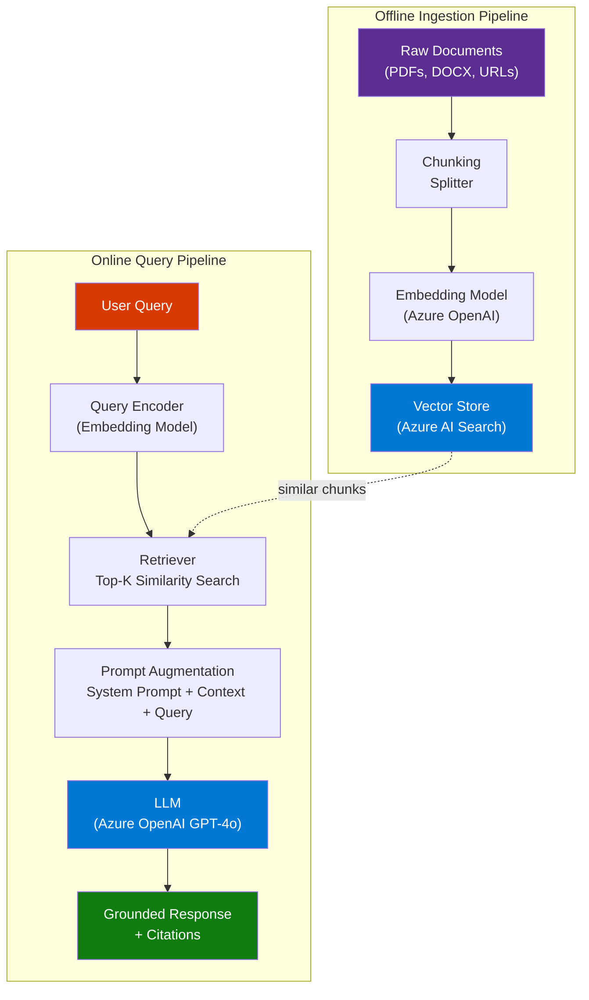
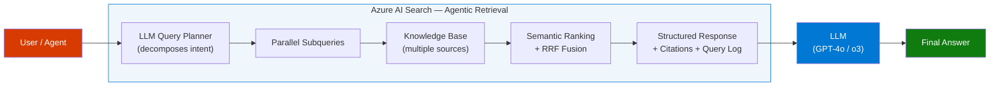
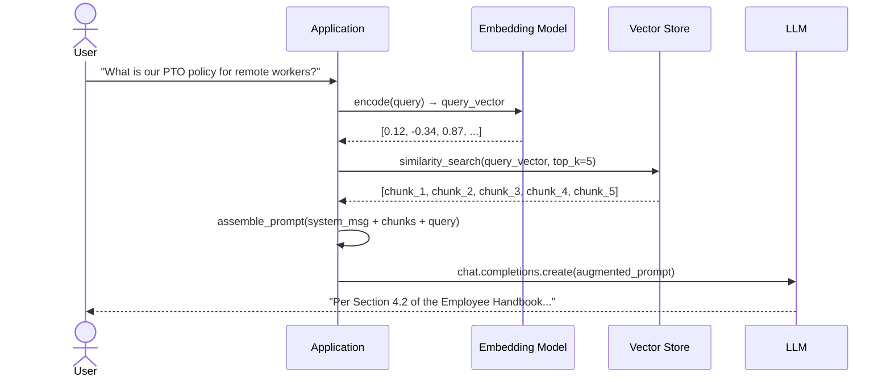

# RAG — Retrieval-Augmented Generation Explained

> **Source:** [YouTube — What is RAG? | Completely Explained in 15 Minutes](https://www.youtube.com/watch?v=Ty8gcCKuwNI)
> **Topic:** RAG, LLM, Vector Search, Generative AI, Azure AI Search, Agentic AI
> **Key Claim:** RAG eliminates hallucinations and knowledge cutoff limitations without retraining the LLM — by grounding responses in real-time retrieved content.

---

## Table of Contents

1. [Overview](#1-overview)
2. [Problem Statement](#2-problem-statement)
3. [Core Concepts](#3-core-concepts)
4. [Architecture](#4-architecture)
5. [Key Components](#5-key-components)
6. [How It Works — Step by Step](#6-how-it-works--step-by-step)
7. [Comparison Table](#7-comparison-table)
8. [Code Examples](#8-code-examples)
9. [Configuration Reference](#9-configuration-reference)
10. [Best Practices](#10-best-practices)
11. [Interview Talking Points](#11-interview-talking-points)
12. [Learning Resources](#12-learning-resources)

---

## 1. Overview

Retrieval-Augmented Generation (RAG) is a hybrid AI pattern that extends Large Language Models by dynamically fetching relevant external content at inference time and injecting it into the LLM's prompt context before generating a response. Unlike fine-tuning, RAG does not modify model weights — it supplements the model's parametric knowledge with fresh, domain-specific, non-parametric memory retrieved from an external knowledge base. This makes RAG the dominant pattern for enterprise AI assistants, internal knowledge chatbots, and any domain where accuracy and currency are non-negotiable. The concept was introduced in a 2020 research paper and has since become foundational for production AI systems using Azure OpenAI, LangChain, Semantic Kernel, and Azure AI Search.

---

## 2. Problem Statement

LLMs alone are insufficient for enterprise use because they rely entirely on what they learned during training — which is always finite, potentially outdated, and never specific to your organization.

### Classic LLM Pain Points

| Problem | Impact |
|---|---|
| **Training cutoff** | Model cannot answer about events after its cutoff date |
| **Hallucination** | Model confidently generates plausible-but-wrong facts |
| **No proprietary data** | Model never saw your internal docs, policies, or databases |
| **No source attribution** | Responses cannot be verified — zero traceability |
| **Retraining is expensive** | Fine-tuning costs time, money, and expertise |
| **No dynamic updates** | Model is static — changes in reality don't reflect without retraining |

> **Key Insight:** "When Google demonstrated Bard and it produced incorrect facts about the James Webb Space Telescope, Google's stock dropped $100 billion in a single day — the cost of an LLM hallucinating without grounding."

---

## 3. Core Concepts

### Parametric Memory
Knowledge baked into the LLM's weights during training. It's static, broad, and generalizable — but frozen at the training cutoff and unaware of your private data.

### Non-Parametric Memory
External knowledge retrieved at query time from a vector database, document store, or search index. It's dynamic, domain-specific, and continuously updatable without touching the model.

### Embeddings
Numerical vector representations of text (e.g., 1536-dimensional floats for `text-embedding-ada-002`). Semantically similar text produces similar vectors — enabling meaning-based search rather than keyword matching.

### Vector Database
A specialized store optimized for nearest-neighbor similarity search over high-dimensional embedding vectors. Examples: Azure AI Search (vector mode), Qdrant, Pinecone, Weaviate, pgvector.

### Chunking
The process of splitting large documents into smaller segments (chunks) before embedding. Chunk size affects retrieval precision — too large wastes tokens, too small loses context.

### Hybrid Search
Combining keyword (BM25) and vector (cosine similarity) search in a single query to maximize recall. Azure AI Search uses Reciprocal Rank Fusion (RRF) to merge the two result sets.

### Semantic Ranking
A re-ranking step that uses a cross-encoder model to re-score retrieved chunks based on semantic relevance to the original query — runs after initial retrieval, before sending to the LLM.

---

## 4. Architecture

### Classic RAG Architecture



### Agentic RAG Architecture (Azure AI Search)



---

## 5. Key Components

| Component | Service / Tool | Role |
|---|---|---|
| **Document Store** | Azure Blob Storage, SharePoint | Source of raw content to be indexed |
| **Chunker** | Azure AI Search Skills, LangChain `RecursiveCharacterTextSplitter` | Splits documents into retrieval-sized units |
| **Embedding Model** | Azure OpenAI `text-embedding-3-large` | Converts text to dense vectors |
| **Vector Index** | Azure AI Search (vector fields) | Stores and retrieves embeddings via ANN search |
| **Retriever** | Azure AI Search query engine | Performs hybrid BM25 + vector search |
| **Semantic Ranker** | Azure AI Search `semanticConfiguration` | Re-ranks top-50 results using cross-encoder |
| **Prompt Augmenter** | Application code / Semantic Kernel | Injects retrieved chunks into LLM system prompt |
| **LLM** | Azure OpenAI GPT-4o / o3 | Synthesizes grounded response from augmented context |
| **Orchestrator** | Semantic Kernel, LangChain, Azure AI Foundry Agents | Coordinates the full pipeline end-to-end |

### Azure AI Search — Two RAG Modes

**Classic RAG:** Your application sends one query → Azure AI Search returns ranked chunks → app assembles prompt → calls LLM. Simple, fully GA, fast.

**Agentic Retrieval (Preview):** Azure AI Search itself calls an LLM to decompose the query into subqueries, executes them in parallel across knowledge sources, and returns a structured grounding response with built-in citations. Best for complex, conversational, multi-source scenarios.

---

## 6. How It Works — Step by Step



### Step-by-Step Breakdown

1. **User submits a natural language query** — conversational, vague, or complex.
2. **Query embedding** — the same embedding model used during ingestion encodes the query into a vector. Crucially, it must be the *same model* used at indexing time.
3. **Similarity search** — the vector store finds the K most semantically similar chunks using Approximate Nearest Neighbor (ANN) search (e.g., HNSW algorithm).
4. **Hybrid boost (optional)** — BM25 keyword results are merged with vector results via RRF for maximum recall.
5. **Semantic re-ranking (optional)** — top-50 results are re-scored by a cross-encoder for precision.
6. **Prompt augmentation** — retrieved chunks are injected into the LLM prompt as context. The system prompt typically instructs the LLM to answer *only* from the provided context.
7. **LLM generation** — the LLM reads the augmented prompt and synthesizes a grounded, attributed response.
8. **Response with citations** — references to source documents are returned alongside the answer for verifiability.

---

## 7. Comparison Table

| Dimension | Classic LLM (No RAG) | Classic RAG | Agentic RAG |
|---|---|---|---|
| **Knowledge source** | Training data only | External vector index | Multiple knowledge sources |
| **Query type** | Single turn | Single query | Decomposed subqueries (parallel) |
| **Hallucination risk** | High | Low | Very Low |
| **Proprietary data** | No | Yes | Yes |
| **Real-time updates** | No | Yes (re-index) | Yes |
| **Source attribution** | None | Manual linking | Built-in citations + query log |
| **Cost to update** | Retrain ($$$) | Re-index (cheap) | Re-index (cheap) |
| **Azure feature** | Azure OpenAI only | Azure AI Search + OpenAI | Azure AI Search Agentic Retrieval |
| **Complexity** | Lowest | Medium | Higher |
| **Best for** | General chat | Simpler Q&A | Complex enterprise agents |
| **GA status** | GA | GA | Preview |

---

## 8. Code Examples

### Python — Classic RAG with Azure AI Search + Azure OpenAI

```python
import os
from azure.search.documents import SearchClient
from azure.search.documents.models import VectorizedQuery
from azure.core.credentials import AzureKeyCredential
from openai import AzureOpenAI

# --- Config ---
SEARCH_ENDPOINT = os.environ["AZURE_SEARCH_ENDPOINT"]
SEARCH_KEY      = os.environ["AZURE_SEARCH_KEY"]
INDEX_NAME      = "rag-index"
OPENAI_ENDPOINT = os.environ["AZURE_OPENAI_ENDPOINT"]
OPENAI_KEY      = os.environ["AZURE_OPENAI_KEY"]
EMBED_DEPLOYMENT = "text-embedding-3-large"
CHAT_DEPLOYMENT  = "gpt-4o"

# --- Clients ---
search_client = SearchClient(SEARCH_ENDPOINT, INDEX_NAME, AzureKeyCredential(SEARCH_KEY))
openai_client = AzureOpenAI(azure_endpoint=OPENAI_ENDPOINT, api_key=OPENAI_KEY, api_version="2024-05-01-preview")

def embed(text: str) -> list[float]:
    return openai_client.embeddings.create(model=EMBED_DEPLOYMENT, input=text).data[0].embedding

def retrieve(query: str, top_k: int = 5) -> list[str]:
    query_vector = embed(query)
    vector_query = VectorizedQuery(vector=query_vector, k_nearest_neighbors=top_k, fields="content_vector")
    results = search_client.search(
        search_text=query,           # BM25 keyword leg
        vector_queries=[vector_query],  # vector leg
        query_type="semantic",
        semantic_configuration_name="my-semantic-config",
        top=top_k,
        select=["content", "title", "source_url"]
    )
    return [f"[{r['title']}]\n{r['content']}" for r in results]

def rag_answer(user_query: str) -> str:
    chunks = retrieve(user_query)
    context = "\n\n---\n\n".join(chunks)
    messages = [
        {"role": "system", "content": (
            "You are a helpful assistant. Answer the question using ONLY the provided context. "
            "If the answer is not in the context, say 'I don't have enough information.' "
            "Always cite the source title.\n\nCONTEXT:\n" + context
        )},
        {"role": "user", "content": user_query}
    ]
    response = openai_client.chat.completions.create(model=CHAT_DEPLOYMENT, messages=messages, temperature=0)
    return response.choices[0].message.content

# --- Usage ---
print(rag_answer("What is our PTO policy for remote workers hired after 2023?"))
```

### Python — Document Ingestion (Chunk + Embed + Index)

```python
from azure.search.documents import SearchClient
from azure.search.documents.indexes import SearchIndexClient
from azure.search.documents.indexes.models import (
    SearchIndex, SimpleField, SearchField, SearchFieldDataType,
    VectorSearch, HnswAlgorithmConfiguration, VectorSearchProfile, SemanticConfiguration,
    SemanticSearch, SemanticPrioritizedFields, SemanticField
)
import uuid

def chunk_text(text: str, chunk_size: int = 512, overlap: int = 64) -> list[str]:
    words = text.split()
    chunks = []
    for i in range(0, len(words), chunk_size - overlap):
        chunks.append(" ".join(words[i:i + chunk_size]))
    return chunks

def ingest_document(title: str, text: str, source_url: str):
    chunks = chunk_text(text)
    docs = []
    for chunk in chunks:
        vector = embed(chunk)
        docs.append({
            "id": str(uuid.uuid4()),
            "title": title,
            "content": chunk,
            "source_url": source_url,
            "content_vector": vector
        })
    search_client.upload_documents(documents=docs)
    print(f"Indexed {len(docs)} chunks from '{title}'")
```

### Install / Setup

```bash
pip install azure-search-documents openai azure-identity

# Environment variables
export AZURE_SEARCH_ENDPOINT="https://<your-service>.search.windows.net"
export AZURE_SEARCH_KEY="<your-admin-key>"
export AZURE_OPENAI_ENDPOINT="https://<your-resource>.openai.azure.com"
export AZURE_OPENAI_KEY="<your-api-key>"
```

---

## 9. Configuration Reference

### Azure AI Search Index — Key Parameters

| Parameter | Type | Recommended Value | Description |
|---|---|---|---|
| `dimensions` | int | `3072` (text-embedding-3-large) | Vector field dimensionality — must match embedding model |
| `kind` (algorithm) | string | `"hnsw"` | Approximate Nearest Neighbor algorithm |
| `m` (HNSW) | int | `4` | Number of bi-directional links in the HNSW graph |
| `efConstruction` | int | `400` | Build-time search width — higher = better quality, slower indexing |
| `efSearch` | int | `500` | Query-time search width — higher = better recall, slower queries |
| `metric` | string | `"cosine"` | Similarity metric — cosine for normalized embeddings |
| `top_k` | int | `5–10` | Number of chunks retrieved per query |
| `chunk_size` | int | `512–1024` tokens | Larger = more context per chunk, fewer chunks returned |
| `chunk_overlap` | int | `64–128` tokens | Prevents losing context at chunk boundaries |
| `semantic_config` | string | `"my-semantic-config"` | Enables semantic re-ranking on top-50 results |

---

## 10. Best Practices

### Chunking Strategy
- ✅ Use overlapping chunks (64–128 token overlap) to avoid losing cross-boundary context
- ✅ Chunk at semantic boundaries (paragraphs, sections) not arbitrary character counts
- ✅ Store metadata (title, source URL, section heading) alongside each chunk for citations
- ❌ Don't use chunks larger than 1024 tokens — they waste LLM context and reduce retrieval precision
- ❌ Don't chunk tables or lists mid-row — parse structured content as whole units

### Retrieval Quality
- ✅ Always use hybrid search (BM25 + vector) — outperforms either alone by 10–20%
- ✅ Add semantic ranking for high-accuracy use cases — it's a free re-rank step in Azure AI Search
- ✅ Use the same embedding model at ingest and query time — mixing models breaks similarity
- ❌ Don't rely on top-1 retrieval — always retrieve at least top-5 to handle edge cases
- ❌ Don't skip security trimming — filter results by user permissions before sending to LLM

### Prompt Augmentation
- ✅ Instruct the LLM explicitly to answer ONLY from provided context
- ✅ Include source titles in context so the LLM can generate citations
- ✅ Set `temperature=0` for factual Q&A tasks — deterministic outputs are more trustworthy
- ❌ Don't dump 50 chunks into the prompt — token limits degrade quality after ~10k tokens
- ❌ Don't trust the LLM to self-cite — build citation extraction into your retrieval pipeline

### Architecture
- ✅ For new projects: use Agentic Retrieval (Azure AI Search preview) — better accuracy out of the box
- ✅ For existing classic RAG: migrate to agentic retrieval to gain parallel subquery execution
- ✅ Use Foundry IQ as the knowledge layer for multi-agent systems
- ❌ Don't re-embed queries with a different model than used at index time
- ❌ Don't skip incremental re-indexing — stale chunks are as bad as no RAG

---

## 11. Interview Talking Points

### "What is RAG and why does it matter?"

> RAG — Retrieval-Augmented Generation — is the pattern of retrieving relevant documents from an external knowledge base and injecting them into an LLM's prompt before generation. It matters because LLMs have a training cutoff and no access to proprietary data, meaning they hallucinate when asked domain-specific or current questions. RAG fixes both problems cheaply: no retraining needed, you just update the index. In production Azure systems, this is typically implemented with Azure AI Search as the retriever and Azure OpenAI as the generator.

### "How does RAG prevent hallucination?"

> Hallucination happens when the LLM has no grounding data and fabricates plausible-sounding facts from its parametric memory. RAG prevents this by explicitly injecting relevant source documents into the prompt context and instructing the LLM to answer only from what's provided. If the answer isn't in the retrieved chunks, a well-prompted RAG system returns "I don't have enough information" rather than hallucinating. You can further reduce hallucinations by using semantic ranking to ensure only the most relevant chunks are sent, reducing noise in the context.

### "What is the difference between Classic RAG and Agentic RAG?"

> Classic RAG is a single-shot pattern: your application sends one query to a retriever, gets back ranked chunks, assembles a prompt, and calls the LLM. It's simple, GA, and fast. Agentic RAG — Azure AI Search's new approach — uses an LLM inside the retrieval layer itself to decompose complex queries into multiple focused subqueries, execute them in parallel across multiple knowledge sources, and return a structured response with built-in citations and a query activity log. Agentic RAG trades some latency for dramatically better accuracy on conversational, multi-faceted questions. For new enterprise chatbots I'd default to agentic retrieval; for simple, single-domain Q&A, classic RAG is fine.

### "What are the key components of a RAG pipeline?"

> There are three major phases. First, offline ingestion: raw documents are chunked, embedded using a model like `text-embedding-3-large`, and stored in a vector index like Azure AI Search. Second, online retrieval: the user's query is embedded with the same model, similarity search retrieves top-K semantically relevant chunks, optionally re-ranked by a semantic ranker. Third, generation: the chunks are injected into the LLM's prompt as context alongside a system instruction to answer only from the provided content. The LLM synthesizes a grounded response with source attribution.

### "How do you choose chunk size for RAG?"

> Chunk size is a precision-recall trade-off. Smaller chunks (256–512 tokens) improve retrieval precision — the retrieved chunk is tightly focused on one concept — but may miss surrounding context. Larger chunks (1024+ tokens) preserve more context per retrieval but reduce diversity in the top-K results and waste LLM tokens. The industry standard is 512-token chunks with 64–128 token overlap at semantic boundaries (paragraph ends, section headers). In Azure AI Search, you can also use the built-in document layout skill to chunk PDFs preserving their natural structure. Always test empirically with your specific data — chunk size has the highest impact on RAG answer quality.

---

## 12. Learning Resources

| Resource | Link | Type |
|---|---|---|
| YouTube — RAG Explained in 15 Minutes | [Watch](https://www.youtube.com/watch?v=Ty8gcCKuwNI) | Video |
| Microsoft Learn — RAG and Azure AI Search | [learn.microsoft.com](https://learn.microsoft.com/en-us/azure/search/retrieval-augmented-generation-overview) | Official Docs |
| AWS — What is RAG? | [aws.amazon.com](https://aws.amazon.com/what-is/retrieval-augmented-generation/) | Official Docs |
| IBM — What is RAG? | [ibm.com](https://www.ibm.com/think/topics/retrieval-augmented-generation) | Article |
| Azure Samples — RAG with Azure OpenAI (Python) | [GitHub](https://github.com/Azure-Samples/azure-search-openai-demo) | Code |
| Azure Samples — Classic RAG | [GitHub](https://github.com/Azure-Samples/azure-search-classic-rag) | Code |
| Agentic Retrieval Overview | [learn.microsoft.com](https://learn.microsoft.com/en-us/azure/search/agentic-retrieval-overview) | Official Docs |
| Foundry IQ — Future of RAG | [YouTube](https://www.youtube.com/watch?v=slDdNIQCJBQ) | Video |

---

*Last Updated: June 2026 | Source: YouTube — What is RAG? Completely Explained in 15 Minutes*
