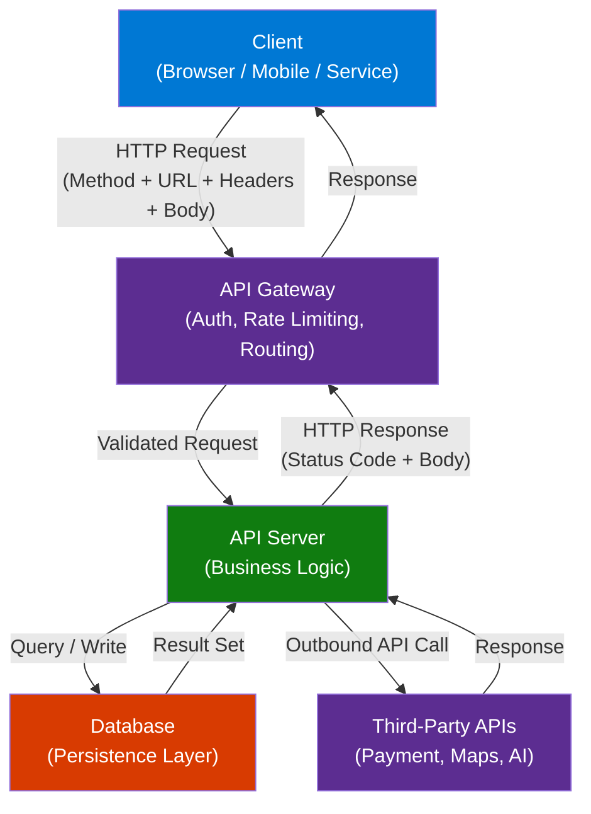
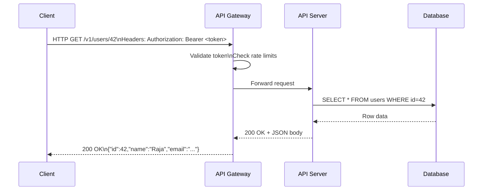

# REST APIs — Complete Crash Course

> **Source:** [YouTube — COMPLETE APIs Crash Course In 14 Minutes \[w/ FREE Project\]](https://www.youtube.com/watch?v=UXA8MJUWUqU)
> **Channel/Event:** Vishakha Sadhwani
> **Topic:** REST API, HTTP Methods, API Design, JSON, Authentication, CRUD, Web Services
> **Key Claim:** Understand how modern software systems, cloud platforms, and AI applications communicate — in 14 minutes

---

## Table of Contents

1. [Overview](#1-overview)
2. [Problem Statement](#2-problem-statement)
3. [Core Concepts](#3-core-concepts)
4. [Architecture](#4-architecture)
5. [Key Components](#5-key-components)
6. [How It Works — Step by Step](#6-how-it-works--step-by-step)
7. [Comparison Table](#7-comparison-table)
8. [Code Examples](#8-code-examples)
9. [Configuration Reference](#9-configuration-reference)
10. [Best Practices](#10-best-practices)
11. [Interview Talking Points](#11-interview-talking-points)
12. [Learning Resources](#12-learning-resources)

---

## 1. Overview

An API (Application Programming Interface) is a contract that defines how two software systems communicate — what requests can be made, in what format, and what responses to expect. REST (Representational State Transfer) is the dominant architectural style for building web APIs, underpinning cloud platforms, microservices, mobile backends, and AI services. This crash course covers the full API lifecycle: concepts, HTTP methods, status codes, request/response anatomy, authentication, and a hands-on project. By the end, you have the vocabulary and pattern recognition needed to design, consume, and debug APIs confidently in interviews and on the job.

---

## 2. Problem Statement

Before APIs, integrating two systems required direct database access, tightly-coupled libraries, or proprietary protocols — none of which scaled.

### Classic Integration Pain Points

| Problem | Impact |
|---|---|
| Tight coupling between systems | A change in one system breaks the other |
| No standard data format | Each integration required custom parsing |
| Security — direct DB access | Credential exposure, no fine-grained authorization |
| No versioning | Breaking changes impossible to manage |
| No discoverability | Developers had no contract to code against |

> **Key Insight:** "An API is a waiter in a restaurant — you tell the waiter what you want, the waiter tells the kitchen, and the kitchen sends back what you ordered. You never enter the kitchen directly."

---

## 3. Core Concepts

### API (Application Programming Interface)
A defined set of rules and protocols that allows one software application to interact with another. APIs abstract internal implementation — callers only need to know the contract (endpoint, method, payload, response).

### REST (Representational State Transfer)
An architectural style (not a protocol) introduced by Roy Fielding in 2000. REST APIs use standard HTTP and treat everything as a *resource* identified by a URL.

### Resource
Any entity exposed via an API — a user, an order, a product, a document. Resources are nouns, not verbs. `/users`, `/orders/123`, `/products` are resources.

### Endpoint
The specific URL path where a resource can be accessed: `https://api.example.com/v1/users/42`. Combines base URL + version + resource path + optional ID.

### JSON (JavaScript Object Notation)
The de facto data format for REST APIs. Lightweight, human-readable, and language-agnostic. Virtually all modern REST APIs send/receive JSON.

### Statelessness
Each HTTP request must contain all information needed to process it — the server holds no session state between calls. State lives in the client (tokens, session IDs sent with every request).

### Idempotency
An operation is idempotent if calling it multiple times produces the same result as calling it once. `GET`, `PUT`, and `DELETE` are idempotent. `POST` is not.

---

## 4. Architecture



---

## 5. Key Components

| Component | Tool/Standard | Role |
|---|---|---|
| HTTP Method | GET / POST / PUT / PATCH / DELETE | Intent of the request |
| URL / Endpoint | RFC 3986 URI | Identifies the resource |
| Request Headers | Authorization, Content-Type, Accept | Metadata about the request |
| Request Body | JSON / XML / form-data | Payload sent to the server |
| Status Code | 2xx / 4xx / 5xx | Outcome signal |
| Response Body | JSON | Data returned to caller |
| Authentication | API Key / JWT / OAuth 2.0 | Identity and authorization |
| API Gateway | Kong / APIM / AWS API GW | Cross-cutting concerns |
| Versioning | `/v1/`, `/v2/` in path | Backwards compatibility |

### HTTP Methods Deep Dive

| Method | CRUD | Idempotent | Has Body | Use |
|---|---|---|---|---|
| `GET` | Read | Yes | No | Retrieve resource(s) |
| `POST` | Create | No | Yes | Create a new resource |
| `PUT` | Replace | Yes | Yes | Replace entire resource |
| `PATCH` | Update | No | Yes | Partial update of resource |
| `DELETE` | Delete | Yes | Optional | Remove a resource |
| `HEAD` | Read | Yes | No | GET without response body |
| `OPTIONS` | — | Yes | No | CORS preflight, capability check |

### HTTP Status Codes

| Range | Category | Common Codes |
|---|---|---|
| `1xx` | Informational | `100 Continue` |
| `2xx` | Success | `200 OK`, `201 Created`, `204 No Content` |
| `3xx` | Redirection | `301 Moved Permanently`, `304 Not Modified` |
| `4xx` | Client Error | `400 Bad Request`, `401 Unauthorized`, `403 Forbidden`, `404 Not Found`, `422 Unprocessable Entity`, `429 Too Many Requests` |
| `5xx` | Server Error | `500 Internal Server Error`, `502 Bad Gateway`, `503 Service Unavailable` |

---

## 6. How It Works — Step by Step



### Step-by-Step Breakdown

1. **Client forms the request** — selects HTTP method, constructs the endpoint URL, attaches headers (auth token, content-type), and optionally adds a JSON body.
2. **API Gateway intercepts** — validates the auth token, checks rate limits (e.g., 1000 req/min), logs the request, and routes to the correct backend service.
3. **Server processes** — applies business logic (validation, transformation) and queries or writes to the database.
4. **Database responds** — returns raw data to the server layer.
5. **Server serializes** — converts data to JSON and attaches the appropriate HTTP status code.
6. **Client receives response** — parses the JSON body and handles success (`2xx`) or error (`4xx`/`5xx`) states.

---

## 7. Comparison Table

| Dimension | SOAP / RPC | REST |
|---|---|---|
| Protocol | SOAP over HTTP/HTTPS | Pure HTTP |
| Data Format | XML only | JSON, XML, CSV, any |
| Contract | WSDL (strict) | OpenAPI/Swagger (optional) |
| Coupling | Tight | Loose |
| State | Stateful possible | Stateless by design |
| Learning curve | High | Low |
| Performance | Heavier | Lighter |
| Caching | Complex | Native HTTP caching |
| Use case | Enterprise/banking legacy | Web, mobile, microservices |
| Error handling | SOAP Fault (verbose) | HTTP status codes |

| Dimension | REST | GraphQL | gRPC |
|---|---|---|---|
| Fetching | Fixed endpoints | Query-driven | Protobuf contracts |
| Over-fetching | Common | Eliminated | N/A |
| Versioning | URL versioning needed | Schema evolution | Proto versioning |
| Performance | Good | Good | Best |
| Best for | CRUD APIs | Complex data graphs | Internal microservices |

---

## 8. Code Examples

### Python — Consuming a REST API with `requests`

```python
import requests

BASE_URL = "https://jsonplaceholder.typicode.com"

# GET — Fetch a user
response = requests.get(f"{BASE_URL}/users/1")
print(response.status_code)   # 200
user = response.json()
print(user["name"])            # Leanne Graham

# POST — Create a resource
new_post = {
    "title": "API Crash Course",
    "body": "REST is the standard for web APIs",
    "userId": 1
}
response = requests.post(
    f"{BASE_URL}/posts",
    json=new_post,
    headers={"Content-Type": "application/json"}
)
print(response.status_code)   # 201
print(response.json())         # {"id": 101, "title": "API Crash Course", ...}

# PUT — Full update
updated_post = {"id": 1, "title": "Updated Title", "body": "Updated body", "userId": 1}
response = requests.put(f"{BASE_URL}/posts/1", json=updated_post)
print(response.status_code)   # 200

# PATCH — Partial update
response = requests.patch(f"{BASE_URL}/posts/1", json={"title": "Patched Title"})
print(response.status_code)   # 200

# DELETE — Remove resource
response = requests.delete(f"{BASE_URL}/posts/1")
print(response.status_code)   # 200
```

### Python — Building a REST API with FastAPI

```python
from fastapi import FastAPI, HTTPException
from pydantic import BaseModel
from typing import Optional

app = FastAPI()

# In-memory store (replace with DB in prod)
users_db: dict[int, dict] = {}
counter = 1

class User(BaseModel):
    name: str
    email: str

class UserUpdate(BaseModel):
    name: Optional[str] = None
    email: Optional[str] = None

@app.get("/v1/users/{user_id}")
def get_user(user_id: int):
    if user_id not in users_db:
        raise HTTPException(status_code=404, detail="User not found")
    return users_db[user_id]

@app.post("/v1/users", status_code=201)
def create_user(user: User):
    global counter
    users_db[counter] = {"id": counter, **user.dict()}
    counter += 1
    return users_db[counter - 1]

@app.patch("/v1/users/{user_id}")
def update_user(user_id: int, update: UserUpdate):
    if user_id not in users_db:
        raise HTTPException(status_code=404, detail="User not found")
    for field, value in update.dict(exclude_none=True).items():
        users_db[user_id][field] = value
    return users_db[user_id]

@app.delete("/v1/users/{user_id}", status_code=204)
def delete_user(user_id: int):
    if user_id not in users_db:
        raise HTTPException(status_code=404, detail="User not found")
    del users_db[user_id]
```

### JavaScript — Fetch API (Browser / Node)

```javascript
const BASE_URL = "https://jsonplaceholder.typicode.com";

// GET with async/await
async function getUser(id) {
  const response = await fetch(`${BASE_URL}/users/${id}`);
  if (!response.ok) throw new Error(`HTTP error! status: ${response.status}`);
  const user = await response.json();
  console.log(user.name);
  return user;
}

// POST with JSON body
async function createPost(data) {
  const response = await fetch(`${BASE_URL}/posts`, {
    method: "POST",
    headers: {
      "Content-Type": "application/json",
      "Authorization": "Bearer YOUR_TOKEN_HERE"
    },
    body: JSON.stringify(data)
  });
  return response.json();
}

// Usage
getUser(1).then(console.log);
createPost({ title: "Hello API", body: "First post", userId: 1 }).then(console.log);
```

### Install / Setup

```bash
# Python — install requests + FastAPI
pip install requests fastapi uvicorn

# Run FastAPI server
uvicorn main:app --reload --port 8000

# Test with curl
curl -X GET http://localhost:8000/v1/users/1
curl -X POST http://localhost:8000/v1/users \
  -H "Content-Type: application/json" \
  -d '{"name":"Raja","email":"raja@example.com"}'
curl -X DELETE http://localhost:8000/v1/users/1

# Node.js — no install needed (fetch built-in from Node 18+)
node --version   # v18+
```

---

## 9. Configuration Reference

### Common Request Headers

| Header | Type | Example | Description |
|---|---|---|---|
| `Authorization` | string | `Bearer eyJ...` | Auth token (JWT/OAuth) |
| `Content-Type` | string | `application/json` | Format of request body |
| `Accept` | string | `application/json` | Expected response format |
| `X-API-Key` | string | `sk-abc123` | API key authentication |
| `X-Request-ID` | UUID | `550e8400-...` | Distributed tracing ID |
| `Cache-Control` | string | `no-cache` | Caching directive |

### URL Structure Breakdown

```
https://api.example.com/v1/users/42?fields=name,email&include=orders

├── https://           → Scheme (always HTTPS in production)
├── api.example.com    → Base URL / Host
├── /v1/               → API Version
├── users/             → Resource collection
├── 42                 → Resource ID (path parameter)
└── ?fields=name,email → Query parameters (filtering, pagination)
    &include=orders
```

### Authentication Patterns

| Type | How It Works | Best For |
|---|---|---|
| API Key | Static key in header or query param | Simple server-to-server |
| Basic Auth | Base64(username:password) in header | Legacy systems |
| Bearer Token | JWT in Authorization header | Stateless, scalable |
| OAuth 2.0 | Token exchange via auth server | Third-party delegated access |
| mTLS | Mutual certificate authentication | High-security internal APIs |

---

## 10. Best Practices

### URL Design
- ✅ Use nouns for resources: `/users`, `/orders`
- ✅ Use HTTP method to express action: `DELETE /users/42` not `/deleteUser/42`
- ✅ Use plural nouns: `/users` not `/user`
- ✅ Version your API: `/v1/users`
- ❌ Don't use verbs in URLs: `/getUser`, `/createOrder`
- ❌ Don't use underscores: `/user_orders` → use `/user-orders` or `/users/{id}/orders`

### Status Codes
- ✅ Return `201 Created` with the new resource body on POST success
- ✅ Return `204 No Content` on DELETE success (no body needed)
- ✅ Return `422 Unprocessable Entity` for validation errors with error details
- ❌ Don't return `200 OK` for errors (anti-pattern seen in legacy SOAP-era APIs)
- ❌ Don't return bare `500` without a log correlation ID

### Security
- ✅ Always use HTTPS — never HTTP in production
- ✅ Validate and sanitize all inputs server-side
- ✅ Implement rate limiting (e.g., 1000 req/min per API key)
- ✅ Return minimal data — never expose internal IDs, passwords, or stack traces
- ❌ Don't embed secrets in URLs (`?api_key=...` shows in logs)
- ❌ Don't trust client-provided IDs without authorization checks

### Performance
- ✅ Support pagination: `?page=2&limit=20` or cursor-based
- ✅ Support field selection: `?fields=id,name` to reduce payload
- ✅ Use ETags for conditional GET (304 Not Modified)
- ✅ Cache GET responses at the gateway layer
- ❌ Don't return unbounded lists — always paginate collections

---

## 11. Interview Talking Points

### "What is REST and what are its constraints?"

> REST is an architectural style defined by Roy Fielding in 2000. It has 6 constraints: (1) **Client-Server** — separation of concerns; (2) **Stateless** — each request is self-contained, no session on the server; (3) **Cacheable** — responses declare if they can be cached; (4) **Uniform Interface** — consistent use of HTTP methods and URIs; (5) **Layered System** — client doesn't know if it's talking to the server or a gateway/cache; (6) **Code on Demand** (optional) — server can send executable code. In practice, statelessness and uniform interface are the two that most interviews probe on.

---

### "What is the difference between PUT and PATCH?"

> `PUT` replaces the *entire* resource — if you omit fields, they are cleared/nulled. `PATCH` does a *partial* update — only the fields you send are changed. Both are idempotent in intent (calling them multiple times yields the same result), though `PATCH` is not technically guaranteed to be idempotent without care in implementation. Use `PUT` when you always send the full resource; use `PATCH` for lightweight field-level updates.

---

### "What is the difference between 401 and 403?"

> `401 Unauthorized` means the request has no valid credentials — the client is *unauthenticated* (despite the misleading name). It signals: "I don't know who you are; provide a token." `403 Forbidden` means credentials are valid (I know who you are) but you are *unauthorized* to access this resource. Practically: 401 → trigger a login; 403 → show "access denied."

---

### "How do you version a REST API?"

> Three main strategies: (1) **URL versioning** — `/v1/users`, most common and visible; (2) **Header versioning** — `Accept: application/vnd.myapi.v2+json`; (3) **Query param** — `?version=2`. URL versioning is the most pragmatic for interviews — explicit, easy to route, and easy to deprecate. The key principle is that breaking changes (removing fields, changing response shapes) must bump the version. Non-breaking additions can be made without a version bump.

---

### "What is idempotency and why does it matter in API design?"

> An operation is idempotent if making the same request multiple times has the same effect as making it once. `GET`, `PUT`, and `DELETE` should be idempotent — e.g., deleting a resource twice should return 200 then 404, not create side effects. `POST` is not idempotent — submitting a form twice creates two records. Idempotency matters for reliability: clients can safely retry on network failure without fear of duplicate side effects. For `POST` operations requiring idempotency, use an `Idempotency-Key` header (as Stripe does).

---

### "How would you secure a REST API?"

> Five layers: (1) **Transport** — HTTPS only, enforce HSTS; (2) **Authentication** — API keys for server-to-server, JWT/OAuth 2.0 for user-facing; (3) **Authorization** — check permissions server-side on every request, never trust client-provided roles; (4) **Input validation** — sanitize all inputs to prevent injection; (5) **Rate limiting** — throttle by API key or IP to prevent abuse. For public-facing APIs, also add CORS policies, request size limits, and API gateway-level DDoS protection.

---

## 12. Learning Resources

| Resource | Link | Type |
|---|---|---|
| YouTube Crash Course | [COMPLETE APIs Crash Course — Vishakha Sadhwani](https://www.youtube.com/watch?v=UXA8MJUWUqU) | Video |
| MDN — Introduction to Web APIs | [developer.mozilla.org](https://developer.mozilla.org/en-US/docs/Learn_web_development/Extensions/Client-side_APIs/Introduction) | Official Docs |
| MDN — Fetch API | [developer.mozilla.org/Fetch_API](https://developer.mozilla.org/en-US/docs/Web/API/Fetch_API) | Official Docs |
| FastAPI Docs | [fastapi.tiangolo.com](https://fastapi.tiangolo.com/) | Framework Docs |
| JSONPlaceholder (Free Test API) | [jsonplaceholder.typicode.com](https://jsonplaceholder.typicode.com/) | Practice |
| HTTP Status Codes Reference | [developer.mozilla.org/HTTP/Status](https://developer.mozilla.org/en-US/docs/Web/HTTP/Status) | Reference |
| OpenAPI Specification | [swagger.io/specification](https://swagger.io/specification/) | Specification |
| RFC 7231 — HTTP Semantics | [tools.ietf.org/html/rfc7231](https://tools.ietf.org/html/rfc7231) | RFC |

---

*Last Updated: June 2026 | Source: Vishakha Sadhwani — COMPLETE APIs Crash Course In 14 Minutes*
