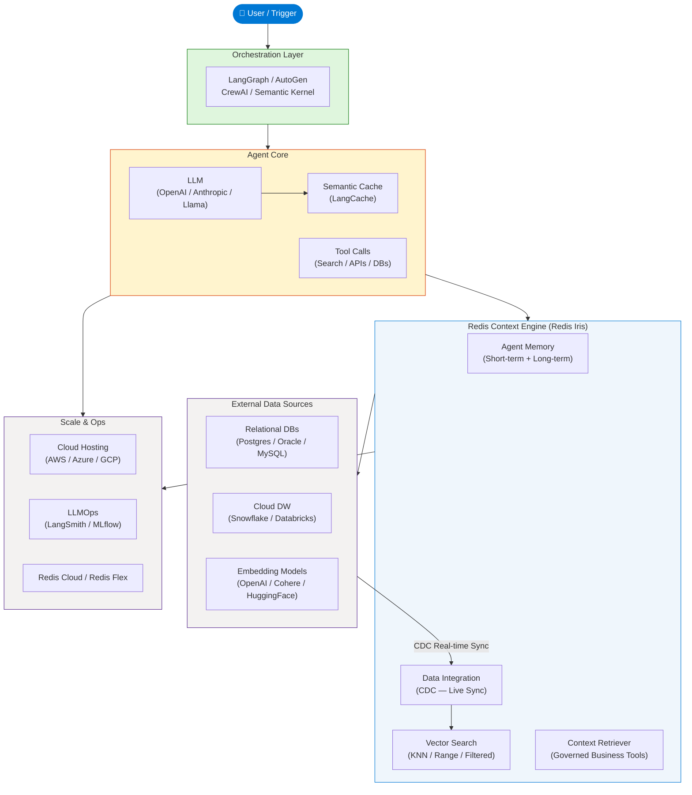
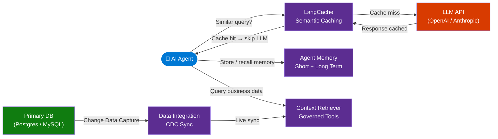
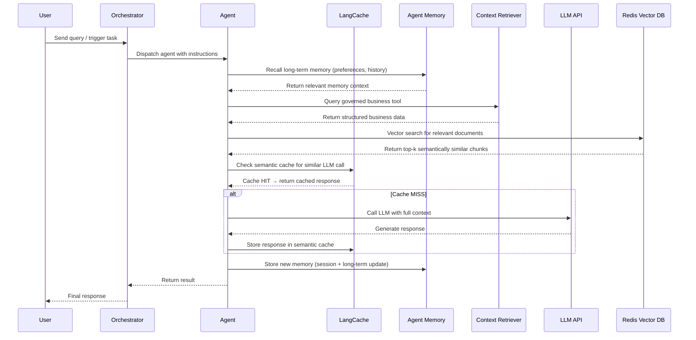

# Redis for AI Agents

> **Source:** [YouTube — Redis for AI Agents](https://www.youtube.com/watch?v=qhsVMiBjxM0)
> **Channel/Event:** Redis
> **Topic:** Redis, AI Agents, Vector Search, Semantic Caching, Agent Memory, RAG, LangGraph, Context Engine
> **Key Claim:** Redis sub-millisecond in-memory architecture is the purpose-built foundation for production AI agents at scale

---

## Table of Contents

1. [Overview](#1-overview)
2. [Problem Statement](#2-problem-statement)
3. [Core Concepts](#3-core-concepts)
4. [Architecture](#4-architecture)
5. [Key Components](#5-key-components)
6. [How It Works — Step by Step](#6-how-it-works--step-by-step)
7. [Comparison Table](#7-comparison-table)
8. [Code Examples](#8-code-examples)
9. [Configuration Reference](#9-configuration-reference)
10. [Best Practices](#10-best-practices)
11. [Interview Talking Points](#11-interview-talking-points)
12. [Learning Resources](#12-learning-resources)

---

## 1. Overview

Redis for AI Agents positions Redis as the real-time infrastructure backbone for agentic systems — providing fast vector search, persistent two-tier memory, semantic caching, and live data synchronization in a single platform. Unlike traditional databases, Redis is purpose-built for the speed and structure that AI agents demand: sub-millisecond reads/writes that prevent latency compounding across multi-step agent pipelines. The **Redis Context Engine (Redis Iris)** unifies four managed services — LangCache, Agent Memory, Context Retriever, and Data Integration — that together give agents fresh, relevant, governed context at inference time. The result is agents that are faster, cheaper to run, and capable of maintaining consistent memory across sessions at production scale.

---

## 2. Problem Statement

AI agents fail in production for predictable infrastructure reasons: data is fragmented across systems, memory is lost between sessions, LLM API costs spiral with repeated queries, and latency compounds at every step in a multi-agent pipeline.

### Classic Approach Pain Points

| Problem | Impact |
|---|---|
| No persistent memory | Agent forgets context between sessions; users repeat themselves |
| Repeated LLM calls for similar queries | Cost spirals; "How do I reset my password?" hits the LLM 10,000× |
| Fragmented data across Snowflake, Oracle, Postgres | Agent cannot access live business data reliably |
| High latency at each hop | Multi-step pipeline: 5 hops × 200ms = 1s minimum; degrades UX |
| No governed tool access | Agents hallucinate answers when business data is inaccessible |
| Vector DB separate from app DB | Extra network hop, operational complexity, stale data |

> **Key Insight:** "Latency is not additive in agentic systems — it is multiplicative. Design for real-time from step one."

---

## 3. Core Concepts

### AI Agent
An individual actor that completes a specific task using a GenAI model. It can decide which steps to take, call external tools, and evaluate intermediary results before returning output — not just respond to a single prompt.

### Agentic System
Multiple agents or components working together, orchestrated by frameworks like LangGraph, AutoGen, or CrewAI. Decomposes complex tasks into component pieces for better control and output quality.

### RAG (Retrieval Augmented Generation)
Technique where unstructured/structured data is converted to vector embeddings capturing semantic meaning, stored in a vector database, then retrieved to ground and augment LLM responses with factual context.

### Semantic Caching
Storing LLM responses keyed by semantic similarity rather than exact string match. When a new query is semantically close to a cached query, the stored response is returned — bypassing the LLM entirely. Can reduce LLM API costs by up to 90%.

### Context Engineering
The discipline of designing exactly what an LLM receives at inference time — including four core operations: retrieval, compression, formatting, and freshness. Redis provides the infrastructure for all four operations.

### Two-Tier Agent Memory
- **Short-term (session) memory**: Stores task-duration info (user inputs, tool call results) for fast retrieval within a session
- **Long-term (persistent) memory**: Survives across sessions — retains user preferences, past queries, evolving objectives

---

## 4. Architecture

### High-Level Agent Infrastructure



### Redis Context Engine (Redis Iris) — Internal



---

## 5. Key Components

| Component | Service / Tool | Role |
|---|---|---|
| **Redis Iris** | Context Engine (managed) | Unified real-time context platform for AI agents |
| **LangCache** | Context Engine — Semantic Cache | Reduce LLM API costs; reuse cached responses for semantically similar prompts |
| **Agent Memory** | Context Engine — Memory | Two-tier persistent memory (session + long-term) via REST API and Python SDK |
| **Context Retriever** | Context Engine — Data Access | Expose business data as governed tools agents can reliably query |
| **Data Integration (RDI)** | Context Engine — CDC | Keep Redis Cloud in sync with primary relational DB via Change Data Capture |
| **Redis Vector Search** | Core Redis Feature | KNN and range vector search over embeddings stored in Hash or JSON documents |
| **Redis Flex** | Redis Cloud tier | Tiered RAM+SSD storage — more data at lower cost for less-frequently-accessed items |
| **Redis as Feature Store** | Core Redis Feature | Real-time ML feature pipeline for apps and agents |
| **Pub/Sub & Streams** | Core Redis Feature | Event-driven messaging and real-time data pipelines between agent components |

### LangCache — Semantic Caching Detail
- Stores LLM responses indexed by vector embedding of the query
- On new query: compute embedding → search cache → if similarity > threshold, return cached response
- Threshold tunable per use case (stricter for factual queries, looser for support FAQs)
- Can cut LLM API costs by up to 90% for repetitive workloads

### Agent Memory — Two-Tier Detail
- **Session memory**: fast Redis Hash/JSON storage; expires at session end; holds tool call results, intermediate steps
- **Long-term memory**: persisted with configurable TTL or indefinitely; holds preferences, historical summaries, user profile
- Accessible via REST API (any language) or Python SDK
- Supports configurable memory strategies: discrete, summary, preferences, custom

### Context Retriever — Governed Access Detail
- Business data defined as typed tools once; reused across all agents
- Prevents hallucination by giving agents structured, verified access to live data
- Tools defined with schema → agents call them reliably without ad-hoc SQL or API calls

---

## 6. How It Works — Step by Step



**Step-by-step explanation:**

1. **User triggers** an agent task via orchestration layer (LangGraph, AutoGen, CrewAI)
2. **Agent recalls long-term memory** from Redis Agent Memory — user preferences, past interactions
3. **Context Retriever** provides live, governed business data — no hallucination, no stale data
4. **Vector search** retrieves semantically relevant document chunks from Redis Vector DB for RAG
5. **Semantic cache check** via LangCache — if similar query was answered before, skip LLM call entirely
6. On cache miss, **LLM is called** with the assembled context (memory + retrieval + business data)
7. **Response is cached** in LangCache for future similar queries
8. **Memory is updated** — session memory for this interaction, long-term memory updated with new facts
9. **Result returned** through orchestrator to user

---

## 7. Comparison Table

| Dimension | Traditional App / Chatbot | Redis-Powered AI Agent |
|---|---|---|
| Memory across sessions | None — stateless | Persistent two-tier memory (session + long-term) |
| LLM cost per repeated query | Full LLM call every time | Semantic cache hit — $0 LLM cost |
| Access to business data | Manual API integrations; often stale | Context Retriever with CDC-synced live data |
| Vector search latency | 50–500ms (external vector DB) | Sub-millisecond (in-memory, co-located) |
| Agent framework support | Custom per-framework glue code | Native integrations: LangGraph, LlamaIndex, AutoGen, Semantic Kernel |
| Operational complexity | Separate vector DB + cache + DB + message queue | Single Redis platform covers all |
| Scalability | Independent scaling per component | Redis Cluster + Redis Flex for unified scale |
| Data freshness | Batch syncs; potentially hours stale | Change Data Capture — near real-time |
| Memory strategy | Hardcoded or none | Configurable: discrete, summary, preferences, custom |

---

## 8. Code Examples

### Python — Vector Search with redis-py

```python
import redis
import numpy as np
from redis.commands.search.field import VectorField, TextField
from redis.commands.search.query import Query
from redis.commands.search.indexDefinition import IndexDefinition, IndexType

r = redis.Redis(host="localhost", port=6379, decode_responses=False)

# Create a vector index (HNSW for production, FLAT for small datasets)
schema = [
    TextField("content"),
    VectorField(
        "embedding",
        "HNSW",
        {
            "TYPE": "FLOAT32",
            "DIM": 1536,           # OpenAI text-embedding-ada-002 dimension
            "DISTANCE_METRIC": "COSINE",
            "M": 16,               # Number of connections per layer
            "EF_CONSTRUCTION": 200 # Build-time accuracy/speed tradeoff
        }
    )
]

r.ft("doc_index").create_index(
    schema,
    definition=IndexDefinition(prefix=["doc:"], index_type=IndexType.HASH)
)

# Store a document with its embedding
def store_document(doc_id: str, content: str, embedding: list[float]):
    r.hset(f"doc:{doc_id}", mapping={
        "content": content,
        "embedding": np.array(embedding, dtype=np.float32).tobytes()
    })

# KNN vector search — find top 5 semantically similar documents
def vector_search(query_embedding: list[float], k: int = 5):
    query_bytes = np.array(query_embedding, dtype=np.float32).tobytes()
    q = (
        Query(f"*=>[KNN {k} @embedding $vec AS score]")
        .sort_by("score")
        .return_fields("content", "score")
        .dialect(2)
    )
    results = r.ft("doc_index").search(q, query_params={"vec": query_bytes})
    return [(doc.content, float(doc.score)) for doc in results.docs]
```

### Python — Semantic Caching with LangCache (REST API)

```python
import httpx
import hashlib

LANGCACHE_URL = "https://your-redis-cloud.redis.io/langcache/v1"
HEADERS = {"Authorization": "Bearer <api-key>", "Content-Type": "application/json"}

async def cached_llm_call(prompt: str, call_llm_fn, similarity_threshold: float = 0.95):
    # Check cache
    async with httpx.AsyncClient() as client:
        resp = await client.post(
            f"{LANGCACHE_URL}/search",
            headers=HEADERS,
            json={"prompt": prompt, "threshold": similarity_threshold}
        )
        result = resp.json()

    if result.get("hit"):
        return result["response"]  # Return cached response

    # Cache miss — call LLM
    llm_response = await call_llm_fn(prompt)

    # Store in cache
    async with httpx.AsyncClient() as client:
        await client.post(
            f"{LANGCACHE_URL}/store",
            headers=HEADERS,
            json={"prompt": prompt, "response": llm_response}
        )

    return llm_response
```

### Python — Agent Memory (REST API)

```python
import httpx

AGENT_MEMORY_URL = "https://your-redis-cloud.redis.io/agent-memory/v1"
HEADERS = {"Authorization": "Bearer <api-key>", "Content-Type": "application/json"}

async def save_session_memory(session_id: str, key: str, value: str):
    async with httpx.AsyncClient() as client:
        await client.post(
            f"{AGENT_MEMORY_URL}/session/{session_id}",
            headers=HEADERS,
            json={"key": key, "value": value, "ttl": 3600}  # expires in 1 hour
        )

async def save_long_term_memory(user_id: str, memory: dict):
    async with httpx.AsyncClient() as client:
        await client.post(
            f"{AGENT_MEMORY_URL}/long-term/{user_id}",
            headers=HEADERS,
            json=memory  # e.g., {"preference": "dark mode", "last_product": "Redis Cloud"}
        )

async def recall_memory(user_id: str, query: str):
    async with httpx.AsyncClient() as client:
        resp = await client.get(
            f"{AGENT_MEMORY_URL}/long-term/{user_id}/search",
            headers=HEADERS,
            params={"q": query, "k": 5}
        )
        return resp.json()["memories"]
```

### Python — LangGraph Agent with Redis Memory

```python
from langgraph.graph import StateGraph, END
from langgraph.checkpoint.redis import RedisSaver

# Redis-backed checkpointer for LangGraph — persists agent state
checkpointer = RedisSaver.from_conn_string("redis://localhost:6379")

def build_agent_graph():
    graph = StateGraph(AgentState)
    graph.add_node("reason", reason_node)
    graph.add_node("act", act_node)
    graph.add_node("observe", observe_node)
    graph.add_edge("reason", "act")
    graph.add_edge("act", "observe")
    graph.add_conditional_edges("observe", should_continue, {"continue": "reason", "end": END})
    graph.set_entry_point("reason")
    return graph.compile(checkpointer=checkpointer)

# Thread ID = session — Redis stores the full agent state across invocations
agent = build_agent_graph()
config = {"configurable": {"thread_id": "user-42-session-001"}}
result = agent.invoke({"messages": [("user", "Book a flight to London")]}, config=config)
```

### Install / Setup

```bash
# Redis Stack (local dev — includes vector search modules)
docker run -d --name redis-stack -p 6379:6379 redis/redis-stack:latest

# Python dependencies
pip install redis numpy openai langchain langchain-redis langgraph

# Verify connection
redis-cli ping  # → PONG
redis-cli FT._LIST  # → shows available search indexes
```

---

## 9. Configuration Reference

### Vector Index Parameters (HNSW)

| Parameter | Type | Default | Description |
|---|---|---|---|
| `TYPE` | string | `FLOAT32` | Vector data type: `FLOAT32` or `FLOAT64` |
| `DIM` | int | required | Embedding dimension (e.g., 1536 for OpenAI ada-002, 3072 for text-embedding-3-large) |
| `DISTANCE_METRIC` | string | `COSINE` | `COSINE`, `L2`, or `IP` (inner product) |
| `M` | int | `16` | Max connections per HNSW node — higher = better recall, more memory |
| `EF_CONSTRUCTION` | int | `200` | Build-time accuracy/speed tradeoff — higher = better index quality |
| `EF_RUNTIME` | int | `10` | Query-time accuracy/speed tradeoff — override per query |
| `INITIAL_CAP` | int | `1000` | Pre-allocated capacity — set to expected dataset size |

### Vector Index Parameters (FLAT — for small datasets)

| Parameter | Type | Default | Description |
|---|---|---|---|
| `TYPE` | string | `FLOAT32` | Vector data type |
| `DIM` | int | required | Embedding dimension |
| `DISTANCE_METRIC` | string | `COSINE` | Distance metric |
| `BLOCK_SIZE` | int | `1024` | Internal block size for FLAT index |

### LangCache Threshold Guide

| Use Case | Recommended Threshold | Rationale |
|---|---|---|
| Customer support FAQs | 0.90 | High repetition; loose match acceptable |
| Factual Q&A | 0.97 | Strict — wrong cached answer is worse than LLM call |
| Product descriptions | 0.92 | Moderate; similar products get similar answers |
| Code generation | 0.99 | Code must be exact; almost never reuse |

---

## 10. Best Practices

### Memory Design
- ✅ Use session memory for within-task state (tool results, intermediate reasoning)
- ✅ Use long-term memory for user profile, preferences, historical summaries
- ✅ Set TTL on session memory to auto-expire (e.g., 1–24 hours)
- ❌ Don't store raw full conversation in long-term memory — summarize first
- ❌ Don't use a single memory namespace across all users — always scope to user/session ID

### Vector Search
- ✅ Use HNSW for production (>10k vectors) — much faster query than FLAT
- ✅ Add metadata filters alongside vector search to narrow results (e.g., `@category:{finance}`)
- ✅ Pre-allocate `INITIAL_CAP` to dataset size to avoid index rebuilds
- ❌ Don't store raw text and embeddings in separate databases — co-locate in Redis for single-hop retrieval
- ❌ Don't use COSINE distance for inner-product-optimized models (e.g., OpenAI text-embedding-3 models work best with `IP`)

### Semantic Caching
- ✅ Cache at the semantic layer, not the exact string layer
- ✅ Tune similarity threshold per use case — stricter for factual, looser for general
- ✅ Monitor cache hit rate in production — target >40% for support/FAQ workloads
- ❌ Don't cache personalized or time-sensitive responses (e.g., "what's my account balance?")
- ❌ Don't set cache TTL too long for fast-changing domains (e.g., pricing, news)

### Latency
- ✅ Design for sub-millisecond from the start — latency compounds in multi-agent pipelines
- ✅ Use Redis co-located with compute (same VPC/region) — eliminates cross-region round trips
- ✅ Pipeline Redis commands in batches where possible
- ❌ Don't add a separate vector database when Redis already handles vector search — unnecessary hop
- ❌ Don't use synchronous blocking calls inside async agent loops

---

## 11. Interview Talking Points

### "Why use Redis specifically for AI agents rather than a dedicated vector database?"

> Redis eliminates the architectural complexity of maintaining a separate vector database, cache, session store, and message broker. In agentic systems, latency compounds across every hop — a dedicated vector DB adds a network round trip on every retrieval step. Redis runs in-memory and can co-locate vector embeddings with session state and cached responses, achieving sub-millisecond reads. It also supports metadata filtering alongside vector search in a single query, which purpose-built vector databases often handle poorly. The operational simplicity of a single platform that handles all agent memory needs is also a significant advantage in production.

### "Explain the difference between short-term and long-term agent memory and how Redis implements both."

> Short-term (session) memory holds within-task state: the current user input, tool call results, intermediate reasoning steps. It exists for the duration of a session and is typically keyed by session ID with a TTL. Long-term memory persists across sessions — it stores user preferences, historical summaries, and evolving objectives. Redis implements both in the same platform: session memory uses Redis Hashes or JSON with key expiry, while long-term memory uses vector-indexed storage that supports semantic search to retrieve relevant past interactions. Redis Agent Memory (part of the Context Engine) provides a unified REST API and Python SDK over both tiers.

### "What is semantic caching and what's the business case for it?"

> Semantic caching stores LLM responses indexed by the vector embedding of the prompt rather than the exact string. When a new query arrives, its embedding is compared against cached entries; if similarity exceeds a threshold, the cached response is returned without calling the LLM. The business case is significant: in workloads with repetitive queries — customer support, internal help desks, FAQ bots — a large fraction of queries are semantically equivalent ("How do I reset my password?" vs "I forgot my password, what do I do?"). Redis LangCache can reduce LLM API costs by up to 90% for these workloads while also improving response latency since cache hits are sub-millisecond vs. LLM calls that take 1–3 seconds.

### "How does the Context Retriever solve the hallucination problem in agentic systems?"

> Hallucination in agents often occurs not because the LLM is wrong, but because it lacks access to current, specific business data and resorts to generating plausible-sounding answers. The Context Retriever addresses this by exposing business data as typed, governed tools that agents can call reliably. Data is defined once with a schema and kept live through Change Data Capture (Data Integration / RDI). Agents never make ad-hoc SQL queries or raw API calls — they call the defined tool, which returns structured, validated data. This eliminates the gap between what the LLM knows and what the business actually knows, replacing hallucination with grounded retrieval.

### "How does Redis support multi-agent orchestration frameworks like LangGraph?"

> Redis integrates natively with LangGraph through the `RedisSaver` checkpointer, which persists the full agent graph state (messages, intermediate outputs, current node) to Redis after every step. This enables stateful, resumable agent workflows: if a multi-agent pipeline fails mid-execution, the state is preserved and can be resumed from the last checkpoint. Cross-thread memory allows agents in the same workflow to share persistent context. Redis also provides Pub/Sub and Streams for event-driven communication between agents, enabling parallel execution patterns where multiple agents process sub-tasks simultaneously and write results to a shared Redis channel.

---

## 12. Learning Resources

| Resource | Link | Type |
|---|---|---|
| Redis for AI Agents (Video) | [YouTube](https://www.youtube.com/watch?v=qhsVMiBjxM0) | Video |
| Redis AI Agents Infrastructure Guide | [redis.io/guides/ai-agents-infrastructure](https://redis.io/guides/ai-agents-infrastructure/) | Guide |
| Redis for AI and Search Docs | [redis.io/docs/latest/develop/ai](https://redis.io/docs/latest/develop/ai/) | Official Docs |
| Redis Context Engine (Redis Iris) | [redis.io/docs/latest/develop/ai/context-engine](https://redis.io/docs/latest/develop/ai/context-engine) | Official Docs |
| Agent Memory Docs | [redis.io/docs/latest/develop/ai/context-engine/agent-memory](https://redis.io/docs/latest/develop/ai/context-engine/agent-memory) | Official Docs |
| LangCache Docs | [redis.io/docs/latest/develop/ai/context-engine/langcache](https://redis.io/docs/latest/develop/ai/context-engine/langcache) | Official Docs |
| AI Agent Builder | [redis.io/docs/latest/develop/ai/agent-builder](https://redis.io/docs/latest/develop/ai/agent-builder) | Official Docs |
| LangGraph + Redis Examples | [github.com/redis-developer/langgraph-redis](https://github.com/redis-developer/langgraph-redis/tree/main/examples) | GitHub |
| Agent Memory Server (OSS) | [github.com/redis/agent-memory-server](https://github.com/redis/agent-memory-server) | GitHub |
| Agentic RAG Tutorial | [github.com/redis-developer/agentic-rag](https://github.com/redis-developer/agentic-rag) | GitHub |
| Vector DB Benchmarks | [redis.io/blog/benchmarking-results-for-vector-databases](https://redis.io/blog/benchmarking-results-for-vector-databases/) | Blog |
| Redis University — Context Engineering | [university.redis.io](https://university.redis.io/course/vsgabnbkd3f5cd?tab=details) | Course |

---

*Last Updated: July 2026 | Source: Redis — Redis for AI Agents*
