# Azure AI Engineer — 50 Interview Questions & Answers

> **Source:** [ScholarHat Azure AI Engineer Interview Questions](https://www.scholarhat.com/tutorial/azureai/azure-ai-engineer-interview-questions)
> **Last Updated:** July 2026
> **Coverage:** 50 Q&As · 3 Difficulty Levels · Freshers · Intermediate · Experienced

---

## Table of Contents

| # | Section | Questions | Sub-Groups | Focus Area |
|---|---------|-----------|------------|------------|
| 1 | [Freshers](#section-1-freshers-q1q20) | Q1–Q20 | A · B · C · D | Foundations, Core Services, Basics |
| 2 | [Intermediate](#section-2-intermediate-q21q35) | Q21–Q35 | E · F · G | Applied Skills, MLOps, Security |
| 3 | [Experienced](#section-3-experienced-q36q50) | Q36–Q50 | H · I · J | Architecture, Scale, Ethics |
| 4 | [Topic Index](#topic-index) | All 50 | — | Quick lookup by keyword |
| 5 | [Key Cheatsheet](#key-cheatsheet) | — | — | Services · Tools · Security · Metrics |

---

## Interview Roadmap

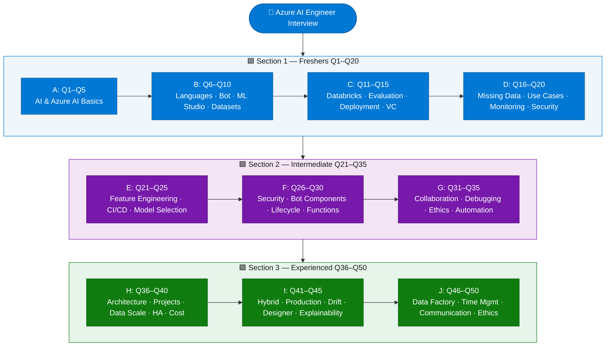

---

## Section 1: Freshers (Q1–Q20)

> Foundational knowledge of Azure AI, Cognitive Services, Azure Machine Learning basics, data handling, and deployment essentials.

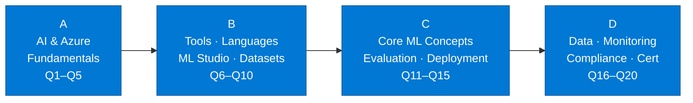

---

### Group A — AI & Azure Fundamentals (Q1–Q5)

---

### Q1. What is Artificial Intelligence (AI)?
> **Topic:** `AI Fundamentals`

**Artificial Intelligence (AI)** is the simulation of human intelligence in machines, enabling them to perform tasks such as **learning**, **reasoning**, and **problem-solving**. AI systems can be trained to recognize patterns, make decisions, and even improve their performance over time. This technology is widely used in applications like **virtual assistants**, **recommendation systems**, and **autonomous vehicles**, making it a core part of modern digital solutions.

---

### Q2. What is Azure AI?
> **Topic:** `Azure AI Overview`

**Azure AI** is a comprehensive suite of **cloud-based artificial intelligence services** and tools provided by **Microsoft**. It offers everything from **pre-built AI models** to customizable **machine learning platforms**, allowing developers to build, deploy, and manage advanced **AI solutions**. Azure AI enables organizations to integrate **intelligent features** into their applications without needing deep expertise in machine learning or data science.

---

### Q3. What are Azure Cognitive Services?
> **Topic:** `Cognitive Services`

**Azure Cognitive Services** are a set of **APIs**, **SDKs**, and **services** that enable developers to add advanced **AI capabilities** to their applications. These include features such as **computer vision**, **speech**, **language understanding**, and **decision-making**. By leveraging these services, developers can quickly implement intelligent features like **image recognition** or **natural language processing** without building and training complex models from scratch.

---

### Q4. Can you name a few Azure Cognitive Services?
> **Topic:** `Cognitive Services`

| Service | Description |
|---------|-------------|
| Computer Vision | Analyzes images to identify objects, faces, and text |
| Speech to Text | Converts spoken language into written text |
| Text Analytics | Extracts insights, sentiment, and key phrases from text |
| Language Understanding (LUIS) | Builds conversational interfaces that understand user intent |

These **Azure Cognitive Services** enable features like **image recognition**, **voice commands**, and **sentiment analysis**.

---

### Q5. What is Azure Machine Learning?
> **Topic:** `Azure Machine Learning`

**Azure Machine Learning** is a **cloud-based platform** for building, training, and deploying **machine learning models** at scale. It provides a collaborative environment for **data scientists** and **developers** to manage the entire **machine learning lifecycle** and automate workflows. With Azure ML you can experiment, train, and deploy models efficiently — making it a key tool for organizations looking to leverage AI.

---

### Group B — Tools, Languages & ML Studio (Q6–Q10)

---

### Q6. Which programming languages are commonly used in Azure AI projects?
> **Topic:** `Programming Languages`

| Language | Use Case |
|----------|----------|
| Python | Most popular for machine learning and data science |
| R | Used for statistical analysis and data visualization |
| C# | Automation, integration, and scripting within Azure |
| PowerShell | Automation and management tasks in Azure |

**Python** is especially important for anyone working with **Azure Machine Learning** and **Azure Cognitive Services**.

---

### Q7. What is a chatbot, and how can Azure Bot Service help in building one?
> **Topic:** `Chatbot / Bot Service`

A **chatbot** is a software application designed to simulate conversation with users, often used for **customer support**, **information retrieval**, or **virtual assistance**. **Azure Bot Service** provides a robust framework and tools for building, testing, and deploying **chatbots**. It supports integration with popular **messaging platforms** like Teams and Slack, making it easy to create intelligent, interactive bots that understand and respond to user queries.

---

### Q8. How do you create a new project in Azure Machine Learning Studio?
> **Topic:** `Azure ML Studio`

Creating a new project in **Azure Machine Learning Studio** involves a few steps:

1. Sign in to the platform and navigate to your **workspace**.
2. Select the option to create a new project and configure your **workspace** settings.
3. Once set up, build, train, and manage **machine learning models** within the collaborative environment.

---

### Q9. What is the purpose of data preprocessing in machine learning?
> **Topic:** `Data Preprocessing`

**Data preprocessing** is a crucial step in **machine learning** that involves cleaning, transforming, and normalizing raw data before model training. This process improves **model accuracy** by ensuring data is consistent, relevant, and free from errors or missing values. Effective preprocessing reduces noise and highlights important patterns, leading to better **model performance**.

---

### Q10. How would you upload a dataset to Azure Machine Learning?
> **Topic:** `Dataset Management`

Uploading a dataset to **Azure Machine Learning** is straightforward. In **Azure ML Studio**, navigate to the **Datasets** tab, then upload files from your local machine or connect to **cloud storage services** (Azure Blob, ADLS, SQL). Once uploaded, the dataset is available for experiments, enabling you to train and evaluate **machine learning models** on your own data.

---

### Group C — Core ML Concepts (Q11–Q15)

---

### Q11. What is Azure Databricks, and how does it relate to AI?
> **Topic:** `Azure Databricks`

**Azure Databricks** is a collaborative **analytics platform** built on **Apache Spark** that supports **big data processing** and **machine learning workflows**. It integrates seamlessly with **Azure Machine Learning**, enabling data scientists to process large volumes of data efficiently. Azure Databricks is particularly useful for tasks requiring **distributed computing**, such as training complex models on large-scale datasets.

---

### Q12. How do you evaluate the performance of a machine learning model?
> **Topic:** `Model Evaluation`

| Metric | Purpose | When to Use |
|--------|---------|-------------|
| Accuracy | Overall correctness of predictions | Balanced classes |
| Precision | True positives among positive predictions | When false positives are costly |
| Recall | True positives among actual positives | When false negatives are costly |
| F1 Score | Balance between precision and recall | Imbalanced classes |
| ROC-AUC | Area under the ROC curve, measures discrimination | Overall model ranking |

These **metrics** help you understand how well the **model predicts outcomes** on new, unseen data.

---

### Q13. What is the difference between Azure Machine Learning and Azure Cognitive Services?
> **Topic:** `AML vs Cognitive Services`

| Dimension | Azure Machine Learning | Azure Cognitive Services |
|-----------|----------------------|--------------------------|
| **Type** | Custom ML platform | Pre-built AI APIs |
| **Use case** | Build & train tailored models | Rapidly add AI to apps |
| **Expertise needed** | Data science knowledge | API integration skills |
| **Examples** | AutoML, Designer, Notebooks | Vision, Speech, LUIS |

While **Azure Machine Learning** is ideal for **custom solutions**, **Azure Cognitive Services** are best for rapid deployment of advanced **AI features**.

---

### Q14. How do you deploy a machine learning model in Azure?
> **Topic:** `Model Deployment`

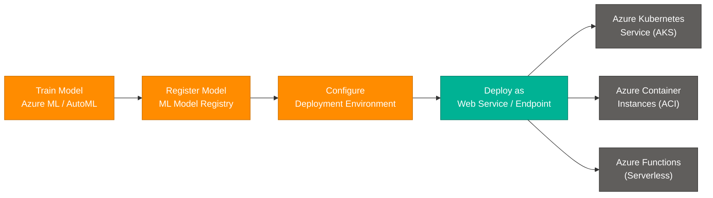

Deploying a **machine learning model** in **Azure** involves these key steps:

- **Train your model** — Use Azure Machine Learning or AutoML to train and validate.
- **Register the model** — Store it in the **ML Model Registry** for versioning.
- **Configure deployment** — Choose **AKS** for production scale, **ACI** for dev/test, or **Azure Functions** for serverless.
- **Expose as an endpoint** — Make the model available for real-time predictions via **REST API endpoints**.

---

### Q15. What is the importance of version control in AI projects?
> **Topic:** `Version Control`

**Version control** is essential in **AI projects** for tracking changes to code, data, and models over time. It enables collaboration among team members working on different features simultaneously without conflicts. Version control also ensures **reproducibility** — you can roll back to any previous version if issues arise or if you need to revisit earlier experiment results.

---

### Group D — Data, Monitoring & Compliance (Q16–Q20)

---

### Q16. How do you handle missing data in a dataset for machine learning?
> **Topic:** `Missing Data Handling`

Handling **missing data** is a common challenge in machine learning. Common strategies include:

- **Imputation** — Replace missing values with statistical measures (mean, median, mode).
- **Forward/Backward fill** — Use adjacent values for time-series data.
- **Drop rows/columns** — Remove incomplete records when missing data is not critical.
- **Model-based imputation** — Use algorithms like KNN to predict missing values.

The approach depends on the nature and importance of the missing data for the specific project.

---

### Q17. What are some common use cases for Azure AI services?
> **Topic:** `AI Use Cases`

- **Chatbots for customer support** — Automate responses and provide instant assistance.
- **Recommendation engines for e-commerce** — Suggest products based on user preferences.
- **Sentiment analysis for social media** — Analyze customer feedback and brand opinions.
- **Image recognition for security** — Detect objects or faces for security or automation tasks.
- **Predictive maintenance for manufacturing** — Predict equipment failures and schedule proactive maintenance.
- **Document intelligence** — Extract structured data from forms, invoices, and contracts.

---

### Q18. How do you monitor a deployed model in Azure?
> **Topic:** `Model Monitoring`

Monitoring a deployed **machine learning model** in Azure uses these tools:

- **Azure Monitor** — Collects metrics, logs, and traces from all Azure resources.
- **Application Insights** — Provides real-time performance insights and usage patterns.
- **Azure ML Model Monitoring** — Tracks **data drift** and **prediction quality** over time.

Setting up **alerts and dashboards** lets you detect and address issues quickly, keeping AI solutions reliable in production.

---

### Q19. What is the Azure AI Engineer Associate certification, and why is it valuable?
> **Topic:** `AI-102 Certification`

The **Azure AI Engineer Associate (AI-102)** is a **Microsoft certification** that validates skills in designing and implementing AI solutions on Azure. It covers Azure Cognitive Services, Azure Machine Learning, Azure Bot Service, and responsible AI principles.

**Why it's valuable:**
- Demonstrates **verified expertise** to employers.
- Boosts **career prospects** and salary potential.
- Keeps you current with the latest **Azure AI technologies**.
- Recognized globally as an industry credential.

---

### Q20. How do you ensure data privacy and security in Azure AI projects?
> **Topic:** `Security & Privacy`

Ensuring **data privacy** and **security** in Azure AI projects involves:

- **Encryption** — Encrypt data at rest (Azure Key Vault + CMK) and in transit (TLS 1.2+).
- **Role-Based Access Control (RBAC)** — Restrict access based on job roles.
- **Compliance tools** — Use Azure Policy and Compliance Manager to meet **GDPR**, **HIPAA**, and other standards.
- **Private Endpoints** — Keep all data traffic within the Azure VNet.
- **Regular audits** — Monitor access logs via Azure Monitor and Diagnostic Logs.

---

## Section 2: Intermediate (Q21–Q35)

> Applied skills — feature engineering, CI/CD automation, security & compliance, model lifecycle management, and performance optimization.

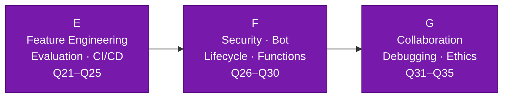

---

### Group E — Feature Engineering, CI/CD & Evaluation (Q21–Q25)

---

### Q21. How do you approach feature engineering in Azure AI projects?
> **Topic:** `Feature Engineering`

**Feature engineering** is a critical step in building effective machine learning models. It involves selecting, transforming, and creating new features from raw data to improve **model performance**. Common techniques include:

- **Normalization / Scaling** — Bring all features to a comparable range.
- **Principal Component Analysis (PCA)** — Reduce dimensionality while retaining variance.
- **One-hot encoding** — Convert categorical variables to numeric form.
- **Feature interaction** — Create new features from combinations of existing ones.

Thoughtful feature engineering reduces overfitting and highlights important patterns, leading to more accurate predictions.

---

### Q22. Can you explain how to automate the deployment of an AI model using Azure Pipelines?
> **Topic:** `CI/CD with Azure Pipelines`

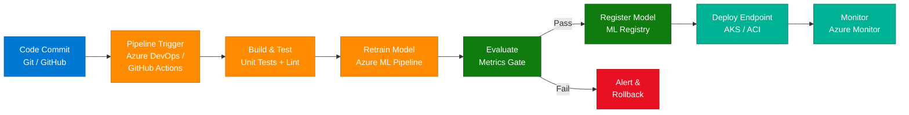

Automating AI model deployment uses **CI/CD tools** like **Azure DevOps** or **GitHub Actions**. Pipelines automatically build, test, retrain, and deploy models whenever changes are made to the codebase, ensuring deployments are consistent, reliable, and repeatable.

---

### Q23. What strategies do you use for model evaluation and selection in Azure Machine Learning?
> **Topic:** `Model Selection`

**Model evaluation and selection** involve comparing multiple models using:

- **Cross-validation** — Split data multiple ways to get robust performance estimates.
- **Performance metrics** — Accuracy, precision, recall, F1 score (classification) or RMSE/MAE (regression).
- **Business requirements** — Not just technical metrics; consider inference speed, cost, and interpretability.
- **AutoML comparison** — Use Azure AutoML to automatically train and rank dozens of models.
- **Explainability** — Consider interpretability if stakeholders need to understand model decisions.

---

### Q24. How do you integrate Azure Cognitive Services into a web application?
> **Topic:** `Cognitive Services Integration`

Integrating **Azure Cognitive Services** into a web application uses the provided **APIs** and **SDKs**:

1. **Create a resource** in Azure Portal (e.g., Computer Vision, Text Analytics).
2. **Obtain API key and endpoint** from the Azure resource.
3. **Call the API** from your application using the REST API or language-specific SDK (Python, Node.js, C#).
4. **Handle the response** and render AI-powered features in the UI.

This allows you to add advanced **AI features** with minimal development effort.

---

### Q25. Describe a challenging problem you faced while working with Azure AI services and how you resolved it.
> **Topic:** `Troubleshooting`

One common challenge is dealing with **model drift** in production, where model performance degrades as real-world data changes over time. Resolution approach:

1. **Detect drift** — Set up Azure ML Model Monitoring to flag performance drops.
2. **Diagnose** — Compare production data distribution against training data using Azure Monitor.
3. **Retrain** — Trigger automated retraining pipelines with fresh data.
4. **Validate and redeploy** — Run evaluation metrics gates before updating the endpoint.

This proactive approach ensures models remain accurate and reliable as data evolves.

---

### Group F — Security, Bot Service & Model Lifecycle (Q26–Q30)

---

### Q26. How do you ensure the security and compliance of data when using Azure AI services?
> **Topic:** `Data Compliance`

To ensure **security** and **compliance**:

- **Encryption** — Data at rest (CMK via Azure Key Vault) and in transit (TLS 1.2+).
- **Azure Active Directory / Entra ID** — Authenticate all users and services.
- **RBAC** — Fine-grained access control at the resource level.
- **Regulatory standards** — Follow **GDPR**, **HIPAA**, **ISO 27001** using Azure Compliance Manager.
- **Regular audits** — Use Diagnostic Logs and Azure Monitor to identify risks.
- **Private Endpoints** — Eliminate public internet exposure for sensitive AI workloads.

---

### Q27. What are the key components of the Azure Bot Service?
> **Topic:** `Bot Service Components`

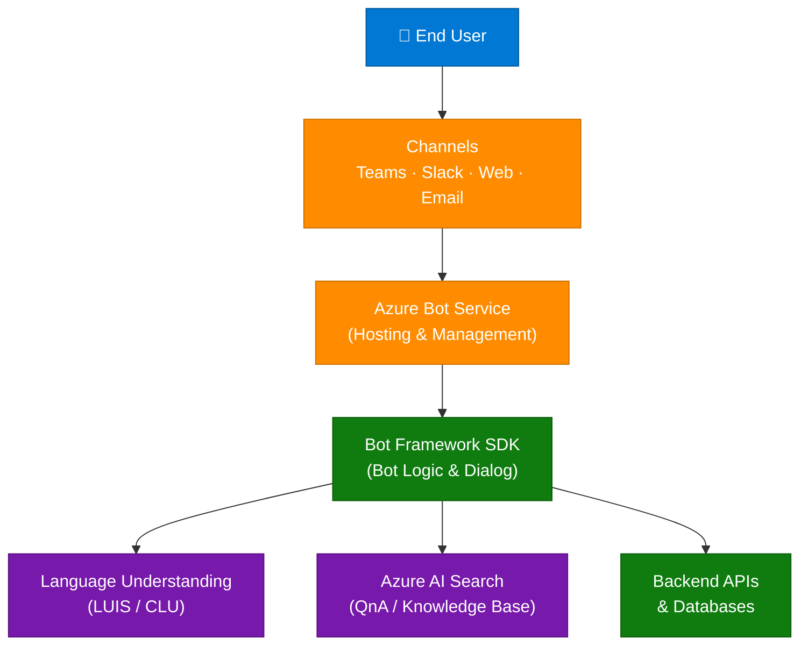

| Component | Description |
|-----------|-------------|
| **Bot Framework SDK** | Provides tools and libraries for building intelligent bots |
| **Azure Bot Service** | Hosts and manages bots in the cloud |
| **Connectors** | Enable integration with channels such as Teams, Slack, and web chat |

---

### Q28. How do you manage and monitor the lifecycle of machine learning models in Azure?
> **Topic:** `Model Lifecycle`

Managing the **ML model lifecycle** involves:

- **Model Registry** — Track versions and metadata in Azure ML's built-in registry.
- **Experiment tracking** — Log runs, metrics, and parameters for reproducibility.
- **Monitoring** — Detect performance degradation and data drift via Azure ML Monitoring.
- **Automated retraining pipelines** — Trigger retraining when drift is detected.
- **A/B deployment** — Deploy challenger models alongside champion models to compare performance.

---

### Q29. How do you use Azure Functions in serverless computing for AI applications?
> **Topic:** `Azure Functions`

**Azure Functions** enable **serverless computing** — running code in response to events without managing infrastructure. In AI applications, common use cases include:

- **Data ingestion triggers** — Process new data arriving in a queue or Blob Storage.
- **Model inference** — Serve lightweight model predictions on-demand.
- **Workflow automation** — Chain together data processing steps in an event-driven pipeline.

This approach is **scalable**, **cost-effective**, and reduces infrastructure overhead.

---

### Q30. What are some best practices for optimizing the performance of machine learning models in Azure?
> **Topic:** `Performance Optimization`

- **Select efficient algorithms** — Choose algorithms suited to your data type and scale.
- **Optimize hyperparameters** — Use Azure ML's **HyperDrive** for automated hyperparameter tuning.
- **Reduce feature dimensionality** — Apply **PCA** or feature selection to eliminate noise.
- **Leverage scalable compute** — Use **GPU clusters** or **Databricks** for large-scale training.
- **Monitor and adjust resource allocation** — Review resource usage regularly and scale up or down based on demand.

---

### Group G — Collaboration, Debugging, Ethics & Automation (Q31–Q35)

---

### Q31. How do you handle version control and collaboration in Azure AI projects?
> **Topic:** `Version Control & Collaboration`

**Version control** and collaboration in AI projects use:

- **Git** — Track changes to code, configs, and notebooks.
- **Azure DevOps / GitHub** — Manage issues, PRs, and project boards.
- **Azure ML Experiment Tracking** — Log and compare model runs.
- **CI/CD pipelines** — Automate testing and deployment on every merge.

Good collaboration practices keep projects organized and ensure every model run is reproducible.

---

### Q32. How do you troubleshoot and debug issues in Azure AI services?
> **Topic:** `Debugging`

**Troubleshooting** and **debugging** involve:

1. **Check logs** — Review Azure Monitor and Application Insights for errors and anomalies.
2. **Inspect model metrics** — Look for sudden drops in accuracy, latency, or throughput.
3. **Test API endpoints** — Call inference endpoints directly to isolate issues.
4. **Review data quality** — Validate incoming data for schema or distribution shifts.
5. **Enable diagnostic settings** — Capture detailed logs at the resource level for deep investigation.

---

### Q33. How do you incorporate feedback from stakeholders into your AI project development process?
> **Topic:** `Stakeholder Feedback`

Incorporating **stakeholder feedback** is essential for building AI solutions that meet business needs:

- **Regular demos** — Share progress at defined milestones and gather input early.
- **Iterative development** — Use agile sprints to adjust features based on feedback.
- **Clear communication** — Translate technical results into business outcomes stakeholders understand.
- **Feedback loops** — Embed user feedback (e.g., thumbs up/down on chatbot responses) back into model retraining.

---

### Q34. What role does automation play in your workflow when working with Azure AI services?
> **Topic:** `Automation in MLOps`

**Automation** streamlines the entire **AI development lifecycle**:

- **Training pipelines** — Automatically retrain models when new data arrives.
- **Testing & validation** — Run evaluation gates before any deployment.
- **Deployment pipelines** — Push approved models to endpoints without manual steps.
- **Monitoring & alerting** — Automatically alert when drift or errors are detected.

Automated pipelines make deployments consistent, repeatable, and faster, reducing human error.

---

### Q35. How do you approach ethical considerations in AI development, particularly when using Azure tools?
> **Topic:** `Ethical AI`

**Ethical AI** involves ensuring fairness, transparency, and accountability:

- **Use Azure Responsible AI Dashboard** — Detect and visualize model bias and fairness issues.
- **Diverse training data** — Ensure representative data to avoid skewed or discriminatory results.
- **Explainability** — Use SHAP/LIME to explain predictions to stakeholders.
- **Inclusive design** — Involve diverse perspectives throughout the development process.
- **Follow guidelines** — Adhere to Microsoft's Responsible AI principles and applicable regulations.

---

## Section 3: Experienced (Q36–Q50)

> Architecture design, large-scale data processing, high availability, model drift & retraining, explainability, cost optimization, and ethical AI.

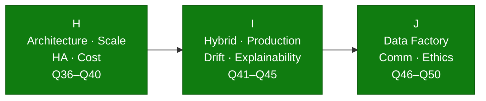

---

### Group H — Architecture, Scale, High Availability & Cost (Q36–Q40)

---

### Q36. How do you design a scalable and secure architecture for AI solutions on Azure?
> **Topic:** `Scalable Architecture`

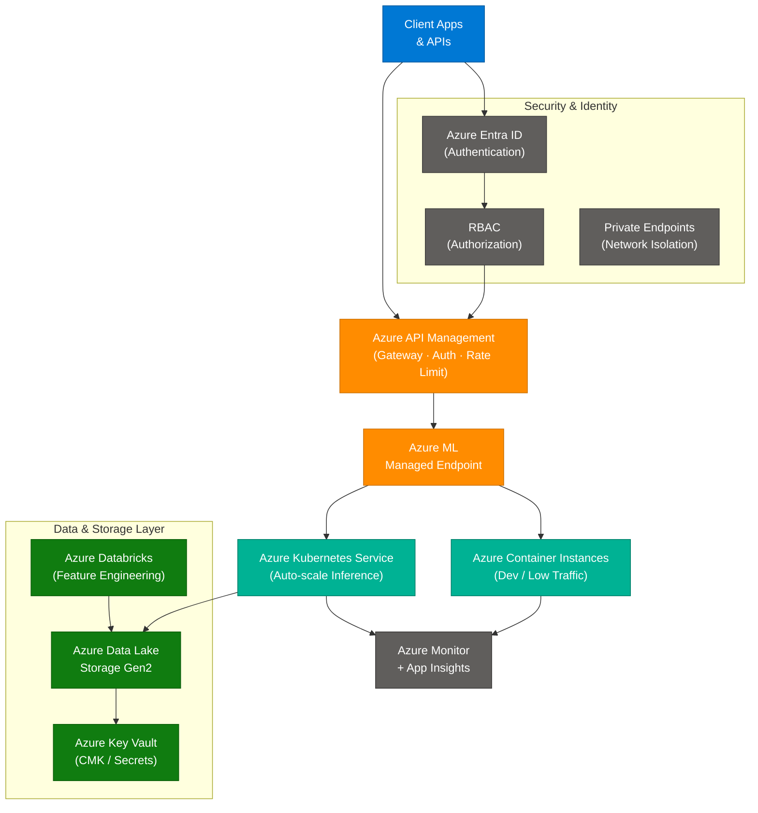

Designing a **scalable and secure architecture** involves:

- **Microservices** — Decompose AI components into independent services.
- **Containerization** — Package models using Docker and orchestrate with **AKS**.
- **API Gateway** — Use **Azure API Management** for rate limiting, authentication, and routing.
- **Network isolation** — Apply **Private Endpoints** and VNet integration.
- **Security layers** — **Entra ID + RBAC + CMK + Private Endpoints**.

---

### Q37. Describe a project where you used Azure AI to solve a complex business problem. What was the outcome?
> **Topic:** `Real-World Project`

In one project, a **predictive maintenance system** was built using **Azure Machine Learning** to analyze sensor telemetry from manufacturing equipment:

- **Data ingestion** — Streamed sensor data into **Azure Event Hubs** → **Azure Data Lake**.
- **Feature engineering** — Processed data in **Azure Databricks** to extract vibration, temperature, and pressure features.
- **Model training** — Trained a classification model in **Azure ML** to predict failure within 48 hours.
- **Deployment** — Deployed as a real-time endpoint on **AKS** with monitoring via **Application Insights**.
- **Outcome** — Equipment downtime reduced by **30%**, saving significant maintenance costs.

---

### Q38. How do you manage large-scale data processing for AI models in Azure?
> **Topic:** `Large-Scale Data`

Managing **large-scale data processing** for AI involves:

- **Azure Databricks** — Distributed computing on Apache Spark for large-scale feature engineering and model training.
- **Azure Synapse Analytics** — Unified analytics combining big data and data warehousing in one platform.
- **Azure Data Lake Storage Gen2** — Cost-efficient, hierarchical storage for massive datasets.
- **Parallel processing** — Partition data and run jobs in parallel across compute clusters.
- **Incremental loading** — Process only new or changed data to reduce compute costs.

These tools ensure data processing is **scalable**, **reliable**, and **cost-effective**.

---

### Q39. How do you ensure high availability and disaster recovery for AI applications on Azure?
> **Topic:** `High Availability & DR`

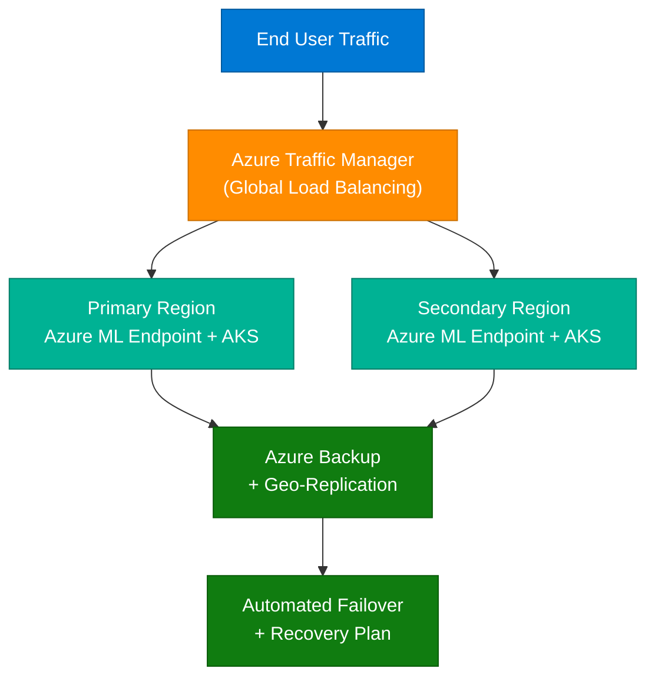

**High availability** and **disaster recovery** are achieved by:

- **Multi-region deployment** — Deploy AI endpoints across two or more Azure regions.
- **Azure Traffic Manager** — Route user traffic to the healthy region automatically.
- **Automated backups** — Geo-replicate model artifacts and data to secondary regions.
- **Failover mechanisms** — Automatically redirect traffic when a region goes down.
- **Recovery plans** — Document and test failover procedures regularly.

---

### Q40. How do you optimize the cost of running AI workloads on Azure?
> **Topic:** `Cost Optimization`

| Strategy | Description |
|----------|-------------|
| **Reserved Instances** | Pre-purchase compute at up to 72% discount vs. pay-as-you-go |
| **Auto-Scaling** | Scale compute up during training and down to zero when idle |
| **Spot / Low-Priority VMs** | Use interruptible compute for non-critical batch training |
| **Monitor Resource Usage** | Regularly review and right-size resource allocation |
| **Azure Cost Management** | Set budgets, alerts, and use cost analysis dashboards |
| **Batch Endpoints** | Process large inference jobs in bulk rather than real-time |

---

### Group I — Hybrid Integration, Production & Explainability (Q41–Q45)

---

### Q41. How do you integrate Azure AI services with on-premises systems or other cloud platforms?
> **Topic:** `Hybrid / Multi-Cloud`

Integrating **Azure AI** with on-premises or multi-cloud environments uses:

- **Azure ExpressRoute / VPN Gateway** — Secure, private connectivity to on-premises infrastructure.
- **Hybrid connections** — Expose on-premises data sources to Azure services securely.
- **REST APIs** — Call Azure AI endpoints from any platform or cloud.
- **Azure Arc** — Extend Azure management and governance to on-premises and multi-cloud resources.

This is especially valuable for enterprises with **legacy systems** or **multi-cloud strategies**.

---

### Q42. What are the challenges of deploying AI solutions at scale on Azure, and how do you address them?
> **Topic:** `Production Challenges`

| Challenge | Solution |
|-----------|---------|
| Managing large data volume | Scalable storage (ADLS Gen2) + distributed processing (Databricks) |
| Low latency requirements | Optimize model inference; use caching and edge deployment |
| Model drift over time | Continuous monitoring + automated retraining pipelines |
| Compliance and security | Private Endpoints, RBAC, encryption, Azure Policy |
| Team collaboration at scale | Azure DevOps, Git-based CI/CD, ML model registry |

Addressing these challenges requires **scalable infrastructure**, **robust monitoring**, and **end-to-end automation**.

---

### Q43. How do you handle model drift and retraining in production environments?
> **Topic:** `Model Drift & Retraining`

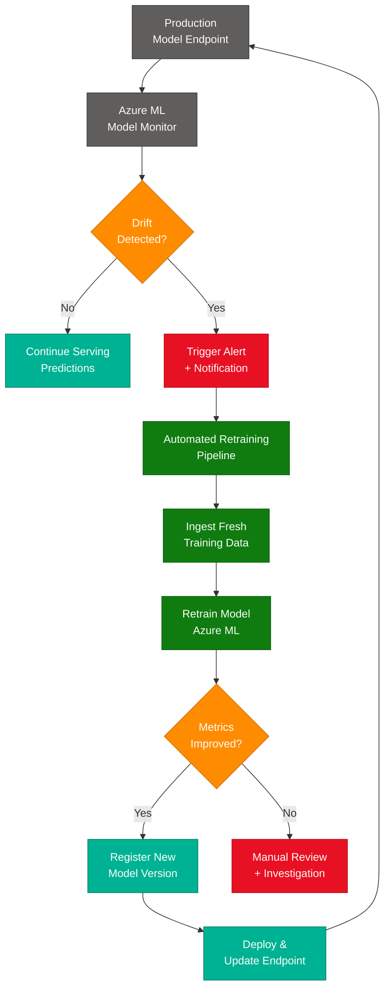

Handling **model drift** involves:

1. **Continuous monitoring** — Track prediction distributions and key metrics in production.
2. **Drift detection** — Azure ML Model Monitor compares production data against training baseline.
3. **Automated retraining** — Pipelines trigger automatically when drift exceeds the threshold.
4. **Validation gates** — New models must pass metric thresholds before replacing the incumbent.

---

### Q44. How do you use Azure Machine Learning Designer to build and deploy pipelines?
> **Topic:** `ML Designer Pipelines`

**Azure Machine Learning Designer** is a **visual, drag-and-drop** pipeline builder:

1. **Drag components** onto the canvas — data ingestion, preprocessing, model training, evaluation.
2. **Connect components** to define data flow through the pipeline.
3. **Configure parameters** — set hyperparameters, feature columns, and compute targets.
4. **Run and evaluate** — execute the pipeline and view metrics in the Designer UI.
5. **Publish as endpoint** — deploy the pipeline as a real-time or batch inference endpoint.

This visual approach makes ML accessible to users with varying levels of technical expertise.

---

### Q45. How do you implement explainability and interpretability in AI models on Azure?
> **Topic:** `Explainability`

**Explainability** and **interpretability** are implemented using:

- **SHAP (SHapley Additive exPlanations)** — Shows which features most influenced each prediction.
- **LIME (Local Interpretable Model-agnostic Explanations)** — Explains individual predictions locally.
- **Azure ML Responsible AI Dashboard** — Provides built-in fairness, error analysis, and feature importance visualizations.
- **Global vs. local explanations** — Global explains overall model behavior; local explains individual predictions.

Communicating model behavior clearly builds trust and ensures compliance with regulatory requirements.

---

### Group J — Data Integration, Communication & Ethics (Q46–Q50)

---

### Q46. How do you use Azure Data Factory for data integration in AI projects?
> **Topic:** `Azure Data Factory`

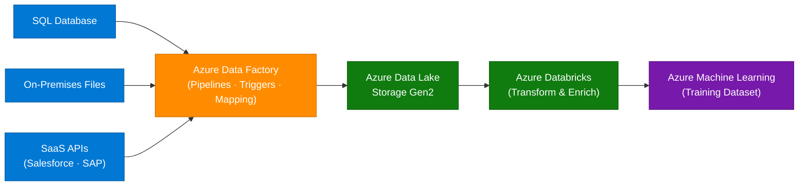

**Azure Data Factory** orchestrates **data movement** and **transformation pipelines**:

- **Ingestion** — Connect to 90+ data sources (SQL, Blob, REST APIs, SaaS).
- **Transformation** — Map, cleanse, and enrich data using data flows.
- **Scheduling** — Trigger pipelines on a schedule or event-based (new file arrival).
- **Integration** — Feed prepared data directly into Azure ML training datasets.

---

### Q47. How do you prioritize tasks and manage time effectively when working on multiple AI projects?
> **Topic:** `Project Management`

- **Use agile methodologies** — Break projects into manageable sprints with clear priorities.
- **Track progress** — Use **Azure DevOps Boards** or similar tools to monitor deadlines and deliverables.
- **Communicate regularly** — Keep stakeholders informed and adjust priorities based on business impact.
- **Time-box experiments** — Set fixed time limits for ML experimentation to avoid open-ended research cycles.
- **Automate repetitive tasks** — Free up time by automating data pipelines, testing, and deployment.

---

### Q48. How do you communicate complex technical concepts to non-technical stakeholders?
> **Topic:** `Stakeholder Communication`

Communicating **technical concepts** effectively:

- **Simplify language** — Avoid jargon; use analogies and plain language.
- **Use visuals** — Charts, diagrams, and dashboards convey insights better than raw numbers.
- **Focus on business value** — Frame results as outcomes (cost savings, revenue impact) rather than technical metrics.
- **Tell a story** — Walk stakeholders through the problem, approach, and result in narrative form.
- **Interactive demos** — Show the AI in action rather than describing it abstractly.

---

### Q49. How do you stay updated with the latest developments and features in Azure AI?
> **Topic:** `Staying Updated`

- **Microsoft Learn** — Official documentation, tutorials, and learning paths.
- **Azure Blog / Tech Community** — Product announcements and deep-dive articles.
- **Microsoft Build & Ignite** — Annual conferences with the latest Azure AI announcements.
- **GitHub Azure Samples** — Explore reference implementations and new SDK releases.
- **Community forums** — Stack Overflow, Reddit r/AZURE, LinkedIn groups.
- **Certifications** — Renewing AI-102 requires staying current with exam updates.

---

### Q50. What is your approach to ethical AI, and how do you mitigate biases in AI models on Azure?
> **Topic:** `Responsible AI`

- **Use Azure Responsible AI Dashboard** — Detect and visualize bias, fairness gaps, and error distributions.
- **Ensure diverse training data** — Use representative data across demographics to avoid skewed results.
- **Apply fairness constraints** — Incorporate fairness metrics (demographic parity, equalized odds) during model selection.
- **Involve stakeholders** — Conduct ethical reviews with cross-functional teams before deployment.
- **Follow Microsoft's Responsible AI principles** — Fairness, Reliability, Privacy, Inclusiveness, Transparency, and Accountability.
- **Document decisions** — Maintain model cards and datasheets describing training data, intended use, and known limitations.

---

## Topic Index

| Q# | Topic | Section | Group |
|----|-------|---------|-------|
| Q1 | AI Fundamentals | Freshers | A |
| Q2 | Azure AI Overview | Freshers | A |
| Q3 | Cognitive Services | Freshers | A |
| Q4 | Cognitive Services — Named Services | Freshers | A |
| Q5 | Azure Machine Learning | Freshers | A |
| Q6 | Programming Languages | Freshers | B |
| Q7 | Chatbot / Bot Service | Freshers | B |
| Q8 | Azure ML Studio — New Project | Freshers | B |
| Q9 | Data Preprocessing | Freshers | B |
| Q10 | Dataset Management | Freshers | B |
| Q11 | Azure Databricks | Freshers | C |
| Q12 | Model Evaluation Metrics | Freshers | C |
| Q13 | AML vs Cognitive Services | Freshers | C |
| Q14 | Model Deployment | Freshers | C |
| Q15 | Version Control | Freshers | C |
| Q16 | Missing Data Handling | Freshers | D |
| Q17 | AI Use Cases | Freshers | D |
| Q18 | Model Monitoring | Freshers | D |
| Q19 | AI-102 Certification | Freshers | D |
| Q20 | Security & Privacy | Freshers | D |
| Q21 | Feature Engineering | Intermediate | E |
| Q22 | CI/CD with Azure Pipelines | Intermediate | E |
| Q23 | Model Selection | Intermediate | E |
| Q24 | Cognitive Services Integration | Intermediate | E |
| Q25 | Troubleshooting / Model Drift | Intermediate | E |
| Q26 | Data Compliance | Intermediate | F |
| Q27 | Bot Service Components | Intermediate | F |
| Q28 | Model Lifecycle Management | Intermediate | F |
| Q29 | Azure Functions (Serverless) | Intermediate | F |
| Q30 | Performance Optimization | Intermediate | F |
| Q31 | Version Control & Collaboration | Intermediate | G |
| Q32 | Debugging & Troubleshooting | Intermediate | G |
| Q33 | Stakeholder Feedback | Intermediate | G |
| Q34 | Automation in MLOps | Intermediate | G |
| Q35 | Ethical AI | Intermediate | G |
| Q36 | Scalable Architecture | Experienced | H |
| Q37 | Real-World Project | Experienced | H |
| Q38 | Large-Scale Data Processing | Experienced | H |
| Q39 | High Availability & DR | Experienced | H |
| Q40 | Cost Optimization | Experienced | H |
| Q41 | Hybrid / Multi-Cloud Integration | Experienced | I |
| Q42 | Production Challenges | Experienced | I |
| Q43 | Model Drift & Retraining | Experienced | I |
| Q44 | ML Designer Pipelines | Experienced | I |
| Q45 | Explainability & Interpretability | Experienced | I |
| Q46 | Azure Data Factory | Experienced | J |
| Q47 | Project Management | Experienced | J |
| Q48 | Stakeholder Communication | Experienced | J |
| Q49 | Staying Updated | Experienced | J |
| Q50 | Responsible AI & Bias Mitigation | Experienced | J |

---

## Key Cheatsheet

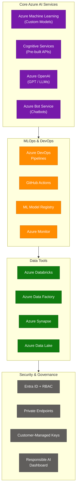

### Services Quick Reference

| Service | Category | Best For | Related Questions |
|---------|----------|----------|-------------------|
| Azure Machine Learning | ML Platform | Custom model training & deployment | Q5, Q8, Q14, Q23, Q44 |
| Azure Cognitive Services | Pre-built AI | Vision, Speech, Language, Decision | Q3, Q4, Q13, Q24 |
| Azure OpenAI Service | LLMs | GPT-4o, embeddings, NLP at scale | Q2, Q17 |
| Azure Bot Service | Chatbots | Multi-channel bot deployment | Q7, Q27 |
| Azure Databricks | Analytics | Distributed ML on big data | Q11, Q38 |
| Azure Data Factory | ETL | Data movement & transformation | Q46 |
| Azure DevOps / GitHub | CI/CD | ML pipeline automation | Q22, Q34 |
| Azure Monitor | Observability | Model & endpoint monitoring | Q18, Q32 |
| Azure Synapse Analytics | Big Data | Unified analytics for AI | Q38, Q42 |
| Azure API Management | Gateway | Auth, rate-limiting, routing | Q36 |
| Azure Traffic Manager | Networking | Multi-region HA & load balancing | Q39 |

### Model Evaluation Metrics (Q12)

| Metric | Formula | When to Use |
|--------|---------|-------------|
| **Accuracy** | Correct / Total | Balanced classes |
| **Precision** | TP / (TP + FP) | False positives are costly |
| **Recall** | TP / (TP + FN) | False negatives are costly |
| **F1 Score** | 2 × (P × R) / (P + R) | Imbalanced classes |
| **ROC-AUC** | Area under ROC curve | Overall discrimination quality |
| **RMSE** | √(mean squared errors) | Regression problems |

### Security Controls Reference (Q20, Q26, Q36)

| Control | What It Does | Azure Service |
|---------|-------------|---------------|
| **Identity** | Authenticate users and workloads | Azure Entra ID (formerly AAD) |
| **Access Control** | Limit permissions per role | RBAC — Owner / Contributor / Reader |
| **Network Isolation** | Keep traffic private | Private Endpoints + VNet Integration |
| **Encryption at Rest** | Protect stored data | Azure Key Vault + CMK |
| **Encryption in Transit** | Protect data in motion | TLS 1.2+ enforced everywhere |
| **Monitoring & Audit** | Track access and changes | Azure Monitor + Diagnostic Logs |
| **Responsible AI** | Detect bias, ensure fairness | Azure RAI Dashboard |
| **Compliance** | Meet regulatory standards | Azure Policy + Compliance Manager |

### Deployment Options Comparison (Q14, Q36)

| Option | Scale | Latency | Cost | Best For |
|--------|-------|---------|------|----------|
| **AKS (Azure Kubernetes)** | Very high | Low | Higher | Production, high-traffic |
| **ACI (Container Instances)** | Low-medium | Medium | Low | Dev/test, low-traffic |
| **Azure Functions** | Event-driven | Variable | Per-execution | Serverless, infrequent calls |
| **Managed Online Endpoints** | Auto-scale | Low | Per compute | Simplest production path |
| **Batch Endpoints** | Very high | High (async) | Per batch job | Offline / bulk scoring |

---

*Source: ScholarHat Azure AI Engineer Interview Questions · Compiled July 2026 · 50 Q&As · 3 Sections · 10 Groups · 7 Mermaid Diagrams*
