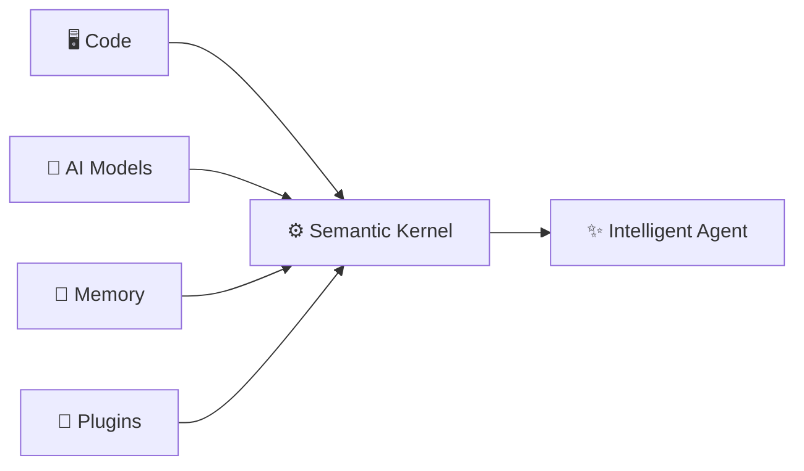
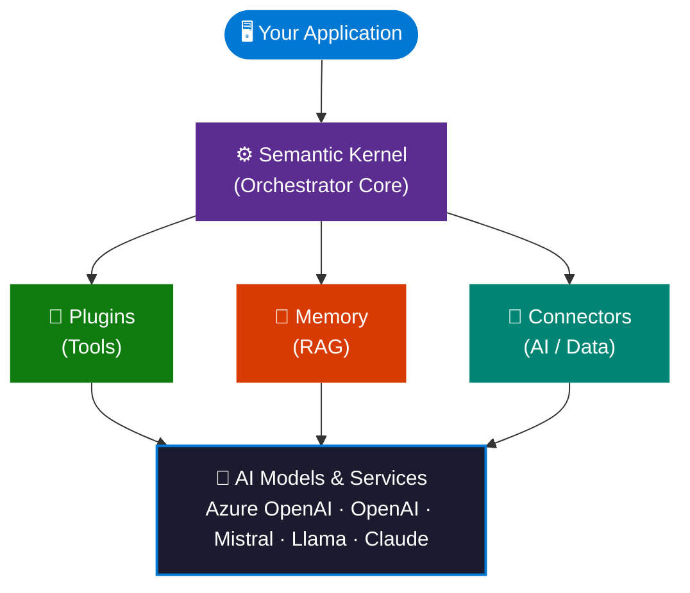
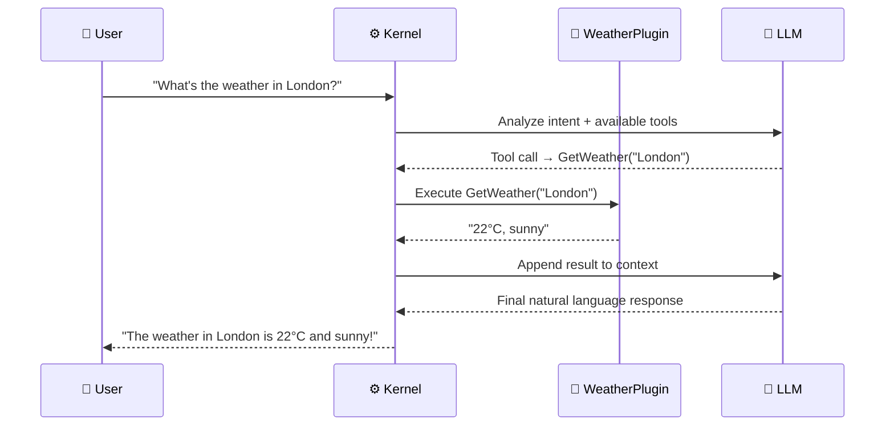
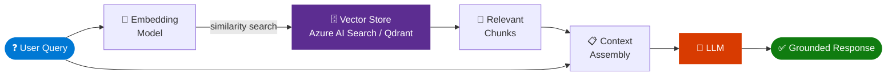
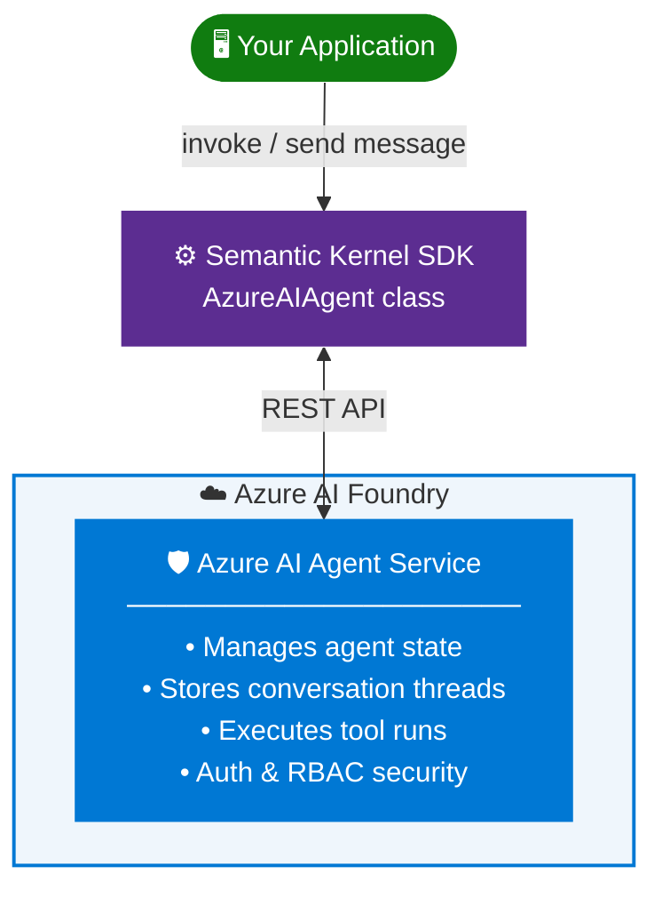
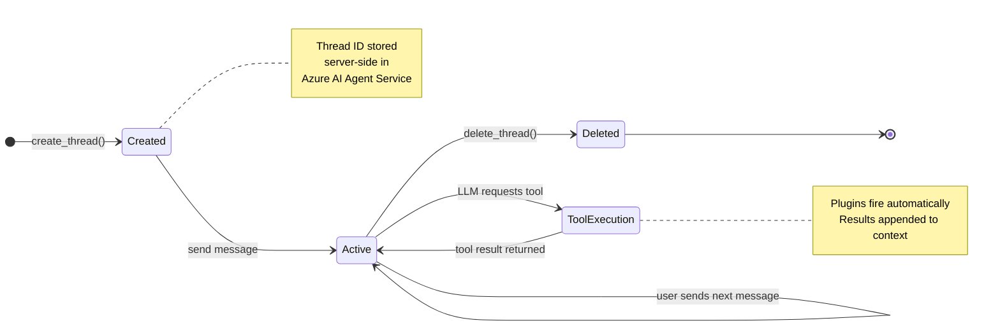
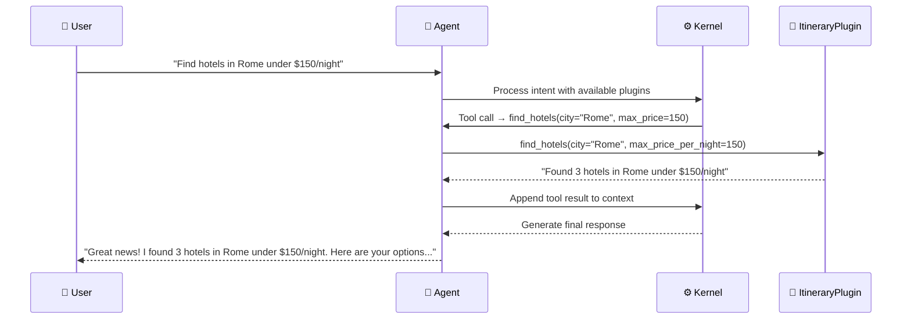
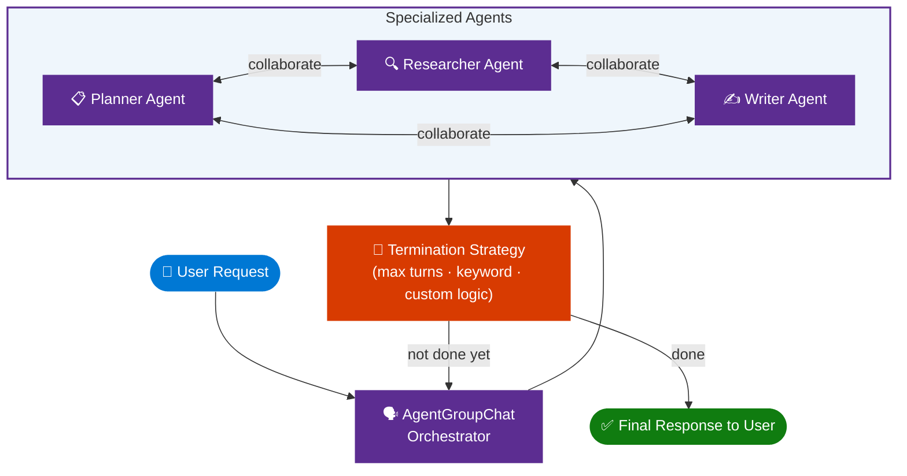
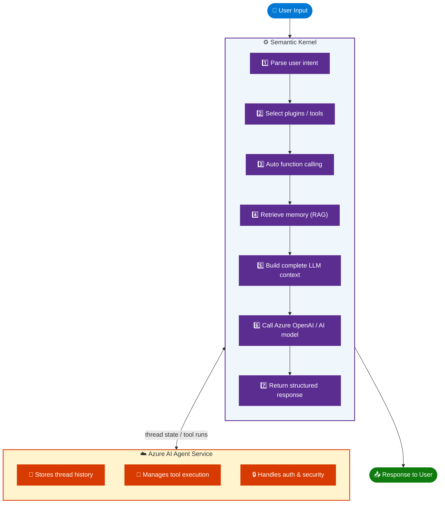

# Learn Live: Develop an AI Agent with Semantic Kernel

> **Source:** [YouTube – Learn Live: Develop an AI agent with Semantic Kernel](https://www.youtube.com/watch?v=ySsiPmYXUTY&t=261s)  
> **Platform:** Microsoft Learn Live / Microsoft Reactor  
> **Topic:** Building AI Agents using Azure AI Foundry + Semantic Kernel SDK  
> **Languages Covered:** Python, C#, Java

---

## 📋 Table of Contents

1. [Overview](#overview)
2. [What Is Semantic Kernel?](#what-is-semantic-kernel)
3. [Core Architecture](#core-architecture)
4. [Key Components](#key-components)
   - [The Kernel](#1-the-kernel)
   - [AI Service Connectors](#2-ai-service-connectors)
   - [Plugins & Functions](#3-plugins--functions)
   - [Memory & Vector Storage](#4-memory--vector-storage)
   - [Prompt Templates](#5-prompt-templates)
5. [Azure AI Agent Service](#azure-ai-agent-service)
6. [Building Your First AI Agent](#building-your-first-ai-agent)
   - [Environment Setup](#environment-setup)
   - [Creating the Kernel](#creating-the-kernel)
   - [Creating an Agent](#creating-an-agent)
   - [Managing Threads & Conversations](#managing-threads--conversations)
7. [Plugins & Tool Calling](#plugins--tool-calling)
8. [Multi-Agent Collaboration](#multi-agent-collaboration)
9. [Key Concepts Summary Table](#key-concepts-summary-table)
10. [Architecture Flow Diagram](#architecture-flow-diagram)
11. [Code Examples](#code-examples)
12. [Best Practices](#best-practices)
13. [Learning Resources](#learning-resources)

---

## Overview

This session is part of the **Microsoft Learn Live** series and covers how to build intelligent AI agents using the **Semantic Kernel SDK** integrated with **Azure AI Foundry** (formerly Azure AI Studio).

The session walks through:
- What Semantic Kernel is and why it matters for AI agent development
- Core building blocks: Kernel, Plugins, Memory, Connectors
- How to use **Azure AI Agent Service** to create and manage agents
- Managing multi-turn conversation threads
- Enabling multi-agent collaboration using `AgentGroupChat`
- Practical, hands-on coding demonstrations

---

## What Is Semantic Kernel?

**Semantic Kernel (SK)** is an **open-source, lightweight SDK** maintained by Microsoft that acts as an **orchestration middleware** between your application code and Large Language Models (LLMs).

### Why Semantic Kernel?

| Problem | How Semantic Kernel Solves It |
|---|---|
| Tight coupling to one AI provider | Model-agnostic connector system – swap OpenAI for Mistral without rewriting code |
| No structure for LLM tool use | First-class function/plugin system with automatic function calling |
| No memory or context management | Built-in memory connectors for RAG and persistent context |
| Complexity of multi-agent systems | `AgentGroupChat` orchestration for agent collaboration |
| Production readiness | Observability, telemetry, and enterprise security hooks |

### Core Philosophy



Semantic Kernel treats AI as a **first-class citizen** in software development – not an afterthought.

---

## Core Architecture



---

## Key Components

### 1. The Kernel

The **Kernel** is the central hub – the dependency injection container of Semantic Kernel. Every interaction flows through it.

- Manages the lifecycle of AI services
- Routes requests to the appropriate model or plugin
- Handles context and invocation pipelines

```python
# Python Example
from semantic_kernel import Kernel

kernel = Kernel()
```

```csharp
// C# Example
var kernel = Kernel.CreateBuilder()
    .AddAzureOpenAIChatCompletion(
        deploymentName: "gpt-4o",
        endpoint: "https://<your-resource>.openai.azure.com/",
        apiKey: "<your-api-key>")
    .Build();
```

---

### 2. AI Service Connectors

Connectors provide a **unified interface** to various AI providers. You swap providers without changing your agent logic.

| Connector | Description |
|---|---|
| `AzureOpenAIChatCompletion` | Azure-hosted GPT-4o, GPT-4, etc. |
| `OpenAIChatCompletion` | Direct OpenAI models |
| `AzureAIInferenceChatCompletion` | Models via Azure AI Foundry inference |
| `OllamaChatCompletion` | Locally hosted models (Llama, Mistral) |
| `HuggingFaceChatCompletion` | Open-source models via HuggingFace |

---

### 3. Plugins & Functions

**Plugins** are collections of **functions** that extend what the AI can do. They are the "tools" an agent can call.

There are two types of functions:

| Type | Description | Example |
|---|---|---|
| **Native Functions** | Regular code methods decorated as SK functions | Fetch weather, call a database, send email |
| **Semantic Functions** | Prompt templates that call an LLM | Summarize text, translate language, classify content |

#### How Function Calling Works



#### Defining a Native Function (Python)
```python
from semantic_kernel.functions import kernel_function

class WeatherPlugin:
    @kernel_function(
        name="GetWeather",
        description="Gets the current weather for a given city"
    )
    def get_weather(self, city: str) -> str:
        # Actual API call logic here
        return f"The weather in {city} is 22°C and sunny."
```

#### Defining a Native Function (C#)
```csharp
public class WeatherPlugin
{
    [KernelFunction("GetWeather")]
    [Description("Gets the current weather for a given city")]
    public string GetWeather(string city)
    {
        // API call logic
        return $"The weather in {city} is 22°C and sunny.";
    }
}
```

---

### 4. Memory & Vector Storage

**Memory connectors** allow agents to retrieve relevant information from a vector database — enabling **Retrieval-Augmented Generation (RAG)**.



#### Supported Vector Stores

| Store | Use Case |
|---|---|
| **Azure AI Search** | Enterprise-scale semantic + keyword hybrid search |
| **Qdrant** | High-performance open-source vector DB |
| **Pinecone** | Managed cloud vector DB |
| **Chroma** | Local development and testing |
| **In-Memory** | Prototyping, testing |
| **Azure Cosmos DB** | Multi-model DB with vector support |

---

### 5. Prompt Templates

Semantic Kernel supports **parameterized prompt templates** with variable substitution and function calls embedded directly in the prompt.

```
You are a helpful assistant.

{{$history}}

User: {{$user_input}}

Available tools: {{$tools}}

Respond concisely and accurately.
```

---

## Azure AI Agent Service

**Azure AI Agent Service** is a fully managed, cloud-hosted service within **Azure AI Foundry** that runs stateful AI agents with built-in:

- 🔒 **Authentication** via Azure Identity (RBAC-based)
- 💾 **Thread Management** (persistent conversation history)
- 🔧 **Tool Integration** (Bing, Azure AI Search, code interpreter, custom functions)
- 📊 **Observability & Tracing**

### How It Relates to Semantic Kernel



The `AzureAIAgent` class in Semantic Kernel **wraps** the Azure AI Agent Service REST API, giving you a Pythonic/C# developer experience.

---

## Building Your First AI Agent

### Environment Setup

#### Prerequisites
- Azure subscription with AI Foundry project created
- Python 3.10+ or .NET 8+
- Azure CLI authenticated (`az login`)

#### Python Setup
```bash
pip install semantic-kernel azure-identity
```

#### C# Setup
```bash
dotnet add package Microsoft.SemanticKernel
dotnet add package Microsoft.SemanticKernel.Agents.AzureAI
dotnet add package Azure.Identity
```

#### Configuration (`.env` or `appsettings.json`)
```env
AZURE_AI_FOUNDRY_ENDPOINT=https://<your-project>.services.ai.azure.com
AZURE_OPENAI_DEPLOYMENT=gpt-4o
```

---

### Creating the Kernel

```python
# Python
import os
from azure.identity import DefaultAzureCredential
from semantic_kernel import Kernel
from semantic_kernel.connectors.ai.azure_ai_inference import AzureAIInferenceChatCompletion

kernel = Kernel()

kernel.add_service(
    AzureAIInferenceChatCompletion(
        ai_model_id="gpt-4o",
        endpoint=os.environ["AZURE_AI_FOUNDRY_ENDPOINT"],
        credential=DefaultAzureCredential()
    )
)
```

```csharp
// C#
var kernel = Kernel.CreateBuilder()
    .AddAzureOpenAIChatCompletion(
        deploymentName: "gpt-4o",
        endpoint: Environment.GetEnvironmentVariable("AZURE_AI_FOUNDRY_ENDPOINT"),
        credential: new DefaultAzureCredential())
    .Build();
```

---

### Creating an Agent

```python
# Python – Creating an Azure AI Agent
from semantic_kernel.agents import AzureAIAgent, AzureAIAgentSettings

async with (
    AzureAIAgent.create_client(credential=DefaultAzureCredential()) as client
):
    agent_definition = await client.agents.create(
        model="gpt-4o",
        name="TravelAgent",
        instructions="""
            You are a helpful travel assistant.
            Help users plan trips, book flights, and find hotels.
            Always ask for travel dates and budget.
        """
    )

    agent = AzureAIAgent(
        client=client,
        definition=agent_definition
    )
```

```csharp
// C#
AzureAIAgentSettings settings = new()
{
    Endpoint = new Uri(Environment.GetEnvironmentVariable("AZURE_AI_FOUNDRY_ENDPOINT")),
};

AzureAIAgent agent = await AzureAIAgent.CreateAsync(
    kernel: kernel,
    settings: settings,
    name: "TravelAgent",
    instructions: "You are a helpful travel assistant."
);
```

---

### Managing Threads & Conversations

**Threads** represent a single conversation session. They store the message history server-side in Azure AI Agent Service.

```python
# Python – Thread Management
async with AzureAIAgent.create_client(credential=DefaultAzureCredential()) as client:
    
    # Create a conversation thread
    thread = await client.agents.create_thread()
    
    try:
        # Send messages and get responses
        async for response in agent.invoke(
            thread_id=thread.id,
            messages="Plan a 5-day trip to Paris on a budget of $2000"
        ):
            print(response.content)
    finally:
        # Clean up thread when done
        await client.agents.delete_thread(thread.id)
```

#### Thread Lifecycle



---

## Plugins & Tool Calling

### Registering Plugins with an Agent

```python
# Python – Adding Plugins to an Agent
from semantic_kernel.agents import AzureAIAgent

class ItineraryPlugin:
    @kernel_function(description="Creates a daily travel itinerary")
    def create_itinerary(self, destination: str, days: int, budget: float) -> str:
        return f"Day 1: Arrive in {destination}. Budget per day: ${budget/days:.0f}"
    
    @kernel_function(description="Finds hotels in a city within a budget")
    def find_hotels(self, city: str, max_price_per_night: float) -> str:
        return f"Found 3 hotels in {city} under ${max_price_per_night}/night"

# Register plugins on the kernel
kernel.add_plugin(ItineraryPlugin(), plugin_name="Itinerary")

# The agent will automatically call these functions when appropriate
```

### Automatic Function Calling Flow



### Built-in Azure Tools Available

| Tool | Capability |
|---|---|
| **Bing Grounding** | Real-time web search within agent responses |
| **Azure AI Search** | Enterprise document retrieval |
| **Code Interpreter** | Execute Python code, generate charts |
| **File Search** | Search through uploaded documents |
| **Custom Functions** | Any native function you write |

---

## Multi-Agent Collaboration

### AgentGroupChat

**`AgentGroupChat`** enables multiple specialized agents to work together to solve a problem – each agent brings a different capability or perspective.



### Example Use Cases for Multi-Agent Systems

| Pattern | Agents Involved | Use Case |
|---|---|---|
| **Writer + Critic** | ContentAgent + ReviewAgent | Generate and review marketing copy |
| **Planner + Executor** | PlanAgent + CodeAgent | Plan and implement software features |
| **Researcher + Synthesizer** | SearchAgent + SummaryAgent | Research topics and produce reports |
| **Debater pattern** | ExpertA + ExpertB + Moderator | Validate AI decisions by debate |

### Code: Setting Up AgentGroupChat (Python)

```python
from semantic_kernel.agents import AgentGroupChat, AzureAIAgent
from semantic_kernel.agents.strategies import TerminationStrategy

# Define termination: stop after 10 turns or when "DONE" is in the response
class SimpleTermination(TerminationStrategy):
    async def should_terminate(self, agent, history):
        return len(history) > 10 or "DONE" in history[-1].content

# Create agents
planner = AzureAIAgent(...)  # Planning agent
researcher = AzureAIAgent(...)  # Research agent

# Create group chat
group_chat = AgentGroupChat(
    agents=[planner, researcher],
    termination_strategy=SimpleTermination()
)

# Run the collaboration
async for message in group_chat.invoke(
    messages="Research and summarize the latest trends in quantum computing"
):
    print(f"[{message.author_name}]: {message.content}")
```

---

## Key Concepts Summary Table

| Concept | Description | Analogy |
|---|---|---|
| **Kernel** | Central orchestrator managing all components | Like a DI container / application host |
| **Plugin** | A named collection of functions | Like a NuGet package / Python module |
| **Function** | An individual capability the AI can invoke | Like a REST API endpoint |
| **Connector** | Bridge to an AI service or data store | Like a database driver |
| **Thread** | A stateful conversation session | Like a chat history record |
| **Agent** | An AI entity with instructions and tools | Like a specialized employee |
| **AgentGroupChat** | Multiple agents collaborating together | Like a team meeting |
| **Memory** | Persistent context via vector search | Like a knowledge base |
| **Prompt Template** | Reusable, parameterized prompt | Like an HTML template |

---

## Architecture Flow Diagram

### Single Agent — Complete Lifecycle



---

## Code Examples

### Complete End-to-End Agent (Python)

```python
import asyncio
import os
from azure.identity import DefaultAzureCredential
from semantic_kernel import Kernel
from semantic_kernel.agents import AzureAIAgent
from semantic_kernel.functions import kernel_function

# --- 1. Define a Plugin ---
class MathPlugin:
    @kernel_function(description="Adds two numbers together")
    def add(self, a: float, b: float) -> float:
        return a + b

    @kernel_function(description="Multiplies two numbers")
    def multiply(self, a: float, b: float) -> float:
        return a * b

# --- 2. Setup Kernel with Plugin ---
kernel = Kernel()
kernel.add_plugin(MathPlugin(), plugin_name="Math")

# --- 3. Create & Use Agent ---
async def main():
    async with AzureAIAgent.create_client(
        credential=DefaultAzureCredential()
    ) as client:
        
        # Create agent definition in Azure
        agent_definition = await client.agents.create(
            model="gpt-4o",
            name="MathAssistant",
            instructions="You are a math assistant. Use the available tools to solve math problems."
        )
        
        # Wrap with SK AzureAIAgent
        agent = AzureAIAgent(
            client=client,
            definition=agent_definition,
            kernel=kernel
        )
        
        # Create a conversation thread
        thread = await client.agents.create_thread()
        
        try:
            # Interact with the agent
            async for response in agent.invoke(
                thread_id=thread.id,
                messages="What is 42 multiplied by 7, then add 15?"
            ):
                print(f"Agent: {response.content}")
        finally:
            # Cleanup
            await client.agents.delete_thread(thread.id)
            await client.agents.delete(agent_definition.id)

asyncio.run(main())
```

### Complete End-to-End Agent (C#)

```csharp
using Azure.Identity;
using Microsoft.SemanticKernel;
using Microsoft.SemanticKernel.Agents;
using Microsoft.SemanticKernel.Agents.AzureAI;
using System.ComponentModel;

// 1. Define Plugin
public class MathPlugin
{
    [KernelFunction("Add")]
    [Description("Adds two numbers together")]
    public double Add(double a, double b) => a + b;

    [KernelFunction("Multiply")]
    [Description("Multiplies two numbers")]
    public double Multiply(double a, double b) => a * b;
}

// 2. Main program
var credential = new DefaultAzureCredential();
var endpoint = new Uri(Environment.GetEnvironmentVariable("AZURE_AI_FOUNDRY_ENDPOINT")!);

// Build kernel with plugin
var kernel = Kernel.CreateBuilder()
    .AddAzureOpenAIChatCompletion("gpt-4o", endpoint.ToString(), credential)
    .Build();
kernel.Plugins.AddFromType<MathPlugin>();

// 3. Create Agent
AzureAIAgentSettings settings = new() { Endpoint = endpoint };

AzureAIAgent agent = await AzureAIAgent.CreateAsync(
    kernel: kernel,
    settings: settings,
    name: "MathAssistant",
    instructions: "You are a math assistant. Use the available tools to solve problems."
);

// 4. Create Thread and Chat
AgentThread thread = await agent.CreateThreadAsync();

try
{
    await foreach (var response in agent.InvokeAsync(
        thread.Id,
        "What is 42 multiplied by 7, then add 15?"))
    {
        Console.WriteLine($"Agent: {response.Content}");
    }
}
finally
{
    await thread.DeleteAsync();
    await agent.DeleteAsync();
}
```

---

## Best Practices

### Agent Design
- ✅ Give agents **clear, specific instructions** – ambiguous instructions lead to unpredictable behavior
- ✅ Use **descriptive function names and descriptions** so the LLM can select the right tool
- ✅ **Limit agent scope** – specialized agents outperform generalist ones
- ✅ Always **clean up threads** after conversations end to avoid cost accumulation
- ❌ Don't put all capabilities in a single agent – use multi-agent patterns instead

### Plugin Development
- ✅ Keep function descriptions **concise but informative** (the LLM reads them)
- ✅ Functions should have **clear return types** – avoid unstructured text where possible
- ✅ **Validate inputs** inside functions – the LLM may call with unexpected arguments
- ✅ Make functions **idempotent** where possible for reliability

### Production Readiness
- ✅ Use **`DefaultAzureCredential`** for authentication – never hardcode API keys
- ✅ Enable **telemetry** with Application Insights for agent observability
- ✅ Implement **retry logic** – LLM calls can fail transiently
- ✅ Set **max token limits** to control cost
- ✅ Use **structured logging** to trace agent decisions

### Cost Optimization
- ✅ Use `gpt-4o-mini` for simple classification/extraction tasks
- ✅ Reserve `gpt-4o` for complex reasoning
- ✅ Cache frequently used plugin results
- ✅ Keep conversation threads short – long history = higher token cost

---

## Learning Resources

| Resource | Link | Type |
|---|---|---|
| Semantic Kernel Overview | [learn.microsoft.com/semantic-kernel](https://learn.microsoft.com/en-us/semantic-kernel/overview/) | Official Docs |
| Azure AI Agent Service Docs | [learn.microsoft.com/azure/ai-services/agents](https://learn.microsoft.com/en-us/azure/ai-services/agents/overview) | Official Docs |
| Semantic Kernel GitHub | [github.com/microsoft/semantic-kernel](https://github.com/microsoft/semantic-kernel) | Code Samples |
| SK Cookbook | [github.com/microsoft/SemanticKernelCookBook](https://github.com/microsoft/SemanticKernelCookBook) | Tutorials |
| Azure AI Foundry Portal | [ai.azure.com](https://ai.azure.com) | Platform |
| Microsoft Reactor Sessions | [developer.microsoft.com/reactor](https://developer.microsoft.com/en-us/reactor/) | Live Training |

---

## Interview-Ready Talking Points

### "What is Semantic Kernel and how does it differ from LangChain?"

> Semantic Kernel is Microsoft's open-source SDK for orchestrating LLMs with application code. Like LangChain, it provides abstractions for prompts, memory, and tools — but SK has stronger first-class support for Microsoft Azure services, a more mature C# SDK, built-in enterprise security patterns, and tighter integration with Azure AI Foundry for managed agent hosting.

### "How does automatic function calling work?"

> When you register plugins with a kernel, Semantic Kernel exposes the function signatures and descriptions to the LLM. When the LLM determines a function is needed to answer a question, it emits a structured "tool call" in its response. Semantic Kernel intercepts this, executes the actual function, appends the result to the conversation, and calls the LLM again — all transparently.

### "What problem does AgentGroupChat solve?"

> Complex workflows often require different types of expertise. AgentGroupChat lets you define specialized agents (e.g., a researcher, a coder, a reviewer) and orchestrate them to collaborate on a task. Each agent can see what the others said and respond accordingly, with a termination strategy deciding when the group has reached a satisfactory result.

### "How are Azure AI Agent Service threads different from just storing chat history yourself?"

> Azure AI Agent Service manages threads server-side — they persist between calls, support file attachments, handle tool-run lifecycle (including retry and failure tracking), and store results securely in your Azure tenant. You don't need to implement your own history store, serialization, or concurrency handling.

---

*Last Updated: June 2026 | Based on Learn Live: Develop an AI agent with Semantic Kernel*
