# System Design: API & Database Fundamentals

> **Sources:** AlgoMaster, Redis, MongoDB, Medium, multiple references
> **Last Updated:** July 2026

---

## Table of Contents
1. [What is an API?](#1-what-is-an-api)
2. [API Gateway](#2-api-gateway)
3. [REST vs GraphQL](#3-rest-vs-graphql)
4. [WebSockets](#4-websockets)
5. [Webhooks](#5-webhooks)
6. [Idempotency](#6-idempotency)
7. [Rate Limiting Algorithms](#7-rate-limiting)
8. [API Design Best Practices](#8-api-design)
9. [ACID Transactions](#9-acid-transactions)
10. [SQL vs NoSQL](#10-sql-vs-nosql)
11. [Database Indexes](#11-database-indexes)
12. [Database Sharding](#12-database-sharding)
13. [Data Replication](#13-data-replication)
14. [Database Scaling](#14-database-scaling)
15. [15 Types of Databases](#15-database-types)
16. [Bloom Filters](#16-bloom-filters)
17. [Database Architectures](#17-database-architectures)
18. [Interview Q&A Cheatsheet](#18-interview-qa)

---

## 1. What is an API?

> *Synthesized from domain knowledge.*

An **API (Application Programming Interface)** is a contract that allows two software systems to communicate. It defines the requests a client can make, the responses a server returns, and the data formats and protocols used.

### Core Concepts

- **Client–Server model**: The client (browser, mobile app, another service) initiates requests; the server processes them and returns responses.
- **Contracts/Schemas**: OpenAPI/Swagger (REST), Protobuf (gRPC), SDL (GraphQL) define how clients and servers interact.
- **Protocols**: HTTP/HTTPS is the most common transport, but APIs can also run over WebSockets, gRPC (HTTP/2), or message queues.

### Common API Styles

| Style | Description | Typical Use Case |
|---|---|---|
| REST | Resource-oriented, uses HTTP verbs | Public web APIs, CRUD services |
| GraphQL | Query language, client picks fields | Mobile apps, aggregator BFFs |
| gRPC | Binary, HTTP/2, strongly typed (Protobuf) | Internal microservice-to-microservice calls |
| SOAP | XML-based, strict contracts (WSDL) | Legacy enterprise/banking systems |
| WebSocket | Persistent, full-duplex | Chat, live dashboards, gaming |
| Webhook | Server-initiated callback | Event notifications (payments, CI/CD) |


### Why APIs Matter in System Design

- Decouple frontend from backend, enabling independent scaling/deployment.
- Enable microservice architectures (each service exposes an API).
- Allow third-party integration (payment gateways, maps, auth providers).
- Provide a stable abstraction layer over internal implementation changes.

---

## 2. API Gateway

> *Synthesized from domain knowledge.*

An **API Gateway** is a single entry point that sits in front of a collection of backend services (especially microservices). It centralizes cross-cutting concerns so individual services don't need to reimplement them.

### Responsibilities

- **Routing**: Maps incoming requests to the correct backend service.
- **Authentication/Authorization**: Validates tokens (JWT/OAuth) before forwarding requests.
- **Rate Limiting & Throttling**: Protects backend services from overload.
- **Load Balancing**: Distributes traffic across service instances.
- **Request/Response Transformation**: Protocol translation (REST ↔ gRPC), aggregation of multiple service calls.
- **Caching**: Reduces load for frequently requested data.
- **Observability**: Centralized logging, metrics, and tracing.
- **TLS Termination**: Handles HTTPS so internal services can use plain HTTP.

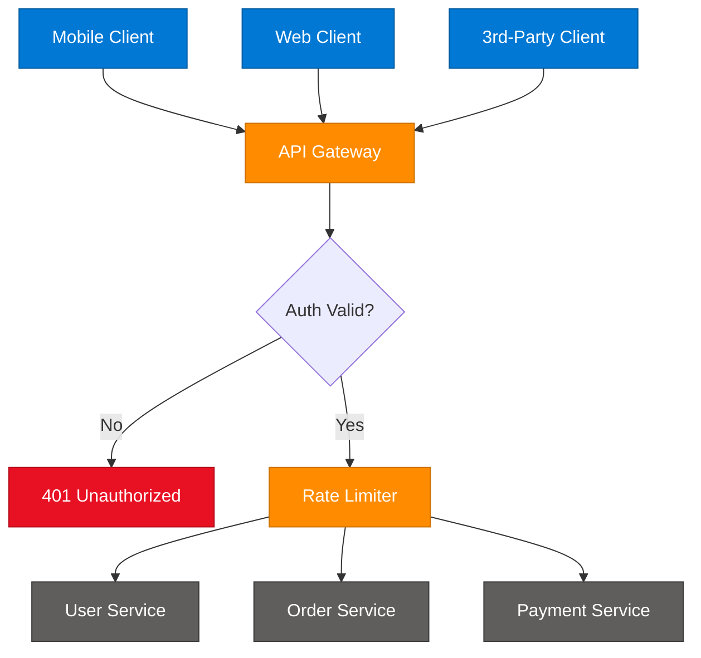

### API Gateway vs Load Balancer

| Aspect | API Gateway | Load Balancer |
|---|---|---|
| Layer | Application (L7), API-aware | Typically L4/L7, traffic-aware |
| Purpose | Routing + cross-cutting API concerns | Distribute traffic across instances |
| Auth | Often handles auth | Usually does not |
| Transformation | Can transform requests/responses | No |
| Examples | Kong, Apigee, AWS API Gateway, Zuul | NGINX, HAProxy, AWS ELB |

### Trade-offs

- **Pros**: Single point for security, simplifies clients, decouples internal topology.
- **Cons**: Potential single point of failure (mitigate with HA deployment), added latency hop, can become a bottleneck/monolith if overloaded with logic.

---

## 3. REST vs GraphQL

> **Source:** [blog.algomaster.io/p/rest-vs-graphql](https://blog.algomaster.io/p/rest-vs-graphql) — Ashish Pratap Singh

### What is REST?

REST (**Re**presentational **S**tate **T**ransfer) emerged in the early 2000s as a set of guiding principles that leverage the HTTP protocol for client-server communication. It is organized around **resources**, identified by unique URLs.

**HTTP Methods:**

| Method | Purpose |
|---|---|
| GET | Retrieve resources |
| POST | Create resources |
| PUT/PATCH | Update resources |
| DELETE | Remove resources |

**Common Status Codes:** `200 OK`, `201 Created`, `400 Bad Request`, `404 Not Found`, `500 Internal Server Error`

**Benefits:**
- Intuitive design aligned with business domains
- Stateless architecture enabling horizontal scalability
- Leverages built-in HTTP caching mechanisms
- Mature ecosystem with robust tooling

**Drawbacks:**
- **Over-fetching**: APIs return more data than the client needs, wasting bandwidth
- **Under-fetching**: Clients need multiple round trips for related data
- Versioning challenges (`/v1`, `/v2` endpoints)
- Rigid response structures dictated by the server

### What is GraphQL?

Introduced by Facebook in 2015, GraphQL is a query language that lets clients request exactly the data they need through a single endpoint (`/graphql`).

**Three Core Operations:**
1. **Queries** — fetch specific fields, client controls the shape of the response
2. **Mutations** — create, update, or delete resources
3. **Subscriptions** — real-time updates pushed when underlying data changes

**Example Schema:**
```graphql
type User {
  id: ID!
  firstName: String!
  email: String!
  posts: [Post!]
}

type Query {
  user(id: ID!): User
}
```

**Example Query:**
```graphql
query {
  user(id: 123) {
    name
    email
    posts {
      title
      content
    }
  }
}
```

**Example Mutation:**
```graphql
mutation {
  createPost(
    title: "GraphQL vs REST",
    content: "...",
    publishedDate: "2025-03-10"
  ) {
    id
    title
  }
}
```

**Example Subscription:**
```graphql
subscription {
  newPost {
    title
    content
    author { name }
  }
}
```

**Benefits:**
- Clients control exactly what data is retrieved
- Single request can fetch related data across multiple resources
- Strong typing through schema definitions
- Eliminates the need for URL-based versioning
- Native real-time support via subscriptions

**Drawbacks:**
- Requires GraphQL server infrastructure and schema setup
- HTTP caching is more complex (typically uses POST requests)
- Risk of excessive server load from arbitrary/expensive queries
- Security risk from deeply nested queries causing expensive database scans

### Comparison Table

| Aspect | REST | GraphQL |
|---|---|---|
| Architecture | Resource-based endpoints | Single flexible endpoint |
| Data Fetching | Fixed response structure | Client-defined queries |
| Multiple Resources | Requires multiple requests | Single request |
| Caching | Leverages HTTP caching natively | Requires custom solutions |
| Learning Curve | Well-established, familiar | Steeper, requires schema knowledge |
| Real-time | Requires polling/WebSockets | Native subscriptions |
| Versioning | Requires `/v1`, `/v2` URLs | Schema evolution without versioning |
| Over/Under-fetching | Common problem | Solved by design |
| Tooling | Mature (Postman, Swagger) | Growing (Apollo, Relay) |
| Error Handling | HTTP status codes | Usually 200 OK + errors array |

### Decision Guide

**Choose REST when:** the API is simple without complex querying needs, HTTP caching is essential, the team is familiar with REST, or you're integrating third-party services.

**Choose GraphQL when:** multiple client types (mobile, web, IoT) need different data shapes, real-time updates are critical, deeply nested data retrieval is common, or you want to avoid API versioning.

**Hybrid Approach:** Use GraphQL for client-facing applications requiring flexibility, and REST for admin interfaces/internal microservices prioritizing simplicity and caching.

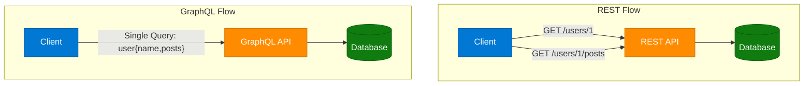

---

## 4. WebSockets

> *Synthesized from domain knowledge.*

**WebSockets** provide a persistent, full-duplex communication channel over a single TCP connection, enabling real-time, bidirectional data exchange between client and server without the overhead of repeated HTTP requests.

### How It Works

1. Client sends an HTTP request with an `Upgrade: websocket` header.
2. Server responds with `101 Switching Protocols`.
3. The TCP connection is "upgraded" — both sides can now send messages at any time.
4. Connection stays open until explicitly closed (or times out).

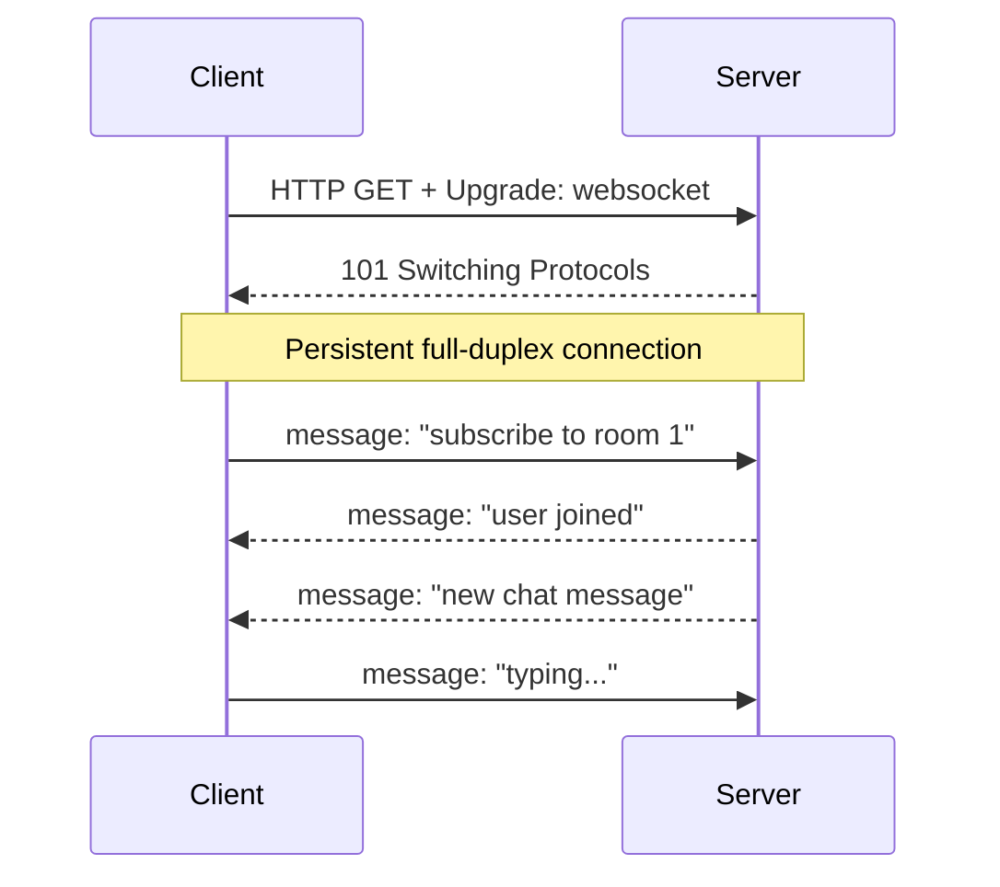

### WebSockets vs HTTP Polling vs Server-Sent Events (SSE)

| Aspect | HTTP Polling | Long Polling | SSE | WebSockets |
|---|---|---|---|---|
| Direction | Client-initiated only | Client-initiated only | Server → Client | Bidirectional |
| Connection | New connection each time | Held open until data/timeout | Single long-lived HTTP connection | Single persistent TCP connection |
| Overhead | High (repeated handshakes) | Medium | Low | Lowest |
| Use Case | Simple status checks | Near-real-time, simple infra | Live feeds, notifications | Chat, gaming, collaborative editing |
| Browser Support | Universal | Universal | Good (not IE) | Universal (modern) |

### Use Cases
- Chat applications (Slack, WhatsApp Web)
- Real-time multiplayer games
- Live dashboards / stock tickers
- Collaborative editing (Google Docs-style)
- Live notifications

### Scaling Considerations
- WebSocket connections are **stateful** — load balancers need sticky sessions or a shared connection registry (e.g., Redis Pub/Sub) to route messages to the correct server instance.
- Use a message broker (Redis, Kafka) to fan out events across multiple WebSocket server nodes.
- Implement heartbeats/ping-pong frames to detect dead connections.
- Plan for connection limits per server (file descriptors, memory per connection).

---

## 5. Webhooks

> *Synthesized from domain knowledge.*

A **Webhook** is a server-to-server callback: instead of a client polling for updates, the server proactively sends an HTTP POST request to a pre-registered URL when an event occurs. Webhooks are often called "reverse APIs."

### How It Works

1. Consumer registers a callback URL with the provider (e.g., Stripe, GitHub).
2. An event occurs on the provider's side (payment succeeded, code pushed).
3. Provider sends an HTTP POST with event payload to the consumer's URL.
4. Consumer's endpoint processes the payload and returns `200 OK`.
5. If the consumer doesn't acknowledge, the provider retries with backoff.

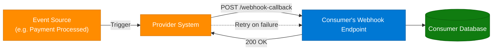

### Webhooks vs Polling vs WebSockets

| Aspect | Polling | Webhooks | WebSockets |
|---|---|---|---|
| Initiator | Client repeatedly asks | Server pushes on event | Either side, anytime |
| Efficiency | Low (wasted requests) | High (only on events) | High (persistent connection) |
| Connection | New each poll | New per event | One long-lived connection |
| Best For | Simple/low-frequency checks | Async event notification (server-to-server) | Continuous bidirectional streams |

### Best Practices
- **Signature verification**: Sign payloads (HMAC) so consumers can verify authenticity (e.g., Stripe's `Stripe-Signature` header).
- **Idempotency**: Consumers should handle duplicate deliveries gracefully (see Idempotency section).
- **Retries with exponential backoff**: Handle transient consumer downtime.
- **Timeouts**: Provider should not wait indefinitely for consumer's response.
- **Dead-letter queues**: Capture permanently failing webhook deliveries for manual inspection.
- **Ordering**: Don't assume webhooks arrive in order; include timestamps/sequence numbers.

### Common Use Cases
- Payment confirmations (Stripe, PayPal)
- CI/CD triggers (GitHub Actions on push)
- SaaS integrations (Slack notifications, Zapier)

---

## 6. Idempotency

> *Synthesized from domain knowledge.*

An operation is **idempotent** if performing it multiple times produces the same result as performing it once. This is critical for building reliable APIs, especially over unreliable networks where retries are common.

### Idempotent vs Non-Idempotent HTTP Methods

| Method | Idempotent? | Notes |
|---|---|---|
| GET | Yes | Read-only, no side effects |
| PUT | Yes | Replaces resource with same value each time |
| DELETE | Yes | Deleting an already-deleted resource is a no-op (often returns 404 but state is consistent) |
| HEAD | Yes | Read-only |
| POST | **No** | Typically creates a new resource each call |
| PATCH | Usually No | Depends on implementation (partial update could be additive) |

### Why It Matters

- **Network retries**: If a client sends a request and doesn't receive a response (timeout), it doesn't know if the server processed it. Retrying a non-idempotent operation (like "charge $50") could cause duplicate side effects (double charge).
- **Distributed systems**: Message queues often guarantee "at-least-once" delivery, meaning consumers may process the same message multiple times.

### Implementing Idempotency for POST (Idempotency Keys)

1. Client generates a unique idempotency key (e.g., UUID) per logical operation.
2. Client sends the key in a header: `Idempotency-Key: <uuid>`.
3. Server checks if it has already processed a request with this key.
   - If yes, return the cached/original response without reprocessing.
   - If no, process the request, store the key + response, then return.

```python
# Pseudo-code: Idempotency key handling on the server
def handle_payment_request(request):
    idempotency_key = request.headers.get("Idempotency-Key")

    existing = idempotency_store.get(idempotency_key)
    if existing:
        # Already processed — return the cached response
        return existing.response

    # Process the operation (e.g., within a DB transaction)
    with db.transaction():
        result = process_payment(request.body)
        idempotency_store.save(
            key=idempotency_key,
            response=result,
            expires_in="24h"
        )
    return result
```

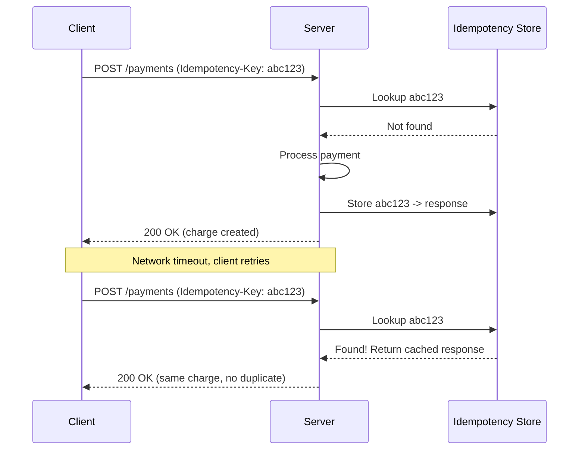

### Other Techniques
- **Unique constraints in DB**: Use a unique key (e.g., `order_id`) to prevent duplicate inserts at the database level.
- **Conditional requests**: `If-Match` / `ETag` headers for optimistic concurrency control on updates.
- **Natural idempotency**: Design operations to be idempotent by nature (e.g., "set balance to $100" instead of "add $100").

---

## 7. Rate Limiting Algorithms

> **Source:** [blog.algomaster.io/p/rate-limiting-algorithms-explained-with-code](https://blog.algomaster.io/p/rate-limiting-algorithms-explained-with-code)

Rate limiting protects services from being overwhelmed by too many requests from a single user or client. Below are the five major algorithms.

### 7.1 Token Bucket

A bucket holds tokens up to a maximum capacity. Tokens are added at a fixed rate (e.g., 10 tokens/second). Each request consumes a token to proceed; if there aren't enough tokens, the request is rejected.

```python
import time

class TokenBucket:
    def __init__(self, capacity, refill_rate):
        self.capacity = capacity
        self.tokens = capacity
        self.refill_rate = refill_rate  # tokens per second
        self.last_refill = time.time()

    def _refill(self):
        now = time.time()
        elapsed = now - self.last_refill
        self.tokens = min(self.capacity, self.tokens + elapsed * self.refill_rate)
        self.last_refill = now

    def allow_request(self):
        self._refill()
        if self.tokens >= 1:
            self.tokens -= 1
            return True
        return False
```

**Pros:** Simple, accommodates short bursts up to bucket capacity.
**Cons:** Per-user memory usage scales with number of users; doesn't guarantee a perfectly smooth rate.

### 7.2 Leaky Bucket

Requests enter from the top of the bucket; the bucket processes (leaks) requests at a constant rate from the bottom. Excess requests are discarded once the bucket is full.

```python
import time
from collections import deque

class LeakyBucket:
    def __init__(self, capacity, leak_rate):
        self.capacity = capacity
        self.leak_rate = leak_rate  # requests processed per second
        self.queue = deque()
        self.last_leak = time.time()

    def _leak(self):
        now = time.time()
        elapsed = now - self.last_leak
        leaked = int(elapsed * self.leak_rate)
        for _ in range(min(leaked, len(self.queue))):
            self.queue.popleft()
        self.last_leak = now

    def allow_request(self):
        self._leak()
        if len(self.queue) < self.capacity:
            self.queue.append(time.time())
            return True
        return False
```

**Pros:** Steady, predictable processing rate; prevents sudden bursts from overwhelming downstream systems.
**Cons:** Handles bursts poorly (excess requests dropped immediately); slightly more complex than Token Bucket.

### 7.3 Fixed Window Counter

Time is divided into fixed intervals (e.g., 1-minute windows). Each window tracks a request count starting at zero; once the limit is hit, subsequent requests are denied until the next window starts.

```python
import time

class FixedWindowCounter:
    def __init__(self, limit, window_size):
        self.limit = limit
        self.window_size = window_size  # seconds
        self.window_start = time.time()
        self.count = 0

    def allow_request(self):
        now = time.time()
        if now - self.window_start >= self.window_size:
            self.window_start = now
            self.count = 0
        if self.count < self.limit:
            self.count += 1
            return True
        return False
```

**Pros:** Easy to implement and understand; clear limits per window.
**Cons:** Weak boundary handling — a burst at the edge of two windows can allow up to 2x the intended rate.

### 7.4 Sliding Window Log

Maintains a log of request timestamps. On each new request, entries older than the window size are purged, then the remaining count is checked against the limit.

```python
import time
from collections import deque

class SlidingWindowLog:
    def __init__(self, limit, window_size):
        self.limit = limit
        self.window_size = window_size
        self.log = deque()

    def allow_request(self):
        now = time.time()
        while self.log and self.log[0] <= now - self.window_size:
            self.log.popleft()
        if len(self.log) < self.limit:
            self.log.append(now)
            return True
        return False
```

**Pros:** Highly accurate, no window boundary issues; works well for low-volume APIs.
**Cons:** Memory-intensive at high volume; requires timestamp storage and search overhead.

### 7.5 Sliding Window Counter

Tracks request counts from the current and previous windows, then computes a weighted sum to smooth the boundary transition.

```
weight = (100 - overlap%) * lastWindowRequests + currentWindowRequests
```

```python
import time
import math

class SlidingWindowCounter:
    def __init__(self, limit, window_size):
        self.limit = limit
        self.window_size = window_size
        self.prev_count = 0
        self.curr_count = 0
        self.curr_window_start = time.time()

    def allow_request(self):
        now = time.time()
        elapsed = now - self.curr_window_start

        if elapsed >= self.window_size:
            windows_passed = int(elapsed // self.window_size)
            if windows_passed == 1:
                self.prev_count = self.curr_count
            else:
                self.prev_count = 0
            self.curr_count = 0
            self.curr_window_start += windows_passed * self.window_size
            elapsed = now - self.curr_window_start

        overlap_fraction = 1 - (elapsed / self.window_size)
        weighted_count = self.prev_count * overlap_fraction + self.curr_count

        if weighted_count < self.limit:
            self.curr_count += 1
            return True
        return False
```

**Pros:** More accurate than Fixed Window; more memory-efficient than Sliding Window Log; smooths boundary transitions.
**Cons:** Slightly more complex to implement; assumes uniform request distribution within the previous window (approximation, not exact).

### Comparison Table

| Algorithm | Accuracy | Memory | Burst Handling | Complexity | Best For |
|---|---|---|---|---|---|
| Token Bucket | Medium | O(1) per user | Allows bursts up to capacity | Low | General-purpose APIs |
| Leaky Bucket | Medium | O(queue size) | Smooths bursts (drops excess) | Medium | Traffic shaping, steady outflow |
| Fixed Window Counter | Low | O(1) per user | Poor (edge bursts up to 2x) | Low | Simple, non-critical limits |
| Sliding Window Log | High | O(n) requests | Excellent | High | Low-volume, high-precision needs |
| Sliding Window Counter | High | O(1) per user | Very good | Medium | High-scale production systems |

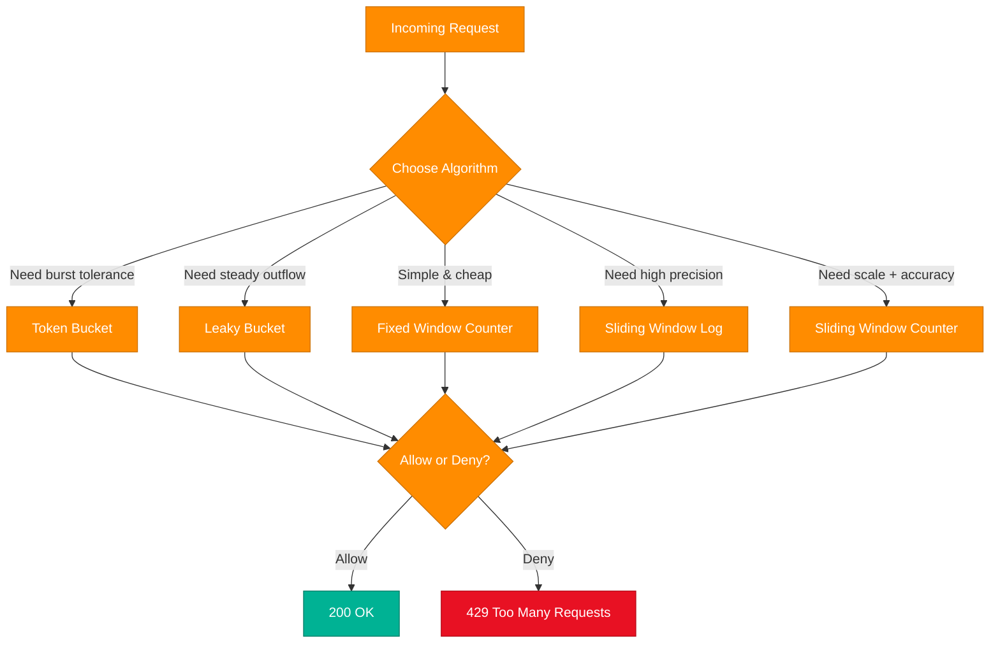

### Best Practices
- Communicate limits via response headers: `X-RateLimit-Limit`, `X-RateLimit-Remaining`, `X-RateLimit-Reset`, `Retry-After`.
- Return `429 Too Many Requests` when a client exceeds its limit.
- Implement rate limiting at multiple layers (API Gateway for coarse limits, service-level for fine-grained control).
- Use a distributed store (Redis) for rate limit counters when running multiple API server instances.

---

## 8. API Design Best Practices

> **Source:** [API Architecture Best Practices for Designing REST APIs — A. Wahab (Medium)](https://abdulrwahab.medium.com/api-architecture-best-practices-for-designing-rest-apis-bf907025f5f)

### Resource Naming
- Use **nouns**, not verbs, for endpoints: `/users` not `/getUsers`.
- Use plural nouns consistently: `/orders`, `/orders/{id}`.
- Use nested resources to express relationships: `/users/{id}/orders`.
- Use kebab-case or lowercase for URL paths: `/order-items` not `/orderItems`.

### HTTP Method & Status Code Usage

| Method | Use | Success Code | Idempotent |
|---|---|---|---|
| GET | Read | 200 OK | Yes |
| POST | Create | 201 Created | No |
| PUT | Full update/replace | 200 OK / 204 No Content | Yes |
| PATCH | Partial update | 200 OK | No (usually) |
| DELETE | Remove | 204 No Content | Yes |

### Versioning Strategies
- **URI versioning**: `/v1/users` (most common, easy to understand)
- **Header versioning**: `Accept: application/vnd.api.v1+json`
- **Query param versioning**: `/users?version=1`
- Prefer URI versioning for public APIs for discoverability; use semantic versioning principles to plan breaking vs. non-breaking changes.

### Pagination, Filtering, Sorting
```
GET /orders?status=shipped&sort=-createdAt&page=2&limit=50
```
- **Offset pagination**: simple but slow/inconsistent at scale (`?page=2&limit=50`)
- **Cursor-based pagination**: scalable, consistent under concurrent writes (`?cursor=eyJpZCI6MTIzfQ`)

### Error Handling
- Use consistent, structured error responses:
```json
{
  "error": {
    "code": "VALIDATION_ERROR",
    "message": "Email field is required",
    "details": [{"field": "email", "issue": "missing"}]
  }
}
```
- Use proper HTTP status codes (`400` client error, `401` unauthenticated, `403` unauthorized, `404` not found, `409` conflict, `422` unprocessable entity, `500` server error).

### Security
- Always use HTTPS/TLS.
- Authenticate via OAuth2/JWT; never pass secrets in URLs.
- Validate and sanitize all inputs (prevent injection attacks).
- Apply rate limiting and request size limits.
- Use least-privilege API keys/scopes.

### Documentation & Discoverability
- Provide OpenAPI/Swagger specs.
- Include example requests/responses.
- Use HATEOAS (Hypermedia as the Engine of Application State) where relevant, to let clients discover available actions via links.

### Other Best Practices
- **Statelessness**: Each request should contain all information needed; don't rely on server-side session state.
- **Consistency**: Use consistent naming, casing, and date formats (ISO 8601) across the API.
- **Backward compatibility**: Add fields without breaking existing clients; avoid removing/renaming fields in non-major versions.
- **Caching**: Use `ETag`/`Cache-Control` headers for cacheable GET responses.
- **Idempotency keys**: Support for unsafe operations like POST (see Section 6).

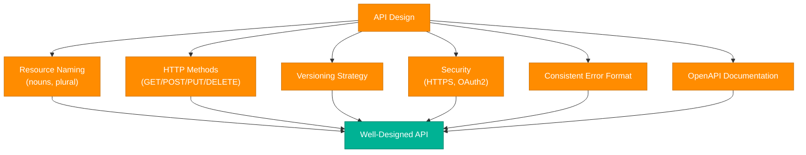

---

## 9. ACID Transactions

> *Synthesized from domain knowledge (source article was paywalled).*

A **database transaction** is a sequence of one or more operations executed as a single logical unit of work — either all operations succeed, or none do. **ACID** describes the four guarantees relational databases provide for transactions.

### Atomicity
All operations within a transaction succeed, or none of them are applied ("all or nothing"). If any step fails, the entire transaction is rolled back.

> Example: Transferring $100 from Account A to Account B involves two operations (debit A, credit B). If the credit fails after the debit succeeds, atomicity guarantees both operations are rolled back — no money disappears.

### Consistency
A transaction takes the database from one valid state to another valid state, respecting all defined rules: constraints, cascades, triggers, and data types. Consistency ensures application-level invariants (e.g., "balance can't go negative") aren't violated.

### Isolation
Concurrent transactions execute as if they ran sequentially, even though they may physically interleave. Isolation prevents transactions from seeing each other's intermediate (uncommitted) states.

**Isolation Levels (weakest to strongest):**

| Level | Dirty Read | Non-Repeatable Read | Phantom Read |
|---|---|---|---|
| Read Uncommitted | Possible | Possible | Possible |
| Read Committed | Prevented | Possible | Possible |
| Repeatable Read | Prevented | Prevented | Possible |
| Serializable | Prevented | Prevented | Prevented |

### Durability
Once a transaction is committed, its changes persist even in the event of a system crash or power failure — typically achieved via write-ahead logs (WAL) and disk flushes.

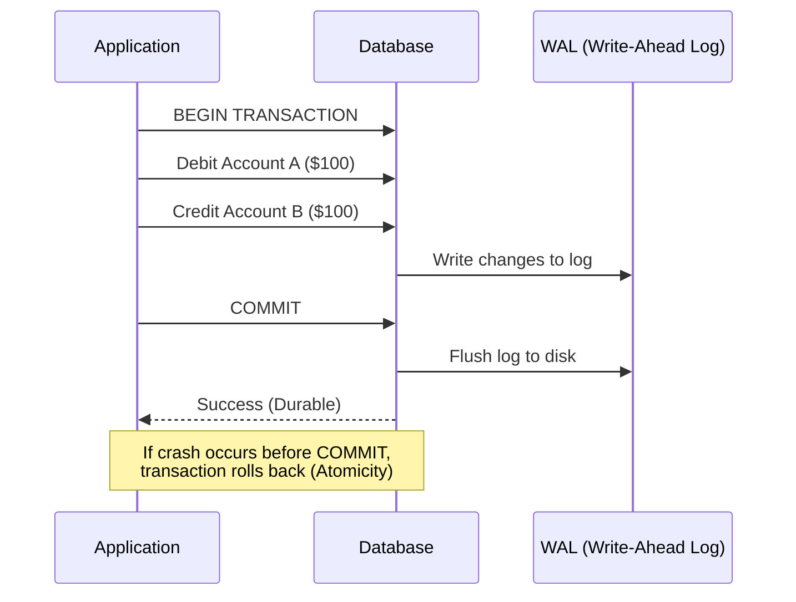

### Putting It Together — Example

```sql
BEGIN TRANSACTION;

UPDATE accounts SET balance = balance - 100 WHERE id = 'A';
UPDATE accounts SET balance = balance + 100 WHERE id = 'B';

COMMIT;
-- If either UPDATE fails, ROLLBACK restores original state
```

### ACID vs BASE

| Aspect | ACID (SQL) | BASE (NoSQL) |
|---|---|---|
| Consistency | Strong | Eventual |
| Availability | Can be sacrificed for consistency | Prioritized |
| Use Case | Banking, inventory, billing | Social feeds, analytics, caching |
| Full Form | Atomicity, Consistency, Isolation, Durability | Basically Available, Soft state, Eventual consistency |

### Common Mistakes
- Assuming NoSQL databases never support ACID (many, like MongoDB and modern DynamoDB transactions, support it for limited scopes).
- Using overly broad transactions that hold locks too long, hurting throughput.
- Ignoring isolation level trade-offs (e.g., using Serializable everywhere kills performance).
- Forgetting that distributed transactions across microservices need patterns like **Saga** since traditional ACID doesn't span service boundaries.

---

## 10. SQL vs NoSQL

> *Synthesized from domain knowledge.*

### Comprehensive Comparison

| Dimension | SQL (Relational) | NoSQL (Non-Relational) |
|---|---|---|
| **Data Model** | Tables with fixed schema (rows/columns) | Document, key-value, graph, or wide-column |
| **Schema** | Rigid, defined upfront | Flexible/dynamic, schema-on-read |
| **Scalability** | Vertical (scale-up), harder to scale horizontally | Horizontal (scale-out) by design |
| **Consistency** | Strong consistency (ACID) | Often eventual consistency (BASE), though some support ACID |
| **Joins** | Native, efficient JOIN support | Limited or no joins; data often denormalized |
| **Query Language** | SQL (standardized) | Varies by database (MongoDB query, CQL, Gremlin, etc.) |
| **Transactions** | Full ACID across multiple tables | Limited; often single-document/partition scope |
| **Use Cases** | Banking, ERP, inventory, anything needing strong consistency | Social media, IoT, content management, real-time analytics |
| **Examples** | MySQL, PostgreSQL, Oracle, SQL Server | MongoDB, Cassandra, DynamoDB, Redis, Neo4j |
| **Performance at Scale** | Can degrade with very large datasets/joins | Optimized for large-scale, high-throughput workloads |
| **Data Integrity** | Enforced via constraints, foreign keys | Enforced at application level typically |
| **Maturity & Tooling** | Decades of tooling, ORM support | Growing rapidly, less standardized |
| **Cost Model** | Often licensing-heavy (Oracle, SQL Server) | Frequently open-source / pay-as-you-scale (cloud-managed) |

### When to Choose SQL
- Complex relationships and multi-table joins are common.
- Strong consistency and ACID transactions are required (financial systems).
- Data structure is well-understood and stable.
- Reporting/analytics with complex queries (aggregations, joins).

### When to Choose NoSQL
- Schema changes frequently or data is semi-structured.
- Need to scale horizontally across many commodity servers.
- High write throughput with simple access patterns (key lookups).
- Use case fits a specialized model (graph relationships, time-series, documents).

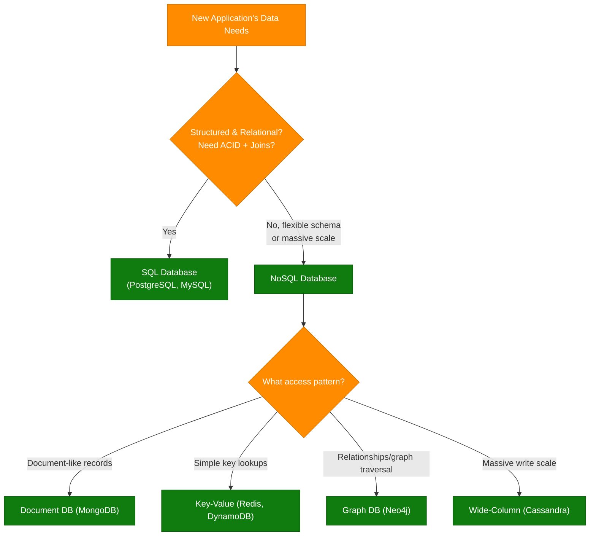

---

## 11. Database Indexes

> *Synthesized from domain knowledge.*

An **index** is a data structure that improves the speed of data retrieval operations on a database table, at the cost of additional storage and slower writes (since indexes must be updated on every insert/update/delete).

### How Indexes Work (B-Tree Example)

Most relational databases use **B-Trees** (or B+Trees) for indexes, which keep data sorted and allow searches, sequential access, insertions, and deletions in O(log n) time.

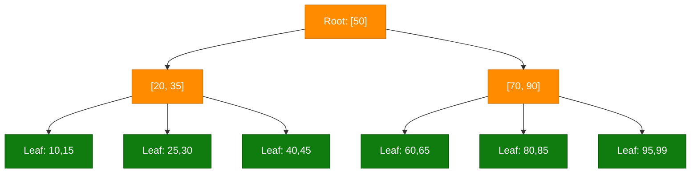

### Types of Indexes

| Type | Description | Use Case |
|---|---|---|
| **Primary Index** | Built on the primary key automatically | Unique row lookup |
| **Secondary Index** | Built on non-key columns | Speed up queries on other fields |
| **Composite Index** | Spans multiple columns | Queries filtering on multiple fields |
| **Unique Index** | Enforces uniqueness | Email, username columns |
| **Full-Text Index** | Optimized for text search | Search functionality |
| **Hash Index** | O(1) lookups via hash table | Exact-match queries (not range) |
| **Bitmap Index** | Bit arrays per distinct value | Low-cardinality columns (e.g., gender, status) |
| **Covering Index** | Includes all columns needed by a query | Avoids touching the base table |

### Trade-offs

| Pros | Cons |
|---|---|
| Dramatically faster reads/lookups | Slower writes (INSERT/UPDATE/DELETE must update index) |
| Enables efficient range queries & sorting | Extra disk/memory storage |
| Can enforce uniqueness constraints | Too many indexes can hurt write-heavy workloads |

### Example
```sql
-- Without an index: full table scan O(n)
SELECT * FROM users WHERE email = 'foo@example.com';

-- Create an index
CREATE INDEX idx_users_email ON users(email);

-- With the index: O(log n) lookup via B-Tree
SELECT * FROM users WHERE email = 'foo@example.com';
```

### Best Practices
- Index columns frequently used in `WHERE`, `JOIN`, and `ORDER BY` clauses.
- Avoid over-indexing tables with heavy write traffic.
- Use composite indexes for multi-column filters, ordering columns by selectivity (most selective first).
- Monitor and drop unused indexes (they slow writes without benefiting reads).
- Use `EXPLAIN`/`EXPLAIN ANALYZE` to verify the query planner is using indexes as expected.

---

## 12. Database Sharding

> *Synthesized from domain knowledge.*

**Sharding** (horizontal partitioning) splits a large dataset across multiple database instances (shards), each holding a subset of the data. This allows a system to scale beyond what a single machine can handle.

### Sharding Strategies

| Strategy | Description | Pros | Cons |
|---|---|---|---|
| **Range-based** | Partition by value ranges (e.g., user_id 1-1000 → shard 1) | Simple, supports range queries | Risk of hot shards (uneven distribution) |
| **Hash-based** | Apply hash function to shard key, mod by shard count | Even distribution | Range queries become expensive; resharding is hard |
| **Geo/Directory-based** | Partition by region or lookup table | Low latency for regional users | Lookup service adds complexity/SPOF risk |
| **Consistent Hashing** | Hash ring minimizes data movement when adding/removing shards | Minimal data movement on rebalance | More complex to implement |

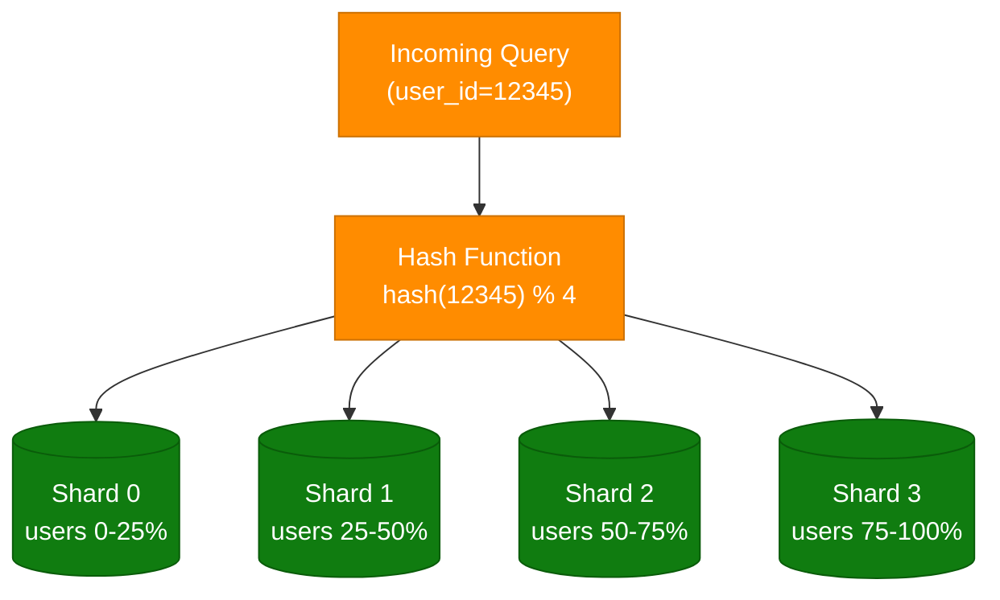

### Challenges with Sharding
- **Cross-shard joins/transactions**: Expensive or unsupported; often requires application-level aggregation or distributed transaction patterns (Saga, 2PC).
- **Resharding**: Adding/removing shards requires redistributing data — consistent hashing minimizes this.
- **Hot shards**: Uneven access patterns (celebrity users, viral content) can overload specific shards.
- **Global uniqueness**: Auto-increment IDs don't work well across shards; use UUIDs or distributed ID generators (Snowflake).
- **Operational complexity**: Backups, monitoring, and schema migrations multiply across shards.

### Sharding vs Partitioning vs Replication

| Concept | Description |
|---|---|
| **Sharding** | Splitting data across multiple independent database instances (horizontal) |
| **Partitioning** | Splitting data within a single database instance (e.g., table partitions by date) |
| **Replication** | Copying the same data across multiple instances for availability/read scaling |

---

## 13. Data Replication

> **Source:** [redis.com/blog/what-is-data-replication](https://redis.com/blog/what-is-data-replication/)

**Data replication** is the process of storing the same data on multiple machines/nodes to improve availability, fault tolerance, and read scalability.

### Replication Models

| Model | Description | Trade-off |
|---|---|---|
| **Leader-Follower (Master-Replica)** | One primary handles writes; replicas handle reads and replicate from primary | Simple, but primary is a bottleneck/SPOF unless failover is configured |
| **Multi-Leader (Master-Master)** | Multiple nodes accept writes, sync with each other | Higher write availability, but conflict resolution needed |
| **Leaderless** | Any node can accept reads/writes; quorum-based consistency (e.g., Dynamo-style) | High availability, but more complex consistency model |

### Synchronous vs Asynchronous Replication

| Aspect | Synchronous | Asynchronous |
|---|---|---|
| Write Acknowledgment | Waits for replica(s) to confirm | Returns immediately after primary write |
| Consistency | Strong (no data loss on failover) | Eventual (possible data loss on failover) |
| Latency | Higher (waits for network round trip) | Lower |
| Use Case | Financial systems requiring zero data loss | High-throughput systems tolerating brief staleness |

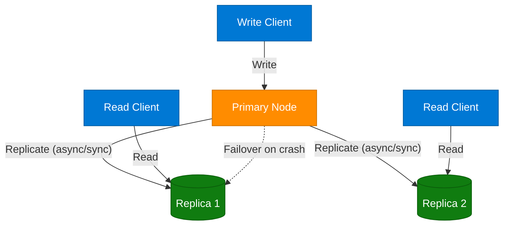

### Why Replicate?
- **High Availability**: If the primary fails, a replica can be promoted (failover).
- **Read Scalability**: Distribute read traffic across replicas.
- **Disaster Recovery**: Geo-distributed replicas protect against regional outages.
- **Reduced Latency**: Serve reads from a replica geographically close to the user.

### Challenges
- **Replication lag**: Asynchronous replicas may serve stale data.
- **Conflict resolution**: Multi-leader/leaderless setups need strategies (last-write-wins, vector clocks, CRDTs).
- **Failover complexity**: Detecting primary failure and promoting a replica without data loss or split-brain.

---

## 14. Database Scaling

> **Source:** [blog.algomaster.io/p/system-design-how-to-scale-a-database](https://blog.algomaster.io/p/system-design-how-to-scale-a-database)

### Vertical Scaling (Scale-Up)
Add more CPU, RAM, or faster disks to a single database server.

| Pros | Cons |
|---|---|
| Simple, no architecture changes | Hardware limits (ceiling) |
| No data distribution complexity | Single point of failure |
| No cross-node consistency issues | Expensive at high end, downtime to upgrade |

### Horizontal Scaling (Scale-Out)
Add more database servers and distribute data/load across them (replication for reads, sharding for writes).

| Pros | Cons |
|---|---|
| Near-limitless scalability | Increased operational complexity |
| Better fault tolerance | Cross-node joins/transactions are harder |
| Cost-effective with commodity hardware | Requires careful shard key design |

### Common Scaling Techniques (in typical adoption order)

```mermaid
graph LR
    singleDb[("Single DB Instance")] --> addIndexes["1. Add Indexes\n& Optimize Queries"]
    addIndexes --> addCaching["2. Add Caching Layer\n(Redis/Memcached)"]
    addCaching --> addReplicas["3. Add Read Replicas"]
    addReplicas --> vertScale["4. Vertical Scaling"]
    vertScale --> addSharding["5. Sharding /\nHorizontal Partitioning"]
    addSharding --> microPerDb["6. Database-per-Service\n(Microservices)"]

    classDef dataNode fill:#107C10,stroke:#0A5C0A,color:#fff
    classDef processNode fill:#FF8C00,stroke:#CC7000,color:#fff

    class singleDb dataNode
    class addIndexes,addCaching,addReplicas,vertScale,addSharding,microPerDb processNode
```

### Other Scaling Techniques
- **Caching**: Cache frequent reads (Redis/Memcached) to offload the database.
- **Connection pooling**: Reuse DB connections (PgBouncer) to avoid connection overhead.
- **Read/write splitting**: Route reads to replicas, writes to the primary.
- **Denormalization**: Trade storage/redundancy for fewer joins and faster reads.
- **CQRS (Command Query Responsibility Segregation)**: Separate read and write models/databases optimized independently.
- **Materialized views**: Precompute expensive aggregations.
- **Archiving/Cold storage**: Move infrequently accessed data out of the hot path.

### Decision Framework
1. Start with query optimization and indexing — cheapest wins.
2. Add a caching layer for hot reads.
3. Scale vertically if it's quick and the workload still fits one machine.
4. Add read replicas once read traffic dominates.
5. Shard when write throughput or data volume exceeds a single primary's capacity.

---

## 15. 15 Types of Databases

> **Source:** [blog.algomaster.io/p/15-types-of-databases](https://blog.algomaster.io/p/15-types-of-databases)

| # | Type | Description | Examples | Typical Use Case |
|---|---|---|---|---|
| 1 | **Relational (RDBMS)** | Structures data into tables of rows/columns; supports SQL and ACID transactions | MySQL, PostgreSQL, Oracle | Banking, ERP, transactional systems |
| 2 | **Key-Value Store** | Fast retrieval of values based on unique keys | Redis, DynamoDB | Sessions, caching |
| 3 | **Document Database** | Stores semi-structured data (JSON/XML/BSON) with flexible schema | MongoDB, Couchbase, CouchDB | Content management, catalogs |
| 4 | **Graph Database** | Specializes in storing/querying interconnected data via nodes and edges | Neo4j, Amazon Neptune | Social networks, recommendation engines, fraud detection |
| 5 | **Wide-Column Store** | Optimized for large data volumes across many machines with flexible columns | Cassandra, HBase, Bigtable | Time-series, large-scale write-heavy apps |
| 6 | **In-Memory Database** | Stores data directly in RAM for extremely fast access | Redis, Memcached | Caching, real-time leaderboards |
| 7 | **Time-Series Database** | Specializes in time-stamped data | InfluxDB, TimescaleDB, Prometheus | Monitoring, IoT sensor data, metrics |
| 8 | **Object-Oriented Database** | Stores/manipulates data as objects, mirroring OOP | ObjectDB, db4o | Applications with complex object graphs |
| 9 | **Text Search Database** | Efficient storage/indexing/retrieval of unstructured text | Elasticsearch, Solr, Sphinx | Full-text search, log analytics |
| 10 | **Spatial Database** | Handles geographical/spatial information | PostGIS, Oracle Spatial | Maps, geofencing, logistics |
| 11 | **Blob Datastore** | Manages large unstructured blocks (images, audio, video) | Amazon S3, Azure Blob Storage, HDFS | Media storage, backups |
| 12 | **Ledger Database** | Immutable, append-only record of transactions | Amazon QLDB, Hyperledger Fabric | Audit trails, supply chain, finance |
| 13 | **Hierarchical Database** | Organizes data into a tree-like parent-child structure | IBM IMS, Windows Registry | Legacy systems, config storage |
| 14 | **Vector Database** | Stores/searches vectors (arrays of numbers) for similarity search | Faiss, Milvus, Pinecone | AI/ML embeddings, semantic search, RAG |
| 15 | **Embedded Database** | Tightly integrated into the application itself | SQLite, RocksDB, Berkeley DB | Mobile apps, local storage, edge devices |

```mermaid
graph TD
    dbTypes["15 Database Types"] --> sqlFamily["Relational"]
    dbTypes --> nosqlFamily["NoSQL Family"]
    dbTypes --> specialFamily["Specialized"]

    nosqlFamily --> kv["Key-Value"]
    nosqlFamily --> doc["Document"]
    nosqlFamily --> graph["Graph"]
    nosqlFamily --> wideCol["Wide-Column"]

    specialFamily --> timeSeries["Time-Series"]
    specialFamily --> vector["Vector"]
    specialFamily --> textSearch["Text Search"]
    specialFamily --> spatial["Spatial"]
    specialFamily --> blob["Blob Store"]
    specialFamily --> ledger["Ledger"]
    specialFamily --> embedded["Embedded"]
    specialFamily --> inMemory["In-Memory"]

    classDef dataNode fill:#107C10,stroke:#0A5C0A,color:#fff
    classDef processNode fill:#FF8C00,stroke:#CC7000,color:#fff

    class dbTypes processNode
    class sqlFamily,nosqlFamily,specialFamily,kv,doc,graph,wideCol,timeSeries,vector,textSearch,spatial,blob,ledger,embedded,inMemory dataNode
```

---

## 16. Bloom Filters

> *Synthesized from domain knowledge.*

A **Bloom filter** is a space-efficient, probabilistic data structure used to test whether an element is **possibly in a set** or **definitely not in a set**. It can produce false positives but never false negatives.

### How It Works

1. A bit array of size `m`, initialized to all 0s.
2. `k` independent hash functions map each element to `k` positions in the bit array.
3. **Insert**: Set all `k` bit positions to 1 for the element's hashes.
4. **Lookup**: Check all `k` positions — if any are 0, the element is **definitely not** present. If all are 1, the element is **probably** present (could be a false positive due to hash collisions).

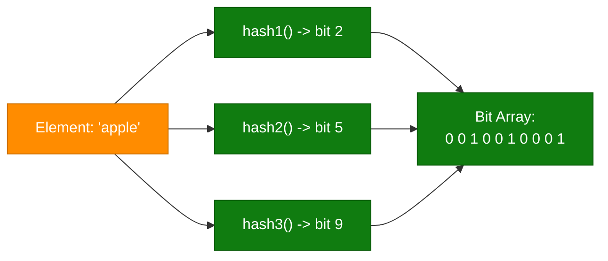

### Python Example

```python
import hashlib

class BloomFilter:
    def __init__(self, size=1000, num_hashes=3):
        self.size = size
        self.num_hashes = num_hashes
        self.bit_array = [0] * size

    def _hashes(self, item):
        results = []
        for i in range(self.num_hashes):
            digest = hashlib.md5(f"{item}-{i}".encode()).hexdigest()
            results.append(int(digest, 16) % self.size)
        return results

    def add(self, item):
        for pos in self._hashes(item):
            self.bit_array[pos] = 1

    def might_contain(self, item):
        return all(self.bit_array[pos] == 1 for pos in self._hashes(item))

bf = BloomFilter()
bf.add("user123")
print(bf.might_contain("user123"))  # True (probably present)
print(bf.might_contain("user999"))  # False (definitely not present)
```

### Properties

| Property | Detail |
|---|---|
| False Positives | Possible (tunable via size/hash count) |
| False Negatives | Never |
| Space Efficiency | Very high — much smaller than storing actual elements |
| Lookup/Insert Time | O(k) — constant relative to number of elements |
| Deletion | Not supported in standard Bloom filters (use Counting Bloom Filter variant) |

### Real-World Use Cases
- **Databases**: Avoid unnecessary disk lookups (Cassandra, HBase use Bloom filters to skip SSTables that don't contain a key).
- **Web crawlers**: Check if a URL has already been visited without storing every URL.
- **CDNs/Caching**: Quickly check if content might be cached before an expensive lookup.
- **Malicious URL detection**: Browsers (e.g., old Chrome Safe Browsing) use Bloom filters to check URLs against known-bad lists.
- **Distributed systems**: Reduce cross-node lookups by pre-filtering with a Bloom filter (e.g., "does this key exist anywhere?").

### Trade-offs
- Tuning `m` (bit array size) and `k` (number of hash functions) balances false-positive rate vs. memory usage.
- Cannot remove elements without a variant (Counting Bloom Filter, which uses counters instead of bits).
- Not suitable when zero false positives are required.

---

## 17. Database Architectures

> **Source:** [MongoDB — Active-Active Application Architectures](https://www.mongodb.com/developer/products/mongodb/active-active-application-architectures/)

### Active-Passive Architecture
One data center/region actively serves reads and writes (primary); a secondary region stands by, replicating data, ready to take over (failover) if the primary fails.

| Pros | Cons |
|---|---|
| Simpler conflict resolution (single write source) | Standby resources underutilized |
| Easier to reason about consistency | Failover causes brief downtime/latency spike |

### Active-Active Architecture
Multiple data centers/regions actively accept both reads **and** writes simultaneously, with data synchronized (often asynchronously) across regions.

| Pros | Cons |
|---|---|
| Lower latency (writes served from nearest region) | Conflict resolution needed (concurrent writes to same record) |
| Higher availability — no single region is a SPOF | More complex consistency model (often eventual) |
| Better resource utilization (all regions active) | Requires conflict-resolution strategy (last-write-wins, CRDTs, custom merge logic) |

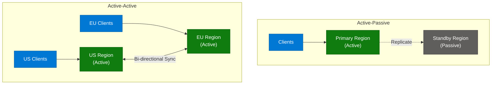

### Conflict Resolution Strategies (Active-Active)
- **Last-Write-Wins (LWW)**: Use timestamps; simplest but can silently lose updates.
- **CRDTs (Conflict-free Replicated Data Types)**: Data structures designed to merge automatically without conflicts.
- **Application-level merge logic**: Custom business rules to reconcile conflicting writes.
- **Vector clocks**: Track causality between writes to detect true conflicts vs. sequential updates.

### When to Use Each

| Scenario | Recommended Architecture |
|---|---|
| Strong consistency required, simpler ops | Active-Passive |
| Global user base needing low write latency everywhere | Active-Active |
| Disaster recovery only (rare failover) | Active-Passive |
| Multi-region collaborative apps (e.g., global SaaS) | Active-Active |

---

## 18. Interview Q&A Cheatsheet

**Q1: What's the difference between REST and GraphQL, and when would you choose one over the other?**
REST is resource-based with fixed endpoints and responses; GraphQL is a query language letting clients request exactly the fields they need through a single endpoint. Choose REST for simplicity, HTTP caching, and straightforward CRUD; choose GraphQL when clients have varying data needs (mobile vs. web), need to avoid over/under-fetching, or require real-time subscriptions.

**Q2: What problem does an API Gateway solve in a microservices architecture?**
It centralizes cross-cutting concerns — authentication, rate limiting, routing, request/response transformation, and observability — so individual microservices don't need to reimplement them, and clients have a single entry point instead of needing to know every service's address.

**Q3: How do WebSockets differ from traditional HTTP polling, and what scaling challenge do they introduce?**
WebSockets maintain a single persistent, full-duplex TCP connection, eliminating the overhead of repeated handshakes that polling requires. The scaling challenge: WebSocket connections are stateful, so load balancers need sticky sessions or a shared pub/sub layer (e.g., Redis) to route messages to the server instance holding a given client's connection.

**Q4: Why is idempotency important for APIs, and how do you implement it for a POST request?**
Idempotency ensures retried requests (due to network timeouts) don't cause duplicate side effects, like double-charging a payment. Implement it with client-generated idempotency keys: the server checks if a request with that key was already processed and returns the cached response instead of reprocessing.

**Q5: Compare the five rate limiting algorithms — which would you use for a high-scale production API?**
Token Bucket and Leaky Bucket allow/smooth bursts with O(1) memory; Fixed Window is simplest but allows edge-case bursts up to 2x the limit; Sliding Window Log is most accurate but memory-heavy; Sliding Window Counter balances accuracy and memory efficiency. For high-scale production, Sliding Window Counter or Token Bucket (backed by Redis) is typically preferred.

**Q6: Explain the four ACID properties with an example.**
Atomicity (all-or-nothing), Consistency (valid state transitions per constraints), Isolation (concurrent transactions don't interfere), Durability (committed data survives crashes). Example: a bank transfer debits one account and credits another — atomicity ensures both happen or neither does.

**Q7: When would you choose NoSQL over SQL for a new system?**
When the schema is likely to evolve frequently, when you need to scale horizontally across many nodes for very high write throughput, when access patterns are simple key lookups or document retrieval rather than complex joins, or when the data model naturally fits document/graph/wide-column structures.

**Q8: How does a database index speed up queries, and what's the cost?**
Indexes (typically B-Trees) maintain sorted references to rows, enabling O(log n) lookups instead of full table scans (O(n)). The cost is additional storage and slower writes, since every INSERT/UPDATE/DELETE must also update the index.

**Q9: What's the difference between database sharding and replication?**
Sharding splits data across multiple nodes so each node holds a different subset (horizontal partitioning, scales writes and storage). Replication copies the same data across multiple nodes (improves availability and read scalability). Systems often use both together.

**Q10: What is a Bloom filter, and why would a database like Cassandra use one?**
A Bloom filter is a probabilistic data structure that tells you an element is "definitely not in the set" or "possibly in the set," with no false negatives but possible false positives. Cassandra uses Bloom filters to quickly skip SSTables (on-disk files) that definitely don't contain a requested key, avoiding expensive disk I/O.

**Q11: What's the difference between synchronous and asynchronous replication, and what's the trade-off?**
Synchronous replication waits for replica acknowledgment before confirming a write, guaranteeing no data loss on failover but adding latency. Asynchronous replication returns immediately after the primary writes, offering lower latency but risking data loss if the primary fails before replicating.

**Q12: What is Active-Active database architecture, and what new problem does it introduce compared to Active-Passive?**
Active-Active allows multiple regions to accept both reads and writes simultaneously, reducing latency and improving availability. It introduces write conflict resolution — since the same record could be modified concurrently in two regions — requiring strategies like last-write-wins, CRDTs, or custom merge logic, unlike Active-Passive where only one region ever writes.

---

*End of document.*
