# System Design: Architectural Patterns & Tradeoffs

> **Sources:** AlgoMaster (algomaster.io, blog.algomaster.io), Confluent, Spiceworks, AWS, Medium (Hashmap Inc), multiple references
> **Last Updated:** July 2026

---

## Table of Contents

### Part 1: Architectural Patterns
1. [Client-Server Architecture](#1-client-server)
2. [Microservices Architecture](#2-microservices)
3. [Serverless Architecture](#3-serverless)
4. [Event-Driven Architecture](#4-event-driven)
5. [Peer-to-Peer Architecture](#5-p2p)

### Part 2: System Design Tradeoffs
6. [Top 15 System Design Tradeoffs Overview](#6-top-15-tradeoffs)
7. [Vertical vs Horizontal Scaling](#7-vertical-vs-horizontal)
8. [Concurrency vs Parallelism](#8-concurrency-vs-parallelism)
9. [Long Polling vs WebSockets vs SSE](#9-long-polling-vs-websockets)
10. [Batch vs Stream Processing](#10-batch-vs-stream)
11. [Stateful vs Stateless Design](#11-stateful-vs-stateless)
12. [Strong vs Eventual Consistency](#12-consistency-models)
13. [Read-Through vs Write-Through Cache](#13-cache-write-strategies)
14. [Push vs Pull Architecture](#14-push-vs-pull)
15. [REST vs RPC (gRPC)](#15-rest-vs-rpc)
16. [Synchronous vs Asynchronous Communication](#16-sync-vs-async)
17. [Latency vs Throughput](#17-latency-vs-throughput)
18. [Interview Q&A Cheatsheet](#18-interview-qa)

---

## Part 1: Architectural Patterns

<a id="1-client-server"></a>
## 1. Client-Server Architecture

> Source: https://algomaster.io/learn/system-design/client-server-architecture

The client-server model is the foundational architecture underlying almost all distributed systems and the web itself. A **client** (browser, mobile app, IoT device) initiates requests for resources or services, and a **server** (a dedicated, often more powerful machine) listens for requests, processes them, and returns responses.

### Core Characteristics
- **Separation of concerns**: Clients handle presentation/UX; servers handle business logic, storage, and processing.
- **Many-to-one relationship**: A single server (or server cluster) can serve many clients simultaneously.
- **Request-response protocol**: Typically over HTTP/HTTPS, using TCP/IP as the transport layer.
- **Centralized resource management**: Data and computational resources live primarily on the server, making updates, security, and backups easier to manage centrally.

### Variants
| Variant | Description | Example |
|---|---|---|
| 2-Tier | Client talks directly to a database server | Legacy desktop apps |
| 3-Tier | Client → Application server → Database server | Most web apps |
| N-Tier | Multiple specialized layers (web, app, cache, DB, etc.) | Enterprise systems |

### Advantages
- Centralized control over data integrity, security, and access permissions.
- Easier to maintain, upgrade, and scale the server independently of clients.
- Clients can be lightweight (thin clients).

### Disadvantages
- Server is a potential **single point of failure** and bottleneck.
- Network dependency — no server access means no service (unless offline mode is built in).
- Scaling requires deliberate architecture (load balancers, replicas, caching).

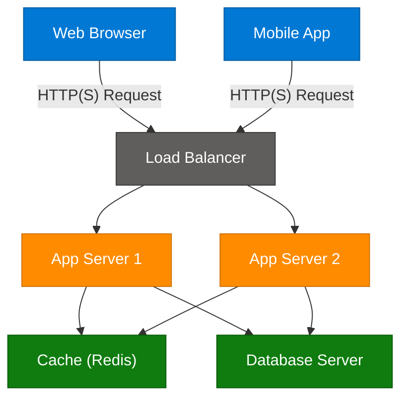

---

<a id="2-microservices"></a>
## 2. Microservices Architecture

> Source: https://medium.com/hashmapinc/the-what-why-and-how-of-a-microservices-architecture-4179579423a9

Microservices architecture structures an application as a collection of small, loosely coupled, independently deployable services, each owning a specific business capability (e.g., "orders," "payments," "inventory"). This contrasts with the **monolithic** approach, where all functionality lives in a single deployable codebase.

### The "What"
Each microservice:
- Owns its own data store (database-per-service pattern).
- Exposes a well-defined API (REST, gRPC, or messaging).
- Can be developed, deployed, and scaled independently by a small, autonomous team ("two-pizza team").
- Communicates with other services over the network, not via in-process calls.

### The "Why"
- **Independent scalability** — scale only the bottleneck service (e.g., the "search" service during peak traffic), not the entire app.
- **Technology heterogeneity** — each team can pick the best language/database/stack for their service.
- **Faster, safer deployments** — small, isolated changes reduce blast radius and enable continuous delivery.
- **Fault isolation** — a crash in one service doesn't necessarily bring down the whole system (if designed with circuit breakers/bulkheads).
- **Organizational alignment** — Conway's Law: team structure mirrors service boundaries, reducing coordination overhead.

### The "How"
1. **Decompose by business capability / bounded context** (Domain-Driven Design).
2. **API Gateway** for routing, auth, rate limiting at the edge.
3. **Service discovery** (Consul, Eureka, Kubernetes DNS) so services can find each other dynamically.
4. **Inter-service communication**: synchronous (REST/gRPC) or asynchronous (message queues/event bus).
5. **Resilience patterns**: circuit breakers (Hystrix/Resilience4j), retries with backoff, timeouts, bulkheads.
6. **Observability**: distributed tracing (Jaeger/Zipkin), centralized logging, metrics (Prometheus/Grafana).
7. **CI/CD per service** with independent pipelines and containerization (Docker + Kubernetes).

### Monolithic vs Microservices — Comparison Table

| Dimension | Monolithic Architecture | Microservices Architecture |
|---|---|---|
| **Codebase** | Single unified codebase | Multiple independent codebases/repos |
| **Deployment** | Deploy entire app as one unit | Deploy each service independently |
| **Scaling** | Scale the whole app (coarse-grained) | Scale individual services (fine-grained) |
| **Technology stack** | Usually one stack for everything | Polyglot — different stacks per service |
| **Data storage** | Single shared database | Database-per-service, often polyglot persistence |
| **Team structure** | Larger team works on shared codebase | Small autonomous teams own services |
| **Development speed (early)** | Faster to start, simpler initial setup | Slower to start due to infra overhead |
| **Development speed (at scale)** | Slows down as codebase grows (merge conflicts, coupling) | Stays fast — teams move independently |
| **Fault isolation** | A bug can crash entire application | Failure isolated to one service (with resilience patterns) |
| **Testing** | Easier end-to-end testing (one process) | Harder — requires contract/integration testing across services |
| **Operational complexity** | Low — one thing to deploy/monitor | High — needs orchestration, service mesh, distributed tracing |
| **Network overhead** | None (in-process calls) | Significant (inter-service network calls, serialization) |
| **Transactions** | Easy ACID transactions | Distributed transactions (Sagas, eventual consistency) |
| **Debugging** | Simple stack traces | Distributed tracing required across service boundaries |
| **Best for** | Startups, MVPs, small teams, simple domains | Large orgs, complex domains, independent scaling needs |

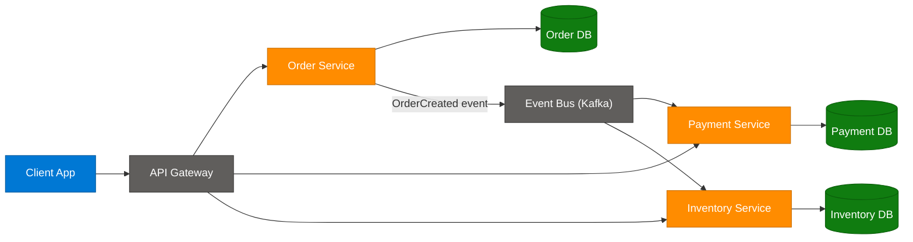

---

<a id="3-serverless"></a>
## 3. Serverless Architecture

> Source: https://blog.algomaster.io/p/2edeb23b-cfa5-4b24-845e-3f6f7a39d162

> *Synthesized from domain knowledge.*

Serverless architecture lets developers build and run applications without managing the underlying servers. The cloud provider (AWS Lambda, Azure Functions, Google Cloud Functions) dynamically provisions, scales, and manages the infrastructure; developers deploy individual functions that execute in response to triggers (HTTP requests, queue messages, file uploads, scheduled events).

### Key Concepts
- **FaaS (Function-as-a-Service)**: The core compute model — short-lived, stateless functions triggered by events.
- **BaaS (Backend-as-a-Service)**: Managed backend services (auth, databases, storage) that complement FaaS — e.g., Firebase Auth, AWS Cognito, DynamoDB.
- **Cold starts**: Latency penalty when a function is invoked after being idle and the runtime must initialize from scratch.
- **Pay-per-execution**: Billing based on actual invocations/compute time (often down to the millisecond), not pre-provisioned capacity.
- **Auto-scaling**: The platform scales function instances from zero to thousands automatically based on demand.

### Advantages
- **No server management** — focus purely on business logic.
- **Cost efficiency** for spiky/unpredictable workloads — pay only for what you use, including scale-to-zero.
- **Automatic, near-instant scaling** to handle traffic bursts.
- **Faster time-to-market** for small, event-driven features.

### Disadvantages
- **Cold start latency** — can hurt latency-sensitive applications.
- **Vendor lock-in** — function signatures, triggers, and tooling are provider-specific.
- **Limited execution duration** (e.g., AWS Lambda's 15-minute max) — not suited for long-running processes.
- **Debugging/observability is harder** — distributed, ephemeral, stateless execution environments.
- **Cost can spike unpredictably** at very high, sustained volumes compared to reserved/provisioned compute.

### When to Use
- Event-driven, bursty workloads: image/video processing, webhooks, ETL triggers, chatbots, IoT backends.
- APIs with unpredictable or low-to-moderate sustained traffic.
- Glue code connecting managed cloud services.

### When to Avoid
- Long-running, CPU/memory-intensive workloads.
- Ultra-low and consistently predictable latency requirements (cold starts are a risk).
- Applications needing fine-grained control over the runtime environment.

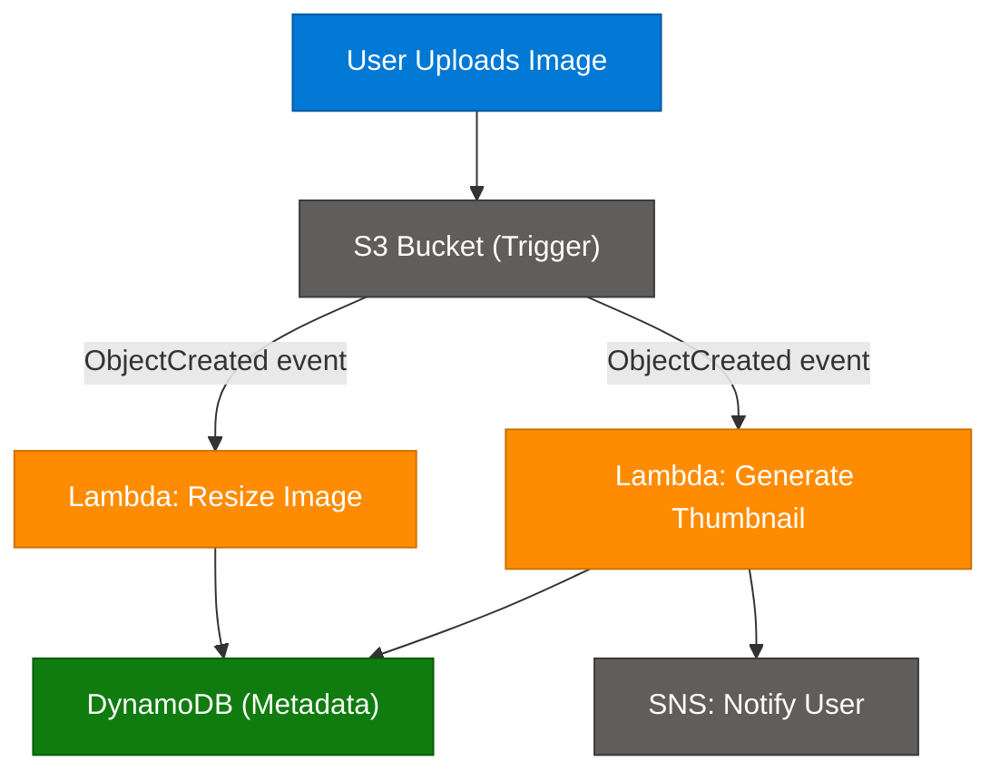

### Example: AWS Lambda Function (Node.js)

```javascript
// Serverless function triggered by an S3 upload event
exports.handler = async (event) => {
  const bucket = event.Records[0].s3.bucket.name;
  const key = event.Records[0].s3.object.key;

  console.log(`Processing file ${key} from bucket ${bucket}`);

  // Business logic: resize image, write metadata, etc.
  const result = await processImage(bucket, key);

  return {
    statusCode: 200,
    body: JSON.stringify({ message: "Processed successfully", result }),
  };
};
```

---

<a id="4-event-driven"></a>
## 4. Event-Driven Architecture

> Source: https://www.confluent.io/learn/event-driven-architecture/

Event-driven architecture (EDA) is a design paradigm where services communicate by producing and consuming **events** — immutable facts representing something that happened (e.g., `OrderPlaced`, `PaymentProcessed`). Instead of directly calling each other, producers publish events to a broker (Kafka, RabbitMQ, AWS EventBridge), and consumers subscribe to the events they care about.

### Core Components
- **Event producers**: Services that detect state changes and emit events.
- **Event broker/router**: Middleware (Kafka, Pulsar, EventBridge) that durably stores and routes events.
- **Event consumers**: Services that react to events asynchronously.
- **Event schema/contract**: A well-defined structure (often via Avro/Protobuf + schema registry) so producers and consumers stay compatible.

### Patterns within EDA

**1. Pub/Sub (Publish-Subscribe)**
Producers publish to a topic; any number of subscribers receive a copy independently. Decouples producers entirely from consumers — producers don't know who (or how many) consume their events.

**2. Event Streaming**
Events are retained in an ordered, durable, replayable log (Kafka topics). Consumers can replay history, enabling reprocessing, auditing, and multiple independent views of the same event stream.

**3. Event Sourcing**
Instead of storing only the *current state* of an entity, the system stores the full sequence of state-changing events as the source of truth. Current state is derived by replaying events.
- Example: A bank account's balance is computed by replaying `Deposited`, `Withdrawn` events rather than storing a `balance` column directly.
- **Benefits**: Full audit trail, time-travel debugging, ability to rebuild state, natural fit with EDA.
- **Costs**: Increased complexity, eventual consistency, need for snapshotting (to avoid replaying millions of events), schema evolution challenges.

**4. CQRS (Command Query Responsibility Segregation)**
Separates the **write model** (commands that mutate state) from the **read model** (optimized queries), often with two different data stores.
- Write side validates and persists events (often paired with Event Sourcing).
- Read side maintains denormalized, query-optimized projections updated asynchronously from the event stream.
- **Benefits**: Independently scale reads vs writes; tailor read models to specific query patterns (e.g., a search index, a cache, a reporting DB) without complicating the write model.
- **Costs**: Eventual consistency between write and read models; more moving parts; harder to reason about "read your own write" scenarios.

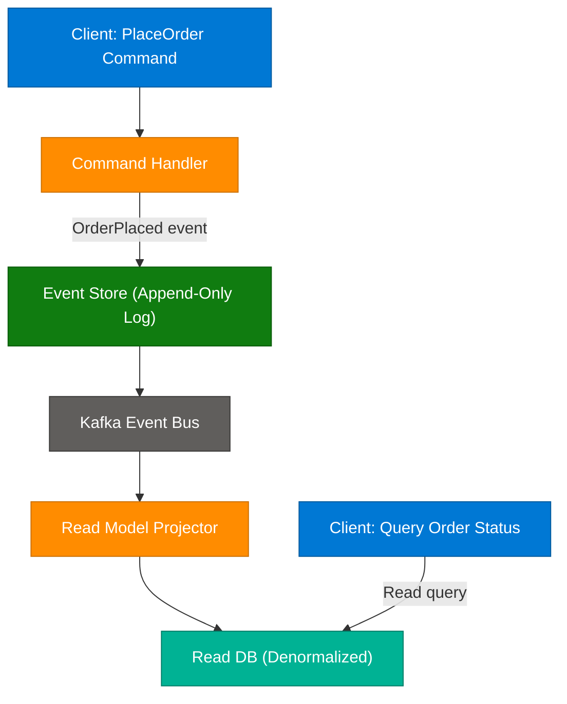

### Advantages
- **Loose coupling** — producers and consumers don't need to know about each other.
- **Scalability** — consumers scale independently; new consumers can be added without touching producers.
- **Real-time responsiveness** — systems react to events as they happen.
- **Resilience** — durable event logs allow replay after consumer downtime/failure.

### Disadvantages
- **Eventual consistency** — consumers process events asynchronously, so reads can be stale.
- **Debugging complexity** — tracing a business process across many event hops is hard; needs distributed tracing/correlation IDs.
- **Event schema management** — breaking changes can ripple across many decoupled consumers.
- **Ordering and exactly-once semantics** are non-trivial to guarantee at scale.

### When to Use
- Microservices needing decoupled, async communication.
- Real-time analytics, fraud detection, IoT telemetry pipelines.
- Systems requiring audit trails or the ability to replay/rebuild state (event sourcing).

---

<a id="5-p2p"></a>
## 5. Peer-to-Peer (P2P) Architecture

> Source: https://www.spiceworks.com/tech/networking/articles/what-is-peer-to-peer/

In a peer-to-peer architecture, there is no dedicated central server. Each node ("peer") acts as both a client and a server — it can request resources from other peers and also serve resources to them. Peers communicate directly with each other, forming a decentralized network.

### Core Characteristics
- **Decentralization** — no single authority controls the network; peers are equal participants.
- **Resource sharing** — bandwidth, storage, and compute are contributed by participants (e.g., BitTorrent file-sharing, blockchain nodes).
- **Self-organizing/dynamic membership** — peers join and leave (churn) without bringing down the network.

### P2P Network Types
| Type | Description | Example |
|---|---|---|
| **Pure P2P** | No central coordination at all; fully decentralized discovery (DHT) | Early Gnutella, Kademlia-based DHTs |
| **Hybrid P2P** | Central server for discovery/indexing, but data transfer is peer-to-peer | BitTorrent (tracker + peers), Skype (early versions) |
| **Structured P2P** | Peers organized via a Distributed Hash Table (DHT) for efficient lookup | Chord, Kademlia, IPFS |
| **Unstructured P2P** | No defined topology; queries flood the network | Early file-sharing networks |

### Advantages
- **No single point of failure** — the network survives individual peer/node failures.
- **Scalability** — adding more peers can add more capacity (more seeders = faster downloads in BitTorrent).
- **Cost efficiency** — no centralized infrastructure to provision and maintain.
- **Censorship resistance / resilience** — useful for blockchain, decentralized file storage (IPFS).

### Disadvantages
- **Security challenges** — harder to enforce trust, authentication, and access control without a central authority.
- **Inconsistent performance** — depends on the availability/bandwidth of participating peers.
- **Complex discovery and routing** — finding the right peer/resource requires DHTs or flooding protocols.
- **Data consistency is hard** — no central source of truth.

### When to Use
- File sharing and content distribution (BitTorrent).
- Blockchain and cryptocurrency networks (Bitcoin, Ethereum).
- Decentralized storage (IPFS) and communication apps where avoiding central control matters.

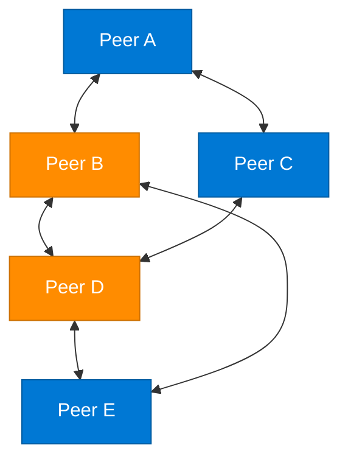

---

## Part 2: System Design Tradeoffs

<a id="6-top-15-tradeoffs"></a>
## 6. Top 15 System Design Tradeoffs — Overview

> Source: https://blog.algomaster.io/p/system-design-top-15-trade-offs

Every system design decision is a tradeoff. Below is the consolidated list of the 15 most commonly discussed tradeoffs in interviews, with a quick decision guide for each.

| # | Tradeoff | Choose Side A When | Choose Side B When |
|---|---|---|---|
| 1 | **Scalability vs Performance** | Expecting significant growth in users/data | Speed is critical and scale needs are predictable |
| 2 | **Vertical vs Horizontal Scaling** | Application is young, simplicity matters | Growth is substantial or high availability is required |
| 3 | **Latency vs Throughput** | Real-time apps (gaming, trading) | Data-intensive systems (analytics, batch) |
| 4 | **SQL vs NoSQL** | Structured data, complex queries, ACID needed (banking) | Flexible schema, horizontal scale, unstructured data (recommendations) |
| 5 | **Consistency vs Availability (CAP)** | Correctness/no overbooking matters most | Continued service during failures matters most |
| 6 | **Strong vs Eventual Consistency** | Financial systems requiring immediate accuracy | Social platforms tolerating brief delays |
| 7 | **Read-Through vs Write-Through Cache** | Read-heavy workloads (product catalogs) | Write-heavy workloads needing no data loss (ticket booking) |
| 8 | **Batch vs Stream Processing** | Periodic bulk jobs (billing) | Real-time insights (fraud detection) |
| 9 | **Synchronous vs Asynchronous Processing** | Need immediate confirmation (payments) | Background tasks acceptable (photo uploads) |
| 10 | **Stateful vs Stateless Architecture** | Need session continuity (shopping cart) | Need easy horizontal scaling (public APIs) |
| 11 | **Long Polling vs WebSockets** | Periodic updates suffice (notifications) | True real-time bidirectional needed (multiplayer games) |
| 12 | **Normalization vs Denormalization** | Data integrity and storage efficiency matter | Query speed matters more than redundancy |
| 13 | **Monolithic vs Microservices** | Small app/team, simplicity wins | Need independent scaling and team autonomy |
| 14 | **REST vs GraphQL** | Simplicity, caching, broad support needed | Precise, flexible data fetching needed |
| 15 | **TCP vs UDP** | Reliability is critical (email) | Speed over reliability (video/gaming) |

> Note: This guide covers 12 of the explicitly requested topics in depth below (sections 7–17), plus REST vs RPC/gRPC which generalizes #14, and folds CAP/SQL-NoSQL/Normalization context into the relevant sections. All 15 are represented in the table above and cross-referenced throughout.

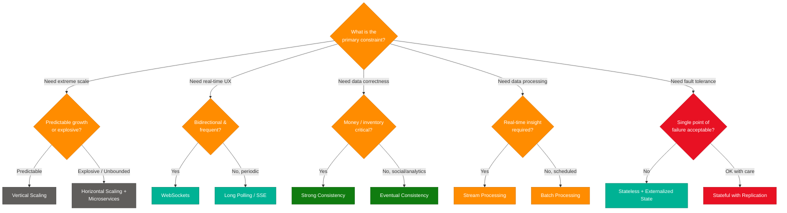

---

<a id="7-vertical-vs-horizontal"></a>
## 7. Vertical vs Horizontal Scaling

> Source: https://algomaster.io/learn/system-design/vertical-vs-horizontal-scaling

| Aspect | Vertical Scaling (Scale Up) | Horizontal Scaling (Scale Out) |
|---|---|---|
| **Definition** | Add more CPU/RAM/disk to an existing machine | Add more machines to the pool |
| **Complexity** | Low — no architecture changes needed | High — needs load balancing, data partitioning, distributed coordination |
| **Cost** | Expensive at high end (diminishing returns) | Cost-effective using commodity hardware |
| **Ceiling** | Hard physical hardware limit | Practically unlimited |
| **Downtime** | Often requires restart/downtime to upgrade | Can add nodes with zero downtime |
| **Fault tolerance** | Single point of failure | High — failure of one node doesn't kill the system |
| **Data consistency** | Simple (single source of truth) | Harder (requires replication/partitioning strategy) |
| **Best for** | Early-stage apps, monoliths, relational DBs with simple needs | Web-scale apps, distributed systems, cloud-native workloads |

### Decision Guide
- Start **vertical** for simplicity when an app is young and traffic predictable.
- Move to **horizontal** once you hit hardware ceilings, need high availability, or expect unpredictable/large traffic spikes.
- Most production-grade systems eventually combine both: vertically-sized nodes, horizontally replicated.

---

<a id="8-concurrency-vs-parallelism"></a>
## 8. Concurrency vs Parallelism

> Source: https://blog.algomaster.io/p/concurrency-vs-parallelism

> *Synthesized from domain knowledge.*

**Concurrency** is about *managing* multiple tasks at once — structuring a program so multiple tasks can make progress, potentially by interleaving execution on a single core (e.g., via context switching, async/await, event loops). It's a property of program *structure*.

**Parallelism** is about *executing* multiple tasks literally at the same time, using multiple CPU cores/processors. It's a property of program *execution*.

> Classic analogy: Concurrency is one person juggling multiple tasks by switching between them quickly (single chef cooking multiple dishes, stirring one while the oven works on another). Parallelism is multiple people each doing one task simultaneously (multiple chefs each cooking a separate dish at the same time).

| Aspect | Concurrency | Parallelism |
|---|---|---|
| **Goal** | Deal with many things at once (structure) | Do many things at once (execution) |
| **Hardware requirement** | Works on a single core | Requires multiple cores/processors |
| **Mechanism** | Context switching, async I/O, coroutines | True simultaneous execution threads/processes |
| **Use case** | I/O-bound tasks (network calls, file I/O) | CPU-bound tasks (matrix multiplication, image processing) |
| **Examples** | Node.js event loop, async/await, goroutines | Multi-threaded matrix computation, GPU rendering, MapReduce |
| **Complexity** | Race conditions, deadlocks if shared state | Synchronization overhead, data partitioning |

### When to Use
- **Concurrency**: web servers handling thousands of simultaneous connections (most time spent waiting on I/O, not computing).
- **Parallelism**: scientific computing, video encoding, big data processing (Spark) where the bottleneck is raw computation.
- They are not mutually exclusive — a system can be both concurrent (many tasks structured to interleave) and parallel (multiple of those tasks literally running simultaneously on multiple cores), e.g., a web server using a thread pool across multiple cores.

---

<a id="9-long-polling-vs-websockets"></a>
## 9. Long Polling vs WebSockets vs SSE

> Source: https://blog.algomaster.io/p/long-polling-vs-websockets

> *Synthesized from domain knowledge.*

| Technique | How It Works | Direction | Overhead | Best For |
|---|---|---|---|---|
| **Short Polling** | Client repeatedly requests at fixed intervals | Client → Server | High (many empty responses) | Simple, low-frequency updates |
| **Long Polling** | Client requests; server holds the connection open until new data is available or timeout, then client immediately re-requests | Client → Server (server "pushes" via delayed response) | Moderate | Notifications, chat apps with moderate frequency |
| **Server-Sent Events (SSE)** | Server keeps a single HTTP connection open and streams events to the client over time | Server → Client (one-way) | Low | Live feeds, stock tickers, one-way real-time updates |
| **WebSockets** | Full-duplex, persistent TCP connection after an HTTP handshake upgrade | Bidirectional | Lowest per-message overhead once connected | Chat apps, multiplayer games, collaborative editing |

### Tradeoff Detail
- **Long Polling**: Simple to implement on top of standard HTTP infrastructure (works through most proxies/firewalls). But each held connection consumes server resources, and there's latency overhead from re-establishing requests after each response.
- **WebSockets**: True bidirectional, low-latency communication ideal for highly interactive real-time apps. Costs: more complex infrastructure (sticky sessions or stateful connection management at the load balancer), harder to scale horizontally because connections are stateful and long-lived, may face issues with corporate proxies/firewalls.
- **SSE**: Good middle ground when you only need server→client push (no need for client to push data back over the same channel); simpler than WebSockets, built on plain HTTP, with auto-reconnect built into the browser EventSource API.

### Decision Guide
- Need **occasional** updates with simple infra → Long Polling.
- Need **one-directional** live streaming (feeds, scores, logs) → SSE.
- Need **frequent, bidirectional, low-latency** interaction → WebSockets.

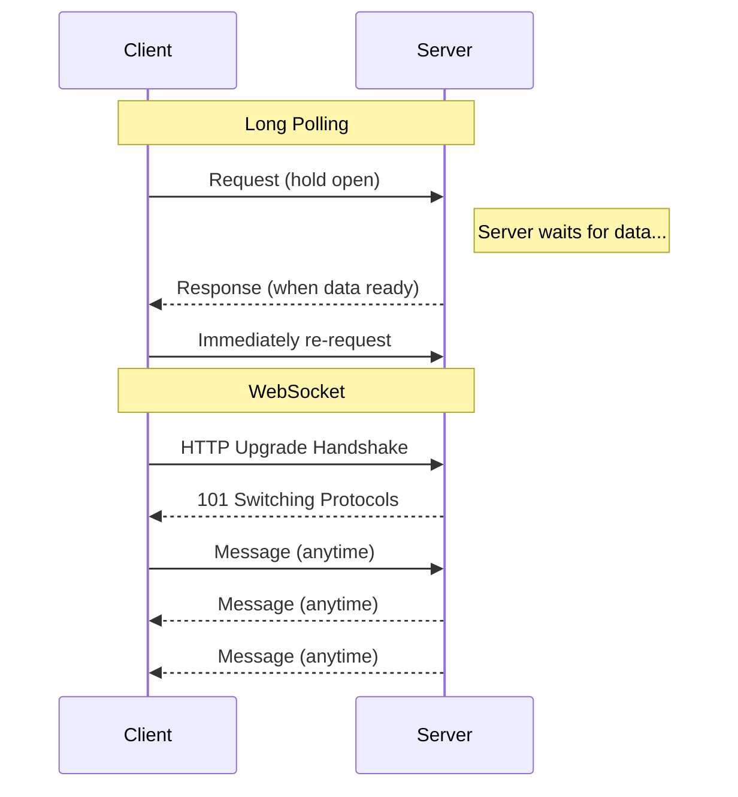

---

<a id="10-batch-vs-stream"></a>
## 10. Batch vs Stream Processing

> Source: https://blog.algomaster.io/p/batch-processing-vs-stream-processing

### Definitions
- **Batch Processing**: Collects and stores data over time, then processes it in bulk at scheduled intervals. Optimized for high-volume, finite datasets.
- **Stream Processing**: Handles data in real-time or near real-time as it arrives, ideal for continuous, unbounded data flows requiring immediate insight.

### Use Cases
| Batch | Stream |
|---|---|
| End-of-day reporting | IoT sensor monitoring |
| Monthly payroll processing | Real-time fraud detection |
| Large-scale ETL operations | Live user-activity analytics |
| Daily credit card billing/statements | Live recommendation updates |

### Tools & Frameworks
| Tool | Type | Purpose |
|---|---|---|
| **Apache Hadoop** | Batch | Distributed processing using the MapReduce paradigm |
| **Apache Spark** | Batch/Hybrid | In-memory processing with RDD architecture; also supports micro-batch streaming |
| **Apache Kafka** | Stream | Distributed messaging and durable event log/ingestion backbone |
| **Apache Flink** | Stream | Low-latency, stateful stream processing with exactly-once semantics |
| **AWS Kinesis** | Stream | Managed real-time data ingestion and processing |

### Comparison Table
| Aspect | Batch Processing | Stream Processing |
|---|---|---|
| **Processing trigger** | Scheduled intervals | Continuous, real-time, event-driven |
| **Latency** | High (hours/days) | Low (milliseconds/seconds) |
| **Throughput** | High volume per run | Moderate, event-driven, continuous |
| **Data nature** | Finite, bounded datasets | Unbounded, continuous flows |
| **Complexity** | Simpler algorithms, easier to reason about | Complex state management, windowing, watermarks |
| **Fault recovery** | Re-run the whole batch job | Checkpointing, exactly-once/at-least-once semantics |
| **Cost model** | Often cheaper (can use spot/off-peak compute) | Requires always-on infrastructure |

### Hybrid: Micro-Batch
**Micro-batch processing** (e.g., Spark Streaming) bridges both worlds — processing small chunks of data at short, fixed intervals (e.g., every few seconds) to achieve near-real-time results while keeping the simpler programming model of batch.

### Example: Simple Kafka Streams Topology (Stream Processing)

```java
StreamsBuilder builder = new StreamsBuilder();

KStream<String, Transaction> transactions = builder.stream("transactions-topic");

KStream<String, Alert> fraudAlerts = transactions
    .filter((key, txn) -> txn.getAmount() > 10000)
    .mapValues(txn -> new Alert(txn.getAccountId(), "High value transaction flagged"));

fraudAlerts.to("fraud-alerts-topic");

KafkaStreams streams = new KafkaStreams(builder.build(), props);
streams.start();
```

### Decision Guide
- Choose **batch** when latency tolerance is hours/days and the workload is naturally periodic (billing, reporting, large ETL).
- Choose **stream** when decisions must be made within seconds/milliseconds of data arriving (fraud detection, real-time dashboards, alerting).

---

<a id="11-stateful-vs-stateless"></a>
## 11. Stateful vs Stateless Design

> Source: https://blog.algomaster.io/p/stateful-vs-stateless-architecture

### Definitions
- **Stateful Architecture**: The server retains client data across multiple requests — user sessions, shopping carts, authentication details.
- **Stateless Architecture**: Each request is independent and self-contained. The server doesn't store prior interaction data; the client must include all necessary information (e.g., auth tokens) in every request.

### Examples
- **Stateful**: E-commerce shopping carts that remember items even when the user navigates away and returns.
- **Stateless**: Public weather APIs — each request must include location; the server retains nothing between calls.

### Tradeoffs
| | Stateful | Stateless |
|---|---|---|
| **Advantages** | Personalized UX, reduced round trips, seamless session resumption | Easier horizontal scaling, simpler architecture, server failures don't disrupt sessions, easy caching/CDN integration |
| **Challenges** | Complex scaling with many concurrent users, server failures risk losing session data, cross-server synchronization complexity | Less personalization without extra effort, client must manage tokens, larger request payloads |

### When to Use Each
- **Stateful**: Applications needing personalization, real-time interactions (chat, gaming), multi-step workflows, session continuity.
- **Stateless**: High-volume APIs, distributed microservices, mobile apps, anything prioritizing scalability and resilience.

### Hybrid Approach
Most modern systems combine both: **stateless application servers** (so any server can handle any request, enabling trivial horizontal scaling) backed by an **externalized session store** (Redis/Memcached) that holds session/cart state. This gets the scalability of stateless servers with the UX benefits of statefulness.

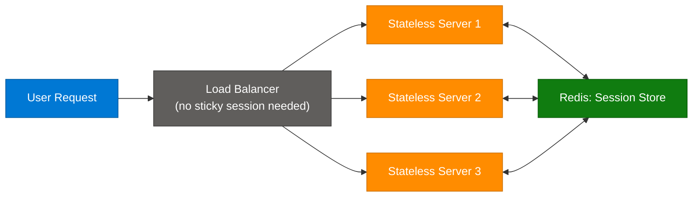

---

<a id="12-consistency-models"></a>
## 12. Strong vs Eventual Consistency

> Source: https://blog.algomaster.io/p/strong-vs-eventual-consistency

### Strong Consistency
**Definition**: Once a write completes successfully, any read from any client or replica reflects that write or a newer one.

**How it works**: Uses consensus algorithms (Paxos, Raft) to coordinate replicas *before* confirming a write. All (or a quorum of) replicas must acknowledge updates before the write is considered complete.

- **Advantages**: Simpler application logic, predictable behavior, high data integrity.
- **Disadvantages**: Slower writes (coordination overhead), reduced availability during network partitions, more complex infrastructure.
- **Best for**: Banking, financial transactions, inventory management, distributed locking, unique ID generation — anywhere accuracy is non-negotiable.

### Eventual Consistency
**Definition**: All replicas will converge to the same value *eventually*, as long as no new updates are made.

**How it works**: Writes are acknowledged immediately without waiting for replica synchronization. Updates propagate asynchronously, creating temporary inconsistency windows.

- **Advantages**: Low-latency responses, high availability during network partitions, excellent for global scalability.
- **Disadvantages**: Clients may read stale data, requires application-level handling of inconsistency, needs conflict-resolution strategies (e.g., last-write-wins, vector clocks, CRDTs).
- **Best for**: Social media metrics (like counts), analytics, recommendation systems, DNS, CDNs, shopping carts.

### Weaker Consistency Variants (Middle Ground)
| Model | Guarantee |
|---|---|
| **Causal Consistency** | Preserves cause-and-effect relationships between operations; unrelated operations may be seen in different orders by different clients |
| **Read-Your-Writes** | A client always sees its own updates immediately, even if other clients haven't yet |
| **Monotonic Reads** | A client never sees an older version after having read a newer one |
| **Monotonic Writes** | A single client's writes are applied in the order issued |

### Selection Criteria
Choose based on: data criticality, user-experience expectations, latency requirements, availability needs, scalability demands, development complexity, and conflict-resolution strategy maturity.

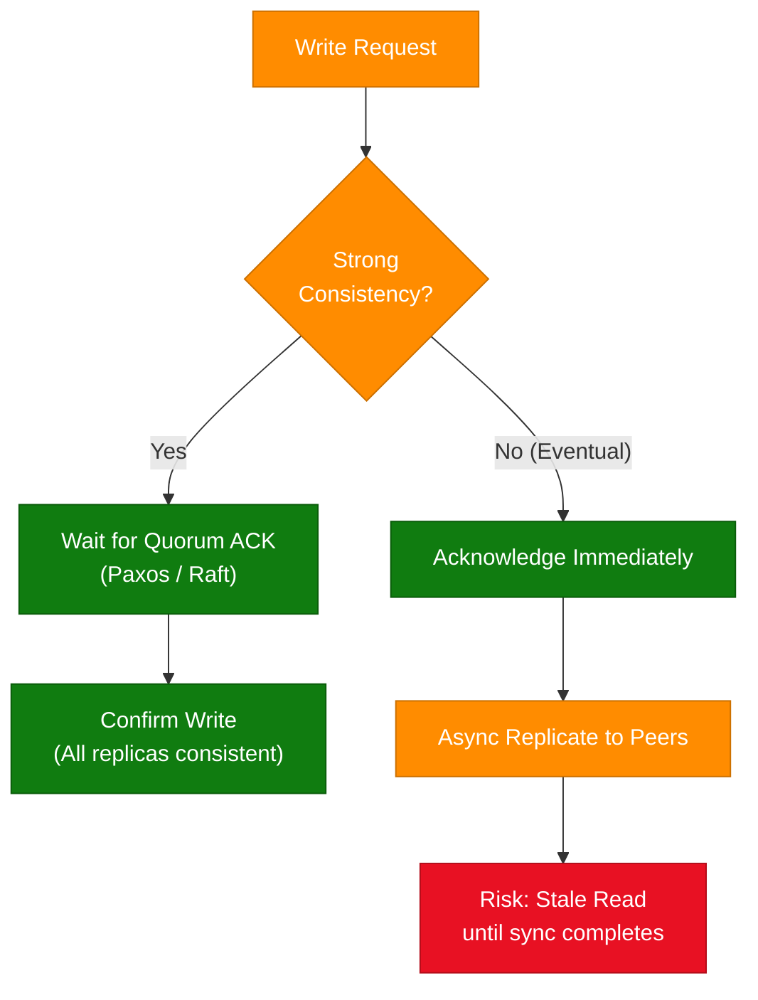

---

<a id="13-cache-write-strategies"></a>
## 13. Read-Through vs Write-Through Cache

> Source: https://blog.algomaster.io/p/59cae60d-9717-4e20-a59e-759e370db4e5

> *Synthesized from domain knowledge.*

### Read-Through Cache
The cache sits in front of the database for reads. On a cache hit, data is returned directly. On a miss, the cache itself (not the application) loads the data from the primary store, populates itself, and returns it.
- **Ideal for**: Read-heavy workloads where the same data is requested repeatedly (e.g., e-commerce product detail pages).
- **Tradeoff**: First request after a miss/eviction pays the full DB latency ("cache stampede" risk under high concurrency on a cold key).

### Write-Through Cache
Every write goes to the cache *and* the primary database synchronously (in the same operation) before being acknowledged to the client.
- **Ideal for**: Write-heavy applications where data loss is unacceptable and data must remain fresh (e.g., movie ticket booking, preventing overbooking).
- **Tradeoff**: Higher write latency since every write touches two systems; if implemented carelessly it can become a consistency bottleneck.

### Related Strategies (for completeness)
| Strategy | Description | Risk |
|---|---|---|
| **Cache-Aside (Lazy Loading)** | Application checks cache first; on miss, app itself loads from DB and populates cache | Cache and DB can drift if writes don't invalidate cache |
| **Write-Behind (Write-Back)** | Write goes to cache immediately; DB write happens asynchronously later | Risk of data loss if cache fails before flush |
| **Write-Through** | Write goes to cache and DB synchronously | Higher write latency, but strong durability guarantee |
| **Read-Through** | Cache auto-populates from DB on miss | Simplifies app code vs cache-aside |

### Decision Guide
- **Read-Through**: read-heavy, tolerant of brief staleness, want cache-population logic centralized in the caching layer.
- **Write-Through**: write-heavy or correctness-critical, can't risk losing recently written data, willing to pay write latency cost.
- They're often combined: write-through for durability + read-through for serving traffic.

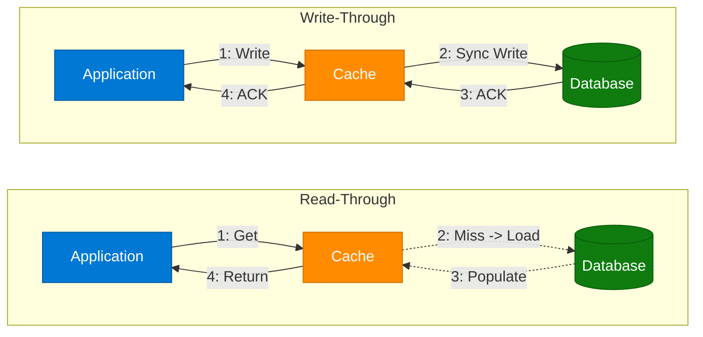

---

<a id="14-push-vs-pull"></a>
## 14. Push vs Pull Architecture

> Source: https://blog.algomaster.io/p/af5fe2fe-9a4f-4708-af43-184945a243af

> *Synthesized from domain knowledge.*

### Push Model
The server (or producer) proactively sends data to clients/consumers as soon as it's available, without the client explicitly asking each time.
- **Examples**: Push notifications (mobile), WebSocket-based live feeds, webhook callbacks, pub/sub event delivery.
- **Advantages**: Low latency — data arrives the instant it's available; efficient when updates are frequent and clients need them immediately.
- **Disadvantages**: Server must track/manage all subscriber state and connections; risk of overwhelming slow consumers (backpressure problem); harder to scale to huge numbers of heterogeneous clients.

### Pull Model
The client periodically requests ("polls") the server for new data.
- **Examples**: REST API polling, RSS feed readers, cron-based data syncs, Prometheus metrics scraping.
- **Advantages**: Client controls its own pace (natural backpressure), simpler server design (stateless, no need to track subscribers), works well behind firewalls/NATs.
- **Disadvantages**: Latency depends on poll interval; wasted requests when there's no new data; can't easily achieve true real-time.

### Decision Guide
| Need | Choose |
|---|---|
| Real-time delivery, low latency | Push |
| Client wants control over load/pace | Pull |
| Many heterogeneous/unreliable clients (mobile, IoT) | Pull (or push with retry/backoff, e.g., FCM/APNs) |
| Centralized metrics/monitoring collection | Pull (e.g., Prometheus scrape model) |
| Event-driven microservices | Push (pub/sub via Kafka/SNS) |

> Many systems hybridize: Prometheus *pulls* metrics from services, but services *push* metrics to a Pushgateway for short-lived batch jobs that can't be scraped.

---

<a id="15-rest-vs-rpc"></a>
## 15. REST vs RPC (gRPC)

> Source: https://blog.algomaster.io/p/106604fb-b746-41de-88fb-60e932b2ff68

> *Synthesized from domain knowledge.*

### REST (Representational State Transfer)
Resource-oriented architectural style over HTTP. Resources are nouns (`/users/123`), and operations map to HTTP verbs (GET, POST, PUT, DELETE).
- **Pros**: Universally understood, cacheable (via HTTP semantics), human-readable (JSON), great browser/tooling support, loosely coupled.
- **Cons**: Can require multiple round trips for related resources (over/under-fetching), no strict contract enforcement, JSON serialization overhead.

### RPC (Remote Procedure Call) / gRPC
Action-oriented — clients call remote functions/methods directly (`getUser(id)`), as if local. **gRPC** (built on HTTP/2 + Protocol Buffers) is the modern, widely adopted implementation.
- **Pros**: Strongly typed contracts (`.proto` files) generate client/server stubs automatically; binary serialization (Protobuf) is much faster/smaller than JSON; HTTP/2 enables multiplexing and bidirectional streaming; great for internal service-to-service calls at scale.
- **Cons**: Less human-readable (binary format, harder to debug with curl/browser), steeper learning curve, less natural browser support (needs gRPC-Web proxy), tighter coupling between client/server via generated stubs.

### Comparison Table
| Aspect | REST | RPC / gRPC |
|---|---|---|
| **Style** | Resource-oriented (nouns) | Action-oriented (verbs/methods) |
| **Protocol** | HTTP/1.1 (typically) | HTTP/2 |
| **Payload format** | JSON (text, human-readable) | Protobuf (binary, compact) |
| **Performance** | Slower (text parsing, HTTP/1.1) | Faster (binary, multiplexed streams) |
| **Streaming support** | Limited (long polling/SSE workarounds) | Native bidirectional streaming |
| **Contract** | Loose (OpenAPI/Swagger optional) | Strict (.proto schema required) |
| **Browser support** | Native | Requires gRPC-Web proxy |
| **Best for** | Public APIs, third-party integrations | Internal microservice-to-microservice calls |
| **Caching** | Easy (HTTP caching semantics) | Harder (no native HTTP caching) |
| **Debuggability** | Easy (curl, browser, Postman) | Harder (needs gRPC-aware tooling) |

### Example: gRPC Service Definition (Protobuf)

```protobuf
syntax = "proto3";

service UserService {
  rpc GetUser (GetUserRequest) returns (UserResponse);
  rpc StreamOrders (OrderRequest) returns (stream Order);
}

message GetUserRequest {
  string user_id = 1;
}

message UserResponse {
  string user_id = 1;
  string name = 2;
  string email = 3;
}
```

### Decision Guide
- **REST**: Public-facing APIs, third-party integrations, when caching and human-readability matter.
- **gRPC/RPC**: High-performance internal service-to-service communication, when you need streaming, strict typing, and minimal serialization overhead (typical in microservices meshes).

---

<a id="16-sync-vs-async"></a>
## 16. Synchronous vs Asynchronous Communication

> Source: https://blog.algomaster.io/p/aec1cebf-6060-45a7-8e00-47364ca70761

> *Synthesized from domain knowledge.*

### Synchronous Communication
Tasks execute sequentially — the caller blocks/waits for the callee to complete and respond before proceeding.
- **Example**: An online payment flow where checkout must wait for payment gateway confirmation before showing a success page.
- **Advantages**: Simpler mental model, immediate error feedback, easier to reason about ordering/correctness.
- **Disadvantages**: Caller is blocked (wastes resources/threads while waiting), tightly couples availability of caller to callee, cascading failures/latency if downstream is slow (no isolation).

### Asynchronous Communication
The caller initiates a task and continues without waiting for it to complete; results (if any) arrive later via callbacks, polling, events, or message queues.
- **Example**: A social media photo upload that processes (resizing, thumbnailing, indexing) in the background while the user continues using the app.
- **Advantages**: Better resource utilization (no blocked threads), improved resilience (downstream slowness doesn't directly block the caller), natural fit for long-running or bursty workloads, enables load leveling via queues.
- **Disadvantages**: More complex to reason about (callbacks, eventual completion, error handling out-of-band), requires additional infrastructure (queues/brokers), harder to debug/trace, potential for message loss/duplication if not designed carefully (needs idempotency).

### Decision Guide
| Need | Choose |
|---|---|
| Immediate confirmation required (payment, auth) | Synchronous |
| Long-running or resource-intensive task | Asynchronous |
| Need to decouple producer/consumer availability | Asynchronous |
| Simple, low-latency request/response | Synchronous |
| Need to smooth out traffic spikes (load leveling via queue) | Asynchronous |

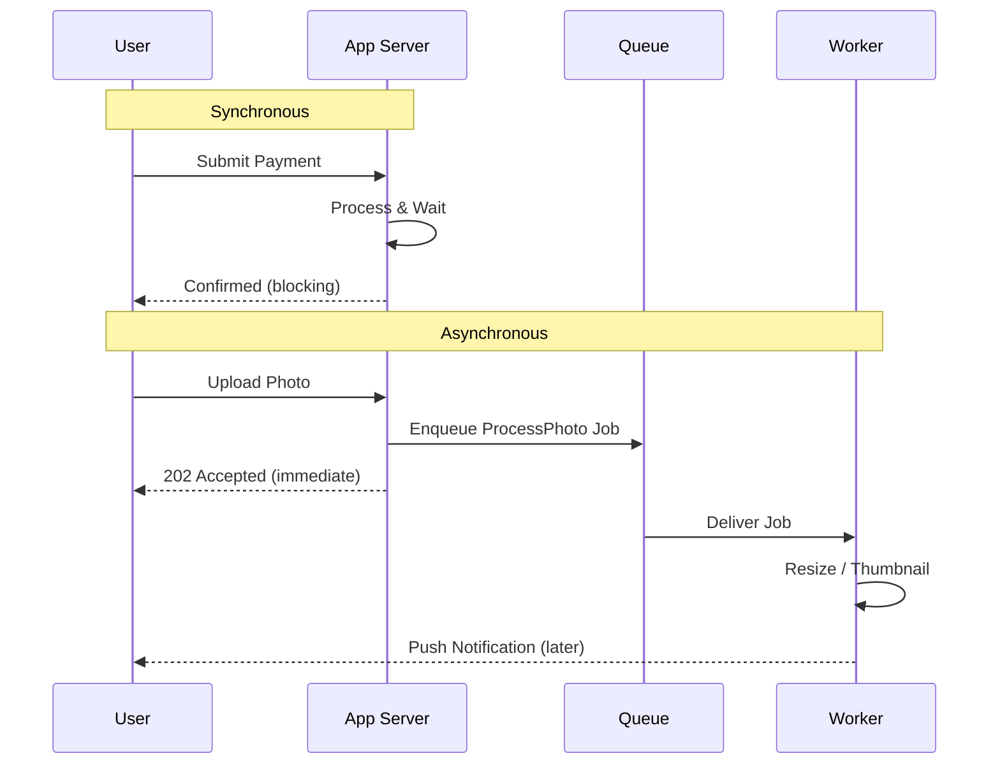

---

<a id="17-latency-vs-throughput"></a>
## 17. Latency vs Throughput

> Source: https://aws.amazon.com/compare/the-difference-between-throughput-and-latency/

### Definitions
- **Latency**: The time it takes for a single unit of data/request to travel from source to destination and back (or to be fully processed). Measured in time units (ms, μs).
- **Throughput**: The volume of data/requests a system can process per unit of time. Measured in units like requests/sec, MB/s, transactions/sec.

### Key Insight
Latency and throughput are related but distinct, and **optimizing one can hurt the other**:
- Batching requests increases throughput (more processed per second) but increases the latency of any individual request (it waits in the batch).
- Adding more parallel workers can increase throughput without worsening latency — up to the point where resource contention (CPU, locks, network) kicks in, after which both can degrade.

### Analogy
A highway: **Latency** is how long it takes one car to travel from A to B. **Throughput** is how many cars pass a checkpoint per hour. Adding more lanes increases throughput without changing an individual car's latency; adding a tollbooth might lower throughput while keeping any single car's transit time about the same (until congestion builds).

### When Each Matters Most
| Priority Latency | Priority Throughput |
|---|---|
| Real-time gaming | Batch ETL / data pipelines |
| High-frequency trading | Video transcoding pipelines |
| Voice/video calls | Log aggregation systems |
| Interactive APIs (autocomplete) | Bulk data analytics (Spark jobs) |

### Decision Guide
- Optimize for **latency** when user experience is directly tied to response speed (every millisecond visible to the user).
- Optimize for **throughput** when the goal is maximizing total work done over time and individual item delay is tolerable (offline processing, analytics).
- Best systems define explicit SLOs for both — e.g., "p99 latency < 200ms" AND "sustain 10K req/s" — because a system can fail by being slow for one user or by being unable to keep up with overall load.

---

<a id="18-interview-qa"></a>
## 18. Interview Q&A Cheatsheet

**Q1: When would you choose microservices over a monolith, and what's the biggest hidden cost?**
A: Choose microservices when you need independent scaling of components, multiple teams working autonomously, or polyglot technology needs. The biggest hidden cost is operational complexity — distributed tracing, service discovery, network reliability, data consistency across services (no more simple ACID transactions), and the need for mature DevOps/CI-CD practices. Many companies adopt microservices prematurely and pay this tax before they need the benefits.

**Q2: How does serverless billing fundamentally differ from traditional server billing, and what workload profile benefits most?**
A: Serverless bills per invocation/execution time (often millisecond granularity) with scale-to-zero, versus traditional servers billed for provisioned capacity regardless of utilization. Spiky, unpredictable, or low-average-utilization workloads benefit most (e.g., a webhook handler invoked a few hundred times a day). Sustained high-throughput workloads often end up cheaper on reserved/provisioned compute.

**Q3: Explain event sourcing and why it pairs naturally with CQRS.**
A: Event sourcing stores the full history of state-changing events as the source of truth rather than just current state; current state is derived by replaying events. CQRS separates write (command) and read (query) models. They pair naturally because the event log produced by event sourcing is the perfect input to asynchronously build denormalized read projections — the write side stays simple/append-only, and read models can be optimized and rebuilt independently for different query needs.

**Q4: What's the tradeoff with using WebSockets at scale, and how do you mitigate it?**
A: WebSockets require stateful, long-lived connections, which complicates horizontal scaling (a client must keep talking to the same server instance, or state must be shared/synced across instances). Mitigations: use a connection-aware load balancer with sticky sessions, externalize pub/sub state via Redis or a message broker so any server instance can relay messages to a client connected on another instance, and use dedicated WebSocket gateway services separate from business logic.

**Q5: How do you decide between strong and eventual consistency for a given feature?**
A: Ask: "What's the cost of showing slightly stale data vs. the cost of slower writes/reduced availability?" Money movement, inventory counts, and anything where two clients acting on stale data causes real harm (double-booking, overdraft) needs strong consistency. Social counters, recommendation feeds, and read-heavy/globally-distributed data can tolerate eventual consistency in exchange for lower latency and higher availability.

**Q6: What's the difference between concurrency and parallelism, and can a system be one without the other?**
A: Concurrency is about structuring a program to handle multiple tasks (interleaving), parallelism is about literally executing multiple tasks simultaneously on multiple cores. A single-core system can be concurrent (via context switching/async I/O) without being parallel. A system can also be parallel without much concurrency design (e.g., embarrassingly parallel batch jobs split across machines with no interleaving logic needed).

**Q7: When should you use write-through vs write-behind caching?**
A: Write-through writes to cache and DB synchronously — choose it when you cannot risk losing recently written data (e.g., booking systems) even though it costs write latency. Write-behind (write-back) writes to cache first and flushes to the DB asynchronously — choose it when write throughput matters more than the small risk of losing the most recent writes if the cache fails before flushing.

**Q8: What's the main risk of long polling at scale, and how does it compare to SSE?**
A: Long polling holds many server connections open waiting for data, which consumes server threads/resources proportional to connected clients, and each "no new data" timeout cycle forces a new HTTP request (overhead). SSE solves the one-directional case more efficiently by keeping a single persistent HTTP connection per client streaming events as they occur, with less re-connection churn. Both are easier to operate than WebSockets at the infrastructure level since they don't require persistent bidirectional state, but SSE is more efficient than long polling for streaming use cases.

**Q9: Why is REST often preferred for public APIs while gRPC is preferred internally?**
A: REST's text-based JSON and HTTP semantics make it universally accessible, cacheable, debuggable with simple tools (curl/Postman), and consumable from browsers — ideal for third-party/public APIs with unknown clients. gRPC's binary Protobuf serialization, HTTP/2 multiplexing, strict typed contracts, and native streaming give much better performance and reliability for internal service-to-service calls where both ends are controlled by the same engineering organization and performance matters more than human readability.

**Q10: How do you decide between push and pull for a notification system?**
A: Push (e.g., WebSocket/FCM/APNs) when low-latency, real-time delivery to clients is required and you can manage subscriber/connection state. Pull (client polling) when clients are intermittently connected, behind restrictive networks, or you want to put load control in the client's hands. Many production systems hybridize — push primary delivery with periodic pull-based reconciliation as a fallback for missed pushes.

**Q11: Explain the relationship between latency and throughput with a concrete example of how optimizing one can hurt the other.**
A: Batching is the classic example — grouping multiple requests into a single batch to process improves throughput (fewer round trips, better resource amortization) but increases per-request latency because individual requests must wait for the batch to fill or a timer to expire. A system tuning Kafka producer `linger.ms` directly trades a few milliseconds of latency for significantly higher throughput.

**Q12: What does "stateless" really mean in a RESTful API context, and why does it matter for scalability?**
A: Stateless means the server stores no client session context between requests — every request must carry all information needed to process it (e.g., an auth token, not a session cookie tied to server memory). This matters for scalability because any server instance can handle any request without needing session affinity, making horizontal scaling, load balancing, and failover trivial — a failed server doesn't lose anyone's session.

**Q13: In event-driven architecture, how do you handle the challenge of debugging a flow that spans many asynchronous services?**
A: Use a correlation/trace ID that's propagated through every event and service hop, paired with distributed tracing tools (Jaeger, Zipkin, OpenTelemetry) to visualize the full request path across asynchronous boundaries. Centralized structured logging keyed by correlation ID, combined with event schema registries (so you always know the shape of each event), is essential — without these, root-causing issues in EDA is extremely painful.

**Q14: What's the CAP theorem's relationship to the strong-vs-eventual consistency tradeoff?**
A: CAP theorem says a distributed system can only guarantee two of Consistency, Availability, and Partition Tolerance during a network partition (and partition tolerance is generally non-negotiable in real distributed systems). Choosing strong consistency (CP) means sacrificing availability during a partition — some nodes will refuse requests rather than serve stale data. Choosing eventual consistency (AP) means the system stays available during a partition, but different nodes may temporarily return different answers. The strong vs eventual consistency choice is essentially how you resolve the CAP tradeoff for a specific feature/data type.

**Q15: When migrating a monolith to microservices, what's a practical first decomposition strategy?**
A: Use Domain-Driven Design to identify bounded contexts and decompose by business capability, not by technical layer (avoid splitting into "UI service," "DB service," etc.). Start with the **strangler fig pattern**: extract one well-isolated, high-value, low-risk capability (e.g., a notifications or search service) behind an API gateway while the monolith continues serving everything else, then incrementally peel off more services, ensuring each owns its own data store and has minimal synchronous coupling back to the monolith.

---

*End of document.*
