# System Design: Caching, Async Communication & Distributed Systems

> **Sources:** AlgoMaster, Martin Kleppmann, High Scalability, Dynatrace, Google Cloud, Medium, multiple references
> **Last Updated:** July 2026

---

## Table of Contents

### Part 1: Caching
1. [Caching 101 — What is Caching?](#1-caching-101)
2. [Caching Strategies](#2-caching-strategies)
3. [Cache Eviction Policies](#3-cache-eviction)
4. [Distributed Caching](#4-distributed-caching)
5. [Content Delivery Network (CDN)](#5-cdn)

### Part 2: Asynchronous Communication
6. [Pub/Sub Pattern](#6-pub-sub)
7. [Message Queues](#7-message-queues)
8. [Change Data Capture (CDC)](#8-cdc)

### Part 3: Distributed Systems
9. [Heartbeats in Distributed Systems](#9-heartbeats)
10. [Service Discovery](#10-service-discovery)
11. [Consensus Algorithms (Raft, Paxos)](#11-consensus)
12. [Distributed Locking](#12-distributed-locking)
13. [Gossip Protocol](#13-gossip-protocol)
14. [Circuit Breaker Pattern](#14-circuit-breaker)
15. [Disaster Recovery](#15-disaster-recovery)
16. [Distributed Tracing](#16-distributed-tracing)
17. [Interview Q&A Cheatsheet](#17-interview-qa)

---

# Part 1: Caching

## 1. Caching 101 — What is Caching? <a id="1-caching-101"></a>

> *Synthesized from domain knowledge (algomaster.io/learn/system-design/what-is-caching).*

**Caching** is the technique of storing copies of frequently accessed data in a fast-access storage layer (memory) so future requests for that data can be served faster than re-fetching or recomputing it from a slower backing store (database, disk, remote API).

### Why Cache?

- **Reduce latency** — memory access (~100ns) is orders of magnitude faster than disk (~10ms) or network round trips.
- **Reduce load on backend systems** — fewer queries hit the database, improving overall throughput.
- **Improve availability** — a cache can serve stale-but-available data even when the origin is down (graceful degradation).
- **Cost efficiency** — avoids redundant computation (e.g., expensive joins, ML inference, report generation).

### Where Caching Happens


Caching layers exist at every level of the stack: **browser cache**, **DNS cache**, **CDN edge cache**, **API gateway cache**, **application/in-process cache**, **distributed cache (Redis/Memcached)**, and **database query/buffer cache**.

### Key Metrics

| Metric | Meaning |
|---|---|
| **Hit Ratio** | `hits / (hits + misses)` — higher is better |
| **Miss Penalty** | Extra latency incurred on a cache miss |
| **Eviction Rate** | How often items are removed due to capacity limits |
| **Staleness / TTL** | How "fresh" cached data is allowed to be |

### Trade-offs

Caching introduces the hardest problem in computer science: **cache invalidation**. You're trading consistency for performance — cached data can become stale relative to the source of truth, so every caching design must answer: *how and when do I invalidate or refresh this entry?*

---

## 2. Caching Strategies <a id="2-caching-strategies"></a>

> *Synthesized from domain knowledge (algomaster.io/learn/system-design/caching-strategies).*

There are five canonical caching strategies, distinguished by **who** is responsible for reading/writing the cache and **when**.

### 2.1 Cache-Aside (Lazy Loading)

The application is responsible for managing the cache explicitly.

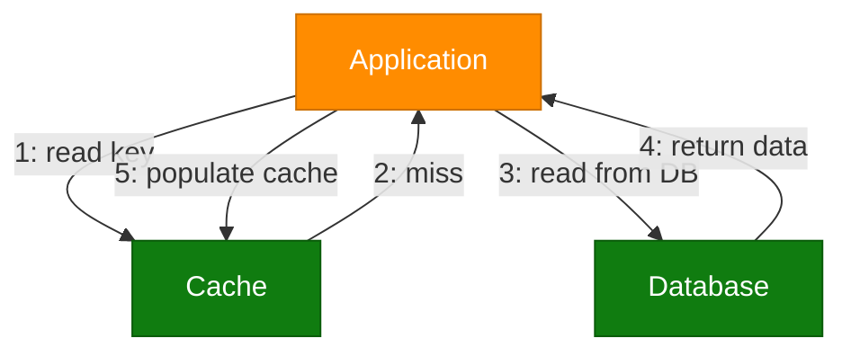

- **Pros:** Cache only contains requested data; resilient to cache node failure (falls back to DB).
- **Cons:** First request always misses (cold start penalty); risk of stale data if DB is updated without invalidating cache.
- **Used by:** Memcached + MySQL classic web-app pattern (Facebook's original architecture).

### 2.2 Read-Through

Similar to cache-aside, but the **cache itself** (not the application) is responsible for loading data from the database on a miss. The application only ever talks to the cache.

- **Pros:** Simplifies application code; cache logic is centralized.
- **Cons:** Requires cache provider support (e.g., Redis with a loader, or a caching library); same cold-start miss penalty.

### 2.3 Write-Through

Every write goes to the cache **and** is immediately, synchronously written to the database.


- **Pros:** Cache is always consistent with the DB; no stale-read risk.
- **Cons:** Higher write latency (write blocked until DB confirms); wasted writes for data that's never read.

### 2.4 Write-Behind (Write-Back)

Writes go to the cache first and are **asynchronously** flushed to the database later (batched or delayed).

- **Pros:** Very low write latency; can batch/coalesce multiple writes (e.g., counters).
- **Cons:** Risk of data loss if the cache crashes before flushing; added complexity for ordering and retry logic.
- **Used by:** Database buffer pools, write-heavy systems like analytics counters.

### 2.5 Write-Around

Writes go directly to the database, bypassing the cache. The cache is only populated on a subsequent read (cache-aside style).

- **Pros:** Avoids cache being flooded with write-heavy data that's rarely read.
- **Cons:** Recently written data isn't cached, so the first read after a write is always a miss.

### Strategy Comparison

| Strategy | Write Latency | Read Latency (after write) | Consistency | Data Loss Risk |
|---|---|---|---|---|
| Cache-Aside | N/A (DB only) | Miss until cached | Eventually consistent | Low |
| Read-Through | N/A (DB only) | Miss until cached | Eventually consistent | Low |
| Write-Through | High (sync) | Hit immediately | Strong | Very Low |
| Write-Behind | Low (async) | Hit immediately | Eventually consistent | Higher |
| Write-Around | N/A (DB only) | Miss until cached | Eventually consistent | Low |

---

## 3. Cache Eviction Policies <a id="3-cache-eviction"></a>

> Extracted and adapted from blog.algomaster.io/p/7-cache-eviction-strategies

Cache memory is limited — you can't store everything. Eviction policies determine which items get removed when the cache is full and a new item needs to be inserted.

### 3.1 Least Recently Used (LRU)

Removes the item that has not been accessed for the longest time. On every cache hit, the item moves to the "most recently used" position; on a miss with a full cache, the least recently used item is evicted.

**Example** (capacity 3):
```
Add A, B, C  -> [A, B, C]
Access A     -> [B, C, A]
Add D        -> [C, A, D]   (B evicted)
```

### 3.2 Least Frequently Used (LFU)

Evicts the item with the lowest access frequency count, regardless of recency. Ties are typically broken using a secondary policy like LRU.

**Example** (capacity 3):
```
Add A, B, C  -> [A:1, B:1, C:1]
Access A     -> [A:2, B:1, C:1]
Add D        -> [A:2, C:1, D:1]   (B evicted, tie broken by insertion order)
```

### 3.3 First In, First Out (FIFO)

Evicts the item that was added first, irrespective of how often it was accessed. Simple queue semantics — no reordering on hits.

**Example** (capacity 3):
```
Add A, B, C  -> [A, B, C]
Add D        -> [B, C, D]   (A evicted)
Access B     -> [B, C, D]   (order unchanged!)
Add E        -> [C, D, E]   (B evicted, even though just accessed)
```

### 3.4 Random Replacement (RR)

Evicts a randomly chosen item with no tracking of recency or frequency. Minimal bookkeeping overhead.

### 3.5 Most Recently Used (MRU)

The opposite of LRU — evicts the **most recently** accessed item. Useful for workloads with cyclic scans where the most recently used item is least likely to be reused soon (e.g., scanning a large file sequentially once).

### 3.6 Time to Live (TTL)

Every item is assigned a fixed lifespan at insertion. Once the TTL expires, the item is removed (either lazily on access or via a background sweep), regardless of access pattern.

### 3.7 Two-Tiered Caching (2Q-style layered cache)

Combines a small, ultra-fast **local cache** (in-process, e.g., Guava/Caffeine) with a larger **remote/shared cache** (Redis/Memcached). Lookups check local first, then remote, then the database — populating both tiers on the way back.

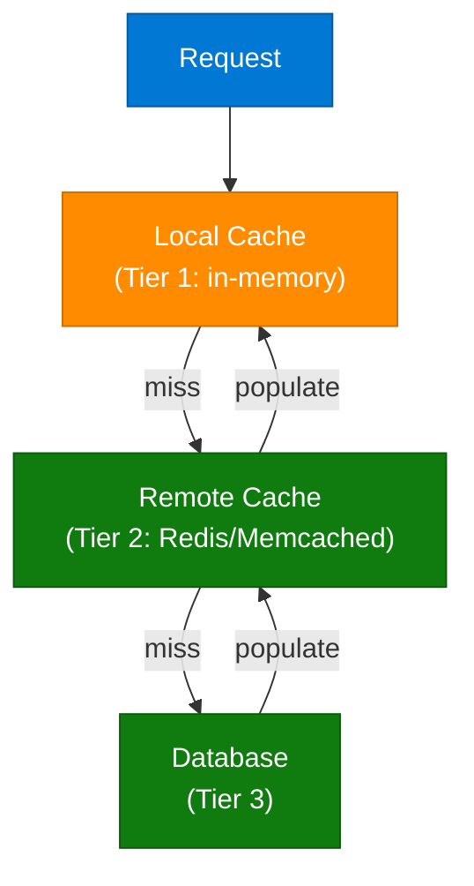

### Full Comparison Table

| Strategy | Mechanism | Overhead | Best For | Worst For |
|---|---|---|---|---|
| **LRU** | Tracks access recency (linked list + hashmap) | Medium | Web browsing, API caching, general-purpose | Sequential scans / unpredictable patterns |
| **LFU** | Tracks frequency counts per key | High | Stable, popular-item workloads (trending content) | Rapidly shifting access patterns |
| **FIFO** | Simple insertion-order queue | Low | Simple systems, streaming buffers | Active/hot data getting evicted early |
| **Random (RR)** | Randomly selects victim | Very Low | Unknown/unpredictable access patterns | Predictable, skewed access patterns |
| **MRU** | Tracks most recently used item | Low | Cyclic/sequential scan workloads | Repeated-access workloads (most common case) |
| **TTL** | Expiration timestamp per item | Low | Time-sensitive data (sessions, tokens, quotes) | Long-lived, frequently reused queries |
| **Two-Tiered** | Local + remote cache layering | High | High-traffic, large-scale distributed systems | Simple, single-instance applications |

### Python Example: Simple LRU Cache

```python
from collections import OrderedDict

class LRUCache:
    def __init__(self, capacity: int):
        self.capacity = capacity
        self.cache = OrderedDict()

    def get(self, key):
        if key not in self.cache:
            return -1
        # Move to the end -> mark as most recently used
        self.cache.move_to_end(key)
        return self.cache[key]

    def put(self, key, value):
        if key in self.cache:
            self.cache.move_to_end(key)
        self.cache[key] = value
        if len(self.cache) > self.capacity:
            # Pop the first item -> least recently used
            self.cache.popitem(last=False)

# Usage
lru = LRUCache(3)
lru.put("A", 1)
lru.put("B", 2)
lru.put("C", 3)
lru.get("A")          # A becomes most recently used
lru.put("D", 4)        # B is evicted (least recently used)
```

> Python's built-in `functools.lru_cache` decorator implements LRU eviction automatically for function memoization.

---

## 4. Distributed Caching <a id="4-distributed-caching"></a>

> Extracted and adapted from blog.algomaster.io/p/distributed-caching

**Distributed caching** stores cache data across multiple servers rather than a single machine, enabling horizontal scaling for large-scale applications.

### Why Distributed Caching Matters

1. **Scalability** — add cache nodes independently without impacting application servers.
2. **Fault Tolerance** — a single node failure doesn't eliminate the entire cache; remaining nodes keep serving.
3. **Load Balancing** — distributes demand evenly across nodes, preventing hotspots.

### Essential Components

| Component | Role |
|---|---|
| **Cache Nodes** | Individual servers storing distributed data |
| **Client Library** | Handles connections and data-distribution logic (e.g., which node owns a key) |
| **Consistent Hashing** | Spreads keys evenly; minimizes data movement when nodes are added/removed |
| **Replication** | Duplicates data across nodes for reliability |
| **Sharding** | Splits the keyspace into segments across different nodes |
| **Eviction Policies** | LRU, LFU, or TTL remove stale/unused data per node |
| **Coordination** | Distributed locks and consensus protocols maintain synchronization |

### Consistent Hashing

```mermaid
flowchart TD
    keyNode["key = hash(\"user:123\")"]:::userNode
    ringNode["Hash Ring"]:::infraNode
    node1["Cache Node 1"]:::dataNode
    node2["Cache Node 2"]:::dataNode
    node3["Cache Node 3"]:::dataNode

    keyNode --> ringNode
    ringNode -->|"clockwise lookup"| node2
    node1 -.->|"ring neighbor"| node2
    node2 -.->|"ring neighbor"| node3
    node3 -.->|"ring neighbor"| node1

    classDef userNode fill:#0078D4,stroke:#005A9E,color:#fff
    classDef aiNode fill:#7719AA,stroke:#5A0E80,color:#fff
    classDef dataNode fill:#107C10,stroke:#0A5C0A,color:#fff
    classDef processNode fill:#FF8C00,stroke:#CC7000,color:#fff
    classDef errorNode fill:#E81123,stroke:#B30D1A,color:#fff
    classDef outputNode fill:#00B294,stroke:#007D68,color:#fff
    classDef infraNode fill:#605E5C,stroke:#3B3A39,color:#fff
```

Consistent hashing places both nodes and keys on a hash ring; a key belongs to the first node found walking clockwise. Adding/removing a node only remaps `1/N` of the keys, instead of rehashing everything (as naive `hash(key) % N` would).

### Architectural Strategies

**Dedicated Cache Servers**
- Strengths: independent scalability, resource isolation, no contention for shared hardware.
- Weaknesses: higher cost, network latency overhead.

**Co-located Cache** (cache runs on the same host as the application)
- Strengths: minimal latency, cost-effective for smaller systems.
- Weaknesses: resource contention under load, limited scaling flexibility, complex invalidation across instances.

### How It Works (Request Flow)

1. **Hash** the key to determine the target cache node.
2. **Replicate** data across backup nodes for durability.
3. **Retrieve** via key lookup — hit returns data; miss triggers a database fetch.
4. **Invalidate** through time-based (TTL) or event-based expiration.
5. **Evict** old data following the configured policy (LRU/LFU/TTL).

### Challenges

- Data consistency across nodes (replication lag, stale reads).
- Cache invalidation complexity in a distributed setting (no single source of truth for "now").
- Network partitioning scenarios (split-brain risk).
- Balanced key distribution at scale (hot keys / hot shards).

### Best Practices

- Cache only frequently-accessed, relatively static data.
- Set appropriate TTL values to bound staleness.
- Prefer cache-aside loading for resilience to cache outages.
- Monitor hit rates and memory usage continuously.
- Design for graceful degradation if the cache layer is unavailable.
- Pre-populate (warm) critical data to avoid cold-start stampedes.

### Popular Solutions

| Tool | Highlights |
|---|---|
| **Redis** | In-memory data structure store; supports replication, persistence (RDB/AOF), pub/sub, Lua scripting, cluster mode |
| **Memcached** | Lightweight, multi-threaded, purely in-memory key-value cache; no persistence; great for simple read-heavy caching |
| **Amazon ElastiCache** | AWS-managed Redis/Memcached with multi-AZ failover and auto-scaling |

### Redis Example

```python
import redis

r = redis.Redis(host="cache.example.com", port=6379, decode_responses=True)

def get_user_profile(user_id):
    cache_key = f"user:{user_id}"
    cached = r.get(cache_key)
    if cached:
        return cached  # cache hit

    # cache miss -> fetch from DB
    profile = fetch_user_from_db(user_id)
    r.setex(cache_key, 300, profile)  # cache for 300 seconds (TTL)
    return profile
```

---

## 5. Content Delivery Network (CDN) <a id="5-cdn"></a>

> *Synthesized from domain knowledge (algomaster.io/learn/system-design/content-delivery-network-cdn).*

A **CDN** is a geographically distributed network of proxy/edge servers that cache and deliver content (static assets, video, and increasingly dynamic API responses) from a location physically closer to the end user, reducing latency and offloading origin servers.

### How It Works

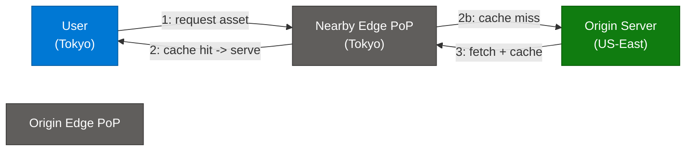

### Push vs Pull CDNs

| Type | How it Works | Best For |
|---|---|---|
| **Pull CDN** | Edge fetches content from origin on first request (cache-aside style), caches it for TTL | Frequently updated content, simpler setup |
| **Push CDN** | Origin proactively uploads content to edge nodes ahead of time | Large, rarely-changing files (video libraries) |

### Key Benefits

- **Lower latency** via geographic proximity (edge Points of Presence/PoPs).
- **Reduced origin load** — most requests never reach the origin server.
- **DDoS mitigation** — the CDN absorbs traffic spikes and malicious traffic at the edge.
- **High availability** — multiple PoPs provide redundancy; an outage in one region doesn't take down the whole service.
- **TLS termination at the edge** reduces handshake latency for users.

### What CDNs Cache

- Static assets: images, CSS, JS, fonts, videos.
- Increasingly, **dynamic content** via edge compute (Cloudflare Workers, AWS Lambda@Edge, Fastly Compute@Edge) and API response caching with short TTLs.

### Cache Invalidation in CDNs

- **TTL-based expiration** — simplest, but can serve stale content until expiry.
- **Cache busting** — version/hash the asset URL (e.g., `app.a1b2c3.js`) so a new deploy naturally gets a new cache key.
- **Purge/invalidate API** — explicitly tell the CDN to evict specific paths (used for urgent content corrections).

### Popular CDN Providers

Cloudflare, Akamai, Amazon CloudFront, Fastly, Google Cloud CDN, Azure CDN.

---

# Part 2: Asynchronous Communication

## 6. Pub/Sub Pattern <a id="6-pub-sub"></a>

> *Synthesized from domain knowledge (algomaster.io/learn/system-design/pub-sub).*

**Publish-Subscribe (Pub/Sub)** is a messaging pattern where publishers send messages to a **topic** without knowledge of who (if anyone) will consume them, and subscribers express interest in one or more topics to receive relevant messages. A message broker decouples publishers from subscribers entirely.

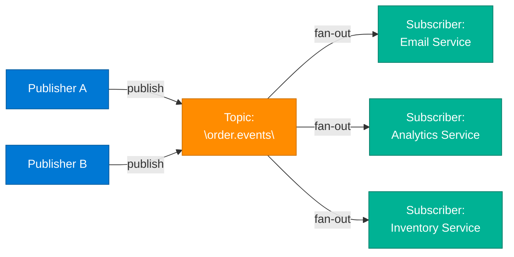

### Key Characteristics

- **One-to-many (fan-out) delivery** — every subscriber of a topic gets a copy of the message.
- **Loose coupling** — publishers don't know subscribers, and vice versa.
- **Topic-based or content-based filtering** — subscribers can filter by topic name or message attributes.
- Most implementations support **at-least-once delivery**, requiring idempotent consumers.

### Common Implementations

| Tool | Notes |
|---|---|
| **Apache Kafka** | Distributed log-based pub/sub; high throughput, durable, replayable |
| **Google Cloud Pub/Sub** | Fully managed, global, push or pull delivery |
| **Redis Pub/Sub** | In-memory, fire-and-forget (no persistence) |
| **AWS SNS** | Managed pub/sub, commonly paired with SQS per subscriber (fan-out pattern) |
| **RabbitMQ (exchanges)** | Exchange types (fanout/topic/direct) implement pub/sub semantics |

### Use Cases

- Event-driven microservices (order placed → notify shipping, billing, analytics).
- Real-time notifications and live feeds.
- Log/metrics aggregation pipelines.

---

## 7. Message Queues <a id="7-message-queues"></a>

> *Synthesized from domain knowledge (algomaster.io/learn/system-design/message-queues).*

A **Message Queue** enables point-to-point, asynchronous communication: a producer places a message on a queue, and exactly **one** consumer (from a pool of competing consumers) processes and removes it. This contrasts with pub/sub's fan-out model.

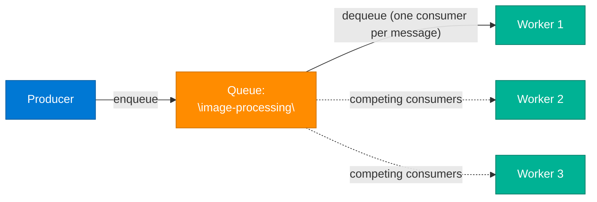

### Key Characteristics

- **One-to-one delivery** (per message) — the **competing consumers pattern** lets you scale processing horizontally.
- **Decouples producers from consumers** in time — producer doesn't block waiting for processing.
- Supports **message durability**, **retries**, **dead-letter queues (DLQ)** for poison messages, and **visibility timeouts** (consumer gets exclusive lease while processing).
- **Ordering** guarantees vary: FIFO queues (SQS FIFO, single-partition Kafka) vs best-effort ordering.

### Common Implementations

| Tool | Notes |
|---|---|
| **RabbitMQ** | AMQP-based, flexible routing, strong delivery guarantees |
| **Amazon SQS** | Fully managed, standard (at-least-once) or FIFO queues |
| **Apache Kafka** | Technically a distributed log, but commonly used as a durable, replayable queue/stream |
| **ActiveMQ / ZeroMQ** | Traditional / lightweight messaging options |

### Pub/Sub vs Message Queue — Comparison Table

| Aspect | Pub/Sub | Message Queue |
|---|---|---|
| **Delivery model** | One-to-many (fan-out, broadcast) | One-to-one (point-to-point) |
| **Consumer relationship** | Multiple independent subscribers each get every message | Multiple competing consumers share the workload; each message processed once |
| **Coupling** | Publishers/subscribers fully decoupled | Producers/consumers decoupled in time, but message goes to a single worker |
| **Use case** | Event broadcasting, notifications, fan-out to many services | Task distribution, work queues, load leveling |
| **Message removal** | Message remains for all subscribers; not removed per-consumer (in log-based systems) | Message removed/acked once consumed by one worker |
| **Scaling pattern** | Add more subscribers to receive the *same* events | Add more consumers to process *more* messages in parallel |
| **Examples** | Kafka topics, SNS, Redis Pub/Sub | SQS, RabbitMQ queues, Kafka with single consumer group |

### Code Example: Producer/Consumer with a Queue (pseudo-code)

```python
# Producer
import boto3
sqs = boto3.client("sqs")

def enqueue_image_job(image_url):
    sqs.send_message(
        QueueUrl="https://sqs.us-east-1.amazonaws.com/123/image-processing",
        MessageBody=json.dumps({"image_url": image_url}),
    )

# Consumer (one of many competing workers)
def poll_and_process():
    while True:
        resp = sqs.receive_message(QueueUrl=QUEUE_URL, MaxNumberOfMessages=1, WaitTimeSeconds=20)
        for msg in resp.get("Messages", []):
            try:
                job = json.loads(msg["Body"])
                process_image(job["image_url"])
                sqs.delete_message(QueueUrl=QUEUE_URL, ReceiptHandle=msg["ReceiptHandle"])
            except Exception:
                # Message becomes visible again after the visibility timeout
                # and is eventually routed to a Dead-Letter Queue (DLQ) after N retries
                log_error(msg)
```

---

## 8. Change Data Capture (CDC) <a id="8-cdc"></a>

> *Synthesized from domain knowledge (algomaster.io/learn/system-design/change-data-capture-cdc).*

**Change Data Capture (CDC)** is a technique for identifying and capturing changes (inserts, updates, deletes) made to data in a source system, then streaming those changes to downstream consumers in real time — without requiring the source application to explicitly publish events.

### Why CDC?

- Keeps caches, search indexes, and data warehouses in sync with the source-of-truth database without dual writes.
- Enables event-driven architectures from legacy databases that weren't built with events in mind.
- Powers real-time analytics pipelines and microservice data replication.

### CDC Approaches

| Approach | How it Works | Pros | Cons |
|---|---|---|---|
| **Polling/Timestamp** | Periodically query rows where `updated_at > last_poll` | Simple to implement | Misses deletes, adds query load, polling lag |
| **Trigger-based** | DB triggers write changes to a shadow/audit table | Captures all changes synchronously | Adds write latency, maintenance burden |
| **Log-based (transaction log tailing)** | Reads the database's write-ahead log (WAL) / binlog directly | Low overhead, captures all changes including deletes, near real-time | Requires log access, DB-specific tooling |

Log-based CDC (e.g., via **Debezium**) is the modern standard because it doesn't add load to the source database — it tails the replication log the same way a read replica would.

### Debezium Architecture

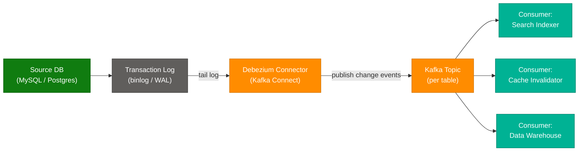

### The Outbox Pattern

CDC pairs naturally with the **Transactional Outbox Pattern** to solve the "dual write problem" (writing to a DB and publishing an event are not atomic unless coordinated).

1. The service writes the business entity change **and** an "outbox" event row in the **same local DB transaction**.
2. A CDC connector (e.g., Debezium) tails the outbox table's log entries.
3. The connector publishes each outbox row as a Kafka message, then the row can be cleaned up.

This guarantees the event is published **if and only if** the business transaction committed — no distributed transaction (2PC) needed.

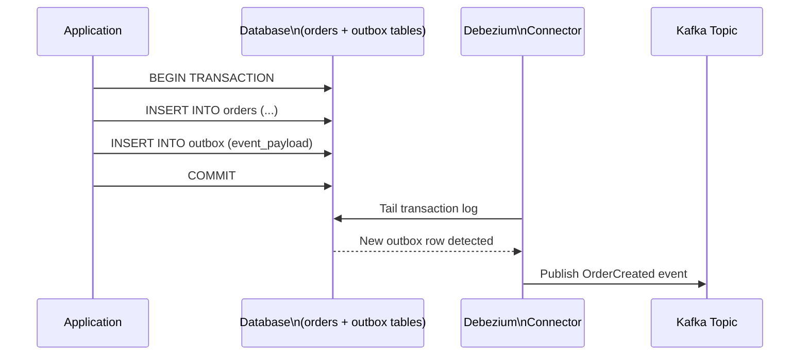

### CDC Use Cases

- Cache invalidation triggered by DB writes (instead of dual writes from app code).
- Syncing a search index (Elasticsearch) from the primary database.
- Streaming ETL into a data warehouse (Snowflake, BigQuery) for analytics.
- Microservices data replication without tight coupling (each service's local read-model stays fresh).

---

# Part 3: Distributed Systems & Microservices

## 9. Heartbeats in Distributed Systems <a id="9-heartbeats"></a>

> Extracted and adapted from blog.algomaster.io/p/heartbeats-in-distributed-systems

A **heartbeat** is a periodic message sent from one component to another to monitor each other's health and status — a signal confirming a node remains operational.

### How Failure Detection Works

1. **Periodic signaling** — nodes transmit heartbeat signals at regular intervals (commonly every few seconds up to ~30s).
2. **Status tracking** — monitors update node status upon receiving each signal.
3. **Timeout detection** — absence of expected heartbeats within a configured window triggers a failure classification.
4. **Recovery activation** — the system responds by redirecting traffic, initiating failover, or alerting operators.

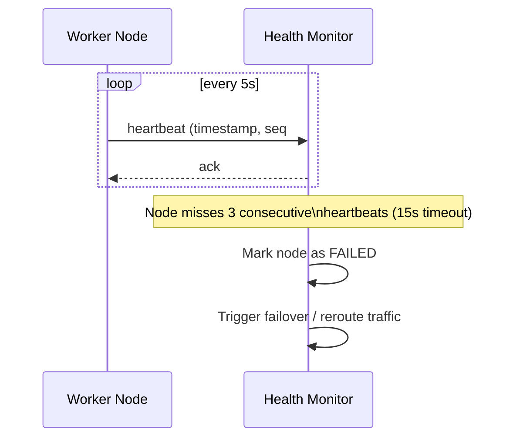

### Key Implementation Considerations

- **Frequency** — too-frequent signals waste bandwidth/CPU; infrequent signals delay failure detection.
- **Timeout thresholds** — must account for network latency/jitter while avoiding false positives (commonly use a multiple of the heartbeat interval, e.g., 3x).
- **Payload design** — typically minimal (timestamp, sequence number), though can carry load metrics or health data ("phi accrual" failure detectors use this for adaptive thresholds).

### Heartbeat Categories

- **Push-based** — nodes actively transmit signals to a monitor (most common: "I'm alive").
- **Pull-based** — the monitor periodically polls/queries each node for status (health-check endpoints).

### Real-World Applications

- **Database replication** — primary/replica heartbeats trigger failover when the primary goes silent.
- **Kubernetes** — kubelet node heartbeats (`NodeStatus` lease) drive the control plane's view of node health.
- **Elasticsearch / Consul / ZooKeeper** — cluster membership and leader-health tracking.

### Challenges

Network congestion, false-positive failures (a slow-but-alive node looks dead), computational/bandwidth overhead at scale, and **split-brain** scenarios during network partitions (two halves of the cluster both think they're the live side).

---

## 10. Service Discovery <a id="10-service-discovery"></a>

> Extracted and adapted from blog.algomaster.io/p/service-discovery-in-distributed-systems

**Service discovery** is a mechanism that allows services in a distributed system to find and communicate with each other dynamically. It maintains a **service registry** containing IP addresses, ports, health status, and metadata for all active service instances — "the address book of your microservices architecture."

### Client-Side Discovery

Services register with a central registry. Clients query the registry directly, receive a list of available instances, and select one themselves using client-side load-balancing logic.

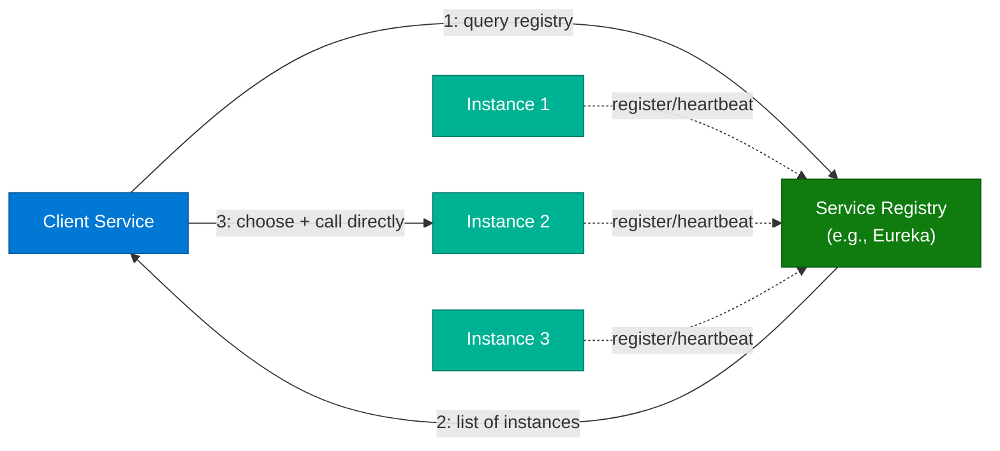

- **Pros:** Reduces load-balancer pressure; client controls load-balancing strategy.
- **Cons:** Discovery logic must be implemented in every client/language.
- **Example tool:** Netflix Eureka.

### Server-Side Discovery

Clients send requests to a load balancer or API gateway, which queries the service registry and routes traffic accordingly. Centralizes discovery logic at the cost of an extra network hop.

- **Pros:** Clients stay simple (no discovery logic needed); language-agnostic.
- **Cons:** Extra hop adds latency; load balancer becomes a critical infrastructure piece.
- **Example tool:** AWS Elastic Load Balancer (ELB), Kubernetes `Service` + kube-proxy.

### Registration Methods

| Method | Description |
|---|---|
| **Manual registration** | An operator/admin registers instances explicitly |
| **Self-registration** | The service instance registers itself on startup and deregisters on shutdown |
| **Third-party registration (sidecar)** | A sidecar process (e.g., Consul agent, Envoy) registers on the service's behalf |
| **Orchestration-based** | Automatic registration via Kubernetes/Nomad as part of scheduling |
| **Configuration management** | Registration driven by config-management tooling (Ansible/Chef/Puppet) |

### Best Practices

- Deploy multiple registry instances for high availability (the registry itself shouldn't be a SPOF).
- Automate registration/deregistration in dynamic, autoscaled environments.
- Implement health checks to remove failing instances promptly.
- Use consistent naming conventions with versioning (e.g., `orders-service-v2`).
- Cache discovery data client-side to reduce registry load and tolerate brief registry outages.
- Ensure the registry scales with service/instance growth.

### Common Tools

| Tool | Type |
|---|---|
| **Netflix Eureka** | Client-side, AP-oriented registry |
| **Consul** | Service mesh + registry with health checking, supports both patterns |
| **etcd / ZooKeeper** | Strongly consistent (CP) coordination services often used to build registries |
| **Kubernetes DNS/Service** | Built-in server-side discovery via cluster DNS and `kube-proxy` |
| **Istio / Envoy** | Service mesh providing discovery + traffic management as sidecars |

---

## 11. Consensus Algorithms (Raft, Paxos) <a id="11-consensus"></a>

> *Synthesized from domain knowledge (medium.com/@sourabhatta1819/consensus-in-distributed-system).*

**Consensus** is the problem of getting multiple distributed nodes to agree on a single value or sequence of operations, even in the presence of failures, network delays, or partitions. It underpins leader election, distributed transactions, and replicated state machines.

### Why Consensus Is Hard

The **FLP impossibility result** proves that in a fully asynchronous system, no deterministic consensus algorithm can guarantee both safety and liveness if even one node can fail. Real-world algorithms work around this with timeouts and partial synchrony assumptions.

### Paxos

The original (Lamport, 1989) consensus protocol. Roles: **Proposers**, **Acceptors**, **Learners**. Operates in two phases:

1. **Prepare/Promise** — a proposer asks acceptors to promise not to accept proposals older than its proposal number.
2. **Accept/Accepted** — if a majority promises, the proposer sends the actual value; once a majority accepts, consensus is reached.

Paxos is famously correct but notoriously difficult to understand and implement correctly ("Paxos Made Simple" was written because the original paper was so opaque).

### Raft

Designed explicitly for understandability (Ongaro & Ousterhout, 2014). Raft decomposes consensus into three sub-problems:

1. **Leader Election** — nodes start as followers; if no heartbeat from a leader within a randomized election timeout, a node becomes a candidate and requests votes. Majority votes → becomes leader.
2. **Log Replication** — the leader appends client commands to its log and replicates entries to followers; an entry is **committed** once a majority of nodes have it.
3. **Safety** — election rules (only vote for candidates with logs at least as up-to-date) ensure a newly elected leader has all committed entries.

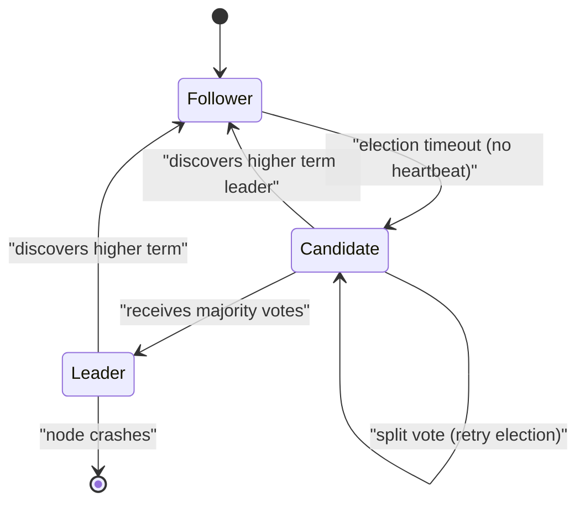

### Quorum-Based Agreement

Both Paxos and Raft rely on **majority quorums** (`N/2 + 1`): any two majorities out of N nodes must overlap by at least one node, which is what prevents two conflicting values from both being "committed" during a partition.

### Consensus in Practice

| System | Algorithm Used |
|---|---|
| **etcd** | Raft |
| **Kubernetes** (via etcd) | Raft |
| **Consul** | Raft |
| **ZooKeeper** | ZAB (Zookeeper Atomic Broadcast — Paxos-like) |
| **Google Spanner / Chubby** | Paxos |
| **CockroachDB / TiDB** | Raft (per range/region) |

### CAP Theorem Connection

Consensus protocols inherently favor **CP** (Consistency + Partition tolerance) over availability: during a network partition, the minority side cannot commit new entries (it can't reach quorum), sacrificing availability to preserve consistency.

---

## 12. Distributed Locking <a id="12-distributed-locking"></a>

> *Synthesized from domain knowledge (martin.kleppmann.com/2016/02/08/how-to-do-distributed-locking.html).*

A **distributed lock** ensures mutual exclusion across multiple nodes/processes — e.g., ensuring only one instance of a cron job runs, or only one node modifies a shared resource at a time.

### Why It's Hard

Martin Kleppmann's well-known critique of "Redlock" (Redis's distributed locking algorithm) highlights a fundamental issue: **a lock obtained doesn't guarantee mutual exclusion under real-world failure modes** such as:

- **Process pauses** — a long GC pause or OS scheduling delay can cause a client to believe it still holds the lock after its lease has expired.
- **Clock drift/jumps** — algorithms relying on wall-clock TTLs (like Redlock) are vulnerable to clock skew across nodes.
- **Network delays** — a delayed message can arrive *after* a lock has been released and reassigned, causing two clients to believe they hold the lock simultaneously.

### The Classic Failure Scenario

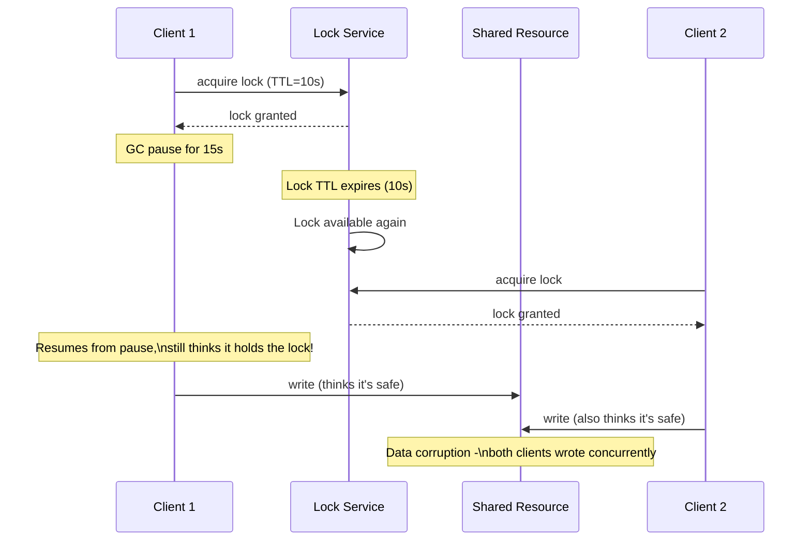

### Kleppmann's Recommendation: Fencing Tokens

The robust fix is a **fencing token** — a monotonically increasing number issued every time a lock is granted. The shared resource (storage layer) rejects any write tagged with a token lower than the highest one it has already seen.

```python
# Pseudo-code: fencing token pattern
token = lock_service.acquire_lock("resource-123")  # returns e.g. token=33

storage.write(resource_id="resource-123", token=token, data=payload)
# Storage layer logic:
#   if token <= storage.max_token_seen("resource-123"):
#       reject()  # stale client, lock was already reassigned
#   else:
#       storage.max_token_seen = token
#       accept()
```

This converts the problem from "trust the lock" to "let the storage layer enforce ordering," which is safe even if a client pauses arbitrarily long.

### Distributed Locking Tools

| Tool | Mechanism |
|---|---|
| **Redlock (Redis)** | Quorum across N independent Redis instances; **Kleppmann argues it's unsafe** for correctness-critical locking without fencing tokens |
| **ZooKeeper** | Ephemeral sequential znodes; strongly consistent (built on ZAB consensus) — generally considered safer |
| **etcd** | Lease + revision number (naturally provides a fencing-token-like mechanism via `mod_revision`) |
| **Chubby (Google)** | Paxos-based lock service, inspiration for ZooKeeper |

### Key Takeaway

Use distributed locks for **efficiency** (avoiding duplicate work, e.g., two cron triggers) where occasional double-execution is tolerable. For **correctness** (preventing data corruption), rely on fencing tokens or a consensus-backed system — don't trust lock TTLs alone.

---

## 13. Gossip Protocol <a id="13-gossip-protocol"></a>

> *Synthesized from domain knowledge (highscalability.com/blog/2023/7/16/gossip-protocol-explained.html).*

**Gossip protocols** (a.k.a. epidemic protocols) spread information across a cluster the way rumors spread in a social network: each node periodically picks one or a few random peers and exchanges state with them. Over multiple rounds, information propagates to the entire cluster without any central coordinator.

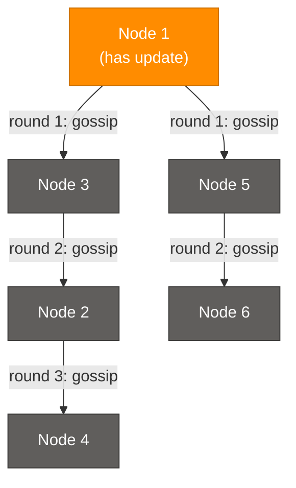

### How It Works

1. Each node maintains a local view of cluster state (membership, health, key-value data).
2. Periodically (e.g., every second), a node selects 1-3 random peers.
3. Nodes exchange state — merging updates using version vectors or timestamps to resolve conflicts.
4. Information propagates **exponentially** (like an epidemic) — typically reaching all N nodes in `O(log N)` rounds.

### Properties

- **Decentralized** — no single coordinator or bottleneck, highly fault-tolerant.
- **Eventually consistent** — all nodes converge, but not instantly.
- **Scalable** — communication overhead per node stays roughly constant regardless of cluster size (unlike a naive broadcast-to-all approach).
- **Resilient to partial failures** — even if some nodes are down, gossip routes around them via alternate peers.

### Real-World Usage

| System | Use of Gossip |
|---|---|
| **Cassandra / DynamoDB-style stores** | Cluster membership and failure detection |
| **Consul / Serf (HashiCorp)** | Membership, failure detection (built on the SWIM protocol) |
| **Redis Cluster** | Node-to-node gossip for cluster topology and failure detection |
| **Bitcoin / blockchain networks** | Transaction and block propagation |

### Trade-offs

- **Pros:** No single point of failure, scales horizontally, simple to reason about per-node.
- **Cons:** Eventual (not immediate) consistency; propagation delay grows with cluster size (though only logarithmically); some redundant message overhead.

---

## 14. Circuit Breaker Pattern <a id="14-circuit-breaker"></a>

> *Synthesized from domain knowledge (medium.com/geekculture/design-patterns-for-microservices-circuit-breaker-pattern).*

The **Circuit Breaker** pattern prevents a failing downstream service from cascading failures throughout a distributed system. Inspired by electrical circuit breakers, it "trips" after repeated failures, short-circuiting further calls until the downstream service recovers.

### States

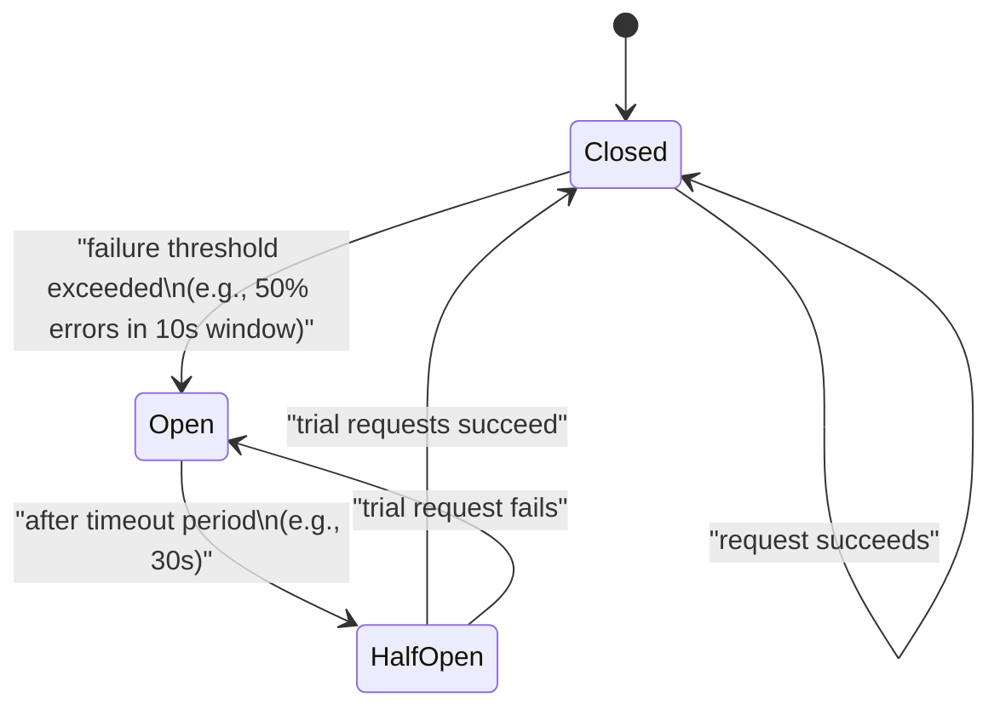

| State | Behavior |
|---|---|
| **Closed** | Requests flow normally to the downstream service; failures are counted |
| **Open** | All requests immediately fail-fast (or fall back) without calling the downstream service, for a cooldown period |
| **Half-Open** | A limited number of trial requests are allowed through to test if the downstream service has recovered |

### Why It Matters

Without a circuit breaker, a slow/failing downstream service causes callers to pile up waiting threads/connections, exhausting resources and causing a **cascading failure** across the entire call chain — even services that have nothing to do with the original failure can go down.

### Implementation Example (Python, pseudo-library style)

```python
import time

class CircuitBreaker:
    def __init__(self, failure_threshold=5, recovery_timeout=30):
        self.failure_threshold = failure_threshold
        self.recovery_timeout = recovery_timeout
        self.failure_count = 0
        self.state = "CLOSED"
        self.opened_at = None

    def call(self, func, *args, **kwargs):
        if self.state == "OPEN":
            if time.time() - self.opened_at > self.recovery_timeout:
                self.state = "HALF_OPEN"
            else:
                raise Exception("Circuit is OPEN - failing fast")

        try:
            result = func(*args, **kwargs)
        except Exception as e:
            self.failure_count += 1
            if self.failure_count >= self.failure_threshold:
                self.state = "OPEN"
                self.opened_at = time.time()
            raise e
        else:
            # success: reset on HALF_OPEN -> CLOSED transition
            self.failure_count = 0
            self.state = "CLOSED"
            return result

# Usage
breaker = CircuitBreaker(failure_threshold=3, recovery_timeout=10)
try:
    response = breaker.call(call_payment_service, order_id=42)
except Exception:
    response = fallback_response()  # graceful degradation
```

### Related Resilience Patterns

| Pattern | Purpose |
|---|---|
| **Retry with backoff** | Handle transient failures by retrying with exponential delay |
| **Bulkhead** | Isolate resource pools (thread pools/connections) per dependency so one slow dependency can't exhaust shared resources |
| **Timeout** | Bound how long a caller waits before giving up |
| **Fallback** | Provide a degraded but functional response when the circuit is open |

### Popular Libraries

Netflix Hystrix (deprecated, but foundational), **resilience4j** (Java), **Polly** (.NET), **pybreaker** (Python), built into service meshes like **Istio/Envoy**.

---

## 15. Disaster Recovery <a id="15-disaster-recovery"></a>

> *Synthesized from domain knowledge (cloud.google.com/learn/what-is-disaster-recovery).*

**Disaster Recovery (DR)** is the set of policies, tools, and procedures that enable the recovery of critical technology infrastructure and systems after a natural or human-induced disaster (region outage, data corruption, ransomware, etc.).

### Key Metrics

| Metric | Definition |
|---|---|
| **RTO (Recovery Time Objective)** | Maximum acceptable time to restore service after a disaster |
| **RPO (Recovery Point Objective)** | Maximum acceptable amount of data loss, measured in time (e.g., "we can lose up to 5 minutes of data") |

Lower RTO/RPO = more expensive and complex DR strategy.

### DR Strategies (increasing cost & decreasing RTO/RPO)


| Strategy | Description | Typical RTO | Typical RPO |
|---|---|---|---|
| **Backup & Restore** | Periodic backups stored off-site/cross-region; restore on demand | Hours to days | Hours (since last backup) |
| **Pilot Light** | Minimal core infrastructure (e.g., DB replica) always running in the DR region; rest is provisioned on failover | Tens of minutes | Minutes |
| **Warm Standby** | Scaled-down but fully functional copy of the full stack running in the DR region; scale up on failover | Minutes | Seconds to minutes |
| **Multi-Site / Active-Active** | Full production capacity running simultaneously in multiple regions, with live traffic routing | Near-zero (seconds) | Near-zero |

### Core DR Practices

- **Geographic redundancy** — replicate data and infrastructure across regions/availability zones.
- **Regular backup testing** — a backup you've never restored from is not a verified backup.
- **Automated failover** — reduce human reaction time via health-check-driven DNS/traffic failover.
- **Runbooks and game days** — regularly rehearsed disaster simulations (chaos engineering) validate the plan works under pressure.
- **Data replication strategy** — synchronous (zero data loss, higher latency) vs asynchronous (some data loss possible, lower latency) replication.

### DR vs High Availability (HA)

HA protects against component-level failures *within* a region (e.g., one server dies, traffic shifts to another). DR protects against the loss of an entire region/data center — a fundamentally larger blast radius requiring a different, often cross-region, strategy.

---

## 16. Distributed Tracing <a id="16-distributed-tracing"></a>

> *Synthesized from domain knowledge (dynatrace.com/news/blog/what-is-distributed-tracing).*

**Distributed tracing** tracks a single request as it flows through multiple services in a distributed/microservices architecture, stitching together timing and causality data so engineers can pinpoint latency bottlenecks and failures across service boundaries.

### Core Concepts

| Concept | Meaning |
|---|---|
| **Trace** | The end-to-end journey of a single request across all services it touches |
| **Span** | A single unit of work within a trace (e.g., one service's handling of the request, or one DB call) |
| **Trace ID** | A unique identifier propagated across every service involved in a request, tying all spans together |
| **Span ID / Parent Span ID** | Identifies each span and its parent, reconstructing the call tree |
| **Context Propagation** | Passing trace/span IDs through request headers (e.g., HTTP headers, gRPC metadata) so downstream services can attach their spans to the same trace |

### Example Trace Tree

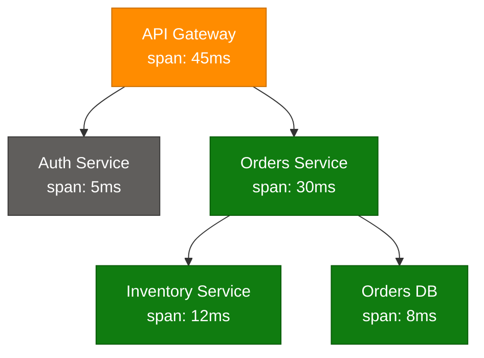

This view immediately shows that **Orders Service (30ms)**, specifically its call to **Inventory Service (12ms)** plus its own DB query (8ms), dominates the gateway's 45ms total — without tracing, this would require manually correlating logs across three separate services.

### Standards and Tools

| Tool/Standard | Role |
|---|---|
| **OpenTelemetry (OTel)** | Vendor-neutral standard for instrumentation, context propagation, and exporting traces/metrics/logs |
| **Jaeger** | Open-source distributed tracing backend (originally from Uber) |
| **Zipkin** | Open-source tracing system (originally from Twitter) |
| **Dynatrace / Datadog / New Relic** | Commercial APM platforms with built-in distributed tracing |
| **AWS X-Ray** | AWS-native distributed tracing |

### Benefits

- Pinpoints the exact service/call causing latency in a complex request chain.
- Reveals service dependency graphs automatically (which services call which).
- Speeds up root-cause analysis for production incidents dramatically vs. grepping through disparate logs.
- Combined with **structured logging** and **metrics**, forms the three pillars of observability.

---

## 17. Interview Q&A Cheatsheet <a id="17-interview-qa"></a>

**Q1: What's the difference between cache-aside and write-through caching?**
A: Cache-aside (lazy loading) only populates the cache on a read miss — writes go straight to the DB and the cache is invalidated/left stale until next read. Write-through writes to the cache and DB synchronously on every write, keeping the cache always consistent at the cost of higher write latency.

**Q2: Why is LRU more commonly used than LFU in practice despite LFU seeming "smarter"?**
A: LFU has higher memory overhead (tracking frequency counters for every key) and can keep historically popular items cached long after they're no longer relevant ("cache pollution"). LRU's recency-based heuristic matches most real-world access patterns (temporal locality) with much simpler bookkeeping (O(1) with a doubly linked list + hashmap).

**Q3: How does consistent hashing help distributed caches scale?**
A: Naive `hash(key) % N` remaps nearly all keys when N changes, causing a cache stampede. Consistent hashing places nodes and keys on a hash ring so adding/removing one node only remaps approximately `1/N` of keys, minimizing cache misses during scaling events.

**Q4: What problem does the Transactional Outbox Pattern solve, and how does CDC relate to it?**
A: It solves the "dual write problem" — atomically updating a database and publishing an event isn't possible without coordination. The outbox pattern writes the event to an outbox table in the same local transaction as the business data; a CDC tool (e.g., Debezium) tails the database log and publishes the outbox rows as events, guaranteeing the event is sent if and only if the transaction committed.

**Q5: When would you choose a message queue over a pub/sub system?**
A: Use a queue when you need work distributed across a pool of workers with each message processed exactly once (e.g., resizing uploaded images) — the competing-consumers pattern. Use pub/sub when multiple independent services each need their own copy of every event (e.g., an order event needing to notify billing, shipping, and analytics simultaneously).

**Q6: Why might Martin Kleppmann argue that Redlock is unsafe for distributed locking?**
A: Redlock relies on wall-clock TTLs and the assumption that no client pauses (GC, scheduling delay) longer than the lock's TTL. Process pauses, clock drift, and network delays can cause a client to believe it still holds a lock after it has actually expired and been reassigned, leading to two clients believing they hold the lock simultaneously — breaking mutual exclusion. The fix is fencing tokens enforced by the storage layer, not trusting the lock alone.

**Q7: What is a fencing token and why does it matter?**
A: A fencing token is a monotonically increasing number issued each time a distributed lock is granted. The protected resource rejects any operation tagged with a token lower than the highest one already seen, which prevents a "zombie" client (one that paused past its lock's TTL) from corrupting data even if it incorrectly believes it still holds the lock.

**Q8: How does Raft simplify consensus compared to Paxos?**
A: Raft decomposes consensus into three understandable sub-problems — leader election, log replication, and safety — with a strong single-leader model where only the leader handles client requests and replicates entries. Paxos is more general (no inherent leader concept in basic Paxos) but is notoriously difficult to implement correctly because its phases and edge cases are less intuitively structured.

**Q9: What's the difference between gossip protocol-based failure detection and heartbeat-based failure detection to a central monitor?**
A: Heartbeat-to-monitor is centralized — every node reports to a single (or small set of) monitor(s), which becomes a bottleneck/SPOF at scale. Gossip protocols are decentralized — each node periodically exchanges state with a few random peers, and information (including failure detection) propagates epidemically in O(log N) rounds, with no single point of failure and roughly constant per-node overhead regardless of cluster size.

**Q10: Walk through the Circuit Breaker's three states and when each transition happens.**
A: **Closed** — requests flow normally; failures are counted. When failures exceed a threshold (e.g., 50% error rate in a window), it transitions to **Open** — all calls fail fast without hitting the downstream service. After a cooldown/timeout, it transitions to **Half-Open**, allowing a small number of trial requests through; if they succeed, it returns to Closed, if they fail, it goes back to Open.

**Q11: What's the difference between RTO and RPO in disaster recovery?**
A: RTO (Recovery Time Objective) is the maximum acceptable downtime — how fast you must be back online. RPO (Recovery Point Objective) is the maximum acceptable data loss, measured as a time window — how much recent data you can afford to lose. A financial system might need RTO of minutes and RPO of seconds (near-zero data loss), justifying an active-active multi-region strategy.

**Q12: How does distributed tracing differ from centralized logging, and why do you need both?**
A: Centralized logging aggregates log lines from all services but doesn't inherently show causality or timing relationships between services for a single request. Distributed tracing explicitly propagates a trace ID/span ID through every service call, reconstructing the full request path and per-hop latency as a tree — letting you immediately see *which* service in a chain caused a slowdown, something that requires manual correlation with logs alone.

**Q13: Why is a CDN considered both a performance and a security/reliability tool?**
A: Performance: it serves cached content from edge locations physically near users, cutting latency and reducing origin load. Security/reliability: it absorbs traffic spikes and DDoS attacks at the edge before they reach the origin, terminates TLS closer to users, and its geographic redundancy means an outage at one PoP doesn't take down the whole service.

**Q14: What's the core trade-off in choosing a cache eviction policy?**
A: It's a trade-off between **bookkeeping overhead** and **hit-rate optimality** for your specific access pattern. Simple policies (FIFO, Random) have near-zero overhead but ignore actual usage patterns, often evicting hot data. Smarter policies (LRU, LFU) better match real access patterns but cost more in memory/CPU to track recency or frequency — and the "best" choice depends entirely on whether your workload exhibits temporal locality (favor LRU), frequency skew (favor LFU), or is closer to random (eviction policy matters less, keep it simple).

**Q15: Why does consensus inherently sacrifice availability during a network partition (per CAP theorem)?**
A: Consensus protocols like Raft/Paxos require a **majority quorum** to commit any new value, ensuring any two majorities overlap and preventing conflicting commits. During a partition, only the side with a majority of nodes can continue accepting writes — the minority side must refuse writes (or even reads, for linearizability) because it cannot reach quorum, prioritizing consistency over availability (CP system).

---

*End of document — Caching Fundamentals, Asynchronous Communication, and Distributed Systems & Microservices.*
