# System Design Core Concepts & Networking Fundamentals

> **Sources:** [AlgoMaster System Design Learn](https://algomaster.io/learn/system-design/), [AlgoMaster Blog](https://blog.algomaster.io/), [Druva Glossary](https://www.druva.com/glossary/what-is-a-failover-definition-and-related-faqs), [CockroachLabs Blog](https://www.cockroachlabs.com/blog/what-is-fault-tolerance/), multiple references
> **Last Updated:** July 2026

---

## Table of Contents
1. [Scalability](#1-scalability)
2. [Availability](#2-availability)
3. [Reliability](#3-reliability)
4. [SPOF — Single Point of Failure](#4-spof)
5. [Latency vs Throughput vs Bandwidth](#5-latency-vs-throughput)
6. [Consistent Hashing](#6-consistent-hashing)
7. [CAP Theorem](#7-cap-theorem)
8. [Failover](#8-failover)
9. [Fault Tolerance](#9-fault-tolerance)
10. [OSI Model](#10-osi-model)
11. [IP Addresses](#11-ip-addresses)
12. [DNS — Domain Name System](#12-dns)
13. [Proxy vs Reverse Proxy](#13-proxy-vs-reverse-proxy)
14. [HTTP/HTTPS](#14-httphttps)
15. [TCP vs UDP](#15-tcp-vs-udp)
16. [Load Balancing](#16-load-balancing)
17. [Checksums](#17-checksums)
18. [Interview Q&A Cheatsheet](#18-interview-qa)

---

## 1. Scalability

> *Source: [algomaster.io/learn/system-design/scalability](https://algomaster.io/learn/system-design/scalability)*

**Scalability** is a system's ability to handle a growing amount of work — more users, more data, more requests — by adding resources, without a drop in performance.

### Measuring Scalability
A system is scalable if performance (throughput, latency) stays acceptable as load grows, or if you can add resources to keep performance acceptable. Key metrics: requests/sec a system can serve before degrading, and how close to linear the throughput gain is per resource added.

### Vertical Scaling (Scale Up)
Add more power (CPU, RAM, disk, network) to an existing machine.

- **Pros:** Simple — no application/architecture changes; no distributed-systems complexity (no data partitioning, no consistency issues).
- **Cons:** Hard physical/cost ceiling; single point of failure; usually requires downtime to upgrade; cost grows non-linearly at the high end.

### Horizontal Scaling (Scale Out)
Add more machines/instances and distribute load across them (typically behind a load balancer).

- **Pros:** Near-limitless growth potential; improves both capacity and fault tolerance (no single machine failure takes down the system); commodity hardware is cheaper at scale.
- **Cons:** Added complexity — needs load balancing, data partitioning/sharding, distributed consistency, network overhead, more complex deployments and monitoring.

### Scaling Different Components
Different layers scale differently:
- **Stateless app/web servers** — easiest to scale horizontally (just add more instances behind an LB).
- **Databases** — scale via read replicas, sharding/partitioning, or moving to distributed databases.
- **Caches** — scale via distributed caching (e.g., consistent hashing across cache nodes).
- **Message queues** — scale via partitioning topics/queues across brokers.

### Example: Scaling from 0 to Millions of Users
A typical evolution path:
1. Single server (app + DB on one box).
2. Separate the database onto its own server.
3. Add a load balancer + multiple app servers (horizontal scaling of stateless tier).
4. Add a cache (e.g., Redis/Memcached) to reduce DB load.
5. Add database read replicas for read scaling.
6. Introduce a CDN for static assets.
7. Shard the database for write scaling.
8. Decompose into microservices, add message queues for async workloads.
9. Multi-region deployment for global scale and lower latency.

### Summary
- Scalability = handling growth gracefully.
- Vertical scaling is simple but limited; horizontal scaling is complex but near-unlimited.
- Real systems combine both, scaling each layer (compute, storage, cache, network) with the technique that fits it best.

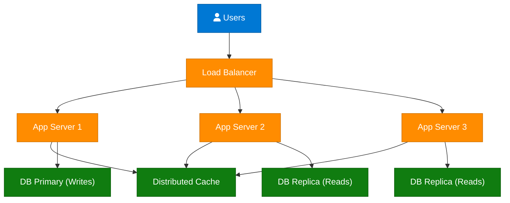

---

## 2. Availability

> *Synthesized from domain knowledge.*

**Availability** is the percentage of time a system is operational and able to serve requests correctly, typically expressed in "nines."

| Availability | Downtime/Year | Downtime/Month | Downtime/Day |
|---|---|---|---|
| 99% (two nines) | 3.65 days | 7.2 hours | 14.4 min |
| 99.9% (three nines) | 8.76 hours | 43.2 min | 1.44 min |
| 99.99% (four nines) | 52.6 min | 4.32 min | 8.6 sec |
| 99.999% (five nines) | 5.26 min | 25.9 sec | 864 ms |

### Achieving High Availability
- **Redundancy** — duplicate critical components (servers, DBs, network paths) so one failure doesn't cause an outage.
- **Failover** — automatic switch to a standby/replica when the primary fails.
- **Load balancing** — spread traffic across healthy nodes; remove unhealthy ones from rotation.
- **Geographic distribution** — multi-AZ / multi-region deployments protect against datacenter-level outages.
- **Health checks & monitoring** — detect failures fast so they can be routed around.
- **Graceful degradation** — serve a reduced but functional experience instead of a hard failure.

### Availability vs Reliability
Availability is about *uptime* (is the system reachable right now); reliability is about *correctness over time* (does it keep doing the right thing without failing). A system can be available but unreliable (it responds, but with errors or stale data).

### SLA, SLO, SLI
- **SLI (Indicator):** the actual measured metric, e.g., "99.95% of requests succeeded last month."
- **SLO (Objective):** the internal target, e.g., "99.9% monthly availability."
- **SLA (Agreement):** the external contractual promise to customers, often with financial penalties if missed.

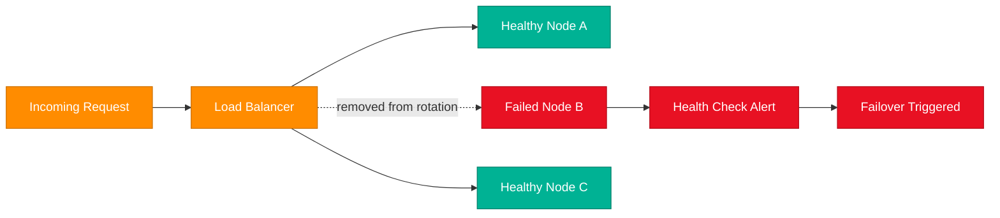

---

## 3. Reliability

> *Synthesized from domain knowledge.*

**Reliability** is the probability a system performs its intended function correctly, without failure, over a given period of time and under stated conditions.

### Key Principles
- **No data loss** — durability guarantees (replication, write-ahead logs, backups).
- **Correctness** — the system produces accurate results even under partial failure.
- **Fault tolerance** — the system keeps working (perhaps degraded) when components fail.
- **Consistency** — results are predictable and conform to expected invariants.

### Techniques to Improve Reliability
- Redundancy and replication (data and compute).
- Retries with exponential backoff and idempotent operations.
- Circuit breakers to prevent cascading failures.
- Comprehensive monitoring, alerting, and automated rollback.
- Chaos engineering to proactively find weaknesses.
- Thorough testing (unit, integration, load, failure-injection).

### Reliability vs Availability — Quick Comparison

| Aspect | Reliability | Availability |
|---|---|---|
| Focus | Correctness over time | Uptime / reachability |
| Question answered | "Does it work correctly?" | "Is it up right now?" |
| Failure mode example | Returns wrong/stale data | System is down/unreachable |
| Primary techniques | Replication, idempotency, testing | Redundancy, failover, load balancing |

---

## 4. SPOF — Single Point of Failure

> *Source: [algomaster.io/learn/system-design/single-point-of-failure-spof](https://algomaster.io/learn/system-design/single-point-of-failure-spof)*

A **Single Point of Failure (SPOF)** is any component in a system whose failure causes the entire system (or a critical part of it) to fail. Eliminating SPOFs is foundational to building highly available, fault-tolerant systems.

### Common SPOFs in System Design
- A single application server with no redundancy.
- A single database instance with no replica.
- A single load balancer with no standby.
- A single network link / single availability zone / single region.
- A single DNS provider.
- A shared authentication/session service with no failover.

### Eliminating SPOFs
- **Redundancy** — run N+1 (or more) instances of every critical component.
- **Load balancing** across redundant instances.
- **Data replication** — primary + replicas, ideally across AZs/regions.
- **Multi-AZ / multi-region architecture** so a datacenter outage doesn't kill the system.
- **Redundant network paths and DNS providers**.
- **Automated failover** so redundancy is actually exercised when needed.

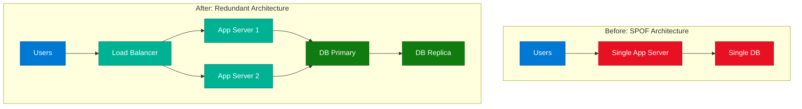

---

## 5. Latency vs Throughput vs Bandwidth

> *Source: [algomaster.io/learn/system-design/latency-vs-throughput](https://algomaster.io/learn/system-design/latency-vs-throughput)*

| Term | Definition | Unit | Analogy |
|---|---|---|---|
| **Latency** | Time for a single request to travel from source to destination (and back, if round-trip) | ms, μs | Time for one car to drive through a tunnel |
| **Throughput** | Number of requests/operations a system processes per unit time | req/s, ops/s | Number of cars exiting the tunnel per minute |
| **Bandwidth** | Maximum data-carrying capacity of a network link | Mbps, Gbps | Width of the tunnel (number of lanes) |

### Key Relationships
- High bandwidth does **not** guarantee low latency (a wide tunnel can still have a long, slow drive through it).
- High throughput requires sufficient bandwidth, but also depends on concurrency, processing speed, and queuing.
- **Latency components:** propagation delay (distance/speed of light), transmission delay (size/bandwidth), processing delay, queuing delay.
- Adding more bandwidth helps throughput but doesn't fix latency caused by distance or processing.
- Reducing latency (e.g., via CDNs, edge servers, caching) often matters more for user-perceived performance than raw throughput.

### Improving Each
- **Reduce latency:** CDNs/edge locations, caching, connection reuse (keep-alive), protocol upgrades (HTTP/2, HTTP/3/QUIC), geographic proximity.
- **Increase throughput:** horizontal scaling, parallelism/concurrency, batching, async processing, load balancing.
- **Increase bandwidth:** better network links, compression to reduce payload size, multiplexing.

---

## 6. Consistent Hashing

> *Source: [algomaster.io/learn/system-design/consistent-hashing](https://algomaster.io/learn/system-design/consistent-hashing)*

### The Problem with Modulo Hashing
Naive distribution uses `server = hash(key) % N` where N is the number of servers. The problem: when N changes (a server is added or removed), almost **every** key remaps to a different server, causing a massive cache invalidation / data movement event.

### How Consistent Hashing Works
1. Map both servers and keys onto a fixed **hash ring** (e.g., 0 to 2^32 − 1) using a hash function.
2. To find which server owns a key, walk clockwise from the key's position on the ring until you hit the first server.
3. When a server is added or removed, only the keys between it and its predecessor on the ring need to move — not the entire keyspace.

### Virtual Nodes
Mapping one physical server to one ring position can cause uneven load (hot spots) since ring positions are random. The fix: give each physical server **multiple virtual nodes** (e.g., 100–200) spread around the ring. This smooths out the distribution and means a node failure spreads its load evenly across many other nodes instead of dumping it all on one neighbor.

### Replication with Consistent Hashing
For fault tolerance, a key's data is typically replicated to the **next N-1 distinct physical servers** found walking clockwise from the key's position (used in systems like DynamoDB, Cassandra).

### Code Implementation (Python sketch)

```python
import hashlib
import bisect

class ConsistentHashRing:
    def __init__(self, nodes=None, virtual_nodes=150):
        self.virtual_nodes = virtual_nodes
        self.ring = {}           # hash -> physical node
        self.sorted_keys = []    # sorted list of hashes on the ring
        for node in nodes or []:
            self.add_node(node)

    def _hash(self, key: str) -> int:
        return int(hashlib.md5(key.encode()).hexdigest(), 16)

    def add_node(self, node: str):
        for i in range(self.virtual_nodes):
            vkey = self._hash(f"{node}#{i}")
            self.ring[vkey] = node
            bisect.insort(self.sorted_keys, vkey)

    def remove_node(self, node: str):
        for i in range(self.virtual_nodes):
            vkey = self._hash(f"{node}#{i}")
            del self.ring[vkey]
            self.sorted_keys.remove(vkey)

    def get_node(self, key: str) -> str:
        if not self.ring:
            return None
        h = self._hash(key)
        idx = bisect.bisect(self.sorted_keys, h) % len(self.sorted_keys)
        return self.ring[self.sorted_keys[idx]]

# Usage
ring = ConsistentHashRing(nodes=["cacheA", "cacheB", "cacheC"])
print(ring.get_node("user:1234"))   # -> deterministically maps to one node
ring.add_node("cacheD")             # only ~1/N of keys remap
```

### Operational Considerations
- Choice of hash function matters (MD5/SHA-1/MurmurHash — speed vs distribution quality).
- Number of virtual nodes trades off memory/lookup cost vs distribution evenness.
- Needs monitoring for "hot keys" even with good distribution.

### Where Consistent Hashing Works Well
- Distributed caches (Memcached client-side hashing, Redis Cluster).
- Distributed databases / key-value stores (DynamoDB, Cassandra, Riak).
- Load balancers needing session affinity with minimal disruption on scale events.
- CDN request routing.

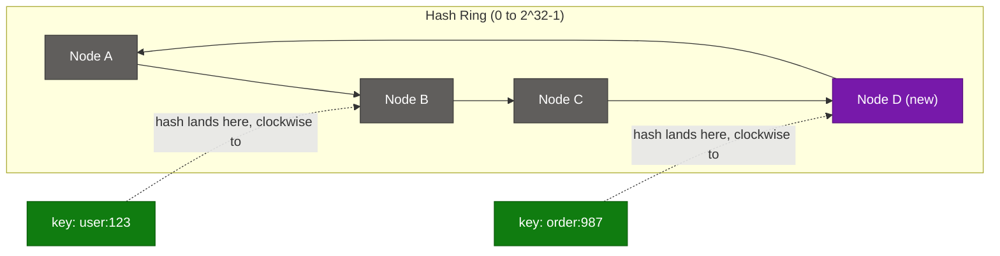

---

## 7. CAP Theorem

> *Source: [algomaster.io/learn/system-design/cap-theorem](https://algomaster.io/learn/system-design/cap-theorem)*

### What CAP Really Means
In a **distributed system**, during a network partition, you must choose between **Consistency** and **Availability** — you cannot have perfect guarantees of both at the same time. CAP only applies *when a partition is actually occurring*; outside of a partition, a well-designed system can offer both.

### The Three Properties
- **Consistency (C):** every read receives the most recent write or an error — all nodes see the same data at the same time.
- **Availability (A):** every request receives a (non-error) response, without guarantee it contains the most recent write.
- **Partition Tolerance (P):** the system continues to operate despite network partitions (dropped/delayed messages between nodes).

Because real networks *will* partition eventually, **P is not optional** — practical system design is really a choice between **CP** and **AP**.

### CP, AP, and CA
| Type | Choice in a Partition | Example Systems |
|---|---|---|
| **CP** (Consistent + Partition-tolerant) | Sacrifice availability — refuse/delay requests to avoid stale data | MongoDB (default config), HBase, ZooKeeper, etcd |
| **AP** (Available + Partition-tolerant) | Sacrifice strict consistency — keep serving, reconcile later (eventual consistency) | Cassandra, DynamoDB, CouchDB, Riak |
| **CA** (Consistent + Available) | Only possible without partitions — not realistic for true distributed systems | Single-node relational DBs |

### CAP and Latency
CAP is closely related to the **PACELC theorem**: even *without* a partition (Else), you still trade off **Latency vs Consistency** — strongly consistent writes need coordination (higher latency); relaxing consistency lowers latency.

### Practical Design Guidance
- Choose **CP** for systems where stale data is dangerous: financial transactions, inventory counts, leader election/config stores.
- Choose **AP** for systems where availability matters more than perfect freshness: social media feeds, shopping carts, product catalogs, analytics.
- Many real systems are **tunable** (e.g., Cassandra's consistency levels) — letting you choose C vs A per-operation rather than system-wide.

### Summary
CAP forces a choice only during partitions; design around your domain's tolerance for staleness vs unavailability, and consider PACELC for the steady-state latency/consistency trade-off too.

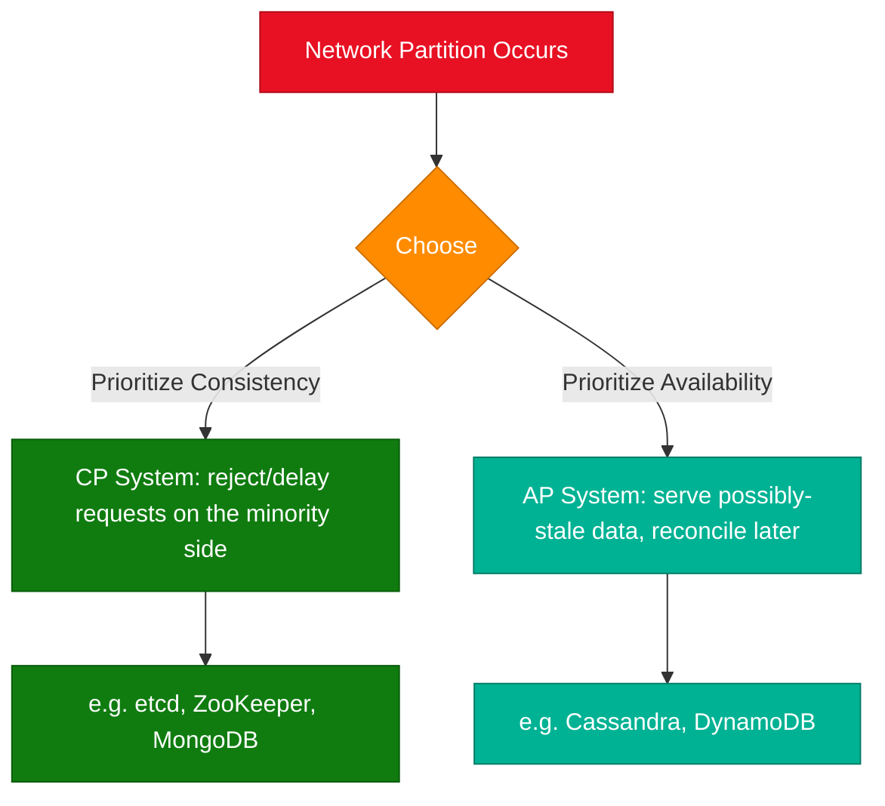

---

## 8. Failover

> *Source: [druva.com — What is a Failover](https://www.druva.com/glossary/what-is-a-failover-definition-and-related-faqs)*

**Failover** is the process of automatically switching to a redundant or standby system, server, or network component when the primary one fails, with the goal of minimizing or eliminating downtime.

### How Failover Works
1. **Monitoring/health checks** continuously verify the primary system is healthy.
2. On detecting failure, the system **triggers failover** — traffic/operations are redirected to the standby.
3. The standby takes over (sometimes called "promotion," e.g., a replica becomes the new primary).
4. Once the original system recovers, a **failback** may occur to restore it as primary (or the new primary stays permanent).

### Types of Failover
- **Active-Passive:** standby sits idle, only activated on failure (simpler, some failover delay).
- **Active-Active:** all nodes handle traffic simultaneously; if one fails, others absorb the load with no failover delay (more complex, needs data sync).
- **Manual vs Automatic:** automatic failover (triggered by monitoring/orchestration) is preferred for minimizing downtime versus manual/human-triggered failover.

### Key Metrics
- **RTO (Recovery Time Objective):** maximum acceptable time to restore service after failure.
- **RPO (Recovery Point Objective):** maximum acceptable amount of data loss, measured in time (how much data since the last backup/sync could be lost).

### Failover Use Cases
- Database failover (primary → replica promotion).
- Data center / region failover (disaster recovery).
- Network/link failover (redundant ISPs or routes).
- Application server failover (behind a load balancer with health checks).

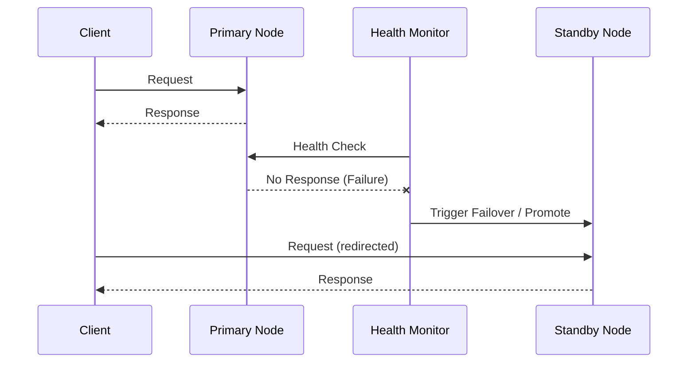

---

## 9. Fault Tolerance

> *Source: [cockroachlabs.com — What is Fault Tolerance](https://www.cockroachlabs.com/blog/what-is-fault-tolerance/)*

**Fault tolerance** is a system's built-in capability to continue operating correctly — without interruption — even when one or more of its components fail. It goes a step beyond failover: a fault-tolerant system absorbs failures transparently, often without any visible disruption at all.

### Core Mechanisms
- **Replication:** keep multiple copies of data across nodes so the loss of one node doesn't lose data.
- **Consensus protocols** (Raft, Paxos): keep replicas agreeing on state even when some nodes fail, enabling automatic leader election.
- **Redundancy at every layer:** compute, storage, network, power.
- **Self-healing:** automatic detection and recovery (e.g., re-replicating data when a node is lost permanently).
- **No single point of failure:** every critical component has at least one healthy backup at all times.

### Fault Tolerance vs High Availability vs Disaster Recovery

| Concept | Goal | Typical Downtime |
|---|---|---|
| **Fault Tolerance** | Zero interruption during a component failure | None (seamless) |
| **High Availability** | Minimal downtime via fast failover | Seconds to minutes |
| **Disaster Recovery** | Recover after a catastrophic event (e.g., region loss) | Minutes to hours (per RTO) |

### Designing for Fault Tolerance
- Distribute replicas across failure domains (racks, AZs, regions) so correlated failures don't take out all copies.
- Use quorum-based reads/writes (e.g., majority quorum) so the system tolerates losing a minority of nodes.
- Design for graceful degradation — partial functionality is better than total failure.
- Test failure scenarios proactively (chaos engineering — e.g., Netflix's Chaos Monkey).

---

## 10. OSI Model

> *Source: [algomaster.io/learn/system-design/osi](https://algomaster.io/learn/system-design/osi)*

The **OSI (Open Systems Interconnection) Model** is a 7-layer conceptual framework standardizing how network communication functions are organized, from physical transmission up to application-level protocols.

| Layer | Name | Function | Examples |
|---|---|---|---|
| 7 | **Application** | Interfaces with end-user applications | HTTP, FTP, SMTP, DNS |
| 6 | **Presentation** | Data translation, encryption, compression | TLS/SSL, JPEG, encoding |
| 5 | **Session** | Establishes/manages/terminates sessions | NetBIOS, RPC, sockets |
| 4 | **Transport** | End-to-end delivery, reliability, flow control | TCP, UDP |
| 3 | **Network** | Logical addressing and routing | IP, ICMP, routers |
| 2 | **Data Link** | Node-to-node delivery, MAC addressing, error detection | Ethernet, switches, Wi-Fi (802.11) |
| 1 | **Physical** | Raw bit transmission over physical medium | Cables, radio, hubs, NICs |

**Mnemonic:** "**A**ll **P**eople **S**eem **T**o **N**eed **D**ata **P**rocessing" (Application → Physical, top to bottom).

### Why It Matters for System Design
- Helps localize where a problem is (e.g., "is this a network-layer routing issue or an application-layer bug?").
- Load balancers operate at different layers: **L4 load balancers** work at the Transport layer (routing by IP/port, fast, protocol-agnostic); **L7 load balancers** work at the Application layer (routing by URL/headers/cookies, smarter but slower).
- Encapsulation: each layer wraps the data from the layer above with its own header (and sometimes trailer) as it moves down the stack on the sender, and unwraps it moving up the stack on the receiver.

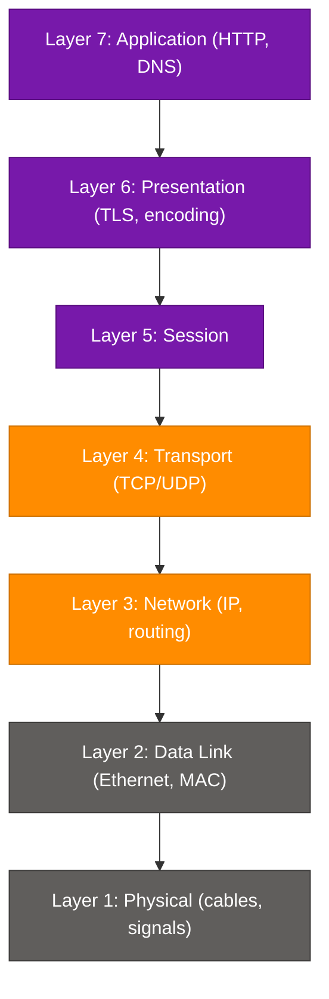

---

## 11. IP Addresses

> *Source: [algomaster.io/learn/system-design/ip-address](https://algomaster.io/learn/system-design/ip-address)*

An **IP address** is a unique numerical identifier assigned to every device on a network, enabling routing of data between them (operates at OSI Layer 3).

### IPv4 vs IPv6

| Aspect | IPv4 | IPv6 |
|---|---|---|
| Format | 32-bit, e.g., `192.168.1.1` | 128-bit, e.g., `2001:0db8::1` |
| Address space | ~4.3 billion addresses | ~340 undecillion addresses |
| Notation | Dotted decimal (4 octets) | Hexadecimal, colon-separated |
| Exhaustion | Effectively exhausted, needs NAT | Designed to never run out |
| Header | Simpler, but needs NAT/extra fields | Built-in support for auto-config, larger header but more efficient routing |

### Public vs Private IP
- **Public IP:** globally unique, routable on the internet.
- **Private IP:** reserved ranges (e.g., `10.0.0.0/8`, `172.16.0.0/12`, `192.168.0.0/16`) used inside private networks; not routable on the public internet; translated via **NAT** (Network Address Translation) to communicate externally.

### Static vs Dynamic IP
- **Static:** manually assigned, doesn't change — common for servers.
- **Dynamic:** assigned by **DHCP** (Dynamic Host Configuration Protocol), can change over time — common for client devices.

### Subnetting & CIDR
- **CIDR notation** (`192.168.1.0/24`) specifies network size: the `/24` means the first 24 bits are the network prefix, leaving 8 bits (256 addresses) for hosts.
- **Subnetting** divides a network into smaller sub-networks for organization, security isolation, and efficient address allocation — fundamental to designing **VPCs** in cloud system design (public/private subnets).

---

## 12. DNS — Domain Name System

> *Source: [blog.algomaster.io/p/how-dns-actually-works](https://blog.algomaster.io/p/how-dns-actually-works)*

**DNS** is the internet's distributed, hierarchical naming system that translates human-readable domain names (e.g., `example.com`) into machine-routable IP addresses.

### How DNS Resolution Works (Step by Step)
1. **Browser/OS cache check** — is the IP already cached locally?
2. **Recursive resolver** (usually run by your ISP or a public resolver like `8.8.8.8` / `1.1.1.1`) is queried if not cached.
3. **Root nameserver** — tells the resolver which TLD server to ask (e.g., for `.com`).
4. **TLD nameserver** (e.g., for `.com`) — tells the resolver which authoritative nameserver handles `example.com`.
5. **Authoritative nameserver** — returns the actual IP address for `example.com`.
6. The resolver caches the result (per its **TTL**) and returns the IP to the client.
7. The browser opens a connection to that IP.

### DNS Record Types
| Record | Purpose |
|---|---|
| **A** | Maps a domain to an IPv4 address |
| **AAAA** | Maps a domain to an IPv6 address |
| **CNAME** | Alias — maps a domain to another domain name |
| **MX** | Mail server records |
| **NS** | Specifies the authoritative nameservers for a domain |
| **TXT** | Arbitrary text — often used for verification, SPF/DKIM |
| **TTL** | How long a record can be cached before re-querying |

### DNS in System Design
- **DNS-based load balancing / GeoDNS:** route users to the nearest/healthiest region by returning different IPs based on location.
- **TTL tuning:** low TTL = faster failover but more DNS query load; high TTL = better caching but slower propagation of changes.
- DNS lookups add latency — this is why connection reuse, DNS prefetching, and caching matter for performance.

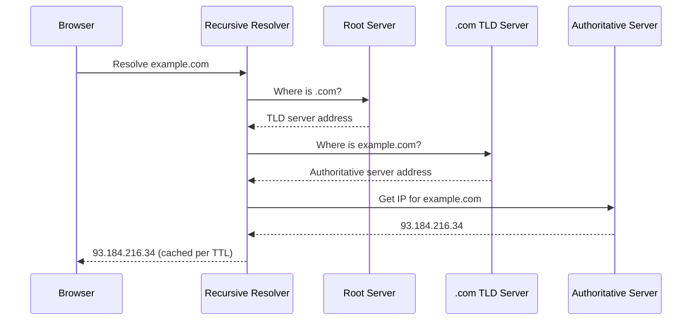

---

## 13. Proxy vs Reverse Proxy

> *Source: [blog.algomaster.io/p/proxy-vs-reverse-proxy-explained](https://blog.algomaster.io/p/proxy-vs-reverse-proxy-explained)*

### Forward Proxy
Sits **in front of clients**, forwarding their requests to the internet on their behalf. The server sees the proxy's IP, not the client's.

- **Use cases:** anonymity/privacy, bypassing geo-restrictions, corporate content filtering/access control, caching for a group of clients.

### Reverse Proxy
Sits **in front of servers**, receiving client requests and forwarding them to the appropriate backend server(s). The client only sees the reverse proxy's address, not the real backend.

- **Use cases:** load balancing, SSL/TLS termination, caching, compression, request routing, hiding/obfuscating backend topology, rate limiting, web application firewall (WAF), serving static content directly.
- **Examples:** NGINX, HAProxy, Envoy, AWS ALB/ELB, Cloudflare.

### Comparison

| Aspect | Forward Proxy | Reverse Proxy |
|---|---|---|
| Sits in front of | Clients | Servers |
| Hides | Client identity from server | Server identity/topology from client |
| Primary use | Privacy, filtering, access control | Load balancing, security, performance |
| Who configures it | The client (or client's network admin) | The service/server owner |

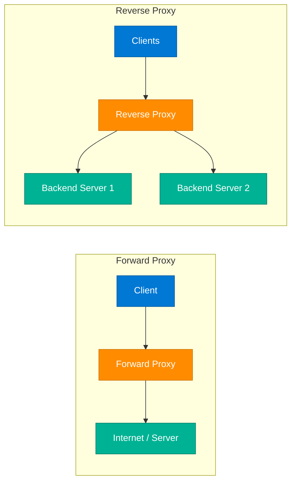

---

## 14. HTTP/HTTPS

> *Source: [algomaster.io/learn/system-design/http-https](https://algomaster.io/learn/system-design/http-https)*

**HTTP (HyperText Transfer Protocol)** is the application-layer protocol for transferring data on the web — stateless, request/response based, built on TCP.

### HTTP Methods
| Method | Purpose | Idempotent? |
|---|---|---|
| GET | Retrieve a resource | Yes |
| POST | Create a resource / submit data | No |
| PUT | Replace a resource entirely | Yes |
| PATCH | Partially update a resource | No (typically) |
| DELETE | Remove a resource | Yes |
| HEAD | GET headers only, no body | Yes |
| OPTIONS | Discover allowed methods (CORS preflight) | Yes |

### HTTP Status Codes
- **1xx** Informational (e.g., 100 Continue)
- **2xx** Success (200 OK, 201 Created, 204 No Content)
- **3xx** Redirection (301 Moved Permanently, 304 Not Modified)
- **4xx** Client Error (400 Bad Request, 401 Unauthorized, 403 Forbidden, 404 Not Found, 429 Too Many Requests)
- **5xx** Server Error (500 Internal Server Error, 502 Bad Gateway, 503 Service Unavailable, 504 Gateway Timeout)

### HTTPS
**HTTPS = HTTP + TLS/SSL encryption.** It adds:
- **Encryption:** data in transit is unreadable to eavesdroppers.
- **Integrity:** data can't be tampered with undetected in transit.
- **Authentication:** certificates verify you're talking to the real server (via a trusted Certificate Authority).

### TLS Handshake (simplified)
1. Client Hello (supported TLS versions, cipher suites).
2. Server Hello + certificate (public key).
3. Client verifies certificate, generates a session key, encrypts it with the server's public key.
4. Both sides derive a shared symmetric session key for fast, encrypted communication.

### HTTP/1.1 vs HTTP/2 vs HTTP/3
| Version | Key Improvement |
|---|---|
| HTTP/1.1 | Persistent connections (keep-alive), but head-of-line blocking |
| HTTP/2 | Multiplexing (parallel requests on one connection), header compression, server push |
| HTTP/3 | Built on **QUIC** (UDP-based) instead of TCP — eliminates TCP head-of-line blocking, faster connection setup |

---

## 15. TCP vs UDP

> *Source: [algomaster.io/learn/system-design/tcp-vs-udp](https://algomaster.io/learn/system-design/tcp-vs-udp)*

Both are **Transport Layer (OSI Layer 4)** protocols, but with very different guarantees.

| Aspect | TCP | UDP |
|---|---|---|
| Connection | Connection-oriented (3-way handshake) | Connectionless |
| Reliability | Guaranteed delivery, retransmits lost packets | Best-effort, no guarantee |
| Ordering | Packets delivered in order | No ordering guarantee |
| Speed | Slower (overhead of acks, retransmits, flow control) | Faster (minimal overhead) |
| Flow/Congestion control | Yes | No |
| Header size | Larger (20+ bytes) | Smaller (8 bytes) |
| Use cases | Web (HTTP), email, file transfer, databases — anywhere correctness matters | Video/voice calls, live streaming, DNS, gaming, IoT telemetry — anywhere speed matters more than perfection |

### TCP 3-Way Handshake
1. Client sends **SYN**.
2. Server responds **SYN-ACK**.
3. Client responds **ACK** — connection established.

(Connection teardown uses a 4-way FIN/ACK exchange.)

### Why Choose UDP Despite Unreliability?
For real-time applications, a late packet is often worse than a lost one (e.g., in a video call, you'd rather drop a frame than freeze waiting for a retransmit). Some protocols build their own reliability on top of UDP where needed (e.g., QUIC/HTTP3, WebRTC).

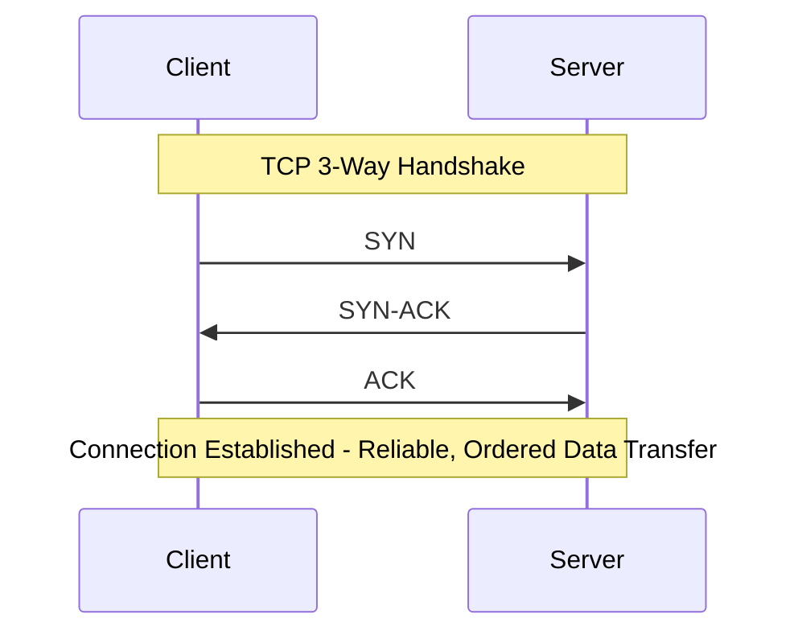

---

## 16. Load Balancing

> *Source: [blog.algomaster.io/p/load-balancing-algorithms-explained-with-code](https://blog.algomaster.io/p/load-balancing-algorithms-explained-with-code)*

**Load balancing** is the process of distributing incoming network traffic across multiple servers so no single server is overwhelmed. It aims to prevent overload, enhance performance (lower response times), and improve availability by rerouting traffic away from failed servers.

### Algorithms

**1. Round Robin**
Requests are sent to servers in rotating order, looping back to the first after the last.
- *Best for:* homogeneous servers, simple even distribution.
- *Drawback:* ignores current load/capacity differences.

**2. Weighted Round Robin**
Each server gets a weight based on capacity; higher-weight servers receive proportionally more requests.
- *Best for:* heterogeneous server capacity.
- *Drawback:* still ignores real-time load.

**3. Least Connections**
Routes to the server with the fewest active connections.
- *Best for:* long-lived/variable-duration connections, similar server capacity.
- *Drawback:* needs connection tracking; not capacity-aware.

**4. Least Response Time**
Routes to the server currently responding fastest.
- *Best for:* servers with varying real-time performance.
- *Drawback:* requires accurate, continuous latency measurement.

**5. IP Hash**
Hashes the client IP to consistently pick the same backend server.
- *Best for:* sticky sessions / session persistence.
- *Drawback:* uneven distribution if some IPs generate disproportionate traffic; less flexible on server failure.

### Algorithm Selection Summary

| Algorithm | Best For |
|---|---|
| Round Robin | Homogeneous servers, simple even distribution |
| Weighted Round Robin | Heterogeneous environments based on capacity |
| Least Connections | Varying workloads, dynamic balancing |
| Least Response Time | Environments with varying server performance |
| IP Hash | Stateful apps requiring session persistence |

### Code Example — Round Robin & Least Connections (Python)

```python
from itertools import cycle

class RoundRobinBalancer:
    def __init__(self, servers):
        self._cycle = cycle(servers)

    def get_server(self):
        return next(self._cycle)


class LeastConnectionsBalancer:
    def __init__(self, servers):
        self.connections = {s: 0 for s in servers}

    def get_server(self):
        server = min(self.connections, key=self.connections.get)
        self.connections[server] += 1
        return server

    def release(self, server):
        self.connections[server] = max(0, self.connections[server] - 1)


# Usage
rr = RoundRobinBalancer(["A", "B", "C"])
print([rr.get_server() for _ in range(5)])  # ['A', 'B', 'C', 'A', 'B']

lc = LeastConnectionsBalancer(["A", "B", "C"])
s = lc.get_server()   # picks "A" (tie -> first), increments its count
lc.release(s)
```

### L4 vs L7 Load Balancing
- **L4 (Transport layer):** routes based on IP/port; fast, protocol-agnostic, can't inspect content.
- **L7 (Application layer):** routes based on URL path, headers, cookies; smarter routing (e.g., `/api` → service A, `/static` → service B), supports SSL termination, but adds processing overhead.

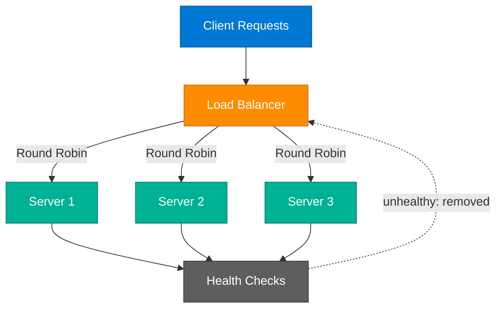

---

## 17. Checksums

> *Source: [algomaster.io/learn/system-design/checksums](https://algomaster.io/learn/system-design/checksums)*

A **checksum** is a small, fixed-size value computed from a block of data, used to detect errors or corruption introduced during transmission or storage.

### How Checksums Work
1. Sender computes a checksum from the data using a deterministic algorithm.
2. Sender transmits data + checksum together.
3. Receiver recomputes the checksum from the received data.
4. If the recomputed checksum matches the transmitted one, the data is (very likely) intact; if not, it's corrupted and can be re-requested/discarded.

### Common Checksum/Hash Algorithms
| Algorithm | Use Case |
|---|---|
| **Parity bit** | Simplest, detects single-bit errors |
| **CRC32** (Cyclic Redundancy Check) | Network packets (Ethernet), ZIP files — fast, good error detection |
| **MD5** | Legacy file integrity checks (not cryptographically secure anymore) |
| **SHA-256** | Cryptographic integrity/security — used in TLS certs, blockchain, secure file verification |

### Checksums in System Design
- **TCP/IP packets** carry checksums to detect transmission corruption at the network/transport layer.
- **Distributed storage systems** (e.g., HDFS, S3) use checksums to detect silent data corruption ("bit rot") on disk.
- **Content-addressable storage / deduplication** (e.g., Git) uses hashes (SHA-1/SHA-256) both as checksums and as content identifiers.
- **Consistent hashing and partitioning** rely on hash functions conceptually related to checksums for deterministic key placement.
- Checksums detect corruption but are **not a substitute for encryption** — they don't provide confidentiality, only integrity verification.

---

## Security and Governance

> *Synthesized from domain knowledge.*

System design interviews increasingly probe how core concepts intersect with security:

- **Defense in depth:** combine network-layer controls (firewalls, security groups, private subnets) with application-layer controls (auth, input validation) and data-layer controls (encryption at rest/in transit).
- **TLS everywhere:** terminate TLS at the reverse proxy/load balancer (or pass through to backends for end-to-end encryption in zero-trust architectures).
- **Least privilege & network segmentation:** use private subnets/VPCs for databases and internal services; only reverse proxies/load balancers face the public internet.
- **Rate limiting & WAF at the edge:** mitigate DDoS and abuse before traffic reaches application servers — commonly implemented at the reverse proxy/CDN layer.
- **Availability as a security property:** DDoS resilience, failover, and redundancy are availability concerns but also directly support security SLAs.
- **Data integrity:** checksums and cryptographic hashes (SHA-256) protect against tampering and corruption; combine with digital signatures for authenticity.
- **Audit & observability:** centralized logging, health-check telemetry, and distributed tracing are essential to detect both faults and security incidents quickly.
- **Compliance considerations:** multi-region/availability design must respect data residency and sovereignty requirements (e.g., GDPR) when replicating data geographically.

---

## 18. Interview Q&A Cheatsheet

**Q1: What's the difference between horizontal and vertical scaling, and when would you choose one over the other?**
A: Vertical scaling adds resources to a single machine (simple, but capped and a SPOF); horizontal scaling adds more machines (near-unlimited, improves fault tolerance, but adds distributed-systems complexity like sharding and consistency). Choose vertical for simplicity at moderate scale; horizontal once you need to exceed a single machine's ceiling or need fault tolerance.

**Q2: Explain the CAP theorem and how it applies to a real database choice.**
A: In a distributed system, during a network partition you must choose Consistency or Availability (Partition tolerance is mandatory since partitions happen). E.g., a banking ledger favors CP (etcd/ZooKeeper-style: reject requests rather than risk wrong balances); a social media like-counter favors AP (Cassandra/DynamoDB-style: stay available, reconcile eventually).

**Q3: Why is consistent hashing preferred over simple modulo hashing for distributed caches?**
A: Modulo hashing (`hash(key) % N`) remaps nearly all keys when N changes, causing massive cache invalidation. Consistent hashing places servers and keys on a ring so adding/removing a server only remaps the keys between it and its neighbor — roughly `1/N` of keys move instead of nearly all of them.

**Q4: What are virtual nodes in consistent hashing and why are they needed?**
A: Virtual nodes map each physical server to many points on the hash ring instead of one. This smooths load distribution (avoids hot spots from random single-point placement) and ensures that when a node fails, its load is spread evenly across many remaining nodes rather than overloading one neighbor.

**Q5: What is the difference between latency, throughput, and bandwidth?**
A: Latency is the time for one request to complete; throughput is how many requests/operations complete per unit time; bandwidth is the maximum capacity of the network link. High bandwidth doesn't guarantee low latency — a wide pipe can still have a long delay due to distance or processing time.

**Q6: How does failover differ from fault tolerance?**
A: Failover is the (often brief, sometimes visible) process of switching to a standby after detecting a primary failure — it implies some transition time (RTO/RPO). Fault tolerance means the system absorbs the failure transparently, with no interruption at all, typically via replication and consensus protocols (e.g., Raft) rather than a discrete cutover.

**Q7: Compare a forward proxy and a reverse proxy.**
A: A forward proxy sits in front of clients and forwards their requests outward (used for privacy, filtering, bypassing restrictions) — the destination server sees the proxy's IP. A reverse proxy sits in front of servers and routes inbound client requests to backends (used for load balancing, TLS termination, caching, security) — the client only sees the proxy.

**Q8: Why would you choose UDP over TCP for a video call application?**
A: TCP guarantees ordered, reliable delivery via retransmission, which adds latency — undesirable for real-time media where a late packet is worse than a dropped one. UDP has no such guarantees but minimal overhead, so video/voice apps use it (often layering their own lightweight reliability, e.g., via RTP/WebRTC) to prioritize low latency over perfect delivery.

**Q9: Walk through what happens when you type a URL and hit enter, focusing on DNS.**
A: Browser checks local/OS DNS cache; if missing, queries a recursive resolver, which queries a root server (for the TLD location), then the TLD server (for the authoritative nameserver), then the authoritative server (for the actual A/AAAA record). The IP is cached per its TTL and returned, then the browser opens a TCP/TLS connection to that IP and sends the HTTP request.

**Q10: How do you eliminate a single point of failure in a typical 3-tier web architecture?**
A: Add redundancy at every tier: multiple load balancers (active-passive or DNS-based), multiple stateless app servers behind the load balancer, and a database with a primary plus replicas (ideally across availability zones) with automated failover. Also use redundant DNS providers and multi-AZ/region deployment so no single machine, AZ, or network path can take down the whole system.

---

*End of document — System Design Core Concepts & Networking Fundamentals.*
