# System Design Handbook — Complete Guide (10 Concepts)

> Source: @codeera.tech — System Design Handbook (10/10 slides)

---

## 1. System Design Fundamentals

### What is System Design?

A comprehensive methodology for engineers designing systems, processes, and data platforms that fulfill specified technical and business requirements. Emphasizes modularity, extensibility, and operational efficiency.

### Why Do Companies Ask System Design?

- To evaluate your capability to deconstruct intricate challenges.
- To test your comprehension of system-wide scaling and distributed computing.
- To assess how you manage trade-offs and make engineering decisions for constructing robust, real-world systems.

### Functional Requirements (What the System Should Do)

- User should be able to register/login.
- User should be able to upload data.
- User should be able to search data.

### Key Quality Attributes

| Attribute | Description |
|---|---|
| Scalability | Handle growing number of users and requests |
| Fault Tolerance | Maintains operations even during component or system failures |
| High Availability | Ensures the system is accessible and operational nearly 100% of the time |
| Maintainability | Easy to update, debug, and extend |
| Responsiveness | Achieves low latency and high processing throughput |
| Confidentiality | Protects sensitive data and interactions |

### Basic High-Level Architecture

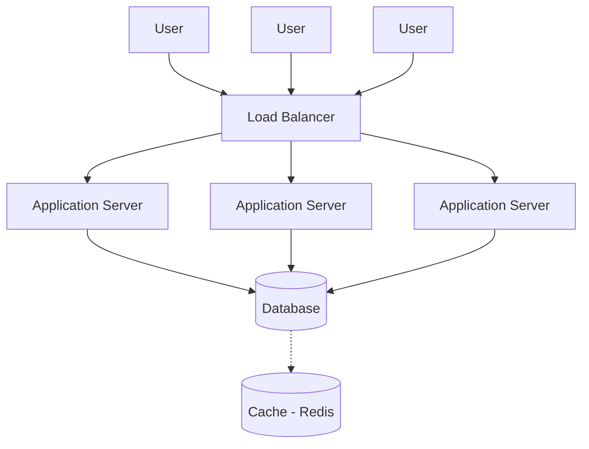

> **Interview Tip:** Always start by understanding the problem and gathering requirements. Ask the right questions before jumping into the design.

---

## 2. Load Balancer

### What is a Load Balancer?

A traffic controller for your servers. It takes all incoming requests from users and smartly guides them to the right servers so none get overwhelmed. This keeps your app fast and online.

### Why Do We Need It?

- Stops a server from crashing under pressure.
- Keeps your application running 24/7, even if a server fails.

### How It Works & Types

- **Basic Flow:** User → Load Balancer → Many Servers
- **Layer 4 (Simple):** Works like a mail sorter, using just the destination address (IP/Port).
- **Layer 7 (Smart):** Reads the content of the request (like the URL) to make intelligent routing decisions (e.g., sending all video requests to a dedicated set of servers).

### Key Features

| Feature | Description |
|---|---|
| Health Checks | Constantly makes sure servers are "alive" and ready |
| Redundancy (Failover) | If a server breaks, it sends traffic elsewhere |
| SSL Offload | Handles HTTPS connections, saving server CPU |
| Session Persistence | Keeps a user connected to the same server |

### Load Balancer Architecture

> **Interview Tip:** Always start by understanding the problem and gathering requirements. Ask the right questions before jumping into the design.

---

## 3. Caching

### What is Caching?

A temporary data storage layer that keeps frequently accessed data close to the application. This allows future requests for that data to avoid fetching it from the main database.

### Why Do We Need It?

- Reduces latency for read operations.
- Offloads read pressure from the main database and backend.
- Saves on bandwidth and resource costs.
- Enhances overall user experience.

### Cache Hit vs. Miss

- **Cache Hit:** Data is found in the cache and served instantly.
- **Cache Miss:** Data is not in the cache; the system must fetch it from the database (slower) and then store it in the cache for next time.

### How Caching Works — The Read Flow

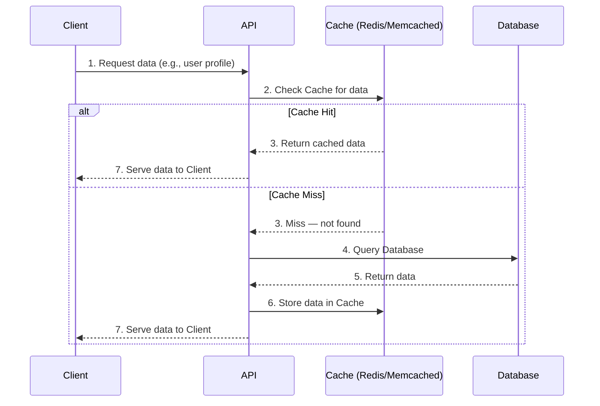

### Cache Eviction Policies

| Policy | Description |
|---|---|
| LRU (Least Recently Used) | Removes oldest unused items |
| LFU (Least Frequently Used) | Removes least popular items |
| FIFO (First-In-First-Out) | Removes first stored items |
| TTL (Time To Live) | Removes items after a set time |

> **Interview Tip:** When discussing caching, go beyond just naming policies. Analyze the trade-offs: how much memory will it cost? How will you handle cache stampedes? What is your plan for cache warming?

---

## 4. Database Scaling

### Why Do We Need Database Scaling?

- Handle growing amount of data.
- Support more users and higher traffic.
- Improve performance and availability.
- Avoid single point of failure.

### Scaling Approaches

1. **Vertical Scaling (Scale Up)** — Add more power to existing server (CPU, RAM, SSD). Simple but has a hardware limit.
2. **Horizontal Scaling (Scale Out)** — Add more servers. More complex but highly scalable.
3. **Replication** — Copy data to multiple servers. Improves read performance.
4. **Sharding** — Split data across multiple servers. Improves write performance.
5. **Partitioning** — Split large tables into smaller logical parts.

### Strategy 1 — Vertical Scaling

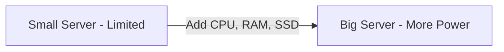

### Strategy 2 — Horizontal Scaling with Replication

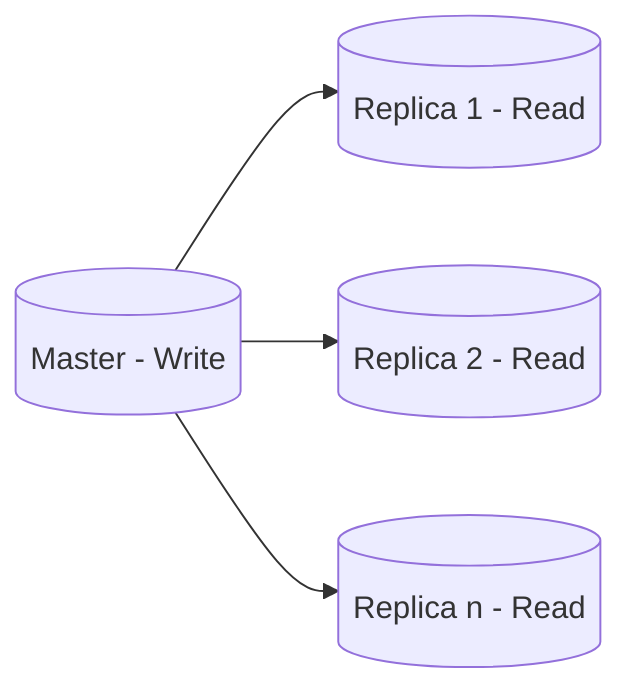

### Strategy 3 — Sharding (Horizontal Partitioning)

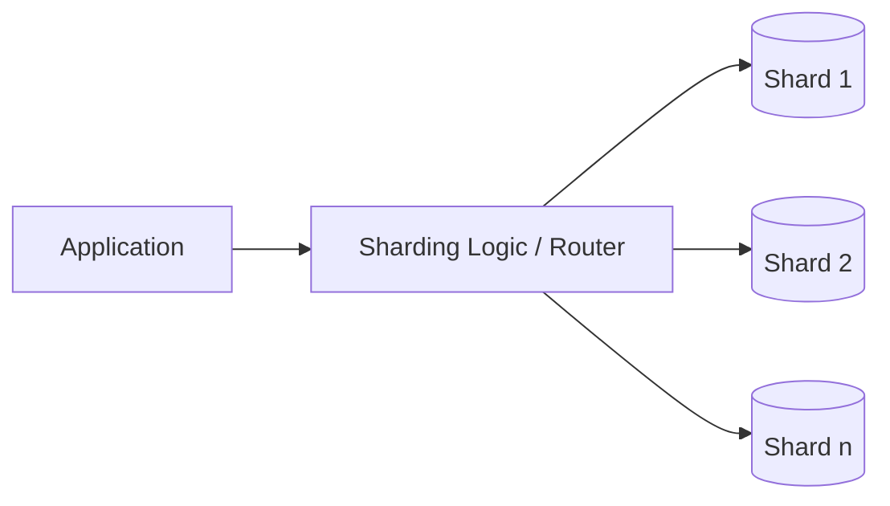

### Read Replicas — Use Cases

- Reporting & Analytics
- Search Operations
- Heavy Read Workloads
- Geographically distributed reads

> **Note:** Choose the right scaling strategy based on your workload, data size, and growth pattern.

> **Interview Tip:** Always discuss the trade-offs of each approach. Ask: Read heavy or write heavy? What is the data size? Is strong consistency required? What are the budget constraints? System design is about choosing the right trade-off!

---

## 5. CDN (Content Delivery Network)

### What is a CDN?

A worldwide network of servers (Edge Servers) that store static copies of content (images, videos) closer to users. This ensures content is delivered faster and more reliably.

### Why Do We Need It?

- Speeds up content delivery by reducing distance to users.
- Takes the load off your main Origin Server.
- Handles huge spikes in traffic effortlessly.
- Protects against DDoS attacks.

### The Journey: User to Content

1. User requests content.
2. Request is routed to the nearest Edge Server.
3. Edge Server checks for cached content.
4. (If Cache Miss) Edge Server fetches from Origin Server and caches it.
5. Edge Server serves content to the User.

### CDN Architecture

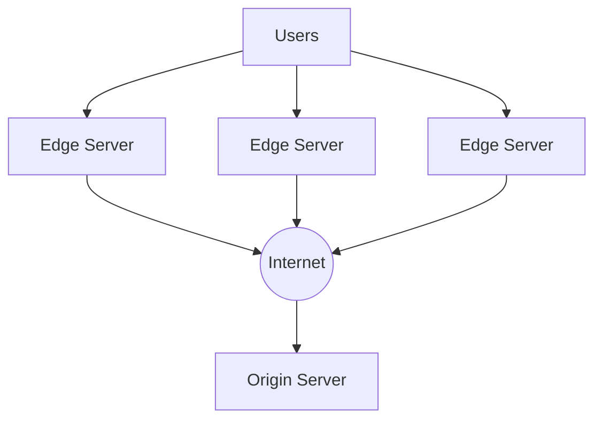

### Key Terms

| Term | Definition |
|---|---|
| Edge Server | Server physically closest to the user |
| Origin Server | Where the original content/data is stored |
| CDN PoP (Point of Presence) | A geographic location housing Edge Servers |
| Anycast | Routing method that directs traffic to the nearest PoP |

> **Best Practices & Gotchas:**
> - Use a CDN for *all* static assets for maximum benefit.
> - Always set appropriate TTLs and test your purge/invalidation strategy.
> - Be mindful of costs with large file sizes and high traffic.
> - Use multiple CDNs for redundancy.

---

## 6. Message Queues

### What is a Message Queue?

A temporary storage area that enables services to communicate with each other asynchronously. Like a mailbox — the sender drops off a message and the receiver picks it up when ready.

### Why Do We Need It?

- **Decouples services:** Senders and receivers don't need to be online at the same time.
- **Handles traffic spikes:** Prevents servers from being overwhelmed under high load.
- **Improves performance:** Speeds up user-facing tasks by offloading heavy work to the background.

### How It Works

1. Producer Service sends a message to the Queue.
2. Consumer Service retrieves the message when ready.
3. Message is deleted after successful processing.

### Message Queue Flow

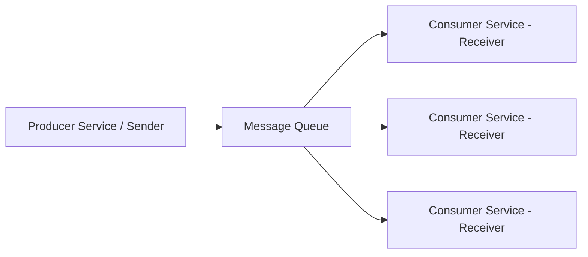

### Popular Message Queue Systems

| System | Description |
|---|---|
| RabbitMQ | Robust, versatile, and widely used |
| Apache Kafka | High throughput, built for massive data streams |
| Amazon SQS | Fully managed, scalable service on AWS |

### Delivery Guarantees & Pitfalls

- **At-Least-Once:** Message delivered one or more times (possible duplicates).
- **At-Most-Once:** Message delivered zero or one times (possible loss).
- **Exactly-Once:** Message delivered exactly once (hardest to achieve).

> **Pitfalls to avoid:**
> - Ensure message ordering when scaling consumers.
> - Handle **poison messages** (repeatedly failing messages) gracefully using a Dead Letter Queue to avoid infinite loops.

---

## 7. Microservices

### What are Microservices?

An application design approach where a large application is built as a collection of small, independent services. Each service runs in its own process and communicates with others via lightweight APIs.

### Why Do We Need Them?

- **Independent teams:** Teams can develop, deploy, and scale without affecting others.
- **Scalability:** Each service can be scaled independently based on its own load.
- **Tech flexibility:** Different services can use different programming languages and tech stacks.
- **Fault isolation:** If one service goes down, the rest of the application can still function.

### Microservices Architecture

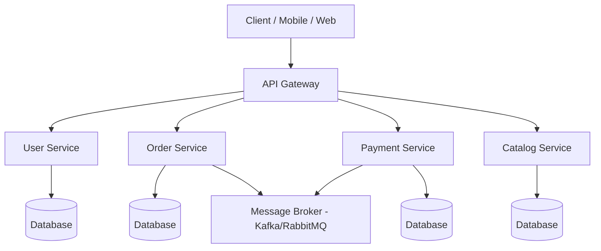

### Key Components

| Component | Role |
|---|---|
| API Gateway | Single entry point for all clients |
| Service Discovery | Helps services find each other dynamically |
| Load Balancer | Distributes traffic across service instances |
| Database per Service | Data autonomy and independence for each microservice |

### Real-Life Example: E-Commerce Platform

An e-commerce site like Amazon is not one giant program. It is composed of:

1. **User Service** — manages accounts and authentication.
2. **Product Catalog Service** — manages product listings.
3. **Order Service** — manages purchases and order lifecycle.

**Key benefit:** If the Product Catalog is slow, users can still browse and add items to their cart because the Cart Service is independent.

---

## 8. API Gateway

### What is an API Gateway?

A specialized server that acts as a single entry point for all client requests to a backend microservices architecture. It sits between the clients (Web, Mobile, Desktop) and the backend services.

### Why Do We Need It?

- **Centralized entry point:** Hides the internal microservice structure from clients.
- **Request routing:** Directs incoming calls to the appropriate microservice.
- **Protocol translation:** Converts protocols (e.g., HTTP to gRPC).
- **Cross-cutting concerns:** Handles authentication, rate limiting, and logging in one place.

### Core Functions

- Authentication & Authorization
- Rate Limiting (Throttling)
- Request/Response Transformation
- Load Balancing across service instances

### API Gateway Architecture

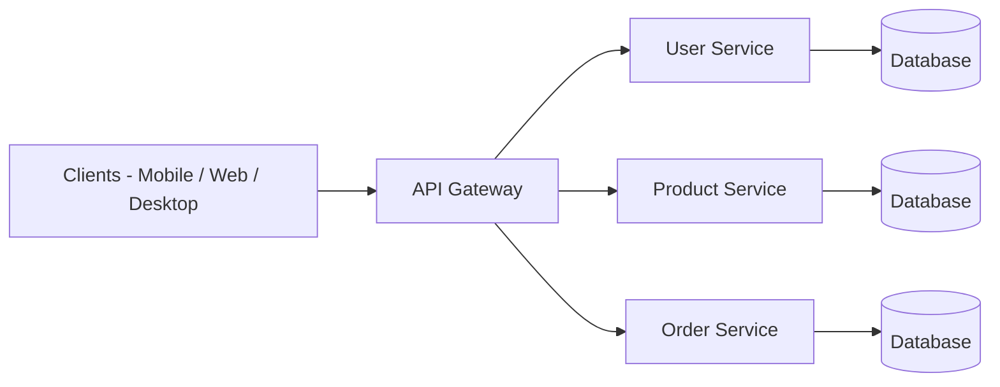

### Popular API Gateways

| Gateway | Description |
|---|---|
| Kong | Open-source, highly extensible, plugin-based |
| AWS API Gateway | Managed service, serverless, fully integrated with AWS |
| NGINX | Powerful reverse proxy, commonly used as a gateway |

> **Best Practices:**
> - Keep gateway logic lightweight; offload all business logic to microservices.
> - Monitor gateway performance and latency — it's a critical single point.
> - Implement robust error handling and retries.
> - Design versioned APIs (e.g., `/v1/`, `/v2/`).
> - Ensure high availability for the gateway layer itself.

---

## 9. Caching Strategies (Deep Dive)

### What is Caching?

Storing frequently accessed data in a fast, temporary storage area (like memory) so future requests for that same data can be served much faster than querying the primary database.

### Why Do We Need It?

- Drastically reduces latency for read operations.
- Offloads read pressure from the main database.
- Saves on bandwidth and infrastructure costs.
- Improves overall application performance.

### The Core Concept: Hit vs. Miss

- **Cache Hit:** Data is found in the cache and served instantly.
- **Cache Miss:** Data must be fetched from the database (slower), then stored in cache for future use.

### Caching Architecture

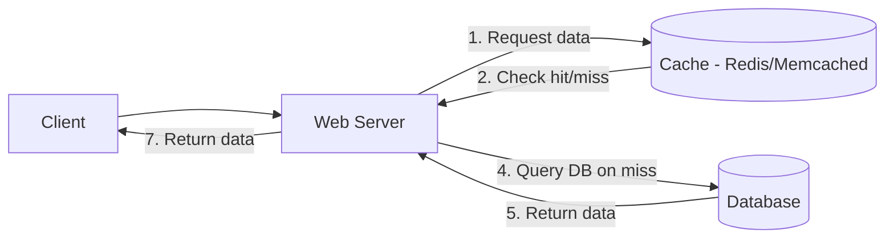

**Flow:**
1. Client requests data
2. Server checks cache
3. Cache Hit/Miss determined
4. Server queries DB (if Miss)
5. DB returns data
6. Server stores in cache
7. Server returns data to Client

### Popular Caching Systems

| System | Description |
|---|---|
| Redis | In-memory, fast, supports rich data structures (lists, sets, sorted sets, hashes) |
| Memcached | Simple, high-performance, pure key-value store |

### Cache Invalidation Strategies

| Strategy | How It Works |
|---|---|
| Write-Through | Write to cache and DB simultaneously; always consistent but adds write latency |
| Cache-Aside (Lazy Loading) | App checks cache first; on miss, loads from DB and writes to cache |
| Write-Behind (Write-Back) | Write to cache first, then asynchronously to DB; fast writes, risk of data loss |

### When & How to Cache

- Cache data that is **read frequently but changes rarely**.
- Define a proper **Time To Live (TTL)** for your data.
- Use appropriate invalidation strategy (Write-Through or Cache-Aside) to maintain consistency.
- **Monitor your cache hit ratio** — a low hit ratio means caching provides little benefit.

---

## 10. Notification System

### What is a Notification System?

A scalable and reliable backend component responsible for sending messages to users across various channels like Push, Email, SMS, and In-App.

### Core Requirements

- Handle millions of users and high throughput.
- Support multiple delivery channels (Push, Email, SMS, In-App).
- Deliver messages reliably, with retries for failures.
- Enable personalized notifications.
- Track message delivery status (Sent, Delivered, Failed).

### System Architecture

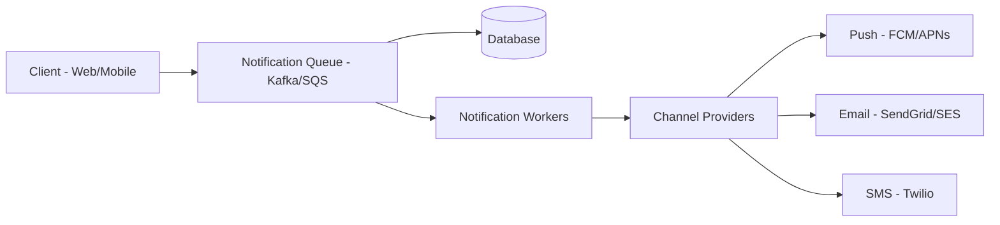

### Delivery Channels

| Channel | Use Case | Pros | Cons |
|---|---|---|---|
| Push | App Notifications | Real-time, drives engagement | Requires app to be installed |
| Email | Marketing / Receipts | Reliable, supports rich content | Can go to spam |
| SMS | Alerts / OTPs | High open rate | Expensive per message |

### Retry & Failure Handling

- Implement **exponential backoff** for retries on transient failures.
- Use a **Dead Letter Queue (DLQ)** for messages that fail repeatedly.
- Monitor and alert on high failure rates.
- Log all delivery failures for analysis and debugging.

### Key Components & States

**Key Components:** Notification Service, Queue, Worker, Database, Third-Party Provider APIs

**Notification State Machine:**

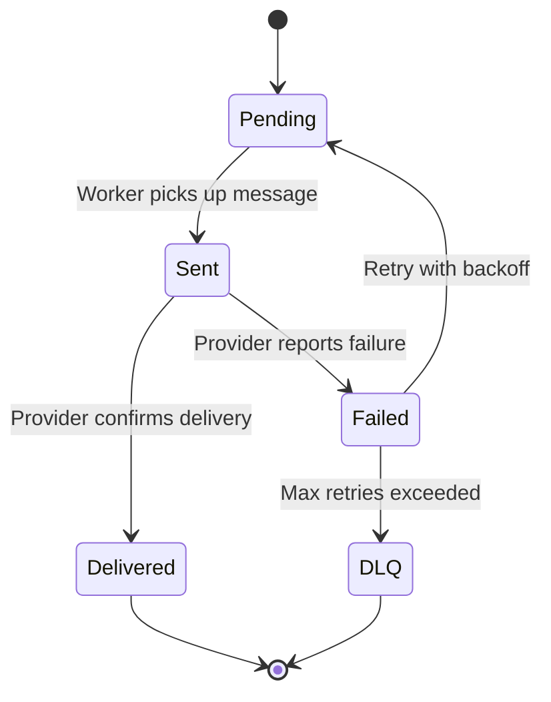

> **Critical Rule:** Always ensure **idempotent message handling** — processing the same message twice should not result in the user receiving duplicate notifications.

---

## Quick Reference Summary

| # | Concept | One-Line Summary |
|---|---|---|
| 1 | System Design Fundamentals | Define requirements, quality attributes, and trade-offs before designing |
| 2 | Load Balancer | Distributes traffic across servers; enables HA and fault tolerance |
| 3 | Caching | In-memory data layer that reduces DB load and latency |
| 4 | Database Scaling | Vertical, horizontal, replication, sharding — pick based on workload |
| 5 | CDN | Global edge servers that serve static content closer to users |
| 6 | Message Queues | Async, decoupled inter-service communication with delivery guarantees |
| 7 | Microservices | Small, independent services that scale and deploy independently |
| 8 | API Gateway | Single entry point handling auth, routing, rate limiting, and protocol translation |
| 9 | Caching Strategies | Write-Through vs Cache-Aside vs Write-Behind — choose based on consistency needs |
| 10 | Notification System | Scalable multi-channel messaging with retry, DLQ, and idempotency |
