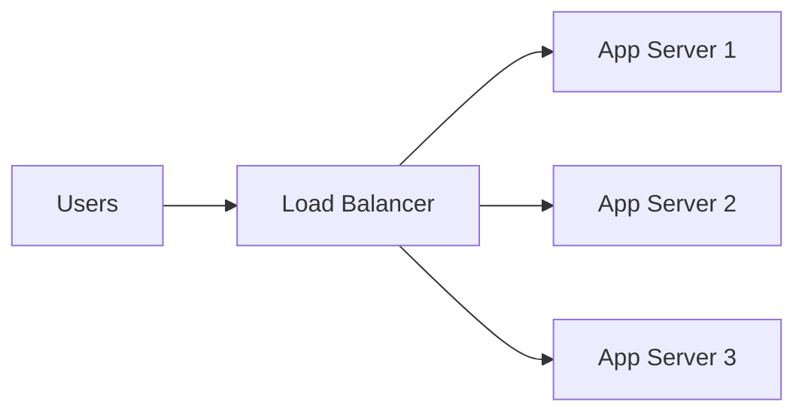
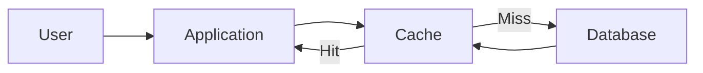
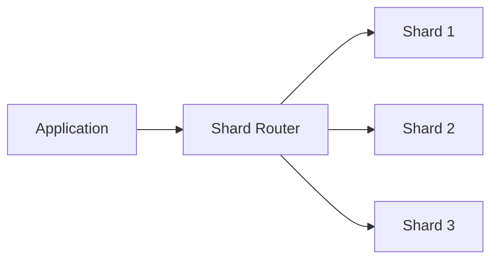
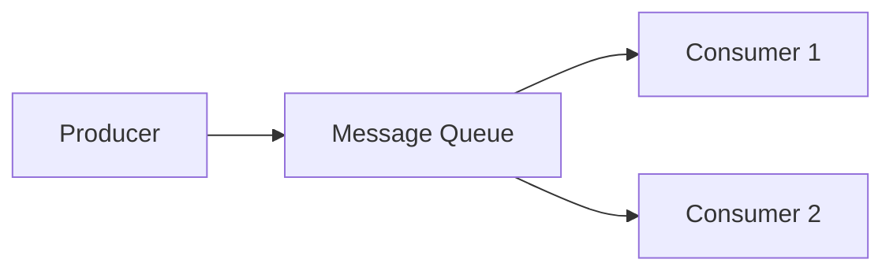
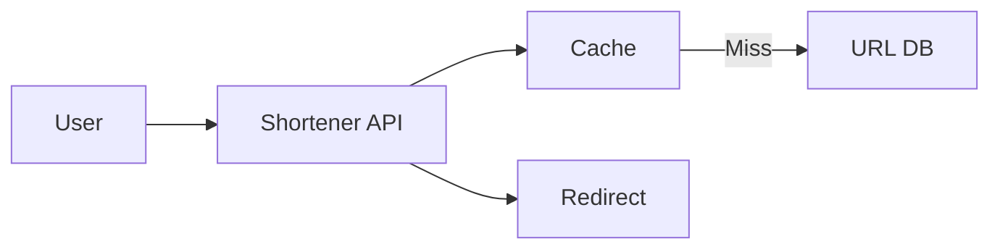
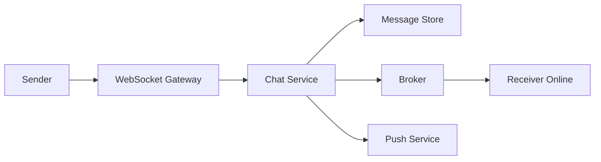
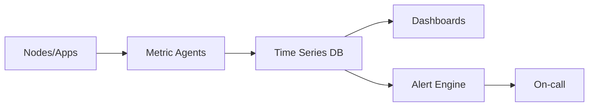
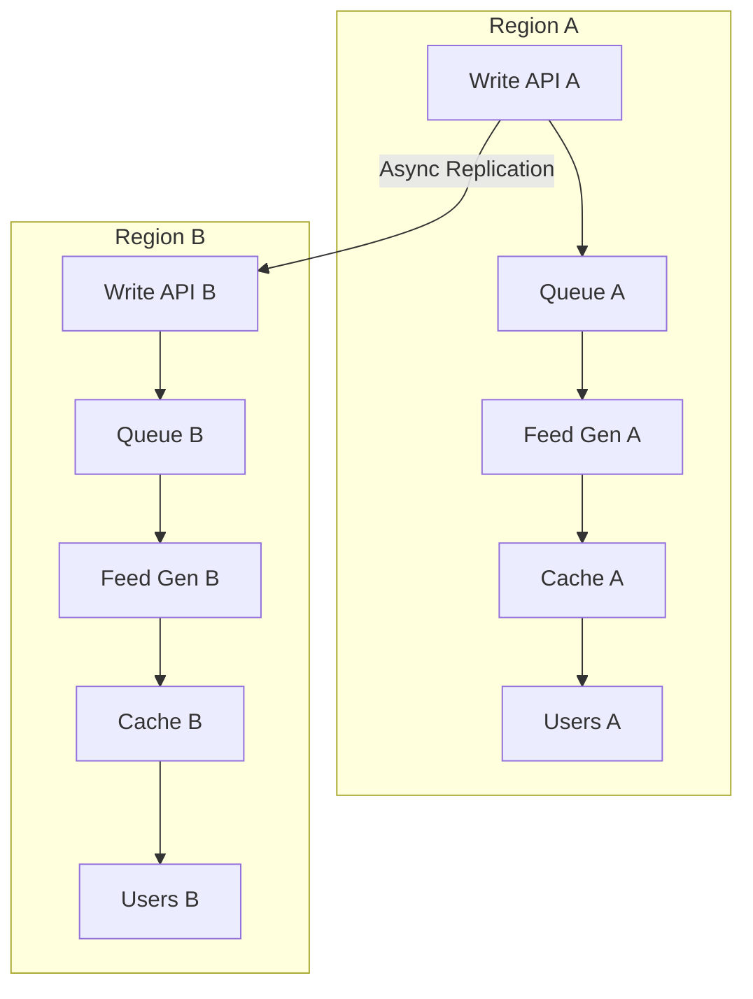
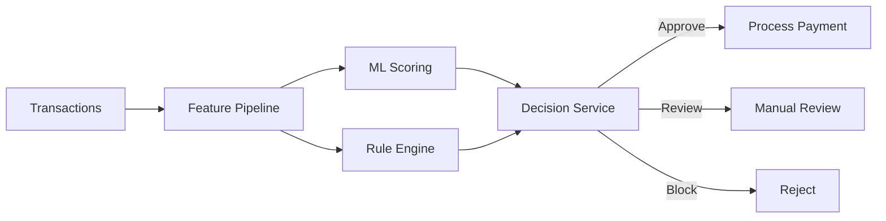
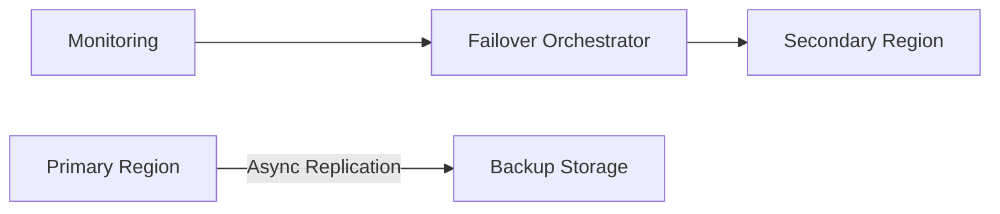

# System Design Interview Questions and Answers (50)

This guide includes:
- 20 Beginner questions
- 20 Intermediate questions
- 10 Difficult questions
- Architecture diagrams using Mermaid where useful

---

## Beginner (20)

### 1) What is system design?

**Answer:** System design is the process of defining architecture, components, data flow, and trade-offs for building scalable and reliable software systems.

Key goals:
- Meet functional requirements (what system should do)
- Meet non-functional requirements (scale, latency, reliability, security)
- Balance trade-offs (cost vs performance, consistency vs availability)

---

### 2) What is the difference between horizontal and vertical scaling?

**Answer:**
- **Vertical scaling (scale up):** Add more CPU/RAM to one server.
- **Horizontal scaling (scale out):** Add more servers and distribute traffic.

Horizontal scaling is usually preferred for internet-scale systems because it avoids single-machine limits.

---

### 3) What is a load balancer and why is it needed?

**Answer:** A load balancer distributes incoming requests across multiple backend servers.

Benefits:
- Prevents overload on one server
- Improves availability
- Enables zero-downtime deployments

---

### 4) What is caching?

**Answer:** Caching stores frequently accessed data in fast storage (usually memory) to reduce latency and database load.

Examples:
- Browser cache
- CDN cache
- Redis/Memcached cache

---

### 5) What is a CDN?

**Answer:** A Content Delivery Network (CDN) is a globally distributed set of edge servers that serve static content closer to users.

Benefits:
- Lower latency
- Reduced origin server load
- Better global performance

---

### 6) What is database indexing?

**Answer:** An index is a data structure (often B-tree) that speeds up queries by avoiding full table scans.

Trade-off:
- Faster reads
- Slightly slower writes and more storage

---

### 7) SQL vs NoSQL: when to use each?

**Answer:**
- **SQL:** Strong schema, joins, ACID transactions, relational data.
- **NoSQL:** Flexible schema, high write throughput, horizontal scaling, denormalized data.

Choose based on access patterns, consistency needs, and scale.

---

### 8) What is replication in databases?

**Answer:** Replication copies data from a primary database to one or more replicas.

Benefits:
- Read scaling (serve reads from replicas)
- High availability
- Disaster recovery

---

### 9) What is sharding?

**Answer:** Sharding splits data across multiple database nodes using a shard key.

Benefits:
- Higher write/read throughput
- Better storage scalability

Challenge:
- Cross-shard queries and rebalancing complexity

---

### 10) What is CAP theorem?

**Answer:** In a distributed system under network partition, you can only guarantee at most two:
- Consistency
- Availability
- Partition tolerance

Real distributed systems must tolerate partitions, so trade-off is usually between consistency and availability.

---

### 11) What is eventual consistency?

**Answer:** Eventual consistency means replicas may be temporarily inconsistent, but they converge to the same value over time.

Used in systems prioritizing availability and low latency.

---

### 12) What is idempotency?

**Answer:** An idempotent operation gives the same result even if repeated multiple times.

Example:
- Payment API with idempotency key avoids double charge on retries.

---

### 13) What is rate limiting?

**Answer:** Rate limiting restricts the number of requests a client can make in a time window.

Why:
- Protect from abuse and DDoS
- Ensure fair usage
- Prevent backend overload

---

### 14) What are common load balancing strategies?

**Answer:**
- Round robin
- Least connections
- IP hash
- Weighted routing

Choice depends on traffic pattern and server heterogeneity.

---

### 15) What is the role of an API gateway?

**Answer:** An API gateway is an entry point for clients to backend services.

It handles:
- Authentication/authorization
- Rate limiting
- Routing
- Request/response transformation

---

### 16) What is a message queue?

**Answer:** A message queue decouples producers and consumers via asynchronous communication.

Benefits:
- Smoother traffic spikes
- Better fault isolation
- Retry and dead-letter mechanisms

---

### 17) What are synchronous vs asynchronous communication?

**Answer:**
- **Synchronous:** Caller waits for response (HTTP request).
- **Asynchronous:** Caller continues and result is processed later (queue/event).

Asynchronous patterns improve resilience and throughput.

---

### 18) What is failover?

**Answer:** Failover is automatic switch to standby systems when primary components fail.

It improves high availability and reduces downtime.

---

### 19) What is health checking in distributed systems?

**Answer:** Health checks periodically test if instances are alive and ready.

Types:
- Liveness (process is alive)
- Readiness (can serve traffic)

---

### 20) What is observability?

**Answer:** Observability is understanding internal system behavior using:
- Metrics
- Logs
- Traces

Good observability enables faster incident detection and debugging.

---

## Intermediate (20)

### 21) How do you design URL shortening service (like bit.ly)?

**Answer:** Core components:
- API service to create/resolve short URLs
- ID generation (counter + base62, or random unique key)
- Database mapping short key → original URL
- Cache hot mappings
- Optional analytics pipeline

---

### 22) How do you design a rate limiter?

**Answer:** Common algorithms:
- Token bucket
- Leaky bucket
- Fixed window
- Sliding window log/counter

Typical implementation uses Redis with atomic increments and TTL.

---

### 23) How do you design a notification system?

**Answer:** Design:
- Notification API receives requests
- Message broker for async processing
- Channel workers (email, SMS, push)
- User preference service
- Retry and dead-letter queues

Key requirements:
- At-least-once delivery
- Idempotent consumers
- Template localization

---

### 24) How do you design a file upload service?

**Answer:** Approach:
- Client gets pre-signed URL
- Upload directly to object storage
- Store metadata in DB
- Use background virus scanning/transcoding

Benefits:
- Offloads app servers
- Supports large file chunking and resume

---

### 25) How do you design search autocomplete?

**Answer:** Use:
- Trie or finite state transducer for prefix search
- Ranking signals (frequency, recency, personalization)
- In-memory cache for hot prefixes
- Periodic index rebuild + incremental updates

---

### 26) What is consistent hashing and where is it used?

**Answer:** Consistent hashing maps keys and nodes on a ring to minimize rebalancing when nodes join/leave.

Used in:
- Distributed caches
- Sharded databases
- Partitioned message systems

---

### 27) How do you design a chat system?

**Answer:** Components:
- WebSocket gateway for real-time connections
- Chat service for persistence
- Message broker for fan-out
- Presence service for online status
- Push notifications for offline users

---

### 28) What is database read/write splitting?

**Answer:** Writes go to primary DB; reads go to replicas.

Pros:
- Read scalability
- Better throughput

Cons:
- Replica lag may cause stale reads

---

### 29) How do you handle cache invalidation?

**Answer:** Strategies:
- Cache-aside (app updates DB then invalidates cache)
- Write-through
- Write-behind
- TTL-based expiration

Cache invalidation requires careful ordering to avoid stale data.

---

### 30) How do you design an API for high reliability?

**Answer:** Techniques:
- Timeouts and retries with exponential backoff
- Circuit breaker
- Idempotency keys
- Bulkheads
- Graceful degradation and fallback responses

---

### 31) What is a distributed lock and when to use it?

**Answer:** A distributed lock ensures only one worker processes a critical section across nodes.

Use cases:
- Leader election
- Scheduled job deduplication
- Inventory reservation

Caution: handle lock expiry and clock drift carefully.

---

### 32) How do you design a logging pipeline?

**Answer:** Flow:
- App emits structured logs
- Agent ships logs to broker
- Stream processing and indexing
- Long-term storage and query UI

Requirements:
- Sampling and retention policies
- PII redaction

---

### 33) What is CQRS?

**Answer:** Command Query Responsibility Segregation separates write model from read model.

Benefits:
- Independent optimization of reads and writes
- Better scalability for read-heavy systems

Cost:
- More complexity and eventual consistency management

---

### 34) What is event sourcing?

**Answer:** Store state changes as immutable events instead of only current state.

Benefits:
- Full audit trail
- Rebuild state by replaying events

Challenges:
- Event schema evolution
- Replay and snapshot management

---

### 35) How do you design news feed generation?

**Answer:** Two models:
- Fan-out on write (precompute feeds for followers)
- Fan-out on read (compute when user opens app)

Often hybrid:
- Write fan-out for normal users
- Read fan-out for celebrity accounts

---

### 36) How do you design a web crawler?

**Answer:** Components:
- URL frontier and scheduler
- Fetchers with politeness and robots.txt rules
- Deduplication via URL fingerprinting
- Content parsing and indexing pipeline

---

### 37) What is backpressure in distributed systems?

**Answer:** Backpressure prevents fast producers from overwhelming slow consumers.

Methods:
- Queue depth thresholds
- Consumer pull model
- Token-based flow control

---

### 38) How do you design a metrics monitoring system?

**Answer:** Pipeline:
- Agents scrape or receive metrics
- Time-series database stores data
- Alert engine evaluates rules
- Dashboards for visualization

---

### 39) What is service discovery?

**Answer:** Service discovery lets services find each other dynamically.

Approaches:
- Client-side discovery (client queries registry)
- Server-side discovery (load balancer consults registry)

---

### 40) How do you design secure authentication and authorization?

**Answer:** Authentication options:
- Session-based auth
- JWT/OAuth2/OpenID Connect

Authorization:
- Role-based access control (RBAC)
- Attribute-based access control (ABAC)

Best practices:
- Short token expiry + refresh tokens
- Secret rotation
- Multi-factor authentication

---

## Difficult (10)

### 41) How do you design a globally distributed social network timeline?

**Answer:** Design goals:
- Low read latency worldwide
- High write throughput
- Regional fault tolerance

Approach:
- Multi-region active-active setup
- Region-local writes with async cross-region replication
- Hybrid feed fan-out strategy
- Per-user cache and ranking pipeline

---

### 42) How do you design a strongly consistent payment ledger?

**Answer:** Principles:
- Double-entry bookkeeping
- Immutable append-only ledger entries
- Idempotent transaction creation
- Strict ordering per account

Use:
- ACID database for ledger writes
- Outbox pattern for event publication
- Reconciliation and audit pipelines

---

### 43) How do you design Uber-like real-time location tracking?

**Answer:** Components:
- Mobile clients streaming GPS updates
- Ingestion gateway + Kafka
- Geospatial index service
- Matching service for rider-driver pairing
- ETA engine and surge pricing pipeline

Challenges:
- Hotspots in dense cities
- Location update frequency vs battery/network cost

---

### 44) How do you design YouTube-like video processing and streaming?

**Answer:** Pipeline:
- Chunked upload to object storage
- Async transcoding to multiple bitrates
- Manifest generation (HLS/DASH)
- CDN distribution for playback

Need:
- Retryable processing jobs
- Content moderation
- Recommendation and analytics services

---

### 45) How do you design a distributed job scheduler at scale?

**Answer:** Requirements:
- Millions of scheduled jobs
- Exactly-once effect (or practical idempotent at-least-once)
- Priority and fairness

Approach:
- Time-wheel or sorted-set based scheduler
- Lease-based worker assignment
- Heartbeats and requeue on failure

---

### 46) How do you design a multi-tenant SaaS platform?

**Answer:** Focus areas:
- Tenant isolation (data and compute)
- Noisy neighbor protection
- Per-tenant quotas and rate limits
- Tenant-aware observability and billing

Models:
- Shared DB with tenant key
- Separate schema/database for premium tiers

---

### 47) How do you design a globally unique ID generator?

**Answer:** Common patterns:
- Snowflake-like 64-bit IDs (timestamp + node id + sequence)
- UUIDv7 for time-ordered IDs

Trade-offs:
- Sortability vs randomness
- Coordination and clock skew handling

---

### 48) How do you design an eventually consistent shopping cart across devices?

**Answer:** Approach:
- Per-user cart as conflict-resolvable data structure
- Version vectors or last-write-wins rules
- Event log for cart changes
- Merge engine for multi-device conflicts

Key decision:
- Favor availability and merge correctness over strict immediate consistency.

---

### 49) How do you design a high-scale fraud detection pipeline?

**Answer:** Architecture:
- Real-time feature extraction from events
- Online model inference for immediate risk score
- Rule engine for hard constraints
- Human review queue for uncertain cases

---

### 50) How do you design a multi-region disaster recovery strategy?

**Answer:** Core concepts:
- Define RPO (max data loss) and RTO (max recovery time)
- Use cross-region replication and backups
- Automate failover and failback runbooks
- Regularly run game-day DR drills

---

## Quick Interview Tip

When answering in interviews, structure each design as:

1. Requirements and constraints
2. High-level architecture
3. Data model and APIs
4. Scaling and reliability strategy
5. Bottlenecks and trade-offs
6. Security and observability

This structure shows both depth and clarity.
