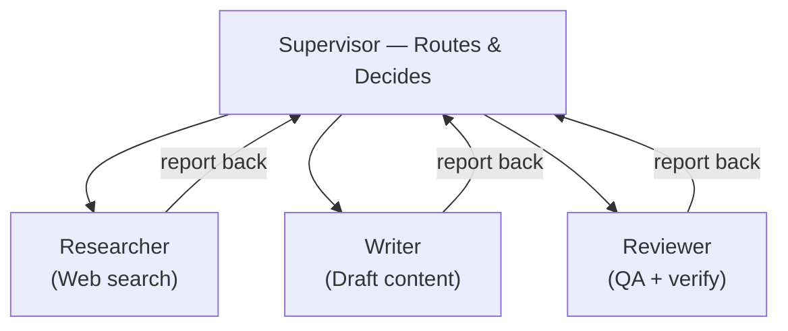
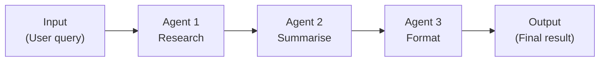
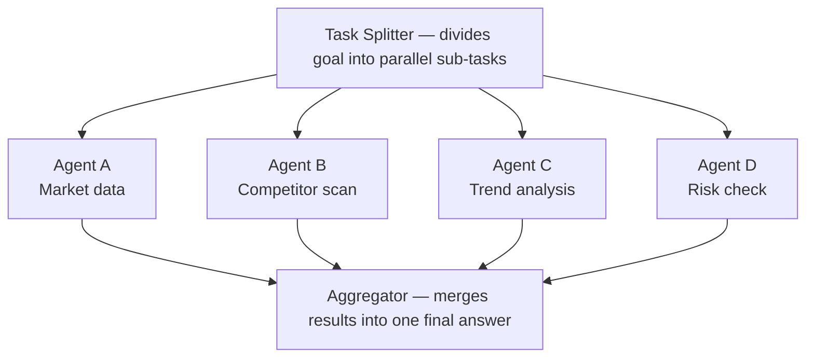
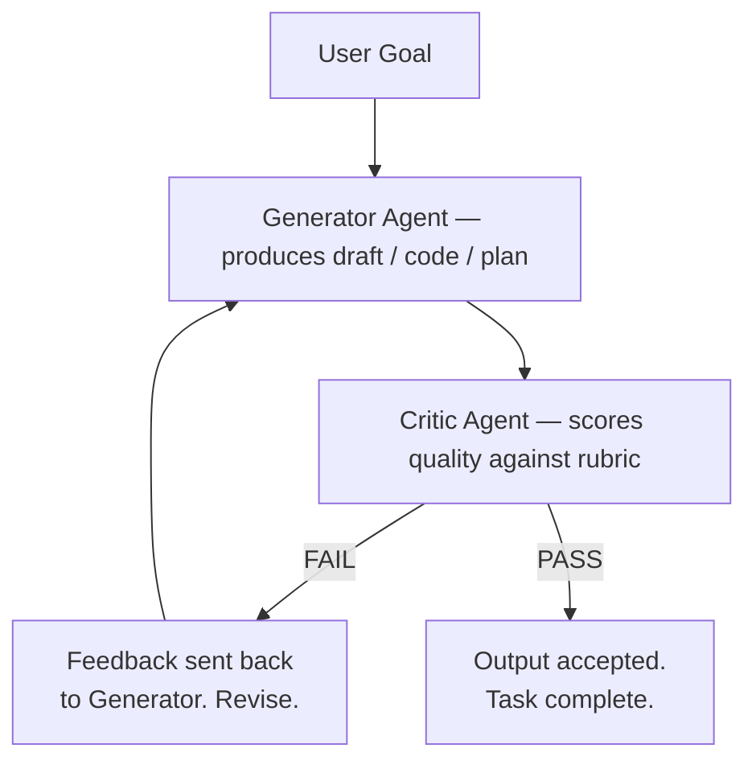
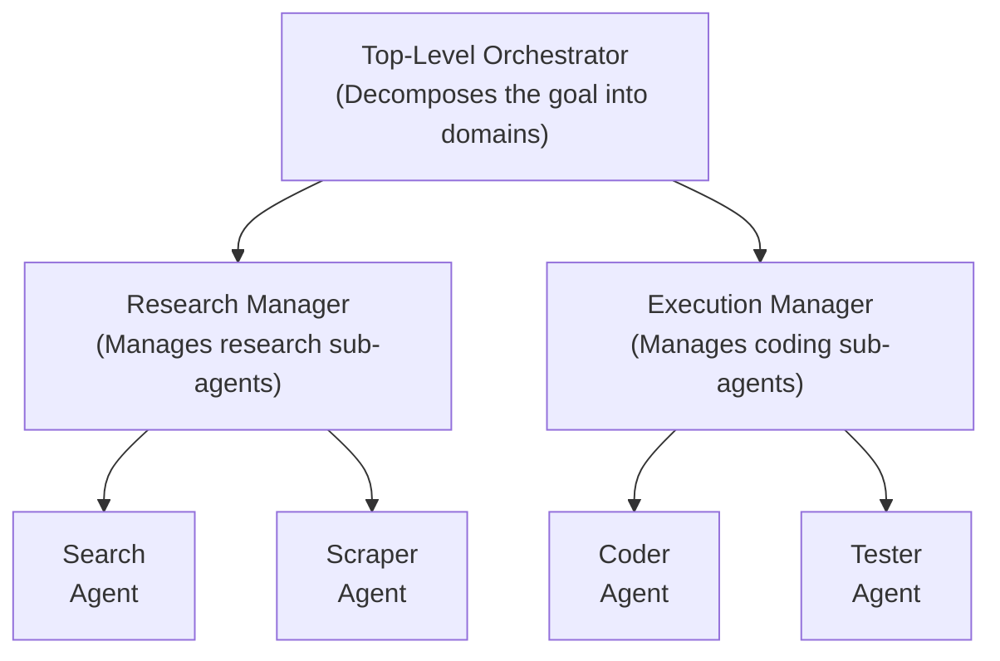
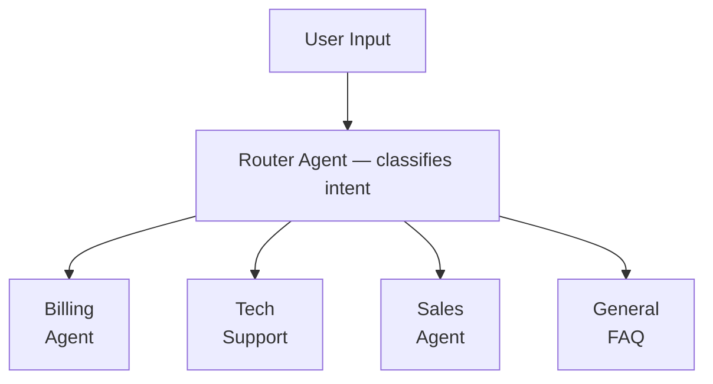
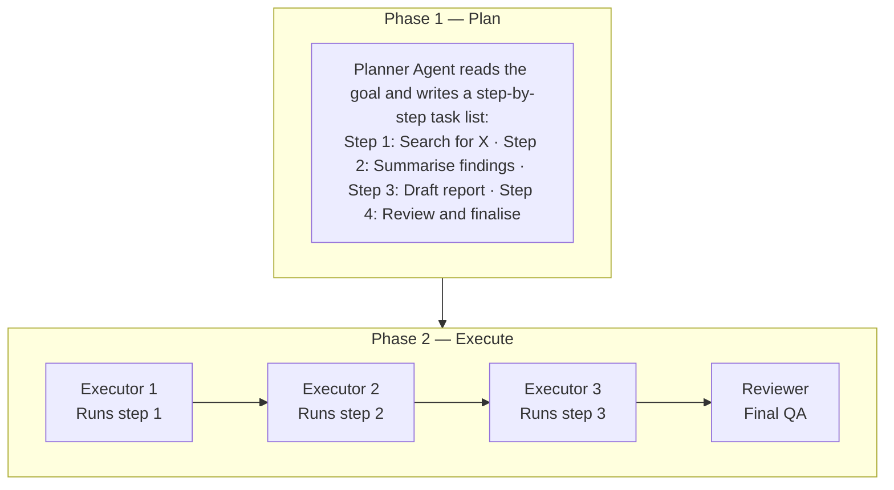
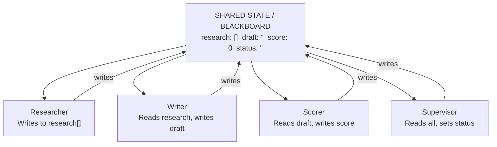

# Top AI Multi-Agent Patterns

**Source:** techwith.ram | Multi-Agent Systems Series  
**Total Patterns:** 8 architectural patterns every AI builder needs to know — with real-world examples and when to use each.

---

## Pattern 01 — The Supervisor Pattern

**One orchestrator agent reads the goal, decides which specialist to call next, and loops until the task is done.**

### Architecture

> All agents report back to supervisor. Supervisor decides: next agent or FINISH.

| | |
|---|---|
| **Best For** | Research pipelines, content creation, any multi-step workflow needing intelligent routing. |
| **Key Insight** | The supervisor doesn't do the work — it decides who does. One brain, many hands. |

---

## Pattern 02 — The Pipeline Pattern

**Agents are chained in a fixed sequence. Each one receives the output of the previous and enriches it before passing it on. No routing needed — the order is hardcoded.**

### Architecture

> No branching. No routing. Each agent enriches the context and passes it forward.

| | |
|---|---|
| **Best For** | Document processing, ETL pipelines, structured data transformation, translation workflows. |
| **Key Insight** | The simplest MAS pattern. Predictable, easy to debug, no dynamic decisions needed. |

---

## Pattern 03 — The Parallel Pattern

**Multiple agents run at the same time on independent sub-tasks. An aggregator collects all results and combines them into a single final answer.**

### Architecture

> All agents run simultaneously. 4x faster than sequential for independent tasks.

| | |
|---|---|
| **Best For** | Market research, large-scale analysis, any task that can be split into truly independent parts. |
| **Key Insight** | Speed multiplier. If tasks don't depend on each other — run them simultaneously. |

---

## Pattern 04 — The Feedback Loop

**A generator agent creates an output. A critic agent scores it. If the score fails, the output is revised. Repeat until quality threshold is met — no human needed.**

### Architecture

| | |
|---|---|
| **Best For** | Code generation, essay writing, legal drafts, any output needing quality assurance. |
| **Key Insight** | Self-correcting systems. A different AI reviewing another AI's work catches what the generator misses. |

---

## Pattern 05 — The Hierarchical Pattern

**Supervisors manage supervisors. A top-level orchestrator breaks the goal into domains. Mid-level managers handle their domain. Workers execute the actual tasks.**

### Architecture

| | |
|---|---|
| **Best For** | Enterprise workflows, complex software projects, large-scale data pipelines — anything with clear domain separation. |
| **Key Insight** | Scales without chaos. Each manager owns its domain — the top agent never gets overwhelmed. |

---

## Pattern 06 — The Router Pattern

**A single classifier reads the input and routes it to the best specialist agent. No looping. No orchestration. One decision, one agent, one answer.**

### Architecture

> Only one agent is ever called per request. Fast, low-cost, and easy to expand.

| | |
|---|---|
| **Best For** | Customer support systems, helpdesks, chatbots handling multiple intents — any triage scenario. |
| **Key Insight** | The simplest way to have specialists without complexity. Add more specialists by just adding more routes. |

---

## Pattern 07 — Plan Then Execute

**A planner agent breaks the goal into a concrete step-by-step plan first. Separate executor agents then carry out each step. Planning and doing are fully decoupled.**

### Architecture

| | |
|---|---|
| **Best For** | Complex software engineering, autonomous coding agents, long research projects requiring structured decomposition. |
| **Key Insight** | Separating thinking from doing reduces errors massively. The planner never gets confused by execution details. |

---

## Pattern 08 — The Shared Memory Pattern

**All agents read from and write to a single shared state — the "blackboard." No direct communication between agents. They collaborate through a common memory store.**

### Architecture

> Agents never call each other. They speak through shared state. This is how LangGraph works natively.

| | |
|---|---|
| **Best For** | Any LangGraph-based MAS. Stateful agents, long-running tasks, systems requiring full audit trails. |
| **Key Insight** | Decouples agents completely. Add or remove agents without changing any others — just update what they read/write. |

---

## Quick Reference Summary

| Pattern | Core Idea | Best For |
|---|---|---|
| **01 Supervisor** | One orchestrator routes to specialists in a loop | Research pipelines, multi-step workflows |
| **02 Pipeline** | Fixed sequential chain, no routing | ETL, document processing, translation |
| **03 Parallel** | Independent agents run simultaneously, aggregated | Market research, large-scale analysis |
| **04 Feedback Loop** | Generator + Critic loop until quality threshold met | Code gen, writing, legal drafts |
| **05 Hierarchical** | Supervisors manage supervisors, workers at leaves | Enterprise workflows, large-scale software |
| **06 Router** | One classifier, one specialist called per request | Chatbots, helpdesks, triage systems |
| **07 Plan Then Execute** | Planner decoupled from executor agents | Autonomous coding, research projects |
| **08 Shared Memory** | All agents read/write a common blackboard state | LangGraph MAS, stateful long-running tasks |
