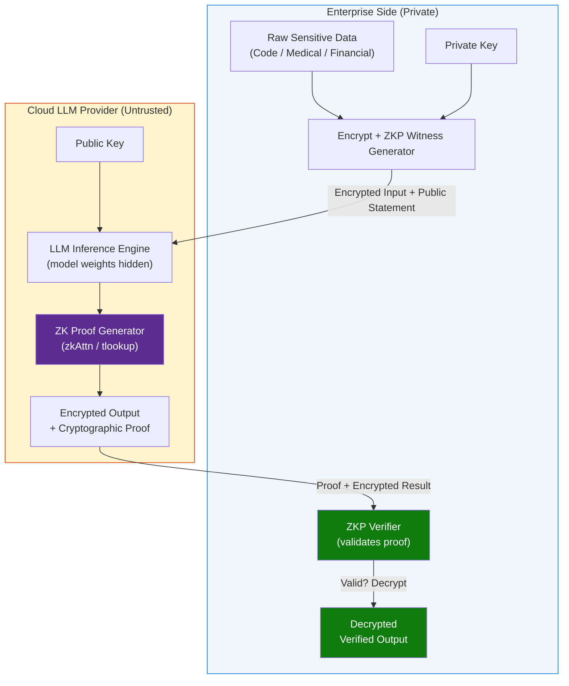
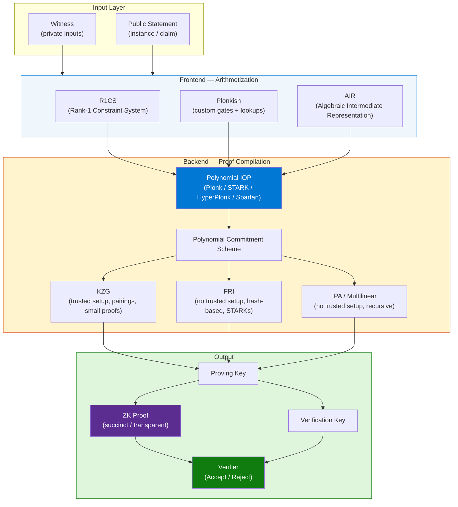
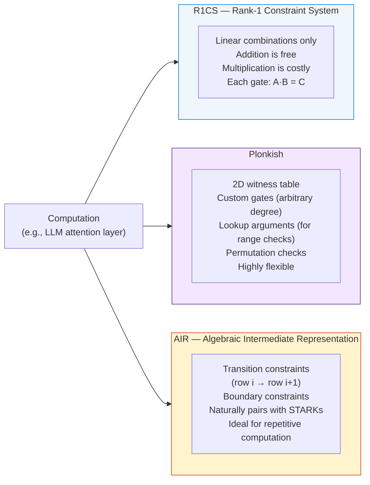
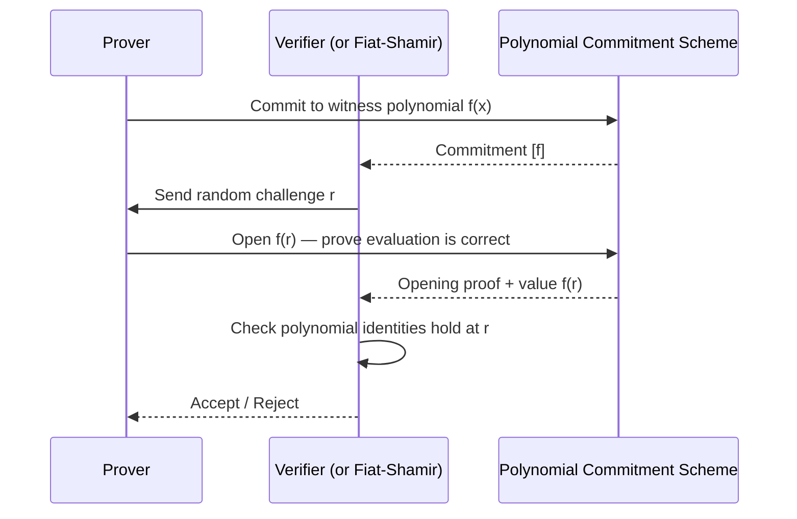
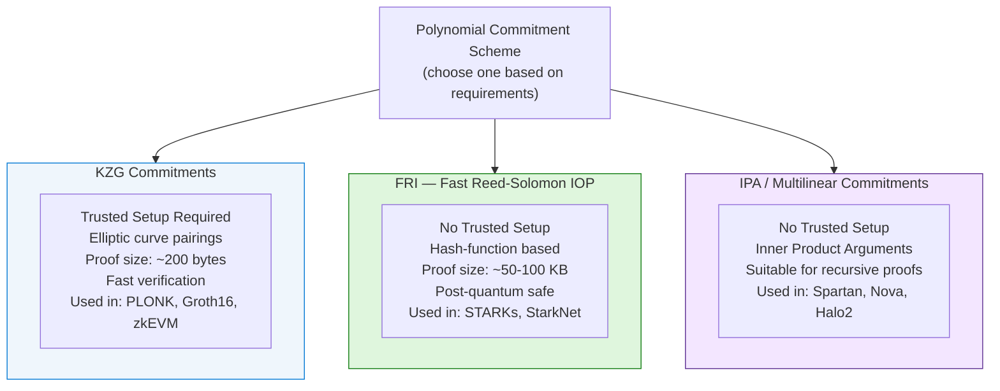
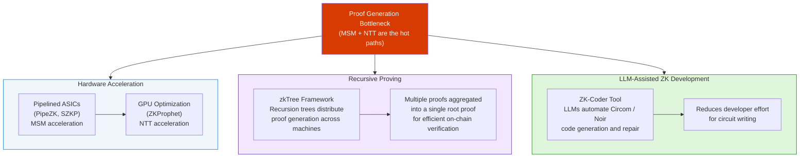
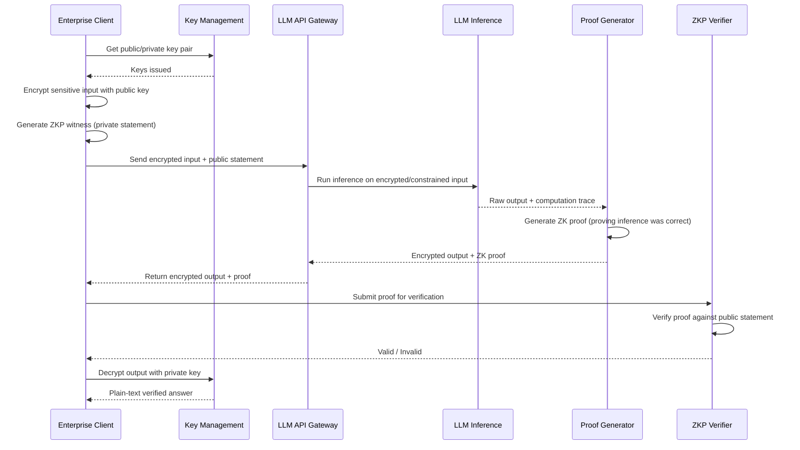

# ZKP Architecture for LLM Data Security — Privacy-Preserving AI Inference

> **Source:** [YouTube — LLM-এ ডাটা সিকিউরিটি? ZKP আর্কিটেকচার ব্রেইকডাউন [Episode 03]](https://www.youtube.com/watch?v=vnO_qcGVE0w)
> **Channel:** Nabid In Motion
> **Topic:** Zero Knowledge Proofs, Privacy-Preserving AI, LLM Security, Trustless Architecture, Asymmetric Encryption, Enterprise AI
> **Key Claim:** You can mathematically prove that an LLM gave the correct output *without ever exposing your sensitive input data* to the model provider.

---

## Table of Contents

1. [Overview](#1-overview)
2. [Problem Statement](#2-problem-statement)
3. [Core Concepts](#3-core-concepts)
4. [Architecture](#4-architecture)
5. [Key Components](#5-key-components)
6. [How It Works — Step by Step](#6-how-it-works--step-by-step)
7. [Comparison Table](#7-comparison-table)
8. [Code Examples](#8-code-examples)
9. [Configuration Reference](#9-configuration-reference)
10. [Best Practices](#10-best-practices)
11. [Interview Talking Points](#11-interview-talking-points)
12. [Learning Resources](#12-learning-resources)

---

## 1. Overview

This video (Episode 03 of the "Nabid In Motion" series on advanced AI engineering) tackles one of the most pressing concerns in enterprise AI adoption: **how to use cloud-hosted LLMs without leaking sensitive data**. The presenter introduces **Zero-Knowledge Proofs (ZKP)** as the cryptographic foundation for building a *trustless* AI inference pipeline. Instead of sending raw enterprise data (source code, medical records, financial portfolios) to an LLM API, ZKP allows an enterprise to submit **encrypted inputs** and receive **verifiably correct outputs** — with a cryptographic proof that the model ran correctly — without the provider ever seeing the actual data. This approach is sometimes called **zkLLM** and represents the convergence of modern cryptography with AI infrastructure.

---

## 2. Problem Statement

Every enterprise using a cloud AI service faces a fundamental trust problem: the model provider receives raw, unencrypted input data.

### Classic Approach Pain Points

| Problem | Impact |
|---|---|
| Raw data sent to cloud LLM APIs | Source code, PII, or trade secrets exposed to third-party servers |
| No way to verify model authenticity | Provider could silently swap model versions or tamper with outputs |
| Centralized data storage | PII in databases is a breach target — HIPAA, GDPR risk |
| Audit trail lacks cryptographic proof | Regulatory compliance requires verifiable evidence of correct computation |
| Prompt injection vulnerabilities | Adversarial inputs can exfiltrate context data from the model |

> **Key Insight:** "You need to prove truth without revealing the truth itself — this is exactly what Zero-Knowledge Proofs were designed to do."

---

## 3. Core Concepts

### Zero-Knowledge Proof (ZKP)
A cryptographic protocol where a **Prover** convinces a **Verifier** that a statement is true *without revealing any information beyond the truth of the statement itself*. First formally defined in Goldwasser, Micali & Rackoff (1985). A ZKP must satisfy three properties:
- **Completeness:** If the statement is true, an honest prover will always convince the verifier.
- **Soundness:** A dishonest prover cannot convince the verifier of a false statement.
- **Zero-Knowledge:** The verifier learns nothing beyond the validity of the statement.

### zkSNARK / zkSTARK
Specific ZKP implementations optimized for practical use:
- **zk-SNARK** *(Succinct Non-Interactive Argument of Knowledge)*: Small proof size, fast verification, requires a trusted setup ceremony.
- **zk-STARK** *(Scalable Transparent Argument of Knowledge)*: No trusted setup, quantum-resistant, slightly larger proofs but more transparent.

### zkLLM (Verifiable LLM Inference)
The application of ZKPs to LLM inference. The model provider acts as a **Prover** (generates a proof that inference was run correctly on a specific model version) and the enterprise acts as the **Verifier** (checks the proof without re-running the model or seeing internal weights).

### Asymmetric Encryption in this Context
The enterprise holds a **Private Key** (keeps data encrypted on their side). The LLM service holds the **Public Key** (can process data in encrypted form via Homomorphic Encryption or compute on ZKP-wrapped inputs). Outputs are decrypted only by the enterprise.

### Trustless Architecture
A system design where no single party needs to be trusted by default — correctness is enforced by cryptographic mathematics, not by contractual or reputational trust in the cloud provider.

---

## 4. Architecture

### Overall System Architecture



### ZKP Proof Generation Pipeline — Detailed Architecture

The ZKP Proof Generation Pipeline converts a computational statement into a cryptographic proof through a modular **Frontend → Backend** architecture. The Frontend handles *arithmetization* (encoding the computation as constraints), while the Backend compiles those constraints into a cryptographic proof using Polynomial IOPs and Commitment Schemes.



---

### Frontend: Arithmetization

The computation is first translated into a **constraint system** — a mathematical representation that a ZK proving system can work with. Three dominant formats exist:



| Format | Gate Type | Multiplication Cost | Best For | Example Protocols |
|---|---|---|---|---|
| **R1CS** | Linear only | High (1 gate per multiply) | Simple circuits, Groth16 | Groth16, Marlin |
| **Plonkish** | Custom (arbitrary degree) | Low (custom gates batch ops) | Complex circuits, lookups | PLONK, Halo2, UltraPlonk |
| **AIR** | Transition + Boundary | Medium | Repetitive/streaming compute | STARK, DEEP-ALI |

---

### Backend: Compilation to Proof

The constraint system is compiled into a proof in two stages:

#### Stage 1 — Information-Theoretic Compiler (Polynomial IOP)

The prover **commits** to witness polynomials and interacts with a verifier (or simulates interaction via Fiat-Shamir) via random challenges. The protocol defines *what to prove* at an abstract mathematical level.



| Protocol | Type | Key Feature |
|---|---|---|
| **PLONK** | Polynomial IOP | Universal trusted setup, custom gates |
| **STARK** | Polynomial IOP (FRI-based) | No trusted setup, transparent |
| **HyperPlonk** | Multilinear IOP | Faster prover for high fan-in gates |
| **Spartan** | MLE-based IOP | No trusted setup, uses inner product arguments |

#### Stage 2 — Cryptographic Compiler (Polynomial Commitment Schemes)

Abstract polynomial oracles are replaced with **concrete cryptographic primitives**. The PCS determines proof size, setup requirements, and verification cost.



| PCS Scheme | Trusted Setup | Proof Size | Verification Speed | Quantum Safe | Used In |
|---|---|---|---|---|---|
| **KZG** | ✅ Required | ~200 bytes | Very fast | ❌ | PLONK, Groth16, zkEVM |
| **FRI** | ❌ None | ~50–100 KB | Moderate | ✅ | STARKs, StarkNet |
| **IPA / Multilinear** | ❌ None | Medium | Moderate | Depends | Spartan, Nova, Halo2 |

---

### Recent Optimizations

Proof generation for large circuits (e.g., LLM inference) is computationally expensive. Three research directions are closing this gap:



#### Hardware Acceleration
Proof generation has two dominant computational bottlenecks:
- **MSM (Multi-Scalar Multiplication):** Required for KZG-based commitment schemes; dominates prover time for elliptic curve operations.
- **NTT (Number-Theoretic Transform):** The ZKP equivalent of FFT; required for polynomial evaluation and interpolation in all proving systems.

| System | Target Op | Approach | Speedup |
|---|---|---|---|
| **PipeZK** | MSM | Pipelined ASIC design | ~10–100× vs CPU |
| **SZKP** | MSM + NTT | ASIC co-design | Production-grade |
| **ZKProphet** | NTT | GPU kernel optimization (CUDA) | 5–20× vs CPU |

#### Recursive Proving (zkTree)
Instead of proving one massive circuit monolithically, **recursive proving** splits the work:
1. Divide the computation into sub-circuits (e.g., one per transformer layer)
2. Prove each sub-circuit independently (parallelizable across machines)
3. Recursively aggregate sub-proofs into a **single root proof**
4. Submit only the root proof on-chain — O(log n) verification cost regardless of circuit depth

#### LLM-Assisted ZK Development (ZK-Coder)
Writing ZK circuits manually is error-prone and requires deep cryptographic expertise. **ZK-Coder** uses LLMs (trained on Circom, Noir, and Halo2 corpora) to:
- Auto-generate constraint code from natural language specifications
- Detect and repair soundness bugs (under-constrained signals)
- Suggest optimizations (e.g., replacing SHA-256 with Poseidon in circuits)

---

## 5. Key Components

| Component | Service / Tool | Role |
|---|---|---|
| **ZK Circuit** | Circom, Noir, Halo2 | Encodes the computation to be proven (e.g., transformer attention) |
| **Proving System** | Groth16, PLONK, STARK | Generates the cryptographic proof efficiently |
| **zkAttn** | Custom zkLLM library | ZKP circuit for verifying transformer attention mechanisms |
| **tlookup** | Custom zkLLM library | Efficient tensor lookup tables for non-linear activations |
| **Homomorphic Encryption Layer** | SEAL, OpenFHE | Optional layer: allows computation directly on ciphertext |
| **LLM Inference Engine** | vLLM, TensorRT-LLM | Runs the actual model (cloud-side), generates output + proof |
| **Verification Contract** | Smart contract / local verifier | Checks the ZK proof on-premise or on-chain |
| **Key Management** | HSM / Azure Key Vault | Manages enterprise private keys |

### ZK Circuit (Circom) — What it does
The circuit is the formal mathematical description of the computation being proven. For LLM inference, researchers build specialized circuits to represent transformer operations:
- Attention score computation: `softmax(QKᵀ/√d) · V`
- Activation functions: `ReLU`, `GELU`
- Matrix multiplications

### zkAttn
A specialized ZKP technique for proving the correctness of the attention mechanism — the core of every transformer model. It converts the continuous attention computation into a polynomial constraint system that a ZK proving system (like Groth16 or PLONK) can verify.

### tlookup
Because non-linear functions like `softmax` and `LayerNorm` are expensive to encode in arithmetic circuits, **tlookup** builds precomputed **tensor lookup tables** that dramatically reduce the proving time for these operations.

---

## 6. How It Works — Step by Step



**Step-by-step explanation:**

1. **Key Setup:** Enterprise generates an asymmetric key pair. Private key stays local; public key is shared with the LLM provider.
2. **Input Encryption:** Sensitive data (e.g., proprietary source code) is encrypted using the public key or transformed into a ZKP-compatible format (the "witness").
3. **Public Statement Formulation:** The enterprise defines what it wants to prove: e.g., *"The input belongs to our authorized dataset"* without revealing the input itself.
4. **Inference Execution:** The LLM provider runs the model. The provider never sees the raw plaintext (only the encrypted/constrained form).
5. **Proof Generation:** The provider's proving system generates a ZK proof that certifies: *"The output was produced by model version X, with correct computation, given the public statement."*
6. **Proof Transmission:** The encrypted output + proof is returned to the enterprise.
7. **Verification:** The enterprise's local verifier checks the proof. This is computationally cheap (milliseconds), even though generating the proof may take minutes.
8. **Decryption:** If the proof is valid, the enterprise decrypts the output using their private key. The result is trusted — not just hoped to be correct.

---

## 7. Comparison Table

| Dimension | Standard LLM API (Naive) | ZKP-Based Trustless LLM |
|---|---|---|
| **Data Exposure** | Raw data sent to cloud | Encrypted / ZKP-wrapped only |
| **Provider Trust** | Full trust required | Zero trust — math enforces correctness |
| **Model Authenticity** | Unverifiable | Cryptographically verified model version |
| **Output Tamper-Proof?** | No | Yes — proof fails if output is tampered |
| **Compliance (HIPAA/GDPR)** | High risk — data leaves org | Mathematically auditable, data stays local |
| **Latency** | Low | Higher (proof generation adds overhead) |
| **Cost** | Standard API pricing | Additional proving compute (GPU-intensive) |
| **Scalability** | Horizontally scalable | Still maturing — smaller models practical |
| **Intellectual Property** | Model weights exposed to queries | Provider weights remain private |
| **Use Case Fit** | General / non-sensitive tasks | Enterprise, healthcare, legal, finance |

---

## 8. Code Examples

### Python — Sending ZKP-Constrained Query to LLM (Conceptual)

```python
import hashlib
import json
from cryptography.hazmat.primitives.asymmetric import rsa, padding
from cryptography.hazmat.primitives import hashes, serialization

# Step 1: Generate key pair (enterprise side)
private_key = rsa.generate_private_key(public_exponent=65537, key_size=2048)
public_key = private_key.public_key()

# Step 2: Sensitive input that must not be exposed
sensitive_input = "SELECT * FROM patient_records WHERE id = 12345"

# Step 3: Create a public statement (hash commitment) instead of raw input
input_hash = hashlib.sha256(sensitive_input.encode()).hexdigest()
public_statement = {"commitment": input_hash, "task": "sql_explain", "context": "healthcare"}

# Step 4: Encrypt the actual input for the LLM (if using FHE layer)
ciphertext = public_key.encrypt(
    sensitive_input.encode(),
    padding.OAEP(mgf=padding.MGF1(algorithm=hashes.SHA256()),
                 algorithm=hashes.SHA256(), label=None)
)

# Step 5: Send public_statement + ciphertext to ZKP-capable LLM API
payload = {
    "public_statement": public_statement,
    "encrypted_input": ciphertext.hex(),
    "proof_requested": True,
    "model_version": "gpt-4o-2024-11-20"
}

print("Public statement sent:", json.dumps(public_statement, indent=2))
print("Input hash (commitment):", input_hash)
```

### Python — Verifying a ZK Proof (Using snarkjs binding)

```python
import subprocess

def verify_zk_proof(proof_json_path: str, public_signals_path: str, vkey_path: str) -> bool:
    """
    Runs snarkjs groth16 verify to check proof validity.
    Returns True if proof is valid.
    """
    result = subprocess.run(
        ["snarkjs", "groth16", "verify",
         vkey_path,
         public_signals_path,
         proof_json_path],
        capture_output=True, text=True
    )
    return "OK!" in result.stdout

# Example usage
proof_valid = verify_zk_proof(
    proof_json_path="proof.json",
    public_signals_path="public.json",
    vkey_path="verification_key.json"
)

print(f"ZK Proof verification result: {'VALID' if proof_valid else 'INVALID'}")
if not proof_valid:
    raise RuntimeError("Proof failed — output cannot be trusted. Reject response.")
```

### Circom — Simplified ZKP Circuit for Input Commitment

```circom
pragma circom 2.0.0;

include "circomlib/circuits/poseidon.circom";

/*
 * InputCommitment circuit:
 * Proves that the prover knows a private input x
 * such that Poseidon(x) == public_commitment
 * without revealing x itself.
 */
template InputCommitment() {
    // Private input (not revealed to verifier)
    signal input x;

    // Public output (shared with verifier - the hash commitment)
    signal output commitment;

    // Poseidon hash is ZKP-friendly (much cheaper than SHA-256 in circuits)
    component hasher = Poseidon(1);
    hasher.inputs[0] <== x;
    commitment <== hasher.out;
}

component main {public [commitment]} = InputCommitment();
```

### Install / Setup (snarkjs + circom)

```bash
# Install circom compiler
curl --proto '=https' --tlsv1.2 https://sh.rustup.rs -sSf | sh
cargo install circom

# Install snarkjs (JavaScript ZKP toolkit by iden3)
npm install -g snarkjs

# Compile a circuit
circom InputCommitment.circom --r1cs --wasm --sym

# Trusted setup (Powers of Tau - Groth16)
snarkjs powersoftau new bn128 12 pot12_0000.ptau -v
snarkjs powersoftau contribute pot12_0000.ptau pot12_0001.ptau --name="First contribution"
snarkjs powersoftau prepare phase2 pot12_0001.ptau pot12_final.ptau -v

# Generate proving key
snarkjs groth16 setup InputCommitment.r1cs pot12_final.ptau circuit_0000.zkey
snarkjs zkey contribute circuit_0000.zkey circuit_final.zkey --name="1st Contributor"
snarkjs zkey export verificationkey circuit_final.zkey verification_key.json

# Generate a proof
node generate_witness.js InputCommitment_js/InputCommitment.wasm input.json witness.wtns
snarkjs groth16 prove circuit_final.zkey witness.wtns proof.json public.json

# Verify the proof
snarkjs groth16 verify verification_key.json public.json proof.json
```

---

## 9. Configuration Reference

| Parameter | Type | Default | Description |
|---|---|---|---|
| `proof_system` | string | `groth16` | ZKP proving system: `groth16`, `plonk`, `stark` |
| `curve` | string | `bn128` | Elliptic curve: `bn128` for Groth16 or `bls12-381` |
| `model_commitment` | bytes | required | Hash of the model version being used (for proof binding) |
| `proving_timeout_sec` | int | `300` | Max seconds allowed for proof generation |
| `proof_size_limit_kb` | int | `2` | Max proof size — Groth16 approx 200 bytes, STARK approx 50KB |
| `trusted_setup_ptau` | path | required | Path to Powers of Tau file (for Groth16 / PLONK) |
| `verification_mode` | string | `local` | `local` (on-premise verifier) or `onchain` (smart contract) |
| `input_hash_algo` | string | `poseidon` | Hash for circuit-internal commitments: `poseidon`, `mimc`, `sha256` |
| `max_token_len` | int | `4096` | Max input tokens — larger inputs require larger circuits |

---

## 10. Best Practices

### Circuit Design
- ✅ Use **Poseidon hash** over SHA-256 for circuit-internal hashing — 10-100x cheaper in constraint count
- ✅ Precompute lookup tables (tlookup) for softmax and LayerNorm activations
- ❌ Don't encode full transformer weights into the circuit — use **model commitments** (hash of weights) instead
- ❌ Avoid circuits with >10M constraints for real-time use — batch proving instead

### Key Management
- ✅ Store private keys in a **Hardware Security Module (HSM)** or cloud key vault (Azure Key Vault, AWS KMS)
- ✅ Rotate proving keys regularly — re-run trusted setup ceremony for Groth16
- ❌ Never embed private keys in application code or environment variables
- ❌ Don't reuse the same witness for multiple sessions — replay attack risk

### Architecture Decisions
- ✅ Use **zk-STARKs** for regulatory audit trails — no trusted setup, post-quantum safe
- ✅ Combine ZKP with **Confidential Computing** (Intel SGX, AMD SEV) for defense-in-depth
- ✅ Pin the **model version hash** in the proof public inputs — prevents model swapping attacks
- ❌ Don't skip proof verification on the client side even if provider is "trusted"
- ❌ Don't use ZKP for low-stakes, public queries — overhead not justified

### Performance
- ✅ Use **GPU-accelerated provers** (CUDA-based) for transformer-scale circuits
- ✅ Batch multiple inference requests into a single proof where possible
- ✅ Pre-generate reusable sub-proofs for static model layers
- ❌ Don't expect real-time proving for GPT-4 scale models today — use async proof pipelines

---

## 11. Interview Talking Points

### "What is a Zero-Knowledge Proof and why does it matter for AI?"

> A Zero-Knowledge Proof is a cryptographic method where a Prover demonstrates the truth of a statement to a Verifier without revealing any information beyond the statement's validity itself. In the AI context, this matters enormously because enterprises increasingly need to use cloud LLMs for sensitive workloads — medical diagnosis, legal document analysis, financial modeling — but cannot afford to expose that raw data to a third-party provider. ZKPs allow the enterprise to submit an encrypted or committed version of their data, receive a verifiably correct output with a cryptographic proof of correctness, and never expose the underlying sensitive information. It shifts trust from a contractual or reputational model to a mathematical guarantee.

### "What are the three core properties of a ZKP?"

> The three properties are **Completeness** (if the statement is true, an honest prover will always convince the verifier), **Soundness** (a cheating prover cannot convince the verifier of a false statement beyond a negligible probability), and **Zero-Knowledge** (the verifier learns absolutely nothing from the interaction except that the statement is true — not the witness, not any side information). In LLM terms: completeness means a correct inference always produces a valid proof; soundness means the provider cannot forge a fake output with a passing proof; zero-knowledge means the enterprise's input data is never derivable from the proof itself.

### "What is the difference between zk-SNARK and zk-STARK?"

> Both are non-interactive proof systems, but they differ in key trade-offs. **zk-SNARKs** (like Groth16 and PLONK) produce extremely small proofs (~200 bytes) with very fast verification times, making them ideal for use cases where proof size matters. However, Groth16 requires a **trusted setup ceremony** — if the ceremony is compromised, fake proofs can be generated. **zk-STARKs** require no trusted setup (they are "transparent"), are post-quantum secure (based on hash functions, not elliptic curves), and are more scalable for larger computations. The trade-off is larger proof sizes (~50-100KB). For enterprise AI with strict regulatory requirements, zk-STARKs are often preferred because the "toxic waste" problem of trusted setups creates audit risks.

### "What is zkLLM and what are its current limitations?"

> zkLLM refers to applying zero-knowledge proof systems to LLM inference — essentially building a ZKP circuit that represents the mathematical operations of a transformer model (attention, feed-forward layers, normalization) so that the model provider can prove they ran inference correctly on a specific, unmodified model. The key techniques include **zkAttn** for verifying the attention mechanism and **tlookup** for efficiently encoding non-linear activations like softmax. The current limitations are significant: proof generation time scales with model size, and for GPT-4 scale models this can take minutes or hours per inference request, even with GPU acceleration. Practical zkLLM today is limited to smaller models (GPT-2 class, ~1.5B parameters). Research groups are actively working on recursive proofs and batching strategies to close this gap for production workloads.

### "How would you architect a privacy-preserving LLM pipeline for a healthcare company?"

> I would design a defense-in-depth architecture with four layers. First, **input sanitization and commitment**: the healthcare system generates a Poseidon hash commitment of the patient record and sends only the commitment + public query context to the API — raw PHI never leaves the on-premise environment. Second, **ZKP inference**: the cloud LLM provider runs inference and generates a Groth16 or PLONK proof binding the output to the specific model version hash and the input commitment. Third, **on-premise verification**: our local ZKP verifier (running in an HSM-protected enclave) checks the proof in milliseconds before the output is trusted or acted upon. Fourth, **Confidential Computing fallback**: for cases where ZKP overhead is prohibitive (e.g., real-time clinical alerts), we use Intel SGX-based Confidential VMs that provide hardware-enforced isolation as a complementary layer. This layered approach satisfies HIPAA's requirements for data confidentiality while enabling the clinical productivity benefits of modern LLMs.

---

## 12. Learning Resources

| Resource | Link | Type |
|---|---|---|
| Video: ZKP Architecture for LLM Security (Ep 03) | [YouTube](https://www.youtube.com/watch?v=vnO_qcGVE0w) | Video (Bangla/English) |
| Ethereum.org: Zero-Knowledge Proofs | [ethereum.org](https://ethereum.org/en/zero-knowledge-proofs/) | Official Explainer |
| Original ZKP Paper (Goldwasser et al. 1985) | [MIT CSAIL](http://people.csail.mit.edu/silvio/Selected%20Scientific%20Papers/Proof%20Systems/The_Knowledge_Complexity_Of_Interactive_Proof_Systems.pdf) | Academic Paper |
| Circom: ZK Circuit Language | [iden3/circom on GitHub](https://github.com/iden3/circom) | Official Docs |
| snarkjs: ZK Toolkit | [iden3/snarkjs on GitHub](https://github.com/iden3/snarkjs) | Official Docs |
| circomlib: Standard Circuit Library | [iden3/circomlib](https://github.com/iden3/circomlib) | Library |
| zkLLM Research Paper (Kang et al.) | [arxiv.org](https://arxiv.org/abs/2404.18060) | Research Paper |
| Halo2: Recursive ZKP | [zcash/halo2 on GitHub](https://github.com/zcash/halo2) | Library |
| Noir: User-Friendly ZK Language | [noir-lang.org](https://noir-lang.org) | Language Docs |
| PSE (Privacy & Scaling Explorations) | [pse.dev](https://pse.dev) | Research Group |

---

*Last Updated: June 2026 | Source: Nabid In Motion — ZKP Architecture Breakdown for LLM Data Security (Episode 03)*
