# Chaos Engineering — Complete Reference (.NET)

---

## Table of Contents

1. [What is Chaos Engineering?](#1-what-is-chaos-engineering)
2. [The Core Methodology — Scientific Chaos Experiment](#2-the-core-methodology--scientific-chaos-experiment)
3. [Principles of Chaos Engineering](#3-principles-of-chaos-engineering)
4. [Fault Injection Categories](#4-fault-injection-categories)
5. [Chaos Engineering Tools](#5-chaos-engineering-tools)
6. [Implementing Chaos Engineering in .NET & Azure](#6-implementing-chaos-engineering-in-net--azure)
7. [Observability & Metrics During Chaos](#7-observability--metrics-during-chaos)
8. [Cross-Cutting Themes](#cross-cutting-themes)

---

## 1. What is Chaos Engineering?

### Overview

Chaos Engineering is the discipline of experimenting on a distributed system to build confidence in its capability to withstand turbulent, unpredictable conditions. Popularized by Netflix's "Chaos Monkey" in 2011, it shifted the industry from reactive incident response to proactive resilience validation. Unlike load testing or unit testing, chaos experiments target production-like conditions with real traffic, deliberately introducing failures to surface hidden weaknesses before they cascade into outages. The core insight is that systems fail in ways that cannot be predicted by reading code — they must be observed under stress.

### Architecture Diagram

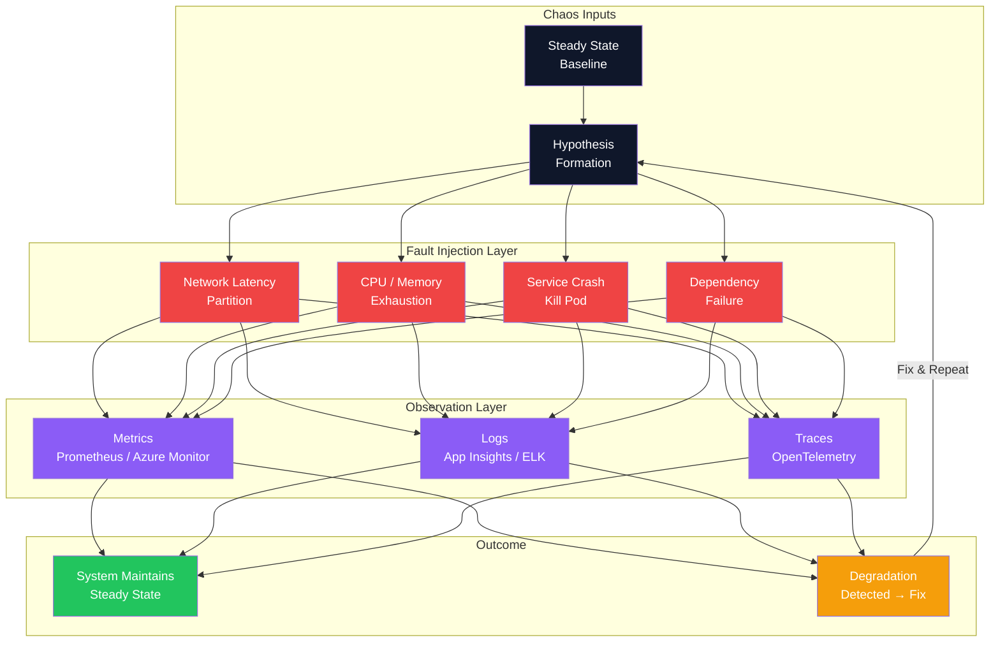

### Interview Talking Points

| Question | Answer |
|---|---|
| What is Chaos Engineering? | Proactively injecting controlled failures into production-like systems to discover resilience gaps before real incidents occur. |
| How does it differ from load testing? | Load testing measures performance under scale; chaos engineering tests structural resilience under failure scenarios like crashes, partitions, and dependency outages. |
| Why was Chaos Monkey invented? | Netflix needed confidence that their globally distributed system could survive hardware failures without human intervention at 3am. |
| What is the key cultural shift it drives? | From "our system is resilient" as an assumption to "our system is resilient" as a verified, continuously tested fact. |
| When is chaos engineering NOT appropriate? | Early-stage systems with no redundancy, systems without observability, or environments where blast radius cannot be controlled. |

---

## 2. The Core Methodology — Scientific Chaos Experiment

### Overview

A chaos experiment is not random destruction — it follows a rigorous scientific method with four phases: define steady state, form a hypothesis, inject a variable, and verify the outcome. This discipline prevents chaos experiments from causing unplanned outages and ensures every failure discovered has a traceable fix. The key differentiator from "just breaking things" is the pre-defined steady-state metric that objectively determines whether the system passed or failed.

### Experiment Lifecycle Flowchart

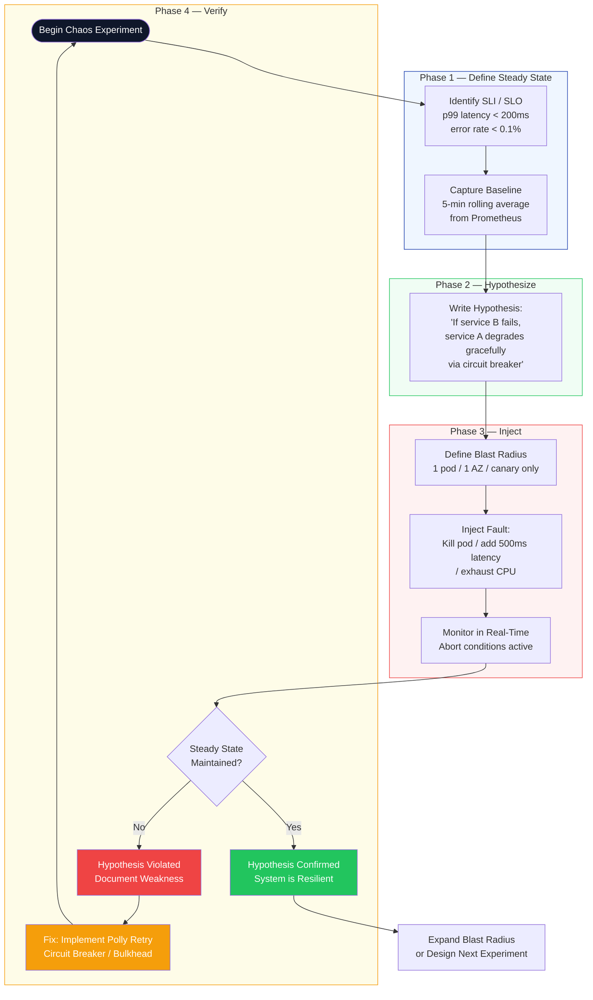

### Experiment Execution Sequence

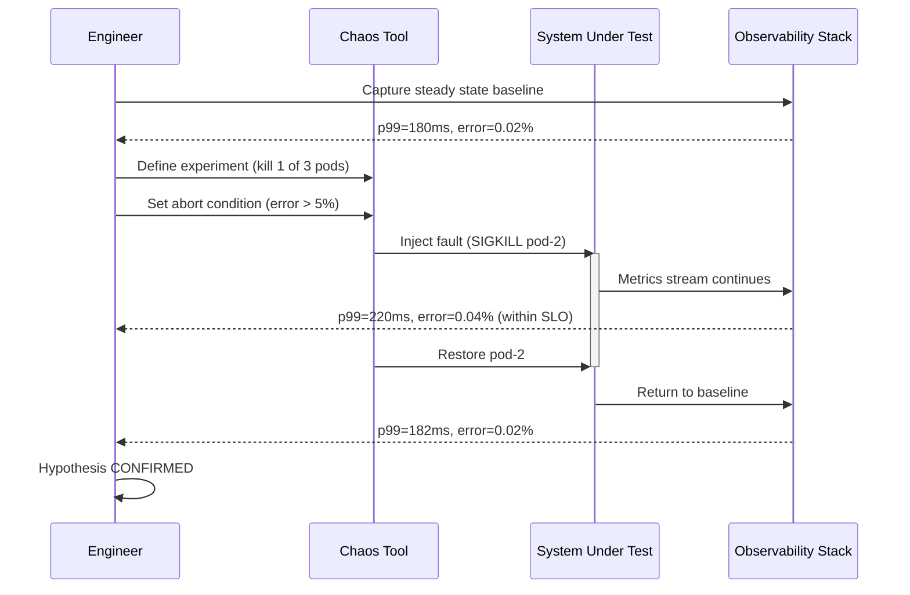

### Interview Talking Points

| Question | Answer |
|---|---|
| What is "steady state" in chaos engineering? | A measurable signal proving normal system behavior — e.g., p99 latency < 200ms, error rate < 0.1%, throughput > 1000 rps over a rolling window. |
| Why define steady state before injecting? | Without a baseline, you cannot detect degradation — you need a comparison point to determine if the system changed. |
| What is blast radius? | The scope of impact of a chaos experiment. Always start small (1 pod, canary) and expand only after each level passes. |
| How do you write a hypothesis? | "If [failure condition], then [expected system behavior] because [mechanism — e.g., circuit breaker, retry]." |
| What happens when a hypothesis fails? | A real weakness is discovered. Document it, implement a fix (Polly retry, circuit breaker, bulkhead), and re-run until the experiment passes. |
| How long should an experiment run? | Long enough for statistically significant data — typically 5–30 minutes, not instantaneous. |

---

## 3. Principles of Chaos Engineering

### Overview

The [Principles of Chaos Engineering](https://principlesofchaos.org/) define five core tenets that distinguish disciplined chaos engineering from reckless failure injection. The three most critical are: target real production traffic (not synthetic), automate experiments to run continuously, and always minimize blast radius. These principles ensure chaos experiments generate actionable signal without causing unnecessary user impact.

### Principles Architecture

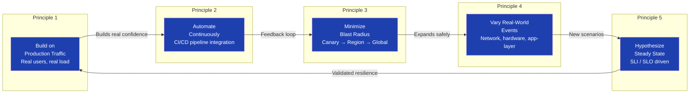

### Blast Radius Expansion Strategy

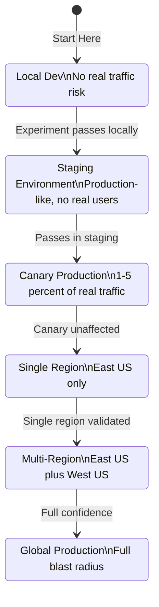

### Interview Talking Points

| Question | Answer |
|---|---|
| Why must chaos experiments use real production traffic? | Staging environments behave differently under real load; synthetic traffic misses CDN behavior, DB connection pool exhaustion, and cache warming effects. |
| What does "automate continuously" mean in practice? | Chaos experiments run automatically in CI/CD pipelines or on a schedule — not just once per quarter. Netflix ran Chaos Monkey daily. |
| How do you minimize blast radius? | Scope to 1 pod, then 1 AZ, then 1 region. Use feature flags or canary deployments to limit scope. Never start globally. |
| What is the difference between chaos engineering and fault injection? | Fault injection is a technique; chaos engineering is a discipline with hypotheses, steady-state definitions, and continuous automation. |
| How do you get organizational buy-in? | Run a GameDay in non-production. Show the team what their system does under failure — things they assumed worked often do not. |

---

## 4. Fault Injection Categories

### Overview

Real-world failures cluster into four categories: infrastructure failures (hardware, VMs, pods), network failures (latency, packet loss, partitions), application failures (crashes, memory leaks, slow dependencies), and data failures (corruption, inconsistency). A mature chaos engineering program targets all four systematically, ensuring no failure class is left untested.

### Fault Taxonomy Diagram

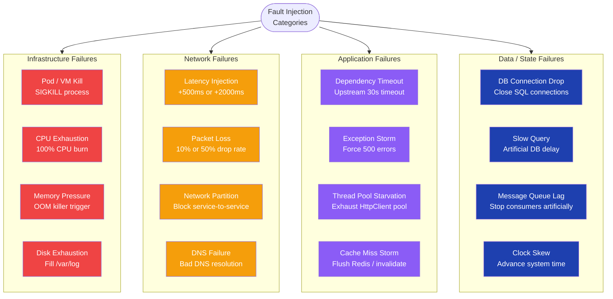

### Thread Pool Starvation — The Silent Killer

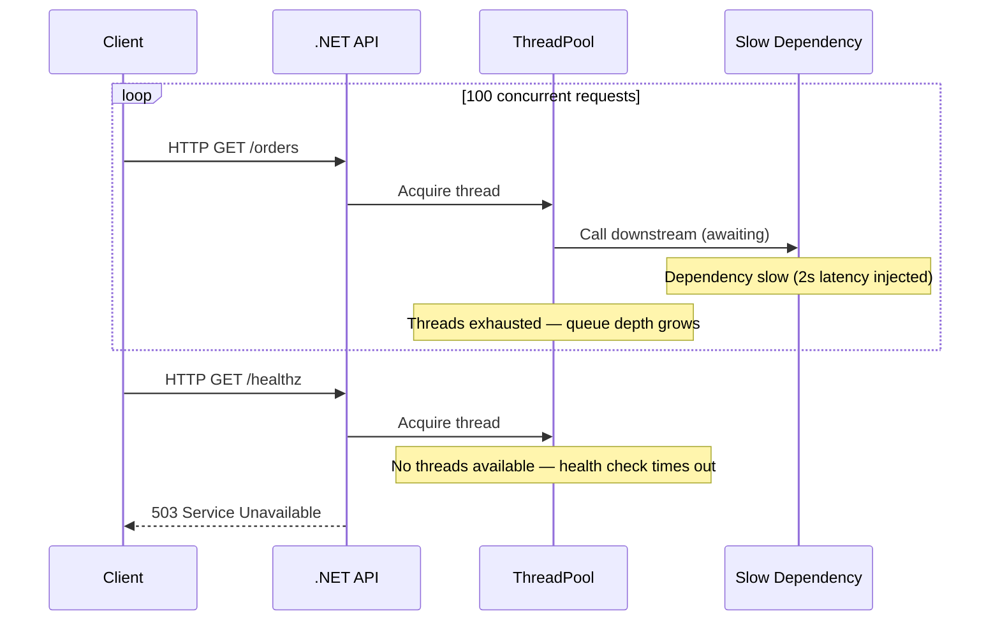

### Interview Talking Points

| Question | Answer |
|---|---|
| What types of faults should chaos experiments cover? | Infrastructure (CPU/memory/disk), network (latency/partition/packet loss), application (exceptions/timeouts), and data (DB drops, cache misses, clock skew). |
| Why is network latency more dangerous than a service crash? | A crash triggers circuit breakers immediately; latency causes thread pool starvation as requests pile up waiting, producing cascading failures. |
| What is a "clock skew" fault? | Advancing or skewing system time to test time-sensitive logic: JWT expiry, cache TTL, distributed lock timeouts, and scheduled job windows. |
| Which fault is hardest to detect? | Memory leaks and thread pool starvation — they are gradual and only manifest under sustained load, making them hard to reproduce in short experiments. |
| How do you test DB failover? | Inject a DB connection drop or kill the primary, then verify the system fails over to the replica within the expected RTO. |

---

## 5. Chaos Engineering Tools

### Overview

Three major tools dominate the chaos engineering landscape: Chaos Mesh (Kubernetes-native, CNCF graduated), Gremlin (commercial SaaS with pre-built attack scenarios), and LitmusChaos (open-source, Kubernetes-focused, ChaosCenter UI). Azure-native workloads additionally use Azure Chaos Studio, which targets ARM resources directly. Tool selection depends on environment: Kubernetes shops default to Chaos Mesh or LitmusChaos; teams needing enterprise pre-built scenarios use Gremlin; Azure-native teams use Azure Chaos Studio.

### Tool Comparison Diagram

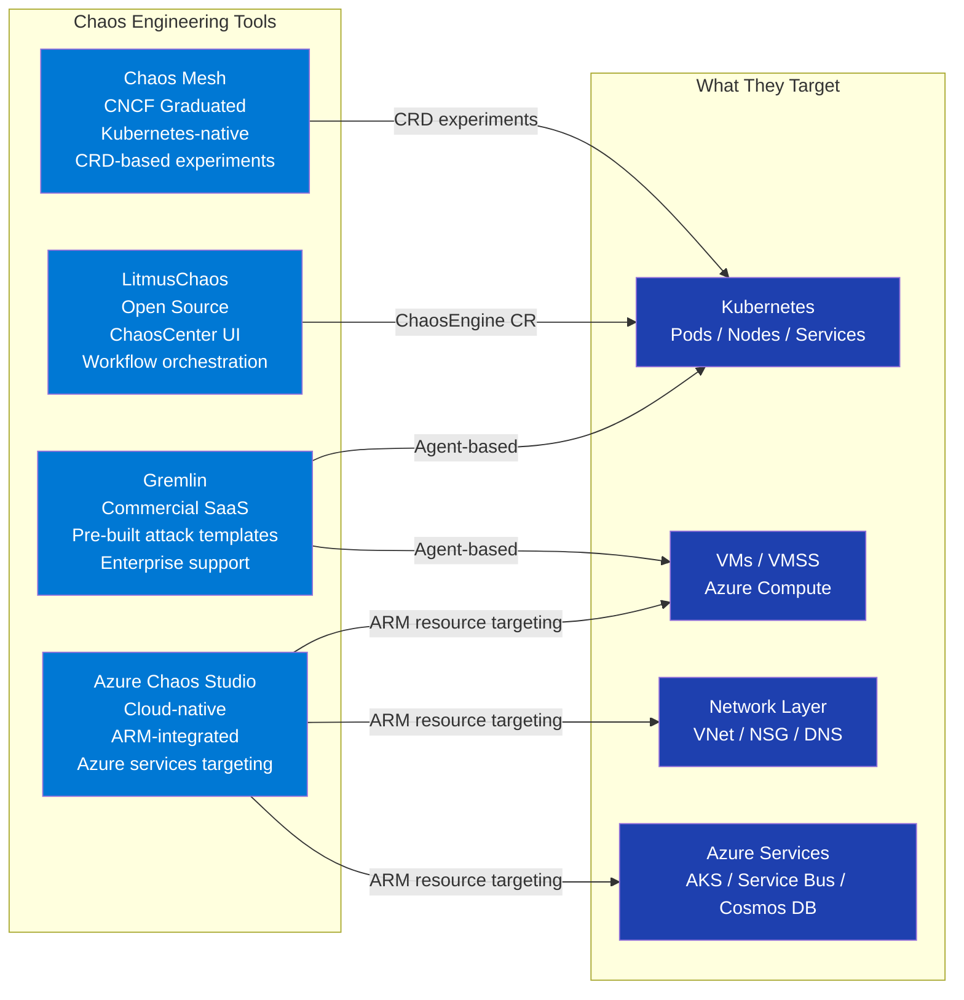

### Azure Chaos Studio — .NET Integration

**Tech Stack:** Azure Chaos Studio, Azure SDK for .NET, Azure Resource Manager, DefaultAzureCredential

```csharp
using Azure.Identity;
using Azure.ResourceManager;
using Azure.ResourceManager.Chaos;

public class ChaosExperimentOrchestrator
{
    private readonly ArmClient _armClient;
    private readonly ILogger<ChaosExperimentOrchestrator> _logger;

    public ChaosExperimentOrchestrator(ILogger<ChaosExperimentOrchestrator> logger)
    {
        _armClient = new ArmClient(new DefaultAzureCredential());
        _logger = logger;
    }

    public async Task StartExperimentAsync(
        string subscriptionId,
        string resourceGroupName,
        string experimentName,
        CancellationToken ct = default)
    {
        var resourceGroupId = ResourceGroupResource.CreateResourceIdentifier(
            subscriptionId, resourceGroupName);

        var resourceGroup = _armClient.GetResourceGroupResource(resourceGroupId);
        var experiments = resourceGroup.GetChaosExperiments();
        var experiment = await experiments.GetAsync(experimentName, ct);

        await experiment.Value.StartAsync(Azure.WaitUntil.Started, ct);
        _logger.LogInformation("Chaos experiment {ExperimentName} started", experimentName);
    }
}
```

### Chaos Mesh — Network Fault Targeting .NET Service

**Tech Stack:** Chaos Mesh, Kubernetes CRD, YAML

```yaml
# NetworkChaos — inject 500ms latency to the .NET Order API
apiVersion: chaos-mesh.org/v1alpha1
kind: NetworkChaos
metadata:
  name: order-api-latency-test
  namespace: production
spec:
  action: delay
  mode: one                         # Target 1 random pod
  selector:
    namespaces:
      - production
    labelSelectors:
      app: "order-api"
  delay:
    latency: "500ms"
    correlation: "25"
    jitter: "50ms"
  duration: "10m"
  direction: to
```

### LitmusChaos — Pod Delete on .NET Deployment

```yaml
# ChaosEngine — pod-delete experiment on .NET Order API
apiVersion: litmuschaos.io/v1alpha1
kind: ChaosEngine
metadata:
  name: order-api-pod-delete
  namespace: production
spec:
  appinfo:
    appns: production
    applabel: "app=order-api"
    appkind: deployment
  engineState: active
  experiments:
    - name: pod-delete
      spec:
        components:
          env:
            - name: TOTAL_CHAOS_DURATION
              value: "30"           # 30 seconds total
            - name: CHAOS_INTERVAL
              value: "10"           # Kill pod every 10s
            - name: FORCE
              value: "false"        # Graceful SIGTERM
```

### Interview Talking Points

| Question | Answer |
|---|---|
| What is Chaos Mesh? | A CNCF-graduated, Kubernetes-native chaos platform using Custom Resource Definitions to define and schedule fault injection experiments declaratively. |
| When would you choose Gremlin over Chaos Mesh? | Gremlin is preferred when you need enterprise support, pre-built scenario libraries, or chaos targeting bare-metal/VM environments outside Kubernetes. |
| What is LitmusChaos ChaosCenter? | A web UI and API server providing workflow orchestration for multi-step chaos scenarios, result dashboards, and experiment scheduling with a GitOps approach. |
| What is Azure Chaos Studio? | Microsoft's managed chaos engineering service targeting Azure ARM resources (AKS pods, VMs, Service Bus, Cosmos DB) with built-in Azure Monitor integration. |
| How do chaos tools enforce blast radius limits? | Via selectors (namespace, label, pod percentage), duration caps, and abort conditions that halt the experiment if SLO breach thresholds are crossed. |
| What is a GameDay? | A planned event where engineers intentionally run chaos experiments in staging or production to test runbooks, incident response, and system behavior together. |

---

## 6. Implementing Chaos Engineering in .NET & Azure

### Overview

In .NET and Azure environments, chaos engineering integrates at three layers: application-level resilience patterns (Polly v8), infrastructure-level experiments (Azure Chaos Studio / Chaos Mesh), and pipeline-level automation (Azure DevOps chaos gates). The goal is a continuous feedback loop where resilience gaps are discovered automatically in CI/CD before reaching production, and production experiments run on a schedule with automatic rollback on SLO breach.

### .NET Resilience Pipeline Architecture

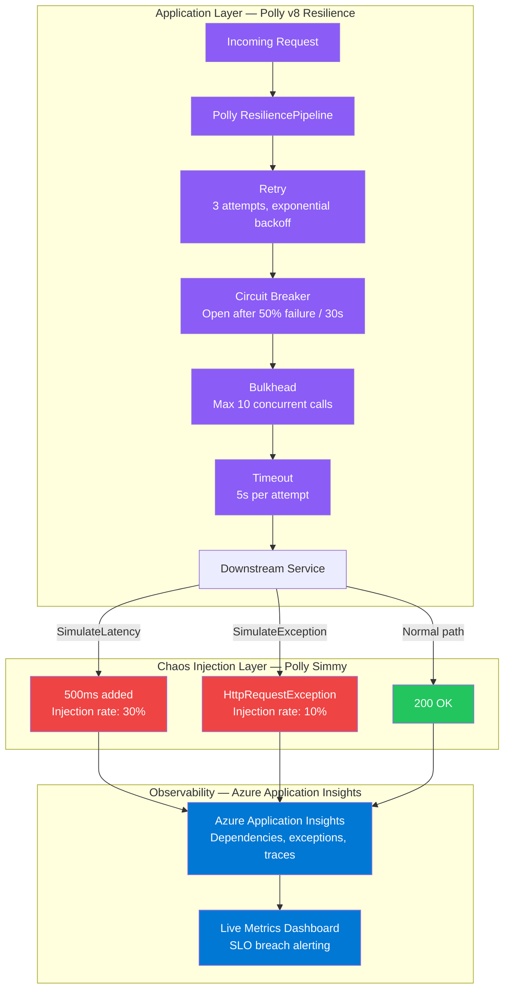

### Polly v8 Resilience Pipeline (.NET 8)

**Tech Stack:** Polly v8, Microsoft.Extensions.Http.Resilience, ASP.NET Core Minimal API

```csharp
// Program.cs — full resilience pipeline for chaos testing
using Microsoft.Extensions.Http.Resilience;
using Polly;

var builder = WebApplication.CreateBuilder(args);

builder.Services.AddHttpClient<IOrderServiceClient, OrderServiceClient>()
    .AddResilienceHandler("order-service-pipeline", pipeline =>
    {
        pipeline.AddRetry(new HttpRetryStrategyOptions
        {
            MaxRetryAttempts = 3,
            Delay = TimeSpan.FromSeconds(1),
            BackoffType = DelayBackoffType.Exponential,
            UseJitter = true,
            ShouldHandle = args => args.Outcome switch
            {
                { Exception: HttpRequestException } => PredicateResult.True(),
                { Result.StatusCode: HttpStatusCode.TooManyRequests } => PredicateResult.True(),
                { Result.StatusCode: >= HttpStatusCode.InternalServerError } => PredicateResult.True(),
                _ => PredicateResult.False()
            }
        });

        pipeline.AddCircuitBreaker(new HttpCircuitBreakerStrategyOptions
        {
            FailureRatio = 0.5,
            SamplingDuration = TimeSpan.FromSeconds(30),
            MinimumThroughput = 10,
            BreakDuration = TimeSpan.FromSeconds(15),
            OnOpened = args =>
            {
                logger.LogWarning("Circuit breaker OPENED for order-service at {Time}", DateTimeOffset.UtcNow);
                return ValueTask.CompletedTask;
            }
        });

        pipeline.AddTimeout(TimeSpan.FromSeconds(5));
    });
```

### In-Process Chaos with Polly Simmy (.NET 8)

**Tech Stack:** Polly.Simmy (Chaos strategies), IConfiguration, Feature flags

```csharp
// Polly v8 built-in chaos strategies — inject faults in dev/staging
using Polly.Simmy;
using Polly.Simmy.Latency;
using Polly.Simmy.Fault;

public static class ChaosExtensions
{
    public static IHttpClientBuilder AddChaosForTesting(
        this IHttpClientBuilder builder,
        IConfiguration config)
    {
        if (!config.GetValue<bool>("Chaos:Enabled")) return builder;

        return builder.AddResilienceHandler("chaos-layer", pipeline =>
        {
            // Inject 500ms latency on 30% of requests
            pipeline.AddChaosLatency(new ChaosLatencyStrategyOptions
            {
                EnabledGenerator = _ => ValueTask.FromResult(true),
                InjectionRateGenerator = _ => ValueTask.FromResult(0.30),
                Latency = TimeSpan.FromMilliseconds(500)
            });

            // Inject HttpRequestException on 10% of requests
            pipeline.AddChaosFault(new ChaosFaultStrategyOptions
            {
                EnabledGenerator = _ => ValueTask.FromResult(true),
                InjectionRateGenerator = _ => ValueTask.FromResult(0.10),
                FaultGenerator = new FaultGenerator()
                    .AddException<HttpRequestException>("Simmy: simulated network failure")
            });
        });
    }
}
```

```json
// appsettings.Development.json
{
  "Chaos": {
    "Enabled": true
  }
}
```

### Steady-State Health Check as SLO Gate (.NET)

**Tech Stack:** ASP.NET Core Health Checks, AspNetCore.HealthChecks.UI

```csharp
// Expose SLO metrics as a health check endpoint for chaos tools to poll
builder.Services.AddHealthChecks()
    .AddCheck<LatencySloHealthCheck>("latency-slo", tags: ["chaos-slo"])
    .AddCheck<ErrorRateSloHealthCheck>("error-rate-slo", tags: ["chaos-slo"])
    .AddSqlServer(
        builder.Configuration.GetConnectionString("Default")!,
        tags: ["chaos-slo", "dependencies"]);

app.MapHealthChecks("/healthz/chaos-slo", new HealthCheckOptions
{
    Predicate = check => check.Tags.Contains("chaos-slo"),
    ResponseWriter = UIResponseWriter.WriteHealthCheckUIResponse
});

public class LatencySloHealthCheck : IHealthCheck
{
    private readonly IMetricsCollector _metrics;

    public LatencySloHealthCheck(IMetricsCollector metrics) => _metrics = metrics;

    public async Task<HealthCheckResult> CheckHealthAsync(
        HealthCheckContext context,
        CancellationToken ct = default)
    {
        var p99 = await _metrics.GetP99LatencyAsync(ct);

        return p99 < TimeSpan.FromMilliseconds(200)
            ? HealthCheckResult.Healthy($"p99={p99.TotalMilliseconds}ms")
            : HealthCheckResult.Unhealthy($"SLO BREACH: p99={p99.TotalMilliseconds}ms > 200ms threshold");
    }
}
```

### Interview Talking Points

| Question | Answer |
|---|---|
| How do you implement chaos engineering in .NET microservices? | Three layers: Polly for application-level resilience, Chaos Mesh or Azure Chaos Studio for infrastructure faults, and CI/CD chaos gates polling `/healthz/chaos-slo` to fail a deployment on SLO breach. |
| What is Polly Simmy? | Polly's built-in chaos engineering extension (ChaosStrategy in Polly v8) for injecting latency, exceptions, and custom outcomes into HTTP pipelines with configurable injection rates. |
| How do you integrate chaos experiments into Azure DevOps? | Add an Azure Chaos Studio pipeline task — inject fault, wait for experiment duration, poll `/healthz/chaos-slo`, and fail the release gate if Unhealthy is returned. |
| What observability is required before running chaos experiments? | Full stack: distributed tracing (OpenTelemetry), metrics (Prometheus or Azure Monitor), and structured logs (Application Insights). Without observability, chaos experiments are blind. |
| How do you protect real users during production experiments? | Limit blast radius to canary pods, run during low-traffic windows, set abort conditions (error > 1% → auto-stop), and use feature flags to target only internal/synthetic traffic first. |

---

## 7. Observability & Metrics During Chaos

### Overview

Observability is the prerequisite for chaos engineering — without it, you cannot define steady state, detect degradation, or verify recovery. The three pillars (metrics, logs, traces) must all be in place before running any experiment. In .NET and Azure, this means OpenTelemetry for traces and metrics, Prometheus or Azure Monitor as the backend, and Application Insights or ELK for structured logs. Chaos tools poll the observability stack as their abort condition.

### Observability Stack Architecture

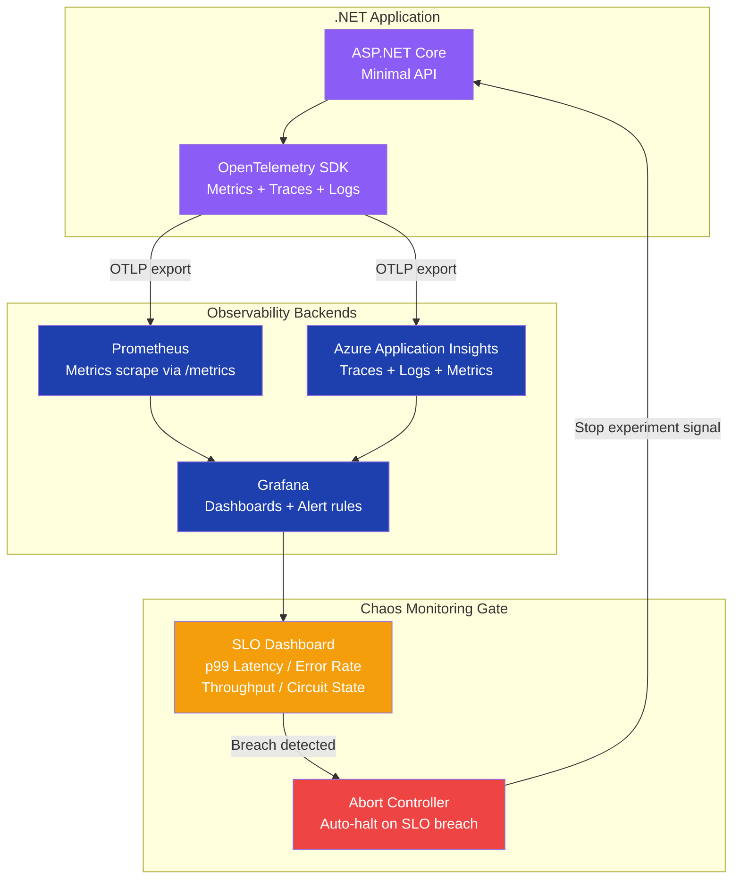

### OpenTelemetry Setup for Chaos Observability (.NET 8)

**Tech Stack:** OpenTelemetry .NET SDK, Prometheus exporter, OTLP exporter, Azure Monitor

```csharp
// Program.cs — full observability for chaos experiments
using OpenTelemetry.Resources;
using OpenTelemetry.Trace;
using OpenTelemetry.Metrics;

builder.Services.AddOpenTelemetry()
    .ConfigureResource(r => r.AddService("order-api", serviceVersion: "2.0.0"))
    .WithTracing(tracing => tracing
        .AddAspNetCoreInstrumentation()
        .AddHttpClientInstrumentation()
        .AddSqlClientInstrumentation()
        .AddOtlpExporter())
    .WithMetrics(metrics => metrics
        .AddAspNetCoreInstrumentation()
        .AddHttpClientInstrumentation()
        .AddRuntimeInstrumentation()   // GC, thread pool, memory pressure
        .AddPrometheusExporter());     // /metrics for Prometheus scrape

// Custom SLO histogram — the source of truth for chaos abort conditions
builder.Services.AddSingleton<RequestLatencyTracker>();

public class RequestLatencyTracker
{
    private readonly Histogram<double> _latencyHistogram;
    private readonly Counter<long> _errorCounter;

    public RequestLatencyTracker(IMeterFactory meterFactory)
    {
        var meter = meterFactory.Create("order-api");

        _latencyHistogram = meter.CreateHistogram<double>(
            "http.server.request.duration",
            unit: "ms",
            description: "Request duration for SLO tracking during chaos experiments");

        _errorCounter = meter.CreateCounter<long>(
            "http.server.error.count",
            description: "5xx error count for error-rate SLO tracking");
    }

    public void RecordRequest(double latencyMs, string endpoint, int statusCode)
    {
        _latencyHistogram.Record(latencyMs,
            new TagList
            {
                { "endpoint", endpoint },
                { "status_code", statusCode }
            });

        if (statusCode >= 500)
            _errorCounter.Add(1, new TagList { { "endpoint", endpoint } });
    }
}
```

### Interview Talking Points

| Question | Answer |
|---|---|
| What observability must be in place before running chaos experiments? | Metrics (p99 latency, error rate, throughput), distributed traces (request flows through all services), and structured logs with correlation IDs. |
| What is a "steady state indicator"? | A specific, measurable metric representing normal system behavior — e.g., "p99 latency < 200ms measured over a 5-minute rolling window from Prometheus." |
| How do you auto-halt a chaos experiment on SLO breach? | Configure the chaos tool's abort condition to poll `/healthz/chaos-slo`. If it returns Unhealthy, the tool automatically stops the experiment. |
| What runtime metrics are critical during chaos experiments? | Thread pool queue depth, GC Gen2 collection frequency, HTTP client connection pool exhaustion count, circuit breaker state transitions, and Polly retry attempt counts. |
| Why is distributed tracing critical for chaos experiments? | It lets you trace exactly which service call failed and which retry or circuit breaker fired — without it, you see only aggregate degradation, not the root cause path. |

---

## Cross-Cutting Themes

### Pattern Selection Guide

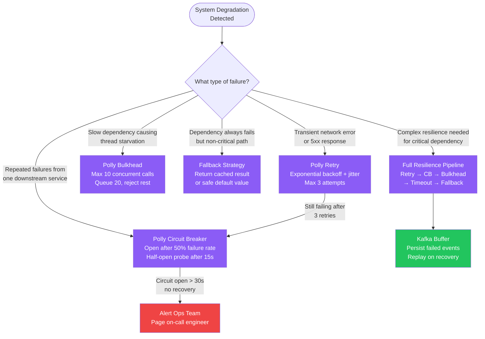

### Common Interview Red Flags to Avoid

| Red Flag | Why It's Wrong | Correct Answer |
|---|---|---|
| "We retry in a tight loop immediately" | Thundering herd — hammers a recovering service with all queued requests simultaneously | Exponential backoff with jitter: `Delay * (2^attempt) + random(0, 100ms)` via Polly |
| "We run chaos experiments only in staging" | Staging behaves differently — real load, CDN, DNS, and connection pool exhaustion only appear in production | Run in production at canary blast radius after staging validation passes |
| "Chaos engineering is just random failure injection" | Random failures without hypotheses provide no signal — you won't know what to fix or verify | Follow the scientific method: steady state → hypothesis → inject → verify |
| "We will add observability after chaos experiments" | Without metrics and traces, you cannot detect degradation or verify recovery | Full observability is a prerequisite, not an afterthought — chaos experiments are blind without it |
| "Our tests pass so we don't need chaos engineering" | Unit/integration tests cannot replicate network partitions, hardware failures, or cascading dependency timeouts | Tests verify correctness; chaos engineering verifies resilience under real failure conditions |
| "We run chaos experiments for 30 seconds" | Too short to collect statistically significant data or observe cascading effects like circuit breaker state transitions | Minimum 5–10 minutes; long enough for retry storms and circuit breakers to develop |
| "We start the experiment at full system scope" | Risk of widespread user impact before any confidence is established | Always: 1 pod → 1 AZ → 1 region → global. Expand only when each level passes |
| "Kubernetes env vars are safe for secrets" | Visible in pod spec, etcd, and `kubectl describe` — exposed to any cluster reader | Azure Key Vault with Managed Identity + CSI Secrets Store Driver; `DefaultAzureCredential` in .NET |

---

*Generated by ConceptToMD Agent v1.0 | Source: chaos-engg.txt | 2026-07-05*
