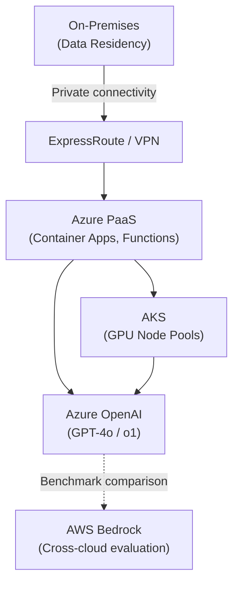
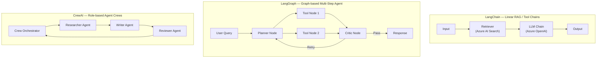
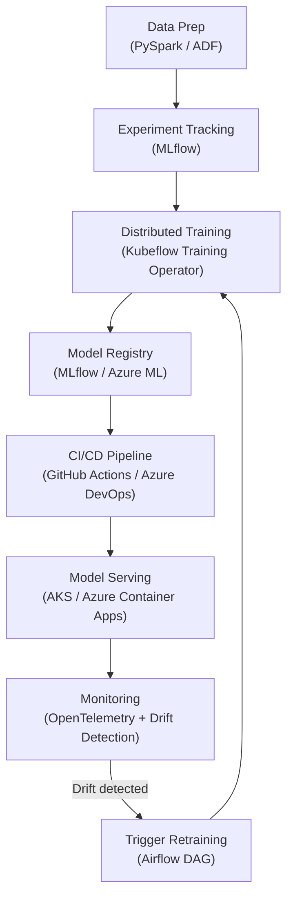
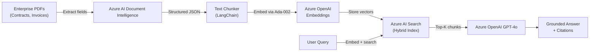
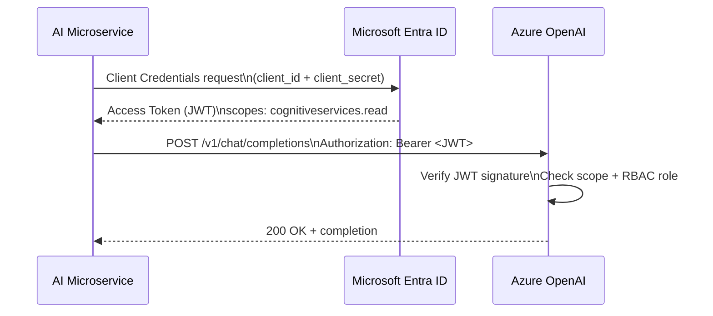
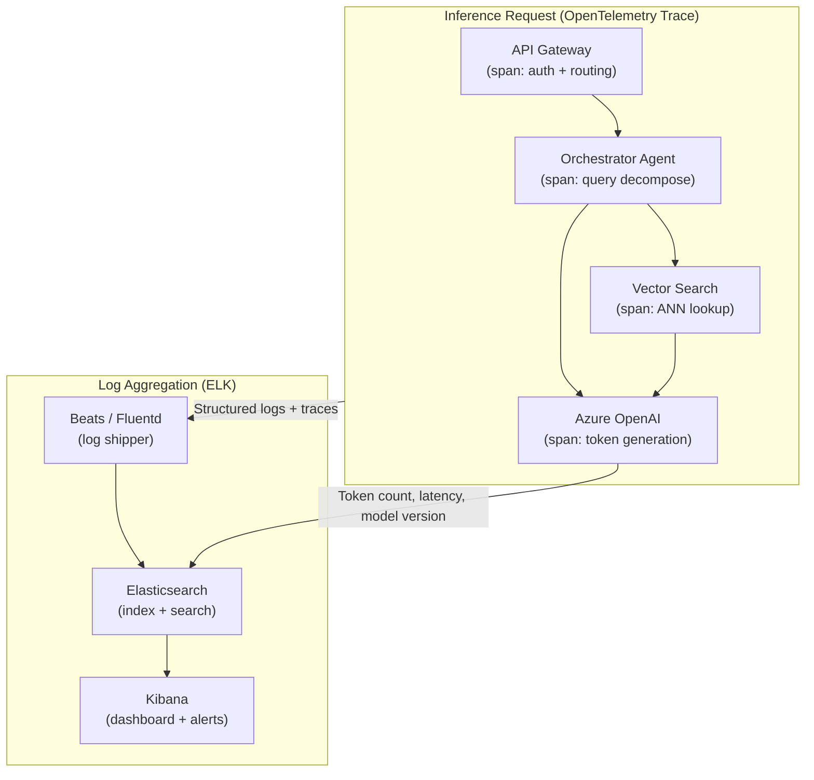
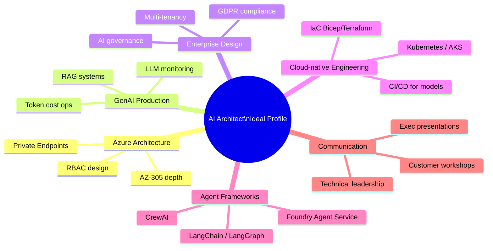

# AI Architect / Azure GenAI Architect - Job Description Analysis

## Table of Contents
1. Job Description 1
2. Job Description 2
3. Comparative Analysis
4. Combined Skill Matrix
5. Technical Skills Breakdown
6. Certifications
7. Experience Expectations
8. Interview Preparation Topics
9. Ideal Candidate Profile
10. Complete Technology Stack

# Job Description 1

## Role Description
Minimum of **5 years of experience on Azure** having technically guided, managed and governed engineering teams. Flexible to work in shifts.

### Primary Skills
- Strong communication and stakeholder management
- Architecture across on-premises, cloud and hybrid
- Deploy Generative AI models
- Fine-tune pretrained AI models
- AI data engineering and large-scale data processing
- Prompt Engineering
- Azure OpenAI
- Azure AI Document Intelligence (Form Recognizer)
- Azure AI Search (Cognitive Search)
- Vector Databases
- Customer upskilling sessions
- Python
- PySpark

### Secondary Skills
- MLOps
- LLMOps

### Certifications
**Mandatory**
- AZ-204 Azure Developer Associate

**Preferred**
- AZ-305 Azure Solutions Architect Expert
- AI-102 Azure AI Engineer
- DP-100 Azure Data Scientist
- Databricks Professional Certificate in LLMs

### Soft Skills
- Customer engagement
- Solution presentations
- Communication
- Problem solving
- Technical leadership

### Education
Minimum: BCA/MCA/BE/B.Tech or equivalent

Preferred: M.Tech/MS

Mandatory Skill: Azure Cloud Architecture

# Job Description 2

## Role Description
Highly experienced AI Architect to design and execute enterprise AI and GenAI systems. Work with AI Developers and MCP Developers to build secure, scalable, modular AI platforms supporting autonomous agents and intelligent automation.

### Responsibilities
- Enterprise AI architecture
- Multi-agent system design
- AI microservices
- Authentication & centralized logging
- ML/AI pipelines
- Enterprise integrations
- Security, observability & compliance
- Evaluate OpenAI, Azure OpenAI, Bedrock
- Customer workshops and architecture presentations

### Required Skills
- AWS/Azure Solution Architecture
- Microservices
- OAuth, JWT, API Keys
- ELK, OpenTelemetry
- LangChain
- LangGraph
- CrewAI
- Vector databases
- MLflow
- Kubeflow
- Airflow
- Docker
- Kubernetes
- Enterprise integrations
- Customer communication

### Good to Have
- RAG
- Fine-tuning
- LLM serving
- AI Governance
- ServiceNow
- SharePoint
- Product strategy

Mandatory Skill: AI / GenAI Research

# Comparative Analysis

| Area | JD1 | JD2 |
|---|:---:|:---:|
| Azure Architecture | ✅ | ✅ |
| AI Architecture | ✅ | ✅ |
| Azure OpenAI | ✅ | ✅ |
| Prompt Engineering | ✅ | ✅ |
| Python | ✅ | ✅ |
| MLOps | ✅ | ✅ |
| LLMOps | ✅ | ✅ |
| Fine-Tuning | ✅ | ✅ |
| Vector Databases | ✅ | ✅ |
| Docker/Kubernetes | ❌ | ✅ |
| LangChain/LangGraph/CrewAI | ❌ | ✅ |
| OAuth/JWT | ❌ | ✅ |

# Combined Skill Matrix

| Skill | Priority |
|---|---|
| Azure Cloud Architecture | ⭐⭐⭐⭐⭐ |
| AI Solution Architecture | ⭐⭐⭐⭐⭐ |
| Azure OpenAI / OpenAI | ⭐⭐⭐⭐⭐ |
| Generative AI & LLMs | ⭐⭐⭐⭐⭐ |
| Prompt Engineering | ⭐⭐⭐⭐⭐ |
| Python | ⭐⭐⭐⭐⭐ |
| MLOps / LLMOps | ⭐⭐⭐⭐ |
| AI Pipelines | ⭐⭐⭐⭐ |
| Fine-Tuning | ⭐⭐⭐⭐ |
| Vector Databases | ⭐⭐⭐⭐ |
| Enterprise Architecture | ⭐⭐⭐⭐ |
| Microservices | ⭐⭐⭐⭐ |
| Docker & Kubernetes | ⭐⭐⭐⭐ |
| LangChain / LangGraph | ⭐⭐⭐⭐ |
| CrewAI | ⭐⭐⭐ |
| RAG | ⭐⭐⭐ |
| OAuth / JWT | ⭐⭐⭐ |
| ELK / OpenTelemetry | ⭐⭐⭐ |
| MLflow / Kubeflow / Airflow | ⭐⭐⭐ |
| Azure AI Search | ⭐⭐⭐ |
| Azure AI Document Intelligence | ⭐⭐⭐ |
| PySpark | ⭐⭐⭐ |

# Technical Skills Breakdown

## Cloud

Azure architecture is the foundation skill across both JDs. Azure OpenAI exposes GPT-4, GPT-4o, and o1 models through a managed REST endpoint with RBAC, private endpoints, and content filtering — unlike the public OpenAI API it adds enterprise governance controls. Azure PaaS services (App Service, Functions, Container Apps) host AI workloads without managing VMs. Hybrid Cloud patterns bridge on-premises data stores to Azure AI services via ExpressRoute or VPN, required when data residency regulations prevent full cloud migration. AWS is listed in JD2 primarily for cross-cloud evaluation — knowing Bedrock vs Azure OpenAI trade-offs is expected. Docker packages inference workloads into immutable containers; Kubernetes orchestrates them at scale with autoscaling, rolling updates, and GPU node pools.

| Service | Primary Role | Differentiator |
|---|---|---|
| Azure OpenAI | Managed LLM endpoint | Enterprise RBAC + content filters |
| Azure Container Apps | Serverless container hosting | Scale-to-zero, KEDA-based autoscaling |
| Azure Kubernetes Service | Managed K8s cluster | GPU node pools for inference workloads |
| AWS Bedrock | Managed foundation models on AWS | Cross-cloud benchmark for model evaluation |
| Docker | Container packaging | Reproducible inference environments |
| Hybrid Cloud (ExpressRoute) | On-premises to Azure connectivity | Data residency compliance |



> **Interview tip:** "When asked about Azure vs AWS for AI workloads, frame the answer around governance: Azure OpenAI adds enterprise RBAC, private endpoints, and content filters that the public OpenAI API lacks — that's why regulated enterprises prefer it. Then contrast with Bedrock's model catalogue breadth."

---

## AI & GenAI

This cluster covers the full generative AI stack from model interaction to autonomous execution.

**LLMs (Large Language Models):** Transformer-based models with billions of parameters trained on internet-scale text. Key concepts: context window (token limit), temperature (sampling randomness), top-p (nucleus sampling), and system prompts that set model persona and constraints.

**Prompt Engineering:** Crafting input instructions to reliably elicit desired model outputs. Includes zero-shot (no examples), few-shot (2–5 examples), chain-of-thought (step-by-step reasoning), and system prompt design. Critical for cost control — a well-engineered prompt can eliminate fine-tuning in many cases.

**Fine-Tuning:** Adapting a pre-trained base model on domain-specific data to shift its default behavior. Techniques include full fine-tuning (all weights), LoRA (low-rank adaptation of specific weight matrices), and QLoRA (quantized LoRA for reduced GPU memory). Used when prompt engineering alone cannot achieve the required output consistency.

**RAG (Retrieval-Augmented Generation):** Injecting external knowledge into the LLM context at inference time rather than baking it into weights. Avoids retraining costs, enables real-time knowledge updates, and provides source citations. Core components: chunker → embedder → vector store → retriever → generator.

**AI Agents:** LLM-based systems that perceive state, reason over a goal, select tools, and act in a loop (ReAct pattern). Differ from simple chatbots because they take actions with real-world side effects (API calls, code execution, database writes).

**Multi-Agent Systems:** Architectures where specialized agents collaborate — a planner agent decomposes tasks, worker agents execute sub-tasks, a critic agent validates outputs. Frameworks: LangGraph (graph-based state machine), CrewAI (role-based crews), Foundry Agent Service (Azure-native codeless orchestration).

**AI Pipelines:** End-to-end orchestrated workflows from data ingestion through model inference to result delivery. In Azure: Airflow/Kubeflow for batch training pipelines; Azure AI Foundry for inference pipelines.

| Pattern | When to Use | Framework |
|---|---|---|
| Prompt Engineering | Output format control, cost reduction | Azure OpenAI SDK |
| RAG | Real-time knowledge, citation required | LangChain + Azure AI Search |
| Fine-Tuning | Domain-specific tone/terminology | Azure AI Studio fine-tune job |
| Single Agent | Tool-using tasks (search, code, APIs) | LangChain, Foundry Agent Service |
| Multi-Agent | Decomposable complex tasks | LangGraph, CrewAI |
| AI Pipeline | Batch inference, model training | Kubeflow, Airflow |

> **Interview tip:** "Interviewers at AI Architect level expect you to distinguish when to use prompt engineering vs fine-tuning vs RAG. The default answer is: prompt engineer first, add RAG for dynamic knowledge, fine-tune only when neither achieves the required output consistency — because fine-tuning is expensive to maintain."

---

## Frameworks

LangChain, LangGraph, and CrewAI are the three dominant open-source orchestration frameworks for building LLM applications.

**LangChain:** A composable framework for chaining LLM calls with tools (search, code, APIs) and memory. Core abstractions: `Chain`, `Agent`, `Tool`, `Memory`, `Retriever`. Best for RAG pipelines, simple tool-using agents, and LLM-powered data processing. The most widely deployed framework — most enterprise RAG production code uses it.

**LangGraph:** An extension of LangChain that models agent workflows as directed graphs (nodes = steps, edges = transitions). Enables complex conditional branching, parallel execution, and persistent state across turns using a checkpointer. Best for multi-agent coordination where the flow is not linear — e.g., planner → workers → critic → retry loops.

**CrewAI:** A framework for defining teams of role-based AI agents ("crews") where each agent has a defined role, goal, and set of tools. Agents collaborate on shared tasks via a Crew orchestrator. Best for autonomous workflows that map naturally to human team structures — e.g., a researcher agent, a writer agent, a reviewer agent.



| Framework | Mental Model | State Management | Best For |
|---|---|---|---|
| LangChain | Pipeline / Chain | Stateless or in-memory | RAG, simple tool agents |
| LangGraph | Directed graph (state machine) | Persistent checkpointer | Complex multi-step agents |
| CrewAI | Role-based team | Task-scoped | Autonomous research/writing workflows |

> **Interview tip:** "When asked to choose a framework, name the decision criteria: LangChain for RAG and single-agent pipelines, LangGraph when you need cycles and persistent state in a multi-agent flow, CrewAI when the problem maps to distinct role-based agents with different expertise. Azure production systems often layer LangGraph over an Azure Foundry Agent Service backend."

---

## ML Engineering

MLflow, Kubeflow, Airflow, MLOps, and LLMOps form the engineering discipline that takes models from experiment to production and keeps them reliable.

**MLflow:** An open-source platform for ML lifecycle management — experiment tracking (log params, metrics, artifacts), model registry (version, stage transitions: Staging → Production), and model serving. The standard tool for tracking fine-tuning experiments and comparing model versions. Integrated into Azure ML and Databricks.

**Kubeflow:** A Kubernetes-native ML platform for building and running scalable ML pipelines. Kubeflow Pipelines provides a DAG-based workflow engine; Kubeflow Training Operator manages distributed training jobs (TF, PyTorch). Used when training workloads need to run on GPU clusters with dynamic resource allocation.

**Airflow:** A general-purpose workflow orchestration platform (DAGs of tasks). In ML context, Airflow schedules data pipelines, model retraining triggers, and evaluation jobs. Less ML-specific than Kubeflow but more flexible and more widely adopted in data engineering teams.

**MLOps:** The operational practice of automating the ML lifecycle — CI/CD for model code, automated retraining on data drift, A/B testing of model versions, monitoring inference quality, and rollback procedures. Applies DevOps principles (automation, reproducibility, observability) to ML systems.

**LLMOps:** The extension of MLOps specifically for LLM-based applications. Additional concerns: prompt versioning, RAG pipeline evaluation, hallucination monitoring, token cost tracking, model provider failover (e.g., Azure OpenAI → fallback endpoint), and prompt injection defense. Prompt versioning is the new model versioning.



| Tool | Layer | Primary Output |
|---|---|---|
| MLflow | Experiment & Registry | Tracked runs, versioned model artifacts |
| Kubeflow | Training & Pipelines | Scalable distributed training jobs |
| Airflow | Scheduling & Orchestration | Triggered DAGs for pipelines and retraining |
| Azure DevOps / GitHub Actions | CI/CD | Automated deployment pipelines |
| OpenTelemetry | Monitoring | Traces and metrics for inference quality |

> **Interview tip:** "MLOps vs LLMOps is a common probe question. Emphasize that LLMOps adds prompt versioning, RAG evaluation (groundedness/coherence scores), and LLM-specific drift detection (semantic drift vs statistical drift) on top of classical MLOps. Mention that in Azure, Azure AI Foundry Evaluations handles the LLM-specific eval layer while MLflow handles model lineage."

---

## Data

Vector Databases, Azure AI Search, Azure AI Document Intelligence, and PySpark are the data layer of enterprise AI systems.

**Vector Databases:** Specialized storage systems optimized for high-dimensional embedding vectors and approximate nearest-neighbor (ANN) search. Store each document chunk as a dense vector (e.g., 1536 dimensions for `text-embedding-ada-002`). Support similarity search (`cosine`, `dot product`, `euclidean`). Key products: Pinecone, Weaviate, Qdrant, pgvector (PostgreSQL extension), Azure AI Search (hybrid).

**Azure AI Search (formerly Cognitive Search):** Microsoft's managed search service that combines traditional keyword search (BM25) with vector search and semantic reranking. Supports hybrid retrieval (keyword + vector in a single query) and integrates natively with Azure OpenAI for vectorization at index time. The recommended vector store for Azure-based RAG systems.

**Azure AI Document Intelligence (formerly Form Recognizer):** A managed service for extracting structured data from unstructured documents — PDFs, images, invoices, contracts. Uses pre-built models (invoice, receipt, ID) or custom trained models. Outputs structured JSON with field/value pairs and bounding boxes. Critical first step in enterprise RAG pipelines where source data lives in PDFs.

**PySpark:** Python API for Apache Spark — distributed data processing at scale. Used for large-scale data preparation, feature engineering, embedding generation over millions of documents, and data pipeline construction. Required when dataset size exceeds single-machine memory limits. Azure: runs on Azure Databricks or Azure HDInsight.

| Tool | Data Type | Scale | Primary AI Use Case |
|---|---|---|---|
| Azure AI Search | Text + Vectors | Millions of documents | Hybrid RAG retrieval |
| Pinecone / Qdrant | Vectors only | Billions of vectors | High-throughput ANN search |
| pgvector | Vectors in PostgreSQL | Moderate | Integrated vector + relational queries |
| Azure AI Document Intelligence | PDFs / Images | Per-document | Structured extraction for RAG ingestion |
| PySpark / Databricks | Structured + Unstructured | Petabyte-scale | Batch preprocessing, embedding generation |



> **Interview tip:** "When discussing vector databases in an Azure context, lead with Azure AI Search as the default choice because it provides hybrid retrieval (keyword + vector) in a single service — eliminating the need for a separate vector DB and a separate keyword search engine. Mention pgvector if the system already has PostgreSQL, and Pinecone/Qdrant only for workloads requiring billion-scale ANN at sub-millisecond latency."

---

## Security

OAuth 2.0, JWT, API Keys, and IAM are the four pillars of enterprise AI API security.

**OAuth 2.0:** An authorization framework (not authentication) that allows one service to act on behalf of a user or service without sharing credentials. The Authorization Code flow is used for user-facing apps; the Client Credentials flow is used for service-to-service (machine-to-machine) authentication — which is the primary pattern in AI microservices. Azure: Microsoft Entra ID (formerly Azure AD) is the OAuth 2.0 Authorization Server.

**JWT (JSON Web Token):** A compact, URL-safe token format for transmitting signed claims. Structure: `Header.Payload.Signature` (base64url encoded). The signature is verified by the receiving service using the issuer's public key — making JWTs stateless (no server-side session lookup needed). Used as the Bearer token in `Authorization: Bearer <jwt>` headers. Claims include `sub` (subject), `aud` (audience), `exp` (expiry), `roles`, and `scopes`.

**API Keys:** Static shared secrets sent in request headers (`X-API-Key`) or query parameters. Simpler than OAuth/JWT but offer no user identity — only service-level access control. Appropriate for server-to-server calls in low-risk contexts. Best practice: rotate regularly, store in Azure Key Vault, never hardcode.

**IAM (Identity and Access Management):** The policy layer that maps identities (users, service principals, managed identities) to permissions (RBAC roles) on Azure resources. For AI systems: use Managed Identity (not API keys) for service-to-service auth — the identity is bound to the compute resource (AKS pod, Container App) and auto-rotates credentials.



| Auth Method | Identity | Rotation | Best For |
|---|---|---|---|
| Managed Identity | Azure resource identity | Automatic | AKS pods → Azure OpenAI (no secrets) |
| OAuth 2.0 Client Credentials | Service principal | Manual / automated | Service-to-service cross-tenant |
| JWT Bearer Token | User or service | Expiry-based | User-facing API gateway auth |
| API Key | Anonymous service | Manual | Low-risk server-to-server, prototyping |

> **Interview tip:** "When asked about securing AI APIs, the senior answer is: 'Eliminate API keys from production — use Managed Identity for Azure service-to-service calls, which automatically handles credential rotation and removes the secret management burden. API keys belong in development environments only.' This signals you understand the operational security risk of static secrets at scale."

---

## Observability

ELK Stack and OpenTelemetry are the two observability pillars for AI systems — one for log aggregation, the other for distributed traces and metrics.

**ELK Stack (Elasticsearch, Logstash, Kibana):** A log aggregation and search platform. Logstash ingests and parses logs from multiple sources; Elasticsearch indexes them for full-text search; Kibana provides dashboards and alerting. In AI systems, ELK captures inference request/response logs, latency metrics, error rates, and prompt/completion pairs for debugging. The "ELK" acronym is also used for the Elastic Stack (which replaced Logstash with Beats/Fluentd for lighter ingestion).

**OpenTelemetry:** A CNCF-standard observability framework providing a vendor-neutral API and SDK for collecting **traces** (distributed request flows), **metrics** (counters, histograms), and **logs** (structured events). For AI systems, OpenTelemetry traces the full request path from API gateway → orchestrator → vector search → LLM call → response, making latency bottlenecks visible. Exporters send data to Azure Monitor, Grafana, Jaeger, or Datadog.



| Tool | Signal Type | Primary Use | Azure Integration |
|---|---|---|---|
| OpenTelemetry SDK | Traces + Metrics | Distributed latency profiling | Azure Monitor (OTLP exporter) |
| Elasticsearch | Logs | Full-text log search | Azure Marketplace or self-hosted |
| Kibana | Logs | Dashboards, alerting | Pairs with Elasticsearch |
| Azure Monitor | Metrics + Logs + Traces | Native Azure observability | Built-in with Application Insights |

> **Interview tip:** "When discussing AI system observability, go beyond 'we use ELK for logs.' Mention OpenTelemetry as the vendor-neutral standard for traces so you're not locked into a single backend. Then name the AI-specific signals to monitor: token cost per request, groundedness score trend, LLM latency p99, and prompt injection detection rate — these are the metrics that distinguish AI system observability from general application observability."

---

## Programming

Python is the primary language for AI systems engineering; PySpark extends Python to distributed data processing at scale.

**Python:** The dominant language across all AI/ML workloads. Key libraries for AI Architect work: `langchain` / `langgraph` (LLM orchestration), `azure-ai-projects` / `openai` (Azure OpenAI SDK), `azure-search-documents` (vector search), `mlflow` (experiment tracking), `fastapi` (API serving), `pydantic` (data validation), `pytest` (testing). Python's GIL makes it single-threaded for CPU-bound work — inference services use async (`asyncio`) or multi-process patterns for concurrency.

**PySpark:** Python API for Apache Spark, used when data processing exceeds single-machine capacity. Core primitives: `DataFrame` (distributed tabular data), `RDD` (resilient distributed dataset), transformations (`filter`, `groupBy`, `join`) that execute lazily on a cluster. In AI pipelines: used for large-scale document preprocessing, chunking millions of PDFs, generating embeddings in batch, and feature engineering for ML models. Runs on Azure Databricks or Azure HDInsight.

```python
# PySpark — Batch embedding generation for RAG index population
from pyspark.sql import SparkSession
from pyspark.sql.functions import udf, col
from pyspark.sql.types import ArrayType, FloatType
import openai

spark = SparkSession.builder.appName("EmbeddingPipeline").getOrCreate()

# Load chunked documents from Delta Lake
df = spark.read.format("delta").load("/mnt/datalake/chunks")

# UDF to generate embeddings via Azure OpenAI
@udf(returnType=ArrayType(FloatType()))
def embed_text(text: str):
    client = openai.AzureOpenAI(...)
    response = client.embeddings.create(model="text-embedding-ada-002", input=text)
    return response.data[0].embedding

# Apply embedding UDF and write to vector store
df_with_embeddings = df.withColumn("embedding", embed_text(col("chunk_text")))
df_with_embeddings.write.format("delta").save("/mnt/datalake/embeddings")
```

| Language | Role | Key Libraries |
|---|---|---|
| Python | LLM apps, agents, APIs, ML training | `openai`, `langchain`, `mlflow`, `fastapi` |
| PySpark | Distributed data processing | `pyspark.sql`, `pyspark.ml`, Delta Lake |

> **Interview tip:** "When discussing Python for AI systems, mention async patterns explicitly — FastAPI with `asyncio` allows a single Python process to handle hundreds of concurrent LLM calls without threading overhead. This is the correct architecture for high-throughput inference endpoints, not multi-threading which runs into the GIL."

# Certifications

Certifications serve two purposes in AI Architect roles: they signal Azure depth to hiring managers and they structure study toward the exact knowledge domains tested in interviews.

## Mandatory

**AZ-204 — Azure Developer Associate:** Validates hands-on ability to build and deploy Azure solutions — App Service, Functions, Container Apps, Key Vault, Azure Storage, Service Bus, and Cosmos DB. AI Architects need AZ-204 depth because AI services are deployed and integrated using these foundational PaaS services. Exam domains include: Azure compute solutions (25–30%), storage (10–15%), security (15–20%), monitoring (10–15%), and Azure Queues/Event Hubs for pipeline eventing.

> **Interview tip:** "Mention AZ-204 in the context of production deployment patterns: 'I use Azure Container Apps for serverless LLM inference endpoints, Key Vault for API key management, and Service Bus for async pipeline decoupling — all AZ-204 domains that come up directly in AI system design.'"

## Preferred

**AZ-305 — Azure Solutions Architect Expert:** The senior-level architecture certification. Covers identity (Entra ID), networking (VNet, Private Endpoints), governance (Policy, Management Groups), compute architecture, and data storage design. Critical for AI Architect roles because it validates ability to design the enterprise infrastructure layer that AI services sit on — private endpoint topology for Azure OpenAI, RBAC design, and cost governance.

**AI-102 — Azure AI Engineer:** The certification that directly maps to this role. Covers Azure AI Services (OpenAI, Document Intelligence, AI Search, Vision, Language), responsible AI, AI solution deployment, and Azure Machine Learning. Exam domains: AI infrastructure planning (15–20%), computer vision (15–20%), NLP (30–35%), knowledge mining (15–20%).

**DP-100 — Azure Data Scientist:** Validates Azure Machine Learning platform depth — experiment tracking, AutoML, MLOps pipelines, model deployment, and monitoring. Relevant for AI Architects who own the MLOps/LLMOps dimension.

**Databricks LLM Professional Certificate:** Industry-recognized certification covering LLM fine-tuning, RAG implementation, prompt engineering, and LLMOps on the Databricks Lakehouse platform. Particularly valued when the role involves large-scale data processing with PySpark and embedding generation pipelines.

| Certification | Code | Level | Key Exam Domains | Priority |
|---|---|---|---|---|
| Azure Developer Associate | AZ-204 | Associate | Compute, Storage, Security, Monitoring | Mandatory |
| Azure Solutions Architect Expert | AZ-305 | Expert | Identity, Networking, Governance, Cost | High |
| Azure AI Engineer | AI-102 | Associate | OpenAI, AI Search, NLP, Responsible AI | High |
| Azure Data Scientist | DP-100 | Associate | Azure ML, MLOps, AutoML, Model Deployment | Medium |
| Databricks LLM Professional | — | Professional | Fine-tuning, RAG, LLMOps, PySpark | Medium |

# Experience Expectations

These requirements are the scoring rubric interviewers use to assess seniority. Each bullet corresponds to specific questions they will ask.

**5+ years Azure:** Interviewers probe for breadth (have you used more than just VMs?) and depth (can you explain Private Endpoint topology, Managed Identity chain, or Cosmos DB consistency models?). "5 years" means you've seen services evolve — you should be able to contrast old patterns (Azure AD App Registrations + API Keys) with current patterns (Managed Identity + RBAC).

**Enterprise AI Architecture:** Means you've designed AI systems with enterprise constraints — data residency, compliance (GDPR, SOC2), network isolation (VNet integration, Private Endpoints for Azure OpenAI), multi-tenant support, and disaster recovery. Not just "I built a chatbot" but "I designed the reference architecture, governance framework, and security model."

**Cloud-native applications:** Familiarity with 12-factor app principles, container-based deployment (Docker + Kubernetes), infrastructure-as-code (Bicep, Terraform), CI/CD pipelines, and observability-by-design. AI services are increasingly deployed as containerized microservices on AKS or Azure Container Apps.

**Production LLM deployments:** Hands-on experience taking an LLM application from prototype to production — covering prompt versioning, latency SLAs (p99 < 2s), token cost budgets, model failover, grounding evaluation, and content safety integration. Interviewers will ask: "What broke in production and how did you fix it?"

**Technical leadership:** Leading architecture decisions, writing design docs (ADRs), mentoring engineers, conducting design reviews, and presenting to senior stakeholders. Expect behavioral questions ("Tell me about a time you drove technical alignment across conflicting teams").

**Customer consulting:** Ability to run discovery workshops, translate business requirements into AI architecture decisions, manage stakeholder expectations, and present technical options at the executive level. Both JDs emphasize this because AI Architects in consulting firms spend 30–50% of time in customer-facing activities.

| Experience Area | Interview Question to Expect | Proof Point to Prepare |
|---|---|---|
| 5+ years Azure | "Walk me through the last AI system you architected on Azure" | Reference architecture with specific services |
| Enterprise AI | "How do you handle data residency for Azure OpenAI?" | Private Endpoint + VNet integration pattern |
| Cloud-native | "How do you deploy and scale LLM inference services?" | AKS with KEDA autoscaling + Managed Identity |
| Production LLM | "What monitoring do you put on a RAG pipeline in production?" | Groundedness scores, token cost, latency p99 |
| Technical leadership | "How do you build alignment on architectural decisions?" | ADR process + stakeholder workshop facilitation |
| Customer consulting | "Describe a customer workshop you ran for AI adoption" | Pre-built discovery framework, output artifacts |

> **Interview tip:** "For every experience bullet, prepare a 60-second story in STAR format. The most discriminating question is 'What broke in your production LLM system and how did you handle it?' — a specific answer here signals genuine production experience vs lab/PoC experience, which is the key distinction for senior roles."

# Interview Preparation Topics

Each topic below maps to a question cluster that appears in AI Architect interviews. The "Key Question" is the high-probability probe; the "One-line Answer Anchor" is the framing that signals senior-level thinking.

| # | Topic | Key Question to Expect | Answer Anchor |
|---|---|---|---|
| 1 | Azure OpenAI | "How does Azure OpenAI differ from the public OpenAI API?" | Enterprise RBAC, Private Endpoints, content filtering, data residency — same models, different governance wrapper |
| 2 | Enterprise AI Architecture | "Walk me through a production AI system you designed" | Hub-and-spoke Foundry topology, private endpoints, managed identity, content safety at every layer |
| 3 | Agentic AI & MCP | "What is MCP and when would you use it over a REST API?" | Model Context Protocol standardizes tool/context exposure for LLMs — like REST but for AI agents; enables plug-and-play tooling without custom parsing |
| 4 | LangChain / LangGraph / CrewAI | "How do you choose between these frameworks?" | LangChain for RAG/linear chains; LangGraph for graph-based multi-step with state; CrewAI for role-based agent teams |
| 5 | RAG & Vector Databases | "Design a RAG pipeline for a 10M-document enterprise corpus" | Azure AI Document Intelligence → Chunker → Ada-002 embeddings → Azure AI Search hybrid index → Agentic orchestrator → GPT-4o |
| 6 | Prompt Engineering | "How do you prevent prompt injection in an enterprise RAG system?" | Input sanitization, system prompt hardening, output parsing with schema validation, Content Safety API |
| 7 | Fine-Tuning | "When would you fine-tune vs use RAG vs prompt engineer?" | Prompt engineer first → add RAG for dynamic knowledge → fine-tune only for consistent domain tone/format that prompting cannot achieve |
| 8 | Docker & Kubernetes | "How do you scale LLM inference on AKS?" | KEDA event-driven autoscaling on queue depth, GPU node pools, HPA on token throughput, spot nodes for batch inference |
| 9 | MLOps / LLMOps | "What's different about LLMOps vs classical MLOps?" | Prompt versioning, RAG evaluation (groundedness), semantic drift vs statistical drift, token cost as a primary metric |
| 10 | OAuth / JWT | "How do you secure service-to-service calls in an AI microservices system?" | Managed Identity + Client Credentials OAuth flow → JWT scoped to Azure OpenAI → no static API keys in production |
| 11 | OpenTelemetry | "What do you instrument in an AI inference pipeline?" | End-to-end trace: gateway → orchestrator → vector search → LLM span; metrics: token cost, p99 latency, groundedness score |
| 12 | MLflow & Kubeflow | "How do you manage model versions in a production ML system?" | MLflow registry for lineage (Staging → Production gates), Kubeflow Pipelines for retraining DAGs, automated promotion on eval pass |

> **Interview tip:** "For topics 1–5 (the core Azure AI stack), prepare a reference architecture diagram you can sketch on a whiteboard in under 3 minutes. The act of drawing while narrating signals architectural fluency rather than memorized definitions — it's the single biggest differentiator between principal-level and mid-level AI Architect candidates."

# Ideal Candidate Profile

The ideal candidate combines six distinct capability dimensions. Candidates who excel on all six are rare — most interviewers weight Azure + GenAI production + enterprise design as the non-negotiables, with the others as differentiators.

**1. Azure Architecture Depth:** Comfortable designing Hub-and-spoke topologies, private endpoint networks for Azure OpenAI, and RBAC models for multi-team AI platform governance. Holds AZ-305 or equivalent knowledge. Can articulate trade-offs between Azure Container Apps (serverless) and AKS (persistent GPU workloads) without prompting.

**2. Production GenAI Experience:** Has personally deployed at least one LLM-based system to production — meaning they have hit the real problems: context window limits, retrieval drift, token cost overruns, hallucination handling, and model version migration. Not PoC experience — production experience with SLAs and on-call responsibility.

**3. Enterprise Solution Design:** Understands compliance constraints (GDPR, SOC2, data residency), multi-tenancy patterns, enterprise SSO integration (Entra ID), and the governance overhead of enterprise AI (AI Council approval gates, model cards, responsible AI documentation). Knows how to present architecture options to a CISO, not just a CTO.

**4. Cloud-native Engineering:** Writes infrastructure-as-code (Bicep/Terraform), builds CI/CD pipelines for model deployment, containers all workloads, and instruments everything with OpenTelemetry from day one. Treats observability as a design constraint, not an afterthought.

**5. AI Agent Framework Fluency:** Has hands-on experience with at least two of LangChain, LangGraph, CrewAI, or Semantic Kernel. Knows when to use each and can debug multi-step agent failures — tool call parsing errors, context window overflow, infinite loops in graph agents.

**6. Communication and Stakeholder Influence:** Can run a customer discovery workshop, write a Board-ready AI strategy deck, and mentor a team of AI developers. The consulting dimension of both JDs means technical brilliance alone is insufficient — candidates must translate AI architecture complexity into business value language.



> **Interview tip:** "When asked 'Tell me about yourself' or 'Walk me through your background,' structure your answer around these six dimensions — name each one explicitly and give a one-sentence proof point for each. This signals you've done the JD mapping and understand what the role requires, which is itself a senior signal."

# Complete Technology Stack

This table organizes the full technology stack by layer, maps each technology to its primary interview domain, and indicates which are must-know vs good-to-have for the combined JD requirements.

| Layer | Technology | Primary Role | Interview Domain | Must Know? |
|---|---|---|---|---|
| **Cloud Platform** | Azure | Primary cloud platform | Enterprise AI Architecture | ✅ Must |
| **Cloud Platform** | AWS | Cross-cloud evaluation | Multi-cloud architecture | Good to have |
| **AI Models** | Azure OpenAI | Managed GPT-4o / o1 endpoint | Azure AI, RAG | ✅ Must |
| **AI Models** | OpenAI (public) | Direct API baseline | LLM fundamentals | ✅ Must |
| **Agent Frameworks** | LangChain | RAG, tool chains | Agentic AI | ✅ Must |
| **Agent Frameworks** | LangGraph | Graph-based multi-step agents | Multi-agent systems | ✅ Must |
| **Agent Frameworks** | CrewAI | Role-based agent crews | Multi-agent systems | Good to have |
| **Retrieval Pattern** | RAG | Knowledge injection at inference | RAG & Vector DBs | ✅ Must |
| **ML Lifecycle** | MLflow | Experiment tracking, model registry | MLOps / LLMOps | ✅ Must |
| **ML Pipelines** | Kubeflow | Distributed training pipelines | MLOps / LLMOps | Good to have |
| **Orchestration** | Airflow | Workflow scheduling | Data pipelines | Good to have |
| **Containers** | Docker | Immutable deployment packaging | Cloud-native engineering | ✅ Must |
| **Orchestration** | Kubernetes / AKS | Scalable container workloads | Cloud-native engineering | ✅ Must |
| **Languages** | Python | LLM apps, APIs, ML | Programming | ✅ Must |
| **Languages** | PySpark | Large-scale data processing | Data engineering | ✅ Must |
| **Data** | Vector Databases | Embedding storage and ANN search | RAG & Vector DBs | ✅ Must |
| **Data** | Azure AI Search | Hybrid retrieval (keyword + vector) | RAG & Azure AI | ✅ Must |
| **Data** | Azure AI Document Intelligence | PDF / document extraction | Data pipelines | Good to have |
| **Security** | OAuth 2.0 | Authorization framework | Security | ✅ Must |
| **Security** | JWT | Stateless token format | Security | ✅ Must |
| **Security** | IAM / Managed Identity | Identity-based access control | Security | ✅ Must |
| **Observability** | ELK Stack | Log aggregation and search | Observability | Good to have |
| **Observability** | OpenTelemetry | Vendor-neutral traces and metrics | Observability | ✅ Must |

> **Interview tip:** "When a hiring manager asks 'How familiar are you with our stack?' — don't list technologies. Instead, group them into layers (AI model layer, orchestration layer, data layer, security layer, observability layer) and describe how they interconnect. This demonstrates systems thinking, which is the core competency being assessed in an AI Architect interview."
