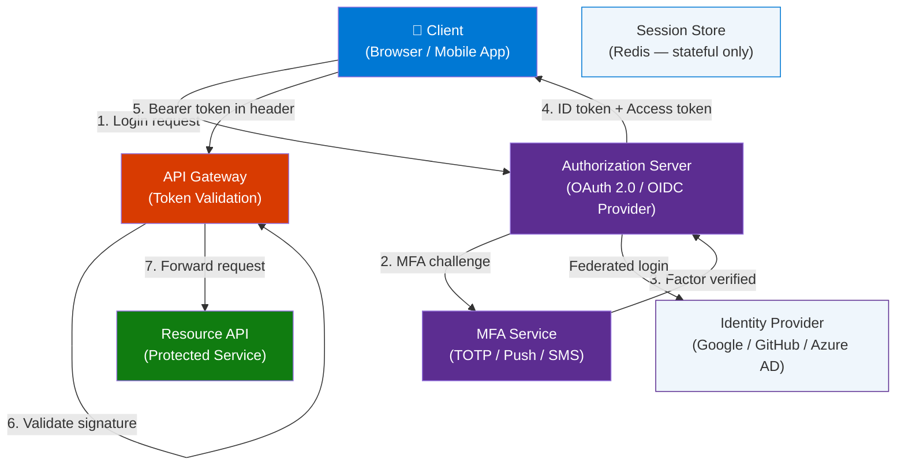
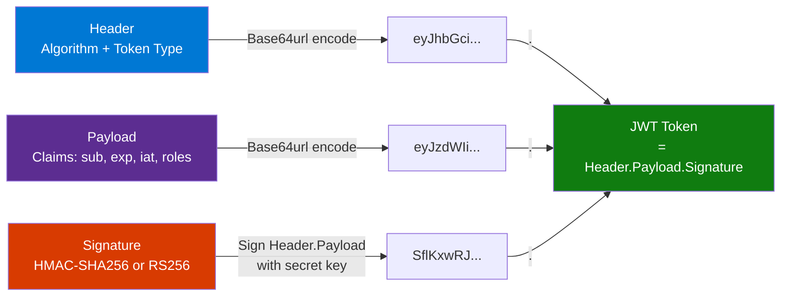

# 7 Authentication Concepts Every Developer Should Know

> **Source:** [YouTube — 7 Authentication Concepts Every Developer Should Know](https://www.youtube.com/watch?v=iX8g4LqF8p8)
> **Channel/Event:** Hayk Simonyan
> **Topic:** Authentication, Security, JWT, OAuth 2.0, OIDC, MFA, Session Auth, Token Auth, Passkeys
> **Key Claim:** Real-world authentication is a stack, not a choice — modern systems layer OIDC + JWT + TOTP + Passkeys together.

---

## Table of Contents

1. [Overview](#1-overview)
2. [Problem Statement](#2-problem-statement)
3. [Core Concepts](#3-core-concepts)
4. [Architecture](#4-architecture)
5. [Key Components — The 7 Concepts](#5-key-components--the-7-concepts)
6. [How It Works — Step by Step](#6-how-it-works--step-by-step)
7. [Comparison Table](#7-comparison-table)
8. [Code Examples](#8-code-examples)
9. [Best Practices](#9-best-practices)
10. [Interview Talking Points](#10-interview-talking-points)
11. [Learning Resources](#11-learning-resources)

---

## 1. Overview

Authentication is the mechanism by which a system confirms *who* is making a request before deciding what they are allowed to do. This video covers the seven foundational concepts every developer must understand — from the oldest (passwords) to the emerging (passkeys) — and explains exactly how each one works under the hood.

The goal is not just conceptual familiarity but the ability to reason about trade-offs: stateless vs stateful, delegated vs direct, single-factor vs multi-factor. The key insight is that production-grade authentication is never a single method — it is a composed stack where each layer handles a different concern.

By the end you can articulate the difference between OAuth 2.0 and OIDC (a question that trips up most senior developers), explain why JWTs are stateless, and describe what MFA prevents that passwords alone cannot.

---

## 2. Problem Statement

### Classic Approach Pain Points

| Problem | Impact |
|---|---|
| Password reuse across services | One breach exposes all accounts |
| Passwords stored in plain text | Mass credential theft from DB dumps |
| Server-side session state | Horizontal scaling is painful — sessions must be shared or sticky |
| Credential sharing for API access | Apps store user passwords directly — no revocation path |
| Single-factor login | Phishing and credential stuffing succeed at scale |
| No standardised delegation | Each app reinvents "login with third-party service" differently |

> **Key Insight:** "OAuth 2.0 is not an authentication protocol. It's an authorization framework." — Hayk Simonyan. Most developers conflate the two; OIDC is what adds the authentication layer on top.

---

## 3. Core Concepts

### Authentication vs Authorization

**Authentication** answers: *Who are you?* Validates identity. Returns 401 Unauthorized on failure.

**Authorization** answers: *What can you do?* Controls resource access. Returns 403 Forbidden on failure.

These are always sequential — authentication must succeed before authorization is evaluated.

### Stateful vs Stateless

**Stateful** auth (sessions) requires the server to store session data and look it up on every request. Scales by sharing session store (Redis).

**Stateless** auth (JWT tokens) encodes all claims inside the token itself. The server only verifies a cryptographic signature — no database lookup needed.

### Bearer Token Pattern

A bearer token grants access to whoever *holds* it — no additional proof of identity required. The name describes a pattern, not a specific technology. JWTs are the most common bearer token format.

### Claims

A **claim** is a key-value assertion inside a token: `{ "sub": "user_123", "role": "admin", "exp": 1720000000 }`. The server trusts these claims because the token is cryptographically signed.

### The Token Pair Pattern

| Token | Lifetime | Purpose |
|---|---|---|
| Access token | Short (15 min – 1 hr) | Sent with every API request |
| Refresh token | Long (days – weeks) | Used only to obtain a new access token |

Short access token lifetimes limit the damage window if a token is stolen. Refresh token rotation invalidates the old refresh token each time it is used.

---

## 4. Architecture

### Modern Authentication Stack



### JWT Structure



---

## 5. Key Components — The 7 Concepts

### Concept 1 — What Is Authentication?

Authentication is the gateway event: a request arrives, you verify identity, and you either grant access or return 401. Everything else (sessions, tokens, MFA) is *how* you perform that verification.

**Critical distinction:** Authentication (identity) ≠ Authorization (permissions). These are separate concerns handled by separate systems.

### Concept 2 — Password-Based Authentication

The oldest mechanism: the user proves identity by demonstrating knowledge of a shared secret.

**What the server stores:** A hashed + salted version of the password, never the plain text.

```
hash = bcrypt(password + salt, cost_factor=12)
```

**Weaknesses (all human, not algorithmic):**
- Password reuse across services
- Weak/guessable passwords
- Phishing attacks capture credentials before the hash step

**Modern standard:** bcrypt or Argon2id with cost factor tuned to ~300ms verification time.

### Concept 3 — Session-Based Authentication

The server-side state model. After successful login, the server creates a session record and sends back a session cookie.

**Flow:**
1. User logs in with credentials
2. Server creates session in store (DB or Redis): `session_id → { user_id, roles, exp }`
3. Server sends `Set-Cookie: session_id=abc123; HttpOnly; Secure; SameSite=Strict`
4. Browser sends cookie automatically on every subsequent request
5. Server looks up session in store to identify the user

**Scaling concern:** Every server instance must reach the same session store. Redis Cluster or sticky sessions solve this.

**Logout:** Server deletes the session record — immediate revocation, no propagation delay.

### Concept 4 — Token-Based Authentication (JWT)

The stateless alternative to sessions. All user data lives inside the token; the server only verifies the signature.

**JWT Anatomy:**
```
Header:  { "alg": "RS256", "typ": "JWT" }
Payload: { "sub": "user_123", "email": "alice@example.com",
           "roles": ["admin"], "iat": 1720000000, "exp": 1720003600 }
Signature: RS256(base64url(header) + "." + base64url(payload), private_key)
```

**Verification (no DB call needed):**
1. Split token on `.`
2. Verify signature using the server's public key
3. Check `exp` claim has not passed
4. Read `sub`, `roles` from payload

**Trade-off:** JWTs cannot be invalidated before expiry without a token blocklist (which reintroduces state). Short expiry + refresh token rotation is the standard mitigation.

### Concept 5 — OAuth 2.0

OAuth 2.0 is an **authorization framework** for delegated access. It lets users grant third-party apps limited access to their resources without sharing passwords.

**Key Roles:**
| Role | Description | Example |
|---|---|---|
| Resource Owner | The user | Alice |
| Client | The app requesting access | Your app |
| Authorization Server | Issues tokens | Google Auth |
| Resource Server | Hosts the protected data | Gmail API |

**Authorization Code Flow (most secure, use for web apps):**
1. Client redirects user to Authorization Server with `client_id`, `scope`, `redirect_uri`, `state`
2. User authenticates and consents to requested scopes
3. Authorization Server redirects to `redirect_uri` with a short-lived `code`
4. Client server-side exchanges `code` + `client_secret` for `access_token` + `refresh_token`
5. Client uses `access_token` in `Authorization: Bearer <token>` header

**PKCE extension** (Proof Key for Code Exchange): Required for public clients (SPAs, mobile) that cannot safely store a `client_secret`. Replaces secret with a cryptographic verifier/challenge pair.

**What OAuth 2.0 does NOT do:** It does not tell you *who the user is*. It tells you what the user *allowed your app to access*. Identity is OIDC's job.

### Concept 6 — OpenID Connect (OIDC)

OIDC is a thin identity layer on top of OAuth 2.0. It adds an **ID token** (always a JWT) that contains the authenticated user's identity claims.

**What OIDC adds to OAuth 2.0:**
- `openid` scope — triggers OIDC mode
- `id_token` in the token response — contains `sub`, `name`, `email`, `picture`
- `/userinfo` endpoint — for fetching additional profile claims
- Discovery document at `/.well-known/openid-configuration`

**Token comparison:**

| Token | Standard | Purpose | Who reads it |
|---|---|---|---|
| Access token | OAuth 2.0 | Access APIs on user's behalf | Resource Server |
| ID token | OIDC | Prove user's identity | Your app's frontend/backend |
| Refresh token | OAuth 2.0 | Obtain new access tokens | Authorization Server |

**When you "Sign in with Google":** You are using OIDC. Google is the OpenID Provider. Your app receives an ID token and reads the user's email/sub to create or match a local account.

### Concept 7 — Multi-Factor Authentication (MFA)

MFA requires the user to prove identity using at least two factor categories:

| Factor Category | Examples |
|---|---|
| Something you **know** | Password, PIN, security question |
| Something you **have** | TOTP app, hardware key (YubiKey), SMS code |
| Something you **are** | Fingerprint, face ID, voice pattern |

**TOTP (Time-based One-Time Password):**
- Shared secret established once (QR code scan)
- Every 30 seconds: `OTP = HOTP(secret, floor(timestamp / 30))`
- Works offline — no network call at verification time
- Standard: RFC 6238

**Impact:** Microsoft reports MFA blocks >99.9% of automated account compromise attacks.

**Phishing-resistant MFA (strongest):**
- **FIDO2 / WebAuthn** — Hardware security keys or device biometrics. The credential is cryptographically bound to the origin domain — cannot be phished because fake sites don't have the real domain.
- **Passkeys** — FIDO2 credentials synced via iCloud/Google Password Manager. No shared secret, no password, no server-side secret storage.

---

## 6. How It Works — Step by Step

### OAuth 2.0 Authorization Code Flow with PKCE

```mermaid
sequenceDiagram
    participant User
    participant App as "Your App (Client)"
    participant AuthServer as "Authorization Server"
    participant API as "Resource Server (API)"

    User->>App: Click "Login with Google"
    App->>App: Generate code_verifier + code_challenge
    App->>AuthServer: GET /authorize?client_id&scope=openid email&code_challenge&state
    AuthServer->>User: Show login + consent screen
    User->>AuthServer: Authenticate + approve scopes
    AuthServer->>App: Redirect to /callback?code=AUTH_CODE&state
    App->>AuthServer: POST /token {code, code_verifier, client_id}
    AuthServer->>App: {access_token, id_token, refresh_token}
    App->>App: Verify id_token signature; read sub/email
    App->>API: GET /data Authorization: Bearer access_token
    API->>API: Verify access_token signature + scopes
    API->>App: Protected resource data
```

### JWT Token Refresh Flow

```mermaid
sequenceDiagram
    participant Client
    participant API as "Resource API"
    participant AuthServer as "Auth Server"

    Client->>API: Request with expired access_token
    API->>Client: 401 Unauthorized
    Client->>AuthServer: POST /token {grant_type=refresh_token, refresh_token}
    AuthServer->>AuthServer: Validate refresh_token; rotate it
    AuthServer->>Client: New access_token + new refresh_token
    Client->>API: Retry request with new access_token
    API->>Client: 200 OK + data
```

---

## 7. Comparison Table

### Session vs Token (JWT)

| Dimension | Session-Based | Token-Based (JWT) |
|---|---|---|
| Server state | Stateful — server stores session | Stateless — all data in token |
| Scaling | Requires shared session store | Any server can validate |
| Revocation | Instant — delete session record | Delayed until token expires |
| Storage (client) | Cookie (HttpOnly) | Cookie or localStorage |
| Size per request | Small cookie (ID only) | Larger JWT (encoded claims) |
| Best for | Traditional web apps, monoliths | APIs, microservices, SPAs |

### OAuth 2.0 vs OpenID Connect

| Dimension | OAuth 2.0 | OpenID Connect (OIDC) |
|---|---|---|
| Type | Authorization framework | Authentication protocol |
| Answers | "What can this app access?" | "Who is this user?" |
| Token issued | Access token | ID token (JWT) + access token |
| User identity | Not defined | Provided via ID token claims |
| Use case | API delegation, third-party access | Social login, SSO |

### MFA Factor Strength

| Factor | Phishing resistant? | Offline capable? | UX friction |
|---|---|---|---|
| Password only | No | Yes | Low |
| SMS OTP | No | No | Medium |
| TOTP app | No | Yes | Medium |
| Push notification | No | No | Low |
| Hardware key / FIDO2 | **Yes** | Yes | Low–Medium |
| Passkeys | **Yes** | Yes | Low |

---

## 8. Code Examples

### Python — JWT Generation and Verification

```python
import jwt
import datetime

SECRET_KEY = "your-256-bit-secret"  # use RS256 with key pair in production

# Generate access token
def create_access_token(user_id: str, roles: list[str]) -> str:
    payload = {
        "sub": user_id,
        "roles": roles,
        "iat": datetime.datetime.utcnow(),
        "exp": datetime.datetime.utcnow() + datetime.timedelta(minutes=15),
    }
    return jwt.encode(payload, SECRET_KEY, algorithm="HS256")

# Verify token — no DB call needed
def verify_token(token: str) -> dict:
    try:
        return jwt.decode(token, SECRET_KEY, algorithms=["HS256"])
    except jwt.ExpiredSignatureError:
        raise Exception("Token expired")
    except jwt.InvalidTokenError:
        raise Exception("Invalid token")

# Usage
token = create_access_token("user_123", ["admin", "editor"])
claims = verify_token(token)
print(claims["sub"])   # user_123
print(claims["roles"]) # ["admin", "editor"]
```

### Python — TOTP (MFA) Generation and Verification

```python
import pyotp
import qrcode

# Setup: generate shared secret (done once, shown to user as QR)
secret = pyotp.random_base32()  # e.g., "JBSWY3DPEHPK3PXP"
totp = pyotp.TOTP(secret)

# Generate QR code URI for authenticator app
uri = totp.provisioning_uri(name="alice@example.com", issuer_name="MyApp")
# Show uri as QR code: qrcode.make(uri)

# Verify user-entered code (valid 30s window + 1 window tolerance)
user_code = "123456"  # from Google Authenticator / Authy
is_valid = totp.verify(user_code, valid_window=1)
print(is_valid)  # True if within tolerance
```

### Node.js — OAuth 2.0 PKCE Code Verifier/Challenge

```javascript
const crypto = require("crypto");

// Step 1: Generate code_verifier (client stores this)
function generateCodeVerifier() {
  return crypto.randomBytes(32).toString("base64url");
}

// Step 2: Derive code_challenge to send to Authorization Server
function generateCodeChallenge(verifier) {
  return crypto.createHash("sha256").update(verifier).digest("base64url");
}

const verifier = generateCodeVerifier();
const challenge = generateCodeChallenge(verifier);

// Send challenge to /authorize, keep verifier secret
// Later, send verifier to /token — AuthServer verifies hash matches
console.log({ verifier, challenge });
```

### Node.js — Express Middleware JWT Validation

```javascript
const jwt = require("jsonwebtoken");

function requireAuth(req, res, next) {
  const authHeader = req.headers["authorization"];
  if (!authHeader?.startsWith("Bearer ")) {
    return res.status(401).json({ error: "Missing bearer token" });
  }

  const token = authHeader.slice(7);
  try {
    // Verify signature + expiry; returns decoded payload
    req.user = jwt.verify(token, process.env.JWT_PUBLIC_KEY, {
      algorithms: ["RS256"],
    });
    next();
  } catch (err) {
    return res.status(401).json({ error: "Invalid or expired token" });
  }
}

// Protect a route
app.get("/api/profile", requireAuth, (req, res) => {
  res.json({ userId: req.user.sub, roles: req.user.roles });
});
```

### Session-Based Auth — Express + Redis

```javascript
const session = require("express-session");
const RedisStore = require("connect-redis").default;
const { createClient } = require("redis");

const redisClient = createClient({ url: process.env.REDIS_URL });
await redisClient.connect();

app.use(session({
  store: new RedisStore({ client: redisClient }),
  secret: process.env.SESSION_SECRET,
  resave: false,
  saveUninitialized: false,
  cookie: {
    httpOnly: true,   // no JS access
    secure: true,     // HTTPS only
    sameSite: "strict",
    maxAge: 1000 * 60 * 60, // 1 hour
  },
}));

// Login handler
app.post("/login", async (req, res) => {
  const user = await validateCredentials(req.body.email, req.body.password);
  if (!user) return res.status(401).json({ error: "Invalid credentials" });
  req.session.userId = user.id;          // stored server-side in Redis
  res.json({ message: "Logged in" });
});

// Logout — immediate revocation
app.post("/logout", (req, res) => {
  req.session.destroy(() => res.json({ message: "Logged out" }));
});
```

### Install / Setup

```bash
# Python
pip install PyJWT pyotp cryptography qrcode

# Node.js
npm install jsonwebtoken express-session connect-redis redis

# OIDC client library (Node.js)
npm install openid-client

# OIDC client library (Python)
pip install authlib
```

---

## 9. Best Practices

### Password Storage

- ✅ Hash with bcrypt (cost=12) or Argon2id
- ✅ Add a random per-user salt before hashing
- ✅ Use constant-time comparison to prevent timing attacks
- ❌ Never store plain-text passwords
- ❌ Never use MD5, SHA-1, or unsalted SHA-256 for password hashing

### Token Management

- ✅ Use short-lived access tokens (15 min default)
- ✅ Implement refresh token rotation — invalidate old refresh token on each use
- ✅ Store JWTs in HttpOnly cookies, not localStorage (XSS protection)
- ✅ Sign with RS256 (asymmetric) in production — public key can be distributed safely
- ✅ Always validate `exp`, `iss`, and `aud` claims
- ❌ Never put secrets (passwords, keys) in JWT payload — payload is base64 encoded, not encrypted
- ❌ Don't use `alg: none` — always require a specific algorithm

### OAuth 2.0 / OIDC

- ✅ Always use PKCE for public clients (SPAs, mobile apps)
- ✅ Validate the `state` parameter to prevent CSRF
- ✅ Validate `nonce` in ID token to prevent replay attacks
- ✅ Use the smallest scope necessary — principle of least privilege
- ❌ Never use Implicit Flow — it exposes tokens in URL fragments
- ❌ Don't use OAuth 2.0 alone for authentication — add OIDC

### MFA

- ✅ Default to TOTP; offer passkeys as upgrade path
- ✅ Implement backup codes for TOTP account recovery
- ✅ Rate-limit OTP verification attempts (prevent brute force)
- ✅ Prefer FIDO2/WebAuthn for high-security applications
- ❌ Don't treat SMS-OTP as strong MFA — SIM swapping is a real attack vector
- ❌ Don't require MFA re-prompt on every page — use step-up auth only for sensitive operations

### Sessions

- ✅ Set `HttpOnly`, `Secure`, `SameSite=Strict` on session cookies
- ✅ Regenerate session ID after successful login (prevent session fixation)
- ✅ Set absolute and idle timeouts
- ❌ Don't store sensitive data client-side — session store is server-side

---

## 10. Interview Talking Points

### "What's the difference between authentication and authorization?"

> Authentication confirms identity — it answers "who are you?" and returns 401 on failure. Authorization controls what that identity is allowed to do — it returns 403 on failure. They are always sequential: authentication gates authorization. A developer should never conflate them because they are handled by separate systems with separate failure modes.

### "Why are JWTs considered stateless, and what's the trade-off?"

> A JWT encodes all user claims (subject, roles, expiry) in the token payload and signs it cryptographically. The server verifies the signature using a key — no database lookup required. This makes JWTs ideal for stateless, horizontally-scaled microservices. The trade-off is revocation: once issued, a JWT cannot be invalidated before its `exp` without a server-side blocklist, which reintroduces state. The standard mitigation is short-lived access tokens (15 minutes) paired with long-lived refresh tokens and rotation.

### "What is OAuth 2.0, and why is it not an authentication protocol?"

> OAuth 2.0 is an authorization framework that allows users to grant third-party applications scoped, revocable access to their resources without sharing credentials. It issues an *access token* — but that token proves only that a user *authorized* the app; it says nothing about who the user is. OpenID Connect (OIDC) adds the authentication layer by issuing an *ID token* (a JWT with identity claims) alongside the access token. So the correct model is: OIDC for authentication, OAuth 2.0 for authorization.

### "Explain the OAuth 2.0 Authorization Code Flow with PKCE."

> The client generates a random `code_verifier` and sends its SHA-256 hash (`code_challenge`) to the authorization server with the initial redirect. The user authenticates and consents; the server issues a short-lived authorization `code`. The client then exchanges that code — plus the original `code_verifier` — for tokens. The server verifies that `SHA-256(verifier) == challenge`. This prevents authorization code interception attacks because stealing the `code` alone is useless without the verifier. PKCE is mandatory for public clients (SPAs, mobile) that cannot safely store a `client_secret`.

### "What makes passkeys more secure than TOTP or SMS-based MFA?"

> Passkeys are FIDO2 credentials where the private key never leaves the device. During authentication, the device signs a challenge that is cryptographically bound to the *exact domain* of the requesting site. This makes passkeys immune to phishing — a fake site cannot obtain a valid signed challenge because it doesn't control the legitimate domain. TOTP and SMS codes are secrets that can be captured by a phishing proxy and replayed in real time. Passkeys eliminate shared secrets entirely: there is no server-side secret to steal, no code to intercept.

---

## 11. Learning Resources

| Resource | Link | Type |
|---|---|---|
| 7 Authentication Concepts — Video | [YouTube](https://www.youtube.com/watch?v=iX8g4LqF8p8) | Video |
| 7 Authentication Concepts — Article | [Hayk Simonyan · Substack](https://hayksimonyan.substack.com/p/7-authentication-concepts-every-developer) | Article |
| RFC 6238 — TOTP Standard | [IETF](https://datatracker.ietf.org/doc/html/rfc6238) | RFC |
| The OAuth 2.0 Authorization Framework | [RFC 6749](https://datatracker.ietf.org/doc/html/rfc6749) | RFC |
| OpenID Connect Core 1.0 | [OpenID Foundation](https://openid.net/specs/openid-connect-core-1_0.html) | Spec |
| OWASP Authentication Cheat Sheet | [OWASP](https://cheatsheetseries.owasp.org/cheatsheets/Authentication_Cheat_Sheet.html) | Guide |
| WebAuthn / FIDO2 Guide | [webauthn.guide](https://webauthn.guide) | Guide |
| JWT Introduction | [jwt.io/introduction](https://jwt.io/introduction) | Reference |
| OAuth 2.0 Security Best Practices | [RFC 9700](https://datatracker.ietf.org/doc/html/rfc9700) | RFC |

---

*Last Updated: July 2026 | Source: Hayk Simonyan — 7 Authentication Concepts Every Developer Should Know*
