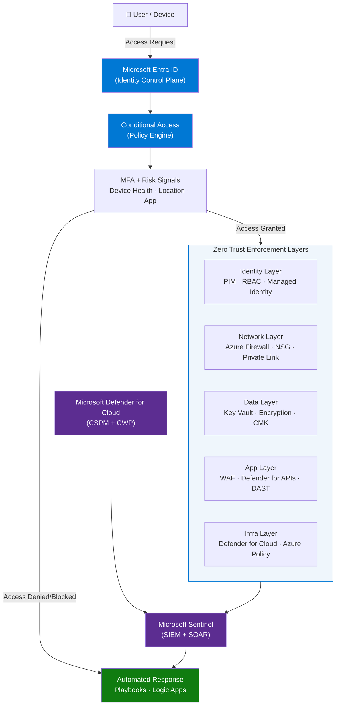
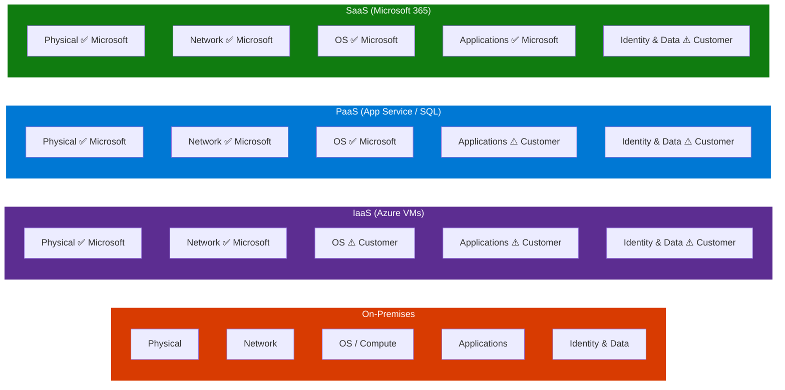
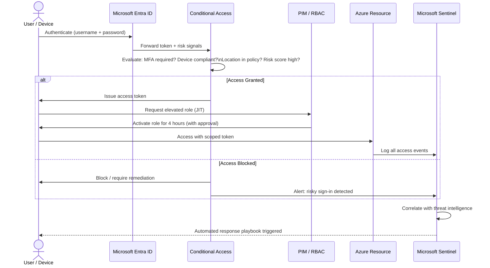
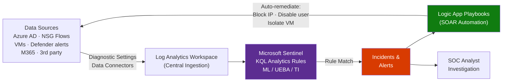

# Azure Cloud Security Architect — 20+ Advanced Interview Questions

> **Source:** [YouTube — 20+ Advanced Azure Cloud Security Architect Interview Questions (With Real Answers)](https://www.youtube.com/watch?v=CXdMcfLBHFU)
> **Channel/Event:** Advanced Azure Security Series
> **Topic:** Azure Security, Zero Trust, IAM, Network Security, Threat Detection, DevSecOps, SC-100
> **Key Claim:** Covers 24 advanced questions across 7 security domains with real architect-level answers

---

## Table of Contents

1. [Overview](#1-overview)
2. [Problem Statement](#2-problem-statement)
3. [Core Concepts](#3-core-concepts)
4. [Architecture](#4-architecture)
5. [Key Components](#5-key-components)
6. [How It Works — Step by Step](#6-how-it-works--step-by-step)
7. [Comparison Table](#7-comparison-table)
8. [Code Examples](#8-code-examples)
9. [Security Domains Reference](#9-security-domains-reference)
10. [Best Practices](#10-best-practices)
11. [Interview Talking Points](#11-interview-talking-points)
12. [Learning Resources](#12-learning-resources)

---

## 1. Overview

This guide covers the 20+ most common advanced interview questions for Azure Cloud Security Architect roles, mapped to the SC-100 (Cybersecurity Architect) and AZ-500 (Azure Security Technologies) exam domains. The questions span identity, Zero Trust architecture, data protection, network security, threat detection, compliance, and DevSecOps. Each answer uses precise Azure service naming and architectural framing expected at the senior/principal architect level. Use this as a rapid prep reference before interviews targeting cloud security leadership roles.

---

## 2. Problem Statement

Cloud security architects face a fundamental shift: traditional perimeter-based security (castle-and-moat) fails in multi-cloud, hybrid, and remote-work environments where the network boundary no longer exists.

### Classic Approach Pain Points

| Problem | Impact |
|---|---|
| Implicit trust inside the network perimeter | Lateral movement after a single breach compromises entire environment |
| Static, long-lived credentials and service accounts | Credential theft leads to persistent unauthorized access |
| Manual, reactive security posture | Threats detected hours or days after breach; mean time to detect (MTTD) is too high |
| Siloed security tools per team | No correlated threat view across identity, network, and data layers |
| Developer-security disconnect | Security bolted on at the end of SDLC; vulnerabilities discovered in production |
| Shared responsibility confusion | Teams misconfigure cloud services assuming the cloud provider handles all security |

> **Key Insight:** "Assume breach is not pessimism — it's an architectural mandate. Design every system as if attackers are already inside, then eliminate their ability to move laterally or escalate."

---

## 3. Core Concepts

### Zero Trust

A security model built on three principles: **Verify Explicitly** (authenticate and authorize every request using all available signals), **Use Least Privilege** (JIT/JEA, minimal RBAC scopes), and **Assume Breach** (minimize blast radius, segment access, encrypt end-to-end, monitor continuously).

Zero Trust rejects the outdated "castle-and-moat" perimeter model where anything inside the network was implicitly trusted. Every access request — regardless of whether it originates from inside or outside the corporate network — is treated as hostile until proven otherwise through continuous verification. The model was formalized by NIST SP 800-207 and has become the architectural mandate for all modern cloud-native environments.

**How Zero Trust works in Azure:**
1. **Identity verification** — Every request passes through Microsoft Entra ID. Risk signals (sign-in location, device health, user risk score) are evaluated by Conditional Access before a token is issued.
2. **Least-privilege enforcement** — RBAC roles are scoped to the minimum required resource. PIM ensures no standing privilege — elevation is time-bound and approval-gated.
3. **Micro-segmentation** — NSGs, Private Link, and Azure Firewall ensure that a compromised workload cannot move laterally to adjacent services.
4. **Continuous monitoring** — Microsoft Sentinel correlates signals across identity, network, and data layers. Anomalies trigger automated playbooks rather than waiting for human triage.

| Zero Trust Pillar | Azure Control | What It Enforces |
|---|---|---|
| Verify Explicitly | Conditional Access + MFA | Continuous auth, risk-based gate |
| Least Privilege | PIM + RBAC + Managed Identity | No standing access, minimal scope |
| Assume Breach | Sentinel + NSG + Private Link | Detect lateral movement, isolate blast radius |

> **Interview tip:** "Zero Trust is not a product — it's a mindset shift in architecture. The practical test: can your environment detect and contain a compromised credential in under 15 minutes? If not, the Zero Trust controls aren't operationally complete."

### Shared Responsibility Model

Microsoft secures the physical infrastructure and Azure hypervisor. The customer is responsible for identity, data, applications, and OS/network configuration. Division shifts depending on IaaS vs PaaS vs SaaS: more responsibility moves to Microsoft as you go up the stack.

The Shared Responsibility Model defines who is accountable for each security layer based on the deployment model. A common interview failure is conflating "Microsoft manages it" with "it's automatically secure" — Microsoft manages availability and physical integrity, but misconfigured RBAC, unpatched OS images, or exposed storage accounts are always the customer's responsibility regardless of service tier.

**Responsibility by deployment model:**

| Security Layer | On-Premises | IaaS (Azure VMs) | PaaS (App Service / SQL) | SaaS (M365 / Entra) |
|---|---|---|---|---|
| Physical datacenter | Customer | Microsoft | Microsoft | Microsoft |
| Network controls | Customer | Microsoft | Microsoft | Microsoft |
| Host OS / hypervisor | Customer | Microsoft | Microsoft | Microsoft |
| Guest OS / runtime | Customer | Customer | Microsoft | Microsoft |
| Application code | Customer | Customer | Customer | Microsoft |
| Identity & directory | Customer | Customer | Customer | Customer |
| Data classification | Customer | Customer | Customer | Customer |
| Device management | Customer | Customer | Customer | Customer |

**Critical customer responsibilities regardless of tier:**
- Configuring Conditional Access and MFA in Entra ID
- Assigning minimum-privilege RBAC roles
- Enabling encryption for data at rest and in transit
- Monitoring for misconfiguration (Defender for Cloud Secure Score)
- Classifying and protecting sensitive data (Purview)

> **Interview tip:** "The number one cause of cloud breaches is customer misconfiguration, not Microsoft infrastructure failures. When asked about the Shared Responsibility Model, always point to the security controls that shift from Microsoft to the customer as you move from SaaS down to IaaS — and name specific Azure services for each layer."

### Just-In-Time (JIT) Access

A PIM feature that activates privileged roles for a defined time window (e.g., 8 hours) upon approval, rather than granting standing access. Eliminates permanently assigned Admin roles.

JIT is the practical enforcement mechanism for Zero Trust's "Least Privilege" pillar applied to humans and service accounts. Without JIT, a compromised Global Admin credential gives an attacker 24/7 unrestricted access. With JIT, that same credential has zero standing permissions — an attacker must also compromise the approval workflow within the activation window.

**How JIT works with Azure PIM:**
1. User is assigned as **eligible** for the privileged role in PIM (not permanently active).
2. When access is needed, the user requests activation — specifying duration, business justification, and ticket number.
3. The request routes to an **approver** (manager, security team) configured in PIM policy.
4. Approver grants or denies the request. On approval, the role activates for the specified window.
5. PIM enforces MFA at activation time, regardless of existing session.
6. After the window expires, the role automatically deactivates — no manual cleanup required.
7. All activations are logged and audited; Sentinel can alert on anomalous activation patterns.

| JIT Configuration | Recommended Value | Rationale |
|---|---|---|
| Activation duration | 4–8 hours | Long enough for a work task; short enough to limit exposure |
| Require justification | Yes | Creates audit trail; discourages casual elevation |
| Require MFA on activation | Yes | Prevents credential theft enabling silent elevation |
| Require approval | Yes for Owner/Contributor | Two-person integrity for blast-radius roles |
| Access review frequency | Quarterly | Validates eligible assignments remain appropriate |

**JIT for VMs (Defender for Cloud):** Separately, Defender for Cloud's JIT VM Access blocks public management ports (RDP 3389, SSH 22) by default and opens them only for specific IPs and durations on request — eliminating 24/7 exposure of management interfaces.

> **Interview tip:** "Always distinguish PIM JIT (role elevation for users) from Defender for Cloud JIT VM Access (management port gating for VMs) — both implement the same principle but operate at different layers. An architect should deploy both."

### Managed Identity

An Azure-assigned identity for resources (VMs, App Services, Functions) that eliminates stored credentials. The Azure platform handles token rotation automatically. Two types: System-assigned (tied to one resource lifecycle) and User-assigned (shared across multiple resources).

Managed Identity solves the "secret zero" problem: to access a secret store, an application traditionally needed a credential — but where does that credential live securely? Managed Identity breaks this circular dependency by letting the Azure platform act as the credential authority. The resource's identity is cryptographically attested by Azure AD; no developer ever handles a password, certificate, or connection string.

**How it works internally:**
1. A Managed Identity is created for a resource (e.g., App Service). Azure registers a service principal in Entra ID.
2. The resource requests an OAuth 2.0 access token from the **Instance Metadata Service (IMDS)** at `http://169.254.169.254/metadata/identity/oauth2/token`.
3. Azure's identity platform validates the request (the VM/App Service can prove its identity via the Azure fabric) and returns a short-lived bearer token.
4. The application uses that token to authenticate to Azure services (Key Vault, Storage, SQL, etc.) via standard `DefaultAzureCredential`.
5. Azure rotates certificates and tokens automatically — the developer has no credential lifecycle to manage.

| Identity Type | Lifecycle | Use Case | Shared Across Resources |
|---|---|---|---|
| System-assigned | Tied to resource; deleted with resource | Single app, single resource | No |
| User-assigned | Independent; survives resource deletion | Multiple apps sharing same identity | Yes |

**Code pattern (Python — zero stored credentials):**
```python
from azure.identity import DefaultAzureCredential
from azure.keyvault.secrets import SecretClient

# Works locally (dev identity), in CI (federated), and on Azure (Managed Identity)
credential = DefaultAzureCredential()
client = SecretClient(vault_url="https://my-kv.vault.azure.net/", credential=credential)
secret = client.get_secret("db-password")
```

> **Interview tip:** "Always recommend System-assigned Managed Identity as the default. Use User-assigned only when multiple resources genuinely need the same identity (e.g., a fleet of identical App Services). Mixing types adds role assignment complexity without security benefit."

### Conditional Access

The policy engine for Microsoft Entra ID that evaluates risk signals (user, device, location, app, network) and enforces access controls: grant, block, or require step-up MFA/device compliance.

Conditional Access is Zero Trust's control plane for identity — it makes every authentication decision context-aware rather than binary (credential correct → grant). A valid password from a non-compliant device at 3 AM from a country where the user has never signed in is treated differently from the same password from a healthy corporate device at a known office location during business hours.

**Policy evaluation logic:**
```
IF  user ∈ {targeted group}
AND app ∈ {targeted cloud app}
AND conditions: [
    sign-in risk: medium | high,
    device: not compliant,
    location: outside named locations
]
THEN enforce: {
    grant: [require MFA, require device compliance],
    OR block access
}
```

**Key Conditional Access signal types:**

| Signal Category | Examples | Azure Service |
|---|---|---|
| User/group | Admin accounts, guests, all users | Entra ID group membership |
| Application | Office 365, custom SaaS, Azure portal | App registrations |
| Device state | Compliant, Hybrid AD joined, unmanaged | Intune MDM / Entra Join |
| Location | Named IP ranges, countries, GPS (mobile) | Named locations config |
| Sign-in risk | Real-time risk score from Entra ID Protection | Entra ID P2 |
| User risk | Cumulative risk from past behavior/leaked creds | Entra ID P2 |

**Common policy patterns:**
- **Baseline MFA for all users** — grant access, require MFA
- **Block legacy authentication** — target all legacy auth protocols (basic auth, SMTP, IMAP) — no Conditional Access support in these protocols
- **Admin workstation policy** — require compliant/Hybrid-joined device for all admin role holders
- **High-risk sign-in** — if sign-in risk = high, block or require password change + MFA

> **Interview tip:** "Lead with break-glass accounts when asked about Conditional Access design. Two emergency access accounts excluded from all CA policies, monitored 24/7, credentials in a physical safe — without these, a misconfigured CA policy can lock out every admin simultaneously."

### Defense in Depth

A layered security model: Physical → Network → Perimeter → Compute → Application → Data. Each layer has independent controls so that a breach at one layer does not automatically compromise others.

Defense in Depth is the architectural principle that no single control should be the only barrier between an attacker and a sensitive asset. Each concentric layer imposes an independent checkpoint: compromising one layer (e.g., network perimeter via a misconfigured NSG) should still leave the attacker facing identity controls, application-layer WAF rules, and data encryption before they can exfiltrate anything meaningful.

**Azure defense-in-depth layer mapping:**

```
┌─────────────────────────────────────────────────────────┐
│  Physical          Azure datacenters, hardware security  │
│  ┌───────────────────────────────────────────────────┐   │
│  │  Network       NSG, Azure Firewall, DDoS Standard │   │
│  │  ┌─────────────────────────────────────────────┐  │   │
│  │  │  Perimeter  Azure Front Door WAF, App GW WAF │  │   │
│  │  │  ┌───────────────────────────────────────┐  │  │   │
│  │  │  │  Compute  Defender for Servers, JIT VM │  │  │   │
│  │  │  │  ┌─────────────────────────────────┐  │  │  │   │
│  │  │  │  │  Application  APIM, OAuth2/OIDC  │  │  │  │   │
│  │  │  │  │  ┌───────────────────────────┐  │  │  │  │   │
│  │  │  │  │  │  Data  Key Vault, CMK, TDE │  │  │  │  │   │
│  │  │  │  │  └───────────────────────────┘  │  │  │  │   │
│  │  │  │  └─────────────────────────────────┘  │  │  │   │
│  │  │  └───────────────────────────────────────┘  │  │   │
│  │  └─────────────────────────────────────────────┘  │   │
│  └───────────────────────────────────────────────────┘   │
└─────────────────────────────────────────────────────────┘
```

**Each layer's threat and control:**

| Layer | Primary Threat | Azure Control |
|---|---|---|
| Physical | Unauthorized physical access | Azure datacenter security (Microsoft responsibility) |
| Network | DDoS, port scanning, lateral movement | NSG, Azure Firewall Premium, DDoS Standard |
| Perimeter | Web app attacks (SQLi, XSS), bot abuse | Azure Front Door WAF, Application Gateway WAF |
| Compute | OS exploit, malware, unauthorized access | Defender for Servers, JIT VM Access, Bastion |
| Application | Auth bypass, injection, API abuse | Managed Identity, APIM throttling, DAST |
| Data | Exfiltration, unauthorized read, key theft | Key Vault, CMK, TDE, Private Link, Purview DLP |

**The "attacker must beat all layers" property:** If an attacker bypasses the WAF (perimeter), they still face identity authentication (Entra ID + MFA) at the application layer, encrypted data at rest (CMK), and Private Link preventing any public data egress path. Each layer buys detection time and raises the attacker's cost.

> **Interview tip:** "When describing Defense in Depth, always map each layer to a specific Azure service. A generic answer about 'multiple layers' without naming Azure Firewall, Defender for Servers, and Key Vault signals surface-level knowledge. Name the service and the threat it mitigates."

---

## 4. Architecture

### Zero Trust Architecture in Azure



### Shared Responsibility Model



---

## 5. Key Components

| Component | Azure Service | Role |
|---|---|---|
| Identity Provider | Microsoft Entra ID | Authenticate users, manage identities, issue tokens |
| Policy Engine | Conditional Access | Enforce access decisions based on risk signals |
| Privileged Access | PIM (Privileged Identity Management) | JIT elevation, approval workflows, access reviews |
| Secret Management | Azure Key Vault | Store secrets, certificates, keys; enforce RBAC |
| Network Perimeter | Azure Firewall Premium | L7 stateful filtering, IDPS, TLS inspection |
| Micro-segmentation | Network Security Groups (NSG) | Allow/deny rules at subnet and NIC level |
| Private Connectivity | Azure Private Link | Expose PaaS services on private IP, eliminate public exposure |
| Bastion Access | Azure Bastion | Browser-based RDP/SSH to VMs without public IP |
| DDoS Protection | Azure DDoS Protection Standard | Adaptive tuning, attack analytics, mitigation SLA |
| SIEM + SOAR | Microsoft Sentinel | Cloud-native SIEM; AI-driven detection, automated playbooks |
| CSPM + CWPP | Microsoft Defender for Cloud | Security posture score, workload protection, regulatory compliance |
| WAF | Azure Application Gateway WAF | OWASP rule sets, custom rules, rate limiting |
| DevSecOps | Microsoft Defender for DevOps | Scan IaC, code repos, container images in CI/CD |
| Monitoring | Azure Monitor + Log Analytics | Centralized log ingestion, KQL queries, dashboards |

---

## 6. How It Works — Step by Step

### Access Request Flow (Zero Trust)



### Threat Detection Pipeline



---

## 7. Comparison Table

| Dimension | Perimeter-Based (Classic) | Zero Trust (Modern) |
|---|---|---|
| Trust model | Implicit trust inside network | Explicit verification every request |
| Primary control | Firewall / VPN at network edge | Identity (Microsoft Entra ID) |
| Access scope | Broad network access once inside | Least-privilege, scoped per resource |
| Credential model | Long-lived service account passwords | Managed Identities, short-lived tokens |
| Breach assumption | "Inside = trusted" | "Always assume breach" |
| Lateral movement | Unrestricted inside perimeter | Blocked by micro-segmentation (NSGs, Private Link) |
| Threat detection | Perimeter logs only | Unified SIEM (Sentinel) across all layers |
| Remote access | VPN | Azure Bastion + Conditional Access + Entra ID P2 |
| Privileged access | Standing admin accounts | JIT via PIM, just-enough-access |
| Compliance visibility | Manual audits | Defender for Cloud Secure Score + Policy |

---

## 8. Code Examples

### Python — Authenticate with Managed Identity and Access Key Vault

```python
from azure.identity import DefaultAzureCredential
from azure.keyvault.secrets import SecretClient

credential = DefaultAzureCredential()
vault_url = "https://my-keyvault.vault.azure.net/"
client = SecretClient(vault_url=vault_url, credential=credential)

secret = client.get_secret("db-connection-string")
print(secret.value)
```

### Terraform — Assign Minimum RBAC Role to Managed Identity

```hcl
resource "azurerm_user_assigned_identity" "app_identity" {
  name                = "app-managed-identity"
  resource_group_name = azurerm_resource_group.main.name
  location            = azurerm_resource_group.main.location
}

resource "azurerm_role_assignment" "kv_reader" {
  scope                = azurerm_key_vault.main.id
  role_definition_name = "Key Vault Secrets User"
  principal_id         = azurerm_user_assigned_identity.app_identity.principal_id
}
```

### Azure CLI — Enable JIT VM Access (Defender for Cloud)

```bash
az security jit-policy create \
  --resource-group myRG \
  --name default \
  --virtual-machines '[{
    "id": "/subscriptions/{sub}/resourceGroups/myRG/providers/Microsoft.Compute/virtualMachines/myVM",
    "ports": [{"number": 22, "protocol": "TCP", "allowedSourceAddressPrefix": "*", "maxRequestAccessDuration": "PT4H"}]
  }]'
```

### KQL — Sentinel: Detect Brute Force Attempts

```kql
SigninLogs
| where ResultType != "0"
| summarize FailureCount = count(), DistinctIPs = dcount(IPAddress)
    by UserPrincipalName, bin(TimeGenerated, 10m)
| where FailureCount > 10
| project TimeGenerated, UserPrincipalName, FailureCount, DistinctIPs
| order by FailureCount desc
```

### Azure Policy — Deny Public IP on VMs (JSON)

```json
{
  "if": {
    "allOf": [
      {
        "field": "type",
        "equals": "Microsoft.Network/networkInterfaces"
      },
      {
        "field": "Microsoft.Network/networkInterfaces/ipConfigurations[*].publicIpAddress.id",
        "exists": "true"
      }
    ]
  },
  "then": {
    "effect": "deny"
  }
}
```

### Bash — Enable Diagnostic Settings to Route Logs to Sentinel Workspace

```bash
WORKSPACE_ID="/subscriptions/{sub}/resourceGroups/security-rg/providers/Microsoft.OperationalInsights/workspaces/sentinel-ws"

az monitor diagnostic-settings create \
  --name "to-sentinel" \
  --resource "/subscriptions/{sub}/resourceGroups/myRG/providers/Microsoft.KeyVault/vaults/myKV" \
  --workspace $WORKSPACE_ID \
  --logs '[{"category":"AuditEvent","enabled":true}]' \
  --metrics '[{"category":"AllMetrics","enabled":true}]'
```

---

## 9. Security Domains Reference

### Domain 1 — Identity & Access Management

| Concept | Service | Key Config |
|---|---|---|
| SSO + Federation | Microsoft Entra ID | SAML / OIDC / OAuth 2.0 |
| MFA | Entra ID P2 | Authenticator app, FIDO2, number matching |
| Conditional Access | Entra ID P1/P2 | Named locations, device compliance, risk-based |
| Privileged roles | PIM | JIT activation, approval, access reviews (quarterly) |
| App identity | Managed Identity | System-assigned preferred; User-assigned for shared |
| Secret-less auth | Workload Identity Federation | GitHub Actions → Azure (OIDC, no stored secrets) |

### Domain 2 — Network Security

| Service | Purpose | Key Feature |
|---|---|---|
| Azure Firewall Premium | L7 east-west + north-south filtering | IDPS signatures, TLS inspection, FQDN rules |
| NSG | Subnet / NIC-level traffic filtering | 5-tuple rules, ASG grouping |
| Azure Bastion | Secure VM access | No public IP on VMs, browser-based RDP/SSH |
| DDoS Standard | Volumetric attack mitigation | Adaptive tuning, 99.99% SLA, attack analytics |
| Private Link | PaaS private connectivity | No public endpoint, DNS override required |
| Azure Front Door WAF | Edge WAF + CDN | OWASP 3.2, geo-filtering, rate limiting |

### Domain 3 — Data Protection

| Control | Service | Description |
|---|---|---|
| Encryption at rest | Azure Storage SSE, Disk Encryption | AES-256, transparent by default |
| Encryption in transit | TLS 1.2+ enforced | Minimum TLS policy on Storage, SQL, App Service |
| Customer-managed keys | Key Vault + CMK | Customer controls key lifecycle; HSM-backed |
| Secret rotation | Key Vault + Azure Functions | Event-driven rotation on expiry |
| Confidential computing | Azure Confidential VMs / TEEs | Encrypts data **in use** in SGX enclaves |

### Domain 4 — Threat Detection & Response

| Tool | Role | Key Capability |
|---|---|---|
| Microsoft Sentinel | SIEM + SOAR | KQL analytics, UEBA, threat intelligence, playbooks |
| Defender for Cloud | CSPM + CWPP | Secure Score, regulatory compliance, workload protection |
| Defender for Endpoint | EDR | Behavioral detection, automated investigation |
| Defender for Identity | AD threat detection | Lateral movement, pass-the-hash, DCSync detection |
| Defender for Storage | Storage anomaly detection | Malware scanning, sensitive data discovery |

### Domain 5 — DevSecOps

| Stage | Control | Tool |
|---|---|---|
| Code commit | SAST, secret scanning | Defender for DevOps, GitHub Advanced Security |
| Build | Container image scanning | Microsoft Defender for Containers, Trivy |
| Deploy | IaC scanning | Checkov, Defender for DevOps policy |
| Runtime | CWPP (agent-based) | Defender for Servers / Containers |
| Compliance | Policy as code | Azure Policy + Bicep/Terraform |

---

## 10. Best Practices

### Identity

- ✅ Use Managed Identities for all Azure service-to-service communication
- ✅ Enable PIM for all Global Admin and Owner roles — zero standing access
- ✅ Require phishing-resistant MFA (FIDO2 or Authenticator with number match) for all admins
- ❌ Never assign Owner or Contributor at subscription scope for regular app identities
- ❌ Never store credentials in environment variables or app config — use Key Vault references

### Network

- ✅ Apply Private Link to all PaaS services (Storage, SQL, Key Vault, ACR) in production
- ✅ Deploy Azure Bastion in every subscription that has VMs — eliminate public RDP/SSH
- ✅ Use ASGs (Application Security Groups) to group VMs by role in NSG rules
- ❌ Never open RDP (3389) or SSH (22) to the internet in NSG rules
- ❌ Never rely on default subnet-level rules — explicitly deny all unmatched traffic

### Data

- ✅ Enable CMK (Customer-Managed Keys) for regulated workloads (PII, PCI, HIPAA)
- ✅ Enforce minimum TLS 1.2 via Azure Policy across all services
- ✅ Enable soft-delete and purge protection on Key Vault — prevents key destruction
- ❌ Never disable encryption at rest, even in dev/test — maintain parity
- ❌ Never grant Key Vault access via Access Policies to entire AAD groups — use RBAC

### Monitoring

- ✅ Centralize all diagnostic logs to a single Log Analytics Workspace per environment
- ✅ Enable Defender for Cloud at Standard tier across all subscriptions
- ✅ Create Sentinel analytics rules for: impossible travel, brute force, PIM activations
- ❌ Never treat Secure Score as the only security metric — combine with threat signal volume
- ❌ Never archive security logs with a retention period under 90 days (1 year for compliance)

---

## 11. Interview Talking Points

### "What is the difference between a Managed Identity and a Service Principal?"

> A **Managed Identity** is an Azure platform-managed identity — the platform creates it, rotates its credentials, and handles token lifecycle automatically. No developer ever touches a password or certificate. A **Service Principal** is a security identity you create and manage yourself for applications or automation scripts; you are responsible for credential rotation and secure storage. For cloud-native workloads, always prefer Managed Identity. Service Principals are used when you need cross-tenant access or when the client can't host an Azure resource.

### "Explain 'Assume Breach' and how it changes your architecture."

> Assume Breach means you design the system presuming attackers are already inside. This shifts focus from keeping attackers out to limiting what they can do once in. Architecturally it drives: network micro-segmentation (NSGs, Private Link) to prevent lateral movement; least-privilege RBAC so a compromised identity has minimal blast radius; continuous monitoring with Sentinel to detect anomalies quickly; and immutable backups with geo-replication to recover from destructive attacks. The key metric is MTTD (Mean Time to Detect) and MTTR (Mean Time to Respond), not just prevention.

### "How do you design Conditional Access policies without locking out administrators?"

> You start with a **break-glass account** strategy: create two emergency access accounts that are excluded from all Conditional Access policies, stored credentials in a physical safe, and monitored 24/7 for any sign-in. Then you build CA policies in **report-only mode first** for 2 weeks to baseline the impact. Layer policies: start with MFA for all users, then add device compliance, then risk-based sign-in policies. Always exclude the break-glass accounts and use named locations for trusted networks. Test with the CA What-If tool before activating.

### "What is Azure Confidential Computing and when would you use it?"

> Confidential Computing protects data **in use** — while it's being processed in memory — using hardware-based Trusted Execution Environments (TEEs) like Intel SGX or AMD SEV-SNP. It addresses a gap that encryption at rest and in transit cannot: the cloud provider's hypervisor or a compromised OS could theoretically access data in memory. Use cases include multi-party ML training on sensitive datasets, regulated financial computations, and genomics processing where the data owner cannot expose raw data even to the cloud operator.

### "How would you implement a DevSecOps pipeline for a regulated Azure workload?"

> I'd integrate security at every SDLC stage: secret scanning and SAST in pre-commit hooks (GitHub Advanced Security), container image scanning with Defender for Containers in CI, IaC scanning with Checkov or Defender for DevOps for every Terraform/Bicep PR, and DAST against staging. In CD, gate deployments on passing a compliance dashboard — Defender for Cloud policy compliance + Secure Score delta. At runtime, enable Defender for Servers with FIM (File Integrity Monitoring), stream all logs to Sentinel, and set automated playbooks for any high-severity alert. The key is shifting left without slowing delivery: fail fast on critical CVEs, warn on medium-risk, and trend over time.

### "What is the difference between Azure Security Center and Microsoft Sentinel?"

> **Microsoft Defender for Cloud** (formerly Security Center) is a **CSPM + CWPP** tool: it assesses your security posture (Secure Score), identifies misconfigurations in Azure resources, enforces compliance against CIS/NIST/PCI frameworks, and provides workload protection (runtime threat detection per service). **Microsoft Sentinel** is a cloud-native **SIEM + SOAR**: it ingests logs from across your entire environment (Azure, on-prem, M365, 3rd-party), correlates them using KQL analytics and ML, generates incidents, and automates response via Logic App playbooks. In practice, Defender for Cloud feeds alerts *into* Sentinel as a data connector — they're complementary layers, not alternatives.

### "How do you approach threat modeling for a new Azure workload?"

> I use the **STRIDE** framework: Spoofing, Tampering, Repudiation, Information Disclosure, Denial of Service, Elevation of Privilege. For each component — user → API → business logic → database — I identify the trust boundary crossings and enumerate threats per STRIDE category. I then map each threat to an Azure control: Spoofing → MFA + Managed Identity, Tampering → RBAC + resource locks + Key Vault, Repudiation → audit logs to Sentinel, Information Disclosure → Private Link + CMK + DLP, DoS → DDoS Standard + WAF + throttling, EoP → PIM + Conditional Access + just-enough RBAC. The output is a risk register with residual risk accepted by the data owner.

---

## 12. Learning Resources

| Resource | Link | Type |
|---|---|---|
| YouTube — Source Video | [20+ Advanced Azure Cloud Security Architect Interview Questions](https://www.youtube.com/watch?v=CXdMcfLBHFU) | Video |
| Azure Security Fundamentals | [learn.microsoft.com/azure/security/fundamentals/overview](https://learn.microsoft.com/en-us/azure/security/fundamentals/overview) | Official Docs |
| Zero Trust in Azure | [learn.microsoft.com/azure/security/fundamentals/zero-trust](https://learn.microsoft.com/en-us/azure/security/fundamentals/zero-trust) | Official Docs |
| SC-100 Cybersecurity Architect Exam | [learn.microsoft.com/en-us/credentials/certifications/cybersecurity-architect-expert](https://learn.microsoft.com/en-us/credentials/certifications/cybersecurity-architect-expert) | Certification |
| AZ-500 Azure Security Technologies | [learn.microsoft.com/en-us/credentials/certifications/azure-security-engineer](https://learn.microsoft.com/en-us/credentials/certifications/azure-security-engineer) | Certification |
| Microsoft Sentinel Documentation | [learn.microsoft.com/azure/sentinel](https://learn.microsoft.com/en-us/azure/sentinel/) | Official Docs |
| Defender for Cloud | [learn.microsoft.com/azure/defender-for-cloud](https://learn.microsoft.com/en-us/azure/defender-for-cloud/) | Official Docs |
| Zero Trust Deployment Guide | [learn.microsoft.com/security/zero-trust/deploy/overview](https://learn.microsoft.com/en-us/security/zero-trust/deploy/overview) | Official Docs |
| Azure Identity Management Security | [learn.microsoft.com/azure/security/fundamentals/identity-management-overview](https://learn.microsoft.com/en-us/azure/security/fundamentals/identity-management-overview) | Official Docs |

---

*Last Updated: July 2026 | Source: Advanced Azure Security Series — Azure Cloud Security Architect Interview Guide*
