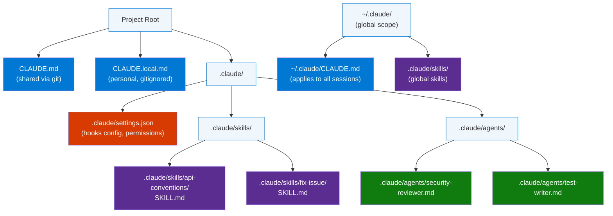
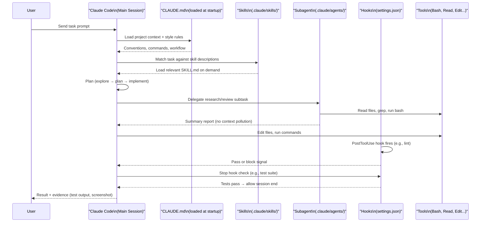

# Claude Code Project Structure: CLAUDE.md, Skills, Agents & Hooks

> **Source:** [YouTube — Claude Code Project Structure Explained: CLAUDE.md, Skills, Agents & Hooks](https://www.youtube.com/shorts/iI1h1lgvRQo)
> **Topic:** Claude Code, Agentic Coding, Developer Productivity, AI Agents
> **Key Claim:** Structuring a project with CLAUDE.md + Skills + Hooks turns a general AI into an autonomous, specialized coding partner that remembers your conventions and enforces them deterministically.

---

## Table of Contents

1. [Overview](#1-overview)
2. [Problem Statement](#2-problem-statement)
3. [Core Concepts](#3-core-concepts)
4. [Architecture — Project File Layout](#4-architecture--project-file-layout)
5. [Key Components](#5-key-components)
6. [How It Works — Agent Loop Step by Step](#6-how-it-works--agent-loop-step-by-step)
7. [Comparison Table — Ad-Hoc vs. Structured Project](#7-comparison-table--ad-hoc-vs-structured-project)
8. [Code Examples](#8-code-examples)
9. [Configuration Reference](#9-configuration-reference)
10. [Best Practices](#10-best-practices)
11. [Interview Talking Points](#11-interview-talking-points)
12. [Learning Resources](#12-learning-resources)

---

## 1. Overview

Claude Code is an agentic coding environment where Claude reads files, runs commands, and autonomously works through problems — not just answers questions. To make it effective at scale, the project must be **structured**. That structure lives in four layers: `CLAUDE.md` (persistent context), **Skills** (on-demand domain knowledge), **Agents/Subagents** (isolated workers), and **Hooks** (deterministic automation gates). Together they replace ad-hoc prompting with a repeatable, team-shareable system. The video covers how each layer fits together and when to reach for each one.

---

## 2. Problem Statement

### Classic Approach Pain Points

| Problem | Impact |
|---|---|
| No persistent memory across sessions | Claude re-asks the same questions every conversation |
| Context window fills with exploration | Performance degrades; earlier instructions get "forgotten" |
| Conventions live only in the developer's head | Team members get inconsistent Claude behavior |
| No way to enforce actions deterministically | "Run lint after edit" is advisory, not guaranteed |
| Every task bloats the main conversation | A codebase search consumes tokens needed for implementation |

> **Key Insight:** "CLAUDE.md is loaded every session, so only include things that apply broadly. For domain knowledge relevant only sometimes, use skills instead — Claude loads them on demand without bloating every conversation."

---

## 3. Core Concepts

### CLAUDE.md
A special Markdown file Claude reads at the start of every conversation. Provides persistent project context — bash commands, code style, workflow rules — that Claude cannot infer from code alone. Can be placed at multiple scope levels (global, project, personal, child directories).

### Skills
Directories containing a `SKILL.md` file, placed in `.claude/skills/`. Package domain knowledge and reusable workflows that Claude loads **on demand** when the task is relevant. Can also be invoked explicitly via `/skill-name`. Skills are an open standard — portable across AI platforms.

### Subagents
Separate Claude instances defined in `.claude/agents/` that run in their **own context window** with their own allowed tool set. Used to delegate research, code review, or specialized work without consuming the main conversation's context.

### Hooks
Shell scripts that execute **deterministically** at specific lifecycle points (before/after file edit, before session end, etc.), configured in `.claude/settings.json`. Unlike CLAUDE.md instructions (advisory), hooks are guaranteed to run.

### Plugins
Installable bundles from the community that package Skills + Hooks + Subagents + MCP servers into a single unit. No manual configuration required.

### Context Window
The fundamental constraint. Holds the entire conversation — messages, file reads, command output. Performance degrades as it fills. Every structural decision (skills vs. CLAUDE.md, subagents for research) is ultimately about managing context efficiently.

---

## 4. Architecture — Project File Layout



### Scope Resolution Order

| Scope | File | Shared? | Load Timing |
|---|---|---|---|
| Global | `~/.claude/CLAUDE.md` | User-wide | Every session |
| Project | `./CLAUDE.md` | Git-committed | Every session |
| Personal | `./CLAUDE.local.md` | Gitignored | Every session |
| Child dir | `./src/CLAUDE.md` | Git-committed | On first file read in that dir |
| Skill | `.claude/skills/*/SKILL.md` | Git-committed | On demand |
| Agent | `.claude/agents/*.md` | Git-committed | When delegated to |

---

## 5. Key Components

| Component | Location | Role | Load Timing |
|---|---|---|---|
| **CLAUDE.md** | `./CLAUDE.md` or `~/.claude/CLAUDE.md` | Persistent project context (style, workflow, commands) | Every session startup |
| **Skills** | `.claude/skills/<name>/SKILL.md` | On-demand domain knowledge + reusable workflows | When task matches description |
| **Subagents** | `.claude/agents/<name>.md` | Isolated workers for research, review, parallel tasks | Delegated explicitly or by main agent |
| **Hooks** | `.claude/settings.json` | Deterministic automation (lint, test, block writes) | Lifecycle events |
| **Plugins** | `/plugin` marketplace | Bundled Skills + Hooks + Agents + MCP | At install time |
| **MCP Servers** | `claude mcp add <server>` | External tools (Notion, Figma, DB queries) | When Claude invokes the tool |

### CLAUDE.md — What to Include

| Include | Exclude |
|---|---|
| Bash commands Claude can't guess | Anything Claude can infer from reading code |
| Code style rules that differ from defaults | Standard language conventions |
| Testing instructions and preferred test runners | Detailed API documentation (link instead) |
| Repo etiquette (branch naming, PR conventions) | Information that changes frequently |
| Architectural decisions specific to this project | Long explanations or tutorials |
| Developer environment quirks (required env vars) | File-by-file codebase descriptions |

### Skills — SKILL.md Required Fields

```yaml
---
name: <kebab-case-name>           # required — used for /skill-name invocation
description: <one-line summary>   # required — used for auto-discovery matching
# optional:
disable-model-invocation: true    # prevents auto-invocation; manual-only
---
```

### Subagents — Agent File Required Fields

```yaml
---
name: <agent-name>                # required
description: <when to delegate>   # required — used for automatic delegation
tools: Read, Grep, Glob, Bash     # restrict tool access for safety
model: opus                       # override model per agent
---
```

### Hooks — Lifecycle Events

| Hook Type | Triggers When | Common Use |
|---|---|---|
| `PostToolUse` | After a tool call completes | Run lint after file edit |
| `Stop` | Before session ends | Block until tests pass |
| `PreToolUse` | Before a tool runs | Block writes to protected paths |
| `Notification` | Claude wants to notify user | Custom alert routing |

---

## 6. How It Works — Agent Loop Step by Step



**Step-by-step breakdown:**

1. **Startup** — Claude reads all CLAUDE.md files in scope (global → project → child dirs on demand)
2. **Skill matching** — Claude's system prompt includes the `name` and `description` of all installed skills; it loads full skill content only when task matches
3. **Plan mode** — Claude explores first (reads files, no edits), then plans, then implements
4. **Subagent delegation** — research tasks (grep 200 files, security review) run in isolated context; only a summary returns to main session
5. **Tool execution** — Claude edits files, runs bash commands, calls MCP tools
6. **Hook enforcement** — PostToolUse/Stop hooks run shell scripts deterministically; Claude cannot skip them (overrides after 8 consecutive blocks)
7. **Verification** — Claude runs tests/build/screenshot; presents evidence, not assertions

---

## 7. Comparison Table — Ad-Hoc vs. Structured Project

| Dimension | Ad-Hoc (no structure) | Structured (CLAUDE.md + Skills + Hooks) |
|---|---|---|
| **Memory** | Re-explain context every session | CLAUDE.md loaded automatically every session |
| **Domain knowledge** | Described in each prompt | Skills loaded on demand, zero prompt overhead |
| **Code review** | Main session reads all files | Subagent reviews in isolation; summary returned |
| **Enforcement** | Advisory ("always run lint") | Hook runs lint deterministically after each edit |
| **Team consistency** | Each dev gets different Claude behavior | Shared CLAUDE.md + skills in git = same behavior for all |
| **Context pollution** | Exploration fills main window | Subagents explore; main window stays clean |
| **Parallel work** | One task at a time | Multiple subagents + worktrees run concurrently |
| **Onboarding** | New devs prompt from scratch | `/init` generates CLAUDE.md; skills package expertise |

---

## 8. Code Examples

### CLAUDE.md — Minimal Effective Project File

```markdown
# Code style
- Use ES modules (import/export) syntax, not CommonJS (require)
- Destructure imports when possible (e.g., import { foo } from 'bar')
- TypeScript strict mode — no `any`

# Workflow
- Always typecheck after a series of changes: `npm run typecheck`
- Prefer running single tests: `npm test -- --testPathPattern=<file>`
- Branch naming: feature/<ticket-id>-description

# Environment
- Requires NEXT_PUBLIC_API_URL env var — check .env.example
```

### SKILL.md — Domain Knowledge Skill

```markdown
---
name: api-conventions
description: REST API design conventions for our services
---
# API Conventions
- Use kebab-case for URL paths: /user-profiles, not /userProfiles
- Use camelCase for JSON properties
- Always include pagination for list endpoints: { data: [], total: n, page: n }
- Version in URL path: /v1/, /v2/
- Return 422 (not 400) for validation errors with field-level details
```

### SKILL.md — Workflow Skill (manual invocation)

```markdown
---
name: fix-issue
description: Fix a GitHub issue end-to-end
disable-model-invocation: true
---
Analyze and fix the GitHub issue: $ARGUMENTS.

1. Run `gh issue view $ARGUMENTS` to get full details
2. Search codebase for relevant files
3. Implement the fix
4. Write and run tests to verify
5. Ensure lint and typecheck pass
6. Create a descriptive commit message
7. Push and open a PR with `gh pr create`
```

Invoke with: `/fix-issue 1234`

### Subagent Definition — Security Reviewer

```markdown
---
name: security-reviewer
description: Reviews code for security vulnerabilities — injection, auth flaws, secrets
tools: Read, Grep, Glob, Bash
model: opus
---
You are a senior security engineer. Review code for:
- Injection vulnerabilities (SQL, XSS, command injection)
- Authentication and authorization flaws
- Secrets or credentials hardcoded in files
- Insecure data handling or logging of sensitive fields

Provide specific file:line references and concrete suggested fixes.
```

Invoke with: `"Use a subagent to review this code for security issues."`

### Hooks — settings.json Configuration

```json
{
  "hooks": {
    "PostToolUse": [
      {
        "matcher": "Edit|Write",
        "hooks": [
          {
            "type": "command",
            "command": "npm run lint -- --fix $CLAUDE_FILE_PATHS"
          }
        ]
      }
    ],
    "Stop": [
      {
        "hooks": [
          {
            "type": "command",
            "command": "npm test -- --passWithNoTests"
          }
        ]
      }
    ]
  }
}
```

### Non-Interactive Mode (CI / Scripts)

```bash
# One-off query
claude -p "Explain what this project does"

# Structured JSON output for parsing
claude -p "List all API endpoints" --output-format json

# Batch file migration
for file in $(cat files.txt); do
  claude -p "Migrate $file from React to Vue. Return OK or FAIL." \
    --allowedTools "Edit,Bash(git commit *)"
done

# Auto mode — classifier handles approvals
claude --permission-mode auto -p "fix all lint errors"
```

### Writer / Reviewer Pattern (Parallel Sessions)

```text
Session A (Writer):
  "Implement a rate limiter for our API endpoints"

Session B (Reviewer):
  "Review the rate limiter in @src/middleware/rateLimiter.ts.
   Look for edge cases, race conditions, and consistency with
   existing middleware patterns."

Session A (Fix):
  "Here's the review feedback: [Session B output]. Address these issues."
```

---

## 9. Configuration Reference

### CLAUDE.md Import Syntax

```markdown
See @README.md for project overview and @package.json for npm commands.

# Additional Instructions
- Git workflow: @docs/git-workflow.md
- Personal overrides: @~/.claude/my-project-overrides.md
```

### SKILL.md Frontmatter Fields

| Field | Required | Description |
|---|---|---|
| `name` | Yes | Kebab-case identifier; used for `/name` invocation |
| `description` | Yes | One-liner loaded into system prompt for auto-matching |
| `disable-model-invocation` | No | `true` = manual-only; won't auto-activate |

### Subagent Frontmatter Fields

| Field | Required | Description |
|---|---|---|
| `name` | Yes | Identifier |
| `description` | Yes | When to delegate — used for automatic routing |
| `tools` | No | Comma-separated allowed tools (defaults to all) |
| `model` | No | Override model (e.g., `opus` for review tasks) |

### Hook Event Types

| Event | When It Fires |
|---|---|
| `PostToolUse` | After any tool call; use `matcher` to filter by tool name |
| `PreToolUse` | Before a tool runs; can block the action |
| `Stop` | Before session ends; blocks until command exits 0 |
| `Notification` | When Claude emits a notification |

---

## 10. Best Practices

### CLAUDE.md

- ✅ Run `/init` to auto-generate a starter file; refine from there
- ✅ Keep it concise — if removing a line wouldn't cause Claude to make mistakes, cut it
- ✅ Check into git so the whole team benefits
- ✅ Add emphasis (`IMPORTANT`, `YOU MUST`) for rules that keep being ignored
- ✅ Use `@path/to/file` imports for long docs rather than pasting them inline
- ❌ Don't write what Claude can infer from code (standard conventions, obvious patterns)
- ❌ Don't include information that changes frequently — it will get stale

### Skills

- ✅ Create a skill for domain knowledge you'd otherwise re-explain across sessions
- ✅ Use `disable-model-invocation: true` for side-effectful workflows (deploys, migrations)
- ✅ Put team-shared skills in `.claude/skills/` (git-committed); personal ones in `~/.claude/skills/`
- ❌ Don't put all domain knowledge in CLAUDE.md — it bloats every session

### Subagents

- ✅ Use subagents for any investigation that reads many files (keeps main context clean)
- ✅ Restrict tools with `tools:` field to limit blast radius for automated tasks
- ✅ Use `model: opus` for complex review/analysis agents; `haiku` for quick lookups
- ❌ Don't use subagents for simple 2-3 file lookups — overhead outweighs benefit

### Hooks

- ✅ Use hooks for actions that must happen every time (lint, type check, test)
- ✅ Have Claude write hooks for you: `"Write a hook that runs eslint after every file edit"`
- ✅ Use `PreToolUse` hooks to protect sensitive paths (migrations, secrets)
- ❌ Don't put advisory behavior in hooks — it gates the session even when irrelevant
- ❌ Never commit hooks that execute arbitrary code without reviewing them (security risk)

### Context Management

- ✅ `/clear` between unrelated tasks — start fresh rather than accumulate noise
- ✅ After two failed corrections on the same issue, clear and write a better prompt
- ✅ Use `/compact Focus on X` to preserve only what matters when approaching context limits
- ✅ Delegate research to subagents before the main context fills
- ❌ Don't let one session span multiple unrelated work items

---

## 11. Interview Talking Points

### "What is CLAUDE.md and how does it differ from a README?"

> CLAUDE.md is a project configuration file that Claude Code reads automatically at the start of every session — think of it as a README written specifically for Claude rather than humans. While a README explains the project to people, CLAUDE.md contains operational instructions: bash commands Claude can't guess, code style rules that differ from language defaults, testing workflows, and architectural decisions. The key design constraint is brevity: a bloated CLAUDE.md causes Claude to ignore rules because important ones get lost in noise. If removing a line wouldn't cause Claude to make a mistake, the line shouldn't be there.

---

### "How do Skills differ from CLAUDE.md for managing Claude's knowledge?"

> CLAUDE.md is loaded into every session regardless of the task, which means it's for universally applicable instructions. Skills are loaded on demand — Claude only pulls them in when the task matches the skill's description. This separation solves a token problem: domain knowledge for a specific feature (say, the API versioning conventions for one service) shouldn't consume context on every session that has nothing to do with APIs. Skills also support explicit invocation via `/skill-name`, which makes them useful for reusable workflows with side effects — like a `/fix-issue` skill that runs a full GitHub issue resolution pipeline.

---

### "Why use Subagents instead of just asking Claude to research something in the main session?"

> Context window is the fundamental constraint in Claude Code — performance degrades as it fills. When Claude researches a codebase it reads dozens or hundreds of files, all of which consume tokens from the main conversation window. Subagents run in completely separate context windows and report back a summary, so the exploration doesn't pollute the implementation session. They also enable quality-focused patterns: a reviewer subagent that sees only the diff (not the reasoning that produced it) gives a more objective second opinion than asking the same session that wrote the code to review it.

---

### "What makes Hooks different from instructions in CLAUDE.md?"

> CLAUDE.md instructions are advisory — Claude reads them and tries to follow them, but there's no mechanism to guarantee compliance. Hooks are deterministic: they run shell scripts at defined lifecycle points and Claude cannot proceed until they pass. A Stop hook that runs your test suite blocks the session from ending until tests are green, regardless of what Claude believes about the code quality. The tradeoff is setup cost and rigidity — hooks fire even when irrelevant, so they're best reserved for actions that genuinely must happen every time with zero exceptions.

---

### "How would you structure a Claude Code project for a team of 5 developers?"

> I'd use three layers. First, a lean project-root `CLAUDE.md` checked into git covering the non-obvious operational rules: test commands, branch naming, env var requirements, and any architectural constraints the team has agreed on. Second, a `.claude/skills/` directory committed to git with skills for the domain areas the team works in most — API conventions, database query patterns, deployment workflows. These load on demand so they don't bloat sessions. Third, `.claude/settings.json` with hooks enforcing the non-negotiable gates: lint after file edits, type check before session end. Personal preferences go in `CLAUDE.local.md` which is gitignored. This structure means every developer gets the same Claude behavior without any per-developer setup.

---

## 12. Learning Resources

| Resource | Link | Type |
|---|---|---|
| Claude Code Best Practices | [code.claude.com/docs/en/best-practices](https://code.claude.com/docs/en/best-practices) | Official Docs |
| Agent Skills Announcement | [anthropic.com/news/skills](https://www.anthropic.com/news/skills) | Official Blog |
| Extend Claude Code (Features Overview) | [code.claude.com/docs/en/features-overview](https://code.claude.com/docs/en/features-overview) | Official Docs |
| Claude Code Hooks Guide | [code.claude.com/docs/en/hooks-guide](https://code.claude.com/docs/en/hooks-guide) | Official Docs |
| Claude Code Subagents | [code.claude.com/docs/en/sub-agents](https://code.claude.com/docs/en/sub-agents) | Official Docs |
| YouTube Short | [youtube.com/shorts/iI1h1lgvRQo](https://www.youtube.com/shorts/iI1h1lgvRQo) | Video |

---

*Last Updated: July 2026 | Source: YouTube Short — Claude Code Project Structure: CLAUDE.md, Skills, Agents & Hooks*
