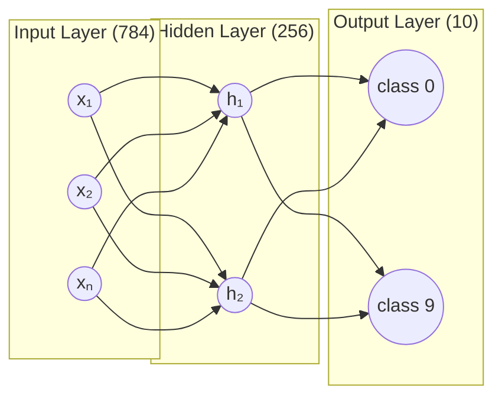
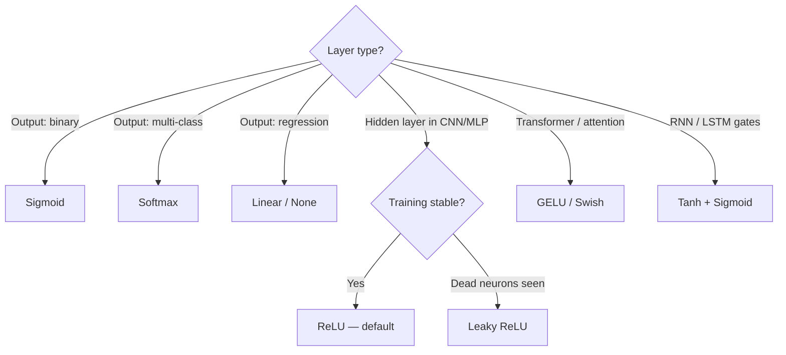
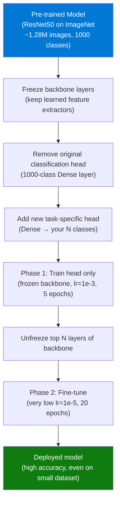
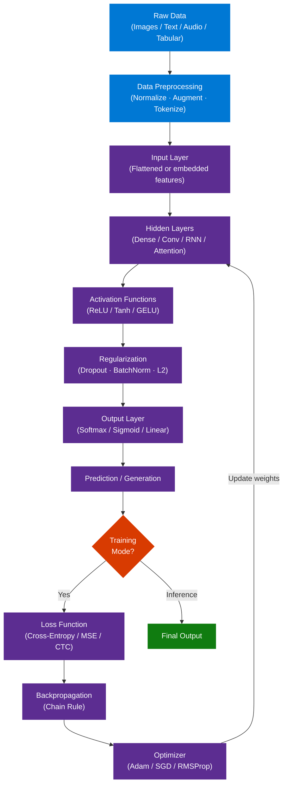

# Deep Learning Complete Guide — Full Course Reference

> **Source:** [YouTube — Deep Learning Full Course 2026](https://www.youtube.com/watch?v=XfLIj5kyfLE)
> **Channel/Event:** Simplilearn
> **Topic:** Deep Learning, Neural Networks, CNN, RNN, LSTM, TensorFlow, PyTorch, Keras, Backpropagation
> **Key Claim:** Deep learning automates feature extraction through layered neural networks, enabling state-of-the-art performance on vision, NLP, and speech tasks

---

## Table of Contents

1. [Overview](#1-overview)
2. [Problem Statement](#2-problem-statement)
3. [Core Concepts](#3-core-concepts)
4. [Architecture](#4-architecture)
5. [Key Components](#5-key-components)
6. [How It Works — Step by Step](#6-how-it-works--step-by-step)
7. [Comparison Table](#7-comparison-table)
8. [Code Examples](#8-code-examples)
9. [Configuration Reference](#9-configuration-reference)
10. [Best Practices](#10-best-practices)
11. [Interview Talking Points](#11-interview-talking-points)
12. [Learning Resources](#12-learning-resources)

---

## 1. Overview

Deep Learning is a subset of Machine Learning that uses artificial neural networks with multiple layers to automatically learn hierarchical feature representations from raw data. Unlike classical ML which requires manual feature engineering, deep learning discovers patterns directly from data — enabling breakthroughs in image recognition, natural language processing, speech synthesis, and autonomous systems.

The Simplilearn Full Course 2026 covers the complete deep learning curriculum in ~7 hours: foundational mathematics, neural network architectures (feedforward, CNN, RNN/LSTM), major frameworks (TensorFlow, Keras, PyTorch), practical projects, and interview preparation. Targets beginners and mid-level engineers transitioning into AI/ML roles.

**Course Structure (video timestamps):**
- `00:02:13` — What is Deep Learning?
- `00:47:06` — Mathematics for Machine Learning
- `02:37:30` — Deep Learning Tutorial
- `02:48:57` — Neural Network Tutorial
- `03:42:05` — Recurrent Neural Networks (RNN)
- `04:40:46` — Convolutional Neural Networks (CNN)
- `05:44:08` — Machine Learning Projects
- `06:02:27` — Deep Learning Interview Questions

---

## 2. Problem Statement

### Classic ML Pain Points

| Problem | Impact |
|---|---|
| Manual feature engineering required | Domain experts needed per problem; months of effort |
| Performance plateaus with more data | Accuracy ceiling — adding data doesn't help beyond a point |
| Fails on unstructured data | Can't handle raw pixels, audio waveforms, or text tokens directly |
| Shallow representation learning | Misses complex hierarchical patterns |
| No transfer of learned representations | Separate pipeline needed for each new task |

> **Key Insight:** "Deep learning removes the bottleneck of human-engineered features — the network discovers what matters directly from data."

---

## 3. Core Concepts

### Deep Learning

A paradigm using neural networks with many hidden layers ("depth") to learn hierarchical representations. Each layer learns progressively more abstract features: pixels → edges → shapes → objects → semantics. The "depth" refers to the number of successive transformation layers — a network with 50 layers can compose 50 levels of abstraction before producing its output. This contrasts with shallow models (SVMs, logistic regression) that transform input in a single step, leaving humans responsible for constructing useful features.

**How it works — layer-by-layer feature hierarchy:**


**Real-world example:** A ResNet-50 trained on ImageNet stacks 50 layers. Early layers activate on oriented edges (Gabor-like filters), mid layers fire on textures and part detectors (eyes, wheels), and final layers encode semantic categories — all learned from data alone, no human feature design.

| Property | Description |
|---|---|
| Depth | Typically 5–1000+ layers depending on architecture |
| Width | Number of neurons per layer; controls capacity |
| Parameters | ResNet-50 has ~25M; GPT-4 has ~1.8T |
| Key advantage | Hierarchical composition of simple functions |

> **Interview tip:** "Deep learning's core advantage is removing the feature engineering bottleneck — but this comes at the cost of interpretability and data hunger. For structured/tabular data with <100K rows, gradient boosting (XGBoost) usually beats deep networks."

### Artificial Neural Network (ANN)

A computational model inspired by biological neurons: nodes (neurons) organized in layers, connected by weighted edges. Learning = adjusting weights to minimize prediction error on training data. An ANN has three structural components: an **input layer** (receives raw features), one or more **hidden layers** (learn intermediate representations), and an **output layer** (produces the prediction). The number of parameters scales as `(input_size × hidden_size) + hidden_size` per layer — a 784→256→10 network for MNIST has 784×256 + 256 + 256×10 + 10 = 203,530 learnable weights.

**Single neuron computation:**

```
output = activation( w₁x₁ + w₂x₂ + ... + wₙxₙ + bias )
       = activation( Wᵀx + b )
```

**PyTorch — building a 3-layer ANN:**

```python
import torch.nn as nn

class ANN(nn.Module):
    def __init__(self, input_dim=784, hidden=256, num_classes=10):
        super().__init__()
        self.layers = nn.Sequential(
            nn.Linear(input_dim, hidden),   # W: (784, 256)
            nn.ReLU(),
            nn.Linear(hidden, hidden // 2), # W: (256, 128)
            nn.ReLU(),
            nn.Linear(hidden // 2, num_classes)  # W: (128, 10)
        )

    def forward(self, x):
        return self.layers(x)   # logits — apply softmax at loss time

model = ANN()
print(f"Parameters: {sum(p.numel() for p in model.parameters()):,}")
# Parameters: 236,810
```

**Layer structure:**



> **Interview tip:** "An ANN with zero hidden layers is logistic regression. One hidden layer with enough neurons can approximate any continuous function (Universal Approximation Theorem) — but depth is more parameter-efficient than width for learning hierarchical patterns."

### Backpropagation

Algorithm for training neural networks. After a forward pass computes the loss, backprop applies the chain rule backward through the network to compute the gradient of the loss with respect to every weight. Enables credit assignment — which weights contributed most to the error. The key insight is that the chain rule allows gradients to be computed layer-by-layer without re-running the entire forward pass: `∂L/∂W₁ = (∂L/∂a₂) × (∂a₂/∂a₁) × (∂a₁/∂W₁)`.

**Step-by-step backprop for a 2-layer network:**

```
Forward pass:
  z₁ = W₁·x + b₁       # linear transform, layer 1
  a₁ = ReLU(z₁)         # activation
  z₂ = W₂·a₁ + b₂      # linear transform, layer 2
  ŷ  = softmax(z₂)      # output probabilities
  L  = CrossEntropy(ŷ, y) # scalar loss

Backward pass (chain rule):
  ∂L/∂z₂ = ŷ - y                    # softmax + cross-entropy shortcut
  ∂L/∂W₂ = a₁ᵀ · (∂L/∂z₂)         # gradient for W₂
  ∂L/∂b₂ = sum(∂L/∂z₂)
  ∂L/∂a₁ = (∂L/∂z₂) · W₂ᵀ         # propagate back through layer 2
  ∂L/∂z₁ = ∂L/∂a₁ ⊙ ReLU'(z₁)    # element-wise, ReLU' = 1 if z>0 else 0
  ∂L/∂W₁ = xᵀ · (∂L/∂z₁)          # gradient for W₁
```

**PyTorch — backprop in action (explicit):**

```python
import torch
import torch.nn as nn

x = torch.randn(32, 784)   # batch of 32 samples
y = torch.randint(0, 10, (32,))

model = nn.Sequential(nn.Linear(784, 256), nn.ReLU(), nn.Linear(256, 10))
optimizer = torch.optim.Adam(model.parameters(), lr=1e-3)
criterion = nn.CrossEntropyLoss()

# Forward pass
logits = model(x)
loss = criterion(logits, y)

# Backward pass — PyTorch builds computational graph automatically
optimizer.zero_grad()  # clear previous gradients
loss.backward()        # compute all ∂L/∂W via chain rule
optimizer.step()       # apply gradient updates: W -= lr * ∂L/∂W

print(f"Loss: {loss.item():.4f}")
# Inspect gradients of first layer weights
print(f"W₁ grad shape: {model[0].weight.grad.shape}")  # torch.Size([256, 784])
```

> **Interview tip:** "Backprop is not magic — it is just systematic application of the chain rule using the computational graph. The vanishing gradient problem arises because sigmoid/tanh derivatives are <1, so multiplying many layers together drives gradients toward zero. ReLU solves this because its derivative is exactly 1 for positive inputs."

### Gradient Descent

Optimization algorithm that iteratively updates weights in the direction of steepest loss decrease:
`w = w - lr * ∂L/∂w`

Variants: SGD (one sample), Mini-batch (batch of N), Adam (adaptive learning rates). The learning rate `lr` is the most critical hyperparameter: too large causes divergence (loss explodes), too small causes painfully slow convergence or getting stuck in local minima. The loss landscape in deep networks is non-convex, so gradient descent finds a local minimum — but empirically, most local minima in modern deep networks have similar loss values to the global minimum.

**Variants comparison:**

| Variant | Batch Size | Gradient Noise | Speed | Memory | Best For |
|---|---|---|---|---|---|
| Batch GD | Full dataset | Exact gradient, no noise | Slowest | High | Small datasets |
| SGD | 1 sample | Very noisy | Fast per step | Low | Online learning |
| Mini-batch GD | 32–512 | Moderate noise | Fast | Moderate | Standard practice |
| Adam | 32–512 | Moderate | Fast | Slightly higher | Default choice |

**Adam optimizer — intuition and math:**

Adam maintains a per-parameter adaptive learning rate using first and second moment estimates:

```
m_t = β₁ · m_{t-1} + (1 - β₁) · g_t      # 1st moment (mean of gradients)
v_t = β₂ · v_{t-1} + (1 - β₂) · g_t²     # 2nd moment (variance of gradients)

m̂_t = m_t / (1 - β₁ᵗ)    # bias correction
v̂_t = v_t / (1 - β₂ᵗ)    # bias correction

w_t = w_{t-1} - lr · m̂_t / (√v̂_t + ε)   # update
```

Default: `β₁=0.9`, `β₂=0.999`, `ε=1e-8`, `lr=1e-3`. Parameters with large, consistent gradients get small effective learning rates; rare/small gradient parameters get larger effective rates — ideal for sparse NLP embeddings.

**PyTorch — comparing optimizers:**

```python
import torch.optim as optim

# Standard choices
adam_opt   = optim.Adam(model.parameters(), lr=1e-3, weight_decay=1e-4)
sgd_opt    = optim.SGD(model.parameters(), lr=0.01, momentum=0.9, nesterov=True)
adamw_opt  = optim.AdamW(model.parameters(), lr=1e-3, weight_decay=0.01)  # L2 decoupled

# Learning rate scheduler — cosine annealing
scheduler = optim.lr_scheduler.CosineAnnealingLR(adam_opt, T_max=100, eta_min=1e-6)

for epoch in range(100):
    train_epoch(model, loader)
    scheduler.step()   # decrease lr following cosine curve
```

> **Interview tip:** "Adam converges faster but SGD with momentum often achieves better final generalization on large vision benchmarks (ImageNet). In practice, use Adam for fast prototyping and fine-tuning; consider SGD for training large models from scratch. AdamW (Adam with decoupled weight decay) is the standard for Transformers."

### Activation Functions

Non-linear functions applied at each neuron. Without them, deep networks collapse to a single linear transform regardless of depth. Every hidden layer output `a = f(Wx + b)` — if `f` is identity (linear), stacking layers gives `W_n·...·W_2·W_1·x + c`, which is just a single linear transformation. Non-linearity enables the network to approximate arbitrarily complex functions.

| Function | Formula | Range | Use Case | Risk |
|---|---|---|---|---|
| ReLU | max(0, x) | [0, ∞) | Hidden layers — default choice | Dying ReLU (neurons stuck at 0) |
| Sigmoid | 1 / (1 + e^-x) | (0, 1) | Binary classification output | Vanishing gradient for deep nets |
| Softmax | e^xi / sum(e^xj) | (0, 1), sums to 1 | Multi-class output | Numerically unstable without log-softmax |
| Tanh | (e^x - e^-x) / (e^x + e^-x) | (-1, 1) | RNNs, hidden layers | Slower than ReLU, vanishing gradient |
| Leaky ReLU | max(0.01x, x) | (-∞, ∞) | Fix for dying ReLU neurons | Hyperparameter α to tune |
| GELU | x·Φ(x) | ≈(-0.17, ∞) | Transformers (BERT, GPT) | More compute than ReLU |
| Swish | x·sigmoid(x) | ≈(-0.28, ∞) | EfficientNet, MobileNet | Slight compute overhead |

**PyTorch — visualizing activations:**

```python
import torch
import torch.nn.functional as F
import matplotlib.pyplot as plt

x = torch.linspace(-3, 3, 100)

activations = {
    'ReLU':       F.relu(x),
    'Sigmoid':    torch.sigmoid(x),
    'Tanh':       torch.tanh(x),
    'Leaky ReLU': F.leaky_relu(x, 0.01),
    'GELU':       F.gelu(x),
}

fig, axes = plt.subplots(1, 5, figsize=(15, 3))
for ax, (name, y) in zip(axes, activations.items()):
    ax.plot(x.numpy(), y.numpy())
    ax.set_title(name)
    ax.axhline(0, color='gray', linewidth=0.5)
    ax.axvline(0, color='gray', linewidth=0.5)
plt.tight_layout()
plt.show()

# Dying ReLU demonstration
dead_neuron_input = torch.tensor([-5.0, -3.0, -1.0])
print("ReLU output:", F.relu(dead_neuron_input))    # tensor([0., 0., 0.])
print("Leaky output:", F.leaky_relu(dead_neuron_input, 0.01))  # small neg values
```

**Choosing an activation function:**



> **Interview tip:** "ReLU is the default for hidden layers but watch for dying ReLU — when a large learning rate drives many neurons to always output zero, they stop learning forever. Fix with Leaky ReLU, He initialization, or a smaller learning rate. GELU is preferred in Transformers because its smooth curve allows gradients to flow through near-zero activations."

### Overfitting and Regularization

Overfitting: model memorizes training data, fails to generalize. Prevention: Dropout (randomly disable neurons during training), L1/L2 weight penalties, Batch Normalization, Data Augmentation, Early Stopping. The diagnostic signal is a growing **train/validation loss gap** — training loss keeps falling but validation loss plateaus or rises. Deep learning models with millions of parameters are especially susceptible because they have sufficient capacity to fit noise.

**Diagnosing underfitting vs. overfitting:**

```
Train Loss HIGH, Val Loss HIGH   → Underfitting (model too simple, increase capacity)
Train Loss LOW,  Val Loss LOW    → Good fit (target state)
Train Loss LOW,  Val Loss HIGH   → Overfitting (model too complex, regularize)
Train Loss HIGH, Val Loss LOWER  → Data leakage bug (check your pipeline)
```

**Regularization techniques — when to use each:**

| Technique | How it Works | Best For | Code |
|---|---|---|---|
| **Dropout** | Zeros p% of neurons each forward pass; at inference, scale by (1-p) | FC/Dense layers | `nn.Dropout(p=0.5)` |
| **L2 / Weight Decay** | Penalizes large weights: `loss += λ·‖W‖²` | All layer types | `optim.AdamW(weight_decay=0.01)` |
| **L1 Regularization** | Penalizes: `loss += λ·‖W‖₁` — promotes sparsity | Feature selection | Manual or `l1_loss` |
| **Batch Normalization** | Normalizes layer inputs per mini-batch; mild regularization side effect | CNN, deep MLP | `nn.BatchNorm1d(features)` |
| **Data Augmentation** | Expands effective dataset size through transforms | Vision, NLP | `torchvision.transforms` |
| **Early Stopping** | Halt training when `val_loss` stops improving | Universal | Keras `EarlyStopping` callback |

**PyTorch — regularization in practice:**

```python
import torch.nn as nn
import torch.optim as optim

class RegularizedNet(nn.Module):
    def __init__(self):
        super().__init__()
        self.net = nn.Sequential(
            nn.Linear(784, 512),
            nn.BatchNorm1d(512),     # normalize activations
            nn.ReLU(),
            nn.Dropout(0.4),         # randomly drop 40% of neurons
            nn.Linear(512, 256),
            nn.BatchNorm1d(256),
            nn.ReLU(),
            nn.Dropout(0.3),
            nn.Linear(256, 10)
        )

    def forward(self, x):
        return self.net(x)

model = RegularizedNet()

# AdamW = Adam + decoupled L2 weight decay (better than Adam + L2 penalty)
optimizer = optim.AdamW(model.parameters(), lr=1e-3, weight_decay=1e-4)

# Early stopping tracking
best_val_loss = float('inf')
patience_counter = 0
PATIENCE = 5

for epoch in range(200):
    train_loss = train_epoch(model, train_loader, optimizer)
    val_loss   = evaluate(model, val_loader)

    if val_loss < best_val_loss:
        best_val_loss = val_loss
        patience_counter = 0
        torch.save(model.state_dict(), 'best_model.pt')  # checkpoint best
    else:
        patience_counter += 1
        if patience_counter >= PATIENCE:
            print(f"Early stopping at epoch {epoch}")
            break

model.load_state_dict(torch.load('best_model.pt'))  # restore best weights
```

> **Interview tip:** "The most effective regularization for deep learning is almost always more data or data augmentation — it attacks the root cause (insufficient training diversity) rather than constraining the model. Dropout is powerful for fully-connected layers but should not be used before the final classifier in CNNs; use spatial dropout or just L2 there."

### Transfer Learning

Using a pre-trained model (ResNet, BERT, GPT) as a starting point, then fine-tuning on task-specific data. Dramatically reduces data and compute requirements — standard practice for production models. The intuition: lower layers of deep networks learn general features (edges, grammar, syntax) shared across domains, while upper layers learn task-specific features. By freezing lower layers and retraining only the upper layers plus a new head, you reuse millions of training-hours of compute on a small dataset.

**Transfer learning strategies by dataset size:**

| Your Dataset Size | Strategy | Trainable Layers |
|---|---|---|
| Very small (< 1K samples) | Feature extraction only | Freeze all; train only new head |
| Small (1K–10K) | Fine-tune top layers | Freeze bottom 70%, train top 30% + head |
| Medium (10K–100K) | Fine-tune deeper | Unfreeze progressively; use low lr |
| Large (100K+) | Full fine-tune or train from scratch | All layers; use very low lr (1e-5) |

**How it works — step by step:**



**PyTorch — fine-tuning ResNet50 on a custom dataset:**

```python
import torch
import torch.nn as nn
from torchvision import models

def build_transfer_model(num_classes: int, freeze_backbone: bool = True):
    # Load pre-trained weights from ImageNet
    model = models.resnet50(weights=models.ResNet50_Weights.IMAGENET1K_V2)

    if freeze_backbone:
        for param in model.parameters():
            param.requires_grad = False   # freeze all backbone layers

    # Replace the final FC layer (1000 classes → our num_classes)
    in_features = model.fc.in_features   # 2048 for ResNet50
    model.fc = nn.Sequential(
        nn.Linear(in_features, 512),
        nn.ReLU(),
        nn.Dropout(0.3),
        nn.Linear(512, num_classes)
    )
    # model.fc parameters are unfrozen by default (new layers)
    return model

model = build_transfer_model(num_classes=5)  # e.g., 5-class medical image classifier

# Phase 1: Train head only (high lr, few epochs)
optimizer = torch.optim.Adam(model.fc.parameters(), lr=1e-3)

# Phase 2: Unfreeze top layers and fine-tune at lower lr
for layer in [model.layer4, model.layer3]:
    for param in layer.parameters():
        param.requires_grad = True

optimizer = torch.optim.Adam([
    {'params': model.layer3.parameters(), 'lr': 1e-5},
    {'params': model.layer4.parameters(), 'lr': 1e-5},
    {'params': model.fc.parameters(),     'lr': 1e-4},
])
```

> **Interview tip:** "Always start with Phase 1 (frozen backbone) for a few epochs before unfreezing — if you unfreeze immediately with a high learning rate, the random head gradients will destroy the carefully learned pre-trained weights, a phenomenon called 'catastrophic forgetting'. Use differential learning rates: 10× smaller for backbone layers than the head."

---

## 4. Architecture

### Overall Deep Learning System



### CNN Architecture (Image Classification Pipeline)

```mermaid
flowchart LR
    Inp["Input Image\n(H x W x C)"] --> Conv1["Conv Layer 1\n32 filters · 3x3"]
    Conv1 --> Act1["ReLU"]
    Act1 --> Pool1["MaxPool\n2x2"]
    Pool1 --> Conv2["Conv Layer 2\n64 filters · 3x3"]
    Conv2 --> Act2["ReLU"]
    Act2 --> Pool2["MaxPool\n2x2"]
    Pool2 --> Flat["Flatten"]
    Flat --> FC["Dense Layer\n128 units"]
    FC --> Drop["Dropout\n0.5"]
    Drop --> Soft["Softmax Output\nN classes"]

    classDef conv fill:#0078D4,color:#fff,stroke:none
    classDef act fill:#5C2D91,color:#fff,stroke:none
    classDef pool fill:#D83B01,color:#fff,stroke:none
    classDef out fill:#107C10,color:#fff,stroke:none

    class Conv1,Conv2 conv
    class Act1,Act2 act
    class Pool1,Pool2 pool
    class Soft out
```



---

## 5. Key Components

### Component Overview

| Component | Category | Role |
|---|---|---|
| Neuron | Building block | Computes weighted sum + activation |
| Dense Layer | Layer type | Fully connected; every neuron connects to all in next layer |
| Conv Layer | Layer type | Learns spatial filters via parameter sharing; detects local patterns |
| Pooling Layer | Layer type | Downsamples feature maps; provides translation invariance |
| RNN Cell | Layer type | Processes sequential data with recurrent hidden state |
| LSTM Cell | Layer type | Gated RNN; solves vanishing gradient for long sequences |
| Transformer Block | Layer type | Self-attention over all positions; parallelizable; basis of LLMs |
| Dropout | Regularization | Randomly zeros activations during training |
| Batch Normalization | Regularization | Normalizes layer outputs per mini-batch; accelerates training |
| Loss Function | Training | Measures prediction error against ground truth |
| Optimizer | Training | Updates weights to minimize loss |

### Loss Functions by Task

| Task | Loss Function | Notes |
|---|---|---|
| Binary classification | Binary Cross-Entropy | Output: sigmoid |
| Multi-class classification | Categorical Cross-Entropy | Output: softmax |
| Multi-label classification | Binary Cross-Entropy | Multiple sigmoidal outputs |
| Regression | Mean Squared Error | Sensitive to outliers |
| Regression | Mean Absolute Error | Robust to outliers |
| Sequence generation | CTC Loss | Variable-length outputs |

### Optimizers

| Optimizer | When to Use | Key Params |
|---|---|---|
| Adam | Default choice; adaptive per-parameter lr | lr=1e-3, beta1=0.9, beta2=0.999 |
| SGD + Momentum | Large-scale training; better generalization | lr, momentum=0.9 |
| RMSProp | RNNs; non-stationary objectives | lr, rho=0.9 |
| AdaGrad | Sparse features (NLP embeddings) | lr |

---

## 6. How It Works — Step by Step

### Training Loop Sequence

```mermaid
sequenceDiagram
    participant DS as Dataset
    participant FP as Forward Pass
    participant LF as Loss Function
    participant BP as Backpropagation
    participant OPT as Optimizer

    loop Each Epoch
        DS->>FP: Mini-batch (X_batch, y_batch)
        FP->>FP: Compute activations layer by layer
        FP->>LF: Predicted outputs y_pred
        LF->>LF: Compute loss L(y_pred, y_true)
        LF->>BP: Loss value + computation graph
        BP->>BP: Compute gradients via chain rule
        BP->>OPT: Gradients dL/dW per layer
        OPT->>FP: Updated weights W = W - lr * dL/dW
    end
    Note over DS,OPT: Repeat until convergence or early stopping triggered
```

### Step-by-Step Breakdown

1. **Initialize weights** — Xavier (tanh) or He (ReLU) initialization to break symmetry without vanishing/exploding at layer 0
2. **Forward pass** — Input propagates layer by layer; each neuron computes `a = activation(W·x + b)`
3. **Compute loss** — Predicted output vs ground truth label using chosen loss function
4. **Backward pass** — Chain rule propagates gradients from output layer back to input layer, attributing error to each weight
5. **Weight update** — Optimizer adjusts each weight: `w -= lr * gradient`
6. **Epoch completion** — One full pass over training data = 1 epoch; typically 20–200 epochs needed
7. **Validation check** — Evaluate on held-out val set after each epoch; apply early stopping if `val_loss` plateaus for `patience` epochs

---

## 7. Comparison Table

### AI vs Machine Learning vs Deep Learning

| Dimension | AI | Machine Learning | Deep Learning |
|---|---|---|---|
| Scope | Broadest — all intelligent behavior | Subset of AI | Subset of ML |
| Feature Engineering | Manual rules | Manual + semi-auto | Automatic |
| Data Requirement | Variable | Small–Medium | Large (millions of samples) |
| Interpretability | Depends | Moderate | Low (black box) |
| Hardware | CPU | CPU | GPU / TPU required |
| Best For | Rule-based systems | Tabular, structured data | Images, text, audio |

### Classic ML vs Deep Learning

| Dimension | Classic ML | Deep Learning |
|---|---|---|
| Feature Engineering | Manual (domain expert) | Learned automatically |
| Performance Scaling with Data | Plateaus | Improves continuously |
| Unstructured Data | Poor | Excellent |
| Training Speed | Fast (minutes) | Slow (hours to days) |
| Interpretability | High (SHAP, feature importance) | Low |
| Compute Requirement | CPU | GPU / TPU |
| Small Dataset Performance | Good | Prone to overfit |

### CNN vs RNN vs Transformer

| Dimension | CNN | RNN / LSTM | Transformer |
|---|---|---|---|
| Best For | Images, spatial data | Sequences, time series | NLP, long sequences |
| Key Mechanism | Convolution + pooling | Recurrent hidden state | Self-attention |
| Parallelizable | Yes | No (sequential) | Yes |
| Long-range Dependencies | Limited | LSTM handles better | Excellent |
| Typical Models | ResNet, VGG, EfficientNet | LSTM, GRU, BiLSTM | BERT, GPT, T5, ViT |
| Training Complexity | Medium | High (BPTT) | High (quadratic attention) |

---

## 8. Code Examples

### TensorFlow / Keras — CNN for Image Classification (CIFAR-10)

```python
import tensorflow as tf
from tensorflow.keras import layers, models

def build_cnn(num_classes=10):
    model = models.Sequential([
        layers.Conv2D(32, (3, 3), activation='relu', input_shape=(32, 32, 3)),
        layers.MaxPooling2D((2, 2)),
        layers.Conv2D(64, (3, 3), activation='relu'),
        layers.MaxPooling2D((2, 2)),
        layers.Conv2D(64, (3, 3), activation='relu'),
        layers.Flatten(),
        layers.Dense(64, activation='relu'),
        layers.Dropout(0.5),
        layers.Dense(num_classes, activation='softmax')
    ])
    return model

model = build_cnn()
model.compile(
    optimizer='adam',
    loss='sparse_categorical_crossentropy',
    metrics=['accuracy']
)

(x_train, y_train), (x_test, y_test) = tf.keras.datasets.cifar10.load_data()
x_train, x_test = x_train / 255.0, x_test / 255.0

history = model.fit(
    x_train, y_train,
    epochs=20,
    batch_size=64,
    validation_data=(x_test, y_test),
    callbacks=[
        tf.keras.callbacks.EarlyStopping(patience=3, restore_best_weights=True),
        tf.keras.callbacks.ModelCheckpoint('best_model.h5', save_best_only=True)
    ]
)
```

### Keras — LSTM for Text Sentiment Classification

```python
from tensorflow.keras import layers, models

VOCAB_SIZE = 10000
MAX_LEN = 200
EMBED_DIM = 64

model = models.Sequential([
    layers.Embedding(VOCAB_SIZE, EMBED_DIM, input_length=MAX_LEN),
    layers.LSTM(128, return_sequences=True),
    layers.LSTM(64),
    layers.Dense(32, activation='relu'),
    layers.Dropout(0.3),
    layers.Dense(1, activation='sigmoid')
])

model.compile(
    optimizer='adam',
    loss='binary_crossentropy',
    metrics=['accuracy']
)
model.summary()
```

### PyTorch — Feedforward Neural Network with Training Loop

```python
import torch
import torch.nn as nn
import torch.optim as optim

class DeepNet(nn.Module):
    def __init__(self, input_dim, hidden_dim, output_dim):
        super().__init__()
        self.net = nn.Sequential(
            nn.Linear(input_dim, hidden_dim),
            nn.ReLU(),
            nn.BatchNorm1d(hidden_dim),
            nn.Dropout(0.3),
            nn.Linear(hidden_dim, hidden_dim // 2),
            nn.ReLU(),
            nn.Linear(hidden_dim // 2, output_dim)
        )

    def forward(self, x):
        return self.net(x)

model = DeepNet(input_dim=784, hidden_dim=256, output_dim=10)
optimizer = optim.Adam(model.parameters(), lr=1e-3)
criterion = nn.CrossEntropyLoss()

def train_epoch(model, loader):
    model.train()
    total_loss = 0
    for batch_x, batch_y in loader:
        optimizer.zero_grad()
        outputs = model(batch_x)
        loss = criterion(outputs, batch_y)
        loss.backward()
        optimizer.step()
        total_loss += loss.item()
    return total_loss / len(loader)
```

### Transfer Learning with Keras (Fine-tuning ResNet50)

```python
from tensorflow.keras.applications import ResNet50
from tensorflow.keras import layers, models

base_model = ResNet50(weights='imagenet', include_top=False, input_shape=(224, 224, 3))
base_model.trainable = False  # freeze pretrained weights

model = models.Sequential([
    base_model,
    layers.GlobalAveragePooling2D(),
    layers.Dense(256, activation='relu'),
    layers.Dropout(0.4),
    layers.Dense(10, activation='softmax')
])

model.compile(optimizer='adam', loss='categorical_crossentropy', metrics=['accuracy'])
```

### Install / Setup

```bash
# TensorFlow + Keras
pip install tensorflow

# PyTorch (CPU)
pip install torch torchvision

# PyTorch (GPU — CUDA 11.8)
pip install torch torchvision --index-url https://download.pytorch.org/whl/cu118

# Common data science stack
pip install numpy pandas matplotlib scikit-learn

# Jupyter for experiments
pip install jupyterlab
```

---

## 9. Configuration Reference

### Key Hyperparameters

| Parameter | Type | Typical Range | Notes |
|---|---|---|---|
| learning_rate | float | 1e-4 – 1e-2 | Adam default: 1e-3; use LR scheduler |
| batch_size | int | 32 – 512 | Larger = faster; smaller = noisier gradients (often better) |
| epochs | int | 10 – 200 | Always pair with early stopping |
| dropout_rate | float | 0.2 – 0.5 | Higher = more regularization; 0.5 for FC layers |
| hidden_units | int | 64 – 2048 | Powers of 2 convention; scale with task complexity |
| num_layers | int | 2 – 50+ | Use residual connections beyond ~10 layers |
| optimizer | str | adam, sgd, rmsprop | Adam is safe default |
| weight_init | str | glorot_uniform (Keras), kaiming (PyTorch) | Match to activation function |
| momentum | float | 0.85 – 0.95 | SGD only |
| patience | int | 3 – 10 | Early stopping epochs before halting |
| l2_lambda | float | 1e-5 – 1e-3 | L2 weight decay strength |

---

## 10. Best Practices

### Data Preparation

- ✅ Normalize inputs: zero mean, unit variance (tabular) or scale to [0, 1] (images)
- ✅ Augment training data: flip, rotate, crop (images); synonym swap (text); noise injection (audio)
- ✅ Use stratified splits for imbalanced class distributions
- ✅ Shuffle training data every epoch
- ❌ Don't normalize test data using test statistics — always use training set statistics
- ❌ Don't leak future data in time series splits; always split chronologically

### Model Design

- ✅ Start small — add layers/units only when training loss is too high (underfitting)
- ✅ Use BatchNorm before activation in deep networks
- ✅ Add residual/skip connections in networks deeper than ~8 layers
- ✅ Use transfer learning on small datasets — always outperforms training from scratch
- ❌ Don't use sigmoid/tanh in deep hidden layers — causes vanishing gradients
- ❌ Don't add complexity before diagnosing the problem: is it underfitting or overfitting?

### Training

- ✅ Use learning rate schedulers (cosine annealing, ReduceLROnPlateau)
- ✅ Monitor train vs. validation loss — divergence = overfitting; both high = underfitting
- ✅ Use mixed precision (float16) for GPU training; 2× speed with minimal accuracy loss
- ✅ Checkpoint best model weights, not last epoch
- ❌ Don't tune hyperparameters on the test set — use a separate validation set
- ❌ Don't train without early stopping or an epoch budget

---

## 11. Interview Talking Points

### "What is the difference between Deep Learning and Machine Learning?"

> Machine Learning uses statistical algorithms (linear regression, decision trees, SVMs) that require manually engineered features. Deep Learning uses multi-layered neural networks that automatically learn hierarchical feature representations from raw data — pixels, waveforms, tokens — eliminating the feature engineering bottleneck. DL outperforms classical ML when data is large and unstructured (images, text, audio); classical ML is preferable for small tabular datasets where interpretability matters.

### "Explain backpropagation."

> Backpropagation is the training algorithm for neural networks. After a forward pass produces predictions and a scalar loss value, backprop applies the chain rule of calculus backward through the network: it computes the partial derivative of the loss with respect to every weight, starting from the output layer and working back to the input. An optimizer (Adam, SGD) uses these gradients to update each weight in the direction that reduces loss. Repeating this process over thousands of mini-batches across many epochs is how the network learns.

### "When would you use a CNN vs an RNN vs a Transformer?"

> CNNs excel at spatial data — images and video — through convolution and pooling, which detect local patterns regardless of position. RNNs/LSTMs handle sequential data (time series, text) by maintaining a hidden state that captures temporal dependencies; LSTMs add gating to prevent vanishing gradients over long sequences. Transformers use self-attention to model relationships between all positions simultaneously — they parallelize better and are now the default for NLP and increasingly for vision (Vision Transformer). For new NLP tasks, Transformers dominate; for image classification on limited data, CNNs remain competitive.

### "What is vanishing gradient and how is it solved?"

> In deep networks, gradients are multiplied through each layer during backpropagation. With sigmoid or tanh activations (outputs squashed to 0–1 or -1 to 1), gradients shrink exponentially through layers — reaching near-zero in early layers, preventing those weights from learning. Solutions: (1) **ReLU** — gradient is 1 for positive inputs, not squashed; (2) **Residual connections** — skip connections add gradients directly, bypassing layers; (3) **Batch Normalization** — keeps activations in healthy ranges; (4) **LSTM gating** — for RNNs, gates control gradient flow across time steps; (5) **Gradient clipping** — caps exploding gradients in RNNs.

### "What is overfitting and how do you prevent it in deep learning?"

> Overfitting occurs when a model learns training data noise rather than generalizable patterns — low training loss but high validation loss. Deep learning models are especially prone due to high capacity. Prevention: **Dropout** (randomly zeros p% of activations per forward pass, forcing redundant representations); **L2 regularization** (penalizes large weights); **Data augmentation** (artificially expands training set diversity); **Batch Normalization** (mild regularization side effect); **Early stopping** (halt when val_loss stops improving for N epochs); **Transfer learning** (start from pre-trained weights — far less prone to overfit on small data).

---

## 12. Learning Resources

| Resource | Link | Type |
|---|---|---|
| Deep Learning Full Course 2026 | [YouTube](https://www.youtube.com/watch?v=XfLIj5kyfLE) | Video |
| Simplilearn Deep Learning Tutorial | [simplilearn.com/tutorials/deep-learning-tutorial](https://www.simplilearn.com/tutorials/deep-learning-tutorial) | Official Tutorial |
| Free Deep Learning Certification | [simplilearn.com SkillUp](https://www.simplilearn.com/introduction-to-deep-learning-free-course-skillup) | Free Course |
| TensorFlow Official Docs | [tensorflow.org/learn](https://www.tensorflow.org/learn) | Official Docs |
| PyTorch Official Docs | [pytorch.org/docs](https://pytorch.org/docs/stable/index.html) | Official Docs |
| Deep Learning Book (Goodfellow et al.) | [deeplearningbook.org](https://www.deeplearningbook.org) | Book |
| fast.ai Practical Deep Learning | [course.fast.ai](https://course.fast.ai) | Free Course |

---

*Last Updated: July 2026 | Source: Simplilearn — Deep Learning Full Course 2026*
