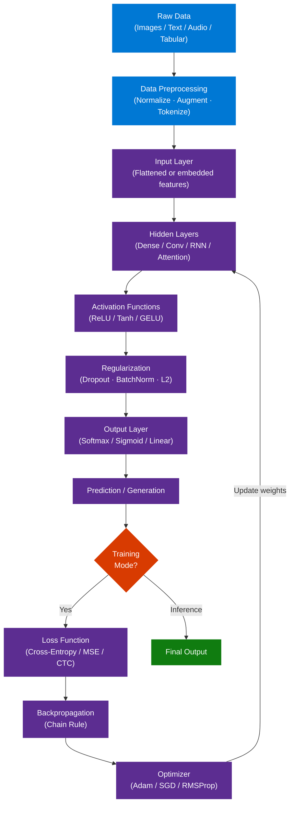

# Deep Learning Complete Guide — Full Course Reference

> **Source:** [YouTube — Deep Learning Full Course 2026](https://www.youtube.com/watch?v=XfLIj5kyfLE)
> **Channel/Event:** Simplilearn
> **Topic:** Deep Learning, Neural Networks, CNN, RNN, LSTM, TensorFlow, PyTorch, Keras, Backpropagation
> **Key Claim:** Deep learning automates feature extraction through layered neural networks, enabling state-of-the-art performance on vision, NLP, and speech tasks

---

## Table of Contents

1. [Overview](#1-overview)
2. [Problem Statement](#2-problem-statement)
3. [Core Concepts](#3-core-concepts)
4. [Architecture](#4-architecture)
5. [Key Components](#5-key-components)
6. [How It Works — Step by Step](#6-how-it-works--step-by-step)
7. [Comparison Table](#7-comparison-table)
8. [Code Examples](#8-code-examples)
9. [Configuration Reference](#9-configuration-reference)
10. [Best Practices](#10-best-practices)
11. [Interview Talking Points](#11-interview-talking-points)
12. [Learning Resources](#12-learning-resources)

---

## 1. Overview

Deep Learning is a subset of Machine Learning that uses artificial neural networks with multiple layers to automatically learn hierarchical feature representations from raw data. Unlike classical ML which requires manual feature engineering, deep learning discovers patterns directly from data — enabling breakthroughs in image recognition, natural language processing, speech synthesis, and autonomous systems.

The Simplilearn Full Course 2026 covers the complete deep learning curriculum in ~7 hours: foundational mathematics, neural network architectures (feedforward, CNN, RNN/LSTM), major frameworks (TensorFlow, Keras, PyTorch), practical projects, and interview preparation. Targets beginners and mid-level engineers transitioning into AI/ML roles.

**Course Structure (video timestamps):**
- `00:02:13` — What is Deep Learning?
- `00:47:06` — Mathematics for Machine Learning
- `02:37:30` — Deep Learning Tutorial
- `02:48:57` — Neural Network Tutorial
- `03:42:05` — Recurrent Neural Networks (RNN)
- `04:40:46` — Convolutional Neural Networks (CNN)
- `05:44:08` — Machine Learning Projects
- `06:02:27` — Deep Learning Interview Questions

---

## 2. Problem Statement

### Classic ML Pain Points

| Problem | Impact |
|---|---|
| Manual feature engineering required | Domain experts needed per problem; months of effort |
| Performance plateaus with more data | Accuracy ceiling — adding data doesn't help beyond a point |
| Fails on unstructured data | Can't handle raw pixels, audio waveforms, or text tokens directly |
| Shallow representation learning | Misses complex hierarchical patterns |
| No transfer of learned representations | Separate pipeline needed for each new task |

> **Key Insight:** "Deep learning removes the bottleneck of human-engineered features — the network discovers what matters directly from data."

---

## 3. Core Concepts

### Deep Learning

A paradigm using neural networks with many hidden layers ("depth") to learn hierarchical representations. Each layer learns progressively more abstract features: pixels → edges → shapes → objects → semantics.

### Artificial Neural Network (ANN)

A computational model inspired by biological neurons: nodes (neurons) organized in layers, connected by weighted edges. Learning = adjusting weights to minimize prediction error on training data.

### Backpropagation

Algorithm for training neural networks. After a forward pass computes the loss, backprop applies the chain rule backward through the network to compute the gradient of the loss with respect to every weight. Enables credit assignment — which weights contributed most to the error.

### Gradient Descent

Optimization algorithm that iteratively updates weights in the direction of steepest loss decrease:
`w = w - lr * ∂L/∂w`

Variants: SGD (one sample), Mini-batch (batch of N), Adam (adaptive learning rates).

### Activation Functions

Non-linear functions applied at each neuron. Without them, deep networks collapse to a single linear transform regardless of depth.

| Function | Formula | Use Case |
|---|---|---|
| ReLU | max(0, x) | Hidden layers — default choice |
| Sigmoid | 1 / (1 + e^-x) | Binary classification output |
| Softmax | e^xi / sum(e^xj) | Multi-class output |
| Tanh | (e^x - e^-x) / (e^x + e^-x) | RNNs, hidden layers |
| Leaky ReLU | max(0.01x, x) | Fix for dying ReLU neurons |

### Overfitting and Regularization

Overfitting: model memorizes training data, fails to generalize. Prevention: Dropout (randomly disable neurons during training), L1/L2 weight penalties, Batch Normalization, Data Augmentation, Early Stopping.

### Transfer Learning

Using a pre-trained model (ResNet, BERT, GPT) as a starting point, then fine-tuning on task-specific data. Dramatically reduces data and compute requirements — standard practice for production models.

---

## 4. Architecture

### Overall Deep Learning System



### CNN Architecture (Image Classification Pipeline)

```mermaid
flowchart LR
    Inp["Input Image\n(H x W x C)"] --> Conv1["Conv Layer 1\n32 filters · 3x3"]
    Conv1 --> Act1["ReLU"]
    Act1 --> Pool1["MaxPool\n2x2"]
    Pool1 --> Conv2["Conv Layer 2\n64 filters · 3x3"]
    Conv2 --> Act2["ReLU"]
    Act2 --> Pool2["MaxPool\n2x2"]
    Pool2 --> Flat["Flatten"]
    Flat --> FC["Dense Layer\n128 units"]
    FC --> Drop["Dropout\n0.5"]
    Drop --> Soft["Softmax Output\nN classes"]

    classDef conv fill:#0078D4,color:#fff,stroke:none
    classDef act fill:#5C2D91,color:#fff,stroke:none
    classDef pool fill:#D83B01,color:#fff,stroke:none
    classDef out fill:#107C10,color:#fff,stroke:none

    class Conv1,Conv2 conv
    class Act1,Act2 act
    class Pool1,Pool2 pool
    class Soft out
```



---

## 5. Key Components

### Component Overview

| Component | Category | Role |
|---|---|---|
| Neuron | Building block | Computes weighted sum + activation |
| Dense Layer | Layer type | Fully connected; every neuron connects to all in next layer |
| Conv Layer | Layer type | Learns spatial filters via parameter sharing; detects local patterns |
| Pooling Layer | Layer type | Downsamples feature maps; provides translation invariance |
| RNN Cell | Layer type | Processes sequential data with recurrent hidden state |
| LSTM Cell | Layer type | Gated RNN; solves vanishing gradient for long sequences |
| Transformer Block | Layer type | Self-attention over all positions; parallelizable; basis of LLMs |
| Dropout | Regularization | Randomly zeros activations during training |
| Batch Normalization | Regularization | Normalizes layer outputs per mini-batch; accelerates training |
| Loss Function | Training | Measures prediction error against ground truth |
| Optimizer | Training | Updates weights to minimize loss |

### Loss Functions by Task

| Task | Loss Function | Notes |
|---|---|---|
| Binary classification | Binary Cross-Entropy | Output: sigmoid |
| Multi-class classification | Categorical Cross-Entropy | Output: softmax |
| Multi-label classification | Binary Cross-Entropy | Multiple sigmoidal outputs |
| Regression | Mean Squared Error | Sensitive to outliers |
| Regression | Mean Absolute Error | Robust to outliers |
| Sequence generation | CTC Loss | Variable-length outputs |

### Optimizers

| Optimizer | When to Use | Key Params |
|---|---|---|
| Adam | Default choice; adaptive per-parameter lr | lr=1e-3, beta1=0.9, beta2=0.999 |
| SGD + Momentum | Large-scale training; better generalization | lr, momentum=0.9 |
| RMSProp | RNNs; non-stationary objectives | lr, rho=0.9 |
| AdaGrad | Sparse features (NLP embeddings) | lr |

---

## 6. How It Works — Step by Step

### Training Loop Sequence

```mermaid
sequenceDiagram
    participant DS as Dataset
    participant FP as Forward Pass
    participant LF as Loss Function
    participant BP as Backpropagation
    participant OPT as Optimizer

    loop Each Epoch
        DS->>FP: Mini-batch (X_batch, y_batch)
        FP->>FP: Compute activations layer by layer
        FP->>LF: Predicted outputs y_pred
        LF->>LF: Compute loss L(y_pred, y_true)
        LF->>BP: Loss value + computation graph
        BP->>BP: Compute gradients via chain rule
        BP->>OPT: Gradients dL/dW per layer
        OPT->>FP: Updated weights W = W - lr * dL/dW
    end
    Note over DS,OPT: Repeat until convergence or early stopping triggered
```

### Step-by-Step Breakdown

1. **Initialize weights** — Xavier (tanh) or He (ReLU) initialization to break symmetry without vanishing/exploding at layer 0
2. **Forward pass** — Input propagates layer by layer; each neuron computes `a = activation(W·x + b)`
3. **Compute loss** — Predicted output vs ground truth label using chosen loss function
4. **Backward pass** — Chain rule propagates gradients from output layer back to input layer, attributing error to each weight
5. **Weight update** — Optimizer adjusts each weight: `w -= lr * gradient`
6. **Epoch completion** — One full pass over training data = 1 epoch; typically 20–200 epochs needed
7. **Validation check** — Evaluate on held-out val set after each epoch; apply early stopping if `val_loss` plateaus for `patience` epochs

---

## 7. Comparison Table

### AI vs Machine Learning vs Deep Learning

| Dimension | AI | Machine Learning | Deep Learning |
|---|---|---|---|
| Scope | Broadest — all intelligent behavior | Subset of AI | Subset of ML |
| Feature Engineering | Manual rules | Manual + semi-auto | Automatic |
| Data Requirement | Variable | Small–Medium | Large (millions of samples) |
| Interpretability | Depends | Moderate | Low (black box) |
| Hardware | CPU | CPU | GPU / TPU required |
| Best For | Rule-based systems | Tabular, structured data | Images, text, audio |

### Classic ML vs Deep Learning

| Dimension | Classic ML | Deep Learning |
|---|---|---|
| Feature Engineering | Manual (domain expert) | Learned automatically |
| Performance Scaling with Data | Plateaus | Improves continuously |
| Unstructured Data | Poor | Excellent |
| Training Speed | Fast (minutes) | Slow (hours to days) |
| Interpretability | High (SHAP, feature importance) | Low |
| Compute Requirement | CPU | GPU / TPU |
| Small Dataset Performance | Good | Prone to overfit |

### CNN vs RNN vs Transformer

| Dimension | CNN | RNN / LSTM | Transformer |
|---|---|---|---|
| Best For | Images, spatial data | Sequences, time series | NLP, long sequences |
| Key Mechanism | Convolution + pooling | Recurrent hidden state | Self-attention |
| Parallelizable | Yes | No (sequential) | Yes |
| Long-range Dependencies | Limited | LSTM handles better | Excellent |
| Typical Models | ResNet, VGG, EfficientNet | LSTM, GRU, BiLSTM | BERT, GPT, T5, ViT |
| Training Complexity | Medium | High (BPTT) | High (quadratic attention) |

---

## 8. Code Examples

### TensorFlow / Keras — CNN for Image Classification (CIFAR-10)

```python
import tensorflow as tf
from tensorflow.keras import layers, models

def build_cnn(num_classes=10):
    model = models.Sequential([
        layers.Conv2D(32, (3, 3), activation='relu', input_shape=(32, 32, 3)),
        layers.MaxPooling2D((2, 2)),
        layers.Conv2D(64, (3, 3), activation='relu'),
        layers.MaxPooling2D((2, 2)),
        layers.Conv2D(64, (3, 3), activation='relu'),
        layers.Flatten(),
        layers.Dense(64, activation='relu'),
        layers.Dropout(0.5),
        layers.Dense(num_classes, activation='softmax')
    ])
    return model

model = build_cnn()
model.compile(
    optimizer='adam',
    loss='sparse_categorical_crossentropy',
    metrics=['accuracy']
)

(x_train, y_train), (x_test, y_test) = tf.keras.datasets.cifar10.load_data()
x_train, x_test = x_train / 255.0, x_test / 255.0

history = model.fit(
    x_train, y_train,
    epochs=20,
    batch_size=64,
    validation_data=(x_test, y_test),
    callbacks=[
        tf.keras.callbacks.EarlyStopping(patience=3, restore_best_weights=True),
        tf.keras.callbacks.ModelCheckpoint('best_model.h5', save_best_only=True)
    ]
)
```

### Keras — LSTM for Text Sentiment Classification

```python
from tensorflow.keras import layers, models

VOCAB_SIZE = 10000
MAX_LEN = 200
EMBED_DIM = 64

model = models.Sequential([
    layers.Embedding(VOCAB_SIZE, EMBED_DIM, input_length=MAX_LEN),
    layers.LSTM(128, return_sequences=True),
    layers.LSTM(64),
    layers.Dense(32, activation='relu'),
    layers.Dropout(0.3),
    layers.Dense(1, activation='sigmoid')
])

model.compile(
    optimizer='adam',
    loss='binary_crossentropy',
    metrics=['accuracy']
)
model.summary()
```

### PyTorch — Feedforward Neural Network with Training Loop

```python
import torch
import torch.nn as nn
import torch.optim as optim

class DeepNet(nn.Module):
    def __init__(self, input_dim, hidden_dim, output_dim):
        super().__init__()
        self.net = nn.Sequential(
            nn.Linear(input_dim, hidden_dim),
            nn.ReLU(),
            nn.BatchNorm1d(hidden_dim),
            nn.Dropout(0.3),
            nn.Linear(hidden_dim, hidden_dim // 2),
            nn.ReLU(),
            nn.Linear(hidden_dim // 2, output_dim)
        )

    def forward(self, x):
        return self.net(x)

model = DeepNet(input_dim=784, hidden_dim=256, output_dim=10)
optimizer = optim.Adam(model.parameters(), lr=1e-3)
criterion = nn.CrossEntropyLoss()

def train_epoch(model, loader):
    model.train()
    total_loss = 0
    for batch_x, batch_y in loader:
        optimizer.zero_grad()
        outputs = model(batch_x)
        loss = criterion(outputs, batch_y)
        loss.backward()
        optimizer.step()
        total_loss += loss.item()
    return total_loss / len(loader)
```

### Transfer Learning with Keras (Fine-tuning ResNet50)

```python
from tensorflow.keras.applications import ResNet50
from tensorflow.keras import layers, models

base_model = ResNet50(weights='imagenet', include_top=False, input_shape=(224, 224, 3))
base_model.trainable = False  # freeze pretrained weights

model = models.Sequential([
    base_model,
    layers.GlobalAveragePooling2D(),
    layers.Dense(256, activation='relu'),
    layers.Dropout(0.4),
    layers.Dense(10, activation='softmax')
])

model.compile(optimizer='adam', loss='categorical_crossentropy', metrics=['accuracy'])
```

### Install / Setup

```bash
# TensorFlow + Keras
pip install tensorflow

# PyTorch (CPU)
pip install torch torchvision

# PyTorch (GPU — CUDA 11.8)
pip install torch torchvision --index-url https://download.pytorch.org/whl/cu118

# Common data science stack
pip install numpy pandas matplotlib scikit-learn

# Jupyter for experiments
pip install jupyterlab
```

---

## 9. Configuration Reference

### Key Hyperparameters

| Parameter | Type | Typical Range | Notes |
|---|---|---|---|
| learning_rate | float | 1e-4 – 1e-2 | Adam default: 1e-3; use LR scheduler |
| batch_size | int | 32 – 512 | Larger = faster; smaller = noisier gradients (often better) |
| epochs | int | 10 – 200 | Always pair with early stopping |
| dropout_rate | float | 0.2 – 0.5 | Higher = more regularization; 0.5 for FC layers |
| hidden_units | int | 64 – 2048 | Powers of 2 convention; scale with task complexity |
| num_layers | int | 2 – 50+ | Use residual connections beyond ~10 layers |
| optimizer | str | adam, sgd, rmsprop | Adam is safe default |
| weight_init | str | glorot_uniform (Keras), kaiming (PyTorch) | Match to activation function |
| momentum | float | 0.85 – 0.95 | SGD only |
| patience | int | 3 – 10 | Early stopping epochs before halting |
| l2_lambda | float | 1e-5 – 1e-3 | L2 weight decay strength |

---

## 10. Best Practices

### Data Preparation

- ✅ Normalize inputs: zero mean, unit variance (tabular) or scale to [0, 1] (images)
- ✅ Augment training data: flip, rotate, crop (images); synonym swap (text); noise injection (audio)
- ✅ Use stratified splits for imbalanced class distributions
- ✅ Shuffle training data every epoch
- ❌ Don't normalize test data using test statistics — always use training set statistics
- ❌ Don't leak future data in time series splits; always split chronologically

### Model Design

- ✅ Start small — add layers/units only when training loss is too high (underfitting)
- ✅ Use BatchNorm before activation in deep networks
- ✅ Add residual/skip connections in networks deeper than ~8 layers
- ✅ Use transfer learning on small datasets — always outperforms training from scratch
- ❌ Don't use sigmoid/tanh in deep hidden layers — causes vanishing gradients
- ❌ Don't add complexity before diagnosing the problem: is it underfitting or overfitting?

### Training

- ✅ Use learning rate schedulers (cosine annealing, ReduceLROnPlateau)
- ✅ Monitor train vs. validation loss — divergence = overfitting; both high = underfitting
- ✅ Use mixed precision (float16) for GPU training; 2× speed with minimal accuracy loss
- ✅ Checkpoint best model weights, not last epoch
- ❌ Don't tune hyperparameters on the test set — use a separate validation set
- ❌ Don't train without early stopping or an epoch budget

---

## 11. Interview Talking Points

### "What is the difference between Deep Learning and Machine Learning?"

> Machine Learning uses statistical algorithms (linear regression, decision trees, SVMs) that require manually engineered features. Deep Learning uses multi-layered neural networks that automatically learn hierarchical feature representations from raw data — pixels, waveforms, tokens — eliminating the feature engineering bottleneck. DL outperforms classical ML when data is large and unstructured (images, text, audio); classical ML is preferable for small tabular datasets where interpretability matters.

### "Explain backpropagation."

> Backpropagation is the training algorithm for neural networks. After a forward pass produces predictions and a scalar loss value, backprop applies the chain rule of calculus backward through the network: it computes the partial derivative of the loss with respect to every weight, starting from the output layer and working back to the input. An optimizer (Adam, SGD) uses these gradients to update each weight in the direction that reduces loss. Repeating this process over thousands of mini-batches across many epochs is how the network learns.

### "When would you use a CNN vs an RNN vs a Transformer?"

> CNNs excel at spatial data — images and video — through convolution and pooling, which detect local patterns regardless of position. RNNs/LSTMs handle sequential data (time series, text) by maintaining a hidden state that captures temporal dependencies; LSTMs add gating to prevent vanishing gradients over long sequences. Transformers use self-attention to model relationships between all positions simultaneously — they parallelize better and are now the default for NLP and increasingly for vision (Vision Transformer). For new NLP tasks, Transformers dominate; for image classification on limited data, CNNs remain competitive.

### "What is vanishing gradient and how is it solved?"

> In deep networks, gradients are multiplied through each layer during backpropagation. With sigmoid or tanh activations (outputs squashed to 0–1 or -1 to 1), gradients shrink exponentially through layers — reaching near-zero in early layers, preventing those weights from learning. Solutions: (1) **ReLU** — gradient is 1 for positive inputs, not squashed; (2) **Residual connections** — skip connections add gradients directly, bypassing layers; (3) **Batch Normalization** — keeps activations in healthy ranges; (4) **LSTM gating** — for RNNs, gates control gradient flow across time steps; (5) **Gradient clipping** — caps exploding gradients in RNNs.

### "What is overfitting and how do you prevent it in deep learning?"

> Overfitting occurs when a model learns training data noise rather than generalizable patterns — low training loss but high validation loss. Deep learning models are especially prone due to high capacity. Prevention: **Dropout** (randomly zeros p% of activations per forward pass, forcing redundant representations); **L2 regularization** (penalizes large weights); **Data augmentation** (artificially expands training set diversity); **Batch Normalization** (mild regularization side effect); **Early stopping** (halt when val_loss stops improving for N epochs); **Transfer learning** (start from pre-trained weights — far less prone to overfit on small data).

---

## 12. Learning Resources

| Resource | Link | Type |
|---|---|---|
| Deep Learning Full Course 2026 | [YouTube](https://www.youtube.com/watch?v=XfLIj5kyfLE) | Video |
| Simplilearn Deep Learning Tutorial | [simplilearn.com/tutorials/deep-learning-tutorial](https://www.simplilearn.com/tutorials/deep-learning-tutorial) | Official Tutorial |
| Free Deep Learning Certification | [simplilearn.com SkillUp](https://www.simplilearn.com/introduction-to-deep-learning-free-course-skillup) | Free Course |
| TensorFlow Official Docs | [tensorflow.org/learn](https://www.tensorflow.org/learn) | Official Docs |
| PyTorch Official Docs | [pytorch.org/docs](https://pytorch.org/docs/stable/index.html) | Official Docs |
| Deep Learning Book (Goodfellow et al.) | [deeplearningbook.org](https://www.deeplearningbook.org) | Book |
| fast.ai Practical Deep Learning | [course.fast.ai](https://course.fast.ai) | Free Course |

---

*Last Updated: July 2026 | Source: Simplilearn — Deep Learning Full Course 2026*
