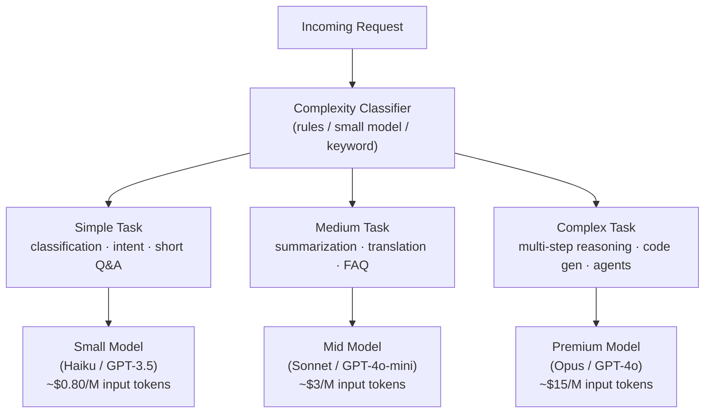
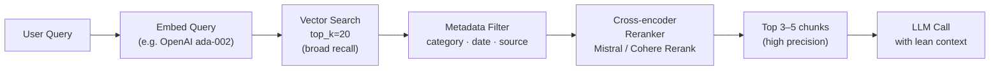
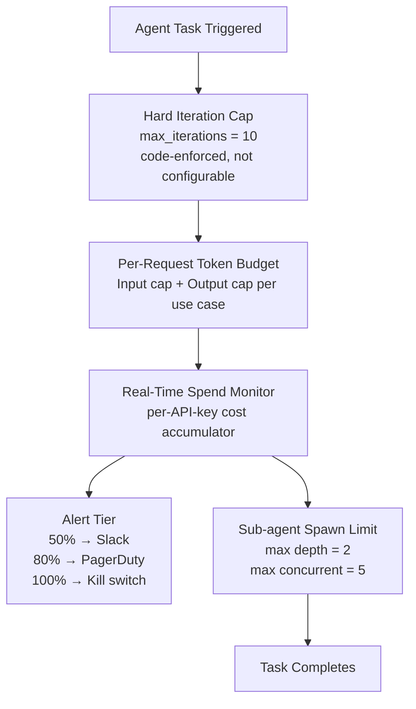
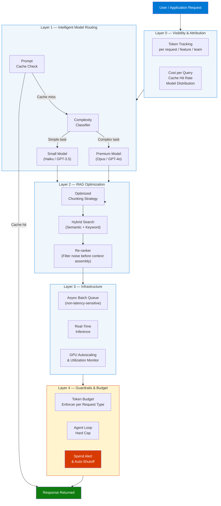
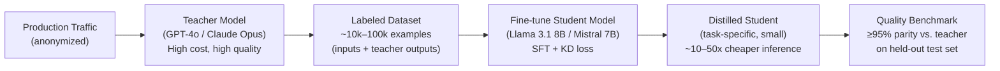
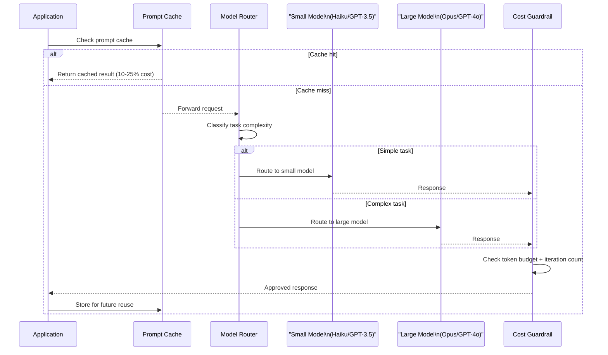

# 15 Gen AI Cost Optimization Tips for Interviews and Real-World Projects

> **Source:** [YouTube — 15 Gen AI Cost Optimization Tips for Interviews and Real-World Projects](https://www.youtube.com/watch?v=lpj9XqEyHjg)
> **Topic:** Gen AI, Cost Optimization, LLM, RAG, Prompt Engineering, FinOps, Agentic AI
> **Key Claim:** Teams achieving 30–60% cost reduction without performance degradation; Gartner: "Through 2028, at least 50% of GenAI projects will overrun their budgeted costs"

---

## Table of Contents

1. [Overview](#1-overview)
2. [Problem Statement](#2-problem-statement)
3. [Core Concepts](#3-core-concepts)
4. [Architecture — Cost Optimization Layers](#4-architecture--cost-optimization-layers)
5. [The 15 Tips by Category](#5-the-15-tips-by-category)
6. [Request Flow — Model Routing](#6-request-flow--model-routing)
7. [Comparison Table — Before vs After Optimization](#7-comparison-table--before-vs-after-optimization)
8. [Code Examples](#8-code-examples)
9. [Cost Benchmarks Reference](#9-cost-benchmarks-reference)
10. [Best Practices](#10-best-practices)
11. [Interview Talking Points](#11-interview-talking-points)
12. [Learning Resources](#12-learning-resources)

---

## 1. Overview

Generative AI costs are growing explosively — average monthly AI spend per organization hit **$85,521 in 2025**, a 36% jump from 2024. Without deliberate cost governance, agentic loops, oversized models, and bloated prompts silently drain budgets. This guide covers 15 actionable optimization tips organized across six categories: model selection, prompt engineering, RAG pipeline tuning, infrastructure, agentic guardrails, and business alignment — giving you both interview-ready talking points and production-proven techniques.

---

## 2. Problem Statement

### Why Gen AI Costs Are Hard to Control

| Problem | Impact |
|---|---|
| Costs don't scale linearly | Compound unpredictably across systems |
| Token-based billing is opaque | Teams can't see where money is going |
| All traffic routed to premium models | 10–50x overspend vs. right-sized models |
| RAG pipelines stuff full context windows | 70–80% of tokens sent are irrelevant |
| Agentic loops have no hard caps | A single runaway agent can generate catastrophic costs overnight |
| No dedicated cost ownership | ML, product, and finance all blame each other |

> **Key Insight:** "Through 2028, at least 50% of GenAI projects will overrun their budgeted costs due to poor architectural choices and lack of operational know-how." — Gartner

### Classic Approach Pain Points

| Classic Approach | Problem |
|---|---|
| Single premium model for all requests | Paying GPT-4 prices for "summarize this sentence" |
| No prompt caching | Re-processing identical system prompts millions of times |
| Naïve RAG with large chunk sizes | Sending irrelevant context, burning tokens on noise |
| Real-time inference for all workloads | Missing 50%+ batch pricing discounts |
| Reactive monitoring via monthly bills | Problems discovered weeks after they start |

---

## 3. Core Concepts

### Minimum Viable Tokens (MVT)
The discipline of achieving the same output quality with the fewest possible input + output tokens. Applied to prompts, retrieved context, and response length constraints simultaneously.

MVT is the LLM equivalent of "premature optimization" prevention applied in reverse — instead of avoiding over-engineering, you systematically audit for token waste. Since every input and output token has a direct dollar cost on a per-million basis, even a 20% reduction in average prompt length across millions of daily requests translates directly to significant monthly savings.

**How to measure and reduce token waste:**
1. Log `usage.input_tokens` and `usage.output_tokens` for every API call by feature and endpoint.
2. Identify the top 10 highest-token-consumption endpoints — these are the highest-leverage optimization targets.
3. For each: run the prompt through a token counter (`tiktoken` for OpenAI, Anthropic's token counter API) and audit what each token contributes to quality.
4. Apply reductions: remove filler language, deduplicate system prompt content, cut retrieved context to only the top-k relevant chunks.
5. Run A/B quality evaluation before and after — use RAGAS or a judge LLM to confirm quality is maintained.

**Before vs. after MVT prompt:**
```
BEFORE (87 tokens):
"Hello! I would like you to please help me by summarizing the following document. 
It is very important that your summary is concise and accurate. 
The document is as follows: {document}"

AFTER (12 tokens + document):
"Summarize in 3 bullet points: {document}"
```

| MVT Target | Typical Token Reduction | Technique |
|---|---|---|
| System prompt filler | 15–30% | Remove courtesy phrases, redundant instructions |
| Retrieved RAG context | 40–70% | Re-ranking, top-k reduction, chunk size tuning |
| Output verbosity | 20–50% | Explicit `max_tokens` + format constraints (JSON/bullets) |
| Chat history window | 30–60% | Sliding window truncation, summarization of old turns |

> **Interview tip:** "Quantify MVT with unit economics: if your app does 10M requests/month with an average of 1,000 input tokens at $3/M tokens, a 25% token reduction saves $7,500/month — and that's before counting output tokens. Always frame token optimization in dollars, not token counts."

### Model Routing
Dynamically directing each inference request to the cheapest model capable of handling that task's complexity — rather than defaulting all traffic to the most powerful (and most expensive) model available.

Model routing is the highest-leverage single optimization for most GenAI applications because the cost gap between model tiers is enormous: a small model like Claude Haiku costs ~19x less per output token than Claude Opus. Since the majority of real-world LLM requests are relatively simple (classification, summarization, short Q&A), routing them to a capable but cheaper model leaves quality unchanged while dramatically reducing the per-request cost.

**Routing decision flow:**


**Routing classifier strategies:**
- **Rule-based:** keyword match, prompt length threshold, endpoint identity (cheap for `/classify`, premium for `/analyze`)
- **ML classifier:** fine-tune a small model on labeled examples of simple/medium/complex — 95%+ accuracy achievable
- **LLM-as-judge routing:** use the cheapest model to classify complexity, then route to appropriate tier

| Routing Method | Accuracy | Latency overhead | Best For |
|---|---|---|---|
| Rule-based | 70–80% | <1ms | High-volume, predictable tasks |
| ML classifier | 90–95% | 5–20ms | Mixed workloads with training data |
| LLM-as-judge | 95–98% | 50–200ms | High-stakes routing where misrouting is costly |

> **Interview tip:** "The business case for routing is straightforward arithmetic: if 70% of your requests are 'simple' and you route them to a 19x cheaper model, your blended cost drops by ~60% assuming quality holds. Always benchmark quality before and after routing — a routing error that degrades user experience costs more than the savings."

### Prompt Caching
Storing the processed key-value (KV) state of static prompt prefixes (system messages, knowledge bases, instructions) so repeated requests skip recomputation. Most providers offer 50–90% token cost discounts on cached prefixes.

Prompt caching exploits the fact that in most production applications, the system prompt and few-shot examples are identical across thousands or millions of requests — only the user query changes. Without caching, the model re-processes those identical tokens on every single call. With caching, the KV attention states for the static prefix are stored server-side and reused, charging only a fraction of the original token price.

**Prompt structure for maximum cache utilization:**
```
┌──────────────────────────────────────────────────────┐
│ SYSTEM PROMPT (2,000 tokens)  [cache_control: true]  │  ← Cached after first call
│ FEW-SHOT EXAMPLES (500 tokens) [cache_control: true]  │  ← Cached after first call
│ KNOWLEDGE BASE (1,000 tokens) [cache_control: true]  │  ← Cached after first call
│ USER QUERY (50–200 tokens)    [no cache control]     │  ← Fresh each call
└──────────────────────────────────────────────────────┘
```

**Provider pricing comparison:**

| Provider | Cache write cost | Cache read cost | Min cacheable tokens |
|---|---|---|---|
| Anthropic (Claude) | 1.25x normal | 0.10x (90% off) | 1,024 tokens |
| OpenAI (GPT-4o) | Normal | 0.50x (50% off) | 1,024 tokens |
| Google (Gemini) | 1x normal | 0.25x (75% off) | 32,768 tokens |

**Critical placement rule:** Static content must appear before dynamic content. Providers cache from the start of the prompt up to the first cache breakpoint — any dynamic token inserted before the static block prevents caching of everything after it.

> **Interview tip:** "Prompt caching is free money for any application with a large, stable system prompt. If your system prompt is 2,000 tokens and you handle 100,000 requests/day at Anthropic pricing ($3/M input), caching reduces that cost from $600/day to $60/day — a $196,000/year saving from a one-line code change."

### RAG Context Efficiency
The practice of retrieving only tokens the model will actually use — through better chunking, hybrid search, metadata filtering, and re-ranking — rather than flooding the context window.

Naïve RAG implementations retrieve the top-k chunks by vector similarity and paste them wholesale into the context window before the user query. The problem is that similarity ≠ relevance: high cosine similarity doesn't guarantee the retrieved chunk actually contains the answer. Studies show that 70–80% of tokens in naïve RAG pipelines are noise — text the model weighs but cannot use to improve its answer. Since every context token costs money, unoptimized RAG is one of the most common sources of runaway LLM spend.

**RAG cost optimization pipeline:**


**Optimization levers and their typical impact:**

| Lever | How it works | Token reduction |
|---|---|---|
| Reduce `top_k` | Retrieve 5 instead of 20 chunks | 60–75% |
| Metadata pre-filtering | Filter by date, category, source before vector search | 30–60% |
| Cross-encoder re-ranking | Score each candidate for relevance to query; keep top 3 | 40–70% |
| Smaller chunk size | 256-token chunks vs. 1024 — less noise per chunk | 20–50% |
| Contextual compression | Summarize or extract only the answer-relevant sentence from each chunk | 50–80% |

**Anti-pattern to avoid:** retrieving top-20 full-document chunks with no re-ranking and passing all of them to a premium model. This is the costliest combination possible in RAG.

> **Interview tip:** "Frame RAG efficiency as a precision-recall tradeoff. Broader retrieval (top-20) maximizes recall but kills precision and spends tokens on noise. A re-ranking step lets you retrieve broadly for recall, then filter tightly for precision before context assembly. This is the architecture that delivers both quality and cost efficiency simultaneously."

### Agentic Cost Guardrails
Hard architectural limits on agent reasoning loops, iteration counts, and token budgets that prevent runaway spend from recursive or malformed agentic execution.

Agentic systems create a class of cost risk that doesn't exist in simple request-response LLM calls: unbounded iteration. A single agent that loops indefinitely — triggered by a malformed input, an edge case in tool output parsing, or a deadlock between two sub-agents — can generate tens of thousands of API calls before any human notices. At $15–75 per million output tokens, a runaway overnight agent can generate a five-figure bill from a single trigger event.

**Guardrail architecture layers:**



**Guardrail types and implementation:**

| Guardrail | What it prevents | Implementation |
|---|---|---|
| `max_iterations` hard cap | Infinite reasoning loops | `for i in range(MAX_ITER): ... else: raise` |
| Per-use-case `max_tokens` | Prompt bloat, verbose output waste | Enforce at API call construction time |
| Sub-agent depth limit | Recursive agent spawning | Track spawn depth in agent context |
| Spend threshold auto-shutoff | Budget exhaustion before alert is seen | Provider API key rate limits + app-layer kill switch |
| Timeout per agent run | Deadlocked agents waiting on slow tools | `asyncio.wait_for(agent_task, timeout=300)` |

**Why "soft guidelines" fail:** A `# TODO: don't exceed 10 iterations` comment in code provides zero protection. The cap must be a code-enforced `raise` or `return` at the iteration boundary — developers forget to check it, edge cases bypass it, and on-call engineers don't know to look for it.

> **Interview tip:** "Agentic cost guardrails are a safety primitive, not an optimization. Frame them the way you'd frame circuit breakers in distributed systems — you design them to fail safely and fast, not to optimize the happy path. The test: if an agent loops infinitely at 2 AM, what stops it and how fast? If the answer is 'the morning engineer,' the guardrail is insufficient."

### FinOps for AI
Cross-functional discipline where ML engineering, platform engineering, product, and finance share accountability for AI unit economics — measured as cost per outcome, not aggregate monthly bills.

Traditional cloud FinOps tracks VM-hours, egress bytes, and storage GB — all relatively predictable. AI FinOps is harder because LLM costs are non-linear: a single poorly-scoped prompt or a traffic spike in a high-token-density feature can blow the monthly budget in hours. The discipline requires moving from reactive monthly invoice review to proactive per-request, per-feature, per-team attribution with real-time alerting.

**The unit economics shift:**

| Traditional Cloud FinOps | AI FinOps |
|---|---|
| Optimize VM size and reservation | Optimize model tier, token count, batch schedule |
| Monthly cost per service | Cost per inference request, per user, per feature |
| Reserved instances / savings plans | Prompt caching, batch API discounts |
| Utilization % (CPU, memory) | Cache hit rate, model routing accuracy, token efficiency |
| Tag-based cost allocation | API key + metadata tagging by feature/team/user |
| Cost alert on monthly budget | Real-time spend alert + auto-shutoff on daily budget |

**Organizational ownership model:**
- **ML/AI team:** Token optimization, model selection, quality-vs-cost benchmarking
- **Platform engineering:** Infrastructure, batch scheduling, cost monitoring tooling
- **Product management:** Feature-level cost budgeting, success metric definition
- **Finance:** Unit economics targets (cost per outcome), overall budget governance

**Key metrics for an AI FinOps dashboard:**

| Metric | Target | What It Signals |
|---|---|---|
| Cost per successful interaction | Decreasing over time | Core unit economics health |
| Cache hit rate | >60% for FAQ/support | Effectiveness of prompt caching |
| Model routing accuracy | >90% | Correct tier assignment |
| Average tokens per request | Flat or decreasing | Prompt bloat under control |
| Agent task completion rate | >95% | Guardrails not over-triggering |
| P99 inference latency | <3s for interactive | No quality/cost tradeoff creep |

**Why aggregate monthly bills fail:** If total monthly spend went up 30%, was it because volume grew (good — product is working) or because cost per request grew (bad — prompt bloat or routing regression)? Aggregate bills cannot answer this question. Only per-request attribution with volume normalization can.

> **Interview tip:** "FinOps for AI is a competitive advantage, not overhead. Teams that measure cost per outcome can make rational build-vs-buy decisions, justify infrastructure investment to CFOs, and scale AI features profitably. Teams that don't will hit cost ceilings and get features cut. Frame it as a business capability, not a cost-cutting exercise."

---

## 4. Architecture — Cost Optimization Layers



---

## 5. The 15 Tips by Category

### Category A — Model Selection & Architecture (Tips 1–4)

#### Tip 1: Choose the Right Model for the Task
Simple tasks (classification, summarization, intent detection) don't require large, expensive models. Map your use cases to a model tier matrix and enforce it at the routing layer.

| Task Type | Recommended Tier |
|---|---|
| Classification, intent detection | Small (Haiku, GPT-3.5-turbo) |
| Summarization, Q&A | Mid (Sonnet, GPT-4o-mini) |
| Complex reasoning, multi-step agents | Premium (Opus, GPT-4o) |
| Code generation | Mid or Premium depending on complexity |

#### Tip 2: Use Model Routing Dynamically
Implement a routing layer that classifies each request and dispatches to the appropriate model. Can reduce costs 30–50% while maintaining quality. See code example in §8.

Dynamic routing requires three components: a **classifier** that determines task complexity, a **model registry** that maps complexity to model, and **quality gates** that validate the smaller model's output meets the standard before shipping to users.

**Building the routing classifier — practical approach:**

```python
def classify_complexity(prompt: str, metadata: dict) -> str:
    """
    Classify a request into small/medium/large tier.
    Uses layered heuristics — no LLM call required for routing.
    """
    # Tier 1: Endpoint-based routing (fastest, zero latency)
    if metadata.get("endpoint") in {"/classify", "/intent", "/sentiment"}:
        return "small"

    # Tier 2: Instruction keyword detection
    simple_verbs = {"summarize", "classify", "list", "translate", "detect"}
    complex_verbs = {"analyze", "reason", "compare", "design", "explain why"}
    prompt_lower = prompt.lower()
    if any(v in prompt_lower for v in simple_verbs) and len(prompt.split()) < 80:
        return "small"
    if any(v in prompt_lower for v in complex_verbs) or len(prompt.split()) > 300:
        return "large"

    return "medium"  # Default to mid-tier
```

**Quality validation before routing goes live:**
1. Sample 500 real requests from production logs.
2. Run both the target small model and the premium model on each.
3. Use an LLM judge or human raters to score quality parity.
4. If small model achieves >95% quality parity for "simple" classified requests → routing is safe to deploy.
5. Monitor quality metrics in production with the routing layer active — set rollback threshold.

| Routing Decision | Risk If Wrong | Mitigation |
|---|---|---|
| Simple → Large (over-route) | Cost waste, no quality harm | Classifier threshold too conservative |
| Complex → Small (under-route) | Quality degradation, user complaints | Classifier threshold too aggressive |
| Correct routing | Cost saving + quality maintained | A/B test validates threshold calibration |

> **Interview tip:** "Routing is not fire-and-forget. Build a routing feedback loop: log which model handled each request, score quality outcomes, and retrain or recalibrate the classifier quarterly as model capabilities change. Models that were 'large' tier tasks last year may be 'small' tier today."

#### Tip 3: Apply Model Distillation
Train a smaller, specialized model using outputs from a larger teacher model. The distilled model runs at a fraction of the cost for the narrow task it was trained on. Best for high-volume, narrow use cases (e.g., sentiment, entity extraction).

Model distillation transfers the "knowledge" of a large model into a smaller one by training the student model to match the teacher's output distribution — not just its labels, but its token probabilities (soft targets). The result is a compact model that outperforms its size on the specific task it was distilled for, because the rich teacher signal provides far more information than binary correct/incorrect labels.

**Distillation workflow:**



**When distillation makes business sense:**

| Condition | Suitable for distillation | Reason |
|---|---|---|
| >1M requests/month on a narrow task | Yes | High volume justifies upfront training cost |
| Task has clear correct/incorrect criteria | Yes | Easy to generate quality teacher labels |
| Task domain is stable (rare new examples) | Yes | Distilled model won't become stale quickly |
| Task requires broad general knowledge | No | Small model lacks breadth; teacher advantage is too large |
| Request volume < 100k/month | No | ROI on training cost takes too long |

**Realistic cost example:** Sentiment classification at 5M requests/day using GPT-4o costs ~$600/day. A distilled 7B model on a single A100 GPU handles the same volume for ~$50/day — a 91% cost reduction. The model training investment (typically $5,000–$15,000 in GPU time) pays back in 1–2 months.

> **Interview tip:** "Distillation requires a business case calculation upfront: training cost ÷ daily savings = payback period in days. If that's under 90 days, it's almost always worth doing for a high-volume narrow task. If it's over 180 days, model routing (Tip 2) is usually a better first step since it requires zero training investment."

#### Tip 4: Use Parameter-Efficient Fine-Tuning (PEFT)
Techniques like LoRA, QLoRA, and prefix tuning adapt a base model to your domain without full retraining — at 10–100x lower compute cost than traditional fine-tuning.

Traditional full fine-tuning updates all model weights — for a 70B parameter model, that requires dozens of high-memory GPUs and weeks of training time. PEFT methods instead freeze the original model weights and add a small number of trainable parameters (0.1–3% of total) that capture domain-specific adaptation. The resulting model performs on par with full fine-tuning for domain tasks at a fraction of the cost.

**Core PEFT techniques:**

| Technique | How it works | Trainable params | Best for |
|---|---|---|---|
| LoRA | Adds low-rank matrix pairs (A×B) to attention layers; rank r << d | ~0.1–1% of total | Chat, instruction following, code |
| QLoRA | LoRA on a 4-bit quantized base model; saves GPU memory | ~0.1% of total | Fine-tuning on single consumer GPU |
| Prefix Tuning | Prepends trainable virtual tokens to every layer input | Very small (prefix length × layers) | Task-specific prompting |
| IA³ | Scales attention keys/values and FFN activations with learned vectors | <0.01% of total | Ultra-low resource fine-tuning |

**LoRA training example (Hugging Face PEFT):**
```python
from peft import LoraConfig, get_peft_model
from transformers import AutoModelForCausalLM

base_model = AutoModelForCausalLM.from_pretrained("mistralai/Mistral-7B-v0.1")

lora_config = LoraConfig(
    r=16,              # Rank — higher = more capacity, more params
    lora_alpha=32,     # Scaling factor
    target_modules=["q_proj", "v_proj"],  # Attention layers to adapt
    lora_dropout=0.05,
    bias="none",
    task_type="CAUSAL_LM"
)

peft_model = get_peft_model(base_model, lora_config)
peft_model.print_trainable_parameters()
# → trainable params: 8,388,608 || all params: 7,250,972,672 || trainable%: 0.12%
```

**PEFT vs. distillation vs. full fine-tuning:**

| Approach | Compute cost | Quality (narrow task) | Deployment complexity |
|---|---|---|---|
| Full fine-tuning | Very high | Highest | High (new model weights) |
| LoRA / QLoRA | Low–Medium | High | Medium (merge or serve adapter) |
| Distillation | Medium | High (if teacher is good) | Low (standalone small model) |
| Model routing (no training) | Zero | Depends on task | Low |

> **Interview tip:** "PEFT and distillation are complementary, not competing. A common production pattern is to distill a large model's outputs into a mid-size base model, then apply LoRA to specialize it for your domain — getting both the efficiency of distillation and the precision of domain adaptation in a single deployable artifact."

---

### Category B — Prompt & Token Optimization (Tips 5–7)

#### Tip 5: Engineer Prompts for Minimum Viable Tokens (MVT)
Audit every prompt: eliminate filler phrases, redundant context, and verbose instructions. Ask: "Can we achieve the same quality result with fewer tokens?" Discipline here yields **15–40% cost reduction** as a baseline.

**Prompt audit checklist:**
- Remove: "Please", "Could you", "I would like you to" — model doesn't need courtesy
- Remove: Repeated context already in the system prompt
- Replace: Verbose instructions → structured JSON schema or examples
- Constrain: Output length with `max_tokens` parameter

#### Tip 6: Keep Prompts Concise & Constrain Response Length
Every additional token in the prompt is charged. Every additional output token is charged. Set explicit `max_tokens` limits per request class. A customer support reply doesn't need 2,000 tokens.

Output token costs are typically 3–5x higher than input token costs per million tokens, making verbose responses the most expensive failure mode. Without explicit `max_tokens` constraints, LLMs default to generating until the task feels "complete" — which for an unconstrained summarization request might be 1,500 tokens when 200 would suffice.

**Response length calibration process:**
1. Sample 200 real responses for a given use case where no `max_tokens` was set.
2. Have users or a judge LLM rate quality at various truncation points: 25%, 50%, 75%, 100% of average length.
3. Find the knee of the quality-vs-length curve — the point where additional tokens add minimal quality.
4. Set `max_tokens` at 110% of that knee value to avoid hard-truncating useful content.

**Prompt constraints that reduce both input and output tokens:**
```python
# ❌ No constraints — model generates freely
response = client.messages.create(
    model="claude-sonnet-4-6",
    messages=[{"role": "user", "content": f"Summarize this: {document}"}]
)

# ✅ Constrained for cost efficiency
response = client.messages.create(
    model="claude-haiku-4-5-20251001",  # Cheaper model for simple task
    max_tokens=200,                      # Hard output cap
    messages=[{
        "role": "user",
        "content": f"Summarize in exactly 3 bullet points (max 20 words each):\n\n{document}"
        # ↑ Explicit format instruction further constrains output length
    }]
)
```

**Output length by use case — calibrated targets:**

| Use Case | Unconstrained typical output | Recommended `max_tokens` | Savings |
|---|---|---|---|
| Customer support reply | 800–1,200 tokens | 300 | 65–75% |
| Document summary | 1,500–3,000 tokens | 500 | 67–83% |
| Sentiment classification | 200–500 tokens | 50 | 75–90% |
| Code explanation | 600–1,000 tokens | 350 | 42–65% |
| Intent detection | 100–300 tokens | 20 | 80–93% |

**Chat history truncation:** In conversational applications, the full message history grows without bound if not managed. Apply a sliding window: keep the last N turns (e.g., 6), and summarize older context into a single compressed message. This prevents history from consuming 80%+ of the context window on long sessions.

> **Interview tip:** "Output token budgets are one of the fastest wins because they require a single-line code change per API call and the savings are immediate. The common objection is 'what if the model needs more tokens?' — address it with format constraints and quality benchmarks, not by leaving `max_tokens` uncapped."

#### Tip 7: Implement Prompt Caching
Static content (system instructions, knowledge bases, few-shot examples) placed at the start of the prompt qualifies for cache pricing. Most providers charge 10–25% of normal input token price for cache hits.

**Placement rule:** Static prefix → Dynamic suffix (never reversed).

```
[SYSTEM: 2000 tokens of static instructions]   ← cached
[FEW-SHOT EXAMPLES: 500 tokens of static]       ← cached
[USER QUERY: 50 tokens dynamic]                 ← not cached
```

---

### Category C — RAG Pipeline Optimization (Tips 8–9)

#### Tip 8: Optimize Your RAG Pipeline
Naïve RAG implementations stuff the full retrieved context into the prompt regardless of relevance. For many production systems, **70–80% of sent tokens are noise** — retrieved passages the model ignores or downweights. You're paying for context that doesn't improve answers.

**RAG cost levers:**
- Reduce `top_k` retrieval count — retrieve fewer, better chunks
- Add a re-ranking step before context assembly
- Use metadata filtering to pre-narrow the search corpus
- Apply late chunking or contextual retrieval for better precision

#### Tip 9: Tune Chunking Strategy
Larger chunks are not always better. Oversized chunks drag in irrelevant sentences; undersized chunks lose semantic coherence. Tune chunk size and overlap to your specific query patterns.

| Strategy | Chunk Size | Overlap | Best For |
|---|---|---|---|
| Fixed-size | 256–512 tokens | 50 tokens | General QA |
| Semantic | Variable | None | Long-form docs |
| Sentence-level | 1–3 sentences | 1 sentence | Precise fact retrieval |
| Hierarchical | Parent + child | — | Complex multi-hop queries |

---

### Category D — Infrastructure & Compute (Tips 10–11)

#### Tip 10: Manage GPU Utilization & Autoscaling
GPUs for AI workloads cost **10–20x more** than standard CPU compute. Under-utilized GPUs are pure waste; over-provisioned GPU clusters are budget sinkholes. Monitor utilization and implement autoscaling policies.

**Key metrics to track:**
- GPU utilization % (target: >70%)
- Memory bandwidth utilization
- Idle time between inference requests
- Queue depth vs. latency tradeoff

#### Tip 11: Batch Asynchronous Workloads
Non-latency-sensitive workloads (risk scoring, nightly analytics, report generation, enrichment pipelines) can be batched. Batch APIs from major providers offer **50%+ pricing discounts** over real-time inference.

| Workload Type | Inference Mode | Cost |
|---|---|---|
| Real-time chat, copilot | Synchronous | Full price |
| Nightly reports, enrichment | Async batch | ~50% discount |
| Model evaluation, fine-tune data prep | Batch | ~50% discount |

---

### Category E — Agentic Guardrails (Tips 12–14)

#### Tip 12: Set Hard Limits on Agentic Loops
Agentic systems can recurse indefinitely without explicit iteration caps. A single runaway agent triggered at 2 AM can generate thousands of dollars in API spend before anyone notices. Enforce hard `max_iterations` at the orchestration layer — not as a soft guideline but as a code-enforced ceiling.

```python
MAX_AGENT_ITERATIONS = 10  # Never exceed regardless of task

for iteration in range(MAX_AGENT_ITERATIONS):
    result = agent.step(state)
    if result.is_terminal:
        break
else:
    raise AgentLoopExceededError(f"Agent exceeded {MAX_AGENT_ITERATIONS} iterations")
```

#### Tip 13: Configure Spend Alerts & Auto-Shutoffs
Set real-time spend alerts at the API provider level AND at your application layer. Configure auto-shutoff triggers, not just notification alerts.

**Alert tiers:**
- 50% of daily budget → Slack alert to engineering
- 80% of daily budget → PagerDuty alert to on-call
- 100% of daily budget → Automatic API key rate-limit / kill switch

#### Tip 14: Establish Token Budgets Per Request Type
Assign explicit maximum token budgets to each use case class and enforce them at the API call layer. This prevents gradual prompt bloat — where prompts slowly grow over time and silently inflate costs.

| Use Case | Input Budget | Output Budget |
|---|---|---|
| Customer support reply | 1,500 tokens | 300 tokens |
| Document summarization | 4,000 tokens | 500 tokens |
| Code review | 6,000 tokens | 1,000 tokens |
| Multi-step agent task | 8,000 tokens | 2,000 tokens |

---

### Category F — Observability & Business Alignment (Tip 15)

#### Tip 15: Track Usage & Align AI to Business Goals
Measure cost per outcome (cost per successful resolution, cost per document processed) — not just aggregate monthly bills. Teams with executive-level cost alignment report **2–4x more influence** over technology selection and architectural decisions.

**Unit economics to track:**
- Cost per successful user interaction
- Cost per document processed
- Cost per agent task completed
- Cache hit rate (target: >60%)
- Model routing accuracy (% of tasks correctly tier-routed)

---

## 6. Request Flow — Model Routing



---

## 7. Comparison Table — Before vs After Optimization

| Dimension | Before Optimization | After Optimization |
|---|---|---|
| Model selection | All requests → premium model | Complexity-routed to right tier |
| Prompt caching | None — all tokens billed fresh | Static prefixes cached (50–90% discount) |
| RAG context | Top 20 chunks, full text | Top 5 re-ranked, filtered chunks |
| Agentic loops | Unlimited iterations | Hard cap at N iterations |
| Workload scheduling | All real-time inference | Async batch for non-latency tasks |
| Cost visibility | Monthly aggregate invoice | Per-request unit economics dashboard |
| Spend control | React after overrun | Proactive alerts + auto-shutoff |
| Monitoring owner | Nobody / everyone | Dedicated FinOps AI team |
| Cost trajectory | 36% YoY increase | 30–60% reduction vs. unoptimized |
| Prompt length | Grows unchecked over time | Token budgets enforced per use case |

---

## 8. Code Examples

### Python — Dynamic Model Router

```python
from enum import Enum
from anthropic import Anthropic

class TaskComplexity(Enum):
    SIMPLE = "simple"
    MEDIUM = "medium"
    COMPLEX = "complex"

MODEL_MAP = {
    TaskComplexity.SIMPLE:  "claude-haiku-4-5-20251001",
    TaskComplexity.MEDIUM:  "claude-sonnet-4-6",
    TaskComplexity.COMPLEX: "claude-opus-4-8",
}

COST_PER_MILLION = {
    "claude-haiku-4-5-20251001": {"input": 0.80,  "output": 4.00},
    "claude-sonnet-4-6":         {"input": 3.00,  "output": 15.00},
    "claude-opus-4-8":           {"input": 15.00, "output": 75.00},
}

def classify_task(prompt: str) -> TaskComplexity:
    word_count = len(prompt.split())
    if word_count < 50 and any(k in prompt.lower() for k in ["summarize", "classify", "list"]):
        return TaskComplexity.SIMPLE
    elif word_count < 200:
        return TaskComplexity.MEDIUM
    return TaskComplexity.COMPLEX

def route_request(prompt: str, system: str = "") -> dict:
    complexity = classify_task(prompt)
    model = MODEL_MAP[complexity]

    client = Anthropic()
    response = client.messages.create(
        model=model,
        max_tokens=1024,
        system=system,
        messages=[{"role": "user", "content": prompt}]
    )
    return {
        "model": model,
        "complexity": complexity.value,
        "response": response.content[0].text,
        "tokens_used": response.usage,
    }
```

---

### Python — Prompt Caching with Static Prefix

```python
import anthropic

client = anthropic.Anthropic()

# Static system prompt placed FIRST — qualifies for cache
SYSTEM_KNOWLEDGE_BASE = """
[Your 2000-token knowledge base / instructions here]
This content is identical across all requests — it gets cached after first call.
Subsequent calls pay only 10-25% of normal input token price for this section.
""".strip()

def cached_query(user_question: str) -> str:
    response = client.messages.create(
        model="claude-sonnet-4-6",
        max_tokens=512,
        system=[
            {
                "type": "text",
                "text": SYSTEM_KNOWLEDGE_BASE,
                "cache_control": {"type": "ephemeral"},  # Enable prefix caching
            }
        ],
        messages=[{"role": "user", "content": user_question}],
    )
    cache_stats = response.usage
    print(f"Cache read tokens: {cache_stats.cache_read_input_tokens}")
    print(f"Cache write tokens: {cache_stats.cache_creation_input_tokens}")
    return response.content[0].text
```

---

### Python — Token Budget Enforcer

```python
class TokenBudgetExceededError(Exception):
    pass

USE_CASE_BUDGETS = {
    "support_reply":         {"max_input": 1500, "max_output": 300},
    "doc_summarization":     {"max_input": 4000, "max_output": 500},
    "code_review":           {"max_input": 6000, "max_output": 1000},
    "agent_task":            {"max_input": 8000, "max_output": 2000},
}

def enforce_budget(use_case: str, prompt: str) -> int:
    budget = USE_CASE_BUDGETS.get(use_case)
    if not budget:
        raise ValueError(f"Unknown use case: {use_case}")

    # Rough token estimate: ~4 chars per token
    estimated_input_tokens = len(prompt) // 4
    if estimated_input_tokens > budget["max_input"]:
        raise TokenBudgetExceededError(
            f"{use_case} prompt exceeds budget: "
            f"{estimated_input_tokens} > {budget['max_input']} tokens"
        )
    return budget["max_output"]

def budgeted_inference(use_case: str, prompt: str, client) -> str:
    max_output = enforce_budget(use_case, prompt)
    response = client.messages.create(
        model="claude-haiku-4-5-20251001",
        max_tokens=max_output,   # Hard cap on output
        messages=[{"role": "user", "content": prompt}]
    )
    return response.content[0].text
```

---

### Python — Agentic Loop with Hard Cap

```python
MAX_AGENT_ITERATIONS = 10

class AgentLoopExceededError(Exception):
    pass

def run_agent_with_cap(initial_state: dict, agent_fn, max_iter: int = MAX_AGENT_ITERATIONS) -> dict:
    state = initial_state
    for i in range(max_iter):
        result = agent_fn(state)
        if result.get("done"):
            return result
        state = result
    raise AgentLoopExceededError(
        f"Agent did not terminate within {max_iter} iterations — check for loops"
    )
```

---

### RAG — Optimized Chunking with LangChain

```python
from langchain.text_splitter import RecursiveCharacterTextSplitter

# Tuned for precise fact retrieval — smaller chunks, semantic boundaries
splitter = RecursiveCharacterTextSplitter(
    chunk_size=400,           # Tokens ~400 (down from naive 1000)
    chunk_overlap=40,         # 10% overlap to preserve context at boundaries
    separators=["\n\n", "\n", ". ", " ", ""],  # Prefer semantic breaks
)

def optimized_rag_chunks(document: str) -> list[str]:
    chunks = splitter.split_text(document)
    # Filter out noise: too short = probably a heading or whitespace
    return [c for c in chunks if len(c.split()) > 20]
```

---

## 9. Cost Benchmarks Reference

| Optimization | Typical Savings | Source |
|---|---|---|
| Right-sizing models via routing | 30–50% cost reduction | CloudZero, Cloudchipr |
| Prompt optimization (MVT) | 15–40% cost reduction | Multiple sources |
| Eliminating RAG context noise | 70–80% fewer tokens sent | Cloudchipr |
| Batch API vs. real-time | 50%+ pricing discount | Provider pricing |
| Prompt caching (static prefix) | 50–90% on cached tokens | Anthropic, OpenAI |
| Combined (all tactics) | 30–60% total reduction | Cloudchipr customers |
| Average monthly AI spend (2025) | $85,521/org (+36% YoY) | Industry survey |
| FinOps teams managing AI spend | 98% (up from 31% two years ago) | Cloudchipr |

---

## 10. Best Practices

### Model Selection
- ✅ Build a model tier matrix and enforce routing at the architecture layer
- ✅ Default new features to the smallest tier; promote up only after benchmarking
- ❌ Don't let individual engineers choose models per-feature without governance
- ❌ Don't assume the newest/largest model is always necessary

### Prompts & Tokens
- ✅ Run a token audit on your top 10 highest-traffic prompts first
- ✅ Place all static content (instructions, knowledge) at the start — enable caching
- ✅ Set explicit `max_tokens` for every API call
- ❌ Don't grow prompts organically — review and prune on a regular cadence
- ❌ Don't send chat history without a sliding-window truncation policy

### RAG
- ✅ Add a re-ranking step before context assembly
- ✅ Use hybrid search (semantic + keyword) for better precision
- ✅ Profile your top queries to find the optimal `top_k` and chunk size
- ❌ Don't use default chunk sizes from tutorials — tune for your data and queries
- ❌ Don't skip metadata filtering when your corpus has a clear categorical structure

### Agentic Systems
- ✅ Enforce `max_iterations` in code, not as a comment or convention
- ✅ Wire spend alerts to auto-shutoffs, not just Slack notifications
- ✅ Log every agent step with token counts for post-mortem analysis
- ❌ Don't deploy agents to production without a tested kill switch
- ❌ Don't allow agents to spawn unbounded sub-agents

### FinOps
- ✅ Measure cost per outcome — not aggregate monthly bills
- ✅ Assign a named owner to AI cost for each product area
- ✅ Establish a cost review cadence (weekly for fast-growing systems)
- ❌ Don't treat cloud cost alerts as sufficient — AI costs need per-request granularity

---

## 11. Interview Talking Points

### "How would you reduce the cost of a high-traffic Gen AI application?"

> I'd attack it across four layers simultaneously. First, model routing — classifying each request by complexity and routing simple tasks (classification, summarization) to smaller, cheaper models like Haiku or GPT-3.5, reserving premium models only for complex reasoning. Second, prompt caching — placing static system instructions and few-shot examples at the start of every prompt so the provider caches the KV state; subsequent calls hit the cache at 10–25% of normal input token price. Third, RAG optimization — auditing how many retrieved tokens are actually relevant; naïve RAG sends 70–80% noise, so adding re-ranking and tuning chunk size can cut context tokens dramatically. Finally, batch processing for any non-latency-sensitive workloads — batch APIs typically offer 50%+ discounts. Combined, these tactics typically deliver 30–60% cost reduction without degrading output quality.

---

### "What are the biggest cost risks in agentic AI systems?"

> The biggest risk is unbounded iteration loops. An agentic system without a hard `max_iterations` cap can recurse indefinitely — a single malformed task or edge case triggered at 2 AM can generate thousands of dollars in API charges before anyone notices. The fix is architectural: enforce iteration caps in code, not as a convention; configure real-time spend alerts that trigger auto-shutoffs (not just Slack messages); and establish per-request token budgets that prevent gradual prompt bloat from inflating costs silently over time. Beyond loops, the other major risk is runaway sub-agent spawning — agents that can create other agents without a ceiling need explicit guardrails on the orchestration layer.

---

### "How does model distillation help with Gen AI cost optimization?"

> Model distillation creates a smaller, specialized model by training it on outputs from a larger "teacher" model. The distilled model learns to replicate the teacher's behavior for a narrow task — sentiment classification, entity extraction, intent detection — at a fraction of the inference cost. It's most effective when you have a high-volume, narrow use case where a premium model is overkill. The tradeoff is upfront investment: you need labeled outputs from the teacher and a fine-tuning pipeline. For applications hitting millions of requests per day on a specific task, the ROI is typically very strong — often 80–90% cost reduction per request vs. running the full teacher model.

---

### "Explain prompt caching and when to use it."

> Prompt caching works by storing the processed key-value representation of a static prompt prefix server-side, so repeat requests that share that prefix skip recomputation and are charged at a fraction of normal input token price — typically 10–25% with Anthropic, 50% with OpenAI. It's most valuable when you have a large, stable system prompt (instructions, knowledge bases, few-shot examples) that doesn't change per request. The placement rule is critical: static content must come first, dynamic user input must come last — providers only cache from the beginning of the prompt up to the first dynamic token. A system with a 2,000-token static system prompt and 100 daily active users asking an average of 10 questions each could eliminate nearly a million redundant token processings per day with caching enabled.

---

### "How do you measure the ROI of Gen AI cost optimization efforts?"

> The right unit of measurement is cost per outcome — cost per successful customer support resolution, cost per document processed, cost per agent task completed — not aggregate monthly spend. Aggregate bills hide the unit economics: spending went up because volume grew vs. because unit cost grew are two very different situations requiring different responses. I'd establish a baseline cost-per-outcome dashboard before any optimization work, then measure the delta after each intervention. For model routing, track routing accuracy (% of requests correctly tier-assigned) alongside cost. For caching, track cache hit rate — a healthy production system targeting >60% cache hit rate. For RAG, track answer relevance scores alongside retrieved token counts to ensure you're not degrading quality to save cost.

---

## 12. Learning Resources

| Resource | Link | Type |
|---|---|---|
| YouTube — 15 Gen AI Cost Optimization Tips | [Watch](https://www.youtube.com/watch?v=lpj9XqEyHjg) | Video |
| AI Cost Optimization — Practical Guide | [cloudchipr.com](https://cloudchipr.com/blog/ai-cost-optimization) | Article |
| AI Cost Optimization Strategies — CloudZero | [cloudzero.com](https://www.cloudzero.com/blog/ai-cost-optimization/) | Article |
| Reducing GenAI Cost — 5 Strategies | [caylent.com](https://caylent.com/blog/reducing-gen-ai-cost-5-strategies) | Article |
| Gartner — Real Cost of Generative AI | [truefoundry.com](https://www.truefoundry.com/blog/the-real-cost-of-generative-ai) | Analysis |
| Anthropic Prompt Caching Docs | [docs.anthropic.com](https://docs.anthropic.com/en/docs/build-with-claude/prompt-caching) | Official Docs |

---

*Last Updated: June 2026 | Source: YouTube — 15 Gen AI Cost Optimization Tips for Interviews and Real-World Projects*
