# LinkedIn Tech Knowledge Digest

> Curated technical concepts from LinkedIn posts — System Design, Azure Cloud, AI Agents, Caching, Git, and more.

---

## Table of Contents

1. [How Git Works](#1-how-git-works)
2. [Azure Landing Zone](#2-azure-landing-zone)
3. [Azure Container Apps (ACA) Architecture](#3-azure-container-apps-aca-architecture)
4. [Azure Well-Architected Framework](#4-azure-well-architected-framework)
5. [Secure Azure Architecture with Bastion + Load Balancer](#5-secure-azure-architecture-with-bastion--load-balancer)
6. [Azure Learning Roadmap](#6-azure-learning-roadmap)
7. [Caching in .NET — Fundamentals](#7-caching-in-net--fundamentals)
8. [8 Caching Patterns Every System Designer Should Know](#8-8-caching-patterns-every-system-designer-should-know)
9. [Cache Failure Modes](#9-cache-failure-modes)
10. [98 System Design Concepts Checklist](#10-98-system-design-concepts-checklist)
11. [12 System Design Concepts in Plain English](#11-12-system-design-concepts-in-plain-english)
12. [Agentic AI — Real-World Challenges](#12-agentic-ai--real-world-challenges)
13. [CLAUDE.md vs AGENTS.md vs SKILL.md](#13-claudemd-vs-agentsmd-vs-skillmd)
14. [6 AI Agent Design Patterns](#14-6-ai-agent-design-patterns)
15. [Enterprise AI Architecture — Production Stack](#15-enterprise-ai-architecture--production-stack)
16. [Zero Trust Security in Azure](#16-zero-trust-security-in-azure)
17. [Rate Limiting Service Design](#17-rate-limiting-service-design)
18. [API Performance Optimization](#18-api-performance-optimization)
19. [Microservices Production Readiness Checklist](#19-microservices-production-readiness-checklist)
20. [Load Balancing Algorithms](#20-load-balancing-algorithms)
21. [Azure Data Pipeline Cost Optimization](#21-azure-data-pipeline-cost-optimization)
22. [Authentication — IAM Pattern](#22-authentication--iam-pattern)
23. [Single vs Multi-Agent Architecture](#23-single-vs-multi-agent-architecture)

---

## 1. How Git Works

Git is a **distributed version control system** with four main areas: Workspace, Staging Area, Local Repository, and Remote Repository.

### Flow Diagram

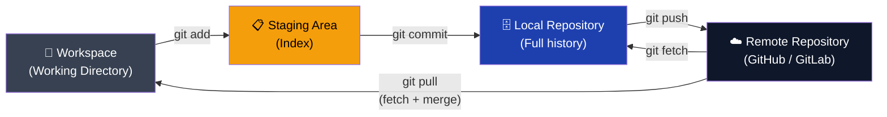

### Key Commands

| Command | Action |
|---|---|
| `git add <files>` | Move changes from workspace → staging |
| `git commit -m "msg"` | Save staged changes to local repository |
| `git push` | Upload local commits to remote |
| `git pull` | Fetch + merge remote changes into local branch |
| `git fetch` | Update remote-tracking refs without merging |
| `git merge` | Combine changes from one branch into another |

### Key Points
- **Workspace → Stage**: `git add` snapshots what goes into the next commit
- **Stage → Local**: `git commit` records changes with author, message, timestamp
- **Local → Remote**: `git push` shares commits with collaborators
- **Remote → Local**: `git pull` = fetch + merge; `git fetch` = metadata only

---

## 2. Azure Landing Zone

A **Landing Zone** is a pre-configured Azure environment that provides the governance, security, networking, and management baseline **before** deploying any application.

> **Key principle:** Infrastructure first. Applications later.

### Architecture

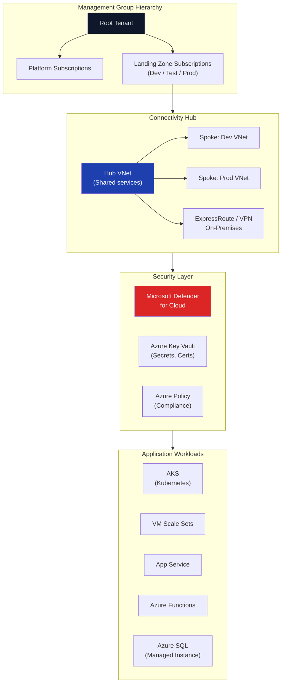

### What a Landing Zone Provides

| Component | Purpose |
|---|---|
| **Management Groups** | Hierarchical governance across Dev, Test, Prod subscriptions |
| **Hub-Spoke Networking** | VNet peering for shared connectivity and isolation |
| **Azure Policy** | Enforces compliance rules automatically |
| **Microsoft Defender** | Security posture, threat detection from Day 1 |
| **Azure Site Recovery** | Disaster recovery for workloads |
| **Key Vault** | Centralized secrets, certificates, encryption keys |

> A well-designed Landing Zone separates **enterprise cloud architecture** from a collection of random resources.

---

## 3. Azure Container Apps (ACA) Architecture

**Azure Container Apps** provides a **fully managed platform** for microservices, APIs, event-driven workloads, and background services — without managing Kubernetes clusters.

### Reference Architecture

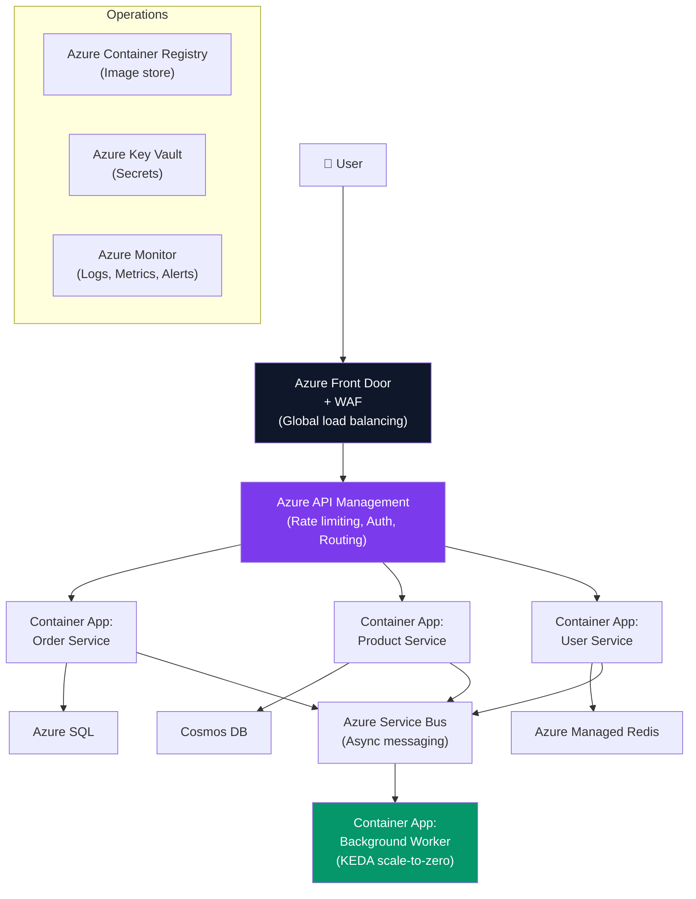

### ACA vs AKS Decision Matrix

| Factor | Azure Container Apps | Azure Kubernetes Service |
|---|---|---|
| **Kubernetes control** | Managed by Azure | Full control |
| **Custom operators** | ❌ | ✅ |
| **Scale-to-zero** | ✅ Built-in (KEDA) | Manual setup |
| **Operational complexity** | Low | High |
| **Privileged containers** | ❌ | ✅ |
| **Engineering maturity needed** | Low | High |
| **Best for** | Microservices, APIs, event-driven | Complex platforms, stateful workloads |

### Security by Design
- **Managed Identity** — no credentials in code
- **Private Networking** — no public endpoints by default
- **Key Vault** integration — runtime secret injection
- **RBAC** — role-based access control
- **WAF** — web application firewall at entry point

---

## 4. Azure Well-Architected Framework

Five pillars for designing enterprise-grade cloud platforms.

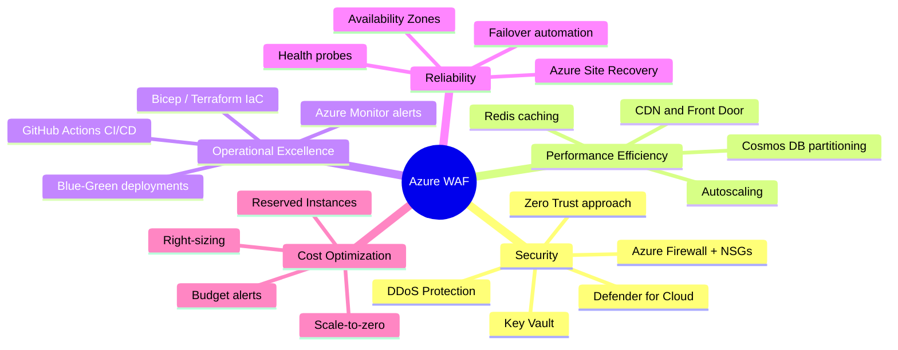

### Five Pillars Summary

| Pillar | Goal | Key Services |
|---|---|---|
| **Security** | Zero Trust, least privilege | Key Vault, Defender, Firewall, NSG |
| **Reliability** | HA, fault tolerance, recovery | Availability Zones, Site Recovery, Health Probes |
| **Performance** | Scale with demand | Autoscaling, CDN, Redis, Cosmos DB |
| **Cost Optimization** | Eliminate waste | Reserved Instances, scale-to-zero, budget alerts |
| **Operational Excellence** | Fast, safe delivery | IaC (Bicep/Terraform), CI/CD, monitoring |

---

## 5. Secure Azure Architecture with Bastion + Load Balancer

A production-ready pattern that **eliminates public IP exposure** on backend VMs while maintaining secure admin access.

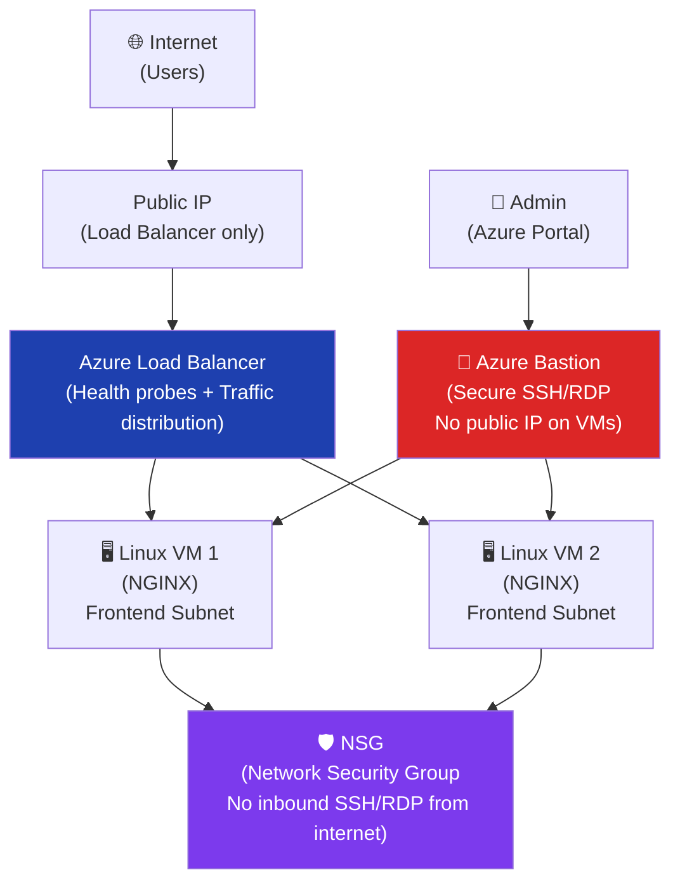

### Key Components

| Component | Role |
|---|---|
| **Azure Bastion** | Secure RDP/SSH over HTTPS — no public IP needed on VMs |
| **Azure Load Balancer** | Distributes traffic; health probes skip unhealthy instances |
| **NSG** | Denies all inbound SSH/RDP from the internet |
| **Frontend Subnet** | Isolated subnet for application VMs |
| **Bastion Subnet** | Dedicated `/27` subnet required for Bastion service |

**Security benefits:**
- No direct SSH/RDP exposed to the internet
- Reduced attack surface (only 1 public IP for traffic)
- Better network isolation and audit trail

---

## 6. Azure Learning Roadmap

A **sequential learning path** — learn how all Azure layers interconnect, not as isolated services.

```mermaid
graph LR
    F["Azure Fundamentals\nCloud models, regions,\nAvailability Zones, WAF"] --> M["Azure Management\nSubscriptions, Portal,\nCLI, ARM, Bicep"]
    M --> C["Compute & Networking\nVMs, VNets, NSGs,\nPrivate Endpoints, VPN"]
    C --> I["Identity & Storage\nEntra ID, RBAC,\nKey Vault, Blob, Queues"]
    I --> A["App Services\nApp Service, Functions,\nTriggers, Autoscaling"]
    A --> D["Data & Caching\nAzure SQL, Cosmos DB,\nVector Search, Redis"]
    D --> N["DNS, Edge & Monitoring\nFront Door, WAF,\nAzure Monitor, Alerts"]
    N --> K["Containers & Kubernetes\nACR, AKS, Ingress,\nNode Pools, KEDA"]
    K --> AI["Microsoft Foundry\nAzure OpenAI, Agent Service,\nAI Search, RAG, Evaluations"]

    style F fill:#374151,color:#fff
    style AI fill:#0f172a,color:#fff
    style K fill:#1e40af,color:#fff
    style D fill:#7c3aed,color:#fff
```

> **Key insight:** Don't learn Azure as a disconnected catalog. Learn how identity, networking, compute, storage, data, monitoring, and AI work together as **one production system**.

---

## 7. Caching in .NET — Fundamentals

Caching stores frequently accessed data in a **faster storage layer** to reduce database load and improve response times.

### In-Memory vs Distributed Cache

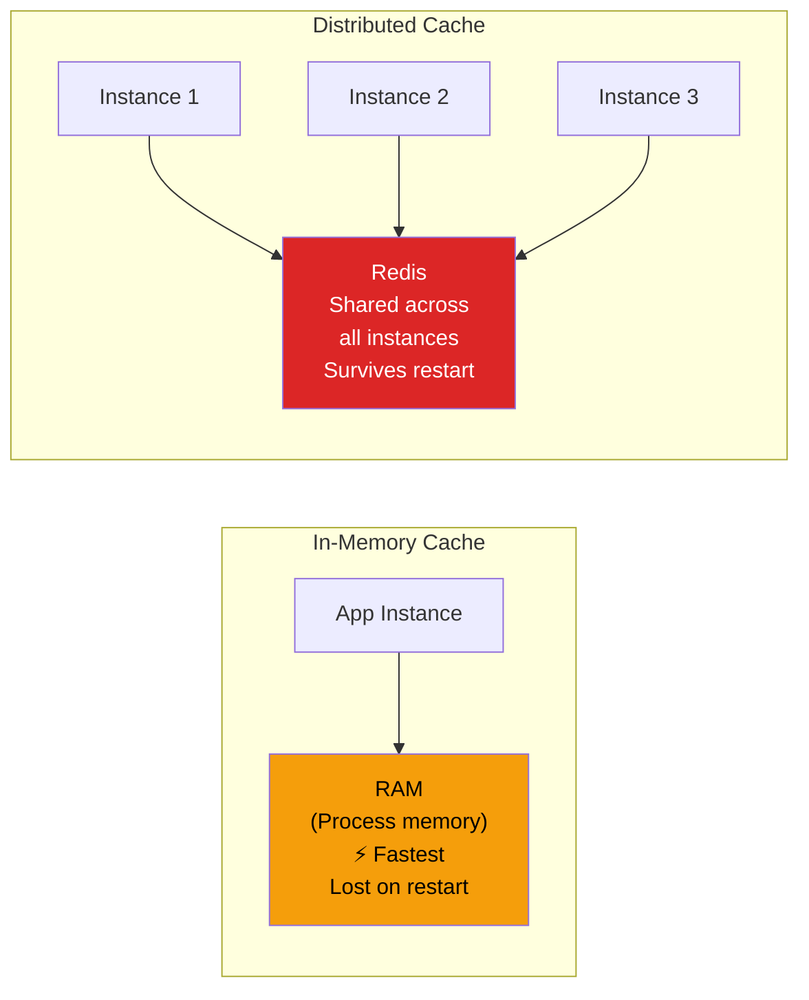

| | In-Memory Cache | Distributed Cache |
|---|---|---|
| **Location** | Application process RAM | External server (Redis) |
| **Speed** | Fastest | Fast |
| **Shared** | ❌ Per instance | ✅ All instances |
| **Survives restart** | ❌ | ✅ |
| **Best for** | Single-instance, low-memory data | Multi-instance, scalable systems |

### Benefits vs Drawbacks

| Benefits | Drawbacks |
|---|---|
| ✅ Faster APIs | ❌ Stale data risk |
| ✅ Reduced database load | ❌ Cache invalidation complexity |
| ✅ Better scalability | ❌ Additional infrastructure |
| ✅ Lower latency | ❌ Memory overhead |

> **Key Insight:** Caching is not about storing more data. It's about **avoiding unnecessary work**.

---

## 8. Eight Caching Patterns Every System Designer Should Know

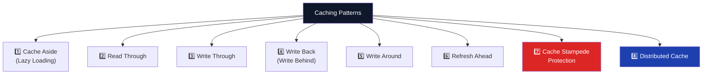

### Pattern Details

| Pattern | How It Works | Best For | Tradeoff |
|---|---|---|---|
| **1. Cache Aside** | App checks cache → miss → read DB → write cache | Read-heavy, frequently accessed data | App manages cache logic |
| **2. Read Through** | Cache handles DB load on miss (transparent to app) | Simpler app code | Cold start misses |
| **3. Write Through** | Every write → cache AND DB simultaneously | Strong consistency | Higher write latency |
| **4. Write Back** | Write to cache → async DB update | Extremely fast writes | Data loss risk on failure |
| **5. Write Around** | Writes bypass cache → go to DB directly | Write-heavy, rarely-read data | High read miss rate initially |
| **6. Refresh Ahead** | Proactively refresh before expiry | Product catalogs, dashboards, trending | Extra background load |
| **7. Stampede Protection** | Distributed locks, coalescing, staggered TTL | Hot key expiration scenarios | Added complexity |
| **8. Distributed Cache** | Shared cache across all app instances | Multi-node, horizontally scaled systems | Network latency |

### Cache Aside Flow (Most Common)

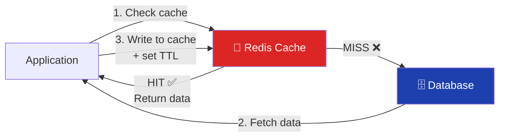

### System Design Interview Questions on Caching
- Cache Aside vs Read Through — when to choose each?
- How do you handle stale data?
- What is a cache stampede and how do you prevent it?
- How do you design cache invalidation?
- Redis vs Memcached — which and when?
- How would you cache data for millions of users?

---

## 9. Cache Failure Modes

Caching issues rarely appear in development — they show up **under real production traffic**.

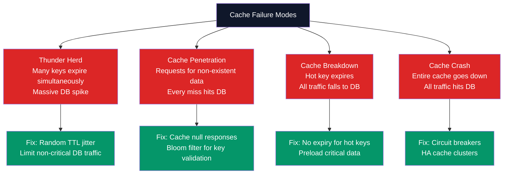

| Failure Mode | Cause | Fix |
|---|---|---|
| **Thunder Herd** | Many cache keys expire simultaneously | Random TTL jitter, traffic throttling |
| **Cache Penetration** | Queries for keys that don't exist in DB | Cache null results, Bloom filter |
| **Cache Breakdown** | Hot single key expires under high load | No expiry for hot keys, proactive refresh |
| **Cache Crash** | Redis/Memcached goes down entirely | HA cluster (Redis Sentinel/Cluster), circuit breaker |

> The problem isn't adding a cache. It's **designing it for real traffic patterns and failure scenarios**.

---

## 10. 98 System Design Concepts Checklist

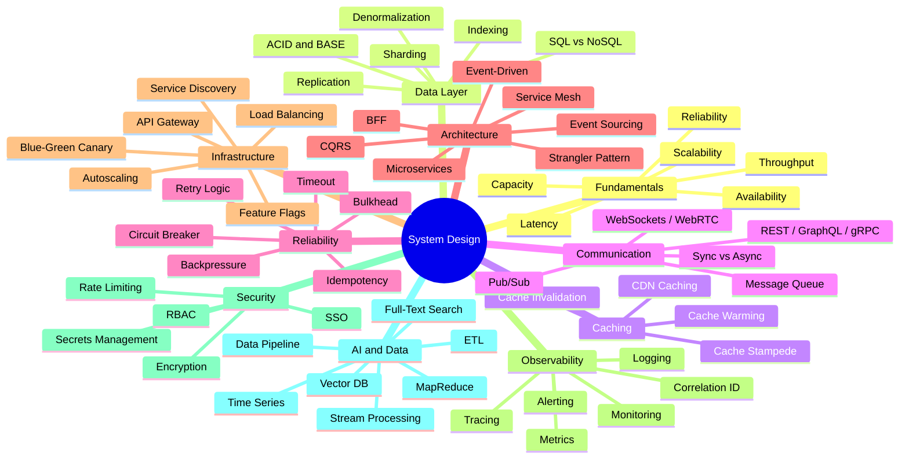

> **Key takeaway:** These 98 concepts cover **80%+ of system design interview questions**. Study them in clusters, not in isolation.

---

## 11. Twelve System Design Concepts in Plain English

```mermaid
graph TB
    SD["System Design\nCore Concepts"] --> G1["1. Scalability\nHandle extra load\nwithout degrading\nperformance"]
    SD --> G2["2. Load Balancer\nRoute requests to\nfree servers,\navoid overload"]
    SD --> G3["3. Cache\nKeep hot data\nnearby for\nquick access"]
    SD --> G4["4. Sharding\nSplit data into\nsmaller parts,\nshared across servers"]
    SD --> G5["5. Replication\nKeep copies of data\nfor availability\nduring failures"]
    SD --> G6["6. Message Queue\nStore and serve\nmessages between\nservices reliably"]
    SD --> G7["7. CDN\nEdge servers globally\nfor fast delivery\nand caching"]
    SD --> G8["8. Rate Limiter\nControl requests\nper user\nper time window"]
    SD --> G9["9. Monitoring\nMetrics, logs,\nalerts to find\nproblems early"]
    SD --> G10["10. Failover\nAuto-switch to\nbackup on failure"]
    SD --> G11["11. Service Discovery\nServices register\nso others find\nthem dynamically"]
    SD --> G12["12. Circuit Breaker\nStop calling a\nfailing service\nprevent cascades"]

    style SD fill:#0f172a,color:#fff
    style G8 fill:#7c3aed,color:#fff
    style G12 fill:#dc2626,color:#fff
```

### Concept Reference Table

| # | Concept | One-Line Definition | Interview Trigger |
|---|---|---|---|
| 1 | **Scalability** | Ability to handle growing load by adding resources (vertical = bigger machine; horizontal = more machines) | "Design for 10x current traffic" |
| 2 | **Load Balancer** | Distributes incoming requests across server pool using Round Robin, Least Connections, or IP Hash | "How do you avoid single-server bottleneck?" |
| 3 | **Cache** | In-memory store (Redis, Memcached) for hot data; avoids redundant database reads | "How do you reduce p99 latency?" |
| 4 | **Sharding** | Partition data across multiple database nodes by a shard key; each node owns a subset | "Your DB is at 10TB — what next?" |
| 5 | **Replication** | Sync data to multiple nodes (leader + followers); followers serve reads or take over on failure | "How do you achieve 99.99% availability?" |
| 6 | **Message Queue** | Durable, async buffer (Kafka, SQS, Service Bus) decoupling producer rate from consumer rate | "How do you handle traffic spikes without dropping data?" |
| 7 | **CDN** | Globally distributed PoPs cache static/dynamic content close to users; reduces origin load | "How do you serve 100M users with low latency globally?" |
| 8 | **Rate Limiter** | Token Bucket or Sliding Window counter limits requests per client per time window | "How do you protect APIs from abuse?" |
| 9 | **Monitoring** | Metrics (counters, gauges, histograms) + logs (structured) + traces (distributed) = full observability | "How do you know when something breaks?" |
| 10 | **Failover** | Automatic promotion of standby to primary when health probes detect failure; requires state sync | "What is your RTO and RPO?" |
| 11 | **Service Discovery** | Services register endpoints at startup (Consul, Kubernetes DNS); clients discover dynamically | "How do services find each other in a dynamic cluster?" |
| 12 | **Circuit Breaker** | After N consecutive failures to a dependency, open the circuit and return fast-fail; re-probe after cooldown | "How do you prevent cascade failures?" |

> **Interview tip:** "These 12 concepts form a dependency chain: scalability drives the need for load balancers, which expose caching opportunities, which require invalidation strategies, which lead to consistency trade-offs. Demonstrate that you see them as an interconnected system — not a checklist."

---

## 12. Agentic AI — Real-World Challenges

Building AI agents is easy. **Operating them reliably** is the hard part.

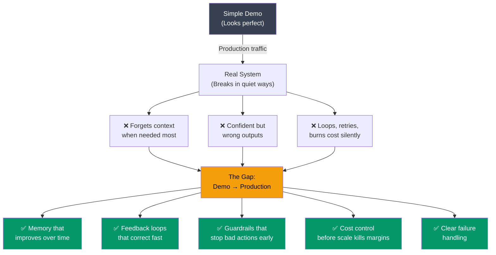

### Production Challenges vs Mitigations

| Challenge | Root Cause | Production Mitigation | Azure / .NET Pattern |
|---|---|---|---|
| **Context amnesia** | Context window fills; older turns dropped | Sliding window + RAG-based long-term memory | Semantic Kernel `ChatHistory` + Azure AI Search |
| **Confident hallucination** | Model generates plausible but wrong output | Groundedness evaluation + RAG citation check | Azure AI Evaluation (groundedness scorer) |
| **Infinite tool loops** | Agent re-tries failed tool calls without a stopping rule | Max-iteration cap + step-level timeout | `IAutoFunctionInvocationFilter` abort after N steps |
| **Silent cost burn** | Long-running agent accumulates token spend unnoticed | Per-session token budget + cost alerts | Azure Monitor custom metric on token count |
| **Destructive tool calls** | Agent invokes irreversible actions without confirmation | Approval gate filter for mutating tools | `IAutoFunctionInvocationFilter` + human-in-the-loop |
| **Prompt injection** | Malicious data in tool output hijacks agent instructions | Input/output sanitization + content safety filter | Azure Content Safety + prompt shield |
| **No observability** | Failures happen silently across multi-step pipelines | Distributed tracing of every tool call + LLM step | OpenTelemetry + Azure Monitor `ai.*` spans |

> **Key questions to ask about any AI agent:**
> - What happens when it **fails**?
> - What happens when it **forgets**?
> - What happens when it is **confidently wrong**?
>
> If you can answer those — you're not just using AI. You're **managing** it.

> **Interview tip:** "The gap between demo and production in AI agents is wider than in any other software category. A senior architect's signal is asking 'what are the failure modes?' before discussing features. Name at least three: context overflow, hallucination without citation, and silent looping — then describe the mitigation pattern for each."

---

## 13. CLAUDE.md vs AGENTS.md vs SKILL.md

Three types of files that define the new era of **programmable AI teammates**.

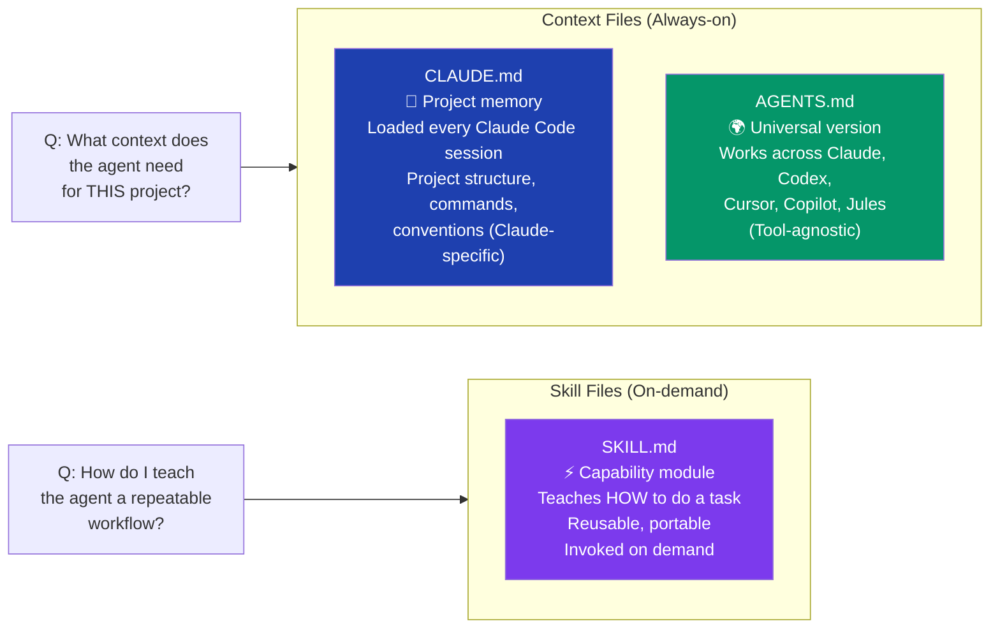

| File | Type | Scope | Works With |
|---|---|---|---|
| **CLAUDE.md** | Always-on context | Project-specific | Claude Code only |
| **AGENTS.md** | Always-on context | Project-specific | Any AI agent |
| **SKILL.md** | On-demand capability | Task-specific, reusable | Any AI agent |

> We went from **"prompt and pray"** to **programmable AI teammates**. The question isn't whether these files matter — it's how long you'll keep re-explaining your project to an AI that could've just read the docs.

---

## 14. Six AI Agent Design Patterns

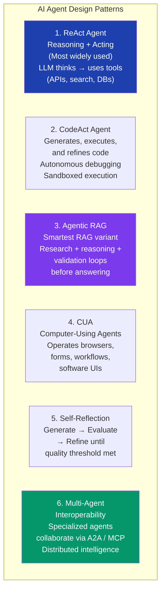

### When to Use Each Pattern

| Pattern | Use Case |
|---|---|
| **ReAct** | General-purpose agents that search, retrieve, act |
| **CodeAct** | Developer assistants, automated debugging, code generation |
| **Agentic RAG** | Complex Q&A requiring multi-step retrieval and reasoning |
| **CUA** | Browser automation, form filling, RPA replacement |
| **Self-Reflection** | High-accuracy tasks where quality must be verified |
| **Multi-Agent** | Large-scale enterprise workflows, distributed intelligence |

> **Key Insight:** The future of AI systems is not a single model — it's **networks of agents** that reason, use tools, collaborate, verify outputs, and continuously improve.

---

## 15. Enterprise AI Architecture — Production Stack

Moving from Prototype to Production requires a sophisticated, multi-layered stack.

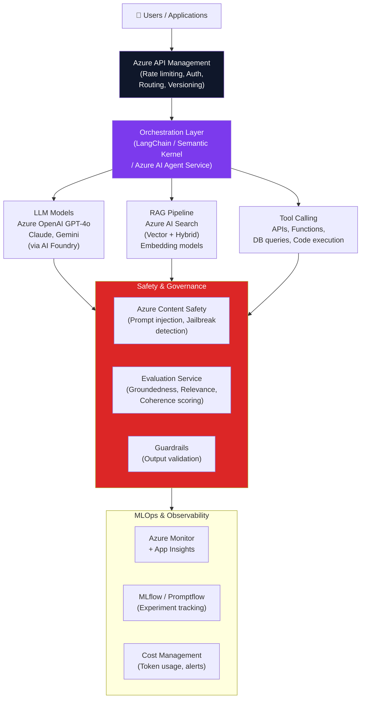

### Production AI Stack Layers

| Layer | Responsibility | Azure Services |
|---|---|---|
| **Gateway** | Auth, rate limiting, versioning | Azure APIM |
| **Orchestration** | Workflow, agent coordination | Semantic Kernel, AI Agent Service |
| **Models** | LLM inference | Azure OpenAI, AI Foundry |
| **Retrieval** | Knowledge grounding | AI Search, Cosmos DB Vector |
| **Safety** | Content filtering, guardrails | Content Safety, Evaluations |
| **Observability** | Logs, traces, metrics, costs | Azure Monitor, MLflow |

---

## 16. Zero Trust Security in Azure

**Zero Trust:** Never trust, always verify. Assume breach. Least privilege access.

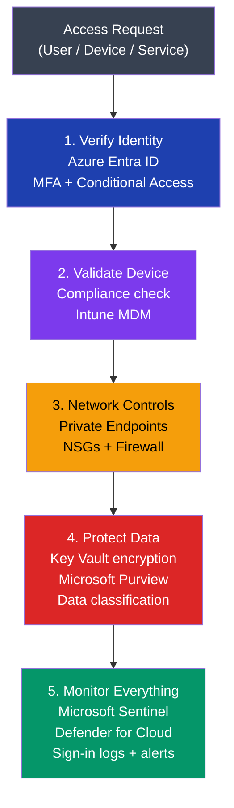

### Zero Trust Principles

| Principle | What It Means | Azure Implementation |
|---|---|---|
| **Verify Explicitly** | Always authenticate & authorize with all data points | Entra ID, MFA, Conditional Access |
| **Least Privilege** | Limit user and service access | RBAC, PIM, Just-in-Time access |
| **Assume Breach** | Minimize blast radius, segment access | Private networks, Sentinel, Defender |

---

## 17. Rate Limiting Service Design

**Rate limiting** controls how many requests a client can make in a time window to prevent abuse and protect system resources.

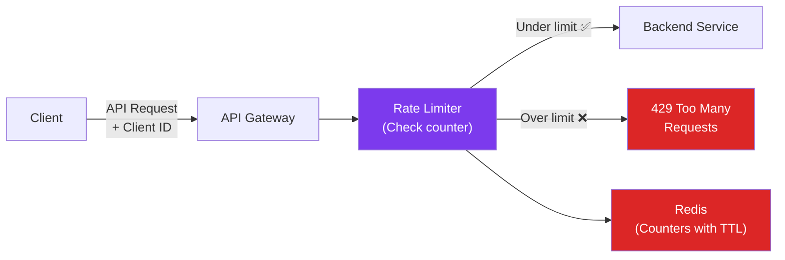

### Rate Limiting Algorithms

| Algorithm | How It Works | Pros | Cons |
|---|---|---|---|
| **Fixed Window** | Count resets every N seconds | Simple | Edge case: 2x burst at window boundary |
| **Sliding Window Log** | Track exact timestamps of requests | Accurate | High memory usage |
| **Sliding Window Counter** | Weighted blend of two windows | Accurate + efficient | Slightly complex |
| **Token Bucket** | Add tokens at fixed rate; consume per request | Handles bursts | State per user |
| **Leaky Bucket** | Queue requests; process at constant rate | Smooth output | Drops burst traffic |

### Key Design Decisions
- **Scope:** Per IP, per user, per API key, per endpoint
- **Storage:** Redis for distributed counter state with TTL
- **Headers:** Return `X-RateLimit-Remaining`, `X-RateLimit-Reset` to clients
- **Response:** `429 Too Many Requests` with `Retry-After` header

> **Interview Language:** "A well-designed rate limiter ensures **performance, reliability, and fairness** in distributed systems. We use a **sliding window algorithm** backed by **Redis** for distributed state."

---

## 18. API Performance Optimization

Improving API performance requires **combining multiple optimizations strategically**.

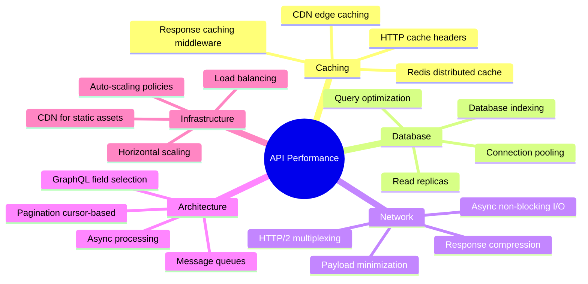

### Quick Wins Priority

| Priority | Technique | Impact |
|---|---|---|
| 🔴 High | Add Redis caching for hot queries | 10–100x latency reduction |
| 🔴 High | Database indexing on query fields | 10–1000x query speed |
| 🟡 Medium | Connection pooling | Reduce connection overhead |
| 🟡 Medium | HTTP/2 multiplexing | Reduce round trips |
| 🟢 Low | Response compression (gzip/brotli) | 60–80% payload reduction |
| 🟢 Low | Async endpoints for I/O-bound ops | Better throughput |

---

## 19. Microservices Production Readiness Checklist

Most "microservices" in production are actually **distributed monoliths with extra latency**.

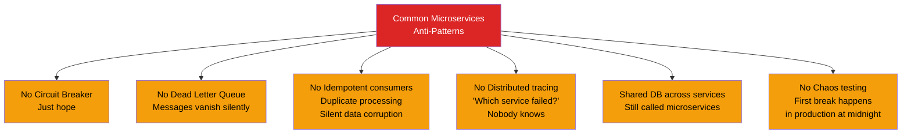

### 70-Point Checklist — Top 10 Categories

| Category | Must-Have |
|---|---|
| **Resilience** | Circuit Breaker, Retry + backoff, Timeout, Bulkhead |
| **Messaging** | Dead Letter Queue, Idempotent consumers, At-least-once delivery |
| **Observability** | Distributed tracing, Correlation IDs, Centralized logs, Metrics |
| **Data** | Service owns its DB, No shared DB, Event-sourcing where applicable |
| **Security** | mTLS between services, secrets from Key Vault, no hardcoded creds |
| **Deployment** | Blue-Green or Canary, Health checks, Graceful shutdown |
| **Testing** | Contract tests, Chaos engineering, Load testing |
| **API** | Versioned APIs, backward compatible changes |
| **Scalability** | Horizontal scaling, Stateless design, Auto-scaling |
| **Cost** | Right-sized resources, scale-to-zero where possible |

> There's a difference between **running** microservices and **operating** them.

---

## 20. Load Balancing Algorithms

```mermaid
graph TD
    Traffic["Incoming Traffic"] --> LB2["Load Balancer"]

    LB2 -->|"Round Robin\n(Sequential)"| RR["S1 → S2 → S3 → S1..."]
    LB2 -->|"Least Connections\n(Route to least active)"| LC["Server with\nfewest active connections"]
    LB2 -->|"Weighted\n(By server capacity)"| WR["Stronger servers\nget more traffic"]
    LB2 -->|"IP Hash\n(Same client → same server)"| IH["Session stickiness\nby client IP"]
    LB2 -->|"Least Response Time\n(Fastest server wins)"| LRT["Route to\nfastest responding server"]

    style LB2 fill:#0f172a,color:#fff
    style RR fill:#374151,color:#fff
    style LC fill:#1e40af,color:#fff
    style WR fill:#7c3aed,color:#fff
    style IH fill:#059669,color:#fff
    style LRT fill:#f59e0b,color:#000
```

### Algorithm Selection Guide

| Algorithm | When to Use |
|---|---|
| **Round Robin** | Equal-capacity stateless servers |
| **Least Connections** | Long-lived connections, variable request duration |
| **Weighted Round Robin** | Mixed-capacity servers (some more powerful) |
| **IP Hash** | Session affinity required (shopping cart, auth) |
| **Least Response Time** | Latency-sensitive APIs |
| **Random** | Simplest possible distribution, equal capacity |

> **The right algorithm depends on your use case**: equal servers → Round Robin; variable duration → Least Connections; session needs → IP Hash.

---

## 21. Azure Data Pipeline Cost Optimization

**Real example:** Saving $10,000/year by re-architecting an Azure data pipeline.

```mermaid
graph LR
    subgraph Before["❌ Before — Expensive"]
        B1["Azure Data Factory\n(always-on trigger)"] --> B2["Azure SQL\n(Premium tier)"]
        B2 --> B3["Power BI\n(Premium capacity)"]
    end

    subgraph After["✅ After — Optimized"]
        A1["Event Grid\n(trigger on change only)"] --> A2["Azure Functions\n(serverless, pay-per-exec)"]
        A2 --> A3["Azure SQL\n(General Purpose tier)"]
        A3 --> A4["Power BI\n(Pro license)"]
        A2 --> A5["Blob Storage\n(Cold tier for archive)"]
    end

    style Before fill:#dc2626,color:#fff
    style After fill:#059669,color:#fff
```

### Cost Optimization Principles

| Principle | Action |
|---|---|
| **Event-driven over polling** | Replace scheduled triggers with event-based (save idle compute) |
| **Serverless for bursty workloads** | Functions instead of always-on compute |
| **Right-size storage tiers** | Move cold data to Blob Cool/Archive tiers |
| **Reserved instances** | Commit 1–3 years for predictable workloads (40–72% savings) |
| **Scale-to-zero** | Container Apps, Functions scale down when idle |

---

## 22. Authentication — IAM Pattern

```mermaid
sequenceDiagram
    participant U as User
    participant FE as Frontend
    participant IdP as Identity Provider\n(Entra ID / Auth0)
    participant API as API Gateway
    participant SVC as Backend Service

    U->>FE: Login (username + password / SSO)
    FE->>IdP: Authenticate request
    IdP-->>FE: JWT Access Token + Refresh Token
    FE->>API: API request + Bearer Token
    API->>API: Validate JWT signature + expiry
    API->>SVC: Forward request + claims
    SVC->>SVC: Check authorization (RBAC)
    SVC-->>API: Response
    API-->>FE: Response
    FE-->>U: Display result
```

### Token Types

| Token | Purpose | Lifetime |
|---|---|---|
| **Access Token (JWT)** | Authorizes API calls | Short (15min – 1hr) |
| **Refresh Token** | Gets new access token without re-login | Long (days – weeks) |
| **ID Token** | Contains user identity claims | Short |

### JWT Structure
```
eyJhbGciOiJSUzI1NiJ9.eyJzdWIiOiJ1c2VyMTIzIiwicm9sZSI6ImFkbWluIn0.signature

Header:  { "alg": "RS256", "typ": "JWT" }
Payload: { "sub": "user123", "role": "admin", "exp": 1719000000, "iat": 1718996400 }
Signature: RSA_SHA256(base64(header) + "." + base64(payload), private_key)
```

> **Key principle:** Frontend handles the auth UX. Backend **always re-validates** every request — never trust client-side data.

---

## 23. Single vs Multi-Agent Architecture

```mermaid
graph TD
    subgraph Single["Single-Agent Architecture"]
        SA["One Agent\nHandles entire pipeline:\n- Search\n- Summarize\n- Generate\n- Validate"]
        SA --> SAOut["Single output"]
    end

    subgraph Multi["Multi-Agent Architecture"]
        Orch["Orchestrator Agent\n(Routes + coordinates)"]
        Orch --> Search["Search Agent\n(Retrieval)"]
        Orch --> Reason["Reasoning Agent\n(Analysis)"]
        Orch --> Gen["Generation Agent\n(Content creation)"]
        Orch --> Valid["Validation Agent\n(Quality check)"]
        Search & Reason & Gen & Valid --> MAOut["Aggregated output"]
    end

    style SA fill:#374151,color:#fff
    style Orch fill:#0f172a,color:#fff
    style Search fill:#1e40af,color:#fff
    style Reason fill:#7c3aed,color:#fff
    style Gen fill:#059669,color:#fff
    style Valid fill:#f59e0b,color:#000
```

### Comparison

| | Single Agent | Multi-Agent |
|---|---|---|
| **Complexity** | Simple | High (coordination needed) |
| **Specialization** | Generalist | Each agent is expert |
| **Failure isolation** | Single point of failure | Isolated failures |
| **Scalability** | Limited | Scale each agent independently |
| **Cost** | Lower | Higher (more LLM calls) |
| **Best for** | Simple workflows | Complex enterprise pipelines |

### Agent Communication Protocols
- **MCP (Model Context Protocol)** — Anthropic's standard for tool/context sharing
- **A2A (Agent-to-Agent)** — Google's protocol for agent interoperability
- **OpenAI Function Calling** — structured tool invocation

---

## Appendix: Key Topics by Domain

### Azure & Cloud
- Azure Landing Zone, Azure Container Apps, Azure Well-Architected Framework
- Azure Bastion, Azure Load Balancer, Azure API Management
- Azure OpenAI, Azure AI Foundry, Azure AI Search
- Zero Trust Security, Microsoft Entra ID, Defender for Cloud
- Bicep, Terraform (IaC), Azure DevOps CI/CD

### System Design Core
- Caching (all 8 patterns), Cache failure modes
- Load Balancing algorithms
- Rate Limiting (token bucket, sliding window)
- CAP Theorem, Sharding, Replication
- Microservices production readiness

### AI & Agentic Systems
- 6 AI Agent Design Patterns (ReAct, CodeAct, Agentic RAG, CUA, Self-Reflection, Multi-Agent)
- Single vs Multi-Agent Architecture
- CLAUDE.md vs AGENTS.md vs SKILL.md
- Agentic AI production challenges

### APIs & Communication
- REST, GraphQL, gRPC, tRPC — when to use each
- JWT Authentication, OAuth 2.0
- WebSockets, SSE, Long Polling
- API Gateway patterns, BFF

### Developer Productivity
- Git workflow (Workspace → Stage → Local → Remote)
- SKILL.md / AGENTS.md for AI-assisted development
- CI/CD with Blue-Green and Canary deployments

---

*Generated from LinkedIn activity export | Clean version with Mermaid diagrams | June 2026*
