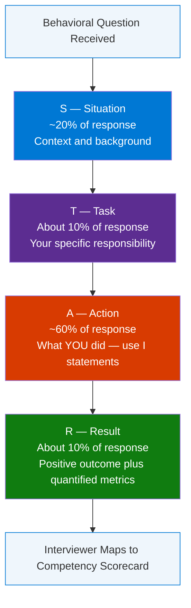
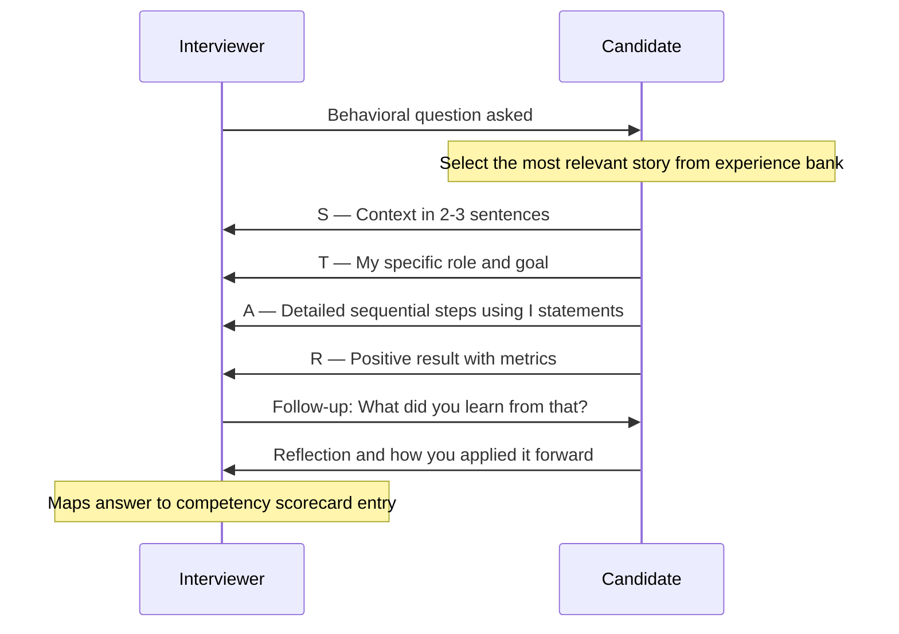

# STAR Method — Behavioral Interview Complete Guide

> **Source:** [YouTube — STAR METHOD FOR BEHAVIOURAL INTERVIEW QUESTIONS! (PASS YOUR INTERVIEW!)](https://www.youtube.com/watch?v=xulpDyBxDgk)
> **Topic:** Behavioral Interviews, STAR Method, Interview Preparation, Soft Skills, Competency Framework
> **Key Claim:** ~73% of employers use behavioral interviewing — STAR structures your answers to match what evaluators are measuring

---

## Table of Contents

1. [Overview](#1-overview)
2. [Problem Statement](#2-problem-statement)
3. [Core Concepts](#3-core-concepts)
4. [Architecture — The STAR Framework](#4-architecture--the-star-framework)
5. [Key Components](#5-key-components)
6. [How It Works — Step by Step](#6-how-it-works--step-by-step)
7. [Comparison Table](#7-comparison-table)
8. [Answer Templates](#8-answer-templates)
9. [Best Practices](#9-best-practices)
10. [Interview Talking Points](#10-interview-talking-points)
11. [Learning Resources](#11-learning-resources)

---

## 1. Overview

The STAR Method is a four-part structured framework — **Situation, Task, Action, Result** — for answering behavioral interview questions with clarity, specificity, and demonstrated impact. Approximately 73% of employers use behavioral interviewing because past behavior is the most reliable predictor of future performance. Without structure, candidates tend to ramble, omit personal contribution, or fail to quantify outcomes — all of which weaken competency signals. Mastering STAR converts any career experience into a compelling, evaluator-ready narrative in under two minutes. This guide covers the full framework, component breakdowns, answer templates for the most common behavioral competencies, and interview Q&A pairs you can use directly.

---

## 2. Problem Statement

Behavioral interview questions don't have "correct" answers — they have *structured* vs *unstructured* ones. Most candidates fail not because they lack the experience, but because they can't convey it in a way that maps to what evaluators are scoring.

### Classic Approach Pain Points

| Problem | Impact on Evaluation |
|---|---|
| Generic "we did X" answers | Interviewer cannot assess individual contribution |
| No clear outcome stated | Competency proof remains implicit, not demonstrated |
| Rambling with no structure | Interviewer loses confidence in candidate's communication |
| Over-focus on Situation, under-focus on Action | ~60% of response weight wasted on setup |
| Vague results ("it went really well") | No quantifiable evidence of impact |
| Memorized scripts that break on follow-ups | Signals candidate rehearsed but didn't reflect |

> **Key Insight:** "Behavioral interviewing is based on the premise that the best predictor of future behavior is past behavior in similar situations."

---

## 3. Core Concepts

### Behavioral Interviewing
A structured interview technique that asks candidates for specific past examples rather than hypothetical responses. Questions begin with trigger phrases like *"Tell me about a time when..."*, *"Describe a situation where..."*, or *"Give me an example of..."*

### STAR Method
An acronym for the four-part response structure: **S**ituation → **T**ask → **A**ction → **R**esult. Each component has a defined purpose and a recommended time weight within the 1.5–2 minute answer window.

### Competency-Based Evaluation
Interviewers map each behavioral question to a specific competency on their scorecard — leadership, resilience, communication, problem-solving, etc. A STAR answer makes the competency demonstration explicit and scorable. Without STAR, the evaluator must infer; with STAR, they score directly.

### Behavioral Competencies — Most Commonly Tested

| Competency | Typical Trigger Phrase |
|---|---|
| Problem-solving | "Tell me about a difficult problem you solved" |
| Leadership | "Describe a time you led a team under pressure" |
| Conflict resolution | "Tell me about a disagreement with a colleague or manager" |
| Resilience / pressure | "Describe a time you worked under an extremely tight deadline" |
| Decision-making | "Tell me about an unpopular decision you made and how you handled it" |
| Communication | "Describe a time you persuaded someone to change their point of view" |
| Initiative | "Tell me about a time you went above and beyond what was expected" |
| Adaptability | "Describe a time you had to quickly adjust to a major change" |
| Collaboration | "Tell me about a time you worked across teams to achieve a goal" |
| Failure / learning | "Tell me about a mistake you made and what you learned from it" |

---

## 4. Architecture — The STAR Framework



### Response Time Allocation

| Component | Time Weight | Why This Weighting |
|---|---|---|
| Situation | ~20% | Give just enough context — don't over-explain the backstory |
| Task | ~10% | One or two sentences establishing your specific ownership |
| Action | ~60% | This is the proof of competency — the most detailed section |
| Result | ~10% | The payoff — always positive, always quantified where possible |

---

## 5. Key Components

| Component | What It Is | Include | Avoid |
|---|---|---|---|
| **Situation** | Contextual background | Where, when, what was at stake | Over-explaining unrelated backstory |
| **Task** | Your specific responsibility | What you personally needed to accomplish | "We" instead of "I" |
| **Action** | Steps you personally took | 3–5 concrete sequential steps, "I" language | Passive voice ("it was decided") |
| **Result** | Measurable outcome | Numbers, percentages, feedback, timeline | Vague positives ("it went well") |

---

### S — Situation

Sets the scene. 2–3 sentences maximum. Provide just enough context so the interviewer understands why this situation mattered, then move on.

**Formula:** `[Where you were] + [What the challenge or context was] + [Why it was significant]`

**Example:**
*"During my first year as team lead, our primary vendor unexpectedly went out of business three weeks before a major product launch."*

---

### T — Task

Your specific role and responsibility within that situation. This is the bridge that separates *your* contribution from the broader team or organizational effort.

**Formula:** `[What you were specifically responsible for] + [What the required outcome was]`

**Example:**
*"I was responsible for sourcing a replacement vendor and ensuring zero delay to our already-committed launch timeline."*

---

### A — Action

The core of the STAR answer. Walk through what you did, in detail, in sequence, using "I" statements throughout. This is where the evaluator is scoring your competency.

**Formula:** `I did X because Y → I then did Z to address A → I also did B when C arose`

**Example:**
*"I immediately contacted five alternative vendors and negotiated expedited delivery contracts with two of them. I reorganized the team's sprint to absorb the integration work in parallel with other deliverables. I also established a daily stakeholder update cadence to manage expectations and surface blockers early."*

---

### R — Result

The resolution — what happened as a direct consequence of your actions. Quantify wherever possible. End positively, even when the story involves a setback.

**Formula:** `[Measurable outcome] + [Impact on team or org] + [Optional: what you learned]`

**Example:**
*"We launched on schedule. Vendor costs were 8% higher than originally planned but within contingency budget. The project was cited as a cross-team coordination best practice in our Q3 retrospective."*

---

## 6. How It Works — Step by Step



### Pre-Interview Preparation Steps

1. **Audit the job description** — identify the top 5 competencies explicitly listed or implied
2. **Build a story bank** — prepare 5–7 strong examples from your career that can flex across multiple competencies
3. **Map stories to competencies** — one story often covers leadership, communication, and pressure simultaneously
4. **Quantify in advance** — know your numbers before walking in (%, $, headcount, time saved, NPS)
5. **Practice aloud** — time yourself; target 1.5–2 minutes per answer without notes
6. **Prepare for follow-ups** — *"What would you do differently?"*, *"What did you learn?"*, *"How did your manager react?"*

---

## 7. Comparison Table

| Dimension | Unstructured Answer | STAR Answer |
|---|---|---|
| **Structure** | Rambling, hard to follow | Clear S → T → A → R flow |
| **Pronoun use** | "We decided...", "The team..." | "I specifically...", "I chose to..." |
| **Evidence type** | Vague generalization | One specific event with concrete detail |
| **Result** | Missing or vague | Quantified, positive, concrete |
| **Duration** | Too short or runs over | Consistent 1.5–2 minutes |
| **Competency proof** | Implicit, must be inferred | Explicit and directly scorable |
| **Preparation signal** | Appears unprepared | Demonstrates self-awareness and structure |
| **Evaluator experience** | Must guess what candidate contributed | Scores cleanly against competency criteria |
| **Follow-up resilience** | Breaks down when probed | Holds up — grounded in a real event |

---

## 8. Answer Templates

### Template 1 — Problem Solving

```
Situation: "At [Company/Role], we encountered [specific problem] that [stakes/impact]."

Task:      "My responsibility was to [specific goal you owned]."

Action:    "I [first step and rationale].
            I then [second step to address specific sub-problem].
            I also [third step] to ensure [outcome condition]."

Result:    "As a result, [measurable outcome — %, $, time, score].
            This [impact on team/org/customer]."
```

---

### Template 2 — Conflict Resolution

```
Situation: "While working on [project/team], I noticed [conflict/tension] between [parties]."

Task:      "I needed to [resolve it / mediate / align parties] without [negative outcome]."

Action:    "I scheduled individual conversations with each party to understand perspectives.
            I identified the shared goal underneath the disagreement.
            I proposed [specific solution] and facilitated a working session to align.
            I followed up [timeframe later] to ensure the resolution held."

Result:    "The conflict was resolved within [timeframe], the project continued on schedule,
            and [specific positive outcome — feedback, delivery, relationship]."
```

---

### Template 3 — Leadership Under Pressure

```
Situation: "During [high-stakes event/crisis], our team faced [specific challenge]."

Task:      "As [role], I was responsible for [leading/coordinating/deciding under time pressure]."

Action:    "I immediately [stabilization step].
            I delegated [specific tasks] to [team members] based on their strengths.
            I maintained [stakeholder communication cadence] to preserve confidence.
            I made the call to [key decision] when [decision point arose]."

Result:    "We delivered [outcome] on [time/budget].
            [Senior stakeholder] cited this as an example of [quality] in [review]."
```

---

### Template 4 — Initiative / Going Above and Beyond

```
Situation: "In my role as [position], I identified [gap/opportunity] that wasn't part of my remit."

Task:      "Though not required, I decided to [take initiative on X] because [impact rationale]."

Action:    "I [researched / built / proposed / led] [specific effort].
            I secured buy-in from [stakeholder] by [approach].
            I delivered [output] within [timeframe] alongside my regular responsibilities."

Result:    "This resulted in [measurable outcome].
            It was [adopted/recognized] at [scope — team/org/exec level]."
```

---

### Common Behavioral Questions by Competency

```
PROBLEM SOLVING:
  "Tell me about a time you solved a difficult problem at work."
  "Describe a situation where you had to make a decision with incomplete information."
  "Tell me about a time you identified a risk and addressed it before it became a problem."

LEADERSHIP:
  "Tell me about a time you led a team through significant change."
  "Describe a situation where you had to motivate a disengaged team member."
  "Give an example of a time you had to build alignment across different stakeholders."

COMMUNICATION:
  "Tell me about a time you had to explain a complex concept to a non-technical audience."
  "Describe a situation where you had to deliver difficult feedback."
  "Give an example of when you persuaded someone to change their point of view."

ADAPTABILITY:
  "Tell me about a time when plans changed suddenly and how you responded."
  "Describe how you handled having to learn a completely new skill quickly."
  "Give an example of a time you had to change your approach midway through a project."

CONFLICT RESOLUTION:
  "Tell me about a time you disagreed with your manager and how you handled it."
  "Describe a situation where you had to work with a difficult colleague."
  "Give an example of a time a disagreement led to a better outcome."

INITIATIVE:
  "Tell me about a time you went above and beyond what was expected of you."
  "Describe a project you initiated that made a positive impact."
  "Give an example of when you saw a problem no one else was addressing and took action."

FAILURE / LEARNING:
  "Tell me about a mistake you made and what you learned from it."
  "Describe a time a project you led did not go as planned."
  "Give an example of critical feedback you received and how you responded."
```

---

## 9. Best Practices

### Preparation
- ✅ Build a story bank of 5–7 versatile examples covering the major competencies before any interview
- ✅ Map each story to multiple competencies — one strong story can serve 3+ different questions
- ✅ Pre-quantify results: know your numbers — %, $, headcount, time, NPS, score improvements
- ✅ Review the JD and explicitly align your story bank to the stated role requirements
- ✅ Practice aloud, timed — unscripted familiarity is more effective than memorization
- ❌ Don't write scripts — prepare bullet outlines and practice natural delivery
- ❌ Don't draw all examples from one job or one time period in your career

### During the Interview
- ✅ Use "I" not "we" — the evaluator is scoring you, not your team
- ✅ Be specific — one concrete example beats a generalization every time
- ✅ Aim for 1.5–2 minutes per answer; pause after Result and let the interviewer follow up
- ✅ Keep the Result positive — even failure stories should end with "what I learned and changed"
- ✅ Pause briefly before answering to select the most relevant story — this signals composure
- ❌ Don't skip the Result — it is where the competency proof closes
- ❌ Don't spend more than 20% of your answer on the Situation
- ❌ Don't apologize for a story being "not that dramatic" — the execution matters more than the stakes

### By Career Stage
- ✅ **Early career:** draw from internships, academic projects, volunteer leadership, sports captaincy, part-time jobs
- ✅ **Mid-career:** use cross-functional projects, leadership moments, process improvements, customer impact
- ✅ **Senior / Leadership:** emphasize strategic decisions, org-level impact, stakeholder alignment, resource trade-offs
- ❌ Don't fabricate — interviewers detect confabulation through follow-up questions; real stories hold up under probing

---

## 10. Interview Talking Points

### "What is the STAR method and why does it work?"

> The STAR method structures behavioral interview answers into four components: Situation, Task, Action, Result. It works because it forces specificity — you can't hide vague competency claims inside a structured narrative. The evaluator gets concrete evidence of how you think and act, and they can map it directly to their scoring criteria. Since roughly 73% of employers use behavioral interviewing, STAR gives you a response format that matches exactly how the interview is being scored.

---

### "How do you prepare for behavioral interviews?"

> Before any interview, I build a story bank of 5–7 examples that cover the core competencies the role requires. I review the job description to understand what competencies are weighted most heavily, then map my stories accordingly. One strong story can often flex across multiple questions depending on which angle I emphasize — leadership, communication, or pressure. I practice aloud, timed, and pre-quantify my results so I can cite specific numbers in the moment without hesitating. The goal is natural familiarity, not a memorized script.

---

### "How do you handle a behavioral question about a failure or mistake?"

> I use the same STAR structure, but make the Result component explicitly about learning and behavior change. The key is to own the failure clearly in the Action section — no deflection, no blaming others — and then pivot to growth. Evaluators asking about failures are testing self-awareness and resilience, not looking for a perfect track record. An answer that shows you recognized the mistake, corrected course, and applied the lesson forward is more compelling than one that sounds defensive or avoidant.

---

### "What if you don't have a directly relevant work example?"

> Draw from adjacent experiences — internships, academic projects, volunteer leadership, or extracurriculars like sports captaincy or student organizations. The competency being tested (resilience, problem-solving, communication) transfers across contexts. Be transparent about the setting: "This was during a university project, but here's how the same dynamic played out..." Interviewers, especially for early-career roles, care far more about the behavior pattern than the specific industry context.

---

### "How does STAR differ from PAR or SOAR methods?"

> STAR (Situation-Task-Action-Result) is the most widely recognized and expected format in corporate interviews. PAR (Problem-Action-Result) collapses Situation and Task into a single "Problem" framing — simpler, but risks losing the nuance of your specific role within the situation. SOAR (Situation-Obstacle-Action-Result) replaces Task with Obstacle, which is effective when emphasizing what you overcame rather than what you were assigned. For most technical and managerial interviews, STAR is the standard. PAR and SOAR are useful variants when the story is primarily about overcoming resistance or adversity.

---

### "What makes the Action step so important?"

> The Action step carries roughly 60% of the answer's weight because it's the only place where your actual competency is visible. The Situation provides context; the Task provides framing; the Result provides evidence. But the Action is where the evaluator sees *how* you think: do you break problems into steps? Do you consider stakeholders? Do you adapt when conditions change? Interviewers can score almost any other part of STAR from the resume alone — the Action is what they can only get from the interview.

---

## 11. Learning Resources

| Resource | Link | Type |
|---|---|---|
| YouTube — STAR Method Behavioral Interview | [Watch](https://www.youtube.com/watch?v=xulpDyBxDgk) | Video |
| MIT CAPD — STAR Method Worksheet | [Read](https://capd.mit.edu/resources/the-star-method-for-behavioral-interviews/) | Official Guide + Worksheet |
| Indeed — STAR Interview Response Technique | [Read](https://www.indeed.com/career-advice/interviewing/how-to-use-the-star-interview-response-technique) | Career Guide |
| BetterUp — 30 STAR Interview Questions | [Read](https://www.betterup.com/blog/star-interview-method) | Comprehensive Guide |
| NovoResume — 27+ STAR Questions and Answers | [Read](https://novoresume.com/career-blog/star-interview-questions) | Question Bank |

---

*Last Updated: July 2026 | Source: PassMyInterview — STAR Method Behavioral Interview*
