# AI Engineer & Architect — Complete Interview Reference (2026)

> **Consolidated from:**
> - `AI-Engineer-Skills-Roadmap-45LPA.md` — Career roadmap, skill levels, salary data, STAR situational questions
> - `AI_Architect_Interview_Concepts.md` — 20-domain topic Q&A reference for AI Architect / Azure GenAI Architect roles
>
> **Topics covered:** AI Engineering Career Path · LLM · RAG · Embeddings · MLOps · AI Agents · Fine-Tuning · Prompt Engineering · Azure Cloud Architecture · Azure OpenAI · LangChain/LangGraph/CrewAI · Vector Databases · Enterprise AI Architecture · LLMOps · AI Pipelines · Microservices · Security · Observability · Data Engineering · Responsible AI · System Design · Behavioral/STAR
>
> **Merge rationale:** Both source docs cover overlapping AI/ML domains (RAG, LLM, MLOps, fine-tuning, prompt engineering, interview Q&A) from complementary angles. The Roadmap provides career progression context, salary benchmarks, skill levels, and situational/STAR interview preparation. The Concepts guide provides exhaustive domain-by-domain technical Q&A and architectural diagrams for interview depth. Together they form a complete preparation reference.

---

## Table of Contents

### Part 1 — AI Engineer Career Roadmap (₹45 LPA Target)

1. [Overview — Career Context](#part-1-overview--career-context)
2. [Problem Statement — The Engineering Plateau](#problem-statement--the-engineering-plateau)
3. [Core Concepts — AI Engineering Fundamentals](#core-concepts--ai-engineering-fundamentals)
4. [Skill Architecture — 4-Level Framework](#skill-architecture--4-level-framework)
5. [Skills by Level](#skills-by-level)
6. [Learning Roadmap — Step by Step](#learning-roadmap--step-by-step)
7. [Salary and Role Comparison](#salary-and-role-comparison)
8. [Code Examples — AI Engineering](#code-examples--ai-engineering)
9. [Tool Reference by Category](#tool-reference-by-category)
10. [Best Practices — AI Engineering](#best-practices--ai-engineering)
11. [Interview Talking Points — Career Roadmap](#interview-talking-points--career-roadmap)
12. [Situation-Based Interview Questions (STAR Format)](#situation-based-interview-questions-star-format)
13. [Learning Resources](#learning-resources)

### Part 2 — AI Architect Complete Interview Concepts (20 Domains)

14. [Azure Cloud Architecture](#14-azure-cloud-architecture)
15. [Azure OpenAI & GenAI Platform](#15-azure-openai--genai-platform)
16. [Large Language Models (LLMs)](#16-large-language-models-llms)
17. [Prompt Engineering](#17-prompt-engineering)
18. [Retrieval-Augmented Generation (RAG)](#18-retrieval-augmented-generation-rag)
19. [Fine-Tuning](#19-fine-tuning)
20. [AI Agents & Multi-Agent Systems](#20-ai-agents--multi-agent-systems)
21. [LangChain, LangGraph & CrewAI](#21-langchain-langgraph--crewai)
22. [Vector Databases & Embeddings](#22-vector-databases--embeddings)
23. [Enterprise AI Architecture](#23-enterprise-ai-architecture)
24. [MLOps & LLMOps](#24-mlops--llmops)
25. [AI Pipelines (MLflow, Kubeflow, Airflow)](#25-ai-pipelines-mlflow-kubeflow-airflow)
26. [Microservices & Containerization](#26-microservices--containerization)
27. [Security — OAuth, JWT, IAM](#27-security--oauth-jwt-iam)
28. [Observability — ELK & OpenTelemetry](#28-observability--elk--opentelemetry)
29. [Data Engineering — PySpark & Azure Data](#29-data-engineering--pyspark--azure-data)
30. [Azure AI Services](#30-azure-ai-services)
31. [AI Governance & Responsible AI](#31-ai-governance--responsible-ai)
32. [System Design — End-to-End Scenarios](#32-system-design--end-to-end-scenarios)
33. [Behavioral & Leadership Questions](#33-behavioral--leadership-questions)
34. [Quick Reference: Key Numbers to Know](#34-quick-reference-key-numbers-to-know)
35. [Study Priority Roadmap](#35-study-priority-roadmap)

---

# PART 1 — AI ENGINEER CAREER ROADMAP (₹45 LPA TARGET)

> **Source:** AI-Engineer-Skills-Roadmap-45LPA.md
> **Original Source:** [YouTube — Skills you need to get 45 LPA as an AI Engineer in 2026 (Beginner to Advance Level)](https://www.youtube.com/watch?v=fIwozW8UxlY)
> **Topic:** AI Engineering, Career Roadmap, LLM, RAG, MLOps, Agentic AI, AI System Design, GenAI
> **Key Claim:** Specializing in GenAI + MLOps + AI System Design targets ₹45–70 LPA in product companies vs ₹12–20 LPA in IT services at equivalent seniority

---

## Part 1: Overview — Career Context

The AI Engineer role in 2026 is the highest-paying and fastest-growing engineering specialization in India's tech market. With every enterprise now building or buying a GenAI product, the talent gap between demand and supply is massive — which is why engineers who can design, build, and keep AI systems running in production command ₹45–70 LPA even at 5–7 years of experience.

This roadmap covers the exact skills — from Python fundamentals to AI System Design — that differentiate a ₹45 LPA AI Engineer from a ₹12 LPA ML Engineer. The core insight is that seniority pay scales with ownership: the ₹45 LPA engineer is the person a company calls when the AI feature breaks at 3am, not the person who trained the model.

The three highest-leverage skill clusters in 2026 are: **LLMs + RAG** (build AI apps that work), **MLOps** (keep them running reliably), and **AI System Design** (architect them at scale). Engineers who master all three, and can explain trade-offs to non-technical stakeholders, consistently land in the top pay band.

A realistic timeline is 12–18 months of focused, project-driven learning to transition from a traditional software or data role to a proficient AI Engineer. Beginners who deploy even one real AI project early skip 2–3 years of conventional progression.

---

## Problem Statement — The Engineering Plateau

Most engineers plateau at ₹12–20 LPA despite 4–6 years of experience because they focus on breadth (knowing many tools) over depth (owning production outcomes). The AI Engineer pay premium goes to engineers who can own a feature from data ingestion to deployment to monitoring to incident response.

### Classic Engineering Plateau Pain Points

| Problem | Why It Caps Salary |
|---|---|
| Writes notebook-level ML code only | Never ships to production — no visible business impact |
| Knows TensorFlow but not MLOps | Models drift and degrade; gets blamed, not promoted |
| Uses only managed APIs without understanding internals | Cannot optimize cost or debug latency failures |
| No system design depth | Cannot lead technical discussions — stays IC indefinitely |
| Avoids LLMs as "just wrappers" | Misses the single highest-demand skill cluster of 2026 |
| Works in IT services instead of product companies | Same skills pay 50–80% less |
| No public portfolio or certifications | Gets filtered by ATS and first-round screeners |

> **Key Insight:** "The ₹45 LPA band is not about knowing more algorithms. It is about being the engineer who owns AI in production. Production ownership commands the premium."

---

## Core Concepts — AI Engineering Fundamentals

### Large Language Model (LLM)
A neural network trained on massive text corpora capable of generating, summarizing, classifying, and reasoning over text. In 2026, the dominant models are GPT-4o (OpenAI), Claude Sonnet/Opus (Anthropic), Gemini Pro (Google), and open-source models including Llama 3.1, Mistral 7B, and Phi-4. AI Engineers primarily integrate, prompt-engineer, fine-tune, and deploy these models — they rarely train from scratch.

### RAG (Retrieval-Augmented Generation)
An architecture pattern that grounds LLM responses in real-time, specific data by: (1) converting a knowledge base into vector embeddings, (2) storing them in a vector database, (3) retrieving the most semantically relevant chunks at query time, and (4) injecting them into the LLM context window before generation. RAG is the default pattern for enterprise AI apps because it prevents hallucination, keeps knowledge fresh without retraining, and provides source citations.

### Embeddings
Dense vector representations of text (or images, code) that capture semantic meaning in a high-dimensional float array. Similar concepts cluster together in this vector space. The embedding model converts text into a fixed-size vector — for example, `text-embedding-3-small` from OpenAI produces 1536-dimensional vectors. Embeddings power semantic search, RAG retrieval, clustering, and recommendation systems.

### Vector Database
A database optimized for storing and querying high-dimensional vectors via Approximate Nearest Neighbor (ANN) algorithms. Key players in 2026: **Pinecone** (managed, serverless), **Weaviate** (open-source, multimodal), **Chroma** (local dev, zero-config), **Azure AI Search** (enterprise hybrid search), and **pgvector** (PostgreSQL extension for SQL-native teams). The choice depends on scale, latency SLA, and cloud strategy.

### MLOps (Machine Learning Operations)
The discipline of reliably deploying, monitoring, and maintaining ML models in production. Core practices: experiment tracking, model registry and versioning, automated retraining pipelines, data drift detection, A/B testing frameworks, and observability dashboards. Without MLOps, models degrade silently as production data shifts away from the training distribution — causing "AI that worked in dev and broke in prod."

### Agentic AI and AI Agents
An AI system that autonomously plans and executes multi-step tasks by choosing and invoking external tools (APIs, code execution, search, databases). Unlike a chatbot that responds once, an agent operates in a loop: observe current state → plan next action → act (call tool) → observe result → repeat until goal is met. Key frameworks: LangChain, LlamaIndex, Semantic Kernel, AutoGen, CrewAI, and LangGraph.

### Fine-Tuning
Adapting a pretrained LLM on domain-specific labeled data to improve accuracy on narrow, high-volume tasks (e.g., medical coding, legal classification, code review). More expensive than RAG (requires GPU compute, curated labels, redeployment cycle) but achieves tighter accuracy on well-defined tasks. Fine-tuning vs RAG is the most common AI Engineer architecture decision question in interviews.

### Prompt Engineering
The practice of structuring LLM inputs — system prompt, context, examples, constraints, output format instructions — to reliably elicit the desired response quality and format. Techniques include zero-shot, few-shot, chain-of-thought, structured output mode, and ReAct (Reasoning + Acting for agents). In 2026 prompt engineering is table stakes; the senior signal is knowing when it is insufficient and escalating to RAG, fine-tuning, or tool calling.

### Chunking Strategy
The method of splitting large documents into smaller text segments before embedding. Options include fixed-size chunking (512 tokens with 20% overlap), semantic chunking (split on paragraph or section boundaries), and hierarchical chunking (summary + detail levels). Chunking strategy is the highest-variance variable in RAG quality and is almost always the first thing to tune when retrieval is poor.

---

## Skill Architecture — 4-Level Framework

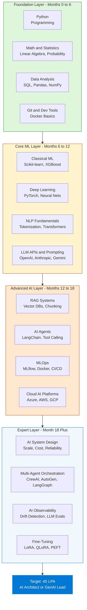

---

## Skills by Level

### Consolidated Skill Inventory

| Level | Skill Area | Key Technologies | Time to Proficiency |
|---|---|---|---|
| Beginner | Python Core | Python 3.x, Jupyter, VSCode, pytest | 4–6 weeks |
| Beginner | Math and Statistics | NumPy, SciPy, linear algebra, probability | 4–6 weeks |
| Beginner | Data Wrangling | Pandas, SQL, Matplotlib, Seaborn | 4–6 weeks |
| Beginner | Version Control | Git, GitHub, branching, pull requests | 1 week |
| Intermediate | Classical ML | Scikit-learn, XGBoost, LightGBM, cross-validation | 6–8 weeks |
| Intermediate | Deep Learning | PyTorch, CNNs, RNNs, backprop, Hugging Face | 6–8 weeks |
| Intermediate | NLP Basics | Tokenization, attention mechanism, transformers | 4–6 weeks |
| Intermediate | LLM Integration | API calling, prompt templates, structured output | 2–3 weeks |
| Advanced | RAG Architecture | Embeddings, vector DBs, chunking, reranking | 4–6 weeks |
| Advanced | AI Agents | LangChain, LlamaIndex, ReAct, tool calling | 4–6 weeks |
| Advanced | MLOps | MLflow, Weights and Biases, Docker, Kubernetes | 6–8 weeks |
| Advanced | Cloud AI | Azure AI Foundry, AWS SageMaker, GCP Vertex AI | 4–6 weeks |
| Expert | AI System Design | Distributed systems, cost modeling, SLAs | Ongoing |
| Expert | Fine-Tuning | LoRA, QLoRA, PEFT, evaluation harness | 4–6 weeks |
| Expert | AI Observability | RAGAS, LangSmith, tracing, prompt regression tests | 2–4 weeks |
| Expert | Multi-Agent Systems | AutoGen, CrewAI, LangGraph, orchestration patterns | 4–6 weeks |

---

### Level 1 — Foundation (Months 0–6)

**Goal:** Be production-ready as a Python developer who can manipulate data and understand statistics.

**Python Core Essentials:**
- Data types, OOP, decorators, context managers, async/await, generators
- Package management: pip, conda, poetry, virtual environments
- Testing: pytest basics, writing unit tests for data transformations
- Type hints, dataclasses, Pydantic models

**Mathematics for AI:**
- Linear algebra: matrix multiplication, dot products, eigenvalues, SVD — these underlie how embeddings and neural nets work
- Probability: Bayes theorem, distributions (Gaussian, Bernoulli), expectation, entropy
- Statistics: hypothesis testing, p-values, confidence intervals, correlation vs causation

**Data Engineering Stack:**
- Pandas: dataframes, groupby, merge, pivot, apply, time-series operations
- SQL: JOINs, window functions, CTEs, indexing, EXPLAIN plans
- NumPy: vectorization, broadcasting, array indexing
- Visualization: Matplotlib for analysis, Seaborn for statistical plots, Plotly for interactive

---

### Level 2 — Core ML (Months 6–12)

**Goal:** Build, evaluate, and explain ML models end-to-end on real datasets.

**Classical ML with Scikit-learn:**
- Regression: Linear, Ridge, Lasso, ElasticNet — understand bias-variance trade-off
- Classification: Logistic Regression, SVM, Random Forest, XGBoost, LightGBM
- Model evaluation: confusion matrix, ROC-AUC, precision-recall, F1, cross-validation
- Feature engineering: encoding, scaling, imputation, feature selection

**Deep Learning with PyTorch:**
- Building blocks: Linear, Conv2d, BatchNorm, Dropout, Embedding layers
- Training loop: forward pass, loss computation, backward pass, optimizer step
- Architectures: CNN for vision tasks, LSTM/GRU for sequences, Transformer basics

**LLM API Integration:**
- Calling GPT-4o, Claude, Gemini via Python SDK
- System prompts, user/assistant turns, conversation history management
- Structured outputs: JSON mode, function calling, Pydantic response parsing
- Basic prompt patterns: zero-shot, few-shot, chain-of-thought

---

### Level 3 — Advanced AI (Months 12–18)

**Goal:** Design and deploy AI-powered features from idea to production monitoring.

**RAG System Design:**
- Document ingestion pipeline: PDF, HTML, DOCX → clean text → chunks → embeddings
- Chunking strategies: fixed-size with overlap, sentence-level, semantic, hierarchical
- Embedding models: OpenAI `text-embedding-3-small`, open-source BAAI/bge-m3, E5-large
- Vector DB operations: upsert, cosine similarity query, metadata filtering, namespace isolation
- Retrieval quality: hybrid search (BM25 + dense), MMR reranking, cross-encoder reranking
- Evaluation with RAGAS: faithfulness, context precision, context recall, answer relevance

**Agentic System Patterns:**
- Tool definition: structured JSON schema that LLMs use to call functions
- Agent loop: observe state → select tool → call tool → process result → loop
- Memory types: short-term (context window), long-term (vector DB), episodic (structured log)
- Multi-agent patterns: supervisor + workers, peer collaboration, chain of specialists
- Frameworks: LangChain (chains + agents), LangGraph (stateful graphs), AutoGen (multi-agent conversation), CrewAI (role-based agents)

**MLOps Essentials:**
- Experiment tracking: MLflow (runs, params, metrics, artifacts) and Weights and Biases
- Model registry: version tagging, staging, production promotion workflow
- CI/CD for ML: GitHub Actions pipelines for automated retraining and evaluation
- Containerization: Dockerfile for model serving, Docker Compose for local multi-service setup
- Kubernetes basics: Deployments, Services, ConfigMaps, Horizontal Pod Autoscaler

---

### Level 4 — Expert (Month 18+)

**Goal:** Own the AI architecture for a product team; mentor others; handle incident response.

**AI System Design:**
- Latency decomposition: LLM generation latency vs retrieval latency vs network latency
- Cost modeling: tokens per request × price per token × QPS = monthly cost; set alerts
- Caching layers: exact match cache, semantic cache (reduces cost by 40–60% for enterprise)
- Fallback chains: primary LLM → cheaper model → cached response → rule-based → human
- Multi-region: active-active with consistent vector index replication

**Fine-Tuning Workflow:**
- When to fine-tune: high-volume narrow task, need consistent format, RAG latency too high
- PEFT methods: LoRA adds trainable rank-decomposition matrices to frozen base weights; QLoRA adds 4-bit quantization to reduce GPU memory requirement by 4x
- Training infrastructure: Hugging Face Accelerate + FSDP for multi-GPU; gradient checkpointing
- Evaluation harness: before/after benchmark comparison, automated regression tests, LLM-as-judge

**AI Observability and Safety:**
- Distributed tracing: LangSmith or Azure Monitor for end-to-end LLM call chains
- Drift detection: compare live query embedding distribution to training baseline weekly
- Guardrails: input validation, PII detection, output format enforcement, toxicity filtering
- Incident response: structured logs on every LLM call (input, output, latency, model version, cost)

---

## Learning Roadmap — Step by Step

```mermaid
flowchart LR
    M0["Start\nMonth 0"] --> M1["Months 1-2\nPython and Math\nFirst Kaggle notebook"]
    M1 --> M2["Months 3-4\nData Analysis\nSQL and Pandas\nFirst EDA project"]
    M2 --> M3["Months 5-6\nClassical ML\nScikit-learn\nKaggle competition entry"]
    M3 --> M4["Months 7-8\nDeep Learning\nPyTorch\nImage classifier on CIFAR"]
    M4 --> M5["Months 9-10\nLLM APIs\nPrompt engineering\nFirst chatbot app deployed"]
    M5 --> M6["Months 11-12\nRAG System\nVector DB\nDocument Q-and-A app"]
    M6 --> M7["Months 13-14\nAI Agents\nTool calling and ReAct\nAgentic pipeline"]
    M7 --> M8["Months 15-16\nMLOps\nMLflow and Docker\nDeployed model with monitoring"]
    M8 --> M9["Months 17-18\nCloud AI\nAzure or AWS Certification\nProduction AI system"]
    M9 --> M10["Month 18 Plus\nSystem Design Interviews\nPortfolio live\n45 LPA target"]

    style M0 fill:#5C2D91,color:#fff
    style M6 fill:#107C10,color:#fff
    style M10 fill:#0078D4,color:#fff
```

### Phase 1: Foundation (Months 1–4)

1. **Python mastery** — Write 100+ lines of Python daily; complete at least one structured course. Target: build something functional each week.
2. **Math foundation** — 3Blue1Brown "Essence of Linear Algebra" YouTube series; Khan Academy Statistics; spend 1 hour daily for 4 weeks.
3. **First data project** — End-to-end EDA on a public Kaggle or UCI dataset. Produce 3 written insights with visualizations. Publish on GitHub.
4. **SQL fluency** — Complete LeetCode SQL 50; practice window functions and CTEs on Kaggle SQL challenges. Target: 50 queries written.

### Phase 2: Core ML (Months 5–8)

5. **Supervised ML** — Kaggle Titanic or House Prices competition. Target: top 25% on leaderboard using proper cross-validation and feature engineering.
6. **Deep learning project** — Fast.ai Practical Deep Learning course; build a CNN image classifier with accuracy above 90% on a 5-class problem.
7. **NLP foundations** — Hugging Face NLP course; fine-tune a BERT-based classifier on a text classification dataset.
8. **GitHub portfolio started** — Two projects live with README, dataset description, model card, and result screenshots.

### Phase 3: GenAI Core (Months 9–12)

9. **LLM API fluency** — Build 3 different apps: a summarizer, a Q&A bot, and a structured data extractor. Use both OpenAI and Anthropic APIs.
10. **RAG system** — Build a document Q&A system with Chroma or Pinecone + LangChain. Use RAGAS to measure quality before and after tuning.
11. **Deploy publicly** — Put the RAG app on Streamlit Cloud, Azure App Service, or Hugging Face Spaces. Share the link — this is your most important portfolio item.
12. **Write about it** — Publish one LinkedIn post or blog article about what you built and what you learned. Recruiter visibility multiplies.

### Phase 4: Production and Expert (Months 13–18)

13. **Agentic pipeline** — Build a ReAct agent with at least 3 tools (web search, code execution, a custom API). Measure task completion rate.
14. **MLOps pipeline** — Set up MLflow experiment tracking, a model registry, and a GitHub Actions workflow that retriggers training on data change.
15. **Cloud certification** — Azure AI-102 or AWS MLS-C01. Allocate 3–4 weeks of study. The certification signals structured knowledge to HR filters.
16. **System design practice** — Study 10 AI system design case studies from tech blogs. Practice whiteboarding "Design a document Q&A for 10M pages" and "Design a production LLM chatbot with 99.9% SLA."

---

## Salary and Role Comparison

### Pay Scale by Level and Company Type

| Role | Experience | IT Services | Product Co or GCC | GenAI Specialist |
|---|---|---|---|---|
| Junior AI Engineer | 0–2 yrs | ₹6–8 LPA | ₹12–18 LPA | ₹15–22 LPA |
| ML Engineer | 2–4 yrs | ₹10–15 LPA | ₹20–30 LPA | ₹25–35 LPA |
| Senior AI Engineer | 4–6 yrs | ₹15–22 LPA | ₹30–45 LPA | ₹40–55 LPA |
| Lead AI Engineer | 6–8 yrs | ₹20–30 LPA | ₹40–60 LPA | ₹50–70 LPA |
| AI Architect | 8+ yrs | ₹25–40 LPA | ₹60–100+ LPA | ₹80–120+ LPA |

### AI Engineer vs Adjacent Roles

| Dimension | Data Scientist | ML Engineer | AI Engineer | GenAI Engineer |
|---|---|---|---|---|
| Primary focus | Analysis, insights, experiments | Model training pipelines | End-to-end AI systems | LLM apps and agents |
| Production ownership | Low | Medium | High | High |
| LLM and GenAI depth | Low | Medium | High | Expert |
| MLOps involvement | Low | High | High | Medium-High |
| System design expected? | Rarely | Sometimes | Always at senior | Always |
| Salary ceiling in India | ₹30–40 LPA | ₹35–50 LPA | ₹45–70 LPA | ₹50–80 LPA |
| 2026 demand trend | Stable declining | Stable | Strongly rising | Fastest rising |

### Companies Regularly Paying ₹45+ LPA for AI Roles

| Company Type | Example Companies | AI Role Package Range |
|---|---|---|
| Big Tech India | Google, Microsoft, Amazon, Meta | ₹46–80 LPA |
| Unicorn Product | Flipkart, Swiggy, Razorpay, CRED | ₹35–60 LPA |
| Global Capability Centers | JP Morgan, Goldman Sachs, HSBC GCC | ₹38–65 LPA |
| AI-First Startups | Sarvam AI, Krutrim, Ola Krutrim | ₹30–55 LPA + equity |
| Cloud Providers | AWS India, Azure India, GCP India | ₹40–70 LPA |
| IT Services "AI CoE" | TCS GenAI, Infosys AI | ₹20–35 LPA (lower ceiling) |

---

## Code Examples — AI Engineering

### Python — Basic RAG Pipeline with Chroma and OpenAI

```python
from openai import OpenAI
import chromadb
from chromadb.utils import embedding_functions

client = OpenAI()
chroma_client = chromadb.Client()

openai_ef = embedding_functions.OpenAIEmbeddingFunction(
    api_key="YOUR_API_KEY",
    model_name="text-embedding-3-small"
)

collection = chroma_client.create_collection(
    name="knowledge_base",
    embedding_function=openai_ef
)

documents = [
    "Python is a high-level programming language favored for AI because of its rich ecosystem.",
    "LLMs generate human-like text by predicting the next token given previous context.",
    "RAG combines retrieval of relevant chunks with LLM generation for grounded, accurate answers.",
    "MLOps is the discipline of reliably deploying and monitoring ML models in production.",
]
collection.add(documents=documents, ids=["doc1", "doc2", "doc3", "doc4"])


def rag_query(question: str, n_results: int = 2) -> str:
    results = collection.query(query_texts=[question], n_results=n_results)
    context = "\n".join(results["documents"][0])

    response = client.chat.completions.create(
        model="gpt-4o-mini",
        messages=[
            {
                "role": "system",
                "content": f"Answer using only the provided context. If context is insufficient, say so.\n\nContext:\n{context}"
            },
            {"role": "user", "content": question}
        ]
    )
    return response.choices[0].message.content


print(rag_query("What is RAG and why is it useful?"))
```

---

### Python — AI Agent with Tool Calling (OpenAI Function Calling)

```python
from openai import OpenAI
import json

client = OpenAI()

tools = [
    {
        "type": "function",
        "function": {
            "name": "search_knowledge_base",
            "description": "Search the internal knowledge base for relevant information",
            "parameters": {
                "type": "object",
                "properties": {
                    "query": {"type": "string", "description": "Search query"}
                },
                "required": ["query"]
            }
        }
    },
    {
        "type": "function",
        "function": {
            "name": "execute_python",
            "description": "Execute Python code and return the stdout output",
            "parameters": {
                "type": "object",
                "properties": {
                    "code": {"type": "string", "description": "Valid Python code to execute"}
                },
                "required": ["code"]
            }
        }
    }
]


def run_tool(name: str, args: dict) -> str:
    if name == "search_knowledge_base":
        return f"Search result for '{args['query']}': AI Engineers need Python, LLMs, RAG, MLOps skills."
    if name == "execute_python":
        local_ns: dict = {}
        exec(args["code"], {}, local_ns)
        return str(local_ns.get("result", "Executed successfully"))
    return "Unknown tool"


def run_agent(user_message: str, max_iterations: int = 5) -> str:
    messages = [{"role": "user", "content": user_message}]

    for _ in range(max_iterations):
        response = client.chat.completions.create(
            model="gpt-4o",
            messages=messages,
            tools=tools,
            tool_choice="auto"
        )

        msg = response.choices[0].message

        if not msg.tool_calls:
            return msg.content

        messages.append(msg)
        for call in msg.tool_calls:
            result = run_tool(call.function.name, json.loads(call.function.arguments))
            messages.append({
                "role": "tool",
                "tool_call_id": call.id,
                "content": result
            })

    return "Max iterations reached"


print(run_agent("What skills does an AI Engineer need? Also compute 45 * 100000."))
```

---

### Python — MLflow Experiment Tracking

```python
import mlflow
import mlflow.sklearn
from sklearn.ensemble import GradientBoostingClassifier
from sklearn.model_selection import train_test_split, cross_val_score
from sklearn.metrics import accuracy_score, f1_score
from sklearn.datasets import load_breast_cancer

X, y = load_breast_cancer(return_X_y=True)
X_train, X_test, y_train, y_test = train_test_split(X, y, test_size=0.2, random_state=42)

mlflow.set_experiment("breast-cancer-classification")

params = {"n_estimators": 200, "max_depth": 4, "learning_rate": 0.05}

with mlflow.start_run(run_name="gradient-boosting-baseline"):
    mlflow.log_params(params)

    model = GradientBoostingClassifier(**params, random_state=42)
    cv_scores = cross_val_score(model, X_train, y_train, cv=5, scoring="f1")
    mlflow.log_metric("cv_f1_mean", cv_scores.mean())
    mlflow.log_metric("cv_f1_std", cv_scores.std())

    model.fit(X_train, y_train)
    y_pred = model.predict(X_test)

    mlflow.log_metric("test_accuracy", accuracy_score(y_test, y_pred))
    mlflow.log_metric("test_f1", f1_score(y_test, y_pred))

    mlflow.sklearn.log_model(
        model,
        artifact_path="model",
        registered_model_name="BreastCancerClassifier"
    )

    print(f"Test Accuracy: {accuracy_score(y_test, y_pred):.4f}")
    print(f"Test F1: {f1_score(y_test, y_pred):.4f}")
```

---

### Python — Structured Output with Pydantic (LLM-as-Judge Evaluation)

```python
from openai import OpenAI
from pydantic import BaseModel, Field
from typing import Literal

client = OpenAI()


class RAGEvaluation(BaseModel):
    faithfulness_score: int = Field(..., ge=1, le=5, description="Is the answer grounded in the context?")
    relevance_score: int = Field(..., ge=1, le=5, description="Does the answer address the question?")
    completeness_score: int = Field(..., ge=1, le=5, description="Is the answer complete?")
    verdict: Literal["pass", "fail", "needs_review"]
    reasoning: str


def evaluate_rag_response(question: str, context: str, answer: str) -> RAGEvaluation:
    prompt = f"""Evaluate this RAG response:

QUESTION: {question}
CONTEXT: {context}
ANSWER: {answer}

Score each dimension 1-5 and give a verdict."""

    response = client.beta.chat.completions.parse(
        model="gpt-4o",
        messages=[
            {"role": "system", "content": "You are an expert AI evaluator. Score RAG responses objectively."},
            {"role": "user", "content": prompt}
        ],
        response_format=RAGEvaluation,
    )
    return response.choices[0].message.parsed


result = evaluate_rag_response(
    question="What is RAG?",
    context="RAG stands for Retrieval-Augmented Generation. It combines retrieval of relevant documents with LLM generation.",
    answer="RAG is a technique where the model retrieves relevant documents and uses them to generate more accurate answers."
)
print(f"Verdict: {result.verdict} | Faithfulness: {result.faithfulness_score}/5")
```

---

### Setup — Install the Core AI Engineering Stack

```bash
# LLM APIs
pip install openai anthropic google-generativeai

# Agent and RAG frameworks
pip install langchain langchain-openai langgraph
pip install llama-index llama-index-embeddings-openai

# Vector databases
pip install chromadb
pip install pinecone-client
pip install weaviate-client

# Azure AI stack
pip install azure-ai-openai azure-search-documents azure-identity

# MLOps and experiment tracking
pip install mlflow wandb evidently

# Deep learning
pip install torch torchvision --index-url https://download.pytorch.org/whl/cu118
pip install transformers peft accelerate datasets

# Classical ML and data stack
pip install scikit-learn xgboost lightgbm
pip install pandas numpy matplotlib seaborn plotly

# Serving and deployment
pip install fastapi uvicorn pydantic
pip install streamlit gradio

# RAG evaluation
pip install ragas

# Dev tools
pip install python-dotenv pytest black ruff httpx
```

---

## Tool Reference by Category

| Category | Tool | Primary Use Case | Difficulty |
|---|---|---|---|
| LLM APIs | OpenAI GPT-4o | Production responses, structured output | Easy |
| LLM APIs | Anthropic Claude Sonnet | Long context, coding, analysis | Easy |
| LLM APIs | Google Gemini Pro | Multimodal, 1M token context | Easy |
| Open Source LLMs | Meta Llama 3.1 70B | Self-hosted, no API cost, customizable | Medium |
| Open Source LLMs | Mistral 7B and Mixtral | Lightweight, fast inference | Medium |
| Open Source LLMs | Microsoft Phi-4 | Small, efficient, reasoning | Medium |
| Vector DB | Chroma | Local dev, zero-config, prototyping | Easy |
| Vector DB | Pinecone | Managed, serverless, production scale | Easy-Medium |
| Vector DB | Weaviate | Open-source, multimodal, GraphQL | Medium |
| Vector DB | Azure AI Search | Enterprise, hybrid search, RBAC | Medium |
| Vector DB | pgvector | PostgreSQL extension, SQL-native | Medium |
| Agent Framework | LangChain | Chains, agents, document loaders | Medium |
| Agent Framework | LangGraph | Stateful agent graphs, cycles | Medium-Hard |
| Agent Framework | LlamaIndex | RAG-first, data connectors | Medium |
| Agent Framework | Semantic Kernel | Enterprise, .NET and Python | Medium |
| Agent Framework | AutoGen | Multi-agent conversation loops | Medium-Hard |
| Agent Framework | CrewAI | Role-based agent crews | Medium |
| MLOps | MLflow | Experiment tracking, model registry | Easy-Medium |
| MLOps | Weights and Biases | Training visualization, hyperparameter sweeps | Medium |
| MLOps | BentoML | Model packaging and serving | Medium |
| MLOps | Evidently | Data and model drift detection | Medium |
| Cloud AI | Azure AI Foundry | Managed model hosting, agent service | Medium |
| Cloud AI | AWS SageMaker | End-to-end ML platform | Medium-Hard |
| Cloud AI | GCP Vertex AI | AutoML, model deployment | Medium-Hard |
| Evaluation | RAGAS | RAG quality metrics framework | Easy |
| Evaluation | LangSmith | LangChain call tracing and debugging | Easy |
| Evaluation | Promptfoo | Prompt regression testing | Medium |
| Fine-Tuning | Hugging Face PEFT | LoRA, QLoRA parameter-efficient tuning | Medium |
| Fine-Tuning | Unsloth | 2x faster fine-tuning, lower memory | Medium |
| Inference | vLLM | High-throughput LLM serving, PagedAttention | Hard |
| Inference | Ollama | Run open-source models locally | Easy |

---

## Best Practices — AI Engineering

### Building RAG Systems

- ✅ Evaluate chunking strategy empirically — benchmark fixed-size vs semantic before committing
- ✅ Use hybrid search (BM25 + dense vector) for better recall on keyword-heavy queries
- ✅ Implement cross-encoder reranking when precision above 80% is required
- ✅ Measure quality with RAGAS (faithfulness, context precision) before shipping
- ✅ Use 10–20% chunk overlap to reduce context fragmentation at boundaries
- ❌ Do not embed raw HTML or PDF without cleaning and normalizing text first
- ❌ Do not skip evaluation — RAG that seems accurate in dev fails on real query distributions
- ❌ Do not ignore metadata filtering — it reduces retrieval scope and dramatically improves precision

### Building AI Agents

- ✅ Make tools deterministic and idempotent — the LLM may call them multiple times
- ✅ Log every tool call with input, output, latency, and agent iteration number
- ✅ Set explicit max_iterations limits to prevent infinite agent loops
- ✅ Use typed Pydantic schemas for all tool arguments — reduces parsing failures
- ✅ Test agents with adversarial inputs — users will try to break the tool selection logic
- ❌ Do not give agents write access to production databases without human-in-the-loop confirmation
- ❌ Do not use LLMs for pure math or deterministic logic — use code execution tools instead
- ❌ Do not skip error handling in tool executors — one broken tool call should not kill the whole agent run

### MLOps and Production

- ✅ Version data, code, and model artifacts together so any version is fully reproducible
- ✅ Automate drift detection from day 1 — retroactively adding it after model degrades is painful
- ✅ Use canary deployments — route 5% of traffic to new model and compare metrics before full rollout
- ✅ Define SLAs upfront: p95 latency budget, error rate budget, cost per request ceiling
- ❌ Do not train on raw production data without PII removal and quality filters
- ❌ Do not treat LLM API costs as fixed — monitor tokens per request and set budget alerts
- ❌ Do not skip model cards — document intended use, known limitations, and failure modes

### Career Execution

- ✅ Build at minimum 3 deployed AI projects in your GitHub portfolio before applying
- ✅ Target Azure AI-102 or AWS MLS-C01 certification — it passes HR screening filters at most companies
- ✅ Apply to product companies and GCCs, not only IT services — same skills, 50–80% higher pay
- ✅ Post one LinkedIn update per week about what you built or learned — recruiting pipeline multiplier
- ❌ Do not stay in generalist data analyst roles past 2 years if targeting AI engineering
- ❌ Do not skip system design practice — it is the primary filter for roles above ₹30 LPA
- ❌ Do not narrow your job search to "AI Engineer" titles only — "Applied Scientist", "ML Platform Engineer", "GenAI Engineer" pay equivalently

---

## Interview Talking Points — Career Roadmap

### "What is the difference between RAG and fine-tuning? When would you use each?"

> RAG retrieves relevant documents from an external knowledge store at query time and injects them into the LLM context window before generation. Fine-tuning trains the model weights on domain-specific labeled data. I default to RAG when the knowledge base changes frequently (weekly or more), when I need source citations for auditability, or when labeled training data is scarce. I escalate to fine-tuning when the task is narrow and high-volume (the retrieval latency overhead is too expensive at scale), when I need consistent format or style that prompting cannot reliably enforce, or when I have 500+ high-quality labeled examples. In most enterprise GenAI applications, the architecture is RAG first, with fine-tuning added selectively for specific high-traffic sub-tasks.

---

### "How do you design a production RAG system for 10 million pages?"

> For 10 million pages, a flat vector index alone would be hundreds of gigabytes — naive RAG breaks. I would design four layers: (1) **Hierarchical chunking** — generate section summaries in addition to paragraph-level chunks; query summaries first to identify candidate documents, then retrieve paragraph chunks; (2) **Hybrid retrieval** — combine BM25 keyword matching with dense vector search, fused via Reciprocal Rank Fusion for better recall than either alone; (3) **Semantic caching** — the first time a query is answered, cache the result with its embedding; on subsequent similar queries, detect cosine similarity above 0.92 and return the cached answer — eliminates 40–60% of LLM calls for enterprise usage patterns; (4) **Multi-tenant namespace isolation** — each organization gets its own vector namespace with RBAC so data never cross-contaminates. Target SLA: p95 latency under 3 seconds including retrieval and generation.

---

### "How would you monitor an LLM feature after it ships to production?"

> I monitor across three layers. Infrastructure: latency per call, error rates, token counts, and cost per request tracked in standard APM tools like Datadog or Azure Monitor with budget alerts. Model quality: I run automated evaluations on a sampled 1% of live requests using an LLM-as-judge scoring faithfulness and relevance; I alert when the rolling 24-hour average drops below a quality threshold. Data distribution: I compare weekly query embedding distributions against a baseline using statistical drift tests — a shift means users are asking about things the system was not optimized for. Operationally, I enforce structured logging on every LLM call capturing input prompt, response, latency, model version, and cost. That logging is what makes post-incident debugging possible.

---

### "Describe the architecture of an agentic AI system."

> An AI agent has five components. The **planner** is an LLM that receives the user goal and outputs a reasoning trace and a selected tool. The **tool registry** is a collection of callable functions with typed JSON schemas that the LLM selects from — tools can be web search, code execution, database queries, or external APIs. The **executor** runs the selected tool and returns the result. The **memory system** has three levels: short-term (conversation history in the context window), long-term (a vector store for past interactions and knowledge), and episodic (structured logs of what happened in prior runs). The **guardrails layer** validates inputs and outputs, enforces content filters, detects PII, and caps iteration counts to prevent runaway loops. The agent cycles through observe → plan → act → observe until it reaches the goal or hits a termination condition.

---

### "What is the difference between an AI Engineer and a Data Scientist or ML Engineer in 2026?"

> A Data Scientist focuses on analysis: finding patterns in data, building statistical models, and producing insights. They own a Jupyter notebook; someone else decides whether to ship it. An ML Engineer focuses on the training pipeline: feature engineering, model selection, hyperparameter tuning, and producing a trained model artifact reliably. An AI Engineer in 2026 owns the full AI feature lifecycle: ingestion pipeline, LLM integration, RAG or fine-tuning strategy, deployment, monitoring, and cost optimization. AI Engineers are product-adjacent — they work with PMs and frontend engineers to ship features, not just models. The compensation premium for AI Engineers directly reflects broader production ownership. A critical distinction: an AI Engineer in 2026 may never train a model from scratch; they ship real-world features using pretrained LLMs, RAG pipelines, and agent systems.

---

## Situation-Based Interview Questions (STAR Format)

These are behavioral questions asked at ₹30 LPA+ interviews to assess real ownership and judgment — not just conceptual knowledge. Answer using the **Situation → Task → Action → Result** structure.

---

### "Tell me about a time an AI model you deployed stopped working correctly in production."

**Situation:** We had a document summarization feature in production for 3 months. One week, user satisfaction scores dropped 20% with no code change deployed.

**Task:** Investigate root cause and restore quality without a full retraining cycle.

**Action:** I first pulled structured logs from every LLM call over the past 2 weeks and compared average output length and semantic similarity scores against a baseline. I discovered that a third-party document ingestion vendor had silently changed their PDF-to-text conversion library — output now included header/footer boilerplate text that was being included in the LLM context, diluting the actual content. I added a text cleaning step to strip repeated header/footer patterns, re-ran RAGAS evaluation on 100 held-out documents, and confirmed quality was restored before re-deploying.

**Result:** Quality scores recovered to baseline within 48 hours. I also added an automated weekly check that flags if average chunk quality score drops more than 10% from the prior week's baseline — that alert would have caught this on day 2 instead of week 3.

> **What this demonstrates:** You own production outcomes, not just model training. You debug with data, not guesswork.

---

### "Describe a situation where you had to convince a stakeholder to change technical direction mid-project."

**Situation:** Midway through a 3-month fine-tuning project for a customer support bot, I realized the labeled dataset had significant quality issues — roughly 30% of examples had inconsistent or incorrect labels, contributed by multiple annotators with no calibration process.

**Task:** Either fix the dataset and continue fine-tuning (2–3 more months) or propose an alternative approach to hit the product deadline.

**Action:** I built a quick prototype RAG system using the existing support knowledge base articles (no labeling needed) and ran RAGAS evaluation alongside a zero-shot baseline and the partially fine-tuned model on 200 real customer queries. The RAG system matched the fine-tuned model's accuracy on 80% of categories and outperformed it on recent product topics (which fine-tuning missed because training data was 6 months old). I presented this comparison in a one-page decision memo to the PM and engineering lead with cost and timeline side-by-side. RAG: 3 weeks to production. Fine-tuning with re-labeling: 3 more months.

**Result:** We shipped RAG in 3 weeks. The PM acknowledged the trade-off and accepted slightly lower accuracy on 3 narrow query categories, which we planned to address later with targeted fine-tuning on those specific intents only.

> **What this demonstrates:** Senior engineers redirect the team when the plan stops making sense. Evidence-driven communication is the tool.

---

### "Tell me about a time you had to significantly reduce AI infrastructure costs without degrading user experience."

**Situation:** Our GenAI feature was costing $18,000/month in GPT-4o API calls — 3x over budget — due to unexpectedly high usage after launch.

**Task:** Cut costs by at least 50% within 2 weeks without impacting response quality for users.

**Action:** I instrumented every LLM call to capture token counts and query text. Analysis revealed three findings: (1) 55% of queries were near-duplicates of previously answered questions — semantic caching could eliminate most of these; (2) The system prompt was 1,800 tokens but only 400 tokens were ever referenced in answers — I rewrote it to 450 tokens; (3) Simple classification queries (intent detection) were being sent to GPT-4o when GPT-4o-mini was equally accurate on our benchmark. I implemented semantic caching with a 0.92 cosine similarity threshold using Redis + pgvector, compressed the system prompt, and routed intent detection to GPT-4o-mini. I evaluated each change separately before combining.

**Result:** Monthly cost dropped from $18,000 to $6,200 (65% reduction). Semantic caching alone accounted for $7,800 of the savings. User satisfaction scores did not change measurably. I documented the cost analysis as a template that the team reused on two other AI features launched that quarter.

> **What this demonstrates:** Cost ownership is part of AI engineering. Measure before optimizing. Change one variable at a time.

---

### "Describe a time when you had to design an AI system under tight constraints — limited data, limited time, or limited compute."

**Situation:** A client needed an AI feature to classify support tickets into 12 categories and route them automatically. Timeline was 6 weeks. Labeled data: 400 examples total (far too few to fine-tune reliably). GPU budget: zero.

**Task:** Build a working classifier that hit at least 85% accuracy on a held-out test set within 6 weeks using only CPU-accessible tools and APIs.

**Action:** I used few-shot prompting with GPT-4o-mini — provided 3 labeled examples per category in the system prompt and asked the model to classify and return a JSON object with the category and confidence score. I then created a confidence threshold: predictions above 0.85 confidence auto-routed; predictions below went to a human review queue. I tested with the 400 labeled examples using leave-one-out cross-validation and iterated on the prompt structure over 2 weeks. I also asked the client to generate 20 additional synthetic examples per category using paraphrasing of real tickets — expanding to 640 examples and reducing low-confidence predictions by 18%.

**Result:** Achieved 91% accuracy on the test set. 73% of tickets were auto-routed above the confidence threshold, reducing human review load by 3x. The system shipped in 5 weeks, 1 week under deadline. Cost: approximately $40/month in API calls.

> **What this demonstrates:** Constraints force creativity. Few-shot prompting and confidence thresholds are underused tools in the classifier design toolkit.

---

### "Tell me about a time you caught a serious problem with an AI system before it reached production."

**Situation:** During pre-launch testing of a hiring tool that ranked job applicants using an LLM scoring system, I was doing final validation and noticed the average scores for candidates with certain name patterns were 8–12 points lower than equivalent resumes with different name patterns.

**Task:** Determine whether this was noise or systematic bias, and decide whether to hold the launch.

**Action:** I designed a counterfactual test: took 50 high-scoring resumes, changed only the candidate name to names from different demographic groups, and resubmitted them. The score distribution shifted by 7–15 points on average depending on the name group — statistically significant and clearly problematic. I documented the finding with screenshots, statistical summary, and a written recommendation to halt the launch. I proposed three mitigations: (1) strip names from resumes before LLM scoring, (2) add a bias audit step as a required gate in the evaluation pipeline, (3) redesign the scoring rubric to reference only explicitly listed skills and achievements.

**Result:** Launch was paused. The team implemented all three mitigations. Re-testing after 3 weeks showed the score disparity reduced to under 1 point (within noise). The bias audit gate was adopted as a standard pre-launch step for all AI features at the company. I was asked to document it as an internal engineering guideline.

> **What this demonstrates:** AI Engineers are responsible for harm prevention, not just performance metrics. Catching this before launch is the job. Shipping it would have been a legal and reputational incident.

---

## Learning Resources

| Resource | Link | Type | Level |
|---|---|---|---|
| YouTube — Skills to get 45 LPA as AI Engineer | [Watch](https://www.youtube.com/watch?v=fIwozW8UxlY) | Video | All |
| fast.ai — Practical Deep Learning for Coders | [fast.ai](https://course.fast.ai/) | Course | Beginner-Intermediate |
| deeplearning.ai — Short Courses on GenAI | [deeplearning.ai](https://www.deeplearning.ai/short-courses/) | Courses | All |
| LangChain Academy | [academy.langchain.com](https://academy.langchain.com/) | Course | Intermediate |
| Hugging Face NLP Course | [huggingface.co/learn](https://huggingface.co/learn/nlp-course/) | Course | Intermediate |
| Microsoft Learn — Azure AI Engineer AI-102 | [learn.microsoft.com](https://learn.microsoft.com/en-us/certifications/azure-ai-engineer/) | Cert Prep | Intermediate |
| MLflow Documentation | [mlflow.org](https://mlflow.org/docs/latest/) | Docs | Intermediate |
| RAGAS — RAG Evaluation Framework | [docs.ragas.io](https://docs.ragas.io/) | Docs | Intermediate |
| Weights and Biases Courses | [wandb.ai/courses](https://www.wandb.ai/courses) | Course | Intermediate |
| 3Blue1Brown — Essence of Linear Algebra | [YouTube](https://www.youtube.com/playlist?list=PLZHQObOWTQDPD3MizzM2xVFitgF8hE_ab) | Video | Beginner |
| Kaggle Learn — ML and Python | [kaggle.com/learn](https://www.kaggle.com/learn) | Hands-on | Beginner-Intermediate |
| LeetCode SQL 50 Study Plan | [leetcode.com](https://leetcode.com/studyplan/top-sql-50/) | Practice | Beginner |
| DataQuest — AI Engineer Roadmap | [dataquest.io](https://www.dataquest.io/blog/ai-engineer-roadmap/) | Blog | All |
| Testleaf — AI Engineer Roadmap 2026 | [testleaf.com](https://www.testleaf.com/blog/ai-engineer-roadmap-2026-from-beginner-to-expert-with-tools-milestones/) | Blog | All |

---

# PART 2 — AI ARCHITECT COMPLETE INTERVIEW CONCEPTS (20 DOMAINS)

> **Source:** AI_Architect_Interview_Concepts.md
> **Derived from:** JD Analysis for AI Architect / Azure GenAI Architect roles.
> Covers every technical domain, expected depth, and key interview questions with architectural diagrams.

---

## 14. Azure Cloud Architecture

### Core Concepts
- **Azure Regions & Availability Zones** – geographic redundancy, zone-redundant storage
- **Azure Resource Manager (ARM)** – declarative IaC with ARM templates / Bicep / Terraform
- **Azure Networking** – VNet, Subnet, NSG, Private Endpoint, ExpressRoute, VPN Gateway
- **Azure PaaS vs IaaS vs SaaS** tradeoffs for AI workloads
- **Hybrid Cloud** – Azure Arc, on-premises integration, Azure Stack

### Azure Architecture Pillars (WAF)

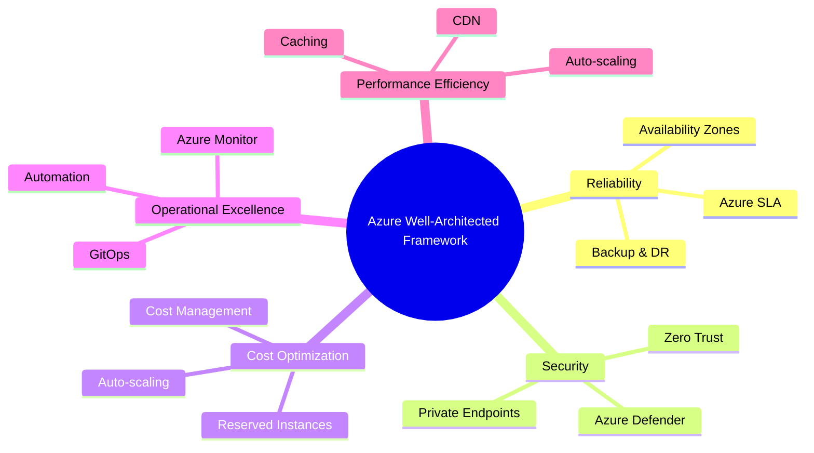

### Key Interview Questions
- How would you architect a **zero-downtime deployment** on Azure?
- Explain the difference between **Private Endpoint** and **Service Endpoint**.
- How do you enforce **governance** across multiple Azure subscriptions (Management Groups, Policies)?
- What is **Azure Landing Zone** and why is it important for enterprise?

---

## 15. Azure OpenAI & GenAI Platform

### Azure OpenAI Service Architecture

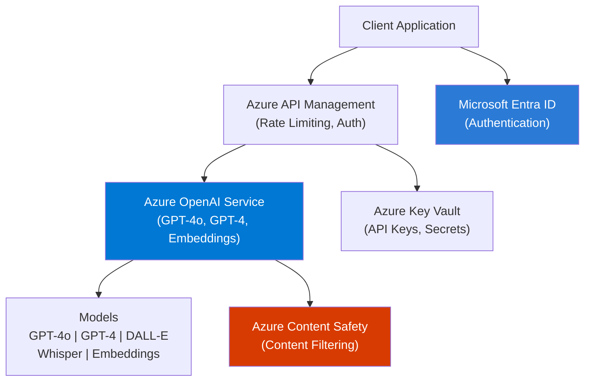

### Core Concepts
- **Deployment Types** – Standard, Provisioned Throughput Units (PTU)
- **Token limits** – context window, prompt tokens, completion tokens
- **Model versioning & lifecycle** – deprecation, model updates
- **Azure OpenAI on Your Data** – connect to Azure AI Search for RAG
- **Responsible AI filters** – content filters, jailbreak detection
- **Private deployment** – Private Link, network isolation

### Key Interview Questions
- What is the difference between **Standard** and **PTU (Provisioned Throughput)** in Azure OpenAI?
- How do you handle **rate limiting** and **token quota** in production?
- Explain **Azure OpenAI On Your Data** vs building a custom RAG pipeline.
- How would you **secure** Azure OpenAI endpoints in an enterprise setting?
- What **content safety** mechanisms does Azure OpenAI provide?

---

## 16. Large Language Models (LLMs)

### LLM Taxonomy

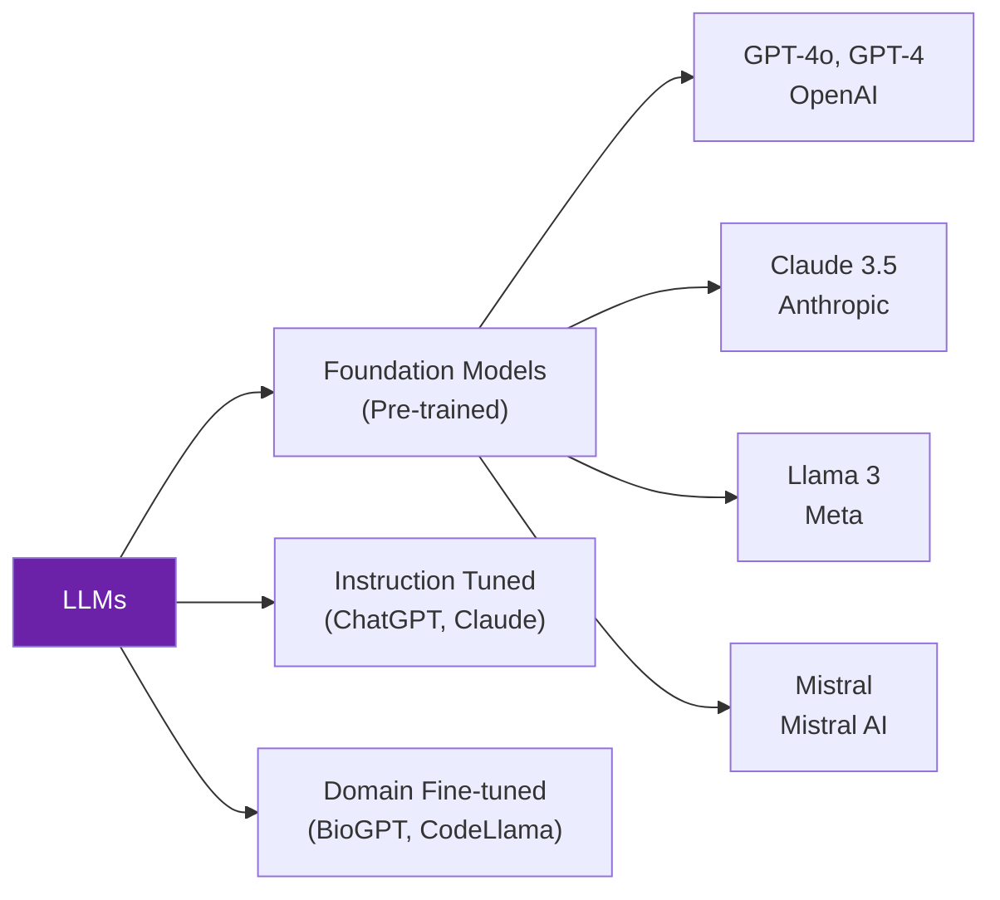

### Core Concepts
- **Transformer Architecture** – attention mechanism, self-attention, positional encoding
- **Tokenization** – BPE, WordPiece; token count vs word count
- **Temperature, Top-P, Top-K** – controlling randomness in outputs
- **Context Window** – 8K, 32K, 128K tokens; long-context challenges
- **Hallucination** – causes, mitigation strategies (RAG, grounding, citations)
- **Model Comparison** – GPT-4o vs Claude vs Llama vs Mistral (cost, latency, accuracy)
- **Embedding Models** – text-embedding-ada-002, text-embedding-3-large

### Key Interview Questions
- Explain the **transformer architecture** at a high level. What is self-attention?
- What causes **hallucinations** and how do you mitigate them in production?
- How would you choose between **GPT-4o vs Llama 3** for an enterprise application?
- What is the significance of **context window size** in RAG architectures?
- Explain **semantic similarity** using embeddings.

---

## 17. Prompt Engineering

### Prompt Engineering Techniques

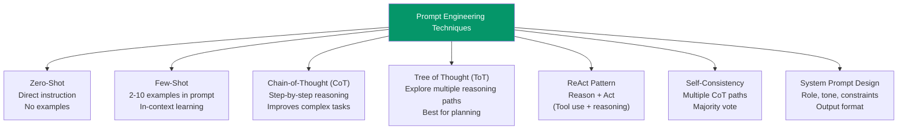

### Core Concepts
- **System vs User vs Assistant** messages – roles in chat completion API
- **Prompt templates** – parameterized prompts, Jinja2, PromptTemplate (LangChain)
- **Output parsers** – JSON mode, structured outputs, Pydantic validation
- **Prompt injection** – attack vectors and defenses
- **Meta-prompting** – using LLMs to improve prompts
- **Token efficiency** – reducing cost while maintaining quality
- **Prompt versioning** – LangSmith, PromptFlow, MLflow

### Key Interview Questions
- What is **Chain-of-Thought prompting** and when do you use it?
- How do you prevent **prompt injection attacks** in a production system?
- Explain the difference between **Zero-shot, Few-shot, and Fine-tuning**.
- How do you ensure **consistent structured output** from an LLM?
- What is the **ReAct pattern** and how does it power AI agents?

---

## 18. Retrieval-Augmented Generation (RAG)

### RAG Architecture

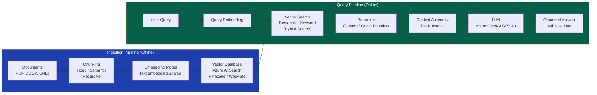

### Advanced RAG Patterns

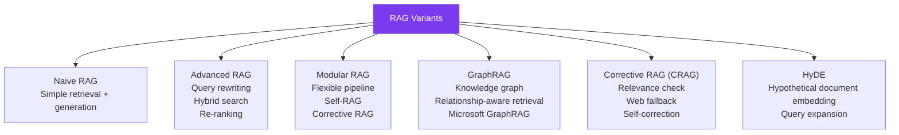

### Core Concepts
- **Chunking strategies** – fixed-size, recursive, semantic, document-aware
- **Embedding models** – dense vs sparse; bi-encoder vs cross-encoder
- **Hybrid Search** – combining vector search + BM25/keyword search
- **Re-ranking** – Cohere Rerank, cross-encoder models
- **Metadata filtering** – pre-filtering before vector search
- **Evaluation metrics** – RAGAS (faithfulness, answer relevancy, context precision, recall)
- **Chunking overlap** – avoiding information loss at boundaries

### Key Interview Questions
- Walk me through a **complete RAG pipeline** from document ingestion to response.
- What is **Hybrid Search** and why is it better than pure vector search?
- How do you **evaluate RAG quality**? What metrics do you use?
- Explain **GraphRAG** and when would you use it over standard RAG?
- How do you handle **large documents** that exceed context window limits?
- What is **HyDE (Hypothetical Document Embeddings)**?

---

## 19. Fine-Tuning

### Fine-Tuning Decision Framework

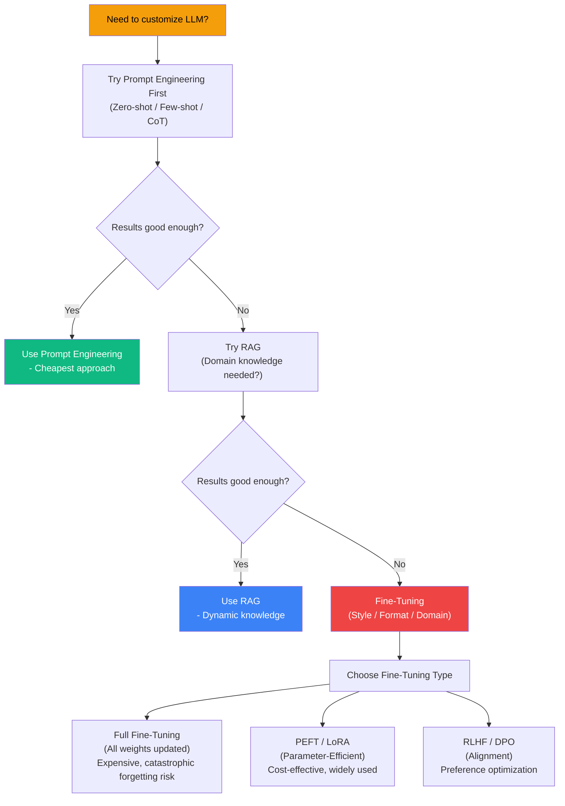

### Core Concepts
- **LoRA (Low-Rank Adaptation)** – adapter matrices, rank selection, merging adapters
- **QLoRA** – quantized LoRA for memory efficiency (4-bit quantization)
- **RLHF** – Reinforcement Learning from Human Feedback (reward model, PPO)
- **DPO (Direct Preference Optimization)** – simpler alternative to RLHF
- **Catastrophic forgetting** – challenge of fine-tuning, mitigations
- **Instruction tuning** – FLAN-style, Alpaca-style datasets
- **Azure OpenAI Fine-tuning** – supported models (GPT-3.5-turbo), JSONL format, Azure ML jobs

### Key Interview Questions
- When would you choose **fine-tuning over RAG**?
- Explain **LoRA** – why is it parameter-efficient?
- What is **QLoRA** and what problem does it solve?
- How do you prepare a **fine-tuning dataset** for Azure OpenAI?
- What is **catastrophic forgetting** and how do you mitigate it?

---

## 20. AI Agents & Multi-Agent Systems

### Single Agent Architecture

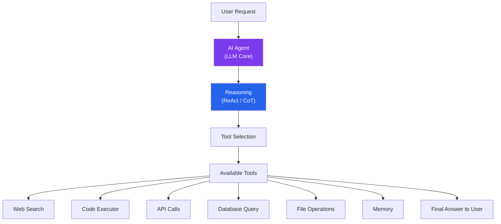

### Multi-Agent System Architecture

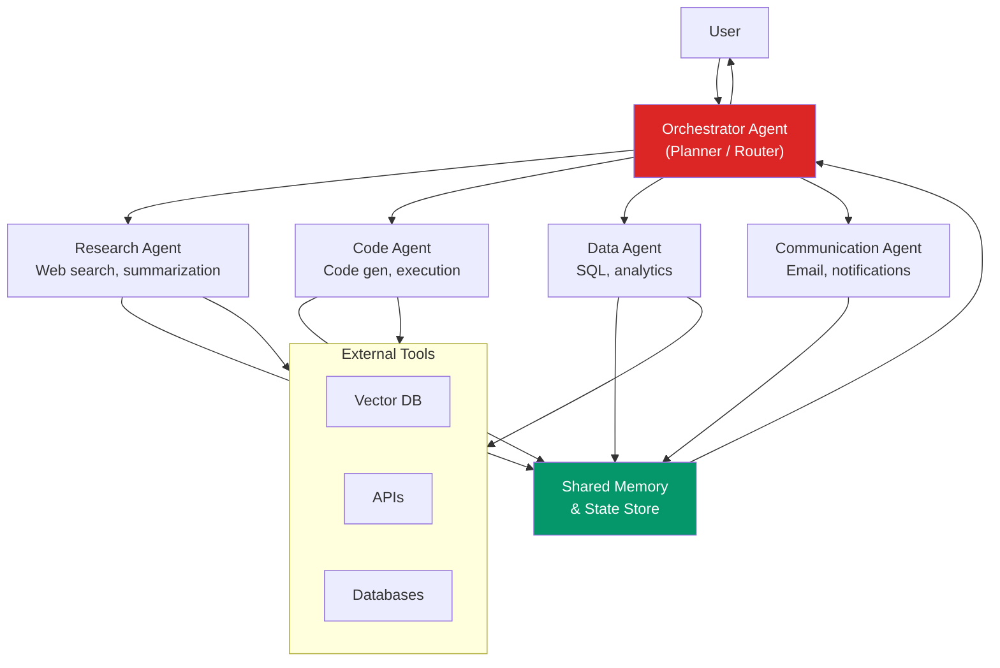

### Agentic Patterns

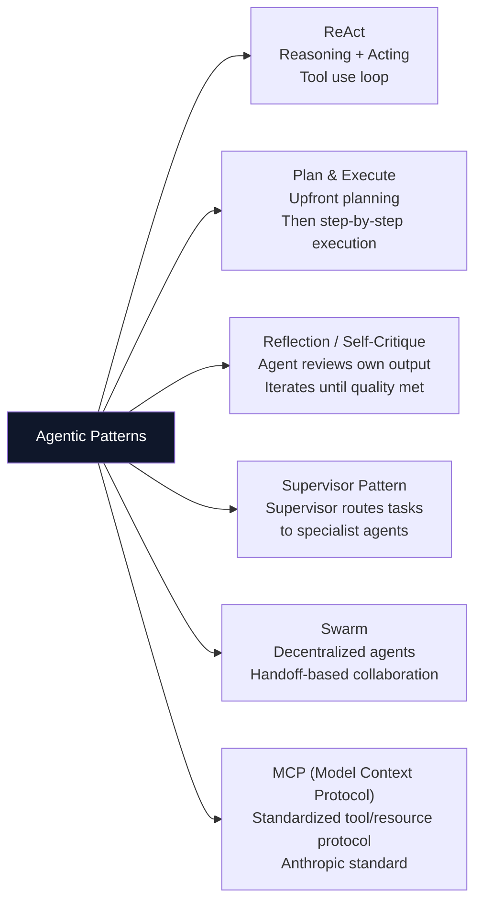

### Core Concepts
- **Tool calling / Function calling** – structured output for tool invocation
- **Memory types** – short-term (in-context), long-term (vector store), episodic, semantic
- **Agent loops** – observation, thought, action cycles
- **Handoffs** – transferring control between agents
- **MCP (Model Context Protocol)** – standardized protocol for LLM tool/resource access
- **Human-in-the-loop** – approval gates, interrupt mechanisms

### Key Interview Questions
- Design a **multi-agent system** for enterprise document processing.
- What is **Model Context Protocol (MCP)**? How does it differ from function calling?
- How do you handle **agent failures** and prevent infinite loops?
- Explain the **Supervisor vs Swarm** pattern for multi-agent systems.
- How do you implement **memory** in long-running agent tasks?

---

## 21. LangChain, LangGraph & CrewAI

### LangChain Architecture

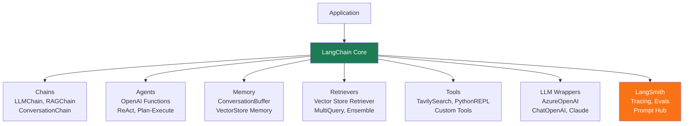

### LangGraph State Machine

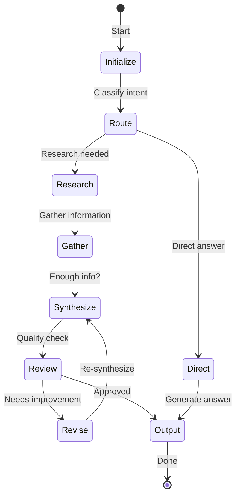

### Framework Comparison

| Feature | LangChain | LangGraph | CrewAI |
|---|---|---|---|
| **Paradigm** | Chain / LCEL | State graph | Role-based agents |
| **Best for** | RAG, simple chains | Complex workflows, cycles | Collaborative multi-agent |
| **State management** | Limited | Full graph state | Crew-level shared state |
| **Cycles/Loops** | No | Yes | Partial |
| **Human-in-loop** | Basic | Yes — Checkpoints | Yes |
| **Visual debugging** | LangSmith | LangSmith | Built-in |
| **Learning curve** | Medium | High | Low |

### Core Concepts
- **LCEL (LangChain Expression Language)** – `|` pipe operator, composable chains
- **Runnables** – universal interface in LangChain v0.2+
- **LangGraph nodes and edges** – StateGraph, conditional edges, checkpointers
- **CrewAI** – Crew, Agent, Task, Process (sequential, hierarchical, parallel)
- **LangSmith** – tracing, evaluation, prompt versioning

### Key Interview Questions
- Explain **LCEL** and how you compose chains using the pipe operator.
- When would you use **LangGraph over LangChain**?
- How does **CrewAI's hierarchical process** work?
- How do you implement **human-in-the-loop** checkpoints in LangGraph?
- How do you trace and debug **LangChain applications** in production?

---

## 22. Vector Databases & Embeddings

### Vector Database Architecture

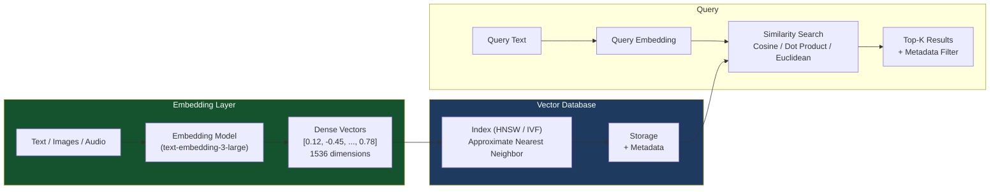

### Vector DB Comparison

| Feature | Azure AI Search | Pinecone | Weaviate | Qdrant | Chroma |
|---|---|---|---|---|---|
| **Hybrid Search** | Yes (BM25+Vector) | Yes | Yes | Yes | No |
| **Managed** | Yes Azure | Yes Cloud | Self/Cloud | Self/Cloud | Local/Self |
| **Filtering** | Yes | Yes | Yes | Yes | Basic |
| **Scale** | Enterprise | Very High | High | High | Dev/Prototype |
| **Azure Native** | Yes | No | No | No | No |
| **Graph support** | No | No | Yes | No | No |

### Core Concepts
- **ANN algorithms** – HNSW (Hierarchical Navigable Small World), IVF, Product Quantization
- **Similarity metrics** – Cosine similarity, Dot product, Euclidean distance
- **Indexing strategies** – HNSW parameters (ef, M), index vs query time tradeoff
- **Metadata filtering** – pre-filtering vs post-filtering performance impact
- **Sparse + Dense (Hybrid)** – BM25 for keyword, HNSW for semantic; RRF fusion
- **Namespace/Collection isolation** – multi-tenancy in vector DBs

### Key Interview Questions
- Explain **HNSW** and why it's preferred for vector search at scale.
- What is **Hybrid Search** and how does **Reciprocal Rank Fusion (RRF)** work?
- How do you handle **multi-tenancy** in a vector database?
- Why is **cosine similarity** commonly used for text embeddings?
- How do you choose the right **chunk size** and **embedding model**?

---

## 23. Enterprise AI Architecture

### Enterprise GenAI Reference Architecture

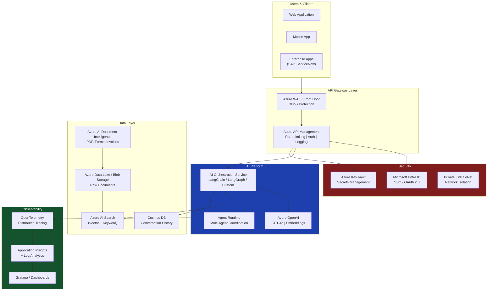

### Core Concepts
- **AI Platform vs AI Application** – platform as reusable infra, applications on top
- **Centralized vs federated AI** – governance model for enterprise
- **AI Gateway pattern** – centralized policy, token metering, audit logging
- **Data residency** – compliance requirements (GDPR, HIPAA) for AI workloads
- **Shared AI infrastructure** – model endpoint sharing across teams
- **Enterprise integration** – SharePoint, ServiceNow, SAP connectors

### Key Interview Questions
- Design an **enterprise RAG platform** for 10 teams with different data sources.
- How do you implement **cost governance** for Azure OpenAI across teams?
- How would you architect **multi-region AI deployment** for high availability?
- What is the **AI Gateway pattern** and what problems does it solve?
- How do you handle **data privacy** when sending enterprise data to LLMs?

---

## 24. MLOps & LLMOps

### MLOps vs LLMOps

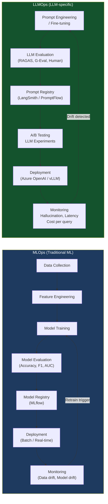

### Core Concepts
- **CI/CD for ML** – automated training, evaluation, and deployment pipelines
- **Model Registry** – MLflow model registry, Azure ML model registry
- **Feature Store** – centralized feature management (Feast, Azure ML Feature Store)
- **Data versioning** – DVC (Data Version Control)
- **LLM evaluation** – RAGAS, G-Eval, human eval, automated eval pipelines
- **LLM monitoring** – token usage, latency P99, hallucination rate, cost tracking
- **Prompt versioning** – LangSmith, Azure PromptFlow, MLflow

### Key Interview Questions
- What is the difference between **MLOps and LLMOps**?
- How do you set up a **CI/CD pipeline for LLM applications**?
- What metrics do you monitor for **LLMs in production**?
- How do you **version prompts** and manage prompt drift?
- Explain **A/B testing** for LLM applications.

---

## 25. AI Pipelines (MLflow, Kubeflow, Airflow)

### Pipeline Tool Comparison

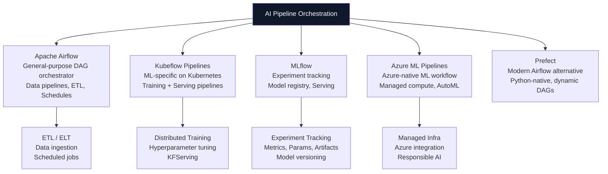

### Core Concepts
- **MLflow** – tracking (experiments, runs, params, metrics), model registry, serving
- **Kubeflow Pipelines** – containerized ML steps, Argo Workflows underneath
- **Airflow DAGs** – directed acyclic graphs, operators, hooks, XComs
- **Azure ML Pipelines** – PipelineJob, component-based design
- **Pipeline triggers** – schedule, event-driven (new data), API trigger

### Key Interview Questions
- How would you set up an **end-to-end ML pipeline** using Azure ML?
- Explain **MLflow tracking** – what do you log and why?
- When would you choose **Kubeflow over Airflow**?
- How do you implement **retraining triggers** in a production ML system?
- How do you manage **pipeline dependencies** and artifacts across steps?

---

## 26. Microservices & Containerization

### AI Microservices Architecture

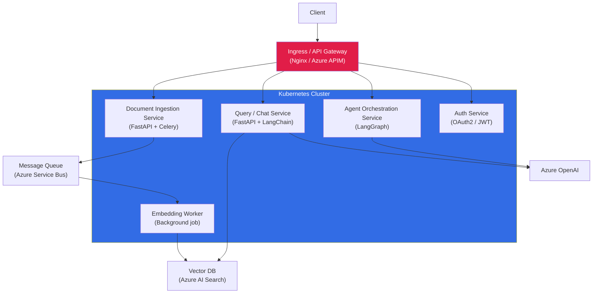

### Core Concepts
- **Docker** – Dockerfile best practices, multi-stage builds, layer caching
- **Kubernetes** – Deployments, Services, Ingress, ConfigMaps, Secrets, HPA
- **Helm charts** – templating K8s manifests, release management
- **Service mesh** – Istio, Linkerd for mTLS, observability, traffic management
- **Sidecar pattern** – logging, tracing, auth proxy alongside app containers
- **Azure Kubernetes Service (AKS)** – managed K8s, KEDA for event-driven scaling
- **Resource requests/limits** – CPU/GPU scheduling for AI workloads

### Key Interview Questions
- How do you **containerize an AI application** using Docker best practices?
- Explain **Kubernetes HPA** vs **KEDA** for scaling AI workloads.
- How do you manage **GPU resources** in a Kubernetes cluster for LLM inference?
- What is a **service mesh** and when would you add one to an AI platform?
- How do you implement **blue-green deployment** for an LLM service?

---

## 27. Security — OAuth, JWT, IAM

### OAuth 2.0 / OIDC Flow for AI APIs

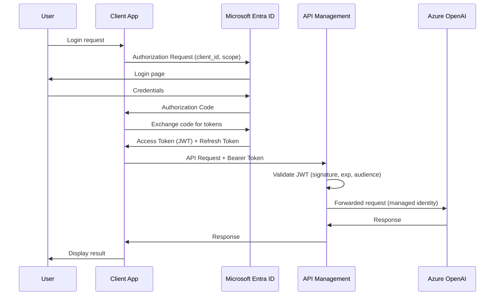

### Core Concepts
- **OAuth 2.0 grant types** – Authorization Code, Client Credentials, Device Flow
- **JWT structure** – Header (alg), Payload (claims: sub, exp, aud, iss), Signature
- **RBAC vs ABAC** – Role-based vs Attribute-based access control
- **Azure Managed Identity** – system-assigned vs user-assigned; no secrets management
- **Azure RBAC** – built-in roles (Owner, Contributor, Reader), custom roles
- **API Key management** – rotation, vault storage, never in code
- **Zero Trust** – verify explicitly, least privilege, assume breach

### Key Interview Questions
- Explain the **OAuth 2.0 Authorization Code flow** step by step.
- What is inside a **JWT token**? How do you validate it?
- What is **Azure Managed Identity** and why is it preferred over API keys?
- How do you implement **RBAC** for an AI platform with multiple tenants?
- What is the difference between **authentication and authorization**?

---

## 28. Observability — ELK & OpenTelemetry

### Observability Stack for AI Systems

```mermaid
graph LR
    subgraph Apps["AI Applications"]
        App1["Chat Service"]
        App2["Agent Service"]
        App3["Embedding Worker"]
    end

    subgraph OTel_Layer["OpenTelemetry SDK"]
        Traces["Distributed Traces\n(Span: LLM call, retrieval, tool use)"]
        Metrics["Metrics\n(token count, latency, error rate)"]
        Logs["Structured Logs\n(JSON format)"]
    end

    subgraph Backends["Observability Backends"]
        Jaeger["Jaeger / Zipkin\n(Trace visualization)"]
        Prometheus["Prometheus\n(Metrics storage)"]
        ELK["ELK Stack\nElasticsearch + Logstash + Kibana"]
        AppInsights2["Azure Application Insights\n(Azure-native)"]
    end

    Apps --> OTel_Layer
    Traces --> Jaeger
    Traces --> AppInsights2
    Metrics --> Prometheus
    Logs --> ELK
    Metrics --> AppInsights2
    Logs --> AppInsights2

    style OTel_Layer fill:#0c4a6e,color:#fff
    style Backends fill:#1c1917,color:#fff
```

### LLM-Specific Observability Metrics

| Category | Metric | Why It Matters |
|---|---|---|
| **Performance** | P50/P99 latency | User experience SLA |
| **Cost** | Tokens per request | Budget control |
| **Quality** | Hallucination rate | Trust and safety |
| **Reliability** | Error rate, timeouts | Uptime |
| **Usage** | Requests per model | Capacity planning |
| **RAG** | Retrieval precision/recall | RAG quality |

### Core Concepts
- **Three pillars of observability** – Logs, Metrics, Traces
- **OpenTelemetry** – vendor-neutral OTLP protocol, auto-instrumentation
- **Distributed tracing** – trace ID, span ID, parent-child relationships
- **ELK Stack** – Elasticsearch (search/store), Logstash (ingest/transform), Kibana (visualize)
- **Azure Monitor + Application Insights** – Azure-native observability
- **Alerting** – threshold-based, anomaly detection, SLO-based alerts

### Key Interview Questions
- What are the **three pillars of observability** and how do they apply to AI systems?
- How do you trace an **LLM call end-to-end** using OpenTelemetry?
- What **LLM-specific metrics** would you add to a standard observability stack?
- How does the **ELK stack** differ from Azure Monitor for log management?
- How do you set up **alerts** for hallucination rate or high token cost?

---

## 29. Data Engineering — PySpark & Azure Data

### Azure Data Architecture for AI

```mermaid
graph LR
    Sources["Data Sources\nCRM | ERP | SharePoint\nAPIs | IoT | Files"] --> ADLS["Azure Data Lake Storage Gen2\n(Raw / Bronze layer)"]
    ADLS --> ADF["Azure Data Factory\n(Ingestion + Orchestration)"]
    ADF --> Databricks["Azure Databricks + PySpark\n(Silver: Clean, Transform)"]
    Databricks --> Gold["Gold Layer\nAzure Synapse / Delta Tables\n(Analytics-ready)"]
    Gold --> DocIntel2["Azure AI Document Intelligence\n(Unstructured data processing)"]
    DocIntel2 --> VDB3["Azure AI Search\n(Vector DB for RAG)"]
    Gold --> AOAI2["Azure OpenAI\n(Batch inference)"]

    style Databricks fill:#e2211c,color:#fff
    style VDB3 fill:#0078D4,color:#fff
```

### Core Concepts
- **Medallion architecture** – Bronze (raw), Silver (cleaned), Gold (aggregated/analytics)
- **PySpark fundamentals** – RDD vs DataFrame vs Dataset, lazy evaluation, DAG
- **Delta Lake** – ACID transactions, time travel, schema evolution on data lakes
- **Azure Data Factory** – pipelines, linked services, data flows, triggers
- **Azure Databricks** – clusters, notebooks, MLflow integration, Unity Catalog
- **Data partitioning** – partition pruning, broadcast joins in Spark
- **Streaming vs batch** – structured streaming, Event Hubs, Kafka

### Key Interview Questions
- Explain the **Medallion architecture** and how it supports AI workloads.
- What is the difference between **RDD and DataFrame** in Spark?
- How does **Delta Lake** add ACID compliance to a data lake?
- How would you process **10TB of PDFs** for RAG ingestion using PySpark?
- How do you optimize a **slow PySpark job**?

---

## 30. Azure AI Services

### Azure AI Services Landscape

```mermaid
mindmap
  root((Azure AI Services))
    Azure OpenAI
      GPT-4o
      Embeddings
      DALL-E
      Whisper
    Azure AI Search
      Vector Search
      Semantic Ranking
      Hybrid Search
      Integrated Vectorization
    Azure AI Document Intelligence
      Layout analysis
      Form / Invoice extraction
      Custom models
    Azure AI Vision
      OCR
      Object detection
      Image analysis
    Azure AI Speech
      Speech-to-Text
      Text-to-Speech
      Real-time transcription
    Azure AI Language
      Sentiment analysis
      NER
      Question answering
    Azure AI Content Safety
      Text moderation
      Image moderation
      Jailbreak detection
```

### Core Concepts
- **Azure AI Document Intelligence** – layout, general document, prebuilt models (invoice, receipt), custom model training
- **Azure AI Search** – index schema, skillsets (AI enrichment), semantic ranker, integrated vectorization
- **Integrated vectorization** – auto-chunking and embedding during indexing via skillsets
- **Azure AI Content Safety** – content filtering categories (hate, violence, self-harm, sexual)

### Key Interview Questions
- How does **Azure AI Document Intelligence** process a complex PDF with tables?
- Explain **Azure AI Search's integrated vectorization** feature.
- What is **semantic ranker** in Azure AI Search and how does it differ from vector search?
- How would you build a **multi-modal RAG** using Azure AI Vision + Azure AI Search?

---

## 31. AI Governance & Responsible AI

### Responsible AI Framework

```mermaid
graph TD
    RAI["Microsoft Responsible AI Principles"] --> Fair["Fairness\nBias detection\nDemographic parity"]
    RAI --> Reliable["Reliability & Safety\nRobustness testing\nFailsafe mechanisms"]
    RAI --> Privacy["Privacy & Security\nData minimization\nDifferential privacy"]
    RAI --> Inclusive["Inclusiveness\nAccessibility\nMultilingual support"]
    RAI --> Transparent["Transparency\nExplainability\nModel cards"]
    RAI --> Accountable["Accountability\nHuman oversight\nAudit trails"]

    style RAI fill:#0078D4,color:#fff
```

### Core Concepts
- **AI Governance** – policies, standards, model inventories, risk classification
- **Model cards** – documentation of model capabilities, limitations, intended use
- **Bias & fairness** – demographic parity, equal opportunity, disparate impact
- **Explainability** – SHAP, LIME for traditional ML; chain-of-thought for LLMs
- **Red teaming** – adversarial testing, jailbreak attempts, prompt injection
- **Data privacy** – PII detection, data masking before sending to LLMs
- **AI Act (EU)** – risk categories (unacceptable, high, limited, minimal risk)

### Key Interview Questions
- What are Microsoft's **Responsible AI principles**? Give examples of each.
- How do you implement **PII detection** before sending data to Azure OpenAI?
- What is **AI red teaming** and how do you set it up?
- How would you classify an AI system under **EU AI Act risk categories**?
- How do you create and maintain a **model card**?

---

## 32. System Design — End-to-End Scenarios

### Scenario 1: Enterprise Document Q&A System

```mermaid
graph TB
    Upload["Document Upload\n(SharePoint / API)"] --> DocIntel3["Azure AI Document Intelligence\n(Extract text, tables, structure)"]
    DocIntel3 --> Chunker["Intelligent Chunker\n(Semantic chunking)"]
    Chunker --> EmbedService["Embedding Service\n(text-embedding-3-large)"]
    EmbedService --> AISearch["Azure AI Search\n(Hybrid Index)"]

    User2["User Query"] --> QueryProc["Query Processing\n(Rewriting, HyDE)"]
    QueryProc --> AISearch
    AISearch --> Reranker["Re-ranker\n(Semantic + Cohere)"]
    Reranker --> LLM3["Azure OpenAI GPT-4o\n(Answer generation)"]
    LLM3 --> CitationEngine["Citation Engine\n(Source attribution)"]
    CitationEngine --> Response["Grounded Response\n+ References"]

    style AISearch fill:#0078D4,color:#fff
    style LLM3 fill:#10b981,color:#fff
```

### Scenario 2: Autonomous AI Agent for IT Operations

```mermaid
graph TD
    Alert["Incident Alert\n(ServiceNow / PagerDuty)"] --> IncidentAgent["Incident Triage Agent\n(GPT-4o + LangGraph)"]

    IncidentAgent --> LogTool["Log Analysis Tool\n(Elasticsearch query)"]
    IncidentAgent --> MetricTool["Metric Analysis Tool\n(Prometheus API)"]
    IncidentAgent --> KBTool["Knowledge Base Tool\n(RAG on runbooks)"]
    IncidentAgent --> RemTool["Remediation Tool\n(Kubernetes / Azure API)"]

    LogTool --> IncidentAgent
    MetricTool --> IncidentAgent
    KBTool --> IncidentAgent

    IncidentAgent --> Decision{Confidence > 80%?}
    Decision -->|Yes| AutoRemediate["Auto-Remediate\n(restart pod, scale up)"]
    Decision -->|No| HumanApproval["Human Approval\n(Teams notification)"]
    HumanApproval --> ManualAction["Manual Action\nby engineer"]

    style IncidentAgent fill:#7c3aed,color:#fff
    style Decision fill:#f59e0b,color:#000
```

### Design Interview Framework

```mermaid
graph LR
    SDI["System Design\nInterview Framework"] --> Req["1. Requirements\nFunctional + Non-functional\nScale, Latency, Consistency"]
    SDI --> HL["2. High-Level Design\nMain components\nData flow diagram"]
    SDI --> DD["3. Deep Dive\nCritical components\nTradeoffs"]
    SDI --> Scale["4. Scale & Reliability\nHorizontal scaling\nCaching, CDN, replication"]
    SDI --> Ops["5. Operations\nMonitoring, alerting\nDeployment strategy"]

    style SDI fill:#0f172a,color:#fff
```

---

## 33. Behavioral & Leadership Questions

### STAR Method for Technical Leadership

| Component | What to Include |
|---|---|
| **S**ituation | Context, team size, constraints |
| **T**ask | Your specific responsibility |
| **A**ction | Technical decisions you made, tradeoffs |
| **R**esult | Quantified outcome (latency, cost, adoption) |

### Common Behavioral Topics

1. **Technical Leadership**
   - "Tell me about a time you led a complex AI architecture decision"
   - "How did you handle disagreement with stakeholders on a technical approach?"

2. **Customer Engagement**
   - "Describe a customer workshop you ran on AI/GenAI"
   - "How do you explain complex AI concepts to non-technical stakeholders?"

3. **Problem Solving**
   - "Describe a production AI incident and how you resolved it"
   - "How did you optimize a RAG pipeline that had poor retrieval quality?"

4. **Innovation**
   - "What GenAI trend do you think is most impactful for enterprise in the next 2 years?"
   - "How do you stay current with rapidly evolving AI technologies?"

5. **Governance & Ethics**
   - "How have you ensured responsible AI practices in a project?"
   - "How would you handle a request to use AI in a way you consider risky?"

---

## 34. Quick Reference: Key Numbers to Know

| Topic | Key Numbers |
|---|---|
| GPT-4o context window | 128K tokens |
| text-embedding-3-large dimensions | 3072 (default) / reducible |
| Cosine similarity range | -1 to +1 (1 = identical) |
| HNSW construction param M | Typical: 16-64 |
| Azure OpenAI rate limits | Tokens per minute (TPM) & Requests per minute (RPM) |
| RAG Top-K typical range | 3-10 chunks |
| LoRA rank (r) typical values | 4, 8, 16, 32 |
| JWT expiry best practice | Access: 15min-1hr, Refresh: 7-30 days |

---

## 35. Study Priority Roadmap

```mermaid
graph LR
    Week1["Week 1\nCRITICAL"] --> W1["Azure Cloud Architecture\nAzure OpenAI\nRAG Architecture\nPrompt Engineering"]
    Week2["Week 2\nHIGH"] --> W2["LangChain / LangGraph\nVector Databases\nAI Agents & MCP\nFine-Tuning"]
    Week3["Week 3\nMEDIUM"] --> W3["MLOps / LLMOps\nDocker / Kubernetes\nSecurity (OAuth, JWT)\nObservability"]
    Week4["Week 4\nPOLISH"] --> W4["System Design Practice\nBehavioral Questions\nAI Governance\nEnterprise Scenarios"]

    style Week1 fill:#dc2626,color:#fff
    style Week2 fill:#ea580c,color:#fff
    style Week3 fill:#ca8a04,color:#fff
    style Week4 fill:#16a34a,color:#fff
```

---

## Source Attribution

| Source File | Content Contributed | Original Size |
|---|---|---|
| `AI-Engineer-Skills-Roadmap-45LPA.md` | Part 1 (Sections 1–13): Career roadmap, skill levels, salary comparison, code examples, tool reference, best practices, STAR interview questions | 49,522 chars |
| `AI_Architect_Interview_Concepts.md` | Part 2 (Sections 14–35): 20-domain AI Architect Q&A with architectural diagrams, quick reference, study roadmap | 41,947 chars |

*Consolidated: 2026-07-05 | DocDedupAnalyzer Phase 2*
*Last Updated: Part 1 — July 2026 | Part 2 — June 2026*
