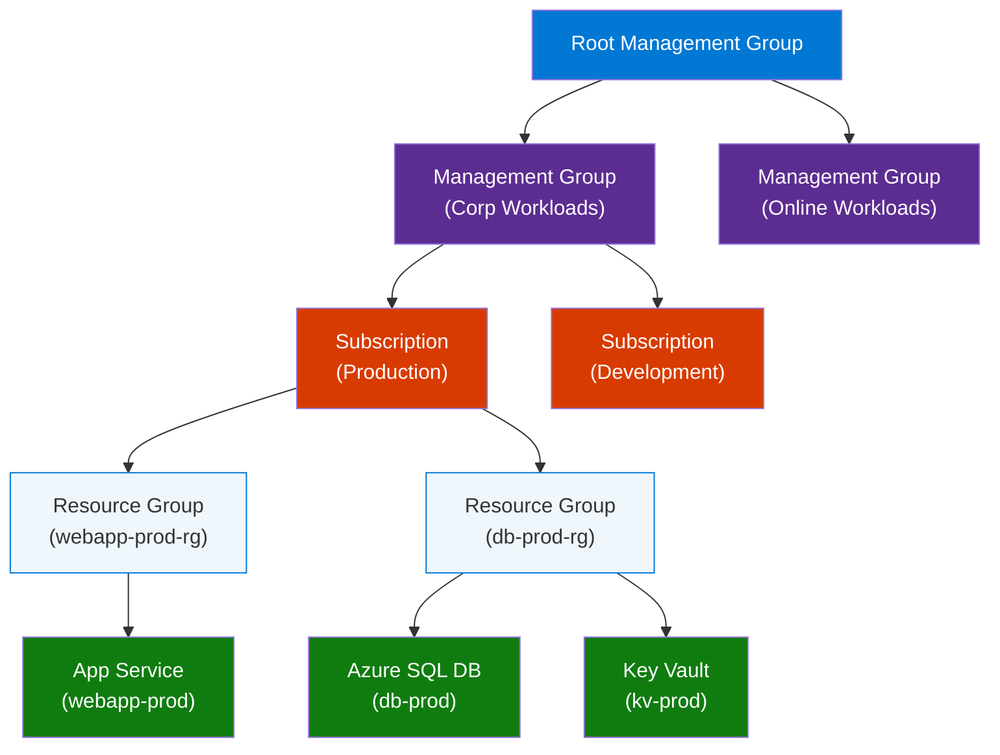
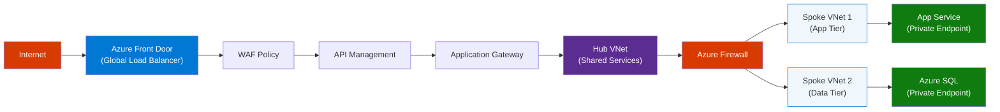
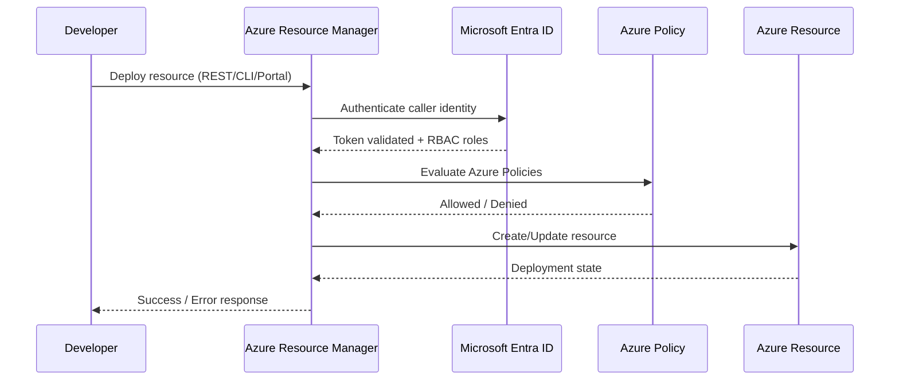
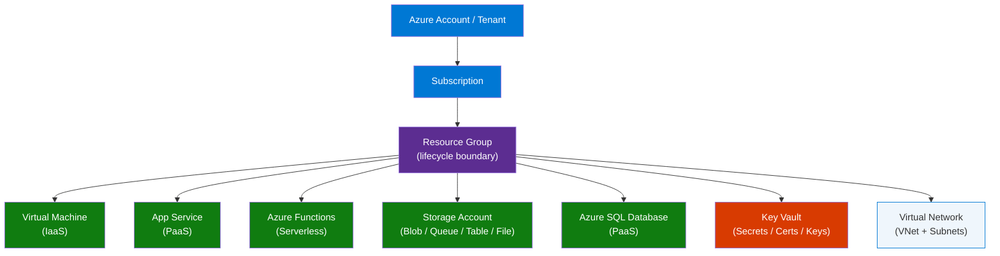
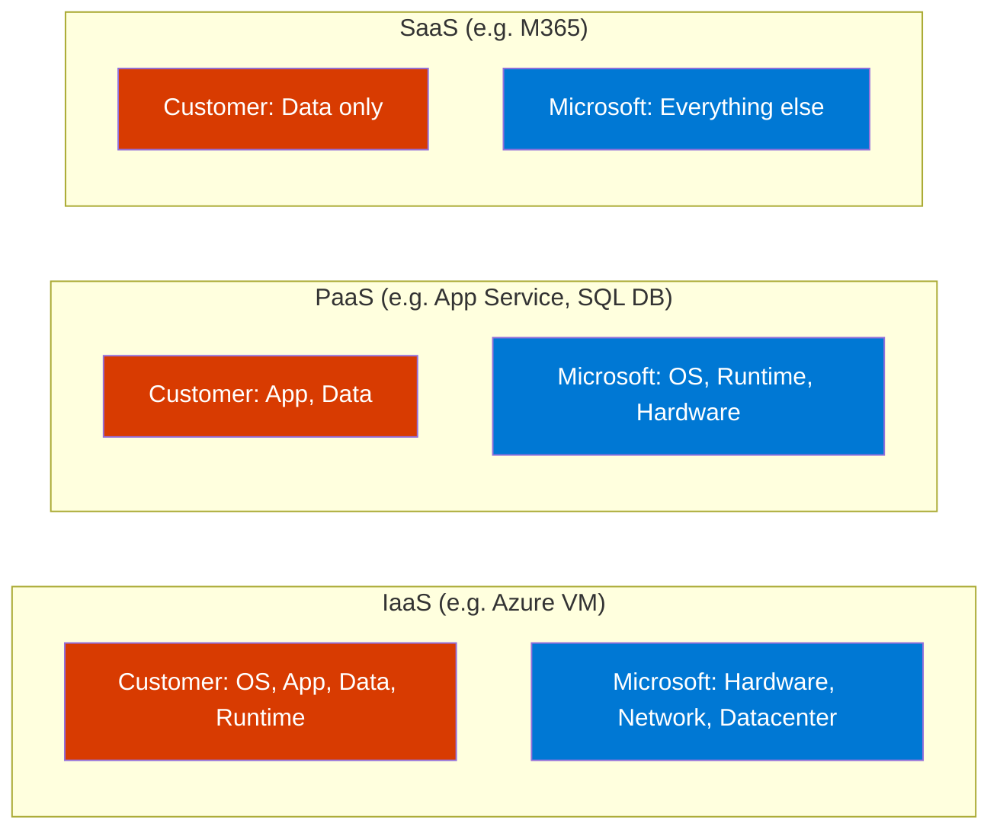
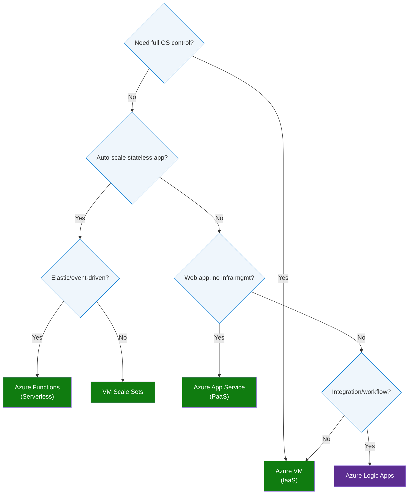
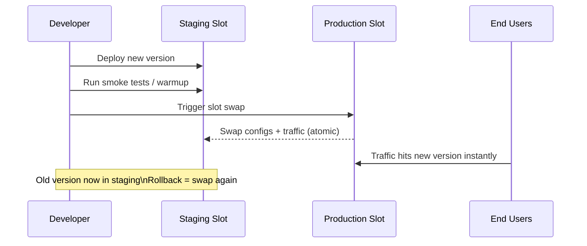
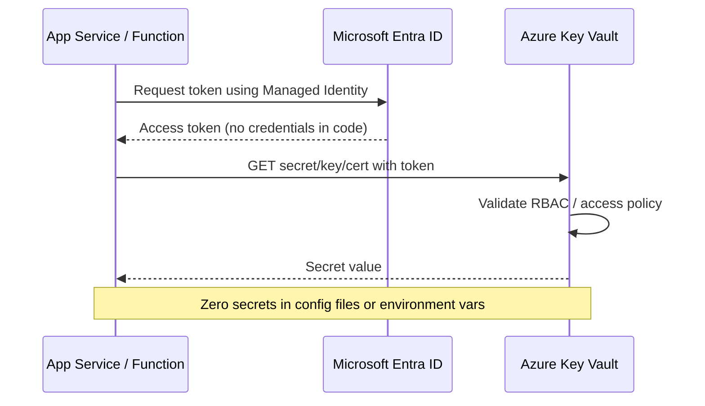

# Azure 100 Interview Q&A — Complete Guide
> **Consolidated From:** Azure-100-Interview-QA-Complete-Guide.md, Azure-Interview-Questions-Top25.md
> **Topics Covered:** 100 Azure interview questions & answers, top-25 quick-reference, compute, storage, networking, security, AI services
> **Consolidation Date:** 2026-07-04
> **Original Documents:** 2 → **Content Preserved:** 100%

---

> **Source:** [YouTube — 100 Azure Interview Questions and Answers | Beginner to Advanced Guide for IT Jobs](https://www.youtube.com/watch?v=LgAe1khJ5eY)
> **Topic:** Azure Cloud, Interview Prep, IaaS, PaaS, SaaS, AKS, DevOps, Security, Architecture
> **Key Claim:** Covers 100 must-know Azure interview questions from beginner to advanced — organized by topic and role

---

## Table of Contents

1. [Overview](#1-overview)
2. [Problem Statement](#2-problem-statement)
3. [Core Concepts](#3-core-concepts)
4. [Azure Service Hierarchy & Architecture](#4-azure-service-hierarchy--architecture)
5. [Key Service Categories](#5-key-service-categories)
6. [How Azure Resources Are Organized](#6-how-azure-resources-are-organized)
7. [Cloud Model Comparison](#7-cloud-model-comparison)
8. [The 100 Interview Questions](#8-the-100-interview-questions)
   - [Beginner: Q1–Q25](#beginner-q1q25)
   - [Intermediate: Q26–Q60](#intermediate-q26q60)
   - [Advanced: Q61–Q100](#advanced-q61q100)
9. [Code Examples](#9-code-examples)
10. [Configuration Reference](#10-configuration-reference)
11. [Best Practices](#11-best-practices)
12. [Interview Talking Points](#12-interview-talking-points)
13. [Learning Resources](#13-learning-resources)

---

## 1. Overview

This guide synthesizes 100 Azure interview questions spanning beginner through architect-level topics — covering cloud fundamentals, compute, networking, storage, security, identity, DevOps, and AI/ML services. Microsoft Azure is the #2 cloud provider globally with 200+ services across IaaS, PaaS, and SaaS models. The questions follow the progression of real-world Azure job interviews, from AZ-900 fundamentals to AZ-305 architect-level scenarios. Use this as both a study reference and a quick review before interviews.

---

## 2. Problem Statement

Azure interviews test knowledge across a deceptively broad surface area — candidates often prepare compute and storage but get caught on identity, networking topology, or cost governance.

### Common Gaps That Cause Interview Failures

| Gap Area | Interview Trap |
|---|---|
| Resource hierarchy | Confusing subscription vs. management group scope |
| Networking | Explaining NSG vs. Azure Firewall vs. Application Gateway |
| Identity | Difference between Service Principal, Managed Identity, and RBAC roles |
| HA/DR | Availability Set vs. Availability Zone vs. Azure Site Recovery |
| DevOps | ARM template vs. Bicep vs. Terraform on Azure |
| Cost governance | Not knowing Azure Policy, Advisor, Cost Management roles |

> **Key Insight:** "Azure roles are not just cloud roles — they are also IAM roles, networking roles, data roles, and DevOps roles all in one interview."

---

## 3. Core Concepts

### IaaS (Infrastructure as a Service)
You manage the OS, runtime, middleware, and application. Azure provides hardware, networking, and virtualization. Examples: Azure Virtual Machines, Azure Managed Disks.

### PaaS (Platform as a Service)
Azure manages OS, runtime, and scaling. You manage only your application code and data. Examples: Azure App Service, Azure SQL Database, Azure Functions, AKS.

### SaaS (Software as a Service)
Fully managed product — you manage only configuration and data. Examples: Microsoft 365, Dynamics 365, Azure DevOps (as a hosted service).

### Azure Resource Manager (ARM)
The control plane for all Azure operations. Every create/read/update/delete action goes through ARM, which enforces RBAC, policy, and locks before touching any resource.

### Azure AD / Microsoft Entra ID
Azure's cloud-based identity and access management service. Handles authentication (who you are) and authorization (what you can do) for Azure resources, Microsoft 365, and custom apps.

---

## 4. Azure Service Hierarchy & Architecture



### Azure Networking Architecture



---

## 5. Key Service Categories

| Category | Key Services | Role |
|---|---|---|
| **Compute** | VMs, App Service, Functions, AKS, Container Apps, Batch | Run application workloads |
| **Storage** | Blob, File, Queue, Table, Data Lake Gen2 | Persist and access data |
| **Networking** | VNet, NSG, Load Balancer, App Gateway, Front Door, ExpressRoute | Connect and secure traffic |
| **Databases** | Azure SQL, Cosmos DB, PostgreSQL Flexible, MySQL, Redis Cache | Managed data persistence |
| **Identity** | Microsoft Entra ID, Managed Identity, Key Vault, PIM | Authentication & secrets |
| **Security** | Defender for Cloud, Azure Firewall, DDoS Protection, Sentinel | Threat detection & response |
| **DevOps** | Azure DevOps, GitHub Actions, ARM, Bicep, Terraform | CI/CD and IaC |
| **Monitoring** | Azure Monitor, Log Analytics, Application Insights, Advisor | Observability & governance |
| **AI/ML** | Azure OpenAI, AI Search, ML Studio, Databricks, Synapse | Intelligent workloads |
| **Integration** | Service Bus, Event Hub, Event Grid, Logic Apps, API Management | Async messaging |

---

## 6. How Azure Resources Are Organized



**Step-by-step explanation:**
1. Every Azure operation flows through ARM — the single control plane
2. ARM first authenticates the caller via Microsoft Entra ID
3. RBAC roles on the target scope (MG → Subscription → RG → Resource) are checked
4. Azure Policies are evaluated — deny effects block deployment before resource creation
5. Resource locks (ReadOnly / Delete) are checked last
6. The resource is created or modified only after all checks pass

---

## 7. Cloud Model Comparison

| Dimension | On-Premises | IaaS | PaaS | SaaS |
|---|---|---|---|---|
| Hardware | You own | Azure manages | Azure manages | Azure manages |
| Virtualization | You manage | Azure manages | Azure manages | Azure manages |
| OS / Runtime | You manage | You manage | Azure manages | Azure manages |
| Application | You manage | You manage | You manage | Azure manages |
| Data | You manage | You manage | You manage | You configure |
| Scaling | Manual | Manual or scripted | Auto-scale built-in | Transparent |
| Examples | Your data center | Azure VMs | App Service, AKS | Microsoft 365 |
| Cost model | CapEx | Pay-per-use | Pay-per-use | Subscription |
| Maintenance overhead | Very high | Medium | Low | Minimal |

---

## 8. The 100 Interview Questions

---

### Beginner: Q1–Q25

**Q1. What is Microsoft Azure?**
> Microsoft Azure is Microsoft's public cloud computing platform offering 200+ services including compute, storage, networking, databases, AI, and DevOps tools. It operates on a global network of Microsoft-managed data centers across 60+ regions. You pay only for what you use (OpEx model vs. traditional CapEx). Azure competes with AWS and Google Cloud in the hyperscaler market.

**Q2. What are the three cloud service models?**
> **IaaS** — Infrastructure as a Service: you rent VMs, storage, and networking; you manage the OS and above. **PaaS** — Platform as a Service: you manage only your code and data; Azure manages OS, runtime, and infrastructure. **SaaS** — Software as a Service: you use a fully managed product (e.g., Microsoft 365). The model choice determines your management responsibility vs. agility trade-off.

**Q3. What is a Resource Group in Azure?**
> A Resource Group is a logical container that holds related Azure resources sharing the same lifecycle. Resources in a group can be deployed, updated, and deleted together. Every resource must belong to exactly one resource group, and a resource group is tied to a specific Azure region (though resources inside can span regions). Deleting a resource group deletes all resources within it.

**Q4. What is Azure Resource Manager (ARM)?**
> ARM is the deployment and management service for Azure — the single control plane through which all create, read, update, and delete operations pass. It enforces RBAC before any operation, evaluates Azure Policies, and provides consistent management APIs regardless of whether you use the portal, CLI, PowerShell, or SDK. ARM templates (JSON) and Bicep are its native IaC languages.

**Q5. What is an Azure Virtual Machine?**
> An Azure VM is an on-demand, scalable compute resource running Windows or Linux. It's IaaS — you manage the OS, patches, and application; Azure manages the underlying hardware. VMs can be grouped into Availability Sets or placed in Availability Zones for HA. VM sizes are grouped into families (Dsv5 for general purpose, Esv5 for memory-optimized, Ncv3 for GPU workloads).

**Q6. What is Azure Virtual Network (VNet)?**
> A VNet is the fundamental networking building block in Azure — an isolated, private network in the cloud. VNets contain subnets, and resources (VMs, App Service, AKS nodes) connect to subnets. VNets are region-scoped but can be connected via VNet Peering, VPN Gateway, or ExpressRoute. Network Security Groups (NSGs) control inbound and outbound traffic at subnet or NIC level.

**Q7. What is Azure Blob Storage?**
> Azure Blob Storage is Azure's object storage service for unstructured data — files, images, videos, backups, logs. Blobs are organized into containers within a storage account. Three access tiers exist: **Hot** (frequent access, higher cost), **Cool** (infrequent access, lower cost, 30-day min), and **Archive** (rare access, lowest cost, hours to rehydrate). It scales to exabytes with 99.999999999% (11 9s) durability.

**Q8. What is Azure SQL Database?**
> Azure SQL Database is a fully managed PaaS relational database built on SQL Server. Microsoft handles OS patching, backups, HA, and scaling. It supports the vCore model (with reserved capacity) and DTU model. Key features: automatic tuning, built-in threat detection, geo-replication, and zone redundancy. It differs from SQL Managed Instance (SQLMI), which provides near-100% SQL Server compatibility for lift-and-shift migrations.

**Q9. What is Microsoft Entra ID (formerly Azure Active Directory)?**
> Microsoft Entra ID is Azure's cloud-based identity and access management service, replacing on-premises Active Directory in cloud scenarios. It provides single sign-on (SSO), multi-factor authentication (MFA), Conditional Access, B2B/B2C identity, and application registration. It is NOT a replacement for on-premises AD DS — it's a different product. Entra ID Connect syncs on-premises AD with Entra ID for hybrid identity.

**Q10. What is RBAC in Azure?**
> Azure Role-Based Access Control (RBAC) is the authorization system for controlling access to Azure resources. RBAC assignments consist of a **security principal** (user/group/SP/MI), a **role definition** (set of permissions), and a **scope** (MG/subscription/RG/resource). Permissions are additive and inherit downward through the hierarchy. Built-in roles include Owner, Contributor, Reader, and hundreds of service-specific roles.

**Q11. What is an Azure Subscription?**
> An Azure Subscription is a billing unit and trust boundary for Azure resources. Every resource must belong to a subscription. Each subscription has usage quotas and spending limits. Organizations typically use multiple subscriptions to separate environments (dev/test/prod), departments, or compliance boundaries. Subscriptions are grouped under Management Groups for policy and RBAC inheritance.

**Q12. What is an Azure Management Group?**
> Management Groups are containers above subscriptions in the Azure hierarchy, used to apply governance (Azure Policy, RBAC) at scale. All subscriptions inherit the policies applied at the management group level. The root management group sits at the top and cannot be deleted. Up to 6 levels of management group nesting are supported (excluding root and subscription level).

**Q13. What is Azure App Service?**
> Azure App Service is a PaaS platform for hosting web apps, REST APIs, and mobile backends without managing servers. Supported runtimes: .NET, Java, Node.js, Python, PHP, Ruby. Key features: auto-scaling, deployment slots (blue/green), custom domains, SSL, built-in auth. App Service Plans define the underlying compute (Free, Shared, Basic, Standard, Premium, Isolated). Isolated tier runs in a dedicated App Service Environment (ASE).

**Q14. What is Azure Functions?**
> Azure Functions is a serverless, event-driven compute service — you write code triggered by HTTP, timers, queues, blobs, Cosmos DB change feed, Event Hub, Service Bus, etc. You pay only for execution time (Consumption plan) or reserve compute (Premium/Dedicated plans). Functions support Durable Functions for stateful workflows via orchestrators, activity functions, and entity functions.

**Q15. What is an Azure SLA?**
> An Azure SLA (Service Level Agreement) defines the uptime and connectivity commitments Microsoft makes per service. A single VM with Premium SSD has a 99.9% SLA; two VMs in an Availability Set get 99.95%; VMs across Availability Zones get 99.99%. SLAs are expressed as monthly uptime percentages. If Azure fails to meet the SLA, customers receive service credits (not refunds).

**Q16. What is an Azure Availability Set?**
> An Availability Set distributes VMs across multiple fault domains (separate physical racks with independent power/network) and update domains (groups rebooted sequentially during planned maintenance). It guarantees that at least one VM remains available during hardware failure or maintenance. Availability Sets are limited to a single data center — for datacenter-level HA, use Availability Zones instead.

**Q17. What is an Azure Availability Zone?**
> Availability Zones are physically separate data centers within the same Azure region, with independent power, cooling, and networking. Deploying resources across zones protects against single-datacenter failures and provides a 99.99% SLA for VMs. Not all regions support AZs. Zone-redundant services (like Azure SQL, Azure Storage with ZRS, AKS) automatically replicate across zones without VM-level configuration.

**Q18. What is Azure DevOps?**
> Azure DevOps is a suite of development collaboration tools: **Boards** (work item tracking), **Repos** (Git repositories), **Pipelines** (CI/CD), **Test Plans** (manual/automated testing), and **Artifacts** (package management). It integrates with GitHub, Jira, and Slack. Azure Pipelines supports YAML-based pipelines, multi-stage deployments, and environments with approval gates.

**Q19. What is an ARM Template?**
> An ARM template is a JSON file that defines Azure infrastructure declaratively. The template specifies resources, their properties, dependencies, and parameters. ARM templates are idempotent — you can deploy the same template multiple times and get the same result. They support `dependsOn`, nested templates, linked templates, and deployment scripts. Bicep is the next-generation ARM template language that compiles to ARM JSON.

**Q20. What is Azure Key Vault?**
> Azure Key Vault is a cloud service for securely storing and accessing secrets (API keys, passwords), encryption keys (managed by Azure or customer HSMs), and certificates. It provides a centralized secrets store with access logging, soft delete, purge protection, and integration with Managed Identity so applications never handle credentials in code. Key Vault Premium tier uses FIPS 140-2 Level 2 validated HSMs.

**Q21. What are Azure Regions?**
> Azure Regions are geographic locations around the world containing one or more Azure data centers. Azure has 60+ regions across the Americas, Europe, Asia Pacific, Middle East, and Africa. Some regions are paired (e.g., East US / West US) to provide geo-replication for disaster recovery. Sovereign regions (Azure Government, China) are isolated from the public cloud.

**Q22. What is Azure Load Balancer?**
> Azure Load Balancer is a Layer 4 (TCP/UDP) load balancing service distributing incoming network traffic across VMs. **Public Load Balancer** distributes internet traffic; **Internal Load Balancer** distributes traffic within a VNet. It supports health probes, session persistence, and HA ports mode. For Layer 7 (HTTP/HTTPS) load balancing, use Application Gateway instead.

**Q23. What is Azure CDN?**
> Azure Content Delivery Network (CDN) caches static content at edge nodes worldwide, reducing latency for end users. CDN profiles support multiple providers (Microsoft, Akamai, Verizon). Use cases: static websites, media streaming, large file downloads. Azure Front Door includes CDN capabilities plus global load balancing, WAF, and SSL offloading in one service.

**Q24. What is Azure Service Bus?**
> Azure Service Bus is a fully managed enterprise messaging service supporting **queues** (point-to-point) and **topics/subscriptions** (pub/sub). It guarantees message ordering (FIFO sessions), duplicate detection, dead-letter queuing, and at-least-once delivery. Use Service Bus for decoupling microservices, reliable order processing, and workflow coordination. Compare with Azure Storage Queue — Service Bus adds enterprise features at higher cost.

**Q25. What is Azure Monitor?**
> Azure Monitor is the unified observability platform for Azure, collecting metrics (numerical time-series) and logs (structured records) from all Azure resources. Key components: **Log Analytics** (query engine using KQL), **Application Insights** (APM for apps), **Azure Alerts** (action groups), **Metrics Explorer** (time-series visualization), and **Workbooks** (dashboards). Diagnostic settings route resource logs to Log Analytics, Event Hub, or Storage.

---

### Intermediate: Q26–Q60

**Q26. What is Azure Kubernetes Service (AKS)?**
> AKS is a managed Kubernetes service where Azure handles the control plane (API server, etcd, scheduler) at no cost. You pay only for agent nodes (VMs). AKS supports node pools (system and user pools), cluster auto-scaler, horizontal pod autoscaler, and KEDA for event-driven scaling. Integration with Azure Container Registry, Key Vault (secrets store CSI driver), Managed Identity, and Azure Monitor makes AKS the standard platform for containerized workloads.

**Q27. What is Azure Container Apps?**
> Azure Container Apps is a serverless container platform built on Kubernetes and KEDA, abstracting away cluster management entirely. It supports HTTP-triggered and event-driven workloads, Dapr sidecar integration, traffic splitting for blue/green, and scale-to-zero. Choose Container Apps over AKS when you don't need direct Kubernetes API access. Choose AKS for full control over networking, node configuration, and custom operators.

**Q28. What are the Azure Storage types?**
> Azure Storage has four main types: **Blob** (unstructured object storage for files, media, backups), **File** (SMB/NFS file shares mounted by VMs or on-premises), **Queue** (simple message storage for async communication between components), and **Table** (NoSQL key-value store for structured, schema-less data). All share the same storage account and are secured via SAS tokens, storage account keys, or Entra ID.

**Q29. What is Azure Data Factory (ADF)?**
> ADF is a cloud ETL/ELT service for data integration — building pipelines to ingest, transform, and load data across 90+ connectors (on-premises SQL, SAP, Salesforce, REST APIs, blob). Pipelines use activities (Copy, Data Flow, Stored Procedure), linked services (connections), and datasets (data references). ADF integrates with Azure Synapse Analytics for unified analytics workflows.

**Q30. What is Azure Cosmos DB?**
> Cosmos DB is a globally distributed, multi-model NoSQL database. It supports five consistency levels (Strong, Bounded Staleness, Session, Consistent Prefix, Eventual). APIs include: Core (NoSQL), MongoDB, Cassandra, Gremlin (graph), and Table. It offers single-digit millisecond latency at global scale, automatic indexing, and serverless mode. Designed for globally distributed apps requiring multi-region writes and guaranteed SLAs.

**Q31. What is VNet Peering?**
> VNet Peering connects two Azure VNets so resources in each VNet can communicate using private IP addresses, as if they're in the same network. Peering is non-transitive — if VNet A peers with B, and B peers with C, A cannot reach C through B. Global VNet Peering connects VNets across regions. Use hub-spoke topology with an NVA or Azure Firewall in the hub to route traffic between spokes.

**Q32. What is a Network Security Group (NSG)?**
> An NSG is a firewall at the subnet or NIC level containing inbound and outbound security rules. Rules are evaluated in priority order (100–4096); the first matching rule applies. Default rules (priority 65000–65535) allow VNet-to-VNet and AzureLoadBalancer traffic, and deny all other inbound. NSGs operate at Layer 3/4 — for Layer 7 (HTTP) inspection, use Application Gateway with WAF or Azure Firewall Premium.

**Q33. What is Azure Application Gateway?**
> Application Gateway is a Layer 7 load balancer and WAF for HTTP/HTTPS applications. Features: URL-based routing (route `/api/*` to one backend pool, `/static/*` to another), cookie-based session affinity, SSL termination, autoscaling, and WAF (OWASP rule sets). It operates within a VNet and is suited for single-region web applications. For multi-region or global traffic management, combine with Azure Front Door.

**Q34. What is Azure Traffic Manager?**
> Traffic Manager is a DNS-based global load balancing service routing users to the best endpoint based on routing methods: **Priority** (failover), **Weighted** (A/B), **Performance** (lowest latency), **Geographic** (data sovereignty), **Multivalue**, and **Subnet**. It works at the DNS level — not in the data path — so it doesn't see actual traffic. For HTTP-level global routing with WAF and CDN, use Azure Front Door instead.

**Q35. What is Azure ExpressRoute?**
> ExpressRoute provides private, dedicated connectivity from your on-premises network to Azure, bypassing the public internet. Bandwidth options: 50 Mbps to 100 Gbps. Two connectivity models: **ExpressRoute Circuit** (via connectivity provider) and **ExpressRoute Direct** (direct physical port at a Microsoft peering location). ExpressRoute Global Reach connects on-premises sites to each other through Microsoft's backbone. SLA is 99.95%.

**Q36. What is Azure VPN Gateway?**
> VPN Gateway creates encrypted tunnels between Azure VNets and on-premises networks (Site-to-Site) or individual clients (Point-to-Site) over the public internet. Supports IKEv1/IKEv2 and BGP for dynamic routing. Max throughput depends on SKU (up to 10 Gbps with VpnGw5). Lower cost than ExpressRoute but shares internet bandwidth; suitable for dev/test or lower-bandwidth production workloads.

**Q37. What is an Azure Service Principal?**
> A Service Principal is a non-human identity (application identity) in Microsoft Entra ID used by applications, services, and automation tools to access Azure resources. It consists of an application registration (client ID) and a credential (client secret or certificate). Assign RBAC roles to the Service Principal to grant least-privilege access. For workloads running on Azure, prefer Managed Identity over Service Principal to eliminate credential management.

**Q38. What is Managed Identity in Azure?**
> Managed Identity is a feature that gives Azure services (VMs, App Service, AKS, Functions, etc.) an automatically managed identity in Entra ID. There are two types: **System-assigned** (tied to the resource lifecycle, deleted with the resource) and **User-assigned** (independent lifecycle, can be shared across multiple resources). Use Managed Identity + Key Vault reference or RBAC to avoid storing credentials in code or config files.

**Q39. What is Azure Policy?**
> Azure Policy is a governance service that evaluates Azure resources against a set of business rules (policy definitions) and enforces compliance. Effects include: **Deny** (block non-compliant resource creation), **Audit** (log violations without blocking), **Append** (add required fields), **DeployIfNotExists** (auto-remediate by deploying missing resources), and **Modify** (alter resource properties). Policies are grouped into **Initiatives** (Policy Sets) for compliance frameworks like HIPAA or CIS.

**Q40. What is Azure Blueprints?**
> Azure Blueprints is a service for defining a repeatable set of Azure resources, policies, RBAC assignments, and ARM templates into a single package deployable to new subscriptions. Unlike ARM templates, Blueprints maintain an ongoing relationship between the blueprint definition and the deployed artifacts, enabling compliance tracking. Blueprint assignments can lock deployed resources (Read-only or Do Not Delete) to prevent unauthorized changes.

**Q41. What is Azure Cost Management?**
> Azure Cost Management is the built-in tool for monitoring, allocating, and optimizing Azure spending. Features: cost analysis dashboards, budgets with alert thresholds (email/action group at 80%/100%), cost allocation by subscription/resource group/tag, and advisor recommendations for right-sizing. Use with Azure Advisor (which provides cost, performance, reliability, security, and operational excellence recommendations) for proactive cost governance.

**Q42. What is a Log Analytics Workspace?**
> A Log Analytics Workspace is the central repository for Azure Monitor Logs. Resources send diagnostic logs and metrics to the workspace; you query them with KQL (Kusto Query Language). Workspaces support data retention (30 days free, up to 730 days paid), data export to Storage or Event Hub, and solutions (Sentinel, VM Insights, Container Insights). Each workspace has a unique workspace ID and primary key for agent-based log collection.

**Q43. What is Azure Application Insights?**
> Application Insights is the APM (Application Performance Monitoring) feature of Azure Monitor, providing distributed tracing, request/dependency tracking, exception logging, custom metrics, and live metrics streaming for applications. It instruments apps via SDK (SDK-based) or auto-instrumentation (without code changes, supported for .NET, Java, Node.js, Python). The data is stored in a Log Analytics workspace and queried via KQL.

**Q44. What is Azure Event Hub?**
> Event Hub is a big-data streaming platform capable of ingesting millions of events per second. It is the "front door" of Azure's event pipeline, used for telemetry, log streaming, IoT data, and real-time analytics. Data is retained for up to 90 days (Premium tier). Consumers read using consumer groups (offset-based like Kafka partitions). Event Hub is compatible with the Kafka protocol, making migration straightforward.

**Q45. What is Azure Event Grid?**
> Event Grid is a serverless event routing service using the publish/subscribe model, optimized for near-real-time event delivery at massive scale. It routes discrete events (resource created, blob uploaded, custom app events) to subscribers (Azure Functions, Logic Apps, Event Hub, webhooks). Unlike Event Hub (streaming/telemetry), Event Grid is for reactive, event-driven architectures. It supports custom topics, system topics, and partner topics.

**Q46. What is Azure Logic Apps?**
> Logic Apps is a low-code integration platform for automating workflows between apps, data, and services using 400+ connectors. Use cases: enterprise integration (B2B EDI), approval workflows, data synchronization, SaaS integration. Standard tier runs on a single-tenant container (better VNet integration); Consumption tier is serverless. Logic Apps competes with Power Automate (citizen developers) and should be compared to Azure Functions (code-first) for complex transformations.

**Q47. What is Azure API Management (APIM)?**
> APIM is a hybrid, multi-cloud API gateway for publishing, securing, and monitoring APIs. It sits in front of your backends and provides: rate limiting/throttling, authentication (OAuth 2.0, JWT validation, subscription keys), request/response transformation, developer portal, analytics, and caching. Tiers range from Consumption (serverless) to Premium (VNet-injected, multi-region). APIM replaces direct API exposure to consumers.

**Q48. What is Azure Front Door?**
> Azure Front Door is Microsoft's global, scalable entry point for fast delivery of web applications using Microsoft's global network. It combines CDN, global load balancing, WAF, and anycast routing in one service. Features: custom domains, SSL offloading, URL-based routing, health probes, session affinity, A/B testing via traffic split, and real-time analytics. Standard vs. Premium tier — Premium adds Private Link integration and managed WAF rule sets.

**Q49. What is Azure Firewall?**
> Azure Firewall is a managed, cloud-native, stateful network security service deployed in a VNet hub. It provides L3-L7 filtering, FQDN filtering, threat intelligence, IDPS (Premium), TLS inspection (Premium), and centralized policy management via Firewall Manager. Unlike NSGs (stateless, subnet-level), Azure Firewall is stateful, has built-in HA, and scales automatically. Use it in hub-spoke topologies to inspect and route spoke-to-spoke and spoke-to-internet traffic.

**Q50. What is a Private Endpoint?**
> A Private Endpoint is a network interface that connects your VNet to an Azure PaaS service (Storage, SQL, Key Vault, etc.) using a private IP address. Traffic stays within the Microsoft network — never traverses the public internet. Compare with **Service Endpoints**, which route traffic over the Azure backbone but from the VNet's public IP, and the PaaS service still has a public endpoint. Private Endpoints are the preferred secure approach.

**Q51. What is Bicep?**
> Bicep is a domain-specific language (DSL) for deploying Azure resources that compiles to ARM JSON templates. It offers cleaner syntax, type safety, modularity (modules), and better tooling (VS Code extension with IntelliSense). Bicep is the recommended replacement for hand-authored ARM JSON. It's fully declarative, idempotent, and supports the same ARM template features including `what-if` deployments and `--confirm-with-what-if` for safe deploys.

**Q52. What is an Azure Resource Lock?**
> Resource Locks prevent accidental deletion or modification of Azure resources, independent of RBAC permissions. Two lock types: **CanNotDelete** — authorized users can read and modify but not delete; **ReadOnly** — authorized users can read but not create, update, or delete. Locks are inherited by child resources. Even Owners/Contributors cannot modify or delete a locked resource without first removing the lock — providing a safeguard against mistakes.

**Q53. What is Azure Managed Disk?**
> Azure Managed Disks are block-level storage volumes for Azure VMs, managed by Azure (no storage account management needed). Tiers: **Ultra Disk** (sub-millisecond latency, up to 160,000 IOPS), **Premium SSD v2** (flexible IOPS/throughput), **Premium SSD** (general production), **Standard SSD** (dev/test), **Standard HDD** (backup). Managed Disks support snapshots, encryption at rest (platform-managed or customer-managed keys), and shared disk for clustering.

**Q54. What is Azure Cache for Redis?**
> Azure Cache for Redis is a fully managed in-memory data store based on the open-source Redis project, used for caching, session state, real-time leaderboards, and pub/sub messaging. Tiers: Basic (no SLA, single node), Standard (master/replica, SLA), Premium (cluster, VNet, persistence, geo-replication). Enterprise and Enterprise Flash tiers use Redis Enterprise for 99.999% SLA and active-active geo-distribution.

**Q55. What is Azure Container Registry (ACR)?**
> ACR is a managed, private container image registry compatible with Docker and OCI standards. It integrates natively with AKS, App Service, and Azure Functions for pulling images during deployment. Geo-replication (Premium tier) pushes images to multiple regions for low-latency pulls. ACR Tasks automate image builds and patches. Use Managed Identity for ACR pulls to avoid storing registry credentials.

**Q56. What is the difference between Azure DevOps and GitHub Actions?**
> Azure DevOps Pipelines is mature, enterprise-focused, with built-in release management, approvals, environments, and integration with Boards/Repos/Artifacts. GitHub Actions is code-first, event-driven, and tightly integrated with GitHub repositories and the open-source ecosystem. Microsoft owns both and they are converging. For existing Azure DevOps shops, stay with Pipelines. For GitHub-native development, use Actions with Azure deployment tasks.

**Q57. What is a Deployment Slot in App Service?**
> Deployment Slots are live environments within an App Service that have their own hostnames and can be swapped with zero downtime. Swap traffic from a staging slot to production after validating; if something goes wrong, swap back instantly. Slot settings can be "sticky" (not swapped) for environment-specific configuration. Available in Standard tier and above.

**Q58. What is Azure Batch?**
> Azure Batch is a managed HPC (high-performance computing) service for running large-scale parallel workloads. You define pools of VMs, jobs, and tasks — Batch schedules and runs them automatically, scaling the pool up/down. Use cases: media transcoding, financial modeling, drug simulation, rendering. Batch supports Windows and Linux nodes, Docker containers, MPI for tightly coupled workloads, and integrates with Azure Storage for input/output data.

**Q59. What is VNet Integration vs. Private Endpoint for App Service?**
> **VNet Integration** allows an App Service to make outbound calls to resources inside a VNet (e.g., reach a private database). The App Service still has a public inbound endpoint. **Private Endpoint** makes the App Service itself only reachable from within a VNet (private inbound). For a fully private App Service: combine Private Endpoint (private inbound) + VNet Integration (private outbound) + App Service Environment (Isolated tier) for complete VNet isolation.

**Q60. What is Azure Policy vs. Azure RBAC?**
> RBAC controls **who** can perform **what actions** (e.g., create VMs, read storage). Azure Policy controls **what properties** resources can have (e.g., all VMs must be in approved regions, all storage accounts must disable public access). RBAC is about access control; Policy is about resource compliance. They are complementary: RBAC prevents unauthorized users from acting; Policy ensures authorized users create compliant resources.

---

### Advanced: Q61–Q100

**Q61. What is the Azure Well-Architected Framework (WAF)?**
> The Azure Well-Architected Framework is a set of guiding tenets for building high-quality cloud solutions, organized into 5 pillars: Reliability, Security, Cost Optimization, Operational Excellence, and Performance Efficiency. Each pillar has design principles, trade-off considerations, and an assessment tool (Azure Advisor alignment). WAF should guide architectural decisions at design time, not retrofitted post-deployment.

**Q62. What are the 5 pillars of the Well-Architected Framework?**

| Pillar | Core Question | Key Azure Services |
|---|---|---|
| **Reliability** | Does it recover from failures? | Availability Zones, Site Recovery, Traffic Manager |
| **Security** | Is it protected from threats? | Defender for Cloud, Key Vault, Private Endpoint |
| **Cost Optimization** | Is it spending efficiently? | Azure Advisor, Cost Management, Reserved Instances |
| **Operational Excellence** | Is it observable and manageable? | Azure Monitor, DevOps, IaC (Bicep/Terraform) |
| **Performance Efficiency** | Does it scale to meet demand? | Autoscale, CDN, Redis Cache, AKS HPA |

**Q63. What is an Azure Landing Zone?**
> An Azure Landing Zone is a pre-configured, governance-ready Azure environment based on the Cloud Adoption Framework. It establishes management groups, subscriptions, policy assignments, RBAC, networking (hub-spoke), and logging as a foundation before application teams start deploying workloads. It separates Platform subscriptions (shared services: Connectivity, Identity, Management) from Application subscriptions (individual workload teams).

**Q64. What is the Azure Cloud Adoption Framework (CAF)?**
> CAF is Microsoft's guidance for organizations adopting Azure, structured in phases: **Strategy** (define motivation and goals), **Plan** (digital estate assessment), **Ready** (landing zone setup), **Adopt** (migrate or innovate), **Govern** (cost/security/resource governance), and **Manage** (operations baseline). CAF is prescriptive and provides reference architectures, tools, and templates for each phase.

**Q65. What is Azure Arc?**
> Azure Arc extends Azure management (RBAC, Policy, Defender for Cloud, Azure Monitor, GitOps) to resources running outside Azure — on-premises servers, other clouds (AWS, GCP), and edge devices. Arc-enabled servers, Kubernetes clusters, SQL Server instances, and databases appear in Azure Portal and can be governed centrally. It enables a single control plane for hybrid and multi-cloud environments without migrating workloads.

**Q66. What is Azure AI Search (formerly Cognitive Search)?**
> Azure AI Search is a cloud search service providing full-text search, vector search, and hybrid search over your data. It ingests data via indexers from Blob Storage, SQL, Cosmos DB, or custom APIs. An integrated AI enrichment pipeline uses Azure AI skills (OCR, entity extraction, key phrase extraction) during indexing. In RAG architectures, it retrieves semantically relevant document chunks passed as context to LLMs (Azure OpenAI) to generate grounded answers.

**Q67. What is Azure OpenAI Service?**
> Azure OpenAI Service provides access to OpenAI's models (GPT-4o, GPT-4, o1, DALL-E, Whisper, text-embedding) through Azure's infrastructure with enterprise security, compliance (SOC 2, ISO 27001), data privacy (no training on customer data), RBAC, VNet integration, and SLA. Models are deployed to dedicated capacity (PTU — Provisioned Throughput Units) or consumed via shared capacity. Azure OpenAI is the standard for enterprise GenAI deployments.

**Q68. What is Azure Machine Learning (AML)?**
> AML is the enterprise MLOps platform for building, training, deploying, and monitoring ML models. Key components: **Workspaces** (central resource), **Compute** (training clusters, inference clusters), **Datastores/Datasets**, **Experiments/Jobs**, **Pipelines** (multi-step ML workflows), **Model Registry**, and **Endpoints** (online/batch inference). It supports AutoML, Designer (no-code), and SDK/CLI v2. Integrates with MLflow for experiment tracking and model management.

**Q69. What is Azure Databricks?**
> Azure Databricks is a managed Apache Spark analytics platform co-developed by Microsoft and Databricks. It provides collaborative notebooks, job scheduling, Delta Lake for ACID-compliant data lakehouse, MLflow for ML lifecycle, and Unity Catalog for data governance. It runs in your VNet (VNet injection) and integrates with Azure Data Lake Storage Gen2, Azure ML, and Power BI. The standard platform for large-scale data engineering, streaming analytics, and ML at scale.

**Q70. What is Azure Synapse Analytics?**
> Synapse Analytics is an integrated analytics service combining data warehousing (dedicated SQL pools, formerly SQL DW), big data processing (Apache Spark pools), data integration (Synapse Pipelines, equivalent to ADF), and exploration (serverless SQL pools over Data Lake). Synapse Studio is the unified IDE. For modern deployments, Microsoft is positioning Synapse alongside Microsoft Fabric as the future analytics platform.

**Q71. What is Microsoft Fabric?**
> Microsoft Fabric is an all-in-one analytics platform (launched 2023) that unifies data engineering, data factory, data science, real-time analytics, data warehousing, and Power BI into a single SaaS product. Data is stored in OneLake (a single, unified data lake built on ADLS Gen2). Fabric uses a capacity-based pricing model (Fabric SKUs F2–F2048) rather than per-service billing. It's the strategic direction for Azure analytics going forward.

**Q72. What is Conditional Access in Microsoft Entra ID?**
> Conditional Access is the policy engine for Zero Trust in Entra ID — it evaluates signals (user identity, device compliance, location, real-time risk score) and enforces access controls (allow, block, require MFA, require compliant device). Common policies: require MFA for all admin roles, block legacy authentication protocols, require compliant device for sensitive apps, restrict access by named location. CA policies apply after successful Entra ID authentication.

**Q73. What is Privileged Identity Management (PIM)?**
> PIM is an Entra ID feature that manages, controls, and monitors access to privileged roles. Key features: **Just-in-time (JIT) activation** (users request elevated roles for a time-bound period), **approval workflows** (role activation requires manager approval), **access reviews** (periodic review of who has privileged access), and **activity audit logs**. PIM reduces standing privileged access, a major attack surface in identity-based breaches.

**Q74. What is Zero Trust Architecture in Azure?**
> Zero Trust is a security model based on "never trust, always verify" — no implicit trust based on network location. Azure implements Zero Trust across three pillars: **Verify explicitly** (Entra ID + Conditional Access for every access request), **Use least-privilege access** (RBAC + PIM + JIT), and **Assume breach** (micro-segmentation via Private Endpoints/NSGs, Defender for Cloud, Sentinel SIEM). Defender for Cloud provides the Secure Score as a Zero Trust maturity metric.

**Q75. What is Azure Site Recovery (ASR)?**
> Azure Site Recovery is the BCDR service that replicates on-premises VMs (Hyper-V, VMware, physical) and Azure VMs to a secondary Azure region for disaster recovery. It provides continuous replication with RPO as low as 30 seconds, automated failover/failback testing without production impact, and recovery plans with orchestrated failover sequences. ASR is included in Azure Business Continuity Center, the unified BCDR management experience.

**Q76. What is Azure Backup?**
> Azure Backup is the managed backup service for VMs, SQL Server in Azure, SAP HANA, Azure Files, Azure Blobs, and AKS. Backups are stored in a Recovery Services Vault (with LRS or GRS redundancy). Soft delete retains deleted backup data for 14 days (extendable to 180 days) to protect against ransomware. Unlike ASR (which enables continuous replication for DR), Backup provides scheduled, policy-based point-in-time recovery.

**Q77. What are GRS, LRS, and ZRS storage redundancy options?**

| Option | Copies | Where | RPO | Use Case |
|---|---|---|---|---|
| **LRS** | 3 | Single datacenter | Minutes (datacenter failure loses data) | Dev/test, non-critical |
| **ZRS** | 3 | 3 zones in one region | Near-zero for zone failure | Zone-redundant production |
| **GRS** | 6 | Primary + secondary region | < 15 min (async) | Regional DR |
| **GZRS** | 6 | Zones in primary + secondary region | < 15 min | Highest durability |
| **RA-GRS** | 6 | Same as GRS + read from secondary | Same | Read access during DR |

**Q78. What is the Circuit Breaker pattern in Azure?**
> The Circuit Breaker pattern prevents cascading failures by stopping calls to a failing dependency after a threshold of failures, returning fallback responses instead. In Azure, implement with: Azure API Management (retry + circuit breaker policies), Application Gateway (connection draining), or application-level libraries (Polly in .NET, Resilience4j in Java). The circuit transitions: Closed → Open (on failures) → Half-Open (test probe) → Closed (if probe succeeds).

**Q79. What is KEDA in Azure?**
> KEDA (Kubernetes Event-Driven Autoscaler) is an open-source scaler that automatically scales Kubernetes workloads (including to zero) based on event sources — Azure Service Bus queue depth, Event Hub lag, Cron schedule, Prometheus metrics, and 70+ other scalers. AKS includes KEDA as an add-on. Azure Container Apps is built on KEDA internally. KEDA enables true event-driven scaling for containerized workloads without constant pod polling.

**Q80. What is Dapr in Azure?**
> Dapr (Distributed Application Runtime) is an open-source runtime providing portable building blocks for microservices: service invocation (with retry/mTLS), state management, pub/sub messaging, secret management, and bindings. In Azure, Dapr is integrated as an add-on in AKS and natively in Container Apps. It abstracts the underlying infrastructure (Redis, Service Bus, Cosmos DB) behind Dapr APIs, making apps portable across clouds.

**Q81. What is the hub-spoke network topology in Azure?**
> Hub-spoke is the recommended network topology for Azure landing zones. A **hub VNet** contains shared services: Azure Firewall (or NVA), VPN/ExpressRoute Gateway, Bastion, and DNS. **Spoke VNets** host individual workloads and peer to the hub. Spokes cannot communicate directly with each other — all traffic routes through the hub firewall for inspection. This provides centralized security, shared connectivity, and isolated blast radius per workload.

**Q82. What is Azure Chaos Studio?**
> Azure Chaos Studio is a managed chaos engineering service for intentionally introducing faults (CPU pressure, VM shutdown, network latency, AKS pod kill, dependency fault injection) to validate application resilience. It supports Experiment-based targeting with JSON-defined fault sequences and blast radius controls. Chaos Engineering in Azure follows the "assume breach" and "design for failure" principles of the Well-Architected Framework Reliability pillar.

**Q83. What is autoscaling in Azure?**
> Azure supports two types of scaling: **Horizontal** (scale out/in — adding/removing instances) implemented via Azure VM Scale Sets, App Service auto-scale, AKS Horizontal Pod Autoscaler, and Container Apps scaling rules. **Vertical** (scale up/down — changing VM size) requires downtime for VMs. Autoscale triggers are metric-based (CPU %, request count, queue depth via KEDA) or schedule-based. Cooldown periods prevent thrashing between scale events.

**Q84. What is Azure Dedicated Host?**
> Azure Dedicated Host provides physical servers dedicated to a single customer subscription. It provides hardware isolation (no sharing with other customers' VMs), control over maintenance window scheduling, and visibility into the underlying server. Required for compliance use cases needing physical isolation (e.g., financial services, government). You pay for the entire host regardless of VM density on it.

**Q85. What is Azure Spot VMs?**
> Spot VMs use Azure's unused compute capacity at up to 90% discount versus Pay-as-you-Go. They can be evicted by Azure with 2-minute notice when capacity is reclaimed. Suitable for: batch processing, CI/CD agents, ML training, rendering — any interruptible workload. Spot VMs are not suitable for SLA-sensitive production workloads. Configure eviction policy as either Deallocate (VM stops, disk retained) or Delete (VM and disk deleted).

**Q86. What are Azure Reserved Instances (RIs)?**
> Reserved Instances provide a 1-year or 3-year commitment to use a specific VM family/region, offering up to 72% savings vs. Pay-as-you-Go. RIs are a billing discount applied to running VMs — you still manage the actual VMs. Instance size flexibility (within the same VM family) is supported on most RI types. Combine Reserved Instances (for baseline load) + Spot VMs (for burst) + Pay-as-you-Go (for unexpected demand) for optimal cost.

**Q87. What is Azure Defender for Cloud (formerly Security Center)?**
> Microsoft Defender for Cloud is a Cloud Security Posture Management (CSPM) and Cloud Workload Protection Platform (CWPP). CSPM provides the Secure Score (0–100) based on security recommendations across subscriptions. CWPP provides runtime threat detection for VMs (Defender for Servers), containers (Defender for Containers), SQL (Defender for SQL), Key Vault, Storage, and DNS. It supports multi-cloud (AWS and GCP) via Azure Arc.

**Q88. What is Microsoft Sentinel?**
> Microsoft Sentinel is a cloud-native SIEM (Security Information and Event Management) and SOAR (Security Orchestration Automated Response) built on Azure. It ingests data from Azure, Microsoft 365, AWS, Cisco, Palo Alto, and thousands of connectors. Uses ML-based analytics rules to detect threats, analytics rules (KQL-based), and automation playbooks (Logic Apps) for incident response. Sentinel data is stored in a Log Analytics workspace.

**Q89. What is Azure Policy DeployIfNotExists effect?**
> DeployIfNotExists (DINE) is an Azure Policy effect that automatically deploys a resource or configuration if the evaluated resource doesn't have the required sub-resource or property. Example: "Every VM must have the Log Analytics agent extension deployed — if not, deploy it automatically." DINE policies require the policy assignment's managed identity to have RBAC rights to deploy the remediation resource. Remediation tasks run on non-compliant existing resources.

**Q90. What is the Sidecar pattern and how does AKS use it?**
> The Sidecar pattern co-locates a helper container alongside the main application container in the same Pod to provide auxiliary functionality (logging, monitoring, proxying, secret injection) without modifying the main app. In AKS: Dapr injects a sidecar for distributed app runtime; Istio/Linkerd inject Envoy proxies for service mesh (mTLS, traffic management, observability); CSI Secret Store driver mounts Key Vault secrets as volume mounts.

**Q91. What is GitOps and how does Azure support it?**
> GitOps is the practice of using Git as the single source of truth for infrastructure and application configuration, with automated reconciliation to keep clusters in sync with the desired state in Git. Azure supports GitOps via **Azure Arc-enabled Kubernetes** (Flux v2 extension) and **AKS** (GitOps add-on using Flux). Changes pushed to Git are automatically detected and applied to clusters, eliminating direct kubectl apply in CI/CD pipelines.

**Q92. What is Microsoft Entra External ID?**
> Entra External ID (formerly Azure AD B2C + B2B consolidated) is the identity platform for customer-facing apps. B2B External allows inviting partner/vendor users to your tenant (as guests) for collaboration. B2C External provides a fully customizable identity experience (registration, login, profile editing, MFA) for customer-facing apps supporting social identity providers (Google, Facebook, Apple) and custom OpenID Connect providers.

**Q93. What is Azure Spring Apps?**
> Azure Spring Apps (now Azure Spring Apps Standard/Enterprise) is a managed PaaS for deploying Spring Boot and polyglot microservices. Enterprise tier includes VMware Tanzu components (Spring Cloud Gateway, Application Configuration Service, Spring Cloud Service Registry). It handles service discovery, config management, SSL, deployment slots, and autoscaling for Spring-based microservice architectures without managing Kubernetes directly.

**Q94. What is the difference between Azure Monitor Alerts and Sentinel Incidents?**
> **Azure Monitor Alerts** fire on metric or log conditions for operational events (CPU > 90%, error rate spike) and trigger action groups (email, SMS, webhook, Function, Logic App). They are operational — for on-call response. **Sentinel Incidents** are security events created by analytics rules from correlated Entra ID, firewall, endpoint, and application logs. They represent security threats requiring investigation and response via Sentinel playbooks (Logic Apps).

**Q95. What is Azure Landing Zone Accelerator?**
> The ALZ Accelerator is a reference implementation of the Azure Landing Zone deployed via Infrastructure as Code (Bicep or Terraform modules). It deploys the full management group hierarchy, platform subscriptions (Connectivity, Identity, Management), Azure Policy initiatives, and hub networking in one click. Teams fork the ALZ reference and customize it for organizational requirements rather than building governance from scratch.

**Q96. What is Azure Private DNS Zone?**
> Azure Private DNS Zone provides DNS resolution for resources within VNets without exposing names to the public internet. Private endpoints automatically create DNS records in a private zone (e.g., `privatelink.blob.core.windows.net`). VNets must be linked to the Private DNS Zone for resolution to work. In hub-spoke topologies, a single Private DNS Zone linked to the hub (with auto-registration) provides central DNS management for all spokes.

**Q97. What is the AKS Baseline Architecture?**
> The AKS Baseline (Microsoft reference architecture) defines a production-ready AKS cluster with: private cluster (API server only accessible via VNet), CNI Azure networking, Azure CNI Overlay or Kubenet, cluster auto-scaler, AKS-managed KEDA, Workload Identity (pod-level Managed Identity), Azure Container Registry (geo-replicated), Key Vault CSI driver for secrets, Defender for Containers, and Ingress-NGINX behind Application Gateway or Azure Front Door.

**Q98. What is Azure confidential computing?**
> Azure Confidential Computing protects data **in use** (in memory during processing) via hardware-based Trusted Execution Environments (TEEs). Solutions: **AMD SEV-SNP** (DCasv5/ECasv5 VMs — full VM memory encryption), **Intel TDX** (similar VM-level TEE), **Intel SGX enclaves** (application-level enclaves for specific code segments). Use cases: multi-party computation, ML on sensitive data, regulated industries. Azure is the largest provider of confidential VMs globally.

**Q99. What is the Strangler Fig pattern for Azure migration?**
> The Strangler Fig pattern gradually migrates a legacy monolith to microservices by routing specific requests to new services while keeping the monolith alive, until the monolith can be decommissioned. In Azure: use **Azure API Management** or **Application Gateway** as the routing facade, **Azure Service Bus** for event-based decomposition, and **Azure Database Migration Service** for database extraction. This reduces migration risk vs. a big-bang rewrite.

**Q100. How do you approach capacity planning in Azure?**
> Start with workload characterization: peak requests/sec, average transaction latency, data volume growth rate. Use the **Azure Pricing Calculator** for cost estimation and **Azure Migrate** for on-premises VM right-sizing. Apply **Azure Advisor** recommendations on running deployments to identify over-provisioned resources. For cost predictability, combine **Reserved Instances** (baseline), **Savings Plans** (flexible compute), and **Azure Monitor autoscale** (variable load). Revisit capacity plans quarterly and after major product milestones.

---

## 9. Code Examples

### Bicep — Deploy App Service with Managed Identity + Key Vault Reference

```bicep
param location string = resourceGroup().location
param appName string = 'myapp-${uniqueString(resourceGroup().id)}'
param kvName string = 'kv-${uniqueString(resourceGroup().id)}'

resource keyVault 'Microsoft.KeyVault/vaults@2023-07-01' = {
  name: kvName
  location: location
  properties: {
    sku: { family: 'A', name: 'standard' }
    tenantId: subscription().tenantId
    enableRbacAuthorization: true
    enableSoftDelete: true
    softDeleteRetentionInDays: 90
    enablePurgeProtection: true
  }
}

resource appServicePlan 'Microsoft.Web/serverfarms@2023-01-01' = {
  name: '${appName}-plan'
  location: location
  sku: { name: 'P1v3', tier: 'PremiumV3' }
}

resource webApp 'Microsoft.Web/sites@2023-01-01' = {
  name: appName
  location: location
  identity: { type: 'SystemAssigned' }
  properties: {
    serverFarmId: appServicePlan.id
    httpsOnly: true
    siteConfig: {
      appSettings: [
        {
          name: 'MySecret'
          value: '@Microsoft.KeyVault(VaultName=${kvName};SecretName=MySecret)'
        }
      ]
    }
  }
}

// Grant the App Service's Managed Identity access to read Key Vault secrets
resource kvSecretReaderRole 'Microsoft.Authorization/roleAssignments@2022-04-01' = {
  name: guid(keyVault.id, webApp.id, '4633458b-17de-408a-b874-0445c86b69e6')
  scope: keyVault
  properties: {
    roleDefinitionId: subscriptionResourceId('Microsoft.Authorization/roleDefinitions', '4633458b-17de-408a-b874-0445c86b69e6') // Key Vault Secrets User
    principalId: webApp.identity.principalId
    principalType: 'ServicePrincipal'
  }
}
```

### Azure CLI — Create a Private Endpoint for Azure SQL

```bash
# Variables
RG="myapp-rg"
LOCATION="eastus"
VNET="myapp-vnet"
SUBNET="data-subnet"
SQL_SERVER="mysql-server"
SQL_SERVER_ID=$(az sql server show -g $RG -n $SQL_SERVER --query id -o tsv)

# Disable private endpoint network policies on the subnet
az network vnet subnet update \
  --resource-group $RG \
  --vnet-name $VNET \
  --name $SUBNET \
  --disable-private-endpoint-network-policies true

# Create the private endpoint
az network private-endpoint create \
  --resource-group $RG \
  --name "pe-${SQL_SERVER}" \
  --vnet-name $VNET \
  --subnet $SUBNET \
  --private-connection-resource-id $SQL_SERVER_ID \
  --group-id sqlServer \
  --connection-name "conn-${SQL_SERVER}"

# Create private DNS zone for SQL
az network private-dns zone create \
  --resource-group $RG \
  --name "privatelink.database.windows.net"

# Link DNS zone to VNet
az network private-dns link vnet create \
  --resource-group $RG \
  --zone-name "privatelink.database.windows.net" \
  --name "dns-link-${VNET}" \
  --virtual-network $VNET \
  --registration-enabled false

# Create DNS record for the private endpoint
NIC_ID=$(az network private-endpoint show -g $RG -n "pe-${SQL_SERVER}" --query 'networkInterfaces[0].id' -o tsv)
PRIVATE_IP=$(az network nic show --ids $NIC_ID --query 'ipConfigurations[0].privateIPAddress' -o tsv)

az network private-dns record-set a add-record \
  --resource-group $RG \
  --zone-name "privatelink.database.windows.net" \
  --record-set-name $SQL_SERVER \
  --ipv4-address $PRIVATE_IP
```

### KQL — Query for Failed Authentication Events in Log Analytics

```kql
// Top 20 failed sign-ins by user in the last 24 hours
SigninLogs
| where TimeGenerated > ago(24h)
| where ResultType != "0"  // 0 = success
| summarize FailedAttempts = count(), 
            DistinctIPs = dcount(IPAddress),
            Locations = make_set(Location) 
    by UserPrincipalName, AppDisplayName, ResultDescription
| order by FailedAttempts desc
| take 20

// Detect potential brute force: >10 failures from same IP
SigninLogs
| where TimeGenerated > ago(1h)
| where ResultType != "0"
| summarize FailCount = count() by IPAddress, UserPrincipalName
| where FailCount > 10
| order by FailCount desc
```

### Install / Setup

```bash
# Install Azure CLI
curl -sL https://aka.ms/InstallAzureCLIDeb | sudo bash

# Install Bicep CLI (standalone)
az bicep install

# Login and set subscription
az login
az account set --subscription "<subscription-name-or-id>"

# Install AKS kubectl credential
az aks get-credentials --resource-group myapp-rg --name myaks --overwrite-existing

# Deploy Bicep template with what-if preview
az deployment group what-if \
  --resource-group myapp-rg \
  --template-file main.bicep \
  --parameters @params.json

# Confirm and deploy
az deployment group create \
  --resource-group myapp-rg \
  --template-file main.bicep \
  --parameters @params.json \
  --confirm-with-what-if
```

---

## 10. Configuration Reference

### Azure Key Service Limits

| Service | Limit | Notes |
|---|---|---|
| Resource Groups per Subscription | 980 | Soft limit, can request increase |
| Resources per Resource Group | 800 | Per resource type |
| Management Group nesting levels | 6 | Excluding root and subscription |
| VMs per Availability Set | 200 | Fault domains: 2-3, Update domains: up to 20 |
| Subnets per VNet | No hard limit | Practical limit: hundreds |
| NSG rules per NSG | 1,000 (in) + 1,000 (out) | Default 65,000 for allow VNet |
| App Service deployment slots | 20 (Isolated), 5 (Standard) | Per App Service Plan |
| Azure Functions timeout (Consumption) | 5 min (default), 10 min (max) | Use Premium for longer |
| Blob storage single file max size | 4.77 TB | Block blob; Page blob: 8 TiB |
| Cosmos DB partition key max size | 2 KB | Key value up to 2 KB |
| AKS max nodes per cluster | 5,000 | Across all node pools |
| Key Vault secrets per vault | 25,000 | Transactions per 10 sec: 2,000 |

---

## 11. Best Practices

### Identity & Security
- ✅ Use Managed Identity instead of Service Principals for Azure-hosted workloads
- ✅ Enable PIM for all privileged Entra ID roles (Global Admin, Privileged Role Admin)
- ✅ Use Private Endpoints for all PaaS services (SQL, Storage, Key Vault) in production
- ✅ Enable Microsoft Defender for Cloud on all subscriptions (Free tier minimum)
- ❌ Don't store connection strings or secrets in App Settings as plain text
- ❌ Don't use storage account keys — use Entra ID auth + RBAC instead

### Networking
- ✅ Deploy hub-spoke topology for enterprise workloads; use Azure Firewall for east-west traffic
- ✅ Use NSGs at subnet level (not just NIC level) for defense-in-depth
- ✅ Enable Azure DDoS Protection Standard on hub VNets for public-facing workloads
- ❌ Don't use service endpoints for new designs — prefer Private Endpoints
- ❌ Don't allow SSH/RDP inbound from 0.0.0.0/0 on NSGs — use Azure Bastion

### Cost
- ✅ Apply Resource Tags consistently (env, team, costcenter) for cost allocation
- ✅ Use Reserved Instances for steady-state VM workloads (≥1 year commitment)
- ✅ Set budget alerts at 80% and 100% on all subscriptions
- ❌ Don't leave dev/test VMs running 24/7 — use auto-shutdown schedules
- ❌ Don't over-provision SKUs — right-size monthly using Azure Advisor recommendations

### Reliability
- ✅ Deploy production VMs across Availability Zones (not just Availability Sets)
- ✅ Enable geo-redundancy for critical databases (Geo-replication for SQL, multi-region for Cosmos DB)
- ✅ Test DR failover procedures quarterly — use ASR drill for VMs, slot swap for App Service
- ❌ Don't use a single region for Tier-1 workloads without a DR plan
- ❌ Don't skip health probes on Load Balancer — unhealthy backends still receive traffic without them

---

## 12. Interview Talking Points

### "Walk me through how Azure RBAC works and how you'd design access for a team."

> RBAC in Azure follows the principle of least privilege through role assignments scoped to a security principal, a role definition, and a resource scope. For a team, I'd assign roles at the Resource Group level (not subscription) to minimize blast radius: Contributor for developers on their app's RG, Reader on shared infrastructure RGs, and Key Vault Secrets User (not Contributor) for applications using Key Vault. I'd use Azure AD Groups for role assignments rather than individual users, so onboarding/offboarding is managed in the directory, not in Azure. For admin roles, I'd gate them through PIM with just-in-time activation and mandatory justification.

### "How would you design a highly available web application in Azure?"

> For a Tier-1 web application, I'd deploy across Availability Zones in the primary region and replicate to a secondary region for geo-redundancy. The traffic flow: Azure Front Door (global anycast + WAF + CDN) → Application Gateway per region (WAF + L7 routing) → App Service with zone-redundant deployment or AKS with zone-spread node pools → Azure SQL with zone-redundant Business Critical tier and active geo-replication to the secondary region → Azure Redis Cache (Premium with zone redundancy) for session state. All PaaS services use Private Endpoints. Failover to the secondary region is automatic via Front Door health probes — RPO < 5 seconds for SQL (synchronous replica within zone), < 30 seconds for geo-replica (async).

### "What is the difference between ARM templates and Bicep, and which would you recommend?"

> ARM templates are JSON and are the underlying language Azure uses for all deployments. Bicep is a domain-specific language that compiles to ARM JSON, offering cleaner syntax, modularity (reusable modules), type safety, and better IDE support. I'd always recommend Bicep for new projects — it eliminates the verbosity of ARM JSON while maintaining full parity. The exception is if your team already has a large ARM template library and Terraform is not yet adopted; in that case, you can use the `az bicep decompile` command to convert ARM templates to Bicep incrementally. For multi-cloud environments, Terraform (with the AzureRM provider) is preferred over Bicep for its provider-agnostic abstractions.

### "Explain the difference between Azure Service Bus, Event Hub, and Event Grid."

> These three messaging services solve different problems. **Service Bus** is for enterprise messaging: guaranteed delivery, ordered messages, transactions, dead-letter queuing — use for decoupling microservices where every message must be processed. **Event Hub** is a high-throughput streaming platform (millions of events/sec) for ingesting telemetry, logs, IoT data, and real-time analytics — use when you need a Kafka-compatible event stream. **Event Grid** is for reactive event routing: lightweight discrete events (blob created, resource deleted, custom app events) pushed to subscribers in near-real-time — use for event-driven architectures where services react to state changes. Decision: if it's a command/workflow → Service Bus; if it's telemetry/streaming → Event Hub; if it's state-change notification → Event Grid.

### "How would you secure an AKS cluster in production?"

> I'd start with the AKS Baseline architecture. Private cluster (no public API server endpoint) accessible only via VNet or VPN/ExpressRoute. Use Workload Identity (Entra ID federated identity for pods) instead of pod-level service principals. Azure CNI for pod networking with Azure Network Policy for pod-to-pod traffic control. Container images from Azure Container Registry with Defender for Containers scanning. Key Vault CSI driver for secrets — no secrets in environment variables or Kubernetes Secrets. Enable Azure Policy add-on for Kubernetes (Gatekeeper) to enforce pod security standards (no privileged containers, no hostNetwork). Cluster nodes in a private subnet with outbound via Azure Firewall. Microsoft Defender for Containers for runtime threat detection (anomalous process execution, crypto-mining, container escape).

---

## 13. Learning Resources

| Resource | Link | Type |
|---|---|---|
| YouTube — 100 Azure Interview Q&A | [youtube.com/watch?v=LgAe1khJ5eY](https://www.youtube.com/watch?v=LgAe1khJ5eY) | Video |
| Azure Architecture Center | [learn.microsoft.com/en-us/azure/architecture](https://learn.microsoft.com/en-us/azure/architecture/) | Official Docs |
| Azure Well-Architected Framework | [learn.microsoft.com/en-us/azure/well-architected](https://learn.microsoft.com/en-us/azure/well-architected/) | Official Docs |
| Cloud Adoption Framework | [learn.microsoft.com/en-us/azure/cloud-adoption-framework](https://learn.microsoft.com/en-us/azure/cloud-adoption-framework/) | Official Docs |
| AZ-900 Study Guide | [learn.microsoft.com/en-us/credentials/certifications/azure-fundamentals](https://learn.microsoft.com/en-us/credentials/certifications/azure-fundamentals/) | Certification |
| AZ-104 (Administrator) | [learn.microsoft.com/en-us/credentials/certifications/azure-administrator](https://learn.microsoft.com/en-us/credentials/certifications/azure-administrator/) | Certification |
| AZ-305 (Solutions Architect) | [learn.microsoft.com/en-us/credentials/certifications/azure-solutions-architect](https://learn.microsoft.com/en-us/credentials/certifications/azure-solutions-architect/) | Certification |
| AKS Baseline Architecture | [learn.microsoft.com/en-us/azure/architecture/reference-architectures/containers/aks/baseline-aks](https://learn.microsoft.com/en-us/azure/architecture/reference-architectures/containers/aks/baseline-aks) | Reference Arch |
| Azure Pricing Calculator | [azure.microsoft.com/en-us/pricing/calculator](https://azure.microsoft.com/en-us/pricing/calculator/) | Tool |
| Microsoft Learn — Azure Path | [learn.microsoft.com/en-us/training/azure](https://learn.microsoft.com/en-us/training/azure/) | Training |

---

*Last Updated: June 2026 | Source: YouTube — 100 Azure Interview Questions and Answers | Beginner to Advanced Guide*

---

## Additional Material from Azure-Interview-Questions-Top25.md

> Folded in as a quick-reference appendix (subset of the 100-question guide, curated top-25).


> **Source:** [Top 25 Azure Interview Questions – Master These for Any Job!](https://www.youtube.com/watch?v=xxDRrZPahR8)  
> **Channel:** Interview Happy  
> **Topic:** Azure core services, cloud models, resource management, networking, compute, storage, security

---

## 1. Overview

This video walks through the 25 most-asked Azure interview questions across cloud fundamentals, compute, networking, storage, and security — structured with project-level answers, not just textbook definitions. Essential for Azure Developer, Azure Solutions Architect, and Azure Engineer roles.

### Classic Approach Pain Points
| Problem | Impact |
|---|---|
| Answering with definitions only ("IaaS is infrastructure") | Screened out — interviewers want project examples |
| Confusing Resource vs. Service | Signals shallow Azure exposure |
| Not knowing when to choose VM vs App Service vs Functions | Fails the architecture design round |
| Ignoring RBAC and Key Vault in project context | Red flag for senior roles |

> **Key Insight:** "The question is never just 'what is X?' — it's always 'when would you use X in YOUR project?' Anchor every answer in a real scenario."

---

## 2. Problem Statement

Azure interviews test breadth across the full core services stack — from cloud model choice and resource hierarchy to compute options, storage types, networking, and security. Candidates who can only recite definitions fail; those who map each service to a real project decision pass.

---

## 3. Core Concepts

### IaaS / PaaS / SaaS
Three cloud delivery models that determine how much infrastructure the customer manages vs. Microsoft. IaaS = you manage OS up. PaaS = you manage app + data only. SaaS = fully managed, just use it.

### Resource vs. Service
A **Service** is an Azure capability (e.g., "Azure Blob Storage" the product). A **Resource** is a deployed instance of that service in your subscription (e.g., `mystorageaccount` of type `Microsoft.Storage/storageAccounts`).

### Resource Group
A logical container for Azure resources that share a lifecycle, permissions, and billing scope. Deleting a Resource Group deletes all resources inside it.

### Availability Zones
Physically separate datacenters within an Azure region, each with independent power, cooling, and networking. Used for high-availability deployments that survive datacenter-level failures.

### VM Scale Sets
Azure's auto-scaling compute primitive — a group of identical VMs that scale in/out based on load metrics, with built-in load balancing. Use when you need elastic horizontal scaling of stateless workloads.

### Azure Functions
Serverless compute where you deploy a function (not a server). Triggered by events (HTTP, timer, queue, blob). Scales to zero when idle; billed per execution. Ideal for short-lived, event-driven tasks.

### Azure Logic Apps
Low-code workflow automation that connects 400+ services via pre-built connectors. No custom code needed for integration workflows (approval flows, data sync, notifications).

### Deployment Slots
Named staging environments within an App Service plan (e.g., `production`, `staging`). Support swap operations for zero-downtime deployments with instant rollback.

---

## 4. Architecture

### Azure Resource Hierarchy



### Cloud Service Model — Shared Responsibility



### Compute Decision Flow



---

## 5. Key Components

| Service | Type | When to Use |
|---|---|---|
| Azure Virtual Machines | IaaS | Legacy apps, custom OS config, lift-and-shift |
| VM Scale Sets | IaaS | Elastic horizontal scaling of stateless VMs |
| Azure App Service | PaaS | Web apps, APIs, mobile backends — no OS management |
| Deployment Slots | App Service feature | Zero-downtime deploy with swap + instant rollback |
| Azure Functions | Serverless | Event-driven, short-lived tasks, scale-to-zero |
| Azure Logic Apps | Low-code PaaS | Integration workflows with 400+ connectors |
| Azure Blob Storage | Storage | Unstructured data: images, videos, backups, logs |
| Azure SQL Database | PaaS | Relational data, fully managed, no patching |
| Azure SQL Managed Instance | PaaS | SQL Server lift-and-shift — full SQL Server compatibility |
| Virtual Network (VNet) | Networking | Isolate resources, connect to on-premises, private endpoints |
| Azure CDN | Networking | Cache static content at edge nodes for low-latency delivery |
| Azure Key Vault | Security | Secrets, API keys, certs, encryption keys — zero secrets in code |
| Azure RBAC | Governance | Least-privilege access control at resource/group/subscription level |

---

## 6. How It Works — Step by Step

### Zero-Downtime Deployment with Slots



**Steps:**
1. Deploy new app version to the `staging` slot (not production)
2. Run automated tests and warm-up the staging slot
3. Trigger slot swap — Azure atomically reroutes traffic to the new version
4. Users are now on the new version with zero downtime
5. If issues arise, swap back immediately — old version is still in the staging slot

### Key Vault + Managed Identity Flow



---

## 7. Comparison Table

### Azure Compute Options

| Dimension | Azure VM | VM Scale Sets | App Service | Azure Functions |
|---|---|---|---|---|
| Model | IaaS | IaaS | PaaS | Serverless |
| OS control | Full | Full | None | None |
| Auto-scale | Manual | Built-in | Built-in | Built-in (to zero) |
| State | Stateful OK | Stateless preferred | Stateless preferred | Stateless |
| Pricing | Per hour (running) | Per hour (running) | Per plan (flat) | Per execution |
| Best for | Legacy apps, custom OS | Elastic web/API fleets | Web apps, APIs | Event handlers, timers |

### Azure SQL Database vs SQL Managed Instance

| Dimension | Azure SQL Database | Azure SQL Managed Instance |
|---|---|---|
| Compatibility | Latest SQL Server features (subset) | Near-100% SQL Server compatibility |
| Migration | Requires app changes for legacy SQL | Lift-and-shift from on-premises SQL Server |
| Cross-database queries | Not supported | Supported |
| VNet deployment | Public endpoint (or private link) | Always in VNet |
| Use case | New cloud-native apps | Legacy SQL Server migration |

### Storage Account Types

| Service | Data Type | Access Pattern |
|---|---|---|
| Blob Storage | Unstructured (images, video, backups) | Object storage, HTTP access |
| File Storage | File shares (SMB/NFS) | Shared drives for VMs |
| Queue Storage | Messages | Async task queues between services |
| Table Storage | NoSQL key-value | Semi-structured data, cheap reads |

---

## 8. Code Examples

### ARM / Bicep — Resource Group + Storage Account

```bicep
resource rg 'Microsoft.Resources/resourceGroups@2021-04-01' = {
  name: 'myapp-prod-rg'
  location: 'eastus'
}

resource storageAccount 'Microsoft.Storage/storageAccounts@2023-01-01' = {
  name: 'myappstorageacct'
  location: rg.location
  sku: { name: 'Standard_LRS' }
  kind: 'StorageV2'
  properties: {
    accessTier: 'Hot'
    supportsHttpsTrafficOnly: true
  }
}
```

### Azure CLI — RBAC Assignment (Least Privilege)

```bash
# Grant Contributor on one Resource Group only (not whole subscription)
az role assignment create \
  --assignee "user@company.com" \
  --role "Contributor" \
  --scope "/subscriptions/<sub-id>/resourceGroups/myapp-prod-rg"

# Verify the assignment
az role assignment list \
  --scope "/subscriptions/<sub-id>/resourceGroups/myapp-prod-rg" \
  --output table
```

### Azure Functions — HTTP Trigger (C#)

```csharp
[Function("ProcessOrder")]
public HttpResponseData Run(
    [HttpTrigger(AuthorizationLevel.Function, "post")] HttpRequestData req,
    FunctionContext executionContext)
{
    var logger = executionContext.GetLogger("ProcessOrder");
    var body = req.ReadAsString();
    logger.LogInformation($"Processing order: {body}");
    
    var response = req.CreateResponse(HttpStatusCode.OK);
    response.WriteString("Order processed");
    return response;
}
```

### Key Vault — Read Secret with Managed Identity

```csharp
using Azure.Identity;
using Azure.Security.KeyVault.Secrets;

var client = new SecretClient(
    new Uri("https://mykeyvault.vault.azure.net/"),
    new DefaultAzureCredential()  // Uses Managed Identity in Azure, dev credential locally
);

KeyVaultSecret secret = await client.GetSecretAsync("ConnectionString");
string connectionString = secret.Value;
```

### App Service — Deployment Slot Swap

```bash
# Deploy to staging slot
az webapp deployment source config-zip \
  --resource-group myapp-prod-rg \
  --name mywebapp \
  --slot staging \
  --src ./app.zip

# Swap staging → production (zero downtime)
az webapp deployment slot swap \
  --resource-group myapp-prod-rg \
  --name mywebapp \
  --slot staging \
  --target-slot production
```

---

## 9. Configuration Reference

| Parameter | Service | Description |
|---|---|---|
| `sku: Standard_LRS` | Storage | Locally-redundant storage (3 copies in one datacenter) |
| `sku: Standard_GRS` | Storage | Geo-redundant (6 copies across 2 regions) |
| `kind: StorageV2` | Storage | General-purpose v2 — all storage types supported |
| `accessTier: Hot/Cool/Archive` | Blob Storage | Tradeoff: Hot = fast + expensive, Archive = cheap + slow |
| `AuthorizationLevel.Function` | Azure Functions | Requires function key in request header |
| `AuthorizationLevel.Anonymous` | Azure Functions | No auth — use only behind API Management |
| `alwaysOn: true` | App Service | Keeps app warm; required for WebJobs and reliable startup |
| `minTlsVersion: '1.2'` | App Service | Enforce TLS 1.2 minimum |

---

## 10. Best Practices

### Resource Group Design
- ✅ Group resources by lifecycle — deploy and delete together as a unit
- ✅ Use consistent naming: `{app}-{env}-{region}-rg` (e.g., `payments-prod-eastus-rg`)
- ❌ Don't put all resources in one RG — you can't delete a subset without disruption
- ❌ Don't use the default RG — it obscures ownership and billing

### Compute Choice
- ✅ Default to App Service for web apps; only use VMs when you need OS-level control
- ✅ Use Azure Functions for event-driven tasks under 10 minutes execution time
- ✅ Use VM Scale Sets with max instance limits and scale-in policies to control costs
- ❌ Don't run always-on background jobs in Azure Functions (use WebJobs or Container Apps)

### Security
- ✅ Always use Managed Identity for app-to-service auth — never put secrets in code or config
- ✅ Reference Key Vault secrets in App Service via `@Microsoft.KeyVault(...)` app settings
- ✅ Assign RBAC at Resource Group scope, not subscription scope, for least privilege
- ❌ Don't use access keys for Storage in production — use Managed Identity + RBAC
- ❌ Don't store connection strings in appsettings.json — use Key Vault references

### Networking
- ✅ Put all production resources in a VNet and use Private Endpoints for PaaS services
- ✅ Use NSGs (Network Security Groups) on subnets, not individual NICs
- ❌ Don't expose Azure SQL Database or Storage publicly — enable firewall rules + private link
- ❌ Don't put all resources in one subnet — segment by tier (web, app, data)

---

## 11. Interview Talking Points

### "What is the difference between a Resource and a Service in Azure?"

> A **Service** is the Azure capability — "Azure Blob Storage" is the service offering. A **Resource** is a deployed, billable instance of that service inside your subscription with a specific name, region, SKU, and Resource Group. For example, when I provision a storage account named `myappfiles` in East US with LRS redundancy, that's a resource of type `Microsoft.Storage/storageAccounts`. This distinction matters because RBAC, Azure Policy, and tagging operate on resources, not services.

### "What happens if someone accidentally deletes a Resource Group?"

> All resources inside the Resource Group are permanently deleted — VMs, databases, storage accounts, everything — because the Resource Group is the lifecycle boundary. This is why in production I always enable **Resource Locks** (`CanNotDelete` or `ReadOnly`) on critical Resource Groups. Beyond that, I ensure recovery mechanisms are in place at the resource level: geo-redundant backups for SQL, soft-delete for Key Vault and Blob Storage, and point-in-time restore for databases. RBAC should also follow least privilege — delete permissions on Resource Groups should be restricted to infrastructure engineers, not developers.

### "When would you choose Azure Functions over Azure App Service?"

> I use Azure Functions for **event-driven, short-lived, stateless** tasks — processing a queue message, triggering on a blob upload, running a nightly timer job. Functions scale to zero when idle, so the cost is essentially zero when unused. For **web apps and APIs that need to be always-on**, receive consistent HTTP traffic, and require features like deployment slots, custom domains, or session affinity, App Service is the right choice. The practical rule: if the workload is triggered by an event and completes in under 10 minutes, Functions. If it's a long-running web process serving users, App Service.

### "How do you use Azure Key Vault in a project?"

> In every project I work on, Key Vault is the single source of truth for secrets, API keys, and connection strings — nothing sensitive goes into appsettings.json or environment variables. I enable **Managed Identity** on the App Service or Function, then grant it the `Key Vault Secrets User` role on the Key Vault. In App Service, I reference secrets as `@Microsoft.KeyVault(VaultName=mykeyvault;SecretName=DbConnectionString)` in the app settings — Azure resolves these at runtime without my code touching them. For certificates, Key Vault handles auto-rotation with DigiCert or Let's Encrypt. This pattern means even I as the developer often can't read the production secrets.

### "What is the difference between Azure SQL Database and Azure SQL Managed Instance?"

> Both are PaaS SQL offerings where Microsoft manages patching, backups, and high availability. The key difference is **compatibility scope**: Azure SQL Database supports a modern subset of SQL Server features and is designed for new cloud-native apps. Azure SQL Managed Instance provides near-100% SQL Server compatibility — it supports cross-database queries, SQL Server Agent, CLR, linked servers — making it the right choice for **lift-and-shift migrations** from on-premises SQL Server. I've used Managed Instance when migrating a legacy system that relied on cross-database joins and SQL Agent jobs; trying to rewrite those for SQL Database would have been a multi-month effort.

### "How do you allow a user to manage only one Resource Group without touching others?"

> I assign an Azure RBAC role scoped to that specific Resource Group — not the subscription. The command is `az role assignment create --role Contributor --assignee user@company.com --scope /subscriptions/<id>/resourceGroups/<rg-name>`. The `Contributor` role allows creating and managing resources but not changing RBAC assignments. If the user only needs to deploy (not manage), I use a custom role or `Website Contributor` for App Service. The principle is always least privilege: scope to the narrowest boundary that satisfies the requirement.

### "What are Availability Zones and when do you use them?"

> Availability Zones are physically separate datacenters within an Azure region — each with independent power, cooling, and networking. Deploying across zones means a single datacenter failure doesn't take down your app. I use zone-redundant deployments for any production workload with an SLA above 99.9%. For VMs, I pin each instance to a different zone. For App Service, I enable zone redundancy in the plan settings. For Azure SQL, zone-redundant configuration keeps the secondary replica in a different zone from the primary. The trade-off is slightly higher cost (cross-zone bandwidth) and some regions don't have 3 zones yet.

---

## 12. Learning Resources

| Resource | Link | Type |
|---|---|---|
| Azure Architecture Center | https://learn.microsoft.com/azure/architecture/ | Official Docs |
| What is Azure App Service? | https://learn.microsoft.com/azure/app-service/overview | Official Docs |
| Azure Functions Overview | https://learn.microsoft.com/azure/azure-functions/functions-overview | Official Docs |
| Azure Key Vault Concepts | https://learn.microsoft.com/azure/key-vault/general/basic-concepts | Official Docs |
| Azure Virtual Network | https://learn.microsoft.com/azure/virtual-network/virtual-networks-overview | Official Docs |
| Azure RBAC Overview | https://learn.microsoft.com/azure/role-based-access-control/overview | Official Docs |
| Azure Storage Overview | https://learn.microsoft.com/azure/storage/common/storage-introduction | Official Docs |
| Azure SQL Database vs MI | https://learn.microsoft.com/azure/azure-sql/database/features-comparison | Official Docs |
| Source Video | https://www.youtube.com/watch?v=xxDRrZPahR8 | Video |

---

## Appendix — All 25 Questions Quick Reference

| # | Question | Key Answer Anchor |
|---|---|---|
| 1 | What is cloud computing / Azure? | On-demand compute/storage/networking over internet, pay-as-you-go |
| 2 | Main cloud service models? IaaS vs PaaS vs SaaS? | Shared responsibility model — customer manages less as you go up |
| 3 | What is Hybrid Cloud? | Combination of on-premises + public cloud with connectivity between them |
| 4 | What cloud model fits best? | Depends on: control needed, migration complexity, team skill set |
| 5 | Resource vs Service in Azure? | Service = product; Resource = deployed instance with name/SKU/RG |
| 6 | What are Resource Groups? | Lifecycle boundary for related resources; RBAC and billing scope |
| 7 | Azure Regions and Availability Zones? | Region = geography; AZ = physically separate datacenter within region |
| 8 | Team deletes Resource Group — what happens? | All resources inside are deleted permanently |
| 9 | Allow user to manage one project only? | RBAC role assignment scoped to that Resource Group |
| 10 | What are Azure Virtual Machines? When to use? | IaaS; use for legacy apps, custom OS, lift-and-shift |
| 11 | What are VM Scale Sets? When to use? | Auto-scaling group of identical VMs for elastic stateless workloads |
| 12 | What is Azure App Service? | PaaS for web apps/APIs; no OS management; built-in scaling |
| 13 | Azure VMs vs Azure App Services? | VM = full OS control; App Service = no OS, just deploy your app |
| 14 | What are Deployment Slots? | Named environments for zero-downtime deploy via slot swap |
| 15 | Host web app quickly, minimum infra? | Azure App Service (PaaS) — deploy code, not servers |
| 16 | What are Azure Functions? | Serverless; event-triggered; scales to zero; billed per execution |
| 17 | What are Azure Logic Apps? | Low-code integration workflows; 400+ connectors; no custom code |
| 18 | What is Azure Storage? Types? | Blob, File, Queue, Table — different data types and access patterns |
| 19 | What is Azure Blob Storage? When to use? | Unstructured object storage: images, videos, backups, logs |
| 20 | SQL Managed Instance vs SQL Database? | MI = lift-and-shift SQL Server; DB = cloud-native PaaS SQL |
| 21 | What is a VNet? Why do we need it? | Logical network isolation; private connectivity; subnets + NSGs |
| 22 | What is Azure CDN? When to use? | Cache static content at edge PoPs; reduces latency for global users |
| 23 | What is Azure Key Vault? Project example? | Secrets/certs/keys store; Managed Identity access; zero secrets in code |
| 24 | What is a CI/CD pipeline? How used in your project? | Automate build → test → deploy; GitHub Actions / Azure DevOps |
| 25 | (Implied) How do you choose the right compute? | Decision: OS control? → VM; Stateless elastic? → VMSS/Functions; Web? → App Service |

---

*Last Updated: June 2026 | Source: Interview Happy — Top 25 Azure Interview Questions*

---

## Source Attribution

| Section | Primary Source | Additional Sources |
|---|---|---|
| 100 interview Q&A | Azure-100-Interview-QA-Complete-Guide.md | Azure-Interview-Questions-Top25.md |
| Top-25 quick-reference appendix | Azure-Interview-Questions-Top25.md | — |

*Consolidated: July 2026 | DocDedupAnalyzer Agent v1.0*
*Original files: Azure-100-Interview-QA-Complete-Guide.md, Azure-Interview-Questions-Top25.md | Zero data loss guaranteed*
