# Azure AI-102: Complete Study Reference

> **Consolidated From:** AI-102-Azure-AI-Solutions-Complete-Guide.md, Azure-AI-Engineer-Practice-Questions.md
> **Topics Covered:** AI-102 Architecture · Azure AI Services · Computer Vision · NLP · Document Intelligence · GenAI & Foundry · AI Agents & RAG · Fine-Tuning · Security & Governance · 60 Practice Questions · Top 25 Interview Q&A
> **Consolidation Date:** July 2025
> **Original Documents:** 2 → **Content Preserved:** 100%

---

## Table of Contents

**Part A — Conceptual Reference (AI-102 Complete Guide)**
1. [What is AI-102?](#1-what-is-ai-102)
2. [Core Azure AI Services Architecture](#2-core-azure-ai-services-architecture)
3. [Key Components and Services](#3-key-components-and-services)
4. [How It Works — Technical Deep Dive](#4-how-it-works--technical-deep-dive)
5. [Classic vs New: Cognitive Services vs Azure AI Services](#5-classic-vs-new-cognitive-services-vs-azure-ai-services)
6. [Azure Cognitive Search and AI Enrichment](#6-azure-cognitive-search-and-ai-enrichment)
7. [Security and Governance](#7-security-and-governance)
8. [Getting Started — Quickstart Guide](#8-getting-started--quickstart-guide)
9. [Top 25 Interview Q&A](#9-top-25-interview-qa--source--enriched-answers)

**Part B — Exam Practice (60 Domain Questions)**
10. [Exam Overview](#1-exam-overview)
11. [Domain 1 — Plan & Manage (Q1–Q8)](#2-domain-1--plan--manage-q1q8)
12. [Domain 2 — Computer Vision (Q9–Q16)](#3-domain-2--computer-vision-q9q16)
13. [Domain 3 — NLP & Language (Q17–Q26)](#4-domain-3--nlp--language-q17q26)
14. [Domain 4 — Document Intelligence (Q27–Q34)](#5-domain-4--document-intelligence--knowledge-mining-q27q34)
15. [Domain 5 — Generative AI & Azure AI Foundry (Q35–Q44)](#6-domain-5--generative-ai--azure-ai-foundry-q35q44)
16. [Domain 6 — AI Agents & RAG Pipelines (Q45–Q52)](#7-domain-6--ai-agents--rag-pipelines-q45q52)
17. [Domain 7 — Fine-Tuning & Prompt Engineering (Q53–Q60)](#8-domain-7--fine-tuning--prompt-engineering-q53q60)
18. [Classic vs New Comparison (Exam)](#9-classic-vs-new-comparison)
19. [Security and Governance (Exam Practice)](#10-security-and-governance)
20. [Study Path & Getting Started](#11-study-path--getting-started)
21. [Interview Q&A Cheatsheet](#12-interview-qa-cheatsheet)

---

# Part A — Conceptual Reference

## 1. What is AI-102?

The **AI-102: Designing and Implementing an Azure AI Solution** certification validates the skills of **AI Engineers** who build, manage, and deploy AI-powered solutions on Azure. It replaced and supersedes older Azure AI and Cognitive Services tracks, and is tightly aligned with the modern Azure AI Services portfolio.

**Target Audience:**
- AI Engineers / Applied AI Engineers
- Data Scientists extending into production deployment
- .NET / Python developers building intelligent apps
- Solution Architects designing AI-enriched data pipelines

**Exam Focus Areas:**

| Domain | Weight |
|---|---|
| Plan and manage an Azure AI solution | ~15–20% |
| Implement content moderation solutions | ~10–15% |
| Implement computer vision solutions | ~15–20% |
| Implement natural language processing solutions | ~30% |
| Implement knowledge mining and document intelligence solutions | ~10–15% |
| Implement generative AI solutions | ~10–15% |

**Key Value Propositions:**

| Capability | What It Proves |
|---|---|
| Prebuilt AI APIs | Can consume Azure Cognitive / AI Services via SDK and REST |
| Custom models | Knows when to use Custom Vision, Custom Speech, CLU |
| MLOps integration | Can connect Azure ML pipelines to AI apps |
| Responsible AI | Understands content filters, bias detection, fairness |
| Search + enrichment | Can build AI-enriched cognitive search solutions |
| Generative AI | Can build RAG solutions using Azure OpenAI |

---

## 2. Core Azure AI Services Architecture

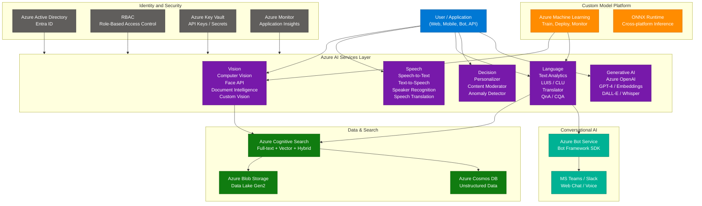

---

## 3. Key Components and Services

### 3.1 Azure AI Services (formerly Cognitive Services)

| Category | Service | Key Capability |
|---|---|---|
| **Vision** | Computer Vision | OCR, image description, object detection |
| **Vision** | Face API | Face detection, verification, emotion (access-gated) |
| **Vision** | Document Intelligence | Form extraction, invoice parsing, custom layouts |
| **Vision** | Custom Vision | Train custom image classifiers with your own data |
| **Speech** | Speech-to-Text (STT) | Real-time + batch transcription, 100+ languages |
| **Speech** | Text-to-Speech (TTS) | Neural voices, SSML, custom voice |
| **Speech** | Speech Translation | Real-time audio translation |
| **Speech** | Speaker Recognition | Verify or identify speakers by voice |
| **Language** | Text Analytics | Sentiment, key phrases, NER, opinion mining |
| **Language** | LUIS / CLU | Intent + entity extraction for NLU |
| **Language** | Azure Translator | 90+ language translation, transliteration, detection |
| **Language** | QnA Maker / CQA | FAQ knowledge base for bots |
| **Decision** | Personalizer | Real-time content ranking via reinforcement learning |
| **Decision** | Content Moderator | Text, image, video content moderation |
| **Decision** | Anomaly Detector | Time-series anomaly detection |

### 3.2 Supporting Services

| Service | Role in AI Solutions |
|---|---|
| Azure Machine Learning | Build and train custom models; MLOps pipelines |
| Azure Cognitive Search | Ingest, index, and query documents with AI enrichment |
| Azure Bot Service | Build and host conversational AI agents |
| Azure OpenAI Service | GPT-4, embeddings, DALL-E, Whisper via API |
| Azure Functions | Serverless event-driven AI processing |
| Azure Logic Apps | Orchestrate AI services in low-code workflows |

---

## 4. How It Works — Technical Deep Dive

### 4.1 AI-102 Solution Architecture — Data to Insight Pipeline

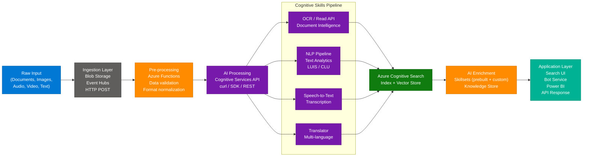

### 4.2 Azure Bot Service — Conversational Flow

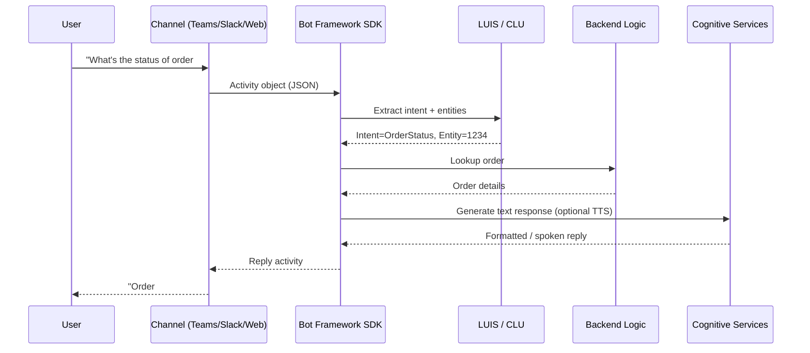

### 4.3 Computer Vision — Read API Workflow

The **Read API** (now part of Azure AI Vision) handles large-scale OCR asynchronously:

1. **POST** request to `/vision/v3.2/read/analyze` with image URL or binary
2. Response returns `Operation-Location` header with operation ID
3. **GET** poll on `Operation-Location` until status = `succeeded`
4. Parse result: `readResult.pages[].lines[].words[]` with bounding boxes

```python
import requests, time

endpoint = "https://<region>.api.cognitive.microsoft.com/"
key = "<your_key>"
image_url = "https://example.com/document.jpg"

# Step 1: Submit
r = requests.post(
    f"{endpoint}vision/v3.2/read/analyze",
    headers={"Ocp-Apim-Subscription-Key": key, "Content-Type": "application/json"},
    json={"url": image_url}
)
operation_url = r.headers["Operation-Location"]

# Step 2: Poll
while True:
    result = requests.get(operation_url, headers={"Ocp-Apim-Subscription-Key": key})
    data = result.json()
    if data["status"] == "succeeded":
        break
    time.sleep(1)

# Step 3: Parse
for page in data["analyzeResult"]["readResults"]:
    for line in page["lines"]:
        print(line["text"])
```

---

## 5. Classic vs New: Cognitive Services vs Azure AI Services

Microsoft rebranded and modernized Cognitive Services into **Azure AI Services** in 2023–2024. The transition matters for exam scenarios.

| Dimension | Classic Cognitive Services | Azure AI Services (Current) |
|---|---|---|
| **Brand name** | Azure Cognitive Services | Azure AI Services |
| **Endpoint pattern** | `*.cognitiveservices.azure.com` | Same (backward compatible) |
| **API version** | Mixed (v2, v3.0, v3.1) | v3.2+ with continuous updates |
| **Multi-service resource** | Supported (all-in-one key) | Still supported; recommended |
| **LUIS** | Active, standalone | Deprecated — replaced by CLU (Conversational Language Understanding) |
| **QnA Maker** | Standalone portal | Replaced by Custom Question Answering (CQA) in Language Studio |
| **Form Recognizer** | Separate resource | Renamed to Azure AI Document Intelligence |
| **Language Studio** | Available but limited | Unified authoring hub for all NLP tasks |
| **Content Safety** | Content Moderator only | Dedicated Azure AI Content Safety with prompt shields |
| **Pricing model** | Per-service pricing | Consolidated multi-service pricing |
| **Responsible AI** | Limited built-in | RAI dashboard, Content Filters, Transparency notes |

**Use the new model when:** Building new solutions — all new tooling, tutorials, and SDK samples target Azure AI Services.

**Use Classic Cognitive Services references when:** Maintaining legacy solutions or studying older AI-102 exam versions where LUIS and QnA Maker are still covered.

---

## 6. Azure Cognitive Search and AI Enrichment

### 6.1 Architecture

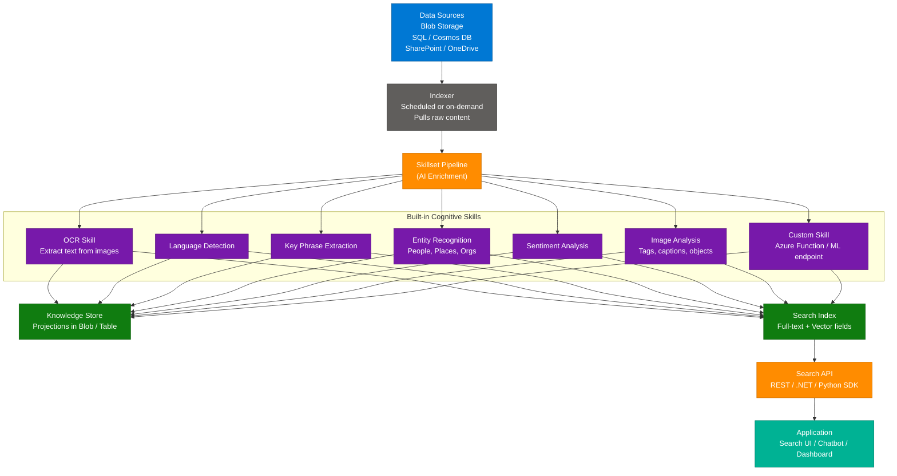

### 6.2 Core Concepts

| Concept | Description |
|---|---|
| **Index** | Schema-defined container for searchable documents |
| **Indexer** | Crawler that pulls content from a data source and feeds the pipeline |
| **Data Source** | Connection definition (Blob, SQL, Cosmos DB, etc.) |
| **Skillset** | Ordered list of cognitive enrichment skills applied during indexing |
| **Knowledge Store** | Persistent storage of enriched data as blobs or tables for downstream use |
| **Projections** | Defines how enriched data is structured in the Knowledge Store |
| **Semantic Ranking** | L2 re-ranking using language models to surface best matches |
| **Vector Search** | Embedding-based similarity search for semantic retrieval |
| **Hybrid Search** | Combines keyword (BM25) + vector (ANN) scoring via RRF fusion |

### 6.3 Challenge → Solution Table

| Challenge | How Cognitive Search Solves It |
|---|---|
| PDFs contain scanned images, not text | OCR skill extracts text from images during indexing |
| Documents in multiple languages | Language Detection → Translator skill chain |
| Need to find "meaning," not keywords | Vector Search on Azure OpenAI embeddings |
| Legal docs with entity extraction need | Named Entity Recognition skill tags people/orgs/places |
| Sales team needs ranked semantic results | Semantic Ranker with semantic configuration |
| Raw enriched data needed by analytics | Knowledge Store projections to Blob/Table |

---

## 7. Security and Governance

### 7.1 Authentication and Access Control

| Control | Details |
|---|---|
| **API Keys** | Two subscription keys per resource; rotate without downtime |
| **Azure Active Directory (Entra ID)** | Token-based auth via service principals or managed identities; preferred over keys |
| **Managed Identity** | System or user-assigned identity; no credential management needed |
| **RBAC Roles** | `Cognitive Services User`, `Cognitive Services Contributor`, `Reader` |
| **Private Endpoints** | Expose services only on VNET — no public internet access |
| **Network ACLs** | IP allowlists or VNET service endpoints to restrict traffic |
| **Azure Key Vault** | Store and rotate API keys, connection strings; reference in apps without hardcoding |

### 7.2 Responsible AI Framework

| Principle | Implementation in Azure AI |
|---|---|
| **Fairness** | Responsible AI dashboard in Azure ML; bias metrics |
| **Reliability** | Availability SLAs, health monitoring, redundant deployments |
| **Privacy** | Customer-managed keys (CMK), no data retention by default in most services |
| **Inclusiveness** | Accessibility features, multi-language support, alt-text via Vision |
| **Transparency** | Model cards, transparency notes published per service |
| **Accountability** | Azure Policy, audit logs via Azure Monitor / Log Analytics |

### 7.3 Content Safety and Moderation

| Service | Use Case |
|---|---|
| **Azure AI Content Safety** | Detect harmful content (hate, violence, sexual, self-harm) in text/images |
| **Content Moderator** | Legacy; being superseded by Content Safety |
| **Prompt Shields** | Protect against prompt injection attacks in GenAI apps |
| **Groundedness Detection** | Detect hallucinations in RAG responses |
| **Face API Access Gate** | Face Recognition requires approved use case (law enforcement restrictions) |

### 7.4 Compliance Standards Supported

- ISO 27001, ISO 27018
- SOC 1, SOC 2, SOC 3
- GDPR (EU data residency options)
- HIPAA BAA available
- FedRAMP (select regions)

---

## 8. Getting Started — Quickstart Guide

### Option 1: Azure Portal

1. Navigate to **Azure AI Services** → Create resource
2. Select service type (Language, Vision, Speech, or Multi-service)
3. Choose region, pricing tier (Free F0 for dev, Standard S0 for prod)
4. After deployment, go to **Keys and Endpoint**
5. Copy `KEY1` and `Endpoint URL`

### Option 2: Python SDK (Text Analytics)

```python
from azure.ai.textanalytics import TextAnalyticsClient
from azure.core.credentials import AzureKeyCredential

endpoint = "https://<your-resource>.cognitiveservices.azure.com/"
key = "<your_key>"

client = TextAnalyticsClient(endpoint=endpoint, credential=AzureKeyCredential(key))

documents = [
    "Azure Cognitive Services is amazing for AI development.",
    "This product has terrible support and crashes constantly."
]

# Sentiment Analysis
response = client.analyze_sentiment(documents)
for doc in response:
    print(f"Sentiment: {doc.sentiment}, Confidence: {doc.confidence_scores}")

# Key Phrase Extraction
kp_response = client.extract_key_phrases(documents)
for doc in kp_response:
    print(f"Key phrases: {doc.key_phrases}")

# Named Entity Recognition
ner_response = client.recognize_entities(documents)
for doc in ner_response:
    for entity in doc.entities:
        print(f"Entity: {entity.text}, Category: {entity.category}, Score: {entity.confidence_score:.2f}")
```

### Option 3: CLI Deployment

```bash
# Create a resource group
az group create --name rg-ai102 --location eastus

# Create multi-service Azure AI resource
az cognitiveservices account create \
  --name ai102-demo \
  --resource-group rg-ai102 \
  --kind CognitiveServices \
  --sku S0 \
  --location eastus \
  --yes

# Get the endpoint and keys
az cognitiveservices account show \
  --name ai102-demo \
  --resource-group rg-ai102 \
  --query "properties.endpoint"

az cognitiveservices account keys list \
  --name ai102-demo \
  --resource-group rg-ai102
```

### Option 4: LUIS / CLU Quickstart (Python)

```python
from azure.ai.language.conversations import ConversationAnalysisClient
from azure.core.credentials import AzureKeyCredential

client = ConversationAnalysisClient(
    endpoint="https://<your-resource>.cognitiveservices.azure.com/",
    credential=AzureKeyCredential("<key>")
)

with client:
    result = client.analyze_conversation(
        task={
            "kind": "Conversation",
            "analysisInput": {
                "conversationItem": {
                    "participantId": "user1",
                    "id": "1",
                    "modality": "text",
                    "language": "en-us",
                    "text": "Book me a flight to Seattle tomorrow"
                }
            },
            "parameters": {
                "projectName": "my-travel-project",
                "deploymentName": "production",
                "verbose": True
            }
        }
    )

intent = result["result"]["prediction"]["topIntent"]
entities = result["result"]["prediction"]["entities"]
print(f"Intent: {intent}")
for entity in entities:
    print(f"Entity: {entity['category']} = {entity['text']}")
```

### Learning Resources

| Type | Resource |
|---|---|
| **Docs** | [Azure AI Services documentation](https://learn.microsoft.com/en-us/azure/ai-services/) |
| **Exam** | [AI-102 Exam Study Guide](https://learn.microsoft.com/en-us/credentials/certifications/exams/ai-102/) |
| **Learning Path** | [Microsoft Learn: Azure AI Engineer](https://learn.microsoft.com/en-us/training/paths/prepare-for-ai-engineering/) |
| **Code Samples** | [Azure-Samples on GitHub](https://github.com/Azure-Samples) |
| **Language Studio** | [language.cognitive.azure.com](https://language.cognitive.azure.com) |
| **Vision Studio** | [vision.cognitive.azure.com](https://vision.cognitive.azure.com) |
| **Speech Studio** | [speech.microsoft.com](https://speech.microsoft.com) |

---

## 9. Top 25 Interview Q&A — Source + Enriched Answers

**Q1: What is the AI-102 certification, and who is it for?**
> The **AI-102: Designing and Implementing an Azure AI Solution** certification validates skills in building production-grade AI applications using Azure services. It is designed for AI Engineers, data scientists, and developers responsible for consuming Azure Cognitive / AI Services, training custom models, building conversational agents with Bot Framework, and creating intelligent search solutions. Unlike the data-focused DP-100, AI-102 focuses on the application layer — integrating prebuilt AI APIs, securing them, and optimizing them for real workloads.

**Q2: Which Azure services are most commonly used in AI solutions?**
> - **Azure AI Services**: Prebuilt APIs for Vision, Speech, Language, and Decision capabilities
> - **Azure Machine Learning**: For training and deploying custom ML models with MLOps
> - **Azure Bot Service**: For building and hosting conversational agents across channels
> - **Azure Cognitive Search**: AI-powered full-text and vector search with enrichment pipelines
> - **Azure OpenAI Service**: For GPT-4, embeddings, DALL-E — critical for GenAI applications
> - **Azure Data Lake / Blob Storage**: Raw data storage for batch AI processing
> - **Azure Functions / Logic Apps**: Serverless orchestration of AI workflows

**Q3: What is Azure Cognitive Services?**
> Azure Cognitive Services (now rebranded as **Azure AI Services**) is a portfolio of prebuilt AI REST APIs and SDKs that let developers add intelligent features to applications without training models from scratch. The four pillars are: **Vision** (OCR, image analysis, face detection), **Speech** (STT, TTS, translation, speaker recognition), **Language** (sentiment, NER, translation, intent understanding), and **Decision** (personalizer, anomaly detector, content moderator). All services share a unified endpoint pattern and support both per-service and multi-service resource deployments.

**Q4: What are the components of Azure Cognitive Services?**
> Grouped into four major categories:
> - **Vision**: Computer Vision (OCR, tags, captions), Face API (detection, verification), Azure AI Document Intelligence (Form Recognizer), Custom Vision (custom classifiers/detectors)
> - **Speech**: Speech-to-Text (batch/real-time), Text-to-Speech (neural voices), Speech Translation (real-time), Speaker Recognition (identification/verification)
> - **Language**: Text Analytics (sentiment, NER, key phrases), LUIS/CLU (intent + entity for NLU), Translator (90+ languages), Custom Question Answering (FAQ bots)
> - **Decision**: Personalizer (RL-based content ranking), Content Moderator (text/image/video safety), Anomaly Detector (time-series outlier detection)

**Q5: What is Azure Bot Service and where is it used?**
> Azure Bot Service provides a managed cloud hosting environment for conversational agents built with the **Bot Framework SDK** (C#, Python, JavaScript). It supports integration with 10+ channels — Microsoft Teams, Slack, WhatsApp, Facebook Messenger, Twilio, and web chat. Internally, a bot processes **Activities** (message, conversationUpdate, event) and uses **Dialogs** for multi-turn conversation flows. LUIS or CLU provides NLU (intent + entity extraction), while QnA Maker / CQA handles FAQ responses. Azure Bot Service handles authentication, scaling, and channel routing automatically.

**Q6: What is the purpose of the AI-102 certification in the Azure ecosystem?**
> AI-102 certifies that a professional can build end-to-end AI solutions on Azure — from consuming prebuilt Cognitive/AI Service APIs to deploying custom ML models, securing resources with Entra ID and RBAC, and building search and conversational solutions. It positions holders as bridge engineers between data scientists (who build models) and software engineers (who build apps), ensuring they can deploy AI responsibly, cost-effectively, and at scale. In the GenAI era, AI-102 now also covers Azure OpenAI, RAG patterns, and responsible AI controls.

**Q7: How does Azure Form Recognizer (Document Intelligence) help automate document processing?**
> Azure AI Document Intelligence (formerly Form Recognizer) uses computer vision and NLP to extract structured data from unstructured documents. **Prebuilt models** handle invoices, receipts, ID documents, W-2 forms, and business cards out of the box. **Custom models** can be trained on 5–50 labelled examples using Document Intelligence Studio. **Composed models** combine multiple custom models to handle varied document types. Output includes: key-value pairs, tables, bounding boxes, confidence scores, and selection marks (checkboxes). Integration via REST API or `azure-ai-formrecognizer` Python SDK.

**Q8: What is the difference between Azure Cognitive Services and Azure Machine Learning?**

| Feature | Azure Cognitive / AI Services | Azure Machine Learning |
|---|---|---|
| **Purpose** | Consume prebuilt AI capabilities | Build, train, and deploy custom models |
| **Technical Skill** | Low — REST calls and SDKs | High — Python, ML frameworks (PyTorch, TF) |
| **Training Required** | None (or minimal for custom variants) | Yes — data prep, feature engineering, training |
| **Latency** | ~100–500ms per API call | Varies — real-time inference or batch |
| **Cost Model** | Per-transaction pricing | Compute + storage costs |
| **Use Case** | Rapid integration of AI features | Unique domain-specific prediction tasks |
| **Customization** | Limited (Custom Vision, Custom Speech) | Full control over architecture and data |

**Q9: What is LUIS and how has it evolved?**
> **LUIS (Language Understanding Intelligent Service)** was Azure's standalone NLU service for identifying **intents** (what the user wants) and **entities** (key data in the utterance). Developers trained it by providing utterance examples per intent. It is now **deprecated** in favor of **CLU (Conversational Language Understanding)** in Azure AI Language, which offers: improved multi-lingual support, entity overlap handling, none-intent improvements, and unified authoring via Language Studio. For new projects, always use CLU. LUIS authoring portals are being retired.

**Q10: What is CLU (Conversational Language Understanding) and why is it important?**
> CLU is the modern successor to LUIS within **Azure AI Language**. It enables applications to understand natural-language user input by predicting the top **intent** and extracting typed **entities**. Key improvements over LUIS: supports learned and list entities with overlap, handles language auto-detection, integrates with orchestration workflows, and is built on transformer-based models. CLU projects are managed in Language Studio and deployed via the Conversations API — same endpoint as other Azure AI Language tasks.

**Q11: What are the benefits of using Azure AI Services in AI development?**
> 1. **Speed to market**: Prebuilt models eliminate months of training for common AI tasks
> 2. **No ML expertise required**: REST API and SDK wrappers mean any developer can add AI
> 3. **Global scale**: Microsoft's global infrastructure ensures low-latency responses in 50+ regions
> 4. **Continuous improvement**: Models are updated by Microsoft without breaking existing API contracts
> 5. **Security-first**: Entra ID, RBAC, private endpoints, CMK, and compliance certifications built in
> 6. **Unified billing**: Multi-service resources consolidate spend across Vision, Speech, and Language
> 7. **Responsible AI**: Content Safety, transparency notes, and fairness tooling included

**Q12: How does Azure Bot Service enhance conversational AI?**
> Azure Bot Service abstracts the channel complexity out of bot development. A single bot codebase can serve Teams, Slack, WhatsApp, web, and voice with no code changes — the service handles channel adapters. It integrates natively with **CLU** for intent understanding, **CQA** for FAQ responses, **Speech Services** for voice bots, and **Azure OpenAI** for generative responses. The Bot Framework SDK provides Dialogs (waterfall, component, adaptive), state management (user/conversation state in Cosmos DB or Blob), and middleware for logging and tracing. **Copilot Studio** (Power Virtual Agents) offers a low-code alternative built on the same infrastructure.

**Q13: Explain the steps to use the Computer Vision Read API.**
> The Read API performs asynchronous OCR on images and PDFs:
> 1. **POST** to `/computervision/imageanalysis:analyze?api-version=2023-02-01-preview&features=read` (v4) or `/vision/v3.2/read/analyze` (v3.2)
> 2. Response: HTTP 202 with `Operation-Location` header containing the operation polling URL
> 3. **GET** the operation URL every 1–2 seconds until `status == "succeeded"` or `"failed"`
> 4. Parse `analyzeResult.readResults[].lines[].words[]` for words with bounding polygons
> 5. Use the bounding box data to reconstruct table structures or paragraph layouts

**Q14: What is Azure Translator and how does it work?**
> Azure Translator is a neural machine translation service supporting **90+ language pairs**. It works via a REST API — submit text as JSON and receive translated output, with optional auto language detection, transliteration, and dictionary lookup. It uses **transformer-based NMT models** fine-tuned on billions of document pairs. The **Custom Translator** feature allows fine-tuning on domain-specific terminology (legal, medical, technical) using aligned parallel corpora. Common use cases: multilingual chatbots, document translation portals, real-time subtitle generation, localization pipelines.

**Q15: What is the difference between Text Analytics and LUIS?**

| Feature | Text Analytics (Azure AI Language) | LUIS / CLU |
|---|---|---|
| **Goal** | Mine insight from text (sentiment, NER, key phrases) | Understand user intent and extract entities for NLU |
| **Training** | No training — prebuilt models | Requires training on your intent/utterance examples |
| **Customization** | Custom NER (fine-tune entity extraction) | Full custom model — intents, entities, ML |
| **Output** | Sentiment score, categories, entities, key phrases | Top intent + confidence + entity list |
| **Use Case** | Analyze support tickets, feedback, documents | Build chatbots, voice assistants, command interfaces |
| **Authoring** | Language Studio (analyze tab) | Language Studio (CLU / conversations tab) |

**Q16: What is the Speech Service in Azure and what does it offer?**
> Azure AI Speech provides four core capabilities:
> - **Speech-to-Text (STT)**: Real-time streaming transcription and batch offline transcription. Supports 100+ locales, custom acoustic/language models via Custom Speech.
> - **Text-to-Speech (TTS)**: Neural voice synthesis with SSML control over rate, pitch, pauses, and prosody. Supports 400+ voices across 140+ languages. Custom Neural Voice for branded voices.
> - **Speech Translation**: Real-time audio translation pipeline (STT → MT → TTS in one API call).
> - **Speaker Recognition**: Identifies or verifies a speaker from audio using voice biometrics (requires enrollment).

**Q17: What is the role of Azure Cognitive Search in AI solutions?**
> Azure Cognitive Search serves as the **intelligent retrieval layer** in AI solutions. It indexes content from diverse sources, applies AI enrichment during indexing (via Skillsets), and provides querying capabilities including full-text search (BM25), faceted navigation, geo-filtering, semantic ranking, and vector search. In RAG (Retrieval-Augmented Generation) architectures, Cognitive Search retrieves context chunks that are injected into GPT-4 prompts. Hybrid search (keyword + vector) with Reciprocal Rank Fusion (RRF) typically outperforms either alone.

**Q18: What is the difference between Speech-to-Text and Text-to-Speech?**
> - **Speech-to-Text (ASR — Automatic Speech Recognition)**: Converts spoken audio (microphone, file) into written text. Use cases: meeting transcription, voice command interfaces, call center analytics, live captioning. Supports real-time streaming and batch modes.
> - **Text-to-Speech (TTS — Speech Synthesis)**: Converts written text into audio waveforms using neural voices. SSML (Speech Synthesis Markup Language) controls prosody, emphasis, pauses, and voice selection. Use cases: accessibility tools, voice assistants, audiobook generation, IVR systems.
> Both services are part of Azure AI Speech and share the same SDK (`azure-cognitiveservices-speech`).

**Q19: What are Skillsets in Azure Cognitive Search?**
> A **Skillset** is an ordered pipeline of AI skills applied to content during indexing. Each skill consumes input fields and produces enriched output fields that flow into the search index or Knowledge Store. Types of skills:
> - **Built-in cognitive skills**: OCR, Language Detection, Key Phrase Extraction, Entity Recognition, Sentiment Analysis, Image Analysis, Translation, PII Detection
> - **Custom skills**: Azure Function or REST endpoint — allows any custom processing (ML model inference, regex, lookup tables)
> - **Azure ML skills**: Invoke an Azure ML endpoint directly from the skillset
> Skills chain together — OCR output (text) flows into Language Detection, which feeds Key Phrase Extraction.

**Q20: What is the difference between Custom Vision and Computer Vision APIs?**

| Feature | Custom Vision | Computer Vision (Azure AI Vision) |
|---|---|---|
| **Training** | Train on your own labelled images | Prebuilt — no training needed |
| **Use Case** | Brand logo detection, defect classification, specialized objects | General OCR, image description, object detection, face attributes |
| **Minimum Data** | 15–50 images per class | None |
| **Output** | Class label + confidence | Rich JSON: tags, captions, text, objects, colors |
| **Customizable** | Yes — iterative retraining | No (except via Azure ML) |
| **Deployment** | Export to ONNX, TensorFlow Lite, CoreML | Always cloud-hosted API |
| **Latency** | Standard or compact (edge) | Cloud API latency |

**Q21: How do you secure AI services in Azure?**
> **Identity layer**: Use Managed Identity or service principal (Entra ID) for zero-credential access. Avoid embedding API keys in code — store in Azure Key Vault.
> **Network layer**: Enable Private Endpoints to restrict service access to a VNET. Use Network ACLs to allowlist specific IP ranges or subnets.
> **Access layer**: Assign least-privilege RBAC roles — `Cognitive Services User` for inference calls, `Cognitive Services Contributor` for management operations.
> **Audit layer**: Enable Diagnostic Logs via Azure Monitor → Log Analytics. Set up alerts on unusual API call volumes or authentication failures.
> **Compliance layer**: Enable Customer-Managed Keys (CMK) for data at rest. Verify service compliance notes for GDPR, HIPAA, and regional data residency requirements.

**Q22: What is the use of Azure Machine Learning in AI-102 scenarios?**
> Azure ML is used when prebuilt AI Services don't meet business needs — e.g., training a domain-specific text classifier on proprietary data, or fine-tuning an image detection model. In AI-102 context: **AML pipelines** preprocess data and feed outputs to Cognitive Services indexers; **AML endpoints** serve custom models called as **Custom Skills** from Cognitive Search Skillsets; **AML for MLOps** handles model versioning, A/B deployments, and monitoring. The distinction: Cognitive Services = prebuilt consumption; AML = custom model lifecycle.

**Q23: What security features protect Azure AI services?**
> - **Authentication**: API keys (primary/secondary), Entra ID tokens, Managed Identity
> - **Authorization**: RBAC with fine-grained roles; `Cognitive Services User` vs `Contributor` vs `Owner`
> - **Network**: Private Endpoints, Service Endpoints, IP firewall rules, Trusted Services bypass
> - **Data**: No training data retained by default; CMK for encryption at rest; TLS 1.2+ in transit
> - **Content**: Azure AI Content Safety for prompt/response filtering; Prompt Shields for injection protection
> - **Compliance**: GDPR, ISO 27001/27018, SOC 2, HIPAA BAA, FedRAMP Moderate (select services/regions)
> - **Audit**: Azure Monitor, Log Analytics, Azure Policy for governance guardrails

**Q24: How does Azure AI ensure scalability and reliability?**
> - **Multi-region deployment**: Services available in 50+ Azure regions; deploy resources close to users to minimize latency
> - **SLA**: 99.9% uptime SLA for Standard tier; higher with paired regions and zone-redundant deployments
> - **Load balancing**: Azure Traffic Manager or API Management distributes requests across regional endpoints
> - **Autoscaling**: Azure Functions / Logic Apps + Event Hubs for event-driven, elastic AI pipelines
> - **Throttling and quotas**: Adjustable TPS (transactions per second) limits per tier; burst handling with retry-after headers
> - **AKS hosting**: Custom model containers hosted on AKS with HPA (Horizontal Pod Autoscaler) for throughput spikes
> - **Circuit breakers**: Implement with Polly (C#) or Tenacity (Python) to handle transient faults gracefully

**Q25: What is AI enrichment in Azure Cognitive Search and how does it work?**
> AI enrichment is the process of using **cognitive skills** to transform raw, unstructured content into structured, searchable metadata during the indexing pipeline. When an indexer runs, it passes each document through the Skillset. Skills analyze text and images — extracting entities, detecting language, running OCR on embedded images, and calling custom ML endpoints. The enriched fields are projected into two targets: the **Search Index** (for queryable fields like extracted names, sentiment, key phrases) and the **Knowledge Store** (persisted enriched data in Blob or Table Storage for analytics and downstream apps). AI enrichment powers scenarios like enterprise search over PDFs, compliance document mining, and hybrid RAG retrieval.

---

*Sources: [iq.iteanz.com — Top 25 AI-102 Interview Questions](https://iq.iteanz.com/top-25-interview-questions-with-answers-for-ai-102t00-develop-ai-solutions-in-azure-training) | Enriched with Azure AI Services documentation, official exam guide, and domain knowledge. Last Updated: July 2026*

---

# Part B — Exam Practice (60 Domain Questions)

## 1. Exam Overview

The **AI-102: Designing and Implementing a Microsoft Azure AI Solution** exam validates skills for building AI-powered applications using Azure Cognitive Services, Azure AI Foundry, and related services. It is required for the **Microsoft Certified: Azure AI Engineer Associate** certification.

### Exam Domain Weights

| Domain | Topic | Weight |
|---|---|---|
| 1 | Plan and manage an Azure AI solution | 15–20% |
| 2 | Implement computer vision solutions | 15–20% |
| 3 | Implement natural language processing solutions | 30–35% |
| 4 | Implement knowledge mining and document intelligence | 10–15% |
| 5 | Implement generative AI solutions | 10–15% |

### AI-102 Services Coverage Map

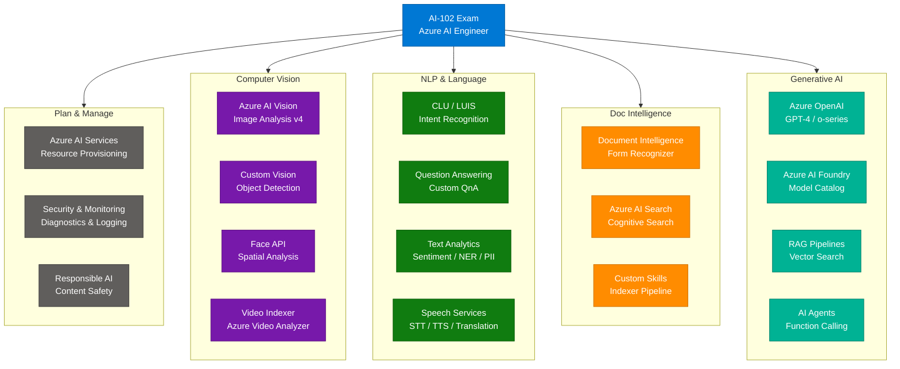

---

## 2. Domain 1 — Plan & Manage (Q1–Q8)

### Architecture: Provisioning & Security Flow

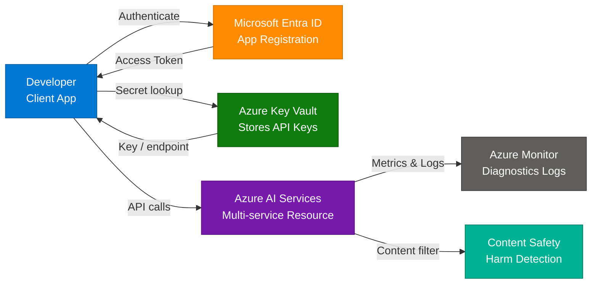

---

**Q1.** Contoso wants to provision a single resource that grants access to Azure AI Vision, Language, and Speech services under one endpoint and key. Which resource type should they create?

> **A) Azure AI Services (multi-service resource)**
> B) Individual Cognitive Services resources per service
> C) Azure Machine Learning workspace
> D) Azure AI Foundry hub

**Answer: A**
The **Azure AI Services multi-service resource** (formerly "Cognitive Services") provides a single endpoint and key that grants access to multiple AI services including Vision, Language, Speech, and Decision APIs. Individual resources give per-service isolation but require separate keys and endpoints.

---

**Q2.** A developer needs to authenticate calls to Azure AI Services without storing API keys in code. What is the recommended approach?

> A) Hardcode the key in environment variables on the server
> B) Store keys in Azure Blob Storage
> **C) Use a Managed Identity and retrieve secrets from Azure Key Vault**
> D) Pass the key as a query parameter in the URL

**Answer: C**
**Managed Identity** eliminates the need to manage credentials. The app authenticates to Azure Key Vault using its managed identity, retrieves the AI Services key, and uses it at runtime. This follows the zero-secrets principle for production workloads.

---

**Q3.** Which Azure service should you configure to receive alerts when Azure AI Services API call volume exceeds a threshold?

> A) Azure Service Bus
> **B) Azure Monitor with Metric Alerts**
> C) Azure Event Grid
> D) Azure Log Analytics only

**Answer: B**
**Azure Monitor Metric Alerts** fire when a metric (e.g., `TotalCalls`, `TotalErrors`, latency) crosses a defined threshold. You configure alert rules on the AI Services resource metrics namespace and route to Action Groups (email, webhook, SMS).

---

**Q4.** Contoso's AI solution must comply with GDPR and ensure no customer data is stored by Azure AI Services beyond the processing call. Which configuration ensures this?

> A) Enable Customer-Managed Keys (CMK)
> **B) Disable "Abuse Monitoring" storage in the Azure OpenAI resource settings**
> C) Enable Private Endpoints
> D) Use a consumption-tier resource

**Answer: B**
For **Azure OpenAI**, by default Microsoft may log a portion of prompts/completions for abuse monitoring. Opting out (available to approved customers) prevents storage of input/output content beyond the immediate processing window, supporting GDPR data minimization requirements.

---

**Q5.** A company wants to restrict Azure AI Services API calls to only originate from their VNet. What should they configure?

> A) Azure Firewall rules on the subscription
> **B) Network access rules on the Azure AI Services resource (VNet integration + deny public access)**
> C) An API Management policy
> D) Azure DDoS Protection Standard

**Answer: B**
Azure AI Services resources support **Virtual Network service endpoints** and **Private Link**. Setting the public network access to "Disabled" and adding VNet/subnet exceptions restricts inbound API calls to approved private network paths only.

---

**Q6.** Which Responsible AI principle is primarily addressed by Azure AI Content Safety's harm detection categories (Hate, Violence, Sexual, Self-Harm)?

> A) Reliability & Safety
> **B) Safety (preventing harmful outputs) and Fairness**
> C) Transparency
> D) Inclusiveness

**Answer: B**
**Azure AI Content Safety** enforces two core Responsible AI principles: **Safety** (blocking violent, hateful, or dangerous content) and **Fairness** (reducing biased outputs targeting groups). Content is scored 0–7 per category; action is taken based on configured severity thresholds.

---

**Q7.** What is the purpose of a "commitment tier" plan in Azure AI Services?

> A) Locks the resource to a single region
> B) Provides higher SLA guarantees
> **C) Offers discounted pricing for a pre-committed monthly call volume**
> D) Enables GPU-accelerated inference

**Answer: C**
**Commitment tier (Provisioned)** pricing lets customers pre-purchase a defined number of units per month at a discounted rate compared to pay-as-you-go. It's suitable for workloads with predictable, high-volume API usage patterns.

---

**Q8.** Contoso's HR team wants to deploy an AI chatbot that must NOT answer questions outside its configured knowledge base. Which Azure service best enforces this containment?

> A) Azure OpenAI with no system prompt
> B) Azure Bot Service with default routing
> **C) Azure AI Language — Custom Question Answering with a "No answer" confidence threshold**
> D) Azure Cognitive Search standalone

**Answer: C**
**Custom Question Answering** (successor to QnA Maker) has a **confidence score threshold** — if no answer meets the minimum score, it returns a configured fallback message ("I don't know") rather than hallucinating an answer. This strictly contains the bot to its knowledge base.

---

## 3. Domain 2 — Computer Vision (Q9–Q16)

### Vision Pipeline Architecture

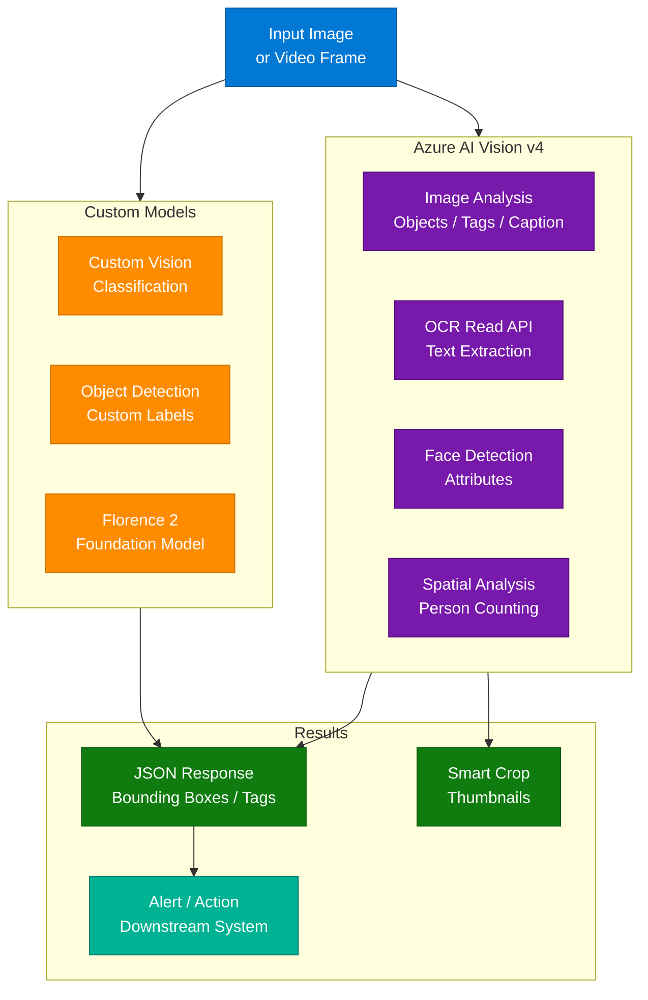

---

**Q9.** Contoso's manufacturing plant needs to count the number of people in a restricted area using live camera feeds. Which Azure AI Vision feature should they use?

> A) Image Analysis — Object Detection
> B) Custom Vision — Classification
> **C) Spatial Analysis — Person Count zone**
> D) Face API — Identification

**Answer: C**
**Azure AI Vision Spatial Analysis** (part of Vision Studio) analyzes live video streams to detect and count people within defined polygon zones. It supports `PersonCount`, `PersonCrossingLine`, and `PersonZoneDwell` operations without storing identifiable facial data.

---

**Q10.** A developer calls the Azure AI Vision Image Analysis v4 API and receives bounding box coordinates for detected objects. Which coordinate format does the API return?

> A) Normalized (0.0–1.0) relative coordinates
> **B) Pixel-based absolute coordinates: top, left, width, height**
> C) Percentage of image dimensions
> D) Center-point x,y with radius

**Answer: B**
Image Analysis v4 returns bounding boxes as `{"topY": int, "leftX": int, "height": int, "width": int}` in **absolute pixel coordinates** relative to the image dimensions. Developers must scale these if the image was resized before display.

---

**Q11.** When should you choose **Custom Vision** over the standard Azure AI Vision Image Analysis API?

> A) When you need basic object detection on common items
> **B) When the domain-specific objects are not in the pre-trained model's taxonomy**
> C) When latency must be under 100ms
> D) When processing more than 10 images per second

**Answer: B**
**Custom Vision** is for narrow, domain-specific classification or detection tasks where the pre-built Azure AI Vision model doesn't recognize the objects (e.g., proprietary machine parts, medical devices, niche products). You supply labeled training images and Custom Vision fine-tunes a model for your specific taxonomy.

---

**Q12.** A Contoso application extracts text from scanned PDF invoices. The PDFs can be up to 2,000 pages. Which API should they use?

> A) Image Analysis — Caption feature
> B) Cognitive Services — Computer Vision OCR (legacy)
> **C) Azure AI Vision — Read API (async operation)**
> D) Document Intelligence — Layout model

**Answer: C (or D — both are valid; D is preferred for structured extraction)**
The **Read API** (now part of Azure AI Vision) handles large, multi-page PDFs asynchronously. For structured invoice extraction with field-level understanding, **Document Intelligence Layout / Invoice model** (answer D) is the better choice, but Read API is the correct choice within the Vision domain.

---

**Q13.** Which Azure AI Vision feature generates a human-readable description of an image's content in a natural language sentence?

> A) Tag generation
> **B) Dense Captions / Image Caption (Image Analysis v4)**
> C) Smart Crop
> D) Background Removal

**Answer: B**
**Image Captions** (v4: `description` feature; also `denseCaptions` for multiple region-level captions) uses the Florence foundation model to produce natural-language sentences describing image content. `denseCaptions` returns captions for the whole image plus sub-regions with bounding boxes.

---

**Q14.** Contoso wants to detect product logos in user-uploaded images. Their catalog has 50 unique logos. What is the best approach?

> A) Azure AI Vision built-in brand detection
> **B) Custom Vision — Object Detection project trained on 50 logo classes**
> C) Azure AI Search — Image vectorization
> D) Azure OpenAI GPT-4V with zero-shot prompting

**Answer: B**
The built-in **Brand Detection** in Azure AI Vision covers only well-known global brands. For a proprietary 50-logo catalog, **Custom Vision Object Detection** lets you label bounding boxes around each logo class and train a model. Minimum ~15 images per class is recommended; 50+ per class yields production quality.

---

**Q15.** What is the minimum number of training images per tag recommended in Custom Vision for acceptable classification accuracy?

> A) 5 images per tag
> **B) 50 images per tag**
> C) 100 images per tag
> D) 500 images per tag

**Answer: B**
Microsoft recommends **at least 50 images per tag** for acceptable accuracy in Custom Vision classification, with 100+ for high confidence. Images should have varied lighting, angles, and backgrounds to improve generalization. The minimum to start training is 15, but quality suffers below 50.

---

**Q16.** A video indexer job extracts keywords, transcripts, and named entities from uploaded videos. Which Azure service provides this capability?

> A) Azure Media Services alone
> **B) Azure Video Indexer (part of Azure AI Video)**
> C) Azure AI Vision Spatial Analysis
> D) Azure Cognitive Search Video skill

**Answer: B**
**Azure Video Indexer** (now under Azure AI Video) extracts rich metadata from video: transcripts (multi-language), speaker diarization, scene detection, OCR on screen text, named entities, topics, keywords, and emotion labels — all via a single REST API call or the Video Indexer portal.

---

## 4. Domain 3 — NLP & Language (Q17–Q26)

### NLP Service Selection Decision Tree

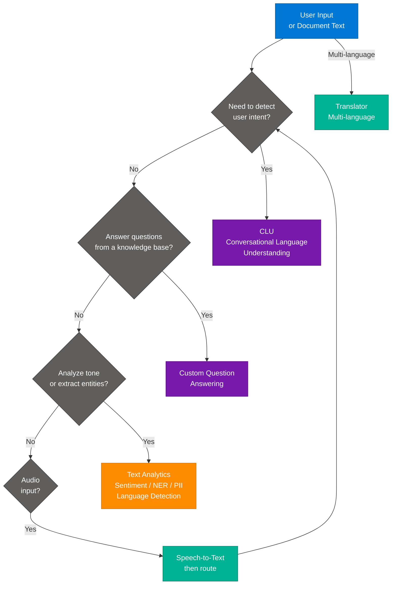

---

**Q17.** Contoso Finance builds a chatbot where users say things like "What is my account balance?" and "Transfer $500 to savings." Which Azure AI Language feature should handle intent and entity extraction?

> A) Text Analytics — Named Entity Recognition
> **B) Conversational Language Understanding (CLU)**
> C) Custom Question Answering
> D) Azure OpenAI function calling only

**Answer: B**
**CLU (Conversational Language Understanding)** is the successor to LUIS. It handles multi-turn conversations, extracts **intents** (e.g., `CheckBalance`, `TransferFunds`) and **entities** (e.g., amount=500, destination=savings) from user utterances. It's purpose-built for dialog systems where structured intent extraction is needed.

---

**Q18.** What is the key difference between **Sentiment Analysis** and **Opinion Mining** in Azure AI Language?

> A) Sentiment Analysis supports more languages
> B) Opinion Mining works only on reviews
> **C) Opinion Mining identifies the target aspect (e.g., "food") tied to the sentiment, while Sentiment Analysis gives a document-level score**
> D) They are identical features with different names

**Answer: C**
**Sentiment Analysis** returns document-level and sentence-level sentiment (Positive/Negative/Neutral with confidence scores). **Opinion Mining** (aspect-based sentiment) additionally identifies *what* the sentiment is about — e.g., "The *food* was great but the *service* was slow" returns two aspect-sentiment pairs rather than one blended score.

---

**Q19.** Contoso Legal needs to automatically redact personally identifiable information (PII) from contract documents before archiving. Which Azure AI Language feature handles this?

> A) Named Entity Recognition (NER) only
> B) Key Phrase Extraction
> **C) PII Entity Recognition with redaction**
> D) Entity Linking

**Answer: C**
**PII Entity Recognition** detects and categorizes PII (names, addresses, SSNs, phone numbers, credit card numbers) and returns both detected spans and a `redactedText` field where PII is replaced with `*` characters. It supports document-level and conversation-level (PHI) PII detection.

---

**Q20.** A user asks a bot: "Who is the CEO of Microsoft?" The answer is in a PDF knowledge base uploaded to Azure AI Language. Which feature should answer this?

> A) CLU — Intent classification
> **B) Custom Question Answering — GenerateAnswer API**
> C) Text Analytics — Key Phrase Extraction
> D) Azure Cognitive Search — Full text search only

**Answer: B**
**Custom Question Answering** (successor to QnA Maker) builds a knowledge base from unstructured documents (PDFs, URLs, FAQ pages) and answers natural language questions using semantic ranking. The `GenerateAnswer` API returns the answer + confidence score + source document reference.

---

**Q21.** Which Azure AI Language feature links detected entities in text to their Wikipedia or Bing Knowledge Graph entry, disambiguating between "Apple" (company) and "Apple" (fruit)?

> A) Named Entity Recognition
> **B) Entity Linking**
> C) Key Phrase Extraction
> D) Text Classification

**Answer: B**
**Entity Linking** resolves ambiguity by linking recognized entities to their canonical entry in a knowledge base (Wikipedia or Bing). "Apple" in a tech context links to the Apple Inc. Wikipedia page; in a recipe context, to the Malus domestica article. Each link includes a confidence score and a `url` field.

---

**Q22.** Contoso Customer Service has 500,000 support tickets. They want to automatically categorize each ticket into one of 20 predefined product categories without labeling all 500K tickets. Which approach is most efficient?

> A) Train a Custom Text Classification model on all 500K tickets
> **B) Use Custom Text Classification with a representative labeled sample (500–5,000 tickets) and train a multi-label classifier**
> C) Use Key Phrase Extraction and manually map phrases to categories
> D) Deploy Azure OpenAI zero-shot classification for each ticket

**Answer: B**
**Custom Text Classification** (single-label or multi-label) requires only a representative labeled dataset — typically 50–200 examples per category is sufficient to achieve strong accuracy. Training a smaller labeled set is far more efficient than labeling 500K items. The model then classifies the remaining tickets at inference time.

---

**Q23.** What language feature should you use to automatically detect which language a document is written in before routing it to language-specific processing?

> A) CLU — Language detection intent
> **B) Text Analytics — Language Detection**
> C) Translator — Auto-detect source
> D) Speech — Language identification

**Answer: B**
**Language Detection** (part of Azure AI Language / Text Analytics) returns the ISO 639-1 language code and a confidence score for input text. It supports 120+ languages. This is typically used as the first step in an NLP pipeline to route text to the appropriate language-specific model or translation service.

---

**Q24.** A Contoso HR chatbot needs to understand user utterances across English, French, and Spanish without training three separate models. How does CLU support this?

> A) Train separate projects for each language and use an API gateway
> **B) CLU supports multilingual projects — train in one language and the model generalizes to others**
> C) Use Azure Translator before passing to CLU
> D) This is not supported in CLU

**Answer: B**
**CLU Multilingual Projects** leverage cross-lingual transfer learning. You train primarily in one language (typically English) and the model generalizes to 100+ supported languages. You can add language-specific utterances to boost accuracy for specific locales without maintaining separate projects.

---

**Q25.** Which Text Analytics sub-feature extracts the most important phrases from a document to summarize its topics without full abstractive summarization?

> A) Sentiment Analysis
> B) Named Entity Recognition
> **C) Key Phrase Extraction**
> D) Summarization (Extractive)

**Answer: C**
**Key Phrase Extraction** returns a list of the most semantically significant phrases in a document (noun phrases and verb phrases). It is lighter-weight than full **Extractive Summarization** (which selects complete sentences). Use Key Phrase Extraction for tagging, search indexing, and topic modeling.

---

**Q26.** Contoso wants to convert Spanish customer voice calls to English text for analysis. Which combination of Azure AI services handles this end-to-end?

> A) Speech Translation API only
> **B) Azure AI Speech — Speech Translation (STT + Translation combined) OR Speech-to-Text → Azure Translator**
> C) Azure Video Indexer
> D) Azure OpenAI Whisper model only

**Answer: B**
**Azure AI Speech Translation** performs speech-to-text and translation in a single streaming pass using the `TranslationRecognizer` SDK class — ideal for real-time call transcription. Alternatively, `SpeechRecognizer` (STT in Spanish) → `Translator` API is a two-step pipeline suitable for batch scenarios.

---

## 5. Domain 4 — Document Intelligence & Knowledge Mining (Q27–Q34)

### Document Intelligence + Search Pipeline

```mermaid
flowchart LR
    Docs["Documents\nPDF / TIFF / JPEG"]
    DI["Azure Document Intelligence\nForm Recognizer"]
    Fields["Extracted Fields\nKey-Value Pairs"]
    AIS["Azure AI Search\nIndexer + Skillset"]
    Skills["Built-in Skills\nOCR / NER / KeyPhrase\nCustom Skills"]
    Idx["Search Index\nInverted + Vector"]
    App["Search App\nor Chatbot RAG"]

    Docs --> DI
    DI --> Fields
    Fields --> AIS
    Docs --> AIS
    AIS --> Skills
    Skills --> Idx
    Idx --> App

    classDef userNode    fill:#0078D4,stroke:#005A9E,color:#fff
    classDef aiNode      fill:#7719AA,stroke:#5A0E80,color:#fff
    classDef dataNode    fill:#107C10,stroke:#0A5C0A,color:#fff
    classDef processNode fill:#FF8C00,stroke:#CC7000,color:#fff
    classDef outputNode  fill:#00B294,stroke:#007D68,color:#fff

    class Docs userNode
    class DI aiNode
    class Fields processNode
    class AIS,Skills processNode
    class Idx dataNode
    class App outputNode
```

---

**Q27.** Contoso Finance processes 10,000 invoices monthly. Each invoice has vendor name, invoice date, line items, and total amount. Which Azure Document Intelligence model should they use?

> A) Document Intelligence — Layout model
> B) Document Intelligence — General document model
> **C) Document Intelligence — Prebuilt Invoice model**
> D) Custom Neural model

**Answer: C**
The **Prebuilt Invoice model** is pre-trained on thousands of real invoice formats and extracts specific fields: `VendorName`, `InvoiceDate`, `InvoiceTotal`, `Items` (table), `PurchaseOrder`, etc. — with high accuracy out of the box. The Layout model extracts structure (tables, paragraphs) but does not label field semantics.

---

**Q28.** A legal firm processes custom contract forms that differ significantly from standard templates. No prebuilt Document Intelligence model covers their fields. What is the best approach?

> A) Use Document Intelligence Layout model and parse with regex
> **B) Train a Document Intelligence Custom Model (Template or Neural)**
> C) Use Azure AI Search with OCR skill only
> D) Use Azure OpenAI GPT-4V with a PDF screenshot

**Answer: B**
**Custom Document Intelligence models** learn your specific form layout and field labels from 5+ labeled training examples (template model) or 50+ examples for varied layouts (neural model). Neural models generalize across layout variations; template models are faster to train for fixed formats.

---

**Q29.** In an Azure AI Search indexer pipeline, what is the role of a **Skillset**?

> A) Defines which data source the indexer reads from
> B) Specifies the index schema and field mappings
> **C) Contains an ordered set of AI enrichment steps applied to documents during indexing**
> D) Controls the crawl schedule and batch size

**Answer: C**
A **Skillset** is an array of **cognitive skills** (built-in or custom) that enrich documents in the indexer pipeline: OCR extracts text from images, NER extracts entities, Language Detection identifies language, Key Phrase Extraction tags topics, etc. Output fields from skills are mapped into the search index.

---

**Q30.** Contoso's knowledge base search returns too many irrelevant results for complex natural language queries. They want to re-rank results by semantic relevance. Which Azure AI Search feature enables this?

> A) BM25 full-text scoring only
> **B) Semantic Ranker (L2 reranker)**
> C) Hybrid search (vector + keyword)
> D) Custom scoring profile with field weights

**Answer: B**
**Semantic Ranker** adds a second-stage **L2 re-ranking** pass using a language model to re-order the top BM25 results by semantic relevance rather than keyword frequency. It also extracts **semantic captions** and **semantic answers** from top documents. It requires the Standard tier or above.

---

**Q31.** What is the difference between **integrated vectorization** and **manual vectorization** in Azure AI Search?

> A) They are identical features
> **B) Integrated vectorization auto-embeds documents at index time and queries at query time via a skill; manual requires the caller to embed content before sending to the index**
> C) Integrated vectorization only works with Azure OpenAI embeddings
> D) Manual vectorization is faster

**Answer: B**
**Integrated vectorization** (GA in 2024) wires an embedding model (Azure OpenAI, Azure AI Vision, or Azure AI Foundry) directly into the indexer skillset and the query pipeline — no application-side embedding code needed. **Manual vectorization** requires the developer to call an embedding API and pass the resulting vector in both the index write and query requests.

---

**Q32.** A custom skill in Azure AI Search receives a batch of document chunks and must call an external ML model API. What interface must the custom skill expose?

> A) A gRPC endpoint with a proto definition
> **B) An HTTP/HTTPS POST endpoint that accepts and returns a specific JSON contract with `values` array**
> C) An Azure Function with a Service Bus trigger
> D) A WebSocket connection for streaming

**Answer: B**
Custom skills implement the **Web API skill interface**: they receive a JSON body `{"values": [{"recordId": "...", "data": {...}}]}` and must return `{"values": [{"recordId": "...", "data": {...}, "errors": [], "warnings": []}]}`. Azure Functions, Container Apps, or any HTTPS endpoint can host the skill.

---

**Q33.** Contoso HR stores employee handbooks in Azure Blob Storage. They want to enable employees to ask natural language questions answered from these documents. What is the minimal viable architecture?

> A) Azure AI Search + CLU
> **B) Azure AI Search (indexer + skillset) → Azure OpenAI RAG pattern**
> C) Custom Question Answering with manual Q&A pairs
> D) Azure AI Document Intelligence → SQL Database → Power BI

**Answer: B**
The **RAG (Retrieval Augmented Generation)** pattern uses Azure AI Search to retrieve the most relevant document chunks and passes them as context to Azure OpenAI GPT-4 to generate grounded answers. This handles unstructured documents without manual Q&A authoring, scales to millions of pages, and cites sources.

---

**Q34.** When using Azure AI Search vector search, which distance metric does the default HNSW algorithm use for `text-embedding-ada-002` embeddings?

> A) Euclidean distance (L2)
> B) Dot product
> **C) Cosine similarity**
> D) Manhattan distance

**Answer: C**
Azure AI Search vector fields default to **cosine similarity** for nearest-neighbor ranking, which is appropriate for high-dimensional text embeddings from models like `text-embedding-ada-002` (1536 dimensions) and `text-embedding-3-small/large`. The metric is configured in the `vectorSearch.algorithms` profile in the index definition.

---

## 6. Domain 5 — Generative AI & Azure AI Foundry (Q35–Q44)

### Azure AI Foundry Architecture

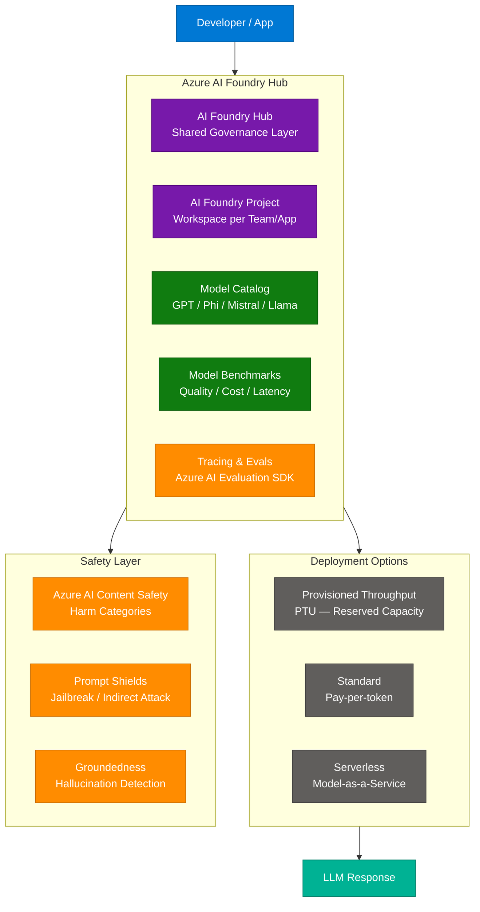

---

**Q35.** What is the primary difference between **Azure OpenAI Service** and the **Azure AI Foundry Model Catalog**?

> A) Azure OpenAI only supports GPT models; Model Catalog has no GPT models
> **B) Azure OpenAI provides Microsoft-managed GPT deployments; Model Catalog offers 1,700+ models from multiple providers (Mistral, Meta, Cohere, Microsoft Phi) with multiple hosting options**
> C) Model Catalog is only for fine-tuned models
> D) They are the same service with different names

**Answer: B**
**Azure OpenAI Service** focuses exclusively on OpenAI models (GPT-4, o1, o3, DALL-E, Whisper, Embeddings) with managed deployment. **Azure AI Foundry Model Catalog** hosts 1,700+ models from Microsoft (Phi-4), Meta (Llama 3), Mistral AI, Cohere, HuggingFace OSS models — deployable via Managed Compute, Serverless MaaS, or self-hosted. Both are accessible from within Foundry.

---

**Q36.** A Contoso application needs guaranteed throughput of 10,000 tokens per minute (TPM) for an Azure OpenAI GPT-4 deployment. Which deployment type achieves this?

> A) Standard deployment with a high quota request
> **B) Provisioned Throughput Units (PTU) deployment**
> C) Serverless Model-as-a-Service
> D) Azure AI Foundry Managed Compute

**Answer: B**
**Provisioned Throughput Units (PTU)** reserve dedicated model capacity measured in throughput units. Unlike Standard (pay-per-token with shared capacity), PTU guarantees consistent latency and throughput with no throttling — suitable for latency-sensitive, high-volume production workloads.

---

**Q37.** Contoso wants to evaluate whether GPT-4o responses are grounded in the retrieved context (not hallucinating). Which Azure AI Foundry evaluation metric measures this?

> A) Coherence score
> B) Fluency score
> **C) Groundedness score**
> D) Relevance score

**Answer: C**
The **Groundedness** evaluator in Azure AI Evaluation SDK measures whether each claim in the model's response is supported by the provided context/documents. Scores range 1–5; a score of 1 indicates fabricated content not traceable to the source. It uses an LLM-as-judge approach with a grounding meta-prompt.

---

**Q38.** What does "Prompt Shields" in Azure AI Content Safety detect?

> A) Profanity and harmful language in user messages
> **B) Jailbreak attempts (direct prompt injection) and indirect prompt injection in documents/tools**
> C) PII in model outputs
> D) Model hallucinations

**Answer: B**
**Prompt Shields** has two modes: (1) **User prompt attack detection** — catches jailbreaks like "ignore previous instructions"; (2) **Document attack detection** — finds injected instructions hidden in retrieved documents or tool results that try to hijack the model. It returns `detected: true/false` per attack type.

---

**Q39.** Contoso is building a summarization feature. They notice GPT-4 sometimes summarizes documents incorrectly. Which prompt engineering technique most reliably improves factual accuracy for summarization?

> A) Increasing temperature to 0.9 for creativity
> B) Adding "Be accurate" to the system prompt
> **C) Adding chain-of-thought reasoning instructions and asking the model to cite source sentences**
> D) Using a higher max_tokens limit

**Answer: C**
**Chain-of-thought (CoT)** prompting instructs the model to reason step-by-step before producing the final answer, reducing logical errors. Combined with **source citation requirements** ("quote the sentence from the document that supports each claim"), it grounds the model in the source text and reduces hallucination.

---

**Q40.** What is the purpose of the `temperature` parameter in Azure OpenAI API calls?

> A) Controls the maximum number of output tokens
> B) Sets the timeout for the API request
> **C) Controls output randomness — lower values (near 0) make output more deterministic; higher values (near 1) increase diversity**
> D) Determines the embedding dimension

**Answer: C**
**Temperature** scales the probability distribution over the next token: `temperature=0` makes the model nearly always pick the highest-probability token (deterministic/conservative); `temperature=1` samples proportionally (creative/diverse). For factual Q&A use 0–0.3; for creative writing use 0.7–1.0.

---

**Q41.** Which Azure OpenAI feature allows the model to call developer-defined functions based on conversation context and return structured JSON arguments?

> A) System prompts
> B) Embeddings API
> **C) Tool use / Function Calling**
> D) Assistants API file_search tool

**Answer: C**
**Function Calling** (also called **Tool use**) lets developers define JSON schemas for functions (e.g., `get_weather(location: string, unit: string)`). When the model determines a function should be called, it returns a `tool_calls` array with the function name and JSON arguments — the developer executes the function and returns the result for the model to incorporate.

---

**Q42.** Contoso wants to deploy Microsoft Phi-4 (a small language model) on their own Azure Kubernetes cluster to minimize data egress costs. Which Model Catalog deployment option supports this?

> A) Serverless MaaS (Model-as-a-Service)
> **B) Managed Compute (self-hosted on Azure ML / AKS)**
> C) Azure OpenAI Standard deployment
> D) Provisioned Throughput Units

**Answer: B**
**Managed Compute** in the Model Catalog deploys the model container to customer-controlled Azure ML Online Endpoints or AKS clusters. Data never leaves the customer's subscription. PTU and Serverless MaaS are Microsoft-hosted options. Phi-4, Llama 3, and Mistral models are available for Managed Compute deployment.

---

**Q43.** What is the maximum context window (input + output tokens combined) for GPT-4o as of mid-2025?

> A) 8,192 tokens
> B) 32,768 tokens
> **C) 128,000 tokens**
> D) 1,000,000 tokens

**Answer: C**
**GPT-4o** supports a **128,000 token** context window (input). The maximum output tokens per call is 16,384 by default (configurable up to model limits). For reference: 1,000 tokens ≈ 750 words; 128K context ≈ ~96,000 words or roughly a 300-page book.

---

**Q44.** Contoso's legal team wants to use Azure OpenAI but requires that their data NOT be used to train Microsoft's models. Which Azure OpenAI configuration ensures this?

> A) Use consumption-tier only
> B) Enable Customer-Managed Keys
> **C) Azure OpenAI data privacy guarantee — customer data is NOT used for training by default; no additional configuration needed**
> D) Deploy in a private network only

**Answer: C**
By default, **Azure OpenAI does not use customer prompts or completions to train or improve Microsoft models**. This is guaranteed in the Azure product terms and differs from the consumer OpenAI service where data may be used for training. Customer data stays within the Azure tenant's compliance boundary.

---

## 7. Domain 6 — AI Agents & RAG Pipelines (Q45–Q52)

### RAG + Agentic Pipeline

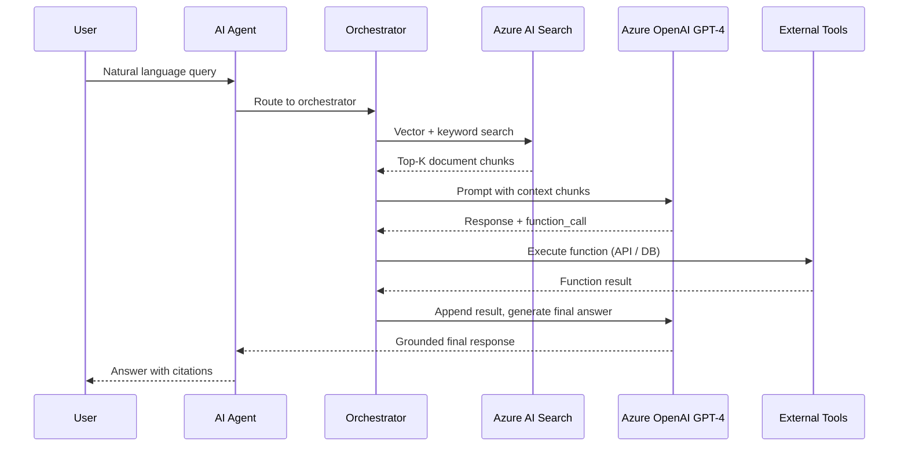

---

**Q45.** What is the primary difference between a **single-agent** and a **multi-agent** architecture in Azure AI?

> A) Multi-agent systems use more expensive models
> **B) Single-agent handles all tasks sequentially; multi-agent distributes specialized sub-tasks to dedicated agents that collaborate via messages**
> C) Multi-agent systems cannot use Azure OpenAI
> D) Single-agent supports function calling; multi-agent does not

**Answer: B**
**Multi-agent architectures** decompose complex tasks across specialized agents: a Planner agent breaks down the goal, a Researcher agent retrieves information, a Coder agent writes code, a Critic agent reviews outputs. Agents communicate via message passing (AutoGen) or shared state (Semantic Kernel Process Framework). This enables parallelism and specialization beyond what a single LLM call can achieve.

---

**Q46.** In the **Retrieval Augmented Generation (RAG)** pattern, what problem does retrieval solve?

> A) It reduces the model's hallucination of function call arguments
> **B) It grounds the model's responses in current, domain-specific documents not present in its training data**
> C) It increases the model's context window size
> D) It replaces the need for fine-tuning entirely

**Answer: B**
LLMs have a knowledge cutoff and no access to proprietary data. **RAG** retrieves relevant document chunks from a search index at query time and injects them into the LLM prompt as context. The model then generates answers grounded in those documents rather than relying solely on parametric memory. This also enables attribution (citations).

---

**Q47.** Which **Azure AI Search** query mode combines BM25 keyword scoring with vector similarity scores for the best of both retrieval methods?

> A) Pure vector search
> B) Full-text search only
> **C) Hybrid search (RRF fusion of keyword + vector)**
> D) Faceted search

**Answer: C**
**Hybrid search** in Azure AI Search executes both BM25 keyword and vector queries simultaneously and merges their result sets using **Reciprocal Rank Fusion (RRF)**. This outperforms either method alone because keyword search excels at exact term matching while vector search captures semantic similarity. Adding **Semantic Ranker** on top re-ranks the fused results further.

---

**Q48.** Contoso deploys an Azure AI Foundry Agent that must access a SQL database to answer inventory queries. How should the agent interact with the database?

> A) Direct database connection string in the agent prompt
> **B) Register a function/tool definition for the DB query; the agent emits a function_call; the orchestrator executes the query and returns results**
> C) Use Azure AI Search to index the SQL data only
> D) Fine-tune the model on SQL query results

**Answer: B**
The **tool use / function calling** pattern is the correct approach. The agent definition includes a JSON schema for `query_inventory(product_id: string)`. When the user asks about inventory, the LLM outputs a `tool_call` for that function. The host application (orchestrator) runs the actual SQL query and returns results back to the model for final synthesis. The model never directly accesses the database.

---

**Q49.** What is **Agentic RAG** and how does it differ from basic RAG?

> A) Agentic RAG uses a fine-tuned model; basic RAG uses a base model
> **B) Agentic RAG uses an agent to decide when to retrieve, which index to query, and how to refine queries iteratively — basic RAG is a single fixed retrieve-then-generate step**
> C) Agentic RAG skips the retrieval step
> D) They are identical

**Answer: B**
**Agentic RAG** introduces a reasoning loop: the agent evaluates whether retrieved chunks are sufficient, decides to re-query with reformulated terms, queries multiple specialized indexes, or uses additional tools (web search, APIs). This self-directed, iterative retrieval is far more powerful for complex multi-hop questions than the single-pass basic RAG pattern.

---

**Q50.** In **Azure AI Agent Service**, what is a "Thread"?

> A) A background execution task
> B) A model deployment configuration
> **C) A persistent conversation session that stores message history between user turns**
> D) A RAG retrieval pipeline configuration

**Answer: C**
In Azure AI Agent Service (OpenAI Assistants API compatible), a **Thread** is a persistent conversation object. Each user message is appended as a `Message` to the thread, and the Run object processes the thread with the configured agent. Thread history is maintained server-side, enabling multi-turn conversations without the client managing history manually.

---

**Q51.** Contoso wants multiple AI agents to collaborate: one researches topics, one writes drafts, one reviews. Which Azure AI framework best supports this **sequential multi-agent handoff** pattern?

> A) Azure AI Foundry Agent Service alone
> **B) AutoGen (Microsoft) with GroupChat or Sequential workflow, or Semantic Kernel Processes**
> C) Azure Logic Apps with AI connectors
> D) Azure OpenAI Assistants with parallel function calls

**Answer: B**
**AutoGen** (Microsoft Research / AG2) provides `GroupChat` for dynamic multi-agent conversations and `Sequential` workflows for pipeline-style handoffs. **Semantic Kernel Process Framework** models agent workflows as stateful processes with steps. Both integrate with Azure AI Foundry for model hosting and Azure AI Search for retrieval.

---

**Q52.** When designing an AI agent for a customer service bot, what is the purpose of defining a **system prompt** (system message)?

> A) It controls which model version is used
> **B) It sets the agent's persona, behavioral rules, domain scope, and response constraints that persist across all user turns**
> C) It specifies the maximum token budget
> D) It configures the retrieval index

**Answer: B**
The **system prompt** is injected at the start of every conversation and defines: the agent's name/persona, what it can and cannot do, the tone of responses, safety guardrails, language constraints, and any standing context (e.g., company name, current date). It persists across user turns and takes higher precedence than user instructions in well-aligned models.

---

## 8. Domain 7 — Fine-Tuning & Prompt Engineering (Q53–Q60)

### Fine-Tuning vs. Prompt Engineering Decision Tree

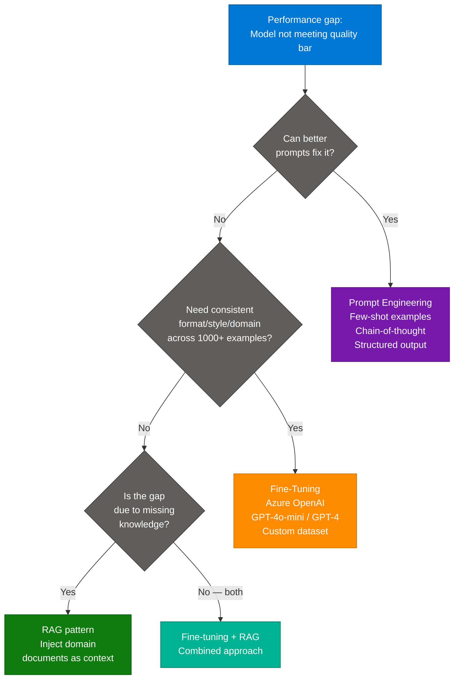

---

**Q53.** Contoso wants GPT-4o-mini to always respond in a specific structured JSON format with 5 fields. The base model sometimes adds extra fields or uses different key names. What is the most reliable solution?

> A) Add "respond only in JSON" to the system prompt
> **B) Use Azure OpenAI Structured Outputs (JSON Schema mode) which enforces the exact schema at the grammar level**
> C) Fine-tune on 100 JSON examples
> D) Parse and reformat the output in application code

**Answer: B**
**Structured Outputs** (GA in Azure OpenAI) uses constrained decoding — the model's sampling is restricted to token sequences that conform to the provided JSON Schema. It guarantees 100% schema compliance, including field names, types, and required/optional constraints. This is more reliable than prompt instructions alone.

---

**Q54.** What is **few-shot prompting** and when should you use it over fine-tuning?

> A) Few-shot prompting is the same as fine-tuning but faster
> **B) Few-shot prompting includes 2–10 input/output examples in the prompt to guide style and format; use it when examples fit in the context window and the task is well-defined**
> C) Few-shot prompting uses reinforcement learning
> D) Few-shot prompting is only for classification tasks

**Answer: B**
**Few-shot prompting** embeds demonstrations directly in the prompt (e.g., 3–5 Q&A pairs before the user's question) to guide the model's style and format without changing model weights. It's preferred over fine-tuning when: the task can be demonstrated in a few examples, the examples fit in the context, and you want rapid iteration. Fine-tuning is preferred when you need consistent behavior across thousands of inference calls or the task requires deep domain adaptation.

---

**Q55.** How many training examples are required to start a fine-tuning job in Azure OpenAI?

> A) 1,000 examples minimum
> B) 500 examples minimum
> **C) 10 examples minimum (50–100 recommended for meaningful improvement)**
> D) 10,000 examples minimum

**Answer: C**
Azure OpenAI fine-tuning accepts a minimum of **10 training examples** in JSONL format (`{"messages": [...]}` chat completions format). However, 50–100 examples typically yield meaningful quality improvement; 1,000+ examples produce robust domain adaptation. More examples + multiple epochs generally improve results.

---

**Q56.** Which fine-tuning technique updates only a small number of added parameters (adapters) while keeping base model weights frozen, making it far more compute-efficient?

> A) Full fine-tuning
> **B) LoRA (Low-Rank Adaptation)**
> C) RLHF (Reinforcement Learning from Human Feedback)
> D) Prompt tuning

**Answer: B**
**LoRA** injects small rank-decomposition weight matrices into the attention layers. Only these adapter parameters (typically <1% of total parameters) are trained, dramatically reducing GPU memory and time requirements. The base model weights remain frozen. **QLoRA** extends this with quantization (4-bit base model) for even less memory. Azure AI Foundry supports LoRA-based fine-tuning for Phi, Llama, and Mistral models.

---

**Q57.** What is the purpose of the **top_p** parameter in Azure OpenAI API calls?

> A) Sets the probability threshold for content safety filtering
> **B) Nucleus sampling — considers only the smallest set of tokens whose cumulative probability exceeds top_p**
> C) Controls the maximum tokens generated
> D) Sets the temperature decay rate

**Answer: B**
**top_p (nucleus sampling)** restricts token sampling to the top-p probability mass. `top_p=0.9` means only tokens whose cumulative probability sums to 90% are considered — effectively excluding very low-probability tokens. It's an alternative diversity control to `temperature`. Best practice: adjust one of `temperature` or `top_p`, not both simultaneously.

---

**Q58.** Contoso uses an Azure OpenAI chat model to analyze financial documents. The model sometimes "hallucinates" figures not in the provided context. Which prompt engineering technique most directly reduces this?

> A) Increase temperature to sample more tokens
> **B) Instruct the model to quote source text and say "I don't know" when information is not present; use Groundedness evaluation to detect failures**
> C) Use a larger model with more parameters
> D) Reduce the context window

**Answer: B**
**Citation-grounded instructions** ("answer only from the provided document; quote the relevant sentence; if the answer is not in the document, say I cannot find this information") constrain the model to the source material. Combined with **Groundedness evaluation** (Azure AI Foundry Evaluations SDK), you can measure and threshold hallucination rates before deploying to production.

---

**Q59.** What is **Retrieval-Augmented Fine-Tuning (RAFT)** and how does it differ from standard RAG?

> A) RAFT is the same as RAG
> **B) RAFT fine-tunes the model on domain documents WITH retrieval examples — teaching it to reason over retrieved context and ignore distractors, rather than just injecting context at inference time**
> C) RAFT eliminates the retrieval step
> D) RAFT only works with embedding models

**Answer: B**
**RAFT** combines the knowledge encoding of fine-tuning with the grounding of RAG: the model is fine-tuned on (question, retrieved-context, answer) triples that include both relevant and distractor documents. This trains the model to reliably extract answers from retrieved context and to recognize when context is unhelpful — outperforming both RAG-only and fine-tuning-only on domain Q&A benchmarks.

---

**Q60.** Contoso's AI team evaluates models for a new deployment. They need to compare GPT-4o, GPT-4o-mini, and Phi-4 across quality, cost, and latency dimensions. Which Azure AI Foundry feature provides this comparison out of the box?

> A) Azure Monitor dashboards
> **B) Model Benchmarks in Azure AI Foundry Model Catalog**
> C) Azure Cost Management
> D) Application Insights

**Answer: B**
**Model Benchmarks** in Azure AI Foundry provides standardized evaluation results across the model catalog on industry benchmarks (MMLU, HumanEval, MT-Bench, etc.) and allows side-by-side comparison on quality, cost-per-1K-tokens, and latency (tokens per second). This accelerates model selection without running custom evaluations from scratch.

---


---

## Additional Coverage: Classic vs New Comparison (Exam Focus)

*Source: Azure-AI-Engineer-Practice-Questions.md — exam-oriented comparison supplement to the conceptual §5 above*

## 9. Classic vs New Comparison

| Dimension | Classic / Legacy Service | New / Current Service |
|---|---|---|
| **Language Understanding** | LUIS (Language Understanding) | CLU — Conversational Language Understanding |
| **QnA / FAQ** | QnA Maker | Custom Question Answering (Azure AI Language) |
| **Form / Document Processing** | Form Recognizer | Azure Document Intelligence |
| **Search with AI Enrichment** | Azure Cognitive Search | Azure AI Search |
| **OCR** | Cognitive Services Read API v2/v3 | Azure AI Vision Read API v4 / Document Intelligence |
| **AI Hub / Workspace** | Azure ML Studio (classic) | Azure AI Foundry Hub + Project |
| **Model Fine-Tuning** | Azure ML custom training | Azure AI Foundry Fine-Tuning + LoRA support |
| **Agent Framework** | Bot Framework SDK only | Azure AI Agent Service + AutoGen + Semantic Kernel |
| **AI Services Resource** | Per-service Cognitive Services resources | Azure AI Services multi-service resource |
| **Vector Search** | No native vector; custom skill only | Azure AI Search native vector + hybrid + Semantic Ranker |
| **Safety Controls** | Azure Content Moderator | Azure AI Content Safety + Prompt Shields |
| **Model Hosting** | Azure ML Online Endpoints | AI Foundry Managed Compute + Serverless MaaS + PTU |

**Use New when:** Starting any new AI project — all Microsoft investment and new features go to the new services; old services are in maintenance mode.

**Use Classic when:** Maintaining a legacy system not yet migrated; LUIS retirement date was September 2025 — migration to CLU is mandatory.

---


---

## Additional Coverage: Security and Governance (Exam Practice Questions)

*Source: Azure-AI-Engineer-Practice-Questions.md — exam Q&A supplement to the conceptual §7 above*

## 10. Security and Governance

### Azure AI Security Architecture

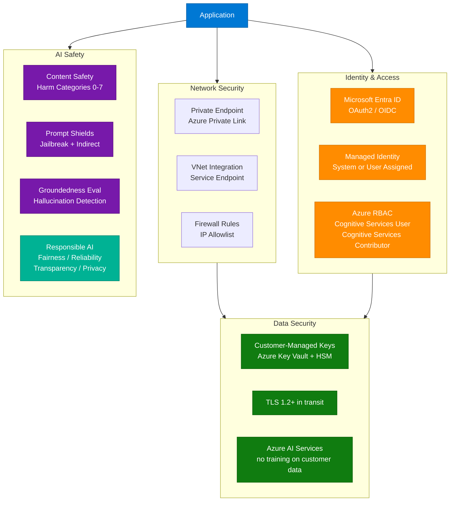

### RBAC Roles for Azure AI Services

| Role | Permissions | Use Case |
|---|---|---|
| **Cognitive Services User** | Call APIs, read resource | Application service principals, developers |
| **Cognitive Services Contributor** | Manage resource, view keys | DevOps, infrastructure teams |
| **Cognitive Services Reader** | List resources, no API calls | Auditors, monitoring |
| **Cognitive Services OpenAI User** | Call Azure OpenAI APIs only | Scoped to OpenAI endpoints |
| **Cognitive Services OpenAI Contributor** | Deploy models, manage fine-tuning | ML engineers |

### Security Checklist for AI-102 Exam

- Store API keys in **Azure Key Vault**, never hardcoded or in source control
- Use **Managed Identity** for app authentication instead of key-based auth where possible
- Configure **Private Endpoints** for production Azure AI Services resources
- Enable **Diagnostic Logging** to Log Analytics for all API calls and errors
- Apply **Content Safety** for user-facing generative AI features (categories: Hate, Violence, Sexual, Self-Harm)
- Use **Prompt Shields** to block jailbreaks and indirect prompt injection attacks
- Evaluate with **Groundedness** and **Relevance** metrics before production deployment
- Review Responsible AI impact assessment for high-stakes deployments (hiring, credit, medical)

---


---

## Additional Coverage: Study Path & Getting Started (Exam Resources)

*Source: Azure-AI-Engineer-Practice-Questions.md — exam study path supplement to the quickstart §8 above*

## 11. Study Path & Getting Started

### Recommended Study Sequence

```mermaid
flowchart LR
    S1["Week 1\nAzure AI Services\nProvisioning + Security"]
    S2["Week 2\nComputer Vision\n+ Document Intelligence"]
    S3["Week 3\nNLP + Language\nCLU / CQA / Text Analytics"]
    S4["Week 4\nGenerative AI\nOpenAI + Foundry"]
    S5["Week 5\nAgents + RAG\nSearch + Orchestration"]
    S6["Week 6\nPractice Exams\n+ Hands-on Labs"]

    S1 --> S2 --> S3 --> S4 --> S5 --> S6

    classDef c1 fill:#0078D4,stroke:#005A9E,color:#fff
    classDef c2 fill:#7719AA,stroke:#5A0E80,color:#fff
    classDef c3 fill:#107C10,stroke:#0A5C0A,color:#fff
    classDef c4 fill:#FF8C00,stroke:#CC7000,color:#fff
    classDef c5 fill:#00B294,stroke:#007D68,color:#fff
    classDef c6 fill:#E81123,stroke:#B30D1A,color:#fff

    class S1 c1
    class S2 c2
    class S3 c3
    class S4 c4
    class S5 c5
    class S6 c6
```

### Quick Python Validation — Multi-Service Resource

```python
from azure.ai.textanalytics import TextAnalyticsClient
from azure.core.credentials import AzureKeyCredential

endpoint = "https://<your-resource>.cognitiveservices.azure.com/"
key = "<your-key>"  # In production: fetch from Key Vault

client = TextAnalyticsClient(endpoint=endpoint, credential=AzureKeyCredential(key))

documents = ["Contoso's new AI product launched in Seattle and has 95% customer satisfaction."]

# Sentiment + Opinion Mining
sentiment_result = client.analyze_sentiment(documents, show_opinion_mining=True)
for doc in sentiment_result:
    print(f"Sentiment: {doc.sentiment} (pos={doc.confidence_scores.positive:.2f})")
    for sentence in doc.sentences:
        for opinion in sentence.mined_opinions:
            print(f"  Aspect: {opinion.target.text} → {opinion.target.sentiment}")

# Named Entity Recognition
ner_result = client.recognize_entities(documents)
for doc in ner_result:
    for entity in doc.entities:
        print(f"Entity: {entity.text} | Category: {entity.category} | Confidence: {entity.confidence_score:.2f}")

# Language Detection
lang_result = client.detect_language(documents)
for doc in lang_result:
    print(f"Language: {doc.primary_language.name} ({doc.primary_language.iso6391_name})")
```

### Quick Python — Azure OpenAI RAG Pattern

```python
from openai import AzureOpenAI
from azure.search.documents import SearchClient
from azure.core.credentials import AzureKeyCredential

# Initialize clients
oai = AzureOpenAI(
    azure_endpoint="https://<openai-resource>.openai.azure.com/",
    api_key="<key>",
    api_version="2024-05-01-preview"
)
search = SearchClient(
    endpoint="https://<search-resource>.search.windows.net",
    index_name="knowledge-base",
    credential=AzureKeyCredential("<search-key>")
)

def rag_query(user_question: str) -> str:
    # Step 1: Retrieve relevant chunks
    results = search.search(
        search_text=user_question,
        query_type="semantic",
        semantic_configuration_name="default",
        top=3
    )
    context = "\n\n".join(r["content"] for r in results)

    # Step 2: Generate grounded answer
    response = oai.chat.completions.create(
        model="gpt-4o",
        messages=[
            {"role": "system", "content": "Answer only from the provided context. If not found, say so."},
            {"role": "user", "content": f"Context:\n{context}\n\nQuestion: {user_question}"}
        ],
        temperature=0.0,
        max_tokens=500
    )
    return response.choices[0].message.content

print(rag_query("What is the refund policy?"))
```

### Learning Resources

| Type | Resource | Focus Area |
|---|---|---|
| **Official Exam Page** | [AI-102 Exam Skills Outline](https://learn.microsoft.com/credentials/certifications/azure-ai-engineer/) | Full domain breakdown |
| **Microsoft Learn Path** | AI-102 Learning Path on Microsoft Learn | Hands-on modules per domain |
| **Practice Assessments** | Microsoft Learn free practice assessment | 50-question timed simulation |
| **AI Foundry Labs** | Azure AI Foundry quickstarts | Hands-on RAG, agents, fine-tuning |
| **GitHub Samples** | Azure-Samples/azure-search-openai-demo | RAG reference architecture |
| **Language Studio** | Language Studio portal | CLU, CQA, Text Analytics UI |
| **Vision Studio** | Vision Studio portal | Image Analysis, OCR, Custom Vision |
| **AI Skills** | Microsoft AI Skills Challenge | Free sandbox labs |

---


---

## 12. Interview Q&A Cheatsheet

**Q: How does CLU differ from LUIS, and why did Microsoft migrate?**
> CLU (Conversational Language Understanding) is the successor to LUIS, built on the Azure AI Language platform. Unlike LUIS, CLU uses transformer-based models for better multilingual transfer, supports multilingual projects without per-language training, integrates with Orchestration Workflow for routing between CLU and CQA projects, and is fully managed within Azure AI Language Studio. LUIS reached end-of-life in September 2025.

---

**Q: When would you choose fine-tuning over RAG for an Azure OpenAI solution?**
> Choose **fine-tuning** when you need the model to consistently adopt a specific writing style, output format, or domain-specific vocabulary that cannot be reliably communicated through prompts alone — for example, generating customer communications in a strict legal tone. Choose **RAG** when the gap is about missing knowledge (proprietary documents, recent data) rather than behavior — RAG is lower-cost, faster to update, and provides citation traceability. For complex requirements, combine both: fine-tune for style and use RAG for knowledge.

---

**Q: Explain the Azure AI Search indexing pipeline for a RAG application.**
> The indexing pipeline consists of: (1) a **Data Source** connector pointing to Blob Storage, SharePoint, or SQL; (2) an **Indexer** that crawls, chunks, and orchestrates enrichment; (3) a **Skillset** with built-in skills (OCR, NER, embedding generation) and optional custom skills; (4) an **Index** with both keyword and vector fields. At query time, the app sends both a keyword query and an embedding vector; the **hybrid search + Semantic Ranker** pipeline returns the top-K re-ranked chunks, which are injected into the LLM prompt as context.

---

**Q: What are the four Responsible AI principles most tested on AI-102?**
> The six Microsoft Responsible AI principles are: **Fairness** (equitable outcomes across demographic groups), **Reliability & Safety** (consistent, safe behavior under adversarial conditions), **Privacy & Security** (data protection, minimal retention), **Inclusiveness** (accessibility and representation), **Transparency** (explainability and disclosure of AI use), and **Accountability** (human oversight and governance). AI-102 most frequently tests Fairness (bias mitigation) and Safety (Content Safety, harm detection).

---

**Q: How does Azure AI Content Safety's severity scoring work?**
> Azure AI Content Safety evaluates content across four harm categories: **Hate, Violence, Sexual, and Self-Harm**. Each category returns a severity score from **0 to 7**: 0 = safe, 2 = low, 4 = medium, 6 = high. Developers configure an **action threshold** per category — content at or above the threshold triggers the configured action (block, flag for review, allow). Scores are also aggregated into a `blocklistMatchResults` for custom term lists. Threshold configuration lets organizations calibrate sensitivity per use case (e.g., stricter for youth platforms).

---

**Q: What is the difference between an Azure AI Foundry Hub and a Project?**
> An **AI Foundry Hub** is a shared organizational resource that hosts common infrastructure: Azure OpenAI connections, Azure AI Search connections, storage accounts, and security/governance policies (Entra ID, managed identity, private networking). A **Project** is a child workspace within a Hub for a specific team or application — it inherits Hub connections and governance but has its own isolated data, deployments, evaluation runs, and fine-tuning jobs. Multiple projects can share one Hub, reducing infrastructure duplication while maintaining isolation.

---

**Q: How do you prevent prompt injection attacks in an Azure AI agent that retrieves documents from the internet?**
> Use **Azure AI Content Safety Prompt Shields** with document attack detection enabled — it scans retrieved documents for injected instructions before they reach the model. Additionally: (1) structure retrieved content as data (not instructions) using XML/JSON wrappers in the prompt; (2) apply system prompt instructions that explicitly tell the model to ignore instructions embedded in retrieved data; (3) apply **output validation** to detect unexpected behavioral changes in the response; (4) use the principle of least privilege — restrict which tools the agent can call and log all function invocations for audit.

---

**Q: What is the purpose of Azure AI Foundry Evaluations, and which metrics does it provide?**
> Azure AI Foundry Evaluations (AI Evaluation SDK) provides systematic, LLM-as-judge quality measurement for generative AI systems. Key metrics: **Groundedness** (claims supported by source context, 1–5 scale), **Relevance** (response answers the user's actual question), **Coherence** (logical flow and readability), **Fluency** (grammatical correctness), **Similarity** (semantic closeness to a ground-truth reference), and **Violence/Hate/Sexual/Self-Harm** content risk scores. Custom evaluators can be added via Python functions. Evaluations run in bulk against test datasets and integrate with Azure ML experiment tracking for trend monitoring.

---

*Source: [Azure AI Engineer Practice Questions — Krish Shrestha on Medium](https://medium.com/@krishrestha/azure-ai-engineer-practice-questions-with-answers-6490238b8eb0) | Enriched with Microsoft Learn AI-102 documentation and domain knowledge | Last Updated: June 2026*

---

## Source Attribution

| Section | Primary Source |
|---|---|
| Part A: What is AI-102, Architecture, Components, Deep Dive, Classic/New, Cognitive Search, Security, Getting Started, Top 25 Q&A | AI-102-Azure-AI-Solutions-Complete-Guide.md |
| Part B: Exam Overview, 60 Domain Questions (Q1–Q60), Classic vs New (exam), Security (exam), Study Path, Cheatsheet | Azure-AI-Engineer-Practice-Questions.md |

---

*Consolidated: July 2025 | DocDedupAnalyzer Agent v1.3*
*Original files: AI-102-Azure-AI-Solutions-Complete-Guide.md, Azure-AI-Engineer-Practice-Questions.md | Zero data loss guaranteed*
