# Communication & Leadership — Complete Guide
> **Consolidated From:** Communication-Leadership-Complete.md, Communication-Overview.md
> **Topics Covered:** Dependency management, business-value communication, documentation/ADR habits, STAR framework, stakeholder mapping, leadership styles, executive/crisis communication, the Golden Rule
> **Consolidation Date:** 2026-07-04
> **Original Documents:** 2 → **Content Preserved:** 100%

---

---

## Table of Contents

1. [Understand Dependencies Before Taking Action](#1-understand-dependencies-before-taking-action)
2. [Focus on Business Value, Not Tasks](#2-focus-on-business-value-not-tasks)
3. [Build Strong Documentation Habits](#3-build-strong-documentation-habits)
4. [Use Outcome-Oriented Communication](#4-use-outcome-oriented-communication)
5. [Apply STAR Framework for Communication](#5-apply-star-framework-for-communication)
6. [Explain Through Scenarios](#6-explain-through-scenarios)
7. [Stakeholder Mapping & Influence Strategy](#7-stakeholder-mapping--influence-strategy)
8. [User Journey & Heat Mapping](#8-user-journey--heat-mapping)
9. [Product Manager vs Product Owner vs Engineering Leader](#9-product-manager-vs-product-owner-vs-engineering-leader)
10. [Meeting Effectiveness Framework](#10-meeting-effectiveness-framework)
11. [Communication Checklist for Leaders](#11-communication-checklist-for-leaders)
12. [Leadership Communication Styles](#12-leadership-communication-styles)
13. [Team Management & Performance Communication](#13-team-management--performance-communication)
14. [Executive Communication](#14-executive-communication)
15. [Change Management Communication](#15-change-management-communication)
16. [Crisis & Conflict Communication](#16-crisis--conflict-communication)
17. [Personal Development Roadmap](#17-personal-development-roadmap)
18. [Cross-Cutting Themes](#18-cross-cutting-themes)

---

## 1. Understand Dependencies Before Taking Action

### Overview

Every project operates within a web of relationships — teams waiting on your output (upstream) and teams whose output you need (downstream). Failing to map these dependencies early is the single most common cause of missed deadlines and stakeholder trust erosion. A dependency map is not optional documentation; it is your project risk radar.

### Dependency Flow Architecture

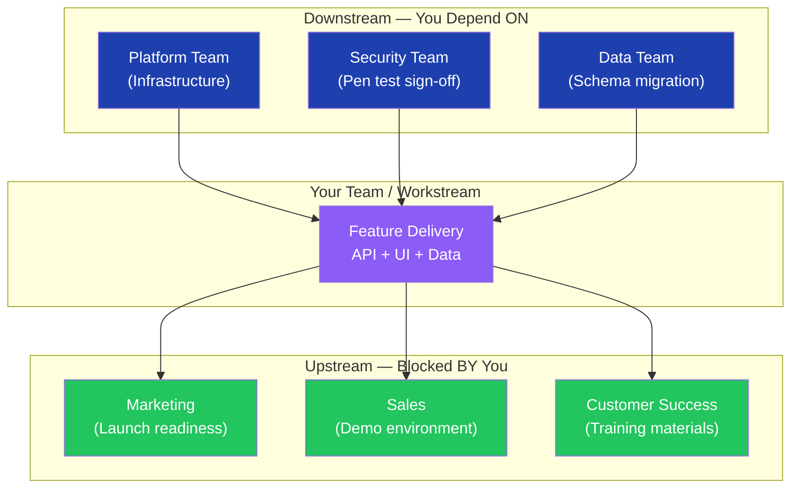

### Dependency Escalation Flow

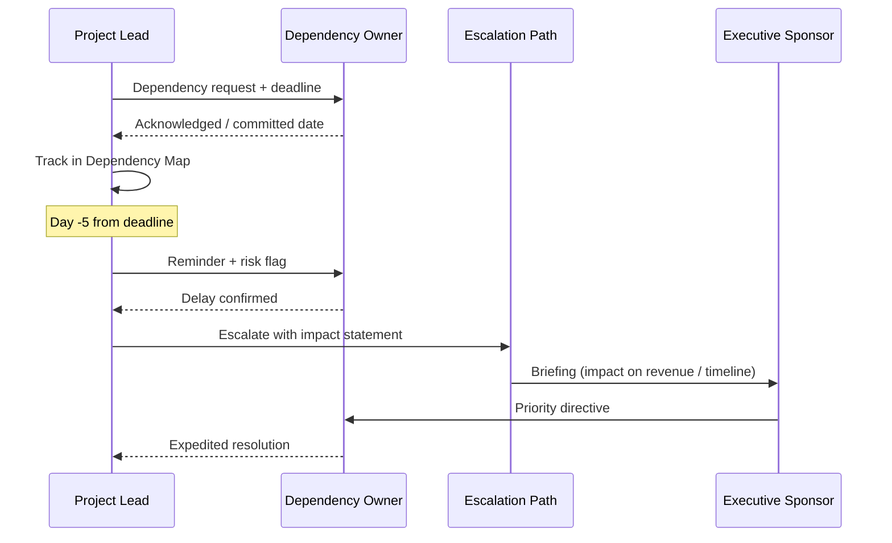

### Dependency Map Template

| Dependency | Owner | Impact if Late | Due Date | Risk Level | Escalation Path |
|---|---|---|---|---|---|
| Auth API from Platform | Team A | Blocks login flow — all testing halted | 15 Aug | High | VP Engineering |
| Security sign-off | InfoSec | Blocks production release | 20 Aug | High | CISO |
| Data schema migration | Data Eng | Breaks reporting module | 12 Aug | Medium | Data Architect |
| Legal review of ToS | Legal | Blocks public launch | 18 Aug | Medium | General Counsel |

### Leadership Communication Protocol for Dependencies

**Before you escalate**, always:
1. Quantify the impact ("this delays go-live by 2 weeks, affecting $X revenue")
2. Show what you've tried ("we've followed up 3 times over 5 days")
3. Propose a solution ("we can unblock if X team gets 2 days from another sprint")

### Interview Q&A

| Question | Strong Answer |
|---|---|
| How do you manage cross-team dependencies? | Dependency Map at project kickoff, weekly status check-ins, impact-quantified escalations — not just "they're late" |
| What do you do when a dependency is at risk? | Flag 5 days early, quantify business impact, propose mitigation first, escalate with data |
| How do you prevent dependency surprises? | Dependency review in every sprint review and steering meeting — it's a standing agenda item |
| How do you influence a team you don't manage? | Shared goals, executive alignment, making it easy for them (pre-drafted specs, scheduled slots) |
| What's your escalation philosophy? | Escalate early with context and a proposed solution — never surprise leadership with a crisis |

---

## 2. Focus on Business Value, Not Tasks

### Overview

Technical teams default to activity reporting — what was built, what was deployed, what was tested. Business leaders care about outcomes — what changed, what risk was reduced, what revenue was enabled. Shifting from task language to value language is the single most important communication upgrade for senior technical roles.

### Value Evaluation Framework

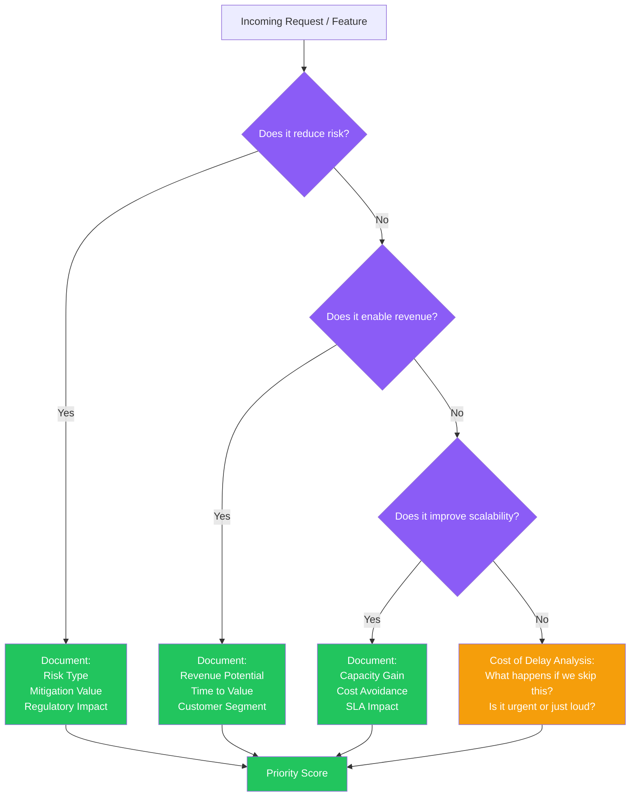

### The Four Business Value Lenses

**Lens 1 — Risk Reduction**
- Does it reduce operational, security, or compliance risk?
- What is the cost of the risk materializing? (fines, downtime, churn)
- Who is exposed if we delay?

**Lens 2 — Revenue Enablement**
- Does it unlock a new customer segment?
- Does it reduce friction in the purchase funnel?
- Does it enable upsell or retention?

**Lens 3 — Cost Avoidance**
- Does it eliminate manual processes (FTE hours × cost)?
- Does it prevent infrastructure over-provisioning?
- Does it reduce support ticket volume?

**Lens 4 — Cost of Delay (CoD)**

The most underused lens. Ask:

> "If we ship this 4 weeks later, what specifically happens?"

| Delay Impact Type | Example | Quantification |
|---|---|---|
| Revenue loss | Feature required by enterprise customer | $500K contract at risk |
| Competitor advantage | Competitor ships similar feature | 15% trial conversion drop |
| Regulatory risk | GDPR compliance feature delayed | €20M potential fine |
| Customer churn | Known pain point unresolved | NPS -12, 8% churn increase |

### Reframing Language

| Activity Language ❌ | Value Language ✅ |
|---|---|
| "We completed the payment API" | "Payment processing now handles 10K TPS, enabling the Black Friday launch" |
| "We fixed 47 bugs this sprint" | "Resolved 3 critical customer-facing issues, reducing support tickets by 35%" |
| "We refactored the auth module" | "Auth now handles 99.99% uptime — removing the blocker for enterprise SLA negotiations" |
| "We added logging" | "Full audit trail now in place — we can respond to compliance requests in hours, not days" |

### Interview Q&A

| Question | Strong Answer |
|---|---|
| How do you prioritize the backlog? | Business value × cost of delay ÷ effort — with explicit risk and revenue lenses |
| How do you push back on low-value requests? | Frame it as opportunity cost — "if we do X, we can't do Y, which has $Z impact" |
| How do you speak to non-technical stakeholders? | Translate technical work into business outcomes — risk, revenue, cost, time |
| What is Cost of Delay? | The value lost per unit of time by not delivering something — makes prioritization financially explicit |
| How do you handle conflicting priorities? | Bring stakeholders together with the value/CoD framework — let data drive the conversation |

---

## 3. Build Strong Documentation Habits

### Overview

Documentation is not bureaucracy — it is institutional memory, audit evidence, and alignment infrastructure. Leaders who document well create teams that can operate autonomously, recover from incidents faster, and communicate with confidence to any audience at any time.

### Documentation Architecture

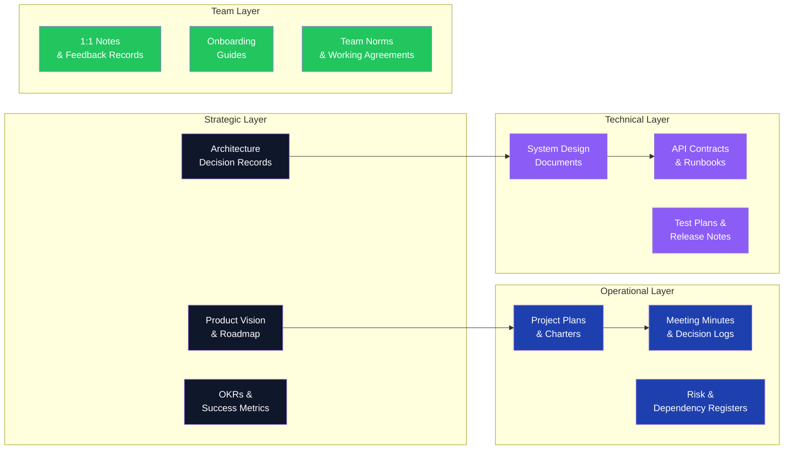

### Stage-Based Documentation

| Stage | Document | Owner | Audience |
|---|---|---|---|
| Discovery | Problem Statement + Requirements | PM / BA | Stakeholders |
| Design | Architecture Decision Record | Tech Lead | Engineering + Leadership |
| Development | Technical Notes + API Contracts | Engineers | Engineering Team |
| Testing | Test Plan + UAT Sign-Off | QA Lead | PM + Business |
| Deployment | Release Notes + Runbook | DevOps + Dev | Ops + Support |
| Post-Launch | Incident Review + Retrospective | Team | All Stakeholders |

### Architecture Decision Record (ADR) Template

```markdown
## ADR-[Number]: [Decision Title]

**Date:** [YYYY-MM-DD]
**Status:** [Proposed / Accepted / Superseded]
**Deciders:** [Names / Roles]

### Context
[What is the problem or situation requiring a decision?]

### Decision
[What was decided?]

### Consequences
**Positive:** [Benefits]
**Negative:** [Trade-offs accepted]
**Risks:** [What could go wrong]

### Alternatives Considered
| Option | Pros | Cons | Rejected Because |
|---|---|---|---|
```

### Interview Q&A

| Question | Strong Answer |
|---|---|
| How do you ensure decisions are not lost? | Architecture Decision Records (ADRs) — every significant decision gets context, alternatives, and rationale |
| How do you onboard new team members quickly? | Structured onboarding guide with system overview, decision history, team norms, and a 30-60-90 day plan |
| How do you handle documentation debt? | Treat docs like tests — definition of done includes documentation; schedule quarterly doc sprints |
| What documentation do you write for executives? | One-page executive summary: situation, decision made, business impact, risks, next steps |
| How do you create audit-ready documentation? | Stage-based docs with sign-offs, timestamps, and traceability from requirement to release |

---

## 4. Use Outcome-Oriented Communication

### Overview

Activity-based communication tells stakeholders what your team did. Outcome-based communication tells them what changed in the world because of what your team did. This is the language of leadership — it connects work to business results and positions the team as value creators, not task completers.

### The SAIOO Communication Model

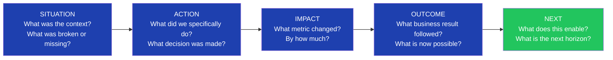

### Communication Transformation Examples

**Example 1 — Engineering Update**

❌ Activity: "We deployed the new caching layer and refactored the database queries."

✅ Outcome: "Database load reduced by 60%, API response time dropped from 800ms to 120ms — this removes the performance blocker that was preventing the enterprise tier launch."

---

**Example 2 — Sprint Review for Business**

❌ Activity: "Completed 23 story points. Implemented user profile feature. Fixed authentication bug."

✅ Outcome: "This sprint unblocked three enterprise customers waiting on SSO integration. Auth stability is now at 99.98% — reducing support escalations by 40%. User profile completion enables the personalization engine planned for Q3."

---

**Example 3 — Executive Status Update**

❌ Activity: "Team is 70% complete on the migration."

✅ Outcome: "Migration is on track for Aug 15 go-live. When complete, infrastructure costs drop by $180K/year and we eliminate the compliance risk flagged in the Q2 audit."

### Outcome Communication Formula

```
[Situation] + [What we did] + [Metric that changed] + [Business impact] + [What's next]
```

| Component | Weak Version | Strong Version |
|---|---|---|
| Situation | "There was a problem" | "Customer onboarding was averaging 3 days — creating 22% drop-off" |
| Action | "We built a new workflow" | "Implemented automated document validation with parallel processing" |
| Metric | "It's faster now" | "Processing time reduced from 72 hours to 4 hours" |
| Impact | "Customers are happier" | "Drop-off rate fell from 22% to 6%, recovering ~$400K monthly ARR" |
| Next | "We'll keep improving" | "Phase 2 will extend this to enterprise onboarding — targeting Q4" |

### Interview Q&A

| Question | Strong Answer |
|---|---|
| How do you communicate progress to executives? | SAIOO model — situation, action, impact (with metrics), outcome (business result), next horizon |
| How do you make technical work visible to business stakeholders? | Translate every delivery into: what risk was reduced, what revenue was enabled, what cost was avoided |
| Give an example of outcome-based communication | [Use a real project — apply SAIOO formula with actual numbers] |
| How do you handle a sprint where output was low? | Lead with the outcome: what got unblocked, what decisions got made, what was learned — not just velocity |
| How do you build credibility with senior leaders? | Consistent outcome reporting, delivered before they ask, with no surprises |

---

## 5. Apply STAR Framework for Communication

### Overview

STAR (Situation, Task, Action, Result) is the gold standard for behavioral interview responses, leadership storytelling, and executive briefings. It structures communication so the audience immediately understands context, what was at stake, what was done, and what changed — in that order.

### STAR Communication Architecture

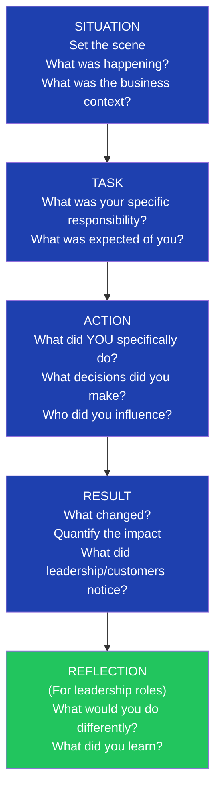

### STAR Use Cases by Audience

| Audience | STAR Adaptation | Focus |
|---|---|---|
| Interview Panel | Full STAR with quantified results | Personal contribution, leadership decisions |
| Executive Sponsor | Situation + Result only (lead with outcome) | Business impact, risk removed |
| Client Stakeholders | Situation + Action + Result | What you did for them, what changed |
| Peer Teams | Task + Action | How you solved it, what they can learn |
| Team Members | Situation + Task | Context-setting for their work |

### STAR Story Bank — Leadership Scenarios

**Scenario 1: Influencing without authority**

> Situation: Two teams had conflicting priorities blocking a shared customer deliverable.
> Task: Needed both teams aligned without having authority over either.
> Action: Facilitated a joint session — mapped each team's OKRs, found shared customer outcome, proposed a phased approach that gave both teams a win. Created a shared dependency dashboard both PMs could see.
> Result: Teams aligned in one session. Deliverable shipped 3 weeks earlier than original projection. Pattern became the standard for cross-team alignment in the org.

**Scenario 2: Managing upward**

> Situation: Executive sponsor kept changing requirements mid-sprint, disrupting velocity.
> Task: Protect the team while maintaining the relationship.
> Action: Introduced a bi-weekly "change review" meeting with the sponsor — established that any new requirement would be evaluated against current sprint commitments. Gave the sponsor visibility and a clear channel.
> Result: Mid-sprint changes dropped by 80%. Team velocity improved by 30%. Sponsor felt heard and respected the process.

### Interview Q&A

| Question | Strong Answer |
|---|---|
| Walk me through your STAR method | Situation gives context → Task defines what was expected of me specifically → Action focuses on MY decisions → Result quantifies the change |
| How do you handle "tell me about a failure"? | Use STAR but lead with what you learned — show growth, not damage control |
| How do you adapt STAR for different audiences? | Executives want S+R. Peers want A+R. Interviews want all four with metrics |
| What makes a weak STAR response? | Vague results ("things improved"), using "we" without saying what YOU did, no metrics |
| How do you build a STAR story bank? | After every significant project, document 3 STAR stories — covering: delivery, conflict, leadership |

---

## 6. Explain Through Scenarios

### Overview

People retain scenarios 22x better than abstract processes (cognitive science research finding). Scenario-based communication transforms complex architectures and business processes into memorable narratives by anchoring them in a concrete user or customer journey. It is the most effective tool for client presentations, executive briefings, and team alignment.

### Scenario Construction Framework

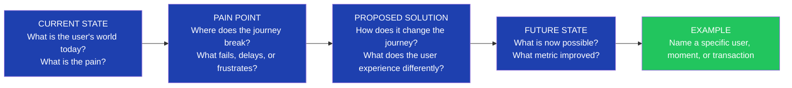

### Scenario Types for Business Communication

**Type 1 — Customer Journey Scenario** (for client-facing communication)

> "When Sarah, a new customer, signs up today, she waits 48 hours for account verification because every submission goes through manual review. With our new automation, Sarah's account is verified in under 90 seconds — and she gets a personalized welcome experience driven by the data captured during signup."

**Type 2 — System Integration Scenario** (for technical stakeholders)

> "When an order is placed, the Order Service validates inventory in real-time via the Inventory API, triggers the Payment Service for authorization, and emits an event that the Fulfillment Service picks up to begin warehouse processing — all within 200ms, with no synchronous blocking between services."

**Type 3 — Leadership Decision Scenario** (for executive communication)

> "If we proceed with Option A today, by Q4 we can onboard enterprise clients without custom integration work. If we delay, each new enterprise client costs us 6 weeks of integration engineering — at current pipeline, that's $1.2M in delayed ARR."

### Scenario Template

```
WHO: [Name the user/persona — makes it real]
NOW: [What is their current painful journey?]
BREAK: [Where exactly does it fail them?]
CHANGE: [What specifically changes with your solution?]
AFTER: [What is their new experience?]
METRIC: [What number proves it worked?]
```

### Interview Q&A

| Question | Strong Answer |
|---|---|
| How do you explain complex systems to non-technical stakeholders? | Scenario-based communication — I name a user, walk through their journey before and after, and anchor the technical change to their experience |
| How do you make architecture decisions feel real? | I use the "if Sarah does X, here's what happens in each system" approach — it makes abstract flows tangible |
| Give an example of scenario-based communication | [Walk through a real project using WHO/NOW/BREAK/CHANGE/AFTER structure] |
| How do you handle a room that isn't following? | Switch to a scenario immediately — "let me make this concrete with an example" |
| Why are scenarios more effective than process descriptions? | People remember stories, not flowcharts. Scenarios anchor technical concepts in human experience |

---

## 7. Stakeholder Mapping & Influence Strategy

### Overview

Every project has a political landscape — stakeholders with different levels of interest, authority, and alignment. Stakeholder mapping is not a bureaucratic exercise; it is active relationship intelligence that determines which conversations to have, in what order, and with what message. Leaders who manage stakeholders well rarely get ambushed.

### Stakeholder Landscape Map

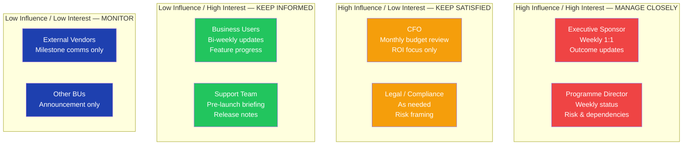

### Influence Without Authority Framework

When you need something from someone who does not report to you:

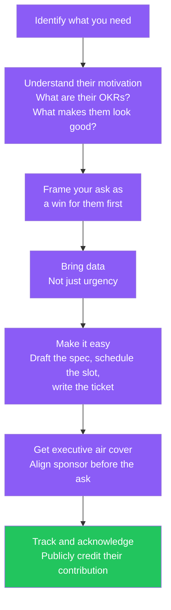

### Stakeholder Communication Matrix

| Stakeholder | Frequency | Channel | Message Focus | Tone |
|---|---|---|---|---|
| Executive Sponsor | Weekly | 1:1 meeting + email | Outcomes, risks, decisions needed | Strategic, concise |
| Programme Director | Weekly | Status report | Timeline, dependencies, blockers | Factual, detailed |
| Product Owner | Daily | Stand-up + Slack | Sprint progress, impediments | Collaborative |
| Business Users | Bi-weekly | Demo or email | Feature progress, what they'll experience | Engaging, jargon-free |
| External Vendors | Milestone-based | Email + meeting | Deliverable status, SLA compliance | Formal, precise |

### Stakeholder Persona Cards

For each key stakeholder, maintain a mental (or documented) persona card:

```
Name / Role: [Name]
Primary motivation: [What do they care most about?]
Communication style preference: [Bullet points / narrative / visual / verbal]
Decision authority: [What can they approve / veto?]
Key concern about this project: [What keeps them up at night?]
Best time to engage: [Meeting, email, before/after events]
What makes them feel respected: [Data, consultation, recognition]
```

### Interview Q&A

| Question | Strong Answer |
|---|---|
| How do you manage difficult stakeholders? | Stakeholder persona mapping — understand their motivation first, then frame every interaction around their success criteria |
| How do you influence without authority? | Shared goals + executive alignment + making it easy for them + public recognition — in that order |
| How do you handle a stakeholder who blocks progress? | Private conversation first — understand their concern, find a compromise, escalate only when the business impact is documented |
| How do you build executive trust? | Consistent, outcome-focused updates before they ask, zero surprises, and always coming with a solution alongside a problem |
| What is your stakeholder communication cadence? | Segment by influence/interest quadrant — manage closely, keep satisfied, keep informed, or monitor |

---

## 8. User Journey & Heat Mapping

### Overview

Before designing any solution, map where users actually struggle — not where you assume they struggle. User journey mapping reveals friction points, manual processes, and delays that represent the highest-value investment opportunities. Heat mapping quantifies where those problems are most severe.

### User Journey Mapping Framework

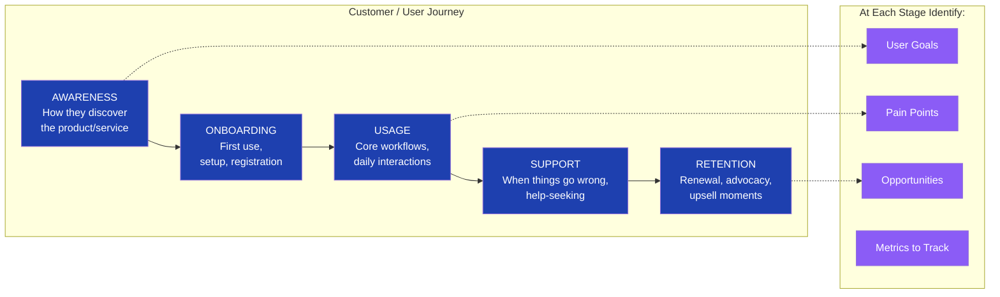

### Heat Map Analysis for Investment Prioritization

| Journey Stage | Volume of Complaints | Manual Effort (hrs/week) | Revenue Impact | Priority Score |
|---|---|---|---|---|
| Onboarding | High | 40 hrs | $500K ARR blocked | P0 — Act now |
| Document submission | High | 25 hrs | 22% drop-off | P0 — Act now |
| Payment processing | Medium | 10 hrs | $100K delayed | P1 — Next sprint |
| Reporting | Low | 5 hrs | No direct revenue | P2 — Backlog |

### Empathy Map for Stakeholder / User Understanding

For each persona:

| Dimension | Detail |
|---|---|
| **Thinks & Feels** | What concerns dominate their mental model? |
| **Hears** | What are colleagues, leaders, customers saying? |
| **Sees** | What does their environment look like? What tools do they use? |
| **Says & Does** | What do they express publicly vs. do privately? |
| **Pain** | What are their top 3 frustrations? |
| **Gain** | What does success look like for them? |

### Interview Q&A

| Question | Strong Answer |
|---|---|
| How do you identify where to invest first? | Heat mapping — combine complaint volume, manual effort hours, and revenue impact to create a priority score |
| What is a user journey map? | A visual representation of every touchpoint a user has with the product — showing their goals, pain points, and emotions at each stage |
| How do you validate that you've identified the right pain points? | User interviews, support ticket analysis, NPS verbatim comments, usage analytics — triangulate from multiple sources |
| How do you use journey mapping in stakeholder communication? | It's the most powerful tool for getting business stakeholders and engineers aligned — everyone sees the same customer reality |
| How do you prioritize user pain points? | Frequency × severity × revenue impact — then layer in feasibility |

---

## 9. Product Manager vs Product Owner vs Engineering Leader

### Overview

These roles are often confused, miscast, or merged inappropriately. Understanding the distinction helps communication — you know who is accountable for what question, and you can escalate, escalate, and collaborate with precision.

### Role Comparison Architecture

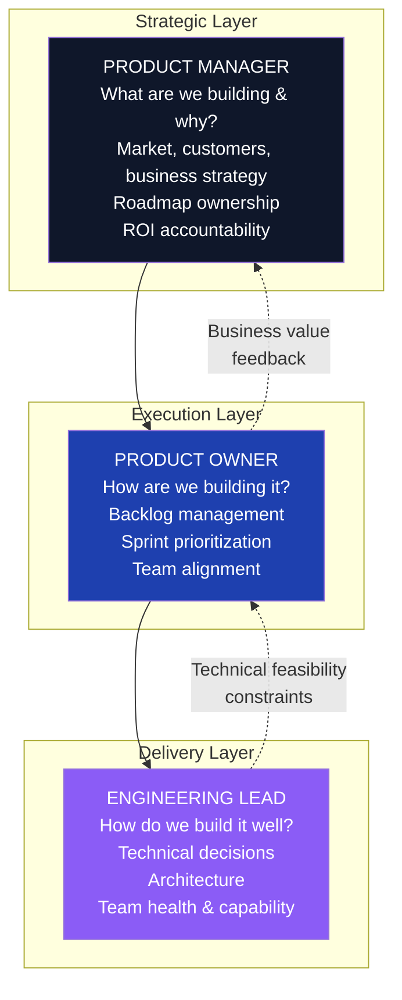

### Role-Specific Communication

| Dimension | Product Manager | Product Owner | Engineering Lead |
|---|---|---|---|
| Primary Question | Are we building the right thing? | Are we building it the right way? | Are we building it sustainably? |
| Audience | Executives, customers, market | Development team, PO board | Engineers, architects |
| Communication Frequency | Monthly roadmap + weekly alignment | Daily stand-up, sprint ceremonies | Daily engineering + weekly 1:1s |
| Key Documents | Product vision, roadmap, business case | User stories, acceptance criteria, backlog | ADRs, design docs, runbooks |
| Success Metric | Revenue, NPS, market share | Velocity, story completion, predictability | DORA metrics, reliability, tech debt ratio |

### The Venn Diagram Zone — Where Confusion Happens

**Overlapping Responsibilities:**
- Both PM and PO are responsible for stakeholder communication (different layers)
- Both PO and Engineering Lead are responsible for sprint-level planning
- In small teams, one person may hold PM + PO responsibilities

**Communication Rule:**
> When in doubt about who owns a decision, ask: "Is this a market/customer question (PM), a team/sprint question (PO), or a technical/quality question (Engineering Lead)?"

### Interview Q&A

| Question | Strong Answer |
|---|---|
| What is the difference between PM and PO? | PM owns the vision and business case — "are we building the right thing?" PO owns execution — "are we building it the right way?" |
| How do you work with a PM as an Engineering Lead? | I surface technical constraints and architecture options; they make the business prioritization call. Mutual respect for domain authority |
| When does the PM/PO split cause problems? | When neither owns the stakeholder communication gap — users get conflicting messages, priorities shift without coordination |
| How do you influence the roadmap as an engineer? | Technical credibility + business language — frame every architectural concern as a business risk or revenue opportunity |
| What does good PM-PO-Engineering alignment look like? | Shared definition of done, transparent backlog visible to all, joint sprint demos, and a pre-agreed escalation path for conflicts |

---

## 10. Meeting Effectiveness Framework

### Overview

Meetings are the most expensive communication tool available — they consume multiple people's time simultaneously. Effective leaders treat every meeting as a product: it has a clear purpose, defined users (participants), measurable output (decisions), and quality criteria (was time well spent?).

### Meeting Type Selection Matrix

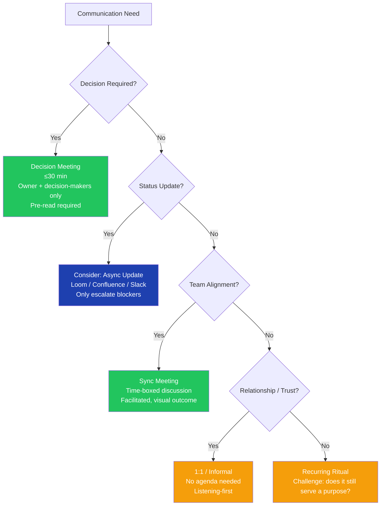

### Meeting Protocol Framework

**Before the Meeting**
- Send agenda 24 hours in advance (or cancel)
- Identify: what decision must be made, what input is needed, who must attend (vs. FYI)
- Distribute pre-reads so meeting time is not used for information transfer

**During the Meeting**
- Timekeeper assigned for agenda items
- Capture: decisions, actions (with owner + due date), risks flagged, open questions
- Parking lot for off-topic items — do not let them derail

**After the Meeting**
- MOM (Minutes of Meeting) distributed within 24 hours
- Actions tracked in shared system (JIRA, Confluence, etc.)
- Follow-up scheduled only if genuinely needed

### Meeting Types for Leaders

| Meeting Type | Frequency | Duration | Purpose | Output |
|---|---|---|---|---|
| 1:1 with direct reports | Weekly | 30-45 min | Growth, blockers, relationship | Action items, feedback notes |
| Team stand-up | Daily | 15 min | Sync, unblock | Blockers identified |
| Sprint planning | Bi-weekly | 2-4 hrs | Commitment | Sprint backlog |
| Sprint retrospective | Bi-weekly | 60-90 min | Team improvement | Improvement actions |
| Stakeholder steering | Monthly | 60 min | Alignment, decisions | Decisions log, risk updates |
| All-hands | Quarterly | 60 min | Culture, direction | Team alignment |
| Skip-level | Quarterly | 30 min | Trust, signal | Unfiltered insights |

### MOM Template

```markdown
## Meeting: [Title]
**Date:** [YYYY-MM-DD]  
**Attendees:** [Names + Roles]  
**Facilitator:** [Name]

### Decisions Made
- [Decision 1 — with owner]
- [Decision 2]

### Action Items
| Action | Owner | Due Date | Priority |
|---|---|---|---|
| [Specific action] | [Name] | [Date] | High |

### Risks Flagged
- [Risk with owner and mitigation]

### Open Questions
- [Question + who is responsible for resolving]

### Next Meeting
[Date, time, agenda preview]
```

### Interview Q&A

| Question | Strong Answer |
|---|---|
| How do you run effective meetings? | Agenda 24 hours in advance, decision-focused agenda, timekeeper, MOM within 24 hours — and a ruthless cancel policy for meetings without a clear purpose |
| How do you handle meeting overload? | Audit every recurring meeting quarterly — for each: what decision does it produce? If none, challenge whether it should exist |
| How do you run a 1:1 effectively? | Their agenda first, always — my job is to remove blockers and accelerate their growth, not report status up |
| How do you keep distributed teams aligned? | Async-first for status, sync for decisions, ritual for culture — and written documentation as the source of truth |
| How do you handle people who don't engage in meetings? | Pre-read materials, direct questions to specific people, smaller meeting sizes — and check offline if there's a psychological safety issue |

---

## 11. Communication Checklist for Leaders

### Overview

Great leaders develop a communication instinct — they ask the same quality questions before every message, update, or presentation. This checklist codifies that instinct and makes it consistently applicable across contexts.

### The 7-Point Leadership Communication Check

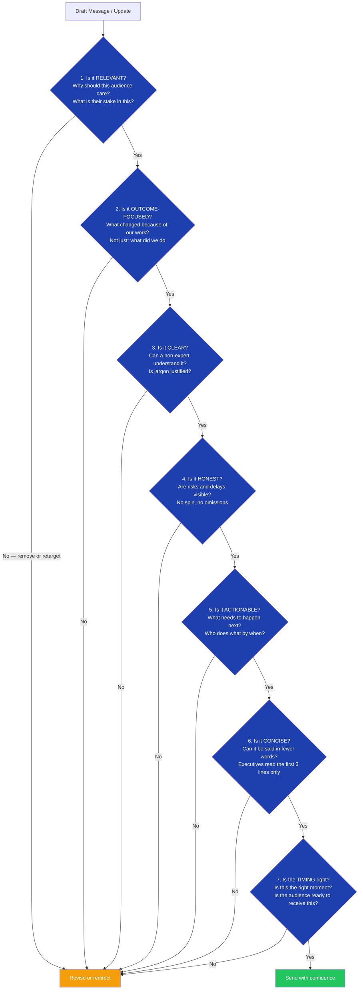

### Communication Layers for Leaders

| Layer | Audience | Message Focus | Frequency | Format |
|---|---|---|---|---|
| Team | Direct reports | What, why, how — with full context | Daily / Sprint | Stand-up, Slack, 1:1 |
| Peers | Cross-functional leads | Shared goals, dependencies, asks | Weekly | Email, meeting |
| Manager / Director | Your manager | Outcomes, risks, needs from them | Weekly | 1:1, status report |
| Executive | C-suite / VP | Business impact, decisions needed, risks | Monthly / Milestone | One-page summary, steering deck |
| External | Clients, vendors, regulators | Formal, precise, outcome-focused | As needed | Formal email, meeting |

### The No-Surprise Rule

> **The golden rule of leadership communication: your manager should never hear bad news from someone else first.**

Proactive escalation protocol:
1. You identify a risk or delay
2. You assess impact (low / medium / high)
3. Medium/high → communicate to your manager within 24 hours
4. Come with: the problem, what you've already done, and a proposed path forward

### Interview Q&A

| Question | Strong Answer |
|---|---|
| What is your communication philosophy as a leader? | Outcome-focused, no-surprise, audience-appropriate — I tailor the message to what the audience needs to make a decision, not what I find interesting |
| How do you handle delivering bad news? | Lead with facts, quantify the impact, show what you've already done to mitigate, and present options — never hide or delay bad news |
| How do you ensure your team communicates effectively? | Model the behavior, give feedback in retrospectives, and create templates (MOM, STAR stories, status update format) that make good communication easy |
| What do you do when communication breaks down on a project? | Name the breakdown explicitly, identify whether it is a trust, clarity, or process issue, and address the root cause directly |
| How do you communicate across cultures and time zones? | Async-first with written documentation as source of truth, be explicit about context others may not have, and over-communicate on decisions |

---

## 12. Leadership Communication Styles

### Overview

Great leaders do not use a single communication style — they adapt to the person in front of them, the context, and the required outcome. Understanding your own default style and when to flex it is a core leadership competency that directly impacts team effectiveness.

### Leadership Communication Style Matrix

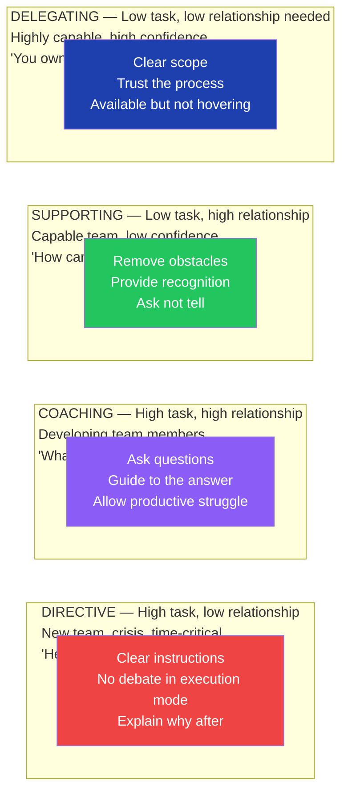

### Situational Leadership Communication Guide

| Situation | Recommended Style | Key Communication Behavior |
|---|---|---|
| New team member (first 90 days) | Directive → Coaching | Clear expectations + frequent check-ins + explanation of "why" |
| Experienced team member, new challenge | Coaching | Questions over answers, allow experimentation |
| Crisis or incident | Directive | Clear, calm, decisive — no ambiguity |
| High performer, routine work | Delegating | Visibility without micromanagement |
| Underperformer | Coaching → Directive | Start with understanding, escalate to clarity if no change |
| Peer alignment | Supporting | Collaborative, interest-based, not positional |
| Executive communication | Directive framing | Lead with decision needed, then provide supporting context |

### Psychological Safety in Team Communication

Leaders create (or destroy) psychological safety through communication micro-behaviors:

**Safety-Building Behaviors:**
- Ask "what am I missing?" not "does everyone agree?"
- Thank people for raising concerns, especially publicly
- Respond to failures with curiosity ("what happened?") not blame ("whose fault?")
- Share your own uncertainties openly

**Safety-Destroying Behaviors:**
- Dismissing concerns in front of the team
- Celebrating individuals at the expense of others
- Using meeting time to assign blame
- Silence after someone takes a risk and it fails

### Interview Q&A

| Question | Strong Answer |
|---|---|
| What is your leadership communication style? | Situational — I adapt based on the person's experience level and confidence. I lean coaching for development and directive for crises |
| How do you create psychological safety? | Model vulnerability, respond to failure with curiosity, publicly celebrate people who raise concerns — and hold a zero-blame norm |
| How do you communicate differently with senior vs. junior team members? | Senior: delegate scope with clear outcomes, minimal process. Junior: clear instructions with "why," frequent check-ins, coaching questions |
| How do you give difficult feedback? | In private, specific behavior not character, impact-focused, with a clear ask for change — and I follow up |
| How do you handle a team member who doesn't communicate proactively? | Understand the root cause first (fear, uncertainty, workload). Then make it safe and easy — create a simple "escalate early" norm with examples |

---

## 13. Team Management & Performance Communication

### Overview

Managing team performance through communication is one of the most nuanced leadership skills. It requires clarity about expectations, regularity in feedback, and the ability to have difficult conversations early — before small issues become career-defining moments.

### Performance Communication Lifecycle

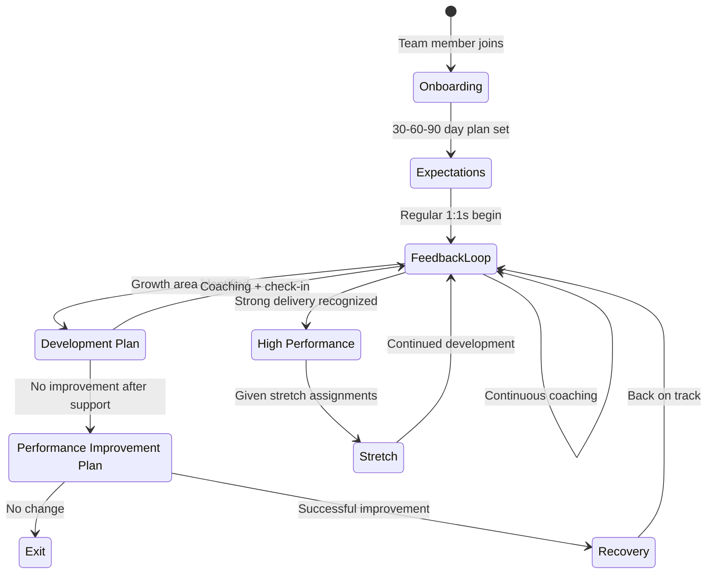

### 1:1 Communication Framework

The most important recurring communication a leader has. It should be the direct report's meeting, not the manager's.

**1:1 Agenda Structure (30-45 min weekly):**

```
5 min — Check-in (human first)
10 min — Their agenda (blockers, questions, updates they choose to share)
10 min — Feedback (one specific behavior or outcome — positive or developmental)
5 min — Coaching question (one open question about their growth)
5 min — My agenda (context they need, asks from me)
5 min — Action summary
```

**Questions that unlock great 1:1 conversations:**
- "What is the one thing I could do to make your work easier this week?"
- "What are you most proud of from the last two weeks?"
- "What is something you are worried about that I might not be aware of?"
- "What would you want to be working on that you're not currently doing?"
- "What do I do that makes it harder for you to do your best work?"

### Feedback Model — SBI Framework

**Situation — Behavior — Impact**

```
SITUATION: "In yesterday's client meeting..."
BEHAVIOR: "...when the client asked about the timeline, you said 'I don't know, ask the PM.'"
IMPACT: "That created uncertainty for the client and they followed up with me separately. It also puts the PM in an awkward position."
ASK: "Next time, could you say 'Let me confirm that for you by end of day' — and then close the loop? That keeps confidence high."
```

Never use: "You always..." / "You never..." / Character judgments

### Recognition Communication — Making It Stick

| Recognition Type | Timing | Audience | Medium |
|---|---|---|---|
| Immediate | Same day as behavior | 1:1 or small team | Verbal / Slack DM |
| Public recognition | Sprint review / all-hands | Whole team | Verbal + written |
| Career-level recognition | Performance review | Manager + HR | Formal record |
| Peer recognition | Sprint retrospective | Team | Team ceremony |

**Recognition formula:**
> "[Name] did [specific behavior] in [specific context] — which led to [specific outcome]. This is exactly the kind of [quality] we want to see more of."

### Interview Q&A

| Question | Strong Answer |
|---|---|
| How do you give feedback? | SBI model — Situation, Behavior, Impact — in private, specific, timely, and with a clear ask for change |
| How do you handle underperformance? | Early and direct — name the gap in behavior terms, not judgment terms. Provide support first, clear expectations, and only escalate after coaching |
| How do you run 1:1s? | It's their meeting — their agenda first. I use it for coaching, feedback, and removing blockers — not status reporting |
| How do you retain top performers? | Stretch assignments, visibility to senior leadership, career development conversations, and recognition — both public and personal |
| What do you do when a team member is disengaged? | Have a direct, compassionate conversation — try to understand the root cause. It's usually a gap in: meaning, mastery, or autonomy |

---

## 14. Executive Communication

### Overview

Communicating with executives requires a fundamentally different approach than communicating with peers or teams. Executives operate in a context of extreme information scarcity and time pressure — they make decisions based on one-page summaries and 5-minute briefings. Mastering executive communication is the difference between being seen as a technical expert and being seen as a leader.

### Executive Communication Architecture

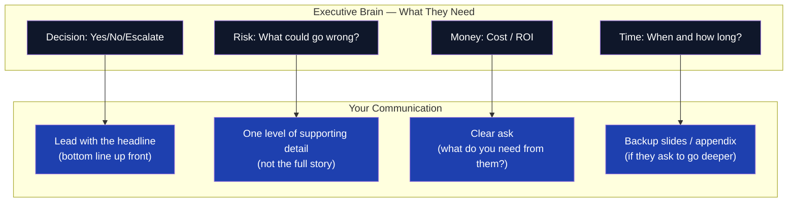

### The Executive One-Pager Template

```markdown
## [Project / Initiative Name] — Executive Update
**Date:** [Date] | **Author:** [Your Name] | **For:** [Executive Name]

### Status: 🟢 On Track / 🟡 At Risk / 🔴 Off Track

### Headline (one sentence)
[The most important thing they need to know right now]

### Business Impact
[What this enables / what risk it removes — in dollars or strategic terms]

### Progress This Period
- [Milestone 1]: Complete / [date]
- [Milestone 2]: On track for [date]

### Risks & Mitigation
| Risk | Likelihood | Impact | Mitigation |
|---|---|---|---|
| [Risk description] | Medium | High | [What you are doing about it] |

### Decision Required
[Specific ask — yes/no, approval, resource, escalation]

### Next Milestone
[What happens next and when]
```

### Managing Up — Communication Protocols

**Rule 1 — Bottom Line Up Front (BLUF)**
Lead with the conclusion, then provide context. Never make an executive wait through 10 minutes of context to get to the point.

**Rule 2 — No Surprise Rule**
Bad news delivered early is a risk. Bad news delivered late is a failure. Always communicate risks proactively.

**Rule 3 — Bring Solutions, Not Just Problems**
"We have a problem" is not a complete sentence to an executive. "We have a problem, here are 3 options, I recommend option 2 for these reasons" is.

**Rule 4 — Own the Narrative**
If you don't communicate proactively, someone else will — and you lose control of the story.

### Interview Q&A

| Question | Strong Answer |
|---|---|
| How do you communicate with the C-suite? | Bottom line up front, one page, business outcomes not technical details, clear ask — and always prepared to go deeper if they ask |
| How do you handle an executive who micromanages? | Increase proactive communication — weekly one-pager, pre-empt their questions — and create a decision RACI so they know what needs their input |
| How do you present a failed initiative to leadership? | Lead with what was learned, what was saved by stopping early, and what you'd do differently. Executives respect honest retrospectives |
| What is the most common executive communication mistake? | Leading with process and detail instead of outcome and decision. Executives are optimized for decisions, not information consumption |
| How do you get executive sponsorship for a new initiative? | Frame it as: business problem, quantified opportunity, your proposed solution, resource ask, and ROI — in that order |

---

## 15. Change Management Communication

### Overview

Every significant project is also a change management project. People don't resist change — they resist loss (of control, familiarity, status, or competence). Effective change communication addresses the emotional journey, not just the logical case. Leaders who understand this ship successful transformations. Leaders who skip this create successful technology deployments that nobody uses.

### Change Communication Journey Map

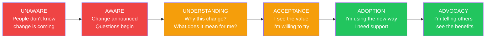

### ADKAR Communication Model

| Stage | Communication Goal | Key Message | Channel |
|---|---|---|---|
| **A**wareness | They know change is happening | "What is changing and when" | All-hands, email |
| **D**esire | They want to support it | "Why this matters to you and the organization" | 1:1, team meeting |
| **K**nowledge | They know how to change | "Here's what you'll do differently" | Training, runbooks |
| **A**bility | They can do it | "Here's the support you have" | Coaching, helpdesk |
| **R**einforcement | They keep doing it | "Here's recognition for the new behavior" | Public recognition |

### Change Communication Calendar

| Week | Communication | Owner | Channel | Message Focus |
|---|---|---|---|---|
| -4 | Change announcement | Exec Sponsor | All-hands | Why change, vision |
| -3 | Detailed impact by team | PM / Change Lead | Team meetings | What changes for YOU |
| -2 | Training delivery | L&D / Project Team | Workshop | How to do the new thing |
| -1 | FAQ and open Q&A | PM + Tech Lead | Town hall / Slack | Address concerns |
| 0 | Go-live comms | PM | Email + Slack | It's live — here's support |
| +1 | Week 1 pulse check | Manager | 1:1 | What's working, what's hard |
| +4 | Adoption review | PM + Leadership | Dashboard + meeting | Metrics, recognition, fixes |

### Resistance Communication — Addressing the Hidden Concerns

| Resistance Pattern | What They're Really Saying | Communication Response |
|---|---|---|
| "This won't work here" | I've been burned before | Acknowledge the history, share evidence from similar contexts |
| "We're too busy for this" | This feels like extra work | Show what gets easier, not just what changes |
| "Nobody asked us" | I feel disrespected | Involve them in the rollout — give them agency |
| "The old way was fine" | I'm afraid of looking incompetent | Provide training, normalize the learning curve |
| "Leadership will lose interest" | I don't trust this will stick | Visible executive reinforcement + tracking metrics |

### Interview Q&A

| Question | Strong Answer |
|---|---|
| How do you manage organizational resistance to change? | Address the emotional journey, not just the logical case — understand what people fear losing, and design communication that speaks to that |
| What is the most important factor in successful change? | Leadership credibility — if people don't trust the leader or believe the why, no amount of communication will overcome it |
| How do you measure change adoption? | Usage metrics, error rates, support ticket volume, NPS from affected users — and qualitative feedback from skip-level conversations |
| How do you sustain change after go-live? | Reinforcement — recognition of new behaviors, removal of old tools/processes, and visible leadership modeling the change |
| What do you do when a change initiative is failing mid-flight? | Stop and diagnose — is it an awareness, desire, knowledge, or ability gap? Address the right gap, don't just communicate more |

---

## 16. Crisis & Conflict Communication

### Overview

Leaders are tested not in normal operations but in moments of crisis, conflict, and ambiguity. The quality of communication in these moments defines leadership reputation. Crises handled with transparency build trust. Crises handled with deflection destroy it. Conflict avoided festers; conflict addressed thoughtfully becomes a source of stronger relationships.

### Crisis Communication Response Framework

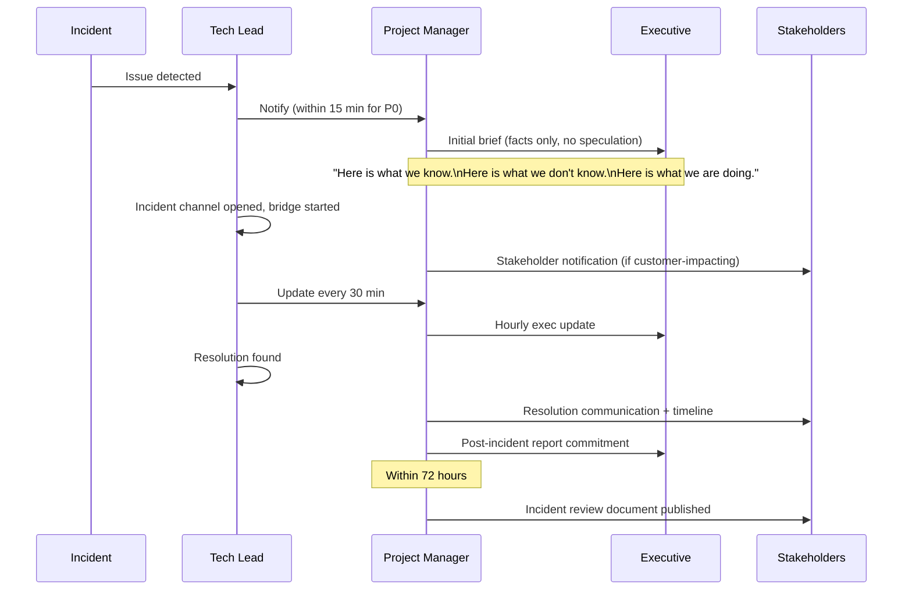

### Crisis Communication Template

**First communication (within 15 minutes of confirmed P0):**

```
INCIDENT NOTIFICATION — [Time] [Date]

We are currently experiencing [describe impact in customer terms — not technical terms].

Affected: [What users / features / regions]
Impact: [What they cannot do]
Status: Investigating — we will update in 30 minutes

Next update: [Time]
Contact: [Incident commander name and channel]
```

**Resolution communication:**

```
INCIDENT RESOLVED — [Time] [Date]

[Describe what was restored] is now operating normally.

Duration: [Start time] to [End time] ([X hours/minutes])
Customer Impact: [Who was affected and how]
Root Cause: [Brief, honest description]
Next Steps: Full incident review document will be published by [date]

We apologize for the disruption.
```

### Conflict Resolution Communication Framework

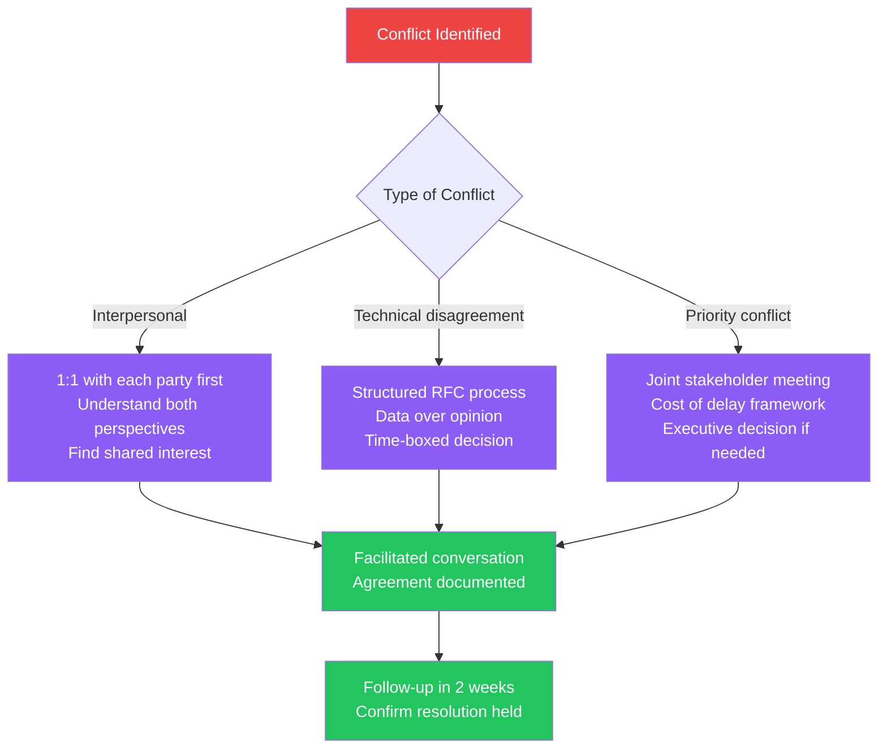

### Difficult Conversation Preparation Framework

Before any difficult conversation:

1. **Clarify your intent** — Am I here to win, or to solve? (Always: solve)
2. **Separate facts from interpretation** — What objectively happened vs. what it means
3. **Anticipate their perspective** — What would they say if you asked them?
4. **Identify the shared interest** — What do both parties actually want in common?
5. **Choose the right setting** — Private, no time pressure, no audience
6. **Lead with curiosity** — "Help me understand your perspective on this"

### Interview Q&A

| Question | Strong Answer |
|---|---|
| How do you handle a public disagreement in a meeting? | Acknowledge the tension, take it offline — "Let's make sure we do this topic justice, let's schedule a separate session" |
| How do you manage an incident? | Notify fast (even with incomplete info), communicate what you know and don't know, update on a cadence, and publish a blameless post-mortem |
| How do you resolve conflict between two team members? | 1:1 with each first, then facilitated joint session focused on the work problem (not the personality problem), documented agreement |
| How do you handle a stakeholder who is publicly undermining your project? | Private conversation first to understand their concern — is it a real issue I'm missing? If it continues, escalate with documented facts |
| What is the biggest mistake leaders make in a crisis? | Going silent — people fill information vacuums with worst-case assumptions. Communicate early and often, even when you don't have all the answers |

---

## 17. Personal Development Roadmap

### Overview

Leadership and communication excellence is not a destination — it is a practice. The most effective leaders are deliberate about their own development, seek feedback actively, and invest in skills that compound over time. This roadmap provides a structured 12-month development framework.

### 12-Month Development Architecture

```mermaid
flowchart LR
    subgraph Q1 ["Q1 — Foundation"]
        F1["Communication Audit\nRecord 3 meetings\nIdentify patterns"]
        F2["STAR Story Bank\n10 stories documented\nwith metrics"]
        F3["Stakeholder Map\nCurrent project\nall relationships"]
    end

    subgraph Q2 ["Q2 — Execution Skills"]
        E1["Executive Communication\nOne-pager format\nfor every major update"]
        E2["Feedback Practice\nSBI framework\n2x per week minimum"]
        E3["Meeting Facilitation\nLead 3 complex\nalignment meetings"]
    end

    subgraph Q3 ["Q3 — Influence Skills"]
        I1["Cross-functional project\nLead one initiative\nwithout authority"]
        I2["Public presentation\nPresent to 50+ audience\nor record Loom series"]
        I3["Change communication\nDesign ADKAR plan\nfor a team change"]
    end

    subgraph Q4 ["Q4 — Leadership Presence"]
        L1["Skip-level conversations\nWith 3+ senior leaders"]
        L2["Mentor junior colleague\nStructured 6-month program"]
        L3["Personal brand\nLinkedIn or internal\nthought leadership"]
    end

    Q1 --> Q2
    Q2 --> Q3
    Q3 --> Q4

    classDef q1 fill:#1e40af,color:#fff
    classDef q2 fill:#8b5cf6,color:#fff
    classDef q3 fill:#f59e0b,color:#fff
    classDef q4 fill:#22c55e,color:#fff

    class F1,F2,F3 q1
    class E1,E2,E3 q2
    class I1,I2,I3 q3
    class L1,L2,L3 q4
```

### Skill Development Matrix

| Skill Area | Beginner Practice | Intermediate Practice | Advanced Practice |
|---|---|---|---|
| Executive Communication | Write one-pager for current project | Present to director level without notes | Facilitate C-suite steering committee |
| Stakeholder Management | Map stakeholders for one project | Manage competing priorities across 5+ stakeholders | Navigate organizational politics on a transformation program |
| Outcome Communication | Reframe weekly status in SAIOO format | Write executive briefing document | Present business case with financial model |
| Feedback | Give SBI feedback in 1:1 | Facilitate team retrospective | Build team feedback culture from scratch |
| Conflict Resolution | Use interest-based framing in one conversation | Mediate between two team members | Resolve cross-organizational conflict |
| Change Management | Design ADKAR plan for small team change | Lead department-level rollout | Executive change sponsor for org-wide transformation |

### Reading & Learning Stack

| Category | Resource Type | Recommended Focus |
|---|---|---|
| Communication | Books + practice | "Crucial Conversations", "Made to Stick" |
| Leadership | Coaching + 360 feedback | Situational Leadership, emotional intelligence |
| Business Acumen | Finance for non-finance course | P&L literacy, ROI framing |
| Influence | Case studies | Harvard negotiation frameworks |
| Presence | Toastmasters or equivalent | Delivery, improvisation, listening |

### Interview Q&A

| Question | Strong Answer |
|---|---|
| How do you develop yourself as a leader? | Structured self-assessment, STAR story bank, regular 360 feedback, and deliberate practice of the specific skills I'm developing |
| What is your biggest leadership growth area? | [Choose one real area + describe what you are actively doing about it — shows self-awareness and growth mindset] |
| How do you develop your team members? | Career conversations to understand their goals, stretch assignments matched to their goals, coaching through 1:1s, and regular SBI feedback |
| What books or frameworks have shaped your leadership? | [Name 2-3 real resources with what specifically you applied — shows authentic development, not name-dropping] |
| How do you know when you're communicating well? | Others make better decisions faster, conflicts surface early and resolve quickly, and stakeholders proactively seek me out for alignment |

---

## 18. Cross-Cutting Themes

### Pattern Selection Guide — When to Use Which Communication Approach

```mermaid
flowchart TD
    NEED["Communication Needed"] --> Q1{Who is the audience?}
    Q1 -->|Executive / C-suite| EXEC["Executive One-Pager\n+ BLUF opening\n+ Business outcome focus"]
    Q1 -->|Business Stakeholder| STAKE["SAIOO Formula\n+ Scenario-based explanation\n+ Risk/Value framing"]
    Q1 -->|Team| TEAM["STAR Story\n+ SBI Feedback\n+ 1:1 coaching conversation"]
    Q1 -->|Cross-functional peers| PEER["Interest-based framing\n+ Shared goal identification\n+ Dependency map"]
    Q1 -->|Client / External| EXT["Scenario-first\n+ Outcome-focused\n+ Formal documentation"]

    EXEC --> D1{Decision or update?}
    D1 -->|Decision| D1A["Lead with ask\nThen 3 options\nThen your recommendation"]
    D1 -->|Update| D1B["Status: RAG\nHeadline\nRisk\nNext step"]

    STAKE --> D2{Change or delivery?}
    D2 -->|Change| D2A["ADKAR journey\nResistance-aware"]
    D2 -->|Delivery| D2B["Value delivered\nMetric change\nWhat's next"]

    classDef primary fill:#1e40af,color:#fff
    classDef secondary fill:#8b5cf6,color:#fff
    classDef outcome fill:#22c55e,color:#fff

    class EXEC,STAKE,TEAM,PEER,EXT primary
    class D1,D2 secondary
    class D1A,D1B,D2A,D2B outcome
```

### Common Communication Red Flags — What to Avoid

| Red Flag | Why It Fails | Correct Approach |
|---|---|---|
| "We're working on it" to an executive | Gives no information — creates anxiety | "We're resolving X, estimate resolved by 3pm, risk to Y is low" |
| Leading with the "how" before the "why" | Audience disengages before reaching the point | Lead with the business outcome, then explain the approach |
| "I don't know" without a follow-up | Undermines confidence | "I don't have that number — I'll have it for you by 4pm" |
| Using "we" when the exec needs to know YOUR role | Makes your contribution invisible | Be explicit: "I recommended X, and led Y" |
| Delivering bad news in writing first | Executive reads it cold, without context | Brief verbally first, then follow up in writing |
| Overloading updates with technical detail | Executive attention is lost | One key insight + one risk + one ask — no more |
| Waiting for perfect information to communicate | Creates surprises | Communicate with what you know — flag uncertainty explicitly |
| Saying "that's not my responsibility" | Destroys leadership perception | "That isn't in my scope, but I can connect you with the right person" |

### The Golden Rules of Leadership Communication

> **Rule 1:** Don't communicate what the team did. Communicate what changed because of what the team did.

> **Rule 2:** Your manager should never hear bad news from someone else first.

> **Rule 3:** The best time to raise a problem is before it becomes a crisis. The second best time is now.

> **Rule 4:** Make it easy for your audience to say yes. Lead with the decision they need to make, then give them exactly what they need to make it.

> **Rule 5:** Communication is not what you say — it is what the other person understands and does next.

---

*Communication & Leadership Excellence Guide | Updated July 2026*

---

## Additional Material from Communication-Overview.md

> Communication-Overview.md is largely a subset of the lead. Its condensed 'Golden Rule' summary callout and overview framing are preserved below.


* Communication Excellence
* Product Thinking
* Project & Program Management
* Stakeholder Management
* Documentation Discipline
* Outcome-Oriented Leadership
* SAFe/Agile Product Delivery
* Influencing Without Authority

I've organized the content into a structured learning and execution framework that can help improve both communication and project management skills.

# Communication & Project Management Excellence Framework

## 1. Understand Dependencies Before Taking Action

### Upstream Dependencies

Teams or stakeholders waiting for your output.

Ask:

* Who is blocked because of me?
* What information do they need?
* What is the impact of delay?

### Downstream Dependencies

Teams whose output depends on your work.

Track:

* Dependency owners
* Expected delivery dates
* Risks
* Escalation paths

### Practice

Create a Dependency Map for every project.

| Dependency | Owner  | Impact | Due Date | Risk   |
| ---------- | ------ | ------ | -------- | ------ |
| API Team   | Team A | High   | 10 Aug   | Medium |

---

# 2. Focus on Business Value, Not Tasks

When discussing requirements, move beyond:

❌ "What do they want?"

To:

✅ "Why do they need it?"

Evaluate every request against:

### Risk Reduction

* Does it reduce operational risk?
* Does it improve security?

### Scalability

* Will it support future growth?
* Can it handle increased volume?

### Cost of Delay

Ask:

"If we don't do this now, what happens?"

Examples:

* Revenue loss
* Customer dissatisfaction
* Competitor advantage
* Regulatory risk

---

# 3. Build Strong Documentation Habits

Your notes highlight documentation as a key communication enabler.

## Documentation Structure

### Categorize

Separate documents into:

* Business Requirements
* Functional Requirements
* Technical Design
* Decision Logs
* Meeting Notes
* Runbooks

### Standardize Templates

Every document should contain:

1. Objective
2. Background
3. Requirements
4. Risks
5. Dependencies
6. Decisions
7. Actions

### Stage-Based Documentation

Document at each stage:

| Stage       | Documentation   |
| ----------- | --------------- |
| Discovery   | Requirements    |
| Design      | Architecture    |
| Development | Technical Notes |
| Testing     | Test Results    |
| Deployment  | Release Notes   |

This creates evidence and traceability.

---

# 4. Use Outcome-Oriented Communication

One of the strongest ideas in your notes.

Avoid:

❌ Activity-Based Updates

"We completed API development."

Use:

✅ Outcome-Based Updates

"The API integration reduced processing time by 40%, enabling faster customer onboarding."

### Communication Formula

Situation → Action → Impact → Outcome

Example:

Situation:
Customer onboarding was taking 3 days.

Action:
Implemented automated validation workflow.

Impact:
Reduced manual intervention by 70%.

Outcome:
Onboarding time reduced to 4 hours.

---

# 5. Apply STAR Framework for Communication

### Situation

What was happening?

### Task

What needed to be achieved?

### Action

What did you do?

### Result

What changed?

Use this for:

* Client communication
* Leadership updates
* Interviews
* Project reviews

---

# 6. Explain Through Scenarios

People understand stories better than processes.

Instead of:

"We integrated three systems."

Say:

"When a customer places an order, System A validates the request, System B processes payment, and System C generates shipment details."

### Scenario-Based Communication

1. Current State
2. Pain Point
3. Proposed Solution
4. Future State

---

# 7. Stakeholder Mapping

Your notes mention:

* Persona Mapping
* Stakeholder Mapping
* Influence Mapping

## Stakeholder Matrix

| Stakeholder    | Interest | Influence | Communication Frequency |
| -------------- | -------- | --------- | ----------------------- |
| Sponsor        | High     | High      | Weekly                  |
| Product Owner  | High     | Medium    | Daily                   |
| Business Users | Medium   | Low       | Bi-weekly               |

### Communication Strategy

High Influence + High Interest
→ Manage closely

High Influence + Low Interest
→ Keep satisfied

Low Influence + High Interest
→ Keep informed

---

# 8. User Journey & Heat Mapping

Before designing solutions:

### User Journey

Map:

Awareness → Usage → Support → Retention

For each stage identify:

* User Goals
* Pain Points
* Opportunities

### Heat Mapping

Identify:

* High-friction areas
* Frequent complaints
* Manual processes
* Delays

Focus project investments there.

---

# 9. Product Manager vs Product Owner

### Product Manager

Focus:

* Market research
* Customer needs
* Product vision
* Business strategy

Question:
"Are we building the right product?"

### Product Owner

Focus:

* Backlog
* Prioritization
* Sprint execution
* Team alignment

Question:
"Are we building the product right?"

---

# 10. Meeting Effectiveness Framework

Before Meeting

Define:

* Objective
* Decisions needed
* Participants required

During Meeting

Capture:

* Key discussion points
* Decisions
* Risks
* Action items

After Meeting

Send:

### MOM Template

**Decision**

* API approach approved

**Actions**

* Raj: Design API by Friday
* Team A: Review architecture

**Risks**

* Dependency on vendor API

---

# 11. Communication Checklist for Leaders

Before sending any update ask:

### Is it Relevant?

Why should the audience care?

### Is it Outcome-Focused?

What changed?

### Is it Clear?

Can a non-technical person understand it?

### Is it Actionable?

What needs to happen next?

### Is it Concise?

Can it be said in fewer words?

---

# 12. Personal Development Roadmap

### Communication Skills

Practice:

* Executive summaries
* Storytelling
* STAR framework
* Presentation skills
* Stakeholder conversations

### Project Management Skills

Practice:

* Risk management
* Dependency tracking
* Resource planning
* Estimation
* Prioritization
* Cost of delay analysis

### Leadership Skills

Practice:

* Influencing without authority
* Conflict resolution
* Decision making
* Mentoring
* Cross-functional collaboration

---

## Golden Rule

**Don't communicate what the team did. Communicate what changed because of what the team did.**

This single shift—from activity-based communication to outcome-based communication—will significantly improve both your project management effectiveness and executive communication skills.

---

## Source Attribution

| Section | Primary Source | Additional Sources |
|---|---|---|
| All 18 leadership/communication sections | Communication-Leadership-Complete.md | Communication-Overview.md |
| Golden Rule summary callout | Communication-Overview.md | — |

*Consolidated: July 2026 | DocDedupAnalyzer Agent v1.0*
*Original files: Communication-Leadership-Complete.md, Communication-Overview.md | Zero data loss guaranteed*
