# Azure Agent Orchestration — AutoGen, Semantic Kernel & Microsoft Agent Framework
> **Consolidated From:** Azure-AI-Agent-Service-AutoGen-Semantic-Kernel-Multi-Agent.md, Semantic-Kernel-AI-Agent-Development.md, Microsoft-Agent-Framework-Complete-Guide.md
> **Topics Covered:** Multi-agent orchestration, Azure AI Agent Service, AutoGen, Semantic Kernel, plugins/tool-calling, thread management, Microsoft Agent Framework, migration paths, enterprise adoption
> **Consolidation Date:** 2026-07-04
> **Original Documents:** 3 → **Content Preserved:** 100%

---

> **Source:** [Microsoft Tech Community — Educator Developer Blog](https://techcommunity.microsoft.com/blog/educatordeveloperblog/using-azure-ai-agent-service-with-autogen--semantic-kernel-to-build-a-multi-agen/4363121)
> **Published:** January 7, 2025 (Updated)
> **Topic:** Azure AI Agent Service, AutoGen, Semantic Kernel, Multi-Agent Orchestration
> **Key Claim:** Enterprises can orchestrate multiple Azure AI Agents using AutoGen or Semantic Kernel to automate complex multi-step workflows end-to-end.

---

## Table of Contents

1. [Overview](#1-overview)
2. [What is Azure AI Agent Service?](#2-what-is-azure-ai-agent-service)
3. [Azure AI Agent Service vs Azure OpenAI Assistants API](#3-azure-ai-agent-service-vs-azure-openai-assistants-api)
4. [Azure AI Foundry — The Platform](#4-azure-ai-foundry--the-platform)
5. [Getting Started — SDK Setup](#5-getting-started--sdk-setup)
6. [Use Case: Blog Writing Multi-Agent System](#6-use-case-blog-writing-multi-agent-system)
7. [Single Agent Definitions](#7-single-agent-definitions)
8. [Multi-Agent Orchestration with AutoGen](#8-multi-agent-orchestration-with-autogen)
9. [Multi-Agent Orchestration with Semantic Kernel](#9-multi-agent-orchestration-with-semantic-kernel)
10. [AutoGen vs Semantic Kernel — Comparison](#10-autogen-vs-semantic-kernel--comparison)
11. [Agent Tools Deep Dive](#11-agent-tools-deep-dive)
12. [Architecture Diagrams](#12-architecture-diagrams)
13. [Code Examples](#13-code-examples)
14. [Best Practices](#14-best-practices)
15. [Interview Talking Points](#15-interview-talking-points)
16. [Learning Resources](#16-learning-resources)

---

## 1. Overview

At **Microsoft Ignite 2024**, Microsoft released **Azure AI Agent Service** as a Public Preview capability within **Azure AI Foundry**. This service allows enterprises to build production-grade AI agents backed by flexible LLM models (GPT-4o, Llama 3, Mistral, Cohere), enterprise data connectors (SharePoint, Fabric, Bing, AI Search), and enterprise-grade security with managed data storage.

The key challenge this solves: individual agents are useful, but real business workflows require **multiple specialized agents collaborating** — one searching the web, another generating content, another saving the output. Azure AI Agent Service provides the single-agent building block; **AutoGen** and **Semantic Kernel** provide the multi-agent orchestration layer on top.

The blog post demonstrates this with a practical **blog writing scenario**: a Content Collection agent finds research, a Writer agent composes the blog, and a Save agent persists the output — all orchestrated automatically.

---

## 2. What is Azure AI Agent Service?

### Definition

Azure AI Agent Service is a **fully managed, serverless agent runtime** hosted within Azure AI Foundry. It provides:

- **Persistent threads**: Conversation history is stored server-side (no need to send full context each call)
- **Built-in tools**: Code interpreter, File search, Grounding with Bing, Function calling, Azure AI Search, Microsoft Fabric, SharePoint
- **Flexible models**: Not locked to OpenAI — supports Llama 3, Mistral, Cohere via model catalog
- **Enterprise security**: Data stays within your Azure tenant (no OpenAI-side storage)
- **Managed infrastructure**: No need to provision compute, manage threads, or handle tool execution yourself

### Core Concepts

| Concept | Description |
|---|---|
| **Agent** | A configured AI entity with a model, instructions, and tools attached |
| **Thread** | A persistent conversation session that stores message history server-side |
| **Message** | A single turn in a thread (user message or assistant response) |
| **Run** | The execution of an agent against a thread (processes messages, calls tools) |
| **Tool** | A capability the agent can invoke during a Run (code interpreter, Bing, functions) |
| **File** | Uploaded content the agent can read/search during execution |
| **Vector Store** | An indexed file collection enabling semantic search within the agent |

### How a Run Works (internally)

```
1. User adds a Message to a Thread
2. Client calls CreateRun (attaches agent to thread)
3. Agent service receives instructions + thread history
4. LLM decides: respond directly OR call a tool
5. If tool call: agent executes tool, appends result to thread
6. LLM generates final response from tool output
7. Run completes → client reads response from thread
```

---

## 3. Azure AI Agent Service vs Azure OpenAI Assistants API

Both services use the same conceptual model (Agents, Threads, Runs, Tools), but they differ in critical enterprise dimensions:

| Dimension | Azure OpenAI Assistants API | Azure AI Agent Service |
|---|---|---|
| **LLM Models** | OpenAI models only (GPT-4o, GPT-4 Turbo) | GPT-4o + Llama 3.1-70B, Mistral-large, Cohere R+ |
| **Data Storage** | Stored in OpenAI's infrastructure | Stored in your Azure Storage Account |
| **Enterprise Connectors** | Limited (code interpreter, file search) | Bing, SharePoint, Microsoft Fabric, Azure AI Search |
| **Security** | OpenAI data residency policies | Azure RBAC, Private Endpoints, Customer-Managed Keys |
| **Compliance** | OpenAI compliance certifications | Azure compliance (ISO, SOC2, HIPAA, FedRAMP) |
| **Pricing Model** | Token-based (OpenAI pricing) | Azure consumption pricing |
| **Orchestration** | Manual / Assistants API only | Native AutoGen + Semantic Kernel integration |
| **Deployment Region** | OpenAI's data centers | Your chosen Azure region |
| **Private Network** | Not supported | Supported via VNet integration |

> **Key Insight:** For enterprises with strict data sovereignty, compliance requirements, or need for open-source LLMs, Azure AI Agent Service is the production-ready path. Azure OpenAI Assistants API is better for rapid prototyping with GPT models only.

---

## 4. Azure AI Foundry — The Platform

Azure AI Agent Service lives inside **Azure AI Foundry** (previously Azure AI Studio). Understanding the platform is essential.

### Azure AI Foundry Architecture

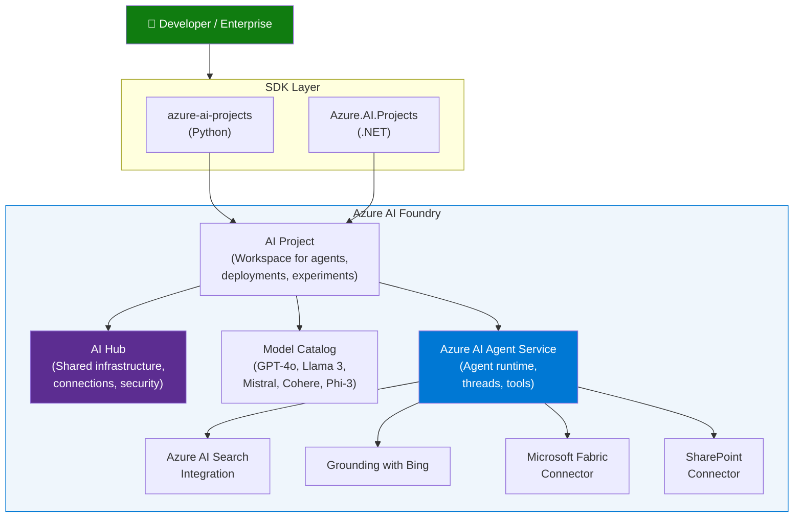
```mermaid
flowchart TD
    User["👤 Developer / Enterprise"]

    subgraph Foundry ["Azure AI Foundry"]
        Hub["AI Hub\n(Shared infrastructure,\nconnections, security)"]
        Project["AI Project\n(Workspace for agents,\ndeployments, experiments)"]
        ModelCatalog["Model Catalog\n(GPT-4o, Llama 3,\nMistral, Cohere, Phi-3)"]
        AgentService["Azure AI Agent Service\n(Agent runtime,\nthreads, tools)"]
        AISearch["Azure AI Search\nIntegration"]
        Bing["Grounding with Bing"]
        Fabric["Microsoft Fabric\nConnector"]
        SharePoint["SharePoint\nConnector"]
    end

    subgraph SDK ["SDK Layer"]
        PythonSDK["azure-ai-projects\n(Python)"]
        DotNetSDK["Azure.AI.Projects\n(.NET)"]
    end

    User --> SDK
    PythonSDK --> Project
    DotNetSDK --> Project
    Project --> Hub
    Project --> ModelCatalog
    Project --> AgentService
    AgentService --> Bing
    AgentService --> AISearch
    AgentService --> Fabric
    AgentService --> SharePoint

    style Foundry fill:#EFF6FC,stroke:#0078D4
    style AgentService fill:#0078D4,color:#fff
    style Hub fill:#5C2D91,color:#fff
    style User fill:#107C10,color:#fff
```

### Supported Models in Azure AI Foundry Model Catalog

| Model | Provider | Use Case |
|---|---|---|
| GPT-4o | OpenAI | General purpose, multimodal |
| GPT-4 Turbo | OpenAI | Long context, complex reasoning |
| Llama 3.1-70B-Instruct | Meta | Open source, cost-effective |
| Mistral-large-2407 | Mistral AI | Multilingual, instruction following |
| Cohere Command R+ | Cohere | RAG-optimized, enterprise search |
| Phi-3-mini | Microsoft | Edge/lightweight scenarios |

### Supported Regions (Public Preview)

Azure AI Agent Service in Public Preview is available in specific Azure regions. Always check the latest Azure documentation for current region availability, as this expands over time. Typical early regions include East US, West US, West Europe, and North Europe.

---

## 5. Getting Started — SDK Setup

### Prerequisites

1. Azure subscription with Azure AI Foundry Hub + Project created
2. Azure AI Agent Service enabled in your project
3. A model deployed (GPT-4o recommended for getting started)
4. Python 3.8+ or .NET 8+

### Recommended: Use the Azure Quickstart Template

Deploy the full infrastructure (Hub, Project, Storage, AI Services) using the official ARM template:

```
https://portal.azure.com/#create/Microsoft.Template/uri/https%3A%2F%2Fraw.githubusercontent.com%2FAzure%2Fazure-quickstart-templates%2Frefs%2Fheads%2Fmaster%2Fquickstarts%2Fmicrosoft.azure-ai-agent-service%2Fstandard-agent%2Fazuredeploy.json
```

This template provisions:
- Azure AI Hub
- Azure AI Project
- Azure Storage Account (for thread/file storage)
- Azure AI Services resource
- Managed identity + RBAC assignments

### Python SDK Installation

```bash
pip install azure-ai-projects
pip install azure-identity
```

### .NET SDK Installation

```bash
dotnet add package Azure.AI.Projects --version 1.0.0-beta.1
```

### Authentication Setup (Python)

```python
from azure.ai.projects import AIProjectClient
from azure.identity import DefaultAzureCredential

# Use DefaultAzureCredential for managed identity / local dev
client = AIProjectClient.from_connection_string(
    credential=DefaultAzureCredential(),
    conn_str="<your-project-connection-string>"  # From AI Foundry portal
)
```

### Connection String

Find your project connection string in Azure AI Foundry portal:
`Settings → Project details → Connection string`

Format: `<region>.api.azureml.ms;<subscription-id>;<resource-group>;<project-name>`

---

## 6. Use Case: Blog Writing Multi-Agent System

The blog demonstrates a **3-agent pipeline** for automated blog post creation:

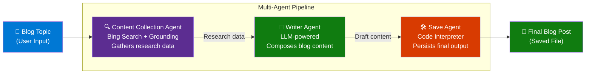
```mermaid
flowchart LR
    Topic["📝 Blog Topic\n(User Input)"]

    subgraph Agents ["Multi-Agent Pipeline"]
        CA["🔍 Content Collection Agent\nBing Search + Grounding\nGathers research data"]
        WA["📖 Writer Agent\nLLM-powered\nComposes blog content"]
        SA["🛠️ Save Agent\nCode Interpreter\nPersists final output"]
    end

    Output["📄 Final Blog Post\n(Saved File)"]

    Topic --> CA
    CA -->|"Research data"| WA
    WA -->|"Draft content"| SA
    SA --> Output

    style Topic fill:#0078D4,color:#fff
    style CA fill:#5C2D91,color:#fff
    style WA fill:#107C10,color:#fff
    style SA fill:#D83B01,color:#fff
    style Output fill:#107C10,color:#fff
```

### Why This Pattern?

Each agent has a **single responsibility** (SRP applied to AI agents):
- **Content Collection**: Specializes in web search/retrieval — doesn't write, just gathers
- **Writer**: Specializes in synthesis/composition — doesn't search or save, just writes
- **Save**: Specializes in persistence — doesn't write content, just handles I/O

This separation makes each agent easier to test, replace, and scale independently.

---

## 7. Single Agent Definitions

### 🔍 Content Collection Agent

**Purpose:** Search the web for content related to a given blog outline/topic, returning structured research data.

**Tool used:** [Grounding with Bing](https://learn.microsoft.com/en-us/azure/ai-services/agents/how-to/tools/bing-grounding) — a built-in Azure AI Agent Service tool that connects the agent to real-time Bing search results.

**How Grounding with Bing works:**
1. Agent receives a topic/outline
2. Agent service sends search query to Bing Search API (managed by Azure)
3. Bing returns ranked web results with citations
4. LLM synthesizes the search results into structured content
5. Response includes source citations for verification

**Why Grounding with Bing vs raw Bing API?**
- No API key management — connection managed by Azure AI Agent Service
- Citations automatically included in response
- Search results are grounded to the model's response (reduces hallucination)
- Respects Bing's SafeSearch and content policies

**Sample notebooks:**
- Python: `github.com/kinfey/MultiAIAgent/blob/main/03.AzureAIAgentWithAutoGen01.ipynb`
- C#: `github.com/kinfey/MultiAIAgent/blob/main/08.AzureAIAgentWithSK01.ipynb`

**Defining the Content Collection Agent (Python):**

```python
from azure.ai.projects.models import BingGroundingTool

# Create Bing connection
bing_connection = client.connections.get(connection_name="<bing-connection-name>")
bing_tool = BingGroundingTool(connection_id=bing_connection.id)

# Create the Content Collection Agent
content_agent = client.agents.create_agent(
    model="gpt-4o",
    name="content-collection-agent",
    instructions="""You are a research assistant. Given a blog topic or outline,
    search the web to find relevant, accurate, and recent information.
    Return structured research notes with key facts and source citations.""",
    tools=bing_tool.definitions,
    tool_resources=bing_tool.resources,
)
```

---

### 📖 Writer Agent

**Purpose:** Take the research data from the Content Collection Agent and compose a well-structured, engaging blog post.

**Tool used:** LLM capabilities only — no external tools needed. The Writer Agent's value is in its **instruction tuning** and **prompt engineering**.

**Key design decisions for the Writer Agent:**
- Receives structured research as input (from Content Collection Agent output)
- Has strong writing-style instructions (tone, structure, length)
- Outputs Markdown-formatted content for easy storage and rendering
- Can be given a specific persona (technical blogger, beginner-friendly explainer, etc.)

**Defining the Writer Agent (Python):**

```python
# Create the Writer Agent (no external tools — LLM only)
writer_agent = client.agents.create_agent(
    model="gpt-4o",
    name="writer-agent",
    instructions="""You are a professional technical blog writer. 
    Given research notes, write a comprehensive, engaging blog post with:
    - Clear introduction with a hook
    - Well-structured sections with headings
    - Code examples where appropriate
    - Conclusion with key takeaways
    Format your output in Markdown.""",
)
```

---

### 🛠️ Save Agent

**Purpose:** Take the final blog post content and persist it to a file using the Code Interpreter tool.

**Tool used:** [Code Interpreter](https://learn.microsoft.com/en-us/azure/ai-services/agents/how-to/tools/code-interpreter) — the agent executes Python code in a sandboxed environment to write files.

**How Code Interpreter works:**
1. Agent generates Python code to perform the file operation
2. Code runs in a secure, sandboxed container managed by Azure
3. Output files are stored as agent artifacts (accessible via the Files API)
4. Files can be downloaded by the client application

**Important:** Code Interpreter files are stored within the agent's session context. The client application must explicitly download them using the Files API to persist them outside the agent service.

**Sample notebooks:**
- Python: `github.com/kinfey/MultiAIAgent/blob/main/01.AzureAIAgentCode.ipynb`
- C#: `github.com/kinfey/MultiAIAgent/blob/main/05.AzureAIAgentCodedotNET.ipynb`

**Defining the Save Agent (Python):**

```python
from azure.ai.projects.models import CodeInterpreterTool

code_tool = CodeInterpreterTool()

# Create the Save Agent
save_agent = client.agents.create_agent(
    model="gpt-4o",
    name="save-agent",
    instructions="""You are a file management agent. 
    Given content, save it to a file with an appropriate name.
    Use Python's file I/O to write the content to a .md file.
    Return the filename and confirm the save was successful.""",
    tools=code_tool.definitions,
    tool_resources=code_tool.resources,
)
```

---

## 8. Multi-Agent Orchestration with AutoGen

### What is AutoGen?

[AutoGen](https://microsoft.github.io/autogen/dev/) is Microsoft's open-source framework for building **multi-agent conversational systems**. It enables multiple agents to collaborate through structured conversations, with a human-in-the-loop optional at any step.

AutoGen core concepts:
- **ConversableAgent**: Base class — any agent that can send/receive messages
- **AssistantAgent**: An AI-powered agent (backed by LLM)
- **UserProxyAgent**: Represents a human or executes code on their behalf
- **GroupChat**: Manages multi-agent conversations with turn-taking strategies
- **GroupChatManager**: The LLM-based orchestrator that decides which agent speaks next

### How AutoGen Wraps Azure AI Agent Service

AutoGen integrates with Azure AI Agent Service through **AzureAIAgent** — a specialized AutoGen agent class that wraps an Azure AI Agent Service agent. This allows:
1. Each Azure AI Agent Service agent (with its tools) to become an AutoGen agent
2. AutoGen's GroupChat to orchestrate the conversation between them
3. Tool execution happening within Azure AI Agent Service (managed, secure)
4. AutoGen handling the turn-taking and message routing logic

### AutoGen Multi-Agent Architecture

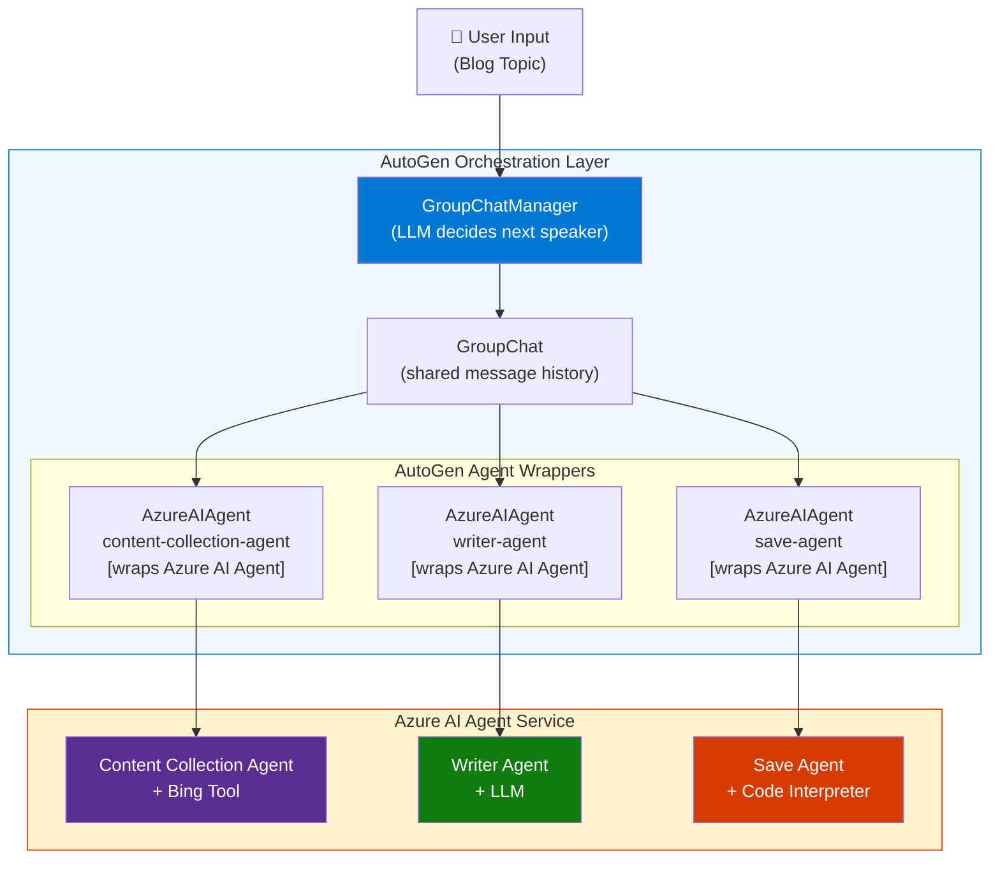
```mermaid
flowchart TD
    User["👤 User Input\n(Blog Topic)"]

    subgraph AutoGen ["AutoGen Orchestration Layer"]
        Manager["GroupChatManager\n(LLM decides next speaker)"]
        
        subgraph Agents ["AutoGen Agent Wrappers"]
            AGContent["AzureAIAgent\ncontent-collection-agent\n[wraps Azure AI Agent]"]
            AGWriter["AzureAIAgent\nwriter-agent\n[wraps Azure AI Agent]"]
            AGSave["AzureAIAgent\nsave-agent\n[wraps Azure AI Agent]"]
        end
        
        Chat["GroupChat\n(shared message history)"]
    end

    subgraph AzureService ["Azure AI Agent Service"]
        ContentBackend["Content Collection Agent\n+ Bing Tool"]
        WriterBackend["Writer Agent\n+ LLM"]
        SaveBackend["Save Agent\n+ Code Interpreter"]
    end

    User --> Manager
    Manager --> Chat
    Chat --> AGContent & AGWriter & AGSave
    AGContent --> ContentBackend
    AGWriter --> WriterBackend
    AGSave --> SaveBackend

    style AutoGen fill:#EFF6FC,stroke:#0078D4
    style AzureService fill:#FFF4CE,stroke:#D83B01
    style Manager fill:#0078D4,color:#fff
    style ContentBackend fill:#5C2D91,color:#fff
    style WriterBackend fill:#107C10,color:#fff
    style SaveBackend fill:#D83B01,color:#fff
```

### AutoGen Orchestration Code Pattern (Python)

```python
import asyncio
from autogen_ext.agents.azure import AzureAIAgent
from autogen_agentchat.agents import AssistantAgent
from autogen_agentchat.teams import RoundRobinGroupChat
from autogen_agentchat.conditions import TextMentionTermination

async def run_blog_pipeline(topic: str):
    # Wrap Azure AI Agent Service agents as AutoGen agents
    content_autogen_agent = AzureAIAgent(
        name="ContentCollectionAgent",
        description="Searches the web for research on a given blog topic",
        project_client=client,
        agent_id=content_agent.id,
    )
    
    writer_autogen_agent = AzureAIAgent(
        name="WriterAgent",
        description="Writes a blog post from research notes",
        project_client=client,
        agent_id=writer_agent.id,
    )
    
    save_autogen_agent = AzureAIAgent(
        name="SaveAgent",
        description="Saves the final blog post content to a file",
        project_client=client,
        agent_id=save_agent.id,
    )
    
    # Define termination condition
    termination = TextMentionTermination("BLOG_SAVED")
    
    # Create a round-robin group chat (sequential execution)
    team = RoundRobinGroupChat(
        participants=[content_autogen_agent, writer_autogen_agent, save_autogen_agent],
        termination_condition=termination
    )
    
    # Run the pipeline
    result = await team.run(task=f"Create a blog post about: {topic}")
    return result

# Execute
asyncio.run(run_blog_pipeline("Azure AI Agent Service Multi-Agent Architecture"))
```

### AutoGen Turn-Taking Strategies

| Strategy | Class | When to Use |
|---|---|---|
| **Round Robin** | `RoundRobinGroupChat` | Sequential pipelines (A → B → C) |
| **Selector** | `SelectorGroupChat` | LLM decides next speaker dynamically |
| **Swarm** | `Swarm` | Each agent hands off to the next explicitly |
| **Magentic-One** | `MagenticOneGroupChat` | Complex planning + execution scenarios |

### Sample Notebook

Full working example: `github.com/kinfey/MultiAIAgent/blob/main/04.AzureAIAgentWithAutoGen02.ipynb`

---

## 9. Multi-Agent Orchestration with Semantic Kernel

### What is Semantic Kernel?

[Semantic Kernel](https://github.com/microsoft/semantic-kernel) is Microsoft's open-source SDK for integrating LLMs into applications. It provides:
- **Kernel**: The central orchestrator that manages plugins, services, and memory
- **Plugin**: A collection of functions the AI can invoke (like tools, but organized)
- **KernelFunction**: A single callable function (Python function or prompt template)
- **Planner**: Automatic plan generation and execution from a high-level goal
- **AgentGroupChat**: Multi-agent conversation management

### How Semantic Kernel Wraps Azure AI Agent Service

Semantic Kernel uses **AzureAIAgent** (SK version) to wrap Azure AI Agent Service agents as SK agents. Orchestration is done via:
- **KernelFunction / Plugin**: Azure AI Agent invocation exposed as an SK function
- **AgentGroupChat**: SK's built-in group chat that manages agent turns
- **SelectionStrategy**: Determines which agent speaks next (sequential, LLM-based, custom)

### Semantic Kernel Multi-Agent Architecture

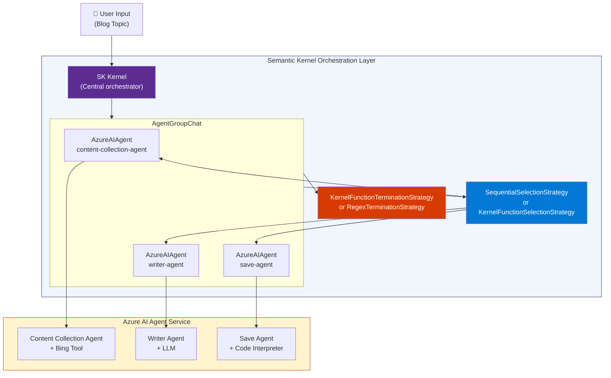
```mermaid
flowchart TD
    User["👤 User Input\n(Blog Topic)"]

    subgraph SK ["Semantic Kernel Orchestration Layer"]
        Kernel["SK Kernel\n(Central orchestrator)"]
        
        subgraph GroupChat ["AgentGroupChat"]
            SKContent["AzureAIAgent\ncontent-collection-agent"]
            SKWriter["AzureAIAgent\nwriter-agent"]
            SKSave["AzureAIAgent\nsave-agent"]
        end
        
        Strategy["SequentialSelectionStrategy\nor KernelFunctionSelectionStrategy"]
        Termination["KernelFunctionTerminationStrategy\nor RegexTerminationStrategy"]
    end

    subgraph AzureService ["Azure AI Agent Service"]
        ContentBackend["Content Collection Agent\n+ Bing Tool"]
        WriterBackend["Writer Agent\n+ LLM"]
        SaveBackend["Save Agent\n+ Code Interpreter"]
    end

    User --> Kernel
    Kernel --> GroupChat
    GroupChat --> Strategy
    Strategy --> SKContent & SKWriter & SKSave
    GroupChat --> Termination
    SKContent --> ContentBackend
    SKWriter --> WriterBackend
    SKSave --> SaveBackend

    style SK fill:#EFF6FC,stroke:#5C2D91
    style AzureService fill:#FFF4CE,stroke:#D83B01
    style Kernel fill:#5C2D91,color:#fff
    style Strategy fill:#0078D4,color:#fff
    style Termination fill:#D83B01,color:#fff
```

### Semantic Kernel Orchestration Code Pattern (Python)

```python
from semantic_kernel import Kernel
from semantic_kernel.agents import AzureAIAgent, AgentGroupChat
from semantic_kernel.agents.strategies import SequentialSelectionStrategy, RegexTerminationStrategy

async def run_blog_pipeline_sk(topic: str):
    kernel = Kernel()
    
    # Create SK wrappers around Azure AI Agent Service agents
    sk_content_agent = AzureAIAgent(
        client=client,
        definition=content_agent,  # Azure AI Agent Service agent definition
    )
    
    sk_writer_agent = AzureAIAgent(
        client=client,
        definition=writer_agent,
    )
    
    sk_save_agent = AzureAIAgent(
        client=client,
        definition=save_agent,
    )
    
    # Create group chat with sequential selection
    group_chat = AgentGroupChat(
        agents=[sk_content_agent, sk_writer_agent, sk_save_agent],
        selection_strategy=SequentialSelectionStrategy(),  # Content → Writer → Save
        termination_strategy=RegexTerminationStrategy(
            pattern="BLOG_SAVED",
            agents=[sk_save_agent],
            maximum_iterations=10
        )
    )
    
    # Add the user message and run
    await group_chat.add_chat_message(
        message=f"Create a blog post about: {topic}"
    )
    
    async for response in group_chat.invoke():
        print(f"[{response.name}]: {response.content}")

# .NET version pattern
# var kernel = Kernel.CreateBuilder().Build();
# var contentAgent = await AzureAIAgent.CreateAsync(client, contentAgentDef, kernel);
# var groupChat = new AgentGroupChat(contentAgent, writerAgent, saveAgent);
```

### Sample Notebook

Full working example: `github.com/kinfey/MultiAIAgent/blob/main/09.AzureAIAgentWithSK02.ipynb`

---

## 10. AutoGen vs Semantic Kernel — Comparison

| Dimension | AutoGen | Semantic Kernel |
|---|---|---|
| **Primary Focus** | Multi-agent conversations & coordination | LLM orchestration + plugin ecosystem |
| **Learning Curve** | Moderate — agent-centric mental model | Steeper — kernel, plugins, planners, memory |
| **Multi-Agent API** | `GroupChat`, `RoundRobin`, `Swarm`, `Magentic-One` | `AgentGroupChat` + selection/termination strategies |
| **Planning** | Human-defined turn-taking or LLM-selected | Built-in `FunctionChoiceBehavior`, Stepwise Planner |
| **Plugin/Tool System** | Function calling via agent tools | `KernelPlugin` + `KernelFunction` decorators |
| **Memory** | External (bring your own) | Built-in memory connectors (volatile, Redis, etc.) |
| **Language Support** | Python (primary), .NET (preview) | Python + .NET (equal support) |
| **Best For** | Research, complex agentic workflows | Enterprise app integration, RAG pipelines |
| **Azure AI Agent Integration** | `AzureAIAgent` in `autogen_ext.agents.azure` | `AzureAIAgent` in `semantic_kernel.agents` |
| **Human-in-the-Loop** | Native `UserProxyAgent` support | Via custom termination strategy |
| **Code Execution** | Built-in Docker/local executor | Delegates to Azure AI Agent Code Interpreter |

### When to Choose AutoGen

- You need **dynamic agent-to-agent conversations** (not just sequential pipelines)
- You're building **research agents** that need to explore and backtrack
- You want **human-in-the-loop** at natural checkpoints
- Your team prefers a **conversation-first** mental model

### When to Choose Semantic Kernel

- You're integrating agents into an **existing .NET enterprise application**
- You need rich **plugin ecosystem** (auth, email, calendar, databases)
- You want **automatic planning** from natural language goals
- You're building **RAG pipelines** alongside agents

---

## 11. Agent Tools Deep Dive

### Grounding with Bing

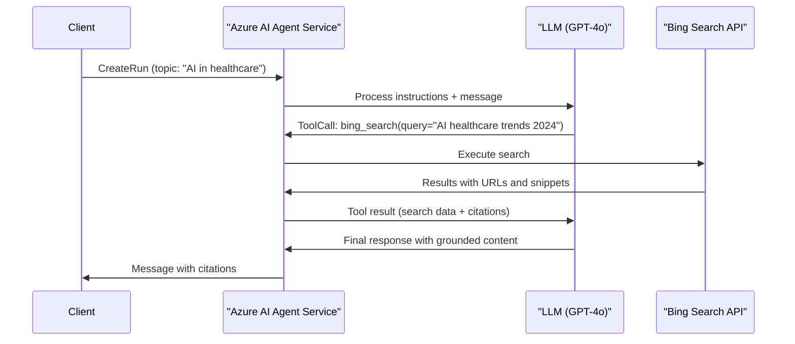
```mermaid
sequenceDiagram
    participant Client
    participant AgentService as "Azure AI Agent Service"
    participant LLM as "LLM (GPT-4o)"
    participant Bing as "Bing Search API"

    Client->>AgentService: CreateRun (topic: "AI in healthcare")
    AgentService->>LLM: Process instructions + message
    LLM->>AgentService: ToolCall: bing_search(query="AI healthcare trends 2024")
    AgentService->>Bing: Execute search
    Bing->>AgentService: Results with URLs and snippets
    AgentService->>LLM: Tool result (search data + citations)
    LLM->>AgentService: Final response with grounded content
    AgentService->>Client: Message with citations
```

**Setup:**
1. Create a Bing Search resource in Azure
2. Add the Bing connection in Azure AI Foundry (Settings → Connections)
3. Reference the connection name when creating the agent

### Code Interpreter

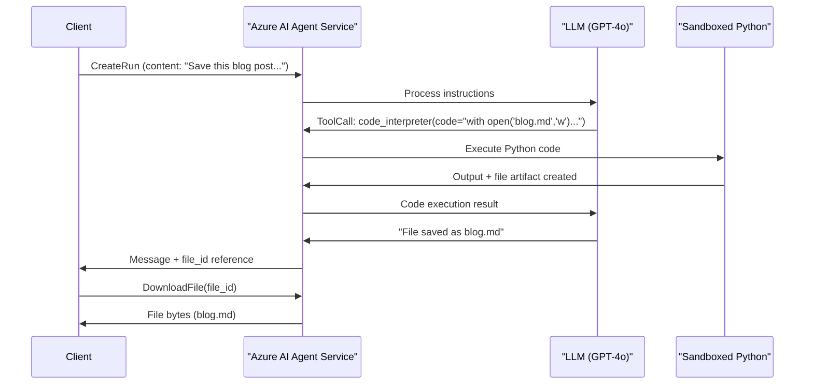
```mermaid
sequenceDiagram
    participant Client
    participant AgentService as "Azure AI Agent Service"
    participant LLM as "LLM (GPT-4o)"
    participant Sandbox as "Sandboxed Python"

    Client->>AgentService: CreateRun (content: "Save this blog post...")
    AgentService->>LLM: Process instructions
    LLM->>AgentService: ToolCall: code_interpreter(code="with open('blog.md','w')...")
    AgentService->>Sandbox: Execute Python code
    Sandbox->>AgentService: Output + file artifact created
    AgentService->>LLM: Code execution result
    LLM->>AgentService: "File saved as blog.md"
    AgentService->>Client: Message + file_id reference
    Client->>AgentService: DownloadFile(file_id)
    AgentService->>Client: File bytes (blog.md)
```

### Function Calling (Custom Tools)

Function calling allows agents to call your own business logic:

```python
from azure.ai.projects.models import FunctionTool

# Define your custom function
def get_company_data(company_name: str) -> str:
    """Fetch internal company data from CRM"""
    # Your business logic here
    return f"Revenue: $10M, Employees: 500, Founded: 2015"

# Register it as a tool
function_tool = FunctionTool(functions={get_company_data})

agent = client.agents.create_agent(
    model="gpt-4o",
    name="data-agent",
    instructions="Fetch and analyze company data when asked.",
    tools=function_tool.definitions,
)
```

### Azure AI Search Integration

```python
from azure.ai.projects.models import AzureAISearchTool

# Connect to your AI Search index
search_tool = AzureAISearchTool(
    index_connection_id="<ai-search-connection-id>",
    index_name="your-knowledge-base-index"
)

agent = client.agents.create_agent(
    model="gpt-4o",
    name="knowledge-agent",
    instructions="Answer questions using the knowledge base.",
    tools=search_tool.definitions,
    tool_resources=search_tool.resources,
)
```

---

## 12. Architecture Diagrams

### Complete Multi-Agent System Architecture

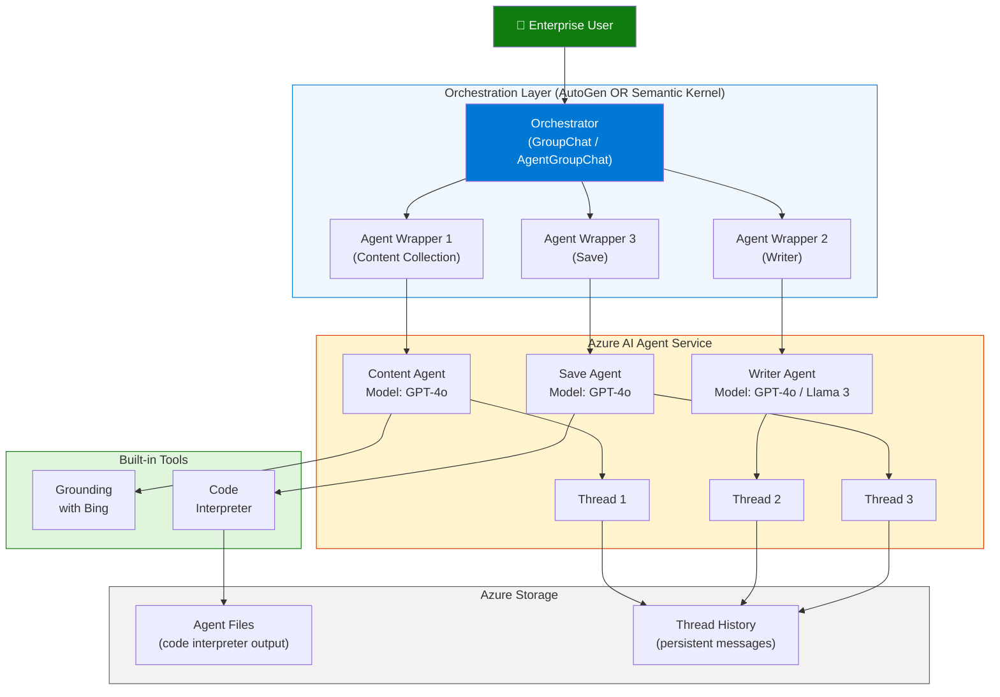
```mermaid
flowchart TD
    User["👤 Enterprise User"]
    
    subgraph Orchestration ["Orchestration Layer (AutoGen OR Semantic Kernel)"]
        Orch["Orchestrator\n(GroupChat / AgentGroupChat)"]
        Wrapper1["Agent Wrapper 1\n(Content Collection)"]
        Wrapper2["Agent Wrapper 2\n(Writer)"]
        Wrapper3["Agent Wrapper 3\n(Save)"]
    end

    subgraph AAAS ["Azure AI Agent Service"]
        direction LR
        Agent1["Content Agent\nModel: GPT-4o"]
        Agent2["Writer Agent\nModel: GPT-4o / Llama 3"]
        Agent3["Save Agent\nModel: GPT-4o"]
        Thread1["Thread 1"]
        Thread2["Thread 2"]
        Thread3["Thread 3"]
    end

    subgraph Tools ["Built-in Tools"]
        Bing["Grounding\nwith Bing"]
        CodeInt["Code\nInterpreter"]
    end

    subgraph Storage ["Azure Storage"]
        Files["Agent Files\n(code interpreter output)"]
        Threads["Thread History\n(persistent messages)"]
    end

    User --> Orch
    Orch --> Wrapper1 & Wrapper2 & Wrapper3
    Wrapper1 --> Agent1
    Wrapper2 --> Agent2
    Wrapper3 --> Agent3
    Agent1 --> Thread1
    Agent2 --> Thread2
    Agent3 --> Thread3
    Agent1 --> Bing
    Agent3 --> CodeInt
    CodeInt --> Files
    Thread1 & Thread2 & Thread3 --> Threads

    style Orchestration fill:#EFF6FC,stroke:#0078D4
    style AAAS fill:#FFF4CE,stroke:#D83B01
    style Tools fill:#DFF6DD,stroke:#107C10
    style Storage fill:#F3F2F1,stroke:#605E5C
    style Orch fill:#0078D4,color:#fff
    style User fill:#107C10,color:#fff
```

---

## 13. Code Examples

### Complete Agent Lifecycle (Python)

```python
import time
from azure.ai.projects import AIProjectClient
from azure.identity import DefaultAzureCredential
from azure.ai.projects.models import (
    BingGroundingTool,
    CodeInterpreterTool,
    RunStatus
)

# Initialize client
client = AIProjectClient.from_connection_string(
    credential=DefaultAzureCredential(),
    conn_str="<connection-string>"
)

# ──────────────────────────────────────
# Step 1: Create agents
# ──────────────────────────────────────

# Content Collection Agent
bing_connection = client.connections.get(connection_name="bing-search")
bing_tool = BingGroundingTool(connection_id=bing_connection.id)

content_agent = client.agents.create_agent(
    model="gpt-4o",
    name="content-collection-agent",
    instructions="Search the web and return research for the given blog topic.",
    tools=bing_tool.definitions,
    tool_resources=bing_tool.resources,
)

# Writer Agent
writer_agent = client.agents.create_agent(
    model="gpt-4o",
    name="writer-agent",
    instructions="Write a structured Markdown blog post from the given research.",
)

# Save Agent
code_tool = CodeInterpreterTool()
save_agent = client.agents.create_agent(
    model="gpt-4o",
    name="save-agent",
    instructions="Save the provided blog content to a .md file using Python.",
    tools=code_tool.definitions,
    tool_resources=code_tool.resources,
)

# ──────────────────────────────────────
# Step 2: Run each agent sequentially
# ──────────────────────────────────────

def run_agent(agent, user_message: str) -> str:
    """Create a thread, add a message, run the agent, return the response."""
    thread = client.agents.create_thread()
    
    client.agents.create_message(
        thread_id=thread.id,
        role="user",
        content=user_message
    )
    
    run = client.agents.create_run(
        thread_id=thread.id,
        agent_id=agent.id
    )
    
    # Poll until complete
    while run.status in [RunStatus.QUEUED, RunStatus.IN_PROGRESS, RunStatus.REQUIRES_ACTION]:
        time.sleep(2)
        run = client.agents.get_run(thread_id=thread.id, run_id=run.id)
    
    if run.status == RunStatus.FAILED:
        raise Exception(f"Run failed: {run.last_error}")
    
    # Get the last assistant message
    messages = client.agents.list_messages(thread_id=thread.id)
    for msg in messages.data:
        if msg.role == "assistant":
            return msg.content[0].text.value
    
    return ""

# Execute pipeline
topic = "Building Multi-Agent Systems with Azure AI"

print("Step 1: Collecting research...")
research = run_agent(content_agent, f"Research this blog topic: {topic}")

print("Step 2: Writing blog post...")
blog_content = run_agent(writer_agent, f"Write a blog post using this research:\n{research}")

print("Step 3: Saving blog post...")
save_result = run_agent(save_agent, f"Save this blog post:\n{blog_content}")

print(f"Done! {save_result}")

# ──────────────────────────────────────
# Step 3: Cleanup (optional)
# ──────────────────────────────────────
client.agents.delete_agent(content_agent.id)
client.agents.delete_agent(writer_agent.id)
client.agents.delete_agent(save_agent.id)
```

### .NET Version (C#)

```csharp
using Azure.AI.Projects;
using Azure.Identity;

// Initialize client
var connectionString = "<connection-string>";
var client = new AIProjectClient(connectionString, new DefaultAzureCredential());
var agentsClient = client.GetAgentsClient();

// Create agent
var agentResponse = await agentsClient.CreateAgentAsync(
    model: "gpt-4o",
    name: "writer-agent",
    instructions: "Write comprehensive blog posts in Markdown format."
);
var agent = agentResponse.Value;

// Create thread and run
var threadResponse = await agentsClient.CreateThreadAsync();
var thread = threadResponse.Value;

await agentsClient.CreateMessageAsync(
    thread.Id,
    MessageRole.User,
    "Write a blog post about Azure AI Agent Service."
);

var runResponse = await agentsClient.CreateRunAsync(thread.Id, agent.Id);
var run = runResponse.Value;

// Poll for completion
do {
    await Task.Delay(TimeSpan.FromSeconds(2));
    runResponse = await agentsClient.GetRunAsync(thread.Id, run.Id);
    run = runResponse.Value;
} while (run.Status == RunStatus.Queued || run.Status == RunStatus.InProgress);

// Get response
var messages = agentsClient.GetMessages(thread.Id);
await foreach (var message in messages) {
    if (message.Role == MessageRole.Agent) {
        Console.WriteLine(message.ContentItems[0].As<MessageTextContent>().Text);
        break;
    }
}
```

---

## 14. Best Practices

### Agent Design

- ✅ **Single Responsibility**: Each agent should do one thing well — don't overload agents with multiple concerns
- ✅ **Clear instructions**: Write precise system prompts with expected input/output formats
- ✅ **Explicit output format**: Tell the agent exactly how to format its response (Markdown, JSON, plain text)
- ❌ **Avoid mega-agents**: One agent trying to search, write, AND save creates unpredictable behavior
- ❌ **Don't skip tool setup**: Verify connections (Bing, AI Search) are correctly configured before deploying

### Thread Management

- ✅ **Reuse threads** for ongoing conversations with the same user/session
- ✅ **New thread per pipeline run** for isolated, reproducible workflows
- ✅ **Clean up threads** after use to avoid storage accumulation
- ❌ **Don't share threads** across different agent pipelines — messages from one run can confuse subsequent runs

### Orchestration

- ✅ **Sequential for pipelines**: Use `RoundRobinGroupChat` (AutoGen) or `SequentialSelectionStrategy` (SK) for deterministic A→B→C flows
- ✅ **LLM-based selection for dynamic tasks**: Let the orchestrator's LLM decide which agent runs next when task flow is unpredictable
- ✅ **Define clear termination conditions**: Always set a termination condition to prevent infinite loops
- ❌ **Don't rely on message length** as a termination signal — use explicit keywords or structured output flags

### Model Selection

- ✅ Use **GPT-4o** for complex reasoning, writing, and multi-step planning
- ✅ Use **Llama 3.1-70B** for cost-sensitive scenarios with good instruction following
- ✅ Use **Cohere Command R+** for RAG-heavy workflows (optimized for retrieval)
- ❌ Don't use lightweight models (Phi-3-mini) for complex orchestration — they struggle with precise tool calling

### Security

- ✅ Use **Managed Identity** (`DefaultAzureCredential`) instead of API keys
- ✅ Store the connection string in **Azure Key Vault** or environment variables, never in code
- ✅ Apply **RBAC** — give agents only the permissions they need (principle of least privilege)
- ❌ Never hard-code credentials in notebooks or source files

---

## 15. Interview Talking Points

### "What is Azure AI Agent Service and how does it differ from the Assistants API?"

> Azure AI Agent Service is Microsoft's managed agent runtime within Azure AI Foundry. It follows the same Assistants API pattern (Agents, Threads, Runs, Tools) but adds enterprise-critical capabilities: support for open-source LLMs like Llama 3 and Mistral, enterprise connectors to SharePoint and Microsoft Fabric, data storage within your own Azure tenant (not OpenAI's), and Azure-native security with RBAC and private endpoints. The Assistants API is faster to start with but limited to OpenAI models and infrastructure.

### "How do AutoGen and Semantic Kernel complement Azure AI Agent Service?"

> Azure AI Agent Service defines and executes individual agents with tools. AutoGen and Semantic Kernel operate at a higher level — they orchestrate multiple agents into collaborative workflows. AutoGen wraps Azure AI agents as `AzureAIAgent` instances in a `GroupChat`, managing turn-taking and agent-to-agent communication. Semantic Kernel does the same via `AgentGroupChat` with pluggable selection strategies. Neither replaces the other; Azure AI Agent Service is the execution layer, AutoGen/SK is the coordination layer.

### "Walk me through the blog writing multi-agent pipeline."

> Three agents are defined in Azure AI Agent Service: a Content Collection agent with Grounding with Bing (real-time web search), a Writer agent powered purely by LLM, and a Save agent with Code Interpreter. AutoGen or Semantic Kernel wraps these as orchestrated agents. When given a topic, the Content agent searches the web and returns research, the Writer agent synthesizes a blog post from that research, and the Save agent uses Python's file I/O (via Code Interpreter) to persist the Markdown file. Each agent has a single responsibility, making the system modular and testable.

### "What is Grounding with Bing and why does it matter for agents?"

> Grounding with Bing is a built-in Azure AI Agent Service tool that connects agents to real-time Bing search results. It matters because LLMs have a knowledge cutoff and cannot access current information. With Grounding with Bing, an agent can search the web mid-conversation, retrieve current facts and citations, and include them in responses. This dramatically reduces hallucination on time-sensitive topics. The connection is managed by Azure — no separate Bing API key is needed in the agent code.

### "When would you choose AutoGen over Semantic Kernel for multi-agent orchestration?"

> Choose AutoGen when your workflow is conversation-driven, requires dynamic agent-to-agent negotiation, or benefits from human-in-the-loop at checkpoints. AutoGen's mental model (agents conversing) is natural for research and planning tasks. Choose Semantic Kernel when integrating agents into an existing enterprise .NET application, when you need the rich plugin ecosystem (databases, calendars, email), or when you want automatic planning from high-level goals. Semantic Kernel's equal Python and .NET support is also a major advantage in .NET shops.

### "How does Code Interpreter work within an agent?"

> Code Interpreter is a built-in Azure AI Agent Service tool that gives an agent access to a sandboxed Python runtime. When the agent needs to process data, generate visualizations, or save files, it writes Python code, and the agent service executes it in an isolated container. The output — including generated files — is stored as agent artifacts and retrieved by the client via the Files API. It's particularly useful for the Save Agent pattern: instead of building custom file persistence logic, the agent simply writes Python `open()` calls, and Code Interpreter handles the execution.

---

## 16. Learning Resources

| Resource | URL | Type |
|---|---|---|
| Azure AI Agent Service Quickstart | https://learn.microsoft.com/en-us/azure/ai-services/agents/quickstart | Official Docs |
| Azure AI Agent Service Overview | https://learn.microsoft.com/en-us/azure/ai-services/agents/ | Official Docs |
| Microsoft AutoGen Documentation | https://microsoft.github.io/autogen/dev/ | Official Docs |
| Semantic Kernel GitHub | https://github.com/microsoft/semantic-kernel | GitHub |
| Grounding with Bing Guide | https://learn.microsoft.com/en-us/azure/ai-services/agents/how-to/tools/bing-grounding | Official Docs |
| Code Interpreter Guide | https://learn.microsoft.com/en-us/azure/ai-services/agents/how-to/tools/code-interpreter | Official Docs |
| MultiAIAgent Sample Repo | https://github.com/kinfey/MultiAIAgent | GitHub Samples |
| AutoGen + Azure AI (Python) | https://github.com/kinfey/MultiAIAgent/blob/main/04.AzureAIAgentWithAutoGen02.ipynb | Notebook |
| Semantic Kernel + Azure AI (Python) | https://github.com/kinfey/MultiAIAgent/blob/main/09.AzureAIAgentWithSK02.ipynb | Notebook |
| Azure AI Foundry Portal | https://ai.azure.com | Portal |
| Quickstart ARM Template | https://portal.azure.com/#create/Microsoft.Template/uri/... | ARM Template |

---

*Last Updated: June 2026 | Source: Microsoft Tech Community — Educator Developer Blog*

---

## Additional Material from Semantic-Kernel-AI-Agent-Development.md

> Unique additions: plugin/tool-calling depth and thread-management.


> **Source:** [YouTube – Learn Live: Develop an AI agent with Semantic Kernel](https://www.youtube.com/watch?v=ySsiPmYXUTY&t=261s)  
> **Platform:** Microsoft Learn Live / Microsoft Reactor  
> **Topic:** Building AI Agents using Azure AI Foundry + Semantic Kernel SDK  
> **Languages Covered:** Python, C#, Java

---

## 📋 Table of Contents

1. [Overview](#overview)
2. [What Is Semantic Kernel?](#what-is-semantic-kernel)
3. [Core Architecture](#core-architecture)
4. [Key Components](#key-components)
   - [The Kernel](#1-the-kernel)
   - [AI Service Connectors](#2-ai-service-connectors)
   - [Plugins & Functions](#3-plugins--functions)
   - [Memory & Vector Storage](#4-memory--vector-storage)
   - [Prompt Templates](#5-prompt-templates)
5. [Azure AI Agent Service](#azure-ai-agent-service)
6. [Building Your First AI Agent](#building-your-first-ai-agent)
   - [Environment Setup](#environment-setup)
   - [Creating the Kernel](#creating-the-kernel)
   - [Creating an Agent](#creating-an-agent)
   - [Managing Threads & Conversations](#managing-threads--conversations)
7. [Plugins & Tool Calling](#plugins--tool-calling)
8. [Multi-Agent Collaboration](#multi-agent-collaboration)
9. [Key Concepts Summary Table](#key-concepts-summary-table)
10. [Architecture Flow Diagram](#architecture-flow-diagram)
11. [Code Examples](#code-examples)
12. [Best Practices](#best-practices)
13. [Learning Resources](#learning-resources)

---

## Overview

This session is part of the **Microsoft Learn Live** series and covers how to build intelligent AI agents using the **Semantic Kernel SDK** integrated with **Azure AI Foundry** (formerly Azure AI Studio).

The session walks through:
- What Semantic Kernel is and why it matters for AI agent development
- Core building blocks: Kernel, Plugins, Memory, Connectors
- How to use **Azure AI Agent Service** to create and manage agents
- Managing multi-turn conversation threads
- Enabling multi-agent collaboration using `AgentGroupChat`
- Practical, hands-on coding demonstrations

---

## What Is Semantic Kernel?

**Semantic Kernel (SK)** is an **open-source, lightweight SDK** maintained by Microsoft that acts as an **orchestration middleware** between your application code and Large Language Models (LLMs).

### Why Semantic Kernel?

| Problem | How Semantic Kernel Solves It |
|---|---|
| Tight coupling to one AI provider | Model-agnostic connector system – swap OpenAI for Mistral without rewriting code |
| No structure for LLM tool use | First-class function/plugin system with automatic function calling |
| No memory or context management | Built-in memory connectors for RAG and persistent context |
| Complexity of multi-agent systems | `AgentGroupChat` orchestration for agent collaboration |
| Production readiness | Observability, telemetry, and enterprise security hooks |

### Core Philosophy

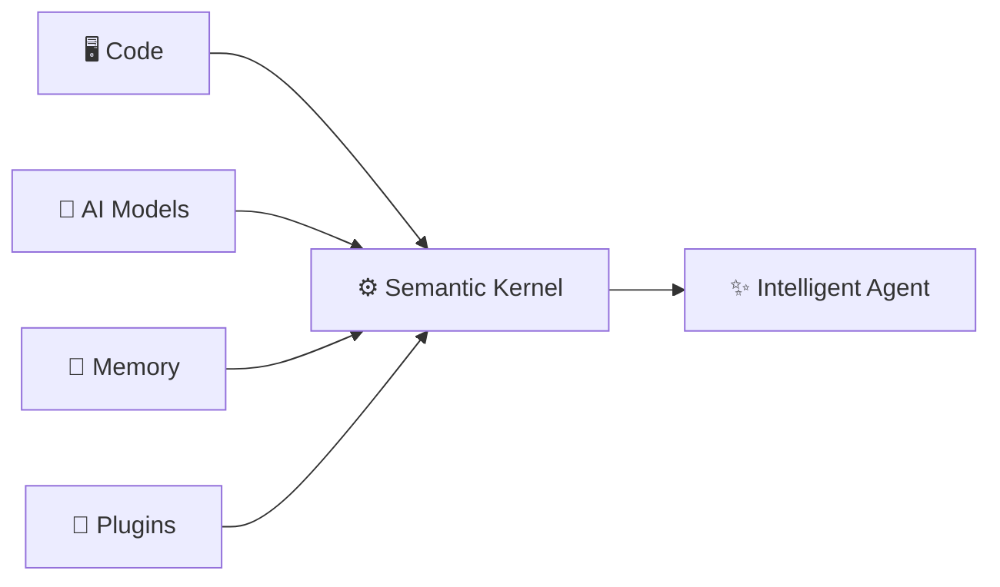
```mermaid
flowchart LR
    A["🖥️ Code"] --> K["⚙️ Semantic Kernel"]
    B["🤖 AI Models"] --> K
    C["🧠 Memory"] --> K
    D["🔧 Plugins"] --> K
    K --> E["✨ Intelligent Agent"]
```

Semantic Kernel treats AI as a **first-class citizen** in software development – not an afterthought.

---

## Core Architecture

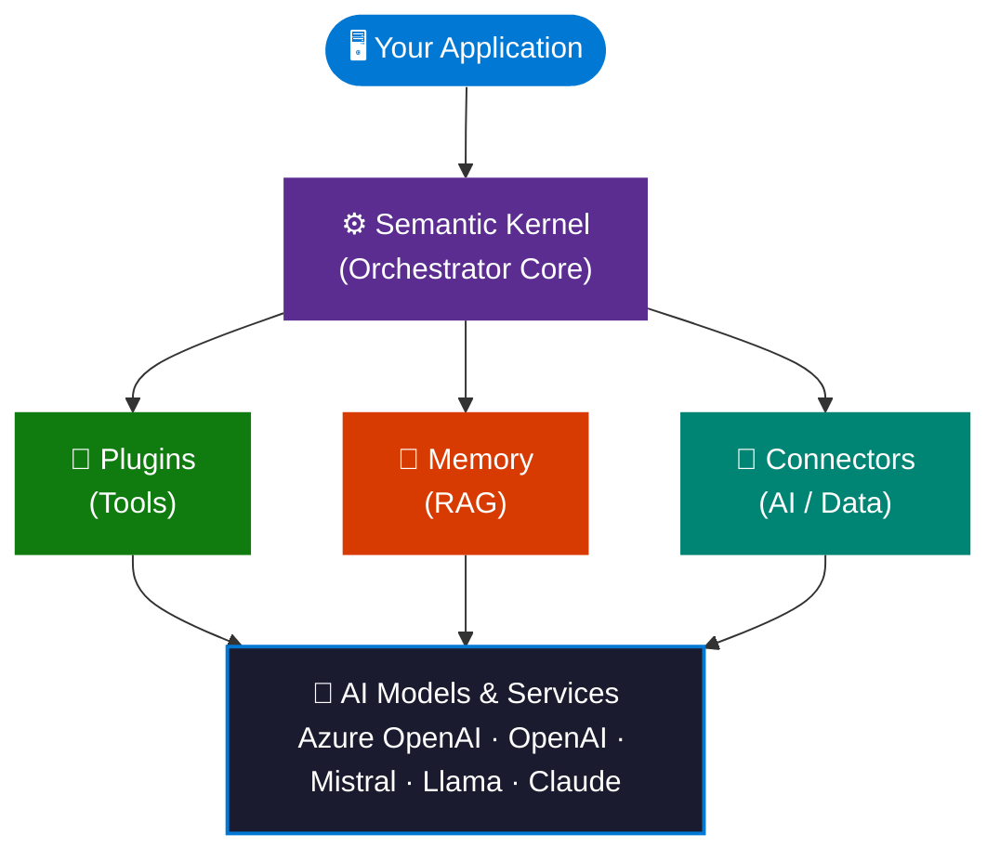
```mermaid
flowchart TD
    App(["🖥️ Your Application"])
    SK["⚙️ Semantic Kernel\n(Orchestrator Core)"]
    P["🔧 Plugins\n(Tools)"]
    M["🧠 Memory\n(RAG)"]
    C["🔌 Connectors\n(AI / Data)"]
    AI["🤖 AI Models & Services\nAzure OpenAI · OpenAI · Mistral · Llama · Claude"]

    App --> SK
    SK --> P
    SK --> M
    SK --> C
    P --> AI
    M --> AI
    C --> AI

    style App fill:#0078D4,color:#fff,stroke:none
    style SK fill:#5C2D91,color:#fff,stroke:none
    style P fill:#107C10,color:#fff,stroke:none
    style M fill:#D83B01,color:#fff,stroke:none
    style C fill:#008575,color:#fff,stroke:none
    style AI fill:#1b1b2f,color:#fff,stroke:#0078D4,stroke-width:2px
```

---

## Key Components

### 1. The Kernel

The **Kernel** is the central hub – the dependency injection container of Semantic Kernel. Every interaction flows through it.

- Manages the lifecycle of AI services
- Routes requests to the appropriate model or plugin
- Handles context and invocation pipelines

```python
# Python Example
from semantic_kernel import Kernel

kernel = Kernel()
```

```csharp
// C# Example
var kernel = Kernel.CreateBuilder()
    .AddAzureOpenAIChatCompletion(
        deploymentName: "gpt-4o",
        endpoint: "https://<your-resource>.openai.azure.com/",
        apiKey: "<your-api-key>")
    .Build();
```

---

### 2. AI Service Connectors

Connectors provide a **unified interface** to various AI providers. You swap providers without changing your agent logic.

| Connector | Description |
|---|---|
| `AzureOpenAIChatCompletion` | Azure-hosted GPT-4o, GPT-4, etc. |
| `OpenAIChatCompletion` | Direct OpenAI models |
| `AzureAIInferenceChatCompletion` | Models via Azure AI Foundry inference |
| `OllamaChatCompletion` | Locally hosted models (Llama, Mistral) |
| `HuggingFaceChatCompletion` | Open-source models via HuggingFace |

---

### 3. Plugins & Functions

**Plugins** are collections of **functions** that extend what the AI can do. They are the "tools" an agent can call.

There are two types of functions:

| Type | Description | Example |
|---|---|---|
| **Native Functions** | Regular code methods decorated as SK functions | Fetch weather, call a database, send email |
| **Semantic Functions** | Prompt templates that call an LLM | Summarize text, translate language, classify content |

#### How Function Calling Works

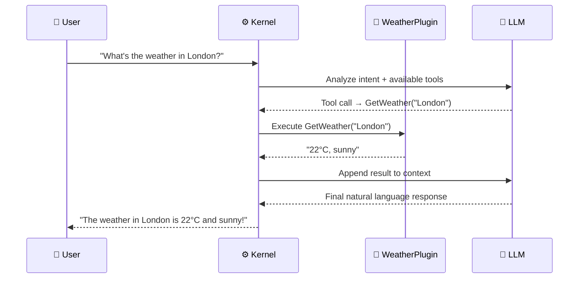
```mermaid
sequenceDiagram
    participant U as 👤 User
    participant K as ⚙️ Kernel
    participant P as 🔧 WeatherPlugin
    participant L as 🤖 LLM

    U->>K: "What's the weather in London?"
    K->>L: Analyze intent + available tools
    L-->>K: Tool call → GetWeather("London")
    K->>P: Execute GetWeather("London")
    P-->>K: "22°C, sunny"
    K->>L: Append result to context
    L-->>K: Final natural language response
    K-->>U: "The weather in London is 22°C and sunny!"
```

#### Defining a Native Function (Python)
```python
from semantic_kernel.functions import kernel_function

class WeatherPlugin:
    @kernel_function(
        name="GetWeather",
        description="Gets the current weather for a given city"
    )
    def get_weather(self, city: str) -> str:
        # Actual API call logic here
        return f"The weather in {city} is 22°C and sunny."
```

#### Defining a Native Function (C#)
```csharp
public class WeatherPlugin
{
    [KernelFunction("GetWeather")]
    [Description("Gets the current weather for a given city")]
    public string GetWeather(string city)
    {
        // API call logic
        return $"The weather in {city} is 22°C and sunny.";
    }
}
```

---

### 4. Memory & Vector Storage

**Memory connectors** allow agents to retrieve relevant information from a vector database — enabling **Retrieval-Augmented Generation (RAG)**.

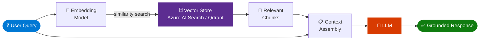
```mermaid
flowchart LR
    Q(["❓ User Query"])
    E["📐 Embedding\nModel"]
    VS["🗄️ Vector Store\nAzure AI Search / Qdrant"]
    RC["📄 Relevant\nChunks"]
    CTX["📋 Context\nAssembly"]
    LLM["🤖 LLM"]
    R(["✅ Grounded Response"])

    Q --> E
    E -->|"similarity search"| VS
    VS --> RC
    RC --> CTX
    Q --> CTX
    CTX --> LLM
    LLM --> R

    style Q fill:#0078D4,color:#fff,stroke:none
    style R fill:#107C10,color:#fff,stroke:none
    style VS fill:#5C2D91,color:#fff,stroke:none
    style LLM fill:#D83B01,color:#fff,stroke:none
```

#### Supported Vector Stores

| Store | Use Case |
|---|---|
| **Azure AI Search** | Enterprise-scale semantic + keyword hybrid search |
| **Qdrant** | High-performance open-source vector DB |
| **Pinecone** | Managed cloud vector DB |
| **Chroma** | Local development and testing |
| **In-Memory** | Prototyping, testing |
| **Azure Cosmos DB** | Multi-model DB with vector support |

---

### 5. Prompt Templates

Semantic Kernel supports **parameterized prompt templates** with variable substitution and function calls embedded directly in the prompt.

```
You are a helpful assistant.

{{$history}}

User: {{$user_input}}

Available tools: {{$tools}}

Respond concisely and accurately.
```

---

## Azure AI Agent Service

**Azure AI Agent Service** is a fully managed, cloud-hosted service within **Azure AI Foundry** that runs stateful AI agents with built-in:

- 🔒 **Authentication** via Azure Identity (RBAC-based)
- 💾 **Thread Management** (persistent conversation history)
- 🔧 **Tool Integration** (Bing, Azure AI Search, code interpreter, custom functions)
- 📊 **Observability & Tracing**

### How It Relates to Semantic Kernel

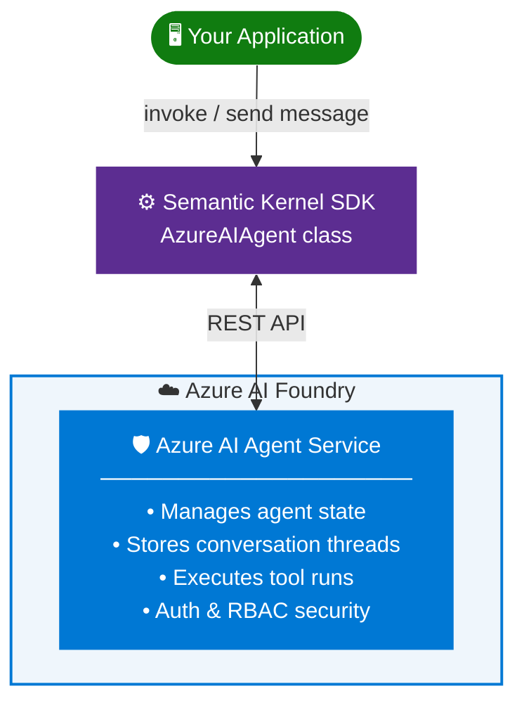
```mermaid
flowchart TD
    subgraph Foundry ["☁️ Azure AI Foundry"]
        direction TB
        AIAS["🛡️ Azure AI Agent Service\n────────────────────\n• Manages agent state\n• Stores conversation threads\n• Executes tool runs\n• Auth & RBAC security"]
    end

    SK["⚙️ Semantic Kernel SDK\nAzureAIAgent class"]
    App(["🖥️ Your Application"])

    App -->|"invoke / send message"| SK
    SK <-->|"REST API"| AIAS

    style Foundry fill:#EFF6FC,stroke:#0078D4,stroke-width:2px
    style AIAS fill:#0078D4,color:#fff,stroke:none
    style SK fill:#5C2D91,color:#fff,stroke:none
    style App fill:#107C10,color:#fff,stroke:none
```

The `AzureAIAgent` class in Semantic Kernel **wraps** the Azure AI Agent Service REST API, giving you a Pythonic/C# developer experience.

---

## Building Your First AI Agent

### Environment Setup

#### Prerequisites
- Azure subscription with AI Foundry project created
- Python 3.10+ or .NET 8+
- Azure CLI authenticated (`az login`)

#### Python Setup
```bash
pip install semantic-kernel azure-identity
```

#### C# Setup
```bash
dotnet add package Microsoft.SemanticKernel
dotnet add package Microsoft.SemanticKernel.Agents.AzureAI
dotnet add package Azure.Identity
```

#### Configuration (`.env` or `appsettings.json`)
```env
AZURE_AI_FOUNDRY_ENDPOINT=https://<your-project>.services.ai.azure.com
AZURE_OPENAI_DEPLOYMENT=gpt-4o
```

---

### Creating the Kernel

```python
# Python
import os
from azure.identity import DefaultAzureCredential
from semantic_kernel import Kernel
from semantic_kernel.connectors.ai.azure_ai_inference import AzureAIInferenceChatCompletion

kernel = Kernel()

kernel.add_service(
    AzureAIInferenceChatCompletion(
        ai_model_id="gpt-4o",
        endpoint=os.environ["AZURE_AI_FOUNDRY_ENDPOINT"],
        credential=DefaultAzureCredential()
    )
)
```

```csharp
// C#
var kernel = Kernel.CreateBuilder()
    .AddAzureOpenAIChatCompletion(
        deploymentName: "gpt-4o",
        endpoint: Environment.GetEnvironmentVariable("AZURE_AI_FOUNDRY_ENDPOINT"),
        credential: new DefaultAzureCredential())
    .Build();
```

---

### Creating an Agent

```python
# Python – Creating an Azure AI Agent
from semantic_kernel.agents import AzureAIAgent, AzureAIAgentSettings

async with (
    AzureAIAgent.create_client(credential=DefaultAzureCredential()) as client
):
    agent_definition = await client.agents.create(
        model="gpt-4o",
        name="TravelAgent",
        instructions="""
            You are a helpful travel assistant.
            Help users plan trips, book flights, and find hotels.
            Always ask for travel dates and budget.
        """
    )

    agent = AzureAIAgent(
        client=client,
        definition=agent_definition
    )
```

```csharp
// C#
AzureAIAgentSettings settings = new()
{
    Endpoint = new Uri(Environment.GetEnvironmentVariable("AZURE_AI_FOUNDRY_ENDPOINT")),
};

AzureAIAgent agent = await AzureAIAgent.CreateAsync(
    kernel: kernel,
    settings: settings,
    name: "TravelAgent",
    instructions: "You are a helpful travel assistant."
);
```

---

### Managing Threads & Conversations

**Threads** represent a single conversation session. They store the message history server-side in Azure AI Agent Service.

```python
# Python – Thread Management
async with AzureAIAgent.create_client(credential=DefaultAzureCredential()) as client:
    
    # Create a conversation thread
    thread = await client.agents.create_thread()
    
    try:
        # Send messages and get responses
        async for response in agent.invoke(
            thread_id=thread.id,
            messages="Plan a 5-day trip to Paris on a budget of $2000"
        ):
            print(response.content)
    finally:
        # Clean up thread when done
        await client.agents.delete_thread(thread.id)
```

#### Thread Lifecycle

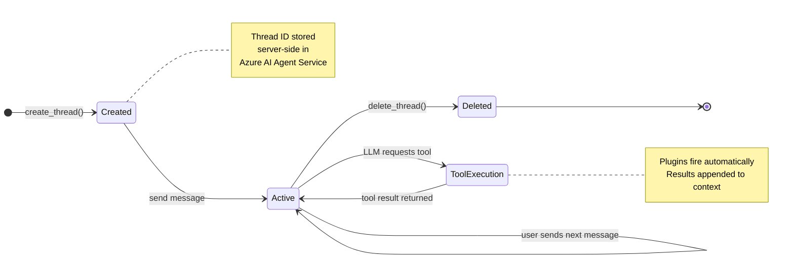
```mermaid
stateDiagram-v2
    direction LR
    [*] --> Created : create_thread()
    Created --> Active : send message
    Active --> ToolExecution : LLM requests tool
    ToolExecution --> Active : tool result returned
    Active --> Active : user sends next message
    Active --> Deleted : delete_thread()
    Deleted --> [*]

    note right of ToolExecution
        Plugins fire automatically
        Results appended to context
    end note
    note right of Created
        Thread ID stored
        server-side in
        Azure AI Agent Service
    end note
```

---

## Plugins & Tool Calling

### Registering Plugins with an Agent

```python
# Python – Adding Plugins to an Agent
from semantic_kernel.agents import AzureAIAgent

class ItineraryPlugin:
    @kernel_function(description="Creates a daily travel itinerary")
    def create_itinerary(self, destination: str, days: int, budget: float) -> str:
        return f"Day 1: Arrive in {destination}. Budget per day: ${budget/days:.0f}"
    
    @kernel_function(description="Finds hotels in a city within a budget")
    def find_hotels(self, city: str, max_price_per_night: float) -> str:
        return f"Found 3 hotels in {city} under ${max_price_per_night}/night"

# Register plugins on the kernel
kernel.add_plugin(ItineraryPlugin(), plugin_name="Itinerary")

# The agent will automatically call these functions when appropriate
```

### Automatic Function Calling Flow

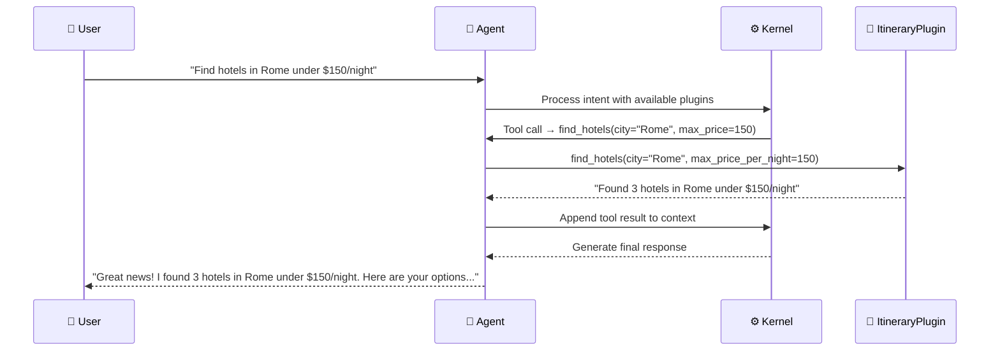
```mermaid
sequenceDiagram
    participant U as 👤 User
    participant A as 🤖 Agent
    participant K as ⚙️ Kernel
    participant IP as 🔧 ItineraryPlugin

    U->>A: "Find hotels in Rome under $150/night"
    A->>K: Process intent with available plugins
    K->>A: Tool call → find_hotels(city="Rome", max_price=150)
    A->>IP: find_hotels(city="Rome", max_price_per_night=150)
    IP-->>A: "Found 3 hotels in Rome under $150/night"
    A->>K: Append tool result to context
    K-->>A: Generate final response
    A-->>U: "Great news! I found 3 hotels in Rome under $150/night. Here are your options..."
```

### Built-in Azure Tools Available

| Tool | Capability |
|---|---|
| **Bing Grounding** | Real-time web search within agent responses |
| **Azure AI Search** | Enterprise document retrieval |
| **Code Interpreter** | Execute Python code, generate charts |
| **File Search** | Search through uploaded documents |
| **Custom Functions** | Any native function you write |

---

## Multi-Agent Collaboration

### AgentGroupChat

**`AgentGroupChat`** enables multiple specialized agents to work together to solve a problem – each agent brings a different capability or perspective.

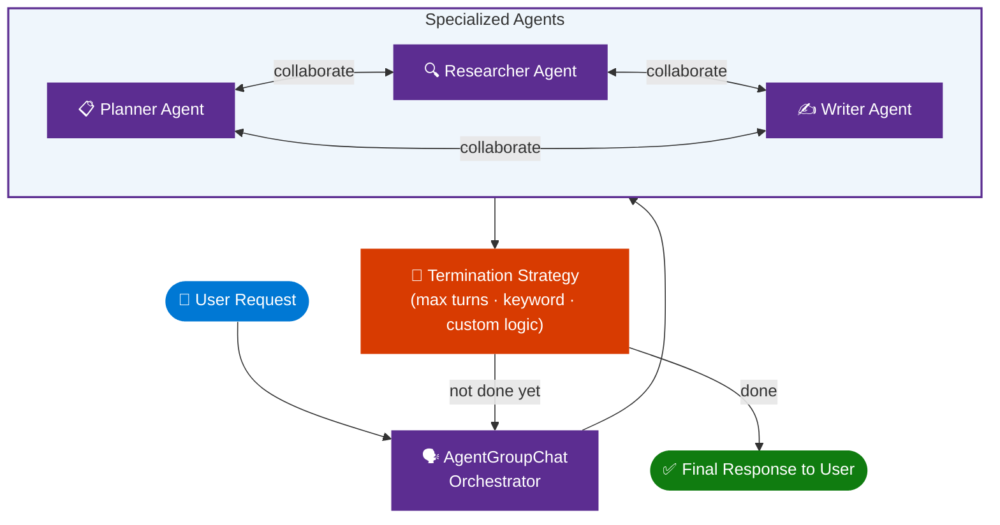
```mermaid
flowchart TD
    U(["👤 User Request"])
    GC["🗣️ AgentGroupChat\nOrchestrator"]
    TS["🛑 Termination Strategy\n(max turns · keyword · custom logic)"]

    subgraph Agents ["Specialized Agents"]
        PA["📋 Planner Agent"]
        RA["🔍 Researcher Agent"]
        WA["✍️ Writer Agent"]
    end

    R(["✅ Final Response to User"])

    U --> GC
    GC --> Agents
    PA <-->|"collaborate"| RA
    RA <-->|"collaborate"| WA
    WA <-->|"collaborate"| PA
    Agents --> TS
    TS -->|"not done yet"| GC
    TS -->|"done"| R

    style U fill:#0078D4,color:#fff,stroke:none
    style GC fill:#5C2D91,color:#fff,stroke:none
    style TS fill:#D83B01,color:#fff,stroke:none
    style R fill:#107C10,color:#fff,stroke:none
    style Agents fill:#EFF6FC,stroke:#5C2D91,stroke-width:2px
    style PA fill:#5C2D91,color:#fff,stroke:none
    style RA fill:#5C2D91,color:#fff,stroke:none
    style WA fill:#5C2D91,color:#fff,stroke:none
```

### Example Use Cases for Multi-Agent Systems

| Pattern | Agents Involved | Use Case |
|---|---|---|
| **Writer + Critic** | ContentAgent + ReviewAgent | Generate and review marketing copy |
| **Planner + Executor** | PlanAgent + CodeAgent | Plan and implement software features |
| **Researcher + Synthesizer** | SearchAgent + SummaryAgent | Research topics and produce reports |
| **Debater pattern** | ExpertA + ExpertB + Moderator | Validate AI decisions by debate |

### Code: Setting Up AgentGroupChat (Python)

```python
from semantic_kernel.agents import AgentGroupChat, AzureAIAgent
from semantic_kernel.agents.strategies import TerminationStrategy

# Define termination: stop after 10 turns or when "DONE" is in the response
class SimpleTermination(TerminationStrategy):
    async def should_terminate(self, agent, history):
        return len(history) > 10 or "DONE" in history[-1].content

# Create agents
planner = AzureAIAgent(...)  # Planning agent
researcher = AzureAIAgent(...)  # Research agent

# Create group chat
group_chat = AgentGroupChat(
    agents=[planner, researcher],
    termination_strategy=SimpleTermination()
)

# Run the collaboration
async for message in group_chat.invoke(
    messages="Research and summarize the latest trends in quantum computing"
):
    print(f"[{message.author_name}]: {message.content}")
```

---

## Key Concepts Summary Table

| Concept | Description | Analogy |
|---|---|---|
| **Kernel** | Central orchestrator managing all components | Like a DI container / application host |
| **Plugin** | A named collection of functions | Like a NuGet package / Python module |
| **Function** | An individual capability the AI can invoke | Like a REST API endpoint |
| **Connector** | Bridge to an AI service or data store | Like a database driver |
| **Thread** | A stateful conversation session | Like a chat history record |
| **Agent** | An AI entity with instructions and tools | Like a specialized employee |
| **AgentGroupChat** | Multiple agents collaborating together | Like a team meeting |
| **Memory** | Persistent context via vector search | Like a knowledge base |
| **Prompt Template** | Reusable, parameterized prompt | Like an HTML template |

---

## Architecture Flow Diagram

### Single Agent — Complete Lifecycle

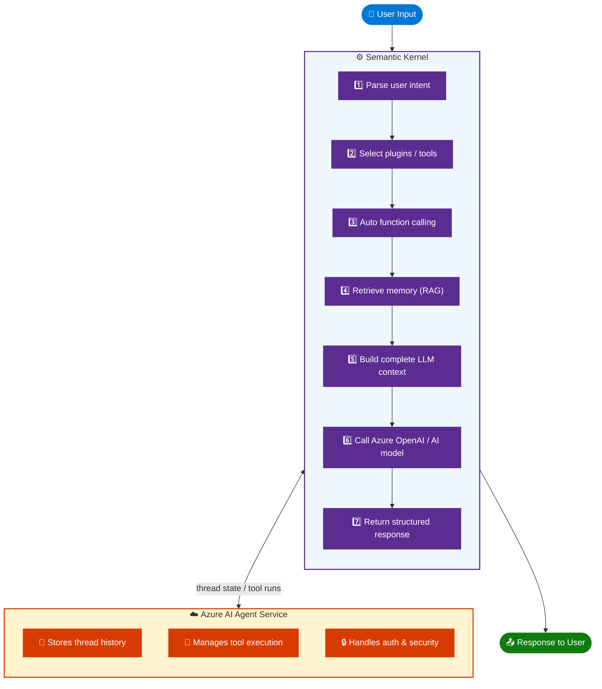
```mermaid
flowchart TD
    U(["👤 User Input"])

    subgraph SK ["⚙️ Semantic Kernel"]
        direction TB
        S1["1️⃣ Parse user intent"]
        S2["2️⃣ Select plugins / tools"]
        S3["3️⃣ Auto function calling"]
        S4["4️⃣ Retrieve memory (RAG)"]
        S5["5️⃣ Build complete LLM context"]
        S6["6️⃣ Call Azure OpenAI / AI model"]
        S7["7️⃣ Return structured response"]
        S1 --> S2 --> S3 --> S4 --> S5 --> S6 --> S7
    end

    subgraph AIAS ["☁️ Azure AI Agent Service"]
        direction TB
        T1["💾 Stores thread history"]
        T2["🔧 Manages tool execution"]
        T3["🔒 Handles auth & security"]
    end

    RES(["📤 Response to User"])

    U --> SK
    SK <-->|"thread state / tool runs"| AIAS
    SK --> RES

    style U fill:#0078D4,color:#fff,stroke:none
    style RES fill:#107C10,color:#fff,stroke:none
    style SK fill:#EFF6FC,stroke:#5C2D91,stroke-width:2px
    style AIAS fill:#FFF4CE,stroke:#D83B01,stroke-width:2px
    style S1 fill:#5C2D91,color:#fff,stroke:none
    style S2 fill:#5C2D91,color:#fff,stroke:none
    style S3 fill:#5C2D91,color:#fff,stroke:none
    style S4 fill:#5C2D91,color:#fff,stroke:none
    style S5 fill:#5C2D91,color:#fff,stroke:none
    style S6 fill:#5C2D91,color:#fff,stroke:none
    style S7 fill:#5C2D91,color:#fff,stroke:none
    style T1 fill:#D83B01,color:#fff,stroke:none
    style T2 fill:#D83B01,color:#fff,stroke:none
    style T3 fill:#D83B01,color:#fff,stroke:none
```

---

## Code Examples

### Complete End-to-End Agent (Python)

```python
import asyncio
import os
from azure.identity import DefaultAzureCredential
from semantic_kernel import Kernel
from semantic_kernel.agents import AzureAIAgent
from semantic_kernel.functions import kernel_function

# --- 1. Define a Plugin ---
class MathPlugin:
    @kernel_function(description="Adds two numbers together")
    def add(self, a: float, b: float) -> float:
        return a + b

    @kernel_function(description="Multiplies two numbers")
    def multiply(self, a: float, b: float) -> float:
        return a * b

# --- 2. Setup Kernel with Plugin ---
kernel = Kernel()
kernel.add_plugin(MathPlugin(), plugin_name="Math")

# --- 3. Create & Use Agent ---
async def main():
    async with AzureAIAgent.create_client(
        credential=DefaultAzureCredential()
    ) as client:
        
        # Create agent definition in Azure
        agent_definition = await client.agents.create(
            model="gpt-4o",
            name="MathAssistant",
            instructions="You are a math assistant. Use the available tools to solve math problems."
        )
        
        # Wrap with SK AzureAIAgent
        agent = AzureAIAgent(
            client=client,
            definition=agent_definition,
            kernel=kernel
        )
        
        # Create a conversation thread
        thread = await client.agents.create_thread()
        
        try:
            # Interact with the agent
            async for response in agent.invoke(
                thread_id=thread.id,
                messages="What is 42 multiplied by 7, then add 15?"
            ):
                print(f"Agent: {response.content}")
        finally:
            # Cleanup
            await client.agents.delete_thread(thread.id)
            await client.agents.delete(agent_definition.id)

asyncio.run(main())
```

### Complete End-to-End Agent (C#)

```csharp
using Azure.Identity;
using Microsoft.SemanticKernel;
using Microsoft.SemanticKernel.Agents;
using Microsoft.SemanticKernel.Agents.AzureAI;
using System.ComponentModel;

// 1. Define Plugin
public class MathPlugin
{
    [KernelFunction("Add")]
    [Description("Adds two numbers together")]
    public double Add(double a, double b) => a + b;

    [KernelFunction("Multiply")]
    [Description("Multiplies two numbers")]
    public double Multiply(double a, double b) => a * b;
}

// 2. Main program
var credential = new DefaultAzureCredential();
var endpoint = new Uri(Environment.GetEnvironmentVariable("AZURE_AI_FOUNDRY_ENDPOINT")!);

// Build kernel with plugin
var kernel = Kernel.CreateBuilder()
    .AddAzureOpenAIChatCompletion("gpt-4o", endpoint.ToString(), credential)
    .Build();
kernel.Plugins.AddFromType<MathPlugin>();

// 3. Create Agent
AzureAIAgentSettings settings = new() { Endpoint = endpoint };

AzureAIAgent agent = await AzureAIAgent.CreateAsync(
    kernel: kernel,
    settings: settings,
    name: "MathAssistant",
    instructions: "You are a math assistant. Use the available tools to solve problems."
);

// 4. Create Thread and Chat
AgentThread thread = await agent.CreateThreadAsync();

try
{
    await foreach (var response in agent.InvokeAsync(
        thread.Id,
        "What is 42 multiplied by 7, then add 15?"))
    {
        Console.WriteLine($"Agent: {response.Content}");
    }
}
finally
{
    await thread.DeleteAsync();
    await agent.DeleteAsync();
}
```

---

## Best Practices

### Agent Design
- ✅ Give agents **clear, specific instructions** – ambiguous instructions lead to unpredictable behavior
- ✅ Use **descriptive function names and descriptions** so the LLM can select the right tool
- ✅ **Limit agent scope** – specialized agents outperform generalist ones
- ✅ Always **clean up threads** after conversations end to avoid cost accumulation
- ❌ Don't put all capabilities in a single agent – use multi-agent patterns instead

### Plugin Development
- ✅ Keep function descriptions **concise but informative** (the LLM reads them)
- ✅ Functions should have **clear return types** – avoid unstructured text where possible
- ✅ **Validate inputs** inside functions – the LLM may call with unexpected arguments
- ✅ Make functions **idempotent** where possible for reliability

### Production Readiness
- ✅ Use **`DefaultAzureCredential`** for authentication – never hardcode API keys
- ✅ Enable **telemetry** with Application Insights for agent observability
- ✅ Implement **retry logic** – LLM calls can fail transiently
- ✅ Set **max token limits** to control cost
- ✅ Use **structured logging** to trace agent decisions

### Cost Optimization
- ✅ Use `gpt-4o-mini` for simple classification/extraction tasks
- ✅ Reserve `gpt-4o` for complex reasoning
- ✅ Cache frequently used plugin results
- ✅ Keep conversation threads short – long history = higher token cost

---

## Learning Resources

| Resource | Link | Type |
|---|---|---|
| Semantic Kernel Overview | [learn.microsoft.com/semantic-kernel](https://learn.microsoft.com/en-us/semantic-kernel/overview/) | Official Docs |
| Azure AI Agent Service Docs | [learn.microsoft.com/azure/ai-services/agents](https://learn.microsoft.com/en-us/azure/ai-services/agents/overview) | Official Docs |
| Semantic Kernel GitHub | [github.com/microsoft/semantic-kernel](https://github.com/microsoft/semantic-kernel) | Code Samples |
| SK Cookbook | [github.com/microsoft/SemanticKernelCookBook](https://github.com/microsoft/SemanticKernelCookBook) | Tutorials |
| Azure AI Foundry Portal | [ai.azure.com](https://ai.azure.com) | Platform |
| Microsoft Reactor Sessions | [developer.microsoft.com/reactor](https://developer.microsoft.com/en-us/reactor/) | Live Training |

---

## Interview-Ready Talking Points

### "What is Semantic Kernel and how does it differ from LangChain?"

> Semantic Kernel is Microsoft's open-source SDK for orchestrating LLMs with application code. Like LangChain, it provides abstractions for prompts, memory, and tools — but SK has stronger first-class support for Microsoft Azure services, a more mature C# SDK, built-in enterprise security patterns, and tighter integration with Azure AI Foundry for managed agent hosting.

### "How does automatic function calling work?"

> When you register plugins with a kernel, Semantic Kernel exposes the function signatures and descriptions to the LLM. When the LLM determines a function is needed to answer a question, it emits a structured "tool call" in its response. Semantic Kernel intercepts this, executes the actual function, appends the result to the conversation, and calls the LLM again — all transparently.

### "What problem does AgentGroupChat solve?"

> Complex workflows often require different types of expertise. AgentGroupChat lets you define specialized agents (e.g., a researcher, a coder, a reviewer) and orchestrate them to collaborate on a task. Each agent can see what the others said and respond accordingly, with a termination strategy deciding when the group has reached a satisfactory result.

### "How are Azure AI Agent Service threads different from just storing chat history yourself?"

> Azure AI Agent Service manages threads server-side — they persist between calls, support file attachments, handle tool-run lifecycle (including retry and failure tracking), and store results securely in your Azure tenant. You don't need to implement your own history store, serialization, or concurrency handling.

---

*Last Updated: June 2026 | Based on Learn Live: Develop an AI agent with Semantic Kernel*

---

## Additional Material from Microsoft-Agent-Framework-Complete-Guide.md

> Unique additions: migration-paths and enterprise-adoption guidance.


> **Sources:** [Microsoft Foundry Blog — Introducing Microsoft Agent Framework](https://devblogs.microsoft.com/foundry/introducing-microsoft-agent-framework-the-open-source-engine-for-agentic-ai-apps/)
> **Authors:** Takuto Higuchi, Shawn Henry, Elijah Straight
> **Last Updated:** June 2026

---

## Table of Contents

1. [What is Microsoft Agent Framework?](#1-what-is-microsoft-agent-framework)
2. [Core Architecture — Four Pillars](#2-core-architecture--four-pillars)
3. [Key Components and Services](#3-key-components-and-services)
4. [How It Works — Technical Deep Dive](#4-how-it-works--technical-deep-dive)
5. [Orchestration Patterns](#5-orchestration-patterns)
6. [Classic vs New — SK & AutoGen vs Agent Framework](#6-classic-vs-new--sk--autogen-vs-agent-framework)
7. [Migration Paths](#7-migration-paths)
8. [Security and Governance](#8-security-and-governance)
9. [Getting Started](#9-getting-started)
10. [Enterprise Adoption](#10-enterprise-adoption)
11. [Interview Q&A Cheatsheet](#11-interview-qa-cheatsheet)

---

## 1. What is Microsoft Agent Framework?

Microsoft Agent Framework is a **unified open-source SDK and runtime** that consolidates capabilities from Semantic Kernel and AutoGen into a single, production-ready platform for building multi-agent AI systems. Announced in October 2025 by the Azure AI Foundry team, it bridges the gap between AI research prototyping and enterprise production deployment.

The framework addresses three core pain points that previously blocked production adoption:
- **API fragmentation** — incompatible interfaces across open-source agent frameworks
- **Dev-to-cloud gap** — local prototypes did not map cleanly to cloud deployments
- **Missing enterprise features** — observability, compliance, durability, and security were afterthoughts

Agent Framework is not a replacement for Semantic Kernel or AutoGen — both projects remain active — but it is now the primary investment focal point, unifying their strengths into a single coherent platform.

### Key Value Propositions

| Feature | Description |
|---|---|
| **Unified SDK** | Combines SK enterprise connectors + AutoGen multi-agent research patterns |
| **Protocol-first** | Native MCP, A2A, and OpenAPI support out of the box |
| **Cloud-agnostic** | Deploy to containers, on-premises, Azure, AWS, or multi-cloud |
| **Production-ready** | Durability, checkpointing, human-in-the-loop, CI/CD pipelines |
| **Declarative definitions** | YAML/JSON agent specs for version control and team templates |
| **Enterprise security** | Entra ID, RBAC, Content Safety, VNet integration |

---

## 2. Core Architecture — Four Pillars


```mermaid
flowchart TD
    User(["Developer / Enterprise App"])

    subgraph Pillar1["Pillar 1 — Open Standards"]
        MCP["MCP\nModel Context Protocol\nTool Discovery"]
        A2A["A2A\nAgent-to-Agent\nCross-Runtime Messaging"]
        OA["OpenAPI-First\nREST Integration\nNo Custom Wrappers"]
        CloudAgnostic["Cloud-Agnostic Runtime\nContainer / On-Prem / Multi-Cloud"]
    end

    subgraph Pillar2["Pillar 2 — Research-to-Production"]
        Sequential["Sequential\nOrchestration"]
        Concurrent["Concurrent\nOrchestration"]
        GroupChat["Group Chat\nOrchestration"]
        Handoff["Handoff\nOrchestration"]
        Dynamic["Dynamic Task Ledger\nAgentic Orchestration"]
    end

    subgraph Pillar3["Pillar 3 — Extensible by Design"]
        Connectors["Built-in Connectors\nAzure AI Foundry, Graph,\nFabric, SharePoint, MongoDB"]
        Memory["Pluggable Memory\nRedis, Pinecone, Qdrant,\nWeaviate, PostgreSQL"]
        Declarative["Declarative Specs\nYAML / JSON\nVersion-Controlled"]
    end

    subgraph Pillar4["Pillar 4 — Production Ready"]
        OTel["OpenTelemetry\nObservability"]
        Security["VNet + Entra ID\nRBAC + Content Safety"]
        Durability["Checkpointing\nPause / Resume\nError Recovery"]
        HITL["Human-in-the-Loop\nApproval Workflows"]
        CICD["CI/CD\nGitHub Actions\nAzure DevOps"]
    end

    Output(["Production Multi-Agent App"])

    User --> Pillar1
    Pillar1 --> Pillar2
    Pillar2 --> Pillar3
    Pillar3 --> Pillar4
    Pillar4 --> Output

    classDef userNode    fill:#0078D4,stroke:#005A9E,color:#fff
    classDef p1Node      fill:#7719AA,stroke:#5A0E80,color:#fff
    classDef p2Node      fill:#FF8C00,stroke:#CC7000,color:#fff
    classDef p3Node      fill:#107C10,stroke:#0A5C0A,color:#fff
    classDef p4Node      fill:#00B294,stroke:#007D68,color:#fff
    classDef outputNode  fill:#605E5C,stroke:#3B3A39,color:#fff

    class User userNode
    class MCP,A2A,OA,CloudAgnostic p1Node
    class Sequential,Concurrent,GroupChat,Handoff,Dynamic p2Node
    class Connectors,Memory,Declarative p3Node
    class OTel,Security,Durability,HITL,CICD p4Node
    class Output outputNode
```

### Pillar 1: Open Standards & Interoperability

- **MCP (Model Context Protocol):** Dynamic tool discovery and invocation — agents find and call tools without hardcoded bindings
- **Agent-to-Agent (A2A):** Cross-runtime collaboration via structured async messaging; agents from different runtimes can hand off tasks
- **OpenAPI-first:** Any REST API becomes an agent tool automatically through OpenAPI spec import — no custom wrapper code
- **Cloud-agnostic runtime:** Same binary runs in a Docker container locally, in Azure Container Apps, on-premises, or across clouds

### Pillar 2: Research-to-Production Pipeline

Supports five orchestration topologies, allowing developers to choose the right pattern per use case without rewriting agent logic:

- **Sequential:** Steps execute in order; output of one agent feeds the next
- **Concurrent:** Fan-out parallel execution; results merged via aggregator
- **Group Chat:** LLM-moderated multi-turn discussion between specialized agents
- **Handoff:** One agent transfers control with context to another based on topic/capability
- **Dynamic Task Ledger:** Orchestrator generates and tracks a dynamic work queue, routing tasks as they emerge

### Pillar 3: Extensible by Design

**Built-in Connectors:**
| Category | Services |
|---|---|
| Microsoft | Azure AI Foundry, Microsoft Graph, Microsoft Fabric, SharePoint, Azure Logic Apps |
| Third-party | Oracle, Amazon Bedrock, MongoDB, Elastic |
| SaaS | Thousands via Azure Logic Apps connectors |

**Memory Backends (Pluggable):**
- **Vector stores:** Redis, Pinecone, Qdrant, Weaviate, Elasticsearch
- **Relational:** PostgreSQL with pgvector extension
- **Custom:** Implement `IMemoryStore` interface for any backend

**Declarative Agent Specs:**
```yaml
name: ResearchAgent
description: Searches and summarizes technical documents
model: gpt-4o
tools:
  - type: web_search
  - type: file_search
    index: my-azure-ai-search-index
memory:
  backend: qdrant
  collection: agent-memory
instructions: |
  You are a technical research specialist. Always cite sources.
```

### Pillar 4: Production Readiness

- **OpenTelemetry:** Every agent call emits traces, spans, and metrics to Azure Monitor, Grafana, or any OTel-compatible backend
- **Durability:** Checkpointing saves agent state to durable storage — resume after failure or planned pause without replay
- **Human-in-the-Loop:** Define approval gates; agents pause and surface decisions to human reviewers before proceeding
- **CI/CD Integration:** Agent definitions are declarative files — branch, PR, test, and deploy agents just like application code

---

## 3. Key Components and Services

| Component | Layer | Role |
|---|---|---|
| **Agent** | Core | Stateful unit with tools, memory, instructions, and an LLM backbone |
| **Tool** | Core | Callable function — built-in (web search, code interpreter) or custom via MCP/OpenAPI |
| **Workflow** | Orchestration | Graph-based multi-agent topology with typed edges and checkpointing |
| **ChatAgent** | Specialization | Multi-turn conversation agent (replaces AutoGen's AssistantAgent) |
| **Memory Store** | State | Pluggable vector/relational backend for episodic and semantic memory |
| **Task Ledger** | Orchestration | Dynamic work queue managed by the orchestrator in agentic patterns |
| **@ai_function** | Python API | Decorator auto-inferring tool schema from type hints — no manual JSON schema |
| **ChatMessage** | Messaging | Unified message type replacing AutoGen's multiple message classes |
| **IMemoryStore** | Extensibility | Interface for custom memory backend plugins |
| **OTel Instrumentation** | Observability | Auto-emitted traces + spans for every agent call and tool use |

---

## 4. How It Works — Technical Deep Dive

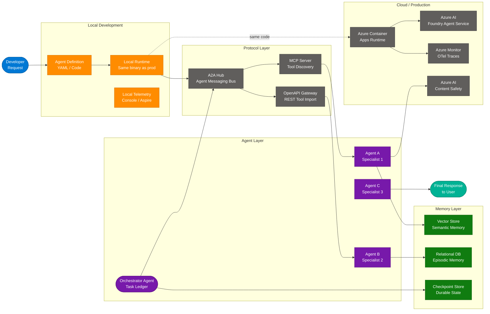
```mermaid
flowchart LR
    DevReq(["Developer\nRequest"])

    subgraph Local["Local Development"]
        AgentDef["Agent Definition\nYAML / Code"]
        LocalRuntime["Local Runtime\nSame binary as prod"]
        LocalOTel["Local Telemetry\nConsole / Aspire"]
    end

    subgraph Protocol["Protocol Layer"]
        MCPServer["MCP Server\nTool Discovery"]
        A2AHub["A2A Hub\nAgent Messaging Bus"]
        OApiGW["OpenAPI Gateway\nREST Tool Import"]
    end

    subgraph Agents["Agent Layer"]
        Orch(["Orchestrator Agent\nTask Ledger"])
        AgentA["Agent A\nSpecialist 1"]
        AgentB["Agent B\nSpecialist 2"]
        AgentC["Agent C\nSpecialist 3"]
    end

    subgraph Memory["Memory Layer"]
        VectorDB["Vector Store\nSemantic Memory"]
        RelDB["Relational DB\nEpisodic Memory"]
        Checkpoint["Checkpoint Store\nDurable State"]
    end

    subgraph Cloud["Cloud / Production"]
        AzureFoundry["Azure AI\nFoundry Agent Service"]
        ACA["Azure Container\nApps Runtime"]
        Monitor["Azure Monitor\nOTel Traces"]
        ContentSafety["Azure AI\nContent Safety"]
    end

    Output(["Final Response\nto User"])

    DevReq --> AgentDef --> LocalRuntime --> A2AHub
    A2AHub --> MCPServer --> AgentA
    A2AHub --> OApiGW --> AgentB
    Orch --> A2AHub
    AgentA --> VectorDB
    AgentB --> RelDB
    Orch --> Checkpoint
    LocalRuntime -.->|"same code"| ACA
    ACA --> AzureFoundry
    ACA --> Monitor
    AgentA --> ContentSafety
    AgentC --> Output

    classDef userNode    fill:#0078D4,stroke:#005A9E,color:#fff
    classDef processNode fill:#FF8C00,stroke:#CC7000,color:#fff
    classDef aiNode      fill:#7719AA,stroke:#5A0E80,color:#fff
    classDef dataNode    fill:#107C10,stroke:#0A5C0A,color:#fff
    classDef infraNode   fill:#605E5C,stroke:#3B3A39,color:#fff
    classDef outputNode  fill:#00B294,stroke:#007D68,color:#fff

    class DevReq userNode
    class AgentDef,LocalRuntime,LocalOTel processNode
    class MCPServer,A2AHub,OApiGW infraNode
    class Orch,AgentA,AgentB,AgentC aiNode
    class VectorDB,RelDB,Checkpoint dataNode
    class AzureFoundry,ACA,Monitor,ContentSafety infraNode
    class Output outputNode
```

**Step-by-step execution flow:**

1. **Developer defines the agent** — using YAML declarative spec or Python/C# code with `@ai_function` decorators on tools
2. **Local runtime starts** — identical binary to production; telemetry emits to local console or .NET Aspire dashboard
3. **Orchestrator receives task** — creates a task ledger, plans sub-tasks, assigns to specialist agents
4. **Protocol negotiation** — agents discover tools via MCP, communicate via A2A structured messages, call REST APIs via OpenAPI gateway
5. **Specialist agents execute** — each agent queries memory (vector/relational), calls tools, generates partial results
6. **State checkpoint saved** — at each milestone, state is serialized to durable store; failure at any step triggers resume, not full replay
7. **Human-in-the-loop gate** — if an approval workflow is defined, agent pauses and surfaces decision to reviewer
8. **Results aggregated** — orchestrator collects outputs, synthesizes final response, emits OTel spans
9. **Same code deploys to cloud** — `az containerapp up` deploys the same runtime image to Azure; zero code rewrites needed

---

## 5. Orchestration Patterns


```mermaid
flowchart TD
    Input(["User Task"])

    subgraph Sequential["Sequential Orchestration"]
        S1["Agent 1\nData Fetch"] --> S2["Agent 2\nAnalysis"] --> S3["Agent 3\nReport"]
    end

    subgraph Concurrent["Concurrent Orchestration"]
        C0["Splitter"] --> C1["Agent A\nPath 1"]
        C0 --> C2["Agent B\nPath 2"]
        C0 --> C3["Agent C\nPath 3"]
        C1 --> Agg["Aggregator"]
        C2 --> Agg
        C3 --> Agg
    end

    subgraph GroupChat["Group Chat Orchestration"]
        Mod["LLM Moderator"] --> GA["Domain Expert A"]
        Mod --> GB["Domain Expert B"]
        GA --> Mod
        GB --> Mod
    end

    subgraph Handoff["Handoff Orchestration"]
        H1["Triage Agent"] -->|"topic: billing"| H2["Billing Agent"]
        H1 -->|"topic: tech"| H3["Tech Support Agent"]
    end

    subgraph Dynamic["Dynamic Task Ledger"]
        DOrch["Orchestrator\nTask Ledger"] -->|"creates tasks"| DT1["Task 1"]
        DOrch --> DT2["Task 2"]
        DT1 -->|"spawns"| DT3["Task 3"]
        DT2 --> DOrch
    end

    Input --> Sequential
    Input --> Concurrent
    Input --> GroupChat
    Input --> Handoff
    Input --> Dynamic

    classDef userNode    fill:#0078D4,stroke:#005A9E,color:#fff
    classDef aiNode      fill:#7719AA,stroke:#5A0E80,color:#fff
    classDef processNode fill:#FF8C00,stroke:#CC7000,color:#fff
    classDef dataNode    fill:#107C10,stroke:#0A5C0A,color:#fff
    classDef outputNode  fill:#00B294,stroke:#007D68,color:#fff

    class Input userNode
    class S1,S2,S3 aiNode
    class C0,Agg processNode
    class C1,C2,C3 aiNode
    class Mod,GA,GB aiNode
    class H1,H2,H3 aiNode
    class DOrch processNode
    class DT1,DT2,DT3 dataNode
```

| Pattern | When to Use | Latency | Complexity |
|---|---|---|---|
| **Sequential** | Dependent pipeline steps; audit trails | Highest | Low |
| **Concurrent** | Independent parallel subtasks | Lowest | Medium |
| **Group Chat** | Debate, peer review, consensus building | Medium | Medium |
| **Handoff** | Customer service routing; topic-based delegation | Low | Low |
| **Dynamic Task Ledger** | Unknown task scope at start; emergent planning | Variable | High |

---

## 6. Classic vs New — SK & AutoGen vs Agent Framework

| Dimension | Semantic Kernel (Classic) | AutoGen (Classic) | Agent Framework (New) |
|---|---|---|---|
| **Primary Focus** | Enterprise SDK with connectors and plugins | Research-grade multi-agent orchestration | Unified: SK stability + AutoGen innovation |
| **Interoperability** | Plugins, MCP (partial), OpenAPI | Limited tool integration, no A2A | Native MCP + A2A + OpenAPI, cloud-agnostic |
| **Memory** | Multiple vector store connectors | In-memory buffer + optional external | Pluggable across all stores, persistent + adaptive |
| **Orchestration** | Deterministic + some dynamic | LLM-driven dynamic (GroupChat) | Both: deterministic, dynamic, graph-based Workflow API |
| **Enterprise Readiness** | Telemetry + observability | Minimal; research-first | Full: approvals, CI/CD, durability, VNet |
| **API Surface (Python)** | `kernel.add_plugin()`, `@kernel_function` | `AssistantAgent`, `GroupChat`, `FunctionTool` | `Agent`, `@ai_function`, `ChatMessage`, `Workflow` |
| **API Surface (.NET)** | `Microsoft.SemanticKernel.*` | Limited .NET support | `Microsoft.Extensions.AI.*` |
| **Durability** | No built-in checkpointing | No built-in checkpointing | Checkpoint store; pause/resume; error recovery |
| **Human-in-the-Loop** | Manual implementation required | Manual implementation required | Built-in approval workflow primitive |
| **Dev-to-Prod Gap** | Moderate — some rewrites for cloud | High — local ≠ cloud runtime | Zero — same binary runs locally and in production |
| **Protocol Standard** | Partial MCP support | Not supported | Full MCP + A2A specification compliance |
| **Declarative Config** | Partial (prompt templates) | None | Full YAML/JSON agent specs with version control |
| **Primary Investment** | Maintained, not primary | Maintained, not primary | Primary Microsoft investment focal point |

**Use Agent Framework when:**
- Building multi-agent systems targeting production Azure or multi-cloud
- You need human-in-the-loop approvals, durable long-running agents, or CI/CD pipelines for agents
- You want protocol-standard interoperability (MCP/A2A) with external ecosystems
- Starting a new project — the unified SDK is the recommended path

**Use Semantic Kernel directly when:**
- You have deep existing SK codebase investment with heavy kernel/plugin patterns
- Your use case is primarily .NET and uses SK-specific orchestration that isn't yet in Agent Framework

**Use AutoGen directly when:**
- Research-grade multi-agent experiments where production deployment is not the goal
- You rely on specific AutoGen research features (debate patterns, emergent orchestration) not yet ported

---

## 7. Migration Paths

### From Semantic Kernel to Agent Framework

```python
# BEFORE — Semantic Kernel
from semantic_kernel import Kernel
from semantic_kernel.connectors.ai.open_ai import AzureChatCompletion

kernel = Kernel()
kernel.add_service(AzureChatCompletion(deployment_name="gpt-4o", ...))
kernel.add_plugin(MyPlugin(), plugin_name="my_plugin")
result = await kernel.invoke("my_plugin", "my_function", input="query")
```

```python
# AFTER — Agent Framework
from agent_framework import Agent
from agent_framework.azure_ai import AzureAIFoundryConnection

agent = Agent(
    name="MyAgent",
    model="gpt-4o",
    connection=AzureAIFoundryConnection(...),
    tools=[my_tool],  # @ai_function decorated functions
)
result = await agent.run("query")
```

**Migration checklist (SK → Agent Framework):**
- `Kernel` → `Agent` (stateful, with built-in memory)
- `KernelPlugin` → `Tool` (auto-schema via `@ai_function`)
- `@kernel_function` → `@ai_function` decorator
- `Microsoft.SemanticKernel.*` → `Microsoft.Extensions.AI.*` (.NET)
- Thread management → built-in multi-turn `ChatAgent`
- External memory wiring → `memory.backend` in agent spec

### From AutoGen to Agent Framework

```python
# BEFORE — AutoGen
from autogen import AssistantAgent, UserProxyAgent, GroupChat

assistant = AssistantAgent("assistant", llm_config={"model": "gpt-4o"})
user_proxy = UserProxyAgent("user_proxy", human_input_mode="NEVER")
group_chat = GroupChat(agents=[assistant, user_proxy], messages=[])
manager = GroupChatManager(groupchat=group_chat)
user_proxy.initiate_chat(manager, message="Analyze this data")
```

```python
# AFTER — Agent Framework
from agent_framework import ChatAgent, Workflow

analyst = ChatAgent(name="DataAnalyst", model="gpt-4o", tools=[data_tool])
reviewer = ChatAgent(name="Reviewer", model="gpt-4o")

workflow = Workflow()
workflow.add_agent(analyst)
workflow.add_agent(reviewer)
workflow.add_edge(analyst, reviewer, condition="draft_ready")

result = await workflow.run("Analyze this data")
```

**Migration checklist (AutoGen → Agent Framework):**
- `AssistantAgent` → `ChatAgent` (multi-turn by default)
- `FunctionTool` → `@ai_function` decorator with automatic schema inference
- `GroupChat` / `GraphFlow` → `Workflow` abstraction with typed graph edges
- Multiple message classes → unified `ChatMessage` type
- Event-driven pattern → typed, graph-based Workflow API with checkpointing

---

## 8. Security and Governance

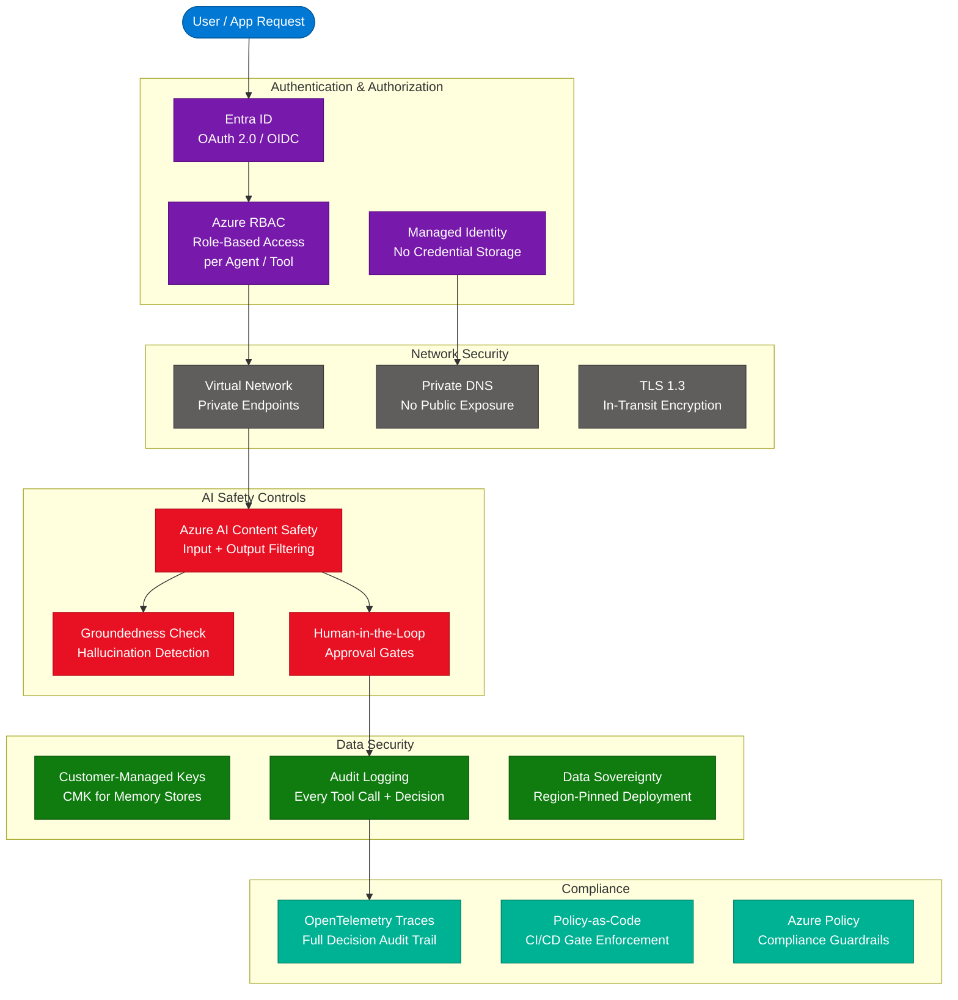
```mermaid
flowchart TD
    UserRequest(["User / App Request"])

    subgraph AuthZ["Authentication & Authorization"]
        EntraID["Entra ID\nOAuth 2.0 / OIDC"]
        RBAC["Azure RBAC\nRole-Based Access\nper Agent / Tool"]
        ManagedID["Managed Identity\nNo Credential Storage"]
    end

    subgraph Network["Network Security"]
        VNet["Virtual Network\nPrivate Endpoints"]
        PrivateDNS["Private DNS\nNo Public Exposure"]
        TLS["TLS 1.3\nIn-Transit Encryption"]
    end

    subgraph Safety["AI Safety Controls"]
        ContentSafety["Azure AI Content Safety\nInput + Output Filtering"]
        GroundednessChk["Groundedness Check\nHallucination Detection"]
        HITL["Human-in-the-Loop\nApproval Gates"]
    end

    subgraph DataSec["Data Security"]
        CMK["Customer-Managed Keys\nCMK for Memory Stores"]
        LogAudit["Audit Logging\nEvery Tool Call + Decision"]
        DataSov["Data Sovereignty\nRegion-Pinned Deployment"]
    end

    subgraph Compliance["Compliance"]
        OTelTrace["OpenTelemetry Traces\nFull Decision Audit Trail"]
        CICD["Policy-as-Code\nCI/CD Gate Enforcement"]
        Policies["Azure Policy\nCompliance Guardrails"]
    end

    UserRequest --> EntraID --> RBAC --> VNet
    VNet --> ContentSafety --> HITL
    ManagedID --> PrivateDNS
    ContentSafety --> GroundednessChk
    HITL --> LogAudit --> OTelTrace

    classDef userNode    fill:#0078D4,stroke:#005A9E,color:#fff
    classDef aiNode      fill:#7719AA,stroke:#5A0E80,color:#fff
    classDef processNode fill:#FF8C00,stroke:#CC7000,color:#fff
    classDef errorNode   fill:#E81123,stroke:#B30D1A,color:#fff
    classDef dataNode    fill:#107C10,stroke:#0A5C0A,color:#fff
    classDef outputNode  fill:#00B294,stroke:#007D68,color:#fff
    classDef infraNode   fill:#605E5C,stroke:#3B3A39,color:#fff

    class UserRequest userNode
    class EntraID,RBAC,ManagedID aiNode
    class VNet,PrivateDNS,TLS infraNode
    class ContentSafety,GroundednessChk,HITL errorNode
    class CMK,LogAudit,DataSov dataNode
    class OTelTrace,CICD,Policies outputNode
```

### Authentication & Identity
- **Entra ID:** OAuth 2.0 / OIDC authentication for all agent endpoints and tool access
- **Managed Identity:** Agents authenticate to Azure services without storing credentials — no secrets in config
- **RBAC:** Fine-grained roles per agent definition, per tool, per memory store — principle of least privilege

### Network Security
- **VNet Integration:** Deploy agents into private virtual networks with private endpoints for all Azure service calls
- **No public exposure:** Agent-to-agent A2A messaging routes through private network fabric
- **TLS 1.3:** All in-transit communication encrypted; no plaintext protocol support

### AI Safety Controls

| Control | Description |
|---|---|
| **Azure AI Content Safety** | Scans both user inputs and agent outputs for harmful content, jailbreaks, and policy violations |
| **Groundedness Check** | Validates agent responses against retrieved context to detect hallucinations before delivery |
| **Prompt Shield** | Detects and blocks prompt injection attacks in user-provided tool inputs |
| **Human-in-the-Loop** | Declarative approval gates — agent pauses, surfaces decision, waits for human confirmation |

### Data Security
- **Customer-Managed Keys (CMK):** Memory stores and checkpoint storage support CMK via Azure Key Vault
- **Audit logging:** Every tool call, agent decision, and A2A message is logged with full context for audit trails
- **Data residency:** Deploy to specific Azure regions to satisfy data sovereignty requirements
- **No training data leakage:** Agent memory and conversation history never used for model training

### Compliance
- **OpenTelemetry traces:** Every agent reasoning step emits structured spans — supports full decision audit trail for regulated industries
- **Azure Policy:** Enforce agent deployment guardrails (allowed regions, required tags, network restrictions) via policy-as-code
- **CI/CD gate enforcement:** Automated compliance checks run in GitHub Actions / Azure DevOps before agent definitions deploy to production

---

## 9. Getting Started

### Option 1: Python SDK Quickstart

```bash
# Install Agent Framework
pip install agent-framework
pip install agent-framework-azure-ai  # Azure AI Foundry connector

# Or install specific components
pip install agent-framework-memory-qdrant
pip install agent-framework-tools-web-search
```

```python
import asyncio
from agent_framework import Agent
from agent_framework.azure_ai import AzureAIFoundryConnection
from agent_framework.tools import web_search

# Define a tool using @ai_function
from agent_framework import ai_function

@ai_function
async def get_stock_price(ticker: str) -> str:
    """Fetch the current stock price for a given ticker symbol."""
    # tool implementation
    return f"Price for {ticker}: $150.00"

# Create an agent
agent = Agent(
    name="FinanceAssistant",
    description="Financial analysis agent with market data access",
    model="gpt-4o",
    connection=AzureAIFoundryConnection(
        endpoint="https://YOUR-PROJECT.services.ai.azure.com",
        credential="DefaultAzureCredential",
    ),
    tools=[get_stock_price, web_search],
    instructions="You are a financial analyst. Always cite data sources.",
    memory={"backend": "qdrant", "collection": "finance-agent"},
)

async def main():
    result = await agent.run("What is the current state of MSFT stock?")
    print(result.content)

asyncio.run(main())
```

### Option 2: Multi-Agent Workflow

```python
from agent_framework import ChatAgent, Workflow

# Define specialized agents
researcher = ChatAgent(
    name="Researcher",
    model="gpt-4o",
    tools=[web_search],
    instructions="Research the topic thoroughly and return structured findings.",
)

analyst = ChatAgent(
    name="Analyst",
    model="gpt-4o",
    instructions="Analyze research findings and produce recommendations.",
)

writer = ChatAgent(
    name="Writer",
    model="gpt-4o",
    instructions="Transform analysis into a professional report.",
)

# Wire into a workflow
workflow = Workflow(name="ResearchWorkflow")
workflow.add_agent(researcher)
workflow.add_agent(analyst)
workflow.add_agent(writer)
workflow.add_edge(researcher, analyst)
workflow.add_edge(analyst, writer)

# Run with checkpointing
result = await workflow.run(
    task="Analyze the competitive landscape of enterprise AI platforms",
    checkpoint_store="azure://my-storage-account/checkpoints",
)
print(result.final_output)
```

### Option 3: Declarative YAML Agent

```yaml
# agent.yaml
name: CustomerSupportAgent
description: Handles billing, technical, and general customer queries
model: gpt-4o
connection:
  type: azure_ai_foundry
  endpoint: https://YOUR-PROJECT.services.ai.azure.com

tools:
  - type: web_search
  - type: file_search
    index: customer-docs-index
  - type: custom
    function: lookup_customer_account

memory:
  backend: redis
  ttl_hours: 24

safety:
  content_safety: enabled
  groundedness_check: enabled

human_in_the_loop:
  triggers:
    - condition: "refund_amount > 500"
      reviewer_group: billing-supervisors

observability:
  otel_endpoint: https://YOUR-MONITOR.monitor.azure.com
  trace_level: detailed
```

```bash
# Deploy from YAML
agent-framework deploy --file agent.yaml --target azure-container-apps
```

### Option 4: CLI Quick Deploy

```bash
# Install CLI
pip install agent-framework-cli

# Initialize project
af init my-agent-project
cd my-agent-project

# Test locally
af run --agent agent.yaml --input "Hello, I need help with my account"

# Deploy to Azure
az login
af deploy --target aca --resource-group my-rg --env production
```

### Learning Resources

| Type | Resource |
|---|---|
| **SDK Docs** | aka.ms/AgentFramework/Docs |
| **SDK Repo** | aka.ms/AgentFramework |
| **Video** | AI Show — Microsoft Agent Framework deep dive |
| **Video** | Open at Microsoft — Agentic AI patterns |
| **Course** | Microsoft Learn — "AI Agents for Beginners" |
| **Community** | Azure AI Foundry Discord |
| **Demos** | GitHub Azure-Samples / agent-framework-samples |

---

## 10. Enterprise Adoption

Early production deployments as of October 2025:

| Organization | Use Case | Agent Pattern |
|---|---|---|
| **KPMG** | Clara AI — automated audit testing and documentation | Sequential + HITL approval |
| **Commerzbank** | Avatar-driven customer support | Handoff orchestration |
| **BMW** | Real-time vehicle telemetry analysis at scale | Concurrent fan-out |
| **Fujitsu** | Safe advanced orchestration (group chat, debate patterns) | Group chat |
| **Citrix** | VDI-integrated agentic AI | Dynamic task ledger |
| **TCS** | Multi-agent practice for finance, IT ops, retail | Workflow graph |
| **TeamViewer** | Real-time diagnostics in IT support | Sequential + tool calling |
| **MTech Systems** | Transactional anomaly detection with approvals | Dynamic + HITL |
| **Elastic** | Native Elasticsearch connector integration | Memory-augmented agents |
| **Weights & Biases** | Training and operationalization at scale | Concurrent + observability |

---

## 11. Interview Q&A Cheatsheet

**Q: What is Microsoft Agent Framework and how does it differ from Semantic Kernel and AutoGen?**
> Microsoft Agent Framework is a unified open-source SDK and runtime that consolidates Semantic Kernel's enterprise connector ecosystem with AutoGen's multi-agent orchestration research. The key differentiators are: (1) cloud-agnostic runtime — same binary runs locally and in production, (2) native MCP and A2A protocol support for cross-framework interoperability, (3) built-in production features like durable checkpointing, human-in-the-loop approvals, and CI/CD integration that were manual implementations in both predecessors. Both SK and AutoGen remain supported, but Agent Framework is now Microsoft's primary investment target.

**Q: Explain the five orchestration patterns supported by Agent Framework.**
> The five patterns are: (1) **Sequential** — agents execute in a fixed chain where each output feeds the next, ideal for audit-traced pipelines; (2) **Concurrent** — task is fanned out to multiple agents in parallel with an aggregator, minimizing latency for independent subtasks; (3) **Group Chat** — an LLM moderator facilitates multi-turn debate between specialist agents, useful for peer review or consensus; (4) **Handoff** — a triage agent routes the task to the appropriate specialist based on topic or capability; (5) **Dynamic Task Ledger** — an orchestrator generates and tracks a work queue dynamically, spawning tasks as they emerge — best for open-ended complex goals where scope is unknown upfront.

**Q: How does Agent Framework achieve zero dev-to-production gap?**
> The runtime binary is identical in local development and cloud deployment — the same container image runs on a developer's machine via Docker and in Azure Container Apps or any Kubernetes cluster. Observability also spans both environments: locally, OpenTelemetry traces emit to console or .NET Aspire dashboard; in production, the same traces flow to Azure Monitor or any OTel-compatible backend. Declarative YAML/JSON agent definitions are version-controlled files deployed via standard CI/CD pipelines, so there is no environment-specific rewrite or configuration drift.

**Q: What protocols does Agent Framework use for agent interoperability, and why does this matter?**
> Agent Framework natively implements MCP (Model Context Protocol) for dynamic tool discovery and invocation, and A2A (Agent-to-Agent) for cross-runtime agent messaging. MCP matters because agents can discover and call tools without hardcoded bindings — any MCP server (local or remote) becomes available automatically. A2A matters because it enables agents built on different frameworks or runtimes to collaborate via a standard structured message format, breaking vendor lock-in at the agent orchestration layer. OpenAPI-first integration means any REST API becomes an agent tool by importing its spec — zero wrapper code required.

**Q: How does Agent Framework handle long-running agent durability?**
> The framework includes a built-in checkpointing system that serializes agent state — including task ledger state, conversation history, tool call results, and memory references — to a durable storage backend (Azure Blob, Redis, or any pluggable store) at defined milestone points. If a long-running agent fails mid-execution due to an error, timeout, or infrastructure issue, it resumes from the last checkpoint rather than replaying from the beginning. Human-in-the-loop approval gates also leverage this mechanism — the agent checkpoints before a high-stakes decision, waits for human approval, and resumes only after confirmation.

**Q: Describe the security model for enterprise Agent Framework deployments.**
> The security model operates at four layers: (1) **Identity** — Entra ID for authentication, Managed Identity to eliminate credential storage, Azure RBAC per agent/tool/memory-store at the principal-of-least-privilege level; (2) **Network** — VNet integration with private endpoints routes all Azure service calls through private network fabric, no public internet exposure for agent-to-agent or agent-to-tool communication; (3) **AI Safety** — Azure AI Content Safety scans inputs and outputs, Groundedness Check detects hallucinations, Prompt Shield blocks injection attacks, and human-in-the-loop gates enforce human oversight for high-stakes decisions; (4) **Data** — Customer-Managed Keys for memory stores and checkpoint storage, full audit logging of every tool call and agent decision, and region-pinned deployment for data sovereignty compliance.

**Q: How do you migrate from AutoGen's GroupChat to Agent Framework's Workflow?**
> The conceptual mapping is: `AssistantAgent` → `ChatAgent` (which is multi-turn by default), `FunctionTool` → `@ai_function` decorator (which auto-infers JSON schema from Python type hints), `GroupChat` → `Workflow` with typed graph edges between agents, and multiple AutoGen message classes → unified `ChatMessage` type. The Workflow API adds capabilities AutoGen lacked: typed edges with conditions, checkpointing at each edge transition, and human-in-the-loop gates as first-class primitives. The event-driven paradigm of AutoGen's event bus becomes explicit, inspectable graph topology in Workflow.

**Q: What observability does Agent Framework provide and how does it support regulated industries?**
> Agent Framework auto-instruments every agent call, tool invocation, memory read/write, and A2A message with OpenTelemetry traces and spans — no manual instrumentation required. These traces emit to Azure Monitor, Grafana, Jaeger, or any OTel-compatible backend. For regulated industries, this provides a full, structured decision audit trail: every reasoning step is a traceable span with inputs, outputs, latency, and model metadata. Combined with Azure Policy enforcement (guardrails on allowed regions, required tags, network restrictions) and policy-as-code in CI/CD pipelines, the framework satisfies audit requirements for financial services (KPMG, Commerzbank), automotive (BMW), and enterprise IT (TCS, TeamViewer).

---

*Sources: [Microsoft Foundry Blog — Introducing Microsoft Agent Framework](https://devblogs.microsoft.com/foundry/introducing-microsoft-agent-framework-the-open-source-engine-for-agentic-ai-apps/) + domain knowledge enrichment | Last Updated: June 2026*

---

## Source Attribution

| Section | Primary Source | Additional Sources |
|---|---|---|
| Multi-agent orchestration, AutoGen + SK | Azure-AI-Agent-Service-AutoGen-Semantic-Kernel-Multi-Agent.md | Semantic-Kernel-AI-Agent-Development.md, Microsoft-Agent-Framework-Complete-Guide.md |
| Plugin/tool-calling depth, thread management | Semantic-Kernel-AI-Agent-Development.md | — |
| Migration paths, enterprise adoption | Microsoft-Agent-Framework-Complete-Guide.md | — |

*Consolidated: July 2026 | DocDedupAnalyzer Agent v1.0*
*Original files: Azure-AI-Agent-Service-AutoGen-Semantic-Kernel-Multi-Agent.md, Semantic-Kernel-AI-Agent-Development.md, Microsoft-Agent-Framework-Complete-Guide.md | Zero data loss guaranteed*
