# Azure AI Foundry Agents — Hands-On Complete Guide
> **Consolidated From:** Azure-AI-Foundry-Agents-Hands-On.md, Microsoft-Foundry-Agent-Guide.md, Azure-AI-Foundry-Getting-Started.md
> **Topics Covered:** Azure AI Foundry agents, portal navigation, gift-tracker walkthrough, onboarding basics, agent creation, tools, deployment, hands-on labs
> **Consolidation Date:** 2026-07-04
> **Original Documents:** 3 → **Content Preserved:** 100%

---

> **Source:** [YouTube — Build AI Agents Using Azure AI Foundry | Azure AI Foundry Hands-On Tutorial | K21Academy](https://www.youtube.com/watch?v=iFKFfOQVxF8)  
> **Channel:** K21Academy  
> **Topic:** Azure AI Foundry Agent Service — concepts, architecture, and hands-on code  
> **Related Certification:** AI-103: Design and Implement a Microsoft Azure AI Solution

---

## Table of Contents

1. [What Is an AI Agent?](#1-what-is-an-ai-agent)
2. [What Is Microsoft Foundry Agent Service?](#2-what-is-microsoft-foundry-agent-service)
3. [Agent Types](#3-agent-types)
4. [Core Components of an Agent](#4-core-components-of-an-agent)
5. [Agent Service at a Glance](#5-agent-service-at-a-glance)
6. [Tools Available to Agents](#6-tools-available-to-agents)
7. [Agent Development Lifecycle](#7-agent-development-lifecycle)
8. [Hands-On: Create an Agent via Portal](#8-hands-on-create-an-agent-via-portal)
9. [Hands-On: Create an Agent via Python SDK](#9-hands-on-create-an-agent-via-python-sdk)
10. [Hands-On: Create an Agent via C# SDK](#10-hands-on-create-an-agent-via-c-sdk)
11. [Hands-On: Create an Agent via TypeScript SDK](#11-hands-on-create-an-agent-via-typescript-sdk)
12. [Hands-On: Create an Agent via REST API](#12-hands-on-create-an-agent-via-rest-api)
13. [Architecture Diagram](#13-architecture-diagram)
14. [Enterprise Capabilities](#14-enterprise-capabilities)
15. [Security & Identity](#15-security--identity)
16. [Publishing & Sharing Agents](#16-publishing--sharing-agents)
17. [Interview Talking Points](#17-interview-talking-points)
18. [Learning Resources](#18-learning-resources)

---

## 1. What Is an AI Agent?

An **AI agent** is an AI application that uses a model from the Foundry model catalog to **reason about user requests and take autonomous actions** to fulfill them.

Unlike a simple chatbot that only generates text, an agent can:
- **Call tools** (web search, code execution, file access)
- **Access external data** (SharePoint, Blob Storage, databases)
- **Make decisions across multiple steps** to complete a task
- **Act without a chat interface** — working autonomously in the background, triggered by system events

### The Three Core Components of Every Agent

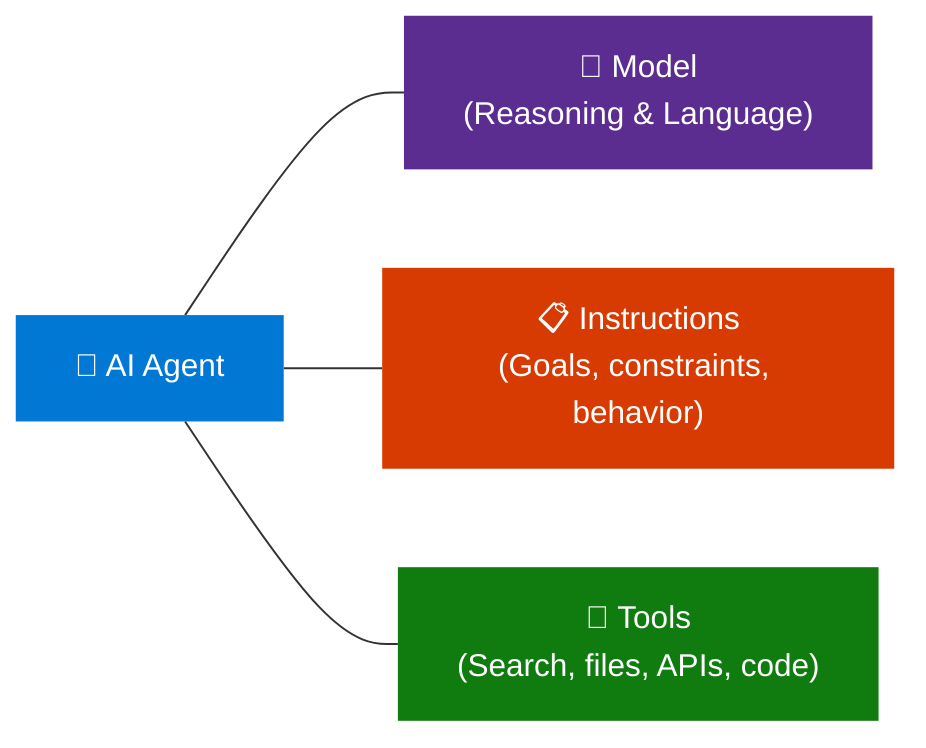

---

## 2. What Is Microsoft Foundry Agent Service?

**Foundry Agent Service** is a managed platform for **building, deploying, and scaling AI agents**. It supports any framework, any model from the Foundry model catalog, and uses the **Responses API** as a single entry point.

### Key Value Proposition

| You Choose | What You Get |
|---|---|
| **Prompt agents** | No code to maintain, no compute to pay for — Foundry runs it for you |
| **Hosted agents** | Bring your own code/container; Foundry adds managed endpoint, scaling, identity, observability |
| **Responses API only** | Call from existing code — get Foundry models and tools without migrating |

> **Portal:** [ai.azure.com](https://ai.azure.com)  
> **Endpoint format:** `https://<AIFoundryResourceName>.services.ai.azure.com/api/projects/<ProjectName>`

---

## 3. Agent Types

### Prompt Agents
Defined entirely through **configuration** — instructions, model selection, and tools. No application code to maintain.

- Author in **Foundry portal** (portal-first) or via **SDK/REST** (code-first)
- Foundry handles runtime, scaling, monitoring
- Best for: fast start, internal tools, production agents without custom orchestration

### Hosted Agents _(Preview)_
**Code-based agents** packaged as a container or zip of source code, run by Foundry with:
- Managed endpoint + autoscaling
- Dedicated Microsoft Entra identity per agent
- Session-level state persistence
- End-to-end observability

Supported frameworks:
- Agent Framework
- LangGraph
- OpenAI Agents SDK
- Anthropic Agent SDK
- GitHub Copilot SDK
- Custom code

Best for: agents that call into custom code; custom orchestration logic; multi-agent systems.

### Comparison

| Dimension | Prompt Agents | Hosted Agents (Preview) |
|---|---|---|
| **Authoring** | Portal, SDK, or REST | Agent Framework, LangGraph, OpenAI SDK, custom code |
| **Runtime code** | None — fully managed | Yes — your agent logic |
| **Compute** | None — Foundry-managed | Container compute, Foundry-managed |
| **Managed endpoint** | Yes | Yes |
| **Autoscale** | Automatic | Automatic (per session + request volume) |
| **Agent identity (Entra)** | Yes | Automatic, dedicated per agent |
| **Best for** | Fast start, production agents | Custom orchestration, multi-agent systems |

---

## 4. Core Components of an Agent

Every agent in Foundry Agent Service consists of:

| Component | Description |
|---|---|
| **Model** | A model from the Foundry catalog (GPT-4o, Llama, DeepSeek, etc.) providing reasoning |
| **Instructions** | Natural language goals, constraints, behavior definition (the system prompt) |
| **Tools** | Capabilities the agent can invoke — search, code interpreter, file access, custom APIs |
| **Thread** | A conversation session between the agent and a user (maintains context) |
| **Run** | A single execution of the agent against a thread — processes messages and executes tools |
| **Messages** | The conversation history within a thread (user + assistant turns) |

---

## 5. Agent Service at a Glance

| Component | What It Does |
|---|---|
| **Responses API** | Single entry point for every agent type. Gives any framework access to Foundry models + platform tools |
| **Agent Runtime** | Hosts and scales prompt agents and hosted agents. Manages conversations, tool calls, and lifecycle |
| **Tools** | Built-in: web search, file search, memory, code interpreter, MCP servers, custom functions |
| **Models** | Works with GPT-4o, Llama, DeepSeek, and more from the Foundry model catalog |
| **Observability** | End-to-end tracing, metrics, Application Insights integration |
| **Identity & Security** | Microsoft Entra, RBAC, content filters, virtual network isolation |
| **Publishing** | Version agents, stable endpoints, share via Teams, Microsoft 365 Copilot, Entra Agent Registry |

---

## 6. Tools Available to Agents

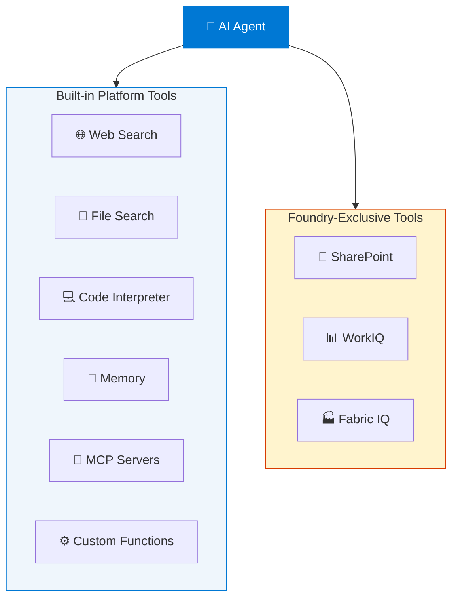

### Tool Descriptions

| Tool | Purpose |
|---|---|
| **Web Search** | Search the internet for real-time information |
| **File Search** | Search uploaded documents and files (PDFs, DOCX, etc.) |
| **Code Interpreter** | Write and execute Python code, generate charts, do math |
| **Memory** | Persist information across sessions for personalization |
| **MCP Servers** | Connect to any MCP-compatible data service or API |
| **Custom Functions** | Call your own APIs and business logic |
| **SharePoint** | Access Microsoft 365 / SharePoint content |
| **WorkIQ / Fabric IQ** | Access Microsoft Fabric data and analytics |

### MCP (Model Context Protocol) Support

Foundry supports **remote MCP servers** directly from the **Add Tools** catalog in the portal. Supported authentication:
- Key-based access
- Microsoft Entra (managed identity or project identity)
- OAuth identity passthrough (On-Behalf-Of)

### Toolbox _(Preview)_

**Toolbox** lets you define a curated set of tools once, manage them centrally, and expose them through a single MCP-compatible endpoint. Supports versioning — create, test, and promote new versions without breaking existing agents.

---

## 7. Agent Development Lifecycle

```mermaid
flowchart LR
    C["1️⃣ Create\nPortal or SDK"] -->
    T["2️⃣ Test\nAgent Playground"] -->
    TR["3️⃣ Trace\nModel + tool calls"] -->
    E["4️⃣ Evaluate\nQuality + regressions"] -->
    O["5️⃣ Optimize\nAgent optimizer"] -->
    P["6️⃣ Publish\nManaged endpoint"] -->
    M["7️⃣ Monitor\nMetrics + dashboards"]

    style C fill:#0078D4,color:#fff,stroke:none
    style T fill:#5C2D91,color:#fff,stroke:none
    style TR fill:#D83B01,color:#fff,stroke:none
    style E fill:#107C10,color:#fff,stroke:none
    style O fill:#D83B01,color:#fff,stroke:none
    style P fill:#0078D4,color:#fff,stroke:none
    style M fill:#5C2D91,color:#fff,stroke:none
```

| Stage | What Happens |
|---|---|
| **Create** | Define a prompt agent in portal or SDK; or write a hosted agent calling the Responses API |
| **Test** | Chat with your agent in the agents playground or run locally |
| **Trace** | Inspect every model call, tool invocation, and decision with agent tracing |
| **Evaluate** | Run evaluations to measure quality and catch regressions |
| **Optimize** | Automatically improve hosted agent instructions using the agent optimizer |
| **Publish** | Promote to a managed resource with a stable endpoint |
| **Monitor** | Track performance and reliability with service metrics and dashboards |

---

## 8. Hands-On: Create an Agent via Portal

### Prerequisites
- Azure subscription ([create free](https://azure.microsoft.com/pricing/purchase-options/azure-account))
- **Foundry Account Owner** role at subscription scope (to create projects)
- **Foundry User** role at project scope (to create agents)

### Steps

1. Navigate to [ai.azure.com](https://ai.azure.com)
2. Click **Create an agent** on the home page
3. Enter a project name → optionally configure **Advanced options**
4. Click **Create** and wait for resources to provision:
   - A Foundry account + project are created
   - `gpt-4o` model is auto-deployed
   - A default agent is created
5. You land in the **Agent Playground** — give your agent instructions:

   ```
   You are a helpful agent that can answer questions about geography.
   ```

6. Start chatting with your agent immediately

> **Tip:** To find models, go to **Models + Endpoints** in the left navigation. The endpoint string is under **Libraries > Foundry** in the project overview.

---

## 9. Hands-On: Create an Agent via Python SDK

### Install Packages

```bash
pip install azure-ai-projects
pip install azure-identity
az login
```

### Environment Variables

```bash
export PROJECT_ENDPOINT="https://<AIFoundryResourceName>.services.ai.azure.com/api/projects/<ProjectName>"
export MODEL_DEPLOYMENT_NAME="gpt-4o"
```

### Create and Run an Agent

```python
import os
from pathlib import Path
from azure.ai.projects import AIProjectClient
from azure.identity import DefaultAzureCredential
from azure.ai.agents.models import CodeInterpreterTool

project_client = AIProjectClient(
    endpoint=os.getenv("PROJECT_ENDPOINT"),
    credential=DefaultAzureCredential(),
)

with project_client:
    code_interpreter = CodeInterpreterTool()

    # 1. Create the agent
    agent = project_client.agents.create_agent(
        model=os.getenv("MODEL_DEPLOYMENT_NAME"),
        name="my-agent",
        instructions="You politely help with math questions. Use the Code Interpreter tool when asked to visualize numbers.",
        tools=code_interpreter.definitions,
        tool_resources=code_interpreter.resources,
    )
    print(f"Created agent, ID: {agent.id}")

    # 2. Create a conversation thread
    thread = project_client.agents.threads.create()
    print(f"Created thread, ID: {thread.id}")

    # 3. Add a user message
    message = project_client.agents.messages.create(
        thread_id=thread.id,
        role="user",
        content="Draw a graph for a line with a slope of 4 and y-intercept of 9.",
    )

    # 4. Run the agent (polls until complete)
    run = project_client.agents.runs.create_and_process(
        thread_id=thread.id,
        agent_id=agent.id,
        additional_instructions="Please address the user as Jane Doe. The user has a premium account.",
    )

    print(f"Run status: {run.status}")

    # 5. Retrieve messages
    messages = project_client.agents.messages.list(thread_id=thread.id)
    for message in messages:
        print(f"Role: {message.role}")
        for content in message.content:
            print(f"  Content: {content}")

    # Cleanup (optional)
    # project_client.agents.delete_agent(agent.id)
```

### Thread + Run Lifecycle

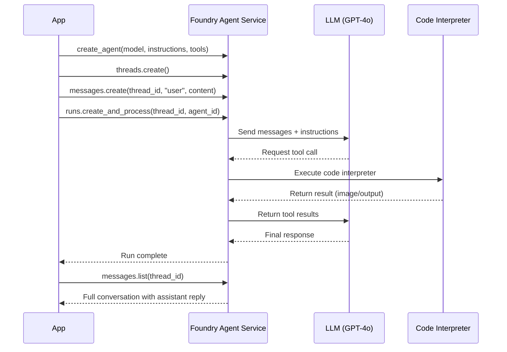

---

## 10. Hands-On: Create an Agent via C# SDK

### Install Packages

```bash
dotnet new console
dotnet add package Azure.AI.Agents.Persistent
dotnet add package Azure.Identity
az login
```

### Environment Variables

```bash
export ProjectEndpoint="https://<AIFoundryResourceName>.services.ai.azure.com/api/projects/<ProjectName>"
export ModelDeploymentName="gpt-4o"
```

### C# Code

```csharp
using Azure.AI.Agents.Persistent;
using Azure.Identity;

var projectEndpoint = Environment.GetEnvironmentVariable("ProjectEndpoint");
var modelDeploymentName = Environment.GetEnvironmentVariable("ModelDeploymentName");

// 1. Initialize client
PersistentAgentsClient client = new(projectEndpoint, new DefaultAzureCredential());

// 2. Create agent with Code Interpreter tool
PersistentAgent agent = client.Administration.CreateAgent(
    model: modelDeploymentName,
    name: "My Test Agent",
    instructions: "You politely help with math questions. Use the code interpreter tool when asked to visualize numbers.",
    tools: [new CodeInterpreterToolDefinition()]
);

// 3. Create thread and send message
PersistentAgentThread thread = client.Threads.CreateThread();
client.Messages.CreateMessage(
    thread.Id,
    MessageRole.User,
    "Draw a graph for a line with a slope of 4 and y-intercept of 9."
);

// 4. Create and poll run
ThreadRun run = client.Runs.CreateRun(
    thread.Id,
    agent.Id,
    additionalInstructions: "Please address the user as Jane Doe. The user has a premium account."
);

do {
    Thread.Sleep(500);
    run = client.Runs.GetRun(thread.Id, run.Id);
} while (run.Status == RunStatus.Queued || run.Status == RunStatus.InProgress);

// 5. Read messages
foreach (var message in client.Messages.GetMessages(thread.Id, order: ListSortOrder.Ascending))
{
    foreach (var content in message.ContentItems)
    {
        if (content is MessageTextContent text)
            Console.WriteLine($"[{message.Role}]: {text.Text}");
    }
}

// Cleanup
// client.Threads.DeleteThread(thread.Id);
// client.Administration.DeleteAgent(agent.Id);
```

---

## 11. Hands-On: Create an Agent via TypeScript SDK

### Install Packages

```bash
npm init -y
npm pkg set type="module"
npm install @azure/ai-agents @azure/identity
npm install @types/node typescript --save-dev
az login
```

### TypeScript Code

```typescript
import { AgentsClient } from "@azure/ai-agents";
import { DefaultAzureCredential } from "@azure/identity";

const projectEndpoint = process.env["PROJECT_ENDPOINT"]!;
const modelDeploymentName = process.env["MODEL_DEPLOYMENT_NAME"] ?? "gpt-4o";

const client = new AgentsClient(projectEndpoint, new DefaultAzureCredential());

// 1. Create agent
const agent = await client.createAgent(modelDeploymentName, {
  name: "my-agent",
  instructions: "You are a helpful agent specialized in math.",
});

// 2. Create thread and message
const thread = await client.threads.create();
await client.messages.create(thread.id, "user",
  "I need to solve the equation `3x + 11 = 14`. Can you help me?"
);

// 3. Run (with polling)
const run = await client.runs.createAndPoll(thread.id, agent.id, {
  pollingOptions: { intervalInMs: 2000 },
});
console.log(`Run status: ${run.status}`);

// 4. Display conversation
const messages = [];
for await (const m of client.messages.list(thread.id)) {
  messages.push(m);
}
messages.reverse();

for (const m of messages) {
  const text = Array.isArray(m.content) && m.content[0]?.type === "text"
    ? (m.content[0] as any).text.value
    : JSON.stringify(m.content);
  console.log(`[${m.role.toUpperCase()}]: ${text}`);
}

// Cleanup
await client.threads.delete(thread.id);
await client.deleteAgent(agent.id);
```

---

## 12. Hands-On: Create an Agent via REST API

### Setup

```bash
az login

# Get bearer token
export AGENT_TOKEN=$(az account get-access-token --resource 'https://ai.azure.com' | jq -r .accessToken)
export AZURE_AI_FOUNDRY_PROJECT_ENDPOINT="https://<service>.services.ai.azure.com/api/projects/<project>"
export API_VERSION="2025-05-01"
```

### Step 1 — Create Agent

```bash
curl --request POST \
  --url "$AZURE_AI_FOUNDRY_PROJECT_ENDPOINT/assistants?api-version=$API_VERSION" \
  -H "Authorization: Bearer $AGENT_TOKEN" \
  -H "Content-Type: application/json" \
  -d '{
    "instructions": "You are a helpful agent.",
    "name": "my-agent",
    "tools": [{"type": "code_interpreter"}],
    "model": "gpt-4o-mini"
  }'
```

### Step 2 — Create Thread

```bash
curl --request POST \
  --url "$AZURE_AI_FOUNDRY_PROJECT_ENDPOINT/threads?api-version=$API_VERSION" \
  -H "Authorization: Bearer $AGENT_TOKEN" \
  -H "Content-Type: application/json" \
  -d ''
```

### Step 3 — Add User Message

```bash
curl --request POST \
  --url "$AZURE_AI_FOUNDRY_PROJECT_ENDPOINT/threads/{thread_id}/messages?api-version=$API_VERSION" \
  -H "Authorization: Bearer $AGENT_TOKEN" \
  -H "Content-Type: application/json" \
  -d '{
    "role": "user",
    "content": "I need to solve the equation 3x + 11 = 14. Can you help me?"
  }'
```

### Step 4 — Run the Thread

```bash
curl --request POST \
  --url "$AZURE_AI_FOUNDRY_PROJECT_ENDPOINT/threads/{thread_id}/runs?api-version=$API_VERSION" \
  -H "Authorization: Bearer $AGENT_TOKEN" \
  -H "Content-Type: application/json" \
  -d '{"assistant_id": "{agent_id}"}'
```

### Step 5 — Poll Run Status

```bash
curl --request GET \
  --url "$AZURE_AI_FOUNDRY_PROJECT_ENDPOINT/threads/{thread_id}/runs/{run_id}?api-version=$API_VERSION" \
  -H "Authorization: Bearer $AGENT_TOKEN"
```

### Step 6 — Retrieve Response

```bash
curl --request GET \
  --url "$AZURE_AI_FOUNDRY_PROJECT_ENDPOINT/threads/{thread_id}/messages?api-version=$API_VERSION" \
  -H "Authorization: Bearer $AGENT_TOKEN"
```

---

## 13. Architecture Diagram

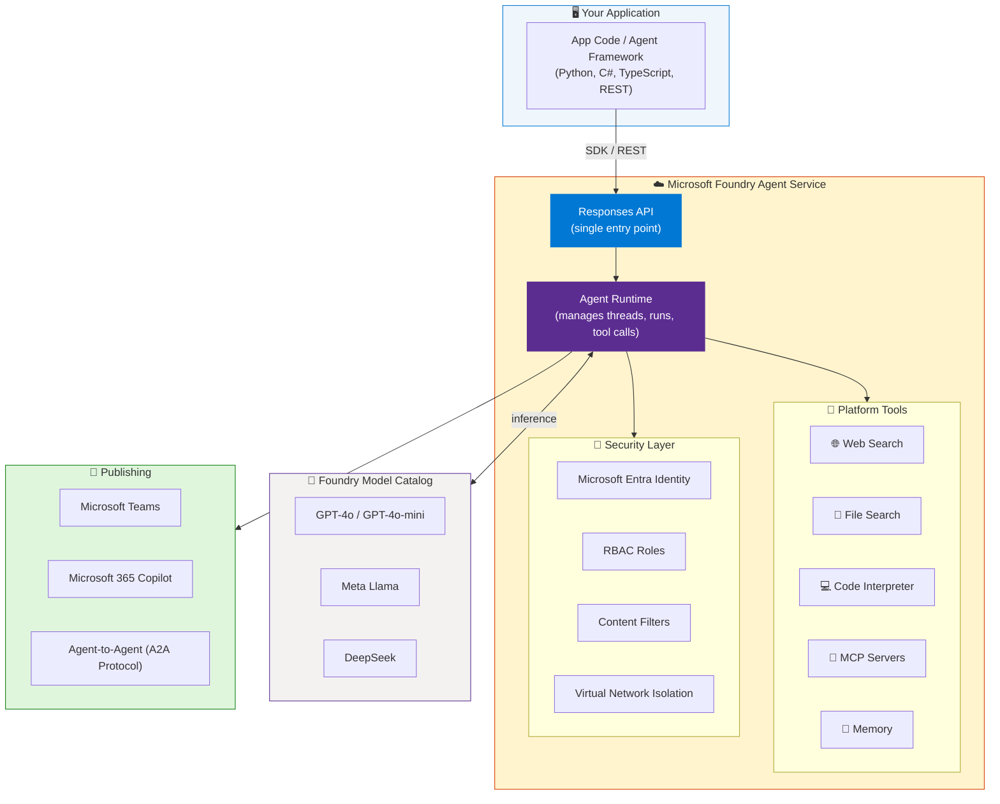

---

## 14. Enterprise Capabilities

### Identity

Each hosted agent gets a **dedicated Microsoft Entra identity**, enabling:
- Scoped access to resources and APIs without sharing credentials
- Authentication to external MCP servers
- OAuth On-Behalf-Of (OBO) passthrough when configured

### Private Networking

- **Prompt agents** — run within your Azure virtual network
- **Hosted agents** — support BYO VNet; each session runs in a VM-isolated sandbox connected to your VNet

### RBAC Roles

| Role | Scope | Capabilities |
|---|---|---|
| **Foundry Account Owner** | Subscription | Create accounts and projects |
| **Foundry Owner** | Project | Full control of project resources |
| **Foundry User** | Project | Create and invoke agents (`agents/*/read`, `agents/*/action`, `agents/*/delete`) |
| **Foundry Project Manager** | Project | Manage project settings and team |

> **Note:** These roles were previously named Azure AI User/Owner/Account Owner/Project Manager. Role IDs and permissions are unchanged.

### Content Safety

Integrated **content filters** help:
- Mitigate prompt injection risks (including cross-prompt injection attacks / XPIA)
- Prevent unsafe outputs
- Enforce responsible AI policies

---

## 15. Security & Identity

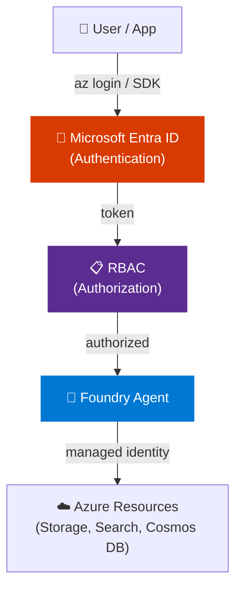

### Best Practices

- Use `DefaultAzureCredential()` — supports local (`az login`) and production (Managed Identity) without code changes
- Never hardcode API keys — use environment variables or Azure Key Vault
- Never commit `.env` files — add to `.gitignore`
- Use **private endpoints** to keep traffic inside your VNet
- Enable **Application Insights** for end-to-end tracing in production

---

## 16. Publishing & Sharing Agents

### Versioning

- As you iterate, Foundry **automatically snapshots versions**
- Roll back to any previous version or compare changes

### Publishing Channels

| Channel | Protocol |
|---|---|
| **Microsoft 365 Copilot & Teams** | OpenResponses + Activity Protocols |
| **Custom Apps** | Invocations protocol |
| **Agent-to-Agent (A2A)** | A2A Protocol (Preview) |
| **Entra Agent Registry** | Register and discover agents across your org |

### Bring Your Own Resources

You can use your own Azure resources for compliance:
- Azure Blob Storage (files)
- Azure AI Search (knowledge)
- Azure Cosmos DB (conversation state)

---

## 17. Interview Talking Points

### "What is the difference between a Prompt Agent and a Hosted Agent in Azure AI Foundry?"

> A Prompt Agent is defined entirely through configuration — instructions, model, and tools — and Foundry runs it without any application code to write or maintain. A Hosted Agent is code you write (using LangGraph, OpenAI Agents SDK, or your own framework), packaged as a container, and run by Foundry with a managed endpoint, autoscaling, and dedicated Entra identity. You choose Prompt Agents for fast starts and production agents without custom logic; Hosted Agents when you need full control over orchestration or need to call your own custom code.

### "What are Threads and Runs in Foundry Agent Service?"

> A Thread represents a conversation session between an agent and a user — it holds the message history. A Run is a single execution of the agent against a thread: the agent reads the messages, reasons about them, optionally calls tools (like Code Interpreter or Web Search), and produces a reply. Runs go through states: queued → in_progress → completed (or failed). You poll for completion, then retrieve the messages to get the agent's response.

### "How does authentication work for Foundry agents?"

> The recommended approach is `DefaultAzureCredential()` from the Azure Identity SDK. Locally, it picks up `az login` credentials; in production, it automatically uses Managed Identity — no code changes required. Each Hosted Agent gets a dedicated Microsoft Entra identity, so it can access Azure resources (Storage, Search, Cosmos DB) without sharing credentials. RBAC roles control who can create and invoke agents at the project level.

### "What tools can an Azure AI Foundry agent use?"

> Agents have access to built-in platform tools including Web Search (real-time internet), File Search (uploaded documents), Code Interpreter (executes Python, generates charts), Memory (cross-session persistence), and MCP Servers (any MCP-compatible API). Foundry-exclusive tools include SharePoint, WorkIQ, and Fabric IQ. You can also register custom functions (your own APIs) or connect remote MCP servers authenticated via Entra managed identity or OAuth OBO.

### "What is the Responses API?"

> The Responses API is the single entry point behind every agent type in Foundry. It gives any framework — whether a Prompt Agent, Hosted Agent, or external application — access to Foundry models and platform tools. You can call it directly from existing code without creating a Foundry agent resource, making it easy to add Foundry capabilities incrementally. It replaces the older connection-string based approach (changed in May 2025 to project endpoint format).

---

## 18. Learning Resources

| Resource | Link | Type |
|---|---|---|
| Foundry Agent Service Overview | [learn.microsoft.com/azure/ai-foundry/agents/overview](https://learn.microsoft.com/en-us/azure/ai-foundry/agents/overview) | Official Docs |
| Quickstart — Create an Agent | [learn.microsoft.com/azure/ai-foundry/agents/quickstart](https://learn.microsoft.com/en-us/azure/ai-foundry/agents/quickstart) | Tutorial |
| Develop AI Agents on Azure (Learning Path) | [learn.microsoft.com/training/paths/develop-ai-agents-azure](https://learn.microsoft.com/en-us/training/paths/develop-ai-agents-azure/) | Microsoft Learn |
| Agent Framework (GitHub) | [github.com/microsoft/agent-framework](https://github.com/microsoft/agent-framework) | Code |
| AI Agents for Beginners (12 Lessons) | [github.com/microsoft/ai-agents-for-beginners](https://github.com/microsoft/ai-agents-for-beginners) | Course |
| Python SDK Samples | [github.com/Azure-Samples/azure-search-python-samples](https://github.com/Azure-Samples/azure-search-python-samples) | Code Samples |
| K21Academy AI-103 Labs Guide | [k21academy.com/azure-aiml/ai-103-labs](https://k21academy.com/azure-aiml/ai-103-labs-build-ai-apps-agents/) | Labs |
| Azure AI Foundry Portal | [ai.azure.com](https://ai.azure.com) | Platform |
| YouTube Tutorial (this video) | [youtube.com/watch?v=iFKFfOQVxF8](https://www.youtube.com/watch?v=iFKFfOQVxF8) | Video |

---

*Last Updated: June 2026 | Source: K21Academy — Build AI Agents Using Azure AI Foundry Hands-On Tutorial*

---

## Additional Material from Microsoft-Foundry-Agent-Guide.md

> Unique additions: portal-navigation and gift-tracker walkthrough.


> **Source:** [YouTube — Build a Gift Tracker Agent in Microsoft Foundry (20 min)](https://www.youtube.com/watch?v=zKqyLB8qHeM)  
> **Presenter:** Frankie — Microsoft Azure MVP  
> **Extracted & Structured:** End-to-end walkthrough of the Microsoft Foundry portal, agent creation, file search, web search, memory, code interpreter, and deployment.

---

## Table of Contents

1. [What Is Microsoft Foundry Portal?](#1-what-is-microsoft-foundry-portal)
2. [Foundry Portal Navigation Overview](#2-foundry-portal-navigation-overview)
3. [Creating a New Project from Scratch](#3-creating-a-new-project-from-scratch)
4. [The Gift Tracker Agent — Concept](#4-the-gift-tracker-agent--concept)
5. [Agent Tools Overview](#5-agent-tools-overview)
6. [Building the Agent — Step by Step](#6-building-the-agent--step-by-step)
   - [Step 1 — System Prompt (Instructions)](#step-1--system-prompt-instructions)
   - [Step 2 — File Search (Knowledge)](#step-2--file-search-knowledge)
   - [Step 3 — Web Search Tool](#step-3--web-search-tool)
   - [Step 4 — Code Interpreter](#step-4--code-interpreter)
   - [Step 5 — Memory Store](#step-5--memory-store)
7. [Testing the Agent](#7-testing-the-agent)
8. [Operate Tab — Monitoring](#8-operate-tab--monitoring)
9. [Docs Tab & Built-in AI Chatbot](#9-docs-tab--built-in-ai-chatbot)
10. [Deployment Options](#10-deployment-options)
11. [Architecture Diagram](#11-architecture-diagram)
12. [Interview Quick Reference](#12-interview-quick-reference)

---

## 1. What Is Microsoft Foundry Portal?

**Microsoft Foundry** (accessed at [ai.azure.com](https://ai.azure.com)) is the **unified enterprise portal** for building, deploying, and monitoring Azure AI agents and AI applications. It is the successor/evolution of the Azure AI Studio interface.

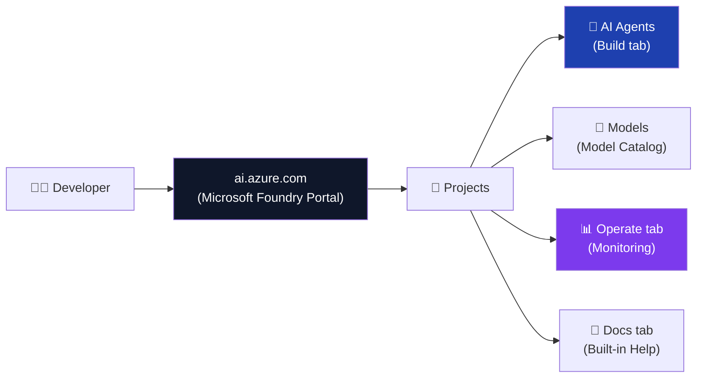

### Key Characteristics
- **Single hub** — discover models, build agents, monitor performance
- **Project-based** — each project scopes its models, agents, and resources
- **Backed by Azure** — all resources live in a linked Azure Resource Group
- **AI chatbot built-in** — ask Foundry questions about the portal itself

---

## 2. Foundry Portal Navigation Overview

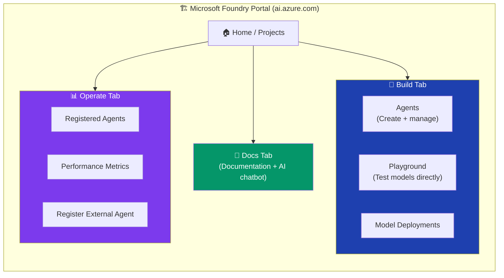

| Tab | Purpose |
|---|---|
| **Build** | Create and configure agents, add tools, set instructions |
| **Operate** | Monitor running agents, register existing agents, view metrics |
| **Docs** | Access Microsoft Foundry documentation + ask the built-in AI chatbot |

---

## 3. Creating a New Project from Scratch

### Prerequisites
- An Azure subscription
- A resource group (e.g., `rg-ais-eus2-demo-gift-tracker`)

### Steps

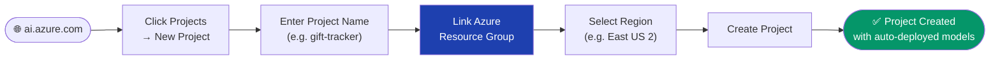

### What Gets Auto-Deployed in a New Project

When you create a new project, Microsoft Foundry **automatically deploys**:

| Resource | Purpose |
|---|---|
| **GPT-4.1** | Default LLM for your agents |
| **text-embedding-3-small** | Embedding model for vector search / file search |
| **Azure AI Search** (Microsoft-managed) | Powers file search tool for agents |

> **Note:** These auto-deployed resources are **Microsoft-managed** — you don't pay for the compute separately; they are included through the project's resource allocation. For production or large-scale use, create your own dedicated resources.

---

## 4. The Gift Tracker Agent — Concept

The demo builds a **Gift Tracker Agent** — a personal AI assistant that helps a user:

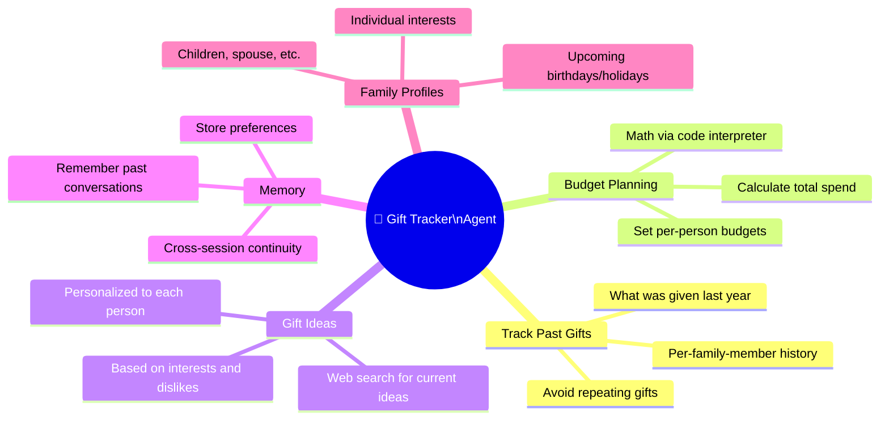

### Use Case Summary

> *"Imagine you want to plan gifts for your children ahead of time — you don't want to repeat gifts, you want to stay on budget, find things they'll love, and not be surprised when holidays arrive."*

---

## 5. Agent Tools Overview

An Azure AI Agent in Foundry can be equipped with **four types of tools**:

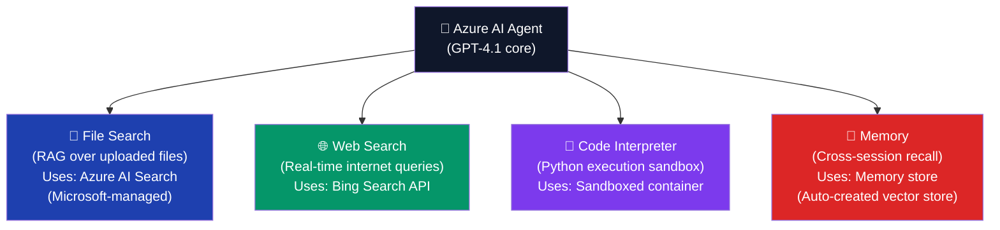

| Tool | What It Does | Best For |
|---|---|---|
| **File Search** | RAG over documents you upload (JSON, PDF, DOCX, TXT) | Private knowledge base |
| **Web Search** | Real-time Bing web search | Current events, live data, product research |
| **Code Interpreter** | Executes Python in a sandbox | Math, data analysis, charting, computation |
| **Memory** | Stores chat summaries for cross-session recall | Personalization, conversation continuity |

---

## 6. Building the Agent — Step by Step

### Step 1 — System Prompt (Instructions)

The **system prompt** defines the agent's personality, scope, and behavior rules.

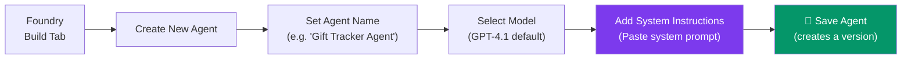

**Example System Prompt for the Gift Tracker Agent:**
```
You are a specialized Gift Tracker assistant. Your purpose is to help users:
- Track gifts given to family members across all occasions (birthdays, Christmas, etc.)
- Plan and budget future gifts based on the family member's profile and preferences
- Suggest personalized gift ideas using their interests and past gift history
- Remember past conversations and user preferences
- Use web search to find current, up-to-date gift ideas

Only answer questions related to gift tracking, planning, and suggestions.
Always cite the source of information (file search, web search, or memory).
```

> **Best Practice:** Save the agent frequently — Foundry keeps **version history**, letting you roll back to any previous version if you make a mistake.

---

### Step 2 — File Search (Knowledge)

**File Search** is the simplest way to add a **private knowledge base** to your agent. It uses a Microsoft-managed Azure AI Search instance behind the scenes.

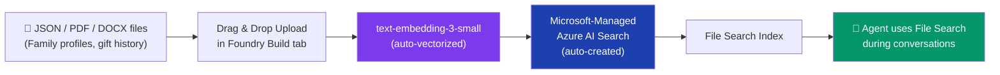

#### Files Used in the Demo
The demo uploads **JSON files** containing:
- **Family member profiles** (name, age, interests, dislikes)
- **Past gift history** (what was given on which occasion, year, cost)
- **Upcoming events** (birthday dates, holiday schedules)

#### When to Use File Search vs Azure AI Search

| Situation | Use File Search | Use Azure AI Search |
|---|---|---|
| Quick demo / prototype | ✅ | ❌ |
| Small document set (< few hundred files) | ✅ | ❌ |
| SQL Database, Cosmos DB, or Blob Storage source | ❌ | ✅ |
| Large enterprise knowledge base | ❌ | ✅ |
| Need custom indexing, filters, or hybrid search | ❌ | ✅ |

> **Quote from video:** *"File Search is quick and easy to show how you can upload information and then retrieve it quickly — we're using a Microsoft-managed Azure AI Search resource. This is a very simple and fast way to set up RAG for your Azure AI agents."*

---

### Step 3 — Web Search Tool

**Web Search** gives the agent access to **real-time Bing search** results — enabling it to find current product listings, prices, news, and more that aren't in the uploaded files.

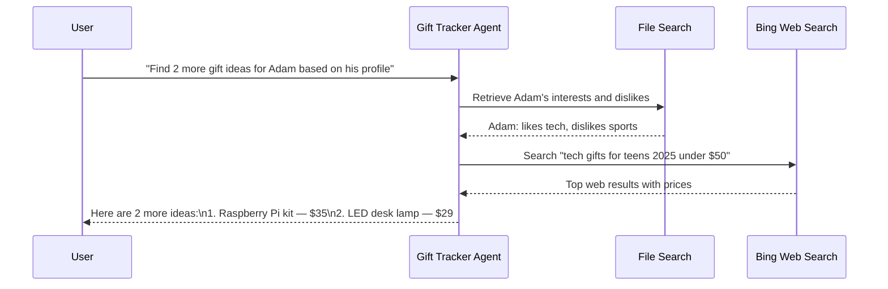

**Behaviour observed in demo:**
- Agent automatically retrieved the profile from file search first
- Then used Adam's interests/dislikes as search query context for Bing
- Results included **real-time pricing** from web

---

### Step 4 — Code Interpreter

**Code Interpreter** runs a Python sandbox allowing the agent to perform **accurate mathematical calculations**, data analysis, and show its work.

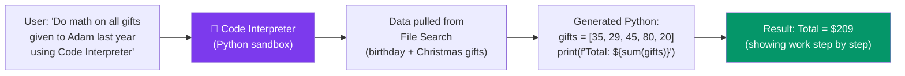

**Key capability:** Code Interpreter ensures **mathematical accuracy** — rather than having the LLM estimate totals in its response, it actually executes Python code and returns the verified result.

**Demo example query:**
```
"Do math on all of the gifts that were given to Adam last year and add them all up 
using code interpreter. Include both birthday and Christmas gifts."
```

---

### Step 5 — Memory Store

**Memory** enables the agent to **remember past conversations** across separate sessions — unlike standard chat which has no memory between conversations.

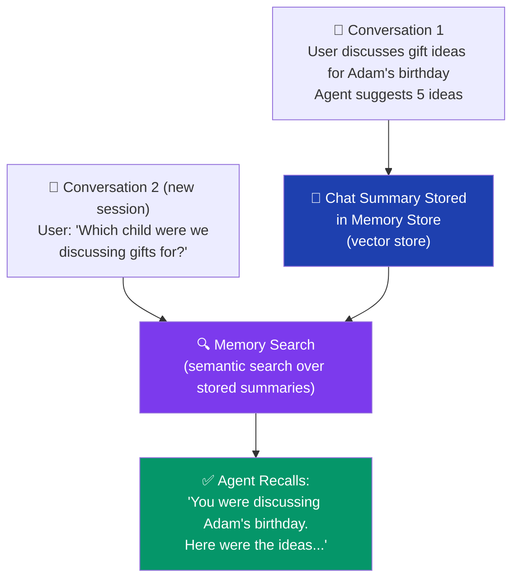

#### How to Create a Memory Store

1. In the Foundry Build tab → scroll to **Memory** section
2. Click **Add Memory → Create Memory Store**
3. A default memory store is auto-created (backed by a vector store)
4. Click **Save Agent**

> **What gets stored:** At the end of each conversation, a **summary of the chat** is automatically written to the memory store. When the agent starts a new conversation, it semantically searches past summaries to recall relevant context.

---

## 7. Testing the Agent

### Test Queries Used in Demo

| Query | Tool Invoked | Result |
|---|---|---|
| `"What can you do?"` | None | Describes its capabilities |
| `"Give me gift ideas for Adam for his birthday"` | File Search + Memory | Pulled Adam's profile from files, searched memory for past discussions |
| `"Search online for 2 more ideas based on Adam's preferences"` | Web Search + File Search | Combined profile data with live Bing results |
| `"Which child were we discussing?"` *(new session)* | Memory | Recalled "Adam" from previous session summary |
| `"Do math on all Adam's gifts last year using code interpreter"` | Code Interpreter + File Search | Pulled gift data from files, ran Python, showed calculation |

### Multi-Tool Behaviour

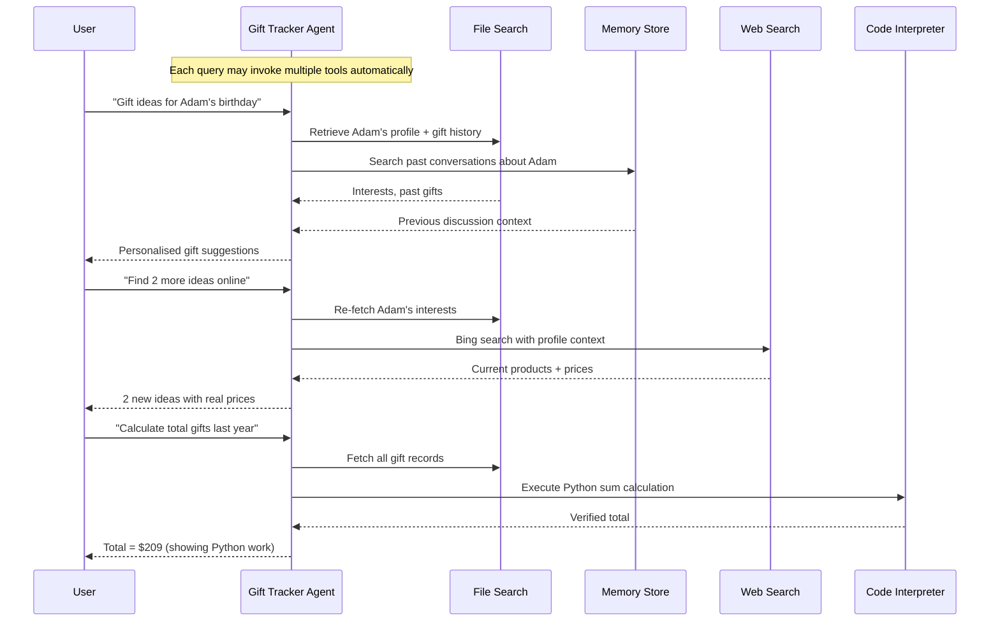

---

## 8. Operate Tab — Monitoring

The **Operate tab** in Foundry is where you monitor and manage your deployed agents.

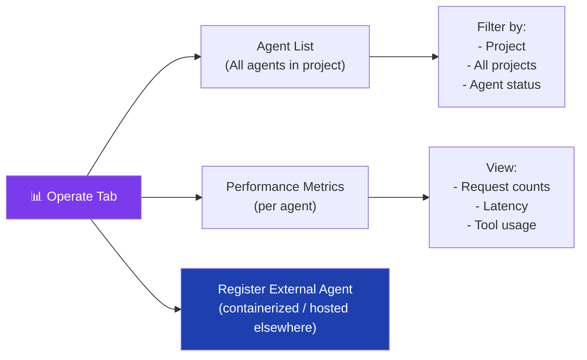

### Key Features

| Feature | Description |
|---|---|
| **Agent Dashboard** | See all running agents, their status, and usage metrics |
| **Per-Project View** | Filter metrics to a single project or view all projects |
| **Register Agent** | Add an existing externally-hosted agent to the Foundry dashboard |
| **Containerize** | Wrap an existing agent in a container and register it for unified monitoring |

> **Use case for Register Agent:** If you already have an agent running on another platform or backend, you can register it in Foundry to see its performance on the same Foundry dashboard — without migrating the agent itself.

---

## 9. Docs Tab & Built-in AI Chatbot

The **Docs tab** provides documentation and a **built-in AI chatbot** that answers questions about Foundry itself.

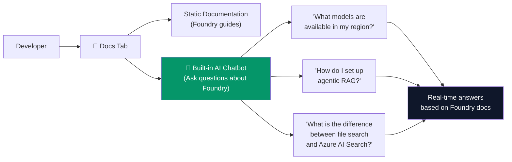

> **Practical tip:** If you're unsure where to go or what to do in Foundry, the built-in chatbot is a fast way to get contextual help — it searches the actual Foundry documentation to answer your questions.

---

## 10. Deployment Options

Once your agent is working in Foundry, you can deploy it through multiple channels:

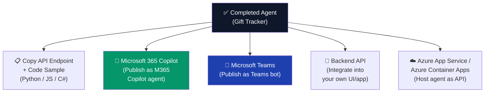

| Deployment Path | How | Best For |
|---|---|---|
| **M365 Copilot** | Foundry → Publish → M365 Copilot | Enterprise users already on Microsoft 365 |
| **Microsoft Teams** | Foundry → Publish → Teams | Internal team tool |
| **API Endpoint** | Use the auto-generated endpoint code | Custom web/mobile app |
| **Backend service** | Copy Python/JS/C# SDK code | Any custom backend |

---

## 11. Architecture Diagram

### Complete Gift Tracker Agent Architecture

```mermaid
flowchart TB
    User3["👤 User\n(Gift Planner)"]

    subgraph Foundry2["🏗️ Microsoft Foundry (ai.azure.com)"]
        Agent4["🤖 Gift Tracker Agent\n(GPT-4.1)"]
        SysPrompt["📋 System Instructions\n(Scope + behavior rules)"]
        Versioning["🔄 Version History"]
    end

    subgraph Tools["🛠️ Agent Tools"]
        FS3["📂 File Search\n(Family profiles, gift history\nin JSON files)"]
        WS3["🌐 Web Search\n(Bing — live gift ideas)"]
        CI4["🐍 Code Interpreter\n(Budget math, calculations)"]
        Mem3["🧠 Memory Store\n(Cross-session recall via\nchat summaries)"]
    end

    subgraph Azure["☁️ Azure Backend"]
        AIS3["Azure AI Search\n(Microsoft-managed)\n(Powers File Search)"]
        Embed2["text-embedding-3-small\n(Auto-vectorization)"]
        GPT4["GPT-4.1\n(Inference)"]
    end

    subgraph Deploy["🚀 Deployment"]
        M365["M365 Copilot"]
        Teams2["Microsoft Teams"]
        API2["API Endpoint\n(Python/JS/C#)"]
    end

    User3 <--> Agent4
    Agent4 --> SysPrompt
    Agent4 --> FS3
    Agent4 --> WS3
    Agent4 --> CI4
    Agent4 --> Mem3
    FS3 --> AIS3
    AIS3 --> Embed2
    Agent4 --> GPT4
    Agent4 --> Deploy

    style Agent4 fill:#0f172a,color:#fff
    style AIS3 fill:#1e40af,color:#fff
    style Embed2 fill:#7c3aed,color:#fff
    style GPT4 fill:#059669,color:#fff
    style Deploy fill:#374151,color:#fff
```

---

## 12. Interview Quick Reference

### Core Concepts from This Video

**Q: What is Microsoft Foundry and how does it differ from Azure AI Studio?**
> Microsoft Foundry (ai.azure.com) is the evolution of Azure AI Studio — the unified enterprise portal for building, testing, and monitoring Azure AI agents. It organises work into **projects**, each backed by an Azure Resource Group, and auto-provisions models like GPT-4.1 and `text-embedding-3-small` on project creation.

**Q: What is the difference between File Search and Azure AI Search for agents?**
> **File Search** is a simplified, Microsoft-managed RAG tool ideal for quickly uploading documents (PDF, JSON, DOCX) to give an agent a knowledge base. It uses a **Microsoft-managed Azure AI Search** resource behind the scenes. **Azure AI Search** (self-provisioned) should be used when your data lives in Blob Storage, SQL, or Cosmos DB; when you need large-scale indexing; or when you need custom hybrid search configurations.

**Q: How does Memory work in Azure AI Agents?**
> Memory stores **summaries of past conversations** in a vector store. When a new conversation starts, the agent semantically searches these summaries for relevant context. This enables **cross-session continuity** — the agent can remember which family member you discussed in a previous session without you repeating yourself.

**Q: What is Code Interpreter used for?**
> Code Interpreter runs a **Python sandbox** inside the agent's reasoning loop. It is used for any task requiring deterministic computation — budget calculations, data analysis, showing mathematical work step-by-step. This avoids LLM hallucination on math since the code is actually executed.

**Q: What are the four main tools available to an Azure AI Agent?**

| Tool | What It Does |
|---|---|
| **File Search** | RAG over uploaded documents via managed Azure AI Search |
| **Web Search** | Real-time Bing search for current information |
| **Code Interpreter** | Python execution sandbox for accurate computation |
| **Memory** | Cross-session vector-based recall of past conversations |

**Q: How do you deploy an Azure AI Agent built in Foundry?**
> From the Foundry Build tab, you can: (1) **Publish to M365 Copilot** as a Copilot agent, (2) **Publish to Microsoft Teams** as a bot, (3) **Copy the API endpoint** code (Python/JS/C#) for integration into any custom backend, or (4) **Register an external agent** in the Operate tab for unified monitoring.

**Q: What is the Operate tab for?**
> The Operate tab is the **monitoring dashboard** for your deployed agents. You can view performance metrics (request count, latency, tool usage), filter by project, and register externally-hosted agents so they appear in the same Foundry dashboard.

### Decision Guide — Which Tool to Add?

```mermaid
flowchart TD
    START(["🤖 Configure Your Agent"])

    NeedK{{"Agent needs\nprivate knowledge?"}}
    NeedRT{{"Need real-time\nor web data?"}}
    NeedMath{{"Agent needs to\ndo calculations?"}}
    NeedMem{{"Need to remember\npast conversations?"}}

    FS4["✅ Add File Search\n(or Azure AI Search for\nlarge-scale data)"]
    WS4["✅ Add Web Search\n(Bing API)"]
    CI5["✅ Add Code Interpreter\n(Python sandbox)"]
    Mem4["✅ Add Memory Store\n(vector summary store)"]

    START --> NeedK
    NeedK -->|Yes| FS4
    NeedK -->|No / Next| NeedRT
    NeedRT -->|Yes| WS4
    NeedRT -->|No / Next| NeedMath
    NeedMath -->|Yes| CI5
    NeedMath -->|No / Next| NeedMem
    NeedMem -->|Yes| Mem4

    style START fill:#0f172a,color:#fff
    style FS4 fill:#1e40af,color:#fff
    style WS4 fill:#059669,color:#fff
    style CI5 fill:#7c3aed,color:#fff
    style Mem4 fill:#dc2626,color:#fff
```

---

*Last updated: June 2026 | Microsoft Foundry Portal — ai.azure.com*

---

## Additional Material from Azure-AI-Foundry-Getting-Started.md

> Unique additions: onboarding basics / getting-started fundamentals.


> **Source:** [YouTube — How do I get started in Azure AI Foundry?](https://www.youtube.com/watch?v=yZgC1KhfSxo)
> **Instagram Post:** [azuredevelopers — @azuredevelopers](https://www.instagram.com/p/DTYHeZmlmuN/)
> **Channel/Series:** Azure Developers · One Dev Question
> **Topic:** Azure AI Foundry, Microsoft Foundry SDK, AI Agents, Model Deployment, Getting Started
> **Key Claim:** "From picking your first model to building agents you can actually talk to, the path is shorter than you think."

---

## Table of Contents

1. [Overview](#1-overview)
2. [Problem Statement](#2-problem-statement)
3. [Core Concepts](#3-core-concepts)
4. [Architecture](#4-architecture)
5. [Key Components](#5-key-components)
6. [How It Works — Step by Step](#6-how-it-works--step-by-step)
7. [Comparison Table](#7-comparison-table)
8. [Code Examples](#8-code-examples)
9. [Configuration Reference](#9-configuration-reference)
10. [Best Practices](#10-best-practices)
11. [Interview Talking Points](#11-interview-talking-points)
12. [Learning Resources](#12-learning-resources)

---

## 1. Overview

Azure AI Foundry (rebranded as **Microsoft Foundry** in 2025) is Microsoft's unified platform for building, customizing, and deploying generative AI applications. It consolidates model access, agent orchestration, deployment infrastructure, and responsible AI tooling into a single project-based workspace. The *One Dev Question* episode answers the single most-asked question from developers new to the platform: where do you even begin? The answer is three steps — deploy a model, create an agent with instructions, and hold a stateful multi-turn conversation — all achievable in under 30 minutes.

---

## 2. Problem Statement

Before Foundry, building an AI application on Azure required stitching together Azure OpenAI Service, Azure Cognitive Services, Azure ML, and separate deployment pipelines — each with its own SDK, auth model, and quota system.

### Classic Approach Pain Points

| Problem | Impact |
|---|---|
| Multiple disconnected SDKs per service | High boilerplate; brittle integration code |
| No unified agent concept | Developers reinvented stateful conversation loops manually |
| Separate auth per resource | Credential management sprawl across the app |
| No built-in conversation history | Multi-turn chat required custom state management |
| Fragmented observability | Logs scattered across Azure Monitor, App Insights, and OpenAI dashboards |

> **Key Insight:** "Azure AI Foundry is a unified platform for developers to build, customize, and manage generative AI applications — it simplifies workflows across model deployment, agent orchestration, and observability."

---

## 3. Core Concepts

### Microsoft Foundry (Azure AI Foundry)
The umbrella platform at `https://ai.azure.com`. Wraps models, agents, data, evaluations, and deployment under one roof. A project-centric mental model: every resource lives inside a **Project**.

### Project
The top-level organizational unit. Contains your deployed models, agents, files, and data connections. Exposes a single **Project Endpoint** (`https://<resource>.ai.azure.com/api/projects/<project>`). Think of it as a namespaced workspace.

### Agent
A named, versioned entity that encapsulates a model + system instructions. Once created, it enforces consistent behavior across all conversations without repeating the system prompt on every call.

### Conversation
A server-side session object that stores turn history. Passing the `conversation.id` across calls gives the agent memory of prior exchanges — no client-side history tracking needed.

### Instant Models (Preview)
Pre-deployed model instances (e.g., in West US 3) that skip the deployment step entirely. Ideal for prototyping. Available as a drop-in replacement for self-deployed models in code.

### Azure AI Projects SDK v2
The `azure-ai-projects >= 2.0.0` library. **Breaking change from v1** — uses the new Foundry projects API. v1 (`azure-ai-projects == 1.0.0`) targets the classic portal and is incompatible.

---

## 4. Architecture

```mermaid
flowchart TD
    Dev["Developer / App"]

    subgraph Foundry ["Microsoft Foundry Platform — ai.azure.com"]
        Portal["Foundry Portal\n(ai.azure.com)"]
        Project["Project\n(Endpoint + API Key)"]

        subgraph Services ["Project Services"]
            Models["Models + Endpoints\n(GPT-5, GPT-4.1, etc.)"]
            AgentSvc["Agent Service\nNamed + Versioned Agents"]
            ConvSvc["Conversation Service\nServer-side Turn History"]
            Files["Files & Data\nConnections"]
        end

        Project --> Services
    end

    subgraph SDK ["Azure AI Projects SDK v2"]
        AIProjectClient["AIProjectClient\nUnified Entry Point"]
        OpenAIClient["OpenAI Client\nResponses API"]
        AgentsAdmin["Agent Administration\nCRUD on Agents"]
        ConvClient["Conversations Client\nCreate + Resume Sessions"]
    end

    subgraph Auth ["Authentication"]
        CLI["az login"]
        DAC["DefaultAzureCredential"]
    end

    Dev --> SDK
    SDK --> Auth
    Auth --> Foundry
    AIProjectClient --> OpenAIClient
    AIProjectClient --> AgentsAdmin
    AIProjectClient --> ConvClient
    OpenAIClient --> Models
    AgentsAdmin --> AgentSvc
    ConvClient --> ConvSvc

    style Dev fill:#0078D4,color:#fff
    style Foundry fill:#EFF6FC,stroke:#0078D4
    style SDK fill:#FFF4CE,stroke:#D83B01
    style Auth fill:#DFF6DD,stroke:#107C10
    style Project fill:#0078D4,color:#fff
    style AIProjectClient fill:#5C2D91,color:#fff
```

---

## 5. Key Components

| Component | Service / Tool | Role |
|---|---|---|
| Foundry Portal | `ai.azure.com` | Browser-based IDE for model exploration, agent creation, playground |
| AIProjectClient | `azure-ai-projects >= 2.0.0` | Single client connecting to the project endpoint |
| Responses API | OpenAI-compatible | Send prompts, get model completions (stateless or via conversation ID) |
| Agent Service | Foundry Agents API | Create/version/delete agents with model + system instructions |
| Conversation Service | Foundry Conversations API | Server-managed turn history — enables multi-turn without client state |
| DefaultAzureCredential | `azure-identity` | Picks up `az login` credentials locally; MSI/workload identity in prod |
| Model Deployment | Models + Endpoints | Hosts the base LLM (GPT-5-mini, GPT-4.1, etc.) under a deployment name |
| Instant Models | West US 3 (Preview) | Skip deployment step — use pre-hosted models directly |

### AIProjectClient — Entry Point

The single object that bootstraps all SDK calls:

```python
project = AIProjectClient(
    endpoint="https://<resource>.ai.azure.com/api/projects/<project>",
    credential=DefaultAzureCredential(),
)
openai  = project.get_openai_client()        # responses + conversations
agents  = project.agents                     # agent CRUD
```

### Agent Service

Agents are versioned resources. `create_version` returns an `(id, name, version)` tuple. You can update instructions by creating a new version — old versions are immutable.

### Conversation Service

A conversation is a lightweight session handle. Passing its `id` to the Responses API makes the model aware of all prior turns automatically.

---

## 6. How It Works — Step by Step

```mermaid
sequenceDiagram
    participant Dev as Developer
    participant CLI as az login
    participant SDK as AIProjectClient
    participant Foundry as Microsoft Foundry
    participant LLM as Deployed Model

    Dev->>CLI: az login
    CLI-->>Dev: Access token (90 min TTL)

    Dev->>SDK: AIProjectClient(endpoint, DefaultAzureCredential)
    SDK->>Foundry: Authenticate via token

    Dev->>SDK: openai.responses.create(model, input)
    SDK->>LLM: POST /openai/v1/responses
    LLM-->>SDK: response.output_text
    SDK-->>Dev: Print answer

    Dev->>SDK: agents.create_version(name, PromptAgentDefinition)
    SDK->>Foundry: POST /agents
    Foundry-->>SDK: agent.id + agent.version

    Dev->>SDK: openai.conversations.create()
    SDK->>Foundry: POST /conversations
    Foundry-->>SDK: conversation.id

    Dev->>SDK: openai.responses.create(conversation.id, agent_ref, input1)
    SDK->>Foundry: Route to agent + append turn 1
    Foundry->>LLM: Turn 1 with system instructions
    LLM-->>Dev: Response 1

    Dev->>SDK: openai.responses.create(conversation.id, agent_ref, input2)
    SDK->>Foundry: Append turn 2 (has history)
    Foundry->>LLM: Full conversation context
    LLM-->>Dev: Response 2 (contextually aware)
```

**Step-by-step breakdown:**

1. **Authenticate** — `az login` locally; `DefaultAzureCredential` picks it up automatically. No API keys in code.
2. **Create client** — `AIProjectClient(endpoint, credential)` — endpoint from the Foundry portal Overview page.
3. **Chat with model** — `openai.responses.create(model, input)` — stateless single-turn call. Confirms connectivity.
4. **Create agent** — `agents.create_version(name, PromptAgentDefinition(model, instructions))` — bakes system prompt into a reusable, versioned resource.
5. **Create conversation** — `openai.conversations.create()` — server allocates a session ID.
6. **Multi-turn chat** — pass `conversation.id` + `agent_reference` in each `responses.create()` call. Server maintains history automatically.
7. **Follow-up** — second call uses same conversation ID. Agent "remembers" the first question without any client-side state.

---

## 7. Comparison Table

| Dimension | Classic Azure OpenAI / AI Projects v1 | Microsoft Foundry SDK v2 |
|---|---|---|
| Entry point | Separate clients per service | Single `AIProjectClient` |
| Agent concept | None (manual system-prompt injection) | First-class versioned `Agent` resource |
| Conversation history | Client must manage full message array | Server-side `Conversation` object |
| Auth | API key or per-resource MSI | `DefaultAzureCredential` across all services |
| Package | `azure-ai-projects==1.0.0` | `azure-ai-projects>=2.0.0` |
| API version | Classic / legacy endpoints | Foundry projects (new) API |
| Portal | Azure AI Studio (classic) | Microsoft Foundry (`ai.azure.com`) |
| Instant models | Not available | Available in West US 3 (preview) |
| Multi-language support | Python + REST | Python, C#, TypeScript, Java, REST |

---

## 8. Code Examples

### Python — Chat with a Model (stateless)

```python
from azure.identity import DefaultAzureCredential
from azure.ai.projects import AIProjectClient

PROJECT_ENDPOINT = "https://<resource>.ai.azure.com/api/projects/<project>"

project = AIProjectClient(
    endpoint=PROJECT_ENDPOINT,
    credential=DefaultAzureCredential(),
)
openai = project.get_openai_client()

response = openai.responses.create(
    model="gpt-5-mini",
    input="What is the size of France in square miles?",
)
print(response.output_text)
```

### Python — Create an Agent

```python
from azure.ai.projects.models import PromptAgentDefinition

agent = project.agents.create_version(
    agent_name="MyAgent",
    definition=PromptAgentDefinition(
        model="gpt-5-mini",
        instructions="You are a helpful assistant that answers general questions",
    ),
)
print(f"Agent created — id: {agent.id}, version: {agent.version}")
```

### Python — Multi-Turn Conversation with Agent

```python
openai = project.get_openai_client()

# Server allocates session — stores all turns
conversation = openai.conversations.create()

def ask(question):
    return openai.responses.create(
        conversation=conversation.id,
        extra_body={"agent_reference": {"name": "MyAgent", "type": "agent_reference"}},
        input=question,
    ).output_text

print(ask("What is the size of France in square miles?"))
print(ask("And what is the capital city?"))  # agent remembers France context
```

### REST API — Chat with Agent

```bash
curl -X POST https://<resource>.services.ai.azure.com/api/projects/<project>/openai/v1/responses \
  -H "Content-Type: application/json" \
  -H "Authorization: Bearer $AZURE_AI_AUTH_TOKEN" \
  -d '{
    "agent_reference": {"type": "agent_reference", "name": "MyAgent"},
    "input": [{"role": "user", "content": "What is the capital of France?"}]
  }'
```

### Install & Setup

```bash
# Install SDK (v2 — Foundry new API)
pip install azure-ai-projects>=2.0.0 azure-identity

# C#
dotnet add package Azure.AI.Projects
dotnet add package Azure.AI.Projects.Agents
dotnet add package Azure.AI.Extensions.OpenAI
dotnet add package Azure.Identity

# TypeScript
npm install @azure/ai-projects

# Authenticate (all languages — local dev)
az login

# Get bearer token for REST calls (expires in 60-90 min)
az account get-access-token --scope https://ai.azure.com/.default
```

---

## 9. Configuration Reference

| Variable | Where to Get | Required | Description |
|---|---|---|---|
| `PROJECT_ENDPOINT` | Foundry Portal → Project Overview → Libraries → Foundry | Yes | Format: `https://<resource>.ai.azure.com/api/projects/<project>` |
| `MODEL_DEPLOYMENT_NAME` | Foundry Portal → Models + Endpoints | Yes | Name of your deployed model (e.g., `gpt-5-mini`) |
| `AGENT_NAME` | User-defined at `create_version()` time | Yes | Human-readable name; used to reference agent in API calls |
| `AZURE_AI_AUTH_TOKEN` | `az account get-access-token --scope https://ai.azure.com/.default` | REST only | Short-lived bearer token; refresh every 60-90 min |

---

## 10. Best Practices

### Authentication

- ✅ Use `DefaultAzureCredential` — works locally (`az login`) and in production (Managed Identity) without code changes
- ❌ Don't hardcode API keys — they're a secret sprawl risk and don't rotate automatically
- ✅ In CI/CD, assign the service principal the `Azure AI Owner` role on the Foundry resource

### Model Selection

- ✅ Start with `gpt-5-mini` (or an Instant Model in West US 3) for fast prototyping — lower cost, faster response
- ✅ Use `gpt-5.1` / `gpt-4.1` only when quality requirements justify the cost
- ❌ Don't commit to reserved capacity until you've measured real usage patterns with pay-as-you-go

### Agent Design

- ✅ Keep system instructions focused — one agent, one job
- ✅ Version agents explicitly: create a new version when changing instructions; old version remains stable
- ❌ Don't put per-user context in system instructions — pass it in user turns or via conversation history
- ✅ Use the portal playground to iterate on instructions before committing to code

### SDK Version

- ✅ Always pin `azure-ai-projects>=2.0.0` — v2 is the new Foundry API
- ❌ Don't mix v1 and v2 in the same project — APIs are incompatible
- ✅ Refer to Foundry Classic docs (`/azure/foundry-classic/`) if you're maintaining a legacy v1 app

### Cost & Billing

- ✅ Monitor token usage per agent/conversation in Foundry portal observability dashboards
- ❌ Don't forget: tokens add up at scale — set budget alerts in Azure Cost Management
- ✅ Delete unused agent versions and conversations to avoid orphaned resources

---

## 11. Interview Talking Points

### "What is Microsoft Foundry and how does it differ from Azure OpenAI Service?"

> Microsoft Foundry is a unified platform that combines model hosting, agent orchestration, conversation management, and deployment tooling in a single project-centric workspace. Azure OpenAI Service is purely a model API — it gives you completions but no first-class concept of agents, versioned instructions, or server-side conversation history. Foundry sits on top of Azure OpenAI and extends it with those higher-level primitives, accessed through a single `AIProjectClient` rather than disparate service clients.

### "What is an Agent in Azure AI Foundry and why use one instead of just passing a system prompt?"

> An Agent in Foundry is a named, versioned server-side resource that packages a model and a system prompt together. The advantage over inline system prompts is reuse and governance: you define the agent once, reference it by name in every API call, and can update instructions by publishing a new version without changing client code. Old versions remain immutable, so you get auditability. This is especially valuable in teams where instructions need to be reviewed and approved before deployment.

### "How does multi-turn conversation work in Foundry SDK v2?"

> Foundry's Conversation Service manages turn history on the server. You call `openai.conversations.create()` once to get a `conversation.id`, then pass that ID in every subsequent `responses.create()` call. The server automatically appends each turn and feeds the full history to the model. The client never needs to maintain a message array — this eliminates a whole class of bugs where client-side history gets truncated, corrupted, or lost on page reload.

### "What breaking change should you watch for when upgrading from Azure AI Projects v1 to v2?"

> The v1 package (`azure-ai-projects==1.0.0`) targets the classic Azure AI Studio / Foundry (classic) API — it's incompatible with the new Foundry projects API. v2 (`azure-ai-projects>=2.0.0`) introduces a unified `AIProjectClient`, a new project endpoint format, first-class Agent and Conversation resources, and drops the old thread-based assistant model. Mixing both versions in a single project will cause runtime errors because the endpoints and authentication scopes are different.

### "How would you authenticate a Foundry application in production vs. local development?"

> For local development, `DefaultAzureCredential` picks up credentials from `az login` automatically — no code change needed. In production on Azure (App Service, AKS, Azure Functions), assign a **Managed Identity** to the compute resource and grant it the `Azure AI Owner` or `Azure AI Developer` role on the Foundry resource. `DefaultAzureCredential` then picks up the managed identity token transparently. For REST calls in CI pipelines, use `az account get-access-token --scope https://ai.azure.com/.default` to obtain a short-lived bearer token — refresh it every 60-90 minutes.

---

## 12. Learning Resources

| Resource | Link | Type |
|---|---|---|
| Microsoft Foundry Quickstart (SDK) | [learn.microsoft.com/azure/foundry/quickstarts/get-started-code](https://learn.microsoft.com/en-us/azure/foundry/quickstarts/get-started-code) | Official Docs |
| Microsoft Foundry Documentation Hub | [learn.microsoft.com/azure/foundry](https://learn.microsoft.com/en-us/azure/foundry/) | Official Docs |
| Agent Service Quickstart | [learn.microsoft.com/azure/ai-foundry/agents/quickstart](https://learn.microsoft.com/en-us/azure/ai-foundry/agents/quickstart) | Official Docs |
| Training & Learning Paths | [learn.microsoft.com/training/azure/ai-foundry](https://learn.microsoft.com/en-us/training/azure/ai-foundry) | Training |
| How do I get started in Azure AI Foundry? | [youtube.com/watch?v=yZgC1KhfSxo](https://www.youtube.com/watch?v=yZgC1KhfSxo) | Video |
| Instagram post (azuredevelopers) | [instagram.com/p/DTYHeZmlmuN](https://www.instagram.com/p/DTYHeZmlmuN/) | Social |
| Set up development environment | [learn.microsoft.com/azure/foundry/how-to/develop/install-cli-sdk](https://learn.microsoft.com/en-us/azure/foundry/how-to/develop/install-cli-sdk) | Official Docs |
| Foundry Portal | [ai.azure.com](https://ai.azure.com) | Tool |

---

*Last Updated: July 2026 | Source: Azure Developers (One Dev Question) — How do I get started in Azure AI Foundry?*

---

## Source Attribution

| Section | Primary Source | Additional Sources |
|---|---|---|
| Core hands-on agent labs | Azure-AI-Foundry-Agents-Hands-On.md | Microsoft-Foundry-Agent-Guide.md, Azure-AI-Foundry-Getting-Started.md |
| Portal navigation, gift-tracker walkthrough | Microsoft-Foundry-Agent-Guide.md | — |
| Onboarding basics | Azure-AI-Foundry-Getting-Started.md | — |

*Consolidated: July 2026 | DocDedupAnalyzer Agent v1.0*
*Original files: Azure-AI-Foundry-Agents-Hands-On.md, Microsoft-Foundry-Agent-Guide.md, Azure-AI-Foundry-Getting-Started.md | Zero data loss guaranteed*
