# Azure AI Search + RAG — Complete Guide
> **Consolidated From:** Azure-AI-Search-Complete-Guide.md, Agentic-RAG-Azure-AI-Search.md, Azure-AI-Foundry-RAG-Complete-Guide.md
> **Topics Covered:** Azure AI Search, vector/hybrid search, indexing, RAG pipelines, agentic RAG, query planner, MCP integration, session context, content prep, Foundry 4-pillars
> **Consolidation Date:** 2026-07-04
> **Original Documents:** 3 → **Content Preserved:** 100%

---

> **Source:** [YouTube — Azure AI Search Full Course (91 min)](https://www.youtube.com/watch?v=yu4M7OKjnR4)  
> **Presenter:** Microsoft Azure MVP  
> **Extracted & Structured:** Interview-ready reference covering setup, indexing, search types, RAG, vectors, hybrid search, and agentic RAG

---

## Table of Contents

1. [What is Azure AI Search?](#1-what-is-azure-ai-search)
2. [Creating an Azure AI Search Resource](#2-creating-an-azure-ai-search-resource)
   - [Pricing Tiers & SKUs](#21-pricing-tiers--skus)
   - [Scaling — Replicas & Partitions](#22-scaling--replicas--partitions)
   - [Networking](#23-networking)
3. [Core Concepts — Index, Indexer, Data Source, Skillset](#3-core-concepts--index-indexer-data-source-skillset)
4. [Simple Search — REST API & SDK](#4-simple-search--rest-api--sdk)
5. [Full-Text Search (BM25 / Lucene)](#5-full-text-search-bm25--lucene)
   - [Simple Query Syntax](#51-simple-query-syntax)
   - [Full Lucene Query Syntax](#52-full-lucene-query-syntax)
   - [Search Fields & Filters](#53-search-fields--filters)
6. [Semantic Search](#6-semantic-search)
7. [Vector Search](#7-vector-search)
   - [How Embeddings Work](#71-how-embeddings-work)
   - [Integrated Vectorization](#72-integrated-vectorization)
   - [Querying with Vectors](#73-querying-with-vectors)
8. [Hybrid Search](#8-hybrid-search)
9. [AI Enrichment & Skillsets](#9-ai-enrichment--skillsets)
10. [Agentic RAG — AI Agents + Azure AI Search](#10-agentic-rag--ai-agents--azure-ai-search)
11. [Architecture Patterns](#11-architecture-patterns)
12. [Interview Quick Reference](#12-interview-quick-reference)

---

## 1. What is Azure AI Search?

**Azure AI Search** (formerly Azure Cognitive Search) is a **cloud-hosted search service** that transforms your data — structured or unstructured — into **intelligent, AI-powered, searchable insights**.

### Two Primary Components

| Component | Role |
|---|---|
| **Indexing Engine** | Ingests content, transforms it with AI, and stores it in a search index |
| **Query Engine** | Executes queries from simple keyword lookups to complex AI-assisted semantic and vector queries |

### High-Level Architecture

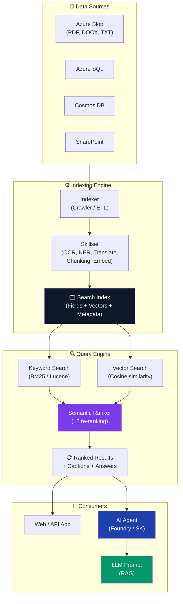

### Why Use Azure AI Search?

- **Any data type:** Images, audio, text, multilingual content
- **AI-enhanced results:** Results ranked and refined by language models
- **RAG Supercharger:** Gives AI agents and LLMs the specific knowledge they need to respond accurately to queries
- **Scalable & managed:** Fully managed cloud service — no infrastructure management

### When to Use It?

> Use Azure AI Search **any time you need to quickly retrieve specific knowledge from a large, complex dataset** — especially when powering AI agents, chatbots, or enterprise Q&A systems.

---

## 2. Creating an Azure AI Search Resource

### Steps (Azure Portal)

1. Go to **Azure Portal → Create a resource → Search for "Azure AI Search"**
2. Provide: Subscription, Resource Group, **Name** (e.g., `ais-east-us2-demo`), **Region**
3. Select **Pricing Tier**
4. Configure **Scale** (Replicas + Partitions)
5. Configure **Networking** (Public or Private)
6. Review & Create

#### Resource Creation Flow

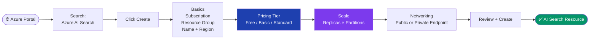

---

### 2.1 Pricing Tiers & SKUs

| Tier | Storage per Partition | Vector Quota | Search Units | Notes |
|---|---|---|---|---|
| **Free** | 50 MB | Limited | 1 | Evaluation only. Not for production. |
| **Basic** | 2 GB | Limited | Up to 3 | ~$75/month. Good for small workloads. |
| **Standard (S1)** | 25 GB | ~35 GB vector/partition | Up to 36 | Most common production tier |
| **Standard S2/S3** | 100–200 GB | Higher | Up to 36–120 | Large enterprise use |
| **Storage Optimized (L1/L2)** | 1–2 TB | Very high | High | Massive index sizes |

> **Key insight:** Vector quota ≤ total storage per partition. E.g., Standard gives 25 GB/partition of which up to 35 GB can be vector storage. Adding partitions multiplies capacity.

#### Search Units = Replicas × Partitions

```
Search Units (SU) = Replicas × Partitions
Max SU for Standard = 36
Example: 3 replicas × 3 partitions = 9 SUs
```

- **Replicas** = Copies of the index (for concurrent query throughput / HA)
- **Partitions** = Shards of the index (for storage and indexing throughput)

> **Confidential Computing (optional):** Encrypts data even *during processing* — not just at rest and in transit. Only needed for highly regulated/sensitive workloads.

---

### 2.2 Scaling — Replicas & Partitions

| Dimension | What It Does | When to Increase |
|---|---|---|
| **Replicas** | Adds copies of the index for concurrent query handling | When response time degrades under load |
| **Partitions** | Shards index data for larger storage & indexing throughput | When index size exceeds partition limits |

> **Best Practice:** Start with **1 replica, 1 partition**. Establish a baseline. Add replicas only once you have measured concurrent request load. Adding replicas also improves **SLA guarantees**.

**SLA Requirements:**
- **3+ replicas** → 99.9% read SLA + write SLA
- **2 replicas** → 99.9% read SLA only
- **1 replica** → No SLA

#### Replica × Partition — Capacity & SLA Grid

```mermaid
quadrantChart
    title Replicas vs Partitions Trade-offs
    x-axis Low Storage --> High Storage
    y-axis Low Throughput --> High Throughput
    quadrant-1 Scale-Out (More Queries + Data)
    quadrant-2 Query Optimized (Many Replicas)
    quadrant-3 Minimal (Dev / Test)
    quadrant-4 Storage Optimized (Large Index)
    "1R × 1P (No SLA)": [0.1, 0.1]
    "2R × 1P (Read SLA)": [0.15, 0.45]
    "3R × 1P (Read+Write SLA)": [0.15, 0.7]
    "1R × 3P (More Storage)": [0.55, 0.1]
    "3R × 3P (Balanced)": [0.55, 0.7]
    "6R × 6P (Enterprise)": [0.85, 0.85]
```

#### SLA Ladder

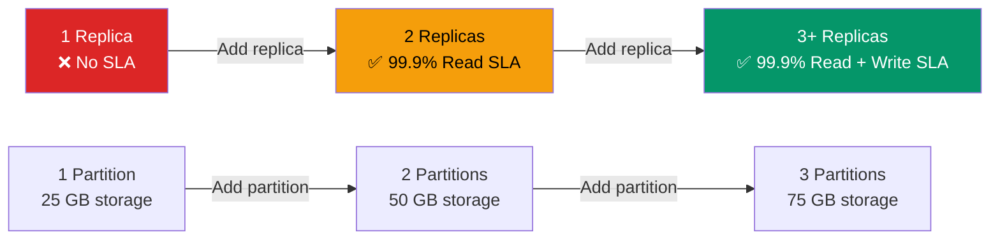

---

### 2.3 Networking

| Mode | Description | Use Case |
|---|---|---|
| **Public** | Accessible from the internet (default) | Dev/test environments |
| **Private Endpoint** | Traffic goes through Azure VNet only | Production enterprise deployments |
| **IP Firewall Rules** | Restrict to specific IP ranges | Partial restriction |

> For **enterprise production**, always use **Private Endpoints** to keep all traffic within your VNet and away from public internet.

#### Public vs Private Endpoint Topology

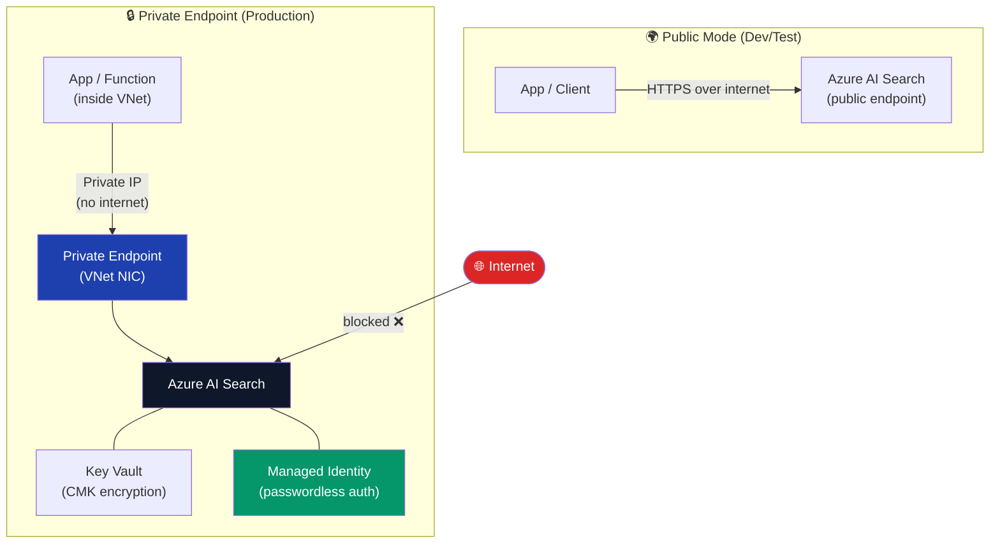

---

## 3. Core Concepts — Index, Indexer, Data Source, Skillset

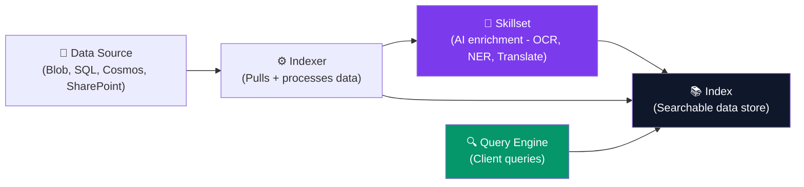

### Key Concepts Explained

| Concept | Description | Analogy |
|---|---|---|
| **Index** | The searchable database — stores all fields including vectors | Like a database table with rows & columns |
| **Indexer** | A crawler/pipeline that reads from a data source and populates the index | Like an ETL pipeline |
| **Data Source** | Connection definition to your raw data (Blob, SQL, Cosmos DB, etc.) | Like a connection string |
| **Skillset** | A pipeline of AI skills (OCR, translation, NER) applied during indexing | Like a data transformation layer |

### Index Fields

Each field in an index has attributes:

| Attribute | Meaning |
|---|---|
| `Retrievable` | Field is returned in search results |
| `Searchable` | Field can be searched with text queries |
| `Filterable` | Field can be used in `$filter` expressions |
| `Sortable` | Field can sort results |
| `Facetable` | Field can be used for faceted navigation |

#### Typical Index Field Attribute Matrix

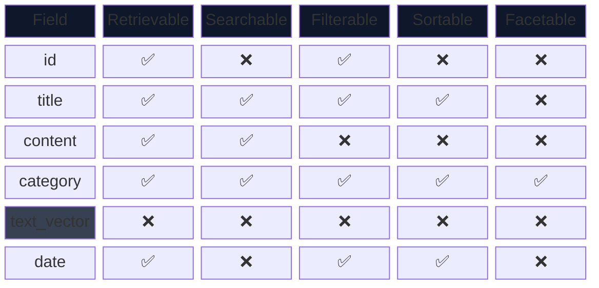

> **Note:** `text_vector` is typically set to **not retrievable** in query results (to hide the raw embedding array), but is still used internally for vector similarity search.

---

## 4. Simple Search — REST API & SDK

### REST API Example

```http
GET https://<search-name>.search.windows.net/indexes/<index-name>/docs?api-version=2024-07-01
    &search=*
    &$top=10
Authorization: api-key <your-api-key>
```

### Python SDK Example

```python
from azure.search.documents import SearchClient
from azure.core.credentials import AzureKeyCredential

client = SearchClient(
    endpoint="https://<name>.search.windows.net",
    index_name="<index>",
    credential=AzureKeyCredential("<api-key>")
)

# Search everything
results = client.search(search_text="*", top=10)
for r in results:
    print(r)
```

### Authentication Options

| Method | How | Recommended |
|---|---|---|
| **API Key** | Header: `api-key: <key>` | Dev/simple integrations |
| **Managed Identity** | Azure Entra ID (passwordless) | ✅ Production |
| **RBAC Roles** | Assign roles via Azure portal | ✅ Production |

> Use **Managed Identity** in production — no secrets in code, no rotation burden.

#### API Key vs Managed Identity Auth Flow

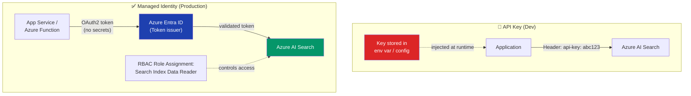

---

## 5. Full-Text Search (BM25 / Lucene)

Azure AI Search uses **Apache Lucene** for full-text indexing with **BM25** ranking (same algorithm as Elasticsearch, Solr).

### BM25 Query Pipeline

```mermaid
flowchart LR
    Q["🔤 Query Text\n'azure machine learning'"] --> Analyze["Text Analyzer\n(Tokenize, Lowercase,\nRemove Stopwords, Stem)"]
    Analyze --> Tokens["Tokens\n['azure', 'machin', 'learn']"] 
    Tokens --> Lookup["Inverted Index Lookup\n(Which docs contain each token?)"]
    Lookup --> BM25["BM25 Scoring\nScore = TF × IDF × doc-length-norm"]
    BM25 --> Ranked["Ranked Doc List\n(by relevance score)"]
    Ranked --> Filter["Apply Filters\n($filter, $select, $top)"]
    Filter --> Results["📋 Search Results"]

    style BM25 fill:#1e40af,color:#fff
    style Results fill:#059669,color:#fff
```

> **BM25 Formula intuition:** A term gets a higher score if it appears **frequently in the document** (TF) but **rarely across all documents** (IDF). Short documents are boosted because the same term frequency in a short doc signals higher relevance.

### 5.1 Simple Query Syntax

The default query syntax. Best for basic keyword search.

| Operator | Example | Meaning |
|---|---|---|
| `word` | `azure search` | Match any of these words (OR) |
| `"phrase"` | `"azure ai search"` | Exact phrase match |
| `+word` | `+azure +search` | Must contain both (AND) |
| `-word` | `azure -storage` | Exclude word |
| `word*` | `azure*` | Prefix/wildcard |
| `word~` | `azure~` | Fuzzy match (typo tolerance) |

```python
# Simple query
results = client.search(
    search_text="azure ai search",
    query_type="simple",
    search_fields=["title", "content"]
)
```

---

### 5.2 Full Lucene Query Syntax

More powerful. Use `query_type="full"` to enable.

| Feature | Syntax | Example |
|---|---|---|
| **Field-scoped** | `field:value` | `title:azure` |
| **Fuzzy** | `term~N` | `azure~1` (1 edit distance) |
| **Proximity** | `"term1 term2"~N` | `"azure search"~3` |
| **Regex** | `/pattern/` | `/az.*search/` |
| **Boosting** | `term^N` | `azure^2 search` |
| **Range** | `[min TO max]` | `date:[2024 TO 2025]` |

```python
results = client.search(
    search_text="title:azure AND content:search~1",
    query_type="full"
)
```

---

### 5.3 Search Fields & Filters

```python
results = client.search(
    search_text="machine learning",
    # Limit which fields to search
    search_fields=["title", "description"],
    # OData filter expression
    filter="category eq 'AI' and date ge 2024-01-01",
    # Which fields to return
    select=["title", "category", "date"],
    # Sort order
    order_by=["date desc"],
    # Pagination
    top=10,
    skip=0
)
```

#### OData Filter Operators

| Operator | Meaning | Example |
|---|---|---|
| `eq` | Equals | `category eq 'AI'` |
| `ne` | Not equals | `status ne 'draft'` |
| `gt / ge` | Greater than / or equal | `score ge 0.8` |
| `lt / le` | Less than / or equal | `price le 100` |
| `and / or / not` | Logical operators | `a eq 1 and b eq 2` |

#### Facets

Facets enable **drill-down navigation** (like Amazon's filter sidebar):

```python
results = client.search(
    search_text="*",
    facets=["category,count:5", "year,count:10"]
)
# Returns: facets["category"] = [{"value": "AI", "count": 42}, ...]
```

---

## 6. Semantic Search

**Semantic Search** uses a deep-learning model to **re-rank** the top BM25 results by understanding the *intent* of the query — not just keyword overlap.

### How It Works

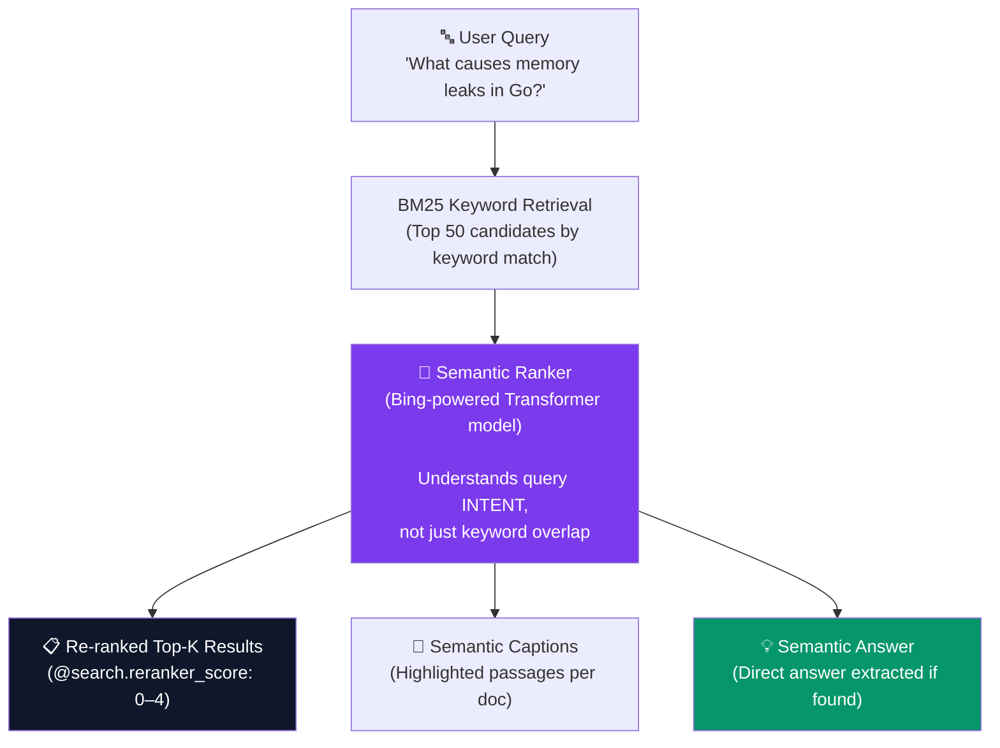

> **Key distinction:** Semantic Ranker does NOT search new documents — it only **re-ranks** the top-50 candidates already retrieved by BM25. This is why BM25 recall quality still matters even when using semantic search.

```
1. BM25 retrieves top-50 keyword candidates
2. Semantic Ranker (Bing-powered L2 model) re-ranks the top 50
3. Returns top-K results with semantic relevance scores
4. Optionally: generates a "semantic caption" and "semantic answer"
```

### Enabling Semantic Search

1. **Portal:** Enable "Semantic Ranker" in your AI Search index configuration (free tier available for limited queries/month)
2. **Code:**

```python
from azure.search.documents.models import QueryType, SemanticConfiguration

results = client.search(
    search_text="what are the benefits of hybrid search?",
    query_type=QueryType.SEMANTIC,
    semantic_configuration_name="my-semantic-config",
    query_caption="extractive",    # Extract relevant captions from docs
    query_answer="extractive",     # Extract a direct answer if found
    top=5
)

for r in results:
    print(r["@search.score"])        # BM25 score
    print(r["@search.reranker_score"])  # Semantic reranker score (0-4)
    if r.get("@search.captions"):
        print(r["@search.captions"][0]["text"])
```

### Semantic Answer vs Caption

| Feature | Description |
|---|---|
| **Semantic Caption** | Highlighted passage from a doc that best answers the query |
| **Semantic Answer** | Direct synthesized answer if one is clearly present in results |

> **Interview Note:** Semantic search is **NOT** vector search. It's L2 re-ranking of BM25 keyword results using a language model. No embeddings are stored.

---

## 7. Vector Search

**Vector Search** finds documents by **semantic similarity** using embeddings (dense numerical vectors). Instead of keyword matching, it finds the *closest vectors* in high-dimensional space.

### 7.1 How Embeddings Work

```
Text → Embedding Model → [0.12, -0.87, 0.45, ... 1536 dims] (Vector)

Query: "What is machine learning?"
Doc 1: "ML is a subset of AI"         → Vector A
Doc 2: "Pizza delivery in New York"   → Vector B

Cosine similarity(Query, A) = 0.92  ← High match
Cosine similarity(Query, B) = 0.11  ← Low match
```

#### Embedding Pipeline — From Text to Vector

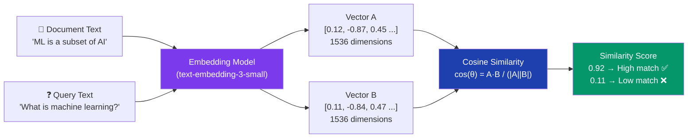

#### Vector Space Concept

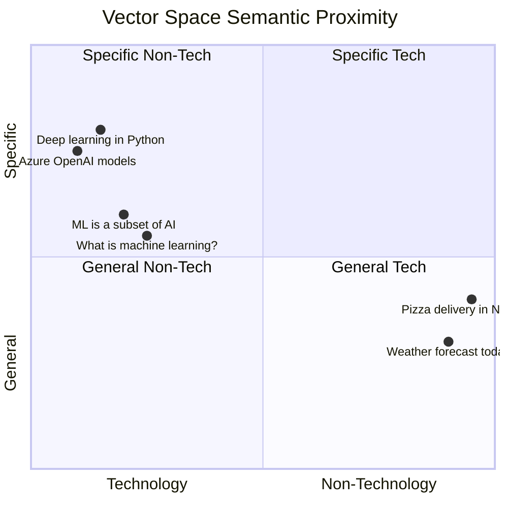

> Semantically similar texts cluster near each other in vector space. The query *"What is machine learning?"* sits close to *"ML is a subset of AI"* — far from *"Pizza delivery"*.

### Embedding Models

| Model | Provider | Dimensions | Notes |
|---|---|---|---|
| `text-embedding-3-small` | Azure OpenAI | 1536 | Cost-efficient, good quality |
| `text-embedding-3-large` | Azure OpenAI | 3072 | Highest quality |
| `text-embedding-ada-002` | Azure OpenAI | 1536 | Older, still widely used |

> **Best Practice:** Use `text-embedding-3-small` for balanced cost/quality. Use `text-embedding-3-large` when retrieval precision is critical.

---

### 7.2 Integrated Vectorization

With **Integrated Vectorization**, Azure AI Search automatically generates embeddings during both **indexing** AND **querying** — no separate pipeline needed.

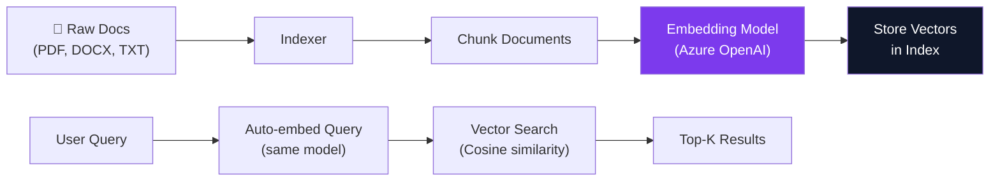

#### Setting Up Integrated Vectorization (Portal: Import & Vectorize Data Wizard)

1. Choose data source (Blob, SharePoint, etc.)
2. Select embedding model (Azure OpenAI `text-embedding-3-small`)
3. Enable **integrated vectorization**
4. Configure chunking strategy (size, overlap)
5. Enable **Semantic Ranker** (optional but recommended)
6. Run the indexer

#### Chunking Strategy

| Parameter | Meaning | Recommended |
|---|---|---|
| `tokenOverlapCount` | Tokens shared between adjacent chunks | 20–100 tokens |
| `maximumPageLength` | Max tokens per chunk | 512–2048 |
| `defaultBehavior` | How to split | `preserveWhitespace` |

> **Why chunking matters:** LLMs and embedding models have token limits. Large documents must be split into chunks so each chunk's semantic meaning can be captured independently.

#### Chunking with Overlap — Visual

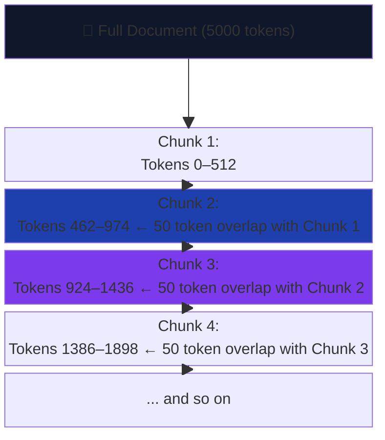

> **Overlap ensures** that sentences split across chunk boundaries are not lost — both neighboring chunks contain the boundary text, so relevant context is always retrievable.

---

### 7.3 Querying with Vectors

```python
from azure.search.documents.models import VectorizedQuery

# 1. Embed the query
query_embedding = openai_client.embeddings.create(
    model="text-embedding-3-small",
    input="What is machine learning?"
).data[0].embedding

# 2. Execute vector query
vector_query = VectorizedQuery(
    vector=query_embedding,
    k_nearest_neighbors=5,
    fields="text_vector"    # The vector field in your index
)

results = client.search(
    search_text=None,
    vector_queries=[vector_query],
    top=5
)
```

#### With Integrated Vectorization (auto-embed query)

```python
from azure.search.documents.models import VectorizableTextQuery

# No need to embed the query manually!
vector_query = VectorizableTextQuery(
    text="What is machine learning?",
    k_nearest_neighbors=5,
    fields="text_vector"
)

results = client.search(
    search_text=None,
    vector_queries=[vector_query],
    top=5
)
```

---

## 8. Hybrid Search

**Hybrid Search** combines **BM25 keyword search + Vector search** using **Reciprocal Rank Fusion (RRF)** to merge the two result sets into a single ranked list.

### Why Hybrid is Best for RAG

| Search Type | Good At | Weak At |
|---|---|---|
| **BM25 (Keyword)** | Exact terms, product names, codes | Synonyms, paraphrasing, concept queries |
| **Vector** | Semantic similarity, intent matching | Exact keyword lookup, very specific terms |
| **Hybrid (BM25 + Vector)** | ✅ Best of both worlds | — |

### Reciprocal Rank Fusion (RRF)

```
RRF score = Σ (1 / (rank_from_list_i + k))
```

- Merges ranked lists from BM25 and vector search
- Doesn't require score normalization
- Documents appearing high in both lists get boosted

#### RRF Merge — Visual Flow

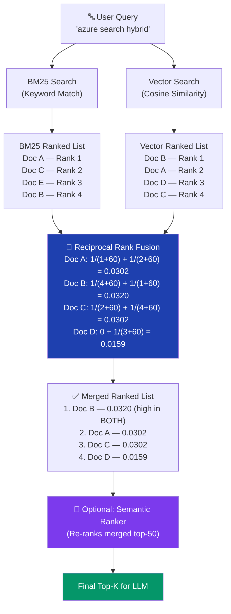

> **Why Doc B wins:** It ranked **#1 in vector** and **#4 in BM25** — high combined RRF score. Doc A ranked **#1 in BM25** but only **#2 in vector**. RRF rewards documents that are relevant from multiple signals.

### Code Example

```python
from azure.search.documents.models import VectorizableTextQuery

vector_query = VectorizableTextQuery(
    text="azure machine learning pipeline",
    k_nearest_neighbors=50,
    fields="text_vector"
)

results = client.search(
    search_text="azure machine learning pipeline",  # BM25 text
    vector_queries=[vector_query],                  # Vector query
    query_type="semantic",                          # + Semantic reranking on top
    semantic_configuration_name="my-config",
    top=5
)
```

### Recommended RAG Stack: Hybrid + Semantic Ranker

```mermaid
flowchart TB
    UQ(["👤 User Query"])

    subgraph L1["Layer 1 — Retrieval"]
        BM25L["BM25 Keyword Search\n(Inverted Index)"]
        VECL["Vector Search\n(HNSW Index — Cosine Similarity)"]
    end

    subgraph L2["Layer 2 — Fusion"]
        RRF2["Reciprocal Rank Fusion\n(RRF)\nMerge + re-rank by combined score"]
    end

    subgraph L3["Layer 3 — Re-ranking (Optional)"]
        SEMR["Semantic Ranker\n(Bing Transformer model)\nUnderstand query intent"]
    end

    subgraph L4["Layer 4 — Generation"]
        PROMPT["Prompt Construction\nSystem + Top-K Chunks + Query"]
        LLM2["GPT-4.1 / GPT-4o\n(Grounded response with citations)"]
    end

    UQ --> BM25L
    UQ --> VECL
    BM25L --> RRF2
    VECL --> RRF2
    RRF2 --> SEMR
    SEMR --> PROMPT
    PROMPT --> LLM2

    style RRF2 fill:#1e40af,color:#fff
    style SEMR fill:#7c3aed,color:#fff
    style LLM2 fill:#059669,color:#fff
    style L1 fill:#1e1e2e
    style L2 fill:#1e293b
    style L3 fill:#1a1a2e
    style L4 fill:#0f172a
```

> **Interview Answer:** "For RAG, we use **hybrid search** — combining keyword (BM25) and vector (cosine similarity) results via **Reciprocal Rank Fusion (RRF)**. We then layer on the **Semantic Ranker** as an L2 re-ranker to maximize precision of the top results fed into the LLM."

---

## 9. AI Enrichment & Skillsets

**Skillsets** are AI transformation pipelines applied to raw content **during indexing**. They enrich documents before storing them in the index.

### Built-in Cognitive Skills

| Skill | What It Does | Output |
|---|---|---|
| **OCR** | Extracts text from images/PDFs | Text content |
| **Text Merge** | Combines OCR text with original | Merged text field |
| **Language Detection** | Detects document language | Language code |
| **Entity Recognition (NER)** | Extracts people, places, orgs, dates | Structured entities |
| **Key Phrase Extraction** | Identifies key topics | Tag list |
| **Sentiment Analysis** | Positive/neutral/negative per doc | Sentiment score |
| **Image Analysis** | Describes image content | Tags, captions |
| **Translation** | Translates to target language | Translated text |
| **PII Detection** | Finds/redacts personal data | Clean text |
| **Document Splitting** | Chunks large documents | Multiple sub-documents |

### Skillset Pipeline Flow

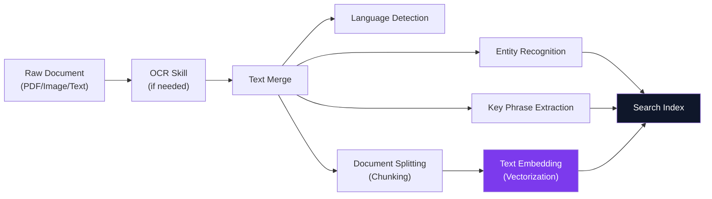

### Custom Skills (Azure Functions)

You can write **custom skills** as Azure Functions to handle domain-specific processing:

```python
# Custom skill endpoint (Azure Function)
@app.route("/api/custom-skill")
def custom_skill(req):
    values = req.get_json()["values"]
    results = []
    for v in values:
        text = v["data"]["text"]
        # Your custom processing here
        custom_tags = extract_domain_tags(text)
        results.append({
            "recordId": v["recordId"],
            "data": {"customTags": custom_tags}
        })
    return {"values": results}
```

### Knowledge Store

A **Knowledge Store** saves enriched data to **Azure Blob Storage or Azure Table Storage** — useful for analytics, Power BI dashboards, or downstream pipelines.

#### Knowledge Store Data Flow

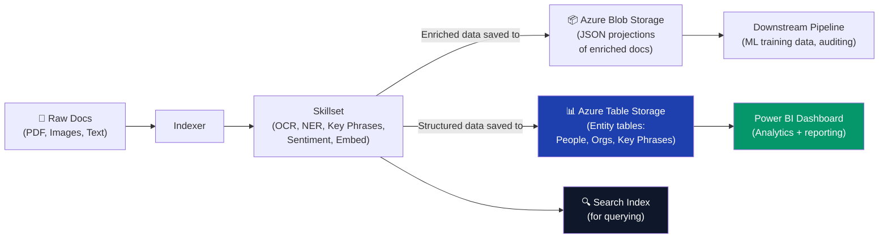

---

## 10. Agentic RAG — AI Agents + Azure AI Search

**Agentic RAG** integrates Azure AI Search as a **grounding knowledge tool** for AI agents running in **Azure AI Foundry (Microsoft Foundry)**.

### Architecture

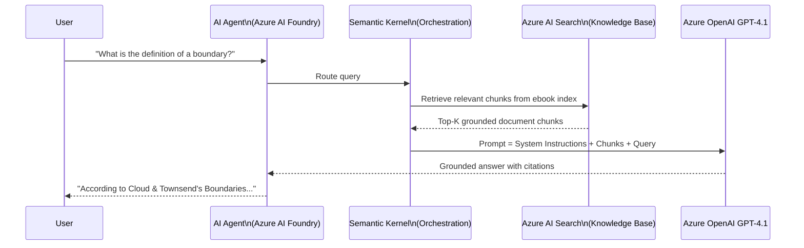

### End-to-End Setup Steps (Portal Demo)

#### Setup Flow Overview

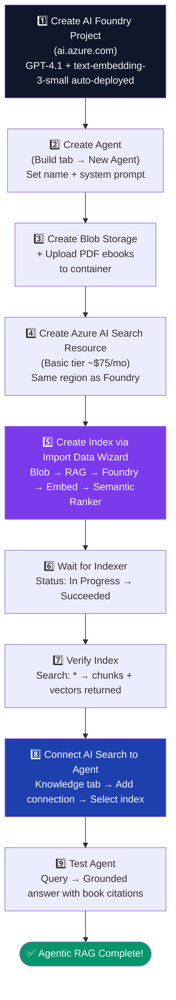

#### Step 1 — Create AI Foundry Project

1. Go to **Azure AI Foundry (ai.azure.com)**
2. Create a **new project** (e.g., `agentic-rag-project`)
3. GPT-4.1 and `text-embedding-3-small` are auto-deployed

#### Step 2 — Create an Agent

1. In Foundry → **Build tab → Create Agent**
2. Name the agent (e.g., `ebook-agent`)
3. Leave model as **GPT 4.1** (default)
4. Use GPT to **generate a system prompt** that instructs the agent to only answer from the knowledge base

> **Example System Prompt (AI-generated):**
> *"You are a specialized assistant that only answers questions using the provided knowledge base. Do not use general training knowledge. Always cite the source document when answering."*

#### Step 3 — Upload Documents to Storage

1. Create **Azure Blob Storage** account
2. Create a container (e.g., `ebook-container`)
3. Upload PDF ebooks (or any documents)

#### Step 4 — Create Azure AI Search Resource

- Choose **Basic tier** (~$75/month) for demos
- Select same region as Foundry project

#### Step 5 — Create Index via Import Data Wizard

1. **Import data → Azure Blob Storage**
2. Select scenario: **RAG**
3. Choose storage account & container
4. Vectorization kind: **Azure AI Foundry** (Microsoft Foundry)
5. Select project and `text-embedding-3-small` model
6. Enable **Semantic Ranker**
7. Preview index fields:
   - `parent_id` — ID of source document
   - `chunk` — The actual text chunk
   - `text_vector` — Vector embeddings of the chunk
   - `title` — Document title
8. Run indexer (once or scheduled)

#### Step 6 — Wait for Indexer to Complete

```
Search → Indexers → Status: In Progress → Succeeded
```

#### Step 7 — Verify Index Data

```
Search → Indexes → Run search: *
→ Should return document chunks + vector embeddings
```

> **Tip:** Uncheck "Retrievable" on `text_vector` field to hide embeddings in results and make output readable.

#### Step 8 — Connect AI Search to Agent

1. In Foundry Agent → **Knowledge tab**
2. Click **Connect → Add**
3. Create new connection to your Azure AI Search resource
4. Select your index
5. Save → Agentic RAG is complete!

#### Step 9 — Test the Agent

```
Query: "What is the definition of a boundary according to John Townsend and Henry Cloud?"
→ Response cites the "Boundaries" book with grounded content
→ Debug panel shows the AI Search tool was called
```

### Index Schema for Agentic RAG

| Field | Type | Purpose |
|---|---|---|
| `parent_id` | String | Links chunk to source document |
| `chunk` | String (Searchable, Retrievable) | Text content of the chunk |
| `text_vector` | Collection(Single) | 1536-dim embedding vector |
| `title` | String (Retrievable) | Source document title |

### Deployment Options

Once the agent is working, you can:

| Option | How |
|---|---|
| **Code Integration** | Copy Python / JavaScript / C# code from Foundry |
| **Preview Link** | Share a test link with org members |
| **Microsoft Teams** | Publish agent directly to Teams |
| **Microsoft 365 Copilot** | Publish as a Copilot plugin |

---

## 11. Architecture Patterns

### Pattern 1: Standard RAG Pipeline

```mermaid
graph LR
    User["👤 User Query"] --> App["Application"]
    App --> AOAI["Azure OpenAI\n(Embed query)"]
    AOAI --> AIS["Azure AI Search\n(Hybrid Search)"]
    AIS --> Blob["Azure Blob Storage\n(Source documents)"]
    AIS --> App2["Top-K Chunks → App"]
    App2 --> Prompt["Construct Prompt\n(System + Chunks + Query)"]
    Prompt --> GPT["GPT-4o / GPT-4.1"]
    GPT --> Answer["Grounded Answer"]

    style GPT fill:#0f172a,color:#fff
    style AIS fill:#1e40af,color:#fff
```

### Pattern 2: Agentic RAG (Multi-Agent)

```mermaid
graph TD
    User["👤 User"] --> Orch["Orchestrator Agent\n(Semantic Kernel)"]
    Orch --> SearchAgent["Search Agent\n(Azure AI Search Tool)"]
    Orch --> CodeAgent["Code Execution Agent"]
    Orch --> MailAgent["Communication Agent"]
    SearchAgent --> AIS["Azure AI Search\n(Ebook Index)"]
    AIS --> Chunks["Grounded Chunks"]
    Chunks --> Orch
    Orch --> Answer["Final Grounded Response"]

    style AIS fill:#1e40af,color:#fff
    style Orch fill:#0f172a,color:#fff
```

### Pattern 3: Intelligent Document Processing

```mermaid
graph LR
    Upload["📄 Document Upload"] --> Blob2["Azure Blob Storage"]
    Blob2 --> Indexer["AI Search Indexer"]
    Indexer --> Skills["Skillset\n(OCR, NER, Chunking)"]
    Skills --> Embed2["Integrated Vectorization"]
    Embed2 --> Index["Search Index\n(Chunks + Vectors)"]
    Index --> Agent["AI Agent\n(RAG)"]

    style Index fill:#0f172a,color:#fff
    style Skills fill:#7c3aed,color:#fff
```

### Pattern 4: Enterprise Security Architecture

```mermaid
flowchart TB
    subgraph Client["👤 Client Layer"]
        WebApp["Web App\n(App Service)"]
        Func["Azure Function\n(Managed Identity)"]
    end

    subgraph Security["🔐 Security Layer"]
        APIM["Azure API Management\n(Rate limiting, JWT validation)"]
        Entra2["Azure Entra ID\n(Auth + RBAC)"]
        KV2["Azure Key Vault\n(CMK encryption keys)"]
    end

    subgraph Search["🔍 Azure AI Search"]
        PE2["Private Endpoint"]
        AIS2["Search Service\n(Private)"]
        Idx2["Index\n(Encrypted at rest)"]
    end

    subgraph Data["🗄️ Data Layer"]
        Blob3["Azure Blob\n(Private)"]  
        SQL2["Azure SQL\n(Private)"]
    end

    WebApp -->|"Bearer token"| APIM
    Func -->|"Managed Identity token"| APIM
    APIM --> Entra2
    Entra2 -->|"validated"| PE2
    PE2 --> AIS2
    AIS2 --> Idx2
    KV2 -.->|"encryption keys"| AIS2
    Blob3 --> AIS2
    SQL2 --> AIS2

    style AIS2 fill:#0f172a,color:#fff
    style Entra2 fill:#1e40af,color:#fff
    style KV2 fill:#dc2626,color:#fff
    style PE2 fill:#7c3aed,color:#fff
```

---

## 12. Interview Quick Reference

### Search Method Decision Tree

```mermaid
flowchart TD
    START(["🤔 Choose Search Strategy"])
    Q1{"Need semantic\nunderstanding?"}
    Q2{"Have stored\nvectors in index?"}
    Q3{"Need exact keyword\nor code matches too?"}
    Q4{"Need to maximise\nprecision of top results?"}

    BM25_OUT["✅ BM25 Full-Text Search\nFast, no embeddings needed"]
    VEC_OUT["✅ Pure Vector Search\nSemantic similarity only"]
    HYB_OUT["✅ Hybrid Search\nBM25 + Vector via RRF"]
    SEM_OUT["✅ Hybrid + Semantic Ranker\nBest precision for RAG"]
    FAQ_OUT["✅ BM25 + Filters\nSimple FAQ / structured lookup"]

    START --> Q1
    Q1 -->|"No — just keywords"| FAQ_OUT
    Q1 -->|"Yes"| Q2
    Q2 -->|"No"| BM25_OUT
    Q2 -->|"Yes"| Q3
    Q3 -->|"No — semantic only"| VEC_OUT
    Q3 -->|"Yes — both"| Q4
    Q4 -->|"No"| HYB_OUT
    Q4 -->|"Yes — RAG / Agent"| SEM_OUT

    style SEM_OUT fill:#059669,color:#fff
    style HYB_OUT fill:#1e40af,color:#fff
    style VEC_OUT fill:#7c3aed,color:#fff
    style BM25_OUT fill:#374151,color:#fff
    style FAQ_OUT fill:#374151,color:#fff
```

### Key Comparisons

| Dimension | BM25 | Vector Search | Hybrid | Semantic Ranker |
|---|---|---|---|---|
| **Based on** | Keyword frequency (TF-IDF) | Embedding similarity | RRF merge of both | L2 LLM re-ranking |
| **Good for** | Exact terms, codes | Intent, paraphrasing | Both | Precision of top results |
| **Index type** | Inverted index | Vector (HNSW) | Both | Re-ranking layer |
| **Requires embeddings** | No | Yes | Yes | No (reranks BM25/RRF results) |

### Recommended Configurations

| Use Case | Configuration |
|---|---|
| Enterprise RAG | Hybrid Search + Semantic Ranker |
| Simple FAQ lookup | BM25 only with filters |
| Semantic product search | Vector-only or hybrid |
| Multi-language corpus | BM25 with language analyzers |
| Agentic knowledge base | Integrated vectorization + Hybrid + Semantic Ranker |

### Critical Interview Answers

**Q: What is Reciprocal Rank Fusion?**
> RRF is the merging algorithm used in hybrid search. It combines ranked results from BM25 and vector search into a single list by scoring each document as `Σ 1/(rank_i + k)`. Documents appearing high in *both* lists get the highest combined score.

**Q: How does Semantic Ranker differ from vector search?**
> Semantic Ranker is a *post-retrieval re-ranking* step — it takes the top-50 BM25/hybrid results and re-ranks them using a language model (Bing-based) that understands query intent. It does NOT use stored embeddings. Vector search finds similar documents via cosine similarity on stored embedding vectors.

**Q: What is Integrated Vectorization?**
> A feature where Azure AI Search automatically generates embeddings for both documents (at index time) and queries (at query time) using a connected Azure OpenAI embedding model — eliminating the need for a separate embedding pipeline.

**Q: What's the difference between a Replica and a Partition?**
> A **Replica** is a copy of the index for concurrent query throughput and HA. A **Partition** is a shard of the index for increased storage capacity and indexing speed. Search Units = Replicas × Partitions.

**Q: What is Agentic RAG?**
> Agentic RAG connects an AI agent (running in Azure AI Foundry) to Azure AI Search as a knowledge tool. When the agent receives a query, it automatically calls the AI Search tool to retrieve relevant grounded document chunks from the index, then uses those chunks as context for the LLM response — ensuring answers are factual and cited.

**Q: How do you secure Azure AI Search in production?**
> Use: (1) **Private Endpoints** to restrict traffic to Azure VNet only, (2) **Managed Identity** for passwordless auth (no API keys in code), (3) **RBAC roles** for access control, (4) **Document-level security trimming** via OData filter expressions based on user identity, (5) **Customer-managed encryption keys** via Azure Key Vault.

---

## Appendix: Key Pricing Considerations

| Item | Cost Driver |
|---|---|
| AI Search Resource | Per Search Unit per hour (replicas × partitions) |
| Semantic Ranker | Free tier: 1,000 queries/month. Billed above that |
| Embedding generation | Azure OpenAI tokens (input-only, per 1K tokens) |
| Storage | Per GB in index per month |
| Indexer runs | Included but skillset AI enrichment billed separately |

#### Cost Components Breakdown

```mermaid
flowchart LR
    subgraph Compute["💻 Compute Cost\n(Biggest driver)"]
        SU2["Search Units\n= Replicas × Partitions\nBilled per hour"]
        Tier["Tier governs\nmax SU + storage:\nFree → Basic → S1 → S2"]
    end

    subgraph AI["🧠 AI Cost (Variable)"]
        Embed3["Embedding tokens\n(Azure OpenAI)\nPer 1K input tokens"]
        SemR2["Semantic Ranker\n1,000 free queries/mo\nBilled above threshold"]
        Skills3["Skillset enrichment\n(OCR, NER, Translate)\nPer 1K records"]
    end

    subgraph Storage["🗄️ Storage Cost"]
        IdxSize["Index storage\nPer GB/month"]
        KnowStore["Knowledge Store\n(Blob/Table)\nStandard storage rates"]
    end

    Total(["💰 Total Monthly Cost"])

    Compute --> Total
    AI --> Total
    Storage --> Total

    style Total fill:#059669,color:#fff
    style Compute fill:#0f172a,color:#fff
    style AI fill:#7c3aed,color:#fff
    style Storage fill:#1e40af,color:#fff
```

> **Cost tip from video:** Basic tier ~$75/month is sufficient for demos and small workloads. Standard tier starts around $250/month/SU. **Always delete resources after demos** to avoid unexpected charges.

---

*Last updated: June 2026 | Based on Azure AI Search API version 2024-07-01*

---

## Additional Material from Agentic-RAG-Azure-AI-Search.md

> Unique additions: query-planner, MCP-integration, and session-context sections.


> **Source:** [YouTube – Agentic RAG: build a reasoning retrieval engine with Azure AI Search | BRK142](https://www.youtube.com/watch?v=PeTmOidqHM8&t=5s)  
> **Event:** Microsoft Build 2025 · Session BRK142  
> **Topic:** Agentic Retrieval, Knowledge Base, Vector Search, Reasoning RAG  
> **Relevance:** ~40% improvement in answer relevance over classic RAG for complex queries

---

## 📋 Table of Contents

1. [Overview & Session Context](#overview--session-context)
2. [The Problem with Classic RAG](#the-problem-with-classic-rag)
3. [What Is Agentic Retrieval?](#what-is-agentic-retrieval)
4. [Core Architecture](#core-architecture)
5. [Key Components](#key-components)
   - [Knowledge Base](#1-knowledge-base-formerly-knowledge-agent)
   - [Query Planning Engine](#2-query-planning-engine)
   - [Knowledge Sources](#3-knowledge-sources)
   - [Semantic Ranker](#4-semantic-ranker)
   - [Answer Synthesis](#5-answer-synthesis)
6. [Vector Search & Embeddings Foundations](#vector-search--embeddings-foundations)
7. [Agentic Retrieval Flow — Step by Step](#agentic-retrieval-flow--step-by-step)
8. [Classic RAG vs Agentic RAG Comparison](#classic-rag-vs-agentic-rag-comparison)
9. [MCP Integration](#mcp-model-context-protocol-integration)
10. [API Reference](#api-reference)
11. [Code Examples](#code-examples)
12. [Observability & Debugging](#observability--debugging)
13. [Enterprise Features](#enterprise-features)
14. [Best Practices](#best-practices)
15. [Learning Resources](#learning-resources)
16. [Interview Talking Points](#interview-talking-points)

---

## Overview & Session Context

**BRK142** is a Microsoft Build 2025 breakout session that introduces **Agentic Retrieval** — a fundamental shift in how Azure AI Search works for AI-powered applications. The session covers the transition from simple, single-shot RAG patterns to a sophisticated **reasoning retrieval engine** that uses LLMs to autonomously plan, decompose, and execute multi-step search strategies.

### What This Session Announced
- General availability of **Agentic Retrieval** in Azure AI Search
- Introduction of the **Knowledge Base** object (formerly Knowledge Agent)
- Native **MCP (Model Context Protocol)** server support for Azure AI Search
- Up to **~40% improvement** in answer relevance for complex, multi-part queries
- Integration with **Azure AI Foundry** ecosystem for end-to-end agent pipelines

---

## The Problem with Classic RAG

Traditional RAG (Retrieval-Augmented Generation) has a fundamental limitation: it relies on a **single, static query** against a single search index.

```mermaid
flowchart LR
    U(["👤 User:\n'What hotels near the beach\nhave airport transport\nand allow pets?'"])
    SQ["📝 Single Query\n(as-is or slightly rewritten)"]
    IDX["🗄️ One Index"]
    TOP["📄 Top-K Results\n(may miss parts)"]
    LLM["🤖 LLM"]
    A(["❓ Partial Answer\n(misses nuance)"])

    U --> SQ --> IDX --> TOP --> LLM --> A

    style U fill:#D83B01,color:#fff,stroke:none
    style A fill:#D83B01,color:#fff,stroke:none
    style IDX fill:#5C2D91,color:#fff,stroke:none
    style LLM fill:#0078D4,color:#fff,stroke:none
```

### Pain Points of Classic RAG

| Problem | Impact |
|---|---|
| **Single query** — can't decompose complex questions | Misses information hidden under different keywords |
| **Single index** — no multi-source orchestration | Can't combine hotel data + travel guides + reviews |
| **Stateless** — ignores conversation history | Follow-up questions lose context |
| **Manual query formulation** — developer must craft the perfect query | Brittle, fails at edge cases |
| **No reasoning** — LLM used only at the end | Retrieval quality is the bottleneck |

> **Key insight from the session:** *"The bottleneck is no longer the language model — it's the retrieval."*

---

## What Is Agentic Retrieval?

**Agentic Retrieval** turns Azure AI Search into an autonomous **reasoning retrieval engine**. Instead of executing one query against one index, it uses an LLM (configured with a reasoning model) to:

1. Analyze the **conversation history and user intent**
2. **Decompose** complex questions into multiple targeted subqueries
3. Execute subqueries **in parallel** across multiple sources
4. **Rerank and interleave** results from all subqueries
5. **Synthesize** a final grounded response with citations

```mermaid
flowchart TD
    U(["👤 Complex User Query\n+ Conversation History"])
    KB["🧠 Knowledge Base\n(Reasoning Orchestrator)"]
    QP["📋 Query Planning\n(LLM decomposes intent)"]

    subgraph Parallel ["⚡ Parallel Subquery Execution"]
        SQ1["🔍 Subquery 1\n'beach hotels'"]
        SQ2["🔍 Subquery 2\n'airport transportation'"]
        SQ3["🔍 Subquery 3\n'pet-friendly policies'"]
    end

    subgraph Sources ["📚 Knowledge Sources"]
        IDX1["🗄️ Hotel Index"]
        IDX2["🗄️ Reviews Index"]
        WEB["🌐 Bing / Web"]
    end

    RR["🏆 Semantic Reranker\n(L3 Deep Learning)"]
    AS["✍️ Answer Synthesis\n(Grounded response + citations)"]
    R(["✅ Rich, Accurate Answer"])

    U --> KB
    KB --> QP
    QP --> Parallel
    SQ1 --> IDX1
    SQ2 --> IDX2
    SQ3 --> WEB
    IDX1 & IDX2 & WEB --> RR
    RR --> AS
    AS --> R

    style U fill:#0078D4,color:#fff,stroke:none
    style KB fill:#5C2D91,color:#fff,stroke:none
    style QP fill:#5C2D91,color:#fff,stroke:none
    style RR fill:#D83B01,color:#fff,stroke:none
    style AS fill:#D83B01,color:#fff,stroke:none
    style R fill:#107C10,color:#fff,stroke:none
    style Parallel fill:#EFF6FC,stroke:#0078D4,stroke-width:2px
    style Sources fill:#FFF4CE,stroke:#D83B01,stroke-width:2px
```

---

## Core Architecture

```mermaid
flowchart TD
    subgraph App ["🖥️ Your Application / AI Agent"]
        Agent["Agent / LLM App"]
    end

    subgraph AIS ["☁️ Azure AI Search"]
        KB["🧠 Knowledge Base\n(Top-level orchestrator)"]
        QP["📋 Query Planner\n(connected LLM)"]
        SR["🏆 Semantic Ranker"]
        subgraph KS ["Knowledge Sources"]
            Idx1["📂 Azure Blob Index"]
            Idx2["📂 SharePoint Index"]
            Idx3["🌐 Bing Web Search"]
        end
    end

    subgraph AI_Foundry ["☁️ Azure AI Foundry"]
        LLM["🤖 Reasoning Model\n(GPT-4o, o3-mini, etc.)"]
    end

    MCP["🔌 MCP Server\n(Model Context Protocol)"]

    Agent -->|"REST / MCP"| KB
    Agent --> MCP
    MCP --> KB
    KB --> QP
    QP <-->|"query planning"| LLM
    KB --> KS
    KS --> SR
    SR --> KB
    KB -->|"grounded results + citations"| Agent

    style App fill:#EFF6FC,stroke:#0078D4,stroke-width:2px
    style AIS fill:#FFF4CE,stroke:#D83B01,stroke-width:2px
    style AI_Foundry fill:#F3F2F1,stroke:#5C2D91,stroke-width:2px
    style KB fill:#5C2D91,color:#fff,stroke:none
    style QP fill:#5C2D91,color:#fff,stroke:none
    style SR fill:#D83B01,color:#fff,stroke:none
    style LLM fill:#0078D4,color:#fff,stroke:none
    style MCP fill:#107C10,color:#fff,stroke:none
```

---

## Key Components

### 1. Knowledge Base _(formerly Knowledge Agent)_

The **Knowledge Base** is the central orchestration object in Azure AI Search for agentic retrieval. It was introduced as "Knowledge Agent" at Build 2025 and renamed to **Knowledge Base** in later previews (`2025-11-01-preview` onward).

**Responsibilities:**
- Holds **retrieval instructions** (natural language guidance for the LLM)
- Connects to one or more **knowledge sources** (indexes, Bing, storage)
- Configures the **LLM connection** used for query planning
- Manages **reasoning effort** level
- Exposes the `retrieve` API endpoint

```json
// Knowledge Base definition (REST API)
{
  "name": "hotels-kb",
  "description": "Knowledge base for hotel search and recommendations",
  "defaultReasoningEffort": "medium",
  "defaultOutputSize": 10,
  "models": [
    {
      "name": "query-plan-model",
      "kind": "azureOpenAI",
      "azureOpenAIParameters": {
        "resourceUri": "https://<your-resource>.openai.azure.com",
        "deploymentId": "gpt-4o",
        "apiKey": "<key>"
      }
    }
  ],
  "knowledgeSources": [
    {
      "name": "hotels-index",
      "type": "azureSearchIndex",
      "indexName": "hotels",
      "referenceFieldName": "hotel_id"
    }
  ]
}
```

---

### 2. Query Planning Engine

The Query Planner is the **intelligence layer** of agentic retrieval. It is powered by an LLM (typically GPT-4o or a reasoning model like `o3-mini`) and performs:

- **Intent extraction** from user query + conversation history
- **Query decomposition** — breaks complex questions into focused atomic subqueries
- **Query rewriting** — transforms natural language into search-optimized terms
- **Source routing** — determines which knowledge sources to query for each subquery

#### Reasoning Effort Levels

| Level | Behavior | Use Case |
|---|---|---|
| `minimal` | Minimal LLM involvement — near-classic RAG | Simple, single-topic queries |
| `low` | Light query planning | Moderate complexity queries |
| `medium` | Full query decomposition + parallel execution | Complex, multi-part questions |

---

### 3. Knowledge Sources

Knowledge Sources are the **data connections** the Knowledge Base can query. Each source can be searched independently or in combination.

| Source Type | Description | Best For |
|---|---|---|
| **Azure Search Index** | Your own indexed content | Proprietary enterprise data |
| **Azure Blob Storage** | Files (PDF, DOCX, etc.) via integrated vectorization | Document libraries |
| **SharePoint** | Microsoft 365 content | Internal knowledge bases |
| **Bing Web Search** | Real-time public web content | Up-to-date external information |
| **Custom MCP Tools** | Any MCP-compatible data service | Custom APIs and databases |

---

### 4. Semantic Ranker

The **Semantic Ranker** is Azure AI Search's deep learning reranker — often called an **"L3 reranker"** (third layer of ranking, after BM25 and vector similarity).

```mermaid
flowchart LR
    RAW["📄 Raw Candidates\nfrom BM25 + Vector Search"]
    SR["🏆 Semantic Ranker\n(Deep Learning Model\nadapted from Bing)"]
    TOP["✅ Reranked Top Results\nwith semantic scores\n& captions"]

    RAW -->|"top 50 candidates"| SR
    SR -->|"top 5-10 results"| TOP

    style RAW fill:#5C2D91,color:#fff,stroke:none
    style SR fill:#D83B01,color:#fff,stroke:none
    style TOP fill:#107C10,color:#fff,stroke:none
```

**What makes it powerful:**
- Understands **semantic meaning**, not just keyword overlap
- Handles **negation** — distinguishes "no pets allowed" from "pets allowed"
- Captures **complex relationships** between query and document
- Generates **semantic captions** (highlighted relevant passages)
- Works across all subquery results, interleaving them by relevance

---

### 5. Answer Synthesis

Beyond returning ranked search results, the agentic retrieval pipeline can optionally include **Answer Synthesis** — an LLM step that:

- Takes all reranked chunks from all subqueries
- Generates a **natural language answer** grounded in the retrieved content
- Provides **inline citations** pointing back to source documents
- Produces a **structured metadata payload** (token counts, subquery details, timing)

---

## Vector Search & Embeddings Foundations

The session recaps the **vector similarity foundation** that underpins agentic retrieval:

### How Vector Search Works

```mermaid
flowchart TD
    subgraph Indexing ["📥 Index Time"]
        D["📄 Documents / Chunks"]
        EM1["⚙️ Embedding Model\n(text-embedding-3-large)"]
        VDB["🗄️ Vector Index\n(high-dimensional space)"]
        D --> EM1 --> VDB
    end

    subgraph Query ["🔍 Query Time"]
        Q["❓ User Query"]
        EM2["⚙️ Embedding Model\n(same model)"]
        QV["📐 Query Vector"]
        Q --> EM2 --> QV
    end

    CS["📏 Cosine Similarity\n(or Dot Product / Euclidean)"]
    NEAR["🎯 Nearest Neighbors\n(HNSW algorithm)"]

    QV --> CS
    VDB --> CS
    CS --> NEAR

    style Indexing fill:#EFF6FC,stroke:#0078D4,stroke-width:2px
    style Query fill:#FFF4CE,stroke:#D83B01,stroke-width:2px
    style VDB fill:#0078D4,color:#fff,stroke:none
    style CS fill:#5C2D91,color:#fff,stroke:none
    style NEAR fill:#107C10,color:#fff,stroke:none
```

### Hybrid Search (Best of Both Worlds)

Azure AI Search supports **Hybrid Search** — combining BM25 (keyword) with vector search for maximum recall:

| Search Type | Strength | Weakness |
|---|---|---|
| **BM25 (Keyword)** | Exact term matching, fast | Misses synonyms, paraphrases |
| **Vector (Semantic)** | Understands meaning, handles paraphrases | Can miss exact terms |
| **Hybrid (BM25 + Vector)** | Best recall + best precision | Requires score fusion (RRF) |

**Reciprocal Rank Fusion (RRF)** is used to merge keyword and vector results before passing to the Semantic Ranker.

---

## Agentic Retrieval Flow — Step by Step

```mermaid
sequenceDiagram
    participant App as 🖥️ Application
    participant KB as 🧠 Knowledge Base
    participant QP as 📋 Query Planner (LLM)
    participant IDX as 🗄️ Search Indexes
    participant SR as 🏆 Semantic Ranker
    participant AS as ✍️ Answer Synthesis

    App->>KB: POST /retrieve<br/>{messages, reasoning_effort}
    KB->>QP: Send query + conversation history
    QP-->>KB: Return N subqueries<br/>(decomposed, rewritten)
    par Parallel Execution
        KB->>IDX: Execute Subquery 1 (hybrid)
        KB->>IDX: Execute Subquery 2 (hybrid)
        KB->>IDX: Execute Subquery 3 (hybrid)
    end
    IDX-->>KB: Raw candidates from all subqueries
    KB->>SR: Rerank all candidates together
    SR-->>KB: Ranked results with captions + scores
    KB->>AS: Synthesize grounded answer (optional)
    AS-->>KB: Natural language response + citations
    KB-->>App: retrieval_result {<br/>  content,<br/>  references,<br/>  activity_log,<br/>  token_usage<br/>}
```

---

## Classic RAG vs Agentic RAG Comparison

| Dimension | Classic RAG | Agentic RAG |
|---|---|---|
| **Query Strategy** | Single query, as-is | LLM decomposes into N subqueries |
| **Execution** | Sequential, one index | Parallel, multi-source |
| **Context Awareness** | Stateless per query | Uses full conversation history |
| **Query Formulation** | Developer-crafted | Autonomous LLM query planning |
| **Relevance** | Limited to single-query recall | ~40% improvement on complex queries |
| **Sources** | One index | Multiple indexes + Bing + files |
| **Reranking** | Optional semantic ranker | Built-in L3 semantic reranker |
| **Response** | Raw search results | Grounded answer + citations (optional) |
| **Observability** | Basic | Full activity log with token counts, timing, subqueries |
| **Interface** | Standard Search REST API | Knowledge Base API + MCP |
| **Developer Effort** | High — manual query crafting | Low — natural language instructions |

---

## MCP (Model Context Protocol) Integration

Azure AI Search now ships a **native MCP server**, making it a first-class data provider for any MCP-compatible agent framework.

### What MCP Enables

```mermaid
flowchart LR
    subgraph Agents ["🤖 MCP-Compatible Agents"]
        SK["Semantic Kernel"]
        LC["LangChain"]
        CLD["Claude Desktop"]
        CS["Cursor / Copilot Studio"]
    end

    MCP["🔌 Azure AI Search\nMCP Server"]

    subgraph KB_Layer ["☁️ Azure AI Search"]
        KB1["Knowledge Base 1\n(Products)"]
        KB2["Knowledge Base 2\n(HR Policies)"]
        KB3["Knowledge Base 3\n(Tech Docs)"]
    end

    Agents <-->|"MCP protocol"| MCP
    MCP --> KB1 & KB2 & KB3

    style MCP fill:#107C10,color:#fff,stroke:none
    style Agents fill:#EFF6FC,stroke:#0078D4,stroke-width:2px
    style KB_Layer fill:#FFF4CE,stroke:#D83B01,stroke-width:2px
```

### MCP Tool Exposed

The MCP server exposes a `knowledge_base_retrieve` tool that any agent can call:

```python
# Conceptual: Agent using MCP to call Azure AI Search Knowledge Base
from mcp import ClientSession

async def search_enterprise_data(query: str, conversation_history: list):
    results = await session.call_tool(
        "knowledge_base_retrieve",
        arguments={
            "query": query,
            "messages": conversation_history,  # full conversation context
            "reasoning_effort": "medium"        # LLM-based query planning
        }
    )
    return results
```

---

## API Reference

### Create a Knowledge Base (REST)

```http
PUT https://<search-service>.search.windows.net/knowledgebases/hotels-kb
  ?api-version=2026-04-01
Content-Type: application/json
Authorization: Bearer <token>
```

```json
{
  "name": "hotels-kb",
  "defaultReasoningEffort": "medium",
  "defaultOutputSize": 10,
  "models": [
    {
      "name": "gpt4o-query-planner",
      "kind": "azureOpenAI",
      "azureOpenAIParameters": {
        "resourceUri": "https://<openai-resource>.openai.azure.com",
        "deploymentId": "gpt-4o"
      }
    }
  ],
  "knowledgeSources": [
    {
      "name": "hotels-index",
      "type": "azureSearchIndex",
      "indexName": "hotels",
      "referenceFieldName": "hotel_id"
    },
    {
      "name": "reviews-index",
      "type": "azureSearchIndex",
      "indexName": "hotel-reviews",
      "referenceFieldName": "review_id"
    }
  ]
}
```

### Perform Agentic Retrieval (REST)

```http
POST https://<search-service>.search.windows.net/knowledgebases/hotels-kb/retrieve
  ?api-version=2026-04-01
Content-Type: application/json
```

```json
{
  "messages": [
    {
      "role": "user",
      "content": "What beach hotels have airport transportation and allow pets?"
    }
  ],
  "reasoning_effort": "medium",
  "output_size": 5,
  "include_references": true
}
```

### Retrieve Response Structure

```json
{
  "retrieval_result": {
    "content": [
      {
        "chunk_id": "hotel-123-chunk-2",
        "content": "Azure Beach Resort offers complimentary airport shuttle...",
        "semantic_score": 0.94,
        "caption": "...airport shuttle service and pet-friendly rooms from $150/night..."
      }
    ],
    "references": [
      {
        "id": "hotel-123",
        "title": "Azure Beach Resort",
        "source_url": "https://...",
        "hotel_id": "BH-123"
      }
    ],
    "activity_log": [
      {
        "step": "query_planning",
        "subqueries": [
          "beach hotels with airport transportation",
          "pet-friendly hotel policies",
          "beach resort shuttle service"
        ],
        "tokens_used": 342,
        "duration_ms": 1240
      },
      {
        "step": "retrieval",
        "sources_queried": ["hotels-index", "reviews-index"],
        "candidates_retrieved": 48,
        "duration_ms": 380
      },
      {
        "step": "reranking",
        "input_count": 48,
        "output_count": 5,
        "duration_ms": 220
      }
    ],
    "token_usage": {
      "query_planning_tokens": 342,
      "total_tokens": 342
    }
  }
}
```

---

## Code Examples

### Python — Full Agentic Retrieval Pipeline

```python
import os
from azure.identity import DefaultAzureCredential
from azure.search.documents.knowledgebases import KnowledgeBaseRetrievalClient

# Initialize the client
client = KnowledgeBaseRetrievalClient(
    endpoint=os.environ["AZURE_SEARCH_ENDPOINT"],
    credential=DefaultAzureCredential()
)

# Conversation history (enables context-aware retrieval)
conversation_history = [
    {"role": "user", "content": "I'm planning a beach vacation with my dog."},
    {"role": "assistant", "content": "I'd be happy to help! What's your budget?"},
    {"role": "user", "content": "Around $200/night. Also need airport transportation."}
]

# Perform agentic retrieval
response = client.retrieve(
    knowledge_base_name="hotels-kb",
    messages=conversation_history,
    reasoning_effort="medium"   # LLM plans and decomposes the query
)

# Process results
for chunk in response.retrieval_result.content:
    print(f"[Score: {chunk.semantic_score:.2f}] {chunk.caption}")
    print(f"  → Source: {chunk.chunk_id}\n")

# Inspect the query planner's decisions
for step in response.retrieval_result.activity_log:
    if step["step"] == "query_planning":
        print(f"Generated subqueries: {step['subqueries']}")
        print(f"Tokens used for planning: {step['tokens_used']}")
```

### Python — With Answer Synthesis

```python
# Enable full answer synthesis (LLM generates a grounded response)
response = client.retrieve(
    knowledge_base_name="hotels-kb",
    messages=conversation_history,
    reasoning_effort="medium",
    generate_answer=True   # triggers the answer synthesis step
)

# Full grounded natural language answer with citations
print(response.retrieval_result.answer.content)
# → "Based on your budget of $200/night and requirement for airport 
#    transportation with a pet-friendly policy, I found 3 hotels:
#    1. Azure Beach Resort [1] offers pet-friendly rooms from $175/night
#       with a complimentary airport shuttle..."

# Citations
for ref in response.retrieval_result.references:
    print(f"[{ref['id']}] {ref['title']} — {ref['source_url']}")
```

### Semantic Kernel Integration

```python
from semantic_kernel.connectors.search import AzureAISearchConnector
from semantic_kernel.agents import AzureAIAgent

# Register Azure AI Search Knowledge Base as a plugin
search_connector = AzureAISearchConnector(
    endpoint=os.environ["AZURE_SEARCH_ENDPOINT"],
    knowledge_base_name="hotels-kb",
    credential=DefaultAzureCredential(),
    reasoning_effort="medium"
)

# The agent can now autonomously call the knowledge base
agent = AzureAIAgent(
    kernel=kernel,
    name="TravelAssistant",
    instructions="Help users find hotels. Use the search tool to find relevant options."
)
# Agent will automatically invoke agentic retrieval when needed
```

### Install Required Packages

```bash
# Python SDK (preview for latest agentic retrieval features)
pip install azure-search-documents --pre
pip install azure-identity
pip install semantic-kernel

# For MCP integration
pip install mcp
```

---

## Observability & Debugging

One of the key features highlighted in the session is the **full activity log** returned with every agentic retrieval response.

```mermaid
flowchart LR
    RT["🔄 retrieve() call"]
    AL["📊 activity_log"]

    subgraph Log ["Activity Log Contents"]
        QPS["📋 Query Planning Step\n• Subquery texts\n• Tokens consumed\n• Reasoning effort level\n• Duration ms"]
        RS["🔍 Retrieval Step\n• Sources queried\n• Candidates per source\n• Hybrid search details\n• Duration ms"]
        RRS["🏆 Reranking Step\n• Input candidate count\n• Output count\n• Duration ms"]
        SYN["✍️ Synthesis Step\n• LLM tokens used\n• Duration ms"]
    end

    RT --> AL
    AL --> QPS & RS & RRS & SYN

    style RT fill:#0078D4,color:#fff,stroke:none
    style AL fill:#5C2D91,color:#fff,stroke:none
    style Log fill:#EFF6FC,stroke:#0078D4,stroke-width:2px
```

### What You Can Debug

- **Why did it generate these subqueries?** → Check `query_planning` step
- **Which sources were queried?** → Check `retrieval` step `sources_queried`
- **How many candidates were reranked?** → Check `reranking` step
- **What did each subquery cost in tokens?** → Check `tokens_used` per step
- **Where is the latency?** → Check `duration_ms` per step

---

## Enterprise Features

### Security & Access Control

```mermaid
flowchart TD
    User["👤 User"]
    App["🖥️ Application"]
    RBAC["🔐 Azure RBAC\n(Role-Based Access Control)"]
    MI["🪪 Managed Identity"]
    KB["🧠 Knowledge Base"]
    IDX["🗄️ Search Indexes\n(row-level security)"]

    User --> App
    App -->|"Azure AD token"| RBAC
    RBAC -->|"authorized"| MI
    MI -->|"federated access"| KB
    KB --> IDX

    note1["🔒 No API keys in code\nNo secrets in config\nAudit logs in Azure Monitor"]

    style RBAC fill:#D83B01,color:#fff,stroke:none
    style MI fill:#5C2D91,color:#fff,stroke:none
    style KB fill:#0078D4,color:#fff,stroke:none
```

- **Managed Identity** — no secrets or API keys in application code
- **Row-level security** — search index filters respect user permissions
- **Azure Monitor integration** — all retrieve calls logged for audit
- **Private endpoints** — keep traffic inside your VNet
- **Customer-managed keys** — encrypt index data with your own keys

### Data Residency & Compliance
- Knowledge Base and indexes remain **within your Azure region**
- **No data leaves your tenant** during query planning (LLM is also in your subscription)
- Compliant with **GDPR, HIPAA, SOC 2** (inherits Azure AI Search certifications)

---

## Best Practices

### Knowledge Base Design
- ✅ Write **clear, descriptive retrieval instructions** in natural language — the LLM reads them
- ✅ Use **`medium` reasoning effort** for complex queries; `low` for simple lookup tasks
- ✅ Configure `output_size` to match what your LLM's context window can handle (avoid over-fetching)
- ✅ Use **separate indexes** for different content types (don't mix hotel data with travel guides)
- ❌ Don't put everything in one massive knowledge source — use smart routing across sources

### Index Design for Agentic Retrieval
- ✅ Enable **integrated vectorization** — let Azure AI Search auto-embed your content
- ✅ Add **semantic configuration** to your index to enable the L3 reranker
- ✅ Include a **`reference_field`** (stable ID) so citations in responses are accurate
- ✅ Chunk documents at **512–1024 tokens** — smaller chunks = more precise retrieval
- ✅ Use **hybrid search** (BM25 + vector) — higher recall than either alone

### Cost Optimization
- ✅ Use `reasoning_effort: "low"` for simple, single-topic queries — save LLM tokens
- ✅ Set `output_size` conservatively — you pay for reranking computation on all candidates
- ✅ Cache Knowledge Base definitions — they don't change per query
- ✅ Monitor `token_usage` in activity logs — identify expensive query patterns
- ❌ Don't enable `generate_answer` for every query — only when a full response is needed

### Integration Patterns
- ✅ Use **MCP server** to expose your Knowledge Base to multiple agents without code duplication
- ✅ Pass **full conversation history** in `messages` — context-aware retrieval dramatically improves relevance
- ✅ Log the **activity log** to Application Insights for production monitoring
- ✅ Use **Azure AI Foundry** as the orchestration platform — native integration with Knowledge Base

---

## Learning Resources

| Resource | Link | Type |
|---|---|---|
| Azure AI Search Agentic Retrieval Docs | [learn.microsoft.com/azure/search/agentic-retrieval](https://learn.microsoft.com/en-us/azure/search/search-agentic-retrieval-overview) | Official Docs |
| Knowledge Base API Reference | [learn.microsoft.com/rest/api/searchservice](https://learn.microsoft.com/en-us/rest/api/searchservice/) | API Docs |
| Azure AI Search Python Samples | [github.com/Azure-Samples/azure-search-python-samples](https://github.com/Azure-Samples/azure-search-python-samples) | Code Samples |
| MCP Server for Azure AI Search | [learn.microsoft.com/azure/search/search-get-started-mcp](https://learn.microsoft.com/en-us/azure/search/search-get-started-mcp) | Tutorial |
| Semantic Ranker Overview | [learn.microsoft.com/azure/search/semantic-search-overview](https://learn.microsoft.com/en-us/azure/search/semantic-search-overview) | Docs |
| Azure AI Foundry | [ai.azure.com](https://ai.azure.com) | Platform |
| Build 2025 Session BRK142 | [youtube.com/watch?v=PeTmOidqHM8](https://www.youtube.com/watch?v=PeTmOidqHM8) | Video |

---

## Interview Talking Points

### "What is Agentic RAG and how is it different from classic RAG?"

> Classic RAG performs a single search query against a single index and feeds the top-K results to an LLM to generate an answer. Agentic RAG — as implemented in Azure AI Search — introduces a reasoning layer where an LLM analyzes the user's intent and conversation history to autonomously decompose complex questions into multiple subqueries, execute them in parallel across multiple data sources, and synthesize a grounded response. This results in roughly 40% better relevance for complex, multi-part questions.

### "What is a Knowledge Base in Azure AI Search?"

> A Knowledge Base (formerly Knowledge Agent, introduced at Build 2025) is the top-level orchestration object in Azure AI Search that manages agentic retrieval. It holds retrieval instructions in natural language, connects to one or more knowledge sources (indexed content, SharePoint, Bing), configures the LLM used for query planning, and exposes a `retrieve` endpoint. Instead of calling a raw search API, your agent or app calls the Knowledge Base, which handles all the intelligence internally.

### "How does the Semantic Ranker work?"

> The Semantic Ranker is an L3 reranker — it runs after initial BM25 and vector search retrieval. It uses a deep learning model (adapted from Bing's ranking technology) to re-score the top candidate documents based on semantic meaning rather than just term overlap or vector distance. It understands complex relationships, negation, and context. It also generates semantic captions — highlighted excerpts that explain why a document is relevant. In agentic retrieval, it reranks results across all subqueries together, interleaving them by relevance.

### "What is the MCP integration in Azure AI Search?"

> Azure AI Search ships a native MCP (Model Context Protocol) server that exposes your Knowledge Bases as tools any MCP-compatible agent can call. This means agents built in Semantic Kernel, LangChain, Claude Desktop, or Cursor can discover and use your Azure AI Search knowledge bases without any custom integration code. The `knowledge_base_retrieve` tool accepts the query and conversation history and returns grounded results with citations.

### "What does the reasoning_effort parameter control?"

> `reasoning_effort` controls how much LLM participation happens during query planning. At `minimal`, the system behaves close to classic RAG with minimal LLM involvement. At `medium`, the LLM fully decomposes the user query into multiple targeted subqueries, determines which knowledge sources to query for each, and may rewrite queries to improve retrieval. Higher effort = better relevance for complex queries, but also higher latency and LLM token cost. The activity log shows exactly how many tokens were consumed at each step.

---

*Last Updated: June 2026 | Source: Microsoft Build 2025 · BRK142 — Agentic RAG: Build a Reasoning Retrieval Engine with Azure AI Search*

---

## Additional Material from Azure-AI-Foundry-RAG-Complete-Guide.md

> Unique additions: content-prep pipeline and Foundry 4-pillars framing.


> **Sources:** Azure AI Foundry Blog + Microsoft Learn RAG Overview (Azure AI Search)
> **Last Updated:** June 2026

---

## Table of Contents

1. [What is Azure AI Foundry?](#1-what-is-azure-ai-foundry)
2. [Core Pillars of Azure AI Foundry](#2-core-pillars-of-azure-ai-foundry)
3. [Azure AI Foundry as an App and Agent Factory](#3-azure-ai-foundry-as-an-app-and-agent-factory)
4. [Key Components and Services](#4-key-components-and-services)
5. [RAG and Generative AI with Azure AI Search](#5-rag-and-generative-ai-with-azure-ai-search)
6. [Agentic Retrieval vs Classic RAG](#6-agentic-retrieval-vs-classic-rag)
7. [Content Preparation for RAG](#7-content-preparation-for-rag)
8. [Security and Governance](#8-security-and-governance)
9. [Getting Started](#9-getting-started)
10. [Interview Q&A Cheatsheet](#10-interview-qa-cheatsheet)

---

## 1. What is Azure AI Foundry?

**Azure AI Foundry** is Microsoft's unified platform for building, deploying, and managing AI applications and agents at enterprise scale. It acts as a factory — providing the tools, models, infrastructure, and governance required to go from prototype to production-grade AI systems.

### Key Value Propositions

| Feature | Description |
|---|---|
| **Unified Portal** | Single interface for model selection, deployment, evaluation, and monitoring |
| **Model Catalog** | Access to 1,700+ models including OpenAI GPT-4o, Meta Llama, Mistral, and Azure-curated models |
| **Agent Factory** | Built-in tools to create multi-agent systems with tool use, memory, and orchestration |
| **Enterprise Readiness** | Built-in responsible AI, security, compliance, and governance controls |
| **Foundry IQ** | Knowledge layer that grounds agents with your enterprise data |

---

## 2. Core Pillars of Azure AI Foundry

### Pillar 1: Explore and Select Models
- **Model Catalog**: Browse and compare models from OpenAI, Meta, Mistral, Cohere, and Microsoft
- **Benchmarks & Evaluations**: Side-by-side model comparisons based on accuracy, latency, cost
- **Fine-tuning**: Customize base models with your proprietary data using supervised fine-tuning (SFT)
- **Distillation**: Create smaller, efficient models from larger frontier models

### Pillar 2: Build AI Applications
- **Azure AI Studio**: Low-code/pro-code IDE for building and testing AI apps
- **Prompt Flow**: Visual workflow builder for LLM orchestration pipelines
- **Code-first SDKs**: Python, .NET, Java, JavaScript SDKs for programmatic control
- **Azure AI Inference API**: Unified endpoint to call any deployed model

### Pillar 3: Build AI Agents
- **Azure AI Agent Service**: Managed service to create autonomous agents with tool access
- **Multi-Agent Orchestration**: Agents that delegate tasks to specialized sub-agents
- **Built-in Tools**: Code interpreter, Bing grounding, Azure AI Search, file search
- **Semantic Kernel Integration**: .NET/Python SDK for structured agent development

### Pillar 4: Evaluate and Monitor
- **Built-in Evaluators**: Groundedness, coherence, fluency, relevance, safety metrics
- **Custom Evaluators**: Define domain-specific evaluation criteria
- **Tracing and Observability**: End-to-end request tracing for debugging and optimization
- **Online Evaluation**: Continuous monitoring of deployed models in production

### Pillar 5: Deploy and Scale
- **Managed Online Endpoints**: Fully managed REST API endpoints with autoscaling
- **Serverless API (Pay-per-token)**: No infrastructure management, billed per token
- **Provisioned Throughput**: Reserved capacity for predictable performance SLAs
- **Global Deployment**: Multi-region deployments for low latency and high availability

---

## 3. Azure AI Foundry as an App and Agent Factory

The "factory" metaphor captures how Foundry industrializes AI development — moving from one-off experiments to repeatable, reliable AI production.

### The Factory Model

```mermaid
flowchart TD
    subgraph Foundry["☁️ Azure AI Foundry"]
        direction TB
        MC["🤖 Models Catalog\nGPT-4o · Llama · Mistral · Phi"]
        TS["🔧 Tools & Skills\nCode Interpreter · Bing · Functions"]
        KR["🧠 Knowledge / RAG\nFoundry IQ · AI Search"]

        MC --> AO
        TS --> AO
        KR --> AO

        AO["⚙️ Agent / App Orchestration\nPrompt Flow · Semantic Kernel · SDK"]
        AO --> DM["🚀 Deploy & Monitor\nEndpoints · Evaluation · Tracing"]
    end

    ED["📦 Enterprise Data\nSharePoint · Blob · DB · APIs"] --> KR
    DM --> US["👤 End Users & Applications"]

    classDef model fill:#0078D4,stroke:#005A9E,color:#fff,rx:8
    classDef tools fill:#7719AA,stroke:#5A0E80,color:#fff,rx:8
    classDef knowledge fill:#107C10,stroke:#0A5C0A,color:#fff,rx:8
    classDef orchestration fill:#FF8C00,stroke:#CC7000,color:#fff,rx:8
    classDef deploy fill:#E81123,stroke:#B30D1A,color:#fff,rx:8
    classDef external fill:#605E5C,stroke:#3B3A39,color:#fff,rx:8
    classDef users fill:#00B294,stroke:#007D68,color:#fff,rx:8

    class MC model
    class TS tools
    class KR knowledge
    class AO orchestration
    class DM deploy
    class ED external
    class US users
```

### What Makes It a "Factory"?

1. **Standardized Inputs**: Connectors to enterprise data (SharePoint, Blob, databases, APIs)
2. **Assembly Line**:

```mermaid
flowchart LR
    IN["📥 Ingest"] --> CH["✂️ Chunk"]
    CH --> EM["🔢 Embed"]
    EM --> IX["🗂️ Index"]
    IX --> RT["🔍 Retrieve"]
    RT --> GN["✍️ Generate"]
    GN --> EV["✅ Evaluate"]

    classDef ingest  fill:#0078D4,stroke:#005A9E,color:#fff
    classDef chunk   fill:#7719AA,stroke:#5A0E80,color:#fff
    classDef embed   fill:#107C10,stroke:#0A5C0A,color:#fff
    classDef index   fill:#FF8C00,stroke:#CC7000,color:#fff
    classDef retrieve fill:#E81123,stroke:#B30D1A,color:#fff
    classDef generate fill:#00B294,stroke:#007D68,color:#fff
    classDef evaluate fill:#605E5C,stroke:#3B3A39,color:#fff

    class IN ingest
    class CH chunk
    class EM embed
    class IX index
    class RT retrieve
    class GN generate
    class EV evaluate
```
3. **Quality Control**: Automated evaluation, safety filters, content moderation
4. **Mass Customization**: Fine-tuning and distillation for domain-specific models
5. **Continuous Delivery**: CI/CD pipelines for model and app updates (MLOps/LLMOps)

---

## 4. Key Components and Services

### Azure AI Foundry Hub and Projects

| Concept | Description |
|---|---|
| **Hub** | Top-level resource shared across teams; governs shared connections, compute, and compliance |
| **Project** | Workspace scoped to a specific app or team; inherits hub settings |
| **Connections** | Pre-configured credentials to Azure OpenAI, AI Search, Storage, custom endpoints |

### Foundry IQ — The Knowledge Layer

**Foundry IQ** is Azure AI Foundry's unified knowledge layer that connects agents to enterprise data. It uses **Agentic Retrieval** from Azure AI Search to:
- Understand complex, conversational queries
- Query multiple knowledge sources simultaneously
- Return structured, cited responses optimized for LLM consumption
- Enforce document-level security and governance

### Azure AI Agent Service

- **Stateful Agents**: Automatically manages conversation threads and memory
- **Tool Calling**: Agents can call external functions, APIs, and built-in tools
- **Built-in Tools Available**:
  - File Search (vector store)
  - Code Interpreter (sandboxed Python execution)
  - Bing Grounding (real-time web search)
  - Azure AI Search (enterprise knowledge)
  - Azure Functions (custom business logic)
- **Streaming**: Real-time token streaming for responsive UX

### Semantic Kernel (SK)

Microsoft's open-source SDK for building AI agents and orchestration pipelines.

```python
# Example: Creating an agent with Semantic Kernel
from semantic_kernel import Kernel
from semantic_kernel.connectors.ai.open_ai import AzureChatCompletion

kernel = Kernel()
kernel.add_service(AzureChatCompletion(
    deployment_name="gpt-4o",
    endpoint=os.environ["AZURE_OPENAI_ENDPOINT"],
    api_key=os.environ["AZURE_OPENAI_API_KEY"]
))
```

---

## 5. RAG and Generative AI with Azure AI Search

*Source: [Microsoft Learn — RAG and Generative AI](https://learn.microsoft.com/en-us/azure/search/retrieval-augmented-generation-overview)*

**Retrieval-Augmented Generation (RAG)** is a pattern that extends LLM capabilities by grounding responses in your proprietary content. While conceptually simple, RAG implementations face significant engineering challenges.

### The Challenges of RAG

| Challenge | Description |
|---|---|
| **Query Understanding** | Users ask complex, conversational, or vague questions. Traditional keyword search fails when queries don't match document terminology. The system must understand *intent*, not just match words. |
| **Multi-Source Data Access** | Enterprise content spans SharePoint, databases, blob storage, and other platforms. A unified search corpus without disrupting data operations is essential. |
| **Token Constraints** | LLMs accept limited token inputs. The retrieval system must return highly relevant, concise results — not exhaustive document dumps. GPT-4o has ~128k token context window. |
| **Response Time Expectations** | Users expect AI-powered answers in seconds. The retrieval system must balance thoroughness with speed. |
| **Security and Governance** | Opening private content to LLMs requires granular access control. Users and agents must only retrieve authorized content. |

### How Azure AI Search Meets RAG Challenges

Azure AI Search provides two approaches:

1. **Agentic Retrieval (Preview)**: A complete RAG pipeline with LLM-assisted query planning, multi-source access, and structured responses optimized for agent consumption.
2. **Classic RAG Pattern**: The proven approach using hybrid search and semantic ranking, ideal for simpler requirements or when GA features are required.

---

## 6. Agentic Retrieval vs Classic RAG

### Challenge-by-Challenge Comparison

#### Query Understanding

**Problem:** User asks "What's our PTO policy for remote workers hired after 2023?" but documents say "time off," "telecommute," and "recent hires."

| | Agentic Retrieval | Classic RAG |
|---|---|---|
| **Approach** | LLM generates multiple targeted subqueries; decomposes complex questions; uses conversation history | Hybrid queries (keyword + vector); semantic ranking re-scores by meaning |
| **Best for** | Conversational, multi-part questions | Direct lookup and structured queries |

#### Multi-Source Data Access

**Problem:** HR policies in SharePoint, benefits in databases, company news on web pages.

| | Agentic Retrieval | Classic RAG |
|---|---|---|
| **Approach** | Knowledge bases unify multiple sources; direct query against SharePoint and Bing without indexing; single query interface | Indexers pull from 10+ Azure data sources; custom skills pipeline for chunking and vectorization |
| **Best for** | Federated data across many live sources | Controlled, pre-indexed corpus |

#### Token Constraint Management

**Problem:** GPT-4 accepts ~128k tokens, but you have 10,000 pages of documentation.

| | Agentic Retrieval | Classic RAG |
|---|---|---|
| **Approach** | Returns structured response with only the most relevant chunks; built-in citation tracking; optional answer synthesis | Semantic ranking for top-50 results; configurable top-k/top-n limits; scoring profiles |

#### Response Time

**Problem:** Users expect answers in 3-5 seconds.

| | Agentic Retrieval | Classic RAG |
|---|---|---|
| **Approach** | Parallel subquery execution; adjustable reasoning effort (minimal/low/medium) | Millisecond query response; simpler architecture with fewer failure points |

#### Security

**Problem:** Finance data accessible only to finance team, even when executive asks the chatbot.

| | Agentic Retrieval | Classic RAG |
|---|---|---|
| **Approach** | Knowledge source-level access control; inherits SharePoint permissions; Microsoft Entra ID metadata | Document-level security trimming; filter-based security at query time; network isolation via private endpoints |

### When to Use Which

**Use Agentic Retrieval when:**
- Your client is an agent or chatbot
- You need the highest possible relevance and accuracy
- Queries are complex or conversational
- You want structured responses with citations and query details
- You're building new RAG implementations

**Use Classic RAG when:**
- You need generally available (GA) features only
- Simplicity and speed are priorities over advanced relevance
- You have existing orchestration code to preserve
- You need fine-grained control over the query pipeline

---

## 7. Content Preparation for RAG

RAG quality depends heavily on how you prepare content for retrieval.

### Content Challenges and Solutions

| Content Challenge | How Azure AI Search Helps |
|---|---|
| **Large Documents** | Automatic chunking (built-in or via skills) |
| **Multiple Languages** | 50+ language analyzers for text; multilingual vectors |
| **Images and PDFs** | OCR, image analysis, image verbalization, document extraction skills |
| **Semantic Similarity Search** | Integrated vectorization (Azure OpenAI, Azure Vision in Foundry Tools, custom) |
| **Terminology Mismatches** | Synonym maps, semantic ranking |

### Maximizing Relevance and Recall

**During Indexing:**
1. **Chunking** — Subdivide large documents so portions can be matched independently
2. **Vectorization** — Create embeddings for vector similarity search
3. **Metadata Enrichment** — Add document metadata for filtering and boosting

**During Querying:**

```mermaid
flowchart LR
    Q["🔎 User Query"] --> KW["Keyword Search\nBM25"]
    Q --> VS["Vector Search\nEmbeddings"]
    KW --> RRF["Reciprocal Rank\nFusion - RRF"]
    VS --> RRF
    RRF --> SR["📊 Semantic Ranking\nre-rank by meaning"]
    SR --> LLM["🤖 Top-K Results\nto LLM"]

    classDef query    fill:#0078D4,stroke:#005A9E,color:#fff
    classDef keyword  fill:#7719AA,stroke:#5A0E80,color:#fff
    classDef vector   fill:#107C10,stroke:#0A5C0A,color:#fff
    classDef rrf      fill:#FF8C00,stroke:#CC7000,color:#fff
    classDef semantic fill:#E81123,stroke:#B30D1A,color:#fff
    classDef llm      fill:#00B294,stroke:#007D68,color:#fff

    class Q query
    class KW keyword
    class VS vector
    class RRF rrf
    class SR semantic
    class LLM llm
```

- **Hybrid queries**: Combine keyword (non-vector) and vector search for maximum recall
- **Semantic ranking**: Built into agentic retrieval; optional for classic RAG
- **Scoring profiles**: Boost specific fields or criteria
- **Vector weighting**: Fine-tune balance between keyword and semantic signals
- **Minimum thresholds**: Exclude low-confidence results

### Agentic Retrieval Pipeline (New Architecture)

```mermaid
flowchart TD
    UQ["👤 User Query"] --> QP["🧠 LLM Query Planner\nDecomposes into targeted subqueries\nUses conversation history"]

    QP --> SQ1["Subquery 1"]
    QP --> SQ2["Subquery 2"]
    QP --> SQ3["Subquery 3"]

    SQ1 --> AIS["🗂️ Azure AI Search Index"]
    SQ2 --> SP["📁 SharePoint\nRemote — no indexing needed"]
    SQ3 --> BW["🌐 Bing\nLive web search"]

    AIS --> PE["⚡ Parallel Execution\nAll subqueries run simultaneously"]
    SP  --> PE
    BW  --> PE

    PE --> SR["📋 Structured Response\nChunks + Citations + Query Activity Log"]
    SR --> LG["✍️ LLM Answer Generation\nGPT-4o / Azure OpenAI"]
    LG --> FR["💬 Final Response to User"]

    classDef userNode   fill:#0078D4,stroke:#005A9E,color:#fff,rx:12
    classDef planNode   fill:#7719AA,stroke:#5A0E80,color:#fff,rx:12
    classDef subqNode   fill:#FF8C00,stroke:#CC7000,color:#fff,rx:8
    classDef srcAIS     fill:#107C10,stroke:#0A5C0A,color:#fff,rx:8
    classDef srcSP      fill:#0078D4,stroke:#005A9E,color:#fff,rx:8
    classDef srcBing    fill:#00B294,stroke:#007D68,color:#fff,rx:8
    classDef parallelNode fill:#605E5C,stroke:#3B3A39,color:#fff,rx:8
    classDef structNode fill:#E81123,stroke:#B30D1A,color:#fff,rx:8
    classDef llmNode    fill:#7719AA,stroke:#5A0E80,color:#fff,rx:8
    classDef finalNode  fill:#107C10,stroke:#0A5C0A,color:#fff,rx:12

    class UQ userNode
    class QP planNode
    class SQ1,SQ2,SQ3 subqNode
    class AIS srcAIS
    class SP srcSP
    class BW srcBing
    class PE parallelNode
    class SR structNode
    class LG llmNode
    class FR finalNode
```

### Classic RAG Pipeline (Proven Architecture)

```mermaid
flowchart TD
    UQ["👤 User Query"] --> HQ["🔍 Single Hybrid Query\nKeyword + Vector combined"]
    HQ --> AIS["🗂️ Azure AI Search Index\nPre-indexed enterprise corpus"]
    AIS --> SR["📊 Semantic Ranking\nTop 50 results re-ranked by meaning"]
    SR --> TK["📄 Return Top-K Chunks\nFlattened result set"]
    TK --> LG["✍️ LLM Answer Generation\nYour orchestration code"]
    LG --> FR["💬 Final Response to User"]

    classDef userNode   fill:#0078D4,stroke:#005A9E,color:#fff,rx:12
    classDef queryNode  fill:#FF8C00,stroke:#CC7000,color:#fff,rx:8
    classDef indexNode  fill:#107C10,stroke:#0A5C0A,color:#fff,rx:8
    classDef rankNode   fill:#E81123,stroke:#B30D1A,color:#fff,rx:8
    classDef chunkNode  fill:#7719AA,stroke:#5A0E80,color:#fff,rx:8
    classDef llmNode    fill:#605E5C,stroke:#3B3A39,color:#fff,rx:8
    classDef finalNode  fill:#00B294,stroke:#007D68,color:#fff,rx:12

    class UQ userNode
    class HQ queryNode
    class AIS indexNode
    class SR rankNode
    class TK chunkNode
    class LG llmNode
    class FR finalNode
```

---

## 8. Security and Governance

### Responsible AI in Azure AI Foundry

| Control | Description |
|---|---|
| **Content Safety** | Azure AI Content Safety filters harmful, violent, sexual, or hate content |
| **Groundedness Detection** | Detects hallucinations — responses not supported by retrieved context |
| **Protected Material Detection** | Identifies copyrighted material in model outputs |
| **Prompt Shield** | Defends against jailbreak and prompt injection attacks |
| **Custom Blocklists** | Define domain-specific prohibited terms and topics |

### Data Security

- **Private Endpoints**: All traffic stays within Azure VNet — no public internet exposure
- **Managed Identities**: Passwordless authentication between Azure services
- **Customer-Managed Keys (CMK)**: Bring your own encryption keys via Azure Key Vault
- **Microsoft Entra ID Integration**: Role-Based Access Control (RBAC) for all resources
- **Document-Level Security Trimming**: Users only see search results they're authorized to access

### Compliance
- SOC 2, ISO 27001, HIPAA, FedRAMP (varies by region and SKU)
- Data residency controls for regulated industries
- Audit logging via Azure Monitor and Microsoft Defender for Cloud

---

## 9. Getting Started

### Quick Start Options

#### Option 1: Azure AI Foundry Portal
1. Go to [ai.azure.com](https://ai.azure.com)
2. Create a Hub and Project
3. Deploy a model from the catalog (e.g., GPT-4o via serverless API)
4. Use Prompt Flow to build your first RAG pipeline

#### Option 2: Agentic Retrieval (Code-First)
```python
# Quickstart: Agentic Retrieval with Azure AI Search
from azure.search.documents import SearchClient
from azure.search.documents.agent import KnowledgeAgentRetrievalClient

client = KnowledgeAgentRetrievalClient(
    endpoint=os.environ["AZURE_SEARCH_ENDPOINT"],
    knowledge_base_name="my-kb",
    credential=DefaultAzureCredential()
)

response = client.retrieve(
    messages=[{"role": "user", "content": "What is our remote work PTO policy?"}]
)
```

#### Option 3: Enterprise Chat App Template (15-minute deploy)
```bash
# Deploy full RAG chat app with sample data
azd up  # from azure-search-openai-demo template
```
Available in: Python, .NET, JavaScript, Java

### Learning Resources

| Type | Resource |
|---|---|
| **Video** | Foundry IQ: The future of RAG with knowledge retrieval and Azure AI Search |
| **Video** | Build agents with knowledge, agentic RAG, and Azure AI Search |
| **Docs** | Agentic Retrieval Quickstart (Microsoft Learn) |
| **Code** | azure-search-openai-demo (GitHub) — updated for agentic retrieval |
| **Code** | azure-search-classic-rag (GitHub) — REST, Python, Java, .NET, JS, TS |
| **Code** | azure-search-vector-samples (GitHub) |

---

## 10. Interview Q&A Cheatsheet

**Q: What is Azure AI Foundry and how does it differ from Azure OpenAI Service?**
> Azure AI Foundry is a full-stack AI development platform that includes model catalog, agent building, evaluation, deployment, and governance. Azure OpenAI Service is the underlying model API. Foundry orchestrates all components; OpenAI Service is one component within it.

**Q: Explain RAG and why it matters.**
> RAG (Retrieval-Augmented Generation) grounds LLM responses in specific, up-to-date documents rather than relying on the model's training data. This prevents hallucinations, enables use of private enterprise knowledge, and produces verifiable, citeable answers.

**Q: What is Agentic Retrieval and how does it improve on classic RAG?**
> Agentic Retrieval uses an LLM to decompose complex user queries into multiple targeted subqueries, executes them in parallel across knowledge sources, and returns a structured response with citations. Classic RAG sends a single query and returns a flat list. Agentic retrieval is better for conversational, multi-part questions and federated data.

**Q: How does Azure AI Search handle security trimming in RAG?**
> It uses document-level security filters applied at query time. The search index stores permission metadata (from Microsoft Entra ID or SharePoint). At query time, user identity claims are matched against document permissions, and unauthorized results are excluded from the response before they reach the LLM.

**Q: What is hybrid search and why use it in RAG?**
> Hybrid search combines traditional BM25 keyword search with dense vector similarity search using Reciprocal Rank Fusion (RRF) to merge result sets. This maximizes recall: keyword search catches exact matches; vector search catches semantic matches. Together they outperform either alone.

**Q: What is Foundry IQ?**
> Foundry IQ is Azure AI Foundry's unified knowledge layer — a single endpoint for agents to retrieve grounding data from enterprise knowledge sources. It uses agentic retrieval under the hood, routing queries to Azure AI Search, SharePoint, Bing, and custom sources based on query intent.

**Q: When would you choose Classic RAG over Agentic Retrieval?**
> When you need GA (generally available) features only, require sub-second response times without LLM query planning overhead, have existing orchestration code, or need maximum control over the query pipeline.

**Q: How do you prevent hallucinations in a RAG system?**
> (1) Use Azure AI Content Safety's groundedness detector to flag responses not supported by retrieved context. (2) Enforce strict prompting: "Answer only from the provided context." (3) Include citations with every answer. (4) Monitor production responses with online evaluation.

---

*This guide combines content from the Azure AI Foundry blog post, Microsoft Learn RAG documentation, and Azure AI Search architecture documentation.*

---

## Source Attribution

| Section | Primary Source | Additional Sources |
|---|---|---|
| Azure AI Search core, indexing, vector search | Azure-AI-Search-Complete-Guide.md | Agentic-RAG-Azure-AI-Search.md, Azure-AI-Foundry-RAG-Complete-Guide.md |
| Query planner, MCP integration, session context | Agentic-RAG-Azure-AI-Search.md | — |
| Content prep, Foundry 4-pillars | Azure-AI-Foundry-RAG-Complete-Guide.md | — |

*Consolidated: July 2026 | DocDedupAnalyzer Agent v1.0*
*Original files: Azure-AI-Search-Complete-Guide.md, Agentic-RAG-Azure-AI-Search.md, Azure-AI-Foundry-RAG-Complete-Guide.md | Zero data loss guaranteed*
