# Azure AI Stack — Complete Guide
> **Consolidated From:** Azure-AI-Stack.md, Azure-AI-Stack2.md
> **Topics Covered:** Azure AI services stack, cognitive services, OpenAI on Azure, AI Foundry, 4-pillar framing, agentic AI paradigm, architecture, integration
> **Consolidation Date:** 2026-07-04
> **Original Documents:** 2 → **Content Preserved:** 100%

---

> A comprehensive, enterprise-grade reference for every service in the Azure AI ecosystem. Covers architecture, key features, use cases, and interview-ready knowledge.

---

## Table of Contents

1. [Azure AI Ecosystem Overview](#1-azure-ai-ecosystem-overview)
2. [Azure AI Foundry — The Central Platform](#2-azure-ai-foundry--the-central-platform)
   - [Foundry Models & Catalog](#21-foundry-models--catalog)
   - [Azure OpenAI Service](#22-azure-openai-service)
   - [Foundry Agent Service](#23-foundry-agent-service)
   - [Foundry Tools](#24-foundry-tools)
3. [Specialized Cognitive Services](#3-specialized-cognitive-services)
   - [Azure AI Search](#31-azure-ai-search-foundry-iq)
   - [Azure AI Language](#32-azure-ai-language)
   - [Azure AI Vision & Speech](#33-azure-ai-vision--speech)
4. [Infrastructure & Operations](#4-infrastructure--operations)
   - [Azure Machine Learning](#41-azure-machine-learning-azure-ml)
   - [Azure AI Bot Service](#42-azure-ai-bot-service)
5. [End-to-End Architecture Patterns](#5-end-to-end-architecture-patterns)
6. [Service Comparison & When to Use What](#6-service-comparison--when-to-use-what)
7. [Security, Governance & Responsible AI](#7-security-governance--responsible-ai)
8. [Pricing Model Overview](#8-pricing-model-overview)
9. [Interview Quick Reference](#9-interview-quick-reference)

---

## 1. Azure AI Ecosystem Overview

Microsoft Azure provides a **comprehensive, enterprise-grade AI ecosystem** built around **Azure AI Foundry** as its unified control plane. All AI services are interconnected — models, retrieval, agents, safety, and observability work together as a single production system.


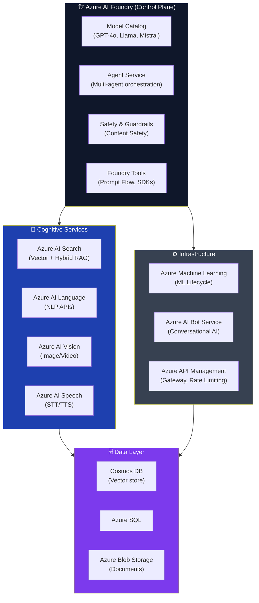

### Three-Layer Architecture

| Layer | Services | Purpose |
|---|---|---|
| **Foundation** | Azure AI Foundry, Azure OpenAI | Model access, orchestration, safety |
| **Cognitive** | AI Search, Language, Vision, Speech | Domain-specific AI capabilities |
| **Infrastructure** | Azure ML, Bot Service, API Management | Training, hosting, operations |

---

## 2. Azure AI Foundry — The Central Platform

**Azure AI Foundry** is the unified development platform that ties the entire Azure AI ecosystem together. It is the single place where teams can discover models, build agents, evaluate outputs, enforce safety, and deploy AI applications to production.


### Foundry Four Pillars

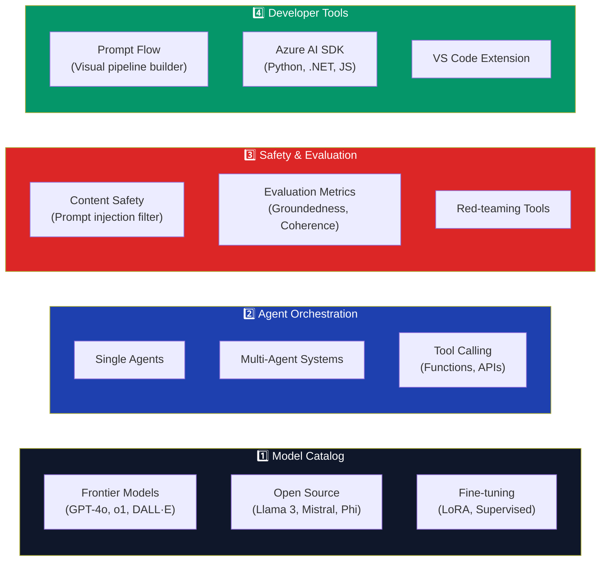

---

### 2.1 Foundry Models & Catalog

The **Foundry Model Catalog** is a curated marketplace of AI models from Microsoft, OpenAI, Meta, Mistral, and the open-source community — all available for evaluation, fine-tuning, and deployment within your Azure tenant.

#### Model Categories

| Category | Models | Best For |
|---|---|---|
| **Frontier (OpenAI)** | GPT-4o, GPT-4o mini, o1, o3 | Complex reasoning, coding, multimodal |
| **Embedding** | text-embedding-3-large, ada-002 | Vector search, RAG, semantic similarity |
| **Image Generation** | DALL·E 3 | Image creation from text |
| **Open Source — Text** | Llama 3.1 405B, Mistral Large, Phi-3 | Cost-effective generation, on-prem |
| **Open Source — Code** | CodeLlama, DeepSeek-Coder | Coding assistance, code generation |
| **Small/Edge** | Phi-3 Mini, Phi-3.5 | Low-latency, on-device inference |

#### Model Lifecycle in Foundry

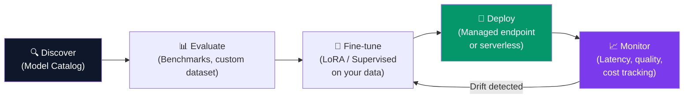

#### Key Features
- **Serverless API deployments** — pay per token, no infrastructure management
- **Managed compute deployments** — dedicated GPU VMs for consistent latency
- **Model benchmarks** — compare quality, latency, and cost before committing
- **Fine-tuning** — supervised fine-tuning and reinforcement learning from human feedback (RLHF)
- **Private network** — models deployed within your Azure VNet for data privacy

> **Interview Language:** "In Foundry's Model Catalog, we can choose between **frontier models** (like GPT-4o for complex reasoning) and **open-source alternatives** (like Llama for cost efficiency). We evaluate them on our specific task using custom datasets before fine-tuning and deploying to a **managed endpoint with private networking**."

---

### 2.2 Azure OpenAI Service

**Azure OpenAI Service** provides enterprise-grade access to OpenAI's frontier models — the same models as OpenAI.com but with Azure's **security, compliance, private networking, and SLAs**.

#### Available Models

| Model | Capability | Token Limit | Key Use Case |
|---|---|---|---|
| **GPT-4o** | Text + Vision (multimodal) | 128K context | Complex reasoning, image analysis |
| **GPT-4o mini** | Fast, cost-efficient text | 128K context | High-volume, lower-cost tasks |
| **o1 / o3** | Extended thinking, math/code | 128K context | STEM problems, logical reasoning |
| **text-embedding-3-large** | Vector embeddings | 8K input | Semantic search, RAG |
| **DALL·E 3** | Text-to-image | — | Image generation |
| **Whisper** | Speech-to-text | — | Audio transcription |

#### API Interaction Pattern

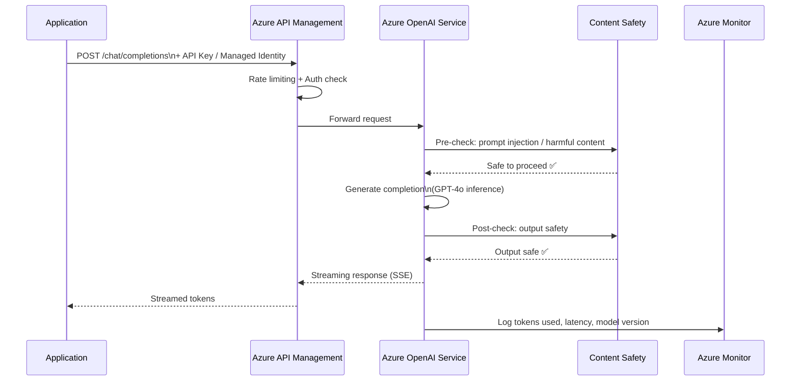

#### Enterprise-Specific Features

| Feature | Description |
|---|---|
| **Private Endpoints** | Route all traffic through Azure VNet — no public internet |
| **Managed Identity** | Passwordless auth using Azure Entra ID — no API keys in code |
| **Content Filtering** | Built-in category filters (hate, violence, sexual, self-harm) with configurable thresholds |
| **Customer-Managed Keys** | Encrypt data at rest with your own keys in Azure Key Vault |
| **PTU (Provisioned Throughput Units)** | Reserved capacity for consistent low-latency at scale |
| **Data Residency** | Choose region to keep data within geographic boundaries |
| **No training on your data** | Microsoft commits that your data is NOT used to train models |

#### Pricing
- **Pay-as-you-go:** Per 1,000 tokens (input and output priced separately)
- **Provisioned Throughput (PTU):** Fixed hourly cost, guaranteed throughput, best at scale

> **Interview Language:** "Azure OpenAI Service gives us all the power of GPT-4o with Azure's **enterprise security guarantees** — private endpoints, managed identity, no data used for training. For high-volume workloads, we use **Provisioned Throughput Units (PTU)** to get predictable latency at a fixed cost."

---

### 2.3 Foundry Agent Service

**Azure AI Foundry Agent Service** is the managed platform for building, deploying, and governing **intelligent AI agents** — both single-agent and complex multi-agent workflows.


#### Single Agent vs Multi-Agent

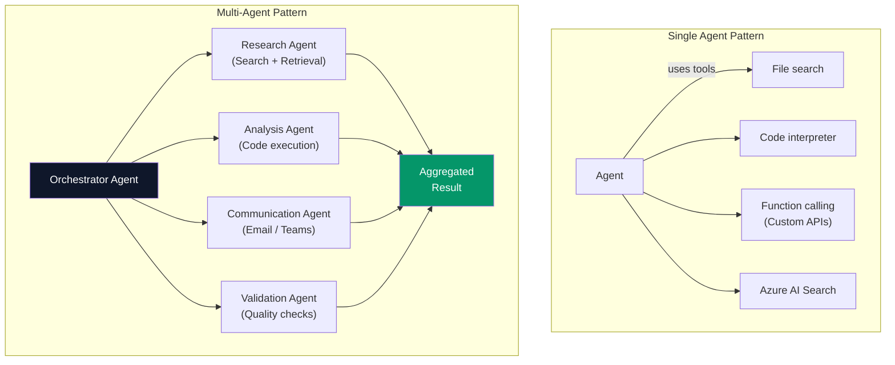

#### Built-in Agent Tools

| Tool | What It Does | Example Use Case |
|---|---|---|
| **File Search** | Retrieves from uploaded documents (PDF, DOCX, TXT) | Policy Q&A bot |
| **Code Interpreter** | Executes Python in a sandboxed container | Data analysis, charting |
| **Function Calling** | Calls your custom APIs/functions | Order lookup, CRM update |
| **Azure AI Search** | Semantic/vector search over knowledge bases | Enterprise knowledge bot |
| **Bing Search** | Real-time web search | News, live data queries |
| **Azure Logic Apps** | Workflow automation integration | Approval workflows |

#### Agent Lifecycle

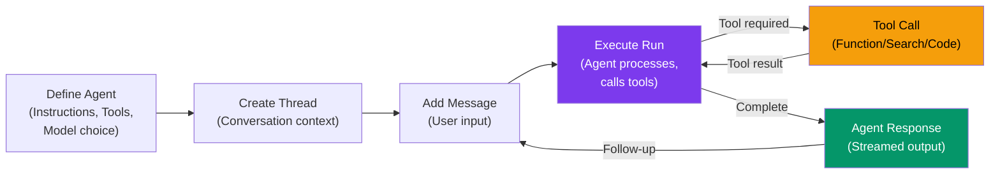

#### Multi-Agent Protocols
- **MCP (Model Context Protocol):** Anthropic's open standard — agents expose tools/resources in a standardized way
- **A2A (Agent-to-Agent):** Google's protocol for agent interoperability
- **AutoGen / Semantic Kernel:** Microsoft's frameworks for agent orchestration

> **Interview Language:** "With Foundry Agent Service, we build agents declaratively — define the model, tools, and instructions. Agents maintain **thread-based conversation history**, call tools autonomously, and return results. For complex workflows, we use **multi-agent patterns** where an orchestrator delegates to specialized sub-agents."

---

### 2.4 Foundry Tools

**Foundry Tools** provides the developer experience layer — APIs, SDKs, and visual tools for building, testing, and deploying AI applications responsibly.

#### Core Tools

| Tool | Type | Purpose |
|---|---|---|
| **Prompt Flow** | Visual | Build and test LLM pipelines visually (DAG-based) |
| **Azure AI SDK** | Code | Python, .NET, JavaScript SDKs for all services |
| **Evaluation SDK** | Code | Measure groundedness, relevance, fluency, coherence |
| **Tracing** | Observability | Trace every LLM call, tool invocation, latency |
| **Content Safety API** | Safety | Filter prompts/outputs for harmful categories |
| **AI Studio** | Web UI | Unified portal for model exploration and deployment |

#### Prompt Flow Pipeline Example

```mermaid
graph LR
    Input["User Query"] --> Embed["Embed Query\n(text-embedding-3-large)"]
    Embed --> Search["Search Index\n(Azure AI Search)"]
    Search --> Context["Build Context\n(Top-K chunks)"]
    Context --> Prompt["Construct Prompt\n(System + Context + Query)"]
    Prompt --> LLM["LLM Call\n(GPT-4o)"]
    LLM --> Safety["Safety Check\n(Content Safety)"]
    Safety --> Output["Final Answer"]

    style LLM fill:#0f172a,color:#fff
    style Safety fill:#dc2626,color:#fff
    style Output fill:#059669,color:#fff
```

---

## 3. Specialized Cognitive Services


---

### 3.1 Azure AI Search (Foundry IQ)

**Azure AI Search** (formerly Azure Cognitive Search) is the enterprise **search and retrieval engine** at the heart of every RAG (Retrieval-Augmented Generation) solution on Azure.


#### Index Types

| Index Type | How It Works | Best For |
|---|---|---|
| **Full-text (BM25)** | Keyword-based inverted index ranking | Exact keyword search, filters |
| **Vector** | Store embeddings; cosine/dot-product similarity | Semantic similarity, concept search |
| **Hybrid** | Combine BM25 + vector with Reciprocal Rank Fusion | Best of both — recommended for RAG |
| **Semantic Ranker** | Re-rank results using an LLM | Improve top-K precision |

#### RAG Architecture with Azure AI Search

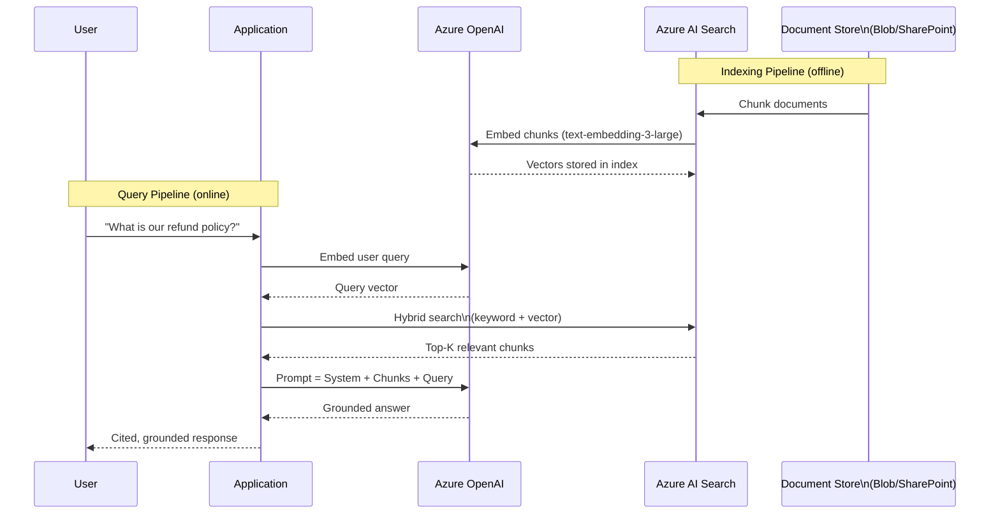

#### Key Features

| Feature | Description |
|---|---|
| **Integrated Vectorization** | Auto-embed documents during indexing (no separate pipeline) |
| **Semantic Ranker** | L2 reranking using language understanding |
| **Skillsets** | AI-enrichment pipeline (OCR, entity extraction, translation) during indexing |
| **Filters + Facets** | Structured metadata filtering on top of semantic results |
| **Private Endpoint** | Index over private data sources securely |
| **RBAC** | Document-level security trimming |
| **Geo-distributed** | Multi-region index replicas for low-latency global access |

#### Indexers — Supported Data Sources

| Source | Indexer |
|---|---|
| Azure Blob Storage | Blob Indexer (PDF, DOCX, TXT, HTML) |
| Azure SQL Database | SQL Indexer |
| Cosmos DB | Cosmos DB Indexer |
| SharePoint Online | SharePoint Indexer |
| Azure Data Lake | ADLS Gen2 Indexer |
| Custom API | Push API (any source) |

> **Interview Language:** "Azure AI Search is our RAG backbone. We use **hybrid search** (BM25 + vector) with **Semantic Ranker** for the best retrieval quality. Documents are indexed with **integrated vectorization** using Azure OpenAI embeddings. At query time, top-K chunks are injected into the GPT-4o prompt to produce **grounded, cited answers**."

---

### 3.2 Azure AI Language

**Azure AI Language** provides pre-built, cloud-hosted NLP APIs that allow applications to understand and process human language — without training a custom model.

#### Available Capabilities

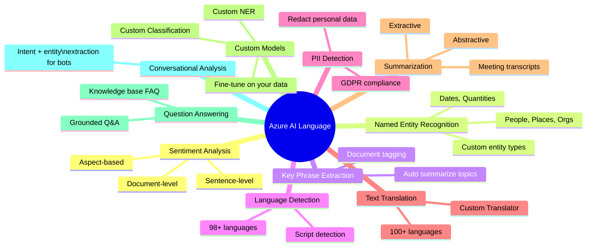

#### API Quick Reference

```python
# Sentiment Analysis
from azure.ai.textanalytics import TextAnalyticsClient

client = TextAnalyticsClient(endpoint, credential)

documents = ["The service was excellent but the wait was too long."]
result = client.analyze_sentiment(documents, show_opinion_mining=True)

# Result: Overall=Mixed, Sentence[0]=Positive(service), Negative(wait)
```

#### Use Cases by Industry

| Industry | Use Case | APIs Used |
|---|---|---|
| **Finance** | Earnings call sentiment | Sentiment + Key Phrase |
| **Healthcare** | Clinical notes → structured data | Custom NER + PII Redaction |
| **E-commerce** | Review aspect analysis | Aspect-based Sentiment |
| **HR** | Resume entity extraction | NER + Custom Entities |
| **Legal** | Contract clause summarization | Summarization + Classification |
| **Retail** | Multilingual customer support | Language Detection + Translation |

> **Pricing:** Per 1,000 text records (characters). Free tier: 5,000 records/month.

---

### 3.3 Azure AI Vision & Speech

Two services that give applications the ability to **see** (images and video) and **hear/speak** (audio).

#### Azure AI Vision — Capabilities

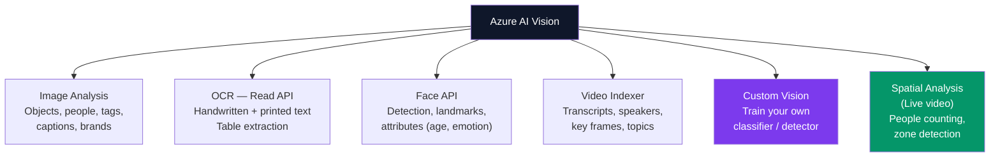

#### OCR — Read API Example

```
Input: Scanned invoice PDF
Output:
{
  "pages": [{
    "lines": [
      { "text": "Invoice #INV-20240628", "boundingBox": [...] },
      { "text": "Total: $1,250.00",       "boundingBox": [...] }
    ],
    "tables": [{ "cells": [["Item", "Qty", "Price"], ["Widget A", "5", "$250.00"]] }]
  }]
}
```

#### Azure AI Speech — Capabilities

| Capability | Description | Use Case |
|---|---|---|
| **Speech-to-Text (STT)** | Real-time + batch transcription, 100+ languages | Call center transcription, meeting notes |
| **Text-to-Speech (TTS)** | Neural voices, custom voice cloning | Accessibility, IVR, audiobooks |
| **Speaker Recognition** | Verify/identify speakers by voice | Authentication, speaker diarization |
| **Speech Translation** | Real-time speech → speech in another language | Live conference translation |
| **Custom Speech** | Fine-tune STT on domain-specific vocabulary | Medical/legal terminology |
| **Custom Neural Voice** | Clone a brand voice with ~1hr of audio | Brand-consistent TTS |

#### Speech Pipeline Architecture

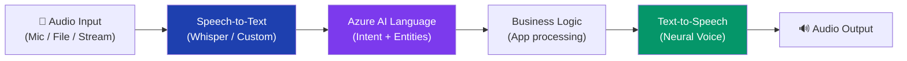

> **Interview Language:** "Azure AI Vision's **Read API** extracts text from images and PDFs with high accuracy, including tables. Azure AI Speech's **neural TTS** produces natural-sounding voice output. Combined with Azure AI Language, we build a full **speech-enabled conversational interface** — mic input → intent extraction → business logic → voice response."

---

## 4. Infrastructure & Operations

### 4.1 Azure Machine Learning (Azure ML)

**Azure Machine Learning** is the foundational platform for **data scientists and ML engineers** to manage the full machine learning lifecycle — from data preparation through production monitoring.


#### Core Concepts

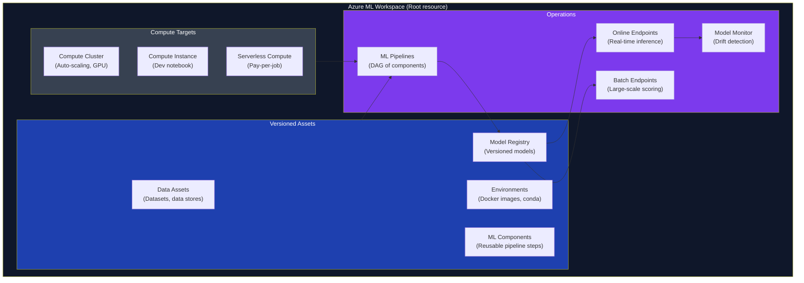

#### ML Components — Reusable Pipeline Building Blocks

ML **Components** are the atomic units of Azure ML pipelines — self-contained, versioned pieces of code that perform a specific task.

```yaml
# Example ML Component Definition
$schema: https://azuremlschemas.azureedge.net/latest/commandComponent.schema.json
name: data_preprocessing
version: 1.2.0
display_name: "Data Preprocessing"
inputs:
  raw_data:
    type: uri_folder
  target_column:
    type: string
outputs:
  processed_data:
    type: uri_folder
code: ./src
environment: azureml:sklearn-env:1
command: python preprocess.py --input ${{inputs.raw_data}} --output ${{outputs.processed_data}}
```

#### Compute Options Comparison

| Compute Type | When to Use | Auto-scale | Cost |
|---|---|---|---|
| **Compute Cluster** | Training, parallel jobs | ✅ Scale to 0 | Pay per second |
| **Compute Instance** | Development, notebooks | ❌ (manual) | Pay per hour |
| **Serverless Compute** | Quick experiments | ✅ Managed | Pay per job |
| **Kubernetes (AKS)** | Production inference | ✅ | Dedicated nodes |

#### MLflow Integration

Azure ML natively integrates with **MLflow** for:
- **Experiment tracking** — log metrics, parameters, artifacts per run
- **Model registry** — stage models (Staging → Production)
- **Model serving** — deploy any MLflow model to Azure endpoints

```python
import mlflow
import mlflow.sklearn

with mlflow.start_run():
    mlflow.log_param("max_depth", 5)
    mlflow.log_metric("accuracy", 0.94)
    mlflow.sklearn.log_model(model, "random-forest-model")
```

#### AutoML
Automatically trains and tunes ML models across classification, regression, time-series forecasting, and NLP — without writing model training code.

> **Interview Language:** "Azure ML's key abstraction is the **ML Pipeline** composed of reusable **Components** — each a versioned, containerized step. We use **Compute Clusters** that scale to zero between jobs to control cost. **MLflow** tracks every experiment, and the **Model Registry** gates promotion from staging to production."

---

### 4.2 Azure AI Bot Service

**Azure AI Bot Service** is the managed platform for building, hosting, and connecting **conversational AI bots** across multiple channels — without managing the underlying infrastructure.

#### Bot Architecture

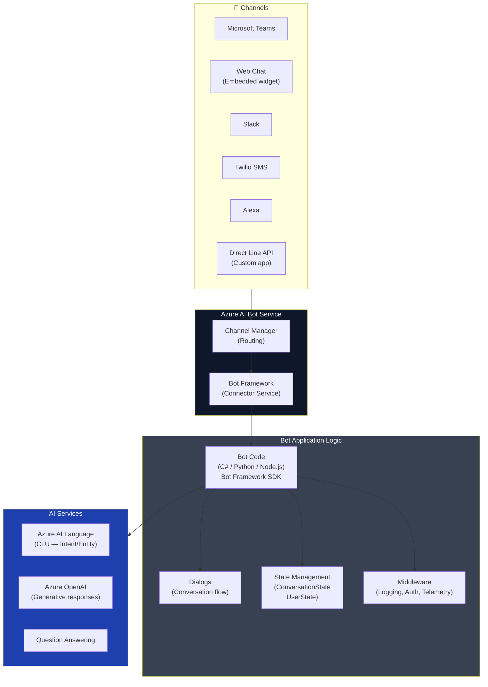

#### Bot Building Approaches

| Approach | Tools | Best For |
|---|---|---|
| **Code-first** | Bot Framework SDK (C# / Python / Node.js) | Complex custom logic, enterprise |
| **Declarative** | Power Virtual Agents (Copilot Studio) | Low-code, business users |
| **Generative AI Bot** | Bot Service + Azure OpenAI | Open-domain Q&A, conversational |
| **RAG Bot** | Bot Service + AI Search + OpenAI | Knowledge base bots, document Q&A |

#### Supported Channels (50+)

Microsoft Teams, Slack, Facebook Messenger, WhatsApp (via Twilio), SMS, Alexa, Google Assistant, Web Chat, Direct Line, Email, Skype, Kik, Line, GroupMe.

#### Copilot Studio (Low-Code)
Microsoft's low-code bot platform built on Bot Service — enables business users to build bots with drag-and-drop topics, without code.

> **Interview Language:** "Azure AI Bot Service abstracts the **channel complexity** — the same bot code works across Teams, Slack, and Web Chat. For enterprise bots, we combine Bot Service with **Azure OpenAI for generation** and **Azure AI Search for retrieval**, creating a grounded, enterprise knowledge bot."

---

## 5. End-to-End Architecture Patterns

### Pattern 1: Enterprise Knowledge Bot (RAG)

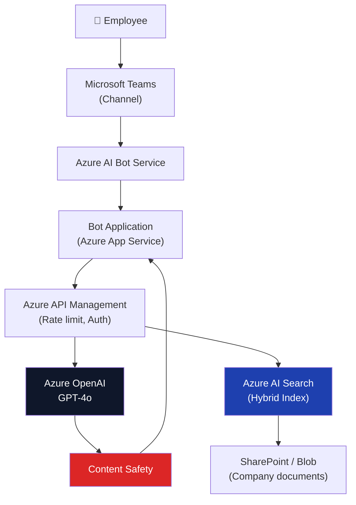

### Pattern 2: Intelligent Document Processing

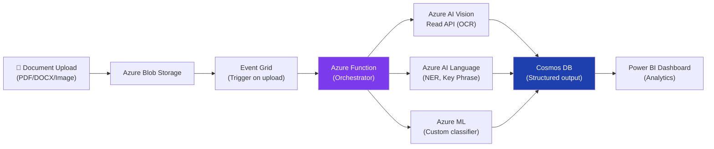

### Pattern 3: Multi-Agent AI Workflow

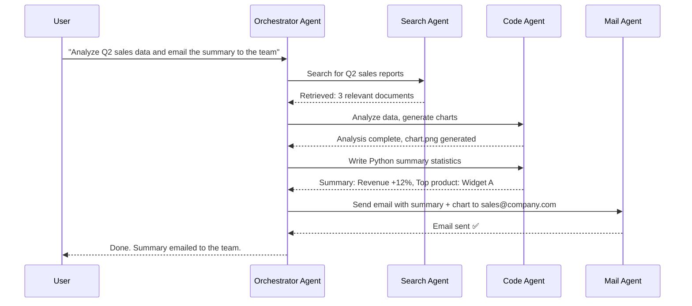

---

## 6. Service Comparison & When to Use What

### Choosing the Right Model Access Path

| Scenario | Service | Why |
|---|---|---|
| Chat/text generation | Azure OpenAI (GPT-4o) | Best quality, enterprise safety |
| High-volume, cost-sensitive | Azure OpenAI (GPT-4o mini) | 15x cheaper than GPT-4o |
| On-premises / no-cloud | Foundry Catalog (Llama, Phi) | Open source, self-hostable |
| Embeddings for RAG | text-embedding-3-large | Best semantic accuracy |
| Image generation | Azure OpenAI (DALL·E 3) | Highest quality |
| Custom domain NLP | Azure AI Language (Custom) | Fine-tuned on your taxonomy |

### Choosing the Right Search/Retrieval

| Scenario | Service | Why |
|---|---|---|
| Enterprise RAG | Azure AI Search (Hybrid) | Best precision + recall |
| Simple FAQ | Azure AI Language (Q&A) | No indexing pipeline needed |
| Real-time web data | Bing Search API | Live web index |
| Structured data | Azure SQL + Full-text | Filter + keyword |
| Product catalog | Azure AI Search + Vector | Semantic + attribute filter |

### Agent vs Direct API

| Scenario | Use Agent | Use Direct API |
|---|---|---|
| Multi-step reasoning | ✅ | ❌ |
| Autonomous tool use | ✅ | ❌ |
| Single-turn Q&A | ❌ | ✅ |
| Latency < 1s required | ❌ | ✅ |
| Complex workflow | ✅ | ❌ |
| Simple generation | ❌ | ✅ |

---

## 7. Security, Governance & Responsible AI

### Azure AI Safety Architecture

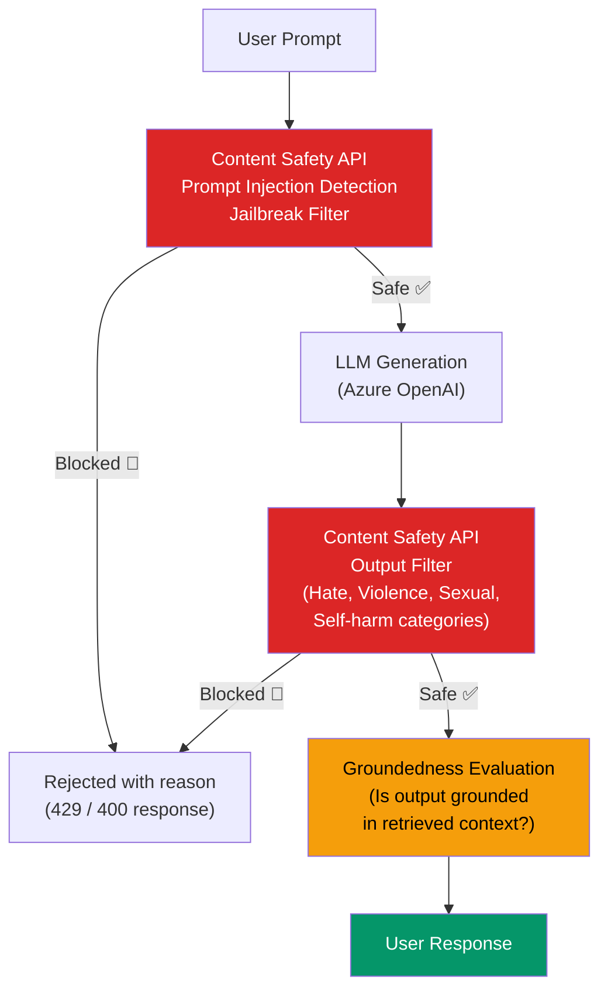

### Responsible AI Principles (Microsoft)

| Principle | What It Means | Azure Implementation |
|---|---|---|
| **Fairness** | AI doesn't discriminate | Fairlearn, evaluation metrics |
| **Reliability & Safety** | AI behaves as expected | Content Safety, testing frameworks |
| **Privacy & Security** | Data is protected | Private endpoints, CMK, no training |
| **Inclusiveness** | AI works for everyone | Accessibility, multilingual |
| **Transparency** | Decisions are explainable | Azure ML Explain, Prompt Flow tracing |
| **Accountability** | Humans remain in control | Human-in-loop, audit logs, guardrails |

### Data Protection

| Protection | How |
|---|---|
| **Data in transit** | TLS 1.2+ encryption |
| **Data at rest** | AES-256, Customer-Managed Keys (CMK) via Key Vault |
| **Network isolation** | Azure Private Endpoint, VNet injection |
| **Identity** | Azure Entra ID, Managed Identity (no secrets) |
| **Audit** | Azure Monitor, Diagnostic logs, Microsoft Sentinel |
| **No model training** | Contractual guarantee — your data is NOT used to train OpenAI models |

---

## 8. Pricing Model Overview

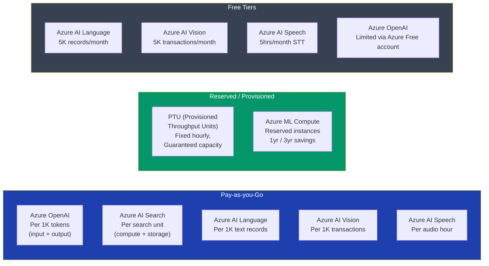

### Cost Optimization Tips

| Tip | Savings |
|---|---|
| Use GPT-4o mini instead of GPT-4o for simple tasks | ~15x cheaper per token |
| Enable caching for repeated identical prompts | Up to 50% token savings |
| Use batch endpoints for non-real-time workloads | Up to 50% compute savings |
| Use Provisioned Throughput Units at scale | Predictable cost, no throttling |
| Right-size Azure ML compute clusters | Auto-scale to zero saves 100% idle cost |
| Use Llama/Phi for high-volume, lower-stakes tasks | Open-source, no token cost |

---

## 9. Interview Quick Reference

### Core Service Summary Table

| Service | Category | What It Does | Key Differentiator |
|---|---|---|---|
| **Azure AI Foundry** | Platform | Unified AI development hub | Model catalog + agent + safety in one place |
| **Azure OpenAI Service** | Foundation | Enterprise GPT-4o, embeddings, DALL·E | Enterprise SLA, private network, no training |
| **Foundry Agent Service** | Agents | Build multi-agent AI systems | MCP tools, thread management, governance |
| **Azure AI Search** | Retrieval | Enterprise vector + keyword search | Best RAG retrieval, hybrid search + ranker |
| **Azure AI Language** | NLP | Sentiment, NER, translation, summarization | 100+ languages, custom entity training |
| **Azure AI Vision** | Vision | OCR, object detection, image analysis | Read API table extraction, Video Indexer |
| **Azure AI Speech** | Audio | STT, TTS, speaker recognition | Neural voice cloning, 100+ languages |
| **Azure Machine Learning** | ML Ops | Full ML lifecycle, pipeline, monitoring | ML Components, MLflow, model registry |
| **Azure AI Bot Service** | Conversational | Multi-channel bot hosting | 50+ channels, integrates all AI services |

### Common Interview Questions

**Q: What is Azure AI Foundry?**
> Azure AI Foundry is Microsoft's unified AI development platform — a single hub for discovering models from the catalog (GPT-4o, Llama, Mistral), building and deploying agents, enforcing safety guardrails through Content Safety, and monitoring production AI applications.

**Q: How does RAG work on Azure?**
> RAG (Retrieval-Augmented Generation) on Azure combines **Azure AI Search** (for retrieval) with **Azure OpenAI** (for generation). Documents are chunked, embedded using text-embedding-3-large, and stored in an AI Search vector index. At query time, the user's question is embedded, hybrid search retrieves top-K relevant chunks, those chunks are injected into the GPT-4o prompt as context, and the model generates a grounded, cited answer.

**Q: When do you use Azure ML vs Azure AI Foundry?**
> Use **Azure ML** when you need to train custom models, manage ML pipelines, track experiments with MLflow, or deploy traditional ML models (scikit-learn, PyTorch). Use **Azure AI Foundry** when you're working with foundation models (LLMs), building generative AI applications, fine-tuning LLMs, or building agents. They complement each other — Azure ML trains the specialized models that Azure AI Foundry then deploys and orchestrates.

**Q: How do you secure Azure AI services?**
> Four layers: (1) **Network** — Private Endpoints keep traffic off public internet; (2) **Identity** — Managed Identity + Entra ID, no API keys; (3) **Data** — Customer-Managed Keys for encryption, contractual no-training guarantee; (4) **Content** — Content Safety API filters prompts and outputs for harmful categories.

**Q: What is the difference between Azure AI Search and Cosmos DB vector search?**
> Azure AI Search is purpose-built for search with hybrid BM25+vector, semantic ranker, skillsets, and multi-source indexers. Cosmos DB vector search is good when your data is already in Cosmos DB and you want vector search alongside your transactional data. For RAG-focused workloads, Azure AI Search gives better retrieval quality.

---

*Azure AI Stack Reference v1.0 | June 2026 | Based on Azure AI Foundry GA*

---

## Additional Material from Azure-AI-Stack2.md

> Unique additions: 4-pillar framing and the agentic-AI paradigm.


> **Enterprise-grade reference** for building autonomous, data-grounded, multi-agent applications using **Agentic AI**, **Azure AI Foundry**, **Semantic Kernel**, and **Azure AI Search**.

---

## Table of Contents

1. [What Is the 4-Pillar Stack?](#1-what-is-the-4-pillar-stack)
2. [Pillar 1 — Agentic AI (The Paradigm)](#2-pillar-1--agentic-ai-the-paradigm)
3. [Pillar 2 — Azure AI Foundry (The Platform)](#3-pillar-2--azure-ai-foundry-the-platform)
4. [Pillar 3 — Semantic Kernel (The Orchestration SDK)](#4-pillar-3--semantic-kernel-the-orchestration-sdk)
5. [Pillar 4 — Azure AI Search (The Knowledge Engine)](#5-pillar-4--azure-ai-search-the-knowledge-engine)
6. [How They Work Together (End-to-End Flow)](#6-how-they-work-together-end-to-end-flow)
7. [Production Architecture Patterns](#7-production-architecture-patterns)
8. [Comparison Table](#8-comparison-table)
9. [Getting Started](#9-getting-started)
10. [Interview Quick Reference](#10-interview-quick-reference)

---

## 1. What Is the 4-Pillar Stack?


**Agentic AI**, **Azure AI Foundry**, **Semantic Kernel**, and **Azure AI Search** form Microsoft's unified, production-grade enterprise stack for building autonomous, data-grounded multi-agent applications.

Rather than building simple chatbots, this modern ecosystem allows developers to construct **independent AI microservices** that can:

- 🧠 **Plan** and break down complex goals autonomously
- 🔍 **Reason** over enterprise data with verified citations
- 🛠️ **Access external tools** (APIs, databases, code execution)
- 🔒 **Operate securely** inside your Azure tenant with governance

Each technology plays a distinct, non-overlapping role:

| Pillar | Role | Layer |
|---|---|---|
| **Agentic AI** | The paradigm/design philosophy | Conceptual |
| **Azure AI Foundry** | The managed platform & control plane | Infrastructure |
| **Semantic Kernel** | The code-first orchestration SDK | Development |
| **Azure AI Search** | The knowledge & grounding engine | Data |

---

## 2. Pillar 1 — Agentic AI (The Paradigm)

### What Is Agentic AI?

**Agentic AI** is a fundamental paradigm shift from **reactive AI** (respond to a prompt) to **proactive, goal-oriented systems** (plan and act autonomously until a problem is solved).

| Traditional AI | Agentic AI |
|---|---|
| Single prompt → single response | Goal → multi-step autonomous plan |
| Stateless (no memory between calls) | Stateful (maintains context across many steps) |
| No tool access | Uses external tools, APIs, code execution |
| Deterministic flow | Dynamic, adaptive reasoning loop |
| Human-in-the-loop at every step | Human sets goal; agent iterates independently |

### The Agentic Reasoning Loop

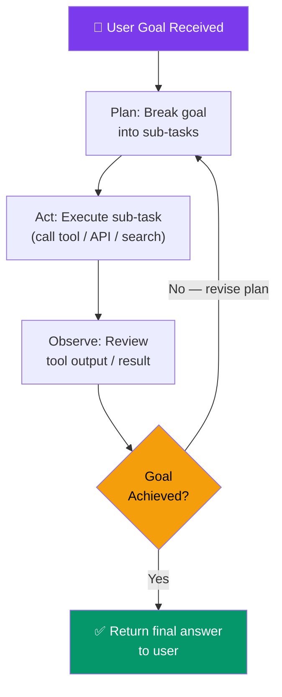

### Agentic Design Patterns


#### Pattern 1: Sequential Pipeline

Agents execute in a fixed, ordered sequence. Each agent's output feeds the next.

```
[ Triage Agent ] → [ Research Agent ] → [ Analysis Agent ] → [ Report Agent ]
```

**Best for:** Document processing, report generation, ETL workflows.

#### Pattern 2: Group Chat / Hub-and-Spoke

An **Orchestrator agent** manages a group of specialized agents. It delegates tasks based on capability.

```
                    ┌─────────────────────┐
                    │  Orchestrator Agent  │
                    └─────────────────────┘
                   /         |              \
          Research      Analysis          Comms
           Agent         Agent            Agent
```

**Best for:** Complex enterprise workflows where tasks span multiple domains.

#### Pattern 3: Magentic-One (Self-Healing / Resilient)

Microsoft's multi-agent orchestration framework designed for robustness. If a sub-agent fails, the orchestrator retries, reassigns, or recovers without human intervention.

**Core principle:** Autonomous error recovery and task re-planning.

### Key Capabilities

| Capability | Description |
|---|---|
| **Goal decomposition** | Automatically breaks a high-level goal into actionable sub-tasks |
| **Tool use** | Calls external APIs, runs code, searches databases |
| **Memory** | Maintains conversation history and task state across steps |
| **Self-correction** | Reviews its own outputs and tries again if the result is wrong |
| **Multi-agent collaboration** | Delegates sub-tasks to specialized agents |

> **Interview Language:** "Agentic AI is the paradigm shift from chatbots to autonomous goal-solving systems. An agent evaluates goals, creates a plan, executes tools iteratively, and self-corrects until the objective is met — without human intervention at each step."

---

## 3. Pillar 2 — Azure AI Foundry (The Platform)

### What Is Azure AI Foundry?

**Azure AI Foundry** is Microsoft's **unified enterprise hub and managed platform** for generative AI. It is the single control plane where teams access models, build agents, enforce safety, and deploy AI applications to production.

Think of it as the **"Azure Portal for AI"** — everything lives here.

### Foundry's Four Capabilities

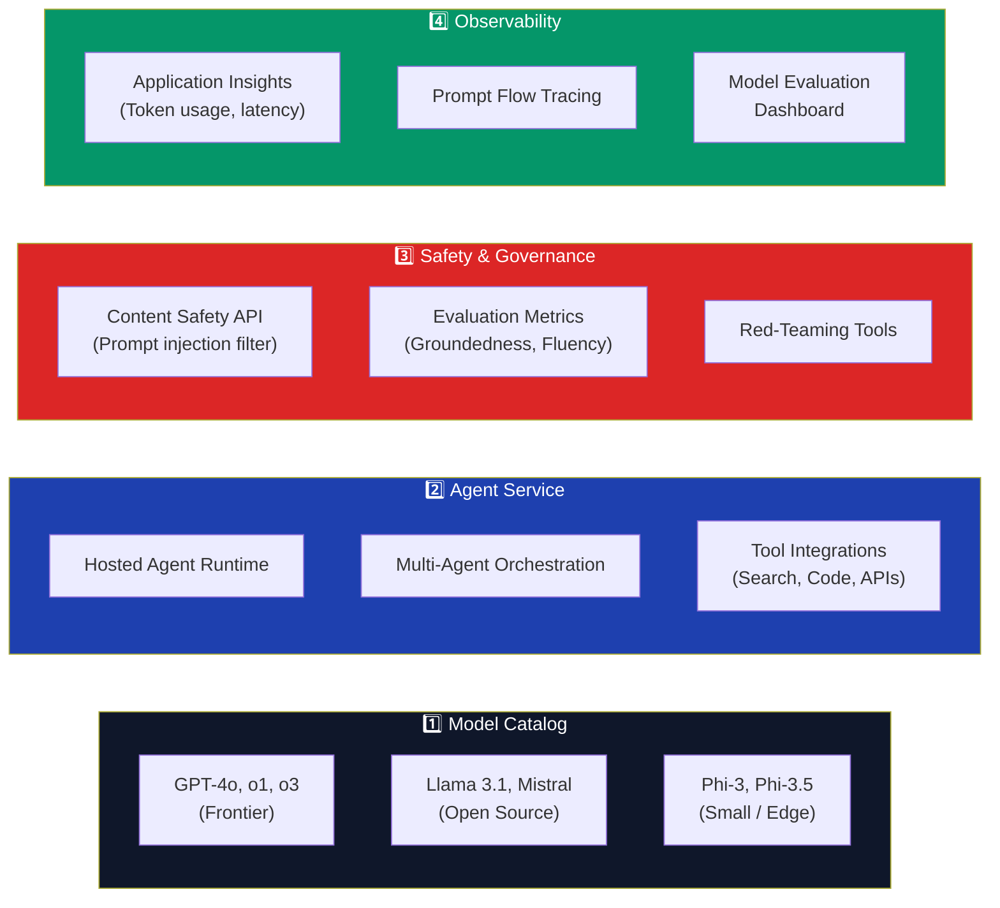

### 3.1 Model Catalog — Supported Models

| Category | Models | Best For |
|---|---|---|
| **Frontier (OpenAI)** | GPT-4o, GPT-4o mini, o1, o3 | Complex reasoning, multimodal tasks |
| **Embedding** | text-embedding-3-large, ada-002 | Vector search, RAG, semantic similarity |
| **Image Generation** | DALL·E 3 | Image creation from text prompts |
| **Open Source — Text** | Llama 3.1 405B, Mistral Large | Cost-effective generation, on-prem |
| **Small / Edge** | Phi-3 Mini, Phi-3.5 | Low-latency, mobile / edge inference |
| **Code** | CodeLlama, DeepSeek-Coder | Code generation, coding assistance |

### 3.2 Foundry Agent Service — Managed Agents

**Azure AI Foundry Agent Service** is the managed runtime for deploying **secure, governed AI agents** without managing infrastructure.

#### Agent Lifecycle (Foundry)

```mermaid
flowchart LR
    Define["Define Agent\n(System prompt,\nmodel, tools)"] --> Thread["Create Thread\n(Conversation context)"]
    Thread --> Message["Add Message\n(User input)"]
    Message --> Run["Execute Run\n(Agent reasons\nand acts)"]
    Run -->|"Tool required"| ToolCall["Tool Call\n(Search / Code / API)"]
    ToolCall -->|"Result returned"| Run
    Run -->|"Done"| Response["Streamed\nAgent Response"]
    Response -->|"Follow-up"| Message

    style Run fill:#7c3aed,color:#fff
    style ToolCall fill:#f59e0b,color:#000
    style Response fill:#059669,color:#fff
```

#### Built-in Agent Tools

| Tool | What It Does | Example Use Case |
|---|---|---|
| **File Search** | Retrieves answers from uploaded PDFs, DOCX, TXT | Policy Q&A bot |
| **Code Interpreter** | Executes Python in a sandboxed container | Data analysis, charting |
| **Function Calling** | Calls your custom APIs/functions | Order lookup, CRM update |
| **Azure AI Search** | Semantic/vector search over enterprise knowledge | Knowledge management bot |
| **Bing Search** | Live real-time web search | News queries, live data |
| **Azure Logic Apps** | Connects to workflow automation | Approval workflows |

### 3.3 Safety & Evaluation

Foundry has **built-in responsible AI guardrails**:

```mermaid
flowchart LR
    Prompt["User Prompt"] --> InputFilter["🛡️ Content Safety\n(Prompt injection\nJailbreak detection)"]
    InputFilter -->|"Blocked 🚫"| Reject["Rejected\n(400 / 403)"]
    InputFilter -->|"Safe ✅"| LLM["LLM Generation\n(Azure OpenAI)"]
    LLM --> OutputFilter["🛡️ Output Filter\n(Hate, Violence,\nSexual, Self-harm)"]
    OutputFilter -->|"Blocked 🚫"| Reject
    OutputFilter -->|"Safe ✅"| Eval["📊 Groundedness\nEvaluation"]
    Eval --> User["✅ User Response"]

    style InputFilter fill:#dc2626,color:#fff
    style OutputFilter fill:#dc2626,color:#fff
    style Eval fill:#f59e0b,color:#000
    style User fill:#059669,color:#fff
```

#### Evaluation Metrics

| Metric | What It Measures |
|---|---|
| **Groundedness** | Is the answer supported by the retrieved context? |
| **Relevance** | Does the answer address the user's question? |
| **Coherence** | Is the text well-structured and logical? |
| **Fluency** | Is the language natural and grammatically correct? |
| **Similarity** | How close is the output to a reference answer? |

### 3.4 Enterprise Security Features

| Feature | Description |
|---|---|
| **Private Endpoints** | All traffic stays within Azure VNet — no public internet |
| **Managed Identity** | Passwordless auth via Azure Entra ID |
| **Customer-Managed Keys** | Your own encryption keys via Azure Key Vault |
| **RBAC** | Role-based access control on every resource |
| **No model training on your data** | Contractual guarantee from Microsoft |
| **Data Residency** | Choose region to keep data within geographic boundaries |

> **Interview Language:** "Azure AI Foundry is the control plane for enterprise AI. It unifies model access (GPT-4o to Llama), provides a managed agent runtime with built-in safety, and gives us full observability via Application Insights — all within our Azure tenant's security boundary."

---

## 4. Pillar 3 — Semantic Kernel (The Orchestration SDK)

### What Is Semantic Kernel?

**Semantic Kernel (SK)** is Microsoft's open-source, code-first SDK for building, managing, and programmatically orchestrating AI agents and workflows. It's the **programming bridge** between LLMs and your application logic.


### Language Support

| Language | SDK Package | Status |
|---|---|---|
| **C# (.NET)** | `Microsoft.SemanticKernel` | GA — production ready |
| **Python** | `semantic-kernel` | GA — production ready |
| **Java** | `semantic-kernel-java` | Preview |

### Core Concepts

```mermaid
graph TB
    subgraph SK["Semantic Kernel Core"]
        Kernel["🧠 Kernel\n(Central orchestrator)"]
        Plugins["🔌 Plugins\n(Grouped tool functions)"]
        Memory["🗄️ Memory\n(Vector store connector)"]
        Planners["📋 Planners\n(Automatic task planning)"]
        Agents["🤖 Agents\n(Goal-driven entities)"]
        Chat["💬 Chat Completion\n(LLM interaction)"]
    end

    Kernel --> Plugins
    Kernel --> Memory
    Kernel --> Planners
    Kernel --> Agents
    Kernel --> Chat

    style Kernel fill:#059669,color:#fff
    style Plugins fill:#1e40af,color:#fff
    style Agents fill:#7c3aed,color:#fff
```

### 4.1 Plugins — The Building Blocks

**Plugins** are collections of **functions** that the AI can call. They convert your existing code into tools that agents can use.

```csharp
// C# — Define a plugin
public class EmailPlugin
{
    [KernelFunction, Description("Send an email to a recipient")]
    public async Task SendEmail(
        [Description("Recipient's email address")] string to,
        [Description("Email subject line")] string subject,
        [Description("Email body content")] string body)
    {
        await _emailClient.SendAsync(to, subject, body);
    }

    [KernelFunction, Description("Get all unread emails from inbox")]
    public async Task<List<Email>> GetUnreadEmails()
    {
        return await _emailClient.GetUnreadAsync();
    }
}
```

```python
# Python — Define a plugin
from semantic_kernel.functions import kernel_function

class EmailPlugin:
    @kernel_function(description="Send an email to a recipient")
    async def send_email(self, to: str, subject: str, body: str) -> str:
        await email_client.send(to, subject, body)
        return f"Email sent to {to}"
```

### 4.2 Planners — Automatic Task Orchestration

**Planners** allow the kernel to automatically determine the sequence of plugin calls needed to achieve a goal.

```mermaid
sequenceDiagram
    participant User
    participant SK as Semantic Kernel (Planner)
    participant LLM as GPT-4o
    participant Tools as Plugins/Tools

    User->>SK: "Research competitor pricing and email the team"
    SK->>LLM: "What steps needed? Available: SearchPlugin, EmailPlugin"
    LLM-->>SK: Plan: 1) SearchPlugin.WebSearch(query) → 2) EmailPlugin.Send(results)
    SK->>Tools: Execute SearchPlugin.WebSearch("competitor pricing")
    Tools-->>SK: Search results: [...]
    SK->>Tools: Execute EmailPlugin.Send(to="team@co.com", body=results)
    Tools-->>SK: Email sent ✅
    SK-->>User: Task complete — results emailed to team
```

### 4.3 Agent Framework

SK's Agent Framework supports two primary agent types:

| Agent Type | Description | Best For |
|---|---|---|
| **ChatCompletionAgent** | Uses chat history + plugins for multi-turn conversations | Conversational assistants |
| **OpenAIAssistantAgent** | Wraps Azure OpenAI Assistant API (threads, runs, tools) | Complex tool-using agents |

#### Multi-Agent Orchestration with SK

```python
from semantic_kernel.agents import AgentGroupChat, ChatCompletionAgent
from semantic_kernel.agents.strategies import TerminationStrategy

# Define specialized agents
research_agent = ChatCompletionAgent(
    service_id="azure_openai",
    name="ResearchAgent",
    instructions="You are a research expert. Search for information and summarize findings."
)

analysis_agent = ChatCompletionAgent(
    service_id="azure_openai",
    name="AnalysisAgent",
    instructions="You analyze data provided by the Research Agent and produce insights."
)

# Create multi-agent group chat
group_chat = AgentGroupChat(
    agents=[research_agent, analysis_agent],
    termination_strategy=TerminationStrategy(max_iterations=10)
)

# Invoke with a goal
async for message in group_chat.invoke("Analyze Q3 sales trends"):
    print(f"{message.name}: {message.content}")
```

### 4.4 Memory & Vector Store Connectors

SK connects to multiple vector stores for semantic memory:

| Store | Package |
|---|---|
| **Azure AI Search** | `Microsoft.SemanticKernel.Connectors.AzureAISearch` |
| **Qdrant** | `Microsoft.SemanticKernel.Connectors.Qdrant` |
| **Chroma** | `semantic-kernel[chroma]` |
| **Pinecone** | `semantic-kernel[pinecone]` |
| **Cosmos DB (DiskANN)** | `Microsoft.SemanticKernel.Connectors.CosmosDB` |

### 4.5 Framework Convergence

SK is the **programmatic layer** of the Microsoft Agent Framework — you can convert code-defined SK plugins directly into Foundry Agent tools, enabling seamless transition from local development to cloud-hosted agents.

```
SK Plugin  →  Foundry Agent Tool  →  Production Agent Service
```

> **Interview Language:** "Semantic Kernel is the code-first SDK that connects LLMs to application logic. We define **plugins** (functions the AI can call), use **planners** for automatic task decomposition, and orchestrate **multi-agent group chats** where specialized agents collaborate. It supports both C# and Python and integrates natively with Azure AI Foundry."

---

## 5. Pillar 4 — Azure AI Search (The Knowledge Engine)

### What Is Azure AI Search?

**Azure AI Search** (formerly Azure Cognitive Search) is the enterprise **search and retrieval engine** purpose-built for **Retrieval-Augmented Generation (RAG)**. It goes far beyond keyword search — it's an intelligent knowledge retrieval system.


### 5.1 The Search Stack

Azure AI Search uses a **three-layer hybrid stack**:

```mermaid
graph LR
    Query["User Query"] --> BM25["Layer 1\nBM25 Keyword Search\n(Inverted index)"]
    Query --> Vector["Layer 2\nVector Search\n(Cosine similarity)"]
    BM25 --> RRF["Reciprocal Rank\nFusion (RRF)\nMerge results"]
    Vector --> RRF
    RRF --> Ranker["Layer 3\nSemantic Ranker\n(Bing-powered LLM\nre-ranking)"]
    Ranker --> TopK["Top-K Results\n(with citations)"]

    style BM25 fill:#1e40af,color:#fff
    style Vector fill:#7c3aed,color:#fff
    style Ranker fill:#f59e0b,color:#000
    style TopK fill:#059669,color:#fff
```

### 5.2 Index Types

| Index Type | How It Works | Best For |
|---|---|---|
| **Full-text (BM25)** | Keyword-based inverted index ranking | Exact keyword search, filters |
| **Vector** | Store embeddings; cosine similarity | Semantic / concept search |
| **Hybrid** | BM25 + Vector with Reciprocal Rank Fusion | Best of both — **recommended for RAG** |
| **Semantic Ranker** | Re-rank top results using an LLM | Improve Top-K precision |

### 5.3 Agentic Retrieval — The Game Changer

**Agentic Retrieval** is Azure AI Search's most powerful feature for complex RAG workloads. Instead of a simple single lookup, it uses an **integrated LLM** to intelligently plan and execute retrieval:

```mermaid
sequenceDiagram
    participant Agent as Semantic Kernel Agent
    participant AR as Agentic Retrieval Engine
    participant LLM as Built-in LLM
    participant Idx as Vector Index

    Agent->>AR: "Analyze our Q3 budget anomalies against 2026 guidelines"
    AR->>LLM: Decompose query into sub-queries
    LLM-->>AR: Sub-queries: ["Q3 budget data", "2026 guidelines policy", "anomaly thresholds"]
    AR->>Idx: Parallel search: query 1
    AR->>Idx: Parallel search: query 2
    AR->>Idx: Parallel search: query 3
    Idx-->>AR: Results set 1 + 2 + 3
    AR->>AR: Merge + Semantic Ranker re-rank
    AR-->>Agent: Verified answer with citations [Doc A §3.2, Doc B p.14]
```

**Why it matters:** Traditional search uses one lookup → one result. Agentic Retrieval uses LLM-driven multi-query planning → parallel retrieval → ranked, cited answers.

### 5.4 Supported Data Sources (Indexers)

| Source | Indexer | Supported File Types |
|---|---|---|
| **Azure Blob Storage** | Blob Indexer | PDF, DOCX, TXT, HTML, CSV, JSON |
| **Azure SQL Database** | SQL Indexer | SQL rows → searchable documents |
| **Cosmos DB** | Cosmos Indexer | JSON documents |
| **SharePoint Online** | SharePoint Indexer | Office files, PDFs |
| **Azure Data Lake Gen2** | ADLS Indexer | Any file type |
| **OneLake (Fabric)** | OneLake Indexer | Lakehouse data |
| **Custom / Any Source** | Push API | Any format via REST push |

### 5.5 AI Enrichment Skillsets

During indexing, you can apply **AI Skillsets** to enrich documents before storing them in the index:

| Skill | What It Does |
|---|---|
| **OCR Skill** | Extracts text from images and scanned PDFs |
| **Language Detection** | Identifies the language of each document |
| **Entity Recognition** | Extracts people, places, organizations, dates |
| **Key Phrase Extraction** | Generates searchable tags from document content |
| **Custom Skill (Azure Function)** | Call your own ML model during indexing |
| **Vectorize Text** | Auto-embed chunks using Azure OpenAI |

### 5.6 Key Features at a Glance

| Feature | Description |
|---|---|
| **Integrated Vectorization** | Auto-embed documents during indexing — no separate pipeline needed |
| **Semantic Ranker** | L2 re-ranking using language understanding for precision |
| **Filters + Facets** | Apply structured metadata filters on top of semantic results |
| **RBAC / Document-Level Security** | Trim results based on user's access permissions |
| **Private Endpoint** | Index over private data sources securely |
| **Geo-distributed Replicas** | Multi-region index for low-latency global access |

> **Interview Language:** "Azure AI Search is our RAG backbone. We use **hybrid search** (BM25 + vector) with a **Semantic Ranker** for best retrieval quality. Its **Agentic Retrieval** feature goes further — it uses an integrated LLM to decompose complex questions into parallel sub-queries, retrieve from multiple index shards, and return verified, cited answers."

---

## 6. How They Work Together (End-to-End Flow)


### The Production Flow

```mermaid
sequenceDiagram
    participant U as 👤 User
    participant SK as Semantic Kernel\n(Orchestrator)
    participant AF as Azure AI Foundry\nAgent Service
    participant AIS as Azure AI Search\n(Agentic Retrieval)
    participant GPT as GPT-4o\n(Azure OpenAI)

    U->>SK: "Analyze our Q3 budget anomalies against our 2026 guidelines"

    Note over SK: Step 1: Orchestration Begins
    SK->>SK: Triage agent breaks down the task
    SK->>AF: Route to Budget Analysis Agent

    Note over AF: Step 2: Enterprise Compliance Check
    AF->>AF: Validate identity (Managed Identity)
    AF->>AF: Check content safety guardrails
    AF->>AIS: Invoke Agentic Retrieval

    Note over AIS: Step 3: Intelligent Grounding
    AIS->>AIS: Decompose query into sub-queries
    AIS->>AIS: Parallel vector + keyword search
    AIS->>AIS: Semantic Ranker re-ranks results
    AIS-->>AF: Verified chunks with citations [§3.2, p.14, Doc B]

    Note over AF,GPT: Step 4: Generation
    AF->>GPT: Prompt = System + Grounded Context + Query
    GPT-->>AF: Grounded analysis response

    Note over SK: Step 5: Action Execution
    AF-->>SK: Grounded response ready
    SK->>SK: Custom plugin: format as PDF report
    SK-->>U: ✅ Analysis report with cited sources
```

### Layer-by-Layer Breakdown

| Step | Layer | Technology | What Happens |
|---|---|---|---|
| **1** | Orchestration | Semantic Kernel | User request received; triage agent decomposes the task |
| **2** | Control Plane | Azure AI Foundry | Identity validated, safety check passed, agent routed |
| **3** | Grounding | Azure AI Search | Agentic multi-turn retrieval; returns verified, cited chunks |
| **4** | Generation | Azure OpenAI (GPT-4o) | LLM generates answer grounded in retrieved context |
| **5** | Action | Semantic Kernel (Plugin) | Post-processing: format, store, email, or display results |

---

## 7. Production Architecture Patterns

### Pattern 1: Enterprise Knowledge Bot (RAG)

```mermaid
graph TB
    User["👤 Employee"] --> Teams["Microsoft Teams\n(Channel)"]
    Teams --> SK2["Semantic Kernel\n(Bot Logic)"]
    SK2 --> AF2["Azure AI Foundry\nAgent Service"]
    AF2 --> AIS2["Azure AI Search\n(Hybrid Index)"]
    AF2 --> AOAI["Azure OpenAI\nGPT-4o"]
    AIS2 --> Docs["SharePoint / Blob\n(Company Documents)"]
    AOAI --> Safety["Content Safety"]
    Safety --> SK2

    style AOAI fill:#0f172a,color:#fff
    style AIS2 fill:#1e40af,color:#fff
    style Safety fill:#dc2626,color:#fff
```

**Stack:** Teams → Semantic Kernel → Foundry Agent → AI Search + OpenAI

### Pattern 2: Multi-Agent Enterprise Workflow

```mermaid
graph TD
    User2["👤 User Request"] --> Orch["Orchestrator Agent\n(Semantic Kernel)"]
    Orch --> RA["🔍 Research Agent\n(AI Search + Bing)"]
    Orch --> AA["📊 Analysis Agent\n(Code Interpreter)"]
    Orch --> MA["📧 Communication Agent\n(Email / Teams)"]
    Orch --> VA["✅ Validation Agent\n(Quality checks)"]
    RA & AA & MA & VA --> Result["Aggregated\nFinal Output"]

    style Orch fill:#0f172a,color:#fff
    style Result fill:#059669,color:#fff
```

### Pattern 3: Intelligent Document Processing

```mermaid
graph LR
    Upload["📄 Document Upload\n(PDF/DOCX/Image)"] --> Blob["Azure Blob Storage"]
    Blob --> EventGrid["Event Grid\n(Trigger on upload)"]
    EventGrid --> SK3["Semantic Kernel\n(Orchestrator)"]
    SK3 --> OCR["Azure AI Vision\nRead API (OCR)"]
    SK3 --> Lang["Azure AI Language\n(NER, Key Phrase)"]
    SK3 --> AIS3["Azure AI Search\n(Index enriched content)"]
    OCR & Lang --> AIS3
    AIS3 --> GPT2["GPT-4o\n(Q&A over documents)"]

    style SK3 fill:#059669,color:#fff
    style AIS3 fill:#1e40af,color:#fff
```

---

## 8. Comparison Table

### Feature Comparison: The 3 Services

| Feature | Semantic Kernel | Azure AI Foundry | Azure AI Search |
|---|---|---|---|
| **Primary Role** | Pro-code SDK & agent router | Managed cloud host & governance | Knowledge retriever & data source |
| **What You Write** | C# or Python code | Configuration & policies | Index schema & skillsets |
| **Execution** | Local or cloud runtime | Enterprise SaaS / Azure cloud | Fully managed cloud index |
| **Key Capability** | Multi-agent workflows, plugins, planners | Security, model evaluation, telemetry | Agentic multi-turn retrieval, hybrid ranking |
| **When to Use** | Building agent logic, orchestrating workflows | Deploying & governing agents in production | Grounding LLM answers in enterprise data |
| **Open Source?** | ✅ Yes (MIT License) | ❌ No (Azure PaaS) | ❌ No (Azure PaaS) |
| **Language** | C# / Python / Java | Portal / REST / SDK | REST / SDK |

### Choosing the Right Retrieval Approach

| Scenario | Best Choice | Why |
|---|---|---|
| Enterprise RAG over documents | **Azure AI Search (Hybrid)** | Best precision + recall |
| Simple FAQ bot | **Azure AI Language (Q&A)** | No indexing pipeline needed |
| Real-time web data | **Bing Search API** | Live web index |
| Structured database queries | **Azure SQL + Full-text** | Filter + keyword |
| Product catalog search | **AI Search + Vector** | Semantic + attribute filter |

---

## 9. Getting Started

### Prerequisites

```bash
# Install Azure CLI
brew install azure-cli

# Login to Azure
az login

# Install Semantic Kernel (Python)
pip install semantic-kernel

# Or for .NET
dotnet add package Microsoft.SemanticKernel
```

### Quickstart: Connect SK to Azure AI Foundry

```python
import asyncio
from semantic_kernel import Kernel
from semantic_kernel.connectors.ai.open_ai import AzureChatCompletion
from semantic_kernel.agents import ChatCompletionAgent

# Initialize Kernel
kernel = Kernel()

# Add Azure OpenAI via Foundry endpoint
kernel.add_service(
    AzureChatCompletion(
        service_id="azure_openai",
        deployment_name="gpt-4o",
        endpoint="https://<your-foundry-endpoint>.openai.azure.com/",
        api_key="<your-api-key>"   # Or use Managed Identity
    )
)

# Create an agent
agent = ChatCompletionAgent(
    service_id="azure_openai",
    kernel=kernel,
    name="EnterpriseAssistant",
    instructions="You are a helpful enterprise assistant. Always cite your sources."
)

# Chat with the agent
async def chat():
    response = await agent.get_response("Summarize our Q3 performance")
    print(response.content)

asyncio.run(chat())
```

### Quickstart: Azure AI Search RAG Pipeline

```python
from azure.search.documents import SearchClient
from azure.search.documents.models import VectorizedQuery
from azure.core.credentials import AzureKeyCredential
from openai import AzureOpenAI

# Initialize clients
search_client = SearchClient(
    endpoint="https://<your-search>.search.windows.net",
    index_name="enterprise-docs",
    credential=AzureKeyCredential("<search-key>")
)

openai_client = AzureOpenAI(
    azure_endpoint="https://<your-openai>.openai.azure.com/",
    api_key="<openai-key>",
    api_version="2024-05-01-preview"
)

def rag_query(user_question: str) -> str:
    # 1. Embed the user's question
    embedding = openai_client.embeddings.create(
        model="text-embedding-3-large",
        input=user_question
    ).data[0].embedding

    # 2. Hybrid search (keyword + vector)
    vector_query = VectorizedQuery(
        vector=embedding,
        k_nearest_neighbors=5,
        fields="content_vector"
    )
    results = search_client.search(
        search_text=user_question,        # BM25 keyword component
        vector_queries=[vector_query],    # Vector component
        query_type="semantic",
        semantic_configuration_name="default",
        top=5
    )

    # 3. Build context from retrieved chunks
    context = "\n\n".join([doc["content"] for doc in results])

    # 4. Generate grounded answer
    response = openai_client.chat.completions.create(
        model="gpt-4o",
        messages=[
            {"role": "system", "content": f"Answer based only on this context:\n{context}"},
            {"role": "user", "content": user_question}
        ]
    )
    return response.choices[0].message.content

# Run the RAG pipeline
answer = rag_query("What is our refund policy for enterprise customers?")
print(answer)
```

### Official Resources

| Resource | Link |
|---|---|
| Azure AI Foundry | https://ai.azure.com |
| Semantic Kernel GitHub | https://github.com/microsoft/semantic-kernel |
| Azure AI Search Docs | https://learn.microsoft.com/azure/search |
| Multi-Agent .NET Sample | https://github.com/Azure-Samples/azureai-samples |
| Azure App Service Agentic Tutorial | https://learn.microsoft.com/azure/ai-services/agents |

---

## 10. Interview Quick Reference

### Key Concepts Cheat Sheet

| Term | One-Line Definition |
|---|---|
| **Agentic AI** | AI that autonomously plans, acts, and iterates to achieve a goal |
| **Azure AI Foundry** | Microsoft's unified managed platform (control plane) for enterprise generative AI |
| **Semantic Kernel** | Open-source SDK (C# / Python) for orchestrating LLMs, agents, and plugins |
| **Azure AI Search** | Enterprise search engine with hybrid retrieval + agentic RAG capabilities |
| **RAG** | Retrieval-Augmented Generation — grounding LLM answers in retrieved enterprise data |
| **Agentic Retrieval** | AI Search's LLM-driven multi-query decomposition for complex retrieval |
| **Semantic Ranker** | Bing-powered LLM re-ranking of search results for precision |
| **Plugin (SK)** | A collection of annotated functions the AI can call as tools |
| **Planner (SK)** | SK component that auto-generates a plan (sequence of plugins) to achieve a goal |
| **Thread (Foundry)** | A persistent conversation context for a Foundry Agent run |
| **Hybrid Search** | Combining BM25 keyword + vector search with Reciprocal Rank Fusion |
| **PTU** | Provisioned Throughput Units — reserved Azure OpenAI capacity for consistent latency |

### Top Interview Questions

**Q1: What is the role of Semantic Kernel vs Azure AI Foundry?**
> **Semantic Kernel** is the developer SDK — you write code in C# or Python to define agent logic, plugins, and orchestration. **Azure AI Foundry** is the managed cloud platform — it hosts the agents, provides governance, safety, telemetry, and model access. SK is how you build; Foundry is where you deploy and operate.

**Q2: How does Azure AI Search's Agentic Retrieval differ from traditional search?**
> Traditional search: one query → one set of results. Agentic Retrieval: a complex question is analyzed by an integrated LLM → decomposed into parallel sub-queries → each sub-query hits the index → results are merged and re-ranked by the Semantic Ranker → a verified, cited answer is returned. This is critical for complex enterprise Q&A.

**Q3: Why use Semantic Kernel instead of calling Azure OpenAI directly?**
> Direct API calls give you a single LLM response. Semantic Kernel gives you: (1) **Plugin management** — clean abstraction for tool calling, (2) **Planners** — automatic task decomposition without prompt engineering, (3) **Multi-agent orchestration** — coordinate multiple specialized agents, (4) **Memory connectors** — semantic memory from vector stores, (5) **Native Foundry integration** — seamlessly promote local agents to cloud-hosted production agents.

**Q4: How does this stack handle enterprise security?**
> Four layers: (1) **Network** — Private Endpoints keep all traffic within the Azure VNet; (2) **Identity** — Managed Identity + Azure Entra ID (no API keys in code); (3) **Data** — Customer-Managed Keys for encryption, contractual no-training guarantee; (4) **Content** — Content Safety API filters both prompts and model outputs for harmful categories.

**Q5: When would you use the full 4-pillar stack vs just Azure OpenAI?**
> Use just Azure OpenAI for simple, stateless chat completions or embeddings. Use the full stack when you need: multi-step autonomous reasoning, access to enterprise data sources (RAG), multiple specialized agents collaborating, production governance (safety, tracing, evaluation), or complex tool use across APIs and databases. The full stack turns a single LLM call into a production-grade enterprise AI system.

---

*Azure AI Stack2 Reference | June 2026 | Based on Azure AI Foundry GA + Semantic Kernel v1.x*

---

## Source Attribution

| Section | Primary Source | Additional Sources |
|---|---|---|
| Azure AI services stack, architecture | Azure-AI-Stack.md | Azure-AI-Stack2.md |
| 4-pillar framing, agentic-AI paradigm | Azure-AI-Stack2.md | — |

*Consolidated: July 2026 | DocDedupAnalyzer Agent v1.0*
*Original files: Azure-AI-Stack.md, Azure-AI-Stack2.md | Zero data loss guaranteed*
