# .NET Architecture & Microservices — Complete Guide
> **Consolidated From:** Description-MicroService-Complete.md, Description-Architecture-Insta-Complete.md
> **Topics Covered:** .NET microservices, architecture, GDPR, data deduplication, tesla-trillion-row, username-at-scale, webhook-vs-websocket, multi-tenancy
> **Consolidation Date:** 2026-07-04
> **Original Documents:** 2 → **Content Preserved:** 100%

---

---

## Table of Contents

1. [Monolith vs Microservices](#1-monolith-vs-microservices)
2. [Microservice Core Principles](#2-microservice-core-principles)
3. [Key Terminology](#3-key-terminology)
4. [Architecture Patterns](#4-architecture-patterns)
5. [Communication Styles](#5-communication-styles)
6. [Hands-On: Three-Service Project](#6-hands-on-three-service-project)
7. [Add-On Features](#7-add-on-features)
8. [Database Design](#8-database-design)
9. [Managing Transactions](#9-managing-transactions)
10. [Authentication and Authorization](#10-authentication-and-authorization)
11. [Logging](#11-logging)
12. [Distributed Tracing](#12-distributed-tracing)
13. [Metrics and Health](#13-metrics-and-health)
14. [Resilience and Fault Tolerance](#14-resilience-and-fault-tolerance)
15. [Deployment Strategies](#15-deployment-strategies)

---

## 1. Monolith vs Microservices

### Overview

A monolithic architecture bundles all application concerns — UI, business logic, and data access — into a single deployable unit. As the codebase and team grow, monoliths become harder to scale, test, and deploy. Microservices decompose the application into small, independently deployable services each owning a single business domain, enabling teams to release, scale, and evolve their service without coordinating across the entire codebase.

### Architecture Comparison Diagram

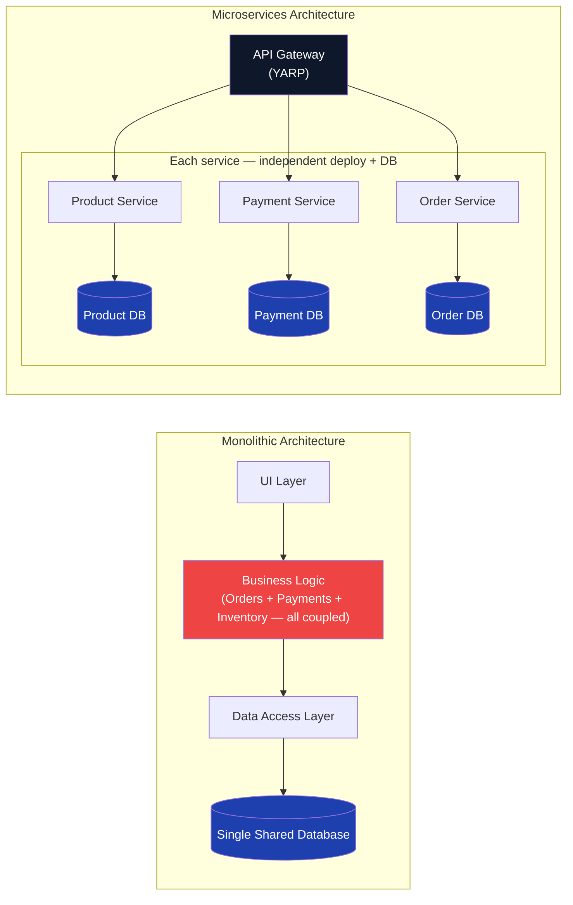
```mermaid
flowchart LR
    subgraph Monolith ["Monolithic Architecture"]
        direction TB
        M_UI["UI Layer"]
        M_BL["Business Logic\n(Orders + Payments + Inventory — all coupled)"]
        M_DA["Data Access Layer"]
        M_DB[("Single Shared Database")]
        M_UI --> M_BL --> M_DA --> M_DB
    end

    subgraph MSA ["Microservices Architecture"]
        direction TB
        GW["API Gateway\n(YARP)"]
        subgraph Svcs ["Each service — independent deploy + DB"]
            S1["Product Service"] --> D1[("Product DB")]
            S2["Payment Service"] --> D2[("Payment DB")]
            S3["Order Service"]  --> D3[("Order DB")]
        end
        GW --> S1
        GW --> S2
        GW --> S3
    end

    style M_BL fill:#ef4444,color:#fff
    style M_DB fill:#1e40af,color:#fff
    style GW  fill:#0f172a,color:#fff
    style D1  fill:#1e40af,color:#fff
    style D2  fill:#1e40af,color:#fff
    style D3  fill:#1e40af,color:#fff
```

### Problems with Monoliths at Scale

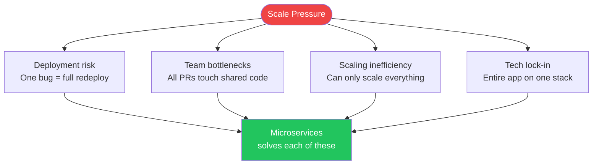
```mermaid
flowchart TD
    SCALE(["Scale Pressure"]) --> P1["Deployment risk\nOne bug = full redeploy"]
    SCALE --> P2["Team bottlenecks\nAll PRs touch shared code"]
    SCALE --> P3["Scaling inefficiency\nCan only scale everything"]
    SCALE --> P4["Tech lock-in\nEntire app on one stack"]
    P1 --> SOL["Microservices\nsolves each of these"]
    P2 --> SOL
    P3 --> SOL
    P4 --> SOL

    style SCALE fill:#ef4444,color:#fff
    style SOL fill:#22c55e,color:#fff
```

### .NET Migration Pattern — Strangler Fig

```csharp
// YARP config: new traffic goes to microservice; legacy traffic falls back to monolith
{
  "ReverseProxy": {
    "Routes": {
      "product-route-new": {
        "ClusterId": "product-microservice",
        "Match": { "Path": "/api/products/{**catch-all}" }
      },
      "legacy-fallback": {
        "ClusterId": "monolith",
        "Match": { "Path": "/{**catch-all}" }
      }
    },
    "Clusters": {
      "product-microservice": { "Destinations": { "d1": { "Address": "http://product-svc:8080/" } } },
      "monolith":             { "Destinations": { "d1": { "Address": "http://legacy-app:5000/" } } }
    }
  }
}
```

### Interview Talking Points

| Question | Answer |
|---|---|
| What are the key problems with monoliths at scale? | Slow deployments, team coupling, inability to scale individual components, and difficulty adopting new technology |
| What is the Strangler Fig pattern? | Incrementally replace monolith modules by routing requests to new microservices; the monolith shrinks over time without a big-bang rewrite |
| When should you NOT migrate to microservices? | When the team is small (< 10 engineers), when domain boundaries are unclear, or when distributed system overhead outweighs the benefit |
| What is a distributed monolith? | Microservices that are deployed separately but are tightly coupled via shared databases or synchronous chains — the worst of both worlds |
| What is the key benefit of fault isolation in microservices? | A crash in the Payment Service does not bring down the Product or Order Service — failures are contained to one bounded context |

---

## 2. Microservice Core Principles

### Overview

Four core principles govern well-designed microservices: Single Responsibility (one domain per service), Decentralised Data Management (database per service), Service Autonomy (independent deploy and operate), and API-First Design (contracts are defined before implementation). Violating any one of these principles is the root cause of most microservice anti-patterns.

### Principles Architecture Diagram

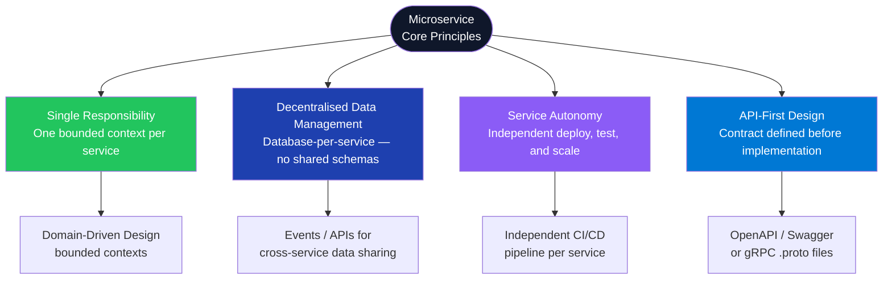
```mermaid
flowchart TD
    CORE(["Microservice\nCore Principles"])
    CORE --> P1["Single Responsibility\nOne bounded context per service"]
    CORE --> P2["Decentralised Data Management\nDatabase-per-service — no shared schemas"]
    CORE --> P3["Service Autonomy\nIndependent deploy, test, and scale"]
    CORE --> P4["API-First Design\nContract defined before implementation"]

    P1 --> DDD["Domain-Driven Design\nbounded contexts"]
    P2 --> EVENT["Events / APIs for\ncross-service data sharing"]
    P3 --> CICD["Independent CI/CD\npipeline per service"]
    P4 --> OAS["OpenAPI / Swagger\nor gRPC .proto files"]

    style CORE fill:#0f172a,color:#fff
    style P1 fill:#22c55e,color:#fff
    style P2 fill:#1e40af,color:#fff
    style P3 fill:#8b5cf6,color:#fff
    style P4 fill:#0078D4,color:#fff
```

### Principle 1 — Single Responsibility + DDD Aggregate

```csharp
// Order is an Aggregate Root — it enforces all invariants within its bounded context
public class Order
{
    private readonly List<OrderLine> _lines = new();

    public Guid Id { get; private init; } = Guid.NewGuid();
    public OrderStatus Status { get; private set; } = OrderStatus.Draft;
    public IReadOnlyList<OrderLine> Lines => _lines.AsReadOnly();

    public void AddLine(Guid productId, int qty, decimal unitPrice)
    {
        if (Status != OrderStatus.Draft)
            throw new DomainException("Cannot modify a confirmed order");
        _lines.Add(new OrderLine(productId, qty, unitPrice));
    }

    public void Confirm()
    {
        if (!_lines.Any()) throw new DomainException("Order must have at least one line");
        Status = OrderStatus.Confirmed;
    }
}

public record OrderLine(Guid ProductId, int Quantity, decimal UnitPrice);
public enum OrderStatus { Draft, Confirmed, Cancelled }
```

### Principle 2 — Decentralised Data + API-First

```csharp
// API-first: define the contract as an OpenAPI-annotated minimal API before writing business logic
var builder = WebApplication.CreateBuilder(args);
builder.Services.AddEndpointsApiExplorer();
builder.Services.AddSwaggerGen();

var app = builder.Build();
app.UseSwagger();
app.UseSwaggerUI();

// Contract is the first citizen — implementation follows
app.MapPost("/orders", async (CreateOrderRequest req, IOrderService svc, CancellationToken ct) =>
{
    var order = await svc.CreateAsync(req, ct);
    return Results.Created($"/orders/{order.Id}", order);
})
.WithName("CreateOrder")
.WithOpenApi()
.Produces<OrderResponse>(201)
.ProducesValidationProblem();

public record CreateOrderRequest(Guid CustomerId, IReadOnlyList<OrderLineRequest> Lines);
public record OrderLineRequest(Guid ProductId, int Quantity);
public record OrderResponse(Guid Id, string Status, decimal Total);
```

### Interview Talking Points

| Question | Answer |
|---|---|
| What is the Single Responsibility Principle in microservices? | Each service owns exactly one business domain — Order Service handles orders only; payment logic belongs to Payment Service |
| Why is decentralised data management important? | Shared databases create schema coupling — one service's migration can break others; each service must own its data |
| What does service autonomy mean operationally? | A service can be deployed, scaled, rolled back, and restarted without coordinating with any other team |
| What is API-first design? | Define the contract (OpenAPI spec or .proto) before writing implementation — consumers can generate clients without waiting for the service to be built |
| What is Conway's Law and how does it relate to microservices? | "Systems mirror the communication structure of the teams that build them" — microservice boundaries should match team boundaries |

---

## 3. Key Terminology

### Overview

Before designing microservice systems, a shared vocabulary is essential. Service registry and discovery, API gateways, circuit breakers, sync vs async communication, and eventual consistency are the building blocks of every microservice architecture.

### Terminology Map Diagram

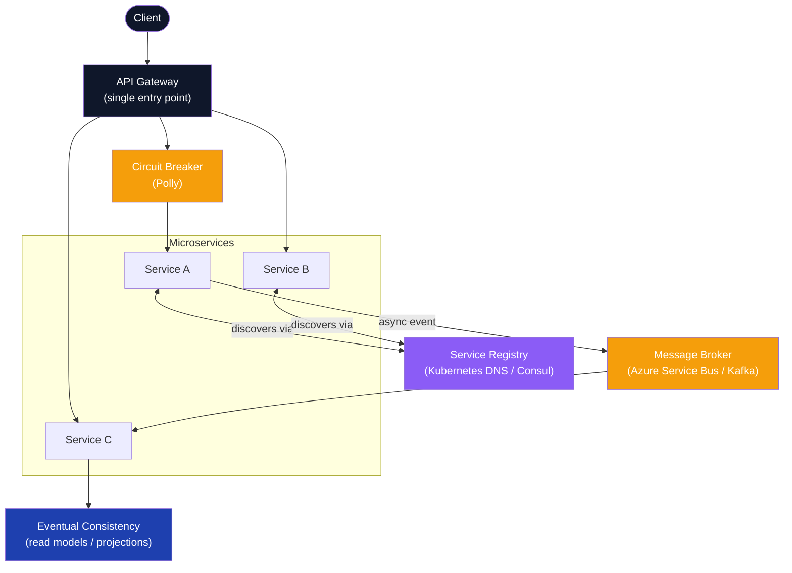
```mermaid
flowchart TD
    CLIENT(["Client"])
    GW["API Gateway\n(single entry point)"]
    SR["Service Registry\n(Kubernetes DNS / Consul)"]

    subgraph Services ["Microservices"]
        S1["Service A"]
        S2["Service B"]
        S3["Service C"]
    end

    CB["Circuit Breaker\n(Polly)"]
    BUS["Message Broker\n(Azure Service Bus / Kafka)"]
    EC["Eventual Consistency\n(read models / projections)"]

    CLIENT --> GW
    GW --> CB --> S1
    GW --> S2
    GW --> S3
    S1 <-->|"discovers via"| SR
    S2 <-->|"discovers via"| SR
    S1 -->|"async event"| BUS --> S3
    S3 --> EC

    style CLIENT fill:#0f172a,color:#fff
    style GW fill:#0f172a,color:#fff
    style CB fill:#f59e0b,color:#fff
    style BUS fill:#f59e0b,color:#fff
    style SR fill:#8b5cf6,color:#fff
    style EC fill:#1e40af,color:#fff
```

### Circuit Breaker States

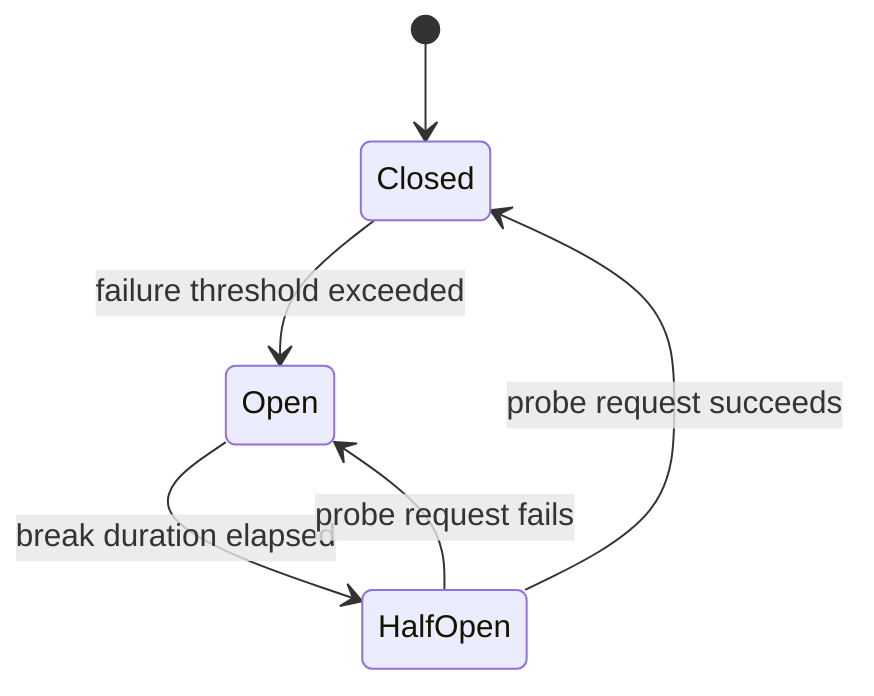
```mermaid
stateDiagram-v2
    [*] --> Closed
    Closed --> Open : failure threshold exceeded
    Open --> HalfOpen : break duration elapsed
    HalfOpen --> Closed : probe request succeeds
    HalfOpen --> Open : probe request fails
```

### Polly Circuit Breaker in .NET

```csharp
builder.Services.AddHttpClient<IProductClient, ProductClient>()
    .AddResilienceHandler("product-cb", pipeline =>
    {
        pipeline.AddCircuitBreaker(new HttpCircuitBreakerStrategyOptions
        {
            // Open after 50% failure rate over a 30-second sliding window
            FailureRatio     = 0.5,
            SamplingDuration = TimeSpan.FromSeconds(30),
            MinimumThroughput = 10,
            // Stay open for 60 seconds before allowing a probe (Half-Open)
            BreakDuration    = TimeSpan.FromSeconds(60),
            OnOpened = args =>
            {
                logger.LogWarning("Circuit OPENED for ProductClient. Break for {Duration}", args.BreakDuration);
                return ValueTask.CompletedTask;
            }
        });
    });
```

### Interview Talking Points

| Question | Answer |
|---|---|
| What is a service registry? | A catalog of live service instances and their network addresses; services register on startup and deregister on shutdown — Kubernetes provides this via DNS |
| What does an API gateway do? | Single entry point that handles routing, auth, rate limiting, SSL termination, and load balancing; clients never call individual services directly |
| What are the three circuit breaker states? | Closed (normal), Open (blocking calls after threshold breach), Half-Open (allowing a single probe to test recovery) |
| What is eventual consistency? | In distributed systems, related data across services may be temporarily out of sync; given enough time without new updates, all replicas converge to the same value |
| Sync vs async — what is the key trade-off? | Sync (HTTP/gRPC) is simpler but creates temporal coupling; async (Service Bus/Kafka) decouples services but adds complexity and eventual consistency |

---

## 4. Architecture Patterns

### Overview

Six patterns are foundational to microservice architecture: Database per Service (data autonomy), API Gateway (single entry point), Backend for Frontend — BFF (client-tailored APIs), Service Mesh (infra-level cross-cutting concerns), CQRS (read/write separation), and Event Sourcing (state as an immutable event log). Each solves a specific class of problem.

### Patterns Overview Diagram

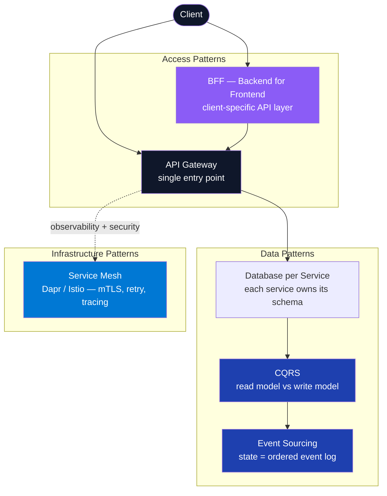
```mermaid
flowchart TD
    subgraph DataPatterns ["Data Patterns"]
        DB_SVC["Database per Service\neach service owns its schema"]
        CQRS_P["CQRS\nread model vs write model"]
        ES["Event Sourcing\nstate = ordered event log"]
    end

    subgraph AccessPatterns ["Access Patterns"]
        AGW["API Gateway\nsingle entry point"]
        BFF_P["BFF — Backend for Frontend\nclient-specific API layer"]
    end

    subgraph InfraPatterns ["Infrastructure Patterns"]
        SM["Service Mesh\nDapr / Istio — mTLS, retry, tracing"]
    end

    CLIENT(["Client"]) --> AGW
    CLIENT --> BFF_P
    AGW --> DB_SVC
    BFF_P --> AGW
    DB_SVC --> CQRS_P --> ES
    AGW -. "observability + security" .-> SM

    style CLIENT fill:#0f172a,color:#fff
    style AGW fill:#0f172a,color:#fff
    style BFF_P fill:#8b5cf6,color:#fff
    style SM fill:#0078D4,color:#fff
    style CQRS_P fill:#1e40af,color:#fff
    style ES fill:#1e40af,color:#fff
```

### Pattern 1 — Database per Service

```csharp
// Each service registers its own DbContext — no cross-service schema dependencies

// Product Service
builder.Services.AddDbContext<ProductDbContext>(opts =>
    opts.UseNpgsql(builder.Configuration.GetConnectionString("ProductDb")));

// Order Service (different DB, different technology choice)
builder.Services.AddDbContext<OrderDbContext>(opts =>
    opts.UseSqlServer(builder.Configuration.GetConnectionString("OrderDb")));
```

### Pattern 2 — Backend for Frontend (BFF)

**Tech Stack:** ASP.NET Core Minimal API as a dedicated BFF aggregating multiple downstream services

```csharp
// Mobile BFF — returns a lightweight, mobile-optimised order summary
app.MapGet("/mobile/orders/{id:guid}", async (
    Guid id,
    IOrderClient orderClient,
    IProductClient productClient,
    CancellationToken ct) =>
{
    var order   = await orderClient.GetAsync(id, ct);
    var product = await productClient.GetAsync(order.ProductId, ct);

    // Shape specifically for mobile — fewer fields, pre-formatted values
    return Results.Ok(new MobileOrderSummary(
        OrderId:     order.Id,
        ProductName: product.Name,
        StatusLabel: order.Status.ToDisplayString(),
        TotalFormatted: order.Total.ToString("C")
    ));
});

public record MobileOrderSummary(Guid OrderId, string ProductName, string StatusLabel, string TotalFormatted);
```

### Pattern 3 — CQRS

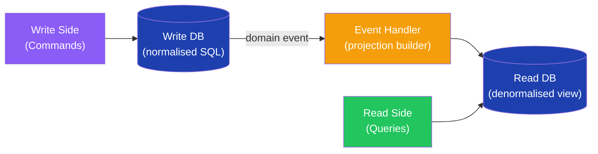
```mermaid
flowchart LR
    CMD["Write Side\n(Commands)"] --> WDB[("Write DB\n(normalised SQL)")]
    WDB -->|"domain event"| PROJ["Event Handler\n(projection builder)"]
    PROJ --> RDB[("Read DB\n(denormalised view)")]
    QRY["Read Side\n(Queries)"] --> RDB

    style CMD fill:#8b5cf6,color:#fff
    style QRY fill:#22c55e,color:#fff
    style WDB fill:#1e40af,color:#fff
    style RDB fill:#1e40af,color:#fff
    style PROJ fill:#f59e0b,color:#fff
```

```csharp
// Command handler — writes to normalised SQL
public class PlaceOrderHandler(OrderDbContext db, IEventBus bus)
{
    public async Task<Guid> HandleAsync(PlaceOrderCommand cmd, CancellationToken ct)
    {
        var order = new Order(cmd.CustomerId, cmd.Lines);
        db.Orders.Add(order);
        await db.SaveChangesAsync(ct);
        await bus.PublishAsync(new OrderPlacedEvent(order.Id), ct);
        return order.Id;
    }
}

// Query handler — reads from denormalised read model (fast, no joins)
public class GetOrderSummaryHandler(IOrderReadRepository repo)
{
    public Task<OrderSummaryDto?> HandleAsync(GetOrderSummaryQuery q, CancellationToken ct)
        => repo.GetSummaryAsync(q.OrderId, ct);
}
```

### Pattern 4 — Event Sourcing

```csharp
// State is derived by replaying an immutable event log
public class OrderAggregate
{
    public Guid Id { get; private set; }
    public OrderStatus Status { get; private set; }
    private readonly List<IDomainEvent> _events = new();

    public IReadOnlyList<IDomainEvent> UncommittedEvents => _events.AsReadOnly();

    public static OrderAggregate Rehydrate(IEnumerable<IDomainEvent> history)
    {
        var agg = new OrderAggregate();
        foreach (var evt in history) agg.Apply(evt);
        return agg;
    }

    public void Place(Guid customerId) => Apply(new OrderPlacedEvent(Guid.NewGuid(), customerId));
    public void Confirm()              => Apply(new OrderConfirmedEvent(Id));

    private void Apply(IDomainEvent evt)
    {
        switch (evt)
        {
            case OrderPlacedEvent e:    Id = e.OrderId; Status = OrderStatus.Draft;     break;
            case OrderConfirmedEvent:   Status = OrderStatus.Confirmed;                  break;
        }
        _events.Add(evt);
    }
}
```

### Interview Talking Points

| Question | Answer |
|---|---|
| Why is Database per Service important? | Prevents schema coupling — a migration in Order Service cannot break Payment Service; each team owns its persistence independently |
| When should you use BFF? | When different clients (mobile, web, IoT) need different shapes of the same data — avoids over-fetching and under-fetching |
| What problem does CQRS solve? | Read and write models have very different performance and structure needs; separating them lets each be optimised independently |
| What is Event Sourcing and what is its main downside? | State is stored as an append-only event log rather than current state; downsides include event schema evolution complexity and eventual consistency for reads |
| What is a Service Mesh? | Infrastructure layer (Dapr, Istio) that handles mTLS, retry, rate limiting, and distributed tracing at the sidecar level — no application code changes needed |

---

## 5. Communication Styles

### Overview

Microservices communicate synchronously (HTTP/REST, gRPC) or asynchronously (Kafka, Azure Service Bus, RabbitMQ). Synchronous calls are simpler and return immediate results but create temporal coupling — if the downstream service is down, the caller fails. Asynchronous messaging decouples services in time and space but introduces eventual consistency and requires careful error handling.

### Communication Decision Diagram

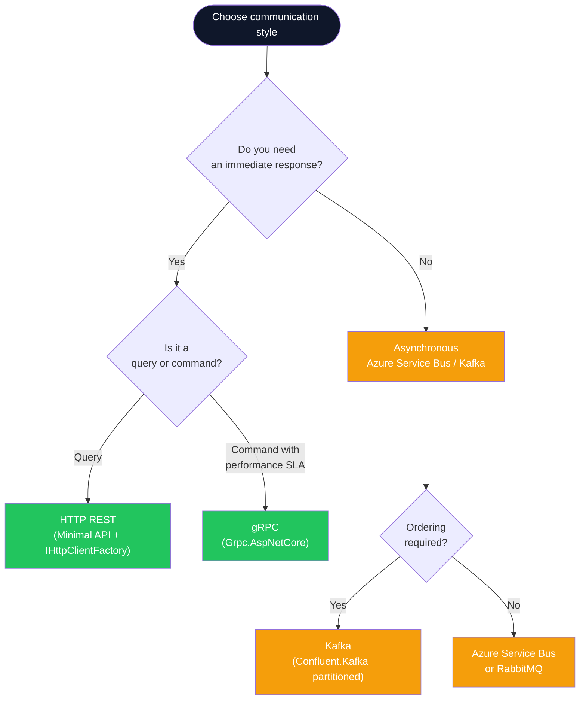
```mermaid
flowchart TD
    START(["Choose communication style"]) --> Q1{"Do you need\nan immediate response?"}
    Q1 -->|Yes| Q2{"Is it a\nquery or command?"}
    Q1 -->|No| ASYNC["Asynchronous\nAzure Service Bus / Kafka"]
    Q2 -->|Query| REST["HTTP REST\n(Minimal API + IHttpClientFactory)"]
    Q2 -->|Command with\nperformance SLA| GRPC["gRPC\n(Grpc.AspNetCore)"]
    ASYNC --> Q3{"Ordering\nrequired?"}
    Q3 -->|Yes| KAFKA["Kafka\n(Confluent.Kafka — partitioned)"]
    Q3 -->|No| SB["Azure Service Bus\nor RabbitMQ"]

    style REST fill:#22c55e,color:#fff
    style GRPC fill:#22c55e,color:#fff
    style ASYNC fill:#f59e0b,color:#fff
    style KAFKA fill:#f59e0b,color:#fff
    style SB fill:#f59e0b,color:#fff
    style START fill:#0f172a,color:#fff
```

### Sync — REST call with Polly Retry

```csharp
builder.Services.AddHttpClient<IProductClient, ProductClient>(client =>
    client.BaseAddress = new Uri(builder.Configuration["ServiceUrls:ProductService"]!))
    .AddResilienceHandler("product-retry", pipeline =>
    {
        pipeline.AddRetry(new HttpRetryStrategyOptions
        {
            MaxRetryAttempts = 3,
            Delay            = TimeSpan.FromMilliseconds(200),
            BackoffType      = DelayBackoffType.Exponential,
            UseJitter        = true
        });
        pipeline.AddTimeout(TimeSpan.FromSeconds(5));
    });

public class ProductClient(HttpClient http) : IProductClient
{
    public async Task<ProductDto?> GetAsync(Guid id, CancellationToken ct)
    {
        var resp = await http.GetAsync($"products/{id}", ct);
        return resp.IsSuccessStatusCode
            ? await resp.Content.ReadFromJsonAsync<ProductDto>(ct)
            : null;
    }
}
```

### Sync — gRPC Service

**Tech Stack:** `Grpc.AspNetCore`, `.proto` contract

```csharp
// inventory.proto
// service InventoryService { rpc CheckStock (StockRequest) returns (StockReply); }

public class InventoryGrpcService : InventoryService.InventoryServiceBase
{
    private readonly IInventoryRepository _repo;

    public InventoryGrpcService(IInventoryRepository repo) => _repo = repo;

    public override async Task<StockReply> CheckStock(StockRequest req, ServerCallContext ctx)
    {
        var qty = await _repo.GetQuantityAsync(Guid.Parse(req.ProductId), ctx.CancellationToken);
        return new StockReply { Available = qty > 0, Quantity = qty };
    }
}

// Registration
builder.Services.AddGrpc();
app.MapGrpcService<InventoryGrpcService>();
```

### Async — Kafka Consumer (BackgroundService)

**Tech Stack:** `Confluent.Kafka`, `BackgroundService`

```csharp
public class OrderCreatedConsumer : BackgroundService
{
    private readonly IConsumer<string, string> _consumer;
    private readonly IServiceScopeFactory _scopeFactory;

    public OrderCreatedConsumer(IConfiguration cfg, IServiceScopeFactory scopeFactory)
    {
        _scopeFactory = scopeFactory;
        var config = new ConsumerConfig
        {
            BootstrapServers = cfg["Kafka:BootstrapServers"],
            GroupId          = "payment-service",
            AutoOffsetReset  = AutoOffsetReset.Earliest,
            EnableAutoCommit = false
        };
        _consumer = new ConsumerBuilder<string, string>(config).Build();
    }

    protected override async Task ExecuteAsync(CancellationToken ct)
    {
        _consumer.Subscribe("order-created");
        while (!ct.IsCancellationRequested)
        {
            var result = _consumer.Consume(ct);
            using var scope = _scopeFactory.CreateScope();
            var handler = scope.ServiceProvider.GetRequiredService<IOrderCreatedHandler>();
            await handler.HandleAsync(result.Message.Value, ct);
            _consumer.Commit(result);
        }
    }

    public override void Dispose() { _consumer.Close(); _consumer.Dispose(); base.Dispose(); }
}
```

### Interview Talking Points

| Question | Answer |
|---|---|
| When do you use gRPC over REST? | When you need strongly-typed contracts, bi-directional streaming, or low-latency internal service-to-service calls — gRPC is faster and enforces schema |
| What is temporal coupling? | A caller is blocked until the downstream service responds; if it's slow or down, the caller fails — async messaging removes this dependency |
| How does Kafka guarantee message ordering? | Ordering is guaranteed within a partition; use a consistent partition key (e.g., `orderId`) to ensure all events for one entity land on the same partition |
| What is at-least-once delivery and how do you handle it? | The broker may redeliver a message after a crash; consumers must be idempotent — check for duplicate message IDs before processing |
| What is the difference between Azure Service Bus topics and queues? | A queue delivers each message to one consumer (competing consumers); a topic delivers each message to all subscribers (pub/sub fan-out) |

---

## 6. Hands-On: Three-Service Project

### Overview

A canonical microservices project involves three cooperating services: Product Service (catalogue), Order Service (order lifecycle), and Payment Service (payment processing). They communicate via REST for synchronous queries and via Azure Service Bus for asynchronous event-driven workflows, fronted by a YARP API Gateway.

### System Architecture Diagram

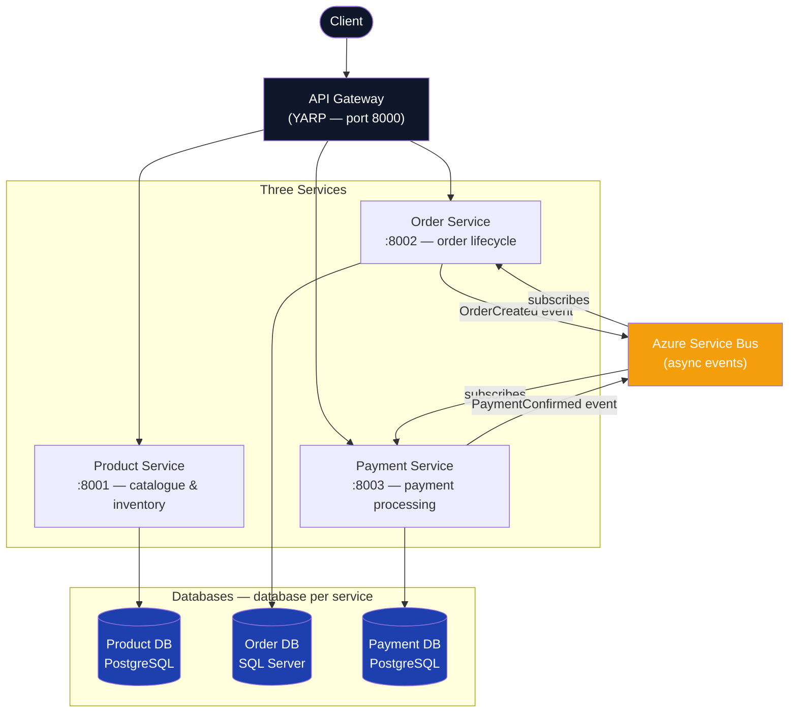
```mermaid
flowchart TD
    CLIENT(["Client"])
    GW["API Gateway\n(YARP — port 8000)"]

    subgraph Services ["Three Services"]
        PROD["Product Service\n:8001 — catalogue & inventory"]
        ORD["Order Service\n:8002 — order lifecycle"]
        PAY["Payment Service\n:8003 — payment processing"]
    end

    subgraph Dbs ["Databases — database per service"]
        PDB[("Product DB\nPostgreSQL")]
        ODB[("Order DB\nSQL Server")]
        PAYDB[("Payment DB\nPostgreSQL")]
    end

    BUS["Azure Service Bus\n(async events)"]

    CLIENT --> GW
    GW --> PROD
    GW --> ORD
    GW --> PAY
    PROD --> PDB
    ORD --> ODB
    PAY --> PAYDB
    ORD -->|"OrderCreated event"| BUS
    BUS -->|"subscribes"| PAY
    PAY -->|"PaymentConfirmed event"| BUS
    BUS -->|"subscribes"| ORD

    style CLIENT fill:#0f172a,color:#fff
    style GW fill:#0f172a,color:#fff
    style BUS fill:#f59e0b,color:#fff
    style PDB fill:#1e40af,color:#fff
    style ODB fill:#1e40af,color:#fff
    style PAYDB fill:#1e40af,color:#fff
```

### Request Flow — Place an Order

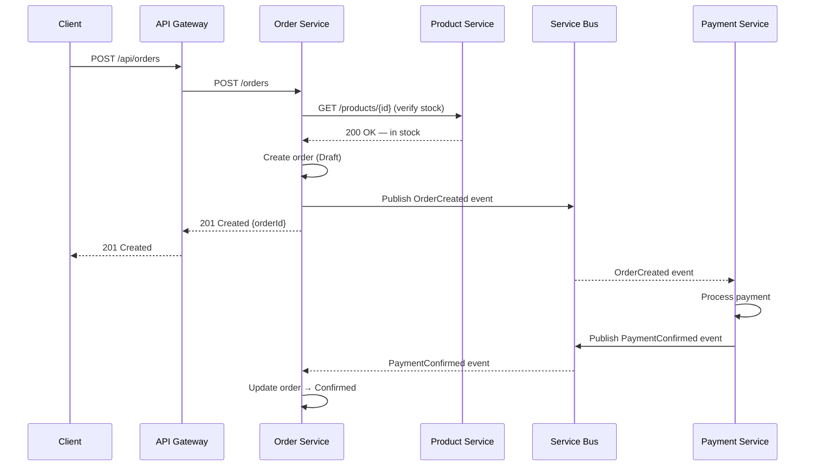
```mermaid
sequenceDiagram
    participant C as Client
    participant GW as API Gateway
    participant OS as Order Service
    participant PS as Product Service
    participant SB as Service Bus
    participant PAY as Payment Service

    C->>GW: POST /api/orders
    GW->>OS: POST /orders
    OS->>PS: GET /products/{id} (verify stock)
    PS-->>OS: 200 OK — in stock
    OS->>OS: Create order (Draft)
    OS->>SB: Publish OrderCreated event
    OS-->>GW: 201 Created {orderId}
    GW-->>C: 201 Created

    SB-->>PAY: OrderCreated event
    PAY->>PAY: Process payment
    PAY->>SB: Publish PaymentConfirmed event
    SB-->>OS: PaymentConfirmed event
    OS->>OS: Update order → Confirmed
```

### Product Service

```csharp
// ProductService/Program.cs
var builder = WebApplication.CreateBuilder(args);
builder.Services.AddDbContext<ProductDbContext>(opts =>
    opts.UseNpgsql(builder.Configuration.GetConnectionString("ProductDb")));
builder.Services.AddScoped<IProductRepository, ProductRepository>();
builder.Services.AddHealthChecks().AddNpgsql(builder.Configuration.GetConnectionString("ProductDb")!);

var app = builder.Build();

app.MapGet("/products/{id:guid}", async (Guid id, IProductRepository repo, CancellationToken ct) =>
{
    var p = await repo.GetByIdAsync(id, ct);
    return p is null ? Results.NotFound() : Results.Ok(new ProductDto(p.Id, p.Name, p.Price, p.Stock));
});

app.MapGet("/products", async (IProductRepository repo, CancellationToken ct) =>
    Results.Ok(await repo.GetAllAsync(ct)));

app.MapHealthChecks("/healthz/ready");
app.Run();

public record ProductDto(Guid Id, string Name, decimal Price, int Stock);
```

### Order Service

```csharp
// OrderService/Program.cs — publishes events to Service Bus
var builder = WebApplication.CreateBuilder(args);
builder.Services.AddDbContext<OrderDbContext>(opts =>
    opts.UseSqlServer(builder.Configuration.GetConnectionString("OrderDb")));
builder.Services.AddSingleton(_ => new ServiceBusClient(builder.Configuration["ServiceBus:ConnectionString"]));
builder.Services.AddSingleton(sp => sp.GetRequiredService<ServiceBusClient>().CreateSender("order-events"));
builder.Services.AddScoped<IOrderService, OrderService>();
builder.Services.AddHostedService<PaymentConfirmedConsumer>();
builder.Services.AddHealthChecks().AddSqlServer(builder.Configuration.GetConnectionString("OrderDb")!);

var app = builder.Build();

app.MapPost("/orders", async (CreateOrderRequest req, IOrderService svc, CancellationToken ct) =>
{
    var order = await svc.CreateAsync(req, ct);
    return Results.Created($"/orders/{order.Id}", order);
});

app.MapGet("/orders/{id:guid}", async (Guid id, IOrderService svc, CancellationToken ct) =>
{
    var o = await svc.GetAsync(id, ct);
    return o is null ? Results.NotFound() : Results.Ok(o);
});

app.MapHealthChecks("/healthz/ready");
app.Run();
```

### Payment Service

```csharp
// PaymentService — subscribes to OrderCreated, publishes PaymentConfirmed
public class OrderCreatedConsumer : BackgroundService
{
    private readonly ServiceBusProcessor _processor;
    private readonly IServiceScopeFactory _scopeFactory;
    private readonly ServiceBusSender _sender;

    public OrderCreatedConsumer(ServiceBusClient client, IServiceScopeFactory scopeFactory)
    {
        _scopeFactory = scopeFactory;
        _processor    = client.CreateProcessor("order-events", "payment-subscription");
        _sender       = client.CreateSender("payment-events");
    }

    protected override async Task ExecuteAsync(CancellationToken ct)
    {
        _processor.ProcessMessageAsync += OnMessageAsync;
        _processor.ProcessErrorAsync   += _ => Task.CompletedTask;
        await _processor.StartProcessingAsync(ct);
        await Task.Delay(Timeout.Infinite, ct);
        await _processor.StopProcessingAsync();
    }

    private async Task OnMessageAsync(ProcessMessageEventArgs args)
    {
        using var scope   = _scopeFactory.CreateScope();
        var svc           = scope.ServiceProvider.GetRequiredService<IPaymentService>();
        var evt           = JsonSerializer.Deserialize<OrderCreatedEvent>(args.Message.Body)!;
        var paymentId     = await svc.ProcessAsync(evt.OrderId, evt.Amount, args.CancellationToken);
        await _sender.SendMessageAsync(
            new ServiceBusMessage(JsonSerializer.Serialize(new PaymentConfirmedEvent(evt.OrderId, paymentId))),
            args.CancellationToken);
        await args.CompleteMessageAsync(args.Message);
    }
}
```

### Interview Talking Points

| Question | Answer |
|---|---|
| How do services discover each other in Kubernetes? | Via Kubernetes Service DNS — each K8s Service resource gets a DNS name like `product-service.default.svc.cluster.local` |
| How does the API Gateway know which service handles which route? | Route configuration in YARP maps URL path patterns to backend clusters; no business logic in the gateway |
| How do you handle stock check consistency when placing an order? | Check stock synchronously at order placement, then use a reservation pattern or compensating event if stock is depleted by the time payment processes |
| What happens if the Payment Service is down when an order is placed? | The OrderCreated event stays in the Service Bus topic; when Payment Service recovers it processes the backlog — the system is resilient via async messaging |
| How would you add a Notification Service to this system? | Subscribe to PaymentConfirmed events from Service Bus — zero changes to existing services (open/closed principle) |

---

## 7. Add-On Features

### Overview

Production microservices need more than just HTTP handlers: service discovery (find instances), load balancing (distribute traffic), centralised configuration (manage settings at scale), distributed logging (correlate logs across services), and centralised tracing (follow a request through the entire system).

### Add-On Features Diagram

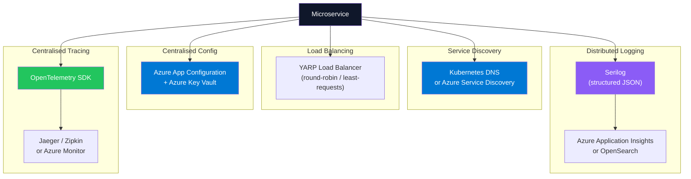
```mermaid
flowchart TD
    subgraph Discovery ["Service Discovery"]
        K8SDNS["Kubernetes DNS\nor Azure Service Discovery"]
    end

    subgraph LB ["Load Balancing"]
        YARP_LB["YARP Load Balancer\n(round-robin / least-requests)"]
    end

    subgraph Config ["Centralised Config"]
        AZC["Azure App Configuration\n+ Azure Key Vault"]
    end

    subgraph Logging ["Distributed Logging"]
        SERILOG["Serilog\n(structured JSON)"]
        AI["Azure Application Insights\nor OpenSearch"]
        SERILOG --> AI
    end

    subgraph Tracing ["Centralised Tracing"]
        OTEL["OpenTelemetry SDK"]
        JAEGER["Jaeger / Zipkin\nor Azure Monitor"]
        OTEL --> JAEGER
    end

    SVC["Microservice"] --> K8SDNS
    SVC --> YARP_LB
    SVC --> AZC
    SVC --> SERILOG
    SVC --> OTEL

    style SVC fill:#0f172a,color:#fff
    style K8SDNS fill:#0078D4,color:#fff
    style AZC fill:#0078D4,color:#fff
    style SERILOG fill:#8b5cf6,color:#fff
    style OTEL fill:#22c55e,color:#fff
```

### Centralised Config — Azure App Configuration

**Tech Stack:** `Azure.Extensions.AspNetCore.Configuration.Secrets`, `DefaultAzureCredential`

```csharp
// Program.cs — load config from Azure App Configuration + Key Vault
builder.Configuration
    .AddAzureAppConfiguration(opts =>
    {
        opts.Connect(new Uri(builder.Configuration["AppConfig:Endpoint"]!), new DefaultAzureCredential())
            .ConfigureKeyVault(kv => kv.SetCredential(new DefaultAzureCredential()))
            .UseFeatureFlags()                             // Microsoft.FeatureManagement integration
            .ConfigureRefresh(refresh => refresh           // live refresh without restart
                .Register("App:Sentinel", refreshAll: true)
                .SetRefreshInterval(TimeSpan.FromMinutes(5)));
    });

builder.Services.AddFeatureManagement();
builder.Services.AddAzureAppConfiguration();
app.UseAzureAppConfiguration();
```

### YARP Load Balancing

```json
{
  "ReverseProxy": {
    "Clusters": {
      "product-cluster": {
        "LoadBalancingPolicy": "LeastRequests",
        "Destinations": {
          "pod1": { "Address": "http://product-svc-pod1:8080/" },
          "pod2": { "Address": "http://product-svc-pod2:8080/" },
          "pod3": { "Address": "http://product-svc-pod3:8080/" }
        }
      }
    }
  }
}
```

### Distributed Logging — Serilog + Correlation ID

```csharp
builder.Host.UseSerilog((ctx, cfg) => cfg
    .ReadFrom.Configuration(ctx.Configuration)
    .Enrich.FromLogContext()
    .Enrich.WithCorrelationId()           // propagates X-Correlation-ID header
    .Enrich.WithMachineName()
    .WriteTo.Console(new JsonFormatter())
    .WriteTo.ApplicationInsights(TelemetryConfiguration.CreateDefault(), TelemetryConverter.Traces));

// Middleware to propagate correlation ID
app.Use(async (ctx, next) =>
{
    var correlationId = ctx.Request.Headers["X-Correlation-ID"].FirstOrDefault()
                        ?? Guid.NewGuid().ToString();
    ctx.Response.Headers["X-Correlation-ID"] = correlationId;
    using (LogContext.PushProperty("CorrelationId", correlationId))
        await next();
});
```

### Interview Talking Points

| Question | Answer |
|---|---|
| How does Kubernetes provide service discovery? | Each K8s Service gets a stable DNS name regardless of pod churn — no service registry process is needed |
| What is the difference between client-side and server-side load balancing? | Client-side: the caller holds the instance list and picks one (e.g. IHttpClientFactory + round-robin). Server-side (YARP / Kubernetes Service): a proxy distributes traffic — simpler and preferred in .NET microservices |
| Why is centralised config preferred over appsettings.json per service? | Runtime changes propagate to all pods without redeployment; secrets stay in Key Vault and are never in code or container images |
| What is a correlation ID and why is it critical? | A unique ID generated at the API gateway and propagated via HTTP headers and message properties — allows you to reconstruct the full cross-service trace for one request in logs |
| What is the ELK stack equivalent in .NET Azure? | Serilog (structured logging) → Azure Monitor / Application Insights; queries in Log Analytics replace Kibana dashboards |

---

## 8. Database Design

### Overview

Shared databases are the most common microservice anti-pattern — they recreate the coupling of a monolith at the persistence layer. Each service must own its schema. Cross-service data consistency is achieved through domain events and eventual consistency, not distributed transactions. The SAGA pattern is the primary mechanism for multi-service workflows that require rollback capability.

### Why Shared DBs Are Bad

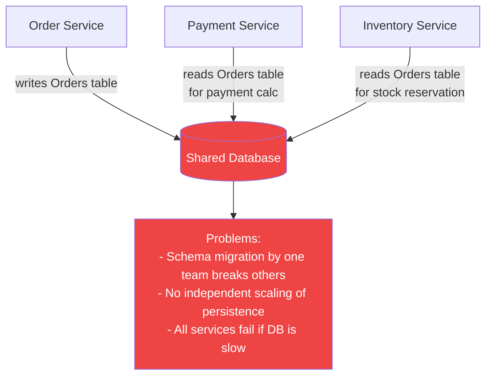
```mermaid
flowchart TD
    SDB[("Shared Database")]
    OS["Order Service"]
    PS["Payment Service"]
    INV["Inventory Service"]

    OS -->|"writes Orders table"| SDB
    PS -->|"reads Orders table\nfor payment calc"| SDB
    INV -->|"reads Orders table\nfor stock reservation"| SDB

    PROBLEM["Problems:\n- Schema migration by one team breaks others\n- No independent scaling of persistence\n- All services fail if DB is slow"]

    SDB --> PROBLEM

    style SDB fill:#ef4444,color:#fff
    style PROBLEM fill:#ef4444,color:#fff
```

### Correct Pattern — Events for Cross-Service Consistency

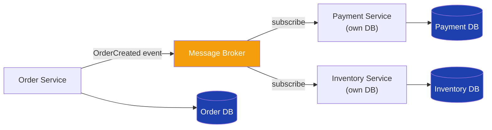
```mermaid
flowchart LR
    OS["Order Service"] -->|"OrderCreated event"| BUS["Message Broker"]
    BUS -->|"subscribe"| PS["Payment Service\n(own DB)"]
    BUS -->|"subscribe"| INV["Inventory Service\n(own DB)"]
    PS --> PAYDB[("Payment DB")]
    INV --> INVDB[("Inventory DB")]
    OS --> ORDDB[("Order DB")]

    style BUS fill:#f59e0b,color:#fff
    style ORDDB fill:#1e40af,color:#fff
    style PAYDB fill:#1e40af,color:#fff
    style INVDB fill:#1e40af,color:#fff
```

### Eventual Consistency — Read Model Projection

```csharp
// Order Service maintains a local product-price snapshot for display purposes.
// ProductService is the authoritative source — this is a cached projection only.
public class ProductPriceProjection : BackgroundService
{
    private readonly ServiceBusProcessor _processor;
    private readonly IServiceScopeFactory _scopeFactory;

    protected override async Task ExecuteAsync(CancellationToken ct)
    {
        _processor.ProcessMessageAsync += async args =>
        {
            var evt = JsonSerializer.Deserialize<ProductPriceUpdatedEvent>(args.Message.Body)!;
            using var scope = _scopeFactory.CreateScope();
            var repo = scope.ServiceProvider.GetRequiredService<IProductSnapshotRepository>();
            // This snapshot may lag by seconds — that is acceptable (eventual consistency)
            await repo.UpsertAsync(evt.ProductId, evt.NewPrice, ct);
            await args.CompleteMessageAsync(args.Message);
        };
        await _processor.StartProcessingAsync(ct);
        await Task.Delay(Timeout.Infinite, ct);
    }
}
```

### Interview Talking Points

| Question | Answer |
|---|---|
| Why are shared databases bad in microservices? | They create schema coupling — one team's migration can break other services; independent scaling and tech choice become impossible |
| How do you manage data consistency without a shared DB? | Domain events published to a message broker; each service maintains its own read model updated by event handlers |
| What is eventual consistency? | Data across services may be temporarily out of sync; given no new updates, all services converge to the correct state within a bounded time window |
| What is a read model / projection? | A denormalised, query-optimised view of data assembled from domain events; it can lag slightly behind the write model but enables fast, join-free reads |
| Can you have zero shared state between microservices? | In practice, services share identity (user IDs, product IDs) as reference keys — but never the entities themselves; each service owns its interpretation |

---

## 9. Managing Transactions

### Overview

Distributed transactions across microservices cannot use a single database transaction. The SAGA pattern coordinates multi-service workflows by chaining local transactions with compensating transactions on failure. The Outbox Pattern guarantees event delivery as part of the same local transaction. Two-Phase Commit (2PC) is theoretically possible but avoided in practice due to tight coupling, blocking, and poor performance at scale.

### SAGA Orchestration vs Choreography

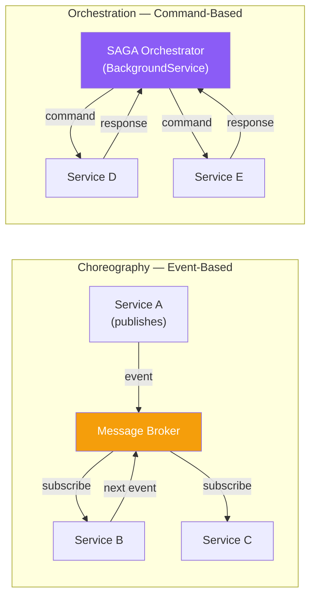
```mermaid
flowchart LR
    subgraph Choreography ["Choreography — Event-Based"]
        CA["Service A\n(publishes)"] -->|event| BUS1["Message Broker"]
        BUS1 -->|subscribe| CB["Service B"]
        BUS1 -->|subscribe| CC["Service C"]
        CB -->|next event| BUS1
    end

    subgraph Orchestration ["Orchestration — Command-Based"]
        ORCH["SAGA Orchestrator\n(BackgroundService)"] -->|command| SD["Service D"]
        ORCH -->|command| SE["Service E"]
        SD -->|response| ORCH
        SE -->|response| ORCH
    end

    style BUS1 fill:#f59e0b,color:#fff
    style ORCH fill:#8b5cf6,color:#fff
```

### SAGA State Machine

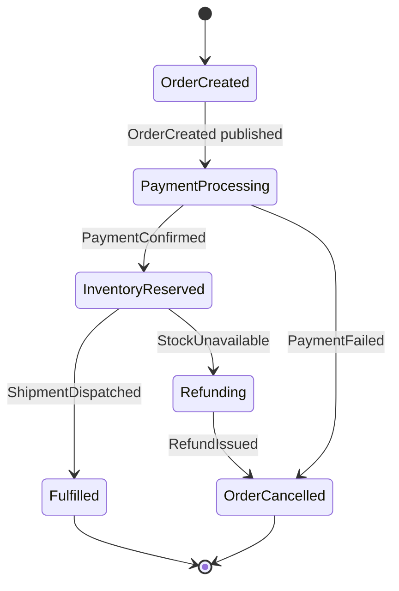
```mermaid
stateDiagram-v2
    [*] --> OrderCreated
    OrderCreated --> PaymentProcessing : OrderCreated published
    PaymentProcessing --> InventoryReserved : PaymentConfirmed
    PaymentProcessing --> OrderCancelled : PaymentFailed
    InventoryReserved --> Fulfilled : ShipmentDispatched
    InventoryReserved --> Refunding : StockUnavailable
    Refunding --> OrderCancelled : RefundIssued
    Fulfilled --> [*]
    OrderCancelled --> [*]
```

### SAGA Orchestrator Implementation

```csharp
public class OrderSagaOrchestrator : BackgroundService
{
    private readonly IOrderSagaRepository _repo;
    private readonly IPaymentClient       _payment;
    private readonly IInventoryClient     _inventory;
    private readonly IShipmentClient      _shipment;
    private readonly ILogger<OrderSagaOrchestrator> _logger;

    protected override async Task ExecuteAsync(CancellationToken ct)
    {
        while (!ct.IsCancellationRequested)
        {
            var sagas = await _repo.GetPendingAsync(ct);
            await Task.WhenAll(sagas.Select(s => AdvanceAsync(s, ct)));
            await Task.Delay(TimeSpan.FromSeconds(5), ct);
        }
    }

    private async Task AdvanceAsync(OrderSaga saga, CancellationToken ct)
    {
        try
        {
            saga.State = saga.State switch
            {
                SagaState.Created           => await ChargePaymentAsync(saga, ct),
                SagaState.PaymentProcessing => await ReserveInventoryAsync(saga, ct),
                SagaState.InventoryReserved => await DispatchShipmentAsync(saga, ct),
                SagaState.Failed            => await CompensateAsync(saga, ct),
                _                           => saga.State
            };
            await _repo.SaveAsync(saga, ct);
        }
        catch (Exception ex)
        {
            _logger.LogError(ex, "SAGA failure for order {Id}", saga.OrderId);
            saga.State = SagaState.Failed;
            await _repo.SaveAsync(saga, ct);
        }
    }

    private async Task<SagaState> CompensateAsync(OrderSaga saga, CancellationToken ct)
    {
        if (saga.InventoryReservationId.HasValue)
            await _inventory.ReleaseAsync(saga.InventoryReservationId.Value, ct);
        if (saga.PaymentId.HasValue)
            await _payment.RefundAsync(saga.PaymentId.Value, ct);
        return SagaState.Compensated;
    }
}

public enum SagaState { Created, PaymentProcessing, InventoryReserved, Fulfilled, Failed, Compensated }
```

### Outbox Pattern — Atomic Event Publishing

```csharp
// Write business data and the event in the same DB transaction
public class OrderService(OrderDbContext db, IOutboxRepository outbox)
{
    public async Task<Order> CreateAsync(CreateOrderRequest req, CancellationToken ct)
    {
        await using var tx = await db.Database.BeginTransactionAsync(ct);

        var order = new Order(req.CustomerId);
        db.Orders.Add(order);

        // Event goes into outbox table in the same transaction — never lost
        await outbox.AddAsync(new OutboxMessage(
            Id:      Guid.NewGuid(),
            Topic:   "order-events",
            Payload: JsonSerializer.Serialize(new OrderCreatedEvent(order.Id)),
            CreatedAt: DateTimeOffset.UtcNow), ct);

        await db.SaveChangesAsync(ct);
        await tx.CommitAsync(ct);
        return order;
    }
}

// Separate BackgroundService polls outbox and publishes — retries safely
public class OutboxRelay(IOutboxRepository outbox, ServiceBusSender sender) : BackgroundService
{
    protected override async Task ExecuteAsync(CancellationToken ct)
    {
        while (!ct.IsCancellationRequested)
        {
            var messages = await outbox.GetUnpublishedAsync(ct);
            foreach (var msg in messages)
            {
                await sender.SendMessageAsync(new ServiceBusMessage(msg.Payload) { MessageId = msg.Id.ToString() }, ct);
                await outbox.MarkPublishedAsync(msg.Id, ct);
            }
            await Task.Delay(TimeSpan.FromSeconds(2), ct);
        }
    }
}
```

### Interview Talking Points

| Question | Answer |
|---|---|
| Why is 2PC avoided in microservices? | It requires all participants to lock resources and wait for a coordinator; one slow or failed service blocks the entire transaction — poor availability and scalability |
| Choreography vs Orchestration — what is the key trade-off? | Choreography has no SPoF but is hard to trace; Orchestration is explicit and debuggable but the orchestrator is a single point of failure |
| What is a compensating transaction? | A business operation that semantically reverses a previous step — e.g., refunding a payment rather than rolling back a database row |
| What problem does the Outbox Pattern solve? | "Dual write" — writing to the DB succeeds but publishing the event fails (or vice versa). The outbox guarantees both happen atomically |
| How do you make Outbox consumers idempotent? | Include a unique message ID; consumers record processed IDs in an idempotency table and skip duplicates |

---

## 10. Authentication and Authorization

### Overview

In microservices, authentication is centralised at the API Gateway using OAuth 2.0 and OpenID Connect. A JWT access token is issued by an identity provider (Azure AD, Auth0, Keycloak) and validated by each service independently. Role-Based Access Control (RBAC) maps token claims to permissions. The gateway enforces coarse-grained access; individual services enforce fine-grained RBAC.

### Auth Flow Diagram

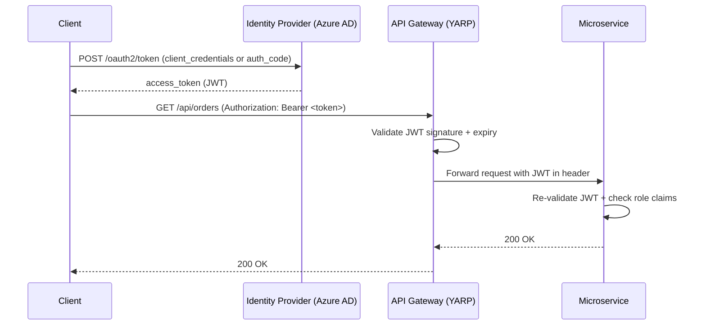
```mermaid
sequenceDiagram
    participant C as Client
    participant IDP as Identity Provider (Azure AD)
    participant GW as API Gateway (YARP)
    participant SVC as Microservice

    C->>IDP: POST /oauth2/token (client_credentials or auth_code)
    IDP-->>C: access_token (JWT)
    C->>GW: GET /api/orders (Authorization: Bearer <token>)
    GW->>GW: Validate JWT signature + expiry
    GW->>SVC: Forward request with JWT in header
    SVC->>SVC: Re-validate JWT + check role claims
    SVC-->>GW: 200 OK
    GW-->>C: 200 OK
```

### RBAC Architecture Diagram

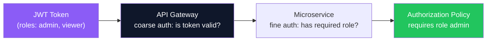
```mermaid
flowchart LR
    TOKEN["JWT Token\n(roles: admin, viewer)"]
    GW2["API Gateway\ncoarse auth: is token valid?"]
    SVC2["Microservice\nfine auth: has required role?"]
    POLICY["Authorization Policy\nrequires role admin"]

    TOKEN --> GW2 --> SVC2 --> POLICY

    style TOKEN fill:#8b5cf6,color:#fff
    style GW2 fill:#0f172a,color:#fff
    style POLICY fill:#22c55e,color:#fff
```

### JWT Validation in ASP.NET Core

**Tech Stack:** `Microsoft.Identity.Web`, `Microsoft.AspNetCore.Authentication.JwtBearer`

```csharp
// Each microservice validates the JWT independently
builder.Services
    .AddAuthentication(JwtBearerDefaults.AuthenticationScheme)
    .AddMicrosoftIdentityWebApi(builder.Configuration.GetSection("AzureAd"));

builder.Services.AddAuthorization(opts =>
{
    opts.AddPolicy("OrderReader", p => p.RequireRole("Order.Read", "Order.Admin"));
    opts.AddPolicy("OrderWriter", p => p.RequireRole("Order.Write", "Order.Admin"));
    opts.AddPolicy("Admin",       p => p.RequireRole("Order.Admin"));
});

var app = builder.Build();
app.UseAuthentication();
app.UseAuthorization();

app.MapGet("/orders/{id:guid}", async (Guid id, IOrderService svc, CancellationToken ct) =>
    Results.Ok(await svc.GetAsync(id, ct)))
    .RequireAuthorization("OrderReader");

app.MapPost("/orders", async (CreateOrderRequest req, IOrderService svc, CancellationToken ct) =>
    Results.Created($"/orders/{(await svc.CreateAsync(req, ct)).Id}", null))
    .RequireAuthorization("OrderWriter");

app.MapDelete("/orders/{id:guid}", async (Guid id, IOrderService svc, CancellationToken ct) =>
{
    await svc.CancelAsync(id, ct);
    return Results.NoContent();
})
.RequireAuthorization("Admin");
```

### API Gateway as Security Enforcement Layer

```csharp
// YARP gateway — enforces auth before forwarding
builder.Services
    .AddReverseProxy()
    .LoadFromConfig(builder.Configuration.GetSection("ReverseProxy"));

builder.Services
    .AddAuthentication(JwtBearerDefaults.AuthenticationScheme)
    .AddJwtBearer(opts =>
    {
        opts.Authority = builder.Configuration["AzureAd:Authority"];
        opts.Audience  = builder.Configuration["AzureAd:Audience"];
    });

builder.Services.AddAuthorization(opts =>
    opts.FallbackPolicy = new AuthorizationPolicyBuilder().RequireAuthenticatedUser().Build());

app.UseAuthentication();
app.UseAuthorization();
app.MapReverseProxy();
```

### Interview Talking Points

| Question | Answer |
|---|---|
| What is the difference between OAuth 2.0 and OpenID Connect? | OAuth 2.0 is an authorisation framework (access tokens for resource access); OIDC is an identity layer on top (ID tokens for who the user is) |
| Should each microservice validate the JWT? | Yes — defence in depth; don't trust that the gateway always validated; downstream services must validate independently |
| What is the difference between RBAC and ABAC? | RBAC grants access based on predefined roles; ABAC uses fine-grained attributes (user dept, resource owner, time of day) for more flexible but complex policies |
| How do you propagate identity across service-to-service calls? | Forward the JWT in the `Authorization` header on outgoing `HttpClient` calls using `DelegatingHandler` |
| What is a client credentials flow? | Machine-to-machine OAuth flow where a service obtains a token using its own client ID/secret — no user interaction; used for service-to-service calls |

---

## 11. Logging

### Overview

In a microservices system, a single user request may touch 5 or more services. Without a correlation ID propagated through every log entry and message, debugging production issues is nearly impossible. Structured logging (key-value pairs rather than plain strings) enables powerful querying in centralised log aggregation systems like Azure Application Insights or OpenSearch.

### Correlation ID Propagation Flow

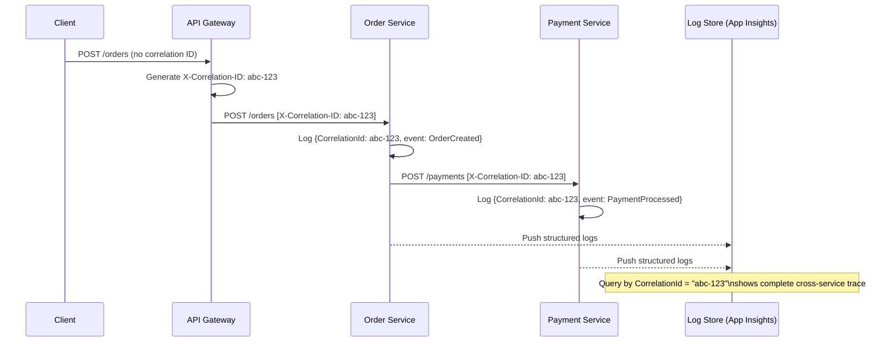
```mermaid
sequenceDiagram
    participant C as Client
    participant GW as API Gateway
    participant OS as Order Service
    participant PS as Payment Service
    participant LOG as Log Store (App Insights)

    C->>GW: POST /orders (no correlation ID)
    GW->>GW: Generate X-Correlation-ID: abc-123
    GW->>OS: POST /orders [X-Correlation-ID: abc-123]
    OS->>OS: Log {CorrelationId: abc-123, event: OrderCreated}
    OS->>PS: POST /payments [X-Correlation-ID: abc-123]
    PS->>PS: Log {CorrelationId: abc-123, event: PaymentProcessed}
    OS-->>LOG: Push structured logs
    PS-->>LOG: Push structured logs
    Note over LOG: Query by CorrelationId = "abc-123"\nshows complete cross-service trace
```

### Structured Logging with Serilog

**Tech Stack:** `Serilog`, `Serilog.Enrichers.CorrelationId`, `Serilog.Sinks.ApplicationInsights`

```csharp
// Program.cs
builder.Host.UseSerilog((ctx, cfg) => cfg
    .ReadFrom.Configuration(ctx.Configuration)
    .Enrich.FromLogContext()
    .Enrich.WithCorrelationId(headerName: "X-Correlation-ID")
    .Enrich.WithEnvironmentName()
    .Enrich.WithMachineName()
    .WriteTo.Console(new JsonFormatter())
    .WriteTo.ApplicationInsights(TelemetryConfiguration.CreateDefault(), TelemetryConverter.Traces));

// Middleware — generate or forward correlation ID
app.Use(async (ctx, next) =>
{
    var correlationId = ctx.Request.Headers["X-Correlation-ID"].FirstOrDefault()
                        ?? Guid.NewGuid().ToString("N");
    ctx.Response.Headers["X-Correlation-ID"] = correlationId;
    using (LogContext.PushProperty("CorrelationId", correlationId))
        await next();
});

// Usage — structured log entry (never string interpolation for queryable fields)
public class OrderService(ILogger<OrderService> logger)
{
    public async Task<Order> CreateAsync(CreateOrderRequest req, CancellationToken ct)
    {
        logger.LogInformation("Creating order for customer {CustomerId} with {LineCount} lines",
            req.CustomerId, req.Lines.Count);
        // ...
        logger.LogInformation("Order {OrderId} created successfully", order.Id);
        return order;
    }
}
```

### Outgoing HTTP — Forward Correlation ID

```csharp
// DelegatingHandler — automatically forwards X-Correlation-ID on all outbound calls
public class CorrelationIdHandler(IHttpContextAccessor accessor) : DelegatingHandler
{
    protected override Task<HttpResponseMessage> SendAsync(HttpRequestMessage req, CancellationToken ct)
    {
        var id = accessor.HttpContext?.Response.Headers["X-Correlation-ID"].FirstOrDefault();
        if (id is not null) req.Headers.TryAddWithoutValidation("X-Correlation-ID", id);
        return base.SendAsync(req, ct);
    }
}

builder.Services.AddTransient<CorrelationIdHandler>();
builder.Services.AddHttpClient<IPaymentClient, PaymentClient>()
    .AddHttpMessageHandler<CorrelationIdHandler>();
```

### Interview Talking Points

| Question | Answer |
|---|---|
| What is a correlation ID and why is it essential? | A UUID generated at the gateway entry point and threaded through every service call and message — allows reconstructing the full trace of a request from logs |
| What is structured logging? | Writing logs as key-value pairs rather than plain strings; enables filtering by `OrderId`, `CustomerId`, or any other field in a log aggregation system |
| How do you implement structured logging in .NET microservices? | Serilog with structured sinks — `WriteTo.ApplicationInsights` for Azure Monitor or `WriteTo.OpenSearch` for a managed ELK-equivalent; query logs by field in Log Analytics |
| How do you propagate correlation IDs across async message consumers? | Include the correlation ID in the message metadata/headers; the consumer extracts it and pushes it to the log context before processing |
| What log level should you use for which events? | `Debug` = internal state, `Information` = business events (order created), `Warning` = degraded state (retrying), `Error` = failed operation, `Critical` = service-threatening failure |

---

## 12. Distributed Tracing

### Overview

Distributed tracing follows a single request as it propagates through multiple services, capturing timing, errors, and relationships between spans. OpenTelemetry is the vendor-neutral standard — it instruments code once and exports to any backend (Jaeger, Zipkin, Azure Monitor). Each service contributes spans to a shared trace identified by the W3C `traceparent` header.

### Distributed Trace Flow

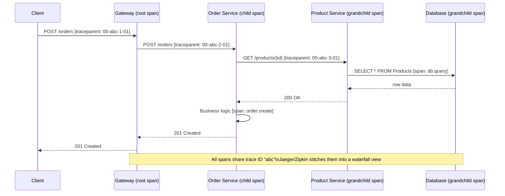
```mermaid
sequenceDiagram
    participant C as Client
    participant GW as Gateway (root span)
    participant OS as Order Service (child span)
    participant PS as Product Service (grandchild span)
    participant DB as Database (grandchild span)

    C->>GW: POST /orders [traceparent: 00-abc-1-01]
    GW->>OS: POST /orders [traceparent: 00-abc-2-01]
    OS->>PS: GET /products/{id} [traceparent: 00-abc-3-01]
    PS->>DB: SELECT * FROM Products [span: db.query]
    DB-->>PS: row data
    PS-->>OS: 200 OK
    OS->>OS: Business logic [span: order.create]
    OS-->>GW: 201 Created
    GW-->>C: 201 Created

    Note over GW,DB: All spans share trace ID "abc"\nJaeger/Zipkin stitches them into a waterfall view
```

### OpenTelemetry Setup

**Tech Stack:** `OpenTelemetry.Extensions.Hosting`, `OpenTelemetry.Instrumentation.AspNetCore`, `OpenTelemetry.Exporter.OpenTelemetryProtocol`

```csharp
builder.Services
    .AddOpenTelemetry()
    .ConfigureResource(r => r.AddService(
        serviceName:    builder.Environment.ApplicationName,
        serviceVersion: Assembly.GetExecutingAssembly().GetName().Version?.ToString()))
    .WithTracing(tracing => tracing
        .AddAspNetCoreInstrumentation(opts => opts.RecordException = true)
        .AddHttpClientInstrumentation()
        .AddSqlClientInstrumentation(opts => opts.SetDbStatementForText = true)
        .AddEntityFrameworkCoreInstrumentation()
        .AddOtlpExporter(opts =>
            opts.Endpoint = new Uri(builder.Configuration["Otel:Endpoint"]!)))
    .WithMetrics(metrics => metrics
        .AddAspNetCoreInstrumentation()
        .AddHttpClientInstrumentation()
        .AddRuntimeInstrumentation()
        .AddOtlpExporter());
```

### Custom Spans for Business Events

```csharp
public class OrderService(ILogger<OrderService> logger)
{
    private static readonly ActivitySource _activitySource = new("OrderService");

    public async Task<Order> CreateAsync(CreateOrderRequest req, CancellationToken ct)
    {
        using var activity = _activitySource.StartActivity("order.create");
        activity?.SetTag("customer.id",    req.CustomerId.ToString());
        activity?.SetTag("order.line_count", req.Lines.Count);

        try
        {
            var order = new Order(req.CustomerId);
            // ... persist and publish
            activity?.SetTag("order.id", order.Id.ToString());
            activity?.SetStatus(ActivityStatusCode.Ok);
            return order;
        }
        catch (Exception ex)
        {
            activity?.RecordException(ex);
            activity?.SetStatus(ActivityStatusCode.Error, ex.Message);
            throw;
        }
    }
}
```

### Interview Talking Points

| Question | Answer |
|---|---|
| What is the difference between logging and tracing? | Logging records discrete events; tracing records the causal chain of a request across services as a tree of timed spans |
| What is a trace, a span, and a trace ID? | A trace is the full journey of one request; a span is one unit of work within a service; a trace ID ties all spans together |
| What is W3C Trace Context? | An HTTP header standard (`traceparent`) for propagating trace context across service boundaries — OpenTelemetry supports it natively |
| What is the .NET equivalent of Zipkin/Jaeger instrumentation? | `OpenTelemetry.Extensions.Hosting` + OTLP exporter pointed at Jaeger or Azure Monitor — one SDK, any backend |
| How do you trace async message consumers? | Extract the trace context from the message header before processing and call `Activity.Start` with the parent context — OpenTelemetry has helpers for this |

---

## 13. Metrics and Health

### Overview

Metrics measure the quantitative behaviour of a service over time: request rate, error rate, latency percentiles, and resource utilisation. Health checks distinguish between liveness (the process is alive) and readiness (the service is ready to accept traffic). Kubernetes uses both probes to manage pod lifecycle. Prometheus scrapes metrics; Grafana visualises them.

### Metrics and Health Architecture

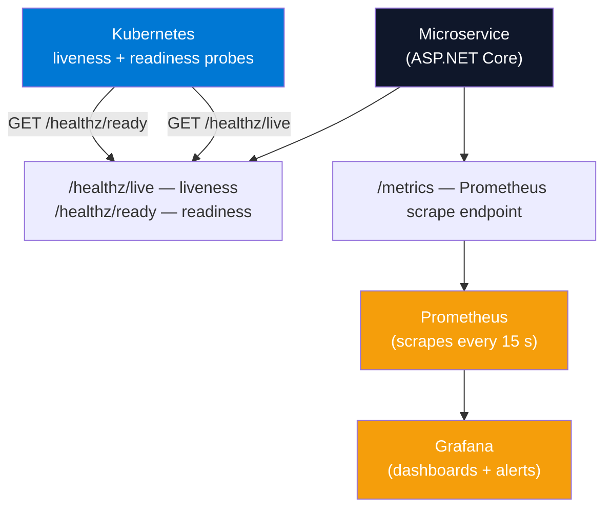
```mermaid
flowchart TD
    SVC["Microservice\n(ASP.NET Core)"]
    HC["/healthz/live — liveness\n/healthz/ready — readiness"]
    PROM_SCRAPE["/metrics — Prometheus scrape endpoint"]
    PROM["Prometheus\n(scrapes every 15 s)"]
    GRAF["Grafana\n(dashboards + alerts)"]
    K8S["Kubernetes\nliveness + readiness probes"]

    SVC --> HC
    SVC --> PROM_SCRAPE
    PROM_SCRAPE --> PROM --> GRAF
    K8S -->|"GET /healthz/live"| HC
    K8S -->|"GET /healthz/ready"| HC

    style SVC fill:#0f172a,color:#fff
    style PROM fill:#f59e0b,color:#fff
    style GRAF fill:#f59e0b,color:#fff
    style K8S fill:#0078D4,color:#fff
```

### Health Checks + Prometheus Metrics

**Tech Stack:** `Microsoft.Extensions.Diagnostics.HealthChecks`, `prometheus-net.AspNetCore`

```csharp
builder.Services
    .AddHealthChecks()
    .AddSqlServer(
        connectionString: builder.Configuration.GetConnectionString("OrderDb")!,
        name: "sql-server",
        failureStatus: HealthStatus.Degraded,
        tags: ["db", "sql"])
    .AddCheck<ServiceBusHealthCheck>("service-bus", tags: ["messaging"])
    .AddUrlGroup(new Uri(builder.Configuration["ServiceUrls:PaymentService"] + "/healthz/ready"),
        name: "payment-service-dependency",
        tags: ["dependency"]);

var app = builder.Build();

// Kubernetes liveness probe — just checks process is alive (no dependency checks)
app.MapHealthChecks("/healthz/live", new HealthCheckOptions
{
    Predicate = _ => false,       // only built-in process check
    ResponseWriter = WriteJson
});

// Kubernetes readiness probe — checks all dependencies
app.MapHealthChecks("/healthz/ready", new HealthCheckOptions
{
    ResponseWriter = WriteJson
});

// Prometheus scrape endpoint
app.UseHttpMetrics();            // request rate, latency, status codes
app.MapMetrics("/metrics");      // prometheus-net
```

### Custom Business Metric

```csharp
public class OrderMetrics
{
    private static readonly Counter<long> _ordersCreated =
        Metrics.CreateCounter<long>("orders_created_total", "Total orders created",
            new[] { "status", "customer_tier" });

    private static readonly Histogram<double> _orderProcessingMs =
        Metrics.CreateHistogram<double>("order_processing_duration_ms",
            "Order processing duration in milliseconds");

    public void RecordOrderCreated(string status, string tier) =>
        _ordersCreated.Add(1, status, tier);

    public IDisposable MeasureProcessing() =>
        _orderProcessingMs.NewTimer();
}
```

### Interview Talking Points

| Question | Answer |
|---|---|
| What is the difference between liveness and readiness probes? | Liveness: is the process alive? (restart if no). Readiness: is it ready to serve traffic? (remove from load balancer if no — don't restart) |
| What are the four golden signals? | Latency, Traffic (request rate), Errors (error rate), Saturation (resource utilisation) — the standard set of metrics for any service |
| What is the .NET equivalent of Spring Boot Actuator? | ASP.NET Core Health Checks (`/healthz/live`, `/healthz/ready`) + `prometheus-net` for metrics — same concept, different library |
| How does Prometheus scrape metrics? | Prometheus polls the `/metrics` HTTP endpoint on a configurable interval; `prometheus-net` exposes counters, gauges, and histograms in the Prometheus text format |
| What is an SLO and how do metrics support it? | Service Level Objective — e.g., "99.9% of requests under 200 ms"; Grafana alerts fire when the error budget is burning faster than allowed |

---

## 14. Resilience and Fault Tolerance

### Overview

Distributed systems fail in partial, unpredictable ways. Four patterns address this: Circuit Breaker (stop calling a failing service), Retry with backoff (handle transient failures), Bulkhead (isolate failure domains so one overloaded service cannot exhaust all threads), and Rate Limiting (protect services from being overwhelmed). Polly v8 and the .NET built-in rate limiter implement all of these.

### Resilience Patterns Overview

```mermaid
flowchart TD
    FAIL(["Request to\nDownstream Service"]) --> RT["Retry\nTransient HTTP 5xx / timeout"]
    RT -->|"still failing after N attempts"| CB2["Circuit Breaker\nOpen — stop calling"]
    CB2 -->|"break duration elapsed"| HO["Half-Open\nProbe with single request"]
    HO -->|"success"| CLOSE["Closed — normal operation"]
    HO -->|"failure"| CB2

    FAIL --> BH["Bulkhead\nLimit concurrent calls\nto each downstream"]
    FAIL --> RL["Rate Limiter\nLimit incoming requests\nper client / per second"]

    style RT fill:#f59e0b,color:#fff
    style CB2 fill:#ef4444,color:#fff
    style HO fill:#f59e0b,color:#fff
    style CLOSE fill:#22c55e,color:#fff
    style BH fill:#8b5cf6,color:#fff
    style RL fill:#1e40af,color:#fff
```

### Full Resilience Pipeline with Polly v8

**Tech Stack:** `Microsoft.Extensions.Http.Resilience` (Polly v8)

```csharp
builder.Services.AddHttpClient<IInventoryClient, InventoryClient>()
    .AddResilienceHandler("inventory-pipeline", pipeline =>
    {
        // 1. Per-attempt timeout (innermost)
        pipeline.AddTimeout(TimeSpan.FromSeconds(3));

        // 2. Retry with exponential backoff and jitter
        pipeline.AddRetry(new HttpRetryStrategyOptions
        {
            MaxRetryAttempts = 3,
            Delay            = TimeSpan.FromMilliseconds(200),
            BackoffType      = DelayBackoffType.Exponential,
            UseJitter        = true,
            ShouldHandle     = new PredicateBuilder<HttpResponseMessage>()
                .Handle<HttpRequestException>()
                .Handle<TimeoutRejectedException>()
                .HandleResult(r => (int)r.StatusCode >= 500)
        });

        // 3. Circuit breaker
        pipeline.AddCircuitBreaker(new HttpCircuitBreakerStrategyOptions
        {
            FailureRatio      = 0.5,
            SamplingDuration  = TimeSpan.FromSeconds(30),
            MinimumThroughput = 10,
            BreakDuration     = TimeSpan.FromSeconds(60)
        });

        // 4. Overall request timeout (outermost)
        pipeline.AddTimeout(TimeSpan.FromSeconds(15));
    });
```

### Bulkhead — Limit Concurrent Calls

```csharp
// Isolate concurrent calls to a slow downstream — prevent thread exhaustion
builder.Services.AddHttpClient<IReportingClient, ReportingClient>()
    .AddResilienceHandler("reporting-bulkhead", pipeline =>
    {
        pipeline.AddConcurrencyLimiter(new ConcurrencyLimiterOptions
        {
            PermitLimit = 10,     // max 10 concurrent calls to reporting service
            QueueLimit  = 5       // allow 5 more to queue; reject beyond that
        });
    });
```

### Rate Limiting — Protect Incoming Traffic

**Tech Stack:** `Microsoft.AspNetCore.RateLimiting` (.NET 7+ built-in)

```csharp
builder.Services.AddRateLimiter(opts =>
{
    // Sliding window: 100 requests per 60-second window, 10 request segments
    opts.AddSlidingWindowLimiter("api", limiter =>
    {
        limiter.PermitLimit         = 100;
        limiter.Window              = TimeSpan.FromSeconds(60);
        limiter.SegmentsPerWindow   = 10;
        limiter.QueueProcessingOrder = QueueProcessingOrder.OldestFirst;
        limiter.QueueLimit          = 0;    // no queue — reject immediately
    });

    // Per-client rate limiting by IP or client ID
    opts.AddPolicy("per-client", ctx =>
        RateLimitPartition.GetSlidingWindowLimiter(
            partitionKey: ctx.User?.FindFirstValue(ClaimTypes.NameIdentifier)
                          ?? ctx.Connection.RemoteIpAddress?.ToString()
                          ?? "anonymous",
            factory: _ => new SlidingWindowRateLimiterOptions
            {
                PermitLimit = 20, Window = TimeSpan.FromSeconds(10), SegmentsPerWindow = 2
            }));

    opts.RejectionStatusCode = StatusCodes.Status429TooManyRequests;
});

app.UseRateLimiter();

app.MapPost("/orders", handler).RequireRateLimiting("per-client");
```

### Interview Talking Points

| Question | Answer |
|---|---|
| What is the difference between retry and circuit breaker? | Retry handles transient, one-off failures; circuit breaker detects a sustained failure rate and stops calling entirely to give the downstream time to recover |
| What is the Bulkhead pattern? | Isolates a pool of resources (threads, connections) for each downstream — one slow service cannot exhaust the shared pool and take down unrelated functionality |
| Why must retry use jitter? | Without jitter, all callers retry at the same intervals — "thundering herd" hammers the recovering service; jitter spreads the load randomly |
| How do you implement rate limiting in .NET microservices? | `Microsoft.AspNetCore.RateLimiting` (`AddRateLimiter`) — built into .NET 7+; supports sliding window, token bucket, fixed window, and concurrency limiters; no external library needed |
| What is a fallback and when should you use one? | Return a safe default (cached response, empty list) when the downstream is unavailable — valid only when stale data is acceptable |

---

## 15. Deployment Strategies

### Overview

Microservices are containerised with Docker (one container per service) and orchestrated with Kubernetes (managing scheduling, scaling, health, and secrets). Each service gets its own `Dockerfile` and Kubernetes manifests. Docker Compose is used locally for multi-service development; Kubernetes is the production target.

### Deployment Architecture

```mermaid
flowchart TD
    subgraph Dev ["Local Development"]
        DC["Docker Compose\n(all services + deps)"]
    end

    subgraph CICD ["CI/CD Pipeline (GitHub Actions / Azure DevOps)"]
        BUILD["Build .NET app\ndotnet publish -c Release"] --> IMG["Build Docker image\ndocker build"]
        IMG --> PUSH["Push to registry\nAzure Container Registry"]
    end

    subgraph K8S ["Kubernetes (AKS)"]
        INGRESS["Ingress Controller\n(NGINX / AGIC)"]
        subgraph Pods ["Service Pods"]
            P1["Order Service\nPod x3"]
            P2["Payment Service\nPod x2"]
            P3["Product Service\nPod x2"]
        end
        CM["ConfigMap\n(non-secret config)"]
        SEC["Kubernetes Secret\n(from Azure Key Vault)"]
        HPA["HPA\n(autoscaler)"]
    end

    PUSH --> K8S
    INGRESS --> P1
    INGRESS --> P2
    INGRESS --> P3
    CM --> P1
    SEC --> P1
    HPA -. scales .-> P1
    HPA -. scales .-> P2

    style BUILD fill:#8b5cf6,color:#fff
    style PUSH fill:#0078D4,color:#fff
    style INGRESS fill:#0f172a,color:#fff
    style HPA fill:#22c55e,color:#fff
    style SEC fill:#ef4444,color:#fff
```

### Dockerfile — ASP.NET Core Microservice

```dockerfile
# Multi-stage build — minimise final image size
FROM mcr.microsoft.com/dotnet/sdk:9.0 AS build
WORKDIR /src
COPY ["OrderService/OrderService.csproj", "OrderService/"]
RUN dotnet restore "OrderService/OrderService.csproj"
COPY . .
WORKDIR "/src/OrderService"
RUN dotnet publish -c Release -o /app/publish --no-restore

FROM mcr.microsoft.com/dotnet/aspnet:9.0 AS final
WORKDIR /app
# Run as non-root for security
USER $APP_UID
COPY --from=build /app/publish .
EXPOSE 8080
ENTRYPOINT ["dotnet", "OrderService.dll"]
```

### Docker Compose — Local Multi-Service Development

```yaml
# docker-compose.yml
services:
  api-gateway:
    build: ./ApiGateway
    ports: ["8000:8080"]
    depends_on: [order-service, product-service, payment-service]

  order-service:
    build: ./OrderService
    environment:
      - ConnectionStrings__OrderDb=Server=sqlserver;Database=OrderDb;User Id=sa;Password=${SA_PASSWORD}
      - ServiceBus__ConnectionString=${SERVICE_BUS_CONN}
    depends_on: [sqlserver, servicebus-emulator]

  product-service:
    build: ./ProductService
    environment:
      - ConnectionStrings__ProductDb=Host=postgres;Database=ProductDb;Username=app;Password=${PG_PASSWORD}
    depends_on: [postgres]

  payment-service:
    build: ./PaymentService
    environment:
      - ConnectionStrings__PaymentDb=Host=postgres;Database=PaymentDb;Username=app;Password=${PG_PASSWORD}
    depends_on: [postgres, servicebus-emulator]

  sqlserver:
    image: mcr.microsoft.com/mssql/server:2022-latest
    environment:
      SA_PASSWORD: "${SA_PASSWORD}"
      ACCEPT_EULA: "Y"

  postgres:
    image: postgres:16-alpine
    environment:
      POSTGRES_USER: app
      POSTGRES_PASSWORD: "${PG_PASSWORD}"

volumes:
  sqldata:
  pgdata:
```

### Kubernetes Deployment + HPA

```yaml
# k8s/order-service.yaml
apiVersion: apps/v1
kind: Deployment
metadata:
  name: order-service
spec:
  replicas: 2
  selector:
    matchLabels: { app: order-service }
  template:
    metadata:
      labels: { app: order-service }
    spec:
      containers:
        - name: order-service
          image: myacr.azurecr.io/order-service:latest
          ports: [{ containerPort: 8080 }]
          env:
            - name: ConnectionStrings__OrderDb
              valueFrom:
                secretKeyRef: { name: order-service-secrets, key: db-connection-string }
          livenessProbe:
            httpGet: { path: /healthz/live, port: 8080 }
            initialDelaySeconds: 10
            periodSeconds: 15
          readinessProbe:
            httpGet: { path: /healthz/ready, port: 8080 }
            initialDelaySeconds: 5
            periodSeconds: 10
          resources:
            requests: { cpu: "100m", memory: "128Mi" }
            limits:   { cpu: "500m", memory: "512Mi" }
---
apiVersion: autoscaling/v2
kind: HorizontalPodAutoscaler
metadata:
  name: order-service-hpa
spec:
  scaleTargetRef:
    apiVersion: apps/v1
    kind: Deployment
    name: order-service
  minReplicas: 2
  maxReplicas: 10
  metrics:
    - type: Resource
      resource:
        name: cpu
        target: { type: Utilization, averageUtilization: 70 }
---
apiVersion: v1
kind: Service
metadata:
  name: order-service
spec:
  selector: { app: order-service }
  ports: [{ port: 8080, targetPort: 8080 }]
```

### Interview Talking Points

| Question | Answer |
|---|---|
| Why use multi-stage Docker builds? | The SDK image is ~800 MB; the final runtime image is ~200 MB — multi-stage copies only the published output, reducing attack surface and pull time |
| What is the difference between Docker Compose and Kubernetes? | Compose is for local development (single machine); Kubernetes is for production clusters — scheduling, auto-scaling, health management, rolling updates |
| What are liveness vs readiness probes in Kubernetes? | Liveness: restart the pod if it's stuck. Readiness: remove the pod from the Service load balancer if it's not ready to serve traffic — avoid downtime during startup |
| How do you manage secrets in Kubernetes? | Mount secrets from Azure Key Vault using the Secrets Store CSI Driver — secrets never land in container images or ConfigMaps |
| What is a HorizontalPodAutoscaler? | Kubernetes controller that adjusts pod replica count based on CPU/memory utilisation or custom metrics — enables automatic scale-out under load |

---

## Cross-Cutting Themes

### Pattern Selection Guide

```mermaid
flowchart TD
    PROBLEM(["Problem to Solve"]) --> Q1{"Category?"}

    Q1 -->|"Service failure"| Q2{"Transient or systemic?"}
    Q2 -->|"Transient\n(occasional)"| RET["Polly Retry\nExponential backoff + jitter"]
    Q2 -->|"Systemic\n(repeated)"| CB3["Polly Circuit Breaker\nOpen → Half-Open → Closed"]

    Q1 -->|"Distributed transaction"| Q3{"Services involved?"}
    Q3 -->|"2-3 simple flow"| CHOR["SAGA Choreography\nAzure Service Bus events"]
    Q3 -->|"4+ complex rollback"| ORCHES["SAGA Orchestration\nBackgroundService state machine"]

    Q1 -->|"Cross-service query"| CQRS2["CQRS + Read Models\nEvent-driven projections"]

    Q1 -->|"Client-tailored API"| BFF2["BFF Pattern\nPer-client Minimal API layer"]

    Q1 -->|"Protect service from overload"| RL2["Rate Limiter\nAddRateLimiter (sliding window)"]

    Q1 -->|"Isolate failure domains"| BH2["Bulkhead\nAddConcurrencyLimiter per downstream"]

    style RET fill:#22c55e,color:#fff
    style CB3 fill:#f59e0b,color:#fff
    style CHOR fill:#8b5cf6,color:#fff
    style ORCHES fill:#8b5cf6,color:#fff
    style CQRS2 fill:#1e40af,color:#fff
    style BFF2 fill:#0078D4,color:#fff
    style RL2 fill:#1e40af,color:#fff
    style BH2 fill:#8b5cf6,color:#fff
    style PROBLEM fill:#0f172a,color:#fff
```

### Common Interview Red Flags to Avoid

| Red Flag | Why It's Wrong | Correct Answer |
|---|---|---|
| "We share a database across services" | Recreates monolith coupling at the persistence layer — schema changes break multiple teams | Database-per-service; share data via domain events or read APIs |
| "We retry in a tight loop" | Thundering herd — hammers a recovering service and causes cascading failures | Polly exponential backoff with `UseJitter = true` |
| "We use 2PC for distributed transactions" | Blocking protocol that degrades availability — all participants lock until coordinator decides | SAGA pattern with compensating transactions for eventual consistency |
| "SAGA = ACID" | SAGA gives eventual consistency only — compensating transactions are best-effort | Use a single service + single DB for true ACID; SAGA for cross-service workflows |
| "We use choreography for everything" | Complex 6+ step flows become untraceable — no visibility into overall saga state | Use orchestration with an explicit state machine for complex multi-step workflows |
| "Secrets go in appsettings.json or Dockerfile ENV" | Secrets leak in git history and container image layers | Azure Key Vault + DefaultAzureCredential + Kubernetes Secrets Store CSI Driver |
| "We deploy all services in one pipeline" | Creates a distributed monolith — defeats independent deployability | Each service has its own CI/CD pipeline with independent release cadence |
| "We only log strings" | Plain-text logs cannot be queried by field — debugging requires grep, not analytics | Structured logging with Serilog — every field is a queryable key-value pair |

---

## Additional Material from Description-Architecture-Insta-Complete.md

> Unique additions: GDPR, data-dedup, tesla-trillion-row, username-at-scale, webhook-vs-websocket, multi-tenancy.


> Quick-reference guide covering authentication, distributed systems, microservices patterns, frontend architecture, and database design — with .NET code examples and Mermaid diagrams.

---

## Table of Contents

1. [Authentication & Authorization](#1-authentication--authorization)
2. [Cookies vs Cache](#2-cookies-vs-cache)
3. [LLD vs HLD — Topic Guide](#3-lld-vs-hld--topic-guide)
4. [Database Deletion, GDPR & Storage Reclamation](#4-database-deletion-gdpr--storage-reclamation)
5. [Data Deduplication](#5-data-deduplication)
6. [VM vs Docker vs Kubernetes](#6-vm-vs-docker-vs-kubernetes)
7. [System Scaling Patterns](#7-system-scaling-patterns)
8. [Tesla's Trillion-Row Data Architecture](#8-teslas-trillion-row-data-architecture)
9. [Webhook vs WebSocket](#9-webhook-vs-websocket)
10. [JavaScript — Async/Await, Promise, Call/Apply/Bind](#10-javascript--asyncawait-promise-callapplybind)
11. [Username Availability at Scale](#11-username-availability-at-scale)
12. [CAP Theorem & Distributed Systems Concepts](#12-cap-theorem--distributed-systems-concepts)
13. [Microservices Database Patterns](#13-microservices-database-patterns)
14. [API Gateway](#14-api-gateway)
15. [Backend for Frontend (BFF)](#15-backend-for-frontend-bff)
16. [Database Multi-Tenancy](#16-database-multi-tenancy)
17. [Frontend Architecture — MFE, React Patterns & System Design](#17-frontend-architecture--mfe-react-patterns--system-design)
18. [TypeScript Key Concepts & Event Storming](#18-typescript-key-concepts--event-storming)
19. [Cross-Cutting Themes](#19-cross-cutting-themes)

---

## 1. Authentication & Authorization

### Overview

**Authentication** confirms *who you are*. **Authorization** determines *what you can do*. They are sequential — you authenticate first, then the system authorizes your actions.

### Authentication Flow

```mermaid
flowchart LR
    U([User]) --> AUTH{Authenticate\nWho are you?}
    AUTH -->|valid| AUTHZ{Authorize\nWhat can you do?}
    AUTH -->|invalid| DENY1([401 Unauthorized])
    AUTHZ -->|permitted| RESOURCE([Access Resource ✅])
    AUTHZ -->|denied| DENY2([403 Forbidden])

    style DENY1 fill:#ef4444,color:#fff
    style DENY2 fill:#ef4444,color:#fff
    style RESOURCE fill:#22c55e,color:#fff
```

---

### Authentication Methods

```mermaid
flowchart TD
    AUTH[Authentication Methods] --> BASIC[Basic Auth\nBase64 user:pass]
    AUTH --> SESSION[Session-Based\nServer-side session store]
    AUTH --> BEARER[Bearer Token\nStateless API token]
    AUTH --> JWT[OAuth 2.0 + JWT\nThird-party IdP]
    AUTH --> SSO[SSO\nSAML / OpenID Connect]

    BASIC --> RISK1[❌ Reversible encoding\nUse only over HTTPS]
    SESSION --> RISK2[⚠️ Prone to CSRF attacks\nUse SameSite cookie + CSRF token]
    BEARER --> GOOD1[✅ Stateless, scalable\nCurrent API standard]
    JWT --> GOOD2[✅ User info embedded\nShort expiry + refresh token]
    SSO --> GOOD3[✅ Log in once\nAccess Gmail, Drive, Calendar]

    style RISK1 fill:#ef4444,color:#fff
    style RISK2 fill:#f59e0b,color:#fff
    style GOOD1 fill:#22c55e,color:#fff
    style GOOD2 fill:#22c55e,color:#fff
    style GOOD3 fill:#22c55e,color:#fff
```

#### Session-Based (CSRF risk)

```mermaid
sequenceDiagram
    participant C as Client
    participant S as Server
    participant DB as Session Store

    C->>S: POST /login (user + pass)
    S->>DB: Store session {sessionId → userId}
    S-->>C: Set-Cookie: sessionId=abc123
    C->>S: GET /profile (Cookie: sessionId=abc123)
    S->>DB: Lookup sessionId → userId
    S-->>C: Profile data
```

#### JWT / Bearer Token (stateless)

```mermaid
sequenceDiagram
    participant C as Client
    participant IdP as Identity Provider
    participant API as API Server

    C->>IdP: POST /oauth/token (credentials)
    IdP-->>C: access_token (JWT, 15min) + refresh_token (7d)
    C->>API: GET /data (Authorization: Bearer <JWT>)
    API->>API: Validate JWT signature (no DB call)
    API-->>C: Data ✅

    Note over C,API: Access token expires
    C->>IdP: POST /oauth/refresh (refresh_token)
    IdP-->>C: New access_token
```

**.NET — JWT Setup (ASP.NET Core):**

```csharp
// Program.cs
builder.Services
    .AddAuthentication(JwtBearerDefaults.AuthenticationScheme)
    .AddJwtBearer(options =>
    {
        options.TokenValidationParameters = new TokenValidationParameters
        {
            ValidateIssuer = true,
            ValidateAudience = true,
            ValidateLifetime = true,
            ValidateIssuerSigningKey = true,
            ValidIssuer = builder.Configuration["Jwt:Issuer"],
            ValidAudience = builder.Configuration["Jwt:Audience"],
            IssuerSigningKey = new SymmetricSecurityKey(
                Encoding.UTF8.GetBytes(builder.Configuration["Jwt:Key"]!))
        };
    });

app.UseAuthentication();
app.UseAuthorization();
```

```csharp
// JWT best practices
public record JwtClaims(string UserId, string Role);  // never store PII (email, SSN)

// ✅ Use opaque tokens externally, JWT internally (behind API Gateway)
// ✅ Short access token TTL: 15 min
// ✅ Refresh tokens: server-side storage + rotation on use
// ❌ Never store PII (email, SSN, credit card) in JWT payload
// ❌ Never use alg:none
```

---

### Authorization Models

```mermaid
flowchart LR
    subgraph RBAC["RBAC — Role-Based"]
        U1[User] --> R1[Role: Editor]
        R1 --> P1[Can: read, write]
        R1 --> P2[Cannot: delete]
    end

    subgraph ABAC["ABAC — Attribute-Based"]
        U2[User\nattr: dept=HR] --> POLICY[Policy:\ndept=HR AND\ntime=business_hours]
        POLICY --> ACCESS[Access granted]
    end

    subgraph ACL["ACL — Access Control List"]
        DOC[Document.pdf] --> ACL1[Alice: read/write]
        DOC --> ACL2[Bob: read only]
        DOC --> ACL3[Carol: no access]
    end

    style RBAC fill:#eff6ff,stroke:#1e40af
    style ABAC fill:#f0fdf4,stroke:#22c55e
    style ACL fill:#fefce8,stroke:#f59e0b
```

**.NET — Policy-based authorization (covers RBAC + ABAC):**

```csharp
// Program.cs
builder.Services.AddAuthorization(options =>
{
    // RBAC: role-based
    options.AddPolicy("AdminOnly", p => p.RequireRole("Admin"));

    // ABAC: attribute-based (custom requirement)
    options.AddPolicy("HRBusinessHours", p =>
        p.RequireClaim("department", "HR")
         .AddRequirements(new BusinessHoursRequirement()));
});

// Endpoint
app.MapDelete("/users/{id}", [Authorize(Policy = "AdminOnly")] async (string id) => { ... });
```

### Interview Talking Points

| Question | Answer |
|---|---|
| Session vs Token auth? | Session: server stores state, CSRF-vulnerable. Token (JWT): stateless, scales horizontally |
| Why JWT over opaque tokens internally? | JWT: no DB lookup for validation — just verify signature. Faster at scale |
| What to store in JWT? | User ID, role, expiry. Never PII (email, SSN). Minimize payload size |
| Access + Refresh token pattern? | Access token: short-lived (15 min) for API calls. Refresh token: long-lived (7d), stored server-side, rotated on use |
| RBAC vs ABAC? | RBAC: role → permissions (simple, most common). ABAC: fine-grained rules on attributes (flexible, complex) |
| OAuth 2.0 vs SSO? | OAuth 2.0 is delegated authorization protocol. SSO is the user experience (single login, multiple services) — often implemented via OAuth 2.0 / OIDC |

---

## 2. Cookies vs Cache

### Overview

Cookies and cache solve different problems. Cookies persist **user-specific state** across sessions; cache stores **frequently accessed shared data** for performance.

```mermaid
flowchart LR
    subgraph COOKIE["🍪 Cookie"]
        direction TB
        C1[Stored in: Browser]
        C2[Scope: Per user]
        C3[Purpose: Personalization\nSession state\nPreferences]
        C4[Lifetime: Set by server\ne.g. 30 days]
        C5[Sent with: Every HTTP request\n automatically]
    end

    subgraph CACHE["⚡ Cache"]
        direction TB
        CA1[Stored in: Server / CDN / Browser]
        CA2[Scope: Shared across users]
        CA3[Purpose: Reduce DB load\nFast data retrieval]
        CA4[Lifetime: TTL-based\ne.g. 5 min]
        CA5[Sent with: Not sent — queried\nby server or CDN]
    end

    style COOKIE fill:#fefce8,stroke:#f59e0b
    style CACHE fill:#eff6ff,stroke:#1e40af
```

| Feature | Cookie | Cache |
|---|---|---|
| **Stored at** | Browser (client-side) | Server, Redis, CDN |
| **Scope** | Per user, per browser | Shared across all users |
| **Purpose** | User state, personalization, session | Performance, reduce DB load |
| **Expires** | Server-set expiry or session end | TTL (e.g., 5 min, 1 hour) |
| **Sent automatically?** | Yes — with every HTTP request | No — queried explicitly |
| **Examples** | Login sessions, shopping cart, theme | Product listings, search results |

> **Interview Language:** "Cookies store *user-specific, long-lived* data like session identifiers and preferences — they travel with every request. Cache stores *frequently accessed, shared* data server-side to avoid repeated DB queries."

---

## 3. LLD vs HLD — Topic Guide

### Overview

**Low-Level Design (LLD)** focuses on code-level structure and patterns. **High-Level Design (HLD)** focuses on distributed system topology and data flow.

```mermaid
mindmap
  root((System Design))
    LLD
      API Design
        REST principles
        Request/Response contracts
        Versioning
      Database
        SQL vs NoSQL selection
        Schema design
        Index strategy
      SOLID Principles
        Single Responsibility
        Open/Closed
        Liskov Substitution
        Interface Segregation
        Dependency Inversion
      Design Patterns
        Creational
        Structural
        Behavioural
      Code Quality
        Readable naming
        Small functions
        Testability
    HLD
      Consistency and Consensus
        CAP Theorem
        Raft consensus
        Paxos
      Distributed Caching
        Redis Cluster
        CDN edge caching
      Scaling
        Horizontal vs Vertical
        Load balancing
        Sharding
      Reliability
        Circuit Breaker
        Retry with backoff
        Rate Limiting
```

| LLD Focus | HLD Focus |
|---|---|
| Class diagrams, API contracts | System topology, data flow |
| SOLID principles | CAP theorem, consensus |
| Design patterns (Factory, Observer) | Caching, CDN, replication |
| SQL schema, indexes | Sharding, partitioning |
| Unit-testable code | SLA, availability, latency targets |

---

## 4. Database Deletion, GDPR & Storage Reclamation

### Overview

Data deletion has three layers: logical (soft delete), physical (hard delete), and storage disc. GDPR requires the ability to permanently erase personal data on request.

### Deletion Architecture

```mermaid
flowchart TD
    CMD[DELETE Command] --> LYR{Layer}

    LYR --> L1[Logical Layer\nSoft Delete]
    LYR --> L2[Physical Layer\nHard Delete]
    LYR --> L3[Storage Disc\nActual deallocation]

    L1 --> SD[UPDATE table\nSET deleted_at = NOW()\nWHERE id = 12\nSpace NOT reclaimed ❌]
    L2 --> HD[DELETE FROM table\nWHERE id = 12\nPage marked free ✅]
    L3 --> RECLAIM[OS reallocates pages\nVACUUM / REINDEX]

    style SD fill:#f59e0b,color:#fff
    style HD fill:#22c55e,color:#fff
```

### Soft Delete vs Hard Delete

| Feature | Soft Delete | Hard Delete |
|---|---|---|
| SQL | `UPDATE SET deleted_at = NOW()` | `DELETE FROM table WHERE id = ?` |
| Space reclaimed? | ❌ No | ✅ Yes (after VACUUM) |
| Auditable? | ✅ Full history | ❌ Data gone |
| GDPR compliant? | ❌ Not alone — need erasure step | ✅ With VACUUM |
| Recovery? | ✅ Easy — set deleted_at = NULL | ❌ Requires backup |

**.NET — Soft Delete with EF Core global query filter:**

```csharp
// Base entity
public abstract class SoftDeletableEntity
{
    public DateTimeOffset? DeletedAt { get; set; }
    public bool IsDeleted => DeletedAt.HasValue;
}

// DbContext — auto-filter deleted rows from all queries
public class AppDbContext : DbContext
{
    protected override void OnModelCreating(ModelBuilder builder)
    {
        // Apply global filter to every ISoftDeletable entity
        foreach (var entityType in builder.Model.GetEntityTypes()
            .Where(t => typeof(SoftDeletableEntity).IsAssignableFrom(t.ClrType)))
        {
            builder.Entity(entityType.ClrType)
                .HasQueryFilter(BuildSoftDeleteFilter(entityType.ClrType));
        }
    }

    private static LambdaExpression BuildSoftDeleteFilter(Type type)
    {
        var param = Expression.Parameter(type, "e");
        var prop = Expression.Property(param, nameof(SoftDeletableEntity.DeletedAt));
        var body = Expression.Equal(prop, Expression.Constant(null, typeof(DateTimeOffset?)));
        return Expression.Lambda(body, param);
    }
}

// GDPR erasure — hard delete personal data on right-to-erasure request
public async Task EraseUserDataAsync(Guid userId)
{
    await _db.Database.ExecuteSqlRawAsync(
        "DELETE FROM users WHERE id = {0}", userId);
    await _db.Database.ExecuteSqlRawAsync(
        "DELETE FROM user_orders WHERE user_id = {0}", userId);
    // Trigger VACUUM ANALYZE on PostgreSQL via scheduled job
}
```

### Storage Reclamation (DBA Tasks)

```mermaid
flowchart LR
    DEL[Hard Deletes\naccumulate] --> FRAG[Page Fragmentation\ngrows]
    FRAG --> CHECK[DBA Checks]
    CHECK --> IDX[Re-create Indexes\nDROP + CREATE INDEX]
    CHECK --> VAC[VACUUM ANALYZE\nPostgreSQL]
    CHECK --> REORG[ALTER TABLE\nSQL Server / MySQL]
    IDX & VAC & REORG --> SPACE[Space Reclaimed ✅\nQuery performance restored]

    style SPACE fill:#22c55e,color:#fff
```

**DBA monitoring targets:**

| Metric | Threshold | Action |
|---|---|---|
| Transaction log growth | > 80% of allocated size | Shrink / archive log |
| Page fragmentation | > 30% | Rebuild index |
| Dead tuple % (PostgreSQL) | > 20% | Run VACUUM |
| Auto-vacuum frequency | Rarely running | Tune `autovacuum_vacuum_cost_delay` |

### Interview Talking Points

| Question | Answer |
|---|---|
| Soft delete vs hard delete? | Soft: marks row deleted, keeps data for audit/recovery. Hard: removes row, space reclaimed after VACUUM |
| How to achieve GDPR right-to-erasure? | Hard delete personal data + cascade to related tables + log the erasure event |
| Why doesn't DELETE free disk space immediately? | DB marks pages as logically free but physical deallocation requires VACUUM (Postgres) or DBCC SHRINKDATABASE (SQL Server) |
| EF Core soft delete pattern? | Global query filter on `DeletedAt IS NULL` applied at `DbContext` level — transparent to all queries |

---

## 5. Data Deduplication

### Overview

Deduplication stores a file **once** at a canonical location. All other references point to that single copy — saving storage while maintaining the illusion of separate files.

```mermaid
flowchart TD
    subgraph BEFORE["Without Deduplication"]
        F1[File A\n100MB] 
        F2[File B — same content\n100MB]
        F3[File C — same content\n100MB]
        STORE1[(Storage\n300MB used)]
        F1 & F2 & F3 --> STORE1
    end

    subgraph AFTER["With Deduplication"]
        MASTER[Master File\n100MB — stored once]
        REF1[Reference A → master]
        REF2[Reference B → master]
        REF3[Reference C → master]
        STORE2[(Storage\n100MB used ✅)]
        REF1 & REF2 & REF3 --> MASTER --> STORE2
    end

    style STORE1 fill:#ef4444,color:#fff
    style STORE2 fill:#22c55e,color:#fff
```

**How it works:** Content-addressable storage — hash the file (SHA-256), store the hash as the key, the content as the value. If the hash already exists, store only a reference (pointer) instead of the content.

```csharp
// Content-addressable storage pattern
public class DeduplicatingBlobService
{
    private readonly IBlobStorage _storage;
    private readonly IHashIndex _index;

    public async Task<string> StoreAsync(Stream content)
    {
        var hash = await ComputeSha256Async(content);

        if (await _index.ExistsAsync(hash))
            return hash;  // already stored — return reference

        content.Position = 0;
        await _storage.UploadAsync(hash, content);
        await _index.RegisterAsync(hash);
        return hash;
    }

    private static async Task<string> ComputeSha256Async(Stream stream)
    {
        using var sha256 = SHA256.Create();
        var hashBytes = await sha256.ComputeHashAsync(stream);
        return Convert.ToHexString(hashBytes).ToLower();
    }
}
```

> **Real-world use:** Dropbox, OneDrive, and git all use content-addressable storage for deduplication. Git blobs are identified by SHA-1 of their content.

---

## 6. VM vs Docker vs Kubernetes

### Overview

VMs provide full OS isolation via a hypervisor. Docker containers share the host OS kernel for lightweight isolation. Kubernetes orchestrates containers across many machines.

### Architecture Comparison

```mermaid
flowchart TD
    subgraph VM["Virtual Machine Stack"]
        PHYS1[Physical Hardware]
        HYP[Hypervisor\nVMware / Hyper-V / KVM]
        GOS1[Guest OS 1\nLinux]
        GOS2[Guest OS 2\nWindows]
        APP1[App A]
        APP2[App B]
        PHYS1 --> HYP --> GOS1 & GOS2
        GOS1 --> APP1
        GOS2 --> APP2
    end

    subgraph DOCKER["Docker Container Stack"]
        PHYS2[Physical Hardware]
        HOSTOS[Host OS\nLinux Kernel]
        ENGINE[Docker Engine]
        C1[Container 1\nApp + libs]
        C2[Container 2\nApp + libs]
        PHYS2 --> HOSTOS --> ENGINE --> C1 & C2
    end

    subgraph K8S["Kubernetes Layer"]
        CLUSTER[K8s Cluster]
        NODE1[Node VM 1]
        NODE2[Node VM 2]
        POD1[Pod: Container]
        POD2[Pod: Container]
        CLUSTER --> NODE1 & NODE2
        NODE1 --> POD1
        NODE2 --> POD2
    end

    style VM fill:#fefce8,stroke:#f59e0b
    style DOCKER fill:#eff6ff,stroke:#1e40af
    style K8S fill:#f0fdf4,stroke:#22c55e
```

### Comparison Table

| Feature | VM | Docker Container |
|---|---|---|
| **Isolation** | Full OS isolation | Process isolation (shared kernel) |
| **Startup time** | Minutes | Seconds |
| **Size** | GBs (full OS) | MBs (app + libs only) |
| **Overhead** | High (hypervisor + guest OS) | Low (no guest OS) |
| **Security** | Stronger boundary | Weaker (shared kernel) |
| **Use when** | Need OS isolation / different OS | Lightweight, fast-start services |

### Docker Internals

```mermaid
flowchart LR
    DOCKER[Docker Engine] --> CGROUP[CGroups\nCPU · Memory · IO limits]
    DOCKER --> NS[Namespaces\nProcess · Network · Filesystem isolation]
    DOCKER --> UFS["Union Filesystem\n(OverlayFS)\nLayer images"]

    CGROUP --> ISOLATION[Resource Control ✅]
    NS --> ISOLATION
    UFS --> FAST[Fast image sharing\n& layer caching ✅]
```

### Kubernetes Role

```mermaid
flowchart TD
    K8S[Kubernetes Orchestrator] --> SCHED[Scheduling\nWhich node runs which pod?]
    K8S --> SCALE[Auto-Scaling\nHPA / VPA / KEDA]
    K8S --> HEAL[Self-healing\nRestart failed pods]
    K8S --> DISC[Service Discovery\nDNS-based load balancing]
    K8S --> CONFIG[Config & Secrets\nConfigMap + Secret]

    NODES[Worker Nodes\nVMs or bare metal] --> PODS[Pods\nDocker containers]
    K8S --> NODES
```

### Interview Talking Points

| Question | Answer |
|---|---|
| VM vs container? | VM: full OS, strong isolation, heavy. Container: shared kernel, lightweight, fast startup |
| What does Docker use internally? | CGroups (resource limits), Namespaces (isolation), OverlayFS (layered images) |
| What does Kubernetes add over Docker? | Orchestration: scheduling, scaling, self-healing, service discovery across many nodes |
| Can you run Docker on a VM? | Yes — and that's the standard production setup. Docker runs inside VMs on cloud nodes |
| What is a Pod? | K8s smallest deployable unit — one or more containers sharing network + storage |

---

## 7. System Scaling Patterns

### Overview

As user base grows, a system must scale across multiple dimensions: compute, data, and content delivery.

### Scaling Decision Tree

```mermaid
flowchart TD
    GROW([User base grows]) --> COMP{Compute\nbottleneck?}
    COMP -->|yes| SCALE[Horizontal Scaling\nAdd more server instances]
    SCALE --> LB[Load Balancer\nNGINX · YARP · AWS ALB]

    LB --> DB{DB\nbottleneck?}
    DB -->|write-heavy| REP[Replication\nMaster: Writes\nReplicas: Reads]
    DB -->|data volume| SHARD[Sharding\nPartition by user_id or date]

    REP & SHARD --> CACHE{Frequently\nread data?}
    CACHE -->|yes| REDIS[Redis Cache\nIn-memory · Single-threaded\nevent loop for concurrency]

    CACHE --> MEDIA{Large static\nfiles?}
    MEDIA -->|yes| CDN[CDN\nClone content region-wise\non demand]

    CDN --> MS[Dedicated Microservice\nper feature domain]

    style SCALE fill:#22c55e,color:#fff
    style REDIS fill:#ef4444,color:#fff
    style CDN fill:#8b5cf6,color:#fff
```

### Key Scaling Techniques

```mermaid
flowchart LR
    subgraph LB_DETAIL["Load Balancer"]
        L4[Layer 4\nIP + Port routing\nTCP/UDP]
        L7[Layer 7\nHTTP header routing\nContent-based]
    end

    subgraph REPLICATION["DB Replication"]
        MASTER[(Master DB\nWrites)]
        R1[(Replica 1\nReads)]
        R2[(Replica 2\nReads)]
        MASTER -->|async replicate| R1 & R2
    end

    subgraph SHARDING["DB Sharding"]
        S1[(Shard 0\nuser_id % 3 = 0)]
        S2[(Shard 1\nuser_id % 3 = 1)]
        S3[(Shard 2\nuser_id % 3 = 2)]
    end
```

**.NET — Redis cache with StackExchange.Redis:**

```csharp
// Caching pattern with IDistributedCache
public class ProductService : IProductService
{
    private readonly IDistributedCache _cache;
    private readonly IProductRepository _repo;

    public async Task<Product?> GetAsync(string id, CancellationToken ct)
    {
        var key = $"product:{id}";
        var cached = await _cache.GetStringAsync(key, ct);
        if (cached is not null)
            return JsonSerializer.Deserialize<Product>(cached);

        var product = await _repo.FindAsync(id, ct);
        if (product is not null)
            await _cache.SetStringAsync(key, JsonSerializer.Serialize(product),
                new DistributedCacheEntryOptions { AbsoluteExpirationRelativeToNow = TimeSpan.FromMinutes(5) }, ct);

        return product;
    }
}
```

> **Redis — why single-threaded?** Redis uses a single-threaded event loop (like Node.js) for command processing. This eliminates lock contention. It handles 100k+ ops/sec because I/O is the bottleneck, not CPU.

### Interview Talking Points

| Question | Answer |
|---|---|
| Horizontal vs vertical scaling? | Horizontal (scale-out): add more instances. Vertical (scale-up): bigger machine. Horizontal preferred for resilience |
| When to introduce a load balancer? | As soon as you have more than 1 server instance |
| When to shard? | When a single DB node can't hold all data or single-node write throughput is saturated |
| Why Redis for caching? | In-memory (μs latency), single-threaded event loop (no locks), rich data structures, TTL-based expiry |
| Why CDN? | Serve static content (images, JS, CSS, video) from edge nodes geographically close to users — reduces origin load |

---

## 8. Tesla's Trillion-Row Data Architecture

### Overview

Tesla ingests time-series metrics from cars, factories, and energy systems at massive scale. The evolution went from off-the-shelf monitoring (Prometheus) to a purpose-built OLAP wrapper (COMET over ClickHouse).

### Evolution Timeline

```mermaid
flowchart LR
    subgraph V1["Version 1 — Prometheus"]
        P[Prometheus DB\nTime-series monitoring]
        LIMIT[❌ Not scalable\nSingle-node storage]
    end

    subgraph V2["Version 2 — ClickHouse"]
        CH[ClickHouse DB\nColumnar OLAP\nOptimised for speed]
        GOOD[✅ Petabyte-scale\nSub-second analytics]
    end

    subgraph V3["Version 3 — COMET"]
        COMET[COMET Wrapper\nover ClickHouse]
        API[API compatibility\nBackward-compatible interface]
        COMET --> CH2[(ClickHouse)]
    end

    SRC["Data Sources\nCars · Factories\nEnergy Systems"] --> V1
    V1 -->|scaled out| V2
    V2 -->|abstraction layer| V3

    style LIMIT fill:#ef4444,color:#fff
    style GOOD fill:#22c55e,color:#fff
    style COMET fill:#8b5cf6,color:#fff
```

### Why ClickHouse?

| Feature | OLTP (Postgres, MySQL) | OLAP — ClickHouse |
|---|---|---|
| **Optimised for** | Transactional reads/writes | Analytical aggregations |
| **Storage** | Row-oriented | Columnar |
| **Best query** | `SELECT * WHERE id=?` | `SELECT AVG(speed) GROUP BY hour` |
| **Compression** | Moderate | Very high (same-type data per column) |
| **Scale** | Tens of TBs | Petabytes |

> **Why a wrapper (COMET)?** Abstracting ClickHouse behind an API ensures backward compatibility — existing consumers don't break when the underlying storage engine changes.

---

## 9. Webhook vs WebSocket

### Overview

Webhooks are server-initiated HTTP notifications (one-way push). WebSockets create a persistent bidirectional tunnel between client and server. They solve different problems and can be used together.

### Architecture Comparison

```mermaid
flowchart TD
    subgraph WH["Webhook — Server Push"]
        WH_EVT[Server Event\ne.g. payment completed] --> WH_POST[HTTP POST\nto registered callback URL]
        WH_POST --> WH_CL[Client receives\nnotification]
        WH_CL -.->|optional| WH_ACK[ACK 200 OK]
    end

    subgraph WS["WebSocket — Bidirectional Tunnel"]
        WS_CL[Client] -->|HTTP Upgrade: websocket| WS_SRV[Server]
        WS_SRV -->|101 Switching Protocols| WS_CL
        WS_CL <-->|persistent duplex\nWS / WSS protocol| WS_SRV
    end

    style WH fill:#fefce8,stroke:#f59e0b
    style WS fill:#eff6ff,stroke:#1e40af
```

### Feature Comparison

| Feature | Webhook | WebSocket |
|---|---|---|
| **Triggered by** | Server event | Continuous connection |
| **Communication** | One-way (Server → Client) | Two-way (Client ↔ Server) |
| **Connection** | Stateless (HTTP) | Persistent / always open |
| **Real-time** | Near real-time | True real-time |
| **Protocol** | HTTP/HTTPS (POST) | WS / WSS |
| **Use case** | Payment alerts, CI/CD notifications, email triggers | Chat, live dashboards, multiplayer games |
| **Overhead** | Low (fire-and-forget) | Higher (persistent connection maintained) |

**.NET — WebSocket with SignalR (real-time hub):**

```csharp
// Hub
public class ChatHub : Hub
{
    public async Task SendMessage(string user, string message)
        => await Clients.All.SendAsync("ReceiveMessage", user, message);
}

// Program.cs
builder.Services.AddSignalR();
app.MapHub<ChatHub>("/hubs/chat");
```

**.NET — Webhook receiver endpoint:**

```csharp
// Webhook receiver (validates signature, processes event)
app.MapPost("/webhooks/payment", async (
    HttpRequest req,
    [FromHeader(Name = "X-Signature-SHA256")] string signature,
    IWebhookProcessor processor) =>
{
    var body = await req.Body.ReadToEndAsync();

    if (!WebhookSignatureValidator.IsValid(body, signature, config["Webhook:Secret"]))
        return Results.Unauthorized();

    var evt = JsonSerializer.Deserialize<PaymentEvent>(body);
    await processor.HandleAsync(evt!);
    return Results.Ok();
});
```

### Interview Talking Points

| Question | Answer |
|---|---|
| When webhook over WebSocket? | Webhook: server notifies on discrete events (payment done). No persistent connection needed |
| When WebSocket over polling? | Real-time, high-frequency updates (chat, live scores) — polling wastes bandwidth and adds latency |
| Can you use both together? | Yes — webhook for async system events, WebSocket for real-time UI updates |
| Webhook failure handling? | Retry with exponential backoff; queue webhook deliveries; DLQ for failed deliveries |

---

## 10. JavaScript — Async/Await, Promise, Call/Apply/Bind

### Promise & Async/Await

```mermaid
flowchart LR
    SYNC[Synchronous Code\nblocks thread] --> PROB[Problem:\nAPI call blocks UI]
    PROB --> PROMISE[Promise\nfuture value object]
    PROMISE --> THEN[".then()\nsuccess handler"]
    PROMISE --> CATCH[".catch()\nerror handler"]
    THEN & CATCH --> ASYNC[async/await\nSyntactic sugar\nover Promise]
    ASYNC --> CLEAN[Clean, readable\nasync code]

    style CLEAN fill:#22c55e,color:#fff
    style PROB fill:#ef4444,color:#fff
```

```javascript
// Promise style
fetch('/api/user/1')
  .then(response => response.json())
  .then(user => console.log(user.name))
  .catch(error => console.error('Failed:', error));

// async/await style (same thing, cleaner)
async function loadUser(id) {
  try {
    const response = await fetch(`/api/user/${id}`);
    const user = await response.json();
    console.log(user.name);
  } catch (error) {
    console.error('Failed:', error);
  }
}
```

### Call, Apply, Bind

All three explicitly set `this` context for a function. The difference is in how arguments are passed.

```javascript
const user = { name: 'Raja' };

function greet(greeting, punct) {
  return `${greeting}, ${this.name}${punct}`;
}

// call — args passed individually, invokes immediately
greet.call(user, 'Hello', '!');        // "Hello, Raja!"

// apply — args passed as array, invokes immediately
greet.apply(user, ['Hi', '?']);        // "Hi, Raja?"

// bind — returns NEW function with `this` bound, does not invoke
const boundGreet = greet.bind(user);
boundGreet('Hey', '.');                // "Hey, Raja."
```

| Method | Invokes immediately? | Args format |
|---|---|---|
| `call` | Yes | Individual args |
| `apply` | Yes | Array of args |
| `bind` | No (returns new fn) | Individual args (at bind or call time) |

### Debounce vs Throttle

```javascript
// Debounce — delay execution until N ms after last call
// Use case: search-as-you-type (don't fire API on every keystroke)
function debounce(fn, delay) {
  let timer;
  return (...args) => {
    clearTimeout(timer);
    timer = setTimeout(() => fn(...args), delay);
  };
}

const search = debounce((query) => fetchResults(query), 300);
input.addEventListener('input', (e) => search(e.target.value));
```

### Memory Leaks in JS

Common causes:

| Cause | Example | Fix |
|---|---|---|
| Detached DOM nodes | Store ref to element, remove from DOM but ref persists | Set variable to `null` |
| Forgotten event listeners | Add listener but never remove | `removeEventListener` in cleanup |
| Closures holding large data | Inner fn references outer large array | Release when done |
| Unreleased timers | `setInterval` never cleared | `clearInterval` in cleanup / useEffect return |

---

## 11. Username Availability at Scale

### Overview

At Google/Amazon scale, checking username availability must be near-instantaneous without hitting the main database on every keystroke. Multiple data structures are layered to achieve this.

### Request Flow

```mermaid
flowchart TD
    U([User types username]) --> LB[Load Balancer\nNearest regional DC]
    LB --> BF{Bloom Filter\nIs it DEFINITELY NOT taken?}

    BF -->|Definitely not taken\nfalse negative impossible| AVAIL([Available ✅\nno DB call needed])
    BF -->|Might be taken| REDIS{Redis Hashmap\nrecent lookups cache}

    REDIS -->|Cache HIT| TAKEN([Username taken ❌\nanswer in microseconds])
    REDIS -->|Cache MISS| DB[(Distributed DB\nCassandra / DynamoDB)]

    DB --> AUTHORITATIVE[Authoritative check\nwrite result back to Redis]
    AUTHORITATIVE --> RESP([Final answer])

    style AVAIL fill:#22c55e,color:#fff
    style TAKEN fill:#ef4444,color:#fff
    style BF fill:#8b5cf6,color:#fff
    style REDIS fill:#1e40af,color:#fff
```

### Data Structures Explained

```mermaid
flowchart LR
    subgraph BF2["Bloom Filter"]
        BFN[Probabilistic\nspace-efficient\nNo false negatives\nPossible false positives]
    end

    subgraph REDIS2["Redis Hashmap"]
        RN["HSET usernames raja 1\nHGET usernames raja\nO(1) microsecond lookup"]
    end

    subgraph TRIE["Trie / Prefix Tree"]
        TN[Shared-prefix tree\nraj → raja, rajesh\nEnables autocomplete]
    end

    subgraph BTREE["B+ Tree (DB Index)"]
        BTN[Sorted index in DB\nLog(n) lookup\nRange queries]
    end
```

**.NET — Username check with Bloom Filter + Redis:**

```csharp
// Redis Hashmap check
public class UsernameAvailabilityService
{
    private readonly IDatabase _redis;
    private readonly IBloomFilter _bloomFilter;  // e.g. StackExchange.Redis + Redisbloom module
    private readonly IUserRepository _repo;

    public async Task<AvailabilityResult> CheckAsync(string username)
    {
        var normalised = username.ToLowerInvariant();

        // Layer 1: Bloom Filter — fastest, no false negatives
        // If bloom says "not present" → definitely available (skip Redis + DB)
        if (!await _bloomFilter.ExistsAsync("usernames", normalised))
            return AvailabilityResult.Available;

        // Layer 2: Redis Hashmap — microsecond in-memory check
        var cached = await _redis.HashGetAsync("usernames", normalised);
        if (cached.HasValue)
            return AvailabilityResult.Taken;

        // Layer 3: Authoritative DB check
        var exists = await _repo.ExistsByUsernameAsync(normalised);
        if (exists)
            await _redis.HashSetAsync("usernames", normalised, 1,
                When.NotExists);

        return exists ? AvailabilityResult.Taken : AvailabilityResult.Available;
    }
}
```

### Interview Talking Points

| Question | Answer |
|---|---|
| Why Bloom Filter first? | Zero false negatives — if it says "not present", definitely not in DB. Skip all other lookups |
| Bloom Filter false positives? | Acceptable — just means an extra Redis/DB check. Doesn't incorrectly block a valid username |
| Why Redis Hashmap not just String? | `HSET usernames raja 1` groups all usernames under one key — memory efficient, batch operations possible |
| Why Trie? | Autocomplete and prefix search (suggest "raja", "rajesh" when user types "raj") |
| Why Cassandra/DynamoDB? | Linear scale, eventual consistency fine for reads — worst case: two users simultaneously claim same name, resolved by DB unique constraint |

---

## 12. CAP Theorem & Distributed Systems Concepts

### 1. CAP Theorem

A distributed system can guarantee at most **two** of: Consistency, Availability, Partition Tolerance.

```mermaid
flowchart TD
    CAP((CAP Theorem)) --> C[Consistency\nAll nodes see\nsame data at same time]
    CAP --> A[Availability\nEvery request gets\na response]
    CAP --> P[Partition Tolerance\nSystem works despite\nnetwork failures]

    P --> MUST[Network partitions\nare unavoidable\nP is always required]
    MUST --> CHOOSE{Choose one to sacrifice}
    CHOOSE --> CP[CP Systems\nConsistency + Partition\ne.g. Google Spanner\nHBase · Zookeeper]
    CHOOSE --> AP[AP Systems\nAvailability + Partition\ne.g. DynamoDB · Cassandra\nCouchDB]

    style MUST fill:#f59e0b,color:#fff
    style CP fill:#1e40af,color:#fff
    style AP fill:#22c55e,color:#fff
```

### 2. Eventual Consistency

```mermaid
sequenceDiagram
    participant W as Writer
    participant N1 as Node 1 (Primary)
    participant N2 as Node 2 (Replica)
    participant R as Reader

    W->>N1: Write: username=raja
    N1-->>W: ACK (write complete)
    Note over N1,N2: Async replication in progress
    R->>N2: Read username
    N2-->>R: Old value (stale read ⚠️)
    Note over N2: Replication completes
    R->>N2: Read username again
    N2-->>R: raja ✅ (eventually consistent)
```

**Conflict resolution strategies:**
- **Last Write Wins (LWW):** timestamp-based, simple but can lose updates
- **CRDTs (Conflict-free Replicated Data Types):** mathematically merge concurrent edits (used in collaborative editors)

### 3. Load Balancing — L4 vs L7

| Feature | L4 (Transport Layer) | L7 (Application Layer) |
|---|---|---|
| Routes on | IP + Port | HTTP headers, URL path, cookies |
| Sees content? | No | Yes |
| Speed | Faster (less processing) | Slightly slower (parses HTTP) |
| Routing logic | IP hash, round-robin | Path-based, header-based, sticky sessions |
| Example | AWS NLB, HAProxy TCP | AWS ALB, NGINX, YARP |

### 4. Consistent Hashing

```mermaid
flowchart LR
    subgraph RING["Hash Ring (360°)"]
        N1((Node 1\n0°–120°))
        N2((Node 2\n120°–240°))
        N3((Node 3\n240°–360°))
        K1[Key A → 50°\nroutes to Node 1]
        K2[Key B → 200°\nroutes to Node 2]
    end

    ADD[Add Node 4\nat 180°] --> MINIMAL[Only keys\n180°–240°\nremapped ✅\nNot all keys]

    style MINIMAL fill:#22c55e,color:#fff
```

> Without consistent hashing: adding a node remaps `N % (nodes+1)` keys — catastrophic cache invalidation. With consistent hashing: only `K/N` keys move.

### 5. Circuit Breaker States

```mermaid
stateDiagram-v2
    [*] --> Closed

    Closed --> Open : failure rate > threshold\n(e.g. 50% in last 10 calls)
    Open --> HalfOpen : after waitDuration (30s)
    HalfOpen --> Closed : test call succeeds ✅
    HalfOpen --> Open : test call fails ❌

    Closed : CLOSED\nNormal operation — requests flow
    Open : OPEN\nAll calls fail fast → fallback()
    HalfOpen : HALF-OPEN\nOne test request allowed
```

### 6. Rate Limiting Algorithms

```mermaid
flowchart LR
    subgraph TB["Token Bucket"]
        TBB[Bucket: N tokens\nRefills at rate R/sec]
        TBB -->|each request\nconsumes 1 token| TBR{tokens > 0?}
        TBR -->|yes| TBA[Allow ✅]
        TBR -->|no| TBD[Reject 429 ❌]
    end

    subgraph LB2["Leaky Bucket"]
        LBQ[Queue: fixed size\nprocesses at constant rate]
        LBQ -->|if queue full| LBD[Reject ❌]
        LBQ -->|steady rate| LBA[Allow ✅]
    end
```

### 7. Monitoring & Observability — Four Signals

```mermaid
flowchart TD
    OBS[Observability] --> MET[Metrics\nPrometheus · Datadog\nnumeric, aggregatable]
    OBS --> LOG[Logs\nSerilog · ELK Stack\nstructured events]
    OBS --> TRC[Traces\nOpenTelemetry · Jaeger\ndistributed request path]
    OBS --> EVT[Events\nApplication Insights\ndiscrete occurrences]

    MET & LOG & TRC & EVT --> DASH[Dashboard\nGrafana]
    DASH --> ALERT[Alerting\nAlertmanager → Slack\nPagerDuty]
```

**.NET — OpenTelemetry setup:**

```csharp
builder.Services.AddOpenTelemetry()
    .WithTracing(tracing => tracing
        .AddAspNetCoreInstrumentation()
        .AddHttpClientInstrumentation()
        .AddSqlClientInstrumentation()
        .AddOtlpExporter())
    .WithMetrics(metrics => metrics
        .AddAspNetCoreInstrumentation()
        .AddPrometheusExporter());
```

---

## 13. Microservices Database Patterns

### Overview

Each microservice should own its data. When transactions span services, use distributed transaction patterns.

### Pattern Overview

```mermaid
flowchart TD
    ANTI[Anti-Pattern\nShared Database ❌] --> PROB[Deadlocks · Tight coupling\nCan't scale independently]
    GOOD[Recommended:\nSeparate DB per Service ✅] --> DIST{Cross-service\ntransaction?}

    DIST --> TPC[Two-Phase Commit\n2PC]
    DIST --> SAGA[Saga Pattern\nevent-driven]
    DIST --> COMPOSE[API Composition\nread-only aggregation]
    DIST --> CQRS2[CQRS\nseparate read/write DB]
    DIST --> ES[Event Sourcing\nimmutable event log]

    style ANTI fill:#ef4444,color:#fff
    style GOOD fill:#22c55e,color:#fff
```

### Saga Pattern

```mermaid
sequenceDiagram
    participant O as Order Service
    participant P as Payment Service
    participant I as Inventory Service
    participant MQ as Kafka

    O->>MQ: order-placed event
    MQ->>P: consume order-placed
    P->>P: Charge payment
    P->>MQ: payment-done event

    alt Payment succeeds
        MQ->>I: consume payment-done
        I->>I: Deduct stock
        I->>MQ: stock-deducted event
    else Payment fails
        P->>MQ: payment-failed event
        MQ->>O: consume payment-failed
        O->>O: Compensating tx:\nCancel order ↩️
    end
```

### CQRS — Command Query Responsibility Segregation

```mermaid
flowchart LR
    CLIENT[Client] -->|Write Command| WRITE_DB[(Write DB\nPostgreSQL\nstrongly consistent)]
    CLIENT -->|Read Query| READ_DB[(Read DB\nMongoDB / Elasticsearch\noptimised for queries)]

    WRITE_DB -->|event: data changed| SYNC[Event / CDC\nSync to Read DB]
    SYNC --> READ_DB

    style WRITE_DB fill:#1e40af,color:#fff
    style READ_DB fill:#8b5cf6,color:#fff
```

**.NET — CQRS with MediatR:**

```csharp
// Command (Write side)
public record CreateOrderCommand(string UserId, List<OrderItem> Items) : IRequest<Guid>;

public class CreateOrderHandler : IRequestHandler<CreateOrderCommand, Guid>
{
    private readonly IOrderWriteRepository _repo;
    private readonly IPublisher _publisher;

    public async Task<Guid> Handle(CreateOrderCommand cmd, CancellationToken ct)
    {
        var order = Order.Create(cmd.UserId, cmd.Items);
        await _repo.SaveAsync(order, ct);
        await _publisher.Publish(new OrderCreatedEvent(order.Id), ct);
        return order.Id;
    }
}

// Query (Read side — separate read model)
public record GetOrderQuery(Guid OrderId) : IRequest<OrderReadModel>;

public class GetOrderHandler : IRequestHandler<GetOrderQuery, OrderReadModel>
{
    private readonly IOrderReadRepository _readRepo;  // MongoDB or denormalised view

    public async Task<OrderReadModel> Handle(GetOrderQuery q, CancellationToken ct)
        => await _readRepo.FindAsync(q.OrderId, ct);
}
```

### Event Sourcing

```mermaid
flowchart LR
    CMD[Command:\nAddItemToCart] --> EVT[Event:\nItemAddedToCart\n{productId, qty, timestamp}]
    EVT --> LOG[(Event Log\nImmutable append-only)]

    LOG -->|replay all events| STATE[Current State\nCart = [item1, item2]]
    LOG -->|audit| HIST[Full history\nfor compliance]
    LOG -->|snapshot| SNAP[Snapshot\nevery N events\nfaster replay]

    style LOG fill:#1e40af,color:#fff
    style HIST fill:#22c55e,color:#fff
```

### Interview Talking Points

| Question | Answer |
|---|---|
| Why separate databases per service? | Independent scaling, tech choice per service, no cross-service coupling or deadlocks |
| 2PC vs Saga? | 2PC: synchronous, all-or-nothing but blocks. Saga: async, eventual consistency, compensating transactions on failure |
| CQRS benefit? | Read and write DBs optimised independently — ElasticSearch for reads, Postgres for writes |
| Event Sourcing benefit? | Full audit log, time-travel queries, rebuild state by replaying events, natural fit for CQRS |
| Shared DB anti-pattern problem? | Service A's schema change breaks Service B; can't scale them independently; teams block each other |

---

## 14. API Gateway

### Overview

An API Gateway is a thin layer introduced in 2013–2014 to act as the single entry point for all microservice clients. It handles cross-cutting concerns so individual services don't have to.

### Architecture

```mermaid
flowchart TD
    WEB[Web Client] --> GW
    MOB[Mobile Client] --> GW
    IOT[IoT Device] --> GW

    GW["API Gateway\nYARP / Ocelot / Kong\nAWS API GW / Azure APIM"]

    GW --> F1[Request Validation\nFormat · Headers]
    GW --> F2[Middleware\nAuth · Rate Limit · Cache]
    GW --> F3[Routing\nPath → Service map]
    GW --> F4[Response Transform\ngRPC → JSON · Protocol bridge]

    F3 --> SVC1[Order Service]
    F3 --> SVC2[Product Service]
    F3 --> SVC3[User Service]

    style GW fill:#0f172a,color:#fff
```

### Key Functions

| Function | What it does | Example |
|---|---|---|
| **Request Validation** | Check headers, format, required fields | Reject missing `Content-Type` |
| **Authentication** | Validate JWT — services don't do this individually | Verify Bearer token before routing |
| **Rate Limiting** | Throttle per API key / IP | 1000 req/min per client |
| **Routing** | Map `/orders/*` → Order Service | Path-based, header-based, weight-based |
| **Response Transform** | Convert protocol or shape | gRPC → JSON, trim fields |
| **Caching** | Cache GET responses | Cache product catalog at gateway |

**.NET — YARP (Yet Another Reverse Proxy) gateway:**

```csharp
// Program.cs
builder.Services.AddReverseProxy()
    .LoadFromConfig(builder.Configuration.GetSection("ReverseProxy"));

// appsettings.json
{
  "ReverseProxy": {
    "Routes": {
      "order-route": {
        "ClusterId": "order-cluster",
        "Match": { "Path": "/api/orders/{**catch-all}" },
        "Transforms": [{ "PathPattern": "/api/orders/{**catch-all}" }]
      }
    },
    "Clusters": {
      "order-cluster": {
        "Destinations": {
          "order-svc": { "Address": "http://order-service:8080" }
        }
      }
    }
  }
}
```

### Popular API Gateways

| Type | Product |
|---|---|
| Managed (cloud) | AWS API Gateway, Azure API Management |
| Open-source self-hosted | Kong, Tyk, Express Gateway |
| .NET-native | YARP (Microsoft), Ocelot |

### Interview Talking Points

| Question | Answer |
|---|---|
| API Gateway vs Load Balancer? | LB distributes traffic across identical instances. Gateway routes to different services and handles cross-cutting concerns |
| Why mention API Gateway in interviews? | It's expected in any microservices design — interviewers look for it as the standard entry-point pattern |
| What not to put in a gateway? | Business logic — gateway is infra, not domain |
| Gateway as single point of failure? | Run multiple gateway instances behind a load balancer with health checks |

---

## 15. Backend for Frontend (BFF)

### Overview

The BFF pattern creates a **dedicated backend per client type** (web, mobile, IoT). Each BFF aggregates data from multiple microservices and returns exactly what its client needs — no over-fetching, no under-fetching.

### Problem → Solution

```mermaid
flowchart TD
    subgraph PROBLEM["Problem — Single API Gateway"]
        W[Web App\nneeds 20 fields] --> GW1[Generic API Gateway]
        M[Mobile App\nneeds 5 fields] --> GW1
        A[Alexa\nneeds speech text] --> GW1
        GW1 -->|returns all 20 fields to everyone| BLOAT[❌ Over-fetching\nBloated responses\nHard to maintain]
    end

    subgraph SOLUTION["Solution — BFF Pattern"]
        W2[Web App] --> WBFF[Web BFF\nfull product + reviews\n+ seller + pricing]
        M2[Mobile App] --> MBFF[Mobile BFF\ncompact product\n+ AR service\nno reviews]
        A2[Alexa] --> ABFF[Voice BFF\nspeech-optimised\ntext only]

        WBFF & MBFF & ABFF --> SVCS[Core Microservices\nProduct · Seller · Review\nAR · Inventory]
    end

    style BLOAT fill:#ef4444,color:#fff
    style WBFF fill:#22c55e,color:#fff
    style MBFF fill:#22c55e,color:#fff
    style ABFF fill:#22c55e,color:#fff
```

### BFF vs API Gateway

| Feature | API Gateway | BFF |
|---|---|---|
| **Client specificity** | Generic — same response to all | Tailored per client type |
| **Code** | Thin routing + middleware | Client-specific aggregation logic |
| **Maintained by** | Platform / infra team | Client-owning team (ideally) |
| **Data filtering** | Minimal | Yes — sends only what client needs |

### BFF Data Aggregation (.NET)

```csharp
// Mobile BFF — aggregates product + seller, skips reviews
[ApiController, Route("mobile/v1")]
public class MobileProductController : ControllerBase
{
    private readonly IProductClient _product;
    private readonly ISellerClient _seller;
    private readonly IArClient _ar;

    [HttpGet("products/{id}")]
    public async Task<MobileProductResponse> Get(string id)
    {
        // Parallel fan-out to microservices
        var (product, seller, arAsset) = await (
            _product.GetCompactAsync(id),
            _seller.GetAsync(id),
            _ar.GetAssetAsync(id)
        );

        return new MobileProductResponse(
            product.Id, product.Name, product.ThumbnailUrl,   // compact — no full description
            seller.Name, seller.Rating,
            arAsset.ModelUrl
            // reviews deliberately excluded — saves bandwidth on mobile
        );
    }
}
```

### Advantages & Disadvantages

| ✅ Advantages | ❌ Disadvantages |
|---|---|
| Client gets exactly what it needs | More components to deploy and monitor |
| Client-specific tweaks deploy independently | Risk of duplicated logic across BFFs |
| Sensitive data filtered at BFF layer | Extra network hop → slight latency increase |
| Different protocols per client (REST vs gRPC) | Team ownership must be clear |
| Request aggregation reduces client calls | Not worth it if clients have similar needs |

> **Netflix uses BFF:** separate backends for Android, iOS, TV, and web — each optimised (e.g., TV gets 4K assets, mobile gets compressed images).

---

## 16. Database Multi-Tenancy

### Overview

Multi-tenancy means one application serves multiple tenants (customers). Single-tenancy means each customer gets their own dedicated application and database.

### Three Models

```mermaid
flowchart TD
    MT[Multi-Tenancy\nApproaches] --> SD[Shared Database\nShared Schema]
    MT --> SS[Shared Database\nSeparate Schema]
    MT --> DD[Dedicated Database\nper Tenant]

    SD --> SD_PRO["✅ Easy to deploy\n✅ Cheapest\n✅ Easy to scale"]
    SD --> SD_CON["❌ Row-level isolation only\n❌ Noisy neighbour risk\n❌ Compliance harder"]

    SS --> SS_PRO["✅ Stronger isolation\n✅ Per-tenant backups\n✅ Custom schema possible"]
    SS --> SS_CON["❌ Schema migrations complex\n❌ Performance with many schemas"]

    DD --> DD_PRO["✅ Maximum isolation\n✅ No noisy neighbour\n✅ Per-tenant scaling"]
    DD --> DD_CON["❌ Most expensive\n❌ Complex provisioning\n❌ Migration overhead"]

    style SD_CON fill:#f59e0b,color:#fff
    style SS_CON fill:#f59e0b,color:#fff
    style DD_PRO fill:#22c55e,color:#fff
```

### Model Comparison

| Feature | Shared DB + Schema | Shared DB + Schema-per-tenant | Dedicated DB |
|---|---|---|---|
| **Isolation** | Row-level (`tenant_id`) | Schema-level | Full DB isolation |
| **Cost** | Lowest | Medium | Highest |
| **Data leak risk** | Medium (query bug) | Low | Minimal |
| **Compliance (GDPR, HIPAA)** | Harder | Easier | Easiest |
| **Migration complexity** | Simple | Complex | Very complex |
| **Noisy neighbour** | Yes | Partial | No |

**.NET EF Core — Shared DB with global tenant filter:**

```csharp
// Tenant context
public interface ITenantContext { Guid TenantId { get; } }

// Base entity
public abstract class TenantEntity
{
    public Guid TenantId { get; set; }
}

// DbContext — auto-filter by tenant
public class AppDbContext : DbContext
{
    private readonly ITenantContext _tenant;

    protected override void OnModelCreating(ModelBuilder builder)
    {
        // Apply global query filter — every query auto-scoped to current tenant
        builder.Entity<Order>()
            .HasQueryFilter(o => o.TenantId == _tenant.TenantId);

        builder.Entity<Product>()
            .HasQueryFilter(p => p.TenantId == _tenant.TenantId);
    }
}

// Schema-per-tenant: set search_path at connection level (PostgreSQL)
public class TenantSchemaInterceptor : DbConnectionInterceptor
{
    public override async ValueTask<InterceptionResult> ConnectionOpeningAsync(
        DbConnection connection, ConnectionEventData eventData, InterceptionResult result, CancellationToken ct)
    {
        await connection.OpenAsync(ct);
        var schemaName = $"tenant_{_tenant.TenantId:N}";
        using var cmd = connection.CreateCommand();
        cmd.CommandText = $"SET search_path = '{schemaName}', public;";
        await cmd.ExecuteNonQueryAsync(ct);
        return InterceptionResult.Suppress();
    }
}
```

### Interview Talking Points

| Question | Answer |
|---|---|
| Which model for a startup SaaS? | Shared DB + tenant_id — cheapest, easiest to operate. Add isolation later as needed |
| When to move to dedicated DB? | When compliance (HIPAA, GDPR), SLA isolation, or enterprise contract requires it |
| Noisy neighbour problem? | One tenant's heavy query degrades others. Mitigate: query limits, connection pooling per tenant, dedicated DB |
| EF Core tenant isolation? | Global query filter on `TenantId` property — transparent to all queries, prevents cross-tenant data leaks |

---

## 17. Frontend Architecture — MFE, React Patterns & System Design

### Micro-Frontend (MFE)

MFE applies microservices thinking to the frontend — each team owns an independent slice of the UI.

```mermaid
flowchart TD
    SHELL[Shell / Container App\nRouting · Auth · Layout] --> PROD_MFE[Product MFE\nTeam A · React]
    SHELL --> CART_MFE[Cart MFE\nTeam B · Vue]
    SHELL --> REC_MFE[Recommendations MFE\nTeam C · React]

    PROD_MFE -->|API| PROD_BFF[Product BFF]
    CART_MFE -->|API| CART_BFF[Cart BFF]
    REC_MFE -->|API| ML_SVC[ML Service]

    style SHELL fill:#0f172a,color:#fff
    style PROD_MFE fill:#1e40af,color:#fff
    style CART_MFE fill:#8b5cf6,color:#fff
    style REC_MFE fill:#22c55e,color:#fff
```

**MFE Pros & Cons:**

| ✅ Pros | ❌ Cons |
|---|---|
| Independent deployments per team | Increased infrastructure complexity |
| Tech flexibility (React + Vue in same page) | Potential style/UX inconsistency |
| Isolated failures (cart down ≠ product page down) | Duplication risk across MFEs |
| Separate CI/CD pipelines | Bundle size management harder |

---

### Frontend System Design Framework

```mermaid
mindmap
  root((Frontend\nSystem Design))
    Features
      MVP scope
      Core functionality
      High-level estimation
    Non-Functional
      Performance
        CDN
        Lazy loading
        Code splitting
        Caching
      Security
        XSS prevention
        CSRF tokens
        CSP headers
      Offline mode
        localStorage
        IndexedDB
        Service Workers
      High Availability
        Load balancers
        Health checks
    User Experience
      Accessibility
        Screen readers
        Color contrast
        Keyboard nav
      Perceived performance
        Loading indicators
        Skeleton screens
        Partial rendering
    Backend API
      Style
        REST
        GraphQL
        gRPC
      Data
        Pagination
        Sorting
        Error handling
      Security
        API keys
        HTTPS only
```

---

### React Design Patterns

```mermaid
flowchart LR
    PATTERNS[React\nDesign Patterns] --> CP[Container /\nPresentational]
    PATTERNS --> CH[Custom Hooks]
    PATTERNS --> HOC[Higher-Order\nComponents]

    CP --> CP_USE[Separation:\nLogic vs UI]
    CH --> CH_USE[Reuse stateful\nlogic across components]
    HOC --> HOC_USE[Wrap component\nwith shared behaviour]
```

**a. Container / Presentational Pattern:**

```tsx
// Container — owns logic and state
const UserListContainer = () => {
  const [users, setUsers] = useState<User[]>([]);
  const [loading, setLoading] = useState(true);

  useEffect(() => {
    fetchUsers().then(setUsers).finally(() => setLoading(false));
  }, []);

  return <UserList users={users} loading={loading} />;
};

// Presentational — pure UI, no side effects, easily testable
const UserList = ({ users, loading }: { users: User[]; loading: boolean }) => (
  loading ? <Spinner /> : <ul>{users.map(u => <li key={u.id}>{u.name}</li>)}</ul>
);
```

**b. Custom Hook:**

```tsx
// Reusable stateful logic — extracted from any component
function useUsers() {
  const [users, setUsers] = useState<User[]>([]);
  const [loading, setLoading] = useState(true);

  useEffect(() => {
    fetchUsers().then(setUsers).finally(() => setLoading(false));
  }, []);

  return { users, loading };
}

// Usage in any component
const MyComponent = () => {
  const { users, loading } = useUsers();
  return loading ? <Spinner /> : <UserList users={users} />;
};
```

**c. Higher-Order Component (HOC):**

```tsx
// HOC — wraps a component with additional behaviour
function withAuth<P extends object>(WrappedComponent: React.ComponentType<P>) {
  return (props: P) => {
    const { isAuthenticated } = useAuth();
    if (!isAuthenticated) return <Navigate to="/login" />;
    return <WrappedComponent {...props} />;
  };
}

// Usage
const ProtectedDashboard = withAuth(Dashboard);
```

| Pattern | Best for | Watch out for |
|---|---|---|
| Container/Presentational | Clear logic-UI separation, testable UI | Extra boilerplate; hooks often replace this |
| Custom Hooks | Reusing side effects, API calls, subscriptions | Over-abstraction; hard to debug deeply nested hooks |
| HOC | Cross-cutting: auth, logging, theming | "Wrapper hell"; prop collision; prefer hooks when possible |

---

## 18. TypeScript Key Concepts & Event Storming

### TypeScript Key Concepts

```mermaid
flowchart LR
    TS[TypeScript] --> GEN[Generic Functions\ntype-safe for any T]
    TS --> CONST[as const\nimmutable deep object]
    TS --> PRIV[Private Modifier\nencapsulation]
    TS --> DEC[Decorators\ncode reuse wrapper]
    TS --> TVI[Type vs Interface\ndomain vs shape]
    TS --> TG[Type Guard\nnarrow union types]
    TS --> STRUCT[Structural Typing\nduck typing]
```

```typescript
// 1. Generic Function
function identity<T>(value: T): T { return value; }
const name = identity<string>("Raja");   // type-safe

// 2. as const — deep immutable
const config = { theme: "dark", lang: "en" } as const;
// config.theme = "light"  ← TypeScript ERROR

// 3. Type vs Interface
type User = { id: number; name: string };          // use for domain entities
interface Serializable { serialize(): string; }    // use for structural contracts (extendable)

// Interfaces merge at build time (declaration merging):
interface Window { myPlugin: () => void; }  // extends global Window

// 4. Type Guard
type Cat = { meow: () => void };
type Dog = { bark: () => void };

function isCat(pet: Cat | Dog): pet is Cat {
  return (pet as Cat).meow !== undefined;
}

// 5. Decorator (NestJS style)
function Log(target: any, key: string, descriptor: PropertyDescriptor) {
  const original = descriptor.value;
  descriptor.value = function(...args: any[]) {
    console.log(`Calling ${key} with`, args);
    return original.apply(this, args);
  };
}
```

### Structural vs Nominal Typing

```typescript
// TypeScript: STRUCTURAL — compatible if shape matches
type Point2D = { x: number; y: number };
type Coordinate = { x: number; y: number };

const p: Point2D = { x: 1, y: 2 };
const c: Coordinate = p;  // ✅ TypeScript allows — same shape

// Nominal (Java/C#): types must explicitly match declaration
// C#: Point2D and Coordinate are incompatible even with same fields
```

---

### Event Storming

Event Storming is a DDD workshop technique to model complex business domains collaboratively — using coloured sticky notes on a timeline.

```mermaid
flowchart LR
    subgraph MATERIAL["Materials"]
        OR[🟠 Orange\nDomain Events\npast tense]
        BL[🔵 Blue\nCommands\nactions]
        YE[🟡 Yellow\nActors\nperson/system]
        PU[🟣 Purple\nPolicies\nbusiness rules]
        RE[🔴 Red\nHotspots\nrisks/questions]
        GR[🟢 Green\nRead Models\ndata needed]
    end

    subgraph FLOW["E-Commerce Example Flow"]
        direction LR
        CMD1[Add to Cart\nCommand] --> EVT1[Item Added\nEvent]
        EVT1 --> POL1[Policy:\nCheck stock] --> CMD2[Reserve Stock\nCommand]
        CMD2 --> EVT2[Stock Reserved\nEvent]
        EVT2 --> CMD3[Proceed to\nCheckout Command]
        CMD3 --> EVT3[Order Placed\nEvent]
        EVT3 --> AGG[Aggregate:\nCart / Order]
    end
```

**Event Storming process steps:**

1. **Events** — identify all key domain events (past tense: "Order Placed", "Payment Failed")
2. **Commands** — what actions trigger each event ("Place Order", "Process Payment")
3. **Actors** — who/what issues the command (User, Scheduler, External System)
4. **Policies** — business rules that must be checked ("if stock > 0, then reserve")
5. **Hotspots** — red notes for uncertainties, risks, disputed logic
6. **Aggregates** — cluster related events/commands (Cart aggregate, Order aggregate)
7. **Read Models** — data views needed by actors (Order summary, Stock level)
8. **External Systems** — third-party APIs (payment gateway, logistics API)

> **Why Event Storming?** Bridges business and technical teams. Moves directly from domain understanding to database modeling and bounded contexts — without code.

---

## 19. Cross-Cutting Themes

### Architecture Pattern Selection Guide

```mermaid
flowchart TD
    START([Architecture Decision]) --> Q1{Read-heavy\nor Write-heavy?}

    Q1 -->|Read-heavy| CACHE[Redis Cache + CDN\nfor static content]
    Q1 -->|Write-heavy| CQRS3[CQRS\nseparate write DB]

    CACHE --> Q2{Real-time\nupdate needed?}
    Q2 -->|Server push\ndiscrete events| WEBHOOK2[Webhook]
    Q2 -->|Bidirectional\ncontinuous| WS2[WebSocket\nSignalR]

    Q3{Cross-service\ntransaction?} --> Q4{Can tolerate\neventual consistency?}
    Q4 -->|yes| SAGA2[Saga Pattern\nevent-driven]
    Q4 -->|no| TPC2[2PC\nsynchronous]

    Q5{Multiple client\ntypes?} -->|yes| BFF2[BFF per client\ntype]
    Q5 -->|no| GW2[Single API Gateway]

    Q6{Failure in\ndownstream service?} --> Q7{Transient\nor systemic?}
    Q7 -->|Transient| POL[Polly Retry\nexponential backoff]
    Q7 -->|Systemic| CB2[Circuit Breaker\nPolly]

    style CACHE fill:#1e40af,color:#fff
    style SAGA2 fill:#22c55e,color:#fff
    style CB2 fill:#ef4444,color:#fff
    style BFF2 fill:#8b5cf6,color:#fff
```

### Common Interview Red Flags to Avoid

| Red Flag | Why It's Wrong | Correct Answer |
|---|---|---|
| "Store JWT in localStorage" | XSS vulnerability — any script can read it | Use `HttpOnly` cookie for refresh token, memory for access token |
| "Use shared DB across microservices" | Coupling, deadlocks, can't scale independently | Separate DB per service + Saga for distributed transactions |
| "Sync call from Order → Payment → Inventory" | Cascading failures, tight coupling | Async via Kafka events, Saga pattern |
| "Single API Gateway handles all client differences" | Bloated, hard to maintain, over-fetching | BFF pattern — dedicated backend per client type |
| "Store PII in JWT payload" | JWT decoded by anyone — PII exposed | Store only userId and role; fetch PII server-side |
| "Soft delete is enough for GDPR" | Soft-deleted data is still stored | Hard delete + cascade on right-to-erasure request |
| "Add more servers and the DB will be fine" | DB becomes bottleneck | Read replicas + sharding + caching + CQRS |
| "Use `call` when I need `bind`" | `call` invokes immediately; `bind` returns a function | Understand JS function context binding correctly |
| "One Bloom Filter false positive means username is taken" | False positives → just do the Redis/DB check | Bloom says NOT present → definitely free; if unsure → check cache/DB |
| "Monolith frontend scales fine" | Single team bottleneck, one deployment for all | MFE: independent deployments, tech flexibility per team |

---

## Source Attribution

| Section | Primary Source | Additional Sources |
|---|---|---|
| .NET microservices & architecture | Description-MicroService-Complete.md | Description-Architecture-Insta-Complete.md |
| GDPR, data-dedup, tesla-trillion-row, username-at-scale, webhook-vs-websocket, multi-tenancy | Description-Architecture-Insta-Complete.md | — |

*Consolidated: July 2026 | DocDedupAnalyzer Agent v1.0*
*Original files: Description-MicroService-Complete.md, Description-Architecture-Insta-Complete.md | Zero data loss guaranteed*
