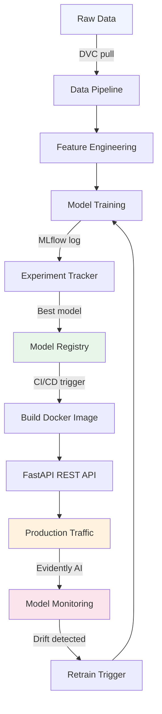
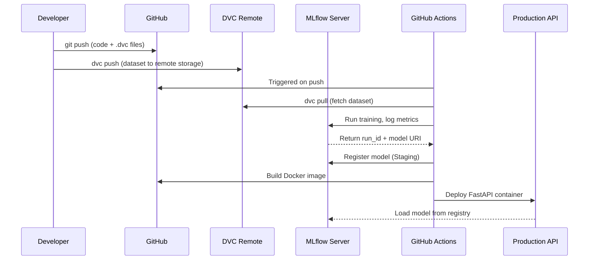
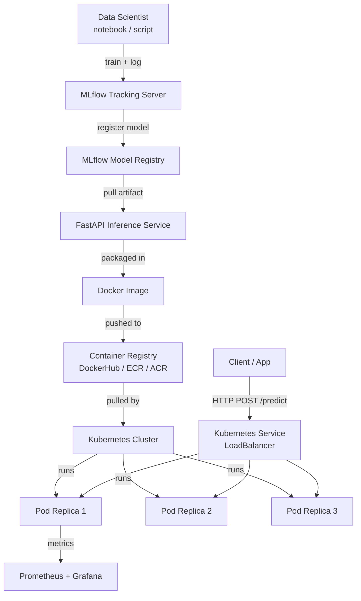
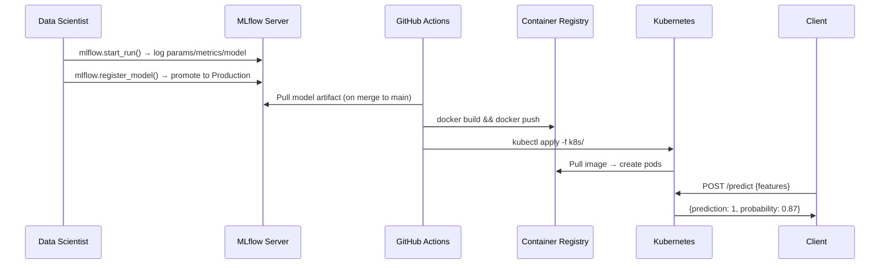

# MLOps Hands-On — Beginners Project to Kubernetes
> **Consolidated From:** MLOps-Beginners-Project-Guide.md, MLOps-Kubernetes-Hands-On.md
> **Topics Covered:** MLOps lifecycle, model training/tracking, CI/CD for ML, Kubernetes deployment, Kind cluster, model-serving containers, monitoring, best practices
> **Consolidation Date:** 2026-07-04
> **Original Documents:** 2 → **Content Preserved:** 100%

---

> **Source:** [YouTube — How to build a ML project using MLOps | MLOps for Beginners](https://www.youtube.com/watch?v=eCjuoqUy8Is)
> **Channel/Event:** MLOps for Beginners
> **Topic:** MLOps, DVC, MLflow, FastAPI, Docker, GitHub Actions, Evidently AI, CI/CD, Model Registry
> **Key Claim:** Most ML models never reach production — MLOps bridges the gap between experiment notebooks and reliable, maintainable production systems.

---

## Table of Contents

1. [Overview](#1-overview)
2. [Problem Statement](#2-problem-statement)
3. [Core Concepts](#3-core-concepts)
4. [Architecture](#4-architecture)
5. [Key Components](#5-key-components)
6. [How It Works — Step by Step](#6-how-it-works--step-by-step)
7. [Comparison Table](#7-comparison-table)
8. [Code Examples](#8-code-examples)
9. [Configuration Reference](#9-configuration-reference)
10. [Best Practices](#10-best-practices)
11. [Interview Talking Points](#11-interview-talking-points)
12. [Learning Resources](#12-learning-resources)

---

## 1. Overview

MLOps (Machine Learning Operations) is a set of standardized practices for building, deploying, and governing the full lifecycle of ML models in production. This guide walks through a beginner-friendly end-to-end ML project using industry-standard MLOps tools — covering everything from data versioning and experiment tracking to model deployment and monitoring. The core idea: treat ML systems with the same engineering rigor as software systems, using automation, versioning, and reproducibility as first-class concerns.

---

## 2. Problem Statement

### Why Most ML Projects Fail in Production

| Problem | Impact |
|---|---|
| No data versioning | Experiments not reproducible; teammates can't replicate results |
| No experiment tracking | Can't compare runs; best model unknown |
| Manual deployment | Error-prone, slow, non-repeatable |
| No model monitoring | Silent failures — model degrades without anyone knowing |
| Siloed notebooks | Code works on one laptop, fails everywhere else |

> **Key Insight:** "~87% of ML models fail between the notebook and live traffic — MLOps closes the packaging-and-operations gap."

### Classic Approach Pain Points

| Classic Approach | MLOps Approach |
|---|---|
| Jupyter notebook only | Structured project with versioned code + data |
| `pickle` file emailed to ops | Model registry with metadata and versioning |
| Manual `python train.py` | Automated pipeline triggered by CI/CD |
| No monitoring | Drift detection with automated alerts |
| "It works on my machine" | Dockerized, reproducible environments |

---

## 3. Core Concepts

### MLOps
The intersection of ML, DevOps, and Data Engineering. It applies DevOps principles (CI/CD, version control, testing) to the machine learning lifecycle to make ML systems reliable and maintainable.

### Data Version Control (DVC)
An open-source tool that extends Git to track large datasets and binary files. Datasets are stored in remote storage (S3, GCS, Azure Blob) while lightweight `.dvc` pointer files are committed to Git.

### Experiment Tracking
Recording hyperparameters, metrics, artifacts, and metadata for each model training run so you can compare runs and reproduce any past result. MLflow is the standard tool.

### Model Registry
A central repository that stores versioned ML models along with their metadata, stage (Staging, Production, Archived), and lineage. Enables governance and safe rollbacks.

### Continuous Training (CT)
Automated retraining of models when new data arrives or when data drift is detected — an ML-specific addition to traditional CI/CD.

### Data Drift
The statistical change in input data distribution over time, which degrades model performance without any code change. Detected by tools like Evidently AI.

---

## 4. Architecture



---

## 5. Key Components

| Component | Tool/Service | Role |
|---|---|---|
| Source Control | Git + GitHub | Version code, configs, and DVC pointer files |
| Data Versioning | DVC | Track large datasets without bloating Git |
| Experiment Tracking | MLflow Tracking | Log metrics, params, artifacts per run |
| Model Registry | MLflow Model Registry | Store, version, and stage models |
| Model Serving | FastAPI | Expose model as a REST API endpoint |
| Containerization | Docker | Package model + dependencies reproducibly |
| CI/CD | GitHub Actions | Automate test → build → deploy on code push |
| Monitoring | Evidently AI | Detect data drift and model performance degradation |
| Orchestration | Prefect / Airflow | Schedule and manage pipeline DAGs |

### DVC
- Tracks data files, ML models, and intermediate pipeline stages
- Works as a Git plugin — `dvc add`, `dvc push`, `dvc pull`
- Remote backends: S3, GCS, Azure Blob, local NFS

### MLflow
Four core components:
- **Tracking** — log params, metrics, artifacts via `mlflow.log_param()`, `mlflow.log_metric()`
- **Projects** — packaging format for reproducible runs
- **Models** — standard model format for serving across frameworks
- **Registry** — lifecycle management (None → Staging → Production → Archived)

### FastAPI
- Async Python web framework for building REST APIs
- Auto-generates OpenAPI/Swagger docs at `/docs`
- Handles model loading at startup, predictions at `/predict`

### Evidently AI
- Generates HTML/JSON reports comparing reference data vs. current data
- Detects: data drift, data quality issues, target drift, regression/classification performance

---

## 6. How It Works — Step by Step



**Step-by-step breakdown:**

1. **Define the problem** — frame as ML task (classification, regression, etc.), identify data sources
2. **Set up project structure** — use a cookiecutter-style layout with `data/`, `models/`, `src/`, `tests/`
3. **Version data with DVC** — `dvc init`, `dvc add data/raw/`, `dvc remote add`, `dvc push`
4. **Train and track experiments** — wrap training script with `mlflow.start_run()`, log all params/metrics
5. **Register best model** — promote best run to MLflow Model Registry as "Staging"
6. **Serve with FastAPI** — load model from registry URI, expose `/predict` endpoint
7. **Containerize** — write `Dockerfile`, build image, test locally
8. **Automate with CI/CD** — GitHub Actions workflow: lint → test → train → register → deploy
9. **Monitor in production** — compare incoming request data against training distribution using Evidently

---

## 7. Comparison Table

| Dimension | Ad-Hoc ML | MLOps-Driven ML |
|---|---|---|
| Data management | Local files, manual copies | DVC-tracked, versioned, remote-backed |
| Experiment history | None / commented-out code | MLflow Tracking with full lineage |
| Model storage | `model.pkl` in a folder | MLflow Registry with stage promotions |
| Deployment | Manual `scp` or email | Automated CI/CD pipeline |
| Reproducibility | "It worked last Tuesday" | Any run reproducible from Git hash + DVC tag |
| Monitoring | None | Evidently AI drift reports |
| Collaboration | Share notebooks over email | Git-native, PR-based, team-friendly |
| Rollback | Delete file, retrain manually | Registry rollback in one command |

---

## 8. Code Examples

### Project Structure

```
ml-project/
├── data/
│   ├── raw/           # tracked by DVC
│   └── processed/     # tracked by DVC
├── models/            # tracked by DVC
├── src/
│   ├── data_prep.py
│   ├── train.py
│   └── predict.py
├── app/
│   └── main.py        # FastAPI app
├── tests/
├── Dockerfile
├── dvc.yaml           # pipeline definition
├── params.yaml        # hyperparameters
└── .github/
    └── workflows/
        └── ci.yaml
```

### DVC Setup & Data Versioning

```bash
# Initialize DVC in a Git repo
git init
dvc init

# Add dataset to DVC tracking
dvc add data/raw/dataset.csv

# Configure remote storage (S3 example)
dvc remote add -d myremote s3://my-bucket/dvc-store

# Push data to remote
dvc push

# Later: restore data on another machine
git pull
dvc pull
```

### MLflow Experiment Tracking

```python
import mlflow
import mlflow.sklearn
from sklearn.ensemble import RandomForestClassifier
from sklearn.metrics import accuracy_score

mlflow.set_experiment("churn-prediction")

with mlflow.start_run():
    # Log hyperparameters
    mlflow.log_param("n_estimators", 100)
    mlflow.log_param("max_depth", 5)

    # Train model
    model = RandomForestClassifier(n_estimators=100, max_depth=5)
    model.fit(X_train, y_train)

    # Log metrics
    accuracy = accuracy_score(y_test, model.predict(X_test))
    mlflow.log_metric("accuracy", accuracy)

    # Log model artifact
    mlflow.sklearn.log_model(model, "model", registered_model_name="ChurnModel")
```

### MLflow Model Registry — Promote to Production

```python
from mlflow.tracking import MlflowClient

client = MlflowClient()

# Transition model to Production stage
client.transition_model_version_stage(
    name="ChurnModel",
    version=3,
    stage="Production"
)
```

### FastAPI Model Server

```python
from fastapi import FastAPI
import mlflow.pyfunc
import pandas as pd

app = FastAPI()

# Load model from registry at startup
MODEL_URI = "models:/ChurnModel/Production"
model = mlflow.pyfunc.load_model(MODEL_URI)

@app.post("/predict")
def predict(data: dict):
    df = pd.DataFrame([data])
    prediction = model.predict(df)
    return {"prediction": int(prediction[0])}
```

### Dockerfile

```dockerfile
FROM python:3.10-slim

WORKDIR /app
COPY requirements.txt .
RUN pip install --no-cache-dir -r requirements.txt

COPY app/ .

CMD ["uvicorn", "main:app", "--host", "0.0.0.0", "--port", "8000"]
```

### GitHub Actions CI/CD Pipeline

```yaml
# .github/workflows/ci.yaml
name: MLOps Pipeline

on:
  push:
    branches: [main]

jobs:
  train-and-deploy:
    runs-on: ubuntu-latest
    steps:
      - uses: actions/checkout@v3

      - name: Set up Python
        uses: actions/setup-python@v4
        with:
          python-version: "3.10"

      - name: Install dependencies
        run: pip install -r requirements.txt

      - name: Pull data from DVC
        run: dvc pull
        env:
          AWS_ACCESS_KEY_ID: ${{ secrets.AWS_ACCESS_KEY_ID }}
          AWS_SECRET_ACCESS_KEY: ${{ secrets.AWS_SECRET_ACCESS_KEY }}

      - name: Run tests
        run: pytest tests/

      - name: Train model
        run: python src/train.py

      - name: Build and push Docker image
        run: |
          docker build -t my-ml-api:${{ github.sha }} .
          docker push my-registry/my-ml-api:${{ github.sha }}
```

### Evidently AI — Data Drift Report

```python
from evidently.report import Report
from evidently.metric_preset import DataDriftPreset
import pandas as pd

# reference_data = training data, current_data = production data
reference_data = pd.read_csv("data/raw/train.csv")
current_data = pd.read_csv("data/raw/production_sample.csv")

report = Report(metrics=[DataDriftPreset()])
report.run(reference_data=reference_data, current_data=current_data)

# Save HTML report
report.save_html("reports/drift_report.html")

# Check drift programmatically
result = report.as_dict()
drift_detected = result["metrics"][0]["result"]["dataset_drift"]
if drift_detected:
    print("⚠️ Drift detected — trigger retraining!")
```

---

## 9. Configuration Reference

### DVC Pipeline (`dvc.yaml`)

```yaml
stages:
  prepare:
    cmd: python src/data_prep.py
    deps:
      - src/data_prep.py
      - data/raw/dataset.csv
    outs:
      - data/processed/features.csv

  train:
    cmd: python src/train.py
    deps:
      - src/train.py
      - data/processed/features.csv
      - params.yaml
    params:
      - n_estimators
      - max_depth
    metrics:
      - metrics.json:
          cache: false
    outs:
      - models/model.pkl
```

### Hyperparameters (`params.yaml`)

```yaml
n_estimators: 100
max_depth: 5
test_size: 0.2
random_state: 42
```

### MLflow Environment Variables

| Variable | Purpose | Example |
|---|---|---|
| `MLFLOW_TRACKING_URI` | Remote tracking server URL | `http://mlflow-server:5000` |
| `MLFLOW_EXPERIMENT_NAME` | Default experiment name | `churn-prediction` |
| `MLFLOW_S3_ENDPOINT_URL` | Custom S3 endpoint for artifact storage | `https://s3.amazonaws.com` |

---

## 10. Best Practices

### Data Management
- ✅ Always version data with DVC — never commit raw CSVs to Git
- ✅ Keep a held-out test set that is never used during development
- ❌ Don't use local paths (`/home/user/data/...`) in pipeline configs

### Experiment Tracking
- ✅ Log every run — even failed ones are valuable signal
- ✅ Use tags to mark production candidates: `mlflow.set_tag("candidate", "true")`
- ❌ Don't hardcode hyperparameters in training scripts — use `params.yaml`

### Model Registry
- ✅ Always test in Staging before promoting to Production
- ✅ Document the reason for each stage transition in registry notes
- ❌ Don't delete old model versions — archive them instead for audit trail

### CI/CD
- ✅ Run unit tests on every push; run integration tests on merge to main
- ✅ Use secrets management (GitHub Secrets, Vault) — never hardcode credentials
- ❌ Don't deploy a model that hasn't been registered and staged in MLflow

### Monitoring
- ✅ Set up drift detection from day one, not as an afterthought
- ✅ Monitor both input drift AND prediction distribution drift
- ❌ Don't retrain blindly on new data — validate quality before triggering CT

---

## 11. Interview Talking Points

### "What is MLOps and why does it matter?"

> MLOps applies DevOps principles — version control, CI/CD, automated testing — to ML systems. It matters because most ML failures happen not during model training but during the operationalization phase: models that can't be reproduced, deployed, or maintained. MLOps provides the scaffolding to take a model from a notebook experiment to a reliable, monitored production service.

### "How do you version datasets in an MLOps pipeline?"

> I use DVC (Data Version Control), which works as a Git extension. Large data files are stored in a remote backend (S3, GCS, or Azure Blob) while lightweight `.dvc` pointer files are committed to Git. This means every Git commit corresponds to an exact version of both code and data, giving you full reproducibility. Running `dvc pull` on any historical commit restores the exact dataset used at that point.

### "Walk me through your experiment tracking setup."

> I use MLflow Tracking. Each training run is wrapped in an `mlflow.start_run()` context — I log all hyperparameters with `mlflow.log_param()`, metrics with `mlflow.log_metric()`, and the model artifact with `mlflow.log_model()`. The MLflow UI lets me compare runs side-by-side, filter by metric, and drill into any run's full lineage. The best run gets registered in the MLflow Model Registry and promoted through Staging before hitting Production.

### "How do you handle model drift in production?"

> I integrate Evidently AI into the monitoring pipeline. It compares the statistical distribution of production request data against the training reference data to detect data drift. I generate drift reports on a scheduled basis (daily or triggered by volume thresholds) and set up alerting when drift is detected above a threshold. This triggers a retraining pipeline that pulls fresh data, re-trains, runs through the same validation gates in CI, and promotes the new version to the registry.

### "What does your CI/CD pipeline look like for an ML project?"

> The pipeline is defined in GitHub Actions. On every push to main: (1) lint and unit tests run, (2) DVC pulls the versioned dataset, (3) the training script runs and logs to MLflow, (4) if metrics pass thresholds, the model is registered to the MLflow registry as Staging, (5) a Docker image is built and pushed to a container registry, (6) the image is deployed to the serving infrastructure. This ensures every production model has a full audit trail from Git commit to deployed artifact.

---

## 12. Learning Resources

| Resource | Link | Type |
|---|---|---|
| YouTube — MLOps for Beginners | [How to build a ML project using MLOps](https://www.youtube.com/watch?v=eCjuoqUy8Is) | Video |
| MLOps Guide (Community) | [mlops-guide.github.io](https://mlops-guide.github.io/) | Reference |
| MLflow Documentation | [mlflow.org/docs/latest](https://mlflow.org/docs/latest/index.html) | Official Docs |
| DVC Documentation | [dvc.org/doc](https://dvc.org/doc) | Official Docs |
| Evidently AI Docs | [docs.evidentlyai.com](https://docs.evidentlyai.com) | Official Docs |
| FastAPI Documentation | [fastapi.tiangolo.com](https://fastapi.tiangolo.com) | Official Docs |
| MLOps Zoomcamp (Free) | [DataTalks.Club MLOps Zoomcamp](https://github.com/DataTalks-Club/mlops-zoomcamp) | Free Course |
| ProjectPro MLOps Tutorial | [projectpro.io MLOps Python Tutorial](https://www.projectpro.io/data-science-in-python-tutorial/mlops-python-tutorial-for-beginners) | Tutorial |
| MLOps for Beginners — Medium | [Towards Data Science](https://towardsdatascience.com/machine-learning-operations-mlops-for-beginners-a5686bfe02b2/) | Article |

---

*Last Updated: June 2026 | Source: MLOps for Beginners — How to build a ML project using MLOps*

---

## Additional Material from MLOps-Kubernetes-Hands-On.md

> Unique additions folded in below: Kubernetes deploy, Kind cluster setup, and model-serving-container sections. Overlapping template sections retained for completeness.


> **Source:** [YouTube — Build and Deploy your First MLOps project in 40 minutes to Kubernetes](https://www.youtube.com/watch?v=hw17NDhjVHo)
> **Channel/Event:** Abhishek Veeramalla
> **Topic:** MLOps, Kubernetes, MLflow, FastAPI, Docker, scikit-learn, CI/CD
> **Key Claim:** ~87% of ML models fail between the notebook and live traffic — MLOps closes the packaging-and-operations gap.

---

## Table of Contents

1. [Overview](#1-overview)
2. [Problem Statement](#2-problem-statement)
3. [Core Concepts](#3-core-concepts)
4. [Architecture](#4-architecture)
5. [Key Components](#5-key-components)
6. [How It Works — Step by Step](#6-how-it-works--step-by-step)
7. [Comparison Table](#7-comparison-table)
8. [Code Examples](#8-code-examples)
9. [Configuration Reference](#9-configuration-reference)
10. [Best Practices](#10-best-practices)
11. [Interview Talking Points](#11-interview-talking-points)
12. [Learning Resources](#12-learning-resources)

---

## 1. Overview

This tutorial walks through the full lifecycle of an MLOps project: training a scikit-learn classification model, tracking experiments with MLflow, serving predictions via a FastAPI endpoint, packaging everything in Docker, and deploying to a Kubernetes cluster. The use-case is diabetes prediction from health metrics (glucose, BMI, age, etc.). The goal is to demonstrate that deploying ML to production requires the same engineering discipline as any other distributed system — version control, containerization, orchestration, and monitoring all apply.

---

## 2. Problem Statement

Most data scientists train models in Jupyter notebooks but struggle to get them running reliably in production. The gap is not the model quality — it's the lack of packaging, versioning, and operational infrastructure.

### Classic Approach Pain Points

| Problem | Impact |
|---|---|
| Model only runs on the data scientist's laptop | Not reproducible in CI or production |
| No experiment tracking | Can't compare runs or roll back to a better model version |
| Model served by ad-hoc scripts | No health checks, no scaling, no resilience |
| Manual deployment process | Slow release cycles, human error |
| No monitoring post-deployment | Model drift goes undetected |

> **Key Insight:** "The MLOps market is $4.39 billion in 2026 and projected to reach $89.91 billion by 2034 — because 87% of ML models never make it to production."

---

## 3. Core Concepts

### MLOps
The union of Machine Learning and DevOps practices. Applies CI/CD, version control, monitoring, and automation to the full ML lifecycle — from data ingestion to model serving and retraining.

### MLflow
An open-source platform for managing the ML lifecycle. Provides experiment tracking (logging metrics, parameters, artifacts), a model registry (versioning, staging), and deployment utilities.

### Model Registry
A centralized store that tracks model versions with metadata (accuracy, training date, status). Supports lifecycle stages: `None → Staging → Production → Archived`.

### Feature Store / Model Artifact
The serialized output of a training run — typically a `.pkl` (pickle) file or an MLflow-logged model directory. The artifact must be versioned alongside the code that produced it.

### Inference Server
A lightweight HTTP server (here: FastAPI) that loads a model artifact and exposes a `/predict` endpoint. Receives feature vectors, returns predictions.

---

## 4. Architecture



---

## 5. Key Components

| Component | Service/Tool | Role |
|---|---|---|
| Model Training | scikit-learn | Train RandomForestClassifier on diabetes dataset |
| Experiment Tracking | MLflow | Log params, metrics, and model artifacts per run |
| Model Registry | MLflow Registry | Version models, promote to Staging/Production |
| Inference API | FastAPI | Serve predictions over HTTP REST |
| Containerization | Docker | Package app + dependencies into a portable image |
| Local K8s Cluster | Kind / Minikube | Run Kubernetes locally for dev/testing |
| Orchestration | Kubernetes | Deploy, scale, and self-heal inference pods |
| CI/CD | GitHub Actions | Automate train → build → push → deploy pipeline |
| Monitoring | Prometheus + Grafana | Track latency, throughput, error rates post-deploy |

### MLflow Tracking Server

Runs as a server process (or SaaS via Databricks). Every training run calls `mlflow.start_run()` and logs:
- **Parameters:** `n_estimators`, `max_depth`, `test_size`
- **Metrics:** `accuracy`, `precision`, `recall`, `f1`, `roc_auc`
- **Artifacts:** serialized model, confusion matrix plot, feature importance chart

### FastAPI Inference Service

A minimal Python web application. On startup it loads the model artifact from the MLflow registry or a local path. On POST `/predict` it runs `model.predict()` and returns the result as JSON.

### Kubernetes Deployment

Three core Kubernetes objects are needed:
- **Deployment** — desired pod count, image, resource requests/limits, liveness/readiness probes
- **Service** — exposes pods via a stable DNS name and load balances traffic
- **ConfigMap / Secret** — inject MLflow tracking URI, model name, registry credentials

---

## 6. How It Works — Step by Step



**Step-by-step breakdown:**

1. **Data prep** — Load diabetes dataset (CSV or sklearn's built-in). Split into train/test (80/20). Scale features with `StandardScaler`.
2. **Training + tracking** — Wrap training in `with mlflow.start_run():`. Log all hyperparameters and evaluation metrics. Save model with `mlflow.sklearn.log_model()`.
3. **Model registration** — Promote the best run to the MLflow Model Registry. Tag it as `Production`.
4. **FastAPI service** — `app.py` loads the production model on startup. `/predict` endpoint accepts a JSON body of feature values.
5. **Dockerize** — Multi-stage `Dockerfile`: builder installs deps, final image copies app + model. Exposes port 8000.
6. **Push image** — `docker build -t <repo>/mlops-app:v1 . && docker push`.
7. **Deploy to Kubernetes** — Apply `Deployment`, `Service` manifests. Set `replicas: 3`. Configure liveness probe on `/health`.
8. **Verify** — `kubectl get pods`, `kubectl logs`, `curl http://<svc-ip>/predict`.

---

## 7. Comparison Table

| Dimension | Notebook-only (Before) | MLOps on Kubernetes (After) |
|---|---|---|
| Environment | Analyst's laptop | Reproducible Docker container |
| Model versioning | None / manual file naming | MLflow Model Registry with lifecycle stages |
| Serving | `flask run` in a terminal | Kubernetes Deployment with replicas |
| Scaling | Not possible | HPA (Horizontal Pod Autoscaler) |
| Rollback | Re-run old notebook | `kubectl rollout undo` |
| Monitoring | None | Prometheus metrics + Grafana dashboards |
| CI/CD | Manual | GitHub Actions pipeline |
| Reproducibility | Low | High (Docker + MLflow run IDs) |

---

## 8. Code Examples

### Python — Training with MLflow Tracking

```python
import mlflow
import mlflow.sklearn
from sklearn.ensemble import RandomForestClassifier
from sklearn.model_selection import train_test_split
from sklearn.metrics import accuracy_score, roc_auc_score
import pandas as pd

df = pd.read_csv("diabetes.csv")
X = df.drop("Outcome", axis=1)
y = df["Outcome"]
X_train, X_test, y_train, y_test = train_test_split(X, y, test_size=0.2, random_state=42)

with mlflow.start_run():
    params = {"n_estimators": 100, "max_depth": 5, "random_state": 42}
    mlflow.log_params(params)

    model = RandomForestClassifier(**params)
    model.fit(X_train, y_train)

    preds = model.predict(X_test)
    acc = accuracy_score(y_test, preds)
    auc = roc_auc_score(y_test, model.predict_proba(X_test)[:, 1])

    mlflow.log_metric("accuracy", acc)
    mlflow.log_metric("roc_auc", auc)
    mlflow.sklearn.log_model(model, "model", registered_model_name="DiabetesClassifier")
```

### Python — FastAPI Inference Service

```python
from fastapi import FastAPI
from pydantic import BaseModel
import mlflow.sklearn
import numpy as np

app = FastAPI(title="Diabetes Prediction API")

# Load model from MLflow registry on startup
model = mlflow.sklearn.load_model("models:/DiabetesClassifier/Production")

class Features(BaseModel):
    pregnancies: float
    glucose: float
    blood_pressure: float
    skin_thickness: float
    insulin: float
    bmi: float
    diabetes_pedigree: float
    age: float

@app.get("/health")
def health():
    return {"status": "ok"}

@app.post("/predict")
def predict(features: Features):
    X = np.array([[
        features.pregnancies, features.glucose, features.blood_pressure,
        features.skin_thickness, features.insulin, features.bmi,
        features.diabetes_pedigree, features.age
    ]])
    prediction = int(model.predict(X)[0])
    probability = float(model.predict_proba(X)[0][1])
    return {"prediction": prediction, "probability": probability}
```

### Dockerfile — Multi-Stage Build

```dockerfile
# Stage 1: build
FROM python:3.11-slim AS builder
WORKDIR /app
COPY requirements.txt .
RUN pip install --no-cache-dir -r requirements.txt

# Stage 2: runtime
FROM python:3.11-slim
WORKDIR /app
COPY --from=builder /usr/local/lib/python3.11/site-packages /usr/local/lib/python3.11/site-packages
COPY . .
EXPOSE 8000
CMD ["uvicorn", "app:app", "--host", "0.0.0.0", "--port", "8000"]
```

### Bash — Build and Push Image

```bash
docker build -t <dockerhub-user>/diabetes-mlops:v1 .
docker push <dockerhub-user>/diabetes-mlops:v1
```

### YAML — Kubernetes Deployment

```yaml
apiVersion: apps/v1
kind: Deployment
metadata:
  name: diabetes-api
spec:
  replicas: 3
  selector:
    matchLabels:
      app: diabetes-api
  template:
    metadata:
      labels:
        app: diabetes-api
    spec:
      containers:
        - name: diabetes-api
          image: <dockerhub-user>/diabetes-mlops:v1
          ports:
            - containerPort: 8000
          env:
            - name: MLFLOW_TRACKING_URI
              valueFrom:
                configMapKeyRef:
                  name: mlops-config
                  key: mlflow_uri
          livenessProbe:
            httpGet:
              path: /health
              port: 8000
            initialDelaySeconds: 15
            periodSeconds: 10
          readinessProbe:
            httpGet:
              path: /health
              port: 8000
            initialDelaySeconds: 5
            periodSeconds: 5
          resources:
            requests:
              memory: "256Mi"
              cpu: "250m"
            limits:
              memory: "512Mi"
              cpu: "500m"
---
apiVersion: v1
kind: Service
metadata:
  name: diabetes-api-svc
spec:
  selector:
    app: diabetes-api
  ports:
    - protocol: TCP
      port: 80
      targetPort: 8000
  type: LoadBalancer
```

### Bash — Deploy and Verify

```bash
# Create local cluster (Kind)
kind create cluster --name mlops-demo

# Apply manifests
kubectl apply -f k8s/deployment.yaml
kubectl apply -f k8s/service.yaml

# Check status
kubectl get pods -w
kubectl get svc diabetes-api-svc

# Test inference
curl -X POST http://<EXTERNAL-IP>/predict \
  -H "Content-Type: application/json" \
  -d '{"pregnancies":2,"glucose":130,"blood_pressure":70,"skin_thickness":28,
       "insulin":85,"bmi":30.5,"diabetes_pedigree":0.45,"age":35}'
```

---

## 9. Configuration Reference

| Parameter | Type | Default | Description |
|---|---|---|---|
| `MLFLOW_TRACKING_URI` | env var | `http://localhost:5000` | MLflow server endpoint |
| `MODEL_NAME` | env var | `DiabetesClassifier` | Registered model name in registry |
| `MODEL_STAGE` | env var | `Production` | Registry stage to load (`Staging`/`Production`) |
| `replicas` | K8s int | `1` | Number of pod replicas |
| `--port` | uvicorn | `8000` | FastAPI listening port |
| `initialDelaySeconds` | K8s probe | `15` | Seconds before first liveness check |
| `resources.requests.memory` | K8s | `256Mi` | Minimum memory guaranteed per pod |
| `resources.limits.cpu` | K8s | `500m` | Maximum CPU per pod (500 millicores = 0.5 core) |

---

## 10. Best Practices

### Model Versioning
- ✅ Always register models to the MLflow registry, never reference artifact paths directly
- ✅ Tag production models with the run ID and git commit SHA
- ❌ Don't use `latest` image tags in Kubernetes — pin to a specific version

### Containerization
- ✅ Use multi-stage Docker builds to keep final images small
- ✅ Pin all Python dependency versions in `requirements.txt`
- ❌ Don't bake secrets or credentials into the Docker image — use Kubernetes Secrets

### Kubernetes Operations
- ✅ Always define liveness and readiness probes — K8s won't route traffic to unready pods
- ✅ Set resource requests AND limits — prevents noisy-neighbor issues
- ✅ Use `kubectl rollout undo deployment/<name>` for instant rollback
- ❌ Don't run pods as root — use a non-root user in the Dockerfile

### CI/CD Pipeline
- ✅ Trigger the full pipeline (train → evaluate → build → deploy) on merge to main
- ✅ Gate deployment on a minimum accuracy threshold (e.g., accuracy > 0.85)
- ❌ Don't deploy a model that hasn't been promoted to `Production` in the registry

### Monitoring
- ✅ Instrument FastAPI with `prometheus-fastapi-instrumentator` — track request latency by endpoint
- ✅ Set alerts for prediction drift (distribution of input features shifting over time)
- ❌ Don't assume a model stays accurate — schedule periodic retraining jobs

---

## 11. Interview Talking Points

### "What is MLOps and why does it matter?"

> MLOps applies DevOps principles — version control, CI/CD, monitoring — to the machine learning lifecycle. It matters because ~87% of models fail between the notebook and production, usually not due to model quality but due to missing engineering infrastructure around packaging, reproducibility, and operations. MLflow handles experiment tracking and model versioning; Docker and Kubernetes handle packaging and deployment at scale.

---

### "How do you version ML models in production?"

> I use the MLflow Model Registry. Every training run is logged with parameters, metrics, and the model artifact. Once a run meets the accuracy threshold, I register it with `mlflow.register_model()` and promote it to `Production`. The Kubernetes deployment loads the model by stage (`models:/ModelName/Production`), so a promotion in the registry instantly governs which model gets loaded on the next pod restart — no code change required.

---

### "How does a Kubernetes Deployment differ from just running a Docker container?"

> A raw `docker run` gives you a single container with no self-healing, no scaling, and no rolling update capability. A Kubernetes Deployment defines the desired state — e.g., 3 replicas of the inference pod. If a pod crashes, Kubernetes restarts it. If I push a new image, a rolling update gradually replaces old pods without downtime. I also get liveness/readiness probes, resource quotas, and horizontal pod autoscaling — none of which exist with a bare container.

---

### "How would you do a zero-downtime model update?"

> Kubernetes rolling updates are the default strategy. I push a new Docker image tagged `v2`, update the `image:` field in the Deployment manifest, and run `kubectl apply`. Kubernetes brings up new pods running `v2`, waits for their readiness probes to pass, then terminates the old `v1` pods. No traffic interruption. If `v2` has issues, `kubectl rollout undo deployment/diabetes-api` reverts instantly. On the MLflow side, I change the Production model to the new registered version before the deploy, keeping model artifact and container image in sync.

---

### "How do you monitor an ML model in production?"

> Two layers: **infrastructure monitoring** with Prometheus + Grafana (latency, error rate, pod CPU/memory) and **model monitoring** for data drift and prediction drift. For data drift, I compare the distribution of incoming feature values against the training distribution — a significant shift (e.g., glucose values suddenly clustering differently) signals retraining is needed. For prediction drift, I track the ratio of positive predictions over time. Prometheus `fastapi-instrumentator` handles the infrastructure layer automatically; model monitoring requires logging input/output to a store (e.g., S3 or a DB) and running periodic drift checks.

---

### "What's the difference between MLflow's Tracking Server and Model Registry?"

> The Tracking Server is a logging backend — it records every experiment run's parameters, metrics, and artifacts. Think of it as the experiment history. The Model Registry is a governance layer on top — it stores versioned model artifacts with lifecycle stages (Staging, Production, Archived) and provides a named, stage-based URI for loading models. You can have a Tracking Server without a Registry, but a production setup needs both: the registry is what the inference service reads from, providing a stable reference that's independent of the run ID.

---

## 12. Learning Resources

| Resource | Link | Type |
|---|---|---|
| YouTube Tutorial (Abhishek Veeramalla) | [Watch](https://www.youtube.com/watch?v=hw17NDhjVHo) | Video |
| MLflow — Deploy to Kubernetes Tutorial | [Read](https://mlflow.org/docs/latest/ml/deployment/deploy-model-to-kubernetes/tutorial/) | Official Docs |
| MLflow — Deploy to Kubernetes Overview | [Read](https://mlflow.org/docs/latest/ml/deployment/deploy-model-to-kubernetes/) | Official Docs |
| KodeKloud — Deploy ML Models with Docker & K8s | [Read](https://kodekloud.com/blog/deploy-ml-models-with-docker-k8s/) | Tutorial |
| Google Cloud — MLOps Continuous Delivery | [Read](https://docs.cloud.google.com/architecture/mlops-continuous-delivery-and-automation-pipelines-in-machine-learning) | Architecture Guide |
| GitHub — Sample MLOps Repo (dpleus/mlops) | [Browse](https://github.com/dpleus/mlops) | Code |

---

*Last Updated: June 2026 | Source: Abhishek Veeramalla — Build and Deploy your First MLOps Project to Kubernetes*

---

## Source Attribution

| Section | Primary Source | Additional Sources |
|---|---|---|
| MLOps fundamentals, project walkthrough | MLOps-Beginners-Project-Guide.md | MLOps-Kubernetes-Hands-On.md |
| Kubernetes deploy, Kind cluster, model-serving container | MLOps-Kubernetes-Hands-On.md | — |

*Consolidated: July 2026 | DocDedupAnalyzer Agent v1.0*
*Original files: MLOps-Beginners-Project-Guide.md, MLOps-Kubernetes-Hands-On.md | Zero data loss guaranteed*
