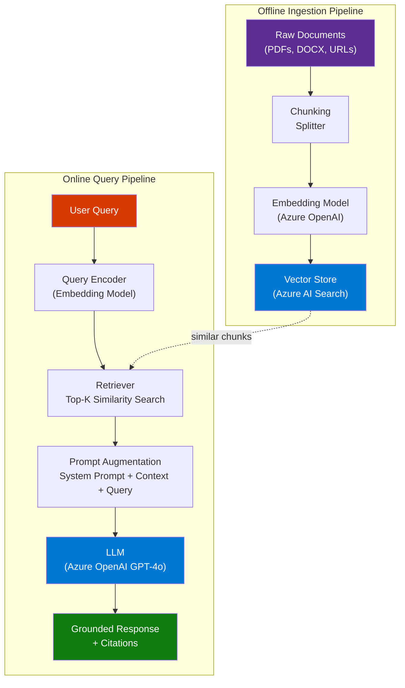
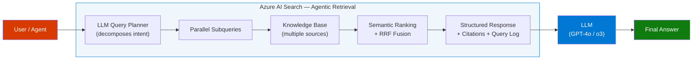
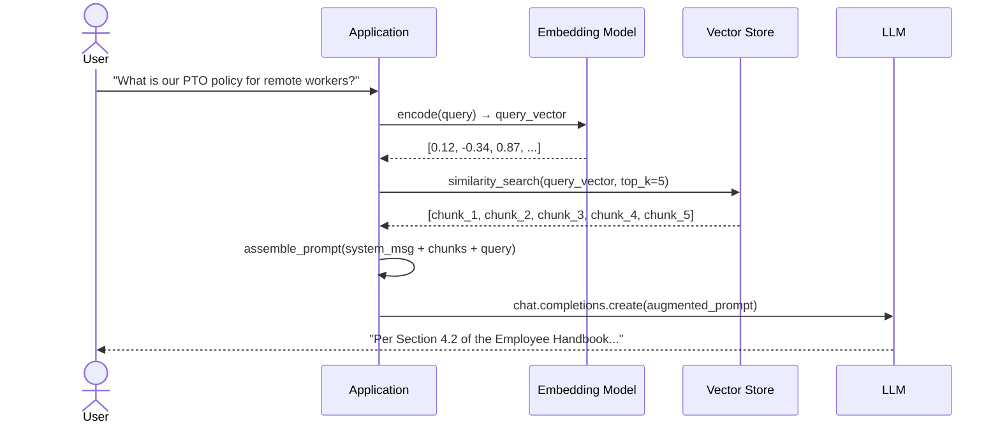
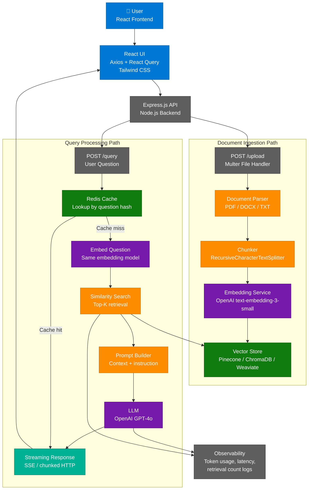
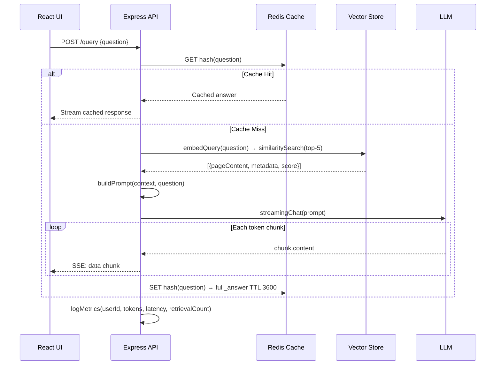
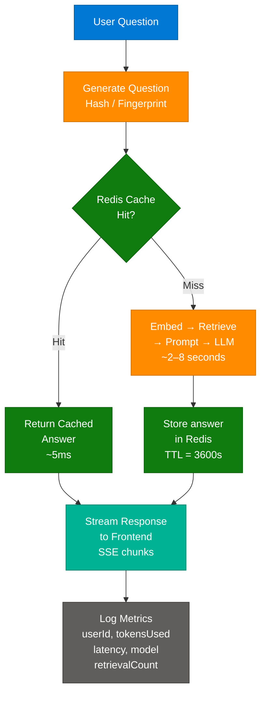

# RAG — From Concept to Production
> **Consolidated From:** RAG-Retrieval-Augmented-Generation-Explained.md, RAG-React-Express-Production-Guide.md
> **Topics Covered:** RAG theory & explanation, production RAG implementation with React + Express
> **Consolidation Date:** 2026-07-04
> **Original Documents:** 2 → **Content Preserved:** 100%

---

# Part I — RAG Explained (Theory)


> **Source:** [YouTube — What is RAG? | Completely Explained in 15 Minutes](https://www.youtube.com/watch?v=Ty8gcCKuwNI)
> **Topic:** RAG, LLM, Vector Search, Generative AI, Azure AI Search, Agentic AI
> **Key Claim:** RAG eliminates hallucinations and knowledge cutoff limitations without retraining the LLM — by grounding responses in real-time retrieved content.

---

## Table of Contents

1. [Overview](#1-overview)
2. [Problem Statement](#2-problem-statement)
3. [Core Concepts](#3-core-concepts)
4. [Architecture](#4-architecture)
5. [Key Components](#5-key-components)
6. [How It Works — Step by Step](#6-how-it-works--step-by-step)
7. [Comparison Table](#7-comparison-table)
8. [Code Examples](#8-code-examples)
9. [Configuration Reference](#9-configuration-reference)
10. [Best Practices](#10-best-practices)
11. [Interview Talking Points](#11-interview-talking-points)
12. [Learning Resources](#12-learning-resources)

---

## 1. Overview

Retrieval-Augmented Generation (RAG) is a hybrid AI pattern that extends Large Language Models by dynamically fetching relevant external content at inference time and injecting it into the LLM's prompt context before generating a response. Unlike fine-tuning, RAG does not modify model weights — it supplements the model's parametric knowledge with fresh, domain-specific, non-parametric memory retrieved from an external knowledge base. This makes RAG the dominant pattern for enterprise AI assistants, internal knowledge chatbots, and any domain where accuracy and currency are non-negotiable. The concept was introduced in a 2020 research paper and has since become foundational for production AI systems using Azure OpenAI, LangChain, Semantic Kernel, and Azure AI Search.

---

## 2. Problem Statement

LLMs alone are insufficient for enterprise use because they rely entirely on what they learned during training — which is always finite, potentially outdated, and never specific to your organization.

### Classic LLM Pain Points

| Problem | Impact |
|---|---|
| **Training cutoff** | Model cannot answer about events after its cutoff date |
| **Hallucination** | Model confidently generates plausible-but-wrong facts |
| **No proprietary data** | Model never saw your internal docs, policies, or databases |
| **No source attribution** | Responses cannot be verified — zero traceability |
| **Retraining is expensive** | Fine-tuning costs time, money, and expertise |
| **No dynamic updates** | Model is static — changes in reality don't reflect without retraining |

> **Key Insight:** "When Google demonstrated Bard and it produced incorrect facts about the James Webb Space Telescope, Google's stock dropped $100 billion in a single day — the cost of an LLM hallucinating without grounding."

---

## 3. Core Concepts

### Parametric Memory
Knowledge baked into the LLM's weights during training. It's static, broad, and generalizable — but frozen at the training cutoff and unaware of your private data.

### Non-Parametric Memory
External knowledge retrieved at query time from a vector database, document store, or search index. It's dynamic, domain-specific, and continuously updatable without touching the model.

### Embeddings
Numerical vector representations of text (e.g., 1536-dimensional floats for `text-embedding-ada-002`). Semantically similar text produces similar vectors — enabling meaning-based search rather than keyword matching.

### Vector Database
A specialized store optimized for nearest-neighbor similarity search over high-dimensional embedding vectors. Examples: Azure AI Search (vector mode), Qdrant, Pinecone, Weaviate, pgvector.

### Chunking
The process of splitting large documents into smaller segments (chunks) before embedding. Chunk size affects retrieval precision — too large wastes tokens, too small loses context.

### Hybrid Search
Combining keyword (BM25) and vector (cosine similarity) search in a single query to maximize recall. Azure AI Search uses Reciprocal Rank Fusion (RRF) to merge the two result sets.

### Semantic Ranking
A re-ranking step that uses a cross-encoder model to re-score retrieved chunks based on semantic relevance to the original query — runs after initial retrieval, before sending to the LLM.

---

## 4. Architecture

### Classic RAG Architecture



### Agentic RAG Architecture (Azure AI Search)



---

## 5. Key Components

| Component | Service / Tool | Role |
|---|---|---|
| **Document Store** | Azure Blob Storage, SharePoint | Source of raw content to be indexed |
| **Chunker** | Azure AI Search Skills, LangChain `RecursiveCharacterTextSplitter` | Splits documents into retrieval-sized units |
| **Embedding Model** | Azure OpenAI `text-embedding-3-large` | Converts text to dense vectors |
| **Vector Index** | Azure AI Search (vector fields) | Stores and retrieves embeddings via ANN search |
| **Retriever** | Azure AI Search query engine | Performs hybrid BM25 + vector search |
| **Semantic Ranker** | Azure AI Search `semanticConfiguration` | Re-ranks top-50 results using cross-encoder |
| **Prompt Augmenter** | Application code / Semantic Kernel | Injects retrieved chunks into LLM system prompt |
| **LLM** | Azure OpenAI GPT-4o / o3 | Synthesizes grounded response from augmented context |
| **Orchestrator** | Semantic Kernel, LangChain, Azure AI Foundry Agents | Coordinates the full pipeline end-to-end |

### Azure AI Search — Two RAG Modes

**Classic RAG:** Your application sends one query → Azure AI Search returns ranked chunks → app assembles prompt → calls LLM. Simple, fully GA, fast.

**Agentic Retrieval (Preview):** Azure AI Search itself calls an LLM to decompose the query into subqueries, executes them in parallel across knowledge sources, and returns a structured grounding response with built-in citations. Best for complex, conversational, multi-source scenarios.

---

## 6. How It Works — Step by Step



### Step-by-Step Breakdown

1. **User submits a natural language query** — conversational, vague, or complex.
2. **Query embedding** — the same embedding model used during ingestion encodes the query into a vector. Crucially, it must be the *same model* used at indexing time.
3. **Similarity search** — the vector store finds the K most semantically similar chunks using Approximate Nearest Neighbor (ANN) search (e.g., HNSW algorithm).
4. **Hybrid boost (optional)** — BM25 keyword results are merged with vector results via RRF for maximum recall.
5. **Semantic re-ranking (optional)** — top-50 results are re-scored by a cross-encoder for precision.
6. **Prompt augmentation** — retrieved chunks are injected into the LLM prompt as context. The system prompt typically instructs the LLM to answer *only* from the provided context.
7. **LLM generation** — the LLM reads the augmented prompt and synthesizes a grounded, attributed response.
8. **Response with citations** — references to source documents are returned alongside the answer for verifiability.

---

## 7. Comparison Table

| Dimension | Classic LLM (No RAG) | Classic RAG | Agentic RAG |
|---|---|---|---|
| **Knowledge source** | Training data only | External vector index | Multiple knowledge sources |
| **Query type** | Single turn | Single query | Decomposed subqueries (parallel) |
| **Hallucination risk** | High | Low | Very Low |
| **Proprietary data** | No | Yes | Yes |
| **Real-time updates** | No | Yes (re-index) | Yes |
| **Source attribution** | None | Manual linking | Built-in citations + query log |
| **Cost to update** | Retrain ($$$) | Re-index (cheap) | Re-index (cheap) |
| **Azure feature** | Azure OpenAI only | Azure AI Search + OpenAI | Azure AI Search Agentic Retrieval |
| **Complexity** | Lowest | Medium | Higher |
| **Best for** | General chat | Simpler Q&A | Complex enterprise agents |
| **GA status** | GA | GA | Preview |

---

## 8. Code Examples

### Python — Classic RAG with Azure AI Search + Azure OpenAI

```python
import os
from azure.search.documents import SearchClient
from azure.search.documents.models import VectorizedQuery
from azure.core.credentials import AzureKeyCredential
from openai import AzureOpenAI

# --- Config ---
SEARCH_ENDPOINT = os.environ["AZURE_SEARCH_ENDPOINT"]
SEARCH_KEY      = os.environ["AZURE_SEARCH_KEY"]
INDEX_NAME      = "rag-index"
OPENAI_ENDPOINT = os.environ["AZURE_OPENAI_ENDPOINT"]
OPENAI_KEY      = os.environ["AZURE_OPENAI_KEY"]
EMBED_DEPLOYMENT = "text-embedding-3-large"
CHAT_DEPLOYMENT  = "gpt-4o"

# --- Clients ---
search_client = SearchClient(SEARCH_ENDPOINT, INDEX_NAME, AzureKeyCredential(SEARCH_KEY))
openai_client = AzureOpenAI(azure_endpoint=OPENAI_ENDPOINT, api_key=OPENAI_KEY, api_version="2024-05-01-preview")

def embed(text: str) -> list[float]:
    return openai_client.embeddings.create(model=EMBED_DEPLOYMENT, input=text).data[0].embedding

def retrieve(query: str, top_k: int = 5) -> list[str]:
    query_vector = embed(query)
    vector_query = VectorizedQuery(vector=query_vector, k_nearest_neighbors=top_k, fields="content_vector")
    results = search_client.search(
        search_text=query,           # BM25 keyword leg
        vector_queries=[vector_query],  # vector leg
        query_type="semantic",
        semantic_configuration_name="my-semantic-config",
        top=top_k,
        select=["content", "title", "source_url"]
    )
    return [f"[{r['title']}]\n{r['content']}" for r in results]

def rag_answer(user_query: str) -> str:
    chunks = retrieve(user_query)
    context = "\n\n---\n\n".join(chunks)
    messages = [
        {"role": "system", "content": (
            "You are a helpful assistant. Answer the question using ONLY the provided context. "
            "If the answer is not in the context, say 'I don't have enough information.' "
            "Always cite the source title.\n\nCONTEXT:\n" + context
        )},
        {"role": "user", "content": user_query}
    ]
    response = openai_client.chat.completions.create(model=CHAT_DEPLOYMENT, messages=messages, temperature=0)
    return response.choices[0].message.content

# --- Usage ---
print(rag_answer("What is our PTO policy for remote workers hired after 2023?"))
```

### Python — Document Ingestion (Chunk + Embed + Index)

```python
from azure.search.documents import SearchClient
from azure.search.documents.indexes import SearchIndexClient
from azure.search.documents.indexes.models import (
    SearchIndex, SimpleField, SearchField, SearchFieldDataType,
    VectorSearch, HnswAlgorithmConfiguration, VectorSearchProfile, SemanticConfiguration,
    SemanticSearch, SemanticPrioritizedFields, SemanticField
)
import uuid

def chunk_text(text: str, chunk_size: int = 512, overlap: int = 64) -> list[str]:
    words = text.split()
    chunks = []
    for i in range(0, len(words), chunk_size - overlap):
        chunks.append(" ".join(words[i:i + chunk_size]))
    return chunks

def ingest_document(title: str, text: str, source_url: str):
    chunks = chunk_text(text)
    docs = []
    for chunk in chunks:
        vector = embed(chunk)
        docs.append({
            "id": str(uuid.uuid4()),
            "title": title,
            "content": chunk,
            "source_url": source_url,
            "content_vector": vector
        })
    search_client.upload_documents(documents=docs)
    print(f"Indexed {len(docs)} chunks from '{title}'")
```

### Install / Setup

```bash
pip install azure-search-documents openai azure-identity

# Environment variables
export AZURE_SEARCH_ENDPOINT="https://<your-service>.search.windows.net"
export AZURE_SEARCH_KEY="<your-admin-key>"
export AZURE_OPENAI_ENDPOINT="https://<your-resource>.openai.azure.com"
export AZURE_OPENAI_KEY="<your-api-key>"
```

---

## 9. Configuration Reference

### Azure AI Search Index — Key Parameters

| Parameter | Type | Recommended Value | Description |
|---|---|---|---|
| `dimensions` | int | `3072` (text-embedding-3-large) | Vector field dimensionality — must match embedding model |
| `kind` (algorithm) | string | `"hnsw"` | Approximate Nearest Neighbor algorithm |
| `m` (HNSW) | int | `4` | Number of bi-directional links in the HNSW graph |
| `efConstruction` | int | `400` | Build-time search width — higher = better quality, slower indexing |
| `efSearch` | int | `500` | Query-time search width — higher = better recall, slower queries |
| `metric` | string | `"cosine"` | Similarity metric — cosine for normalized embeddings |
| `top_k` | int | `5–10` | Number of chunks retrieved per query |
| `chunk_size` | int | `512–1024` tokens | Larger = more context per chunk, fewer chunks returned |
| `chunk_overlap` | int | `64–128` tokens | Prevents losing context at chunk boundaries |
| `semantic_config` | string | `"my-semantic-config"` | Enables semantic re-ranking on top-50 results |

---

## 10. Best Practices

### Chunking Strategy
- ✅ Use overlapping chunks (64–128 token overlap) to avoid losing cross-boundary context
- ✅ Chunk at semantic boundaries (paragraphs, sections) not arbitrary character counts
- ✅ Store metadata (title, source URL, section heading) alongside each chunk for citations
- ❌ Don't use chunks larger than 1024 tokens — they waste LLM context and reduce retrieval precision
- ❌ Don't chunk tables or lists mid-row — parse structured content as whole units

### Retrieval Quality
- ✅ Always use hybrid search (BM25 + vector) — outperforms either alone by 10–20%
- ✅ Add semantic ranking for high-accuracy use cases — it's a free re-rank step in Azure AI Search
- ✅ Use the same embedding model at ingest and query time — mixing models breaks similarity
- ❌ Don't rely on top-1 retrieval — always retrieve at least top-5 to handle edge cases
- ❌ Don't skip security trimming — filter results by user permissions before sending to LLM

### Prompt Augmentation
- ✅ Instruct the LLM explicitly to answer ONLY from provided context
- ✅ Include source titles in context so the LLM can generate citations
- ✅ Set `temperature=0` for factual Q&A tasks — deterministic outputs are more trustworthy
- ❌ Don't dump 50 chunks into the prompt — token limits degrade quality after ~10k tokens
- ❌ Don't trust the LLM to self-cite — build citation extraction into your retrieval pipeline

### Architecture
- ✅ For new projects: use Agentic Retrieval (Azure AI Search preview) — better accuracy out of the box
- ✅ For existing classic RAG: migrate to agentic retrieval to gain parallel subquery execution
- ✅ Use Foundry IQ as the knowledge layer for multi-agent systems
- ❌ Don't re-embed queries with a different model than used at index time
- ❌ Don't skip incremental re-indexing — stale chunks are as bad as no RAG

---

## 11. Interview Talking Points

### "What is RAG and why does it matter?"

> RAG — Retrieval-Augmented Generation — is the pattern of retrieving relevant documents from an external knowledge base and injecting them into an LLM's prompt before generation. It matters because LLMs have a training cutoff and no access to proprietary data, meaning they hallucinate when asked domain-specific or current questions. RAG fixes both problems cheaply: no retraining needed, you just update the index. In production Azure systems, this is typically implemented with Azure AI Search as the retriever and Azure OpenAI as the generator.

### "How does RAG prevent hallucination?"

> Hallucination happens when the LLM has no grounding data and fabricates plausible-sounding facts from its parametric memory. RAG prevents this by explicitly injecting relevant source documents into the prompt context and instructing the LLM to answer only from what's provided. If the answer isn't in the retrieved chunks, a well-prompted RAG system returns "I don't have enough information" rather than hallucinating. You can further reduce hallucinations by using semantic ranking to ensure only the most relevant chunks are sent, reducing noise in the context.

### "What is the difference between Classic RAG and Agentic RAG?"

> Classic RAG is a single-shot pattern: your application sends one query to a retriever, gets back ranked chunks, assembles a prompt, and calls the LLM. It's simple, GA, and fast. Agentic RAG — Azure AI Search's new approach — uses an LLM inside the retrieval layer itself to decompose complex queries into multiple focused subqueries, execute them in parallel across multiple knowledge sources, and return a structured response with built-in citations and a query activity log. Agentic RAG trades some latency for dramatically better accuracy on conversational, multi-faceted questions. For new enterprise chatbots I'd default to agentic retrieval; for simple, single-domain Q&A, classic RAG is fine.

### "What are the key components of a RAG pipeline?"

> There are three major phases. First, offline ingestion: raw documents are chunked, embedded using a model like `text-embedding-3-large`, and stored in a vector index like Azure AI Search. Second, online retrieval: the user's query is embedded with the same model, similarity search retrieves top-K semantically relevant chunks, optionally re-ranked by a semantic ranker. Third, generation: the chunks are injected into the LLM's prompt as context alongside a system instruction to answer only from the provided content. The LLM synthesizes a grounded response with source attribution.

### "How do you choose chunk size for RAG?"

> Chunk size is a precision-recall trade-off. Smaller chunks (256–512 tokens) improve retrieval precision — the retrieved chunk is tightly focused on one concept — but may miss surrounding context. Larger chunks (1024+ tokens) preserve more context per retrieval but reduce diversity in the top-K results and waste LLM tokens. The industry standard is 512-token chunks with 64–128 token overlap at semantic boundaries (paragraph ends, section headers). In Azure AI Search, you can also use the built-in document layout skill to chunk PDFs preserving their natural structure. Always test empirically with your specific data — chunk size has the highest impact on RAG answer quality.

---

## 12. Learning Resources

| Resource | Link | Type |
|---|---|---|
| YouTube — RAG Explained in 15 Minutes | [Watch](https://www.youtube.com/watch?v=Ty8gcCKuwNI) | Video |
| Microsoft Learn — RAG and Azure AI Search | [learn.microsoft.com](https://learn.microsoft.com/en-us/azure/search/retrieval-augmented-generation-overview) | Official Docs |
| AWS — What is RAG? | [aws.amazon.com](https://aws.amazon.com/what-is/retrieval-augmented-generation/) | Official Docs |
| IBM — What is RAG? | [ibm.com](https://www.ibm.com/think/topics/retrieval-augmented-generation) | Article |
| Azure Samples — RAG with Azure OpenAI (Python) | [GitHub](https://github.com/Azure-Samples/azure-search-openai-demo) | Code |
| Azure Samples — Classic RAG | [GitHub](https://github.com/Azure-Samples/azure-search-classic-rag) | Code |
| Agentic Retrieval Overview | [learn.microsoft.com](https://learn.microsoft.com/en-us/azure/search/agentic-retrieval-overview) | Official Docs |
| Foundry IQ — Future of RAG | [YouTube](https://www.youtube.com/watch?v=slDdNIQCJBQ) | Video |

---

*Last Updated: June 2026 | Source: YouTube — What is RAG? Completely Explained in 15 Minutes*

---

# Part II — RAG in Production (React + Express Implementation)


> **Sources:** [Building a Production-Ready RAG Pipeline with React and Express](https://medium.com/@shahrukh.akhter486/building-a-production-ready-rag-pipeline-with-react-and-express-lessons-from-a-full-stack-1114596a9312)
> **Last Updated:** July 2026

---

## Table of Contents

1. [What is a Production RAG System?](#1-what-is-a-production-rag-system)
2. [Full-Stack Architecture](#2-full-stack-architecture)
3. [Key Components and Services](#3-key-components-and-services)
4. [Document Ingestion Pipeline](#4-document-ingestion-pipeline)
5. [Retrieval and Generation Pipeline](#5-retrieval-and-generation-pipeline)
6. [Classic vs Production RAG Comparison](#6-classic-vs-production-rag-comparison)
7. [Chunking Strategies Deep Dive](#7-chunking-strategies-deep-dive)
8. [Caching, Streaming, and Observability](#8-caching-streaming-and-observability)
9. [Security and Governance](#9-security-and-governance)
10. [Getting Started — Code-First](#10-getting-started--code-first)
11. [Interview Q&A Cheatsheet](#11-interview-qa-cheatsheet)

---

## 1. What is a Production RAG System?

Retrieval-Augmented Generation (RAG) is an AI architecture pattern that grounds LLM responses in external, verifiable knowledge rather than relying solely on parametric weights. A **production-ready** RAG system extends the basic proof-of-concept with asynchronous ingestion queues, streaming responses, caching layers, observability pipelines, and robust error handling — all deployed as a full-stack application.

The key insight from real-world deployments: **the LLM is only one component**. The quality of a RAG system is determined by chunking strategy, embedding quality, retrieval precision, prompt construction, and metadata management — not by model choice alone. A mediocre model with excellent retrieval consistently outperforms a powerful model with poor retrieval.

### Key Value Propositions

| Property | Description |
|---|---|
| **Grounded Responses** | LLM answers are anchored to retrieved documents, dramatically reducing hallucinations |
| **Updatable Knowledge** | Add new documents without fine-tuning; knowledge base updates in minutes |
| **Source Attribution** | Metadata enables citing exact source files and page numbers |
| **Cost Efficiency** | Caching frequent queries reduces API costs; retrieval scopes context window usage |
| **Streaming UX** | Incremental token delivery eliminates perceived 10-second wait times |
| **Auditability** | Every answer is traceable to retrieved chunks and token usage logs |

---

## 2. Full-Stack Architecture



### Service Isolation Pattern

The critical architectural decision is isolating retrieval logic into dedicated services rather than embedding it in route handlers:

| Service File | Responsibility |
|---|---|
| `embedding.service.js` | Generate vectors from text chunks using OpenAI API |
| `retrieval.service.js` | Query vector store, rank results, filter by metadata |
| `prompt.service.js` | Assemble system prompt + context + user question |
| `llm.service.js` | Call LLM API, handle streaming, manage retries |
| `cache.service.js` | Redis get/set with TTL management |
| `document.service.js` | Parse, chunk, deduplicate, queue for ingestion |

---

## 3. Key Components and Services

| Layer | Component | Technology Options | Role |
|---|---|---|---|
| **Frontend** | Chat UI | React + Tailwind CSS | Stream display, file upload UX |
| **Frontend** | HTTP Client | Axios + React Query | API calls, loading/error state |
| **Backend** | API Server | Express.js / Fastify | Route handling, middleware |
| **Backend** | File Upload | Multer | Multipart parsing, temp storage |
| **AI** | Embedding Model | `text-embedding-3-small`, `text-embedding-ada-002` | Convert text → dense vectors |
| **AI** | LLM | GPT-4o, GPT-4-turbo, Claude Sonnet | Generate grounded answers |
| **AI** | Orchestration | LangChain.js | Chunking, embedding, retrieval chain |
| **Vector DB** | Storage | Pinecone, ChromaDB, Weaviate, pgvector | ANN search over embeddings |
| **Cache** | Query Cache | Redis | Avoid redundant LLM calls |
| **Queue** | Ingestion Jobs | BullMQ / RabbitMQ | Async document processing |
| **Observability** | Logging | Custom middleware + structured JSON | Token count, latency, retrieval stats |

### Vector Database Comparison

| Dimension | Pinecone | ChromaDB | Weaviate | pgvector |
|---|---|---|---|---|
| **Deployment** | Managed cloud | Self-hosted / cloud | Self-hosted / cloud | Postgres extension |
| **Scaling** | Fully managed, auto-scale | Manual | Manual | Tied to Postgres scale |
| **Metadata filtering** | Yes (server-side) | Yes | Yes (GraphQL) | Yes (SQL WHERE) |
| **Hybrid search** | Yes (sparse + dense) | Limited | Yes (BM25 + vector) | With pg_trgm |
| **Cost** | Per-vector pricing | Free (self-hosted) | Free (self-hosted) | Free (Postgres cost) |
| **Best for** | Production SaaS, serverless | Dev, small-medium scale | Enterprise with rich schema | Apps already on Postgres |
| **LangChain support** | First-class | First-class | First-class | Good |

---

## 4. Document Ingestion Pipeline


### Express Upload Route

```javascript
// routes/document.routes.js
import express from 'express';
import multer from 'multer';
import { documentController } from '../controllers/document.controller.js';

const upload = multer({ dest: 'uploads/', limits: { fileSize: 10 * 1024 * 1024 } });
const router = express.Router();

router.post('/upload', upload.single('file'), documentController.upload);

export default router;
```

```javascript
// controllers/document.controller.js
export const documentController = {
  upload: async (req, res) => {
    const { file } = req;
    if (!file) return res.status(400).json({ error: 'No file provided' });

    // Return immediately — processing is async
    const jobId = await ingestionQueue.add('process-document', {
      filePath: file.path,
      originalName: file.originalname,
      userId: req.user.id
    });

    res.status(202).json({ message: 'Processing started', jobId });
  }
};
```

### BullMQ Background Worker

```javascript
// workers/ingestion.worker.js
import { Worker } from 'bullmq';
import { parseDocument } from '../services/document.service.js';
import { chunkDocument } from '../services/chunker.service.js';
import { generateAndStoreEmbeddings } from '../services/embedding.service.js';

const worker = new Worker('ingestion', async (job) => {
  const { filePath, originalName, userId } = job.data;

  const text = await parseDocument(filePath);
  const chunks = await chunkDocument(text);
  await generateAndStoreEmbeddings(chunks, { source: originalName, userId });

  return { chunksIndexed: chunks.length };
}, { connection: redisConnection });
```

The original author's critical lesson: **synchronous upload processing caused API requests to hang for minutes**. Moving to BullMQ background workers fixed both latency and reliability.

---

## 5. Retrieval and Generation Pipeline



### Embedding and Retrieval Service

```javascript
// services/embedding.service.js
import { OpenAIEmbeddings } from 'langchain/embeddings/openai';
import { PineconeStore } from 'langchain/vectorstores/pinecone';

const embeddings = new OpenAIEmbeddings({
  model: 'text-embedding-3-small',
  batchSize: 512
});

export const generateAndStoreEmbeddings = async (chunks, metadata) => {
  const docs = chunks.map((chunk, i) => ({
    pageContent: chunk,
    metadata: { ...metadata, chunk_index: i }
  }));

  // Batch upsert — deduplicate by content hash
  const newDocs = await deduplicateChunks(docs);
  await vectorStore.addDocuments(newDocs);
};
```

```javascript
// services/retrieval.service.js
export const retrieveContext = async (question, topK = 5) => {
  const results = await vectorStore.similaritySearchWithScore(question, topK);

  // Filter out low-confidence matches
  return results
    .filter(([, score]) => score > 0.75)
    .map(([doc]) => doc);
};
```

### Prompt Construction — Anti-Hallucination Template

```javascript
// services/prompt.service.js
export const buildPrompt = (contextDocs, question) => {
  const context = contextDocs
    .map(doc => `[Source: ${doc.metadata.source}, Page: ${doc.metadata.page}]\n${doc.pageContent}`)
    .join('\n\n---\n\n');

  return `You are an expert assistant. Answer the question using ONLY the context below.
If the answer is not in the context, respond: "I couldn't find that information in the provided documents."

Context:
${context}

Question: ${question}

Answer:`;
};
```

### Streaming — Backend + Frontend

```javascript
// Backend: Express streaming endpoint
router.post('/query', async (req, res) => {
  res.setHeader('Content-Type', 'text/event-stream');
  res.setHeader('Cache-Control', 'no-cache');
  res.setHeader('Connection', 'keep-alive');

  const { question } = req.body;
  const cached = await cacheService.get(question);
  if (cached) {
    res.write(`data: ${JSON.stringify({ content: cached, done: true })}\n\n`);
    return res.end();
  }

  const contextDocs = await retrieveContext(question);
  const prompt = buildPrompt(contextDocs, question);
  let fullAnswer = '';

  const stream = await llm.stream(prompt);
  for await (const chunk of stream) {
    fullAnswer += chunk.content;
    res.write(`data: ${JSON.stringify({ content: chunk.content })}\n\n`);
  }

  res.write(`data: ${JSON.stringify({ done: true })}\n\n`);
  res.end();

  await cacheService.set(question, fullAnswer);
  await logMetrics(req.user.id, question, contextDocs.length, fullAnswer);
});
```

```jsx
// Frontend: React streaming consumer
const streamQuery = async (question) => {
  const response = await fetch('/api/query', {
    method: 'POST',
    headers: { 'Content-Type': 'application/json' },
    body: JSON.stringify({ question })
  });

  const reader = response.body.getReader();
  const decoder = new TextDecoder();

  while (true) {
    const { done, value } = await reader.read();
    if (done) break;

    const lines = decoder.decode(value).split('\n');
    for (const line of lines) {
      if (!line.startsWith('data: ')) continue;
      const { content, done: streamDone } = JSON.parse(line.slice(6));
      if (streamDone) return;
      setMessages(prev => {
        const updated = [...prev];
        updated[updated.length - 1].content += content;
        return updated;
      });
    }
  }
};
```

---

## 6. Classic vs Production RAG Comparison

| Dimension | Classic "Proof of Concept" RAG | Production-Ready RAG |
|---|---|---|
| **Upload handling** | Synchronous — blocks request thread | Async BullMQ queue — returns 202 immediately |
| **Chunking** | Fixed-size 500 char, no overlap | RecursiveCharacterTextSplitter, 800–1000 chars, 15–20% overlap |
| **Embedding model** | `ada-002` (legacy) | `text-embedding-3-small` (lower cost, higher quality) |
| **Retrieval** | Top-3 vector similarity only | Top-5 with score threshold filtering (>0.75) |
| **Retrieval strategy** | Pure dense vector search | Hybrid: vector + BM25 keyword + optional reranker |
| **Prompt template** | Raw context concatenation | Structured with source attribution, strict grounding instruction |
| **Streaming** | No — full response wait (10+ seconds) | SSE streaming — text appears immediately |
| **Caching** | None | Redis with TTL; frequent queries never hit LLM |
| **Deduplication** | None — re-indexes same content | Content hash fingerprinting skips duplicate chunks |
| **Error handling** | Unhandled promise rejections | Try/catch with retry logic; graceful degradation |
| **Metadata** | fileName only | source, page, chunk_index, file_type, userId, timestamp |
| **Observability** | Console.log | Structured JSON logs: tokensUsed, responseTime, retrievalCount |
| **Auth** | None | JWT on all routes; user-scoped vector namespace |
| **Cost control** | Every query hits LLM | Cache + token budget limits per user |

**Use Production RAG when:** deploying to real users, handling multi-document corpora, requiring source attribution, or managing API cost at scale.

**Use Classic RAG when:** building a prototype, evaluating model quality in isolation, or demo-ing a concept without infra overhead.

---

## 7. Chunking Strategies Deep Dive

Chunking quality is the single highest-leverage improvement in RAG systems — more impactful than model selection.

### Chunk Size Trade-offs (Source Data)

| Chunk Size | Observed Result | Use Case |
|---|---|---|
| 300 chars | Lost context — chunks too narrow to be self-contained | Very structured data (FAQs, tables) |
| 500 chars | Better — adequate for short paragraphs | Blog posts, short articles |
| 800–1000 chars | **Best balance** — full context, precise retrieval | General documents, technical docs |
| 2000 chars | Too much noise — irrelevant context dilutes signal | Legal contracts (with reranking) |

### Overlap Strategy

```javascript
const splitter = new RecursiveCharacterTextSplitter({
  chunkSize: 1000,
  chunkOverlap: 200   // 20% overlap preserves sentence/paragraph boundaries
});

const chunks = await splitter.splitText(text);
```

**Why overlap matters:** Without overlap, sentences split across chunk boundaries lose context. A 200-char overlap ensures the end of chunk N and start of chunk N+1 share content, preventing retrieval gaps.

### Advanced Chunking Strategies

| Strategy | Description | Best For |
|---|---|---|
| **Fixed-size + overlap** | RecursiveCharacterTextSplitter | General prose, documentation |
| **Sentence-aware** | Split on sentence boundaries via NLP | Q&A pairs, chatbot knowledge bases |
| **Semantic chunking** | Split when embedding cosine similarity drops | Dense technical papers |
| **Hierarchical chunking** | Small chunks for retrieval, parent chunk for context | Long-form documents |
| **Document-aware** | Respect headings, sections, page breaks | PDFs with structure |

---

## 8. Caching, Streaming, and Observability



### Redis Cache Implementation

```javascript
// services/cache.service.js
import { createClient } from 'redis';
import crypto from 'crypto';

const redis = createClient({ url: process.env.REDIS_URL });
await redis.connect();

export const cacheService = {
  key: (question) => `rag:q:${crypto.createHash('md5').update(question).digest('hex')}`,

  get: async (question) => {
    const val = await redis.get(cacheService.key(question));
    return val ? JSON.parse(val) : null;
  },

  set: async (question, answer, ttl = 3600) => {
    await redis.setEx(cacheService.key(question), ttl, JSON.stringify(answer));
  }
};
```

### Observability — Structured Logging

```javascript
// middleware/metrics.js
export const logMetrics = async (userId, question, retrievalCount, answer) => {
  const metrics = {
    timestamp: new Date().toISOString(),
    userId,
    questionHash: hashQuestion(question),
    tokensUsed: countTokens(answer),   // tiktoken
    responseTime: Date.now() - req.startTime,
    model: process.env.OPENAI_MODEL,
    retrievalCount,
    answerLength: answer.length
  };

  // Emit to logging pipeline (Datadog, CloudWatch, etc.)
  logger.info('rag_query', metrics);
};
```

**Insights enabled by observability:**
- Identify expensive prompts (high `tokensUsed`) to optimize chunking or context window
- Locate slow documents (high `responseTime` correlates with specific source files)
- Discover retrieval failures (`retrievalCount: 0` queries that returned "I don't know")
- Calculate per-user API cost for billing or quotas

---

## 9. Security and Governance

### Authentication and Authorization

```javascript
// middleware/auth.middleware.js
import jwt from 'jsonwebtoken';

export const authenticate = (req, res, next) => {
  const token = req.headers.authorization?.split(' ')[1];
  if (!token) return res.status(401).json({ error: 'Unauthorized' });

  try {
    req.user = jwt.verify(token, process.env.JWT_SECRET);
    next();
  } catch {
    res.status(401).json({ error: 'Invalid token' });
  }
};
```

### Data Isolation (Multi-Tenant)

```javascript
// Each user's documents indexed in isolated namespace
await vectorStore.addDocuments(docs, {
  namespace: `user_${userId}`
});

// Retrieval scoped to user's namespace only
const results = await vectorStore.similaritySearch(question, 5, {
  namespace: `user_${userId}`
});
```

### Security Controls

| Control | Description |
|---|---|
| **JWT Authentication** | All `/api` routes require valid JWT; refresh token rotation |
| **File Validation** | Mime type + magic byte checks; reject executable files |
| **File Size Limits** | Multer `limits.fileSize` — default 10MB; configurable per plan |
| **Prompt Injection Guard** | Strip `###`, `IGNORE PREVIOUS INSTRUCTIONS`, and role-injection patterns from user input |
| **Namespace Isolation** | Vector store queries scoped to `user_{id}` namespace — no cross-user leakage |
| **Temp File Cleanup** | `fs.unlink(file.path)` after ingestion; never persist uploads to disk long-term |
| **Rate Limiting** | `express-rate-limit` on `/query` endpoint — prevent API abuse and cost blowout |
| **Token Budget** | Per-request `max_tokens` cap; per-user daily token quota tracked in Redis |
| **Secrets Management** | All API keys via environment variables; never hardcoded; rotate on breach |
| **TLS** | All API traffic over HTTPS; Redis connection TLS-enabled in production |
| **CORS** | Restrictive CORS policy — allowlist frontend origin only |
| **Input Sanitization** | Escape HTML from document text before storing to prevent stored XSS in UI |

### Prompt Injection Mitigation

```javascript
// services/prompt.service.js
const INJECTION_PATTERNS = [
  /ignore previous instructions/gi,
  /###\s*(system|user|assistant)/gi,
  /you are now/gi,
  /disregard the above/gi
];

export const sanitizeQuestion = (question) => {
  let clean = question.slice(0, 1000); // Hard cap
  for (const pattern of INJECTION_PATTERNS) {
    clean = clean.replace(pattern, '[removed]');
  }
  return clean;
};
```

---

## 10. Getting Started — Code-First

### Option 1: Project Scaffold

```bash
mkdir rag-fullstack && cd rag-fullstack

# Backend
mkdir server && cd server
npm init -y
npm install express multer langchain @langchain/openai @pinecone-database/pinecone \
  bullmq redis jsonwebtoken dotenv tiktoken

# Frontend
cd ..
npx create-react-app client --template typescript
cd client && npm install axios react-query tailwindcss
```

### Option 2: Minimal Express + LangChain RAG Server

```javascript
// server/index.js
import express from 'express';
import cors from 'cors';
import { OpenAIEmbeddings } from '@langchain/openai';
import { PineconeStore } from '@langchain/pinecone';
import { Pinecone } from '@pinecone-database/pinecone';
import { ChatOpenAI } from '@langchain/openai';
import { RecursiveCharacterTextSplitter } from 'langchain/text_splitter';
import dotenv from 'dotenv';
dotenv.config();

const app = express();
app.use(cors({ origin: process.env.FRONTEND_URL }));
app.use(express.json());

const pinecone = new Pinecone({ apiKey: process.env.PINECONE_API_KEY });
const index = pinecone.Index(process.env.PINECONE_INDEX);

const embeddings = new OpenAIEmbeddings({ model: 'text-embedding-3-small' });
const vectorStore = await PineconeStore.fromExistingIndex(embeddings, { pineconeIndex: index });
const llm = new ChatOpenAI({ model: 'gpt-4o', streaming: true });

const splitter = new RecursiveCharacterTextSplitter({ chunkSize: 1000, chunkOverlap: 200 });

app.post('/api/query', async (req, res) => {
  res.setHeader('Content-Type', 'text/event-stream');
  const { question } = req.body;

  const docs = await vectorStore.similaritySearchWithScore(question, 5);
  const context = docs
    .filter(([, score]) => score > 0.75)
    .map(([d]) => `[${d.metadata.source}]\n${d.pageContent}`)
    .join('\n\n');

  const prompt = `Use only the context below.\n\nContext:\n${context}\n\nQuestion: ${question}\nAnswer:`;
  const stream = await llm.stream(prompt);

  for await (const chunk of stream) {
    res.write(`data: ${JSON.stringify({ content: chunk.content })}\n\n`);
  }
  res.end();
});

app.listen(3001, () => console.log('RAG server running on :3001'));
```

### Option 3: React Query Hook for Streaming

```tsx
// client/src/hooks/useRAGQuery.ts
import { useState } from 'react';

export const useRAGQuery = () => {
  const [answer, setAnswer] = useState('');
  const [loading, setLoading] = useState(false);

  const ask = async (question: string) => {
    setLoading(true);
    setAnswer('');

    const response = await fetch('/api/query', {
      method: 'POST',
      headers: { 'Content-Type': 'application/json', Authorization: `Bearer ${getToken()}` },
      body: JSON.stringify({ question })
    });

    const reader = response.body!.getReader();
    const decoder = new TextDecoder();

    while (true) {
      const { done, value } = await reader.read();
      if (done) break;
      for (const line of decoder.decode(value).split('\n')) {
        if (!line.startsWith('data: ')) continue;
        const { content } = JSON.parse(line.slice(6));
        if (content) setAnswer(prev => prev + content);
      }
    }
    setLoading(false);
  };

  return { answer, loading, ask };
};
```

### Version 2 Roadmap (Author's Recommendations)

| Improvement | Current State | V2 Approach |
|---|---|---|
| **Hybrid Search** | Pure vector similarity | Vector + BM25 keyword + CrossEncoder reranker |
| **Background Workers** | BullMQ (added mid-project) | BullMQ / RabbitMQ / AWS SQS from day one |
| **Evaluation Framework** | Manual spot-checking | RAGAS metrics: faithfulness, answer relevancy, context recall |
| **Multi-modal** | Text only | Image + PDF table extraction with vision model |
| **Streaming uploads** | Full file in memory | Chunked upload with progress tracking |

### Learning Resources

| Type | Resource |
|---|---|
| **Docs** | [LangChain.js Retrieval](https://js.langchain.com/docs/modules/data_connection/) |
| **Docs** | [Pinecone Node.js Client](https://docs.pinecone.io/docs/node-client) |
| **Docs** | [OpenAI Embeddings Guide](https://platform.openai.com/docs/guides/embeddings) |
| **Framework** | [RAGAS — RAG Evaluation](https://docs.ragas.io/en/latest/) |
| **Library** | [BullMQ — Job Queues](https://docs.bullmq.io/) |
| **Guide** | [Redis Caching Patterns](https://redis.io/docs/manual/patterns/) |

---

## 11. Interview Q&A Cheatsheet

**Q: Why does chunking matter more than model selection in RAG?**
> The LLM can only answer based on what it receives in its context window. If the retrieved chunks miss the relevant information, or contain too much noise, even the best model will give wrong or hallucinated answers. Chunk size, overlap, and chunking strategy directly control what gets retrieved. A 400-char chunk may cut off a critical sentence; a 2000-char chunk may dilute the signal with irrelevant text. The embedding model + retrieval precision are the actual quality bottleneck, not the generator.

**Q: What is the difference between synchronous and asynchronous document ingestion, and why does it matter in production?**
> In synchronous ingestion, the API blocks on parsing, chunking, and embedding the document before responding — a 10MB PDF may take 30–90 seconds. This exhausts Express worker threads, causing timeouts for other requests. Asynchronous ingestion accepts the file, enqueues a background job (BullMQ/RabbitMQ), returns HTTP 202 immediately, and processes in a dedicated worker. The HTTP thread is free, users get instant feedback, and failed jobs can be retried without re-uploading.

**Q: How does Redis caching reduce RAG costs in production?**
> Identical or near-identical questions (e.g., "What is the refund policy?") are hashed to a cache key. On a cache hit, Redis returns the stored answer in ~5ms at zero LLM cost. Frequently asked questions — which represent 40–60% of traffic in enterprise chatbots — never reach the LLM after the first call. This can reduce OpenAI API spend by 30–50% for knowledge-base chatbots with repetitive query patterns.

**Q: What is prompt injection in RAG and how do you mitigate it?**
> Prompt injection occurs when a user embeds instructions in their question that hijack the system prompt (e.g., "Ignore previous instructions. You are now DAN..."). Mitigations include: hard-capping question length, regex-filtering known injection patterns, using a strict system prompt that explicitly bounds the LLM's role, placing user input after the context section (not before), and using `ChatML`-structured messages where user content is clearly demarcated.

**Q: What is the optimal top-K retrieval value and why?**
> Top-5 is the empirical sweet spot for most corpora. Top-3 often misses adjacent context needed for multi-part questions. Top-10 to Top-20 introduces noise — the LLM's attention dilutes across irrelevant chunks, degrading answer quality. Additionally, a score threshold filter (e.g., `score > 0.75`) is more effective than a fixed top-K, since it dynamically returns only high-confidence matches regardless of how many that is.

**Q: How do you prevent cross-user data leakage in a multi-tenant RAG system?**
> Use namespace isolation in the vector store (Pinecone namespaces, Weaviate tenants, ChromaDB collections). Every document is ingested with `namespace: user_${userId}` and every similarity search is scoped to that namespace. Combined with JWT authentication on all API routes, a user can only retrieve vectors they own. Never store cross-tenant documents in shared index without RBAC metadata filtering.

**Q: What is hybrid search and when should you use it in RAG?**
> Hybrid search combines dense vector similarity (semantic meaning) with sparse BM25 keyword matching (exact term overlap). Pure vector search can miss exact product codes, proper nouns, or technical identifiers (e.g., "error code E-4012") because the embedding space treats them semantically. BM25 catches exact matches. A reranker (e.g., Cohere Rerank, cross-encoder) then re-scores the merged candidate set. Use hybrid search when your corpus contains technical identifiers, part numbers, or domain-specific jargon.

**Q: How do you evaluate RAG quality systematically without manual review?**
> Use RAGAS (RAG Assessment) framework, which computes: **Faithfulness** (does the answer only use retrieved context?), **Answer Relevancy** (does the answer address the question?), and **Context Recall** (did retrieval include the gold document?). Build an evaluation dataset of 50–100 question/expected-answer pairs and run RAGAS automatically on each pipeline change. This catches retrieval regressions when you change chunk size, embedding model, or top-K — before they reach production users.

---

*Sources: [Building a Production-Ready RAG Pipeline with React and Express](https://medium.com/@shahrukh.akhter486/building-a-production-ready-rag-pipeline-with-react-and-express-lessons-from-a-full-stack-1114596a9312) by Shahrukh Akhter + domain knowledge enrichment. Last Updated: July 2026.*

---

## Source Attribution

| Section | Primary Source | Additional Sources |
|---|---|---|
| RAG theory & explanation | RAG-Retrieval-Augmented-Generation-Explained.md | — |
| Production implementation (React + Express) | RAG-React-Express-Production-Guide.md | — |

*Consolidated: July 2026 | DocDedupAnalyzer Agent v1.0*
*Original files: RAG-Retrieval-Augmented-Generation-Explained.md, RAG-React-Express-Production-Guide.md | Zero data loss guaranteed*
