# ScholarHat Azure AI — Complete Tutorial & Q&A
> **Consolidated From:** ScholarHat-AzureAI-Tutorial-Complete-Guide.md, ScholarHat-AzureAI-50-QA-Complete.md
> **Topics Covered:** Full ScholarHat Azure AI tutorial, Q&A by experience level, topic-index, cheatsheet
> **Consolidation Date:** 2026-07-04
> **Original Documents:** 2 → **Content Preserved:** 100%

---

> **Source:** [ScholarHat Azure AI Tutorial Series](https://www.scholarhat.com/tutorial/azureai/azure-ai-engineer-interview-questions)
> **Last Updated:** July 2026
> **Coverage:** 10 Topic Categories · 16 Tutorials · 50 Interview Q&As

---

## Table of Contents

1. [Introduction](#introduction)
2. [Basics](#basics)
3. [Azure AI Basic](#azure-ai-basic)
4. [Tools and Platforms Support](#tools-and-platforms-support)
5. [Services](#services)
6. [Azure AI Studio](#azure-ai-studio)
7. [Comparisons](#comparisons)
8. [Career](#career)
9. [Certifications](#certifications)
10. [Interview Tutorials](#interview)
11. [All 50 Interview Questions](#all-50-interview-questions)
12. [Quick Reference Tables](#quick-reference-tables)
13. [Security & Governance](#security--governance)

---

## Azure AI Ecosystem — Architecture Overview

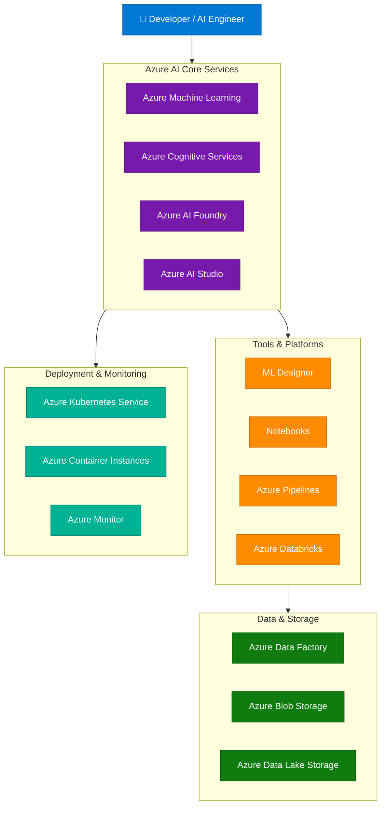

---

## Introduction

### Azure Machine Learning - A Step-by-Step Guide

> **URL:** [Azure Machine Learning - A Step-by-Step Guide](https://www.scholarhat.com/tutorial/azureai/azure-machine-learning)

#### Azure Machine Learning - A Step-by-Step Guide

24 min read Learn with an interactive course and practical hands-on labs

Azure Machine Learning is Microsoft’s cloud-based platform that helps developers and data scientists build, train, and deploy machine learning models at scale. It simplifies the process of working with data, training models, and integrating AI into real-world applications.

Whether you are analyzing customer behavior, detecting fraud, or automating predictions, Azure Machine Learning provides the tools and flexibility needed to manage the entire machine learning lifecycle. From drag-and-drop interfaces to advanced Python SDKs, it supports both beginners and experienced professionals.

In this Azure tutorial, let’s take a closer look at what Azure Machine Learning offers and how it fits into today’s AI-powered workflows. And if you want to learn AI basics without any cost? Enroll in the Free Azure AI Fundamental Course and take the first step toward your AI career.

#### What is Azure Machine Learning?
- Microsoft offers a cloud service called Azure Machine Learning
- It facilitates the entire machine-learning lifecycle.
- It makes building, training, and implementing machine learning models at scale easier.
- Azure ML provides a multitude of tools, such as deployment services, data preprocessing, model training, and automated machine learning (AutoML).
- It is made to make machine learning model creation faster and more accessible to both new and seasoned data scientists. | Are you curious about how to tackle this question in your Azure interview? Explore our Azure Interview Questions article for detailed answers and tips! > Top 50 Azure Interview Questions and Answers

#### Key features of Azure Machine Learning

Azure's machine learning service includes some helpful features that simplify things for a larger group of people. These features would come in quite handy, particularly if you are not accustomed to manually configuring the machine learning workflow and environment. Azure Machine Learning has several key features that improve its functionality and usability:
- On-Demand Scalable Compute : Customizable on-demand computing according to workload.
- Data Ingestion Engine : The data ingestion engine's acceptance of sources is extensive, in my opinion.
- Machine Learning Workflow Orchestration : Azure makes machine learning workflow orchestration very easy.
- Machine Learning Model Management : Azure Machine Learning offers specialized features for managing machine learning models, which are useful if you prefer to test several models before deciding on the best one.
- Metrics and Monitoring : All of the services and metrics we use for model training are easily accessible on the platform.
- Model deployment : You can instantly implement your model using Azure ML.

#### Types of services in Azure Machine Learning

#### 1. Azure ML Studio
- Azure ML Studio is a visual workspace for creating, honing, and deploying models without requiring a lot of coding.

#### 2. Azure ML Designer
- A drag-and-drop interface for modeling experimentation and machine learning pipeline creation.

#### 3. Azure ML Notebooks
- Jupyter notebooks offer an interactive setting for experimentation, model building, and data discovery.

#### 4. Azure ML computational

Distributed computing and GPU support, among another scalable computational resources, for model deployment and training.

##### Example

Here’s a basic example of how you can use Python in Azure ML to create and run a simple machine-learning app

from azureml.core import Workspace, Dataset

After setting up an AutoML setup, loading a dataset, running the experiment, and producing the best model, this script connects to your Azure ML workspace.

#### A Step-by-Step Guide To Building Machine Learning Models in Azure

There are three methods to build Machine Learning Models in Azure
- Azure ML Studio (based on Automated Machine learning)

#### Method 1:Custom settings and building a model of our choice(Expert Mode)

A workspace is a central location where resources needed for model training are managed. Workspaces are useful for organizing resources according to projects, organization units, testing, and production environments, etc. In Azure, workspaces are defined inside resource groups. A workspace's resources include pipelines, notebooks, experiments, models, data for training models, and computing goals.

The following is also created when we build an Azure workspace:
- Data storage account for training models
- Applications insights to keep an eye on prediction services
- Azure Key Vault for credential management

Users must authenticate using the Azure Active directory in order to access these resources in Azure Workspace. The steps to create an Azure workspace are listed below:

1. By using the Azure Portal, create a machine learning resource.

2. After the resource instance has been built, build the workspace and enter the necessary data, such as the workspace name, region, storage account, and application insights.

Python code can be written and executed online using compute instances, which come pre-installed with a development environment. A workspace can contain more than one compute instance. We can choose a compute instance with the required CPU, GPU, RAM, and Storage based on our needs.

The steps to build a compute instance are listed below.

2. Give the name of the computed instance. Choose the needed virtual machine and start the compute instance.

1. To create a new DataSet, click DataSet. I have used the from local files option to upload the data.

2. Upload the file and provide the name of the DataSet.

Step 4 : Create an Azure Notebook and Connect to Workspace

1. Click on Create New Notebook in Machine Learning Studio.

3. Import the Python package called azureml-core, which allows us to connect and create code that uses the workspace's resources.

print (ws.name, ws.location, ws.resource_group, ws.subscription_id)

For batch scoring or real-time inference, deploy trained models to various settings, such as Azure Kubernetes Service (AKS) or Azure Container Instances (ACI).

Step 5 : Create a Training Script to train the model

The following command will be used to create a script in this phase that will train the model and save it as a.py file in our folder:

%%writefile $training_folder/employess_training. py

1. To store all of the Python scripts, let's make a folder. The training scripts will be stored in a folder called employees-training.

3. Obtain the context for the run. An experiment's run is equivalent to one trial. A single experiment can contain several Runs. Run allows us to keep an eye on the trial, record metrics, store trial output, and examine the results .

4. Use the Pandas library to read the dataset.

employees= pd. read_csv ( Dataset . Tabular . from_delimited_files (path=datastore_paths)) 5. Create the datasets X and Y. X has the feature variables and Y has the output variable

X_train, X_test, y_train, y_test = train_test_split (X, y, test_size= 0.30 , random_state= 0 )

model = LogisticRegression (C= 1 /reg, solver= "liblinear" ). fit (X_train, y_train) 7. Next, we assess our model code by determining the model's accuracy and AUC. # calculate the AUC

run. log ( 'AUC' , np. float (auc) 8. Save the model after training into the specified folder. In this instance, the model is being saved to the output folder. The trained model should be saved in the outputs folder

# Save the trained model in the outputs folder

joblib. dump (value=model, filename= 'outputs/employees_model.pkl' )

run. complete () We have simply created a script to train the model in this stage and saved it in a folder. The script hasn't been run yet.

Step 6 : Run the training Script as an Experiment

1. A set of trials representing several model runs is called an experiment. Experiments can also be conducted using alternative codes, data, and settings. Run Class 1 represents each trial in an experiment, and Experiment Class represents the experiment as a whole. To conduct the experiment, we build a Python environment.

env = Environment . from_conda_specification ( "experiment_env" , "environment.yml" ) where the environment specifications are contained in environment.yml 2. After that, we create a ScriptRunConfig which packages gather information to submit a run like Script, compute targets, environments etc.

script_config = ScriptRunConfig (source_directory=training_folder,

3. After that, we pass the ScriptConfig details and submit the experiment run.

experiment = Experiment (workspace=ws, name=experiment_name)

run = experiment. submit (config=script_config) 4. After that, we wait for the experiment to finish running.

Step 7: Retrieve the metrics and output of the run object and print it in the Notebook.

To print metrics like accuracy, AUC, regularization rate, etc., we can utilize the run class's get_metric method.

Remember that the model was saved as a pkl file in Step 5. In order to keep track of the model versions, we will now register the model in the workspace.

run. register_model (model_path= 'outputs/employees_model.pkl' , model_name= 'employees_model' ,

When we click on the name of the experiment and each run's corresponding status, we can observe the different runs.

We may view related metrics, outputs, logs, etc. for every run. The model's accuracy in this specific algorithm is 0.774, and the area under the curve is 0.848.

#### Method 2: Automated Machine Learning using Azure Machine Learning Studio

Step 1 : To train the data, specify the dataset with labels. I've made a fresh automated machine learning run using the same diabetic dataset. Step 2 : Set up the automated machine learning run by providing the experiment's name, target label, and compute target. Step 3 : Decide which algorithm and configuration parameters to use, such as feature settings, regression, classification, or time series. Step 4 : Examine the top model currently produced. Step 5: After clicking the experiment, you can observe that several kinds of algorithms were run multiple times to determine which model would perform best.

#### Method 3: Training Model using Azure Machine Learning Designer(Designer Mode)

##### 1. An explainer for Model performance

##### 2. Explainer for Aggregate Feature Importance

Step 4: Score the Model Step 5: Evaluate the model The model needs to be evaluated as the last step. We can use the following metrics to assess the model.

##### Lift curve, ROC curve, and precision-recall curve.

The confusion matrix helps us assess several metrics, such as sensitivity and specificity and provides information about the ratios surrounding true positives and false positives.

#### Advantages of using Azure Machine Learning

#### 1. Simplified Development
- By simplifying the process of developing models, Azure ML's automated tools and user-friendly interface free up developers to concentrate on experimentation and creativity.

#### 2. Scalability
- Machine learning models can be scaled to handle big datasets and sophisticated computations with efficiency thanks to Azure's cloud infrastructure.

#### 3. Teamwork

#### 4. Expense-effectiveness

Pay-as-you-go pricing makes sure you only pay for the resources you really use, so it's an affordable option for companies of all kinds.

#### 5. Deployment Flexibility
- This enables models to be seamlessly deployed to a range of contexts, such as cloud-based apps, on-premises servers, and edge devices.

##### Conclusion

Azure Machine Learning provides a complete set of tools that help businesses and developers build, train, and deploy AI models efficiently. It plays a key role in modern AI workflows by simplifying complex tasks and speeding up the journey from data to actionable insights. By automating many processes and offering integration with popular frameworks, Azure Machine Learning enables faster experimentation and iteration, helping teams bring AI solutions to production more quickly.

Transform your career with the Azure AI Engineer Certification where you’ll gain practical skills, hands-on experience, and the confidence to take on advanced AI projects.

#### FAQs

#### Q1. Is Microsoft Azure ML free?

These products are free up to the specified monthly amounts. Some are always free to all Azure customers, and some are free for 12 months to new customers only.

#### Q2. Does Azure machine learning require coding?

Azure Machine Learning Studio It streamlines the process from data preparation to model deployment, offering a no-code or low-code experience that makes machine learning accessible to a broader range of users, from beginners to seasoned data scientists.

#### Q3. What is the main benefit of Azure ML?

Azure ML provides a central model registry for the entire organization with a full lineage for models.

#### 
- Top Azure AI and ML Tools You Should Master in 2025
- Microsoft Agent Framework Explained: Architecture, Benefits & Installation Guide
- Microsoft Agent 365: The New Control Hub for Autonomous AI Agents
- Azure AI vs AWS AI: Best Cloud AI Platform in 2025
- Azure AI Studio and Azure Machine Learning
- Azure Machine Learning Services

---

## Basics

### Azure AI vs AWS AI: Best Cloud AI Platform in 2025

> **URL:** [Azure AI vs AWS AI: Best Cloud AI Platform in 2025](https://www.scholarhat.com/tutorial/azureai/azure-ai-vs-aws-ai)

#### Azure AI vs AWS AI: Best Cloud AI Platform in 2025

27 min read Learn with an interactive course and practical hands-on labs

Start Learning Free Free Interview books Skill Test Azure AI and AWS AI are two of the most powerful cloud-based artificial intelligence platforms, each offering powerful tools for building, training, and deploying AI solutions. Azure AI focuses on easy integration with Microsoft products and enterprise security, while AWS AI provides unmatched scalability and flexibility for custom AI development.

#### Battle of the Cloud AI Giants: Azure AI vs AWS AI

In today’s AI-driven world, two platforms dominate the cloud AI space, Microsoft’s Azure AI and Amazon’s AWS AI. Both offer powerful tools, prebuilt services, and scalable infrastructure, but their strengths cater to different needs. Azure shines with its seamless Microsoft integration and enterprise security, while AWS stands out for its flexibility, vast service range, and high scalability.

#### Why Compare Azure AI and AWS AI in 2025?

As AI adoption rapidly increases in 2025, especially with generative AI and predictive analytics, choosing the right AI cloud platform is crucial. Here’s why comparing Azure AI and AWS AI is important:

#### 1. Rapid Surge in AI Adoption
- Growing AI Use Cases : Businesses use AI for everything from chatbots and image recognition to predictive maintenance, which helps them stand out in the market.
- Demand for New Tools: Organizations want platforms that offer the latest AI models and APIs to keep up with changing technology.

#### 2. Need for Scalability
- Elastic Resource Allocation: AI workloads can change a lot; platforms must automatically scale compute power to meet demand.
- Global Availability: The presence of data centers worldwide affects latency and compliance, which can impact successful AI deployment.

#### 3. Cost-Efficiency and Pricing Models
- Flexible Pricing: Pay-as-you-go models with tiered pricing affect total costs and budgeting accuracy.
- Bundled Enterprise Deals: Existing customers might get discounts or bundles based on their cloud provider.

#### 4. Faster Innovation Cycles
- Pre-built AI Services: Ready-to-use APIs speed up development by handling common AI tasks like vision or language processing.
- Custom ML Pipelines: Tools for automated and custom model training help accelerate experimentation and deployment.

#### 5. Competitive Advantage Through AI
- Better Customer Experiences : Smart AI applications personalize user interactions and enhance satisfaction.
- Operational Efficiency: Automation cuts costs and boosts productivity, giving businesses a competitive edge.

#### 6. Fit with Business Ecosystem
- Microsoft Integration: Azure AI works well with organizations that use Microsoft products and services.
- AWS Ecosystem: AWS AI connects deeply with a wide range of cloud infrastructure and developer tools.

#### What is Azure AI ?

Azure AI is a suite of AI and machine learning services integrated into the Azure cloud with Microsoft’s ecosystem , which includes Azure cloud, Office 365, Dynamics 365, and the Power Platform. It focuses on being easy to use, providing strong security, and ensuring smooth teamwork with Microsoft’s productivity tools. Azure AI services is especially attractive to organizations already using Microsoft’s ecosystem. It offering a large collection of tools for building AI solutions.

#### Key Services in Azure AI

##### 1. Azure Machine Learning (Azure ML)

Purpose: A fully managed platform for managing the end-to-end machine learning lifecycle, from data preparation to model deployment and monitoring, with robust MLOps (Machine Learning Operations) support. Features:
- Designer: A user-friendly, drag-and-drop interface for building models without coding, suitable for beginners.
- Automated ML: Streamlines model selection and hyperparameter tuning to speed up development.
- MLOps: Provides CI/CD pipelines, model versioning, lineage tracking, and monitoring for drift and performance, ensuring production-ready models.
- Supported Frameworks: Works with TensorFlow, PyTorch, Scikit-learn, and others, and supports custom code in Python or R.
- Responsible AI: Includes tools for model interpretability, fairness assessment, and bias mitigation.
- Integration: Connects seamlessly with Azure Data Lake, Azure Synapse Analytics, and Power BI for data ingestion and visualization. Use Case Example: A financial institution might use Azure ML to create a fraud detection model. It can take advantage of automated ML to optimize hyperparameters and MLOps to deploy and monitor the model in production. Differentiator: It has a strong focus on enterprise-level MLOps with features like model lineage tracking and compliance auditing.

##### 2. Azure Cognitive Services

Purpose: A collection of prebuilt APIs for common AI tasks, allowing developers to add AI features without needing extensive machine learning knowledge. Key APIs:
- Vision: .Includes image recognition, object detection, OCR (Optical Character Recognition), and spatial analysis (e.g., detecting people in video streams).
- Speech: Includes speech-to-text, text-to-speech, and real-time translation.
- Language: Features sentiment analysis, entity recognition, and language understanding.
- Decision: Provides tools for detecting anomalies and moderating content. Features
- Customizable models (e.g., Custom Vision, Custom Speech) for domain-specific applications.
- Integration with Power Apps and Power Automate for low-code AI workflows.
- Scalable deployment with Azure’s global infrastructure. Use Case Example: A retail company might utilize the Vision API to analyze in-store camera footage for customer behavior insights or the Language API for sentiment analysis of customer reviews. Differentiator: The ready-made APIs work closely with Microsoft’s Power Platform, making it easy for non-technical users to integrate AI into business processes using Power Apps or Power Automate.

##### 3. Azure OpenAI Service

Purpose: Provides access to OpenAI’s large language models (LLMs), such as GPT-4 and later iterations, with enterprise-grade security and compliance features. Features:
- Access to models for text generation, embeddings, and code generation (e.g., Codex).
- Fine-tuning options for domain-specific applications.
- Integration with Azure’s identity and access management systems for secure deployment.
- Tools for responsible AI to monitor bias, fairness, and explainability.
- Support for private endpoints and virtual networks for data isolation. Use Case Example: A legal firm might use Azure OpenAI Service to automate contract analysis. It can use GPT-4 to summarize documents while ensuring compliance with GDPR through Azure’s security features. Differentiator: This service combines OpenAI’s leading models with Microsoft’s strong security and compliance framework, making it suitable for regulated fields like healthcare and finance.

##### 4. Azure Bot Service

Purpose: Enables the creation of conversational AI agents using the Microsoft Bot Framework. Features:
- Supports deployment across multiple platforms (such as Teams, Slack, web, and mobile).
- Integrates with Cognitive Services (for example, LUIS for natural language understanding).
- Provides tools for building, testing, and deploying bots with Azure DevOps.
- Supports adaptive dialogs for complex, multi-turn conversations. Use Case Example: A customer service organization could set up a chatbot on its website to manage frequent questions, linked to Microsoft Teams for smooth handoff to human agents. Differentiator: It integrates easily with Microsoft 365 and Azure Cognitive Services to provide a cohesive conversational AI experience.

##### 5. Azure AI Search (formerly Azure Cognitive Search)

Purpose: An enterprise search tool that uses AI for semantic ranking and indexing. Features:
- Semantic search to understand user intent and context, improving result relevance.
- Works with Cognitive Services for enriched indexing (for example, extracting text from images or PDFs).
- Customizable ranking models designed for specific search needs.
- Knowledge mining to extract insights from large document repositories. Use Case Example: An e-commerce site could use Azure AI Search to create a product search engine that understands natural language queries, like “red running shoes under $100.” Differentiator: It combines traditional search with AI-enhanced semantic understanding, making it very effective for knowledge management and customer interactions.

#### Advantages of Azure AI

##### 1. Ecosystem Integration:
- Azure AI works seamlessly with Microsoft 365, Dynamics 365, and the Power Platform.
- This makes it a great option for organizations already using Microsoft’s productivity tools.
- For instance, Power Apps lets business users create AI-powered applications without coding, while Power Automate can streamline workflows using Cognitive Services.

##### 2. Enterprise Security and Compliance:
- Azure AI meets strict standards like ISO 27001, GDPR, HIPAA, and FedRAMP, making it fitting for regulated industries.
- Features like Azure Active Directory and private endpoints provide secure access to AI services.

##### 3. Low-Code/No-Code Options:
- Tools such as Azure ML Designer and the Power Platform allow non-technical users to build and deploy AI solutions, reducing the need for data scientists.

##### 4. Hybrid and Multi-Cloud Support:
- Azure Arc and Azure Stack let AI workloads run on-site, at the edge, or in multi-cloud environments.
- This provides flexibility for organizations with complex infrastructures.

##### 5. Responsible AI:
- Microsoft emphasizes ethical AI through tools that promote fairness, interpretability, and bias mitigation.
- These are crucial for sectors like healthcare and government.

#### Disadvantages of Azure AI
- Azure AI may feel limiting for organizations not already part of Microsoft’s ecosystem, as its tools are mainly optimized for Microsoft products.
- Although Azure provides flexibility for developers, it has a slightly narrower range of services than AWS, especially for niche or highly customized AI applications.
- Pricing can be complicated due to the combination of various services, necessitating careful cost management.

#### What is AWS AI ?

AWS AI or Amazon Web Services AI is Amazon’s collection of tools and services for building and using artificial intelligence and machine learning. It works for everyone, from startups to large companies, by providing both ready-made AI services and tools for creating custom models. AWS AI is flexible, highly scalable, and well integrated with other AWS services. Its pay-as-you-go pricing and robust infrastructure make it suitable for projects of any size.

#### Key Services of AWS AI

##### 1. Amazon SageMaker

Purpose: A fully managed platform for the entire machine learning lifecycle, from data preparation to model training, deployment, and monitoring. Key Features:
- SageMaker Studio: An integrated development environment (IDE) that combines data exploration, model building, training, and deployment in one place.
- SageMaker JumpStart: A library of prebuilt models, algorithms, and solutions for common use cases, such as fraud detection, demand forecasting, and computer vision. This feature enables quick prototyping.
- SageMaker Autopilot: An automated ML tool that picks the best algorithms, preprocesses data, and tunes hyperparameters.
- SageMaker Clarify: Offers tools for explainability and bias detection to ensure responsible AI practices.
- MLOps Capabilities : Supports CI/CD pipelines, model versioning, monitoring for drift, and automated retraining.
- Supported Frameworks: TensorFlow, PyTorch, MXNet, Scikit-learn, and custom algorithms via Docker containers. Use Case Example: A logistics company could use SageMaker to build a predictive maintenance model for its fleet, leveraging SageMaker JumpStart for prebuilt algorithms and SageMaker Studio for custom tuning. Differentiator: Offers unparalleled flexibility for developers, with support for custom algorithms and integration with AWS’s data lakes (e.g., S3, Redshift).

##### 2. AWS Bedrock

Purpose: A serverless platform for deploying and managing generative AI models, offering access to various foundation models without the need for infrastructure management. Key Features:
- Supports foundation models from AWS , such as Titan Text and Titan Image, and models from third-party providers, including Anthropic’s Claude, Stability AI, and Meta AI.
- Fine-Tuning : Allows users to customize models with domain-specific data using techniques like Low-Rank Adaptation (LoRA).
- Retrieval-Augmented Generation (RAG) : Improves model outputs by using external data sources, such as knowledge bases or documents stored in S3.
- Serverless Architecture: Eliminates server management, with automatic scaling for high-demand workloads.

Use Case Example: A media company could use Bedrock to generate personalized content recommendations, fine-tuning a foundation model with user data stored in AWS S3.

Differentiator: Bedrock’s flexible model approach lets users select the best foundation model for their needs while its serverless design reduces operational demands.

##### 3. Amazon Rekognition

Purpose: Provides image and video analysis for tasks such as object detection, facial recognition, and content moderation. Key Features:
- Object, scene, and activity detection, such as identifying cars, people, or actions in images.
- Facial analysis, which includes emotion, age, and gender detection, along with support for face comparison and search.
- Custom Labels: Enables users to train models for specific image recognition tasks.
- Real-time and batch processing for both images and videos. Use Case Example: A sports analytics company could use Rekognition to analyze game footage, identifying player movements and generating real-time insights for coaches. Differentiator: Highly scalable and customizable, with low latency for real-time applications

##### 4. Amazon Polly

Purpose: Converts text to lifelike speech for applications like voiceovers, virtual assistants, and accessibility tools. Key Features:
- Supports many languages and regional accents.
- Neural Text-to-Speech (NTTS) provides natural-sounding voices that resemble human speech.
- Offers customizable pronunciation and speech synthesis markup language (SSML) for detailed control.
- Integrates with media workflows, such as AWS Elemental MediaConvert.

Use Case Example: An e-learning platform could use Polly to generate audio narration for courses in multiple languages. Differentiator: Polly’s high-quality voices and SSML customization offer more control than basic text-to-speech services.

##### 5. Amazon Comprehend

Purpose: A natural language processing (NLP) service for extracting insights from text, including sentiment, entities, and topics.
- Sentiment analysis, keyphrase extraction, and entity recognition for things like people, places, and organizations.
- Topic modeling to identify themes in large text sets.
- Custom classifiers and entity recognizers for specific NLP tasks.
- Comprehend Medical: A special version for healthcare that extracts medical information like diagnoses, medications, and treatments. Use Case Example: A healthcare provider could use Comprehend Medical to extract diagnoses and medications from unstructured clinical notes. Differentiator: Specialized NLP capabilities for industries like healthcare, with strong integration with AWS data pipelines.

##### 6. Amazon Lex

Purpose: Powers conversational AI for chatbots and voice assistants, using the same technology as Alexa. Key Features:
- Supports multi-turn conversations and natural language understanding (NLU).
- Integrates with AWS Lambda for custom backend logic.
- Allows deployment across multiple channels, such as web, mobile, and messaging platforms like Slack.
- Provides speech recognition and synthesis through integration with Polly.

Use Case Example : An insurance company could use Lex to create a chatbot that helps customers with claims processing, using Lambda to query policy data. Differentiator: Lex’s Alexa-based technology ensures strong conversational abilities, and its integration with AWS services allows for complex, scalable applications.

#### Advantages of AWS AI

##### 1. Widest Range of AI/ML Tools
- AWS AI’s offerings are unmatched in their variety. They cover everything from low-level ML frameworks, like SageMaker, to high-level APIs, such as Rekognition, Polly, Comprehend, and Lex, along with generative AI like Bedrock.
- This variety allows AWS to address many use cases, from computer vision to conversational AI to large-scale model training.

##### 2. Highly Scalable Infrastructure
- AWS’s global infrastructure, with regions and availability zones across the globe, permits low-latency and high-throughput AI workloads.
- Services like SageMaker and Bedrock use AWS’s compute resources, such as EC2, to handle large datasets and millions of API requests.
- For example, a social media platform could use Rekognition to process billions of images daily, scaling quickly during traffic spikes.

##### 3. Strong Integration with AWS Ecosystem
- AWS AI services are closely linked with AWS’s data storage, analytics, and compute services.
- This allows for complete AI pipelines that go from data ingestion to model deployment.
- For example, a data lake in S3 can directly feed into SageMaker for model training, with results visualized in QuickSight for business insights.

##### 4.Flexibility for Managed and Custom Deployments
- AWS offers a balance between fully managed services, such as Bedrock and Rekognition, and tools for custom model development, like SageMaker.
- Developers can choose prebuilt models for quick deployment or create custom algorithms using their preferred frameworks. This flexibility makes AWS suitable for both rapid prototyping and complex, specific applications.

##### 5. Cost Efficiency
- AWS’s pay-as-you-go and serverless options (e.g., Bedrock, Lambda) make it cost-effective for startups and enterprises with variable

#### Disadvantages of AWS AI
- AWS’s vast portfolio can be overwhelming for new users or organizations without dedicated data science teams, requiring a steeper learning curve than Azure’s low-code options.
- Less focus on no-code/low-code solutions compared to Azure, making it less accessible for non-technical business users.
- Integration with non-AWS ecosystems (e.g., Microsoft 365) is less seamless, requiring additional configuration.

---

### Microsoft Agent Framework Explained

> **URL:** [Microsoft Agent Framework Explained: Architecture, Benefits &amp; Installation Guide](https://www.scholarhat.com/tutorial/techtrends/microsoft-agent-framework)

#### Microsoft Agent Framework Explained: Architecture, Benefits & Installation Guide

11 min read Learn with an interactive course and practical hands-on labs

Microsoft Agent Framework is a powerful platform that helps developers create intelligent, autonomous AI agents capable of planning, reasoning, taking actions, and integrating with real-world tools and APIs. It provides ready-made building blocks like workflows, memory, and orchestration, making it easy to build secure and scalable AI systems within the Microsoft ecosystem.

In this tutorial, we’ll explore what the Microsoft Agent Framework is, key benefits, architecture overview, its core components, and real use cases. You’ll also learn how to install and set it up in both .NET and Python so you can start building your own AI agents with ease. And if you want to learn AI basics without any cost? Enroll in the Free Azure AI Fundamental Course and take the first step toward your AI career.

#### What is Microsoft Agent Framework?

Microsoft Agent Framework is a cutting-edge platform designed to help developers build intelligent, autonomous, and action-driven AI agents. These agents are capable of understanding natural language, breaking tasks into steps, reasoning through complex instructions, and interacting with external systems such as APIs, databases, and enterprise applications.

The framework simplifies the process of creating AI-powered workflows by providing prebuilt components like planners, memory systems, orchestrators, and tool integrations. Whether you’re building an internal automation bot, a customer support assistant, or a multi-agent collaborative system, the Microsoft Agent Framework gives you the architecture, scalability, and control needed to deploy enterprise-grade AI solutions with ease.

#### Why Choose Microsoft Agent Framework?

Microsoft Agent Framework is designed with both individual developers and large enterprises in mind. It provides a reliable, scalable, and secure environment to build AI agents that integrate deeply with Microsoft ecosystems like Azure AI, Microsoft 365, GitHub, and VS Code .

##### Here’s why developers choose it:
- It removes the complexity of building agentic logic from scratch.
- It offers native integrations with powerful LLMs (GPT-4o, Phi-3, Azure models).
- It ensures enterprise-level compliance, identity management, and monitoring.
- It works seamlessly across cloud, on-prem, and hybrid environments.
- It supports both Python and .NET developers with strong tooling support. The result is a faster, safer, and more efficient path to building production-ready AI workflows.

#### Benefits of Microsoft Agent Framework
- Enterprise-Grade Security & Compliance: Built with Microsoft’s security infrastructure, it supports authentication, governance, and access control out-of-the-box.
- Highly Modular Architecture: Developers can customize every part—agents, tools, memories, workflows—without breaking the system.
- Cross-Language Support (.NET & Python): Choose the language that fits your team for rapid prototyping and production deployment.
- Cloud-Native Scalability: Agents can run on Azure Functions, Kubernetes, or local machines with the same consistency.
- Enhanced Automation Capabilities: It enables agents to take autonomous actions, reducing manual workloads across operations, IT, development, and customer service.
- Integrated Developer Tools: First-class support for Visual Studio, VS Code, GitHub Actions, and Azure AI Studio makes the development cycle smoother.

#### Microsoft Agent Framework Architecture Overview

The Microsoft Agent Framework is designed to help developers build autonomous, intelligent AI agents that can reason, plan, act, and collaborate with other systems.
- Central Intelligence Layer: At the core, the framework hosts agents that perform reasoning, planning, and decision-making to execute tasks autonomously.
- Workflow & Orchestration Engine: Agents follow structured workflows that break complex tasks into smaller steps, ensuring organized and predictable execution.
- Memory & Context Management: The framework stores short-term and long-term context, allowing agents to remember past actions and adapt responses intelligently.
- Tool & API Integration Support: Agents can connect to external APIs, databases, CRMs, and automation tools, enabling real-world task execution and system interaction.
- Microsoft 365 Integrations: Through the M365 Agents SDK, agents can work inside Teams, Outlook, Loop, and other productivity apps to automate communication and workflows.
- Azure AI & Model Layer: The architecture connects seamlessly with Azure AI models for reasoning, text generation, summarization, and custom AI workflows.
- Data Source Connectivity: Agents can interact with SQL databases, Cosmos DB, Elastic, MongoDB, and vector stores to read, write, and analyze enterprise data.
- Low-Code Extensions via Copilot Studio: The framework integrates with Copilot Studio, allowing organizations to extend or customize agent behavior using low-code tools.
- Secure Deployment & Monitoring: Built-in security, logging, and monitoring ensure agents can run reliably at scale within enterprise environments.

#### Core Components: Agents, Workflows, and Building Blocks

#### 1. Agents (The Intelligent Executors)

Agents are the core units of intelligence within the Microsoft Agent Framework. They are designed to:
- Understand a user’s request using natural language processing.
- Break down a complex task into manageable steps.
- Decide which tools, APIs, or workflows to run.
- Learn from previous interactions using stored memory.
- Communicate with other agents to complete multi-step operations. Agents behave like digital teammates. They are capable of thinking, planning, and taking autonomous actions.

#### 2. Workflows (The Execution Pipelines)

Workflows define how tasks are executed and how agents carry out operations. They allow developers to:
- Build multi-step automation pipelines.
- Combine decision-making logic with sequential/parallel tasks.
- Integrate external APIs, databases, and business logic.
- Add branching, conditional logic, and real-time responses.
- Automate repetitive processes with minimal coding Workflows turn your agent into a fully automated system that can act independently and consistently.

#### 3. Building Blocks (Prebuilt AI Brains & Tools)

The Agent Framework offers modular building blocks that serve as the internal “brain” of your agent:
- Planner: Converts user objectives into executable task plans.
- Reasoner: Determines the next best actions based on context.
- Memory: Stores conversation history, task outputs, and long-term knowledge.
- Tools / Skills: Functions, scripts, APIs, or models the agent can use.
- Orchestrator: Manages workloads, agent collaboration, and execution flow. These components reduce development time and allow developers to focus on high-level logic instead of reinventing core AI infrastructure.

#### Use Cases of Microsoft Agent Framework

#### 1. Customer Support and Virtual Assistants

Agents can resolve customer queries, fetch data from CRM systems, update tickets, escalate issues, and handle conversations like an intelligent support executive.

#### 2. Intelligent Workflow Automation

Automate business processes such as onboarding, email processing, lead management, report creation, and system monitoring, all using natural language commands.

#### 3. Document Intelligence & Data Extraction

Agents can analyze PDFs, summarize research material, extract insights, classify information, and store results in databases.

#### 4. AIOps & IT Automation

Suitable for server health checks, log analysis, error diagnosis, auto-recovery actions, DevOps workflows, and cloud operations.

#### 5. Personalized Sales & Marketing Automation

Create tailored emails, follow-up sequences, dashboards, and marketing recommendations automatically.

#### 6. Developer Assistance & Internal Tools

Build agents that can generate code, debug errors, write documentation, review pull requests, or automate CI/CD pipelines.

#### Getting Started: Installation and Setup for .NET and Python

The Microsoft Agent Framework is designed to be simple and accessible for all developers. Below are detailed steps to set up the environment.

#### .NET Installation & Setup

Step 1: Install the Required NuGet Package Run this command to add the Agent Framework to your .NET project:

dotnet add package Microsoft.AgentFramework Step 2: Create a New Agent Project Template Microsoft provides a starter template:

This generates a ready-to-run agent with sample code, configuration files, and recommended project structure. Step 3: Build a Basic .NET Agent

var result = await agent.RunAsync( "Write a short note on Azure AI agents." );

This agent can process instructions, generate responses, and perform actions. Step 4: Add Tools & External APIs Developers can add custom tools such as:
- Database fetchers

#### Python Installation & Setup

pip install microsoft-agent-framework This installs all necessary modules including planner, memory, and orchestration components. Step 2: Create a Simple Python Agent

response = agent.run( "Summarize the role of the Microsoft Agent Framework." )

print (response) Step 3: Add Tools, Actions & Workflow Logic You can integrate:
- Database operations
- Multi-step workflows Step 4: Deploy to Azure or Run Locally Agents can be executed:
- Locally on your machine
- In an Azure Function
- Inside a Docker container
- Through CI/CD pipelines

##### Conclusion

The Microsoft Agent Framework marks a major shift in how intelligent, autonomous, and goal-driven systems are built. Its modular architecture, combining skills, workflows, memory, and copilots, gives developers a powerful foundation for creating scalable AI agents that adapt, learn, and deliver real-time value. Whether you're enhancing productivity tools or building industry-grade automation, this framework provides the flexibility and intelligence needed to turn ideas into fully operational AI solutions. Transform your career with the Agentic AI Engineer Certification Training where you’ll ga

#### Take our Techtrends skill challenge to evaluate yourself!

- ChatGPT vs DeepSeek: Which AI Model is Better for You?
- Top JavaScript Frameworks
- The Top Programming Languages for Web Development
- Introduction To Programming Languages
- Choosing the Right Programming Language for Your Project
- Most In-Demand Programming Languages Right Now

---

### Microsoft Agent 365: The New Control Hub for Autonomous AI Agents

> **URL:** [Microsoft Agent 365: The New Control Hub for Autonomous AI Agents](https://www.scholarhat.com/tutorial/azureai/microsoft-agent-365)

#### Microsoft Agent 365: The New Control Hub for Autonomous AI Agents

10 min read Learn with an interactive course and practical hands-on labs

In this Azure AI tutorial , you'll learn what is Microsoft Agent 365, why enterprises need a Control Plane for AI Agents now, and the Five Core Pillars of Microsoft Agent 365.You’ll also learn how it Integrates with Microsoft apps , how to get started with it, and what the Future of AI automation looks like with Agent 365. If you want to learn AI basics without any cost? Enroll in the Free Azure AI Fundamental Course and take the first step toward your AI career.

#### What Is Microsoft Agent 365?

Instead of simple chatbots, Agent 365 enables AI agents that can plan, reason, take actions, coordinate workflows, and complete tasks end-to-end, all while following enterprise security, compliance, and governance rules.

#### Key Capabilities of Microsoft Agent 365
- Build AI agents that automate repetitive business workflows.
- Integrate agents deeply with Microsoft 365 apps.
- Enable autonomous task execution.(plan → act → complete)
- Centrally manage, govern, and secure all agents.
- Monitor conversations, tasks, and performance.
- Scale AI automation across teams and departments.

#### Why Enterprises Need a Control Plane for AI Agents Now?

As organizations adopt AI at scale, managing multiple agents across different apps and departments becomes increasingly complex. A control plane provides the structure and oversight needed to keep these agents coordinated, secure, and aligned with business goals.
- AI agents are becoming autonomous , and enterprises need a central system to control their actions, permissions, and decision-making.
- Enterprises require visibility and monitoring, including logs, audit trails, task histories, and real-time performance tracking of all AI agents.
- Security and compliance rules must be enforced, and a control plane provides data boundaries, role-based access, and policy enforcement.
- Scaling AI automation is impossible without standardization , and a control plane manages deployment, updates, version control, and maintenance.
- Risk mitigation becomes essential as agents gain autonomy; a control plane ensures safe, predictable, and governed AI operations.
- Business leaders need control and accountability, and a unified plane makes it easy to approve actions, track impacts, and set organizational rules.
- Enterprise-grade automation demands reliability, and a control plane ensures agents run consistently across departments and functions.

#### Core Capabilities: The 5 Pillars of Microsoft Agent 365

Microsoft Agent 365 is built on five core pillars that provide structure, security, and seamless control for managing AI agents across the enterprise.

#### 1. Registry
- Registry is a Central directory where all enterprise AI agents are created, registered, and managed.
- It maintains metadata, capabilities, permissions, and version history of each agent.
- It ensures consistency by standardizing how agents are defined and deployed across the organization.
- It helps teams instantly discover available agents and reuse them across apps and workflows.

#### 2. Access Control
- Access Control manages who can create, modify, or trigger AI agents across the enterprise.
- Enforces role-based access and permissions at department, user, and system levels.
- Prevents unauthorized agents from running actions, accessing data, or executing workflows.
- Access Control ensures that every agent operates within clearly defined boundaries.

#### 3. Visualization & Observability
- Visualization & Observability provides dashboards to monitor agent activity, task execution, performance, and errors.
- Enables real-time debugging and tracking of decision-making steps taken by the agent.
- Offers full audit trails for compliance, tracking what the agent did and why.
- Helps IT and business leaders measure ROI and optimize agent efficiency.

#### 4. Interoperability
- Makes AI automation highly scalable by breaking silos between tools and departments.

#### 5. Security & Governance
- Security and Governance applies enterprise security policies, compliance rules, and data protection standards to all AI agents.
- Ensures agents respect data boundaries and do not access or leak sensitive information.
- Provides governance controls to audit, approve, or limit agent actions.
- Keeps AI automation safe, accountable, and aligned with organizational standards.

#### How Microsoft Agent 365 Integrates with the Microsoft Ecosystem?

#### Key Integration Points of Microsoft Agent 365:

##### 1. Microsoft Teams

Agents can join conversations, schedule tasks, fetch data, send notifications, and coordinate workflows directly inside Teams channels.

##### 2. Outlook

Agents can read emails (with permissions), categorize messages, generate responses, schedule meetings, and automate inbox workflows.

Agents can access, manage, organize, and update documents while following strict access and compliance rules.

##### 4. Excel

Agents can analyze data, build formulas, update spreadsheets, and automate reporting tasks.

##### 5. Power Automate

Deep integration allows agents to trigger flows, manage multi-step automations, and coordinate cross-app tasks.

##### 6. Microsoft Graph API

Provides secure access to user profiles, calendars, files, and organizational data—giving agents contextual awareness.

##### 7. Azure Services

Agents can connect to Azure AI, Azure OpenAI, Functions, Logic Apps, and databases to power more advanced automation.

##### 8. Dynamics 365

Agents can update CRM records, automate sales/operations tasks, and pull business insights.

#### Getting Started with Microsoft Agent 365

#### Step-by-Step Getting Started

Step 1: Enable Agent 365: Activate Agent 365 from the Microsoft 365 admin center and assign the required licenses to selected users or pilot groups. Step 2: Set Up Roles & Permissions: Configure who can create, manage, and trigger agents by assigning role-based access control (RBAC) and limiting high-risk permissions.

Step 5: Build Agent Skills & Workflows: Use Agent 365 tools, Microsoft Graph, or Power Automate to define tasks your agent can perform, such as scheduling, summarizing, or document handling. Step 6: Test the Agent: Run the agent in a safe test environment to verify tasks, monitor logs, and ensure that permissions and data flows behave as expected. Step 7: Deploy & Monitor: Roll out the agent to real users, track performance using visualization dashboards, and refine behaviors based on insights.

#### Future of AI Agents with Microsoft Agent 365

AI agents are rapidly evolving from simple assistants into intelligent, autonomous digital workers. With Microsoft Agent 365 as the backbone, organizations will experience a new generation of agents that are smarter, more proactive, and deeply integrated across the Microsoft ecosystem.
- Fully Autonomous Workflows: Agents will be able to plan multi-step tasks, make decisions, and execute end-to-end processes without constant human input.
- Cross-Agent Collaboration: Multiple AI agents will collaborate with each other sharing context, dividing tasks, and coordinating outcomes across teams.
- Enterprise-Grade Intelligence: Agents will gain deeper reasoning, task understanding, and organizational awareness by leveraging Microsoft Graph and Azure AI.
- Proactive Assistance: Agents will not just respond to commands, they will anticipate business needs, surface insights, and suggest actions before users ask.
- Deep Industry Customization: Agent 365 will enable industry-specific agents for healthcare, finance, retail, manufacturing, HR, and IT operations.

##### Conclusion

Microsoft Agent 365 is set to become the backbone of enterprise AI automation, offering a secure, unified way to manage intelligent agents across Microsoft 365. With its deep integration, strong governance, and future-ready capabilities, it will help organizations unlock smarter workflows and a more efficient digital workforce.

Don’t get left behind, Agentic AI is becoming the No.1 skill employers want. Become a Certified Agentic AI Engineer with Agentic AI Engineer Certification Training .

#### FAQs

#### Q1. What is Microsoft Agent 365?

Microsoft Agent 365 is a centralized control plane that manages, monitors, and secures AI agents across the Microsoft ecosystem, including Microsoft 365, Azure, and Copilot.

#### Q2. How is it different from traditional automation tools?

Unlike static workflows, Agent 365 manages dynamic, reasoning-based AI agents that can plan, act, and collaborate across apps and systems.

#### Q3. Is Microsoft Agent 365 part of Microsoft 365 or Azure?

It integrates with both . It runs on Azure infrastructure but connects directly with Microsoft 365 apps for seamless agent-driven automation.

#### Q4. How does Microsoft Agent 365 keep AI agents secure?

It offers strong access control, governance policies, event logging, and compliance alignment, ensuring AI agents operate safely and audibly.

#### Q5. What skills are needed to get started?

Basic familiarity with Microsoft 365, Azure, and agent-based AI concepts is helpful but not mandatory.

#### 
- Azure AI Services: A Comprehensive Guide
- How Much Does the Azure AI Fundamentals Certification Cost?
- Most Asked Azure AI Engineer Interview Questions and Answer
- Azure AI vs AWS AI: Best Cloud AI Platform in 2025
- Azure AI Fundamentals (AI-900) Certification – Your Complete Guide
- Microsoft Agent Framework Explained: Architecture, Benefits & Installation Guide

---

## Azure AI Basic

### Mastering Azure AI Basics: Services, Features, and Certification Guide

> **URL:** [Mastering Azure AI Basics: Services, Features, and Certification Guide](https://www.scholarhat.com/tutorial/azureai/azure-ai-basics)

#### Mastering Azure AI Basics: Services, Features, and Certification Guide

12 min read Learn with an interactive course and practical hands-on labs

Microsoft Azure offers a powerful suite of AI services that are not only feature-packed but also super versatile for developers, businesses, and enthusiasts alike. Whether you want to build chatbots, automate tasks, analyze data, or even create immersive virtual experiences, Azure AI has something for everyone.

In this Azure AI Tutorial , we’ll break down the essentials, such as what Azure AI services are available, the features of AI services that make them stand out, and how you can leverage AI certifications to level up your career. You can also look into hands-on learning options with Free AI 900 Course , which gives you the skills and knowledge you need to work with AI on Microsoft Azure. L et’s get started and explore how Azure AI can empower you to create smart, scalable solutions!
- Azure AI is a cloud-based platform that provides an array of AI services and tools to help developers build intelligent applications.
- These services include machine learning, natural language processing, computer vision, and speech recognition, among others.
- Azure AI leverages Microsoft’s robust cloud infrastructure to deliver scalable and secure solutions for a variety of industries.
- With its user-friendly interfaces and strong support for developers, Azure AI simplifies the integration of advanced AI into everyday applications.

#### 1. Core Azure AI Services

Azure AI Services is a comprehensive suite of cloud-based tools and services offered by Microsoft Azure that allow developers and businesses to integrate powerful artificial intelligence capabilities into their applications. These services are designed to simplify the process of building, deploying, and managing AI-powered solutions, without requiring deep expertise in data science or machine learning.

#### Key Azure AI Services

##### 1. Azure Cognitive Services

A collection of pre-built AI models designed to handle tasks like:
- Vision : Image recognition, optical character recognition (OCR), and video analysis.
- Speech : Speech-to-text, text-to-speech, and speech translation.
- Language : Text analytics, sentiment analysis, language understanding, and translation.
- Decision : Personalization, anomaly detection, and content moderation.

##### 2. Azure Machine Learning

A platform for building, training, and deploying custom machine learning models. It provides:
- Tools for data preparation and experimentation.
- Pre-built models and customizable frameworks.
- Seamless deployment of models to the cloud or edge.

##### 3. Azure Bot Services

A specialized service for creating and deploying intelligent chatbots. Features include:
- Pre-built templates and integrations.
- Natural language understanding via the Language Understanding (LUIS) service.
- Multi-channel support for platforms like Teams, Facebook, and more.

##### 4. Azure OpenAI Service
- Azure OpenAI Service Offers access to advanced AI models like GPT to build applications with natural language understanding, content generation, and code completion capabilities.

##### 5. Azure Form Recognizer
- An AI-powered service for automating data extraction from forms and documents like invoices, receipts, and more.

##### 6. Azure Video Indexer
- A tool for analyzing video content, enabling features like transcript generation, scene detection, and emotion recognition.

#### Key Features of Azure AI

There are many features of Azure AI they are as follows:

##### 1. Scalability

Azure AI can scale from small experimental projects to enterprise-grade deployments, making it suitable for organizations of all sizes’s cloud-native infrastructure allows it to handle everything from small-scale prototypes to large-scale enterprise deployments without compromising performance.

##### 2. Integration with Azure Ecosystem

Azure AI seamlessly integrates works seamlessly with other Azure services like Azure Storage, Azure Databricks, and Azure IoT Hub, ensuring a unified development and deployment experience.

##### 3. Security and Compliance

With enterprise-grade security and compliance certifications, Azure AI ensures data protection and adherence to industry standards such as GDPR and HIPAA.

##### 4. Customization

Developers can customize AI models to suit specific use cases using Azure’s custom training capabilities and tools like Azure Machine Learning Studio.

##### 5. Democratization of AI

Azure AI offers intuitive tools and low-code/no-code options to make AI accessible to developers, analysts, and non-technical users.

#### Benefits of Learning Azure AI

##### 1. Career Advancement - Professionals skilled in Azure AI are :

Enhanced Career Prospects: Azure AI skills are in demand across industries, particularly for opening opportunities in roles such as AI Engineer, Data Scientist, and Cloud Solution Architect.

Cost Efficiency: Learning to use Azure AI can help businesses optimize operations and reduce costs through automation and intelligent insights.

Staying Competitive: AI adoption is a key differentiator in the modern market. Mastering Azure AI ensures you stay ahead in the tech landscape.

##### 2. Cost Efficiency for Businesses

Organizations leveraging Azure AI reduce operational costs by automating tasks like data processing, customer support, and predictive maintenance.

##### 3. Competitive Advantage

Businesses adopting AI gain insights and efficiencies that provide a significant edge over competitors.

#### 2. Computer Vision

Dive into creating intelligent solutions using the Azure AI Vision service . With computer vision, you can:
- Extract data from images or videos.
- Recognize objects, people, or text.
- Automate processes like document digitization or image classification.

#### 3. Natural Language Processing (NLP)

Master the art of enabling machines to understand, interpret, and generate human language:
- Take the Azure AI Fundamentals course to get hands-on experience with NLP.
- Learn to build solutions for sentiment analysis, text summarization, and language translation.

#### 4. Conversational AI

Explore how conversational AI technologies are transforming interactions:
- Learn about chatbot development and virtual assistants.
- Understand how tools like the Azure Bot Service work alongside natural language understanding.
- Begin with the Azure AI Fundamentals course for practical insights into conversational AI.

#### 5. Generative AI

Uncover the potential of generative AI with Azure AI Studio :
- Access advanced generative AI technologies like OpenAI models.
- Understand how these tools can be used for content creation, code generation, and creative applications.
- Learn how generative AI drives efficiency by automating repetitive or complex tasks.

#### 6. Responsible AI

Responsible AI ensures that AI technologies are built and used ethically. Microsoft’s Responsible AI Standard covers:
- Principles like fairness, transparency, privacy, and accountability.
- Guidelines for designing and deploying AI systems that prioritize user trust and societal benefits.

#### Pathway to Azure AI Certification

#### Step 1: Choose the Right Certification

Microsoft offers several AI-related certifications to validate your expertise certifications tailored to different expertise levels:

AI-900: Microsoft Azure AI Fundamentals: Ideal for beginners, covering AI concepts and Azure services Covers AI concepts, responsible AI, and an overview of Azure AI services. Perfect for beginners.

DP-100: Designing and Implementing a Data Science Solution on Azure: Focuses on advanced machine learning techniques and workflows.

#### Step 2: Study Resources

Microsoft Learn: Free, self-paced modules on Azure AI services.

Documentation and Tutorials: Detailed guides and examples on the official Azure website.

Books and Courses: Explore resources from trusted publishers and e-learning platforms like Coursera and Udemyand hands-on labs.

Azure Documentation: Provides detailed guides and tutorials.

Community Forums: Engage with peers and experts in the Azure AI community for additional insights.

#### Step 3: Hands-on Practice

Leverage Azure’s free tier and sandbox environments to practice:

Building a chatbot with Azure Bot Services

Implementing cognitive services in an application

Practical experience is crucial. Use the Azure free tier to:

Develop and deploy chatbots using Azure Bot Services.

Build a predictive model using Azure Machine Learning Studio .

Integrate Cognitive Services APIs into a sample application.

#### Step 4: Take the Certification Exam
- Register for the chosen certification exam via the Microsoft Certification Dashboard and test your skills.
- Exams include multiple-choice questions, case studies, and hands-on labs.

#### Step 5: Stay Updated
- Azure AI services evolve rapidly.
- Continuously learn and adapt to new features, updates, and industry trends.

#### Real-World Applications of Azure AI

#### 1. Healthcare

Predict patient outcomes using machine learning.

#### 2. Retail

Automate inventory management and demand forecasting.

#### 3. Manufacturing

Implement predictive maintenance to reduce downtime.

Use AI to optimize supply chain logistics.

#### 4. Finance

Detect fraudulent activities with anomaly detection.

Automate loan approval processes using machine learning models.

#### 5. Education

Enhance accessibility with Azure Immersive Reader.

##### Conclusion

Mastering Azure AI equips you with the tools to develop innovative solutions, advance your career, and contribute to transformative AI-driven projects. By understanding Azure AI services, leveraging its features, and pursuing relevant certifications, you can stay ahead in the competitive world of AI and cloud computing.

Also, consider our Azure AI Engineer Certification Training to secure your future in Azure.

#### FAQs

#### Q1. How can I prepare for the Azure AI Fundamentals certification?
- Study Resources : Use Microsoft Learn, documentation, and practice materials.
- Online Courses : Enroll in courses on platforms like Coursera, Udemy, or LinkedIn Learning.
- Hands-on Practice : Experiment with Azure AI services through a free Azure account.
- Mock Exams : Take practice tests to assess your readiness.

#### Q2. Is the Azure AI Fundamentals certification worth it?
- A solid foundation in AI and Azure.
- Recognition in the IT industry.
- A stepping stone for advanced Azure certifications and AI-related careers.

#### Q3. What are the career prospects after mastering Azure AI?
- Machine Learning Engineer
- Azure Cloud Developer
- AI Solutions Architect

#### Q4. What are the prerequisites for the Azure AI Fundamentals certification?

There are no mandatory prerequisites, but a basic understanding of AI concepts and Azure services is helpful.

#### Q5. Who should take the Azure AI Fundamentals certification?
- Beginners in AI and cloud computing.
- Business professionals exploring AI's potential in organizations.
- Developers or IT professionals looking to enhance their skills in Azure AI.

#### 
- Azure Machine Learning - A Step-by-Step Guide
- Azure Machine Learning Services
- Azure AI Studio and Azure Machine Learning
- Azure AI Services: A Comprehensive Guide
- Top Azure AI and ML Tools You Should Master in 2025
- Microsoft Agent Framework Explained: Architecture, Benefits & Installation Guide

---

## Tools and Platforms Support

### Top Azure AI and ML Tools You Should Master in 2025

> **URL:** [Top Azure AI and ML Tools You Should Master in 2025](https://www.scholarhat.com/tutorial/azureai/azure-ai-ml-tools)

#### Top Azure AI and ML Tools You Should Master in 2025

23 min read Learn with an interactive course and practical hands-on labs

Azure AI and machine learning (ML) tools are aimed at simplifying the creation, deployment, and management of AI solutions. Seamlessly integrated within the Azure ecosystem, these tools enable developers to efficiently build, train, and deploy models. Core offerings include Azure AI Studio, Azure Machine Learning, and a range of Azure AI services tailored to specific use cases.

In this Azure AI Tutorial , we’ll dive into the leading AI and ML tools offered by Azure that help you choose the right solutions to power your project effectively. Whether you’re new to Azure AI or just interested, the free Azure AI-900 course provides straightforward lessons to help you build your Azure AI knowledge.

#### Top Azure AI/ML Tools in 2025

#### 1. Azure Machine Learning (Azure ML)

Azure Machine Learning is a cloud service that provides MLOps tools to train and deploy machine learning models by managing all the machine learning operations. It manages the whole Machine learning project lifecycle.

##### How can you benefit from Azure ML?

The benefits you gain from Azure ML depend on the profession you have, for example:
- If you are a Data scientist or ML engineer, then you can use MLOps tools to accelerate and automate your day-to-day workflows.
- If you are an Application developer, then you can use MLOps tools for integrating models into applications or services.
- Or if you are a Platform developer, you can use these tools for building advanced ML tooling by leveraging the power of Azure Resource Manager APIs.

##### Some Azure ML tools are:
- Azure Machine Learning Studio: A web-based, drag-and-drop interface for building, training, and deploying models.
- Python SDK (v2): A Python library for interacting programmatically with Azure ML resources — for experiment tracking, training, deployment, pipelines, etc.
- Azure CLI (v2): A command-line interface to manage Azure ML assets and workflows via terminal or scripts.
- Azure Resource Manager REST APIs: REST APIs (like the Azure Resource Manager [ARM] APIs) can be used to automate and integrate Azure ML resource management (workspaces, compute, deployments) from any platform.

#### 2. Azure AI Services

Azure provides prebuilt and customizable APIs and models, for example Natural language processing for conversations, search, monitoring, translation, speech, vision, and decision-making.

##### The list of Azure AI Services is:
- Azure icon Azure AI Agent Service: Build smart assistants that can access real-world data and take action.
- Azure AI Model Inference: Use powerful, ready-made AI models for tasks like summarizing or analyzing data.
- Azure AI Search: Add intelligent search features to your apps that understand meaning and context.
- Azure OpenAI: Use GPT models (like ChatGPT) for text generation, coding, and more.
- Azure Bot Service: Create chatbots that work across websites, apps, and messaging platforms.
- Content Safety: Automatically detect and block harmful or inappropriate content.
- Custom Vision: Train a model to recognize objects in images specific to your needs.
- Document Intelligence: Extract useful data from documents like forms or invoices.
- Speech Service: Convert speech to text, text to speech, translate, and recognize speakers.
- Translator: Translate text into 100+ languages in real-time.

#### 3. Azure OpenAI Service

Azure OpenAI gives you access to some of the most powerful AI language models like GPT-4, GPT-4 Turbo with vision, GPT-3.5, and smaller versions like o1, o3, and mini models. You can use these models to:
- Write or generate content
- Summarize long texts
- Understand images
- Search using meaning instead of keywords
- Convert plain language into code

You can you REST APIs or programming languages like Python, C#, JavaScript, Java to connect to these models.

#### 4. Azure Databricks

##### Key features:
- All your data in one place: You can bring all your data to one place so that your whole team works with the same reliable info.
- Get the data using plain English: To get the data, you don't have to write complex code. you can just write Show me sales from last quarter," — and Databricks understands and gets you the answer.
- Open Source Friendly: It uses popular open-source tools like Apache Spark, Delta Lake, MLflow, and Hugging Face, so developers and data scientists feel right at home.

#### 5. Azure Synapse Analytics

Azure Synapse Analytics is a powerful tool from Microsoft that helps you bring all your data together — whether it’s in big data systems, databases, or the cloud — and make sense of it through reports, dashboards, and AI.

Think of it as your all-in-one platform for combining , analyzing, and visualizing data from different sources — without needing to jump between multiple tools.
- Combine data from multiple sources
- Run SQL queries on large datasets
- Integrate with Power BI for visualization
- Support for serverless and dedicated SQL pools

#### 6. Azure Data Factory

Azure Data Factory (ADF) is a cloud-based tool from Microsoft that helps you move, clean, and organize data from different places — all automatically. Think of it like a data delivery and transformation service that connects to your data (wherever it lives), moves it to where it needs to be, cleans it up, and gets it ready for reporting, dashboards, or machine learning. For Example: Let’s say a gaming company collects huge amounts of log data from players around the world. They also have customer info in a separate database. They want to:
- Combine both datasets
- Clean and analyze the data
- Create reports Automate the whole process daily Azure Data Factory can handle all of this. It connects to both data sources, joins the data, cleans it up, pushes it to a data warehouse like Azure Synapse, and makes it ready for reporting — all on a schedule or when new data lands.

#### 7. Azure Data Lake Storage

Azure Data Lake Storage is a feature built on top of Azure Blob Storage. It brings together the strengths of two services—Azure Data Lake Gen1 and Azure Blob Storage. This means you get:
- A folder-like system to organize your data
- Security at the file level
- The ability to handle large amounts of data
- Different storage options to save costs
- Backup and recovery support

##### What is a Data Lake?

A data lake is a central place to store all kinds of data, whether it’s organized (like tables) or unorganized (like images, videos, or logs). You don’t need to clean or format the data before storing it. You can save it as it is and use it later for analysis.

##### Azure Data Lake Storage:

Azure Data Lake Storage is not a separate service. It is a set of features that you turn on in your regular Azure Blob Storage account. You just enable a setting called "hierarchical namespace" to start using these features.

#### 8. Azure Jupyter Notebooks

A Jupyter Notebook is a digital notebook where you can write and run code and see the output right there on the same page. You can also write notes, add charts, and write an explanation of your work. People who work with data, like in machine learning or data science , mostly use it.

When you use Jupyter Notebooks with Azure, you're doing all this on the cloud, using Microsoft’s servers. That means your computer doesn’t need to be very powerful—Azure does the heavy lifting for you.

##### Where Can You Use Jupyter Notebooks in Azure?

You can work with Jupyter Notebooks in different Azure tools:
- It has Jupyter Notebooks built in
- You can write Python code to clean data, train ML models, and show results
- Good for working with large datasets
- You can explore data and create reports using notebooks
- You can write code in Python, SQL, or other languages
- Best for working with big data or training complex models

Earlier, Microsoft had a service called Azure Notebooks, but it’s no longer available. Now they suggest using Azure Machine Learning instead.

#### 9. Azure DevOps for MLOps

You can easily integrate Azure Machine Learning with Azure DevOps pipelines. This helps you to automate the machine learning life cycle. Can you automate various operations such as:
- Deployment of Azure Machine Learning infrastructure
- Data preparation (extract, transform, load operations)
- Training machine learning models with on-demand scale-out and scale-up
- Deployment of machine learning models as public or private web services
- Monitoring deployed machine learning models (such as for performance analysis)

#### 10. Git

Git is a version control system that tracks changes in your code, data and Machine Learning workflows.
- Collaborate on code and notebooks
- Track changes to experiments and datasets
- Integrate with CI/CD pipelines in Azure DevOps
- Host model training code and deployment scripts

#### 11. SQL

Structured Query Language (SQL) is essential for querying and managing data stored in relational or analytical databases.
- Query large datasets for analysis and preprocessing
- Join and filter data for feature engineering
- Power reports, dashboards, and real-time analytics
- Use inside tools like Synapse, Databricks, or Data Factory pipelines

#### 12. Azure AI Vision

Azure AI Vision is a Microsoft cloud service that allows computers to interpret the content of images and videos. It utilizes artificial intelligence to identify objects, extract text, and track human movement within physical spaces. You don’t need to be an AI specialist — just upload a picture or video, and it will analyze and describe what it sees.

##### Key Features of Azure AI Vision?
- Analyze Images: Detects people, animals, objects, and scenery. For instance, uploading a photo might result in: “This image contains a dog, a bicycle, and a tree.”
- Read Text (OCR): Recognizes printed or handwritten text from signs, documents, or receipts, even in multiple languages.
- Custom Vision: Train it to recognize specific items relevant to your business, such as products or logos.
- Spatial Analysis: For cameras in stores or offices, it can count people, monitor where they spend time, and measure how long they stay, aiding retail and security.
- Video Analysis: Using Video Indexer, analyze videos to extract spoken words, faces, emotions, and scenes.

##### How to use Azure AI Vision?
- Use in the Azure Portal without coding
- Connect via APIs
- Use programming languages like Python, JavaScript, or C#
- Embed into apps, websites, or IoT devices

##### Real-Life Examples of Azure AI Vision:
- An invoice processing company automatically reads invoices with OCR
- A store tracks customer movement through spatial analysis
- A developer creates an app to describe photos for visually impaired users
- A factory trains a model to detect product defects with Custom Vision

#### How Azure AI and ML Can Benefit You?

#### 1. Global Infrastructure

Azure's Global Infrastructure is divided into three groups:
- Availability Zones(AZs)

All three together form the foundation of Azure Cloud Infrastructure. They enable you to minimize latency by locating your data near your customers, maintain services during disasters, and stay compliant with regional regulations.
- Data Centers: Data centers are physical buildings that have many servers, storage devices, and networking equipment. Data centers are the physical foundation of Azure's cloud infrastructure.
- Availability Zones (AZs): An availability zone is a logical grouping of one or more physically separate data centers within a region. If one of the Availability zones stops working due to a power outage or network issue that the other still keeps working. A single data center cannot offer this level of protection on its own.
- Regions: A region is a geographic area composed of one or more data centers. The benefit of having too many regions is that your data is always close to your users. Microsoft Azure has a total of 60 regions worldwide, more than any other cloud service provider. AWS has 33 global regions, and Google Cloud has 40. Azure users can choose any region to deploy resources based on performance, data residency, and compliance needs.

Click here to view all Azure data centers in a 3D view.

image below shows all Azure data centers in the world map.

#### 2. Integration with popular frameworks (PyTorch, TensorFlow, Scikit-learn).

Microsoft Azure can seamlessly integrate with popular frameworks like PyTorch, TensorFlow, and Scikit-learn by providing many services and tools. So, no matter which framework you use, you can leverage the power of Azure cloud services for Model training, deployment, and management efficiently at scale.

#### 3. Azure's hybrid support (on-premise, multi-cloud, edge).

Azure provides a cloud-based service called Azure Arc that extends the Azure Resource Manager-based management model to non-Azure resources like virtual machines, Kubernetes clusters, and containerized databases. Other tools that Azure provides are:
- Azure Arc-enabled servers
- Azure Arc-enabled Kubernetes
- Azure Arc-enabled SQL Server
- Azure Arc-enabled data services
- Azure Arc-enabled SQL Managed Instance

#### Where You Can Learn Azure AI and ML Tools?

Want to master Azure AI tools like Azure Bot Services, Cognitive Search, LUIS, and Machine Learning Studio?

Build, manage, and deploy real-world AI solutions on Microsoft Azure.
- Develop smart apps using Azure Bot Services and Azure Machine Learning
- Master LUIS , Azure ML Studio , and Azure Cognitive Search
- Build NLP models using Language Understanding (LUIS)
- Practice with AI-102 exam prep tests and get live mentorship
- Tools covered: Azure AI, Python, GitHub Copilot, VS Code, OpenAI
- Duration: 6 Weeks | Training Mode: Live | Mentors: Microsoft MVPs
- Avg Salary: ₹15–30 LPA (India) | $100K–150K (US)
- High growth with 35% YoY job demand
- Roles: ML Engineer, AI Solutions Architect, Data Scientist

##### Explore Now

Your entryway to AI with Azure—No prior experience required.
- 4 Months of Intensive Training
- Build AI apps with Azure AI Services and integrate GenAI tools like GPT and DeepSeek

---

## Services

### Azure AI Services: A Comprehensive Guide

> **URL:** [Azure AI Services: A Comprehensive Guide](https://www.scholarhat.com/tutorial/azureai/azure-ai-services)

#### Azure AI Services: A Comprehensive Guide

13 min read Learn with an interactive course and practical hands-on labs

#### Azure AI Services

Azure AI Services are intended to facilitate the integration of artificial intelligence into your applications. Have you considered how you could make your apps smarter? You can use Azure AI to add capabilities like language comprehension, picture recognition, and data analysis without having extensive technical skills. This implies you may develop solutions that increase efficiency and give better user experiences.

#### What is Azure AI Services?

Azure AI Services are Microsoft Azure solutions that allow you to effortlessly integrate artificial intelligence into your applications. These services allow you to perform activities such as speech recognition, language translation, and data analysis without the requirement of an AI professional. They allow you to build smarter applications that enhance user experiences and automate procedures.

#### Comprehensive List of Azure AI Services and Their Features

#### 1. Azure OpenAI Service

The Azure OpenAI Service offers developers access to OpenAI's strong models, allowing them to generate text, answer queries, and build conversational bots.

Azure AI Vision is a robust solution for image analysis. This service can identify objects, read text in images, and categorize content automatically.

#### 3. Azure AI Custom Vision

Azure AI Custom Vision is suited to specific use cases. This service enables you to train your own picture categorization models without requiring much machine-learning experience .

#### 4. Azure AI Speech Services

You can quickly convert speech to text and text to speech with Azure AI Speech Services . You may use it to generate voice commands, transcribe conversations, and even construct talking apps.

#### 5. Azure AI Translator

Azure AI Translator allows you to immediately convert text or speech into several languages. It is ideal for making your apps or services available to consumers all around the world, regardless of the language they speak

You may use Azure Bot Service to construct chatbots that interact with people and respond to their requests. It's a straightforward technique of providing help at any time without waiting for a response.

#### 7. Azure AI Document Intelligence (Form Recognizer)

Azure AI Document Intelligence (Form Recognizer) allows you to automatically read and extract data from forms and documents. It makes document management faster and easier for firms.

#### 8. Azure AI Video Indexer

You can easily analyze and organize videos by identifying people, objects, and even emotions with Azure AI Video Indexer. It helps you quickly find important moments in your videos without manually watching everything.

#### 9. Azure AI Personalizer

You may use Azure AI Personalizer to provide bespoke experiences for your consumers by proposing content that fits their tastes. This service uses user behavior to make tailored suggestions, making interactions more relevant and interesting .

#### 10. Azure AI Anomaly Detector

The Azure AI Anomaly Detector identifies unusual patterns in data automatically. This feature is crucial for fraud detection and monitoring systems.

#### 11. Azure AI Metrics Advisor

You can use Azure AI Metrics Advisor to keep an eye on your data and find problems or changes automatically. This tool helps you track important numbers, making sure your business runs well.

#### 12. Azure AI Content Moderator (Scheduled for Retirement)

Azure AI information Moderator can automatically scan and filter out problematic information in your applications and websites. This tool contributes to making your platform safer and more user-friendly . This service is currently scheduled for retirement.

#### 13. Azure Immersive Reader

You can simplify reading with tools like text-to-speech and adjustable text size with the help of Azure Immersive Reader. It’s helpful for students and anyone looking to improve their reading skills.

#### 14. Azure AI Databricks

Azure AI Databricks is a fully developed analytics platform that brings together data engineering, data science, and machine learning to promote collaborative development.

#### Use Cases of Azure AI Services Across Industries

Azure AI Services are transforming various industries in meaningful ways. For example:
- Healthcare: Azure AI Services can automate patient data input and medical picture analysis, allowing clinicians to detect illnesses more quickly and correctly.
- Retail: These services can tailor shopping experiences by suggesting items based on user interests and purchasing habits.
- Finance: Azure AI can detect fraudulent transactions in real time, therefore protecting customers and lowering financial losses for organizations.
- Education: The services can develop smart tutoring systems that adapt to student's learning methods and provide personalized assistance to help them grow.
- Entertainment: Azure AI may improve user experiences by recommending tailored content based on watching patterns, making it easier for people to find what they want.
- Transportation: These services utilize artificial intelligence to optimize delivery routes, saving logistics companies time and money on petrol.

#### How to Get Started with Azure AI Services
- Go to Create a resource: Azure Marketplace
- In the search bar, enter "AI Services" to see available Azure AI resources.

Step 3. After selecting the AI service you require, you should create it.

Step 4. After setting up your network, press the next button.

Step 5. After setting up the network, fill out the tags and press next.

Step 6. After completing the tags, review your details and press create button.

#### Integration with Other Azure Services

Azure AI Services effectively connect with other Azure capabilities, resulting in a powerful ecosystem. Power BI, for example, may be used to create intuitive dashboards that display AI findings. Azure Synapse Analytics allows you to process huge amounts of data for Azure AI models efficiently. Azure DevOps enables you to automate model deployment using CI/CD pipelines, resulting in a smoother workflow with Azure AI Services.

#### Benefits of Azure AI Services

Using Azure AI Services comes with several advantages that are:
- As your requirements change, you can quickly alter resources to accommodate more data or users.
- You just pay for what you use, so you may save money on AI solutions.
- Azure AI Services integrate seamlessly with other Azure tools and services, resulting in a better workflow.
- You may rapidly set up and begin employing AI capabilities without going through extensive processes.
- Azure provides robust security features to secure your data and apps.
- You may customize AI models to meet your unique business requirements and objectives.

#### Pricing and Cost Management Tips

Azure AI Services offers a flexible pricing strategy that allows you to pay only for what you use. Here are some methods to successfully manage expenditures while utilizing Azure AI Services:
- Monitor Usage : You can use Azure Cost Management tools to track your spending on Azure AI Services.
- Leverage Free Tiers : It is beneficial to start with services that offer a free tier to minimize initial costs when exploring Azure AI Services.
- Optimize Resources : You can regularly review and optimize your resource usage within Azure AI Services to avoid unnecessary charges.

#### Challenges and Best Practices

While Azure AI Services offer many benefits, they also come with challenges. Here are some common issues and best practices to consider:
- Data Privacy : Always consider data privacy regulations when handling sensitive information with Azure AI Services.
- Model Bias : It is essential to ensure that your Azure AI models are trained on diverse datasets to avoid bias and ensure fair outcomes.
- Continuous Learning : Keep your models updated and continuously train them with new data to improve performance in Azure AI Services.

#### Future Trends in Azure AI

Looking ahead, here are some exciting trends to watch for in Azure AI Services:
- Increased Automation : Expect more automated solutions for complex AI tasks within Azure AI Services.
- Natural Language Processing Advancements: The expanded capabilities of Azure AI Services will allow for ever more complex interactio ns.
- Greater Integration with IoT: AI will increasingly interface with Internet of Things (IoT) devices to create better solutions, thanks to Azure AI Services.
- Top 50 Azure Interview Questions and Answers
- Top 50 Azure Administrator Interview Questions and Answers
- Azure Ai Engineer Interview Questions

#### Conclusion

To sum up, Azure AI Services offers a robust toolbox for building intelligent apps that improve user experiences and promote innovation. Businesses can use Azure AI Services to harness the power of AI to develop smarter, more efficient solutions across a wide range of sectors.

#### FAQs

#### Q1. What types of AI capabilities are available in Azure AI Services?

Azure AI Services offer a variety of capabilities, including:
- Natural Language Processing (e.g., Azure OpenAI Service, Azure AI Translator)
- Computer Vision (e.g., Azure AI Vision, Azure AI Custom Vision)
- Speech Recognition (e.g., Azure AI Speech Services)
- Predictive Analytics (e.g., Azure AI Anomaly Detector, Azure AI Metrics Advisor)

#### Q2. Are Azure AI Services secure?

Yes , Azure AI Services are built with enterprise-grade security measures. Microsoft adheres to various compliance standards and provides tools to help manage data privacy and security while using Azure AI Services.

#### Q3. Can I customize the AI models provided by Azure AI Services?

Absolutely! Azure AI Services offer pre-trained models that can be customized to meet specific business needs. For instance, you can tailor image classification models with Azure AI Custom Vision or modify language models in Azure OpenAI Service.

#### Q4. Can Azure AI Services be integrated with other Azure products?

Yes , Azure AI Services integrate seamlessly with various Azure products, such as Azure Synapse Analytics for data processing, Power BI for visualizing insights, and Azure DevOps for automating deployments.

#### 
- How Much Does the Azure AI Fundamentals Certification Cost?
- Microsoft Agent 365: The New Control Hub for Autonomous AI Agents
- Azure AI vs AWS AI: Best Cloud AI Platform in 2025
- Top Azure AI and ML Tools You Should Master in 2025
- Azure Machine Learning - A Step-by-Step Guide
- Mastering Azure AI Basics: Services, Features, and Certification Guide

---

### Azure AI Foundry: Key Features, Benefits, and Use Cases

> **URL:** [Azure AI Foundry: Key Features, Benefits, and Use Cases](https://www.scholarhat.com/tutorial/azureai/azure-ai-foundry)

#### Azure AI Foundry: Key Features, Benefits, and Use Cases

17 min read Learn with an interactive course and practical hands-on labs

Azure AI Foundry is Microsoft’s next-generation platform that helps businesses, developers, and AI experts build, customize, and deploy intelligent applications using powerful AI models like GPT-5 , Phi-3 , and other Azure AI services . It offers a secure, enterprise-ready environment with pre-built tools, APIs, and infrastructure. This makes AI development faster, safer, and easier.

If you need to create AI-powered chatbots, automate customer support, improve data analytics, or build intelligent agents, Azure AI Foundry has everything you need in one place. This includes model selection, fine-tuning, deployment, and monitoring, all integrated into the Azure ecosystem.

In this Azure AI Tutorial , we will discuss how the platform works, its architecture, key features, benefits, and real-world use cases. If you are just starting your AI journey, you can also check out our Free AI-900 Certification Course to build a strong foundation before exploring further.

Azure AI Foundry provides ready-to-use tools, secure cloud support, and faster development. Companies can create smart apps like chatbots, document summarizers, and customer support tools easily.

#### Key Features of Azure AI Foundry

There are so many key features of Azure AI Foundry , let's see one by one:

##### 1. Unified AI Development Environment

Azure AI Foundry provides a consistent experience across SDKs, CLI tools, and a web-based portal. It supports collaborative development with built-in version control, reusable assets, and notebook environments. This integration streamlines team collaboration and model lifecycle management.

##### 2. Model Catalog & Foundation Model Access

The platform features a curated library of foundational models from OpenAI , Hugging Face , Meta , and Mistral . Users can fine-tune these models or build custom models using the provided tools. This flexibility helps organizations tailor AI solutions to specific business needs.

##### 3. Integrated MLOps and Deployment Pipelines

Azure AI Foundry includes native support for MLOps workflows , enabling automated model training, testing, deployment, and monitoring. Integration with GitHub and Azure DevOps allows seamless CI/CD for AI models .

##### 4. Scalable Infrastructure & Edge AI Capabilities

The platform supports deployment at scale, whether on the cloud, on-premises, or at the edge. Edge AI capabilities allow for real-time data processing, even in low-connectivity environments, benefiting applications like IoT and predictive maintenance.

##### 5. Data Governance and Compliance

With enterprise-grade security, Azure AI Foundry provides built-in features such as role-based access control, encryption, and audit trails. It aligns with global compliance standards like GDPR and HIPAA , ensuring trust and accountability.

##### 6. Low-Code/No-Code AI Interface

Non-technical users can contribute to AI projects through intuitive visual tools. Drag-and-drop interfaces and pre-built templates enable rapid prototyping without requiring deep coding expertise.

##### 7. Observability & Monitoring Tools

Real-time monitoring tools help track model performance, detect drift, and analyze outcomes. This visibility ensures that models perform reliably in production and meet business objectives.

#### Services Provided by Azure AI Foundry

##### 1. Azure OpenAI Service

To give developers secure, enterprise-grade access to powerful large language models (LLMs) such as GPT-4, Codex, and DALL·E, hosted on Azure’s trusted infrastructure. Key Capabilities:
- Build AI copilots and assistants with advanced natural language capabilities.
- Summarize documents, generate content, translate languages, and more.
- Seamlessly integrate with your data and enterprise apps. Use Case: AI chatbots, customer support copilots, code generation, and content summarization.

##### 2. Azure AI Services

A set of pre-trained, ready-to-use AI models for vision, speech, language, and decision-making—so you don’t need to build everything from scratch. Key Capabilities:
- Vision: Image recognition, object detection, OCR.
- Speech: Speech-to-text, text-to-speech, translation.
- Language: Text analytics, sentiment analysis, translation.
- Decision: Personalized recommendations, anomaly detection. Use Case: Voice assistants, intelligent document processing, automated translations, and personalization engines.

##### 3. Azure AI Search

To provide AI-powered search across your structured and unstructured content using natural language, vector embeddings, and semantic ranking. Key Capabilities:
- Search over PDFs, documents, websites, and databases.
- Use GPT + search to build Retrieval-Augmented Generation (RAG) apps.
- Support for vector search using OpenAI embeddings. Use Case: Enterprise knowledge search, AI assistants with document grounding, and chatbot Q&A.

##### 4. Azure Machine Learning (Azure ML)

A robust end-to-end machine learning platform to build, train, tune, and deploy custom models—with full support for MLOps. Key Capabilities:
- Drag-and-drop or code-first ML experimentation.
- Track experiments, datasets, models, and metrics.
- Automate training with AutoML or fine-tune your own models.
- Deploy with scalability using Kubernetes or managed endpoints. Use Case: Custom ML models for fraud detection, predictive analytics, image classification, etc.

##### 5. Prompt Flow (Preview / Advanced)

To help developers build, test, and manage prompt engineering workflows for large language models like GPT. Key Capabilities:
- Design multi-step prompt chains visually or with code.
- Run prompt experiments with different inputs and models.
- Monitor performance, latency, and costs.
- Collaborate across teams using version-controlled flows. Use Case: Developing AI workflows like multi-turn chatbots, smart agents, or document summarizers using prompt chaining.

##### 6. Compute Resources

Provide scalable, secure, and cost-efficient infrastructure to train and run AI workloads on demand. Key Capabilities:
- GPU/CPU VMs, Azure Kubernetes Service (AKS), and Azure Container Instances (ACI).
- Autoscaling for training and inference workloads.
- Built-in cost tracking, security, and quota management. Use Case: Running ML training jobs, real-time AI inference, model hosting, batch scoring.

##### How These Services Work Together in Azure AI Foundry

When you build an AI application in Azure AI Foundry, here's how these services typically interact:
- Azure AI Services and Azure OpenAI Service power your intelligent capabilities.
- Azure AI Search helps ground your models with enterprise data using RAG.
- Prompt Flow helps you engineer and optimize prompts for GPT-based workflows.
- Azure ML is used to build and manage your custom models and MLOps pipelines.
- Compute resources handle the infrastructure for both training and deployment. Together, these services create a seamless, modular ecosystem where AI teams can innovate faster while maintaining enterprise-level security, scalability, and governance.

#### Azure AI Foundry Architecture Overview

The Azure AI Foundry architecture is designed to streamline the entire AI development lifecycle, from data ingestion and experimentation to deployment and monitoring. It integrates various Microsoft Azure services and platforms to deliver scalable, secure, and responsible AI solutions. Below is a detailed explanation of the major components involved in this architecture.

#### 1. Azure OpenAI

Azure OpenAI provides access to powerful generative AI models such as GPT and Codex hosted on Microsoft Azure. It is the foundation for building intelligent applications that involve natural language understanding, content generation, code generation, and summarization. Azure OpenAI ensures that enterprises can leverage these large language models within a secure, compliant, and scalable cloud environment.

Developers can use REST APIs or integrate these models within custom applications using Azure SDKs. Security, governance, and responsible AI controls are built in, ensuring enterprise-grade reliability. Azure OpenAI is commonly used in copilots, intelligent search, chatbots, and automation workflows.

#### 2. Management Centre

The Management Centre acts as the central command and control system for managing all AI-related resources, configurations, and user access within the Foundry ecosystem. It offers a unified dashboard for overseeing infrastructure, model deployments, user roles, billing, and compliance monitoring.

It provides administrators with visibility into performance metrics, cost optimization strategies, and AI governance policies. By centralizing controls, the Management Centre ensures consistency, transparency, and accountability across AI development teams.

#### 3. Azure AI Foundry Hub

The Hub also supports integration with GitHub and Azure DevOps, allowing teams to follow DevOps and MLOps best practices. Its role is to eliminate silos between different team members and make AI development more agile and traceable.

#### 4. Azure AI Foundry Project

An Azure AI Foundry Project represents a dedicated workspace for a specific AI solution or use case. Within each project, users can configure data ingestion pipelines, model training workflows, and deployment targets. It encapsulates all resources, including data sources, notebooks, trained models, compute instances, and logs in an isolated and manageable environment.

Projects also support CI CD pipelines and allow for easy cloning, versioning, and auditing. They are designed to promote reusability and accelerate the journey from prototype to production.

#### 5. Connections

Connections refer to the secure links established between Azure AI Foundry and external or internal data sources, APIs, services, and compute environments. These connections are essential for accessing datasets from enterprise systems, third-party APIs, or other Azure services like Azure Storage, Azure SQL Database, and Azure Event Hubs.

Each connection is governed by policies for authentication, data access control, encryption, and monitoring. Connections ensure seamless data flow and integration across different components of the AI solution, enabling real-time and batch processing pipelines.

#### Components of Azure AI Foundry

The 4 most important components in Azure AI Foundry are:
- Pre-trained AI Models
- Model Customization Tools
- Azure Cloud Infrastructure
- AI Safety & Governance

##### 1. Pre-trained AI Models

Pre-trained AI Models are ready-made smart models like GPT-4 and Phi-3 that you can use without training them yourself. They help you quickly build AI tools like chatbots, content writers, or summarizers, saving time and effort.

##### 2. Model Customization Tools

Model Customization Tools let you adjust AI models like GPT-4 to fit your business needs. You can train them to understand your data and respond in your style, making the AI more accurate and useful.

##### 3. Azure Cloud Infrastructure

Azure Cloud Infrastructure gives you a safe, fast, and powerful platform to run your AI apps . It handles storage, computing, and security so you don’t have to worry about managing servers. This helps your AI apps work smoothly, even with large data or many users.

#### Working of Azure AI Foundry

#### 1. Choose a Pre-trained AI Model

With Azure AI Foundry , you start by picking a smart AI model like GPT- or Phi-3 . These models are already trained by Microsoft to understand language and tasks like answering questions or writing text.

#### 2. Customize the Model

Next, Azure AI Foundry lets you easily train the model using your own business data. This helps the AI give answers and results that match your company’s needs better.

#### 3. Run on Azure Cloud

After customizing, the AI runs on the secure and powerful Azure AI Foundry cloud platform. This means your AI apps work fast, handle big workloads, and stay safe without extra hardware.

#### 4. Ensure Safety and Responsibility

Azure AI Foundry includes tools to watch how the AI behaves, making sure it gives safe, fair, and reliable answers. This keeps your AI trustworthy and responsible.

#### 5. Integrate AI into Your Apps

Finally, you can use Azure AI Foundry to add the AI model to your websites, apps, or systems, like chatbots or customer support tools, making your business smarter and more efficient.

#### Challenges in Implementing Azure AI Foundry

Let's explore the common challenges faced by businesses when implementing Azure AI Foundry and cloud AI solutions.
- High Cost: Using Azure AI Foundry can be expensive for some companies because of cloud and AI model costs.
- Keeping Data Safe: It’s hard to protect important company data when using AI on the cloud.
- Need Skilled People: You need experts to customize and manage AI models, and finding them can be tough.
- Connecting with Other Apps: It can be difficult to join AI tools with your existing software smoothly.
- Avoiding AI Mistakes: You must watch the AI carefully to stop wrong or unfair answers.

#### How does AI Foundry help to reduce the challenges of implementing AI?

Azure AI Foundry makes using AI simple by giving ready-made smart tools, easy ways to change them, strong safety, and help to connect AI with your apps. It also checks the AI to keep it safe and fair. This helps businesses use AI without many problems.

#### Benefits of using Azure AI Foundry

Let's understand the benefits of using Azure AI Foundry.
- Easy to Use: You get ready AI tools that work right away without starting from zero.
- Customizable: You can change AI to fit your business needs easily.
- Secure: It keeps your data and AI safe with strong protection.
- Fast and Reliable: Runs on Microsoft’s powerful cloud, so it works quickly and doesn’t stop.
- Safe AI: Built-in checks help prevent wrong or harmful AI answers.

#### Example use cases of Azure AI Foundry

Let's understand some simple example use cases of using Azure AI Foundry.
- Smart Chatbots for Customer Support: Companies can build AI chatbots that give fast and helpful replies to customer questions.
- AI Writing Tools for Content Teams: Marketing teams can use AI to write emails, blogs, or social media posts quickly.
- Search Tools for Company Documents: Employees can ask questions, and the AI finds answers from internal files or manuals.
- Product Recommendations in Shopping Apps: E-commerce apps can use AI to show smart product suggestions based on user interests.
- HR Resume Screening: HR teams can use AI to scan resumes and suggest the best candidates automatically.

##### Conclusion

In conclusion, Azure AI Foundry is a powerful and easy-to-use platform that helps businesses build, customize, and safely use AI solutions. With ready-made models, strong security, and simple tools, it reduces the challenges of AI implementation. Whether it's for customer support, content creation, or internal tools, Azure AI Foundry makes AI accessible and useful for companies of all sizes.

Looking to stand out in the AI field ? Enhance your skills and open up new opportunities with the Azure AI Engineer Training . | Must Read Articles: | Azure Machine Learning Services | How ChatGPT, OpenAI, and Azure OpenAI Work Together

#### FAQs

#### Q1. What is Azure AI Foundry?

Azure AI Foundry is a cloud-based platform by Microsoft that helps businesses easily build and manage AI models. It provides ready-to-use tools, strong security, and seamless integration with other apps.

#### Q2. Who can use Azure AI Foundry?

It is designed for developers, data teams, and businesses of all sizes. Anyone who wants to use AI in their work or apps can benefit from it.

#### Q3. Do I need coding skills to use Azure AI Foundry?

Not always. It offers simple tools and drag-and-drop features for beginners, while also giving advanced options for experienced developers.

#### Q4. Can I use my own data to train AI models?

Yes, you can upload your business data to make the AI models smarter and more helpful for your needs. This makes the output more accurate.

#### Q5. How is it different from other AI platforms?

Azure AI Foundry is easier to use, highly secure, and works well with other Microsoft tools like Azure, Office, and Teams. It also focuses on responsible AI.

#### 
- How ChatGPT, OpenAI, and Azure OpenAI Work Together
- Microsoft Agent 365: The New Control Hub for Autonomous AI Agents
- Azure AI Fundamentals (AI-900) Certification – Your Complete Guide
- Top Azure AI and ML Tools You Should Master in 2025
- Most Asked Azure AI Engineer Interview Questions and Answer
- Azure AI Studio and Azure Machine Learning

---

### Azure Machine Learning Services

> **URL:** [Azure Machine Learning Services](https://www.scholarhat.com/tutorial/azureai/azure-machine-learning-services)

#### Azure Machine Learning Services

21 min read Learn with an interactive course and practical hands-on labs

#### Understanding Azure Machine Learning services

Azure Machine Learning services makes easy to build, train, and deploy machine learning models in the cloud. Whether you're just starting out or have experience in the field, Azure offers powerful tools that simplify creating and managing AI solutions .

In this Azure AI tutorial , I’ll guide you step-by-step through the key features of Azure Machine Learning. We’ll see how these tools make it easier to build smart AI models and bring your ideas to life. Whether you’re just starting out or want to brush up your AI skills, the free Azure AI-900 Certification Course is a great place to begin. Let’s jump in and get started!

#### Key Features of Azure Machine Learning Services

If you’re diving into Azure Machine Learning Services , it’s exciting to know how it simplifies your machine-learning journey. Let’s explore its key features together. Ready?

#### 1. Easy Model Training and Deployment

Azure makes it simple for you to train and deploy models. You can use popular frameworks like TensorFlow and PyTorch . Why worry about infrastructure when it’s all handled for you?

#### 2. Automated Machine Learning (AutoML)

Don’t have the time to build models manually? With AutoML , you can automate tasks like model selection and hyperparameter tuning. It’s like having a personal assistant for your ML projects!

#### 3. Built-In Jupyter Notebooks

Azure provides Jupyter Notebooks to make your coding easier. You don’t need to install anything – it’s ready to use. Isn’t that convenient?

#### 4. Scalable Compute Resources

Why limit yourself? Azure lets you scale up or down with Azure Compute . Whether you’re running simple experiments or large models, you can adjust resources to meet your needs.

#### 5. Model Monitoring and Management

Keeping track of your models can be tricky. But with Azure’s model registry and monitoring tools, you can easily manage and track model versions. This ensures your models stay accurate and reliable.

#### 6. Integration with Azure Services

Azure ML works seamlessly with other Azure services like Azure Data Factory and Azure Storage . This integration streamlines your workflow and makes data access a breeze. | Read More: Azure Blob Storage

#### 7. Secure and Compliant Environment

Worried about security? Azure provides a secure environment that meets compliance standards. Your data and models are safe here.

#### 8. Visual Interface for Beginners

If coding feels overwhelming, don’t worry. Azure offers a visual drag-and-drop interface for building ML models. It’s perfect for beginners or anyone who wants to speed up the process.

#### 9. Support for Distributed Training

Do you have complex models? Azure supports distributed training , letting you train models across multiple machines. This helps you save time and resources.

#### 10. Cost Management Tools

You don’t want to overspend, right? Azure provides cost management tools to help you track and control your expenses. It’s a win-win for your budget and productivity.

With Azure Machine Learning Services, you get everything you need for a seamless ML experience.

#### Azure Machine Learning Ecosystem

The Azure Machine Learning ecosystem integrates various services to create a seamless environment for data and analytics. Let’s explore the key components that make Azure Machine Learning powerful and versatile.

#### 1. Managing Big Data

Machine learning relies heavily on creating predictive models using large volumes of data. To handle this data efficiently, Azure ML provides:
- Data Storage Solutions : Services like Azure SQL Database , Azure Cosmos DB , and Azure Data Lake allow you to store and manage your data effortlessly.
- Data Processing Tools : Use engines like Apache Spark available in Azure HDInsight and Azure Databricks to transfer, transform, and process big data effectively.

#### 2. Azure Services for Web, Mobile, and IoT

Azure ML integrates with services designed to support web, mobile, and IoT applications. You can leverage:
- Azure App Services : Azure App Services Ideal for deploying web and mobile applications seamlessly.
- Azure IoT Edge : Perfect for extending machine learning capabilities to IoT devices.

#### 3. Container-Based Deployments

Modern machine learning workflows often adopt containerization for flexibility and scalability. Azure ML supports:
- Azure Kubernetes Service (AKS) : Azure Kubernetes Service (AKS) managed Kubernetes service to orchestrate containerized machine learning models.
- Azure Container Instances : Azure Container Instances are used fordeploying and managing containers easily.

Container-based deployment aligns with the DevOps and microservices approach, moving away from traditional monolithic systems. This methodology ensures efficient, modular deployments of machine learning models.

By integrating these services, the Azure ML ecosystem empowers you to build, deploy, and manage machine learning solutions efficiently.

#### Workflow of Azure Machine Learning Service

The Azure Machine Learning Service workflow follows a three-step process to build , train , and deploy machine learning models . Let’s break it down:

#### Prerequisite: Workspace

Before starting, you need a Workspace . It is the central resource for managing all operations in Azure ML . The workspace:
- Holds compute targets used for training models.
- Stores logs, training metrics, outputs, and snapshots.
- Assists in selecting the best training model for deployment.
- Registers the trained models for further use.

#### 1. Prepare Data

The first step involves collecting and processing data. This data is stored in datastores and accessed using datasets . Here's what each term means:

##### Datastores

Datastores store connection information for Azure storage services . They are attached to the workspace and referred to by name. Examples of supported services:
- Azure SQL Database
- Databricks File System
- Azure Blob Container

##### Datasets

A Dataset references data in data stores or public web URLs . It also keeps metadata copies. Azure supports two types of datasets :
- File Dataset : For unstructured data like images or documents.
- Tabular Dataset : For structured data like tables or spreadsheets.

#### 2. Experiment

After preparing the data, you proceed to build , train , and test the model.

##### Model

A model is a piece of code that takes input and produces output. Developing a model involves:
- Selecting an algorithm.
- Providing data for training.
- Tuning hyperparameters to optimize performance.

##### Compute Targets

Compute targets are resources used to execute training scripts or host deployments. Types of computing targets include:
- Local Computer : Runs experiment submission code locally.
- Compute Cluster : A virtual cluster managed by Azure ML.
- Inference Cluster : A target for container-based deployments.
- Attached Compute : Includes services like Azure Databricks or Azure Data Analytics.

#### 3. Deployment

After training and testing, the model is stored in the model registry and deployed as a service. The deployment process involves:

##### Image Creation

An image provides an environment for deploying the model independently. It includes the model, application, scripts, and dependencies. Types of images:
- FPGA Image : Used for deploying field-programmable gate arrays (FPGAs) .
- Docker Image : Docker Image is used for deploying to resources like Azure Kubernetes Service or Azure Container Instances .

##### Service Deployment

The registered model is deployed as a service endpoint . The image is instantiated into a web service hosted on the cloud or an IoT module for integrated device deployment.

By following this workflow , you can create, train, and deploy efficient machine-learning models with Azure Machine Learning Service .

#### Core Components of Azure Machine Learning Services

If you're working with Azure Machine Learning Services , understanding its core components is crucial. These components help you seamlessly build, train, and deploy machine learning models . Let’s break them down so you can use them effectively.

#### 1. Workspaces

A workspace acts as your central hub for managing machine learning resources.
- It organizes all your assets, including datasets, models, experiments, and deployment resources, in one place.
- It allows you to collaborate effortlessly with your team, making your projects more streamlined.
- Think of it as the control room that connects every piece of your machine-learning journey.

#### 2. Datasets

Working with large amounts of data can be overwhelming, but datasets simplify it.
- Upload, organize, and manage your data efficiently without using external tools.
- Version control ensures you can track changes and roll back if needed.
- Preprocess data directly in Azure, so you don’t have to waste time switching between tools.

#### 3. Compute Targets

Training machine learning models requires significant computational power.
- With compute targets , you can scale resources to match the complexity of your project.
- Use virtual machines , clusters , or GPUs to speed up your training process.
- Configure once, and Azure will handle the resource management for you.

#### 4. Experiments

Testing multiple approaches is critical to finding the best-performing model.
- Experiments allow you to track, monitor, and compare all your trials in one place.
- Measure key metrics like accuracy, precision, and execution time to evaluate your models.
- With detailed tracking, you’ll always know which version performed best.

#### 5. Pipelines

Automation can save you hours of manual effort and reduce errors.
- Create pipelines to connect steps like data preprocessing , model training , evaluation , and deployment .
- Reuse workflows for similar projects, making your processes scalable.
- Automate repetitive tasks to focus on improving model performance.

#### 6. Models

Managing trained models efficiently is as important as building them.
- Register your models in Azure for version control and reuse.
- Store them securely in the cloud with proper documentation.
- Keep track of your progress and ensure that older models are available if needed.

#### 7. Endpoints

Deploying your model so it can be used in real-world applications is essential.
- Use endpoints to expose your model as an API for integration with apps or services .
- Simplify the process of sharing your solutions with other developers or stakeholders.
- Ensure seamless deployment with minimal downtime.

#### 8. Monitoring

Your job isn’t over once the model is deployed; continuous monitoring is essential.
- Use monitoring to track real-time performance and detect issues like model drift or declining accuracy.
- Set up alerts for anomalies so you can retrain your model when necessary.
- Maintain the quality and reliability of your deployed solutions.

#### Why These Components Are Important

Azure Machine Learning Services provide a unified platform to simplify the entire machine learning lifecycle .
- With these tools, you can go from data preparation to deployment in a seamless flow.
- It reduces errors, saves time, and makes collaboration easier.
- Whether you're experimenting with models or deploying them to production, Azure has everything you need.

#### How to Get Started with Azure Machine Learning

Are you ready to dive into Azure Machine Learning ? Whether you're a beginner or an experienced data scientist , setting up your environment and getting started with Azure is straightforward. Let’s break it down step-by-step to make it easy for you. | Read More: How to Become a Data Scientist

#### Step 1: Set Up Your Azure Account

To begin, you'll need an Azure account . Don't worry if you don't have one yet; Microsoft offers a free trial. Here's how you can get started:
- Claim your free credits to explore Azure Machine Learning services at no cost.
- Once your account is set up, access the Azure Portal to manage your resources.

#### Step 2: Create a Machine Learning Workspace

Your workspace is the central hub for all your machine-learning projects. Follow these steps to create one:
- Log in to the Azure Portal .
- Search for " Machine Learning " in the search bar and select it.
- Click Create and provide the required details like subscription, resource group, and workspace name.
- Access your workspace through the Azure Machine Learning Studio .

#### Step 3: Prepare Your Data

Data preparation is the foundation of any machine learning project. Here’s what you need to do:
- Upload your datasets to the workspace using the Dataset Management Guide .
- Clean and preprocess your data using built-in tools in Azure Machine Learning Studio.
- Leverage Azure's data labeling feature for supervised learning tasks.

#### Step 4: Choose Your Compute Resources

---

## Azure AI Studio

### Azure AI Studio and Azure Machine Learning

> **URL:** [Azure AI Studio and Azure Machine Learning](https://www.scholarhat.com/tutorial/azureai/azure-ai-studio-and-azure-machine-learning)

#### Azure AI Studio and Azure Machine Learning

15 min read Learn with an interactive course and practical hands-on labs

#### Azure AI Studio vs Azure Machine Learning

Azure AI Studio and Azure Machine Learning are essential tools for developers who want to easily incorporate artificial intelligence into their applications. They make the process of developing, training, and deploying AI models easier, allowing for seamless automation and deep understanding. Azure AI Studio provides a user-friendly platform for integrating AI features such as voice recognition and image analysis , whilst Azure Machine Learning delivers extensive capabilities for creating and managing bespoke models. Now, Azure AI Studio is also known as Azure AI Foundry .

In this Azure AI Tutorial , you will explore various learning paths for AI integration, how they facilitate the development of intelligent applications, and why mastering these tools is crucial for creating scalable and innovative cloud solutions. If you want to learn about the fundamentals of Azure AI, take advantage of the free Azure AI-900 certification and start building your career in Azure AI. | Read More: Top 50 Azure Interview Questions & Answers

#### What is Azure AI Studio?
- Azure AI Studio is a powerful tool from Microsoft that allows you to create , train , and deploy artificial intelligence models.
- It allows you to construct smart applications without the need for considerable coding knowledge.
- You can quickly incorporate capabilities such as speech recognition , image analysis , and text comprehension into your apps.
- Azure AI Studio enables you to use other Azure services to support your AI projects, making it easier to create intelligent solutions.

#### Advantages of Azure AI Studio
- Integrates effectively with other Azure tools: Azure AI Studio readily connects with other Azure services . You can use Azure's advanced data storage, computing tools, and analytics services to help your AI projects.
- Team Collaboration: If you operate in a team, Azure AI Studio allows everyone to simply contribute. You can collaborate with your peers in real time on models, data, and ideas.
- Scalability: Azure AI Studio can handle projects of various sizes, from tiny to large. You can start small and go up without worrying about the platform's ability to support your work.

#### Disadvantages of Azure AI Studio
- Cost: The subscription for Azure AI Studio can mount up rapidly, especially if you're working on large projects or are a small firm or startup. Before you go in, be sure you understand the costs.
- Learning Curve: Despite its ease of use, beginners may struggle to grasp all of the advanced features and functionalities.
- Limited Customization for Advanced Users: If you need to create highly precise AI models , Azure AI Studio may not provide all of the customization options you need.

#### Challenges of Azure AI Studio
- Data Privacy: When working with sensitive data, you must guarantee that it is secure and compliant with privacy standards. This can be complex and requires careful handling.
- Integration with Other Tools: If you use tools or platforms that are not part of Azure , it may require additional effort to make them operate properly with Azure AI Studio .
- Performance Tuning: Getting your AI models to perform optimally can necessitate extensive fine-tuning and modifications, which can take time and skill.

#### How to Use Microsoft Azure AI Studio
- Start a New AI Project : Click on " Create Project " and choose what kind of AI model you want to make. Select the data you will use to train your model.
- Train Your Model : Use the tools in Azure AI Studio to train your AI model. You can adjust settings to help your model learn better from the data.
- Deploy the Model : Once your AI model is ready, you can deploy it to your application . This means putting it into action so it can start making smart decisions.
- Monitor Your Model : Keep an eye on how your AI model is performing . Make changes to improve its accuracy and make sure it works well in real time.

#### Azure AI Studio Vs. Azure OpenAI Studio: The Shift in AI Development
- Azure AI Studio : It’s designed to create standard machine learning models that can analyze data and make predictions. It is great for beginners or businesses that want to add smart features to their apps.
- Azure OpenAI Studio : This tool is specifically made for working with advanced AI, like chatbots or systems that can understand and generate human-like text. It focuses on using big AI models that can handle complex language tasks.
- Difference : The main difference is that Azure AI Studio focuses more on traditional AI models , while Azure OpenAI Studio deals with cutting-edge AI that can mimic human conversations and behavior.

#### Future of Azure AI Studio

The future of Azure AI Studio is exciting, with many improvements coming to make it easier for you to use AI. Microsoft is investing in AI to help you build smarter applications without needing deep knowledge of machine learning. Here’s what you can expect in the future:

#### 1. Using Advanced AI Models
- You'll be able to use more complex AI models, such as ones that understand language and recognize images.
- Even if you are not an AI expert, you may easily add capabilities to your app that allow it to answer queries or recognize things in photographs.

#### 2. Easier AutoML (Automated Machine Learning)
- AutoML will make building AI models even simpler. It will help you automatically choose, train, and use the right AI models for your tasks.
- For example, you could quickly create an AI model to predict sales without doing the hard work yourself.

#### 3. Better Connection with Azure Machine Learning
- Azure AI Studio will integrate even better with Azure Machine Learning , making it easier to migrate projects between the two platforms.
- For example, you could begin a project in one tool and conclude it in another without repeating processes.

#### 4. Ready-Made AI Models
- There will be more ready-made AI models for you to use.
- You can quickly customize and apply these models to your own projects, like using a pre-built model to analyze customer feedback or automate tasks.

#### 5. Fair and Responsible AI
- You can use the tools provided by Azure AI Studio to determine whether your AI models are impartial and fair.
- For instance, by minimizing prejudice in the AI , you may ensure that a hiring tool handles all applicants equally.

#### 6. Working Together in Real-Time
- Working on the same project with your team at the same time will be possible.
- For instance, you and your team can collaborate in real time to make modifications while developing an AI model, which speeds up the process.

#### 7. Building AI Without Coding
- Making AI-powered apps won't require you to be a skilled programmer.
- Building AI solutions is as easy as dragging and dropping features with low-code/no-code tools.
- For instance, you might write very little code to build a recommendation system or a chatbot for your app.

#### 8. Getting Smart Insights from Data
- Azure AI Studio will help you understand your data better with AI-powered insights .
- For example, it can analyze your sales data and suggest ways to improve your business, like which products are selling best.

#### 9. Using AI on Devices
- You’ll be able to put AI models directly on devices, not just in the cloud.
- For example, if you have smart devices in a factory, they can use AI to make decisions in real time, like stopping a machine when it detects a problem.

#### 10. Faster and Bigger AI Models
- Azure AI Studio will make AI models faster and able to handle bigger tasks.
- For example, you could build a model that handles millions of customer requests quickly and accurately.

#### Additional Tips for Success with Azure AI Studio
- Keep Learning : Stay updated with new features and tools that Azure AI Studio offers. The platform is always evolving, and staying informed will help you make the most of it.
- Experiment Often : Don’t be afraid to try different methods and settings while building your AI models . The more you experiment, the better your AI solutions will become.
- Use Community Resources : Look for help on GitHub or community forums. There are many tutorials and code examples that can guide you if you get stuck.

#### Why Choose VLink for Azure Services?
- VLink: VLink offers expert help for using Azure AI Studio and other Azure services .
- Customized Solutions: They provide tailored solutions that address your individual requirements, allowing you to make the most of what Azure has to offer.
- Smooth Experience: If you want to set up and use Azure tools with ease, VLink is a dependable partner.

#### What Is Azure Machine Learning Studio?
- Azure Machine Learning Studio is another Microsoft tool that enables you to design, train, and deploy machine learning models.
- Imagine it as a lab where you can create AI models with simple drag-and-drop tools.
- To use it efficiently, you do not need to be able to code. It's ideal for creating AI solutions from start to end without delving into too many technical specifics.

#### Authoring Platforms Offered By Azure ML Studio
- Azure ML Designer : This is a visual tool that allows you to create AI models by simply dragging and dropping elements. It’s great if you prefer working without writing code.
- Notebooks : If you are comfortable with coding, you can use Jupyter Notebooks within Azure ML Studio . You can write your code in Python or R to create more advanced machine-learning models .

#### Features of Azure Machine Learning Studio
- Automated Machine Learning (AutoML): AutoML allows you to develop machine learning models without spending much time coding. It is a rapid approach to creating highly accurate models.
- Data Labeling Tools: Azure ML Studio includes tools for labeling your data, which is an important step in training AI models to spot patterns.
- Explainable AI : You can see how your models make decisions. This helps you understand the logic behind the AI's predictions and improve its transparency.

#### Architectural View of Azure ML Studio
- The architectural view of Azure Machine Learning Studio shows how you can create, train, and deploy machine learning models effectively.
- It offers secure data storage to manage large datasets , along with powerful computing resources to handle heavy tasks needed for model training.
- You can utilize Azure’s tools for automated machine learning , making it easier for you to build high-accuracy models without extensive coding.
- Once your models are ready, Azure Machine Learning Studio allows you to deploy them into real-world applications seamlessly, helping you monitor and improve their performance.

#### Difference Between Azure AI Studio and Azure Machine Learning Studio

##### Summary

With its easy-to-use interface , Azure AI Studio enables developers to quickly create , train , and implement AI models , making it usable even by non-programmers. It facilitates collaboration and scalability with other Azure services . Azure Machine Learning Studio , on the other hand, offers a wide range of tools for creating unique machine-learning models , granting you greater autonomy. When combined, these technologies enable a wide range of AI applications that are suitable for both inexperienced and experienced developers.

Boost your career with Azure AI Engineer Certification Training and learn how to build cutting-edge AI solutions that make an impact.

#### FAQs

#### Q1. What is the difference between Azure AI and Azure machine learning?

Azure AI offers a range of AI services like vision, speech, and decision-making to help you add intelligent features to your applications. Azure Machine Learning, on the other hand, focuses on building, training, and deploying machine learning models to make predictions and insights. It’s designed to create your own custom models.

#### Q2. How can Azure machine learning Studio be best described?

Azure Machine Learning Studio is a web-based platform that lets you build, train, and deploy machine learning models easily. It gives you a drag-and-drop interface to design experiments without needing deep coding skills, making it perfect for beginners and experts alike.

#### Q3. What are the benefits of Azure machine learning Studio?

Azure Machine Learning Studio offers easy model creation with a drag-and-drop interface, saving you time on coding. It provides automated machine-learning features to help you quickly find the best model, and it seamlessly integrates with Azure services for smooth deployment and management.

#### Q4. What is the difference between Azure ML Studio and Azure ML service?

Azure ML Studio is a visual platform that helps you build and deploy models with a simple drag-and-drop interface. In contrast, Azure ML Service is a comprehensive service that offers advanced tools for custom model development, training, and deployment using code, giving you more flexibility and control.

#### 
- AI for .NET Developers: What You Need to Know
- Mastering Azure AI Basics: Services, Features, and Certification Guide
- Azure Machine Learning Services
- Azure AI Engineer Salary: What You Can Expect
- Microsoft Agent 365: The New Control Hub for Autonomous AI Agents
- How ChatGPT, OpenAI, and Azure OpenAI Work Together

---

## Comparisons

### How ChatGPT, OpenAI, and Azure OpenAI Work Together

> **URL:** [How ChatGPT, OpenAI, and Azure OpenAI Work Together](https://www.scholarhat.com/tutorial/azureai/how-chatgpt-open-ai-azure-open-ai-work-together)

#### How ChatGPT, OpenAI, and Azure OpenAI Work Together

14 min read Learn with an interactive course and practical hands-on labs

#### ChatGPT, OpenAI, and Azure OpenAI

Imagine having a conversation with a virtual assistant so intuitive, that it feels like chatting with a knowledgeable friend. That’s the magic of conversational AI. At the forefront of this change is the synergy between ChatGPT, OpenAI, and Azure OpenAI . ChatGPT delivers human-like responses, OpenAI provides cutting-edge AI advancements, and Azure OpenAI offers scalability and security through Microsoft’s robust cloud platform. This powerful trio empowers businesses and developers to seamlessly integrate conversational AI into their workflows. By combining OpenAI’s innovation, ChatGPT’s intuitive interactions, and Azure’s reliable infrastructure, they create a transformative solution that drives efficiency and innovation across industries.

In this Azure AI tutorial, you will gonna explore How ChatGPT, OpenAI, and Azure OpenAI Work Together . And If you’re looking to master Azure AI for free , get start with free Azure AI-900 course which offers a strong foundation to explore AI capabilities, gain practical experience, and prepare effectively for the AI 900 certification exam. Let's start.

#### What is ChatGPT?

ChatGPT is a state-of-the-art conversational AI model developed by OpenAI, designed to understand and generate human-like text. It is part of the GPT (Generative Pre-trained Transformer) family of language models, renowned for their ability to process and produce natural language.

#### Applications of ChatGPT across diverse fields:
- Customer Service: It enhances user experiences by delivering quick, personalized, and accurate responses to customer queries.
- Coding Assistance: It also supports developers with code suggestions and debugging tips, as well as explains complex programming concepts.
- Education: It acts as a virtual tutor, helping students learn by answering questions, explaining topics, and providing study resources.
- Content Creation: It assists writers in drafting articles, generating ideas, and refining their content.

#### Key Features of ChatGPT

##### 1. Natural language understanding and generation:

ChatGPT excels in interpreting complex queries, understanding nuances in language, and crafting coherent, contextually appropriate responses.

##### 2. Contextual responses and adaptability

It can maintain context over multiple interactions, enabling dynamic and meaningful conversations tailored to user needs.

##### 3. Popularity and adoption in industries:

Businesses in sectors like healthcare, e-commerce, education, and technology are increasingly adopting ChatGPT for automation, efficiency, and customer engagement.

#### What is OpenAI?

OpenAI is a pioneering research organization dedicated to advancing artificial intelligence (AI) in ways that benefit humanity as a whole. Established in 2015, OpenAI’s goal is to ensure that AI technologies are safe, ethical, and accessible. It is widely recognized for its innovative contributions to the field of AI and for creating transformative technologies that power modern applications.

#### Mission and Vision of OpenAI

OpenAI’s mission is to build safe and beneficial AI systems or assist others in achieving this goal. It strives to develop AI models and technologies that address real-world challenges and improve lives.

OpenAI envisions a future where AI is used responsibly and equitably to drive progress and innovation, ensuring its benefits are widely distributed across society. It emphasizes the need for collaboration and transparency in AI development to mitigate risks and foster trust.

#### Open AI Focus on Research and Innovation in Artificial Intelligence

OpenAI is deeply committed to exploring cutting-edge AI research areas, aiming to expand the boundaries of what AI can achieve.
- Enhancing the capabilities of natural language processing (NLP) and other AI domains.
- Driving progress in machine learning with scalable, efficient, and adaptive models.
- Ensuring AI systems are robust, safe, and aligned with human values.

#### What are the Core Products and Models of Open AI

There are 4 main core products of Open AI :
- 1. GPT Models (Generative Pre-trained Transformers):

OpenAI’s GPT models, including GPT-4 and beyond, are foundational AI technologies known for their exceptional natural language understanding and generation capabilities. These models are used in applications ranging from conversational agents like ChatGPT to tools for content creation, education, and coding assistance.

DALL-E is an AI model designed for generating images from textual descriptions, showcasing creativity and versatility in visual content creation. It is widely used in marketing, design, and content generation industries.

Codex powers tools like GitHub Copilot, offering developers intelligent coding suggestions, automation of repetitive tasks, and assistance with complex programming challenges. It supports multiple programming languages and is a game-changer for productivity in software development.
- 4. Other Innovations:

OpenAI’s portfolio includes tools for text analysis, machine translation, reinforcement learning research, and more.

#### Commitment to Safety, Ethics, and Transparency in AI Development

OpenAI prioritizes the safety of its AI models by ensuring they are aligned with human values, prevent misuse, and undergo rigorous testing.

Ethical AI development is central to OpenAI’s approach, emphasizing fairness, inclusivity, and the prevention of harmful biases in AI systems.
- 3. Transparency:

OpenAI fosters transparency by openly sharing research findings, collaborating with global AI communities, and engaging in public discussions about AI's societal impact.

By combining innovation with a commitment to responsible AI development, OpenAI continues to lead the way in shaping the future of artificial intelligence, creating technologies that are not only transformative but also trustworthy and beneficial for all.

#### What is Azure OpenAI?

Azure OpenAI is Microsoft’s integration of OpenAI’s advanced AI models into its Azure cloud platform. This collaboration empowers enterprises and developers to access and leverage OpenAI’s capabilities through Azure’s robust, scalable, and secure infrastructure. By democratizing access to state-of-the-art AI models, Azure OpenAI makes it easier for businesses to build and deploy intelligent solutions tailored to their needs.

#### Key Features of Azure OpenAI

##### 1. API Access to GPT Models and Other OpenAI Technologies:

Azure OpenAI provides seamless API access to OpenAI’s cutting-edge models, such as GPT, Codex, and DALL-E. Developers can integrate these models into their applications for advanced natural language processing, code generation, and image creation.

##### 2. Scalability, Security, and Enterprise-Grade Infrastructure:

Azure’s infrastructure ensures high availability and scalability, allowing businesses to manage varying workloads effectively. Security is a priority, with enterprise-grade features like compliance with industry standards and robust data protection mechanisms.

#### Use Cases of Azure OpenAI

##### 1. Building Intelligent Applications:

Develop chatbots, virtual assistants, and customer support systems with natural and context-aware interactions. Create AI-driven tools for education, healthcare, and content generation.

##### 2. Integrating AI into Existing Business Processes:

Enhance decision-making with predictive analytics powered by AI. Automate repetitive tasks, such as data entry, report generation, or IT operations, to increase efficiency and reduce costs.

Azure OpenAI combines Microsoft’s cloud expertise with OpenAI’s technological innovation, providing a robust platform for organizations to unlock the potential of AI while maintaining enterprise-level security and scalability.

#### How Do ChatGPT, OpenAI, and Azure OpenAI Work Together?

#### 1. Underlying Model Connection
- ChatGPT and OpenAI's GPT Models: ChatGPT is a conversational AI product built on OpenAI's powerful GPT (Generative Pre-trained Transformer) models. These models are the core technology enabling ChatGPT to generate natural, context-aware responses.
- Azure OpenAI as the Infrastructure: Azure OpenAI acts as the foundation that makes these GPT models accessible to enterprises and developers. By hosting these models on Microsoft Azure, it ensures that users can leverage OpenAI’s cutting-edge AI technologies with the robustness and scalability of Azure's cloud infrastructure.

#### 2. Integration Workflow
- Model Development and Refinement: OpenAI focuses on researching and refining GPT models to improve their capabilities in understanding and generating human-like language. These advancements power applications like ChatGPT.
- Azure OpenAI Hosting: Once the GPT models are developed, Azure OpenAI integrates them into its platform, offering API-based access to businesses and developers. This integration ensures that the models are readily available, scalable, and secure.
- ChatGPT Applications in Action: ChatGPT applications interact with these hosted models via APIs to deliver real-time conversational experiences. Whether it's a chatbot answering customer queries or a tool assisting developers with coding tasks, the applications rely on the hosted models for seamless interactions.

#### 3. Enhanced Capabilities with Azure
- Enterprise-Ready Features: Azure OpenAI ensures enterprise-grade features such as compliance with regulatory standards, data security, and scalability. These are critical for businesses that require reliable and secure AI-powered solutions.
- Efficient AI Operations: Azure provides robust data processing and storage capabilities, enabling efficient operations for AI models. This ensures smooth performance, even with high workloads or real-time requirements.

#### 4. Real-World Use Cases
- Customer Service Chatbots: Enterprises use ChatGPT-powered chatbots hosted on Azure to provide instant, intelligent, and context-aware responses to customer inquiries, enhancing customer satisfaction and operational efficiency.
- Automated Content Generation: Businesses leverage ChatGPT to create blogs, marketing content, and reports automatically, saving time and resources while maintaining quality.
- Developer Tools: ChatGPT integrated with Azure assists developers by offering code suggestions, debugging assistance, and automation of repetitive tasks, improving productivity and reducing development cycles.

By combining OpenAI’s innovative GPT models with Azure's infrastructure and ChatGPT’s application expertise, this trio delivers cutting-edge AI solutions that are accessible, reliable, and transformative for industries worldwide.

#### Key Benefits of Collaborating ChatGPT, OpenAI, and Azure OpenAI

#### 1. For Developers

Developers benefit significantly from this collaboration:
- Ease of Integration: Developers can easily integrate advanced AI capabilities into their applications using APIs provided by Azure OpenAI.
- Access to Advanced Models: Direct access to GPT models, Codex, and other OpenAI technologies empowers developers to build innovative solutions.
- Scalability and Performance: Azure’s robust infrastructure ensures scalable and high-performance applications, even under demanding workloads.
- Developer Productivity: With tools like ChatGPT, developers can automate coding tasks, receive debugging assistance, and access real-time suggestions to streamline development.

#### 2. For Enterprises
- Enterprise-Grade Security: Azure OpenAI provides compliance with industry standards and robust data protection, ensuring secure operations.
- Cost Efficiency: Automating repetitive tasks and streamlining processes reduces operational costs.
- Enhanced Customer Experience: AI-driven chatbots and applications powered by ChatGPT improve customer service by offering quick, context-aware responses.
- Custom Solutions: Enterprises can tailor AI models to meet specific business needs, from content generation to predictive analytics.

#### 3. For Users
- Seamless Interactions: ChatGPT offers natural and context-aware responses, making user interactions more intuitive and engaging.
- Improved Services: AI-powered tools enhance user experiences, whether through efficient customer support or personalized recommendations.
- Accessibility: The collaboration democratizes advanced AI technologies, making them accessible to users across various domains like education, healthcare, and entertainment.
- Time-Saving Solutions: AI applications reduce response times and automate processes, helping users achieve tasks efficiently.

This collaboration unites technological innovation, enterprise capabilities, and user-centric design to deliver transformative solutions across industries.

#### Understanding the Key Distinctions: Comparing Azure OpenAI and OpenAI

##### Conclusion

ChatGPT, OpenAI, and Azure OpenAI work together to deliver cutting-edge AI capabilities with seamless integration. OpenAI's advanced GPT models are hosted and scaled through Azure’s secure, enterprise-grade infrastructure. This synergy empowers developers to build intelligent applications, enterprises to deploy tailored AI solutions, and users to experience intuitive interactions. Together, they democratize AI, making it accessible across industries like customer service, education, and more.

#### FAQs

#### Q1. What is the token limit for Azure OpenAI?

The token limit for Azure OpenAI depends on the model being used. For instance, the GPT-4 model currently supports a context length of up to 32,768 tokens in its largest configuration. This includes both input and output tokens within a single request.

#### Q2. What is the primary purpose of integrating OpenAI services into Azure?

The primary purpose of integrating OpenAI services into Azure is to democratize access to advanced AI technologies by leveraging Azure’s secure, scalable, and enterprise-grade infrastructure. This enables businesses and developers to seamlessly integrate OpenAI models into their applications, improving efficiency, customer experiences, and business processes.

#### Q3. How are ChatGPT, OpenAI, and Azure OpenAI related?

ChatGPT is a product powered by OpenAI’s GPT models, which are designed for natural language understanding and generation. OpenAI develops these models, and Azure OpenAI provides the infrastructure to host and deliver them via APIs. Together, they offer scalable AI solutions, making it easy for businesses and developers to deploy ChatGPT and similar applications.

#### Q4. What is the difference between OpenAI and Azure OpenAI?

Ownership: OpenAI is the developer of AI models like GPT and DALL-E, while Azure OpenAI is a collaborative service between Microsoft and OpenAI that integrates these models into the Azure platform. Accessibility: OpenAI offers direct access to its models through its website and APIs, whereas Azure OpenAI provides access via Microsoft Azure with added enterprise features like compliance and security. Infrastructure: Azure OpenAI benefits from Azure’s robust cloud infrastructure, offering enterprise-grade scalability, private networking, and regional availability. Use Cases: OpenAI serves genera

#### 
- Most Asked Azure AI Engineer Interview Questions and Answer
- Azure AI vs AWS AI: Best Cloud AI Platform in 2025
- AI for .NET Developers: What You Need to Know
- Azure AI Fundamentals (AI-900) Certification – Your Complete Guide
- Azure AI Services: A Comprehensive Guide
- How Much Does the Azure AI Fundamentals Certification Cost?

---

## Career

### AI for .NET Developers: What You Need to Know

> **URL:** [AI for .NET Developers: What You Need to Know](https://www.scholarhat.com/tutorial/azureai/ai-for-dotnet-developers)

#### AI for .NET Developers: What You Need to Know

14 min read Learn with an interactive course and practical hands-on labs

#### AI for .NET Developers

AI for .NET Developers is important if you want to add smart features to your apps . It makes your software better by using machine learning , natural language processing , and computer vision . These tools help improve how users interact with your app and let you make decisions based on data. With AI for .NET, you can use tools like ML.NET and Azure Cognitive Services to add AI features easily. These tools help automate tasks and analyze data without making your code complicated.

In this AI for .NET tutorial , you will cover the various learning paths for AI integration , how it facilitates the development of intelligent applications, and why mastering AI is crucial for creating scalable and innovative cloud solutions. If you're looking to enhance your skills, consider pursuing the free AI-900 certification course and take your first step into AI with Microsoft.

#### What is AI Code?
- AI code is programming that uses artificial intelligence technology to automate activities, improve decision-making, and enhance user experiences.
- It enables you to design programs that can learn from data, recognize patterns, and make intelligent predictions without requiring significant human intervention.
- Essentially, it allows you to create better software solutions .
- You may use AI Code to create a chatbot that understands client inquiries and gives immediate assistance. Another example is employing AI algorithms to evaluate user behavior on a website, which allows you to tailor content and increase user engagement.

#### The Importance of Using AI in Software Development

Coding can be demanding, and there are countless lines of code to write , bugs to fix , and features to optimize. AI helps simplify things by automating repetitive tasks, speeding up your development cycles, and improving the quality of your code .

#### Benefits of AI in Software Development
- Automation: AI automates tedious tasks, allowing you to focus on more creative and strategic work.
- Speed: It speeds up development cycles by offering code suggestions and optimizations.
- Quality Improvement: AI tools help improve code quality by identifying potential issues early.
- Insights: AI can provide insights into complex systems and suggest performance optimizations .

#### Explanation of AI and .NET Development

AI works hand-in-hand with .NET by providing frameworks, libraries, and pre-trained models that are easy to integrate into your development environment. Generative AI for .NET developers opens up new possibilities for building smarter applications.

#### Key AI Tools for .NET Developers

Here are some of the important tools you can use to add AI to your .NET applications :

##### 1. ML.NET
- It helps you add machine learning to your apps.
- You can build, train, and use models for tasks like predicting numbers or classifying data .
- It’s designed for .NET , so it fits easily into your projects.

##### 2. Azure Cognitive Services
- These are pre-built AI services by Microsoft .
- They help with tasks like recognizing speech, analyzing images, and understanding text.
- You don't need to build models from scratch; you just use them through APIs.

##### 3. Azure Machine Learning
- This platform helps you build and train machine learning models in the cloud.
- You can use it to train larger models or work with more data than you might handle locally.

#### Is It Possible to Code with AI Tools in .NET Development?

Yes, you can absolutely code with AI tools in .NET development. These tools provide suggestions, auto-completion, and even full-function code based on what you’re writing.

#### Examples of AI Tools in .NET Development
- GitHub Copilot : GitHub Copilot suggests entire lines or blocks of code as you type.
- OpenAI Codex (ChatGPT): OpenAI Codex ( ChatGPT ) can generate code based on natural language requests.
- ML.NET and Azure Cognitive Services: ML.NET and Azure Cognitive Services help integrate machine learning and AI capabilities into .NET projects. Generative AI for .NET developers saves time and reduces repetitive tasks, increasing coding efficiency.

#### What is the AI Code Written for .NET Development?

AI code in .NET development is typically written in familiar languages like C# , F# , or VB.NET , but it is enhanced with machine learning libraries and tools. Generative AI for .NET developers helps in improving code accuracy and automation.

#### Enhancing .NET Applications with AI
- ML.NET: ML.NET allows developers to create machine learning models directly in .NET applications.
- Azure Cognitive Services: Azure Cognitive Services integrates AI capabilities (like speech recognition or image analysis) into your projects.
- Generative AI: Generative AI can automate parts of the development process while you focus on design and functionality.

#### Benefits of Using AI Code Tools in .NET Development

#### 1. AI Code Tools Improve Productivity
- AI tools offer code completions and suggestions , speeding up development.
- They reduce the time spent on debugging by automatically detecting errors.
- Generative AI for .NET developers predicts the next line of code , saving time on repetitive typing.

#### 2. AI Code Tools Save on Costs
- Projects are completed faster, reducing development costs.
- Automating bug-fixing and testing minimizes labor costs.
- AI helps avoid costly post-production maintenance by detecting issues early.

#### 3. You Can Use AI to Enhance Code
- AI tools don’t just generate code; they suggest optimizations for better performance.
- They offer refactoring suggestions, making your code cleaner and more efficient.

#### 4. AI Tools Can Help Fast-Track Software Development
- AI handles repetitive tasks, allowing you to focus on new features and designs.
- Generative AI for .NET developers with Google AI speeds up delivery times by automating coding and testing tasks.

#### The Best AI Code Generators for .NET Developers

#### AI Code Generation/Code Auto-completion Tools
- CodeT5 : Provides code generation and auto-completion to reduce mistakes.
- PolyCoder : A fast and reliable tool that improves your coding speed.
- OpenAI Codex ( ChatGPT ) : Understands natural language requests and generates code in real time.
- GitHub Copilot : Suggests entire lines or blocks of code directly in your editor.

#### Enterprise-Level AI Code Tools
- Azure Cognitive Services : Adds AI capabilities like language understanding , speech recognition , and image analysis to your apps.
- ML.NET : A machine learning framework for integrating AI models into . NET applications .
- Microsoft Cognitive Toolkit (CNTK) : A deep learning framework for training AI models at scale.
- Amazon Machine Learning ( ML ) : A platform for predictive analytics and machine learning integration.
- Google Cloud Machine Learning Engine : Offers AI services for creating and deploying machine learning models.

#### What Are the Best Ways .NET Developers Can Use AI to Write Better Code?

#### 1. Generate Clean C# Code with AI
- AI helps you write clean, optimized C# code by suggesting improvements.
- It offers alternative approaches based on industry best practices.

#### 2. Use AI Tools for Code Refactoring
- AI tools detect areas for improvement and offer refactored code suggestions.
- This makes your code more readable and easier to maintain.

#### 3. Detect Code Smells with AI
- AI tools automatically find " code smells " that could cause issues.
- They suggest fixes based on coding best practices.

#### 4. Use AI-Powered Code Prediction in Visual Studio
- Visual Studio’s AI-powered IntelliCode gives intelligent code predictions.
- It helps you follow best practices and avoid common coding errors.

#### Best Practices for Using AI Code Tools in .NET Development

#### Verify Generated Code
- Always review and test AI-generated code to ensure it works correctly.
- Human oversight is necessary to catch any potential issues AI might miss.

#### Use Trusted AI Code Tools
- Stick with well-known AI tools like GitHub Copilot or OpenAI Codex for reliability.
- Trusted tools have been tested and are backed by large developer communities.

#### Be Transparent About the Use of AI in Development
- Ensure your team knows which parts of the code were AI-generated for transparency .
- Document which AI tools were used and why their suggestions were accepted or rejected.

#### Integrate AI Coding Tools with Existing Development Processes
- Use AI as a supplement to your workflow, enhancing, but not replacing, human expertise.
- Let AI tools assist with coding while you focus on the bigger design and innovation aspects.

#### Future of AI Coding Tools in .NET Development
- The future of AI coding tools in .NET is promising.
- Generative AI for .NET developers will become more integrated into development environments, offering more automation, smarter debugging, and real-time collaboration.
- Expect to see tools that write entire modules based on your input, allowing you to focus more on innovation and design.

##### Summary

AI for .NET Developers is necessary for integrating artificial intelligence into applications and enhancing functionality through tools like ML.NET and Azure Cognitive Services . AI code assists in automating tasks, generating code, and improving quality, making software development faster and more efficient. By using AI tools , developers can focus on creative work while ensuring cleaner, optimized code. The future of AI coding tools in .NET development looks promising, with advancements in automation and real-time collaboration on the horizon.

#### FAQs

#### Q1. Is .NET used in AI?

Yes, .NET can be used in AI development. With libraries like ML.NET , .NET developers can build machine learning models, perform data analysis, and integrate AI into applications. It allows you to use familiar tools while working on AI projects, making it easier to implement AI solutions.

#### Q2. What AI developer should know?

As an AI developer, you should know programming languages like Python, R, or Java and have a strong understanding of machine learning algorithms, neural networks, and data manipulation. Familiarity with AI frameworks such as TensorFlow, PyTorch, or Scikit-learn, along with knowledge of data structures, statistics, and mathematics, is also essential for building AI models effectively.

#### Q3. How to use AI in .NET application?

To use AI in a .NET application, you can leverage ML.NET to build and integrate machine learning models directly into your .NET environment. Start by installing ML.NET via NuGet, load and preprocess data, train models using built-in algorithms, and then use the trained model to make predictions. Additionally, you can use libraries like Accord.NET for advanced tasks or call external AI services such as Azure Cognitive Services for capabilities like vision, speech, and language processing.

#### Q4. How AI is used in web development?

AI is used in web development to enhance user experience, automate tasks, and improve functionality. It powers features like chatbots for real-time customer support, personalized content recommendations, voice search, and predictive analytics. Additionally, AI can be used for image recognition, automated testing, and optimizing web performance through intelligent data analysis.

#### 
- Azure AI Studio and Azure Machine Learning
- Azure AI Fundamentals (AI-900) Certification – Your Complete Guide
- Mastering Azure AI Basics: Services, Features, and Certification Guide
- Most Asked Azure AI Engineer Interview Questions and Answer
- Azure AI Foundry: Key Features, Benefits, and Use Cases
- Azure Machine Learning Services

---

### Azure AI Engineer Salary: What You Can Expect

> **URL:** [Azure AI Engineer Salary: What You Can Expect](https://www.scholarhat.com/tutorial/azureai/azure-ai-engineer-salary)

#### Azure AI Engineer Salary: What You Can Expect

16 min read Learn with an interactive course and practical hands-on labs

An Azure AI Engineer's salary in India varies widely based on expertise, industry, and project complexity, typically ranging from ₹6 LPA for freshers to over ₹40 LPA for top-tier professionals. Early-career engineers (1–3 years) generally earn ₹6–₹10 LPA, mid-level professionals (4–7 years) can command ₹12–₹25 LPA, and seasoned experts with 8+ years of experience often cross ₹25 LPA, with exceptional cases exceeding ₹40 LPA, especially in high-demand sectors like cloud AI solutions and enterprise-scale deployments.

#### What is an Azure AI Engineer?

An Azure AI Engineer builds smart, automated tools and apps using Microsoft’s Azure cloud platform . They use tools like Azure Machine Learning and Azure Cognitive Services to create chatbots, smart recommendations, and more. Their main goal is to make these solutions not only smart but also secure and efficient.

#### What Does an Azure AI Engineer Do?

As an Azure AI Engineer , you’ll build tools like chatbots and prediction systems that help businesses make smarter decisions and serve customers better.

Here’s a quick look at your responsibilities:
- Designing and Building AI Solutions: Using Azure to create chatbots, recommendation engines, or tools that analyze documents.
- Creating Machine Learning Models: Training computers to learn from data and make smart choices, like teaching a new team member.
- Integrating AI into Apps: Adding intelligent features to your company’s apps and websites, making them more useful for everyone.
- Keeping Systems Secure and Private: Ensuring all data and AI tools are safe and follow privacy rules.
- Monitoring and Fixing Problems: Keeping an eye on system performance and stepping in to fix any issues.

If you enjoy solving problems and working with new technology, this role could be a great fit for you.

#### Azure AI Engineer Salary Structure

Now, let’s dive into the part you’re likely most interested in: how much does an Azure AI Engineer earn?

Here’s a simple breakdown of what you can expect at different experience levels, in various locations, and with different qualifications.

#### By Experience Level

Experience Level | United States (USD) | India (INR LPA) | Entry-level | $80,000–$100,000 | ₹20–30 LPA | Mid-level | $120,000–$140,000 | ₹35–45 LPA | Senior level | $150,000+ | ₹50+ LPA | Lead/Principal | $180,000–$209,000 | ₹80–200+ LPA

#### Azure AI Engineer Salary by Experience Level (India)

#### By Location (India)

Location | Average Salary (INR LPA) | Bangalore | ₹30–60 | Hyderabad | ₹28–55 | Pune | ₹25–50 | Mumbai | ₹28–55 | Chennai | ₹25–50 | Delhi NCR | ₹28–55 | Kolkata | ₹22–45 | Tier-2 cities | ₹20–40 | Remote | ₹20–45

#### Azure AI Engineer Salary by Location (India)

#### By Certification

Certification | Salary Boost | AZ-900 (Azure Fundamentals) | Low | AZ-104 (Azure Administrator) | Moderate | AZ-204 (Azure Developer) | Moderate | AZ-305 (Azure Solutions Architect) | High | AZ-400 (Azure DevOps Engineer) | High | AI-102 (Azure AI Engineer Associate) | High | AZ-500 (Azure Security Engineer) | High | DP-203 (Azure Data Engineer) | High

#### Azure AI Engineer Salary Boost by Certification

#### By Job Role

Job Role | Description | Entry-level AI Engineer | Starts with basic AI tasks | Mid-level AI Engineer | Handles more projects and teams | Senior AI Engineer | Leads big projects and guides others | Solutions Architect (AI) | Designs full AI solutions | DevOps Engineer (AI) | Automates AI app deployment | Cloud Consultant (AI) | Advises clients on AI cloud plans

#### By Employer Type

Employer Type | Key Features | Big companies | High pay, good benefits | Cloud providers | Competitive pay, stock options | Startups | Equity, fast-paced work | Consulting firms | Travel, project variety | Tech companies | Innovation, high pay | Small companies/freelancers | Flexible, variable income

#### By Education

Education Level | Salary Impact | Diploma | Standard pay | Bachelor’s | Higher pay | Master’s | Even higher | Ph.D. | Highest pay | Advanced certifications | Big boost | Non-technical | Lower pay

#### Skills Needed to Become an Azure AI Engineer

To become an Azure AI Engineer , focus on these key skills to succeed and stand out.:
- Azure Machine Learning and Cognitive Services: Master these tools to build, deploy, and manage AI models on Azure.
- Programming languages: Python (most important), also R, C# , PowerShell . Python is essential for AI development; other languages help with automation and integration .
- Machine learning: Tools like TensorFlow and PyTorch enable you to create advanced AI models and analyze data.
- DevOps skills: Learn DevOps skills like automation , CI/CD pipelines , and deployment to speed up AI projects and improve reliability.
- Security and compliance knowledge: Protect data and ensure your AI solutions meet industry regulations.
- Networking basics for cloud apps: Understand how to connect and secure cloud services for smooth AI operations.
- Monitoring and troubleshooting skills: Keep your AI solutions running smoothly by tracking performance and fixing issues quickly.

If you enjoy learning new tech and working with data and code, you’re already on the right track.

#### Career Paths for Azure AI Engineers

If you are considering a career as an Azure AI Engineer, here is an overview of the key paths you can pursue. | Career Path | Description | Azure AI Engineer | Build and manage AI solutions directly in Azure. | Cloud Architect (AI) | Design the overall cloud and AI systems for organizations. | Solutions Engineer (AI) | Work closely with clients to solve business problems using AI. | DevOps Engineer (AI) | Automate the deployment and monitoring of AI applications. | Cloud Consultant (AI) | Advise companies on leveraging Azure AI for growth and increased efficiency. | Cloud Admin (AI) | Manage c

As you gain experience, you can move into senior roles or specialize further, opening up more opportunities and higher pay.

#### What Affects Azure AI Engineer Salary in 2025?

Several factors influence how much you can earn as an Azure AI Engineer . Here’s what matters most:
- Industry demand: Healthcare, finance, and manufacturing are investing heavily in AI, creating more jobs and higher salaries.
- Economy: Tech jobs remain well-paid, even during uncertain times.
- Security and compliance: Expertise in keeping AI systems safe and compliant is highly valued and can boost your pay.
- Automation and AI: Combining these skills makes you more valuable to employers.
- Location: Big tech hubs pay more, but remote work is opening up new opportunities everywhere.
- Certifications: Earning a Microsoft Azure certification proves your skills and can lead to higher salaries.

#### How to Get a Higher Salary as an Azure AI Engineer

Want to increase your earning potential as an Azure AI Engineer ? Try these proven strategies:
- Learn new technology and get certified: Stay current with the latest Azure AI tools and earn certifications to validate your expertise.
- Upskill in DevOps and machine learning: These skills are in high demand and can set you apart from the competition.
- Build your network: Connect with others in the Azure community. Networking can lead to better job offers and higher pay.

The more you learn and the more people you know in the industry, the better your chances of landing a top-paying job.

#### Challenges for Azure AI Engineers

Every job has its challenges, and being an Azure AI Engineer is no exception. Here are some common hurdles:
- Handling complex cloud systems: Managing large-scale AI solutions can be tricky, but it’s also rewarding.
- Keeping up with new technology: The field moves fast, so continuous learning is a must.
- Making sure AI is safe and private: Protecting data and ensuring compliance is crucial and challenging.
- Managing costs: Efficiently using cloud resources helps keep projects on budget.
- Working well with teams: Collaboration is key, especially when building and deploying AI solutions.

These challenges make the work exciting and help you grow as a professional.

#### Future for Azure AI Engineers

Looking ahead, the future for Azure AI Engineers is bright and full of opportunity:
- More jobs in cloud and AI: As companies adopt cloud-based AI, the need for skilled engineers will keep growing.
- Higher salaries for skilled engineers: With demand rising, pay is expected to increase for those with the right skills.
- New technology like edge computing and generative AI: Innovations are creating new roles and exciting projects.
- A need to keep learning new skills: Staying up-to-date with the latest tech will help you stay ahead in your career.

If you’re ready to learn and adapt, the future is full of possibilities for Azure AI Engineers .

##### Summary

In conclusion, the Azure AI Engineer salary is expected to rise as companies increasingly adopt AI technologies and intelligent cloud solutions . Professionals who build strong skills in machine learning , natural language processing , and Azure AI services will see better pay and greater career opportunities . Continuous learning and earning certifications will play an important role in helping you maximize your Azure AI Engineer salary in the future.

To know more about Azure fundamentals, take a look at our Azure AI Engineer Certification Training. Thousands are already transforming their futures. Why wait? Join now and start your journey today!

Azure AI Engineer Salary Charts .azure-salary-charts{font-family:Arial,sans-serif;margin:0;padding:20px;background-color:#f9f9f9;width:100%}.azure-salary-charts .chart-wrapper{margin-bottom:30px;padding:20px;box-sizing:border-box;display:flex;flex-direction:column;align-items:center;width:100%}.azure-salary-charts .chart-container{max-width:700px;width:100%;margin:0 auto;background:white;padding:10px;border-radius:8px;box-shadow:0px 2px 5px rgba(0,0,0,0.2)}.azure-salary-charts canvas{width:100% !important;height:auto !important}.azure-salary-charts h1{color:#333;font-size:1.5em;margin-bottom:1

#### FAQs

#### Q1. How much do Azure AI engineers make?

Azure AI Engineers typically earn between ₹8–20 LPA in India, with senior roles reaching ₹50 LPA. In the US, salaries range from $120K to over $285K annually, depending on experience, location, and role level.

#### Q2. Is an Azure AI Engineer certificate worth it?

Yes, the Azure AI Engineer certificate is worth it if you're aiming for roles in AI and cloud. It boosts your credibility, improves job prospects, and helps you stay competitive in the growing AI job market. Many companies value certified professionals for AI-driven projects on Azure.

#### Q3. Can an AI Engineer earn 1 crore per month?

Earning ₹1 crore per month as an AI Engineer is extremely rare and usually not from a regular job. It’s possible through a mix of high-level leadership roles, equity in startups, consulting, or successful AI-based ventures. Most AI engineers earn far less through traditional roles.

#### 
- Azure AI Fundamentals (AI-900) Certification – Your Complete Guide
- Top Azure AI and ML Tools You Should Master in 2025
- Azure Machine Learning - A Step-by-Step Guide
- Azure AI Services: A Comprehensive Guide
- Azure Machine Learning Services
- AI for .NET Developers: What You Need to Know

---

## Certifications

### How Much Does the Azure AI Fundamentals Certification Cost?

> **URL:** [How Much Does the Azure AI Fundamentals Certification Cost?](https://www.scholarhat.com/tutorial/azureai/azure-ai-fundamentals-certification-cost)

#### How Much Does the Azure AI Fundamentals Certification Cost?

25 min read Learn with an interactive course and practical hands-on labs

The cost for the Microsoft Azure AI Fundamentals (AI-900) certification exam is generally $99 USD worldwide, though actual pricing can vary depending on location, currency conversion rates, and any available discounts or promotional offers. In India, the exam fee is typically around ₹4,800–₹5,000 plus applicable taxes, but this may change based on Microsoft’s regional pricing policies or limited-time offers. Students and educators can often avail themselves of additional discounts, making it a more affordable entry point into the world of Azure AI certifications.

The Azure AI Fundamentals certification is designed for individuals looking to demonstrate their understanding of artificial intelligence (AI) concepts and services on Microsoft Azure . It covers essential topics such as machine learning , computer vision , and natural language processing , providing a solid foundation for AI professionals.

#### What Is the Azure AI Fundamentals Certification?

Are you looking to get certified in AI and Machine Learning ? The AI-900 certification is a great place to start! This certification is designed for anyone wanting to demonstrate their understanding of how to apply AI and Machine Learning in real-world scenarios. It also certifies you to use Azure services related to Machine Learning (ML) and Artificial Intelligence (AI) . Whether you’re a beginner or looking to solidify your knowledge, this certification is the perfect tool to show your expertise in these fields.

So, why should you consider the AI-900 Microsoft Azure AI Fundamentals certification ? Here are a few reasons:
- It’s a beginner-level certification that provides a solid foundation in AI and ML concepts.
- You’ll be able to demonstrate your skills in using Azure services for AI and ML workloads.
- This certification helps you stand out and proves your ability to work with AI technologies in professional environments.
- It’s an essential tool to show your understanding of general AI and ML workloads . | Read More: Azure AI Fundamentals (AI-900) Certification

#### Why Use Azure AI Solutions?

Are you wondering why you should choose Azure AI Solutions for your projects? It’s simple! Azure offers a wide range of powerful tools and services that can take your AI and machine-learning capabilities to the next level. By using Azure, you can easily build, deploy, and manage AI models without the hassle. But how do you benefit from using it? Let’s dive into some key reasons:
- Comprehensive AI Services: Azure provides all the tools you need for AI, from computer vision to natural language processing , allowing you to develop advanced AI applications.
- Scalability: With Azure’s cloud infrastructure, you can scale your AI solutions quickly and efficiently based on demand.
- Integration with Microsoft Tools: Azure seamlessly integrates with popular tools like Microsoft Power BI , Azure Machine Learning , and Azure Cognitive Services .
- Security and Compliance: Azure provides top-notch security features to keep your data safe, with compliance Azure certifications that meet global standards.
- Cost-Effective: With pay-as-you-go pricing, you only pay for the resources you use, making it an affordable solution for businesses of all sizes.

If you’re new to AI , Azure AI Basics helps you get started with essential AI concepts and practical applications, making Azure a great choice for beginners and professionals alike. | Read More: Azure AI Studio and Azure Machine Learning

#### Who Should Pursue the AI-900 Certification?

The AI-900 certification is designed for anyone who wants to understand the fundamentals of artificial intelligence (AI) and machine learning (ML) and how they are applied using Azure AI services . This certification is perfect for:
- Beginners in AI: If you are new to AI and want to build a solid foundation, this certification will help you get started.
- Professionals transitioning to AI: If you're working in IT or data-related fields and want to add AI skills to your profile, this certification is a great option.
- Cloud enthusiasts: If you're interested in learning how AI can be applied in the cloud, particularly with Azure, this certification will give you the knowledge you need.
- AI Solution Designers: If you're looking to implement AI solutions for your business or projects, this certification will equip you with the necessary skills and tools.

Whether you're a student, a business professional, or someone looking to explore AI on the Azure platform, the AI-900 certification is a valuable stepping stone in your career. | Read More: Machine Learning Roadmap

#### AI-900 | Benefits

Thinking about getting the AI-900 certification ? It comes with several benefits that can help you advance in your career and deepen your understanding of AI and Machine Learning using Microsoft Azure . Let’s explore how this certification can benefit you:
- Solid Foundation in AI and ML: The AI-900 helps you understand essential AI and machine learning concepts , setting a strong foundation for your career in these fields.
- Boost Your Resume: Having the AI-900 certification on your resume demonstrates your commitment to learning and expertise in Azure AI services, making you stand out to employers.
- Career Opportunities: With AI and ML gaining prominence, this certification can open up new opportunities in various industries, from tech to finance and healthcare.
- Hands-on Experience: You get the chance to work with real Azure AI tools , building practical skills that you can apply directly to your job.
- Increased Earning Potential: Certified professionals often earn more, as organizations value the knowledge and skills that come with a recognized certification .

#### AI-900 Exam Details

The AI-900 exam is designed to assess your understanding of core AI and machine learning concepts, along with the application of Azure AI services . Whether you're new to AI or looking to demonstrate your skills, this certification exam provides a great opportunity. Here are the key details about the AI-900 exam:
- Exam Code: AI-900
- Duration: 60 minutes
- Number of Questions: Approximately 40-60 questions
- Passing Score: 700/1000
- Cost: $99 USD (approximately ₹8,000 INR; pricing may vary by location)
- Languages Available: English, Japanese, Chinese (Simplified), Korean
- Validity: Lifetime certification

#### Exam Objectives

The AI-900 exam objectives cover the essential skills and knowledge needed to work with AI and machine learning on Azure . Here is a breakdown of the key topics and their respective weightage: | | Topic | Weightage | Describe AI workloads and considerations | 15-20% | Describe the fundamental principles of machine learning on Azure | 30-35% | Describe features of computer vision workloads on Azure | 15-20% | Describe natural language processing (NLP) workloads on Azure | 15-20% | Describe conversational AI workloads on Azure | 10-15%

#### AI-900 Exam Topics

Ready to take the AI-900 exam ? Here's a breakdown of the key topics you'll be tested on. Each topic is designed to equip you with the knowledge needed to apply AI and machine learning on the Azure platform .

#### 1. Artificial Intelligence Workloads and Considerations (15–20%)

In this section, you’ll explore the features of different AI workloads and key considerations for building responsible AI solutions. Topics include:
- Common AI workloads (content moderation, personalization, computer vision, NLP , knowledge mining, etc.)
- Guiding principles for responsible AI
- Considerations for fairness, reliability, privacy, and inclusiveness in AI solutions
- Transparency and accountability in AI systems

#### 2. Fundamental Principles of Machine Learning on Azure (20–25%)

This section focuses on the core principles of machine learning on Azure . You’ll learn about different ML techniques and how to apply them using Azure tools :
- Common machine learning techniques, such as regression , classification , and clustering
- Core ML concepts like training datasets and validation datasets
- Azure Machine Learning capabilities, including automated ML and model deployment

#### 3. Features of Computer Vision Workloads on Azure (15–20%)

Get hands-on with computer vision workloads and learn how to implement solutions like:
- Image classification and object detection
- Optical character recognition and facial detection
- Azure tools for computer vision, such as Azure AI Vision and Azure AI Face Detection

#### 4. Features of Natural Language Processing (NLP) Workloads on Azure (15–20%)

In this topic, you'll explore various natural language processing scenarios and learn about:
- Keyphrase extraction , entity recognition , and sentiment analysis
- Azure tools like Azure AI-Language and Azure AI Speech Service
- Use cases for speech recognition , language modeling , and translation

#### 5. Features of Generative AI Workloads on Azure (15–20%)

This section will teach you about generative AI solutions and their capabilities on Azure:
- Generative AI models and their common scenarios
- Azure OpenAI Service features, including natural language generation , code generation , and image generation
- Responsible AI considerations in the context of generative AI | Read More: Generative AI Developer

#### Pre-requisites For AI-900 Certification

There are no prerequisites required to opt for the AI-900 certification . Whether you are new to AI or have some experience, this certification is designed for everyone who wants to gain a solid understanding of AI concepts and Azure AI services .

#### How to Prepare for Azure AI Fundamentals Certification?

Preparing for the Azure AI Fundamentals certification exam is crucial to pass with confidence. Here's a guide to help you get ready:

#### Official Microsoft Learn Resources
- Microsoft offers free, comprehensive learning paths specifically for the AI-900 exam .
- These resources cover core concepts such as machine learning , computer vision , and natural language processing (NLP) .
- Check out the official Microsoft Learn AI-900 Learning Path for detailed modules.

#### Practice Tests and Study Guides
- Practice tests help you get familiar with the exam format and timing.
- Available on platforms like MeasureUp and Whizlabs .
- These tests simulate the real exam, boosting your confidence.

#### Training Courses and Certification Paths
- These courses provide in-depth knowledge and expert guidance to ensure you're well-prepared. | Read More: Azure AI Certification Path

#### Cost of Preparation Materials
- Most of the preparation materials are available for free via Microsoft Learn .
- Paid courses and practice tests typically range from $10 to $100 USD (approximately ₹800 to ₹8,000 INR ) depending on the platform.

By utilizing these resources and planning your study time effectively, you'll be fully equipped to ace the Azure AI Fundamentals certification exam.

#### How to Register for the Azure AI Fundamentals Exam

Registering for the Azure AI Fundamentals exam (AI-900) is a straightforward process. Whether you're new to certifications or experienced with the Microsoft certification ecosystem, this guide will walk you through the registration process. You’ll find everything you need to know, from the necessary prerequisites to available exam formats.

#### Step-by-Step Guide to Registering for the Exam
- Step 1: Go to the official Microsoft certification webpage for the Azure AI Fundamentals exam (AI-900) .
- Step 2: Sign in with your Microsoft account or create a new account if you don’t have one yet.
- Step 4: Choose a preferred date and time for your exam.
- Step 5: You’ll be prompted to enter your payment details. The cost of the exam is typically $99 USD (around ₹7,500 INR ), depending on your location.
- Step 6: After payment, you’ll receive a confirmation email with your exam details and instructions.

#### Prerequisites and ID Requirements
- No specific prerequisites are required to register for the Azure AI Fundamentals exam . It is designed for beginners, so no advanced knowledge of AI or Azure is necessary.
- During the exam, you'll be asked to present a valid photo ID (e.g., passport, driver’s license, or national ID card) to verify your identity.
- Microsoft account is required to access the exam registration page and your exam results.

#### Available Exam Formats
- Online Proctored Exam: You can take the exam from the comfort of your home or office. The exam is monitored remotely through a webcam and microphone, ensuring a secure testing environment.
- In-Person Exam: If you prefer, you can also choose to take the exam at a Pearson VUE test center located near you.

With these steps, you’re all set to register for the Azure AI Fundamentals certification exam. Good luck with your preparation!

#### Cost Breakdown of Azure AI Fundamentals Certification

The Azure AI Fundamentals certification exam is an excellent investment in your career. Here’s a detailed cost breakdown:
- Standard Exam Cost: The cost for the exam is generally $99 USD , but this may vary depending on your region.
- Regional Price Variations: Pricing can differ based on your location. For example, the exam may cost around ₹7,500 INR in India or £75 GBP in the UK. Always check the official Microsoft website for the most accurate pricing in your area.
- Retake Costs: If you need to retake the exam, you’ll typically have to pay the full exam fee again. There are no specific discounts for retakes, but it’s best to prepare thoroughly the first time!

Always check the official Microsoft certification page for the most accurate pricing and available discounts.

#### Is the Azure AI Fundamentals Certification Worth the Cost?

The Azure AI Fundamentals certification is an excellent investment for professionals who want to build a strong foundation in artificial intelligence (AI) and machine learning (ML)is it worth the cost? Let’s explore the return on investment (ROI) and how it compares to similar certifications.

#### Return on Investment (ROI) for Professionals
- Boosts Career Opportunities: With AI and machine learning becoming integral to many industries, this certification helps you stand out in the job market. It can open doors to roles like AI Specialist , Data Scientist , and Machine Learning Engineer .
- Enhances Skill Set: The exam covers fundamental AI concepts and Azure services, equipping you with the knowledge to work on real-world AI projects.
- Salary Benefits: According to industry reports, professionals with AI certifications often earn higher salaries compared to their peers. The salary boost can range from 10% to 25%, depending on your experience and location.

#### Comparison with Similar Certifications
- AWS AI Certification: The AWS Certified Machine Learning – Specialty certification focuses more on advanced machine learning concepts. It's better suited for those with a deep understanding of machine learning, while the Azure AI Fundamentals certification provides a more general understanding of AI on the Azure platform.
- Google Cloud AI Certification: Google's AI certification also covers machine learning and AI concepts, but Azure AI Fundamentals focuses specifically on Microsoft’s Azure tools and services. If you’re already working with Azure or plan to use it in your career, the Azure AI certification could be a more focused option.
- Cost Comparison: The Azure AI Fundamentals certification exam costs around $99 USD (approximately ₹7,500 INR ), making it more affordable compared to the more advanced AWS or Google Cloud certifications, which can range from $150 to $300 USD.

#### Industry Insights and Testimonials
- Industry Recognition: Many hiring managers recognize the value of certifications like the AI-900 . It shows that you are proactive in upskilling and ready to handle AI-driven projects.
- Professional Growth: As AI continues to grow, professionals who are certified gain credibility and access to higher-level job opportunities . According to testimonials from professionals who’ve earned this certification, it has helped them secure promotions or new roles within the AI field.
- Real-World Impact: One professional mentioned, " The certification helped me transition from a general IT role to an AI-focused position. It boosted my confidence in applying machine learning techniques on real projects, and I quickly became the go-to person for AI solutions in my company. "

##### Summary

The Azure AI Fundamentals (AI-900) certification validates your understanding of AI concepts, machine learning, and Azure AI services . This tutorial covers exam details, topics, cost, preparation tips, and registration steps to help you succeed. Investing in this certification boosts your career in AI and cloud computing . Upgrade your AI skills!

Enroll in our Azure AI Engineer program to gain hands-on experience with Microsoft AI tools. Start learning today and take the first step towards a bright future in Microsoft Azure!

#### Did You Know? Quiz - Azure AI Fundamentals Certification Cost

##### Q1: "The cost of the Azure AI Fundamentals certification exam varies depending on your location."
- False Reveal Answer Answer: True

Explanation: The Azure AI Fundamentals certification exam cost depends on the region in which you're taking the exam. It typically ranges from $99 to $150.

##### Q2: "You can receive a discount on the Azure AI Fundamentals certification exam if you are a student."
- False Reveal Answer Answer: True

Explanation: Microsoft often provides discounts or offers for students on certification exams, including the Azure AI Fundamentals exam.

##### Q3: "The Azure AI Fundamentals certification exam is free for all individuals who are interested in pursuing it."
- False Reveal Answer Answer: False

Explanation: The Azure AI Fundamentals certification exam has a cost, typically around $99-$150, and it is not free for everyone.

##### Q4: "You can schedule your Azure AI Fundamentals exam online through the Microsoft certification website."
- False Reveal Answer Answer: True

Explanation: You can schedule the Azure AI Fundamentals exam online through the Microsoft certification portal at your convenience. function checkAnswer(questionId,isCorrect){var feedback=document.getElementById(questionId+"Feedback");if(isCorrect){feedback.style.display="block";feedback.style.color="green";feedback.innerHTML="✅ Correct! Well done!";}else{feedback.style.display="block";feedback.style.color="red";feedback.innerHTML="❌ Incorrect. Try revealing the answer for more details.";}}

function toggleExplanation(id){var explanation=document.getElementById(id);if(explanation.style.display==="none"){explanation.style.display="block";}else{explanation.style.display="none";}}

#### FAQs

#### Q1. How much does Azure AI Fundamentals pay?

The salary for professionals with Azure AI Fundamentals (AI-900) certification varies based on experience and job role. Entry-level AI professionals can earn around $70,000 per year, while experienced AI engineers or cloud specialists can earn over $100,000 annually. Salaries also depend on location and company.

#### Q2. Is Microsoft Azure AI Fundamentals certification worth it?

Yes, the Microsoft Azure AI Fundamentals (AI-900) certification is worth it if you want to build a strong foundation in AI and machine learning using Azure. It is valuable for beginners, IT professionals, and cloud enthusiasts looking to enhance their AI skills and career opportunities.

#### Q3. Does Microsoft Certified Azure AI Fundamentals expire?

Yes, the Microsoft Certified Azure AI Fundamentals (AI-900) certification expires after one year. You need to renew it annually by passing a free online assessment to keep it valid.

---

### Azure AI Fundamentals (AI-900) Certification – Your Complete Guide

> **URL:** [Azure AI Fundamentals (AI-900) Certification &#x2013; Your Complete Guide](https://www.scholarhat.com/tutorial/azureai/azure-ai-fundamentals-AI-900-certification)

#### Azure AI Fundamentals (AI-900) Certification – Your Complete Guide

16 min read Learn with an interactive course and practical hands-on labs

The Azure AI Fundamentals Certification (AI-900) is an entry-level credential that demonstrates your understanding of core AI and machine learning concepts, along with their practical applications using Microsoft Azure. Designed for beginners, this Azure AI certification is ideal for both professionals and freshers who want to explore the world of AI without requiring prior coding experience.

This Azure AI tutorial will guide you at every step in your journey to learn about the significance of AI in today's world, including Azure AI Fundamental Certification (AI-900) , reasons to pursue the Azure AI-900 Certification , Azure AI Fundamentals Certification(AI-900) path , exam details for Azure AI-900 , Azure AI 900 Exam Details, and many more. And if you’re wondering how to get started about AI 900 then, get into Free Azure AI-900 Certification Course is the perfect first step to start your learning.

#### What Is Azure AI Fundamentals Certification?

The Azure AI 900 certification , officially known as the Microsoft Azure AI Fundamentals exam, is a beginner-friendly credential that establishes your understanding of artificial intelligence (AI) and its applications within Microsoft Azure. With AI reshaping industries worldwide, this certification is a perfect starting point for anyone looking to dive into cloud-based AI solutions.

The breakdown for Azure AI Fundamentals Certification (AI-900):
- It covers essential AI concepts, including machine learning , natural language processing, and computer vision.
- This certificate is beneficial for you when using Azure AI Services in the Azure platform.
- No prior technical or AI knowledge is necessary, making it accessible to beginners.
- It builds a strong base for moving on to more advanced Azure certifications .
- The certification emphasizes using AI in practical business situations.

#### Who Should Pursue the AI-900 Exam?
- Students exploring entry-level AI certifications to kickstart their careers.
- Developers transitioning into AI-driven roles on Azure.
- Business professionals aiming to understand AI’s impact on decision-making.
- Non-technical individuals curious about Azure AI services and their applications.
- Freshers or beginners because this certification is ideal for anyone seeking to grasp cloud computing and AI basics without needing advanced technical skills.

#### Why Microsoft launched the AI-900 Certification?

Microsoft launched the AI-900 to meet the rising demand for AI literacy across industries. As technologies like generative AI and NLP gain traction, this certification empowers professionals to contribute to AI initiatives on Azure. It fits into Microsoft’s broader certification roadmap, complementing other fundamentals certifications and emphasizing responsible AI in Azure.

#### Why Choose the Azure AI Fundamentals Certification?

#### 1. AI-900 | Benefits
- High Industry Demand – With the rapid growth of AI, professionals skilled in Azure AI are in high demand across industries.
- Strong Foundation in AI & ML – Builds your knowledge of core AI/ML concepts and how to implement them using Azure services.
- Career Growth & High Salary – Enhances your earning potential and opens doors to diverse roles in cloud and AI domains.

As we talked about career growth and Salary lets discuss on this deeply

#### 2. Career Growth After Azure AI Fundamentals (AI-900) Certification

There are many job opportunities for you after completing your Azure AI Fundamentals (AI-900) Certification:
- Machine Learning Engineer

#### 3. Salary Expectations After AI-900 (Entry-Level AI Roles)
- India : ₹4–8 LPA
- USA : $70,000–$100,000 annually

Salaries grow significantly with advanced certifications and real-world projects.

#### 4. AI-900 as a Foundation for Advanced Azure Certifications

The AI 900 certification is the first step toward advanced certifications like:
- AI Engineer Associate
- Data Scientist Associate
- Azure Solutions Architect

#### 5. Market Statistics and Trends for 2025

Here are key statistics and insights for 2025:
- AI Market Growth : The global AI market is projected to reach $1.8 trillion by 2030, with a compound annual growth rate (CAGR) of 37.3% from 2023 to 2030. This growth drives demand for AI-skilled professionals, particularly those with Azure expertise.
- Azure Job Demand : Azure-related job postings have increased by 200% year-over-year, fueled by businesses adopting cloud-based AI solutions. The AI-900 positions candidates to capitalize on this demand.
- AI Job Growth : AI-related roles, such as machine learning engineers and data analysts, have grown 3.5 times faster than other professions since 2016, with continued expansion expected through 2025. | Certification Impact: Professionals with Azure certifications, including AI-900, report a 15–20% salary increase compared to non-certified peers. Additionally, 80% of hiring managers value Microsoft certifications for cloud and AI roles.

#### 6. Is the AI-900 exam worth it in 2025?

Yes if you’re starting your AI journey. The AI-900 (Azure AI Fundamentals) is beginner-friendly, affordable, and a great way to understand core AI concepts without coding. It adds credibility to your profile and prepares you for advanced exams like AI-102 or DP-100.

#### Azure AI 900 Certification Exam Details

The AI 900 certification , officially known as the Microsoft Azure AI Fundamentals certification , is one of the best entry-level AI certifications for beginners. It validates your understanding of core AI concepts, machine learning principles on Azure, and the ability to work with Azure AI services like Computer Vision, NLP, and Generative AI.

#### 1. Microsoft AI-900 Exam Structure & Format

Name of the Exam | Microsoft Azure AI Fundamentals | Exam Code | AI-900 | Technology | Microsoft Azure (Artificial Intelligence & Machine Learning Fundamentals) | Prerequisites | No prerequisites – beginner-friendly certification | Registration Fee | 99 USD (price varies by country/region) | Duration | 45–60 minutes | Exam Format | Multiple-choice, drag-and-drop, and scenario-based questions | Exam Type | Online proctored (Pearson VUE / PSI) or test center | Number of Questions | 40–60 | Passing Score | 700 / 1000 | Exam Languages | English, Japanese, Chinese (Simplified & Traditional), Kore

#### 2. Difficulty Level of Azure AI Fundamentals Certification

The AI 900 exam difficulty is considered easy to moderate compared to advanced Microsoft certifications. Since it doesn’t require deep programming or data science skills, it is accessible to anyone with basic cloud or IT knowledge.

#### AI 900 Certification Syllabus & Skills Measured

The AI 900 syllabus focuses on fundamental AI workloads and Azure services.

#### 1. Understand AI workloads & responsible AI (15–20%)

Learn the importance of Responsible AI in Azure , including transparency, fairness, and accountability in AI solutions.

#### 2. Fundamental machine learning principles on Azure (20–25%)

Covers ML concepts like supervised vs. unsupervised learning and Azure ML workflows.

#### 3. Computer vision in Azure AI (15–20%)

Explore Azure Cognitive Services for image classification, object detection, and facial recognition.

#### 4. Natural language processing (NLP) workloads (15–25%)

Work with Azure AI services for text analytics, sentiment analysis, and speech recognition.

#### 5. Generative AI and Azure OpenAI services (15–20%)

Learn how Azure OpenAI integrates GPT models for Generative AI use cases such as chatbots and content generation.

#### AI 900 Certification Cost and Registration Process

#### 1. AI-900 Exam Cost by Country
- USA/Canada : $99 USD
- India : ₹4,800 INR approx.

Prices may vary depending on region and discounts. Always check the latest AI 900 exam cost on Microsoft’s official site.

#### 2. How to Register for AI-900 Certification Exam (Pearson VUE/PSI)

You can schedule your Microsoft Azure AI Fundamentals exam via:
- Pearson VUE AI 900 exam booking
- PSI Online Exam Portal

#### 3. AI-900 Certification Validity & Renewal Policy

Valid for lifetime (no expiry) as it’s a fundamentals-level certification.

#### 4. AI-900 Exam Retake Policy
- 1st retake: Available 24 hours after the first attempt
- 2nd retake onwards: Must wait 14 days between attempts

#### How to Prepare for AI 900 Certification Exam

#### 1. Official Microsoft Learn Path for AI-900

Microsoft offers a free AI 900 training path on Microsoft Learn. This includes guided tutorials, hands-on labs, and beginner-friendly content.

#### 2. Free AI-900 Certification Training Resources
- Microsoft Learn (official)
- Free YouTube tutorials & blogs

Investing in AI 900 practice tests and mock exams can boost your confidence.

#### 4. Study Tips to Pass AI-900 on the First Attempt
- Review the AI 900 exam topics thoroughly
- Practice with at least 2–3 AI 900 mock tests
- Focus on case-study style questions

#### 5. AI-900 Practice Test and Sample Questions

Practice exams simulate the Microsoft AI 900 exam experience, helping you manage time and identify weak areas.

#### Exam Day Tips for AI-900 Certification

#### 1. How to Manage Time During the Exam

Allocate ~1 minute per question and revisit flagged questions later.

#### 2. Common Mistakes to Avoid in AI-900 Exam
- Misinterpreting ML concepts
- Confusing Azure Cognitive Services with Azure ML
- Ignoring Responsible AI principles

#### 3. Online Proctored AI-900 Exam Experience
- Ensure stable internet
- Take the exam in a quiet space
- Carry valid ID for verification

#### Azure AI 900 vs Other Microsoft Certifications

#### 1. AI-900 vs AZ-900 (Azure Fundamentals)

AI-900 : Focuses on AI workloads AZ-900 : Covers overall Azure cloud basics

#### 2. AI-900 vs DP-900 (Data Fundamentals)

AI-900 : AI & ML basics on Azure DP-900 : Data storage, databases, and analytics fundamentals

#### 3. AI-900 vs PL-900 (Power Platform Fundamentals)

AI-900 : AI & ML workloads PL-900 : Low-code automation and Power Platform

#### 4. Which Microsoft Certification Should You Start With?

If your goal is AI/ML, start with the Azure AI 900 certification . If you want a broader cloud foundation, begin with AZ-900 .

#### Azure AI Fundamentals Certification Path(AI-900) in 5 Steps

The Azure AI certification path frequently begins with this certification. If you earn the certificate and are knowledgeable in Azure AI Fundamentals (AI-900) , you will deliver a solid foundation for further certifications such as Azure AI Engineer Associate and Azure Data Scientist Associate . This helps you slowly improve your skills with Azure AI tools, which is important for your career growth.

#### Step 1 : Pass AI-900 (Azure AI Fundamentals)
- Beginner-friendly foundation: AI concepts, ML basics, Azure AI services, Responsible AI.
- No coding required; perfect for non-technical and technical learners.
- Outcome: fluency in AI vocabulary and Azure’s AI landscape. Think of AI-900 as your launchpad—not the finish line.

#### Step 2: Choose Your Role Path

##### 1. AI Engineer
- AI-102 : Design & implement Azure AI solutions.
- Focus: Cognitive Services, Azure OpenAI, orchestration & integration.

##### 2. Data Scientist
- DP-100 : Design & implement data science solutions on Azure.
- Focus: Model training, MLOps, responsible ML.

##### 3. Data Engineer
- DP-203 : Data Engineering on Azure.
- Focus: Data pipelines, lakehouse, real-time analytics.

##### 4. Solution Architect
- AZ-305 : Architect Azure solutions.
- Focus: Cost, security, scale, reliability for AI apps.

#### Step 3: Build a Portfolio That Hires You
- Create 2–3 mini projects: chatbot, vision demo, or RAG app with Azure OpenAI.
- Ship to GitHub with clear READMEs, screenshots, and a 2-min demo video.
- Write short LinkedIn posts: what you built, why it matters, lessons learned.

#### Step 4: Level Up with Real-World Skills
- MLOps basics: Azure ML pipelines, model registry, monitoring.
- Prompt engineering & evaluation for Azure OpenAI + grounding with your data.
- Security & governance: Responsible AI, data privacy, cost control.

#### Step 5 : Keep Current
- Track updates in Azure OpenAI, Cognitive Services, and Copilot extensions.
- Use Microsoft Learn paths + practice tests to refresh fast.
- Join community: study groups, meetups, and hack nights.

##### Conclusion

To sum up, this Azure AI Fundamentals Certification (AI-900) is a great place to begin for developers interested in AI technology and Azure services. With a cheap Azure AI Fundamentals Certification fee , you'll be on the correct route for Azure AI Fundamentals Certification (AI-900) certification , opening the door to more advanced certifications and job advancement.

You can also explore the Azure AI Engineer Certification to become proficient in designing and implementing AI solutions using Azure Cognitive Services and Machine Learning.

#### FAQs

#### Q1. What benefits do I gain from getting certified?

Earning the AI-900 certification can enhance your resume, demonstrate your knowledge of AI concepts, and open up new career opportunities in the field of AI and cloud computing.

#### Q2. What topics are covered in the AI-900 exam?

The exam covers essential AI concepts such as machine learning (ML) , natural language processing (NLP) , and computer vision , along with how to use these technologies through Azure services.

#### Q3. What are the prerequisites for the AI-900 certification?

---

## Interview

### Most Asked Azure AI Engineer Interview Questions and Answers

> **URL:** [Most Asked Azure AI Engineer Interview Questions and Answer](https://www.scholarhat.com/tutorial/azureai/azure-ai-engineer-interview-questions)

#### Most Asked Azure AI Engineer Interview Questions and Answer

27 min read Learn with an interactive course and practical hands-on labs

Preparing for an Azure AI Engineer interview means getting ready for questions that test your knowledge of cloud-based AI , machine learning , and Microsoft Azure services . The questions range from foundational concepts for freshers to advanced scenarios for experienced professionals . This guide provides sample questions and detailed answers to help you ace your interview at any level.

#### Azure AI Engineer Interview Questions for Freshers

If you’re just starting your journey as an Azure AI Engineer , you might feel a bit nervous about what to expect in your first interview. Don’t worry, these questions are designed to help you get comfortable with the basics. Let’s walk through some common topics you’ll likely be asked about, so you can feel prepared and confident when the big day arrives!

#### Q1. What is Artificial Intelligence (AI)?

Artificial Intelligence (AI) is the simulation of human intelligence in machines, enabling them to perform tasks such as learning , reasoning , and problem-solving . AI systems can be trained to recognize patterns, make decisions, and even improve their performance over time. This technology is widely used in applications like virtual assistants , recommendation systems , and autonomous vehicles , making it a core part of modern digital solutions.

#### Q2. What is Azure AI?

Azure AI is a comprehensive suite of cloud-based artificial intelligence services and tools provided by Microsoft . It offers everything from pre-built AI models to customizable machine learning platforms , allowing developers to build, deploy, and manage advanced AI solutions . Azure AI enables organizations to easily integrate intelligent features into their applications, eliminating the need for in-depth expertise in machine learning or data science .

#### Q3. What are Azure Cognitive Services?

Azure Cognitive Services are a set of APIs , SDKs , and services that enable developers to add advanced AI capabilities to their applications. These include features such as Computer vision , speech , language understanding , and decision-making . By leveraging these services, developers can quickly implement intelligent features, like image recognition or natural language processing , without having to build and train complex models from the ground up.

#### Q4. Can you name a few Azure Cognitive Services?

Service | Description | Computer Vision | Analyzes images to identify objects, faces, and text | Speech to Text | Converts spoken language into written text | Text Analytics | Extracts insights, sentiment, and key phrases from text | Language Understanding (LUIS) | Builds conversational interfaces that understand user intent

These Azure Cognitive Services enable features like image recognition , voice commands , and sentiment analysis .

#### Q5. What is Azure Machine Learning?

Azure Machine Learning is a cloud-based platform for building, training, and deploying machine learning models at scale. It provides a collaborative environment for data scientists and developers to work together, manage the entire machine learning lifecycle , and automate workflows. With Azure Machine Learning , you can experiment, train, and deploy models efficiently, making it a key tool for organizations looking to leverage AI .

#### Q6. Which programming languages are commonly used in Azure AI projects?

Language | Use Case | Python | Most popular for machine learning and data science | R | Used for statistical analysis and data visualization | C# | Automation, integration, and scripting within Azure | PowerShell | Automation and management tasks in Azure

Python is especially important for anyone working with Azure Machine Learning and Azure Cognitive Services .

#### Q7. What is a chatbot, and how can Azure Bot Service help in building one?

A chatbot is a software application designed to simulate conversation with users, often used for customer support , information retrieval , or virtual assistance . Azure Bot Service provides a robust framework and tools for building, testing, and deploying chatbots . It supports integration with popular messaging platforms , making it easy to create intelligent, interactive bots that can understand and respond to user queries.

#### Q8. How do you create a new project in Azure Machine Learning Studio?

#### Q9. What is the purpose of data preprocessing in machine learning?

Data preprocessing is a crucial step in machine learning that involves cleaning, transforming, and normalizing raw data before it is used for model training . This process helps improve model accuracy by ensuring that the data is consistent, relevant, and free from errors or missing values. Effective preprocessing can also help reduce noise and highlight important patterns in the data, leading to better model performance .

#### Q10. How would you upload a dataset to Azure Machine Learning?

#### Q11. What is Azure Databricks, and how does it relate to AI?

Azure Databricks is a collaborative analytics platform that supports big data processing and machine learning workflows . It is built on Apache Spark and integrates seamlessly with Azure Machine Learning , enabling data scientists and to process large volumes of data efficiently. Azure Databricks is particularly useful for tasks that require distributed computing , such as training complex machine learning models on big data.

#### Q12. How do you evaluate the performance of a machine learning model?

Metric | Purpose | Accuracy | Overall correctness of predictions | Precision | True positives among positive predictions | Recall | True positives among actual positives | F1 Score | Balance between precision and recall | ROC-AUC | Area under the ROC curve measures model discrimination

These metrics help you understand how well the model predicts outcomes on new, unseen data.

#### Q13. What is the difference between Azure Machine Learning and Azure Cognitive Services?

Service | Description | Azure Machine Learning | Build and train custom machine learning models for flexible, tailored AI solutions | Azure Cognitive Services | Pre-built AI models for vision, speech, language, and decision-making for rapid deployment

While Azure Machine Learning is ideal for custom solutions , Azure Cognitive Services are best for rapid deployment of advanced AI features .

#### Q14. How do you deploy a machine learning model in Azure?

Deploying a machine learning model in Azure involves several steps:
- Train your model: Use Azure Machine Learning to train and register your model.
- Configure deployment: Set up the deployment environment, such as Azure Kubernetes Service or Azure Container Instances .
- Deploy as a web service: Make the model accessible for real-time predictions through API endpoints .

This process enables seamless integration of AI capabilities into business applications.

#### Q15. What is the importance of version control in AI projects?

Version control is essential in AI projects for tracking changes to code, data, and models over time. It enables collaboration among team members by allowing them to work on different features or experiments simultaneously without conflicts. Version control also ensures reproducibility, as you can easily roll back to previous versions if issues arise or if you need to revisit earlier results.

#### Q16. How do you handle missing data in a dataset for machine learning?

Handling missing data is a common challenge in machine learning . You can address this by using techniques such as imputation , where missing values are replaced with statistical measures like the mean, median, or mode. Alternatively, you may choose to remove incomplete records if the missing data is not critical. The approach you take depends on the nature and importance of the missing data for your specific project.

#### Q17. What are some common use cases for Azure AI services?
- Chatbots for customer support: Automate responses and provide instant assistance to users.
- Recommendation engines for e-commerce: Suggest products based on user preferences and behavior.
- Sentiment analysis for social media: Analyze customer feedback and opinions on social platforms.
- Image recognition for security and automation: Detect objects or faces in images for security or automation tasks.
- Predictive maintenance for manufacturing: Predict equipment failures and schedule maintenance proactively.

#### Q18. How do you monitor a deployed model in Azure?

Monitoring a deployed machine learning model in Azure is done using tools like Azure Monitor and Application Insights . These services provide real-time insights into model performance , usage patterns, and potential errors. By setting up alerts and dashboards, you can quickly detect and address issues, ensuring that your AI solutions remain reliable and effective in production environments.

#### Q19. What is the Azure AI Engineer Associate certification, and why is it valuable?

The Azure AI Engineer Associate certification is a Microsoft credential that validates your skills in designing and implementing AI solutions on Azure . Earning this certification demonstrates your expertise to employers and can significantly boost your career prospects. It also provides recognition within the industry and helps you stay up-to-date with the latest Azure AI technologies and best practices.

#### Q20. How do you ensure data privacy and security in Azure AI projects?

Ensuring data privacy and security in Azure AI projects involves using built-in security features such as encryption , role-based access control (RBAC) , and compliance tools . It is also important to follow best practices for data handling and adhere to relevant regulations like GDPR or HIPAA . Regular audits and monitoring help maintain the integrity and confidentiality of sensitive data throughout the AI lifecycle .

#### Azure AI Engineer Interview Questions for Intermediate Candidates

As you gain experience and confidence in Azure AI , you’ll start to face more advanced and practical questions in interviews. These questions are designed to test your ability to apply your knowledge to real-world scenarios and solve common challenges. Let’s explore some typical questions for intermediate candidates, so you can show off your skills and stand out from the crowd!

#### Q21. How do you approach feature engineering in Azure AI projects?

Feature engineering is a critical step in building effective machine learning models . It involves selecting, transforming, and creating new features from raw data to improve model performance . Techniques such as Principal Component Analysis (PCA) for dimensionality reduction, scaling, and normalization are commonly used. Thoughtful feature engineering can help reduce overfitting, highlight important patterns, and ultimately lead to more accurate predictions.

#### Q22. Can you explain how to automate the deployment of an AI model using Azure Pipelines?

Automating the deployment of an AI model in Azure can be achieved using CI/CD tools like Azure DevOps or GitHub Actions . You create pipelines that automatically build, test, and deploy your models to Azure services whenever changes are made to the codebase. This approach ensures that deployments are consistent, reliable, and repeatable, reducing the risk of errors and speeding up the delivery of AI solutions .

#### Q23. What strategies do you use for model evaluation and selection in Azure Machine Learning?

Model evaluation and selection involve comparing multiple models using cross-validation and performance metrics such as accuracy , precision , recall , and F1 score . It’s important to consider both technical metrics and business requirements when selecting the best model. Additionally, interpretability and explainability should be taken into account, especially if stakeholders need to understand how the model makes decisions.

#### Q24. How do you integrate Azure Cognitive Services into a web application?

Integrating Azure Cognitive Services into a web application is straightforward. You use the provided APIs and SDKs to call services such as speech recognition , text analytics , or computer vision from your application code. This allows you to add advanced AI features to your web app with minimal development effort, enhancing user experience and functionality.

#### Q25. Describe a challenging problem you faced while working with Azure AI services and how you resolved it.

One common challenge is dealing with model drift in production, where the model’s performance degrades over time as data changes. To address this, I implemented automated retraining pipelines and set up monitoring to detect performance drops. This proactive approach ensured that the model remained accurate and reliable, even as the underlying data evolved.

#### Q26. How do you ensure the security and compliance of data when using Azure AI services?

To ensure security and compliance , I use encryption for data at rest and in transit, implement Azure Active Directory for authentication, and follow industry standards such as GDPR or HIPAA . Regular audits and monitoring help identify potential security risks, and access controls ensure that only authorized personnel can interact with sensitive data.

#### Q27. What are the key components of the Azure Bot Service?

Component | Description | Bot Framework SDK | Provides tools and libraries for building intelligent bots | Azure Bot Service | Hosts and manages bots in the cloud | Connectors | Enable integration with channels such as Teams, Slack, and web chat

#### Q28. How do you manage and monitor the lifecycle of machine learning models in Azure?

Managing the lifecycle of machine learning models involves tracking model versions, monitoring performance, and retraining models as needed. Azure Machine Learning’s model registry and monitoring tools make it easy to keep track of different versions and detect issues. Automated retraining pipelines can be set up to ensure models remain accurate and up-to-date over time.

#### Q29. How do you use Azure Functions in serverless computing for AI applications?

Azure Functions enable serverless computing , allowing you to run code in response to events such as new data arriving in a queue or a scheduled trigger. In AI applications , Functions can be used to process data, trigger model inference, or automate workflows. This approach is scalable, cost-effective, and reduces the need for managing infrastructure.

#### Q30. What are some best practices for optimizing the performance of machine learning models in Azure?
- Use efficient algorithms and optimize hyperparameters: Select algorithms that are well-suited to your data and fine-tune their settings.
- Reduce feature dimensionality: Techniques like PCA help eliminate unnecessary features and improve model efficiency.
- Leverage Azure’s scalable compute resources: Use powerful virtual machines or clusters for training and inference.
- Monitor and adjust resource allocation: Regularly review resource usage and scale up or down as needed to optimize costs and performance.

#### Q31. How do you handle version control and collaboration in Azure AI projects?

Version control and collaboration are managed using tools like Git for tracking changes to code and models, and Azure DevOps or GitHub for project management and CI/CD pipelines . These tools enable teams to work together efficiently, maintain a history of changes, and automate testing and deployment processes. Good collaboration practices help ensure that projects stay organized and on track.

#### Q32. How do you troubleshoot and debug issues in Azure AI services?

Troubleshooting and debugging involve checking logs in Azure Monitor and Application Insights , reviewing model metrics, and testing API endpoints for errors. Diagnostic tools help identify the root cause of issues, such as performance bottlenecks or unexpected model behavior. Promptly addressing these issues ensures that AI solutions remain reliable and effective in production.

#### Q33. How do you incorporate feedback from stakeholders into your AI project development process?

#### Q34. What role does automation play in your workflow when working with Azure AI services?

Automation plays a crucial role in streamlining the AI development lifecycle . It accelerates model training, deployment, and monitoring, reducing manual effort and minimizing the risk of errors. Automated pipelines ensure that every step from data preparation to model deployment is consistent, repeatable, and efficient, enabling faster delivery of AI solutions .

#### Q35. How do you approach ethical considerations in AI development, particularly when using Azure tools?

Ethical considerations are increasingly important in AI development . I ensure fairness, transparency, and privacy by using Azure’s responsible AI tools to detect and mitigate bias. Involving diverse perspectives in the development process and following ethical guidelines help build trustworthy AI solutions that benefit all users and avoid unintended harm.

#### Azure AI Engineer Interview Questions for Experienced Candidates

If you’ve reached the experienced level, you’ll be expected to handle complex scenarios, design robust architectures, and lead projects. These questions are designed to test your depth of knowledge and your ability to solve real-world challenges. Let’s dive into some advanced questions that will help you demonstrate your expertise and leadership in Azure AI!

#### Q36. How do you design a scalable and secure architecture for AI solutions on Azure?

Designing a scalable and secure architecture involves using microservices , containerization , and Azure Kubernetes Service (AKS) to ensure scalability and flexibility. Security is addressed through network isolation , encryption , and role-based access controls . This approach allows AI solutions to handle growing workloads while protecting sensitive data and maintaining compliance with industry standards.

#### Q37. Describe a project where you used Azure AI to solve a complex business problem. What was the outcome?

In one project, I built a predictive maintenance system using Azure Machine Learning to analyze sensor data from manufacturing equipment. The system predicted potential failures and scheduled maintenance proactively, reducing equipment downtime by 30%. This solution not only improved operational efficiency but also saved significant costs for the organization.

#### Q38. How do you manage large-scale data processing for AI models in Azure?

Managing large-scale data processing involves using platforms like Azure Databricks or Synapse Analytics , which support distributed computing and parallel processing . These tools enable efficient handling of massive datasets, making it possible to train complex machine learning models and extract valuable insights. Leveraging cloud resources ensures that data processing is scalable, reliable, and cost-effective. | Read More: Azure Synapse Vs. Databricks

#### Q39. How do you ensure high availability and disaster recovery for AI applications on Azure?

High availability and disaster recovery are achieved by deploying applications across multiple regions and using Azure Traffic Manager for load balancing. Automated backups and failover mechanisms ensure that services remain available even in the event of an outage. This multi-region approach minimizes downtime and ensures business continuity for critical AI applications .

#### Q40. How do you optimize the cost of running AI workloads on Azure?

Strategy | Description | Reserved Instances | Pre-purchase compute resources at a discounted rate | Auto-Scaling | Automatically adjust resources based on workload demands | Monitor Resource Usage | Regularly review and optimize resource allocation | Cost Management Tools | Use Azure Cost Management for insights and recommendations

#### Q41. How do you integrate Azure AI services with on-premises systems or other cloud platforms?

Integrating Azure AI services with on-premises systems or other clouds is done using hybrid connections , VPNs , or APIs . These methods enable secure data transfer and seamless integration, allowing organizations to leverage Azure AI capabilities across diverse environments. This approach is especially valuable for enterprises with legacy systems or multi-cloud strategies.

#### Q42. What are the challenges of deploying AI solutions at scale on Azure, and how do you address them?

Challenge | Solution | Managing data volume | Use scalable storage and distributed processing | Latency | Optimize model inference and use caching | Model drift | Implement monitoring and automated retraining

Addressing these challenges requires scalable infrastructure , robust monitoring , and automation to ensure AI solutions remain accurate and responsive as they scale.

#### Q43. How do you handle model drift and retraining in production environments?

Handling model drift involves continuous monitoring of model performance and detecting when predictions start to deviate from expected results. Automated retraining pipelines are triggered when drift is detected, ensuring that models remain accurate as data and conditions change. This proactive approach maintains the reliability and effectiveness of AI solutions in production.

#### Q44. How do you use Azure Machine Learning Designer to build and deploy pipelines?

Azure Machine Learning Designer allows you to build machine learning pipelines by dragging and dropping components onto a visual canvas. You can create workflows for data preparation , model training , and deployment , then publish the pipeline as an endpoint for easy integration. This visual approach simplifies the development process and makes it accessible to users with varying levels of technical expertise.

#### Q45. How do you implement explainability and interpretability in AI models on Azure?

Explainability and interpretability are implemented using tools like SHAP or LIME , which help stakeholders understand how models make decisions. Azure Machine Learning provides built-in explainability features that generate visualizations and reports. Communicating model behavior in clear, accessible terms builds trust and ensures compliance with regulatory requirements.

#### Q46. How do you use Azure Data Factory for data integration in AI projects?

Azure Data Factory is used to orchestrate data movement and transformation pipelines , preparing data for machine learning workflows . It enables automation of data ingestion, cleansing, and transformation, ensuring that data is consistent and ready for analysis. This integration streamlines the data preparation process and supports efficient AI development .

#### Q47. How do you prioritize tasks and manage time effectively when working on multiple AI projects?
- Use agile methodologies: Break projects into manageable tasks and set clear priorities.
- Track progress: Use project management tools like Azure DevOps to monitor deadlines and deliverables.
- Communicate regularly: Keep stakeholders informed and adjust priorities as needed.

Effective time management helps balance multiple projects and ensures high-quality results.

#### Q48. How do you communicate complex technical concepts to non-technical stakeholders?

Communicating technical concepts requires simplifying language, using visuals, and providing real-world examples. Focus on the business value and outcomes rather than technical details. This approach helps non-technical stakeholders understand the benefits of AI solutions and supports informed decision-making.

#### Q49. How do you stay updated with the latest developments and features in Azure AI?

Staying updated involves regularly reviewing Microsoft’s official documentation , attending webinars, and participating in Azure communities and forums. Continuous learning ensures that you are aware of new tools, features, and best practices, allowing you to leverage the latest advancements in your projects.

#### Q50. What is your approach to ethical AI, and how do you mitigate biases in AI models on Azure?
- Use responsible AI tools: Leverage Azure’s features to detect and mitigate bias.
- Ensure diverse data: Use representative training data to avoid skewed results.
- Involve stakeholders: Conduct ethical reviews and follow industry guidelines.

This approach helps build trustworthy, inclusive AI solutions that serve all users equitably.

##### Summary

In conclusion, cracking the Azure AI Engineer interview requires a solid understanding of cloud-based AI tools , Azure services , and real-world problem-solving skills . As AI continues to shape the future, those who stay updated with the latest in Azure AI , machine learning , and natural language processing will have a clear edge in interviews and job opportunities

Enhance your skills and get certified with the Azure AI Engineer Certification Program . In which you will learn how to create and use AI solutions with Azure tools easily.

#### FAQs

#### Q1. What are the most important skills for an Azure AI Engineer?

Key skills include proficiency in machine learning , experience with Azure AI services (like Azure Machine Learning and Cognitive Services), strong programming abilities (especially in Python), and knowledge of data preprocessing and model deployment.

#### Q2. What kind of questions should I expect in an Azure AI Engineer interview?

Expect questions on machine learning concepts , Azure AI tools , data handling , model deployment , security , and real-world problem-solving . Questions may range from basic to advanced, depending on your experience level.

#### Q3. How can I prepare for an Azure AI Engineer interview?

Review machine learning fundamentals , practice using Azure Machine Learning Studio , get hands-on with Azure Cognitive Services , and prepare to discuss past projects . Also, familiarize yourself with Azure certifications and case studies.

#### Q4. Why is certification important for an Azure AI Engineer?

Certification, such as the Microsoft Certified: Azure AI Engineer Associate , validates your expertise, demonstrates your commitment to learning, and increases your job prospects by showing employers you meet industry standards.

#### 
- AI for .NET Developers: What You Need to Know
- Microsoft Agent Framework Explained: Architecture, Benefits & Installation Guide
- Azure Machine Learning Services
- Azure AI vs AWS AI: Best Cloud AI Platform in 2025
- Azure AI Foundry: Key Features, Benefits, and Use Cases
- Top Azure AI and ML Tools You Should Master in 2025

---

## All 50 Interview Questions

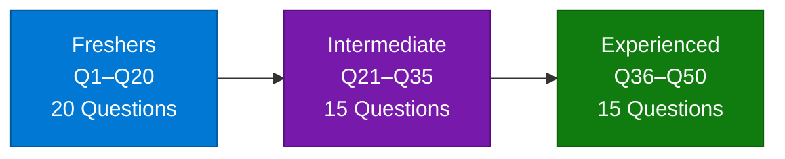

### Section 1: Freshers (Q1–Q20)

**Q1. What is Artificial Intelligence (AI)?**

**Q2. What is Azure AI?**

**Q3. What are Azure Cognitive Services?**

**Q4. Can you name a few Azure Cognitive Services?**

**Q5. What is Azure Machine Learning?**

**Q6. Which programming languages are commonly used in Azure AI projects?**

**Q7. What is a chatbot, and how can Azure Bot Service help in building one?**

**Q8. How do you create a new project in Azure Machine Learning Studio?**

**Q9. What is the purpose of data preprocessing in machine learning?**

**Q10. How would you upload a dataset to Azure Machine Learning?**

**Q11. What is Azure Databricks, and how does it relate to AI?**

**Q12. How do you evaluate the performance of a machine learning model?**

**Q13. What is the difference between Azure Machine Learning and Azure Cognitive Services?**

**Q14. How do you deploy a machine learning model in Azure?**

**Q15. What is the importance of version control in AI projects?**

**Q16. How do you handle missing data in a dataset for machine learning?**

**Q17. What are some common use cases for Azure AI services?**

**Q18. How do you monitor a deployed model in Azure?**

**Q19. What is the Azure AI Engineer Associate certification, and why is it valuable?**

**Q20. How do you ensure data privacy and security in Azure AI projects?**

### Section 2: Intermediate (Q21–Q35)

**Q21. How do you approach feature engineering in Azure AI projects?**

**Q22. Can you explain how to automate the deployment of an AI model using Azure Pipelines?**

**Q23. What strategies do you use for model evaluation and selection in Azure Machine Learning?**

**Q24. How do you integrate Azure Cognitive Services into a web application?**

**Q25. Describe a challenging problem you faced while working with Azure AI services and how you resolved it.**

**Q26. How do you ensure the security and compliance of data when using Azure AI services?**

**Q27. What are the key components of the Azure Bot Service?**

**Q28. How do you manage and monitor the lifecycle of machine learning models in Azure?**

**Q29. What are the best practices for managing and deploying containerized AI applications in Azure?**

**Q30. How do you optimize the performance of a machine learning model in Azure?**

**Q31. How do you handle version control and collaboration in Azure AI projects?**

**Q32. How do you troubleshoot and debug issues in Azure AI services?**

**Q33. How do you incorporate feedback from stakeholders into your AI project development process?**

**Q34. What role does automation play in your workflow when working with Azure AI services?**

**Q35. How do you approach ethical considerations in AI development using Azure tools?**

### Section 3: Experienced (Q36–Q50)

**Q36. How do you design a scalable and secure architecture for AI solutions on Azure?**

**Q37. Describe a project where you used Azure AI to solve a complex business problem. What was the outcome?**

**Q38. How do you manage large-scale data processing for AI models in Azure?**

**Q39. How do you ensure high availability and disaster recovery for AI applications on Azure?**

**Q40. How do you optimize the cost of running AI workloads on Azure?**

**Q41. How do you integrate Azure AI services with on-premises systems or other cloud platforms?**

**Q42. What are the challenges of deploying AI in production environments?**

**Q43. How do you handle model drift and retraining in production environments?**

**Q44. How do you use Azure Machine Learning Designer to build and deploy pipelines?**

**Q45. How do you implement explainability and interpretability in AI models on Azure?**

**Q46. How do you use Azure Data Factory for data integration in AI projects?**

**Q47. How do you prioritize tasks and manage time effectively when working on multiple AI projects?**

**Q48. How do you communicate complex technical concepts to non-technical stakeholders?**

**Q49. How do you stay updated with the latest developments and features in Azure AI?**

**Q50. What is your approach to ethical AI, and how do you mitigate biases in AI models on Azure?**

---

## Quick Reference Tables

### Azure AI Services Comparison

| Service | Category | Best For | Pricing Model |
|---------|----------|----------|---------------|
| Azure Machine Learning | ML Platform | Training, deploying, managing ML models | Pay-per-compute |
| Azure Cognitive Services | Pre-built AI | Vision, Speech, Language, Decision APIs | Per API call |
| Azure AI Foundry | Unified Hub | Building, evaluating, deploying AI apps | Per resource |
| Azure AI Studio | Visual Design | No-code/low-code AI experimentation | Free tier + compute |
| Azure OpenAI Service | LLMs | GPT/LLM access, NLP, code generation | Per token |
| Azure Bot Service | Conversational AI | Chatbots, virtual assistants | Per channel |
| Azure Databricks | Analytics + ML | Big data + ML at scale | DBU per hour |
| Azure Data Factory | Data Integration | ETL pipelines for AI data prep | Per pipeline run |

### ML Deployment Options

| Option | Use Case | Scale | Cost |
|--------|----------|-------|------|
| Azure Kubernetes Service (AKS) | Production high-traffic inference | High | Higher |
| Azure Container Instances (ACI) | Dev/test, low-traffic | Low | Lower |
| Azure Functions | Serverless inference | Event-driven | Per execution |
| Azure App Service | Web-hosted model APIs | Medium | Fixed tier |
| Managed Online Endpoints | Simplest production deploy | Auto-scale | Per compute |
| Batch Endpoints | Offline/bulk scoring | Very high | Per batch job |

### Azure AI vs AWS AI vs Google AI

| Dimension | Azure AI | AWS AI | Google AI |
|-----------|---------|--------|-----------|
| ML Platform | Azure Machine Learning | Amazon SageMaker | Google Vertex AI |
| Pre-built AI | Cognitive Services | AWS AI Services | Cloud AI APIs |
| LLM / GenAI | Azure OpenAI Service | Amazon Bedrock | Gemini / Vertex AI |
| Vector Search | Azure AI Search | OpenSearch | Vertex AI Search |
| Data Pipeline | Azure Data Factory | AWS Glue | Cloud Dataflow |
| Enterprise Integration | Strong (M365, Teams, Dynamics) | Moderate | Moderate |
| Compliance Certifications | 100+ | 98+ | 80+ |

---

## Security & Governance

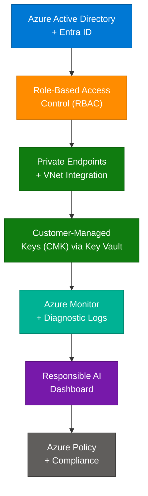

| Control | Description | Implementation |
|---------|-------------|----------------|
| Azure Entra ID | Identity and access for all Azure AI resources | Conditional access, MFA |
| RBAC | Fine-grained permissions per resource | Owner, Contributor, Reader, AzureML roles |
| Private Endpoints | Keep traffic within Azure VNet | No public internet exposure |
| CMK | Customer-managed encryption keys | Azure Key Vault integration |
| Azure Monitor | Metrics, logs, alerts | Model endpoint monitoring |
| Responsible AI Dashboard | Fairness, explainability | Bias detection, error analysis |
| Azure Policy | Compliance enforcement | Deny non-compliant deployments |
| Data Residency | Keep data in specific regions | Sovereign cloud options |

---

*Source: ScholarHat Azure AI Tutorial Series · Compiled July 2026 · 16 articles · 10 categories · 50 interview questions*
---

## Additional Material from ScholarHat-AzureAI-50-QA-Complete.md

> Unique additions: 50 Q&A organized by experience level, topic-index table, and cheatsheet.

> **Source:** [ScholarHat Azure AI Engineer Interview Questions](https://www.scholarhat.com/tutorial/azureai/azure-ai-engineer-interview-questions)
> **Last Updated:** July 2026
> **Coverage:** 50 Q&As · 3 Difficulty Levels · Freshers · Intermediate · Experienced

---

## Table of Contents

| # | Section | Questions | Sub-Groups | Focus Area |
|---|---------|-----------|------------|------------|
| 1 | [Freshers](#section-1-freshers-q1q20) | Q1–Q20 | A · B · C · D | Foundations, Core Services, Basics |
| 2 | [Intermediate](#section-2-intermediate-q21q35) | Q21–Q35 | E · F · G | Applied Skills, MLOps, Security |
| 3 | [Experienced](#section-3-experienced-q36q50) | Q36–Q50 | H · I · J | Architecture, Scale, Ethics |
| 4 | [Topic Index](#topic-index) | All 50 | — | Quick lookup by keyword |
| 5 | [Key Cheatsheet](#key-cheatsheet) | — | — | Services · Tools · Security · Metrics |

---

## Interview Roadmap

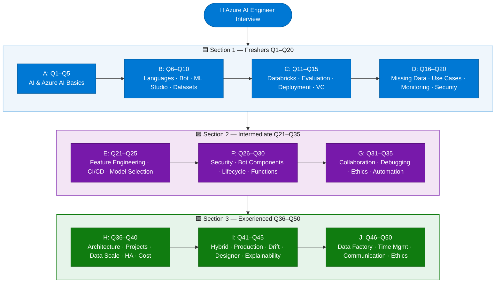

---

## Section 1: Freshers (Q1–Q20)

> Foundational knowledge of Azure AI, Cognitive Services, Azure Machine Learning basics, data handling, and deployment essentials.

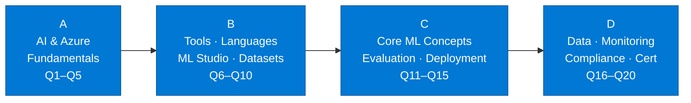

---

### Group A — AI & Azure Fundamentals (Q1–Q5)

---

### Q1. What is Artificial Intelligence (AI)?
> **Topic:** `AI Fundamentals`

**Artificial Intelligence (AI)** is the simulation of human intelligence in machines, enabling them to perform tasks such as **learning**, **reasoning**, and **problem-solving**. AI systems can be trained to recognize patterns, make decisions, and even improve their performance over time. This technology is widely used in applications like **virtual assistants**, **recommendation systems**, and **autonomous vehicles**, making it a core part of modern digital solutions.

---

### Q2. What is Azure AI?
> **Topic:** `Azure AI Overview`

**Azure AI** is a comprehensive suite of **cloud-based artificial intelligence services** and tools provided by **Microsoft**. It offers everything from **pre-built AI models** to customizable **machine learning platforms**, allowing developers to build, deploy, and manage advanced **AI solutions**. Azure AI enables organizations to integrate **intelligent features** into their applications without needing deep expertise in machine learning or data science.

---

### Q3. What are Azure Cognitive Services?
> **Topic:** `Cognitive Services`

**Azure Cognitive Services** are a set of **APIs**, **SDKs**, and **services** that enable developers to add advanced **AI capabilities** to their applications. These include features such as **computer vision**, **speech**, **language understanding**, and **decision-making**. By leveraging these services, developers can quickly implement intelligent features like **image recognition** or **natural language processing** without building and training complex models from scratch.

---

### Q4. Can you name a few Azure Cognitive Services?
> **Topic:** `Cognitive Services`

| Service | Description |
|---------|-------------|
| Computer Vision | Analyzes images to identify objects, faces, and text |
| Speech to Text | Converts spoken language into written text |
| Text Analytics | Extracts insights, sentiment, and key phrases from text |
| Language Understanding (LUIS) | Builds conversational interfaces that understand user intent |

These **Azure Cognitive Services** enable features like **image recognition**, **voice commands**, and **sentiment analysis**.

---

### Q5. What is Azure Machine Learning?
> **Topic:** `Azure Machine Learning`

**Azure Machine Learning** is a **cloud-based platform** for building, training, and deploying **machine learning models** at scale. It provides a collaborative environment for **data scientists** and **developers** to manage the entire **machine learning lifecycle** and automate workflows. With Azure ML you can experiment, train, and deploy models efficiently — making it a key tool for organizations looking to leverage AI.

---

### Group B — Tools, Languages & ML Studio (Q6–Q10)

---

### Q6. Which programming languages are commonly used in Azure AI projects?
> **Topic:** `Programming Languages`

| Language | Use Case |
|----------|----------|
| Python | Most popular for machine learning and data science |
| R | Used for statistical analysis and data visualization |
| C# | Automation, integration, and scripting within Azure |
| PowerShell | Automation and management tasks in Azure |

**Python** is especially important for anyone working with **Azure Machine Learning** and **Azure Cognitive Services**.

---

### Q7. What is a chatbot, and how can Azure Bot Service help in building one?
> **Topic:** `Chatbot / Bot Service`

A **chatbot** is a software application designed to simulate conversation with users, often used for **customer support**, **information retrieval**, or **virtual assistance**. **Azure Bot Service** provides a robust framework and tools for building, testing, and deploying **chatbots**. It supports integration with popular **messaging platforms** like Teams and Slack, making it easy to create intelligent, interactive bots that understand and respond to user queries.

---

### Q8. How do you create a new project in Azure Machine Learning Studio?
> **Topic:** `Azure ML Studio`

Creating a new project in **Azure Machine Learning Studio** involves a few steps:

1. Sign in to the platform and navigate to your **workspace**.
2. Select the option to create a new project and configure your **workspace** settings.
3. Once set up, build, train, and manage **machine learning models** within the collaborative environment.

---

### Q9. What is the purpose of data preprocessing in machine learning?
> **Topic:** `Data Preprocessing`

**Data preprocessing** is a crucial step in **machine learning** that involves cleaning, transforming, and normalizing raw data before model training. This process improves **model accuracy** by ensuring data is consistent, relevant, and free from errors or missing values. Effective preprocessing reduces noise and highlights important patterns, leading to better **model performance**.

---

### Q10. How would you upload a dataset to Azure Machine Learning?
> **Topic:** `Dataset Management`

Uploading a dataset to **Azure Machine Learning** is straightforward. In **Azure ML Studio**, navigate to the **Datasets** tab, then upload files from your local machine or connect to **cloud storage services** (Azure Blob, ADLS, SQL). Once uploaded, the dataset is available for experiments, enabling you to train and evaluate **machine learning models** on your own data.

---

### Group C — Core ML Concepts (Q11–Q15)

---

### Q11. What is Azure Databricks, and how does it relate to AI?
> **Topic:** `Azure Databricks`

**Azure Databricks** is a collaborative **analytics platform** built on **Apache Spark** that supports **big data processing** and **machine learning workflows**. It integrates seamlessly with **Azure Machine Learning**, enabling data scientists to process large volumes of data efficiently. Azure Databricks is particularly useful for tasks requiring **distributed computing**, such as training complex models on large-scale datasets.

---

### Q12. How do you evaluate the performance of a machine learning model?
> **Topic:** `Model Evaluation`

| Metric | Purpose | When to Use |
|--------|---------|-------------|
| Accuracy | Overall correctness of predictions | Balanced classes |
| Precision | True positives among positive predictions | When false positives are costly |
| Recall | True positives among actual positives | When false negatives are costly |
| F1 Score | Balance between precision and recall | Imbalanced classes |
| ROC-AUC | Area under the ROC curve, measures discrimination | Overall model ranking |

These **metrics** help you understand how well the **model predicts outcomes** on new, unseen data.

---

### Q13. What is the difference between Azure Machine Learning and Azure Cognitive Services?
> **Topic:** `AML vs Cognitive Services`

| Dimension | Azure Machine Learning | Azure Cognitive Services |
|-----------|----------------------|--------------------------|
| **Type** | Custom ML platform | Pre-built AI APIs |
| **Use case** | Build & train tailored models | Rapidly add AI to apps |
| **Expertise needed** | Data science knowledge | API integration skills |
| **Examples** | AutoML, Designer, Notebooks | Vision, Speech, LUIS |

While **Azure Machine Learning** is ideal for **custom solutions**, **Azure Cognitive Services** are best for rapid deployment of advanced **AI features**.

---

### Q14. How do you deploy a machine learning model in Azure?
> **Topic:** `Model Deployment`

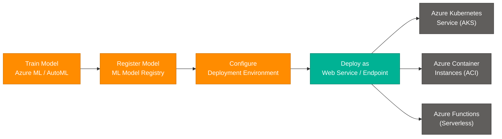

Deploying a **machine learning model** in **Azure** involves these key steps:

- **Train your model** — Use Azure Machine Learning or AutoML to train and validate.
- **Register the model** — Store it in the **ML Model Registry** for versioning.
- **Configure deployment** — Choose **AKS** for production scale, **ACI** for dev/test, or **Azure Functions** for serverless.
- **Expose as an endpoint** — Make the model available for real-time predictions via **REST API endpoints**.

---

### Q15. What is the importance of version control in AI projects?
> **Topic:** `Version Control`

**Version control** is essential in **AI projects** for tracking changes to code, data, and models over time. It enables collaboration among team members working on different features simultaneously without conflicts. Version control also ensures **reproducibility** — you can roll back to any previous version if issues arise or if you need to revisit earlier experiment results.

---

### Group D — Data, Monitoring & Compliance (Q16–Q20)

---

### Q16. How do you handle missing data in a dataset for machine learning?
> **Topic:** `Missing Data Handling`

Handling **missing data** is a common challenge in machine learning. Common strategies include:

- **Imputation** — Replace missing values with statistical measures (mean, median, mode).
- **Forward/Backward fill** — Use adjacent values for time-series data.
- **Drop rows/columns** — Remove incomplete records when missing data is not critical.
- **Model-based imputation** — Use algorithms like KNN to predict missing values.

The approach depends on the nature and importance of the missing data for the specific project.

---

### Q17. What are some common use cases for Azure AI services?
> **Topic:** `AI Use Cases`

- **Chatbots for customer support** — Automate responses and provide instant assistance.
- **Recommendation engines for e-commerce** — Suggest products based on user preferences.
- **Sentiment analysis for social media** — Analyze customer feedback and brand opinions.
- **Image recognition for security** — Detect objects or faces for security or automation tasks.
- **Predictive maintenance for manufacturing** — Predict equipment failures and schedule proactive maintenance.
- **Document intelligence** — Extract structured data from forms, invoices, and contracts.

---

### Q18. How do you monitor a deployed model in Azure?
> **Topic:** `Model Monitoring`

Monitoring a deployed **machine learning model** in Azure uses these tools:

- **Azure Monitor** — Collects metrics, logs, and traces from all Azure resources.
- **Application Insights** — Provides real-time performance insights and usage patterns.
- **Azure ML Model Monitoring** — Tracks **data drift** and **prediction quality** over time.

Setting up **alerts and dashboards** lets you detect and address issues quickly, keeping AI solutions reliable in production.

---

### Q19. What is the Azure AI Engineer Associate certification, and why is it valuable?
> **Topic:** `AI-102 Certification`

The **Azure AI Engineer Associate (AI-102)** is a **Microsoft certification** that validates skills in designing and implementing AI solutions on Azure. It covers Azure Cognitive Services, Azure Machine Learning, Azure Bot Service, and responsible AI principles.

**Why it's valuable:**
- Demonstrates **verified expertise** to employers.
- Boosts **career prospects** and salary potential.
- Keeps you current with the latest **Azure AI technologies**.
- Recognized globally as an industry credential.

---

### Q20. How do you ensure data privacy and security in Azure AI projects?
> **Topic:** `Security & Privacy`

Ensuring **data privacy** and **security** in Azure AI projects involves:

- **Encryption** — Encrypt data at rest (Azure Key Vault + CMK) and in transit (TLS 1.2+).
- **Role-Based Access Control (RBAC)** — Restrict access based on job roles.
- **Compliance tools** — Use Azure Policy and Compliance Manager to meet **GDPR**, **HIPAA**, and other standards.
- **Private Endpoints** — Keep all data traffic within the Azure VNet.
- **Regular audits** — Monitor access logs via Azure Monitor and Diagnostic Logs.

---

## Section 2: Intermediate (Q21–Q35)

> Applied skills — feature engineering, CI/CD automation, security & compliance, model lifecycle management, and performance optimization.

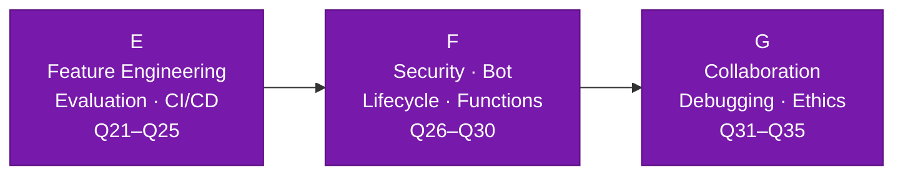

---

### Group E — Feature Engineering, CI/CD & Evaluation (Q21–Q25)

---

### Q21. How do you approach feature engineering in Azure AI projects?
> **Topic:** `Feature Engineering`

**Feature engineering** is a critical step in building effective machine learning models. It involves selecting, transforming, and creating new features from raw data to improve **model performance**. Common techniques include:

- **Normalization / Scaling** — Bring all features to a comparable range.
- **Principal Component Analysis (PCA)** — Reduce dimensionality while retaining variance.
- **One-hot encoding** — Convert categorical variables to numeric form.
- **Feature interaction** — Create new features from combinations of existing ones.

Thoughtful feature engineering reduces overfitting and highlights important patterns, leading to more accurate predictions.

---

### Q22. Can you explain how to automate the deployment of an AI model using Azure Pipelines?
> **Topic:** `CI/CD with Azure Pipelines`

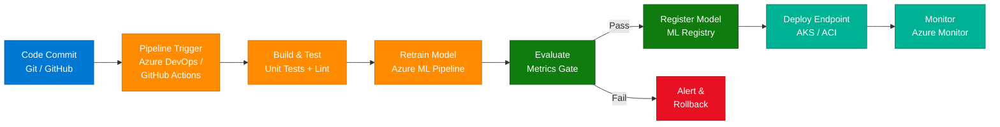

Automating AI model deployment uses **CI/CD tools** like **Azure DevOps** or **GitHub Actions**. Pipelines automatically build, test, retrain, and deploy models whenever changes are made to the codebase, ensuring deployments are consistent, reliable, and repeatable.

---

### Q23. What strategies do you use for model evaluation and selection in Azure Machine Learning?
> **Topic:** `Model Selection`

**Model evaluation and selection** involve comparing multiple models using:

- **Cross-validation** — Split data multiple ways to get robust performance estimates.
- **Performance metrics** — Accuracy, precision, recall, F1 score (classification) or RMSE/MAE (regression).
- **Business requirements** — Not just technical metrics; consider inference speed, cost, and interpretability.
- **AutoML comparison** — Use Azure AutoML to automatically train and rank dozens of models.
- **Explainability** — Consider interpretability if stakeholders need to understand model decisions.

---

### Q24. How do you integrate Azure Cognitive Services into a web application?
> **Topic:** `Cognitive Services Integration`

Integrating **Azure Cognitive Services** into a web application uses the provided **APIs** and **SDKs**:

1. **Create a resource** in Azure Portal (e.g., Computer Vision, Text Analytics).
2. **Obtain API key and endpoint** from the Azure resource.
3. **Call the API** from your application using the REST API or language-specific SDK (Python, Node.js, C#).
4. **Handle the response** and render AI-powered features in the UI.

This allows you to add advanced **AI features** with minimal development effort.

---

### Q25. Describe a challenging problem you faced while working with Azure AI services and how you resolved it.
> **Topic:** `Troubleshooting`

One common challenge is dealing with **model drift** in production, where model performance degrades as real-world data changes over time. Resolution approach:

1. **Detect drift** — Set up Azure ML Model Monitoring to flag performance drops.
2. **Diagnose** — Compare production data distribution against training data using Azure Monitor.
3. **Retrain** — Trigger automated retraining pipelines with fresh data.
4. **Validate and redeploy** — Run evaluation metrics gates before updating the endpoint.

This proactive approach ensures models remain accurate and reliable as data evolves.

---

### Group F — Security, Bot Service & Model Lifecycle (Q26–Q30)

---

### Q26. How do you ensure the security and compliance of data when using Azure AI services?
> **Topic:** `Data Compliance`

To ensure **security** and **compliance**:

- **Encryption** — Data at rest (CMK via Azure Key Vault) and in transit (TLS 1.2+).
- **Azure Active Directory / Entra ID** — Authenticate all users and services.
- **RBAC** — Fine-grained access control at the resource level.
- **Regulatory standards** — Follow **GDPR**, **HIPAA**, **ISO 27001** using Azure Compliance Manager.
- **Regular audits** — Use Diagnostic Logs and Azure Monitor to identify risks.
- **Private Endpoints** — Eliminate public internet exposure for sensitive AI workloads.

---

### Q27. What are the key components of the Azure Bot Service?
> **Topic:** `Bot Service Components`

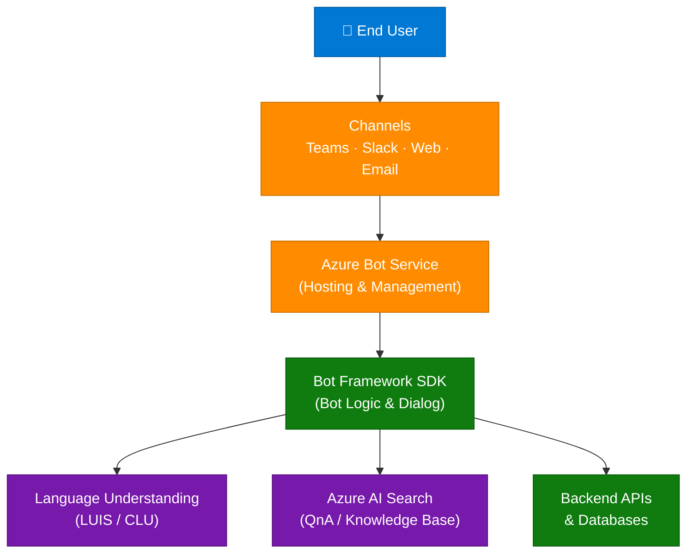

| Component | Description |
|-----------|-------------|
| **Bot Framework SDK** | Provides tools and libraries for building intelligent bots |
| **Azure Bot Service** | Hosts and manages bots in the cloud |
| **Connectors** | Enable integration with channels such as Teams, Slack, and web chat |

---

### Q28. How do you manage and monitor the lifecycle of machine learning models in Azure?
> **Topic:** `Model Lifecycle`

Managing the **ML model lifecycle** involves:

- **Model Registry** — Track versions and metadata in Azure ML's built-in registry.
- **Experiment tracking** — Log runs, metrics, and parameters for reproducibility.
- **Monitoring** — Detect performance degradation and data drift via Azure ML Monitoring.
- **Automated retraining pipelines** — Trigger retraining when drift is detected.
- **A/B deployment** — Deploy challenger models alongside champion models to compare performance.

---

### Q29. How do you use Azure Functions in serverless computing for AI applications?
> **Topic:** `Azure Functions`

**Azure Functions** enable **serverless computing** — running code in response to events without managing infrastructure. In AI applications, common use cases include:

- **Data ingestion triggers** — Process new data arriving in a queue or Blob Storage.
- **Model inference** — Serve lightweight model predictions on-demand.
- **Workflow automation** — Chain together data processing steps in an event-driven pipeline.

This approach is **scalable**, **cost-effective**, and reduces infrastructure overhead.

---

### Q30. What are some best practices for optimizing the performance of machine learning models in Azure?
> **Topic:** `Performance Optimization`

- **Select efficient algorithms** — Choose algorithms suited to your data type and scale.
- **Optimize hyperparameters** — Use Azure ML's **HyperDrive** for automated hyperparameter tuning.
- **Reduce feature dimensionality** — Apply **PCA** or feature selection to eliminate noise.
- **Leverage scalable compute** — Use **GPU clusters** or **Databricks** for large-scale training.
- **Monitor and adjust resource allocation** — Review resource usage regularly and scale up or down based on demand.

---

### Group G — Collaboration, Debugging, Ethics & Automation (Q31–Q35)

---

### Q31. How do you handle version control and collaboration in Azure AI projects?
> **Topic:** `Version Control & Collaboration`

**Version control** and collaboration in AI projects use:

- **Git** — Track changes to code, configs, and notebooks.
- **Azure DevOps / GitHub** — Manage issues, PRs, and project boards.
- **Azure ML Experiment Tracking** — Log and compare model runs.
- **CI/CD pipelines** — Automate testing and deployment on every merge.

Good collaboration practices keep projects organized and ensure every model run is reproducible.

---

### Q32. How do you troubleshoot and debug issues in Azure AI services?
> **Topic:** `Debugging`

**Troubleshooting** and **debugging** involve:

1. **Check logs** — Review Azure Monitor and Application Insights for errors and anomalies.
2. **Inspect model metrics** — Look for sudden drops in accuracy, latency, or throughput.
3. **Test API endpoints** — Call inference endpoints directly to isolate issues.
4. **Review data quality** — Validate incoming data for schema or distribution shifts.
5. **Enable diagnostic settings** — Capture detailed logs at the resource level for deep investigation.

---

### Q33. How do you incorporate feedback from stakeholders into your AI project development process?
> **Topic:** `Stakeholder Feedback`

Incorporating **stakeholder feedback** is essential for building AI solutions that meet business needs:

- **Regular demos** — Share progress at defined milestones and gather input early.
- **Iterative development** — Use agile sprints to adjust features based on feedback.
- **Clear communication** — Translate technical results into business outcomes stakeholders understand.
- **Feedback loops** — Embed user feedback (e.g., thumbs up/down on chatbot responses) back into model retraining.

---

### Q34. What role does automation play in your workflow when working with Azure AI services?
> **Topic:** `Automation in MLOps`

**Automation** streamlines the entire **AI development lifecycle**:

- **Training pipelines** — Automatically retrain models when new data arrives.
- **Testing & validation** — Run evaluation gates before any deployment.
- **Deployment pipelines** — Push approved models to endpoints without manual steps.
- **Monitoring & alerting** — Automatically alert when drift or errors are detected.

Automated pipelines make deployments consistent, repeatable, and faster, reducing human error.

---

### Q35. How do you approach ethical considerations in AI development, particularly when using Azure tools?
> **Topic:** `Ethical AI`

**Ethical AI** involves ensuring fairness, transparency, and accountability:

- **Use Azure Responsible AI Dashboard** — Detect and visualize model bias and fairness issues.
- **Diverse training data** — Ensure representative data to avoid skewed or discriminatory results.
- **Explainability** — Use SHAP/LIME to explain predictions to stakeholders.
- **Inclusive design** — Involve diverse perspectives throughout the development process.
- **Follow guidelines** — Adhere to Microsoft's Responsible AI principles and applicable regulations.

---

## Section 3: Experienced (Q36–Q50)

> Architecture design, large-scale data processing, high availability, model drift & retraining, explainability, cost optimization, and ethical AI.

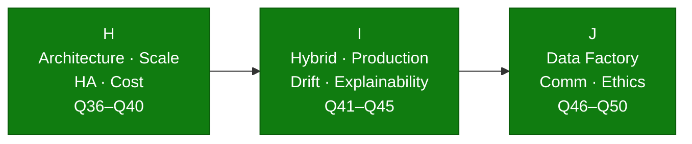

---

### Group H — Architecture, Scale, High Availability & Cost (Q36–Q40)

---

### Q36. How do you design a scalable and secure architecture for AI solutions on Azure?
> **Topic:** `Scalable Architecture`

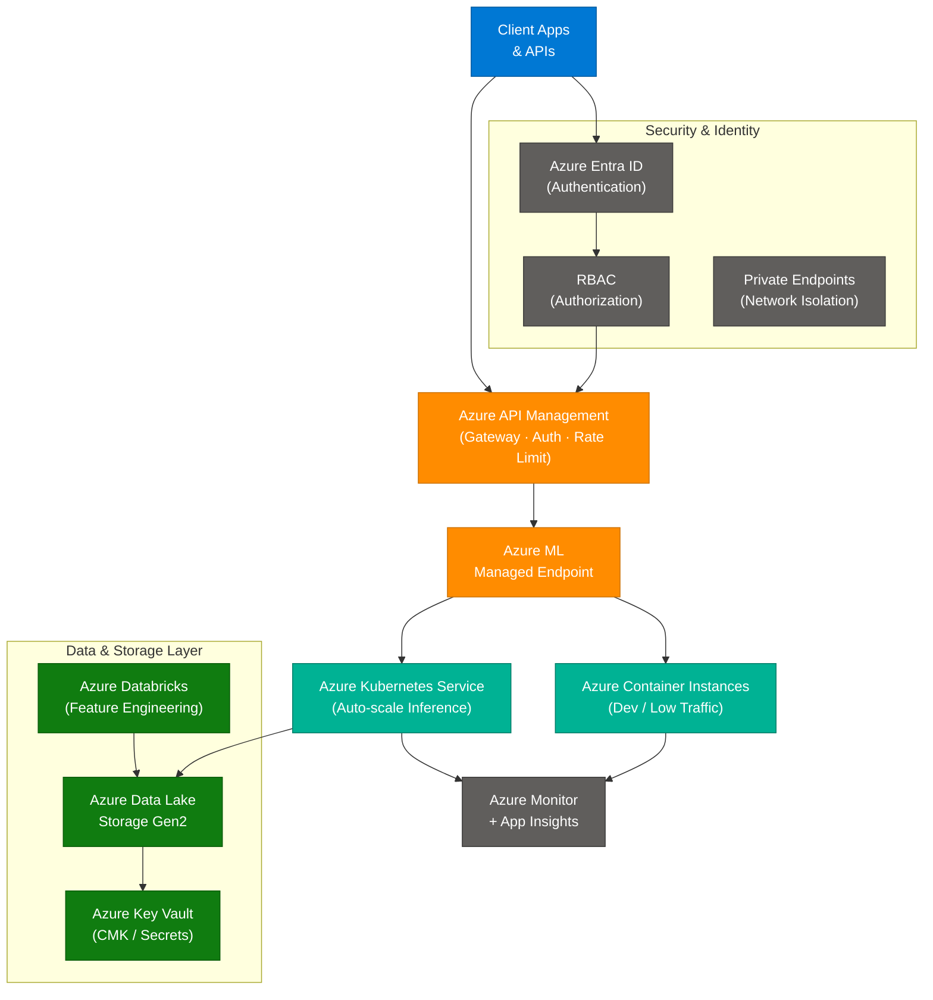

Designing a **scalable and secure architecture** involves:

- **Microservices** — Decompose AI components into independent services.
- **Containerization** — Package models using Docker and orchestrate with **AKS**.
- **API Gateway** — Use **Azure API Management** for rate limiting, authentication, and routing.
- **Network isolation** — Apply **Private Endpoints** and VNet integration.
- **Security layers** — **Entra ID + RBAC + CMK + Private Endpoints**.

---

### Q37. Describe a project where you used Azure AI to solve a complex business problem. What was the outcome?
> **Topic:** `Real-World Project`

In one project, a **predictive maintenance system** was built using **Azure Machine Learning** to analyze sensor telemetry from manufacturing equipment:

- **Data ingestion** — Streamed sensor data into **Azure Event Hubs** → **Azure Data Lake**.
- **Feature engineering** — Processed data in **Azure Databricks** to extract vibration, temperature, and pressure features.
- **Model training** — Trained a classification model in **Azure ML** to predict failure within 48 hours.
- **Deployment** — Deployed as a real-time endpoint on **AKS** with monitoring via **Application Insights**.
- **Outcome** — Equipment downtime reduced by **30%**, saving significant maintenance costs.

---

### Q38. How do you manage large-scale data processing for AI models in Azure?
> **Topic:** `Large-Scale Data`

Managing **large-scale data processing** for AI involves:

- **Azure Databricks** — Distributed computing on Apache Spark for large-scale feature engineering and model training.
- **Azure Synapse Analytics** — Unified analytics combining big data and data warehousing in one platform.
- **Azure Data Lake Storage Gen2** — Cost-efficient, hierarchical storage for massive datasets.
- **Parallel processing** — Partition data and run jobs in parallel across compute clusters.
- **Incremental loading** — Process only new or changed data to reduce compute costs.

These tools ensure data processing is **scalable**, **reliable**, and **cost-effective**.

---

### Q39. How do you ensure high availability and disaster recovery for AI applications on Azure?
> **Topic:** `High Availability & DR`

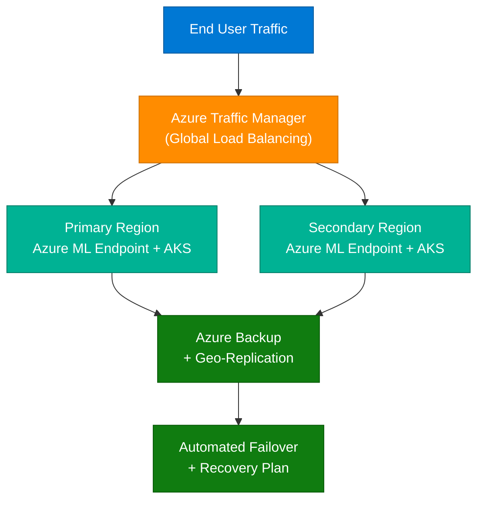

**High availability** and **disaster recovery** are achieved by:

- **Multi-region deployment** — Deploy AI endpoints across two or more Azure regions.
- **Azure Traffic Manager** — Route user traffic to the healthy region automatically.
- **Automated backups** — Geo-replicate model artifacts and data to secondary regions.
- **Failover mechanisms** — Automatically redirect traffic when a region goes down.
- **Recovery plans** — Document and test failover procedures regularly.

---

### Q40. How do you optimize the cost of running AI workloads on Azure?
> **Topic:** `Cost Optimization`

| Strategy | Description |
|----------|-------------|
| **Reserved Instances** | Pre-purchase compute at up to 72% discount vs. pay-as-you-go |
| **Auto-Scaling** | Scale compute up during training and down to zero when idle |
| **Spot / Low-Priority VMs** | Use interruptible compute for non-critical batch training |
| **Monitor Resource Usage** | Regularly review and right-size resource allocation |
| **Azure Cost Management** | Set budgets, alerts, and use cost analysis dashboards |
| **Batch Endpoints** | Process large inference jobs in bulk rather than real-time |

---

### Group I — Hybrid Integration, Production & Explainability (Q41–Q45)

---

### Q41. How do you integrate Azure AI services with on-premises systems or other cloud platforms?
> **Topic:** `Hybrid / Multi-Cloud`

Integrating **Azure AI** with on-premises or multi-cloud environments uses:

- **Azure ExpressRoute / VPN Gateway** — Secure, private connectivity to on-premises infrastructure.
- **Hybrid connections** — Expose on-premises data sources to Azure services securely.
- **REST APIs** — Call Azure AI endpoints from any platform or cloud.
- **Azure Arc** — Extend Azure management and governance to on-premises and multi-cloud resources.

This is especially valuable for enterprises with **legacy systems** or **multi-cloud strategies**.

---

### Q42. What are the challenges of deploying AI solutions at scale on Azure, and how do you address them?
> **Topic:** `Production Challenges`

| Challenge | Solution |
|-----------|---------|
| Managing large data volume | Scalable storage (ADLS Gen2) + distributed processing (Databricks) |
| Low latency requirements | Optimize model inference; use caching and edge deployment |
| Model drift over time | Continuous monitoring + automated retraining pipelines |
| Compliance and security | Private Endpoints, RBAC, encryption, Azure Policy |
| Team collaboration at scale | Azure DevOps, Git-based CI/CD, ML model registry |

Addressing these challenges requires **scalable infrastructure**, **robust monitoring**, and **end-to-end automation**.

---

### Q43. How do you handle model drift and retraining in production environments?
> **Topic:** `Model Drift & Retraining`

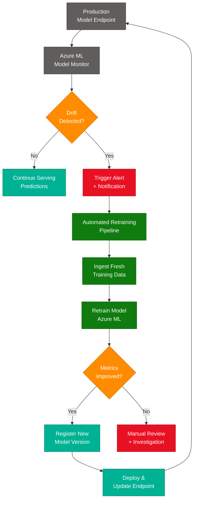

Handling **model drift** involves:

1. **Continuous monitoring** — Track prediction distributions and key metrics in production.
2. **Drift detection** — Azure ML Model Monitor compares production data against training baseline.
3. **Automated retraining** — Pipelines trigger automatically when drift exceeds the threshold.
4. **Validation gates** — New models must pass metric thresholds before replacing the incumbent.

---

### Q44. How do you use Azure Machine Learning Designer to build and deploy pipelines?
> **Topic:** `ML Designer Pipelines`

**Azure Machine Learning Designer** is a **visual, drag-and-drop** pipeline builder:

1. **Drag components** onto the canvas — data ingestion, preprocessing, model training, evaluation.
2. **Connect components** to define data flow through the pipeline.
3. **Configure parameters** — set hyperparameters, feature columns, and compute targets.
4. **Run and evaluate** — execute the pipeline and view metrics in the Designer UI.
5. **Publish as endpoint** — deploy the pipeline as a real-time or batch inference endpoint.

This visual approach makes ML accessible to users with varying levels of technical expertise.

---

### Q45. How do you implement explainability and interpretability in AI models on Azure?
> **Topic:** `Explainability`

**Explainability** and **interpretability** are implemented using:

- **SHAP (SHapley Additive exPlanations)** — Shows which features most influenced each prediction.
- **LIME (Local Interpretable Model-agnostic Explanations)** — Explains individual predictions locally.
- **Azure ML Responsible AI Dashboard** — Provides built-in fairness, error analysis, and feature importance visualizations.
- **Global vs. local explanations** — Global explains overall model behavior; local explains individual predictions.

Communicating model behavior clearly builds trust and ensures compliance with regulatory requirements.

---

### Group J — Data Integration, Communication & Ethics (Q46–Q50)

---

### Q46. How do you use Azure Data Factory for data integration in AI projects?
> **Topic:** `Azure Data Factory`

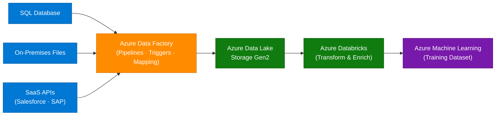

**Azure Data Factory** orchestrates **data movement** and **transformation pipelines**:

- **Ingestion** — Connect to 90+ data sources (SQL, Blob, REST APIs, SaaS).
- **Transformation** — Map, cleanse, and enrich data using data flows.
- **Scheduling** — Trigger pipelines on a schedule or event-based (new file arrival).
- **Integration** — Feed prepared data directly into Azure ML training datasets.

---

### Q47. How do you prioritize tasks and manage time effectively when working on multiple AI projects?
> **Topic:** `Project Management`

- **Use agile methodologies** — Break projects into manageable sprints with clear priorities.
- **Track progress** — Use **Azure DevOps Boards** or similar tools to monitor deadlines and deliverables.
- **Communicate regularly** — Keep stakeholders informed and adjust priorities based on business impact.
- **Time-box experiments** — Set fixed time limits for ML experimentation to avoid open-ended research cycles.
- **Automate repetitive tasks** — Free up time by automating data pipelines, testing, and deployment.

---

### Q48. How do you communicate complex technical concepts to non-technical stakeholders?
> **Topic:** `Stakeholder Communication`

Communicating **technical concepts** effectively:

- **Simplify language** — Avoid jargon; use analogies and plain language.
- **Use visuals** — Charts, diagrams, and dashboards convey insights better than raw numbers.
- **Focus on business value** — Frame results as outcomes (cost savings, revenue impact) rather than technical metrics.
- **Tell a story** — Walk stakeholders through the problem, approach, and result in narrative form.
- **Interactive demos** — Show the AI in action rather than describing it abstractly.

---

### Q49. How do you stay updated with the latest developments and features in Azure AI?
> **Topic:** `Staying Updated`

- **Microsoft Learn** — Official documentation, tutorials, and learning paths.
- **Azure Blog / Tech Community** — Product announcements and deep-dive articles.
- **Microsoft Build & Ignite** — Annual conferences with the latest Azure AI announcements.
- **GitHub Azure Samples** — Explore reference implementations and new SDK releases.
- **Community forums** — Stack Overflow, Reddit r/AZURE, LinkedIn groups.
- **Certifications** — Renewing AI-102 requires staying current with exam updates.

---

### Q50. What is your approach to ethical AI, and how do you mitigate biases in AI models on Azure?
> **Topic:** `Responsible AI`

- **Use Azure Responsible AI Dashboard** — Detect and visualize bias, fairness gaps, and error distributions.
- **Ensure diverse training data** — Use representative data across demographics to avoid skewed results.
- **Apply fairness constraints** — Incorporate fairness metrics (demographic parity, equalized odds) during model selection.
- **Involve stakeholders** — Conduct ethical reviews with cross-functional teams before deployment.
- **Follow Microsoft's Responsible AI principles** — Fairness, Reliability, Privacy, Inclusiveness, Transparency, and Accountability.
- **Document decisions** — Maintain model cards and datasheets describing training data, intended use, and known limitations.

---

## Topic Index

| Q# | Topic | Section | Group |
|----|-------|---------|-------|
| Q1 | AI Fundamentals | Freshers | A |
| Q2 | Azure AI Overview | Freshers | A |
| Q3 | Cognitive Services | Freshers | A |
| Q4 | Cognitive Services — Named Services | Freshers | A |
| Q5 | Azure Machine Learning | Freshers | A |
| Q6 | Programming Languages | Freshers | B |
| Q7 | Chatbot / Bot Service | Freshers | B |
| Q8 | Azure ML Studio — New Project | Freshers | B |
| Q9 | Data Preprocessing | Freshers | B |
| Q10 | Dataset Management | Freshers | B |
| Q11 | Azure Databricks | Freshers | C |
| Q12 | Model Evaluation Metrics | Freshers | C |
| Q13 | AML vs Cognitive Services | Freshers | C |
| Q14 | Model Deployment | Freshers | C |
| Q15 | Version Control | Freshers | C |
| Q16 | Missing Data Handling | Freshers | D |
| Q17 | AI Use Cases | Freshers | D |
| Q18 | Model Monitoring | Freshers | D |
| Q19 | AI-102 Certification | Freshers | D |
| Q20 | Security & Privacy | Freshers | D |
| Q21 | Feature Engineering | Intermediate | E |
| Q22 | CI/CD with Azure Pipelines | Intermediate | E |
| Q23 | Model Selection | Intermediate | E |
| Q24 | Cognitive Services Integration | Intermediate | E |
| Q25 | Troubleshooting / Model Drift | Intermediate | E |
| Q26 | Data Compliance | Intermediate | F |
| Q27 | Bot Service Components | Intermediate | F |
| Q28 | Model Lifecycle Management | Intermediate | F |
| Q29 | Azure Functions (Serverless) | Intermediate | F |
| Q30 | Performance Optimization | Intermediate | F |
| Q31 | Version Control & Collaboration | Intermediate | G |
| Q32 | Debugging & Troubleshooting | Intermediate | G |
| Q33 | Stakeholder Feedback | Intermediate | G |
| Q34 | Automation in MLOps | Intermediate | G |
| Q35 | Ethical AI | Intermediate | G |
| Q36 | Scalable Architecture | Experienced | H |
| Q37 | Real-World Project | Experienced | H |
| Q38 | Large-Scale Data Processing | Experienced | H |
| Q39 | High Availability & DR | Experienced | H |
| Q40 | Cost Optimization | Experienced | H |
| Q41 | Hybrid / Multi-Cloud Integration | Experienced | I |
| Q42 | Production Challenges | Experienced | I |
| Q43 | Model Drift & Retraining | Experienced | I |
| Q44 | ML Designer Pipelines | Experienced | I |
| Q45 | Explainability & Interpretability | Experienced | I |
| Q46 | Azure Data Factory | Experienced | J |
| Q47 | Project Management | Experienced | J |
| Q48 | Stakeholder Communication | Experienced | J |
| Q49 | Staying Updated | Experienced | J |
| Q50 | Responsible AI & Bias Mitigation | Experienced | J |

---

## Key Cheatsheet

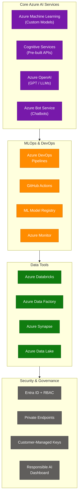

### Services Quick Reference

| Service | Category | Best For | Related Questions |
|---------|----------|----------|-------------------|
| Azure Machine Learning | ML Platform | Custom model training & deployment | Q5, Q8, Q14, Q23, Q44 |
| Azure Cognitive Services | Pre-built AI | Vision, Speech, Language, Decision | Q3, Q4, Q13, Q24 |
| Azure OpenAI Service | LLMs | GPT-4o, embeddings, NLP at scale | Q2, Q17 |
| Azure Bot Service | Chatbots | Multi-channel bot deployment | Q7, Q27 |
| Azure Databricks | Analytics | Distributed ML on big data | Q11, Q38 |
| Azure Data Factory | ETL | Data movement & transformation | Q46 |
| Azure DevOps / GitHub | CI/CD | ML pipeline automation | Q22, Q34 |
| Azure Monitor | Observability | Model & endpoint monitoring | Q18, Q32 |
| Azure Synapse Analytics | Big Data | Unified analytics for AI | Q38, Q42 |
| Azure API Management | Gateway | Auth, rate-limiting, routing | Q36 |
| Azure Traffic Manager | Networking | Multi-region HA & load balancing | Q39 |

### Model Evaluation Metrics (Q12)

| Metric | Formula | When to Use |
|--------|---------|-------------|
| **Accuracy** | Correct / Total | Balanced classes |
| **Precision** | TP / (TP + FP) | False positives are costly |
| **Recall** | TP / (TP + FN) | False negatives are costly |
| **F1 Score** | 2 × (P × R) / (P + R) | Imbalanced classes |
| **ROC-AUC** | Area under ROC curve | Overall discrimination quality |
| **RMSE** | √(mean squared errors) | Regression problems |

### Security Controls Reference (Q20, Q26, Q36)

| Control | What It Does | Azure Service |
|---------|-------------|---------------|
| **Identity** | Authenticate users and workloads | Azure Entra ID (formerly AAD) |
| **Access Control** | Limit permissions per role | RBAC — Owner / Contributor / Reader |
| **Network Isolation** | Keep traffic private | Private Endpoints + VNet Integration |
| **Encryption at Rest** | Protect stored data | Azure Key Vault + CMK |
| **Encryption in Transit** | Protect data in motion | TLS 1.2+ enforced everywhere |
| **Monitoring & Audit** | Track access and changes | Azure Monitor + Diagnostic Logs |
| **Responsible AI** | Detect bias, ensure fairness | Azure RAI Dashboard |
| **Compliance** | Meet regulatory standards | Azure Policy + Compliance Manager |

### Deployment Options Comparison (Q14, Q36)

| Option | Scale | Latency | Cost | Best For |
|--------|-------|---------|------|----------|
| **AKS (Azure Kubernetes)** | Very high | Low | Higher | Production, high-traffic |
| **ACI (Container Instances)** | Low-medium | Medium | Low | Dev/test, low-traffic |
| **Azure Functions** | Event-driven | Variable | Per-execution | Serverless, infrequent calls |
| **Managed Online Endpoints** | Auto-scale | Low | Per compute | Simplest production path |
| **Batch Endpoints** | Very high | High (async) | Per batch job | Offline / bulk scoring |

---

*Source: ScholarHat Azure AI Engineer Interview Questions · Compiled July 2026 · 50 Q&As · 3 Sections · 10 Groups · 7 Mermaid Diagrams*

---

## Source Attribution

| Section | Primary Source | Additional Sources |
|---|---|---|
| Full Azure AI tutorial | ScholarHat-AzureAI-Tutorial-Complete-Guide.md | ScholarHat-AzureAI-50-QA-Complete.md |
| Q&A by level, topic-index, cheatsheet | ScholarHat-AzureAI-50-QA-Complete.md | — |

*Consolidated: July 2026 | DocDedupAnalyzer Agent v1.0*
*Original files: ScholarHat-AzureAI-Tutorial-Complete-Guide.md, ScholarHat-AzureAI-50-QA-Complete.md | Zero data loss guaranteed*
