# System Design — Complete Guide
> **Consolidated From:** System-Design-Beginners-Full-Guide.md, System-Design-Caching-Async-Distributed.md, System-Design-API-Database.md, System-Design-Architecture-Tradeoffs.md, System-Design-Core-Networking.md
> **Topics Covered:** System design fundamentals, caching, async/distributed systems, APIs, databases, idempotency, rate-limiting, ACID, SQL-vs-NoSQL, bloom-filters, 15 tradeoffs, architectural patterns, OSI/DNS/TCP, consistent-hashing, proxy/reverse-proxy
> **Consolidation Date:** 2026-07-04
> **Original Documents:** 5 → **Content Preserved:** 100%

---

# Part I — System Design Fundamentals (Beginners Intro)

> Source: System-Design-Beginners-Full-Guide.md (placed first as an introduction)


> **Source:** [YouTube — System Design for Beginners (Full Guide)](https://www.youtube.com/watch?v=BAVrwcPDa-k)
> **Channel/Event:** Independent (published ~July 2026)
> **Topic:** System Design, Distributed Systems, Scalability, Architecture, Interview Prep
> **Key Claim:** Most tutorials start with technology — that's backwards. The problem comes first; the tech stack is a consequence.

---

## Table of Contents

1. [Overview](#1-overview)
2. [Problem Statement](#2-problem-statement)
3. [Core Concepts](#3-core-concepts)
4. [Architecture](#4-architecture)
5. [Key Components](#5-key-components)
6. [How It Works — Step by Step](#6-how-it-works--step-by-step)
7. [Comparison Table](#7-comparison-table)
8. [Code Examples](#8-code-examples)
9. [Best Practices](#9-best-practices)
10. [Interview Talking Points](#10-interview-talking-points)
11. [Learning Resources](#11-learning-resources)

---

## 1. Overview

System design is the practice of deciding how different parts of a software system integrate to solve problems — focusing on request flow, data storage, and responsibility division rather than line-by-line coding. This guide teaches system design from first principles using a URL shortener as the running practical example, deriving every architectural decision from the problem constraints rather than starting with a predefined tech stack. The core insight: the right architecture *emerges* from requirements; you don't impose a technology and then hope the problem fits it.

---

## 2. Problem Statement

### Why System Design Matters

| Gap | Consequence |
|---|---|
| No scalability plan | System collapses under load |
| No reliability design | Single failure takes everything down |
| Tech-first thinking | Over-engineered for the problem at hand |
| Skipping requirements | Building the wrong thing at scale |

### The Problem-First Principle

> **Key Insight:** "Most system design tutorials start with the technology — but that's backwards. The problem comes first, and the tech stack is a consequence."

**Classic Approach Pain Points:**

| Problem | Impact |
|---|---|
| Start with "let's use Kafka" | Queue overhead for 100 req/day |
| Start with "let's use microservices" | 10x ops complexity for a startup |
| Skip estimation | Over-provision or under-provision infrastructure |
| No requirement clarification | Build a globally consistent system when eventual consistency suffices |

---

## 3. Core Concepts

### Request Flow

The journey of a user interaction through a system — from client through backend services, through database interactions, to response delivery. Every system design explanation starts here.

### Stateless vs. Stateful

**Stateless:** Services that don't retain information between requests. Any server instance can handle any request — scale by adding servers freely.

**Stateful:** Services that remember information across requests (sessions, counters, workflows). Requires careful state storage, replication, and recovery.

### Latency vs. Throughput

- **Latency:** Time for a single request to complete (user-perceived speed)
- **Throughput:** Volume of requests handled per unit time
- These trade off: optimizing one often hurts the other

### CAP Theorem

In a distributed system, you can guarantee only **2 of 3**:

| Property | Meaning |
|---|---|
| **C**onsistency | Every read returns the most recent write |
| **A**vailability | Every request receives a response |
| **P**artition Tolerance | System operates despite network splits |

Networks are unreliable → **P is mandatory** → real choice is **CP** (banks) or **AP** (social feeds).

### Scalability

- **Vertical Scaling:** Add more CPU/RAM to existing machines. Simple, has limits.
- **Horizontal Scaling:** Add more machines. Complex, nearly unlimited.

### Functional vs. Non-Functional Requirements

| Type | Examples |
|---|---|
| Functional | "Users can shorten a URL", "Users can resolve a short code" |
| Non-Functional | "99.9% uptime", "< 100ms p99 latency", "handles 10K req/sec" |

---

## 4. Architecture

### URL Shortener — System Architecture

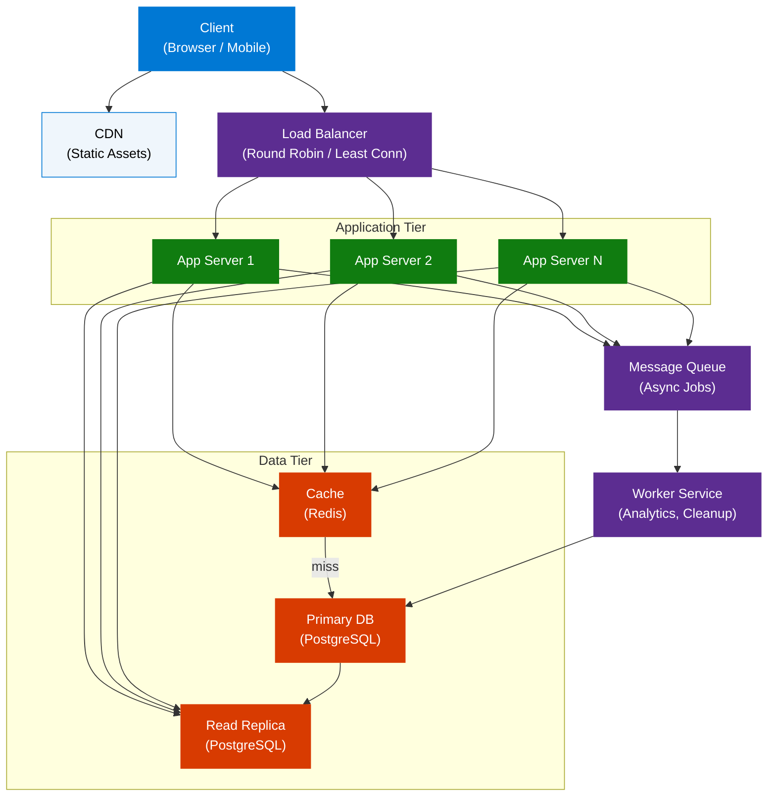

### Non-Functional Requirements Driving Architecture

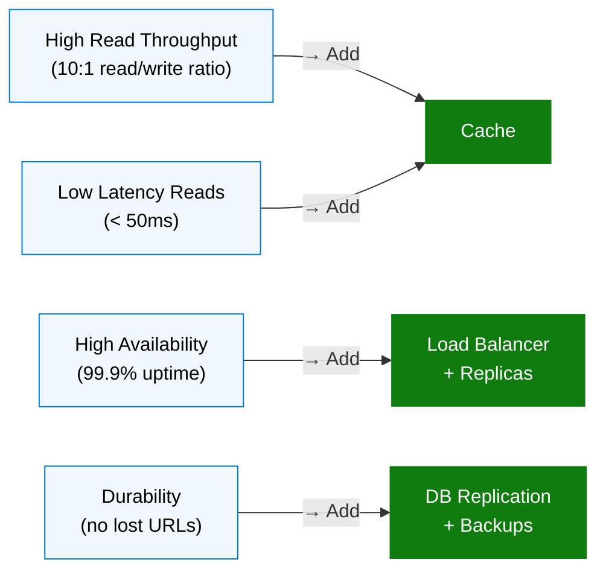

---

## 5. Key Components

| Component | Technology Examples | Role |
|---|---|---|
| **Load Balancer** | Nginx, AWS ALB, HAProxy | Distributes traffic; eliminates single point of failure |
| **Application Server** | Node.js, Python/FastAPI, Go | Executes business logic; stateless |
| **Cache** | Redis, Memcached | Serves hot data without DB hits; TTL-based expiry |
| **Primary Database** | PostgreSQL, MySQL | Source of truth; handles writes |
| **Read Replica** | PostgreSQL replica | Offloads read traffic; eventual consistency |
| **Message Queue** | RabbitMQ, Kafka, SQS | Decouples async work (analytics, notifications) |
| **CDN** | CloudFront, Akamai | Serves static assets at edge; reduces origin load |
| **API Gateway** | Kong, AWS API Gateway | Auth, rate limiting, routing before app tier |

### Cache Deep Dive

| Pattern | When to Use |
|---|---|
| **Cache-Aside** | App checks cache first; on miss, loads from DB and populates cache |
| **Write-Through** | Write to cache and DB simultaneously; consistency, higher write latency |
| **Write-Behind** | Write to cache; async flush to DB; high throughput, risk of data loss |

**Eviction Policies:**
- **LRU** (Least Recently Used) — default for URL resolvers
- **LFU** (Least Frequently Used) — for trending/hot keys
- **TTL** — set expiry on short-lived entries

### Database Selection Criteria

| Requirement | Choose |
|---|---|
| Complex joins, transactions | SQL (PostgreSQL, MySQL) |
| Massive scale, flexible schema | NoSQL (DynamoDB, MongoDB) |
| High write throughput, time-series | Cassandra, TimescaleDB |
| Full-text search | Elasticsearch |
| Key-value at microsecond latency | Redis |

### Load Balancing Algorithms

| Algorithm | Best For |
|---|---|
| **Round Robin** | Stateless services with uniform load |
| **Least Connections** | Variable request duration |
| **Consistent Hashing** | Stateful services; cache locality |
| **IP Hash** | Session affinity requirements |

---

## 6. How It Works — Step by Step

### URL Shortener — Request Flow

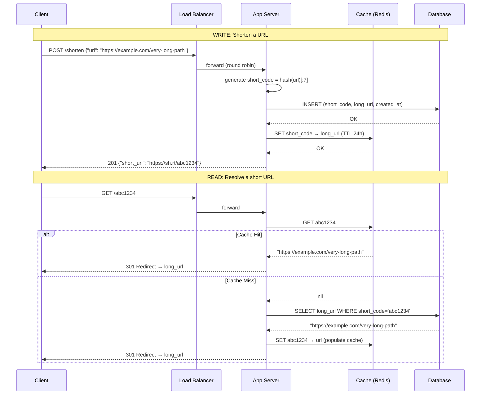

### System Design Process — 5-Step Framework

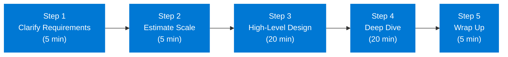

**Step 1 — Clarify Requirements**
- What are the core features? (functional)
- What scale do we need? (non-functional)
- What are the constraints? (latency, consistency, budget)

**Step 2 — Estimate Scale (Back-of-Envelope)**
```
URL Shortener example:
  - 100M new URLs/day → 1,200 writes/sec
  - 10:1 read ratio → 12,000 reads/sec
  - 500 bytes/URL × 100M/day × 365 days × 5 years = ~90 TB storage
  - Cache 20% of daily reads → 100M × 10 reads × 20% × 500B = ~100 GB/day
```

**Step 3 — High-Level Design**
Sketch: clients → load balancer → app servers → cache + database

**Step 4 — Deep Dive**
Pick bottlenecks: "read-heavy → cache strategy", "write-heavy → queue + async"

**Step 5 — Wrap Up**
Discuss: monitoring, alerting, failure scenarios, future scaling paths

---

## 7. Comparison Table

### Monolithic vs. Microservices

| Dimension | Monolithic | Microservices |
|---|---|---|
| Deployment | Single unit | Independent per service |
| Scalability | Scale the whole app | Scale bottleneck services only |
| Development speed | Faster initially | Faster at team scale |
| Failure isolation | One failure = total outage | Failures are contained |
| Complexity | Low operational complexity | High: service mesh, distributed tracing |
| Best for | Early-stage, small teams | Large teams, high scale |

### SQL vs. NoSQL

| Dimension | SQL | NoSQL |
|---|---|---|
| Schema | Fixed, enforced | Flexible |
| Transactions | ACID | BASE (eventual consistency) |
| Scaling | Vertical (+ read replicas) | Horizontal (sharding native) |
| Query flexibility | Rich joins | Limited joins |
| Best for | Financial data, complex queries | High write throughput, varied schema |

### Vertical vs. Horizontal Scaling

| Dimension | Vertical Scaling | Horizontal Scaling |
|---|---|---|
| Method | Bigger single machine | More machines |
| Cost | Exponential beyond a point | Linear |
| Downtime | Requires restart | Zero downtime |
| Ceiling | Hardware limit | Theoretically unlimited |
| Complexity | Simple | Requires load balancer, distributed state |

### CP vs. AP Systems

| Dimension | CP System | AP System |
|---|---|---|
| CAP choice | Consistency + Partition tolerance | Availability + Partition tolerance |
| Behavior on partition | Rejects requests to stay consistent | Serves stale data to stay available |
| Examples | HBase, Zookeeper, Spanner | Cassandra, CouchDB, DynamoDB |
| Use cases | Bank transactions, inventory | Social feeds, DNS, shopping carts |

---

## 8. Code Examples

### Python — URL Shortener Core Logic

```python
import hashlib
import base64
from dataclasses import dataclass
from typing import Optional

@dataclass
class URLShortener:
    cache: dict       # replace with Redis client
    db: dict          # replace with DB client
    base_url: str = "https://sh.rt"

    def shorten(self, long_url: str) -> str:
        short_code = self._generate_code(long_url)
        self.db[short_code] = long_url
        self.cache[short_code] = long_url          # populate cache on write
        return f"{self.base_url}/{short_code}"

    def resolve(self, short_code: str) -> Optional[str]:
        if short_code in self.cache:               # cache hit
            return self.cache[short_code]
        long_url = self.db.get(short_code)         # cache miss → DB
        if long_url:
            self.cache[short_code] = long_url      # populate on read
        return long_url

    def _generate_code(self, url: str) -> str:
        digest = hashlib.md5(url.encode()).digest()
        return base64.urlsafe_b64encode(digest)[:7].decode()
```

### Python — Back-of-Envelope Estimation Helper

```python
def estimate_storage(
    writes_per_day: int,
    bytes_per_record: int,
    years: int,
    read_write_ratio: int = 10
) -> dict:
    total_records = writes_per_day * 365 * years
    storage_bytes = total_records * bytes_per_record
    reads_per_sec = (writes_per_day * read_write_ratio) / 86400
    writes_per_sec = writes_per_day / 86400

    return {
        "total_records": f"{total_records:,}",
        "storage_gb": f"{storage_bytes / 1e9:.1f} GB",
        "reads_per_sec": f"{reads_per_sec:.0f} req/s",
        "writes_per_sec": f"{writes_per_sec:.0f} req/s",
    }

# URL Shortener — 5-year estimate
print(estimate_storage(
    writes_per_day=100_000_000,
    bytes_per_record=500,
    years=5
))
# → storage: 91.3 GB, reads: 11,574 req/s, writes: 1,157 req/s
```

### API Design — REST Endpoints for URL Shortener

```python
# POST /api/v1/urls
# Request:  {"long_url": "https://example.com/path"}
# Response: {"short_url": "https://sh.rt/abc1234", "expires_at": "2027-07-04"}

# GET /{short_code}
# Response: HTTP 301 Location: https://example.com/path

# GET /api/v1/urls/{short_code}/stats
# Response: {"clicks": 1420, "created_at": "2026-07-04", "top_countries": [...]}

# DELETE /api/v1/urls/{short_code}
# Response: HTTP 204 No Content
```

### Redis — Cache Operations

```bash
# Set with TTL (24 hours)
SET url:abc1234 "https://example.com/very-long-path" EX 86400

# Get
GET url:abc1234

# Check TTL remaining
TTL url:abc1234

# Increment click counter atomically
INCR clicks:abc1234
```

---

## 9. Best Practices

### Requirements

- ✅ Always ask: "What is the expected QPS? What's the SLA for latency? Consistency or availability priority?"
- ✅ Separate functional requirements ("what it does") from non-functional ("how well it does it")
- ❌ Don't assume scale — derive it from numbers

### Estimation

- ✅ Use powers of 10 (1M, 10M, 1B) — precision doesn't matter, order of magnitude does
- ✅ Calculate reads/sec and writes/sec separately — they drive different design choices
- ❌ Don't skip estimation — it's the signal that drives every architectural decision

### Caching

- ✅ Cache hot reads (top 20% of data handles 80% of reads)
- ✅ Set appropriate TTLs — stale data is a feature, not a bug, for most use cases
- ❌ Don't cache writes by default — write-through adds latency; only use when read consistency critical
- ❌ Don't cache unbounded data — always set max memory limits and eviction policy

### Database

- ✅ Add read replicas before sharding — simpler and often sufficient
- ✅ Index foreign keys and frequently filtered columns
- ❌ Don't shard prematurely — adds massive operational complexity
- ❌ Don't use NoSQL just because it's trendy — if you need ACID, use SQL

### Scalability

- ✅ Design stateless app servers first — horizontal scaling becomes trivial
- ✅ Identify the bottleneck (usually DB) before scaling elsewhere
- ❌ Don't scale prematurely — start monolith, extract services when pain is real

---

## 10. Interview Talking Points

### "Walk me through how you'd design a URL shortener."

> Start by clarifying requirements: "Do we need custom aliases? Analytics? Expiry?" Then estimate: at 100M shortens/day that's ~1,200 writes/sec and 12,000 reads/sec — heavily read-biased, so caching is critical. High-level design: client → load balancer → stateless app servers → Redis cache + PostgreSQL. For the short code, MD5 hash of the URL truncated to 7 chars gives 62^7 ≈ 3.5 trillion possibilities — no collision concern at 5-year scale. On read, check Redis first; on miss, hit the DB and populate cache. The read path should be sub-50ms p99.

### "How does the CAP theorem affect your design decisions?"

> The CAP theorem says in a distributed system you can only guarantee two of: Consistency, Availability, Partition Tolerance. Since network partitions are inevitable, the real trade-off is CP vs. AP. For a URL shortener, I'd choose AP — it's acceptable for a redirect to briefly return a slightly stale URL during a partition, but it's unacceptable for the service to be unavailable. For a banking ledger, I'd choose CP: I'd rather reject a transaction than process it twice or show wrong balances.

### "How do you decide between SQL and NoSQL?"

> I start with SQL unless there's a strong reason not to. SQL gives you ACID transactions, rich querying, and decades of operational tooling. I'd move to NoSQL when: (1) the schema is genuinely variable and changes frequently, (2) I need horizontal write scalability beyond what read replicas and sharding can provide cost-effectively, or (3) the data model is naturally document/graph shaped. For the URL shortener, a key-value lookup (short_code → long_url) is perfect for DynamoDB or even Redis, but PostgreSQL works fine up to billions of rows with proper indexing.

### "What's the difference between vertical and horizontal scaling?"

> Vertical scaling means adding more resources (CPU, RAM) to a single machine — simple to implement, no code changes, but has a hardware ceiling and requires downtime. Horizontal scaling means adding more machines and distributing load with a load balancer — theoretically unlimited, but requires stateless services and introduces distributed system complexity. In practice: start vertical (fast, cheap), then move horizontal once you hit the ceiling or need high availability, since horizontal also eliminates single points of failure.

### "How do you identify and resolve bottlenecks in a system?"

> I trace the critical path for the most common user action end-to-end and time each hop. Common bottlenecks by layer: (1) **Application:** CPU-bound → horizontal scale, (2) **Database:** high connection count → connection pooling; slow queries → indexing or query optimization; high write throughput → sharding or async queue, (3) **Network:** large payloads → compression, caching at edge via CDN. The key principle: don't guess — measure. Add distributed tracing (e.g., OpenTelemetry) and look at p99 latency, not averages.

### "How would you handle 10x traffic growth overnight?"

> First, confirm it's real traffic (not a bot attack — check user agents, request patterns). Then: (1) horizontal scale app servers immediately — they're stateless, so this is fast, (2) scale cache tier — add Redis nodes, (3) promote read replica to take read load off primary, (4) if DB writes are the bottleneck — add a write queue to buffer bursts. Longer term: evaluate CDN for static content, database sharding, and separate the read/write paths completely with CQRS pattern.

---

## 11. Learning Resources

| Resource | Link | Type |
|---|---|---|
| YouTube — System Design for Beginners (Full Guide) | [Watch](https://www.youtube.com/watch?v=BAVrwcPDa-k) | Video |
| System Design Handbook — Beginner Guide 2026 | [Read](https://www.systemdesignhandbook.com/guides/system-design-for-beginners/) | Article |
| GeeksForGeeks — System Design Tutorial | [Read](https://www.geeksforgeeks.org/system-design/system-design-tutorial/) | Tutorial |
| Design Gurus — System Design for Beginners | [Read](https://www.designgurus.io/blog/system-design-tutorial-for-beginners) | Blog |
| System Design Handbook — Complete Guide 2026 | [Read](https://www.systemdesignhandbook.com/guides/system-design/) | Reference |

---

*Last Updated: July 2026 | Source: YouTube — System Design for Beginners (Full Guide)*

---

# Part II — Caching, Async & Distributed Systems (Lead)


> **Sources:** AlgoMaster, Martin Kleppmann, High Scalability, Dynatrace, Google Cloud, Medium, multiple references
> **Last Updated:** July 2026

---

## Table of Contents

### Part 1: Caching
1. [Caching 101 — What is Caching?](#1-caching-101)
2. [Caching Strategies](#2-caching-strategies)
3. [Cache Eviction Policies](#3-cache-eviction)
4. [Distributed Caching](#4-distributed-caching)
5. [Content Delivery Network (CDN)](#5-cdn)

### Part 2: Asynchronous Communication
6. [Pub/Sub Pattern](#6-pub-sub)
7. [Message Queues](#7-message-queues)
8. [Change Data Capture (CDC)](#8-cdc)

### Part 3: Distributed Systems
9. [Heartbeats in Distributed Systems](#9-heartbeats)
10. [Service Discovery](#10-service-discovery)
11. [Consensus Algorithms (Raft, Paxos)](#11-consensus)
12. [Distributed Locking](#12-distributed-locking)
13. [Gossip Protocol](#13-gossip-protocol)
14. [Circuit Breaker Pattern](#14-circuit-breaker)
15. [Disaster Recovery](#15-disaster-recovery)
16. [Distributed Tracing](#16-distributed-tracing)
17. [Interview Q&A Cheatsheet](#17-interview-qa)

---

# Part 1: Caching

## 1. Caching 101 — What is Caching? <a id="1-caching-101"></a>

> *Synthesized from domain knowledge (algomaster.io/learn/system-design/what-is-caching).*

**Caching** is the technique of storing copies of frequently accessed data in a fast-access storage layer (memory) so future requests for that data can be served faster than re-fetching or recomputing it from a slower backing store (database, disk, remote API).

### Why Cache?

- **Reduce latency** — memory access (~100ns) is orders of magnitude faster than disk (~10ms) or network round trips.
- **Reduce load on backend systems** — fewer queries hit the database, improving overall throughput.
- **Improve availability** — a cache can serve stale-but-available data even when the origin is down (graceful degradation).
- **Cost efficiency** — avoids redundant computation (e.g., expensive joins, ML inference, report generation).

### Where Caching Happens


Caching layers exist at every level of the stack: **browser cache**, **DNS cache**, **CDN edge cache**, **API gateway cache**, **application/in-process cache**, **distributed cache (Redis/Memcached)**, and **database query/buffer cache**.

### Key Metrics

| Metric | Meaning |
|---|---|
| **Hit Ratio** | `hits / (hits + misses)` — higher is better |
| **Miss Penalty** | Extra latency incurred on a cache miss |
| **Eviction Rate** | How often items are removed due to capacity limits |
| **Staleness / TTL** | How "fresh" cached data is allowed to be |

### Trade-offs

Caching introduces the hardest problem in computer science: **cache invalidation**. You're trading consistency for performance — cached data can become stale relative to the source of truth, so every caching design must answer: *how and when do I invalidate or refresh this entry?*

---

## 2. Caching Strategies <a id="2-caching-strategies"></a>

> *Synthesized from domain knowledge (algomaster.io/learn/system-design/caching-strategies).*

There are five canonical caching strategies, distinguished by **who** is responsible for reading/writing the cache and **when**.

### 2.1 Cache-Aside (Lazy Loading)

The application is responsible for managing the cache explicitly.

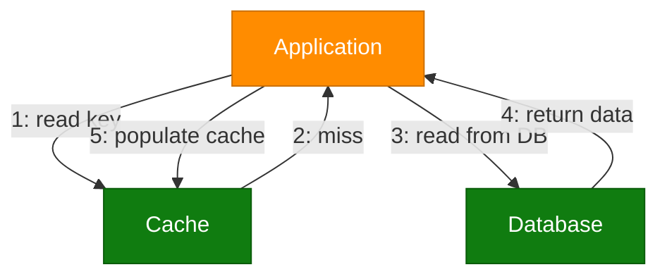

- **Pros:** Cache only contains requested data; resilient to cache node failure (falls back to DB).
- **Cons:** First request always misses (cold start penalty); risk of stale data if DB is updated without invalidating cache.
- **Used by:** Memcached + MySQL classic web-app pattern (Facebook's original architecture).

### 2.2 Read-Through

Similar to cache-aside, but the **cache itself** (not the application) is responsible for loading data from the database on a miss. The application only ever talks to the cache.

- **Pros:** Simplifies application code; cache logic is centralized.
- **Cons:** Requires cache provider support (e.g., Redis with a loader, or a caching library); same cold-start miss penalty.

### 2.3 Write-Through

Every write goes to the cache **and** is immediately, synchronously written to the database.


- **Pros:** Cache is always consistent with the DB; no stale-read risk.
- **Cons:** Higher write latency (write blocked until DB confirms); wasted writes for data that's never read.

### 2.4 Write-Behind (Write-Back)

Writes go to the cache first and are **asynchronously** flushed to the database later (batched or delayed).

- **Pros:** Very low write latency; can batch/coalesce multiple writes (e.g., counters).
- **Cons:** Risk of data loss if the cache crashes before flushing; added complexity for ordering and retry logic.
- **Used by:** Database buffer pools, write-heavy systems like analytics counters.

### 2.5 Write-Around

Writes go directly to the database, bypassing the cache. The cache is only populated on a subsequent read (cache-aside style).

- **Pros:** Avoids cache being flooded with write-heavy data that's rarely read.
- **Cons:** Recently written data isn't cached, so the first read after a write is always a miss.

### Strategy Comparison

| Strategy | Write Latency | Read Latency (after write) | Consistency | Data Loss Risk |
|---|---|---|---|---|
| Cache-Aside | N/A (DB only) | Miss until cached | Eventually consistent | Low |
| Read-Through | N/A (DB only) | Miss until cached | Eventually consistent | Low |
| Write-Through | High (sync) | Hit immediately | Strong | Very Low |
| Write-Behind | Low (async) | Hit immediately | Eventually consistent | Higher |
| Write-Around | N/A (DB only) | Miss until cached | Eventually consistent | Low |

---

## 3. Cache Eviction Policies <a id="3-cache-eviction"></a>

> Extracted and adapted from blog.algomaster.io/p/7-cache-eviction-strategies

Cache memory is limited — you can't store everything. Eviction policies determine which items get removed when the cache is full and a new item needs to be inserted.

### 3.1 Least Recently Used (LRU)

Removes the item that has not been accessed for the longest time. On every cache hit, the item moves to the "most recently used" position; on a miss with a full cache, the least recently used item is evicted.

**Example** (capacity 3):
```
Add A, B, C  -> [A, B, C]
Access A     -> [B, C, A]
Add D        -> [C, A, D]   (B evicted)
```

### 3.2 Least Frequently Used (LFU)

Evicts the item with the lowest access frequency count, regardless of recency. Ties are typically broken using a secondary policy like LRU.

**Example** (capacity 3):
```
Add A, B, C  -> [A:1, B:1, C:1]
Access A     -> [A:2, B:1, C:1]
Add D        -> [A:2, C:1, D:1]   (B evicted, tie broken by insertion order)
```

### 3.3 First In, First Out (FIFO)

Evicts the item that was added first, irrespective of how often it was accessed. Simple queue semantics — no reordering on hits.

**Example** (capacity 3):
```
Add A, B, C  -> [A, B, C]
Add D        -> [B, C, D]   (A evicted)
Access B     -> [B, C, D]   (order unchanged!)
Add E        -> [C, D, E]   (B evicted, even though just accessed)
```

### 3.4 Random Replacement (RR)

Evicts a randomly chosen item with no tracking of recency or frequency. Minimal bookkeeping overhead.

### 3.5 Most Recently Used (MRU)

The opposite of LRU — evicts the **most recently** accessed item. Useful for workloads with cyclic scans where the most recently used item is least likely to be reused soon (e.g., scanning a large file sequentially once).

### 3.6 Time to Live (TTL)

Every item is assigned a fixed lifespan at insertion. Once the TTL expires, the item is removed (either lazily on access or via a background sweep), regardless of access pattern.

### 3.7 Two-Tiered Caching (2Q-style layered cache)

Combines a small, ultra-fast **local cache** (in-process, e.g., Guava/Caffeine) with a larger **remote/shared cache** (Redis/Memcached). Lookups check local first, then remote, then the database — populating both tiers on the way back.

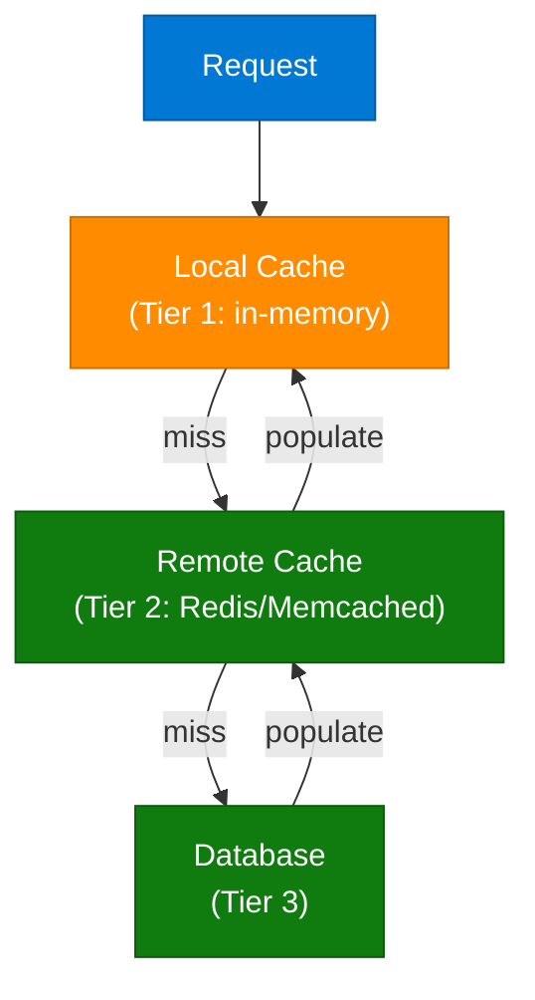

### Full Comparison Table

| Strategy | Mechanism | Overhead | Best For | Worst For |
|---|---|---|---|---|
| **LRU** | Tracks access recency (linked list + hashmap) | Medium | Web browsing, API caching, general-purpose | Sequential scans / unpredictable patterns |
| **LFU** | Tracks frequency counts per key | High | Stable, popular-item workloads (trending content) | Rapidly shifting access patterns |
| **FIFO** | Simple insertion-order queue | Low | Simple systems, streaming buffers | Active/hot data getting evicted early |
| **Random (RR)** | Randomly selects victim | Very Low | Unknown/unpredictable access patterns | Predictable, skewed access patterns |
| **MRU** | Tracks most recently used item | Low | Cyclic/sequential scan workloads | Repeated-access workloads (most common case) |
| **TTL** | Expiration timestamp per item | Low | Time-sensitive data (sessions, tokens, quotes) | Long-lived, frequently reused queries |
| **Two-Tiered** | Local + remote cache layering | High | High-traffic, large-scale distributed systems | Simple, single-instance applications |

### Python Example: Simple LRU Cache

```python
from collections import OrderedDict

class LRUCache:
    def __init__(self, capacity: int):
        self.capacity = capacity
        self.cache = OrderedDict()

    def get(self, key):
        if key not in self.cache:
            return -1
        # Move to the end -> mark as most recently used
        self.cache.move_to_end(key)
        return self.cache[key]

    def put(self, key, value):
        if key in self.cache:
            self.cache.move_to_end(key)
        self.cache[key] = value
        if len(self.cache) > self.capacity:
            # Pop the first item -> least recently used
            self.cache.popitem(last=False)

# Usage
lru = LRUCache(3)
lru.put("A", 1)
lru.put("B", 2)
lru.put("C", 3)
lru.get("A")          # A becomes most recently used
lru.put("D", 4)        # B is evicted (least recently used)
```

> Python's built-in `functools.lru_cache` decorator implements LRU eviction automatically for function memoization.

---

## 4. Distributed Caching <a id="4-distributed-caching"></a>

> Extracted and adapted from blog.algomaster.io/p/distributed-caching

**Distributed caching** stores cache data across multiple servers rather than a single machine, enabling horizontal scaling for large-scale applications.

### Why Distributed Caching Matters

1. **Scalability** — add cache nodes independently without impacting application servers.
2. **Fault Tolerance** — a single node failure doesn't eliminate the entire cache; remaining nodes keep serving.
3. **Load Balancing** — distributes demand evenly across nodes, preventing hotspots.

### Essential Components

| Component | Role |
|---|---|
| **Cache Nodes** | Individual servers storing distributed data |
| **Client Library** | Handles connections and data-distribution logic (e.g., which node owns a key) |
| **Consistent Hashing** | Spreads keys evenly; minimizes data movement when nodes are added/removed |
| **Replication** | Duplicates data across nodes for reliability |
| **Sharding** | Splits the keyspace into segments across different nodes |
| **Eviction Policies** | LRU, LFU, or TTL remove stale/unused data per node |
| **Coordination** | Distributed locks and consensus protocols maintain synchronization |

### Consistent Hashing

```mermaid
flowchart TD
    keyNode["key = hash(\"user:123\")"]:::userNode
    ringNode["Hash Ring"]:::infraNode
    node1["Cache Node 1"]:::dataNode
    node2["Cache Node 2"]:::dataNode
    node3["Cache Node 3"]:::dataNode

    keyNode --> ringNode
    ringNode -->|"clockwise lookup"| node2
    node1 -.->|"ring neighbor"| node2
    node2 -.->|"ring neighbor"| node3
    node3 -.->|"ring neighbor"| node1

    classDef userNode fill:#0078D4,stroke:#005A9E,color:#fff
    classDef aiNode fill:#7719AA,stroke:#5A0E80,color:#fff
    classDef dataNode fill:#107C10,stroke:#0A5C0A,color:#fff
    classDef processNode fill:#FF8C00,stroke:#CC7000,color:#fff
    classDef errorNode fill:#E81123,stroke:#B30D1A,color:#fff
    classDef outputNode fill:#00B294,stroke:#007D68,color:#fff
    classDef infraNode fill:#605E5C,stroke:#3B3A39,color:#fff
```

Consistent hashing places both nodes and keys on a hash ring; a key belongs to the first node found walking clockwise. Adding/removing a node only remaps `1/N` of the keys, instead of rehashing everything (as naive `hash(key) % N` would).

### Architectural Strategies

**Dedicated Cache Servers**
- Strengths: independent scalability, resource isolation, no contention for shared hardware.
- Weaknesses: higher cost, network latency overhead.

**Co-located Cache** (cache runs on the same host as the application)
- Strengths: minimal latency, cost-effective for smaller systems.
- Weaknesses: resource contention under load, limited scaling flexibility, complex invalidation across instances.

### How It Works (Request Flow)

1. **Hash** the key to determine the target cache node.
2. **Replicate** data across backup nodes for durability.
3. **Retrieve** via key lookup — hit returns data; miss triggers a database fetch.
4. **Invalidate** through time-based (TTL) or event-based expiration.
5. **Evict** old data following the configured policy (LRU/LFU/TTL).

### Challenges

- Data consistency across nodes (replication lag, stale reads).
- Cache invalidation complexity in a distributed setting (no single source of truth for "now").
- Network partitioning scenarios (split-brain risk).
- Balanced key distribution at scale (hot keys / hot shards).

### Best Practices

- Cache only frequently-accessed, relatively static data.
- Set appropriate TTL values to bound staleness.
- Prefer cache-aside loading for resilience to cache outages.
- Monitor hit rates and memory usage continuously.
- Design for graceful degradation if the cache layer is unavailable.
- Pre-populate (warm) critical data to avoid cold-start stampedes.

### Popular Solutions

| Tool | Highlights |
|---|---|
| **Redis** | In-memory data structure store; supports replication, persistence (RDB/AOF), pub/sub, Lua scripting, cluster mode |
| **Memcached** | Lightweight, multi-threaded, purely in-memory key-value cache; no persistence; great for simple read-heavy caching |
| **Amazon ElastiCache** | AWS-managed Redis/Memcached with multi-AZ failover and auto-scaling |

### Redis Example

```python
import redis

r = redis.Redis(host="cache.example.com", port=6379, decode_responses=True)

def get_user_profile(user_id):
    cache_key = f"user:{user_id}"
    cached = r.get(cache_key)
    if cached:
        return cached  # cache hit

    # cache miss -> fetch from DB
    profile = fetch_user_from_db(user_id)
    r.setex(cache_key, 300, profile)  # cache for 300 seconds (TTL)
    return profile
```

---

## 5. Content Delivery Network (CDN) <a id="5-cdn"></a>

> *Synthesized from domain knowledge (algomaster.io/learn/system-design/content-delivery-network-cdn).*

A **CDN** is a geographically distributed network of proxy/edge servers that cache and deliver content (static assets, video, and increasingly dynamic API responses) from a location physically closer to the end user, reducing latency and offloading origin servers.

### How It Works

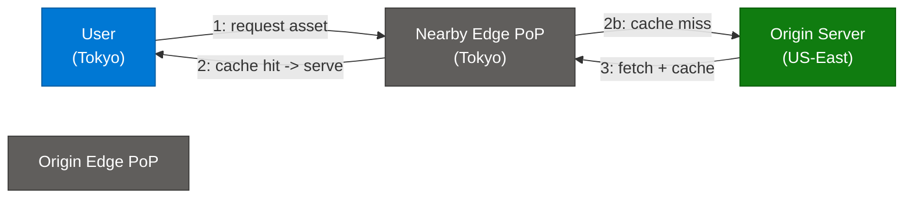

### Push vs Pull CDNs

| Type | How it Works | Best For |
|---|---|---|
| **Pull CDN** | Edge fetches content from origin on first request (cache-aside style), caches it for TTL | Frequently updated content, simpler setup |
| **Push CDN** | Origin proactively uploads content to edge nodes ahead of time | Large, rarely-changing files (video libraries) |

### Key Benefits

- **Lower latency** via geographic proximity (edge Points of Presence/PoPs).
- **Reduced origin load** — most requests never reach the origin server.
- **DDoS mitigation** — the CDN absorbs traffic spikes and malicious traffic at the edge.
- **High availability** — multiple PoPs provide redundancy; an outage in one region doesn't take down the whole service.
- **TLS termination at the edge** reduces handshake latency for users.

### What CDNs Cache

- Static assets: images, CSS, JS, fonts, videos.
- Increasingly, **dynamic content** via edge compute (Cloudflare Workers, AWS Lambda@Edge, Fastly Compute@Edge) and API response caching with short TTLs.

### Cache Invalidation in CDNs

- **TTL-based expiration** — simplest, but can serve stale content until expiry.
- **Cache busting** — version/hash the asset URL (e.g., `app.a1b2c3.js`) so a new deploy naturally gets a new cache key.
- **Purge/invalidate API** — explicitly tell the CDN to evict specific paths (used for urgent content corrections).

### Popular CDN Providers

Cloudflare, Akamai, Amazon CloudFront, Fastly, Google Cloud CDN, Azure CDN.

---

# Part 2: Asynchronous Communication

## 6. Pub/Sub Pattern <a id="6-pub-sub"></a>

> *Synthesized from domain knowledge (algomaster.io/learn/system-design/pub-sub).*

**Publish-Subscribe (Pub/Sub)** is a messaging pattern where publishers send messages to a **topic** without knowledge of who (if anyone) will consume them, and subscribers express interest in one or more topics to receive relevant messages. A message broker decouples publishers from subscribers entirely.

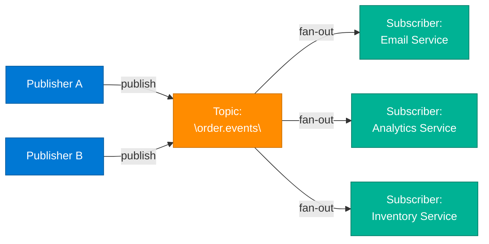

### Key Characteristics

- **One-to-many (fan-out) delivery** — every subscriber of a topic gets a copy of the message.
- **Loose coupling** — publishers don't know subscribers, and vice versa.
- **Topic-based or content-based filtering** — subscribers can filter by topic name or message attributes.
- Most implementations support **at-least-once delivery**, requiring idempotent consumers.

### Common Implementations

| Tool | Notes |
|---|---|
| **Apache Kafka** | Distributed log-based pub/sub; high throughput, durable, replayable |
| **Google Cloud Pub/Sub** | Fully managed, global, push or pull delivery |
| **Redis Pub/Sub** | In-memory, fire-and-forget (no persistence) |
| **AWS SNS** | Managed pub/sub, commonly paired with SQS per subscriber (fan-out pattern) |
| **RabbitMQ (exchanges)** | Exchange types (fanout/topic/direct) implement pub/sub semantics |

### Use Cases

- Event-driven microservices (order placed → notify shipping, billing, analytics).
- Real-time notifications and live feeds.
- Log/metrics aggregation pipelines.

---

## 7. Message Queues <a id="7-message-queues"></a>

> *Synthesized from domain knowledge (algomaster.io/learn/system-design/message-queues).*

A **Message Queue** enables point-to-point, asynchronous communication: a producer places a message on a queue, and exactly **one** consumer (from a pool of competing consumers) processes and removes it. This contrasts with pub/sub's fan-out model.

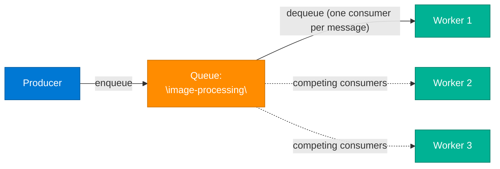

### Key Characteristics

- **One-to-one delivery** (per message) — the **competing consumers pattern** lets you scale processing horizontally.
- **Decouples producers from consumers** in time — producer doesn't block waiting for processing.
- Supports **message durability**, **retries**, **dead-letter queues (DLQ)** for poison messages, and **visibility timeouts** (consumer gets exclusive lease while processing).
- **Ordering** guarantees vary: FIFO queues (SQS FIFO, single-partition Kafka) vs best-effort ordering.

### Common Implementations

| Tool | Notes |
|---|---|
| **RabbitMQ** | AMQP-based, flexible routing, strong delivery guarantees |
| **Amazon SQS** | Fully managed, standard (at-least-once) or FIFO queues |
| **Apache Kafka** | Technically a distributed log, but commonly used as a durable, replayable queue/stream |
| **ActiveMQ / ZeroMQ** | Traditional / lightweight messaging options |

### Pub/Sub vs Message Queue — Comparison Table

| Aspect | Pub/Sub | Message Queue |
|---|---|---|
| **Delivery model** | One-to-many (fan-out, broadcast) | One-to-one (point-to-point) |
| **Consumer relationship** | Multiple independent subscribers each get every message | Multiple competing consumers share the workload; each message processed once |
| **Coupling** | Publishers/subscribers fully decoupled | Producers/consumers decoupled in time, but message goes to a single worker |
| **Use case** | Event broadcasting, notifications, fan-out to many services | Task distribution, work queues, load leveling |
| **Message removal** | Message remains for all subscribers; not removed per-consumer (in log-based systems) | Message removed/acked once consumed by one worker |
| **Scaling pattern** | Add more subscribers to receive the *same* events | Add more consumers to process *more* messages in parallel |
| **Examples** | Kafka topics, SNS, Redis Pub/Sub | SQS, RabbitMQ queues, Kafka with single consumer group |

### Code Example: Producer/Consumer with a Queue (pseudo-code)

```python
# Producer
import boto3
sqs = boto3.client("sqs")

def enqueue_image_job(image_url):
    sqs.send_message(
        QueueUrl="https://sqs.us-east-1.amazonaws.com/123/image-processing",
        MessageBody=json.dumps({"image_url": image_url}),
    )

# Consumer (one of many competing workers)
def poll_and_process():
    while True:
        resp = sqs.receive_message(QueueUrl=QUEUE_URL, MaxNumberOfMessages=1, WaitTimeSeconds=20)
        for msg in resp.get("Messages", []):
            try:
                job = json.loads(msg["Body"])
                process_image(job["image_url"])
                sqs.delete_message(QueueUrl=QUEUE_URL, ReceiptHandle=msg["ReceiptHandle"])
            except Exception:
                # Message becomes visible again after the visibility timeout
                # and is eventually routed to a Dead-Letter Queue (DLQ) after N retries
                log_error(msg)
```

---

## 8. Change Data Capture (CDC) <a id="8-cdc"></a>

> *Synthesized from domain knowledge (algomaster.io/learn/system-design/change-data-capture-cdc).*

**Change Data Capture (CDC)** is a technique for identifying and capturing changes (inserts, updates, deletes) made to data in a source system, then streaming those changes to downstream consumers in real time — without requiring the source application to explicitly publish events.

### Why CDC?

- Keeps caches, search indexes, and data warehouses in sync with the source-of-truth database without dual writes.
- Enables event-driven architectures from legacy databases that weren't built with events in mind.
- Powers real-time analytics pipelines and microservice data replication.

### CDC Approaches

| Approach | How it Works | Pros | Cons |
|---|---|---|---|
| **Polling/Timestamp** | Periodically query rows where `updated_at > last_poll` | Simple to implement | Misses deletes, adds query load, polling lag |
| **Trigger-based** | DB triggers write changes to a shadow/audit table | Captures all changes synchronously | Adds write latency, maintenance burden |
| **Log-based (transaction log tailing)** | Reads the database's write-ahead log (WAL) / binlog directly | Low overhead, captures all changes including deletes, near real-time | Requires log access, DB-specific tooling |

Log-based CDC (e.g., via **Debezium**) is the modern standard because it doesn't add load to the source database — it tails the replication log the same way a read replica would.

### Debezium Architecture

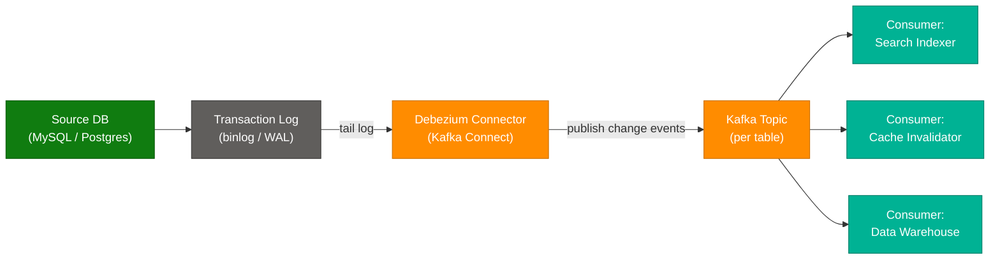

### The Outbox Pattern

CDC pairs naturally with the **Transactional Outbox Pattern** to solve the "dual write problem" (writing to a DB and publishing an event are not atomic unless coordinated).

1. The service writes the business entity change **and** an "outbox" event row in the **same local DB transaction**.
2. A CDC connector (e.g., Debezium) tails the outbox table's log entries.
3. The connector publishes each outbox row as a Kafka message, then the row can be cleaned up.

This guarantees the event is published **if and only if** the business transaction committed — no distributed transaction (2PC) needed.

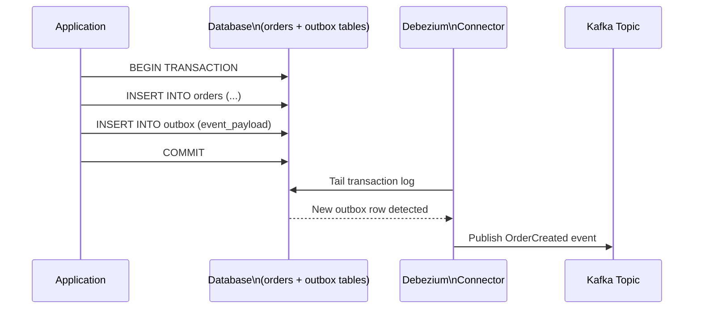

### CDC Use Cases

- Cache invalidation triggered by DB writes (instead of dual writes from app code).
- Syncing a search index (Elasticsearch) from the primary database.
- Streaming ETL into a data warehouse (Snowflake, BigQuery) for analytics.
- Microservices data replication without tight coupling (each service's local read-model stays fresh).

---

# Part 3: Distributed Systems & Microservices

## 9. Heartbeats in Distributed Systems <a id="9-heartbeats"></a>

> Extracted and adapted from blog.algomaster.io/p/heartbeats-in-distributed-systems

A **heartbeat** is a periodic message sent from one component to another to monitor each other's health and status — a signal confirming a node remains operational.

### How Failure Detection Works

1. **Periodic signaling** — nodes transmit heartbeat signals at regular intervals (commonly every few seconds up to ~30s).
2. **Status tracking** — monitors update node status upon receiving each signal.
3. **Timeout detection** — absence of expected heartbeats within a configured window triggers a failure classification.
4. **Recovery activation** — the system responds by redirecting traffic, initiating failover, or alerting operators.

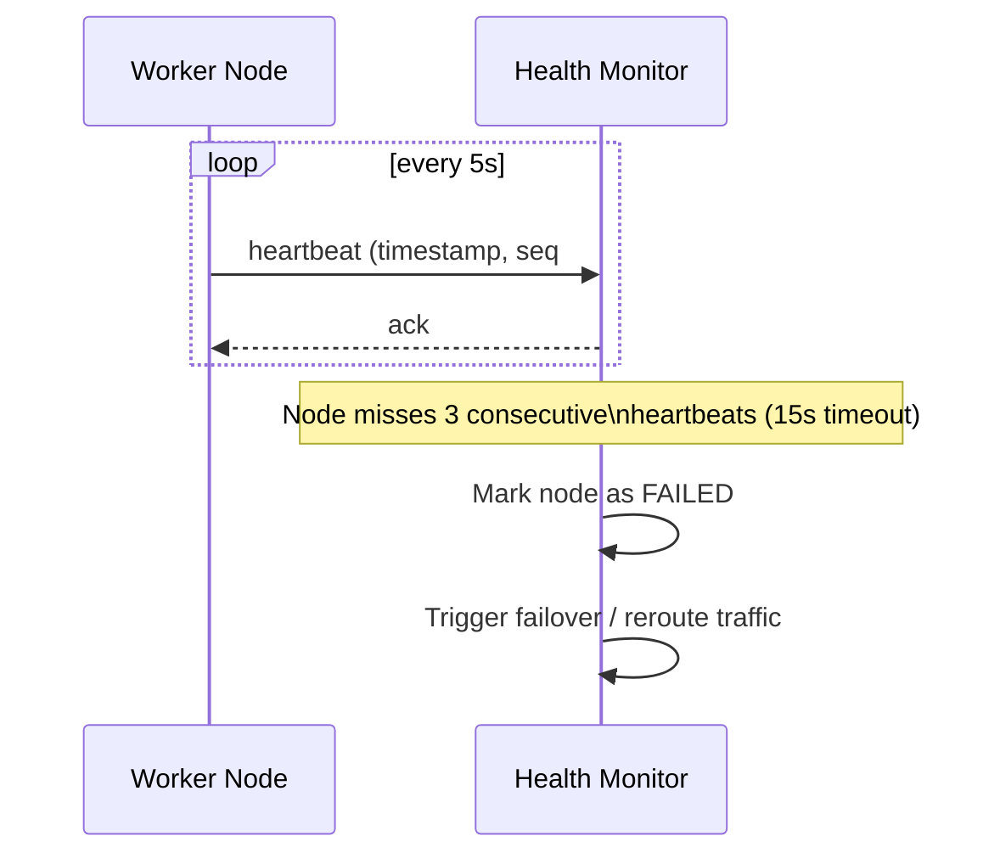

### Key Implementation Considerations

- **Frequency** — too-frequent signals waste bandwidth/CPU; infrequent signals delay failure detection.
- **Timeout thresholds** — must account for network latency/jitter while avoiding false positives (commonly use a multiple of the heartbeat interval, e.g., 3x).
- **Payload design** — typically minimal (timestamp, sequence number), though can carry load metrics or health data ("phi accrual" failure detectors use this for adaptive thresholds).

### Heartbeat Categories

- **Push-based** — nodes actively transmit signals to a monitor (most common: "I'm alive").
- **Pull-based** — the monitor periodically polls/queries each node for status (health-check endpoints).

### Real-World Applications

- **Database replication** — primary/replica heartbeats trigger failover when the primary goes silent.
- **Kubernetes** — kubelet node heartbeats (`NodeStatus` lease) drive the control plane's view of node health.
- **Elasticsearch / Consul / ZooKeeper** — cluster membership and leader-health tracking.

### Challenges

Network congestion, false-positive failures (a slow-but-alive node looks dead), computational/bandwidth overhead at scale, and **split-brain** scenarios during network partitions (two halves of the cluster both think they're the live side).

---

## 10. Service Discovery <a id="10-service-discovery"></a>

> Extracted and adapted from blog.algomaster.io/p/service-discovery-in-distributed-systems

**Service discovery** is a mechanism that allows services in a distributed system to find and communicate with each other dynamically. It maintains a **service registry** containing IP addresses, ports, health status, and metadata for all active service instances — "the address book of your microservices architecture."

### Client-Side Discovery

Services register with a central registry. Clients query the registry directly, receive a list of available instances, and select one themselves using client-side load-balancing logic.

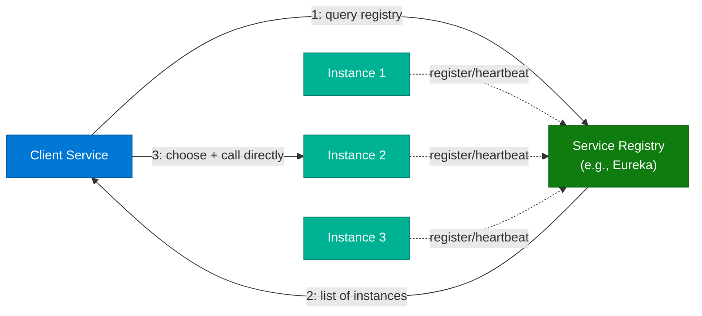

- **Pros:** Reduces load-balancer pressure; client controls load-balancing strategy.
- **Cons:** Discovery logic must be implemented in every client/language.
- **Example tool:** Netflix Eureka.

### Server-Side Discovery

Clients send requests to a load balancer or API gateway, which queries the service registry and routes traffic accordingly. Centralizes discovery logic at the cost of an extra network hop.

- **Pros:** Clients stay simple (no discovery logic needed); language-agnostic.
- **Cons:** Extra hop adds latency; load balancer becomes a critical infrastructure piece.
- **Example tool:** AWS Elastic Load Balancer (ELB), Kubernetes `Service` + kube-proxy.

### Registration Methods

| Method | Description |
|---|---|
| **Manual registration** | An operator/admin registers instances explicitly |
| **Self-registration** | The service instance registers itself on startup and deregisters on shutdown |
| **Third-party registration (sidecar)** | A sidecar process (e.g., Consul agent, Envoy) registers on the service's behalf |
| **Orchestration-based** | Automatic registration via Kubernetes/Nomad as part of scheduling |
| **Configuration management** | Registration driven by config-management tooling (Ansible/Chef/Puppet) |

### Best Practices

- Deploy multiple registry instances for high availability (the registry itself shouldn't be a SPOF).
- Automate registration/deregistration in dynamic, autoscaled environments.
- Implement health checks to remove failing instances promptly.
- Use consistent naming conventions with versioning (e.g., `orders-service-v2`).
- Cache discovery data client-side to reduce registry load and tolerate brief registry outages.
- Ensure the registry scales with service/instance growth.

### Common Tools

| Tool | Type |
|---|---|
| **Netflix Eureka** | Client-side, AP-oriented registry |
| **Consul** | Service mesh + registry with health checking, supports both patterns |
| **etcd / ZooKeeper** | Strongly consistent (CP) coordination services often used to build registries |
| **Kubernetes DNS/Service** | Built-in server-side discovery via cluster DNS and `kube-proxy` |
| **Istio / Envoy** | Service mesh providing discovery + traffic management as sidecars |

---

## 11. Consensus Algorithms (Raft, Paxos) <a id="11-consensus"></a>

> *Synthesized from domain knowledge (medium.com/@sourabhatta1819/consensus-in-distributed-system).*

**Consensus** is the problem of getting multiple distributed nodes to agree on a single value or sequence of operations, even in the presence of failures, network delays, or partitions. It underpins leader election, distributed transactions, and replicated state machines.

### Why Consensus Is Hard

The **FLP impossibility result** proves that in a fully asynchronous system, no deterministic consensus algorithm can guarantee both safety and liveness if even one node can fail. Real-world algorithms work around this with timeouts and partial synchrony assumptions.

### Paxos

The original (Lamport, 1989) consensus protocol. Roles: **Proposers**, **Acceptors**, **Learners**. Operates in two phases:

1. **Prepare/Promise** — a proposer asks acceptors to promise not to accept proposals older than its proposal number.
2. **Accept/Accepted** — if a majority promises, the proposer sends the actual value; once a majority accepts, consensus is reached.

Paxos is famously correct but notoriously difficult to understand and implement correctly ("Paxos Made Simple" was written because the original paper was so opaque).

### Raft

Designed explicitly for understandability (Ongaro & Ousterhout, 2014). Raft decomposes consensus into three sub-problems:

1. **Leader Election** — nodes start as followers; if no heartbeat from a leader within a randomized election timeout, a node becomes a candidate and requests votes. Majority votes → becomes leader.
2. **Log Replication** — the leader appends client commands to its log and replicates entries to followers; an entry is **committed** once a majority of nodes have it.
3. **Safety** — election rules (only vote for candidates with logs at least as up-to-date) ensure a newly elected leader has all committed entries.

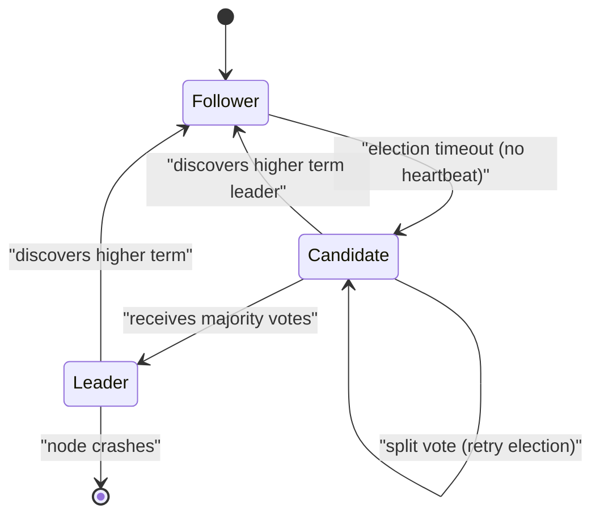

### Quorum-Based Agreement

Both Paxos and Raft rely on **majority quorums** (`N/2 + 1`): any two majorities out of N nodes must overlap by at least one node, which is what prevents two conflicting values from both being "committed" during a partition.

### Consensus in Practice

| System | Algorithm Used |
|---|---|
| **etcd** | Raft |
| **Kubernetes** (via etcd) | Raft |
| **Consul** | Raft |
| **ZooKeeper** | ZAB (Zookeeper Atomic Broadcast — Paxos-like) |
| **Google Spanner / Chubby** | Paxos |
| **CockroachDB / TiDB** | Raft (per range/region) |

### CAP Theorem Connection

Consensus protocols inherently favor **CP** (Consistency + Partition tolerance) over availability: during a network partition, the minority side cannot commit new entries (it can't reach quorum), sacrificing availability to preserve consistency.

---

## 12. Distributed Locking <a id="12-distributed-locking"></a>

> *Synthesized from domain knowledge (martin.kleppmann.com/2016/02/08/how-to-do-distributed-locking.html).*

A **distributed lock** ensures mutual exclusion across multiple nodes/processes — e.g., ensuring only one instance of a cron job runs, or only one node modifies a shared resource at a time.

### Why It's Hard

Martin Kleppmann's well-known critique of "Redlock" (Redis's distributed locking algorithm) highlights a fundamental issue: **a lock obtained doesn't guarantee mutual exclusion under real-world failure modes** such as:

- **Process pauses** — a long GC pause or OS scheduling delay can cause a client to believe it still holds the lock after its lease has expired.
- **Clock drift/jumps** — algorithms relying on wall-clock TTLs (like Redlock) are vulnerable to clock skew across nodes.
- **Network delays** — a delayed message can arrive *after* a lock has been released and reassigned, causing two clients to believe they hold the lock simultaneously.

### The Classic Failure Scenario

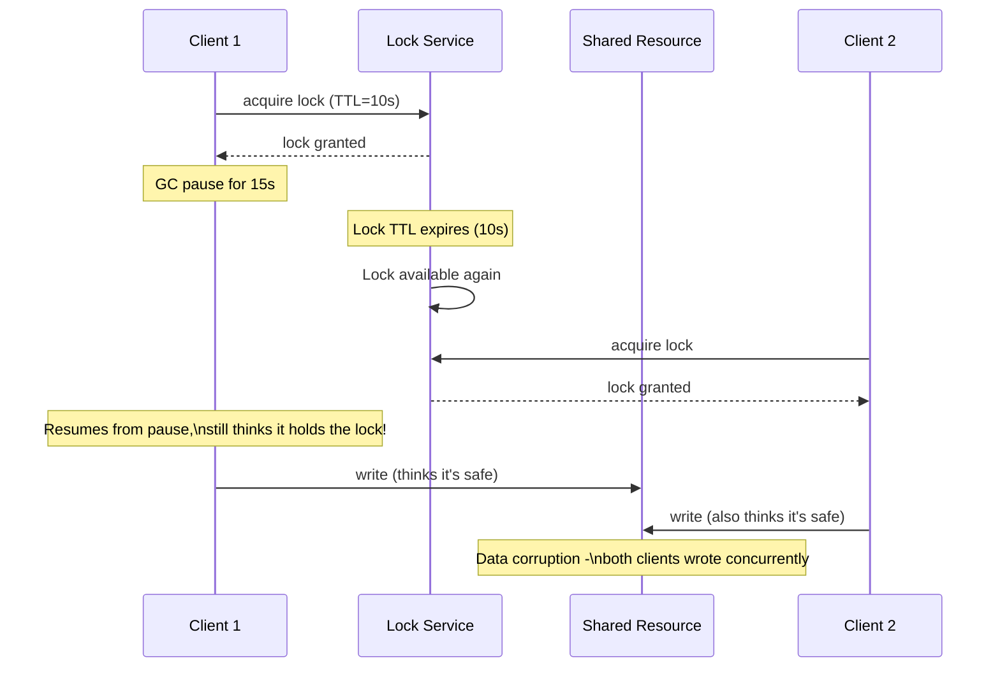

### Kleppmann's Recommendation: Fencing Tokens

The robust fix is a **fencing token** — a monotonically increasing number issued every time a lock is granted. The shared resource (storage layer) rejects any write tagged with a token lower than the highest one it has already seen.

```python
# Pseudo-code: fencing token pattern
token = lock_service.acquire_lock("resource-123")  # returns e.g. token=33

storage.write(resource_id="resource-123", token=token, data=payload)
# Storage layer logic:
#   if token <= storage.max_token_seen("resource-123"):
#       reject()  # stale client, lock was already reassigned
#   else:
#       storage.max_token_seen = token
#       accept()
```

This converts the problem from "trust the lock" to "let the storage layer enforce ordering," which is safe even if a client pauses arbitrarily long.

### Distributed Locking Tools

| Tool | Mechanism |
|---|---|
| **Redlock (Redis)** | Quorum across N independent Redis instances; **Kleppmann argues it's unsafe** for correctness-critical locking without fencing tokens |
| **ZooKeeper** | Ephemeral sequential znodes; strongly consistent (built on ZAB consensus) — generally considered safer |
| **etcd** | Lease + revision number (naturally provides a fencing-token-like mechanism via `mod_revision`) |
| **Chubby (Google)** | Paxos-based lock service, inspiration for ZooKeeper |

### Key Takeaway

Use distributed locks for **efficiency** (avoiding duplicate work, e.g., two cron triggers) where occasional double-execution is tolerable. For **correctness** (preventing data corruption), rely on fencing tokens or a consensus-backed system — don't trust lock TTLs alone.

---

## 13. Gossip Protocol <a id="13-gossip-protocol"></a>

> *Synthesized from domain knowledge (highscalability.com/blog/2023/7/16/gossip-protocol-explained.html).*

**Gossip protocols** (a.k.a. epidemic protocols) spread information across a cluster the way rumors spread in a social network: each node periodically picks one or a few random peers and exchanges state with them. Over multiple rounds, information propagates to the entire cluster without any central coordinator.

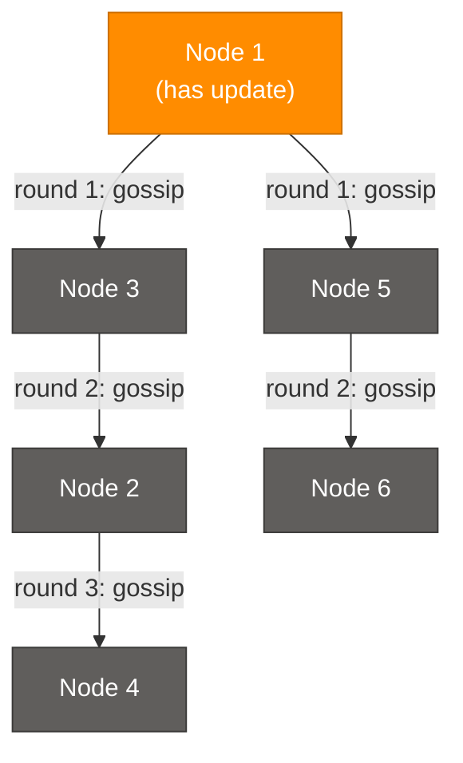

### How It Works

1. Each node maintains a local view of cluster state (membership, health, key-value data).
2. Periodically (e.g., every second), a node selects 1-3 random peers.
3. Nodes exchange state — merging updates using version vectors or timestamps to resolve conflicts.
4. Information propagates **exponentially** (like an epidemic) — typically reaching all N nodes in `O(log N)` rounds.

### Properties

- **Decentralized** — no single coordinator or bottleneck, highly fault-tolerant.
- **Eventually consistent** — all nodes converge, but not instantly.
- **Scalable** — communication overhead per node stays roughly constant regardless of cluster size (unlike a naive broadcast-to-all approach).
- **Resilient to partial failures** — even if some nodes are down, gossip routes around them via alternate peers.

### Real-World Usage

| System | Use of Gossip |
|---|---|
| **Cassandra / DynamoDB-style stores** | Cluster membership and failure detection |
| **Consul / Serf (HashiCorp)** | Membership, failure detection (built on the SWIM protocol) |
| **Redis Cluster** | Node-to-node gossip for cluster topology and failure detection |
| **Bitcoin / blockchain networks** | Transaction and block propagation |

### Trade-offs

- **Pros:** No single point of failure, scales horizontally, simple to reason about per-node.
- **Cons:** Eventual (not immediate) consistency; propagation delay grows with cluster size (though only logarithmically); some redundant message overhead.

---

## 14. Circuit Breaker Pattern <a id="14-circuit-breaker"></a>

> *Synthesized from domain knowledge (medium.com/geekculture/design-patterns-for-microservices-circuit-breaker-pattern).*

The **Circuit Breaker** pattern prevents a failing downstream service from cascading failures throughout a distributed system. Inspired by electrical circuit breakers, it "trips" after repeated failures, short-circuiting further calls until the downstream service recovers.

### States

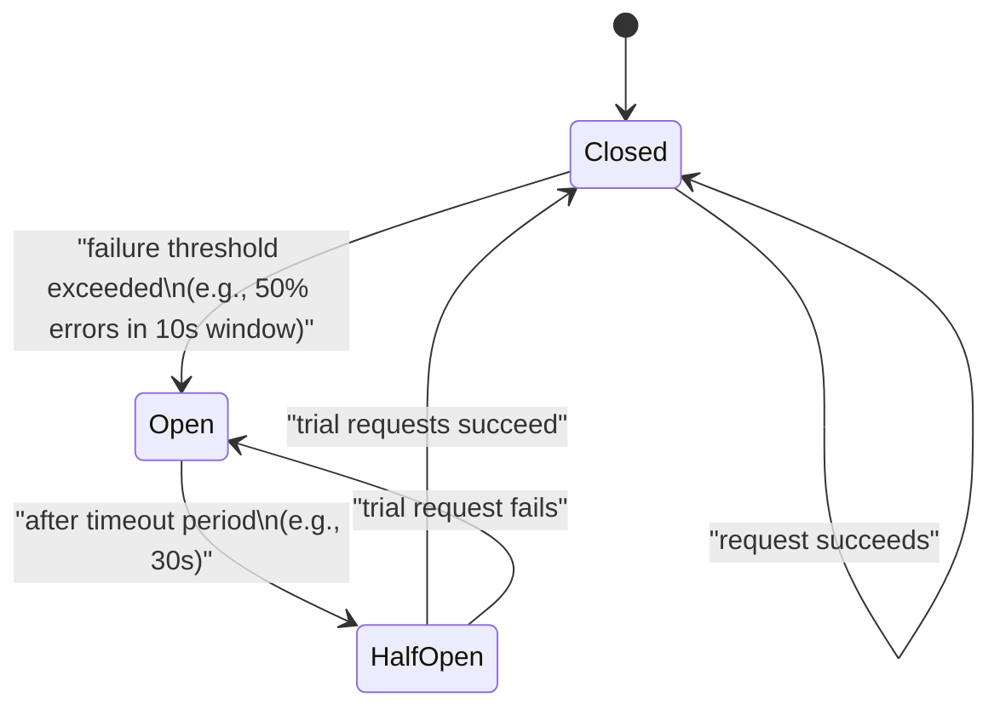

| State | Behavior |
|---|---|
| **Closed** | Requests flow normally to the downstream service; failures are counted |
| **Open** | All requests immediately fail-fast (or fall back) without calling the downstream service, for a cooldown period |
| **Half-Open** | A limited number of trial requests are allowed through to test if the downstream service has recovered |

### Why It Matters

Without a circuit breaker, a slow/failing downstream service causes callers to pile up waiting threads/connections, exhausting resources and causing a **cascading failure** across the entire call chain — even services that have nothing to do with the original failure can go down.

### Implementation Example (Python, pseudo-library style)

```python
import time

class CircuitBreaker:
    def __init__(self, failure_threshold=5, recovery_timeout=30):
        self.failure_threshold = failure_threshold
        self.recovery_timeout = recovery_timeout
        self.failure_count = 0
        self.state = "CLOSED"
        self.opened_at = None

    def call(self, func, *args, **kwargs):
        if self.state == "OPEN":
            if time.time() - self.opened_at > self.recovery_timeout:
                self.state = "HALF_OPEN"
            else:
                raise Exception("Circuit is OPEN - failing fast")

        try:
            result = func(*args, **kwargs)
        except Exception as e:
            self.failure_count += 1
            if self.failure_count >= self.failure_threshold:
                self.state = "OPEN"
                self.opened_at = time.time()
            raise e
        else:
            # success: reset on HALF_OPEN -> CLOSED transition
            self.failure_count = 0
            self.state = "CLOSED"
            return result

# Usage
breaker = CircuitBreaker(failure_threshold=3, recovery_timeout=10)
try:
    response = breaker.call(call_payment_service, order_id=42)
except Exception:
    response = fallback_response()  # graceful degradation
```

### Related Resilience Patterns

| Pattern | Purpose |
|---|---|
| **Retry with backoff** | Handle transient failures by retrying with exponential delay |
| **Bulkhead** | Isolate resource pools (thread pools/connections) per dependency so one slow dependency can't exhaust shared resources |
| **Timeout** | Bound how long a caller waits before giving up |
| **Fallback** | Provide a degraded but functional response when the circuit is open |

### Popular Libraries

Netflix Hystrix (deprecated, but foundational), **resilience4j** (Java), **Polly** (.NET), **pybreaker** (Python), built into service meshes like **Istio/Envoy**.

---

## 15. Disaster Recovery <a id="15-disaster-recovery"></a>

> *Synthesized from domain knowledge (cloud.google.com/learn/what-is-disaster-recovery).*

**Disaster Recovery (DR)** is the set of policies, tools, and procedures that enable the recovery of critical technology infrastructure and systems after a natural or human-induced disaster (region outage, data corruption, ransomware, etc.).

### Key Metrics

| Metric | Definition |
|---|---|
| **RTO (Recovery Time Objective)** | Maximum acceptable time to restore service after a disaster |
| **RPO (Recovery Point Objective)** | Maximum acceptable amount of data loss, measured in time (e.g., "we can lose up to 5 minutes of data") |

Lower RTO/RPO = more expensive and complex DR strategy.

### DR Strategies (increasing cost & decreasing RTO/RPO)

```mermaid
flowchart LR
    backup["Backup & Restore"]:::processNode
    pilot["Pilot Light"]:::processNode
    warm["Warm Standby"]:::processNode
    hot["Multi-Site\n(Active-Active)"]:::outputNode

    backup -->|"higher RTO/RPO,\nlower cost"| pilot
    pilot --> warm
    warm -->|"lower RTO/RPO,\nhigher cost"| hot

    classDef userNode fill:#0078D4,stroke:#005A9E,color:#fff
    classDef aiNode fill:#7719AA,stroke:#5A0E80,color:#fff
    classDef dataNode fill:#107C10,stroke:#0A5C0A,color:#fff
    classDef processNode fill:#FF8C00,stroke:#CC7000,color:#fff
    classDef errorNode fill:#E81123,stroke:#B30D1A,color:#fff
    classDef outputNode fill:#00B294,stroke:#007D68,color:#fff
    classDef infraNode fill:#605E5C,stroke:#3B3A39,color:#fff
```

| Strategy | Description | Typical RTO | Typical RPO |
|---|---|---|---|
| **Backup & Restore** | Periodic backups stored off-site/cross-region; restore on demand | Hours to days | Hours (since last backup) |
| **Pilot Light** | Minimal core infrastructure (e.g., DB replica) always running in the DR region; rest is provisioned on failover | Tens of minutes | Minutes |
| **Warm Standby** | Scaled-down but fully functional copy of the full stack running in the DR region; scale up on failover | Minutes | Seconds to minutes |
| **Multi-Site / Active-Active** | Full production capacity running simultaneously in multiple regions, with live traffic routing | Near-zero (seconds) | Near-zero |

### Core DR Practices

- **Geographic redundancy** — replicate data and infrastructure across regions/availability zones.
- **Regular backup testing** — a backup you've never restored from is not a verified backup.
- **Automated failover** — reduce human reaction time via health-check-driven DNS/traffic failover.
- **Runbooks and game days** — regularly rehearsed disaster simulations (chaos engineering) validate the plan works under pressure.
- **Data replication strategy** — synchronous (zero data loss, higher latency) vs asynchronous (some data loss possible, lower latency) replication.

### DR vs High Availability (HA)

HA protects against component-level failures *within* a region (e.g., one server dies, traffic shifts to another). DR protects against the loss of an entire region/data center — a fundamentally larger blast radius requiring a different, often cross-region, strategy.

---

## 16. Distributed Tracing <a id="16-distributed-tracing"></a>

> *Synthesized from domain knowledge (dynatrace.com/news/blog/what-is-distributed-tracing).*

**Distributed tracing** tracks a single request as it flows through multiple services in a distributed/microservices architecture, stitching together timing and causality data so engineers can pinpoint latency bottlenecks and failures across service boundaries.

### Core Concepts

| Concept | Meaning |
|---|---|
| **Trace** | The end-to-end journey of a single request across all services it touches |
| **Span** | A single unit of work within a trace (e.g., one service's handling of the request, or one DB call) |
| **Trace ID** | A unique identifier propagated across every service involved in a request, tying all spans together |
| **Span ID / Parent Span ID** | Identifies each span and its parent, reconstructing the call tree |
| **Context Propagation** | Passing trace/span IDs through request headers (e.g., HTTP headers, gRPC metadata) so downstream services can attach their spans to the same trace |

### Example Trace Tree

```mermaid
flowchart TD
    gateway["API Gateway\nspan: 45ms"]:::processNode
    auth["Auth Service\nspan: 5ms"]:::infraNode
    orders["Orders Service\nspan: 30ms"]:::dataNode
    inventory["Inventory Service\nspan: 12ms"]:::dataNode
    db["Orders DB\nspan: 8ms"]:::dataNode

    gateway --> auth
    gateway --> orders
    orders --> inventory
    orders --> db

    classDef userNode fill:#0078D4,stroke:#005A9E,color:#fff
    classDef aiNode fill:#7719AA,stroke:#5A0E80,color:#fff
    classDef dataNode fill:#107C10,stroke:#0A5C0A,color:#fff
    classDef processNode fill:#FF8C00,stroke:#CC7000,color:#fff
    classDef errorNode fill:#E81123,stroke:#B30D1A,color:#fff
    classDef outputNode fill:#00B294,stroke:#007D68,color:#fff
    classDef infraNode fill:#605E5C,stroke:#3B3A39,color:#fff
```

This view immediately shows that **Orders Service (30ms)**, specifically its call to **Inventory Service (12ms)** plus its own DB query (8ms), dominates the gateway's 45ms total — without tracing, this would require manually correlating logs across three separate services.

### Standards and Tools

| Tool/Standard | Role |
|---|---|
| **OpenTelemetry (OTel)** | Vendor-neutral standard for instrumentation, context propagation, and exporting traces/metrics/logs |
| **Jaeger** | Open-source distributed tracing backend (originally from Uber) |
| **Zipkin** | Open-source tracing system (originally from Twitter) |
| **Dynatrace / Datadog / New Relic** | Commercial APM platforms with built-in distributed tracing |
| **AWS X-Ray** | AWS-native distributed tracing |

### Benefits

- Pinpoints the exact service/call causing latency in a complex request chain.
- Reveals service dependency graphs automatically (which services call which).
- Speeds up root-cause analysis for production incidents dramatically vs. grepping through disparate logs.
- Combined with **structured logging** and **metrics**, forms the three pillars of observability.

---

## 17. Interview Q&A Cheatsheet <a id="17-interview-qa"></a>

**Q1: What's the difference between cache-aside and write-through caching?**
A: Cache-aside (lazy loading) only populates the cache on a read miss — writes go straight to the DB and the cache is invalidated/left stale until next read. Write-through writes to the cache and DB synchronously on every write, keeping the cache always consistent at the cost of higher write latency.

**Q2: Why is LRU more commonly used than LFU in practice despite LFU seeming "smarter"?**
A: LFU has higher memory overhead (tracking frequency counters for every key) and can keep historically popular items cached long after they're no longer relevant ("cache pollution"). LRU's recency-based heuristic matches most real-world access patterns (temporal locality) with much simpler bookkeeping (O(1) with a doubly linked list + hashmap).

**Q3: How does consistent hashing help distributed caches scale?**
A: Naive `hash(key) % N` remaps nearly all keys when N changes, causing a cache stampede. Consistent hashing places nodes and keys on a hash ring so adding/removing one node only remaps approximately `1/N` of keys, minimizing cache misses during scaling events.

**Q4: What problem does the Transactional Outbox Pattern solve, and how does CDC relate to it?**
A: It solves the "dual write problem" — atomically updating a database and publishing an event isn't possible without coordination. The outbox pattern writes the event to an outbox table in the same local transaction as the business data; a CDC tool (e.g., Debezium) tails the database log and publishes the outbox rows as events, guaranteeing the event is sent if and only if the transaction committed.

**Q5: When would you choose a message queue over a pub/sub system?**
A: Use a queue when you need work distributed across a pool of workers with each message processed exactly once (e.g., resizing uploaded images) — the competing-consumers pattern. Use pub/sub when multiple independent services each need their own copy of every event (e.g., an order event needing to notify billing, shipping, and analytics simultaneously).

**Q6: Why might Martin Kleppmann argue that Redlock is unsafe for distributed locking?**
A: Redlock relies on wall-clock TTLs and the assumption that no client pauses (GC, scheduling delay) longer than the lock's TTL. Process pauses, clock drift, and network delays can cause a client to believe it still holds a lock after it has actually expired and been reassigned, leading to two clients believing they hold the lock simultaneously — breaking mutual exclusion. The fix is fencing tokens enforced by the storage layer, not trusting the lock alone.

**Q7: What is a fencing token and why does it matter?**
A: A fencing token is a monotonically increasing number issued each time a distributed lock is granted. The protected resource rejects any operation tagged with a token lower than the highest one already seen, which prevents a "zombie" client (one that paused past its lock's TTL) from corrupting data even if it incorrectly believes it still holds the lock.

**Q8: How does Raft simplify consensus compared to Paxos?**
A: Raft decomposes consensus into three understandable sub-problems — leader election, log replication, and safety — with a strong single-leader model where only the leader handles client requests and replicates entries. Paxos is more general (no inherent leader concept in basic Paxos) but is notoriously difficult to implement correctly because its phases and edge cases are less intuitively structured.

**Q9: What's the difference between gossip protocol-based failure detection and heartbeat-based failure detection to a central monitor?**
A: Heartbeat-to-monitor is centralized — every node reports to a single (or small set of) monitor(s), which becomes a bottleneck/SPOF at scale. Gossip protocols are decentralized — each node periodically exchanges state with a few random peers, and information (including failure detection) propagates epidemically in O(log N) rounds, with no single point of failure and roughly constant per-node overhead regardless of cluster size.

**Q10: Walk through the Circuit Breaker's three states and when each transition happens.**
A: **Closed** — requests flow normally; failures are counted. When failures exceed a threshold (e.g., 50% error rate in a window), it transitions to **Open** — all calls fail fast without hitting the downstream service. After a cooldown/timeout, it transitions to **Half-Open**, allowing a small number of trial requests through; if they succeed, it returns to Closed, if they fail, it goes back to Open.

**Q11: What's the difference between RTO and RPO in disaster recovery?**
A: RTO (Recovery Time Objective) is the maximum acceptable downtime — how fast you must be back online. RPO (Recovery Point Objective) is the maximum acceptable data loss, measured as a time window — how much recent data you can afford to lose. A financial system might need RTO of minutes and RPO of seconds (near-zero data loss), justifying an active-active multi-region strategy.

**Q12: How does distributed tracing differ from centralized logging, and why do you need both?**
A: Centralized logging aggregates log lines from all services but doesn't inherently show causality or timing relationships between services for a single request. Distributed tracing explicitly propagates a trace ID/span ID through every service call, reconstructing the full request path and per-hop latency as a tree — letting you immediately see *which* service in a chain caused a slowdown, something that requires manual correlation with logs alone.

**Q13: Why is a CDN considered both a performance and a security/reliability tool?**
A: Performance: it serves cached content from edge locations physically near users, cutting latency and reducing origin load. Security/reliability: it absorbs traffic spikes and DDoS attacks at the edge before they reach the origin, terminates TLS closer to users, and its geographic redundancy means an outage at one PoP doesn't take down the whole service.

**Q14: What's the core trade-off in choosing a cache eviction policy?**
A: It's a trade-off between **bookkeeping overhead** and **hit-rate optimality** for your specific access pattern. Simple policies (FIFO, Random) have near-zero overhead but ignore actual usage patterns, often evicting hot data. Smarter policies (LRU, LFU) better match real access patterns but cost more in memory/CPU to track recency or frequency — and the "best" choice depends entirely on whether your workload exhibits temporal locality (favor LRU), frequency skew (favor LFU), or is closer to random (eviction policy matters less, keep it simple).

**Q15: Why does consensus inherently sacrifice availability during a network partition (per CAP theorem)?**
A: Consensus protocols like Raft/Paxos require a **majority quorum** to commit any new value, ensuring any two majorities overlap and preventing conflicting commits. During a partition, only the side with a majority of nodes can continue accepting writes — the minority side must refuse writes (or even reads, for linearizability) because it cannot reach quorum, prioritizing consistency over availability (CP system).

---

*End of document — Caching Fundamentals, Asynchronous Communication, and Distributed Systems & Microservices.*

---

## Additional Material from System-Design-API-Database.md

> Unique additions: idempotency, rate-limiting, ACID, SQL-vs-NoSQL, bloom-filters.


> **Sources:** AlgoMaster, Redis, MongoDB, Medium, multiple references
> **Last Updated:** July 2026

---

## Table of Contents
1. [What is an API?](#1-what-is-an-api)
2. [API Gateway](#2-api-gateway)
3. [REST vs GraphQL](#3-rest-vs-graphql)
4. [WebSockets](#4-websockets)
5. [Webhooks](#5-webhooks)
6. [Idempotency](#6-idempotency)
7. [Rate Limiting Algorithms](#7-rate-limiting)
8. [API Design Best Practices](#8-api-design)
9. [ACID Transactions](#9-acid-transactions)
10. [SQL vs NoSQL](#10-sql-vs-nosql)
11. [Database Indexes](#11-database-indexes)
12. [Database Sharding](#12-database-sharding)
13. [Data Replication](#13-data-replication)
14. [Database Scaling](#14-database-scaling)
15. [15 Types of Databases](#15-database-types)
16. [Bloom Filters](#16-bloom-filters)
17. [Database Architectures](#17-database-architectures)
18. [Interview Q&A Cheatsheet](#18-interview-qa)

---

## 1. What is an API?

> *Synthesized from domain knowledge.*

An **API (Application Programming Interface)** is a contract that allows two software systems to communicate. It defines the requests a client can make, the responses a server returns, and the data formats and protocols used.

### Core Concepts

- **Client–Server model**: The client (browser, mobile app, another service) initiates requests; the server processes them and returns responses.
- **Contracts/Schemas**: OpenAPI/Swagger (REST), Protobuf (gRPC), SDL (GraphQL) define how clients and servers interact.
- **Protocols**: HTTP/HTTPS is the most common transport, but APIs can also run over WebSockets, gRPC (HTTP/2), or message queues.

### Common API Styles

| Style | Description | Typical Use Case |
|---|---|---|
| REST | Resource-oriented, uses HTTP verbs | Public web APIs, CRUD services |
| GraphQL | Query language, client picks fields | Mobile apps, aggregator BFFs |
| gRPC | Binary, HTTP/2, strongly typed (Protobuf) | Internal microservice-to-microservice calls |
| SOAP | XML-based, strict contracts (WSDL) | Legacy enterprise/banking systems |
| WebSocket | Persistent, full-duplex | Chat, live dashboards, gaming |
| Webhook | Server-initiated callback | Event notifications (payments, CI/CD) |

```mermaid
graph LR
    clientApp["Client Application"] -->|HTTP Request| apiLayer["API Layer"]
    apiLayer -->|Business Logic| serviceLayer["Service Layer"]
    serviceLayer -->|Query| dbLayer[("Database")]
    dbLayer -->|Result| serviceLayer
    serviceLayer -->|Response| apiLayer
    apiLayer -->|JSON / XML| clientApp

    classDef userNode fill:#0078D4,stroke:#005A9E,color:#fff
    classDef processNode fill:#FF8C00,stroke:#CC7000,color:#fff
    classDef dataNode fill:#107C10,stroke:#0A5C0A,color:#fff

    class clientApp userNode
    class apiLayer,serviceLayer processNode
    class dbLayer dataNode
```

### Why APIs Matter in System Design

- Decouple frontend from backend, enabling independent scaling/deployment.
- Enable microservice architectures (each service exposes an API).
- Allow third-party integration (payment gateways, maps, auth providers).
- Provide a stable abstraction layer over internal implementation changes.

---

## 2. API Gateway

> *Synthesized from domain knowledge.*

An **API Gateway** is a single entry point that sits in front of a collection of backend services (especially microservices). It centralizes cross-cutting concerns so individual services don't need to reimplement them.

### Responsibilities

- **Routing**: Maps incoming requests to the correct backend service.
- **Authentication/Authorization**: Validates tokens (JWT/OAuth) before forwarding requests.
- **Rate Limiting & Throttling**: Protects backend services from overload.
- **Load Balancing**: Distributes traffic across service instances.
- **Request/Response Transformation**: Protocol translation (REST ↔ gRPC), aggregation of multiple service calls.
- **Caching**: Reduces load for frequently requested data.
- **Observability**: Centralized logging, metrics, and tracing.
- **TLS Termination**: Handles HTTPS so internal services can use plain HTTP.

```mermaid
graph TD
    mobileClient["Mobile Client"] --> gateway["API Gateway"]
    webClient["Web Client"] --> gateway
    thirdParty["3rd-Party Client"] --> gateway

    gateway --> authCheck{"Auth Valid?"}
    authCheck -->|No| errorResp["401 Unauthorized"]
    authCheck -->|Yes| rateLimiter["Rate Limiter"]

    rateLimiter --> userService["User Service"]
    rateLimiter --> orderService["Order Service"]
    rateLimiter --> paymentService["Payment Service"]

    classDef userNode fill:#0078D4,stroke:#005A9E,color:#fff
    classDef processNode fill:#FF8C00,stroke:#CC7000,color:#fff
    classDef errorNode fill:#E81123,stroke:#B30D1A,color:#fff
    classDef infraNode fill:#605E5C,stroke:#3B3A39,color:#fff

    class mobileClient,webClient,thirdParty userNode
    class gateway,rateLimiter processNode
    class errorResp errorNode
    class userService,orderService,paymentService infraNode
```

### API Gateway vs Load Balancer

| Aspect | API Gateway | Load Balancer |
|---|---|---|
| Layer | Application (L7), API-aware | Typically L4/L7, traffic-aware |
| Purpose | Routing + cross-cutting API concerns | Distribute traffic across instances |
| Auth | Often handles auth | Usually does not |
| Transformation | Can transform requests/responses | No |
| Examples | Kong, Apigee, AWS API Gateway, Zuul | NGINX, HAProxy, AWS ELB |

### Trade-offs

- **Pros**: Single point for security, simplifies clients, decouples internal topology.
- **Cons**: Potential single point of failure (mitigate with HA deployment), added latency hop, can become a bottleneck/monolith if overloaded with logic.

---

## 3. REST vs GraphQL

> **Source:** [blog.algomaster.io/p/rest-vs-graphql](https://blog.algomaster.io/p/rest-vs-graphql) — Ashish Pratap Singh

### What is REST?

REST (**Re**presentational **S**tate **T**ransfer) emerged in the early 2000s as a set of guiding principles that leverage the HTTP protocol for client-server communication. It is organized around **resources**, identified by unique URLs.

**HTTP Methods:**

| Method | Purpose |
|---|---|
| GET | Retrieve resources |
| POST | Create resources |
| PUT/PATCH | Update resources |
| DELETE | Remove resources |

**Common Status Codes:** `200 OK`, `201 Created`, `400 Bad Request`, `404 Not Found`, `500 Internal Server Error`

**Benefits:**
- Intuitive design aligned with business domains
- Stateless architecture enabling horizontal scalability
- Leverages built-in HTTP caching mechanisms
- Mature ecosystem with robust tooling

**Drawbacks:**
- **Over-fetching**: APIs return more data than the client needs, wasting bandwidth
- **Under-fetching**: Clients need multiple round trips for related data
- Versioning challenges (`/v1`, `/v2` endpoints)
- Rigid response structures dictated by the server

### What is GraphQL?

Introduced by Facebook in 2015, GraphQL is a query language that lets clients request exactly the data they need through a single endpoint (`/graphql`).

**Three Core Operations:**
1. **Queries** — fetch specific fields, client controls the shape of the response
2. **Mutations** — create, update, or delete resources
3. **Subscriptions** — real-time updates pushed when underlying data changes

**Example Schema:**
```graphql
type User {
  id: ID!
  firstName: String!
  email: String!
  posts: [Post!]
}

type Query {
  user(id: ID!): User
}
```

**Example Query:**
```graphql
query {
  user(id: 123) {
    name
    email
    posts {
      title
      content
    }
  }
}
```

**Example Mutation:**
```graphql
mutation {
  createPost(
    title: "GraphQL vs REST",
    content: "...",
    publishedDate: "2025-03-10"
  ) {
    id
    title
  }
}
```

**Example Subscription:**
```graphql
subscription {
  newPost {
    title
    content
    author { name }
  }
}
```

**Benefits:**
- Clients control exactly what data is retrieved
- Single request can fetch related data across multiple resources
- Strong typing through schema definitions
- Eliminates the need for URL-based versioning
- Native real-time support via subscriptions

**Drawbacks:**
- Requires GraphQL server infrastructure and schema setup
- HTTP caching is more complex (typically uses POST requests)
- Risk of excessive server load from arbitrary/expensive queries
- Security risk from deeply nested queries causing expensive database scans

### Comparison Table

| Aspect | REST | GraphQL |
|---|---|---|
| Architecture | Resource-based endpoints | Single flexible endpoint |
| Data Fetching | Fixed response structure | Client-defined queries |
| Multiple Resources | Requires multiple requests | Single request |
| Caching | Leverages HTTP caching natively | Requires custom solutions |
| Learning Curve | Well-established, familiar | Steeper, requires schema knowledge |
| Real-time | Requires polling/WebSockets | Native subscriptions |
| Versioning | Requires `/v1`, `/v2` URLs | Schema evolution without versioning |
| Over/Under-fetching | Common problem | Solved by design |
| Tooling | Mature (Postman, Swagger) | Growing (Apollo, Relay) |
| Error Handling | HTTP status codes | Usually 200 OK + errors array |

### Decision Guide

**Choose REST when:** the API is simple without complex querying needs, HTTP caching is essential, the team is familiar with REST, or you're integrating third-party services.

**Choose GraphQL when:** multiple client types (mobile, web, IoT) need different data shapes, real-time updates are critical, deeply nested data retrieval is common, or you want to avoid API versioning.

**Hybrid Approach:** Use GraphQL for client-facing applications requiring flexibility, and REST for admin interfaces/internal microservices prioritizing simplicity and caching.

```mermaid
graph TD
    subgraph restFlow["REST Flow"]
        restClient["Client"] -->|GET /users/1| restApi["REST API"]
        restClient -->|GET /users/1/posts| restApi
        restApi --> restDb[("Database")]
    end

    subgraph graphqlFlow["GraphQL Flow"]
        gqlClient["Client"] -->|"Single Query: user{name,posts}"| gqlApi["GraphQL API"]
        gqlApi --> gqlDb[("Database")]
    end

    classDef userNode fill:#0078D4,stroke:#005A9E,color:#fff
    classDef processNode fill:#FF8C00,stroke:#CC7000,color:#fff
    classDef dataNode fill:#107C10,stroke:#0A5C0A,color:#fff

    class restClient,gqlClient userNode
    class restApi,gqlApi processNode
    class restDb,gqlDb dataNode
```

---

## 4. WebSockets

> *Synthesized from domain knowledge.*

**WebSockets** provide a persistent, full-duplex communication channel over a single TCP connection, enabling real-time, bidirectional data exchange between client and server without the overhead of repeated HTTP requests.

### How It Works

1. Client sends an HTTP request with an `Upgrade: websocket` header.
2. Server responds with `101 Switching Protocols`.
3. The TCP connection is "upgraded" — both sides can now send messages at any time.
4. Connection stays open until explicitly closed (or times out).

```mermaid
sequenceDiagram
    participant C as Client
    participant S as Server
    C->>S: HTTP GET + Upgrade: websocket
    S-->>C: 101 Switching Protocols
    Note over C,S: Persistent full-duplex connection
    C->>S: message: "subscribe to room 1"
    S-->>C: message: "user joined"
    S-->>C: message: "new chat message"
    C->>S: message: "typing..."
```

### WebSockets vs HTTP Polling vs Server-Sent Events (SSE)

| Aspect | HTTP Polling | Long Polling | SSE | WebSockets |
|---|---|---|---|---|
| Direction | Client-initiated only | Client-initiated only | Server → Client | Bidirectional |
| Connection | New connection each time | Held open until data/timeout | Single long-lived HTTP connection | Single persistent TCP connection |
| Overhead | High (repeated handshakes) | Medium | Low | Lowest |
| Use Case | Simple status checks | Near-real-time, simple infra | Live feeds, notifications | Chat, gaming, collaborative editing |
| Browser Support | Universal | Universal | Good (not IE) | Universal (modern) |

### Use Cases
- Chat applications (Slack, WhatsApp Web)
- Real-time multiplayer games
- Live dashboards / stock tickers
- Collaborative editing (Google Docs-style)
- Live notifications

### Scaling Considerations
- WebSocket connections are **stateful** — load balancers need sticky sessions or a shared connection registry (e.g., Redis Pub/Sub) to route messages to the correct server instance.
- Use a message broker (Redis, Kafka) to fan out events across multiple WebSocket server nodes.
- Implement heartbeats/ping-pong frames to detect dead connections.
- Plan for connection limits per server (file descriptors, memory per connection).

---

## 5. Webhooks

> *Synthesized from domain knowledge.*

A **Webhook** is a server-to-server callback: instead of a client polling for updates, the server proactively sends an HTTP POST request to a pre-registered URL when an event occurs. Webhooks are often called "reverse APIs."

### How It Works

1. Consumer registers a callback URL with the provider (e.g., Stripe, GitHub).
2. An event occurs on the provider's side (payment succeeded, code pushed).
3. Provider sends an HTTP POST with event payload to the consumer's URL.
4. Consumer's endpoint processes the payload and returns `200 OK`.
5. If the consumer doesn't acknowledge, the provider retries with backoff.

```mermaid
graph LR
    eventSource["Event Source\n(e.g. Payment Processed)"] -->|"Trigger"| providerSystem["Provider System"]
    providerSystem -->|"POST /webhook-callback"| consumerEndpoint["Consumer's Webhook Endpoint"]
    consumerEndpoint -->|"200 OK"| providerSystem
    consumerEndpoint --> consumerDb[("Consumer Database")]

    providerSystem -.->|"Retry on failure"| consumerEndpoint

    classDef processNode fill:#FF8C00,stroke:#CC7000,color:#fff
    classDef dataNode fill:#107C10,stroke:#0A5C0A,color:#fff
    classDef userNode fill:#0078D4,stroke:#005A9E,color:#fff

    class eventSource,providerSystem processNode
    class consumerEndpoint userNode
    class consumerDb dataNode
```

### Webhooks vs Polling vs WebSockets

| Aspect | Polling | Webhooks | WebSockets |
|---|---|---|---|
| Initiator | Client repeatedly asks | Server pushes on event | Either side, anytime |
| Efficiency | Low (wasted requests) | High (only on events) | High (persistent connection) |
| Connection | New each poll | New per event | One long-lived connection |
| Best For | Simple/low-frequency checks | Async event notification (server-to-server) | Continuous bidirectional streams |

### Best Practices
- **Signature verification**: Sign payloads (HMAC) so consumers can verify authenticity (e.g., Stripe's `Stripe-Signature` header).
- **Idempotency**: Consumers should handle duplicate deliveries gracefully (see Idempotency section).
- **Retries with exponential backoff**: Handle transient consumer downtime.
- **Timeouts**: Provider should not wait indefinitely for consumer's response.
- **Dead-letter queues**: Capture permanently failing webhook deliveries for manual inspection.
- **Ordering**: Don't assume webhooks arrive in order; include timestamps/sequence numbers.

### Common Use Cases
- Payment confirmations (Stripe, PayPal)
- CI/CD triggers (GitHub Actions on push)
- SaaS integrations (Slack notifications, Zapier)

---

## 6. Idempotency

> *Synthesized from domain knowledge.*

An operation is **idempotent** if performing it multiple times produces the same result as performing it once. This is critical for building reliable APIs, especially over unreliable networks where retries are common.

### Idempotent vs Non-Idempotent HTTP Methods

| Method | Idempotent? | Notes |
|---|---|---|
| GET | Yes | Read-only, no side effects |
| PUT | Yes | Replaces resource with same value each time |
| DELETE | Yes | Deleting an already-deleted resource is a no-op (often returns 404 but state is consistent) |
| HEAD | Yes | Read-only |
| POST | **No** | Typically creates a new resource each call |
| PATCH | Usually No | Depends on implementation (partial update could be additive) |

### Why It Matters

- **Network retries**: If a client sends a request and doesn't receive a response (timeout), it doesn't know if the server processed it. Retrying a non-idempotent operation (like "charge $50") could cause duplicate side effects (double charge).
- **Distributed systems**: Message queues often guarantee "at-least-once" delivery, meaning consumers may process the same message multiple times.

### Implementing Idempotency for POST (Idempotency Keys)

1. Client generates a unique idempotency key (e.g., UUID) per logical operation.
2. Client sends the key in a header: `Idempotency-Key: <uuid>`.
3. Server checks if it has already processed a request with this key.
   - If yes, return the cached/original response without reprocessing.
   - If no, process the request, store the key + response, then return.

```python
# Pseudo-code: Idempotency key handling on the server
def handle_payment_request(request):
    idempotency_key = request.headers.get("Idempotency-Key")

    existing = idempotency_store.get(idempotency_key)
    if existing:
        # Already processed — return the cached response
        return existing.response

    # Process the operation (e.g., within a DB transaction)
    with db.transaction():
        result = process_payment(request.body)
        idempotency_store.save(
            key=idempotency_key,
            response=result,
            expires_in="24h"
        )
    return result
```

```mermaid
sequenceDiagram
    participant C as Client
    participant S as Server
    participant DB as Idempotency Store

    C->>S: POST /payments (Idempotency-Key: abc123)
    S->>DB: Lookup abc123
    DB-->>S: Not found
    S->>S: Process payment
    S->>DB: Store abc123 -> response
    S-->>C: 200 OK (charge created)

    Note over C,S: Network timeout, client retries
    C->>S: POST /payments (Idempotency-Key: abc123)
    S->>DB: Lookup abc123
    DB-->>S: Found! Return cached response
    S-->>C: 200 OK (same charge, no duplicate)
```

### Other Techniques
- **Unique constraints in DB**: Use a unique key (e.g., `order_id`) to prevent duplicate inserts at the database level.
- **Conditional requests**: `If-Match` / `ETag` headers for optimistic concurrency control on updates.
- **Natural idempotency**: Design operations to be idempotent by nature (e.g., "set balance to $100" instead of "add $100").

---

## 7. Rate Limiting Algorithms

> **Source:** [blog.algomaster.io/p/rate-limiting-algorithms-explained-with-code](https://blog.algomaster.io/p/rate-limiting-algorithms-explained-with-code)

Rate limiting protects services from being overwhelmed by too many requests from a single user or client. Below are the five major algorithms.

### 7.1 Token Bucket

A bucket holds tokens up to a maximum capacity. Tokens are added at a fixed rate (e.g., 10 tokens/second). Each request consumes a token to proceed; if there aren't enough tokens, the request is rejected.

```python
import time

class TokenBucket:
    def __init__(self, capacity, refill_rate):
        self.capacity = capacity
        self.tokens = capacity
        self.refill_rate = refill_rate  # tokens per second
        self.last_refill = time.time()

    def _refill(self):
        now = time.time()
        elapsed = now - self.last_refill
        self.tokens = min(self.capacity, self.tokens + elapsed * self.refill_rate)
        self.last_refill = now

    def allow_request(self):
        self._refill()
        if self.tokens >= 1:
            self.tokens -= 1
            return True
        return False
```

**Pros:** Simple, accommodates short bursts up to bucket capacity.
**Cons:** Per-user memory usage scales with number of users; doesn't guarantee a perfectly smooth rate.

### 7.2 Leaky Bucket

Requests enter from the top of the bucket; the bucket processes (leaks) requests at a constant rate from the bottom. Excess requests are discarded once the bucket is full.

```python
import time
from collections import deque

class LeakyBucket:
    def __init__(self, capacity, leak_rate):
        self.capacity = capacity
        self.leak_rate = leak_rate  # requests processed per second
        self.queue = deque()
        self.last_leak = time.time()

    def _leak(self):
        now = time.time()
        elapsed = now - self.last_leak
        leaked = int(elapsed * self.leak_rate)
        for _ in range(min(leaked, len(self.queue))):
            self.queue.popleft()
        self.last_leak = now

    def allow_request(self):
        self._leak()
        if len(self.queue) < self.capacity:
            self.queue.append(time.time())
            return True
        return False
```

**Pros:** Steady, predictable processing rate; prevents sudden bursts from overwhelming downstream systems.
**Cons:** Handles bursts poorly (excess requests dropped immediately); slightly more complex than Token Bucket.

### 7.3 Fixed Window Counter

Time is divided into fixed intervals (e.g., 1-minute windows). Each window tracks a request count starting at zero; once the limit is hit, subsequent requests are denied until the next window starts.

```python
import time

class FixedWindowCounter:
    def __init__(self, limit, window_size):
        self.limit = limit
        self.window_size = window_size  # seconds
        self.window_start = time.time()
        self.count = 0

    def allow_request(self):
        now = time.time()
        if now - self.window_start >= self.window_size:
            self.window_start = now
            self.count = 0
        if self.count < self.limit:
            self.count += 1
            return True
        return False
```

**Pros:** Easy to implement and understand; clear limits per window.
**Cons:** Weak boundary handling — a burst at the edge of two windows can allow up to 2x the intended rate.

### 7.4 Sliding Window Log

Maintains a log of request timestamps. On each new request, entries older than the window size are purged, then the remaining count is checked against the limit.

```python
import time
from collections import deque

class SlidingWindowLog:
    def __init__(self, limit, window_size):
        self.limit = limit
        self.window_size = window_size
        self.log = deque()

    def allow_request(self):
        now = time.time()
        while self.log and self.log[0] <= now - self.window_size:
            self.log.popleft()
        if len(self.log) < self.limit:
            self.log.append(now)
            return True
        return False
```

**Pros:** Highly accurate, no window boundary issues; works well for low-volume APIs.
**Cons:** Memory-intensive at high volume; requires timestamp storage and search overhead.

### 7.5 Sliding Window Counter

Tracks request counts from the current and previous windows, then computes a weighted sum to smooth the boundary transition.

```
weight = (100 - overlap%) * lastWindowRequests + currentWindowRequests
```

```python
import time
import math

class SlidingWindowCounter:
    def __init__(self, limit, window_size):
        self.limit = limit
        self.window_size = window_size
        self.prev_count = 0
        self.curr_count = 0
        self.curr_window_start = time.time()

    def allow_request(self):
        now = time.time()
        elapsed = now - self.curr_window_start

        if elapsed >= self.window_size:
            windows_passed = int(elapsed // self.window_size)
            if windows_passed == 1:
                self.prev_count = self.curr_count
            else:
                self.prev_count = 0
            self.curr_count = 0
            self.curr_window_start += windows_passed * self.window_size
            elapsed = now - self.curr_window_start

        overlap_fraction = 1 - (elapsed / self.window_size)
        weighted_count = self.prev_count * overlap_fraction + self.curr_count

        if weighted_count < self.limit:
            self.curr_count += 1
            return True
        return False
```

**Pros:** More accurate than Fixed Window; more memory-efficient than Sliding Window Log; smooths boundary transitions.
**Cons:** Slightly more complex to implement; assumes uniform request distribution within the previous window (approximation, not exact).

### Comparison Table

| Algorithm | Accuracy | Memory | Burst Handling | Complexity | Best For |
|---|---|---|---|---|---|
| Token Bucket | Medium | O(1) per user | Allows bursts up to capacity | Low | General-purpose APIs |
| Leaky Bucket | Medium | O(queue size) | Smooths bursts (drops excess) | Medium | Traffic shaping, steady outflow |
| Fixed Window Counter | Low | O(1) per user | Poor (edge bursts up to 2x) | Low | Simple, non-critical limits |
| Sliding Window Log | High | O(n) requests | Excellent | High | Low-volume, high-precision needs |
| Sliding Window Counter | High | O(1) per user | Very good | Medium | High-scale production systems |

```mermaid
graph TD
    incomingReq["Incoming Request"] --> algoChoice{"Choose Algorithm"}
    algoChoice -->|Need burst tolerance| tokenBucket["Token Bucket"]
    algoChoice -->|Need steady outflow| leakyBucket["Leaky Bucket"]
    algoChoice -->|Simple & cheap| fixedWindow["Fixed Window Counter"]
    algoChoice -->|Need high precision| slidingLog["Sliding Window Log"]
    algoChoice -->|Need scale + accuracy| slidingCounter["Sliding Window Counter"]

    tokenBucket --> allowDeny{"Allow or Deny?"}
    leakyBucket --> allowDeny
    fixedWindow --> allowDeny
    slidingLog --> allowDeny
    slidingCounter --> allowDeny

    allowDeny -->|Allow| successResp["200 OK"]
    allowDeny -->|Deny| rateLimitResp["429 Too Many Requests"]

    classDef processNode fill:#FF8C00,stroke:#CC7000,color:#fff
    classDef outputNode fill:#00B294,stroke:#007D68,color:#fff
    classDef errorNode fill:#E81123,stroke:#B30D1A,color:#fff

    class incomingReq,algoChoice,tokenBucket,leakyBucket,fixedWindow,slidingLog,slidingCounter,allowDeny processNode
    class successResp outputNode
    class rateLimitResp errorNode
```

### Best Practices
- Communicate limits via response headers: `X-RateLimit-Limit`, `X-RateLimit-Remaining`, `X-RateLimit-Reset`, `Retry-After`.
- Return `429 Too Many Requests` when a client exceeds its limit.
- Implement rate limiting at multiple layers (API Gateway for coarse limits, service-level for fine-grained control).
- Use a distributed store (Redis) for rate limit counters when running multiple API server instances.

---

## 8. API Design Best Practices

> **Source:** [API Architecture Best Practices for Designing REST APIs — A. Wahab (Medium)](https://abdulrwahab.medium.com/api-architecture-best-practices-for-designing-rest-apis-bf907025f5f)

### Resource Naming
- Use **nouns**, not verbs, for endpoints: `/users` not `/getUsers`.
- Use plural nouns consistently: `/orders`, `/orders/{id}`.
- Use nested resources to express relationships: `/users/{id}/orders`.
- Use kebab-case or lowercase for URL paths: `/order-items` not `/orderItems`.

### HTTP Method & Status Code Usage

| Method | Use | Success Code | Idempotent |
|---|---|---|---|
| GET | Read | 200 OK | Yes |
| POST | Create | 201 Created | No |
| PUT | Full update/replace | 200 OK / 204 No Content | Yes |
| PATCH | Partial update | 200 OK | No (usually) |
| DELETE | Remove | 204 No Content | Yes |

### Versioning Strategies
- **URI versioning**: `/v1/users` (most common, easy to understand)
- **Header versioning**: `Accept: application/vnd.api.v1+json`
- **Query param versioning**: `/users?version=1`
- Prefer URI versioning for public APIs for discoverability; use semantic versioning principles to plan breaking vs. non-breaking changes.

### Pagination, Filtering, Sorting
```
GET /orders?status=shipped&sort=-createdAt&page=2&limit=50
```
- **Offset pagination**: simple but slow/inconsistent at scale (`?page=2&limit=50`)
- **Cursor-based pagination**: scalable, consistent under concurrent writes (`?cursor=eyJpZCI6MTIzfQ`)

### Error Handling
- Use consistent, structured error responses:
```json
{
  "error": {
    "code": "VALIDATION_ERROR",
    "message": "Email field is required",
    "details": [{"field": "email", "issue": "missing"}]
  }
}
```
- Use proper HTTP status codes (`400` client error, `401` unauthenticated, `403` unauthorized, `404` not found, `409` conflict, `422` unprocessable entity, `500` server error).

### Security
- Always use HTTPS/TLS.
- Authenticate via OAuth2/JWT; never pass secrets in URLs.
- Validate and sanitize all inputs (prevent injection attacks).
- Apply rate limiting and request size limits.
- Use least-privilege API keys/scopes.

### Documentation & Discoverability
- Provide OpenAPI/Swagger specs.
- Include example requests/responses.
- Use HATEOAS (Hypermedia as the Engine of Application State) where relevant, to let clients discover available actions via links.

### Other Best Practices
- **Statelessness**: Each request should contain all information needed; don't rely on server-side session state.
- **Consistency**: Use consistent naming, casing, and date formats (ISO 8601) across the API.
- **Backward compatibility**: Add fields without breaking existing clients; avoid removing/renaming fields in non-major versions.
- **Caching**: Use `ETag`/`Cache-Control` headers for cacheable GET responses.
- **Idempotency keys**: Support for unsafe operations like POST (see Section 6).

```mermaid
graph TD
    designStart["API Design"] --> naming["Resource Naming\n(nouns, plural)"]
    designStart --> methods["HTTP Methods\n(GET/POST/PUT/DELETE)"]
    designStart --> versioning["Versioning Strategy"]
    designStart --> security["Security\n(HTTPS, OAuth2)"]
    designStart --> errorHandling["Consistent Error Format"]
    designStart --> docs["OpenAPI Documentation"]

    naming --> goodApi["Well-Designed API"]
    methods --> goodApi
    versioning --> goodApi
    security --> goodApi
    errorHandling --> goodApi
    docs --> goodApi

    classDef processNode fill:#FF8C00,stroke:#CC7000,color:#fff
    classDef outputNode fill:#00B294,stroke:#007D68,color:#fff

    class designStart,naming,methods,versioning,security,errorHandling,docs processNode
    class goodApi outputNode
```

---

## 9. ACID Transactions

> *Synthesized from domain knowledge (source article was paywalled).*

A **database transaction** is a sequence of one or more operations executed as a single logical unit of work — either all operations succeed, or none do. **ACID** describes the four guarantees relational databases provide for transactions.

### Atomicity
All operations within a transaction succeed, or none of them are applied ("all or nothing"). If any step fails, the entire transaction is rolled back.

> Example: Transferring $100 from Account A to Account B involves two operations (debit A, credit B). If the credit fails after the debit succeeds, atomicity guarantees both operations are rolled back — no money disappears.

### Consistency
A transaction takes the database from one valid state to another valid state, respecting all defined rules: constraints, cascades, triggers, and data types. Consistency ensures application-level invariants (e.g., "balance can't go negative") aren't violated.

### Isolation
Concurrent transactions execute as if they ran sequentially, even though they may physically interleave. Isolation prevents transactions from seeing each other's intermediate (uncommitted) states.

**Isolation Levels (weakest to strongest):**

| Level | Dirty Read | Non-Repeatable Read | Phantom Read |
|---|---|---|---|
| Read Uncommitted | Possible | Possible | Possible |
| Read Committed | Prevented | Possible | Possible |
| Repeatable Read | Prevented | Prevented | Possible |
| Serializable | Prevented | Prevented | Prevented |

### Durability
Once a transaction is committed, its changes persist even in the event of a system crash or power failure — typically achieved via write-ahead logs (WAL) and disk flushes.

```mermaid
sequenceDiagram
    participant App as Application
    participant DB as Database
    participant Log as WAL (Write-Ahead Log)

    App->>DB: BEGIN TRANSACTION
    App->>DB: Debit Account A ($100)
    App->>DB: Credit Account B ($100)
    DB->>Log: Write changes to log
    App->>DB: COMMIT
    DB->>Log: Flush log to disk
    DB-->>App: Success (Durable)

    Note over App,DB: If crash occurs before COMMIT,<br/>transaction rolls back (Atomicity)
```

### Putting It Together — Example

```sql
BEGIN TRANSACTION;

UPDATE accounts SET balance = balance - 100 WHERE id = 'A';
UPDATE accounts SET balance = balance + 100 WHERE id = 'B';

COMMIT;
-- If either UPDATE fails, ROLLBACK restores original state
```

### ACID vs BASE

| Aspect | ACID (SQL) | BASE (NoSQL) |
|---|---|---|
| Consistency | Strong | Eventual |
| Availability | Can be sacrificed for consistency | Prioritized |
| Use Case | Banking, inventory, billing | Social feeds, analytics, caching |
| Full Form | Atomicity, Consistency, Isolation, Durability | Basically Available, Soft state, Eventual consistency |

### Common Mistakes
- Assuming NoSQL databases never support ACID (many, like MongoDB and modern DynamoDB transactions, support it for limited scopes).
- Using overly broad transactions that hold locks too long, hurting throughput.
- Ignoring isolation level trade-offs (e.g., using Serializable everywhere kills performance).
- Forgetting that distributed transactions across microservices need patterns like **Saga** since traditional ACID doesn't span service boundaries.

---

## 10. SQL vs NoSQL

> *Synthesized from domain knowledge.*

### Comprehensive Comparison

| Dimension | SQL (Relational) | NoSQL (Non-Relational) |
|---|---|---|
| **Data Model** | Tables with fixed schema (rows/columns) | Document, key-value, graph, or wide-column |
| **Schema** | Rigid, defined upfront | Flexible/dynamic, schema-on-read |
| **Scalability** | Vertical (scale-up), harder to scale horizontally | Horizontal (scale-out) by design |
| **Consistency** | Strong consistency (ACID) | Often eventual consistency (BASE), though some support ACID |
| **Joins** | Native, efficient JOIN support | Limited or no joins; data often denormalized |
| **Query Language** | SQL (standardized) | Varies by database (MongoDB query, CQL, Gremlin, etc.) |
| **Transactions** | Full ACID across multiple tables | Limited; often single-document/partition scope |
| **Use Cases** | Banking, ERP, inventory, anything needing strong consistency | Social media, IoT, content management, real-time analytics |
| **Examples** | MySQL, PostgreSQL, Oracle, SQL Server | MongoDB, Cassandra, DynamoDB, Redis, Neo4j |
| **Performance at Scale** | Can degrade with very large datasets/joins | Optimized for large-scale, high-throughput workloads |
| **Data Integrity** | Enforced via constraints, foreign keys | Enforced at application level typically |
| **Maturity & Tooling** | Decades of tooling, ORM support | Growing rapidly, less standardized |
| **Cost Model** | Often licensing-heavy (Oracle, SQL Server) | Frequently open-source / pay-as-you-scale (cloud-managed) |

### When to Choose SQL
- Complex relationships and multi-table joins are common.
- Strong consistency and ACID transactions are required (financial systems).
- Data structure is well-understood and stable.
- Reporting/analytics with complex queries (aggregations, joins).

### When to Choose NoSQL
- Schema changes frequently or data is semi-structured.
- Need to scale horizontally across many commodity servers.
- High write throughput with simple access patterns (key lookups).
- Use case fits a specialized model (graph relationships, time-series, documents).

```mermaid
graph TD
    dataNeed["New Application's Data Needs"] --> question{"Structured & Relational?\nNeed ACID + Joins?"}
    question -->|Yes| sqlChoice["SQL Database\n(PostgreSQL, MySQL)"]
    question -->|No, flexible schema\nor massive scale| nosqlChoice["NoSQL Database"]

    nosqlChoice --> docType{"What access pattern?"}
    docType -->|Document-like records| mongoChoice["Document DB (MongoDB)"]
    docType -->|Simple key lookups| kvChoice["Key-Value (Redis, DynamoDB)"]
    docType -->|Relationships/graph traversal| graphChoice["Graph DB (Neo4j)"]
    docType -->|Massive write scale| wideColChoice["Wide-Column (Cassandra)"]

    classDef processNode fill:#FF8C00,stroke:#CC7000,color:#fff
    classDef dataNode fill:#107C10,stroke:#0A5C0A,color:#fff

    class dataNeed,question,docType processNode
    class sqlChoice,nosqlChoice,mongoChoice,kvChoice,graphChoice,wideColChoice dataNode
```

---

## 11. Database Indexes

> *Synthesized from domain knowledge.*

An **index** is a data structure that improves the speed of data retrieval operations on a database table, at the cost of additional storage and slower writes (since indexes must be updated on every insert/update/delete).

### How Indexes Work (B-Tree Example)

Most relational databases use **B-Trees** (or B+Trees) for indexes, which keep data sorted and allow searches, sequential access, insertions, and deletions in O(log n) time.

```mermaid
graph TD
    rootNode["Root: [50]"] --> leftBranch["[20, 35]"]
    rootNode --> rightBranch["[70, 90]"]
    leftBranch --> leaf1["Leaf: 10,15"]
    leftBranch --> leaf2["Leaf: 25,30"]
    leftBranch --> leaf3["Leaf: 40,45"]
    rightBranch --> leaf4["Leaf: 60,65"]
    rightBranch --> leaf5["Leaf: 80,85"]
    rightBranch --> leaf6["Leaf: 95,99"]

    classDef processNode fill:#FF8C00,stroke:#CC7000,color:#fff
    classDef dataNode fill:#107C10,stroke:#0A5C0A,color:#fff

    class rootNode,leftBranch,rightBranch processNode
    class leaf1,leaf2,leaf3,leaf4,leaf5,leaf6 dataNode
```

### Types of Indexes

| Type | Description | Use Case |
|---|---|---|
| **Primary Index** | Built on the primary key automatically | Unique row lookup |
| **Secondary Index** | Built on non-key columns | Speed up queries on other fields |
| **Composite Index** | Spans multiple columns | Queries filtering on multiple fields |
| **Unique Index** | Enforces uniqueness | Email, username columns |
| **Full-Text Index** | Optimized for text search | Search functionality |
| **Hash Index** | O(1) lookups via hash table | Exact-match queries (not range) |
| **Bitmap Index** | Bit arrays per distinct value | Low-cardinality columns (e.g., gender, status) |
| **Covering Index** | Includes all columns needed by a query | Avoids touching the base table |

### Trade-offs

| Pros | Cons |
|---|---|
| Dramatically faster reads/lookups | Slower writes (INSERT/UPDATE/DELETE must update index) |
| Enables efficient range queries & sorting | Extra disk/memory storage |
| Can enforce uniqueness constraints | Too many indexes can hurt write-heavy workloads |

### Example
```sql
-- Without an index: full table scan O(n)
SELECT * FROM users WHERE email = 'foo@example.com';

-- Create an index
CREATE INDEX idx_users_email ON users(email);

-- With the index: O(log n) lookup via B-Tree
SELECT * FROM users WHERE email = 'foo@example.com';
```

### Best Practices
- Index columns frequently used in `WHERE`, `JOIN`, and `ORDER BY` clauses.
- Avoid over-indexing tables with heavy write traffic.
- Use composite indexes for multi-column filters, ordering columns by selectivity (most selective first).
- Monitor and drop unused indexes (they slow writes without benefiting reads).
- Use `EXPLAIN`/`EXPLAIN ANALYZE` to verify the query planner is using indexes as expected.

---

## 12. Database Sharding

> *Synthesized from domain knowledge.*

**Sharding** (horizontal partitioning) splits a large dataset across multiple database instances (shards), each holding a subset of the data. This allows a system to scale beyond what a single machine can handle.

### Sharding Strategies

| Strategy | Description | Pros | Cons |
|---|---|---|---|
| **Range-based** | Partition by value ranges (e.g., user_id 1-1000 → shard 1) | Simple, supports range queries | Risk of hot shards (uneven distribution) |
| **Hash-based** | Apply hash function to shard key, mod by shard count | Even distribution | Range queries become expensive; resharding is hard |
| **Geo/Directory-based** | Partition by region or lookup table | Low latency for regional users | Lookup service adds complexity/SPOF risk |
| **Consistent Hashing** | Hash ring minimizes data movement when adding/removing shards | Minimal data movement on rebalance | More complex to implement |

```mermaid
graph TD
    incomingQuery["Incoming Query\n(user_id=12345)"] --> hashFn["Hash Function\nhash(12345) % 4"]
    hashFn --> shard0[("Shard 0\nusers 0-25%")]
    hashFn --> shard1[("Shard 1\nusers 25-50%")]
    hashFn --> shard2[("Shard 2\nusers 50-75%")]
    hashFn --> shard3[("Shard 3\nusers 75-100%")]

    classDef processNode fill:#FF8C00,stroke:#CC7000,color:#fff
    classDef dataNode fill:#107C10,stroke:#0A5C0A,color:#fff

    class incomingQuery,hashFn processNode
    class shard0,shard1,shard2,shard3 dataNode
```

### Challenges with Sharding
- **Cross-shard joins/transactions**: Expensive or unsupported; often requires application-level aggregation or distributed transaction patterns (Saga, 2PC).
- **Resharding**: Adding/removing shards requires redistributing data — consistent hashing minimizes this.
- **Hot shards**: Uneven access patterns (celebrity users, viral content) can overload specific shards.
- **Global uniqueness**: Auto-increment IDs don't work well across shards; use UUIDs or distributed ID generators (Snowflake).
- **Operational complexity**: Backups, monitoring, and schema migrations multiply across shards.

### Sharding vs Partitioning vs Replication

| Concept | Description |
|---|---|
| **Sharding** | Splitting data across multiple independent database instances (horizontal) |
| **Partitioning** | Splitting data within a single database instance (e.g., table partitions by date) |
| **Replication** | Copying the same data across multiple instances for availability/read scaling |

---

## 13. Data Replication

> **Source:** [redis.com/blog/what-is-data-replication](https://redis.com/blog/what-is-data-replication/)

**Data replication** is the process of storing the same data on multiple machines/nodes to improve availability, fault tolerance, and read scalability.

### Replication Models

| Model | Description | Trade-off |
|---|---|---|
| **Leader-Follower (Master-Replica)** | One primary handles writes; replicas handle reads and replicate from primary | Simple, but primary is a bottleneck/SPOF unless failover is configured |
| **Multi-Leader (Master-Master)** | Multiple nodes accept writes, sync with each other | Higher write availability, but conflict resolution needed |
| **Leaderless** | Any node can accept reads/writes; quorum-based consistency (e.g., Dynamo-style) | High availability, but more complex consistency model |

### Synchronous vs Asynchronous Replication

| Aspect | Synchronous | Asynchronous |
|---|---|---|
| Write Acknowledgment | Waits for replica(s) to confirm | Returns immediately after primary write |
| Consistency | Strong (no data loss on failover) | Eventual (possible data loss on failover) |
| Latency | Higher (waits for network round trip) | Lower |
| Use Case | Financial systems requiring zero data loss | High-throughput systems tolerating brief staleness |

```mermaid
graph TD
    writeClient["Write Client"] -->|"Write"| primaryNode["Primary Node"]
    primaryNode -->|"Replicate (async/sync)"| replica1[("Replica 1")]
    primaryNode -->|"Replicate (async/sync)"| replica2[("Replica 2")]

    readClient1["Read Client"] -->|"Read"| replica1
    readClient2["Read Client"] -->|"Read"| replica2

    primaryNode -.->|"Failover on crash"| replica1

    classDef userNode fill:#0078D4,stroke:#005A9E,color:#fff
    classDef processNode fill:#FF8C00,stroke:#CC7000,color:#fff
    classDef dataNode fill:#107C10,stroke:#0A5C0A,color:#fff

    class writeClient,readClient1,readClient2 userNode
    class primaryNode processNode
    class replica1,replica2 dataNode
```

### Why Replicate?
- **High Availability**: If the primary fails, a replica can be promoted (failover).
- **Read Scalability**: Distribute read traffic across replicas.
- **Disaster Recovery**: Geo-distributed replicas protect against regional outages.
- **Reduced Latency**: Serve reads from a replica geographically close to the user.

### Challenges
- **Replication lag**: Asynchronous replicas may serve stale data.
- **Conflict resolution**: Multi-leader/leaderless setups need strategies (last-write-wins, vector clocks, CRDTs).
- **Failover complexity**: Detecting primary failure and promoting a replica without data loss or split-brain.

---

## 14. Database Scaling

> **Source:** [blog.algomaster.io/p/system-design-how-to-scale-a-database](https://blog.algomaster.io/p/system-design-how-to-scale-a-database)

### Vertical Scaling (Scale-Up)
Add more CPU, RAM, or faster disks to a single database server.

| Pros | Cons |
|---|---|
| Simple, no architecture changes | Hardware limits (ceiling) |
| No data distribution complexity | Single point of failure |
| No cross-node consistency issues | Expensive at high end, downtime to upgrade |

### Horizontal Scaling (Scale-Out)
Add more database servers and distribute data/load across them (replication for reads, sharding for writes).

| Pros | Cons |
|---|---|
| Near-limitless scalability | Increased operational complexity |
| Better fault tolerance | Cross-node joins/transactions are harder |
| Cost-effective with commodity hardware | Requires careful shard key design |

### Common Scaling Techniques (in typical adoption order)

```mermaid
graph LR
    singleDb[("Single DB Instance")] --> addIndexes["1. Add Indexes\n& Optimize Queries"]
    addIndexes --> addCaching["2. Add Caching Layer\n(Redis/Memcached)"]
    addCaching --> addReplicas["3. Add Read Replicas"]
    addReplicas --> vertScale["4. Vertical Scaling"]
    vertScale --> addSharding["5. Sharding /\nHorizontal Partitioning"]
    addSharding --> microPerDb["6. Database-per-Service\n(Microservices)"]

    classDef dataNode fill:#107C10,stroke:#0A5C0A,color:#fff
    classDef processNode fill:#FF8C00,stroke:#CC7000,color:#fff

    class singleDb dataNode
    class addIndexes,addCaching,addReplicas,vertScale,addSharding,microPerDb processNode
```

### Other Scaling Techniques
- **Caching**: Cache frequent reads (Redis/Memcached) to offload the database.
- **Connection pooling**: Reuse DB connections (PgBouncer) to avoid connection overhead.
- **Read/write splitting**: Route reads to replicas, writes to the primary.
- **Denormalization**: Trade storage/redundancy for fewer joins and faster reads.
- **CQRS (Command Query Responsibility Segregation)**: Separate read and write models/databases optimized independently.
- **Materialized views**: Precompute expensive aggregations.
- **Archiving/Cold storage**: Move infrequently accessed data out of the hot path.

### Decision Framework
1. Start with query optimization and indexing — cheapest wins.
2. Add a caching layer for hot reads.
3. Scale vertically if it's quick and the workload still fits one machine.
4. Add read replicas once read traffic dominates.
5. Shard when write throughput or data volume exceeds a single primary's capacity.

---

## 15. 15 Types of Databases

> **Source:** [blog.algomaster.io/p/15-types-of-databases](https://blog.algomaster.io/p/15-types-of-databases)

| # | Type | Description | Examples | Typical Use Case |
|---|---|---|---|---|
| 1 | **Relational (RDBMS)** | Structures data into tables of rows/columns; supports SQL and ACID transactions | MySQL, PostgreSQL, Oracle | Banking, ERP, transactional systems |
| 2 | **Key-Value Store** | Fast retrieval of values based on unique keys | Redis, DynamoDB | Sessions, caching |
| 3 | **Document Database** | Stores semi-structured data (JSON/XML/BSON) with flexible schema | MongoDB, Couchbase, CouchDB | Content management, catalogs |
| 4 | **Graph Database** | Specializes in storing/querying interconnected data via nodes and edges | Neo4j, Amazon Neptune | Social networks, recommendation engines, fraud detection |
| 5 | **Wide-Column Store** | Optimized for large data volumes across many machines with flexible columns | Cassandra, HBase, Bigtable | Time-series, large-scale write-heavy apps |
| 6 | **In-Memory Database** | Stores data directly in RAM for extremely fast access | Redis, Memcached | Caching, real-time leaderboards |
| 7 | **Time-Series Database** | Specializes in time-stamped data | InfluxDB, TimescaleDB, Prometheus | Monitoring, IoT sensor data, metrics |
| 8 | **Object-Oriented Database** | Stores/manipulates data as objects, mirroring OOP | ObjectDB, db4o | Applications with complex object graphs |
| 9 | **Text Search Database** | Efficient storage/indexing/retrieval of unstructured text | Elasticsearch, Solr, Sphinx | Full-text search, log analytics |
| 10 | **Spatial Database** | Handles geographical/spatial information | PostGIS, Oracle Spatial | Maps, geofencing, logistics |
| 11 | **Blob Datastore** | Manages large unstructured blocks (images, audio, video) | Amazon S3, Azure Blob Storage, HDFS | Media storage, backups |
| 12 | **Ledger Database** | Immutable, append-only record of transactions | Amazon QLDB, Hyperledger Fabric | Audit trails, supply chain, finance |
| 13 | **Hierarchical Database** | Organizes data into a tree-like parent-child structure | IBM IMS, Windows Registry | Legacy systems, config storage |
| 14 | **Vector Database** | Stores/searches vectors (arrays of numbers) for similarity search | Faiss, Milvus, Pinecone | AI/ML embeddings, semantic search, RAG |
| 15 | **Embedded Database** | Tightly integrated into the application itself | SQLite, RocksDB, Berkeley DB | Mobile apps, local storage, edge devices |

```mermaid
graph TD
    dbTypes["15 Database Types"] --> sqlFamily["Relational"]
    dbTypes --> nosqlFamily["NoSQL Family"]
    dbTypes --> specialFamily["Specialized"]

    nosqlFamily --> kv["Key-Value"]
    nosqlFamily --> doc["Document"]
    nosqlFamily --> graph["Graph"]
    nosqlFamily --> wideCol["Wide-Column"]

    specialFamily --> timeSeries["Time-Series"]
    specialFamily --> vector["Vector"]
    specialFamily --> textSearch["Text Search"]
    specialFamily --> spatial["Spatial"]
    specialFamily --> blob["Blob Store"]
    specialFamily --> ledger["Ledger"]
    specialFamily --> embedded["Embedded"]
    specialFamily --> inMemory["In-Memory"]

    classDef dataNode fill:#107C10,stroke:#0A5C0A,color:#fff
    classDef processNode fill:#FF8C00,stroke:#CC7000,color:#fff

    class dbTypes processNode
    class sqlFamily,nosqlFamily,specialFamily,kv,doc,graph,wideCol,timeSeries,vector,textSearch,spatial,blob,ledger,embedded,inMemory dataNode
```

---

## 16. Bloom Filters

> *Synthesized from domain knowledge.*

A **Bloom filter** is a space-efficient, probabilistic data structure used to test whether an element is **possibly in a set** or **definitely not in a set**. It can produce false positives but never false negatives.

### How It Works

1. A bit array of size `m`, initialized to all 0s.
2. `k` independent hash functions map each element to `k` positions in the bit array.
3. **Insert**: Set all `k` bit positions to 1 for the element's hashes.
4. **Lookup**: Check all `k` positions — if any are 0, the element is **definitely not** present. If all are 1, the element is **probably** present (could be a false positive due to hash collisions).

```mermaid
graph LR
    elementA["Element: 'apple'"] --> hash1["hash1() -> bit 2"]
    elementA --> hash2["hash2() -> bit 5"]
    elementA --> hash3["hash3() -> bit 9"]

    hash1 --> bitArray["Bit Array:\n0 0 1 0 0 1 0 0 0 1"]
    hash2 --> bitArray
    hash3 --> bitArray

    classDef processNode fill:#FF8C00,stroke:#CC7000,color:#fff
    classDef dataNode fill:#107C10,stroke:#0A5C0A,color:#fff

    class elementA processNode
    class hash1,hash2,hash3,bitArray dataNode
```

### Python Example

```python
import hashlib

class BloomFilter:
    def __init__(self, size=1000, num_hashes=3):
        self.size = size
        self.num_hashes = num_hashes
        self.bit_array = [0] * size

    def _hashes(self, item):
        results = []
        for i in range(self.num_hashes):
            digest = hashlib.md5(f"{item}-{i}".encode()).hexdigest()
            results.append(int(digest, 16) % self.size)
        return results

    def add(self, item):
        for pos in self._hashes(item):
            self.bit_array[pos] = 1

    def might_contain(self, item):
        return all(self.bit_array[pos] == 1 for pos in self._hashes(item))

bf = BloomFilter()
bf.add("user123")
print(bf.might_contain("user123"))  # True (probably present)
print(bf.might_contain("user999"))  # False (definitely not present)
```

### Properties

| Property | Detail |
|---|---|
| False Positives | Possible (tunable via size/hash count) |
| False Negatives | Never |
| Space Efficiency | Very high — much smaller than storing actual elements |
| Lookup/Insert Time | O(k) — constant relative to number of elements |
| Deletion | Not supported in standard Bloom filters (use Counting Bloom Filter variant) |

### Real-World Use Cases
- **Databases**: Avoid unnecessary disk lookups (Cassandra, HBase use Bloom filters to skip SSTables that don't contain a key).
- **Web crawlers**: Check if a URL has already been visited without storing every URL.
- **CDNs/Caching**: Quickly check if content might be cached before an expensive lookup.
- **Malicious URL detection**: Browsers (e.g., old Chrome Safe Browsing) use Bloom filters to check URLs against known-bad lists.
- **Distributed systems**: Reduce cross-node lookups by pre-filtering with a Bloom filter (e.g., "does this key exist anywhere?").

### Trade-offs
- Tuning `m` (bit array size) and `k` (number of hash functions) balances false-positive rate vs. memory usage.
- Cannot remove elements without a variant (Counting Bloom Filter, which uses counters instead of bits).
- Not suitable when zero false positives are required.

---

## 17. Database Architectures

> **Source:** [MongoDB — Active-Active Application Architectures](https://www.mongodb.com/developer/products/mongodb/active-active-application-architectures/)

### Active-Passive Architecture
One data center/region actively serves reads and writes (primary); a secondary region stands by, replicating data, ready to take over (failover) if the primary fails.

| Pros | Cons |
|---|---|
| Simpler conflict resolution (single write source) | Standby resources underutilized |
| Easier to reason about consistency | Failover causes brief downtime/latency spike |

### Active-Active Architecture
Multiple data centers/regions actively accept both reads **and** writes simultaneously, with data synchronized (often asynchronously) across regions.

| Pros | Cons |
|---|---|
| Lower latency (writes served from nearest region) | Conflict resolution needed (concurrent writes to same record) |
| Higher availability — no single region is a SPOF | More complex consistency model (often eventual) |
| Better resource utilization (all regions active) | Requires conflict-resolution strategy (last-write-wins, CRDTs, custom merge logic) |

```mermaid
graph TD
    subgraph activePassive["Active-Passive"]
        clientAP["Clients"] --> primaryRegion["Primary Region\n(Active)"]
        primaryRegion -.->|"Replicate"| standbyRegion["Standby Region\n(Passive)"]
    end

    subgraph activeActive["Active-Active"]
        clientUS["US Clients"] --> regionUS["US Region\n(Active)"]
        clientEU["EU Clients"] --> regionEU["EU Region\n(Active)"]
        regionUS <-->|"Bi-directional Sync"| regionEU
    end

    classDef userNode fill:#0078D4,stroke:#005A9E,color:#fff
    classDef dataNode fill:#107C10,stroke:#0A5C0A,color:#fff
    classDef infraNode fill:#605E5C,stroke:#3B3A39,color:#fff

    class clientAP,clientUS,clientEU userNode
    class primaryRegion,regionUS,regionEU dataNode
    class standbyRegion infraNode
```

### Conflict Resolution Strategies (Active-Active)
- **Last-Write-Wins (LWW)**: Use timestamps; simplest but can silently lose updates.
- **CRDTs (Conflict-free Replicated Data Types)**: Data structures designed to merge automatically without conflicts.
- **Application-level merge logic**: Custom business rules to reconcile conflicting writes.
- **Vector clocks**: Track causality between writes to detect true conflicts vs. sequential updates.

### When to Use Each

| Scenario | Recommended Architecture |
|---|---|
| Strong consistency required, simpler ops | Active-Passive |
| Global user base needing low write latency everywhere | Active-Active |
| Disaster recovery only (rare failover) | Active-Passive |
| Multi-region collaborative apps (e.g., global SaaS) | Active-Active |

---

## 18. Interview Q&A Cheatsheet

**Q1: What's the difference between REST and GraphQL, and when would you choose one over the other?**
REST is resource-based with fixed endpoints and responses; GraphQL is a query language letting clients request exactly the fields they need through a single endpoint. Choose REST for simplicity, HTTP caching, and straightforward CRUD; choose GraphQL when clients have varying data needs (mobile vs. web), need to avoid over/under-fetching, or require real-time subscriptions.

**Q2: What problem does an API Gateway solve in a microservices architecture?**
It centralizes cross-cutting concerns — authentication, rate limiting, routing, request/response transformation, and observability — so individual microservices don't need to reimplement them, and clients have a single entry point instead of needing to know every service's address.

**Q3: How do WebSockets differ from traditional HTTP polling, and what scaling challenge do they introduce?**
WebSockets maintain a single persistent, full-duplex TCP connection, eliminating the overhead of repeated handshakes that polling requires. The scaling challenge: WebSocket connections are stateful, so load balancers need sticky sessions or a shared pub/sub layer (e.g., Redis) to route messages to the server instance holding a given client's connection.

**Q4: Why is idempotency important for APIs, and how do you implement it for a POST request?**
Idempotency ensures retried requests (due to network timeouts) don't cause duplicate side effects, like double-charging a payment. Implement it with client-generated idempotency keys: the server checks if a request with that key was already processed and returns the cached response instead of reprocessing.

**Q5: Compare the five rate limiting algorithms — which would you use for a high-scale production API?**
Token Bucket and Leaky Bucket allow/smooth bursts with O(1) memory; Fixed Window is simplest but allows edge-case bursts up to 2x the limit; Sliding Window Log is most accurate but memory-heavy; Sliding Window Counter balances accuracy and memory efficiency. For high-scale production, Sliding Window Counter or Token Bucket (backed by Redis) is typically preferred.

**Q6: Explain the four ACID properties with an example.**
Atomicity (all-or-nothing), Consistency (valid state transitions per constraints), Isolation (concurrent transactions don't interfere), Durability (committed data survives crashes). Example: a bank transfer debits one account and credits another — atomicity ensures both happen or neither does.

**Q7: When would you choose NoSQL over SQL for a new system?**
When the schema is likely to evolve frequently, when you need to scale horizontally across many nodes for very high write throughput, when access patterns are simple key lookups or document retrieval rather than complex joins, or when the data model naturally fits document/graph/wide-column structures.

**Q8: How does a database index speed up queries, and what's the cost?**
Indexes (typically B-Trees) maintain sorted references to rows, enabling O(log n) lookups instead of full table scans (O(n)). The cost is additional storage and slower writes, since every INSERT/UPDATE/DELETE must also update the index.

**Q9: What's the difference between database sharding and replication?**
Sharding splits data across multiple nodes so each node holds a different subset (horizontal partitioning, scales writes and storage). Replication copies the same data across multiple nodes (improves availability and read scalability). Systems often use both together.

**Q10: What is a Bloom filter, and why would a database like Cassandra use one?**
A Bloom filter is a probabilistic data structure that tells you an element is "definitely not in the set" or "possibly in the set," with no false negatives but possible false positives. Cassandra uses Bloom filters to quickly skip SSTables (on-disk files) that definitely don't contain a requested key, avoiding expensive disk I/O.

**Q11: What's the difference between synchronous and asynchronous replication, and what's the trade-off?**
Synchronous replication waits for replica acknowledgment before confirming a write, guaranteeing no data loss on failover but adding latency. Asynchronous replication returns immediately after the primary writes, offering lower latency but risking data loss if the primary fails before replicating.

**Q12: What is Active-Active database architecture, and what new problem does it introduce compared to Active-Passive?**
Active-Active allows multiple regions to accept both reads and writes simultaneously, reducing latency and improving availability. It introduces write conflict resolution — since the same record could be modified concurrently in two regions — requiring strategies like last-write-wins, CRDTs, or custom merge logic, unlike Active-Passive where only one region ever writes.

---

*End of document.*

---

## Additional Material from System-Design-Architecture-Tradeoffs.md

> Unique additions: 15 architecture tradeoffs and architectural patterns.


> **Sources:** AlgoMaster (algomaster.io, blog.algomaster.io), Confluent, Spiceworks, AWS, Medium (Hashmap Inc), multiple references
> **Last Updated:** July 2026

---

## Table of Contents

### Part 1: Architectural Patterns
1. [Client-Server Architecture](#1-client-server)
2. [Microservices Architecture](#2-microservices)
3. [Serverless Architecture](#3-serverless)
4. [Event-Driven Architecture](#4-event-driven)
5. [Peer-to-Peer Architecture](#5-p2p)

### Part 2: System Design Tradeoffs
6. [Top 15 System Design Tradeoffs Overview](#6-top-15-tradeoffs)
7. [Vertical vs Horizontal Scaling](#7-vertical-vs-horizontal)
8. [Concurrency vs Parallelism](#8-concurrency-vs-parallelism)
9. [Long Polling vs WebSockets vs SSE](#9-long-polling-vs-websockets)
10. [Batch vs Stream Processing](#10-batch-vs-stream)
11. [Stateful vs Stateless Design](#11-stateful-vs-stateless)
12. [Strong vs Eventual Consistency](#12-consistency-models)
13. [Read-Through vs Write-Through Cache](#13-cache-write-strategies)
14. [Push vs Pull Architecture](#14-push-vs-pull)
15. [REST vs RPC (gRPC)](#15-rest-vs-rpc)
16. [Synchronous vs Asynchronous Communication](#16-sync-vs-async)
17. [Latency vs Throughput](#17-latency-vs-throughput)
18. [Interview Q&A Cheatsheet](#18-interview-qa)

---

## Part 1: Architectural Patterns

<a id="1-client-server"></a>
## 1. Client-Server Architecture

> Source: https://algomaster.io/learn/system-design/client-server-architecture

The client-server model is the foundational architecture underlying almost all distributed systems and the web itself. A **client** (browser, mobile app, IoT device) initiates requests for resources or services, and a **server** (a dedicated, often more powerful machine) listens for requests, processes them, and returns responses.

### Core Characteristics
- **Separation of concerns**: Clients handle presentation/UX; servers handle business logic, storage, and processing.
- **Many-to-one relationship**: A single server (or server cluster) can serve many clients simultaneously.
- **Request-response protocol**: Typically over HTTP/HTTPS, using TCP/IP as the transport layer.
- **Centralized resource management**: Data and computational resources live primarily on the server, making updates, security, and backups easier to manage centrally.

### Variants
| Variant | Description | Example |
|---|---|---|
| 2-Tier | Client talks directly to a database server | Legacy desktop apps |
| 3-Tier | Client → Application server → Database server | Most web apps |
| N-Tier | Multiple specialized layers (web, app, cache, DB, etc.) | Enterprise systems |

### Advantages
- Centralized control over data integrity, security, and access permissions.
- Easier to maintain, upgrade, and scale the server independently of clients.
- Clients can be lightweight (thin clients).

### Disadvantages
- Server is a potential **single point of failure** and bottleneck.
- Network dependency — no server access means no service (unless offline mode is built in).
- Scaling requires deliberate architecture (load balancers, replicas, caching).

```mermaid
flowchart TB
    classDef userNode fill:#0078D4,stroke:#005A9E,color:#fff
    classDef processNode fill:#FF8C00,stroke:#CC7000,color:#fff
    classDef dataNode fill:#107C10,stroke:#0A5C0A,color:#fff
    classDef infraNode fill:#605E5C,stroke:#3B3A39,color:#fff

    browserClient["Web Browser"]:::userNode
    mobileClient["Mobile App"]:::userNode
    loadBalancer["Load Balancer"]:::infraNode
    appServer1["App Server 1"]:::processNode
    appServer2["App Server 2"]:::processNode
    cacheLayer["Cache (Redis)"]:::dataNode
    dbServer["Database Server"]:::dataNode

    browserClient -->|"HTTP(S) Request"| loadBalancer
    mobileClient -->|"HTTP(S) Request"| loadBalancer
    loadBalancer --> appServer1
    loadBalancer --> appServer2
    appServer1 --> cacheLayer
    appServer2 --> cacheLayer
    appServer1 --> dbServer
    appServer2 --> dbServer
```

---

<a id="2-microservices"></a>
## 2. Microservices Architecture

> Source: https://medium.com/hashmapinc/the-what-why-and-how-of-a-microservices-architecture-4179579423a9

Microservices architecture structures an application as a collection of small, loosely coupled, independently deployable services, each owning a specific business capability (e.g., "orders," "payments," "inventory"). This contrasts with the **monolithic** approach, where all functionality lives in a single deployable codebase.

### The "What"
Each microservice:
- Owns its own data store (database-per-service pattern).
- Exposes a well-defined API (REST, gRPC, or messaging).
- Can be developed, deployed, and scaled independently by a small, autonomous team ("two-pizza team").
- Communicates with other services over the network, not via in-process calls.

### The "Why"
- **Independent scalability** — scale only the bottleneck service (e.g., the "search" service during peak traffic), not the entire app.
- **Technology heterogeneity** — each team can pick the best language/database/stack for their service.
- **Faster, safer deployments** — small, isolated changes reduce blast radius and enable continuous delivery.
- **Fault isolation** — a crash in one service doesn't necessarily bring down the whole system (if designed with circuit breakers/bulkheads).
- **Organizational alignment** — Conway's Law: team structure mirrors service boundaries, reducing coordination overhead.

### The "How"
1. **Decompose by business capability / bounded context** (Domain-Driven Design).
2. **API Gateway** for routing, auth, rate limiting at the edge.
3. **Service discovery** (Consul, Eureka, Kubernetes DNS) so services can find each other dynamically.
4. **Inter-service communication**: synchronous (REST/gRPC) or asynchronous (message queues/event bus).
5. **Resilience patterns**: circuit breakers (Hystrix/Resilience4j), retries with backoff, timeouts, bulkheads.
6. **Observability**: distributed tracing (Jaeger/Zipkin), centralized logging, metrics (Prometheus/Grafana).
7. **CI/CD per service** with independent pipelines and containerization (Docker + Kubernetes).

### Monolithic vs Microservices — Comparison Table

| Dimension | Monolithic Architecture | Microservices Architecture |
|---|---|---|
| **Codebase** | Single unified codebase | Multiple independent codebases/repos |
| **Deployment** | Deploy entire app as one unit | Deploy each service independently |
| **Scaling** | Scale the whole app (coarse-grained) | Scale individual services (fine-grained) |
| **Technology stack** | Usually one stack for everything | Polyglot — different stacks per service |
| **Data storage** | Single shared database | Database-per-service, often polyglot persistence |
| **Team structure** | Larger team works on shared codebase | Small autonomous teams own services |
| **Development speed (early)** | Faster to start, simpler initial setup | Slower to start due to infra overhead |
| **Development speed (at scale)** | Slows down as codebase grows (merge conflicts, coupling) | Stays fast — teams move independently |
| **Fault isolation** | A bug can crash entire application | Failure isolated to one service (with resilience patterns) |
| **Testing** | Easier end-to-end testing (one process) | Harder — requires contract/integration testing across services |
| **Operational complexity** | Low — one thing to deploy/monitor | High — needs orchestration, service mesh, distributed tracing |
| **Network overhead** | None (in-process calls) | Significant (inter-service network calls, serialization) |
| **Transactions** | Easy ACID transactions | Distributed transactions (Sagas, eventual consistency) |
| **Debugging** | Simple stack traces | Distributed tracing required across service boundaries |
| **Best for** | Startups, MVPs, small teams, simple domains | Large orgs, complex domains, independent scaling needs |

```mermaid
flowchart LR
    classDef userNode fill:#0078D4,stroke:#005A9E,color:#fff
    classDef processNode fill:#FF8C00,stroke:#CC7000,color:#fff
    classDef dataNode fill:#107C10,stroke:#0A5C0A,color:#fff
    classDef infraNode fill:#605E5C,stroke:#3B3A39,color:#fff

    clientApp["Client App"]:::userNode
    apiGateway["API Gateway"]:::infraNode
    orderSvc["Order Service"]:::processNode
    paymentSvc["Payment Service"]:::processNode
    inventorySvc["Inventory Service"]:::processNode
    orderDb[("Order DB")]:::dataNode
    paymentDb[("Payment DB")]:::dataNode
    inventoryDb[("Inventory DB")]:::dataNode
    eventBus["Event Bus (Kafka)"]:::infraNode

    clientApp --> apiGateway
    apiGateway --> orderSvc
    apiGateway --> paymentSvc
    apiGateway --> inventorySvc
    orderSvc --> orderDb
    paymentSvc --> paymentDb
    inventorySvc --> inventoryDb
    orderSvc -->|"OrderCreated event"| eventBus
    eventBus --> paymentSvc
    eventBus --> inventorySvc
```

---

<a id="3-serverless"></a>
## 3. Serverless Architecture

> Source: https://blog.algomaster.io/p/2edeb23b-cfa5-4b24-845e-3f6f7a39d162

> *Synthesized from domain knowledge.*

Serverless architecture lets developers build and run applications without managing the underlying servers. The cloud provider (AWS Lambda, Azure Functions, Google Cloud Functions) dynamically provisions, scales, and manages the infrastructure; developers deploy individual functions that execute in response to triggers (HTTP requests, queue messages, file uploads, scheduled events).

### Key Concepts
- **FaaS (Function-as-a-Service)**: The core compute model — short-lived, stateless functions triggered by events.
- **BaaS (Backend-as-a-Service)**: Managed backend services (auth, databases, storage) that complement FaaS — e.g., Firebase Auth, AWS Cognito, DynamoDB.
- **Cold starts**: Latency penalty when a function is invoked after being idle and the runtime must initialize from scratch.
- **Pay-per-execution**: Billing based on actual invocations/compute time (often down to the millisecond), not pre-provisioned capacity.
- **Auto-scaling**: The platform scales function instances from zero to thousands automatically based on demand.

### Advantages
- **No server management** — focus purely on business logic.
- **Cost efficiency** for spiky/unpredictable workloads — pay only for what you use, including scale-to-zero.
- **Automatic, near-instant scaling** to handle traffic bursts.
- **Faster time-to-market** for small, event-driven features.

### Disadvantages
- **Cold start latency** — can hurt latency-sensitive applications.
- **Vendor lock-in** — function signatures, triggers, and tooling are provider-specific.
- **Limited execution duration** (e.g., AWS Lambda's 15-minute max) — not suited for long-running processes.
- **Debugging/observability is harder** — distributed, ephemeral, stateless execution environments.
- **Cost can spike unpredictably** at very high, sustained volumes compared to reserved/provisioned compute.

### When to Use
- Event-driven, bursty workloads: image/video processing, webhooks, ETL triggers, chatbots, IoT backends.
- APIs with unpredictable or low-to-moderate sustained traffic.
- Glue code connecting managed cloud services.

### When to Avoid
- Long-running, CPU/memory-intensive workloads.
- Ultra-low and consistently predictable latency requirements (cold starts are a risk).
- Applications needing fine-grained control over the runtime environment.

```mermaid
flowchart TB
    classDef userNode fill:#0078D4,stroke:#005A9E,color:#fff
    classDef processNode fill:#FF8C00,stroke:#CC7000,color:#fff
    classDef dataNode fill:#107C10,stroke:#0A5C0A,color:#fff
    classDef infraNode fill:#605E5C,stroke:#3B3A39,color:#fff

    userUpload["User Uploads Image"]:::userNode
    s3Bucket["S3 Bucket (Trigger)"]:::infraNode
    lambdaResize["Lambda: Resize Image"]:::processNode
    lambdaThumb["Lambda: Generate Thumbnail"]:::processNode
    dynamoMeta["DynamoDB (Metadata)"]:::dataNode
    snsNotify["SNS: Notify User"]:::infraNode

    userUpload --> s3Bucket
    s3Bucket -->|"ObjectCreated event"| lambdaResize
    s3Bucket -->|"ObjectCreated event"| lambdaThumb
    lambdaResize --> dynamoMeta
    lambdaThumb --> dynamoMeta
    lambdaThumb --> snsNotify
```

### Example: AWS Lambda Function (Node.js)

```javascript
// Serverless function triggered by an S3 upload event
exports.handler = async (event) => {
  const bucket = event.Records[0].s3.bucket.name;
  const key = event.Records[0].s3.object.key;

  console.log(`Processing file ${key} from bucket ${bucket}`);

  // Business logic: resize image, write metadata, etc.
  const result = await processImage(bucket, key);

  return {
    statusCode: 200,
    body: JSON.stringify({ message: "Processed successfully", result }),
  };
};
```

---

<a id="4-event-driven"></a>
## 4. Event-Driven Architecture

> Source: https://www.confluent.io/learn/event-driven-architecture/

Event-driven architecture (EDA) is a design paradigm where services communicate by producing and consuming **events** — immutable facts representing something that happened (e.g., `OrderPlaced`, `PaymentProcessed`). Instead of directly calling each other, producers publish events to a broker (Kafka, RabbitMQ, AWS EventBridge), and consumers subscribe to the events they care about.

### Core Components
- **Event producers**: Services that detect state changes and emit events.
- **Event broker/router**: Middleware (Kafka, Pulsar, EventBridge) that durably stores and routes events.
- **Event consumers**: Services that react to events asynchronously.
- **Event schema/contract**: A well-defined structure (often via Avro/Protobuf + schema registry) so producers and consumers stay compatible.

### Patterns within EDA

**1. Pub/Sub (Publish-Subscribe)**
Producers publish to a topic; any number of subscribers receive a copy independently. Decouples producers entirely from consumers — producers don't know who (or how many) consume their events.

**2. Event Streaming**
Events are retained in an ordered, durable, replayable log (Kafka topics). Consumers can replay history, enabling reprocessing, auditing, and multiple independent views of the same event stream.

**3. Event Sourcing**
Instead of storing only the *current state* of an entity, the system stores the full sequence of state-changing events as the source of truth. Current state is derived by replaying events.
- Example: A bank account's balance is computed by replaying `Deposited`, `Withdrawn` events rather than storing a `balance` column directly.
- **Benefits**: Full audit trail, time-travel debugging, ability to rebuild state, natural fit with EDA.
- **Costs**: Increased complexity, eventual consistency, need for snapshotting (to avoid replaying millions of events), schema evolution challenges.

**4. CQRS (Command Query Responsibility Segregation)**
Separates the **write model** (commands that mutate state) from the **read model** (optimized queries), often with two different data stores.
- Write side validates and persists events (often paired with Event Sourcing).
- Read side maintains denormalized, query-optimized projections updated asynchronously from the event stream.
- **Benefits**: Independently scale reads vs writes; tailor read models to specific query patterns (e.g., a search index, a cache, a reporting DB) without complicating the write model.
- **Costs**: Eventual consistency between write and read models; more moving parts; harder to reason about "read your own write" scenarios.

```mermaid
flowchart TB
    classDef userNode fill:#0078D4,stroke:#005A9E,color:#fff
    classDef processNode fill:#FF8C00,stroke:#CC7000,color:#fff
    classDef dataNode fill:#107C10,stroke:#0A5C0A,color:#fff
    classDef infraNode fill:#605E5C,stroke:#3B3A39,color:#fff
    classDef outputNode fill:#00B294,stroke:#007D68,color:#fff

    clientCmd["Client: PlaceOrder Command"]:::userNode
    commandHandler["Command Handler"]:::processNode
    eventStore["Event Store (Append-Only Log)"]:::dataNode
    kafkaBus["Kafka Event Bus"]:::infraNode
    readProjector["Read Model Projector"]:::processNode
    readDb["Read DB (Denormalized)"]:::outputNode
    queryClient["Client: Query Order Status"]:::userNode

    clientCmd --> commandHandler
    commandHandler -->|"OrderPlaced event"| eventStore
    eventStore --> kafkaBus
    kafkaBus --> readProjector
    readProjector --> readDb
    queryClient -->|"Read query"| readDb
```

### Advantages
- **Loose coupling** — producers and consumers don't need to know about each other.
- **Scalability** — consumers scale independently; new consumers can be added without touching producers.
- **Real-time responsiveness** — systems react to events as they happen.
- **Resilience** — durable event logs allow replay after consumer downtime/failure.

### Disadvantages
- **Eventual consistency** — consumers process events asynchronously, so reads can be stale.
- **Debugging complexity** — tracing a business process across many event hops is hard; needs distributed tracing/correlation IDs.
- **Event schema management** — breaking changes can ripple across many decoupled consumers.
- **Ordering and exactly-once semantics** are non-trivial to guarantee at scale.

### When to Use
- Microservices needing decoupled, async communication.
- Real-time analytics, fraud detection, IoT telemetry pipelines.
- Systems requiring audit trails or the ability to replay/rebuild state (event sourcing).

---

<a id="5-p2p"></a>
## 5. Peer-to-Peer (P2P) Architecture

> Source: https://www.spiceworks.com/tech/networking/articles/what-is-peer-to-peer/

In a peer-to-peer architecture, there is no dedicated central server. Each node ("peer") acts as both a client and a server — it can request resources from other peers and also serve resources to them. Peers communicate directly with each other, forming a decentralized network.

### Core Characteristics
- **Decentralization** — no single authority controls the network; peers are equal participants.
- **Resource sharing** — bandwidth, storage, and compute are contributed by participants (e.g., BitTorrent file-sharing, blockchain nodes).
- **Self-organizing/dynamic membership** — peers join and leave (churn) without bringing down the network.

### P2P Network Types
| Type | Description | Example |
|---|---|---|
| **Pure P2P** | No central coordination at all; fully decentralized discovery (DHT) | Early Gnutella, Kademlia-based DHTs |
| **Hybrid P2P** | Central server for discovery/indexing, but data transfer is peer-to-peer | BitTorrent (tracker + peers), Skype (early versions) |
| **Structured P2P** | Peers organized via a Distributed Hash Table (DHT) for efficient lookup | Chord, Kademlia, IPFS |
| **Unstructured P2P** | No defined topology; queries flood the network | Early file-sharing networks |

### Advantages
- **No single point of failure** — the network survives individual peer/node failures.
- **Scalability** — adding more peers can add more capacity (more seeders = faster downloads in BitTorrent).
- **Cost efficiency** — no centralized infrastructure to provision and maintain.
- **Censorship resistance / resilience** — useful for blockchain, decentralized file storage (IPFS).

### Disadvantages
- **Security challenges** — harder to enforce trust, authentication, and access control without a central authority.
- **Inconsistent performance** — depends on the availability/bandwidth of participating peers.
- **Complex discovery and routing** — finding the right peer/resource requires DHTs or flooding protocols.
- **Data consistency is hard** — no central source of truth.

### When to Use
- File sharing and content distribution (BitTorrent).
- Blockchain and cryptocurrency networks (Bitcoin, Ethereum).
- Decentralized storage (IPFS) and communication apps where avoiding central control matters.

```mermaid
flowchart TB
    classDef userNode fill:#0078D4,stroke:#005A9E,color:#fff
    classDef processNode fill:#FF8C00,stroke:#CC7000,color:#fff

    peerA["Peer A"]:::userNode
    peerB["Peer B"]:::processNode
    peerC["Peer C"]:::userNode
    peerD["Peer D"]:::processNode
    peerE["Peer E"]:::userNode

    peerA <--> peerB
    peerA <--> peerC
    peerB <--> peerD
    peerC <--> peerD
    peerD <--> peerE
    peerB <--> peerE
```

---

## Part 2: System Design Tradeoffs

<a id="6-top-15-tradeoffs"></a>
## 6. Top 15 System Design Tradeoffs — Overview

> Source: https://blog.algomaster.io/p/system-design-top-15-trade-offs

Every system design decision is a tradeoff. Below is the consolidated list of the 15 most commonly discussed tradeoffs in interviews, with a quick decision guide for each.

| # | Tradeoff | Choose Side A When | Choose Side B When |
|---|---|---|---|
| 1 | **Scalability vs Performance** | Expecting significant growth in users/data | Speed is critical and scale needs are predictable |
| 2 | **Vertical vs Horizontal Scaling** | Application is young, simplicity matters | Growth is substantial or high availability is required |
| 3 | **Latency vs Throughput** | Real-time apps (gaming, trading) | Data-intensive systems (analytics, batch) |
| 4 | **SQL vs NoSQL** | Structured data, complex queries, ACID needed (banking) | Flexible schema, horizontal scale, unstructured data (recommendations) |
| 5 | **Consistency vs Availability (CAP)** | Correctness/no overbooking matters most | Continued service during failures matters most |
| 6 | **Strong vs Eventual Consistency** | Financial systems requiring immediate accuracy | Social platforms tolerating brief delays |
| 7 | **Read-Through vs Write-Through Cache** | Read-heavy workloads (product catalogs) | Write-heavy workloads needing no data loss (ticket booking) |
| 8 | **Batch vs Stream Processing** | Periodic bulk jobs (billing) | Real-time insights (fraud detection) |
| 9 | **Synchronous vs Asynchronous Processing** | Need immediate confirmation (payments) | Background tasks acceptable (photo uploads) |
| 10 | **Stateful vs Stateless Architecture** | Need session continuity (shopping cart) | Need easy horizontal scaling (public APIs) |
| 11 | **Long Polling vs WebSockets** | Periodic updates suffice (notifications) | True real-time bidirectional needed (multiplayer games) |
| 12 | **Normalization vs Denormalization** | Data integrity and storage efficiency matter | Query speed matters more than redundancy |
| 13 | **Monolithic vs Microservices** | Small app/team, simplicity wins | Need independent scaling and team autonomy |
| 14 | **REST vs GraphQL** | Simplicity, caching, broad support needed | Precise, flexible data fetching needed |
| 15 | **TCP vs UDP** | Reliability is critical (email) | Speed over reliability (video/gaming) |

> Note: This guide covers 12 of the explicitly requested topics in depth below (sections 7–17), plus REST vs RPC/gRPC which generalizes #14, and folds CAP/SQL-NoSQL/Normalization context into the relevant sections. All 15 are represented in the table above and cross-referenced throughout.

```mermaid
flowchart TD
    classDef userNode fill:#0078D4,stroke:#005A9E,color:#fff
    classDef processNode fill:#FF8C00,stroke:#CC7000,color:#fff
    classDef dataNode fill:#107C10,stroke:#0A5C0A,color:#fff
    classDef errorNode fill:#E81123,stroke:#B30D1A,color:#fff
    classDef outputNode fill:#00B294,stroke:#007D68,color:#fff
    classDef infraNode fill:#605E5C,stroke:#3B3A39,color:#fff

    start{"What is the\nprimary constraint?"}:::processNode

    start -->|"Need extreme scale"| scaleQ{"Predictable growth\nor explosive?"}:::processNode
    scaleQ -->|"Predictable"| vertical["Vertical Scaling"]:::infraNode
    scaleQ -->|"Explosive / Unbounded"| horizontal["Horizontal Scaling +\nMicroservices"]:::infraNode

    start -->|"Need real-time UX"| rtQ{"Bidirectional &\nfrequent?"}:::processNode
    rtQ -->|"Yes"| websocket["WebSockets"]:::outputNode
    rtQ -->|"No, periodic"| longpoll["Long Polling / SSE"]:::outputNode

    start -->|"Need data correctness"| consistQ{"Money / inventory\ncritical?"}:::processNode
    consistQ -->|"Yes"| strongC["Strong Consistency"]:::dataNode
    consistQ -->|"No, social/analytics"| eventualC["Eventual Consistency"]:::dataNode

    start -->|"Need data processing"| procQ{"Real-time insight\nrequired?"}:::processNode
    procQ -->|"Yes"| stream["Stream Processing"]:::processNode
    procQ -->|"No, scheduled"| batch["Batch Processing"]:::processNode

    start -->|"Need fault tolerance"| faultQ{"Single point of\nfailure acceptable?"}:::errorNode
    faultQ -->|"No"| stateless["Stateless + Externalized State"]:::outputNode
    faultQ -->|"OK with care"| stateful["Stateful with Replication"]:::errorNode
```

---

<a id="7-vertical-vs-horizontal"></a>
## 7. Vertical vs Horizontal Scaling

> Source: https://algomaster.io/learn/system-design/vertical-vs-horizontal-scaling

| Aspect | Vertical Scaling (Scale Up) | Horizontal Scaling (Scale Out) |
|---|---|---|
| **Definition** | Add more CPU/RAM/disk to an existing machine | Add more machines to the pool |
| **Complexity** | Low — no architecture changes needed | High — needs load balancing, data partitioning, distributed coordination |
| **Cost** | Expensive at high end (diminishing returns) | Cost-effective using commodity hardware |
| **Ceiling** | Hard physical hardware limit | Practically unlimited |
| **Downtime** | Often requires restart/downtime to upgrade | Can add nodes with zero downtime |
| **Fault tolerance** | Single point of failure | High — failure of one node doesn't kill the system |
| **Data consistency** | Simple (single source of truth) | Harder (requires replication/partitioning strategy) |
| **Best for** | Early-stage apps, monoliths, relational DBs with simple needs | Web-scale apps, distributed systems, cloud-native workloads |

### Decision Guide
- Start **vertical** for simplicity when an app is young and traffic predictable.
- Move to **horizontal** once you hit hardware ceilings, need high availability, or expect unpredictable/large traffic spikes.
- Most production-grade systems eventually combine both: vertically-sized nodes, horizontally replicated.

---

<a id="8-concurrency-vs-parallelism"></a>
## 8. Concurrency vs Parallelism

> Source: https://blog.algomaster.io/p/concurrency-vs-parallelism

> *Synthesized from domain knowledge.*

**Concurrency** is about *managing* multiple tasks at once — structuring a program so multiple tasks can make progress, potentially by interleaving execution on a single core (e.g., via context switching, async/await, event loops). It's a property of program *structure*.

**Parallelism** is about *executing* multiple tasks literally at the same time, using multiple CPU cores/processors. It's a property of program *execution*.

> Classic analogy: Concurrency is one person juggling multiple tasks by switching between them quickly (single chef cooking multiple dishes, stirring one while the oven works on another). Parallelism is multiple people each doing one task simultaneously (multiple chefs each cooking a separate dish at the same time).

| Aspect | Concurrency | Parallelism |
|---|---|---|
| **Goal** | Deal with many things at once (structure) | Do many things at once (execution) |
| **Hardware requirement** | Works on a single core | Requires multiple cores/processors |
| **Mechanism** | Context switching, async I/O, coroutines | True simultaneous execution threads/processes |
| **Use case** | I/O-bound tasks (network calls, file I/O) | CPU-bound tasks (matrix multiplication, image processing) |
| **Examples** | Node.js event loop, async/await, goroutines | Multi-threaded matrix computation, GPU rendering, MapReduce |
| **Complexity** | Race conditions, deadlocks if shared state | Synchronization overhead, data partitioning |

### When to Use
- **Concurrency**: web servers handling thousands of simultaneous connections (most time spent waiting on I/O, not computing).
- **Parallelism**: scientific computing, video encoding, big data processing (Spark) where the bottleneck is raw computation.
- They are not mutually exclusive — a system can be both concurrent (many tasks structured to interleave) and parallel (multiple of those tasks literally running simultaneously on multiple cores), e.g., a web server using a thread pool across multiple cores.

---

<a id="9-long-polling-vs-websockets"></a>
## 9. Long Polling vs WebSockets vs SSE

> Source: https://blog.algomaster.io/p/long-polling-vs-websockets

> *Synthesized from domain knowledge.*

| Technique | How It Works | Direction | Overhead | Best For |
|---|---|---|---|---|
| **Short Polling** | Client repeatedly requests at fixed intervals | Client → Server | High (many empty responses) | Simple, low-frequency updates |
| **Long Polling** | Client requests; server holds the connection open until new data is available or timeout, then client immediately re-requests | Client → Server (server "pushes" via delayed response) | Moderate | Notifications, chat apps with moderate frequency |
| **Server-Sent Events (SSE)** | Server keeps a single HTTP connection open and streams events to the client over time | Server → Client (one-way) | Low | Live feeds, stock tickers, one-way real-time updates |
| **WebSockets** | Full-duplex, persistent TCP connection after an HTTP handshake upgrade | Bidirectional | Lowest per-message overhead once connected | Chat apps, multiplayer games, collaborative editing |

### Tradeoff Detail
- **Long Polling**: Simple to implement on top of standard HTTP infrastructure (works through most proxies/firewalls). But each held connection consumes server resources, and there's latency overhead from re-establishing requests after each response.
- **WebSockets**: True bidirectional, low-latency communication ideal for highly interactive real-time apps. Costs: more complex infrastructure (sticky sessions or stateful connection management at the load balancer), harder to scale horizontally because connections are stateful and long-lived, may face issues with corporate proxies/firewalls.
- **SSE**: Good middle ground when you only need server→client push (no need for client to push data back over the same channel); simpler than WebSockets, built on plain HTTP, with auto-reconnect built into the browser EventSource API.

### Decision Guide
- Need **occasional** updates with simple infra → Long Polling.
- Need **one-directional** live streaming (feeds, scores, logs) → SSE.
- Need **frequent, bidirectional, low-latency** interaction → WebSockets.

```mermaid
sequenceDiagram
    participant C as Client
    participant S as Server
    Note over C,S: Long Polling
    C->>S: Request (hold open)
    Note right of S: Server waits for data...
    S-->>C: Response (when data ready)
    C->>S: Immediately re-request

    Note over C,S: WebSocket
    C->>S: HTTP Upgrade Handshake
    S-->>C: 101 Switching Protocols
    C->>S: Message (anytime)
    S-->>C: Message (anytime)
    S-->>C: Message (anytime)
```

---

<a id="10-batch-vs-stream"></a>
## 10. Batch vs Stream Processing

> Source: https://blog.algomaster.io/p/batch-processing-vs-stream-processing

### Definitions
- **Batch Processing**: Collects and stores data over time, then processes it in bulk at scheduled intervals. Optimized for high-volume, finite datasets.
- **Stream Processing**: Handles data in real-time or near real-time as it arrives, ideal for continuous, unbounded data flows requiring immediate insight.

### Use Cases
| Batch | Stream |
|---|---|
| End-of-day reporting | IoT sensor monitoring |
| Monthly payroll processing | Real-time fraud detection |
| Large-scale ETL operations | Live user-activity analytics |
| Daily credit card billing/statements | Live recommendation updates |

### Tools & Frameworks
| Tool | Type | Purpose |
|---|---|---|
| **Apache Hadoop** | Batch | Distributed processing using the MapReduce paradigm |
| **Apache Spark** | Batch/Hybrid | In-memory processing with RDD architecture; also supports micro-batch streaming |
| **Apache Kafka** | Stream | Distributed messaging and durable event log/ingestion backbone |
| **Apache Flink** | Stream | Low-latency, stateful stream processing with exactly-once semantics |
| **AWS Kinesis** | Stream | Managed real-time data ingestion and processing |

### Comparison Table
| Aspect | Batch Processing | Stream Processing |
|---|---|---|
| **Processing trigger** | Scheduled intervals | Continuous, real-time, event-driven |
| **Latency** | High (hours/days) | Low (milliseconds/seconds) |
| **Throughput** | High volume per run | Moderate, event-driven, continuous |
| **Data nature** | Finite, bounded datasets | Unbounded, continuous flows |
| **Complexity** | Simpler algorithms, easier to reason about | Complex state management, windowing, watermarks |
| **Fault recovery** | Re-run the whole batch job | Checkpointing, exactly-once/at-least-once semantics |
| **Cost model** | Often cheaper (can use spot/off-peak compute) | Requires always-on infrastructure |

### Hybrid: Micro-Batch
**Micro-batch processing** (e.g., Spark Streaming) bridges both worlds — processing small chunks of data at short, fixed intervals (e.g., every few seconds) to achieve near-real-time results while keeping the simpler programming model of batch.

### Example: Simple Kafka Streams Topology (Stream Processing)

```java
StreamsBuilder builder = new StreamsBuilder();

KStream<String, Transaction> transactions = builder.stream("transactions-topic");

KStream<String, Alert> fraudAlerts = transactions
    .filter((key, txn) -> txn.getAmount() > 10000)
    .mapValues(txn -> new Alert(txn.getAccountId(), "High value transaction flagged"));

fraudAlerts.to("fraud-alerts-topic");

KafkaStreams streams = new KafkaStreams(builder.build(), props);
streams.start();
```

### Decision Guide
- Choose **batch** when latency tolerance is hours/days and the workload is naturally periodic (billing, reporting, large ETL).
- Choose **stream** when decisions must be made within seconds/milliseconds of data arriving (fraud detection, real-time dashboards, alerting).

---

<a id="11-stateful-vs-stateless"></a>
## 11. Stateful vs Stateless Design

> Source: https://blog.algomaster.io/p/stateful-vs-stateless-architecture

### Definitions
- **Stateful Architecture**: The server retains client data across multiple requests — user sessions, shopping carts, authentication details.
- **Stateless Architecture**: Each request is independent and self-contained. The server doesn't store prior interaction data; the client must include all necessary information (e.g., auth tokens) in every request.

### Examples
- **Stateful**: E-commerce shopping carts that remember items even when the user navigates away and returns.
- **Stateless**: Public weather APIs — each request must include location; the server retains nothing between calls.

### Tradeoffs
| | Stateful | Stateless |
|---|---|---|
| **Advantages** | Personalized UX, reduced round trips, seamless session resumption | Easier horizontal scaling, simpler architecture, server failures don't disrupt sessions, easy caching/CDN integration |
| **Challenges** | Complex scaling with many concurrent users, server failures risk losing session data, cross-server synchronization complexity | Less personalization without extra effort, client must manage tokens, larger request payloads |

### When to Use Each
- **Stateful**: Applications needing personalization, real-time interactions (chat, gaming), multi-step workflows, session continuity.
- **Stateless**: High-volume APIs, distributed microservices, mobile apps, anything prioritizing scalability and resilience.

### Hybrid Approach
Most modern systems combine both: **stateless application servers** (so any server can handle any request, enabling trivial horizontal scaling) backed by an **externalized session store** (Redis/Memcached) that holds session/cart state. This gets the scalability of stateless servers with the UX benefits of statefulness.

```mermaid
flowchart LR
    classDef userNode fill:#0078D4,stroke:#005A9E,color:#fff
    classDef processNode fill:#FF8C00,stroke:#CC7000,color:#fff
    classDef dataNode fill:#107C10,stroke:#0A5C0A,color:#fff
    classDef infraNode fill:#605E5C,stroke:#3B3A39,color:#fff

    userReq["User Request"]:::userNode
    lb["Load Balancer\n(no sticky session needed)"]:::infraNode
    server1["Stateless Server 1"]:::processNode
    server2["Stateless Server 2"]:::processNode
    server3["Stateless Server 3"]:::processNode
    redisSession["Redis: Session Store"]:::dataNode

    userReq --> lb
    lb --> server1
    lb --> server2
    lb --> server3
    server1 <--> redisSession
    server2 <--> redisSession
    server3 <--> redisSession
```

---

<a id="12-consistency-models"></a>
## 12. Strong vs Eventual Consistency

> Source: https://blog.algomaster.io/p/strong-vs-eventual-consistency

### Strong Consistency
**Definition**: Once a write completes successfully, any read from any client or replica reflects that write or a newer one.

**How it works**: Uses consensus algorithms (Paxos, Raft) to coordinate replicas *before* confirming a write. All (or a quorum of) replicas must acknowledge updates before the write is considered complete.

- **Advantages**: Simpler application logic, predictable behavior, high data integrity.
- **Disadvantages**: Slower writes (coordination overhead), reduced availability during network partitions, more complex infrastructure.
- **Best for**: Banking, financial transactions, inventory management, distributed locking, unique ID generation — anywhere accuracy is non-negotiable.

### Eventual Consistency
**Definition**: All replicas will converge to the same value *eventually*, as long as no new updates are made.

**How it works**: Writes are acknowledged immediately without waiting for replica synchronization. Updates propagate asynchronously, creating temporary inconsistency windows.

- **Advantages**: Low-latency responses, high availability during network partitions, excellent for global scalability.
- **Disadvantages**: Clients may read stale data, requires application-level handling of inconsistency, needs conflict-resolution strategies (e.g., last-write-wins, vector clocks, CRDTs).
- **Best for**: Social media metrics (like counts), analytics, recommendation systems, DNS, CDNs, shopping carts.

### Weaker Consistency Variants (Middle Ground)
| Model | Guarantee |
|---|---|
| **Causal Consistency** | Preserves cause-and-effect relationships between operations; unrelated operations may be seen in different orders by different clients |
| **Read-Your-Writes** | A client always sees its own updates immediately, even if other clients haven't yet |
| **Monotonic Reads** | A client never sees an older version after having read a newer one |
| **Monotonic Writes** | A single client's writes are applied in the order issued |

### Selection Criteria
Choose based on: data criticality, user-experience expectations, latency requirements, availability needs, scalability demands, development complexity, and conflict-resolution strategy maturity.

```mermaid
flowchart TB
    classDef dataNode fill:#107C10,stroke:#0A5C0A,color:#fff
    classDef errorNode fill:#E81123,stroke:#B30D1A,color:#fff
    classDef processNode fill:#FF8C00,stroke:#CC7000,color:#fff

    write["Write Request"]:::processNode
    strongPath{"Strong\nConsistency?"}:::processNode
    quorum["Wait for Quorum ACK\n(Paxos / Raft)"]:::dataNode
    confirmStrong["Confirm Write\n(All replicas consistent)"]:::dataNode
    asyncReplicate["Acknowledge Immediately"]:::dataNode
    backgroundSync["Async Replicate to Peers"]:::processNode
    staleRead["Risk: Stale Read\nuntil sync completes"]:::errorNode

    write --> strongPath
    strongPath -->|"Yes"| quorum --> confirmStrong
    strongPath -->|"No (Eventual)"| asyncReplicate --> backgroundSync --> staleRead
```

---

<a id="13-cache-write-strategies"></a>
## 13. Read-Through vs Write-Through Cache

> Source: https://blog.algomaster.io/p/59cae60d-9717-4e20-a59e-759e370db4e5

> *Synthesized from domain knowledge.*

### Read-Through Cache
The cache sits in front of the database for reads. On a cache hit, data is returned directly. On a miss, the cache itself (not the application) loads the data from the primary store, populates itself, and returns it.
- **Ideal for**: Read-heavy workloads where the same data is requested repeatedly (e.g., e-commerce product detail pages).
- **Tradeoff**: First request after a miss/eviction pays the full DB latency ("cache stampede" risk under high concurrency on a cold key).

### Write-Through Cache
Every write goes to the cache *and* the primary database synchronously (in the same operation) before being acknowledged to the client.
- **Ideal for**: Write-heavy applications where data loss is unacceptable and data must remain fresh (e.g., movie ticket booking, preventing overbooking).
- **Tradeoff**: Higher write latency since every write touches two systems; if implemented carelessly it can become a consistency bottleneck.

### Related Strategies (for completeness)
| Strategy | Description | Risk |
|---|---|---|
| **Cache-Aside (Lazy Loading)** | Application checks cache first; on miss, app itself loads from DB and populates cache | Cache and DB can drift if writes don't invalidate cache |
| **Write-Behind (Write-Back)** | Write goes to cache immediately; DB write happens asynchronously later | Risk of data loss if cache fails before flush |
| **Write-Through** | Write goes to cache and DB synchronously | Higher write latency, but strong durability guarantee |
| **Read-Through** | Cache auto-populates from DB on miss | Simplifies app code vs cache-aside |

### Decision Guide
- **Read-Through**: read-heavy, tolerant of brief staleness, want cache-population logic centralized in the caching layer.
- **Write-Through**: write-heavy or correctness-critical, can't risk losing recently written data, willing to pay write latency cost.
- They're often combined: write-through for durability + read-through for serving traffic.

```mermaid
flowchart LR
    classDef userNode fill:#0078D4,stroke:#005A9E,color:#fff
    classDef dataNode fill:#107C10,stroke:#0A5C0A,color:#fff
    classDef processNode fill:#FF8C00,stroke:#CC7000,color:#fff

    subgraph readThrough ["Read-Through"]
        direction LR
        appR["Application"]:::userNode
        cacheR["Cache"]:::processNode
        dbR[("Database")]:::dataNode
        appR -->|"1: Get"| cacheR
        cacheR -.->|"2: Miss -> Load"| dbR
        dbR -.->|"3: Populate"| cacheR
        cacheR -->|"4: Return"| appR
    end

    subgraph writeThrough ["Write-Through"]
        direction LR
        appW["Application"]:::userNode
        cacheW["Cache"]:::processNode
        dbW[("Database")]:::dataNode
        appW -->|"1: Write"| cacheW
        cacheW -->|"2: Sync Write"| dbW
        dbW -->|"3: ACK"| cacheW
        cacheW -->|"4: ACK"| appW
    end
```

---

<a id="14-push-vs-pull"></a>
## 14. Push vs Pull Architecture

> Source: https://blog.algomaster.io/p/af5fe2fe-9a4f-4708-af43-184945a243af

> *Synthesized from domain knowledge.*

### Push Model
The server (or producer) proactively sends data to clients/consumers as soon as it's available, without the client explicitly asking each time.
- **Examples**: Push notifications (mobile), WebSocket-based live feeds, webhook callbacks, pub/sub event delivery.
- **Advantages**: Low latency — data arrives the instant it's available; efficient when updates are frequent and clients need them immediately.
- **Disadvantages**: Server must track/manage all subscriber state and connections; risk of overwhelming slow consumers (backpressure problem); harder to scale to huge numbers of heterogeneous clients.

### Pull Model
The client periodically requests ("polls") the server for new data.
- **Examples**: REST API polling, RSS feed readers, cron-based data syncs, Prometheus metrics scraping.
- **Advantages**: Client controls its own pace (natural backpressure), simpler server design (stateless, no need to track subscribers), works well behind firewalls/NATs.
- **Disadvantages**: Latency depends on poll interval; wasted requests when there's no new data; can't easily achieve true real-time.

### Decision Guide
| Need | Choose |
|---|---|
| Real-time delivery, low latency | Push |
| Client wants control over load/pace | Pull |
| Many heterogeneous/unreliable clients (mobile, IoT) | Pull (or push with retry/backoff, e.g., FCM/APNs) |
| Centralized metrics/monitoring collection | Pull (e.g., Prometheus scrape model) |
| Event-driven microservices | Push (pub/sub via Kafka/SNS) |

> Many systems hybridize: Prometheus *pulls* metrics from services, but services *push* metrics to a Pushgateway for short-lived batch jobs that can't be scraped.

---

<a id="15-rest-vs-rpc"></a>
## 15. REST vs RPC (gRPC)

> Source: https://blog.algomaster.io/p/106604fb-b746-41de-88fb-60e932b2ff68

> *Synthesized from domain knowledge.*

### REST (Representational State Transfer)
Resource-oriented architectural style over HTTP. Resources are nouns (`/users/123`), and operations map to HTTP verbs (GET, POST, PUT, DELETE).
- **Pros**: Universally understood, cacheable (via HTTP semantics), human-readable (JSON), great browser/tooling support, loosely coupled.
- **Cons**: Can require multiple round trips for related resources (over/under-fetching), no strict contract enforcement, JSON serialization overhead.

### RPC (Remote Procedure Call) / gRPC
Action-oriented — clients call remote functions/methods directly (`getUser(id)`), as if local. **gRPC** (built on HTTP/2 + Protocol Buffers) is the modern, widely adopted implementation.
- **Pros**: Strongly typed contracts (`.proto` files) generate client/server stubs automatically; binary serialization (Protobuf) is much faster/smaller than JSON; HTTP/2 enables multiplexing and bidirectional streaming; great for internal service-to-service calls at scale.
- **Cons**: Less human-readable (binary format, harder to debug with curl/browser), steeper learning curve, less natural browser support (needs gRPC-Web proxy), tighter coupling between client/server via generated stubs.

### Comparison Table
| Aspect | REST | RPC / gRPC |
|---|---|---|
| **Style** | Resource-oriented (nouns) | Action-oriented (verbs/methods) |
| **Protocol** | HTTP/1.1 (typically) | HTTP/2 |
| **Payload format** | JSON (text, human-readable) | Protobuf (binary, compact) |
| **Performance** | Slower (text parsing, HTTP/1.1) | Faster (binary, multiplexed streams) |
| **Streaming support** | Limited (long polling/SSE workarounds) | Native bidirectional streaming |
| **Contract** | Loose (OpenAPI/Swagger optional) | Strict (.proto schema required) |
| **Browser support** | Native | Requires gRPC-Web proxy |
| **Best for** | Public APIs, third-party integrations | Internal microservice-to-microservice calls |
| **Caching** | Easy (HTTP caching semantics) | Harder (no native HTTP caching) |
| **Debuggability** | Easy (curl, browser, Postman) | Harder (needs gRPC-aware tooling) |

### Example: gRPC Service Definition (Protobuf)

```protobuf
syntax = "proto3";

service UserService {
  rpc GetUser (GetUserRequest) returns (UserResponse);
  rpc StreamOrders (OrderRequest) returns (stream Order);
}

message GetUserRequest {
  string user_id = 1;
}

message UserResponse {
  string user_id = 1;
  string name = 2;
  string email = 3;
}
```

### Decision Guide
- **REST**: Public-facing APIs, third-party integrations, when caching and human-readability matter.
- **gRPC/RPC**: High-performance internal service-to-service communication, when you need streaming, strict typing, and minimal serialization overhead (typical in microservices meshes).

---

<a id="16-sync-vs-async"></a>
## 16. Synchronous vs Asynchronous Communication

> Source: https://blog.algomaster.io/p/aec1cebf-6060-45a7-8e00-47364ca70761

> *Synthesized from domain knowledge.*

### Synchronous Communication
Tasks execute sequentially — the caller blocks/waits for the callee to complete and respond before proceeding.
- **Example**: An online payment flow where checkout must wait for payment gateway confirmation before showing a success page.
- **Advantages**: Simpler mental model, immediate error feedback, easier to reason about ordering/correctness.
- **Disadvantages**: Caller is blocked (wastes resources/threads while waiting), tightly couples availability of caller to callee, cascading failures/latency if downstream is slow (no isolation).

### Asynchronous Communication
The caller initiates a task and continues without waiting for it to complete; results (if any) arrive later via callbacks, polling, events, or message queues.
- **Example**: A social media photo upload that processes (resizing, thumbnailing, indexing) in the background while the user continues using the app.
- **Advantages**: Better resource utilization (no blocked threads), improved resilience (downstream slowness doesn't directly block the caller), natural fit for long-running or bursty workloads, enables load leveling via queues.
- **Disadvantages**: More complex to reason about (callbacks, eventual completion, error handling out-of-band), requires additional infrastructure (queues/brokers), harder to debug/trace, potential for message loss/duplication if not designed carefully (needs idempotency).

### Decision Guide
| Need | Choose |
|---|---|
| Immediate confirmation required (payment, auth) | Synchronous |
| Long-running or resource-intensive task | Asynchronous |
| Need to decouple producer/consumer availability | Asynchronous |
| Simple, low-latency request/response | Synchronous |
| Need to smooth out traffic spikes (load leveling via queue) | Asynchronous |

```mermaid
sequenceDiagram
    participant U as User
    participant A as App Server
    participant Q as Queue
    participant W as Worker

    Note over U,A: Synchronous
    U->>A: Submit Payment
    A->>A: Process & Wait
    A-->>U: Confirmed (blocking)

    Note over U,W: Asynchronous
    U->>A: Upload Photo
    A->>Q: Enqueue ProcessPhoto Job
    A-->>U: 202 Accepted (immediate)
    Q->>W: Deliver Job
    W->>W: Resize / Thumbnail
    W-->>U: Push Notification (later)
```

---

<a id="17-latency-vs-throughput"></a>
## 17. Latency vs Throughput

> Source: https://aws.amazon.com/compare/the-difference-between-throughput-and-latency/

### Definitions
- **Latency**: The time it takes for a single unit of data/request to travel from source to destination and back (or to be fully processed). Measured in time units (ms, μs).
- **Throughput**: The volume of data/requests a system can process per unit of time. Measured in units like requests/sec, MB/s, transactions/sec.

### Key Insight
Latency and throughput are related but distinct, and **optimizing one can hurt the other**:
- Batching requests increases throughput (more processed per second) but increases the latency of any individual request (it waits in the batch).
- Adding more parallel workers can increase throughput without worsening latency — up to the point where resource contention (CPU, locks, network) kicks in, after which both can degrade.

### Analogy
A highway: **Latency** is how long it takes one car to travel from A to B. **Throughput** is how many cars pass a checkpoint per hour. Adding more lanes increases throughput without changing an individual car's latency; adding a tollbooth might lower throughput while keeping any single car's transit time about the same (until congestion builds).

### When Each Matters Most
| Priority Latency | Priority Throughput |
|---|---|
| Real-time gaming | Batch ETL / data pipelines |
| High-frequency trading | Video transcoding pipelines |
| Voice/video calls | Log aggregation systems |
| Interactive APIs (autocomplete) | Bulk data analytics (Spark jobs) |

### Decision Guide
- Optimize for **latency** when user experience is directly tied to response speed (every millisecond visible to the user).
- Optimize for **throughput** when the goal is maximizing total work done over time and individual item delay is tolerable (offline processing, analytics).
- Best systems define explicit SLOs for both — e.g., "p99 latency < 200ms" AND "sustain 10K req/s" — because a system can fail by being slow for one user or by being unable to keep up with overall load.

---

<a id="18-interview-qa"></a>
## 18. Interview Q&A Cheatsheet

**Q1: When would you choose microservices over a monolith, and what's the biggest hidden cost?**
A: Choose microservices when you need independent scaling of components, multiple teams working autonomously, or polyglot technology needs. The biggest hidden cost is operational complexity — distributed tracing, service discovery, network reliability, data consistency across services (no more simple ACID transactions), and the need for mature DevOps/CI-CD practices. Many companies adopt microservices prematurely and pay this tax before they need the benefits.

**Q2: How does serverless billing fundamentally differ from traditional server billing, and what workload profile benefits most?**
A: Serverless bills per invocation/execution time (often millisecond granularity) with scale-to-zero, versus traditional servers billed for provisioned capacity regardless of utilization. Spiky, unpredictable, or low-average-utilization workloads benefit most (e.g., a webhook handler invoked a few hundred times a day). Sustained high-throughput workloads often end up cheaper on reserved/provisioned compute.

**Q3: Explain event sourcing and why it pairs naturally with CQRS.**
A: Event sourcing stores the full history of state-changing events as the source of truth rather than just current state; current state is derived by replaying events. CQRS separates write (command) and read (query) models. They pair naturally because the event log produced by event sourcing is the perfect input to asynchronously build denormalized read projections — the write side stays simple/append-only, and read models can be optimized and rebuilt independently for different query needs.

**Q4: What's the tradeoff with using WebSockets at scale, and how do you mitigate it?**
A: WebSockets require stateful, long-lived connections, which complicates horizontal scaling (a client must keep talking to the same server instance, or state must be shared/synced across instances). Mitigations: use a connection-aware load balancer with sticky sessions, externalize pub/sub state via Redis or a message broker so any server instance can relay messages to a client connected on another instance, and use dedicated WebSocket gateway services separate from business logic.

**Q5: How do you decide between strong and eventual consistency for a given feature?**
A: Ask: "What's the cost of showing slightly stale data vs. the cost of slower writes/reduced availability?" Money movement, inventory counts, and anything where two clients acting on stale data causes real harm (double-booking, overdraft) needs strong consistency. Social counters, recommendation feeds, and read-heavy/globally-distributed data can tolerate eventual consistency in exchange for lower latency and higher availability.

**Q6: What's the difference between concurrency and parallelism, and can a system be one without the other?**
A: Concurrency is about structuring a program to handle multiple tasks (interleaving), parallelism is about literally executing multiple tasks simultaneously on multiple cores. A single-core system can be concurrent (via context switching/async I/O) without being parallel. A system can also be parallel without much concurrency design (e.g., embarrassingly parallel batch jobs split across machines with no interleaving logic needed).

**Q7: When should you use write-through vs write-behind caching?**
A: Write-through writes to cache and DB synchronously — choose it when you cannot risk losing recently written data (e.g., booking systems) even though it costs write latency. Write-behind (write-back) writes to cache first and flushes to the DB asynchronously — choose it when write throughput matters more than the small risk of losing the most recent writes if the cache fails before flushing.

**Q8: What's the main risk of long polling at scale, and how does it compare to SSE?**
A: Long polling holds many server connections open waiting for data, which consumes server threads/resources proportional to connected clients, and each "no new data" timeout cycle forces a new HTTP request (overhead). SSE solves the one-directional case more efficiently by keeping a single persistent HTTP connection per client streaming events as they occur, with less re-connection churn. Both are easier to operate than WebSockets at the infrastructure level since they don't require persistent bidirectional state, but SSE is more efficient than long polling for streaming use cases.

**Q9: Why is REST often preferred for public APIs while gRPC is preferred internally?**
A: REST's text-based JSON and HTTP semantics make it universally accessible, cacheable, debuggable with simple tools (curl/Postman), and consumable from browsers — ideal for third-party/public APIs with unknown clients. gRPC's binary Protobuf serialization, HTTP/2 multiplexing, strict typed contracts, and native streaming give much better performance and reliability for internal service-to-service calls where both ends are controlled by the same engineering organization and performance matters more than human readability.

**Q10: How do you decide between push and pull for a notification system?**
A: Push (e.g., WebSocket/FCM/APNs) when low-latency, real-time delivery to clients is required and you can manage subscriber/connection state. Pull (client polling) when clients are intermittently connected, behind restrictive networks, or you want to put load control in the client's hands. Many production systems hybridize — push primary delivery with periodic pull-based reconciliation as a fallback for missed pushes.

**Q11: Explain the relationship between latency and throughput with a concrete example of how optimizing one can hurt the other.**
A: Batching is the classic example — grouping multiple requests into a single batch to process improves throughput (fewer round trips, better resource amortization) but increases per-request latency because individual requests must wait for the batch to fill or a timer to expire. A system tuning Kafka producer `linger.ms` directly trades a few milliseconds of latency for significantly higher throughput.

**Q12: What does "stateless" really mean in a RESTful API context, and why does it matter for scalability?**
A: Stateless means the server stores no client session context between requests — every request must carry all information needed to process it (e.g., an auth token, not a session cookie tied to server memory). This matters for scalability because any server instance can handle any request without needing session affinity, making horizontal scaling, load balancing, and failover trivial — a failed server doesn't lose anyone's session.

**Q13: In event-driven architecture, how do you handle the challenge of debugging a flow that spans many asynchronous services?**
A: Use a correlation/trace ID that's propagated through every event and service hop, paired with distributed tracing tools (Jaeger, Zipkin, OpenTelemetry) to visualize the full request path across asynchronous boundaries. Centralized structured logging keyed by correlation ID, combined with event schema registries (so you always know the shape of each event), is essential — without these, root-causing issues in EDA is extremely painful.

**Q14: What's the CAP theorem's relationship to the strong-vs-eventual consistency tradeoff?**
A: CAP theorem says a distributed system can only guarantee two of Consistency, Availability, and Partition Tolerance during a network partition (and partition tolerance is generally non-negotiable in real distributed systems). Choosing strong consistency (CP) means sacrificing availability during a partition — some nodes will refuse requests rather than serve stale data. Choosing eventual consistency (AP) means the system stays available during a partition, but different nodes may temporarily return different answers. The strong vs eventual consistency choice is essentially how you resolve the CAP tradeoff for a specific feature/data type.

**Q15: When migrating a monolith to microservices, what's a practical first decomposition strategy?**
A: Use Domain-Driven Design to identify bounded contexts and decompose by business capability, not by technical layer (avoid splitting into "UI service," "DB service," etc.). Start with the **strangler fig pattern**: extract one well-isolated, high-value, low-risk capability (e.g., a notifications or search service) behind an API gateway while the monolith continues serving everything else, then incrementally peel off more services, ensuring each owns its own data store and has minimal synchronous coupling back to the monolith.

---

*End of document.*

---

## Additional Material from System-Design-Core-Networking.md

> Unique additions: OSI/DNS/TCP, consistent-hashing, proxy/reverse-proxy.


> **Sources:** [AlgoMaster System Design Learn](https://algomaster.io/learn/system-design/), [AlgoMaster Blog](https://blog.algomaster.io/), [Druva Glossary](https://www.druva.com/glossary/what-is-a-failover-definition-and-related-faqs), [CockroachLabs Blog](https://www.cockroachlabs.com/blog/what-is-fault-tolerance/), multiple references
> **Last Updated:** July 2026

---

## Table of Contents
1. [Scalability](#1-scalability)
2. [Availability](#2-availability)
3. [Reliability](#3-reliability)
4. [SPOF — Single Point of Failure](#4-spof)
5. [Latency vs Throughput vs Bandwidth](#5-latency-vs-throughput)
6. [Consistent Hashing](#6-consistent-hashing)
7. [CAP Theorem](#7-cap-theorem)
8. [Failover](#8-failover)
9. [Fault Tolerance](#9-fault-tolerance)
10. [OSI Model](#10-osi-model)
11. [IP Addresses](#11-ip-addresses)
12. [DNS — Domain Name System](#12-dns)
13. [Proxy vs Reverse Proxy](#13-proxy-vs-reverse-proxy)
14. [HTTP/HTTPS](#14-httphttps)
15. [TCP vs UDP](#15-tcp-vs-udp)
16. [Load Balancing](#16-load-balancing)
17. [Checksums](#17-checksums)
18. [Interview Q&A Cheatsheet](#18-interview-qa)

---

## 1. Scalability

> *Source: [algomaster.io/learn/system-design/scalability](https://algomaster.io/learn/system-design/scalability)*

**Scalability** is a system's ability to handle a growing amount of work — more users, more data, more requests — by adding resources, without a drop in performance.

### Measuring Scalability
A system is scalable if performance (throughput, latency) stays acceptable as load grows, or if you can add resources to keep performance acceptable. Key metrics: requests/sec a system can serve before degrading, and how close to linear the throughput gain is per resource added.

### Vertical Scaling (Scale Up)
Add more power (CPU, RAM, disk, network) to an existing machine.

- **Pros:** Simple — no application/architecture changes; no distributed-systems complexity (no data partitioning, no consistency issues).
- **Cons:** Hard physical/cost ceiling; single point of failure; usually requires downtime to upgrade; cost grows non-linearly at the high end.

### Horizontal Scaling (Scale Out)
Add more machines/instances and distribute load across them (typically behind a load balancer).

- **Pros:** Near-limitless growth potential; improves both capacity and fault tolerance (no single machine failure takes down the system); commodity hardware is cheaper at scale.
- **Cons:** Added complexity — needs load balancing, data partitioning/sharding, distributed consistency, network overhead, more complex deployments and monitoring.

### Scaling Different Components
Different layers scale differently:
- **Stateless app/web servers** — easiest to scale horizontally (just add more instances behind an LB).
- **Databases** — scale via read replicas, sharding/partitioning, or moving to distributed databases.
- **Caches** — scale via distributed caching (e.g., consistent hashing across cache nodes).
- **Message queues** — scale via partitioning topics/queues across brokers.

### Example: Scaling from 0 to Millions of Users
A typical evolution path:
1. Single server (app + DB on one box).
2. Separate the database onto its own server.
3. Add a load balancer + multiple app servers (horizontal scaling of stateless tier).
4. Add a cache (e.g., Redis/Memcached) to reduce DB load.
5. Add database read replicas for read scaling.
6. Introduce a CDN for static assets.
7. Shard the database for write scaling.
8. Decompose into microservices, add message queues for async workloads.
9. Multi-region deployment for global scale and lower latency.

### Summary
- Scalability = handling growth gracefully.
- Vertical scaling is simple but limited; horizontal scaling is complex but near-unlimited.
- Real systems combine both, scaling each layer (compute, storage, cache, network) with the technique that fits it best.

```mermaid
flowchart TB
    userA["fa:fa-user Users"] --> lb["Load Balancer"]
    lb --> app1["App Server 1"]
    lb --> app2["App Server 2"]
    lb --> app3["App Server 3"]
    app1 --> cache["Distributed Cache"]
    app2 --> cache
    app3 --> cache
    app1 --> dbPrimary["DB Primary (Writes)"]
    app2 --> dbReplica1["DB Replica (Reads)"]
    app3 --> dbReplica2["DB Replica (Reads)"]

    classDef userNode fill:#0078D4,stroke:#005A9E,color:#fff
    classDef processNode fill:#FF8C00,stroke:#CC7000,color:#fff
    classDef dataNode fill:#107C10,stroke:#0A5C0A,color:#fff
    classDef infraNode fill:#605E5C,stroke:#3B3A39,color:#fff

    class userA userNode
    class lb,app1,app2,app3 processNode
    class cache,dbPrimary,dbReplica1,dbReplica2 dataNode
```

---

## 2. Availability

> *Synthesized from domain knowledge.*

**Availability** is the percentage of time a system is operational and able to serve requests correctly, typically expressed in "nines."

| Availability | Downtime/Year | Downtime/Month | Downtime/Day |
|---|---|---|---|
| 99% (two nines) | 3.65 days | 7.2 hours | 14.4 min |
| 99.9% (three nines) | 8.76 hours | 43.2 min | 1.44 min |
| 99.99% (four nines) | 52.6 min | 4.32 min | 8.6 sec |
| 99.999% (five nines) | 5.26 min | 25.9 sec | 864 ms |

### Achieving High Availability
- **Redundancy** — duplicate critical components (servers, DBs, network paths) so one failure doesn't cause an outage.
- **Failover** — automatic switch to a standby/replica when the primary fails.
- **Load balancing** — spread traffic across healthy nodes; remove unhealthy ones from rotation.
- **Geographic distribution** — multi-AZ / multi-region deployments protect against datacenter-level outages.
- **Health checks & monitoring** — detect failures fast so they can be routed around.
- **Graceful degradation** — serve a reduced but functional experience instead of a hard failure.

### Availability vs Reliability
Availability is about *uptime* (is the system reachable right now); reliability is about *correctness over time* (does it keep doing the right thing without failing). A system can be available but unreliable (it responds, but with errors or stale data).

### SLA, SLO, SLI
- **SLI (Indicator):** the actual measured metric, e.g., "99.95% of requests succeeded last month."
- **SLO (Objective):** the internal target, e.g., "99.9% monthly availability."
- **SLA (Agreement):** the external contractual promise to customers, often with financial penalties if missed.

```mermaid
flowchart LR
    req["Incoming Request"] --> lb["Load Balancer"]
    lb --> healthy1["Healthy Node A"]
    lb -.->|"removed from rotation"| down["Failed Node B"]
    lb --> healthy2["Healthy Node C"]
    down --> alert["Health Check Alert"]
    alert --> failover["Failover Triggered"]

    classDef processNode fill:#FF8C00,stroke:#CC7000,color:#fff
    classDef errorNode fill:#E81123,stroke:#B30D1A,color:#fff
    classDef outputNode fill:#00B294,stroke:#007D68,color:#fff

    class req,lb processNode
    class healthy1,healthy2 outputNode
    class down,alert,failover errorNode
```

---

## 3. Reliability

> *Synthesized from domain knowledge.*

**Reliability** is the probability a system performs its intended function correctly, without failure, over a given period of time and under stated conditions.

### Key Principles
- **No data loss** — durability guarantees (replication, write-ahead logs, backups).
- **Correctness** — the system produces accurate results even under partial failure.
- **Fault tolerance** — the system keeps working (perhaps degraded) when components fail.
- **Consistency** — results are predictable and conform to expected invariants.

### Techniques to Improve Reliability
- Redundancy and replication (data and compute).
- Retries with exponential backoff and idempotent operations.
- Circuit breakers to prevent cascading failures.
- Comprehensive monitoring, alerting, and automated rollback.
- Chaos engineering to proactively find weaknesses.
- Thorough testing (unit, integration, load, failure-injection).

### Reliability vs Availability — Quick Comparison

| Aspect | Reliability | Availability |
|---|---|---|
| Focus | Correctness over time | Uptime / reachability |
| Question answered | "Does it work correctly?" | "Is it up right now?" |
| Failure mode example | Returns wrong/stale data | System is down/unreachable |
| Primary techniques | Replication, idempotency, testing | Redundancy, failover, load balancing |

---

## 4. SPOF — Single Point of Failure

> *Source: [algomaster.io/learn/system-design/single-point-of-failure-spof](https://algomaster.io/learn/system-design/single-point-of-failure-spof)*

A **Single Point of Failure (SPOF)** is any component in a system whose failure causes the entire system (or a critical part of it) to fail. Eliminating SPOFs is foundational to building highly available, fault-tolerant systems.

### Common SPOFs in System Design
- A single application server with no redundancy.
- A single database instance with no replica.
- A single load balancer with no standby.
- A single network link / single availability zone / single region.
- A single DNS provider.
- A shared authentication/session service with no failover.

### Eliminating SPOFs
- **Redundancy** — run N+1 (or more) instances of every critical component.
- **Load balancing** across redundant instances.
- **Data replication** — primary + replicas, ideally across AZs/regions.
- **Multi-AZ / multi-region architecture** so a datacenter outage doesn't kill the system.
- **Redundant network paths and DNS providers**.
- **Automated failover** so redundancy is actually exercised when needed.

```mermaid
flowchart TB
    subgraph before["Before: SPOF Architecture"]
        u1["Users"] --> single["Single App Server"]
        single --> singleDb["Single DB"]
    end
    subgraph after["After: Redundant Architecture"]
        u2["Users"] --> lb2["Load Balancer"]
        lb2 --> a1["App Server 1"]
        lb2 --> a2["App Server 2"]
        a1 --> primaryDb["DB Primary"]
        a2 --> primaryDb
        primaryDb --> replicaDb["DB Replica"]
    end

    classDef errorNode fill:#E81123,stroke:#B30D1A,color:#fff
    classDef outputNode fill:#00B294,stroke:#007D68,color:#fff
    classDef userNode fill:#0078D4,stroke:#005A9E,color:#fff
    classDef dataNode fill:#107C10,stroke:#0A5C0A,color:#fff

    class single,singleDb errorNode
    class u1,u2 userNode
    class lb2,a1,a2 outputNode
    class primaryDb,replicaDb dataNode
```

---

## 5. Latency vs Throughput vs Bandwidth

> *Source: [algomaster.io/learn/system-design/latency-vs-throughput](https://algomaster.io/learn/system-design/latency-vs-throughput)*

| Term | Definition | Unit | Analogy |
|---|---|---|---|
| **Latency** | Time for a single request to travel from source to destination (and back, if round-trip) | ms, μs | Time for one car to drive through a tunnel |
| **Throughput** | Number of requests/operations a system processes per unit time | req/s, ops/s | Number of cars exiting the tunnel per minute |
| **Bandwidth** | Maximum data-carrying capacity of a network link | Mbps, Gbps | Width of the tunnel (number of lanes) |

### Key Relationships
- High bandwidth does **not** guarantee low latency (a wide tunnel can still have a long, slow drive through it).
- High throughput requires sufficient bandwidth, but also depends on concurrency, processing speed, and queuing.
- **Latency components:** propagation delay (distance/speed of light), transmission delay (size/bandwidth), processing delay, queuing delay.
- Adding more bandwidth helps throughput but doesn't fix latency caused by distance or processing.
- Reducing latency (e.g., via CDNs, edge servers, caching) often matters more for user-perceived performance than raw throughput.

### Improving Each
- **Reduce latency:** CDNs/edge locations, caching, connection reuse (keep-alive), protocol upgrades (HTTP/2, HTTP/3/QUIC), geographic proximity.
- **Increase throughput:** horizontal scaling, parallelism/concurrency, batching, async processing, load balancing.
- **Increase bandwidth:** better network links, compression to reduce payload size, multiplexing.

---

## 6. Consistent Hashing

> *Source: [algomaster.io/learn/system-design/consistent-hashing](https://algomaster.io/learn/system-design/consistent-hashing)*

### The Problem with Modulo Hashing
Naive distribution uses `server = hash(key) % N` where N is the number of servers. The problem: when N changes (a server is added or removed), almost **every** key remaps to a different server, causing a massive cache invalidation / data movement event.

### How Consistent Hashing Works
1. Map both servers and keys onto a fixed **hash ring** (e.g., 0 to 2^32 − 1) using a hash function.
2. To find which server owns a key, walk clockwise from the key's position on the ring until you hit the first server.
3. When a server is added or removed, only the keys between it and its predecessor on the ring need to move — not the entire keyspace.

### Virtual Nodes
Mapping one physical server to one ring position can cause uneven load (hot spots) since ring positions are random. The fix: give each physical server **multiple virtual nodes** (e.g., 100–200) spread around the ring. This smooths out the distribution and means a node failure spreads its load evenly across many other nodes instead of dumping it all on one neighbor.

### Replication with Consistent Hashing
For fault tolerance, a key's data is typically replicated to the **next N-1 distinct physical servers** found walking clockwise from the key's position (used in systems like DynamoDB, Cassandra).

### Code Implementation (Python sketch)

```python
import hashlib
import bisect

class ConsistentHashRing:
    def __init__(self, nodes=None, virtual_nodes=150):
        self.virtual_nodes = virtual_nodes
        self.ring = {}           # hash -> physical node
        self.sorted_keys = []    # sorted list of hashes on the ring
        for node in nodes or []:
            self.add_node(node)

    def _hash(self, key: str) -> int:
        return int(hashlib.md5(key.encode()).hexdigest(), 16)

    def add_node(self, node: str):
        for i in range(self.virtual_nodes):
            vkey = self._hash(f"{node}#{i}")
            self.ring[vkey] = node
            bisect.insort(self.sorted_keys, vkey)

    def remove_node(self, node: str):
        for i in range(self.virtual_nodes):
            vkey = self._hash(f"{node}#{i}")
            del self.ring[vkey]
            self.sorted_keys.remove(vkey)

    def get_node(self, key: str) -> str:
        if not self.ring:
            return None
        h = self._hash(key)
        idx = bisect.bisect(self.sorted_keys, h) % len(self.sorted_keys)
        return self.ring[self.sorted_keys[idx]]

# Usage
ring = ConsistentHashRing(nodes=["cacheA", "cacheB", "cacheC"])
print(ring.get_node("user:1234"))   # -> deterministically maps to one node
ring.add_node("cacheD")             # only ~1/N of keys remap
```

### Operational Considerations
- Choice of hash function matters (MD5/SHA-1/MurmurHash — speed vs distribution quality).
- Number of virtual nodes trades off memory/lookup cost vs distribution evenness.
- Needs monitoring for "hot keys" even with good distribution.

### Where Consistent Hashing Works Well
- Distributed caches (Memcached client-side hashing, Redis Cluster).
- Distributed databases / key-value stores (DynamoDB, Cassandra, Riak).
- Load balancers needing session affinity with minimal disruption on scale events.
- CDN request routing.

```mermaid
flowchart LR
    subgraph ring["Hash Ring (0 to 2^32-1)"]
        n1["Node A"] --> n2["Node B"]
        n2 --> n3["Node C"]
        n3 --> n4["Node D (new)"]
        n4 --> n1
    end
    key1["key: user:123"] -.->|"hash lands here, clockwise to"| n2
    key2["key: order:987"] -.->|"hash lands here, clockwise to"| n4

    classDef infraNode fill:#605E5C,stroke:#3B3A39,color:#fff
    classDef dataNode fill:#107C10,stroke:#0A5C0A,color:#fff
    classDef aiNode fill:#7719AA,stroke:#5A0E80,color:#fff

    class n1,n2,n3 infraNode
    class n4 aiNode
    class key1,key2 dataNode
```

---

## 7. CAP Theorem

> *Source: [algomaster.io/learn/system-design/cap-theorem](https://algomaster.io/learn/system-design/cap-theorem)*

### What CAP Really Means
In a **distributed system**, during a network partition, you must choose between **Consistency** and **Availability** — you cannot have perfect guarantees of both at the same time. CAP only applies *when a partition is actually occurring*; outside of a partition, a well-designed system can offer both.

### The Three Properties
- **Consistency (C):** every read receives the most recent write or an error — all nodes see the same data at the same time.
- **Availability (A):** every request receives a (non-error) response, without guarantee it contains the most recent write.
- **Partition Tolerance (P):** the system continues to operate despite network partitions (dropped/delayed messages between nodes).

Because real networks *will* partition eventually, **P is not optional** — practical system design is really a choice between **CP** and **AP**.

### CP, AP, and CA
| Type | Choice in a Partition | Example Systems |
|---|---|---|
| **CP** (Consistent + Partition-tolerant) | Sacrifice availability — refuse/delay requests to avoid stale data | MongoDB (default config), HBase, ZooKeeper, etcd |
| **AP** (Available + Partition-tolerant) | Sacrifice strict consistency — keep serving, reconcile later (eventual consistency) | Cassandra, DynamoDB, CouchDB, Riak |
| **CA** (Consistent + Available) | Only possible without partitions — not realistic for true distributed systems | Single-node relational DBs |

### CAP and Latency
CAP is closely related to the **PACELC theorem**: even *without* a partition (Else), you still trade off **Latency vs Consistency** — strongly consistent writes need coordination (higher latency); relaxing consistency lowers latency.

### Practical Design Guidance
- Choose **CP** for systems where stale data is dangerous: financial transactions, inventory counts, leader election/config stores.
- Choose **AP** for systems where availability matters more than perfect freshness: social media feeds, shopping carts, product catalogs, analytics.
- Many real systems are **tunable** (e.g., Cassandra's consistency levels) — letting you choose C vs A per-operation rather than system-wide.

### Summary
CAP forces a choice only during partitions; design around your domain's tolerance for staleness vs unavailability, and consider PACELC for the steady-state latency/consistency trade-off too.

```mermaid
flowchart TD
    partition["Network Partition Occurs"] --> choice{"Choose"}
    choice -->|"Prioritize Consistency"| cp["CP System: reject/delay requests on the minority side"]
    choice -->|"Prioritize Availability"| ap["AP System: serve possibly-stale data, reconcile later"]
    cp --> cpEx["e.g. etcd, ZooKeeper, MongoDB"]
    ap --> apEx["e.g. Cassandra, DynamoDB"]

    classDef errorNode fill:#E81123,stroke:#B30D1A,color:#fff
    classDef processNode fill:#FF8C00,stroke:#CC7000,color:#fff
    classDef dataNode fill:#107C10,stroke:#0A5C0A,color:#fff
    classDef outputNode fill:#00B294,stroke:#007D68,color:#fff

    class partition errorNode
    class choice processNode
    class cp,cpEx dataNode
    class ap,apEx outputNode
```

---

## 8. Failover

> *Source: [druva.com — What is a Failover](https://www.druva.com/glossary/what-is-a-failover-definition-and-related-faqs)*

**Failover** is the process of automatically switching to a redundant or standby system, server, or network component when the primary one fails, with the goal of minimizing or eliminating downtime.

### How Failover Works
1. **Monitoring/health checks** continuously verify the primary system is healthy.
2. On detecting failure, the system **triggers failover** — traffic/operations are redirected to the standby.
3. The standby takes over (sometimes called "promotion," e.g., a replica becomes the new primary).
4. Once the original system recovers, a **failback** may occur to restore it as primary (or the new primary stays permanent).

### Types of Failover
- **Active-Passive:** standby sits idle, only activated on failure (simpler, some failover delay).
- **Active-Active:** all nodes handle traffic simultaneously; if one fails, others absorb the load with no failover delay (more complex, needs data sync).
- **Manual vs Automatic:** automatic failover (triggered by monitoring/orchestration) is preferred for minimizing downtime versus manual/human-triggered failover.

### Key Metrics
- **RTO (Recovery Time Objective):** maximum acceptable time to restore service after failure.
- **RPO (Recovery Point Objective):** maximum acceptable amount of data loss, measured in time (how much data since the last backup/sync could be lost).

### Failover Use Cases
- Database failover (primary → replica promotion).
- Data center / region failover (disaster recovery).
- Network/link failover (redundant ISPs or routes).
- Application server failover (behind a load balancer with health checks).

```mermaid
sequenceDiagram
    participant Client
    participant Primary as Primary Node
    participant Monitor as Health Monitor
    participant Standby as Standby Node

    Client->>Primary: Request
    Primary-->>Client: Response
    Monitor->>Primary: Health Check
    Primary--xMonitor: No Response (Failure)
    Monitor->>Standby: Trigger Failover / Promote
    Client->>Standby: Request (redirected)
    Standby-->>Client: Response
```

---

## 9. Fault Tolerance

> *Source: [cockroachlabs.com — What is Fault Tolerance](https://www.cockroachlabs.com/blog/what-is-fault-tolerance/)*

**Fault tolerance** is a system's built-in capability to continue operating correctly — without interruption — even when one or more of its components fail. It goes a step beyond failover: a fault-tolerant system absorbs failures transparently, often without any visible disruption at all.

### Core Mechanisms
- **Replication:** keep multiple copies of data across nodes so the loss of one node doesn't lose data.
- **Consensus protocols** (Raft, Paxos): keep replicas agreeing on state even when some nodes fail, enabling automatic leader election.
- **Redundancy at every layer:** compute, storage, network, power.
- **Self-healing:** automatic detection and recovery (e.g., re-replicating data when a node is lost permanently).
- **No single point of failure:** every critical component has at least one healthy backup at all times.

### Fault Tolerance vs High Availability vs Disaster Recovery

| Concept | Goal | Typical Downtime |
|---|---|---|
| **Fault Tolerance** | Zero interruption during a component failure | None (seamless) |
| **High Availability** | Minimal downtime via fast failover | Seconds to minutes |
| **Disaster Recovery** | Recover after a catastrophic event (e.g., region loss) | Minutes to hours (per RTO) |

### Designing for Fault Tolerance
- Distribute replicas across failure domains (racks, AZs, regions) so correlated failures don't take out all copies.
- Use quorum-based reads/writes (e.g., majority quorum) so the system tolerates losing a minority of nodes.
- Design for graceful degradation — partial functionality is better than total failure.
- Test failure scenarios proactively (chaos engineering — e.g., Netflix's Chaos Monkey).

---

## 10. OSI Model

> *Source: [algomaster.io/learn/system-design/osi](https://algomaster.io/learn/system-design/osi)*

The **OSI (Open Systems Interconnection) Model** is a 7-layer conceptual framework standardizing how network communication functions are organized, from physical transmission up to application-level protocols.

| Layer | Name | Function | Examples |
|---|---|---|---|
| 7 | **Application** | Interfaces with end-user applications | HTTP, FTP, SMTP, DNS |
| 6 | **Presentation** | Data translation, encryption, compression | TLS/SSL, JPEG, encoding |
| 5 | **Session** | Establishes/manages/terminates sessions | NetBIOS, RPC, sockets |
| 4 | **Transport** | End-to-end delivery, reliability, flow control | TCP, UDP |
| 3 | **Network** | Logical addressing and routing | IP, ICMP, routers |
| 2 | **Data Link** | Node-to-node delivery, MAC addressing, error detection | Ethernet, switches, Wi-Fi (802.11) |
| 1 | **Physical** | Raw bit transmission over physical medium | Cables, radio, hubs, NICs |

**Mnemonic:** "**A**ll **P**eople **S**eem **T**o **N**eed **D**ata **P**rocessing" (Application → Physical, top to bottom).

### Why It Matters for System Design
- Helps localize where a problem is (e.g., "is this a network-layer routing issue or an application-layer bug?").
- Load balancers operate at different layers: **L4 load balancers** work at the Transport layer (routing by IP/port, fast, protocol-agnostic); **L7 load balancers** work at the Application layer (routing by URL/headers/cookies, smarter but slower).
- Encapsulation: each layer wraps the data from the layer above with its own header (and sometimes trailer) as it moves down the stack on the sender, and unwraps it moving up the stack on the receiver.

```mermaid
flowchart TB
    l7["Layer 7: Application (HTTP, DNS)"] --> l6["Layer 6: Presentation (TLS, encoding)"]
    l6 --> l5["Layer 5: Session"]
    l5 --> l4["Layer 4: Transport (TCP/UDP)"]
    l4 --> l3["Layer 3: Network (IP, routing)"]
    l3 --> l2["Layer 2: Data Link (Ethernet, MAC)"]
    l2 --> l1["Layer 1: Physical (cables, signals)"]

    classDef aiNode fill:#7719AA,stroke:#5A0E80,color:#fff
    classDef processNode fill:#FF8C00,stroke:#CC7000,color:#fff
    classDef infraNode fill:#605E5C,stroke:#3B3A39,color:#fff

    class l7,l6,l5 aiNode
    class l4,l3 processNode
    class l2,l1 infraNode
```

---

## 11. IP Addresses

> *Source: [algomaster.io/learn/system-design/ip-address](https://algomaster.io/learn/system-design/ip-address)*

An **IP address** is a unique numerical identifier assigned to every device on a network, enabling routing of data between them (operates at OSI Layer 3).

### IPv4 vs IPv6

| Aspect | IPv4 | IPv6 |
|---|---|---|
| Format | 32-bit, e.g., `192.168.1.1` | 128-bit, e.g., `2001:0db8::1` |
| Address space | ~4.3 billion addresses | ~340 undecillion addresses |
| Notation | Dotted decimal (4 octets) | Hexadecimal, colon-separated |
| Exhaustion | Effectively exhausted, needs NAT | Designed to never run out |
| Header | Simpler, but needs NAT/extra fields | Built-in support for auto-config, larger header but more efficient routing |

### Public vs Private IP
- **Public IP:** globally unique, routable on the internet.
- **Private IP:** reserved ranges (e.g., `10.0.0.0/8`, `172.16.0.0/12`, `192.168.0.0/16`) used inside private networks; not routable on the public internet; translated via **NAT** (Network Address Translation) to communicate externally.

### Static vs Dynamic IP
- **Static:** manually assigned, doesn't change — common for servers.
- **Dynamic:** assigned by **DHCP** (Dynamic Host Configuration Protocol), can change over time — common for client devices.

### Subnetting & CIDR
- **CIDR notation** (`192.168.1.0/24`) specifies network size: the `/24` means the first 24 bits are the network prefix, leaving 8 bits (256 addresses) for hosts.
- **Subnetting** divides a network into smaller sub-networks for organization, security isolation, and efficient address allocation — fundamental to designing **VPCs** in cloud system design (public/private subnets).

---

## 12. DNS — Domain Name System

> *Source: [blog.algomaster.io/p/how-dns-actually-works](https://blog.algomaster.io/p/how-dns-actually-works)*

**DNS** is the internet's distributed, hierarchical naming system that translates human-readable domain names (e.g., `example.com`) into machine-routable IP addresses.

### How DNS Resolution Works (Step by Step)
1. **Browser/OS cache check** — is the IP already cached locally?
2. **Recursive resolver** (usually run by your ISP or a public resolver like `8.8.8.8` / `1.1.1.1`) is queried if not cached.
3. **Root nameserver** — tells the resolver which TLD server to ask (e.g., for `.com`).
4. **TLD nameserver** (e.g., for `.com`) — tells the resolver which authoritative nameserver handles `example.com`.
5. **Authoritative nameserver** — returns the actual IP address for `example.com`.
6. The resolver caches the result (per its **TTL**) and returns the IP to the client.
7. The browser opens a connection to that IP.

### DNS Record Types
| Record | Purpose |
|---|---|
| **A** | Maps a domain to an IPv4 address |
| **AAAA** | Maps a domain to an IPv6 address |
| **CNAME** | Alias — maps a domain to another domain name |
| **MX** | Mail server records |
| **NS** | Specifies the authoritative nameservers for a domain |
| **TXT** | Arbitrary text — often used for verification, SPF/DKIM |
| **TTL** | How long a record can be cached before re-querying |

### DNS in System Design
- **DNS-based load balancing / GeoDNS:** route users to the nearest/healthiest region by returning different IPs based on location.
- **TTL tuning:** low TTL = faster failover but more DNS query load; high TTL = better caching but slower propagation of changes.
- DNS lookups add latency — this is why connection reuse, DNS prefetching, and caching matter for performance.

```mermaid
sequenceDiagram
    participant Browser
    participant Resolver as Recursive Resolver
    participant Root as Root Server
    participant TLD as .com TLD Server
    participant Auth as Authoritative Server

    Browser->>Resolver: Resolve example.com
    Resolver->>Root: Where is .com?
    Root-->>Resolver: TLD server address
    Resolver->>TLD: Where is example.com?
    TLD-->>Resolver: Authoritative server address
    Resolver->>Auth: Get IP for example.com
    Auth-->>Resolver: 93.184.216.34
    Resolver-->>Browser: 93.184.216.34 (cached per TTL)
```

---

## 13. Proxy vs Reverse Proxy

> *Source: [blog.algomaster.io/p/proxy-vs-reverse-proxy-explained](https://blog.algomaster.io/p/proxy-vs-reverse-proxy-explained)*

### Forward Proxy
Sits **in front of clients**, forwarding their requests to the internet on their behalf. The server sees the proxy's IP, not the client's.

- **Use cases:** anonymity/privacy, bypassing geo-restrictions, corporate content filtering/access control, caching for a group of clients.

### Reverse Proxy
Sits **in front of servers**, receiving client requests and forwarding them to the appropriate backend server(s). The client only sees the reverse proxy's address, not the real backend.

- **Use cases:** load balancing, SSL/TLS termination, caching, compression, request routing, hiding/obfuscating backend topology, rate limiting, web application firewall (WAF), serving static content directly.
- **Examples:** NGINX, HAProxy, Envoy, AWS ALB/ELB, Cloudflare.

### Comparison

| Aspect | Forward Proxy | Reverse Proxy |
|---|---|---|
| Sits in front of | Clients | Servers |
| Hides | Client identity from server | Server identity/topology from client |
| Primary use | Privacy, filtering, access control | Load balancing, security, performance |
| Who configures it | The client (or client's network admin) | The service/server owner |

```mermaid
flowchart LR
    subgraph forward["Forward Proxy"]
        c1["Client"] --> fp["Forward Proxy"] --> internet["Internet / Server"]
    end
    subgraph reverse["Reverse Proxy"]
        c2["Clients"] --> rp["Reverse Proxy"]
        rp --> s1["Backend Server 1"]
        rp --> s2["Backend Server 2"]
    end

    classDef userNode fill:#0078D4,stroke:#005A9E,color:#fff
    classDef processNode fill:#FF8C00,stroke:#CC7000,color:#fff
    classDef outputNode fill:#00B294,stroke:#007D68,color:#fff

    class c1,c2 userNode
    class fp,rp processNode
    class internet,s1,s2 outputNode
```

---

## 14. HTTP/HTTPS

> *Source: [algomaster.io/learn/system-design/http-https](https://algomaster.io/learn/system-design/http-https)*

**HTTP (HyperText Transfer Protocol)** is the application-layer protocol for transferring data on the web — stateless, request/response based, built on TCP.

### HTTP Methods
| Method | Purpose | Idempotent? |
|---|---|---|
| GET | Retrieve a resource | Yes |
| POST | Create a resource / submit data | No |
| PUT | Replace a resource entirely | Yes |
| PATCH | Partially update a resource | No (typically) |
| DELETE | Remove a resource | Yes |
| HEAD | GET headers only, no body | Yes |
| OPTIONS | Discover allowed methods (CORS preflight) | Yes |

### HTTP Status Codes
- **1xx** Informational (e.g., 100 Continue)
- **2xx** Success (200 OK, 201 Created, 204 No Content)
- **3xx** Redirection (301 Moved Permanently, 304 Not Modified)
- **4xx** Client Error (400 Bad Request, 401 Unauthorized, 403 Forbidden, 404 Not Found, 429 Too Many Requests)
- **5xx** Server Error (500 Internal Server Error, 502 Bad Gateway, 503 Service Unavailable, 504 Gateway Timeout)

### HTTPS
**HTTPS = HTTP + TLS/SSL encryption.** It adds:
- **Encryption:** data in transit is unreadable to eavesdroppers.
- **Integrity:** data can't be tampered with undetected in transit.
- **Authentication:** certificates verify you're talking to the real server (via a trusted Certificate Authority).

### TLS Handshake (simplified)
1. Client Hello (supported TLS versions, cipher suites).
2. Server Hello + certificate (public key).
3. Client verifies certificate, generates a session key, encrypts it with the server's public key.
4. Both sides derive a shared symmetric session key for fast, encrypted communication.

### HTTP/1.1 vs HTTP/2 vs HTTP/3
| Version | Key Improvement |
|---|---|
| HTTP/1.1 | Persistent connections (keep-alive), but head-of-line blocking |
| HTTP/2 | Multiplexing (parallel requests on one connection), header compression, server push |
| HTTP/3 | Built on **QUIC** (UDP-based) instead of TCP — eliminates TCP head-of-line blocking, faster connection setup |

---

## 15. TCP vs UDP

> *Source: [algomaster.io/learn/system-design/tcp-vs-udp](https://algomaster.io/learn/system-design/tcp-vs-udp)*

Both are **Transport Layer (OSI Layer 4)** protocols, but with very different guarantees.

| Aspect | TCP | UDP |
|---|---|---|
| Connection | Connection-oriented (3-way handshake) | Connectionless |
| Reliability | Guaranteed delivery, retransmits lost packets | Best-effort, no guarantee |
| Ordering | Packets delivered in order | No ordering guarantee |
| Speed | Slower (overhead of acks, retransmits, flow control) | Faster (minimal overhead) |
| Flow/Congestion control | Yes | No |
| Header size | Larger (20+ bytes) | Smaller (8 bytes) |
| Use cases | Web (HTTP), email, file transfer, databases — anywhere correctness matters | Video/voice calls, live streaming, DNS, gaming, IoT telemetry — anywhere speed matters more than perfection |

### TCP 3-Way Handshake
1. Client sends **SYN**.
2. Server responds **SYN-ACK**.
3. Client responds **ACK** — connection established.

(Connection teardown uses a 4-way FIN/ACK exchange.)

### Why Choose UDP Despite Unreliability?
For real-time applications, a late packet is often worse than a lost one (e.g., in a video call, you'd rather drop a frame than freeze waiting for a retransmit). Some protocols build their own reliability on top of UDP where needed (e.g., QUIC/HTTP3, WebRTC).

```mermaid
sequenceDiagram
    participant Client
    participant Server

    Note over Client,Server: TCP 3-Way Handshake
    Client->>Server: SYN
    Server->>Client: SYN-ACK
    Client->>Server: ACK
    Note over Client,Server: Connection Established - Reliable, Ordered Data Transfer
```

---

## 16. Load Balancing

> *Source: [blog.algomaster.io/p/load-balancing-algorithms-explained-with-code](https://blog.algomaster.io/p/load-balancing-algorithms-explained-with-code)*

**Load balancing** is the process of distributing incoming network traffic across multiple servers so no single server is overwhelmed. It aims to prevent overload, enhance performance (lower response times), and improve availability by rerouting traffic away from failed servers.

### Algorithms

**1. Round Robin**
Requests are sent to servers in rotating order, looping back to the first after the last.
- *Best for:* homogeneous servers, simple even distribution.
- *Drawback:* ignores current load/capacity differences.

**2. Weighted Round Robin**
Each server gets a weight based on capacity; higher-weight servers receive proportionally more requests.
- *Best for:* heterogeneous server capacity.
- *Drawback:* still ignores real-time load.

**3. Least Connections**
Routes to the server with the fewest active connections.
- *Best for:* long-lived/variable-duration connections, similar server capacity.
- *Drawback:* needs connection tracking; not capacity-aware.

**4. Least Response Time**
Routes to the server currently responding fastest.
- *Best for:* servers with varying real-time performance.
- *Drawback:* requires accurate, continuous latency measurement.

**5. IP Hash**
Hashes the client IP to consistently pick the same backend server.
- *Best for:* sticky sessions / session persistence.
- *Drawback:* uneven distribution if some IPs generate disproportionate traffic; less flexible on server failure.

### Algorithm Selection Summary

| Algorithm | Best For |
|---|---|
| Round Robin | Homogeneous servers, simple even distribution |
| Weighted Round Robin | Heterogeneous environments based on capacity |
| Least Connections | Varying workloads, dynamic balancing |
| Least Response Time | Environments with varying server performance |
| IP Hash | Stateful apps requiring session persistence |

### Code Example — Round Robin & Least Connections (Python)

```python
from itertools import cycle

class RoundRobinBalancer:
    def __init__(self, servers):
        self._cycle = cycle(servers)

    def get_server(self):
        return next(self._cycle)


class LeastConnectionsBalancer:
    def __init__(self, servers):
        self.connections = {s: 0 for s in servers}

    def get_server(self):
        server = min(self.connections, key=self.connections.get)
        self.connections[server] += 1
        return server

    def release(self, server):
        self.connections[server] = max(0, self.connections[server] - 1)


# Usage
rr = RoundRobinBalancer(["A", "B", "C"])
print([rr.get_server() for _ in range(5)])  # ['A', 'B', 'C', 'A', 'B']

lc = LeastConnectionsBalancer(["A", "B", "C"])
s = lc.get_server()   # picks "A" (tie -> first), increments its count
lc.release(s)
```

### L4 vs L7 Load Balancing
- **L4 (Transport layer):** routes based on IP/port; fast, protocol-agnostic, can't inspect content.
- **L7 (Application layer):** routes based on URL path, headers, cookies; smarter routing (e.g., `/api` → service A, `/static` → service B), supports SSL termination, but adds processing overhead.

```mermaid
flowchart TB
    client["Client Requests"] --> lb["Load Balancer"]
    lb -->|"Round Robin"| s1["Server 1"]
    lb -->|"Round Robin"| s2["Server 2"]
    lb -->|"Round Robin"| s3["Server 3"]
    s1 --> health["Health Checks"]
    s2 --> health
    s3 --> health
    health -.->|"unhealthy: removed"| lb

    classDef userNode fill:#0078D4,stroke:#005A9E,color:#fff
    classDef processNode fill:#FF8C00,stroke:#CC7000,color:#fff
    classDef outputNode fill:#00B294,stroke:#007D68,color:#fff
    classDef infraNode fill:#605E5C,stroke:#3B3A39,color:#fff

    class client userNode
    class lb processNode
    class s1,s2,s3 outputNode
    class health infraNode
```

---

## 17. Checksums

> *Source: [algomaster.io/learn/system-design/checksums](https://algomaster.io/learn/system-design/checksums)*

A **checksum** is a small, fixed-size value computed from a block of data, used to detect errors or corruption introduced during transmission or storage.

### How Checksums Work
1. Sender computes a checksum from the data using a deterministic algorithm.
2. Sender transmits data + checksum together.
3. Receiver recomputes the checksum from the received data.
4. If the recomputed checksum matches the transmitted one, the data is (very likely) intact; if not, it's corrupted and can be re-requested/discarded.

### Common Checksum/Hash Algorithms
| Algorithm | Use Case |
|---|---|
| **Parity bit** | Simplest, detects single-bit errors |
| **CRC32** (Cyclic Redundancy Check) | Network packets (Ethernet), ZIP files — fast, good error detection |
| **MD5** | Legacy file integrity checks (not cryptographically secure anymore) |
| **SHA-256** | Cryptographic integrity/security — used in TLS certs, blockchain, secure file verification |

### Checksums in System Design
- **TCP/IP packets** carry checksums to detect transmission corruption at the network/transport layer.
- **Distributed storage systems** (e.g., HDFS, S3) use checksums to detect silent data corruption ("bit rot") on disk.
- **Content-addressable storage / deduplication** (e.g., Git) uses hashes (SHA-1/SHA-256) both as checksums and as content identifiers.
- **Consistent hashing and partitioning** rely on hash functions conceptually related to checksums for deterministic key placement.
- Checksums detect corruption but are **not a substitute for encryption** — they don't provide confidentiality, only integrity verification.

---

## Security and Governance

> *Synthesized from domain knowledge.*

System design interviews increasingly probe how core concepts intersect with security:

- **Defense in depth:** combine network-layer controls (firewalls, security groups, private subnets) with application-layer controls (auth, input validation) and data-layer controls (encryption at rest/in transit).
- **TLS everywhere:** terminate TLS at the reverse proxy/load balancer (or pass through to backends for end-to-end encryption in zero-trust architectures).
- **Least privilege & network segmentation:** use private subnets/VPCs for databases and internal services; only reverse proxies/load balancers face the public internet.
- **Rate limiting & WAF at the edge:** mitigate DDoS and abuse before traffic reaches application servers — commonly implemented at the reverse proxy/CDN layer.
- **Availability as a security property:** DDoS resilience, failover, and redundancy are availability concerns but also directly support security SLAs.
- **Data integrity:** checksums and cryptographic hashes (SHA-256) protect against tampering and corruption; combine with digital signatures for authenticity.
- **Audit & observability:** centralized logging, health-check telemetry, and distributed tracing are essential to detect both faults and security incidents quickly.
- **Compliance considerations:** multi-region/availability design must respect data residency and sovereignty requirements (e.g., GDPR) when replicating data geographically.

---

## 18. Interview Q&A Cheatsheet

**Q1: What's the difference between horizontal and vertical scaling, and when would you choose one over the other?**
A: Vertical scaling adds resources to a single machine (simple, but capped and a SPOF); horizontal scaling adds more machines (near-unlimited, improves fault tolerance, but adds distributed-systems complexity like sharding and consistency). Choose vertical for simplicity at moderate scale; horizontal once you need to exceed a single machine's ceiling or need fault tolerance.

**Q2: Explain the CAP theorem and how it applies to a real database choice.**
A: In a distributed system, during a network partition you must choose Consistency or Availability (Partition tolerance is mandatory since partitions happen). E.g., a banking ledger favors CP (etcd/ZooKeeper-style: reject requests rather than risk wrong balances); a social media like-counter favors AP (Cassandra/DynamoDB-style: stay available, reconcile eventually).

**Q3: Why is consistent hashing preferred over simple modulo hashing for distributed caches?**
A: Modulo hashing (`hash(key) % N`) remaps nearly all keys when N changes, causing massive cache invalidation. Consistent hashing places servers and keys on a ring so adding/removing a server only remaps the keys between it and its neighbor — roughly `1/N` of keys move instead of nearly all of them.

**Q4: What are virtual nodes in consistent hashing and why are they needed?**
A: Virtual nodes map each physical server to many points on the hash ring instead of one. This smooths load distribution (avoids hot spots from random single-point placement) and ensures that when a node fails, its load is spread evenly across many remaining nodes rather than overloading one neighbor.

**Q5: What is the difference between latency, throughput, and bandwidth?**
A: Latency is the time for one request to complete; throughput is how many requests/operations complete per unit time; bandwidth is the maximum capacity of the network link. High bandwidth doesn't guarantee low latency — a wide pipe can still have a long delay due to distance or processing time.

**Q6: How does failover differ from fault tolerance?**
A: Failover is the (often brief, sometimes visible) process of switching to a standby after detecting a primary failure — it implies some transition time (RTO/RPO). Fault tolerance means the system absorbs the failure transparently, with no interruption at all, typically via replication and consensus protocols (e.g., Raft) rather than a discrete cutover.

**Q7: Compare a forward proxy and a reverse proxy.**
A: A forward proxy sits in front of clients and forwards their requests outward (used for privacy, filtering, bypassing restrictions) — the destination server sees the proxy's IP. A reverse proxy sits in front of servers and routes inbound client requests to backends (used for load balancing, TLS termination, caching, security) — the client only sees the proxy.

**Q8: Why would you choose UDP over TCP for a video call application?**
A: TCP guarantees ordered, reliable delivery via retransmission, which adds latency — undesirable for real-time media where a late packet is worse than a dropped one. UDP has no such guarantees but minimal overhead, so video/voice apps use it (often layering their own lightweight reliability, e.g., via RTP/WebRTC) to prioritize low latency over perfect delivery.

**Q9: Walk through what happens when you type a URL and hit enter, focusing on DNS.**
A: Browser checks local/OS DNS cache; if missing, queries a recursive resolver, which queries a root server (for the TLD location), then the TLD server (for the authoritative nameserver), then the authoritative server (for the actual A/AAAA record). The IP is cached per its TTL and returned, then the browser opens a TCP/TLS connection to that IP and sends the HTTP request.

**Q10: How do you eliminate a single point of failure in a typical 3-tier web architecture?**
A: Add redundancy at every tier: multiple load balancers (active-passive or DNS-based), multiple stateless app servers behind the load balancer, and a database with a primary plus replicas (ideally across availability zones) with automated failover. Also use redundant DNS providers and multi-AZ/region deployment so no single machine, AZ, or network path can take down the whole system.

---

*End of document — System Design Core Concepts & Networking Fundamentals.*

---

## Source Attribution

| Section | Primary Source | Additional Sources |
|---|---|---|
| Fundamentals intro | System-Design-Beginners-Full-Guide.md | — |
| Caching, async, distributed | System-Design-Caching-Async-Distributed.md | — |
| Idempotency, rate-limiting, ACID, SQL-vs-NoSQL, bloom-filters | System-Design-API-Database.md | — |
| 15 tradeoffs, architectural patterns | System-Design-Architecture-Tradeoffs.md | — |
| OSI/DNS/TCP, consistent-hashing, proxy/reverse-proxy | System-Design-Core-Networking.md | — |

*Consolidated: July 2026 | DocDedupAnalyzer Agent v1.0*
*Original files: System-Design-Beginners-Full-Guide.md, System-Design-Caching-Async-Distributed.md, System-Design-API-Database.md, System-Design-Architecture-Tradeoffs.md, System-Design-Core-Networking.md | Zero data loss guaranteed*
