# AI Engineering & Enterprise Architecture — Complete Guide

---

## Table of Contents

1. [Redundancy vs Replication](#1-redundancy-vs-replication)
2. [IaaS — Infrastructure as a Service](#2-iaas--infrastructure-as-a-service)
3. [Enterprise Architecture Frameworks (TOGAF, Zachman, SABSA)](#3-enterprise-architecture-frameworks)
4. [9 Core AI Concepts](#4-9-core-ai-concepts)
5. [AI Error Regression Metrics: MAE vs MSE vs RMSE](#5-ai-error-regression-metrics)
6. [Multi-Step LLM Workflows & Design Patterns](#6-multi-step-llm-workflows--design-patterns)
7. [Agentic AI Deployment Patterns](#7-agentic-ai-deployment-patterns)
8. [AI Engineering Architectural Patterns](#8-ai-engineering-architectural-patterns)
9. [API-First vs Code-First Strategy](#9-api-first-vs-code-first-strategy)
10. [LLMOps & MLOps](#10-llmops--mlops)
11. [Cross-Cutting Themes](#cross-cutting-themes)

---

## 1. Redundancy vs Replication

### Overview
Redundancy and replication are both strategies for improving system availability and fault tolerance, but they serve different purposes. Redundancy eliminates single points of failure by having backup components. Replication copies data across nodes to improve availability and read performance.

### Comparison Diagram

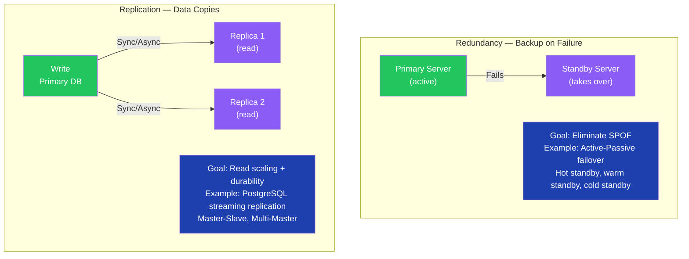

### Key Differences

| Dimension | Redundancy | Replication |
|---|---|---|
| Primary Goal | Eliminate single points of failure | Data availability + read scaling |
| When Active | Backup activates only on failure | Replicas serve traffic continuously |
| Data Sync | May not sync (hot standby does) | Always syncs data across nodes |
| Example | Active-Passive load balancer | PostgreSQL read replicas |
| Cost | Higher — idle resources | Lower — replicas serve real traffic |

### Interview Talking Points

| Question | Answer |
|---|---|
| What is redundancy? | Having backup components that take over when the primary fails — eliminates single points of failure. Types: hot (instant), warm (seconds), cold (manual). |
| What is replication? | Copying data across multiple nodes so reads can be distributed and data survives node failures. |
| Can you have both? | Yes — replicas themselves can be redundant. Production databases typically have replication for scaling plus redundancy for failover. |
| What is synchronous vs asynchronous replication? | Sync: primary waits for replica to confirm write (no data loss, higher latency). Async: primary doesn't wait (lower latency, risk of data loss on crash). |

---

## 2. IaaS — Infrastructure as a Service

### Overview
IaaS provides virtualized computing resources over the internet — servers, storage, and networking — on a pay-as-you-go basis. It forms the foundation layer of cloud computing, above which PaaS and SaaS are built.

### Cloud Service Model Diagram

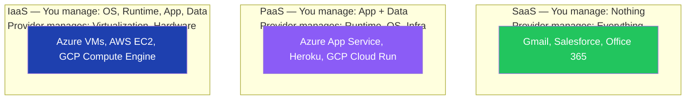

### Key IaaS Skills

```hcl
# Terraform — IaaS provisioning (Infrastructure as Code)
resource "azurerm_virtual_network" "main" {
  name                = "enterprise-vnet"
  address_space       = ["10.0.0.0/16"]
  location            = var.location
  resource_group_name = var.resource_group
}

resource "azurerm_subnet" "app" {
  name                 = "app-subnet"
  resource_group_name  = var.resource_group
  virtual_network_name = azurerm_virtual_network.main.name
  address_prefixes     = ["10.0.1.0/24"]
}

# GitOps — declarative infra managed via Git
# ArgoCD / Flux watches Git repo and syncs to cluster
```

### Interview Talking Points

| Question | Answer |
|---|---|
| What is IaaS? | Cloud service where provider manages physical hardware and virtualization. You manage OS, runtime, middleware, applications, and data. |
| What is HashiCorp Terraform? | Infrastructure as Code (IaC) tool. Defines infrastructure declaratively in HCL. Enables GitOps — infrastructure changes go through Git PRs like code. |
| What is GitOps? | Operations model where Git is the single source of truth for both application code and infrastructure configuration. Changes deployed via automated pipelines on merge. |
| What is the difference between IaaS and PaaS? | IaaS: manage everything from OS up. PaaS: provider manages OS and runtime, you manage app and data. PaaS is faster to start; IaaS gives more control. |

---

## 3. Enterprise Architecture Frameworks

### Overview
Enterprise Architecture (EA) frameworks provide standardized blueprints for aligning business goals with IT infrastructure. They guide organizations through digital transformations by structuring how people, processes, and technology interact.

### Framework Landscape Diagram

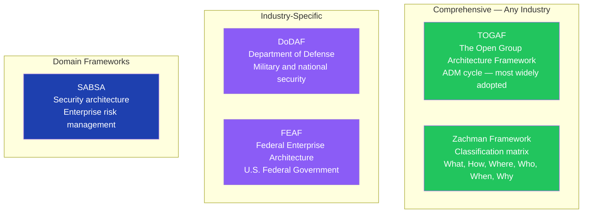

### TOGAF Architecture Development Method (ADM)

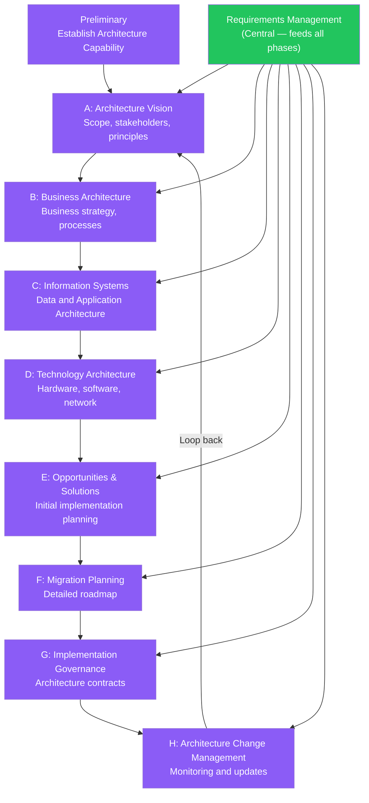

### Interview Talking Points

| Question | Answer |
|---|---|
| What is TOGAF? | The Open Group Architecture Framework — the industry-standard EA framework. Centers on the ADM (Architecture Development Method), an iterative cycle for planning, designing, implementing, and governing enterprise architectures. |
| What is the Zachman Framework? | A classification matrix (not a process) that categorizes enterprise architecture across two axes: stakeholder perspectives (executive to developer) and interrogatives (What, How, Where, Who, When, Why). |
| What is SABSA? | Sherwood Applied Business Security Architecture — an EA framework specifically for security architecture, focusing on risk management and aligning security with business objectives. |
| When would you use TOGAF vs Zachman? | TOGAF for a step-by-step methodology to design and implement architecture. Zachman for classifying and inventorying existing architecture assets across stakeholder layers. |

---

## 4. 9 Core AI Concepts

### Overview
These nine concepts form the foundational vocabulary for AI engineering interviews. From the Transformer architecture powering all modern LLMs to agent orchestration frameworks, each concept maps to a practical skill set.

### AI Concepts Map

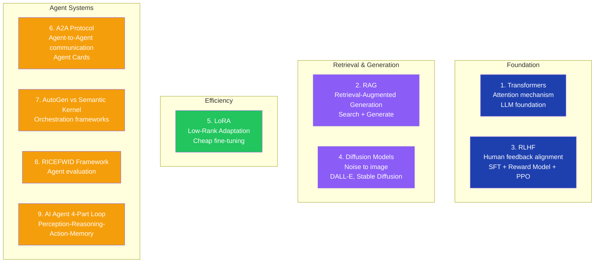

### The 9 Concepts — Detailed

**1. Transformers (LLM Foundation)**
- All modern LLMs (GPT, Claude, Gemini) are based on the Transformer architecture
- Key innovation: **Attention mechanism** — model looks at all words simultaneously and weights their importance for understanding any single word
- Unlike RNNs, Transformers process the entire sequence in parallel → enables training on massive datasets

**2. RAG — Retrieval-Augmented Generation**
- Flow: User Query → **Search Vector Store** → Retrieve relevant chunks → Augment prompt → Generate answer
- Solves: LLM training data cutoff, hallucinations on proprietary/recent data
- Stack: Embedding model + Vector DB (Pinecone, Azure AI Search) + LLM

**3. RLHF — Reinforcement Learning from Human Feedback**
- Stage 1: **SFT** (Supervised Fine-Tuning) — train on curated human-written examples
- Stage 2: **Reward Model** — trained humans rank outputs from best to worst
- Stage 3: **PPO** (Proximal Policy Optimization) — LLM trained to maximize reward model score
- Result: Helpful, harmless, honest model behavior

**4. Diffusion Models**
- Models like DALL-E, Stable Diffusion, Midjourney
- Process: Start with random noise → iteratively denoise guided by text prompt → final image
- Training: Teach model to reverse a noise-addition process

**5. LoRA — Low-Rank Adaptation**
- Problem: Full fine-tuning a 70B model requires enormous GPU memory
- Solution: Freeze original weights, inject small trainable adapter matrices (ΔW = B × A)
- Result: Fine-tune domain-specific behavior with fraction of compute/cost

**6. A2A Protocol (Agent-to-Agent)**
- Standard for AI agents to discover, identify, and communicate with each other
- **Agent Card**: A JSON metadata file (name, version, inputs, outputs, capabilities) — agents present this to identify themselves
- Enables multi-agent systems where specialized agents collaborate

**7. AutoGen vs Semantic Kernel**

| Feature | AutoGen | Semantic Kernel |
|---|---|---|
| Style | Chat-based, flexible | Plugin/tool-based, structured |
| Best For | Custom diverse agent collaboration (GroupChat) | Enterprise workflows calling existing code |
| Pattern | Conversational multi-agent | Function-calling orchestration |

**8. RICEFWID Framework (Agent Evaluation)**
- **R**esources, **I**ntent, **C**apabilities, **E**xperience, **F**eatures, **W**orkflows, **I**nputs, **D**ata
- Used to evaluate: "Does this agent have everything needed to perform this task?"

**9. AI Agent 4-Part Loop**
```
Perception  → Observe environment (read files, user input, tool results)
Reasoning   → Think and plan (chain-of-thought, tool selection)
Action      → Execute (write code, call API, search web)
Memory      → Store results (update context, episodic memory, vector store)
```

### Interview Talking Points

| Question | Answer |
|---|---|
| What is the Attention mechanism? | The core of Transformers — allows the model to weigh the importance of all input tokens relative to each other simultaneously. Enables understanding of long-range dependencies. |
| Why use RAG instead of just fine-tuning? | RAG is dynamic — retrieves up-to-date information at inference time. Fine-tuning bakes knowledge in at training time (expensive, static). Use RAG for factual grounding, fine-tuning for style/behavior. |
| What is LoRA and why does it matter for enterprises? | LoRA enables cost-effective fine-tuning of large models (~100x cheaper than full fine-tuning). Enterprises can customize base models for domain-specific tasks without massive GPU infrastructure. |
| What is an Agent Card in A2A? | A JSON document published by an agent declaring its name, version, supported inputs/outputs, and capabilities — allows other agents to discover and interact with it programmatically. |
| What is the difference between AutoGen and Semantic Kernel? | AutoGen: flexible, chat-driven multi-agent collaboration (GroupChat pattern). Semantic Kernel: structured plugin orchestration for enterprise workflows — better for calling existing enterprise functions. |

---

## 5. AI Error Regression Metrics

### Overview
Regression error metrics measure how far model predictions deviate from actual values. Choosing the right metric depends on whether you care more about outliers (large errors) or average performance.

### Metrics Comparison Diagram

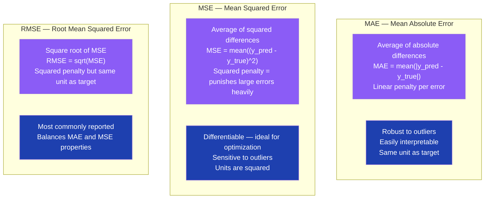

### Comparison Table

| Metric | Formula | Outlier Sensitivity | Units | Use When |
|---|---|---|---|---|
| MAE | mean(|pred - actual|) | Robust | Same as target | Outliers should not dominate |
| MSE | mean((pred - actual)²) | High | Squared | Training loss — differentiable |
| RMSE | √MSE | High | Same as target | Reporting — interpretable + penalizes large errors |

### Interview Talking Points

| Question | Answer |
|---|---|
| When would you choose MAE over RMSE? | When outliers exist in the dataset and you don't want a few large errors to dominate the metric. MAE treats all errors equally. |
| Why is MSE used as a training loss? | MSE is differentiable everywhere, making gradient descent optimization straightforward. MAE has a non-differentiable point at zero. |
| What is the relationship between MSE and RMSE? | RMSE = √MSE. RMSE is preferred for reporting because it's in the same units as the target variable, making it interpretable. |

---

## 6. Multi-Step LLM Workflows & Design Patterns

### Overview
Multi-step workflows break complex AI tasks into a sequence of LLM calls, tool invocations, and decisions. They dramatically improve reliability over single-shot prompting by enabling decomposition, tool use, and reflection.

### Workflow Patterns Diagram

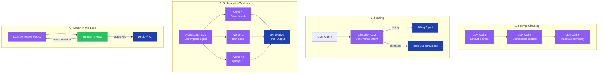

### Implementation (LangGraph pattern)

```typescript
import { StateGraph, END } from '@langchain/langgraph';

// Orchestrator-Workers pattern
const workflow = new StateGraph({
  channels: {
    task: null,
    results: null,
    finalAnswer: null,
  },
});

workflow.addNode('orchestrator', async (state) => {
  const plan = await orchestratorLLM.invoke(state.task);
  return { subtasks: plan.subtasks };
});

workflow.addNode('worker', async (state) => {
  const results = await Promise.all(
    state.subtasks.map(t => workerLLM.invoke(t))
  );
  return { results };
});

workflow.addNode('synthesizer', async (state) => {
  const finalAnswer = await synthesizerLLM.invoke({
    task: state.task,
    results: state.results,
  });
  return { finalAnswer };
});

workflow.addEdge('orchestrator', 'worker');
workflow.addEdge('worker', 'synthesizer');
workflow.addEdge('synthesizer', END);
```

### Interview Talking Points

| Question | Answer |
|---|---|
| What is Prompt Chaining? | The output of one LLM call becomes the input to the next — progressively transforms data. Good for multi-step extraction, translation, or reformatting pipelines. |
| What is the Orchestrator-Workers pattern? | A central LLM decomposes a goal into subtasks, delegates to worker agents (or tools), then synthesizes results. LangGraph is the standard framework for this. |
| What is LangGraph? | A framework for building stateful, cyclical multi-agent workflows. Represents agent logic as a graph where nodes are LLM calls or tools and edges define flow. |
| What is Human-in-the-Loop? | A checkpoint where human review is inserted before the LLM takes an irreversible action. Essential for high-stakes workflows (send email, delete data). |
| What is MCP (Model Context Protocol)? | An open standard allowing LLM agents to securely connect to external tools, servers, and data repositories — similar to a USB standard for AI tool connections. |

---

## 7. Agentic AI Deployment Patterns

### Overview
Deploying autonomous AI agents in production requires hardened patterns for reliability, safety, and observability. Production agentic systems must handle failures gracefully, limit blast radius, and provide full audit trails.

### Production Deployment Architecture

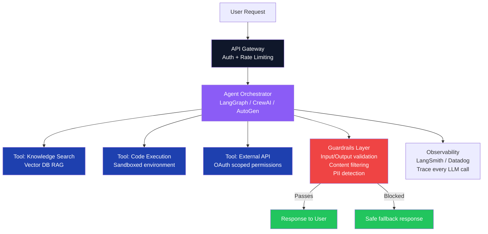

### 7 Best Practices for Production Agents

| # | Practice | Why |
|---|---|---|
| 1 | **Guardrails on inputs and outputs** | Prevent prompt injection, PII leakage, harmful content |
| 2 | **Least-privilege tool permissions** | Limit blast radius if agent is compromised |
| 3 | **Human-in-the-loop for irreversible actions** | Prevent autonomous destructive operations |
| 4 | **Full observability (trace every LLM call)** | Debug failures, audit compliance, measure cost |
| 5 | **Sandboxed code execution** | Never execute agent-generated code in production environment directly |
| 6 | **Retry with exponential backoff** | Handle transient LLM API failures gracefully |
| 7 | **Agent evaluation framework (DeepEval, ADK)** | Continuously test agent behavior against ground truth |

### Interview Talking Points

| Question | Answer |
|---|---|
| What are AI guardrails? | Input/output validation layers that filter harmful content, detect PII, enforce topic restrictions, and block prompt injection attempts. Frameworks: NeMo Guardrails, LlamaGuard. |
| What is LLMOps? | MLOps practices adapted for LLM-based applications — prompt versioning, evaluation pipelines, cost monitoring, model drift detection, and deployment automation. |
| What is DeepEval? | An open-source LLM evaluation framework that tests agents against metrics like answer relevancy, faithfulness, hallucination rate, and task completion. |
| How do you monitor agent costs in production? | Track token usage per request (input + output + cache), aggregate by user/session/feature, set budget alerts. Tools: LangSmith, Datadog LLM observability. |

---

## 8. AI Engineering Architectural Patterns

### Overview
Enterprise AI solutions combine multiple patterns — RAG for knowledge grounding, agent orchestration for autonomy, and security layers for compliance. Azure AI Foundry and OpenAI provide the managed services; architectural patterns define how they connect.

### Enterprise AI Architecture

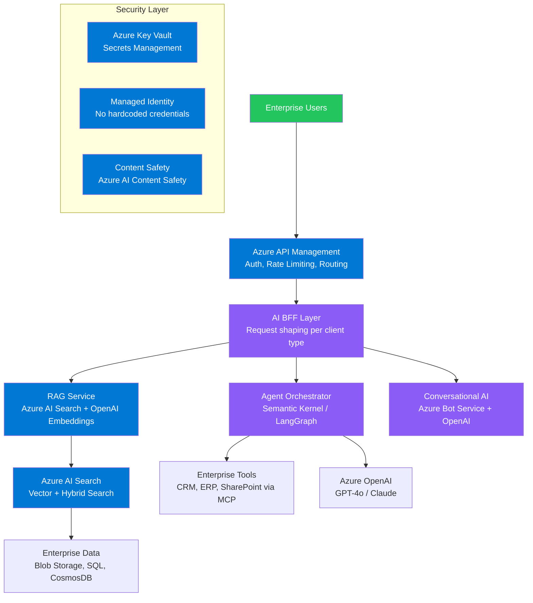

### Key Architectural Patterns

```typescript
// Pattern 1: RAG with Azure AI Search
import { SearchClient, AzureKeyCredential } from '@azure/search-documents';
import { OpenAIClient } from '@azure/openai';

async function ragQuery(userQuery: string): Promise<string> {
  const searchClient = new SearchClient(
    process.env.SEARCH_ENDPOINT!,
    'knowledge-index',
    new AzureKeyCredential(process.env.SEARCH_KEY!)
  );

  // Retrieve relevant documents
  const searchResults = await searchClient.search(userQuery, {
    queryType: 'semantic',
    semanticConfiguration: 'default',
    top: 5,
    select: ['content', 'title', 'source'],
  });

  const context = [];
  for await (const result of searchResults.results) {
    context.push(result.document.content);
  }

  // Augment prompt with retrieved context
  const openaiClient = new OpenAIClient(
    process.env.AZURE_OPENAI_ENDPOINT!,
    new AzureKeyCredential(process.env.AZURE_OPENAI_KEY!)
  );

  const response = await openaiClient.getChatCompletions('gpt-4o', [
    { role: 'system', content: `Answer based on this context:\n${context.join('\n\n')}` },
    { role: 'user', content: userQuery },
  ]);

  return response.choices[0].message?.content ?? '';
}

// Pattern 2: Managed Identity — no hardcoded credentials
import { DefaultAzureCredential } from '@azure/identity';

const credential = new DefaultAzureCredential(); // works locally (developer login) + Azure (managed identity)
const openaiClient = new OpenAIClient(endpoint, credential);
```

### Interview Talking Points

| Question | Answer |
|---|---|
| What is Azure AI Foundry? | Microsoft's unified platform for building enterprise AI applications — provides model catalog, Azure OpenAI access, AI Search, evaluation tools, and deployment management. |
| What is Semantic Kernel? | Microsoft's open-source SDK for integrating LLMs into enterprise applications. Provides plugin architecture, planner (orchestrator), memory (vector store), and connectors to enterprise services. |
| What is the difference between RAG and fine-tuning in enterprise context? | RAG: dynamic, updates automatically as knowledge base changes, no retraining cost. Fine-tuning: bakes knowledge into model weights, good for style/tone, expensive to update. Most enterprise use cases → RAG. |
| What are Structured Outputs in LLM context? | Forcing the LLM to respond in a specific JSON schema (using OpenAI `response_format` or Anthropic tool use). Eliminates parsing errors and enables reliable downstream processing. |
| What is Context Rot? | As an agent's context window accumulates tool results and intermediate reasoning, early instructions lose influence (the model "forgets" them). Mitigated by summarization, memory systems, and context windowing. |

---

## 9. API-First vs Code-First Strategy

### Overview
API-First design starts with a formal API contract before writing any code, enabling parallel team development. Code-First starts with the application and derives the API — faster for prototypes but creates integration debt.

### Comparison Diagram

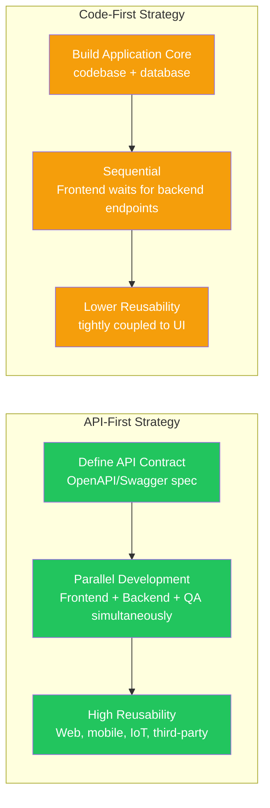

| Feature | API-First | Code-First |
|---|---|---|
| Starting Point | Formal API contract | Application codebase |
| Team Workflow | Parallel (frontend, backend, QA simultaneous) | Sequential (frontend waits for backend) |
| Reusability | High — web, mobile, IoT, third-party | Low — tightly coupled to one UI |
| Technical Debt | Less — integration designed upfront | Higher — fragmented interfaces |
| Best For | Enterprise platforms, multi-channel products | Prototypes, internal tools, simple apps |

### Interview Talking Points

| Question | Answer |
|---|---|
| What is API-First design? | The API contract (OpenAPI spec) is defined before any implementation begins. Teams can develop against mock servers in parallel — frontend, backend, QA all work simultaneously. |
| What is OpenAPI/Swagger? | A specification format for describing REST APIs in a machine-readable way (JSON/YAML). Enables auto-generated SDKs, mock servers, and documentation. |
| What are the risks of Code-First? | Sequential development bottlenecks, tightly coupled interfaces that are hard to reuse across mobile/web/IoT, higher integration bug rate. |

---

## 10. LLMOps & MLOps

### Overview
MLOps applies DevOps practices to machine learning lifecycle management. LLMOps extends this specifically for Large Language Model applications — covering prompt versioning, evaluation, cost monitoring, and production deployment of LLM-based systems.

### LLMOps Lifecycle

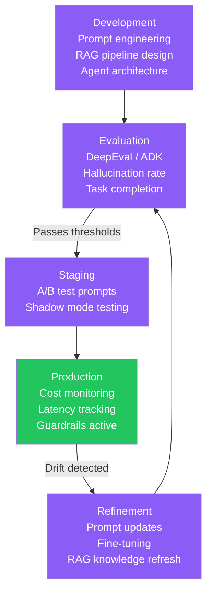

### Key LLMOps Practices

| Practice | Tool/Approach |
|---|---|
| Prompt versioning | Git-tracked prompt files, LangSmith prompt registry |
| Evaluation pipelines | DeepEval, Ragas (for RAG), Google ADK |
| Cost monitoring | Token usage dashboards, per-user budget alerts |
| Latency tracking | P50/P95/P99 per LLM call, cache hit rate |
| Model drift | Periodic evaluation against golden dataset, alert on score drop |
| Experiment tracking | MLflow, Weights & Biases, Azure ML |

### Interview Talking Points

| Question | Answer |
|---|---|
| What is LLMOps? | MLOps practices adapted for LLM apps — prompt versioning, evaluation pipelines, cost/latency monitoring, guardrails management, and production deployment automation. |
| How do you evaluate a RAG system? | Metrics: Faithfulness (answer grounded in context?), Answer Relevancy (answers the question?), Context Precision/Recall (right chunks retrieved?). Tools: Ragas, DeepEval. |
| What is prompt drift? | Over time, as base models are updated or data distributions shift, a previously well-performing prompt degrades. Caught via continuous evaluation against a golden dataset. |
| What is the difference between MLOps and LLMOps? | MLOps focuses on model training, versioning, and deployment. LLMOps focuses on prompt engineering, RAG pipeline management, cost optimization, and behavioral evaluation — the model itself is typically a third-party API. |

---

## Cross-Cutting Themes

### AI Engineering Decision Guide

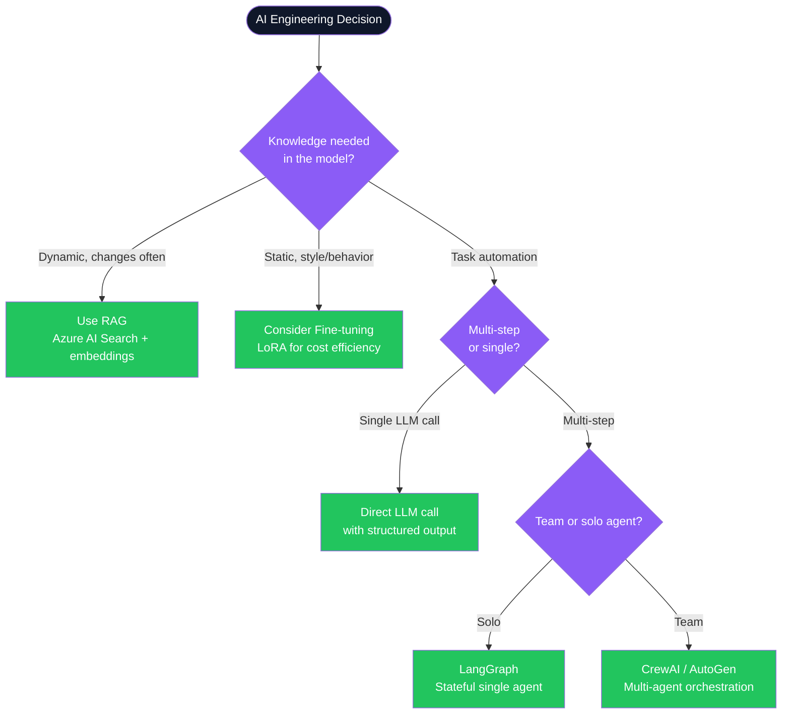

### Common Interview Red Flags

| Red Flag | Why It's Wrong | Correct Answer |
|---|---|---|
| "We fine-tune the model for all new knowledge" | Fine-tuning is expensive and static. New knowledge is stale immediately after training. | Use RAG for dynamic knowledge. Fine-tune only for style/behavior changes. |
| "Our agent has admin access to all systems" | Violates least privilege. Compromised agent via prompt injection can cause catastrophic damage. | Scope each tool permission to the minimum required operation. |
| "We skip evaluation in development — test in prod" | LLM behavior is non-deterministic. Prompt changes can silently degrade quality. | Maintain a golden evaluation dataset. Run DeepEval/Ragas on every prompt change. |
| "TOGAF is just documentation overhead" | TOGAF ADM prevents misaligned IT investments costing millions. It's a governance framework, not just docs. | Use TOGAF ADM to align architecture decisions with business goals and stakeholder requirements. |
| "We trust LLM-generated JSON directly" | LLMs hallucinate field names, types, and structures. Direct trust causes runtime crashes. | Always validate LLM JSON output against a strict Zod/JSON Schema before use. |

---

*AI Engineering & Enterprise Architecture — Complete Guide | Generated July 2026*
