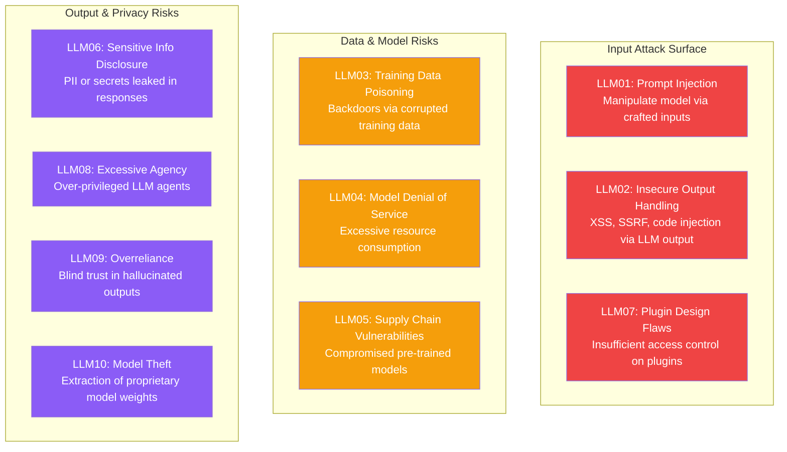
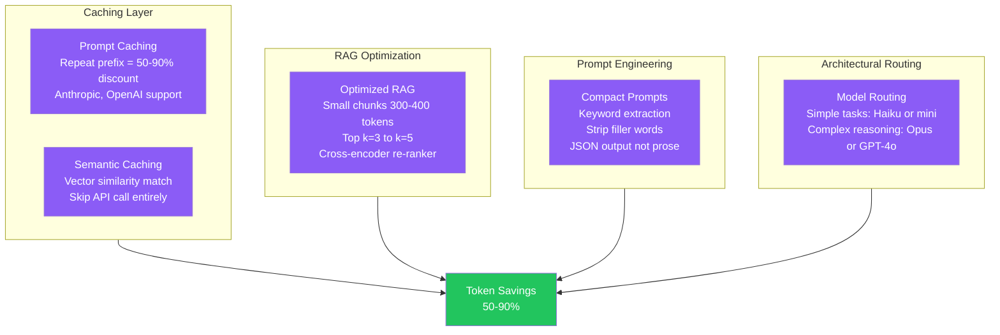
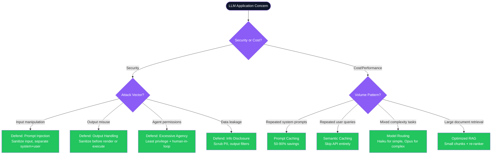

# LLM Security & Token Optimization — Complete Guide

---

## Table of Contents

1. [OWASP LLM Top 10 Security Risks](#1-owasp-llm-top-10-security-risks)
2. [Token Optimization Strategies](#2-token-optimization-strategies)
3. [Cross-Cutting Themes](#cross-cutting-themes)

---

## 1. OWASP LLM Top 10 Security Risks

### Overview
The OWASP LLM Top 10 is a standard awareness document for developers and security teams working with Large Language Model applications. It identifies the most critical security risks specific to LLM integrations — risks that differ fundamentally from traditional application security.

### Architecture Diagram



### The OWASP LLM Top 10 — Detailed

| # | Risk | Description | Mitigation |
|---|---|---|---|
| LLM01 | **Prompt Injection** | Attacker injects instructions into user input that override the system prompt and hijack model behavior. Direct (user input) or indirect (external data fetched by the LLM). | Input validation, output parsing, privilege separation, never embed secrets in system prompts. |
| LLM02 | **Insecure Output Handling** | LLM output is passed unsanitized to downstream systems (browsers, SQL, shell) enabling XSS, SQLi, SSRF. | Treat all LLM output as untrusted user input. Sanitize before rendering or executing. |
| LLM03 | **Training Data Poisoning** | Malicious data injected into training/fine-tuning datasets introduces backdoors or biases. | Audit training data provenance, use adversarial testing, monitor model behavior drift. |
| LLM04 | **Model Denial of Service** | Adversarial prompts cause excessive compute (very long chains-of-thought, recursive loops). | Rate limiting, max token limits per request, circuit breakers on inference endpoints. |
| LLM05 | **Supply Chain Vulnerabilities** | Compromised third-party models, datasets, or plugins introduce malware or backdoors. | Pin model versions, audit dependencies, use checksums for model weights, prefer trusted hubs. |
| LLM06 | **Sensitive Info Disclosure** | Model leaks PII, credentials, or internal system details from training data or context window. | Scrub PII from training data, implement output filters, minimize data in context window. |
| LLM07 | **Insecure Plugin Design** | LLM plugins granted excessive permissions; attacker uses prompt injection to trigger privileged plugin actions. | Least-privilege principle for plugins, OAuth scopes, user confirmation for destructive actions. |
| LLM08 | **Excessive Agency** | LLM agent granted too many permissions (write DB, send email, delete files) without human oversight. | Least privilege, human-in-the-loop for irreversible actions, audit logs for all agent actions. |
| LLM09 | **Overreliance** | Developers or users blindly trust LLM outputs, leading to decisions based on hallucinations. | Human review for high-stakes outputs, RAG for factual grounding, output confidence scoring. |
| LLM10 | **Model Theft** | Attacker extracts proprietary model behavior via repeated queries (model extraction attack). | Rate limiting, output watermarking, monitoring for systematic querying patterns. |

### Code: Prompt Injection Defense

```typescript
// Defense: Separate system instructions from user content
function buildSecurePrompt(systemInstructions: string, userInput: string): string {
  // Never concatenate — keep structural separation
  return {
    system: systemInstructions,  // controlled by application
    user: sanitize(userInput),   // untrusted — always sanitize
  };
}

function sanitize(input: string): string {
  // Remove known injection patterns
  return input
    .replace(/ignore previous instructions/gi, '[FILTERED]')
    .replace(/system prompt/gi, '[FILTERED]')
    .slice(0, 2000); // enforce max input length
}

// Defense: Treat LLM output as untrusted before rendering
function renderLLMOutput(output: string): string {
  return DOMPurify.sanitize(output, { ALLOWED_TAGS: ['b', 'i', 'p', 'br'] });
}

// Defense: Least privilege for LLM agents
const agentTools = [
  { name: 'searchKnowledgeBase', permissions: ['read'] },     // read-only
  { name: 'createDraftEmail', permissions: ['draft'] },        // no send permission
  // Never: { name: 'deleteFiles', permissions: ['write', 'delete'] }
];
```

### Interview Talking Points

| Question | Answer |
|---|---|
| What is Prompt Injection? | An attacker embeds instructions in user input (or external data) that override the LLM's system prompt — similar to SQL injection but for natural language. |
| What is the difference between direct and indirect prompt injection? | Direct: user types malicious instructions. Indirect: LLM retrieves external content (webpage, doc) containing hidden instructions that hijack behavior. |
| What is Excessive Agency (LLM08)? | Granting an LLM agent too many permissions. If compromised via prompt injection, the agent can take destructive irreversible actions (delete data, send emails). |
| How do you prevent sensitive info disclosure? | Scrub PII from training data, use output filtering, avoid putting secrets in system prompts, and minimize context window size. |
| What is Training Data Poisoning? | Injecting malicious examples into training data to introduce backdoors — the model behaves normally except on specially crafted trigger inputs. |

---

## 2. Token Optimization Strategies

### Overview
LLM API costs scale directly with token usage, and inference latency scales with context length. Token optimization reduces both — lowering cost by 50–90% in high-traffic systems while also improving response speed. Key strategies range from caching (avoiding redundant API calls) to architectural routing (matching model size to task complexity).

### Strategy Overview Diagram



### Strategy 1 — Prompt Caching

```typescript
// Anthropic prompt caching — cache_control marks the static prefix
import Anthropic from '@anthropic-ai/sdk';

const client = new Anthropic();

async function queryWithCache(userQuestion: string) {
  return client.messages.create({
    model: 'claude-sonnet-4-6',
    max_tokens: 1024,
    system: [
      {
        type: 'text',
        text: LARGE_SYSTEM_PROMPT,   // 10,000 token knowledge base
        cache_control: { type: 'ephemeral' }, // cached for 5 min — 90% cost reduction on repeats
      }
    ],
    messages: [{ role: 'user', content: userQuestion }],
  });
}
```

### Strategy 2 — Semantic Caching

```typescript
import { createClient } from 'redis';
import { OpenAIEmbeddings } from '@langchain/openai';

const redis = createClient();
const embeddings = new OpenAIEmbeddings();

async function semanticCache(query: string, threshold = 0.95) {
  const queryEmbedding = await embeddings.embedQuery(query);

  // Search for semantically similar past queries
  const cached = await redis.ft.search('idx:queries', `*`, {
    VECTOR_FIELD: 'embedding',
    KNN: 1,
    RETURN: ['response', 'score'],
  });

  if (cached.documents[0]?.score >= threshold) {
    return cached.documents[0].value.response; // return cached — no API call
  }

  // Cache miss — call LLM
  const response = await callLLM(query);
  await storeInCache(query, queryEmbedding, response);
  return response;
}
```

### Strategy 3 — RAG Optimization

```typescript
// Optimized RAG — small chunks + re-ranker
import { RecursiveCharacterTextSplitter } from 'langchain/text_splitter';

const splitter = new RecursiveCharacterTextSplitter({
  chunkSize: 350,       // 300-400 tokens sweet spot
  chunkOverlap: 50,     // small overlap for context continuity
});

async function optimizedRetrieval(query: string, vectorStore: VectorStore) {
  // Step 1: Retrieve top-k candidates
  const candidates = await vectorStore.similaritySearch(query, 10);

  // Step 2: Re-rank with cross-encoder (expensive but precise)
  const reranked = await crossEncoderRerank(query, candidates);

  // Step 3: Use only top 3-5 (not all 10)
  return reranked.slice(0, 4); // ~1,400 tokens max in context
}
```

### Strategy 4 — Model Routing

```typescript
type TaskComplexity = 'simple' | 'moderate' | 'complex';

function classifyTask(prompt: string): TaskComplexity {
  if (prompt.length < 200 && !prompt.includes('analyze') && !prompt.includes('reason')) {
    return 'simple';
  }
  if (prompt.includes('compare') || prompt.includes('summarize')) {
    return 'moderate';
  }
  return 'complex';
}

async function routedLLMCall(prompt: string): Promise<string> {
  const complexity = classifyTask(prompt);

  const modelMap: Record<TaskComplexity, string> = {
    simple: 'claude-haiku-4-5-20251001',      // cheapest — classification, extraction
    moderate: 'claude-sonnet-4-6',             // balanced
    complex: 'claude-opus-4-8',                // most capable — reasoning, analysis
  };

  return callLLM(prompt, modelMap[complexity]);
}
```

### Token Optimization Impact Table

| Strategy | Token Savings | Best For |
|---|---|---|
| Prompt Caching | 50–90% on cached prefix | Large static system prompts, few-shot examples |
| Semantic Caching | Up to 100% (no API call) | High-volume apps with repeated query patterns |
| RAG chunk optimization | 30–60% | Document Q&A, knowledge retrieval |
| Compact prompt engineering | 20–40% | All prompts — strip filler words, use JSON output |
| Model routing | 60–80% cost reduction | Mixed workloads — simple vs complex tasks |

### Interview Talking Points

| Question | Answer |
|---|---|
| What is prompt caching? | Provider-level feature where a static prefix (system prompt, few-shot examples) is cached. Repeated calls reuse the cached KV state — 50-90% token cost reduction. |
| What is semantic caching? | Uses vector embeddings to detect semantically similar past queries and return cached responses — skipping the LLM API call entirely. |
| What chunk size is optimal for RAG? | 300–400 tokens with small overlap (~50 tokens). Too large = irrelevant context in window. Too small = loss of coherent meaning. |
| What is a cross-encoder re-ranker? | A model that scores query-document pairs for relevance. More accurate than cosine similarity. Used after initial retrieval to select the best k=3-5 chunks. |
| What is the model routing strategy? | Use cheap/fast models (Haiku, GPT-4o-mini) for simple classification/extraction. Reserve expensive models (Opus, GPT-4o) for complex multi-step reasoning. |

---

## Cross-Cutting Themes

### LLM Security + Token Optimization Decision Guide



### Common Red Flags to Avoid

| Red Flag | Why It's Wrong | Correct Answer |
|---|---|---|
| "We validate prompts client-side only" | Prompt injection bypasses client-side checks — the attack reaches the LLM. | Validate and sanitize server-side before forwarding to LLM. |
| "Our system prompt is secret so we're safe" | System prompts can be exfiltrated via prompt injection. Security through obscurity fails. | Never put secrets in system prompts. Use secrets management (Key Vault). |
| "We use one GPT-4o call for everything" | Expensive for simple tasks. Use model routing — Haiku/mini for classification, Opus for reasoning. | Route by complexity — 80% of tasks can use cheap models. |
| "We feed entire documents to the LLM" | Wastes tokens and adds noise. LLMs perform worse with irrelevant context. | Use RAG with optimized chunking (300-400 tokens, top k=3-5). |
| "We trust LLM JSON output directly" | LLM output is untrusted. Malformed JSON or injected code can break downstream systems. | Parse with strict schema validation (Zod), reject unexpected fields. |

---

*LLM Security & Token Optimization Guide | Generated July 2026*
