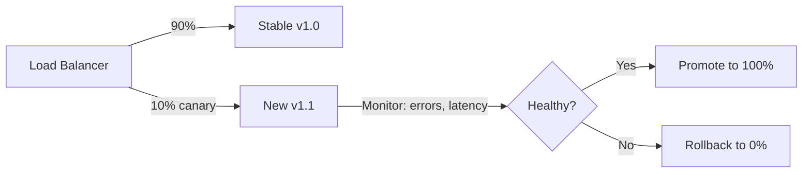
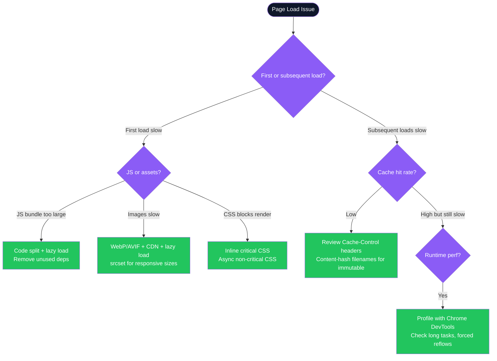

# Senior Front-End Interview MCQ Guide — Complete Reference

---

## Table of Contents

1. [UI & Mobile Design Concepts](#1-ui--mobile-design-concepts)
2. [Mobile View, Android & iOS Concepts](#2-mobile-view-android--ios-concepts)
3. [Front-End Security & Scalability](#3-front-end-security--scalability)
4. [Progressive Web Apps (PWAs)](#4-progressive-web-apps-pwas)
5. [CI/CD for Web Deployment](#5-cicd-for-web-deployment)
6. [Performance Best Practices](#6-performance-best-practices)
7. [PSU-Style Deep Questions](#7-psu-style-deep-questions)
8. [Cross-Cutting Themes](#cross-cutting-themes)

> **Target:** Senior front-end engineer/architect with 5–8 years experience
> **Format:** MCQ with correct answer + explanation + interview expansion

---

## 1. UI & Mobile Design Concepts

---

**Q1. Which CSS property creates a responsive grid without media queries?**

```
a. display: flex;
b. display: grid;
c. grid-template-columns: repeat(auto-fit, minmax(250px, 1fr));
d. flex-wrap: wrap;
```

**Answer: C**

`repeat(auto-fit, minmax(250px, 1fr))` creates columns that automatically adjust to fill available space. `auto-fit` collapses empty tracks; `minmax()` guarantees a minimum width while allowing growth. No media queries needed.

```css
/* Responsive card grid — no media queries */
.grid {
  display: grid;
  grid-template-columns: repeat(auto-fit, minmax(250px, 1fr));
  gap: 1rem;
}
```

---

**Q2. What is the primary advantage of a 'thumb-friendly' mobile design approach?**

```
a. Reduces taps required for navigation
b. Places key elements within easy reach of a user's thumb
c. Optimizes for biometric security
d. Primarily for left-handed users
```

**Answer: B**

Thumb zones recognize that most users hold phones with one hand. Critical CTAs and navigation belong in the lower third of the screen — easily reachable without repositioning grip.

```
Phone screen zones (portrait):
┌─────────────────┐
│  Hard to reach  │  ← Settings, profile (less frequent)
│─────────────────│
│  Natural zone   │  ← Content, lists
│─────────────────│
│  Thumb zone     │  ← Primary CTAs, nav bar ✅
└─────────────────┘
```

---

**Q3. Which accessibility standard is the current W3C recommendation?**

```
a. WCAG 1.0
b. WAI-ARIA
c. A11Y
d. WCAG 2.1
```

**Answer: D**

WCAG 2.1 is the current W3C standard. WAI-ARIA is a technique for implementing accessibility (not a standard itself). A11Y is a numeronym (shorthand) for "accessibility".

**WCAG 2.1 levels:** A (minimum) → AA (legal requirement in most jurisdictions) → AAA (highest)

---

**Q4. Primary UX benefit of SPA over MPA?**

```
a. Better SEO
b. Faster initial page load
c. Smoother, dynamic UX without full page reloads
d. Simpler server logic
```

**Answer: C**

SPAs load resources once, then dynamically update DOM — app-like feel with no page flashes. Trade-off: slower initial load (JS bundle) and weaker SEO vs MPA.

---

**Q5. Which platform design guideline emphasizes flat design with clarity and simplicity?**

```
a. Material Design
b. Fluent Design
c. Human Interface Guidelines
d. Metro UI
```

**Answer: C**

Apple's Human Interface Guidelines (HIG) govern iOS, macOS, watchOS design. Emphasizes minimalism, clarity, depth. Material Design is Google's system (Android/web). Fluent Design is Microsoft's.

---

**Q6. What does `clip-path: inset(100%)` do for accessibility?**

```
a. display: none — removes from DOM and accessibility tree
b. visibility: hidden — hides but keeps space
c. opacity: 0 — invisible but focusable (problematic)
d. clip-path: inset(100%) — visually hidden, fully accessible to screen readers ✅
```

**Answer: D**

`display:none` and `visibility:hidden` remove content from the accessibility tree — screen readers can't find it. `clip-path: inset(100%)` clips to zero-size box visually while keeping the element fully accessible.

```css
/* Screen-reader-only utility class */
.sr-only {
  clip-path: inset(100%);
  clip: rect(0 0 0 0);
  height: 1px;
  overflow: hidden;
  position: absolute;
  white-space: nowrap;
  width: 1px;
}
```

---

**Q7. What is Progressive Enhancement?**

```
a. Start rich, scale down for simpler devices (Graceful Degradation)
b. Start basic and functional, add advanced features for capable browsers ✅
c. Use only latest CSS/JS features
d. Design for one target device
```

**Answer: B**

Progressive Enhancement: core content works everywhere → enhanced experience added for capable browsers. Opposite: Graceful Degradation (start rich, degrade). PE is the more resilient strategy.

---

### Interview Talking Points — UI & Mobile Design

| Question | Answer |
|---|---|
| What is the difference between `em` and `rem`? | `em` is relative to parent font-size; `rem` is relative to root (`html`) font-size. Prefer `rem` for consistent scaling that respects user's browser font preferences. |
| What is `contain: layout` CSS property? | Tells the browser this element's layout doesn't affect the rest of the page — optimization hint that enables more efficient rendering. |
| What is a Design Token? | A named, platform-agnostic design value (color, spacing, typography) stored in a single source of truth. Consumed by web, iOS, Android — ensures consistency across platforms. |

---

## 2. Mobile View, Android & iOS Concepts

---

**Q8. What does `grid-template-columns: repeat(auto-fit, minmax(250px, 1fr))` create?**
*(See Q1 above)*

---

**Q9. What viewport meta tag prevents zoom on mobile?**

```
a. <meta name="viewport" content="width=device-width, height=device-height">
b. <meta name="viewport" content="initial-scale=1.0, maximum-scale=1.0">
c. <meta name="viewport" content="user-scalable=no">
d. <meta name="viewport" content="width=device-width, initial-scale=1.0, user-scalable=no"> ✅
```

**Answer: D**

`user-scalable=no` disables pinch-to-zoom. Combined with `width=device-width, initial-scale=1.0` ensures correct initial rendering. Note: Disabling zoom can harm accessibility — use with caution.

---

**Q10. What is true about browser rendering engines on iOS vs Android?**

```
a. Both use WebKit
b. Android uses Blink; iOS uses different engine
c. Apple mandates all iOS browsers use WebKit ✅
d. All Android browsers must use Chromium
```

**Answer: C**

Apple's App Store policy requires all third-party browsers on iOS (Chrome, Firefox, Edge) to use WebKit. This is a critical cross-platform consideration — CSS/JS behavior can differ between iOS Chrome and Android Chrome despite same brand.

---

**Q11. Best practice for fixed header/footer on mobile?**

```
a. Use position: absolute
b. Hide with media query on mobile
c. Add padding to content equal to fixed element height ✅
d. Replace with hamburger menu
```

**Answer: C**

A fixed element always overlays content. The reliable solution: `padding-top` or `padding-bottom` on the main content area equal to the fixed element's height. Dynamic heights require JS measurement.

```css
/* Dynamic approach */
:root {
  --header-height: 64px;
}

main {
  padding-top: var(--header-height);
}
```

---

**Q12. What is a 'Fluid Grid' in responsive design?**

```
a. Fixed pixel widths
b. Columns defined with percentages ✅
c. Grid that changes column count with screen size
d. CSS Flexbox grid
```

**Answer: B**

A fluid grid uses relative units (%, fr, vw) for column widths — the layout scales smoothly with viewport size. Combined with CSS Grid `auto-fit/auto-fill`, it eliminates media query breakpoints for many layouts.

---

### Interview Talking Points — Mobile & Cross-Platform

| Question | Answer |
|---|---|
| What is the difference between native and cross-platform apps? | Native: built per platform (Swift/Kotlin) — best performance and OS integration. Cross-platform (React Native, Flutter): one codebase — faster dev, but limited to shared APIs, potential performance overhead. |
| What is WKWebView on iOS? | Apple's modern web view component. All iOS browsers use it (WebKit). Important for PWAs — some Web APIs available in Safari desktop may not be available in WKWebView. |
| What is Jetpack Compose? | Android's modern declarative UI framework (2021+) — similar to React. Replaces XML layouts and the View system. State-driven, composable functions. |

---

## 3. Front-End Security & Scalability

---

**Q13. Most effective defense against XSS?**

```
a. Using HTTPS
b. Sanitizing and encoding user content before rendering
c. Implementing CSP
d. All of the above ✅
```

**Answer: D**

Defense-in-depth: sanitize/encode (primary), CSP (second line of defense), HTTPS (prevents man-in-the-middle). No single measure is sufficient; combine all three.

---

**Q14. Primary benefit of component-based architecture (React/Vue/Angular)?**

```
a. Makes app run faster
b. Simplifies back-end development
c. Promotes reusability, maintainability, parallel development ✅
d. Required for all modern apps
```

**Answer: C**

Component-based architectures break UI into independent, reusable pieces. Benefits: parallel team development, isolated testing, consistent UI patterns via design systems.

---

**Q15. How to mitigate single point of failure in front-end?**

```
a. Single large JS file
b. Micro-frontend architecture ✅
c. Host on single server
d. Monolithic design pattern
```

**Answer: B**

Micro-frontends decompose the app into independently deployable units. One team's deployment failure doesn't affect others. Enables true horizontal scaling of development teams.

---

**Q16. Most robust defense against CSRF?**

```
a. HTTPS
b. SameSite cookie policy
c. CSRF token in forms and API requests ✅
d. All equally effective
```

**Answer: C**

CSRF tokens (synchronized token pattern) are the most direct defense. A unique per-session token is validated server-side, ensuring the request is genuine. `SameSite=Strict` is a strong secondary defense but has browser compatibility nuances.

---

**Q17. Primary security risk that CSP mitigates?**

```
a. SQL Injection
b. DDoS
c. XSS and data injection attacks ✅
d. Phishing
```

**Answer: C**

Content Security Policy restricts which sources browsers can load scripts, styles, images from. A strict CSP blocks inline scripts and unknown origins — the primary XSS delivery mechanisms.

```http
Content-Security-Policy: default-src 'self'; script-src 'self' https://trusted.cdn.com; object-src 'none';
```

---

### Interview Talking Points — Security & Scalability

| Question | Answer |
|---|---|
| What is the difference between authentication and authorization? | Authentication: verify identity (who you are — login). Authorization: verify permissions (what you can do — access control). |
| What is CORS? | Cross-Origin Resource Sharing — browser security mechanism that restricts web pages from making API requests to a different domain. Server controls allowed origins via `Access-Control-Allow-Origin` header. |
| What is `Subresource Integrity (SRI)`? | HTML attribute (`integrity="sha256-..."`) that makes browsers verify CDN-served scripts haven't been tampered with. Defense against supply chain attacks. |

---

## 4. Progressive Web Apps (PWAs)

---

**Q18. Most critical technology for a PWA?**

```
a. Large JS framework like React
b. Server-Side Rendering
c. A Service Worker ✅
d. Dedicated mobile app
```

**Answer: C**

Service Workers are the core of PWAs — they run in the background, intercept network requests, and enable offline support, push notifications, and background sync. A PWA without a Service Worker is just a website.

---

**Q19. Primary function of Web App Manifest?**

```
a. Cache for offline assets (that's the Service Worker cache)
b. Provide meta-info: name, icon, display mode for "Add to Home Screen" ✅
c. Handle routing and navigation
d. Store user data locally
```

**Answer: B**

```json
{
  "name": "My PWA App",
  "short_name": "MyApp",
  "start_url": "/",
  "display": "standalone",
  "background_color": "#ffffff",
  "theme_color": "#0078D4",
  "icons": [
    { "src": "/icon-192.png", "sizes": "192x192", "type": "image/png" },
    { "src": "/icon-512.png", "sizes": "512x512", "type": "image/png" }
  ]
}
```

---

**Q20. Key benefit of PWA vs native app?**

```
a. Only on Google Play Store
b. Access all native hardware without permission
c. Discoverable via search engines and shareable via URL ✅
d. Larger installation size
```

**Answer: C**

PWAs are websites — indexed by search engines, shareable with a URL, no app store required. This dramatically reduces acquisition friction vs native apps.

---

**Q21. PWA background push notifications require?**

```
a. WebSockets
b. localStorage
c. Service Workers + Push API ✅
d. navigator.geolocation
```

**Answer: C**

The Service Worker registers with a push service (FCM/APNS). When the server sends a push message via the Push API, the Service Worker wakes and displays the notification — even when the app is closed.

---

### Service Worker Caching Strategies

```typescript
// Workbox — production caching strategies
import { CacheFirst, NetworkFirst, StaleWhileRevalidate } from 'workbox-strategies';
import { registerRoute } from 'workbox-routing';

// Static assets — cache first (fast, long TTL)
registerRoute(
  ({ request }) => request.destination === 'image',
  new CacheFirst({ cacheName: 'images', plugins: [new ExpirationPlugin({ maxEntries: 50 })] })
);

// API data — network first (fresh data, offline fallback)
registerRoute(
  ({ url }) => url.pathname.startsWith('/api/'),
  new NetworkFirst({ cacheName: 'api-responses', networkTimeoutSeconds: 3 })
);

// HTML pages — stale-while-revalidate (fast + fresh)
registerRoute(
  ({ request }) => request.mode === 'navigate',
  new StaleWhileRevalidate({ cacheName: 'pages' })
);
```

### Interview Talking Points — PWAs

| Question | Answer |
|---|---|
| What is Application Shell Architecture? | Separates the minimal UI shell (header, nav, skeleton) — cached statically — from dynamic content fetched on demand. Shell loads instantly from cache; content streams in. |
| What is the installability criteria for a PWA? | Must be served over HTTPS, have a Service Worker with a fetch event handler, and a valid Web App Manifest with required fields (name, icons, start_url, display). |
| What are the PWA limitations on iOS? | Limited push notification support (added in iOS 16.4+), no background sync, restricted access to some APIs. All browsers on iOS use WebKit, limiting some capabilities. |

---

## 5. CI/CD for Web Deployment

---

**Q22. What happens during the CI (Continuous Integration) phase?**

```
a. Deploy to production
b. Push code to Git
c. Run automated tests and code analysis ✅
d. Manual cross-browser testing
```

**Answer: C**

CI: on every push/PR, automatically run: lint → type check → unit tests → integration tests → security scan. Fast feedback loop catches issues before merge.

---

**Q23. Purpose of the build step in CI/CD?**

```
a. Install dependencies
b. Transpile and bundle source code for production ✅
c. Run E2E tests
d. Deploy to server
```

**Answer: B**

Build step: TypeScript → JavaScript, JSX → JS, SCSS → CSS, tree-shake, minify, chunk-split, generate source maps. Output: optimized production-ready files.

---

**Q24. Key benefit of Canary Deployment?**

```
a. Deploys to all users at once
b. Tests new version on small user subset before full rollout ✅
c. Simple low-risk strategy for all apps
d. Requires manual intervention
```

**Answer: B**

Canary: route 5-10% of traffic to new version. Monitor error rates, performance metrics. If healthy → gradual increase to 100%. If issues → instant rollback to 0%.



---

### Interview Talking Points — CI/CD

| Question | Answer |
|---|---|
| What is Blue-Green deployment? | Two identical production environments (Blue = current, Green = new). Switch all traffic instantly via load balancer. Zero-downtime deploy; instant rollback by switching back. |
| What is a feature flag? | A runtime toggle that enables/disables features without deployment. Enables dark launches (deploy code to production but keep feature off), gradual rollouts, and A/B testing. |
| What is the difference between CI and CD? | CI: automatically build and test on every commit. CD (Continuous Delivery): automatically deploy to staging, human approves production. CD (Continuous Deployment): automatic all the way to production. |

---

## 6. Performance Best Practices

---

**Q25. Most effective technique to improve critical rendering path?**

```
a. Delay all CSS/JS until after page load
b. Inline critical CSS to eliminate render-blocking requests ✅
c. Serve all assets from a single server
d. Use many HTTP requests
```

**Answer: B**

Inlining critical (above-fold) CSS in `<head>` removes the render-blocking stylesheet request. Page renders without a network round-trip. Non-critical CSS loaded asynchronously.

---

**Q26. Primary benefit of a module bundler like Webpack/Vite?**

```
a. Browser compatibility for older browsers (that's Babel)
b. Browser understands JSX directly (it doesn't)
c. Combines modules into optimized bundles, reduces HTTP requests ✅
d. Mandatory for all projects
```

**Answer: C**

Bundlers: tree-shake dead code, code-split chunks, transpile TypeScript/JSX, optimize assets, generate source maps. Vite uses esbuild for dev (fast), Rollup for production.

---

**Q27. Primary use of Intersection Observer API?**

```
a. Detect element clicks
b. Detect when elements enter/leave viewport — lazy loading, infinite scroll ✅
c. Server-side data fetching
d. Browser history management
```

**Answer: B**

Intersection Observer is the performant alternative to scroll event listeners. Fires callbacks when an element's visibility in the viewport changes — no continuous polling.

```typescript
const observer = new IntersectionObserver(
  (entries) => {
    entries.forEach(entry => {
      if (entry.isIntersecting) {
        loadImage(entry.target);
        observer.unobserve(entry.target); // stop observing once loaded
      }
    });
  },
  { rootMargin: '100px' } // pre-load 100px before entering viewport
);

document.querySelectorAll('img[data-src]').forEach(img => observer.observe(img));
```

---

**Q28. Key benefit of CSS preprocessors (Sass/Less)?**

```
a. Makes CSS smaller automatically
b. Variables, mixins, functions — improves organization and maintainability ✅
c. Automatically minifies CSS
d. Mandatory in modern development
```

**Answer: B**

```scss
// Sass variables, nesting, mixins
$primary: #0078D4;
$breakpoint-md: 768px;

@mixin respond-to($bp) {
  @media (min-width: $bp) { @content; }
}

.button {
  background: $primary;
  
  &:hover { background: darken($primary, 10%); }
  
  @include respond-to($breakpoint-md) {
    padding: 1rem 2rem;
  }
}
```

---

**Q29. Most effective technique for large front-end app initial load?**

```
a. Increase server processing power
b. Use CDN for static assets ✅
c. Combine all JS into single file
d. Reduce images on page
```

**Answer: B**

CDN serves assets from edge nodes geographically close to users. A user in Mumbai gets assets from a Mumbai edge node, not a US origin server — 5ms vs 200ms. Combined with content-hashed filenames for long TTL caching.

---

**Q30. What is `Cache-Control` HTTP header?**

```
a. Content-Type
b. Authorization
c. Cache-Control ✅ — defines caching policy for a resource
d. Location
```

**Answer: C**

```http
# Immutable static assets (hashed filename — cache 1 year)
Cache-Control: public, max-age=31536000, immutable

# HTML pages (revalidate frequently)
Cache-Control: public, max-age=0, must-revalidate

# API responses (no cache)
Cache-Control: no-store
```

---

### Interview Talking Points — Performance

| Question | Answer |
|---|---|
| What is RAIL performance model? | Response (< 100ms), Animation (60fps = 16ms/frame), Idle (use idle time for background work), Load (< 5s on 3G). Google's framework for thinking about web performance. |
| What is Long Task in browser performance? | Any JS task taking > 50ms blocks the main thread, causing unresponsive UI. Detect with `PerformanceObserver` observing `longtask`. Fix by breaking into smaller tasks with `setTimeout` or Web Workers. |
| What is the difference between paint and layout in the rendering pipeline? | Layout (reflow): calculate element positions and sizes. Paint: fill pixels. Composite: layer rendering. Triggering layout is most expensive — avoid `offsetWidth`, `scrollTop` reads inside animation loops. |

---

## 7. PSU-Style Deep Questions

---

**Q31. Where should non-critical JavaScript be placed in HTML?**

```
a. In <head>
b. At end of <body> ✅
c. After <title>
d. Before <head>
```

**Answer: B**

Scripts at end of `<body>` ensure HTML/DOM is fully rendered before JS executes — users see content faster. Modern alternative: `<script defer src="...">` in `<head>` achieves the same effect with better organization.

---

**Q32. Key difference between `localStorage` and `sessionStorage`?**

```
a. localStorage stores only strings (both do)
b. localStorage persists after browser close; sessionStorage cleared when tab closes ✅
c. Both have same capacity
d. Neither suitable for sensitive info (both true but not the key difference asked)
```

**Answer: B**

- `localStorage`: persistent — survives browser restarts, shared across tabs of same origin
- `sessionStorage`: ephemeral — cleared when tab/window closes, isolated per tab

---

**Q33. What is `aria-label`?**

```
a. Provides a tooltip
b. Provides a text label for non-visual elements for screen readers ✅
c. Styles an element
d. Links to a URL
```

**Answer: B**

`aria-label` is essential for icon buttons and non-textual interactive elements. Without it, screen readers announce "button" with no context.

```html
<!-- Without aria-label: screen reader says "button" -->
<button><svg><!-- search icon --></svg></button>

<!-- With aria-label: screen reader says "Search" -->
<button aria-label="Search"><svg><!-- search icon --></svg></button>
```

---

**Q34. Primary drawback of CSR?**

```
a. Slower initial load and poor SEO ✅
b. Faster initial load and better SEO
c. Only for desktop
d. Server handles all rendering
```

**Answer: A**

CSR sends an empty HTML shell. Time to First Contentful Paint is slow (JS must download, parse, execute, fetch data). Search engine crawlers may not wait for JS execution — poor SEO unless dynamic rendering is added.

---

**Q35. What is Tree Shaking?**

```
a. Organizing files in a project
b. Build optimization removing unused code from the final bundle ✅
c. Re-rendering DOM efficiently
d. Testing method
```

**Answer: B**

Tree shaking analyzes the import graph and removes code that is never imported (dead code). Requires ES module syntax (`import`/`export`) — CommonJS `require()` is not statically analyzable.

---

**Q36. Key consideration for high-performance mobile front-end?**

```
a. Load all resources synchronously
b. Minimize DNS lookups and HTTP requests ✅
c. Single large background image
d. Use position: fixed for all elements
```

**Answer: B**

Every DNS lookup adds ~20-120ms latency. HTTP requests add RTT. Mitigations: bundle JS/CSS, use CSS sprites, preconnect to critical third parties, HTTP/2 multiplexing. Critical on 3G/4G mobile networks.

```html
<!-- Preconnect to critical third-party origins -->
<link rel="preconnect" href="https://fonts.googleapis.com" />
<link rel="dns-prefetch" href="https://api.example.com" />
```

---

### Interview Talking Points — PSU-Style

| Question | Answer |
|---|---|
| What is the difference between `defer` and placing script at end of `<body>`? | Both execute after DOM is parsed. `defer` loads the script in parallel with HTML parsing — faster overall. End-of-body starts downloading only after HTML is fully parsed. |
| What is HTTP/2 and how does it help performance? | HTTP/2 enables multiplexing (multiple requests over one TCP connection), header compression, and server push. Eliminates need to bundle files specifically to reduce connections. |
| What is the purpose of a `rel="preload"` link? | Tells browser to download a resource at high priority as early as possible — without blocking rendering or executing it yet. Use for critical fonts, hero images, above-fold scripts. |

---

## Cross-Cutting Themes

### Performance Budget Decision Guide



### Common Red Flags in Interviews

| Red Flag | Why It's Wrong | Correct Answer |
|---|---|---|
| "We put all JS in `<head>` without defer/async" | Blocks HTML parsing — user sees blank page until JS downloads. | Use `defer` for app bundles, `async` for independent analytics scripts. |
| "We use `display:none` for screen-reader-only content" | `display:none` removes from accessibility tree — screen readers can't find it. | Use `.sr-only` class with `clip-path: inset(100%)`. |
| "We deploy straight to production on every commit" | Risk of breaking production for all users. | CI/CD with staged rollout — canary or blue-green deployment. |
| "We don't need CSRF protection — we use JWT" | JWT in Authorization header is safe from CSRF; but JWT in cookies is still vulnerable. | If using cookie-based auth, always add CSRF tokens or `SameSite=Strict`. |
| "CSP handles all our XSS risk" | CSP is a second line of defense — a misconfigured CSP can be bypassed. Primary defense is always sanitize/encode user input. | Defense in depth: sanitize + CSP + HttpOnly cookies. |
| "Our PWA works offline because we have a manifest" | The manifest doesn't cache anything. Offline requires a Service Worker with caching logic. | Implement Service Worker with Workbox caching strategies. |

---

*Senior Front-End Interview MCQ Guide | Generated July 2026*
