# UI Design & Architecture — Complete Guide (TypeScript / React)

---

## Table of Contents

1. [Web Rendering Strategies](#1-web-rendering-strategies)
2. [Micro Frontend Architecture](#2-micro-frontend-architecture)
3. [Rendering Performance Optimization](#3-rendering-performance-optimization)
4. [Lazy Loading & Bundle Optimization](#4-lazy-loading--bundle-optimization)
5. [API Optimization & Client-Side Caching](#5-api-optimization--client-side-caching)
6. [Rate Limiting: Debounce & Throttle](#6-rate-limiting-debounce--throttle)
7. [Pagination: Offset vs Cursor](#7-pagination-offset-vs-cursor)
8. [Communication Protocols](#8-communication-protocols)
9. [Availability, Accessibility & Consistency](#9-availability-accessibility--consistency)
10. [Browser Storage: Cookies vs LocalStorage vs SessionStorage](#10-browser-storage-cookies-vs-localstorage-vs-sessionstorage)
11. [Front-end Application Optimizations](#11-front-end-application-optimizations)
12. [Image Asset Optimization](#12-image-asset-optimization)
13. [Code Quality Management](#13-code-quality-management)
14. [XSS Attacks & Prevention](#14-xss-attacks--prevention)
15. [Content Delivery Networks](#15-content-delivery-networks)
16. [Critical CSS](#16-critical-css)
17. [Accessibility: ARIA & Semantic HTML](#17-accessibility-aria--semantic-html)
18. [Script Loading: defer vs async](#18-script-loading-defer-vs-async)
19. [ES6 Imports: Static vs Dynamic](#19-es6-imports-static-vs-dynamic)
20. [Core Web Vitals: CLS](#20-core-web-vitals-cls)
21. [Essential vs Derived State](#21-essential-vs-derived-state)
22. [TypeScript Advanced Concepts](#22-typescript-advanced-concepts)
23. [Backend for Frontend Pattern](#23-backend-for-frontend-pattern)
24. [RADIO Framework for System Design](#24-radio-framework-for-system-design)
25. [Front-end Architecture Patterns](#25-front-end-architecture-patterns)
26. [Thick vs Thin Clients](#26-thick-vs-thin-clients)
27. [Software Design Patterns](#27-software-design-patterns)
28. [Cross-Cutting Themes](#cross-cutting-themes)

---

## 1. Web Rendering Strategies

### Overview
Modern web applications choose between five rendering strategies based on content dynamism, performance requirements, and SEO needs. Each strategy defines when HTML is generated — at build time, on each request, or in the browser — directly impacting Time to First Byte (TTFB), SEO, and user experience.

### Architecture Diagram

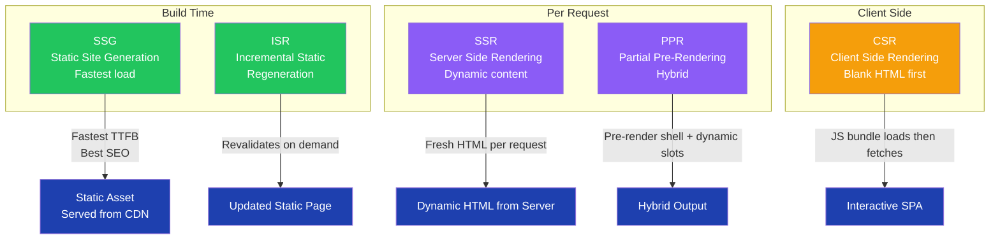

### Strategy Comparison

| Strategy | When HTML is Generated | Best For | SEO | TTFB |
|---|---|---|---|---|
| SSG | Build time | Blogs, docs, marketing | Excellent | Fastest |
| ISR | Build + on-demand revalidation | E-commerce listings | Good | Fast |
| SSR | Each request | News, dashboards, auth pages | Good | Medium |
| CSR | In the browser | Admin panels, SPAs | Poor | Slow initial |
| PPR | Partial build + partial request | Social feeds, mixed pages | Good | Fast shell |

### Next.js Implementation

```typescript
// SSG — generateStaticParams (app dir)
export async function generateStaticParams() {
  const products = await fetchAllProducts();
  return products.map(p => ({ id: p.id }));
}

// ISR — revalidate at route segment level
export const revalidate = 60; // seconds

export default async function ProductPage({ params }: { params: { id: string } }) {
  const product = await fetchProduct(params.id);
  return <ProductView product={product} />;
}

// SSR — dynamic (no cache)
export const dynamic = 'force-dynamic';

export default async function DashboardPage() {
  const data = await fetchLiveMetrics(); // runs on every request
  return <Dashboard data={data} />;
}

// CSR — client component with useEffect
'use client';
export default function ChatPage() {
  const [messages, setMessages] = React.useState([]);
  React.useEffect(() => {
    fetchMessages().then(setMessages);
  }, []);
  return <Chat messages={messages} />;
}
```

### Interview Talking Points

| Question | Answer |
|---|---|
| When would you choose SSG over SSR? | SSG when content changes infrequently (blogs, docs) — served from CDN with zero server compute. SSR when content is user-specific or changes every request. |
| What is ISR? | ISR lets you update statically generated pages without a full rebuild. Set `revalidate` seconds; Next.js regenerates the page in the background after a request post-expiry. |
| What is PPR? | Partial Pre-Rendering mixes a pre-rendered static shell with dynamic streaming slots. The shell loads instantly from CDN; async components stream in dynamic data. |
| What are the SEO implications of CSR? | CSR sends a blank HTML shell; crawlers may not execute JS. This hurts SEO unless you add SSR/SSG or use dynamic rendering for bots. |
| How does TTFB differ across strategies? | SSG/ISR: ~ms from CDN. SSR: depends on server compute + DB latency. CSR: fast TTFB but slow Time to Interactive (TTI). |

---

## 2. Micro Frontend Architecture

### Overview
Micro Frontend Architecture scales monolithic frontends by splitting the application into independently deployable units, each owned by a separate team. Each MFE can use its own framework and rendering strategy, enabling parallel development without deployment bottlenecks. Module Federation (Webpack 5) is the industry-standard tool for runtime composition.

### Architecture Diagram

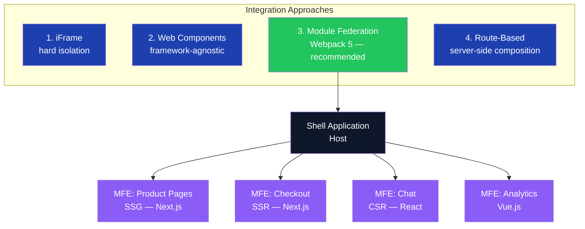

### Module Federation Configuration

```typescript
// webpack.config.ts — Shell (Host)
import { ModuleFederationPlugin } from 'webpack/container/ModuleFederationPlugin';

export default {
  plugins: [
    new ModuleFederationPlugin({
      name: 'shell',
      remotes: {
        productMfe: 'product@http://localhost:3001/remoteEntry.js',
        checkoutMfe: 'checkout@http://localhost:3002/remoteEntry.js',
      },
      shared: {
        react: { singleton: true, requiredVersion: '^18.0.0' },
        'react-dom': { singleton: true },
      },
    }),
  ],
};

// webpack.config.ts — Product MFE (Remote)
export default {
  plugins: [
    new ModuleFederationPlugin({
      name: 'product',
      filename: 'remoteEntry.js',
      exposes: {
        './ProductPage': './src/ProductPage',
        './ProductList': './src/ProductList',
      },
      shared: { react: { singleton: true } },
    }),
  ],
};

// Shell: lazy-load a remote MFE component
const ProductPage = React.lazy(() => import('productMfe/ProductPage'));

function App() {
  return (
    <React.Suspense fallback={<Spinner />}>
      <ProductPage />
    </React.Suspense>
  );
}
```

### Interview Talking Points

| Question | Answer |
|---|---|
| What problem does MFE solve? | Deployment bottlenecks in large teams — teams deploy independently without coordinating releases. |
| What is Module Federation? | A Webpack 5 feature that lets separately built apps share code at runtime. A "remote" exposes components; a "host" consumes them. |
| What are the downsides of MFEs? | Increased complexity: shared state management across MFEs, duplicate dependencies if `shared` config is misconfigured, version conflicts. |
| How do MFEs communicate? | Via Custom Events, a shared event bus, URL/query params, or a shared federated state module. |
| When would you NOT use MFE? | Small teams or apps — setup complexity outweighs benefits. MFE is for 50+ engineers across multiple independent teams. |

---

## 3. Rendering Performance Optimization

### Overview
Unnecessary re-renders are the primary performance killer in React applications. When a parent component re-renders, all children re-render by default. React's memoization hooks (`React.memo`, `useMemo`, `useCallback`) break this cascade, while profiling tools identify the actual bottlenecks before optimizing.

### Re-render Cascade Diagram

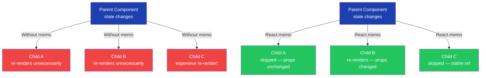

### Memoization Patterns

```typescript
// React.memo — prevent child re-render when props are reference-equal
const ExpensiveList = React.memo(function ExpensiveList({ items }: { items: Item[] }) {
  return <ul>{items.map(i => <li key={i.id}>{i.name}</li>)}</ul>;
});

// useCallback — stable function reference across renders
function Parent() {
  const [count, setCount] = React.useState(0);

  // Without useCallback: new function ref on every render → child always re-renders
  // With useCallback: same ref unless deps change
  const handleClick = React.useCallback((id: string) => {
    console.log('clicked', id);
  }, []); // empty deps → created once

  return <ExpensiveList items={items} onItemClick={handleClick} />;
}

// useMemo — cache expensive computation result
function ProductStats({ orders }: { orders: Order[] }) {
  const stats = React.useMemo(() => ({
    total: orders.reduce((sum, o) => sum + o.amount, 0),
    count: orders.length,
    average: orders.length
      ? orders.reduce((s, o) => s + o.amount, 0) / orders.length
      : 0,
  }), [orders]); // recomputes only when orders reference changes

  return <StatsDisplay {...stats} />;
}

// React DevTools Profiler — identify actual bottlenecks
import { Profiler } from 'react';

function onRenderCallback(id: string, phase: 'mount' | 'update', actualDuration: number) {
  if (actualDuration > 16) { // flag renders over 1 frame (16ms)
    console.warn(`Slow render: ${id} took ${actualDuration}ms during ${phase}`);
  }
}

function App() {
  return (
    <Profiler id="ProductList" onRender={onRenderCallback}>
      <ProductList />
    </Profiler>
  );
}
```

### Profiling Tools

| Tool | What It Shows |
|---|---|
| React DevTools Profiler | Flame graph of component render times, which components re-rendered and why |
| Chrome Performance tab | JS execution timeline, long tasks, layout/paint costs |
| Lighthouse | Core Web Vitals score with actionable recommendations |
| Datadog RUM | Real-user render performance in production |

### Interview Talking Points

| Question | Answer |
|---|---|
| When does React re-render a component? | When its state changes, its parent re-renders, or a context it consumes changes. |
| What is the difference between `useMemo` and `useCallback`? | `useMemo` memoizes a computed value; `useCallback` memoizes a function reference. Both take a deps array. |
| When should you NOT use React.memo? | When the component is cheap to render, or when props always change — comparison overhead costs more than re-rendering. |
| What tools do you use to find re-render problems? | React DevTools Profiler (flame graph), Chrome Performance tab, web-vitals library for real-user metrics. |
| What is the "referential equality" problem? | Objects/arrays created inline (`{}`, `[]`) get a new reference each render, so `React.memo` always re-renders even if data is the same — fix with `useMemo`. |

---

## 4. Lazy Loading & Bundle Optimization

### Overview
Lazy loading defers loading non-critical code until it is actually needed, reducing the initial JavaScript bundle size and improving Time to Interactive. Combined with Tree Shaking (removing dead code) and code splitting, it is the primary technique for fast initial page loads in large SPAs.

### Bundle Strategy Diagram

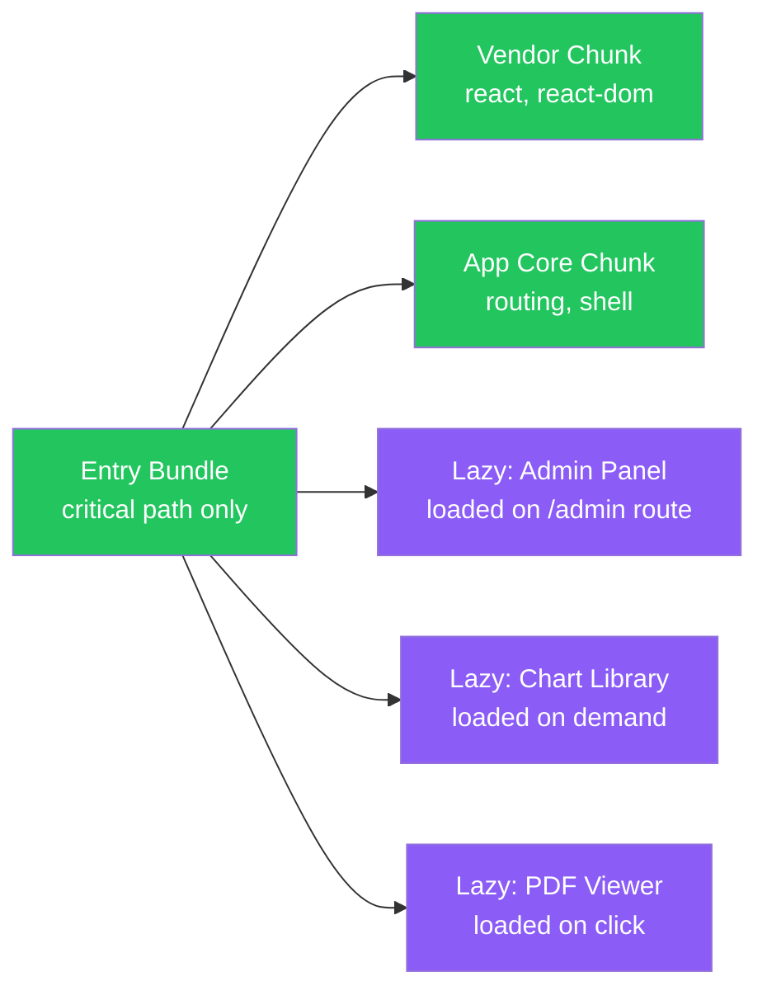

### Implementation

```typescript
// Code splitting with React.lazy + Suspense
const AdminPanel = React.lazy(() => import('./pages/AdminPanel'));
const ChartDashboard = React.lazy(() => import('./pages/ChartDashboard'));

function Router() {
  return (
    <React.Suspense fallback={<PageSpinner />}>
      <Routes>
        <Route path="/admin" element={<AdminPanel />} />
        <Route path="/charts" element={<ChartDashboard />} />
      </Routes>
    </React.Suspense>
  );
}

// Intersection Observer for image lazy loading
function LazyImage({ src, alt }: { src: string; alt: string }) {
  const imgRef = React.useRef<HTMLImageElement>(null);
  const [loaded, setLoaded] = React.useState(false);

  React.useEffect(() => {
    const observer = new IntersectionObserver(([entry]) => {
      if (entry.isIntersecting) {
        setLoaded(true);
        observer.disconnect();
      }
    });
    if (imgRef.current) observer.observe(imgRef.current);
    return () => observer.disconnect();
  }, []);

  return ;
}

// Tree shaking — import only what you need
// Bad: imports entire lodash bundle
import _ from 'lodash';

// Good: imports only debounce — tree-shakeable
import debounce from 'lodash/debounce';

// vite.config.ts — manual chunk splitting
export default defineConfig({
  build: {
    rollupOptions: {
      output: {
        manualChunks: {
          vendor: ['react', 'react-dom'],
          charts: ['recharts'],
          utils: ['date-fns', 'zod'],
        },
      },
    },
  },
});
```

### Interview Talking Points

| Question | Answer |
|---|---|
| What is Tree Shaking? | Dead code elimination by bundlers (Webpack, Vite). Removes exports that are never imported. Requires ES module syntax. |
| What is the difference between code splitting and lazy loading? | Code splitting divides the bundle into chunks; lazy loading defers loading those chunks until needed. They work together. |
| How do you handle the loading state during lazy loading? | `React.Suspense` with a `fallback` prop shows a spinner/skeleton while the lazy component loads. |
| What is `loading="lazy"` HTML attribute? | Native browser attribute for images and iframes — defers loading until near the viewport, no JS required. |
| How do you measure bundle size? | `webpack-bundle-analyzer`, `vite-plugin-visualizer`, or `source-map-explorer` to visualize chunk composition. |

---

## 5. API Optimization & Client-Side Caching

### Overview
Excessive network requests degrade performance and overwhelm backend services. Client-side caching with TanStack Query (React Query) reduces redundant API calls using stale-while-revalidate semantics, while GraphQL prevents over-fetching by letting clients specify exactly which fields they need.

### Caching Architecture


### TanStack Query Implementation

```typescript
import { useQuery, useMutation, useQueryClient } from '@tanstack/react-query';

// Cache with stale time — avoids redundant network calls
function useProducts() {
  return useQuery({
    queryKey: ['products'],
    queryFn: () => fetch('/api/products').then(r => r.json()),
    staleTime: 5 * 60 * 1000,    // data stays fresh for 5 minutes
    gcTime: 10 * 60 * 1000,      // cache kept in memory for 10 minutes
    refetchOnWindowFocus: false,
  });
}

// Optimistic update + cache invalidation
function useUpdateProduct() {
  const queryClient = useQueryClient();
  return useMutation({
    mutationFn: (product: Product) =>
      fetch(`/api/products/${product.id}`, {
        method: 'PUT',
        body: JSON.stringify(product),
      }),
    onSuccess: () => {
      queryClient.invalidateQueries({ queryKey: ['products'] });
    },
  });
}

// GraphQL — request only needed fields (prevents over-fetching)
const GET_PRODUCT = gql`
  query GetProduct($id: ID!) {
    product(id: $id) {
      id
      name
      price
      # intentionally omit: description, reviews, relatedProducts
    }
  }
`;
```

### Interview Talking Points

| Question | Answer |
|---|---|
| What is stale-while-revalidate? | Serve cached (potentially stale) data immediately, revalidate in the background, update UI if data changed. Balances freshness and speed. |
| How does React Query reduce API calls? | Multiple components calling `useQuery` with the same key share one network request — the result is served from cache for all. |
| What is the difference between `staleTime` and `gcTime`? | `staleTime`: how long data is considered fresh (no background refetch). `gcTime`: how long unused cache entries are kept before garbage collection. |
| How does GraphQL prevent over-fetching? | Clients declare exactly which fields they need. Server returns only those fields, unlike REST which always returns the full resource shape. |
| When would you use Redux for server state? | Almost never — React Query is purpose-built for server state (async, cacheable). Redux is for client state (UI toggles, user session). |

---

## 6. Rate Limiting: Debounce & Throttle

### Overview
Debounce and throttle limit the rate of function invocations triggered by high-frequency events (typing, scrolling, resizing). They protect both the client (fewer renders) and the server (fewer API calls) from rapid-fire event storms.

### Debounce vs Throttle Diagram

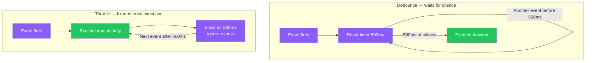

### Implementation

```typescript
// Debounce hook — wait until user stops typing before firing API call
function useDebounce<T>(value: T, delay: number): T {
  const [debouncedValue, setDebouncedValue] = React.useState(value);

  React.useEffect(() => {
    const timer = setTimeout(() => setDebouncedValue(value), delay);
    return () => clearTimeout(timer);
  }, [value, delay]);

  return debouncedValue;
}

function SearchBox() {
  const [query, setQuery] = React.useState('');
  const debouncedQuery = useDebounce(query, 500); // API fires only after 500ms pause

  const { data } = useQuery({
    queryKey: ['search', debouncedQuery],
    queryFn: () => searchProducts(debouncedQuery),
    enabled: debouncedQuery.length > 2,
  });

  return <input value={query} onChange={e => setQuery(e.target.value)} />;
}

// Throttle hook — limit scroll handler to once per 100ms
function useThrottle<T extends (...args: unknown[]) => void>(fn: T, delay: number): T {
  const lastCall = React.useRef(0);
  return React.useCallback((...args) => {
    const now = Date.now();
    if (now - lastCall.current >= delay) {
      lastCall.current = now;
      fn(...args);
    }
  }, [fn, delay]) as T;
}

function ScrollTracker() {
  const trackScroll = useThrottle((e: Event) => {
    analytics.track('scroll', { y: window.scrollY });
  }, 100);

  React.useEffect(() => {
    window.addEventListener('scroll', trackScroll);
    return () => window.removeEventListener('scroll', trackScroll);
  }, [trackScroll]);
}
```

### Interview Talking Points

| Question | Answer |
|---|---|
| What is the difference between debounce and throttle? | Debounce: waits for a pause before executing (good for search). Throttle: executes at most once per interval (good for scroll/resize). |
| Where would you use debounce? | Search boxes, form validation, auto-save — any case where you want to fire only after the user pauses input. |
| Where would you use throttle? | Scroll event handlers, window resize, mouse move — anywhere you want a steady rate during continuous events. |
| Can rate limiting be implemented server-side too? | Yes — API gateways (NGINX, AWS API Gateway) throttle requests per client IP/key. Client + server-side limiting are complementary. |
| What library provides production-ready implementations? | Lodash (`_.debounce`, `_.throttle`) or the `use-debounce` React hook. Both handle cancellation and flush edge cases. |

---

## 7. Pagination: Offset vs Cursor

### Overview
Pagination controls how large datasets are fetched in chunks. Offset pagination is simple but suffers from data drift when new items are inserted. Cursor pagination uses a stable pointer (ID or timestamp) to provide a consistent view, making it essential for real-time feeds and heavily concurrent datasets.

### Comparison Diagram


### Implementation

```typescript
// Offset pagination — simple, suitable for static/admin data
async function getProducts(page: number, limit = 20) {
  const offset = page * limit;
  return db.query(
    'SELECT * FROM products ORDER BY created_at DESC LIMIT $1 OFFSET $2',
    [limit, offset]
  );
}

// Cursor pagination — stable for live feeds
async function getFeed(cursor?: string, limit = 20) {
  if (cursor) {
    return db.query(
      'SELECT * FROM posts WHERE id < $1 ORDER BY id DESC LIMIT $2',
      [cursor, limit]
    );
  }
  return db.query('SELECT * FROM posts ORDER BY id DESC LIMIT $1', [limit]);
}

// React: infinite scroll with cursor pagination (TanStack Query)
function useFeed() {
  return useInfiniteQuery({
    queryKey: ['feed'],
    queryFn: ({ pageParam }) => getFeed(pageParam),
    getNextPageParam: (lastPage) => lastPage.at(-1)?.id,
    initialPageParam: undefined,
  });
}

function Feed() {
  const { data, fetchNextPage, hasNextPage } = useFeed();
  const { ref, inView } = useInView();

  React.useEffect(() => {
    if (inView && hasNextPage) fetchNextPage();
  }, [inView]);

  return (
    <>
      {data?.pages.flat().map(post => <PostCard key={post.id} post={post} />)}
      <div ref={ref} /> {/* intersection sentinel */}
    </>
  );
}
```

### Interview Talking Points

| Question | Answer |
|---|---|
| What is the main problem with offset pagination? | Data drift — if items are added/deleted between requests, pages shift, causing duplicates or skipped items. |
| How does cursor pagination solve this? | The cursor points to a stable position in the dataset. New/deleted items before the cursor don't affect the next page. |
| What makes a good cursor? | An indexed, monotonically increasing value: auto-increment ID, created_at timestamp, or UUID v7. |
| What is the DB performance advantage of cursor? | Cursor queries jump to position using an index; offset forces DB to scan and discard N rows — expensive for large offsets. |
| When would you still use offset pagination? | Admin interfaces with static data where users jump to arbitrary page numbers — cursor pagination doesn't support "go to page 50". |

---

## 8. Communication Protocols

### Overview
Beyond standard HTTP request/response, web applications use three real-time communication patterns. The choice depends on directionality, latency requirements, and infrastructure constraints.

### Protocol Comparison Diagram

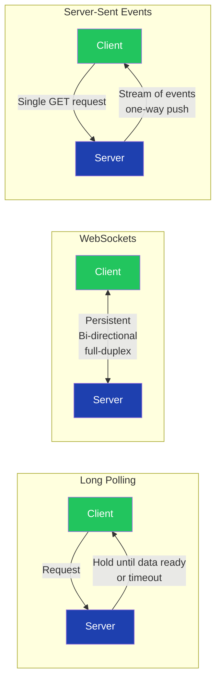

### Implementation

```typescript
// WebSocket — real-time bidirectional (chat, collaborative editing)
function useWebSocket(url: string) {
  const ws = React.useRef<WebSocket | null>(null);
  const [messages, setMessages] = React.useState<string[]>([]);

  React.useEffect(() => {
    ws.current = new WebSocket(url);
    ws.current.onmessage = (event) => {
      setMessages(prev => [...prev, event.data]);
    };
    return () => ws.current?.close();
  }, [url]);

  const send = React.useCallback((msg: string) => {
    ws.current?.send(msg);
  }, []);

  return { messages, send };
}

// Server-Sent Events — one-way server push (notifications, live feeds)
function useLiveFeed(url: string) {
  const [events, setEvents] = React.useState<string[]>([]);

  React.useEffect(() => {
    const source = new EventSource(url);
    source.onmessage = (e) => setEvents(prev => [...prev, e.data]);
    source.onerror = () => source.close();
    return () => source.close();
  }, [url]);

  return events;
}

// Long Polling — fallback when WS/SSE unavailable
async function longPoll(url: string, onMessage: (data: unknown) => void) {
  while (true) {
    try {
      const response = await fetch(url, { signal: AbortSignal.timeout(30000) });
      const data = await response.json();
      onMessage(data);
    } catch {
      await new Promise(r => setTimeout(r, 1000)); // backoff on error
    }
  }
}
```

### Protocol Decision Guide

| Requirement | Best Protocol |
|---|---|
| Real-time bidirectional (chat, gaming) | WebSocket |
| Server-to-client notifications/feeds | SSE |
| Simple polling, maximum compatibility | Long Polling |
| Occasional updates, REST-friendly | HTTP polling with React Query |

### Interview Talking Points

| Question | Answer |
|---|---|
| What is the difference between WebSocket and SSE? | WebSocket: full-duplex, both sides send. SSE: server-only push over a persistent HTTP connection — simpler and auto-reconnects. |
| When would you choose SSE over WebSocket? | When only the server needs to push (live feeds, notifications). SSE works over HTTP/2, scales better, and reconnects natively. |
| How do WebSockets scale horizontally? | Using a pub/sub broker (Redis, Kafka) so any server instance can receive messages meant for any connected client. |
| What is Long Polling? | Client sends a request; server holds it open until new data is available or timeout occurs, then client immediately reconnects. |
| What is HTTP/2 Server Push vs SSE? | HTTP/2 Push proactively sends resources before the client asks. SSE is application-level streaming after the client subscribes. |

---

## 9. Availability, Accessibility & Consistency

### Overview
Large-scale frontend applications must handle offline scenarios (Service Workers), serve all users including those with disabilities (ARIA, semantic HTML), and maintain visual consistency (Design Systems). Observability through logging and monitoring closes the production feedback loop.

### Architecture Diagram


### Service Worker for Offline Support

```typescript
// workbox-config.js — cache strategies
import { precacheAndRoute, cleanupOutdatedCaches } from 'workbox-precaching';
import { registerRoute } from 'workbox-routing';
import { CacheFirst, StaleWhileRevalidate } from 'workbox-strategies';

cleanupOutdatedCaches();
precacheAndRoute(self.__WB_MANIFEST);

// API responses — stale-while-revalidate
registerRoute(
  ({ url }) => url.pathname.startsWith('/api/'),
  new StaleWhileRevalidate({ cacheName: 'api-cache' })
);

// Images — cache-first
registerRoute(
  ({ request }) => request.destination === 'image',
  new CacheFirst({ cacheName: 'image-cache' })
);
```

### Interview Talking Points

| Question | Answer |
|---|---|
| What is a Service Worker? | A JS file running in the background that intercepts network requests and can serve cached responses — enabling offline support and background sync. |
| What is a Design System? | A shared library of components, tokens (colors, spacing, typography), and guidelines ensuring visual/behavioral consistency across products and teams. |
| What is the difference between `aria-label` and `aria-labelledby`? | `aria-label` provides a string label directly; `aria-labelledby` points to an existing visible element's ID to use as the accessible name. |
| What logging/monitoring tools do you use? | Sentry for error tracking, Datadog/New Relic for performance monitoring, Mixpanel/Amplitude for user analytics. |
| What are WCAG levels? | A (minimum), AA (standard requirement), AAA (highest). Most products target WCAG 2.1 AA compliance. |

---

## 10. Browser Storage: Cookies vs LocalStorage vs SessionStorage

### Overview
Browsers provide three client-side storage mechanisms with different size limits, lifetimes, and accessibility. Choosing incorrectly causes both security vulnerabilities and functionality bugs.

### Comparison Diagram

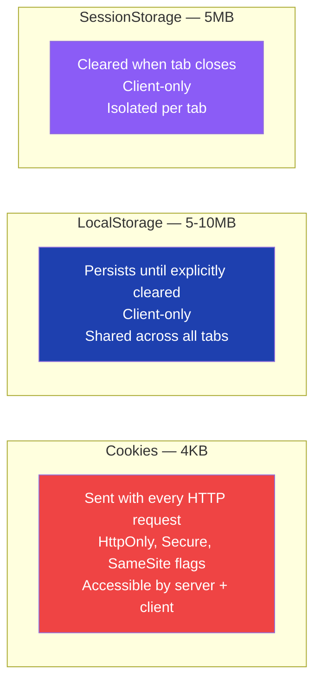

### Usage Guide

| Use Case | Recommended Storage |
|---|---|
| Auth session token (server needs it) | Cookie with `HttpOnly`, `Secure`, `SameSite=Strict` |
| User preferences (theme, language) | LocalStorage |
| Multi-step form in progress | SessionStorage |
| Shopping cart (persists across sessions) | LocalStorage |
| CSRF token | Cookie |
| Sensitive data (passwords, PII) | **None — never store in browser** |

```typescript
// Secure cookie setup (Next.js Route Handler)
import { cookies } from 'next/headers';

function setAuthCookie(token: string) {
  cookies().set('session', token, {
    httpOnly: true,       // JS cannot access
    secure: true,         // HTTPS only
    sameSite: 'strict',   // CSRF protection
    maxAge: 60 * 60 * 24 * 7,
    path: '/',
  });
}

// Type-safe LocalStorage hook
function useLocalStorage<T>(key: string, initialValue: T) {
  const [value, setValue] = React.useState<T>(() => {
    try {
      const item = window.localStorage.getItem(key);
      return item ? JSON.parse(item) : initialValue;
    } catch {
      return initialValue;
    }
  });

  const setItem = React.useCallback((newValue: T) => {
    setValue(newValue);
    window.localStorage.setItem(key, JSON.stringify(newValue));
  }, [key]);

  return [value, setItem] as const;
}
```

### Interview Talking Points

| Question | Answer |
|---|---|
| Why use HttpOnly cookies for auth tokens? | HttpOnly prevents JS access, so XSS attacks cannot steal the token. LocalStorage tokens are fully exposed to JS. |
| What is the size limit for cookies? | 4KB per cookie. LocalStorage and SessionStorage are ~5-10MB depending on browser. |
| When does SessionStorage get cleared? | When the browser tab is closed. A page refresh does NOT clear it; a new tab opening the same URL gets a fresh SessionStorage. |
| What is the SameSite cookie attribute? | Controls when cookies are sent with cross-site requests. `Strict`: never cross-site. `Lax`: GET cross-site only. `None`: always (requires `Secure`). |
| Should JWTs be stored in LocalStorage? | No — XSS can steal them. Store in HttpOnly cookies. If LocalStorage is unavoidable, understand and mitigate XSS risks explicitly. |

---

## 11. Front-end Application Optimizations

### Overview
Production-grade applications apply layered optimizations: compatibility shims (polyfills), payload reduction (compression, minification), bundle analysis, and source maps for debuggable production errors.

### Optimization Pipeline

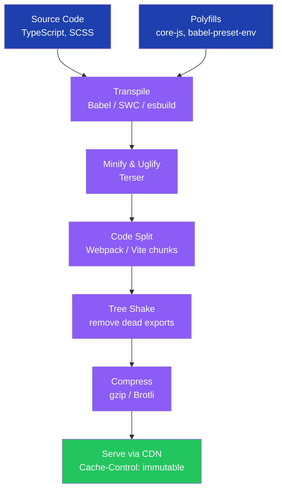

### Configuration

```typescript
// vite.config.ts — production optimizations
import { defineConfig } from 'vite';
import react from '@vitejs/plugin-react-swc';

export default defineConfig({
  plugins: [react()],
  build: {
    target: 'es2020',
    minify: 'terser',
    sourcemap: true, // enable for Sentry production debugging
    rollupOptions: {
      output: {
        manualChunks: {
          vendor: ['react', 'react-dom'],
          charts: ['recharts'],
          utils: ['date-fns', 'zod'],
        },
      },
    },
  },
});
```

### Interview Talking Points

| Question | Answer |
|---|---|
| What is a polyfill? | Code that implements modern browser APIs for older browsers. e.g., `core-js` adds `Array.prototype.flatMap` for IE11. |
| What is the difference between minification and uglification? | Minification removes whitespace/comments. Uglification renames variables to short names (`a`, `b`). Both reduce file size. |
| What is a source map? | A file mapping minified code positions back to original source lines. Used by browsers and Sentry for readable stack traces in production. |
| What is Brotli vs gzip? | Brotli achieves ~20% better compression than gzip for text files. Supported by all modern browsers via `Accept-Encoding: br`. |
| How do you measure JS bundle impact? | `webpack-bundle-analyzer` or `vite-plugin-visualizer`. Target < 150KB initial JS (gzipped). |

---

## 12. Image Asset Optimization

### Overview
Images are typically the largest assets on a page. A systematic approach — format selection, sizing, compression, CDN delivery, and lazy loading — can reduce image payload by 70–90% with no visible quality loss.

### Optimization Strategy

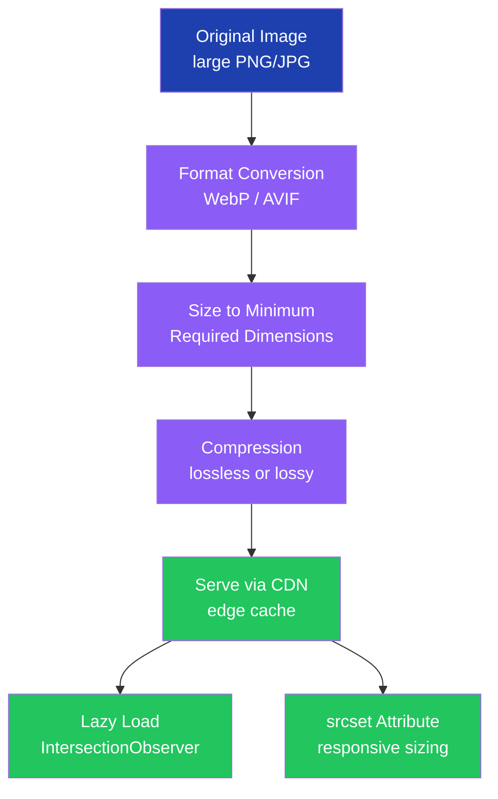

### Implementation

```typescript
// Next.js Image — handles all optimizations automatically
import Image from 'next/image';

function ProductCard({ product }: { product: Product }) {
  return (
    <Image
      src={product.imageUrl}
      alt={product.name}
      width={400}
      height={300}
      loading="lazy"
      sizes="(max-width: 768px) 100vw, 400px"
      placeholder="blur"
      blurDataURL={product.blurHash}
    />
  );
}

// Manual srcset for non-Next.js apps
function OptimizedImage({ src, alt }: { src: string; alt: string }) {
  return (
    <picture>
      <source srcSet={`${src}?format=avif`} type="image/avif" />
      <source srcSet={`${src}?format=webp`} type="image/webp" />
      
    </picture>
  );
}
```

### Interview Talking Points

| Question | Answer |
|---|---|
| What image format should you use in 2025? | AVIF first (best compression), then WebP (wide support), then JPEG/PNG as fallback. Use `<picture>` for format negotiation. |
| Why specify `width` and `height` on images? | Prevents Cumulative Layout Shift (CLS) — the browser reserves space before the image loads. |
| What is a CDN's role in image delivery? | Caches images at edge locations near users. Services like Cloudinary/Imgix also resize and convert format on the fly. |
| What is the `srcset` attribute? | Lets the browser choose the appropriately sized image based on device pixel ratio and viewport size. Prevents 1200px images on mobile. |
| How do you automate image compression? | `imagemin`, `sharp`, or Squoosh CLI compress images as a build step in CI. |

---

## 13. Code Quality Management

### Overview
In large codebases, consistent quality requires automated tooling that enforces standards without relying on manual review. Linters catch style and common errors, tests verify behavior, dependency scans flag vulnerabilities, and performance monitoring tracks regressions.

### Quality Gates Pipeline


### Configuration

```typescript
// .eslintrc.js
module.exports = {
  extends: [
    'eslint:recommended',
    'plugin:@typescript-eslint/recommended',
    'plugin:react-hooks/recommended',
    'plugin:jsx-a11y/recommended',
    'prettier',
  ],
  rules: {
    'no-console': 'error',
    '@typescript-eslint/no-explicit-any': 'error',
    '@typescript-eslint/no-unused-vars': ['error', { argsIgnorePattern: '^_' }],
  },
};

// vitest.config.ts — coverage thresholds
import { defineConfig } from 'vitest/config';

export default defineConfig({
  test: {
    coverage: {
      provider: 'v8',
      thresholds: {
        branches: 80,
        functions: 80,
        lines: 80,
      },
    },
  },
});
```

### Interview Talking Points

| Question | Answer |
|---|---|
| What is the difference between ESLint and Prettier? | Prettier formats code (whitespace, quotes). ESLint catches bugs and enforces patterns. Use together: Prettier for formatting, ESLint for logic. |
| What are Core Web Vitals? | LCP (Largest Contentful Paint) < 2.5s, INP (Interaction to Next Paint) < 200ms, CLS (Cumulative Layout Shift) < 0.1. |
| How do you prevent dependency vulnerabilities? | `npm audit`, Snyk, or GitHub Dependabot flag vulnerable packages. Add to CI to block merges on high-severity issues. |
| What is `husky` + `lint-staged`? | Husky runs Git hooks (pre-commit). `lint-staged` runs linting only on staged files — fast pre-commit quality gate. |
| What is axe-core? | An accessibility testing engine that checks rendered DOM against WCAG rules. Used via `jest-axe` or Playwright's accessibility assertions. |

---

## 14. XSS Attacks & Prevention

### Overview
Cross-Site Scripting (XSS) allows attackers to inject malicious JavaScript into trusted web pages, stealing cookies, session tokens, or performing actions as the victim. XSS is the #1 frontend security vulnerability. Defense is layered: React's default encoding, input sanitization, and Content Security Policy headers.

### XSS Attack Flow

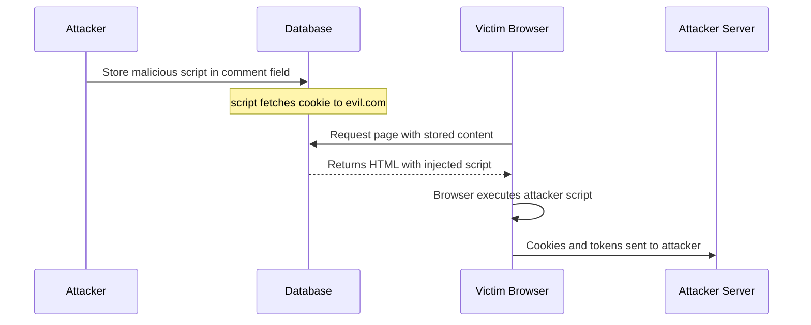

### Prevention Strategies

```typescript
// React's default — automatically HTML-encodes output (safe)
function CommentSafe({ comment }: { comment: string }) {
  return <div>{comment}</div>; // <script> becomes &lt;script&gt;
}

// DOMPurify — only when you MUST render HTML (rich text editors)
import DOMPurify from 'dompurify';

function RichTextDisplay({ html }: { html: string }) {
  const clean = DOMPurify.sanitize(html, {
    ALLOWED_TAGS: ['b', 'i', 'em', 'strong', 'p', 'br'],
    ALLOWED_ATTR: [],
  });
  return <div dangerouslySetInnerHTML={{ __html: clean }} />;
}

// Content Security Policy — Next.js middleware
import { NextResponse } from 'next/server';

export function middleware() {
  const response = NextResponse.next();
  response.headers.set(
    'Content-Security-Policy',
    "default-src 'self'; script-src 'self'; object-src 'none';"
  );
  return response;
}
```

### Interview Talking Points

| Question | Answer |
|---|---|
| What are the three types of XSS? | Stored (persisted in DB), Reflected (in URL parameter), DOM-based (client-side JS manipulation). |
| How does React protect against XSS by default? | React escapes all JSX expressions before rendering. `{userInput}` is always text — never treated as HTML. |
| When is `dangerouslySetInnerHTML` justified? | Only for rendering trusted rich text (CMS content, markdown-to-HTML). Always sanitize with DOMPurify first. |
| What is Content Security Policy? | An HTTP header telling browsers which script sources are trusted. A strict CSP blocks inline scripts and unknown origins. |
| What is stored XSS? | Attacker submits malicious content (comment, profile bio) stored in DB and rendered for all subsequent users. |

---

## 15. Content Delivery Networks

### Overview
A CDN is a geographically distributed network that caches static assets (JS, CSS, images, fonts) at edge locations near users, reducing latency and origin server load. CDNs also provide DDoS protection and TLS termination.

### CDN Request Flow

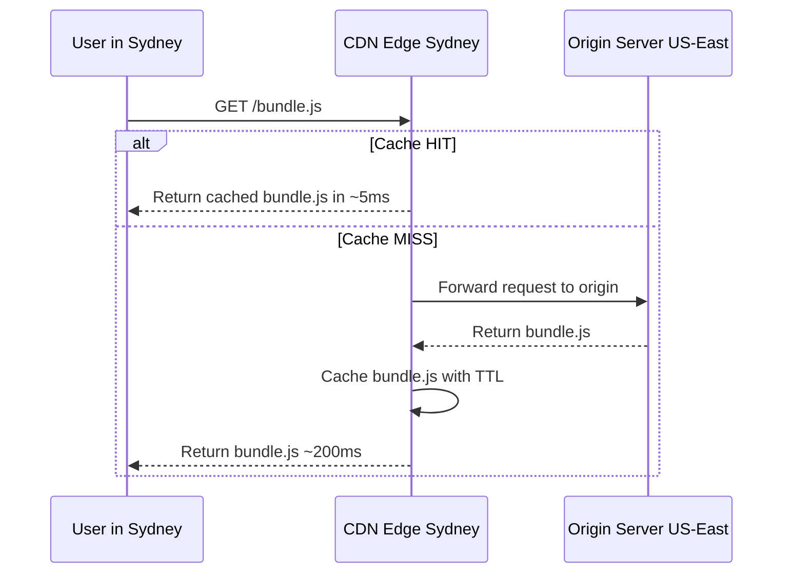

### Configuration

```typescript
// next.config.ts — cache headers per route type
const nextConfig = {
  async headers() {
    return [
      {
        source: '/_next/static/:path*',
        headers: [{
          key: 'Cache-Control',
          value: 'public, max-age=31536000, immutable', // 1 year — hash in filename
        }],
      },
      {
        source: '/api/:path*',
        headers: [{
          key: 'Cache-Control',
          value: 'no-store', // never cache API responses at CDN
        }],
      },
    ];
  },
};

// CDN cache purge on deploy (Cloudflare)
async function purgeCache(urls: string[]) {
  await fetch('https://api.cloudflare.com/client/v4/zones/{zone}/purge_cache', {
    method: 'POST',
    headers: { Authorization: `Bearer ${process.env.CF_TOKEN}` },
    body: JSON.stringify({ files: urls }),
  });
}
```

### Interview Talking Points

| Question | Answer |
|---|---|
| What is a CDN edge node? | A server in a CDN's global network that caches content. Users are routed to the nearest edge node via Anycast DNS for lowest latency. |
| What are `Cache-Control` directives? | `max-age`: seconds to cache. `immutable`: content never changes (cache forever). `no-store`: never cache. `stale-while-revalidate`: serve stale while refreshing. |
| How do you handle CDN cache invalidation on deploy? | Content-hashed filenames (Webpack/Vite do this automatically). New hash = new URL — old files expire naturally. |
| What is CDN cache stampede? | When a cached resource expires and thousands of requests hit the origin simultaneously. Mitigated by staggered TTLs and CDN request coalescing. |
| What is the difference between a CDN and a reverse proxy? | A CDN is geographically distributed at the edge. A reverse proxy sits in front of your origin at a single location. |

---

## 16. Critical CSS

### Overview
Critical CSS is the minimal set of CSS rules needed to render above-the-fold content. Inlining it in `<head>` eliminates a render-blocking network round-trip, improving First Contentful Paint by 200–500ms on slow connections.

### Rendering Path Diagram

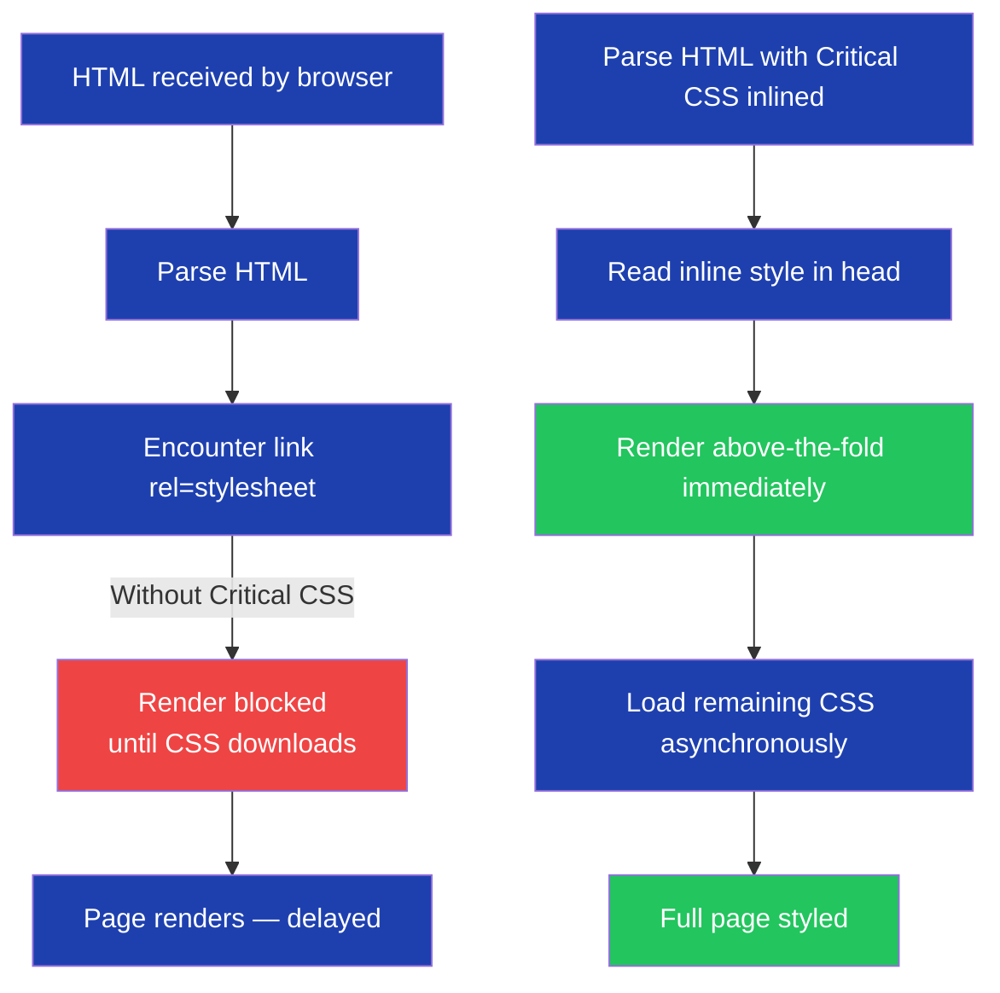

### Implementation

```html
<!-- Manually defer non-critical CSS — doesn't block render -->
<link
  rel="stylesheet"
  href="/non-critical.css"
  media="print"
  onload="this.media='all'"
/>

<!-- Preload critical font -->
<link rel="preload" href="/fonts/inter.woff2" as="font" type="font/woff2" crossorigin />
```

```typescript
// vite-plugin-critical — extract and inline critical CSS at build time
import { defineConfig } from 'vite';
import criticalPlugin from 'vite-plugin-critical';

export default defineConfig({
  plugins: [
    criticalPlugin({
      criticalUrl: 'http://localhost:3000',
      criticalBase: './dist',
      criticalPages: [{ uri: '/', template: 'index' }],
      criticalConfig: { inline: true, width: 1300, height: 900 },
    }),
  ],
});
```

### Interview Talking Points

| Question | Answer |
|---|---|
| What is "above the fold"? | Content visible to the user without scrolling on initial page load. Varies by device and viewport size. |
| How is Critical CSS extracted? | A headless browser renders the page and records which CSS rules affect visible elements. Next.js does this automatically per route. |
| What metric does Critical CSS improve? | First Contentful Paint (FCP) and Largest Contentful Paint (LCP) by eliminating render-blocking stylesheets. |
| What is `rel="preload"` for CSS? | Downloads CSS at high priority without blocking rendering. Still needs an `onload` handler to apply the stylesheet. |
| Does Next.js handle Critical CSS automatically? | Yes — Next.js inlines critical CSS for each route in production builds without manual configuration. |

---

## 17. Accessibility: ARIA & Semantic HTML

### Overview
Web accessibility ensures applications are usable by people with disabilities — visual, auditory, motor, or cognitive. Semantic HTML provides meaning to assistive technologies natively; ARIA fills gaps where semantic elements don't exist or design constraints prevent their use.

### Accessibility Decision Tree

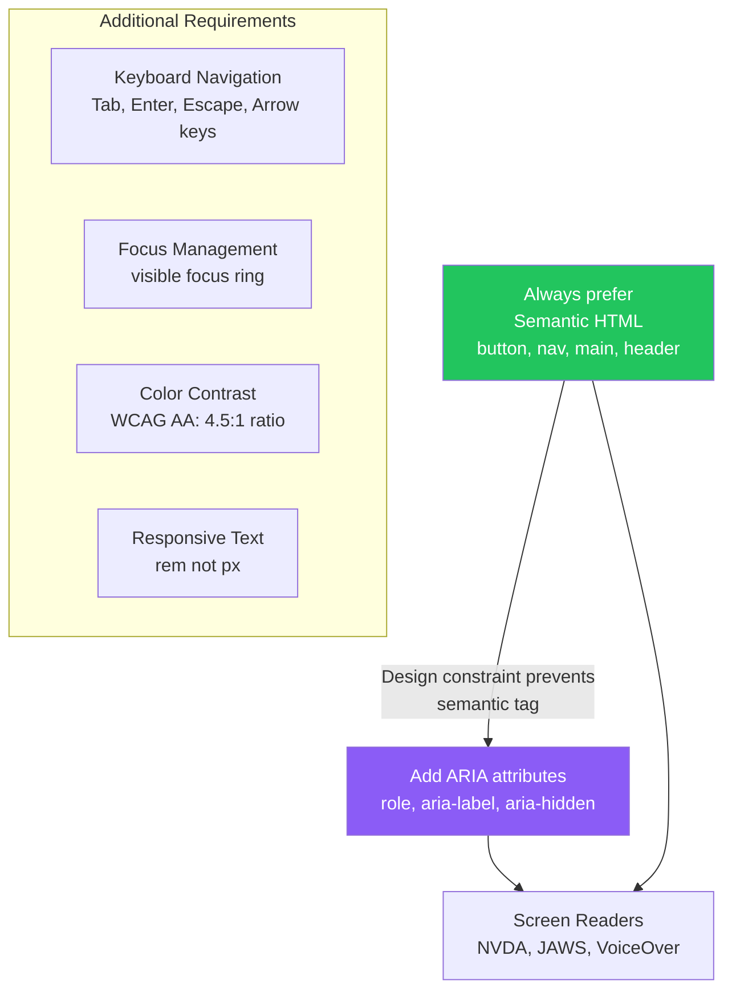

### Implementation

```typescript
// Semantic HTML first
function Navigation() {
  return (
    <nav aria-label="Main navigation">
      <ul>
        <li><a href="/products">Products</a></li>
        <li><a href="/about">About</a></li>
      </ul>
    </nav>
  );
}

// ARIA for custom interactive components
function CustomDropdown({ label, options }: DropdownProps) {
  const [isOpen, setIsOpen] = React.useState(false);

  return (
    <div role="combobox" aria-expanded={isOpen} aria-haspopup="listbox" aria-label={label}>
      <button onClick={() => setIsOpen(!isOpen)}>
        {label}
        <span aria-hidden="true">▼</span>
      </button>
      {isOpen && (
        <ul role="listbox">
          {options.map(opt => (
            <li key={opt.value} role="option" aria-selected={false}>
              {opt.label}
            </li>
          ))}
        </ul>
      )}
    </div>
  );
}

// Focus trap for modals
function Modal({ isOpen, onClose, children }: ModalProps) {
  const modalRef = React.useRef<HTMLDivElement>(null);

  React.useEffect(() => {
    if (isOpen) modalRef.current?.focus();
  }, [isOpen]);

  return isOpen ? (
    <div
      ref={modalRef}
      role="dialog"
      aria-modal="true"
      aria-labelledby="modal-title"
      tabIndex={-1}
      onKeyDown={e => e.key === 'Escape' && onClose()}
    >
      {children}
    </div>
  ) : null;
}
```

### Interview Talking Points

| Question | Answer |
|---|---|
| What is ARIA? | Accessible Rich Internet Applications — HTML attributes adding semantic meaning to non-semantic elements for screen readers. |
| What is ARIA rule #1? | Don't use ARIA unless you must. Always prefer native semantic HTML (`<button>` over `<div role="button">`). |
| What is `aria-hidden`? | Hides an element from screen readers. Use for decorative icons, duplicate text, or loading spinners. |
| What is a focus trap? | Keeping keyboard focus inside a modal while it's open. Users pressing Tab cycle only within the modal. Required for WCAG compliance. |
| What WCAG level do most enterprises target? | WCAG 2.1 AA — covers most disability categories and is required by law (ADA, EN 301 549, UK Equality Act). |

---

## 18. Script Loading: defer vs async

### Overview
By default `<script>` tags block HTML parsing while downloading and executing JavaScript. The `defer` and `async` attributes allow parallel downloading, improving page load performance. Choosing between them depends on whether the script depends on the DOM or other scripts.

### Execution Timeline Diagram

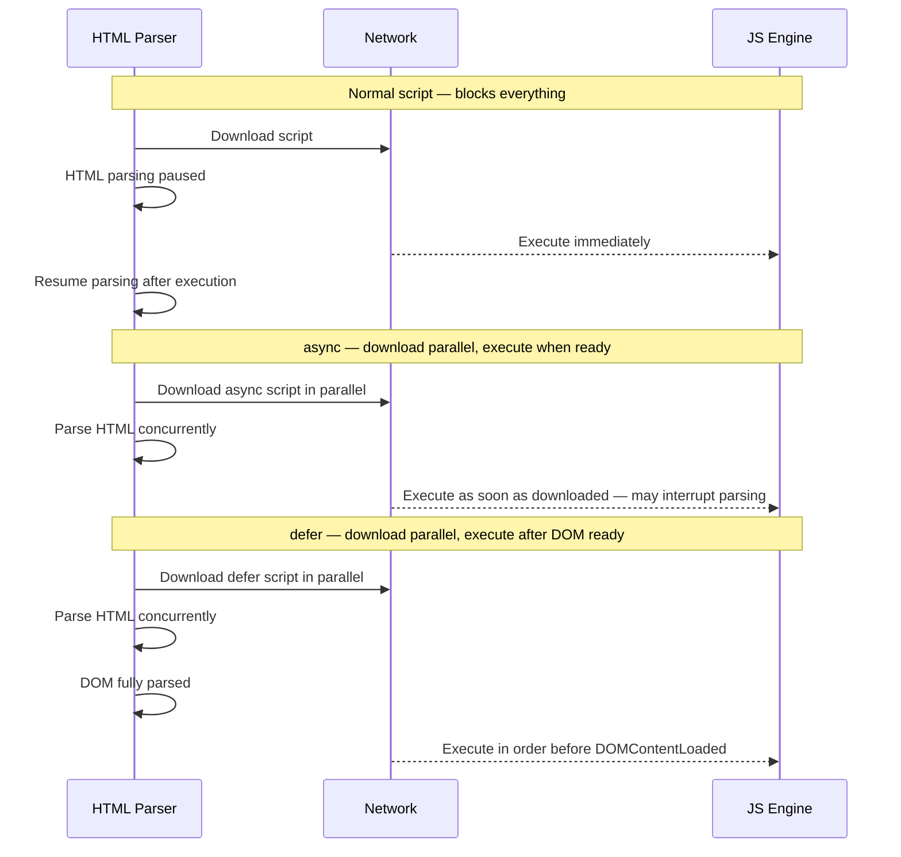

### Usage Guide

```html
<!-- defer — for scripts needing the DOM, in specific order -->
<script defer src="/bundle.js"></script>
<script defer src="/analytics.js"></script>  <!-- runs after bundle.js -->

<!-- async — for independent scripts (analytics, ads) -->
<script async src="https://www.googletagmanager.com/gtag/js"></script>

<!-- Module scripts are deferred by default -->
<script type="module" src="/main.js"></script>

<!-- Preload critical scripts — download early, execute normally -->
<link rel="preload" as="script" href="/critical-bundle.js" />
<script src="/critical-bundle.js"></script>
```

### Interview Talking Points

| Question | Answer |
|---|---|
| What is the difference between `defer` and `async`? | `defer`: executes after DOM is fully parsed, maintains order. `async`: executes as soon as downloaded, order not guaranteed. |
| When would you use `async`? | Independent scripts not relying on other scripts or the DOM — analytics, ads, social widgets. |
| When would you use `defer`? | App bundles, scripts needing the DOM, scripts with order dependencies. |
| What is the default for `<script type="module">`? | Deferred by default — acts like `defer`. Also enables strict mode and ES module `import`/`export`. |
| What is `rel="preload"` for scripts? | Tells the browser to download the script at high priority during HTML parsing, without blocking or executing it yet. |

---

## 19. ES6 Imports: Static vs Dynamic

### Overview
ES6 introduced two import patterns: static (resolved at build time) and dynamic (resolved at runtime). Static imports enable Tree Shaking and TypeScript type checking; dynamic imports enable code splitting and lazy loading.

### Comparison Diagram

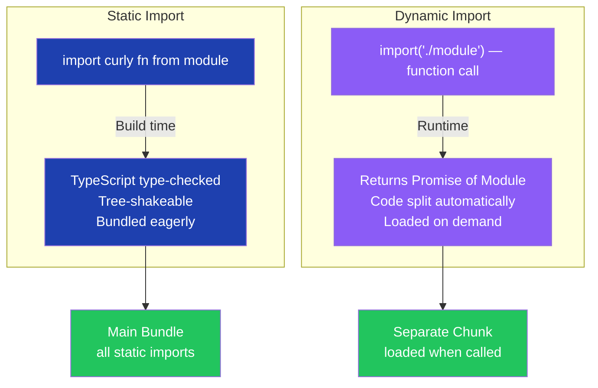

### Implementation

```typescript
// Static import — build time, tree-shakeable
import { formatDate } from 'date-fns';
import type { Product } from './types'; // type-only — erased at build, zero bundle impact

// Dynamic import — runtime, code split
async function exportToPDF() {
  const { jsPDF } = await import('jspdf'); // ~500KB loaded only on demand
  const doc = new jsPDF();
  doc.text('Report', 10, 10);
  doc.save('report.pdf');
}

// Dynamic import with React.lazy
const ChartView = React.lazy(() =>
  import('./ChartView').then(m => ({ default: m.ChartView }))
);

// Conditional dynamic import
async function loadPlugin(name: string) {
  if (process.env.FEATURE_ENABLED) {
    const { plugin } = await import(`./plugins/${name}`);
    return plugin;
  }
}
```

### Interview Talking Points

| Question | Answer |
|---|---|
| Why not use dynamic imports for everything? | Static imports are analyzed at build time for Tree Shaking and TypeScript type checking. Dynamic imports can't be statically analyzed. |
| What does dynamic import return? | A `Promise<Module>` — the module's namespace object with all its exports. |
| What is the bundle impact of dynamic import? | Webpack/Vite automatically creates a separate chunk for each dynamic import, loaded only when the `import()` call executes. |
| Can you use dynamic import in a conditional? | Yes — `if (condition) { const m = await import('./heavy'); }` — key use case for on-demand feature loading. |
| What is `import type`? | Imports only TypeScript types — completely erased at build time. Zero runtime cost, zero bundle impact. |

---

## 20. Core Web Vitals: CLS

### Overview
Cumulative Layout Shift (CLS) measures unexpected visual instability as a page loads — content jumping around as images, ads, or fonts load. A poor CLS score degrades UX (accidental clicks) and hurts Google search ranking. Target: CLS < 0.1.

### CLS Causes & Fixes Diagram

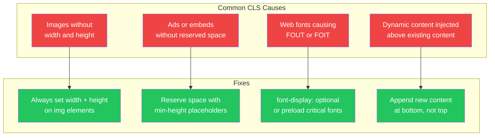

### Implementation

```html
<!-- Always set dimensions to prevent CLS -->


<!-- Aspect ratio box for responsive images -->
<style>
.image-container {
  aspect-ratio: 16 / 9; /* reserves space before image loads */
  overflow: hidden;
}
</style>

<!-- Preload and font-display for web fonts -->
<link rel="preload" href="/fonts/inter.woff2" as="font" type="font/woff2" crossorigin />
<style>
@font-face {
  font-family: 'Inter';
  src: url('/fonts/inter.woff2') format('woff2');
  font-display: swap;
}
</style>
```

```typescript
// Measure CLS with web-vitals library
import { onCLS } from 'web-vitals';

onCLS((metric) => {
  if (metric.value > 0.1) {
    analytics.track('poor_cls', { value: metric.value, url: location.href });
  }
});
```

### Interview Talking Points

| Question | Answer |
|---|---|
| What is CLS and how is it calculated? | CLS is the sum of unexpected layout shift scores during page load. Each shift score = impact fraction × distance fraction. Target < 0.1. |
| What is FOUT? | Flash of Unstyled Text — web font loads after fallback font is displayed, causing text to reflow and shift. Fixed with `font-display: swap` or `optional`. |
| What are the three Core Web Vitals? | LCP (Largest Contentful Paint) < 2.5s, INP (Interaction to Next Paint) < 200ms, CLS (Cumulative Layout Shift) < 0.1. |
| How does `aspect-ratio` CSS help CLS? | Reserves the correct height for an image before it loads, preventing the page from reflowing when the image arrives. |
| What is `font-display: optional`? | Browser only uses the web font if it loads within ~100ms. Otherwise fallback is used permanently — zero FOUT but web font may not show on slow connections. |

---

## 21. Essential vs Derived State

### Overview
State management clarity starts with understanding what must be stored vs what can be computed. Essential state changes independently from user interactions or external data. Derived state is always a pure function of essential state — computing it live avoids synchronization bugs and reduces state surface area.

### State Classification Diagram

```mermaid
flowchart TD
    subgraph Essential["Essential State — store in useState or store"]
        E1["Cart items\nuser adds and removes"]
        E2["User search query\nuser types"]
        E3["Filter selections\nuser clicks"]
        E4["Fetched product data\nfrom API"]
    end

    subgraph Derived["Derived State — compute with useMemo"]
        D1["Cart total\nsum of item prices"]
        D2["Item count\nlength of cart array"]
        D3["Filtered products\nfilter by query and products"]
        D4["Is cart empty\ncartItems.length === 0"]
    end

    E1 --> D1 & D2 & D4
    E2 & E4 --> D3

    classDef essential fill:#1e40af,color:#fff
    classDef derived fill:#22c55e,color:#fff
    class E1,E2,E3,E4 essential
    class D1,D2,D3,D4 derived
```

### Implementation

```typescript
// Anti-pattern: storing derived state (causes sync bugs)
function CartBad() {
  const [items, setItems] = React.useState<CartItem[]>([]);
  const [total, setTotal] = React.useState(0); // derived — can get out of sync

  const addItem = (item: CartItem) => {
    setItems(prev => [...prev, item]);
    setTotal(prev => prev + item.price); // must be manually kept in sync
  };
}

// Correct: derive from essential state
function CartGood() {
  const [items, setItems] = React.useState<CartItem[]>([]);

  // Always correct — recomputed from source of truth
  const total = React.useMemo(
    () => items.reduce((sum, item) => sum + item.price * item.quantity, 0),
    [items]
  );
  const isEmpty = items.length === 0;

  const [query, setQuery] = React.useState('');
  const { data: products = [] } = useQuery({
    queryKey: ['products'],
    queryFn: fetchProducts,
  });

  const filteredProducts = React.useMemo(
    () => products.filter(p => p.name.toLowerCase().includes(query.toLowerCase())),
    [products, query]
  );
}
```

### Interview Talking Points

| Question | Answer |
|---|---|
| What is essential state? | State that changes independently — from user interactions or data fetching. Cannot be computed from other state. |
| What is derived state? | State that is always a pure function of other state. Should be computed, not stored, to avoid synchronization bugs. |
| When should you store derived state? | When computing it is prohibitively expensive and `useMemo` is too complex — very rare in practice. |
| What is the risk of storing derived state? | Synchronization bugs — the derived value gets out of sync with its sources, producing inconsistent UI. |
| How does this apply to Redux/Zustand? | Use selectors (`createSelector` from Reselect) to compute derived state from the store — never duplicate it as a separate slice. |

---

## 22. TypeScript Advanced Concepts

### Overview
Senior TypeScript interviews test understanding of generics (type safety without `any`), structural typing, access modifiers, decorators for cross-cutting concerns, and the practical distinction between `type` and `interface`.

### Type System Map

```mermaid
flowchart TD
    subgraph Gen["Generics"]
        G1["Type-flexible without any\nfunction identity T val T T"]
    end
    subgraph AC["Access Modifiers"]
        A1["private — class-only\nprotected — class and subclass\nreadonly — immutable after init"]
    end
    subgraph TG["Type Guards"]
        TG1["Narrow union types at runtime\nfunction isUser x x is User"]
    end
    subgraph TI["type vs interface"]
        TI1["interface — mergeable, extendable\ntype — unique, unions, intersections"]
    end
    subgraph ST["Structural Typing"]
        ST1["Compatible if same shape\nduck typing at compile time"]
    end

    classDef node fill:#8b5cf6,color:#fff
    class G1,A1,TG1,TI1,ST1 node
```

### Key Patterns

```typescript
// 1. Generic function — type-flexible without 'any'
function getFirst<T>(array: T[]): T | undefined {
  return array[0];
}
const first = getFirst([1, 2, 3]); // inferred: number | undefined

// 2. as const — deep immutability at compile time
const config = {
  endpoints: { auth: '/api/auth', products: '/api/products' },
  retries: 3,
} as const;
// config.retries = 4; — TS error: readonly

// 3. Type Guard — narrow union types
type Admin = { role: 'admin'; permissions: string[] };
type User = { role: 'user'; email: string };
type Principal = Admin | User;

function isAdmin(p: Principal): p is Admin {
  return p.role === 'admin';
}

function greet(p: Principal) {
  if (isAdmin(p)) {
    console.log('Permissions:', p.permissions); // TS narrows to Admin here
  }
}

// 4. Decorator — cross-cutting logic on methods
function log(target: object, key: string, descriptor: PropertyDescriptor) {
  const original = descriptor.value;
  descriptor.value = function (...args: unknown[]) {
    console.log(`Calling ${key}`, args);
    const result = original.apply(this, args);
    console.log(`${key} returned`, result);
    return result;
  };
  return descriptor;
}

class ProductService {
  @log
  getProduct(id: string) { return { id, name: 'Widget' }; }
}

// 5. type vs interface — practical distinction
interface UserShape { id: string; name: string; }
interface UserShape { email: string; } // declaration merging — only for interface

type UserId = string;                          // primitive alias — not possible with interface
type ProductOrService = Product | Service;     // union — not possible with interface
```

### Interview Talking Points

| Question | Answer |
|---|---|
| What is structural typing in TypeScript? | Two types are compatible if they have the same property shape, regardless of declared name. `{ id: string }` is assignable to `{ id: string }` even if they're different named types. |
| When would you use `type` vs `interface`? | `interface` for object shapes that might be extended or merged (component props, API responses). `type` for unions, intersections, mapped types, and primitive aliases. |
| What is a type guard? | A function returning `arg is Type` — narrows a union to a specific member within a conditional block so TS knows the exact type. |
| What does `as const` do? | Makes every property a literal type (`'admin'` not `string`) and marks all properties `readonly`. Prevents widening. |
| What is the `private` access modifier? | Restricts access to the declaring class only. TypeScript `private` is compile-time only; use `#` for true JS private fields at runtime. |

---

## 23. Backend for Frontend Pattern

### Overview
The BFF (Backend for Frontend) pattern introduces a dedicated server layer between client applications and backend microservices. Instead of one general-purpose API serving all clients, each client type (web, mobile, IoT) gets its own BFF tailored to its specific data shape and performance needs.

### Architecture Diagram

```mermaid
flowchart TD
    subgraph Clients["Client Applications"]
        WEB["Web App\nReact"]
        MOB["Mobile App\niOS and Android"]
        TV["TV App\nSmart TV"]
    end

    subgraph BFFs["BFF Layer"]
        WBFF["Web BFF\nfull data, desktop layout"]
        MBFF["Mobile BFF\nminimal data, battery-efficient"]
        TBFF["TV BFF\nsimplified UI, large images"]
    end

    subgraph Backend["Core Microservices"]
        AUTH["Auth Service"]
        PROD["Product Service"]
        ORDER["Order Service"]
        SEARCH["Search Service"]
    end

    WEB --> WBFF
    MOB --> MBFF
    TV --> TBFF

    WBFF --> AUTH & PROD & ORDER & SEARCH
    MBFF --> AUTH & PROD & ORDER
    TBFF --> PROD & SEARCH

    classDef client fill:#22c55e,color:#fff
    classDef bff fill:#8b5cf6,color:#fff
    classDef backend fill:#1e40af,color:#fff
    class WEB,MOB,TV client
    class WBFF,MBFF,TBFF bff
    class AUTH,PROD,ORDER,SEARCH backend
```

### Implementation

```typescript
// Web BFF — aggregates multiple services, shapes for desktop
import { Hono } from 'hono';

const app = new Hono();

app.get('/product/:id', async (c) => {
  const { id } = c.req.param();

  // Aggregate from multiple services in parallel
  const [product, reviews, recommendations] = await Promise.all([
    productService.get(id),
    reviewService.getFor(id, { limit: 10 }),
    recommendationService.getRelated(id, { limit: 8 }),
  ]);

  return c.json({
    product,
    reviews: {
      items: reviews,
      averageRating: reviews.reduce((s, r) => s + r.rating, 0) / reviews.length,
    },
    recommendations,
    seoMetadata: { // web-only concern
      title: product.name,
      description: product.description.slice(0, 160),
    },
  });
});

// Mobile BFF — minimal payload
app.get('/product/:id', async (c) => {
  const product = await productService.get(c.req.param('id'));
  return c.json({
    id: product.id,
    name: product.name,
    price: product.price,
    imageUrl: product.images[0], // mobile: only first image
  });
});
```

### Implementation Approaches

| Approach | Description | When to Use |
|---|---|---|
| Dedicated BFFs | Separate BFF per client type | Different teams own each client |
| Shared BFF | One BFF for multiple clients | Simpler setup, small team |
| GraphQL BFF | Single endpoint, clients specify fields | When flexibility matters more than simplicity |

### Interview Talking Points

| Question | Answer |
|---|---|
| What problem does BFF solve? | A single API forced to serve all clients leads to over-fetching (mobile gets too much) or under-fetching (web doesn't get enough). |
| How does Netflix use BFF? | Netflix has separate BFFs for each client type (iOS, Android, Web, TV) because each platform needs different data formats, image sizes, and feature sets. |
| What is the difference between dedicated and shared BFF? | Dedicated: maximum optimization per client, preferred when teams are separate. Shared: simpler but risks becoming a new monolith. |
| Can a BFF use GraphQL? | Yes — GraphQL is a natural fit since clients declare exactly which fields they need. The BFF resolver handles aggregation and auth. |
| What are BFF security responsibilities? | Authentication (validate tokens), authorization (filter data per role), rate limiting, and request validation — BFF is the security boundary. |

---

## 24. RADIO Framework for System Design

### Overview
RADIO is a structured framework for front-end system design interviews. It ensures comprehensive coverage of all design dimensions and demonstrates seniority by proactively addressing non-functional concerns.

### RADIO Framework Diagram

```mermaid
flowchart TD
    R["R — Requirements\nFunctional + Non-Functional\n5-10 min"]
    A["A — Architecture\nHigh-level design\nMVC or component structure\n5-10 min"]
    D["D — Data Model and API\nClient-side types\nAPI style: REST, GraphQL, WS\n10 min"]
    I["I — Interface Optimizations\nNetwork, rendering, caching\n15-20 min"]
    O["O — Observability\nAccessibility + Security\nLogging + Monitoring\n5 min"]

    R --> A --> D --> I --> O

    classDef phase fill:#8b5cf6,color:#fff
    class R,A,D,I,O phase
```

### Example: Design a Facebook-style News Feed

```typescript
// R — Requirements
// Functional: display feed, infinite scroll, like/comment, create post
// Non-functional: mobile-first, offline support, LCP < 2s, WCAG AA

// A — Architecture (MVC)
// Model: FeedStore (Zustand), UserStore
// View: FeedList, FeedItem, CreatePost
// Controller: useFeed hook

// D — Data Model
interface FeedItem {
  id: string;
  author: Pick<User, 'id' | 'name' | 'avatarUrl'>;
  content: string;
  mediaUrls: string[];
  likeCount: number;
  commentCount: number;
  createdAt: string;
  viewerHasLiked: boolean;
}

// API: GraphQL with cursor pagination
const FEED_QUERY = gql`
  query Feed($after: String, $first: Int!) {
    feed(after: $after, first: $first) {
      edges {
        node {
          id author { id name avatarUrl }
          content likeCount commentCount createdAt viewerHasLiked
        }
      }
      pageInfo { hasNextPage endCursor }
    }
  }
`;

// I — Optimizations
// - TanStack Virtual: render only visible items (virtualization)
// - Optimistic updates for likes (immediate UI feedback)
// - Service Worker for offline feed cache
// - Image lazy loading with IntersectionObserver

// O — Observability
// - Sentry for error tracking
// - web-vitals for LCP/CLS/INP monitoring
// - aria-label on all interactive elements
// - CSRF protection on mutations
```

### Interview Talking Points

| Question | Answer |
|---|---|
| What does RADIO stand for? | Requirements, Architecture, Data Model, Interface (Optimizations), Observability. |
| How much time on Requirements? | 5-10 minutes. Clarify 3-4 functional and 3-4 non-functional requirements. Don't over-specify. |
| What architecture pattern does RADIO recommend? | MVC for clear separation — Model: data stores, View: React components, Controller: hooks orchestrating queries/mutations. |
| What API style for a social feed? | GraphQL — eliminates over-fetching (mobile vs desktop differ), supports subscriptions, cursor pagination is natural. |
| What non-functional requirements do seniors proactively raise? | Accessibility (WCAG), offline support (Service Worker), i18n, performance budgets (LCP < 2.5s), error monitoring. |

---

## 25. Front-end Architecture Patterns

### Overview
Frontend architecture patterns define how responsibilities are separated within the client codebase. From foundational MVC to modern Clean Architecture, each pattern solves a specific scaling problem. Choosing the right pattern depends on team size, application complexity, and testability requirements.

### Pattern Evolution Diagram

```mermaid
flowchart LR
    MVC["MVC\n1979\nFoundational"] -->|"Fat controller"| MVP["MVP\nPassive view\nBetter testability"]
    MVC -->|"Scale to teams"| HMVC["HMVC\nMultiple MVC units"]
    MVP -->|"Fat presenter"| MVVM["MVVM\nTwo-way binding\nVue.js"]
    MVVM -->|"Add navigation"| MVVMC["MVVM-C\nCoordinator layer"]
    MVVMC -->|"Mobile strictness"| VIPER["VIPER\nSingle responsibility\neach layer"]
    MVC -->|"Framework independence"| CLEAN["Clean Architecture\nInner/outer layers"]
    CLEAN -->|"Distributed teams"| HEX["Hexagonal\nPorts and Adapters"]

    classDef old fill:#f59e0b,color:#fff
    classDef mid fill:#8b5cf6,color:#fff
    classDef modern fill:#22c55e,color:#fff
    class MVC old
    class MVP,MVVM,HMVC mid
    class MVVMC,VIPER,CLEAN,HEX modern
```

### Pattern Implementations

```typescript
// MVC — Web interpretation
// Model (Zustand store)
const useProductStore = create<ProductStore>((set) => ({
  products: [],
  setProducts: (products) => set({ products }),
}));

// Controller (hook)
function useProductController() {
  const { setProducts } = useProductStore();
  const loadProducts = async () => {
    const data = await fetchProducts();
    setProducts(data);
  };
  return { loadProducts };
}

// View (React component — no business logic)
function ProductList() {
  const products = useProductStore(s => s.products);
  const { loadProducts } = useProductController();
  React.useEffect(() => { loadProducts(); }, []);
  return <ul>{products.map(p => <li key={p.id}>{p.name}</li>)}</ul>;
}

// Clean Architecture — dependency rule enforced
// Entity — pure data, zero framework dependency
interface Product { id: string; name: string; price: number; }

// Use Case — application business logic
class GetProductUseCase {
  constructor(private readonly repo: ProductRepository) {}
  async execute(id: string): Promise<Product> {
    const product = await this.repo.findById(id);
    if (!product) throw new Error('Product not found');
    return product;
  }
}

// Interface Adapter — React layer (outermost, depends inward)
function useProduct(id: string) {
  const useCase = new GetProductUseCase(new HttpProductRepository());
  return useQuery({ queryKey: ['product', id], queryFn: () => useCase.execute(id) });
}
```

### VIPER Structure

```
Router
  |
View → Presenter <→ Interactor <→ Entity
```

- **View** — passive UI layer, delegates everything to Presenter
- **Presenter** — prepares data for View, sends requests to Interactor
- **Interactor** — business logic, fetches data from Entity
- **Entity** — data model layer, contains only data (no business logic)
- **Router** — handles navigation between screens

### Architecture Pattern Comparison

| Pattern | Solves | Problem Remains | Best For |
|---|---|---|---|
| MVC | Separation of concerns | Fat controller, view logic | Small-medium apps |
| HMVC | MVC scalability | Complexity, inconsistency | Large multi-team apps |
| MVP | View as pure UI | Fat presenter | Testable, logic-heavy UIs |
| MVVM | Complex UI binding | Learning curve | Two-way data binding apps |
| MVVM-C | Navigation logic | More files/interfaces | Mobile-style navigation |
| VIPER | Single responsibility | Boilerplate | Strict mobile architecture |
| Clean | Framework independence | Higher complexity | Enterprise testable systems |
| Hexagonal | Distributed teams | Overkill for small apps | Multiple interface types |

### Screaming Architecture
The idea: the top-level directory structure should reflect business domains, not technical categories.

```
// Aligned — screams the business
pages/
  Books/
  UserProfile/
  Cart/

// Not aligned — screams the framework
components/
http/
localStorage/
```

### Vertical Slices
An implementation approach (not an architecture) — each feature is a self-contained slice with its own entities, use cases, controllers, and views.

```
features/
  create-todo/
    CreateTodoSlice.ts     (entities + use case + controller + view)
  delete-todo/
    DeleteTodoSlice.ts
  update-todo/
    UpdateTodoSlice.ts
```

### Interview Talking Points

| Question | Answer |
|---|---|
| What is the Fat Controller problem? | As features grow, the controller accumulates business logic, caching, validation — becoming unmaintainable. Fix: MVP (move to Presenter) or Clean Architecture (extract Use Cases). |
| What does MVVM improve over MVP? | Two-way data binding — ViewModel state automatically syncs to View and vice versa. Vue.js's reactivity system is a classic implementation. |
| What is the key principle of Clean Architecture? | Dependency rule — outer layers depend on inner layers, never the reverse. Business logic (Entities, Use Cases) has zero dependency on frameworks, DBs, or UI. |
| What is Hexagonal Architecture best for? | Systems with multiple distributed parts needing clear contracts between the domain core and adapters. Enables teams to develop against mocked ports. |
| What is Screaming Architecture? | The principle that a codebase's top-level structure should reflect business domains (Products, Orders, Users) not technical concerns (components, hooks, services). |

---

## 26. Thick vs Thin Clients

### Overview
Thin clients push processing to the server; thick (fat) clients handle significant logic and state in the browser. The trade-off is server infrastructure cost vs client-side complexity. Modern PWAs are thick clients; traditional server-rendered MPAs are thin clients.

### Comparison Diagram

```mermaid
flowchart LR
    subgraph Thin["Thin Client — Server-heavy"]
        TC["Browser\ndisplay and input only"] <-->|"Every interaction\nneeds server round-trip"| TS["Server\nrenders HTML\nprocesses all logic"]
    end

    subgraph Thick["Thick Client — Client-heavy"]
        THC["Browser\nfull app logic\nlocal state\noffline support"] <-->|"Only data sync\nAPI calls"| THS["Server\ndata and auth only"]
    end

    classDef thin fill:#1e40af,color:#fff
    classDef thick fill:#22c55e,color:#fff
    class TC,TS thin
    class THC,THS thick
```

### Comparison Table

| Dimension | Thin Client | Thick Client |
|---|---|---|
| Processing | Server | Browser |
| Examples | Traditional MPA, static site | SPA, PWA, Google Docs, Figma |
| Offline Support | No | Yes (Service Worker) |
| Initial Load | Fast (pre-rendered) | Slower (JS bundle) |
| Server Cost | Higher | Lower |
| UX | Page reloads | App-like, instant transitions |

### Interview Talking Points

| Question | Answer |
|---|---|
| What is a Thin Client? | Server does most processing and sends pre-rendered HTML. Browser handles display and user input only. |
| What is a Thick Client? | Client handles significant logic, state, and computation in the browser. Examples: SPAs, PWAs, Google Docs. |
| What determines which to choose? | Offline requirements (thick), SEO (thin/SSR), real-time interactivity (thick), infrastructure cost (thick = cheaper server). |
| Is SSR thin or thick? | Hybrid — initial render is thin (server renders HTML), subsequent navigation is thick (client-side routing). |
| How does a PWA fit? | PWAs are thick clients — Service Workers enable offline, background sync, and push notifications, making them desktop-app-like. |

---

## 27. Software Design Patterns

### Overview
Design patterns are reusable, language-agnostic solutions to common software problems. The Gang of Four categorization — Creational, Structural, Behavioral — is the standard interview taxonomy.

### Pattern Overview Diagram

```mermaid
flowchart TD
    subgraph Creational["Creational — Object Creation"]
        SG["Singleton\none instance globally"]
        BD["Builder\nstep-by-step construction"]
        FT["Factory\ncreate without specifying class"]
    end

    subgraph Structural["Structural — Object Relationships"]
        FA["Facade\nsimplified interface to complexity"]
        AD["Adapter\nincompatible interfaces bridge"]
    end

    subgraph Behavioral["Behavioral — Object Communication"]
        ST["Strategy\ninterchangeable algorithms"]
        OB["Observer\none-to-many notification"]
    end

    classDef cr fill:#22c55e,color:#fff
    classDef st fill:#8b5cf6,color:#fff
    classDef bh fill:#1e40af,color:#fff
    class SG,BD,FT cr
    class FA,AD st
    class ST,OB bh
```

### TypeScript Implementations

```typescript
// Singleton — one instance (event bus, logger)
class EventBus {
  private static instance: EventBus;
  private listeners = new Map<string, Function[]>();

  private constructor() {}

  static getInstance(): EventBus {
    if (!EventBus.instance) EventBus.instance = new EventBus();
    return EventBus.instance;
  }

  on(event: string, cb: Function) {
    if (!this.listeners.has(event)) this.listeners.set(event, []);
    this.listeners.get(event)!.push(cb);
  }

  emit(event: string, data?: unknown) {
    this.listeners.get(event)?.forEach(cb => cb(data));
  }
}

// Factory — create without specifying exact class
interface PaymentProcessor {
  process(amount: number): Promise<void>;
}

class StripeProcessor implements PaymentProcessor {
  async process(amount: number) { /* Stripe SDK */ }
}
class PayPalProcessor implements PaymentProcessor {
  async process(amount: number) { /* PayPal SDK */ }
}

function createPaymentProcessor(type: 'stripe' | 'paypal'): PaymentProcessor {
  return type === 'stripe' ? new StripeProcessor() : new PayPalProcessor();
}

// Facade — simplify complex multi-step operation
class CheckoutFacade {
  constructor(
    private cart: CartService,
    private payment: PaymentService,
    private inventory: InventoryService,
    private notification: NotificationService,
  ) {}

  async checkout(cartId: string, paymentMethod: PaymentMethod) {
    await this.inventory.reserve(cartId);
    await this.payment.charge(paymentMethod, this.cart.total(cartId));
    await this.cart.clear(cartId);
    await this.notification.confirmOrder(cartId);
  }
}

// Observer — event-driven notification
type Listener<T> = (data: T) => void;

class Store<T> {
  private listeners: Listener<T>[] = [];

  subscribe(listener: Listener<T>) {
    this.listeners.push(listener);
    return () => { this.listeners = this.listeners.filter(l => l !== listener); };
  }

  protected notify(data: T) {
    this.listeners.forEach(l => l(data));
  }
}

// Strategy — interchangeable algorithms at runtime
type SortStrategy<T> = (items: T[]) => T[];

const sortByName: SortStrategy<Product> =
  items => [...items].sort((a, b) => a.name.localeCompare(b.name));
const sortByPrice: SortStrategy<Product> =
  items => [...items].sort((a, b) => a.price - b.price);
const sortByRating: SortStrategy<Product> =
  items => [...items].sort((a, b) => b.rating - a.rating);

function ProductList({ strategy }: { strategy: SortStrategy<Product> }) {
  const products = useProducts();
  const sorted = React.useMemo(() => strategy(products), [products, strategy]);
  return <ul>{sorted.map(p => <li key={p.id}>{p.name}</li>)}</ul>;
}
```

### Interview Talking Points

| Question | Answer |
|---|---|
| What is the Singleton pattern and when is it dangerous? | One instance globally (logger, config). Dangerous when it holds mutable state shared across tests — breaks test isolation. Use dependency injection instead. |
| What is the difference between Factory and Builder? | Factory creates an object in one step (decides which class). Builder constructs complex objects step-by-step (fluent interface for many optional params). |
| Where is the Observer pattern used in frontend? | React Context, Redux (subscribe/dispatch), RxJS Observables, EventEmitter, CustomEvents, WebSocket handlers. |
| What is the Facade pattern useful for in a SPA? | Wrapping complex multi-step operations (checkout, auth flow) behind a simple interface so components don't orchestrate multiple services. |
| What is the Strategy pattern useful for? | Interchangeable algorithms at runtime — sorting strategies, validation rules, payment processors, rendering strategies. |

---

## Cross-Cutting Themes

### Pattern Selection Guide

```mermaid
flowchart TD
    START(["Frontend Problem"]) --> Q1{"Performance\nor Architecture?"}

    Q1 -->|"Performance"| Q2{"Initial load\nor runtime?"}
    Q2 -->|"Initial load"| Q3{"How often does\ncontent change?"}
    Q3 -->|"Never"| SSG["Use SSG\n+ CDN"]
    Q3 -->|"Hourly or daily"| ISR["Use ISR\nwith revalidate"]
    Q3 -->|"Every request"| SSR_OR["Use SSR\nor CSR if no SEO need"]
    Q2 -->|"Runtime"| Q4{"Re-renders\nor data fetching?"}
    Q4 -->|"Re-renders"| MEMO["React.memo +\nuseMemo + useCallback"]
    Q4 -->|"Data fetching"| CACHE["TanStack Query\n+ staleTime"]

    Q1 -->|"Architecture"| Q5{"Team size?"}
    Q5 -->|"1-5 engineers"| MVC2["MVC or\nClean Architecture"]
    Q5 -->|"5-20 engineers"| CLEAN2["Clean Architecture\n+ Vertical Slices"]
    Q5 -->|"20+ engineers"| MFE2["Micro Frontends\n+ Module Federation"]

    classDef decision fill:#8b5cf6,color:#fff
    classDef solution fill:#22c55e,color:#fff
    classDef start fill:#0f172a,color:#fff
    class START start
    class Q1,Q2,Q3,Q4,Q5 decision
    class SSG,ISR,SSR_OR,MEMO,CACHE,MVC2,CLEAN2,MFE2 solution
```

### Common Interview Red Flags to Avoid

| Red Flag | Why It's Wrong | Correct Answer |
|---|---|---|
| "Use SSR for everything" | SSR adds server cost and latency. Static content should be SSG/ISR, served from CDN. | Choose strategy per route: SSG for blogs, SSR for dashboards, CSR for admin panels. |
| "Store JWTs in LocalStorage" | XSS can steal LocalStorage tokens — permanent session hijack. | Store auth tokens in HttpOnly cookies — inaccessible to JS. |
| "Just use `dangerouslySetInnerHTML`" | Raw HTML rendering is the primary XSS vector. | Always sanitize with DOMPurify, or use React's default text rendering. |
| "Memo everything to be safe" | `React.memo` comparison has overhead. Memoizing trivial components costs more than re-rendering. | Profile first with React DevTools, then memo the bottlenecks. |
| "Store derived state separately" | Causes synchronization bugs — derived state gets out of sync with sources. | Compute derived values with `useMemo`. Never duplicate state. |
| "One API for all clients" | Mobile gets too much data; web may not get enough. Creates deployment coupling. | Use BFF pattern — dedicated API layer per client type. |
| "Deploy the whole frontend together" | One team blocks all others on release. | Micro Frontend Architecture — each team deploys independently. |
| "Put business logic in components" | Impossible to test without rendering; components become fat and coupled. | Separate Use Cases (pure functions), Controllers (hooks), Views (components). |
| "Offset pagination is fine for live feeds" | Data drift — new posts cause duplicates or missing items on next page. | Cursor pagination for any dataset that changes frequently. |
| "Polyfill everything for all browsers" | Unnecessary code shipped to modern browsers that don't need it. | Use Browserslist + `babel-preset-env` to polyfill only what the target browsers require. |

---

*UI Design & Architecture — Complete Guide (TypeScript / React) | Generated July 2026*
