# UI Design Implementation Concepts — Complete Guide (TypeScript / React)

---

## Table of Contents

1. [Progressive Web Apps (PWAs)](#1-progressive-web-apps-pwas)
2. [Headless Architecture](#2-headless-architecture)
3. [Data Pipeline Architecture](#3-data-pipeline-architecture)
4. [Webhooks](#4-webhooks)
5. [WebSockets](#5-websockets)
6. [Webhooks vs WebSockets](#6-webhooks-vs-websockets)
7. [Event-Driven Architecture (EDA)](#7-event-driven-architecture-eda)
8. [CQRS — Command Query Responsibility Segregation](#8-cqrs--command-query-responsibility-segregation)
9. [Event Brokers](#9-event-brokers)
10. [Common Architecture Implementations](#10-common-architecture-implementations)
11. [Netflix Architecture](#11-netflix-architecture)
12. [Mobile Design Best Practices](#12-mobile-design-best-practices)
13. [Top 5 Mobile System Design Concepts](#13-top-5-mobile-system-design-concepts)
14. [SOLID Principles in UI](#14-solid-principles-in-ui)
15. [Cross-Cutting Themes](#cross-cutting-themes)

---

## 1. Progressive Web Apps (PWAs)

### Overview
PWAs combine the reach of the web with the capabilities of native apps — offline support, push notifications, and home screen installation — using standard web technologies. Companies like Twitter, Spotify, and Uber have achieved dramatic performance improvements by adopting PWAs.

### PWA Architecture Diagram

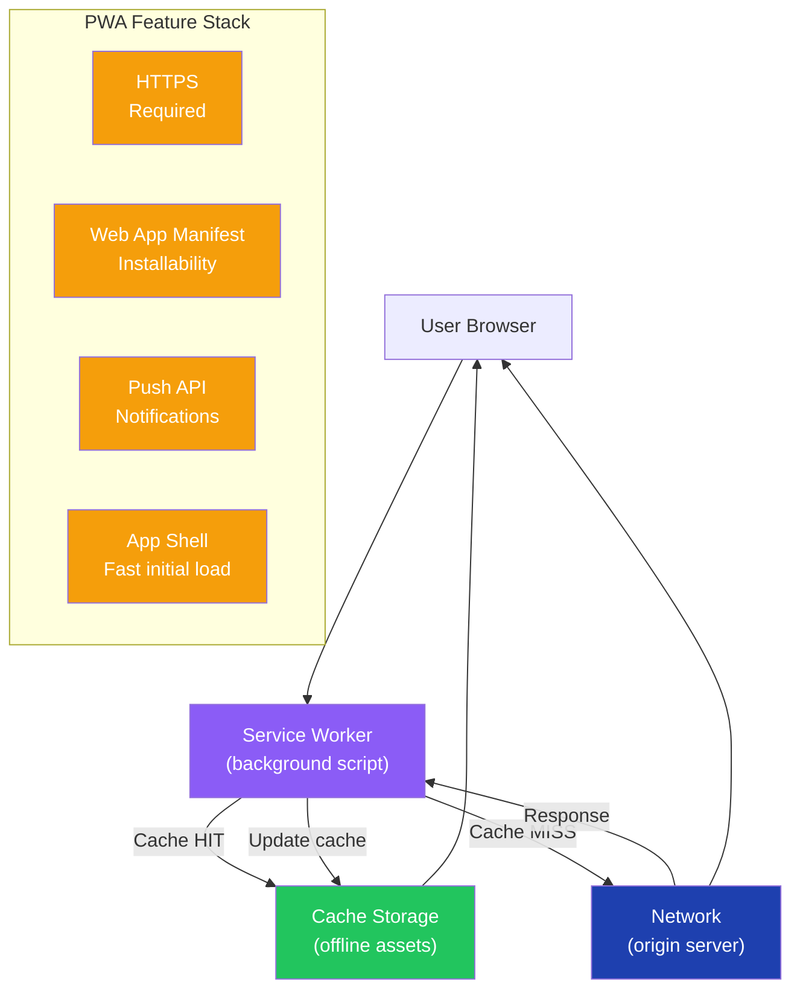

### Core PWA Features

| Feature | Purpose | Technology |
|---|---|---|
| Service Worker | Offline support, background sync, push | `navigator.serviceWorker.register()` |
| Web App Manifest | Installability, app metadata | `manifest.json` |
| HTTPS | Security requirement | TLS certificate |
| Push Notifications | Re-engagement | Push API + Service Worker |
| App Shell Architecture | Fast initial render | Static shell + dynamic content |

### Implementation

```typescript
// 1. Register Service Worker
if ('serviceWorker' in navigator) {
  window.addEventListener('load', async () => {
    const registration = await navigator.serviceWorker.register('/sw.js');
    console.log('SW registered:', registration.scope);
  });
}

// 2. Service Worker (sw.js) — Workbox approach
import { precacheAndRoute } from 'workbox-precaching';
import { registerRoute } from 'workbox-routing';
import { StaleWhileRevalidate, CacheFirst, NetworkFirst } from 'workbox-strategies';

precacheAndRoute(self.__WB_MANIFEST); // precache build artifacts

// App shell — cache first
registerRoute(
  ({ request }) => request.mode === 'navigate',
  new NetworkFirst({ cacheName: 'pages' })
);

// Images — cache first with expiration
registerRoute(
  ({ request }) => request.destination === 'image',
  new CacheFirst({ cacheName: 'images' })
);

// API — network first with offline fallback
registerRoute(
  ({ url }) => url.pathname.startsWith('/api/'),
  new NetworkFirst({ cacheName: 'api', networkTimeoutSeconds: 3 })
);

// 3. Web App Manifest
// public/manifest.json
const manifest = {
  name: 'My PWA',
  short_name: 'PWA',
  description: 'A Progressive Web Application',
  start_url: '/',
  display: 'standalone',
  background_color: '#ffffff',
  theme_color: '#0078D4',
  icons: [
    { src: '/icons/icon-192.png', sizes: '192x192', type: 'image/png' },
    { src: '/icons/icon-512.png', sizes: '512x512', type: 'image/png', purpose: 'maskable' }
  ]
};
```

### Real-World PWA Impact

| Company | Improvement |
|---|---|
| Twitter Lite | 70% less data, 65% more pages/session |
| Uber | Loads in < 3s on 2G, millions of new users in developing markets |
| Pinterest | 60% more engagements vs mobile web |
| Flipkart | 70% increase in conversions |

### Steps to Build a PWA

1. Plan features and offline requirements
2. Build frontend (React/Vue/vanilla)
3. Implement Service Worker (Workbox recommended)
4. Set up HTTPS (required)
5. Add Web App Manifest
6. Test with Lighthouse PWA audit
7. Optimize (Core Web Vitals, bundle size)
8. Deploy to production
9. Register for push notifications (optional)
10. Monitor and iterate

### Interview Talking Points

| Question | Answer |
|---|---|
| What makes a web app a PWA? | HTTPS + Service Worker with fetch handler + valid Web App Manifest with name, icons, start_url, display. Lighthouse verifies installability. |
| What is App Shell Architecture? | Cache the minimal UI shell (header, nav, skeleton) statically. Dynamic content loaded on demand. Shell loads instantly from cache; data streams in. |
| Why are PWAs more secure than some native apps? | Served over HTTPS only. No side-loading — served from the web. Service Workers can't access arbitrary file system. |
| What are the PWA limitations on iOS? | Limited push notification support (iOS 16.4+), no background sync, restricted Web APIs. All iOS browsers use WebKit engine. |
| What is `workbox-precaching`? | Workbox module that creates and manages a precache manifest from build artifacts — ensures all app shell assets are cached on Service Worker install. |

---

## 2. Headless Architecture

### Overview
Headless architecture completely decouples the frontend (presentation layer) from the backend (content/data management). The backend exposes only APIs; the frontend can be any technology consuming those APIs. This enables omnichannel delivery — same backend serves web, mobile, IoT, and third-party integrations.

### Architecture Diagram

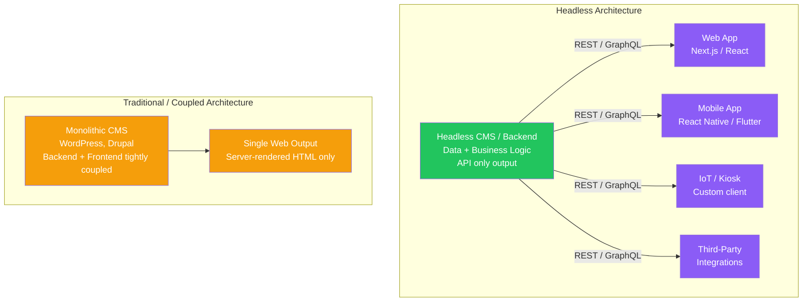

### Headless vs Decoupled vs Traditional

| Feature | Traditional | Headless | Decoupled |
|---|---|---|---|
| Frontend/Backend | Tightly coupled | Completely separate | Mostly separate, some coupling |
| Output Channels | Single (web) | Any — web, mobile, IoT | Multiple, with some shared layers |
| Frontend Tech | Dictated by CMS | Any framework | Mostly free choice |
| Development Speed | Slower (coupled deploys) | Fast (independent deploys) | Medium |
| Complexity | Low | High | Medium |
| Example | WordPress | Contentful + Next.js | Drupal Decoupled |

### Interview Talking Points

| Question | Answer |
|---|---|
| What is Headless CMS? | A content management system that stores and delivers content via API — no built-in frontend. Examples: Contentful, Sanity, Strapi. Your team builds the frontend. |
| What is the main advantage of headless for enterprises? | Omnichannel delivery — one content backend serves web, mobile, smart TV, kiosk from the same API. Faster frontend iteration without backend deploy. |
| What is the key disadvantage of headless? | Higher complexity — two systems to maintain, specialized skills needed for both, more initial setup work than traditional CMS. |
| When would you NOT use headless? | Small sites, limited budget, teams without frontend expertise, content editors who need WYSIWYG control over layout. |

---

## 3. Data Pipeline Architecture

### Overview
A data pipeline moves data from collection points through processing stages to analytical or operational outputs. Each stage transforms or enriches the data before passing it downstream.

### Data Pipeline Diagram

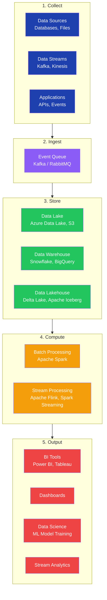

### Interview Talking Points

| Question | Answer |
|---|---|
| What is the difference between a Data Lake and Data Warehouse? | Data Lake: raw, unstructured data at any scale (schema-on-read). Data Warehouse: structured, processed data optimized for analytical queries (schema-on-write). |
| What is a Data Lakehouse? | Combines Lake (raw storage, any format) with Warehouse (ACID transactions, schema enforcement). Technologies: Delta Lake, Apache Iceberg, Apache Hudi. |
| What is the difference between batch and stream processing? | Batch: process accumulated data at intervals (daily reports). Stream: process data continuously as it arrives (real-time dashboards, fraud detection). |
| What is Apache Kafka's role in a data pipeline? | High-throughput distributed message queue and event streaming platform. Decouples producers from consumers, provides durability (messages persisted to disk), and enables replay. |

---

## 4. Webhooks

### Overview
A webhook is an HTTP callback that one application sends to another when a specific event occurs. Unlike polling (client repeatedly asks), webhooks push data instantly — event-driven, server-to-server communication.

### Webhook Flow Diagram

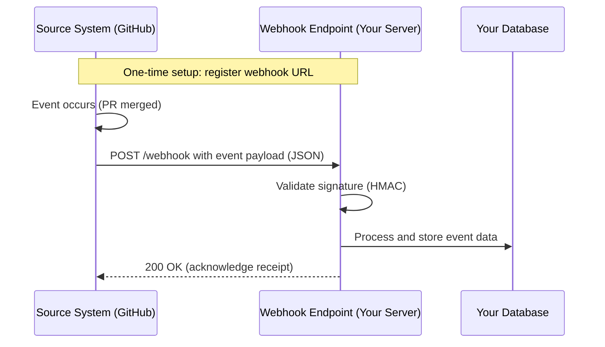

### Implementation

```typescript
import { createHmac } from 'crypto';
import express from 'express';

const app = express();
app.use(express.raw({ type: 'application/json' })); // raw body for signature validation

app.post('/webhook', (req, res) => {
  // 1. Validate webhook signature (prevents spoofing)
  const signature = req.headers['x-hub-signature-256'] as string;
  const expectedSig = 'sha256=' + createHmac('sha256', process.env.WEBHOOK_SECRET!)
    .update(req.body)
    .digest('hex');

  if (signature !== expectedSig) {
    return res.status(401).json({ error: 'Invalid signature' });
  }

  // 2. Acknowledge immediately — process async (prevent timeout)
  res.status(200).json({ received: true });

  // 3. Process event asynchronously
  const event = JSON.parse(req.body.toString());
  processWebhookEvent(event).catch(console.error);
});

async function processWebhookEvent(event: WebhookEvent) {
  switch (event.type) {
    case 'payment.completed':
      await fulfillOrder(event.data);
      break;
    case 'user.created':
      await sendWelcomeEmail(event.data);
      break;
  }
}
```

### Interview Talking Points

| Question | Answer |
|---|---|
| What is a webhook? | An HTTP POST callback sent by one system to another when an event occurs. Event-driven — no polling needed. |
| How do you validate webhook authenticity? | HMAC signature validation — sender signs the payload with a shared secret; receiver recomputes and compares. Reject requests with invalid signatures. |
| What should you do if webhook processing fails? | Return 200 immediately to acknowledge receipt. Process asynchronously. Implement retry logic with exponential backoff. Use a dead letter queue for failed events. |
| What is webhook idempotency? | Webhooks can be delivered multiple times (retry on failure). Use the event ID to detect and skip duplicate processing. |

---

## 5. WebSockets

### Overview
WebSocket is a protocol providing full-duplex, persistent communication over a single TCP connection. Unlike HTTP (request-response, connection closes), WebSocket keeps the connection open for continuous bidirectional data exchange.

### WebSocket Lifecycle Diagram

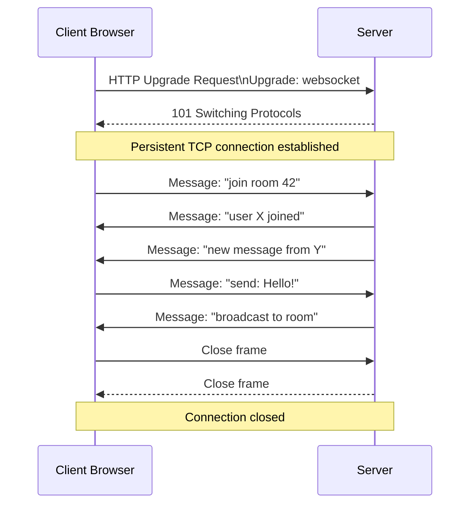

### Implementation

```typescript
// Server (Node.js + ws library)
import { WebSocketServer, WebSocket } from 'ws';

const wss = new WebSocketServer({ port: 8080 });
const rooms = new Map<string, Set<WebSocket>>();

wss.on('connection', (ws, req) => {
  const roomId = new URL(req.url!, 'http://localhost').searchParams.get('room') ?? 'default';

  if (!rooms.has(roomId)) rooms.set(roomId, new Set());
  rooms.get(roomId)!.add(ws);

  ws.on('message', (data) => {
    // Broadcast to all clients in the room
    const message = JSON.stringify({ text: data.toString(), timestamp: Date.now() });
    rooms.get(roomId)?.forEach(client => {
      if (client !== ws && client.readyState === WebSocket.OPEN) {
        client.send(message);
      }
    });
  });

  ws.on('close', () => {
    rooms.get(roomId)?.delete(ws);
  });
});

// Client (React hook)
function useWebSocket(url: string) {
  const wsRef = React.useRef<WebSocket | null>(null);
  const [messages, setMessages] = React.useState<string[]>([]);
  const [status, setStatus] = React.useState<'connecting' | 'open' | 'closed'>('connecting');

  React.useEffect(() => {
    wsRef.current = new WebSocket(url);
    wsRef.current.onopen = () => setStatus('open');
    wsRef.current.onclose = () => setStatus('closed');
    wsRef.current.onmessage = (e) => setMessages(prev => [...prev, e.data]);
    return () => wsRef.current?.close();
  }, [url]);

  const send = React.useCallback((msg: string) => {
    if (wsRef.current?.readyState === WebSocket.OPEN) wsRef.current.send(msg);
  }, []);

  return { messages, send, status };
}
```

### Interview Talking Points

| Question | Answer |
|---|---|
| What is the WebSocket handshake? | Starts as an HTTP request with `Upgrade: websocket` header. Server responds with `101 Switching Protocols`. After this, the TCP connection is used for WebSocket frames. |
| How do WebSockets scale horizontally? | Use a pub/sub message broker (Redis Pub/Sub, Kafka) so any server instance can receive and forward messages to any connected client across the cluster. |
| What is the difference between WebSocket and HTTP/2 Server Push? | WebSocket: application-level bidirectional protocol. HTTP/2 Server Push: server pushes HTTP resources proactively — not a general-purpose messaging protocol. |
| When would you use SSE instead of WebSocket? | When only the server needs to push data (notifications, live feeds). SSE is simpler, works over standard HTTP, auto-reconnects, and scales better. |

---

## 6. Webhooks vs WebSockets

### Comparison Diagram

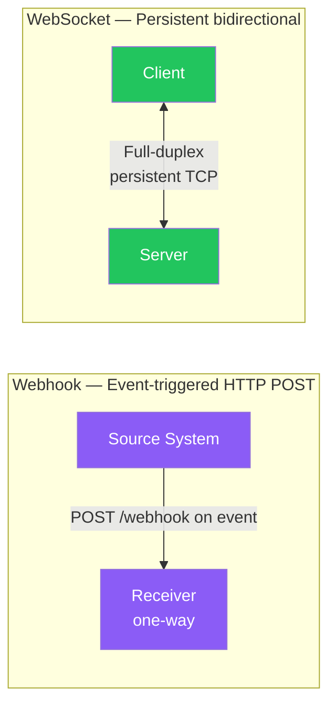

| Dimension | Webhook | WebSocket |
|---|---|---|
| Direction | One-way (server → client) | Two-way (client ↔ server) |
| Protocol | HTTP | `ws://` or `wss://` |
| Lifespan | Event-triggered, short-lived | Persistent, open connection |
| Use Case | Notifications, integrations, automation | Live chat, gaming, collaboration tools |
| Scalability | Easy — stateless HTTP | Harder — stateful connections |
| Latency | Slight delay per event | Instant, ultra-low |

**When to use Webhooks:** Payment notifications, CI/CD triggers, CRM sync, infrequent event-driven server-to-server communication.

**When to use WebSockets:** Live chat, collaborative editing, multiplayer games, real-time dashboards, stock tickers.

---

## 7. Event-Driven Architecture (EDA)

### Overview
EDA is an architectural pattern where components communicate by producing and consuming events asynchronously through a message broker. Producers don't know who consumes their events — achieving maximum decoupling, scalability, and resilience.

### EDA Architecture Diagram

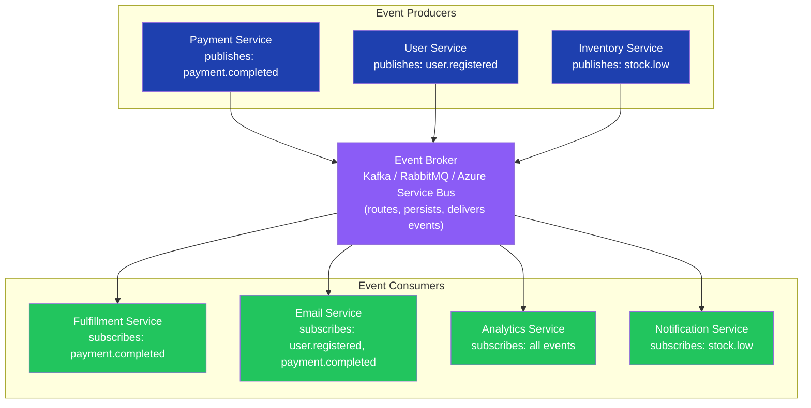

### EDA Design Patterns

```mermaid
flowchart TD
    subgraph EN["Event Notification"]
        EN1["Service A\nActs on event"] --> ENB["Broker"] --> EN2["Service B\nreacts independently"]
    end

    subgraph EC["Event-Carried State Transfer"]
        EC1["Publisher\nsends full state change"] --> ECB["Broker"] --> EC2["Consumer\nhas all context — no extra query"]
    end

    subgraph ES["Event Sourcing"]
        ES1["Write"] --> ESS["Event Store\n(immutable log)"] --> ES2["Rebuild state\nby replaying events"]
    end

    subgraph CQRS2["CQRS"]
        CQ1["Write DB\ncommand store"] -->|"async projection"| CQ2["Read DB\noptimized query store"]
    end
```

### Interview Talking Points

| Question | Answer |
|---|---|
| What is the core benefit of EDA? | High decoupling — producers don't know consumers. Add new consumers without changing producers. Each service scales independently. |
| What is Event Notification pattern? | A service publishes a notification (e.g., "payment processed") without including full data. Consumers query for details if needed. Lightweight but requires additional lookups. |
| What is Event-Carried State Transfer? | The event payload contains all state change data. Consumers have full context without querying back. More data per event but eliminates round-trips. |
| What is Event Sourcing? | Instead of storing current state, store every event that led to the current state. The state can be reconstructed by replaying events. Enables audit log, time-travel queries, and rollback. |
| What are the challenges of EDA? | Eventual consistency (consumers may be behind), debugging distributed traces, event schema evolution, and storage overhead for event logs. |

---

## 8. CQRS — Command Query Responsibility Segregation

### Overview
CQRS separates read and write operations into distinct models. Write commands update an event store (or command DB); read queries use a separately optimized read database updated asynchronously. This allows independent scaling and optimization of reads vs writes.

### CQRS Architecture

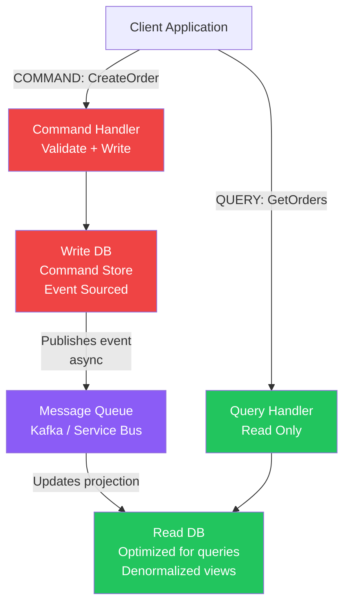

### Interview Talking Points

| Question | Answer |
|---|---|
| What problem does CQRS solve? | Single DB for both reads and writes creates contention. CQRS separates them — write DB optimized for consistency, read DB optimized for query performance (denormalized, cached views). |
| What is eventual consistency in CQRS? | The read DB is updated asynchronously after the write. There is a brief window where reads return stale data. Acceptable for most use cases. |
| When would you NOT use CQRS? | Simple CRUD applications where read/write patterns are similar. CQRS adds complexity — justify it with actual scaling needs. |
| How does CQRS relate to Event Sourcing? | Often combined: Event Sourcing stores all writes as immutable events; CQRS uses those events to build read-optimized projections. They're separate patterns but complement each other. |

---

## 9. Event Brokers

### Overview
An event broker is the central component of EDA — it receives events from producers, routes them to subscribed consumers, and provides durability (events persisted if consumer is offline). It decouples producers from consumers completely.

### Event Broker Architecture

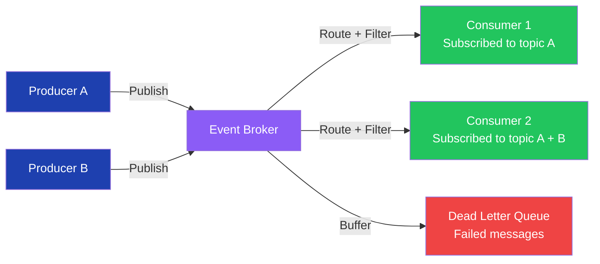

### Broker Comparison

| Broker | Type | Best For |
|---|---|---|
| Apache Kafka | Log-based streaming | High-throughput, event sourcing, audit logs |
| RabbitMQ | Message queue | Task queues, routing, RPC patterns |
| Amazon SQS/SNS | Managed cloud | AWS-native serverless workloads |
| Azure Service Bus | Managed cloud | Enterprise workflows, sessions, DLQ |
| Google Pub/Sub | Managed cloud | GCP-native real-time analytics |

### Interview Talking Points

| Question | Answer |
|---|---|
| What is the difference between Kafka and RabbitMQ? | Kafka: log-based, messages retained for configurable time, consumers can replay. RabbitMQ: message queue, messages deleted after acknowledgment, supports complex routing. |
| What is a Dead Letter Queue (DLQ)? | A queue where messages are sent after repeated processing failures. Enables manual inspection and retry without losing the event. |
| What is Consumer Group in Kafka? | A group of consumers that collectively consume a Kafka topic. Partitions are distributed across group members — enables parallel processing and horizontal scaling. |
| What is message idempotency? | Processing the same message multiple times produces the same result. Essential because brokers may deliver messages more than once (at-least-once delivery). |

---

## 10. Common Architecture Implementations

### Overview

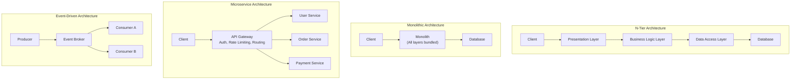

| Architecture | Coupling | Scalability | Complexity | Best For |
|---|---|---|---|---|
| N-Tier | Medium | Limited | Low | Traditional enterprise apps |
| Monolithic | High | Hard to scale parts | Low initially | Small teams, prototypes |
| Microservices | Low | Per-service scaling | High | Large teams, independent scaling |
| Event-Driven | Very Low | Excellent | Medium-High | Real-time, async workflows |

---

## 11. Netflix Architecture

### Overview

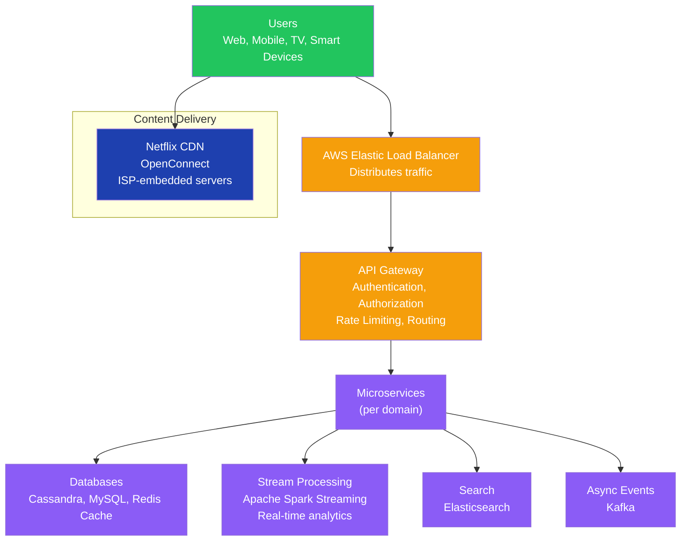

### Key Netflix Architecture Patterns

| Pattern | Implementation |
|---|---|
| CDN | OpenConnect — Netflix-owned CDN with ISP-embedded appliances |
| Resilience | Hystrix/Resilience4j circuit breakers, Chaos Engineering (Chaos Monkey) |
| BFF | Separate API per client type (iOS, Android, Web, TV, Smart TV) |
| Caching | Redis for session and personalization data |
| A/B Testing | Artwork, UI layout, recommendation algorithms tested on user subsets |

### Interview Talking Points

| Question | Answer |
|---|---|
| How does Netflix handle 250M+ concurrent streams? | OpenConnect CDN embedded at ISPs worldwide, microservices scaled per service, Cassandra for distributed high-throughput data, Zuul API Gateway for routing. |
| What is Chaos Engineering (Chaos Monkey)? | Netflix-pioneered practice of intentionally injecting failures (killing servers, slowing networks) in production to verify the system's resilience and auto-recovery. |

---

## 12. Mobile Design Best Practices

| Practice | Why |
|---|---|
| Clear navigation patterns | Users should always know where they are and how to navigate |
| Dependency Injection | Testability, loose coupling between components |
| No logic in Views | Views are hard to unit test — keep them as passive as possible |
| Modular Architecture | Teams work independently, features deployable separately |
| Composition over Inheritance | More flexible, avoids deep inheritance chains |
| Minimize State Duplication | Single source of truth prevents synchronization bugs |
| Use Async/Await | Non-blocking UI thread — smooth 60fps animations |
| Unidirectional Data Flow | Predictable state changes (Redux, MVI pattern) |
| Use DTOs | Separate API data models from domain models |

---

## 13. Top 5 Mobile System Design Concepts

### 1. API Communication Protocols

| Protocol | Use Case | Characteristics |
|---|---|---|
| REST | Standard data exchange | Simple, stateless, widely supported |
| WebSockets | Real-time bidirectional | Persistent, low-latency |
| GraphQL | Flexible data fetching | Client specifies fields, prevents over/under-fetching |
| gRPC | High-performance microservices | Protocol Buffers, HTTP/2, strong typing |

### 2. Real-time Update Strategies

| Strategy | Direction | Efficiency | Use Case |
|---|---|---|---|
| HTTP Polling | Client → Server repeated | Poor | Legacy systems |
| Long Polling | Client holds request | Medium | Fallback |
| SSE | Server → Client stream | Good | Notifications, feeds |
| WebSockets | Bidirectional | Excellent | Chat, gaming |
| Push Notifications | Server → Device | Battery-efficient | Alerts when app closed |

### 3. Mobile Storage Solutions

| Type | iOS | Android | Use For |
|---|---|---|---|
| Key-Value | UserDefaults | SharedPreferences | Settings, preferences |
| Relational DB | Core Data, SQLite | Room, SQLite | Complex structured data |
| Secure Storage | Keychain | EncryptedSharedPreferences | Tokens, passwords |
| File Storage | FileManager | File API | Images, documents |

### 4. Pagination Strategies

| Strategy | Mechanism | Pros | Cons |
|---|---|---|---|
| Limit-Offset | `LIMIT 20 OFFSET 40` | Simple | Data drift, slow at high offsets |
| Page-Based | `page=3&size=20` | Intuitive | Same drift issue |
| Keyset | `WHERE id > last_id LIMIT 20` | Fast, stable | Can't jump to arbitrary page |
| Cursor-Based | `after=cursor_token LIMIT 20` | Most stable, scalable | Complex implementation |

### 5. Dependency Injection

```typescript
// Without DI — tightly coupled, hard to test
class UserViewModel {
  private service = new UserService(new NetworkClient()); // hardcoded deps
}

// With DI — loosely coupled, easily testable
class UserViewModel {
  constructor(private readonly service: UserService) {} // injected
}

// iOS (Swift) — constructor injection
class ProfileViewController: UIViewController {
  init(viewModel: ProfileViewModel) {
    self.viewModel = viewModel
    super.init(nibName: nil, bundle: nil)
  }
}

// Android (Kotlin) — Hilt DI
@HiltViewModel
class ProfileViewModel @Inject constructor(
  private val userRepository: UserRepository
) : ViewModel()
```

---

## 14. SOLID Principles in UI

### Architecture Diagram

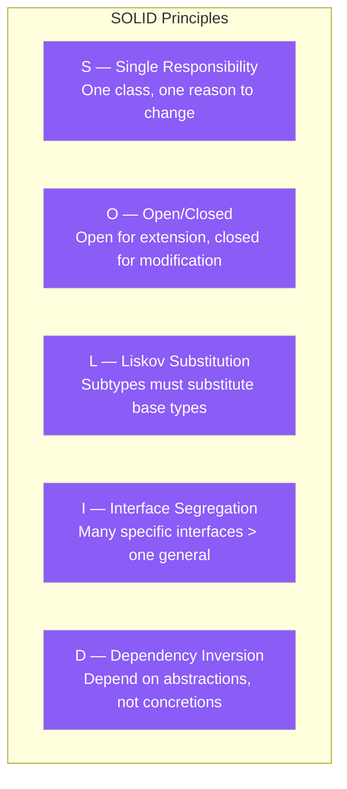

### Applied to React/TypeScript

```typescript
// S — Single Responsibility: separate data fetching from rendering
// Bad: one component fetches AND renders AND validates
// Good: separate hooks, separate display components

function useUserData(userId: string) { /* fetch only */ }
function UserCard({ user }: { user: User }) { /* render only */ }

// O — Open/Closed: extend via composition, not modification
interface CellRenderer { render(value: unknown): React.ReactNode; }

class TextCellRenderer implements CellRenderer { render = (v) => <span>{String(v)}</span>; }
class BadgeCellRenderer implements CellRenderer { render = (v) => <Badge>{String(v)}</Badge>; }
// Add new renderer without modifying existing Table component

// I — Interface Segregation: small focused interfaces
interface Readable { read(): Data; }
interface Writable { write(data: Data): void; }
// Components depend only on what they need — not a bloated interface

// D — Dependency Inversion: depend on abstractions
interface ProductRepository {
  findById(id: string): Promise<Product>;
}

class ProductService {
  constructor(private readonly repo: ProductRepository) {} // abstraction
}
// Testing: inject MockProductRepository
// Production: inject HttpProductRepository
```

### Interview Talking Points

| Question | Answer |
|---|---|
| What is the "Massive ViewController" problem? | In iOS MVC, the UIViewController ends up handling UI, networking, and data logic — violating SRP. Fixed by extracting to ViewModels (MVVM) or Presenters (MVP). |
| How does OCP apply to React components? | Design components to accept new behavior via props/composition rather than modifying existing code. Example: render prop, children, or strategy patterns. |
| How does DIP apply to data fetching? | Components depend on abstractions (repository interfaces) not concrete implementations (specific API clients). Enables swapping REST for GraphQL without touching components. |

---

## Cross-Cutting Themes

### Architecture Selection Guide

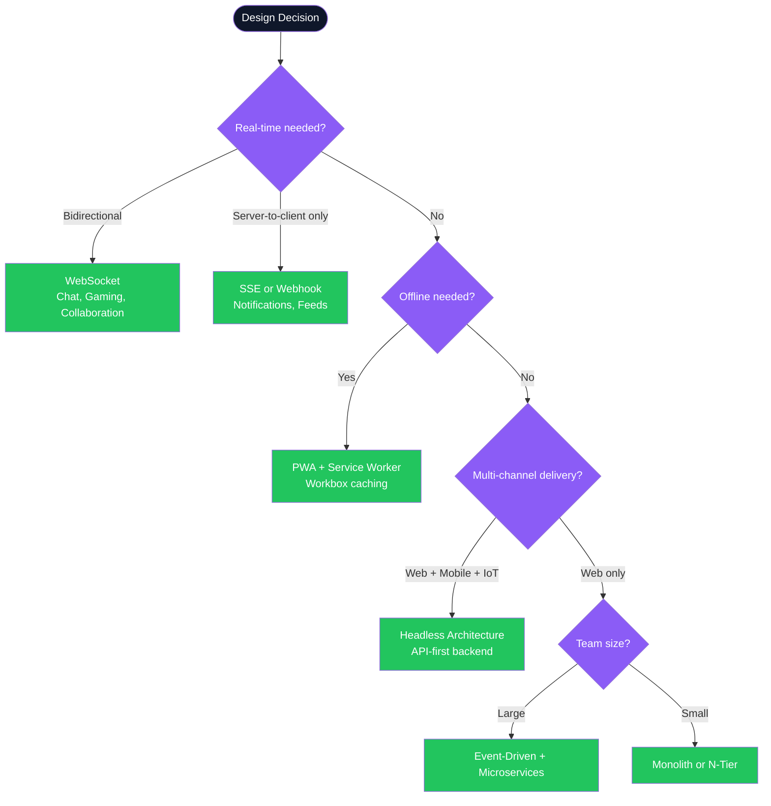

### Common Red Flags to Avoid

| Red Flag | Why It's Wrong | Correct Answer |
|---|---|---|
| "We poll every second for updates" | Creates massive server load, wastes bandwidth. | Use WebSockets or SSE for real-time. Long polling as a last resort. |
| "Our monolith handles 10M users fine" | Eventually becomes deployment bottleneck — one team blocks all others. | Identify bounded contexts and extract microservices incrementally. |
| "We don't need DI — we new up dependencies" | Tight coupling — impossible to unit test, hard to swap implementations. | Use constructor injection throughout. DI containers for large apps. |
| "CQRS everywhere, even for simple CRUD" | Over-engineering — adds complexity without benefit for simple data models. | Use CQRS only when read/write scaling needs diverge significantly. |
| "Our Service Worker caches everything" | Caching API responses aggressively leads to stale data and broken UX. | Apply appropriate strategy per resource: cache-first for assets, network-first for API data. |

---

*UI Design Implementation Concepts — Complete Guide | Generated July 2026*
