# Mobile System Design — Complete Guide (iOS & Android)

---

## Table of Contents

1. [Mobile System Design Overview](#1-mobile-system-design-overview)
2. [UI Frameworks](#2-ui-frameworks)
3. [Application Lifecycle Management](#3-application-lifecycle-management)
4. [Threading & Concurrency](#4-threading--concurrency)
5. [Navigation](#5-navigation)
6. [Data Binding & Reactive Programming](#6-data-binding--reactive-programming)
7. [API Design & Networking](#7-api-design--networking)
8. [Software Architecture Patterns](#8-software-architecture-patterns)
9. [GOF Design Patterns in Mobile](#9-gof-design-patterns-in-mobile)
10. [Dependency Injection](#10-dependency-injection)
11. [Data Storage](#11-data-storage)
12. [Observability & Testing](#12-observability--testing)
13. [Privacy & Security](#13-privacy--security)
14. [Advanced Topics](#14-advanced-topics)
15. [Interview Strategy](#15-interview-strategy)

---

## 1. Mobile System Design Overview

### The RADIO Framework for Mobile Design Interviews

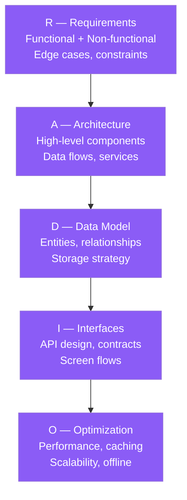

### Non-Functional Requirements for Mobile

| Category | Requirements |
|---|---|
| Performance | < 100ms UI response, 60fps smooth scroll, < 3s cold start |
| Reliability | Offline support, graceful degradation, crash rate < 0.1% |
| Security | Biometric auth, secure storage, certificate pinning |
| Scalability | Pagination, lazy loading, data compression |
| Battery | Background processing minimized, wake locks avoided |
| Accessibility | VoiceOver/TalkBack support, dynamic font sizes |

---

## 2. UI Frameworks

### iOS vs Android Framework Comparison

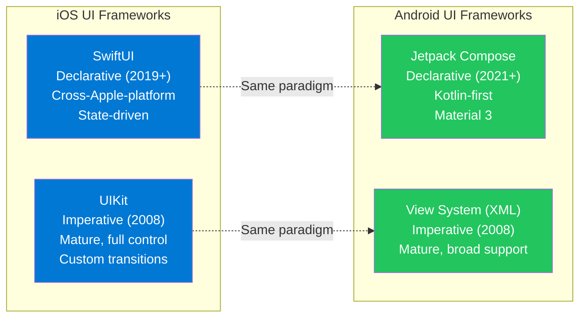

| Framework | Platform | Paradigm | Pros | Cons |
|---|---|---|---|---|
| SwiftUI | iOS 13+ | Declarative | Less boilerplate, preview canvas, cross-Apple-platform | Less mature, some UIKit features still missing |
| UIKit | iOS 2+ | Imperative | Full control, proven APIs, large community | Verbose, delegate patterns, boilerplate |
| Jetpack Compose | Android API 21+ | Declarative | Kotlin-first, composable functions, live preview | Newer, some View System features require interop |
| View System (XML) | All Android | Imperative | Broad support, familiar, extensive tooling | Verbose XML, findById pattern error-prone |

### SwiftUI vs UIKit Code Comparison

```swift
// SwiftUI — declarative, state-driven
struct UserProfileView: View {
    @StateObject private var viewModel = UserProfileViewModel()

    var body: some View {
        VStack {
            if viewModel.isLoading {
                ProgressView()
            } else {
                Text(viewModel.user?.name ?? "")
                    .font(.title)
            }
        }
        .task { await viewModel.loadUser() }
    }
}

// UIKit — imperative, delegate-based
class UserProfileViewController: UIViewController {
    private let nameLabel = UILabel()
    private let viewModel = UserProfileViewModel()

    override func viewDidLoad() {
        super.viewDidLoad()
        setupUI()
        bindViewModel()
        viewModel.loadUser()
    }

    private func bindViewModel() {
        viewModel.onUserLoaded = { [weak self] user in
            DispatchQueue.main.async {
                self?.nameLabel.text = user.name
            }
        }
    }
}
```

### Jetpack Compose vs XML

```kotlin
// Jetpack Compose — declarative
@Composable
fun UserProfileScreen(viewModel: UserProfileViewModel = hiltViewModel()) {
    val uiState by viewModel.uiState.collectAsState()

    when (uiState) {
        is UiState.Loading -> CircularProgressIndicator()
        is UiState.Success -> Text(
            text = uiState.user.name,
            style = MaterialTheme.typography.headlineMedium
        )
    }
}

// XML View System — imperative
class UserProfileFragment : Fragment(R.layout.fragment_user_profile) {
    private val viewModel: UserProfileViewModel by viewModels()

    override fun onViewCreated(view: View, savedInstanceState: Bundle?) {
        super.onViewCreated(view, savedInstanceState)
        viewModel.uiState.observe(viewLifecycleOwner) { state ->
            when (state) {
                is UiState.Loading -> binding.progressBar.isVisible = true
                is UiState.Success -> binding.nameText.text = state.user.name
            }
        }
    }
}
```

---

## 3. Application Lifecycle Management

### iOS App Lifecycle

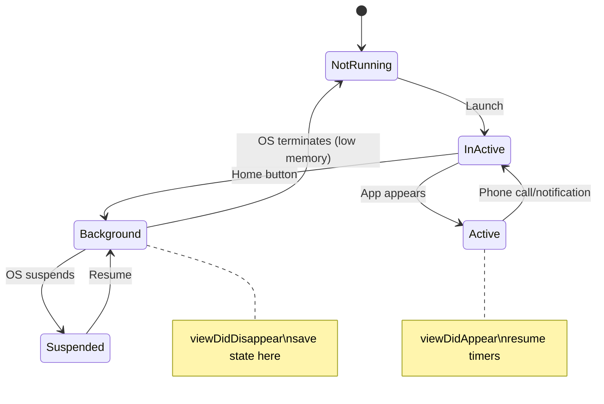

### Android Activity Lifecycle

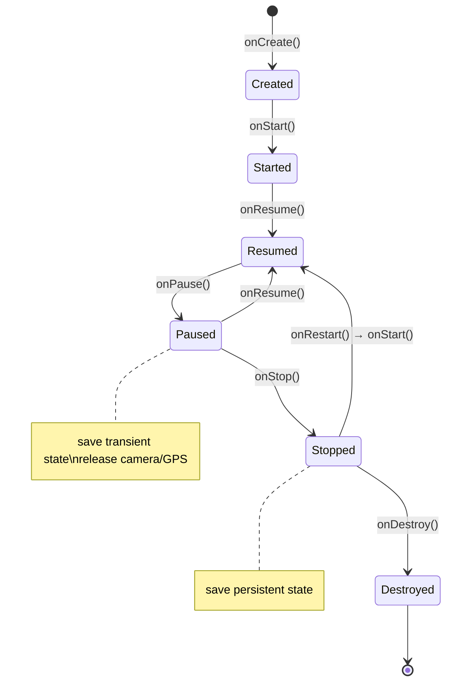

### Interview Talking Points

| Question | Answer |
|---|---|
| When should you save state in iOS? | `viewWillDisappear` for UI state; `sceneWillResignActive` for app-level saves; `sceneWillEnterForeground` to refresh stale data. |
| What is `onSaveInstanceState` in Android? | Called before the Activity is destroyed (rotation, back-stack). Use it to save lightweight UI state (scroll position, input text). Restore in `onCreate` via the Bundle. Not for persistent data. |
| What happens to a Swift ViewController in the background? | iOS may terminate background apps to reclaim memory. Always save critical state before entering background; reload on resume. |
| Why use `weak self` in closures? | Prevents retain cycles — if a ViewController holds a closure, and the closure captures `self`, a strong reference cycle forms and memory leaks. `weak self` breaks the cycle. |

---

## 4. Threading & Concurrency

### Concurrency Models

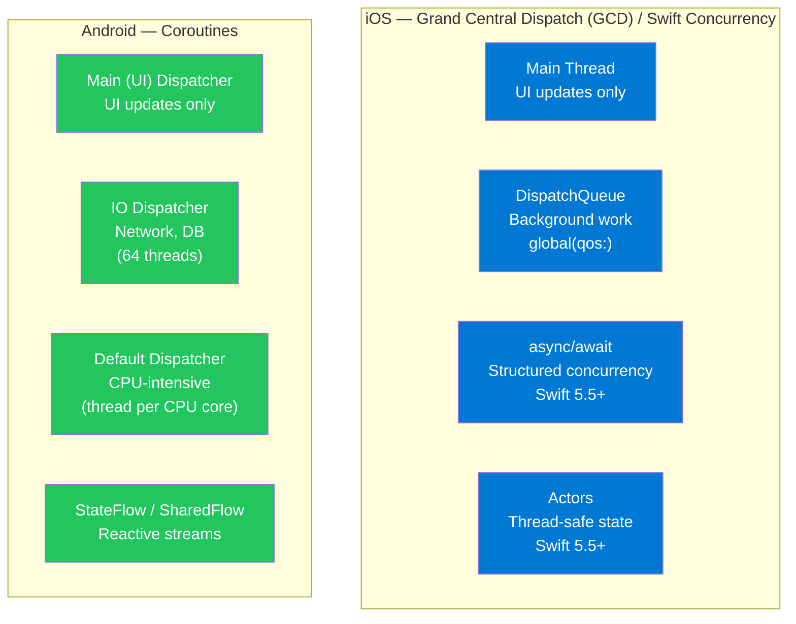

### Threading Code Examples

```swift
// iOS — Swift async/await (modern)
class UserRepository {
    func fetchUser(id: String) async throws -> User {
        let (data, _) = try await URLSession.shared.data(from: URL(string: "api/users/\(id)")!)
        return try JSONDecoder().decode(User.self, from: data)
    }
}

// iOS — Actor for thread-safe state
actor Cache {
    private var storage: [String: Any] = [:]

    func set(_ key: String, value: Any) {
        storage[key] = value
    }

    func get(_ key: String) -> Any? {
        storage[key]
    }
}

// iOS — GCD (legacy)
DispatchQueue.global(qos: .userInitiated).async {
    let data = fetchData() // heavy work off main thread
    DispatchQueue.main.async {
        self.updateUI(data) // UI updates on main thread
    }
}
```

```kotlin
// Android — Coroutines
class UserViewModel @Inject constructor(
    private val repository: UserRepository
) : ViewModel() {

    private val _uiState = MutableStateFlow<UiState>(UiState.Loading)
    val uiState: StateFlow<UiState> = _uiState.asStateFlow()

    fun loadUser(id: String) {
        viewModelScope.launch {
            _uiState.value = UiState.Loading
            runCatching {
                withContext(Dispatchers.IO) { repository.fetchUser(id) }
            }.onSuccess { user ->
                _uiState.value = UiState.Success(user)
            }.onFailure { error ->
                _uiState.value = UiState.Error(error.message)
            }
        }
    }
}
```

### Interview Talking Points

| Question | Answer |
|---|---|
| What is `Dispatchers.Main` in Android? | The main UI thread dispatcher. Used to update UI. All state updates to LiveData/StateFlow that trigger recomposition must happen here. |
| What is a Swift Actor? | A reference type that protects its mutable state from data races — only one task accesses it at a time. Replaces locks/serial queues with language-enforced safety. |
| What is a Coroutine vs a Thread? | A coroutine is a lightweight suspendable computation — thousands can run on a small thread pool. Threads are OS-level, expensive. Coroutines don't block threads when suspended. |
| What happens if you update UI from a background thread? | Crash or undefined behavior. iOS: `UIKit` is not thread-safe. Android: throws `CalledFromWrongThreadException`. Always dispatch UI updates to main thread. |

---

## 5. Navigation

### Navigation Patterns

| Pattern | iOS | Android |
|---|---|---|
| Push/Pop Stack | `UINavigationController`, SwiftUI `NavigationStack` | `FragmentManager` back stack, Compose `NavController` |
| Tab-Based | `UITabBarController`, SwiftUI `TabView` | `BottomNavigationView`, Compose `NavigationBar` |
| Modals | `present(vc, animated:)`, SwiftUI `.sheet` | `DialogFragment`, Compose `ModalBottomSheet` |
| Deep Linking | `UIApplicationDelegate openURL`, `onOpenURL` | Android Intent filters, Compose `NavDeepLink` |

```swift
// SwiftUI Navigation
struct AppView: View {
    var body: some View {
        NavigationStack {
            ContentView()
                .navigationDestination(for: User.self) { user in
                    UserDetailView(user: user)
                }
        }
    }
}
```

```kotlin
// Jetpack Compose Navigation
@Composable
fun AppNavigation(navController: NavHostController = rememberNavController()) {
    NavHost(navController = navController, startDestination = "home") {
        composable("home") { HomeScreen(navController) }
        composable("user/{userId}") { backStack ->
            val userId = backStack.arguments?.getString("userId")
            UserDetailScreen(userId = userId, navController = navController)
        }
    }
}
```

---

## 6. Data Binding & Reactive Programming

### Reactive Architecture Diagram

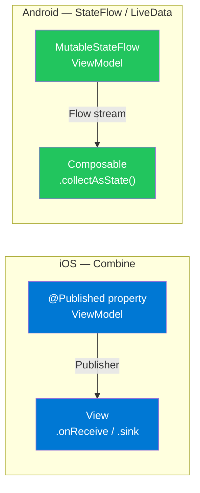

| Framework | iOS | Android |
|---|---|---|
| Reactive Library | Combine (Apple), RxSwift (third-party) | Kotlin Flow, LiveData, RxJava |
| State Container | `@Published`, `@State`, `@ObservableObject` | `StateFlow`, `MutableState` (Compose) |
| Binding Primitive | `@Binding`, `$` two-way binding | `mutableStateOf`, `remember` |

```swift
// iOS Combine — ViewModel
class UserViewModel: ObservableObject {
    @Published var users: [User] = []
    @Published var isLoading = false
    private var cancellables = Set<AnyCancellable>()

    func loadUsers() {
        isLoading = true
        URLSession.shared.dataTaskPublisher(for: url)
            .map(\.data)
            .decode(type: [User].self, decoder: JSONDecoder())
            .receive(on: DispatchQueue.main)
            .sink(
                receiveCompletion: { [weak self] _ in self?.isLoading = false },
                receiveValue: { [weak self] in self?.users = $0 }
            )
            .store(in: &cancellables)
    }
}
```

---

## 7. API Design & Networking

### Networking Stack

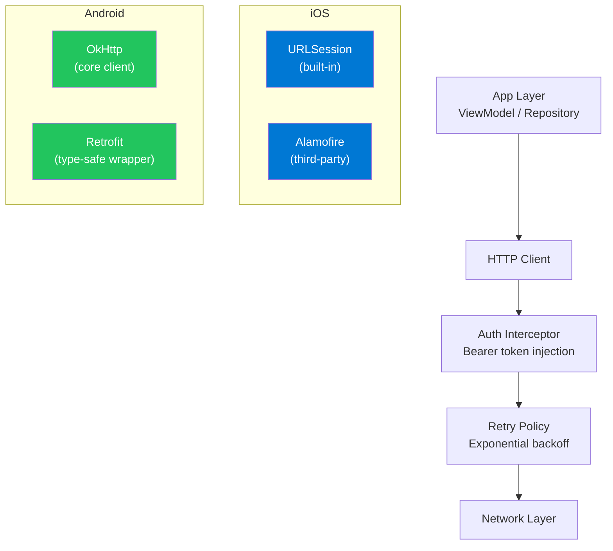

### Retrofit Example (Android)

```kotlin
// API interface
interface UserApi {
    @GET("users/{id}")
    suspend fun getUser(@Path("id") id: String): UserDto

    @POST("users")
    suspend fun createUser(@Body request: CreateUserRequest): UserDto
}

// OkHttp client with auth interceptor
val okHttpClient = OkHttpClient.Builder()
    .addInterceptor { chain ->
        val request = chain.request().newBuilder()
            .addHeader("Authorization", "Bearer ${tokenManager.getToken()}")
            .build()
        chain.proceed(request)
    }
    .addInterceptor(HttpLoggingInterceptor().apply { level = Level.BODY })
    .build()

val retrofit = Retrofit.Builder()
    .baseUrl(BuildConfig.API_BASE_URL)
    .client(okHttpClient)
    .addConverterFactory(GsonConverterFactory.create())
    .build()
```

### Interview Talking Points

| Question | Answer |
|---|---|
| What is certificate pinning? | Hardcodes the expected server TLS certificate/public key in the app. Prevents MITM attacks even if a certificate authority is compromised. Must be updated before cert expiry. |
| What is exponential backoff? | On network failure, retry with increasing delays: 1s, 2s, 4s, 8s + jitter. Prevents thundering herd when all clients retry simultaneously after server recovery. |
| What is a circuit breaker in mobile? | After N consecutive failures, stop sending requests for a cool-down period. Protects backend and saves battery — fail fast instead of waiting for timeouts. |

---

## 8. Software Architecture Patterns

### Pattern Evolution

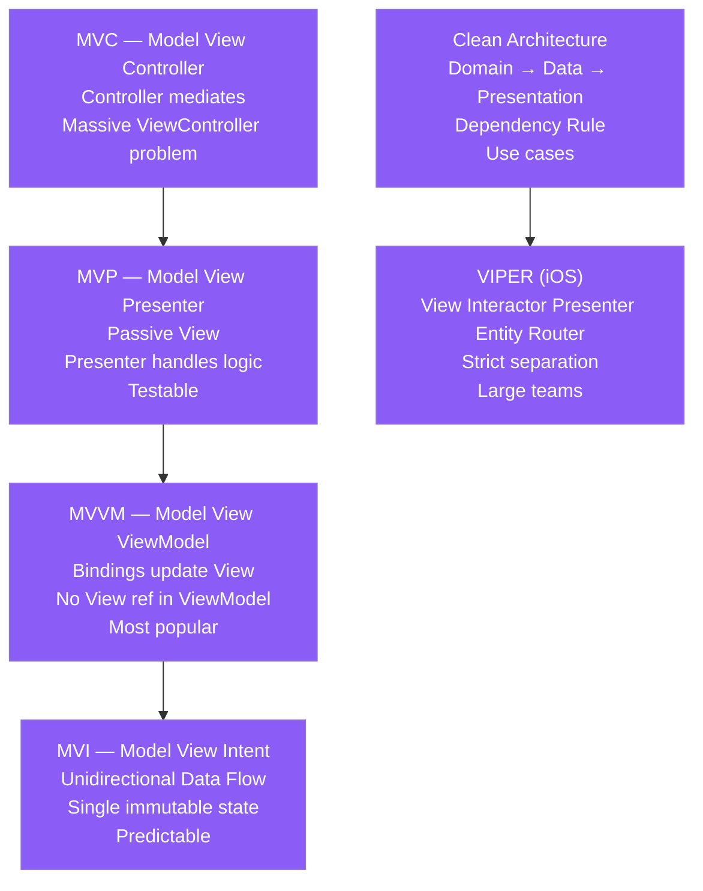

### MVVM Implementation

```typescript
// React MVVM equivalent
// Model (data entity)
interface User { id: string; name: string; email: string; }

// ViewModel (state + business logic)
function useUserViewModel(userId: string) {
  const [user, setUser] = React.useState<User | null>(null);
  const [isLoading, setIsLoading] = React.useState(false);
  const [error, setError] = React.useState<string | null>(null);

  const loadUser = React.useCallback(async () => {
    setIsLoading(true);
    setError(null);
    try {
      const data = await userRepository.findById(userId);
      setUser(data);
    } catch (e) {
      setError(e instanceof Error ? e.message : 'Unknown error');
    } finally {
      setIsLoading(false);
    }
  }, [userId]);

  React.useEffect(() => { loadUser(); }, [loadUser]);
  return { user, isLoading, error, reload: loadUser };
}

// View (pure rendering, no business logic)
function UserProfileView({ userId }: { userId: string }) {
  const { user, isLoading, error } = useUserViewModel(userId);
  if (isLoading) return <Spinner />;
  if (error) return <ErrorMessage message={error} />;
  return <div>{user?.name}</div>;
}
```

### Architecture Pattern Comparison

| Pattern | Testability | Boilerplate | Best For |
|---|---|---|---|
| MVC | Hard (Massive VC) | Low | Small apps, rapid prototypes |
| MVP | Good (Passive View) | Medium | Classic Android XML apps |
| MVVM | Excellent (ViewModel testable) | Medium | Modern iOS/Android, React |
| MVI | Excellent (pure functions) | High | Complex state, Redux-style apps |
| Clean + VIPER | Excellent | Very High | Large teams, domain-rich apps |

---

## 9. GOF Design Patterns in Mobile

### Creational Patterns

| Pattern | Intent | Mobile Example |
|---|---|---|
| Singleton | One instance app-wide | `UserDefaults.standard`, `NetworkManager.shared` |
| Factory Method | Subclass decides which object to create | `ViewControllerFactory.makeProfile()` |
| Abstract Factory | Family of related objects | `ThemeFactory` → LightTheme / DarkTheme |
| Builder | Complex object construction step by step | `URLRequest` builder, `AlertDialog.Builder` |
| Prototype | Clone an existing object | Copying a configuration object with overrides |

### Structural Patterns

| Pattern | Intent | Mobile Example |
|---|---|---|
| Adapter | Bridge incompatible interfaces | Wrapping a REST client to match a repository protocol |
| Decorator | Add behavior by wrapping | Logging decorator around a network client |
| Facade | Simplified interface to complex subsystem | `AuthManager` wrapping Keychain + token refresh + biometric |
| Composite | Treat single objects and compositions uniformly | UIView hierarchy — view tree is a Composite |
| Proxy | Surrogate for another object | Image placeholder while loading — proxy for the real image |

### Behavioral Patterns

| Pattern | Intent | Mobile Example |
|---|---|---|
| Observer | Notify dependents of state changes | NotificationCenter, LiveData, Combine, Flow |
| Strategy | Swap algorithms at runtime | Authentication strategy — OTP vs Biometric vs Password |
| Command | Encapsulate a request as an object | Undo/redo actions, queued network requests |
| Template Method | Skeleton algorithm; subclasses fill in steps | `BaseViewController` with `setupUI()` / `bindViewModel()` hooks |
| Chain of Responsibility | Pass request through handler chain | Middleware — auth → logging → rate limit → actual handler |

### Code: Observer Pattern (iOS Combine)

```swift
// Publisher-Subscriber via Combine
class StockPriceService: ObservableObject {
    @Published var currentPrice: Double = 0.0
    private var timer: AnyCancellable?

    func startStreaming(symbol: String) {
        timer = Timer.publish(every: 1.0, on: .main, in: .common)
            .autoconnect()
            .sink { [weak self] _ in
                self?.currentPrice = Double.random(in: 150...160) // simulated
            }
    }
}

struct StockView: View {
    @ObservedObject var service: StockPriceService
    var body: some View {
        Text("$\(service.currentPrice, specifier: "%.2f")")
    }
}
```

---

## 10. Dependency Injection

### DI Architecture

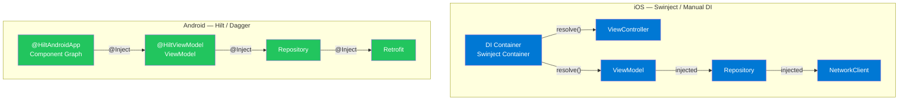

```kotlin
// Android Hilt DI
@HiltAndroidApp
class MyApplication : Application()

@Module
@InstallIn(SingletonComponent::class)
object NetworkModule {
    @Provides
    @Singleton
    fun provideRetrofit(): UserApi = Retrofit.Builder()
        .baseUrl(BuildConfig.API_URL)
        .build()
        .create(UserApi::class.java)
}

@HiltViewModel
class UserViewModel @Inject constructor(
    private val repository: UserRepository
) : ViewModel()
```

---

## 11. Data Storage

### Storage Decision Matrix

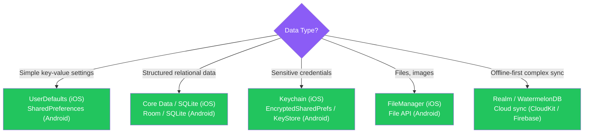

| Storage Type | iOS | Android | Use For |
|---|---|---|---|
| Key-Value | `UserDefaults` | `SharedPreferences` | Settings, flags, small values |
| Relational | Core Data, SQLite | Room (ORM), SQLite | Complex queries, relationships |
| Secure | Keychain | `EncryptedSharedPreferences`, Keystore | Tokens, passwords, biometric keys |
| File | `FileManager` | `File`, `Context.filesDir` | Media, documents, cache |
| Cloud Sync | CloudKit, iCloud | Firebase, Sync Manager | Cross-device sync |

```kotlin
// Room Database (Android)
@Entity(tableName = "users")
data class UserEntity(
    @PrimaryKey val id: String,
    val name: String,
    val email: String
)

@Dao
interface UserDao {
    @Query("SELECT * FROM users WHERE id = :id")
    suspend fun findById(id: String): UserEntity?

    @Insert(onConflict = OnConflictStrategy.REPLACE)
    suspend fun upsert(user: UserEntity)
}

@Database(entities = [UserEntity::class], version = 1)
abstract class AppDatabase : RoomDatabase() {
    abstract fun userDao(): UserDao
}
```

---

## 12. Observability & Testing

### Testing Pyramid

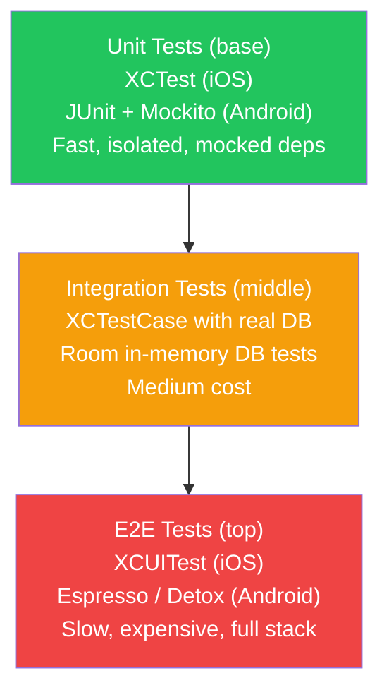

| Tool | Platform | Type |
|---|---|---|
| XCTest | iOS | Unit + UI testing framework |
| Quick + Nimble | iOS | BDD-style specs |
| Espresso | Android | UI automation (in-process) |
| JUnit 4/5 + Mockito | Android | Unit tests |
| Detox | Cross-platform | E2E gray-box testing |

```kotlin
// Android Unit Test — ViewModel with coroutines
@OptIn(ExperimentalCoroutinesApi::class)
class UserViewModelTest {
    @get:Rule
    val coroutineRule = MainCoroutineRule()

    private val repository = mockk<UserRepository>()
    private lateinit var viewModel: UserViewModel

    @Before
    fun setup() {
        viewModel = UserViewModel(repository)
    }

    @Test
    fun `loads user successfully`() = runTest {
        val expected = User("1", "Alice", "alice@example.com")
        coEvery { repository.findById("1") } returns expected

        viewModel.loadUser("1")

        assertEquals(UiState.Success(expected), viewModel.uiState.value)
    }
}
```

---

## 13. Privacy & Security

### Security Architecture

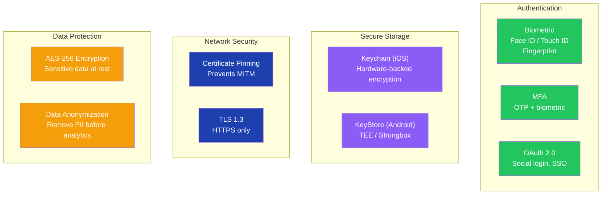

### Interview Talking Points

| Question | Answer |
|---|---|
| Where should you store auth tokens on iOS? | Keychain — hardware-backed, encrypted, survives app reinstall. Never `UserDefaults` (unencrypted, accessible in backups). |
| Where should you store auth tokens on Android? | `EncryptedSharedPreferences` (uses Android Keystore under the hood) or directly in Keystore with a symmetric key. |
| What is App Transport Security (ATS)? | iOS policy requiring HTTPS for all network connections (unless explicitly exempted). Enforced since iOS 9. |
| What is biometric authentication flow? | Use `LocalAuthentication` (iOS) / `BiometricPrompt` (Android) to authenticate. On success, retrieve the key from Keychain/Keystore to decrypt data or authenticate API calls. |
| What is jailbreak/root detection? | Checking if device is jailbroken (iOS) or rooted (Android). Jailbreaking bypasses OS security — sensitive apps (banking) refuse to run on compromised devices. |

---

## 14. Advanced Topics

### On-Device ML

| Platform | Framework | Use Case |
|---|---|---|
| iOS | CoreML | Object detection, NLP, image classification |
| iOS | Create ML | Training custom models on device |
| Android | ML Kit (Firebase) | Text recognition, face detection, barcode scanning |
| Cross-platform | TFLite (TensorFlow Lite) | Small models optimized for mobile inference |

### AR & VR

| Platform | SDK | Features |
|---|---|---|
| iOS | ARKit | Plane detection, face tracking, LiDAR depth |
| Android | ARCore | Motion tracking, environmental understanding |
| Cross-platform | Unity AR Foundation | Single codebase for iOS + Android AR |
| Vision Pro | RealityKit | Spatial computing, mixed reality |

### Server-Driven UI (SDUI)

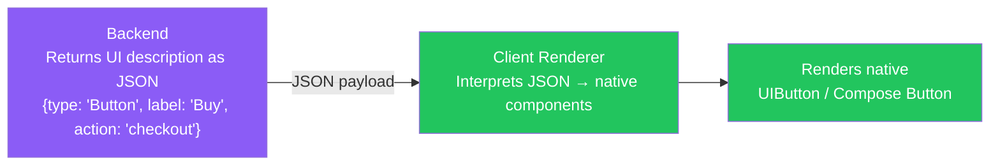

SDUI benefits: update UI without app release, A/B test layouts server-side, single source of truth for all clients.

### Cross-Platform Frameworks

| Framework | Language | Approach | Performance |
|---|---|---|---|
| React Native | JavaScript/TypeScript | JS bridge → native components | Good (JSI in new arch) |
| Flutter | Dart | Custom rendering engine (Skia/Impeller) | Excellent |
| Xamarin | C# | Compiled to native | Good |
| KMM (Kotlin Multiplatform) | Kotlin | Shared business logic, native UI | Excellent (native UI) |

---

## 15. Interview Strategy

### Mobile System Design Interview Framework

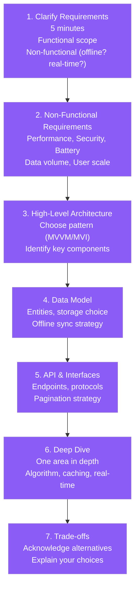

### Common Trade-off Questions

| Trade-off | When to choose A | When to choose B |
|---|---|---|
| REST vs GraphQL | Simple stable APIs, RESTful semantics | Multiple clients with different data needs |
| Native vs Cross-platform | Max performance, deep platform features | Code sharing, limited iOS/Android teams |
| WebSocket vs SSE | Bidirectional (chat, gaming) | Server-only push (notifications, feeds) |
| Limit-Offset vs Cursor | Simple admin dashboards | High-scale feeds, infinite scroll |
| CoreData vs Realm | App-only data, CloudKit sync | Complex queries, faster migrations |

### Architecture Decision Template

When asked "How would you design X?":
1. **Clarify** — "Is offline support needed? Expected user scale?"
2. **State the pattern** — "I'd use MVVM because ViewModels survive rotation and are easily testable"
3. **Identify layers** — Presentation → Domain → Data
4. **Data flow** — "User action → ViewModel → Repository → API/DB → StateFlow → UI recompose"
5. **Trade-offs** — "MVVM is more boilerplate than MVC but the testability benefit justifies it at this scale"

### Red Flags to Avoid in Interviews

| Red Flag | Better Answer |
|---|---|
| "I'd put everything in the ViewController" | Describe MVVM/VIPER — logic belongs in ViewModel/Interactor |
| "I'd use global singletons for state" | Use scoped DI containers, ViewModel scoping |
| "I'd reload everything on app resume" | Implement smart refresh — check timestamp, only fetch if stale |
| "Pagination isn't needed, just load all data" | Always design for pagination — mobile bandwidth and memory are limited |
| "I'd store tokens in UserDefaults" | Keychain (iOS) / EncryptedSharedPreferences (Android) |

---

*Mobile System Design — Complete Guide | Generated July 2026*
