# Mobile Advanced Topics — Complete Guide (iOS & Android)

---

## Table of Contents

1. [Advanced Mobile Features](#1-advanced-mobile-features)
   - [On-Device Machine Learning](#11-on-device-machine-learning)
   - [Augmented Reality (AR)](#12-augmented-reality-ar)
   - [Wearables](#13-wearables)
   - [Foldable Devices & Multi-Window](#14-foldable-devices--multi-window)
   - [Server-Driven UI (SDUI)](#15-server-driven-ui-sdui)
   - [Cross-Platform Development](#16-cross-platform-development)
   - [Internationalization & Localization (i18n / l10n)](#17-internationalization--localization-i18n--l10n)
2. [API Design & Networking — Deep Dive](#2-api-design--networking--deep-dive)
   - [Protocol Comparison](#21-protocol-comparison)
   - [Pagination Strategies](#22-pagination-strategies)
   - [HTTP Clients](#23-http-clients)
   - [Serialization](#24-serialization)
   - [Offline Sync & Delta Updates](#25-offline-sync--delta-updates)
   - [Caching Strategies](#26-caching-strategies)
   - [Authentication Flows](#27-authentication-flows)
   - [Retry Policies & Resilience](#28-retry-policies--resilience)
3. [GOF Design Patterns — Full Reference](#3-gof-design-patterns--full-reference)
4. [Interview Strategy — Deep Dive](#4-interview-strategy--deep-dive)

---

## 1. Advanced Mobile Features

### 1.1 On-Device Machine Learning

#### Architecture

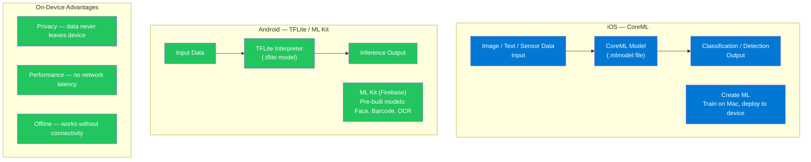

#### CoreML Implementation (iOS)

```swift
import CoreML
import Vision

class ImageClassifier {
    private let model: VNCoreMLModel

    init() throws {
        let coreMLModel = try MobileNetV2(configuration: MLModelConfiguration()).model
        model = try VNCoreMLModel(for: coreMLModel)
    }

    func classify(image: UIImage) async throws -> [Classification] {
        guard let cgImage = image.cgImage else { throw ClassifierError.invalidImage }

        return try await withCheckedThrowingContinuation { continuation in
            let request = VNCoreMLRequest(model: model) { request, error in
                if let error { return continuation.resume(throwing: error) }
                let results = request.results as? [VNClassificationObservation] ?? []
                let classifications = results.prefix(5).map {
                    Classification(label: $0.identifier, confidence: $0.confidence)
                }
                continuation.resume(returning: classifications)
            }

            let handler = VNImageRequestHandler(cgImage: cgImage)
            try? handler.perform([request])
        }
    }
}
```

#### TFLite Implementation (Android)

```kotlin
import org.tensorflow.lite.Interpreter
import java.nio.ByteBuffer

class ImageClassifier(context: Context) {
    private val interpreter: Interpreter

    init {
        val modelFile = loadModelFile(context, "mobilenet_v2.tflite")
        interpreter = Interpreter(modelFile)
    }

    fun classify(bitmap: Bitmap): List<Pair<String, Float>> {
        val inputBuffer = preprocessBitmap(bitmap) // resize to 224x224, normalize
        val outputBuffer = Array(1) { FloatArray(1000) } // ImageNet classes

        interpreter.run(inputBuffer, outputBuffer)

        return outputBuffer[0]
            .mapIndexed { index, confidence -> LABELS[index] to confidence }
            .sortedByDescending { it.second }
            .take(5)
    }
}
```

### Interview Talking Points

| Question | Answer |
|---|---|
| What is CoreML and when would you use it? | Apple's ML inference framework for running pre-trained models on-device. Use it when you need low-latency inference, privacy (data stays local), or offline capability. |
| What is the difference between ML Kit and TFLite? | ML Kit (Firebase): pre-built high-level APIs for common tasks (face detection, OCR). TFLite: lower-level runtime for custom models — more flexibility, more integration work. |
| What are Neural Engine vs CPU inference? | Neural Engine (iOS A-series, Android NPU): dedicated hardware for ML, 10-20x faster and more power-efficient than CPU inference. CoreML automatically routes to Neural Engine when possible. |

---

### 1.2 Augmented Reality (AR)

#### AR Architecture

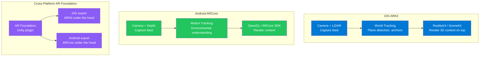

| Feature | ARKit (iOS) | ARCore (Android) |
|---|---|---|
| Plane Detection | Horizontal + Vertical | Horizontal + Vertical |
| LiDAR Integration | Yes (Pro devices) | No (depth varies by device) |
| Face Tracking | Face ID devices | Some devices |
| Image Tracking | Yes | Yes |
| Object Detection | Yes | Yes (partial) |

---

### 1.3 Wearables

| Platform | Framework | Capabilities |
|---|---|---|
| Apple Watch | WatchKit + SwiftUI | Complications, notifications, HealthKit, Core Motion |
| watchOS | ClockKit | Custom watch faces, timeline complications |
| Wear OS | Compose for Wear OS | Material You tiles, Ambient mode, Health Services |

```swift
// Apple Watch Complication (WatchKit)
class ComplicationController: NSObject, CLKComplicationDataSource {
    func getCurrentTimelineEntry(
        for complication: CLKComplication,
        withHandler handler: @escaping (CLKComplicationTimelineEntry?) -> Void
    ) {
        let template = CLKComplicationTemplateGraphicCircularView(
            GraphicCircularView(stepCount: 8432, goal: 10000)
        )
        handler(CLKComplicationTimelineEntry(date: Date(), complicationTemplate: template))
    }
}
```

---

### 1.4 Foldable Devices & Multi-Window

```kotlin
// Android — WindowManager for foldable hinge position
class MainActivity : AppCompatActivity() {
    private lateinit var windowInfoTracker: WindowInfoTracker

    override fun onCreate(savedInstanceState: Bundle?) {
        super.onCreate(savedInstanceState)
        windowInfoTracker = WindowInfoTracker.getOrCreate(this)
    }

    override fun onStart() {
        super.onStart()
        lifecycleScope.launch {
            windowInfoTracker.windowLayoutInfo(this@MainActivity).collect { info ->
                info.displayFeatures.filterIsInstance<FoldingFeature>().firstOrNull()?.let { fold ->
                    when {
                        fold.state == FoldingFeature.State.HALF_OPENED -> adaptToTableTopMode()
                        fold.orientation == FoldingFeature.Orientation.VERTICAL -> adaptToBookMode()
                        else -> useFullScreenLayout()
                    }
                }
            }
        }
    }
}
```

Best practices for foldables:
- Never hardcode screen dimensions
- Use `WindowSizeClass` (Compact / Medium / Expanded) to adapt layouts
- Test on both folded and unfolded states
- Support multi-window / split-screen without breaking state

---

### 1.5 Server-Driven UI (SDUI)

#### SDUI Architecture

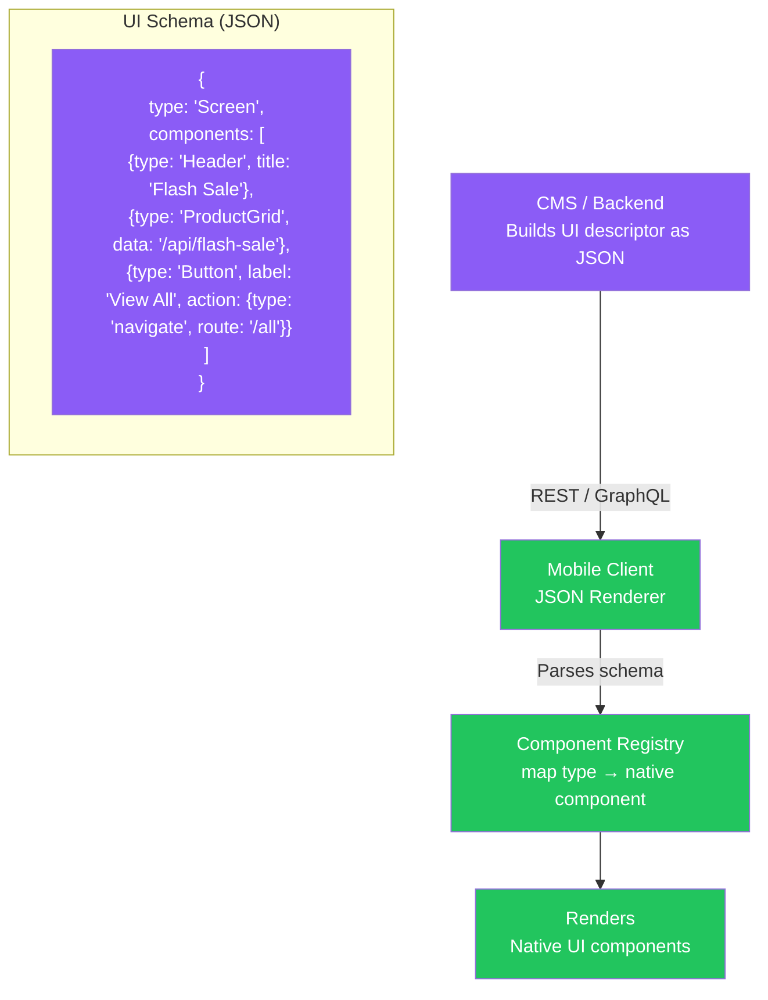

```typescript
// SDUI Component Registry (React Native)
type ComponentType = 'Header' | 'ProductGrid' | 'Button' | 'Banner';

const componentRegistry: Record<ComponentType, React.ComponentType<any>> = {
  Header: HeaderComponent,
  ProductGrid: ProductGridComponent,
  Button: ButtonComponent,
  Banner: BannerComponent,
};

function SDUIRenderer({ schema }: { schema: ScreenSchema }) {
  return (
    <View>
      {schema.components.map((component, idx) => {
        const Component = componentRegistry[component.type as ComponentType];
        if (!Component) return null;
        return <Component key={idx} {...component} />;
      })}
    </View>
  );
}
```

#### SDUI Trade-offs

| Advantage | Disadvantage |
|---|---|
| UI changes without App Store release | Increases client complexity (schema versioning) |
| Server-side A/B testing of layouts | Harder to debug — need schema inspector tools |
| Personalized UIs per user segment | Accessibility and deep-linking require careful design |
| Single source of truth across platforms | Initial load: UI depends on API call (latency) |

---

### 1.6 Cross-Platform Development

#### Framework Architecture Comparison

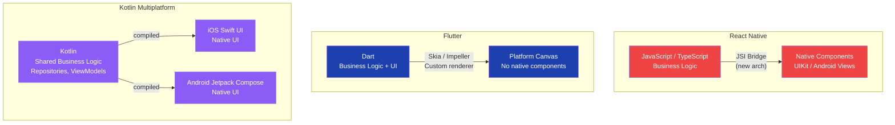

| Framework | Language | UI Approach | Performance | Code Sharing |
|---|---|---|---|---|
| React Native | TypeScript | Native components | Good (JSI) | ~70% |
| Flutter | Dart | Custom renderer | Excellent | ~90% |
| Kotlin Multiplatform | Kotlin | Native UI per platform | Excellent | ~50% (logic only) |
| Xamarin | C# | Xamarin.Forms or native | Good | ~60% |

### When to Choose Each

| Situation | Recommendation |
|---|---|
| Existing React web team | React Native — leverage TypeScript skills |
| Need pixel-perfect custom UI | Flutter — independent renderer |
| iOS/Android native teams want shared logic | Kotlin Multiplatform |
| Enterprise + Microsoft stack | Xamarin / MAUI |
| Full native performance, no compromise | Separate native apps |

---

### 1.7 Internationalization & Localization (i18n / l10n)

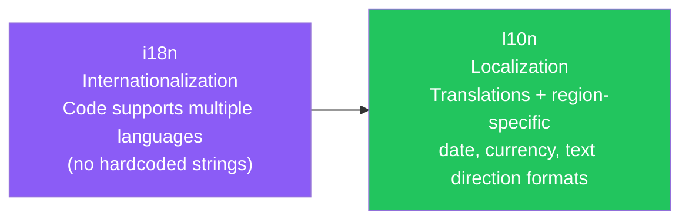

```swift
// iOS — NSLocalizedString
let greeting = NSLocalizedString("greeting.hello", comment: "Main greeting")
// Localizable.strings (en): "greeting.hello" = "Hello";
// Localizable.strings (fr): "greeting.hello" = "Bonjour";

// Date formatting — always use locale-aware formatters
let formatter = DateFormatter()
formatter.dateStyle = .long
formatter.locale = Locale.current // adapts to user's locale
let localizedDate = formatter.string(from: Date())
```

```kotlin
// Android — strings.xml
// res/values/strings.xml (default English)
// res/values-fr/strings.xml (French)
// <string name="greeting_hello">Hello</string>

val greeting = getString(R.string.greeting_hello) // auto-selects locale

// RTL layout support
android:layoutDirection="locale" // honor system RTL preference

// NumberFormat for locale-aware currency
val formatter = NumberFormat.getCurrencyInstance(Locale.getDefault())
val price = formatter.format(9.99) // "$9.99" or "9,99 €" based on locale
```

| i18n Consideration | Details |
|---|---|
| String externalization | Never hardcode user-visible strings — use resource files |
| Date/Time formatting | Use system locale formatters — never hardcode "MM/DD/YYYY" |
| RTL layouts | Arabic, Hebrew — test with RTL pseudo-locale |
| Currency / Number | Use `NumberFormat` / `Locale` — 1,000 vs 1.000 varies by country |
| Plural forms | English: 1 item / 2 items. Russian: 1/2/5 items all have different forms |

---

## 2. API Design & Networking — Deep Dive

### 2.1 Protocol Comparison

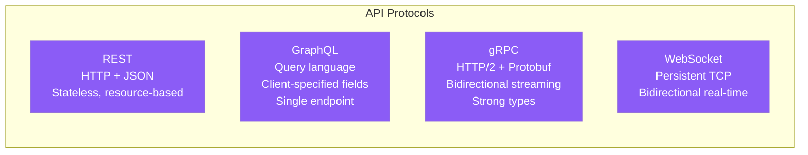

| Protocol | Format | Ideal Use |
|---|---|---|
| REST | JSON over HTTP | Standard CRUD, public APIs, simplicity |
| GraphQL | JSON query language | Complex data requirements, multiple clients |
| gRPC | Protobuf over HTTP/2 | Microservices, high-throughput, mobile streaming |
| WebSocket | Binary/text frames | Chat, gaming, live collaboration |
| SSE | Text/event-stream | Server-to-client push (notifications, feeds) |

---

### 2.2 Pagination Strategies

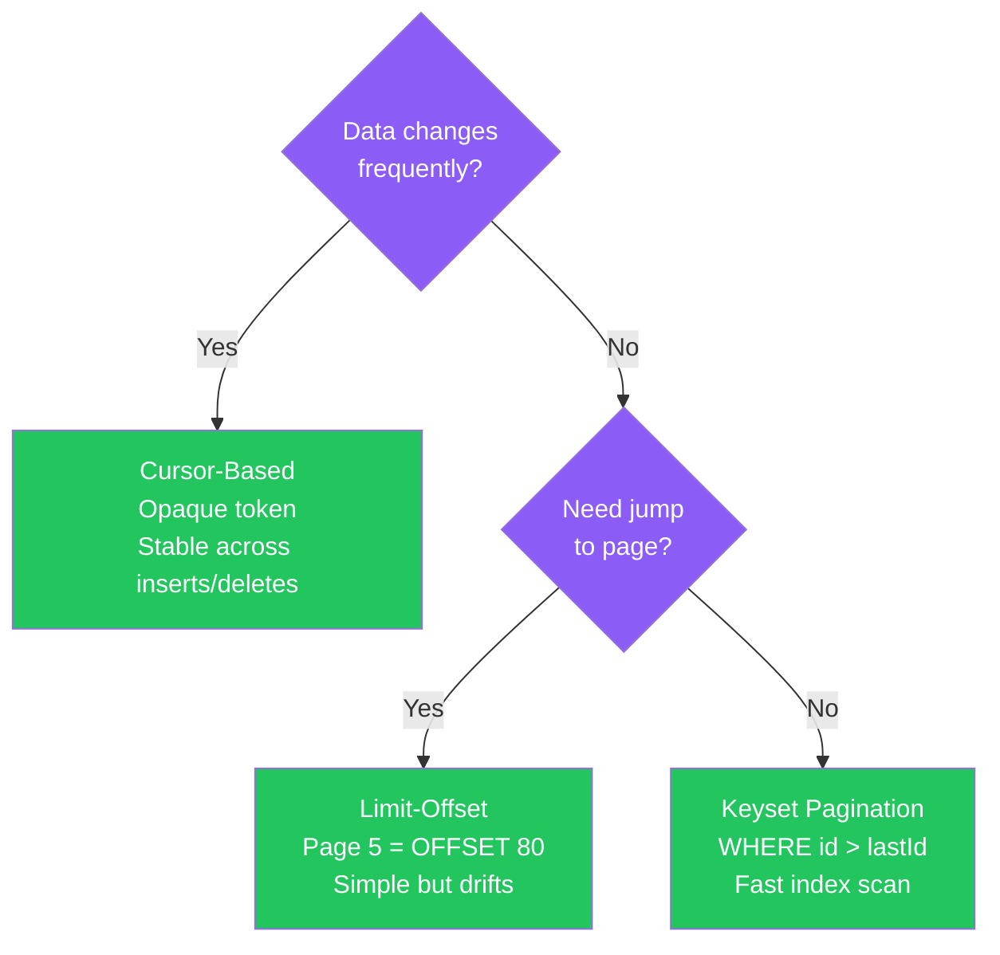

```typescript
// Cursor-based pagination — TanStack Query
interface PaginatedResponse<T> {
  data: T[];
  nextCursor: string | null;
}

function useInfiniteUsers() {
  return useInfiniteQuery({
    queryKey: ['users'],
    queryFn: ({ pageParam }) =>
      fetch(`/api/users?cursor=${pageParam}&limit=20`).then(r => r.json()),
    getNextPageParam: (lastPage: PaginatedResponse<User>) => lastPage.nextCursor,
    initialPageParam: undefined,
  });
}

// Render with IntersectionObserver trigger
function UserList() {
  const { data, fetchNextPage, hasNextPage } = useInfiniteUsers();
  const sentinel = React.useRef<HTMLDivElement>(null);

  React.useEffect(() => {
    const observer = new IntersectionObserver(entries => {
      if (entries[0].isIntersecting && hasNextPage) fetchNextPage();
    });
    if (sentinel.current) observer.observe(sentinel.current);
    return () => observer.disconnect();
  }, [hasNextPage, fetchNextPage]);

  return (
    <>
      {data?.pages.flatMap(p => p.data).map(user => <UserCard key={user.id} user={user} />)}
      <div ref={sentinel} />
    </>
  );
}
```

---

### 2.3 HTTP Clients

| Client | Platform | Key Features |
|---|---|---|
| `URLSession` | iOS native | Async/await, background downloads, certificate pinning |
| Alamofire | iOS third-party | Chainable API, interceptors, multipart uploads |
| `OkHttp` | Android native | Interceptors, connection pooling, caching |
| Retrofit | Android third-party | Type-safe interface, Coroutines, Gson/Moshi |

```swift
// URLSession — modern async/await
struct NetworkClient {
    func fetch<T: Decodable>(_ url: URL) async throws -> T {
        var request = URLRequest(url: url)
        request.setValue("Bearer \(TokenManager.shared.token)", forHTTPHeaderField: "Authorization")

        let (data, response) = try await URLSession.shared.data(for: request)

        guard let httpResponse = response as? HTTPURLResponse,
              (200..<300).contains(httpResponse.statusCode) else {
            throw NetworkError.badStatusCode
        }

        return try JSONDecoder().decode(T.self, from: data)
    }
}
```

---

### 2.4 Serialization

| Library | Platform | Format | Speed |
|---|---|---|---|
| `Codable` | iOS (Swift) | JSON / other | Fast |
| `Moshi` | Android (Kotlin) | JSON | Fast, null-safe |
| `Gson` | Android (Java/Kotlin) | JSON | Moderate |
| `Kotlinx.serialization` | KMM | JSON / Protobuf | Fast, multiplatform |
| Protocol Buffers | Cross-platform | Binary | Very fast, compact |

```kotlin
// Moshi (Android) — type-safe JSON
@JsonClass(generateAdapter = true)
data class User(
    @Json(name = "user_id") val id: String,
    val name: String,
    val email: String,
    val createdAt: Instant? = null
)

val moshi = Moshi.Builder()
    .add(KotlinJsonAdapterFactory())
    .add(Date::class.java, Rfc3339DateJsonAdapter())
    .build()

val adapter = moshi.adapter(User::class.java)
val user = adapter.fromJson(jsonString) // parse
val json = adapter.toJson(user) // serialize
```

---

### 2.5 Offline Sync & Delta Updates

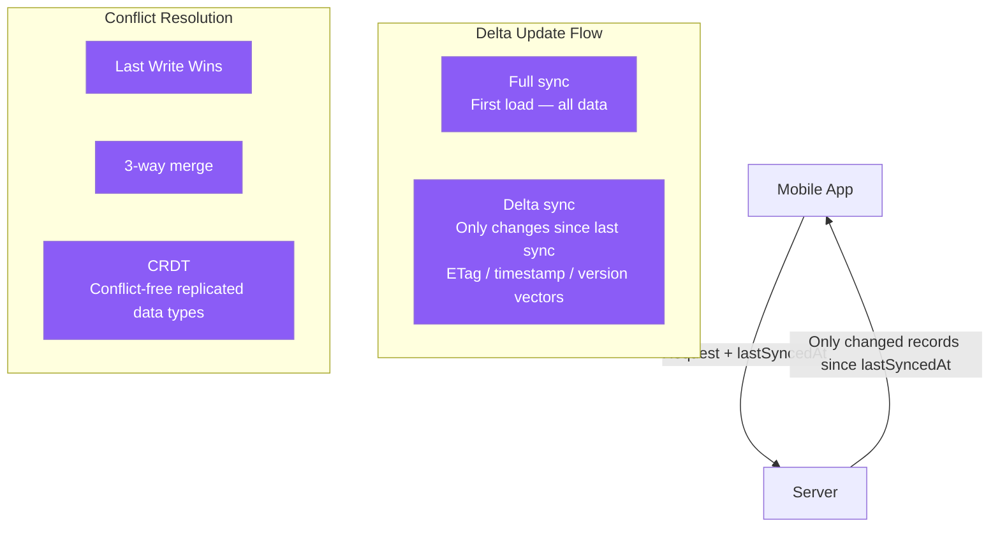

```typescript
// Delta sync with ETags
async function syncData(localVersion: string | null) {
  const headers: Record<string, string> = {};
  if (localVersion) {
    headers['If-None-Match'] = localVersion; // send cached ETag
  }

  const response = await fetch('/api/sync', { headers });

  if (response.status === 304) {
    return { changed: false }; // data unchanged — use local cache
  }

  const newEtag = response.headers.get('ETag');
  const data = await response.json();

  await localDB.applyDelta(data.changes); // apply only deltas
  await storage.set('syncEtag', newEtag);

  return { changed: true, data };
}
```

---

### 2.6 Caching Strategies

| Strategy | Behavior | Use For |
|---|---|---|
| Cache-First | Return cache immediately; update in background | Read-heavy content, images |
| Network-First | Try network; fall back to cache on failure | Fresh data critical, API responses |
| Stale-While-Revalidate | Return cache immediately; fetch new version in background | News feeds, profile data |
| Cache-Only | Only serve from cache; never network | Precached static assets |

```swift
// iOS — URLCache with custom caching policy
let cache = URLCache(memoryCapacity: 10_000_000, diskCapacity: 50_000_000)
URLCache.shared = cache

var request = URLRequest(url: url)
request.cachePolicy = .returnCacheDataElseLoad // cache-first
// .reloadIgnoringLocalCacheData — network-first
// .useProtocolCachePolicy — honor Cache-Control headers
```

---

### 2.7 Authentication Flows

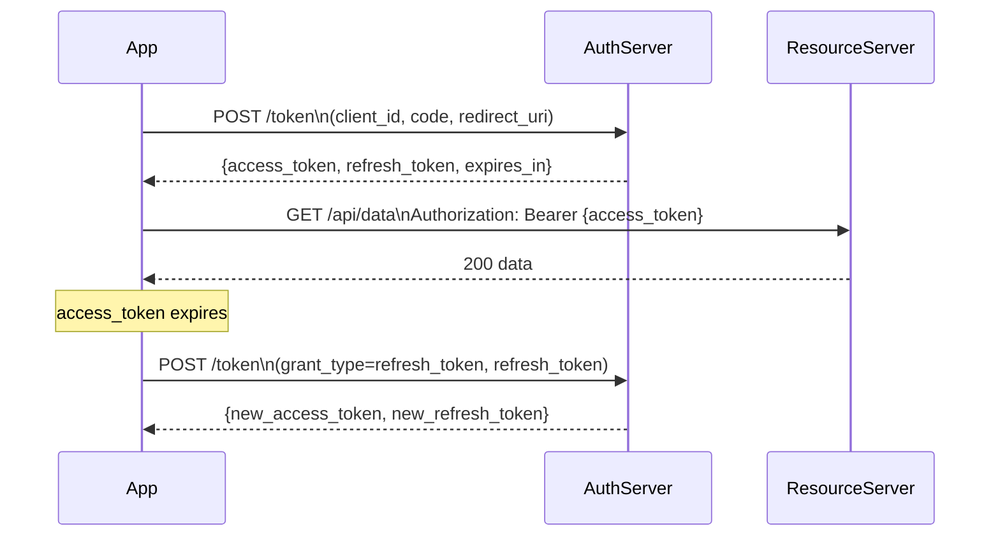

| Auth Method | Use Case | Security |
|---|---|---|
| OAuth 2.0 + PKCE | Social login, third-party auth | High — no client secret on device |
| Biometric | Local app authentication | Very high — hardware-backed |
| JWT + Refresh Token | API authentication | Medium-High — token expiry critical |
| API Key | Server-to-server, private apps | Medium — must be stored securely |
| MFA (OTP + biometric) | Banking, high-security apps | Very high |

```swift
// Biometric authentication (iOS — LocalAuthentication)
import LocalAuthentication

func authenticateWithBiometrics() async -> Bool {
    let context = LAContext()
    var error: NSError?

    guard context.canEvaluatePolicy(.deviceOwnerAuthenticationWithBiometrics, error: &error) else {
        return false
    }

    do {
        let success = try await context.evaluatePolicy(
            .deviceOwnerAuthenticationWithBiometrics,
            localizedReason: "Authenticate to access your account"
        )
        return success
    } catch {
        return false
    }
}
```

---

### 2.8 Retry Policies & Resilience

```typescript
// Exponential backoff with jitter
async function fetchWithRetry<T>(
  url: string,
  options?: RequestInit,
  maxRetries = 3
): Promise<T> {
  let lastError: Error | null = null;

  for (let attempt = 0; attempt <= maxRetries; attempt++) {
    try {
      const response = await fetch(url, options);
      if (!response.ok) throw new Error(`HTTP ${response.status}`);
      return await response.json();
    } catch (error) {
      lastError = error as Error;
      if (attempt < maxRetries) {
        const baseDelay = Math.pow(2, attempt) * 1000; // 1s, 2s, 4s
        const jitter = Math.random() * 1000; // 0-1s random jitter
        await new Promise(resolve => setTimeout(resolve, baseDelay + jitter));
      }
    }
  }

  throw lastError!;
}

// Circuit Breaker pattern
class CircuitBreaker {
  private failureCount = 0;
  private lastFailureTime = 0;
  private state: 'CLOSED' | 'OPEN' | 'HALF_OPEN' = 'CLOSED';

  async execute<T>(fn: () => Promise<T>): Promise<T> {
    if (this.state === 'OPEN') {
      if (Date.now() - this.lastFailureTime < 30_000) {
        throw new Error('Circuit open — fast fail');
      }
      this.state = 'HALF_OPEN';
    }

    try {
      const result = await fn();
      this.onSuccess();
      return result;
    } catch (error) {
      this.onFailure();
      throw error;
    }
  }

  private onSuccess() { this.failureCount = 0; this.state = 'CLOSED'; }
  private onFailure() {
    this.failureCount++;
    this.lastFailureTime = Date.now();
    if (this.failureCount >= 5) this.state = 'OPEN';
  }
}
```

---

## 3. GOF Design Patterns — Full Reference

### Creational Patterns (5)

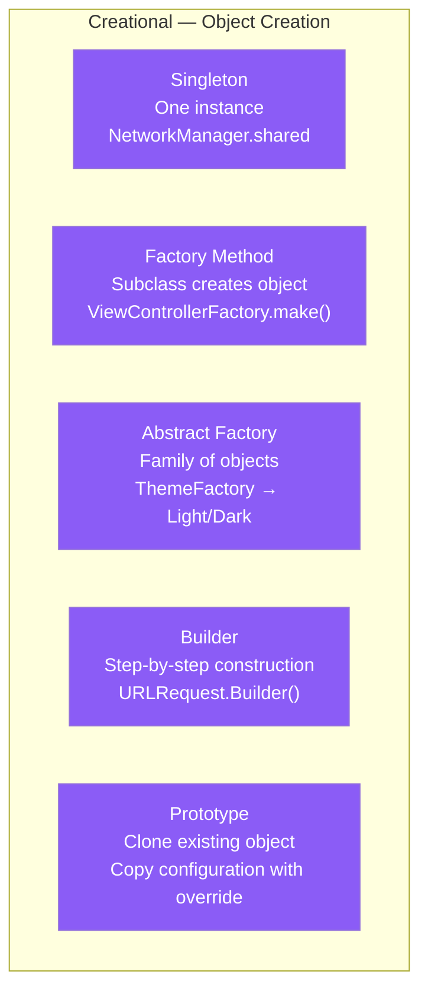

| Pattern | Intent | Mobile Example |
|---|---|---|
| Singleton | Single globally accessible instance | `URLSession.shared`, `UserDefaults.standard`, `Database.shared` |
| Factory Method | Subclass decides object creation | `UIViewController` factory, `ViewModelFactory.make(type:)` |
| Abstract Factory | Creates families of related objects | `UIComponentFactory` → LightTheme / DarkTheme versions of buttons/colors |
| Builder | Multi-step object construction, method chaining | `AlertController.Builder()`, `URLComponents`, `OkHttpClient.Builder()` |
| Prototype | Clone an existing object as a base | `NSCopying`, copying a pre-configured request template with overrides |

### Structural Patterns (7)

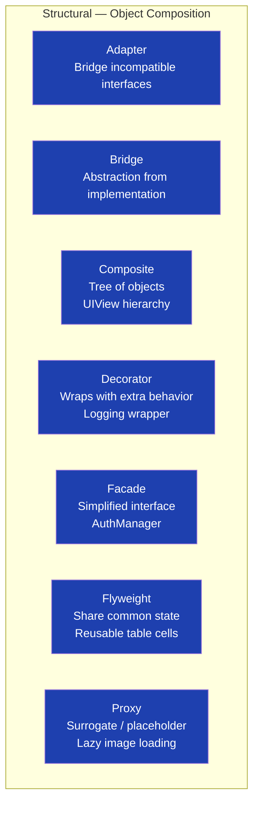

| Pattern | Intent | Mobile Example |
|---|---|---|
| Adapter | Convert incompatible interface to expected one | Wrapping a 3rd-party SDK to conform to your `AnalyticsProtocol` interface |
| Bridge | Separate abstraction from implementation | `MediaPlayer` abstraction bridging AVFoundation (iOS) vs ExoPlayer (Android) |
| Composite | Treat tree of objects uniformly | `UIView` hierarchy — both leaf views and container views respond to same hit-testing |
| Decorator | Add behavior by wrapping without subclassing | Caching decorator around `URLSession`, logging decorator around Repository |
| Facade | Simplified interface to complex subsystem | `AuthManager` hiding Keychain + token refresh + biometric + OAuth under one API |
| Flyweight | Share intrinsic state across many objects | `UICollectionViewCell` reuse — cells are flyweights sharing display templates |
| Proxy | Stand-in for expensive or remote object | `SDWebImage` / Kingfisher — placeholder proxy while image loads from URL |

### Behavioral Patterns (11)

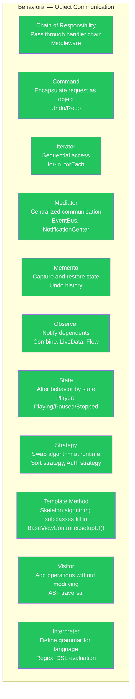

| Pattern | Intent | Mobile Example |
|---|---|---|
| Chain of Responsibility | Pass request through chain until handled | OkHttp interceptors (auth → logging → retry → actual request) |
| Command | Encapsulate request as an object | `UIAction`, undo/redo in text editor, queued offline operations |
| Iterator | Sequential access to a collection | `for user in users`, `AsyncSequence` (Swift), `Flow.collect` (Kotlin) |
| Mediator | Objects communicate through central coordinator | `NotificationCenter`, EventBus, Redux store |
| Memento | Capture state snapshot for later restoration | Undo history, `NSUndoManager`, `savedInstanceState` bundle |
| Observer | Subscribe/notify on state change | `NotificationCenter`, Combine, `LiveData`, `StateFlow` |
| State | Object changes behavior based on internal state | `AVPlayer` state machine (idle/ready/playing/paused/failed) |
| Strategy | Select algorithm at runtime | Different auth strategies, different sort algorithms, different payment methods |
| Template Method | Algorithm skeleton; subclasses implement steps | `BaseViewController` with `setupUI()`, `bindViewModel()` hooks |
| Visitor | Add new operation to existing class hierarchy | Analytics tracker visiting screen nodes, JSON serializer visiting model tree |
| Interpreter | Evaluate sentences in a language | Predicate filtering, regex engine, custom query DSL |

### Code: Strategy Pattern

```typescript
// Strategy Pattern — Authentication
interface AuthStrategy {
  authenticate(credentials: unknown): Promise<AuthToken>;
}

class OAuthStrategy implements AuthStrategy {
  async authenticate(code: string): Promise<AuthToken> {
    const response = await fetch('/auth/oauth', { method: 'POST', body: JSON.stringify({ code }) });
    return response.json();
  }
}

class BiometricStrategy implements AuthStrategy {
  async authenticate(_: unknown): Promise<AuthToken> {
    const verified = await verifyBiometrics();
    if (!verified) throw new Error('Biometric auth failed');
    return retrieveTokenFromKeychain();
  }
}

class AuthContext {
  private strategy: AuthStrategy;

  constructor(strategy: AuthStrategy) {
    this.strategy = strategy;
  }

  setStrategy(strategy: AuthStrategy) {
    this.strategy = strategy;
  }

  login(credentials: unknown) {
    return this.strategy.authenticate(credentials);
  }
}

// Usage — swap strategy at runtime
const auth = new AuthContext(new OAuthStrategy());
await auth.login(oauthCode);

auth.setStrategy(new BiometricStrategy());
await auth.login(null); // no credentials needed — biometric
```

---

## 4. Interview Strategy — Deep Dive

### Framework for System Design Questions

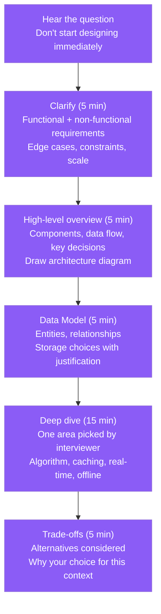

### Non-Functional Requirements Checklist

When asked to design a mobile app, always probe:

| Category | Questions to Ask |
|---|---|
| Scale | DAU, peak concurrent users, data volume per user |
| Performance | Max acceptable latency, target frame rate |
| Offline | Must work offline? Sync on reconnect? |
| Real-time | Polling acceptable or need push/WebSocket? |
| Security | Auth method, data sensitivity (PII?), jailbreak/root detection? |
| Accessibility | VoiceOver/TalkBack required? Dynamic text? |
| Battery/Data | Background processing needed? Low-bandwidth markets? |

### Problem Navigation Techniques

| Technique | How to Apply |
|---|---|
| Think aloud | Verbalize trade-offs as you consider them — interviewers prefer this over silent thinking |
| Estimate before designing | "With 10M DAU and 100 events/user/day, that's ~1B events/day — need batching not individual API calls" |
| Draw before coding | Start with boxes-and-arrows diagram, then drill into code |
| Name patterns explicitly | "This is the Observer pattern via Combine — View subscribes to ViewModel's `@Published` property" |
| Acknowledge weaknesses | "My current design has single point of failure in the sync coordinator — here's how I'd address it" |

### Communication Framework (for trade-off questions)

> "I would use [X] because [primary reason]. The trade-off is [downside of X]. An alternative would be [Y] which is better for [scenario], but for our requirements [X] is the right call because [specific reason that fits the constraints]."

Example:
> "I would use cursor-based pagination because our feed is real-time and items are inserted frequently — offset pagination would cause duplicate or missing items. The trade-off is that users can't jump to an arbitrary page, but for an infinite scroll feed that's acceptable. Offset pagination would work if we needed a numbered page control, like a search results page."

### Red Flags in Mobile Interviews

| What NOT to say | What to say instead |
|---|---|
| "I'd store passwords in SharedPreferences / UserDefaults" | "Keychain (iOS) / EncryptedSharedPreferences backed by Keystore (Android)" |
| "I'd load all users in one API call" | "Cursor-based pagination with page size 20, infinite scroll trigger via IntersectionObserver" |
| "I'd update the UI directly from the background thread" | "All UI updates dispatched to main thread — `DispatchQueue.main.async` / `Dispatchers.Main`" |
| "I don't need DI — just new() dependencies" | "DI for testability and loose coupling — Hilt for Android, Swinject or constructor injection for iOS" |
| "I'd use a Singleton for everything shared" | "Scoped DI components — Session scope for auth, Singleton scope for network client" |
| "The app doesn't need offline support" | "At minimum: cache last successful response, show stale-data banner when offline" |

### Estimating for Mobile System Design

| What to estimate | How to approach |
|---|---|
| API call frequency | DAU × actions per session × sessions per day |
| Storage size | users × data_per_user × retention_days |
| Bandwidth | (request_size + response_size) × requests_per_second |
| Battery impact | background_tasks × CPU_ms × battery_drain_model |

---

*Mobile Advanced Topics — Complete Guide | Generated July 2026*
