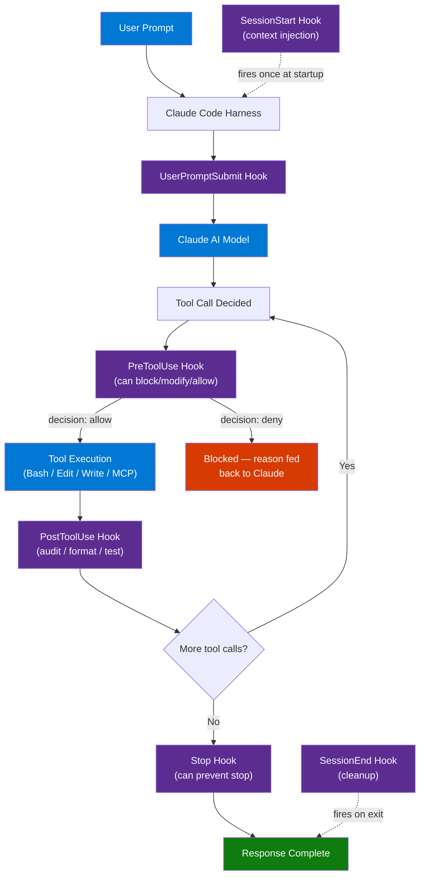
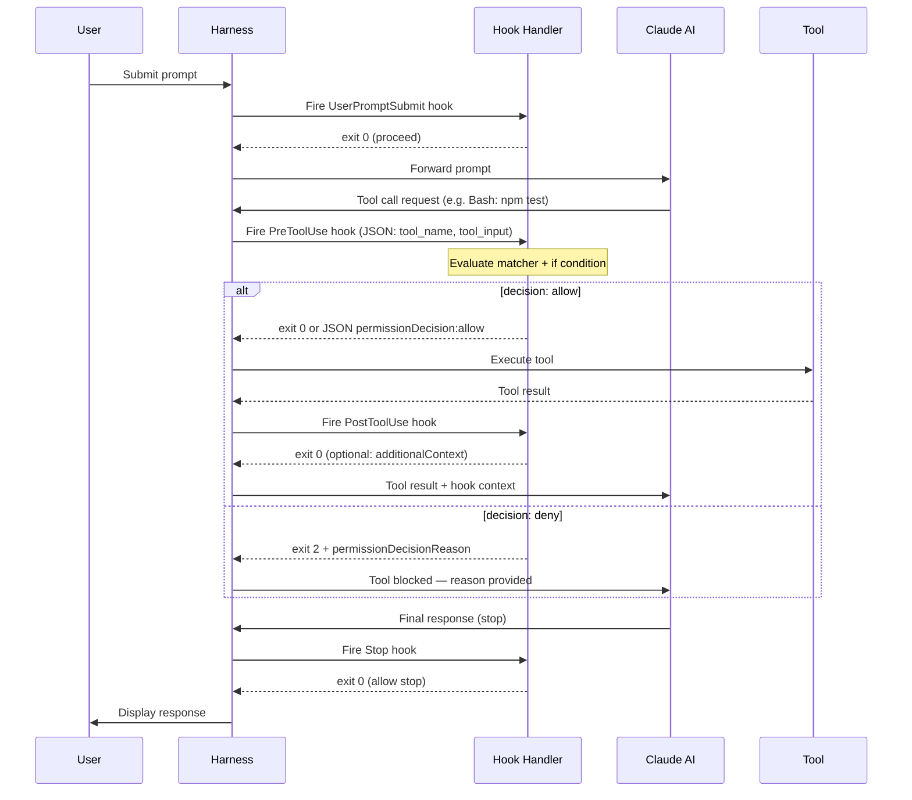

# Hooks in Claude Code — Full Theory + Practical Use

> **Source:** [YouTube — Hooks in Claude Code — Full Theory + Practical Use](https://www.youtube.com/watch?v=oo1oADOiVmM)
> **Channel/Event:** CampusX · May 2026
> **Topic:** Claude Code, Hooks, Lifecycle Automation, PreToolUse, PostToolUse, Shell Scripting, AI Safety, DevSecOps
> **Key Claim:** Hooks run outside Claude's control — the harness executes them, not the AI. Claude cannot skip or work around hooks.

---

## Table of Contents

1. [Overview](#1-overview)
2. [Problem Statement](#2-problem-statement)
3. [Core Concepts](#3-core-concepts)
4. [Architecture](#4-architecture)
5. [Key Components](#5-key-components)
6. [How It Works — Step by Step](#6-how-it-works--step-by-step)
7. [Comparison Table](#7-comparison-table)
8. [Code Examples](#8-code-examples)
9. [Configuration Reference](#9-configuration-reference)
10. [Best Practices](#10-best-practices)
11. [Interview Talking Points](#11-interview-talking-points)
12. [Learning Resources](#12-learning-resources)

---

## 1. Overview

Claude Code hooks are user-defined shell commands, HTTP endpoints, LLM prompts, or MCP tool calls that execute automatically at specific points in the agent's lifecycle. They are configured in `settings.json` and run by the **harness** — outside the AI's control — making them deterministic guardrails that cannot be bypassed by Claude. Think of hooks as **git hooks for your AI agent**: they fire at lifecycle events like PreToolUse, PostToolUse, SessionStart, and Stop, and can approve, deny, modify, or augment any Claude action. Unlike CLAUDE.md instructions (which Claude may forget), hooks are guaranteed to execute every time.

---

## 2. Problem Statement

### Classic Approach Pain Points

| Problem | Impact |
|---|---|
| CLAUDE.md rules are suggestions | Claude may skip formatting, testing, or safety steps under pressure |
| No way to intercept tool calls | Dangerous `rm -rf` or `git push --force` can execute without review |
| No dynamic context injection | Claude doesn't automatically know current branch, open tickets, team conventions |
| No automated post-edit validation | Style drift and regression go undetected until code review |
| Notification gap | Developer has no way to know when Claude needs input or finishes long tasks |

> **Key Insight:** "CLAUDE.md *tells* Claude what to do. Hooks *make it happen* — they're infrastructure, not suggestions."

---

## 3. Core Concepts

### Hooks
User-defined handlers that execute at lifecycle events. Three-level structure: **event** (when it fires) → **matcher** (filter for which tools/sessions) → **handler** (what runs).

### Lifecycle Event
A named point in Claude Code execution where hooks can attach. 28+ events grouped as: once per session, once per turn, or on every tool call.

### Matcher
A filter that determines whether a hook fires for a given event occurrence. Supports exact tool names, pipe-separated lists, and JavaScript regex patterns.

### `if` Condition
A fine-grained filter on tool input content (e.g., `Bash(rm *)`) evaluated before the handler runs. Only supported for tool events.

### Handler Types
The five ways a hook can respond: `command` (shell script), `http` (webhook), `mcp_tool` (MCP server tool), `prompt` (single-turn Claude model evaluation), `agent` (subagent with full tool access).

### Exit Code Semantics
Hook commands communicate via exit code: `0` = success (parse stdout JSON), `2` = blocking error (block action, feed stderr to Claude), anything else = non-blocking error (show stderr, proceed).

---

## 4. Architecture



---

## 5. Key Components

| Component | Type | Role |
|---|---|---|
| `PreToolUse` | Event | Fires before every tool call; only event that can block execution |
| `PostToolUse` | Event | Fires after tool succeeds; used for formatting, testing, auditing |
| `SessionStart` | Event | Fires once on session begin/resume; injects dynamic context |
| `Stop` | Event | Fires when Claude finishes responding; can force continuation |
| `command` handler | Handler | Shell script receiving JSON via stdin; most common type |
| `http` handler | Handler | HTTP POST webhook for external validation services |
| `prompt` handler | Handler | Single-turn Claude evaluation returning yes/no decision |
| `agent` handler | Handler | Full subagent with Read/Grep/Glob for deep verification |
| `mcp_tool` handler | Handler | Delegates to a connected MCP server tool |
| Matcher | Filter | Regex/exact string determining which tool names trigger the hook |
| `if` condition | Filter | `Bash(git *)` style pattern on tool input content |
| `settings.json` | Config | Declares all hooks; exists at user, project, or org scope |
| `CLAUDE_ENV_FILE` | Env var | File path where SessionStart hooks can export environment variables |

### Handler Type Deep Dive

**`command`** — Fastest startup with Bash (~10-20ms). Receives JSON on stdin. Returns decisions via JSON on stdout + exit code.

**`http`** — Best for centralized security services. POSTs JSON body to a URL. Supports `Authorization` headers via `allowedEnvVars`.

**`prompt`** — Useful for nuanced decisions ("Is this SQL injection safe?"). Uses a small Claude model; slower than `command`.

**`agent`** — Most powerful. Spawns a full subagent that can read files, run grep, check git status before approving.

---

## 6. How It Works — Step by Step



**Step-by-step breakdown:**

1. **User submits prompt** → Harness fires `UserPromptSubmit` hook (can block entire prompt)
2. **Claude decides on a tool call** → Harness fires `PreToolUse` with `{tool_name, tool_input}` JSON on stdin
3. **Hook evaluates**: matcher checks tool name → `if` condition checks tool input content → handler runs
4. **Handler returns decision**: `exit 0` = proceed, `exit 2` = block, JSON body with `permissionDecision` = explicit allow/deny/ask/defer
5. **Tool executes** (if allowed) → Harness fires `PostToolUse` with tool result
6. **PostToolUse hook** can: inject additional context to Claude, modify tool output, run async tasks (tests, formatters)
7. **Claude finishes responding** → `Stop` hook fires; returning `exit 2` forces Claude to continue (useful for mandatory test gates)

---

## 7. Comparison Table

### Hooks vs Other Extension Mechanisms

| Dimension | Hooks | CLAUDE.md | Skills | Permissions |
|---|---|---|---|---|
| Execution guarantee | Deterministic — always runs | Best-effort — Claude may skip | On-demand invocation | Static allow/deny list |
| Control over Claude | Can block tool calls | Advisory only | Adds capabilities | Blocks categories |
| Dynamic context | Yes (SessionStart injection) | Static file content | No | No |
| When it fires | Lifecycle events | Session start (read once) | When user invokes | Every tool call |
| Modifiable by Claude | No | Claude can read/reference | No | No |
| Best for | Guardrails, automation, auditing | Conventions, preferences | Extending capabilities | Access control |

### PreToolUse vs PostToolUse

| Aspect | PreToolUse | PostToolUse |
|---|---|---|
| Timing | Before tool executes | After tool completes |
| Can block | Yes | No (action already happened) |
| Use cases | Security gates, approvals | Formatting, testing, logging |
| Input available | `tool_input` | `tool_input` + `tool_output` |
| Performance impact | Every tool call | Every tool call |

### Handler Type Comparison

| Handler | Speed | Use Case | Complexity |
|---|---|---|---|
| `command` (Bash) | ~10-20ms | Simple validation, logging, formatting | Low |
| `command` (Node.js) | ~50ms | High-frequency hooks needing JSON parsing | Medium |
| `http` | Network RTT | Centralized enterprise security service | Medium |
| `prompt` | ~500ms+ | Nuanced semantic decisions | High |
| `agent` | ~2-5s | Deep multi-file verification | Highest |

---

## 8. Code Examples

### Bash — Block Dangerous Commands (PreToolUse)

```bash
#!/bin/bash
# .claude/hooks/bash-validator.sh
input=$(cat)
cmd=$(echo "$input" | jq -r '.tool_input.command')

if echo "$cmd" | grep -qE '(rm -rf /|:(){:|:|;|fork\(\))'; then
  jq -n '{
    hookSpecificOutput: {
      hookEventName: "PreToolUse",
      permissionDecision: "deny",
      permissionDecisionReason: "Destructive command blocked by safety hook"
    }
  }'
elif echo "$cmd" | grep -qE 'sudo|chmod 000'; then
  jq -n '{
    hookSpecificOutput: {
      hookEventName: "PreToolUse",
      permissionDecision: "ask",
      permissionDecisionReason: "Elevated privilege command — requires user confirmation"
    }
  }'
else
  exit 0
fi
```

### Bash — Audit File Changes (PostToolUse async)

```bash
#!/bin/bash
# .claude/hooks/audit.sh
input=$(cat)
file=$(echo "$input" | jq -r '.tool_input.file_path // .tool_input.path')
cwd=$(echo "$input" | jq -r '.cwd')
session=$(echo "$input" | jq -r '.session_id')

echo "[$(date -Iseconds)] $file | session: $session" >> "$cwd/.claude/audit.log"
exit 0
```

### Bash — Inject Dynamic Context at Session Start

```bash
#!/bin/bash
# .claude/hooks/session-context.sh
BRANCH=$(git rev-parse --abbrev-ref HEAD 2>/dev/null || echo "unknown")
LAST_COMMIT=$(git log -1 --format="%h: %s" 2>/dev/null || echo "no commits")
OPEN_PRS=$(gh pr list --limit 5 --json number,title 2>/dev/null | jq -r '.[] | "#\(.number): \(.title)"' || echo "unavailable")

jq -n \
  --arg branch "$BRANCH" \
  --arg commit "$LAST_COMMIT" \
  --arg prs "$OPEN_PRS" \
  '{
    hookSpecificOutput: {
      hookEventName: "SessionStart",
      additionalContext: "Branch: \($branch)\nLast commit: \($commit)\nOpen PRs:\n\($prs)",
      sessionTitle: $branch
    }
  }'
```

### Bash — Force Tests Before Stop

```bash
#!/bin/bash
# .claude/hooks/require-tests.sh
# Exit 2 if tests fail — forces Claude to continue and fix them
cd "$(cat - | jq -r '.cwd')"

if ! npm test --silent 2>/dev/null; then
  echo "Tests are failing — fix before stopping" >&2
  exit 2
fi

exit 0
```

### Node.js — High-frequency PostToolUse Formatter

```javascript
#!/usr/bin/env node
// .claude/hooks/format-on-edit.js — faster startup than bash for high-frequency hooks
const chunks = [];
process.stdin.on('data', d => chunks.push(d));
process.stdin.on('end', () => {
  const input = JSON.parse(Buffer.concat(chunks).toString());
  const file = input.tool_input?.file_path;
  
  if (!file) { process.exit(0); }
  
  const { execSync } = require('child_process');
  try {
    if (file.endsWith('.ts') || file.endsWith('.tsx')) {
      execSync(`npx prettier --write "${file}"`, { stdio: 'pipe' });
    } else if (file.endsWith('.py')) {
      execSync(`black "${file}"`, { stdio: 'pipe' });
    }
  } catch { /* non-fatal */ }
  
  process.exit(0);
});
```

### JSON — HTTP Hook to External Security Service

```json
{
  "hooks": {
    "PreToolUse": [
      {
        "matcher": "Bash",
        "hooks": [
          {
            "type": "http",
            "url": "http://security-service.internal:8080/validate",
            "timeout": 10,
            "headers": {
              "Authorization": "Bearer $SECURITY_TOKEN"
            },
            "allowedEnvVars": ["SECURITY_TOKEN"]
          }
        ]
      }
    ]
  }
}
```

### JSON — MCP Tool Hook for Secret Scanning

```json
{
  "hooks": {
    "PostToolUse": [
      {
        "matcher": "Write|Edit",
        "hooks": [
          {
            "type": "mcp_tool",
            "server": "security",
            "tool": "scan_for_secrets",
            "input": {
              "file_path": "${tool_input.file_path}"
            },
            "timeout": 15
          }
        ]
      }
    ]
  }
}
```

### Install / Setup

```bash
# Create hooks directory
mkdir -p .claude/hooks

# Create a hook script
cat > .claude/hooks/bash-validator.sh << 'EOF'
#!/bin/bash
# paste your hook logic here
EOF
chmod +x .claude/hooks/bash-validator.sh

# Verify Claude Code can find it
cat .claude/settings.json | jq '.hooks'
```

---

## 9. Configuration Reference

### Full settings.json Schema

```json
{
  "hooks": {
    "EventName": [
      {
        "matcher": "ToolName|OtherTool|regex.*",
        "hooks": [
          {
            "type": "command|http|mcp_tool|prompt|agent",
            "if": "Bash(git *)",
            "timeout": 600,
            "statusMessage": "Validating...",
            "async": false,
            "asyncRewake": false,
            "once": false
          }
        ]
      }
    ]
  },
  "disableAllHooks": false
}
```

### Command Handler Fields

| Parameter | Type | Default | Description |
|---|---|---|---|
| `type` | string | — | `"command"` (required) |
| `command` | string | — | Path to script or executable (required) |
| `args` | array | `[]` | Additional CLI arguments |
| `async` | boolean | `false` | Run in background; don't block Claude |
| `asyncRewake` | boolean | `false` | Wake Claude when async hook completes |
| `shell` | string | `"bash"` | Shell to use: `"bash"` or `"powershell"` |
| `timeout` | integer | `600` | Max seconds to wait |
| `statusMessage` | string | — | Status bar text while hook runs |
| `if` | string | — | Tool-input pattern like `Bash(rm *)` |
| `once` | boolean | `false` | Run only once per session (skills only) |

### HTTP Handler Fields

| Parameter | Type | Default | Description |
|---|---|---|---|
| `type` | string | — | `"http"` (required) |
| `url` | string | — | POST endpoint URL (required) |
| `headers` | object | `{}` | HTTP headers; env vars via `$VAR` syntax |
| `allowedEnvVars` | array | `[]` | Env vars allowed in header expansion |
| `timeout` | integer | `600` | Max seconds to wait |

### Exit Code Semantics

| Exit Code | Meaning | Effect on Action |
|---|---|---|
| `0` | Success | Parse stdout for JSON decisions; proceed |
| `2` | Blocking error | Block action; stderr fed to Claude as context |
| Other | Non-blocking error | Show stderr in transcript; proceed anyway |

### Hook Locations (Priority Order)

| Location | Scope | Shareable | Notes |
|---|---|---|---|
| Managed policy | Org-wide | Yes | Highest priority |
| `~/.claude/settings.json` | All projects | No | User-level |
| `.claude/settings.json` | Project | Yes | Commit to repo |
| `.claude/settings.local.json` | Project | No | Gitignored |
| Plugin `hooks/hooks.json` | Plugin-scoped | Yes | Active when plugin enabled |
| Skill/agent frontmatter | Component-scoped | Yes | Active when component active |

---

## 10. Best Practices

### Security Gates

- ✅ Use `PreToolUse` on `Bash` matcher to inspect every shell command before execution
- ✅ Use `if` conditions (`Bash(rm *)`, `Bash(git push*)`) to target dangerous patterns specifically
- ✅ Return structured JSON with `permissionDecisionReason` so Claude understands why it was blocked
- ❌ Don't use `PostToolUse` to "block" — the action already ran
- ❌ Don't write hooks that always return `exit 2` — this breaks Claude's ability to work

### Performance

- ✅ Use Bash for simple, high-frequency hooks — 10-20ms startup
- ✅ Use Node.js for hooks that do JSON parsing on PreToolUse/PostToolUse
- ✅ Set `async: true` for non-blocking work (logging, formatting) — Claude won't wait
- ❌ Don't use `prompt` or `agent` handlers on PreToolUse — adds 500ms-5s to every tool call
- ❌ Don't spawn heavy processes (Docker, Python with large imports) on high-frequency events

### Context Injection

- ✅ Use `SessionStart` to inject branch name, open tickets, recent commits
- ✅ Use `CLAUDE_ENV_FILE` to export environment variables for the session
- ✅ Set `sessionTitle` in SessionStart output for better UI identification
- ❌ Don't overload context — keep `additionalContext` under 500 tokens

### Reliability

- ✅ Keep hooks idempotent — they may fire multiple times per session
- ✅ Always handle missing JSON fields gracefully (`jq -r '.field // empty'`)
- ✅ Write hook scripts to `.claude/hooks/` and commit them — share with team
- ❌ Don't rely on hooks for one-off debugging — use CLAUDE.md for that
- ❌ Don't put secrets in `settings.json` — use `allowedEnvVars` with env variables

---

## 11. Interview Talking Points

### "What are Claude Code hooks and how do they differ from CLAUDE.md?"

> Hooks are shell commands, HTTP calls, or LLM prompts that execute automatically at lifecycle events — before tool calls, after edits, on session start. They run in the **harness**, outside Claude's control, making them deterministic: Claude cannot skip or override them. CLAUDE.md, by contrast, provides advisory instructions that Claude reads and tries to follow, but may forget or deprioritize. Use CLAUDE.md for preferences and conventions; use hooks for guarantees — mandatory formatting, test gates, security controls.

### "How would you prevent Claude Code from running dangerous shell commands?"

> Attach a `PreToolUse` hook to the `Bash` matcher. The hook receives the full tool input (including the command string) as JSON on stdin. Parse it with `jq`, pattern-match against dangerous patterns like `rm -rf /`, and return exit code 2 with a JSON body containing `permissionDecision: "deny"` and a reason. Claude receives the reason as context and can revise its approach. For nuanced cases — like `sudo` — return `"ask"` instead of `"deny"` to surface a user confirmation dialog.

### "What hook events fire on every tool call and what do they enable?"

> `PreToolUse` and `PostToolUse` fire on every tool execution. `PreToolUse` can approve, deny, modify (via `updatedInput`), or ask for permission — it's the primary security gate. `PostToolUse` fires after success and can inject additional context back to Claude (via `additionalContext`), replace tool output (`updatedToolOutput`), or trigger async background tasks like formatters and test runners. `PostToolUseFailure` handles the failure path separately, useful for logging or sending alerts.

### "How would you set up Claude Code to automatically run tests after every file edit?"

> Add a `PostToolUse` hook with matcher `Edit|Write`. The hook script reads the modified file path from stdin JSON, runs the relevant test suite (e.g., `pytest tests/` or `npm test`), and exits 0 on pass. To prevent Claude from stopping if tests fail, combine with a `Stop` hook that checks test status and returns `exit 2` to force continuation. Use `async: false` so Claude waits for test results before proceeding, or `async: true` if you just want background monitoring without blocking.

### "What is the `if` condition in hook configuration and when would you use it?"

> The `if` field is a fine-grained pre-filter on tool input content, using the same `Bash(pattern)` syntax as the permission system. It evaluates before the handler runs, saving execution cost. For example, `"if": "Bash(git push*)"` means the hook only fires for git push commands, not all Bash commands. This is especially important for high-frequency events like `PreToolUse` — without `if` conditions, every single tool call triggers every hook, which can add latency at scale. Use `if` to narrow hooks to exactly the commands that need control.

---

## 12. Learning Resources

| Resource | Link | Type |
|---|---|---|
| Official Hooks Reference | [code.claude.com/docs/en/hooks](https://code.claude.com/docs/en/hooks) | Official Docs |
| CampusX Video — Full Theory + Practical | [youtube.com/watch?v=oo1oADOiVmM](https://www.youtube.com/watch?v=oo1oADOiVmM) | Video |
| Claude Code Hooks — Explained & Demoed | [Architechture-Concepts/Claude-Code-Hooks-Explained.md](./Claude-Code-Hooks-Explained.md) | Local Reference |
| Hooks vs Skills — Claude Code Shorts | [Architechture-Concepts/Claude-Code-Hooks-vs-Skills.md](./Claude-Code-Hooks-vs-Skills.md) | Local Reference |
| Claude Code Hooks — eesel AI Practical Guide | [eesel.ai/blog/hooks-in-claude-code](https://www.eesel.ai/blog/hooks-in-claude-code) | Blog |
| Claude Code Hooks — 12 Lifecycle Events | [claudefa.st/blog/tools/hooks/hooks-guide](https://claudefa.st/blog/tools/hooks/hooks-guide) | Blog |

---

*Last Updated: July 2026 | Source: CampusX — Hooks in Claude Code Full Theory Practical Use*
