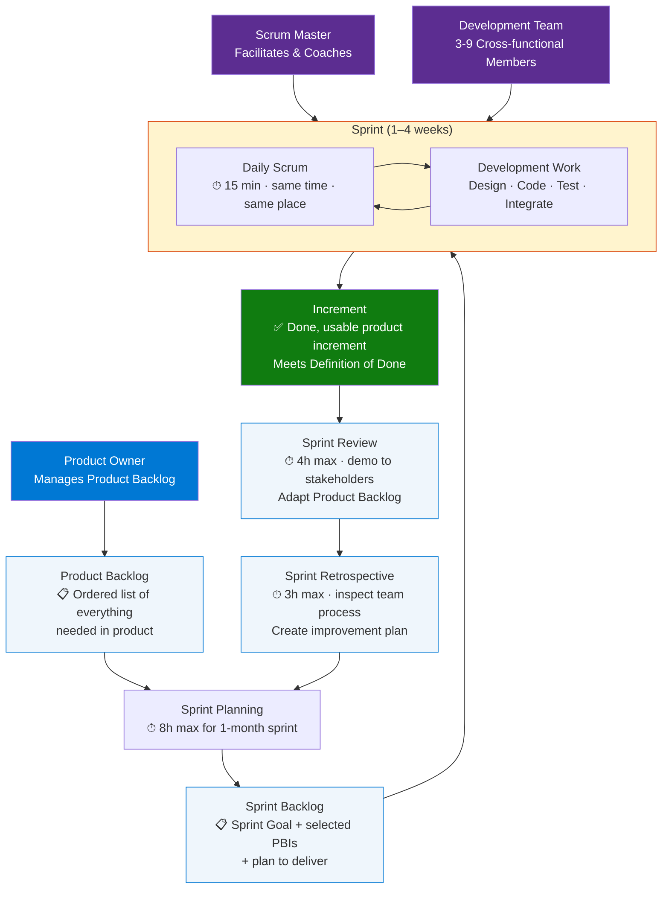
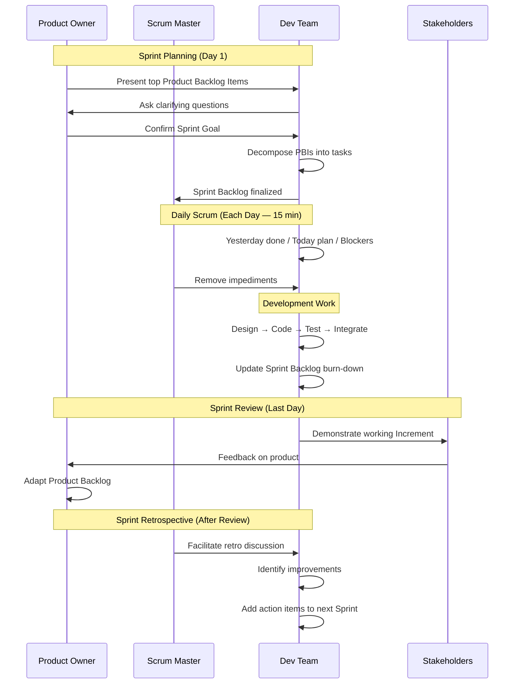

# Scrum — Complete Course Guide (Hindi/English)

> **Source:** [YouTube — Full Scrum Course In Hindi in 4 hours](https://www.youtube.com/watch?v=Vxzdhs5qLr0)
> **Channel/Event:** Aram Faraaz Hindi
> **Topic:** Scrum, Agile, Project Management, Sprint, Product Backlog, Ceremonies, Roles
> **Key Claim:** Complete Scrum framework from foundations to advanced — 4-hour end-to-end coverage in Hindi

---

## Table of Contents

1. [Overview](#1-overview)
2. [Problem Statement — Why Scrum?](#2-problem-statement--why-scrum)
3. [Core Concepts](#3-core-concepts)
4. [Scrum Framework Architecture](#4-scrum-framework-architecture)
5. [Scrum Roles & Accountabilities](#5-scrum-roles--accountabilities)
6. [Scrum Events](#6-scrum-events)
7. [Scrum Artifacts & Commitments](#7-scrum-artifacts--commitments)
8. [How a Sprint Works — Step by Step](#8-how-a-sprint-works--step-by-step)
9. [Comparison Table — Waterfall vs Scrum](#9-comparison-table--waterfall-vs-scrum)
10. [Story Points, Velocity & Estimation](#10-story-points-velocity--estimation)
11. [Best Practices](#11-best-practices)
12. [Interview Talking Points](#12-interview-talking-points)
13. [Learning Resources](#13-learning-resources)

---

## 1. Overview

Scrum is a lightweight Agile framework for developing, delivering, and sustaining complex products through iterative, time-boxed cycles called **Sprints**. Defined by Ken Schwaber and Jeff Sutherland in the **2020 Scrum Guide**, it rests on three empirical pillars — **Transparency, Inspection, and Adaptation**. Unlike Waterfall, Scrum embraces change at every cycle, delivering working software every 1–4 weeks. This 4-hour Hindi course covers the entire framework: roles, events, artifacts, estimation techniques, and real-world application — essential for PSM/CSM certifications and senior architect interviews.

---

## 2. Problem Statement — Why Scrum?

### Classic Waterfall Pain Points

| Problem | Impact |
|---|---|
| Requirements frozen at start | Cannot respond to market/business changes mid-project |
| Testing happens at the end | Defects found late → expensive to fix |
| Customer sees product only after months/years | Misaligned expectations, wasted effort |
| No intermediate value delivery | Business ROI delayed until full release |
| Single-phase planning | Estimates drift, projects run over schedule/budget |
| Siloed teams (BA → Dev → QA → Ops) | Handoff friction, slow feedback loops |

> **Key Insight:** "Scrum does not solve the problems of software development — it makes the dysfunction so visible that the team is forced to address them."

---

## 3. Core Concepts

### Agile
A philosophy for software development emphasizing iterative delivery, collaboration, customer feedback, and responding to change over following a fixed plan. Defined in the **Agile Manifesto (2001)** — 4 values and 12 principles.

**4 Agile Values:**
- Individuals and interactions **over** processes and tools
- Working software **over** comprehensive documentation
- Customer collaboration **over** contract negotiation
- Responding to change **over** following a plan

### Scrum
A specific Agile framework — not a process, technique, or methodology. Scrum is intentionally incomplete; it defines only the interactions among roles, events, and artifacts, leaving the specific techniques to the team.

### Empiricism
Scrum's theoretical foundation. Knowledge comes from experience; decisions are made on what is known. Three pillars:
- **Transparency** — the process and work must be visible to those performing it and receiving it
- **Inspection** — Scrum artifacts and progress must be inspected frequently
- **Adaptation** — if inspection reveals deviation, the process must be adjusted

### Sprint
The heartbeat of Scrum — a time-box of **1–4 weeks** (fixed length, chosen by the team) during which a "Done," usable, potentially releasable product Increment is created.

### Definition of Done (DoD)
A formal description of the state of the Increment when it meets the quality standards required. If not done per DoD, it cannot be released or presented at Sprint Review.

### Sprint Goal
A single objective for the Sprint that creates coherence and focus. The Sprint Goal provides flexibility to the Development Team while still providing focus.

---

## 4. Scrum Framework Architecture



---

## 5. Scrum Roles & Accountabilities

Scrum defines exactly **one Scrum Team** with three distinct accountabilities. No hierarchy — one team, one goal.

### Product Owner (PO)

| Attribute | Detail |
|---|---|
| Accountability | Maximizing the value of the product resulting from the work of the Scrum Team |
| Key responsibility | Sole person responsible for managing the Product Backlog |
| Authority | Can accept or reject work; can cancel a Sprint |
| Representation | Represents stakeholders and business needs to the team |
| Decision power | Final say on Product Backlog ordering and content |

**PO duties:**
- Develop and explicitly communicate the Product Goal
- Create and clearly express Product Backlog Items (PBIs)
- Order PBIs for maximum value
- Ensure the Product Backlog is transparent, visible, and understood

### Scrum Master (SM)

| Attribute | Detail |
|---|---|
| Accountability | Establishing Scrum as defined in the Scrum Guide; team effectiveness |
| Style | Servant-leader — serves the team, not manages it |
| Key skill | Facilitating events; removing impediments; coaching |
| External interface | Shields team from outside interruptions |

**SM duties:**
- Coach team members in self-management and cross-functionality
- Help team focus on creating high-value Increments meeting DoD
- Cause removal of impediments to the team's progress
- Ensure all Scrum events happen and are productive/time-boxed
- Help stakeholders understand empirical product development

### Development Team (Developers)

| Attribute | Detail |
|---|---|
| Size | 3–9 members (optimal) |
| Skills | Cross-functional — all skills needed to create usable Increment |
| Structure | Self-organizing — decides how to do the work |
| Accountability | Creating a plan for the Sprint (Sprint Backlog) + delivering Increment |
| Ownership | Collectively accountable for creating value every Sprint |

**No sub-teams, no titles** inside the Development Team (e.g., no "senior" vs "junior" in Scrum terms).

---

## 6. Scrum Events

All Scrum events are opportunities to inspect and adapt. All events are **time-boxed** — the maximum is a limit, not a target.

### Sprint

| Property | Value |
|---|---|
| Duration | 1–4 weeks (consistent length) |
| Contains | Sprint Planning + Daily Scrums + Sprint Review + Sprint Retrospective |
| Rule | No changes that endanger the Sprint Goal; no change in team composition |
| Cancellation | Only the Product Owner can cancel; rare — only if Sprint Goal is obsolete |

### Sprint Planning

| Property | Value |
|---|---|
| Time-box | 8 hours for 1-month Sprint (proportionally less for shorter sprints) |
| Participants | Entire Scrum Team |
| Output | Sprint Goal + Sprint Backlog (selected PBIs + plan) |
| 3 Topics | WHY (Sprint Goal) · WHAT (PBIs selected) · HOW (plan to deliver) |

### Daily Scrum (Stand-up)

| Property | Value |
|---|---|
| Duration | 15 minutes max |
| Participants | Developers (SM attends only if also a developer) |
| Frequency | Every working day, same time, same place |
| Purpose | Inspect progress toward Sprint Goal; adapt Sprint Backlog |
| 3 Classic Questions | What did I do yesterday? · What will I do today? · Any impediments? |

> **Note:** The 3 questions are a suggestion, not a rule in the 2020 Scrum Guide. Teams can use any structure.

### Sprint Review

| Property | Value |
|---|---|
| Time-box | 4 hours for 1-month Sprint |
| Participants | Scrum Team + key stakeholders |
| Purpose | Inspect the Increment; adapt Product Backlog based on feedback |
| Output | Revised Product Backlog; updated release plan |
| Key distinction | It is NOT a demo-only event — it's an inspection and adaptation meeting |

### Sprint Retrospective

| Property | Value |
|---|---|
| Time-box | 3 hours for 1-month Sprint |
| Participants | Scrum Team only |
| Purpose | Inspect the team's processes, tools, relationships; create improvement plan |
| Output | Action items for process improvement; added to next Sprint Backlog |
| Focus areas | Individuals · Interactions · Processes · Tools · Definition of Done |

---

## 7. Scrum Artifacts & Commitments

Each artifact contains a **commitment** — a measurable goal to improve transparency and focus.

### Product Backlog → Commitment: Product Goal

| Property | Detail |
|---|---|
| Owner | Product Owner (maintains, orders) |
| Content | Ordered list of everything that might be needed in the product |
| Refinement | Ongoing activity — breaking, clarifying, estimating PBIs |
| DEEP qualities | Detailed Appropriately · Estimated · Emergent · Prioritized |
| Product Goal | The long-term objective for the Scrum Team; one goal at a time |

**Product Backlog Item (PBI) anatomy:**
```
User Story format:
  As a [role], I want [feature] so that [benefit]

Acceptance Criteria:
  Given [context] When [action] Then [outcome]

Story Points: T-shirt sizes (XS/S/M/L/XL) or Fibonacci (1,2,3,5,8,13,21,34)
Priority:     Must Have / Should Have / Could Have / Won't Have (MoSCoW)
```

### Sprint Backlog → Commitment: Sprint Goal

| Property | Detail |
|---|---|
| Owner | Development Team (creates and owns) |
| Content | Sprint Goal + selected PBIs + plan for delivering the Increment |
| Visibility | Highly visible, updated in real-time |
| Flexibility | Negotiated with PO during Sprint if scope needs adjustment |
| Sprint Goal | A single objective creating coherence and focus for the Sprint |

### Increment → Commitment: Definition of Done (DoD)

| Property | Detail |
|---|---|
| Definition | A concrete stepping stone toward the Product Goal |
| Requirement | Must meet DoD — if not Done, it cannot be called an Increment |
| Accumulation | Each Sprint adds to all prior Increments |
| Release | PO decides when to release; team decides when it's Done |
| DoD scope | Team-defined (at minimum); organization may define a broader DoD |

---

## 8. How a Sprint Works — Step by Step



**Step-by-step breakdown:**

1. **Product Backlog Refinement** (ongoing, ~10% of Sprint capacity) — PO and team clarify, estimate, and reorder backlog items before Sprint Planning
2. **Sprint Planning** — Team selects PBIs, negotiates scope, defines Sprint Goal, creates Sprint Backlog with daily tasks
3. **Daily Development** — Team self-organizes; updates task board; burn-down chart tracked daily
4. **Daily Scrum** — 15-min sync every morning; SM removes blockers; PO available but doesn't attend unless invited
5. **Mid-Sprint PO Check** — If requirements change, PO negotiates with team; Sprint Goal cannot change
6. **Sprint Review** — Team demos to stakeholders; only "Done" work shown; PO updates backlog based on feedback
7. **Sprint Retrospective** — Private team meeting; SM facilitates; outputs are concrete improvement actions for next Sprint
8. **Next Sprint begins immediately** — No downtime between Sprints

---

## 9. Comparison Table — Waterfall vs Scrum

| Dimension | Waterfall | Scrum |
|---|---|---|
| **Planning** | Complete upfront — all requirements defined before start | Iterative — high-level plan + detailed per Sprint |
| **Delivery** | Single delivery at project end | Working software every 1–4 weeks |
| **Requirements** | Fixed — changes are expensive/formal | Welcome change — backlog is fluid |
| **Feedback** | At end of project (UAT) | Every Sprint (Review + stakeholder demo) |
| **Team structure** | Functional silos (BA, Dev, QA, Ops separate) | Cross-functional, self-organizing Scrum Team |
| **Risk** | High — discovered at delivery | Low — inspected and adapted every Sprint |
| **Documentation** | Heavy upfront docs required | Just enough — working software over docs |
| **Progress tracking** | Gantt charts, milestone dates | Burn-down charts, velocity, Sprint Goals |
| **Customer involvement** | Requirements phase + UAT only | Every Sprint Review |
| **Best fit** | Fixed requirements, regulated industries | Complex/innovative products, evolving requirements |

---

## 10. Story Points, Velocity & Estimation

### Story Points

Story points are **relative effort** estimates — not hours. They capture complexity, effort, and uncertainty.

**Fibonacci Scale:** 1 · 2 · 3 · 5 · 8 · 13 · 21 · 34 · 55 · 89

| Story Points | Complexity |
|---|---|
| 1–2 | Trivial — well-understood, minimal effort |
| 3–5 | Small — straightforward with some unknowns |
| 8 | Medium — significant effort, some complexity |
| 13 | Large — complex, consider splitting |
| 21+ | Epic — must split before Sprint Planning |

### Planning Poker

Estimation technique where each team member independently selects a card (story point value), all reveal simultaneously, discuss outliers, re-vote until consensus.

```
Round 1: PO describes story → Team privately picks cards
         [3] [5] [5] [13] [8] revealed simultaneously
         → Discuss why outliers (3 and 13)
Round 2: Re-vote after discussion → [5] [5] [8] [5] [5]
         → Consensus: 5 story points
```

### Velocity

Average number of story points completed per Sprint over last 3–5 Sprints.

```
Sprint 1: 34 points
Sprint 2: 38 points  
Sprint 3: 42 points
Sprint 4: 36 points
Sprint 5: 40 points

Velocity = (34+38+42+36+40) / 5 = 38 points/sprint

If Product Backlog = 380 points:
  Estimated sprints = 380 / 38 = ~10 sprints
  At 2-week sprints = ~20 weeks to complete
```

### Burn-Down Chart

Visual representation of remaining work in the Sprint vs. time.

```
Story Points Remaining
40 |*
35 | *
30 |  *         Ideal line (linear)
25 |   *\
20 |    *  \     Actual line
15 |     *    \
10 |           *
 5 |              *
 0 +--+--+--+--+--+--+--+--+--+--→ Sprint Days
   D1 D2 D3 D4 D5 D6 D7 D8 D9 D10
```

---

## 11. Best Practices

### Sprint Planning

- ✅ Define a clear, testable Sprint Goal before selecting PBIs
- ✅ Only pull PBIs that meet the team's Definition of Ready (clear, estimated, sized ≤ half Sprint)
- ❌ Don't overcommit — use last 3-sprint velocity as baseline
- ❌ Don't let PO dictate HOW work is done — only WHAT and WHY

### Daily Scrum

- ✅ Keep it to 15 minutes; parking lot detailed discussions for after
- ✅ Update the Sprint Backlog/task board immediately after Daily Scrum
- ❌ Don't treat it as a status report to the SM — it's team synchronization
- ❌ Don't use it for problem-solving during the stand-up

### Product Backlog

- ✅ Refine backlog regularly (~10% of capacity) — PBIs at top should be ready 2 Sprints ahead
- ✅ Use INVEST criteria: Independent · Negotiable · Valuable · Estimable · Small · Testable
- ❌ Don't freeze the backlog — it evolves with every Sprint's learnings
- ❌ Don't add tasks to the Sprint mid-Sprint without removing equivalent scope

### Retrospective

- ✅ Create 1–3 concrete, actionable improvements per Retro with assigned owners
- ✅ Vary retrospective formats (Start/Stop/Continue, 4Ls, Mad/Sad/Glad) to avoid ritual fatigue
- ❌ Don't skip Retros when under pressure — that's when they're most valuable
- ❌ Don't create lists without follow-through; review previous Retro actions at start of next Retro

### Definition of Done

- ✅ Define DoD as a team, make it visible (wiki, Jira, physical board)
- ✅ Include: code reviewed + unit tested + integrated + acceptance criteria met + deployed to staging
- ❌ Don't bypass DoD under pressure — "almost done" is not Done
- ❌ Don't have different DoDs per team member or per story type

---

## 12. Interview Talking Points

### "What is the difference between Agile and Scrum?"

> Agile is a **philosophy** and set of values defined in the Agile Manifesto — it's a mindset, not a process. Scrum is a specific **framework** for implementing Agile principles. Agile says "deliver frequently, embrace change, collaborate with customers." Scrum operationalizes this through concrete roles (PO, SM, Dev Team), time-boxed events (Sprints, ceremonies), and artifacts (backlogs, Increment). You can be Agile without Scrum, but Scrum is always Agile.

---

### "What does the Scrum Master actually do?"

> The Scrum Master is a **servant-leader** — not a project manager. They don't assign tasks, track individual performance, or control the team. Their job is threefold: (1) Coach the team on self-organization and Scrum principles, (2) Facilitate Scrum events and ensure they are effective and time-boxed, and (3) Remove impediments — systemic blockers, organizational obstacles, or external interruptions. A great SM makes themselves progressively unnecessary as the team matures.

---

### "Who can change the Sprint Backlog during a Sprint?"

> Only the **Development Team** can modify the Sprint Backlog — it is their plan for achieving the Sprint Goal. The Product Owner can negotiate scope changes (adding/removing items) but only with the team's agreement, and only if the Sprint Goal remains achievable. The Sprint Goal itself is fixed — if the Sprint Goal becomes obsolete, only the Product Owner can cancel the Sprint. This boundary is critical: it protects the team's focus and commitment.

---

### "How do you handle requirements that change mid-Sprint?"

> Scrum handles this through the Sprint Goal concept. If new requirements don't affect the Sprint Goal, they go into the Product Backlog for future Sprints. If they do affect the Sprint Goal, the PO and team negotiate: either swap out equivalent-sized work from the Sprint Backlog, or in extreme cases, the PO cancels the Sprint. The key principle is that the Sprint Goal is protected — this creates a stable window for the team to focus, while keeping the Product Backlog fluid for everything else.

---

### "What is velocity and how do you use it for release planning?"

> Velocity is the average number of story points completed per Sprint, calculated over the last 3–5 Sprints. It reflects the team's sustainable capacity — not a target to game. For release planning: sum the story points in the remaining Product Backlog, divide by velocity to estimate number of Sprints remaining. For example, 200 backlog points ÷ 40 velocity = 5 Sprints. At 2-week Sprints, that's ~10 weeks to release. Velocity is team-specific and cannot be compared across teams — each team's points are relative to their own baseline.

---

### "What is the Definition of Done and why does it matter?"

> The Definition of Done (DoD) is the Scrum Team's shared understanding of what "complete" means for a Product Backlog Item. It typically includes: code written, peer-reviewed, unit tested, integrated into main branch, acceptance criteria verified, and deployed to a staging environment. Without a DoD, "done" is subjective and technical debt accumulates invisibly. The DoD enforces quality gates at every increment — if a PBI doesn't meet the DoD, it cannot be presented at Sprint Review or counted as velocity. It's the difference between building software and building **releasable** software.

---

### "Explain Scrum vs Kanban — when would you choose each?"

> Scrum uses fixed-length Sprints with a committed Sprint Backlog — best for teams working on a product with iterative feature delivery and a defined Sprint Goal each cycle. It requires all three roles and enforces ceremonies. Kanban is a continuous flow system — work items move through a pipeline with WIP limits, no fixed iterations. Kanban is better for operations/support teams (unpredictable incoming work, no fixed iteration rhythm). For greenfield product development: Scrum. For production support or maintenance: Kanban or Scrumban (hybrid). Many teams use Scrum for features + Kanban board for bug tracking.

---

## 13. Learning Resources

| Resource | Link | Type |
|---|---|---|
| Official 2020 Scrum Guide | [scrumguides.org](https://scrumguides.org/docs/scrumguide/v2020/2020-Scrum-Guide-US.pdf) | Official Docs (PDF) |
| Scrum.org — PSM Certification | [scrum.org/resources/scrum-guide](https://www.scrum.org/resources/scrum-guide) | Official Reference |
| Atlassian Scrum Guide | [atlassian.com/agile/scrum](https://www.atlassian.com/agile/scrum) | Comprehensive Guide |
| Full Scrum Course (Hindi) | [youtube.com — Aram Faraaz](https://www.youtube.com/watch?v=Vxzdhs5qLr0) | Video (Hindi/English) |
| Agile Manifesto | [agilemanifesto.org](https://agilemanifesto.org) | Official Reference |

---

*Last Updated: July 2026 | Source: Aram Faraaz Hindi — Full Scrum Course (4 hours)*
