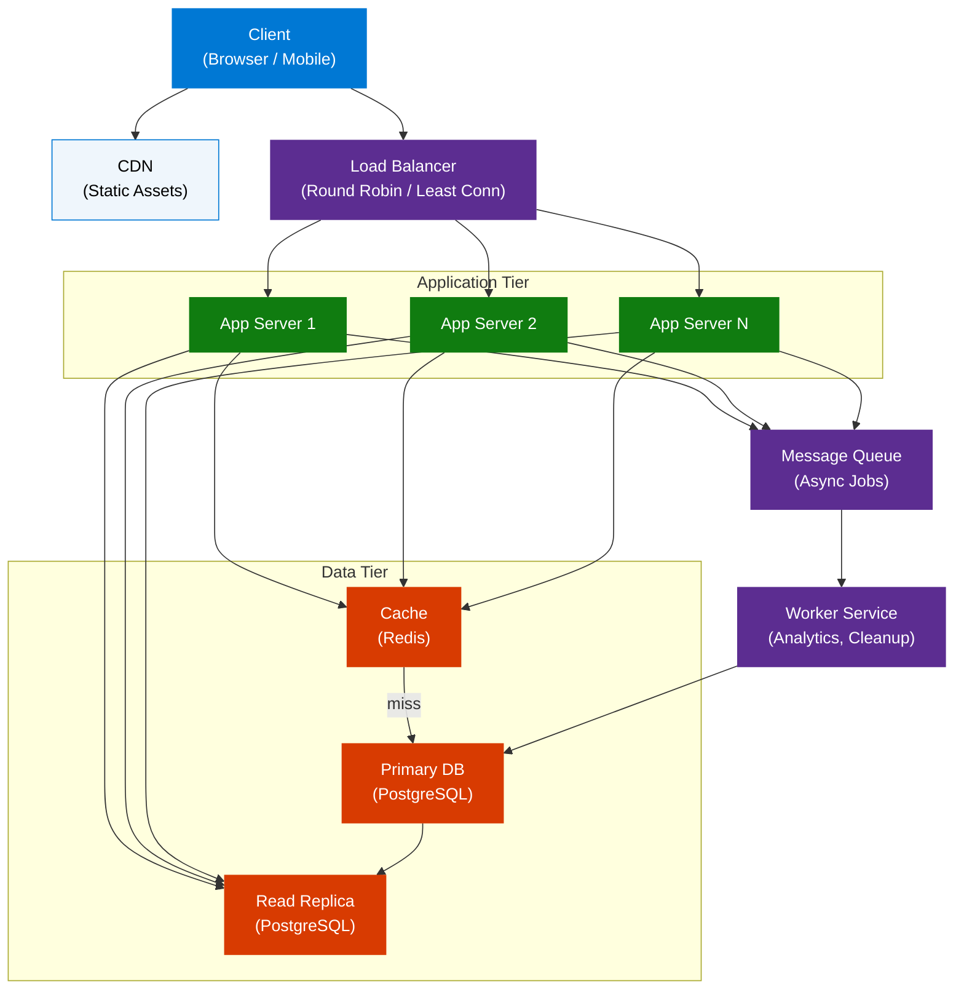
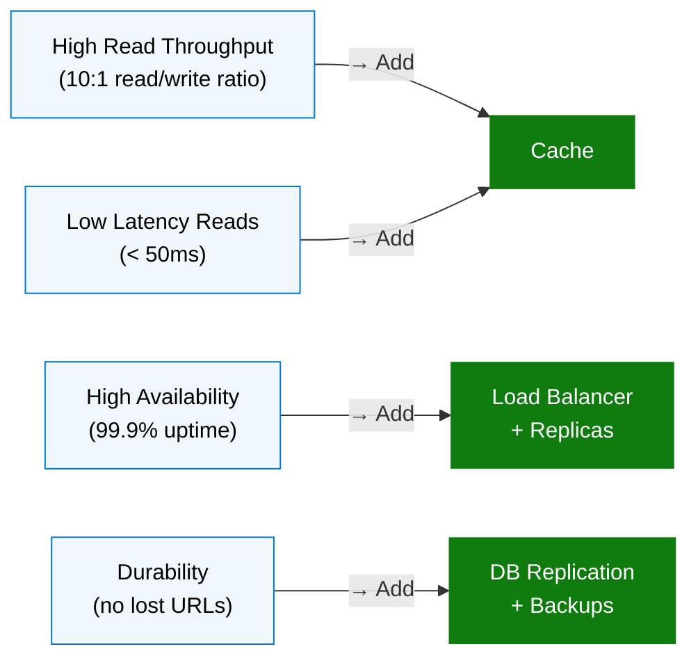
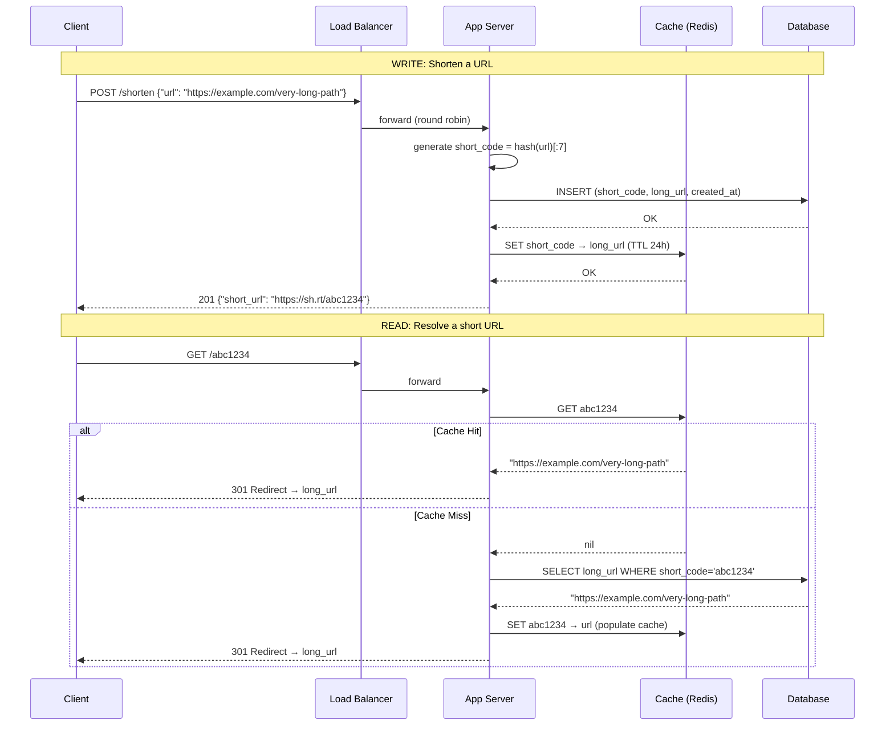
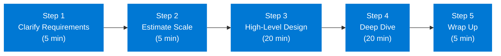

# System Design for Beginners — Full Guide

> **Source:** [YouTube — System Design for Beginners (Full Guide)](https://www.youtube.com/watch?v=BAVrwcPDa-k)
> **Channel/Event:** Independent (published ~July 2026)
> **Topic:** System Design, Distributed Systems, Scalability, Architecture, Interview Prep
> **Key Claim:** Most tutorials start with technology — that's backwards. The problem comes first; the tech stack is a consequence.

---

## Table of Contents

1. [Overview](#1-overview)
2. [Problem Statement](#2-problem-statement)
3. [Core Concepts](#3-core-concepts)
4. [Architecture](#4-architecture)
5. [Key Components](#5-key-components)
6. [How It Works — Step by Step](#6-how-it-works--step-by-step)
7. [Comparison Table](#7-comparison-table)
8. [Code Examples](#8-code-examples)
9. [Best Practices](#9-best-practices)
10. [Interview Talking Points](#10-interview-talking-points)
11. [Learning Resources](#11-learning-resources)

---

## 1. Overview

System design is the practice of deciding how different parts of a software system integrate to solve problems — focusing on request flow, data storage, and responsibility division rather than line-by-line coding. This guide teaches system design from first principles using a URL shortener as the running practical example, deriving every architectural decision from the problem constraints rather than starting with a predefined tech stack. The core insight: the right architecture *emerges* from requirements; you don't impose a technology and then hope the problem fits it.

---

## 2. Problem Statement

### Why System Design Matters

| Gap | Consequence |
|---|---|
| No scalability plan | System collapses under load |
| No reliability design | Single failure takes everything down |
| Tech-first thinking | Over-engineered for the problem at hand |
| Skipping requirements | Building the wrong thing at scale |

### The Problem-First Principle

> **Key Insight:** "Most system design tutorials start with the technology — but that's backwards. The problem comes first, and the tech stack is a consequence."

**Classic Approach Pain Points:**

| Problem | Impact |
|---|---|
| Start with "let's use Kafka" | Queue overhead for 100 req/day |
| Start with "let's use microservices" | 10x ops complexity for a startup |
| Skip estimation | Over-provision or under-provision infrastructure |
| No requirement clarification | Build a globally consistent system when eventual consistency suffices |

---

## 3. Core Concepts

### Request Flow

The journey of a user interaction through a system — from client through backend services, through database interactions, to response delivery. Every system design explanation starts here.

### Stateless vs. Stateful

**Stateless:** Services that don't retain information between requests. Any server instance can handle any request — scale by adding servers freely.

**Stateful:** Services that remember information across requests (sessions, counters, workflows). Requires careful state storage, replication, and recovery.

### Latency vs. Throughput

- **Latency:** Time for a single request to complete (user-perceived speed)
- **Throughput:** Volume of requests handled per unit time
- These trade off: optimizing one often hurts the other

### CAP Theorem

In a distributed system, you can guarantee only **2 of 3**:

| Property | Meaning |
|---|---|
| **C**onsistency | Every read returns the most recent write |
| **A**vailability | Every request receives a response |
| **P**artition Tolerance | System operates despite network splits |

Networks are unreliable → **P is mandatory** → real choice is **CP** (banks) or **AP** (social feeds).

### Scalability

- **Vertical Scaling:** Add more CPU/RAM to existing machines. Simple, has limits.
- **Horizontal Scaling:** Add more machines. Complex, nearly unlimited.

### Functional vs. Non-Functional Requirements

| Type | Examples |
|---|---|
| Functional | "Users can shorten a URL", "Users can resolve a short code" |
| Non-Functional | "99.9% uptime", "< 100ms p99 latency", "handles 10K req/sec" |

---

## 4. Architecture

### URL Shortener — System Architecture



### Non-Functional Requirements Driving Architecture



---

## 5. Key Components

| Component | Technology Examples | Role |
|---|---|---|
| **Load Balancer** | Nginx, AWS ALB, HAProxy | Distributes traffic; eliminates single point of failure |
| **Application Server** | Node.js, Python/FastAPI, Go | Executes business logic; stateless |
| **Cache** | Redis, Memcached | Serves hot data without DB hits; TTL-based expiry |
| **Primary Database** | PostgreSQL, MySQL | Source of truth; handles writes |
| **Read Replica** | PostgreSQL replica | Offloads read traffic; eventual consistency |
| **Message Queue** | RabbitMQ, Kafka, SQS | Decouples async work (analytics, notifications) |
| **CDN** | CloudFront, Akamai | Serves static assets at edge; reduces origin load |
| **API Gateway** | Kong, AWS API Gateway | Auth, rate limiting, routing before app tier |

### Cache Deep Dive

| Pattern | When to Use |
|---|---|
| **Cache-Aside** | App checks cache first; on miss, loads from DB and populates cache |
| **Write-Through** | Write to cache and DB simultaneously; consistency, higher write latency |
| **Write-Behind** | Write to cache; async flush to DB; high throughput, risk of data loss |

**Eviction Policies:**
- **LRU** (Least Recently Used) — default for URL resolvers
- **LFU** (Least Frequently Used) — for trending/hot keys
- **TTL** — set expiry on short-lived entries

### Database Selection Criteria

| Requirement | Choose |
|---|---|
| Complex joins, transactions | SQL (PostgreSQL, MySQL) |
| Massive scale, flexible schema | NoSQL (DynamoDB, MongoDB) |
| High write throughput, time-series | Cassandra, TimescaleDB |
| Full-text search | Elasticsearch |
| Key-value at microsecond latency | Redis |

### Load Balancing Algorithms

| Algorithm | Best For |
|---|---|
| **Round Robin** | Stateless services with uniform load |
| **Least Connections** | Variable request duration |
| **Consistent Hashing** | Stateful services; cache locality |
| **IP Hash** | Session affinity requirements |

---

## 6. How It Works — Step by Step

### URL Shortener — Request Flow



### System Design Process — 5-Step Framework



**Step 1 — Clarify Requirements**
- What are the core features? (functional)
- What scale do we need? (non-functional)
- What are the constraints? (latency, consistency, budget)

**Step 2 — Estimate Scale (Back-of-Envelope)**
```
URL Shortener example:
  - 100M new URLs/day → 1,200 writes/sec
  - 10:1 read ratio → 12,000 reads/sec
  - 500 bytes/URL × 100M/day × 365 days × 5 years = ~90 TB storage
  - Cache 20% of daily reads → 100M × 10 reads × 20% × 500B = ~100 GB/day
```

**Step 3 — High-Level Design**
Sketch: clients → load balancer → app servers → cache + database

**Step 4 — Deep Dive**
Pick bottlenecks: "read-heavy → cache strategy", "write-heavy → queue + async"

**Step 5 — Wrap Up**
Discuss: monitoring, alerting, failure scenarios, future scaling paths

---

## 7. Comparison Table

### Monolithic vs. Microservices

| Dimension | Monolithic | Microservices |
|---|---|---|
| Deployment | Single unit | Independent per service |
| Scalability | Scale the whole app | Scale bottleneck services only |
| Development speed | Faster initially | Faster at team scale |
| Failure isolation | One failure = total outage | Failures are contained |
| Complexity | Low operational complexity | High: service mesh, distributed tracing |
| Best for | Early-stage, small teams | Large teams, high scale |

### SQL vs. NoSQL

| Dimension | SQL | NoSQL |
|---|---|---|
| Schema | Fixed, enforced | Flexible |
| Transactions | ACID | BASE (eventual consistency) |
| Scaling | Vertical (+ read replicas) | Horizontal (sharding native) |
| Query flexibility | Rich joins | Limited joins |
| Best for | Financial data, complex queries | High write throughput, varied schema |

### Vertical vs. Horizontal Scaling

| Dimension | Vertical Scaling | Horizontal Scaling |
|---|---|---|
| Method | Bigger single machine | More machines |
| Cost | Exponential beyond a point | Linear |
| Downtime | Requires restart | Zero downtime |
| Ceiling | Hardware limit | Theoretically unlimited |
| Complexity | Simple | Requires load balancer, distributed state |

### CP vs. AP Systems

| Dimension | CP System | AP System |
|---|---|---|
| CAP choice | Consistency + Partition tolerance | Availability + Partition tolerance |
| Behavior on partition | Rejects requests to stay consistent | Serves stale data to stay available |
| Examples | HBase, Zookeeper, Spanner | Cassandra, CouchDB, DynamoDB |
| Use cases | Bank transactions, inventory | Social feeds, DNS, shopping carts |

---

## 8. Code Examples

### Python — URL Shortener Core Logic

```python
import hashlib
import base64
from dataclasses import dataclass
from typing import Optional

@dataclass
class URLShortener:
    cache: dict       # replace with Redis client
    db: dict          # replace with DB client
    base_url: str = "https://sh.rt"

    def shorten(self, long_url: str) -> str:
        short_code = self._generate_code(long_url)
        self.db[short_code] = long_url
        self.cache[short_code] = long_url          # populate cache on write
        return f"{self.base_url}/{short_code}"

    def resolve(self, short_code: str) -> Optional[str]:
        if short_code in self.cache:               # cache hit
            return self.cache[short_code]
        long_url = self.db.get(short_code)         # cache miss → DB
        if long_url:
            self.cache[short_code] = long_url      # populate on read
        return long_url

    def _generate_code(self, url: str) -> str:
        digest = hashlib.md5(url.encode()).digest()
        return base64.urlsafe_b64encode(digest)[:7].decode()
```

### Python — Back-of-Envelope Estimation Helper

```python
def estimate_storage(
    writes_per_day: int,
    bytes_per_record: int,
    years: int,
    read_write_ratio: int = 10
) -> dict:
    total_records = writes_per_day * 365 * years
    storage_bytes = total_records * bytes_per_record
    reads_per_sec = (writes_per_day * read_write_ratio) / 86400
    writes_per_sec = writes_per_day / 86400

    return {
        "total_records": f"{total_records:,}",
        "storage_gb": f"{storage_bytes / 1e9:.1f} GB",
        "reads_per_sec": f"{reads_per_sec:.0f} req/s",
        "writes_per_sec": f"{writes_per_sec:.0f} req/s",
    }

# URL Shortener — 5-year estimate
print(estimate_storage(
    writes_per_day=100_000_000,
    bytes_per_record=500,
    years=5
))
# → storage: 91.3 GB, reads: 11,574 req/s, writes: 1,157 req/s
```

### API Design — REST Endpoints for URL Shortener

```python
# POST /api/v1/urls
# Request:  {"long_url": "https://example.com/path"}
# Response: {"short_url": "https://sh.rt/abc1234", "expires_at": "2027-07-04"}

# GET /{short_code}
# Response: HTTP 301 Location: https://example.com/path

# GET /api/v1/urls/{short_code}/stats
# Response: {"clicks": 1420, "created_at": "2026-07-04", "top_countries": [...]}

# DELETE /api/v1/urls/{short_code}
# Response: HTTP 204 No Content
```

### Redis — Cache Operations

```bash
# Set with TTL (24 hours)
SET url:abc1234 "https://example.com/very-long-path" EX 86400

# Get
GET url:abc1234

# Check TTL remaining
TTL url:abc1234

# Increment click counter atomically
INCR clicks:abc1234
```

---

## 9. Best Practices

### Requirements

- ✅ Always ask: "What is the expected QPS? What's the SLA for latency? Consistency or availability priority?"
- ✅ Separate functional requirements ("what it does") from non-functional ("how well it does it")
- ❌ Don't assume scale — derive it from numbers

### Estimation

- ✅ Use powers of 10 (1M, 10M, 1B) — precision doesn't matter, order of magnitude does
- ✅ Calculate reads/sec and writes/sec separately — they drive different design choices
- ❌ Don't skip estimation — it's the signal that drives every architectural decision

### Caching

- ✅ Cache hot reads (top 20% of data handles 80% of reads)
- ✅ Set appropriate TTLs — stale data is a feature, not a bug, for most use cases
- ❌ Don't cache writes by default — write-through adds latency; only use when read consistency critical
- ❌ Don't cache unbounded data — always set max memory limits and eviction policy

### Database

- ✅ Add read replicas before sharding — simpler and often sufficient
- ✅ Index foreign keys and frequently filtered columns
- ❌ Don't shard prematurely — adds massive operational complexity
- ❌ Don't use NoSQL just because it's trendy — if you need ACID, use SQL

### Scalability

- ✅ Design stateless app servers first — horizontal scaling becomes trivial
- ✅ Identify the bottleneck (usually DB) before scaling elsewhere
- ❌ Don't scale prematurely — start monolith, extract services when pain is real

---

## 10. Interview Talking Points

### "Walk me through how you'd design a URL shortener."

> Start by clarifying requirements: "Do we need custom aliases? Analytics? Expiry?" Then estimate: at 100M shortens/day that's ~1,200 writes/sec and 12,000 reads/sec — heavily read-biased, so caching is critical. High-level design: client → load balancer → stateless app servers → Redis cache + PostgreSQL. For the short code, MD5 hash of the URL truncated to 7 chars gives 62^7 ≈ 3.5 trillion possibilities — no collision concern at 5-year scale. On read, check Redis first; on miss, hit the DB and populate cache. The read path should be sub-50ms p99.

### "How does the CAP theorem affect your design decisions?"

> The CAP theorem says in a distributed system you can only guarantee two of: Consistency, Availability, Partition Tolerance. Since network partitions are inevitable, the real trade-off is CP vs. AP. For a URL shortener, I'd choose AP — it's acceptable for a redirect to briefly return a slightly stale URL during a partition, but it's unacceptable for the service to be unavailable. For a banking ledger, I'd choose CP: I'd rather reject a transaction than process it twice or show wrong balances.

### "How do you decide between SQL and NoSQL?"

> I start with SQL unless there's a strong reason not to. SQL gives you ACID transactions, rich querying, and decades of operational tooling. I'd move to NoSQL when: (1) the schema is genuinely variable and changes frequently, (2) I need horizontal write scalability beyond what read replicas and sharding can provide cost-effectively, or (3) the data model is naturally document/graph shaped. For the URL shortener, a key-value lookup (short_code → long_url) is perfect for DynamoDB or even Redis, but PostgreSQL works fine up to billions of rows with proper indexing.

### "What's the difference between vertical and horizontal scaling?"

> Vertical scaling means adding more resources (CPU, RAM) to a single machine — simple to implement, no code changes, but has a hardware ceiling and requires downtime. Horizontal scaling means adding more machines and distributing load with a load balancer — theoretically unlimited, but requires stateless services and introduces distributed system complexity. In practice: start vertical (fast, cheap), then move horizontal once you hit the ceiling or need high availability, since horizontal also eliminates single points of failure.

### "How do you identify and resolve bottlenecks in a system?"

> I trace the critical path for the most common user action end-to-end and time each hop. Common bottlenecks by layer: (1) **Application:** CPU-bound → horizontal scale, (2) **Database:** high connection count → connection pooling; slow queries → indexing or query optimization; high write throughput → sharding or async queue, (3) **Network:** large payloads → compression, caching at edge via CDN. The key principle: don't guess — measure. Add distributed tracing (e.g., OpenTelemetry) and look at p99 latency, not averages.

### "How would you handle 10x traffic growth overnight?"

> First, confirm it's real traffic (not a bot attack — check user agents, request patterns). Then: (1) horizontal scale app servers immediately — they're stateless, so this is fast, (2) scale cache tier — add Redis nodes, (3) promote read replica to take read load off primary, (4) if DB writes are the bottleneck — add a write queue to buffer bursts. Longer term: evaluate CDN for static content, database sharding, and separate the read/write paths completely with CQRS pattern.

---

## 11. Learning Resources

| Resource | Link | Type |
|---|---|---|
| YouTube — System Design for Beginners (Full Guide) | [Watch](https://www.youtube.com/watch?v=BAVrwcPDa-k) | Video |
| System Design Handbook — Beginner Guide 2026 | [Read](https://www.systemdesignhandbook.com/guides/system-design-for-beginners/) | Article |
| GeeksForGeeks — System Design Tutorial | [Read](https://www.geeksforgeeks.org/system-design/system-design-tutorial/) | Tutorial |
| Design Gurus — System Design for Beginners | [Read](https://www.designgurus.io/blog/system-design-tutorial-for-beginners) | Blog |
| System Design Handbook — Complete Guide 2026 | [Read](https://www.systemdesignhandbook.com/guides/system-design/) | Reference |

---

*Last Updated: July 2026 | Source: YouTube — System Design for Beginners (Full Guide)*
