# .NET Developer's Complete AI & ML Guide (.NET + Azure)

> **Where do I even start with AI as a .NET developer?**
> You don't start over. You start from exactly where you are. Your C#, DI, async pipelines, and REST API skills are the foundation everyone underestimates. This guide maps the journey across six stages plus a complete Azure AI stack reference — enough depth to pass an AI architect interview.

---

## Table of Contents
1. [Stage 1: .NET Foundations for AI](#1-stage-1-net-foundations-for-ai-workloads)
2. [Stage 2: Core AI & ML Concepts](#2-stage-2-core-ai--ml-concepts)
3. [Stage 3: .NET AI Tooling](#3-stage-3-net-ai-tooling)
4. [Stage 4: Data & Retrieval — RAG Pipelines](#4-stage-4-data--retrieval--rag-pipelines)
5. [Stage 5: Agents & Orchestration](#5-stage-5-agents--orchestration)
6. [Stage 6: Production & Scale](#6-stage-6-production--scale)
7. [Azure AI Stack — Complete Reference](#7-azure-ai-stack--complete-reference)
8. [Cross-Cutting Themes](#8-cross-cutting-themes)
9. [Production Deployments — Infrastructure, CI/CD & Operations](#9-production-deployments--infrastructure-cicd--operations)

---

## The Six-Stage Journey

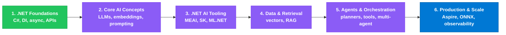

---

# 1. Stage 1: .NET Foundations for AI Workloads

### Overview
AI workloads are, at the plumbing level, just resilient HTTP calls to remote inference endpoints that stream tokens back over time. Everything you already know about `async`/`await`, dependency injection, `HttpClient`, and Minimal APIs transfers directly. The one new muscle to build is **streaming**: LLMs emit tokens incrementally, and `IAsyncEnumerable<T>` is the idiomatic way to surface that in .NET.

### Architecture Diagram

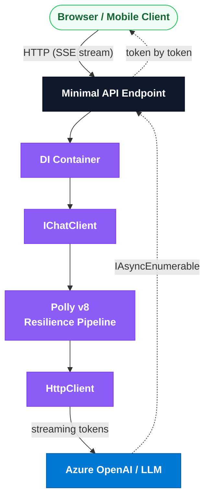

### 1.1 async/await, Task, ValueTask, IAsyncEnumerable

- **`Task<T>`** — a single future value. Use for one-shot completions (a full LLM response returned at once).
- **`ValueTask<T>`** — avoids a heap allocation when the result is often already available synchronously (e.g., cache hits). Do not `await` a `ValueTask` twice, and do not store it — consume it once.
- **`IAsyncEnumerable<T>`** — a *stream* of values produced over time, consumed with `await foreach`. This is the backbone of token streaming: each yielded item is a chunk of the model's output.

```csharp
// Streaming producer: yields tokens as they arrive from the model.
public async IAsyncEnumerable<string> StreamAnswerAsync(
    string prompt,
    [EnumeratorCancellation] CancellationToken cancellationToken = default)
{
    await foreach (var update in _chatClient.GetStreamingResponseAsync(
                       prompt, cancellationToken: cancellationToken))
    {
        if (!string.IsNullOrEmpty(update.Text))
            yield return update.Text;
    }
}
```

Key point: `[EnumeratorCancellation]` flows the caller's `CancellationToken` into the async iterator so a client disconnect actually cancels the upstream LLM call — critical for cost control.

### 1.2 DI Patterns for Registering AI Services

Register `IChatClient` and `IEmbeddingGenerator` as singletons (they are thread-safe HTTP-based clients) and wrap them with middleware such as logging, telemetry, and caching using the builder pattern.

```csharp
var builder = WebApplication.CreateBuilder(args);

// Bind strongly-typed config via IOptions<T>.
builder.Services.Configure<AzureOpenAiOptions>(
    builder.Configuration.GetSection("AzureOpenAI"));

// Register IChatClient with a middleware pipeline.
builder.Services.AddChatClient(sp =>
{
    var opts = sp.GetRequiredService<IOptions<AzureOpenAiOptions>>().Value;

    // DefaultAzureCredential => Managed Identity in Azure, dev creds locally.
    var azureClient = new Azure.AI.OpenAI.AzureOpenAIClient(
        new Uri(opts.Endpoint),
        new Azure.Identity.DefaultAzureCredential());

    return azureClient
        .GetChatClient(opts.DeploymentName)
        .AsIChatClient();
})
.UseLogging()
.UseOpenTelemetry()
.UseDistributedCache();

builder.Services.AddEmbeddingGenerator(sp =>
{
    var opts = sp.GetRequiredService<IOptions<AzureOpenAiOptions>>().Value;
    return new Azure.AI.OpenAI.AzureOpenAIClient(
            new Uri(opts.Endpoint), new Azure.Identity.DefaultAzureCredential())
        .GetEmbeddingClient(opts.EmbeddingDeployment)
        .AsIEmbeddingGenerator();
});
```

```csharp
// Immutable configuration DTO bound from appsettings via IOptions<T>.
public record AzureOpenAiOptions
{
    public string Endpoint { get; init; } = default!;
    public string DeploymentName { get; init; } = "gpt-4o";
    public string EmbeddingDeployment { get; init; } = "text-embedding-3-large";
}
```

### 1.3 HttpClient + Polly v8 for Resilient AI API Calls

LLM endpoints return `429 Too Many Requests` and transient `5xx` errors frequently. Polly v8's `AddResilienceHandler` composes retry (with jittered backoff), a circuit breaker, and a timeout into the `HttpClient` pipeline.

```csharp
builder.Services.AddHttpClient("AiClient")
    .AddResilienceHandler("ai-pipeline", pipeline =>
    {
        pipeline.AddRetry(new Polly.Retry.HttpRetryStrategyOptions
        {
            MaxRetryAttempts = 4,
            BackoffType = Polly.DelayBackoffType.Exponential,
            UseJitter = true,
            Delay = TimeSpan.FromSeconds(2),
            ShouldHandle = args => ValueTask.FromResult(
                args.Outcome.Result?.StatusCode
                    is System.Net.HttpStatusCode.TooManyRequests
                    or System.Net.HttpStatusCode.ServiceUnavailable)
        });

        pipeline.AddCircuitBreaker(new Polly.CircuitBreaker.HttpCircuitBreakerStrategyOptions
        {
            FailureRatio = 0.5,
            SamplingDuration = TimeSpan.FromSeconds(30),
            MinimumThroughput = 10,
            BreakDuration = TimeSpan.FromSeconds(15)
        });

        pipeline.AddTimeout(TimeSpan.FromSeconds(120)); // LLMs are slow.
    });
```

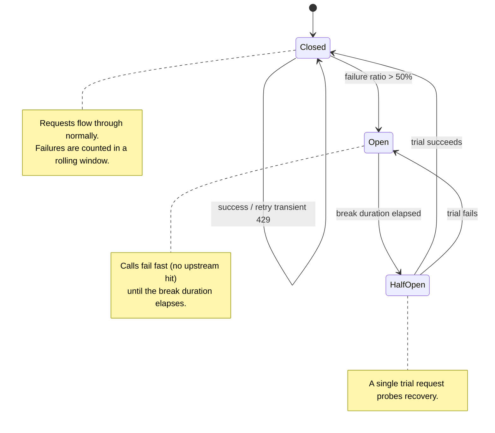

### 1.4 Minimal APIs for AI Endpoints (Streaming + Non-Streaming)

Minimal APIs are preferred over controllers for new endpoints — less ceremony, first-class support for returning `IAsyncEnumerable<T>` as Server-Sent Events (SSE).

```csharp
var app = builder.Build();

// Non-streaming: return the full completion once.
app.MapPost("/chat", async (
    ChatRequest req,
    IChatClient chat,
    CancellationToken ct) =>
{
    var response = await chat.GetResponseAsync(req.Prompt, cancellationToken: ct);
    return Results.Ok(new ChatResponse(response.Text));
});

// Streaming: emit tokens as SSE using IAsyncEnumerable.
app.MapPost("/chat/stream", (
    ChatRequest req,
    IChatClient chat,
    CancellationToken ct) =>
{
    async IAsyncEnumerable<string> Stream(
        [EnumeratorCancellation] CancellationToken token)
    {
        await foreach (var update in chat.GetStreamingResponseAsync(
                           req.Prompt, cancellationToken: token))
        {
            if (!string.IsNullOrEmpty(update.Text))
                yield return update.Text;
        }
    }

    return TypedResults.ServerSentEvents(Stream(ct));
});

app.Run();

public record ChatRequest(string Prompt);
public record ChatResponse(string Answer);
```

### 1.5 How IAsyncEnumerable Enables Token Streaming

The model produces tokens autoregressively — one at a time, each conditioned on the previous. Rather than buffering the entire response (high latency, poor UX), `IAsyncEnumerable<T>` lets each token surface immediately. The `await foreach` loop pulls the next chunk only when the consumer is ready (natural backpressure), and cancellation propagates end-to-end so a browser tab close aborts the paid inference call.

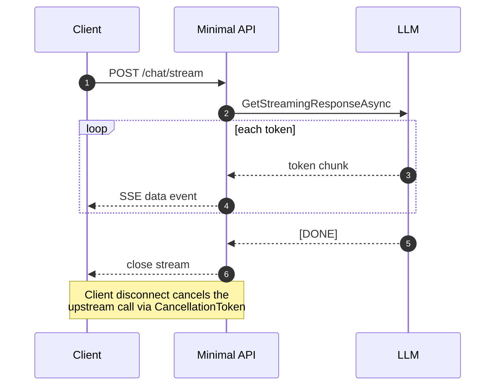

### Interview Talking Points

| Question | Answer |
|---|---|
| Why `IAsyncEnumerable<T>` for LLM responses? | It streams tokens as they are generated, giving low time-to-first-token and natural backpressure, versus buffering a full `Task<string>` result. |
| `Task` vs `ValueTask` for an AI service? | Use `ValueTask` when results are frequently synchronous (cache hits) to avoid allocations; use `Task` for genuinely async one-shot completions. Never await a `ValueTask` twice. |
| How do you make LLM calls resilient? | Polly v8 `AddResilienceHandler` with jittered exponential retry on `429`/`503`, a circuit breaker, and a generous timeout (LLMs are slow). |
| What lifetime for `IChatClient` in DI? | Singleton — it wraps a thread-safe HTTP client. Register with `AddChatClient(...)` and chain middleware like `.UseOpenTelemetry()`. |
| How do you cancel an in-flight LLM stream? | Flow a `CancellationToken` through `[EnumeratorCancellation]` in the async iterator so client disconnect aborts the upstream call and stops billing. |
| Why Minimal APIs over controllers for AI endpoints? | Lower ceremony, native `TypedResults.ServerSentEvents(...)` for streaming, and cleaner DI injection per endpoint. |
| How do you avoid double enumeration cost of a stream? | Materialize once with `await foreach`; if you need the full text too, accumulate into a `StringBuilder` while yielding. |

---

# 2. Stage 2: Core AI & ML Concepts

### Overview
Theory before tooling. An LLM is a next-token predictor built on the transformer architecture. Text becomes **tokens**, tokens become **embeddings** (vectors), and attention lets each token weigh every other token. Understanding tokenization, embeddings, context windows, sampling parameters, and the RAG-vs-fine-tune-vs-prompt decision is what separates an integrator from an architect.

### Architecture Diagram

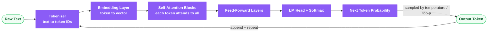

### 2.1 What is an LLM? Transformer Architecture

A Large Language Model is a neural network trained to predict the next token given previous tokens. The **transformer** (Vaswani et al., 2017) replaced recurrence with **self-attention**: every token computes a weighted relevance (query · key) over all other tokens and mixes their values accordingly. Stacking dozens of attention + feed-forward blocks with residual connections and layer normalization yields the capacity to model long-range dependencies. Decoder-only models (GPT family) use *causal* (masked) attention so a token can only attend to earlier tokens.

### 2.2 Tokenization: Text → Tokens → Embeddings

Tokenizers (e.g., byte-pair encoding / `tiktoken`) split text into sub-word units. "unbelievable" might become `["un", "believ", "able"]`. Each token maps to an integer ID, then to a learned dense vector (the embedding). Token count — not character count — drives cost and context limits. Rough rule: ~4 characters or ~0.75 words per token in English.

```csharp
// Token counting with SharpToken (BPE) to enforce budgets before sending.
using SharpToken;

public sealed class TokenCounter
{
    private readonly GptEncoding _encoding = GptEncoding.GetEncoding("cl100k_base");

    public int Count(string text) => _encoding.Encode(text).Count;

    public bool FitsBudget(string text, int maxTokens) => Count(text) <= maxTokens;
}
```

### 2.3 Prompting Strategies

- **Zero-shot** — instruction only, no examples: *"Classify the sentiment."*
- **Few-shot** — include 2–5 labeled examples in the prompt to steer format and behavior.
- **Chain-of-thought (CoT)** — ask the model to reason step-by-step ("Let's think step by step"); improves multi-step reasoning accuracy.
- **System prompt** — a high-priority instruction that sets role, tone, constraints, and guardrails, separate from user input.

```csharp
using Microsoft.Extensions.AI;

var messages = new List<ChatMessage>
{
    new(ChatRole.System,
        "You are a precise financial assistant. Answer only from provided context. " +
        "If unsure, say 'I don't know'."),
    // Few-shot exemplars:
    new(ChatRole.User, "Revenue was 10M, costs 6M. Profit?"),
    new(ChatRole.Assistant, "Profit = 10M - 6M = 4M."),
    // Actual query with chain-of-thought nudge:
    new(ChatRole.User, "Revenue 42M, costs 27M, tax 3M. Net? Think step by step.")
};

var reply = await chat.GetResponseAsync(messages, cancellationToken: ct);
```

### 2.4 Embeddings: Semantic Meaning as Vectors

An embedding maps text to a high-dimensional vector (e.g., 1536 or 3072 dims) where semantic similarity ≈ geometric proximity. "car" and "automobile" land close together. **Cosine similarity** measures the angle between vectors, ignoring magnitude — the standard relevance metric for retrieval.

```csharp
public static class VectorMath
{
    // Cosine similarity: dot(a,b) / (||a|| * ||b||), range [-1, 1].
    public static float CosineSimilarity(ReadOnlySpan<float> a, ReadOnlySpan<float> b)
    {
        if (a.Length != b.Length)
            throw new ArgumentException("Vectors must have equal length.");

        float dot = 0f, magA = 0f, magB = 0f;
        for (int i = 0; i < a.Length; i++)
        {
            dot  += a[i] * b[i];
            magA += a[i] * a[i];
            magB += b[i] * b[i];
        }
        return dot / (MathF.Sqrt(magA) * MathF.Sqrt(magB) + 1e-8f);
    }
}
```

```csharp
// Generating embeddings via Microsoft.Extensions.AI abstraction.
public sealed class SemanticSearch(IEmbeddingGenerator<string, Embedding<float>> generator)
{
    public async Task<float[]> EmbedAsync(string text, CancellationToken ct = default)
    {
        var result = await generator.GenerateAsync([text], cancellationToken: ct);
        return result[0].Vector.ToArray();
    }
}
```

### 2.5 Context Windows: Limits, Chunking, Sliding Windows

The context window is the maximum tokens (prompt + completion) a model can process in one call (e.g., 128K for GPT-4o). Exceeding it truncates or errors. Strategies:
- **Chunking** — split long documents into pieces small enough to embed and retrieve.
- **Sliding window** — overlap adjacent chunks (e.g., 15% overlap) so context isn't lost at boundaries.
- **Summarization / compaction** — condense older conversation turns to preserve budget.

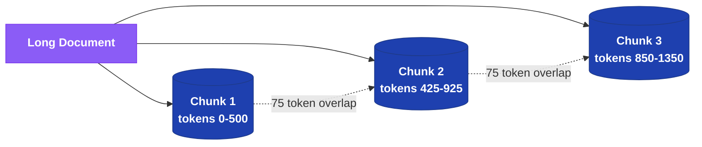

### 2.6 Temperature, Top-p, Max-Tokens

- **Temperature** (0–2) — scales the logits before softmax. Low (0–0.3) = deterministic/factual; high (0.8+) = creative/diverse.
- **Top-p (nucleus sampling)** — sample only from the smallest set of tokens whose cumulative probability ≥ p (e.g., 0.9). Tune temperature *or* top-p, not both aggressively.
- **Max-tokens** — hard cap on completion length; controls cost and latency.

```csharp
var options = new ChatOptions
{
    Temperature = 0.2f,        // factual, deterministic
    TopP = 0.95f,
    MaxOutputTokens = 800
};
var resp = await chat.GetResponseAsync(messages, options, ct);
```

### 2.7 Fine-tuning vs RAG vs Prompt Engineering (Decision Matrix)

| Approach | Best for | Freshness | Cost | Data needed |
|---|---|---|---|---|
| **Prompt engineering** | Behavior/format shaping, quick wins | Immediate | Lowest | None |
| **RAG** | Grounding in private/changing knowledge | Real-time (re-index) | Medium | Documents + vector store |
| **Fine-tuning** | Consistent style/format, domain tone, latency | Frozen at train time | High (train + host) | Thousands of labeled examples |

Rule of thumb: **Start with prompting → add RAG for knowledge → fine-tune only for style/format at scale.** RAG usually beats fine-tuning for *facts* because knowledge changes and re-indexing is cheaper than retraining.

### 2.8 Supervised vs Unsupervised vs Reinforcement Learning

- **Supervised** — learn from labeled input→output pairs (classification, regression). LLM instruction-tuning is supervised fine-tuning.
- **Unsupervised** — find structure in unlabeled data (clustering, the *pretraining* next-token objective is self-supervised).
- **Reinforcement learning** — learn via reward signals; **RLHF** (Reinforcement Learning from Human Feedback) aligns LLMs to human preferences.

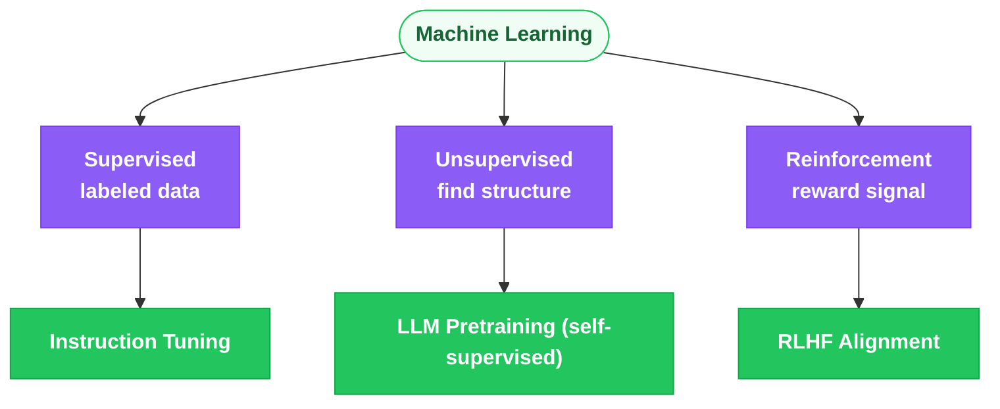

### Interview Talking Points

| Question | Answer |
|---|---|
| What is self-attention? | Each token computes query/key/value; attention weights = softmax(Q·Kᵀ/√d) let every token mix information from all others, capturing long-range dependencies. |
| Why does token count matter? | It drives cost, latency, and context-window limits — pricing and truncation are per-token, not per-character. |
| Cosine vs Euclidean for embeddings? | Cosine (angle) ignores magnitude and is standard for normalized text embeddings; Euclidean is sensitive to vector length. |
| When RAG over fine-tuning? | When knowledge is private, large, or frequently changing — re-indexing is cheaper and fresher than retraining a model. |
| What does temperature do? | Scales logits: low = deterministic/factual, high = diverse/creative. For factual answers use ~0.2 and top-p ~0.9–0.95. |
| What is chain-of-thought? | Prompting the model to reason step-by-step, improving accuracy on multi-step/arithmetic tasks; can be hidden from the user. |
| What is RLHF? | Reinforcement Learning from Human Feedback — a reward model trained on human preference rankings guides policy optimization to align outputs. |
| Sliding window in chunking? | Overlapping chunk boundaries (e.g., 15%) so semantically important context spanning a boundary is not lost during retrieval. |

---

# 3. Stage 3: .NET AI Tooling

### Overview
This is where it starts feeling like *your* stack again. **Microsoft.Extensions.AI (MEAI)** provides vendor-neutral abstractions (`IChatClient`, `IEmbeddingGenerator`). **Semantic Kernel (SK)** is Microsoft's orchestration SDK with plugins, functions, memory, and agents. **ML.NET** handles classic ML and ONNX inference in pure C#. The **Azure OpenAI SDK** is the concrete provider underneath.

### Architecture Diagram

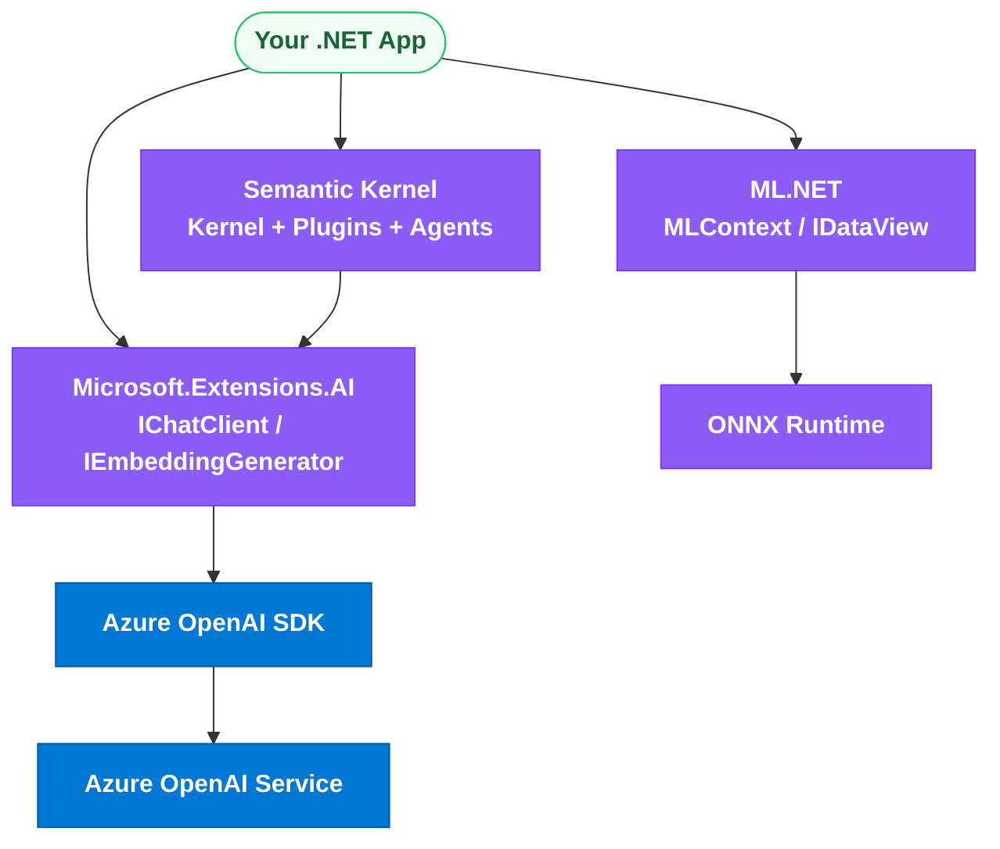

### 3.1 Microsoft.Extensions.AI (MEAI)

MEAI is the *standard AI abstraction*. `IChatClient` and `IEmbeddingGenerator<TInput,TEmbedding>` decouple your code from any provider, and the middleware pattern (`.UseLogging()`, `.UseFunctionInvocation()`, `.UseDistributedCache()`, `.UseOpenTelemetry()`) composes cross-cutting concerns via decorators.

```csharp
using Microsoft.Extensions.AI;

// Provider-agnostic consumption + automatic tool invocation middleware.
IChatClient client = baseClient
    .AsBuilder()
    .UseFunctionInvocation()   // auto-executes tool calls
    .UseLogging()
    .Build();

var options = new ChatOptions
{
    Tools = [AIFunctionFactory.Create(GetWeather)]
};

[Description("Gets the current weather for a city.")]
static string GetWeather([Description("City name")] string city)
    => $"The weather in {city} is 22C and sunny.";

var response = await client.GetResponseAsync(
    "What's the weather in Seattle?", options, ct);
```

### 3.2 Semantic Kernel — Kernel, Plugins, Functions, Memory, Planners

The **Kernel** is a DI container of services and **plugins**. A plugin groups **KernelFunctions** — either **native functions** (C# methods) or **semantic functions** (prompt templates). Planners chain functions to reach a goal (the modern approach is *auto function calling* rather than legacy stepwise planners).

```csharp
using Microsoft.SemanticKernel;
using System.ComponentModel;

// Native function plugin.
public sealed class TimePlugin
{
    [KernelFunction, Description("Gets the current UTC time.")]
    public string GetUtcNow() => DateTime.UtcNow.ToString("O");
}

var builder = Kernel.CreateBuilder();
builder.AddAzureOpenAIChatCompletion(
    deploymentName: "gpt-4o",
    endpoint: "https://my-aoai.openai.azure.com/",
    credentials: new Azure.Identity.DefaultAzureCredential());
builder.Plugins.AddFromType<TimePlugin>();
Kernel kernel = builder.Build();

// Semantic function from an inline prompt template.
var summarize = kernel.CreateFunctionFromPrompt(
    "Summarize the following in one sentence:\n{{$input}}");

var summary = await kernel.InvokeAsync(summarize,
    new KernelArguments { ["input"] = longText });

// Auto function calling: model decides when to call TimePlugin.
var settings = new Microsoft.SemanticKernel.Connectors.OpenAI.OpenAIPromptExecutionSettings
{
    FunctionChoiceBehavior = FunctionChoiceBehavior.Auto()
};
var result = await kernel.InvokePromptAsync(
    "What time is it right now?", new KernelArguments(settings));
```

### 3.3 Semantic Kernel Agents (ChatCompletionAgent, AgentChat)

SK Agents wrap a kernel + instructions into an autonomous participant. `ChatCompletionAgent` is the LLM-backed agent; `AgentGroupChat` coordinates multiple agents.

```csharp
using Microsoft.SemanticKernel.Agents;

var agent = new ChatCompletionAgent
{
    Name = "Researcher",
    Instructions = "You research topics and cite sources concisely.",
    Kernel = kernel
};

await foreach (var msg in agent.InvokeAsync("Summarize vector databases."))
    Console.WriteLine(msg.Content);
```

### 3.4 ML.NET — IDataView, MLContext, Pipelines, ONNX

ML.NET is Microsoft's cross-platform classical ML framework. `MLContext` is the entry point; `IDataView` is a lazy, schematized data stream; transforms + trainers compose into a pipeline. It can also load ONNX models for deep-learning inference.

```csharp
using Microsoft.ML;
using Microsoft.ML.Data;

public record SentimentData([property: LoadColumn(0)] string Text,
                            [property: LoadColumn(1)] bool Label);
public record SentimentPrediction([property: ColumnName("PredictedLabel")] bool Prediction);

var ml = new MLContext(seed: 42);
IDataView data = ml.Data.LoadFromTextFile<SentimentData>("reviews.tsv", hasHeader: true);

var pipeline = ml.Transforms.Text.FeaturizeText("Features", nameof(SentimentData.Text))
    .Append(ml.BinaryClassification.Trainers.SdcaLogisticRegression(
        labelColumnName: nameof(SentimentData.Label)));

ITransformer model = pipeline.Fit(data);
var engine = ml.Model.CreatePredictionEngine<SentimentData, SentimentPrediction>(model);
var prediction = engine.Predict(new SentimentData("This product is amazing!", false));
```

### 3.5 Azure OpenAI SDK

```csharp
using Azure.AI.OpenAI;
using OpenAI.Chat;

var azure = new AzureOpenAIClient(
    new Uri("https://my-aoai.openai.azure.com/"),
    new Azure.Identity.DefaultAzureCredential());

ChatClient chat = azure.GetChatClient("gpt-4o");

ChatCompletion completion = await chat.CompleteChatAsync(
    [new SystemChatMessage("You are concise."),
     new UserChatMessage("Explain embeddings in one line.")],
    new ChatCompletionOptions { Temperature = 0.2f, MaxOutputTokenCount = 100 });

Console.WriteLine(completion.Content[0].Text);
```

### 3.6 Key NuGet Packages

| Package | Purpose |
|---|---|
| `Microsoft.Extensions.AI` | Core AI abstractions (`IChatClient`, middleware) |
| `Microsoft.Extensions.AI.OpenAI` | MEAI adapters for OpenAI / Azure OpenAI |
| `Azure.AI.OpenAI` | Azure OpenAI client |
| `Microsoft.SemanticKernel` | Orchestration, plugins, functions |
| `Microsoft.SemanticKernel.Agents.Core` | SK agents |
| `Microsoft.ML` | ML.NET classical ML |
| `Microsoft.ML.OnnxRuntime` | ONNX inference |
| `Microsoft.ML.OnnxRuntimeGenAI` | Local generative inference (phi) |
| `Azure.Identity` | `DefaultAzureCredential` |
| `Qdrant.Client`, `Pgvector.EntityFrameworkCore` | Vector stores |

### Interview Talking Points

| Question | Answer |
|---|---|
| MEAI vs Semantic Kernel? | MEAI is a thin vendor-neutral abstraction (`IChatClient`); SK is a higher-level orchestration framework (plugins, agents, memory) that can sit on top of MEAI. |
| Native vs semantic function in SK? | Native = a C# method decorated with `[KernelFunction]`; semantic = a parameterized prompt template. Both are `KernelFunction`s and composable. |
| What replaced SK's stepwise planner? | Auto function calling (`FunctionChoiceBehavior.Auto()`) — the model itself decides which functions to invoke, which is more robust than legacy planners. |
| What is `IDataView` in ML.NET? | A lazily-evaluated, immutable, schematized view over data enabling efficient streaming through transform/trainer pipelines. |
| How does MEAI enable provider swapping? | Code depends on `IChatClient`/`IEmbeddingGenerator`; swapping OpenAI for Azure/Ollama is a DI registration change, not a code change. |
| Why use `.UseFunctionInvocation()`? | It auto-executes tool calls the model requests and feeds results back, removing manual tool-loop plumbing. |
| Can ML.NET run deep learning models? | Yes — it loads ONNX models via `ApplyOnnxModel` for inference, bridging classical ML pipelines with neural nets. |

---

# 4. Stage 4: Data & Retrieval — RAG Pipelines

### Overview
**Retrieval-Augmented Generation (RAG)** grounds an LLM in your private, current data by retrieving relevant chunks and injecting them into the prompt. It beats fine-tuning for knowledge because you can update the index in seconds without retraining, and it provides citations/attribution. The pipeline is: ingest → chunk → embed → index → retrieve → augment → generate.

### Architecture Diagram

```mermaid
flowchart LR
    Docs["Source Documents"] --> Chunk["Chunker"]
    Chunk --> Embed["Embedding Generator"]
    Embed --> Index[("Vector Index")]
    Q(["User Query"]) --> QEmbed["Embed Query"]
    QEmbed --> Retr["Vector + Keyword Retrieval"]
    Index --> Retr
    Retr --> Rerank["Reranker"]
    Rerank --> Aug["Augment Prompt with Context"]
    Aug --> LLM["LLM"]
    LLM --> Ans(["Grounded Answer + Citations"])

    classDef actor fill:#f0fdf4,stroke:#22c55e,color:#166534,font-weight:bold
    classDef storage fill:#1e40af,stroke:#1e3a8a,color:#fff,font-weight:bold
    classDef process fill:#8b5cf6,stroke:#7c3aed,color:#fff,font-weight:bold
    classDef azure fill:#0078D4,stroke:#005a9e,color:#fff,font-weight:bold
    classDef success fill:#22c55e,stroke:#16a34a,color:#fff,font-weight:bold
    class Q actor
    class Index storage
    class Docs,Chunk,Embed,QEmbed,Retr,Rerank,Aug process
    class LLM azure
    class Ans success
```

### 4.1 What is RAG and Why It Beats Fine-Tuning for Knowledge

RAG separates *knowledge* (in a vector store) from *reasoning* (in the model). Advantages: real-time freshness (re-index, don't retrain), source citations (reduces hallucination and enables auditability), access control (filter retrieval by user permissions), and lower cost than fine-tuning. Fine-tuning bakes knowledge into weights — expensive to update and prone to hallucinating on unseen facts.

### 4.2 Chunking Strategies

| Strategy | How | Trade-off |
|---|---|---|
| **Fixed-size** | Split every N tokens | Simple; may cut mid-sentence |
| **Sentence-aware** | Split on sentence boundaries | Preserves meaning; variable size |
| **Recursive** | Split by paragraph → sentence → word until size fits | Good structural respect |
| **Semantic** | Split where embedding similarity drops (topic shift) | Best coherence; more compute |

Add ~10–20% **overlap** between chunks to preserve boundary context.

```csharp
public static IEnumerable<string> ChunkWithOverlap(
    string text, int chunkSize = 500, int overlap = 75)
{
    var words = text.Split(' ', StringSplitOptions.RemoveEmptyEntries);
    for (int start = 0; start < words.Length; start += chunkSize - overlap)
    {
        var slice = words.Skip(start).Take(chunkSize);
        yield return string.Join(' ', slice);
        if (start + chunkSize >= words.Length) yield break;
    }
}
```

### 4.3 pgvector with EF Core

```csharp
using Pgvector;
using Pgvector.EntityFrameworkCore;

public class DocumentChunk
{
    public int Id { get; set; }
    public string Content { get; set; } = default!;
    [Column(TypeName = "vector(1536)")]
    public Vector Embedding { get; set; } = default!;
}

public class RagDbContext(DbContextOptions<RagDbContext> options) : DbContext(options)
{
    public DbSet<DocumentChunk> Chunks => Set<DocumentChunk>();
    protected override void OnModelCreating(ModelBuilder mb) =>
        mb.HasPostgresExtension("vector");
}

// Cosine-distance nearest-neighbor query.
public async Task<List<DocumentChunk>> SearchAsync(
    RagDbContext db, float[] queryVector, int k = 5, CancellationToken ct = default)
{
    var v = new Vector(queryVector);
    return await db.Chunks
        .OrderBy(c => c.Embedding.CosineDistance(v))
        .Take(k)
        .ToListAsync(ct);
}
```

### 4.4 Qdrant with the .NET Client

```csharp
using Qdrant.Client;
using Qdrant.Client.Grpc;

var qdrant = new QdrantClient("localhost", 6334);

await qdrant.CreateCollectionAsync("docs",
    new VectorParams { Size = 1536, Distance = Distance.Cosine });

// Upsert.
await qdrant.UpsertAsync("docs", new[]
{
    new PointStruct
    {
        Id = new PointId { Uuid = Guid.NewGuid().ToString() },
        Vectors = embedding,                        // float[]
        Payload = { ["text"] = chunkText, ["source"] = "policy.pdf" }
    }
});

// Search.
var hits = await qdrant.SearchAsync("docs", queryEmbedding, limit: 5);
foreach (var h in hits)
    Console.WriteLine($"{h.Score:F3}: {h.Payload["text"].StringValue}");
```

### 4.5 Hybrid Search (BM25 + Vector, RRF Fusion)

Vector search captures semantics; BM25 keyword search captures exact terms (names, IDs, acronyms). **Reciprocal Rank Fusion (RRF)** merges both ranked lists: `score = Σ 1 / (k + rank_i)`. Azure AI Search performs this natively when a query includes both a text and a vector clause.

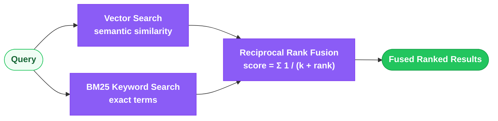

### 4.6 Reranking

A first-stage retriever returns ~50 candidates cheaply; a **cross-encoder reranker** (or Azure AI Search's **semantic ranker**) scores each (query, chunk) pair jointly for higher precision, keeping the top ~5 for the prompt. This dramatically improves answer quality at modest latency cost.

### 4.7 Full RAG Pipeline in C#

```csharp
public sealed class RagService(
    IEmbeddingGenerator<string, Embedding<float>> embedder,
    QdrantClient qdrant,
    IChatClient chat)
{
    public async Task<string> AskAsync(string question, CancellationToken ct = default)
    {
        // 1. Embed the query.
        var qEmb = (await embedder.GenerateAsync([question], cancellationToken: ct))[0]
                   .Vector.ToArray();

        // 2. Retrieve top-k chunks.
        var hits = await qdrant.SearchAsync("docs", qEmb, limit: 5);
        var context = string.Join("\n---\n",
            hits.Select(h => h.Payload["text"].StringValue));

        // 3. Augment prompt and generate a grounded answer.
        var messages = new List<ChatMessage>
        {
            new(ChatRole.System,
                "Answer ONLY from the context. If absent, say you don't know. Cite sources."),
            new(ChatRole.User, $"Context:\n{context}\n\nQuestion: {question}")
        };
        var resp = await chat.GetResponseAsync(messages, cancellationToken: ct);
        return resp.Text;
    }
}
```

### 4.8 Azure AI Search — Indexes, Indexers, Skillsets, Vector Fields

Azure AI Search is a managed retrieval engine: **indexes** hold documents with typed fields (including `Collection(Edm.Single)` vector fields configured with an HNSW algorithm); **indexers** pull and sync data from sources (Blob, SQL, Cosmos); **skillsets** enrich during ingestion (OCR, chunking, **integrated vectorization**). It supports keyword, vector, hybrid, and semantic-ranked queries in one call.

```csharp
using Azure.Search.Documents;
using Azure.Search.Documents.Models;

var searchClient = new SearchClient(
    new Uri("https://my-search.search.windows.net"),
    "docs-index",
    new Azure.Identity.DefaultAzureCredential());

var options = new SearchOptions
{
    Size = 5,
    QueryType = SearchQueryType.Semantic,           // semantic ranker
    SemanticSearch = new() { SemanticConfigurationName = "default" },
    VectorSearch = new()
    {
        Queries = { new VectorizedQuery(queryEmbedding)
        {
            KNearestNeighborsCount = 50,
            Fields = { "contentVector" }
        }}
    }
};

var results = await searchClient.SearchAsync<SearchDocument>("policy renewal", options, ct);
await foreach (var r in results.Value.GetResultsAsync())
    Console.WriteLine($"{r.Score}: {r.Document["content"]}");
```

### Interview Talking Points

| Question | Answer |
|---|---|
| Why RAG over fine-tuning for facts? | Freshness (re-index vs retrain), citations, access-control filtering, and lower cost — knowledge stays external to the model. |
| What is hybrid search? | Combining BM25 keyword and vector similarity, fused via Reciprocal Rank Fusion, to catch both exact terms and semantics. |
| Why chunk overlap? | To preserve context that spans chunk boundaries so retrieval doesn't lose meaning split across two chunks. |
| What is a reranker? | A second-stage cross-encoder that jointly scores (query, chunk) pairs for higher precision after a cheap first-stage retrieval. |
| HNSW vs exhaustive KNN? | HNSW is an approximate nearest-neighbor graph — sub-linear, scalable search with a small recall trade-off vs exact brute-force KNN. |
| Integrated vectorization in Azure AI Search? | The skillset chunks and embeds documents at ingestion time and embeds queries at search time, so you don't run your own embedding pipeline. |
| How do you reduce hallucination in RAG? | Ground strictly ("answer only from context"), require citations, rerank for precision, and return "I don't know" when retrieval is empty. |
| Which distance metric for text embeddings? | Cosine (or normalized dot product) — direction encodes semantics; magnitude is noise. |

---

# 5. Stage 5: Agents & Orchestration

### Overview
An **AI agent** is an LLM given tools, memory, and an autonomy loop so it can plan and act, not just answer. The canonical loop is **ReAct** (Reason → Act → Observe), repeated until the goal is met. .NET options: Semantic Kernel Agents, AutoGen for .NET, and the managed Azure AI Agent Service. Multi-agent systems compose specialized agents via supervisor, round-robin, or handoff patterns.

### Architecture Diagram

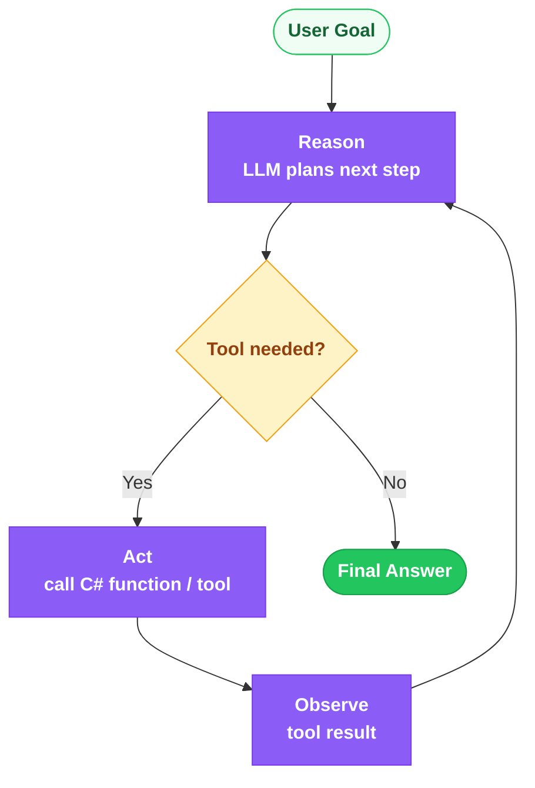

### 5.1 What is an AI Agent? The ReAct Loop

ReAct interleaves *reasoning traces* with *actions*. The model thinks about what to do, emits a tool call, receives an observation, and repeats. This grounds reasoning in real tool outputs (search results, calculations, API data), avoiding fabrication and enabling multi-step tasks.

### 5.2 Tool Calling / Function Calling

The LLM doesn't execute code — it emits a structured JSON request naming a function and arguments (derived from the tool's schema). The runtime (SK / MEAI `.UseFunctionInvocation()`) executes the C# method and returns the result to the model, which continues reasoning.

```csharp
public sealed class OrderPlugin(IOrderRepository repo)
{
    [KernelFunction, Description("Gets the status of an order by its ID.")]
    public async Task<string> GetOrderStatusAsync(
        [Description("The order identifier")] string orderId,
        CancellationToken cancellationToken = default)
    {
        var order = await repo.FindAsync(orderId, cancellationToken);
        return order is null ? "Order not found." : $"Order {orderId}: {order.Status}.";
    }
}

kernel.Plugins.AddFromObject(new OrderPlugin(orderRepo));
var settings = new OpenAIPromptExecutionSettings
{
    FunctionChoiceBehavior = FunctionChoiceBehavior.Auto()
};
var answer = await kernel.InvokePromptAsync(
    "What's the status of order A-1029?", new KernelArguments(settings));
```

### 5.3 Semantic Kernel Agents + AgentGroupChat

```csharp
using Microsoft.SemanticKernel.Agents;
using Microsoft.SemanticKernel.Agents.Chat;

var writer = new ChatCompletionAgent
{
    Name = "Writer",
    Instructions = "Draft concise marketing copy.",
    Kernel = kernel
};
var editor = new ChatCompletionAgent
{
    Name = "Editor",
    Instructions = "Critique and approve copy. Reply 'APPROVED' when acceptable.",
    Kernel = kernel
};

var chat = new AgentGroupChat(writer, editor)
{
    ExecutionSettings = new()
    {
        TerminationStrategy = new ApprovalTerminationStrategy
        {
            Agents = [editor],
            MaximumIterations = 6
        }
    }
};

chat.AddChatMessage(new ChatMessageContent(AuthorRole.User, "Write a tagline for a .NET AI SDK."));
await foreach (var msg in chat.InvokeAsync())
    Console.WriteLine($"[{msg.AuthorName}] {msg.Content}");

sealed class ApprovalTerminationStrategy : TerminationStrategy
{
    protected override Task<bool> ShouldAgentTerminateAsync(
        Agent agent, IReadOnlyList<ChatMessageContent> history, CancellationToken ct) =>
        Task.FromResult(history[^1].Content?.Contains("APPROVED",
            StringComparison.OrdinalIgnoreCase) ?? false);
}
```

### 5.4 AutoGen with .NET (AutoGen.Core)

AutoGen for .NET models agents as message-passing actors. Agents converse to solve tasks; a `UserProxyAgent` can execute code or gate human approval.

```csharp
using AutoGen.Core;
using AutoGen.OpenAI;

var assistant = new OpenAIChatAgent(
        chatClient: openAiChatClient,
        name: "assistant",
        systemMessage: "You solve coding problems step by step.")
    .RegisterMessageConnector();

var reply = await assistant.SendAsync("Write a C# function to reverse a string.");
Console.WriteLine(reply.GetContent());
```

### 5.5 Azure AI Agent Service — Threads, Runs, Tools

Azure AI Agent Service (in Azure AI Foundry) manages agent state server-side: a persistent **thread** holds the conversation, a **run** executes the agent against the thread, and built-in **tools** include code interpreter, file search (managed RAG), and function calling — with enterprise auth, tracing, and content safety.

```csharp
using Azure.AI.Agents.Persistent;

var client = new PersistentAgentsClient(
    "https://my-foundry.services.ai.azure.com/api/projects/proj",
    new Azure.Identity.DefaultAzureCredential());

var agent = await client.Administration.CreateAgentAsync(
    model: "gpt-4o",
    name: "support-agent",
    instructions: "Help customers with orders.",
    tools: [new CodeInterpreterToolDefinition()]);

var thread = await client.Threads.CreateThreadAsync();
await client.Messages.CreateMessageAsync(
    thread.Value.Id, MessageRole.User, "Compute 15% tip on $84.");

var run = await client.Runs.CreateRunAsync(thread.Value.Id, agent.Value.Id);
// Poll run.Status until completed, then read thread messages.
```

### 5.6 Multi-Agent Patterns

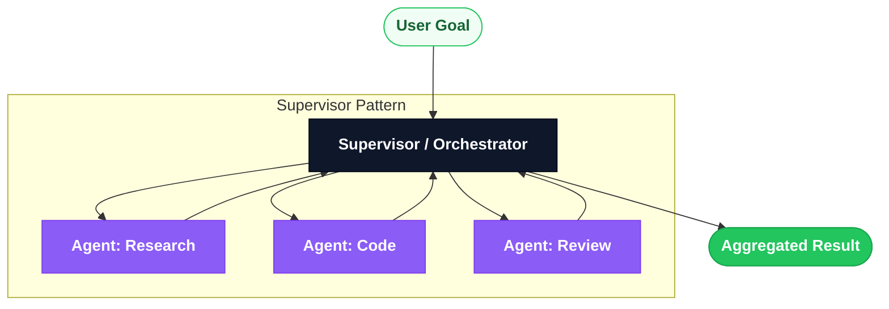

- **Supervisor** — an orchestrator routes subtasks to specialist agents and aggregates results.
- **Round-robin** — agents take turns (useful for debate/review loops).
- **Handoff** — an agent transfers control to another when the task shifts domain (e.g., triage → billing).

### 5.7 Memory in Agents

- **In-context** — recent turns kept in the prompt (bounded by context window).
- **External** — durable stores (Redis for fast session state, Cosmos DB for long-term/user profiles) queried and injected as needed.
- **Episodic / semantic** — embed past interactions into a vector store and retrieve relevant memories (RAG over conversation history).

```csharp
// Persisting durable agent memory to Redis.
public sealed class RedisAgentMemory(IConnectionMultiplexer redis)
{
    public async Task SaveTurnAsync(string sessionId, string role, string content,
        CancellationToken ct = default)
    {
        var db = redis.GetDatabase();
        await db.ListRightPushAsync($"chat:{sessionId}",
            System.Text.Json.JsonSerializer.Serialize(new { role, content }));
        await db.KeyExpireAsync($"chat:{sessionId}", TimeSpan.FromHours(24));
    }
}
```

### Interview Talking Points

| Question | Answer |
|---|---|
| What is the ReAct loop? | Reason → Act → Observe, repeated: the model plans, calls a tool, reads the result, and iterates until the goal is met. |
| How does function calling work? | The LLM emits a JSON call (name + args) matching a tool schema; the runtime executes the C# method and returns the result for the model to continue. |
| Agent vs plain chatbot? | An agent has tools, memory, and an autonomy loop to take actions across multiple steps; a chatbot just answers single turns. |
| What is the handoff pattern? | One agent transfers the conversation to a more specialized agent when the task domain shifts, preserving context. |
| Why use Azure AI Agent Service over rolling your own? | Managed threads/runs, built-in tools (code interpreter, file search), enterprise auth, tracing, and content safety out of the box. |
| How do you manage agent memory beyond the context window? | External stores: Redis for session state, Cosmos DB for long-term profiles, and vector search for episodic/semantic recall. |
| How do you prevent runaway agent loops? | Termination strategies (max iterations, approval conditions), tool-call budgets, and timeouts. |
| Supervisor vs round-robin multi-agent? | Supervisor centrally routes and aggregates; round-robin cycles turns among peers — supervisor scales better for heterogeneous tasks. |

---

# 6. Stage 6: Production & Scale

### Overview
Shipping AI means observability, cost control, safety, and resilience. **.NET Aspire** wires up local orchestration and OpenTelemetry; **ONNX Runtime (GenAI)** enables local/offline inference; **OpenTelemetry gen_ai semantic conventions** standardize tracing; and semantic caching, content safety, rate limiting, and model routing keep spend and risk in check.

### Architecture Diagram

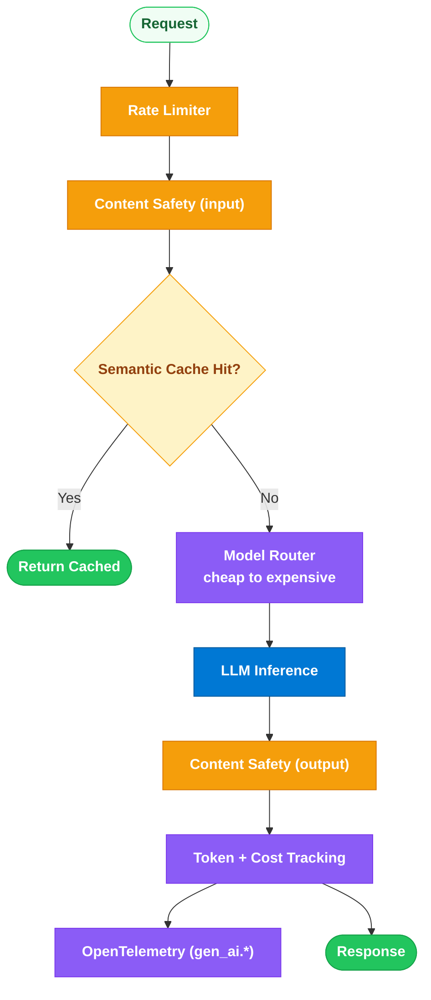

### 6.1 .NET Aspire — AppHost, ServiceDefaults, Observability

.NET Aspire orchestrates multi-service apps locally and standardizes telemetry. The **AppHost** declares resources (your API, Redis, Qdrant, Azure OpenAI); **ServiceDefaults** injects OpenTelemetry, health checks, and resilience defaults into every service.

```csharp
// AppHost/Program.cs
var builder = DistributedApplication.CreateBuilder(args);

var qdrant = builder.AddContainer("qdrant", "qdrant/qdrant");
var redis = builder.AddRedis("cache");
var openai = builder.AddAzureOpenAI("openai");

builder.AddProject<Projects.Api>("api")
    .WithReference(redis)
    .WithReference(openai);

builder.Build().Run();
```

```csharp
// ServiceDefaults: standard OpenTelemetry + resilience for every service.
public static IHostApplicationBuilder AddServiceDefaults(this IHostApplicationBuilder builder)
{
    builder.Services.AddOpenTelemetry()
        .WithTracing(t => t.AddSource("Experimental.Microsoft.Extensions.AI"))
        .WithMetrics(m => m.AddMeter("Microsoft.Extensions.AI"))
        .UseOtlpExporter();
    builder.Services.ConfigureHttpClientDefaults(h => h.AddStandardResilienceHandler());
    return builder;
}
```

### 6.2 ONNX Runtime — Local Inference

```csharp
using Microsoft.ML.OnnxRuntime;
using Microsoft.ML.OnnxRuntime.Tensors;

using var session = new InferenceSession("model.onnx");
var input = new DenseTensor<float>(features, new[] { 1, features.Length });
using var results = session.Run(
    new[] { NamedOnnxValue.CreateFromTensor("input", input) });
var output = results.First().AsTensor<float>().ToArray();
```

### 6.3 ONNX Runtime GenAI — Local Phi-3/Phi-4 Generation

`Microsoft.ML.OnnxRuntimeGenAI` runs small language models (Phi-3/Phi-4) fully on-device with streaming — ideal for offline, low-latency, or data-residency scenarios.

```csharp
using Microsoft.ML.OnnxRuntimeGenAI;

using var model = new Model("phi-4-onnx");
using var tokenizer = new Tokenizer(model);

var sequences = tokenizer.Encode("<|user|>Explain RAG.<|end|><|assistant|>");
using var genParams = new GeneratorParams(model);
genParams.SetSearchOption("max_length", 512);
genParams.SetInputSequences(sequences);

using var generator = new Generator(model, genParams);
using var stream = tokenizer.CreateStream();
while (!generator.IsDone())
{
    generator.ComputeLogits();
    generator.GenerateNextToken();
    Console.Write(stream.Decode(generator.GetSequence(0)[^1]));  // stream tokens
}
```

### 6.4 Streaming Responses

```csharp
public async IAsyncEnumerable<string> StreamAsync(
    IChatClient chat, string prompt,
    [EnumeratorCancellation] CancellationToken ct = default)
{
    await foreach (ChatResponseUpdate update in
                   chat.GetStreamingResponseAsync(prompt, cancellationToken: ct))
    {
        if (!string.IsNullOrEmpty(update.Text))
            yield return update.Text;
    }
}
```

### 6.5 Observability — OpenTelemetry + gen_ai Semantic Conventions

OpenTelemetry defines standard `gen_ai.*` attributes: `gen_ai.system`, `gen_ai.request.model`, `gen_ai.usage.input_tokens`, `gen_ai.usage.output_tokens`, `gen_ai.request.temperature`. MEAI's `.UseOpenTelemetry()` emits these automatically, so latency, token usage, and errors flow to any OTLP backend (App Insights, Grafana, Honeycomb).

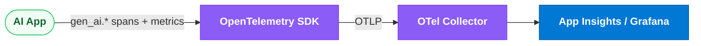

### 6.6 Token Usage Tracking & Cost Estimation

```csharp
public sealed record CostEstimate(long PromptTokens, long CompletionTokens, decimal UsdCost);

public static class CostCalculator
{
    // Example rates per 1K tokens (illustrative).
    private const decimal InputRate = 0.0025m, OutputRate = 0.01m;

    public static CostEstimate Estimate(ChatResponse response)
    {
        var usage = response.Usage;
        long input = usage?.InputTokenCount ?? 0;
        long output = usage?.OutputTokenCount ?? 0;
        decimal cost = (input / 1000m * InputRate) + (output / 1000m * OutputRate);
        return new CostEstimate(input, output, cost);
    }
}
```

### 6.7 Caching Strategies

- **Exact cache** — hash the normalized prompt, store the response in Redis. Zero-cost repeat hits.
- **Semantic cache** — embed the query; if a prior query's embedding is within a cosine threshold, reuse its answer. Catches paraphrases.

```csharp
public sealed class SemanticCache(
    IEmbeddingGenerator<string, Embedding<float>> embedder,
    QdrantClient qdrant)
{
    public async Task<string?> TryGetAsync(string query, float threshold = 0.95f,
        CancellationToken ct = default)
    {
        var emb = (await embedder.GenerateAsync([query], cancellationToken: ct))[0]
                  .Vector.ToArray();
        var hits = await qdrant.SearchAsync("cache", emb, limit: 1);
        return hits.Count > 0 && hits[0].Score >= threshold
            ? hits[0].Payload["answer"].StringValue
            : null;
    }
}
```

### 6.8 Content Safety

Azure AI Content Safety screens text for **harm categories** (Hate, Sexual, Violence, Self-Harm) with severity levels, supports custom **blocklists**, and offers **groundedness detection** (flags LLM claims unsupported by source context — key for RAG).

```csharp
using Azure.AI.ContentSafety;

var safety = new ContentSafetyClient(
    new Uri("https://my-cs.cognitiveservices.azure.com/"),
    new Azure.Identity.DefaultAzureCredential());

var result = await safety.AnalyzeTextAsync(new AnalyzeTextOptions(userInput));
bool blocked = result.Value.CategoriesAnalysis
    .Any(c => c.Severity >= 4);   // threshold on 0..6 scale
```

### 6.9 Rate Limiting

.NET 7+ ships a built-in rate limiter middleware. Use per-user or per-tenant partitioned limits to protect expensive AI endpoints.

```csharp
builder.Services.AddRateLimiter(options =>
{
    options.AddPolicy("ai", ctx =>
        RateLimitPartition.GetTokenBucketLimiter(
            ctx.User.Identity?.Name ?? "anon",
            _ => new TokenBucketRateLimiterOptions
            {
                TokenLimit = 20,
                TokensPerPeriod = 20,
                ReplenishmentPeriod = TimeSpan.FromMinutes(1),
                QueueLimit = 0
            }));
});

app.MapPost("/chat", Handler).RequireRateLimiting("ai");
```

### 6.10 Cost Control — Budgets, Model Routing, Batching

- **Token budgets** — cap prompt+completion tokens per request/user/day; reject or trim over-budget calls.
- **Model routing** — try a cheap model (e.g., gpt-4o-mini / Phi) first; escalate to an expensive model only when confidence/complexity demands it.
- **Batching** — group embedding requests to amortize overhead and hit throughput quotas efficiently.

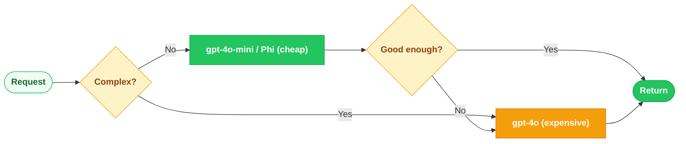

### Interview Talking Points

| Question | Answer |
|---|---|
| What does .NET Aspire give an AI app? | Local orchestration of dependencies (Redis, Qdrant, Azure OpenAI) plus ServiceDefaults with OpenTelemetry, health checks, and resilience baked in. |
| What are gen_ai semantic conventions? | Standardized OTel attributes (`gen_ai.usage.input_tokens`, `gen_ai.request.model`, etc.) for consistent AI observability across tools. |
| Exact vs semantic cache? | Exact matches identical prompts (hash key); semantic reuses answers for embedding-similar paraphrases above a cosine threshold. |
| Why run models locally with ONNX Runtime GenAI? | Offline capability, low latency, data residency/privacy, and zero per-token API cost for small models like Phi. |
| How do you control LLM cost in production? | Token budgets, semantic/exact caching, model routing (cheap→expensive), batching, and max-token caps. |
| How do you track token cost? | Read `response.Usage` (input/output token counts) and multiply by per-1K rates; emit as OTel metrics for dashboards. |
| What is groundedness detection? | Azure Content Safety feature flagging LLM output claims not supported by the provided source context — critical for RAG hallucination control. |
| How do you rate-limit AI endpoints? | `AddRateLimiter` with a partitioned token-bucket per user/tenant, applied via `RequireRateLimiting` on the endpoint. |

---

# 7. Azure AI Stack — Complete Reference

### Overview
Azure provides an end-to-end AI platform: **Azure OpenAI** (frontier models), **Azure AI Foundry** (the unified build/eval/deploy hub), **Azure AI Search** (retrieval), **Content Safety** (guardrails), **Agent Service** (managed agents), **Azure ML** (custom ML lifecycle), plus **Document Intelligence, Translator, Speech, Vision**, and **Cosmos DB** vector search.

### Architecture Diagram

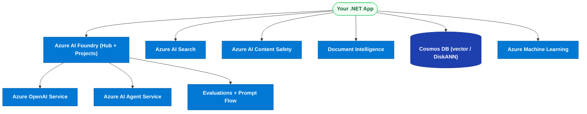

### 7.1 Azure OpenAI Service

Managed, enterprise-secured access to OpenAI models (GPT-4o, o-series, embeddings, DALL-E) via your Azure tenant (private networking, RBAC, Managed Identity).
- **Deployments** — you deploy a named model version to your resource; your code targets the deployment name.
- **Quotas** — tokens-per-minute (TPM) and requests-per-minute (RPM) limits per deployment.
- **PTU vs Consumption** — **Provisioned Throughput Units (PTU)** reserve dedicated capacity for predictable latency/throughput (flat cost); **consumption (pay-as-you-go)** bills per token with shared capacity — best for spiky/low volume.

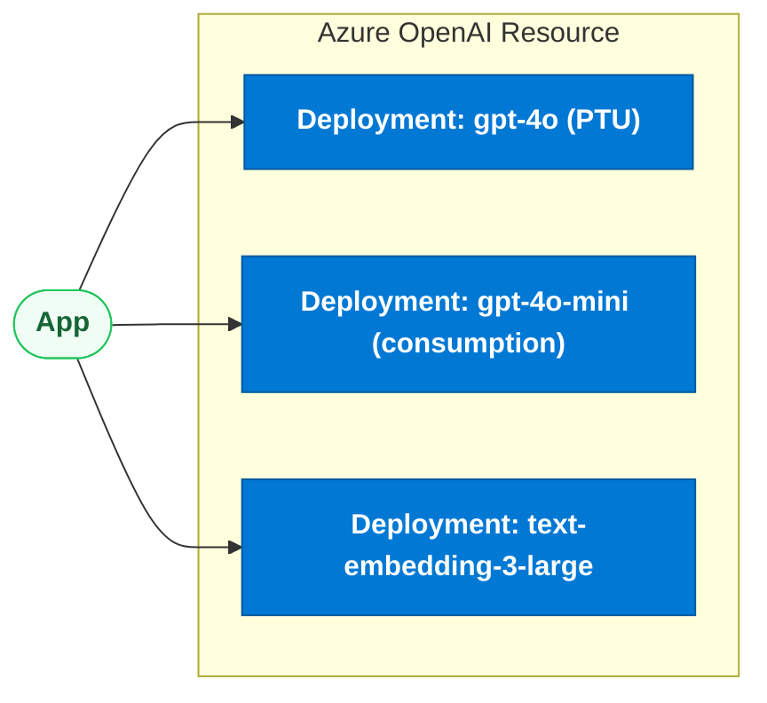

### 7.2 Azure AI Foundry

The unified platform (formerly Azure AI Studio) for building generative AI apps.
- **Hub** — top-level collaborative resource holding shared connections, security, and compute.
- **Projects** — workspaces under a hub for individual apps.
- **Model catalog** — deploy OpenAI, Meta Llama, Mistral, Cohere, Phi, and more.
- **Evaluations** — automated quality/safety scoring (groundedness, relevance, coherence, fluency).
- **Prompt flow** — visual + code orchestration for building and evaluating LLM pipelines.

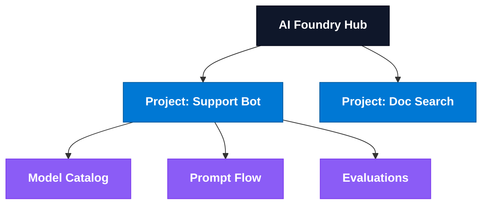

### 7.3 Azure AI Search

Managed retrieval for RAG.
- **Tiers** — Free/Basic/Standard (S1–S3)/Storage Optimized (L1–L2); tier sets storage, replicas, partitions.
- **Vector search config** — HNSW or exhaustive KNN algorithm on `Collection(Edm.Single)` fields with a chosen metric (cosine).
- **Semantic ranker** — an L2 reranking model that reorders results and extracts captions/answers.
- **Integrated vectorization** — skillsets chunk + embed at ingestion and embed queries automatically.

### 7.4 Azure AI Content Safety

- **Harm categories** — Hate, Sexual, Violence, Self-Harm, each with 0–6 severity.
- **Blocklists** — custom term lists for domain-specific blocking.
- **Groundedness detection** — flags output ungrounded in supplied context (RAG hallucination guard).
- **Prompt Shields** — detects jailbreak/prompt-injection attempts in user and document content.

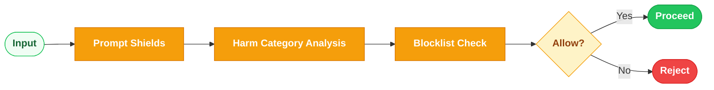

### 7.5 Azure AI Agent Service

Managed agent runtime within Foundry providing server-side **threads** (conversation state), **runs** (execution), and built-in **tools** (code interpreter, file search / managed RAG over Azure AI Search or Blob, and function calling), with enterprise auth, tracing, and content filtering. Removes the need to hand-build the agent loop and state store.

### 7.6 Azure Machine Learning

Full custom ML lifecycle platform.
- **Workspaces** — top-level resource for assets and governance.
- **Compute clusters** — auto-scaling CPU/GPU for training.
- **Pipelines** — reusable, versioned multi-step ML workflows.
- **Model registry** — versioned models with lineage.
- **Endpoints** — **online** (real-time REST) and **batch** (large offline scoring) deployment targets.

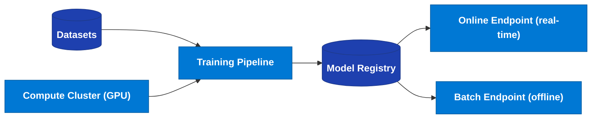

### 7.7 Azure AI Document Intelligence

Extracts structure from documents (formerly Form Recognizer).
- **Prebuilt models** — invoices, receipts, IDs, business cards, tax forms.
- **Custom models** — train on your own document templates.
- **Layout API** — extracts text, tables, selection marks, and reading order — ideal as a RAG ingestion front-end for PDFs.

```csharp
using Azure.AI.DocumentIntelligence;

var client = new DocumentIntelligenceClient(
    new Uri("https://my-di.cognitiveservices.azure.com/"),
    new Azure.Identity.DefaultAzureCredential());

var op = await client.AnalyzeDocumentAsync(
    WaitUntil.Completed, "prebuilt-layout",
    new AnalyzeDocumentContent { UrlSource = new Uri(pdfUrl) });
foreach (var page in op.Value.Pages)
    Console.WriteLine($"Page {page.PageNumber}: {page.Lines.Count} lines");
```

### 7.8 Azure AI Translator, Speech, Vision (Brief)

- **Translator** — real-time and batch text translation across 100+ languages; document translation preserving format.
- **Speech** — speech-to-text (STT), text-to-speech (TTS with neural voices), speech translation, speaker recognition.
- **Vision** — image analysis, OCR (Read API), spatial analysis, and face detection.

### 7.9 Azure Cosmos DB for MongoDB — Vector Search with DiskANN

Cosmos DB provides integrated vector search so you can store operational data and embeddings together (no separate vector DB). The **vCore-based MongoDB API** supports **DiskANN** — a disk-based ANN index that scales to billions of vectors with low memory, ideal for large-scale RAG with strong consistency and global distribution.

```mermaid
flowchart LR
    App(["App"]) --> Cosmos[("Cosmos DB for MongoDB (vCore)")]
    Cosmos --> Docs[("Documents + Embeddings")]
    Cosmos --> DiskANN[("DiskANN Vector Index")]
    App -->|"$search vector query"| DiskANN

    classDef actor fill:#f0fdf4,stroke:#22c55e,color:#166534,font-weight:bold
    classDef storage fill:#1e40af,stroke:#1e3a8a,color:#fff,font-weight:bold
    class App actor
    class Cosmos,Docs,DiskANN storage
```

### Interview Talking Points

| Question | Answer |
|---|---|
| PTU vs consumption in Azure OpenAI? | PTU reserves dedicated capacity for predictable throughput/latency at flat cost; consumption is pay-per-token on shared capacity, best for spiky/low volume. |
| What is Azure AI Foundry? | The unified platform (hub + projects) to build, evaluate, and deploy GenAI apps, with model catalog, prompt flow, evaluations, and agent service. |
| Hub vs project in Foundry? | A hub is the shared top-level resource (connections, security, compute); projects are per-app workspaces beneath it. |
| When Azure ML vs Azure OpenAI? | Azure ML for custom-trained models and the full MLOps lifecycle; Azure OpenAI for consuming managed frontier LLMs. |
| Online vs batch endpoint in Azure ML? | Online = low-latency real-time REST scoring; batch = high-throughput asynchronous scoring of large datasets. |
| Why Cosmos DB for vectors over a dedicated vector DB? | Co-locates operational data with embeddings, global distribution, strong consistency, and DiskANN scales to billions of vectors with low memory. |
| What is the semantic ranker in Azure AI Search? | An L2 deep-learning reranker that reorders initial results and produces captions/answers, improving precision for RAG. |
| Best Azure service for PDF ingestion into RAG? | Document Intelligence Layout API — extracts text, tables, and reading order to feed a chunking/embedding pipeline. |
| What does Prompt Shields protect against? | Jailbreak and prompt-injection attacks in user prompts and in retrieved documents (indirect injection). |

---

# 8. Cross-Cutting Themes

### Overview
Beyond individual stages, an architect must make *pattern-selection* decisions, avoid common interview pitfalls, and pick the right Azure service for the job. These matrices tie the whole guide together.

### 8.1 Pattern Selection Decision Flowchart

```mermaid
flowchart TB
    Start(["New AI Requirement"]) --> Q1{"Need behavior / format<br/>change only?"}
    Q1 -->|"Yes"| Prompt(["Prompt Engineering"])
    Q1 -->|"No"| Q2{"Need private / fresh<br/>knowledge grounding?"}
    Q2 -->|"Yes"| Q3{"Multi-step actions<br/>or tool use needed?"}
    Q2 -->|"No"| Q4{"Consistent style / tone<br/>at scale, stable domain?"}
    Q3 -->|"Yes"| Agent(["Agent + RAG (tools)"])
    Q3 -->|"No"| RAG(["RAG Pipeline"])
    Q4 -->|"Yes"| FT(["Fine-Tuning"])
    Q4 -->|"No"| Prompt

    classDef actor fill:#f0fdf4,stroke:#22c55e,color:#166534,font-weight:bold
    classDef decision fill:#fef3c7,stroke:#f59e0b,color:#92400e,font-weight:bold
    classDef success fill:#22c55e,stroke:#16a34a,color:#fff,font-weight:bold
    class Start actor
    class Q1,Q2,Q3,Q4 decision
    class Prompt,RAG,Agent,FT success
```

**Order of preference:** Prompt → RAG → Agent → Fine-tune. Escalate only when the simpler pattern demonstrably falls short. Combine freely (an agent that uses RAG tools on a well-prompted model is common).

### 8.2 Red Flags Table (Common Interview Mistakes)

| Red flag (wrong) | Correct answer |
|---|---|
| "Fine-tune the model to add our company knowledge." | Use RAG for knowledge; fine-tuning is for style/format, not facts, and can't stay fresh. |
| "The LLM runs my C# function." | The LLM only *requests* a function via JSON; the runtime executes it and returns the result. |
| "Just increase temperature for better answers." | Temperature adds randomness, not accuracy; lower it for factual tasks and improve retrieval/prompting instead. |
| "Store API keys in appsettings." | Use `DefaultAzureCredential` with Managed Identity / Key Vault; never hardcode secrets. |
| "We'll buffer the whole LLM response then return it." | Stream with `IAsyncEnumerable<T>` for low time-to-first-token and cancellation support. |
| "RAG guarantees no hallucination." | RAG reduces it; still enforce grounded prompting, citations, and groundedness detection. |
| "One giant chunk per document is fine." | Chunk to fit retrieval granularity and context limits, with overlap; giant chunks hurt precision and cost. |
| "Use cosine similarity threshold of 0.5 for a good match." | Thresholds are model/domain-specific; calibrate empirically — high-dim embeddings often need 0.8+. |
| "We don't need observability for AI." | Emit OTel `gen_ai.*` spans/metrics for latency, token usage, and cost; it's essential for debugging and spend. |
| "Retry forever on 429." | Use bounded jittered exponential backoff + a circuit breaker (Polly v8); infinite retries amplify overload. |

### 8.3 Azure Service Selection Matrix

| Need | Azure service |
|---|---|
| Consume frontier LLMs (GPT-4o, embeddings) | Azure OpenAI Service |
| Build/evaluate/deploy GenAI apps in one place | Azure AI Foundry |
| Vector + hybrid + semantic retrieval for RAG | Azure AI Search |
| Managed agents (threads/runs/tools) | Azure AI Agent Service |
| Custom model training + MLOps lifecycle | Azure Machine Learning |
| Extract text/tables from PDFs & forms | Azure AI Document Intelligence |
| Guardrails, moderation, groundedness | Azure AI Content Safety |
| Vectors co-located with operational data | Azure Cosmos DB (DiskANN) |
| Translation / STT-TTS / image analysis | Translator / Speech / Vision |
| Secrets & identity | Azure Key Vault + Managed Identity (`DefaultAzureCredential`) |

### 8.4 End-to-End Reference Architecture

```mermaid
flowchart TB
    User(["User"]) --> API["Minimal API (.NET Aspire)"]
    API --> RL["Rate Limiter + Content Safety"]
    RL --> Orch["Semantic Kernel Orchestrator"]
    Orch --> Cache{"Semantic Cache"}
    Cache -->|"miss"| RAG["RAG: Azure AI Search"]
    RAG --> Route["Model Router"]
    Route --> AOAI["Azure OpenAI (PTU + consumption)"]
    Orch --> Agents["Azure AI Agent Service (tools)"]
    API --> OTel["OpenTelemetry gen_ai.*"]
    Secrets["Key Vault (Managed Identity)"] --> API

    classDef actor fill:#f0fdf4,stroke:#22c55e,color:#166534,font-weight:bold
    classDef gateway fill:#0f172a,stroke:#020617,color:#fff,font-weight:bold
    classDef azure fill:#0078D4,stroke:#005a9e,color:#fff,font-weight:bold
    classDef process fill:#8b5cf6,stroke:#7c3aed,color:#fff,font-weight:bold
    classDef decision fill:#fef3c7,stroke:#f59e0b,color:#92400e,font-weight:bold
    classDef warning fill:#f59e0b,stroke:#d97706,color:#fff,font-weight:bold
    class User actor
    class API gateway
    class AOAI,RAG,Agents,Secrets azure
    class Orch,Route,OTel process
    class Cache decision
    class RL warning
```

### Interview Talking Points

| Question | Answer |
|---|---|
| How do you choose between prompt, RAG, agent, and fine-tune? | Escalate in that order: prompt for behavior, RAG for knowledge, agent for multi-step/tool tasks, fine-tune only for stable style/format at scale. |
| Most common AI architecture mistake? | Reaching for fine-tuning to add knowledge — RAG is cheaper, fresher, and citable; fine-tuning is for style/format. |
| How do you secure an Azure AI app? | `DefaultAzureCredential` with Managed Identity, secrets in Key Vault, private networking, RBAC — never hardcoded keys. |
| How do you keep an AI app observable and cost-aware? | OTel `gen_ai.*` telemetry, token/cost tracking, semantic+exact caching, model routing, and budgets. |
| Can you combine these patterns? | Yes — a common production shape is an agent that calls RAG tools over Azure AI Search on a well-prompted model with content safety and caching. |
| How do you pick a vector store? | pgvector if already on Postgres, Qdrant for a dedicated store, Azure AI Search for managed hybrid+semantic, Cosmos DB to co-locate with operational data. |
| What's your default resilience posture for LLM calls? | Polly v8 jittered exponential retry on 429/503, circuit breaker, generous timeout, and end-to-end cancellation. |

---

---

# 9. Production Deployments — Infrastructure, CI/CD & Operations

### Overview
Shipping an AI workload to production means containerizing the app, scaling it with Kubernetes or Azure Container Apps, automating deployments through a hardened CI/CD pipeline, governing infrastructure through code (Bicep), protecting endpoints with Azure API Management, and keeping the whole system observable, cost-bounded, and safely rollback-able. This section covers every layer of the production stack for a .NET AI application on Azure.

### End-to-End Production Architecture

```mermaid
flowchart TB
    subgraph DEV ["Developer Workflow"]
        Dev(["Developer"]) --> PR["Pull Request"]
        PR --> CI["GitHub Actions CI<br/>build / test / scan"]
        CI --> Registry["Azure Container Registry"]
    end

    subgraph PIPE ["Deployment Pipeline"]
        Registry --> CD["GitHub Actions CD<br/>Bicep deploy + rolling update"]
        CD --> ACA["Azure Container Apps<br/>or AKS"]
    end

    subgraph PLAT ["Azure AI Platform"]
        ACA --> APIM["Azure API Management<br/>rate-limit / auth / routing"]
        APIM --> AOAI["Azure OpenAI Service"]
        APIM --> Search["Azure AI Search"]
        ACA --> KV["Azure Key Vault<br/>Managed Identity"]
        ACA --> Redis[("Azure Cache for Redis<br/>semantic cache")]
    end

    subgraph OBS ["Observability"]
        ACA --> OTel["OpenTelemetry Collector"]
        APIM --> OTel
        OTel --> AI["Application Insights<br/>+ Log Analytics"]
        AI --> Alert["Azure Monitor Alerts"]
    end

    classDef actor fill:#f0fdf4,stroke:#22c55e,color:#166534,font-weight:bold
    classDef azure fill:#0078D4,stroke:#005a9e,color:#fff,font-weight:bold
    classDef storage fill:#1e40af,stroke:#1e3a8a,color:#fff,font-weight:bold
    classDef process fill:#8b5cf6,stroke:#7c3aed,color:#fff,font-weight:bold
    classDef success fill:#22c55e,stroke:#16a34a,color:#fff,font-weight:bold
    classDef warning fill:#f59e0b,stroke:#d97706,color:#fff,font-weight:bold
    class Dev actor
    class AOAI,Search,KV,APIM,AI azure
    class Redis storage
    class PR,CI,CD,OTel process
    class ACA success
    class Alert warning
```

---

## 9.1 Containerization — Docker Multi-Stage Build

AI .NET apps need a lean production image. The multi-stage pattern keeps the final image small (no SDK) and avoids leaking build artefacts or credentials.

```mermaid
flowchart LR
    subgraph MSB ["Multi-Stage Build"]
        S1["Stage 1: sdk image<br/>dotnet restore + publish"] --> S2["Stage 2: runtime image<br/>copy published output only"]
    end
    S2 --> Img(["Final Image<br/>~250 MB vs 1 GB+ SDK image"])

    classDef process fill:#8b5cf6,stroke:#7c3aed,color:#fff,font-weight:bold
    classDef success fill:#22c55e,stroke:#16a34a,color:#fff,font-weight:bold
    class S1 process
    class S2 success
    class Img success
```

```dockerfile
# Stage 1 — build
FROM mcr.microsoft.com/dotnet/sdk:9.0 AS build
WORKDIR /src
COPY ["MyAiApi/MyAiApi.csproj", "MyAiApi/"]
RUN dotnet restore "MyAiApi/MyAiApi.csproj"
COPY . .
WORKDIR "/src/MyAiApi"
RUN dotnet publish -c Release -o /app/publish --no-restore

# Stage 2 — runtime only (no SDK)
FROM mcr.microsoft.com/dotnet/aspnet:9.0 AS final
WORKDIR /app
# Run as non-root for security
RUN adduser --disabled-password --gecos "" appuser && chown -R appuser /app
USER appuser
COPY --from=build /app/publish .
EXPOSE 8080
ENTRYPOINT ["dotnet", "MyAiApi.dll"]
```

**Key hardening rules:**
- Never copy `.env` or `appsettings.Development.json` into the image.
- Use `--no-restore` in publish (restore already ran in isolation).
- Run as non-root user — AKS/ACA Pod Security Standards require it.
- Use specific digest-pinned base images in regulated environments: `mcr.microsoft.com/dotnet/aspnet:9.0@sha256:<digest>`.
- Add `.dockerignore` to exclude `bin/`, `obj/`, `**/*.user`, `*.env`.

```dockerignore
bin/
obj/
**/*.user
**/*.md
.git/
*.env
appsettings.Development.json
```

---

## 9.2 Azure Container Registry (ACR)

ACR is the private image registry for Azure. Integrate it with Managed Identity so no credentials are needed at pull time.

```mermaid
flowchart LR
    CI["GitHub Actions"] -->|"az acr build"| ACR["Azure Container Registry"]
    ACR -->|"Managed Identity pull"| ACA["Azure Container Apps / AKS"]
    ACR --> Quarantine["Image Quarantine<br/>+ Defender for Containers scan"]

    classDef azure fill:#0078D4,stroke:#005a9e,color:#fff,font-weight:bold
    classDef process fill:#8b5cf6,stroke:#7c3aed,color:#fff,font-weight:bold
    classDef warning fill:#f59e0b,stroke:#d97706,color:#fff,font-weight:bold
    class ACR,ACA azure
    class CI process
    class Quarantine warning
```

```bash
# Build and push via ACR Tasks (no local Docker daemon needed)
az acr build \
  --registry myaiacr \
  --image myaiapi:${{ github.sha }} \
  --file MyAiApi/Dockerfile \
  .

# Grant ACA's Managed Identity the AcrPull role
az role assignment create \
  --assignee <aca-principal-id> \
  --role AcrPull \
  --scope /subscriptions/<sub>/resourceGroups/<rg>/providers/Microsoft.ContainerRegistry/registries/myaiacr
```

Enable **Defender for Containers** on ACR to scan every pushed image for CVEs. Set **quarantine mode** so unscanned images cannot be pulled.

---

## 9.3 Azure Container Apps — Serverless AI Scaling

Azure Container Apps (ACA) is the recommended PaaS layer for AI workloads: it runs containers with built-in KEDA-based scaling, DAPR support, and no Kubernetes cluster management overhead.

```mermaid
flowchart TB
    subgraph ACAENV ["Azure Container Apps Environment"]
        Ingress["Managed Ingress<br/>HTTPS / HTTP2 / gRPC"] --> App["AI API Replica 1..N"]
        App --> Sidecar["DAPR Sidecar<br/>(optional)"]
    end
    KEDA["KEDA Scaler<br/>HTTP requests / queue depth / custom metric"] -->|"scale 0..N"| App
    App --> AOAI["Azure OpenAI"]
    App --> Search["Azure AI Search"]

    classDef azure fill:#0078D4,stroke:#005a9e,color:#fff,font-weight:bold
    classDef process fill:#8b5cf6,stroke:#7c3aed,color:#fff,font-weight:bold
    classDef gateway fill:#0f172a,stroke:#020617,color:#fff,font-weight:bold
    class AOAI,Search azure
    class Ingress gateway
    class KEDA,App,Sidecar process
```

```bicep
// Azure Container Apps via Bicep
resource acaEnv 'Microsoft.App/managedEnvironments@2024-03-01' = {
  name: 'ai-env'
  location: location
  properties: {
    appLogsConfiguration: {
      destination: 'log-analytics'
      logAnalyticsConfiguration: { customerId: workspace.properties.customerId, sharedKey: workspace.listKeys().primarySharedKey }
    }
  }
}

resource aiApi 'Microsoft.App/containerApps@2024-03-01' = {
  name: 'ai-api'
  location: location
  identity: { type: 'SystemAssigned' }   // Managed Identity
  properties: {
    managedEnvironmentId: acaEnv.id
    configuration: {
      ingress: { external: true, targetPort: 8080, transport: 'http2' }
      registries: [{ server: 'myaiacr.azurecr.io', identity: 'system' }]
    }
    template: {
      containers: [{
        name: 'ai-api'
        image: 'myaiacr.azurecr.io/myaiapi:${imageTag}'
        resources: { cpu: '1.0', memory: '2Gi' }
        env: [
          { name: 'AZURE_OPENAI_ENDPOINT', value: openaiEndpoint }
          { name: 'APPLICATIONINSIGHTS_CONNECTION_STRING', secretRef: 'appinsights-conn' }
        ]
      }]
      scale: {
        minReplicas: 1
        maxReplicas: 20
        rules: [{
          name: 'http-scaling'
          http: { metadata: { concurrentRequests: '10' } }  // scale when >10 concurrent requests per replica
        }]
      }
    }
  }
}
```

**ACA vs AKS decision:**
| Concern | Azure Container Apps | AKS |
|---|---|---|
| Ops overhead | Zero (fully managed) | Medium (cluster ops, upgrades) |
| Scaling | Built-in KEDA, scale-to-zero | KEDA add-on, manual HPA |
| GPU nodes | Not supported | Supported (NC/ND SKUs) |
| Custom networking | VNET integration | Full CNI control |
| When to use | Stateless AI APIs, event-driven | GPU inference, complex networking |

---

## 9.4 Azure Kubernetes Service (AKS) — AI Workloads

For GPU inference (ONNX/custom models) or complex networking, AKS gives full control.

### AKS AI Deployment Manifest

```yaml
# deployment.yaml
apiVersion: apps/v1
kind: Deployment
metadata:
  name: ai-api
  labels:
    app: ai-api
    version: "1.2.0"
spec:
  replicas: 3
  selector:
    matchLabels:
      app: ai-api
  strategy:
    type: RollingUpdate
    rollingUpdate:
      maxSurge: 1
      maxUnavailable: 0          # zero-downtime: bring new pods up before taking old ones down
  template:
    metadata:
      labels:
        app: ai-api
        version: "1.2.0"
    spec:
      serviceAccountName: ai-api-sa   # for Workload Identity
      containers:
      - name: ai-api
        image: myaiacr.azurecr.io/myaiapi:1.2.0
        ports:
        - containerPort: 8080
        resources:
          requests:
            cpu: "500m"
            memory: "1Gi"
          limits:
            cpu: "2000m"
            memory: "4Gi"
        env:
        - name: AZURE_CLIENT_ID
          valueFrom:
            secretKeyRef:
              name: workload-identity-secret
              key: clientId
        readinessProbe:
          httpGet:
            path: /healthz/ready
            port: 8080
          initialDelaySeconds: 10
          periodSeconds: 5
          failureThreshold: 3
        livenessProbe:
          httpGet:
            path: /healthz/live
            port: 8080
          initialDelaySeconds: 30
          periodSeconds: 10
        startupProbe:
          httpGet:
            path: /healthz/startup
            port: 8080
          failureThreshold: 20
          periodSeconds: 5
      topologySpreadConstraints:          # spread pods across AZs
      - maxSkew: 1
        topologyKey: topology.kubernetes.io/zone
        whenUnsatisfiable: DoNotSchedule
        labelSelector:
          matchLabels:
            app: ai-api
```

### Horizontal Pod Autoscaler (HPA) for AI APIs

```yaml
apiVersion: autoscaling/v2
kind: HorizontalPodAutoscaler
metadata:
  name: ai-api-hpa
spec:
  scaleTargetRef:
    apiVersion: apps/v1
    kind: Deployment
    name: ai-api
  minReplicas: 2
  maxReplicas: 50
  metrics:
  - type: Resource
    resource:
      name: cpu
      target:
        type: Utilization
        averageUtilization: 60
  - type: Pods
    pods:
      metric:
        name: active_ai_requests        # custom KEDA metric from Prometheus
      target:
        type: AverageValue
        averageValue: "5"
```

### AKS Workload Identity for Azure OpenAI

```csharp
// Program.cs — Workload Identity (no secrets in cluster)
builder.Services.AddAzureClients(clients =>
{
    clients.AddOpenAIClient(new Uri(builder.Configuration["AzureOpenAI:Endpoint"]!))
           .WithCredential(new DefaultAzureCredential());   // picks up AZURE_CLIENT_ID env var
});
```

```bash
# Wire up Workload Identity (federated credentials)
az aks update --name my-aks --resource-group my-rg --enable-oidc-issuer --enable-workload-identity
az identity create --name ai-api-identity --resource-group my-rg
az role assignment create --assignee <identity-client-id> \
    --role "Cognitive Services OpenAI User" \
    --scope /subscriptions/<sub>/resourceGroups/<rg>/providers/Microsoft.CognitiveServices/accounts/my-aoai
```

---

## 9.5 CI/CD Pipeline — GitHub Actions

A production AI CI/CD pipeline has four gates: **build+test**, **container build+scan**, **infrastructure deploy**, **app deploy**.

```mermaid
flowchart LR
    Push(["git push / PR merge"]) --> Build["CI: dotnet build + test<br/>+ CodeQL scan"]
    Build --> DockerBuild["CI: ACR build + image scan<br/>(Defender for Containers)"]
    DockerBuild --> IaC["CD: Bicep what-if<br/>+ Bicep deploy"]
    IaC --> AppDeploy["CD: ACA update / AKS rolling update"]
    AppDeploy --> Smoke{"Smoke Tests<br/>integration tests vs staging"}
    Smoke -->|"pass"| Prod(["Promote to Production<br/>slot swap or traffic shift"])
    Smoke -->|"fail"| Rollback(["Auto Rollback<br/>previous revision"])

    classDef actor fill:#f0fdf4,stroke:#22c55e,color:#166534,font-weight:bold
    classDef success fill:#22c55e,stroke:#16a34a,color:#fff,font-weight:bold
    classDef error fill:#ef4444,stroke:#dc2626,color:#fff,font-weight:bold
    classDef process fill:#8b5cf6,stroke:#7c3aed,color:#fff,font-weight:bold
    classDef azure fill:#0078D4,stroke:#005a9e,color:#fff,font-weight:bold
    classDef decision fill:#fef3c7,stroke:#f59e0b,color:#92400e,font-weight:bold
    class Push actor
    class Build,DockerBuild process
    class IaC,AppDeploy azure
    class Smoke decision
    class Prod success
    class Rollback error
```

```yaml
# .github/workflows/deploy.yml
name: Build and Deploy AI API

on:
  push:
    branches: [main]

env:
  ACR_NAME: myaiacr
  ACA_NAME: ai-api
  RESOURCE_GROUP: ai-rg

jobs:
  build-and-test:
    runs-on: ubuntu-latest
    steps:
    - uses: actions/checkout@v4

    - name: Setup .NET 9
      uses: actions/setup-dotnet@v4
      with:
        dotnet-version: '9.0.x'

    - name: Restore and Build
      run: dotnet build --configuration Release

    - name: Run Unit Tests
      run: dotnet test --configuration Release --no-build --collect:"XPlat Code Coverage"

    - name: Upload Coverage
      uses: codecov/codecov-action@v4

  container-build:
    needs: build-and-test
    runs-on: ubuntu-latest
    permissions:
      id-token: write   # for OIDC login
      contents: read
    outputs:
      image-tag: ${{ steps.meta.outputs.version }}
    steps:
    - uses: actions/checkout@v4

    - name: Azure Login (OIDC — no secrets)
      uses: azure/login@v2
      with:
        client-id: ${{ secrets.AZURE_CLIENT_ID }}
        tenant-id: ${{ secrets.AZURE_TENANT_ID }}
        subscription-id: ${{ secrets.AZURE_SUBSCRIPTION_ID }}

    - name: Build and Push to ACR
      run: |
        az acr build \
          --registry ${{ env.ACR_NAME }} \
          --image myaiapi:${{ github.sha }} \
          --file MyAiApi/Dockerfile .

    - id: meta
      run: echo "version=${{ github.sha }}" >> $GITHUB_OUTPUT

  deploy-infrastructure:
    needs: container-build
    runs-on: ubuntu-latest
    permissions:
      id-token: write
    steps:
    - uses: actions/checkout@v4

    - name: Azure Login
      uses: azure/login@v2
      with:
        client-id: ${{ secrets.AZURE_CLIENT_ID }}
        tenant-id: ${{ secrets.AZURE_TENANT_ID }}
        subscription-id: ${{ secrets.AZURE_SUBSCRIPTION_ID }}

    - name: Bicep What-If (preview changes)
      run: |
        az deployment group what-if \
          --resource-group ${{ env.RESOURCE_GROUP }} \
          --template-file infra/main.bicep \
          --parameters imageTag=${{ needs.container-build.outputs.image-tag }}

    - name: Deploy Infrastructure
      run: |
        az deployment group create \
          --resource-group ${{ env.RESOURCE_GROUP }} \
          --template-file infra/main.bicep \
          --parameters imageTag=${{ needs.container-build.outputs.image-tag }}

  deploy-app:
    needs: [container-build, deploy-infrastructure]
    runs-on: ubuntu-latest
    environment: production    # requires manual approval gate
    permissions:
      id-token: write
    steps:
    - name: Azure Login
      uses: azure/login@v2
      with:
        client-id: ${{ secrets.AZURE_CLIENT_ID }}
        tenant-id: ${{ secrets.AZURE_TENANT_ID }}
        subscription-id: ${{ secrets.AZURE_SUBSCRIPTION_ID }}

    - name: Update ACA with new image
      run: |
        az containerapp update \
          --name ${{ env.ACA_NAME }} \
          --resource-group ${{ env.RESOURCE_GROUP }} \
          --image myaiacr.azurecr.io/myaiapi:${{ needs.container-build.outputs.image-tag }}

    - name: Run Smoke Tests
      run: |
        APP_URL=$(az containerapp show \
          --name ${{ env.ACA_NAME }} --resource-group ${{ env.RESOURCE_GROUP }} \
          --query "properties.configuration.ingress.fqdn" -o tsv)
        curl -f "https://${APP_URL}/healthz/ready" || exit 1
        curl -f -X POST "https://${APP_URL}/chat" \
          -H "Content-Type: application/json" \
          -d '{"message":"ping"}' | jq '.response' | grep -q "."
```

---

## 9.6 Infrastructure as Code — Bicep

All Azure AI resources should be declared in Bicep, committed to git, and deployed via CI/CD — never via the portal.

```mermaid
flowchart TD
    Bicep["main.bicep<br/>(entry point)"] --> AOAI["module: azure-openai.bicep"]
    Bicep --> Search["module: ai-search.bicep"]
    Bicep --> ACA["module: container-apps.bicep"]
    Bicep --> KV["module: keyvault.bicep"]
    Bicep --> ACR["module: acr.bicep"]
    Bicep --> Monitor["module: monitoring.bicep"]

    classDef gateway fill:#0f172a,stroke:#020617,color:#fff,font-weight:bold
    classDef azure fill:#0078D4,stroke:#005a9e,color:#fff,font-weight:bold
    class Bicep gateway
    class AOAI,Search,ACA,KV,ACR,Monitor azure
```

```bicep
// infra/main.bicep
targetScope = 'resourceGroup'

@description('Image tag from CI pipeline')
param imageTag string

@description('Environment: dev | staging | prod')
@allowed(['dev', 'staging', 'prod'])
param environment string = 'prod'

var prefix = 'aiapp-${environment}'

// Azure OpenAI
module openai 'modules/azure-openai.bicep' = {
  name: 'openai-deploy'
  params: {
    name: '${prefix}-aoai'
    location: resourceGroup().location
    sku: environment == 'prod' ? 'S0' : 'S0'
    deployments: [
      { name: 'gpt-4o', model: 'gpt-4o', version: '2024-11-20', capacity: 80 }
      { name: 'gpt-4o-mini', model: 'gpt-4o-mini', version: '2024-07-18', capacity: 200 }
      { name: 'text-embedding-3-large', model: 'text-embedding-3-large', version: '1', capacity: 120 }
    ]
  }
}

// Azure AI Search
module search 'modules/ai-search.bicep' = {
  name: 'search-deploy'
  params: {
    name: '${prefix}-search'
    location: resourceGroup().location
    sku: environment == 'prod' ? 'standard' : 'basic'
    semanticSearch: 'standard'
  }
}

// Key Vault (no secrets in IaC — values injected at deploy time)
module keyvault 'modules/keyvault.bicep' = {
  name: 'kv-deploy'
  params: {
    name: '${prefix}-kv'
    location: resourceGroup().location
    enableSoftDelete: true
    enablePurgeProtection: environment == 'prod'
  }
}

// Container Apps
module aca 'modules/container-apps.bicep' = {
  name: 'aca-deploy'
  params: {
    name: '${prefix}-api'
    imageTag: imageTag
    openaiEndpoint: openai.outputs.endpoint
    searchEndpoint: search.outputs.endpoint
  }
}

// RBAC: ACA identity → OpenAI User role
resource openaiRbac 'Microsoft.Authorization/roleAssignments@2022-04-01' = {
  name: guid(openai.outputs.id, aca.outputs.principalId, 'CognitiveServicesOpenAIUser')
  scope: resourceId('Microsoft.CognitiveServices/accounts', '${prefix}-aoai')
  properties: {
    roleDefinitionId: subscriptionResourceId('Microsoft.Authorization/roleDefinitions', '5e0bd9bd-7b93-4f28-af87-19fc36ad61bd')
    principalId: aca.outputs.principalId
    principalType: 'ServicePrincipal'
  }
}
```

---

## 9.7 Secrets Management — Azure Key Vault + Managed Identity

**Rule:** zero secrets in code, environment variables, Dockerfiles, or CI variable stores. All secrets live in Key Vault, fetched at runtime via Managed Identity.

```mermaid
flowchart LR
    App["AI API<br/>(Managed Identity)"] -->|"GetSecretAsync<br/>no password"| KV["Azure Key Vault"]
    KV -->|"secret value"| App
    App --> AOAI["Azure OpenAI<br/>(also via Managed Identity)"]

    KV --> Audit["Key Vault Audit Log<br/>(who accessed what, when)"]
    KV --> Rotation["Secret Rotation<br/>(Event Grid trigger)"]

    classDef azure fill:#0078D4,stroke:#005a9e,color:#fff,font-weight:bold
    classDef process fill:#8b5cf6,stroke:#7c3aed,color:#fff,font-weight:bold
    classDef storage fill:#1e40af,stroke:#1e3a8a,color:#fff,font-weight:bold
    class AOAI,Audit,Rotation azure
    class KV storage
    class App process
```

```csharp
// Program.cs — Key Vault via Managed Identity (DefaultAzureCredential)
builder.Configuration.AddAzureKeyVault(
    new Uri($"https://{builder.Configuration["KeyVaultName"]}.vault.azure.net/"),
    new DefaultAzureCredential());

// Access a secret — IConfiguration transparently fetches from KV
var thirdPartyKey = builder.Configuration["ThirdParty--ApiKey"];
```

```csharp
// For secrets that change at runtime: inject SecretClient directly
builder.Services.AddSingleton(new SecretClient(
    new Uri($"https://{kvName}.vault.azure.net/"),
    new DefaultAzureCredential()));

// Then resolve at call time (respects rotation)
public sealed class ThirdPartyService(SecretClient kv)
{
    public async Task<string> GetKeyAsync(CancellationToken ct)
    {
        KeyVaultSecret secret = await kv.GetSecretAsync("ThirdParty--ApiKey", cancellationToken: ct);
        return secret.Value.Value;
    }
}
```

**Secret rotation automation:**

```mermaid
sequenceDiagram
    autonumber
    participant KV as Key Vault
    participant EG as Event Grid
    participant Func as Azure Function
    participant App as AI API

    KV->>EG: SecretNearExpiry event
    EG->>Func: Trigger rotation function
    Func->>KV: SetSecretAsync (new value)
    Func->>App: POST /admin/config/reload (optional hot-reload)
    Note over App: IOptionsMonitor auto-reloads from KV binding
```

---

## 9.8 Health Checks — Readiness, Liveness, Startup

AI apps have unique health dependencies: the LLM endpoint, vector store, and cache all need separate checks. ASP.NET Core's health check middleware maps to Kubernetes probes.

```mermaid
flowchart TD
    K8s(["Kubernetes / ACA"]) --> Start["startupProbe<br/>/healthz/startup<br/>fails: restart pod"]
    Start -->|"ready"| Live["livenessProbe<br/>/healthz/live<br/>fails: restart pod"]
    Live -->|"alive"| Ready["readinessProbe<br/>/healthz/ready<br/>fails: remove from load balancer"]

    Ready --> AzureOAI["Check: Azure OpenAI ping"]
    Ready --> QdrantHC["Check: Qdrant ping"]
    Ready --> RedisHC["Check: Redis ping"]

    classDef actor fill:#f0fdf4,stroke:#22c55e,color:#166534,font-weight:bold
    classDef success fill:#22c55e,stroke:#16a34a,color:#fff,font-weight:bold
    classDef warning fill:#f59e0b,stroke:#d97706,color:#fff,font-weight:bold
    classDef azure fill:#0078D4,stroke:#005a9e,color:#fff,font-weight:bold
    class K8s actor
    class Start,Live success
    class Ready warning
    class AzureOAI,QdrantHC,RedisHC azure
```

```csharp
// Program.cs
builder.Services
    .AddHealthChecks()
    .AddCheck("self", () => HealthCheckResult.Healthy(), tags: ["live"])
    .AddCheck<AzureOpenAIHealthCheck>("azure-openai", tags: ["ready"])
    .AddCheck<QdrantHealthCheck>("qdrant", tags: ["ready"])
    .AddStackExchangeRedisHealthCheck(
        builder.Configuration.GetConnectionString("Redis")!,
        name: "redis", tags: ["ready"]);

app.MapHealthChecks("/healthz/live", new HealthCheckOptions
{
    Predicate = hc => hc.Tags.Contains("live")
});
app.MapHealthChecks("/healthz/ready", new HealthCheckOptions
{
    Predicate = hc => hc.Tags.Contains("ready"),
    ResponseWriter = UIResponseWriter.WriteHealthCheckUIResponse
});
app.MapHealthChecks("/healthz/startup", new HealthCheckOptions
{
    Predicate = _ => true     // all checks must pass before pod is considered started
});

// Custom Azure OpenAI health check
public sealed class AzureOpenAIHealthCheck(IChatClient chatClient) : IHealthCheck
{
    public async Task<HealthCheckResult> CheckHealthAsync(
        HealthCheckContext context, CancellationToken ct)
    {
        try
        {
            // Minimal probe: 1-token completion
            var resp = await chatClient.GetResponseAsync("Say 'ok'",
                new ChatOptions { MaxOutputTokens = 5 }, cancellationToken: ct)
                .WaitAsync(TimeSpan.FromSeconds(10), ct);
            return HealthCheckResult.Healthy($"Latency ok, tokens={resp.Usage?.TotalTokenCount}");
        }
        catch (Exception ex)
        {
            return HealthCheckResult.Unhealthy("Azure OpenAI unreachable", ex);
        }
    }
}
```

---

## 9.9 Blue/Green & Canary Deployments

AI model updates (new system prompt, new model version, changed RAG index) risk quality regressions. Blue/Green and canary patterns let you shift traffic gradually and roll back instantly.

```mermaid
flowchart TB
    Users(["Users"]) --> FD["Azure Front Door<br/>or APIM"]
    FD -->|"90% traffic"| Blue["Blue Slot<br/>(current stable)"]
    FD -->|"10% traffic"| Green["Green Slot<br/>(new version)"]

    Green --> Eval{"AI Evaluation<br/>groundedness, relevance"}
    Eval -->|"metrics ok"| Promote(["Promote Green → 100%<br/>Blue becomes standby"])
    Eval -->|"metrics degrade"| Rollback(["Rollback: 0% Green<br/>instant"])

    classDef actor fill:#f0fdf4,stroke:#22c55e,color:#166534,font-weight:bold
    classDef success fill:#22c55e,stroke:#16a34a,color:#fff,font-weight:bold
    classDef process fill:#8b5cf6,stroke:#7c3aed,color:#fff,font-weight:bold
    classDef error fill:#ef4444,stroke:#dc2626,color:#fff,font-weight:bold
    classDef azure fill:#0078D4,stroke:#005a9e,color:#fff,font-weight:bold
    classDef decision fill:#fef3c7,stroke:#f59e0b,color:#92400e,font-weight:bold
    class Users actor
    class Blue success
    class Green process
    class Promote success
    class Rollback error
    class FD azure
    class Eval decision
```

### Azure Container Apps Traffic Splitting

```bash
# Deploy new revision without sending traffic
az containerapp revision copy \
  --name ai-api \
  --resource-group ai-rg \
  --image myaiacr.azurecr.io/myaiapi:v2.0.0 \
  --revision-suffix v2

# Split: 90% stable, 10% canary
az containerapp ingress traffic set \
  --name ai-api \
  --resource-group ai-rg \
  --revision-weight ai-api--v1=90 ai-api--v2=10

# Promote to 100% after validation
az containerapp ingress traffic set \
  --name ai-api \
  --resource-group ai-rg \
  --revision-weight ai-api--v2=100

# Instant rollback: zero canary traffic
az containerapp ingress traffic set \
  --name ai-api \
  --resource-group ai-rg \
  --revision-weight ai-api--v1=100
```

### Feature Flags for AI Model Switching

Use `Microsoft.FeatureManagement` to switch model deployments at runtime without redeployment:

```csharp
// appsettings.json / Azure App Configuration
{
  "FeatureManagement": {
    "UseGpt4oLatest": {
      "EnabledFor": [{ "Name": "Percentage", "Parameters": { "Value": 10 } }]
    }
  }
}

// Usage
public sealed class ModelRouter(IFeatureManager features, IChatClient chatClient)
{
    public async Task<ChatResponse> ChatAsync(string prompt, CancellationToken ct)
    {
        string deployment = await features.IsEnabledAsync("UseGpt4oLatest")
            ? "gpt-4o-2024-11-20"
            : "gpt-4o-2024-08-06";

        // route to the appropriate deployment...
        return await chatClient.GetResponseAsync(prompt, cancellationToken: ct);
    }
}
```

---

## 9.10 Azure API Management (APIM) — AI Gateway

APIM fronts all AI endpoints, providing authentication, per-subscription token-quota enforcement, load balancing across multiple Azure OpenAI backends, semantic caching, and a developer portal.

```mermaid
flowchart LR
    Client(["Client App"]) --> APIM["Azure API Management"]
    APIM --> Auth["JWT / OAuth2 Validation"]
    Auth --> QuotaCheck["Token Budget Check<br/>(per subscription)"]
    QuotaCheck --> Cache{"Semantic Cache<br/>(APIM built-in)"}
    Cache -->|"miss"| LB["Load Balancer Policy<br/>round-robin / priority"]
    LB --> AOAI1["Azure OpenAI East US<br/>(primary)"]
    LB --> AOAI2["Azure OpenAI West US<br/>(failover)"]
    Cache -->|"hit"| Return(["Return cached response"])

    classDef actor fill:#f0fdf4,stroke:#22c55e,color:#166534,font-weight:bold
    classDef azure fill:#0078D4,stroke:#005a9e,color:#fff,font-weight:bold
    classDef gateway fill:#0f172a,stroke:#020617,color:#fff,font-weight:bold
    classDef process fill:#8b5cf6,stroke:#7c3aed,color:#fff,font-weight:bold
    classDef decision fill:#fef3c7,stroke:#f59e0b,color:#92400e,font-weight:bold
    classDef success fill:#22c55e,stroke:#16a34a,color:#fff,font-weight:bold
    class Client actor
    class APIM gateway
    class AOAI1,AOAI2 azure
    class Auth,QuotaCheck,LB process
    class Cache decision
    class Return success
```

### APIM Inbound Policy — Token Rate Limiting + Load Balancing

```xml
<!-- APIM Inbound Policy -->
<policies>
  <inbound>
    <!-- Validate JWT from Entra ID -->
    <validate-jwt header-name="Authorization" require-scheme="Bearer">
      <openid-config url="https://login.microsoftonline.com/{tenant-id}/v2.0/.well-known/openid-configuration"/>
      <required-claims>
        <claim name="aud" match="any"><value>api://my-ai-api</value></claim>
      </required-claims>
    </validate-jwt>

    <!-- Semantic cache: return cached response if embedding similarity > 0.95 -->
    <azure-openai-semantic-cache-lookup score-threshold="0.95"
      embeddings-backend-id="embedding-backend"
      embeddings-backend-auth="system-assigned"
      embeddings-deployment-name="text-embedding-3-large" />

    <!-- Token budget: 100k tokens per subscription per minute -->
    <azure-openai-token-limit
      counter-key="@(context.Subscription.Id)"
      tokens-per-minute="100000"
      estimate-prompt-tokens="true" />

    <!-- Load balance across two Azure OpenAI instances -->
    <choose>
      <when condition="@(new Random().Next(0, 10) < 8)">
        <!-- 80% to primary -->
        <set-backend-service backend-id="aoai-eastus" />
      </when>
      <otherwise>
        <!-- 20% to secondary for quota distribution -->
        <set-backend-service backend-id="aoai-westus" />
      </otherwise>
    </choose>

    <!-- Inject Managed Identity auth header for Azure OpenAI -->
    <authentication-managed-identity resource="https://cognitiveservices.azure.com/" />
  </inbound>

  <outbound>
    <!-- Store response in semantic cache -->
    <azure-openai-semantic-cache-store duration="3600" />

    <!-- Emit token usage metrics to App Insights -->
    <emit-metric name="ai.token.usage" value="@(int.Parse(context.Response.Headers.GetValueOrDefault("x-ms-region", "0")))">
      <dimension name="subscription" value="@(context.Subscription.Id)" />
      <dimension name="operation" value="@(context.Operation.Name)" />
    </emit-metric>
  </outbound>

  <on-error>
    <!-- On 429 from primary, retry on secondary -->
    <choose>
      <when condition="@(context.Response.StatusCode == 429)">
        <set-backend-service backend-id="aoai-westus" />
        <retry condition="@(context.Response.StatusCode == 429)" count="1" interval="1" />
      </when>
    </choose>
  </on-error>
</policies>
```

---

## 9.11 Production Observability — Dashboards & Alerting

### OpenTelemetry + Application Insights

```csharp
// ServiceDefaults/Extensions.cs — full AI observability stack
public static IHostApplicationBuilder AddAIObservability(this IHostApplicationBuilder builder)
{
    builder.Services.AddOpenTelemetry()
        .WithTracing(tracing => tracing
            .AddAspNetCoreInstrumentation()
            .AddHttpClientInstrumentation()
            .AddSource("Experimental.Microsoft.Extensions.AI")   // MEAI traces
            .AddSource("Microsoft.SemanticKernel*")              // SK traces
            .AddAzureMonitorTraceExporter())
        .WithMetrics(metrics => metrics
            .AddAspNetCoreInstrumentation()
            .AddHttpClientInstrumentation()
            .AddMeter("Microsoft.Extensions.AI")                 // MEAI metrics
            .AddMeter("MyAiApp.Tokens")                          // custom token cost meter
            .AddAzureMonitorMetricExporter())
        .WithLogging(logging => logging
            .AddAzureMonitorLogExporter());

    return builder;
}

// Custom token cost metric
public sealed class TokenCostMeter
{
    private static readonly Meter _meter = new("MyAiApp.Tokens");
    private static readonly Counter<long> _inputTokens = _meter.CreateCounter<long>("ai.tokens.input");
    private static readonly Counter<long> _outputTokens = _meter.CreateCounter<long>("ai.tokens.output");
    private static readonly Counter<double> _cost = _meter.CreateCounter<double>("ai.cost.usd");

    public void Record(ChatResponse response, string model)
    {
        var usage = response.Usage;
        if (usage is null) return;
        var tags = new TagList { { "model", model } };
        _inputTokens.Add(usage.InputTokenCount ?? 0, tags);
        _outputTokens.Add(usage.OutputTokenCount ?? 0, tags);
        _cost.Add(EstimateCost(usage, model), tags);
    }

    private static double EstimateCost(UsageDetails usage, string model) =>
        model switch
        {
            "gpt-4o" => ((usage.InputTokenCount ?? 0) * 0.0025 + (usage.OutputTokenCount ?? 0) * 0.01) / 1000.0,
            "gpt-4o-mini" => ((usage.InputTokenCount ?? 0) * 0.00015 + (usage.OutputTokenCount ?? 0) * 0.0006) / 1000.0,
            _ => 0
        };
}
```

### Key Azure Monitor Alerts to Configure

```mermaid
flowchart TD
    Metrics["Azure Monitor Metrics"] --> A1["Alert: Token Rate<br/>> 80% quota used<br/>Severity 2"]
    Metrics --> A2["Alert: Latency P99<br/>> 10 seconds<br/>Severity 1"]
    Metrics --> A3["Alert: Error Rate<br/>> 5% HTTP 5xx<br/>Severity 1"]
    Metrics --> A4["Alert: Cost Daily<br/>> $100 USD<br/>Severity 3"]
    Metrics --> A5["Alert: Content Safety Blocks<br/>> 50/hr<br/>Severity 2"]

    A1 --> AG["Action Group<br/>Email + Teams + PagerDuty"]
    A2 --> AG
    A3 --> AG
    A4 --> AG
    A5 --> AG

    classDef warning fill:#f59e0b,stroke:#d97706,color:#fff,font-weight:bold
    classDef error fill:#ef4444,stroke:#dc2626,color:#fff,font-weight:bold
    classDef azure fill:#0078D4,stroke:#005a9e,color:#fff,font-weight:bold
    class A1,A4,A5 warning
    class A2,A3 error
    class Metrics,AG azure
```

### Kusto Queries for AI Diagnostics

```kusto
// Top 10 most expensive operations by token cost (last 24h)
customMetrics
| where name == "ai.cost.usd" and timestamp > ago(24h)
| summarize TotalCost = sum(value) by tostring(customDimensions.operation)
| top 10 by TotalCost desc
| render barchart

// P50/P95/P99 LLM latency by model
dependencies
| where type == "Azure OpenAI" and timestamp > ago(1h)
| summarize
    P50 = percentile(duration, 50),
    P95 = percentile(duration, 95),
    P99 = percentile(duration, 99)
  by tostring(customDimensions["gen_ai.request.model"])

// Content safety block rate (per hour)
customEvents
| where name == "ContentSafetyBlock" and timestamp > ago(24h)
| summarize Blocks = count() by bin(timestamp, 1h), tostring(customDimensions.category)
| render timechart
```

---

## 9.12 Model Versioning & A/B Testing

AI model updates are a special category of deployment: a new model version may produce different outputs even with the same prompt, so A/B testing requires **AI-quality metrics**, not just HTTP metrics.

```mermaid
sequenceDiagram
    autonumber
    participant User
    participant Router as Model Router
    participant ModelA as gpt-4o-2024-08-06 (A)
    participant ModelB as gpt-4o-2024-11-20 (B)
    participant Eval as AI Evaluator

    User->>Router: Request
    Router->>Router: 90% A / 10% B (hash(userId) % 10)
    alt Group A
        Router->>ModelA: Prompt
        ModelA-->>Router: Response A
    else Group B
        Router->>ModelB: Prompt
        ModelB-->>Router: Response B
    end
    Router->>Eval: Log (response, ground truth label)
    Eval->>Eval: Score: groundedness, relevance, coherence
    Router-->>User: Response (with X-Model-Version header)
    Note over Router,Eval: Same user always maps to same variant<br/>for stable, comparable metrics
```

```csharp
// Deterministic A/B split: same user always gets same model
public sealed class ModelAbTester(IFeatureManager features)
{
    public string SelectDeployment(string userId)
    {
        // Hash the user ID to a bucket 0-99
        int bucket = Math.Abs(userId.GetHashCode()) % 100;

        // 10% to new model, 90% to stable
        return bucket < 10
            ? "gpt-4o-2024-11-20"   // B variant
            : "gpt-4o-2024-08-06";  // A stable
    }
}

// AI Evaluation logger (feeds Azure AI Foundry Evaluations)
public sealed class EvalLogger(ILogger<EvalLogger> log)
{
    public void LogInteraction(
        string userId, string deployment,
        string prompt, string response,
        string? groundTruth = null)
    {
        log.LogInformation(
            "AI_EVAL {UserId} {Deployment} Prompt={Prompt} Response={Response} GroundTruth={GroundTruth}",
            userId, deployment, prompt, response, groundTruth);
    }
}
```

---

## 9.13 Rollback Strategies

| Scenario | Rollback Method | Time to Recover |
|---|---|---|
| Bad container image | `az containerapp revision set-mode --revision old-revision` | < 30 seconds |
| Bad Bicep deploy | `az deployment group cancel` + redeploy previous tag | 2-5 minutes |
| Bad model version (AOAI) | Update deployment to previous model version in APIM or AOAI portal | < 1 minute |
| Bad RAG index (AI Search) | Keep two named indexes; swap alias pointer | < 5 seconds |
| Bad system prompt | Feature flag off → previous prompt | < 1 second |
| AKS deployment | `kubectl rollout undo deployment/ai-api` | < 60 seconds |

### Azure AI Search Index Alias for Zero-Downtime Index Swap

```csharp
// Build new index in background, swap alias atomically
var indexClient = new SearchIndexClient(
    new Uri(searchEndpoint), new DefaultAzureCredential());

// 1. Build new index
await indexClient.CreateOrUpdateIndexAsync(newIndex);

// 2. Populate new index with new embeddings...

// 3. Swap alias atomically (zero-downtime)
var alias = new SearchAlias("documents-current", "documents-v2");
await indexClient.CreateOrUpdateAliasAsync(alias);

// 4. Delete old index after verification
await indexClient.DeleteIndexAsync("documents-v1");
```

---

## 9.14 Cost Governance at Scale

```mermaid
flowchart LR
    Spend["Azure Cost Management<br/>daily budget alerts"] --> Quota["APIM Token Quota<br/>per subscription per day"]
    Quota --> Router["Model Router<br/>gpt-4o-mini first"]
    Router --> Cache{"Semantic Cache<br/>reuse embeddings"}
    Cache --> Batch["Embedding Batcher<br/>group 100 docs/call"]
    Batch --> Budget["Per-Tenant Token Budget<br/>reject over-budget"]

    classDef azure fill:#0078D4,stroke:#005a9e,color:#fff,font-weight:bold
    classDef process fill:#8b5cf6,stroke:#7c3aed,color:#fff,font-weight:bold
    classDef decision fill:#fef3c7,stroke:#f59e0b,color:#92400e,font-weight:bold
    class Spend,Quota azure
    class Router,Batch,Budget process
    class Cache decision
```

```csharp
// Per-tenant token budget enforced before calling LLM
public sealed class TokenBudgetMiddleware(
    IConnectionMultiplexer redis,
    IOptions<TokenBudgetOptions> opts) : IChatClientMiddleware
{
    public async Task<ChatResponse> GetResponseAsync(
        IEnumerable<ChatMessage> messages, ChatOptions? options,
        IChatClient next, CancellationToken ct)
    {
        var tenantId = options?.AdditionalProperties?["tenantId"]?.ToString() ?? "default";
        string key = $"token-budget:{tenantId}:{DateTime.UtcNow:yyyyMMdd}";

        var db = redis.GetDatabase();
        long used = (long)(await db.StringGetAsync(key));

        if (used >= opts.Value.DailyTokenLimit)
            throw new QuotaExceededException($"Daily token budget exceeded for tenant {tenantId}");

        var response = await next.GetResponseAsync(messages, options, ct);

        long tokensUsed = (response.Usage?.TotalTokenCount ?? 0);
        await db.StringIncrementAsync(key, tokensUsed);
        await db.KeyExpireAsync(key, TimeSpan.FromDays(2));   // auto-clean old buckets

        return response;
    }
}

public sealed record TokenBudgetOptions(long DailyTokenLimit = 500_000);
```

### Azure Cost Management Budget Alert

```bicep
resource tokenBudget 'Microsoft.Consumption/budgets@2023-11-01' = {
  name: 'ai-daily-budget'
  properties: {
    timePeriod: { startDate: '2026-01-01', endDate: '2030-12-31' }
    timeGrain: 'Daily'
    amount: 100          // $100 USD per day
    category: 'Cost'
    filter: {
      tags: { name: 'project', operator: 'In', values: ['ai-app'] }
    }
    notifications: {
      actual80: {
        enabled: true
        operator: 'GreaterThan'
        threshold: 80
        contactEmails: ['ai-team@contoso.com']
        contactRoles: ['Owner']
      }
      actual100: {
        enabled: true
        operator: 'GreaterThan'
        threshold: 100
        contactEmails: ['ai-team@contoso.com']
        thresholdType: 'Actual'
      }
    }
  }
}
```

---

## 9.15 Private Networking — VNet Integration

In regulated environments, Azure OpenAI, AI Search, and Key Vault must be on private endpoints — no public internet egress.

```mermaid
flowchart TB
    subgraph VNET ["Azure VNet"]
        subgraph APPSUB ["App Subnet"]
            ACA["Azure Container Apps<br/>or AKS Pods"]
        end
        subgraph PESUB ["Private Endpoints Subnet"]
            PE_AOAI["Private Endpoint<br/>Azure OpenAI"]
            PE_Search["Private Endpoint<br/>AI Search"]
            PE_KV["Private Endpoint<br/>Key Vault"]
        end
        DNS["Azure Private DNS Zones<br/>cognitiveservices.azure.com<br/>search.windows.net<br/>vault.azure.net"]
    end

    ACA --> PE_AOAI
    ACA --> PE_Search
    ACA --> PE_KV
    PE_AOAI --> DNS
    PE_Search --> DNS
    PE_KV --> DNS

    classDef azure fill:#0078D4,stroke:#005a9e,color:#fff,font-weight:bold
    classDef process fill:#8b5cf6,stroke:#7c3aed,color:#fff,font-weight:bold
    classDef storage fill:#1e40af,stroke:#1e3a8a,color:#fff,font-weight:bold
    class PE_AOAI,PE_Search,PE_KV azure
    class DNS storage
    class ACA process
```

```bicep
// Private endpoint for Azure OpenAI
resource aoaiPe 'Microsoft.Network/privateEndpoints@2023-09-01' = {
  name: '${prefix}-aoai-pe'
  location: location
  properties: {
    subnet: { id: privateEndpointSubnetId }
    privateLinkServiceConnections: [{
      name: 'aoai-connection'
      properties: {
        privateLinkServiceId: openaiResource.id
        groupIds: ['account']
      }
    }]
  }
}

// Private DNS zone link so ACA/AKS resolves private IP
resource aoaiDnsZone 'Microsoft.Network/privateDnsZones@2020-06-01' = {
  name: 'privatelink.openai.azure.com'
  location: 'global'
}

resource aoaiDnsZoneLink 'Microsoft.Network/privateDnsZones/virtualNetworkLinks@2020-06-01' = {
  parent: aoaiDnsZone
  name: '${prefix}-aoai-dns-link'
  location: 'global'
  properties: {
    virtualNetwork: { id: vnetId }
    registrationEnabled: false
  }
}
```

---

### Interview Talking Points

| Question | Answer |
|---|---|
| Why multi-stage Docker builds for AI apps? | Keeps the production image at ~250 MB (runtime only) vs 1 GB+ SDK image; no build tools, no dev certs, and secrets never touch the image. |
| ACA vs AKS for AI workloads? | ACA for stateless inference APIs (zero ops, KEDA scale-to-zero). AKS when you need GPU nodes, advanced CNI, or complex multi-tenant networking. |
| How do you do zero-downtime AI index updates? | Build the new Azure AI Search index in parallel, then atomically swap the alias pointer. Old index stays live until the swap completes — zero interruption. |
| How do you A/B test a new LLM model version? | Deterministic user-bucket split (hash % N), log every interaction with model version tag, evaluate with AI quality metrics (groundedness, coherence) in Foundry Evaluations before promoting to 100%. |
| How do you enforce per-tenant cost limits? | `IChatClientMiddleware` reads a per-tenant daily token counter from Redis, rejects calls over the limit, and increments the counter on every response. |
| What does APIM add to an Azure OpenAI deployment? | JWT auth, per-subscription token quotas, semantic cache, multi-region load balancing with automatic 429 failover, and a developer portal — all without touching application code. |
| How do you secure Azure OpenAI in a regulated environment? | Private endpoint (no public IP), VNet integration, `DefaultAzureCredential` via Managed Identity (no API keys), Azure Policy to deny public network access on the resource. |
| What is APIM's semantic cache and when does it help? | APIM embeds the user query and checks a cache store for a prior response with cosine similarity above a threshold. Helps for FAQ-style workloads where users ask similar questions differently. |
| How do you handle a bad prompt/system prompt in production? | Feature flag (`Microsoft.FeatureManagement`) toggles the prompt version; flip the flag to instantly revert — no redeployment required. |
| What Bicep best practices apply to Azure AI resources? | Parametrize model deployment names and capacities by environment, assign RBAC via Bicep (not portal), enable soft-delete and purge protection on Key Vault in prod, deny public access on all AI resources. |

---

## Summary

You didn't start over — you extended what you already knew. C#, DI, async, and APIs became the substrate for `IChatClient`, streaming, and resilient AI calls (Stage 1). You layered in the theory of LLMs, embeddings, and prompting (Stage 2), then adopted your own stack via MEAI, Semantic Kernel, and ML.NET (Stage 3). You grounded models in your data with RAG (Stage 4), gave them autonomy with agents (Stage 5), and hardened everything for production with Aspire, observability, safety, and cost control (Stage 6) — all on the Azure AI platform (Stage 7), guided by clear pattern-selection judgment (Stage 8).

**Guiding principles:**
- Prefer the simplest pattern that works; escalate deliberately.
- Ground knowledge with RAG; reserve fine-tuning for style.
- Stream, cancel, and cache to control latency and cost.
- Instrument everything with `gen_ai.*` telemetry.
- Secure with Managed Identity; never hardcode secrets.
