# Azure Integration Topics

## Role & Responsibilities

- Develop and deploy integrations using Azure Logic Apps, Azure Functions, Service Bus, and APIM (API Management)
- Build scalable APIs, workflows, and event-driven integrations
- Experience in developing Azure Functions using C#
- Experience integrating with systems like SAP, Salesforce, Dynamics, etc.
- Transformation experience: JSON to JSON/XML, XML to XML
- Design Patterns — provide interface design based on requirements
- Knowledge of creating and maintaining automated build and release pipelines (DevOps CI/CD)
- Troubleshoot integration issues and ensure best practices in performance, security, and governance

---

## Job Description

**Primary Skill:** Azure APIM\
**Secondary Skill:** C#

### Responsibilities

- Develop mid-level to highly complex integrations in Azure APIM environment following client standards and best practices
- Work as the senior integration developer to design the integration architecture
- Work with business analysts and functional support team to understand business requirements, provide timely assessments, and create technical designs
- Own the support and maintenance of assigned interface applications with a high level of quality
- Create and update documentation for ongoing support
- Follow client change management processes to prevent disruptions and outages

---

## Technical / Functional Skillsets

- Azure Integration Consultant with experience in Azure APIM and API policy development
- Hands-on experience with Azure Monitoring, Azure SQL Database, C#, and performance tuning
- Strong knowledge of C# / .NET Framework
- Knowledge of Azure DB types

---

## Azure Integration Stack — Key Topics

### 1. Azure API Management (APIM)

**What it is:** A fully managed gateway for publishing, securing, transforming, and monitoring APIs.

**Key Concepts:**

- **Gateway:** Sits between clients and backend services; handles routing, auth, throttling
- **Developer Portal:** Auto-generated portal for API consumers to discover and test APIs
- **Products & Subscriptions:** Group APIs into products; consumers subscribe with keys
- **Policies:** XML-based rules applied at gateway level (inbound/outbound/backend/on-error)
  - Common policies: `rate-limit`, `quota`, `rewrite-uri`, `set-header`, `validate-jwt`, `cache-lookup`, `mock-response`
- **API Versioning:** Path-based (`/v1/`), header-based, or query-string-based
- **Backends:** HTTP endpoints, Logic Apps, Functions, Service Fabric
- **Named Values:** Key-value store for secrets/config used in policies
- **Tiers:** Consumption, Developer, Basic, Standard, Premium (VNet injection available in Premium/Developer)

**Diagrams:**

**APIM Request Flow:**

```
Client
  │  (1) Request + Subscription Key / Bearer Token
  ▼
┌─────────────────────────────────────────┐
│          APIM Gateway                   │
│  ┌─────────────────────────────────┐    │
│  │  INBOUND POLICIES               │    │
│  │  - validate-jwt                 │    │
│  │  - rate-limit-by-key            │    │
│  │  - rewrite-uri                  │    │
│  │  - set-header                   │    │
│  └────────────┬────────────────────┘    │
│               │                         │
│  ┌────────────▼────────────────────┐    │
│  │  BACKEND POLICIES               │    │
│  │  - set-backend-service          │    │
│  │  - retry                        │    │
│  └────────────┬────────────────────┘    │
└───────────────┼─────────────────────────┘
                │  (2) Forwarded Request
                ▼
         Backend API / Function / Logic App
                │  (3) Response
                ▼
┌─────────────────────────────────────────┐
│  OUTBOUND POLICIES                      │
│  - set-header                           │
│  - cache-store                          │
│  - transform-xml                        │
└─────────────────────────────────────────┘
                │  (4) Final Response
                ▼
             Client
```

**Policy Execution Order:**

```
Global Scope
  └── Product Scope
        └── API Scope
              └── Operation Scope  ← most specific wins on conflict
```

**APIM Internal VNet + App Gateway Pattern:**

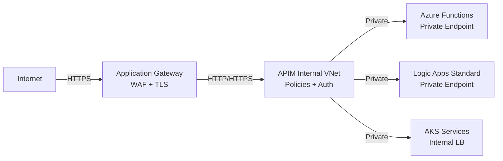

**Interview Points:**

- How do you secure APIs in APIM? → OAuth2/JWT validation, client certificates, IP filtering, subscription keys
- Difference between `rate-limit` and `quota` policies → rate-limit resets on time window; quota is cumulative
- How do you handle backend failures? → retry policy, circuit breaker via custom policy, fallback

---

### 1a. APIM Policies — Deep Dive

Policies are XML-based rules applied at the gateway level. They execute in 4 phases: **Inbound → Backend → Outbound → On-Error**.

**Policy Scope Hierarchy:**

```
Global Scope        ← applies to all APIs
  └── Product Scope ← applies to APIs in that product
        └── API Scope ← applies to all operations in that API
              └── Operation Scope ← most specific; wins on conflict
```

Use global/product scope for cross-cutting concerns (auth, rate-limit); operation scope for operation-specific transforms.

---

#### Inbound Policies

`validate-jwt`

Validates a JWT Bearer token before forwarding the request. Fetches the public key from the IdP's OpenID Connect discovery endpoint and validates: signature, issuer (`iss`), audience (`aud`), expiry (`exp`). Returns 401 on failure (configurable).

```xml
<validate-jwt header-name="Authorization" failed-validation-httpcode="401">
  <openid-config url="https://login.microsoftonline.com/{tenantId}/v2.0/.well-known/openid-configuration" />
  <audiences><audience>api://my-api</audience></audiences>
</validate-jwt>
```

Interview point: The `aud` claim in the token must match what's configured — mismatch = 401.

---

`rate-limit`

Limits the number of calls per time window per subscription. Resets when the window expires (rolling window — think: "100 calls/minute").

```xml
<rate-limit calls="100" renewal-period="60" />
```

---

`rate-limit-by-key`

Same as `rate-limit` but keyed on a custom runtime value (agent ID, user ID, IP) instead of subscription. Used when you need per-identity throttling rather than per-subscription.

```xml
<rate-limit-by-key calls="60" renewal-period="60"
  counter-key="@(context.Request.Headers.GetValueOrDefault("x-agent-id", context.Subscription.Id))" />
```

Use case: In AI agent scenarios, limit each agent individually so a runaway agent can't flood the backend.

---

`quota`

Enforces a cumulative cap over a longer period (days/months). Unlike `rate-limit`, the counter is not reset on a rolling window — it's consumed until the full period ends.

```xml
<quota calls="10000" renewal-period="2592000" /> <!-- 30 days -->
```

| Policy | Window | Resets? | Use case |
| --- | --- | --- | --- |
| `rate-limit` | Short (seconds/minutes) | Yes, on window reset | Burst protection |
| `quota` | Long (days/months) | No, until period ends | Plan/billing limits |

---

`rewrite-uri`

Transforms the incoming URL path before forwarding to the backend. Lets APIM present a clean public URL while calling a different backend path — decouples consumer URLs from backend implementation.

```xml
<rewrite-uri template="/api/v2/orders/{orderId}" />
```

Consumer calls `/orders/123` → APIM rewrites to `/api/v2/orders/123` on the backend.

---

`set-header`

Adds, replaces, or removes HTTP headers on the request (inbound) or response (outbound).

```xml
<!-- Add if not present -->
<set-header name="x-correlation-id" exists-action="skip">
  <value>@(context.RequestId)</value>
</set-header>

<!-- Remove an internal header from the response -->
<set-header name="x-internal-token" exists-action="delete" />
```

`exists-action` options: `skip` (don't overwrite), `override` (always set), `append`, `delete`.

---

`set-backend-service`

Dynamically changes which backend URL the request is forwarded to — enables conditional routing, A/B testing, canary deployments, and blue-green rollouts.

```xml
<choose>
  <when condition="@(context.Request.Url.Path.StartsWith("/mcp/hr"))">
    <set-backend-service base-url="https://la-hr-mcp.azurewebsites.net/api" />
  </when>
  <when condition="@(context.Request.Url.Path.StartsWith("/mcp/erp"))">
    <set-backend-service base-url="https://la-erp-mcp.azurewebsites.net/api" />
  </when>
</choose>
```

---

`authentication-managed-identity`

APIM acquires a Managed Identity token and injects it as the `Authorization` header to the backend. The backend never sees the original caller's token — it only trusts APIM's identity.

```xml
<authentication-managed-identity resource="https://management.azure.com/" />
```

Flow: Agent → APIM (validates agent JWT) → APIM acquires MI token → Backend (validates MI token).

---

`mock-response`

Returns a hardcoded response without calling the backend. APIM uses the API's defined response schema/examples to generate the mock. Useful for development, testing, or graceful degradation.

```xml
<mock-response status-code="200" content-type="application/json" />
```

---

`cache-lookup`

Checks the APIM cache for a matching response before forwarding to the backend. On cache hit, returns immediately without touching the backend. Must be paired with `cache-store` in the outbound section.

```xml
<cache-lookup vary-by-developer="false" vary-by-developer-groups="false">
  <vary-by-header>Authorization</vary-by-header>
</cache-lookup>
```

---

`choose` (conditional branching)

If/else control flow within a policy — routes requests or applies different logic based on runtime expressions.

```xml
<choose>
  <when condition="@(context.Request.Url.Path.StartsWith("/mcp/hr"))">
    <set-backend-service base-url="https://la-hr.azurewebsites.net" />
  </when>
  <otherwise>
    <return-response><status code="404" /></return-response>
  </otherwise>
</choose>
```

---

#### Backend Policies

`retry`

Retries the backend call on failure based on configurable conditions (HTTP status codes, exceptions). Handles transient backend failures and timeouts.

```xml
<retry condition="@(context.Response.StatusCode >= 500)" count="3" interval="2" />
```

Combine with `set-backend-service` to fail over to a secondary endpoint on 429/500.

---

#### Outbound Policies

`cache-store`

Stores the backend response in APIM's cache for a configured duration. Works with `cache-lookup` in the inbound phase.

```xml
<cache-store duration="3600" />
```

Pattern for MCP tools/list: Cache for 1 hour since tool schemas change infrequently — avoids 100 agents hammering the backend on startup.

---

`transform-xml` / `xsl-transform`

Applies an XSLT stylesheet to transform an XML request or response. Used for legacy XML/SOAP backends exposed as REST — APIM receives JSON, converts to SOAP XML for the backend, converts SOAP response back to JSON for the consumer.

```xml
<xsl-transform>
  <xsl:stylesheet version="1.0" xmlns:xsl="http://www.w3.org/1999/XSL/Transform">
    <!-- XSLT rules -->
  </xsl:stylesheet>
</xsl-transform>
```

---

#### AI-Specific Policies (Azure OpenAI / LLM)

`azure-openai-token-limit`

Limits token consumption per subscription per time window for Azure OpenAI APIs. Operates at the token level, not request count — a single OpenAI call can consume thousands of tokens, so request-count limits don't reflect actual cost.

```xml
<azure-openai-token-limit tokens-per-minute="10000"
  counter-key="@(context.Subscription.Id)" />
```

---

`azure-openai-emit-token-metric`

Emits token usage as a custom metric to Azure Monitor / Log Analytics, tagged with dimensions (team, model, subscription). Enables cost attribution per team.

```xml
<azure-openai-emit-token-metric namespace="OpenAI-Cost-Tracking">
  <dimension name="team" value="@(context.Subscription.Name)" />
</azure-openai-emit-token-metric>
```

---

`llm-semantic-cache-lookup` / `llm-semantic-cache-store`

A semantic (vector-similarity) cache for LLM responses. Unlike exact-match caching, returns cached responses for semantically similar prompts — not just byte-identical ones. Reduces token spend on repeated/similar queries.

```xml
<llm-semantic-cache-lookup score-threshold="0.85" />
```

How it works: Embeds the incoming prompt → compares against cached prompt embeddings → if similarity &gt; threshold, returns cached response.

---

`emit-metric`

Emits a custom numeric metric to Azure Monitor with configurable dimensions. Generic version of `azure-openai-emit-token-metric` — applicable to any API, not just OpenAI.

```xml
<emit-metric name="mcp-tool-invocation" value="1">
  <dimension name="agent-id"
    value="@(context.Request.Headers.GetValueOrDefault("x-agent-id"))" />
  <dimension name="tool-name"
    value="@(context.Request.Body.As<JObject>()["params"]["name"].ToString())" />
</emit-metric>
```

Use case: Track tool invocation counts per agent/team for observability and cost chargeback dashboards.

---

**Complete Policy Example — MCP Server with Auth, Rate Limiting, and Routing:**

```xml
<policies>
  <inbound>
    <!-- 1. Validate agent's Azure AD JWT -->
    <validate-jwt header-name="Authorization" failed-validation-httpcode="401">
      <openid-config url="https://login.microsoftonline.com/{tenantId}/v2.0/.well-known/openid-configuration" />
      <audiences><audience>api://mcp-gateway</audience></audiences>
    </validate-jwt>

    <!-- 2. Rate limit per agent identity -->
    <rate-limit-by-key calls="100" renewal-period="60"
      counter-key="@(context.Request.Headers.GetValueOrDefault("x-agent-id", context.Subscription.Id))" />

    <!-- 3. Route to correct MCP backend based on path -->
    <choose>
      <when condition="@(context.Request.Url.Path.StartsWith("/mcp/hr"))">
        <set-backend-service base-url="https://la-hr-mcp.azurewebsites.net/api" />
      </when>
      <when condition="@(context.Request.Url.Path.StartsWith("/mcp/erp"))">
        <set-backend-service base-url="https://la-erp-mcp.azurewebsites.net/api" />
      </when>
    </choose>

    <!-- 4. Inject managed identity token for Logic App backend -->
    <authentication-managed-identity resource="https://management.azure.com/" />
  </inbound>

  <backend>
    <!-- 5. Retry on transient backend failures -->
    <retry condition="@(context.Response.StatusCode >= 500)" count="3" interval="2" />
  </backend>

  <outbound>
    <!-- 6. Add correlation ID to response -->
    <set-header name="x-correlation-id" exists-action="skip">
      <value>@(context.RequestId)</value>
    </set-header>

    <!-- 7. Emit invocation metric for observability -->
    <emit-metric name="mcp-tool-invocation" value="1">
      <dimension name="agent-id"
        value="@(context.Request.Headers.GetValueOrDefault("x-agent-id"))" />
    </emit-metric>
  </outbound>

  <on-error>
    <!-- 8. Return structured error -->
    <return-response>
      <set-status code="@(context.Response.StatusCode)" reason="@(context.Response.StatusReason)" />
      <set-body>@(context.LastError.Message)</set-body>
    </return-response>
  </on-error>
</policies>
```

---

### 2. Azure Logic Apps

**What it is:** Low-code workflow automation service for orchestrating integrations across services.

**Versions:**

- **Consumption (multi-tenant):** Pay-per-execution, built-in connectors, limited control over runtime
- **Standard (single-tenant):** Runs on Azure Functions runtime, supports VNet integration, local dev, Stateful + Stateless workflows

**Key Concepts:**

- **Triggers:** HTTP, Recurrence, Event Grid, Service Bus, Blob, etc.
- **Actions:** Connectors to 400+ services (SAP, Salesforce, Dynamics, SQL, etc.)
- **Stateful vs Stateless workflows:** Stateful persists run history; Stateless is in-memory only (faster, no history)
- **Expression language:** `@body()`, `@triggerBody()`, `@variables()`, `@outputs()`, `@concat()`, etc.
- **Error handling:** Configure-run-after (succeeded/failed/skipped/timedout), try-catch-finally pattern with scopes
- **Integration Account:** Required for B2B features (EDI, AS2, X12, EDIFACT), maps, schemas, certificates
- **Maps / Schemas:** XSLT maps for XML transformation, liquid templates for JSON

**Diagrams:**

**Logic Apps Consumption vs Standard:**

```
┌──────────────────────────────┐    ┌──────────────────────────────────────┐
│   CONSUMPTION (Multi-tenant) │    │   STANDARD (Single-tenant)           │
│                              │    │                                      │
│  • Pay per action execution  │    │  • App Service Plan / WS1/2/3        │
│  • Shared infrastructure     │    │  • Dedicated container               │
│  • No VNet Integration       │    │  • VNet Integration (outbound)       │
│  • No local development      │    │  • Private Endpoint (inbound)        │
│  • Max 120s action timeout   │    │  • Local dev via VS Code             │
│  • Integration Account       │    │  • Multiple workflows per app        │
│    required for B2B          │    │  • Built-in connectors run in-proc   │
└──────────────────────────────┘    └──────────────────────────────────────┘
         Use for:                              Use for:
   Simple, low-volume,               Enterprise, private network,
   ad-hoc orchestrations             complex B2B, high-volume
```

**Error Handling — Try/Catch/Finally with Scopes:**

```
┌─────────────────────────────────────────────────────┐
│  Scope: TRY                                         │
│    Action A ──► Action B ──► Action C               │
│    (any failure bubbles up to scope failure)        │
└──────────────────────────┬──────────────────────────┘
                           │ Configure Run After: Failed
┌──────────────────────────▼──────────────────────────┐
│  Scope: CATCH                                       │
│    Log error ──► Send alert ──► Post to DLQ         │
└──────────────────────────┬──────────────────────────┘
                           │ Configure Run After: Succeeded + Failed
┌──────────────────────────▼──────────────────────────┐
│  Scope: FINALLY                                     │
│    Cleanup resources / Send acknowledgement         │
└─────────────────────────────────────────────────────┘
```

**Stateful vs Stateless Decision:**

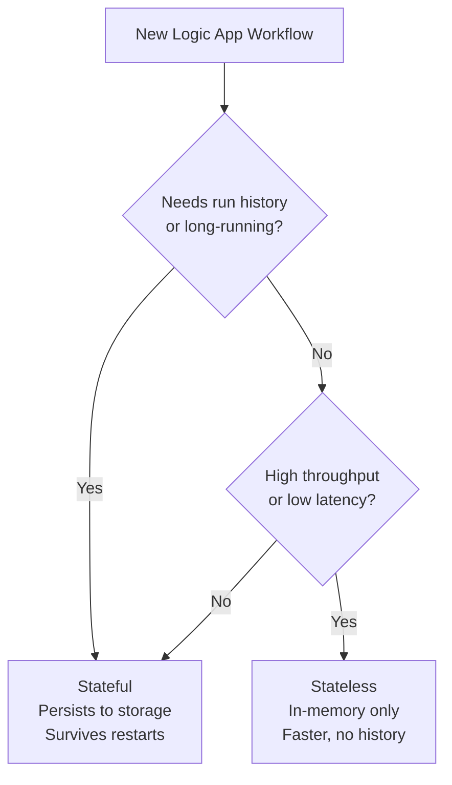

**Interview Points:**

- Stateful vs Stateless — when to use each? → Stateful when you need audit history, long-running waits for external events, or durability across failures; Stateless for high-throughput, low-latency, short-lived workflows where no external suspension is needed
- How do you implement retry logic? → built-in retry policy on actions
- How do you call SAP from Logic Apps? → SAP connector via on-premises data gateway or ISE

---

### 3. Azure Service Bus

**What it is:** Fully managed enterprise message broker supporting queues and topics/subscriptions.

**Key Concepts:**

- **Queues:** Point-to-point; single consumer per message (competing consumers pattern)
- **Topics & Subscriptions:** Pub/Sub; one message fanout to multiple subscriptions with filters
- **Message Sessions:** Enable FIFO ordering and grouping of related messages
- **Dead-Letter Queue (DLQ):** Holds messages that exceed max delivery count or TTL; must be monitored
- **Peek-Lock vs Receive-Delete:** Peek-lock for at-least-once delivery; receive-delete for at-most-once
- **Prefetch:** Client-side buffering for higher throughput
- **Duplicate Detection:** Configurable window using `MessageId`
- **Tiers:** Basic (queues only), Standard, Premium (dedicated capacity, VNet, geo-redundancy, large messages up to 100MB)
- **Partitioning:** Distributes messages across multiple brokers for throughput scaling
- **Auto-forwarding:** Chain queues/topics to forward messages automatically

**Diagrams:**

**Queue vs Topic Topology:**

```
QUEUE (Point-to-Point)                  TOPIC (Pub/Sub)
                                        
Producer ──► [Queue] ──► Consumer A     Producer ──► [Topic]
                                                        │
                                          ┌─────────────┼─────────────┐
                                          ▼             ▼             ▼
                                     [Sub A]        [Sub B]       [Sub C]
                                    Filter: *    Filter: Type=X  Filter: Region=EU
                                          │             │             │
                                          ▼             ▼             ▼
                                     Consumer A   Consumer B    Consumer C
```

**Message Lifecycle & States:**

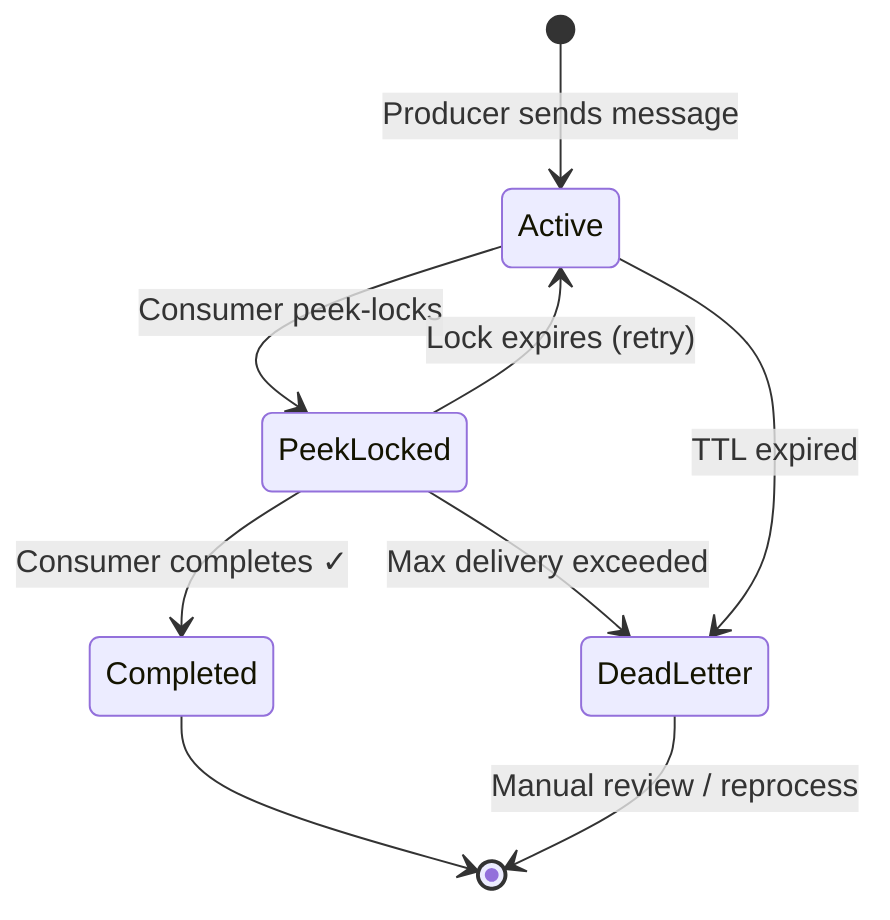

**Sessions for FIFO Ordering:**

```
Customer A orders → [Session: CustA] → Consumer 1 processes Order1→Order2→Order3 (in order)
Customer B orders → [Session: CustB] → Consumer 2 processes Order1→Order2 (in order)
Customer C orders → [Session: CustC] → Consumer 3 processes Order1 (in order)

All customers processed IN PARALLEL, each customer's orders processed IN ORDER
```

**Interview Points:**

- Queue vs Topic — when to use? → Queue for single consumer, Topic for multiple consumers
- How do you ensure ordering? → Message Sessions
- How do you handle poison messages? → DLQ + monitor + reprocess logic
- Difference between Service Bus and Event Hub? → Service Bus = transactional messaging; Event Hub = high-throughput event streaming

---

### 4. Azure Event Grid

**What it is:** Fully managed event routing service using publish-subscribe model; near real-time.

**Key Concepts:**

- **Event Sources (Publishers):** Azure Blob Storage, Resource Groups, Service Bus, Custom Topics, Event Hubs, IoT Hub
- **Event Handlers (Subscribers):** Azure Functions, Logic Apps, Event Hubs, Service Bus, Webhooks, Storage Queues
- **Topics:** System topics (built-in Azure events) vs Custom topics (your own events)
- **Event Domains:** Manage thousands of topics at scale (multi-tenant scenarios)
- **Filters:** Filter by event type or subject prefix/suffix
- **Delivery guarantees:** At-least-once; retry with exponential backoff; dead-lettering to Blob
- **Schema:** Event Grid schema or CloudEvents 1.0 schema

**Diagrams:**

**Event Grid Routing Architecture:**

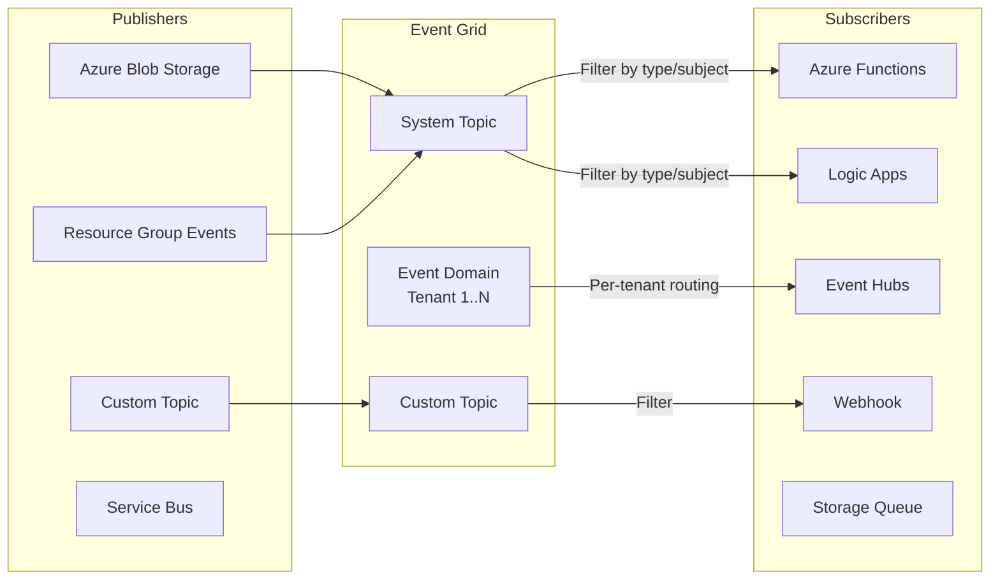

**Event Grid vs Service Bus vs Event Hubs — Decision Tree:**

```
Need to process millions of events/sec (IoT telemetry, logs)?
  └── YES → Event Hubs (partitioned log, Kafka-compatible)

Need guaranteed delivery, ordering, DLQ, sessions?
  └── YES → Service Bus (transactional messaging)

Need to react to Azure resource events or route discrete events to multiple handlers?
  └── YES → Event Grid (reactive pub/sub, near real-time, low volume)
```

**Interview Points:**

- Event Grid vs Service Bus vs Event Hub?
  - Event Grid = reactive event routing (discrete events, low volume)
  - Service Bus = transactional messaging (ordered, sessions, DLQ)
  - Event Hub = high-throughput telemetry streaming (millions/sec, partitioned log)

---

### 5. Azure Functions

**What it is:** Serverless compute for event-driven code execution.

**Key Concepts:**

- **Triggers:** HTTP, Timer, Service Bus, Event Hub, Event Grid, Blob, Queue, Cosmos DB, Durable
- **Bindings:** Input/output bindings reduce boilerplate (e.g., read from Blob, write to Service Bus)
- **Hosting Plans:**
  - Consumption: Auto-scale, pay-per-use, cold start
  - Premium: Pre-warmed instances, VNet integration, no cold start
  - Dedicated (App Service): Full control, always-on
- **Durable Functions:** Stateful workflows in serverless using Orchestrator + Activity + Entity functions
  - Patterns: Function chaining, Fan-out/fan-in, Async HTTP polling, Monitor, Human interaction
- **Isolated Worker Model (recommended for .NET):** Runs in separate process from host; full .NET version support
- **In-Process Model (legacy .NET):** Runs inside Functions host process

**Diagrams:**

**Hosting Plan Comparison:**

```
┌──────────────┬──────────────┬──────────────┬──────────────┐
│              │ CONSUMPTION  │   PREMIUM    │  DEDICATED   │
├──────────────┼──────────────┼──────────────┼──────────────┤
│ Cold Start   │     Yes      │     No       │     No       │
│ VNet         │     No       │     Yes      │     Yes      │
│ Scale        │   0→∞ auto   │ Min→Max auto │   Fixed      │
│ Cost         │  Per exec    │ Per instance │ Per instance │
│ Max timeout  │  5/10 min    │    Unlimited │  Unlimited   │
│ Use for      │  Bursty,     │  Enterprise, │  Predictable │
│              │  dev/test    │  VNet, prod  │  workloads   │
└──────────────┴──────────────┴──────────────┴──────────────┘
```

**Durable Functions Patterns:**

```
1. FUNCTION CHAINING
   A ──► B ──► C ──► D   (sequential, output of A is input to B)

2. FAN-OUT / FAN-IN
                 ┌──► Activity 1 ─┐
   Orchestrator ─┼──► Activity 2 ─┼──► Aggregate results ──► Continue
                 └──► Activity 3 ─┘
   (WhenAll — waits for ALL to complete)

3. ASYNC HTTP POLLING
   Client ──► POST /start ──► 202 Accepted + statusUrl
   Client ──► GET /status  ──► 202 Running
   Client ──► GET /status  ──► 200 Completed + result

4. MONITOR (recurring check)
   Orchestrator ──► Check condition ──► NOT MET ──► Sleep(interval) ──► loop
                                    └──► MET ──► Continue

5. HUMAN INTERACTION
   Orchestrator ──► Send approval email ──► Wait for external event (timeout: 3 days)
                                        ├──► Approved ──► Proceed
                                        └──► Timeout  ──► Escalate
```

**Isolated Worker vs In-Process Model:**

```
┌────────────────────────────────┐    ┌────────────────────────────────┐
│   IN-PROCESS (legacy)          │    │   ISOLATED WORKER (recommended)│
│                                │    │                                │
│  Function Host Process         │    │  Function Host Process         │
│  ┌──────────────────────────┐  │    │  │                            │
│  │ Your function code       │  │    │  │  Your Worker Process       │
│  │ (runs inside host)       │  │    │  │  ┌──────────────────────┐  │
│  └──────────────────────────┘  │    │  │  │ Your function code   │  │
│                                │    │  │  │ (separate process)   │  │
│  • Tied to host .NET version   │    │  │  └──────────────────────┘  │
│  • Legacy, being retired       │    │  │                            │
└────────────────────────────────┘    │  • Any .NET version           │
                                      │  • Full middleware pipeline   │
                                      │  • Better isolation           │
                                      └────────────────────────────────┘
```

**Interview Points:**

- When to use Durable Functions vs Logic Apps? → Durable for code-first complex orchestration; Logic Apps for low-code/connector-heavy flows
- How do you handle cold starts? → Premium plan or keep-alive with timer trigger
- How do you secure an HTTP-triggered Function? → Function keys, Auth level (anonymous/function/admin), APIM as gateway, AAD auth

---

### 6. Azure Event Hubs

**What it is:** Big data streaming platform and event ingestion service; capable of millions of events/sec.

**Key Concepts:**

- **Partitions:** Unit of parallelism; consumers read from specific partitions; count is fixed after creation
- **Consumer Groups:** Logical view of the event stream; enables multiple independent consumers
- **Retention:** Configurable 1–90 days (Standard/Premium)
- **Capture:** Auto-capture events to Azure Blob or ADLS in Avro format
- **Kafka Endpoint:** Event Hubs is Kafka-protocol compatible — migrate Kafka apps without code changes
- **Schema Registry:** Centralized schema management for producers/consumers
- **Checkpointing:** Consumers track their position (offset) in the partition

**Diagrams:**

**Event Hubs Partition Model:**

```
Producer A ──┐
Producer B ──┤──► Event Hub Namespace
Producer C ──┘         │
                        │ (events distributed across partitions by partition key)
               ┌────────┴────────┐
               │                 │
          [Partition 0]    [Partition 1]    [Partition 2]    [Partition 3]
          offset 0..N      offset 0..N      offset 0..N      offset 0..N
               │                 │
        ┌──────┴──────┐   ┌──────┴──────┐
        │             │   │             │
   Consumer       Consumer  Consumer  Consumer
   Group A        Group A   Group B   Group B
   (Analytics)   (Billing)  (Archive) (Alert)

Each Consumer Group gets an INDEPENDENT view of all partitions.
Each partition is read by ONE consumer within a group (exclusive ownership).
```

**Checkpointing Flow:**

```
[Partition 0]
  offset: 0  1  2  3  4  5  6  7  8  9
                       ▲
                  Checkpoint stored
                  in Azure Blob/Storage
                  (consumer saves position)

On consumer restart → reads from checkpoint offset (5), not from beginning
```

**Interview Points:**

- Event Hubs vs Service Bus? → Event Hubs for telemetry/log streaming; Service Bus for transactional enterprise messaging

---

### 7. Azure Data Factory (ADF)

**What it is:** Cloud ETL/ELT service for data movement and transformation at scale.

**Key Concepts:**

- **Pipelines & Activities:** Orchestration units; activities = copy, dataflow, stored procedure, web, etc.
- **Linked Services:** Connection definitions to data stores/compute
- **Datasets:** Named views of data structures within linked services
- **Integration Runtime (IR):**
  - Azure IR: Cloud-to-cloud movement
  - Self-hosted IR: On-premises or cross-VNet data movement
  - SSIS IR: Run SSIS packages in cloud
- **Mapping Data Flows:** Visually designed Spark-based transformations (no code)
- **Triggers:** Schedule, Tumbling Window, Event-based (Blob created/deleted), Storage event

**Diagrams:**

**ADF Architecture — Components:**

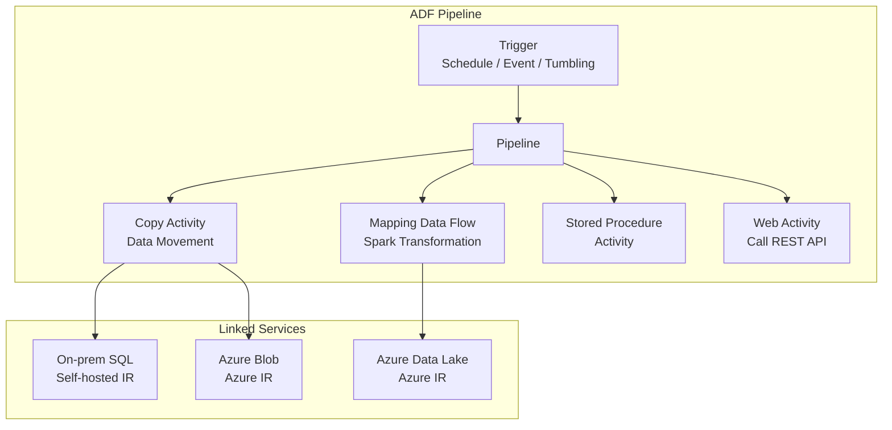

**Integration Runtime Decision:**

```
Data Source Location          Integration Runtime to Use
─────────────────────────────────────────────────────────
Cloud → Cloud                 Azure IR (managed, auto-scale)
On-premises → Cloud           Self-hosted IR (install on-prem VM)
On-premises SSIS packages     Azure-SSIS IR (lift & shift)
VNet-restricted cloud source  Azure IR with Managed VNet
```

**ADF ETL vs ELT Pattern:**

```
ETL (Transform BEFORE load):           ELT (Load THEN transform in cloud):
Source ──► Transform (ADF DF) ──► Load  Source ──► Load (Copy Activity) ──► Transform
           (limited scale)                              (Synapse/Databricks — massive scale)
```

**Interview Points:**

- When to use ADF vs Logic Apps? → ADF for large-scale data movement/transformation; Logic Apps for business process/API orchestration
- How do you move on-premises data to Azure? → Self-hosted Integration Runtime

---

### 8. Integration Patterns & Design

**Diagrams:**

**Claim Check Pattern (Large Messages):**

```
Producer                   Azure Blob Storage             Consumer
   │                              │                           │
   │── Upload payload ──────────► │                           │
   │◄─ Returns Blob URL ──────────│                           │
   │                              │                           │
   │── Send message (URL only) ──────────────────────────────►│
   │   {blobUrl: "https://..."}   │                           │
   │                              │                           │
   │                              │◄── Download payload ──────│
   │                              │──► Full payload ──────────►│
                                                          Process message
```

**Saga Pattern — Distributed Transaction:**

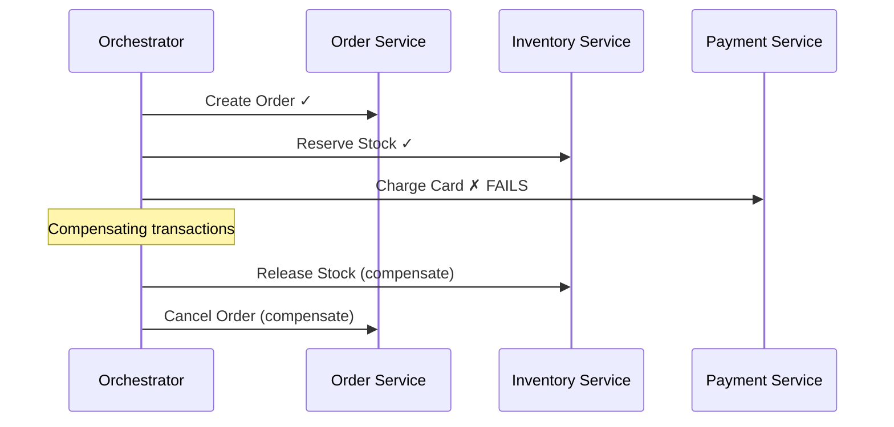

**Competing Consumers Pattern:**

```
                    [Service Bus Queue]
                    ┌─────────────────┐
Producers ─────────►│ msg msg msg msg │
                    └────────┬────────┘
                             │ (each message delivered to ONE consumer)
               ┌─────────────┼─────────────┐
               ▼             ▼             ▼
          Consumer 1    Consumer 2    Consumer 3
          (processing) (processing) (processing)
          (scale out by adding more consumers)
```

| Pattern | Description | Azure Service |
| --- | --- | --- |
| Request-Reply | Synchronous API call | APIM + Functions/App Service |
| Pub/Sub | Broadcast events to multiple consumers | Service Bus Topics / Event Grid |
| Competing Consumers | Scale out message processing | Service Bus Queue + multiple consumers |
| Dead Letter | Handle poison/failed messages | Service Bus DLQ |
| Saga / Process Manager | Distributed transaction coordination | Durable Functions / Logic Apps |
| Fan-out / Fan-in | Parallel processing + aggregation | Durable Functions |
| Claim Check | Large message handling | Blob Storage + Service Bus (URL reference) |
| Throttling / Rate Limiting | Protect backend services | APIM policies |
| Idempotency | Safe retry on failure | Duplicate detection (Service Bus) + idempotency keys |

---

### 8a. API Architecture Layers — Gateway, System, Process, Experience APIs

> These are platform-agnostic integration architecture concepts (popularized by API-led connectivity / MuleSoft, adopted widely in Azure APIM, Kong, AWS API Gateway, etc.). They define a **three-layer API design** that separates concerns between system access, business orchestration, and consumer-facing APIs.

---

#### The Three-Layer API Model

```
┌─────────────────────────────────────────────────────────────────────┐
│                        CONSUMERS (Upstream)                         │
│          Mobile App · Web App · Partner Portal · 3rd Party          │
└───────────────────────────┬─────────────────────────────────────────┘
                            │  calls
                            ▼
┌─────────────────────────────────────────────────────────────────────┐
│                    LAYER 3: EXPERIENCE API (EAPI)                   │
│           Tailored per consumer channel / use case                  │
│    /mobile/orders    /partner/products    /web/dashboard            │
└───────────────────────────┬─────────────────────────────────────────┘
                            │  orchestrates
                            ▼
┌─────────────────────────────────────────────────────────────────────┐
│                    LAYER 2: PROCESS API (PAPI)                      │
│           Business logic, orchestration, transformation             │
│    /orders/fulfillment    /inventory/check    /pricing/calculate    │
└───────────────────────────┬─────────────────────────────────────────┘
                            │  calls
                            ▼
┌─────────────────────────────────────────────────────────────────────┐
│                    LAYER 1: SYSTEM API (SAPI)                       │
│           Thin wrappers around core backend systems                 │
│    /sap/orders    /salesforce/accounts    /sql/inventory            │
└───────────────────────────┬─────────────────────────────────────────┘
                            │  reads/writes
                            ▼
┌─────────────────────────────────────────────────────────────────────┐
│                    BACKEND SYSTEMS (Downstream)                     │
│          SAP · Salesforce · Dynamics · SQL · Mainframe · ERP        │
└─────────────────────────────────────────────────────────────────────┘
```

---

#### Gateway API

**What it is:** The single front door that all consumer traffic passes through before reaching any API layer. It is a cross-cutting infrastructure concern — not a business API itself.

**Responsibilities:**

- **Authentication & Authorization:** Validate JWT/OAuth2 tokens, subscription keys, client certs
- **Rate Limiting & Throttling:** Protect backends from overload
- **Routing:** Forward requests to the correct API layer (EAPI/PAPI/SAPI)
- **Protocol Translation:** REST → SOAP, HTTP → gRPC, REST → Service Bus
- **Observability:** Centralized logging, request/response tracing, metrics
- **TLS Termination:** Terminate HTTPS at the gateway
- **Caching:** Cache frequent responses to reduce backend load
- **Transformation:** Rewrite URIs, headers, payloads

**Azure Implementation:**

```
Internet / Consumers
        │
        ▼
┌──────────────────────────────────────┐
│    Azure Application Gateway + WAF   │  ← Layer 7 LB, DDoS, TLS
└─────────────────┬────────────────────┘
                  │
                  ▼
┌──────────────────────────────────────┐
│         Azure APIM (Gateway)         │  ← Auth, Rate Limit, Routing, Policies
│  - validate-jwt                      │
│  - rate-limit-by-key                 │
│  - rewrite-uri                       │
│  - set-backend-service               │
└─────────────────┬────────────────────┘
                  │
         ┌────────┼────────┐
         ▼        ▼        ▼
       EAPI      PAPI     SAPI  (Functions / Logic Apps / App Service)
```

**Key characteristics:**

- Stateless — no business logic
- Should be transparent to the API layers behind it
- Single point for policy enforcement across all APIs
- In Azure: **APIM** is the primary gateway; **App Gateway + WAF** sits in front for internet traffic

**Interview Points:**

- What is the difference between a Gateway and a Load Balancer? → Gateway operates at L7 (application layer) and understands HTTP/APIs; a load balancer distributes traffic at L4/L7 without API-specific logic
- How does APIM act as a gateway? → Policies applied to every request (inbound/outbound/backend/on-error), subscription key validation, JWT validation, routing to backends
- Can APIM be both gateway and developer portal? → Yes — gateway handles runtime traffic; Developer Portal handles discovery/subscription management

---

#### System API (SAPI)

**What it is:** The bottom layer. A thin, stable API wrapper around a single backend system (SAP, Salesforce, SQL, mainframe). Hides the complexity and volatility of the underlying system from everything above it.

**Responsibilities:**

- Expose backend system capabilities as RESTful (or GraphQL) APIs
- Normalize data formats (e.g., SAP IDoc → JSON, SOAP → REST)
- Handle system-specific auth (SAP logon tickets, Salesforce OAuth)
- Provide a **stable contract** — if SAP changes internally, only the SAPI changes; PAPI is unaffected
- Data validation at the system boundary

**Design Principles:**

- One SAPI per system (1:1 mapping)
- No business logic — just expose what the system can do
- Thin transformation layer only (not cross-system orchestration)
- Owned by the team responsible for that backend system

**Azure Implementation:**

```
SAPI for SAP:
┌─────────────────────────────────────────────────────┐
│  Azure Function / Logic App (SAPI)                  │
│                                                     │
│  GET /sap/salesorders/{id}                         │
│    → Logic App SAP Connector (via On-prem Gateway) │
│    → Transform SAP IDoc → JSON                     │
│    → Return normalized response                    │
│                                                     │
│  POST /sap/purchaseorders                          │
│    → Validate payload                              │
│    → Logic App SAP Connector → SAP BAPI call       │
└─────────────────────────────────────────────────────┘
        │
        ▼
   SAP ECC / S/4HANA (via On-Premises Data Gateway)
```

**Common SAPIs in enterprise:**

| System | SAPI Examples |
| --- | --- |
| SAP | /sap/orders, /sap/inventory, /sap/customers |
| Salesforce | /sf/accounts, /sf/opportunities, /sf/contacts |
| Dynamics 365 | /dynamics/invoices, /dynamics/products |
| SQL Database | /db/employees, /db/transactions |
| Mainframe | /mainframe/claims, /mainframe/policies |

**Interview Points:**

- Why have a SAPI if you can call SAP directly? → Decouples consumers from system internals; SAP changes don't ripple up; single place to add auth, retry, circuit breaker for SAP calls
- Who owns the SAPI? → The team that owns the backend system
- What happens if the backend system is down? → SAPI propagates the error; PAPI/EAPI handle fallback/retry logic

---

#### Process API (PAPI)

**What it is:** The middle layer. Contains **business orchestration logic** — it combines data from multiple System APIs to implement a business process or capability. No direct system calls; all system access goes through SAPIs.

**Responsibilities:**

- Orchestrate multi-step business processes (e.g., order fulfillment = check inventory + reserve stock + charge payment + create shipment)
- Aggregate data from multiple SAPIs
- Apply business rules and transformations
- Handle process-level error handling (saga pattern, compensation)
- No consumer-channel concerns — channel-specific logic belongs in EAPI

**Design Principles:**

- One PAPI per business capability/domain (not per consumer)
- Reusable across multiple EAPIs
- All data comes from SAPIs (never directly from backend systems)
- Contains the business logic that would otherwise be duplicated across consumer-facing APIs

**Azure Implementation:**

```
PAPI — Order Fulfillment:
┌──────────────────────────────────────────────────────────────────┐
│  Logic App (Standard) or Durable Function (PAPI)                │
│                                                                  │
│  POST /orders/fulfill                                           │
│    Step 1 → Call SAPI: GET /sap/inventory/{sku}                │
│    Step 2 → Call SAPI: POST /sap/inventory/reserve             │
│    Step 3 → Call SAPI: POST /stripe/charge                     │
│    Step 4 → Call SAPI: POST /sap/salesorders                   │
│    Step 5 → Call SAPI: POST /fedex/shipment                    │
│    On failure → Compensating transactions (Saga pattern)        │
└──────────────────────────────────────────────────────────────────┘
           │              │              │
           ▼              ▼              ▼
     SAP SAPI      Payment SAPI    FedEx SAPI
```

**PAPI vs SAPI distinction:**

```
SAPI: "What CAN SAP do?"    → thin wrapper, no orchestration
PAPI: "HOW do we fulfill an order?" → orchestrates SAP + Stripe + FedEx SAPIs
```

**Interview Points:**

- Why separate PAPI from EAPI? → Business logic is reusable across channels; mobile and web both need order fulfillment but want different response shapes — PAPI provides the process, EAPI shapes the response
- Can PAPI call another PAPI? → Yes — complex processes can be composed; but avoid deep chains (latency, coupling)
- What Azure services implement PAPI? → Logic Apps (Standard/Consumption), Durable Functions, Azure Service Bus + Functions for async PAPIs

---

#### Experience API (EAPI)

**What it is:** The top layer. Tailored for a specific consumer channel or use case. Aggregates and shapes data from Process APIs into the exact format each consumer needs. One EAPI per channel or consumer type.

**Responsibilities:**

- Shape/filter/aggregate responses for the specific channel (mobile needs less data than web)
- Channel-specific auth flows (mobile: device token; partner: API key; web: session cookie)
- Protocol adaptation (mobile wants JSON, legacy partner wants XML)
- Handle consumer-specific SLAs and rate limits
- Response caching for consumer performance

**Design Principles:**

- One EAPI per consumer channel (mobile EAPI ≠ partner EAPI ≠ web EAPI)
- No business logic — delegate all processing to PAPIs
- Optimized for consumer performance (field selection, pagination, compression)
- Short-lived — can be rebuilt when consumer changes without touching PAPI/SAPI

**Azure Implementation:**

```
Three EAPIs for three consumers — all call the SAME Order Fulfillment PAPI:

┌──────────────────┐  ┌──────────────────┐  ┌──────────────────┐
│  Mobile EAPI     │  │  Partner EAPI    │  │  Web EAPI        │
│  /mobile/orders  │  │  /partner/orders │  │  /web/orders     │
│                  │  │                  │  │                  │
│  - Minimal fields│  │  - Full payload  │  │  - Paginated     │
│  - JWT (device)  │  │  - API Key auth  │  │  - Cookie auth   │
│  - Compressed    │  │  - XML response  │  │  - Rich metadata │
└────────┬─────────┘  └────────┬─────────┘  └────────┬─────────┘
         │                     │                     │
         └─────────────────────┼─────────────────────┘
                               │ all call
                               ▼
                    Order Fulfillment PAPI
```

**Interview Points:**

- Why not just have one API for all consumers? → Different consumers need different data shapes, auth flows, SLAs; one API becomes a bloated mess trying to serve all; EAPIs keep each consumer optimized
- Who owns the EAPI? → The team that owns the consumer channel (mobile team, partner team)
- What Azure services implement EAPI? → Azure Functions (HTTP trigger), App Service/APIM products

---

#### Upstream vs Downstream

**What it is:** Directional terms describing relationships between services from the perspective of data/request flow.

```
Upstream ──► YOUR SERVICE ──► Downstream

Upstream  = WHO calls you      (the caller, producer, client)
Downstream = WHO you call       (the dependency, backend, provider)
```

**Detailed Flow:**

```
┌──────────────────────────────────────────────────────────────────────────────┐
│                        REQUEST FLOW (left to right)                          │
│                                                                              │
│  Consumer App  ──►  APIM Gateway  ──►  Experience API  ──►  Process API     │
│       │                 │                    │                   │           │
│  UPSTREAM of APIM   UPSTREAM of EAPI    UPSTREAM of PAPI   UPSTREAM of SAPI │
│                                                                              │
│  Process API  ──►  System API  ──►  SAP / Salesforce / SQL                 │
│       │                │                    │                               │
│  DOWNSTREAM of EAPI  DOWNSTREAM of PAPI  DOWNSTREAM of SAPI               │
└──────────────────────────────────────────────────────────────────────────────┘
```

**Relative — context matters:**

| Service | Upstream (calls it) | Downstream (it calls) |
| --- | --- | --- |
| APIM Gateway | Consumer apps, mobile, browsers | EAPIs, PAPIs, SAPIs |
| Experience API | APIM / consumers | Process APIs |
| Process API | Experience APIs | System APIs |
| System API | Process APIs | SAP, Salesforce, SQL, etc. |

**Why these terms matter in architecture decisions:**

| Concept | Upstream Impact | Downstream Impact |
| --- | --- | --- |
| **Rate limiting** | Protect from upstream bursts | Throttle to protect downstream |
| **Timeout** | Upstream caller waits → set aggressive timeout | Downstream latency → add circuit breaker |
| **Circuit breaker** | Upstream sees fast failure (not hanging) | Downstream is protected from cascading load |
| **Retry** | Upstream should NOT retry non-idempotent calls | Downstream should be idempotent to handle retries |
| **Auth propagation** | Upstream token (JWT) flows down | Downstream service validates token or uses managed identity |
| **Error handling** | Return meaningful errors upstream | Catch downstream failures; don't expose internals |

**In Azure APIM Policy context:**

```xml
<!-- Inbound = processing upstream request before forwarding downstream -->
<inbound>
    <validate-jwt .../>          <!-- validate upstream caller's token -->
    <rate-limit-by-key .../>     <!-- protect downstream from upstream bursts -->
    <set-backend-service .../>   <!-- choose which downstream to call -->
</inbound>

<!-- Backend = configuring the downstream call -->
<backend>
    <retry condition="..." count="3">   <!-- retry downstream on failure -->
        <forward-request/>
    </retry>
</backend>

<!-- Outbound = shaping response back to upstream caller -->
<outbound>
    <set-header name="X-Correlation-Id" .../>   <!-- enrich response for upstream -->
    <cache-store .../>
</outbound>

<!-- On-Error = when downstream fails, protect upstream from raw errors -->
<on-error>
    <return-response>
        <set-status code="502" reason="Bad Gateway"/>
    </return-response>
</on-error>
```

---

#### Full Architecture — All Layers Together (Azure)

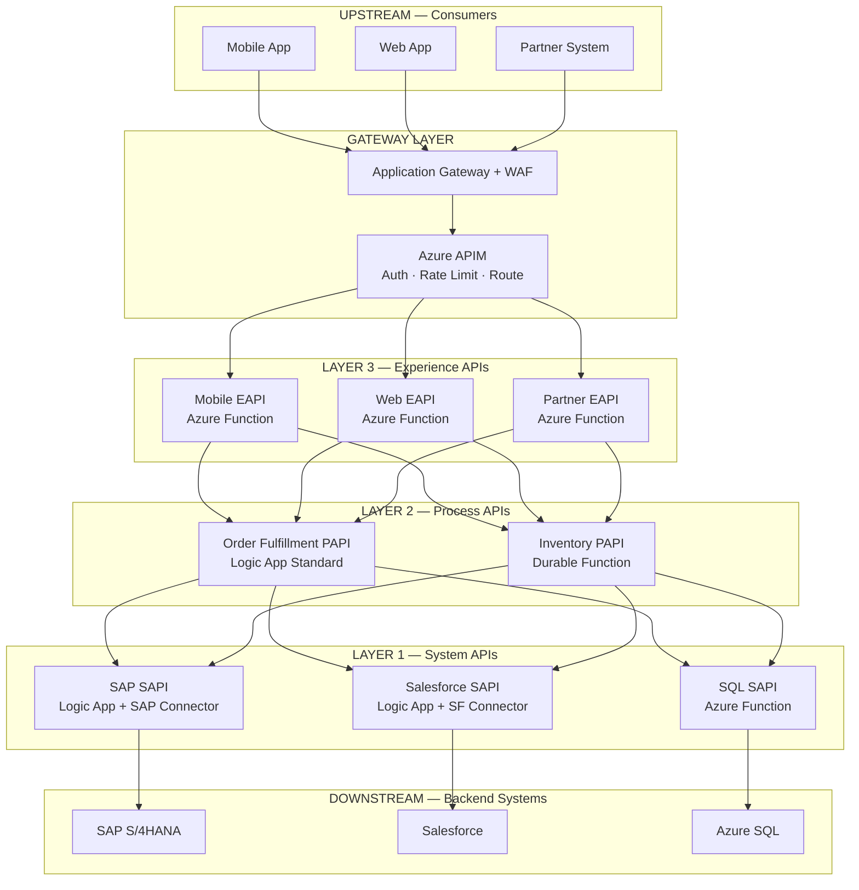

**Interview Points:**

- What is API-led connectivity? → Three-layer API architecture: SAPI (system access) → PAPI (business orchestration) → EAPI (consumer experience); each layer has a single responsibility and a stable contract
- Why three layers vs one monolithic API? → Each layer changes at different rates; backend systems change rarely; business processes change occasionally; consumer channels change frequently — layers absorb change without cascading rewrites
- How do upstream/downstream terms help design? → They clarify ownership of retry/timeout/circuit-breaker responsibilities; downstream services should be idempotent; upstream consumers should see fast, meaningful failures
- What is the gateway's role vs the API layers? → Gateway = cross-cutting infrastructure (auth, throttle, route); API layers = business/system concerns; gateway should have no business logic
- What Azure service maps to each layer?
  - Gateway → APIM (+ App Gateway for internet)
  - EAPI → Azure Functions (HTTP) / APIM Products with per-consumer policies
  - PAPI → Logic Apps Standard / Durable Functions
  - SAPI → Azure Functions / Logic Apps with system connectors

---

### 9. Security Best Practices

**Diagrams:**

**Managed Identity Auth Flow:**

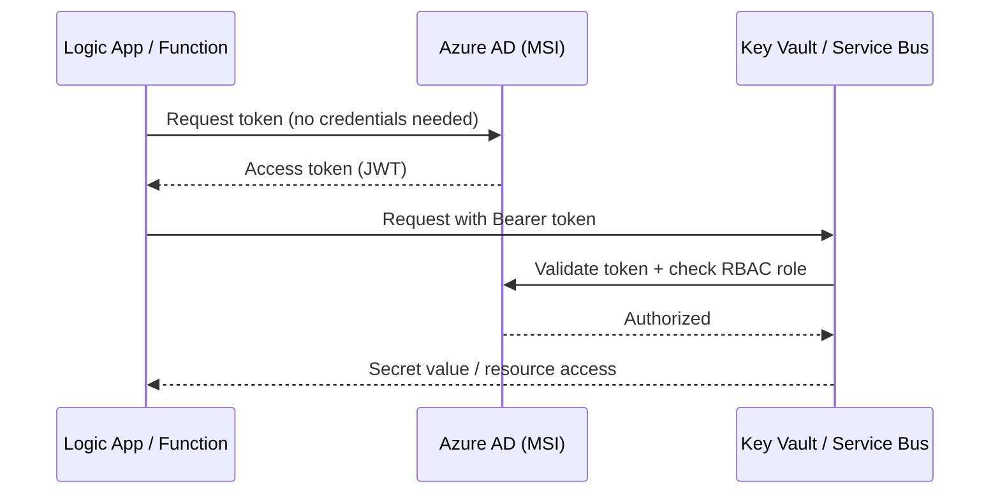

**System-Assigned vs User-Assigned Managed Identity:**

```
SYSTEM-ASSIGNED                     USER-ASSIGNED
  Resource ──► Identity              Identity (standalone resource)
  (1:1 tied to resource lifecycle)    │         │         │
  Deleted when resource deleted       ▼         ▼         ▼
                                   Resource1  Resource2  Resource3
                                   (shared identity, independent lifecycle)
```

**Layered Security Model for Integration:**

```
┌─────────────────────────────────────────────────────────────┐
│  Layer 1: Network          Private Endpoints, NSG, Firewall │
├─────────────────────────────────────────────────────────────┤
│  Layer 2: Identity         Managed Identity, Workload ID    │
├─────────────────────────────────────────────────────────────┤
│  Layer 3: Authorization    RBAC, APIM Policies, JWT         │
├─────────────────────────────────────────────────────────────┤
│  Layer 4: Data             Key Vault, encryption at rest    │
├─────────────────────────────────────────────────────────────┤
│  Layer 5: Audit            Diagnostic Logs → Log Analytics  │
└─────────────────────────────────────────────────────────────┘
```

- **Managed Identity:** Preferred over connection strings/keys for service-to-service auth
- **Key Vault:** Store secrets, certificates, connection strings; reference in Logic Apps / Functions
- **Private Endpoints:** Lock services to VNet; disable public access
- **APIM + OAuth2:** Validate JWT tokens from Azure AD in APIM policy before forwarding to backend
- **Network Security:** NSG, Service Endpoints, Private Link, VNet Integration
- **Audit Logging:** Enable Diagnostic Settings → Log Analytics for all integration services

---

### 10. Monitoring & Observability

**Diagrams:**

**Azure Observability Stack:**

```
┌─────────────────────────────────────────────────────────────────────┐
│                        Azure Monitor                                │
│  ┌─────────────────┐  ┌──────────────────┐  ┌────────────────────┐ │
│  │ Metrics          │  │  Logs            │  │  Alerts            │ │
│  │ (time-series)    │  │  (Log Analytics) │  │  (Action Groups)   │ │
│  └────────┬─────────┘  └────────┬─────────┘  └────────────────────┘ │
│           │                     │                                    │
│  ┌────────▼─────────────────────▼──────────────────────────────┐    │
│  │              Application Insights                           │    │
│  │  Distributed Traces · Dependency Maps · Live Metrics        │    │
│  │  Failures · Performance · Custom Events                     │    │
│  └─────────────────────────────────────────────────────────────┘    │
└─────────────────────────────────────────────────────────────────────┘

Data Sources → Diagnostic Settings → Log Analytics Workspace
  APIM logs         │
  Logic App runs    │──► KQL queries, Workbooks, Dashboards
  Function logs     │
  Service Bus metrics│
  AKS container logs│
```

**Distributed Trace — APIM → Logic App → Service Bus:**

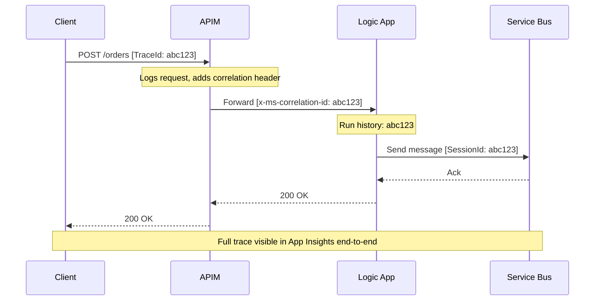

- **Azure Monitor:** Central platform for metrics, logs, alerts
- **Application Insights:** Distributed tracing, live metrics, failures — instrument Functions and APIM
- **Log Analytics:** KQL-based querying across all service logs
- **Logic Apps Run History:** Built-in per-run visibility in Standard/Consumption
- **Service Bus Explorer:** Built-in portal tool to peek/browse messages, manage DLQ
- **APIM Analytics:** Built-in request/response analytics per API/operation
- **Alerts:** Metric-based (e.g., DLQ depth &gt; 0, Function failure rate) and log-based alerts

---

## Azure Resource Creation Guide — Tiers & Provisioning

> Reference for creating integration resources in Azure Portal, CLI, and Bicep. Focus: tier selection (Consumption / Standard / Premium), key configuration options at creation time, and decision guidance.

---

### RC-1. Azure API Management (APIM) — Resource Creation

#### Tier Comparison

| Tier | Throughput | VNet Support | SLA | Typical Use |
| --- | --- | --- | --- | --- |
| **Consumption** | Serverless (per call) | No | 99.95% | Dev/test, sporadic traffic, &lt; 100K calls/month |
| **Developer** | 500 req/s | Internal + External VNet | No SLA | Non-prod, testing policies, VNet scenarios |
| **Basic** | 1,000 req/s | No | 99.9% | Small production, no VNet needed |
| **Basic v2** | 1,000 req/s | VNet Integration (outbound) | 99.95% | Small-mid production, faster scale |
| **Standard** | 2,500 req/s | No | 99.9% | Mid-size production |
| **Standard v2** | 4,000 req/s | VNet Integration (outbound) | 99.95% | Mid-size production with egress VNet |
| **Premium** | 4,000 req/s per unit | Internal + External VNet | 99.99% | Enterprise, multi-region, full VNet injection |

**VNet Modes (Premium/Developer):**

- **External mode:** APIM reachable from internet; backends accessed via VNet
- **Internal mode:** APIM only reachable from within VNet (pair with App Gateway for internet traffic)

#### Azure Portal — Key Creation Options

```
Portal: Create a resource → API Management → Create

  Basics tab:
  ├── Subscription / Resource Group
  ├── Resource Name (globally unique subdomain: <name>.azure-api.net)
  ├── Region
  ├── Organization Name (shown in Developer Portal)
  ├── Administrator Email
  └── Pricing Tier → [Consumption | Developer | Basic | Standard | Premium]

  Monitoring tab:
  └── Enable Application Insights (recommended)

  Scale tab (Premium):
  ├── Scale Units (1 = 4,000 req/s)
  └── Availability Zones (Premium, multi-region)

  Virtual Network tab (Developer/Premium/v2 tiers):
  ├── VNet → [External | Internal | None]
  ├── Select VNet + Subnet
  └── Public IP (required for External/Internal)
```

**Important:** APIM creation takes **30–45 minutes**. Consumption is near-instant.

#### Azure CLI

```bash
# Consumption tier
az apim create \
  --name myapim \
  --resource-group myRG \
  --location eastus \
  --publisher-email admin@contoso.com \
  --publisher-name Contoso \
  --sku-name Consumption

# Standard tier
az apim create \
  --name myapim-std \
  --resource-group myRG \
  --location eastus \
  --publisher-email admin@contoso.com \
  --publisher-name Contoso \
  --sku-name Standard \
  --sku-capacity 1

# Premium with VNet (Internal mode)
az apim create \
  --name myapim-prem \
  --resource-group myRG \
  --location eastus \
  --publisher-email admin@contoso.com \
  --publisher-name Contoso \
  --sku-name Premium \
  --sku-capacity 1 \
  --virtual-network Internal \
  --vnet-name myVNet \
  --subnet apim-subnet
```

#### Bicep

```bicep
resource apim 'Microsoft.ApiManagement/service@2023-05-01-preview' = {
  name: 'myapim'
  location: 'eastus'
  sku: {
    name: 'Standard'   // Consumption | Developer | Basic | Standard | Premium
    capacity: 1        // 0 for Consumption; units for others
  }
  properties: {
    publisherEmail: 'admin@contoso.com'
    publisherName: 'Contoso'
    virtualNetworkType: 'None'  // None | External | Internal
  }
}
```

#### Decision Guide

```
< 100K calls/month, no VNet, dev/test?
  └── Consumption

Need VNet injection (full internal/external)?
  └── Premium (or Developer for non-prod)

Mid-size production, no VNet?
  └── Standard v2

Small production?
  └── Basic v2
```

---

### RC-2. Azure Logic Apps — Resource Creation

#### Tier Comparison

| Tier | Model | Hosting | VNet | Local Dev | Cost Model |
| --- | --- | --- | --- | --- | --- |
| **Consumption** | Multi-tenant | Shared Azure infra | No VNet | No | Per action execution |
| **Standard — WS1** | Single-tenant | Dedicated container | VNet Integration + Private Endpoint | VS Code | Fixed hourly (vCPU + memory) |
| **Standard — WS2** | Single-tenant | 2× vCPU/memory of WS1 | Yes | Yes | Fixed hourly |
| **Standard — WS3** | Single-tenant | 4× vCPU/memory of WS1 | Yes | Yes | Fixed hourly |

**Standard tiers run on the Azure Functions (Workflow Standard) hosting model.**

#### Azure Portal — Key Creation Options

```
Portal: Create a resource → Logic App → Create

  Basics tab:
  ├── Subscription / Resource Group
  ├── Logic App Name
  ├── Region
  ├── Plan Type:
  │     ○ Consumption — pay-per-execution, simple workflows
  │     ○ Standard    — single-tenant, VNet, local dev, stateful+stateless
  │
  └── (Standard only) Plan:
        ├── Create new Workflow Standard plan
        │   └── Plan SKU: WS1 | WS2 | WS3
        └── Zone Redundancy (requires Premium storage)

  Storage tab (Standard only):
  ├── Storage Account (required for state + run history)
  └── New or existing

  Networking tab (Standard only):
  ├── Enable network injection: Yes / No
  ├── VNet + Subnet (for VNet Integration — outbound)
  └── Private Endpoint (for inbound, configured post-creation)

  Monitoring tab:
  └── Enable Application Insights
```

#### Azure CLI

```bash
# Consumption Logic App
az logic workflow create \
  --name mylogicapp \
  --resource-group myRG \
  --location eastus \
  --definition '{"$schema":"...","contentVersion":"1.0.0.0","triggers":{},"actions":{}}'

# Standard Logic App — requires App Service Plan of kind "WorkflowStandard"
# Step 1: Create Workflow Standard plan
az appservice plan create \
  --name myWorkflowPlan \
  --resource-group myRG \
  --location eastus \
  --sku WS1 \
  --is-linux

# Step 2: Create storage account
az storage account create \
  --name mylogicappstorage \
  --resource-group myRG \
  --location eastus \
  --sku Standard_LRS

# Step 3: Create Standard Logic App
az logicapp create \
  --name mylogicapp-std \
  --resource-group myRG \
  --plan myWorkflowPlan \
  --storage-account mylogicappstorage
```

#### Bicep

```bicep
// Consumption Logic App
resource logicAppConsumption 'Microsoft.Logic/workflows@2019-05-01' = {
  name: 'mylogicapp-consumption'
  location: 'eastus'
  properties: {
    state: 'Enabled'
    definition: {
      '$schema': 'https://schema.management.azure.com/providers/Microsoft.Logic/schemas/2016-06-01/workflowdefinition.json#'
      contentVersion: '1.0.0.0'
      triggers: {}
      actions: {}
    }
  }
}

// Standard Logic App (requires App Service Plan + Storage Account)
resource workflowPlan 'Microsoft.Web/serverfarms@2023-01-01' = {
  name: 'myWorkflowPlan'
  location: 'eastus'
  kind: 'WorkflowStandard'
  sku: {
    name: 'WS1'   // WS1 | WS2 | WS3
    tier: 'WorkflowStandard'
  }
  properties: {
    reserved: true
  }
}

resource logicAppStandard 'Microsoft.Web/sites@2023-01-01' = {
  name: 'mylogicapp-standard'
  location: 'eastus'
  kind: 'workflowapp,functionapp'
  properties: {
    serverFarmId: workflowPlan.id
    siteConfig: {
      appSettings: [
        { name: 'AzureWebJobsStorage', value: 'DefaultEndpointsProtocol=...' }
        { name: 'FUNCTIONS_EXTENSION_VERSION', value: '~4' }
        { name: 'FUNCTIONS_WORKER_RUNTIME', value: 'node' }
        { name: 'WEBSITE_NODE_DEFAULT_VERSION', value: '~18' }
      ]
    }
  }
}
```

#### Decision Guide

```
Simple orchestration, low volume, no VNet needed, pay-as-you-go?
  └── Consumption

Need VNet integration, private endpoints, or local development?
  └── Standard (WS1 for typical, WS2/WS3 for high throughput)

Need multiple workflows in one app with shared config?
  └── Standard (multiple .json workflow definitions per app)

Need EDI / B2B (AS2, X12, EDIFACT)?
  └── Consumption + Integration Account (Basic or Standard tier)
  └── OR Standard + Integration Account
```

---

### RC-3. Azure Service Bus — Resource Creation

#### Namespace Tier Comparison

| Tier | Max Message Size | Throughput | VNet | Geo-Redundancy | Sessions | Features |
| --- | --- | --- | --- | --- | --- | --- |
| **Basic** | 256 KB | Shared | No | No | No | Queues only; no topics |
| **Standard** | 256 KB | Shared | No | No | Yes | Queues + Topics + Sessions + DLQ |
| **Premium** | 100 MB | Dedicated (MUs) | Yes | Yes | Yes | All features + large messages + JMS 2.0 |

**Messaging Units (MUs) — Premium:**

- 1 MU = baseline dedicated capacity
- Scale 1, 2, 4, 8, 16 MUs; supports autoscale
- Each MU adds predictable, isolated throughput

#### Azure Portal — Key Creation Options

```
Portal: Create a resource → Service Bus → Create

  Basics tab:
  ├── Subscription / Resource Group
  ├── Namespace Name (globally unique: <name>.servicebus.windows.net)
  ├── Location
  └── Pricing Tier: Basic | Standard | Premium

  (Premium only) Advanced tab:
  ├── Messaging Units: 1 | 2 | 4 | 8 | 16
  ├── Zone Redundancy: Enable / Disable
  └── Minimum TLS Version

  Networking tab (Premium):
  ├── Public Access: All networks | Selected networks | Disabled
  ├── Private Endpoints: Add private endpoint
  └── Trusted Services bypass

  After namespace creation — Create Queue:
  ├── Name
  ├── Max Queue Size: 1 GB – 80 GB
  ├── Max Delivery Count (default: 10)
  ├── Message TTL
  ├── Lock Duration (default: 30s; max 5min for Standard; 5min for Premium)
  ├── Enable Dead-Lettering on message expiration
  ├── Enable Duplicate Detection
  ├── Enable Sessions
  └── Enable Partitioning (Standard only; Premium uses MUs)

  Create Topic:
  ├── Name + Max Topic Size
  ├── Enable Partitioning / Duplicate Detection
  └── Add Subscriptions with SQL filter rules
```

#### Azure CLI

```bash
# Create namespace — Standard
az servicebus namespace create \
  --name mysbnamespace \
  --resource-group myRG \
  --location eastus \
  --sku Standard

# Create namespace — Premium with Messaging Units
az servicebus namespace create \
  --name mysbnamespace-prem \
  --resource-group myRG \
  --location eastus \
  --sku Premium \
  --capacity 2   # Messaging Units: 1 | 2 | 4 | 8 | 16

# Create queue with sessions + DLQ
az servicebus queue create \
  --name myqueue \
  --namespace-name mysbnamespace \
  --resource-group myRG \
  --enable-session true \
  --max-delivery-count 10 \
  --default-message-time-to-live P14D   # ISO 8601: 14 days

# Create topic + subscription
az servicebus topic create \
  --name mytopic \
  --namespace-name mysbnamespace \
  --resource-group myRG

az servicebus topic subscription create \
  --name mysub \
  --topic-name mytopic \
  --namespace-name mysbnamespace \
  --resource-group myRG \
  --max-delivery-count 10
```

#### Bicep

```bicep
resource sbNamespace 'Microsoft.ServiceBus/namespaces@2022-10-01-preview' = {
  name: 'mysbnamespace'
  location: 'eastus'
  sku: {
    name: 'Standard'   // Basic | Standard | Premium
    tier: 'Standard'
    capacity: 1        // Messaging Units — Premium only (1|2|4|8|16)
  }
  properties: {
    zoneRedundant: false  // Premium only
  }
}

resource sbQueue 'Microsoft.ServiceBus/namespaces/queues@2022-10-01-preview' = {
  parent: sbNamespace
  name: 'myqueue'
  properties: {
    maxSizeInMegabytes: 5120
    maxDeliveryCount: 10
    enableSessions: true
    duplicateDetectionHistoryTimeWindow: 'PT10M'
    defaultMessageTimeToLive: 'P14D'
    deadLetteringOnMessageExpiration: true
  }
}

resource sbTopic 'Microsoft.ServiceBus/namespaces/topics@2022-10-01-preview' = {
  parent: sbNamespace
  name: 'mytopic'
  properties: {
    maxSizeInMegabytes: 5120
    enablePartitioning: false
  }
}
```

#### Decision Guide

```
Just queues, low volume, dev/test?
  └── Basic

Queues + Topics + Sessions + DLQ, shared throughput, no VNet?
  └── Standard

Enterprise: VNet, large messages (>256 KB), dedicated capacity, geo-DR?
  └── Premium (start at 1 MU, enable autoscale)
```

---

### RC-4. Azure Event Hubs — Resource Creation

#### Namespace Tier Comparison

| Tier | Throughput Units (TUs) | Max Retention | Kafka | Capture | VNet | Message Size |
| --- | --- | --- | --- | --- | --- | --- |
| **Basic** | 1–20 TUs | 1 day | No | No | No | 256 KB |
| **Standard** | 1–20 TUs (auto-inflate up to 40) | 1–7 days | Yes | Yes | No | 256 KB |
| **Premium** | 1–16 PUs | 1–90 days | Yes | Yes | Yes | 1 MB |
| **Dedicated** | 1–8 CUs | 1–90 days | Yes | Yes | Yes | 1 MB |

**Throughput Unit (TU):** 1 MB/s in, 2 MB/s out or 1,000 events/s in (Standard) **Processing Unit (PU):** Premium — dedicated, predictable capacity **Capacity Unit (CU):** Dedicated cluster — full isolation

#### Azure Portal — Key Creation Options

```
Portal: Create a resource → Event Hubs → Create

  Basics tab:
  ├── Subscription / Resource Group
  ├── Namespace Name (globally unique: <name>.servicebus.windows.net)
  ├── Location
  ├── Pricing Tier: Basic | Standard | Premium | Dedicated
  │
  ├── (Standard) Throughput Units: 1–20
  │   └── Auto-inflate: Enable / Disable (auto-scale up to max TUs)
  │
  ├── (Premium) Processing Units: 1–16
  │
  └── Zone Redundancy (Standard Premium)

  After namespace — Create Event Hub:
  ├── Name
  ├── Partition Count (2–256; CANNOT be changed after creation)
  ├── Retention (hours): 1–168 (Standard); up to 2160 (Premium/Dedicated)
  ├── Capture: Enable / Disable
  │   ├── Time Window (minutes): 1–15
  │   ├── Size Window (MB): 10–500
  │   ├── Destination: Azure Blob Storage / ADLS Gen2
  │   └── Format: Avro / Parquet (Parquet = Premium+)
  └── Consumer Groups (default: $Default)
```

#### Azure CLI

```bash
# Create namespace — Standard with Auto-inflate
az eventhubs namespace create \
  --name myehnamespace \
  --resource-group myRG \
  --location eastus \
  --sku Standard \
  --capacity 2 \
  --enable-auto-inflate true \
  --maximum-throughput-units 10

# Create namespace — Premium
az eventhubs namespace create \
  --name myehnamespace-prem \
  --resource-group myRG \
  --location eastus \
  --sku Premium \
  --capacity 1   # Processing Units

# Create Event Hub with 16 partitions
az eventhubs eventhub create \
  --name myeventhub \
  --namespace-name myehnamespace \
  --resource-group myRG \
  --partition-count 16 \
  --retention-time 24   # hours

# Create consumer group
az eventhubs eventhub consumer-group create \
  --name myConsumerGroup \
  --eventhub-name myeventhub \
  --namespace-name myehnamespace \
  --resource-group myRG
```

#### Bicep

```bicep
resource ehNamespace 'Microsoft.EventHub/namespaces@2023-01-01-preview' = {
  name: 'myehnamespace'
  location: 'eastus'
  sku: {
    name: 'Standard'   // Basic | Standard | Premium
    tier: 'Standard'
    capacity: 2        // TUs for Standard; PUs for Premium
  }
  properties: {
    isAutoInflateEnabled: true
    maximumThroughputUnits: 10
    zoneRedundant: true
  }
}

resource eventHub 'Microsoft.EventHub/namespaces/eventhubs@2023-01-01-preview' = {
  parent: ehNamespace
  name: 'myeventhub'
  properties: {
    partitionCount: 16      // Fixed at creation — choose carefully
    retentionDescription: {
      cleanupPolicy: 'Delete'
      retentionTimeInHours: 24
    }
    captureDescription: {
      enabled: true
      encoding: 'Avro'
      intervalInSeconds: 300
      sizeLimitInBytes: 314572800
      destination: {
        name: 'EventHubArchive.AzureBlockBlob'
        properties: {
          storageAccountResourceId: '/subscriptions/.../storageAccounts/mystorage'
          blobContainer: 'eventhub-capture'
          archiveNameFormat: '{Namespace}/{EventHub}/{PartitionId}/{Year}/{Month}/{Day}/{Hour}/{Minute}/{Second}'
        }
      }
    }
  }
}
```

#### Decision Guide

```
Dev/test, basic queuing, no Kafka, no capture?
  └── Basic

Production, Kafka protocol, capture to Blob, auto-inflate?
  └── Standard (enable auto-inflate, set max TUs)

Low latency, VNet, 90-day retention, large messages?
  └── Premium

Full dedicated cluster, strict isolation, SLA?
  └── Dedicated
```

---

### RC-5. Azure Functions — Resource Creation

#### Hosting Plan Comparison

| Plan | Cold Start | VNet | Scale | Max Timeout | Billing |
| --- | --- | --- | --- | --- | --- |
| **Consumption** | Yes | No (outbound via VNet Integration is limited) | 0 → ∞ auto | 5 min (10 min configurable) | Per execution + GB-s |
| **Flex Consumption** | Near-zero | Yes (built-in) | 0 → ∞ auto | Up to 60 min | Per execution + GB-s |
| **Premium (EP1/EP2/EP3)** | No (pre-warmed) | Yes | Min → Max auto | Unlimited | Per instance/hour |
| **Dedicated (App Service)** | No | Yes | Manual / Autoscale | Unlimited | Per App Service Plan |
| **Container Apps** | No | Yes | Scale to 0 + auto | Unlimited | Per resource consumption |

**Premium SKUs:**

- EP1: 1 vCPU, 3.5 GB RAM
- EP2: 2 vCPU, 7 GB RAM
- EP3: 4 vCPU, 14 GB RAM

#### Azure Portal — Key Creation Options

```
Portal: Create a resource → Function App → Create

  Basics tab:
  ├── Subscription / Resource Group
  ├── Function App Name (globally unique: <name>.azurewebsites.net)
  ├── Runtime Stack: .NET | Node.js | Python | Java | PowerShell
  ├── Version (e.g., .NET 8 Isolated)
  ├── Region
  └── Operating System: Linux | Windows

  Hosting tab:
  ├── Hosting Option:
  │   ○ Consumption (Serverless)
  │   ○ Functions Premium
  │   ○ App Service Plan
  │   ○ Container Apps Environment
  │
  ├── (Premium) Plan SKU: EP1 | EP2 | EP3
  ├── (Premium) Always Ready Instances: 1+ (eliminates cold start)
  ├── (App Service) Select existing plan
  │
  └── Storage Account (required for all plans)

  Networking tab:
  ├── Enable network injection: Yes / No (Premium/Dedicated)
  ├── VNet + Subnet (VNet Integration — outbound)
  └── Private Endpoint (inbound — post-creation)

  Monitoring tab:
  └── Application Insights: Enable (recommended)
```

#### Azure CLI

```bash
# Consumption plan Function App
az functionapp create \
  --name myfunctionapp \
  --resource-group myRG \
  --consumption-plan-location eastus \
  --runtime dotnet-isolated \
  --runtime-version 8 \
  --os-type Linux \
  --storage-account mystorageaccount

# Premium plan — EP1
az appservice plan create \
  --name myPremiumPlan \
  --resource-group myRG \
  --location eastus \
  --sku EP1 \
  --is-linux

az functionapp create \
  --name myfunctionapp-prem \
  --resource-group myRG \
  --plan myPremiumPlan \
  --runtime dotnet-isolated \
  --runtime-version 8 \
  --os-type Linux \
  --storage-account mystorageaccount

# Configure VNet Integration (outbound)
az functionapp vnet-integration add \
  --name myfunctionapp-prem \
  --resource-group myRG \
  --vnet myVNet \
  --subnet functions-subnet
```

#### Bicep

```bicep
// Consumption plan
resource consumptionFunc 'Microsoft.Web/sites@2023-01-01' = {
  name: 'myfunctionapp'
  location: 'eastus'
  kind: 'functionapp,linux'
  properties: {
    serverFarmId: consumptionPlan.id
    siteConfig: {
      appSettings: [
        { name: 'AzureWebJobsStorage', value: storageAccount.properties.primaryEndpoints.blob }
        { name: 'FUNCTIONS_EXTENSION_VERSION', value: '~4' }
        { name: 'FUNCTIONS_WORKER_RUNTIME', value: 'dotnet-isolated' }
      ]
      linuxFxVersion: 'DOTNET-ISOLATED|8.0'
    }
  }
}

resource consumptionPlan 'Microsoft.Web/serverfarms@2023-01-01' = {
  name: 'myConsumptionPlan'
  location: 'eastus'
  kind: 'functionapp'
  sku: {
    name: 'Y1'    // Y1 = Consumption; EP1/EP2/EP3 = Premium
    tier: 'Dynamic'
  }
  properties: {
    reserved: true  // Linux
  }
}

// Premium plan (no cold start, VNet integration)
resource premiumPlan 'Microsoft.Web/serverfarms@2023-01-01' = {
  name: 'myPremiumPlan'
  location: 'eastus'
  kind: 'elastic'
  sku: {
    name: 'EP1'   // EP1 | EP2 | EP3
    tier: 'ElasticPremium'
  }
  properties: {
    reserved: true
    maximumElasticWorkerCount: 20
  }
}
```

#### Decision Guide

```
Sporadic, low-volume, cost-sensitive?
  └── Consumption (free tier: 1M executions/month)

Need VNet, no cold start, burst scale?
  └── Flex Consumption (new, built-in VNet)

Enterprise: VNet + no cold start + always-on instances?
  └── Premium EP1/EP2/EP3

Predictable, steady traffic, existing App Service Plan?
  └── Dedicated (App Service)
```

---

### RC-6. Azure Event Grid — Resource Creation

#### Resource Types & Tiers

| Resource | Tier / Mode | Use Case |
| --- | --- | --- |
| **System Topic** | Built-in (no tier choice) | React to Azure resource events (Blob created, Resource Group changes) |
| **Custom Topic** | Basic | Your own events via REST publish |
| **Domain** | Basic | Multi-tenant: thousands of topics under one endpoint |
| **Partner Topic** | Basic | Events from 3rd-party SaaS (Salesforce, SAP, Auth0) |
| **Event Subscriptions** | Push (webhook/Function) or Pull (Event Grid Client SDK) | Route filtered events to handlers |

**Pricing model:** Per operation (publish + delivery); no tiers to select at creation time — cost scales with volume.

#### Azure Portal — Key Creation Options

```
Custom Topic creation:
Portal → Create a resource → Event Grid Topic → Create

  Basics tab:
  ├── Subscription / Resource Group
  ├── Topic Name
  ├── Region
  └── Event Schema: Event Grid Schema | Cloud Events 1.0 | Custom Schema

  Networking tab:
  ├── Connectivity: Public | Private
  └── Private Endpoints (if Private)

  Advanced tab:
  ├── Local Auth: Enable / Disable (disable = Entra ID only)
  └── Minimum TLS Version

After topic creation — Create Event Subscription:
  ├── Name
  ├── Event Schema (must match topic)
  ├── Filter to Event Types (e.g., Microsoft.Storage.BlobCreated)
  ├── Endpoint Type:
  │   ○ Azure Function
  │   ○ Event Hub
  │   ○ Service Bus Queue/Topic
  │   ○ Storage Queue
  │   ○ Webhook
  ├── Subject Filtering (prefix/suffix)
  └── Delivery / Retry:
      ├── Max Delivery Attempts: 1–30
      ├── Event Time To Live (minutes): up to 1440
      └── Dead-letter destination (Storage Blob)
```

#### Azure CLI

```bash
# Create custom Event Grid topic
az eventgrid topic create \
  --name myegtopic \
  --resource-group myRG \
  --location eastus \
  --input-schema cloudeventschemav1_0  # eventgridschema | cloudeventschemav1_0

# Create event subscription to Azure Function
az eventgrid event-subscription create \
  --name mysubscription \
  --source-resource-id /subscriptions/.../resourceGroups/myRG/providers/Microsoft.EventGrid/topics/myegtopic \
  --endpoint /subscriptions/.../resourceGroups/myRG/providers/Microsoft.Web/sites/myfunc/functions/myfunction \
  --endpoint-type azurefunction \
  --included-event-types "myapp.OrderCreated" "myapp.OrderUpdated"

# Create System Topic (Blob Storage events)
az eventgrid system-topic create \
  --name myblobsystemtopic \
  --resource-group myRG \
  --location eastus \
  --topic-type Microsoft.Storage.StorageAccounts \
  --source /subscriptions/.../resourceGroups/myRG/providers/Microsoft.Storage/storageAccounts/mystorage
```

#### Bicep

```bicep
// Custom Topic
resource egTopic 'Microsoft.EventGrid/topics@2023-12-15-preview' = {
  name: 'myegtopic'
  location: 'eastus'
  properties: {
    inputSchema: 'CloudEventSchemaV1_0'  // EventGridSchema | CloudEventSchemaV1_0
    publicNetworkAccess: 'Enabled'
    disableLocalAuth: false
  }
}

// Event Subscription → Azure Function
resource egSubscription 'Microsoft.EventGrid/topics/eventSubscriptions@2023-12-15-preview' = {
  parent: egTopic
  name: 'mysubscription'
  properties: {
    destination: {
      endpointType: 'AzureFunction'
      properties: {
        resourceId: '/subscriptions/.../sites/myfunc/functions/myfunction'
        maxEventsPerBatch: 1
      }
    }
    filter: {
      includedEventTypes: ['myapp.OrderCreated', 'myapp.OrderUpdated']
      subjectBeginsWith: '/orders/'
    }
    retryPolicy: {
      maxDeliveryAttempts: 30
      eventTimeToLiveInMinutes: 1440
    }
    deadLetterDestination: {
      endpointType: 'StorageBlob'
      properties: {
        resourceId: '/subscriptions/.../storageAccounts/mystorage'
        blobContainerName: 'deadletter'
      }
    }
  }
}
```

#### Decision Guide

```
React to native Azure resource events (Blob, Resource Group, etc.)?
  └── System Topic (auto-created when you subscribe to Azure resource events)

Publish custom application events?
  └── Custom Topic

Multi-tenant SaaS: thousands of event sources?
  └── Event Domain

3rd-party SaaS events (Salesforce, SAP, Auth0)?
  └── Partner Topic
```

---

### RC-7. Tier / Plan Quick Reference — All Integration Services

```
┌──────────────────┬───────────────────────────────────────────────────────────────┐
│ SERVICE          │ TIERS (low → high)                                            │
├──────────────────┼───────────────────────────────────────────────────────────────┤
│ APIM             │ Consumption → Basic v2 → Standard v2 → Premium               │
│                  │ (Developer = non-prod VNet testing)                           │
├──────────────────┼───────────────────────────────────────────────────────────────┤
│ Logic Apps       │ Consumption (multi-tenant) → Standard WS1/WS2/WS3            │
├──────────────────┼───────────────────────────────────────────────────────────────┤
│ Service Bus      │ Basic (queues only) → Standard → Premium (dedicated MUs)     │
├──────────────────┼───────────────────────────────────────────────────────────────┤
│ Event Hubs       │ Basic → Standard (Kafka, Capture) → Premium (90d, VNet)      │
│                  │ → Dedicated (full cluster)                                    │
├──────────────────┼───────────────────────────────────────────────────────────────┤
│ Azure Functions  │ Consumption → Flex Consumption → Premium EP1/EP2/EP3          │
│                  │ → Dedicated (App Service)                                     │
├──────────────────┼───────────────────────────────────────────────────────────────┤
│ Event Grid       │ No tiers — pay per operation                                  │
│                  │ Topic types: System / Custom / Domain / Partner               │
└──────────────────┴───────────────────────────────────────────────────────────────┘
```

**Common "Consumption vs Standard/Premium" rule of thumb:**

| Need | Recommendation |
| --- | --- |
| Dev/test, pay-as-you-go, no VNet | Consumption / Basic |
| Production, no VNet required | Standard |
| Production + VNet + dedicated capacity | Premium |
| Enterprise: geo-DR, full isolation | Premium / Dedicated |

---

## Azure AI Integration Topics

### 11. Azure AI Foundry

**What it is:** Unified platform for building, evaluating, deploying, and managing AI applications and agents at enterprise scale. Previously known as Azure AI Studio.

**Key Components:**

- **AI Foundry Hub:** Top-level governance resource; manages shared connections, compute, security, and projects
- **AI Foundry Project:** Workspace scoped under a Hub; teams build and deploy AI assets here
- **Model Catalog:** Curated library of foundation models — OpenAI (GPT-4o, o1, o3), Meta Llama, Mistral, Phi, Cohere, Hugging Face models
- **Azure OpenAI Service:** Managed deployment of OpenAI models; available within AI Foundry or standalone
- **Prompt Flow:** Visual DAG-based tool to build, evaluate, and deploy LLM-powered flows (prompt → tool → output)
- **AI Agents (Agent Service):** Managed agent runtime with tools (code interpreter, file search, function calling, Bing grounding); built on OpenAI Assistants API
- **Evaluations:** Built-in evaluation framework — groundedness, coherence, fluency, relevance, safety metrics
- **Content Safety:** Azure AI Content Safety filters integrated into model deployments
- **Connections:** Named, secure references to external resources (OpenAI endpoints, Azure AI Search, Blob, custom APIs) shared across projects

**Diagrams:**

**AI Foundry Hub / Project Hierarchy:**

```
Azure Subscription
  └── Resource Group
        └── AI Foundry Hub  (governance: connections, compute, security)
              ├── Project A — Customer Service AI
              │     ├── Model deployments (GPT-4o, o3)
              │     ├── Prompt Flows
              │     ├── AI Agents + Tools
              │     └── Evaluations (groundedness, safety)
              └── Project B — Document Intelligence
                    ├── Model deployments (Phi-4)
                    ├── Azure AI Search index
                    └── RAG Prompt Flow
```

**Build → Evaluate → Deploy Lifecycle:**

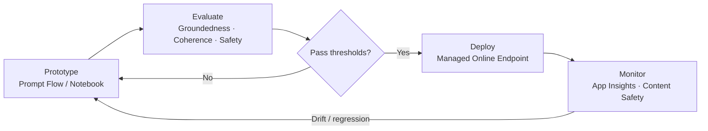

**Deployment Types:**

| Type | Description |
| --- | --- |
| Global Standard | Multi-region routing; highest throughput; default |
| Regional Standard | Single-region; data residency guarantees |
| Provisioned Throughput (PTU) | Reserved capacity; predictable latency; large-scale prod |
| Batch | Async bulk inference; cost-efficient for offline workloads |

```
Standard vs PTU:
  Standard  → pay per token, variable latency, shared pool, best for dev/variable load
  PTU       → reserved capacity ($/hr), predictable latency, best for production SLA + high volume
  Pattern   → PTU for baseline + Standard as overflow fallback (via APIM routing)
```

**Interview Points:**

- Hub vs Project — Hub is org-level governance (shared connections, security); Project is team-level workspace
- How do you ensure data doesn't leave your tenant? → Regional Standard deployment + Private Endpoints + no logging option
- Prompt Flow vs Logic Apps — Prompt Flow is LLM-workflow-native with eval; Logic Apps is enterprise orchestration with connectors
- How do you version and deploy prompts? → Prompt Flow + CI/CD via Azure DevOps or GitHub Actions

---

### 12. Logic Apps + MCP (Model Context Protocol)

**What it is:** Azure Logic Apps (Standard) can act as an **MCP Server**, exposing workflows as tools that AI agents (e.g., Azure AI Agents, Claude, GitHub Copilot) can discover and invoke dynamically.

**How it works:**

- Logic Apps Standard generates an **MCP-compliant endpoint** from your workflows automatically
- Each workflow with an HTTP trigger becomes a **tool** that MCP clients can call
- The MCP server advertises tool names, descriptions, and input schemas — AI agents use this to decide when/how to call the tool
- No custom MCP server code needed — Logic Apps handles the MCP protocol layer

**Architecture:**

```
AI Agent (Azure AI Agent / Claude / Copilot)
    │
    ▼ MCP Protocol (tool discovery + invocation)
Logic Apps Standard (MCP Server)
    │
    ▼ Connectors / Actions
SAP / Salesforce / SQL / Service Bus / Custom APIs
```

**MCP Protocol Flow:**

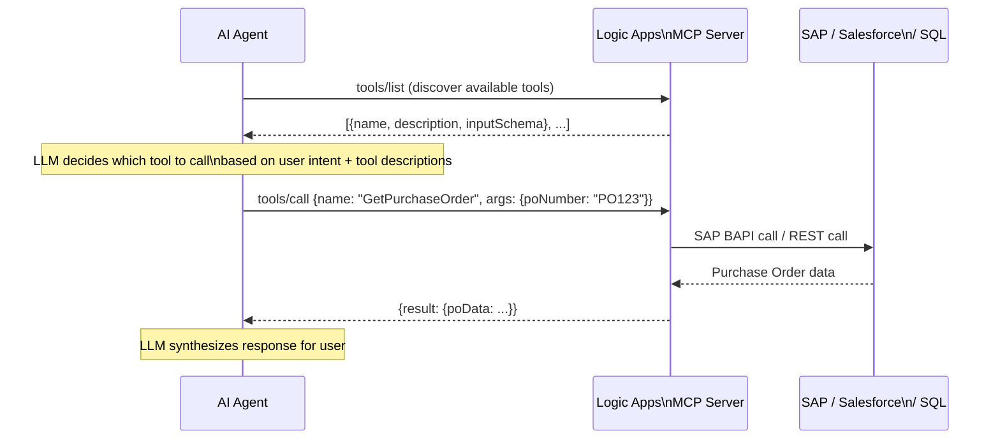

**Key Setup Steps:**

1. Create Logic Apps Standard workflow with HTTP trigger
2. Enable MCP server capability on the Logic App
3. Register the MCP endpoint URL in the AI agent's tool configuration
4. Agent discovers tools at runtime via `tools/list` MCP call
5. Agent invokes tools via `tools/call` MCP call with JSON arguments

**Interview Points:**

- Why Logic Apps as MCP server? → Reuse existing enterprise integrations as AI tools without rewriting; 400+ connectors instantly available to agents
- How does the agent know which tool to call? → MCP server returns tool schema (name + description + inputSchema); agent's LLM decides based on user intent
- How do you secure the MCP endpoint? → Managed Identity + APIM as gateway in front of Logic Apps, or AAD auth on HTTP trigger
- MCP vs REST for agents — MCP is a standard protocol; agents auto-discover tools; REST requires manual tool registration

---

### 13. Azure AI Agents & External System Communication

**What it is:** Azure AI Agent Service provides a managed runtime for building agentic AI systems that can reason, plan, and call tools to interact with external systems.

**Built-in Tools:**

| Tool | Description |
| --- | --- |
| **Code Interpreter** | Executes Python in a sandbox; file I/O, data analysis, chart generation |
| **File Search** | RAG over uploaded files using vector search |
| **Function Calling** | Call your own APIs/functions; agent decides when based on schema |
| **Bing Grounding** | Real-time web search to ground responses |
| **Azure AI Search** | RAG over your indexed enterprise data |
| **Logic Apps (MCP)** | Invoke Logic App workflows as agent tools |
| **OpenAPI tools** | Import any OpenAPI spec — agent can call those endpoints |

**Diagrams:**

**AI Agent Tool-Calling Loop:**

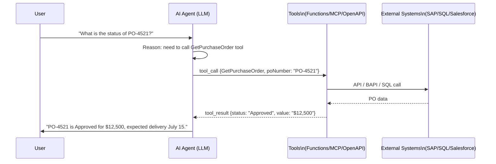

**Multi-Agent Orchestration:**

```
User Query
    │
    ▼
Orchestrator Agent  (routes based on intent)
    ├──► SAP Agent ──► SAP BAPI (stock, orders, invoices)
    ├──► Salesforce Agent ──► Salesforce API (opportunities, cases)
    ├──► HR Agent ──► HR system (leave, payroll)
    └──► Summarizer Agent ──► Aggregates results → final response
```

**Communicating with External Systems from AI Agents:**

**Pattern 1 — Function Calling (Direct API)**

- Define function schema (name, description, parameters as JSON Schema)
- Agent returns a `tool_call` when it decides to invoke the function
- Your code executes the function → returns result back to agent
- Best for: custom REST APIs, databases, internal services

**Pattern 2 — Logic Apps as MCP Tools**

- Agent calls Logic App MCP endpoint
- Logic App handles connector complexity (SAP BAPI calls, Salesforce SOQL, Dynamics CRM updates)
- Best for: enterprise systems with complex auth/transformation requirements

**Pattern 3 — OpenAPI Tool**

- Import OpenAPI/Swagger spec into agent tool configuration
- Agent calls operations directly using the spec
- Best for: well-documented external APIs (payment gateways, SaaS platforms)

**Pattern 4 — Azure AI Search + RAG**

- Index enterprise documents, SharePoint, SQL, Blob into Azure AI Search
- Agent queries the index to ground responses in your data
- Best for: document Q&A, policy lookup, knowledge base

**Pattern 5 — Event-Driven (Service Bus / Event Grid)**

- Agent action triggers a Service Bus message → downstream systems process asynchronously
- Response correlates back via session ID or callback
- Best for: long-running backend operations (order creation, ERP updates)

**Multi-Agent Communication:**

- **Agent-to-Agent:** One orchestrator agent delegates to specialist sub-agents (e.g., SAP agent, Salesforce agent)
- **Azure AI Foundry Agent SDK:** Build orchestration in Python/C# using the `azure-ai-projects` SDK
- **AutoGen / Semantic Kernel:** Frameworks for multi-agent orchestration on top of Azure OpenAI

---

### 14. Azure Integration Account

**Diagrams:**

**Integration Account — Artifact Relationships:**

```
Integration Account
├── Partners
│     ├── Partner A  (AS2 ID: PARTNERX, DUNS: 123456789)
│     └── Partner B  (AS2 ID: MYCOMPANY)
│
├── Agreements  (Partner A ↔ Partner B)
│     ├── Receive Agreement  (decode inbound X12 850)
│     └── Send Agreement     (encode outbound X12 997)
│
├── Schemas  (X12_00401_850.xsd, X12_00401_997.xsd)
├── Maps     (X12_850_to_Internal.xslt, Internal_to_X12_997.xslt)
├── Certificates  (Partner A public cert for AS2 encryption)
└── Assemblies   (CustomTransform.dll for complex map logic)
```

**EDI B2B Processing Flow:**

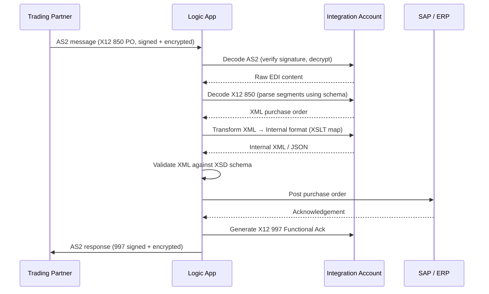

**What it is:** A cloud resource that stores B2B artifacts and enables enterprise messaging standards (EDI) in Azure Logic Apps.

**When you need it:**

- Working with EDI standards: X12, EDIFACT, AS2, RosettaNet
- XML transformation using XSLT maps
- XML validation against XSD schemas
- B2B partner onboarding and tracking

**Core Artifacts:**

| Artifact | Purpose |
| --- | --- |
| **Partners** | Trading partner definitions (business identity, AS2 ID, DUNS number) |
| **Agreements** | Rules between two partners for send/receive (X12 837, EDIFACT ORDERS, etc.) |
| **Maps** | XSLT transformations (XML→XML, XML→JSON via Liquid, flat file→XML) |
| **Schemas** | XSD schemas for message validation |
| **Certificates** | Public/private certs for AS2 signing and encryption |
| **Assemblies** | .NET assemblies for use inside maps (custom transform logic) |
| **Batch Configurations** | Define batching rules for grouping EDI messages |

**Tiers:**

| Tier | Use Case |
| --- | --- |
| Free | Dev/test only; limited artifacts |
| Basic | B2B with maps/schemas/partners; standard SLA |
| Standard | Large artifact counts, higher throughput |

**How Integration Account links to Logic Apps:**

- Link one Integration Account to a Logic App (Consumption) in the same region
- Logic Apps Standard: reference Integration Account artifacts via connection — no direct link required
- Access maps/schemas via built-in `Transform XML`, `Validate XML`, `Decode X12`, `Encode AS2` actions

**Common EDI Flow (X12 Purchase Order):**

```
Trading Partner → AS2/SFTP → Logic App
    → Decode X12 850 (Integration Account schema)
    → Transform XML (XSLT map → internal format)
    → Validate XML (XSD schema)
    → Post to Service Bus / SAP / ERP
    → Generate 997 Functional Acknowledgement → return to partner
```

**Interview Points:**

- When is an Integration Account mandatory? → Any Logic App using AS2, X12, EDIFACT encode/decode actions, or XML Transform/Validate
- Free vs Basic tier difference? → Free has no SLA, artifact limits; use Basic/Standard for production
- How do you handle large XSLT maps? → Upload as assembly to Integration Account; call from map
- How do you test EDI flows locally? → Logic Apps Standard + VS Code extension; Integration Account linked via connection string
- Difference between Integration Account map and Liquid template? → XSLT map for XML transformation; Liquid template for JSON transformation in Logic Apps

---

### 15. Azure OpenAI — Integration Patterns

**Diagrams:**

**APIM as AI Gateway — Multi-Deployment Load Balancing:**

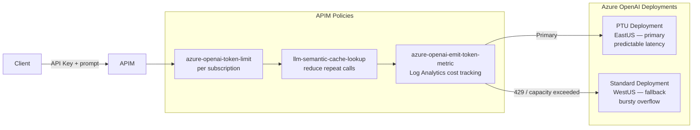

**RAG — Indexing Pipeline:**

```
Raw Documents (PDF, DOCX, HTML)
    │
    ▼
Azure Document Intelligence  (OCR, layout extraction, table parsing)
    │
    ▼
Chunking  (512–1024 tokens, sliding window with 10% overlap)
    │
    ▼
Azure OpenAI Embeddings  (text-embedding-3-large → 3072-dim vectors)
    │
    ▼
Azure AI Search Index
    ├── Vector field  (HNSW index for similarity search)
    ├── Keyword fields (BM25 full-text search)
    └── Metadata fields (source, date, category — for filtering)
```

**RAG — Query Pipeline:**

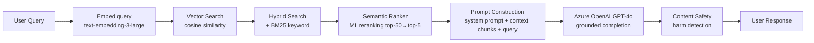

**Hybrid Search — How It Works:**

```
Query: "What is the refund policy for digital products?"

Vector Search result (semantic similarity):
  Chunk A: "Digital purchases are non-refundable unless..." (score: 0.92)
  Chunk B: "Refunds are processed within 5-7 business days..." (score: 0.88)

BM25 Keyword result (exact term match):
  Chunk B: "Refunds are processed..." (score: 24.1)
  Chunk C: "To request a refund, contact..." (score: 19.8)

Reciprocal Rank Fusion (RRF) combines both → Semantic Ranker re-ranks top results
Final top-3 chunks used as context for LLM
```

**Key integration scenarios for enterprise architects:**

**APIM as AI Gateway:**

- Route all AI traffic through APIM for centralized auth, rate limiting, cost tracking, and load balancing across multiple OpenAI deployments
- APIM policy: `azure-openai-token-limit`, `azure-openai-emit-token-metric`, `llm-semantic-cache-lookup`
- Pattern: APIM → multiple Azure OpenAI endpoints (PTU + fallback to Standard)

**Semantic Caching:**

- APIM built-in semantic cache for Azure OpenAI — cache responses for semantically similar prompts
- Reduces token consumption and latency for repeated/similar queries

**RAG Architecture on Azure:**

```
User Query
    → Azure AI Search (vector + keyword hybrid search)
    → Top-K chunks retrieved
    → Prompt constructed with context + system prompt
    → Azure OpenAI (GPT-4o) generates grounded response
    → Response returned to user
```

- **Indexing pipeline:** Document → Document Intelligence (OCR/layout) → Chunking → Embedding (text-embedding-3-large) → AI Search index
- **Query pipeline:** User query → Embedding → Vector search → Reranking → LLM

**Azure AI Search Key Concepts for RAG:**

- **Vector search:** Cosine similarity search over embedding vectors (HNSW algorithm)
- **Hybrid search:** Combine vector + BM25 keyword search
- **Semantic ranker:** ML-based reranking of top results for relevance
- **Integrated vectorization:** Auto-chunk and embed documents during indexing via skillsets
- **Index projections:** Store chunks with parent document references

**Interview Points:**

- How do you prevent hallucinations? → RAG with grounding, temperature=0, system prompt constraints, Content Safety
- How do you handle token limits? → Chunking strategy (512–1024 tokens), sliding window overlap, summarization of long docs
- PTU vs Standard deployment — when PTU? → Predictable high-volume production workloads; Standard for variable/bursty load
- How do you track AI costs per team/project? → APIM token metrics → Log Analytics; tag deployments by cost center

---

## Azure Networking Topics

### 16. Virtual Network (VNet)

**Diagrams:**

**VNet — Address Space and Subnet Layout:**

```
VNet: 10.0.0.0/16  (65,536 IPs)
│
├── Subnet: aks-subnet        10.0.0.0/22    (1022 usable — AKS nodes + pods)
├── Subnet: integration       10.0.4.0/24    (251 usable — Logic Apps, Functions)
│     [Delegated: Microsoft.Logic/workflows]
├── Subnet: apim              10.0.5.0/24    (251 usable — APIM internal)
├── Subnet: private-endpoints 10.0.6.0/24    (251 usable — Service Bus, KV, SQL PEs)
├── Subnet: gateway-subnet    10.0.7.0/27    (27 usable — VPN/ExpressRoute GW)
└── Subnet: AzureFirewallSubnet 10.0.8.0/26 (59 usable — Azure Firewall, MUST be /26)

Azure reserves 5 IPs per subnet: .0 (network), .1 (gateway), .2-.3 (DNS), .255 (broadcast)
```

**Hub-Spoke VNet Topology:**

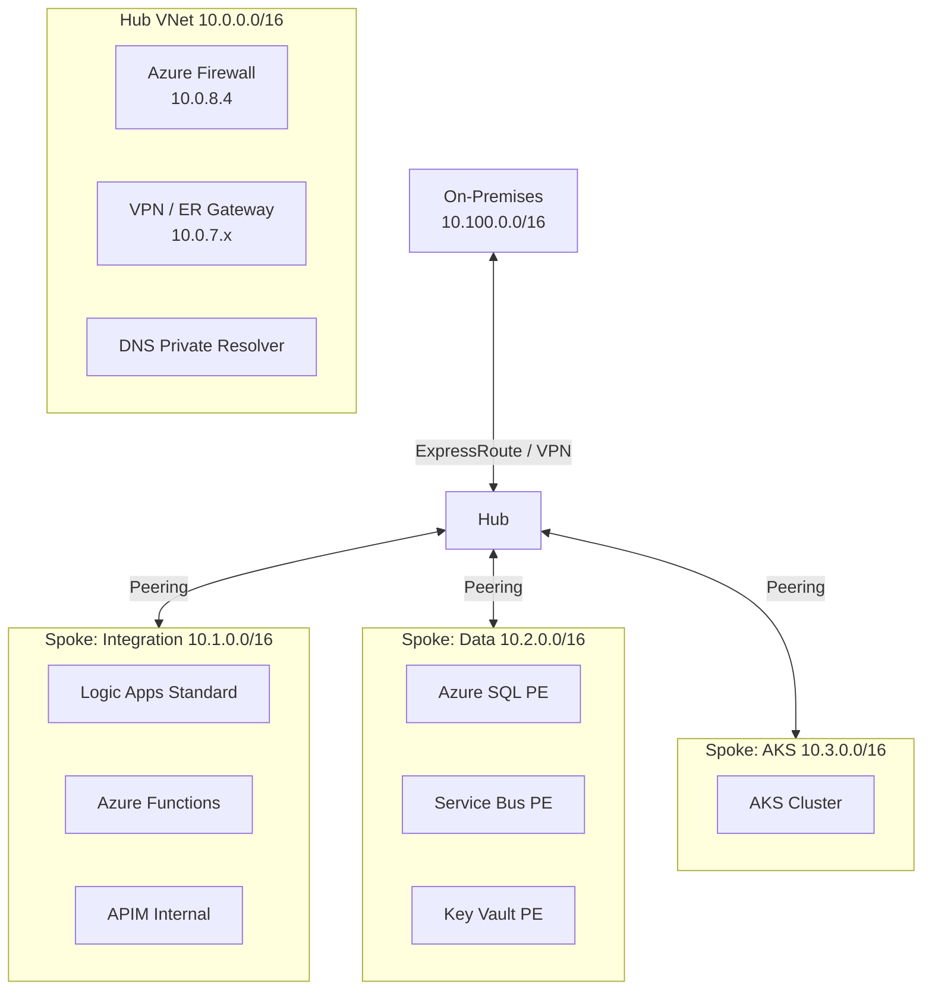

**What it is:** Fundamental private network boundary in Azure; logically isolated network you control.

**Key Concepts:**

- **Address Space:** CIDR block assigned at creation (e.g., `10.0.0.0/16`); can add additional ranges
- **Subnets:** Subdivisions of the VNet address space; resources are deployed into subnets
- **Regions:** A VNet lives in one region; cross-region connectivity via Peering or VPN
- **Subscription boundary:** VNet is scoped to one subscription; cross-subscription via Peering

**Subnet Delegation:**

- Assign a subnet exclusively to a service (e.g., `Microsoft.Web/serverFarms` for App Service, `Microsoft.Logic/workflows` for Logic Apps Standard)
- Required for VNet Integration of PaaS services

**Interview Points:**

- Can you resize a VNet address space? → Yes, you can add ranges; shrinking is not supported if IPs are in use
- Can two VNets have overlapping address spaces and be peered? → No; peered VNets must have non-overlapping CIDRs

---

### 17. Network Security Groups (NSG)

**Diagrams:**

**NSG Rule Evaluation Order:**

```
Inbound traffic to a NIC in a Subnet:
  1. Subnet NSG inbound rules evaluated first  (lowest priority number wins)
  2. NIC NSG inbound rules evaluated second
  → Both must ALLOW for traffic to reach the resource

Outbound traffic from a NIC in a Subnet:
  1. NIC NSG outbound rules evaluated first
  2. Subnet NSG outbound rules evaluated second
  → Both must ALLOW for traffic to leave

Default rules (always present, cannot delete):
  Priority 65000: AllowVNetInBound   (VNet to VNet allowed)
  Priority 65001: AllowAzureLoadBalancerInBound
  Priority 65500: DenyAllInBound     ← everything else blocked
```

**NSG Rule Structure:**

```
Rule: Allow-ServiceBus-Outbound
  Priority:    200
  Direction:   Outbound
  Source:      VirtualNetwork  (or specific subnet CIDR)
  Destination: ServiceTag → AzureServiceBus
  Port:        443, 5671, 5672  (HTTPS + AMQP)
  Protocol:    TCP
  Action:      Allow
```

**What it is:** Stateful Layer-4 firewall rules applied to subnets or individual NICs.

**Key Concepts:**

- **Inbound / Outbound rules:** Priority 100–4096; lower number = higher priority; default deny-all at 65500
- **Source/Destination:** IP, CIDR, Service Tag, or Application Security Group (ASG)
- **Service Tags:** Named groups of Microsoft-managed IP ranges (e.g., `AzureCloud`, `Storage`, `Sql`, `AppService`, `AzureLoadBalancer`)
- **ASG (Application Security Group):** Group VMs logically; use ASG as source/destination instead of IP lists
- **Flow Logs:** NSG flow logs → Storage Account or Log Analytics for traffic analysis (via Network Watcher)
- **Effective Security Rules:** View merged rules applied to a NIC at runtime — critical for troubleshooting

**Common Service Tag Rules for Integration:**

| Service Tag | Used for |
| --- | --- |
| `AzureServiceBus` | Allow Service Bus outbound |
| `AzureEventHub` | Allow Event Hub outbound |
| `AppService` | Logic Apps / Function App management traffic |
| `AzureMonitor` | Diagnostic logs, Application Insights |
| `AzureLoadBalancer` | Required health probe inbound rule |

**Interview Points:**

- NSG vs Azure Firewall → NSG is L4 (IP/port); Azure Firewall is L7 (FQDN, TLS inspection, threat intelligence)
- NSG on subnet vs NIC — subnet NSG applies first on inbound; NIC NSG applies first on outbound
- How do you troubleshoot connectivity? → NSG Flow Logs + Network Watcher IP Flow Verify + Effective Security Rules

---

### 18. Private Endpoints & Private Link

**Diagrams:**

**Private Endpoint — Network Flow:**

```
Your VNet (10.0.0.0/16)
│
├── Subnet: private-endpoints  10.0.6.0/24
│     └── Private Endpoint NIC  10.0.6.5  ──────────────────────────►  Service Bus Namespace
│           (private IP in your subnet)        Microsoft backbone         (PaaS resource)
│                                              (never public internet)
│
└── Subnet: integration  10.0.4.0/24
      └── Logic App ──► DNS: mybus.servicebus.windows.net
                              │
                    Private DNS Zone (linked to VNet)
                    privatelink.servicebus.windows.net
                              │ resolves to 10.0.6.5
                              ▼
                    Traffic goes to 10.0.6.5 → PE → Service Bus
                    (never hits public IP)
```

**DNS Resolution — Correct vs Broken:**

```
CORRECT (Private DNS Zone linked):
  Logic App → resolves mybus.servicebus.windows.net
           → Private DNS Zone → 10.0.6.5 (private IP) ✓
           → Traffic stays in VNet

BROKEN (No Private DNS Zone / wrong zone):
  Logic App → resolves mybus.servicebus.windows.net
           → Azure Public DNS → 52.239.x.x (public IP) ✗
           → Hits public firewall → BLOCKED (public access disabled)
           → ConnectionRefused / timeout
```

**What it is:** Brings a PaaS service (Storage, Service Bus, APIM, SQL, Key Vault, etc.) into your VNet via a private IP — traffic never leaves the Microsoft backbone.

**Key Concepts:**

- **Private Endpoint:** A NIC with a private IP in your subnet, mapped to a specific PaaS resource
- **Private Link Service:** Expose your own service privately to other VNets/tenants
- **DNS Resolution:** Critical — must configure Private DNS Zones so the service FQDN resolves to the private IP
  - e.g., `servicebus.windows.net` → Private DNS Zone `privatelink.servicebus.windows.net`
  - Without correct DNS, client resolves to public IP and connection fails even with private endpoint
- **Disable Public Access:** After creating private endpoint, set `publicNetworkAccess: Disabled` on the resource
- **NSG on Private Endpoint subnet:** NSG policies for private endpoints must be explicitly enabled (`privateEndpointNetworkPolicies: Enabled`)

**Private DNS Zone Flow:**

```
Resource (e.g., Logic App / Function) in VNet
    → DNS query: mybus.servicebus.windows.net
    → Private DNS Zone linked to VNet resolves to: 10.0.1.5 (private IP)
    → Traffic flows over VNet — no public internet
```

**Services commonly protected with Private Endpoints:**

- Azure Service Bus, Event Hub, Storage, Key Vault, SQL, Cosmos DB, APIM (internal mode), AI Foundry, Azure OpenAI

**Interview Points:**

- Private Endpoint vs Service Endpoint → Private Endpoint assigns private IP in your VNet; Service Endpoint just routes traffic over backbone but resource still has public IP
- Can you use Private Endpoint across subscriptions/tenants? → Yes, with manual approval on the private endpoint connection
- What breaks if DNS is misconfigured? → Client resolves public IP, hits public firewall, connection refused (common gotcha)

---

### 19. Service Endpoints

**What it is:** Extends VNet identity to Azure services over the Microsoft backbone; simpler but less isolated than Private Endpoints.

**Key Concepts:**

- Enabled per subnet per service (e.g., `Microsoft.Storage`, `Microsoft.Sql`, `Microsoft.ServiceBus`)
- Service firewall rules can allow traffic from specific subnets only
- Resource still has a public IP; traffic routes optimally but is not private
- No DNS changes required — unlike Private Endpoints

**When to use Service Endpoints vs Private Endpoints:**

|  | Service Endpoint | Private Endpoint |
| --- | --- | --- |
| Resource has private IP | No | Yes |
| Works across regions | No (same region) | Yes |
| DNS changes needed | No | Yes |
| Cost | Free | Per endpoint + data processing |
| Recommended for new workloads | No | Yes |

---

### 20. VNet Integration (Outbound — PaaS Services)

**Diagrams:**

**VNet Integration (Outbound) vs Private Endpoint (Inbound):**

```
                    ┌──────────────────────────────────────────────┐
                    │           Your VNet                          │
                    │                                              │
                    │  ┌──────────────────────────────────────┐   │
                    │  │ Delegated Subnet (integration)        │   │
  Internet ────────►│  │  Logic App / Function App             │   │
  (inbound via PE)  │  │  [VNet Integration outbound]         │   │
                    │  └─────────────┬────────────────────────┘   │
                    │                │ Outbound calls to VNet      │
                    │                ▼                             │
                    │  ┌─────────────────────────────────────┐    │
                    │  │ Private Endpoints subnet             │    │
                    │  │  Service Bus PE  10.0.6.4            │    │
                    │  │  Key Vault PE    10.0.6.5            │    │
                    │  │  SQL PE          10.0.6.6            │    │
                    │  └─────────────────────────────────────┘    │
                    └──────────────────────────────────────────────┘

VNet Integration = Logic App CAN CALL OUT into the VNet  (egress)
Private Endpoint = VNet resources CAN CALL IN to Logic App (ingress)
Both are needed for a fully private Logic App.
```

**What it is:** Allows PaaS services (Azure Functions, App Service, Logic Apps Standard, APIM) to make outbound calls into a VNet — to reach privately networked resources.

**Key Concepts:**

- **Regional VNet Integration:** Service connects to a dedicated subnet in the same-region VNet; subnet must be delegated; `/26` or larger recommended
- **Outbound only:** VNet Integration gives the PaaS service outbound access to VNet resources; it does NOT make the service accessible from the VNet (use Private Endpoint for inbound)
- **Route All Traffic:** Option to route all outbound internet traffic through the VNet (for forced tunneling via Azure Firewall or NVA)
- **DNS in VNet:** Service uses VNet DNS resolver — enables resolution of private DNS zones

**Integration-specific notes:**

- **Logic Apps Standard:** Supports VNet Integration via subnet delegation (`Microsoft.Logic/workflows`) — enables calling on-premises via Private Link or Express Route
- **Azure Functions Premium:** Supports VNet Integration — required to call resources in private VNets
- **APIM:** Premium/Developer tier supports full VNet injection (internal or external mode)

**Interview Points:**

- Difference between VNet Integration and Private Endpoint for a Function App?
  - VNet Integration = Function App calls outbound into VNet
  - Private Endpoint on Function App = inbound calls to Function App from VNet privately
- Can you use VNet Integration with Consumption plan? → No; requires Premium plan for Functions / Standard for Logic Apps

---

### 21. APIM Networking Modes

**What it is:** APIM can be deployed in different VNet modes depending on isolation requirements.

| Mode | Description | Use Case |
| --- | --- | --- |
| **None (Public)** | APIM has public IP; no VNet | Dev/test, simple scenarios |
| **External VNet** | APIM injected into VNet; gateway public; management public | APIs accessible from internet; backends private |
| **Internal VNet** | APIM injected into VNet; gateway private IP only | Full internal; no public exposure; front with App Gateway |
| **Workspace (new)** | Lightweight isolation within a single APIM instance | Multi-team isolation without separate APIM instances |

**Common Enterprise Pattern — Internal APIM + Application Gateway:**

```
Internet
    → Application Gateway (WAF) — public IP, TLS termination
    → APIM (Internal VNet) — private IP, policy enforcement
    → Backend APIs (Functions / App Service / AKS) — private VNet
```

- Application Gateway handles public TLS + WAF rules
- APIM handles API policies, auth, rate limiting
- Backends are fully private

**Interview Points:**

- Why put App Gateway in front of Internal APIM? → App Gateway provides WAF + public entry point; APIM stays private
- What changes when you move APIM to Internal mode? → Developer Portal and Gateway get private IPs; need private DNS + self-hosted gateway for external consumers

---

### 22. Azure Firewall

**Diagrams:**

**Rule Types — Priority Order:**

```
Traffic hits Azure Firewall:

1. DNAT Rules       → translate public IP to internal (inbound NAT)
2. Network Rules    → L4 IP/port/protocol allow/deny
3. Application Rules→ L7 FQDN / HTTP/HTTPS filtering
4. Threat Intel     → block known malicious IPs (implicit deny)

IMPORTANT: First matching rule wins. Order within each collection matters.
```

**Hub-Spoke with Forced Tunneling via UDR:**

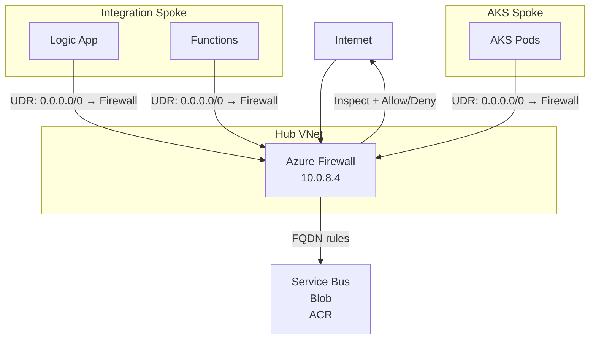

**NSG vs Azure Firewall:**

```
┌─────────────────┬──────────────────────────────┬──────────────────────────────┐
│                 │ NSG                           │ Azure Firewall               │
├─────────────────┼──────────────────────────────┼──────────────────────────────┤
│ Layer           │ L4 (IP, port, protocol)       │ L7 (FQDN, HTTP path, TLS)    │
│ Scope           │ Per subnet / NIC              │ Centralized hub              │
│ FQDN filtering  │ No                            │ Yes                          │
│ Threat Intel    │ No                            │ Yes                          │
│ TLS Inspection  │ No                            │ Yes (Premium)                │
│ Cost            │ Free                          │ Per deployment + data        │
│ Use together?   │ Yes — NSG for micro-seg       │ Firewall for centralized L7  │
└─────────────────┴──────────────────────────────┴──────────────────────────────┘
```

**What it is:** Managed stateful L7 network firewall; centralized traffic inspection across VNets.

**Key Concepts:**

- **FQDN-based rules:** Allow/deny traffic by domain name (e.g., `*.servicebus.windows.net`) — not just IP
- **Application rules:** HTTP/HTTPS/MSSQL filtering by FQDN and tags
- **Network rules:** IP/port/protocol filtering (like NSG but centralized)
- **DNAT rules:** Translate inbound public IP to internal private IP (inbound NAT)
- **Threat Intelligence:** Block known malicious IPs/domains (alert or deny mode)
- **TLS Inspection:** Decrypt and inspect HTTPS traffic (Premium SKU)
- **Azure Firewall Policy:** Reusable rule collections; supports hierarchy (base + child policies)
- **Forced Tunneling:** Route all outbound traffic through Firewall via UDR (User Defined Routes)

**Hub-Spoke + Firewall Pattern:**

```
Hub VNet (Azure Firewall + VPN/ExpressRoute Gateway)
    ├── Spoke VNet 1 (Integration workloads)
    ├── Spoke VNet 2 (App workloads)
    └── Spoke VNet 3 (Data workloads)
All spoke-to-spoke and spoke-to-internet traffic routed through Hub Firewall via UDR
```

---

### 23. VNet Peering

**Diagrams:**

**Non-Transitive Peering — The Key Gotcha:**

```
VNet A ◄──── Peered ────► VNet B (Hub) ◄──── Peered ────► VNet C

A can talk to B ✓
C can talk to B ✓
A CANNOT talk to C ✗  ← peering is NOT transitive

Solution: Route A→C traffic through Azure Firewall in Hub (UDR)
  A → UDR → Firewall in B → UDR → C
```

**Gateway Transit — Spokes Using Hub Gateway:**

```
On-Premises
    │
    │ ExpressRoute / VPN
    ▼
Hub VNet
  └── Gateway  [Allow gateway transit = true]
        ▲              ▲
        │              │
  Spoke A          Spoke B
  [Use remote      [Use remote
   gateways=true]   gateways=true]

Spoke A and B reach on-premises via Hub's gateway without their own gateway
```

**What it is:** Low-latency, high-bandwidth private connectivity between two VNets over Microsoft backbone (no gateway, no encryption overhead).

**Key Concepts:**

- **Regional Peering:** Same region; sub-millisecond latency
- **Global Peering:** Cross-region; traffic stays on Microsoft backbone
- **Non-transitive:** Peering is not transitive — VNet A ↔ B and B ↔ C does NOT give A ↔ C connectivity (use Azure Firewall or NVA for transit)
- **Peering settings:**
  - `Allow forwarded traffic`: Accept traffic originating outside the peered VNet
  - `Allow gateway transit`: Hub VNet allows spokes to use its VPN/ExpressRoute gateway
  - `Use remote gateways`: Spoke uses hub's gateway for on-premises connectivity
- **Address spaces must not overlap**

**Interview Points:**

- How do spokes communicate in hub-spoke? → Traffic goes Spoke → Hub Firewall/NVA → Spoke (UDR forces this path)
- Can you peer VNets across tenants? → Yes, using remote VNet resource ID + cross-tenant peering approval

---

### 24. ExpressRoute & VPN Gateway

**Diagrams:**

**Hybrid Connectivity Options:**

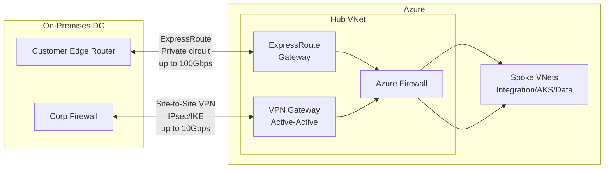

**ExpressRoute Peering Types:**

```
ExpressRoute Circuit
│
├── Private Peering  → Azure VNets (IaaS + VNet-injected PaaS)
│                      your data, your VMs, your services
│
└── Microsoft Peering → Azure Public Services (Storage, SQL, O365, Dynamics)
                         + Your own Public IPs (BGP advertisement)
```

**VPN Gateway — Failover Coexistence:**

```
Primary path:  On-Prem ──► ExpressRoute (preferred, lower latency)
Failover path: On-Prem ──► VPN Gateway (internet-based backup)

BGP priorities: ExpressRoute routes have higher local preference
On ER failure: traffic automatically shifts to VPN tunnel
```

**ExpressRoute:**

- **Private dedicated circuit** from on-premises to Azure via a connectivity provider
- Bypasses public internet; consistent latency; up to 100 Gbps
- **Private Peering:** Connect to Azure VNets (IaaS/PaaS in VNet)
- **Microsoft Peering:** Connect to Azure public services (Storage, SQL, Office 365) over dedicated circuit
- **ExpressRoute Global Reach:** Connect two on-premises sites via Azure backbone
- **Availability:** Zone-redundant ExpressRoute gateway for high availability

**VPN Gateway:**

- **Site-to-Site (S2S):** Connect on-premises network to Azure VNet over IPsec/IKE tunnel
- **Point-to-Site (P2S):** Individual client devices → Azure VNet (remote workers)
- **VNet-to-VNet:** Connect VNets across regions via encrypted tunnel (alternative to Global Peering when encryption required)
- **Active-Active:** Two VPN gateway instances for redundancy
- **BGP support:** Dynamic routing between on-premises and Azure

|  | ExpressRoute | VPN Gateway |
| --- | --- | --- |
| Medium | Private circuit | Public internet (encrypted) |
| Bandwidth | Up to 100 Gbps | Up to 10 Gbps |
| Latency | Consistent, low | Variable |
| Cost | Higher | Lower |
| Use case | Enterprise prod | Backup / lower volume |

---

### 25. Azure DNS & Private DNS Zones

**Diagrams:**

**Bidirectional DNS — DNS Private Resolver:**

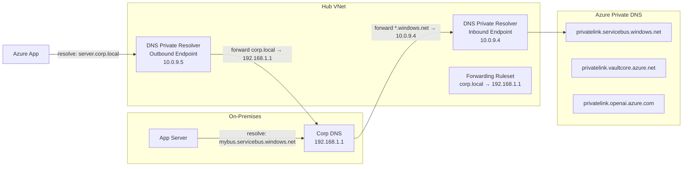

**Private DNS Zone — Hub-Spoke Centralization:**

```
Hub VNet
  └── Private DNS Zones (all privatelink.* zones hosted here)
        ├── privatelink.servicebus.windows.net  → linked to Hub + all Spokes
        ├── privatelink.vaultcore.azure.net      → linked to Hub + all Spokes
        ├── privatelink.openai.azure.com          → linked to Hub + all Spokes
        └── privatelink.cognitiveservices.azure.com

Spoke VNets set DNS to Hub's DNS Private Resolver inbound endpoint
→ All private DNS queries centrally resolved from Hub
```

**Azure DNS (Public):**

- Host public DNS zones in Azure; integrated with Azure RBAC and monitoring
- Supports A, AAAA, CNAME, MX, TXT, NS, SOA, SRV, CAA, PTR records
- Anycast network for low-latency resolution globally

**Private DNS Zones:**

- DNS resolution within VNets — not accessible from public internet
- **VNet Link:** Link a Private DNS Zone to one or more VNets (with or without auto-registration)
- **Auto-registration:** Automatically creates DNS records for VMs in linked VNet
- **Critical for Private Endpoints:** Each PaaS service has a corresponding `privatelink.*` zone
  - `privatelink.servicebus.windows.net`
  - `privatelink.vaultcore.azure.net`
  - `privatelink.openai.azure.com`
  - `privatelink.cognitiveservices.azure.com`

**DNS Resolution in Hub-Spoke:**

- Centralize Private DNS Zones in Hub VNet; link to all spoke VNets
- Or use Azure DNS Private Resolver for conditional forwarding between on-premises and Azure DNS

**Azure DNS Private Resolver:**

- Replaces custom DNS VMs; managed, scalable DNS forwarding
- **Inbound endpoint:** On-premises → Azure DNS (resolve Azure private DNS from on-prem)
- **Outbound endpoint:** Azure → on-premises DNS (resolve on-prem hostnames from Azure)
- **Ruleset:** Conditional forwarding rules (e.g., `corp.local` → on-prem DNS IP)

---

### 26. Application Gateway & WAF

**Diagrams:**

**Application Gateway Request Flow:**

```
Client (HTTPS)
    │
    ▼
[Listener]  frontend IP + port 443
    │ TLS termination (SSL offloading)
    ▼
[WAF]  OWASP CRS rules evaluated
    │ block malicious requests
    ▼
[Routing Rule]  match listener → backend rule
    │
    ├── Path: /api/*  → Backend Pool A (Azure Functions / APIM)
    ├── Path: /web/*  → Backend Pool B (App Service)
    └── Path: /static → Backend Pool C (Storage Static Site)
    │
    ▼
[Backend HTTP Settings]  probe + timeout + cookie affinity
    │ (optional: re-encrypt for end-to-end TLS)
    ▼
Backend Servers (pods, VMs, PaaS)
```

**App Gateway vs Front Door vs Traffic Manager:**

```
┌──────────────────┬────────────────────┬─────────────────────┬─────────────────────┐
│                  │  App Gateway       │  Azure Front Door   │  Traffic Manager    │
├──────────────────┼────────────────────┼─────────────────────┼─────────────────────┤
│ Scope            │ Regional (single)  │ Global              │ Global (DNS)        │
│ Layer            │ L7                 │ L7 + CDN            │ DNS (L4)            │
│ WAF              │ Yes                │ Yes (Premium)        │ No                  │
│ SSL termination  │ Yes                │ Yes                 │ No                  │
│ Path routing     │ Yes                │ Yes                 │ No                  │
│ Use case         │ Single-region API  │ Global CDN+WAF      │ DNS failover/geo    │
│                  │ gateway            │ multi-region apps   │ routing             │
└──────────────────┴────────────────────┴─────────────────────┴─────────────────────┘
```

**What it is:** Layer-7 load balancer with SSL termination, URL-based routing, and Web Application Firewall.

**Key Concepts:**

- **Listeners:** HTTP/HTTPS listeners (Basic or Multi-site for host-based routing)
- **Backend Pools:** VMs, VM Scale Sets, App Service, AKS, IP addresses
- **Rules:** Basic (single backend) or Path-based routing (`/api/*` → backend A, `/web/*` → backend B)
- **WAF (Web Application Firewall):** OWASP Core Rule Set (CRS 3.2); Detection or Prevention mode; custom rules
- **SSL Offloading:** Terminate TLS at App Gateway; backend communication can be HTTP or re-encrypted HTTPS
- **End-to-End TLS:** App Gateway re-encrypts to backend with backend certificate
- **Autoscaling:** Scale units adjust based on traffic (v2 SKU)
- **Private Frontend:** App Gateway can have private IP frontend for internal routing

**App Gateway vs Azure Front Door vs Traffic Manager:**

|  | App Gateway | Azure Front Door | Traffic Manager |
| --- | --- | --- | --- |
| Layer | L7 (regional) | L7 (global) | L4 DNS-based (global) |
| WAF | Yes | Yes | No |
| SSL Termination | Yes | Yes | No |
| Routing | URL/host-based | URL/latency/geo | DNS-based priority/weighted |
| Use Case | Single-region ingress | Global CDN + WAF + routing | DNS failover / geo-routing |

---

### 27. Networking for Integration Services — Summary

| Service | Inbound Private Access | Outbound to VNet | VNet Injection |
| --- | --- | --- | --- |
| **Logic Apps Standard** | Private Endpoint | VNet Integration (subnet delegation) | No |
| **Azure Functions Premium** | Private Endpoint | VNet Integration | No |
| **APIM** | Private Endpoint (Dev/Premium) | Via VNet (Internal/External mode) | Yes (Premium/Developer) |
| **Service Bus** | Private Endpoint | — | No |
| **Event Hub** | Private Endpoint | — | No |
| **Azure OpenAI** | Private Endpoint | — | No |
| **Azure AI Search** | Private Endpoint | — | No |
| **Key Vault** | Private Endpoint | — | No |
| **Storage** | Private Endpoint / Service Endpoint | — | No |

**Key interview scenario — fully private integration architecture:**

```
On-Premises
    → ExpressRoute / VPN Gateway → Hub VNet
    → Azure Firewall (traffic inspection + routing)
    → Spoke VNet (Integration)
        → APIM (Internal VNet mode)
        → Logic Apps Standard (VNet Integration outbound, Private Endpoint inbound)
        → Service Bus (Private Endpoint)
        → Key Vault (Private Endpoint)
        → Azure OpenAI (Private Endpoint)
    All DNS → Private DNS Zones linked to Hub VNet
    All PaaS → publicNetworkAccess: Disabled
```

---

## Azure Kubernetes Service (AKS) & Pod Topics

### 28. AKS Architecture Overview

**Diagrams:**

**AKS Control Plane vs Data Plane:**

```
┌───────────────────────────────────────────────────────────────────┐
│  CONTROL PLANE  (Microsoft managed — no direct access)            │
│                                                                   │
│  kube-apiserver ◄──── kubectl / CI-CD ────► etcd (cluster state) │
│       │                                                           │
│  kube-scheduler ──── assigns pods to nodes                       │
│  kube-controller-manager ──── reconciliation loops               │
│  cloud-controller-manager ──── Azure LB / Disk / Route provisioning│
└─────────────────────────────┬─────────────────────────────────────┘
                              │ kubelet communicates with API server
┌─────────────────────────────▼─────────────────────────────────────┐
│  DATA PLANE  (your responsibility)                                │
│                                                                   │
│  System Node Pool              User Node Pool(s)                  │
│  ┌────────────────────┐        ┌──────────────────────────────┐   │
│  │ CoreDNS            │        │ Pod A  Pod B  Pod C  Pod D   │   │
│  │ metrics-server     │        │                              │   │
│  │ konnectivity       │        │ kubelet + containerd         │   │
│  │ (tainted:          │        │ kube-proxy                   │   │
│  │  CriticalAddonsOnly│        └──────────────────────────────┘   │
│  └────────────────────┘                                           │
└───────────────────────────────────────────────────────────────────┘
```

**Pod Scheduling Flow:**

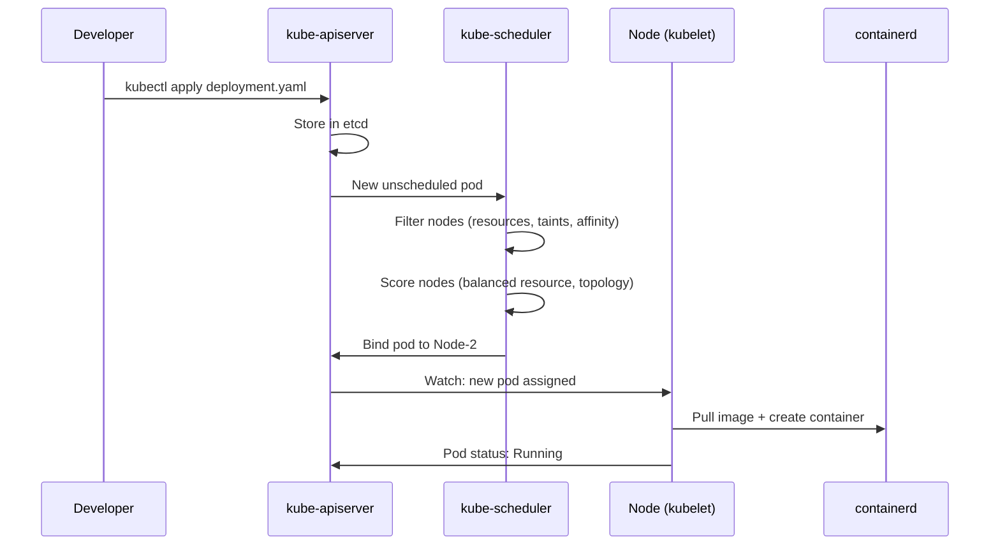

**What it is:** Managed Kubernetes service on Azure — Microsoft manages the control plane; you manage node pools and workloads.

**Control Plane (managed by Microsoft):**

- **kube-apiserver:** Entry point for all Kubernetes API calls (kubectl, controllers, dashboards)
- **etcd:** Distributed key-value store; holds all cluster state; Microsoft manages HA and backup
- **kube-scheduler:** Assigns pods to nodes based on resource requests, affinity, taints/tolerations
- **kube-controller-manager:** Runs reconciliation loops (ReplicaSet, Node, Endpoint controllers)
- **cloud-controller-manager:** Azure-specific — provisions Load Balancers, disks, routes

**Data Plane (your responsibility):**

- **Node Pools:** Groups of VMs running kubelet + container runtime (containerd)
- **System Node Pool:** Runs critical cluster add-ons (CoreDNS, metrics-server, konnectivity); tainted to avoid user workloads
- **User Node Pool:** Runs application workloads; can have multiple pools with different VM SKUs
- **kubelet:** Agent on each node; communicates with API server; manages pod lifecycle
- **kube-proxy:** Manages iptables/IPVS rules for Service routing on each node

**Interview Points:**

- Who manages etcd in AKS? → Microsoft; you cannot access it directly
- What happens when the control plane goes down? → Running pods continue; no new scheduling, no config changes
- System vs User node pool — can you remove the system pool? → No; at least one system node pool required

---

### 29. Pods — Deep Dive

**Diagrams:**

**Pod Lifecycle State Machine:**

```mermaid
stateDiagram-v2
    [*] --> Pending: kubectl apply
    Pending --> Running: Image pulled, container started
    Pending --> Failed: Image pull error / OOMKill at start
    Running --> Succeeded: All containers exit 0 (Job complete)
    Running --> Failed: Container exits non-zero > maxRestarts
    Running --> Running: CrashLoopBackOff (restart with backoff)
    Running --> Unknown: Node loses contact with API server
    Succeeded --> [*]
    Failed --> [*]
```

**Multi-Container Pod Patterns:**

```
SIDECAR pattern:                    INIT CONTAINER pattern:
┌──────────────────────────┐        Init-1 ──► Init-2 ──► [Main Container starts]
│ Pod                      │        (run to completion sequentially before main)
│  ┌──────────┐ ┌────────┐ │
│  │Main App  │ │Sidecar │ │        AMBASSADOR pattern:
│  │(business)│ │(log    │ │        ┌──────────────────────────────┐
│  │          │ │ agent) │ │        │  Main App → Ambassador Proxy │
│  └──────────┘ └────────┘ │        │  (handles auth, routing,     │
│  Shared: network + volumes│        │   circuit breaking locally)  │
└──────────────────────────┘        └──────────────────────────────┘
```

**QoS Classes — Eviction Priority:**

```
┌─────────────────────────────────────────────────────────────┐
│ GUARANTEED (requests == limits, both set)   ← Last evicted  │
│   cpu request: 500m  cpu limit: 500m                        │
│   mem request: 256Mi mem limit: 256Mi                       │
├─────────────────────────────────────────────────────────────┤
│ BURSTABLE  (requests < limits)              ← Mid priority  │
│   cpu request: 100m  cpu limit: 500m                        │
│   mem request: 128Mi mem limit: 256Mi                       │
├─────────────────────────────────────────────────────────────┤
│ BESTEFFORT (no requests or limits set)      ← First evicted │
│   (not recommended for production)                          │
└─────────────────────────────────────────────────────────────┘
```

**What it is:** Smallest deployable unit in Kubernetes; one or more containers sharing network namespace and storage.

**Pod Lifecycle:**

```
Pending → Running → Succeeded / Failed / Unknown
```

- **Pending:** Scheduled but containers not yet started (image pull, resource wait)
- **Running:** At least one container running
- **Succeeded:** All containers completed with exit code 0 (batch jobs)
- **Failed:** All containers terminated; at least one non-zero exit
- **Unknown:** Node communication lost

**Container States within a Pod:**

- `Waiting` → `Running` → `Terminated`
- `CrashLoopBackOff`: Container repeatedly crashing; Kubernetes applies exponential backoff

**Pod Spec Key Fields:**

```yaml
spec:
  containers:
    - name: app
      image: myapp:1.0
      resources:
        requests:          # Minimum guaranteed resources (used by scheduler)
          cpu: "250m"      # 250 millicores
          memory: "256Mi"
        limits:            # Maximum allowed (enforced by cgroups)
          cpu: "500m"
          memory: "512Mi"
      ports:
        - containerPort: 8080
      env:
        - name: ENV_VAR
          valueFrom:
            secretKeyRef:
              name: my-secret
              key: api-key
```

**Resource Units:**

- CPU: `1` = 1 vCPU core; `250m` = 0.25 core; `1000m` = 1 core
- Memory: `Mi` (mebibytes), `Gi` (gibibytes); `256Mi` = 268MB

**QoS Classes (based on requests/limits):**

| Class | Condition | Eviction Priority |
| --- | --- | --- |
| **Guaranteed** | requests == limits (both set) | Last to be evicted |
| **Burstable** | requests &lt; limits (or only one set) | Middle priority |
| **BestEffort** | No requests or limits set | First to be evicted |

**Interview Points:**

- Requests vs Limits — what happens if a pod exceeds CPU limit? → Throttled (not killed); exceeds memory limit? → OOMKilled
- What causes `CrashLoopBackOff`? → App crash, missing config/secret, failing readiness/liveness probe, OOMKill
- What is a Pod Disruption Budget (PDB)? → Guarantees minimum available replicas during voluntary disruptions (node drain, rolling update)

---

### 30. Probes — Liveness, Readiness, Startup

**Diagrams:**

**Probe Decision Flow:**

```mermaid
flowchart TD
    Start[Container starts] --> SP{Startup Probe\nconfigured?}
    SP -->|Yes| SPC{Startup Probe\npasses?}
    SPC -->|No, within failureThreshold| SPC
    SPC -->|Exceeded failureThreshold| Kill[Container KILLED\nand restarted]
    SPC -->|Yes| Normal
    SP -->|No| Normal[Normal operation]

    Normal --> LP{Liveness Probe\nfails?}
    LP -->|Yes × failureThreshold| Kill
    LP -->|No| RP{Readiness Probe\nfails?}
    RP -->|Yes| NTE[Pod removed from\nService Endpoints\nno traffic routed]
    RP -->|No| Traffic[Pod receives\ntraffic ✓]
    NTE -->|Readiness passes again| Traffic
```

**Probe Types Comparison:**

```
┌──────────────┬──────────────────────────────┬────────────────────────────────┐
│ Probe        │ Failure Action               │ When to Use                    │
├──────────────┼──────────────────────────────┼────────────────────────────────┤
│ Liveness     │ Container killed + restarted │ Deadlocks, hung processes      │
│ Readiness    │ Removed from Service LB      │ Warmup, dependency not ready   │
│ Startup      │ Container killed + restarted │ Slow-starting legacy apps      │
└──────────────┴──────────────────────────────┴────────────────────────────────┘
```

**Liveness Probe:**

- Determines if the container is alive; failure → container restart
- Use for: detecting deadlocks, hung processes that won't self-recover

**Readiness Probe:**

- Determines if the container is ready to serve traffic; failure → removed from Service endpoints (no traffic)
- Use for: app startup warmup, dependency checks (DB connection, cache warmup)

**Startup Probe:**

- Gives slow-starting containers time to initialize; disables liveness/readiness until startup succeeds
- Use for: legacy apps with long init times

**Probe Types:**

```yaml
livenessProbe:
  httpGet:
    path: /healthz
    port: 8080
  initialDelaySeconds: 10   # Wait before first probe
  periodSeconds: 10          # How often to probe
  failureThreshold: 3        # Failures before action taken
  timeoutSeconds: 5

readinessProbe:
  exec:
    command: ["cat", "/tmp/ready"]

startupProbe:
  tcpSocket:
    port: 8080
  failureThreshold: 30       # 30 * periodSeconds = max startup time
  periodSeconds: 10
```

**Interview Points:**

- Pod is running but not receiving traffic — likely cause? → Readiness probe failing
- Pod keeps restarting — likely cause? → Liveness probe failing or OOMKill
- When to use startup probe? → When app takes &gt;30s to start and liveness probe would kill it before it's ready

---

### 31. Deployments & ReplicaSets

**Diagrams:**

**Deployment → ReplicaSet → Pod Hierarchy:**

```
Deployment  (desired state: 3 replicas of v2)
  │
  ├── ReplicaSet v1  (old — 0 pods after rollout)
  └── ReplicaSet v2  (current — 3 pods running)
          ├── Pod-1  (Running)
          ├── Pod-2  (Running)
          └── Pod-3  (Running)
```

**RollingUpdate — maxSurge=1, maxUnavailable=0:**

```
Step 1: desired=3, current=3 v1 pods
  [v1] [v1] [v1]
  
Step 2: Start 1 new pod (surge=1, total=4)
  [v1] [v1] [v1] [v2-new]
  
Step 3: v2 passes readiness, terminate 1 v1
  [v1] [v1] [v2] 
  
Step 4: Continue rolling (always ≥3 ready, max 4 total)
  [v1] [v2] [v2]  →  [v2] [v2] [v2]
  
Zero downtime: maxUnavailable=0 means always 3 ready pods
```

**Blue-Green vs Canary Deployment:**

```
BLUE-GREEN:
  Blue (v1) ←── Service selector ──► Green (v2, fully deployed)
  Switch selector: instant cutover; instant rollback by switching back

CANARY:
  Stable Deployment (v1, 9 replicas) ─┐
                                        ├── Service (routes ~10% to v2 by pod count)
  Canary Deployment (v2, 1 replica)  ─┘
  Gradually increase canary replicas while decreasing stable
```

**ReplicaSet:** Ensures a specified number of pod replicas are running at all times.

**Deployment:** Manages ReplicaSets; provides declarative updates, rollout strategy, and rollback.

**Rollout Strategies:**

```yaml
strategy:
  type: RollingUpdate        # or Recreate
  rollingUpdate:
    maxSurge: 1              # Extra pods allowed above desired count during update
    maxUnavailable: 0        # Pods that can be unavailable during update
```

- **RollingUpdate:** Gradually replaces pods; zero-downtime if maxUnavailable=0
- **Recreate:** Kill all pods then create new ones; causes downtime; use when you can't run two versions simultaneously

**Useful Commands (conceptual):**

- `kubectl rollout status deployment/myapp` — watch rollout progress
- `kubectl rollout undo deployment/myapp` — rollback to previous ReplicaSet
- `kubectl rollout history deployment/myapp` — view revision history
- `kubectl set image deployment/myapp app=myapp:2.0` — trigger image update

**Interview Points:**

- How many ReplicaSets does a Deployment keep? → 10 by default (`revisionHistoryLimit`); configurable
- Blue-Green in Kubernetes? → Two Deployments (blue/green); switch Service selector between them
- Canary in Kubernetes? → Run small canary Deployment alongside stable; weight traffic via Ingress or Service Mesh

---

### 32. Kubernetes Services

**Diagrams:**

**Service Types — Network Path:**

```
ClusterIP (default):
  Pod ──► ClusterIP (10.96.x.x) ──► [iptables/IPVS] ──► Pod A / Pod B / Pod C
  Only accessible inside the cluster

NodePort:
  External ──► NodeIP:30080 ──► ClusterIP ──► Pods
  Every node listens on port 30080

LoadBalancer (Azure):
  External ──► Azure LB (52.x.x.x:80) ──► NodePort ──► ClusterIP ──► Pods
  Provisions Azure Public or Internal Load Balancer automatically

ExternalName:
  Pod ──► DNS: mydb.default.svc.cluster.local
       ──► CNAME → myserver.database.windows.net  (Azure SQL)
  No proxying — pure DNS alias to external service
```

**Service Discovery — CoreDNS:**

```
Pod wants to reach "orders" service in same namespace:
  → DNS: orders.default.svc.cluster.local → 10.96.12.5 (ClusterIP)

Pod wants to reach "inventory" in another namespace:
  → DNS: inventory.production.svc.cluster.local → 10.96.18.3

kube-proxy keeps iptables rules:
  10.96.12.5:80 → DNAT to one of: [10.0.0.5:8080, 10.0.0.6:8080, 10.0.0.7:8080]
  (round-robin or IPVS load balancing)
```

**What it is:** Stable network endpoint (ClusterIP + DNS name) that load-balances traffic to a matching set of pods via label selectors.

**Service Types:**

| Type | Description | Use Case |
| --- | --- | --- |
| **ClusterIP** | Internal-only virtual IP; default type | Pod-to-pod communication within cluster |
| **NodePort** | Exposes service on each node's IP at a static port (30000–32767) | Dev/test; direct node access |
| **LoadBalancer** | Provisions Azure Load Balancer with public or internal IP | Expose service externally |
| **ExternalName** | DNS CNAME alias to external hostname | Redirect cluster traffic to external service (e.g., Azure SQL FQDN) |

**LoadBalancer — Internal vs External:**

```yaml
metadata:
  annotations:
    service.beta.kubernetes.io/azure-load-balancer-internal: "true"  # Internal LB
    service.beta.kubernetes.io/azure-load-balancer-internal-subnet: "aks-subnet"
```

**Headless Service:** `clusterIP: None` — no virtual IP; DNS returns individual pod IPs directly (used by StatefulSets)

**How Service discovery works:**

- CoreDNS resolves `<service>.<namespace>.svc.cluster.local` → ClusterIP
- kube-proxy maintains iptables/IPVS rules to forward ClusterIP → pod IPs

**Interview Points:**

- What happens to traffic when a pod fails? → kube-proxy updates iptables rules; Service stops routing to failed pod within seconds
- ExternalName service use case → Abstract external database FQDN; if you migrate DB, only change service — app code unchanged
- Difference between Service and Endpoint? → Service is the stable definition; Endpoint object holds the actual pod IPs

---

### 33. Ingress & Ingress Controller

**What it is:** L7 HTTP/HTTPS routing rules to expose multiple services under one external IP/hostname.

**Key Concepts:**

- **Ingress Resource:** Kubernetes object defining routing rules (host + path → service)
- **Ingress Controller:** Implementation that reads Ingress rules and configures a reverse proxy (NGINX, Traefik, Azure App Gateway)
- **AGIC (Application Gateway Ingress Controller):** AKS add-on; uses Azure Application Gateway as Ingress; native WAF, autoscaling

**Ingress Resource Example:**

```yaml
apiVersion: networking.k8s.io/v1
kind: Ingress
metadata:
  annotations:
    nginx.ingress.kubernetes.io/rewrite-target: /
spec:
  ingressClassName: nginx
  tls:
    - hosts: [api.example.com]
      secretName: tls-secret
  rules:
    - host: api.example.com
      http:
        paths:
          - path: /orders
            pathType: Prefix
            backend:
              service:
                name: orders-svc
                port:
                  number: 80
          - path: /inventory
            pathType: Prefix
            backend:
              service:
                name: inventory-svc
                port:
                  number: 80
```

**NGINX vs AGIC:**

|  | NGINX Ingress | AGIC (App Gateway) |
| --- | --- | --- |
| WAF | Requires ModSecurity add-on | Native Azure WAF (OWASP CRS) |
| TLS | cert-manager integration | Azure Key Vault certificates |
| Autoscaling | Manual HPA on controller pods | Native App Gateway autoscaling |
| Cost | Pod-based (compute cost) | App Gateway pricing |

**Interview Points:**

- Can you have multiple Ingress controllers in one cluster? → Yes, differentiated by `ingressClassName`
- How do you automate TLS cert issuance? → cert-manager + Let's Encrypt ClusterIssuer
- AGIC vs NGINX — when AGIC? → When you want WAF, native Azure integration, and App Gateway features without managing controller pods

---

### 34. ConfigMaps & Secrets

**ConfigMap:** Store non-sensitive configuration as key-value pairs; inject into pods as env vars or mounted files.

**Secret:** Base64-encoded (not encrypted by default) sensitive data; same injection mechanisms as ConfigMap.

**Injection Methods:**

```yaml
# As environment variables
envFrom:
  - configMapRef:
      name: app-config
  - secretRef:
      name: app-secrets

# As mounted volume (file per key)
volumes:
  - name: config-vol
    configMap:
      name: app-config
volumeMounts:
  - name: config-vol
    mountPath: /etc/config
```

**Azure Key Vault CSI Driver (Secrets Store CSI):**

- Mount Azure Key Vault secrets/certs directly into pods as files or env vars
- Uses Workload Identity (or Managed Identity) to authenticate to Key Vault
- Auto-rotates secrets — pod gets updated secret without restart (file mount)
- **Preferred pattern** over Kubernetes Secrets for sensitive data in AKS

```yaml
secretProviderClass:
  provider: azure
  parameters:
    keyvaultName: my-kv
    objects: |
      - objectName: db-password
        objectType: secret
    tenantId: <tenant-id>
```

**Interview Points:**

- Are Kubernetes Secrets secure? → Base64 encoded, not encrypted at rest by default; enable etcd encryption or use Key Vault CSI
- How do you handle secret rotation in AKS? → Key Vault CSI Driver auto-sync; pod sees updated file without restart
- ConfigMap vs Secret — functional difference? → None in mechanism; Secret is slightly more protected (not shown in logs by default, RBAC separation)

---

### 35. Namespaces & RBAC

**Namespaces:** Logical isolation within a cluster; separate resources, quotas, and access control.

**Common Namespace Pattern:**

```
kube-system     → Cluster system components (CoreDNS, metrics-server)
default         → Default namespace (avoid using in prod)
ingress-nginx   → Ingress controller
monitoring      → Prometheus, Grafana
integration     → Logic Apps, custom middleware
app-prod        → Production workloads
app-dev         → Development workloads
```

**Resource Quotas (per namespace):**

```yaml
kind: ResourceQuota
spec:
  hard:
    requests.cpu: "4"
    requests.memory: 8Gi
    limits.cpu: "8"
    limits.memory: 16Gi
    pods: "20"
```

**LimitRange (default requests/limits for namespace):**

```yaml
kind: LimitRange
spec:
  limits:
    - type: Container
      default:
        cpu: "500m"
        memory: "256Mi"
      defaultRequest:
        cpu: "100m"
        memory: "128Mi"
```

**Kubernetes RBAC:**

- **Role / ClusterRole:** Define permissions (verbs on resources)
- **RoleBinding / ClusterRoleBinding:** Bind Role to a user, group, or ServiceAccount
- **Scope:** Role = namespace-scoped; ClusterRole = cluster-wide

**AKS + Azure AD Integration:**

- AKS managed AAD integration — Azure AD groups mapped to Kubernetes RBAC groups
- `kubectl` auth via `az aks get-credentials` + Azure AD token
- **Workload Identity:** Bind Kubernetes ServiceAccount to Azure Managed Identity — pods authenticate to Azure services without secrets

**Interview Points:**

- How do you give a team access to only their namespace? → Role + RoleBinding scoped to namespace; Azure AD group mapped via AKS AAD integration
- What is Workload Identity? → Federation between Kubernetes ServiceAccount and Azure Managed Identity using OIDC; replaces pod identity
- Difference between ClusterRole and Role? → ClusterRole applies cluster-wide or can be bound namespace-scoped via RoleBinding; Role is namespace-only

---

### 36. AKS Networking — CNI Plugins

**Diagrams:**

**Kubenet vs Azure CNI vs CNI Overlay:**

```
KUBENET:
  VNet: 10.0.0.0/16
  Nodes: 10.0.1.4, 10.0.1.5 (VNet IPs)
  Pods:  10.244.0.1, 10.244.0.2 (internal CIDR — NOT routable from VNet)
  External → Pod: requires NAT at node level
  ✗ Pods not reachable directly from VNet or on-premises

AZURE CNI:
  VNet: 10.0.0.0/16
  Nodes: 10.0.1.4, 10.0.1.5 (VNet IPs)
  Pods:  10.0.1.10, 10.0.1.11, 10.0.1.12... (real VNet IPs — pre-allocated)
  External → Pod: direct VNet routing ✓
  ⚠ IP exhaustion: Node reserves max-pods (30) IPs even if pods not running

AZURE CNI OVERLAY (recommended for large clusters):
  VNet: 10.0.0.0/16
  Nodes: 10.0.1.4, 10.0.1.5 (VNet IPs)
  Pods:  192.168.0.1, 192.168.0.2 (overlay — not VNet IPs)
  Inter-node: overlay encapsulation
  ✓ No IP exhaustion    ✓ Better scalability
  ✗ Pods not directly reachable from VNet (use Services / Ingress)
```

**Network Policy — Default Deny All Pattern:**

```mermaid
graph LR
    subgraph ns-frontend
        FE[frontend pod]
    end
    subgraph ns-backend
        BE[backend pod\napp=backend]
        DB[db pod\napp=db]
    end

    FE -->|allowed: NetworkPolicy\nsource: ns-frontend| BE
    BE -->|allowed: NetworkPolicy\nport 5432| DB
    FE -. blocked .-> DB
    Any -. blocked by default-deny .-> BE
```

**Kubenet (Basic):**

- Nodes get IPs from VNet; pods get IPs from an internal pod CIDR (separate, not routable from VNet)
- NAT for pod-to-external traffic; simpler but limited
- Cannot use Network Policies (only Calico)

**Azure CNI:**

- Every pod gets a real VNet IP — pods are directly addressable from VNet and on-premises
- Requires more IP address planning (nodes × max-pods-per-node IPs reserved)
- Supports Azure Network Policies and Calico

**Azure CNI Overlay (recommended for large clusters):**

- Pods get IPs from a separate overlay network (not VNet IPs); nodes still get VNet IPs
- Solves IP exhaustion problem of standard Azure CNI
- Pods accessible within cluster; VNet sees node IPs

**Azure CNI Powered by Cilium:**

- eBPF-based networking; replaces kube-proxy; higher performance
- Supports Cilium Network Policies, Hubble observability

**Network Policies:**

- Control pod-to-pod traffic by namespace/label selectors
- Implementations: Azure Network Policy (Azure CNI only), Calico (kubenet + Azure CNI)
- Default: all pods can communicate with all pods; Network Policy is additive deny

```yaml
kind: NetworkPolicy
spec:
  podSelector:
    matchLabels:
      app: backend
  policyTypes: [Ingress]
  ingress:
    - from:
        - podSelector:
            matchLabels:
              app: frontend
      ports:
        - port: 8080
```

**Interview Points:**

- Azure CNI vs Kubenet — when Azure CNI? → When pods need direct VNet connectivity (Private Endpoints, on-prem access, direct IP routing)
- IP exhaustion in Azure CNI → Use Azure CNI Overlay; or increase subnet size and max-pods setting
- Can Network Policy deny all traffic by default? → Yes — create a default-deny NetworkPolicy with empty podSelector and no ingress/egress rules

---

### 37. Scaling in AKS

**Diagrams:**

**Three-Layer Scaling Architecture:**

```
Layer 3: Cluster Autoscaler (node-level)
  ↑ adds nodes when pods are Pending (not enough capacity)
  ↓ removes underutilized nodes (scale-in)

Layer 2: HPA / KEDA (pod-level)
  ↑ adds pod replicas when CPU/memory high or queue depth rises
  ↓ removes pod replicas when load drops (KEDA: scale to 0)

Layer 1: VPA (resource-level)
  ↑↓ adjusts requests/limits per pod based on actual usage
     (cannot run with HPA on same metric)
```

**KEDA — Scale-to-Zero with Service Bus:**

```mermaid
graph LR
    SB[Service Bus Queue\n0 messages] -->|KEDA polls every 30s| KEDA
    KEDA -->|minReplicas: 0| Deploy[Consumer Deployment\n0 pods]

    SB2[Service Bus Queue\n500 messages] -->|queue depth ÷ 10 msg/pod| KEDA2
    KEDA2 -->|scale to 50 replicas| Deploy2[Consumer Deployment\n50 pods]

    Deploy2 -->|process messages| SB2
    SB2 -->|queue empties| KEDA3[KEDA scales back to 0]
```

**HPA vs KEDA — Decision:**

```
Use HPA when:   scaling based on CPU/memory consumption
Use KEDA when:  scaling based on external event/queue metrics
                need scale-to-zero (HPA min=0 not supported natively)
                event sources: Service Bus, Event Hub, Kafka, HTTP, Cron

Both use Cluster Autoscaler underneath to provision/deprovision nodes
```

**Horizontal Pod Autoscaler (HPA):**

- Scales pod replicas based on CPU/memory or custom metrics
- Pulls metrics from metrics-server (built-in) or custom metrics adapter

```yaml
kind: HorizontalPodAutoscaler
spec:
  scaleTargetRef:
    kind: Deployment
    name: myapp
  minReplicas: 2
  maxReplicas: 10
  metrics:
    - type: Resource
      resource:
        name: cpu
        target:
          type: Utilization
          averageUtilization: 70
```

**Vertical Pod Autoscaler (VPA):**

- Automatically adjusts pod resource requests/limits based on actual usage
- Modes: `Off` (recommend only), `Initial` (set on pod creation), `Auto` (recreate pods with new resources)
- Cannot be used with HPA on same metric simultaneously

**KEDA (Kubernetes Event-Driven Autoscaling):**

- Scale deployments/jobs to zero and back based on event sources
- **Scalers:** Azure Service Bus queue depth, Event Hub consumer lag, Storage Queue length, HTTP requests, Prometheus metrics, Cron
- Critical for integration workloads — scale consumers based on Service Bus message count

```yaml
kind: ScaledObject
spec:
  scaleTargetRef:
    name: servicebus-consumer
  minReplicaCount: 0          # Scale to zero when no messages
  maxReplicaCount: 20
  triggers:
    - type: azure-servicebus
      metadata:
        queueName: my-queue
        messageCount: "10"    # Target messages per replica
```

**Cluster Autoscaler:**

- Adds/removes nodes based on pending pods (scale-out) and underutilized nodes (scale-in)
- Configured per node pool with min/max node counts
- Works with HPA/KEDA — HPA scales pods, Cluster Autoscaler scales nodes

**Interview Points:**

- HPA vs KEDA → HPA scales on resource metrics (CPU/memory); KEDA scales on event/queue metrics and supports scale-to-zero
- Why scale-to-zero matters → Cost savings for bursty integration workloads (Service Bus consumers idle most of the time)
- What triggers Cluster Autoscaler to add a node? → Pods stuck in Pending state due to insufficient resources

---

### 38. AKS Storage

**Persistent Volume (PV):** Cluster-level storage resource provisioned manually or dynamically.

**Persistent Volume Claim (PVC):** User request for storage; binds to a PV.

**Storage Classes in AKS:**

| Storage Class | Backend | Access Modes | Use Case |
| --- | --- | --- | --- |
| `managed-csi` | Azure Disk (LRS) | ReadWriteOnce | Single-pod stateful apps, databases |
| `managed-csi-premium` | Azure Premium SSD | ReadWriteOnce | High-IOPS workloads |
| `azurefile-csi` | Azure Files (SMB) | ReadWriteMany | Shared storage across pods |
| `azureblob-fuse-premium` | Azure Blob (NFS/Fuse) | ReadWriteMany | Large unstructured data |

**Access Modes:**

- `ReadWriteOnce (RWO)`: One node can mount read-write (Azure Disk)
- `ReadOnlyMany (ROX)`: Multiple nodes, read-only
- `ReadWriteMany (RWX)`: Multiple nodes, read-write (Azure Files, Blob)

**Interview Points:**

- Azure Disk vs Azure Files in AKS → Disk is RWO (single pod); Files is RWX (multiple pods/nodes); use Files for shared content
- What happens to a PVC when a pod is deleted? → PVC persists; data safe; new pod can reuse same PVC
- `Retain` vs `Delete` reclaim policy → Retain keeps PV after PVC deleted (manual cleanup); Delete removes underlying disk automatically

---

### 39. AKS Security

**Diagrams:**

**Workload Identity Flow — Pod authenticating to Azure without secrets:**

```mermaid
sequenceDiagram
    participant Pod as Pod\n(ServiceAccount: my-sa)
    participant OIDC as AKS OIDC\nIssuer
    participant AAD as Azure AD
    participant SB as Service Bus\n(RBAC: Data Sender)

    Note over Pod: No secrets in pod spec
    Pod->>OIDC: Request projected token (ServiceAccount token)
    OIDC-->>Pod: JWT signed by AKS OIDC issuer
    Pod->>AAD: Exchange JWT for Azure AD access token\n(Workload Identity federation)
    AAD-->>Pod: Azure AD access token
    Pod->>SB: Send message with Bearer token
    SB->>AAD: Validate token + check RBAC
    AAD-->>SB: Authorized (Azure Service Bus Data Sender role)
    SB-->>Pod: Message accepted ✓
```

**AKS Security Layers:**

```
┌────────────────────────────────────────────────────────────┐
│  Cluster Level                                             │
│  • Private cluster (private apiserver endpoint)            │
│  • AAD integration + RBAC                                  │
│  • Azure Policy / OPA Gatekeeper (enforce pod standards)   │
├────────────────────────────────────────────────────────────┤
│  Node Level                                                │
│  • Managed Identity (kubelet → ACR pull, disk, LB)        │
│  • OS hardening (AKS-managed node images)                  │
│  • Defender for Containers (runtime threat detection)      │
├────────────────────────────────────────────────────────────┤
│  Pod Level                                                 │
│  • Workload Identity (pod → Azure services, no secrets)   │
│  • Security Context (nonRoot, readOnly fs, drop CAPs)      │
│  • Key Vault CSI Driver (secrets as files, auto-rotation)  │
│  • Network Policies (pod-to-pod traffic control)           │
└────────────────────────────────────────────────────────────┘
```

**Private Cluster:**

- kube-apiserver exposed only via private endpoint (private IP in VNet)
- `kubectl` must run from within the VNet or connected network (via VPN/ExpressRoute/Bastion)
- No public internet access to control plane

**Managed Identity for AKS:**

- **System-assigned Managed Identity:** Used by AKS control plane to manage Azure resources (LB, disks, routes)
- **Kubelet Managed Identity:** Used by nodes to pull images from ACR, access Key Vault
- **Workload Identity:** Pod-level identity via ServiceAccount → Azure Managed Identity federation (OIDC)

**Azure Container Registry (ACR) Integration:**

- Attach ACR to AKS cluster → AKS kubelet identity gets `AcrPull` role → no imagePullSecret needed
- `az aks update --attach-acr <acr-name>`

**Pod Security:**

- **Security Context:** Set user ID, group, read-only filesystem, drop capabilities

```yaml
securityContext:
  runAsNonRoot: true
  runAsUser: 1000
  readOnlyRootFilesystem: true
  capabilities:
    drop: ["ALL"]
```

- **Azure Policy for AKS (Gatekeeper):** Enforce pod security standards cluster-wide (deny privileged containers, require resource limits, etc.)
- **Defender for Containers:** Runtime threat detection, vulnerability scanning of images, Kubernetes audit log analysis

**Interview Points:**

- How do you pull images from private ACR securely? → Attach ACR to AKS; kubelet identity gets AcrPull; no secrets needed
- How do pods authenticate to Azure Service Bus without secrets? → Workload Identity — pod's ServiceAccount federated to Managed Identity; use DefaultAzureCredential in code
- What is OPA Gatekeeper? → Policy enforcement engine using Open Policy Agent; Azure Policy for AKS uses it to enforce organizational standards

---

### 40. AKS + Integration Services Patterns

**Diagrams:**

**Complete AKS Integration Architecture:**

```mermaid
graph TB
    Internet -->|HTTPS| AGW[App Gateway WAF\nPublic IP]
    AGW -->|Private| APIM[APIM Internal VNet\nPolicies · Auth · Rate Limit]

    subgraph AKS Cluster - Private
        subgraph integration-ns
            SBC[Service Bus Consumer\nKEDA scaled 0→50]
            API[API Microservices\nHPA scaled]
        end
        subgraph infra-ns
            NGINX[NGINX Ingress\nInternal LB]
            Dapr[Dapr Sidecars]
        end
    end

    APIM -->|Internal LB| NGINX --> API
    SB[Azure Service Bus\nPrivate Endpoint] -->|KEDA trigger| SBC
    SBC -->|Workload Identity| SQL[Azure SQL\nPrivate Endpoint]
    API -->|Workload Identity| KV[Key Vault\nPrivate Endpoint]
    API -->|Dapr pub/sub| SB
```

**Dapr — Abstraction Layer for Integration:**

```
WITHOUT Dapr:                         WITH Dapr (sidecar injected):
  App uses Azure SDK directly           App uses Dapr API (localhost:3500)
  App depends on Service Bus SDK        Dapr component handles Service Bus
  Changing to Kafka = code change       Change component YAML = no code change

  app.SendMessage(sbClient, ...)        app.PublishEvent("orders", data)
                                              ↓ Dapr sidecar
                                        Dapr Component: azure-servicebus
                                              ↓
                                        Azure Service Bus / Kafka / Redis Streams
```

**Pattern 1 — AKS as Integration Runtime Host:**

- Run self-hosted Logic Apps runtime (Logic Apps Standard on Kubernetes) or KEDA-based Service Bus consumers in AKS
- Benefit: full control over scaling, networking, compute SKU

**Pattern 2 — KEDA + Service Bus (Event-Driven Microservices):**

```
Azure Service Bus Queue
    → KEDA ScaledObject (monitors queue depth)
    → Scales Deployment (0 → N consumers)
    → Consumer pods process messages
    → Write results to SQL / Cosmos DB / call downstream API
    → KEDA scales back to zero when queue empty
```

**Pattern 3 — APIM → AKS Backend:**

- APIM (Internal VNet) routes to AKS services via internal Load Balancer
- AKS services exposed with `azure-load-balancer-internal: "true"` annotation
- APIM applies auth, rate limiting, transformation before forwarding to AKS pods

**Pattern 4 — AKS + Dapr (Distributed Application Runtime):**

- Dapr sidecar injected into pods — provides service invocation, pub/sub, state management, secret store abstraction
- Dapr components map to Azure services: pub/sub → Service Bus; state → Cosmos DB / Redis; secrets → Key Vault
- Decouples application code from Azure SDK specifics

**Pattern 5 — AKS + Azure AI (Inference Hosting):**

- Host open-source LLMs (Llama, Phi) on AKS GPU node pools
- KAITO (Kubernetes AI Toolchain Operator) — simplifies LLM deployment on AKS; handles model download, GPU scheduling
- Expose via ClusterIP + APIM for token-based rate limiting and auth

**Interview Points:**

- When to run workloads on AKS vs Azure Functions? → AKS for complex microservices, custom runtimes, GPU workloads, full control; Functions for event-driven serverless, simple triggers, rapid development
- How does Dapr simplify integration? → Abstraction layer — swap Service Bus for Event Hubs without changing app code; just update Dapr component YAML
- How do you do zero-downtime deployments in AKS? → RollingUpdate strategy + readiness probes + PodDisruptionBudget

---

## Azure Security — RBAC & Identity

### 41. Azure RBAC (Role-Based Access Control)

**Diagrams:**

**RBAC Assignment Model:**

```
Security Principal          Role Definition             Scope
(WHO)                       (WHAT)                      (WHERE)
─────────────────────────────────────────────────────────────────
User                        Built-in Role               Management Group
  │  Service Principal  ──► Custom Role              ──► Subscription
  │  Managed Identity       (Actions + NotActions)       Resource Group
  └► AAD Group              (DataActions + NotDataActions)  Resource
```

**Role Assignment Inheritance:**

```
Management Group  (assign role here → inherited by all below)
  └── Subscription  (assign here → inherited by RGs and resources)
        └── Resource Group  (most common assignment scope)
              └── Resource  (most granular — e.g., specific Service Bus)
```

**Built-in Roles — Integration Services:**

```
┌─────────────────────────────────────────┬──────────────────────────────────────────┐
│ Role                                    │ Common Use Case                          │
├─────────────────────────────────────────┼──────────────────────────────────────────┤
│ Owner                                   │ Full control including role assignment    │
│ Contributor                             │ Full control except role assignment       │
│ Reader                                  │ Read-only all resources                  │
│ User Access Administrator               │ Manage role assignments only             │
├─────────────────────────────────────────┼──────────────────────────────────────────┤
│ Azure Service Bus Data Owner            │ Full Service Bus access (admin)          │
│ Azure Service Bus Data Sender           │ Send messages to queues/topics           │
│ Azure Service Bus Data Receiver         │ Receive + complete messages              │
│ Azure Event Hubs Data Owner             │ Full Event Hubs access                   │
│ Azure Event Hubs Data Sender            │ Publish events                           │
│ Azure Event Hubs Data Receiver          │ Read events from partitions              │
│ Key Vault Secrets Officer               │ Manage secrets (CRUD)                    │
│ Key Vault Secrets User                  │ Read secrets only                        │
│ Key Vault Certificates Officer          │ Manage certificates                      │
│ Storage Blob Data Contributor           │ Read/write/delete blobs                  │
│ Storage Queue Data Message Sender       │ Send queue messages                      │
│ Cognitive Services OpenAI User          │ Call Azure OpenAI inference endpoints    │
│ Cognitive Services OpenAI Contributor   │ Manage OpenAI deployments                │
│ AcrPull                                 │ Pull images from ACR (used by AKS nodes) │
│ Logic App Contributor                   │ Create and manage Logic Apps             │
│ Website Contributor                     │ Manage App Service / Functions           │
└─────────────────────────────────────────┴──────────────────────────────────────────┘
```

**Key Concepts:**

- **Actions:** Control plane operations (create, delete, manage resources) — `Microsoft.ServiceBus/namespaces/write`
- **DataActions:** Data plane operations (send/receive messages, read secrets) — `Microsoft.ServiceBus/namespaces/messages/send/action`
- **NotActions / NotDataActions:** Subtract permissions from the role (exclusions)
- **deny assignments:** Override allows; used by Azure Blueprints and Policy; cannot create manually
- **Role assignment propagation:** Near-instant for control plane; up to 30 min for data plane in some services

**Custom Roles:**

```json
{
  "Name": "Integration Developer",
  "Actions": [
    "Microsoft.Logic/workflows/read",
    "Microsoft.Logic/workflows/write",
    "Microsoft.Logic/workflows/run/action",
    "Microsoft.ServiceBus/namespaces/queues/read"
  ],
  "DataActions": [
    "Microsoft.ServiceBus/namespaces/messages/send/action",
    "Microsoft.ServiceBus/namespaces/messages/receive/action"
  ],
  "NotActions": [],
  "AssignableScopes": ["/subscriptions/{subId}/resourceGroups/integration-rg"]
}
```

**Interview Points:**

- What is the difference between Actions and DataActions? → Actions = ARM control plane (manage resources); DataActions = data plane (read/write data within the resource)
- Can a Contributor manage role assignments? → No; only Owner or User Access Administrator can assign roles
- How do you grant a Logic App access to Service Bus without connection strings? → Assign `Azure Service Bus Data Sender` role to the Logic App's Managed Identity on the Service Bus namespace
- What is a deny assignment? → Blocks access even if a role allows it; set by Blueprint/Policy; cannot be manually created
- How do you audit all role assignments in a subscription? → `az role assignment list --subscription` or Azure Monitor Activity Log + Log Analytics

---

### 42. Azure AD / Entra ID — Identity Concepts

**Diagrams:**

**Identity Types in Azure:**

```
┌─────────────────────────────────────────────────────────────────────┐
│ Azure Active Directory (Entra ID)                                   │
│                                                                     │
│  Human Identities            Workload Identities                   │
│  ─────────────────           ────────────────────                  │
│  Users                       Service Principal                     │
│  Groups                        └─ App Registration                 │
│    ├─ Security Group           └─ Enterprise Application           │
│    └─ M365 Group             Managed Identity                      │
│                                └─ System-assigned (1:1 resource)   │
│                                └─ User-assigned (reusable)         │
│                              Workload Identity (AKS pods)          │
└─────────────────────────────────────────────────────────────────────┘
```

**OAuth2 / OIDC Token Flow (Client Credentials — service-to-service):**

```mermaid
sequenceDiagram
    participant App as Client App\n(Logic App / Function)
    participant AAD as Azure AD\nToken Endpoint
    participant API as Protected API\n(APIM / Custom)

    App->>AAD: POST /token\n{client_id, client_secret, scope}
    AAD-->>App: access_token (JWT, 1hr expiry)
    App->>API: GET /resource\nAuthorization: Bearer <token>
    API->>AAD: GET /jwks (validate token signature)
    AAD-->>API: Public keys
    API->>API: Validate: issuer, audience, expiry, signature
    API-->>App: 200 OK + data
```

**JWT Token Structure:**

```
Header.Payload.Signature

Payload (decoded):
{
  "iss": "https://login.microsoftonline.com/{tenantId}/v2.0",
  "aud": "api://my-api",           ← must match APIM validate-jwt policy
  "sub": "user-or-sp-object-id",
  "oid": "object-id",
  "roles": ["Integration.Write"],   ← app roles
  "scp": "user_impersonation",      ← delegated scopes
  "exp": 1720000000,               ← expiry (Unix timestamp)
  "iat": 1719996400                ← issued at
}
```

**Conditional Access for Azure Services:**

- Enforce MFA, device compliance, location restrictions on Azure portal / CLI access
- Restrict service principals to specific IP ranges
- Require managed devices for production resource access

**App Roles vs Delegated Permissions:**

```
App Roles (application permissions):
  Service A calls Service B directly (no user involved)
  Requires admin consent once
  Use for: service-to-service, daemon processes, Logic Apps

Delegated Permissions (on behalf of user):
  App calls API on behalf of signed-in user
  User must consent (or admin pre-consent)
  Use for: user-facing apps, user context needed in API
```

**Interview Points:**

- What is the difference between a Service Principal and a Managed Identity? → Both are workload identities (App Registration with secret/cert vs platform-managed credential); Managed Identity has no exposed secret — Azure manages the cert rotation internally
- What is the difference between OAuth2 App Roles and Delegated scopes? → App Roles = app-to-app (no user); Delegated = on behalf of a user
- How does APIM validate a JWT from Azure AD? → `validate-jwt` policy + AAD OIDC discovery endpoint; validates signature, issuer, audience, expiry
- What is Continuous Access Evaluation (CAE)? → Azure AD pushes token revocation events in near-real-time rather than waiting for token expiry

---

### 43. Azure Key Vault — Deep Dive

**Diagrams:**

**Key Vault Object Types:**

```
┌──────────────────────────────────────────────────────────────┐
│  Azure Key Vault                                             │
│                                                             │
│  Secrets        Keys              Certificates              │
│  ─────────      ────              ────────────              │
│  Connection     RSA / EC          X.509 certs               │
│  strings        HSM-backed        Auto-renewal              │
│  API keys       Encrypt/Decrypt   PEM / PFX export          │
│  Passwords      Sign/Verify       Integrated with           │
│                 Wrap/Unwrap       App Gateway, APIM         │
│                 (no export for    DigiCert / Let's           │
│                  HSM keys)        Encrypt CA integration    │
└──────────────────────────────────────────────────────────────┘
```

**Key Vault Access — RBAC vs Access Policies:**

```
ACCESS POLICIES (legacy):
  Vault → Access Policy → {Service Principal: Get, List, Set secrets}
  Coarse-grained: per-vault, not per-secret
  Cannot be audited at resource level via ARM RBAC

VAULT RBAC (recommended):
  Secret → Role Assignment → {Managed Identity: Key Vault Secrets User}
  Fine-grained: per-secret, per-key, per-certificate
  Full Azure RBAC audit trail in Activity Log
  Supports deny assignments via Policy
```

**Key Vault in Integration Flows:**

```mermaid
graph LR
    subgraph Logic App
        WF[Workflow Action\n"Get Secret"]
    end
    subgraph Key Vault
        S1[DB Connection String]
        S2[SAP Password]
        S3[API Key]
    end

    LA_MI[Logic App\nManaged Identity] -->|RBAC: KV Secrets User| KV
    WF --> LA_MI --> KV[Key Vault] --> S1
    WF -->|reference in connector| S2

    subgraph APIM Policy
        NV[Named Value\n{{db-conn-string}}]
    end
    NV -->|Key Vault reference| S1
```

**Key Vault Soft Delete & Purge Protection:**

- **Soft Delete:** Deleted secrets/keys retained for 7–90 days; can restore
- **Purge Protection:** Prevents permanent deletion during retention period (even by admins)
- **Required for:** CMK (Customer Managed Key) encryption of other Azure services

**Key Vault Firewall & Private Endpoint:**

```
Default: public access allowed from all networks
→ Configure: Allow from specific VNets (Service Endpoints) or disable public access
→ Add Private Endpoint: KV gets private IP in your VNet
→ Logic Apps / Functions reach KV via private IP (VNet Integration required)
```

**Interview Points:**

- RBAC vs Access Policies for Key Vault — which is preferred? → RBAC; fine-grained per-object, full audit trail, deny assignments supported
- What is soft delete and when would you need purge protection? → Soft delete retains deleted objects; purge protection prevents permanent deletion — required for CMK scenarios
- How does APIM use Key Vault secrets in Named Values? → Named Value references a KV secret by URI; APIM retrieves and caches it; auto-refreshes on rotation
- How do you rotate a secret with zero downtime? → Store v1 and v2 in KV simultaneously; rotate consumers to v2; delete v1 after grace period; use KV event (EventGrid) to trigger rotation automation

---

### 44. Azure Function Triggers — Complete Reference

**Diagrams:**

**Trigger Categories:**

```
┌─────────────────────────────────────────────────────────────────────┐
│  HTTP / Webhook                                                     │
│    HTTP Trigger → REST endpoints, webhooks, APIM backends           │
├─────────────────────────────────────────────────────────────────────┤
│  Time-based                                                         │
│    Timer Trigger → CRON schedule (0 */5 * * * * = every 5 min)     │
├─────────────────────────────────────────────────────────────────────┤
│  Message / Event                                                    │
│    Service Bus Trigger → Queue or Topic subscription                │
│    Event Hub Trigger   → Partition-based batch processing           │
│    Event Grid Trigger  → React to Azure/custom events               │
│    Storage Queue Trigger → Simple queue processing                  │
├─────────────────────────────────────────────────────────────────────┤
│  Storage                                                            │
│    Blob Trigger        → New/updated blob in container              │
│    (use Event Grid trigger for Blob — more reliable, less polling)  │
├─────────────────────────────────────────────────────────────────────┤
│  Database / Streaming                                               │
│    Cosmos DB Trigger   → Change feed (new/updated documents)        │
│    SQL Trigger (preview)→ SQL change tracking                       │
├─────────────────────────────────────────────────────────────────────┤
│  Orchestration                                                      │
│    Durable Orchestrator Trigger → Durable workflow entry point      │
│    Durable Activity Trigger     → Individual activity function      │
│    Durable Entity Trigger       → Stateful entity function          │
│    Durable Client               → Start/query/terminate workflows   │
└─────────────────────────────────────────────────────────────────────┘
```

**Trigger Binding Examples (C# Isolated Worker):**

**HTTP Trigger:**

```csharp
[Function("ProcessOrder")]
public HttpResponseData Run(
    [HttpTrigger(AuthorizationLevel.Function, "post", Route = "orders")] HttpRequestData req)
// AuthorizationLevel: Anonymous | Function (key required) | Admin (master key)
// Route: overrides default "api/{FunctionName}" path
```

**Service Bus Trigger:**

```csharp
[Function("ProcessServiceBusMessage")]
public void Run(
    [ServiceBusTrigger("my-queue", Connection = "ServiceBusConnection")] ServiceBusReceivedMessage message,
    ServiceBusMessageActions messageActions)
// Connection: app setting name holding connection string OR managed identity config
// messageActions: Complete(), DeadLetter(), Abandon(), Defer()
// MaxConcurrentCalls: controls parallelism (default 16)
// MaxAutoLockRenewalDuration: extend lock for long-running processing
```

**Event Hub Trigger:**

```csharp
[Function("ProcessEventHub")]
public void Run(
    [EventHubTrigger("my-hub", Connection = "EventHubConnection",
     ConsumerGroup = "$Default")] EventData[] events)
// Batched by default — processes array of events per invocation
// CardinAlity: Many (batch) or One (single event)
// MaxBatchSize: max events per invocation (default 10)
// PrefetchCount: client-side buffer for throughput
```

**Timer Trigger:**

```csharp
[Function("DailyCleanup")]
public void Run(
    [TimerTrigger("0 0 2 * * *")] TimerInfo timerInfo)
// CRON format: {second} {minute} {hour} {day} {month} {weekday}
// 0 0 2 * * *  = every day at 02:00
// 0 */5 * * * * = every 5 minutes
// RunOnStartup: true → runs immediately on Function App start
// IsPastDue: timerInfo.IsPastDue → true if function missed scheduled run
```

**Blob Trigger (via Event Grid — recommended):**

```csharp
[Function("ProcessNewBlob")]
public void Run(
    [BlobTrigger("uploads/{name}", Source = BlobTriggerSource.EventGrid,
     Connection = "StorageConnection")] Stream blob,
    string name)
// Source.EventGrid: event-driven (immediate); Source.LogsAndContainerScan: polling (slower)
// {name}: route parameter captures blob name
// {blobTrigger}: full blob path
```

**Cosmos DB Trigger:**

```csharp
[Function("ProcessCosmosChangeFeed")]
public void Run(
    [CosmosDBTrigger(
        databaseName: "orders-db",
        containerName: "orders",
        Connection = "CosmosConnection",
        LeaseContainerName = "leases",     // tracks checkpoint per partition
        CreateLeaseContainerIfNotExists = true)] IReadOnlyList<MyOrder> documents)
// Processes NEW and UPDATED documents (not deletes by default)
// Soft-delete pattern needed to track deletes
// LeaseContainer: stores reader position (like Event Hub checkpointing)
```

**Output Bindings (common with triggers):**

```csharp
[Function("RouteOrder")]
[ServiceBusOutput("processed-orders", Connection = "ServiceBusConnection")]  // output binding
public string Run(
    [ServiceBusTrigger("raw-orders", Connection = "ServiceBusConnection")] string message)
{
    // transform message
    return transformedMessage;  // returned value written to output binding
}
```

**Trigger Concurrency & Scaling:**

```
┌────────────────────────┬───────────────────────────────────────────────────────┐
│ Trigger                │ Scaling Behavior                                      │
├────────────────────────┼───────────────────────────────────────────────────────┤
│ HTTP                   │ Scale on concurrent requests; cold start on Consumption│
│ Service Bus Queue      │ Scale on queue message count; max 1000 concurrent      │
│ Service Bus Topic      │ Per subscription; each subscription scales independently│
│ Event Hub              │ Scale on partition count (max instances = partitions)  │
│ Timer                  │ Single instance (leader election); no scale-out        │
│ Blob (Event Grid)      │ Event-driven; scales immediately on new blobs          │
│ Cosmos DB              │ Scale on partition/lease count                         │
└────────────────────────┴───────────────────────────────────────────────────────┘
```

**host.json — Key Trigger Settings:**

```json
{
  "version": "2.0",
  "extensions": {
    "serviceBus": {
      "prefetchCount": 100,
      "messageHandlerOptions": {
        "maxConcurrentCalls": 16,
        "maxAutoRenewDuration": "00:05:00",
        "autoComplete": false
      }
    },
    "eventHubs": {
      "maxBatchSize": 100,
      "prefetchCount": 300,
      "batchCheckpointFrequency": 5
    }
  },
  "functionTimeout": "00:10:00"
}
```

**Interview Points:**

- Service Bus trigger `autoComplete: false` — why? → Manual completion (PeekLock); you call `Complete()` only after successful processing; prevents message loss on crash
- Why use Event Grid source for Blob trigger instead of default? → Default uses polling (up to 10 min delay); Event Grid is event-driven (near-instant); more reliable for large storage accounts
- Timer trigger runs on multiple instances — is there a risk of duplicate execution? → No; Functions runtime uses distributed lease/leader election to ensure only one instance runs the timer
- Event Hub trigger max scale — why limited to partition count? → Each partition can only be read by one consumer instance at a time; partitions = max parallelism ceiling
- How do you handle a poison message in Service Bus trigger? → After `maxDeliveryCount` retries, Service Bus auto-moves to DLQ; set up a separate Function triggered on DLQ to alert/reprocess

---

### 45. Logic Apps MCP — Deep Dive

**Diagrams:**

**MCP Architecture — Full Stack:**

```
┌──────────────────────────────────────────────────────────────────┐
│  AI Agent Layer                                                  │
│  Azure AI Agent / Claude / GitHub Copilot / Custom LLM App      │
└──────────────────────────────┬───────────────────────────────────┘
                               │ MCP Protocol (JSON-RPC over HTTP/SSE)
┌──────────────────────────────▼───────────────────────────────────┐
│  MCP Server — Logic Apps Standard                                │
│                                                                  │
│  Auto-generated from HTTP-triggered workflows:                   │
│  ┌──────────────┐  ┌────────────────┐  ┌──────────────────────┐  │
│  │ GetPOStatus  │  │ CreateTicket   │  │ SendApprovalEmail    │  │
│  │ tool schema  │  │ tool schema    │  │ tool schema          │  │
│  └──────┬───────┘  └───────┬────────┘  └──────────┬───────────┘  │
│         │                  │                       │              │
└─────────┼──────────────────┼───────────────────────┼─────────────┘
          │                  │                       │
          ▼                  ▼                       ▼
     SAP BAPI          ServiceNow REST          Office 365
     (via SAP          (via managed             (via managed
      connector)        connector)               connector)
```

**MCP Protocol Messages:**

```
1. INITIALIZE (handshake)
   Agent → MCP: {"method": "initialize", "params": {"protocolVersion": "2024-11-05"}}
   MCP → Agent: {"result": {"capabilities": {"tools": {}}, "serverInfo": {...}}}

2. TOOL DISCOVERY
   Agent → MCP: {"method": "tools/list"}
   MCP → Agent: {
     "result": {
       "tools": [
         {
           "name": "GetPurchaseOrder",
           "description": "Retrieves a purchase order from SAP by PO number",
           "inputSchema": {
             "type": "object",
             "properties": {
               "poNumber": {"type": "string", "description": "SAP PO number e.g. PO-12345"}
             },
             "required": ["poNumber"]
           }
         }
       ]
     }
   }

3. TOOL INVOCATION
   Agent → MCP: {"method": "tools/call", "params": {"name": "GetPurchaseOrder", "arguments": {"poNumber": "PO-12345"}}}
   MCP → Agent: {"result": {"content": [{"type": "text", "text": "{\"status\": \"Approved\", \"value\": 12500}"}]}}
```

**Logic Apps Workflow → MCP Tool Mapping:**

```
Logic Apps Standard App
│
├── Workflow: GetPurchaseOrder  [HTTP Trigger POST /GetPurchaseOrder]
│     Input schema: {poNumber: string}
│     Actions: SAP connector → BAPI_PO_GETDETAIL
│     Output: PO details JSON
│     ↓ Auto-exposed as MCP Tool: "GetPurchaseOrder"
│
├── Workflow: CreateServiceNowTicket  [HTTP Trigger POST /CreateServiceNowTicket]
│     Input schema: {title: string, priority: integer, description: string}
│     Actions: ServiceNow connector → Create Incident
│     ↓ Auto-exposed as MCP Tool: "CreateServiceNowTicket"
│
└── Workflow: SendApprovalEmail  [HTTP Trigger POST /SendApprovalEmail]
      Input schema: {to: string, subject: string, approvalLink: string}
      Actions: Office 365 Outlook → Send Email
      ↓ Auto-exposed as MCP Tool: "SendApprovalEmail"
```

**Security — Securing the MCP Endpoint:**

```mermaid
graph LR
    Agent[AI Agent] -->|Bearer token\nAAD auth| APIM[APIM Gateway\nvalidate-jwt policy]
    APIM -->|Managed Identity| LA[Logic Apps Standard\nMCP Server]
    LA -->|Managed Identity| SAP[SAP / Salesforce\n/ SQL]

    subgraph Security Controls
        JWT[validate-jwt\n+ rate-limit\n+ ip-filter]
    end
    APIM --> JWT
```

**MCP Tool Design Best Practices:**

```
✓ DO:
  - One workflow = one focused tool (single responsibility)
  - Write clear "description" — the LLM uses this to decide WHEN to call the tool
  - Use specific input schema with descriptions for each parameter
  - Return structured JSON responses (not raw text)
  - Add error information in response for agent to reason about failures

✗ DON'T:
  - Expose workflows that perform destructive actions without confirmation
  - Use vague descriptions ("does stuff with SAP")
  - Return unstructured text blobs — agent cannot reason about them reliably
  - Skip input validation — agent may pass unexpected parameter values
```

**MCP vs Other Agent-Tool Integration Patterns:**

```
┌──────────────────┬─────────────────────────┬──────────────────────────────┐
│ Pattern          │ How Agent Calls          │ When to Use                  │
├──────────────────┼─────────────────────────┼──────────────────────────────┤
│ MCP (Logic Apps) │ Auto-discover + invoke   │ Enterprise connectors, B2B,  │
│                  │ via MCP protocol         │ existing Logic App workflows  │
│ Function Calling │ Manual schema definition │ Custom REST APIs, bespoke    │
│                  │ + runtime code execution │ business logic in code       │
│ OpenAPI Tool     │ Import Swagger spec      │ Well-documented public APIs  │
│                  │ agent calls directly     │ SaaS APIs with OpenAPI spec  │
│ Azure AI Search  │ RAG retrieval            │ Knowledge base, document Q&A │
│ Bing Grounding   │ Real-time web search     │ Current events, public data  │
└──────────────────┴─────────────────────────┴──────────────────────────────┘
```

**Real-World MCP Scenario — Enterprise AI Assistant:**

```
User: "Check if we have stock for SKU-4521 and if not, create a purchase order for 500 units from our preferred vendor."

Agent reasoning:
  Step 1 → Call tool: CheckInventory {sku: "SKU-4521"}
           Result: {available: 12, reorderPoint: 100}  ← stock below reorder point

  Step 2 → Call tool: GetPreferredVendor {sku: "SKU-4521"}
           Result: {vendorId: "V-0042", vendorName: "Acme Supply Co"}

  Step 3 → Call tool: CreatePurchaseOrder {sku: "SKU-4521", quantity: 500, vendorId: "V-0042"}
           Result: {poNumber: "PO-98765", status: "Submitted", eta: "2026-09-15"}

Agent response: "Stock for SKU-4521 is at 12 units (below reorder point of 100).
                 I've created PO-98765 for 500 units from Acme Supply Co,
                 with expected delivery on September 15."

Each tool call → Logic App workflow → SAP BAPI / ERP API
```

**Interview Points:**

- What is the difference between MCP and a REST API call from an agent? → MCP is a protocol with tool discovery (`tools/list`); the agent dynamically learns what tools exist and their schemas at runtime; REST requires hardcoded tool definitions in the agent configuration
- How does the LLM decide which MCP tool to call? → The LLM reads tool `name` + `description` + `inputSchema` and reasons about which tool fits the user's intent — good descriptions are critical
- How do you add human-in-the-loop approval to an MCP tool? → Logic App workflow pauses using the approval action (sends email/Teams card) and waits for external event before proceeding; agent receives result only after human approves
- What happens if an MCP tool call fails? → The MCP server returns an error result; the agent can reason about the failure and either retry, use an alternative tool, or inform the user
- How do you test MCP tools without a full agent? → Use MCP Inspector (open-source tool) or call the endpoint directly via HTTP with the MCP JSON-RPC format; Logic Apps Standard also has built-in HTTP test in the designer

---

## Logic Apps — Workflow Patterns for AI Agents

### 46. Stateful vs Stateless Workflows — Deep Dive

**Diagrams:**

**State Storage Architecture:**

```
STATEFUL WORKFLOW
─────────────────
Trigger fires
    │
    ▼
Logic Apps Runtime
    │── Checkpoint ──► Azure Storage (automatically provisioned)
    │   (saves state    Blob: workflow run history
    │    after each     Queue: trigger queuing
    │    action)        Table: run metadata
    │
    ▼
Action A completes → state saved
    ▼
[App restarts / crash]
    ▼
Runtime resumes from last checkpoint ✓
    │
    ▼
Action B, C... run history visible in portal

STATELESS WORKFLOW
──────────────────
Trigger fires
    │
    ▼
Logic Apps Runtime (in-memory only)
    │
    ▼
Action A → B → C (all in memory, no checkpoints)
    │
    ▼
Completes or FAILS (no resume on crash)
No run history stored (optional: enable for debugging)
Faster, lower latency, lower cost
```

**Decision Matrix — When to Use Each:**

```
┌──────────────────────────────┬─────────────────┬──────────────────┐
│ Characteristic               │ Stateful        │ Stateless        │
├──────────────────────────────┼─────────────────┼──────────────────┤
│ Run history stored           │ Yes (default)   │ No (opt-in only) │
│ Survives host restart        │ Yes             │ No               │
│ Long-running support         │ Yes (days/weeks)│ No (< 5 min)     │
│ External wait (approval)     │ Yes             │ No               │
│ Latency                      │ Higher          │ Lower            │
│ Cost                         │ Higher (storage)│ Lower            │
│ Correlation / sessions       │ Yes             │ No               │
│ Retry on failure             │ Yes             │ Limited          │
│ Debugging visibility         │ Full run history│ Limited          │
│ Use for AI agent workflows   │ Yes (multi-turn)│ Simple one-shot  │
├──────────────────────────────┼─────────────────┼──────────────────┤
│ Best for                     │ Human approval  │ High-throughput  │
│                              │ Long processes  │ event filtering  │
│                              │ Multi-turn AI   │ Simple transform │
│                              │ EDI / B2B       │ Stateless APIs   │
└──────────────────────────────┴─────────────────┴──────────────────┘
```

**Key Concepts:**

- **Stateful:** Each action's input/output persisted to Azure Storage after execution; workflow can pause indefinitely waiting for external events (approvals, callbacks); run history fully visible; supports `Until` loops, `Delay Until`, external webhook callbacks
- **Stateless:** Executes entirely in memory; no checkpoints; no external event waiting; runs must complete within execution timeout (configurable, default 5 minutes); run history disabled by default but can be enabled for debugging (`operationOptions: EnableStatefulModeRunHistory`)
- **Storage dependency:** Stateful workflows require a storage account linked to the Logic Apps Standard app; Stateless workflows do not touch storage during execution
- **Calling stateless from stateful:** A stateful workflow can call a stateless workflow as a child — combines benefits of durability (outer) with speed (inner)

**Interview Points:**

- Can a stateless workflow wait for an HTTP callback? → No; it cannot suspend and resume; use a stateful workflow for any external event waiting
- How do you enable run history for a stateless workflow? → Set `operationOptions: EnableStatefulModeRunHistory` in the workflow definition — useful temporarily for debugging, then remove in production
- A stateful workflow processes EDI files; files arrive at rate of 1000/min — is stateful the right choice? → Potentially not for the trigger/decode stage; consider a stateless workflow or Function for high-throughput first-pass, then hand off to stateful for orchestration steps that need audit trail

---

### 47. Autonomous Agent Workflows in Logic Apps

**What it is:** A Logic Apps workflow that orchestrates an AI agent loop — the agent perceives state, calls tools, reasons about results, and loops until the goal is achieved or a stopping condition is met — without human intervention per cycle.

**Diagrams:**

**Autonomous Agent Loop Architecture:**

```mermaid
flowchart TD
    T[Trigger\nSchedule / Event / HTTP] --> Init[Initialize State\ngoal, context, history]
    Init --> LLM[Call LLM\nAzure OpenAI\nwith system prompt + history]
    LLM --> Parse{Parse LLM Response\ntool_call or final_answer?}

    Parse -->|tool_call| TC[Execute Tool\nvia connector / HTTP / MCP]
    TC --> Append[Append result to\nmessage history]
    Append --> Check{Goal achieved?\nMax iterations reached?\nError?}
    Check -->|No, continue| LLM
    Check -->|Yes| Done[Return final answer\nor trigger next action]

    Parse -->|final_answer| Done
    Done --> Output[Write result\nService Bus / SQL / HTTP response]
```

**Workflow Implementation Pattern:**

```
Trigger: HTTP Request (user goal as input)
│
├── Action: Initialize variable — messages[]  (conversation history)
├── Action: Initialize variable — iteration (integer, 0)
├── Action: Append to messages — system prompt
├── Action: Append to messages — user goal
│
└── Until loop (condition: goal_achieved = true OR iteration > 10)
      │
      ├── Action: Increment iteration
      │
      ├── Action: HTTP — POST to Azure OpenAI Chat Completions
      │     Body: {model: "gpt-4o", messages: @variables('messages'), tools: [...]}
      │
      ├── Action: Parse JSON — extract choice (tool_calls or content)
      │
      ├── Condition: Is tool_call?
      │     YES branch:
      │       ├── Switch on tool name
      │       │     Case "GetInventory":  → SAP connector action
      │       │     Case "CreatePO":      → SAP connector action
      │       │     Case "SendEmail":     → Office 365 connector action
      │       └── Append tool result to messages[]
      │
      │     NO branch (final answer):
      │       └── Set variable: goal_achieved = true
      │
      └── [loop back]
│
└── Response: return final answer
```

**Key Design Considerations:**

- **System Prompt:** Defines the agent's persona, available tools, constraints, output format — stored in Key Vault or Named Value; versioned
- **Tool Schema in prompt:** Pass `tools` array to OpenAI with JSON Schema for each tool; LLM decides when and how to call them
- **Message history accumulation:** Each loop appends assistant response + tool result; context window fills up — implement summarization or sliding window after N turns
- **Stopping conditions:** Max iterations (prevent infinite loops), goal detection (parse LLM output for completion signal), error threshold
- **Idempotency:** If workflow is stateful, retried runs may re-execute tool calls — design tools to be idempotent or track executed tool calls in state

**Autonomous Agent — Tool Definition in OpenAI Format:**

```json
{
  "tools": [
    {
      "type": "function",
      "function": {
        "name": "GetInventoryLevel",
        "description": "Returns current stock level for a given SKU from SAP",
        "parameters": {
          "type": "object",
          "properties": {
            "sku": {
              "type": "string",
              "description": "Product SKU code e.g. SKU-4521"
            },
            "warehouseId": {
              "type": "string",
              "description": "Optional warehouse ID; omit for total across all warehouses"
            }
          },
          "required": ["sku"]
        }
      }
    }
  ],
  "tool_choice": "auto"
}
```

**Guardrails for Autonomous Agents:**

```
┌────────────────────────────────────────────────────────────────┐
│  Input Guardrails                                              │
│  • Validate user input before passing to LLM                  │
│  • Content Safety — filter harmful prompts                     │
│  • Scope restriction in system prompt ("only answer HR topics")│
├────────────────────────────────────────────────────────────────┤
│  Execution Guardrails                                          │
│  • Max iteration limit (prevent infinite agent loops)          │
│  • Timeout on each tool call                                   │
│  • Allowlist of permitted tool names (Switch, not open-ended)  │
│  • Write operations require confirmation step                  │
├────────────────────────────────────────────────────────────────┤
│  Output Guardrails                                             │
│  • Validate LLM output format (Parse JSON, fail gracefully)    │
│  • Content Safety on response before returning to user         │
│  • Log every tool call + result for audit                      │
└────────────────────────────────────────────────────────────────┘
```

**Interview Points:**

- How do you prevent an autonomous agent loop from running forever? → `Until` loop with `iteration > maxIterations` OR timeout condition; also set Logic Apps workflow timeout
- How do you handle tool call failures inside the agent loop? → Configure-run-after on the tool action; catch error, append error message to history, let LLM decide to retry or use alternative approach
- How do you pass state between loop iterations? → Logic Apps variables are mutable across loop iterations; use array variable for message history; use string variable for accumulated results
- How do you scale autonomous agent workflows? → Stateless workflows for simple one-shot; Stateful for multi-turn; multiple concurrent runs via Logic Apps built-in concurrency control

---

### 48. Conversational Agent Workflows in Logic Apps

**What it is:** A multi-turn dialogue workflow where Logic Apps manages conversation state (history, session), routes user messages to an LLM, and maintains context across multiple user interactions — enabling back-and-forth conversation rather than single-shot queries.

**Diagrams:**

**Conversational Flow — Session Management:**

```mermaid
sequenceDiagram
    participant User
    participant LA as Logic App\n(Stateful Workflow)
    participant Storage as Conversation Store\n(Cosmos DB / Table Storage)
    participant OAI as Azure OpenAI

    User->>LA: Turn 1 — "What orders are pending?"
    LA->>Storage: Load history for sessionId (empty)
    LA->>OAI: {system_prompt, messages: [{role:user, content:"..."}]}
    OAI-->>LA: {role:assistant, content:"You have 3 pending orders..."}
    LA->>Storage: Save history [{user:...}, {assistant:...}]
    LA-->>User: "You have 3 pending orders..."

    User->>LA: Turn 2 — "Show me details for the oldest one"
    LA->>Storage: Load history for sessionId
    LA->>OAI: {system_prompt, messages: [turn1_user, turn1_assistant, {role:user, content:"Show me details..."}]}
    OAI-->>LA: {role:assistant, content:"Order PO-4521 placed on..."}
    LA->>Storage: Save updated history
    LA-->>User: "Order PO-4521 placed on..."

    User->>LA: Turn 3 — "Cancel it"
    Note over LA,OAI: LLM has context from turns 1+2\nKnows "it" = PO-4521
    LA->>OAI: {full history including turns 1 & 2}
    OAI-->>LA: tool_call: CancelOrder {orderId: "PO-4521"}
```

**Conversation State Schema:**

```json
{
  "sessionId": "user-123-session-456",
  "createdAt": "2026-09-08T10:00:00Z",
  "lastUpdated": "2026-09-08T10:05:30Z",
  "userId": "user-123",
  "ttlSeconds": 3600,
  "messages": [
    {"role": "system",    "content": "You are an enterprise assistant..."},
    {"role": "user",      "content": "What orders are pending?"},
    {"role": "assistant", "content": "You have 3 pending orders..."},
    {"role": "user",      "content": "Show me details for the oldest one"},
    {"role": "assistant", "content": "Order PO-4521 placed on..."},
    {"role": "user",      "content": "Cancel it"},
    {"role": "assistant", "content": null, "tool_calls": [{"name": "CancelOrder", "arguments": {"orderId": "PO-4521"}}]},
    {"role": "tool",      "content": "{\"status\": \"Cancelled\"}", "tool_call_id": "call_abc"}
  ],
  "metadata": {
    "totalTokensUsed": 4820,
    "turnCount": 3
  }
}
```

**Logic App Workflow Structure — Conversational:**

```
Trigger: HTTP POST /chat
  Body: {sessionId, userId, message}
│
├── Action: Get conversation history from Cosmos DB (by sessionId)
│     → If not found: initialize with system prompt
│
├── Action: Append user message to history array
│
├── Action: Check token count (parse history length)
│     → If approaching limit: summarize older messages
│
├── Action: POST to Azure OpenAI Chat Completions
│     Body: {model, messages: history, tools: [...], max_tokens: 1000}
│
├── Action: Parse response — tool_call or content?
│
├── Condition: Is tool_call?
│     YES:
│       ├── Switch on tool_name
│       │     Case "CancelOrder":   → ERP connector
│       │     Case "GetOrderStatus":→ SAP connector
│       │     Case "EscalateTicket":→ ServiceNow connector
│       ├── Append tool result to history
│       ├── POST to OpenAI again (with tool result) → get final response
│       └── Append assistant final message to history
│
│     NO: Append assistant message to history
│
├── Action: Save updated history to Cosmos DB (upsert by sessionId)
│     Set TTL for auto-expiry (e.g., 3600 seconds)
│
└── Response: {sessionId, reply: assistant_message}
```

**Session Management Strategies:**

```
Storage Options for Conversation History:
┌─────────────────┬────────────────────────────────────────────────────┐
│ Cosmos DB       │ Best: native TTL, JSON document, global distribute │
│ Table Storage   │ Simple, cheap, key-value; limited query            │
│ Redis Cache     │ Fast, in-memory; ideal for short-lived sessions    │
│ SQL Database    │ Structured; good for audit/compliance requirements │
│ Logic Apps Vars │ Only within single workflow run; not across turns  │
└─────────────────┴────────────────────────────────────────────────────┘

Session Lifecycle:
  New session   → generate sessionId (GUID), initialize with system prompt
  Active session→ load → append → call LLM → save (per turn)
  Idle timeout  → TTL expires, history deleted automatically (Cosmos DB TTL)
  Explicit end  → DELETE /chat/{sessionId} or clear history on logout
```

**Context Window Management:**

```
Problem: History grows with each turn → hits token limit (e.g., 128K for GPT-4o)

Strategy 1 — Sliding Window:
  Keep only last N messages (e.g., last 20 turns)
  Simple but loses early context

Strategy 2 — Summarization:
  When token count > threshold:
    Call LLM: "Summarize this conversation so far in 200 words"
    Replace old messages with: [{role: "system", content: "Summary: ..."}]
    Append recent N messages after summary
  Preserves key facts, reduces tokens

Strategy 3 — Selective Retention:
  Keep system prompt + all tool results + last 5 user-assistant turns
  Tool results are most factually important context

Strategy 4 — RAG for Memory:
  Store full history in vector DB (Azure AI Search)
  On each turn: retrieve top-K relevant past exchanges
  Inject as context (not full history)
```

**Conversational vs Autonomous — When to Use:**

```
CONVERSATIONAL AGENT:
  ✓ User is in a back-and-forth dialogue
  ✓ Each turn is a new user message building on prior context
  ✓ Session must persist across HTTP requests
  ✓ Examples: customer service bot, HR query assistant, IT helpdesk
  → Use stateful workflow + external session store (Cosmos DB)

AUTONOMOUS AGENT:
  ✓ Fire-and-forget; user submits a goal, agent works independently
  ✓ Agent reasons and acts in a loop without user input per step
  ✓ May take minutes to hours to complete
  ✓ Examples: order processing, data reconciliation, report generation
  → Use stateful workflow with Until loop + trigger on event/schedule

HYBRID (most enterprise scenarios):
  User starts conversation → specifies goal (conversational)
  Agent executes multi-step plan autonomously (autonomous loop)
  Agent reports back to user on completion (conversational)
  User refines or approves → next autonomous cycle begins
```

**Interview Points:**

- How do you maintain conversation history across multiple HTTP calls in Logic Apps? → External store (Cosmos DB/Redis) keyed by `sessionId`; each workflow run loads, appends, and saves history — Logic Apps variables only live for the duration of a single run
- How does the LLM know context from a previous turn? → The full message history (all prior turns) is passed in every OpenAI API call; the model has no persistent memory — the Logic App is the memory
- What happens when conversation history exceeds the context window? → Implement summarization or sliding window — call OpenAI to summarize older messages, replace them with the summary, keep recent turns intact
- How do you implement user authentication in a conversational Logic App? → Validate JWT in APIM (in front of Logic App); extract `sub` or `oid` claim as userId; use userId to scope session lookup in Cosmos DB — prevents one user accessing another's history
- How do you handle concurrent messages (user sends two messages quickly)? → Use Cosmos DB optimistic concurrency (ETag); Logic App retries on conflict; or use a queue (Service Bus) in front to serialize messages per sessionId

---

### 49. Logic Apps Workflow Types — Complete Reference

**Diagrams:**

**All Workflow Trigger + Runtime Combinations:**

```
Logic Apps CONSUMPTION (multi-tenant)
├── Stateful only (always)
├── Single workflow per resource
├── Triggers: HTTP, Recurrence, Service Bus, Event Grid, Blob, etc.
└── Run in shared Microsoft infrastructure

Logic Apps STANDARD (single-tenant) ← preferred for enterprise
├── STATEFUL workflows
│     ├── HTTP, Recurrence, Service Bus triggers
│     ├── Full run history + checkpoint
│     ├── External event wait (HTTP callback, approval)
│     ├── Long-running (days/weeks)
│     └── Use for: orchestration, EDI, AI agent loops, approvals
│
├── STATELESS workflows
│     ├── HTTP trigger (synchronous request-response)
│     ├── In-memory only, no checkpoints
│     ├── Fast (< 5 min)
│     └── Use for: transformation, filtering, simple routing
│
└── Multiple workflows per app (same runtime container)
      Shared connections, VNet Integration, Managed Identity
```

**Built-in vs Managed Connectors:**

```
┌─────────────────────────────────────────────────────────────────┐
│  BUILT-IN CONNECTORS (run inside Logic Apps runtime process)    │
│  Faster — no external HTTP call to connector runtime            │
│                                                                 │
│  HTTP, HTTP Webhook, HTTP + Swagger                             │
│  Azure Service Bus (built-in)                                   │
│  Azure Event Hubs (built-in)                                    │
│  Azure Storage (Blob, Queue, Table — built-in)                  │
│  SQL Server (built-in)                                          │
│  Azure Functions (built-in)                                     │
│  Inline Code (JavaScript execution)                             │
│  Schedule / Recurrence / Sliding Window                         │
│  Control: Condition, Switch, For Each, Until, Scope             │
│  Variables: Initialize, Set, Append, Increment                  │
│  Data Operations: Parse JSON, Compose, Select, Filter Array     │
├─────────────────────────────────────────────────────────────────┤
│  MANAGED CONNECTORS (run in shared Microsoft connector runtime) │
│  400+ connectors via API gateway                                │
│                                                                 │
│  SAP        Salesforce    Dynamics 365    ServiceNow            │
│  Office 365 SharePoint    Teams           Outlook               │
│  GitHub     Jira          Slack           Twilio                │
│  X12 / EDIFACT (via Integration Account)                        │
│  AS2 / SFTP / FTP                                               │
└─────────────────────────────────────────────────────────────────┘
```

**Workflow Expression Language — Key Functions:**

```
Context access:
  @triggerBody()                    → full trigger payload
  @triggerOutputs()?['body']        → trigger body (null-safe)
  @body('ActionName')               → output of a specific action
  @outputs('ActionName')?['body']   → null-safe action output
  @variables('myVar')               → variable value
  @parameters('myParam')            → workflow parameter

String:
  @concat('Hello', ' ', 'World')
  @substring('Hello World', 6, 5)   → 'World'
  @replace('foo-bar', '-', '_')
  @toLower('ABC')  @toUpper('abc')
  @trim('  text  ')
  @startsWith('Hello', 'He')        → true
  @contains('Hello World', 'World') → true
  @split('a,b,c', ',')              → ['a','b','c']
  @guid()                           → new GUID string

Array / Object:
  @length(variables('messages'))
  @first(variables('items'))
  @last(variables('items'))
  @union(array1, array2)
  @intersection(array1, array2)
  @json('{"key":"val"}')            → parse JSON string to object
  @string(body('Parse_JSON'))       → serialize object to JSON string
  @xpath(xml(body()), '//element')  → XPath on XML

Conditional:
  @if(equals(variables('x'), 5), 'five', 'other')
  @coalesce(triggerBody()?['field'], 'default')
  @empty(variables('arr'))          → true if empty
  @null()                           → null value

DateTime:
  @utcNow()                         → current UTC ISO8601
  @addHours(utcNow(), 24)
  @formatDateTime(utcNow(), 'yyyy-MM-dd')
  @ticks(utcNow())                  → ticks for comparison
```

**AI Agent Workflow — System Prompt Design:**

```
System Prompt Template for Enterprise Agent:

"You are an enterprise assistant for [CompanyName] with access to the following tools:

TOOLS:
- GetInventoryLevel(sku, warehouseId?): Check stock levels in SAP
- CreatePurchaseOrder(sku, quantity, vendorId): Create a PO in SAP
- GetVendorList(category?): List approved vendors from ERP
- CreateServiceTicket(title, priority, description): Create ticket in ServiceNow
- SendApprovalEmail(to, subject, details): Send approval email via Outlook

RULES:
1. Always confirm destructive actions (create PO, send email) with the user before executing
2. For purchase orders over $10,000, require manager approval — use SendApprovalEmail
3. Never reveal internal system names, error codes, or stack traces to the user
4. If you cannot complete a task with available tools, say so clearly
5. Be concise — answer in 2-3 sentences unless detail is requested

OUTPUT FORMAT:
- For data queries: return key facts in plain language
- For actions taken: confirm what was done and provide reference numbers
- For errors: explain what failed in user-friendly terms"
```

**Interview Points:**

- What is the difference between a built-in connector and a managed connector in Logic Apps Standard? → Built-in runs inside the Logic Apps process (faster, no network hop); managed connectors call out to Microsoft's connector runtime (more variety but adds latency and dependency)
- How do you pass parameters between workflows in Logic Apps Standard? → Child workflow called via `Logic Apps - Call a local workflow` action (built-in, in-process); pass inputs in body, receive outputs in response
- How do you version a Logic App workflow? → Logic Apps Standard: deploy via CI/CD (zip deploy, GitHub Actions); workflow definition is a JSON file in source control; use deployment slots (staging → production swap) for zero-downtime releases
- What is the `Inline Code` action and when would you use it for AI workflows? → Executes JavaScript inside the Logic Apps runtime; useful for complex JSON manipulation, regex, base64 encode/decode, custom business logic that expressions cannot handle — lighter than calling a Function
- How do you implement a human-in-the-loop approval in an autonomous agent workflow? → Pause with `HTTP Webhook` action (or built-in approval connector); Logic App sends approval link; approver clicks → callback URL notifies Logic App; workflow resumes with approval decision

---

## APIM + MCP Servers

### 50. APIM as MCP Gateway — Architecture & Use Cases

**What it is:** Azure API Management sits in front of one or more MCP servers (Logic Apps, custom servers) to provide centralized security, discovery, rate limiting, observability, and routing for AI agents consuming MCP tools — the same way APIM acts as a gateway for REST APIs.

**Diagrams:**

**APIM as Central MCP Gateway:**

```
┌───────────────────────────────────────────────────────────────────────┐
│  AI Agents / Clients                                                  │
│  Azure AI Agent  │  Claude  │  GitHub Copilot  │  Custom LLM App     │
└──────────────────┼──────────┼──────────────────┼─────────────────────┘
                   │          │                  │
                   └──────────┴──────────────────┘
                              │ MCP Protocol (HTTP/SSE)
                              ▼
┌─────────────────────────────────────────────────────────────────────┐
│                    AZURE API MANAGEMENT                             │
│                                                                     │
│  ┌──────────────────────────────────────────────────────────────┐  │
│  │  Inbound Policies                                            │  │
│  │  • validate-jwt  (Azure AD authentication)                   │  │
│  │  • rate-limit-by-key  (per agent / per team)                 │  │
│  │  • ip-filter  (allow only known agent IPs)                   │  │
│  │  • set-header  (inject managed identity token to backend)    │  │
│  │  • cors  (if browser-based agent client)                     │  │
│  └──────────────────────────────────────────────────────────────┘  │
│                                                                     │
│  ┌──────────────────────────────────────────────────────────────┐  │
│  │  MCP Server Routing                                          │  │
│  │                                                              │  │
│  │  /mcp/hr-tools/*     → Logic App Standard (HR workflows)     │  │
│  │  /mcp/erp-tools/*    → Logic App Standard (SAP workflows)    │  │
│  │  /mcp/crm-tools/*    → Logic App Standard (Salesforce flows) │  │
│  │  /mcp/custom/*       → Custom MCP Server (AKS / Functions)   │  │
│  └──────────────────────────────────────────────────────────────┘  │
│                                                                     │
│  ┌──────────────────────────────────────────────────────────────┐  │
│  │  Outbound Policies                                           │  │
│  │  • set-header (add correlation ID to response)               │  │
│  │  • cache (cache tools/list responses — tool schemas change   │  │
│  │           rarely; avoid repeated discovery calls)            │  │
│  └──────────────────────────────────────────────────────────────┘  │
└─────────────────────────────────────────────────────────────────────┘
                   │          │          │          │
          ┌────────▼──┐  ┌────▼──┐  ┌───▼───┐  ┌──▼──────┐
          │ Logic App │  │Logic  │  │Logic  │  │Custom   │
          │ HR MCP    │  │App ERP│  │App CRM│  │MCP Svr  │
          │ Server    │  │MCP Svr│  │MCP Svr│  │(AKS pod)│
          └───────────┘  └───────┘  └───────┘  └─────────┘
```

**Why APIM in Front of MCP Servers:**

```
WITHOUT APIM:
  Agent A ──────────────────────────────► LA MCP Server (HR)
  Agent B ──────────────────────────────► LA MCP Server (ERP)
  Agent C ──────────────────────────────► Custom MCP (AKS)
  
  Problems:
  ✗ Each MCP server handles its own auth (inconsistent)
  ✗ No centralized rate limiting across all agents
  ✗ No unified observability / cost tracking
  ✗ Agents need separate credentials per MCP server
  ✗ No caching of tool discovery responses
  ✗ Direct exposure of backend endpoints

WITH APIM:
  Agents ──► APIM ──► (routes to correct MCP server)
  
  Benefits:
  ✓ Single auth endpoint — one JWT validates all MCP access
  ✓ Per-agent / per-team rate limits
  ✓ Unified Log Analytics — all tool calls logged centrally
  ✓ Token counting / cost tracking per agent
  ✓ Cache tools/list — agents don't hit backend for every discovery
  ✓ Backend MCP servers hidden — only APIM URL exposed to agents
  ✓ Blue-green MCP server upgrades without agent reconfiguration
  ✓ Retry + circuit breaker policies on MCP backend calls
```

**MCP + APIM — Key Use Cases:**

**Use Case 1 — Multi-Tenant AI Platform:**

```
Enterprise has 10 teams each building AI agents.
Each team should only access tools relevant to their domain.

APIM Products (like API Products):
  Product: "HR Agent Toolkit"  → access to /mcp/hr-tools/*
  Product: "Finance Tools"     → access to /mcp/finance-tools/*
  Product: "Supply Chain Tools"→ access to /mcp/erp-tools/*

Team subscribes to relevant product → gets subscription key
APIM policy validates subscription + routes to correct MCP server
```

**Use Case 2 — Rate Limiting MCP Tool Calls:**

```
Problem: An autonomous agent in a loop could call 1000 tool invocations/minute,
         hammering the SAP system and causing performance issues.

APIM policy on /mcp/erp-tools/tools/call:
  rate-limit-by-key:
    calls: 60          ← max 60 tool calls per minute
    renewal-period: 60
    counter-key: @(context.Request.Headers.GetValueOrDefault("x-agent-id","unknown"))
    
Agent gets 429 Too Many Requests → backs off → SAP protected
```

**Use Case 3 — Caching tools/list Responses:**

```
tools/list is called every time an agent initializes.
If 100 agents start simultaneously → 100 identical requests to Logic App.

APIM cache policy on GET /mcp/*/tools/list:
  cache-lookup: {vary-by-header: "Authorization", duration: "3600"}
  cache-store: {duration: "3600"}

First call hits Logic App → cached for 1 hour
Next 99 calls served from cache → Logic App not called
Tool schemas update infrequently → 1-hour cache is safe
```

**Use Case 4 — Unified Observability & Cost Attribution:**

```
APIM emit-metric policy on tools/call:
  emit-metric:
    name: "mcp-tool-invocation"
    value: 1
    dimensions:
      - name: "agent-id"
        value: @(context.Request.Headers.GetValueOrDefault("x-agent-id"))
      - name: "tool-name"
        value: @(context.Request.Body.As<JObject>()["params"]["name"].ToString())
      - name: "mcp-server"
        value: @(context.Api.Name)

→ Log Analytics: query tool call volume per agent per tool per day
→ Cost chargeback per team based on tool invocation count
→ Alert on spike: > 1000 tool calls/min from single agent
```

**Use Case 5 — MCP Server Version Management:**

```
Logic App v1 (current production MCP server)  ← APIM routes 100% here
Logic App v2 (new version with updated tools) ← deployed but receiving 0% traffic

Gradual rollout via APIM policy:
  Random 10% of requests → v2 (canary test)
  Monitor: tool call error rate, latency in Log Analytics
  Gradually shift: 10% → 50% → 100% → decommission v1

Agents always call the same APIM URL — unaware of backend versions
```

**Use Case 6 — Security: Inject Backend Auth via Managed Identity:**

```mermaid
sequenceDiagram
    participant Agent as AI Agent
    participant APIM as APIM
    participant LA as Logic App\nMCP Server
    participant SAP as SAP System

    Agent->>APIM: tools/call\nBearer: {Agent AAD token}
    APIM->>APIM: validate-jwt (verify agent identity)
    APIM->>APIM: authentication-managed-identity\n(get token for Logic App resource)
    APIM->>LA: tools/call\nAuthorization: Bearer {MI token}
    LA->>LA: Validate MI token (AAD)
    LA->>SAP: BAPI call (via SAP connector)
    SAP-->>LA: Result
    LA-->>APIM: MCP tool result
    APIM-->>Agent: MCP tool result
```

**APIM Policy — MCP Server Route with Auth:**

```xml
<policies>
  <inbound>
    <!-- Validate agent's Azure AD JWT -->
    <validate-jwt header-name="Authorization" failed-validation-httpcode="401">
      <openid-config url="https://login.microsoftonline.com/{tenantId}/v2.0/.well-known/openid-configuration" />
      <audiences><audience>api://mcp-gateway</audience></audiences>
    </validate-jwt>

    <!-- Rate limit per agent identity -->
    <rate-limit-by-key calls="100" renewal-period="60"
      counter-key="@(context.Request.Headers.GetValueOrDefault("x-agent-id", context.Subscription.Id))" />

    <!-- Route to correct MCP backend based on path -->
    <choose>
      <when condition="@(context.Request.Url.Path.StartsWith("/mcp/hr"))">
        <set-backend-service base-url="https://la-hr-mcp.azurewebsites.net/api" />
      </when>
      <when condition="@(context.Request.Url.Path.StartsWith("/mcp/erp"))">
        <set-backend-service base-url="https://la-erp-mcp.azurewebsites.net/api" />
      </when>
    </choose>

    <!-- Inject managed identity token for Logic App backend -->
    <authentication-managed-identity resource="https://management.azure.com/" />
  </inbound>

  <outbound>
    <!-- Add correlation header -->
    <set-header name="x-correlation-id" exists-action="skip">
      <value>@(context.RequestId)</value>
    </set-header>
  </outbound>
</policies>
```

**MCP Server Registration in APIM:**

```
In APIM, an MCP server is modeled as an API:

API Name:      "HR Tools MCP Server"
Base URL:      https://la-hr-mcp.azurewebsites.net/api
Protocol:      HTTPS
Operations:
  POST  /mcp/hr/initialize         → MCP initialize handshake
  POST  /mcp/hr/tools/list         → Discover available tools
  POST  /mcp/hr/tools/call         → Invoke a specific tool
  GET   /mcp/hr/sse                → Server-Sent Events stream (if using SSE transport)

Each operation can have its own policy (e.g., cache tools/list, no cache for tools/call)
```

**APIM + MCP — Decision Guide:**

```
Do you need APIM in front of your MCP server?

YES — use APIM when:
  ✓ Multiple AI agents from different teams consume the MCP server
  ✓ You need per-agent rate limiting or quota enforcement
  ✓ Cost attribution / chargeback per team is required
  ✓ The MCP server must not be directly internet-accessible
  ✓ You need canary releases of MCP server without agent changes
  ✓ Centralized auth (single JWT for all MCP servers)
  ✓ You already have APIM managing other APIs — consistency

NO — skip APIM when:
  ✗ Single internal agent accessing one MCP server (overkill)
  ✗ Dev/test environments (add complexity without benefit)
  ✗ MCP server already in a private VNet and agents are co-located
```

**Interview Points:**

- Why would you put APIM in front of a Logic Apps MCP server? → Centralized JWT authentication, per-agent rate limiting, tool discovery caching, unified observability, backend version management — agents always call one APIM URL regardless of how many MCP servers exist behind it
- How does APIM cache the MCP `tools/list` response? → `cache-lookup` + `cache-store` policies on the `/tools/list` operation; vary-by Authorization header so each agent's tool list is cached separately; 1-hour TTL appropriate since tool schemas rarely change
- How do you control which agent can call which tools? → APIM products/subscriptions per agent team + path-based routing policies (`/mcp/hr/*` for HR team); or inject agent identity claim into tool call and validate in Logic App
- Can APIM handle the SSE (Server-Sent Events) transport for MCP? → APIM supports SSE pass-through; ensure APIM timeout is set high enough and buffering is disabled (`forward-request` with `buffer-response="false"`)
- How do you add a new MCP server (new Logic App) without changing agent configuration? → Register new backend in APIM, add routing policy rule; agent still calls same APIM base URL — no agent-side changes needed

---

## APIM — Advanced Topics

### 51. Products & Subscriptions

**What they are:** The access control and packaging layer of APIM — Products bundle APIs and define access rules; Subscriptions are the credentials consumers use to call those APIs.

**Diagrams:**

**Products → APIs → Subscriptions Relationship:**

```
APIM Instance
│
├── Product: "Public API"  (Open — no subscription required)
│     └── APIs: Weather API, Exchange Rate API
│
├── Product: "Partner Tier"  (Requires subscription + approval)
│     ├── APIs: Order API, Inventory API
│     ├── Rate limit: 1000 calls/hour
│     └── Quota: 50,000 calls/month
│
└── Product: "Internal Platform"  (Requires subscription, auto-approved)
      ├── APIs: All APIs
      ├── Rate limit: 10,000 calls/hour
      └── No quota cap
            │
            ├── Subscription A: Team Payments  → key: abc123...
            ├── Subscription B: Team Orders    → key: def456...
            └── Subscription C: Team Logistics → key: ghi789...
```

**Product States:**

```
Published   → visible in Developer Portal; consumers can discover and subscribe
Unpublished → hidden from Developer Portal; existing subscriptions still work
```

**Subscription Key Flow:**

```
Consumer → API Request + Header: Ocp-Apim-Subscription-Key: {key}
                              OR Query param: subscription-key={key}

APIM Gateway:
  1. Extract key from header/query
  2. Look up subscription → find associated Product
  3. Check Product rate limits / quota against subscription counters
  4. Check if API is part of the Product
  5. Apply Product-level policies → API-level policies → Operation-level policies
  6. Forward to backend if all checks pass
```

**Subscription Scopes:**

```
All APIs scope   → key works for every API in the APIM instance (admin use)
Product scope    → key works for all APIs in a specific Product (most common)
API scope        → key works for a single API only (fine-grained)
Operation scope  → key works for a single operation only (rarest)
```

**Key Concepts:**

- **Primary + Secondary keys:** Each subscription has two keys; secondary allows key rotation without downtime (update consumers to secondary, regenerate primary)
- **Require subscription:** APIs can be configured to require or bypass subscription key check
- **Approval workflow:** Products can require admin approval before subscription is active — triggers email notification to admins
- **Subscription display name:** Consumer-visible label; does not affect functionality

**Interview Points:**

- What is the difference between a Product and an API in APIM? → API is the technical definition of endpoints; Product packages one or more APIs with access policies (rate limits, quotas) for consumers to subscribe to
- Why does a subscription have two keys? → Zero-downtime rotation — switch consumers to the secondary key, then regenerate the primary
- Can an API belong to multiple Products? → Yes — same API can be in a free-tier Product (low limits) and a premium Product (high limits); different consumers get different rate limits for the same API
- How do you implement consumer-level rate limiting? → `rate-limit-by-key` with `counter-key="@(context.Subscription.Id)"` — each subscription gets its own counter

---

### 52. Named Values

**What they are:** A global key-value store in APIM for constants, secrets, and expressions used across policies — centralizing configuration that would otherwise be hardcoded.

**Diagrams:**

**Named Value Types:**

```
┌─────────────────────────────────────────────────────────────────┐
│  PLAIN (string)                                                 │
│  name: "backend-base-url"                                       │
│  value: "https://api.internal.company.com"                      │
│  Usage in policy: {{backend-base-url}}                          │
├─────────────────────────────────────────────────────────────────┤
│  SECRET (encrypted string)                                      │
│  name: "sap-api-key"                                            │
│  value: "s3cr3t-k3y-v4lu3"  (stored encrypted in APIM)         │
│  Usage in policy: {{sap-api-key}}                               │
│  Visible as: *** in portal; never exposed in response           │
├─────────────────────────────────────────────────────────────────┤
│  KEY VAULT REFERENCE (preferred for secrets)                    │
│  name: "openai-api-key"                                         │
│  Key Vault secret URI: https://mykv.vault.azure.net/secrets/... │
│  APIM fetches + caches; auto-refreshes on rotation             │
│  Requires: APIM Managed Identity + Key Vault Secrets User role  │
└─────────────────────────────────────────────────────────────────┘
```

**Usage in Policies:**

```xml
<inbound>
  <!-- Named Value as header value -->
  <set-header name="x-api-key" exists-action="override">
    <value>{{sap-api-key}}</value>
  </set-header>

  <!-- Named Value as backend URL -->
  <set-backend-service base-url="{{backend-base-url}}" />

  <!-- Named Value in condition -->
  <choose>
    <when condition="@(context.Request.Headers.GetValueOrDefault("env") == "{{current-environment}}")">
      <set-backend-service base-url="{{prod-backend-url}}" />
    </when>
  </choose>
</inbound>
```

**Key Vault Reference Setup:**

```
1. Enable System-assigned Managed Identity on APIM instance
2. Grant APIM Managed Identity → "Key Vault Secrets User" role on Key Vault
3. In APIM Named Values: create → type = Key Vault → paste secret URI
4. APIM periodically refreshes the cached value (every 4 hours by default)
5. Manual refresh: Named Values → select → Refresh
```

**Interview Points:**

- What is the difference between a Secret Named Value and a Key Vault Named Value? → Secret stores the encrypted value in APIM itself; Key Vault reference stores a URI — actual value lives in Key Vault and is fetched by APIM's Managed Identity; KV reference is preferred (centralized rotation, audit log, access control)
- How do Named Values help with environment promotion (dev → staging → prod)? → Same policy XML; different Named Value values per environment; deploy same ARM/Bicep template with environment-specific Named Values overridden
- Can Named Values hold expressions? → Yes — `Expression` type allows C# expressions evaluated at runtime; e.g., `@(DateTime.UtcNow.ToString("yyyy-MM-dd"))` to inject today's date

---

### 53. Policy Fragments

**What they are:** Reusable, named snippets of policy XML that can be referenced across multiple APIs, operations, or products — eliminating copy-paste of common policy logic.

**Diagrams:**

**Policy Fragment — Reuse Across APIs:**

```
Policy Fragment: "jwt-validation-standard"
  Content:
    <validate-jwt header-name="Authorization" failed-validation-httpcode="401">
      <openid-config url="{{aad-oidc-url}}" />
      <audiences><audience>api://my-platform</audience></audiences>
    </validate-jwt>
    <set-header name="x-user-id" exists-action="override">
      <value>@(context.Request.Headers["Authorization"]...)</value>
    </set-header>

API 1 (Orders) — inbound policy:
  <include-fragment fragment-id="jwt-validation-standard" />
  <rate-limit-by-key ... />

API 2 (Inventory) — inbound policy:
  <include-fragment fragment-id="jwt-validation-standard" />
  <set-backend-service ... />

API 3 (Shipping) — inbound policy:
  <include-fragment fragment-id="jwt-validation-standard" />

Result: Update jwt-validation-standard ONCE → all 3 APIs updated immediately
```

**Common Fragment Use Cases:**

```
Fragment: "standard-auth"
  → validate-jwt + extract user claims + set correlation header

Fragment: "logging-standard"
  → log-to-eventhub or set-header with trace ID

Fragment: "ai-token-tracking"
  → azure-openai-emit-token-metric + cache headers

Fragment: "backend-auth-mi"
  → authentication-managed-identity for backend calls

Fragment: "error-response-standard"
  → on-error: return structured JSON error body
```

**Fragment vs Global Policy vs Operation Policy:**

```
Global Policy (all-APIs policy):
  Applied to every request — use for universal concerns (CORS, logging)
  Cannot be selectively excluded without <base /> override tricks

Policy Fragment:
  Opt-in inclusion — only applies where explicitly referenced
  Better for logic that applies to MOST but not ALL APIs
  Single source of truth — change fragment → all referencing APIs updated

Copy-paste policy block:
  ✗ Drift — different APIs diverge over time
  ✗ Must update each API separately when logic changes
```

**Interview Points:**

- What problem do Policy Fragments solve? → Copy-paste policy drift — when the same auth or logging logic is duplicated across 20 APIs, a security update requires changing 20 places; fragments make it one change
- Can a fragment call another fragment? → No — fragments are not nestable; they can contain `{{Named Values}}` and reference backends but not other fragments
- How do you test a policy fragment change safely? → Apply to a low-traffic API or non-production API first; verify behavior; then apply to production APIs; fragments take effect immediately on save

---

### 54. API Tags & Schemas

**API Tags:**

**What they are:** Labels applied to APIs and operations for organization, filtering, and Developer Portal grouping — no runtime impact.

```
Tags in APIM:
  ├── Organization: "finance", "hr", "supply-chain", "ai"
  ├── Environment: "production", "beta", "deprecated"
  ├── Team: "team-payments", "team-logistics"
  └── Protocol: "rest", "soap", "graphql", "mcp"

Usage:
  Developer Portal → filter APIs by tag (consumers find relevant APIs)
  ARM API / Management API → list APIs by tag for automation
  Policy evaluation → @(context.Api.Tags.Contains("deprecated"))
                      → add Sunset header or redirect
```

**Tag Best Practices:**

```
✓ Use tags for discovery and grouping (not for access control — use Products for that)
✓ Consistent taxonomy across the organization
✓ Tag deprecated APIs and add policy to return Deprecation/Sunset headers
✓ Tag AI/MCP APIs separately for cost tracking dashboards
```

**API Schemas:**

**What they are:** OpenAPI/Swagger, WSDL, GraphQL, or custom schemas attached to an API — used for request/response validation, documentation, and Developer Portal display.

**Diagrams:**

**Schema Validation Flow:**

```
Client Request
    │
    ▼
APIM Inbound Policy: <validate-content />
    │
    ├── Validate request body against attached JSON Schema / OpenAPI spec
    │     → Schema violation → 400 Bad Request (before hitting backend)
    │     → Saves backend from processing invalid requests
    │
    ▼
Backend (only receives schema-valid requests)
    │
    ▼
APIM Outbound Policy: <validate-content />
    │
    └── Validate response against schema (optional)
          → Malformed backend response → mask with standard error
```

**Schema Types Supported:**

```
┌────────────────┬─────────────────────────────────────────────────────┐
│ Schema Type    │ Use Case                                            │
├────────────────┼─────────────────────────────────────────────────────┤
│ OpenAPI 2.0    │ Import REST APIs with Swagger spec                  │
│ OpenAPI 3.0/3.1│ Import REST APIs with OpenAPI spec                  │
│ WSDL           │ Import SOAP services → expose as REST (SOAP-to-REST)│
│ GraphQL        │ Import GraphQL schema → passthrough or synthetic     │
│ gRPC (preview) │ Import Protobuf definitions                         │
│ OData          │ Import OData metadata                               │
│ JSON Schema    │ Attach to operations for validate-content policy     │
└────────────────┴─────────────────────────────────────────────────────┘
```

**validate-content Policy:**

```xml
<validate-content unspecified-content-type-action="prevent"
                  max-size="1024" size-exceeded-action="prevent"
                  errors-variable-name="requestErrors">
  <content type="application/json" validate-as="json"
           action="prevent" />          <!-- prevent = reject; detect = allow + log -->
</validate-content>
```

**Interview Points:**

- How does schema validation in APIM protect backends? → Rejects malformed requests at the gateway before they reach the backend — prevents injection attacks, reduces backend error handling burden, enforces contract
- Can APIM convert SOAP to REST automatically? → Yes — import WSDL; APIM creates REST operations mapping to SOAP operations; policies handle XML↔JSON transformation
- What is the difference between `prevent` and `detect` in validate-content? → `prevent` = reject the request with 400; `detect` = allow the request but log the violation — use detect when onboarding a new schema to measure violation rate before enforcing

---

### 55. Credential Manager

**What it is:** A centralized vault within APIM (preview/GA per tier) for storing OAuth2 authorization code credentials — enables APIM to call OAuth2-protected APIs on behalf of users or as itself, without each policy needing to manage tokens.

**Diagrams:**

**Credential Manager — Authorization Providers:**

```
APIM Credential Manager
│
├── Authorization Provider: "Salesforce OAuth2"
│     Grant type: Authorization Code (user-delegated)
│     Client ID / Secret: stored in Credential Manager
│     Scopes: ["api", "refresh_token"]
│     Token endpoint: https://login.salesforce.com/services/oauth2/token
│
├── Authorization Provider: "GitHub OAuth2"
│     Grant type: Authorization Code
│     Scopes: ["repo", "read:user"]
│
└── Authorization Provider: "Internal API"
      Grant type: Client Credentials (service-to-service)
      Client ID / Secret: stored in Credential Manager
      Token endpoint: https://login.microsoftonline.com/{tid}/oauth2/v2.0/token
```

**Authorization Code Flow via APIM:**

```mermaid
sequenceDiagram
    participant User
    participant App as App / Developer Portal
    participant APIM as APIM Credential Manager
    participant IDP as OAuth2 Provider\n(Salesforce / GitHub)
    participant Backend as Backend API\n(Salesforce / GitHub)

    User->>App: "Connect my Salesforce account"
    App->>APIM: GET /authorizationproviders/salesforce/authorizations/me
    APIM-->>App: Redirect URL to Salesforce login
    App->>IDP: Redirect user to Salesforce OAuth2 login
    User->>IDP: Grant consent
    IDP-->>APIM: Authorization code callback
    APIM->>IDP: Exchange code for access + refresh token
    APIM->>APIM: Store tokens in Credential Manager\n(linked to user context)

    Note over App,Backend: Later — API call using stored credential

    App->>APIM: POST /salesforce/leads  (no token in request)
    APIM->>APIM: Retrieve stored access token for user
    APIM->>IDP: Refresh if expired (using stored refresh token)
    APIM->>Backend: POST /leads  Authorization: Bearer {token}
    Backend-->>APIM: Response
    APIM-->>App: Response
```

**get-authorization-context Policy:**

```xml
<inbound>
  <!-- Retrieve OAuth2 token from Credential Manager -->
  <get-authorization-context
    provider-id="salesforce-oauth2"
    authorization-id="my-auth"
    context-variable-name="auth-context"
    identity-type="managed"       <!-- or "jwt" for user-delegated -->
    ignore-error="false" />

  <!-- Inject the retrieved token into backend request -->
  <set-header name="Authorization" exists-action="override">
    <value>@("Bearer " + ((Authorization)context.Variables.GetValueOrDefault("auth-context"))?.AccessToken)</value>
  </set-header>
</inbound>
```

**Credential Manager vs Named Values vs Backend Auth:**

```
┌──────────────────────┬───────────────────────────────────────────────────┐
│ Approach             │ When to Use                                       │
├──────────────────────┼───────────────────────────────────────────────────┤
│ Named Value (secret) │ Static API keys, non-rotating secrets             │
│ Named Value (KV ref) │ Rotating secrets from Key Vault                   │
│ Managed Identity     │ Azure service-to-service (AAD token)              │
│ Credential Manager   │ OAuth2 Authorization Code (user-delegated flows)  │
│                      │ Third-party OAuth APIs (Salesforce, GitHub, etc.) │
│                      │ Client Credentials for non-AAD OAuth servers      │
└──────────────────────┴───────────────────────────────────────────────────┘
```

**Interview Points:**

- What problem does Credential Manager solve that Named Values cannot? → OAuth2 Authorization Code flow requires interactive user consent + token refresh — Credential Manager handles the full OAuth dance, token storage, and auto-refresh; Named Values only store static strings
- How does APIM get a fresh access token when it expires? → Credential Manager stores the refresh token; when APIM detects the access token is expired (or within a buffer window), it automatically exchanges the refresh token for a new access token before making the backend call
- When would you use Credential Manager vs Managed Identity? → Managed Identity for Azure AAD-protected APIs (Key Vault, Service Bus, Azure OpenAI); Credential Manager for third-party OAuth2 APIs (Salesforce, GitHub, Slack) that don't support AAD token auth

---

### 56. OAuth 2.0 + OpenID Connect in APIM

**Diagrams:**

**OAuth2 Grant Types — Which to Use:**

```
┌─────────────────────┬────────────────────────────────────────────────────┐
│ Grant Type          │ Use Case in APIM Context                          │
├─────────────────────┼────────────────────────────────────────────────────┤
│ Authorization Code  │ User logs in → app calls API on user's behalf     │
│ + PKCE              │ Web apps, SPAs calling APIM APIs as the user       │
├─────────────────────┼────────────────────────────────────────────────────┤
│ Client Credentials  │ Service-to-service, daemon apps, Logic Apps        │
│                     │ No user involved; app authenticates as itself       │
├─────────────────────┼────────────────────────────────────────────────────┤
│ Device Code         │ IoT devices, CLI tools — no browser redirect       │
├─────────────────────┼────────────────────────────────────────────────────┤
│ Implicit (DEPRECATED│ DO NOT USE — replaced by Auth Code + PKCE          │
└─────────────────────┴────────────────────────────────────────────────────┘
```

**APIM — Validating JWT from Azure AD:**

```xml
<validate-jwt header-name="Authorization"
              failed-validation-httpcode="401"
              failed-validation-error-message="Unauthorized">

  <!-- OIDC discovery endpoint — APIM fetches signing keys automatically -->
  <openid-config url="https://login.microsoftonline.com/{tenantId}/v2.0/.well-known/openid-configuration" />

  <!-- Token must be issued for this audience (App Registration App ID URI) -->
  <audiences>
    <audience>api://my-apim-api</audience>
  </audiences>

  <!-- Optional: restrict to specific issuers -->
  <issuers>
    <issuer>https://login.microsoftonline.com/{tenantId}/v2.0</issuer>
  </issuers>

  <!-- Optional: require specific claims -->
  <required-claims>
    <claim name="roles" match="any">
      <value>API.Read</value>
      <value>API.Write</value>
    </claim>
  </required-claims>

</validate-jwt>
```

**Token Claims Extraction in Policy:**

```xml
<inbound>
  <validate-jwt ... />

  <!-- Extract claims for downstream use -->
  <set-variable name="userId"
    value="@(context.Request.Headers["Authorization"]
              .FirstOrDefault()?.Split(' ')[1]
              .AsJwt()?.Claims["oid"].FirstOrDefault())" />

  <set-variable name="userRoles"
    value="@(context.Request.Headers["Authorization"]
              .FirstOrDefault()?.Split(' ')[1]
              .AsJwt()?.Claims["roles"])" />

  <!-- Pass userId to backend -->
  <set-header name="x-user-id" exists-action="override">
    <value>@((string)context.Variables["userId"])</value>
  </set-header>
</inbound>
```

**OpenID Connect — APIM Developer Portal Integration:**

```
APIM Developer Portal → Configure OAuth2 / OIDC server
  Authorization URL:  https://login.microsoftonline.com/{tid}/oauth2/v2.0/authorize
  Token URL:          https://login.microsoftonline.com/{tid}/oauth2/v2.0/token
  Client ID:          {Developer Portal App Registration}
  Scopes:             openid profile api://my-apim-api/API.Read

Developer in Portal:
  → Click "Authorize" on API → redirected to Azure AD login
  → Gets JWT → Developer Portal uses it to call APIs with Bearer token
  → Can test protected APIs interactively in the portal
```

**Multi-Tenant API — Validating Tokens from Multiple Tenants:**

```xml
<!-- For multi-tenant: use common endpoint, validate specific tenants -->
<validate-jwt ...>
  <openid-config url="https://login.microsoftonline.com/common/v2.0/.well-known/openid-configuration" />
  <audiences>
    <audience>api://my-multitenant-api</audience>
  </audiences>
  <!-- Validate issuer = allowed tenants only (prevent token from any tenant) -->
  <issuers>
    <issuer>https://login.microsoftonline.com/{tenant1-id}/v2.0</issuer>
    <issuer>https://login.microsoftonline.com/{tenant2-id}/v2.0</issuer>
  </issuers>
</validate-jwt>
```

**APIM — OAuth2 Authorization Server Configuration (for Developer Portal):**

```
In APIM → OAuth2 + OpenID Connect servers:
  Name: "Azure AD v2"
  Description: Company Azure AD for API access
  Client registration page: (optional link to App Registration docs)
  Authorization grant types: Authorization Code, Client Credentials
  Authorization endpoint URL: https://login.microsoftonline.com/{tid}/oauth2/v2.0/authorize
  Token endpoint URL: https://login.microsoftonline.com/{tid}/oauth2/v2.0/token
  Default scope: api://my-api/.default
  Client ID: {portal-client-app-id}
  Client secret: {stored securely}
```

**Interview Points:**

- Why is the Implicit grant type deprecated? → Access token returned in URL fragment — exposed in browser history, referrer headers, server logs; Auth Code + PKCE is the secure replacement
- What is PKCE and when does APIM require it? → Proof Key for Code Exchange — prevents authorization code interception; required for SPAs and mobile apps; APIM `validate-jwt` itself doesn't enforce PKCE (client-side concern) but the AAD App Registration can require it
- How does APIM auto-refresh signing keys from AAD? → `openid-config` policy fetches the OIDC discovery document which contains the JWKS URI; APIM caches and periodically refreshes signing keys — no manual cert management needed
- How do you authorize at the operation level (different roles for read vs write)? → Separate `validate-jwt` with `required-claims` per operation, or use a single validate-jwt then a `choose` policy checking `context.Variables["userRoles"]`

---

### 57. Azure Monitor, Workbooks & APIM Observability

**Diagrams:**

**APIM → Azure Monitor Data Flow:**

```
APIM Gateway
│
├── Metrics (real-time, 1-min granularity)
│     Requests, Capacity, Duration, Failed Requests
│     → Azure Monitor Metrics → Alerts → Action Groups
│
├── Diagnostic Logs (sampled or all requests)
│     GatewayLogs, WebSocketConnectionLogs
│     → Log Analytics Workspace → KQL queries
│
├── Application Insights (if configured)
│     Request telemetry, dependencies, exceptions
│     → Distributed traces, Live Metrics, Smart Detection
│
└── Activity Log (control plane)
      Who created/deleted/modified APIM resources
      → Log Analytics / Event Hub / Storage
```

**Diagnostic Settings — What to Enable:**

```
APIM Diagnostic Settings → Log Analytics Workspace

Logs to enable:
  ✓ GatewayLogs          → every API request/response (header, body, duration)
  ✓ WebSocketConnectionLogs → WebSocket traffic (if used)

Metrics to enable:
  ✓ AllMetrics            → Requests, Capacity, Duration, Cache hits

GatewayLogs schema (key fields):
  TimeGenerated, OperationId, ApiId, ProductId, SubscriptionId
  Method, Url, ResponseCode, DurationMs
  BackendTime, ClientTime, CacheHit
  RequestSize, ResponseSize
  CallerIpAddress, ApimSubscriptionId, UserId
```

**Key KQL Queries for APIM:**

```kql
// Request volume by API (last 24 hours)
ApiManagementGatewayLogs
| where TimeGenerated > ago(24h)
| summarize RequestCount = count() by ApiId
| order by RequestCount desc

// Error rate by operation
ApiManagementGatewayLogs
| where TimeGenerated > ago(1h)
| summarize
    Total = count(),
    Errors = countif(ResponseCode >= 400)
  by OperationId
| extend ErrorRate = round(100.0 * Errors / Total, 2)
| order by ErrorRate desc

// P95 latency per API
ApiManagementGatewayLogs
| where TimeGenerated > ago(1h)
| summarize P95 = percentile(DurationMs, 95) by ApiId
| order by P95 desc

// Backend vs gateway latency split
ApiManagementGatewayLogs
| where TimeGenerated > ago(1h)
| extend GatewayOverhead = DurationMs - BackendDurationMs
| summarize
    AvgGatewayOverhead = avg(GatewayOverhead),
    AvgBackendDuration = avg(BackendDurationMs)
  by ApiId

// Top consumers by subscription
ApiManagementGatewayLogs
| where TimeGenerated > ago(24h)
| summarize Calls = count() by ApimSubscriptionId
| top 10 by Calls

// 4xx/5xx breakdown
ApiManagementGatewayLogs
| where ResponseCode >= 400
| summarize Count = count() by ResponseCode, ApiId
| order by Count desc

// Cache hit ratio
ApiManagementGatewayLogs
| summarize
    CacheHits = countif(CacheHit == "Hit"),
    Total = count()
| extend HitRatio = round(100.0 * CacheHits / Total, 2)
```

**APIM Workbooks:**

**What they are:** Azure Monitor Workbooks are interactive, parameterized dashboards built on Log Analytics KQL queries and Metrics — APIM has built-in workbook templates and you can create custom ones.

**Built-in APIM Workbooks:**

```
Azure Portal → APIM → Monitoring → Workbooks

Built-in templates:
  ├── Overview Dashboard
  │     Total requests, error rate, avg latency, top APIs
  │
  ├── API Insights
  │     Drill-down per API: traffic, errors, latency trend
  │     Filterable by time range, subscription, API
  │
  ├── Infrastructure Insights (Premium)
  │     Capacity utilization, node health, VNet connectivity
  │
  └── Operations (custom template)
        Failed requests, backend errors, client errors by operation
```

**Custom Workbook — Integration Platform Dashboard:**

```
┌──────────────────────────────────────────────────────────────────────┐
│  Parameters (time range picker, API filter, subscription filter)     │
├──────────────────┬───────────────────┬───────────────────────────────┤
│  KPI Tiles       │                   │                               │
│  Total Requests  │  Error Rate %     │  P95 Latency (ms)            │
│  [1.2M/day]      │  [0.3%]           │  [234ms]                     │
├──────────────────┴───────────────────┴───────────────────────────────┤
│  Time Series Chart: Request Volume + Error Rate over time            │
│  (dual axis — volume bars, error rate line)                         │
├──────────────────────────────┬───────────────────────────────────────┤
│  Top 10 APIs by volume       │  Top 10 slowest operations (P95)     │
│  (bar chart)                 │  (bar chart)                         │
├──────────────────────────────┼───────────────────────────────────────┤
│  Error distribution table    │  Cache hit ratio donut chart         │
│  (ResponseCode, API, count)  │                                       │
├──────────────────────────────┴───────────────────────────────────────┤
│  Consumer activity: Subscription → Call volume heatmap (by hour)    │
└──────────────────────────────────────────────────────────────────────┘
```

**APIM Alerts — Key Alert Rules:**

```
┌──────────────────────────────────────┬────────────────────────────────────┐
│ Alert                                │ Configuration                      │
├──────────────────────────────────────┼────────────────────────────────────┤
│ High error rate                      │ Metric: Failed Requests > 5%       │
│                                      │ Evaluation: 5-min window           │
├──────────────────────────────────────┼────────────────────────────────────┤
│ High gateway capacity                │ Metric: Capacity > 80%             │
│ (Premium tier only)                  │ Action: scale-out or investigate   │
├──────────────────────────────────────┼────────────────────────────────────┤
│ Latency spike                        │ Metric: Duration P95 > 2000ms      │
│                                      │ 10-min evaluation window           │
├──────────────────────────────────────┼────────────────────────────────────┤
│ Sudden traffic drop                  │ Log query: Requests < baseline     │
│ (detect outage)                      │ Anomaly detection or threshold     │
├──────────────────────────────────────┼────────────────────────────────────┤
│ Specific API failing                 │ Log query: ErrorRate by ApiId      │
│                                      │ Alert when ApiId X > 10% errors   │
└──────────────────────────────────────┴────────────────────────────────────┘
```

**Application Insights Integration:**

```xml
<!-- APIM Diagnostic policy for App Insights -->
<diagnostic id="applicationinsights">
  <always-log>all-errors</always-log>
  <logging-to-azure-monitor>
    <sampling-percentage>100</sampling-percentage>
  </logging-to-azure-monitor>
  <frontend>
    <request>
      <headers>
        <header>Authorization</header>   <!-- log this header -->
      </headers>
      <body bytes="1024" />              <!-- log first 1024 bytes of body -->
    </request>
  </frontend>
  <backend>
    <request>
      <body bytes="1024" />
    </request>
    <response>
      <body bytes="1024" />
    </response>
  </backend>
</diagnostic>
```

**Interview Points:**

- What is the difference between APIM Diagnostic Logs and Application Insights in APIM? → Diagnostic Logs go to Log Analytics (structured, queryable with KQL, all requests); App Insights provides distributed tracing, dependency maps, smart detection — both can be enabled simultaneously
- How do you sample APIM logs to reduce cost? → Set `sampling-percentage` in the diagnostic resource (e.g., 10% for high-volume APIs); 100% for error-only logging; use `always-log: all-errors` to ensure errors are never sampled out
- How do you build a per-team cost dashboard for APIM? → Use `ApimSubscriptionId` in GatewayLogs as the grouping key; emit custom metric with `emit-metric` policy tagged by subscription/team; build Workbook with subscription filter

---

### 58. APIM Management API

**What it is:** A REST API that exposes all APIM configuration operations programmatically — the same operations available in the Azure Portal and ARM templates, accessible via HTTP calls.

**Diagrams:**

**Management API — Access Methods:**

```
┌──────────────────────────────────────────────────────────────────┐
│  APIM Management API Access                                      │
│                                                                  │
│  1. Azure REST API (ARM)                                         │
│     https://management.azure.com/subscriptions/{sub}/           │
│     resourceGroups/{rg}/providers/Microsoft.ApiManagement/       │
│     service/{apim-name}/apis                                     │
│     Auth: Bearer token from Azure AD (management.azure.com)     │
│                                                                  │
│  2. APIM Direct Management API                                   │
│     https://{apim-name}.management.azure-api.net/               │
│     Auth: SAS token or Management subscription key              │
│     (legacy; ARM API preferred)                                  │
│                                                                  │
│  3. Azure CLI                                                    │
│     az apim api create ...                                       │
│     az apim nv create ...                                        │
│                                                                  │
│  4. Azure PowerShell                                             │
│     New-AzApiManagementApi ...                                   │
│                                                                  │
│  5. Terraform / Bicep / ARM templates                            │
│     azurerm_api_management_api resource                          │
│     Microsoft.ApiManagement/service/apis ARM resource            │
└──────────────────────────────────────────────────────────────────┘
```

**Key Management API Operations:**

```
APIs:
  GET    /apis                         → list all APIs
  PUT    /apis/{apiId}                 → create or update API
  DELETE /apis/{apiId}                 → delete API
  GET    /apis/{apiId}/operations      → list operations

Products:
  GET    /products                     → list products
  PUT    /products/{productId}         → create/update product
  PUT    /products/{productId}/apis/{apiId} → add API to product
  PUT    /products/{productId}/subscriptions/{sid} → create subscription

Named Values:
  GET    /namedValues                  → list all named values
  PUT    /namedValues/{nvId}           → create/update named value
  POST   /namedValues/{nvId}/refreshSecret → force KV refresh

Subscriptions:
  GET    /subscriptions                → list all subscriptions
  PUT    /subscriptions/{sid}          → create/update subscription
  POST   /subscriptions/{sid}/regeneratePrimaryKey

Policy Fragments:
  GET    /policyFragments              → list fragments
  PUT    /policyFragments/{fragmentId} → create/update fragment
  GET    /policyFragments/{fragmentId}/usages → where is it referenced?

Users:
  GET    /users                        → list developer portal users
  POST   /users/{uid}/sendInvitation   → invite user to portal

Diagnostics / Logging:
  GET    /diagnostics                  → list diagnostic configs
  PUT    /diagnostics/applicationinsights → configure App Insights
```

**CI/CD Pipeline Using Management API:**

```mermaid
graph LR
    Dev[Developer\npushes API spec] --> Repo[Git Repo\nOpenAPI YAML\nPolicy XML\nBicep/ARM]
    Repo --> Pipeline[CI/CD Pipeline\nGitHub Actions\nAzure DevOps]

    Pipeline --> Lint[Lint + Validate\nOpenAPI spec\nPolicy XML]
    Lint --> Deploy[az apim api create\nor ARM/Bicep deploy]
    Deploy --> Test[API Test\napictl / Newman / Pester]
    Test --> Dev2[Developer Portal\nauto-updated]
```

**Extract & Backup APIM Configuration:**

```bash
# Export all APIs as OpenAPI specs
az apim api export --resource-group myRG --service-name myAPIM \
  --api-id orders-api --export-format OpenApiJson \
  --file-path ./apis/orders-api.json

# List all Named Values
az apim nv list --resource-group myRG --service-name myAPIM

# Get all policy fragments (via REST)
GET https://management.azure.com/.../policyFragments?api-version=2023-05-01-preview

# Backup entire APIM configuration
az apim backup --resource-group myRG --name myAPIM \
  --backup-name apim-backup-20260908 \
  --storage-account-name mystorageacct \
  --storage-account-container backups
```

**APIctl (APIM DevOps Resource Kit):**

```
apim-devops-resource-kit / azure-api-management-devops-resource-kit

Workflow:
  1. Extract: apictl extract → pulls all APIs, policies, products to YAML files
  2. Version control: commit YAML to Git
  3. Deploy: apictl create → pushes YAML back to target APIM instance
  4. Enables: Dev APIM → extract → Git → deploy to Staging → deploy to Prod
```

**Interview Points:**

- How do you automate APIM API deployment in CI/CD? → ARM/Bicep templates checked into Git; pipeline deploys on merge; or use `az apim api import` with OpenAPI spec file; or APIctl for full APIM config as code
- How do you promote APIs from dev to production APIM? → Source control (Git) stores OpenAPI specs + policies; CI/CD pipeline deploys to dev APIM on PR; deploys to prod APIM on main merge with approval gate
- How do you backup and restore APIM configuration? → `az apim backup` exports full config to Azure Storage; `az apim restore` restores; note: backup does not include custom portal content or external dependencies (Key Vault secrets)
- Can you call the APIM Management API from within an APIM policy? → Not recommended (circular dependency); use ARM REST API from Logic Apps / Functions for config automation; within policies, use `send-request` to call other APIs (not the management endpoint)

---

## Azure Resource Cost Reference

> Costs are approximate USD figures based on public Azure pricing (East US region). Always verify at [azure.microsoft.com/pricing](https://azure.microsoft.com/pricing) as prices change. Use the Azure Pricing Calculator for accurate estimates.

### 59. Integration Services — Cost Model

**Azure API Management:**

```
┌───────────────────┬─────────────┬──────────────────────────────────────────┐
│ Tier              │ ~Cost/Month │ Key Limits & Features                    │
├───────────────────┼─────────────┼──────────────────────────────────────────┤
│ Consumption       │ $0 base     │ $0.035 per 10K calls; auto-scale         │
│                   │ pay-per-use │ No VNet; no built-in cache; cold start   │
├───────────────────┼─────────────┼──────────────────────────────────────────┤
│ Developer         │ ~$50        │ VNet inject (External/Internal); 1 unit  │
│                   │             │ NOT for production; no SLA               │
├───────────────────┼─────────────┼──────────────────────────────────────────┤
│ Basic             │ ~$150       │ 2 scale units; basic cache; no VNet      │
├───────────────────┼─────────────┼──────────────────────────────────────────┤
│ Basic v2          │ ~$200       │ VNet Integration (outbound); zone-redund │
│                   │             │ Private Endpoint; faster provisioning    │
├───────────────────┼─────────────┼──────────────────────────────────────────┤
│ Standard          │ ~$750       │ 4 units; external cache; no VNet inject  │
├───────────────────┼─────────────┼──────────────────────────────────────────┤
│ Standard v2       │ ~$900       │ VNet Integration; Private Endpoint       │
│                   │             │ Zone redundancy; faster scale            │
├───────────────────┼─────────────┼──────────────────────────────────────────┤
│ Premium           │ ~$2,800+    │ VNet inject (Internal/External)          │
│ (per unit)        │ per unit    │ Multi-region; Availability Zones         │
│                   │             │ 99.99% SLA; unlimited scale units        │
└───────────────────┴─────────────┴──────────────────────────────────────────┘
Cost driver: number of scale units (Premium) or calls (Consumption)
```

**Azure Logic Apps:**

```
┌───────────────────────┬──────────────────────────────────────────────────┐
│ Tier                  │ Cost Model                                       │
├───────────────────────┼──────────────────────────────────────────────────┤
│ Consumption           │ ~$0.000025 per action execution                  │
│                       │ Built-in connector: ~$0.000025/action            │
│                       │ Standard connector: ~$0.000125/action            │
│                       │ Enterprise connector (SAP): ~$0.001/action       │
│                       │ No fixed monthly cost — pure pay-per-action      │
├───────────────────────┼──────────────────────────────────────────────────┤
│ Standard — WS1        │ ~$215/month (1 vCPU, 3.5 GB RAM)               │
│ Standard — WS2        │ ~$430/month (2 vCPU, 7 GB RAM)                 │
│ Standard — WS3        │ ~$860/month (4 vCPU, 14 GB RAM)                │
│                       │ + Storage: ~$0.045/GB/month (Blob/Queue/Table)  │
│                       │ Unlimited workflow executions included           │
└───────────────────────┴──────────────────────────────────────────────────┘
Cost tip: Standard is cheaper than Consumption at ~1M+ actions/month
Integration Account: Free ($0), Basic (~$10/month), Standard (~$400/month)
```

**Azure Functions:**

```
┌────────────────┬───────────────────────────────────────────────────────────┐
│ Plan           │ Cost Model                                                │
├────────────────┼───────────────────────────────────────────────────────────┤
│ Consumption    │ First 1M executions free/month                           │
│                │ ~$0.20 per 1M executions after free tier                 │
│                │ ~$0.000016/GB-second compute                              │
│                │ Best for: bursty, unpredictable, low-traffic workloads   │
├────────────────┼───────────────────────────────────────────────────────────┤
│ Premium EP1    │ ~$175/month (1 vCPU, 3.5 GB) — 1 always-ready instance  │
│ Premium EP2    │ ~$350/month (2 vCPU, 7 GB)                              │
│ Premium EP3    │ ~$700/month (4 vCPU, 14 GB)                             │
│                │ + per-second billing for additional scaled instances      │
├────────────────┼───────────────────────────────────────────────────────────┤
│ Dedicated      │ Same as App Service Plan cost                            │
│ (App Service)  │ B1: ~$13/month; P1v3: ~$137/month; P2v3: ~$274/month   │
└────────────────┴───────────────────────────────────────────────────────────┘
```

**Azure Service Bus:**

```
┌───────────────┬────────────────────────────────────────────────────────────┐
│ Tier          │ Cost Model                                                 │
├───────────────┼────────────────────────────────────────────────────────────┤
│ Basic         │ ~$0.05 per 1M operations; queues only; 256KB msg limit    │
├───────────────┼────────────────────────────────────────────────────────────┤
│ Standard      │ ~$10/month base + $0.08 per 1M operations                 │
│               │ Topics + subscriptions; 256KB msg; 80GB storage           │
├───────────────┼────────────────────────────────────────────────────────────┤
│ Premium       │ 1 Messaging Unit (MU): ~$677/month                        │
│               │ Dedicated capacity; 100MB msg; VNet/Private Endpoint      │
│               │ Geo-disaster recovery; Availability Zones                 │
│               │ Auto-scale MUs supported                                  │
└───────────────┴────────────────────────────────────────────────────────────┘
Cost tip: Premium is for enterprise production; Standard for most workloads
```

**Azure Event Hubs:**

```
┌───────────────┬────────────────────────────────────────────────────────────┐
│ Tier          │ Cost Model                                                 │
├───────────────┼────────────────────────────────────────────────────────────┤
│ Basic         │ ~$0.028 per 1M events; 1 consumer group; 1 day retention  │
├───────────────┼────────────────────────────────────────────────────────────┤
│ Standard      │ Throughput Unit (TU): ~$22/month/TU                       │
│               │ 1TU = 1MB/s ingress, 2MB/s egress                        │
│               │ 10 consumer groups; 7 day retention; Capture extra        │
├───────────────┼────────────────────────────────────────────────────────────┤
│ Premium       │ Processing Unit (PU): ~$730/month/PU                      │
│               │ Dedicated compute; 90 day retention; VNet; Kafka          │
├───────────────┼────────────────────────────────────────────────────────────┤
│ Dedicated     │ Capacity Unit (CU): ~$7,000+/month                        │
│               │ Fully dedicated cluster; unlimited retention               │
└───────────────┴────────────────────────────────────────────────────────────┘
Event Hubs Capture: ~$0.028 per GB captured to Blob/ADLS
```

**Azure Event Grid:**

```
First 100K operations/month: Free
$0.60 per 1M operations after free tier
Delivery retries: included
Dead-letter storage: Blob Storage cost applies (~$0.018/GB/month)
Event Domains: same pricing; no additional cost for domain resource
Advanced filtering: included
```

**Azure Data Factory:**

```
Activity Runs:          $1.00 per 1,000 runs (Orchestration)
Data Integration Units: $0.25 per DIU-hour (Cloud IR — Copy Activity)
Self-hosted IR:         $0.10 per DIU-hour + VM cost
Data Flow (Spark):      $0.198 per vCore-hour (General Compute)
Pipelines:              No cost for pipeline definitions
Triggers:               No cost per trigger; charged per activity run
```

---

### 60. AI Services — Cost Model

**Azure OpenAI:**

```
┌───────────────────────────────┬────────────────────────────────────────────┐
│ Model                         │ Pricing (per 1M tokens)                   │
├───────────────────────────────┼────────────────────────────────────────────┤
│ GPT-4o (Standard)             │ Input: ~$2.50 / Output: ~$10.00           │
│ GPT-4o mini                   │ Input: ~$0.15 / Output: ~$0.60            │
│ o3-mini                       │ Input: ~$1.10 / Output: ~$4.40            │
│ o3                            │ Input: ~$10.00 / Output: ~$40.00          │
│ text-embedding-3-large        │ ~$0.13 per 1M tokens                      │
│ text-embedding-3-small        │ ~$0.02 per 1M tokens                      │
│ DALL-E 3 (1024×1024 Standard) │ ~$0.040 per image                        │
│ Whisper (audio)               │ ~$0.006 per minute                        │
├───────────────────────────────┼────────────────────────────────────────────┤
│ Provisioned Throughput (PTU)  │ GPT-4o: ~$1,990/month per 100 PTU        │
│                               │ Predictable cost; reserved capacity       │
│                               │ Minimum 100 PTU (1-month commitment)      │
└───────────────────────────────┴────────────────────────────────────────────┘
Prompt Caching (automatic): 50% discount on cached input tokens
Batch API: 50% discount vs standard; async, higher latency acceptable
```

**Azure AI Foundry:**

```
Hub/Project resources: No additional cost beyond underlying services
Model deployments: Pay for the model used (OpenAI pricing above)
Prompt Flow: $0 for the service; pay for model calls + compute
AI Agent Service: Pay for model token consumption + tool calls
Evaluations: Pay for model token consumption during evaluation runs
Content Safety: ~$1.00 per 1,000 API calls (text moderation)
Document Intelligence: ~$1.50 per 1,000 pages (layout model)
```

**Azure AI Search:**

```
┌──────────────┬──────────────┬──────────────────────────────────────────────┐
│ Tier         │ ~Cost/Month  │ Features                                     │
├──────────────┼──────────────┼──────────────────────────────────────────────┤
│ Free         │ $0           │ 50MB storage, 3 indexes; dev only; no SLA   │
│ Basic        │ ~$75         │ 2GB storage, 15 indexes; 3 replicas         │
│ Standard S1  │ ~$245        │ 25GB/partition, 50 indexes; 12 replicas     │
│ Standard S2  │ ~$980        │ 100GB/partition; high-throughput            │
│ Standard S3  │ ~$1,960      │ 200GB/partition; highest throughput         │
├──────────────┼──────────────┼──────────────────────────────────────────────┤
│ Semantic Ranker │ Free 1K/month; $1.00 per 1K queries after              │
│ Integrated Vectorization │ Skillset compute: ~$1.00 per 1M tokens        │
└──────────────┴──────────────┴──────────────────────────────────────────────┘
Replicas × Partitions = total search units (SU); cost = SU × tier price
```

---

### 61. Networking — Cost Model

**Virtual Network & Peering:**

```
VNet creation:          FREE
Subnets:                FREE
Inbound data transfer:  FREE (to Azure)
Outbound data transfer: $0.087/GB (first 10TB/month, East US)
                        (inter-region, internet egress)

VNet Peering:
  Same region:          $0.01/GB (inbound + outbound — both sides charged)
  Cross-region (Global):$0.035/GB (varies by regions)

VNet Integration (App Service / Functions):
  No additional cost — pay for the App Service / Function plan
```

**Private Endpoints:**

```
Private Endpoint:       $0.01/hour (~$7.30/month) per endpoint
Data processed:         $0.01/GB inbound + $0.01/GB outbound
                        (data traversing the private endpoint)

Private Link Service:   $0.01/hour per service + $0.01/GB data

Cost example: 10 Private Endpoints (SQL, Service Bus, KV, Storage × 2, etc.)
  = 10 × $7.30 = $73/month fixed + data processing charges
```

**Azure Firewall:**

```
┌──────────────────┬──────────────────────────────────────────────────────┐
│ SKU              │ Cost                                                 │
├──────────────────┼──────────────────────────────────────────────────────┤
│ Standard         │ ~$1.25/hour (~$910/month) deployment cost           │
│                  │ + $0.016/GB data processed                          │
├──────────────────┼──────────────────────────────────────────────────────┤
│ Premium          │ ~$1.70/hour (~$1,240/month)                         │
│                  │ + $0.016/GB data processed                          │
│                  │ Includes TLS inspection, IDPS, URL filtering        │
├──────────────────┼──────────────────────────────────────────────────────┤
│ Firewall Policy  │ Base: FREE for 1 policy                             │
│                  │ Additional policies: $0.00/month (base)             │
│                  │ Rule processing: $0.0012 per 1K rule-days           │
└──────────────────┴──────────────────────────────────────────────────────┘
```

**VPN Gateway & ExpressRoute:**

```
VPN Gateway:
  Basic:            ~$27/month
  VpnGw1:           ~$140/month + $0.09/GB outbound
  VpnGw2:           ~$360/month
  VpnGw1AZ (zones): ~$285/month
  P2S connections:  $0.01/hour for connection (>128 connections)

ExpressRoute:
  Circuit (50 Mbps):  ~$55/month (Metered) or ~$220/month (Unlimited)
  Circuit (1 Gbps):   ~$435/month (Metered) or ~$1,400/month (Unlimited)
  Gateway ERGw1Az:    ~$1.35/hour (~$985/month)
  Metered: $0.025–$0.087/GB outbound data; Unlimited: included
  Global Reach:       $0.025/GB (inter-site traffic via ER)
```

**Application Gateway:**

```
Standard v2:
  Fixed:     $0.246/hour (~$179/month) per gateway
  Capacity:  $0.008/hour per Capacity Unit (CU)
  1 CU = 2,500 persistent connections OR 2.22 Mbps OR 10 req/sec

WAF v2:
  Fixed:     $0.443/hour (~$323/month)
  Capacity:  $0.0144/hour per CU
  Custom rules: included

Azure Front Door (Standard):
  ~$35/month base + $0.013/GB outbound data transfer
  WAF policy: ~$5/month per policy

Traffic Manager:
  DNS queries: $0.54/1M queries
  Health checks: $0.36/endpoint/month
```

---

### 62. AKS & Compute — Cost Model

**Azure Kubernetes Service:**

```
AKS Control Plane:   FREE (Microsoft managed)
Node VMs:            Pay for underlying VM SKU

Common VM SKUs for AKS nodes:
  Standard_D2s_v5:  ~$70/month  (2 vCPU, 8 GB)  — general workloads
  Standard_D4s_v5:  ~$140/month (4 vCPU, 16 GB) — medium workloads
  Standard_D8s_v5:  ~$280/month (8 vCPU, 32 GB) — heavy workloads
  Standard_NC6s_v3: ~$900/month (6 vCPU, 112GB, V100 GPU) — ML inference
  Standard_B2s:     ~$35/month  (2 vCPU, 4 GB)  — burstable, dev/test

Node Pool costs:
  System pool (min 1 node): D2s_v5 = ~$70/month always running
  User pool (KEDA scale-to-zero): pays only when nodes exist

AKS Add-ons:
  Container Insights:  Log Analytics ingestion cost (~$2.30/GB)
  Azure Policy:        FREE
  KEDA:                FREE (add-on included)
  Dapr:                FREE (add-on included)
  AGIC (App Gateway):  Pay for App Gateway (see above)
```

**Spot Node Pools (Cost Saving):**

```
Spot VMs: 60–90% discount vs on-demand
  Standard_D4s_v5 on-demand: ~$140/month
  Standard_D4s_v5 spot:      ~$20–40/month (varies by eviction rate)

Risk: Spot nodes can be evicted with 30-second notice
Use for: batch jobs, KEDA consumers, non-critical processing
Do NOT use for: system node pool, stateful workloads, critical APIs
```

**Azure Container Registry (ACR):**

```
Basic:    ~$5/month  (10 GB storage)
Standard: ~$20/month (100 GB storage) — geo-replication not included
Premium:  ~$50/month (500 GB storage) — geo-replication, Private Endpoint
          + $0.40/month per replication region

Image storage: $0.003/GB/day (Basic) to $0.003/GB/day (across tiers)
Build tasks:   $0.0001/second of CPU time
```

---

### 63. Storage — Cost Model

**Azure Blob Storage:**

```
LRS (Locally Redundant):
  Hot tier:   ~$0.018/GB/month storage + $0.004/10K read ops + $0.005/10K write ops
  Cool tier:  ~$0.01/GB/month  storage + $0.01/10K read + $0.10/10K write
  Cold tier:  ~$0.0045/GB/month (90-day min); higher access costs
  Archive:    ~$0.00099/GB/month (180-day min); rehydration $0.022/GB

ZRS (Zone Redundant): ~15% premium over LRS
GRS (Geo Redundant):  ~2× LRS price
Data retrieval (Cool/Cold/Archive): additional per-GB fee on access
```

**Azure SQL Database:**

```
DTU Model:
  Basic:         ~$5/month  (5 DTUs, 2 GB)
  Standard S1:   ~$30/month (20 DTUs, 250 GB)
  Standard S3:   ~$150/month (100 DTUs)

vCore Model (Hyperscale):
  General Purpose, 2 vCores: ~$370/month
  Business Critical, 2 vCores: ~$1,100/month
  Serverless (auto-pause): min $0.024/vCore-hour; pause when idle

Azure SQL Elastic Pool: share DTUs/vCores across multiple databases
```

**Azure Cosmos DB:**

```
Serverless: $0.25 per 1M RUs consumed; pay only when used
Provisioned: ~$0.008/hour per 100 RU/s (manual) or autoscale
  100 RU/s provisioned: ~$5.84/month
  1,000 RU/s: ~$58/month
  Storage: $0.25/GB/month

Multi-region write (multi-master): 4× the write RU cost
Free tier: 1000 RU/s + 25 GB always free (one per account)
```

**Azure Key Vault:**

```
Secret operations:    $0.03 per 10K operations
Certificate ops:      $3.00 per renewal; $0.03 per 10K other ops
Key operations (SW):  $0.03 per 10K operations
Key operations (HSM): $1.00/month per HSM-protected key + ops
Managed HSM:          ~$3.20/hour dedicated pool

Cost tip: Key Vault is cheap — no reason to minimize usage for cost reasons
```

**Azure Service Bus / Event Hub Storage:**

```
Service Bus Standard: ~$10/month base namespace (no per-message storage fee)
Service Bus Premium: Message storage charged at $0.013/GB/day after 1TB
Event Hubs Capture: $0.028/GB + storage account cost for captured data
```

---

### 64. Cost Optimization Strategies

**Integration & AI Cost Patterns:**

```
APIM:
  ✓ Use Consumption tier for low/variable traffic (< 100K calls/month)
  ✓ Enable semantic caching for Azure OpenAI (reduces token spend 30–60%)
  ✓ Cache API responses where stale data acceptable (reduce backend calls)
  ✓ Use correct tier — Basic v2 for small prod, Premium only when VNet inject needed

Logic Apps:
  ✓ Standard over Consumption for high-volume (break-even ~1M actions/month)
  ✓ Use built-in connectors (cheaper, faster) over managed connectors
  ✓ Stateless for high-throughput paths (no storage cost)
  ✓ Batch messages (reduce action executions per message)

Azure Functions:
  ✓ Consumption plan for sporadic workloads (free tier 1M executions/month)
  ✓ Premium only when VNet + no cold start required
  ✓ Right-size memory allocation (billed per GB-second)

Azure OpenAI:
  ✓ Use GPT-4o mini for classification / routing (10× cheaper than GPT-4o)
  ✓ Enable prompt caching (50% on repeated prompt prefixes)
  ✓ Batch API for offline inference (50% discount, higher latency OK)
  ✓ PTU for predictable high-volume production workloads (vs per-token)
  ✓ Track token usage per team via APIM emit-metric policy

AKS:
  ✓ Spot node pools for KEDA consumers / batch jobs (60–90% savings)
  ✓ Scale to zero with KEDA (nodes decommission when queue empty)
  ✓ Cluster Autoscaler scale-in (remove idle nodes overnight)
  ✓ Right-size node SKU — avoid over-provisioning CPU/RAM
  ✓ Use Azure CNI Overlay to avoid IP exhaustion (no subnet resize costs)

Networking:
  ✓ Minimize cross-region data transfer (expensive — co-locate dependent services)
  ✓ Use Service Endpoints for non-critical PaaS (free vs Private Endpoint $7.30/month/PE)
  ✓ Share Azure Firewall across hub (one instance, multiple spokes = no duplication)
  ✓ ExpressRoute Unlimited for high data transfer (vs Metered over threshold)
```

**Cost Monitoring Setup:**

```
1. Azure Cost Management + Budgets
   Set budget alerts at 80% and 100% of monthly forecast per resource group

2. Tags for chargeback
   Tag every integration resource: Environment, Team, Project, CostCenter
   Cost Management → group by tag → per-team cost report

3. APIM token metric → Log Analytics
   emit-metric policy → track OpenAI token spend per API/subscription/team
   Build Workbook: token spend per team per day

4. Reserved Instances (1yr / 3yr)
   APIM Premium, AKS nodes (D-series), SQL — 30–50% vs pay-as-you-go
   Commit only for stable baseline load; use PAYG for variable burst

5. Azure Advisor
   Right-sizing recommendations for underutilized VMs / App Service plans
   Idle resource detection (empty AKS node pools, unused APIM units)
```