# 90 Days DSA Roadmap — Complete Reference (C# / .NET)

---

## Table of Contents

1. [Phase 1: Arrays, Strings & Basics](#phase-1-arrays-strings--basics-day-120)
   - 1.1 [Week 1: Array Fundamentals](#week-1-day-17--array-fundamentals)
   - 1.2 [Week 2: Advanced Arrays](#week-2-day-814--advanced-arrays)
   - 1.3 [Week 3: Strings & Hashing](#week-3-day-1520--strings--hashing)
2. [Phase 2: Core Data Structures](#phase-2-core-data-structures-day-2145)
   - 2.1 [Week 4: Linked List](#week-4-day-2128--linked-list)
   - 2.2 [Week 5: Stack & Queue](#week-5-day-2935--stack--queue)
   - 2.3 [Week 6: Recursion & Trees](#week-6-day-3645--recursion--trees)
3. [Phase 3: Advanced DSA](#phase-3-advanced-dsa-day-4675)
   - 3.1 [Week 7: Binary Search & Heap](#week-7-day-4656--binary-search--heap)
   - 3.2 [Week 8: Graphs](#week-8-day-5766--graphs)
   - 3.3 [Week 9: Dynamic Programming](#week-9-day-6775--dynamic-programming)
4. [Phase 4: Interview Preparation](#phase-4-interview-preparation-day-7690)
5. [Cross-Cutting Themes](#cross-cutting-themes)
   - 5.1 [Algorithm Selection Flowchart](#algorithm-selection-flowchart)
   - 5.2 [Complexity Cheat Sheet](#complexity-cheat-sheet)
   - 5.3 [Common Interview Red Flags](#common-interview-red-flags)
   - 5.4 [30-Day Crash Course](#30-day-crash-course)

---

## Phase 1: Arrays, Strings & Basics (Day 1–20)

### Week 1 (Day 1–7) — Array Fundamentals

#### Day 1–2: Array Basics, Traversal & Big-O Complexity

**Overview**

An array is a contiguous block of memory storing elements of the same type, accessed via zero-based index in O(1). In C#, arrays are reference types allocated on the heap, but their elements are stored contiguously, making cache-friendly sequential access very fast. Understanding arrays deeply — memory layout, index arithmetic, iteration patterns — underpins every other data structure and algorithm.

Big-O notation describes how an algorithm's time or space requirements grow relative to input size n. It captures the worst-case growth rate, ignoring constants. For interviews, you must state complexity before and after optimizing your solution.

**Complexity**

| Operation | Time | Space | Notes |
|---|---|---|---|
| Access by index | O(1) | O(1) | Direct memory offset |
| Linear search | O(n) | O(1) | Worst case: last or missing |
| Insert at end (fixed array) | O(1) | O(1) | If space available |
| Insert at middle | O(n) | O(1) | Shift elements right |
| Delete at middle | O(n) | O(1) | Shift elements left |
| Traverse all elements | O(n) | O(1) | Single pass |
| Nested loop (brute force) | O(n²) | O(1) | Two loops over n |
| Binary search (sorted) | O(log n) | O(1) | Halve search space each step |

**Diagram**

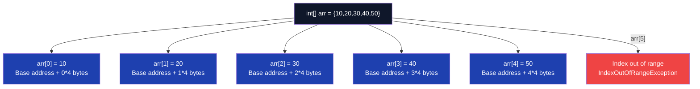

**C# Implementation**

```csharp
// Array basics, traversal, and Big-O demonstration
public class ArrayBasics
{
    // O(n) time - single traversal
    public static void TraverseArray(int[] arr)
    {
        // for loop - preferred when index needed
        for (int i = 0; i < arr.Length; i++)
            Console.Write($"{arr[i]} ");

        Console.WriteLine();

        // foreach - preferred when index not needed (cleaner)
        foreach (var item in arr)
            Console.Write($"{item} ");
    }

    // O(1) time - direct index access
    public static int GetElement(int[] arr, int index)
    {
        if (index < 0 || index >= arr.Length)
            throw new IndexOutOfRangeException($"Index {index} is out of bounds for array of length {arr.Length}");
        return arr[index];
    }

    // O(n) time, O(1) space - linear search
    public static int LinearSearch(int[] arr, int target)
    {
        for (int i = 0; i < arr.Length; i++)
            if (arr[i] == target) return i;
        return -1; // not found
    }

    // O(n²) time - nested loop example (brute force pattern)
    public static (int, int) FindPairWithSumBrute(int[] arr, int target)
    {
        for (int i = 0; i < arr.Length; i++)
            for (int j = i + 1; j < arr.Length; j++)
                if (arr[i] + arr[j] == target)
                    return (i, j);
        return (-1, -1);
    }

    // O(log n) time - binary search (requires sorted array)
    public static int BinarySearch(int[] arr, int target)
    {
        int left = 0, right = arr.Length - 1;
        while (left <= right)
        {
            int mid = left + (right - left) / 2; // avoid overflow vs (left+right)/2
            if (arr[mid] == target) return mid;
            else if (arr[mid] < target) left = mid + 1;
            else right = mid - 1;
        }
        return -1;
    }

    // Demonstrate Big-O growth visually
    public static void DemonstrateBigO(int n)
    {
        Console.WriteLine($"n = {n}");
        Console.WriteLine($"O(1)     = 1");
        Console.WriteLine($"O(log n) = {Math.Round(Math.Log2(n))}");
        Console.WriteLine($"O(n)     = {n}");
        Console.WriteLine($"O(n log n) = {Math.Round(n * Math.Log2(n))}");
        Console.WriteLine($"O(n²)    = {(long)n * n}");
    }
}
```

**Interview Q&A**

| Question | Answer |
|---|---|
| Why is array access O(1)? | Arrays store elements contiguously. The address of element i is: base_address + i * element_size. This arithmetic is a single CPU instruction. |
| What is the difference between O(n) and O(n²)? | O(n) grows linearly — doubling n doubles the work. O(n²) grows quadratically — doubling n quadruples the work. At n=1000, O(n²) = 1,000,000 operations vs O(n) = 1,000. |
| Why write `mid = left + (right - left) / 2` instead of `(left + right) / 2`? | `left + right` can overflow int when both are large (e.g., near int.MaxValue). The subtraction form avoids overflow. |
| What is amortized O(1) for List<T> append? | List<T> doubles its internal array when full. Most appends are O(1); occasional resizes are O(n). Spread across n operations, the average cost per operation is still O(1). |
| When would you choose an array over List<T>? | When size is fixed and known at compile time, when you need stack allocation (stackalloc in unsafe code), or when working with interop/native code requiring contiguous fixed memory. |
| What is cache locality and why do arrays benefit from it? | Modern CPUs load memory in cache lines (64 bytes). Arrays store elements contiguously so sequential access loads the next elements automatically. Linked lists have poor cache locality since nodes are scattered in heap memory. |

**Common Pitfalls**

- **Off-by-one errors**: Using `i <= arr.Length` instead of `i < arr.Length` — always use `arr.Length` as exclusive upper bound.
- **Integer overflow in mid calculation**: `(left + right) / 2` overflows for large indices; always use `left + (right - left) / 2`.
- **Mutating array while iterating**: Removing elements during a foreach throws `InvalidOperationException`. Iterate a copy or use index-based loop backwards.
- **Confusing array length and last index**: Last valid index is `arr.Length - 1`, not `arr.Length`.
- **Assuming sorted input**: Many algorithms (binary search, two-pointer) only work on sorted arrays. Always confirm or sort first.

---

#### Day 3: Find Max/Min & Second Largest

**Overview**

Finding maximum, minimum, and second largest in a single pass demonstrates the "track state across traversal" pattern fundamental to most array problems. A naive approach sorts the array (O(n log n)) but a single-pass O(n) solution is always preferred in interviews. The key insight: maintain one or two variables as you traverse, updating them conditionally.

**Complexity**

| Approach | Time | Space | Notes |
|---|---|---|---|
| Sort then pick | O(n log n) | O(1) | Wasteful — sorts unnecessarily |
| Single pass (max/min) | O(n) | O(1) | Optimal |
| Single pass (second largest) | O(n) | O(1) | Track two variables |
| Using LINQ Max()/Min() | O(n) | O(1) | Internally same single pass |

**Diagram**

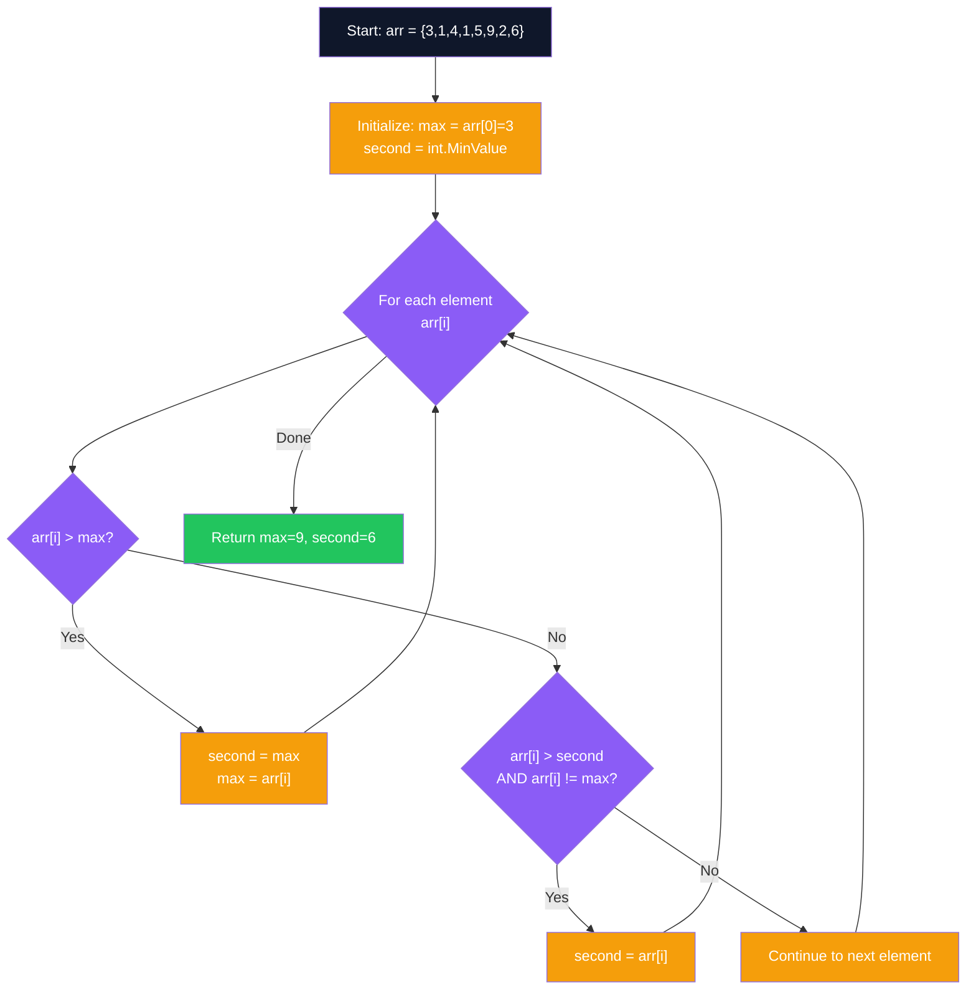

**C# Implementation**

```csharp
public class MaxMinFinder
{
    // O(n) time, O(1) space
    public static (int max, int min) FindMaxMin(int[] arr)
    {
        if (arr.Length == 0) throw new ArgumentException("Array cannot be empty");

        int max = arr[0], min = arr[0];
        for (int i = 1; i < arr.Length; i++)
        {
            if (arr[i] > max) max = arr[i];
            if (arr[i] < min) min = arr[i];
        }
        return (max, min);
    }

    // O(n) time, O(1) space — single pass, two variables
    public static int FindSecondLargest(int[] arr)
    {
        if (arr.Length < 2) throw new ArgumentException("Need at least 2 elements");

        int first = int.MinValue, second = int.MinValue;
        foreach (var num in arr)
        {
            if (num > first)
            {
                second = first;
                first = num;
            }
            else if (num > second && num != first)
            {
                second = num;
            }
        }

        if (second == int.MinValue)
            throw new InvalidOperationException("No distinct second largest found (all elements equal)");

        return second;
    }

    // LINQ approach — concise but slightly less efficient for very large arrays
    public static int SecondLargestLinq(int[] arr) =>
        arr.Distinct().OrderByDescending(x => x).Skip(1).First();
}
```

**Interview Q&A**

| Question | Answer |
|---|---|
| How do you find the second largest in one pass? | Maintain two variables: `first` and `second`. When a new element exceeds `first`, demote `first` to `second` and promote the new element. If it's between them, update only `second`. |
| What if all elements are identical? | The `second` variable remains `int.MinValue`. Check for this case and throw or return a sentinel value. |
| Can you find the kth largest in O(n)? | Yes, using QuickSelect — an O(n) average partition-based algorithm. For small k, a min-heap of size k is O(n log k). |
| Why not just sort? | Sorting is O(n log n) and unnecessary when O(n) suffices. Interviewers penalize solutions that do more work than needed. |
| What does LINQ `Distinct().OrderByDescending()` cost? | O(n log n) time plus O(n) space for the distinct set. The manual single-pass is always better in interview context. |

**Common Pitfalls**

- **Initializing `second = arr[0]`**: If the array has only one unique value, `second` will equal `first`. Always use `int.MinValue` as the sentinel.
- **Not handling duplicates**: `{5, 5, 3}` — the second largest is 3, not 5. The `num != first` guard handles this.
- **Off-by-one in LINQ approach**: `Skip(1)` skips the first (largest) element; forgetting `.Distinct()` first gives the second occurrence of the max.
- **Empty array not checked**: Always validate input length before accessing `arr[0]`.

---

#### Day 4: Reverse Array & Check Sorted

**Overview**

Reversing an array in-place using the two-pointer technique is a foundational pattern: one pointer starts at the left, one at the right; they swap and move inward until they meet. This O(n) approach uses O(1) extra space. Checking if an array is sorted requires a single pass comparing adjacent elements — a common sub-problem in many algorithms (e.g., checking if rotation is needed).

**Complexity**

| Operation | Time | Space | Notes |
|---|---|---|---|
| Reverse (two-pointer, in-place) | O(n) | O(1) | Optimal |
| Reverse (new array) | O(n) | O(n) | Creates copy |
| Array.Reverse() built-in | O(n) | O(1) | Calls same swap logic |
| Check sorted ascending | O(n) | O(1) | Single pass, early exit |
| Check sorted descending | O(n) | O(1) | Single pass, early exit |

**Diagram**

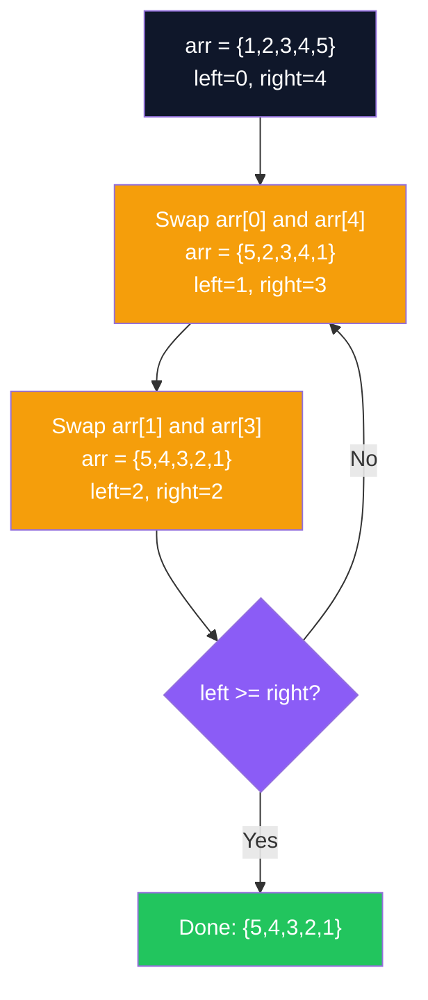

**C# Implementation**

```csharp
public class ArrayOperations
{
    // O(n) time, O(1) space — in-place two-pointer reverse
    public static void ReverseInPlace(int[] arr)
    {
        int left = 0, right = arr.Length - 1;
        while (left < right)
        {
            (arr[left], arr[right]) = (arr[right], arr[left]); // C# tuple swap — no temp variable
            left++;
            right--;
        }
    }

    // O(n) time, O(n) space — returns new reversed array (non-mutating)
    public static int[] ReverseNew(int[] arr)
    {
        var result = new int[arr.Length];
        for (int i = 0; i < arr.Length; i++)
            result[i] = arr[arr.Length - 1 - i];
        return result;
    }

    // O(n) time, O(1) space — check sorted ascending
    public static bool IsSortedAscending(int[] arr)
    {
        for (int i = 0; i < arr.Length - 1; i++)
            if (arr[i] > arr[i + 1]) return false; // early exit on first violation
        return true;
    }

    // O(n) time, O(1) space — check sorted descending
    public static bool IsSortedDescending(int[] arr)
    {
        for (int i = 0; i < arr.Length - 1; i++)
            if (arr[i] < arr[i + 1]) return false;
        return true;
    }

    // LINQ-based check (readable but no early exit in some implementations)
    public static bool IsSortedLinq(int[] arr) =>
        arr.Zip(arr.Skip(1), (a, b) => a <= b).All(x => x);
}
```

**Interview Q&A**

| Question | Answer |
|---|---|
| How does tuple swap work in C#? | `(a, b) = (b, a)` is syntactic sugar for a compiler-generated temp. It's equivalent to `var t = a; a = b; b = t;` but cleaner. |
| Can you reverse without XOR swap? | Yes, tuple swap is preferred in C#. XOR swap `a ^= b; b ^= a; a ^= b;` works but fails when `a` and `b` are the same variable (same reference), causing it to zero out. |
| What is the loop invariant for the reverse algorithm? | At each step, the subarray from `left` to `right` (inclusive) is the remaining unreversed portion. Elements outside this window are already in their final reversed position. |
| How do you check if a string is a palindrome? | Same two-pointer technique: convert to char array or use index access on the string directly. Compare `s[left]` and `s[right]`, move inward. |
| What if `IsSortedAscending` is called on an array of length 0 or 1? | It should return `true` — an empty or single-element array is trivially sorted. The loop `i < arr.Length - 1` handles this: for length 0 or 1, the condition is `i < 0` or `i < 0`, so the loop never executes. |

**Common Pitfalls**

- **Forgetting to stop when `left >= right`**: Using `left != right` fails on even-length arrays where pointers cross without meeting.
- **Creating unnecessary copies**: Using `Array.Reverse()` or LINQ `Reverse()` creates new allocations. Use in-place swap when O(1) space is required.
- **`IsSortedAscending` on length-0 arrays**: `arr.Length - 1` is `-1` for empty arrays; `i < -1` is fine and skips the loop, returning `true` correctly.
- **Not handling equal elements**: A sorted check with `arr[i] > arr[i+1]` allows duplicates (non-strictly sorted). Use `>=` if strictly increasing is required.

---

#### Day 5: Left/Right Rotation of Array

**Overview**

Rotating an array left by k positions means the first k elements move to the end; right rotation does the reverse. The naive approach (rotate one position at a time) is O(n*k). The optimal approach uses the **reversal algorithm**: reverse segments of the array to achieve rotation in O(n) time with O(1) space. This is a classic "think about it differently" problem that interviewers love.

**Complexity**

| Approach | Time | Space | Notes |
|---|---|---|---|
| Naive (one at a time) | O(n*k) | O(1) | Too slow for large k |
| Extra array | O(n) | O(n) | Simple but wastes space |
| Reversal algorithm | O(n) | O(1) | Optimal — 3 reversals |
| Juggling algorithm | O(n) | O(1) | GCD-based, complex to implement |

**Diagram**

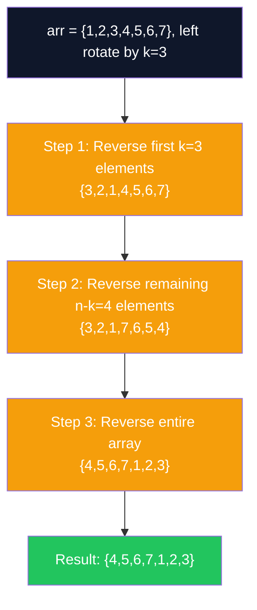

**C# Implementation**

```csharp
public class ArrayRotation
{
    private static void Reverse(int[] arr, int left, int right)
    {
        while (left < right)
        {
            (arr[left], arr[right]) = (arr[right], arr[left]);
            left++;
            right--;
        }
    }

    // O(n) time, O(1) space — left rotate by k positions
    public static void RotateLeft(int[] arr, int k)
    {
        int n = arr.Length;
        k %= n; // handle k >= n (e.g., rotate by 7 on length-7 array = no-op)
        if (k == 0) return;

        Reverse(arr, 0, k - 1);          // reverse first k elements
        Reverse(arr, k, n - 1);           // reverse remaining n-k elements
        Reverse(arr, 0, n - 1);           // reverse entire array
    }

    // O(n) time, O(1) space — right rotate by k positions
    // Right rotate by k == left rotate by (n - k)
    public static void RotateRight(int[] arr, int k)
    {
        int n = arr.Length;
        k %= n;
        if (k == 0) return;

        Reverse(arr, 0, n - k - 1);       // reverse first n-k elements
        Reverse(arr, n - k, n - 1);       // reverse last k elements
        Reverse(arr, 0, n - 1);           // reverse entire array
    }

    // O(n) time, O(n) space — extra array approach (for reference)
    public static int[] RotateLeftExtraSpace(int[] arr, int k)
    {
        int n = arr.Length;
        k %= n;
        var result = new int[n];
        for (int i = 0; i < n; i++)
            result[i] = arr[(i + k) % n];
        return result;
    }
}
```

**Interview Q&A**

| Question | Answer |
|---|---|
| Why do we do `k %= n`? | If k equals n, rotating by n positions returns the original array. `k % n` normalizes k to the range [0, n-1]. |
| Prove the reversal algorithm works for left rotation by k. | After step 1: `[k-1..0, k..n-1]`. After step 2: `[k-1..0, n-1..k]`. After step 3: reverse everything gives `[k..n-1, 0..k-1]`, which is exactly a left rotation by k. |
| What is the juggling algorithm? | Divide the array into `gcd(n, k)` cycles and rotate each cycle in place. Each element is moved exactly once, giving O(n) time O(1) space. More complex to implement than reversal. |
| How does right rotation relate to left rotation? | Right rotate by k = left rotate by (n - k). You can implement one in terms of the other. |
| What is the time complexity of rotating a 2D matrix 90 degrees? | O(n²) where n is the side length — transpose the matrix (swap across diagonal), then reverse each row. |

**Common Pitfalls**

- **Not normalizing k**: Forgetting `k %= n` causes index-out-of-bounds for `k >= n`.
- **Wrong reversal boundaries for right rotation**: Right rotate reverses `[0, n-k-1]` then `[n-k, n-1]`, not the same boundaries as left rotate.
- **Reversing wrong range**: Off-by-one in reversal endpoints is the most common bug. Always trace through a small example.
- **k = 0 edge case**: When k normalizes to 0, skip reversal to avoid unnecessary work.

---

#### Day 6: Classic Easy Array Problems

**Overview**

Two Sum and Contains Duplicate are canonical interview problems that demonstrate the HashMap optimization pattern. The core idea: instead of comparing all pairs (O(n²)), use a hash table to answer "have I seen this complement before?" in O(1), bringing the overall solution to O(n). Mastering this pattern unlocks dozens of similar problems.

**Complexity**

| Problem | Approach | Time | Space |
|---|---|---|---|
| Two Sum | Brute force | O(n²) | O(1) |
| Two Sum | HashMap | O(n) | O(n) |
| Contains Duplicate | Sorting | O(n log n) | O(1) |
| Contains Duplicate | HashSet | O(n) | O(n) |
| Best Time to Buy/Sell | Single pass | O(n) | O(1) |
| Move Zeroes | Two pointer | O(n) | O(1) |

**C# Implementation**

```csharp
public class ClassicArrayProblems
{
    // Two Sum — return indices of two numbers that sum to target
    // HashMap O(n) approach
    public static int[] TwoSum(int[] nums, int target)
    {
        var seen = new Dictionary<int, int>(); // value -> index
        for (int i = 0; i < nums.Length; i++)
        {
            int complement = target - nums[i];
            if (seen.TryGetValue(complement, out int j))
                return [j, i];
            seen[nums[i]] = i;
        }
        return []; // no solution found
    }

    // Contains Duplicate — return true if any value appears at least twice
    public static bool ContainsDuplicate(int[] nums)
    {
        var seen = new HashSet<int>();
        foreach (var n in nums)
            if (!seen.Add(n)) return true; // Add returns false if already present
        return false;
    }

    // Best Time to Buy and Sell Stock (single transaction)
    public static int MaxProfit(int[] prices)
    {
        int minPrice = int.MaxValue, maxProfit = 0;
        foreach (var price in prices)
        {
            minPrice = Math.Min(minPrice, price);
            maxProfit = Math.Max(maxProfit, price - minPrice);
        }
        return maxProfit;
    }

    // Move Zeroes — move all 0s to end, maintain relative order of non-zeros
    public static void MoveZeroes(int[] nums)
    {
        int insertPos = 0;
        // First pass: place all non-zero elements
        foreach (var n in nums)
            if (n != 0) nums[insertPos++] = n;
        // Second pass: fill rest with zeros
        while (insertPos < nums.Length)
            nums[insertPos++] = 0;
    }

    // Product of Array Except Self — O(n) time, O(1) extra space
    public static int[] ProductExceptSelf(int[] nums)
    {
        int n = nums.Length;
        var result = new int[n];
        // Left pass: result[i] = product of all elements to the left
        result[0] = 1;
        for (int i = 1; i < n; i++)
            result[i] = result[i - 1] * nums[i - 1];
        // Right pass: multiply by product of all elements to the right
        int right = 1;
        for (int i = n - 1; i >= 0; i--)
        {
            result[i] *= right;
            right *= nums[i];
        }
        return result;
    }
}
```

**Interview Q&A**

| Question | Answer |
|---|---|
| Why does `HashSet<T>.Add()` return bool? | It returns `true` if the element was added (not a duplicate), `false` if already present. This enables single-line duplicate detection without a separate `Contains` call. |
| In Two Sum, why store index as the value in the Dictionary? | The problem asks for indices, not values. The dictionary maps `value -> index` so when we find the complement, we can return the stored index immediately. |
| What if Two Sum has multiple valid answers? | The HashMap approach returns the first valid pair found (earlier index first). If all answers are needed, continue after finding the first and collect all. |
| How does Product Except Self avoid using division? | Compute a left-pass prefix product and a right-pass suffix product. Multiplying them gives the product of all elements except self, without needing division (which would fail on zeros). |
| What edge cases exist for Best Time to Buy/Sell Stock? | Monotonically decreasing prices (profit = 0, never buy). All same prices (profit = 0). Single element (profit = 0). |

**Common Pitfalls**

- **Two Sum: using array index 0 as "not found" sentinel**: If `seen[complement]` returns 0, it could mean index 0 or "not found". Always use `TryGetValue` to distinguish.
- **Contains Duplicate with `Contains` then `Add`**: Two operations instead of one. `Add` returning false is the idiomatic single-operation check.
- **Move Zeroes: overwriting non-zeros**: The two-pass approach is cleaner and avoids this — collect non-zeros first, then fill zeros.

---

### Week 2 (Day 8–14) — Advanced Arrays

#### Day 8: Prefix Sum

**Overview**

The prefix sum (cumulative sum) array transforms range sum queries from O(n) to O(1) by precomputing cumulative totals. Once built in O(n), any range sum `sum(L, R)` = `prefix[R+1] - prefix[L]` is answered in constant time. This technique appears in subarray problems, 2D matrix queries, and difference arrays for range update operations.

**Complexity**

| Operation | Time | Space | Notes |
|---|---|---|---|
| Build prefix array | O(n) | O(n) | One-time preprocessing |
| Range sum query | O(1) | O(1) | After preprocessing |
| Naive range sum | O(n) per query | O(1) | Recomputes every time |
| 2D prefix sum build | O(m*n) | O(m*n) | For matrix queries |
| 2D range query | O(1) | O(1) | After preprocessing |

**Diagram**

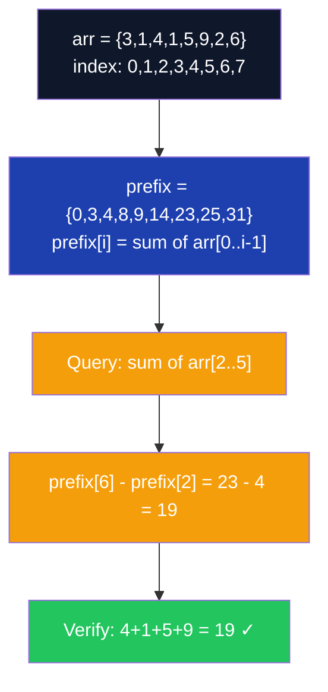

**C# Implementation**

```csharp
public class PrefixSum
{
    private readonly int[] _prefix;

    public PrefixSum(int[] arr)
    {
        _prefix = new int[arr.Length + 1]; // 1-indexed for cleaner range queries
        for (int i = 0; i < arr.Length; i++)
            _prefix[i + 1] = _prefix[i] + arr[i];
    }

    // O(1) — range sum [left, right] inclusive
    public int RangeSum(int left, int right) => _prefix[right + 1] - _prefix[left];

    // Subarray sum equals k — count subarrays using prefix sum + hashmap
    // O(n) time, O(n) space
    public static int SubarraySumEqualsK(int[] nums, int k)
    {
        var countMap = new Dictionary<int, int> { [0] = 1 }; // prefix sum 0 seen once (empty prefix)
        int sum = 0, count = 0;

        foreach (var num in nums)
        {
            sum += num;
            // If (sum - k) was seen before, those subarrays ending here sum to k
            if (countMap.TryGetValue(sum - k, out int freq))
                count += freq;
            countMap[sum] = countMap.GetValueOrDefault(sum) + 1;
        }
        return count;
    }

    // Difference array for range update [l, r] += val in O(1)
    public static int[] RangeUpdate(int n, int[][] updates)
    {
        var diff = new int[n + 1];
        foreach (var update in updates)
        {
            int l = update[0], r = update[1], val = update[2];
            diff[l] += val;
            diff[r + 1] -= val;
        }
        // Reconstruct actual array via prefix sum of diff
        var result = new int[n];
        int running = 0;
        for (int i = 0; i < n; i++)
        {
            running += diff[i];
            result[i] = running;
        }
        return result;
    }
}
```

**Interview Q&A**

| Question | Answer |
|---|---|
| Why size `n+1` for the prefix array? | The `+1` allows `prefix[0] = 0` as a base case, making range queries uniform: `sum(L, R) = prefix[R+1] - prefix[L]`. Without it, you need a special case for L=0. |
| How does the hashmap solve Subarray Sum = K? | For each index, if `prefix[i] - k` was seen before at index j, then the subarray `[j, i-1]` sums to k. The map counts how many times each prefix sum has occurred. |
| What is a difference array and when is it used? | A difference array supports O(1) range updates (add val to all elements in [l, r]). Apply updates to the diff array, then reconstruct via prefix sum. Useful for bulk range operations. |
| Can prefix sum handle negative numbers? | Yes. Prefix sum works for any integers. Negative values just mean the running sum can decrease. |
| What is the maximum subarray sum using prefix sum? | `maxSum = max over all i of (prefix[i] - min_prefix_so_far_before_i)`. This is an alternative to Kadane's, O(n) with O(n) space. |

**Common Pitfalls**

- **1-indexed vs 0-indexed confusion**: Decide upfront whether `prefix[i]` means "sum of first i elements" or "sum up to index i-1". Be consistent.
- **Forgetting `prefix[0] = 0` initialization**: This base case is essential. In C#, int arrays are zero-initialized, so it's automatic, but understand why it's needed.
- **Subarray Sum K with negative numbers**: Unlike Two Sum, the hashmap approach handles negatives correctly. A naive two-pointer doesn't work with negatives.

---

#### Day 9: Kadane's Algorithm

**Overview**

Kadane's Algorithm finds the maximum sum contiguous subarray in O(n) time with O(1) space. The key insight is a greedy choice: if the running sum of the current subarray becomes negative, start a new subarray from the next element — a negative prefix can only hurt the sum. This elegant algorithm uses a two-state machine: "extending current subarray" vs "starting fresh."

**Complexity**

| Approach | Time | Space | Notes |
|---|---|---|---|
| Brute force (all subarrays) | O(n³) | O(1) | Triple nested loop |
| Prefix sum approach | O(n) | O(n) | min-prefix tracking |
| Kadane's Algorithm | O(n) | O(1) | Optimal |
| Divide & Conquer | O(n log n) | O(log n) | Educational, not optimal |

**Diagram**

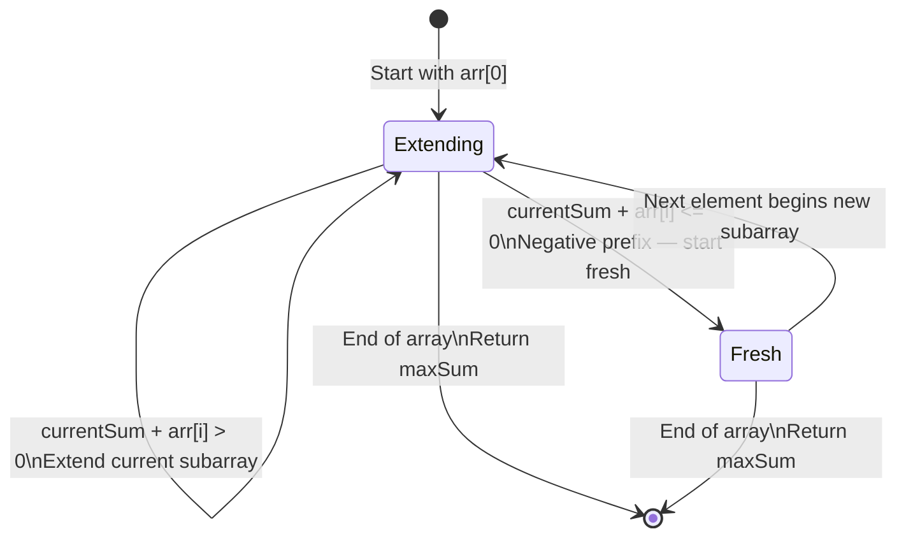

**C# Implementation**

```csharp
public class KadanesAlgorithm
{
    // O(n) time, O(1) space — returns max subarray sum
    public static int MaxSubarraySum(int[] nums)
    {
        if (nums.Length == 0) throw new ArgumentException("Array cannot be empty");

        int currentSum = nums[0];
        int maxSum = nums[0];

        for (int i = 1; i < nums.Length; i++)
        {
            // Key decision: extend current subarray or start fresh?
            currentSum = Math.Max(nums[i], currentSum + nums[i]);
            maxSum = Math.Max(maxSum, currentSum);
        }
        return maxSum;
    }

    // Extended: also return the subarray indices
    public static (int maxSum, int startIdx, int endIdx) MaxSubarrayWithIndices(int[] nums)
    {
        int currentSum = nums[0], maxSum = nums[0];
        int start = 0, end = 0, tempStart = 0;

        for (int i = 1; i < nums.Length; i++)
        {
            if (nums[i] > currentSum + nums[i])
            {
                currentSum = nums[i];
                tempStart = i; // potential new start
            }
            else
            {
                currentSum += nums[i];
            }

            if (currentSum > maxSum)
            {
                maxSum = currentSum;
                start = tempStart;
                end = i;
            }
        }
        return (maxSum, start, end);
    }

    // Variant: Maximum Product Subarray — track both min and max (negatives flip sign)
    public static int MaxProductSubarray(int[] nums)
    {
        int maxProd = nums[0], minProd = nums[0], result = nums[0];

        for (int i = 1; i < nums.Length; i++)
        {
            if (nums[i] < 0)
                (maxProd, minProd) = (minProd, maxProd); // negative flips max/min

            maxProd = Math.Max(nums[i], maxProd * nums[i]);
            minProd = Math.Min(nums[i], minProd * nums[i]);
            result = Math.Max(result, maxProd);
        }
        return result;
    }
}
```

**Interview Q&A**

| Question | Answer |
|---|---|
| Explain the core decision in Kadane's in one sentence. | At each element, we choose the larger of: starting a new subarray here, or extending the previous subarray — whichever gives a larger current sum. |
| Why initialize `maxSum = nums[0]` not `int.MinValue`? | If all elements are negative, the answer is the largest single negative number (not zero). Initializing to `nums[0]` handles all-negative arrays correctly. |
| What modification handles maximum product subarray? | Track both maximum and minimum running products (negatives can flip min to max). Swap them when the current element is negative. |
| How does Kadane's relate to Dynamic Programming? | `currentSum` represents the optimal solution for subarrays ending at index i. `maxSum` stores the global optimum. This is 1D DP with O(1) space optimization. |
| Can Kadane's be extended to 2D matrices? | Yes. For each pair of row boundaries (top, bottom), compress each column into a 1D array and run Kadane's — O(n²m) overall for an n×m matrix. |

**Common Pitfalls**

- **Initializing `maxSum = 0`**: This returns 0 for all-negative arrays (incorrect). Always initialize to `nums[0]`.
- **Handling empty array**: Always check `nums.Length == 0` first — `nums[0]` throws for empty arrays.
- **Confusing sum vs product variant**: Product subarray requires tracking minimum product because two negatives multiply to a large positive.
- **Not tracking indices**: When asked "return the subarray, not just the sum," forgetting to record `tempStart` and update `start/end` is a common omission.

---

#### Day 10: Stock Buy & Sell

**Overview**

The Stock Buy & Sell problems are application of Kadane's and greedy thinking. Single transaction: track minimum price seen so far, maximize profit at each step. Multiple transactions: any time tomorrow's price exceeds today's, take that profit (peak-valley greedy). These problems appear constantly in interviews as they test whether you can translate a real-world scenario into an algorithmic insight.

**Complexity**

| Problem | Approach | Time | Space |
|---|---|---|---|
| Single transaction | Greedy (min-track) | O(n) | O(1) |
| Multiple transactions | Greedy (sum gains) | O(n) | O(1) |
| At most 2 transactions | DP (4 states) | O(n) | O(1) |
| At most k transactions | DP | O(n*k) | O(k) |
| With cooldown | DP (state machine) | O(n) | O(1) |

**C# Implementation**

```csharp
public class StockProblems
{
    // Single transaction — O(n) greedy
    public static int MaxProfitOneTx(int[] prices)
    {
        int minPrice = int.MaxValue, maxProfit = 0;
        foreach (var price in prices)
        {
            minPrice = Math.Min(minPrice, price);
            maxProfit = Math.Max(maxProfit, price - minPrice);
        }
        return maxProfit;
    }

    // Multiple transactions — greedy: sum all positive day-over-day increases
    public static int MaxProfitMultipleTx(int[] prices)
    {
        int profit = 0;
        for (int i = 1; i < prices.Length; i++)
            if (prices[i] > prices[i - 1])
                profit += prices[i] - prices[i - 1];
        return profit;
    }

    // At most 2 transactions — DP with 4 states
    public static int MaxProfitTwoTx(int[] prices)
    {
        int buy1 = int.MinValue, sell1 = 0;
        int buy2 = int.MinValue, sell2 = 0;

        foreach (var price in prices)
        {
            buy1 = Math.Max(buy1, -price);           // max profit after 1st buy
            sell1 = Math.Max(sell1, buy1 + price);   // max profit after 1st sell
            buy2 = Math.Max(buy2, sell1 - price);    // max profit after 2nd buy
            sell2 = Math.Max(sell2, buy2 + price);   // max profit after 2nd sell
        }
        return sell2;
    }

    // With cooldown (1 day wait after sell) — state machine DP
    public static int MaxProfitWithCooldown(int[] prices)
    {
        int held = int.MinValue, sold = 0, rest = 0;
        foreach (var price in prices)
        {
            int prevSold = sold;
            held = Math.Max(held, rest - price);  // buy today (was resting)
            sold = held + price;                   // sell today (was holding)
            rest = Math.Max(rest, prevSold);       // rest today (was sold or resting)
        }
        return Math.Max(sold, rest);
    }
}
```

**Interview Q&A**

| Question | Answer |
|---|---|
| Why does the greedy multiple-transaction approach work? | Summing all positive consecutive differences equals the sum of all peak-valley gains. Any achievable profit can be decomposed into consecutive day gains. |
| What if prices are monotonically decreasing? | `maxProfit = 0` — never buy. The algorithm naturally handles this since no daily gain is ever positive. |
| How do the 4 states in at-most-2-transactions DP model the problem? | `buy1`: best profit after buying once. `sell1`: best profit after selling once. `buy2`: best after second buy (can use sell1 profit). `sell2`: best after second sell. |
| What's the cooldown state machine? | Three states: `held` (own stock), `sold` (just sold, in cooldown), `rest` (not holding, can buy). Transitions: hold→sell, rest→hold, sold→rest. |

**Common Pitfalls**

- **Allowing buy and sell on same day**: Read the problem — typically you must buy before selling, not same day. Index ordering enforces this.
- **Multiple TX but tracking only one position**: Each transaction is independent. Summing consecutive gains avoids needing to track specific buy/sell days.

---

#### Day 11: Majority Element — Moore Voting

**Overview**

The Majority Element problem asks for the element appearing more than n/2 times. Boyer-Moore Voting Algorithm solves this in O(n) time and O(1) space with a clever invariant: maintain a candidate and a counter. When a new element matches the candidate, increment; otherwise decrement. When the counter hits zero, change candidate. The element that appears more than n/2 times will always survive as the final candidate.

**Complexity**

| Approach | Time | Space | Notes |
|---|---|---|---|
| Brute force | O(n²) | O(1) | Count for each element |
| HashMap count | O(n) | O(n) | Store all frequencies |
| Sort and pick middle | O(n log n) | O(1) | Majority must be at n/2 |
| Moore Voting | O(n) | O(1) | Optimal — no hash table needed |

**Diagram**

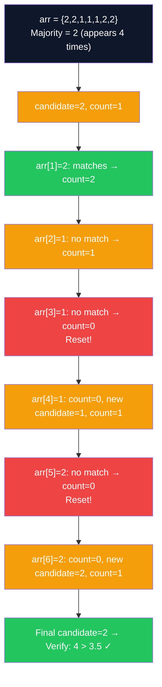

**C# Implementation**

```csharp
public class MajorityElement
{
    // O(n) time, O(1) space — Boyer-Moore Voting
    public static int FindMajority(int[] nums)
    {
        int candidate = nums[0], count = 1;

        for (int i = 1; i < nums.Length; i++)
        {
            if (count == 0)
            {
                candidate = nums[i];
                count = 1;
            }
            else if (nums[i] == candidate)
                count++;
            else
                count--;
        }

        // Optional verification (if majority not guaranteed to exist)
        int freq = nums.Count(x => x == candidate);
        if (freq <= nums.Length / 2)
            throw new InvalidOperationException("No majority element exists");

        return candidate;
    }

    // Find elements appearing more than n/3 times (at most 2 such elements)
    public static List<int> MajorityElementNOver3(int[] nums)
    {
        int cand1 = 0, count1 = 0, cand2 = 0, count2 = 0;

        foreach (var num in nums)
        {
            if (num == cand1) count1++;
            else if (num == cand2) count2++;
            else if (count1 == 0) { cand1 = num; count1 = 1; }
            else if (count2 == 0) { cand2 = num; count2 = 1; }
            else { count1--; count2--; }
        }

        // Verify both candidates
        return [cand1, cand2]
            .Where(c => nums.Count(x => x == c) > nums.Length / 3)
            .ToList();
    }
}
```

**Interview Q&A**

| Question | Answer |
|---|---|
| Why does Moore Voting always find the majority element? | The majority element appears more than n/2 times. Each cancellation removes one majority occurrence and one non-majority occurrence. There are more majority occurrences, so the majority element always survives. |
| Does Moore Voting work if no majority element exists? | No — it will return some candidate, but that candidate may not be a majority element. Always verify by counting occurrences of the returned candidate. |
| What is the extension for n/3 majority? | Use two candidates and two counters. There can be at most 2 elements appearing more than n/3 times. The cancellation logic removes 1 of each candidate and 1 other element per cancellation triple. |
| How does sorting solve this in O(n log n)? | Sort the array. If a majority element exists, it must occupy the middle index `n/2`. Return `nums[n/2]` after sorting. |

**Common Pitfalls**

- **Not verifying the candidate**: Moore Voting finds the candidate assuming a majority exists. Without verification, it returns a wrong answer when no majority element is present.
- **Confusing n/2 vs n/3 versions**: The n/2 version uses one candidate; n/3 uses two. Don't conflate the implementations.

---

#### Day 12–13: Two Sum & Sliding Window

**Overview**

Two Sum with a HashMap is the canonical O(n) space/time trade-off example. Sliding Window is a technique for problems involving contiguous subarrays/substrings: instead of recomputing from scratch for every window position, maintain a window that expands and contracts, updating the answer incrementally. Fixed-size windows slide one step at a time; variable-size windows expand on valid conditions and contract on violations.

**Complexity**

| Problem | Approach | Time | Space |
|---|---|---|---|
| Two Sum | Brute force | O(n²) | O(1) |
| Two Sum | HashMap | O(n) | O(n) |
| Fixed window max sum | Sliding window | O(n) | O(1) |
| Longest substring no repeat | Sliding window + HashSet | O(n) | O(k) |
| Minimum window substring | Sliding window + freq map | O(n) | O(k) |

**Diagram**

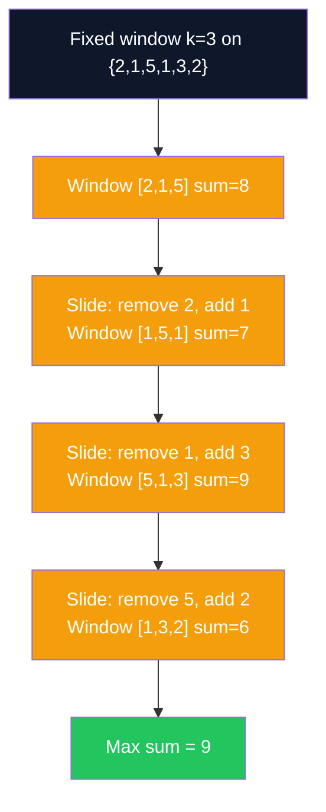

**C# Implementation**

```csharp
public class SlidingWindow
{
    // Fixed window — maximum sum of subarray of size k
    public static int MaxSumFixedWindow(int[] arr, int k)
    {
        if (arr.Length < k) throw new ArgumentException("Array smaller than window");

        int windowSum = arr[..k].Sum(); // initial window
        int maxSum = windowSum;

        for (int i = k; i < arr.Length; i++)
        {
            windowSum += arr[i] - arr[i - k]; // add new element, remove old
            maxSum = Math.Max(maxSum, windowSum);
        }
        return maxSum;
    }

    // Variable window — longest subarray with sum <= target
    public static int LongestSubarraySumAtMostK(int[] arr, int target)
    {
        int left = 0, sum = 0, maxLen = 0;

        for (int right = 0; right < arr.Length; right++)
        {
            sum += arr[right]; // expand window
            while (sum > target && left <= right)
                sum -= arr[left++]; // shrink from left
            maxLen = Math.Max(maxLen, right - left + 1);
        }
        return maxLen;
    }

    // Longest substring without repeating characters (Day 18 preview)
    public static int LengthOfLongestSubstring(string s)
    {
        var charIndex = new Dictionary<char, int>(); // char -> last seen index
        int maxLen = 0, left = 0;

        for (int right = 0; right < s.Length; right++)
        {
            if (charIndex.TryGetValue(s[right], out int prevIdx) && prevIdx >= left)
                left = prevIdx + 1; // jump left past the duplicate
            charIndex[s[right]] = right;
            maxLen = Math.Max(maxLen, right - left + 1);
        }
        return maxLen;
    }

    // Minimum window substring
    public static string MinWindowSubstring(string s, string t)
    {
        var need = new Dictionary<char, int>();
        foreach (var c in t) need[c] = need.GetValueOrDefault(c) + 1;

        int have = 0, required = need.Count;
        int left = 0, minLen = int.MaxValue, minStart = 0;
        var window = new Dictionary<char, int>();

        for (int right = 0; right < s.Length; right++)
        {
            char c = s[right];
            window[c] = window.GetValueOrDefault(c) + 1;
            if (need.ContainsKey(c) && window[c] == need[c]) have++;

            while (have == required)
            {
                if (right - left + 1 < minLen)
                {
                    minLen = right - left + 1;
                    minStart = left;
                }
                char lc = s[left++];
                window[lc]--;
                if (need.ContainsKey(lc) && window[lc] < need[lc]) have--;
            }
        }
        return minLen == int.MaxValue ? "" : s.Substring(minStart, minLen);
    }
}
```

**Interview Q&A**

| Question | Answer |
|---|---|
| When do you use a fixed vs variable sliding window? | Fixed window: problem specifies exact window size k. Variable window: problem asks for longest/shortest window satisfying a condition — expand right, shrink left when condition violated. |
| What is the two-pointer pattern vs sliding window? | They overlap. Sliding window specifically maintains a contiguous subarray. Two-pointer is broader — can work on sorted arrays (converging pointers), linked lists, palindromes, etc. |
| How is Longest Substring Without Repeating O(n)? | Each character is added at most once and removed at most once. The inner `while` loop doesn't increase total iterations beyond 2n across all outer iterations. |
| When does the HashMap approach for LongestSubstring fail? | It doesn't — the "jump left past duplicate" logic using `charIndex[s[right]] >= left` correctly handles cases where a previously seen character is outside the current window. |

**Common Pitfalls**

- **Fixed window initial sum**: Forgetting to compute the initial window sum before sliding. The loop should start from index k, not 0.
- **Variable window shrink condition**: Using `if` instead of `while` to shrink — multiple violations may exist, requiring repeated shrinking.
- **Off-by-one in window length**: Length of window `[left, right]` is `right - left + 1`, not `right - left`.

---

### Week 3 (Day 15–20) — Strings & Hashing

#### Day 15–16: String Basics, Palindrome & Anagram

**Overview**

In C#, strings are immutable reference types. Concatenation with `+` in a loop is O(n²) — each `+` creates a new string object. `StringBuilder` provides O(n) amortized string building. For interview problems, string manipulation often reduces to character frequency arrays or two-pointer comparison. Palindrome and anagram checks are the two most common introductory string problems.

**Complexity**

| Operation | Time | Space | Notes |
|---|---|---|---|
| String concatenation (+) in loop | O(n²) | O(n²) | Creates new string each time |
| StringBuilder append | O(1) amortized | O(n) | Use for loop-based building |
| Palindrome check (two-pointer) | O(n) | O(1) | No extra string needed |
| Anagram check (frequency count) | O(n) | O(1) | Fixed 26-char array |
| Anagram check (sorted) | O(n log n) | O(n) | Less optimal |

**C# Implementation**

```csharp
public class StringProblems
{
    // O(n) time, O(1) space — two-pointer palindrome check
    public static bool IsPalindrome(string s)
    {
        int left = 0, right = s.Length - 1;
        while (left < right)
        {
            if (s[left] != s[right]) return false;
            left++;
            right--;
        }
        return true;
    }

    // Valid palindrome ignoring non-alphanumeric and case
    public static bool IsValidPalindrome(string s)
    {
        int left = 0, right = s.Length - 1;
        while (left < right)
        {
            while (left < right && !char.IsLetterOrDigit(s[left])) left++;
            while (left < right && !char.IsLetterOrDigit(s[right])) right--;
            if (char.ToLower(s[left]) != char.ToLower(s[right])) return false;
            left++;
            right--;
        }
        return true;
    }

    // O(n) time, O(1) space — anagram check using frequency array
    public static bool IsAnagram(string s, string t)
    {
        if (s.Length != t.Length) return false;

        var freq = new int[26]; // works for lowercase English letters
        foreach (var c in s) freq[c - 'a']++;
        foreach (var c in t) freq[c - 'a']--;

        return freq.All(f => f == 0);
    }

    // Group anagrams together
    public static List<List<string>> GroupAnagrams(string[] strs)
    {
        var groups = new Dictionary<string, List<string>>();
        foreach (var s in strs)
        {
            var key = string.Concat(s.OrderBy(c => c)); // sorted string as key
            if (!groups.TryGetValue(key, out var group))
                groups[key] = group = [];
            group.Add(s);
        }
        return [.. groups.Values];
    }

    // StringBuilder for efficient string building
    public static string ReverseString(string s)
    {
        var sb = new StringBuilder(s.Length);
        for (int i = s.Length - 1; i >= 0; i--)
            sb.Append(s[i]);
        return sb.ToString();
    }
}
```

**Interview Q&A**

| Question | Answer |
|---|---|
| Why is string immutable in C#? | Thread safety, caching (string interning), and hashcode stability. Every modification creates a new string object, which is why StringBuilder is needed for loop-based construction. |
| What is the time complexity of `string.Contains()`? | O(n*m) where n is the string length and m is the pattern length. For production use, KMP or Boyer-Moore reduces this to O(n+m). |
| How would you check anagram for Unicode strings? | Use `Dictionary<char, int>` instead of `int[26]`. The char key handles any Unicode character. |
| What is string interning? | The CLR maintains a pool of unique string literals. `string.Intern()` stores a string in this pool; repeated identical literals reuse the same object. `ReferenceEquals` returns true for interned strings. |
| How does `char.ToLower()` differ from `ToLower()` on a string? | `char.ToLower(c)` converts a single character — O(1). `str.ToLower()` creates a new lowercase string — O(n). For character-by-character comparison, always use `char.ToLower(c)`. |

**Common Pitfalls**

- **Using `==` on strings for character comparison**: When you have `char` variables (from indexing a string), `==` works correctly. When comparing `string` objects, `==` in C# compares by value (unlike Java), but be aware of this for object references.
- **Anagram check with Unicode**: `freq[c - 'a']` only works for lowercase ASCII. Use a Dictionary for general character sets.
- **Palindrome with spaces/punctuation**: Always clarify whether to ignore non-alphanumeric characters. LeetCode 125 requires ignoring them.
- **StringBuilder not used in tight loops**: Concatenating strings in a loop of n iterations is O(n²). This is one of the most common C# performance mistakes.

---

#### Day 17–18: HashMap, HashSet & Longest Substring

**Overview**

`Dictionary<K,V>` (HashMap) and `HashSet<T>` are the two most critical data structures for interview optimization. HashMap answers "have I seen this value, and what was its context?" in O(1) average. HashSet answers "have I seen this value?" in O(1) average. Together they power the space-for-time trade that converts most O(n²) brute forces to O(n). Collision handling in .NET uses chaining internally.

**Complexity**

| Operation | Dictionary | HashSet | Notes |
|---|---|---|---|
| Add/Insert | O(1) avg | O(1) avg | O(n) worst case (many collisions) |
| Lookup/Contains | O(1) avg | O(1) avg | Hash computed then bucket checked |
| Remove | O(1) avg | O(1) avg | |
| Iterate all | O(n) | O(n) | Order not guaranteed |

**C# Implementation**

```csharp
public class HashingProblems
{
    // Longest substring without repeating characters — O(n) sliding window
    public static int LengthOfLongestSubstring(string s)
    {
        var lastSeen = new Dictionary<char, int>(); // char -> last index seen
        int maxLen = 0, left = 0;

        for (int right = 0; right < s.Length; right++)
        {
            char c = s[right];
            // If seen and within current window, shrink left past it
            if (lastSeen.TryGetValue(c, out int prevIdx) && prevIdx >= left)
                left = prevIdx + 1;

            lastSeen[c] = right;
            maxLen = Math.Max(maxLen, right - left + 1);
        }
        return maxLen;
    }

    // First non-repeating character
    public static char FirstUniqueChar(string s)
    {
        var freq = new Dictionary<char, int>();
        foreach (var c in s) freq[c] = freq.GetValueOrDefault(c) + 1;
        foreach (var c in s) if (freq[c] == 1) return c;
        return '\0'; // no unique character
    }

    // Intersection of two arrays using HashSet
    public static int[] Intersection(int[] nums1, int[] nums2)
    {
        var set1 = new HashSet<int>(nums1);
        return nums2.Where(set1.Contains).Distinct().ToArray();
    }

    // Four Sum Count — O(n²) with HashMap
    public static int FourSumCount(int[] a, int[] b, int[] c, int[] d)
    {
        var pairSums = new Dictionary<int, int>();
        foreach (var x in a)
            foreach (var y in b)
                pairSums[x + y] = pairSums.GetValueOrDefault(x + y) + 1;

        int count = 0;
        foreach (var x in c)
            foreach (var y in d)
                count += pairSums.GetValueOrDefault(-(x + y));

        return count;
    }
}
```

**Interview Q&A**

| Question | Answer |
|---|---|
| What is the average vs worst-case complexity of Dictionary operations? | Average O(1) with a good hash function. Worst case O(n) when all keys hash to the same bucket (degenerate chaining). .NET mitigates this with randomized hash seeds. |
| When would you choose HashSet over Dictionary? | When you only need to track existence (membership), not associate any value with the key. HashSet is semantically cleaner and marginally more efficient. |
| How does `GetValueOrDefault` work vs bracket access? | `dict[key]` throws `KeyNotFoundException` if key absent. `GetValueOrDefault(key)` returns the type's default (0 for int, null for reference types). Use it to simplify counter initialization. |
| What is the load factor in a hash table? | The ratio of stored entries to bucket count. .NET's Dictionary resizes (doubles) when load factor exceeds ~0.72, triggering a rehash — O(n) but amortized O(1) per operation. |
| How does sliding window achieve O(n) for longest substring? | Each character is visited at most twice (once by `right`, once by `left`). Total work is O(2n) = O(n). |

**Common Pitfalls**

- **Using `dict[key]++` without initialization**: Throws `KeyNotFoundException`. Use `dict[key] = dict.GetValueOrDefault(key) + 1` or `dict.TryAdd(key, 0)` first.
- **Iterating Dictionary while modifying**: Throws `InvalidOperationException`. Collect keys to modify into a list first.
- **HashSet for ordered uniqueness**: HashSet doesn't maintain insertion order. Use `LinkedHashSet` equivalent (`Dictionary<T, bool>` or `SortedSet<T>`) if order matters.

---

#### Day 19: Pattern-Based String Problems (KMP Intro)

**Overview**

The Knuth-Morris-Pratt (KMP) algorithm finds all occurrences of a pattern in a text in O(n + m) time, vs naive's O(n*m). The key innovation is the failure function (partial match table / LPS array): it tells us how much of the pattern we've already matched after a mismatch, so we never re-examine characters already confirmed to match. For most interviews, knowing the concept and the LPS array construction is sufficient.

**Complexity**

| Algorithm | Time | Space | Notes |
|---|---|---|---|
| Naive pattern search | O(n*m) | O(1) | Simple but slow for long patterns |
| KMP | O(n+m) | O(m) | LPS array preprocessing |
| Rabin-Karp | O(n+m) avg | O(1) | Rolling hash, O(n*m) worst |
| Boyer-Moore | O(n/m) best | O(m) | Best in practice for large alphabets |

**C# Implementation**

```csharp
public class PatternMatching
{
    // Build LPS (Longest Proper Prefix which is also Suffix) array — O(m)
    private static int[] BuildLPS(string pattern)
    {
        int m = pattern.Length;
        var lps = new int[m];
        int len = 0, i = 1;

        while (i < m)
        {
            if (pattern[i] == pattern[len])
            {
                lps[i++] = ++len;
            }
            else if (len != 0)
            {
                len = lps[len - 1]; // fall back — don't increment i
            }
            else
            {
                lps[i++] = 0;
            }
        }
        return lps;
    }

    // KMP search — returns all start indices of pattern in text — O(n+m)
    public static List<int> KMPSearch(string text, string pattern)
    {
        var matches = new List<int>();
        if (pattern.Length == 0) return matches;

        var lps = BuildLPS(pattern);
        int n = text.Length, m = pattern.Length;
        int i = 0, j = 0; // i = text index, j = pattern index

        while (i < n)
        {
            if (text[i] == pattern[j])
            {
                i++; j++;
            }

            if (j == m) // full match found
            {
                matches.Add(i - j);
                j = lps[j - 1]; // continue searching
            }
            else if (i < n && text[i] != pattern[j])
            {
                if (j != 0) j = lps[j - 1]; // use LPS to skip
                else i++;
            }
        }
        return matches;
    }

    // Check if s2 is a rotation of s1 — O(n) using KMP
    public static bool IsRotation(string s1, string s2)
    {
        if (s1.Length != s2.Length) return false;
        return (s1 + s1).Contains(s2); // or use KMP on s1+s1 for O(n)
    }
}
```

**Interview Q&A**

| Question | Answer |
|---|---|
| What is the LPS array? | Longest Proper Prefix which is also a Suffix. `lps[i]` = length of the longest proper prefix of `pattern[0..i]` that is also a suffix of `pattern[0..i]`. It tells KMP how far to fall back on mismatch. |
| Why is KMP O(n+m) not O(n*m)? | The text pointer `i` never moves backwards. The pattern pointer `j` can decrease but only up to the total amount it has increased across all steps — bounded by n. |
| When would you use Rabin-Karp over KMP? | Rabin-Karp is useful for multi-pattern search (can check multiple patterns simultaneously) and 2D pattern matching. KMP is better for single pattern search. |
| How does `IsRotation` work using string concatenation? | If s2 is a rotation of s1, then s2 must be a substring of `s1 + s1`. E.g., rotating "abcde" left by 2 gives "cdeab", which appears in "abcdeabcde". |

**Common Pitfalls**

- **LPS array off-by-one**: The LPS is 0-indexed and `lps[0]` is always 0 (no proper prefix). Initializing it correctly requires starting the inner logic at index 1.
- **Confusing KMP with Boyer-Moore**: KMP processes left-to-right and uses prefix info. Boyer-Moore processes right-to-left within the pattern and is generally faster in practice but harder to implement.

---

---

## Phase 2: Core Data Structures (Day 21–45)

### Week 4 (Day 21–28) — Linked List

#### Day 21: Singly Linked List — Basics, Insert, Delete, Traverse

**Overview**

A singly linked list is a dynamic data structure where each node holds a value and a reference to the next node. Unlike arrays, nodes are not contiguous in memory — there is no O(1) index access. However, linked lists excel at O(1) head insertion/deletion. They underpin stacks, queues, and many interview problems testing pointer manipulation. In C#, `LinkedList<T>` is a built-in doubly linked list, but interview implementations use custom node classes.

**Complexity**

| Operation | Time | Space | Notes |
|---|---|---|---|
| Access by index | O(n) | O(1) | Must traverse from head |
| Insert at head | O(1) | O(1) | Update head pointer |
| Insert at tail | O(n) | O(1) | O(1) if tail pointer maintained |
| Delete at head | O(1) | O(1) | Move head to next |
| Delete by value | O(n) | O(1) | Search then re-link |
| Search by value | O(n) | O(1) | Linear scan |

**Diagram**

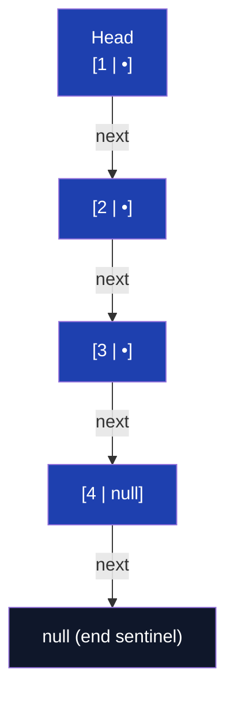

**C# Implementation**

```csharp
public class ListNode
{
    public int Val;
    public ListNode? Next;
    public ListNode(int val, ListNode? next = null) { Val = val; Next = next; }
}

public class SinglyLinkedList
{
    private ListNode? _head;

    // O(1) — insert at head
    public void InsertAtHead(int val)
    {
        _head = new ListNode(val, _head);
    }

    // O(n) — insert at tail
    public void InsertAtTail(int val)
    {
        var newNode = new ListNode(val);
        if (_head == null) { _head = newNode; return; }

        var curr = _head;
        while (curr.Next != null) curr = curr.Next;
        curr.Next = newNode;
    }

    // O(n) — insert after a given value
    public bool InsertAfter(int target, int newVal)
    {
        var curr = _head;
        while (curr != null)
        {
            if (curr.Val == target)
            {
                curr.Next = new ListNode(newVal, curr.Next);
                return true;
            }
            curr = curr.Next;
        }
        return false;
    }

    // O(n) — delete first occurrence of value
    public bool Delete(int val)
    {
        if (_head == null) return false;

        // Handle head deletion
        if (_head.Val == val) { _head = _head.Next; return true; }

        // Use dummy node pattern to avoid special-casing head
        var curr = _head;
        while (curr.Next != null)
        {
            if (curr.Next.Val == val)
            {
                curr.Next = curr.Next.Next; // bypass the node
                return true;
            }
            curr = curr.Next;
        }
        return false;
    }

    // O(n) — traverse and print
    public void Print()
    {
        var curr = _head;
        while (curr != null)
        {
            Console.Write($"{curr.Val}");
            if (curr.Next != null) Console.Write(" -> ");
            curr = curr.Next;
        }
        Console.WriteLine(" -> null");
    }

    // O(n) — convert to array for testing
    public int[] ToArray()
    {
        var result = new List<int>();
        var curr = _head;
        while (curr != null) { result.Add(curr.Val); curr = curr.Next; }
        return [.. result];
    }
}
```

**Interview Q&A**

| Question | Answer |
|---|---|
| Why use a dummy node for deletion? | A dummy node before the head unifies the deletion logic. Without it, deleting the head requires a special case. With a dummy: `prev.Next = prev.Next.Next` works for all positions including head (dummy is always `prev`). |
| How does linked list compare to array for cache performance? | Arrays are cache-friendly (contiguous memory, CPU prefetcher works well). Linked list nodes are scattered on the heap — each `Next` pointer dereference is a potential cache miss. For large lists, this causes significant slowdowns. |
| What is the difference between singly and doubly linked list? | Singly: each node has only a `Next` pointer. Doubly: each node has both `Next` and `Prev`. Doubly allows O(1) deletion given a node reference and backward traversal, at the cost of extra memory per node. |
| When would you use a linked list over an array? | When you need frequent O(1) insertions/deletions at the head/tail and random access is not needed. Examples: implementing a queue, LRU cache (doubly linked + hashmap), undo history. |
| What happens if you set `curr.Next = curr.Next.Next` without null check? | If `curr.Next` is null (end of list), accessing `.Next` on null throws `NullReferenceException`. Always check `curr.Next != null` before accessing its members. |

**Common Pitfalls**

- **Losing the tail**: When deleting the last node, forgetting that `curr.Next.Next` is null — the check `while (curr.Next != null)` ensures we stop at the second-to-last node.
- **Not updating head on head deletion**: If you only unlink the node without updating `_head`, the list still points to the deleted node.
- **Memory leaks in unmanaged contexts**: In C# with GC, unreferenced nodes are collected. In C/C++, failing to `free` deleted nodes causes memory leaks.
- **Infinite loops**: If a cycle exists in the list, traversal with `while (curr != null)` loops forever. Cycle detection (Day 23) must be applied first.

---

#### Day 22: Reverse Linked List

**Overview**

Reversing a linked list is one of the most fundamental pointer manipulation exercises. The iterative approach uses three pointers (prev, curr, next) to reverse each link one at a time. The recursive approach builds the reversed list on the call stack return path. Both are O(n) time, but the iterative approach is O(1) space while recursion is O(n) due to the call stack.

**Complexity**

| Approach | Time | Space | Notes |
|---|---|---|---|
| Iterative (3 pointers) | O(n) | O(1) | Preferred — no stack overflow |
| Recursive | O(n) | O(n) | Call stack depth = list length |
| Reverse between L and R | O(n) | O(1) | Partial reversal variant |

**Diagram**

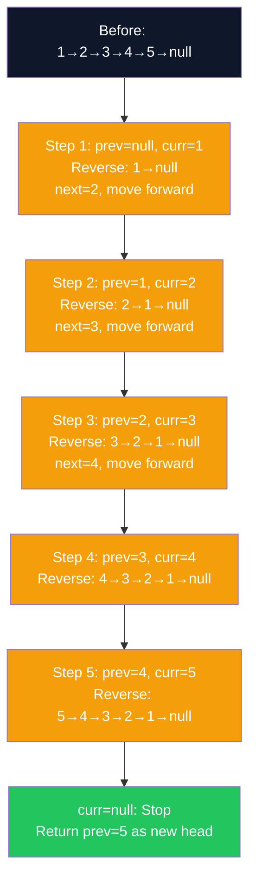

**C# Implementation**

```csharp
public class ReverseLinkedList
{
    // O(n) time, O(1) space — iterative
    public static ListNode? ReverseIterative(ListNode? head)
    {
        ListNode? prev = null;
        ListNode? curr = head;

        while (curr != null)
        {
            var next = curr.Next;  // save next before overwriting
            curr.Next = prev;      // reverse the link
            prev = curr;           // move prev forward
            curr = next;           // move curr forward
        }
        return prev; // new head
    }

    // O(n) time, O(n) space — recursive
    public static ListNode? ReverseRecursive(ListNode? head)
    {
        if (head?.Next == null) return head; // base case: 0 or 1 node

        var newHead = ReverseRecursive(head.Next);
        head.Next.Next = head; // reverse the link on return path
        head.Next = null;       // avoid cycle
        return newHead;
    }

    // Reverse between positions left and right (1-indexed)
    public static ListNode? ReverseBetween(ListNode? head, int left, int right)
    {
        var dummy = new ListNode(0) { Next = head };
        var prev = dummy;

        // Advance prev to node just before position left
        for (int i = 1; i < left; i++) prev = prev.Next!;

        var curr = prev.Next;
        // Reverse (right - left) times
        for (int i = 0; i < right - left; i++)
        {
            var next = curr!.Next;
            curr.Next = next!.Next;
            next.Next = prev.Next;
            prev.Next = next;
        }
        return dummy.Next;
    }
}
```

**Interview Q&A**

| Question | Answer |
|---|---|
| Why do we need three pointers (prev, curr, next)? | `curr.Next = prev` overwrites the only reference to the rest of the list. We must save `curr.Next` in `next` before reversing, then advance both `prev` and `curr` using saved pointers. |
| What is the base case for recursive reversal? | When `head == null` or `head.Next == null` — a null or single-node list is already reversed. |
| Why set `head.Next = null` in the recursive approach? | After reversing, the original head becomes the tail. If we don't null its `Next`, we create a cycle: head.Next.Next = head creates head ↔ head.Next. |
| How does ReverseBetween work with one pass? | Use "front-insertion": repeatedly take the node after `curr` and insert it right after `prev`. This reverses in-place without finding the sublist boundaries twice. |
| What is the iterative approach's loop invariant? | After each iteration, all nodes from head to `prev` are correctly reversed (their links point backward). `curr` points to the start of the not-yet-reversed portion. |

**Common Pitfalls**

- **Saving `next` after overwriting**: Doing `curr.Next = prev` before saving `curr.Next` loses the rest of the list permanently.
- **Not returning `prev`**: After the loop, `curr == null`. The new head is `prev` (last node of original list). Returning `curr` returns null.
- **Recursive stack overflow**: For very long lists (10,000+ nodes), recursion may overflow the default .NET stack (~1MB). Iterative is always safer.

---

#### Day 23: Floyd's Cycle Detection

**Overview**

Floyd's Tortoise and Hare algorithm detects cycles in a linked list using two pointers: slow (moves 1 step) and fast (moves 2 steps). If a cycle exists, fast will lap slow and they will meet inside the cycle. If no cycle, fast reaches null. Phase 2 extends this: to find the cycle start, move one pointer to the head and advance both one step at a time — they meet exactly at the cycle entry point. This is a mathematical result based on modular arithmetic.

**Complexity**

| Operation | Time | Space | Notes |
|---|---|---|---|
| Detect cycle | O(n) | O(1) | Fast meets slow within cycle |
| Find cycle start | O(n) | O(1) | Two-phase algorithm |
| Find cycle length | O(n) | O(1) | Count steps from meeting point |
| HashSet approach (detection) | O(n) | O(n) | Simpler but uses extra space |

**Diagram**

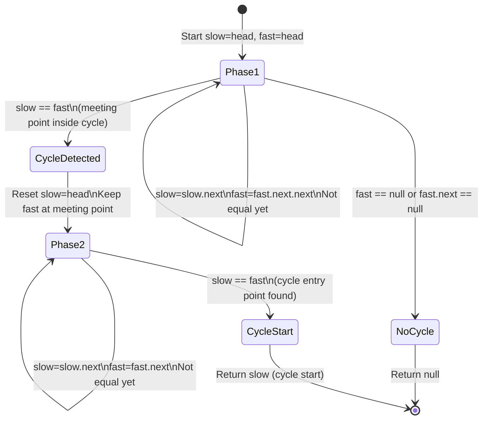

**C# Implementation**

```csharp
public class CycleDetection
{
    // Phase 1: Detect if cycle exists — O(n) time, O(1) space
    public static bool HasCycle(ListNode? head)
    {
        var slow = head;
        var fast = head;

        while (fast?.Next != null)
        {
            slow = slow!.Next;
            fast = fast.Next.Next;
            if (slow == fast) return true; // pointers met — cycle exists
        }
        return false; // fast hit null — no cycle
    }

    // Phase 1 + Phase 2: Find cycle start node
    public static ListNode? DetectCycleStart(ListNode? head)
    {
        ListNode? slow = head, fast = head;

        // Phase 1: find meeting point
        while (fast?.Next != null)
        {
            slow = slow!.Next;
            fast = fast.Next.Next;
            if (slow == fast) break;
        }

        if (fast?.Next == null) return null; // no cycle

        // Phase 2: find cycle entry
        slow = head;
        while (slow != fast)
        {
            slow = slow!.Next;
            fast = fast!.Next;
        }
        return slow; // cycle start
    }

    // Find the length of the cycle
    public static int CycleLength(ListNode? head)
    {
        var meetingPoint = DetectCycleStart(head);
        if (meetingPoint == null) return 0;

        int length = 1;
        var curr = meetingPoint.Next;
        while (curr != meetingPoint)
        {
            length++;
            curr = curr!.Next;
        }
        return length;
    }
}
```

**Interview Q&A**

| Question | Answer |
|---|---|
| Why does fast pointer moving at 2x speed guarantee meeting slow inside the cycle? | Once both pointers enter the cycle, the distance between them decreases by 1 each step (fast gains 2, slow gains 1, net gain 1). After at most `cycle_length` steps, they meet. |
| Prove Phase 2 finds the cycle start. | Let F = distance from head to cycle start, C = cycle length, D = distance from cycle start to meeting point. At meeting: slow moved F+D steps, fast moved F+D+kC steps. Since fast = 2*slow: 2(F+D) = F+D+kC → F = kC-D. So from meeting point, D more steps reaches the cycle start, same as F steps from head. |
| What if the cycle starts at the head itself? | The algorithm still works. Phase 2 starts `slow` at head. If head is the cycle start, `slow == fast` immediately when `slow` reaches head and `fast` has looped back. |
| Can you solve cycle detection with O(n) space? | Yes: use a HashSet. Add each node to the set; if you encounter a node already in the set, it's the cycle start. Less elegant but simpler to implement. |
| What is the time complexity of Phase 2? | O(F) where F is the distance from head to cycle start. In the worst case F = O(n), so the total algorithm is O(n). |

**Common Pitfalls**

- **Checking `slow == fast` before advancing**: If initialized at the same node (head), they are trivially equal. Advance both once before checking, or check inside the loop after advancing.
- **Null safety**: `fast.Next.Next` requires `fast != null && fast.Next != null`. Use `fast?.Next != null` as the while condition.
- **Phase 2 without null check**: If Phase 1 exits because `fast.Next == null` (no cycle), Phase 2 must not run. Check the exit condition carefully.

---

#### Day 24–25: Find Middle Node & Merge Two Sorted Lists

**Overview**

Finding the middle node uses the fast/slow pointer pattern: fast moves 2 steps, slow moves 1 step. When fast reaches the end, slow is at the middle. For even-length lists, this gives the second middle — returning the first middle requires a slight variation in the stopping condition. Merging two sorted linked lists is the merge step of merge sort — comparing heads and linking the smaller one, advancing that pointer.

**Complexity**

| Operation | Time | Space | Notes |
|---|---|---|---|
| Find middle (two-pointer) | O(n) | O(1) | Optimal |
| Find middle (count then traverse) | O(n) | O(1) | Two passes |
| Merge two sorted lists | O(n+m) | O(1) | Iterative; O(n+m) recursive |
| Merge K sorted lists | O(N log K) | O(K) | Heap-based (Day 53) |

**C# Implementation**

```csharp
public class LinkedListProblems
{
    // Find middle — slow/fast pointer
    // For even length, returns second middle (standard LeetCode definition)
    public static ListNode? FindMiddle(ListNode? head)
    {
        var slow = head;
        var fast = head;

        while (fast?.Next != null)
        {
            slow = slow!.Next;
            fast = fast.Next.Next;
        }
        return slow; // slow is at middle
    }

    // Merge two sorted linked lists — O(n+m) time, O(1) space
    public static ListNode? MergeSorted(ListNode? l1, ListNode? l2)
    {
        var dummy = new ListNode(0); // dummy head to simplify code
        var curr = dummy;

        while (l1 != null && l2 != null)
        {
            if (l1.Val <= l2.Val)
            {
                curr.Next = l1;
                l1 = l1.Next;
            }
            else
            {
                curr.Next = l2;
                l2 = l2.Next;
            }
            curr = curr.Next;
        }
        curr.Next = l1 ?? l2; // attach remaining nodes
        return dummy.Next;
    }

    // Merge two sorted lists — recursive (elegant but O(n+m) stack space)
    public static ListNode? MergeSortedRecursive(ListNode? l1, ListNode? l2)
    {
        if (l1 == null) return l2;
        if (l2 == null) return l1;

        if (l1.Val <= l2.Val)
        {
            l1.Next = MergeSortedRecursive(l1.Next, l2);
            return l1;
        }
        else
        {
            l2.Next = MergeSortedRecursive(l1, l2.Next);
            return l2;
        }
    }

    // Sort a linked list — merge sort O(n log n), O(log n) space
    public static ListNode? SortList(ListNode? head)
    {
        if (head?.Next == null) return head;

        // Find middle and split
        var slow = head;
        var fast = head.Next; // offset by 1 to get first middle on even length
        while (fast?.Next != null) { slow = slow!.Next; fast = fast.Next.Next; }

        var mid = slow!.Next;
        slow.Next = null; // split the list

        var left = SortList(head);
        var right = SortList(mid);
        return MergeSorted(left, right);
    }
}
```

**Interview Q&A**

| Question | Answer |
|---|---|
| Why use a dummy node in MergeSorted? | The first merged node could be from either l1 or l2. A dummy node lets `curr.Next = ...` work uniformly for all nodes including the first, avoiding a special case. |
| Why does `curr.Next = l1 ?? l2` work at the end? | When one list is exhausted, the remaining nodes of the other are already sorted. We can attach them directly without traversing — they stay in order. |
| What stopping condition gives the FIRST middle on even length? | Use `fast = head.Next` instead of `fast = head` at the start. When fast reaches null, slow is at the first middle instead of second. |
| Why is merge sort preferred over quick sort for linked lists? | Merge sort only needs sequential access (O(1) pointer operations per merge step). Quick sort on a linked list requires random access for partitioning, which is O(n) for linked lists, making quick sort O(n²) worst case. |

**Common Pitfalls**

- **Not splitting the list in SortList**: Forgetting `slow.Next = null` before recursion means both halves still reference the same list, causing infinite recursion.
- **Wrong middle for SortList**: Using `fast = head` gives the second middle on even-length lists — the split is uneven, but still correct. Use `fast = head.Next` for first middle if you want equal halves.
- **Using merge sort for arrays**: Merge sort for arrays requires O(n) extra space for the merge step. For linked lists it's O(1) (in-place linking). Know the difference.

---

### Week 5 (Day 29–35) — Stack & Queue

#### Day 29: Stack — LIFO Implementation

**Overview**

A stack is a Last-In-First-Out (LIFO) data structure. Push adds to the top, Pop removes from the top, Peek reads the top without removing. In C#, `Stack<T>` is the built-in implementation. For interviews, you may need to implement one using an array or linked list to demonstrate understanding. Stacks are the natural structure for DFS, expression evaluation, undo operations, and call stack simulation.

**Complexity**

| Operation | Array-based | LinkedList-based | Notes |
|---|---|---|---|
| Push | O(1) amortized | O(1) | Array resizes occasionally |
| Pop | O(1) | O(1) | |
| Peek | O(1) | O(1) | |
| IsEmpty | O(1) | O(1) | |
| Search | O(n) | O(n) | Not a primary operation |

**C# Implementation**

```csharp
// Array-based stack implementation
public class ArrayStack<T>
{
    private T[] _data;
    private int _top = -1;

    public ArrayStack(int capacity = 16) => _data = new T[capacity];

    public bool IsEmpty => _top < 0;
    public int Count => _top + 1;

    public void Push(T item)
    {
        if (_top == _data.Length - 1)
        {
            // Resize: double capacity
            var newData = new T[_data.Length * 2];
            Array.Copy(_data, newData, _data.Length);
            _data = newData;
        }
        _data[++_top] = item;
    }

    public T Pop()
    {
        if (IsEmpty) throw new InvalidOperationException("Stack is empty");
        var item = _data[_top];
        _data[_top--] = default!; // clear reference (help GC for reference types)
        return item;
    }

    public T Peek()
    {
        if (IsEmpty) throw new InvalidOperationException("Stack is empty");
        return _data[_top];
    }
}

// Using C# built-in Stack<T>
public class StackUsageExamples
{
    // Evaluate Reverse Polish Notation (RPN)
    public static int EvalRPN(string[] tokens)
    {
        var stack = new Stack<int>();
        foreach (var token in tokens)
        {
            if (int.TryParse(token, out int num))
            {
                stack.Push(num);
            }
            else
            {
                int b = stack.Pop(), a = stack.Pop();
                stack.Push(token switch
                {
                    "+" => a + b,
                    "-" => a - b,
                    "*" => a * b,
                    "/" => a / b,
                    _ => throw new ArgumentException($"Unknown operator: {token}")
                });
            }
        }
        return stack.Pop();
    }

    // Decode string: "3[a2[bc]]" -> "abcbcabcbcabcbc"
    public static string DecodeString(string s)
    {
        var countStack = new Stack<int>();
        var strStack = new Stack<StringBuilder>();
        var current = new StringBuilder();
        int k = 0;

        foreach (char c in s)
        {
            if (char.IsDigit(c))
            {
                k = k * 10 + (c - '0'); // handle multi-digit numbers
            }
            else if (c == '[')
            {
                countStack.Push(k);
                strStack.Push(current);
                current = new StringBuilder();
                k = 0;
            }
            else if (c == ']')
            {
                int repeat = countStack.Pop();
                var prev = strStack.Pop();
                for (int i = 0; i < repeat; i++) prev.Append(current);
                current = prev;
            }
            else
            {
                current.Append(c);
            }
        }
        return current.ToString();
    }
}
```

**Interview Q&A**

| Question | Answer |
|---|---|
| How does a call stack relate to the Stack data structure? | The CPU call stack is literally a stack: function calls push a stack frame (local vars, return address), and returning pops it. Recursive algorithms mirror this — each recursive call adds a frame. |
| How do you implement a stack using two queues? | Push: enqueue to q1. Pop: move all but last from q1 to q2, dequeue last from q1 (this is the top), swap q1 and q2. O(n) pop, O(1) push. |
| How do you implement a queue using two stacks? | Enqueue: push to stack1. Dequeue: if stack2 empty, pour all of stack1 into stack2, then pop from stack2. Amortized O(1) dequeue. |
| What is a monotonic stack and when is it used? | A stack that maintains elements in monotonically increasing or decreasing order. Used to find next greater element, previous smaller element, or largest rectangle in histogram. |

**Common Pitfalls**

- **Not checking `IsEmpty` before `Pop`/`Peek`**: Throws `InvalidOperationException`. Always check or handle the exception.
- **Using `Stack<T>` for BFS**: Stack gives DFS behavior (LIFO). For BFS, use `Queue<T>`.
- **Not clearing the array slot after pop**: For reference types, `_data[_top--]` leaves a stale reference preventing GC. Always set `_data[_top] = default` before decrementing `_top`.

---

#### Day 30: Valid Parentheses

**Overview**

Valid Parentheses is the canonical stack application: push opening brackets, pop and verify on closing brackets. The key insight is that the most recently opened bracket must be the next one closed (LIFO). This extends naturally to any balanced delimiter problem — HTML tag matching, code bracket validation, etc.

**Complexity**

| Approach | Time | Space | Notes |
|---|---|---|---|
| Stack-based | O(n) | O(n) | At most n/2 brackets on stack |
| Counter (only one bracket type) | O(n) | O(1) | Only works for single pair type |

**C# Implementation**

```csharp
public class Parentheses
{
    public static bool IsValid(string s)
    {
        var stack = new Stack<char>();
        var pairs = new Dictionary<char, char>
        {
            [')'] = '(',
            [']'] = '[',
            ['}'] = '{'
        };

        foreach (char c in s)
        {
            if (!pairs.ContainsKey(c))
            {
                stack.Push(c); // opening bracket
            }
            else
            {
                // Closing bracket: stack must have matching opening on top
                if (stack.Count == 0 || stack.Pop() != pairs[c])
                    return false;
            }
        }
        return stack.Count == 0; // all brackets matched
    }

    // Minimum remove to make valid
    public static string MinRemoveToMakeValid(string s)
    {
        var indexToRemove = new HashSet<int>();
        var stack = new Stack<int>(); // store indices of unmatched '('

        for (int i = 0; i < s.Length; i++)
        {
            if (s[i] == '(') stack.Push(i);
            else if (s[i] == ')')
            {
                if (stack.Count > 0) stack.Pop(); // matched
                else indexToRemove.Add(i); // unmatched ')'
            }
        }
        while (stack.Count > 0) indexToRemove.Add(stack.Pop()); // unmatched '('

        var sb = new StringBuilder();
        for (int i = 0; i < s.Length; i++)
            if (!indexToRemove.Contains(i)) sb.Append(s[i]);
        return sb.ToString();
    }
}
```

**Interview Q&A**

| Question | Answer |
|---|---|
| Why must the stack be empty at the end? | All opening brackets must have been matched by closing brackets. If the stack is non-empty, some opening brackets were never closed. |
| What does `stack.Count == 0` check on a closing bracket catch? | An unmatched closing bracket when no opening bracket is on the stack — e.g., "]" or ")(". |
| How would you extend this for HTML tag validation? | Push tag names on opening tags (`<div>`), pop and verify on closing tags (`</div>`). Use a string stack instead of char stack. |

**Common Pitfalls**

- **Checking `stack.Peek()` instead of `stack.Pop()`**: Peek doesn't remove the bracket — always Pop when matching.
- **Not checking stack empty before Pop**: Calling `Pop` on empty stack throws. Check `stack.Count > 0` first.
- **Returning true when stack is non-empty**: Forgetting the final `stack.Count == 0` check misses unclosed brackets.

---

#### Day 31: Next Greater Element — Monotonic Stack

**Overview**

The Next Greater Element problem asks: for each element in an array, find the next element to the right that is larger. Naive solution is O(n²). Monotonic stack solves it in O(n): maintain a stack of indices whose "next greater" hasn't been found. When a larger element arrives, it becomes the "next greater" for everything smaller currently on the stack.

**Complexity**

| Approach | Time | Space | Notes |
|---|---|---|---|
| Brute force | O(n²) | O(1) | Double loop |
| Monotonic stack | O(n) | O(n) | Each element pushed/popped once |
| Circular array variant | O(n) | O(n) | Two passes or 2n loop |

**C# Implementation**

```csharp
public class MonotonicStack
{
    // Next Greater Element — O(n) monotonic stack
    public static int[] NextGreaterElement(int[] nums)
    {
        int n = nums.Length;
        var result = new int[n];
        Array.Fill(result, -1); // default: no greater element
        var stack = new Stack<int>(); // stores indices

        for (int i = 0; i < n; i++)
        {
            // Pop all elements smaller than current — current is their "next greater"
            while (stack.Count > 0 && nums[stack.Peek()] < nums[i])
                result[stack.Pop()] = nums[i];
            stack.Push(i);
        }
        return result;
    }

    // Next Greater Element II — circular array
    public static int[] NextGreaterElementCircular(int[] nums)
    {
        int n = nums.Length;
        var result = new int[n];
        Array.Fill(result, -1);
        var stack = new Stack<int>();

        // Two passes simulates circular wrapping
        for (int i = 0; i < 2 * n; i++)
        {
            int idx = i % n;
            while (stack.Count > 0 && nums[stack.Peek()] < nums[idx])
                result[stack.Pop()] = nums[idx];
            if (i < n) stack.Push(idx); // only push in first pass
        }
        return result;
    }

    // Daily Temperatures — next warmer day
    public static int[] DailyTemperatures(int[] temps)
    {
        int n = temps.Length;
        var result = new int[n];
        var stack = new Stack<int>();

        for (int i = 0; i < n; i++)
        {
            while (stack.Count > 0 && temps[stack.Peek()] < temps[i])
            {
                int idx = stack.Pop();
                result[idx] = i - idx; // days until warmer
            }
            stack.Push(i);
        }
        return result;
    }

    // Largest Rectangle in Histogram — O(n) with monotonic stack
    public static int LargestRectangle(int[] heights)
    {
        var stack = new Stack<int>(); // indices of bars in increasing height order
        int maxArea = 0;
        int n = heights.Length;

        for (int i = 0; i <= n; i++)
        {
            int h = i == n ? 0 : heights[i]; // sentinel 0 at end flushes stack
            while (stack.Count > 0 && heights[stack.Peek()] > h)
            {
                int height = heights[stack.Pop()];
                int width = stack.Count == 0 ? i : i - stack.Peek() - 1;
                maxArea = Math.Max(maxArea, height * width);
            }
            stack.Push(i);
        }
        return maxArea;
    }
}
```

**Interview Q&A**

| Question | Answer |
|---|---|
| Why is the stack monotonically decreasing (by value) in Next Greater Element? | We only push elements whose "next greater" hasn't been found. When a new element arrives that's larger than the top, that top's "next greater" is found. Elements remaining smaller stay on the stack. |
| Why does each element get pushed and popped at most once? | Each element is pushed once when first seen and popped once when its next greater element is found (or at end if none). Total operations = 2n = O(n). |
| How does the circular array variant work? | By iterating 2n times (modular index), we simulate wrapping around. We only push in the first n iterations to avoid re-pushing; in the second n iterations we only process pops. |
| What is the Largest Rectangle in Histogram algorithm? | Use a monotonic increasing stack. When a shorter bar arrives, it limits all taller bars still on the stack. Pop each taller bar and compute its rectangle width as distance to the current bar and the last popped bar. |

**Common Pitfalls**

- **Storing values instead of indices**: When computing distances (Daily Temperatures, Largest Rectangle), you need indices, not just values. Always push indices.
- **Not initializing result to -1**: For elements with no greater element, the result should be -1 (or 0 for Daily Temperatures). Failing to initialize defaults the answer to 0.

---

#### Day 32–33: Queue & Sliding Window Maximum

**Overview**

A queue is First-In-First-Out (FIFO). In C#, `Queue<T>` provides O(1) enqueue/dequeue. A deque (double-ended queue, `LinkedList<T>` or `Deque` pattern) supports O(1) add/remove from both ends. The Sliding Window Maximum problem uses a **monotonic deque**: maintain a deque of indices in decreasing order of values, so the front is always the maximum of the current window.

**Complexity**

| Operation | Queue<T> | Deque (LinkedList) | Notes |
|---|---|---|---|
| Enqueue/AddLast | O(1) | O(1) | |
| Dequeue/RemoveFirst | O(1) | O(1) | |
| Peek front | O(1) | O(1) | |
| Sliding Window Max | O(n) | O(n) | Each element added/removed once |

**C# Implementation**

```csharp
public class QueueProblems
{
    // Sliding Window Maximum — O(n) monotonic deque
    public static int[] MaxSlidingWindow(int[] nums, int k)
    {
        int n = nums.Length;
        var result = new int[n - k + 1];
        var deque = new LinkedList<int>(); // stores indices, front = max index

        for (int i = 0; i < n; i++)
        {
            // Remove elements outside current window
            while (deque.Count > 0 && deque.First!.Value < i - k + 1)
                deque.RemoveFirst();

            // Maintain decreasing order — remove smaller elements from back
            while (deque.Count > 0 && nums[deque.Last!.Value] < nums[i])
                deque.RemoveLast();

            deque.AddLast(i);

            // Window is full — record maximum (front of deque)
            if (i >= k - 1)
                result[i - k + 1] = nums[deque.First!.Value];
        }
        return result;
    }

    // Implement queue using two stacks — amortized O(1) dequeue
    public class MyQueue
    {
        private readonly Stack<int> _inbox = new();   // for enqueue
        private readonly Stack<int> _outbox = new();  // for dequeue

        public void Enqueue(int val) => _inbox.Push(val);

        public int Dequeue()
        {
            if (_outbox.Count == 0)
                while (_inbox.Count > 0)
                    _outbox.Push(_inbox.Pop()); // pour inbox into outbox
            return _outbox.Pop();
        }

        public int Peek()
        {
            if (_outbox.Count == 0)
                while (_inbox.Count > 0)
                    _outbox.Push(_inbox.Pop());
            return _outbox.Peek();
        }

        public bool IsEmpty => _inbox.Count == 0 && _outbox.Count == 0;
    }
}
```

**Interview Q&A**

| Question | Answer |
|---|---|
| Why does the monotonic deque give O(n) for sliding window max? | Each element is added to the deque once and removed at most once — total 2n operations across the entire array traversal. |
| Why does removing smaller elements from the back work? | If a new element is larger than elements at the back, those smaller elements will never be the maximum of any future window (the new element is both larger and more recent). |
| When would you use ArrayDeque vs LinkedList for the deque? | For the sliding window maximum in C#, `LinkedList<T>` is used as a deque since C# lacks a built-in ArrayDeque. `LinkedList` provides O(1) operations at both ends. For production, consider a custom circular buffer. |

**Common Pitfalls**

- **Removing expired indices before removing smaller values**: Order matters. Remove out-of-window indices from the front first, then clean up smaller values from the back before adding the new element.
- **Off-by-one in window boundary**: An element at index i is outside window `[i-k+1, i]` when its index < `i-k+1`, not `<=`.

---

### Week 6 (Day 36–45) — Recursion & Trees

#### Day 36–37: Recursion Basics, Factorial & Fibonacci

**Overview**

Recursion solves problems by reducing them to smaller instances of the same problem. Every recursive solution needs a **base case** (terminates recursion) and a **recursive case** (reduces the problem). The call stack grows with each recursive call — for deep recursion, this risks stack overflow. Memoization caches results to avoid recomputation; for Fibonacci, this transforms O(2^n) to O(n). Iterative solutions (bottom-up DP) eliminate the stack entirely.

**Complexity**

| Algorithm | Approach | Time | Space | Notes |
|---|---|---|---|---|
| Factorial | Iterative | O(n) | O(1) | Best approach |
| Factorial | Recursive | O(n) | O(n) | Call stack depth = n |
| Fibonacci | Naive recursive | O(2^n) | O(n) | Exponential — avoid |
| Fibonacci | Memoized | O(n) | O(n) | Top-down DP |
| Fibonacci | Iterative | O(n) | O(1) | Bottom-up DP — best |
| Fibonacci | Matrix power | O(log n) | O(1) | Optimal for large n |

**Diagram**

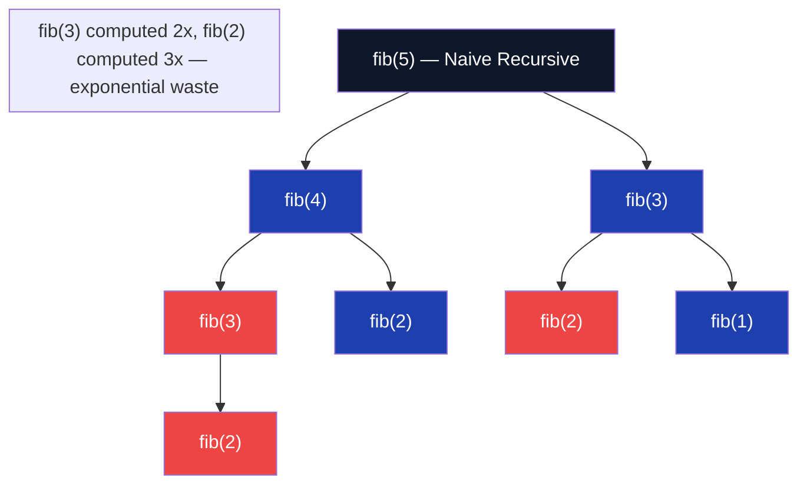

**C# Implementation**

```csharp
public class RecursionBasics
{
    // Factorial — iterative (best)
    public static long FactorialIterative(int n)
    {
        if (n < 0) throw new ArgumentException("n must be non-negative");
        long result = 1;
        for (int i = 2; i <= n; i++) result *= i;
        return result;
    }

    // Factorial — recursive (educational)
    public static long FactorialRecursive(int n)
    {
        if (n <= 1) return 1; // base case
        return n * FactorialRecursive(n - 1); // recursive case
    }

    // Fibonacci — naive (avoid, O(2^n))
    public static long FibNaive(int n)
    {
        if (n <= 1) return n;
        return FibNaive(n - 1) + FibNaive(n - 2);
    }

    // Fibonacci — memoized (top-down DP, O(n) time/space)
    private static readonly Dictionary<int, long> _memo = new();
    public static long FibMemo(int n)
    {
        if (n <= 1) return n;
        if (_memo.TryGetValue(n, out long cached)) return cached;
        return _memo[n] = FibMemo(n - 1) + FibMemo(n - 2);
    }

    // Fibonacci — iterative (bottom-up DP, O(n) time, O(1) space)
    public static long FibIterative(int n)
    {
        if (n <= 1) return n;
        long prev2 = 0, prev1 = 1;
        for (int i = 2; i <= n; i++)
            (prev2, prev1) = (prev1, prev1 + prev2);
        return prev1;
    }

    // Power function — O(log n) via fast exponentiation
    public static double Power(double x, int n)
    {
        long exp = n;
        if (exp < 0) { x = 1 / x; exp = -exp; }

        double result = 1;
        while (exp > 0)
        {
            if ((exp & 1) == 1) result *= x; // odd exponent
            x *= x;
            exp >>= 1;
        }
        return result;
    }
}
```

**Interview Q&A**

| Question | Answer |
|---|---|
| Why is naive Fibonacci O(2^n)? | The recursion tree has nodes fib(n-1) and fib(n-2) at each level. The tree has roughly 2^n nodes total. fib(n-2), fib(n-3), etc. are recomputed exponentially many times. |
| What is the difference between memoization and tabulation? | Memoization (top-down): start with the original problem, recurse, cache results. Tabulation (bottom-up): build the solution table from smallest subproblems up. Tabulation avoids recursion overhead and stack usage. |
| What is tail recursion and does C# optimize it? | Tail recursion: the recursive call is the last operation (no work after it returns). Some compilers/runtimes optimize this to iteration. C# JIT does NOT guarantee tail call optimization (TCO), unlike F# which does. |
| What causes StackOverflowException in recursion? | Each recursive call allocates a stack frame (local variables, return address, parameters). The .NET default stack size is ~1MB (4MB for 64-bit). For n > ~10,000 recursive calls, this overflows. |

**Common Pitfalls**

- **Missing or wrong base case**: The most common recursion bug. Always trace through your base case manually.
- **Not returning the recursive result**: `FactorialRecursive(n-1)` without `return` in a void method silently computes nothing.
- **Mutable shared memo dictionary**: In concurrent scenarios, the static `_memo` dictionary causes race conditions. Use thread-local or pass memo explicitly.

---

#### Day 38–39: Subsets & Permutations

**Overview**

Subsets (Power Set) and Permutations are foundational backtracking problems. Subsets generates all 2^n subsets of a set; Permutations generates all n! orderings. Both use backtracking: make a choice, recurse, undo the choice. The bit manipulation approach for subsets uses the observation that each subset corresponds to a bitmask from 0 to 2^n - 1. Understanding these unlocks combination sum, letter combinations, N-Queens, and most "generate all" problems.

**Complexity**

| Problem | Time | Space | Notes |
|---|---|---|---|
| Subsets (backtracking) | O(2^n * n) | O(n) | 2^n subsets, O(n) to copy each |
| Subsets (bit manipulation) | O(2^n * n) | O(1) extra | Same output, iterative |
| Permutations | O(n! * n) | O(n) | n! permutations, O(n) each |
| Combinations C(n,k) | O(C(n,k) * k) | O(k) | |

**C# Implementation**

```csharp
public class BacktrackingProblems
{
    // Subsets — backtracking O(2^n * n)
    public static IList<IList<int>> Subsets(int[] nums)
    {
        var result = new List<IList<int>>();
        Backtrack(nums, 0, [], result);
        return result;

        static void Backtrack(int[] nums, int start, List<int> current, List<IList<int>> result)
        {
            result.Add([.. current]); // add current subset (copy)
            for (int i = start; i < nums.Length; i++)
            {
                current.Add(nums[i]);           // choose
                Backtrack(nums, i + 1, current, result); // explore
                current.RemoveAt(current.Count - 1); // unchoose
            }
        }
    }

    // Subsets — bit manipulation O(2^n * n), no recursion
    public static IList<IList<int>> SubsetsBitmask(int[] nums)
    {
        int n = nums.Length;
        var result = new List<IList<int>>();

        for (int mask = 0; mask < (1 << n); mask++)
        {
            var subset = new List<int>();
            for (int i = 0; i < n; i++)
                if ((mask & (1 << i)) != 0) subset.Add(nums[i]);
            result.Add(subset);
        }
        return result;
    }

    // Permutations — backtracking with swap
    public static IList<IList<int>> Permutations(int[] nums)
    {
        var result = new List<IList<int>>();
        Backtrack(nums, 0, result);
        return result;

        static void Backtrack(int[] nums, int start, List<IList<int>> result)
        {
            if (start == nums.Length) { result.Add([.. nums]); return; }

            for (int i = start; i < nums.Length; i++)
            {
                (nums[start], nums[i]) = (nums[i], nums[start]); // swap
                Backtrack(nums, start + 1, result);
                (nums[start], nums[i]) = (nums[i], nums[start]); // swap back
            }
        }
    }

    // Combination Sum — pick numbers that sum to target (with repetition)
    public static IList<IList<int>> CombinationSum(int[] candidates, int target)
    {
        var result = new List<IList<int>>();
        Array.Sort(candidates);

        void Backtrack(int start, int remaining, List<int> current)
        {
            if (remaining == 0) { result.Add([.. current]); return; }
            for (int i = start; i < candidates.Length; i++)
            {
                if (candidates[i] > remaining) break; // pruning
                current.Add(candidates[i]);
                Backtrack(i, remaining - candidates[i], current); // i (not i+1) allows reuse
                current.RemoveAt(current.Count - 1);
            }
        }

        Backtrack(0, target, []);
        return result;
    }
}
```

**Interview Q&A**

| Question | Answer |
|---|---|
| Why does the backtracking template always have "choose, explore, unchoose"? | The "unchoose" step restores state to what it was before the choice, so the parent call continues with the original state. Without unchoose, every recursive call would see a permanently modified state. |
| How many subsets does a set of n elements have? | 2^n. Each element is either included or excluded — 2 choices per element, n elements. |
| What is the difference between Subsets and Combinations C(n,k)? | Subsets generates all C(n,0) + C(n,1) + ... + C(n,n) = 2^n subsets of all sizes. Combinations C(n,k) generates only subsets of exactly size k. |
| Why does the bitmask approach work for subsets? | There are exactly 2^n bitmasks from 0 to 2^n-1. Each bit i in mask k indicates whether nums[i] is in the k-th subset. Every subset corresponds to exactly one bitmask. |
| How does sorting enable pruning in Combination Sum? | After sorting, if `candidates[i] > remaining`, all subsequent candidates are also larger (sorted). The `break` exits the loop early, pruning exponentially many branches. |

**Common Pitfalls**

- **Adding reference instead of copy**: `result.Add(current)` adds the same list reference — when `current` is later modified (backtrack undo), all previously added entries change. Always `result.Add([.. current])` (copy).
- **Off-by-one in start index for Combination Sum with repetition**: Use `i` (not `i+1`) as the next start index to allow the same element to be chosen again.
- **Forgetting the swap-back in Permutations**: Without restoring the swap, subsequent iterations see a wrong array state.

---

#### Day 40–43: Binary Trees — Traversals, Height & Diameter

**Overview**

A binary tree is a hierarchical structure where each node has at most two children (left and right). A Binary Search Tree (BST) adds the invariant: all left descendants < node < all right descendants, enabling O(log n) average search. Tree traversals — inorder (left-root-right), preorder (root-left-right), postorder (left-right-root) — each have distinct applications. Height and diameter are fundamental DFS problems that teach returning multiple values from recursion.

**Complexity**

| Operation | BST Average | BST Worst | Balanced BST |
|---|---|---|---|
| Search | O(log n) | O(n) | O(log n) |
| Insert | O(log n) | O(n) | O(log n) |
| Delete | O(log n) | O(n) | O(log n) |
| Any traversal | O(n) | O(n) | O(n) |
| Height | O(n) | O(n) | O(n) |

**Diagram**

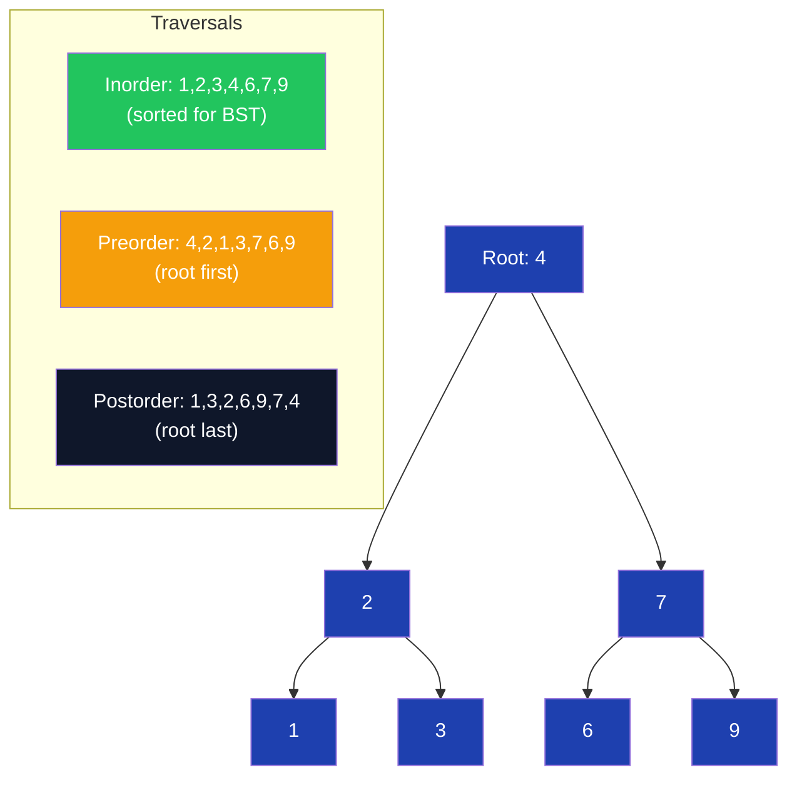

**C# Implementation**

```csharp
public class TreeNode
{
    public int Val;
    public TreeNode? Left, Right;
    public TreeNode(int val) { Val = val; }
}

public class BinaryTree
{
    // Inorder traversal — recursive
    public static IList<int> InorderRecursive(TreeNode? root)
    {
        var result = new List<int>();
        void Dfs(TreeNode? node)
        {
            if (node == null) return;
            Dfs(node.Left);
            result.Add(node.Val);
            Dfs(node.Right);
        }
        Dfs(root);
        return result;
    }

    // Inorder traversal — iterative (Stack-based)
    public static IList<int> InorderIterative(TreeNode? root)
    {
        var result = new List<int>();
        var stack = new Stack<TreeNode>();
        var curr = root;

        while (curr != null || stack.Count > 0)
        {
            while (curr != null) { stack.Push(curr); curr = curr.Left; } // go left
            curr = stack.Pop();
            result.Add(curr.Val); // visit
            curr = curr.Right;    // go right
        }
        return result;
    }

    // Level Order Traversal — BFS with Queue
    public static IList<IList<int>> LevelOrder(TreeNode? root)
    {
        var result = new List<IList<int>>();
        if (root == null) return result;

        var queue = new Queue<TreeNode>();
        queue.Enqueue(root);

        while (queue.Count > 0)
        {
            int levelSize = queue.Count;
            var level = new List<int>();

            for (int i = 0; i < levelSize; i++)
            {
                var node = queue.Dequeue();
                level.Add(node.Val);
                if (node.Left != null) queue.Enqueue(node.Left);
                if (node.Right != null) queue.Enqueue(node.Right);
            }
            result.Add(level);
        }
        return result;
    }

    // Height of tree — O(n) DFS
    public static int Height(TreeNode? root)
    {
        if (root == null) return 0;
        return 1 + Math.Max(Height(root.Left), Height(root.Right));
    }

    // Diameter — longest path between any two nodes (may not pass through root)
    // O(n) — single DFS pass, update global max
    public static int Diameter(TreeNode? root)
    {
        int maxDiameter = 0;

        int Dfs(TreeNode? node)
        {
            if (node == null) return 0;
            int left = Dfs(node.Left);
            int right = Dfs(node.Right);
            maxDiameter = Math.Max(maxDiameter, left + right); // path through this node
            return 1 + Math.Max(left, right); // height of this subtree
        }

        Dfs(root);
        return maxDiameter;
    }

    // Validate BST — O(n) with min/max bounds
    public static bool IsValidBST(TreeNode? root, long min = long.MinValue, long max = long.MaxValue)
    {
        if (root == null) return true;
        if (root.Val <= min || root.Val >= max) return false;
        return IsValidBST(root.Left, min, root.Val) &&
               IsValidBST(root.Right, root.Val, max);
    }
}
```

**Interview Q&A**

| Question | Answer |
|---|---|
| What is the significance of inorder traversal on a BST? | Inorder traversal of a BST always produces nodes in sorted (ascending) order. This property is used to validate BSTs, find kth smallest, and check if two BSTs are identical. |
| Why does iterative inorder use a stack and "go left" loop? | The iterative version manually simulates the call stack. The inner loop descends left to find the leftmost node (equivalent to all the recursive calls going left before any visit). |
| What is the diameter of a tree? | The number of edges on the longest path between any two leaf nodes. This path may or may not pass through the root. The DFS returns height at each node while updating a global max for left+right sum. |
| When does Height O(n) become a concern? | For a degenerate tree (all nodes on one side — essentially a linked list), height = n, and the recursion depth is n, risking StackOverflowException for large trees. An iterative DFS with an explicit stack avoids this. |
| How do you validate a BST without using min/max bounds? | Inorder traversal and check if the resulting sequence is strictly increasing. This is O(n) and equivalent to the bounds approach but uses O(n) space for the result list. |
| What is the difference between complete and perfect binary trees? | Perfect: all internal nodes have 2 children, all leaves at same level. Complete: all levels full except possibly the last, which is filled left to right. Heaps are stored as complete binary trees. |

**Common Pitfalls**

- **Diameter = max height of left + right (wrong)**: The diameter uses the sum of left and right heights AT each node — not the overall max heights. It must be updated inside the DFS, not after.
- **BST validation with only local checks**: Checking `node.Left.Val < node.Val < node.Right.Val` at each node is wrong. The entire left subtree must be < node.Val. Use min/max bounds passed through recursion.
- **Level order returning a flat list**: The problem often asks for a list of lists (one per level). Use `queue.Count` before processing each level to know how many nodes belong to the current level.
- **Forgetting null check before accessing `.Left`/`.Right`**: Always check `node.Left != null` before enqueuing or recursing.

---

## Phase 3: Advanced DSA (Day 46–75)

### Week 7 (Day 46–56) — Binary Search & Heap

#### Day 46–47: Binary Search Basics & First/Last Occurrence

**Overview**

Binary search eliminates half the search space each step, giving O(log n) on sorted arrays. The classic template uses `while (left <= right)` with `mid = left + (right - left) / 2`. Getting the boundary conditions right is the key challenge — a single off-by-one makes the algorithm loop forever or miss the target. First/Last occurrence variants find the leftmost or rightmost index of a target, requiring careful adjustment of `left` or `right` after finding the target.

**Complexity**

| Operation | Time | Space | Notes |
|---|---|---|---|
| Binary search (find any) | O(log n) | O(1) | |
| First occurrence | O(log n) | O(1) | Continue searching left after match |
| Last occurrence | O(log n) | O(1) | Continue searching right after match |
| Count occurrences | O(log n) | O(1) | last - first + 1 |
| Recursive binary search | O(log n) | O(log n) | Stack depth = log n |

**Diagram**

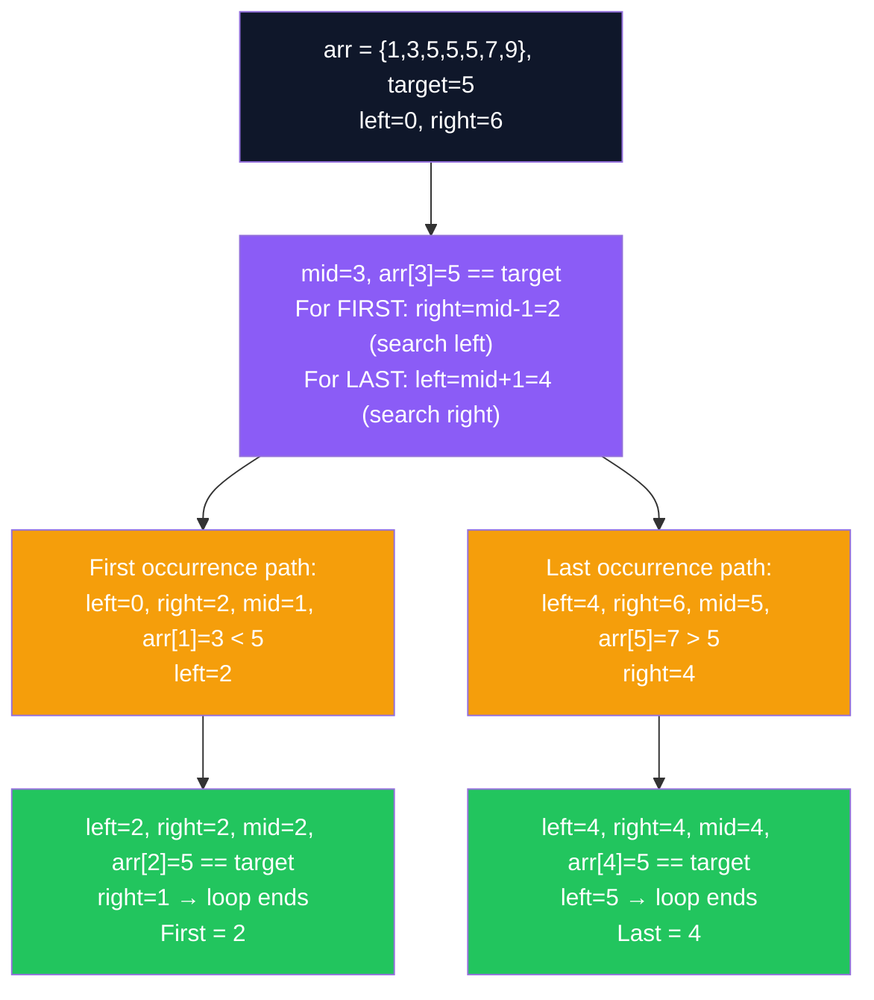

**C# Implementation**

```csharp
public class BinarySearch
{
    // Classic binary search — O(log n)
    public static int Search(int[] nums, int target)
    {
        int left = 0, right = nums.Length - 1;
        while (left <= right)
        {
            int mid = left + (right - left) / 2;
            if (nums[mid] == target) return mid;
            else if (nums[mid] < target) left = mid + 1;
            else right = mid - 1;
        }
        return -1;
    }

    // First occurrence of target
    public static int FirstOccurrence(int[] nums, int target)
    {
        int left = 0, right = nums.Length - 1, result = -1;
        while (left <= right)
        {
            int mid = left + (right - left) / 2;
            if (nums[mid] == target) { result = mid; right = mid - 1; } // found, search left
            else if (nums[mid] < target) left = mid + 1;
            else right = mid - 1;
        }
        return result;
    }

    // Last occurrence of target
    public static int LastOccurrence(int[] nums, int target)
    {
        int left = 0, right = nums.Length - 1, result = -1;
        while (left <= right)
        {
            int mid = left + (right - left) / 2;
            if (nums[mid] == target) { result = mid; left = mid + 1; } // found, search right
            else if (nums[mid] < target) left = mid + 1;
            else right = mid - 1;
        }
        return result;
    }

    // Count occurrences
    public static int CountOccurrences(int[] nums, int target)
    {
        int first = FirstOccurrence(nums, target);
        if (first == -1) return 0;
        return LastOccurrence(nums, target) - first + 1;
    }

    // Lower bound — first index where nums[i] >= target (like C++ lower_bound)
    public static int LowerBound(int[] nums, int target)
    {
        int left = 0, right = nums.Length;
        while (left < right) // note: right = nums.Length (exclusive)
        {
            int mid = left + (right - left) / 2;
            if (nums[mid] < target) left = mid + 1;
            else right = mid;
        }
        return left; // returns nums.Length if all elements < target
    }
}
```

**Interview Q&A**

| Question | Answer |
|---|---|
| What is the loop invariant of binary search? | The target, if it exists, is always within `[left, right]`. Each iteration narrows this range. When `left > right`, the target is not in the array. |
| Why `while (left <= right)` and not `while (left < right)`? | `left <= right` handles single-element arrays correctly. When `left == right`, `mid == left == right` and we check the last remaining element. With `<`, we'd miss it. |
| What is the difference between lower_bound and upper_bound? | `lower_bound` returns the first index where `nums[i] >= target`. `upper_bound` returns the first index where `nums[i] > target`. `upper_bound - lower_bound` = count of occurrences. |
| When does `right = nums.Length` (not `nums.Length - 1`) make sense? | When searching for an insertion point or lower/upper bound — the answer could be at position `n` (after all elements). With `right = n-1`, you'd miss this case. |
| Why does binary search require a sorted array? | The "eliminate half" decision (`go left if target < mid, go right if target > mid`) is only valid when elements are ordered. On unsorted data, you cannot infer which half contains the target. |

**Common Pitfalls**

- **Infinite loop with `mid = left` (not `right`)**: When `left = right - 1`, `mid = left`, and if you set `left = mid` (not `mid + 1`), left never advances and the loop runs forever.
- **Forgetting `result = mid` before adjusting boundary**: In first/last occurrence, if you only adjust the boundary without saving `result`, you lose the found index.
- **Using `int` for array lengths > 2^31-1**: Binary search on very large arrays needs `long` for `mid` calculation. For typical LeetCode problems, `int` is sufficient.

---

#### Day 48: Search in Rotated Sorted Array

**Overview**

A rotated sorted array like `{4,5,6,7,0,1,2}` was originally sorted but then rotated at a pivot. Binary search still works, but we must first determine which half is sorted before deciding which half to search. The key insight: one of the two halves (left or right of mid) is always sorted in a rotated array. Compare the target against the sorted half's boundaries to decide which half to search.

**C# Implementation**

```csharp
public class RotatedSearch
{
    // O(log n) — binary search on rotated sorted array
    public static int Search(int[] nums, int target)
    {
        int left = 0, right = nums.Length - 1;

        while (left <= right)
        {
            int mid = left + (right - left) / 2;
            if (nums[mid] == target) return mid;

            // Left half is sorted
            if (nums[left] <= nums[mid])
            {
                if (target >= nums[left] && target < nums[mid])
                    right = mid - 1; // target in sorted left half
                else
                    left = mid + 1; // target in right half
            }
            else // Right half is sorted
            {
                if (target > nums[mid] && target <= nums[right])
                    left = mid + 1; // target in sorted right half
                else
                    right = mid - 1; // target in left half
            }
        }
        return -1;
    }

    // Find minimum in rotated sorted array — O(log n)
    public static int FindMin(int[] nums)
    {
        int left = 0, right = nums.Length - 1;
        while (left < right)
        {
            int mid = left + (right - left) / 2;
            if (nums[mid] > nums[right]) left = mid + 1; // min is in right half
            else right = mid; // mid could be the min
        }
        return nums[left];
    }
}
```

**Interview Q&A**

| Question | Answer |
|---|---|
| How do you identify which half is sorted? | Compare `nums[left]` with `nums[mid]`. If `nums[left] <= nums[mid]`, the left half `[left, mid]` is sorted. Otherwise, the right half `[mid, right]` is sorted. |
| Why `nums[left] <= nums[mid]` (<=, not <)? | When `left == mid` (single element), we need to include equality. The condition handles the degenerate case correctly. |
| What if the array has duplicates? | With duplicates, `nums[left] == nums[mid]` is ambiguous — both halves could contain the pivot. The standard solution degrades to O(n) by incrementing `left` when `nums[left] == nums[mid]`. |

**Common Pitfalls**

- **Wrong boundary for "target in sorted half"**: For the left-sorted case, target must be `>= nums[left]` AND `< nums[mid]` (not `<=`). Off-by-one includes `mid` itself which is already checked.

---

#### Day 49: Binary Search on Answer

**Overview**

Binary Search on Answer applies when the answer is a value in a monotonic range and you can check feasibility. Instead of searching in an array, you binary search over the answer space: "Is X possible?" If feasibility is monotonic (all X ≤ answer are feasible, all X > answer are not), binary search finds the boundary in O(log(range) * check_cost). Classic examples: allocate books, koko eating bananas, capacity to ship packages.

**C# Implementation**

```csharp
public class BinarySearchOnAnswer
{
    // Koko eating bananas — minimum eating speed to finish in h hours
    // O(n log(max)) time
    public static int MinEatingSpeed(int[] piles, int h)
    {
        int left = 1, right = piles.Max();

        while (left < right)
        {
            int mid = left + (right - left) / 2;
            if (CanFinish(piles, h, mid)) right = mid; // mid is feasible, try smaller
            else left = mid + 1; // mid too slow
        }
        return left;

        static bool CanFinish(int[] piles, int h, int speed)
        {
            long hours = 0;
            foreach (var pile in piles)
                hours += (pile + speed - 1) / speed; // ceiling division
            return hours <= h;
        }
    }

    // Allocate minimum pages — split books into m students minimizing max pages
    public static int AllocateBooks(int[] pages, int m)
    {
        if (m > pages.Length) return -1;
        int left = pages.Max(), right = pages.Sum(); // min = one book; max = all books

        while (left < right)
        {
            int mid = left + (right - left) / 2;
            if (CanAllocate(pages, m, mid)) right = mid;
            else left = mid + 1;
        }
        return left;

        static bool CanAllocate(int[] pages, int m, int maxPages)
        {
            int students = 1, currentPages = 0;
            foreach (var p in pages)
            {
                if (currentPages + p > maxPages) { students++; currentPages = 0; }
                currentPages += p;
            }
            return students <= m;
        }
    }
}
```

**Interview Q&A**

| Question | Answer |
|---|---|
| How do you recognize a "binary search on answer" problem? | The problem asks for a minimum/maximum value. The feasibility function is monotonic (if X works, X+1 also works or vice versa). The answer range is bounded and discrete. |
| Why is ceiling division `(pile + speed - 1) / speed` used? | Integer division truncates. Koko eats at most `speed` bananas per hour, so a pile of size `p` takes `ceil(p/speed)` hours. The ceiling formula avoids floating point. |
| What determines `left` and `right` initial values? | `left` = smallest possible answer (often 1 or `max(arr)`). `right` = largest possible answer (often `sum(arr)` or the range maximum). The binary search converges between these. |

---

#### Day 50–53: Heap & Priority Queue

**Overview**

A heap is a complete binary tree satisfying the heap property: in a min-heap, every parent ≤ its children; in a max-heap, every parent ≥ its children. The root is always the minimum (or maximum). C# provides `PriorityQueue<TElement, TPriority>` in .NET 6+, which is a min-heap by default. Heaps are the go-to structure for "K largest/smallest" and "merge K sorted" problems.

**Complexity**

| Operation | Time | Notes |
|---|---|---|
| Insert (push) | O(log n) | Sift up |
| Extract min/max | O(log n) | Sift down |
| Peek min/max | O(1) | Root access |
| Build heap from array | O(n) | Better than n insertions O(n log n) |
| K largest elements | O(n log k) | Min-heap of size k |
| Top K frequent | O(n log k) | Map + heap |
| Merge K sorted lists | O(N log K) | N = total elements, K = lists |

**C# Implementation**

```csharp
public class HeapProblems
{
    // K Largest Elements — use min-heap of size k
    // O(n log k) time, O(k) space
    public static int[] KLargest(int[] nums, int k)
    {
        // Min-heap: if new element > heap min, replace min
        var minHeap = new PriorityQueue<int, int>();

        foreach (var num in nums)
        {
            minHeap.Enqueue(num, num);
            if (minHeap.Count > k) minHeap.Dequeue(); // remove smallest
        }

        return Enumerable.Range(0, k).Select(_ => minHeap.Dequeue()).ToArray();
    }

    // Kth Largest Element — O(n log k)
    public static int KthLargest(int[] nums, int k)
    {
        var minHeap = new PriorityQueue<int, int>();
        foreach (var num in nums)
        {
            minHeap.Enqueue(num, num);
            if (minHeap.Count > k) minHeap.Dequeue();
        }
        return minHeap.Peek();
    }

    // Top K Frequent Elements — O(n log k)
    public static int[] TopKFrequent(int[] nums, int k)
    {
        // Count frequencies
        var freq = new Dictionary<int, int>();
        foreach (var n in nums) freq[n] = freq.GetValueOrDefault(n) + 1;

        // Min-heap on frequency (keep k most frequent)
        var minHeap = new PriorityQueue<int, int>(); // (element, frequency)
        foreach (var (num, count) in freq)
        {
            minHeap.Enqueue(num, count);
            if (minHeap.Count > k) minHeap.Dequeue();
        }

        return Enumerable.Range(0, k).Select(_ => minHeap.Dequeue()).ToArray();
    }

    // Merge K Sorted Lists — O(N log K) heap-based
    public static ListNode? MergeKSortedLists(ListNode?[] lists)
    {
        // (value, listIndex, node) — min-heap on value
        var heap = new PriorityQueue<(int val, ListNode node), int>();

        foreach (var head in lists)
            if (head != null) heap.Enqueue((head.Val, head), head.Val);

        var dummy = new ListNode(0);
        var curr = dummy;

        while (heap.Count > 0)
        {
            var (val, node) = heap.Dequeue();
            curr.Next = node;
            curr = curr.Next;
            if (node.Next != null) heap.Enqueue((node.Next.Val, node.Next), node.Next.Val);
        }
        return dummy.Next;
    }

    // Find Median from Data Stream — two heaps
    public class MedianFinder
    {
        private readonly PriorityQueue<int, int> _maxLeft = new();  // max-heap (negate priority)
        private readonly PriorityQueue<int, int> _minRight = new(); // min-heap

        public void AddNum(int num)
        {
            _maxLeft.Enqueue(num, -num); // negate for max-heap behavior
            // Balance: move max of left to right
            var maxLeft = _maxLeft.Dequeue();
            _minRight.Enqueue(maxLeft, maxLeft);
            // Keep left >= right in size
            if (_minRight.Count > _maxLeft.Count)
            {
                var minRight = _minRight.Dequeue();
                _maxLeft.Enqueue(minRight, -minRight);
            }
        }

        public double FindMedian()
        {
            if (_maxLeft.Count > _minRight.Count)
                return _maxLeft.Peek();
            return (_maxLeft.Peek() + (double)_minRight.Peek()) / 2.0;
        }
    }
}
```

**Interview Q&A**

| Question | Answer |
|---|---|
| Why use a min-heap of size k to find k largest elements? | The min-heap's root is the smallest of the k currently tracked elements. When a new element is larger than the root, it deserves to be in the top-k and replaces the root. At the end, all k elements remaining are the k largest. |
| How do you simulate a max-heap with C#'s PriorityQueue? | `PriorityQueue<T,P>` is a min-heap. To get max-heap behavior, negate the priority: `Enqueue(item, -value)`. The smallest (most negative) priority dequeues first, which corresponds to the largest value. |
| What is the time complexity of building a heap vs inserting n elements? | Building a heap from n elements using Floyd's heapify is O(n). Inserting n elements one-by-one is O(n log n). The O(n) build uses the insight that half the nodes are leaves and require no sifting. |
| Why does Merge K Sorted Lists use O(N log K) not O(N log N)? | The heap always contains at most K elements (one from each list). Each of the N total elements is inserted once (O(log K)) and extracted once (O(log K)). Total: O(N log K). |
| How does the two-heap approach for Median Finder maintain the median? | Left max-heap holds the smaller half; right min-heap holds the larger half. The sizes are balanced so either they're equal (median = average of two tops) or left has one more (median = left top). |

**Common Pitfalls**

- **Using max-heap for K largest**: Max-heap with all n elements then extract k times is O(n + k log n) — acceptable, but O(n log k) min-heap is better for large n and small k.
- **Not handling duplicate priorities**: `PriorityQueue<T,P>` doesn't break ties by insertion order. When priorities are equal and ordering matters (e.g., Merge K Lists), include a sequence number as a tiebreaker.
- **Forgetting to check `node.Next != null` before enqueuing next node**: Null reference when accessing `.Val` on null `node.Next`.

---

### Week 8 (Day 57–66) — Graphs

#### Day 57: Graph Representations

**Overview**

Graphs consist of vertices (nodes) and edges (connections). They can be directed or undirected, weighted or unweighted, cyclic or acyclic. Two primary representations: **adjacency list** (Dictionary of lists — space O(V+E), preferred for sparse graphs) and **adjacency matrix** (2D array — space O(V²), preferred for dense graphs or when edge weight lookup is O(1) critical). For most interview problems, adjacency list is the right choice.

**C# Implementation**

```csharp
public class Graph
{
    private readonly Dictionary<int, List<int>> _adjList = new();
    private readonly int _vertices;

    public Graph(int vertices)
    {
        _vertices = vertices;
        for (int i = 0; i < vertices; i++) _adjList[i] = [];
    }

    public void AddEdge(int u, int v, bool directed = false)
    {
        _adjList[u].Add(v);
        if (!directed) _adjList[v].Add(u);
    }

    // Adjacency matrix representation (for reference)
    public static int[,] BuildMatrix(int n, int[][] edges, bool directed = false)
    {
        var matrix = new int[n, n];
        foreach (var e in edges)
        {
            matrix[e[0], e[1]] = 1;
            if (!directed) matrix[e[1], e[0]] = 1;
        }
        return matrix;
    }

    // Weighted graph with adjacency list
    public static Dictionary<int, List<(int neighbor, int weight)>> BuildWeighted(int n, int[][] edges)
    {
        var graph = Enumerable.Range(0, n)
            .ToDictionary(i => i, _ => new List<(int, int)>());
        foreach (var e in edges)
        {
            graph[e[0]].Add((e[1], e[2]));
            graph[e[1]].Add((e[0], e[2]));
        }
        return graph;
    }
}
```

---

#### Day 58–59: BFS & DFS Traversal

**Overview**

BFS (Breadth-First Search) explores all neighbors at the current depth before moving deeper — level by level, using a Queue. It finds shortest paths in unweighted graphs and is used for level-order problems. DFS (Depth-First Search) explores as deep as possible before backtracking, using a Stack (or recursion). DFS is used for cycle detection, topological sort, connected components, and path finding.

**Complexity**

| Algorithm | Time | Space | Notes |
|---|---|---|---|
| BFS | O(V+E) | O(V) | Queue holds at most O(V) nodes |
| DFS (recursive) | O(V+E) | O(V) | Call stack depth = O(V) |
| DFS (iterative) | O(V+E) | O(V) | Explicit stack |

**C# Implementation**

```csharp
public class GraphTraversal
{
    // BFS — O(V+E), returns visited order
    public static List<int> BFS(Dictionary<int, List<int>> graph, int start)
    {
        var visited = new HashSet<int>();
        var queue = new Queue<int>();
        var order = new List<int>();

        queue.Enqueue(start);
        visited.Add(start);

        while (queue.Count > 0)
        {
            var node = queue.Dequeue();
            order.Add(node);

            foreach (var neighbor in graph[node])
            {
                if (visited.Add(neighbor)) // returns false if already present
                    queue.Enqueue(neighbor);
            }
        }
        return order;
    }

    // DFS — recursive
    public static List<int> DFSRecursive(Dictionary<int, List<int>> graph, int start)
    {
        var visited = new HashSet<int>();
        var order = new List<int>();

        void Dfs(int node)
        {
            visited.Add(node);
            order.Add(node);
            foreach (var neighbor in graph[node])
                if (!visited.Contains(neighbor)) Dfs(neighbor);
        }

        Dfs(start);
        return order;
    }

    // DFS — iterative (Stack-based)
    public static List<int> DFSIterative(Dictionary<int, List<int>> graph, int start)
    {
        var visited = new HashSet<int>();
        var stack = new Stack<int>();
        var order = new List<int>();

        stack.Push(start);
        while (stack.Count > 0)
        {
            var node = stack.Pop();
            if (!visited.Add(node)) continue; // skip if already visited
            order.Add(node);
            foreach (var neighbor in graph[node])
                if (!visited.Contains(neighbor)) stack.Push(neighbor);
        }
        return order;
    }

    // Number of Islands — BFS/DFS on grid
    public static int NumIslands(char[][] grid)
    {
        int rows = grid.Length, cols = grid[0].Length, count = 0;

        void Dfs(int r, int c)
        {
            if (r < 0 || r >= rows || c < 0 || c >= cols || grid[r][c] != '1') return;
            grid[r][c] = '0'; // mark visited by sinking
            Dfs(r + 1, c); Dfs(r - 1, c); Dfs(r, c + 1); Dfs(r, c - 1);
        }

        for (int r = 0; r < rows; r++)
            for (int c = 0; c < cols; c++)
                if (grid[r][c] == '1') { Dfs(r, c); count++; }

        return count;
    }
}
```

**Interview Q&A**

| Question | Answer |
|---|---|
| When does BFS guarantee shortest path? | In an unweighted graph, BFS explores nodes level by level. The first time BFS reaches a node, it has taken the fewest edges (hops). For weighted graphs, use Dijkstra's. |
| Why does iterative DFS not produce the same traversal order as recursive DFS? | Recursive DFS visits neighbors in the order they appear. Iterative DFS pushes all neighbors, then pops — the last pushed neighbor is visited first (LIFO), reversing the order. Both are valid DFS but produce different orderings. |
| What is the "sinking" trick in Number of Islands? | Instead of maintaining a separate `visited` set, mark cells as '0' (water) after visiting them. This O(1) space trick modifies the grid but avoids the O(n*m) visited array. If the grid must be preserved, restore values after DFS or use a visited set. |
| How do you handle disconnected graphs in BFS/DFS? | Loop over all vertices: if a vertex hasn't been visited, start a new BFS/DFS from it. This counts connected components — each BFS/DFS invocation covers one component. |

**Common Pitfalls**

- **Not marking visited before enqueuing in BFS**: Mark visited when enqueuing, not when dequeuing. Otherwise the same node is enqueued multiple times (neighbors enqueue it before it's dequeued and marked).
- **Grid boundary checks**: Always check `r >= 0 && r < rows && c >= 0 && c < cols` before accessing grid cells. Order matters — short-circuit evaluation.
- **Stack overflow in DFS on large graphs**: Recursive DFS on graphs with 10,000+ nodes risks stack overflow. Use iterative DFS with an explicit stack.

---

#### Day 61: Cycle Detection

**Overview**

Cycle detection differs between directed and undirected graphs. In an **undirected graph**, a cycle exists if DFS encounters a visited neighbor that is not the immediate parent. In a **directed graph**, a cycle exists if DFS finds a path back to a node currently being processed (on the recursion stack) — tracked with white/gray/black coloring (unvisited/in-progress/completed).

**C# Implementation**

```csharp
public class CycleDetection
{
    // Undirected graph cycle detection — DFS with parent tracking
    public static bool HasCycleUndirected(Dictionary<int, List<int>> graph, int n)
    {
        var visited = new HashSet<int>();

        bool Dfs(int node, int parent)
        {
            visited.Add(node);
            foreach (var neighbor in graph[node])
            {
                if (!visited.Contains(neighbor))
                {
                    if (Dfs(neighbor, node)) return true;
                }
                else if (neighbor != parent) return true; // back edge — cycle!
            }
            return false;
        }

        for (int i = 0; i < n; i++)
            if (!visited.Contains(i) && Dfs(i, -1)) return true;
        return false;
    }

    // Directed graph cycle detection — DFS with recursion stack (white-gray-black)
    public static bool HasCycleDirected(Dictionary<int, List<int>> graph, int n)
    {
        var visited = new HashSet<int>();   // fully processed (black)
        var inStack = new HashSet<int>();   // currently in recursion stack (gray)

        bool Dfs(int node)
        {
            inStack.Add(node);
            visited.Add(node);

            foreach (var neighbor in graph[node])
            {
                if (inStack.Contains(neighbor)) return true; // back edge
                if (!visited.Contains(neighbor) && Dfs(neighbor)) return true;
            }
            inStack.Remove(node); // done processing — remove from stack (gray -> black)
            return false;
        }

        for (int i = 0; i < n; i++)
            if (!visited.Contains(i) && Dfs(i)) return true;
        return false;
    }
}
```

**Interview Q&A**

| Question | Answer |
|---|---|
| Why does undirected cycle detection need the parent parameter? | In an undirected graph, every edge appears in both directions. Without parent tracking, we'd always see the edge we came from and incorrectly report a cycle. |
| What is the difference between "visited" and "in recursion stack"? | "Visited" means a node is fully processed (all its descendants explored). "In stack" means it's currently being processed. A cycle exists only when we find an edge to a node currently in the stack, not just any visited node. |
| How does Union-Find detect cycles in an undirected graph? | For each edge (u, v): find roots of u and v. If they have the same root, adding this edge creates a cycle. Otherwise, union them. This is O(E * α(V)) ≈ O(E) amortized. |

---

#### Day 63: Topological Sort

**Overview**

Topological sort orders vertices of a directed acyclic graph (DAG) such that for every directed edge u→v, u comes before v. It is only possible if the graph has no cycles. Two approaches: **Kahn's algorithm** (BFS-based, counts in-degrees) and **DFS-based** (push to stack on finish). Topological sort underpins build systems, course scheduling, and dependency resolution.

**C# Implementation**

```csharp
public class TopologicalSort
{
    // Kahn's Algorithm — BFS-based, O(V+E)
    public static int[]? KahnsSort(int n, int[][] edges)
    {
        var inDegree = new int[n];
        var graph = Enumerable.Range(0, n).ToDictionary(i => i, _ => new List<int>());

        foreach (var e in edges)
        {
            graph[e[0]].Add(e[1]);
            inDegree[e[1]]++;
        }

        var queue = new Queue<int>();
        for (int i = 0; i < n; i++)
            if (inDegree[i] == 0) queue.Enqueue(i);

        var result = new List<int>();
        while (queue.Count > 0)
        {
            int node = queue.Dequeue();
            result.Add(node);

            foreach (var neighbor in graph[node])
                if (--inDegree[neighbor] == 0) queue.Enqueue(neighbor);
        }

        return result.Count == n ? [.. result] : null; // null = cycle detected
    }

    // DFS-based topological sort — O(V+E)
    public static int[]? DFSSort(int n, int[][] edges)
    {
        var graph = Enumerable.Range(0, n).ToDictionary(i => i, _ => new List<int>());
        foreach (var e in edges) graph[e[0]].Add(e[1]);

        var visited = new bool[n];
        var inStack = new bool[n];
        var stack = new Stack<int>();
        bool hasCycle = false;

        void Dfs(int node)
        {
            if (hasCycle) return;
            inStack[node] = visited[node] = true;
            foreach (var neighbor in graph[node])
            {
                if (inStack[neighbor]) { hasCycle = true; return; }
                if (!visited[neighbor]) Dfs(neighbor);
            }
            inStack[node] = false;
            stack.Push(node); // push after all descendants processed
        }

        for (int i = 0; i < n; i++)
            if (!visited[i]) Dfs(i);

        return hasCycle ? null : stack.ToArray();
    }
}
```

**Interview Q&A**

| Question | Answer |
|---|---|
| How does Kahn's algorithm detect cycles? | If the result has fewer than n nodes, some nodes still have non-zero in-degree (they were never enqueued). This indicates a cycle — those nodes are in the cycle. |
| Why does DFS push nodes to a stack after all descendants are processed? | When Dfs(node) returns, all reachable nodes from `node` have been processed and added to the stack. Popping the stack gives the correct topological order: dependents come before their dependencies. |
| What is the real-world application of topological sort? | Build systems (Makefile, MSBuild) compile tasks in dependency order. Package managers (npm, NuGet) install packages respecting dependencies. Course prerequisite scheduling. |

---

#### Day 64: Dijkstra's Shortest Path

**Overview**

Dijkstra's algorithm finds the shortest path from a source vertex to all other vertices in a weighted graph with non-negative edge weights. It uses a min-heap (priority queue) to always process the nearest unvisited vertex first. Time complexity is O((V+E) log V) with a binary heap. It fails with negative weights — use Bellman-Ford for graphs with negative edges.

**C# Implementation**

```csharp
public class Dijkstra
{
    // O((V+E) log V) — shortest path from source to all vertices
    public static int[] ShortestPath(int n, int[][] edges, int source)
    {
        var graph = Enumerable.Range(0, n)
            .ToDictionary(i => i, _ => new List<(int neighbor, int weight)>());
        foreach (var e in edges)
        {
            graph[e[0]].Add((e[1], e[2]));
            graph[e[1]].Add((e[0], e[2])); // undirected
        }

        var dist = new int[n];
        Array.Fill(dist, int.MaxValue);
        dist[source] = 0;

        // (distance, node) — min-heap on distance
        var heap = new PriorityQueue<int, int>();
        heap.Enqueue(source, 0);

        while (heap.Count > 0)
        {
            heap.TryDequeue(out int node, out int d);
            if (d > dist[node]) continue; // stale entry — skip

            foreach (var (neighbor, weight) in graph[node])
            {
                int newDist = dist[node] + weight;
                if (newDist < dist[neighbor])
                {
                    dist[neighbor] = newDist;
                    heap.Enqueue(neighbor, newDist);
                }
            }
        }
        return dist;
    }

    // Shortest path between two specific nodes (with path reconstruction)
    public static (int distance, List<int> path) ShortestPathWithTrace(
        int n, int[][] edges, int src, int dst)
    {
        var graph = Enumerable.Range(0, n)
            .ToDictionary(i => i, _ => new List<(int neighbor, int weight)>());
        foreach (var e in edges)
        {
            graph[e[0]].Add((e[1], e[2]));
            graph[e[1]].Add((e[0], e[2]));
        }

        var dist = new int[n];
        var prev = new int[n];
        Array.Fill(dist, int.MaxValue);
        Array.Fill(prev, -1);
        dist[src] = 0;

        var heap = new PriorityQueue<int, int>();
        heap.Enqueue(src, 0);

        while (heap.Count > 0)
        {
            heap.TryDequeue(out int node, out int d);
            if (d > dist[node]) continue;

            foreach (var (neighbor, weight) in graph[node])
            {
                int newDist = dist[node] + weight;
                if (newDist < dist[neighbor])
                {
                    dist[neighbor] = newDist;
                    prev[neighbor] = node;
                    heap.Enqueue(neighbor, newDist);
                }
            }
        }

        // Reconstruct path
        var path = new List<int>();
        for (int at = dst; at != -1; at = prev[at]) path.Add(at);
        path.Reverse();

        return (dist[dst], path);
    }
}
```

**Interview Q&A**

| Question | Answer |
|---|---|
| Why does Dijkstra fail with negative weights? | Dijkstra assumes that once a node is finalized (popped from the heap), its distance cannot decrease. With negative edges, a later path through a negative edge could give a shorter distance to an already-finalized node. |
| What is the "stale entry" check `if (d > dist[node]) continue`? | When a shorter path to a node is found, a new entry is added to the heap without removing the old one. When the old (larger distance) entry is popped, it's outdated. Skipping it avoids reprocessing. |
| How does Dijkstra compare to A*? | A* adds a heuristic (estimated cost to goal) to the priority, guiding the search toward the target. Dijkstra explores in all directions equally. A* is faster when a good heuristic is available (e.g., grid shortest path). |
| What replaces Dijkstra for negative edges? | Bellman-Ford: relaxes all edges V-1 times, detecting negative cycles. O(VE) — slower but correct with negative weights. For dense graphs, use Floyd-Warshall for all-pairs shortest paths. |

**Common Pitfalls**

- **Not initializing all distances to `int.MaxValue`**: Uninitialized distances may be 0, making Dijkstra think all nodes are already at distance 0 from the source.
- **Integer overflow in `dist[node] + weight`**: If `dist[node] == int.MaxValue` and weight > 0, `int.MaxValue + weight` overflows. Check `dist[node] != int.MaxValue` before adding.

---

### Week 9 (Day 67–75) — Dynamic Programming

#### Day 67: DP Fundamentals — Memoization vs Tabulation

**Overview**

Dynamic Programming (DP) solves optimization problems by breaking them into overlapping subproblems and storing results to avoid recomputation. Two approaches: **Memoization** (top-down: recursive with caching) and **Tabulation** (bottom-up: iterative table-filling). DP applies when a problem has **optimal substructure** (optimal solution built from optimal subsolutions) and **overlapping subproblems** (same subproblem computed multiple times).

**Diagram**

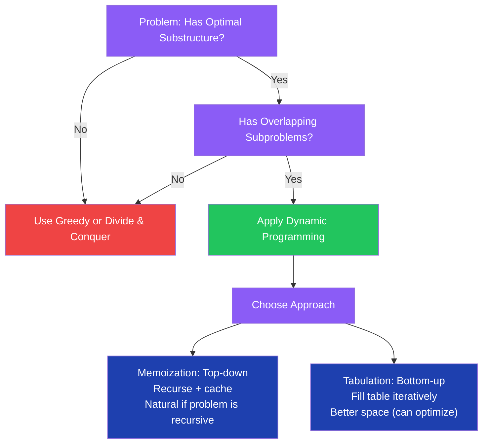

---

#### Day 68–69: Climbing Stairs & House Robber

**Overview**

Climbing Stairs (n steps, can take 1 or 2 steps at a time) reduces exactly to Fibonacci — `ways(n) = ways(n-1) + ways(n-2)`. House Robber (rob non-adjacent houses, maximize sum) uses the recurrence `dp[i] = max(dp[i-1], dp[i-2] + nums[i])`. Both are 1D DP problems that can be space-optimized from O(n) to O(1) by recognizing only the last two values are needed.

**C# Implementation**

```csharp
public class OneDDP
{
    // Climbing Stairs — O(n) time, O(1) space
    public static int ClimbStairs(int n)
    {
        if (n <= 2) return n;
        int prev2 = 1, prev1 = 2;
        for (int i = 3; i <= n; i++)
            (prev2, prev1) = (prev1, prev1 + prev2);
        return prev1;
    }

    // House Robber — O(n) time, O(1) space
    public static int Rob(int[] nums)
    {
        int prev2 = 0, prev1 = 0;
        foreach (var num in nums)
            (prev2, prev1) = (prev1, Math.Max(prev1, prev2 + num));
        return prev1;
    }

    // House Robber II — circular (first and last houses are adjacent)
    public static int RobCircular(int[] nums)
    {
        if (nums.Length == 1) return nums[0];
        // Rob houses [0, n-2] or [1, n-1], take max
        return Math.Max(Rob(nums[..^1]), Rob(nums[1..]));
    }

    // Jump Game — can you reach the last index?
    public static bool CanJump(int[] nums)
    {
        int maxReach = 0;
        for (int i = 0; i < nums.Length; i++)
        {
            if (i > maxReach) return false; // can't reach current position
            maxReach = Math.Max(maxReach, i + nums[i]);
        }
        return true;
    }

    // Minimum coins to make amount — unbounded knapsack
    public static int CoinChange(int[] coins, int amount)
    {
        var dp = new int[amount + 1];
        Array.Fill(dp, amount + 1); // infinity sentinel
        dp[0] = 0;

        for (int i = 1; i <= amount; i++)
            foreach (var coin in coins)
                if (coin <= i) dp[i] = Math.Min(dp[i], dp[i - coin] + 1);

        return dp[amount] > amount ? -1 : dp[amount];
    }
}
```

**Interview Q&A**

| Question | Answer |
|---|---|
| How do you derive the DP recurrence for House Robber? | At house i, you either skip it (take `dp[i-1]`) or rob it (take `dp[i-2] + nums[i]`). The maximum of these two choices gives `dp[i]`. |
| Why can House Robber be solved with O(1) space? | `dp[i]` depends only on `dp[i-1]` and `dp[i-2]`. No earlier values are needed. Two variables `prev1` and `prev2` suffice. |
| How does House Robber II reduce to House Robber I? | In a circular arrangement, house 0 and house n-1 cannot both be robbed. Run House Robber on `nums[0..n-2]` (exclude last) and `nums[1..n-1]` (exclude first); return the maximum. |
| Why initialize Coin Change `dp` to `amount + 1` not `int.MaxValue`? | `int.MaxValue + 1` overflows to `int.MinValue`. `amount + 1` is a safe "infinity" since no valid answer exceeds `amount` coins (using coins of value 1). |
| What is the key difference between Climbing Stairs and Coin Change? | Climbing Stairs: fixed choices (1 or 2 steps), count ways. Coin Change: variable choices (any coin), minimize count. Both use the same bottom-up table structure. |

---

#### Day 70–72: Knapsack, LIS & LCS

**Overview**

The 0/1 Knapsack problem is the archetype of 2D DP: include or exclude each item. Longest Increasing Subsequence (LIS) has two solutions — O(n²) classic DP and O(n log n) patience sorting. Longest Common Subsequence (LCS) is a 2D DP grid problem. Together these three cover 80% of DP interview questions: linear DP, 2D DP, and sequence DP.

**Complexity**

| Problem | Approach | Time | Space |
|---|---|---|---|
| 0/1 Knapsack | 2D DP | O(n*W) | O(n*W) |
| 0/1 Knapsack | 1D DP (space opt.) | O(n*W) | O(W) |
| LIS | O(n²) DP | O(n²) | O(n) |
| LIS | Patience sorting | O(n log n) | O(n) |
| LCS | 2D DP | O(m*n) | O(m*n) |
| LCS | Space optimized | O(m*n) | O(min(m,n)) |
| Edit Distance | 2D DP | O(m*n) | O(m*n) |

**C# Implementation**

```csharp
public class TwoDDP
{
    // 0/1 Knapsack — O(n*W) time, O(W) space (1D optimization)
    public static int Knapsack(int[] weights, int[] values, int capacity)
    {
        int n = weights.Length;
        var dp = new int[capacity + 1]; // dp[w] = max value with capacity w

        for (int i = 0; i < n; i++)
            for (int w = capacity; w >= weights[i]; w--) // reverse to avoid reusing item
                dp[w] = Math.Max(dp[w], dp[w - weights[i]] + values[i]);

        return dp[capacity];
    }

    // LIS — O(n²) classic DP
    public static int LISQuadratic(int[] nums)
    {
        int n = nums.Length;
        var dp = new int[n];
        Array.Fill(dp, 1); // each element alone is a subsequence of length 1

        for (int i = 1; i < n; i++)
            for (int j = 0; j < i; j++)
                if (nums[j] < nums[i]) dp[i] = Math.Max(dp[i], dp[j] + 1);

        return dp.Max();
    }

    // LIS — O(n log n) patience sorting / binary search
    public static int LISOptimal(int[] nums)
    {
        var tails = new List<int>(); // tails[i] = smallest tail of all IS of length i+1

        foreach (var num in nums)
        {
            int pos = tails.BinarySearch(num);
            if (pos < 0) pos = ~pos; // bitwise NOT gives insertion point

            if (pos == tails.Count) tails.Add(num);
            else tails[pos] = num; // replace with smaller tail (greedy)
        }
        return tails.Count;
    }

    // LCS — O(m*n) time and space
    public static int LCS(string s1, string s2)
    {
        int m = s1.Length, n = s2.Length;
        var dp = new int[m + 1, n + 1];

        for (int i = 1; i <= m; i++)
            for (int j = 1; j <= n; j++)
                if (s1[i - 1] == s2[j - 1]) dp[i, j] = dp[i - 1, j - 1] + 1;
                else dp[i, j] = Math.Max(dp[i - 1, j], dp[i, j - 1]);

        return dp[m, n];
    }

    // Edit Distance (Levenshtein) — O(m*n)
    public static int EditDistance(string s1, string s2)
    {
        int m = s1.Length, n = s2.Length;
        var dp = new int[m + 1, n + 1];

        for (int i = 0; i <= m; i++) dp[i, 0] = i; // delete all of s1
        for (int j = 0; j <= n; j++) dp[0, j] = j; // insert all of s2

        for (int i = 1; i <= m; i++)
            for (int j = 1; j <= n; j++)
                if (s1[i - 1] == s2[j - 1]) dp[i, j] = dp[i - 1, j - 1];
                else dp[i, j] = 1 + Math.Min(dp[i - 1, j - 1],   // replace
                                    Math.Min(dp[i - 1, j],         // delete
                                             dp[i, j - 1]));        // insert

        return dp[m, n];
    }
}
```

**Interview Q&A**

| Question | Answer |
|---|---|
| Why does 1D Knapsack iterate weights in reverse? | In 1D optimization, `dp[w]` from the previous item row is stored in the same array. Iterating forward would use the current item's updated values (allowing reuse). Reverse iteration ensures we read from the previous item's state. |
| What does the `tails` array in O(n log n) LIS represent? | `tails[i]` is the smallest possible tail element of all increasing subsequences of length `i+1`. It is not the actual LIS — only its length is correct. To reconstruct the actual LIS, maintain a parent array. |
| Why is `~pos` used after `BinarySearch` returns negative? | `List<T>.BinarySearch` returns `~insertionPoint` (bitwise NOT) when the element is not found. `~pos` reverses this to get the actual insertion index. |
| What are the three operations in Edit Distance? | Insert (dp[i][j-1] + 1), delete (dp[i-1][j] + 1), replace (dp[i-1][j-1] + 1 if characters differ). The minimum of these three plus any match case gives the minimum edits. |
| How do you space-optimize LCS to O(min(m,n))? | Only the previous row is needed to compute the current row. Use two 1D arrays (prev and curr), swapping them after each row. Further optimize by making the shorter string the column dimension. |

**Common Pitfalls**

- **0/1 Knapsack forward inner loop**: Iterating `w` from 0 to capacity (forward) in the 1D version allows using the same item multiple times (becomes unbounded knapsack). Always iterate backward for 0/1 knapsack.
- **LIS initialized to 0 instead of 1**: Every single element is an IS of length 1. Initialize `dp[i] = 1` before the inner loop.
- **LCS off-by-one in 1-indexing**: `dp[i,j]` corresponds to `s1[i-1]` and `s2[j-1]`. Using `s1[i]` without the `-1` offset causes IndexOutOfRangeException.

---

---

## Phase 4: Interview Preparation (Day 76–90)

### Week 10–12 (Day 76–90) — Interview Mode

#### Mock Interview Approach & Think-Aloud Framework

**Overview**

The difference between candidates who pass and those who fail technical interviews is rarely raw algorithmic knowledge — it is communication, problem decomposition, and structured thinking under pressure. Interviewers evaluate how you think as much as whether you get the right answer. A silent coder who produces perfect code without explanation often fails; a vocal engineer who reasons step by step and catches their own mistakes often passes.

**The 5-Step Interview Framework**

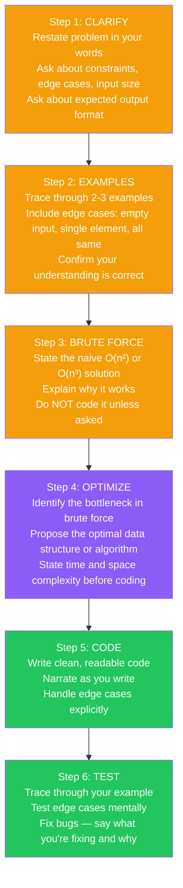

**Time Management Per Problem Type**

| Problem Difficulty | Target Solve Time | First 5 Minutes | Code Time | Test Time |
|---|---|---|---|---|
| Easy | 15 minutes | Clarify + brute force | 8 min | 2 min |
| Medium | 25 minutes | Clarify + optimize | 15 min | 5 min |
| Hard | 35 minutes | Clarify + partial solution | 20 min | 10 min |

**When You Are Stuck — Systematic Recovery**

1. **Restate the problem** — say it back in your own words. You may have misunderstood.
2. **Work a concrete example** — trace manually. The pattern often emerges visually.
3. **Try a simpler version** — solve for n=2 or n=3 first, then generalize.
4. **Consider known patterns** — two-pointer, sliding window, hash map, BFS/DFS, DP. Which fits?
5. **State what you know** — "I know we need O(n log n) based on the constraints. I'm thinking a sort + binary search approach..."
6. **Ask for a hint** — it is better to ask one targeted hint than to sit silent for 10 minutes.

**Interview Q&A**

| Question | Answer |
|---|---|
| Should you code the brute force first? | Only if asked, or if the optimal solution isn't clear. State the brute force, explain its complexity, then immediately say "I think we can do better with [approach]." Coding brute force wastes precious time. |
| What should you say when starting to code? | Narrate your approach: "I'll use a HashMap to track last-seen indices. I'll iterate right pointer, checking if the character was seen within the current window..." This shows the examiner you know what you're doing even before code appears. |
| How do you handle running out of time? | Complete the core logic first, add TODO comments for edge cases: `// TODO: handle empty array`. Interviewers prefer complete logic with noted edge cases over broken code with edge cases. |
| What questions should you always ask at the start? | (1) Are all numbers integers? Any floats? (2) Can the array be empty? (3) What are the value ranges? (4) Can there be duplicates? (5) Is the array sorted? (6) Should I optimize for time or space? |
| What is a red flag for interviewers? | Jumping straight to coding without clarifying, not stating complexity before or after, silently staring for more than 2 minutes, not testing with examples, defensive behavior when the interviewer hints at an issue. |

---

#### Common Algorithm Patterns Reference

| Pattern | When to Apply | Key Data Structure | Example Problems |
|---|---|---|---|
| Two Pointer | Sorted array, pairs, palindrome | Array indices | Two Sum sorted, Container With Most Water |
| Sliding Window | Contiguous subarray/substring | Window + HashMap/Set | Longest Substring, Min Window |
| Fast/Slow Pointer | Linked list cycle, middle | Two pointers | Floyd's Cycle, Middle Node |
| BFS | Shortest path (unweighted), level order | Queue | Number of Islands, Word Ladder |
| DFS + Backtracking | All paths, all subsets, permutations | Stack/Recursion | Subsets, Permutations, N-Queens |
| Binary Search | Sorted array, answer range search | Two pointers on range | Search, Koko Bananas |
| Monotonic Stack | Next greater/smaller, histogram | Stack of indices | Daily Temperatures, Largest Rectangle |
| Top-K / Heap | K largest/smallest, streaming median | PriorityQueue | Kth Largest, Merge K Lists |
| Union-Find | Connected components, cycle detection | Parent array | Number of Provinces, Redundant Connection |
| Dynamic Programming | Optimization, counting, decision sequence | DP table | Knapsack, LCS, Coin Change |
| Prefix Sum | Range sum query, subarray sum | Prefix array | Subarray Sum = K, Product Except Self |
| Topological Sort | Dependency ordering, DAG | Queue + in-degree | Course Schedule, Alien Dictionary |

---

## Cross-Cutting Themes

### Algorithm Selection Flowchart

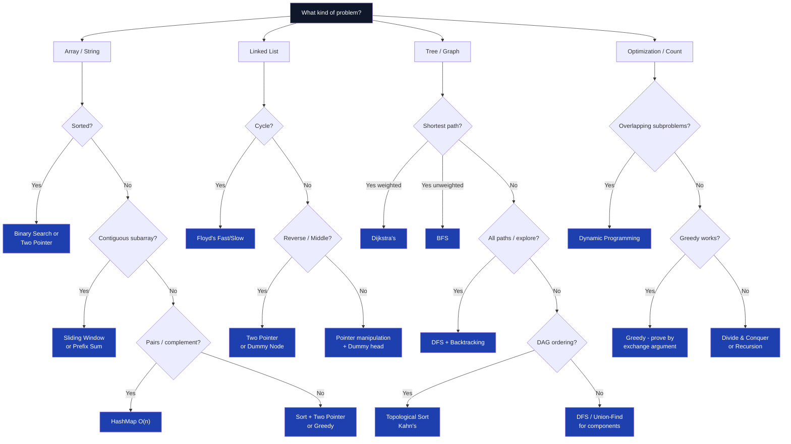

---

### Complexity Cheat Sheet

| Algorithm / Data Structure | Time (Best) | Time (Average) | Time (Worst) | Space |
|---|---|---|---|---|
| **Arrays** | | | | |
| Access | O(1) | O(1) | O(1) | O(1) |
| Linear Search | O(1) | O(n) | O(n) | O(1) |
| Binary Search (sorted) | O(1) | O(log n) | O(log n) | O(1) |
| Insert/Delete (middle) | O(n) | O(n) | O(n) | O(1) |
| **Sorting** | | | | |
| Bubble Sort | O(n) | O(n²) | O(n²) | O(1) |
| Insertion Sort | O(n) | O(n²) | O(n²) | O(1) |
| Merge Sort | O(n log n) | O(n log n) | O(n log n) | O(n) |
| Quick Sort | O(n log n) | O(n log n) | O(n²) | O(log n) |
| Heap Sort | O(n log n) | O(n log n) | O(n log n) | O(1) |
| Counting Sort | O(n+k) | O(n+k) | O(n+k) | O(k) |
| **Linked List** | | | | |
| Access | O(n) | O(n) | O(n) | O(1) |
| Insert/Delete Head | O(1) | O(1) | O(1) | O(1) |
| Insert/Delete Tail | O(n) | O(n) | O(n) | O(1) |
| Search | O(1) | O(n) | O(n) | O(1) |
| **Stack / Queue** | | | | |
| Push/Pop/Enqueue/Dequeue | O(1) | O(1) | O(1) | O(n) |
| Peek | O(1) | O(1) | O(1) | O(1) |
| **Hash Table** | | | | |
| Insert/Delete/Search | O(1) | O(1) | O(n) | O(n) |
| **Binary Search Tree** | | | | |
| Search/Insert/Delete | O(log n) | O(log n) | O(n) | O(n) |
| **Balanced BST (AVL, Red-Black)** | | | | |
| Search/Insert/Delete | O(log n) | O(log n) | O(log n) | O(n) |
| **Heap / Priority Queue** | | | | |
| Insert | O(log n) | O(log n) | O(log n) | O(n) |
| Extract Min/Max | O(log n) | O(log n) | O(log n) | O(1) |
| Build Heap | O(n) | O(n) | O(n) | O(1) |
| Peek | O(1) | O(1) | O(1) | O(1) |
| **Graph Algorithms** | | | | |
| BFS / DFS | O(V+E) | O(V+E) | O(V+E) | O(V) |
| Dijkstra's (binary heap) | O((V+E) log V) | O((V+E) log V) | O((V+E) log V) | O(V) |
| Bellman-Ford | O(VE) | O(VE) | O(VE) | O(V) |
| Floyd-Warshall | O(V³) | O(V³) | O(V³) | O(V²) |
| Topological Sort | O(V+E) | O(V+E) | O(V+E) | O(V) |
| **Dynamic Programming** | | | | |
| Fibonacci (tabulation) | O(n) | O(n) | O(n) | O(1) |
| 0/1 Knapsack | O(n*W) | O(n*W) | O(n*W) | O(W) |
| LCS | O(m*n) | O(m*n) | O(m*n) | O(m*n) |
| LIS (O(n log n)) | O(n log n) | O(n log n) | O(n log n) | O(n) |
| Edit Distance | O(m*n) | O(m*n) | O(m*n) | O(m*n) |

---

### Common Interview Red Flags

| Mistake | Why It's Wrong | Correct Approach |
|---|---|---|
| Sorting when order doesn't matter | O(n log n) unnecessary when O(n) HashMap suffices | Ask: "Do I need sorted order, or just membership/count?" Use HashMap/HashSet for O(n) |
| Using array index 0 as "not found" | Index 0 is a valid index — ambiguous with "not found" | Return -1 for not found, or use TryGetValue/nullable return type |
| `mid = (left + right) / 2` | Overflows for large left + right (> int.MaxValue) | Always use `left + (right - left) / 2` |
| `while (fast != null)` in Floyd's | Misses `fast.Next` null check — NullReferenceException | Use `while (fast?.Next != null)` |
| Modifying a list while iterating it | Throws InvalidOperationException | Collect indices to modify first, then apply changes in a second pass |
| Recursion without base case | Infinite recursion → StackOverflowException | Always identify and code the base case first, before the recursive case |
| Using List<T>.Contains() in a loop | O(n) per call → O(n²) overall | Convert to HashSet<T> first for O(1) lookups |
| Not handling empty array | IndexOutOfRangeException on arr[0] | Always check `if (arr.Length == 0) return ...` at the start |
| Returning `curr` (null) instead of `prev` (new head) after reversing linked list | curr == null after loop — returns null instead of new head | Return `prev`, not `curr`, after the while loop |
| Deep copy confusion in backtracking | `result.Add(current)` adds the same reference | Always `result.Add([.. current])` to create a copy |
| Ignoring integer overflow in product problems | `int * int` can overflow silently | Cast to `long` before multiplying: `(long)a * b` |
| Not normalizing `k` in array rotation | `RotateLeft(arr, arr.Length)` should be a no-op | Always do `k %= n` before using k |

---

### 30-Day Crash Course

For candidates with limited time, this condensed path covers the highest-ROI topics from the 90-day plan.

| Week | Days | Topics | Focus Problems |
|---|---|---|---|
| **Week 1** | Day 1–3 | Array basics, Two Sum, Sliding Window, Prefix Sum | Two Sum, Max Subarray (Kadane's), Contains Duplicate, Best Time to Buy Stock |
| **Week 1** | Day 4–7 | String + HashMap: Palindrome, Anagram, Longest Substring Without Repeat | Valid Palindrome, Group Anagrams, Longest Substring Without Repeating Characters |
| **Week 2** | Day 8–10 | Linked List: Reverse, Middle, Cycle Detection | Reverse Linked List, Find Middle, Linked List Cycle |
| **Week 2** | Day 11–14 | Stack + Queue: Valid Parentheses, Next Greater, Sliding Window Max | Valid Parentheses, Daily Temperatures, Sliding Window Maximum |
| **Week 3** | Day 15–17 | Trees: All traversals (recursive + iterative), Level Order, Height, Diameter | Binary Tree Level Order, Maximum Depth, Diameter of Binary Tree, Validate BST |
| **Week 3** | Day 18–21 | Binary Search: Classic, First/Last occurrence, Rotated Array, Search on Answer | Binary Search, Find First and Last Position, Search in Rotated Sorted Array |
| **Week 4** | Day 22–24 | Heap: K Largest, Top K Frequent, Merge K Sorted Lists | Kth Largest Element, Top K Frequent Elements, Merge K Sorted Lists |
| **Week 4** | Day 25–27 | Graph: BFS (Shortest Path), DFS (Islands), Topological Sort | Number of Islands, Course Schedule, Word Ladder |
| **Week 4** | Day 28–30 | DP: Climbing Stairs, House Robber, Coin Change, LIS, LCS | Climbing Stairs, House Robber, Coin Change, Longest Increasing Subsequence |

**Priority Order for LeetCode Practice (30-Day List)**

1. Two Sum (HashMap)
2. Valid Parentheses (Stack)
3. Merge Two Sorted Lists (Linked List)
4. Best Time to Buy and Sell Stock (Greedy)
5. Valid Palindrome (Two Pointer)
6. Reverse Linked List (Pointer manipulation)
7. Climbing Stairs (DP)
8. Binary Search (Template)
9. Flood Fill / Number of Islands (DFS/BFS grid)
10. Maximum Depth of Binary Tree (DFS)
11. Linked List Cycle (Floyd's)
12. Contains Duplicate (HashSet)
13. Maximum Subarray (Kadane's)
14. Course Schedule (Topological Sort)
15. House Robber (1D DP)
16. Longest Substring Without Repeating Characters (Sliding Window)
17. Search in Rotated Sorted Array (Binary Search)
18. Combination Sum (Backtracking)
19. Product of Array Except Self (Prefix Sum)
20. Find Minimum in Rotated Sorted Array (Binary Search)
21. Kth Largest Element (Heap)
22. Top K Frequent Elements (Heap + HashMap)
23. Word Search (DFS + Backtracking)
24. Coin Change (DP — Unbounded Knapsack)
25. Merge K Sorted Lists (Heap)
26. Longest Increasing Subsequence (DP)
27. Pacific Atlantic Water Flow (Multi-source BFS/DFS)
28. 01 Matrix / Shortest Distance (BFS)
29. Longest Common Subsequence (2D DP)
30. Decode Ways (1D DP)

---

*Document generated: 90-Day DSA Roadmap — Complete Reference (C# / .NET)*
*Source: /Users/rajaghosh/repo/InterviewPrep/BasicDataStructure/90-Days-DSA-Roadmap.md*
